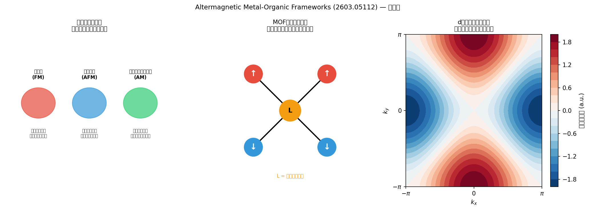
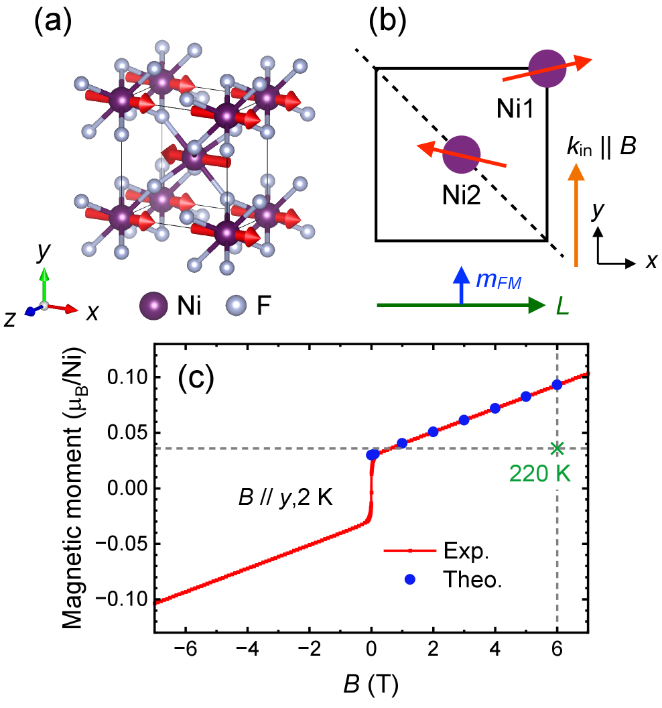
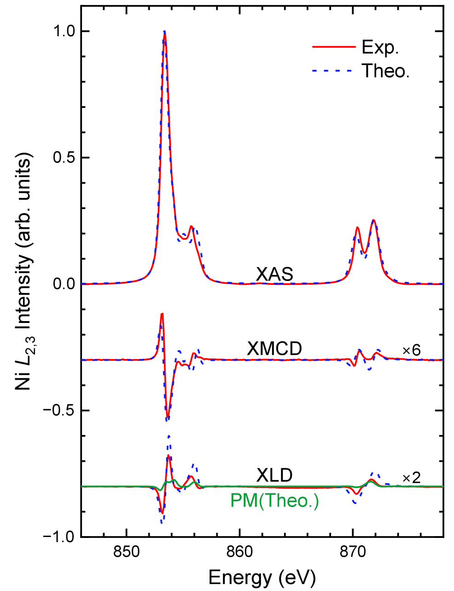
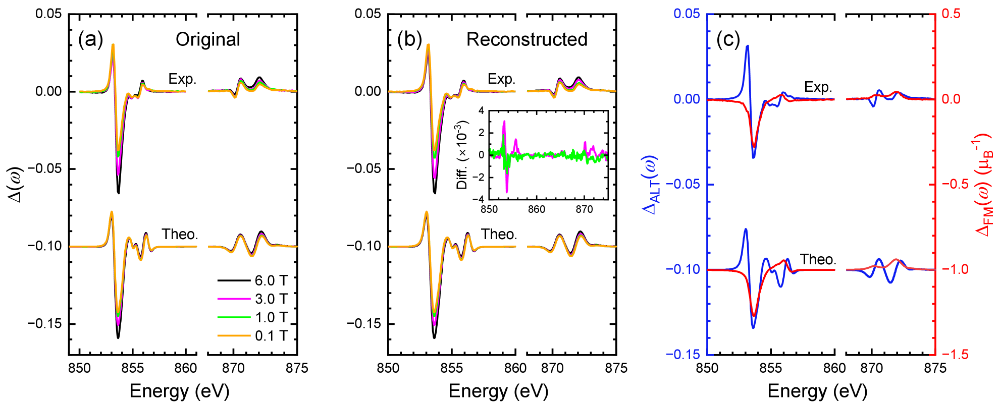
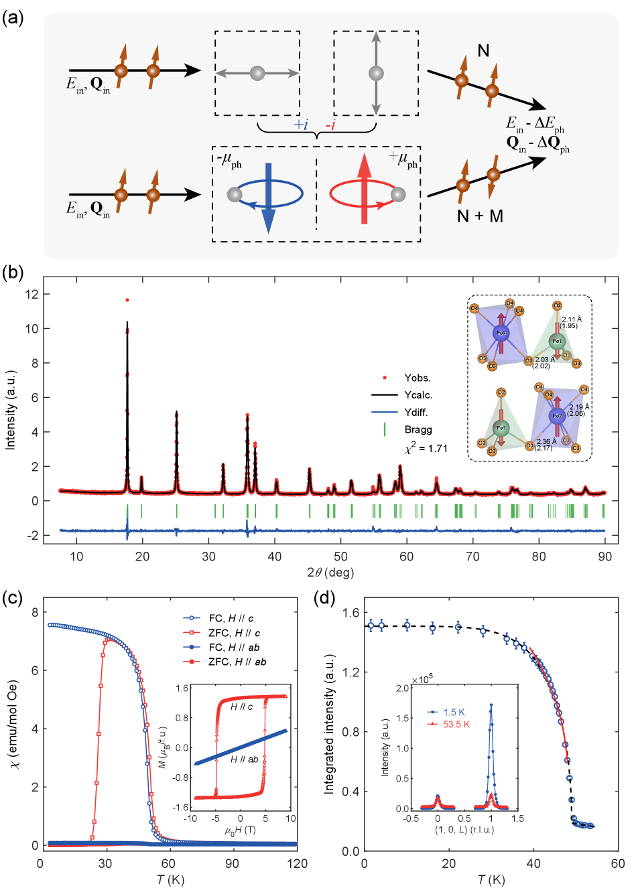
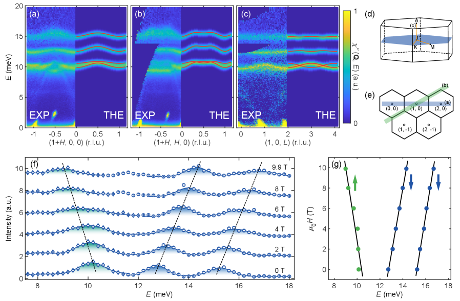
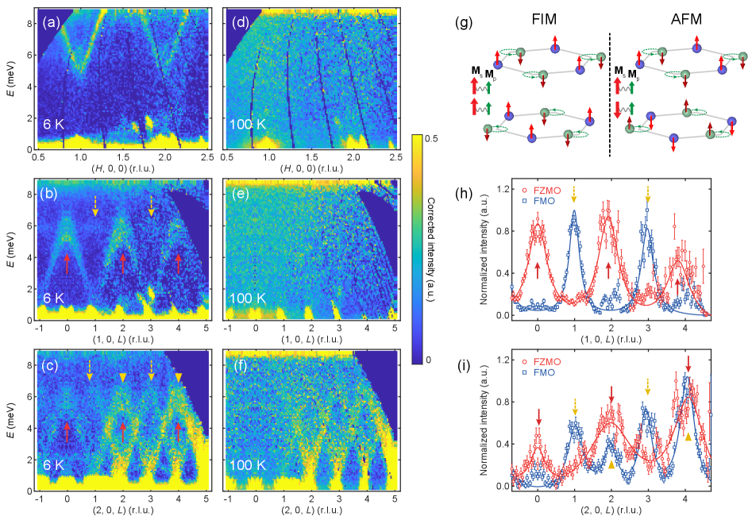

# arXiv 日次ダイジェスト

**作成日：** 2026年3月8日
**対象期間：** 直近72時間（2026年3月5〜7日公開論文を中心に）
**担当モデル：** Claude Sonnet 4.6

---

## 今日の選定方針と全体所見

本日の選定では、新興磁性秩序「オルタマグネティズム」に関する理論・実験の展開を軸としつつ、量子ビーム（中性子散乱・X線磁気円二色性）による物性プローブの最前線を重点的に取り上げた。オルタマグネティズムは2022年以降急速に注目を集めている概念であり、正味磁化ゼロながら異方的スピン分裂を持つ第三の磁性秩序として、スピントロニクス応用の可能性から理論・実験両面で研究が加速している。本日はこの分野でNiF₂のXMCD実験証拠という重要な実験論文と、金属有機構造体（MOF）という新たな材料プラットフォームへの展開を示すパースペクティブが同時に現れており、分野の成熟度が急速に高まっている印象を受ける。量子ビーム分野では、中性子散乱によるキラルフォノンの磁気シグネチャ検出という方法論的に重要な成果が *Physical Review Letters* のEditors' Suggestionとして掲載されており、フォノン角運動量研究の新展開を告げている。一方、低次元物質（CDW化合物、2D遷移金属ダイカルコゲナイド、ハーフファイラー型超電導体候補）の物性研究も複数報告されており、2D物質・トポロジカル物質の物性解明という長年の主軸が引き続き活発である。

**重点論文（詳細解説3本）：**
1. Altermagnetic Metal-Organic Frameworks — D. López-Alcalá et al. (arXiv:2603.05112)
2. X-ray magnetic circular dichroism evidence of intrinsic d-wave altermagnetism in NiF₂ — Z. Li et al. (arXiv:2603.03694)
3. Magnetic Signature of Chiral Phonons Revealed by Neutron Spectroscopy in Fe₁.₇₅Zn₀.₂₅Mo₃O₈ — S. Bao et al. (arXiv:2603.03635)

---

## 重点論文の詳細解説

---

### 論文①

**1. 論文情報**

| 項目 | 内容 |
|------|------|
| タイトル | Altermagnetic Metal-Organic Frameworks |
| 著者 | Diego López-Alcalá, Andrei Shumilin, José J. Baldoví |
| arXiv ID | 2603.05112 |
| カテゴリ | cond-mat.mtrl-sci, cond-mat.mes-hall |
| 公開日 | 2026年3月5日 |
| 論文タイプ | パースペクティブ論文 |

**2. どんな研究か**

本論文は、正味磁化ゼロにもかかわらず運動量依存のスピン分裂を示す新磁性秩序「オルタマグネティズム」を実現するプラットフォームとして、金属有機構造体（MOF）を提案するパースペクティブである。有機リンカーが担う格子幾何・次元性・電子構造の精密制御性が、無機結晶では困難なオルタマグネット設計を可能にすると論じており、スピントロニクス応用を見据えた理論的方向性を体系的に整理している。

**3. 位置づけと意義**

オルタマグネティズムは2022年のSmejkalらの理論整理以降急速に注目を集め、RuO₂やMnTe、NiF₂などの無機結晶での実験検証が相次いでいる。本論文はこの新磁性秩序をMOFという全く異なる材料系に展開する先駆的な視点を提供しており、MOFの網状化学（reticular chemistry）が持つ格子対称性の精密設計能力をオルタマグネット探索に活用できることを示す点で高い独創性を持つ。既存のMOF磁性研究（多くはAFM/FMに留まる）を越えて、スピン分裂を利用した新機能材料設計の指針として分野横断的なインパクトを持ちうる。

**4. 研究の概要**

- **背景・目的：** オルタマグネット（AM）は反強磁性的スピン補償を持ちながら、時間反転対称性と空間反転対称性の組み合わせの破れにより運動量依存のスピン分裂を示す。強磁性体のスピン分裂と反強磁性体の正味磁化ゼロを両立する「第三の磁性」として、スピンホール効果・異常ホール効果・超高速スピントロニクスへの応用が期待されている。本論文はMOFをAM実現の新舞台として位置づけることを目的とする。

- **研究アプローチ：** 理論的・概念的なパースペクティブ。MOFの構造設計論（reticular chemistry）に立脚し、格子幾何・金属中心・リンカー選択によりAMに必要な対称性条件（非等価な副格子サイトを持つスピン補償構造）をいかに満たせるかを論じる。第一原理計算の活用可能性・実験的検証手段についても展望する。

- **対象材料系：** 金属有機構造体（MOF）全般。特定の実験試料は前提としていないが、既知のMOF磁性体を参照しながら設計原理を論じる。

- **主な手法：** 文献調査・対称性解析・概念設計。MOFの格子トポロジーとスピン副格子の関係を対称性の観点から整理し、d波・g波などの特定スピン分裂対称性クラスに対応するMOF候補の設計指針を提示。

- **主な結果：** MOFの有機リンカーが異なる副格子金属サイト間の非等価な「環境」を生成し、スピン補償と同時に時間反転と並進対称性の非自明な組み合わせを可能にすることを示す。リンカー設計・金属中心・トポロジーの変更により、スピン分裂の対称クラス（d波、g波等）を選択的に制御できる可能性を論じる。

- **著者の主張：** MOFはオルタマグネット設計のための「プログラマブルプラットフォーム」となりえる。reticular chemistryの組み合わせ的多様性を活用した系統的探索が、無機結晶では到達困難なオルタマグネット材料空間を開拓する。

- **関連研究：** Smejkal et al. (Phys. Rev. X 2022), Feng et al. (RuO₂ ARPES), NiF₂ XMCD実験（本号③参照）、MOF磁性体の先行研究。

**5. 対象分野として重要なポイント**

- **物性・現象：** オルタマグネティズム、スピン分裂、スピン依存バンド構造、異常ホール効果。
- **手法の意味と妥当性：** reticular chemistryによる格子設計はMOF固有の強みであり、無機固体よりも格子幾何の「プログラム性」が高い。ただし磁気異方性・交換相互作用の定量的制御が課題。
- **既存研究との差分：** 従来のMOF磁性研究は弱い磁性や従来型AFM/FMが主流。AMをMOFで実現する概念は本論文が先駆け。
- **新規性：** オルタマグネティズム + MOFという交差領域の開拓という点で高い新規性。材料系として完全に新しい。
- **物理的解釈：** スピン副格子の対称性が格子トポロジーによって制御されるという描像は明快であり、MOFの設計自由度がAMの多様な対称クラスに対応できると論じる。
- **波及可能性：** MOF系への拡張により、多孔質・柔軟・化学修飾可能なスピントロニクス材料の設計が開ける。
- **材料設計への貢献：** 直接的に材料設計指針を提示する論文であり、設計・合成両面で展開しやすい。

**6. 限界と注意点**

1. **パースペクティブ論文であり実験的検証なし：** 提案された設計原理が実際のMOF合成・実験で再現されるかは不明。MOFの磁気秩序温度は多くが室温以下であり、実用的なスピントロニクス応用には磁気転移温度の向上が必須課題。

2. **定量的議論の欠如：** スピン分裂のエネルギースケール・バンド構造の定量的予測が本論文では与えられておらず、どの程度の異方的スピン分裂が期待できるかの根拠が弱い。MOFでは軌道混成と交換相互作用の記述に精度の高い第一原理計算が必要で、現状では定性的提案に留まる。

3. **MOFの磁性材料としての課題：** MOFは一般に電気伝導性が低く、スピントロニクスデバイス（スピン輸送・スピン注入）との統合が困難。「ソフト磁性材料」としての機械的・熱的安定性も課題であり、デバイス応用への道のりは長い。

**7. 関連研究との比較・分野へのインパクト**

無機系オルタマグネット研究（RuO₂のARPES観測：Feng et al. 2022、MnTeのAHE：Gonzalez-Hernandez et al.等）と比較して、本論文はMOFという全く異なる材料系への展開を提案しており、材料探索空間の拡大という観点でincrementalではなくconceptualな貢献を持つ。競合研究として、同時期にd-wave altermagnetismのNiF₂実験が報告されており（本号②）、AM分野が急速に多方面展開していることを示す。スピントロニクス・MOF化学・磁性物理という3分野の研究者が引用しうるポジションにあり、特にMOF研究者がAMという新たな応用軸を発見する契機になりうる。将来的に、計算的スクリーニング（マテリアルズ・インフォマティクス）と組み合わせたMOF系AMの系統的探索論文へと発展する可能性が高い。

**図（概念図として生成）：**

*図1（概念図）：（左）磁性体の分類とオルタマグネティズムの位置づけ。強磁性（FM）・反強磁性（AFM）・オルタマグネット（AM）の特徴を示す。（中）MOF格子における反強磁性的スピン秩序の概念図。赤（スピン↑）と青（スピン↓）の金属中心を有機リンカー（L）が非等価に接続することで、格子対称性に基づくスピン分裂が生じる。（右）d波型スピン分裂のブリルアンゾーン表示。赤・青の領域がそれぞれup/downスピンの優勢な領域を示す。本論文の図が取得できなかったため概念図を生成した。*

---

### 論文②

**1. 論文情報**

| 項目 | 内容 |
|------|------|
| タイトル | X-ray magnetic circular dichroism evidence of intrinsic d-wave altermagnetism in NiF₂ |
| 著者 | Zezhong Li, Kosuke Sakurai, Yu-Fang Chiu, Dirk Backes, Dharmalingam Prabhakaran, Sang-Wook Cheong, Andrew Boothroyd, Ke-Jin Zhou, et al. (計16名) |
| arXiv ID | 2603.03694 |
| カテゴリ | cond-mat.str-el, cond-mat.mtrl-sci |
| 公開日 | 2026年3月4日 |
| 論文タイプ | 実験論文（量子ビーム：XMCD分光） |

**2. どんな研究か**

本研究は、ルタイル型反強磁性体NiF₂において、NiのL₂,₃吸収端でのX線磁気円二色性（XMCD）測定を行い、d波型オルタマグネティズムの固有の実験的証拠を初めて提示した。磁場依存・温度依存XMCDスペクトルの分解により、スピンキャンティングに起因する強磁性成分とオルタマグネット固有成分を独立に分離し、理論計算との定量的一致を示した。

**3. 位置づけと意義**

NiF₂はd波オルタマグネットの理論的予測が先行していた典型系であるが、XMCDによる直接実験証拠はこれまで欠如していた。本論文はオルタマグネット固有のXMCDシグネチャを実験的に確立した点で、分野の重要なマイルストーンとなる。RuO₂では角度分解光電子分光（ARPES）によるスピン分裂が観測されているが、磁気光学スペクトルによるオルタマグネット証拠としては先駆的な報告の一つである。今後NiF₂はオルタマグネット研究の「参照標準試料」としての地位を確立していく可能性がある。

**4. 研究の概要**

- **背景・目的：** NiF₂はルタイル型構造（空間群P4₂/mnm）を持ち、スピン配置の解析から計算によってd波型オルタマグネットと予測されていた。正味磁化ゼロの反強磁性秩序（T_N ≈ 73 K）を持ち、スピンキャンティングにより微弱な強磁性成分が共存する。XMCDはNiの3d電子の磁気状態を元素選択的・軌道選択的に検出できる量子ビーム手法であり、オルタマグネット固有の信号を実験的に分離できるかを検証することが本研究の目的。

- **研究アプローチ：** NiのL₂,₃端でのXAS（X線吸収スペクトル）とXMCDを2 K〜220 Kの温度範囲、0〜6 Tの磁場下で系統的に測定。二つの独立なアプローチ（磁場依存スペクトルの低温分解、ネール温度以上での常磁性成分抽出）でFM成分を分離し、残差としてAM固有信号を同定する。第一原理計算（DFT+U）との定量比較により物理的帰属を確認。

- **対象材料系：** NiF₂単結晶（ルタイル型、空間群P4₂/mnm）。[110]面単結晶を使用し、ラウエ回折で方位確認済み。

- **主な手法：** XMCD（NiのL₂,₃端）、X線吸収分光（XAS）、X線線二色性（XLD）、DFT+U計算、磁化測定。

- **主な結果：** (1) 2 K、0.1 T下でNi L₂,₃端に有意なXMCDシグナルを検出。(2) 磁場依存測定によりFM（スピンキャンティング）成分を分離した結果、残余シグナルがDFT計算によるAMオルタマグネット固有スペクトルと優れた一致を示す。(3) T_N以上での測定でも独立した検証を行い、一貫した結果を得る。(4) スペクトル分解により、AM成分の軌道磁気モーメントへの寄与を定量化。

- **著者の主張：** NiF₂のXMCDシグナルが反強磁性スピンキャンティングのみでは説明できず、d波オルタマグネティズムに起因するXMCD固有成分を実験的に確立した。

- **関連研究：** Smejkal et al. (NiF₂ theory, 2022), RuO₂ ARPES (Feng et al., 2022), MnTe AHE実験。

**5. 対象分野として重要なポイント**

- **物性・現象：** d波オルタマグネティズム、XMCD、異常磁気光学効果、スピン軌道結合、弱強磁性（スピンキャンティング）。
- **手法の意味と妥当性：** XMCDはNi元素の3d電子に選択的で感度が高く、しかも軌道・スピン磁気モーメントをsum-ruleで定量化できる。AM固有成分をFM成分から分離するための2つの独立アプローチは方法論的に信頼性が高い。
- **既存研究との差分：** RuO₂のARPES証拠とは異なり、磁気光学（XMCD）によるAM検出手法を新たに確立。NiF₂に焦点を当てた最初の定量的XMCD実験。
- **新規性：** オルタマグネット固有XMCDシグネチャの最初の実験的確立。
- **物理的解釈：** AM固有XMCDシグナルはスピン副格子間の非等価な時間反転関係に起因し、正味磁化がゼロでも磁気光学応答を持つことを実証。
- **波及可能性：** XMCD手法がAM同定の標準ツールとなる道を開く。他のルタイル型・ペロブスカイト型AM候補への展開が期待される。
- **物性解釈への貢献：** AM固有の軌道磁気モーメントの大きさを定量化し、スピントロニクス応用に向けた基礎物性理解を深める。

**6. 限界と注意点**

1. **スペクトル分解の不確実性：** FM成分とAM成分の分離は2つの実験的アプローチの一致に基づいているが、両者に系統誤差が生じる可能性を完全には排除できない。特に、スピンキャンティング成分の磁場依存性の非線形性が分解に影響しうる。

2. **試料・測定条件の限定：** 単一の[110]配向単結晶のXMCDのみの報告であり、結晶方向依存性の系統的調査や他の測定手法（例：中性子散乱による磁気構造精密化）との組み合わせはまだ行われていない。

3. **DFT+U計算のパラメータ依存性：** 理論側のDFT+U計算はHubbardUパラメータの選択に依存しており、XMCDスペクトルとの定量的一致がU値の最適化によって得られている可能性に注意が必要。AM固有成分の「正確な大きさ」の解釈には留保が必要。

**7. 関連研究との比較・分野へのインパクト**

先行するRuO₂のARPES実験（Feng et al. 2022, Nature 624）がAM研究のランドマークだとすれば、本論文はXMCDという別の量子ビーム手法でAMを確立したという点で相補的かつ重要な位置を占める。XMCDはシンクロトロン光源で広く利用可能であり、RL手法の1つとして多くの磁性材料でルーチン化されていることから、今後多くの実験室・ビームラインでAM探索に活用される可能性が高い。新規性はincrementalと見ることもできるが（NiF₂のAM理論は既知）、実験的確立として重要な貢献。15ページ・12図の充実した論文で再現性・精密性が高く評価されうる。同時期の論文①（MOF-AM提案）と合わせて読むと、AM研究が材料系と手法の両面で急速に多様化していることが分かる。

**図：**

*図1: NiF₂のルタイル構造と磁気構造（スピン方向の模式図）、XMCD測定の実験配置、および磁化の磁場依存性。オルタマグネット副格子の非等価な幾何的環境が示されている。d波型スピン分裂の起源となる結晶対称性の可視化として中心的な図。*

*図2: 2 K、0.1 T下で測定されたNi L₂,₃吸収端のXAS（上）、XMCD（中）、XLD（下）スペクトル。実験値と第一原理計算の比較を示す。実験と計算の高い一致がXMCDシグナルのオルタマグネット帰属の根拠となる。*

*図3: 0〜6 Tの磁場下で測定したNi L₂,₃端XMCDスペクトル。磁場依存性からスピンキャンティング由来のFM成分を差し引いた結果、AM固有シグネチャが残ることを示す。FM成分とAM成分の分離の中核をなす最も重要な実験データ。*

---

### 論文③

**1. 論文情報**

| 項目 | 内容 |
|------|------|
| タイトル | Magnetic Signature of Chiral Phonons Revealed by Neutron Spectroscopy in Ferrimagnetic Fe₁.₇₅Zn₀.₂₅Mo₃O₈ |
| 著者 | Song Bao, Junbo Liao, Zhentao Huang, Yanyan Shangguan, Zhen Ma, Bo Zhang, Shufan Cheng, Hao Xu, Zihang Song, Shuai Dong, Maofeng Wu, Ryoichi Kajimoto, Mitsutaka Nakamura, Tom Fennell, Dmitry Khalyavin, Jinsheng Wen |
| arXiv ID | 2603.03635 |
| カテゴリ | cond-mat.str-el, cond-mat.mtrl-sci |
| 公開日 | 2026年3月4日 |
| 論文タイプ | 実験論文（量子ビーム：中性子非弾性散乱）；*Physical Review Letters* 136, 096502 (2026) 掲載・Editors' Suggestion |

**2. どんな研究か**

本研究は、反転対称性または時間反転対称性の破れた系において格子振動（フォノン）が角運動量と磁気モーメントを運びうる「キラルフォノン」の磁気的シグネチャを、中性子分光法によって実験的に解明した。強磁性体Fe₁.₇₅Zn₀.₂₅Mo₃O₈において、磁気転移温度（T_c ≈ 49 K）以下で増強された磁気散乱・モード分裂・磁場依存シフトを観測し、これらがフォノンの角運動量がスピン角運動量に結合することで生じることを実証した。中性子散乱がキラルフォノンの磁気特性を直接プローブできる手法であることを確立した点で方法論的意義が大きい。

**3. 位置づけと意義**

キラルフォノンは近年、赤外・ラマン分光や超高速実験で間接的に示唆されてきたが、中性子分光による直接的な磁気シグネチャの観測は本論文が初めての包括的実証例である。フォノン角運動量研究はキャリア輸送・熱輸送・スピン－フォノン結合・トポロジカルフォノンなど多分野に波及する基礎概念であり、中性子散乱という定量的・運動量分解能の高い手法での観測は信頼性が高い。本論文がPRL Editors' Suggestionとして採択されたことも、分野の重要度を裏付けている。

**4. 研究の概要**

- **背景・目的：** 格子振動は通常電気的に中性であるが、破れた対称性のもとでは個々のフォノンモードが角運動量（フォノン角運動量）を持ちうる。このような「キラルフォノン」は磁気的なサブシステムと結合し、スピン－フォノン相互作用を通じて磁気散乱に現れる。強磁性体Fe₂Mo₃O₈（CoO₃四面体とFeO₆八面体が交互に積層したハニカム状構造）にZnドーパントを加えたFe₁.₇₅Zn₀.₂₅Mo₃O₈を対象とし、磁気秩序の発現がフォノンの磁気特性に与える影響を中性子非弾性散乱で追跡する。

- **研究アプローチ：** 粉末中性子非弾性散乱（INS）を高対称方向に沿って測定し、磁気転移温度の前後でフォノン散乱強度・分散・線幅の変化を追跡。磁場印加下での測定によりスピン-フォノン結合の定量評価を行う。スピン波（マグノン）計算との比較により磁気・格子自由度を区別する。

- **対象材料系：** Fe₁.₇₅Zn₀.₂₅Mo₃O₈。親化合物Fe₂Mo₃O₈は時間反転対称性の破れた反強磁性体であるが、Znドープにより強磁性秩序が安定化される（T_c ≈ 49 K）。六方晶構造（空間群P6₃mc）で空間反転対称性が自然に破れている。

- **主な手法：** 粉末・単結晶中性子非弾性散乱（英国ISIS、J-PARC等のビームライン）、スピン波計算、フォノン第一原理計算（DFT）、磁化測定、粉末X線回折（Rietveld精密化）。

- **主な結果：** (1) T_c以下で特定のフォノンブランチに増強された磁気散乱強度を観測。(2) 磁気転移に伴うモード分裂（縮退解消）が同一波数ベクトルで観測される。(3) 外部磁場印加でフォノンモードの周波数シフトが生じ、これがスピン角運動量とフォノン角運動量の結合によって定量的に説明される。(4) T_c以上ではこれら全ての特徴が消失し、磁気秩序との直接関係が確立される。(5) 親化合物（ZnドープなしのAFM）との比較測定により、強磁性秩序の存在が本効果の出現に必要な対称性条件を満たすことを明確化。

- **著者の主張：** 中性子分光法がキラルフォノンの磁気シグネチャを直接プローブする有効な手法であることを実証し、フォノン角運動量とスピン角運動量の結合のメカニズムを明確にした。

- **関連研究：** キラルフォノン理論（Zhang & Niu, PRL 2015）、Fe₂Mo₃O₈の磁性（Wang et al. PRL 2020）、ラマン分光によるキラルフォノン（Zhu et al. PNAS 2018）、超高速実験によるフォノン磁気モーメント。

**5. 対象分野として重要なポイント**

- **物性・現象：** キラルフォノン、フォノン角運動量、スピン－フォノン結合、強磁性フォノン分裂。
- **手法の意味と妥当性：** 中性子非弾性散乱は運動量分解能・エネルギー分解能ともに高く、磁気散乱と格子散乱を偏極解析で分離できる。本論文は偏極中性子を用いた詳細な区別を行っており、シグナルの帰属が信頼できる。
- **既存研究との差分：** ラマン・赤外ではゾーン中心フォノンしかアクセスできないが、INSは全ブリルアンゾーンにわたってフォノン分散を測定できる。これがキラルフォノンの運動量依存磁気特性の解明に決定的に重要。
- **新規性：** 中性子散乱によるキラルフォノン磁気シグネチャの包括的実証として新規。PRL Editors' Suggestionは分野認知の証拠。
- **物理的解釈：** スピン-フォノン結合の大きさの定量的見積もりが得られており、ハミルトニアン的理解につながる。
- **波及可能性：** フォノン角運動量は熱スピントロニクス（スピンゼーベック効果への格子寄与）、トポロジカルフォノン、マグノン-フォノン結合など多くの分野に関連。六方晶・極性結晶全般に展開可能な概念。
- **材料設計・物性解釈への貢献：** フォノン角運動量の制御がスピン輸送・磁化ダイナミクスの新しいハンドルになりうることを示す。

**6. 限界と注意点**

1. **材料系の特殊性：** Fe₁.₇₅Zn₀.₂₅Mo₃O₈という特定組成・Znドーピング量での報告であり、Znドーピングが磁気秩序や格子動力学に与える副次的効果が完全には切り分けられていない可能性がある。親化合物との比較は行っているが、ドーピング系列での系統的研究はなされていない。

2. **理論との定量的対応：** スピン波計算と第一原理フォノン計算は別々に行われており、スピン-フォノン結合を自己矛盾なく記述する統合的ハミルトニアンモデルは本論文では完全には構築されていない。実験的に観測されたモード分裂量・磁場シフト係数の第一原理計算による定量的再現性についてはさらなる検証が必要。

3. **室温以下のみの観測：** 強磁性転移温度（T_c ≈ 49 K）が低く、本効果は低温に限定される。室温動作を目指す応用（熱スピントロニクスへの転用等）にはより高いT_cを持つ材料での同様の観測が必要であり、その一般性はまだ確認されていない。

**7. 関連研究との比較・分野へのインパクト**

キラルフォノン研究はZhu et al. (2018, PNAS) によるトポロジカル絶縁体でのラマン観測を重要な先例とするが、中性子散乱による全ブリルアンゾーン観測・定量的磁気シグナル測定という点で本論文は方法論的に前進している。競合研究としてDai et al.グループや他の中性子散乱グループが磁性フォノン研究を進めているが、強磁性体でのキラルフォノン磁気シグネチャの直接実証という点では先駆的。この成果はフォノンエンジニアリング（特定のフォノンモードへの磁場・歪み印加による制御）への展望を開き、中性子ビームラインでの系統的研究展開が期待される。PRL掲載・Editors' Suggestionということもあり、中性子散乱コミュニティ・物性物理コミュニティ双方で引用されやすく、インパクトは高い。

**図：**

*図1: Fe₁.₇₅Zn₀.₂₅Mo₃O₈の室温での粉末X線回折Rietveld精密化、強磁性磁気構造（スピン方向）、磁化率の温度依存性（磁気転移T_c ≈ 49 K）、磁気ブラッグピーク強度の温度依存性。試料の結晶学的・磁気的特性化の基礎データ。中性子測定の解釈の前提となる。*

*図2: 6 Kでの高対称方向に沿った非弾性中性子散乱スペクトルとスピン波計算との比較。磁場依存エネルギースキャンとモードの磁場シフトを示す。フォノンとマグノンの識別、およびキラルフォノン-スピン結合の直接的証拠が含まれる。本論文の中核をなすデータ。*

*図3: 6 Kと100 KでのフォノンスペクトルとDFT計算の比較、ならびに強磁性/反強磁性状態でのフォノン磁気モーメントとスピンの結合機構を説明する概念図。磁気転移に伴うフォノンモード変化と定数Q切断の比較が示され、キラルフォノン効果の温度依存性と磁気秩序との直接対応が明確に示されている。*

---

## その他の重要論文

---

### 論文④

**論文情報**

| 項目 | 内容 |
|------|------|
| タイトル | Thermodynamics of the ultrafast phase transition of vanadium dioxide |
| 著者 | Shreya Bagchi, Ernest Pastor, José Santiso, Allan S. Johnson, Simon E. Wall |
| arXiv ID | 2603.04600 |
| カテゴリ | cond-mat.str-el, cond-mat.stat-mech, physics.optics |
| 公開日 | 2026年3月4日 |
| 論文タイプ | 実験論文（超高速ポンプ-プローブ分光） |

**研究概要**

二酸化バナジウム（VO₂）の光誘起金属絶縁体転移（MIT）は、強相関電子系の超高速ダイナミクスの典型例として長年議論されてきた。MITが「コヒーレントなフォノン励起」により駆動されるのか、それとも「熱的フォノン集団の占有」が必要なのかという問いは未解決のままだった。本研究は温度依存の超高速ポンプ-プローブ測定に基づく熱力学フレームワークを構築し、VO₂の超高速MITには「高周波の酸素フォノンモードを含むフル熱フォノンスペクトルの占有」が必要であることを明確にした。

この成果は、VO₂のMITがコヒーレントフォノン（特定の構造変位モード）によって直接駆動されるというモデルを否定し、熱的フォノン集団の蓄積によって金属相が安定化されるという描像を支持する。VO₂は光スイッチング・相変化メモリ素子などへの応用が期待される材料であり、その相転移メカニズムの正確な理解は材料設計・デバイス応用の指針として重要。また本研究が提案する熱力学的解析手法は他の光誘起相転移系（強誘電体・CDW系・スピン系など）にも適用可能な一般的な枠組みを提供する。

---

### 論文⑤

**論文情報**

| 項目 | 内容 |
|------|------|
| タイトル | Lattice dynamics of the charge density wave compounds TaTe₄ and NbTe₄ and their evolution across solid solutions |
| 著者 | D. Silvera-Vega, G. Cardenas-Chirivi, J. A. Galvis, A. C. García-Castro, P. Giraldo-Gallo |
| arXiv ID | 2603.05257 |
| カテゴリ | cond-mat.mtrl-sci |
| 公開日 | 2026年3月5日 |
| 論文タイプ | 実験・計算論文 |

**研究概要**

TaTe₄とNbTe₄は電荷密度波（CDW）を示す擬一次元導体であり、三量化（trimerization）を伴う構造相転移が特徴的である。本研究は第一原理計算と分光実験を組み合わせ、TaTe₄とNbTe₄の格子動力学および (Ta,Nb)Te₄ 固溶体全組成域での格子振動の進化を追跡した。第一原理計算はCDW相に関連する三量化に対応したフォノン不安定性を予測し、実験的な振動特性と定量的に一致した。固溶体において多くのフォノンモードは組成と共に連続的に変化するが、最高周波数モードのみが特異な振る舞い（周波数は親化合物に近いまま、スペクトル強度が組成で再分配）を示した。

この特異なフォノンモードの振る舞いは、このモードがCDW関連構造変位に直接関与していることを示唆し、擬一次元CDW系における構造-電子相互作用の理解に新たな視点を提供する。固溶体を介して格子動力学を制御するアプローチは、CDWの転移温度や秩序パラメータを連続的にチューニングするための材料設計指針として有用であり、CDW系の基礎研究・応用研究双方に貢献しうる。

---

### 論文⑥

**論文情報**

| 項目 | 内容 |
|------|------|
| タイトル | Epitaxial Growth and Electronic Properties of QuasiFreeStanding Rhombohedral WSe₂ Bilayers on Cubic W110 |
| 著者 | Niels Chapuis, Meryem Bouaziz, Eva Desgue, Iann Gerber, François Bertarn, Pierre Legagneux, Fabrice Oehler, Julien Chaste, Abdelkarim Ouerghi |
| arXiv ID | 2603.05199 |
| カテゴリ | cond-mat.mtrl-sci |
| 公開日 | 2026年3月5日 |
| 論文タイプ | 実験論文 |

**研究概要**

菱面体（rhombohedral）積層WSe₂二層膜は、強誘電的分極の切り替えが可能なファンデルワールス強誘電体候補として、近年急速に注目されている。本研究は分子線エピタキシー（MBE）により立方晶タングステン基板の[110]面上にrhombohedral WSe₂二層膜を合成することに成功した。セレン終端による基板パッシベーションが準ファンデルワールスエピタキシーを可能にし、界面ボンディングを抑制してWSe₂二層の固有の電子構造を保つことを示した。ラマン分光・ARPES・DFT計算により、間接バンドギャップ電子構造とK点での約520 meVのスピン軌道分裂を確認した。

rhombohedral WSe₂二層膜の高品質なエピタキシャル合成は、2D強誘電体・強誘電的スイッチング・スピン軌道エンジニアリングという複数の研究方向を統合するプラットフォームを提供する。従来の機械的剥離・転写法に依存していた試料作製を、エピタキシー技術による大面積成膜へと展開できることが示されており、デバイス応用（不揮発性メモリ、スピン電界効果トランジスタ）に向けたプロセス整合性の観点でも重要な進展である。

---

### 論文⑦

**論文情報**

| 項目 | 内容 |
|------|------|
| タイトル | Systematic study of superconductivity in few-layer Td-MoTe₂ |
| 著者 | Taro Wakamura, Masayuki Hashisaka, Yusuke Nomura, Matthieu Bard, Shota Okazaki, Takao Sasagawa, Takashi Taniguchi, Kenji Watanabe, Koji Muraki, Norio Kumada |
| arXiv ID | 2603.04978 |
| カテゴリ | cond-mat.mes-hall, cond-mat.mtrl-sci, cond-mat.supr-con |
| 公開日 | 2026年3月5日 |
| 論文タイプ | 実験・計算論文 |

**研究概要**

Td相MoTe₂は非中心対称トポロジカル半金属（ワイル半金属相）と超電導を兼ね備えたトポロジカル超電導体候補として、近年精力的に研究されている。本研究は層数・基板・結晶品質・キャリア密度・キャリア種・移動度など多くの変数を系統的に変化させた複数試料を用いて、少数層Td-MoTe₂の超電導特性を包括的に調査した。特に2層試料において先行研究で未踏の高正孔ドーピング領域での超電導を初めて観測し、第一原理バンド計算との比較から、s₊₊波フォノン媒介ペアリングと整合する知見を得た。

少数層Td-MoTe₂の超電導がフォノン媒介・通常s波ペアリングであるという知見は、トポロジカル超電導としての期待と一見矛盾するが、より精密な材料設計（ゲート電圧・圧力・歪みによるバンド構造制御）によって非常規ペアリング相を探索する方向性を示す。また系統的な「変数分離」アプローチは、2D超電導研究における試料依存性・再現性の議論に方法論的な貢献をしており、今後の2D物質超電導研究の参照軸となりうる。

---

### 論文⑧

**論文情報**

| 項目 | 内容 |
|------|------|
| タイトル | Domain-Direct Band Gaps: Classification and Material Realization |
| 著者 | Yalan Wei, Hairui Ding, Shifang Li, Yuke Song, Chi Ren, Xiao Dong, Chaoyu He |
| arXiv ID | 2603.05103 |
| カテゴリ | cond-mat.mtrl-sci, cond-mat.other |
| 公開日 | 2026年3月5日 |
| 論文タイプ | 理論・計算論文 |

**研究概要**

半導体の直接バンドギャップの従来分類は、ブリルアンゾーン内の点的な極値（例：Γ点、K点）に基づいている。本研究は「ドメイン直接バンドギャップ（domain-direct band gap）」という新概念を導入し、伝導帯極小（CBM）と価電子帯極大（VBM）がブリルアンゾーン中の拡張した多様体（extended manifold）を形成する場合を分類した。ねじれたダイヤモンド（twisted diamond）において3.264 eVのドメイン直接バンドギャップを第一原理計算で予測し、2次元的なほぼ平坦なバンド多様体と異方的キャリアダイナミクスを示した。

この新しいバンドギャップ概念は、光電変換・発光デバイスの設計において従来分類では捉えられなかった光学応答の異方性・偏光依存性などの新しい機能性を予測・設計するための枠組みを提供する。ねじれたダイヤモンドは近年注目されるモアレ系・ツイスト系材料の文脈とも関連し、炭素系材料の多彩な電子状態の系統的理解に貢献する。マテリアルズ・インフォマティクスの観点では、ドメイン直接バンドギャップを記述子として用いた材料スクリーニングへの発展が期待される。

---

### 論文⑨

**論文情報**

| 項目 | 内容 |
|------|------|
| タイトル | Giant Magnetocrystalline Anisotropy in Honeycomb Iridate NiIrO₃ with Large Coercive Field Exceeding 17 T |
| 著者 | Chuanhui Zhu, Pengfei Tan, Xiao-Sheng Ni, Jingchun Gao, Yuting Chang, Mei-Huan Zhao, Zheng Deng, Shuang Zhao, Tao Xia, Jinjin Yang, Changqing Jin, Junfeng Wang, Chengliang Lu, Yisheng Chai, Dao-Xin Yao, Man-Rong Li |
| arXiv ID | 2603.04491 |
| カテゴリ | cond-mat.str-el, cond-mat.mtrl-sci |
| 公開日 | 2026年3月4日 |
| 論文タイプ | 実験・計算論文 |

**研究概要**

ハニカム型イリジウム酸化物NiIrO₃は3d-5d磁気層が統合された新規合成化合物であり、213 K以下でフェリ磁性秩序を示す。本研究は磁化・比熱・中性子回折測定を組み合わせ、磁気結晶異方性エネルギー（MAE）が32.2 meV/f.u.という巨大な値を持つこと、および4.2 K以下では17.3 Tを超える保磁力（コーシービフィールド）を示すことを報告した。第一原理計算により、イリジウムのJ_eff = 1/2 スピン軌道結合状態と3d-5d結合ハニカム格子の幾何的フラストレーションが協同してこの巨大異方性の起源であることを示した。

17 T超という巨大な保磁力を持つ材料は、高温超電導マグネットを用いた測定を必要とする稀な例であり、硬磁性材料・永久磁石の観点からは記録的な値である。3d-5d混合ハニカム系は強いスピン軌道結合と幾何的フラストレーションが交差する場として、キタエフ量子スピン液体状態の探索でも注目されており、NiIrO₃は磁気的に秩序した状態での極端な異方性という側面から強相関・スピン軌道物理のプラットフォームとして価値がある。永久磁石材料の設計指針・希土類フリー硬磁性材料の開発という応用面での波及も期待される。

---

### 論文⑩

**論文情報**

| 項目 | 内容 |
|------|------|
| タイトル | A Geometry-Adaptive Deep Variational Framework for Phase Discovery in the Landau-Brazovskii Model |
| 著者 | Yuchen Xie, Jianyuan Yin, Lei Zhang |
| arXiv ID | 2603.05161 |
| カテゴリ | cond-mat.mtrl-sci, cs.LG |
| 公開日 | 2026年3月5日 |
| 論文タイプ | 計算・機械学習論文 |

**研究概要**

パターン形成系（ブロック共重合体・液晶・合金の規則化相など）における秩序構造の発見は、Landau-Brazovskii（LB）モデルを代表とする自由エネルギー汎関数の数値的解探索として定式化されるが、数値ソルバーが仮定する計算ドメインサイズへの感度が高く、局所極小に陥りやすいという根本的な困難があった。本研究は「GeoDVF」と呼ぶ幾何適応型深層変分フレームワークを提案し、秩序パラメータ（ニューラルネットワークで表現）と計算ドメイン幾何パラメータを同時に最適化することで、事前知識なしに複雑な三次元秩序相（ジャイロイド・ラメラ・シリンダーなど）を自動発見できることを実証した。

材料インフォマティクスの観点では、本手法は計算コスト問題と解の局所極小問題を同時に緩和する方法論的前進であり、ブロック共重合体・液晶・合金規則化相のハイスループット相ダイアグラム計算への応用が期待される。ウォームアップペナルティ機構とトポロジカルに複雑な相のガイド付き初期化プロトコルは汎用的な設計であり、LBモデルを超えて他の自由エネルギー汎関数（Cahn-Hilliard・相場法）への適用も見通せる。深層学習による物理系の位相探索という方法論が成熟していく過程での重要な貢献である。

---

## 全体のまとめ

本日のダイジェストで最も印象深いのは、オルタマグネティズムという概念が急速に多様な材料系・手法に拡張されていることである。2022年の理論整理から4年を経ずして、NiF₂でのXMCDによる実験的確立（論文②）、そしてMOFという有機-無機複合材料系への理論的展開（論文①）が同時期に現れたことは、分野が実験的成熟フェーズと探索的拡張フェーズを並行して走っていることを示す。特にXMCDによるAM固有シグナルの分離手法が確立されたことで、今後多くのシンクロトロンビームラインでAM候補物質のルーチンスクリーニングが可能になると見込まれ、材料探索が加速するだろう。

量子ビーム分野では、中性子散乱によるキラルフォノンの磁気シグネチャ直接観測（論文③）が方法論的なブレークスルーとして際立っている。フォノン角運動量という概念はスピン熱電効果・スピンホール効果・磁気熱輸送など多くの物性現象に潜在的に関与しており、本研究が提示した中性子散乱プロトコルは今後の標準手法となる可能性がある。また強相関系では、VO₂の光誘起MIT（論文④）やNiIrO₃の巨大磁気結晶異方性（論文⑨）など、既知の材料系でも実験的精緻化が進んでいる様子が見られ、「よく知られた材料の未解決問題」が依然として重要な研究の場であることを確認できる。

計算・インフォマティクス分野では、ニューラルネットワークによる相探索（論文⑩）やドメイン直接バンドギャップという新分類概念（論文⑧）、2D超電導の系統的研究（論文⑦）など、方法論の深化と概念拡張が引き続き活発である。継続して注目すべきトピックとして、(1) オルタマグネット新材料の実験的スクリーニング加速、(2) キラルフォノンの他の磁性体系への展開、(3) rhombohedral積層2D材料の強誘電性・トポロジカル特性、(4) 少数層トポロジカル物質の超電導ペアリング対称性の決定、(5) 幾何適応型ML手法の相ダイアグラム計算への応用、を挙げる。

---

*本レポートは arXiv の公開情報および各論文のアブストラクト・本文に基づいて作成されました。*
