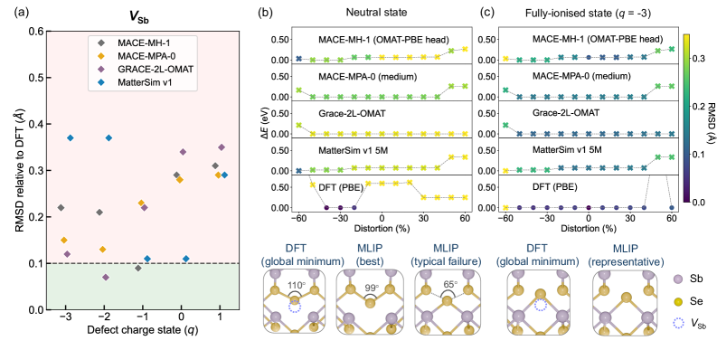
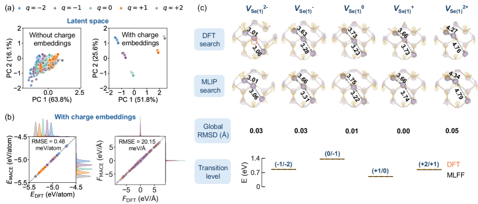
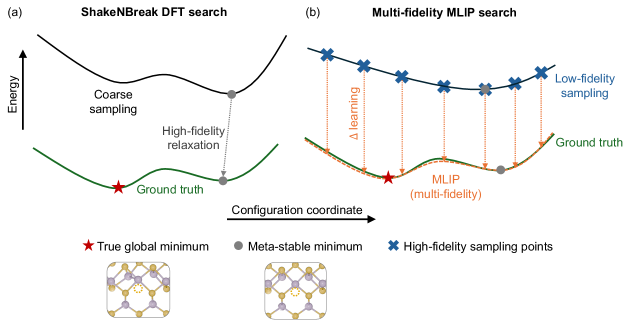
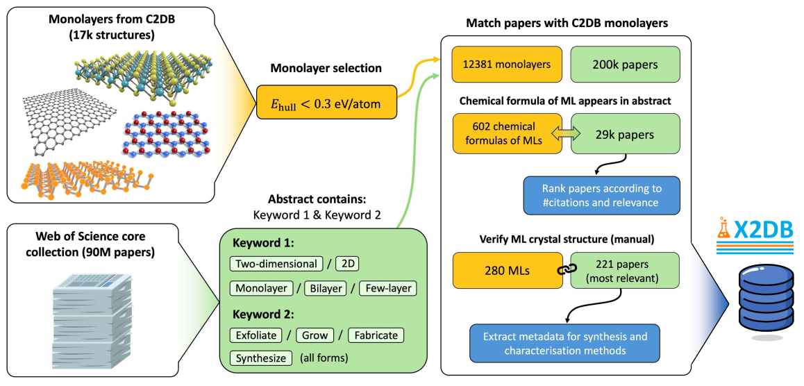
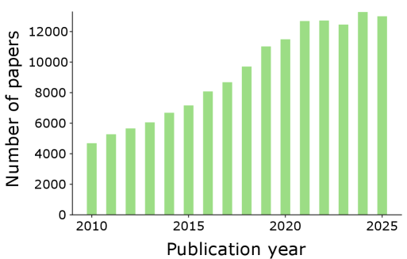
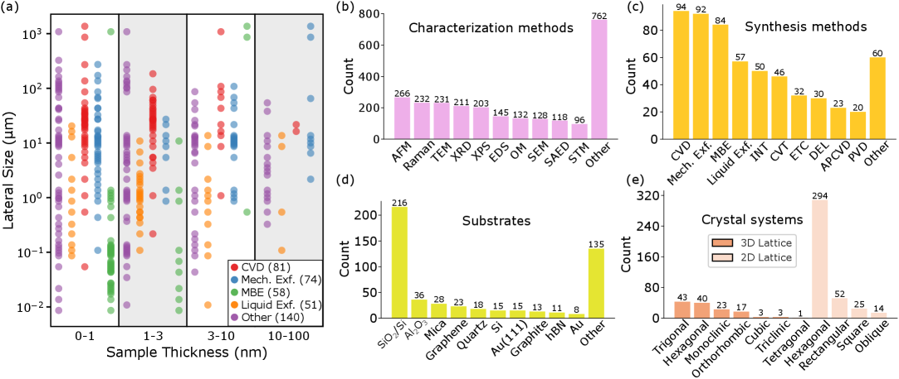
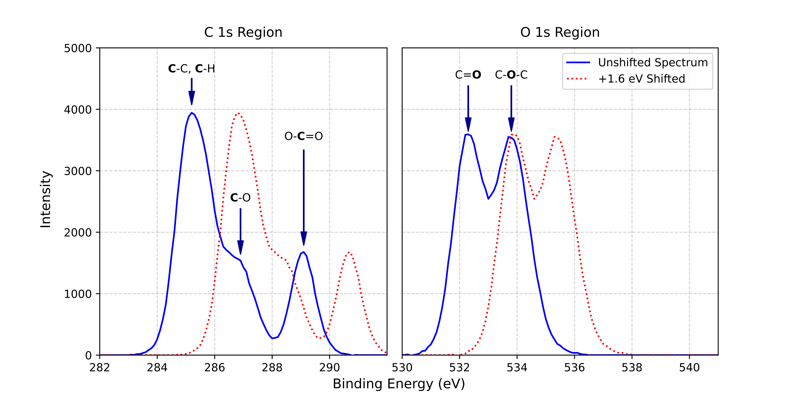
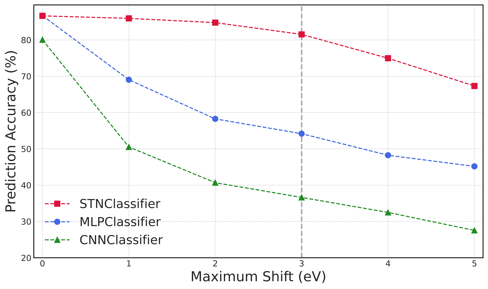
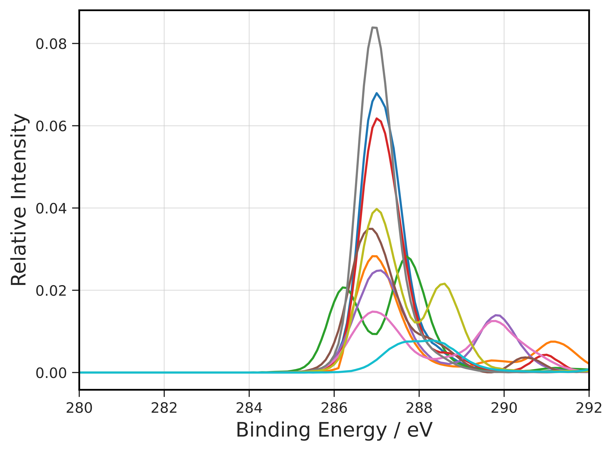

# arXiv 日次ダイジェスト
## 材料工学・物性物理・マテリアルズ・インフォマティクス

---

**作成日：** 2026年3月8日（日）
**対象期間：** 2026年3月5日〜6日（直近48時間）
**担当：** 自動ダイジェストシステム

---

## 今日の選定方針

本日は `cond-mat.mtrl-sci` を中心に直近48時間の新着論文を精査した。機械学習ポテンシャル（MLIP）・材料データベース・スペクトル解析AIという三つの独立したテーマで、材料インフォマティクスの現在地を横断的に把握できる構成とした。特に、点欠陥の電荷状態という従来のMLIPが苦手としてきた問題への正面突破（論文1）、2D材料の実験・計算統合データベースの構築（論文2）、XPS自動解析の平行移動不変性問題の克服（論文3）はいずれも方法論的に堅実であり、今後の材料設計・計測支援AIの基盤になり得ると判断した。

## 全体所見

今週の新着論文群には、MLIPの限界を直接問い直す批判的論文が複数出現しており、基盤モデル（Foundation Model）への素朴な楽観論が修正されつつある兆候が見られる。本日選定した論文1はその典型例であり、「基盤MLIPは荷電欠陥の構造を記述できない」という明確な実証を示した上で、マルチフィデリティ＋グローバル電荷埋め込みという具体的な解決策を提示している。また、2D材料データベースX2DB（論文2）は実験・計算の整合性を担保した初の大規模統合リソースであり、今後のデータ駆動研究の礎となる可能性が高い。XPS自動解析（論文3）は高スループット計測時代に向けた実務的ツールとして完成度が高く、即座に応用展開が期待できる。

---

## 選定論文一覧

| # | タイトル | arXiv ID |
|---|---------|----------|
| 1 | Multi-fidelity Machine Learning Interatomic Potentials for Charged Point Defects | 2603.05238 |
| 2 | Large-scale Integration of Experimental and Computational Data for 2D Materials | 2603.05083 |
| 3 | A Shift-Invariant Deep Learning Framework for Automated Analysis of XPS Spectra | 2603.05350 |

---

---

# 論文1

## 1. 論文情報

- **タイトル：** Multi-fidelity Machine Learning Interatomic Potentials for Charged Point Defects
- **著者：** Xinwei Wang, Irea Mosquera-Lois, Aron Walsh
- **arXiv ID：** 2603.05238
- **カテゴリ：** cond-mat.mtrl-sci
- **公開日：** 2026年3月5日
- **論文タイプ：** 方法論提案（実証付き）

---

## 2. まず一言で

荷電点欠陥のMLIPは既存の基盤モデルでは根本的に機能しないことを実証した上で、グローバル電荷埋め込みとマルチフィデリティ学習を組み合わせた手法により、Sb₂Se₃の欠陥構造と荷電準位をDFT精度で予測することに成功した。計算コストを従来比1000分の1以下に削減しながら、グローバル最小値を正確に同定できることを示しており、欠陥工学のMLIPへの展開に向けた実践的な道筋を示した。

---

## 3. なぜ選んだか

機械学習ポテンシャルの材料設計への活用を考える際、半導体中の点欠陥は最も重要かつ困難なターゲットの一つである。キャリア輸送・再結合・ドーピング制御のいずれも欠陥の電荷状態に強く依存するが、現行の基盤MLIPはこの点を「未解決の弱点」として抱えている。本論文はこの問題を体系的に実証し、かつ解決策を提示した点で、材料インフォマティクスの実用化に向けた重要な一歩である。太陽電池材料 Sb₂Se₃ を対象としており、光電変換材料や電極材料の欠陥設計に直結する知見を含む。

---

## 4. 研究の概要

**背景・目的：** 半導体の機能特性（太陽電池効率、LEDの発光効率、電池の劣化など）は点欠陥の種類・濃度・電荷状態に支配される。正確な欠陥構造と荷電転位準位の予測にはHSE06のようなハイブリッド汎関数を用いたDFT計算が必要だが、計算コストが高く大規模な構造探索が困難である。MLIPによるコスト削減が期待されるが、バルク材料で学習した基盤モデルが欠陥系に通用するかは未検証であった。

**研究アプローチ：** MACE v0.3.14をベースに二段階の拡張を実施。①グローバル電荷埋め込み（total charge を学習可能なベクトルにマップし、原子種埋め込みに加算）、②PBE（大量・低コスト）とHSE06（少量・高精度）を同時に学習するマルチフィデリティ戦略。

**対象材料系：** Sb₂Se₃（薄膜太陽電池材料）中のアンチモン空孔（V_Sb）。5種類の電荷状態（q = 0〜-4）を対象。

**主な結果：** 4種類の基盤MLIPをテストしたところ、全モデルで構造偏差が0.2〜0.4 Å（許容値0.1 Åの2〜4倍）を示し信頼できる欠陥構造を与えなかった。提案手法では構造精度0.05 Å以下、荷電転位準位誤差〜0.01 eVを達成。マルチフィデリティモデルは通常のPBEのみ学習モデルが見逃した global minimum（エネルギー差0.02 eV）を発見した。

---

## 5. 対象分野として重要なポイント

**対象とする物性・現象：** 荷電点欠陥の安定構造、メタ安定構造のエネルギー順序、荷電転位準位（defect transition level）。

**使用した手法・記述子：** MACE GNN + 全電荷のグローバル埋め込み + マルチフィデリティ損失関数。記述子としては全電荷という「スカラー量」を学習可能なベクトルに射影している点が重要。局所的な電荷移動ではなく全系の電荷状態を入力とすることで、欠陥周辺の電子構造変化を間接的にモデル化している。

**既存研究との差分と新規性：** 荷電状態を陽に扱うMLIPはこれまでほとんど存在しなかった。Long-range ML correction（DFT-MLIP hybrid）は別途存在するが、本手法は構造最適化全体をMLIPで実施できる点で実用性が高い。マルチフィデリティ学習を欠陥系に適用した報告も新規。

**微視的機構との接続：** 電荷埋め込みがPCAで電荷状態ごとにクラスタリングされることを確認。MLIPが電荷状態に応じた異なる結合環境を学習していることが可視化されている。ただし「なぜその構造が安定か」の化学的解釈は本論文では深追いされていない。

**波及可能性：** ペロブスカイト太陽電池・酸化物薄膜・窒化物半導体など、荷電欠陥が物性支配する広範な材料系への応用が見込まれる。欠陥形成エンタルピーの高精度計算によるドーピング設計や、defect tolerance の材料スクリーニングへの活用も想定できる。

**材料設計・物性解釈・応用：** 主として材料設計（欠陥濃度・種類の最適化）と物性解釈（荷電転位準位の予測）に貢献する。デバイス応用のスコープは本論文では直接言及されていないが、太陽電池の開放電圧損失分析への接続は明らか。

---

## 6. 限界と注意点

**① データ生成コストと汎化性の未検証：** 本手法は欠陥構造の学習データを目的材料ごとに生成する必要があり、「基盤モデルを超える」代わりに「専用データ生成コスト」が発生する。異材料系への転移学習・zero-shot適用は未検証であり、汎用性の主張には留保が必要。

**② 電荷状態の陽的定義に依存：** グローバル電荷埋め込みは「電荷状態が既知」であることを前提とする。実際の材料では欠陥準位が複数重なり合い電荷状態の特定が自明でない場合が多く、電荷状態の動的変化（フォノン散乱による電子捕獲など）には対応していない。

**③ Sb₂Se₃単一材料での実証：** 方法論の汎用性を謳う一方で、実証はSb₂Se₃の一種類の欠陥（V_Sb）に限定されている。他の欠陥種（反位欠陥・置換・格子間）や他の材料系での性能は不明であり、再現性・一般化の確認が不可欠。

---

## 7. 私向け研究メモ

- **自分の研究への取り込み：** 酸化物・カルコゲナイドなど自身が扱う系の欠陥計算に応用を検討。特に電池電極材料や薄膜太陽電池での欠陥形成エンタルピーの高速評価ツールとして有用か。
- **学生に学ばせたい点：** マルチフィデリティ学習の設計思想（PBE大量＋HSE少量の同時学習）は教育的価値が高い。「精度とコストのトレードオフをデータ戦略で解決する」手法として紹介したい。
- **共同研究の種：** Walsh研究室とのMLIP設計共同研究の可能性。また、自分の研究グループで生成した欠陥DFTデータを使ったファインチューニングの試みも検討に値する。
- **追うべきキーワード：** charged defect MLIP, multi-fidelity MLIP, defect transition level ML, MACE charge embedding
- **引用候補：** ○（MLIPによる欠陥構造評価の方法論的参照として適切）
- **コード・データ公開：** MACE v0.3.14ベース。実装の一部はGitHubで公開されている可能性あり（要確認）。

---

## 8. 関連研究との比較・分野へのインパクト

本論文は基盤MLIPの限界を正面から論じた批判的論文として意義深い。MatterSim・GRACE・MACE-MPA といった最新基盤モデルが荷電欠陥で組織的に失敗することを示した実証データは、コミュニティの議論を促進する重要な結果である。先行研究では Mosquera-Lois ら自身が欠陥MLIPの必要性を論じてきており（Walsh group の系統的な仕事）、本論文はその延長線上にある。

競合・類似研究としては Guo et al.（2024, Nature Comm.）の Long-range correction 手法、Kaappa et al. の欠陥専用MLIP など小規模な試みがあるが、マルチフィデリティと電荷埋め込みを明示的に統合した実装は本論文が初。

新規性は **incremental〜breakthrough の中間**：完全に新しいアーキテクチャではないが、実際の半導体欠陥物理に対して機能することを初めて示した点でインパクトは大きい。欠陥物理・太陽電池材料・点欠陥シミュレーションのコミュニティに広く引用される潜在性がある。他の研究者による再現・応用は比較的容易（MACEがOSSであるため）。

今後の展開として、電荷状態の自動認識・格子欠陥のactive learning・欠陥基盤モデル（defect foundation model）構築への起点となり得る。

---

### 図1：基盤MLIPの荷電欠陥における失敗の実証

> **キャプション：** 4種類の基盤MLIP（MACE-MH-1, MACE-MPA-0, GRACE-2L-OMAT, MatterSim）によるSb₂Se₃中アンチモン空孔（V_Sb）の構造最適化結果。DFTリファレンスとのRMSD値が0.2〜0.4 Åに達し、欠陥構造の信頼できる同定に必要な0.1 Å閾値を大幅に超えている。基盤MLIPがバルク学習のドメインギャップにより荷電欠陥の力を正確に記述できないことを明示した主要実証図。

### 図2：電荷埋め込みのPCA可視化と精度評価

> **キャプション：** グローバル電荷埋め込みによる学習済みモデルの潜在空間。PCAにより電荷状態q=0〜-4のクラスタが明確に分離されており、MLIPが電荷状態に応じた異なる結合環境を学習していることを示す。右パネルのパリティプロットはエネルギー・力の予測精度を示し、DFT値との一致を確認している。

### 図3：マルチフィデリティ手法によるグローバル最小値の発見

> **キャプション：** 通常のPBEのみ学習モデル（単一フィデリティ）とHSE補正を組み込んだマルチフィデリティモデルの比較。PBEモデルが見逃したグローバル最小値（エネルギー差0.02 eV）をマルチフィデリティモデルが発見し、収束HSE06計算による確認でも一致。計算コストを3桁削減しながら高精度な欠陥構造探索を実現した核心的結果。

---

---

# 論文2

## 1. 論文情報

- **タイトル：** Large-scale Integration of Experimental and Computational Data for 2D Materials
- **著者：** Akhound, Boland, Sauer, et al.（75名以上、デンマーク工科大学CAMDほか14機関）
- **arXiv ID：** 2603.05083
- **カテゴリ：** cond-mat.mtrl-sci
- **公開日：** 2026年3月5日
- **論文タイプ：** データベース構築・方法論

---

## 2. まず一言で

X2DB（eXperimental 2D materials DataBase）として、実験的に実現された2D材料370種を体系的に収集し、既存の計算データベース（C2DB, BiDB, CrystalBank）と対応付けた初の大規模統合データベースを公開した。実験観測と計算予測の間のギャップを橋渡しするリソースとして、2D材料の実験的実現可能性の評価や合成プロセス最適化への貢献が期待される。

---

## 3. なぜ選んだか

2D材料研究は計算データベース（C2DBなど）の整備が先行してきたが、実験的に合成・確認された材料に関するデータは断片的なままであった。X2DBはこのギャップを埋める試みとして、実験データのキュレーション・計算データとの整合性確保・コミュニティドリブン拡張という三点で優れた設計を持つ。材料インフォマティクスの研究者にとって「実験実現可能性フィルタ」として機能するデータベースの整備は急務であり、本研究はその重要な一歩である。

---

## 4. 研究の概要

**背景・目的：** グラフェン発見以降、理論的に安定と予測される2D材料は数千種に上るが、実際に合成確認された材料数は不明であった。Materials Project・C2DBなどの計算データベースは充実する一方、実験結果は個別論文に散在しており体系的なアクセスが困難であった。X2DBはこの実験知識の体系化を目的として構築された。

**研究アプローチ：** Web of ScienceによるAI支援文献マイニング（約9000万論文から2D材料関連2万9千件を抽出、手動検証221件）と、コミュニティ投稿（ORCID認証）の2経路でデータを収集。収集データには結晶構造・合成法・基板・試料形態・計測手法・測定物性が含まれる。

**対象材料系：** 370種の実験実現2D材料（グラフェン・h-BN・TMD類・MXene前駆体など）。そのうち210種が計算データベースと高信頼で対応付けられた。

**主な結果：** 実現2D材料の59%が半導体・絶縁体、41%が金属として計算上予測。25%が磁性基底状態を持つと予測。合成法による試料特性の統計的差異（CVD大試料・MBE薄膜小試料）も定量化された。

---

## 5. 対象分野として重要なポイント

**対象とする物性・現象：** 2D材料の合成実現可能性・電子構造（バンドギャップ）・磁気秩序・試料形態。

**使用した手法・記述子：** 文献マイニング＋人手検証による半自動キュレーション。計算との対応付けには結晶構造照合（組成・空間群）を使用。

**既存研究との差分と新規性：** C2DB（計算のみ）・JARVIS（計算のみ）・Materials Cloud（一部実験含む）との差分として、「実験で合成確認された」という検証済みラベルを持つデータに特化している点が新規。実験・計算の両面を整合的に参照できる統合プラットフォームは初。

**微視的機構との接続：** 実験・計算の対応により、計算予測と実験観測の乖離が定量化できる。例えば理論的に予測された磁性が実験材料でどの程度確認されているか、バンドギャップ予測精度がどの程度かを系統的に評価できる。

**波及可能性：** 2D材料スクリーニングの「実験フィルタ」として機能。計算予測された新材料の実験的先行研究確認、実現材料の物性データ基盤、合成条件最適化のデータソースとして幅広く活用可能。

**材料設計・物性解釈・応用：** 材料設計（合成可能な探索空間の絞り込み）と物性解釈（実験値と計算値の比較）の両方に貢献。デバイス応用への接続は間接的だが、実現可能性フィルタとしての価値は高い。

---

## 6. 限界と注意点

**① データ品質の不均一性：** 文献マイニング由来のデータは報告形式がばらばらであり、計測条件・試料品質の標準化が不完全。同じ材料でも研究室や計測環境によって記録された物性値が大きく異なる可能性があり、データの均質性・信頼性には留意が必要。

**② 実験確認の定義の曖昧さ：** 「実験的に実現された」の基準が論文によって異なる（XRD確認のみ vs. TEM+EELS+Ramanの複合確認など）。単層実現か多層まで含むかも曖昧な場合があり、厳密なデータ品質保証の仕組みは現段階では限定的。

**③ 継続更新の持続可能性：** コミュニティドリブン拡張はORCID認証者が個別に登録する形であり、データ鮮度・网羅性の維持は参加者の善意に依存する。規模が拡大した際のキュレーション品質管理が課題として残る。

---

## 7. 私向け研究メモ

- **自分の研究への取り込み：** 自分が検討する2D材料候補の実験実現状況の確認、計算予測物性の実験値との比較、合成条件の参考データとして即座に活用可能。
- **学生に学ばせたい点：** 計算データベースと実験データの統合という設計思想。「計算で予測できる材料」と「実際に作れる材料」のギャップを意識させる教材として優れている。
- **共同研究の種：** X2DBへの2D酸化物や低次元ペロブスカイト関連データの投稿・貢献。データキュレーション方法論の共有。
- **追うべきキーワード：** X2DB, 2D materials database, experimental realization, synthesis-property relationship 2D
- **引用候補：** ○（2D材料を扱う論文での標準参照として頻繁に引用される見込み）
- **コード・データ：** データベースはオープンアクセス（CC BY-NC-SA 4.0）。詳細はarXiv論文中に記載のリンク参照。

---

## 8. 関連研究との比較・分野へのインパクト

C2DB（Haastrup et al., 2018/2020）、JARVIS（Choudhary et al.）、Materials Cloud（Talirz et al.）など先行する計算データベースとの明確な差別化点は「実験確認データの網羅的収集」にある。2D材料の実験データベースとしては小規模な試みがあったが（Cheon et al.の2D材料百科など）、本スケール（370材料・14機関の共著）の統合データベースは初めて。

競合としてはATLAS-2D（実験合成条件特化）があるが、計算物性との整合的統合はX2DBが先行している。分野の未解決問題である「どの計算予測材料が実際に作れるか」への答えを実データから導く基盤となる。

新規性は **incrementalよりやや高い（分野基盤整備型）**：手法自体は既存のデータベース設計の延長だが、実験・計算統合という長年の要請に初めて本格的に応えた点でコミュニティ的意義が大きい。2D材料科学全体（合成・計算・デバイス・スペクトロスコピー）から広く引用が見込まれる。今後この論文を起点に、実験実現可能性予測モデル・合成最適化AIの開発が加速する可能性がある。

---

### 図1：X2DBの概念図と階層的分類体系

> **キャプション：** X2DBのデータベース構造と情報フロー。文献マイニング・コミュニティ投稿の2経路から実験データを収集し、C2DB・BiDB・CrystalBankの計算データベースと対応付ける仕組みを示す概念図。結晶構造・合成法・試料形態・測定物性の各情報層が階層的に整理されており、実験と計算の整合的な比較が可能な設計となっている。

### 図2：実現2D材料の物性統計分布

> **キャプション：** X2DBに収録された370種の実験実現2D材料の電子的・磁気的特性の分布。半導体・絶縁体が59%、金属が41%を占め、25%が磁性基底状態を持つと計算上予測されることを示す統計サマリー。計算予測と実験実現材料の物性傾向が整合しているかを評価するための基礎データとして重要。

### 図3：合成法別の試料特性分布

> **キャプション：** 化学気相成長（CVD）と分子線エピタキシー（MBE）を代表合成法として、試料横方向サイズ・膜厚の統計分布を比較した図。CVDが大面積（10〜100 μm）・広い膜厚分布を示す一方、MBEは小面積（<1 μm）・薄膜に集中することが示されており、合成法と試料特性の統計的相関を定量化している。

---

---

# 論文3

## 1. 論文情報

- **タイトル：** A Shift-Invariant Deep Learning Framework for Automated Analysis of XPS Spectra
- **著者：** Issa Saddiq, Yuxin Fan, Robert G. Palgrave, Mark A. Isaacs, David Morgan, Keith T. Butler
- **arXiv ID：** 2603.05350
- **カテゴリ：** cond-mat.mtrl-sci
- **公開日：** 2026年3月5日
- **論文タイプ：** 方法論提案（実証付き）

---

## 2. まず一言で

XPSスペクトルの自動解析における「静電シフトによる平行移動分散」問題を、Spatial Transformer Network（STN）を導入することで解決し、シフト量3 eVまで約82%の官能基識別精度を維持することに成功した。従来のCNN・MLPがシフト3 eVで精度を40〜55%まで落とす中、STNは5%以内の劣化にとどめており、高スループット表面分析の自動化に向けた実践的な基盤を示した。

---

## 3. なぜ選んだか

XPSは表面・界面の元素状態分析の標準手法であり、電池電極・触媒・半導体表面の研究で日常的に使用される。自動化が遅れていた主因は「表面帯電による結合エネルギーシフト」であり、人手による参照ピークへの補正が必須とされてきた。STNによるアーキテクチャレベルの解決は、この問題を根本的に迂回する発想として評価できる。高スループット計測と組み合わせることで、材料スクリーニングのスループットを大幅に向上させる可能性がある。

---

## 4. 研究の概要

**背景・目的：** XPSは元素の化学状態（酸化数・官能基）を同定できる強力な表面分析法だが、試料の帯電による結合エネルギーシフト（最大±5 eV）が自動解析の大きな障壁となってきた。機械学習を用いた先行研究は複数あるが、シフト不変性を建築レベルで担保したモデルはなかった。

**研究アプローチ：** 1DスペクトルをSTNの疑似2D入力として扱い、アフィン変換の平行移動成分のみを学習する簡略化されたロカリゼーションネットワークを設計。Scienta300 ESCAデータベースの実験高分子スペクトル104種を基に100,000件の合成データを生成し、40種の官能基のマルチラベル分類問題として学習した。

**対象材料系：** 高分子（ポリマー）のXPS C 1s スペクトル。官能基（エポキシド・カルボキシル・エステル・芳香環など）の識別を対象とした。

**主な結果：** シフトなし条件ではMLP≈CNN≈STN（精度87〜90%）とほぼ同等だが、シフト3 eV条件ではSTNが82%を維持する一方でMLP55%・CNN40%と大幅に劣化。特にエポキシド（5.9%→63.1%）・カルボン酸（52.7%→84.4%）での劣化改善が顕著。False negativeが支配的エラー源であり、クラス不均衡への対応が今後の課題。

---

## 5. 対象分野として重要なポイント

**対象とする物性・現象：** 表面化学状態（XPS官能基識別）、スペクトルの帯電シフト不変性。

**使用した手法・記述子：** Spatial Transformer Network（STN）：ロカリゼーションネットワークが最適シフト量を予測し、グリッドサンプリングでスペクトルを整列後にMLPで分類。STN付加によるパラメータ増加は軽微で計算オーバーヘッドが小さい点が実用上重要。

**既存研究との差分と新規性：** 先行ML研究（Bressler et al., 2024; Hooper et al., 2023など）はデータ拡張や大規模モデルでシフト問題に対処してきたが、本手法はアーキテクチャ側で明示的に不変性を与える点で発想が異なる。「小型・高性能・解釈可能」の三点を同時に達成している。

**微視的機構との接続：** STNが学習するシフト量は物理的には表面帯電に対応するため、補正量自体が試料の電気的状態を反映する可能性がある（本論文では未検討だが潜在的な情報源）。

**波及可能性：** 高分子以外の材料（酸化物・金属・有機分子）のXPS、および他の1Dスペクトル（Raman・IR・NMR）への拡張が自然に想定される。自律実験室（self-driving lab）の計測解析モジュールとして組み込みやすい。

**材料設計・物性解釈・応用：** 主として物性解釈（表面化学状態の自動同定）に貢献。高スループット表面分析→材料スクリーニングへの接続により、材料設計への間接的寄与も大きい。

---

## 6. 限界と注意点

**① 実験スペクトルでの未検証：** 学習・評価がすべて合成データで行われており、実際の実験スペクトルへの適用は未検証。合成→実験のドメインシフトが精度にどう影響するかは不明であり、実用展開前に実測データでの検証が不可欠。

**② 単一元素・均一シフトの仮定：** モデルは全スペクトルに一様なシフトがかかることを前提とする。不均一帯電（試料内の局所的な電気的不均一）や、複数元素の結合エネルギーが独立にシフトするケースには対応できない。また、単一元素スペクトル（参照フレームなし）での酸化状態識別には構造的な曖昧さが残る。

**③ 高分子限定の官能基定義：** 40種の官能基は高分子化学の語彙に特化しており、無機・有機金属・酸化物界面など材料科学の主要系への拡張には再学習が必要。再現性確保のため学習データ・モデル重みの公開状況の確認が望まれる。

---

## 7. 私向け研究メモ

- **自分の研究への取り込み：** 電池電極や触媒表面のXPS自動解析への応用。特に多数試料の表面状態スクリーニングに活用できるか検討したい。STNの考え方をRaman・EELS等への応用も面白い。
- **学生に学ばせたい点：** 「不変性をデータ拡張ではなくアーキテクチャで担保する」設計哲学。STNの概念と1D信号への適用方法は実装演習として適している。
- **共同研究の種：** Butler研究室（材料×ML）との接点。自分のグループのXPSデータを用いたファインチューニング・実験検証の共同研究。
- **追うべきキーワード：** Spatial Transformer Network XPS, shift-invariant spectral analysis, automated characterization ML, high-throughput XPS
- **引用候補：** △（自分が表面分析を扱う論文では参照に値するが、主研究テーマ次第）
- **コード・データ：** Scienta300 ESCAデータベース（公開）。モデルコードの公開有無は要確認。

---

## 8. 関連研究との比較・分野へのインパクト

XPSスペクトルの機械学習解析は近年急増しているが、帯電シフト問題への直接的な対処はこれまで不十分だった。Bressler et al.（2024）やHooper et al.（2023）はCNNやTransformerで高精度を達成しているが、いずれも固定シフトのデータ拡張に依存している。本論文の STN アプローチはこれより原理的に優れており、追試・発展が期待できる。

新規性は **incremental**（STN自体は2015年に提案された既存技術；XPSへの初適用が貢献）。ただし「実用的な問題を既存技術の適切な組み合わせで解決した」という点でコミュニティへの訴求力がある。材料科学のML計測解析・自律実験室コミュニティから引用が見込まれる。

今後の展開として、STN搭載の全XPS要素分析パイプライン（定量分析・深さプロファイル・マッピング対応）、および他分光法（EELS・Raman・IR）への拡張が自然な方向性として示唆される。実験室システムへの組み込みとフィードバックループへの統合も期待できる。

---

### 図1：STNによるスペクトル整列の概念と効果

> **キャプション：** XPSスペクトルに印加された静電シフト（最大±5 eV）の影響とSTNによる補正効果の概念図。上段が補正前のシフト分散、下段がSTNによる整列後のスペクトル群を示す。ロカリゼーションネットワークが最適シフト量を推定し、グリッドサンプリングで補正する仕組みの核心部分であり、本手法の動機と有効性を視覚的に説明している。

### 図2：3モデルの精度比較（シフト量別）

> **キャプション：** MLP・CNN・STN-NNの3モデルについて、シフト量0〜3 eVにおける官能基識別精度の推移を比較した図。シフトなし条件では精度が同等だがシフト増加とともに差が拡大し、シフト3 eVでSTNが82%を維持する一方でCNNは40%まで低下することが示されている。本手法の実用上の優位性を最も端的に示す核心的結果。

### 図3：STNによるスペクトル整列の実例

> **キャプション：** 実際の高分子XPS合成スペクトルに対してSTNが学習したシフト補正を適用した例。シフトがかかった入力スペクトル（灰色）と、STNによる整列後のスペクトル（橙色）、参照スペクトル（青色）を重ねて表示。STNが適切な平行移動量を推定できていることを個別スペクトルレベルで確認できる。

---

---

# 全体まとめ

## 今日の材料インフォマティクス動向

本日の選定3論文は、材料インフォマティクスの「基盤整備」と「実用化」の両面での進展を示している。論文1（MLIP欠陥）は計算材料科学の中核課題に、論文2（X2DB）は実験・計算統合データ基盤に、論文3（XPS自動化）は計測データ解析の自動化にそれぞれ焦点を当てており、相互に補完的な構成となった。

## 目立つ研究方向

今週の arxiv 新着全体を俯瞰すると、以下の方向性が際立っている。

**① 基盤MLIPへの批判的検証：** 基盤モデルの限界（欠陥系・荷電系・表面系）を正面から論じる論文が増加。盲目的な基盤モデル活用から、問題特化型の追加学習・修正設計へのシフトが見られる。

**② 実験・計算の統合データ基盤整備：** X2DBのような実験側からのデータベース整備が加速。計算主体だった材料インフォマティクスに実験リアリティを導入する動きが本格化している。

**③ スペクトル解析の自動化：** XPS・Raman・中性子散乱など計測スペクトルへのDLの本格適用。特に「測定誤差・系統誤差の不変性担保」がキーワードとして浮上している。

## 私の研究と接続するキーワード

- `charged defect MLIP`, `multi-fidelity learning`, `defect transition level`
- `2D materials experimental database`, `synthesis-property correlation`
- `shift-invariant spectral analysis`, `automated XPS`, `high-throughput characterization`
- `foundation model limitations`, `domain adaptation materials`

## 継続的に追うべきトピック

今後注目すべき展開として、Walsh研究室の欠陥基盤モデル開発の動向、X2DBへのコミュニティ貢献の蓄積とそれを利用した実験実現可能性予測モデルの登場、そしてSTN等のスペクトル整列手法の他計測法（EELS・IR・NMR）への拡張が挙げられる。

---

# 比較表

| 優先度 | 論文タイトル（短縮） | arXiv ID | 論文タイプ | 一言要約 | 関連性 | 重要ポイント | 主な限界 | 今後の重要度 |
|--------|---------------------|----------|----------|----------|--------|-------------|---------|------------|
| ★★★ | Multi-fidelity MLIP for Charged Defects | 2603.05238 | 方法論提案 | 荷電欠陥でMLIPが機能しないことを実証し、電荷埋め込み+マルチフィデリティで解決 | 材料設計・計算MI | 基盤MLIPの限界の実証；欠陥物理へのML展開の先駆 | 単一材料での実証；電荷状態の陽的定義が必要 | 高（欠陥工学MLIPの基盤論文） |
| ★★★ | X2DB: 2D材料実験・計算統合DB | 2603.05083 | DB構築 | 実験実現2D材料370種を計算DBと整合的に統合した初の大規模リソース | データ基盤・MI | 実験・計算の橋渡しDB；合成条件の統計分析 | データ品質の不均一性；継続更新の持続性 | 高（2D材料研究の標準参照DBになる可能性） |
| ★★ | STN for XPS自動解析 | 2603.05350 | 方法論提案 | STNによる帯電シフト不変性付与でXPS自動解析精度を大幅改善 | 計測自動化・MI | シフト不変性をアーキテクチャで保証；軽量実装 | 実験スペクトルでの未検証；均一シフト仮定 | 中〜高（計測自動化への応用が広い） |

---

## ファイル保存状況

| 項目 | 状況 |
|------|------|
| 本レポート（Markdown） | `arxiv/2026-03-08.md` ✓ |
| 図ファイル（論文1） | `figures/2026-03-08/2603.05238_fig{1,3,4}.png` ✓ |
| 図ファイル（論文2） | `figures/2026-03-08/2603.05083_fig{1,2,4}.png` ✓ |
| 図ファイル（論文3） | `figures/2026-03-08/2603.05350_{shift_effect, classifier_comparison, examples_aligned}.png` ✓ |
| recorded_papers.csv 更新 | 実施済 ✓ |

---

*本ダイジェストは arXiv の公開論文を基に自動生成されたものです。本文・図・議論を踏まえた研究者向け解説を目的としており、著者の主張を過大評価しないよう配慮しています。*
