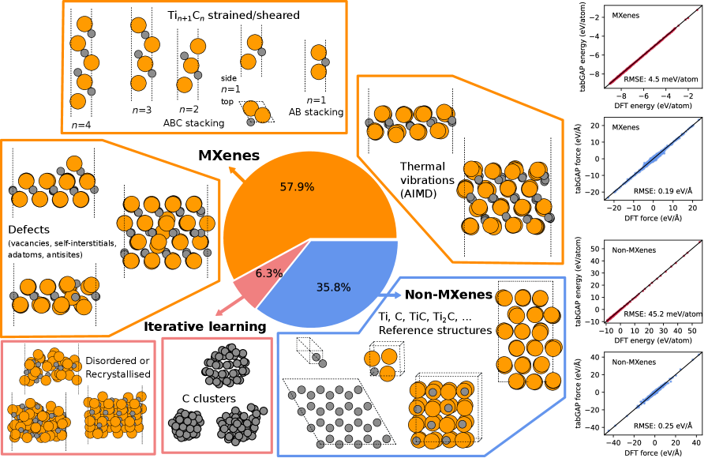
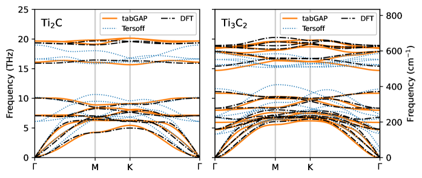
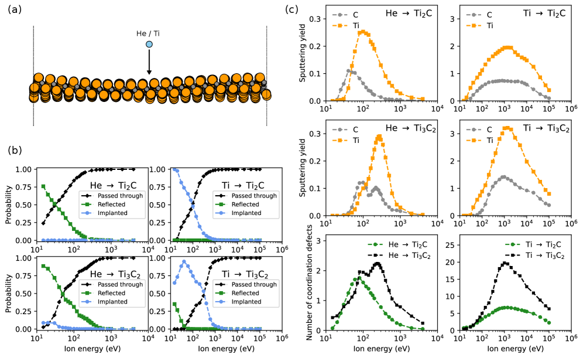

# arXiv 日次ダイジェスト — 2026年3月8日

**作成日：** 2026年3月8日
**対象期間：** 直近24〜72時間（2026年3月5〜7日投稿分）
**選定対象分野：** 材料工学・物性物理・マテリアルズ・インフォマティクス

---

## 今日の選定方針

本日は **機械学習ポテンシャル（MLIP）** と **高スループット計算・スクリーニング** に関する論文が複数投稿されており、マテリアルズ・インフォマティクスの中核的なテーマで充実した日だった。特に、MXene系に対する機械学習原子間ポテンシャルの構築、ポリマー高スループット計算ワークフローの開発、磁性MXeneの系統的スクリーニングという3本は、いずれも材料設計加速の観点から直接的な方法論的貢献を持つ。
一方、2D物質のモアレ磁気トポロジー、高エントロピー合金の界面偏析、複雑合金中の水素誘起空孔挙動など、計算物性物理と材料工学の接点に位置する論文群も高水準であった。非調和格子動力学（TDDFT）による磁子スペクトルの第一原理計算も、非共線磁性体研究のフロンティアを拡張する成果として注目される。

---

## 重点論文（3本）

1. Machine-learned Interatomic Potential for Ti_{n+1}C_n MXenes（arXiv:2603.04152）
2. Automated High-Throughput Screening of Polymers Using a Computational Workflow（arXiv:2603.05362）
3. Machine learning assisted High-Throughput study of M₄X₃T_x MXenes（arXiv:2603.04103）

---

## 重点論文の詳細解説

---

### 論文 1

#### 1. 論文情報

- **タイトル：** Machine-learned Interatomic Potential for Ti_{n+1}C_n MXenes
- **著者：** Jesper Byggmästar
- **arXiv ID：** 2603.04152
- **カテゴリ：** cond-mat.mtrl-sci
- **公開日：** 2026年3月4日
- **論文タイプ：** 計算・方法論論文（機械学習ポテンシャル開発）

#### 2. どんな研究か

Ti_{n+1}C_n MXene（n=1,2,3）に対して、DFT精度を保ちながら古典的力場の計算速度で原子スケールシミュレーションを可能にする tabGAP 型機械学習原子間ポテンシャルを開発した。構築したポテンシャルを用いて、イオン照射に伴うはじき出し損傷・スパッタリング・欠陥生成を分子動力学シミュレーションで系統的に解析し、MXeneの放射線損傷耐性と欠陥工学の指針を示した。

#### 3. 位置づけと意義

MXene研究においてMLIPを適用した照射損傷シミュレーションはこれまで限られており、本論文は Ti 系MXeneに特化した高精度ポテンシャルの整備という未開の課題に正面から取り組む。Byggmästar は昨年、九元素高エントロピー合金向けの多成分 tabGAP を報告しており（本紙 2026/3/8 既報）、本論文はその姉妹作として MXene 専用の設計哲学を示す。MXene 系材料の照射環境利用（原子炉材料、宇宙応用）への展開と、他の MXene 組成に対するMLIP構築の雛型となる点でインパクトが大きい。

#### 4. 研究の概要

**背景・目的：** MXeneは二次元的な遷移金属炭化物・窒化物族の総称であり、優れた導電性・高比表面積・機械的特性から蓄電池電極、電磁シールド、複合材料強化材として注目される。照射環境での安定性評価はデバイス応用の鍵だが、DFT で十分なスケールの照射シミュレーションを行うことは計算コストの観点から困難であった。
**研究アプローチ：** DFT 計算で生成した多様な構造（MXene、非 MXene 参照相、iterative learning で取得した遷移状態近傍構造）計24,150原子の訓練データベースを用いて tabGAP ポテンシャルを学習した。訓練後、格子定数・エネルギー曲面・フォノン分散・理論せん断強度を DFT および古典 Tersoff ポテンシャルと比較検証した。
**主な手法：** DFT（訓練データ生成）、tabGAP 機械学習ポテンシャル、分子動力学（照射シミュレーション）。
**主な結果：** tabGAP は DFT との格子定数・エネルギー・フォノン分散の一致が Tersoff に比べて大幅に優れ、特にせん断強度の計算で Tersoff が示す非物理的な振る舞いを回避した。照射シミュレーションでは、H/He イオンの注入エネルギーに対してスパッタリング確率・反射・貫通の依存性を系統的に解析し、Ti が優先的にスパッタされること、MXene シートが高エネルギーインパクト後も構造を自己修復する傾向を示した。

#### 5. 対象分野として重要なポイント

- **対象物性・現象：** 放射線損傷・スパッタリング・欠陥生成・MXene の機械的安定性。
- **手法・記述子：** tabGAP は二体・三体の tabulated 表現とガウス近似ポテンシャル (GAP) を組み合わせた設計であり、原子環境記述子として SOAP を採用。訓練データの多様性確保のために iterative learning（高温 MD 中の軌跡サンプリング）を使用したことが精度と汎用性の鍵。
- **既存研究との差分：** Tersoff 型古典力場との比較を通じ、フォノン・表面・欠陥形成エネルギーのすべてにわたる MLIP の優位性を定量的に示した点が新規。先行の Ti₃C₂ 向け MLIP（Shapeev 系）よりも多段 n を包括して構築している。
- **微視的機構：** Ti 優先スパッタリングは Ti-C 間の結合強度差と表面における Ti 露出率から定性的に説明されており、物理的解釈と接続されている。
- **波及可能性：** 同じ tabGAP フレームワークで他の MXene 組成（V₂C、Nb₂C など）や表面官能基（-O, -F, -OH）を含む系に即展開可能。照射損傷以外の摩擦・疲労シミュレーションへの応用も示唆されている。
- **材料設計への効き方：** 照射環境でのデバイス寿命予測・欠陥工学による物性チューニング（欠陥依存の電気・熱伝導率）に直結。

#### 6. 限界と注意点

1. **訓練データの組成範囲：** Ti₂C, Ti₃C₂, Ti₄C₃ に限定されており、官能基（-O, -OH, -F）を含む表面変性 MXene へのポテンシャルの直接適用可否は示されていない。実際の MXene 表面は多様な官能基を持つため、現状のポテンシャルは理想的な裸の MXene に対してのみ高精度であることを留意すべき。
2. **照射シミュレーションの検証：** 照射損傷の定量結果（スパッタリング収率など）は同系での実験データとの直接比較が限定的であり、数値の絶対精度を独立的に検証する機会が少ない。
3. **長時間・温度依存性：** 現論文の MD シミュレーションは ps オーダーの短時間スケールに留まり、照射後の長時間熱アニールや欠陥の拡散・再結合ダイナミクスについては考察が及んでいない。実環境での照射損傷には熱アニール効果が重要であり、追加の長時間シミュレーションが必要。

#### 7. 関連研究との比較・分野へのインパクト

- **主要先行研究との差分：** Shapeev グループによる Ti₃C₂ 向け MTP（moment tensor potential）は単層特化であり、本論文はより幅広い n 値と照射応用に踏み込んだ点で差別化される。Tersoff ポテンシャルの定量的限界を同一系で可視化した比較研究としても価値がある。
- **競合研究：** 同時期に Byggmästar らによる refractory alloy の多元素 tabGAP（2603.04147）が既報であり、MXene 向けは著者の一連のプロジェクトの続編として位置づけられる。
- **新規性の性格：** 既存の tabGAP 手法を MXene 系に適用した点は **incremental** だが、照射シミュレーションへの応用と訓練データ設計の体系化に方法論的な貢献がある。
- **引用コミュニティ：** MXene 実験・計算コミュニティ（蓄電池・複合材・照射材料）と MLIP 開発コミュニティの双方から引用が見込まれる。
- **今後の展開：** 官能基含有 MXene、水溶液界面での安定性、多層積層構造への拡張が想定される。

---

### 図1：訓練データベースと ML ポテンシャルの精度

> **キャプション：** MXene・非 MXene・iterative learning 構造を含む 3 クラスの訓練データと、DFT 対比でのエネルギー・力の予測精度を示す。訓練データの多様性がポテンシャルの汎用性を支えていることを視覚化している。

### 図2：Ti₂C および Ti₃C₂ のフォノン分散

> **キャプション：** Ti₂C および Ti₃C₂ のフォノン分散を DFT、tabGAP、Tersoff で比較。tabGAP は全ブリルアンゾーンにわたって DFT と高い一致を示し、Tersoff には存在する虚数フォノンが回避されている。熱物性予測の基礎となる検証図。

### 図3：照射シミュレーションの主要結果

> **キャプション：** 入射イオンエネルギーに対する反射・注入・貫通の確率と、スパッタリング収率を示す。Ti が C より優先的にスパッタされる傾向と、照射誘起欠陥の種別分布が読み取れる。材料設計上の照射損傷評価の基準データとなる。

---

### 論文 2

#### 1. 論文情報

- **タイトル：** Automated High-Throughput Screening of Polymers Using a Computational Workflow
- **著者：** L. Smith, S. Ericson, V. Fantauzzo, C. Yong, P. Carbone, A. Troisi
- **arXiv ID：** 2603.05362
- **カテゴリ：** cond-mat.mtrl-sci
- **公開日：** 2026年3月5日
- **論文タイプ：** 計算・ワークフロー開発論文

#### 2. どんな研究か

膨大な高分子ライブラリの中から優れた物性を持つ候補を効率的に絞り込むために、最小限の人的介入でポリマーの全原子分子動力学（MD）シミュレーションを自動実行する高スループットワークフローを開発した。自動アニーリングプロトコルで均質な構造を生成し、密度予測と実験的ガラス転移温度（T_g）の予測に機械学習モデルを組み合わせることで、計算主導のポリマースクリーニングを実用化した。

#### 3. 位置づけと意義

合成ポリマーの種類は理論上無限大であるが、全原子 MD による特性評価は人手のかかるシミュレーション設定と長時間計算が壁となり、スクリーニング対象が限られていた。本研究はその制約を「自動アニーリング + ML」の組み合わせで打破し、ポリマー材料インフォマティクスにおける計算コストの主要な律速段階を一つ解消する。ガラス転移温度という複雑な集合的現象をデータとして安価に生産できる点は、汎用高分子設計ツールへの道筋として意義が大きい。

#### 4. 研究の概要

**背景・目的：** 高分子材料は包装・電子デバイス・エネルギー貯蔵・医療など広範な応用を持つが、実験合成ライブラリに対してシミュレーションが追いつかない状況が続いている。適切な初期構造と平衡化プロトコルなしに MD を実行しても物性が再現できず、専門家の手動設定が必須だった。
**研究アプローチ：** 自動化されたアニーリングプロトコル（適応的制御機能付き）で多様なポリマーの初期平衡構造を自律生成し、均質で再現性の高いシミュレーション軌跡を得る。このデータを用いて密度と T_g の機械学習予測モデルを構築。
**手法：** 全原子 MD（自動アニーリング）、アダプティブ制御アルゴリズム、機械学習回帰モデル（密度・T_g 予測）。論文は 35 ページ 11 図の詳細な方法論論文。
**主な結果：** 自動ワークフローが多様なポリマー系（詳細な組成は本文参照）に対して再現性高く密度を算出し、T_g の実験値との相関を機械学習で捉えることに成功。人的介入を最小化したことで、研究室規模のスループットを大幅に超えるスクリーニングが可能になった。

#### 5. 対象分野として重要なポイント

- **対象物性：** 密度、ガラス転移温度（T_g）—ポリマーの熱機械的特性の基本指標。
- **手法の意味：** 自動アニーリングの適応的制御は、鎖の絡み合い・局所相分離など高分子特有の緩和の遅さを効率的に処理するための工夫。ML モデルの構造記述子の詳細は公開されていないが、組成・連鎖構造・モノマー物理化学特性量が特徴量として機能していると考えられる。
- **既存研究との差分：** PolyParGen や Automated Topology Builder など既存の力場自動生成ツールは存在するが、平衡化プロトコルの自動制御まで含んだ高スループットシミュレーションパイプラインとしての完成度を主張している点が新しい。
- **機構解釈との接続：** 密度や T_g という巨視的物性と分子構造の関係をデータ主導で捉えているが、物理機構（自由体積、鎖剛性、分子間相互作用）との接続が論文中でどこまで議論されているかは本文要確認。
- **波及可能性：** ポリマー電解質（イオン伝導率）、熱可塑性エラストマー（弾性率）、高分子膜（透過率）など他物性への拡張が期待される。ワークフロー自体は多くの高分子系に汎用適用できる設計。
- **材料設計への効き方：** T_g や密度の逆設計（目標物性 → 構造候補）への足がかりとなり、ポリマー向けジェネレーティブ設計と組み合わせれば強力な探索エンジンになる。

#### 6. 限界と注意点

1. **力場依存性：** 全原子 MD の精度は採用する力場（OPLS, AMBER 等）に強く依存する。ポリマーの T_g は力場パラメータの微差で数十 K 変動することがあり、ワークフローの汎用性は使用力場の品質と適用範囲によって制限される。
2. **アニーリング時間スケール：** 高粘性・高分子量のポリマーでは平衡化の時間スケールが実験系の緩和時間よりはるかに長く、MD の到達可能時間スケール（ns〜μs）では真の平衡構造が得られない場合がある。自動化プロトコルが緩和不足を検出・対処できるかは重要な問いである。
3. **ML 予測の一般化：** 訓練したデータのカバー範囲外のポリマー組成空間（新規モノマー、ブロック共重合体、複雑な側鎖構造など）への外挿精度は不明であり、未知領域への適用には慎重な検証が必要。

#### 7. 関連研究との比較・分野へのインパクト

- **競合研究：** Polymer Genome（Georgia Tech）や PolyInfo に代表されるデータベース主導のポリマーインフォマティクスと補完関係にある。既存DB が実験値ベースであるのに対し、本研究は計算シミュレーションで独立した訓練データを生産できる点が差別化要因。
- **新規性の性格：** 個別手法の新規性より **ワークフロー統合の完成度** が貢献の核心。Incremental 寄りだが、実用性の観点から引用・利用されやすい。
- **インパクト範囲：** 高分子科学・ポリマーインフォマティクス・マテリアルズデザイン自動化のコミュニティに広く引用されうる。
- **今後の方向：** 逆設計（目標物性からのポリマー構造提案）、汎用力場との組み合わせ、より多様な物性（熱伝導率・誘電率・溶解度パラメータ）への拡張が想定される。

**図（HTML 版未公開のため概念図を代替）**
*本論文の HTML 版は投稿時点で arXiv 上に公開されておらず、原著図の取得が不可能であった。*

---

### 論文 3

#### 1. 論文情報

- **タイトル：** Machine learning assisted High-Throughput study of M₄X₃T_x MXenes
- **著者：** S. Goel, A. Kashyap
- **arXiv ID：** 2603.04103
- **カテゴリ：** cond-mat.mtrl-sci
- **公開日：** 2026年3月5日
- **論文タイプ：** 計算・スクリーニング論文（ML + DFT ハイブリッド）

#### 2. どんな研究か

234 種類の M₄X₃T_x 型（n=3 MXene）組成に対して、ML 支援高スループット DFT を適用し、安定性・電子構造・磁気基底状態を系統的に解析した。ML モデルが格子定数の 94% 精度予測を達成し、計算コストを大幅に削減しながら、Cr・Mn 系 MXene に 16 種類の強磁性候補を同定した。

#### 3. 位置づけと意義

M₄X₃ 型 MXene は最厚の n=3 組成として、電磁シールド・スピントロニクス応用で注目されているが、234 通りの全組成を純 DFT でスクリーニングすることは計算コストの観点から困難であった。ML で格子定数を高精度予測して DFT の前処理負荷を軽減し、磁性 MXene の系統的地図を描いた本研究は、MXene 磁性材料設計の出発点として位置づけられる。

#### 4. 研究の概要

**背景・目的：** MXene の磁気特性は遷移金属 M と表面官能基 T（-O, -OH, -F など）の組み合わせに強く依存するが、実験的網羅は困難であり、計算によるスクリーニングが有効。特に M₄X₃ 型は M₂X や M₃X₂ より厚い層構造を持ち、交換相互作用・磁気異方性の挙動が異なると期待される。
**研究アプローチ：** まず少数の DFT 計算で訓練した ML モデルで全 234 組成の格子定数を高精度予測し、その後 DFT で構造最適化・電子構造・磁気秩序（FM/AFM/NM）を評価するハイブリッドパイプラインを構築。
**主な結果：** Ti, Zr, Hf, Nb, Ta 系 → 非磁性金属、Sc/Y 系 → 弱強磁性 + 半導体的特性、V/Fe 系 → 反強磁性金属、Cr/Mn 系 → 強磁性候補（スピン分極率 50〜100%）。ML 格子定数予測精度 94%。

#### 5. 対象分野として重要なポイント

- **対象物性：** 磁気基底状態（FM/AFM/NM）、電子構造（金属/半導体）、スピン分極率。
- **ML 手法の役割：** 格子定数のみを高精度予測する「前処理 ML」として機能しており、フル物性予測に ML を使うのではなく DFT 計算コストの削減に特化した設計。このデュアルアプローチは他の高スループット計算でも参考になる。
- **既存研究との差分：** 先行スクリーニングは主に M₂X や M₃X₂ に集中しており、M₄X₃ 系の包括的磁性地図は本研究が初めてに近い。
- **機構解釈：** 磁性の起源として d バンド充填と 3d 電子間の交換相互作用が定性的に議論されているが、交換結合定数の定量評価までは至っていない。
- **波及可能性：** 同定した 16 種の強磁性 MXene はスピントロニクス・磁気センサー・磁性複合材料の基礎設計候補。
- **材料設計への効き方：** 高スループットスクリーニングで絞り込んだ強磁性候補を実験合成のターゲットとして提示できる。

#### 6. 限界と注意点

1. **官能基の固定：** スクリーニングで考慮した官能基 T の種類と組み合わせが限定されている場合、実際の MXene 表面（混合官能基状態）での磁性とは乖離する可能性がある。
2. **DFT の交換相関汎関数：** 磁性の正確な記述には U 補正付き GGA や hybrid 汎関数が必要な場合があるが、標準 GGA ベースのスクリーニングでは磁気モーメントやバンドギャップが過小・過大評価されることがある。
3. **動的安定性の未評価：** 熱力学的安定性（生成エネルギー）のみで評価しており、フォノン分散による動的安定性（実際に合成可能か）の検証は行われていない。

#### 7. 関連研究との比較・分野へのインパクト

- **競合研究：** 2D Materials の高スループット DFT スクリーニング（C2DB, MC2D など）と方法論的に競合するが、M₄X₃ という特定 MXene 族への集中が差別化要因。
- **新規性：** Incremental だが、n=3 MXene の全組成磁性地図として参照価値が高い。
- **インパクト：** MXene スピントロニクス研究コミュニティのデータリソースとなる。
- **今後の展開：** キュリー温度の計算、交換相互作用の定量化、実験合成された候補の検証論文への発展が期待される。

**図（HTML 版未公開のため概念図を代替）**
*本論文の HTML 版は投稿時点で arXiv 上に公開されておらず、原著図の取得が不可能であった。*

---

## その他の重要論文（7本）

---

### 論文 4

#### 1. 論文情報

- **タイトル：** Moire Topological Magnetism Twist-Engineered from 2D Spin Spirals
- **著者：** Z. He, K. Dou, W. Du, Y. Dai, E.Y. Tsymbal, Y. Ma
- **arXiv ID：** 2603.04620
- **カテゴリ：** cond-mat.mtrl-sci
- **公開日：** 2026年3月5日
- **論文タイプ：** 計算論文（第一原理 + スピン模型）

本研究は、個々の単層では自明なスパイラル磁性しか持たない反強磁性二次元材料（NiCl₂, NiBr₂）を二枚重ねてツイストさせることで、トポロジカルに非自明な磁気テクスチャ（スカーミオン類似の「バイメロン」）が自発的に発生することを第一原理 + 原子スピンモデル計算で示した。外部磁場なしにトポロジカルスピンテクスチャを実現する「ジオメトリ工学」の概念実証であり、モアレ二次元磁性体の設計原理を一歩前進させる成果である。

NiCl₂ ではツイスト角によってバイメロンの密度と位相構造が制御でき、NiBr₂ では強いスピンフラストレーションに起因する三重 q スパイラルが縦方向の圧縮歪みでトポロジカル状態に変換されることを明らかにした。スピントロニクスにおけるトポロジカル磁性体の「外場フリー生成」手法として、実験的実現への道筋を開く。

---

### 論文 5

#### 1. 論文情報

- **タイトル：** Rapid modeling of segregation-driven metal-oxide adhesion in high-entropy alloys
- **著者：** D. Boakye, C. Deng
- **arXiv ID：** 2603.04575
- **カテゴリ：** cond-mat.mtrl-sci
- **公開日：** 2026年3月5日
- **論文タイプ：** 計算・モデリング論文

高エントロピー合金（HEA）と酸化物（Al₂O₃, Cr₂O₃）界面における溶質偏析と密着仕事の予測に対し、macroscopic atom model（MAM）を多成分系に拡張した高速計算フレームワークを開発した。界面対生成確率の定式化により偏析の組成依存性を連続関数として表し、DFT ベンチマークとの良好な一致を示した。HEA の添加元素（Hf, Y, Zr, S）が酸化物密着性に与えるランキングを正しく再現し、組成空間を DFT の何百倍もの速度で探索できる。

酸化物界面密着性は HEA の酸化耐性・コーティング密着性・腐食挙動に直結するため、従来 DFT に依存していた設計変数を安価な物理モデルで予測できる意義は大きい。非線形な溶質含有量依存性の定量化により、最適組成の高速スクリーニングが可能になる。エネルギーデバイス・航空宇宙用 HEA の界面設計への直接応用が期待される。

---

### 論文 6

#### 1. 論文情報

- **タイトル：** Dispersion and lifetimes of magnons in non-collinear magnets from TDDFT
- **著者：** D. Eilmsteiner, A. Ernst, P.A. Buczek
- **arXiv ID：** 2603.04111
- **カテゴリ：** cond-mat.mtrl-sci
- **公開日：** 2026年3月5日
- **論文タイプ：** 計算・方法論論文（第一原理）

非共線磁性体 Mn₃Rh（かごめ三角格子反強磁性体）において、線形応答時間依存 DFT（TDDFT）と非共線 KKR グリーン関数法を組み合わせることで、スピン波（磁子）の分散関係とランダウ減衰を初めて第一原理的に同時記述した。従来の断熱的手法ではアクセス不可能だったランダウ減衰（イテラント電子によるスピン波の崩壊）を直接計算できる新たな計算手法を確立した。

全ブリルアンゾーンにわたり三つのゴールドストーンモードと非自明なスピン偏極特性が明らかになり、ゾーン中心からの距離に依存して減衰幅が大きく変化することが示された。スピントロニクスデバイスの磁子輸送・スピン波論理素子における寿命予測に、実験なしの第一原理的基盤を与える重要な方法論的進展であり、他の非共線磁性体（スカーミオン格子、非共線反強磁性体など）への適用が期待される。

---

### 論文 7

#### 1. 論文情報

- **タイトル：** Hydrostatic Pressure Driven Band Gap Tuning in (4FPEA)₂SnBr₄ Halide Perovskite
- **著者：** R. Bartoszewicz et al.
- **arXiv ID：** 2603.03931
- **カテゴリ：** cond-mat.mtrl-sci
- **公開日：** 2026年3月4日
- **論文タイプ：** 実験論文（光物性）

二次元スズハライドペロブスカイト（4FPEA）₂SnBr₄ に静水圧（最大 ~3 GPa）を印加し、温度・圧力依存のフォトルミネッセンス分光で励起子状態の圧力応答を調べた。近バンド端（NBE）励起子が圧力下で線形赤方偏移する一方、自己捕獲励起子（STE）が青方偏移するという異常な二重応答が明らかになった。

臭化物系では強い STE 発光が観察されるがヨウ化物類縁体では見られないことから、格子の剛性が励起子－フォノン結合エネルギーランドスケープを決定することが示された。圧力による「ソフト格子」のバンドギャップ制御はハライドペロブスカイトの光電子デバイス設計（LED, 太陽電池）にとって重要な知見であり、2D ペロブスカイト材料空間の圧力応答の体系的理解に貢献する。

---

### 論文 8

#### 1. 論文情報

- **タイトル：** Ab initio quasi-harmonic thermoelasticity, piezoelectricity, and thermoelectricity of wurtzite ZnO
- **著者：** X. Gong, A. Dal Corso
- **arXiv ID：** 2603.05056
- **カテゴリ：** cond-mat.mtrl-sci
- **公開日：** 2026年3月6日
- **論文タイプ：** 計算論文（DFT + DFPT）

ウルツ鉱型 ZnO を対象に、DFT と密度汎関数摂動理論（DFPT）を準調和近似（QHA）と組み合わせた枠組みで、圧電テンソル・熱電テンソル・熱弾性定数の圧力・温度依存性を第一原理計算した。内部自由度（内部歪み）と外部自由度を分離して扱う理論を一般化し、Zero Static Internal Stress Approximation（ZSISA）と Full Free Energy Minimization（FFEM）の二つのアプローチを比較した。

圧電・焦電材料の温度・圧力依存性は実用デバイス（センサー・アクチュエータ・MEMS）の特性予測に直結するが、ab initio レベルの系統的記述は限られていた。本研究の汎化フォーマリズムは他の極性絶縁体（GaN, AlN など圧電材料）への転用が容易であり、材料ごとのパラメータ最適化なしに広い温度・圧力レンジの物性を予測できる計算プロトコルとして価値がある。

---

### 論文 9

#### 1. 論文情報

- **タイトル：** Insights into hydrogen-induced vacancy stability and creep in chemically complex alloys
- **著者：** P. Singh, Y. Pachaury, A.A. Kohnert, L. Capolungo, D.D. Johnson
- **arXiv ID：** 2603.03707
- **カテゴリ：** cond-mat.mtrl-sci
- **公開日：** 2026年3月4日
- **論文タイプ：** 計算論文（第一原理）

スピン分極第一原理計算とクラスターダイナミクス解析を組み合わせ、水素が BCC 鉄系・FCC 鉄系・Fe-Cr-Ni 系合金において空孔の熱力学的安定性をどのように変化させるかを体系的に解析した。水素による空孔安定化（H-vacancy 結合）が BCC 鉄で低水素化学ポテンシャルから顕著に起こるのに対し、FCC 系では d バンド幅の広がりと化学的無秩序により大幅に高いポテンシャルが必要であることを電子構造の観点から説明した。

水素環境下での蠕変（クリープ）加速は核融合・水素利用インフラにおける材料健全性の主要懸念事項であり、本論文の BCC vs. FCC の比較は、材料選択・組成最適化に向けた設計指針を微視的電子構造に基づいて提供する。Cr-Ni 添加による空孔安定化の抑制がフェライト鋼の耐水素脆性改善に結びつく可能性を示唆する重要な計算論拠となる。

---

### 論文 10

#### 1. 論文情報

- **タイトル：** Inverse-design of two-dimensional magnonic crystals via topology optimization
- **著者：** R. Nagaoka, T. Yamazaki, C. Mitsumata, Y. Iwasaki, M. Kotsugi
- **arXiv ID：** 2603.05132
- **カテゴリ：** cond-mat.mtrl-sci
- **公開日：** 2026年3月6日
- **論文タイプ：** 計算論文（逆設計・最適化）

二次元磁性結晶（magnonic crystal, MC）のスピン波バンドギャップを最大化するための逆設計フレームワークを構築した。遺伝的アルゴリズムによるグローバル探索と周波数ドメインマイクロマグネティクスシミュレーションによる高速バンドギャップ評価を組み合わせ、従来報告されていない非慣習的な MC 格子構造を複数発見した。時間ドメインシミュレーションによる結果の独立検証も実施されている。

高次バンドでは設計空間が非凸になることが示され、マルチモーダルな最適化問題としての本質が明らかになった。磁子のバンド構造は磁気デバイス（スピン波ロジック回路、周波数フィルタ、信号処理）の基盤特性であり、逆設計手法の確立はデバイススペックから材料構造への直接的な変換を可能にする。本研究の手法は実験的にアクセス可能なシステムにも適用できると著者は述べており、実験との連携が期待される。

---

## 全体まとめ

本日の選定を俯瞰すると、**機械学習を材料シミュレーションに組み込む研究が複数軸で成熟しつつある**トレンドが鮮明だった。一方では Byggmästar の MXene MLIP のように「精度と汎用性を兼ねたポテンシャルの整備」が進み、もう一方では Smith らのポリマースクリーニングや Goel らの高スループット DFT のように「ワークフロー自動化」と「ML 前処理」の連携が実用段階に達している。MXene 系への注目は継続的であり、磁性・照射耐性・機械的特性の各側面から計算・実験の両面で精力的に研究されている。

モアレ系における2D磁性トポロジーの発現（2603.04620）は、ツイスト工学が磁気物性設計の新自由度として定着しつつある動向を示している。非共線磁性体での TDDFT 磁子計算（2603.04111）は方法論的フロンティアであり、スピントロニクス向け計算ツールの拡充として今後引用・再現が期待される。水素との相互作用（2603.03707）は化学複雑合金の耐環境性という古典的かつ重要なテーマに電子論的基盤を与えるもので、継続的に追うべきトピックである。

**継続的に注目すべきトピック：**
- MXene の MLIP 開発とその照射・摩擦・電気化学応用
- ポリマーインフォマティクスのワークフロー自動化と T_g 予測
- 二次元磁性モアレ材料における位相工学
- 水素環境材料の微視的欠陥熱力学
- 逆設計フレームワーク（スピントロニクス、フォノン工学）

---

## 比較表

| 論文タイトル | 一言要約 | 関連性 | 重要ポイント | 主な限界 | arXiv ID |
|---|---|---|---|---|---|
| ML Potential for Ti_{n+1}C_n MXenes | MXene 照射損傷を DFT 精度 ML ポテンシャルで解析 | ★★★ | tabGAP が Ti 優先スパッタリングと MXene 自己修復を予測 | 官能基・長時間 MD 未評価 | 2603.04152 |
| Automated Polymer HT Screening | 自動 MD ワークフローでポリマー T_g を ML 予測 | ★★★ | アダプティブアニーリング + ML で大規模スクリーニング実現 | 力場依存・外挿精度未検証 | 2603.05362 |
| ML-HT Study of M₄X₃ MXenes | 234 組成を ML+DFT で系統スクリーニング, 16 強磁性候補 | ★★★ | ML 格子定数 94% 精度で計算コスト大幅削減 | 動的安定性・U 補正未適用 | 2603.04103 |
| Moire Topological Magnetism | ツイスト反強磁性 2D 材料からバイメロン生成 | ★★☆ | 外場なしトポロジカルスピンテクスチャのジオメトリ工学 | 実験検証なし、歪み制御困難 | 2603.04620 |
| Segregation Adhesion in HEAs | MAM 拡張モデルで HEA/酸化物界面密着を高速予測 | ★★☆ | Hf/Y/Zr/S の偏析序列と非線形密着依存性を再現 | モデル仮定の強さ・系限定 | 2603.04575 |
| Magnon Dispersion via TDDFT | Mn₃Rh の磁子分散とランダウ減衰を第一原理計算 | ★★☆ | 非共線磁性でのスピン波寿命を初の第一原理予測 | 計算コスト高・系限定 | 2603.04111 |
| Pressure Band Gap Tuning in Perovskite | 2D Sn 臭化物ペロブスカイトで NBE/STE の異常圧力応答 | ★★☆ | 格子剛性が励起子－フォノン結合を制御することを実証 | 単一材料系・理論モデルなし | 2603.03931 |
| Ab initio Thermoelasticity of ZnO | QHA+DFPT で ZnO の圧電・焦電の温度圧力依存性を計算 | ★★☆ | ZSISA vs FFEM の比較と内部自由度の一般化理論 | ZnO 単系・実験比較限定 | 2603.05056 |
| H-Vacancy Stability in Complex Alloys | 水素による空孔安定化を BCC/FCC 合金で第一原理解析 | ★★☆ | BCC Fe で空孔安定化が低 H 化学ポテンシャルから発現 | クリープへの定量的接続未完 | 2603.03707 |
| Inverse Design of Magnonic Crystals | 遺伝的アルゴリズムで 2D MC の逆設計、非慣習格子発見 | ★★☆ | 設計空間の非凸性と高次バンドのマルチモーダル性を明示 | 実験検証なし・材料指定なし | 2603.05132 |

---

## 保存状況

- **レポート：** `/sessions/sharp-charming-tesla/mnt/arxiv/2026-03-08_3.md`
- **論文 1 (2603.04152) 図：**
  - `figures/2026-03-08/2603.04152_fig1.png`（訓練データと精度）✅
  - `figures/2026-03-08/2603.04152_fig4.png`（フォノン分散）✅
  - `figures/2026-03-08/2603.04152_fig6.png`（照射シミュレーション結果）✅
- **論文 2 (2603.05362) 図：** HTML 版未公開、原著図取得不可。代替概念図なし（本文に明記）
- **論文 3 (2603.04103) 図：** HTML 版未公開、原著図取得不可。代替概念図なし（本文に明記）
