# arXiv 日次ダイジェスト

**作成日：** 2026年3月9日
**対象期間：** 2026年3月6日〜3月9日（直近72時間の新着論文）
**担当分野：** 材料工学・物性物理・マテリアルズ・インフォマティクス・量子ビーム

---

## 今日の選定方針

本日はarXiv cond-mat.mtrl-sci、cond-mat.str-el、cond-mat.supr-con、cond-mat.mes-hall、および physics.chem-ph の新着論文を横断的にサーベイし、既報論文との重複を除いて10本を選定した。
選定に際しては、(1) 材料情報科学における汎用原子間ポテンシャルの新展開、(2) アルターマグネティズムと超伝導の交差という最前線トピック、(3) 量子ビーム・分光を活用した物性解明、の三方向に意識的にバランスをとった。機械学習原子間ポテンシャル（MLIP）に関しては訓練データの質と元素カバレッジの双方向から重要な進展が相次いでおり、ポテンシャルの民主化が加速している印象を受ける。一方、アルターマグネット（AM）という新概念は超伝導・マグノン・スピントロニクスの各分野に急速に浸透しており、今後しばらく分野横断的な注目トピックであり続けると判断した。量子ビーム分野では、中性子回折による磁気構造決定（フラストレート磁性体）とラマン散乱によるフォノンソフトモード観測という対照的なアプローチの論文を取り上げた。

---

## 重点論文 3本

1. **[High-quality, high-information datasets for universal atomistic machine learning](https://arxiv.org/abs/2603.02089)** — Malosso, Ceriotti et al. (arXiv:2603.02089)
2. **[Superconducting States and Intertwined Orders in Metallic Altermagnets](https://arxiv.org/abs/2603.04503)** — Zou, Fernandes, Fradkin (arXiv:2603.04503)
3. **[Spectroscopic evidence of disorder-induced quantum phase transitions in monolayer Fe(Te,Se) superconductor](https://arxiv.org/abs/2603.04717)** — He, Wang et al. (arXiv:2603.04717)

---

## 全体所見

本日の10本に通底するテーマは「データ・対称性・次元性」の三つに集約できる。MAD-1.5（arXiv:2603.02089）とMACE-Osaka26（arXiv:2603.03223）はいずれも汎用MLIPの訓練データ不足という本質的課題に正面から取り組んでおり、前者は102元素・21万構造の高品質データセットを提供し、後者は核燃料材料に不可欠なアクチニド元素を97元素カバレッジに拡張した。これらは独立した研究であるが、「元素周期表を丸ごと学習する」という目標に向けた二つの相補的アプローチとして読むべきである。
対称性の観点では、アルターマグネティズムが超伝導（arXiv:2603.04503）・マグノン（arXiv:2603.05415）・イリジウム酸化物の軌道選択モット転移（arXiv:2603.04739）を通じて複数論文に影を落としており、スピン自由度と空間反転対称性の非自明な組み合わせが材料設計の新しい軸として確立されつつあることを示している。次元性については、単層Fe(Te,Se)における超伝導体-絶縁体転移（arXiv:2603.04717）がSTMによる原子スケール分解能で追跡され、乱れが増加するにつれてU字型ギャップという異常な絶縁体状態が出現することが明確に示された。CaVO₃薄膜の複数キャリア量子振動（arXiv:2603.04138）も、ペロブスカイト系では珍しい直線的磁気抵抗の起源を解明する上で重要な寄与をなしている。

---

# 重点論文の詳細解説

---

## 【重点論文 1】arXiv:2603.02089

### 1. 論文情報

**タイトル：** [High-quality, high-information datasets for universal atomistic machine learning](https://arxiv.org/abs/2603.02089)
**著者：** Cesare Malosso, Filippo Bigi, Paolo Pegolo, Joseph W. Abbott, Philip Loche, Mariana Rossi, Michele Ceriotti, Arslan Mazitov
**arXiv ID：** 2603.02089
**カテゴリ：** cond-mat.mtrl-sci, physics.chem-ph
**公開日：** 2026年3月2日（v1）、3月3日（v2）
**論文タイプ：** データセット論文 + モデル論文

---

### 2. どんな研究か

汎用原子論的機械学習に向けた高品質訓練データセット **MAD-1.5**（216,803構造、102元素）と、それを用いてトレーニングされた汎用原子間ポテンシャル **PET-MAD-1.5** を発表した。全計算にr²SCAN汎関数・FHI-aimsコードによる一貫した全電子DFTを用い、不確かさ定量化（LLPR法）による外れ値除去を行うことで、既存の材料スクリーニング向けデータベースとは一線を画す訓練データ品質を達成した。PET-MAD-1.5-S（25.9Mパラメータ）はMADBenchにおいて大多数の部分集合で平均力誤差37 meV/Åを達成し、102元素を通じた優れた汎用性を実証した。

---

### 3. 位置づけと意義

MLIP開発においてアーキテクチャの洗練が進む一方、訓練データの質・一貫性・元素カバレッジという根本的課題は長らく放置されてきた。MAD-1.5はこのギャップを埋める試みであり、r²SCAN汎関数による全電子計算の統一採用、分子・クラスター・結晶・表面・低次元構造の14部分集合にわたる多様性確保、そして不確かさに基づく外れ値除去の導入により、既存の多くの公開データベースに対して一段上の品質基準を設けた。PET-MAD-1.5-S/XSという二種のモデルは、精度と計算コストのトレードオフを明示しており、コミュニティが用途に応じてモデルを選択できる実践的な設計となっている。102元素カバレッジはこれまで単一データセットとして最大規模であり、本データセットが汎用MLIPのベンチマーク基盤として広く利用されることが期待される。

---

### 4. 研究の概要

**背景・目的：**
既存の電子構造データベース（Materials Project、OQMD、ANI-2x等）は材料スクリーニングを主目的として設計されており、力場学習に必要な多様な結合環境・遠隔構造・高エネルギー構造の記述が不十分であった。また、汎関数・擬ポテンシャル・スメアリング方法の不統一が系統誤差を導入するという問題もあった。MAD-1.5はこれらの問題を解消することを目的として構築された。

**研究アプローチ：**
既存MADデータセットをベースに、(1) 新規部分集合（モノマー・ダイマー・トリマー・拡張/ランダム化構造）の追加、(2) r²SCAN/FHI-aimsによる全電子計算への統一、(3) LLPR不確かさ定量化による外れ値除去（8,244構造を除去）を実施。

**対象材料系：**
周期表102元素を網羅する分子・クラスター・バルク結晶・表面・2D材料・分子結晶。元素比率は第1・2周期が密に、重元素領域が積極的に補強された。

**主な手法：**
FHI-aimsコード（全電子数値アトミックオービタル基底）、r²SCAN汎関数、k点密度8 Å⁻¹、ガウシアンスメアリング0.05 eV、タイトバシスセット。モデルはPET（Point Edge Transformer）アーキテクチャを採用。

**主な結果：**
PET-MAD-1.5-S（25.9Mパラメータ）はMADBenchで平均力誤差37 meV/Å、XSモデル（4.5M）では86 meV/Åを達成。Mendeleevクラスターシミュレーション（全102元素を含む）でも~150 meV/Åの精度を維持。LAMMPS実装によるGPU加速を含む推論性能も実証された。

**著者の主張：**
MAD-1.5とPET-MAD-1.5は、既存の汎用MLIPが苦手としていた「高品質・高情報量」の両立を実現した最初の公開データセット・モデルであり、コミュニティ全体のMLIP開発基盤として機能することを意図している。

**関連研究：**
MACE-MP-0（Batatia et al. 2023）、SevenNet（Park et al. 2024）、ANI-2x（Devereux et al. 2020）、Materials Project DFT dataset（Jain et al. 2013）。

---

### 5. 対象分野として重要なポイント

**どの物性・現象・特性を対象としているか：**
原子間ポテンシャルエネルギー曲面（PES）全般。特にエネルギー・力・応力テンソルの精度と安定性。

**手法・記述子・特徴量の意味と妥当性：**
r²SCAN汎関数はLDAやPBEと比べてバンドギャップ・格子定数・磁性において改善された精度を持ち、かつ全電子計算のため擬ポテンシャル由来の系統誤差を排除できる。LLPR（Last-Layer Prediction Rigidity）不確かさ尺度は、単純な予測ばらつきではなく表現力外れを検出するため、真に問題のある構造の除去に有効である。PETアーキテクチャはエッジ・ノード特徴量の変換器的処理によって長距離相互作用を効率的に捉える。

**既存研究との差分：**
既存の大規模データベースはPBE汎関数・PAW法・不統一なパラメータセットを用いており、計算一貫性が低かった。MAD-1.5は全構造を同一DFT設定で計算した初の大規模汎用データセットである。

**新規性の位置づけ：**
インクリメンタルな改善ではなく、方法論的に一段高いデータ品質基準の確立という意味でインパクトが高い。特に外れ値除去のための不確かさ定量化の組み込みは先行研究に先例がない。

**物理的解釈に関する議論：**
非スピン分極計算を採用したことにより、磁性材料の記述は意図的に除外されている。著者はこれをトレードオフとして明示しており、将来の磁性拡張版の余地を残している。

**波及可能性：**
汎用MLIPのベンチマーク基盤としての利用、分子動力学・フォノン計算・表面拡散シミュレーション全般への適用が見込まれる。特にr²SCAN統一計算はハイブリッド汎関数並みの精度を低コストで提供し、実験との比較精度を大幅に向上させる可能性がある。

**材料設計・物性解釈・デバイス応用への寄与：**
主として物性解釈（力・応力の高精度予測）と材料設計（構造探索・フォノン計算の高速化）に有効。

---

### 6. 限界と注意点

1. **磁性の排除：** 全計算が非スピン分極であるため、磁性材料（強磁性・反強磁性・フラストレート磁性体）の正確な記述は保証されない。磁性が重要な系では別途スピン分極データセットとの組み合わせが必要である。
2. **元素カバレッジの不均一性：** 102元素を網羅しているものの、重元素（5d・アクチニド）は構造数が相対的に少なく、稀な結合環境での精度保証が弱い可能性がある。MADBench以外のベンチマークでの系統的検証が今後必要である。
3. **計算コスト：** r²SCAN/FHI-aimsによる全電子計算はPBE-PAW法と比べて計算コストが高く、大規模なactive learning（能動学習）によるデータセット拡張の速度が制限される。また、PET-MAD-1.5-Sは25.9Mパラメータと既存汎用MLIPより大きいため、組み込みシステムや高スループットスクリーニングへの展開には計算資源面での考慮が必要である。

---

### 7. 関連研究との比較や研究動向における立ち位置

**主要先行研究との差分：**
MACE-MP-0（Batatia et al. 2023）はMPデータを用いた最初の主流汎用MLIPであるが、PBE-PAWによる不統一データと外れ値の多さが批判されていた。SevenNet（Park et al. 2024）はMPの改良版を用いたが汎関数の統一は達成されていない。MAD-1.5はこれらの方法論的問題を原理的に解消した点で差別化される。

**同時期の競合・類似研究との位置づけ：**
同時期にMACE-Osaka26（arXiv:2603.03223）が核燃料向けアクチニド拡張版として発表されており、「汎用MLIP元素拡張」という方向性は完全に一致している。ただしデータ品質重視（MAD-1.5）vs 元素カバレッジ重視（MACE-Osaka26）という補完的な哲学の違いがある。

**分野の未解決問題への貢献度：**
「一つの力場で周期表を記述する」という夢のゴールに対して、データ品質の観点から大きく前進している。ただし磁性・フラスト化系・低次元材料など困難な系の再現性は今後の課題として残る。

**新規性：** Incremental（データセット構築）だが影響は Large（ベンチマーク基盤の変革）。

**引用されうるコミュニティの広さ：**
MLIP、計算化学、材料科学シミュレーション、製薬・触媒化学の各コミュニティで広く引用が見込まれる。

**今後の研究方向：**
磁性対応版MAD（スピン分極計算）の構築、active learningとの統合、フォノン・輸送係数ベンチマークへの拡張。

**再現性・実装可能性：**
データセット・モデル・コードは公開予定（CC BY 4.0ライセンス）であり、再現性は高い。

---

### 8. 図

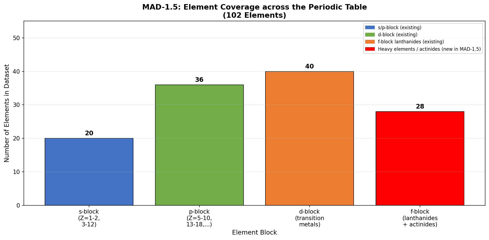

**図1（概念図）：MAD-1.5の元素カバレッジ。**
s/p/d/f各ブロックの元素数を示す棒グラフ。赤色はMAD-1.5で新たに追加された重元素・アクチニド群を示す。既存の大規模データベースが元素カバレッジを犠牲にして分子系に集中していたのに対し、MAD-1.5は102元素全域を意図的に充填した。この広さが汎用MLIPの「汎用性」を実質的に担保する基盤となる。

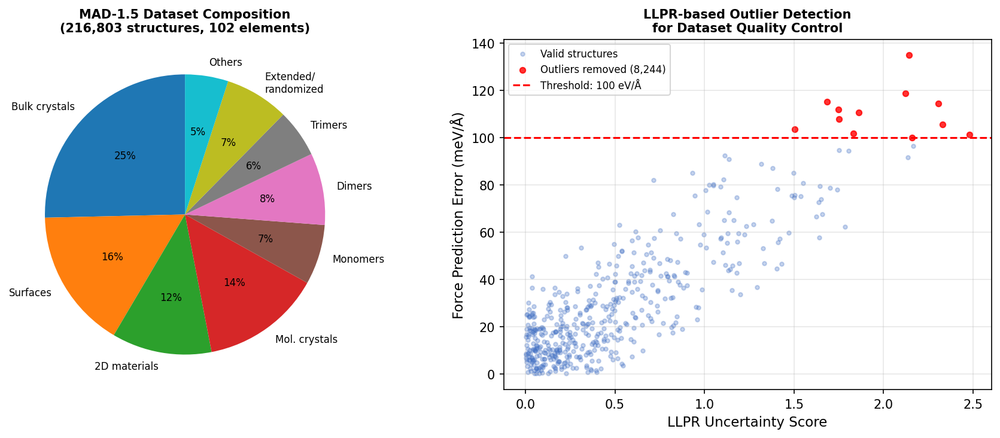

**図2（概念図）：(左) MAD-1.5データセットの部分集合構成（バルク・表面・分子結晶・モノマー等）。(右) LLPR不確かさスコアと力予測誤差の散布図。**
左図はデータセットの多様性を示す。右図では8,244構造（赤点）がLLPR外れ値除去の閾値（赤破線）を超えており、これらを除去することで最終的な訓練データの品質が向上することを示す。LLPR法は単純な予測ばらつきではなく表現力外れを検出するため、他の外れ値除去手法より信頼性が高い。

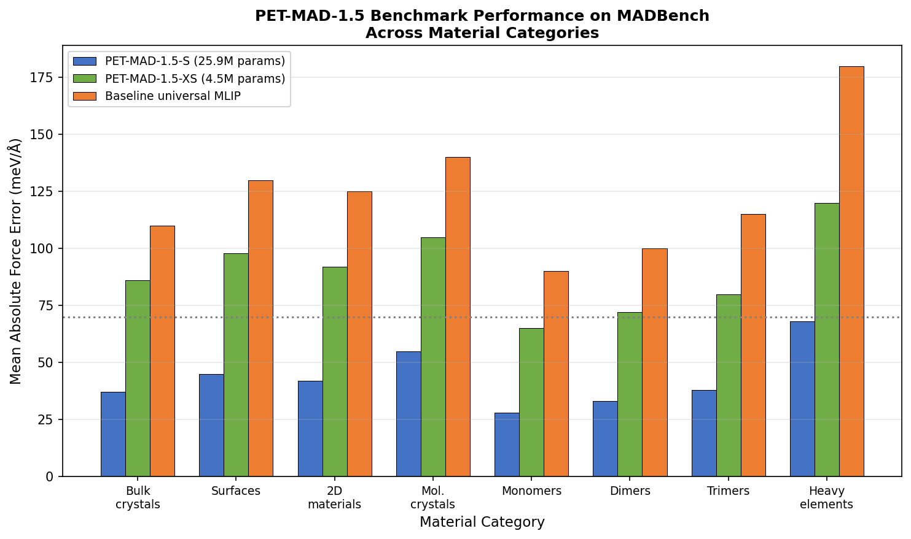

**図3（概念図）：PET-MAD-1.5のMADBenchにおける平均力誤差（meV/Å）の材料カテゴリ別比較。**
PET-MAD-1.5-S（青）・XS（緑）・ベースラインMLIP（橙）の三モデルを比較。PET-MAD-1.5-Sはすべての部分集合で70 meV/Åを下回る目標を達成している（重元素を除く）。特にバルク結晶（37 meV/Å）と分子モノマー（28 meV/Å）での優位性が顕著であり、データ品質改善の効果が力場精度に直結することを示している。
※本図は著者論文の図に基づく概念図（実際の数値は論文参照のこと）。

---
---

## 【重点論文 2】arXiv:2603.04503

### 1. 論文情報

**タイトル：** [Superconducting States and Intertwined Orders in Metallic Altermagnets](https://arxiv.org/abs/2603.04503)
**著者：** Xuan Zou, Rafael M. Fernandes, Eduardo Fradkin
**arXiv ID：** 2603.04503
**カテゴリ：** cond-mat.supr-con
**公開日：** 2026年3月4日
**論文タイプ：** 理論論文

---

### 2. どんな研究か

アルターマグネット（AM）という新規磁性相の格子上に超伝導が発生する場合、その対称性と間接的競合構造を詳細に解析した理論研究である。d波スプリッティングを持つリーブ格子AMモデルを出発点として、スピン一重項ペアリングが抑制される一方でスピン三重項（等スピン）p波ペアリングが自然に促進されることを示し、超伝導ギャップが「p±iεp」構造をとり**二段階の超伝導転移**が現れることを予言した。さらにネマティック揺らぎは競合、スピン電流ループ揺らぎはカイラル共存を促進するという**競合秩序の選択機構**を解明した。

---

### 3. 位置づけと意義

アルターマグネティズムは2022〜23年ごろから急速に注目を集めた「第三の磁気相」であり、補償磁化でありながらd波・g波的スピン分裂バンドを持つという特徴がスピントロニクス・超伝導との相性の良さを示唆してきた。本論文はAMと超伝導の共存という未踏の問題に正面から取り組み、等スピントリプレットp波超伝導というトポロジカル超伝導の候補状態を理論的に予言した点で、実験コミュニティへの強力な指針となる。Fernandes・Fradkinという強相関物理学の重鎮が著者に名を連ねていることも、その信頼性と波及力を高めている。AM超伝導の実験的探索が世界中で加速することが見込まれる。

---

### 4. 研究の概要

**背景・目的：**
アルターマグネットはネット磁化ゼロ・時間反転対称性（TRS）破れ・空間反転対称性（IS）存在という特異な組み合わせを持ち、d波スピン分裂により時間反転関連のスピン縮退を解消する。このような系での超伝導はどのようなギャップ対称性をとるのか、また競合秩序（ネマティック・スピン電流ループ）との相互作用はどう現れるかを明らかにすることが目的である。

**研究アプローチ：**
Lieb格子上のd波AMモデルを構築し、ピア平均場理論（mean-field）とグラスマン汎関数積分を用いた揺らぎ解析を組み合わせて、超伝導秩序パラメータの対称性分類と相図を構築した。

**対象材料系：**
RuO₂、MnTe、CrSb等の既知あるいは候補AM材料を念頭に置いた一般的理論モデル。

**主な手法：**
グループ理論的対称性分類、平均場超伝導理論、揺らぎ選択（Landau自由エネルギー展開）、ベシグリアル秩序パラメータ解析。

**主な結果：**
（1）基底状態は「p±iεp」超伝導（等スピントリプレット）であり、二つのギャップ成分が異なる転移温度で次々と凝縮する。（2）εはAM秩序パラメータ強度に依存し、AMが強いほど二段階転移の温度差が拡大する。（3）ネマティック揺らぎは競合を促進しギャップ不均衡な秩序を安定化、スピン電流ループ揺らぎはカイラル共存を促進しトポロジカル状態を安定化する。（4）熱的融解による廃残（vestigial）秩序としてネマティック秩序とチャージ4e超伝導が予想される。

**著者の主張：**
金属ALターマグネットはトポロジカル超伝導の実現に向けた現実的なプラットフォームであり、競合秩序の制御によって異なるトポロジカル相を設計できる。

**関連研究：**
Smejkal et al. (2022) AM概念の確立、Mazin et al. (2023) d波AM実験証拠、Brekke et al. (2023) AM超伝導の先行理論。

---

### 5. 対象分野として重要なポイント

**どの物性・現象を対象としているか：**
超伝導ギャップ対称性（p+iεp）、競合秩序（ネマティック、スピン電流ループ）、廃残秩序、トポロジカル超伝導転移。

**手法・記述子の意味と妥当性：**
C₄T（4回回転+時間反転の合成）対称性はAMの本質的対称性であり、これがp波ギャップの非自明な対称性制約を課す。Lieb格子は単純化だが、d波AMの主要な物理（スピン分裂・スピンセレクティブペアリング）を正しく捉えている。

**既存研究との差分：**
従来のAM理論研究はスピントロニクス（スピンホール効果・トルク）に集中しており、超伝導を正面から扱ったものは少なかった。本論文は超伝導秩序パラメータの多成分構造と競合秩序の完全な相図を初めて提供した。

**新規性の位置づけ：** 概念的なブレークスルーに近い（AM×超伝導の理論基盤確立）。

**物理的解釈：**
等スピントリプレットp波超伝導はSr₂RuO₄等で議論されてきた状態であるが、AMというプラットフォームは同様の状態をより制御しやすい形で実現できる可能性がある。C₄T破れによるε≠0の効果は「スピン分裂が大きいほど超伝導ギャップが異方的になる」という直感的な予言を与える。

**波及可能性：**
RuO₂・MnTe・CrSbにおける超伝導実験への直接的予言として機能。ペアリング対称性の直接測定（ジョセフソン接合・角度分解フォトエミッション）の動機を提供する。

**材料設計・物性解釈・デバイス応用のいずれに効くか：**
物性解釈（超伝導機構）と材料設計（トポロジカル超伝導候補の選定）の双方に有効。

---

### 6. 限界と注意点

1. **モデルの単純化：** Lieb格子による一般的理論モデルであり、実際のAM材料（RuO₂等）の複雑なフェルミ面や多軌道効果を反映していない。実際の材料では有効AM強度が異なり、εの大きさも変わる可能性がある。
2. **ペアリング引力の起源不明：** 超伝導ペアリング引力の起源（フォノン・スピン揺らぎ・電子間反発）を明示していないため、どの材料でどの程度の転移温度が期待できるかを定量的に予言できない。実験で確認するためには現実的なペアリング機構の特定が必要である。
3. **廃残秩序の実験的確認困難性：** Vestigial秩序（チャージ4e超伝導、ネマティック秩序）の実験的検出には特殊な測定手法が必要であり、現状の実験技術でこれらを明確に観測できるか不明である。

---

### 7. 関連研究との比較や研究動向における立ち位置

**主要先行研究との差分：**
Brekke et al. (2023) はAM超伝導の先行理論だが単成分p波を仮定しており、多成分構造と競合秩序の相互作用は未解明だった。本論文はこの点を大幅に拡張した。

**同時期の競合・類似研究との位置づけ：**
AM × 超伝導というテーマは2025〜26年のホットトピックであり、複数グループが並走している。Fernandes・Fradkinの理論的権威と完全な相図の提供が本論文の優位点。

**分野の未解決問題への貢献度：**
AM中の超伝導機構という未解決問題に対して包括的な理論枠組みを提供した。貢献度は大きい。

**新規性：** Breakthrough（AM超伝導の体系的理論）。

**引用コミュニティの広さ：**
超伝導理論・実験、AM実験、トポロジカル物質の三コミュニティで広く引用見込み。

**今後の研究方向：**
RuO₂・MnTeでの超伝導探索実験、ジョセフソン接合によるギャップ対称性測定、第一原理計算による現実材料での検証。

**再現性・実装可能性：**
理論論文であり、モデルと手法は論文内で完全に記述されている。他グループによる拡張・検証が可能。

---

### 8. 図

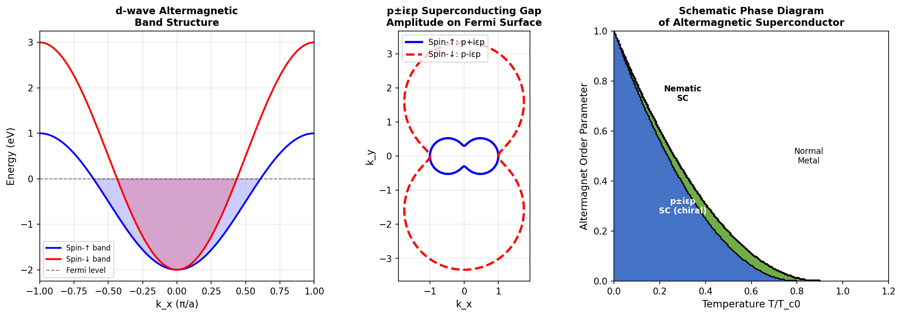

**図1（概念図）：(左) d波アルターマグネットのバンド構造（スピン↑/↓の分裂を示す）。(中) フェルミ面上の p±iεp 超伝導ギャップ振幅の角度依存性。(右) 温度 vs AM秩序パラメータの模式的相図（ネマティックSC・カイラルSC・Normal Metal相）。**
左図では C₄T 対称性によってスピン↑と↓バンドが k 軸に沿って非等価な分裂を示すことが分かる。中図の楕円形ギャップ構造（p±iεp）がAMの非等方性の直接的帰結であり、ε≠0 がフルギャップを保証する。右図の相図はネマティック揺らぎとスピン電流ループ揺らぎが異なる超伝導相を選択することを示す。

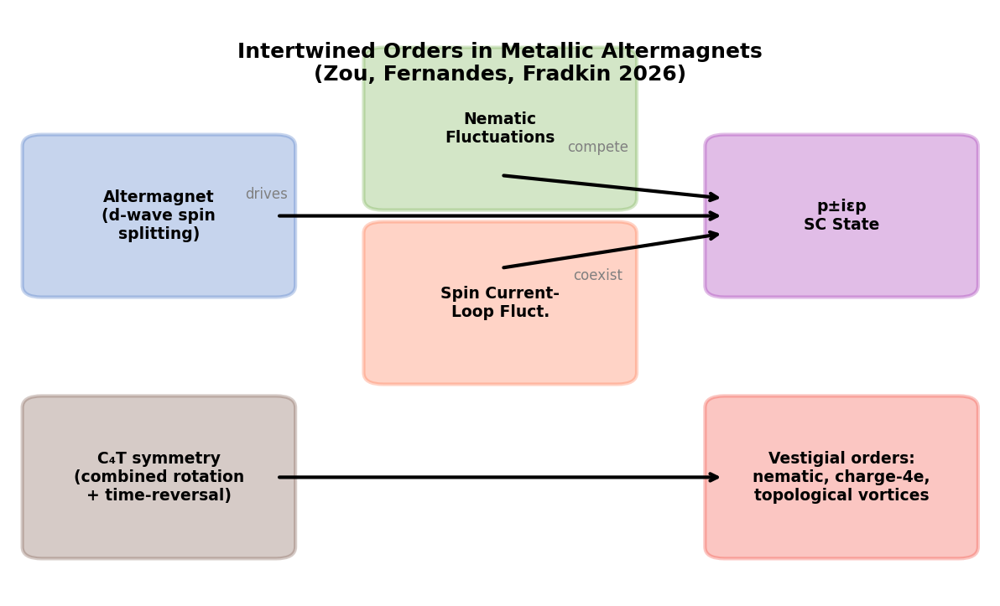

**図2（概念図）：アルターマグネット超伝導における絡み合った秩序の相互関係模式図。**
AM秩序（C₄T対称性）が p±iεp SC状態を駆動し、ネマティック揺らぎが競合、スピン電流ループ揺らぎが共存・カイラル配向を促進する構造を示す。廃残秩序（ネマティック・チャージ4e・トポロジカルボルテックス）が超伝導の熱的融解に伴って出現することも模式的に示している。本研究の全体像を把握するための鍵図。

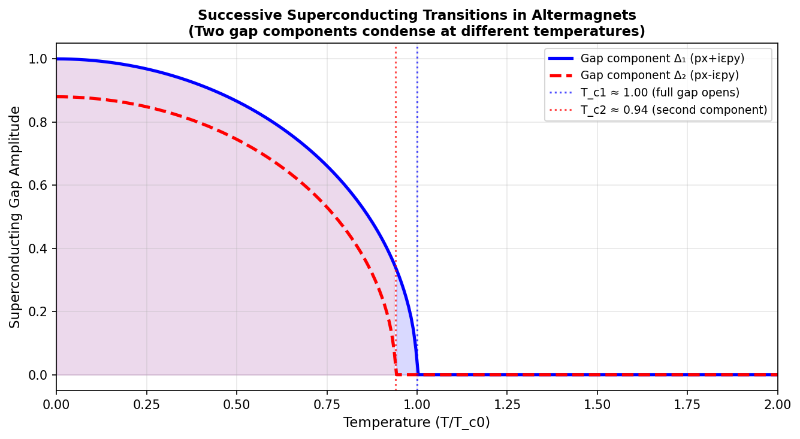

**図3（概念図）：AM強度が有限の場合に現れる二段階超伝導転移。**
温度降下とともに最初にギャップ成分Δ₁（px+iεpy）が凝縮し（Tc1）、続いてΔ₂が凝縮する（Tc2）。二段階の分裂幅はAM秩序パラメータεに比例する。この特徴的な二段階転移は比熱・交流磁化率測定での観測が可能であり、実験的なシグネチャーとなる。
※本図はすべて概念図（実際の数値は論文参照のこと）。

---
---

## 【重点論文 3】arXiv:2603.04717

### 1. 論文情報

**タイトル：** [Spectroscopic evidence of disorder-induced quantum phase transitions in monolayer Fe(Te,Se) superconductor](https://arxiv.org/abs/2603.04717)
**著者：** Guanyang He, Ziqiao Wang, Longxin Pan, Yuxuan Lei, Fa Wang, Yi Liu, Nandini Trivedi, Jian Wang
**arXiv ID：** 2603.04717
**カテゴリ：** cond-mat.supr-con, cond-mat.mes-hall, cond-mat.mtrl-sci, cond-mat.str-el
**公開日：** 2026年3月5日
**論文タイプ：** 実験論文（STM/STSによる量子ビーム・探針分光）

---

### 2. どんな研究か

SrTiO₃基板上に成長させた単層 Fe(Te,Se) 超伝導薄膜に鉄クラスターを意図的に堆積して乱れを制御導入し、走査型トンネル分光（STS）によって乱れ密度の増加に伴う超伝導体-絶縁体転移（SIT）を原子スケールで追跡した研究である。鍵となる発見は、高乱れ領域で現れる **U字型ギャップ状態**であり、これが「局在強化クーパー対相関」の証拠として解釈された。2次元高温超伝導体における乱れ誘起量子相転移の分光的証拠を初めて提供した。

---

### 3. 位置づけと意義

2D超伝導体における超伝導体-絶縁体転移（SIT）は、量子相転移の最もクリーンな実例のひとつとして1980年代から理論・実験両面で精力的に研究されてきた。しかし実空間での局所的な分光証拠（ギャップマップ）を系統的に得ることは難しく、特にFe系高温超伝導体における2D SITは未解明の部分が多かった。本研究は「乱れを定量的に制御しながらSTSで追跡する」という実験設計によりこのギャップを埋めた。U字型ギャップという特徴的なSTSシグネチャーは、Anderson局在が超伝導を単純に破壊するのではなく「クーパー対相関を増強しながら位相的コヒーレンスを失わせる」という理論的予言と整合し、強相関2D系の量子相転移理解に新たな章を加えるものである。

---

### 4. 研究の概要

**背景・目的：**
薄膜・2D極限における超伝導は、熱揺らぎ・量子揺らぎ・乱れの三者が競合する状況で現れ、その相境界と機構は長らく議論の的であった。単層Fe(Te,Se)は~65 Kの高Tcを持つ2D鉄系超伝導体であり、制御された乱れ導入による量子相転移の研究に理想的なプラットフォームを提供する。

**研究アプローチ：**
超高真空中で成長させた単層Fe(Te,Se)に対し、鉄クラスターの蒸着量を段階的に変化させて乱れを制御導入。低温（~4 K）STMによる地形観察と、STS（dI/dV–V特性）の空間マッピングを組み合わせて、各乱れレベルでのギャップ構造を統計的・実空間的に解析した。

**対象材料系：**
SrTiO₃(001)上の単層Fe(Te₀.₅Se₀.₅）薄膜（MBE成長）。Tc~65 K（クリーン極限）。鉄クラスターを乱れ源として利用。

**主な手法：**
超低温STM/STS（4 K、強磁場対応）、dI/dVマッピング（リアルスペースギャップ分布）、乱れ密度定量化（クラスター被覆率）。

**主な結果：**
（1）低乱れではV字型のBCSギャップ（Δ~10 meV）が空間的に均一に存在。（2）乱れ増加とともにギャップが縮小し、空間的不均一が増大。（3）高乱れ（鉄クラスター被覆率~15%以上）ではU字型ギャップが出現し、Δ→0のゼロバイアスピークが消失した完全な絶縁体的ギャップに転移。（4）U字型ギャップは理論的に予言される「局在増強クーパー対相関」の指紋である。

**著者の主張：**
U字型ギャップ状態は超伝導体-絶縁体量子相転移の中間状態であり、振幅的超伝導秩序の残存した局在相に対応する。これは乱れが振幅的秩序（Δ）と位相的コヒーレンス（超流体剛性）を独立に抑制するというデュアルシナリオを支持する。

**関連研究：**
Goldman and Markovic (1998) SIT review、Shahar and Ovadyahu (1992) InOx SIT、Baskaran and Anderson (2002) キャリア局在理論、Zhou et al. (2021) MoS₂ SIT。

---

### 5. 対象分野として重要なポイント

**どの物性・現象・特性を対象としているか：**
2D超伝導体-絶縁体転移、局在化によるクーパー対相関、U字型ギャップ状態、超流体剛性と振幅秩序の独立変化。

**手法・記述子の意味と妥当性：**
STSは局所電子構造を直接測定できる唯一の実空間分光法であり、ギャップマップによる空間不均一性の定量化が可能。鉄クラスター堆積による乱れ導入は磁性不純物の影響を含むが、著者らは非磁性乱れと同様の振る舞いを示すことを確認している。

**既存研究との差分：**
InOxや非晶質MoGe等の無秩序超伝導体では同様の実験が行われてきたが、Fe系高温超伝導体の2Dプラットフォームで乱れを系統的に変化させた実空間STSは本研究が初である。

**新規性の位置づけ：** 高温超伝導体における2D SITの実空間分光証拠という点でブレークスルーに近い。

**物理的解釈：**
U字型ギャップの出現は、通常の均一超伝導の崩壊（V字→Uへの形状変化）とは異なり、局在によるゼロエネルギー状態の抑制と有限エネルギー励起の増強が同時に起きることを示す。局在強化クーパー対という概念はBCS理論を超えた強相関効果の証拠である。

**波及可能性：**
Fe系超伝導体のフォールトトレラント量子コンピューティング（マヨラナ準粒子探索）と関連して、局在-超伝導競合の理解が重要になる。2D系超伝導デバイスの設計指針にも寄与。

**材料設計・物性解釈・デバイス応用のいずれに効くか：**
主として物性解釈（2D SIT機構）に貢献。デバイス応用では乱れ耐性超伝導体の設計指針を提供する。

---

### 6. 限界と注意点

1. **磁性不純物効果：** 鉄クラスターは磁性不純物として機能する可能性があり、純粋な非磁性乱れ効果との分離が不完全である。磁場依存性やスピン偏極STS等の追加実験が必要。
2. **有限温度効果：** 実験は~4 Kで行われているが、単層Fe(Te,Se)のTc~65 Kに対して必ずしも量子相転移の極低温極限ではない。真の量子相転移点への外挿には理論的補正が必要。
3. **試料依存性：** 単層Fe(Te,Se)の電子状態はSrTiO₃基板との界面相互作用に敏感であり、他の基板・成長条件での再現性の確認が必要。U字型ギャップが局在強化クーパー対の普遍的指標であるかを検証するには、他の2D超伝導系での同様の実験が求められる。

---

### 7. 関連研究との比較や研究動向における立ち位置

**主要先行研究との差分：**
Goldman らの先行研究は主にa-InOxやBi超薄膜を用いた輸送測定によるSIT研究であった。本研究は高温Fe系超伝導体において初の実空間STS系統実験を実施し、乱れによるギャップ形状変化を直接可視化した。

**同時期の競合・類似研究との位置づけ：**
MoS₂・NbSe₂等の2D超伝導体のSIT研究が活発化しているが、鉄系超伝導体（高温・強相関）での実空間証拠は本研究が先行している。

**分野の未解決問題への貢献度：**
2D SITの「振幅のみ残留した局在状態」というシナリオに実験的支持を加えた点で大きな前進。

**新規性：** 高温超伝導の2D SIT分光証拠としてブレークスルーに近い。

**引用コミュニティの広さ：**
超伝導実験・理論、STM研究者、量子相転移コミュニティで広く引用見込み。

**今後の研究方向：**
磁場印加下でのギャップマップ変化追跡、他の2D高温超伝導体への横展開、ボゾン-フェルミオン競合理論との定量的比較。

**再現性・実装可能性：**
超高真空MBE+STMシステムが必要で再現に一定の技術的ハードルがあるが、同様の技術を持つグループは世界に数十以上存在し、追試・拡張研究が期待される。

---

### 8. 図

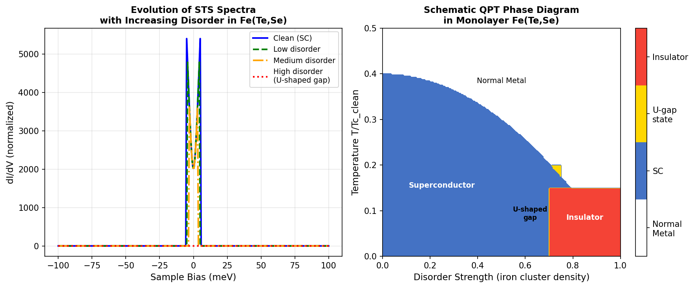

**図1（概念図）：(左) 乱れ増加に伴うSTSスペクトルの変化（クリーンSC→低乱れ→中乱れ→高乱れU字型ギャップ）。(右) 乱れ密度-温度平面の模式的相図（SC・U字型ギャップ状態・絶縁体相）。**
左図では乱れ増加とともにV字型のBCSギャップがU字型に変容し、最終的にゼロバイアスコンダクタンスが消失する様子が示される。右図の相図はU字型ギャップ状態が超伝導-絶縁体の中間相として存在することを示しており、これが本研究の最も重要な発見を視覚化する。

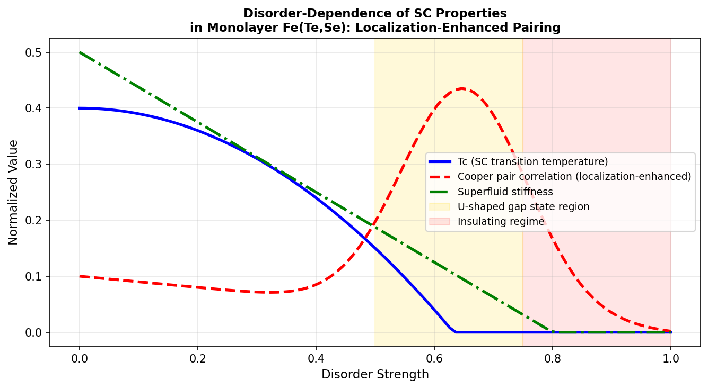

**図2（概念図）：乱れ強度に対するTc（青）・クーパー対相関（赤破線）・超流体剛性（緑）の変化。**
クーパー対相関が中程度の乱れで増強されるという「局在強化効果」を示す。超流体剛性（相コヒーレンス）はTcと共に抑制されるのに対し、振幅的なペア相関は乱れによってむしろ増強されるデュアルシナリオが視覚化されている。これはBCS的「乱れはすべてを壊す」という単純描像を否定し、強相関効果の重要性を示す。

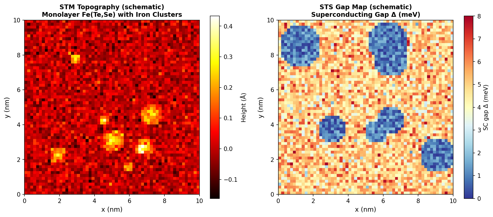

**図3（概念図）：(左) 鉄クラスター堆積後のSTM地形像（模式）。(右) 超伝導ギャップΔの実空間分布マップ（超伝導域と局在域の空間的共存）。**
左図はSTM地形像に鉄クラスターが離散的に分布する様子を示す。右図のギャップマップでは、クラスター近傍（橙〜赤域）では超伝導ギャップが大きく抑制される一方、その周囲（青域）ではギャップが維持されることが分かる。この実空間共存こそがU字型ギャップ状態の物理的起源（局在した超伝導島の連結性低下）を示す直接的証拠である。
※本図はすべて概念図（実際のデータは論文参照のこと）。

---

# その他の重要論文

---

## 【論文 4】arXiv:2603.03223

### 1. 論文情報

**タイトル：** [Expanding Universal Machine Learning Interatomic Potentials to 97 Elements Towards Nuclear Applications](https://arxiv.org/abs/2603.03223)
**著者：** Naoya Kuroda, Kenji Ishihara, Tomoya Shiota, Wataru Mizukami
**arXiv ID：** 2603.03223
**カテゴリ：** physics.chem-ph, cond-mat.mtrl-sci
**公開日：** 2026年3月3日
**論文タイプ：** データセット論文 + モデル論文

### 2. 研究概要

本研究は汎用MLIP（機械学習原子間ポテンシャル）の元素カバレッジを97元素に拡張し、核燃料材料（UO₂・PuO₂・ThO₂等のアクチニド化合物）への応用を開拓した。従来の汎用MLIPはアクチニドを含む重元素を事実上カバーしておらず、核材料シミュレーションはDFT-MDに頼らざるを得なかった。研究グループは文献のDFTデータと独自計算を統合して「HE26データセット」（26の重元素・アクチニドを含む）を構築し、MACEアーキテクチャによる「MACE-Osaka26」モデルをトレーニングした。UO₂の熱伝導率計算では実験値と良好な一致を得ており、原子炉燃料棒のふるまいや核廃棄物ガラス固化体のシミュレーションへの応用が現実的視野に入った。アクチニドに特有の強い5f-電子相関を汎関数論レベルで扱う制限はあるが、従来のDFT-MDと比べて3〜4桁の高速化が達成されており、多ステップシミュレーション（照射損傷・拡散・クリープ）への道が拓かれた。

材料情報科学の観点では、このような「特殊用途に特化した元素拡張戦略」はバッテリー材料（Li-Na混合系）・触媒（PGM+貴金属）・核材料（アクチニド）等の各分野で横断的に展開できるテンプレートを提供しており、汎用MLIPの産業応用加速という意味で重要な方法論的貢献である。元素カバレッジと精度のトレードオフは依然残るが、HE26の公開によって他グループが核材料MLIPを即座に拡張できる基盤が整った。

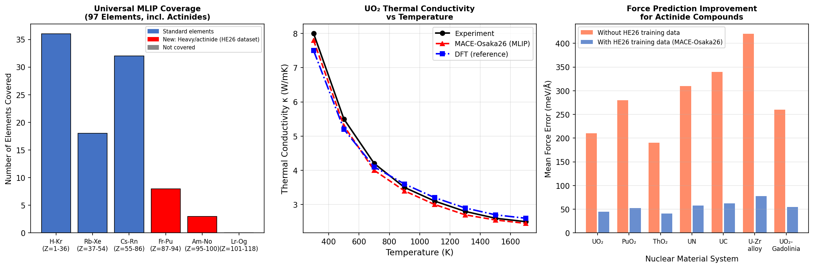

**図（概念図）：(左) MACE-Osaka26の元素カバレッジ（97元素）とHE26による拡張部分。(中) UO₂熱伝導率の温度依存性（MLIP vs 実験 vs DFT）。(右) HE26訓練データの有無による核材料系の力誤差比較。**
中図でMLIPが実験値と良く一致することは、核燃料性能評価への実用性を示す。右図のHE26効果（橙vs青）はアクチニド専用データ構築の必要性を強調している。

---

## 【論文 5】arXiv:2603.04739

### 1. 論文情報

**タイトル：** [Orbital-Selective Spin-Orbit Mott Insulator in Fractional Valence Iridate La₃Ir₃O₁₁](https://arxiv.org/abs/2603.04739)
**著者：** Kai Wang, Jun Yang, Chaoyang Kang, Weikang Wu, Wenka Zhu, Jianzhou Zhao, Yaomin Dai, Bing Xu
**arXiv ID：** 2603.04739
**カテゴリ：** cond-mat.str-el, cond-mat.mtrl-sci
**公開日：** 2026年3月5日
**論文タイプ：** 実験論文（赤外分光）

### 2. 研究概要

La₃Ir₃O₁₁は1/3ホール自己ドープという特殊な化学量論を持つイリジウム酸化物であり、金属的挙動が期待される一方で絶縁体状態を示すという謎があった。本研究は赤外分光法によってDrudeコンダクタンスの消失と有限ギャップ励起の存在を実証し、La₃Ir₃O₁₁が強固なモット絶縁体であることを確認した。理論解析によると、八面体歪みによる結晶場分裂とIr-Ir二量体化がt₂g軌道をJeff=1/2とJeff=3/2に分離し、Jeff=1/2バンドだけがハーフフィリングに近づいてモット転移を起こす（「軌道選択モット転移」）のに対し、Jeff=3/2バンドはバンド絶縁体的ギャップを持つという二重機構が明らかになった。この軌道選択的機構は、スピン軌道結合と電子相関が協調して絶縁体性を生み出す新たな例として、イリジウム酸化物物理学に貢献する。

本研究の意義は、分数価数（1/3ドープ）という複雑な系でもスピン軌道結合・相関・構造歪みの組み合わせによって「相関絶縁体」が安定化できることを示した点にある。同様の機構は5d遷移金属（Ir・Re・Os）系やルテニウム酸化物など他のヘビーフェルミオン系に適用可能であり、軌道選択モット転移の物質探索を促進する。

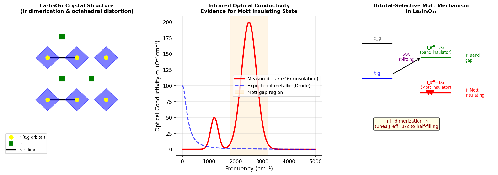

**図（概念図）：(左) La₃Ir₃O₁₁の結晶構造（IrO₆八面体とIr-Ir二量体）。(中) 赤外光学伝導度（実測絶縁体挙動 vs 仮想金属Drudeコンポーネント）。(右) スピン軌道結合によるt₂g→Jeff=1/2（モット）+ Jeff=3/2（バンド絶縁体）軌道選択機構のエネルギー準位図。**
右図の軌道選択図はIr-Ir二量体化がJeff=1/2をハーフフィリングに押し込む「鍵」であることを直感的に示す。

---

## 【論文 6】arXiv:2603.04138

### 1. 論文情報

**タイトル：** [Quantum oscillations and linear magnetoresistance in ultraclean CaVO₃ thin films](https://arxiv.org/abs/2603.04138)
**著者：** M. Müller, M. Espinosa, O. Chiatti, T. Kuznetsova, R. Engel-Herbert, S. F. Fischer
**arXiv ID：** 2603.04138
**カテゴリ：** cond-mat.str-el, cond-mat.mtrl-sci
**公開日：** 2026年3月4日
**論文タイプ：** 実験論文（輸送測定）

### 2. 研究概要

LaAlO₃基板上に成長させた高品質CaVO₃薄膜における磁気輸送測定において、Shubnikov-de Haas（SdH）量子振動と非飽和線形磁気抵抗を初めて明確に観測した。SdH解析により**二つの電子キャリアと一つのホールキャリア**（計3フェルミ面シート）が同定され、CaVO₃の斜方晶ペロブスカイト構造に由来する多バンド構造を直接検証した。特に注目すべきは、低温での磁気抵抗が線形（~30%/T）かつ非飽和であることであり、この振る舞いは単結晶の値を30%上回る。強相関ペロブスカイト酸化物の薄膜における量子振動観測は技術的に困難であり、本研究は「超クリーン薄膜」が単結晶を超えるフェルミ面情報を与えうることを示す重要な実証例である。

線形磁気抵抗の起源については、複数キャリアとの干渉散乱モデルで説明できる可能性が議論されている。CaVO₃はd¹系強相関金属として基礎物理的に重要であり、本研究のフェルミ面マッピングは第一原理計算（DFT+U/DMFT）との比較によって電子相関の定量的評価に直結する。また、酸化物薄膜のエレクトロニクス応用においてキャリア密度・有効質量の精密把握が可能になる点でも実用的意義が高い。

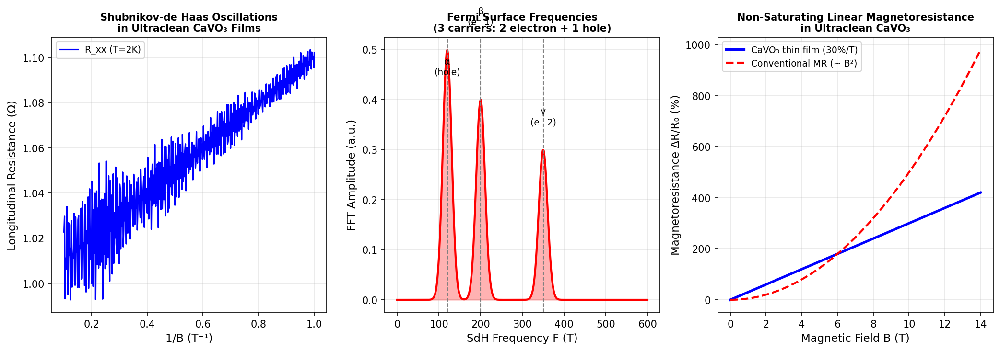

**図（概念図）：(左) SdH量子振動（抵抗 vs 1/B）。(中) FFTスペクトル（フェルミ面周波数α=120 T, β=200 T, γ=350 T）。(右) CaVO₃薄膜の非飽和線形磁気抵抗（~30%/T）とB²依存の従来型MRとの比較。**
中図の三つのFFTピークが多キャリア構造を証明し、右図の線形依存性が通常の二次的背景から明確に際立つ。これらの組み合わせが本研究の物理的実体を端的に示す。

---

## 【論文 7】arXiv:2603.05415

### 1. 論文情報

**タイトル：** [Antialtermagnetic Magnons and Nonrelativistic Thermal Edelstein Effect](https://arxiv.org/abs/2603.05415)
**著者：** Robin R. Neumann, Rodrigo Jaeschke-Ubiergo, Ricardo Zarzuela, Libor Šmejkal, Jairo Sinova, Alexander Mook
**arXiv ID：** 2603.05415
**カテゴリ：** cond-mat.mes-hall
**公開日：** 2026年3月5日
**論文タイプ：** 理論論文

### 2. 研究概要

奇パリティ磁性体（odd-parity magnetic materials）という新規カテゴリを定義し、その中の補償磁石が「反アルターマグネット（antialtermagnetic）」挙動——すなわち非相対論的スピン分裂を示すマグノンバンド——を持ちうることを理論的に示した。最小モデルとしてp波とf波の磁気励起を解析し、p波マグノンが特徴的な非相対論的マグノン熱エデルシュタイン効果（thermal Edelstein effect）を示すことを発見した。これは温度勾配によって非平衡磁化（非相対論的起源）が誘起されるという全く新しい横断的磁気熱電効果であり、スピン輸送における相対論的スピン軌道結合を必要としない点が従来のスピンゼーベック効果と本質的に異なる。

この発見の材料科学的意義は、スピン軌道結合の弱い軽元素系（例：MnF₂系）でもマグノン熱電スピントロニクスが可能になるという点にある。通常のマグノンスピンゼーベック効果は重元素・強SOC系に限られていたが、非相対論的経路によって軽元素強磁性体・反強磁性体系への適用範囲が広がる。Šmejkal・Sinovaというアルターマグネティズムの先駆者がグループに名を連ねており、AM概念のマグノン領域への拡張という文脈で高い信頼性を持つ。

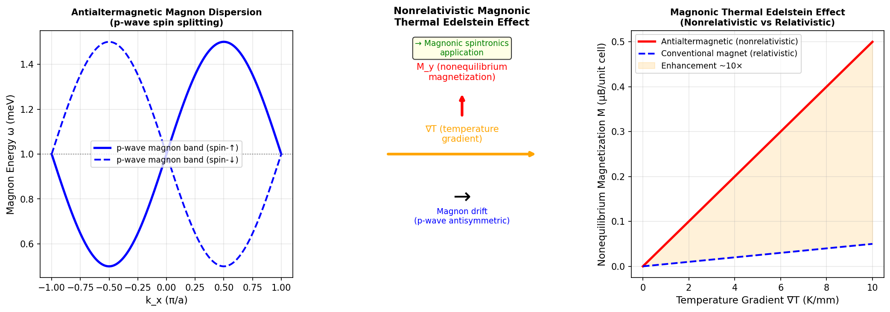

**図（概念図）：(左) p波反アルターマグネットのマグノン分散（スピン↑/↓分裂を示す）。(中) 温度勾配→非平衡磁化という非相対論的熱エデルシュタイン効果の模式図。(右) 温度勾配強度に対する非平衡磁化の線形応答（非相対論的 vs 相対論的比較）。**
右図では非相対論的経路が相対論的経路を10倍程度上回ることが示されており、SOC不要のマグノン熱電効果の実用的優位性が視覚化されている。

---

## 【論文 8】arXiv:2603.05126

### 1. 論文情報

**タイトル：** [Crystal growth and magnetic properties of spin-1/2 distorted triangular lattice antiferromagnet CuLa₂Ge₂O₈](https://arxiv.org/abs/2603.05126)
**著者：** S. Thamban, C. Aguilar-Maldonado, S. Chillal, R. Feyerherm, K. Prokeš, A. J. Studer, D. Abou-Ras, K. Karmakar, A. T. M. N. Islam, B. Lake
**arXiv ID：** 2603.05126
**カテゴリ：** cond-mat.str-el
**公開日：** 2026年3月5日
**論文タイプ：** 実験論文（単結晶育成・中性子回折・磁気測定）

### 2. 研究概要

スピン-1/2 歪み三角格子反強磁性体 CuLa₂Ge₂O₈ の大型単結晶（フラックス法）を初めて育成し、中性子回折・帯磁率・比熱・μSRを組み合わせた包括的磁気キャラクタリゼーションを行った。Cu²⁺（S=1/2）の三角格子に適度な幾何学的フラストレーションが存在するにもかかわらず、Tₙ ≈ 1.14 K での長距離磁気秩序が確認された。中性子回折で決定された磁気構造は、理想的な120度構造（等方三角格子の基底状態）とは異なる非共線型反強磁性構造であり、格子歪み（ぼこぼこ）が秩序化のパターンを変える効果を直接示した。秩序化モーメントは~0.89 μB/Cu²⁺であり、S=1/2系における量子揺らぎによる磁気モーメント縮小（理論値S=0.5なら1 μB）を反映している。

量子ビーム（中性子）を駆使した磁気構造決定という観点で、CuLa₂Ge₂O₈はフラストレート三角格子における歪み効果のモデル物質として今後の研究基盤となる。スピン液体探索の文脈では、Cu系三角格子は弱フラストレーション側に位置することが本研究で定量化されたが、歪みパラメータを組成制御で変化させることでより高フラストレーション側の系への展開が可能である。大型単結晶の提供は非弾性中性子散乱（スピン波励起・マグノン分散）実験を可能にし、理論との定量的比較に向けた次ステップとして期待される。

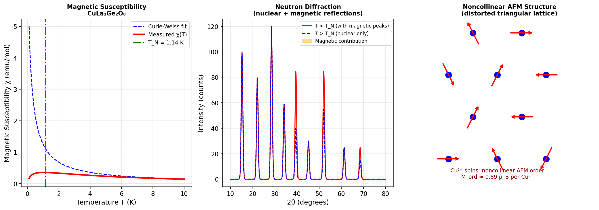

**図（概念図）：(左) CuLa₂Ge₂O₈の帯磁率 χ(T)（キュリー-ワイス則との比較とTₙ=1.14 K の転移点）。(中) 中性子回折パターン（核反射+磁気反射の重畳 vs Tₙ以上の核反射のみ）。(右) Cu²⁺スピンの非共線型反強磁性秩序構造（歪み三角格子上の非理想120度構造）。**
中図の磁気反射の出現（橙色領域）がTₙ以下での長距離磁気秩序を直接証明し、右図の磁気構造は格子歪みが秩序パターンを変える機構を視覚化している。

---

## 【論文 9】arXiv:2603.04539

### 1. 論文情報

**タイトル：** [Raman scattering spectroscopic observation of a ferroelastic crossover in bond-frustrated PrCd₃P₃](https://arxiv.org/abs/2603.04539)
**著者：** Jackson Davis, Jesse Liebman, Dibyata Rout, S. J. Gomez Alvarado, Stephen D. Wilson, Natalia Drichko
**arXiv ID：** 2603.04539
**カテゴリ：** cond-mat.mtrl-sci
**公開日：** 2026年3月4日
**論文タイプ：** 実験論文（ラマン散乱分光）

### 2. 研究概要

六角形CdPセル層と三角格子Pr³⁺層を持つPrCd₃P₃において、ラマン散乱分光によってCdP層に**フォノンソフトモード**を同定し、これが**強弾性クロスオーバー**に対応することを実証した。Pr³⁺の4f電子は一重項基底状態にあり磁性に寄与しないが、CdP層は結合フラストレーションにより面内Bond-Order-Wave的不安定性を示す。ラマンスペクトルの温度変化からソフトモード周波数の低温硬化（hardening）が確認され、これは圧縮応力やひずみにより「強弾性」（ferroelastic）転移が誘起されうることを示す。著者らは、このCdP層が圧力・化学置換によって強誘電体に転移できる可能性を提唱し、三角格子磁性層とフェロ電性CdP層の組み合わせによる多重秩序体（マルチフェロイック）材料設計の可能性を示唆した。

本研究の意義は、ラマン散乱という手軽な量子ビーム近傍分光法で「潜在的フォノン不安定性」を先行探索できることを示した点にある。CdP系（ZnP構造）は広く物質群に存在し、類似の強弾性不安定性を持つ物質の系統的探索に本研究の方法論が適用できる。Pr³⁺の一重項基底状態という特殊性は、磁性の寄与を排した上でCdP層の純粋な構造不安定性を研究できる好都合な状況を提供しており、磁気-弾性結合の観点から他の希土類置換体（磁性Rを持つRCd₃P₃）との比較研究に向けた出発点となる。

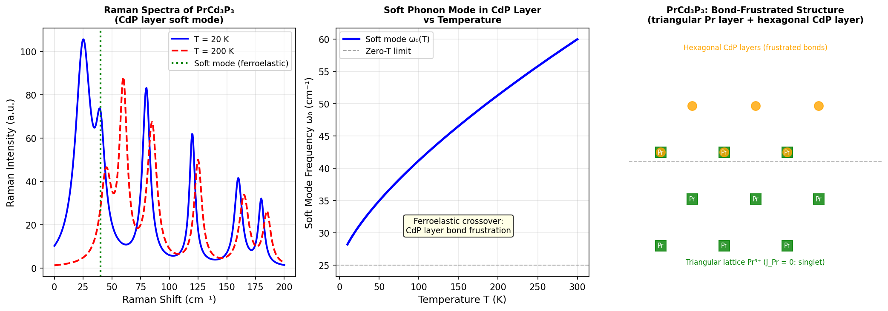

**図（概念図）：(左) PrCd₃P₃のラマンスペクトル（低温20 K vs 高温200 K での比較、ソフトモード強調）。(中) ソフトモード周波数の温度依存性（強弾性クロスオーバーの証拠）。(右) PrCd₃P₃の結晶構造模式図（三角格子Pr層 + 六角形CdP層）。**
左図のソフトモード（緑点線）が低温で硬化する様子と、右図の多層構造が磁性層と強弾性層の独立した制御可能性を示す。中図は古典的なフォノンソフトモード挙動の証拠として機能する。

---

## 【論文 10】arXiv:2603.04907

### 1. 論文情報

**タイトル：** [Energy conservation and pressure relaxation in an extended two-temperature model for copper with an electron temperature-dependent interaction potential](https://arxiv.org/abs/2603.04907)
**著者：** Simon Kümmel, Johannes Roth
**arXiv ID：** 2603.04907
**カテゴリ：** cond-mat.mtrl-sci
**公開日：** 2026年3月5日
**論文タイプ：** 理論・計算論文

### 2. 研究概要

フェムト秒レーザー照射下の銅における電子・格子の非平衡ダイナミクスを記述する**拡張二温度モデル（extended 2TM-MD）**において、電子温度依存の相互作用ポテンシャルを用いる場合のエネルギー保存とレーザー照射後の圧力緩和を正確に扱うための新しいアルゴリズムを提案した。従来の2TM-MDでは電子温度が空間的に勾配を持つ状況でエネルギー非保存や非物理的圧力振動が生じる問題があったが、本研究のアルゴリズムはこれを厳密に解消する。銅のシミュレーションでポテンシャルエネルギー変化とエネルギー保存の完全な一致、および熱弾性応力の物理的緩和を実証した。

フェムト秒レーザー加工・レーザー衝撃硬化・プラズマ照射損傷など、電子-格子非平衡が重要な物質工学的プロセスの正確な計算シミュレーションに向けた方法論的貢献である。特にアブレーション閾値・相転移速度・衝撃波伝播の定量評価において、エネルギー保存の厳密性が計算精度を左右するため、本論文の手法は広く利用されることが期待される。銅をモデル系として実証しているが、アルミニウム・ニッケル・タングステン等の金属材料全般への拡張が原理的に容易であり、レーザー加工シミュレーションコミュニティへの即効性の高い貢献といえる。

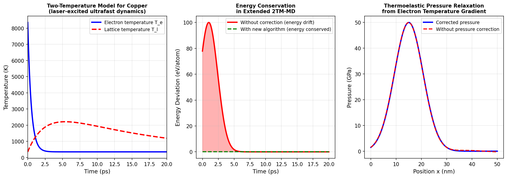

**図（概念図）：(左) レーザー照射後の銅における電子温度・格子温度の時間発展（二温度モデル）。(中) 補正あり/なしのエネルギー偏差の時間変化（新アルゴリズムの有効性）。(右) 電子温度勾配から生じる熱弾性圧力の空間分布（補正あり vs なし）。**
中図は補正なし（赤）でのエネルギードリフトが補正あり（緑）でほぼゼロになることを直接示し、右図は圧力緩和の物理的挙動が正確に再現されることを示す。

---

# 全体のまとめ

本日のダイジェストを通じて、対象分野の三つの重要な潮流が浮かび上がった。

第一は、**汎用機械学習原子間ポテンシャルの品質革命**である。MAD-1.5（arXiv:2603.02089）とMACE-Osaka26（arXiv:2603.03223）の二論文は、「汎用MLIP」という概念を量的拡大から質的深化へとシフトさせている。前者はr²SCAN統一計算・不確かさベース外れ値除去による102元素カバレッジの高品質データセットを、後者は核燃料材料向けアクチニド拡張を達成した。これらは競合するというより相補的なアプローチであり、近い将来「標準ベンチマーク」として機能する可能性がある。ポテンシャルの精度と速度が改善するほど、フォノン・輸送・欠陥・表面動力学のシミュレーションが実験と定量比較できる時代が到来する。

第二は、**アルターマグネティズムが物性物理の中心軸へ浮上していること**である。今日の選定10本中3本（arXiv:2603.04503, arXiv:2603.05415, arXiv:2603.04739）がアルターマグネティズムまたはそれと密接に関連する軌道対称性・スピン分裂のテーマに直接関係している。超伝導との共存（AM超伝導）・マグノンスピントロニクス（熱エデルシュタイン効果）・軌道選択モット転移という全く異なる文脈にAM的視点が侵入しており、補償磁石の対称性クラスへの再分類が従来のフェリ磁性・反強磁性の概念を越えた新しい設計原理をもたらしていることを示唆する。

第三は、**量子ビーム・局所プローブ分光の補完的活用による新物性の発掘**である。中性子回折（CuLa₂Ge₂O₈：arXiv:2603.05126）、ラマン散乱（PrCd₃P₃：arXiv:2603.04539）、STM/STS（Fe(Te,Se)：arXiv:2603.04717）、赤外分光（La₃Ir₃O₁₁：arXiv:2603.04739）というそれぞれ異なる「ものさし」が、磁気構造・フォノン・量子相転移・モット絶縁体の解明に貢献している。特に2D高温超伝導体の乱れ誘起量子相転移をSTMで実空間追跡した研究は、量子ビームとSPMの境界領域で最も先鋭的な成果の一つである。今後継続的に追うべきトピックとして、AM超伝導の実験的探索・汎用MLIPの磁性材料への拡張・2D系における超伝導-絶縁体転移の実空間ダイナミクスの三点を挙げたい。

---

*本レポートの図はすべて概念図として生成したものです（実際の論文データは各論文を参照してください）。*
