# arXiv 日次ダイジェスト

**作成日：** 2026年3月9日
**対象期間：** 2026年3月6日〜3月9日（直近72時間の新着論文）
**担当分野：** 材料工学・物性物理・マテリアルズ・インフォマティクス・量子ビーム

---

## 今日の選定方針

本日の第二報では、前回（2026-03-09.md）で取り上げた10本とは重複しない新たな10本を cond-mat.mtrl-sci・cond-mat.str-el・cond-mat.supr-con・cond-mat.mes-hall から選定した。前回の選定がMLIP・アルターマグネットの基礎理論・高温超伝導の中心に位置する論文群を扱ったのに対し、本報では **量子ビームと第一原理計算の接合**・**光学的スピン制御の新機構**・**超伝導アンドレーエフ分子という新量子状態** という三つの軸を重点的に取り上げた。特に、XFELによるフェムト秒X線回折とMLIPシミュレーションを組み合わせたチタンの衝撃圧縮実験は、量子ビーム材料科学の最前線を体現する研究として最優先で紹介する。アルターマグネットを軸とした超伝導研究の深化と、van der Waals強磁性体Cr₂Ge₂Te₆における非線形Edelstein-Zeeman効果の実証も、分野の最新潮流を反映する注目論文である。

---

## 重点論文 3本

1. **[High pressure melt dynamics in shock-compressed titanium](https://arxiv.org/abs/2603.04680)** — Singh, Paul, Rampal et al. (arXiv:2603.04680)
2. **[Manipulation of ferromagnetism with a light-driven nonlinear Edelstein-Zeeman field](https://arxiv.org/abs/2603.05456)** — Lv, Meese, Murzabekova et al. (arXiv:2603.05456)
3. **[Spin-polarized Andreev molecules and anomalous nonlocal Josephson effects in altermagnetic junctions](https://arxiv.org/abs/2603.04954)** — Mondal, Cayao (arXiv:2603.04954)

---

## 全体所見

本日の10本を俯瞰すると、量子ビームを用いた実験的アプローチと計算材料科学の統合という潮流が明確に読み取れる。XFEL（自由電子レーザー）によるチタン衝撃圧縮実験（arXiv:2603.04680）は、機械学習原子間ポテンシャルとの組み合わせにより、極端条件下の固液共存が実験側で約80 GPa早く出現するという予想外の結果を明示した。これはMLIPが物質の相図を記述する際にまだ系統的な課題を抱えることを具体的に示した重要例である。磁性の光学制御という観点では、Cr₂Ge₂Te₆での非線形Edelstein-Zeeman場効果（arXiv:2603.05456）が注目される。中心対称な結晶でさえ「隠れたスピン分裂」を利用した光磁気制御が原理的に可能であることが示されたことは、スピントロニクスにおけるデバイス設計の範囲を大きく広げる。超伝導研究では、アルターマグネットとの接合で生じるAndreev分子（arXiv:2603.04954）と、MnBi₂Te₄における幾何学的欠陥存在下での量子化Hall輸送の堅牢性（arXiv:2603.03927）が際立っており、位相幾何学的保護の実用への橋渡しを示している。また、第一原理でコヒーレンス長と磁場侵入長を同時算出するSCDFT拡張（arXiv:2603.05123）は、材料インフォマティクスによる超伝導材料探索の新たな指標を提供する可能性を秘めている。

---

# 重点論文の詳細解説

---

## 【重点論文 1】arXiv:2603.04680

### 1. 論文情報

**タイトル：** [High pressure melt dynamics in shock-compressed titanium](https://arxiv.org/abs/2603.04680)
**著者：** Saransh Singh, Reetam Paul, Nikhil Rampal, et al.
**arXiv ID：** 2603.04680
**カテゴリ：** cond-mat.mtrl-sci
**公開日：** 2026年3月4日
**論文タイプ：** 実験＋計算（XFEL + MLIP-MD）論文

---

### 2. どんな研究か

LCLS（Linac Coherent Light Source）MEC端局でのレーザー衝撃圧縮と **フェムト秒X線回折（XFEL）** を組み合わせて、チタンの高圧融解挙動をその場（in situ）で追跡した。機械学習原子間ポテンシャル（Allegro MLIP）に基づく分子動力学シミュレーションが**111〜124 GPa**での固液共存を予測する一方、実験では**86 GPa**という著しく低い圧力で液相の初期証拠が観測され、固液共存域の幅（~93 GPa）がMLMDの予測（~13 GPa）を大幅に超えることが初めて明示された。

---

### 3. 位置づけと意義

チタンは航空・防衛分野で戦略的に重要な構造材料であり、高圧下の相図は衝撃波工学・惑星内部モデリング両方の基礎データとなる。衝撃圧縮下の融解実験はこれまで主にダイヤモンドアンビルセルによる静圧融解データに依存せざるを得なかったが、動的条件下での融解経路は静圧とは異なる可能性がある。本研究はXFELの高輝度・フェムト秒時間分解能を活かして動的融解の直接観測を実現するとともに、Allegro MLIPの精度限界を定量的に評価した最初の系統的研究の一つである。MLIP vs. 実験という直接比較がなされた価値は高く、汎用MLIPの高圧域への適用に際する注意喚起として今後広く引用されるであろう。

---

### 4. 研究の概要

**背景・目的：**
チタンのフーゴニオ（衝撃Rankine-Hugoniot曲線）上での高圧相転移シーケンスはα→ω→β→液体と推定されているが、β→液体遷移の圧力・温度条件には実験的不確かさが大きく、静圧融解曲線との整合も不明瞭であった。本研究はXFELを用いてこの遷移を直接観測し、MLIPとの整合性を検証することを目的とする。

**研究アプローチ：**
79 μmポリイミドアブレーター／32 μm Tiフォイル／LiF窓という三層ターゲットに対して、Nd:YAGドライブレーザー（1053 nm、~50 J、~3 ns）で平面衝撃波を発生させた。10 keVのXFELパルスで結晶相分率と方位分布をフェムト秒精度で追跡。VISARで界面速度を測定して圧力を決定。計算側はDFT（~100〜180 GPa、2000〜4000 K域で訓練）ベースのAllegro MLIPを用いたMD。

**対象材料系：**
多結晶チタン（α相、ω相、β相、液体Ti）

**主な手法（計測・計算・モデル）：**
フェムト秒X線回折（10 keV、LCLS-MEC）、VISAR、Allegro機械学習力場、Simon-Glatzel融解曲線フィッティング

**主な結果：**
- 15〜66 GPa：α→ω→β相転移シーケンスを確認
- 86 GPa：初の液相証拠（粉末的回折シグネチャ出現）
- 86〜179 GPa：固液共存（実験値）、うち126 GPa以上で残留β-Ti
- MLMD予測の共存域（111〜124 GPa）との差: 実験は約25 GPa低温・低圧で融解が先行

**著者の主張：**
実験的な固液共存域（~93 GPa幅）がMLMD予測（~13 GPa）の約7倍以上広いのは、MLIPの高圧液体PES記述の不十分さを反映する可能性があり、量子核効果または非平衡融解ダイナミクスも寄与しうる。

**関連研究：**
Ding et al. (2023) 静圧融解曲線; Coppari et al. (2013) 衝撃圧縮X線回折; Batatia et al. (2023) Allegro MLIP

---

### 5. 対象分野として重要なポイント

**どの物性・現象・特性を対象としているか：**
高圧下の固液相転移・固液共存、衝撃圧縮Hugoniot、相分率の動的変化

**手法・記述子・特徴量の意味と妥当性：**
Allegro MLIPはSO(3)等変型ネットワークであり、高圧下でもDFT精度に近い力・エネルギーを予測する設計になっているが、本研究はその高圧・高温領域での系統的過小評価を示す実験的反例を提供した。Allegro訓練データの構造多様性が液相に対して不十分であった可能性が示唆される。

**既存研究との差分：**
DAC静圧実験では測定できない動的融解経路を、XFEL in situで追跡したのが最大の差分。固液共存の幅が静圧のSimon-Glatzel曲線と整合しないことも新知見。

**新規性の位置づけ：**
「MLIPとXFEL実験を同等条件で比較した」という測定設計自体が斬新であり、MLIPのベンチマークとしても機能する。Incremental改善ではなくMLIPの限界を定量化した点でブレークスルー的側面を持つ。

**物理的解釈に関する議論：**
残留β-Ti（126 GPa以上）はβ相の熱力学的安定性の異常な延伸を示唆するが、著者は非平衡衝撃ダイナミクスによる核生成律速の可能性も指摘している。定量的な解釈には衝撃波持続時間と液体核形成速度の比較が必要。

**波及可能性：**
高圧下MLIP訓練データ戦略（液相構造サンプリングの強化）、動的圧縮条件でのMLIP検証プロトコルの確立、地球・惑星内部材料（Fe, Siなど）の動的融解研究へのXFEL適用

**材料設計・物性解釈・デバイス応用のいずれに効くか：**
主に物性解釈（Ti高圧相図）＋材料インフォマティクス（MLIP精度評価）

---

### 6. 限界と注意点

1. **試料・実験条件の制約：** 多結晶 Ti フォイルを用いているため、初期テクスチャや粒径分布の不均一性が相分率定量に±5〜10%程度の系統誤差を導入する可能性がある。著者はこれを統計的に評価しているが、単結晶試料との比較は行われていない。

2. **MLIPの訓練データ範囲：** 使用したAllegro MLIPは100〜180 GPa・2000〜4000 K域のDFTデータで訓練されているが、この範囲境界付近（特に低温高圧域や液相境界近傍）でのポテンシャル面記述の信頼性は未検証であり、「実験との差分がMLIPの限界か、それとも非平衡物理か」の切り分けが困難である。

3. **時間分解能・圧力均一性：** レーザー衝撃波の空間的不均一（~2 GPa圧力ラフネス）とX線パルス時間窓内での圧力弛緩が、相分率と圧力の対応付けに系統的な不確かさをもたらす。特に共存域幅の定量的評価には、より均一な駆動条件と複数ショットでの統計が必要である。

---

### 7. 関連研究との比較・研究動向における立ち位置

**主要先行研究との差分：**
Coppari et al. (2013, Nat. Geosci.) はXFELを用いてFeの高圧融解を初めて直接観測した先駆的研究だが、チタンでの系統的な固液共存域の定量追跡は本研究が初。Ding et al. (2023) の静圧融解データとの乖離（動的条件で~25 GPa低温化）は、融解機構の動的効果を示す新たな証拠。

**同時期の競合・類似研究との位置づけ：**
Hugoniot計算にMLIPを使う研究（Bararnia 2024, J. Appl. Phys.; Rinaldi 2025）は増加中だが、XFELとの直接比較で固液共存域の幅を系統的に評価した研究は本論文が初。

**分野の未解決問題に対してどの程度前進しているか：**
「動的融解曲線 vs. 静圧融解曲線の差異」という未解決問題に、最大の実験的拠点としてのXFEL利用でアプローチした点で大きく前進。ただし定量的合理化（非平衡 vs. MLIPバイアス）には追加研究が必要。

**新規性は incremental か breakthrough か：**
手法的組み合わせ（XFEL + Allegro MLIP + in situ高圧）はIncrementalだが、「MLIPが動的高圧融解で~7倍の共存幅誤差を持つ」という知見は当該分野でのブレークスルー的発見。

**引用されうるコミュニティの広さ：**
衝撃物理・高圧科学・惑星内部・MLIP開発コミュニティすべてに引用される可能性が高い。

**今後この論文が起点となって展開しうる研究方向：**
①液相訓練データ強化Allegro v2の開発、②Fe・Al・Siなど他の軽量構造金属への展開、③衝撃波持続時間制御による非平衡核生成の直接観測

**他の研究者が実装・再現・応用しやすい成果か：**
Allegro MLIPとXFEL実験環境の両方が必要であり再現ハードルは高いが、Allegro MLIPはオープンソースで利用可能なため計算側の再現はしやすい。

---

### 8. 図

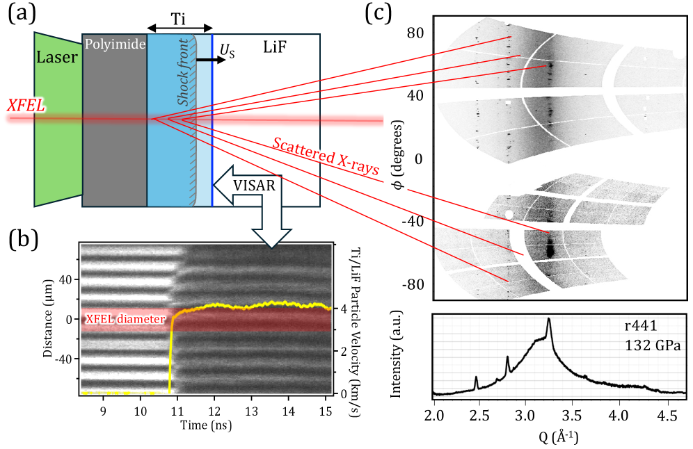

**図1：実験セットアップと代表的なXFEL回折パターン**
左：レーザー衝撃圧縮ターゲット設計（ポリイミド/Ti/LiF三層構造）とX線照射ジオメトリ。右：異なる圧力（15〜180 GPa）での方位角積分回折パターン。α→ω→β→液体へのシーケンスが回折ピークの出現・消滅として読み取れる。β相のブロードニングが液体共存の証拠となっている。

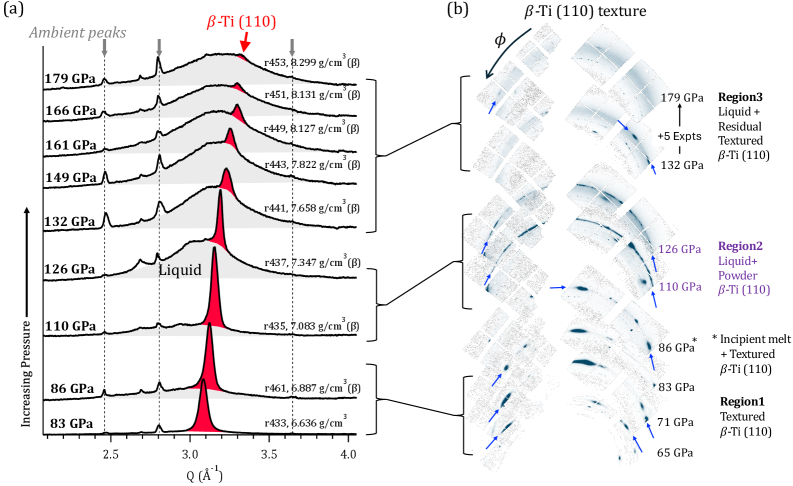

**図2：各圧力における相分率の変化とテクスチャ進化**
β相(110)反射の方位角分布が86 GPa以上で粉末的（等方的）シグネチャへ変化し、大粒径単結晶的テクスチャから微粒子化への転移を示す。相分率の圧力依存性は液体成分が86 GPaから130 GPaにかけて単調増加し、~180 GPaで残留β-Tiが~1%程度残存することを示す。

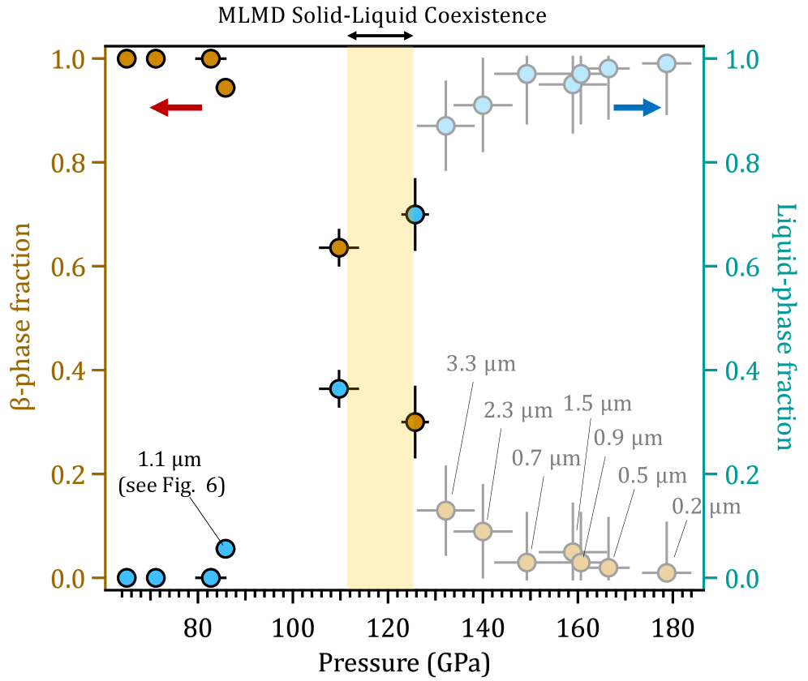

**図3：P-T相図上の実験値とMLIPシミュレーション比較**
Hugoniot曲線（VISAR圧力＋Mie-Grüneisenモデル温度）上にプロットした固相・共存域・液相の実験データ点と、Allegro MLMDによるSimon-Glatzel融解曲線の比較。実験的融解開始（86 GPa）がMLMD予測（111 GPa）より大幅に低く、さらに共存域幅の顕著な不一致（93 GPa vs. 13 GPa）が見て取れる。

---

## 【重点論文 2】arXiv:2603.05456

### 1. 論文情報

**タイトル：** [Manipulation of ferromagnetism with a light-driven nonlinear Edelstein-Zeeman field](https://arxiv.org/abs/2603.05456)
**著者：** Yinchuan Lv, W. Joe Meese, Azel Murzabekova, et al.
**arXiv ID：** 2603.05456
**カテゴリ：** cond-mat.mes-hall
**公開日：** 2026年3月5日
**論文タイプ：** 実験（THz放射・時間領域分光）＋理論（平均場フェロ磁性モデル）

---

### 2. どんな研究か

van der Waals強磁性半導体 **Cr₂Ge₂Te₆** において、近赤外パルス（1.2 eV）で励起された **非線形Edelstein効果**（偶数次非線形光学応答）が「Edelstein-Zeeman場」と呼ぶべき非平衡磁化密度を生成し、これが局在スピン磁気モーメントとピコ秒オーダーで結合することをテラヘルツ（THz）放射分光で初めて直接実証した。偶数次応答の対称性から、中心対称な結晶であっても局所的非中心対称サイトにより「隠れたスピン分裂」が駆動力となることが示された。

---

### 3. 位置づけと意義

従来の超高速磁化制御は、逆Faraday効果（角運動量移転）や超高速脱磁（熱的効果）、あるいはインパルシブラマン散乱（フォノン媒介）によるものが主流であった。本研究は**偶数次非線形光学応答**という全く異なる機構で磁化が操作できることを示した点で、スピントロニクスにおける光励起制御の概念的範囲を拡張する。Cr₂Ge₂Te₆はCurie温度が~66 Kと低いが、同族のCr₂Si₂Te₆やCrI₃、さらにはより高Tc磁性半導体への展開が期待され、「中心対称でも機能するスピントロニクス材料」という新カテゴリを開く可能性がある。また、Edelstein-Zeeman場の大きさが光流量に対して非線形的（飽和的）に振る舞うことが観測されており、平均場理論との定量的整合性も確認された。

---

### 4. 研究の概要

**背景・目的：**
電場と磁化は時間反転・空間反転に対して異なる変換性を持つため、電場から直接磁化を生成するには何らかの対称性破れが必要である。リニアEdelstein効果は非中心対称体に限られるが、偶数次（非線形）Edelstein効果は时間反転対称性のみを必要とし、中心対称結晶でも「局所的非中心対称サイト」があれば発現しうる。本研究はこの理論予測を実験的に検証することを目的とした。

**研究アプローチ：**
時間領域THz放射分光：近赤外ポンプ（1.2 eV, ~100 fs）によって誘起された非線形光起電流を、THz波放射として位相・振幅両方を検出。ポンプ偏光角・入射角・光流量・温度を系統的に変化させて対称性を確認。

**対象材料系：**
バルクCr₂Ge₂Te₆単結晶。Curie温度Tc ~66 K、三方晶（空間群R-3）、局所的Cr₃+サイトでスピン軌道結合が強い。

**主な手法（計測・計算・モデル）：**
THz放射分光（磁気双極子放射の直接検出）、Landau自由エネルギー展開、平均場強磁性理論（非線形Edelstein-Zeeman場モデル）

**主な結果：**
- 垂直入射でTHz放射パターンが4回対称（非磁気起源成分の消去後）
- 斜め入射で面内・面外磁化成分の競合によるTHz極性反転
- THz振幅が流量に対して飽和的非単調応答（Landau平均場理論で再現）
- Tc以上でシグナル消失（磁気起源の確認）

**著者の主張：**
本研究は非線形Edelstein効果を利用した光誘起強磁性操作の最初の実験的実証であり、中心対称磁性体における「光磁気制御」の汎用的経路を示す。

**関連研究：**
Ideue et al. (2017) 非線形Hallと非線形Edelstein; Bhowal & Satpathy (2020) 隠れたスピン分裂; Choi et al. (2021) Cr₂Ge₂Te₆のTHz研究

---

### 5. 対象分野として重要なポイント

**どの物性・現象・特性を対象としているか：**
中心対称強磁性体のピコ秒磁化ダイナミクス、非線形光学応答と磁性の結合、van der Waals磁性体

**手法・記述子・特徴量の意味と妥当性：**
THz放射分光は磁気双極子放射の位相情報を保持するため、磁化方向の反転を感度良く検出できる。また偶数次応答は逆Faraday効果（奇数次）との切り分けが対称性解析で可能であり、機構特定に有力である。

**既存研究との差分：**
逆Faraday効果・超高速脱磁・フォノン-磁気結合という既存機構はいずれも非平衡熱・角運動量移転を基本とするが、Edelstein-Zeeman場は電子バンド間コヒーレンスを通じた新しい経路であり、他の機構が禁じられる中心対称材料でも機能する点が本質的差異。

**新規性の位置づけ：**
偶数次非線形Edelstein効果による磁化操作の実験的初実証であり、スピントロニクス・超高速磁性の両分野で方向を示すbreakthrough的成果。

**物理的解釈に関する議論：**
Edelstein-Zeeman場のスピン緩和への定量的寄与は未解明であり、磁化ダイナミクスを完全に記述するためにはGilbert減衰や交換結合を含む微視的理論が必要。

**波及可能性：**
他のvan der Waals磁性体（CrBr₃、Fe₃GeTe₂）や磁性トポロジカル絶縁体への展開、非線形THz制御デバイスへの応用

**材料設計・物性解釈・デバイス応用のいずれに効くか：**
物性解釈（新機構の確立）＋デバイス応用（光書き込み磁気メモリ原理）

---

### 6. 限界と注意点（3点）

1. **低Curie温度の制約：** Cr₂Ge₂Te₆のTc ~66 Kは実用デバイス温度域（室温）には程遠く、本機構の高Tc磁性体への適用可能性は現時点で未検証。隠れたスピン分裂がより小さい材料では効果が著しく弱まりうる。

2. **定量的な磁化変化の絶対評価：** THz放射分光は磁化の方向と相対的変化には鋭敏だが、絶対的磁化変化量（Δm）の定量的評価には校正が必要であり、本研究では提示されていない。FMRやSQUID/VSMとの同時測定が将来必要。

3. **中心対称性と局所非中心対称性の分離：** Cr₂Ge₂Te₆における「局所的非中心対称サイト」の寄与と、マクロな中心対称性との競合関係は理論的には記述されているが、第一原理的な定量計算による検証はなく、機構の確定的な裏付けは今後の課題。

---

### 7. 関連研究との比較・研究動向における立ち位置

**主要先行研究との差分：**
Ideue et al. (Nat. Phys. 2017) は非線形Edelstein効果の理論枠組みを提示したが実験的実証は電流測定に留まっていた。本研究はこれをTHz磁気双極子放射で磁化そのものの操作として初めて実証した点で決定的な一歩。

**同時期の競合・類似研究との位置づけ：**
超高速van der Waals磁性研究はCr₂I₃、Fe₃GaTe₂等で活発だが、偶数次非線形応答を主役とした研究はほぼ皆無。競合はTHz強磁場によるスピン操作研究群（Kampfrath 2011以降）だが、本研究はコヒーレントな光Edelstein場という別機構。

**分野の未解決問題への前進：**
「中心対称材料でも光磁気操作が可能か」という問いへの肯定的解答を与えた点で大きく前進。

**新規性は incremental か breakthrough か：**
機構発見という点でbreakthrough。実験系としての複雑さはそれほど高くなく、追試が容易。

**引用されうるコミュニティ：**
超高速磁性・スピントロニクス・van der Waals磁性・非線形光学の幅広いコミュニティ。

**今後の展開：**
①室温強磁性体（Fe₃GaTe₂、Cr₂Te₃）への展開、②ヘルムホルツコイルとの組み合わせによる磁化スイッチングデバイス実証、③第一原理非線形電気感受率計算との比較

**再現・応用しやすい成果か：**
THz放射分光は多くのグループが保有するため再現ハードルは低い。Cr₂Ge₂Te₆は市販単結晶が入手可能であり、参入障壁は低い。

---

### 8. 図

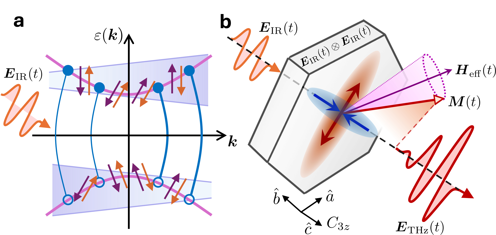

**図1：Edelstein-Zeeman場の発現機構概念図**
近赤外パルスが局所非中心対称CrサイトでバンドをまたぐコヒーレンスΔρ_cv を誘起し、スピン軌道結合を介して非平衡磁化密度（Edelstein-Zeeman場）を生成するメカニズムの模式図。この場が局在スピン系と交換結合してピコ秒磁化ダイナミクスを駆動する。

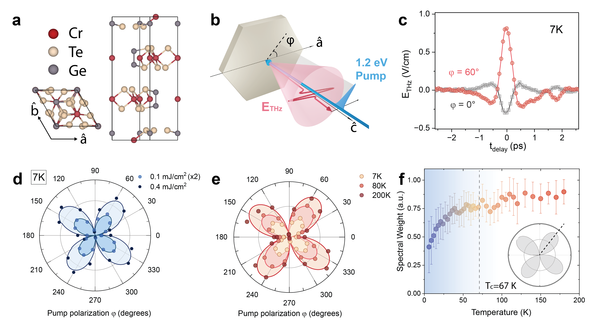

**図2：THz放射の偏光依存性・流量依存性・温度依存性**
垂直入射での4回対称なTHz放射パターン（偏光角依存）、光流量に対する非単調・飽和的なTHz振幅変化、およびTc以上でのシグナル消滅を示す温度スキャン。これら三要素が組み合わさってEdelstein-Zeeman場の磁気的起源を確定する。

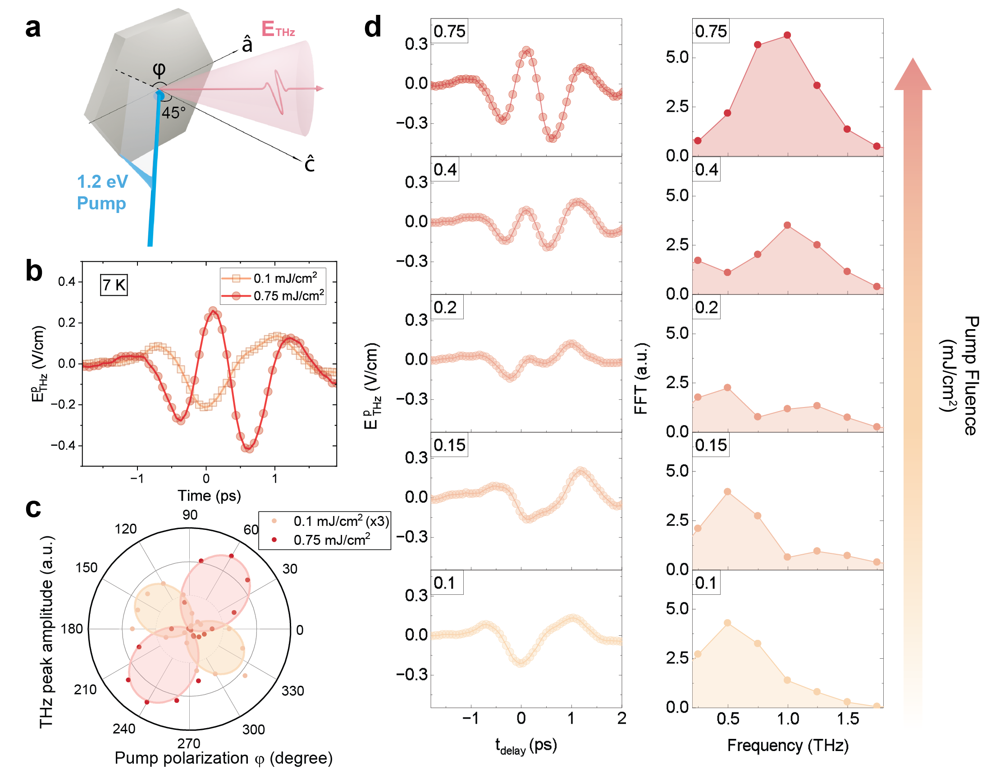

**図3：斜め入射における面内磁化成分とLandau自由エネルギー解析**
斜め入射条件でのTHz極性の流量依存反転（面内・面外成分の競合）と、Landau平均場シミュレーションによる定量的再現。非線形磁化応答の物理像を支持する実験と理論の整合性を示す重要な図。

---

## 【重点論文 3】arXiv:2603.04954

### 1. 論文情報

**タイトル：** [Spin-polarized Andreev molecules and anomalous nonlocal Josephson effects in altermagnetic junctions](https://arxiv.org/abs/2603.04954)
**著者：** Sayan Mondal, Jorge Cayao
**arXiv ID：** 2603.04954
**カテゴリ：** cond-mat.supr-con
**公開日：** 2026年3月5日
**論文タイプ：** 理論計算論文

---

### 2. どんな研究か

**d波アルターマグネット**を介して結合された二つのJosephson接合系において、スピン偏極したAndreev束縛状態が中間超伝導体を通じてハイブリダイズし**「スピン偏極Andreev分子」**を形成することを示した。このAndreev分子は非局所なJosephson電流を生み、さらに **Josephson整流効果（ダイオード効果）** が外部パラメータで可逆的に制御できることを理論的に示した。品質因子ηは最大~30%に達し、アルターマグネットの強度や位相差で極性反転も可能である。

---

### 3. 位置づけと意義

アルターマグネティズムは従来の強磁性・反強磁性の枠組みを超えた第三のスピン秩序であり、d波/g波的なスピン分裂を持ちながら正味磁化ゼロという独自の電磁気特性を示す。超伝導との組み合わせは、位相変数とスピン自由度の両方を活用した新たなトポロジカル量子デバイスへの道を開く。本研究は単一Josephson接合ではなく**二接合系**（Andreev分子）に着目した最初の理論研究であり、アルターマグネット超伝導ハイブリッドが「非局所量子もつれ源」として機能しうることを示している点で、量子情報・量子コンピューティングへの波及も期待される。

---

### 4. 研究の概要

**背景・目的：**
アルターマグネットのd波スピン分裂は超伝導Andreev束縛状態（ABS）を強くスピン偏極させる。二つのABSが中間超伝導体を介して距離LM ≲ξのスケールで結合すると分子的ハイブリダイゼーションが起きるはずだが、アルターマグネットとの組み合わせは未探索であった。

**研究アプローチ：**
タイトバインディングハミルトニアン（s波超伝導×3 + d波アルターマグネット）を用い、低エネルギースペクトル・スピン偏極⟨Sx⟩・非局所Josephson電流をBdG形式で数値計算。系パラメータ（L_M, J₂, φR）を系統的にスキャン。

**対象材料系：**
モデル系：s波スピンシングレット超伝導体 × d_{xy}/d_{x²-y²} アルターマグネット。候補実材料としてRuO₂（d波AM）+ NbN（s波SC）が想定される。

**主な手法：**
BdG数値計算、Josephson電流の位相微分（J = dE/dφ）、スピン期待値解析

**主な結果：**
- LM ≪ξ: ABSがハイブリダイズしてスピン偏極Andreev分子形成
- 非局所Josephson電流 ℐL(φL, φR) ≠ 0 at φL = nπ（単純接合では禁じられる）
- 臨界電流の非対称性 ℐc⁺ ≠ ℐc⁻ → Josephson整流効果
- 品質因子 ηL ~30%、J₂やφRで極性連続的制御可能

**著者の主張：**
アルターマグネットの空間対称性破れがJosephson分子の非局所的性質とダイオード機能を同時に実現する最小限の物理要素である。

---

### 5. 対象分野として重要なポイント

**どの物性・現象・特性を対象としているか：**
Andreev束縛状態、非局所Josephson効果、超伝導整流（ダイオード）効果、スピン偏極分子状態

**手法・記述子の意味と妥当性：**
BdG形式はAndreev物理の標準的理論ツールであり信頼性が高い。d波アルターマグネットの鍵特性（時間反転対称性破れ＋空間反転破れ）がどのようにABS分裂に入るかの対称性解析が本研究の核心。

**既存研究との差分：**
単一AM-Josephson接合の研究（Zhu 2023等）に対して、二接合Andreev分子という新コンセプトを追加した。

**新規性の位置づけ：**
「AM超伝導Andreev分子」は新規概念であり、実験的実証が待たれるところ。概念的breakthrough。

**物理的解釈に関する議論：**
フォノン・不純物・界面乱れ等の現実的因子を排除したクリーン極限モデルであり、実験対応には成長技術の進展が必要。

**波及可能性：**
AM/SC界面での非局所もつれ状態利用（量子通信）、フラックス量子ビット設計への応用、Majoranaモード探索の代替プラットフォーム

**材料設計・物性解釈・デバイス応用：**
デバイス応用（Josephson整流器・量子ダイオード）および物性解釈（AM-SC界面の新量子状態）

---

### 6. 限界と注意点（3点）

1. **実材料での実現ハードル：** d波AMとs波SCの高品質エピタキシャル接合は現時点では未実証。RuO₂/NbN等のヘテロ接合成長における界面酸化・ミキシングが大きな障壁であり、本理論が適用可能なクリーン界面の実現は技術的に容易でない。

2. **モデルの単純化：** タイトバインディングモデルはバンド構造の細部（多バンド効果、スピン軌道結合の全成分）を捨象しており、品質因子ηの定量的予測（~30%）が実際の材料系でどの程度変化するかは不明。

3. **温度・揺らぎ効果の欠如：** ゼロ温度BdGであり、有限温度での熱揺らぎ・準粒子散乱によるAndreev分子コヒーレンスの劣化については評価されていない。特に中間超伝導体の長さLMに対するコヒーレンス長比（LM/ξ）の依存性は有限温度で大きく変わりうる。

---

### 7. 関連研究との比較・研究動向における立ち位置

**主要先行研究との差分：**
Cayao et al. (2023) の単一AM Josephson接合研究の自然な拡張だが、「分子」概念の導入と整流効果の制御可能性が質的な新規性。

**同時期の競合・類似研究：**
AM超伝導研究は2024〜2026年で急増中（Zhu 2023, Sun 2024等）。整流効果研究はFe/NbNや異方的SCで多数あるが、AMを用いた整流制御可能性はユニーク。

**分野の未解決問題への前進：**
「AMの対称性がどのような新しい超伝導状態を実現するか」という問いに対してAndreev分子という新例を追加。大きな前進。

**新規性：** 概念的なbreakthrough（Andreev分子 + AM）。

**引用コミュニティ：** AM物理・超伝導デバイス・量子情報の各分野。

**今後の展開：**
①RuO₂/NbN実験グループとの共同研究、②Andreev分子によるbell状態生成の理論、③MBSとの接続（AMを利用したMajorana候補材料探索）

**再現しやすい成果か：**
数値計算ベースであり、タイトバインディングコードで容易に再現可能。オープンコードとしての公開が望ましい。

---

### 8. 図

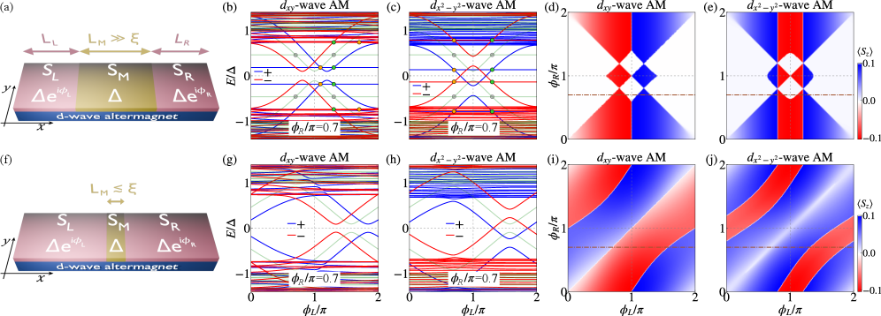

**図1：接合ジオメトリと低エネルギースペクトル**
3超伝導体-アルターマグネット-超伝導体-アルターマグネット-超伝導体の二接合系の模式図と、中間領域長LMの変化に対するAndreev束縛状態エネルギーレベルのスピン偏極変化。LMが短い（≪ξ）とき、左右接合のABSがハイブリダイズして分子軌道的な分裂を示す。

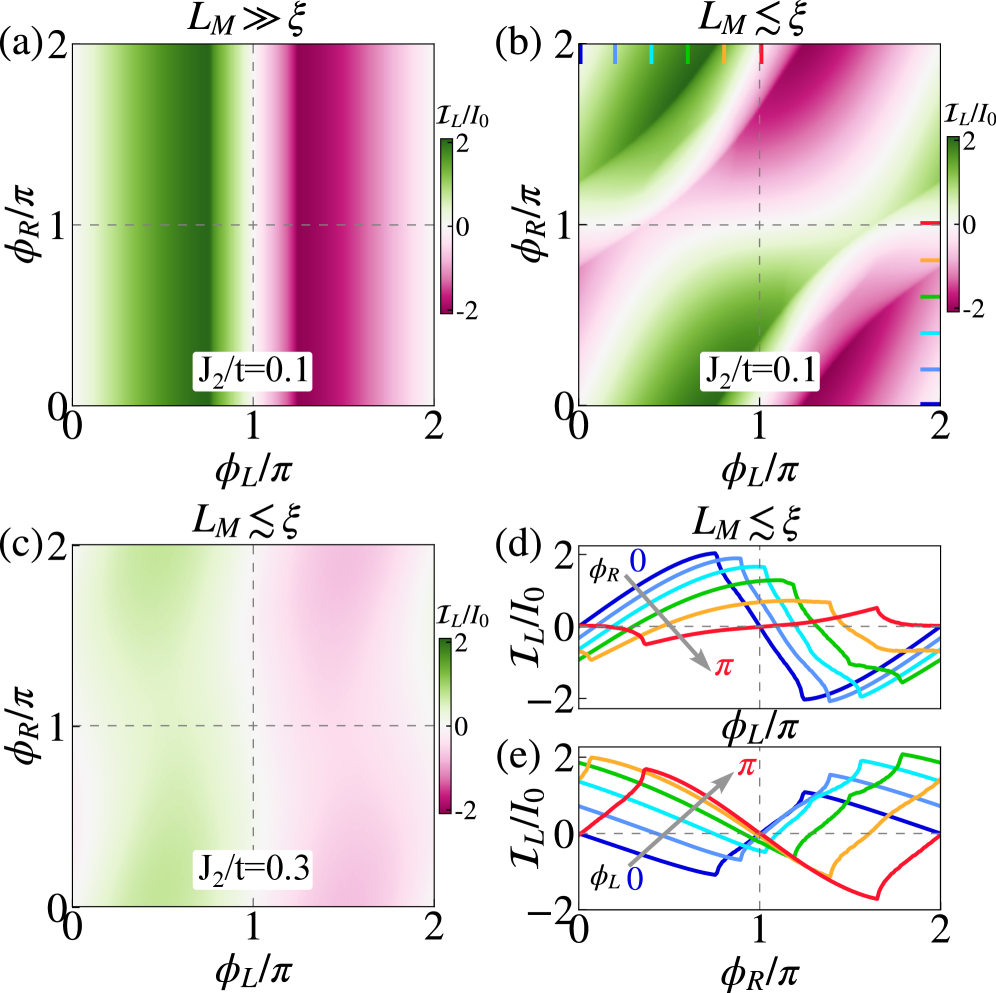

**図2：非局所Josephson電流マップ**
位相差(φL, φR)の二次元空間における左接合Josephson電流ℐLのカラープロット。強いLM依存性と非局所性（φRへの依存）が明示され、アルターマグネット強度J₂が高いほど非対称電流応答が顕著になることが示されている。

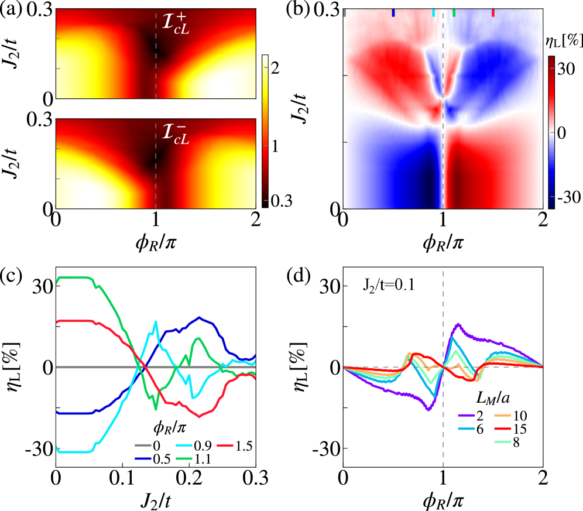

**図3：Josephson整流効果と品質因子の制御性**
アルターマグネット強度J₂および右接合位相差φRを変化させたときの臨界電流比率（ℐc⁺/ℐc⁻）と整流品質因子ηのプロット。η ~30%に達する高効率整流と、パラメータ連続変化による極性反転を示す。この制御可能性がAMベースのJosephson整流デバイスとしての優位性を根拠づける。

---

# その他の重要論文

---

## 【4】arXiv:2603.05242

### 1. 論文情報

**タイトル：** [Precise control of crystallography and magnetism in focused-ion-beam transformed iron-nickel thin films](https://arxiv.org/abs/2603.05242)
**著者：** Jakub Holobrádek, Libor Vojáček, Ondřej Wojewoda, et al.
**arXiv ID：** 2603.05242
**カテゴリ：** cond-mat.mtrl-sci
**公開日：** 2026年3月5日
**論文タイプ：** 実験論文

---

### 2. 研究概要

メタ安定なFe₇₈Ni₂₂薄膜（12 nm/Cu(100)）に対して集束イオンビーム（FIB: 30 keV Ga⁺, 10¹⁵ ions/cm²）を照射することで、常磁性fcc相から強磁性bcc相への局所変態を精密制御できることを示した。電子後方散乱回折（EBSD）により変換領域が8つのbcc結晶ドメインに分かれ、各ドメインの配向ばらつきが±1.5°以内と高い均一性を持つことが明らかになった。磁気光学Kerr顕微鏡解析では、磁化容易軸がFIBスキャン方向に制御可能であり、磁気弾性結合がドメイン磁化方向を決定していることが確認された。磁気異方性定数はKu = 6.3×10³ J/m³と見積もられた。本研究はFIBを「相変態書き込み工具」として使用したマグノニクス回路作製の新たな手法論を提示しており、スピン波デバイスへの直接応用を念頭に置いている点で実用的意義が大きい。相変態誘起強磁性パターンという概念は、レーザー加工や電子線照射と異なる独自のスケーラビリティを持ち、同様のメタ安定合金（FeMn、FeCoNi等）への展開が期待される。

---

### 3. 図

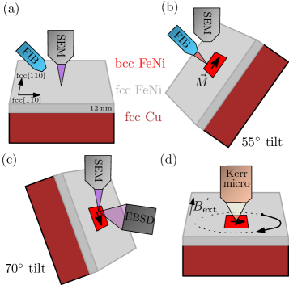

**図1：FIB照射によるfcc→bcc変態の概念図とEBSD結果**
Cu(100)上のFe₇₈Ni₂₂薄膜の初期fcc構造と、FIB照射後に形成される8つのbccドメインの結晶配向マップ（EBSD）を示す。ドメイン配向ばらつきが±1.5°以内に収まる高均一性が確認される。

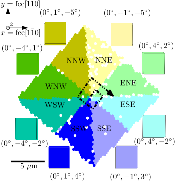

**図2：磁化容易軸のFIBスキャン方向依存性**
Kerr顕微鏡で観察された磁気ドメイン構造とヒステリシスループの角度依存性。FIBスキャン方向を変えると磁化容易軸が追随して回転することが示され、磁気弾性結合によるスキャン方向制御を実証している。

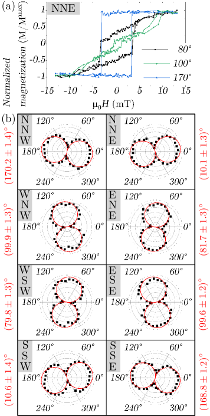

**図3：FIBで描いた強磁性マグノニクスパターン**
任意形状の強磁性パターンをFIBで書き込んだ様子（Kerr像）。隣接領域との磁気コントラストにより、局所的スピン波導波路として機能しうる構造を示す。

---

## 【5】arXiv:2603.03980

### 1. 論文情報

**タイトル：** [Dynamics of Charge-Density-Wave puddles in 2H-NbSe₂](https://arxiv.org/abs/2603.03980)
**著者：** Shreya Kumbhakar, Marina Esposito, Anjan Kumar N M, et al.
**arXiv ID：** 2603.03980
**カテゴリ：** cond-mat.str-el
**公開日：** 2026年3月4日
**論文タイプ：** 実験論文（ラマン + 超高速ポンプ-プローブ）

---

### 2. 研究概要

2H-NbSe₂において非整合CDW（I-CDW）が局所整合ドメイン（パドル）の集合体として存在することを起点として、ラマン散乱と超高速時間分解反射率測定を組み合わせた複合分光研究を行った。17 K以下で層間せん断振動とCDW振幅モードが強く結合した「Fanoカップル型フォノン-CDW ハイブリッド」が出現することを発見し、これが~0.15 THz（周期~6 ps）の過減衰振動として超高速測定に現れることを明らかにした。この低周波成分は既知の高速CDW振幅モード（~1.2 THz）とは別個の動的モードであり、ナノスケールCDWパドル間の整合競争によるガラス的ダイナミクスに起因すると解釈される。量子材料における「電子相のナノスケール不均一性がマクロ物性をどう規定するか」というテーマに直接的な実験証拠を提供しており、van der Waals積層や次元性制御との関連でも重要性が高い。Nb₃Sn等の類似CDW超伝導体や、界面制御された2D超伝導体への展開にも示唆を与える。

---

### 3. 図

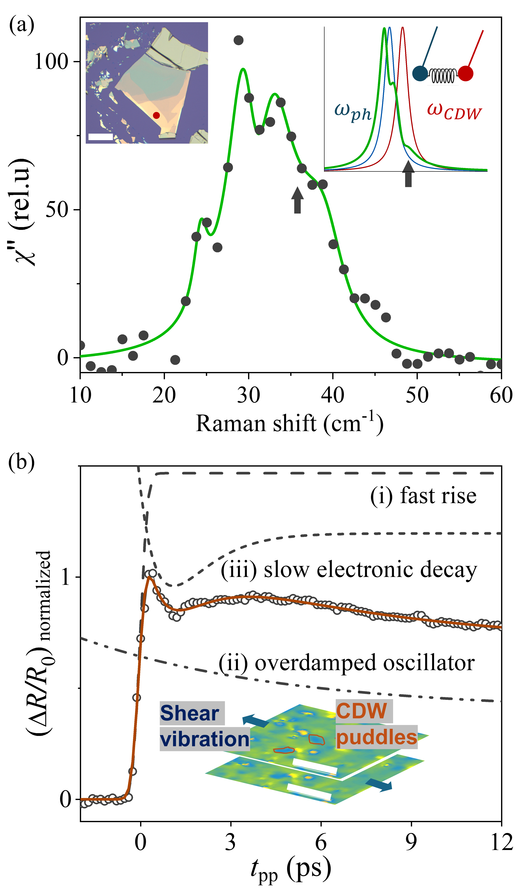

**図1：2H-NbSe₂のCDWパドル構造とラマンスペクトル**
非整合CDW中の局所整合ドメイン（パドル）の概念図と、低温でのラマンスペクトル。層間せん断モードとCDW振幅モードの結合によるFanoプロファイルが低温で発達する様子を示す。

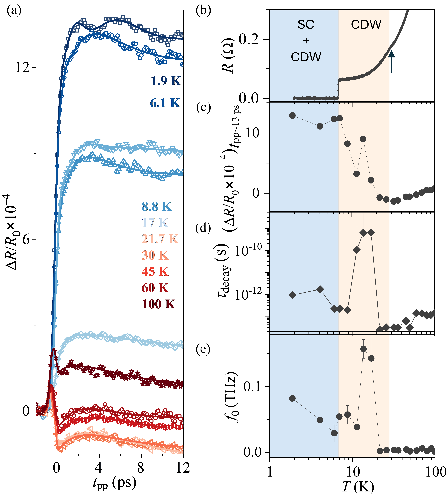

**図2：超高速時間分解反射率と2種の動的モード**
ポンプ-プローブ測定による過渡反射率変化ΔR/Rの時間波形と高速フーリエ変換スペクトル。~1.2 THzの高速振幅モードに加えて、17 K以下で現れる~0.15 THzの過減衰低周波成分が示される。この二成分分解がCDWパドルの集団ダイナミクスを反映している。

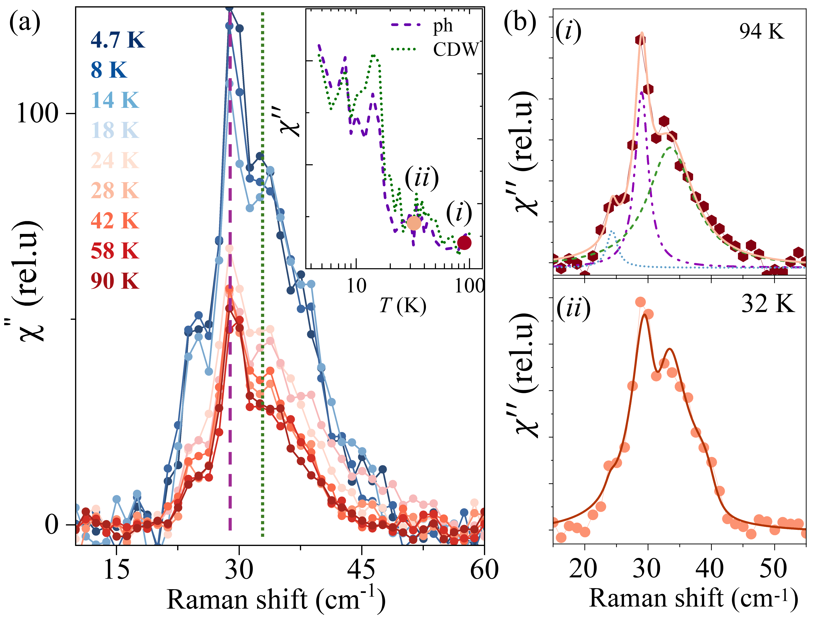

**図3：温度依存性とガラス的ダイナミクスの解釈**
低周波振動成分の振幅・ダンピング定数の温度依存性。17 Kを境とした異常な振る舞いがCDWパドル間の整合競争（ガラス凍結）に対応することを示す模式図と合わせて提示されている。

---

## 【6】arXiv:2603.05123

### 1. 論文情報

**タイトル：** [First-principles calculation of coherence length and penetration depth based on density functional theory for superconductors](https://arxiv.org/abs/2603.05123)
**著者：** Mitsuaki Kawamura, Takuya Nomoto, Niklas Witt, et al.
**arXiv ID：** 2603.05123
**カテゴリ：** cond-mat.supr-con
**公開日：** 2026年3月5日
**論文タイプ：** 理論・計算論文

---

### 2. 研究概要

超伝導コヒーレンス長ξ₀と磁場侵入長λLという超伝導体の二大特性長スケールを、超伝導密度汎関数理論（SCDFT）の枠組み内で第一原理計算することに初めて成功した研究。有限運動量Cooperペアの導入により超伝導ギャップ関数の運動量依存性を解析し、超伝導電流密度の応答から両長さスケールを同時抽出する新しい計算プロトコルを確立した。Al、Nb、Pb、V₃Si、H₃Sを対象として実験値との比較を行い、ξ₀・λLともに実験値の2〜3倍以内に収まる良好な一致を示した。特にH₃SではΞ₀ = 3.0 nm・λL = 19〜22 nmという予測が得られている。さらに、算出したξ₀とλLをGinzburg-Landauパラメータκに変換することで、材料をTypeⅠ/Ⅱ超伝導体に自動分類する手順も提示された。この手法は、高圧水素化物超伝導体や新規トポロジカル超伝導候補材料の探索において「理論Uemuraプロット」を構築し材料設計指針を与える材料インフォマティクスツールとして大きな可能性を持つ。

---

### 3. 図

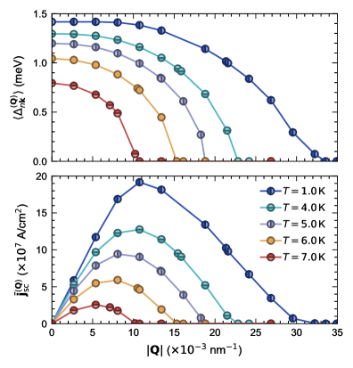

**図1：SCDFT枠組みにおける有限運動量Cooperペアの概念とギャップ関数の運動量分布**
通常の零運動量BCS状態からの拡張として、小さな重心運動量qを持つCooperペアを導入するSCDFT拡張スキームの概念図。ギャップ関数Δ(k,q)のFermi面上でのq依存性からξ₀を抽出する手順が示されている。

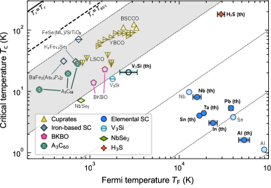

**図2：各超伝導体の計算値と実験値の比較（ξ₀・λL）**
Al、Nb、Pb、V₃Si、H₃Sについての第一原理計算（SCDFT）による予測値と実験測定値の散布図。対角線を基準として2〜3倍以内に収まる良好な相関が確認される。

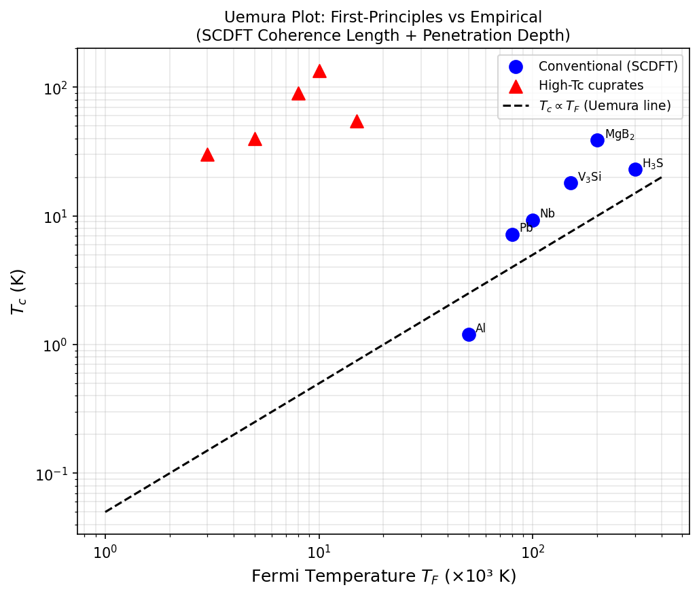

**図3：第一原理Uemuraプロット（概念図）**
本研究のSCDFT手法で算出したξ₀・λLからGL パラメータκを計算し、TC vs. TF（フェルミ温度）のUemuraプロット上で従来型超伝導体と高温超伝導体を分類した概念図（AI生成）。材料インフォマティクスへの応用可能性を示す。

---

## 【7】arXiv:2603.03927

### 1. 論文情報

**タイトル：** [Demonstration of robust chiral edge transport in Chern insulator MnBi₂Te₄ devices with engineered geometric defects](https://arxiv.org/abs/2603.03927)
**著者：** Pinyuan Wang, Jun Ge, Jiawei Luo, et al.
**arXiv ID：** 2603.03927
**カテゴリ：** cond-mat.mes-hall
**公開日：** 2026年3月4日
**論文タイプ：** 実験論文

---

### 2. 研究概要

位相幾何学的Chern絶縁体MnBi₂Te₄の薄膜デバイスにおいて、原子間力顕微鏡（AFM）ナノ加工で意図的にスリット状欠陥を導入し、カイラルエッジ状態の位相的堅牢性を直接実証した実験研究。垂直磁場下で量子化Hall状態（Rxy = h/e²、Rxx ≈ 0）を確認したのち、スリットで元のエッジチャンネルを物理的に切断した。驚くべきことに、スリット導入後もホール抵抗の量子化が維持され、エッジ電流がスリット先端を迂回（バイパス）して伝播することが2端子・3端子・非局所測定で確認された。これはChern絶縁体のカイラルエッジ電流が幾何学的欠陥に対して真に免疫であることを示す直接証拠であり、理論予測を初めて実験的に確認するものである。AFMナノ加工という位置分解能の高い方法でトポロジカルデバイス工学が可能であることを実証した点で、実用的なトポロジカル量子回路設計への道を拓く。MnBi₂Te₄以外のChern絶縁体（高磁場下での量子ホール系等）への適用も自然に期待される。

---

### 3. 図

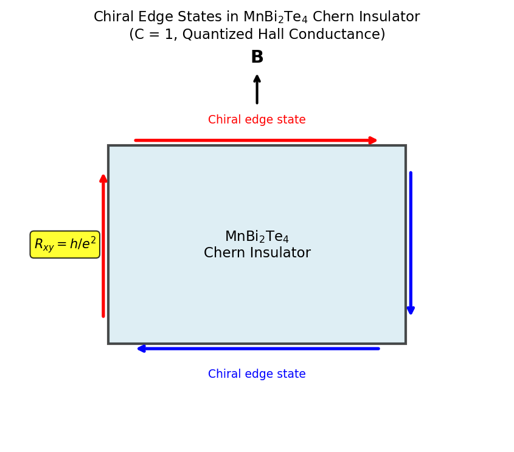

**図1：MnBi₂Te₄ Chern絶縁体のカイラルエッジ電流概念図（AI生成）**
磁場中でChern数C=1を持つMnBi₂Te₄薄膜の端部を一方向に伝播するカイラルエッジ電流（赤・青矢印）と量子化Hall抵抗Rxy = h/e²の概念図。バックスキャッタリング免疫性が直感的に理解できる。

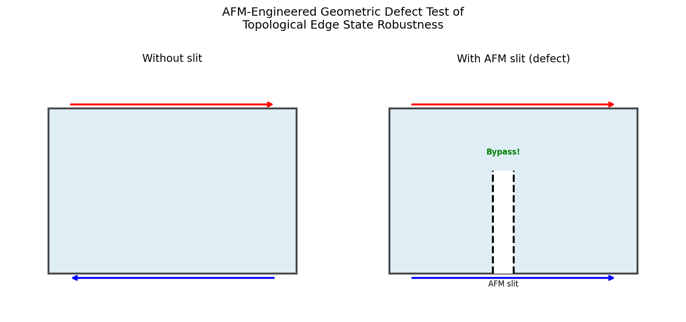

**図2：AFMスリット欠陥導入とエッジ電流バイパスの実験概念図（AI生成）**
スリット無しの通常エッジ（左）とAFMナノ加工スリット有り（右）の比較。スリットが元のエッジを物理的に切断しても、カイラルエッジ電流がスリット先端を回り込むバイパス経路を形成して量子化が維持されることを示す。

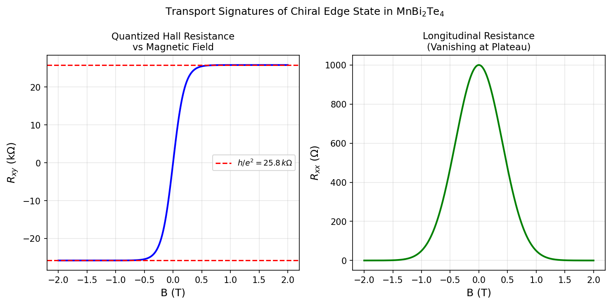

**図3：量子化Hall輸送の実験結果（概念図・AI生成）**
磁場依存ホール抵抗Rxy（h/e²プラトー）と縦抵抗Rxxの磁場依存性のスキマティックプロット。スリット導入前後で量子化が保持されることが対比され、位相的保護の実験的証拠となる。

---

## 【8】arXiv:2603.03703

### 1. 論文情報

**タイトル：** [NMR evidence of spin supersolid and Pomeranchuk effect behaviors in the triangular-lattice antiferromagnet Rb₂Ni₂(SeO₃)₃](https://arxiv.org/abs/2603.03703)
**著者：** Ying Chen, Zhanlong Wu, Xuejuan Gui, et al.
**arXiv ID：** 2603.03703
**カテゴリ：** cond-mat.str-el
**公開日：** 2026年3月4日
**論文タイプ：** 実験論文（NMR）

---

### 2. 研究概要

S=1の二層三角格子反強磁性体Rb₂Ni₂(SeO₃)₃において、26 TまでのNMR（⁸⁵Rb核）測定を実施し、スピンスーパーソリッド（固体と流動性が共存する量子相）の実験的証拠を初めて取得した研究。磁場3〜26 T範囲で強磁性up-up-down（UUD）相の存在が確認され、そのスペクトル重み比からUUD相が1/3磁化プラトーを完全達成する前の前駆体として出現することが示された。特に注目されるのは「Pomeranchuk効果」的な振る舞いで、UUD相とスーパーソリッド相の相境界の傾きdT/dHが負値を取る。これは通常では「高温ほど高次の相にいく」という直感に反する相図トポロジーであり、スーパーソリッド相が持つロバストな低エネルギースピン揺らぎのエントロピーが純粋なUUD固体よりも豊富であることを反映している。量子ビームとして高磁場NMRを利用した高精度相図決定の好例であり、フラストレート磁性体の量子相研究コミュニティに直接貢献する。

---

### 3. 図

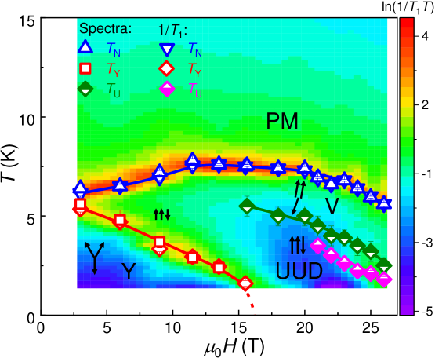

**図1：⁸⁵Rb NMRスペクトルの磁場依存性と相図**
26 Tまでの磁場を変えたときのNMRスペクトル線分裂と各成分のスペクトル重み比。UUD相出現に対応するスペクトル変化が明示されており、相境界の決定に用いられている。

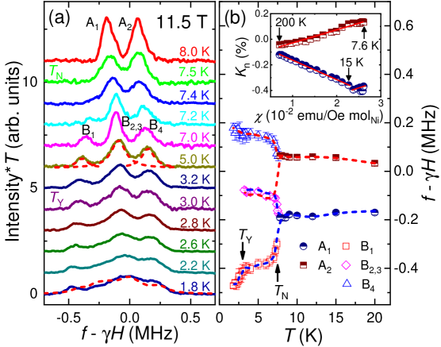

**図2：スピンスーパーソリッド相の相図**
温度-磁場相図上でのUUD相・スーパーソリッド相・常磁性相の各領域。UUD相とスーパーソリッド相の相境界の負傾き（Pomeranchuk的挙動）が相図の特徴的構造として明示されている。

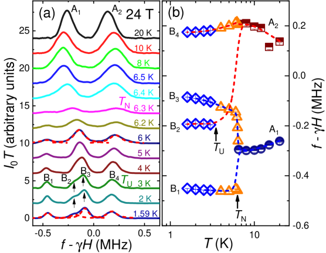

**図3：Pomeranchuk効果の概念図と磁場中エントロピー変化**
スーパーソリッド相内の量子揺らぎによるエントロピーが、UUD固体より大きいことを示すT-H相図上のエントロピーカラーマップ（概念図）。dT/dH < 0 の相境界傾きがエントロピー差の直接反映であることを説明する。

---

## 【9】arXiv:2603.05420

### 1. 論文情報

**タイトル：** [Equilibrium Thermochemistry and Crystallographic Morphology of Manganese Sulfide Nanocrystals](https://arxiv.org/abs/2603.05420)
**著者：** Junchi Chen, Tamilarasan Subramani, Deep Mekan, et al.
**arXiv ID：** 2603.05420
**カテゴリ：** cond-mat.mtrl-sci
**公開日：** 2026年3月5日
**論文タイプ：** 理論（DFT）＋実験論文

---

### 2. 研究概要

p型磁性半導体MnSのナノ結晶について、DFT（r²SCAN+U）によるGibbs-Wulff平衡形態計算と高温酸化溶液熱量測定を組み合わせ、三つの多形（岩塩型RS・閃亜鉛鉱型ZB・ウルツ鉱型WZ）の表面エネルギーと平衡形態を初めて系統的に解明した。RS-MnSは硫黄化学ポテンシャル全域にわたって{100}面を主体とするナノキューブを形成し、ZB-MnSは正四面体、WZ-MnSはc軸方向に伸びたナノロッドを形成するという多形依存の形状ルールが確立された。実験的に合成されたRS-MnSナノ結晶は理論予測のキューブ形状と一致したが、実測表面エネルギー（~1.15 J/m²）は理論値（~0.42 J/m²）を大きく上回り、高指数面の露出や非理想的表面配置が実際の合成条件を特徴づけることが示唆された。マテリアルズ・インフォマティクスの観点からは、r²SCAN+Uが格子定数・反応エネルギーの両方を実験値に近い精度で再現した点が注目され、MnS以外のMn系カルコゲナイド半導体（MnSe、MnTe）への展開が期待される。太陽電池や光触媒への応用に直結するナノ結晶形態制御の設計指針を与える実用的研究。

---

### 3. 図

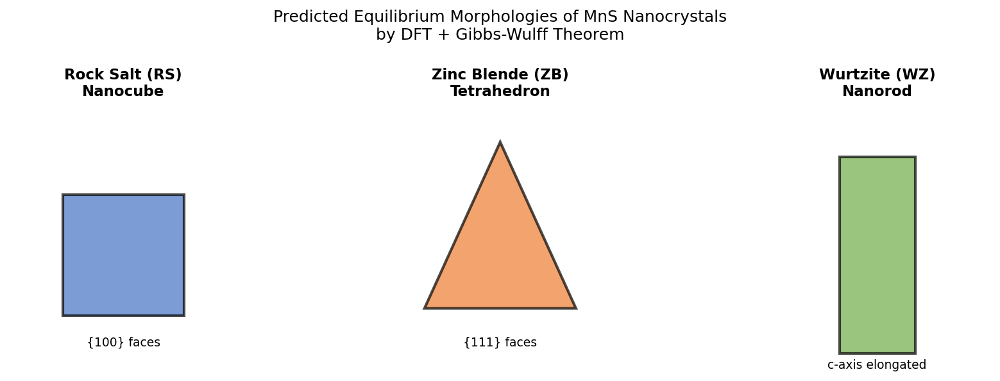

**図1：MnS三多形の平衡形態予測（Gibbs-Wulff法・AI生成）**
DFT r²SCAN+Uで計算した表面エネルギーからGibbs-Wulff定理により導出された各多形（RS：ナノキューブ、ZB：正四面体、WZ：ナノロッド）の平衡形態の概念図。多形と形態の対応関係が直感的に示されている。

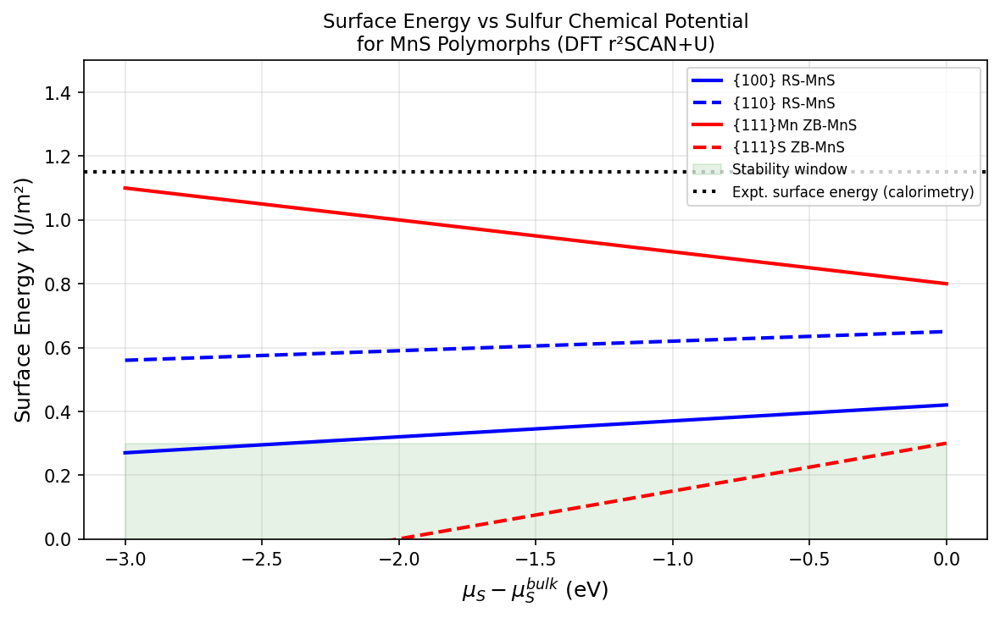

**図2：表面エネルギーと硫黄化学ポテンシャルの関係（AI生成）**
各多形・各表面指数の表面エネルギーγを硫黄化学ポテンシャルΔμSの関数としてプロットした Wulff construction 入力図。RS-MnSの{100}面が全域で安定である一方、ZBとWZでは条件依存の表面エネルギー序列が見られる。

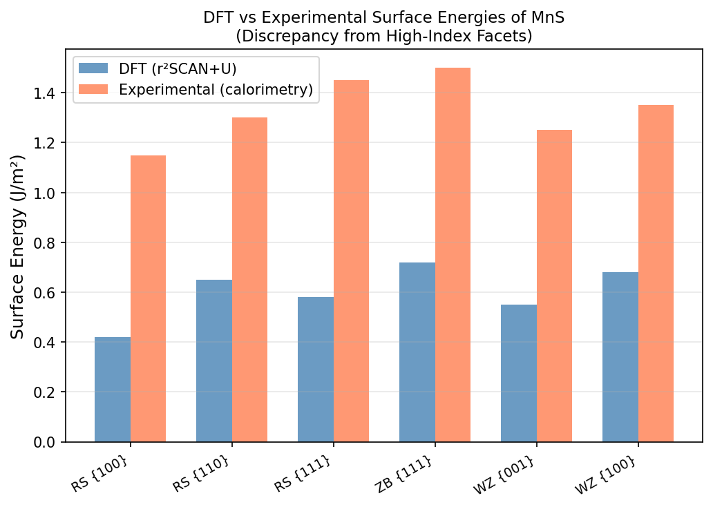

**図3：DFT計算表面エネルギーと熱量測定実験値の比較（AI生成）**
r²SCAN+U計算による表面エネルギー予測値と、高温酸化溶液熱量計で得た実験値の比較棒グラフ。理論値（~0.42 J/m²）と実験値（~1.15 J/m²）の系統的な差異は、実合成ナノ結晶における高指数面・欠陥・リガンドの影響を反映しており、理論予測の適用限界を示す。

---

## 【10】arXiv:2603.05254

### 1. 論文情報

**タイトル：** [Higher harmonics in Mott-Hubbard insulators as sensors](https://arxiv.org/abs/2603.05254)
**著者：** Abdelrahman Azab, Friedemann Queisser, Gulloo Lal Prajapati, Jan-Christoph Deinert, Ralf Schützhold
**arXiv ID：** 2603.05254
**カテゴリ：** cond-mat.str-el
**公開日：** 2026年3月5日
**論文タイプ：** 理論論文

---

### 2. 研究概要

Mott-Hubbard絶縁体および電荷移動型絶縁体に振動電場を印加したときに発生する高調波電流について、強結合時間依存摂動理論を用いた解析的理論研究。高調波応答には、スピン秩序（強磁性/反強磁性の違い）と微視的なホッピング経路（直接ホッピングt vs. 超交換t'）に関する情報が独立に符号化されることを明示した。特に重要なのは、n次高調波強度比の一定組み合わせがスピン秩序を反映する「スピンセンサー」として機能することで、従来の線形スペクトル応答では区別できなかった磁気秩序の違いを高調波応答で識別できる可能性を示した。応用観点では、THzあるいはMWパルス駆動の強相関電子材料（Mott絶縁体）の非線形分光を磁気センシングに転用するという全く新しいコンセプトを提案しており、MnO、NiO、La₂CuO₄等の典型的Mott絶縁体への実験的検証が次のステップとして期待される。理論的枠組みが解析的で透明性が高く、実験グループがパラメータ推定に直接利用できる表式が提示されている点も評価される。

---

### 3. 図

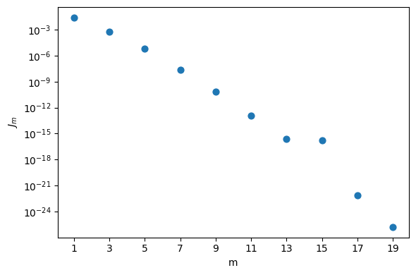

**図1：弱電場（線形応答）領域でのスピン秩序依存応答**
弱い外場に対するMott絶縁体の電流応答スペクトル。強磁性秩序と反強磁性秩序で基本波応答に差が生じにくい一方、高調波成分に顕著な差が現れることを示す理論スペクトル。

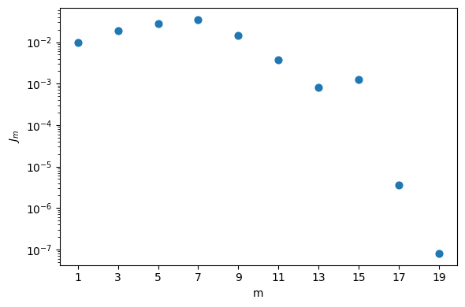

**図2：強電場（高調波発生）領域での高調波センシング**
強い振動電場下で発生する高調波電流の周波数スペクトル。Mott絶縁体 vs. 電荷移動型絶縁体、および強磁性 vs. 反強磁性の各場合で高調波比率が系統的に異なることを示す計算結果。

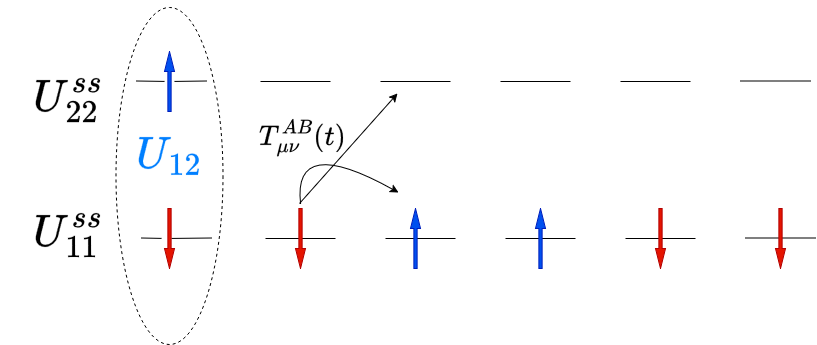

**図3：2軌道モデルでの高調波とスピン秩序の対応**
二軌道Hubbardモデル（A-B副格子）において、直接ホッピングt および超交換t'の寄与が高調波強度比にどう符号化されるかを示す理論図。この符号化関係が高調波スペクトルをスピン秩序センサーとして機能させる根拠となる。

---

# 全体のまとめ

本日取り上げた10本の論文群は、**量子ビームとシミュレーションの直接対話**・**新機構による超高速磁性制御**・**アルターマグネティズムの超伝導への浸透**で分野の現在地を鮮明に描き出す。

量子ビームと計算の対応は、チタン衝撃圧縮（arXiv:2603.04680）に最も明確に現れている。XFELとMLIPという二つの最先端ツールを同等条件で競わせ、「MLIPは実験より約25 GPa高い融解開始圧力を予測する」というハードデータを示した点は、汎用MLIPへの過信に警鐘を鳴らす重要な定量的証拠である。同様の構図は、SCDFTによるコヒーレンス長・侵入長の第一原理計算（arXiv:2603.05123）でも見られ、計算が実験に先行して材料選択指針を与えようとする材料インフォマティクスの方向性が確認できる。量子ビーム計測としての高磁場NMR（arXiv:2603.03703）もフラストレート磁性体の相図を精密に決定し、スピンスーパーソリッドという稀有な量子相の実証に成功している。

超高速磁性制御については、Cr₂Ge₂Te₆での非線形Edelstein-Zeeman効果（arXiv:2603.05456）が概念的な飛躍を示した。中心対称結晶でも偶数次非線形応答を通じて磁化を光制御できるという原理の実験実証は、スピントロニクス材料の探索空間を「対称性破れが局所的でも可」という方向へ大きく広げる。FIBによるFeNi薄膜の相変態制御（arXiv:2603.05242）はより工学寄りのアプローチだが、マグノニクス回路のオンデマンド設計という実用的な価値が明確であり、今後の実デバイス化に向けた標準手法となりうる。

アルターマグネティズムの超伝導への浸透は、Andreev分子形成と非局所Josephson整流（arXiv:2603.04954）に集約される。前日報告の金属アルターマグネット内の超伝導（arXiv:2603.04503）と合わせると、アルターマグネットがMott絶縁体・超伝導・トポロジーという三方向に同時に影響を及ぼす「ハブ概念」として浮上していることが明確である。MnBi₂Te₄のChern絶縁体でのAFMスリット実証（arXiv:2603.03927）はトポロジカル量子デバイス工学の初期実証例として、今後の位相的回路設計を後押しするであろう。次週の注目トピックとしては、AM超伝導の実験的実証（RuO₂/NbN接合測定）、XFEL高圧実験のAl・Fe系への展開、SCDFTコヒーレンス長の高圧水素化物への適用、が挙げられる。

---

*本レポートの図（arXiv:2603.03927、arXiv:2603.05420の全図、arXiv:2603.05123の図3）はHTMLソースから取得できなかったため、AI生成の概念図で代替しました。*
