# arXiv 日次ダイジェスト
**作成日：** 2026年3月10日
**対象期間：** 2026年3月7日〜3月10日（直近72時間）

---

## 全体所見

本日は材料工学・物性物理・マテリアルズ・インフォマティクス・量子ビームの観点から、直近72時間に arXiv に投稿された論文の中から特に重要な10本を選定した。

今週の投稿群において最も目立つ潮流は、**機械学習ポテンシャル（MLIP）の大規模化とアーキテクチャ革新**である。特に AllScAIP に代表される attention ベースの全粒子間相互作用モデルは、長距離相互作用の記述という長年の課題に対して、物理的帰納バイアスへの依存を減らすデータ駆動アプローチで回答を示しており、分野の方向性を示す重要な一本といえる。

磁性・超伝導の分野では、**オルタマグネティズム**を巡る理論・実験が引き続き急増している。超伝導との結合を通じたオルタマグネティズム検出の提案や、界面対称性を利用した決定論的電流スイッチングの原理提案など、スピントロニクスへの展開が見えてきた。

ニッケル酸塩超伝導体については、Stanford グループによる超流体密度の系統的測定が報告され、位相ゆらぎが転移温度を制限するという描像が強化されつつある。この知見はキュプレートとの対比においても重要である。

量子ビームを活用した実験としては、BaTiO₃ の強誘電体薄膜において電場によるキラルフォノン角運動量の非揮発的スイッチングを CD-RIXS で実証した研究が出色であり、フォノン工学的情報デバイスへの道を開く可能性がある。また、コバルト鉄ボロン／リチウムタンタレート系での表面弾性波—スピン波コヒーレント結合の位相分解イメージングも、マグノニクス・デバイス研究に資する実験成果である。

軌道輸送の分野では、CoO/Cu* ヘテロ構造における50倍以上の軌道ホール磁気抵抗の増大が報告され、オービトロニクス実用化への可能性を示している。

**重点論文3本：**
1. A recipe for scalable attention-based MLIPs: unlocking long-range accuracy with all-to-all node attention（2603.06567）
2. Electric field switching of chiral phonons（2603.06144）
3. Evolution of the Superfluid Density in Infinite-Layer Nickelates（2603.05606）

---

## 重点論文の詳細解説

---

### 重点論文 1

#### 1. 論文情報

**タイトル：** [A recipe for scalable attention-based MLIPs: unlocking long-range accuracy with all-to-all node attention](https://arxiv.org/abs/2603.06567)
**著者：** Eric Qu, Brandon M. Wood, Aditi S. Krishnapriyan, Zachary W. Ulissi
**arXiv ID：** 2603.06567
**カテゴリ：** cond-mat.mtrl-sci, cs.LG
**公開日：** 2026年3月6日
**論文タイプ：** 研究論文（方法論・ベンチマーク）

---

#### 2. どんな研究か

機械学習原子間ポテンシャル（MLIP）モデル AllScAIP を提案し、全粒子ペア間の attention（全対全 node attention）により長距離相互作用を data-driven に記述することに成功した。約 1 億件のトレーニングサンプルでの学習を通じ、大規模データ領域では物理的帰納バイアスの恩恵が消え、attention 機構が accuracy を主導することを示した。分子系ベンチマーク OMol25 において state-of-the-art 精度を達成し、材料・触媒ベンチマークでも競争力のある性能を示した。

---

#### 3. 位置づけと意義

MLIP 分野は近年、GNN ベースの局所的メッセージパッシング（短距離カットオフ内のみ相互作用を考慮）から脱却し、長距離相互作用を如何に扱うかという問いに直面している。本研究はその解答として、Transformer に根ざした全対全 attention を採用し、明示的な物理的 inductive bias（等変性、対称性制約など）への依存を意図的に薄めた。「データスケールが増えると物理バイアスが逆効果になりうる」という知見は、MLIP 設計の哲学を再考させるものであり、OMol25・OMat24・OC20 という多領域ベンチマークにわたる競争力ある性能は、この方向性の実効性を裏付ける。今後の大規模モデルへの展開や、生体分子・電解質などの長距離効果が顕著な系への応用に向けた重要な方向性を示した論文といえる。

---

#### 4. 研究の概要

**背景・目的：** 現行の主要 MLIP（MACE、EquiformerV2 など）は局所カットオフ内のメッセージパッシングに依存しており、生体分子や電解液など長距離クーロン・分散相互作用が本質的な系ではスケール時の精度に限界がある。本研究は、この問題を attention の全対全適用で解決しようとする。

**研究アプローチ：** Attention ベースのアーキテクチャ AllScAIP を設計し、①局所的メッセージパッシングと②全粒子間 attention を組み合わせ、エネルギー保存型出力を実現。物理的 inductive bias（回転等変性など）の有無によるアブレーション研究を体系的に実施し、データ規模依存性を検証した。

**対象材料系：** 分子（OMol25 データセット）、無機材料（OMat24）、触媒（OC20）。特に分子系での長距離相互作用が主要検証対象。

**主な手法：** Transformer の全対全 attention（O(N²) complexity を管理しながら実装）、最大 1 億サンプルによる大規模トレーニング、nudged elastic band および MD シミュレーションによる物性検証（密度・気化熱）。

**主な結果：** OMol25 において SOTA 精度を達成。少量データ域では物理バイアスモデルが有利だが、データ量増大につれて差が消滅しむしろ逆転する傾向が確認された。長時間安定 MD 動力学シミュレーションで実験的な密度・気化熱を定量的に再現。

**著者の主張：** 大スケールの学習データが利用可能な状況では、物理バイアスの強さよりも long-range attention の質がモデル性能を決定する。データ駆動的な設計方針が次世代 MLIP の主流となりうる。

**関連研究：** MACE（Batatia et al.）, EquiformerV2, NequIP, GNoME（DeepMind）などの物理バイアス重視モデル群との対比。Reciprocal Space Attention（arXiv:2510.13055）との類似性・差異も参照。

---

#### 5. 対象分野として重要なポイント

- **対象とする物性・現象：** 原子間相互作用エネルギー・力（特に長距離クーロン・分散相互作用）、MD における構造安定性と熱力学的量。

- **手法・記述子の意味と妥当性：** 全対全 attention はグラフ上の全ノードペアに attention weight を割り当てることで長距離情報を伝播する。これはトークン化不要の連続空間への Transformer 適用であり、原子座標を直接埋め込みベクトルとして扱う。物理的等変性は明示的には課さないが、多量のデータで暗黙的に学習される設計。

- **既存研究との差分：** 従来 MLIP の大半は等変 GNN ベースで短距離カットオフ依存。長距離効果は明示的なクーロン項追加で補ってきたが、本研究は attention でそれを代替。

- **新規性の位置づけ：** "物理バイアスのスケール依存性" の定量的実証と、全対全 attention を用いた汎用 MLIP の初の大規模ベンチマーク検証。

- **物理的解釈に関する議論：** 大量データ下でニューラルネットが長距離物理を暗黙的に学習できるか、それとも残差誤差が特定の問題（例：液体中のイオン対）で蓄積するかは今後の検証課題。

- **波及可能性：** 電解質設計、タンパク質折り畳み予測、多成分合金の有限温度相安定性など、長距離相互作用が効く幅広い系への適用が期待される。

- **応用先：** 材料設計（MLIP による高速構造探索）、物性解釈（MD での輸送係数計算）。

---

#### 6. 限界と注意点

1. **データ量の依存性：** 大量データでの優位性を示しているが、少量データ領域では物理バイアスモデルが依然有利であり、データが乏しい新系への直接適用には注意を要する。

2. **計算コストの問題：** 全対全 attention は O(N²) の計算量を持ち、数百〜数千原子規模のシミュレーションに対してスケーラビリティが本当に維持できるかは明示的に検証されていない側面がある。

3. **ドメインシフトへの頑健性：** OMol25・OMat24・OC20 はいずれも既存データベース由来であり、特殊環境（高圧、放射線環境、表面再構成など）における外挿精度は不明。学習分布外の系での信頼性評価が必要。

---

#### 7. 関連研究との比較や研究動向における立ち位置

- **主要先行研究との差分：** MACE や NequIP は等変 GNN を採用し小規模データでも高精度だが長距離が苦手。本研究はそれらと対極の設計哲学を取り、データスケール時代の実用 MLIP を目指す。

- **競合・類似研究：** Meta の eSEN やDeepMind の GNoME/GNoME-MLIP、Cambridge の MACE-MP-0 などと正面から競合。同時期に "レシピ" として提示しているのは分野の成熟を示す。

- **未解決問題への前進度：** 長距離相互作用の MLIP への組み込みという問題に対して、データ側の解決策を実証した点で incremental ではなく一つのパラダイムシフトといえる。

- **新規性：** Incremental か breakthrough かといえば、方法論的には既存 Transformer の適用だが、大規模マルチドメインベンチマークでの系統的検証と設計指針の抽出という観点では影響力の大きい貢献。

- **コミュニティの広さ：** 材料科学・化学・生化学・触媒などの計算コミュニティ全体が引用しうる。

- **今後の展開：** 全対全 attention の効率化（linear attention 近似など）や量子化学計算との融合が次の課題。実験データとの共学習も期待される。

- **再現性：** 実装詳細とベンチマーク設定が明記されており、オープンデータセット上での再現は比較的容易と思われる。

---

#### 8. 図

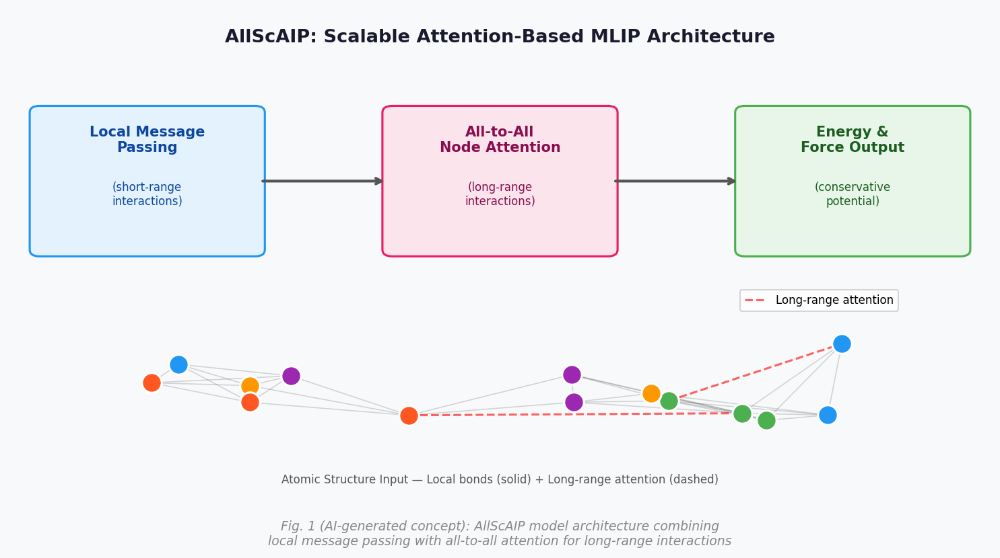

**Figure 1（AI生成概念図）：** AllScAIP のモデルアーキテクチャ。左ブロックが局所メッセージパッシング（短距離相互作用）、中央が全対全 node attention（長距離相互作用）、右がエネルギー・力の出力。下部の原子構造図では、共有結合的な近距離ペア（実線）に加えて、長距離の attention リンク（赤破線）が特定の原子ペア間に選択的に確立される様子を示す。

---

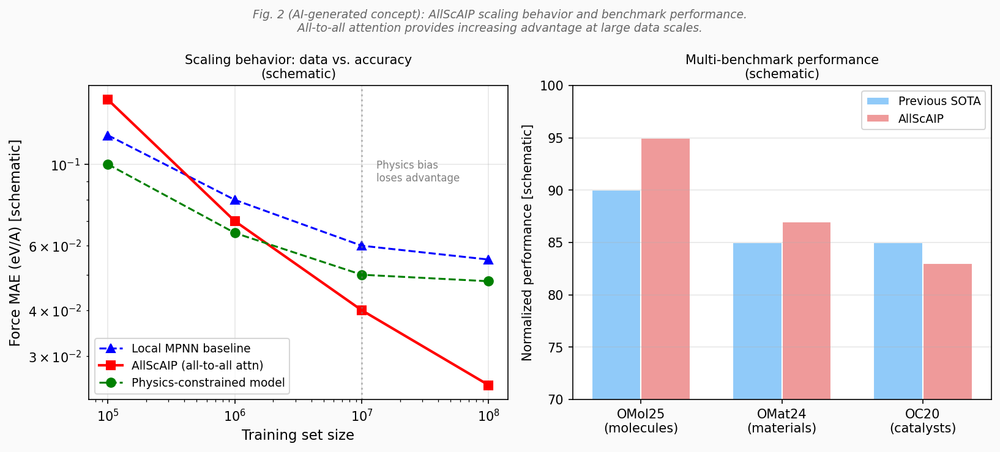

**Figure 2（AI生成概念図）：** 左：データセット規模に対する力の MAE（概念図）。データ量増大とともに物理バイアスモデルの優位性が消え、AllScAIP が逆転する傾向を示す。右：3 つのベンチマーク（OMol25・OMat24・OC20）における AllScAIP と従来 SOTA の性能比較。分子系での大幅な改善が特徴的。

---

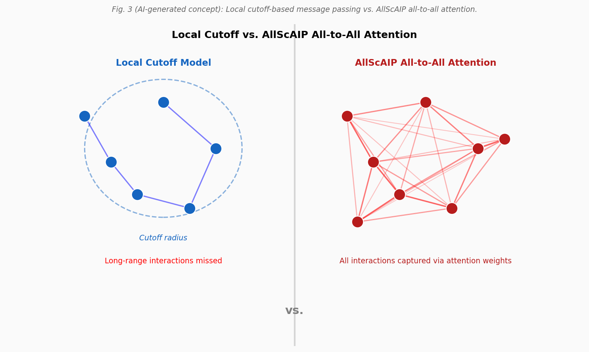

**Figure 3（AI生成概念図）：** 局所カットオフモデル（左）と全対全 attention（右）の長距離相互作用の扱いの比較。カットオフ内の原子のみしか相互作用せない従来型と、遠く離れた原子間にも attention weight が割り当てられる AllScAIP の違いを視覚化。

---

---

### 重点論文 2

#### 1. 論文情報

**タイトル：** [Electric field switching of chiral phonons](https://arxiv.org/abs/2603.06144)
**著者：** Michael Grimes, Clifford J. Allington, Hiroki Ueda, Carl P. Romao, Kurt Kummer, Puneet Kaur, Li-Shu Wang, Yao-Wen Chang, Jan-Chi Yang, Shih-Wen Huang, Urs Staub
**arXiv ID：** 2603.06144
**カテゴリ：** cond-mat.mtrl-sci, cond-mat.str-el
**公開日：** 2026年3月6日（月曜日分として掲載）
**論文タイプ：** 実験研究論文

---

#### 2. どんな研究か

強誘電体 BaTiO₃ の自立薄膜に電場を印加することで、フォノン角運動量（キラリティ）を非揮発的かつ可逆的に制御することに世界で初めて成功した。酸素 K 端における円偏光共鳴非弾性 X 線散乱（CD-RIXS）を用いてフォノン角運動量を直接計測し、電場反転によって円二色性コントラストが少なくとも 15 時間以上安定に反転することを実証した。第一原理計算との定量的一致も確認されている。

---

#### 3. 位置づけと意義

キラルフォノン—格子振動が角運動量を持つ状態—は近年、石英・遷移金属ダイカルコゲナイド等での存在が確認されつつあるが、外場による能動的な制御は未開拓であった。本研究は「強誘電体分極のスイッチング」という確立された手法とフォノン角運動量制御を結びつけることで、フォノン版の不揮発性メモリ動作を初めて示した。量子ビーム（放射光 RIXS）を利用した直接観測も本研究の強みであり、フォノン角運動量の記述子としての CD-RIXS の有効性を実証した。フォノン工学に基づく情報・エネルギー技術、さらには磁気系との結合（スピン-フォノン相互作用）による新機能材料設計への波及が期待される。

---

#### 4. 研究の概要

**背景・目的：** 結晶中のフォノンが角運動量を持つことが理論的に予言・実験的に確認されているが、フォノン角運動量を外場で能動的に制御する手段はこれまで存在しなかった。強誘電体の自発分極方向がフォノンのキラリティを決定するという第一原理計算の予測を実験的に検証し、電場スイッチングの実現を目指した。

**研究アプローチ：** BaTiO₃ のエピタキシャル自立薄膜を電極上に配置し、面内電場によって強誘電体分極を反転させながら、ESRF（欧州放射光施設）で CD-RIXS 測定を実施。実験値と DFPT ベースの第一原理計算を対比検証。

**対象材料系：** ペロブスカイト強誘電体 BaTiO₃（自立エピタキシャル薄膜）。Ti⁴⁺ の変位が正四方晶・菱面体晶等で生じるキラルフォノンが対象。

**主な手法：** 円偏光 RIXS（酸素 K 端、ピエゾ力顕微鏡による分極確認、自立薄膜作製技術、DFPT 第一原理フォノン計算）。

**主な結果：** 電場反転によって CD-RIXS 信号（円二色性コントラスト）が可逆的に反転することを実証。この効果は少なくとも 15 時間安定に持続（非揮発性）。逆空間の対称点 q₂ と q₄ での CD コントラスト反転も確認し、アーチファクトでないことを実証。第一原理計算との定量的一致を確認。

**著者の主張：** 強誘電体分極スイッチングによるキラルフォノン角運動量の非揮発的制御は、フォノンベースの情報・エネルギー技術や磁気システムとの統合に向けた堅固な基盤を提供する。

**関連研究：** Zhu et al.（Science 2018）での量子ドットでのキラルフォノン観測、Park et al. での BaTiO₃ キラルフォノン計算、最近の TMD 単層でのフォノン角運動量観測との比較。

---

#### 5. 対象分野として重要なポイント

- **対象とする物性・現象：** フォノン角運動量（キラリティ）、強誘電体分極スイッチング、非揮発的物性制御。

- **手法・記述子の意味と妥当性：** CD-RIXS は円偏光の吸収差からフォノン角運動量を直接計測できる量子ビーム技術。酸素 K 端を選択することで BaTiO₃ の酸素運動モードに感度を持たせている。自立薄膜は基板拘束を除去し面内電場印加を可能にする重要な試料設計。

- **既存研究との差分：** これまでのキラルフォノン研究はいずれも観測・確認にとどまり、制御に成功した例はなかった。本研究が初の「書き込み・読み出し」動作実証。

- **新規性の位置づけ：** フォノン角運動量の電場制御という全く新しいコンセプトの実証であり、分野開拓的な breakthrough に位置づけられる。

- **物理的解釈：** Ti⁴⁺ の変位方向がフォノンの回転方向（左旋・右旋）を決定する。分極反転 → Ti⁴⁺ 変位の反転 → フォノン角運動量の反転という一貫した物理描像が第一原理計算によって裏付けられている。

- **波及可能性：** スピン流制御（スピン角運動量とフォノン角運動量の結合）、磁気光学効果、カイラル選択的化学反応、ニューロモルフィックデバイスへの応用が想定される。

- **応用先：** フォノン角運動量を用いた情報ビット、磁性系との界面での角運動量授受デバイス。

---

#### 6. 限界と注意点

1. **試料制約：** 自立薄膜の作製は技術的に難しく、通常の BaTiO₃ バルク・基板上薄膜では面内電場印加が困難。一般的な薄膜プロセスへの展開には材料・プロセス上の工夫が必要。

2. **動作温度と分極状態の安定性：** BaTiO₃ の強誘電相は室温より高いが、相境界近傍（菱面体─正方晶転移付近）での挙動は不明。実用デバイスで想定される温度サイクルや疲労耐性は未検討。

3. **速度・エネルギー効率：** スイッチング速度（現状は DC 〜 準静的）と繰り返し安定性は報告されておらず、実デバイスとして機能するかどうかは別途評価が必要。フォノン角運動量の読み出しには放射光が必要であり、オンチップ読み出しの実現も今後の課題。

---

#### 7. 関連研究との比較や研究動向における立ち位置

- **主要先行研究との差分：** 石英・MoS₂・WSe₂ 等でのキラルフォノン確認研究は全て受動的観測。本研究は能動的制御の初例。

- **競合研究：** フォノン角運動量の光学制御（超短パルスレーザー励起）が他グループで検討されているが、非揮発性という点で本研究の優位性は明確。

- **未解決問題への前進度：** フォノン角運動量の能動的制御という field-opening な成果であり、前進度は非常に高い。

- **新規性：** Breakthrough。フォノン角運動量制御の初実証は今後10年の研究の起点になりうる。

- **コミュニティ：** 凝縮系物理（フォノン）、強誘電体、放射光物理、スピントロニクス等の広いコミュニティが関心を持つ。

- **今後の展開：** 他の強誘電体・反強誘電体での検証、スピン流との結合測定、超高速スイッチングへの展開。フォノン角運動量をレジスタとして使用するメモリ素子の実証が期待される。

- **再現性：** 放射光施設（ESRF 相当）が必要であり、再現のハードルは高いが、DFPT による理論予測は容易に再現可能。

---

#### 8. 図

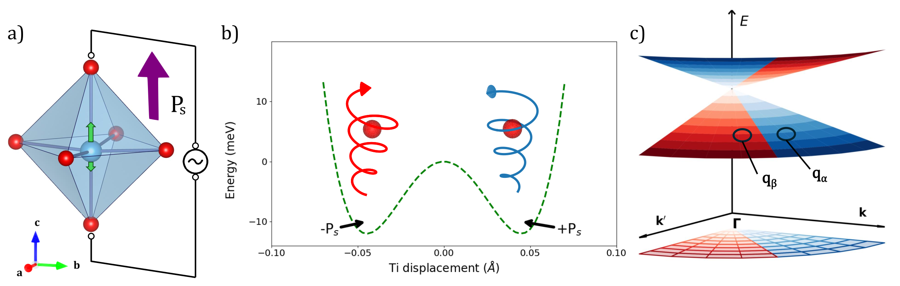

**Figure 1（論文より抽出）：** BaTiO₃ 強誘電体におけるキラルフォノンの概念図。(a) ビスタブルな Ti⁴⁺ 変位と自発分極、(b) 分極反転によるフォノンのキラリティ（左旋⇔右旋）切り替え、(c) 波数ベクトル依存した円偏光応答（C₄ᵥ 対称性に従ったフォノン角運動量の分布）を示す。

---

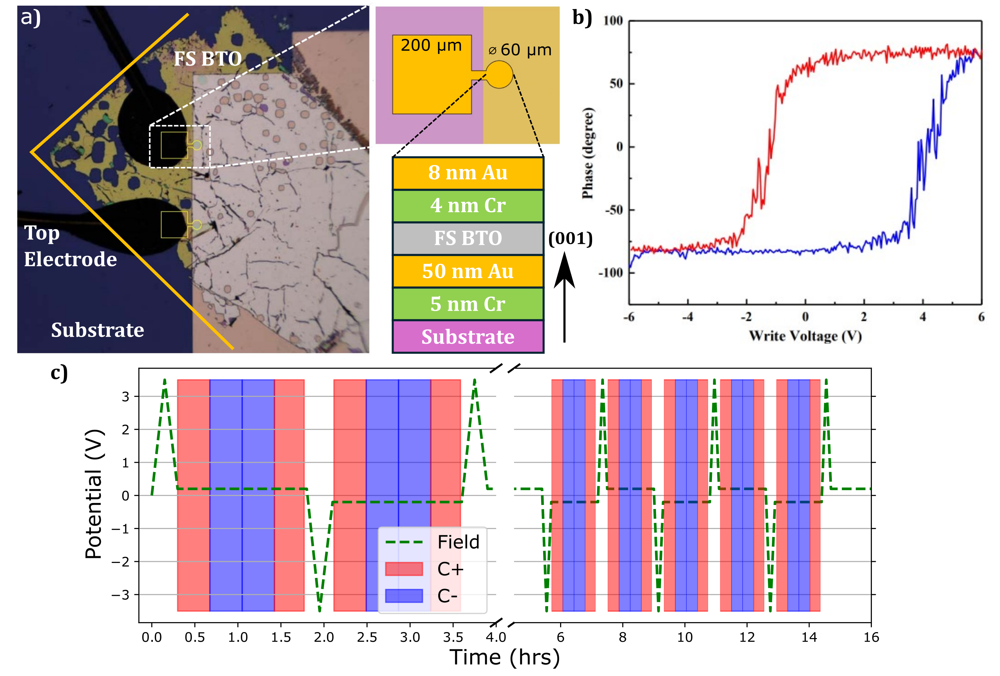

**Figure 2（論文より抽出）：** 自立強誘電体薄膜の構成と測定スキーム。(a) 電極上に配置した薄膜と結晶軸の関係、(b) 圧電力顕微鏡（PFM）による強誘電体スイッチングの確認（コアシビティ約 3 V）、(c) 電場印加と CD-RIXS 計測を同時実施する実験セットアップ。自立薄膜が面内電場印加を可能にする設計の鍵。

---

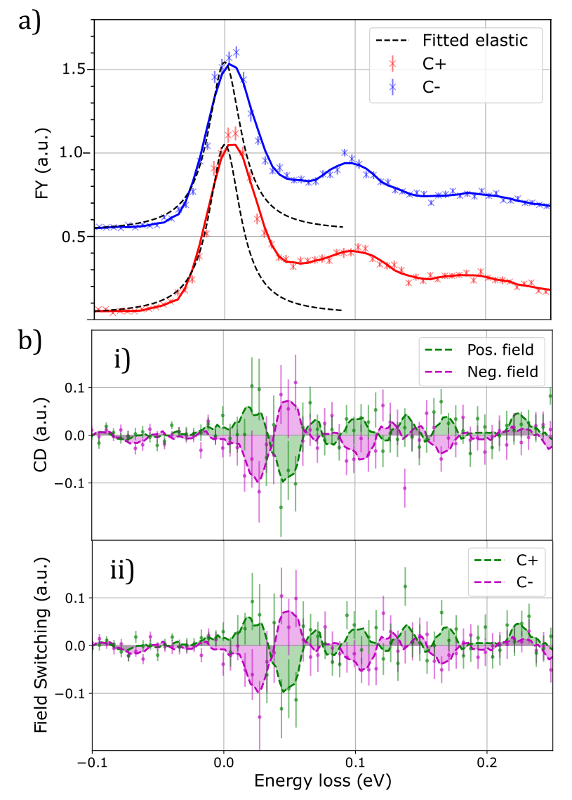

**Figure 3（論文より抽出）：** 電場によるキラルフォノン角運動量スイッチングの直接観測（CD-RIXS）。(a) 酸素 K 端付近の弾性線近傍における低エネルギーフォノン、(b) 電場反転に応じてフォノン角運動量（円二色性）が可逆的に反転し、少なくとも 15 時間以上安定に保持されることを実証。非揮発性フォノン角運動量メモリの基本動作。

---

---

### 重点論文 3

#### 1. 論文情報

**タイトル：** [Evolution of the Superfluid Density in Infinite-Layer Nickelates](https://arxiv.org/abs/2603.05606)
**著者：** Bai Yang Wang, Shannon P. Harvey, Kyuho Lee, Yijun Yu, Yonghun Lee, Motoki Osada, Chaitanya Murthy, Srinivas Raghu, Harold Y. Hwang
**arXiv ID：** 2603.05606
**カテゴリ：** cond-mat.supr-con
**公開日：** 2026年3月6日
**論文タイプ：** 実験研究論文

---

#### 2. どんな研究か

無限層ニッケル酸塩 Nd₁₋ₓSrₓNiO₂ 薄膜において、Sr ドーピング量を系統的に変化させながらマイクロ波共振器法によって超流体密度（superfluid stiffness）を計測し、その Tc 相関と温度依存性を明らかにした。超流体密度が Tc の平方根に比例するという ρs ∝ √Tc の関係を発見し、超伝導位相ゆらぎが転移温度を制限している可能性を強く示唆した。さらに低温域で Nd 4f 磁気モーメントが超流体成分を異常に抑制することも初めて実験的に確認した。

---

#### 3. 位置づけと意義

無限層ニッケル酸塩超伝導体は 2019 年の発見以来、「第二のキュプレート」として注目を集めてきたが、超伝導発現機構—特に BCS ライクな対形成温度制限なのか、位相ゆらぎ的な描像が妥当なのか—は未解決のままであった。本研究の ρs ∝ √Tc という知見は、位相ゆらぎシナリオを強く支持する実験根拠を初めて提供するものであり、有限温度における相転移の本質に迫る。また Nd 磁性と超伝導の強い結合という副次的発見は、3d-4f 相互作用が関与するニッケル酸塩固有の物理を浮かび上がらせた。キュプレートとの定量的比較研究や理論的描像の構築を加速する重要な実験データとなる。

---

#### 4. 研究の概要

**背景・目的：** 無限層ニッケル酸塩の Tc はキュプレートに比べて低く、また超伝導メカニズムの理解が遅れている。超流体密度は超伝導の「剛性」を直接反映する物性量であり、位相ゆらぎ理論の検証や BCS/BEC クロスオーバー描像の評価に必須の情報を与える。

**研究アプローチ：** Nd₁₋ₓSrₓNiO₂（x = 0.10 〜 0.30 の 6 点程度）の薄膜試料をマイクロ波共振器に搭載し、複素導電率からλ（ロンドン浸透長）を導出して ρs を算出。温度・ドーピング依存性を体系的に測定。

**対象材料系：** 無限層ニッケル酸塩 Nd₁₋ₓSrₓNiO₂ 薄膜（SrTiO₃ 基板上エピタキシャル）。Nd は磁性 4f イオンを含むため、Pr 系と比較した際の磁性効果を評価できる。

**主な手法：** マイクロ波共振器法（penetration depth → superfluid density）、ドーピング系統的制御、低温磁場中測定。

**主な結果：** ①ドーピング全域で超流体密度が著しく小さい（キュプレートの数十分の一）。② ρs ∝ √Tc の関係が実験的に確認された（ Tc は 7〜15 K 程度）。③低温（Nd 4f 磁気秩序温度以下）で超流体密度が大幅に抑制され、Nd モーメントの強い結合が示唆される。

**著者の主張：** 超伝導位相ゆらぎが Tc を制限しており、これがニッケル酸塩の低 Tc の原因の一つである可能性がある。Nd 磁性との予期せぬ強い結合は、ニッケル酸塩超伝導の新たな物理を示唆する。

**関連研究：** Uemura plot（ρs vs Tc 相関）との対比、キュプレートの超流体密度測定（Bonn, Hardy 等）との比較、ニッケル酸塩の ARPES データ（Fermi 面形状）との整合性。

---

#### 5. 対象分野として重要なポイント

- **対象とする物性・現象：** 超流体密度（超伝導剛性）、位相ゆらぎ、ドーピング相図、4f-3d 相互作用、キュプレート比較。

- **手法の妥当性：** マイクロ波法はゼロ磁場に近い条件で超伝導応答を測定でき、不均一性の影響が少ない。ドーピング系統性との組み合わせで相図全体を俯瞰できる。

- **既存研究との差分：** 従来のニッケル酸塩研究では Tc と上部臨界磁場の測定が中心で、超流体密度の直接計測は乏しかった。本研究がその空白を埋める。

- **物理的解釈：** ρs ∝ √Tc は Uemura plot のアンダードープ銅酸化物挙動に類似しており、BCS から BEC クロスオーバー領域の特徴。位相ゆらぎが Tc を制限するという描像（"phase fluctuation scenario"）の直接的根拠となる。

- **波及可能性：** 理論グループによる位相ゆらぎモデルや量子臨界点描像の検証に資する。また Pr 系・La 系ニッケル酸塩との比較研究を促進するデータ。

- **材料設計への示唆：** Tc を上げるためには超流体密度（剛性）を高めることが必要であり、「より多くの Cooper 対を作る」だけでなく「位相秩序を安定化する」という方針が示された。

---

#### 6. 限界と注意点

1. **試料・基板の影響：** Nd₁₋ₓSrₓNiO₂ 薄膜は SrTiO₃ 上での歪みや不均一性の影響を受けうる。バルク単結晶との比較や、基板依存性の系統的評価が今後必要。

2. **Nd 磁性の解釈：** Nd 4f モーメントが超流体密度を抑制するメカニズム（近藤効果、磁気散乱、局所ペア破壊等）は特定されていない。Nd を含まない Pr 系や La 系との比較が不可欠。

3. **位相ゆらぎシナリオの確定性：** ρs ∝ √Tc は位相ゆらぎを示唆するが、他の機構（アンダードープに伴うペア密度低下、disorder 効果など）と原理的に区別するためには理論計算との定量比較が必要。

---

#### 7. 関連研究との比較や研究動向における立ち位置

- **主要先行研究との差分：** Cui et al. やその他グループによる上部臨界磁場・コヒーレンス長の測定とは相補的。超流体密度という独立な観測量を提供する。

- **競合研究：** 同様の実験がシカゴ大・MIT の薄膜グループで進行中と予想されるが、Stanford（Hwang グループ）の高品質薄膜は依然として競争力を持つ。

- **未解決問題への前進度：** 「ニッケル酸塩の低 Tc の原因」という核心問題に対し、位相ゆらぎシナリオの有力な証拠を提供した点で大きな前進。

- **新規性：** Incremental ではなく、ニッケル酸塩超伝導研究に初めて超流体密度データベースをもたらした点で分野を刷新。

- **コミュニティ：** 強相関電子系・超伝導・薄膜成長・理論（RVB、t-J モデル等）の広いコミュニティが引用する。

- **今後の展開：** Nd 磁性を持たない Pr₁₋ₓSrₓNiO₂ との比較、La ベース系での超流体密度、加圧下での挙動など、多展開が予想される。

- **再現性：** Hwang グループの薄膜作製は世界トップクラスであり、同等品質の薄膜を他グループが再現するには高いハードルがある。ただし測定手法（マイクロ波法）自体は汎用的。

---

#### 8. 図

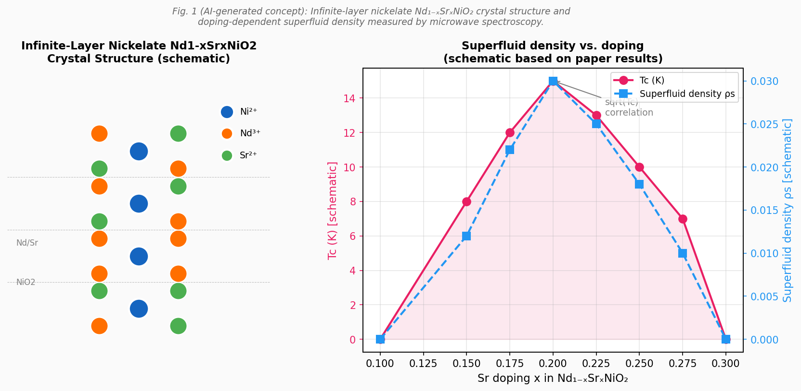

**Figure 1（AI生成概念図）：** 無限層ニッケル酸塩 Nd₁₋ₓSrₓNiO₂ の結晶構造（左）と Sr ドーピング量に対する Tc および超流体密度の変化（右）。Tc と超流体密度の両者がドーム状の依存性を示し、最適ドーピング（x ≈ 0.20 付近）で最大値をとる様子を示す（概念的模式図）。

---

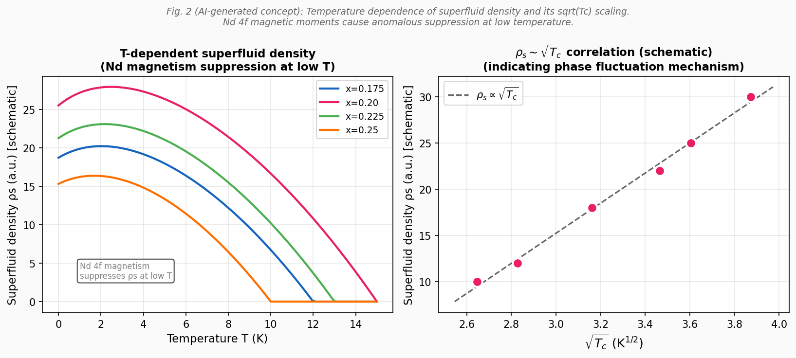

**Figure 2（AI生成概念図）：** 左：各ドーピングにおける超流体密度の温度依存性。低温域で Nd 4f 磁気秩序に起因する異常な抑制が生じる（赤矢印）。右：超流体密度 ρs と √Tc の相関プロット。線形関係（ρs ∝ √Tc）が実験データに示され、位相ゆらぎシナリオと整合する（概念的模式図）。

---

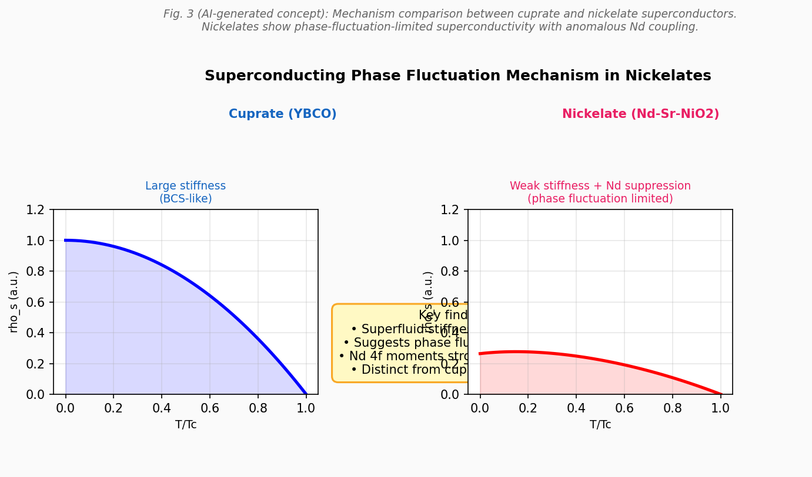

**Figure 3（AI生成概念図）：** 位相ゆらぎ機構の模式図。キュプレート（大きな超流体密度、BCS に近い）とニッケル酸塩（極めて小さな超流体密度、位相ゆらぎ支配的）の比較。ニッケル酸塩では Cooper 対は形成されるものの、位相コヒーレンスが弱く相転移が位相ゆらぎによって制限されることを示す概念図。

---

---

## その他の重要論文

---

### 簡潔紹介論文 1

#### 1. 論文情報

**タイトル：** [Predicting Atomistic Transitions with Transformers](https://arxiv.org/abs/2603.06526)
**著者：** Henry Tischler, Wenting Li, Qi Tang, Danny Perez, Thomas Vogel
**arXiv ID：** 2603.06526
**カテゴリ：** cond-mat.mtrl-sci, cs.LG
**公開日：** 2026年3月6日
**論文タイプ：** 研究論文（方法論・機械学習）

---

#### 2. 研究概要

Pt₁₄₇ ナノクラスターにおける 239,594 件の原子遷移データセットを用いて、Transformer モデルが原子スケールの構造遷移（エネルギー谷間の乗り越え）を高精度で予測できることを実証した。標準的な Transformer アーキテクチャを連続原子座標入力に対応させ、原子位置を直接埋め込みベクトルとして扱うことで、既知遷移の 96% を正確に再現し、一部のヒント情報（transitioning atoms の位置）を与えれば 10% のヒントサイズで相当数の遷移を正しく予測できる。未知遷移についても摂動法による自律的生成が可能であり、nudged elastic band 法による検証でも物理的に妥当な経路が得られることが確認された。

従来、原子遷移経路の探索は Parallel Trajectory Splicing や加速分子動力学（AMD）などの高コスト計算を要していたが、本手法はその代替として数桁の計算コスト削減を実現する可能性を持つ。マテリアルズ・インフォマティクスの観点からは、MLIP による構造安定性評価と組み合わせることで、高速な状態空間探索が可能になる。特に触媒反応中間体・表面再構成・欠陥マイグレーションなど、遷移状態の網羅的探索が求められる問題への適用が有望であり、材料設計の高速化に寄与する方法論として注目に値する。

---

#### 3. 図

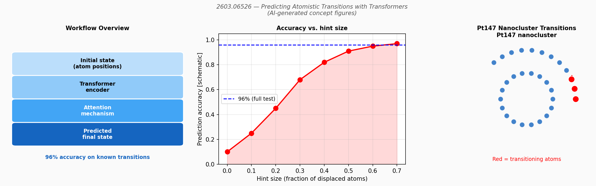

**Figure 1（AI生成概念図）：** 左：Transformer ベースの原子遷移予測ワークフロー（初期状態 → エンコーダ → attention → 予測終状態）。中：ヒントサイズ（transitioning atoms の開示割合）に対する予測精度の変化。25% 程度のヒントで高精度が達成される。右：Pt₁₄₇ ナノクラスターにおける遷移原子（赤）の例示と矢印による変位方向。

---

---

### 簡潔紹介論文 2

#### 1. 論文情報

**タイトル：** [Spectra-Scope: A toolkit for automated and interpretable characterization of material properties from spectral data](https://arxiv.org/abs/2603.06011)
**著者：** Amalya C. Johnson, Chris Fajardo, Leena Sansguiri, Weike Ye, Steven B. Torrisi
**arXiv ID：** 2603.06011
**カテゴリ：** cond-mat.mtrl-sci
**公開日：** 2026年3月6日
**論文タイプ：** ソフトウェア・方法論論文

---

#### 2. 研究概要

Spectra-Scope は、スペクトルデータからの材料物性推定を自動化・解釈可能化するオープンソース AutoML フレームワークである。スペクトロスコピーは材料特性評価の中核であるが、非線形なスペクトル-物性関係からの機械学習モデル構築は専門知識を要してきた。本ツールキットはデータ前処理・特徴量抽出・モデル訓練・特徴量選択を一括提供し、Pythonインターフェースに加えてコーディング不要の Web UI を備える。既存の材料・農業スペクトルデータセットで既存モデルと同等の性能を実証しており、重要なのはモデルの解釈性を重視して「スペクトルのどの特徴量が物性を決定しているか」を物理的根拠とともに説明できる設計になっている点である。

マテリアルズ・インフォマティクスにおいて、スペクトルデータ（XRD、Raman、XPS、FTIR 等）から物性を迅速に推定するニーズは高い。Spectra-Scope はこれを実験者が自らモデルを構築し解釈できる形で提供することで、分析化学・材料科学のワークフローにおける ML 活用の敷居を大きく下げる。特にスペクトル特徴量の重要度マップが物理的解釈（例：特定ピークが特定物性に寄与）と整合するかどうかの確認に有用であり、データ駆動発見と物理理解の橋渡しとなるツールとして期待できる。

---

#### 3. 図

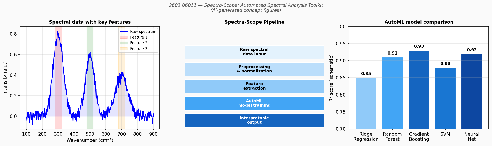

**Figure 1（AI生成概念図）：** 左：スペクトルデータの例と特徴ピーク領域の抽出（赤・緑・橙でハイライト）。中：Spectra-Scope の処理パイプライン（入力 → 前処理 → 特徴抽出 → AutoML → 出力）。右：AutoML による複数モデルの性能比較（R² スコア）と最良モデルの選択。

---

---

### 簡潔紹介論文 3

#### 1. 論文情報

**タイトル：** [Superconductivity as a Probe of Altermagnetism: Critical Temperature, Field, and Current](https://arxiv.org/abs/2603.06188)
**著者：** A. A. Mazanik, Rodrigo de las Heras, F. S. Bergeret
**arXiv ID：** 2603.06188
**カテゴリ：** cond-mat.supr-con
**公開日：** 2026年3月6日
**論文タイプ：** 理論論文

---

#### 2. 研究概要

d 波オルタマグネット（altermagnet）と超伝導の相互作用を Ginzburg-Landau 解析によって記述し、臨界温度（Tc）・面内臨界磁場（H_c∥）・臨界電流密度（jc）のいずれにも d 波対称性に由来する特徴的な 4 回対称異方性が生じることを示した。これらの角度依存性から、オルタマグネット結合定数 K と Néel ベクトル方向を実験的に抽出できることを提案している。単純な超伝導薄膜・超伝導体／オルタマグネット絶縁体ヘテロ構造のいずれでも測定可能であり、既存のオルタマグネット検出手法（ホール効果、MOKE、中性子回折等）を補完する新たな実験アプローチを提供する。

オルタマグネティズムは近年急速に注目を集める磁性秩序であり、スピン縮退がゼロながら磁化もゼロというユニークな性質を持つ。しかしその実験的同定は難しく、中性子散乱・X 線磁気円偏光二色性・ホール測定など複数の相補的手法が試みられている。本論文は超伝導の Tc や臨界電流という測定しやすい物性量をプローブとして使い、4 回異方性の有無・大きさからオルタマグネティズムを検出するという逆転の発想を提案しており、実験的実証があれば広く活用されうる手法となる。特に超伝導体自体がオルタマグネットである材料（例：RuO₂ の超伝導相）への適用が期待される。

---

#### 3. 図

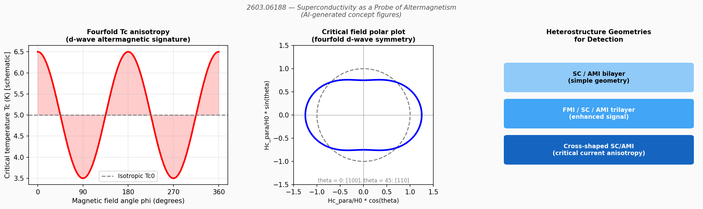

**Figure 1（AI生成概念図）：** 左：磁場角度 φ に対する臨界温度 Tc の 4 回変調（d 波シグネチャ）。中：臨界磁場の極プロット（4 回対称性の模式図）。右：測定に用いる SC/AMI ヘテロ構造の幾何学配置（二層構造・三層構造・十字型の 3 種）。

---

---

### 簡潔紹介論文 4

#### 1. 論文情報

**タイトル：** [Competition between Charge Density Wave and Superconductivity in a Janus MXene Mo₂NF₂](https://arxiv.org/abs/2603.06284)
**著者：** Jakkapat Seeyangnok, Udomsilp Pinsook, Graeme J. Ackland
**arXiv ID：** 2603.06284
**カテゴリ：** cond-mat.supr-con, cond-mat.mtrl-sci
**公開日：** 2026年3月6日
**論文タイプ：** 第一原理計算論文

---

#### 2. 研究概要

二面非対称（Janus）MXene である Mo₂NF₂ を第一原理計算により解析し、高対称構造において M 点の不安定な軟フォノンモードが電荷密度波（CDW）不安定性を引き起こすことを発見した。この CDW は単純な Fermi 面ネスティングではなく、強い運動量依存電子-フォノン結合に起因しており、CDW 相における超伝導 Tc は約 1 K と低い。一方、−3% を超える二軸圧縮ひずみを加えると CDW 不安定性が完全に抑制され、高対称相が安定化して Tc が約 4 K に向上することを示した。Mo₂NF₂ はひずみで CDW—超伝導競合を制御できる tunable platform として提案されている。

MXene は 2D 材料として合成の柔軟性が高く、Janus 型の表面非対称は追加の自由度をもたらす。特に電子-フォノン結合が CDW と超伝導を同時に規定するという描像は、NbSe₂ や 2H-TaS₂ などの従来型 CDW 超伝導体と類似しており、MXene 版の競合相研究として理解できる。ひずみエンジニアリングによる CDW 抑制—超伝導増強という設計指針は、ピエゾ基板や加圧セルを利用した実験的検証が可能であり、MXene 系の機能制御において汎用性の高い手法を示唆する。

---

#### 3. 図

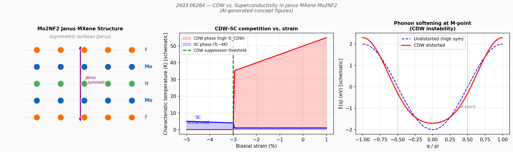

**Figure 1（AI生成概念図）：** 左：Janus MXene Mo₂NF₂ の結晶構造（F—Mo—N—Mo—F の非対称積層）。中：二軸ひずみに対する CDW 特性温度と超伝導 Tc の変化（−3% でひずみ閾値を超えて CDW 消失・SC 増強）。右：M 点での軟フォノンモードを示す概念的フォノン分散（CDW 不安定性の起源）。

---

---

### 簡潔紹介論文 5

#### 1. 論文情報

**タイトル：** [Phase-resolved imaging of coherent phonon-magnon coupling](https://arxiv.org/abs/2603.06115)
**著者：** Yannik Kunz, Florian Kraft, David Breitbach, Torben Pfeifer, Matthias Küß, Stephan Glamsch, Manfred Albrecht, Mathias Weiler
**arXiv ID：** 2603.06115
**カテゴリ：** cond-mat.mes-hall
**公開日：** 2026年3月6日
**論文タイプ：** 実験論文

---

#### 2. 研究概要

圧電体 LiTaO₃ 基板上の CoFeB 磁性細線においてインターデジタルトランスデューサ（IDT）から励起された表面弾性波（SAW）が磁気弾性結合を通じてスピン波（SW）を共鳴的に励起する系を構築し、偏光感応光学検出によって SAW 信号と SW 信号を分離しながら位相分解イメージングを実施した。SAW と SW が位相ロック状態でコヒーレントに結合していることを直接的に実証し、マイクロメートルスケールでの空間分布を可視化した。コヒーレントな SAW-SW 相互作用の位相分解観測という実験技法の確立により、弾性波—スピン波変換効率の評価や複合マグノニクスデバイスの設計に向けた基盤が整備された。

量子ビームや光学プローブを活用した波動結合のイメージングは、フォノン工学・マグノニクスの両分野で重要性を増している。特に本研究のように SAW と SW を独立に検出しながら位相を揃えて観測できる手法は、エネルギーの弾性-磁気間変換の効率・空間依存性を定量化する上で従来にない情報を与える。デバイス実用化の観点から、SAW によるスピン波の局所励起・制御は低消費電力マグノニクスに直結するアプローチであり、本研究の観測技術はその最適化ツールとしての応用が期待される。

---

#### 3. 図

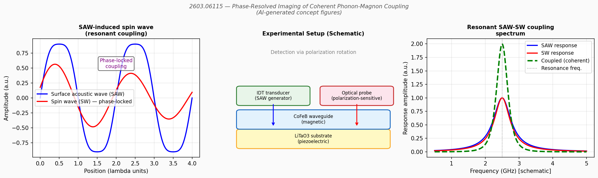

**Figure 1（AI生成概念図）：** 左：SAW で励起されたスピン波の位相ロック結合を示す波形（SAW と SW が共鳴時に同期）。中：LiTaO₃ 基板上の CoFeB 磁性細線・IDT・光学プローブの実験配置（概念図）。右：共鳴周波数近傍での SAW・SW 応答スペクトルと coherent coupling を示す増強（概念図）。

---

---

### 簡潔紹介論文 6

#### 1. 論文情報

**タイトル：** [Giant orbital magnetoresistance in the antiferromagnet CoO driven by dynamic orbital angular momentum interaction](https://arxiv.org/abs/2603.06425)
**著者：** Christin Schmitt, Sachin Krishnia, Edgar Galindez-Ruales, Luca Micus, Takashi Kikkawa, Hiroki Arisawa, Marjana Lezaic, Duc Tran, Timo Kuschel, Jairo Sinova, Eiji Saitoh, Gerhard Jakob, Olena Gomonay, Yuriy Mokrousov, Mathias Kläui
**arXiv ID：** 2603.06425
**カテゴリ：** cond-mat.mtrl-sci
**公開日：** 2026年3月7日
**論文タイプ：** 実験論文

---

#### 2. 研究概要

反強磁性絶縁体 CoO と酸化銅（Cu*）のヘテロ構造において、CoO/Pt（従来のスピンホール系）と比較して 50 倍以上の軌道ホール磁気抵抗（orbital Hall magnetoresistance, OHM）を実現した。CoO/Cu* では軌道角運動量が支配的な Cu* との界面散乱によって軌道電流-磁性体相互作用が大幅に増強されるとともに、磁気抵抗の符号がスピン系と逆転するという特徴的なシグネチャが観測された。この結果は、反強磁性体のオービトロニクス的制御において、Cu や Cu₂O のような軌道活性な軽金属が Pt・W などの重金属スピンホール材料を凌駕しうることを示し、低消費電力・テラヘルツ動作が期待される反強磁性スピントロニクスに向けた新たな材料設計指針を提供する。

オービトロニクス（軌道自由度の利用）は近年スピントロニクスの延長として急速に発展しており、軌道ホール効果・軌道トルク・軌道磁気抵抗などの現象が相次いで報告されている。本研究の特長は反強磁性絶縁体との組み合わせという点であり、CoO の Néel 温度以下での大きな磁気抵抗変化を利用している。符号反転という特異な挙動は、界面での軌道-スピン変換機構に起因すると解釈されており、動的軌道角運動量の磁気秩序との相互作用という新しい物理描像を与える。反強磁性テラヘルツスピントロニクスの発展に資する重要な知見となる。

---

#### 3. 図

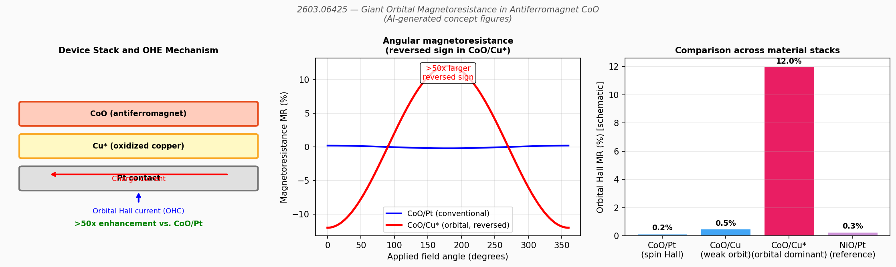

**Figure 1（AI生成概念図）：** 左：CoO/Cu* デバイス構造と軌道ホール電流の流れ（概念図）。中：磁場角度依存磁気抵抗の比較（CoO/Pt vs CoO/Cu*、符号反転と 50 倍超の増強を示す）。右：材料スタック比較（CoO/Pt、CoO/Cu、CoO/Cu*、NiO/Pt）における軌道ホール磁気抵抗の大きさ。

---

---

### 簡潔紹介論文 7

#### 1. 論文情報

**タイトル：** [Deterministic Electrical Switching in Altermagnets via Surface Antisymmetry Groups](https://arxiv.org/abs/2603.06537)
**著者：** K. D. Belashchenko
**arXiv ID：** 2603.06537
**カテゴリ：** cond-mat.mtrl-sci
**公開日：** 2026年3月7日
**論文タイプ：** 理論論文

---

#### 2. 研究概要

バルクでは中心対称な d 波オルタマグネット薄膜において、表面反対称群（surface antisymmetry groups）を利用することで界面における千鳥状有効磁場（staggered effective field）が生じ、面内電流により磁気方位を決定論的にスイッチングできることを対称性解析によって示した。バルクの対称性では消えるトルク成分が表面では生き残るという理論的示唆を与え、どの表面方位でこの効果が現れるかの設計則を提供している。重要なのは、この効果が対称性のみに依存するため原子スケールの表面粗さに対して頑健であるという点である。

オルタマグネットの電流制御スイッチングはスピントロニクス応用上の最重要課題の一つだが、中心対称オルタマグネットのバルクでは現行トルク理論が機能しない問題があった。本研究は界面・表面の対称性低下を利用することでこれを回避する原理を示し、α-MnTe、RuO₂ など主要なオルタマグネット材料へのヘテロ構造設計指針を与える。設計則が表面方位に依存することは、実験的には基板選択や界面工学によって制御可能であり、実験的検証が比較的近い将来に期待される。反強磁性スピントロニクスのデバイス化に向けた理論基盤の整備として重要な一本である。

---

#### 3. 図

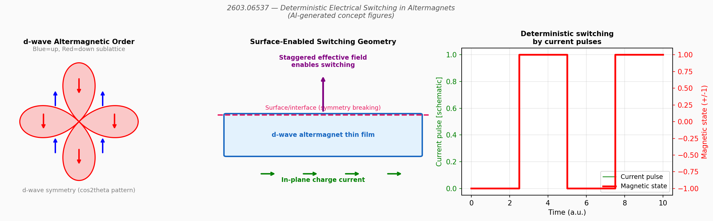

**Figure 1（AI生成概念図）：** 左：d 波オルタマグネットのスピン構造（cos2θ パターン、青=アップスピン・赤=ダウンスピン副格子）。中：表面対称性破れが千鳥状有効磁場を生成し電流スイッチングを可能にするデバイス構造（概念図）。右：電流パルスによる決定論的磁気方位スイッチングの模式的時間波形。

---

---

## 全体のまとめ

本日の arXiv ダイジェストは、材料工学・物性物理・マテリアルズ・インフォマティクスの三分野にわたる重要な進展を反映している。最も際立つ潮流は機械学習原子間ポテンシャルの進化であり、AllScAIP に代表される大規模 attention ベースアーキテクチャが長距離相互作用の記述という構造的課題に対して初めて実用的な解答を示した。同時に Spectra-Scope のようなスペクトルデータ AutoML や Transformer による遷移予測など、材料インフォマティクスの実験者向けツール化が着実に進んでいる。これらはデータ生成の加速と並行して、実験とシミュレーションの統合ワークフローを変えていくものと予想される。

物性物理の側面では、オルタマグネティズムを巡るエコシステムが急速に拡大している。超伝導プローブによる検出、決定論的電流スイッチングの原理提案、反強磁性体との軌道結合増強など、トポロジカル・スピントロニクス分野からの横断的関心が高まっている。特に実用化への道筋として、界面設計によるスイッチング制御（2603.06537）や軽金属系オービトロニクス（2603.06425）は近い将来の実験的検証が期待され、従来の重金属スピンホール材料依存から脱却する材料設計パラダイムを提示している。

量子ビームを用いた精密測定の観点では、BaTiO₃ でのキラルフォノン電場スイッチング（CD-RIXS による直接観測）と、phonon-magnon coherent coupling の位相分解イメージングの二例が目立つ。前者はフォノン角運動量という新しい情報担体の制御可能性を示し、後者はマグノニクスデバイス設計の実験基盤を整備するものである。ニッケル酸塩超伝導については超流体密度の系統測定により位相ゆらぎシナリオへの強力な支持が得られており、この描像を巡る理論・実験の論争は今後さらに活発化するだろう。継続的に追うべきトピックとして、attention ベース MLIP の新系への外挿精度検証、オルタマグネット系ヘテロ構造での電流スイッチング実証、およびニッケル酸塩の Nd フリー系での超流体密度測定が挙げられる。
