# 2026-03-18 量子ビーム計測

**作成日：** 2026年3月18日
**対象期間：** 2026年3月15日〜2026年3月18日（直近72時間）

---

## 選定論文一覧

1. [Persistent short-range charge correlations revealed by ultrafast melting of electronic order in YBa₂Cu₃O₆₊ₓ](https://arxiv.org/abs/2603.10486) — 2603.10486 ★重点
2. [Depth-resolved magnetization dynamics in Fe thin films after ultrafast laser excitation](https://arxiv.org/abs/2603.11913) — 2603.11913 ★重点
3. [Linear dichroic soft X-ray microscopy of ferroelectric stripe domains in epitaxial K₀.₆Na₀.₄NbO₃](https://arxiv.org/abs/2603.14079) — 2603.14079 ★重点
4. [Dimensionality tuning of heavy-fermion states in ultrathin CeSi₂ films](https://arxiv.org/abs/2603.11289) — 2603.11289
5. [Revealing 3D orientation and strain heterogeneity in calcite generated by bio-cementation](https://arxiv.org/abs/2603.11932) — 2603.11932
6. [4D reconstruction of alumina laser melt pools at 25 kHz via operando X-ray multi-projection imaging](https://arxiv.org/abs/2603.14391) — 2603.14391
7. [4D Synchrotron X-Ray Multi Projection Imaging (XMPI) for studying multiphase flow dynamics and flow instabilities in porous networks](https://arxiv.org/abs/2603.15319) — 2603.15319
8. [Unified theory of orientation averaging in X-ray spectroscopies: understanding polarization dependence in a Cartesian tensor approach](https://arxiv.org/abs/2603.12355) — 2603.12355
9. [Electronic Structure and Resonant Circular Dichroism of La₀.₇Sr₀.₃MnO₃ from Soft X-ray Angle-Resolved Photoemission](https://arxiv.org/abs/2603.10794) — 2603.10794
10. [Probing strong coupling in core–shell nanoparticles with fast electron beams](https://arxiv.org/abs/2603.13797) — 2603.13797

---

# 第2章：重点論文の詳細解説

---

## 重点論文①

### 1. 論文情報

**タイトル：** [Persistent short-range charge correlations revealed by ultrafast melting of electronic order in YBa₂Cu₃O₆₊ₓ](https://arxiv.org/abs/2603.10486)
**著者：** C. Seo, L. Shen, A. N. Petsch, S. Wandel, V. Esposito, et al.
**arXiv ID：** 2603.10486
**カテゴリ：** cond-mat.supr-con
**公開日：** 2026年3月11日
**論文タイプ：** 実験研究（時間分解X線散乱）
**ライセンス：** arXiv非独占的配布ライセンス（CC非対応）

---

### 2. どんな研究か

時間分解共鳴X線散乱（LCLS自由電子レーザー使用）を用いて、銅酸化物超伝導体YBa₂Cu₃O₆.₆₇における電荷密度波（CDW）の光誘起ダイナミクスを研究した論文である。光励起により長距離CDW秩序が崩壊する一方で、短距離相関が~0.2 psのタイムスケールで持続的に現れることを発見した。これにより、長距離と短距離の2成分CDWが同一試料中に共存しており、それぞれが異なる光励起耐性と回復ダイナミクスを持つことを初めて明確に分離して示した。

---

### 3. 研究の概要

**背景・目的**
銅酸化物高温超伝導体の複雑な相図において、CDWは至るところに存在し、超伝導との競合・共存が長年の論点となっている。CDWには長距離秩序と短距離相関が共存することは知られていたが、これらを実験的に分離して個別の動的性質を得ることは困難であった。本研究は、ポンプ・プローブ法によってCDWの2成分を選択的に「操作」することで、それぞれの特性を独立に測定することを目指した。

**解こうとしている課題**
超伝導体YBCO中のCDW長距離秩序と短距離相関は、散乱ピークとして重なって観測される。これらを区別するには、異なる励起強度および時間分解応答の違いを利用する新しいアプローチが必要であった。

**研究アプローチ**
LCLS（リニアコヒーレント光源）における時間分解軟X線散乱実験。1.55 eV光ポンプ（50 fs、120 Hz）と Cu L₃端共鳴エネルギー（931.5 eV）に調整したX線プローブを組み合わせ、CDW特性波数Q_CDW ≈ (0.31, 0, 1.4) における散乱強度を時間遅延および励起フルエンス依存で系統的に測定した。

**対象材料系・対象現象**
YBa₂Cu₃O₆.₆₇（最適ドープ近傍の銅酸化物超伝導体）におけるCDW秩序の光誘起崩壊と回復ダイナミクス。

**使用した量子ビーム手法**
時間分解共鳴軟X線散乱（tr-RSXS）。Cu L₃端への共鳴により、Cu-O面の電荷変調に対して元素選択的・軌道選択的な感度を確保した。

**測定で得られる物理量**
CDW散乱ピーク強度の時間発展、ピーク幅（相関長の逆数）の時間発展、フルエンス依存性、ピーク振幅の二成分分離。

**主な解析手法**
散乱プロファイルの複数運動量分解能での比較、双指数関数フィッティングによる回復ダイナミクス解析、2成分モデル（長距離・短距離成分）の分離。

**主な結果**
- 臨界フルエンス Φ_C ≈ 65 μJ/cm² 以上で長距離CDW秩序が崩壊
- 飽和フルエンス Φ_sat = 21.2 ± 2.3 μJ/cm² で強度抑制が飽和
- 短距離CDW相関が~0.2 ps以内に出現し持続、相関長~27 Åは平衡状態の短距離成分と一致
- 長距離コヒーレンスは~0.6 psで回復するが強度は部分的に抑制されたまま
- 崩壊過程は電子過程によって駆動されることを示す証拠を提示

**著者の主張**
超高速X線散乱は、光励起への異なる応答を通じて重なり合う密度波や相関を分離する有効なツールであり、この手法により銅酸化物中で長距離・短距離CDW成分が共存することを初めて明確に示した。

---

### 4. 放射光・量子ビーム分野として重要なポイント

Cu L₃端共鳴エネルギーへの調整は、CuO₂面の電荷変調に対して散乱断面積を劇的に増強し、バルク感度では検出困難な少数成分まで追跡可能にしている。自由電子レーザー（LCLS）の超短パルス（~50 fs X線）によって、電子系の動的応答（~0.2 ps）と格子緩和・音響フォノン（ps〜ns）を明確に分離して測定できた点が本質的な強みである。同一のCDW波数に重なる2成分を、励起強度依存性・時間発展の違いを「操作変数」として分離するアプローチは、従来の静的散乱や平衡状態での温度依存測定では不可能な情報を引き出している。高運動量分解能と低運動量分解能の2検出器による比較が、長距離・短距離の区別を定量的に可能にした。銅酸化物CDW研究の文脈では、短距離相関の「硬さ」（光励起耐性）が秩序形成機構に本質的な情報を与えており、超伝導との競合機構理解への直接的な貢献が見込まれる。他の銅酸化物やニッケル酸化物超伝導体への展開が期待できる。

---

### 5. 限界と注意点

測定は特定ドープ量（x = 0.67）の試料1試料のみに限定されており、ドープ依存性の系統的比較は今後の課題である。Cu L₃端共鳴での軟X線散乱は試料の表面感度が高く（侵入長~数nm〜十数nm）、バルクCDW挙動を代表しているかどうかの検証が必要である。フルエンス依存性の解析において、温度上昇（熱的溶融）と電子過程（光キャリア注入）の寄与を完全に分離するには、実験条件のさらなる制御が求められる。2成分モデルの妥当性は、散乱プロファイルのフィッティング仮定（ローレンツ型ピーク形状等）に依存しており、より高い運動量分解能での測定によるクロスチェックが望まれる。回復ダイナミクスの定量的記述（~0.6 ps）は相対的指標であり、絶対的な秩序回復の完全性については議論の余地がある。

---

### 6. 関連研究との比較

銅酸化物CDWの時間分解X線散乱は過去10年で急速に発展してきた分野であり、Wandel et al.（LCLS）やForst et al.（FLASH）などの先行研究がCDW光抑制を報告している。本研究の新規性は、単なるCDWピーク強度の時間変化を見るだけでなく、ピーク幅（相関長）の時間発展を精密に追うことで長距離・短距離の2成分を動的に分離した点にある。短距離CDWが長距離秩序崩壊後も持続することは、Cooper et al.の平衡散漫散乱研究とも整合しており、超伝導ゆらぎとの関連を示唆している。自由電子レーザーの高輝度・超短パルスを最大限活用した点で、第三世代放射光では達成困難な時間分解能を実現した。長距離・短距離CDW競合という普遍的テーマへの寄与であり、ニッケル酸化物系や他の強相関系への波及が期待される。増分的前進ではなく、方法論的に新しい切り口を提示した点で重要な論文である。

---

### 7. 重要キーワードの解説

**① 電荷密度波（Charge Density Wave, CDW）**
電子系の不安定性によって生じる、電荷密度が空間的に周期的に変調した状態。フェルミ面のネスティング（特定の波数ベクトルでフェルミ面が「重なる」形状）が主な原因とされる。実験的にはX線・中性子散乱でブラッグ点外の超格子反射として、あるいはARPESでフェルミ面のギャップとして観測される。

**② 共鳴軟X線散乱（Resonant Soft X-ray Scattering, RSXS）**
X線のエネルギーを特定の元素の吸収端（例：Cu L₃端 ~931 eV）に合わせることで、その元素に関連した電子状態の変調（CDWや軌道秩序）に対して散乱断面積を劇的に増大させる技術。数式的には$f(\omega) = f_0 + f'(\omega) + if''(\omega)$の共鳴項により感度が向上する。

**③ 時間分解X線散乱（Time-resolved X-ray Scattering）**
光パルス（ポンプ）で試料を励起し、X線パルス（プローブ）で異なる時間遅延での構造を測定するポンプ・プローブ法。自由電子レーザーの~50 fsパルスにより、電子系の動的応答をフェムト秒スケールで追跡できる。

**④ 長距離秩序と短距離相関**
長距離秩序：相関長が系のサイズに匹敵するほど長い秩序。散乱ピークが鋭く（デルタ関数的）現れる。短距離相関：相関長が有限（本研究では~27 Å）で、散乱ピークが幅広く（ローレンツ型）現れる。両者は実空間では「ドメイン」と「ゆらぎ」に対応する。

**⑤ 励起フルエンス（Pump Fluence）**
単位面積当たりに照射するポンプパルスのエネルギー（μJ/cm²）。本研究では臨界フルエンス Φ_C を閾値として長距離CDWの振る舞いが質的に変化することが示され、光誘起相転移の指標となる。

**⑥ Cu L₃吸収端**
銅の2p₃/₂コア電子が3d空軌道に励起されるときのX線吸収端（~931 eV）。銅酸化物では、この共鳴により CuO₂面の電子状態（3d₉に相当する正孔状態）に選択的な感度が生じる。CDWはこの面内の電荷変調であるため、L₃端共鳴散乱はCDW検出に最適である。

**⑦ 相関長（Correlation Length, ξ）**
秩序ゆらぎが空間的に持続する距離。散乱ピーク幅の逆数に比例: ξ ∝ 1/FWHM（Q空間における）。相転移近傍で発散し、秩序相では非常に長くなる。本研究では短距離成分の ξ ~ 27 Å が光励起後も持続することが示された。

**⑧ 超高速消磁・脱秩序（Ultrafast Order Melting）**
光パルス照射後、フェムト秒〜ピコ秒スケールで電荷・磁気・軌道秩序が崩壊する現象。電子の光吸収による非平衡電子分布形成が直接的原因で、格子加熱（熱的溶融）よりも速い。CDW文脈では「電子過程による崩壊」と「格子加熱による崩壊」の区別が重要。

**⑨ 自由電子レーザー（Free-Electron Laser, FEL）**
電子の自由度（相対論的電子ビーム）を利用した超高輝度・超短パルスX線源。LCLSでは~50 fsパルス幅、ピーク輝度は第三世代放射光の~10億倍。時間分解実験において、電子系の動的過程を「凍結撮影」するために不可欠。

**⑩ ポンプ・プローブ法（Pump-probe Spectroscopy）**
励起パルス（ポンプ）と観測パルス（プローブ）を異なる時間遅延Δtで組み合わせ、系の時間発展を追跡する手法。Δtを変えながら多数ショット平均することで、フェムト秒時間分解のスナップショットが得られる。本実験では光学ポンプ（1.55 eV、50 fs）とX線プローブ（931.5 eV、~50 fs）を使用。

---

### 8. 図

本論文のライセンスはarXiv非独占的配布ライセンスであり、CC BY等のCC系ライセンスに該当しないため、原図の転載は行わない。以下に研究内容の概要を文章で説明する。

**図1相当の内容（実験概念図とCDWピーク）：** LCLSにおける時間分解共鳴X線散乱の実験配置。光ポンプでYBCO試料を励起し、Cu L₃端に同調したX線プローブでCDW散乱強度を時間遅延の関数として測定。励起前の散乱プロファイルは長距離CDWピークとして現れ、Φ_C以上の励起で消失する。

**図2相当の内容（フルエンス依存性）：** 異なるポンプフルエンスでのCDW強度抑制率の比較。飽和挙動がΦ_sat ≈ 21 μJ/cm²で観測され、これが格子温度上昇による熱的溶融閾値より低いことが「電子過程」の証拠となる。

**図3相当の内容（2成分モデル）：** 散乱プロファイルの時間変化を高分解能・低分解能の2検出器で比較した結果。幅広い散乱成分（短距離相関）が光励起直後に浮かび上がり、長距離ピーク消失後も~0.2 ps以内に出現・持続することを示す。

---

---

## 重点論文②

### 1. 論文情報

**タイトル：** [Depth-resolved magnetization dynamics in Fe thin films after ultrafast laser excitation](https://arxiv.org/abs/2603.11913)
**著者：** Valentin Chardonnet, Marcel Hennes, Romain Jarrier, Renaud Delaunay, Nicolas Jaouen, et al.
**arXiv ID：** 2603.11913
**カテゴリ：** cond-mat.mtrl-sci
**公開日：** 2026年3月12日
**論文タイプ：** 実験研究（時間分解X線共鳴磁気反射率）
**ライセンス：** CC BY-NC-SA 4.0

---

### 2. どんな研究か

FLASH2自由電子レーザー（FL24ビームライン）における時間分解X線共鳴磁気反射率（tr-XRMR）を用いて、レーザー励起後のFe薄膜における磁化の深さ分布の時間発展を同時に測定した論文である。フェムト秒時間分解能（~80 fs X線パルス）とナノメートル空間分解能（深さ方向）を同時に実現し、超高速消磁が深さ方向に均一ではなく、特に埋もれた界面付近（Pt/Fe界面）で強い不均一性を示すことを初めて明確に示した。局所的（電子-フォノン相互作用）と非局所的（スピン流）角運動量移動が同時に起きることを、モデル計算との比較から実証した。

---

### 3. 研究の概要

**背景・目的**
超高速消磁（ultrafast demagnetization）は光励起後フェムト秒〜ピコ秒で起きる磁化崩壊現象で、発見から30年以上経った今もそのメカニズム（Elliott-Yafet電子-フォノン散乱、電子-電子散乱、超拡散スピン流など）をめぐる議論が続く。特に薄膜の深さ方向の磁化不均一性は、スピン流の生成・伝搬機構に本質的な情報を含むが、通常のX線磁気円二色性（XMCD）測定は深さ平均しか得られず不明な点が多かった。

**解こうとしている課題**
超高速消磁における深さ分解磁化プロファイルの時間発展を測定することで、（1）局所的角運動量移動（電子-フォノン機構）と（2）非局所的角運動量移動（隣接Pt層へのスピン流）の寄与を分離すること。

**研究アプローチ**
Si/Ta(3.3 nm)/Pt(3.2 nm)/Fe(18.4 nm)/Pt(3.9 nm) 多層膜試料を作製し、Fe L₃端（701 eV）でのX線反射率と磁気非対称率を同時に計測。9つの異なる時間遅延（-1〜13.5 ps）でのデータを取得し、Parrattフォーマリズムを用いた反射率フィッティングから深さ分解磁化プロファイルを抽出。

**対象材料系・対象現象**
Fe/Pt多層膜における超高速消磁。Fe層の磁化ダイナミクス、格子膨張、Fe-Pt界面でのスピン流。

**使用した量子ビーム手法**
時間分解X線共鳴磁気反射率（tr-XRMR）。Fe L₃端（~701 eV）軟X線での反射率測定により、Fe層内の深さ分解磁化情報が得られる。

**測定で得られる物理量**
反射率 R(θ, t) と磁気非対称率 A(θ, t) の角度・時間依存性。フィッティングにより、Fe層を深さ方向に分割した各サブ層の磁化 M(z, t) と膜厚変化 Δd(t) を同時抽出。

**主な解析手法**
Parrattフォーマリズムによる多層反射率フィッティング、微視的三温度モデル（m3TM）とスピン流シミュレーションとの比較。

**主な結果**
- 光励起後~300〜500 fsで最大~50%の消磁を観測
- 上部15 nm では消磁がほぼ均一であるが、底部Pt/Fe界面付近で磁化が部分的に持続する不均一性
- 数psで磁化が回復し始め、同時にFe層全体が~1.3 Å（全膜厚の~1.3%）膨張、周期~14.7 psの振動（音響ひずみ波）
- 局所的（m3TM）・非局所的（超拡散スピン流）機構が同時進行することをシミュレーション比較で示すが、単一モデルでの完全説明には至らない

**著者の主張**
tr-XRMRによる深さ分解測定は、超高速消磁における局所・非局所の角運動量移動機構を区別する強力な手段であり、Fe/Pt系でスピン流と局所加熱が同時に進行する複合機構を明らかにした。

---

### 4. 放射光・量子ビーム分野として重要なポイント

X線共鳴磁気反射率の最大の特長は、深さ分解磁化プロファイルをナノメートル精度で得られる点にある。通常の透過XMCD測定は深さ平均情報しか与えないが、反射率の入射角依存性（小角〜中角領域）を解析することで界面からの寄与を分離できる。Fe L₃端（~701 eV）への共鳴は磁化感度を数オーダー増大させ、18 nmというFe薄膜でも十分なシグナルを確保している。FLASHの~80 fsパルスにより、消磁の初期過程（電子系の非平衡状態）を「凍結」した状態で観測できる。構造変化（格子膨張）と磁気変化（消磁）を同一実験・同一プローブパルスで同時に測定できる点は、X線以外の手法（光学ポンプ-光学プローブ）には持ち得ない強みである。本手法は他の磁性薄膜系（CoFeB/MgO、NiFe/Ptなど）やヘテロ構造への直接展開が可能である。

---

### 5. 限界と注意点

反射率フィッティングによる深さ分解は逆問題であり、解の一意性は初期モデルや仮定する層構造に依存する。特にFe層を何分割するか（本研究では4〜6サブ層）という選択が磁化プロファイルの形状に影響する。また、反射率の角度範囲が21〜34°と比較的狭いため、深さ分解能には上限がある。スピン流モデルとの比較において、超拡散輸送のパラメータ（スピン伝搬距離、m3TM緩和時定数など）は文献値を使っており、Fe/Pt系の実際の界面状態（粗さ、拡散）への敏感性が十分に検証されていない。FL24ビームラインの特定の条件（フォトン数、スポットサイズ）に依存した測定であり、施設・ビームライン条件の異なる環境での再現性確認が必要である。

---

### 6. 関連研究との比較

時間分解XRMR（または時間分解X線反射率）を用いた超高速消磁の深さ分解測定は、Zusin et al.（HHG光源）やGeilhufe et al.（FEL）など少数の先行研究が存在するが、Fe/Pt系での詳細な深さ分解磁化プロファイルの時間発展をFELの高輝度で系統的に測定した例は限られる。微視的三温度モデル（m3TM）はBattiato et al.（2010）以来の標準モデルだが、界面効果（スピン流のPt層への輸送）との同時比較はこの研究で明示的に行われた。超拡散スピン流モデルとの比較では両者の協働が必要と結論しており、単純な1機構モデルへの反証として重要である。技術的には、HHG光源では達成困難な高輝度軟X線でのtr-XRMRをFELで実現した点で計測技術の前進を示している。

---

### 7. 重要キーワードの解説

**① 時間分解X線共鳴磁気反射率（tr-XRMR）**
X線の反射率を磁気共鳴条件下で時間分解測定する技術。左右円偏光でのX線反射率の差（磁気非対称率）を入射角の関数として解析することで、薄膜の深さ方向磁化分布が得られる。Parrattの多層反射率計算を逆解析に用いる。

**② 超高速消磁（Ultrafast Demagnetization）**
光パルス（~50 fs）照射後、~300 fs以内に磁化が大きく減少する現象。1996年にBesseresらによって発見。機構としてElliott-Yafet機構（電子-フォノン散乱を介したスピンフリップ）、超拡散スピン流、電子-電子散乱などが提案されている。

**③ 微視的三温度モデル（Microscopic Three-Temperature Model, m3TM）**
電子系・スピン系・格子系のそれぞれの温度T_e, T_s, T_l の時間発展を連立方程式で記述するモデル。各サブシステム間のエネルギー・角運動量交換を結合定数で表現。a_sf（スピン-フリップ確率）がキーパラメータ。

**④ 超拡散スピン流（Superdiffusive Spin Current）**
ホットキャリアが平均自由行程を超えて輸送される「弾道輸送」的スピン電流。励起直後の非平衡電子がFe/Pt界面を越えてPt層に輸送され、Fe層の角運動量を減少させる非局所機構。Battiato et al.（PRL 2010）が提唱。

**⑤ 磁気非対称率（Magnetic Asymmetry）**
左右円偏光でのX線反射率の差を平均で割った量 A = (R₊ - R₋)/(R₊ + R₋)。磁化に比例し、磁気光学カー効果の反射版に相当。深さ方向の磁化感度がX線共鳴により増強される。

**⑥ Fe L₃吸収端（~701 eV）**
鉄の2p₃/₂→3d遷移に対応する軟X線共鳴エネルギー。この共鳴では磁気散乱因子の虚数部が最大となり、磁気反射率コントラストが劇的に増大する。軟X線なので表面感度が高く、薄膜系に適している。

**⑦ Parrattフォーマリズム**
多層薄膜のX線反射率を逐次的境界条件から計算する方法。各層の複素屈折率（光学定数）を入力とし、反射率の入射角依存性（反射率曲線）を計算する。実験データへのフィッティングにより、各層の厚みや密度を抽出できる。

**⑧ 音響ひずみ波（Acoustic Strain Wave）**
超短パルスレーザーで薄膜を加熱すると、急激な熱膨張が音速で伝搬する弾性波（音響フォノンパルス）が生じる。X線反射率の時間発展に周期的振動として現れ、周期は音速と膜厚から決まる（本実験では~14.7 ps）。

**⑨ 自由電子レーザーFLASH（FLASH2 FL24ビームライン）**
ドイツ・DESY研究所のFEL施設FLASH2のFL24ビームライン。軟X線領域（数十〜数百eV）で~80 fsパルスを供給。磁性薄膜研究や時間分解反射率測定に広く使用されている。

**⑩ 格子膨張（Lattice Expansion）**
レーザー加熱によりFe薄膜が熱膨張する現象。X線反射率測定では、キアウスキー縞の位相シフトとして検出できる。本研究では最大~1.3 Å（全膜厚18.4 nmの~1.3%）の膨張が数ps後に観測されている。

---

### 8. 図

（ライセンス：CC BY-NC-SA 4.0 — 図の転載が許可されています）

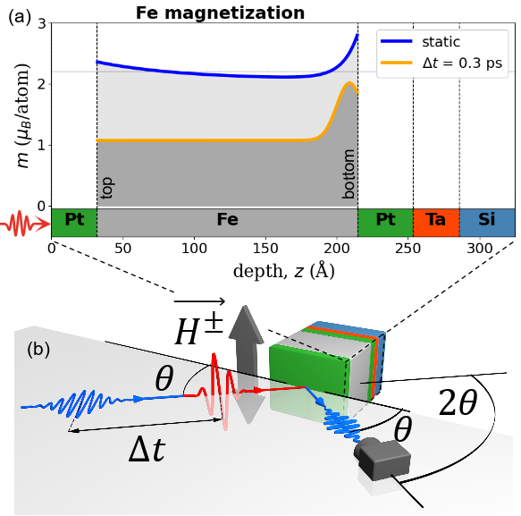

**図1キャプション：** FLASH2 FL24ビームラインにおける時間分解X線共鳴磁気反射率（tr-XRMR）実験の概念図。Si基板上のTa/Pt/Fe/Pt多層膜に800 nm・50 fsの赤外ポンプパルスを照射し、Fe L₃端（701 eV）のX線プローブで反射率と磁気非対称率の入射角依存性を測定する。右パネルは光励起前後の磁化深さプロファイルを示し、底部Pt/Fe界面付近での磁化不均一性が可視化されている。この深さ分解情報こそ、本手法が通常のXMCD測定に対して持つ本質的な優位性である。

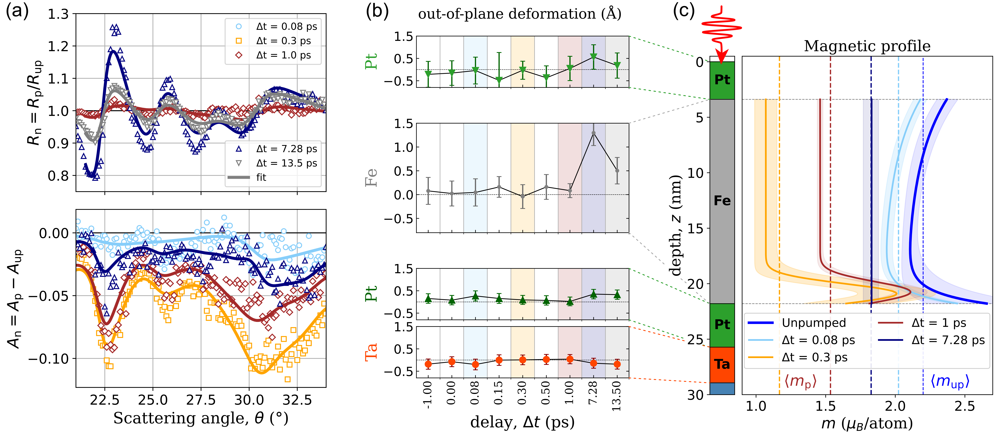

**図2キャプション：** 複数の時間遅延での規格化反射率曲線（上段）と磁気非対称率曲線（中段）のフィッティング結果、および抽出された深さ分解磁化プロファイルの時間発展（下段）。励起後~500 fsで上部Feにおける50%の消磁が観測される一方、底部界面付近では磁化が部分的に保持される。この深さ不均一性がスピン流の非局所的寄与の直接証拠となる。各時間遅延でのプロファイルの変化が系統的に示されており、磁化ダイナミクスの全体像を与える。

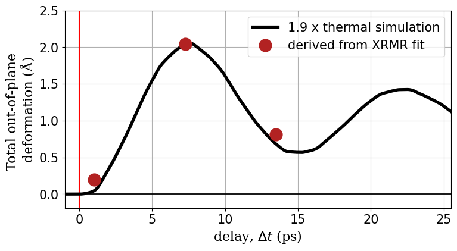

**図3キャプション：** レーザー励起後のFe薄膜の面外膨張量の時間発展（実験値：シンボル、シミュレーション：実線）。Fe層全体が数ps以内に最大~1.3 Å膨張し、周期~14.7 psの音響振動を示す。この構造情報は磁気信号と同一の反射率測定から同時に得られ、熱的膨張による磁気異方性変化と電子的消磁機構を区別するための重要な補足情報となる。

---

## 重点論文③

### 1. 論文情報

**タイトル：** [Linear dichroic soft X-ray microscopy of ferroelectric stripe domains in epitaxial K₀.₆Na₀.₄NbO₃](https://arxiv.org/abs/2603.14079)
**著者：** M. Schneider, T. A. Butcher, S. Wagner, D. Metternich, C. Klose, et al.
**arXiv ID：** 2603.14079
**カテゴリ：** cond-mat.mtrl-sci
**公開日：** 2026年3月14日
**論文タイプ：** 実験研究（軟X線顕微鏡・コヒーレント回折イメージング）
**ライセンス：** arXiv非独占的配布ライセンス（CC非対応）

---

### 2. どんな研究か

エピタキシャルK₀.₆Na₀.₄NbO₃（KNN）強誘電体薄膜のひずみ誘起ストライプドメインを、走査型透過X線顕微鏡（STXM）とコヒーレント回折イメージング（CDI）を用いて可視化した論文である。エピタキシャル基板（TbScO₃）が軟X線を強く吸収するという既存の制約を、局所的な基板の裏面研磨（バックシニング）という独自の工夫で突破し、44 nmピリオドまでのナノスケールドメイン構造をO K端（~530 eV）でのX線線形二色性を利用して撮像した。この手法確立により、強誘電薄膜のナノスケール偏光ドメインをエネルギー分解・元素選択的に観測できる新しいプラットフォームが開かれた。

---

### 3. 研究の概要

**背景・目的**
KNN系強誘電体薄膜はPbを含まない環境適合型圧電材料として注目されているが、エピタキシャルひずみによって安定化される微細ドメイン構造（ストライプドメイン）の理解が性能最適化に不可欠である。軟X線顕微鏡は元素選択性・軌道選択性を持つ理想的なドメインイメージングツールだが、エピタキシャル薄膜では基板が厚く（~100 μm）、O K端付近の軟X線を完全に吸収してしまい、従来は測定不可能であった。

**解こうとしている課題**
エピタキシャル基板の軟X線吸収問題を解決し、KNN薄膜のひずみ安定化ストライプドメインを軟X線顕微鏡で初めてイメージングすること。

**研究アプローチ**
TbScO₃（110）基板を薄膜下の局所領域（数μm²）だけ機械的に研磨して厚さ~1 μm以下まで薄くし、O K端（530 eV）での透過率を確保した。その後、STXMとCDIの2手法でドメイン構造を撮像。STXMは水平・垂直偏光のXLD差分画像でドメインコントラストを生成；CDIはフーリエ変換ホログラフィーと位相回復を組み合わせてより高い空間分解能を実現した。

**対象材料系・対象現象**
KNN（K₀.₆Na₀.₄NbO₃）強誘電薄膜（厚さ37〜100 nm）のエピタキシャルひずみ誘起ストライプドメイン。O 2p–Nb 4d混成軌道のXLDによる偏光感度。

**使用した量子ビーム手法**
走査型透過X線顕微鏡（STXM）とコヒーレント回折イメージング（CDI、フーリエ変換ホログラフィー）。O K端（~530 eV）での軟X線線形二色性（XLD）を利用した元素・軌道選択的ドメインコントラスト。

**測定で得られる物理量**
O 2p–Nb 4d混成軌道の異方性（XLD = 水平偏光強度 − 垂直偏光強度）から得られる面内分極の空間分布。ドメイン周期（44〜116 nm）。

**主な解析手法**
STXMの差分イメージング（horizontal – vertical polarization）によるXLDマップ生成、CDIの位相回復アルゴリズム（Fienup型）。

**主な結果**
- 100 nm KNN薄膜のSTXM像で116 nmおよび98 nmピリオドのストライプドメインを解像
- 37 nm KNN薄膜のCDI測定で44 nmピリオドのドメインを解像（STXMの分解能限界を超える）
- XLD差分画像は強誘電コントラストと構造コントラストを分離できることを示した
- ノーマルインシデンスで面内分極成分に感度を持つことを確認

**著者の主張**
バックシニング技術とXLD軟X線顕微鏡の組み合わせは、エピタキシャル強誘電薄膜のナノスケールドメインイメージングを可能にする普遍的なプラットフォームとなり、将来の時間分解研究の基盤を提供する。

---

### 4. 放射光・量子ビーム分野として重要なポイント

O K端XLDが選ばれた本質的な理由は、O 2p–Nb 4d混成軌道の異方性が強誘電偏光方向に直接対応するためであり、分極そのものを光学的（可視域）ではなく電子状態の指紋として検出できる点が本手法の優位性である。面内偏光（ノーマルインシデンス）でXLDを測定することで、薄膜面内の分極ドメインに直接感度を持ち、圧電力顕微鏡（PFM）では検出困難な埋もれた面内成分を計測できる。CDIによる高分解能イメージングはゾーンプレートの口径に制限されるSTXM分解能（~25 nm）を超え、散乱パターンの再構成により~10 nm以下への到達が将来的に期待できる。バックシニングという試料工夫のシンプルさは、PbZrTiO₃や他の強誘電系への即時展開を可能にしており、コミュニティへの波及性が高い。将来の時間分解STXM/CDI測定（FEL使用）によって、外場応答下でのドメイン壁ダイナミクスを見通す道が開かれた。

---

### 5. 限界と注意点

バックシニングは職人的な試料加工であり、基板を均一に~1 μm以下まで研磨する際に薄膜へのストレス導入や欠陥生成のリスクがある。また、局所的な厚みムラがSTXMコントラストの均一性に影響する可能性がある。測定視野はバックシニング領域（数μm〜数十μm²）に制限されるため、統計的に代表的なドメイン構造の観察には工夫が必要である。CDIにおける位相回復は一意性の保証がなく、孤立した散乱体という仮定や初期位相の選択に依存する。X線照射による強誘電体の分極状態変化（X線誘起分極スイッチング）の可能性については言及されていない。KNN特有の組成不均一性（K/Na比のゆらぎ）がドメイン構造に与える影響は未検討のままである。

---

### 6. 関連研究との比較

強誘電薄膜のX線顕微鏡研究は、PZTやBaTiO₃系での先行事例が多く、例えばRöβler et al.やScagnoli et al.がストライプドメインを放射光で観測している。しかしKNN系のエピタキシャル薄膜への軟X線顕微鏡適用は本研究が初めてであり、Pbフリー強誘電体研究への方法論展開として重要である。STXMとCDIを同一試料で使い分けることで、分解能と視野の相補性を実証している点も新しい。PFMとの比較では、軟X線測定がバルク感度（数nm〜数十nm）を持ち、表面準備条件に左右されない優位性がある。増分的ではあるが、試料工夫によって既存の測定手法の適用範囲を広げた方法論貢献として評価できる。時間分解への拡張可能性という観点では、FELを用いた超高速X線顕微鏡との融合が次のステップとなる。

---

### 7. 重要キーワードの解説

**① X線線形二色性（X-ray Linear Dichroism, XLD）**
直線偏光X線の吸収率が偏光方向によって異なる現象。原子軌道の非等方性（例：O 2p軌道の異方性）に起因し、偏光に平行・垂直な軌道への電子遷移確率の差として現れる。強誘電体では分極方向に関連した軌道異方性がXLDとして観測できる。

**② 走査型透過X線顕微鏡（STXM）**
フレネルゾーンプレートで集光した軟X線ビームで試料を走査し、透過強度の空間マップを得る顕微鏡。エネルギー選択性（吸収端チューニング）と元素選択性を持ち、~25 nm程度の空間分解能が達成できる。ドメイン構造や磁区の観察に広く使用される。

**③ コヒーレント回折イメージング（CDI）**
ゾーンプレートなどの光学素子を使わず、コヒーレントX線の遠場回折パターンを測定し、数値的位相回復アルゴリズムによって実空間像を再構成するレンズレス顕微鏡法。回折限界を超える分解能への到達が原理的に可能。

**④ フーリエ変換ホログラフィー（FTH）**
参照波（ピンホールなど）と試料散乱波を重ね合わせ、干渉パターン（ホログラム）からフーリエ変換により直接実空間像を再構成するCDIの特殊形式。位相回復の曖昧さが少なく安定した再構成が可能。

**⑤ ストライプドメイン（Stripe Domain）**
強誘電体や強磁性体において、エピタキシャルひずみや静電相互作用エネルギーの最小化のため、自発分極が互いに逆向きに交互に配列した周期的ドメイン構造。周期は膜厚、弾性定数、分極値などで決まる（Kittel則）。

**⑥ エピタキシャルひずみ（Epitaxial Strain）**
薄膜と基板の格子定数の違いによって薄膜内に生じる弾性ひずみ。ひずみは圧電・強誘電特性に大きく影響し、ドメイン構造の安定化・不安定化をもたらす。基板の格子定数を選ぶことでひずみの符号・大きさを制御できる。

**⑦ K₀.₆Na₀.₄NbO₃（KNN）**
鉛を含まない圧電・強誘電セラミックの代表材料。ペロブスカイト型酸化物で、KNbO₃とNaNbO₃の固溶体。Pbベース材料（PZT）と同程度の圧電定数が報告されており、環境規制強化に向けた代替材料として注目されている。

**⑧ O K吸収端（~530 eV）**
酸素の1s→2p遷移に対応するX線吸収端。KNNではO 2pがNb 4dと混成するため、Nb-O結合の異方性（強誘電変位に関連）がこのエネルギーでのXLDとして現れる。エネルギーが~530 eVなので「軟X線」領域に入り、空気吸収を避けるために真空中での測定が必要。

**⑨ バックシニング（Back-thinning）**
エピタキシャル薄膜付き基板の裏面を機械研磨・化学エッチングで薄くする試料作製技術。本研究では~100 μmのTbScO₃基板を~1 μm以下まで局所的に薄くすることで、530 eVの軟X線を透過させた。電子顕微鏡試料（TEM試料）作製でも広く使われる技術の転用。

**⑩ 分極コントラスト（Polarization Contrast）**
強誘電体のドメイン撮像において、分極方向に依存したシグナル差からドメイン境界を可視化する手法の総称。XLDコントラスト（本研究）の他、圧電力顕微鏡（PFM）の位相コントラスト、X線回折の超格子反射コントラストなどがある。

---

### 8. 図

本論文のライセンスはarXiv非独占的配布ライセンスであり、CC BY等のCC系ライセンスに該当しないため、原図の転載は行わない。以下に研究内容の概要を文章で説明する。

**図1相当の内容（基板バックシニングと測定概念図）：** TbScO₃基板を局所的に裏面研磨してO K端軟X線を透過させる工夫の模式図。KNN薄膜がエピタキシャル歪みを受けたまま~1 μm以下の基板上に残る。STXMの走査概念図、ゾーンプレートによる集光、および水平・垂直偏光での差分測定スキームが示される。

**図2相当の内容（STXMによるXLDドメインマップ）：** 100 nm KNN薄膜のSTXMイメージ。水平偏光と垂直偏光の透過強度差（XLD）を空間マッピングした結果。周期~116 nmのストライプドメインが明瞭に可視化され、ドメインの方向と超ドメイン（スーパードメイン）構造が判別できる。

**図3相当の内容（CDI高分解能像）：** 37 nm KNN薄膜のフーリエ変換ホログラフィーCDI結果。回折パターンの位相回復から再構成された実空間像では44 nmピリオドのストライプドメインが解像されており、STXMの分解能（~25 nm）に近い解像度でドメイン構造を捉えている。

---

# 第3章：その他の重要論文

---

## 論文④

### 1. 論文情報

**タイトル：** [Dimensionality tuning of heavy-fermion states in ultrathin CeSi₂ films](https://arxiv.org/abs/2603.11289)
**著者：** Yi Wu, Weifan Zhu, Teng Hua, Yuan Fang, Yanan Zhang, et al.
**arXiv ID：** 2603.11289
**カテゴリ：** cond-mat.str-el
**公開日：** 2026年3月11日
**論文タイプ：** 実験研究（in situ ARPES + MBE）
**ライセンス：** CC BY 4.0

---

### 2. 研究概要

分子線エピタキシー（MBE）とin situ角度分解光電子分光（ARPES）を組み合わせて、重フェルミオン化合物CeSi₂の薄膜厚み依存電子状態を研究した論文である。三次元的な厚い膜ではフェルミ準位でのコヒーレントなKondoピーク（重フェルミオン特有の分散性重い準粒子）と結晶電場（CEF）励起サテライトが観測されるが、二次元的な超薄膜（3ユニットセル以下）ではCEFサテライトが大きく抑制される一方、基底状態のKondoピーク自体はフェルミ準位に残存することを示した。同時に行った輸送測定では、磁気抵抗率の極大温度T_maxが厚い膜の~100 Kから超薄膜の~35 Kへと系統的に低下することが確認され、スペクトル変化と輸送特性が一致した。この変化はCEF励起が次元性の低下とともに抑制され、Kondo過程が基底状態主導になることで合理的に説明できる。放射光ARPES（特にin situ条件）がMBE成長直後の清浄表面に対して適用され、大気暴露なしに電子状態を直接測定できた点が、重フェルミオン薄膜研究における方法論的な強みである。

CeSi₂は格子定数やCe 4f状態のエネルギー位置が比較的分かりやすく制御しやすいモデル物質であり、二次元重フェルミオン状態の存在自体が実証されたことは、トポロジカル重フェルミオンや二次元Kondo格子の探索に向けた重要なステップである。超薄膜での量子閉じ込め効果がCEF分裂に与える影響について、本研究はスペクトルと輸送の両面で整合した描像を提示しており、今後のKondo-Heisenbergモデルの二次元極限への理論検討を促す先行実験データとなる。

---

### 3. 重要キーワードの解説

**① 重フェルミオン（Heavy Fermion）**
Ce, Yb, Uなどのf電子系化合物で、伝導電子が局在f電子とのKondo相互作用によって有効質量が電子の自由質量の数十〜数百倍になる現象。低温では重い準粒子バンド（重いバンド）がフェルミ準位付近に現れ、ARPESでほぼ分散しない（= 重い）バンドとして観測できる。

**② Kondoピーク（Kondo Peak）**
局在スピン（f電子）と伝導電子のKondo効果により形成されるフェルミ準位近傍の共鳴ピーク。ARPESスペクトルではフェルミ準位直下に鋭い増強ピークとして現れる。Kondo温度T_K以下で成長し、重フェルミオン状態の指標となる。

**③ 結晶電場励起（Crystal Electric Field Excitation, CEF）**
局在f電子の多重項がサイト対称の結晶場（電場）によって分裂した準位への励起。ARPESではフェルミ準位から数十〜数百 meV離れたサテライトピークとして観測される。薄膜では二次元対称性がCEF分裂の大きさを変える可能性がある。

**④ 角度分解光電子分光（ARPES）**
X線・真空紫外光で励起された光電子の運動エネルギーと放出角度を測定し、電子バンド構造（E-k関係）を直接マッピングする手法。Kondo共鳴、フェルミ面形状、超伝導ギャップなどを実験的に測定する中心的手段の一つ。

**⑤ 分子線エピタキシー（MBE）**
超高真空中で構成元素を蒸発させ、基板上に原子層精度で薄膜を堆積する手法。膜厚を1ユニットセル単位で制御でき、in situ測定（基板に乗せたまま測定）との組み合わせで清浄界面の電子状態が得られる。

**⑥ 量子閉じ込め効果（Quantum Confinement Effect）**
物質のサイズが電子の波長（de Broglie波長）と同程度になると、エネルギー準位が離散化したり、有効パラメータ（有効質量、Kondo温度など）が大きく変化する現象。超薄膜では面直方向の電子状態が量子化される。

**⑦ T_max（磁気抵抗率極大温度）**
重フェルミオン系でKondo効果が起き始める温度の指標。磁気抵抗率ρ_m(T) = ρ(T) − ρ_phonon(T)が極大を示す温度。Kondo温度T_Kと相関し、T_maxが低下することはKondo効果の温度スケールが下がることを意味する。

**⑧ 4f電子（4f electrons）**
セリウムやイッテルビウムなどのランタノイド元素に固有の、原子核に比較的近い位置に局在した電子。電子相関が非常に強く、伝導電子との交換相互作用（Kondo効果）を通じて重フェルミオン状態を生む。

**⑨ 二次元Kondo格子（2D Kondo Lattice）**
Kondo格子モデルを二次元系で考えた理論・実験の枠組み。局在スピンが周期的に配列（格子）し、伝導電子との集団的Kondo効果（Kondo格子コヒーレンス）が低温で発現するとされる。二次元極限での振る舞いは理論的に未解明部分が多い。

**⑩ ユニットセル（Unit Cell）厚みでの制御**
MBEでは薄膜をユニットセル1枚（~0.5〜1 nm）単位で制御できる。本研究では2〜3 UCから厚い膜まで系統的に変化させ、次元性クロスオーバーを電子状態と輸送特性の両面で追跡した。

---

### 4. 図

（ライセンス：CC BY 4.0 — 図の転載が許可されています）

**図1キャプション：** CeSi₂薄膜のin situ ARPESスペクトルの膜厚依存性。厚い膜（三次元的）ではフェルミ準位付近にKondo共鳴ピーク（~0 meV）と数十 meV離れたCEFサテライトが明瞭に観測される。膜厚を減じて超薄膜（二次元的）にするとCEFサテライトが著しく抑制され、基底状態Kondoピークのみが残存する。この変化が「次元性チューニング」の核心を示す。

**図2キャプション：** ARPESフェルミ面マップおよびE-kバンド構造（左パネル群）と電気抵抗率の温度依存性（右パネル）の膜厚依存比較。超薄膜では重いバンド（ほぼ分散しない）が観測され、磁気抵抗率の極大温度T_maxが~100 Kから~35 Kへ低下することが輸送測定で確認される。スペクトルと輸送の整合した膜厚依存性が次元性チューニングの一貫した描像を支持する。

**図3キャプション：** CEFサテライトピーク強度とKondoピーク強度の膜厚依存性の定量的比較（左）およびT_maxのユニットセル数依存性（右）。CEF励起の消失とT_max低下の相関が系統的に示され、次元性低下によるCEF抑制がKondo温度スケールの変化につながるという解釈の定量的根拠を提示している。

---

## 論文⑤

### 1. 論文情報

**タイトル：** [Revealing 3D orientation and strain heterogeneity in calcite generated by bio-cementation](https://arxiv.org/abs/2603.11932)
**著者：** Marilyn Sarkis, James A. D. Ball, Michela La Bella, Antoine Naillon, Christian Geindreau, et al.
**arXiv ID：** 2603.11932
**カテゴリ：** cond-mat.mtrl-sci
**公開日：** 2026年3月12日
**論文タイプ：** 実験研究（マルチモーダル放射光計測）
**ライセンス：** CC BY-NC-ND 4.0

---

### 2. 研究概要

バイオセメンテーション（細菌誘起炭酸カルシウム析出による砂粒結合技術）によって形成されたカルサイト（方解石）結合部の三次元微細構造を、X線マイクロトモグラフィー（μCT）・三次元X線回折（3DXRD）・ダークフィールドX線顕微鏡（DFXM）という3つの放射光計測を組み合わせて非破壊解析した研究である。μCTが試料全体の形態と接合部アーキテクチャを与え、3DXRDが個々のカルサイト結晶粒の平均結晶方位と粒平均ひずみを提供し、DFXMが~100 nm空間分解能でサブグレイン内の局所ひずみ集中と方位分布（モザイク性）を可視化する。この組み合わせにより、型II（粒間）・型III（粒内）弾性ひずみの両方がカルサイト結合部に存在し、異方的内部ひずみと明確なサブドメイン構造が形成されることが明らかになった。

バイオセメンテーションは低炭素な地盤安定化技術として注目されているが、マクロスケールの力学特性（圧縮強度）がナノ〜マイクロスケールの結晶構造に強く依存することが本研究によって初めて定量化された。3DXRDとDFXMという先端放射光手法を組み合わせることで、個々のカルサイト粒の結晶学的情報と局所ひずみ状態を一対一で結びつけた点が従来研究に対する大きな前進であり、地盤工学・バイオマテリアル研究において量子ビームによる「材料の内部状態の非破壊可視化」の有効性を示した例として重要である。

---

### 3. 重要キーワードの解説

**① 三次元X線回折（3DXRD）**
高エネルギーX線（~50〜100 keV）で多結晶試料を照射し、ラウエ斑点の角度・強度分布から個々の結晶粒の結晶方位・ひずみ状態を三次元的に非破壊で測定する手法。EBSDの三次元版に相当し、バルク中の粒情報が得られる。

**② ダークフィールドX線顕微鏡（Dark-Field X-ray Microscopy, DFXM）**
特定の回折ピーク（特定の結晶方位）を選択し、その回折波をX線レンズ（CLSレンズ、Montel光学系など）で結像することで、その結晶方位に対応した領域のみを可視化する手法。~100 nm空間分解能で局所ひずみ・方位分布を非破壊で観測できる。

**③ X線マイクロトモグラフィー（μCT）**
多方向からX線投影像を撮影し、逆ラドン変換などで三次元再構成する非破壊イメージング法。試料内部の密度分布・形態情報を数μm〜数十μm分解能で得る。本研究ではカルサイト結合部の形状と砂粒接触構造の可視化に使用。

**④ 型IIひずみ（Type II Strain）**
多結晶体における粒間（intergranular）ひずみ。粒ごとの弾性定数異方性や熱膨張の違いから粒界を介して生じる内部応力に由来する。回折実験では粒ごとのピーク位置シフトの分布から評価する。

**⑤ 型IIIひずみ（Type III Strain）**
個別結晶粒内（intragranular）の局所ひずみ変動。転位・欠陥・成長過程で生じる局所ひずみ勾配に対応し、回折ピーク幅や非対称性として現れる。DFXMはこの粒内分布を~100 nm分解能で直接可視化できる。

**⑥ バイオセメンテーション（Bio-cementation）**
バクテリア（特にSporosarcina pasteuriiなどウレアーゼ産生菌）が尿素を加水分解してCO₃²⁻を生成し、Ca²⁺と反応してCaCO₃（カルサイト）を砂粒表面に析出させる技術。砂粒間の結合を形成し、地盤強化・液状化抑制への応用が期待される。

**⑦ モザイク性（Mosaicity）**
結晶内の微小なブロック（モザイクブロック）が互いに若干傾いて配列している状態。回折ピーク幅（ロッキングカーブ幅）として定量化され、DFXMではサブグレインの方位分布マップとして可視化できる。

**⑧ カルサイト（Calcite）**
炭酸カルシウム（CaCO₃）の最も安定な多形で、菱面体系（三方晶系）。バイオセメンテーションでは主にカルサイトが析出する。方解石の劈開性・弾性異方性は強く、局所ひずみが結合強度に大きく影響する。

**⑨ 高エネルギーX線（High-Energy X-ray）**
~50〜100 keVのX線。試料透過力が高く、砂粒のような重い無機材料でも内部を透過して3DXRDやCTに利用できる。欧州放射光施設（ESRF）やDESYのPETRA IIIなどが高エネルギービームラインを提供している。

**⑩ 非破壊三次元解析（Non-destructive 3D Characterization）**
試料を切断・研磨せずに内部構造を三次元的に解析する手法の総称。X線CT、3DXRD、DFXMはすべて非破壊であり、同一試料を複数手法で順次測定できるため、情報の直接対応が可能になる。

---

### 4. 図

（ライセンス：CC BY-NC-ND 4.0 — 図の転載が許可されていますが、今回はHTML版が利用不可のため原図の抽出ができませんでした。）

**図の内容説明（原図非掲載）：**

**図1相当：** μCTで得られたバイオセメンテーション試料の三次元可視化。砂粒と砂粒を接合するカルサイト結合部の三次元形態、接触アーキテクチャ、体積分率などが示され、μCTとアラインメントされた3DXRD/DFXM解析のためのROI（関心領域）設定の基礎となる。

**図2相当：** 3DXRDによる個別カルサイト粒の結晶方位マッピング。逆極点図（IPF）マップとして色分けされた粒方位分布が示される。粒間ひずみ（型IIひずみ）の空間分布も定量化されており、バイオセメンテーション過程でのカルサイト析出方向の不規則性が明らかになる。

**図3相当：** DFXMによるサブグレインスケールのひずみ・方位分布。~100 nm分解能で可視化された局所ひずみ集中域（型IIIひずみ）と方位ゆらぎ（モザイク性）の空間マップ。カルサイト成長フロントや砂粒界面付近で局所ひずみが高くなる傾向が見られ、結合強度の起源に対する物理的解釈を与える。

---

## 論文⑥

### 1. 論文情報

**タイトル：** [4D reconstruction of alumina laser melt pools at 25 kHz via operando X-ray multi-projection imaging](https://arxiv.org/abs/2603.14391)
**著者：** Lars Witte, Eliot Jermann, Zhe Hu, Zisheng Yao, Eleni Myrto Asimakopoulou, et al.
**arXiv ID：** 2603.14391
**カテゴリ：** physics.optics
**公開日：** 2026年3月15日
**論文タイプ：** 実験・手法開発研究（オペランド放射光4DイメージングおよびAIを用いた再構成）
**ライセンス：** CC BY 4.0

---

### 2. 研究概要

付加製造（積層造形）プロセスのリアルタイム内部観察を目的として、回転対応X線マルチプロジェクションイメージング（rotation-XMPI）という新しい4D計測手法を開発・実証した研究である。従来のオペランドX線断層撮像では試料の回転速度が時間分解能の根本的制約となっており、毎秒~100 体積程度が実用限界であった。本研究では、1回転につき3つの角度投影を同時取得しながらサンプル回転を25 Hzで行うことで回転速度への依存を断ち切り、加えて自己教師あり深層学習による再構成アルゴリズムを組み合わせることで、MAX IV放射光施設のアルミナ・レーザー再溶融実験において毎秒25,000ボリュームという従来比250倍の4D再構成速度を実証した。この時間分解能によって、溶融池のモルフォロジーとキーホール（蒸気圧による穴）の発生・消滅という、これまで従来法では運動ボケにより捉えられなかった現象が初めて明瞭に可視化された。

放射光X線の高輝度・コヒーレンスと深層学習の融合は、材料プロセス研究における4D計測の新標準を提示しており、アルミナにとどまらず鉄鋼・チタン合金などのLPBF（レーザー粉末床溶融結合）プロセスへの展開が直接見通せる。測定しながら製造パラメータ（レーザー出力・走査速度）と内部欠陥形成の因果関係を確立することで、材料設計と製造プロセス最適化のループを大幅に高速化できる可能性がある。

---

### 3. 重要キーワードの解説

**① X線マルチプロジェクションイメージング（XMPI）**
複数のビームレット（分岐X線ビーム）を異なる角度から同時に試料に照射し、回転なしまたは低速回転で複数投影を同時取得する手法。回転速度に依存しない4D断層撮像を可能にする。

**② オペランド計測（Operando Measurement）**
材料が実際に機能動作している条件下（in operando）でリアルタイムに行う計測。単なるin situ（環境制御下）より動的プロセスの実時間追跡を重視した概念。本研究ではレーザー照射中の溶融池を計測している。

**③ キーホール（Keyhole）**
高出力レーザー照射時、溶融金属・セラミックが蒸発して蒸気圧で形成される細長い穴（数十μm径）。キーホールの開閉が気孔欠陥（porosity）形成の主要因であり、付加製造品質の支配因子の一つ。

**④ 自己教師あり深層学習（Self-supervised Deep Learning）**
ラベル付きデータなしに、データ自体の内在的構造（例：複数投影間の整合性）を教師信号として学習するニューラルネットワーク。本研究では3つの角度投影から完全断層再構成を実現するために利用された。

**⑤ 時間分解能と空間分解能のトレードオフ**
通常の断層撮像では、高い空間分解能のためには多くの投影（360°で数百〜数千枚）が必要であり、撮影時間が長くなって時間分解能が犠牲になる。XMPIと深層学習はこのトレードオフを打破するアプローチ。

**⑥ MAX IV放射光施設**
スウェーデン・ルンドにある第四世代放射光施設。超低エミッタンスリングにより非常に高い輝度と可干渉性を持つX線ビームを提供し、高速・高分解能イメージングに適している。

**⑦ レーザー粉末床溶融結合（LPBF）**
金属・セラミック粉末をレーザーで局所溶融して凝固させ、層を積み重ねて三次元形状を造形する付加製造（3Dプリント）プロセス。溶融池ダイナミクスが欠陥形成を決定するため、リアルタイム観察が品質管理に重要。

**⑧ 溶融池（Melt Pool）**
レーザー照射によって溶融した試料の局所領域（通常数十〜数百μmのスケール）。形状・体積・温度分布が凝固組織と欠陥分布を決める。本研究では4D再構成によって溶融池の三次元形状を毎秒25,000回取得することに成功した。

**⑨ 投影イメージング（Projection Imaging）**
X線の透過像を二次元検出器で撮影する手法の総称。断層撮像（CT）は多角度の投影像を数学的再構成（逆ラドン変換など）して三次元像を得る。

**⑩ 第四世代放射光（Fourth Generation Synchrotron）**
超低エミッタンス（< 0.1 nm·rad）ストレージリングを持つ最新放射光施設。輝度・コヒーレンス長が第三世代の100倍以上であり、コヒーレント撮像や高分解能回折実験を飛躍的に向上させる。ESRF-EBS、MAX IV、ALS-Uなどが代表例。

---

### 4. 図

（ライセンス：CC BY 4.0 — 図の転載が許可されています）

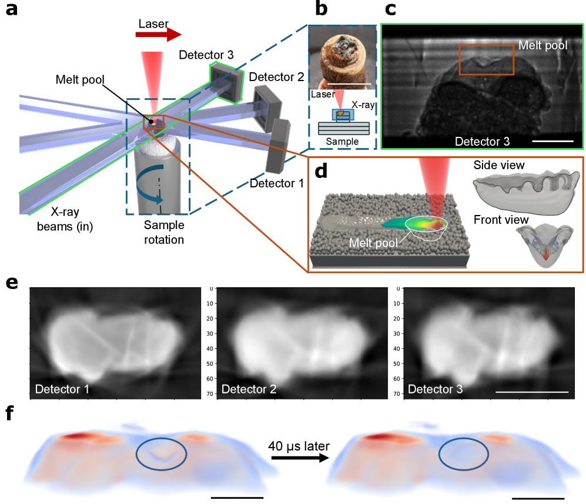

**図1キャプション：** rotation-XMPIの実験原理の概念図。3本のビームレットが異なる角度から同時に試料を照射し、各時間ステップで3つの角度投影を同時取得する。試料は25 Hzで回転し、各ステップの角度情報は回転エンコーダで管理される。従来の連続回転CT（毎秒~100ボリューム程度）と比較して、250倍高速な4D再構成を可能にすることが示されている。自己教師あり深層学習の再構成ループも模式的に示される。

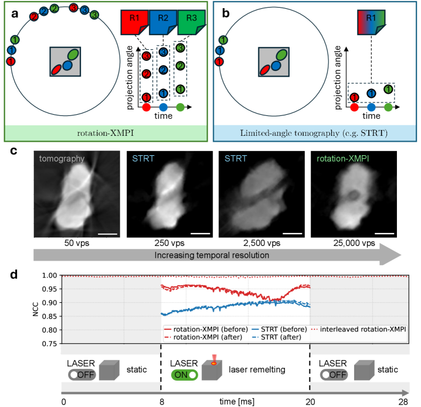

**図2キャプション：** レーザー再溶融中のアルミナ溶融池の4D再構成ボリュームスライス。左列は従来の限角断層（motion blur）、中列は回転限定従来CT、右列はrotation-XMPIによる再構成を示す。XMPIによる再構成のみが溶融池のモルフォロジーとキーホールを明瞭に解像しており、他の手法では運動ボケによって詳細が失われていることが一目瞭然である。

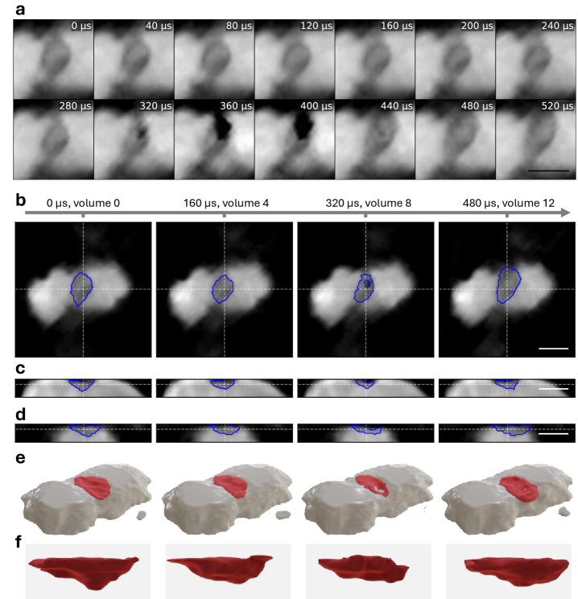

**図3キャプション：** キーホールの開閉ダイナミクスの時系列4D再構成（連続フレーム）。溶融池内のキーホールが数十〜数百マイクロ秒スケールで形成・崩壊する様子が毎秒25,000ボリュームの時間分解能で可視化されている。このダイナミクスは付加製造プロセスにおける気孔欠陥の起源を理解するための直接的証拠となり、プロセスパラメータ最適化に向けた新しい知見を提供する。

---

## 論文⑦

### 1. 論文情報

**タイトル：** [4D Synchrotron X-Ray Multi Projection Imaging (XMPI) for studying multiphase flow dynamics and flow instabilities in porous networks](https://arxiv.org/abs/2603.15319)
**著者：** Patrick Wegele, Zisheng Yao, Jonas Tejbo, Julia K. Rogalinski, Zhe Hu, et al.
**arXiv ID：** 2603.15319
**カテゴリ：** physics.flu-dyn
**公開日：** 2026年3月13日
**論文タイプ：** 実験・手法開発研究（放射光4Dイメージング）
**ライセンス：** CC BY 4.0

---

### 2. 研究概要

多孔質媒体内の多相流体ダイナミクス（特にヘインズジャンプのような流動不安定性）を、回転不要なシンクロトロンX線マルチプロジェクションイメージング（XMPI）によって4次元（3次元空間＋時間）で捉えることに初めて成功した研究である。従来の4D X線断層撮像は試料の高速回転が必要であり、この遠心力が自然な流れ挙動を歪めてしまうという根本的問題があった。本研究のXMPIは回転なし（または超低速回転）で複数角度の投影を取得し、有効ピクセルサイズ1.3 μm・50 Hzの時間分解能で均質球状孔ネットワーク（付加製造品）内のイムビビション（吸い込み）イベントをリアルタイムに可視化した。さらに、同一ジオメトリのシャン-チャン多相格子ボルツマン（LBM）シミュレーションと定量比較し、充填シーケンスと時間スケールの定性的一致と系統的差異を同定した。

この系統的差異が、現行の数値モデルにおける接触線ダイナミクス（気液固三相接触線の運動）と境界条件の表現の不十分さを曝露しており、実験が理論・計算の検証プラットフォームとして機能している点が本研究の重要な貢献である。放射光XMPIは光学系・EMにアクセスできない不透明多孔質材料内部の非繰り返し現象を空間・時間の両次元で捉える唯一の実用的手段であり、石油工学・地下水流・燃料電池・土壌水理など広範な分野への波及が期待される。

---

### 3. 重要キーワードの解説

**① ヘインズジャンプ（Haines Jump）**
多孔質媒体の細い孔喉を流体が通過する際、毛細管圧の急激な解放によって瞬間的に起きる流体の不連続な前進現象。サブ秒スケールで起き、従来の4D CT（〜毎秒数ボリューム）では捉えられなかった。

**② イムビビション（Imbibition）**
非湿潤性流体（例：空気）を湿潤性流体（例：水）が置換する過程。多孔質媒体への液体の「吸い込み」に相当し、毛細管圧と流体粘性の競合で制御される。石油回収・土壌涵養・燃料電池浸潤に関わる基本現象。

**③ 格子ボルツマン法（Lattice Boltzmann Method, LBM）**
流体の速度分布関数の離散格子上の時間発展を計算する数値流体力学手法。多相流体のシミュレーションに適したシャン-チャンモデルが存在し、気液界面の動的挙動を扱える。多孔質流体シミュレーションのデファクトスタンダードの一つ。

**④ 接触線ダイナミクス（Contact Line Dynamics）**
気・液・固の三相が出会う接触線（三相線）の運動。接触角の履歴（前進角・後退角の違い）、ピニング（固体表面の不均一性での固着）、動的接触角モデルが重要であり、現行LBMでの表現が不完全とされている。

**⑤ 多相格子ボルツマン（Multiphase LBM / Shan-Chen Model）**
シャン・チャン（1993）が提案した、異なる流体成分間に擬似ポテンシャル（分子間力のモデル化）を導入した多相LBM。気液分離、界面張力、毛細管現象を自然に扱える。ただし接触角の精確な制御は課題。

**⑥ 多孔質媒体（Porous Media）**
固体骨格と相互連結した孔隙から構成される材料。砂岩・コンクリート・燃料電池電極などが例。孔隙率・孔径分布・比表面積などが流体輸送特性を決める。

**⑦ 有効ピクセルサイズ 1.3 μm**
検出器の空間分解能の指標。本研究では1.3 μm/pixelを達成し、~数μm径の孔喉構造を解像可能にしている。これは毛細管スケールの流体挙動を直接観察するために必要な分解能。

**⑧ 4D X線断層撮像（4D X-ray Computed Tomography）**
三次元CT（空間3次元）を時間分解で連続取得する手法。時間軸を加えた「4次元」データを得る。従来は~10〜100ボリューム/秒が限界で、サブ秒スケールのヘインズジャンプを捉えられなかった。

**⑨ ロータリー設定なし撮像（Rotation-free Imaging）**
試料を回転させずに多角度情報を取得する方法。遠心力が排除されることで重力・毛細管力支配の自然な流体挙動が保たれる。本研究では1秒に50フレームという高い時間分解能を達成した。

**⑩ 付加製造多孔質試料（Additively Manufactured Porous Network）**
3Dプリンタ（インクジェット・光造形など）で均一球状孔ネットワークを製造した標準試料。設計値通りの幾何学的精度（~μm）でLBMシミュレーション用ジオメトリと同一の構造を持ち、実験-数値直接比較を可能にする。

---

### 4. 図

（ライセンス：CC BY 4.0 — 図の転載が許可されています）

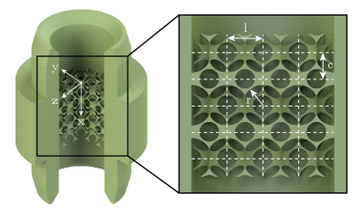

**図1キャプション：** シンクロトロンXMPI実験のセットアップ概略図と多孔質試料のジオメトリ。試料（付加製造された球状孔ネットワーク）の三次元構造とX線マルチプロジェクション取得スキームが示されている。回転を必要としない配置により、重力と毛細管力のみで支配される自然なイムビビション挙動の観察が可能になる。

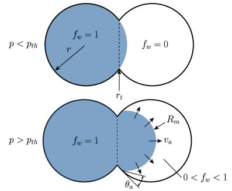

**図2キャプション：** 時間分解4D再構成によるイムビビションフロント（液体前線）の前進過程。連続する時間ステップでの気液界面の三次元形状変化が示されており、孔喉での流体ピニング・アンピニング（固着・解放）とヘインズジャンプが可視化されている。50 Hzの時間分解能により、サブ秒スケールの非繰り返し前進イベントが記録される。

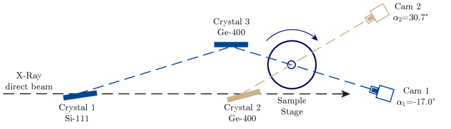

**図3キャプション：** 実験的に観測されたイムビビション充填シーケンス（左）とシャン-チャンLBMシミュレーション（右）の比較。孔充填の順序について定性的な一致が見られる一方、充填タイムスケールと局所の接触角挙動に系統的な差異が存在する。この差異は接触線ダイナミクスのモデル化における改善の必要性を示しており、XMPIデータがシミュレーション検証・改善の定量的ベンチマークとして機能することを示している。

---

## 論文⑧

### 1. 論文情報

**タイトル：** [Unified theory of orientation averaging in X-ray spectroscopies: understanding polarization dependence in a Cartesian tensor approach](https://arxiv.org/abs/2603.12355)
**著者：** Sihan Zhang, Oana Bunău, Marius Retegan, Pieter Glatzel
**arXiv ID：** 2603.12355
**カテゴリ：** cond-mat.mtrl-sci
**公開日：** 2026年3月12日
**論文タイプ：** 理論・手法論文（X線分光理論）
**ライセンス：** CC BY-NC-ND 4.0

---

### 2. 研究概要

粉末試料に対するX線吸収分光（XAS）および共鳴非弾性X線散乱（RIXS）の偏光依存性と方位平均強度を計算するための統一的な理論フレームワークを、デカルト座標テンソルの言語で定式化した研究である。球面テンソル形式（既存手法）は数学的に強力だが扱いが煩雑であり、特にRIXSの粉末平均では元素・軌道選択性の物理的解釈が難しかった。本研究はデカルト遷移テンソル（量子化学計算から自然に得られる）をそのまま使って粉末平均強度を解析的に計算する枠組みを提示し、Ce L₃端のRIXSデータに対して「excellent agreement」（著者表現）を示した。XASとRIXSの両方を同一形式で扱えること、ab initio遷移テンソルとの接続が直接的であること、角度・偏光依存性が物理的に直感的な形（テンソル不変量の組み合わせ）として導かれることが本フレームワークの強みである。

粉末RIXSの解釈は、単結晶が得られない系（錯体・溶液・触媒・軽元素化合物など）で特に重要であり、本フレームワークの実装は大型放射光施設のRIXSビームラインユーザーに直接有用なツールとなる。RIXS実験の設計（どの散乱角・偏光設定が特定の電子遷移に最も感度を持つか）をab initioで事前予測できる点は、ビームタイムの効率化に繋がる。

---

### 3. 重要キーワードの解説

**① 共鳴非弾性X線散乱（RIXS）**
X線のエネルギーを特定吸収端に合わせた条件で、非弾性散乱（励起されたX線が一部のエネルギーを試料に渡して散乱される）を観測する分光。入射エネルギーと散乱エネルギーの差（エネルギー移行）が試料のフォノン・マグノン・電子励起に対応する。元素・軌道選択的に励起スペクトルを得られる。

**② 方位平均（Orientation Averaging）**
粉末試料では結晶がランダムな方向を向いているため、測定されるシグナルはあらゆる方位にわたる平均である。単結晶では偏光依存性が顕著だが、粉末では等方的に見える成分と残る偏光依存性に分離される。

**③ デカルト遷移テンソル（Cartesian Transition Tensor）**
電子遷移の行列要素を直交座標系（x, y, z）のテンソルで表現したもの。量子化学（TDDFT、RASSCF、NEVPT2など）の計算から自然に出力されるため、理論と実験の比較に直接使いやすい。

**④ 球面テンソル形式（Spherical Tensor Formalism）**
球面調和関数を基底にとる角運動量の代数（Wigner 3j記号など）を用いてテンソル演算を行う手法。電磁気学的に自然な表現だが、変換が煩雑で物理的直感が見えにくいことがある。

**⑤ テンソル不変量（Tensor Invariants）**
座標系の選択によらないテンソルの量。スカラー（0階不変量）、対称テンソルのトレース（1階不変量）などがある。方位平均後の散乱強度はテンソル不変量の組み合わせで表現され、試料固有の電子構造情報のみが残る。

**⑥ Ce L₃端RIXS（Ce L₃ edge RIXS）**
セリウムの2p₃/₂→5d（およびhybridized）遷移を用いたRIXS。Ce化合物の4f-5d-バンドの混成、Ce³⁺/Ce⁴⁺の価数状態、多極子相互作用などを研究するのに適している。本研究ではCe化合物の粉末RIXSデータを理論比較に使用した。

**⑦ 偏光依存性（Polarization Dependence）**
X線の電場ベクトルの方向（偏光方向）によってスペクトル強度が変化する性質。吸収端共鳴では、軌道の空間的異方性がXLD（線形二色性）やXMCD（円二色性）として現れる。RIXS でも偏光設定によって励起するモード（对称/非对称なフォノン、スピン励起など）が変わる。

**⑧ ab initio計算（Ab initio Calculation）**
実験的パラメータを使わず第一原理から電子状態を計算する手法の総称。密度汎関数理論（DFT）、多体摂動理論（GW近似）、完全活性空間自己無撞着場法（CASSCF）などが含まれる。本研究では量子化学計算で得た遷移テンソルを実験RIXS強度の理論予測に使用。

**⑨ スペクトルシミュレーション（Spectral Simulation）**
計算で得た電子遷移確率から実験スペクトルを再現する手法。エネルギーシフト、線幅（ライフタイム・実験分解能）、多電子効果、多極子相互作用などを考慮する。本研究ではCe L₃ RIXS の「excellent agreement」を実証した。

**⑩ ESRF ID26ビームライン**
フランス・グルノーブルのESRF（欧州放射光施設）のRIXSビームライン。Ce L₃端を含む広いエネルギー範囲に対応した高分解能RIXSスペクトロメータを備え、粉末・溶液・触媒の研究に広く使用されている。

---

### 4. 図

（ライセンス：CC BY-NC-ND 4.0 — 図の転載が許可されています）

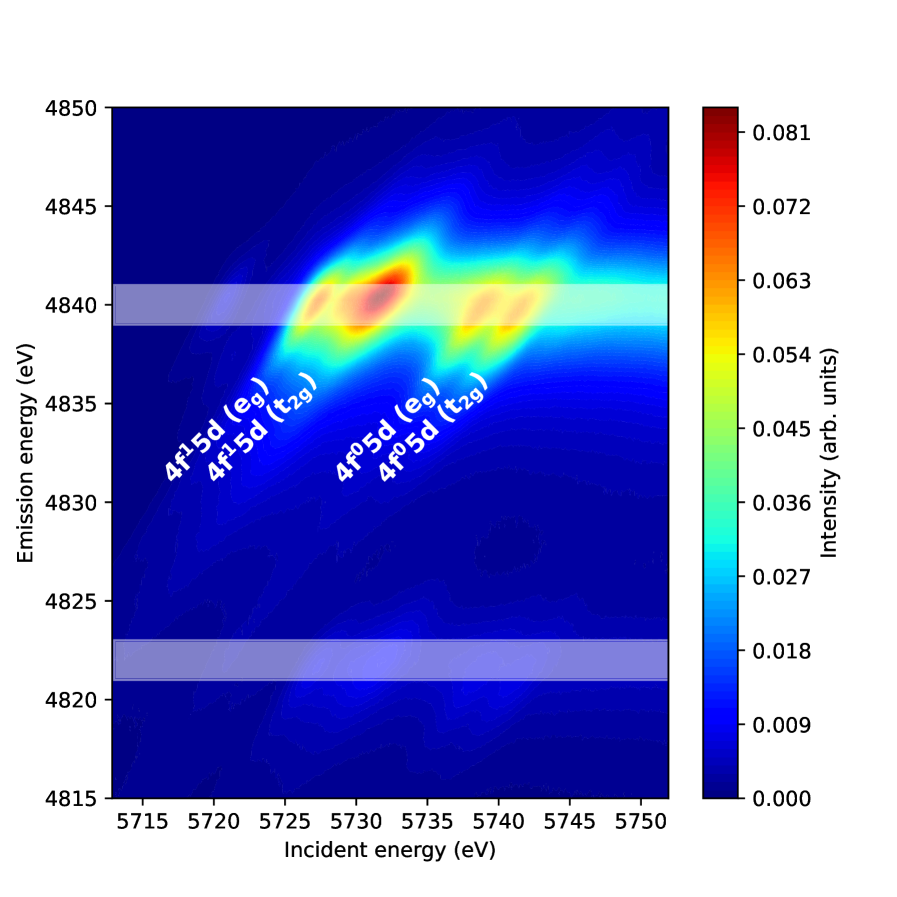

**図1キャプション：** 提案フレームワークの概念図。量子化学計算から得られるデカルト遷移テンソルを入力とし、方位平均の解析的計算によってXAS/RIXS強度の偏光・角度依存性を予測する計算フロー。球面テンソル形式を経由しないため、直感的なテンソル不変量の物理的解釈が可能であることが示されている。

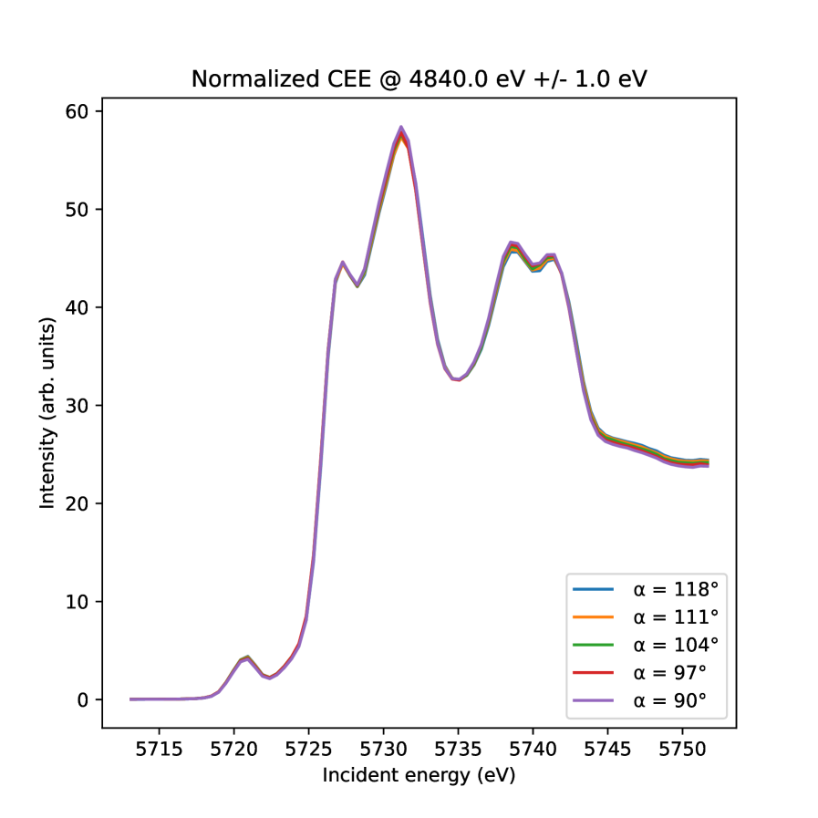

**図2キャプション：** Ce化合物粉末試料のL₃端RIXSスペクトルの理論予測（本フレームワーク）と実験データの比較。異なる散乱角・偏光設定での強度変化が理論で再現されており、Ce 4f-5d混成に起因する多重項構造が正確に記述されている。「excellent agreement」とされる一致の具体的な質を示す重要な検証図。

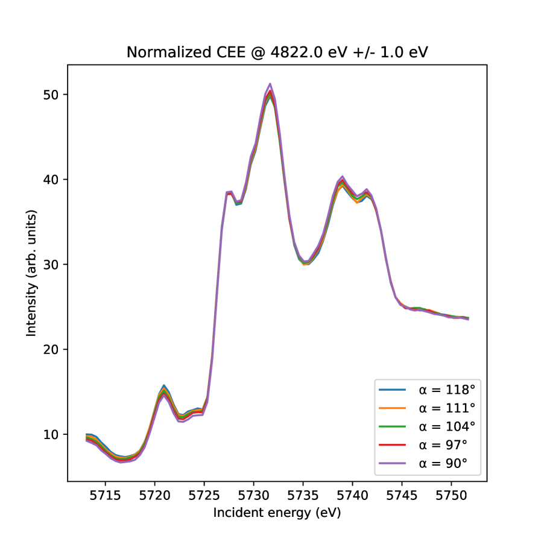

**図3キャプション：** XAS（またはRIXS）の偏光依存性を入射角・散乱角の関数としてプロットした計算マップと実験比較。特定の散乱条件が特定の電子励起モードに選択的に感度を持つことが視覚的に示され、今後のRIXS実験設計（最適ビームライン設定の事前選択）のための実践的ガイドとなる。

---

## 論文⑨

### 1. 論文情報

**タイトル：** [Electronic Structure and Resonant Circular Dichroism of La₀.₇Sr₀.₃MnO₃ from Soft X-ray Angle-Resolved Photoemission](https://arxiv.org/abs/2603.10794)
**著者：** Øyvind Finnseth, Damian Brzozowski, Anders Christian Mathisen, Stefanie Suzanne Brinkman, Xin Liang Tan, et al.
**arXiv ID：** 2603.10794
**カテゴリ：** cond-mat.str-el
**公開日：** 2026年3月11日
**論文タイプ：** 実験研究（軟X線ARPES）
**ライセンス：** arXiv非独占的配布ライセンス（CC非対応）

---

### 2. 研究概要

PETRA III放射光施設において（111）配向La₀.₇Sr₀.₃MnO₃（LSMO）薄膜の電子バンド構造を軟X線ARPESで測定し、Mn L₃₊₂端での共鳴光電子放出における運動量分解磁気円二色性（MCD）を初めて観測した研究である。DFT+U計算との比較で実験バンド構造は良い一致を示し、Γ点周辺の電子的ポケットとR点周辺の正孔的ポケットが確認された。特に重要な発見は、非共鳴エネルギーではほぼゼロであるMCD信号が、Mn L₃端共鳴エネルギーでは強い運動量依存性を示すことで、これはARPES（運動量・スピン選択性）とXMCD（磁化感度）の組み合わせとして理解できる。この「磁気的なARPES」に相当する観測は、特殊な磁気構造（非共線的磁性、スピンテクスチャなど）を持つ材料の研究に広く応用できる可能性がある。

LSMOは巨大磁気抵抗（CMR）効果で知られる遷移金属酸化物であり、スピン・軌道・電荷・格子の各自由度が強く結合した相関電子系の代表物質である。軟X線ARPESは通常の真空紫外ARPESより面直方向の運動量感度が高く、（111）配向薄膜では三角格子面の電子構造が反映されるため、新たな幾何学的フラストレーション効果の探索にも使える。磁気ARPESによる運動量空間の磁化マッピングは、スキルミオン・ホーン磁性・弱強磁性などの新奇磁気構造の直接観測へ向けた方法論的前進として位置づけられる。

---

### 3. 重要キーワードの解説

**① 軟X線ARPES（Soft X-ray ARPES）**
100〜1000 eV領域の軟X線を用いたARPES。通常の真空紫外ARPES（20〜100 eV）より光電子の平均自由行程が長く（数nm〜数十nm）、バルク電子状態に対するより高い感度を持つ。面直方向の運動量k_⊥についても高いk_⊥分解能が得られるため、三次元バンド構造の追跡に有利。

**② 磁気円二色性（X-ray Magnetic Circular Dichroism, XMCD）**
左右円偏光X線の吸収率の差。磁性材料では吸収端付近で磁化に比例したXMCDが現れ、磁気モーメントの元素選択的測定に使われる。XMCD sum rulesによりスピン・軌道磁気モーメントを定量評価できる。

**③ 共鳴光電子放出（Resonant Photoemission）**
X線のエネルギーを特定吸収端に合わせると、コアレベル吸収後のオージェ崩壊チャネルと直接光電子放出チャネルが干渉し、特定の電子状態の光電子シグナルが著しく増大する現象。Mn L端では Mn 3d状態の光電子強度が共鳴的に増強される。

**④ 運動量分解MCD（Momentum-resolved MCD）**
ARPESにおいて、左右円偏光での光電子強度差を運動量（k）の関数としてマッピングしたもの。特定のk点でのスピン偏極や磁化に関連した非対称性を空間分解して観測できる。「磁気的なARPES」とも呼ばれる。

**⑤ (111)配向薄膜**
通常のペロブスカイト薄膜は（001）配向が多いが、（111）配向では三角格子（ペロブスカイトのB-B面投影が三角格子）が現れ、幾何学的フラストレーションや二次元電子系の設計に使える。La₀.₇Sr₀.₃MnO₃の（111）配向はそのような研究への出発点となる。

**⑥ DFT+U計算**
密度汎関数理論（DFT）にHubbardパラメータUを追加することで、局在した電子（d電子・f電子）の強い電子相関を近似的に扱う手法。U値を適切に選べばバンドギャップや磁気構造を再現できるが、U値に一意の決定法がないという課題もある。

**⑦ ペロブスカイト型酸化物（Perovskite Oxide）**
ABO₃の化学式を持つ結晶構造。AサイトとBサイトの元素選択・置換（ドーピング）によって金属・絶縁体転移、超伝導、巨大磁気抵抗、強誘電性などの多彩な物性が現れる。LSMOはMnがBサイトに入るペロブスカイト型マンガン酸化物。

**⑧ 巨大磁気抵抗（Colossal Magnetoresistance, CMR）**
磁場印加によって抵抗率が桁違いに変化する現象。La₁₋ₓSrₓMnO₃系は代表的CMR物質で、金属-絶縁体転移・強磁性-常磁性転移が同時起き、キャリアの二重交換相互作用が本質的役割を果たす。

**⑨ PETRA III（ドイツ・DESY）**
ドイツ・ハンブルクのDESY研究所の第三世代高輝度放射光施設。様々なエネルギー範囲のビームラインを有し、P04ビームラインなどが軟X線ARPES実験に使用される。

**⑩ special quasirandom structures（SQS）**
合金や固溶体の部分無秩序配置を有限超格子で近似する手法。Sr/La置換の無秩序配置をSQSで近似することで、DFT+U計算において化学的無秩序の影響を取り込み、より現実的なバンド構造予測を可能にする。

---

### 4. 図

本論文のライセンスはarXiv非独占的配布ライセンスであり、CC系ライセンスに該当しないため、原図の転載は行わない。

**図の内容説明（原図非掲載）：**

**図1相当：** DFT+U計算による状態密度（DOS）とアンフォールドされた電子バンド構造。LSMOのMn 3d（スピンアップ・スピンダウン）のエネルギー位置、Γ点での電子ポケット、R点での正孔ポケットが示される。理論的バンド構造が実験ARPESと比較するための基準を提供する。

**図2相当：** フォトンエネルギーをスキャンしたARPES Fermiサーフェスマップ。Mn L端エネルギー近傍でのFermiサーフェスの変化（共鳴強調）と、三次元的なk_⊥依存性が示される。実験と理論の対応から、LSMOの三次元Fermiサーフェスの識別が行われる。

**図3相当：** 左右円偏光でのARPES強度差（MCD-ARPES）の運動量マップ。非共鳴エネルギーではほぼゼロであるMCD信号が、Mn L₃共鳴エネルギーで有限かつ運動量依存の非対称性を示す。この「磁気的ARPES」シグナルがLSMOの強磁性秩序と軌道占有の結合を反映していることが議論される。

---

## 論文⑩

### 1. 論文情報

**タイトル：** [Probing strong coupling in core–shell nanoparticles with fast electron beams](https://arxiv.org/abs/2603.13797)
**著者：** Annika Brandt, Christos Tserkezis, Carsten Rockstuhl, P. Elli Stamatopoulou
**arXiv ID：** 2603.13797
**カテゴリ：** physics.optics
**公開日：** 2026年3月14日
**論文タイプ：** 理論・シミュレーション研究（電子線EELS/CL計算）
**ライセンス：** arXiv非独占的配布ライセンス（CC非対応）

---

### 2. 研究概要

球状コア-シェルナノ粒子における光-物質強結合をMie理論を拡張した解析的枠組みで記述し、速い電子ビーム（EELS: 電子エネルギー損失分光・CL: カソードルミネッセンス）を用いた検出可能性を理論的に検討した研究である。プラズモニック系（Agシェル+励起子コア）とフォトニック誘電体系（Siコア+励起子シェル）という2つの代表的ナノ構造を対象とし、電子ビームの通過軌跡（遠方通過・シェル貫通・コア貫通）と電子速度（運動エネルギー）に応じて強結合のスペクトルシグネチャーがどう変化するかを系統的に計算した。プラズモニックナノ粒子では電子ビームパラメータに依らず強結合のシグネチャーが明瞭に現れる（robust）が、誘電体ナノ粒子では磁気モード励起の困難さから強結合のシグネチャーが場合によって完全に消える（suppressed/obscured）ことが示された。

電子ビームはその高い空間局在性から、光では到達できない高次（非放射性）光学モードを励起できるため、単一ナノ粒子レベルでのポラリトン（光-物質混成状態）研究においてSNOM（走査型近接場顕微鏡）やプラズモン分光の代替・補完手法として位置づけられる。本研究は、どのビームライン設定（加速電圧・インパクトパラメータ）が強結合の観測に有利かを事前に示しており、実験設計の指針として機能する。ナノスケール偏光子・単一光子源・量子情報デバイスへの応用が見通せる。

---

### 3. 重要キーワードの解説

**① 強結合（Strong Coupling）**
光学共鳴（プラズモンやMie共鳴）と物質の電子遷移（励起子）のカップリングが、それぞれの自然線幅を超えるとき（結合レート g > (κ+γ)/2）に現れる量子光学的状態。エネルギーが上下のポラリトン枝に分裂する「Rabi分裂」として観測される。

**② 電子エネルギー損失分光（EELS）**
透過電子顕微鏡（TEM）内でナノ粒子を通過または近傍を通過した電子の運動エネルギー損失を測定する分光。光とは異なるクーロン場によって光では触れにくい（非放射性）モードも励起できる。空間分解能~0.1 nmが達成可能。

**③ カソードルミネッセンス（Cathodoluminescence, CL）**
電子ビームが試料に当たった際に発する光（ルミネッセンス）を検出する分光。EELSと異なり放射性モードの情報を与え、発光量子効率や放射モードの空間分布が得られる。

**④ Mie理論（Mie Theory）**
均質球形粒子による電磁波の散乱・吸収を厳密に解析する古典電磁気学理論（Gustav Mie, 1908）。本研究ではコア-シェル構造に拡張され、EEL・CL確率が球面波展開の係数から計算される。

**⑤ プラズモン（Plasmon）**
金属ナノ粒子（Au, Ag等）の自由電子の集団振動共鳴。局在表面プラズモン共鳴（LSPR）は可視光領域にあり、近傍電場を大幅に増強する（ナノアンテナ効果）。EELSでプラズモンエネルギー・空間分布が直接観測できる。

**⑥ Mie共鳴（Mie Resonance）**
高屈折率誘電体（Si, GaP等）ナノ粒子における電気・磁気多極子共鳴。金属プラズモンと異なりオーミック損失がなく、磁気双極子モードは特に光学的に重要だが光では励起困難な場合がある。電子ビームは軌道の選択でこれを選択的に励起できる。

**⑦ ポラリトン（Polariton）**
光子と物質の励起（フォノン、プラズモン、励起子など）が強く混成してできたハイブリッド準粒子。プラズモン-励起子混成はプラズモン-ポラリトンと呼ばれ、強結合条件下では上下のポラリトン枝に分裂する。

**⑧ インパクトパラメータ（Impact Parameter）**
電子ビームと粒子中心の最近接距離。遠方（aloof）、シェル内（shell-penetrating）、コア内（core-penetrating）の違いによって、どの多極子モードが優先的に励起されるかが変わる。高次（高l）モードは小さいインパクトパラメータで励起されやすい。

**⑨ 非放射性モード（Dark Mode / Non-radiative Mode）**
電磁的に遠場に放射しない（または強く抑制された）光学モード。光による直接励起は困難だが、電子ビームのクーロン場では近接場結合によって励起できる。EELSはこれらのモードへのアクセスに独自の強みを持つ。

**⑩ 量子情報応用（Quantum Information Application）**
ナノスケール強結合系は単一光子源・量子ビット間のコヒーレントな光-物質交換・量子メモリへの応用が期待される。電子顕微鏡での単一ナノ粒子測定は、量子情報デバイスの前駆体特性評価に直接つながる。

---

### 4. 図

本論文のライセンスはarXiv非独占的配布ライセンスであり、CC系ライセンスに該当しないため、原図の転載は行わない。

**図の内容説明（原図非掲載）：**

**図1相当：** プラズモニック系（Agシェル+励起子コア）のEELスペクトル計算結果。遠方・シェル貫通・コア貫通の各電子軌道に対するスペクトルが示され、いずれの条件でも上下ポラリトン枝に対応するRabi分裂構造が明瞭に観測される（robust）。電子速度の変化（加速電圧変化）に対する分裂幅の安定性も確認される。

**図2相当：** 誘電体系（Siコア+励起子シェル）のEELスペクトル計算。インパクトパラメータと電子速度に応じて強結合のシグネチャーが大きく変化し、場合によっては完全に消失する。磁気Mie共鳴の励起がインパクトパラメータに敏感であることが原因として示される。

**図3相当：** プラズモニック系と誘電体系のCLスペクトル比較。CL（放射モード）では誘電体系のシグネチャーも部分的に回復するが、特定の条件下でのみ有効であることが示され、EELSとCLの相補的利用の重要性が強調される。

---

*レポート作成日：2026年3月18日*
*対象arXivカテゴリ：cond-mat.mtrl-sci, cond-mat.str-el, cond-mat.supr-con, physics.ins-det, physics.optics, physics.flu-dyn*

