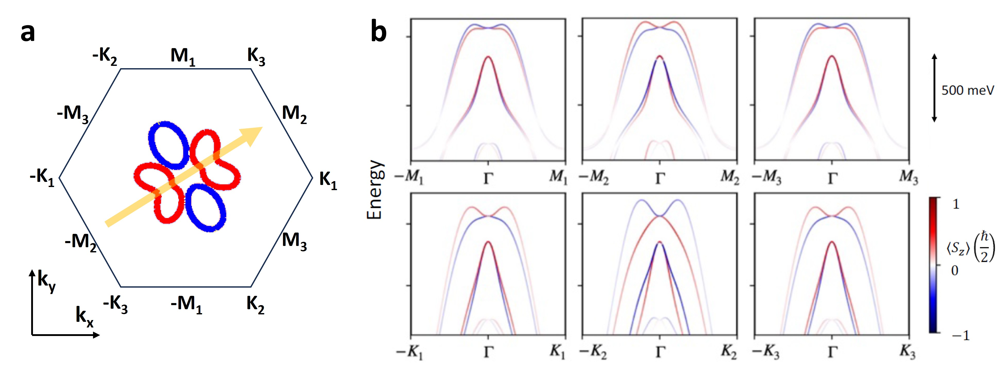
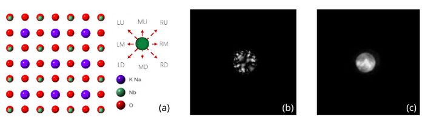
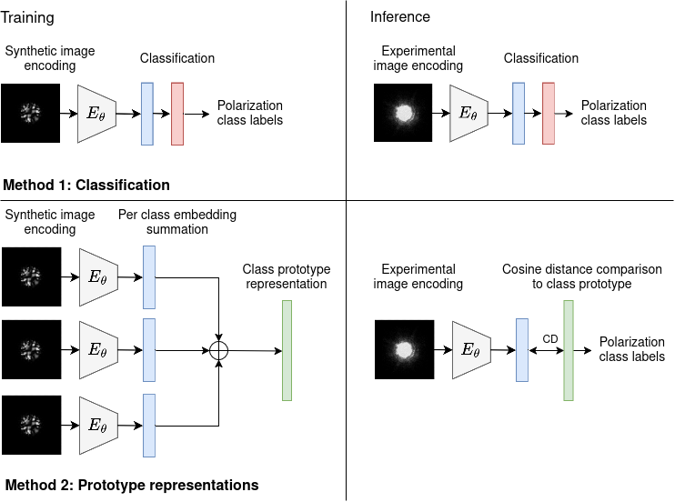
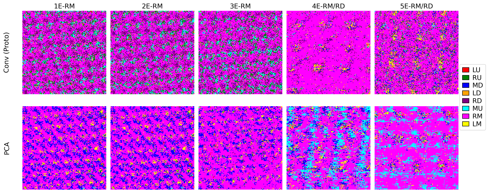
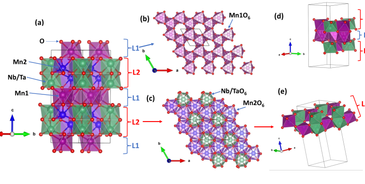
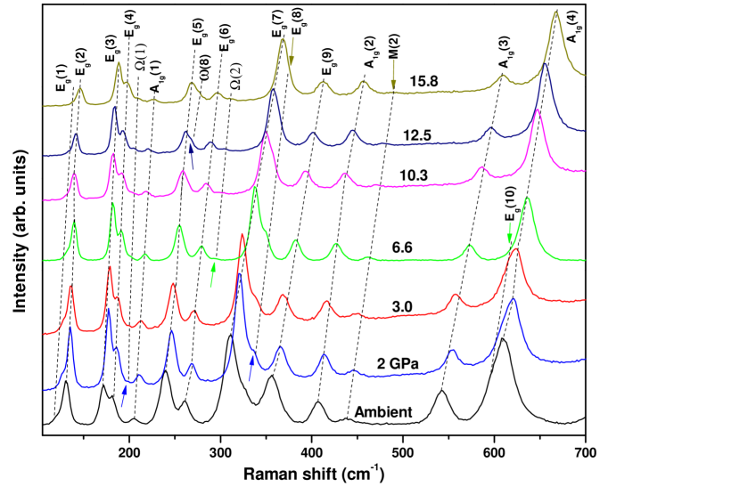
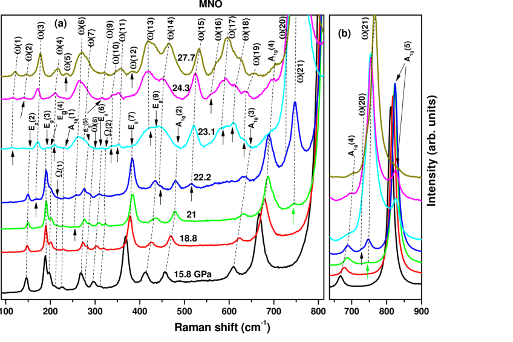
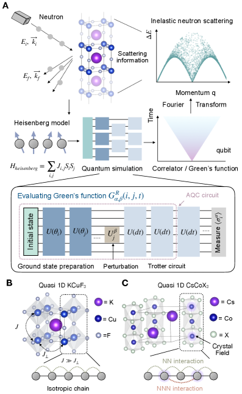
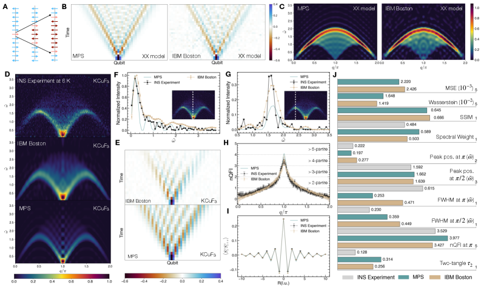
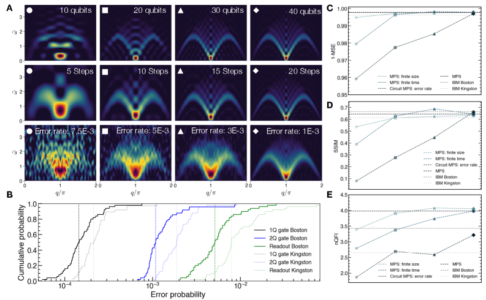

# 2026-03-19 量子ビーム計測

**作成日：** 2026年3月19日
**対象期間：** 2026年3月16日〜2026年3月19日（直近72時間）

---

## 選定論文一覧

| # | arXiv ID | タイトル | 区分 |
|---|----------|----------|------|
| 1 | [2603.15793](https://arxiv.org/abs/2603.15793) | Magnetic Imaging of Macroscopic Spin Chirality Flipping | 重点 |
| 2 | [2603.16635](https://arxiv.org/abs/2603.16635) | Discerning ground state and photoemission-induced spin textures in altermagnetic α-MnTe | 重点 |
| 3 | [2603.15582](https://arxiv.org/abs/2603.15582) | Benchmarking Machine Learning Approaches for Polarization Mapping in Ferroelectrics Using 4D-STEM | 重点 |
| 4 | [2603.16132](https://arxiv.org/abs/2603.16132) | Pressure-driven vibrational and structural peculiarities in the honeycomb layered magnetoelectrics Mn₄(B)₂O₉ (B = Nb, Ta) | 簡潔 |
| 5 | [2603.14751](https://arxiv.org/abs/2603.14751) | Synchrotron-radiation X-ray topography and reticulography of bulk β-Ga₂O₃ crystals | 簡潔 |
| 6 | [2603.16804](https://arxiv.org/abs/2603.16804) | Visualizing shear-induced structures in carbon black gels by tomo-rheoscopy | 簡潔 |
| 7 | [2603.15608](https://arxiv.org/abs/2603.15608) | Benchmarking Quantum Simulation with Neutron-Scattering Experiments | 簡潔 |
| 8 | [2603.15772](https://arxiv.org/abs/2603.15772) | Synthesis and Transfer of Freestanding Strain-Engineered Vertically Aligned Nanocomposite Thin Films | 簡潔 |
| 9 | [2603.16625](https://arxiv.org/abs/2603.16625) | Cs₃V₉Te₁₃: A New Vanadium-Based Material with a Reuleaux-Triangle-Like Lattice | 簡潔 |
| 10 | [2603.14199](https://arxiv.org/abs/2603.14199) | Millimeter-Scale, Atomically Controlled 2D Topological Insulators Revealed by Multimodal Spectroscopy | 簡潔 |

---

## 重点論文の詳細解説

---

### 重点論文 1

#### 1. 論文情報

**タイトル：** [Magnetic Imaging of Macroscopic Spin Chirality Flipping](https://arxiv.org/abs/2603.15793)
**著者：** H. Miao, G. Fabbris, J. Bouaziz, ほか14名
**arXiv ID：** 2603.15793
**カテゴリ：** cond-mat.str-el
**公開日：** 2026年3月16日
**論文タイプ：** 実験・理論融合
**ライセンス：** CC BY 4.0

#### 2. どんな研究か

トポロジカル磁性体 EuAl₄ において、2.5 μm の空間分解能を持つ共鳴磁気 X 線散乱（Resonant Magnetic X-ray Scattering; RMXS）を用いて、スピンカイラリティ（磁気旋回）の巨視的反転現象を初めて直接撮像した研究である。スピン・電荷・格子が絡み合った秩序の空間分布を実空間でマッピングし、電荷密度波（CDW）ドメインがカイラル磁気ドメインと連動していること、および「カイラル記憶効果」と呼ぶべき顕著な履歴現象を実証した。磁気カイラリティが自発的に反転する機構として磁気弾性結合（magnetoelastic coupling）の役割を初めて定量的に示した。

#### 3. 研究の概要

**背景・目的**
量子磁性体においてカイラリティは、ベリー曲率やバンドトポロジーに直結する「創発的自由度」として機能する。EuAl₄ はトポロジカルな磁気秩序を持つ希土類金属間化合物であり、電荷密度波（CDW）と磁気秩序が競合・共存することが知られているが、磁気カイラリティの巨視的な振る舞い——特にその自発的反転と記憶効果——は理解されていなかった。

**解こうとしている課題**
量子磁性体におけるスピンカイラリティの自発反転がどのような物理機構で生じるか、そしてどのように電荷・格子秩序と結合しているかを、実空間の直接撮像によって明らかにすること。

**研究アプローチ**
共鳴磁気 X 線散乱の実空間マッピング（ラスタースキャン）によって、μm スケールのカイラルドメイン分布を温度・磁場の関数として追跡した。得られた実空間像と、磁気散乱の Stokes パラメータ分析、磁気弾性結合の理論モデルを組み合わせて機構解明を行った。

**対象材料系・対象現象**
EuAl₄（空間群 I4/mmm、Eu²⁺スピン系）の CDW 転移温度付近（約 140 K）以下での磁気カイラルドメイン構造と、磁場印加および温度サイクルによるカイラリティ反転。

**使用した量子ビーム手法とその特徴（詳細）**
共鳴磁気 X 線散乱（RMXS）を Eu の L 吸収端に光子エネルギーを同調させて実施した。偏光解析を組み合わせることで磁気散乱の右/左円偏光成分比（カイラリティシグナル）を抽出し、試料をラスタースキャンすることで 2.5 μm の空間分解能を持つカイラルドメインマップを取得した。この手法は元素選択性・偏光感度・μm 分解能を同時に持ち、中性子や通常の X 線では分離困難なカイラル成分を選択的に抽出できる。

**測定で得られる物理量**
- 磁気散乱強度の円偏光二色性（RMCD）：右/左偏光での散乱強度差 → スピンカイラリティの符号と大きさ
- 実空間カイラルドメインマップ（温度・磁場依存）
- CDW 超格子反射ピークの空間分布

**主な解析手法**
偏光解析による Stokes パラメータ抽出、磁気弾性結合モデルによるカイラリティエネルギー評価、ドメイン追跡の温度–磁場相図構築。

**主な結果**
(1) CDW ドメインの空間パターンとカイラル磁気ドメインの空間パターンが実空間で対応関係を持つことを直接示した。(2) 温度サイクルや弱磁場印加によってカイラリティが巨視的に反転する「カイラリティ反転転移」を確認した。(3) 反転後も元のカイラリティ状態の記憶が保持される「カイラル記憶効果」を実証した。(4) 磁気弾性結合がカイラルドメインを CDW ドメインに固着（ピニング）させる主要機構であることを示した。

**著者の主張**
磁気カイラリティは孤立した磁気自由度ではなく、CDW を介した格子変形と強く結合しており、その結合が磁気カイラリティを制御する鍵であるというモデルを提案している。

#### 4. 放射光・量子ビーム分野として重要なポイント

RMXS による実空間カイラルドメインマッピングは、スピン・電荷・格子の絡み合いを μm スケールで「同時に」可視化できる点が決定的強みである。中性子散乱は積分強度しか得られず、通常の磁気力顕微鏡はカイラリティの符号に感度を持たない。共鳴エネルギー（Eu L 端）で行うことで Eu²⁺ スピンのみの磁気散乱を抽出し、Al のノイズを排除している。2.5 μm という空間分解能は既存の RMXS 研究の中でも高分解能に相当し、CDW ドメイン（典型的には数〜数十 μm）の空間スケールに対応している。実験・理論の双方から磁気弾性結合の定量的評価を行った点も、測定量と物理量の対応関係が明確で信頼性が高い。この手法は他のトポロジカル磁性体（EuIn₂As₂, EuGa₂Al₂ など）や螺旋磁性体への展開可能性が高く、カイラリティ制御という材料設計課題に対して直接的な実験的基盤を提供する。

#### 5. 限界と注意点

空間分解能が 2.5 μm であるため、CDW ドメイン境界の微細構造（ドメインウォール幅、カイラリティの空間勾配）の解像には不十分な可能性がある。測定は Eu L 端の特定光子エネルギーに固定されており、CDW および格子変形の空間分布との同時比較は別測定で補完する必要がある（同一視野でのマルチモーダル測定は示されていない）。温度サイクルの履歴依存性は統計的にどの程度再現するかの検証が限られており、カイラル記憶効果の普遍性は今後の試料依存性試験が必要である。また、本研究は単結晶試料に限られており、多結晶・薄膜への展開可能性は未検証である。磁気弾性結合のモデルは唯象論的であり、微視的第一原理計算との整合性の確認は今後の課題として残されている。

#### 6. 関連研究との比較

近年、EuAl₄ は CDW と多重磁気相の複合秩序を持つ物質として注目され、中性子散乱・磁化測定・光学測定による研究が進んできた。しかし、カイラリティを実空間で直接撮像した例はなく、本研究は既存研究に決定的な実空間情報を付加している。類似手法として X 線磁気円二色性（XMCD）顕微鏡（PEEM-XMCD）があるが、これは表面感度に制限があるのに対し、RMXS は透過配置でバルク感度を持つ点で差別化される。また、共鳴軟 X 線散乱による磁気ドメイン研究（例：マンガナイトや銅酸化物）の流れを継承しながら、「カイラリティ」という自由度に特化した実空間撮像を実現した点で方法論的前進がある。トポロジカル磁性体における磁気カイラリティ研究の今後の標準的手法として参照される可能性が高い。

#### 7. 重要キーワードの解説

1. **共鳴磁気 X 線散乱（RMXS）**：X 線の光子エネルギーを特定元素の吸収端に同調させることで、その元素の磁気モーメントに由来する散乱信号を増強する手法。磁気散乱強度が数桁増大し、元素選択的かつ偏光感度を持つ磁気秩序の観測が可能になる。散乱振幅は $f = f_0 + \Delta f'(\omega) + i\Delta f''(\omega)$ の形で共鳴項 $\Delta f$ に磁気成分が含まれる。

2. **スピンカイラリティ（Spin Chirality）**：複数のスピンがなす「ねじれ」の向き。三角格子上の三スピン $\mathbf{S}_1, \mathbf{S}_2, \mathbf{S}_3$ に対してスカラーカイラリティ $\chi = \mathbf{S}_1 \cdot (\mathbf{S}_2 \times \mathbf{S}_3)$ で定義される。$\chi > 0$ と $\chi < 0$ の二状態が存在し、ベリー曲率の符号を決定するため異常ホール効果などのトポロジカル応答と直結する。

3. **電荷密度波（CDW）**：結晶中の電子密度が空間的に周期的に変調した状態。通常の伝導電子状態と比べてフォノンと電子が結合（ペイエルス不安定性）して生じる。EuAl₄ では約 140 K 以下で発現し、格子変形を伴うため磁気秩序と結合する。

4. **磁気弾性結合（Magnetoelastic Coupling）**：磁気秩序パラメータと格子歪みが相互作用する現象。エネルギー密度 $F_{me} = \lambda \mathbf{m} \cdot \varepsilon$ の形で書かれ（$\mathbf{m}$：磁化、$\varepsilon$：歪み）、磁場や応力によって磁気秩序が変化する磁歪現象の起源でもある。CDW 格子変形がカイラルドメインを固着させる機構として本研究で重要視される。

5. **カイラル記憶効果（Chiral Memory Effect）**：一度形成したカイラリティドメインパターンが、外部摂動（温度サイクル・磁場）を加えた後も元の状態に戻る（または痕跡を保持する）現象。CDW ドメインへのカイラリティのピニングが起源と考えられている。

6. **ラスタースキャン RMXS**：試料を X 線ビーム焦点に対してラスタースキャン（格子状に走査）しながら散乱強度をピクセルごとに記録することで、実空間磁気ドメインマップを構築する手法。位相コントラスト・磁気コントラストの両方が取得可能。

7. **ベリー曲率（Berry Curvature）**：運動量空間でのブロッホ状態のベクトルポテンシャル $\mathbf{A}_n(\mathbf{k}) = i\langle u_{n\mathbf{k}}|\nabla_\mathbf{k}|u_{n\mathbf{k}}\rangle$ の回転として定義される $\mathbf{\Omega}_n(\mathbf{k}) = \nabla_\mathbf{k} \times \mathbf{A}_n(\mathbf{k})$。スピンカイラリティはリアル空間ベリー曲率として異常ホール効果の原因となる。

8. **トポロジカル磁性体**：トポロジカルな電子バンド構造（バンド反転、ディラック点、ワイル点など）と磁気秩序が共存する物質群。EuAl₄ はトポロジカル半金属としての電子構造を持ちながら多重磁気相を示す代表例。磁気カイラリティがトポロジカル応答を制御する可能性から注目される。

9. **Stokes パラメータ**：電磁波の偏光状態を記述する四つのパラメータ $(S_0, S_1, S_2, S_3)$。$S_3$ は円偏光度を表し、RMXS における円偏光二色性の抽出に用いられる。右/左円偏光での散乱強度差 $I_+ - I_-$ から磁気カイラリティの符号が得られる。

10. **多重磁気相（Multiple Magnetic Phases）**：一つの物質が温度・磁場の変化によって複数の異なる磁気秩序相（例：ヘリカル磁気秩序、スキルミオン格子、扇状磁気構造）を示す現象。EuAl₄ は少なくとも4つの磁気相を持つことが知られており、各相でのカイラリティの振る舞いが今後の研究課題となる。

#### 8. 図

本論文の HTML 版は arXiv 上で利用できなかったため（処理エラー）、原図の抽出はできなかった。CC BY 4.0 ライセンスのため原則として図の転載は可能であるが、本レポートでの掲載は省略する。

---

### 重点論文 2

#### 1. 論文情報

**タイトル：** [Discerning ground state and photoemission-induced spin textures in altermagnetic α-MnTe](https://arxiv.org/abs/2603.16635)
**著者：** D.A. Usanov, M. Schmitt, A. Fedorov, ほか多数
**arXiv ID：** 2603.16635
**カテゴリ：** cond-mat.mtrl-sci
**公開日：** 2026年3月17日
**論文タイプ：** 実験・理論融合（一ステップ光電子放出計算）
**ライセンス：** CC BY-NC-ND 4.0

#### 2. どんな研究か

交替磁性体（altermagnet）の新規候補として注目を集める α-MnTe において、スピン・角度分解光電子分光（SARPES）を MAX IV 放射光施設 Bloch ビームラインで実施し、測定されたスピン偏極が試料のグラウンドステートに由来するものか、それとも光電子放出過程そのもの（マトリクス要素効果）が生み出す擬似シグナルかを体系的に識別した研究である。一ステップ光電子放出計算（SPR-KKR）との精密な比較を通じ、交替磁性体の d 波様スピン分極を SARPES で観測する際に避けられない方法論的曖昧さを明確化し、正しい解釈指針を与えた。

#### 3. 研究の概要

**背景・目的**
交替磁性（altermagnetism）は、反強磁性と強磁性の中間的な磁気状態として理論的に提唱された概念で、ネール秩序を持ちながら運動量空間でスピン分裂バンドを示す。α-MnTe は六方晶（空間群 P6₃/mmc）を持つ交替磁性体候補であり、$k_z = 0$ のノーダル面において d 波様の面外スピン偏極が理論予測されている。しかし、SARPES 実験ではグラウンドステートのスピン構造だけでなく、光電子放出行列要素（マトリクス要素）に起因する擬似スピン偏極も現れうるため、実験結果の解釈が困難であった。

**解こうとしている課題**
「SARPES で観測されるスピン偏極シグナルのどこまでが試料のグラウンドステートに由来し、どこからが光電子放出過程のアーティファクトか」というアルターマグネット研究における根本的な方法論問題を解決すること。

**研究アプローチ**
(1) s/p 偏光、ネールベクトル方位、磁気ドメインバランス（均一 vs. 不均一）を系統的に変えた SARPES 測定を実施。(2) SPR-KKR コードによる一ステップ光電子放出計算（多重散乱理論）で各実験条件を再現。(3) 「対称的スピンシグナル（Γ 点に対して対称）」と「反対称スピンシグナル」の分離によるグラウンドステート寄与の同定。

**対象材料系・対象現象**
InP(111)A 基板上に分子線エピタキシーで成長させた 30 nm の α-MnTe 薄膜（c 軸垂直配向）。ネール温度 310 K。$k_z = 0$ ノーダル面周辺のバンド構造と面外スピン偏極 $S_z$。

**使用した量子ビーム手法とその特徴（詳細）**
MAX IV 放射光施設の Bloch ビームラインの B ブランチを使用。VUV 領域の光子エネルギー（19–82 eV）を使用。VLEED（Very Low Energy Electron Diffraction）スピン検出器（Focus GmbH 製、Fe 薄膜磁化利用）を用いてスピン偏極を検出。エネルギー分解能 57 meV、角度分解能 0.1 Å⁻¹（垂直方向 0.04 Å⁻¹）。s 偏光・p 偏光の切り替えと 0.4 T での磁場冷却（350 K → 100 K）によるドメイン制御を実施。

**測定で得られる物理量**
- スピン偏極 $P_z$ のエネルギー・運動量マップ（$k_z = 0$ 面内、K̄-Γ̄-K̄ および M̄-Γ̄-M̄ 方向）
- 定エネルギー面のスピン積分 ARPES 強度（光子エネルギースキャンによる $k_z$ マッピング）
- フィールドクール/ノンフィールドクール条件でのドメインバランス変化

**主な解析手法**
(1) Γ 点に対する対称/反対称スピン成分への分解：対称成分はグラウンドステート由来、反対称成分は光電子放出マトリクス要素由来と同定。(2) 一ステップ光電子放出計算（SPR-KKR）との定量比較。

**主な結果**
(1) 偏光選択性：散乱面内で電場ベクトルが垂直な場合、特定の磁気ドメインへのスペクトル重みが増強されることを発見。(2) 反対称スピンシグナル（マトリクス要素起源）は単ドメイン試料でも必ず現れ、グラウンドステートに起因するシグナルと混在する。(3) 磁場冷却によるドメイン不均衡状態では、関心領域の高 $k$ 側で明確な対称スピクスチャーが現れ、d 波様グラウンドステート偏極の証拠が得られた。(4) 一ステップ計算は定性的に実験を再現するが、スピン偏極の絶対値は過大評価する傾向があった。

**著者の主張**
SARPES 実験の正しい解釈指針として「対称/反対称分離法」を提案し、交替磁性体研究における測定プロトコルとして確立できると主張している。

#### 4. 放射光・量子ビーム分野として重要なポイント

本研究の最大の貢献は、交替磁性体研究における SARPES の測定・解釈プロトコルを方法論として確立したことにある。ARPES/SARPES はスピン分裂バンドの直接観測手段として交替磁性研究に必須だが、「何がグラウンドステートシグナルで何が測定アーティファクトか」という根本的問いに答えた点でインパクトが大きい。特に、偏光切り替え（s/p）・磁場冷却・一ステップ計算の三点セットで系統的に整理した実験設計は、今後の他の交替磁性体研究（MnF₂, CrSb, RuO₂ など）のベンチマークとして機能する。MAX IV Bloch ビームラインの VLEED 偏光計は高効率かつ磁気シールドが優れており、低偏極率（数%程度）のシグナルを高信頼性で測定できる点が本研究の実験的強みである。一ステップ計算との組み合わせによりスピン偏極の定量的評価が可能になっており、定性的な「正/負」の符号確認にとどまらない解析が実現している。

#### 5. 限界と注意点

本研究は薄膜（30 nm）試料のみを対象としており、バルク単結晶との比較は行っていない。薄膜ではエピタキシャル歪みや界面効果が電子構造に影響する可能性がある。一ステップ計算のスピン偏極絶対値が過大評価である点は著者自身が認めており、多重散乱理論の近似（例：コアホール効果の取り扱い）に由来する系統誤差の定量化が今後必要である。磁場冷却で制御したドメイン不均衡の程度（どの程度シングルドメインに近いか）は間接的な推定にとどまり、直接的なドメインイメージングとの組み合わせが望まれる。さらに、測定温度が 100 K（ネール温度 310 K より大幅に低い）に限定されており、磁気相転移近傍でのスピン揺らぎの影響や温度依存性は未検討である。

#### 6. 関連研究との比較

交替磁性体の ARPES 研究は近年急増しており、MnTe については複数グループから ARPES データが発表されている。しかし、大半の先行研究はスピン積分 ARPES にとどまるか、あるいはスピン偏極シグナルの詳細な起源解析なしに結果を報告していた。本研究はその曖昧さを正面から取り上げた点で質的に異なる。競合手法として XMCD/XMLD によるスピン構造解析があるが、これらは運動量分解を持たない。一ステップ計算（SPR-KKR）を SARPES 解釈に用いた例は RuO₂ など少数例あり、本研究はその方法論を交替磁性体に体系的に適用した初例として位置づけられる。交替磁性体コミュニティへの影響は大きく、SARPES 実験設計の標準プロトコルとして参照される可能性が高い。

#### 7. 重要キーワードの解説

1. **交替磁性（Altermagnetism）**：反強磁性的にネール秩序したスピンを持ちながら、格子の回転対称性によって二つのスピンサブラティスが関係付けられることで、運動量空間でスピン分裂バンドが現れる磁気状態。$\mathbf{k}$ と $-\mathbf{k}$ で同じスピン成分（強磁性的な運動量依存性）を持ちながら正味磁化ゼロという矛盾しない状態が実現する。

2. **SARPES（Spin- and Angle-Resolved Photoemission Spectroscopy）**：角度分解光電子分光（ARPES）にスピン検出器を組み合わせた手法。光電子のスピン偏極 $P_\alpha = (N_\uparrow - N_\downarrow)/(N_\uparrow + N_\downarrow)$ をエネルギー・運動量ごとに測定することで、バンドのスピン縮退分裂を直接観測できる。スピン検出効率（Sherman 関数）が数%程度と低いため、測定時間が ARPES より大幅に長くなる。

3. **VLEED スピン検出器**（Very Low Energy Electron Diffraction）：磁化した Fe 薄膜への低エネルギー電子回折を用いてスピン偏極を検出する偏光計。Mott 散乱型に比べて効率（figure of merit）が高く、高エネルギー分解能での測定が可能。

4. **d 波様スピン分極（d-wave-like spin polarization）**：交替磁性体のバンドスピン偏極が $k$ 空間で $d_{x^2-y^2}$ 軌道の形に似た対称性を持つこと。$\Gamma$ 点を中心に 4 回（または 2 回）の回転で符号が反転するパターン。

5. **一ステップ光電子放出計算（One-step Photoemission Theory）**：光電子放出を「初期状態（バルクブロッホ状態）→ 光学遷移 → 終状態（逆 LEED 状態）」の一つの量子力学的プロセスとして統一的に扱う理論。マトリクス要素効果（偏光・入射角依存性）を自動的に取り込み、表面効果や散乱効果も多重散乱理論で記述できる。SPR-KKR パッケージで実装されている。

6. **光電子放出マトリクス要素効果（Matrix Element Effects）**：ARPES/SARPES スペクトルの強度やスピン偏極が、光子エネルギー・偏光方位・入射角によって変化する効果。純粋にグラウンドステートのバンド構造に起因しない擬似コントラストを生む原因となり、特にスピン偏極の解釈において注意が必要。

7. **ネールベクトル（Néel vector）**：反強磁性秩序のパラメータ。二つのサブラティスの磁化 $\mathbf{M}_A, \mathbf{M}_B$ に対して $\mathbf{L} = \mathbf{M}_A - \mathbf{M}_B$ で定義される。α-MnTe では六方晶対称性から 6 方向のネールベクトルが可能であり、各方向でスピン分極パターンが異なる。

8. **SPR-KKR（Spin-Polarized Relativistic Korringa-Kohn-Rostoker）**：クロニカー-コーン-ロストカー法（KKR）をスピン軌道相互作用を含む相対論的に拡張したバンド計算コード。多重散乱理論に基づき、表面・界面系や無秩序合金の電子構造と光電子放出スペクトルを直接計算できる。

9. **磁気ドメインバランス（Domain Balance）**：試料中に存在する複数の磁気ドメイン（異なるネールベクトル方向を持つ領域）の体積比。SARPES 実験では異なるドメインからの光電子放出が重ね合わさるため、均等なバランス（マルチドメイン）ではカイラリティシグナルがキャンセルされる。磁場冷却によりドメインを不均等にして（シングルドメインに近づけて）グラウンドステートシグナルを際立たせる手法が本研究で採用された。

10. **ノーダル面（Nodal Plane）**：交替磁性体の運動量空間において、対称性によってスピン分裂がゼロになる特殊な平面またはライン。α-MnTe では $k_z = 0$ 面がノーダル面であり、この面内では SOC が残留スピン偏極を生じさせる（純粋なノーダル面での SOC 効果の研究対象）。

#### 8. 図

ライセンス CC BY-NC-ND 4.0 のため、以下の原図を抽出した。

**図1：** d波様スピン分極対称性と実験配置の模式図

**キャプション：** α-MnTe の逆格子空間における d 波様面外スピン偏極（$S_z$）の対称性スキーム（フェルミ面上での符号分布）および Bloch ビームラインでの実験配置。高対称点の表記と K̄-Γ̄-K̄ 方向が示されている。ネールベクトルの向きによってスピン偏極の全体パターンが回転することがわかる。本研究で議論されるグラウンドステートシグナルとマトリクス要素シグナルの分離の出発点として重要な図である。

**図2：** 計算された SARPES マップ（$k_z = 0$ ノーダル面）

**キャプション：** 一ステップ光電子放出計算（SPR-KKR）による面外スピン偏極マップ（$k_z = 0$、$h\nu = 82$ eV、K̄-Γ̄-K̄ 方向）。各パネルはドメイン配向と実験配置（偏光方位）を変えた条件に対応し、マトリクス要素効果による擬似偏極シグナルの出現を示している。同一の計算条件が実験の各測定設定に対応するため、実験観察と理論の対応が一対一で評価できる。

**図3：** 光子エネルギースキャンによる定エネルギー面

**キャプション：** p 偏光、K̄-Γ̄-K̄ 方向の光子エネルギースキャンによる定エネルギースライス（結合エネルギー 150 meV および 500 meV）。$k_z$ に対するバンド分散の追跡と、$k_z = 0$ のノーダル面位置（$h\nu \approx 78$ eV）の同定に用いられる。高対称点の位置が明示されており、スピン測定のターゲット領域を確定するためのマッピングデータとして機能する。

---

### 重点論文 3

#### 1. 論文情報

**タイトル：** [Benchmarking Machine Learning Approaches for Polarization Mapping in Ferroelectrics Using 4D-STEM](https://arxiv.org/abs/2603.15582)
**著者：** Matej Martinc, ほか多数（11 名）
**arXiv ID：** 2603.15582
**カテゴリ：** cond-mat.mtrl-sci
**公開日：** 2026年3月16日
**論文タイプ：** 方法論・機械学習・電子顕微鏡
**ライセンス：** CC BY 4.0

#### 2. どんな研究か

4D-STEM（Four-Dimensional Scanning Transmission Electron Microscopy）データから強誘電体の分極方向を自動マッピングするための機械学習（ML）手法として、深層学習（ResNet, VGG, カスタム CNN）・プロトタイプ表現学習・PCA + k-NN の計 5 手法を統一的にベンチマークした研究である。合成データ（QSTEM シミュレーション）から実験データへの汎化能力（ドメインギャップ）が中心課題であり、データ拡張・フィルタリングの有無によって各手法の実験データへの適用性がどう変わるかを定量評価した。強誘電体材料としてチタン酸ニオブ酸カリウムナトリウム（KNN）を対象とした。

#### 3. 研究の概要

**背景・目的**
4D-STEM は各走査位置でピクセル型検出器に回折パターンを取得し、重心変位（Center of Mass; CoM）解析や機械学習によって原子スケールの分極ベクトルマッピングを実現する強力な電子顕微鏡技術である。しかし、シミュレーションで学習した ML モデルが実際の実験データに適用されると精度が大幅に低下する「ドメインギャップ問題」が実用上の大きな障壁となっている。本研究はこの問題に対して体系的なベンチマーク評価を行い、実験適用可能な手法の条件を特定することを目的とした。

**解こうとしている課題**
「合成 4D-STEM パターンで訓練した ML モデルが、ノイズ・試料厚み変動・検出器ミスアライメントを含む実際の実験データに汎化するか」というドメインギャップ問題の定量化と解決策の提示。

**研究アプローチ**
(1) Cs 補正 JEOL ARM200F + Merlin ピクセル型検出器（24 mrad 収束角）による KNN 実験データの取得。(2) QSTEM シミュレーションで 2×2×50 単位セルモデルから 8 通りの Nb 変位方向に対応する合成 4D-STEM パターンを生成。(3) 拡張なし/拡張あり/フィルタリングの有無の組み合わせで計 3 構成の訓練・評価プロトコルを設計。(4) CoM ベースのクロッピング前処理で検出器ミスアライメントを補正。(5) 各 ML モデルを合成データ・実験データそれぞれで評価し、多数決（majority class prediction）精度と画素精度を計算。

**対象材料系・対象現象**
直方晶 KNN（チタン酸ニオブ酸カリウムナトリウム、K₀.₅Na₀.₅NbO₃）単結晶。[100] ゾーン軸方向で観察。Nb イオンの 8 方向の変位による自発分極方向。

**使用した量子ビーム手法とその特徴（詳細）**
4D-STEM：試料の各走査位置（128×128 格子）で 2D 回折パターン（128×128 ピクセル）を取得。試料の厚み 20–50 nm。ピクセル型検出器（Merlin、512×512 ピクセルを 128×128 に binning）により、従来の環状 HAADF/ABF より豊富な回折情報を1回の走査で同時取得できる。原子変位が数十 pm の強誘電分極に感度を持つ散乱ベクトルの非対称性を利用する。

**測定で得られる物理量**
- 各走査位置での 2D 回折パターン → 重心変位（CoM: $\bar{k}_x, \bar{k}_y$）や非対称散乱強度比 → Nb 変位方向（8 クラス分類）
- 空間解像度：走査ステップ（約 0.1–0.2 nm）で決まる

**主な解析手法**
(1) CoM クロッピング（検出器ミスアライメント補正）。(2) データ拡張（ガウスぼかし、輝度・コントラスト調整、ノイズ注入）。(3) 分極強度に基づくフィルタリング（弱い分極信号のピクセルを除外）。(4) モデル評価指標：画素分類精度・多数決予測一致率。

**主な結果**
(1) 合成データのみで評価した場合は全モデルで 99%超の分類精度。(2) 実験データへの直接適用では標準深層学習（ResNet, VGG）が多数決予測で大幅に失敗。(3) プロトタイプ表現学習（Conv Proto）と PCA+kNN がデータ拡張+フィルタリング条件下で実験データにも多数決予測を成功させた。(4) 欠陥（酸素空孔）周辺での PCA の誤分類パターンが欠陥検出の指標として機能する可能性を示した。(5) 試料厚み 50 nm 超では多重散乱の非線形性が増大し、シミュレーションとの乖離が基本的な制約となる。

**著者の主張**
プロトタイプ学習と PCA ベース手法が実験適用性に優れ、単純な深層学習の過学習問題を緩和できる。ただしドメインギャップは完全には解消されておらず、画素精度は依然として低い。データと訓練コードは公開している。

#### 4. 放射光・量子ビーム分野として重要なポイント

4D-STEM は電子線量子ビーム計測の最先端手法として急速に普及しており、ARPES・SAXS と並んで「データサイエンス統合型計測」の代表例である。合成訓練データから実験データへの汎化という問題は、中性子散乱のフォノン分散解析やX線PDFの逆解析においても共通する課題であり、本研究の方法論は量子ビーム計測全般の ML 適用研究にとって参考になる。特に、物理的に意味のある前処理（CoM 補正、強度フィルタリング）が「ドメインギャップ緩和」に不可欠であることを示した点は、安易な end-to-end 深層学習への警告としても機能する。PCA ベースの手法が複雑なニューラルネットワークに匹敵または凌駕する汎化性能を示した結果は、物理的な特徴量設計の重要性を再認識させる。欠陥検出への応用可能性も示唆されており、4D-STEM データの物質科学応用に向けた実用的なベンチマークとして今後参照される。

#### 5. 限界と注意点

本研究の最大の制約は、「画素精度」が最良条件でも約 40% 程度にとどまる点である。多数決予測（全画素中の最頻値が正しいか）では成功しても、空間分解された分極マップの精度は低く、ドメイン境界やドメインウォール付近の詳細解析には不十分である。厚み 50 nm 超では多重散乱の非線形性がシミュレーションモデルの有効性を根底から損なう。また、合成データはランダムな変位方向を均等に生成しているが、実際の KNN 結晶では分極方向の相関が存在するため、訓練データの統計的偏りが性能に影響しうる。さらに、本研究は単一の材料系（KNN）・単一の顕微鏡設定に限定されており、他の強誘電体（BaTiO₃、PZT など）や異なる結晶方位への汎化性能は未検証である。ランダムシードによる性能の分散が大きい点も指摘されており、報告精度の再現性には注意が必要である。

#### 6. 関連研究との比較

4D-STEM を用いた強誘電体分極マッピングの先行研究では、主として CoM 解析や電場マッピング（iDPC）が使われてきた。ML を組み合わせた分類研究は近年増加しており、本研究はそのベンチマークとして体系的な比較を提供した点で貢献している。類似のドメインギャップ問題は自動 TEM 解析全般（欠陥分類、相分離マッピングなど）で広く認識されており、本研究はその問題に対して「訓練手法の違い」と「前処理設計」の両面から回答を与えた。逆解析との比較観点では、ベイズ最適化や物理インフォームドニューラルネットワークとの組み合わせが今後の方向性として期待されるが、本研究はその出発点となるベースライン整備の役割を果たす。

#### 7. 重要キーワードの解説

1. **4D-STEM**：各走査位置で 2 次元回折パターンを記録する走査透過型電子顕微鏡法。$(x, y, k_x, k_y)$ の 4 次元データセットを一度の走査で取得する。ピクセル型検出器の普及によって実用化が進んだ。環状検出器では取得できないロッキングカーブや非弾性散乱の空間分布情報を持つ。

2. **重心変位（Center of Mass; CoM）**：4D-STEM の各位置での回折パターンの「重み付き重心位置」。試料内の電場（プロジェクション）に比例し、原子変位・分極ベクトルのマッピングに使われる。$\bar{k} = \frac{\sum k \cdot I(k)}{\sum I(k)}$。

3. **プロトタイプ表現学習（Prototype Representation Learning）**：各クラスの「典型的な表現ベクトル（プロトタイプ）」を学習し、テスト入力との距離でクラス分類する手法。少数ショット学習や分布シフトへの耐性が高く、標準的なソフトマックス分類器より汎化性能が高い場合がある。

4. **ドメインギャップ（Domain Gap）**：訓練データ（合成シミュレーション）とテストデータ（実験データ）の統計的分布の乖離。ML モデルは訓練分布に過適合し、分布が異なる実験データに適用すると精度が大幅に低下する。

5. **QSTEM シミュレーション**：電子線の多重散乱（マルチスライス法）を使って TEM/STEM 像・回折パターンをシミュレートするソフトウェア。結晶構造（原子位置、熱振動）を入力として、実験に近い強度分布を計算する。

6. **多重散乱（Multiple Scattering）**：厚い試料を透過する際に電子が複数回散乱される現象。厚み 20 nm 程度では1次の運動学的近似が成立するが、50 nm 以上ではダイナミカル回折（多重散乱）が無視できなくなり、コントラストの線形性が破れる。

7. **Cs 補正 STEM（Spherical Aberration Corrected STEM）**：球面収差を補正した走査透過型電子顕微鏡。収差がない場合でも数十 pm 程度の原子変位を直接検出できる分解能を達成する。本研究では JEOL ARM200F（Cs 補正）を使用。

8. **分極ベクトルマッピング（Polarization Vector Mapping）**：強誘電体の各ユニットセルまたは走査位置において、自発分極の方向と大きさを空間分解して可視化する手法。4D-STEM、PFM（圧電応力顕微鏡）、収差補正 STEM-HAADF などが使われる。

9. **データ拡張（Data Augmentation）**：訓練データに人工的な変換（回転、ノイズ追加、輝度変調など）を加えて訓練サンプルを増やし、モデルの汎化性能を向上させる手法。本研究では実験データの測定ノイズを模擬するためにガウスぼかしや輝度変化を適用した。

10. **欠陥検出（Anomaly Detection）**：正常なデータの分布から外れたデータ点を検出する手法。本研究では PCA モデルが分極方向を誤分類する点が酸素空孔（欠陥）の位置と対応することを示し、「誤分類マップ」が欠陥可視化ツールとして機能する可能性を示した。

#### 8. 図

ライセンス CC BY 4.0 のため原図を抽出した。

**図1：** KNN 結晶構造と 4D-STEM 回折パターン

**キャプション：** KNN 単結晶の直方晶構造（[100] ゾーン軸）と Nb イオンの 8 通りの変位方向の模式図、および各変位方向に対応するシミュレーション・実験 4D-STEM 回折パターンの比較。8 クラス分類の対象となる入力データの視覚的定義として機能する。回折パターンの非対称性が分極方向の指標となることが示されている。

**図2：** ML 手法の方法論比較図

**キャプション：** ベンチマーク対象の ML 手法の概要。上段が標準的なソフトマックス分類・回帰アプローチ、下段がプロトタイプ表現学習アプローチを示す。訓練・推論パイプラインの違いが視覚化されており、プロトタイプ法がクラス間距離に基づく判定を行うことでドメインギャップへの耐性を持つ設計思想が明示されている。

**図3：** 実験データへの分極方向予測マップ

**キャプション：** 各 ML 手法による 128×128 ピクセルの実験 4D-STEM データへの分極方向分類マップ。Conv Proto および PCA が多数決予測に成功する一方、標準深層学習が失敗する様子が空間分布として可視化されている。本研究の主要な結論——「ドメインギャップ下ではプロトタイプ・PCA 手法が優位」——を直接示す重要な図である。

---

## その他の重要論文

---

### 4. [Pressure-driven vibrational and structural peculiarities in the honeycomb layered magnetoelectrics Mn₄(B)₂O₉ (B = Nb, Ta)](https://arxiv.org/abs/2603.16132)

**著者：** Rajesh Jana, Afsal S Shajahan, Boby Joseph, ほか
**arXiv ID：** 2603.16132 | **カテゴリ：** cond-mat.mtrl-sci | **公開日：** 2026年3月17日 | **ライセンス：** CC BY 4.0

ハニカム層状磁性体 Mn₄(Nb,Ta)₂O₉ を対象に、高圧下（〜27 GPa）でのシンクロトロン X 線回折とラマン分光を組み合わせた系統的研究である。Elettra シンクロトロン（Trieste、Xpress ビームライン）および Indus-2（インド、BL-12 ビームライン）で測定した高圧 XRD により、常圧の三方晶 P-3c1 から単斜晶 P2/c への長距離構造転移（Nb 系で 12.5 GPa、Ta 系で 14 GPa）を捉えるとともに、10 GPa 以下の等構造転移（isostructural transitions）を複数同定した。Ta 置換体（MTO）は 0.5 GPa という非常に低圧から転移を示し、格子変形への感受性が格段に高い。

ラマン分光と XRD の組み合わせにより「スピン–格子結合」の圧力応答を追跡した点が注目される。特に、高圧ラマンモードが低温磁気秩序状態のラマンスペクトルに類似した特徴を示すことから、加圧が磁気相互作用の再編を誘起する可能性が示唆された。c 軸の圧縮率が a 軸より 44–49% 大きいという強い異方性圧縮は、層間磁気交換経路の変化と直結し、適度な圧力（10–17 GPa）での磁気秩序制御の実現性を示す。これら磁気弾性材料への圧力チューニングの有効性を放射光 XRD で実証した結果は、スピントロニクス応用を見据えた材料設計指針として波及性が高い。

**使用したビームラインとその特徴：** Elettra シンクロトロン（イタリア・トリエステ）の Xpress ビームラインは、高圧 XRD に特化した専用ビームラインで、短波長 X 線（波長 0.5 Å）を使用することでダイヤモンドアンビルセルの高圧チャンバーを通した粉末回折を高 Q 領域まで測定できる。Indus-2（インド・インドール）の BL-12 ビームラインも粉末・高圧 XRD 対応で波長 0.7 Å を使用。ダイヤモンドアンビルセルと組み合わせたインサイチュ高圧測定により、数 GPa から数十 GPa の連続した構造進化を追跡できる。

**重要キーワードの解説：**

1. **ハニカム層状磁性体（Honeycomb Layered Magnet）**：金属イオンが蜂の巣状（ハニカム）格子を形成する層状磁性材料。キタエフ相互作用・異方性交換・フラストレーションが競合し、量子スピン液体・磁気多極子秩序などの新奇磁気相を示す候補物質群。
2. **等構造転移（Isostructural Transition）**：結晶の空間群（対称性）が変わらずに格子定数や原子位置が不連続に変化する相転移。外見上は同じ構造に見えるが、内部の電子・磁気状態が変化する。
3. **磁気弾性結合（Magnetoelastic Coupling）**：磁気秩序と格子歪みが結合する現象（後述）。加圧で格子を変形させると磁気交換相互作用が変化する。
4. **ラマン分光（Raman Spectroscopy）**：光子が試料の格子振動（フォノン）に非弾性散乱して波数シフトするラマン効果を利用した振動分光。フォノン対称性・スピン–格子結合のプローブとして機能。
5. **高圧 XRD（High-Pressure XRD）**：ダイヤモンドアンビルセルを用いて GPa 以上の圧力下での結晶構造を X 線回折で測定する手法。シンクロトロン X 線の高輝度により、わずか数百 μm のサンプルからも精密構造解析が可能。
6. **ダイヤモンドアンビルセル（DAC）**：2 枚のダイヤモンドを向い合わせて試料を圧縮する高圧発生装置。ダイヤモンドが X 線を透過するため、その場（in situ）での X 線計測が可能。
7. **P-3c1 空間群**：三方晶の空間群（No. 165）。ハニカム層状構造の代表的な空間群で、六角形の面内対称性と面間のグライド面を持つ。
8. **リートベルト解析（Rietveld Refinement）**：粉末 X 線・中性子回折パターン全体をモデル関数で最小二乗フィッティングし、構造パラメータを精密化する手法。原子位置・格子定数・温度因子を同時最適化する。
9. **スピン–格子結合（Spin–Lattice Coupling）**：スピンの磁気秩序が格子振動（フォノン）と相互作用する現象。磁気転移温度付近での異常なフォノン硬化/軟化として現れ、ラマン分光で観測できる。
10. **等方圧縮率の異方性**：結晶の軸方向によって圧縮率（$\beta = -\frac{1}{V}\frac{dV}{dP}$）が異なる性質。本研究では c 軸が a 軸より約 44–49% 圧縮されやすく、層間距離の圧力応答が特に強いことを意味する。

**図（CC BY 4.0）：**

**キャプション：** Mn₄(Nb,Ta)₂O₉ の常圧での結晶構造（三方晶 P-3c1）。平面ハニカム層 L1（Mn1O₆ 八面体から構成）とバックル層 L2（Mn2O₆ および Nb/TaO₆ 八面体の二重ハニカム副格子）の積層構造が示されている。層間の連結様式がスピン–格子結合の異方性の起源であり、c 軸方向の圧縮が磁気交換経路に与える影響を理解するための基盤となる図。

**キャプション：** MNO（Mn₄Nb₂O₉）の 15 GPa までの高圧ラマンスペクトル（105–700 cm⁻¹）。矢印は新ラマンモードの出現（上向き）および消失（下向き）を示す。2 GPa、6.6 GPa、10 GPa 付近での等構造転移に対応するモード変化が読み取れ、圧力誘起の格子対称性変化とスピン–格子結合の変容を振動スペクトルで追跡している。

**キャプション：** MNO の 15–27 GPa での高圧ラマンスペクトル（90–810 cm⁻¹ および 630–840 cm⁻¹）。12.5 GPa 以上で長距離構造転移（三方晶→単斜晶 P2/c）が始まり、高圧相のラマンモードが出現している様子が示されている。新しい散乱ピークの出現と既存ピークの消失のパターンが構造転移の証拠を与え、転移が単斜晶相への段階的な変化であることを示す。

---

### 5. [Synchrotron-radiation X-ray topography and reticulography of bulk β-Ga₂O₃ crystals](https://arxiv.org/abs/2603.14751)

**著者：** Yongzhao Yao, ほか11名
**arXiv ID：** 2603.14751 | **カテゴリ：** cond-mat.mtrl-sci | **公開日：** 2026年3月16日 | **ライセンス：** CC BY 4.0

超ワイドバンドギャップ半導体として次世代パワーデバイス応用が期待される β-Ga₂O₃ バルク単結晶について、冷坩堝酸化物結晶成長（OCCC 法）で作製した試料の結晶品質を放射光 X 線形貌法（X-ray topography）および X 線レティキュログラフィ（reticulography）で評価した研究である。シード直下の領域はロッキングカーブ半値幅 26 arcsec という高い結晶性を示した一方、拡張成長領域では中央部と外周部で格子ミスアライメントが発生し、〈010〉方向に沿ってスクリュー転位が密度約 10⁵ cm⁻² で集中していることが明らかになった。これらの知見は OCCC 法のプロセス最適化に直接貢献する。

放射光形貌法は、シンクロトロン白色 X 線を利用して結晶内の格子歪み分布を大面積で一括可視化できる点で、通常の XRD の点測定を大幅に超える情報量を持つ。β-Ga₂O₃ は特定の劈開面を持つ難加工性材料であり、転位分布の空間マップは基板品質の均一性評価と成長条件改善のための不可欠なフィードバックを提供する。ロッキングカーブ半値幅の局所マッピング（レティキュログラフィ）との組み合わせにより、転位の種類（スクリュー/エッジ）と集積場所の三次元的理解が可能になった。パワーデバイス基板としての品質基準設定に放射光計測が貢献する典型例として意義深い。

**使用したビームラインとその特徴：** 論文内では特定の施設名が明記されていないが、白色放射光 X 線（broadband synchrotron radiation）を使用した X 線形貌測定と単色 X 線によるロッキングカーブマッピングを組み合わせており、日本または欧州の専用結晶評価ビームラインを利用したものと推定される。X 線形貌法用ビームラインは高輝度・低発散の白色光源と広視野フィルム/2D 検出器を特徴とし、cm² 以上の結晶品質を非破壊で一括評価できる。本研究の高空間分解能レティキュログラフィは、ビームの高平行性と高安定性に依存しており、シンクロトロン放射の特徴が直接活用されている。

**重要キーワードの解説：**

1. **β-Ga₂O₃**：単斜晶ガリウム酸化物（バンドギャップ約 4.8 eV）。Si、GaAs、GaN を超える超ワイドバンドギャップ半導体で、高耐圧・低損失パワートランジスタへの応用が期待されている。
2. **X 線形貌法（X-ray Topography）**：結晶の格子歪みや転位をブラッグ反射の強度変化として空間分解可視化する手法。転位周辺の格子歪み場が散乱強度の変化として現れる。白色放射光を用いると複数の回折条件を同時に満たせる。
3. **レティキュログラフィ（Reticulography）**：格子面の傾きを局所的にマッピングする X 線手法。ロッキングカーブの重心位置のラスタースキャンマップから格子面の曲率・ミスアライメントを空間分解で取得する。
4. **OCCC 法（Oxide Crystal Growth from Cold Crucible）**：容量性结合型高周波加热の自溶融法で、坩堝を用いずに酸化物を自坩堝で成長させる手法。β-Ga₂O₃ のような反応性酸化物の大口径バルク結晶成長に有利。
5. **スクリュー転位**：結晶格子の変形でバーガーズベクトルが転位線に平行な転位。らせん状の格子変形を持ち、成長表面への影響が大きい。
6. **ロッキングカーブ半値幅（FWHM of Rocking Curve）**：単結晶の格子完全性の指標。試料をロック（回転）させてブラッグ条件を通過する際の回折強度プロファイルの幅。転位密度が高いほど広がる（FWHM 増大）。
7. **格子ミスアライメント**：結晶内の異なる領域で格子面の法線方向が一致しない状態。成長条件の不均一性から生じ、X 線形貌法で空間分布として観察される。
8. **バーガーズベクトル（Burgers vector）**：転位の特徴ベクトル。転位環状路上の積み重ね（バーガー回路）が完全格子回路から外れるベクトルとして定義され、転位の型（スクリュー、エッジ、混合）を決める。
9. **転位密度（Dislocation Density）**：単位面積当たりの転位線の本数（cm⁻²）。半導体デバイス基板では 10⁴ cm⁻² 以下が要求されることが多い。
10. **格子定数マッピング（Lattice Parameter Mapping）**：試料内の各点での格子定数を空間分解で測定し、歪み場・組成分布を可視化する手法。高分解能 XRD のラスタースキャンで実現される。

本論文は arXiv の HTML 版が利用できなかったため、原図の抽出はできなかった。CC BY 4.0 ライセンスのため転載は可能であるが、本レポートでの掲載は省略する。

---

### 6. [Visualizing shear-induced structures in carbon black gels by tomo-rheoscopy](https://arxiv.org/abs/2603.16804)

**著者：** Julien Bauland, Stéphane G. Roux, Stefan Gstöhl, Christian M. Schlepütz, Michael Haist, Thibaut Divoux
**arXiv ID：** 2603.16804 | **カテゴリ：** cond-mat.soft | **公開日：** 2026年3月17日 | **ライセンス：** arXiv 非独占的配布ライセンス

カーボンブラックゲル（炭素粒子の凝集ゲル）を対象に、「トモ-レオスコピー（tomo-rheoscopy）」と命名されたインサイチュ X 線トモグラフィ+レオロジーの同時測定手法を用いて、ずり変形（pre-shear）がゲルのメソスケール構造に与える影響を直接可視化した研究である。スイス光源（SLS）の TOMCAT ビームライン（X02DA）において光子エネルギー 12 keV、2.75 μm 実効ピクセルサイズ、GigaFroST カメラで取得した 3D トモグラムから、低 pre-shear 領域では数百 μm まで延びるメソスケール構造の発達を確認し、高 pre-shear 領域では巨視的なメソ構造変化なしに弾性率が増大するという二段階機構を実証した。

従来のレオロジーと散乱（USAXS）だけでは「流れの記憶」の起源が局所粒子再配列なのかメソスケール構造変化なのかを区別できなかったが、トモグラフィによる直接 3D 可視化により初めてその空間スケールの違いが分離された。この「コロイドゲルの流れ記憶はメソスケール構造に符号化される」という発見は、セメントやバッテリー電極スラリーなど産業的に重要なゲル材料の設計に新たな視点をもたらす。補完的な rheo-USAXS データとの組み合わせによるマルチスケール解析という戦略は、ソフトマター物質の放射光計測における方法論的モデルとして参照価値が高い。

**使用したビームラインとその特徴：** スイス光源（Paul Scherrer Institute、Villigen、スイス）の TOMCAT ビームライン（X02DA）を使用。2.9 T スーパーベンディングマグネットを光源とし、12.0 keV に単色化した X 線で高コントラスト吸収トモグラフィを実施。4× 拡大対物・LuAG:Ce シンチレータ（厚さ 150 μm）・GigaFroST カメラ（2016×2016 ピクセル）の組み合わせにより実効ピクセルサイズ 2.75 μm を実現。カスタム Couette ジオメトリ（2 mm ギャップ）を SLS 内でインサイチュ回転させながらトモグラムを連続取得するレオ-トモグラフィ一体型測定が可能な専用エンドステーション設計となっている。

本論文は arXiv 非独占的配布ライセンスのため、原図の抽出は行わない。

**重要キーワードの解説：**

1. **トモ-レオスコピー（Tomo-rheoscopy）**：X 線トモグラフィとレオメーター（粘弾性測定）を同時実施する計測手法。Couette 型セルを回転させながら CT 撮影し、応力-歪み特性と内部 3D 微細構造を同時取得する。
2. **カーボンブラックゲル（Carbon Black Gel）**：ナノ粒子状のカーボンブラックが van der Waals 引力で形成するコロイドゲル。ずり変形の履歴（流れ記憶）による弾性率変化が産業上重要。
3. **流れ記憶（Flow Memory）**：ゲルや分散系が過去に受けたずり変形の情報を構造的に記憶し、変形後の弾性率に影響が持続する現象。
4. **USAXS（Ultra-Small Angle X-ray Scattering）**：超小角 X 線散乱。数 μm〜数百 nm のメソスケール構造を空間周期の逆数（q ベクトル）の観点から定量化する。トモグラフィでは見えない q 空間情報を補完する。
5. **メソスケール構造（Mesoscale Structure）**：粒子直径（〜nm）とマクロ試料サイズ（mm）の中間スケール（数十 nm〜数百 μm）での構造。コロイドゲルの機械的特性を支配する構造スケール。
6. **Couette ジオメトリ**：同軸二重円筒型のレオメーターセル。内筒を回転させて一様なずり変形を生じさせる。X 線・中性子散乱との組み合わせに適した形状で、インサイチュレオロジー実験に広く使われる。
7. **弾性率（Elastic Modulus）**：材料の変形に対する抵抗の指標。コロイドゲルでは頻度領域で測定した貯蔵弾性率 G'（=ずり応力/ずり歪みの実部）が構造の強さを反映する。
8. **GigaFroST カメラ**：SLS TOMCAT で使用される高速 CMOS センサー搭載の X 線カメラシステム。数百 fps の高速撮影を可能にし、リアルタイムのトモグラフィに対応する。
9. **シンチレータ（Scintillator）**：X 線を可視光に変換する蛍光材料（本研究では LuAG:Ce）。変換効率と光学分解能がトモグラフィの空間分解能に影響する。
10. **3D 相関長（3D Correlation Length）**：トモグラムの 3D 自己相関関数から求める、構造の特徴的な空間スケール。本研究では pre-shear 強度に応じて数十〜数百 μm まで変化することが示された。

---

### 7. [Benchmarking Quantum Simulation with Neutron-Scattering Experiments](https://arxiv.org/abs/2603.15608)

**著者：** Yi-Ting Lee, Keerthi Kumaran, Bibek Pokharel, Allen Scheie, Colin L. Sarkis, David A. Tennant, Travis Humble, André Schleife, Abhinav Kandala, Arnab Banerjee
**arXiv ID：** 2603.15608 | **カテゴリ：** quant-ph | **公開日：** 2026年3月16日 | **ライセンス：** CC BY 4.0

超伝導量子プロセッサ（最大 50 量子ビット）が計算した動的構造因子（DSF）を、実験的な非弾性中性子散乱（INS）データと定量的に比較・ベンチマークした研究である。対象物質は KCuF₃（1 次元反強磁性、スピノン励起を示すトモナガ-ラッティンジャー液体の実験的実現系）であり、ISIS（英国）の MAPS スペクトロメーターと ORNL（米国）の SEQUOIA スペクトロメーターで 6 K で取得した INS データが量子計算のベンチマーク基準として使用された。量子回路の深さ・忠実度・有限サイズ効果が計算 DSF の精度に与える影響を体系的に評価した。

本研究の意義は、量子シミュレーターが中性子散乱実験で観測されるような「フラクショナルスピン励起（スピノン）」を適切に再現できることを実証した点にある。古典計算（MPS: Matrix Product State）と量子計算、実験 INS の三者比較を MSE・SSIM・Wasserstein 距離などの複数指標で定量評価しており、量子コンピュータが pre-fault-tolerant 段階でも実用的な物質シミュレーションツールとして機能することを示した。中性子散乱が「量子計算の検証データ」として機能するという新しい位置付けが示唆され、量子ビームコミュニティと量子情報科学コミュニティの橋渡しとして重要な研究である。

**使用したビームラインとその特徴：** ISIS パルス中性子施設（英国・ラザフォードアップルトン研究所）の MAPS スペクトロメーターは、高エネルギー（$\hbar\omega > 8$ meV）の非弾性散乱測定に特化した直接型飛行時間分光器。ORNL（米国・オークリッジ国立研究所）の SEQUOIA スペクトロメーターは低エネルギー（$\hbar\omega < 8$ meV）領域をカバーする広 Q 範囲の飛行時間型チョッパーベース分光器。両者を組み合わせることで KCuF₃ の広エネルギー範囲にわたるスピノン励起スペクトルを取得した。ISIS と SNS（ORNL）はいずれもスパレーション中性子源であり、パルス中性子の飛行時間分析によって高エネルギー分解能を実現する。

**重要キーワードの解説：**

1. **動的構造因子（Dynamic Structure Factor; DSF）**：$S(\mathbf{q}, \omega)$ で表される、運動量 $\mathbf{q}$ および振動数 $\omega$ の関数としての密度–密度または磁気–磁気相関関数のフーリエ変換。INS 実験で直接測定される物理量であり、磁気励起スペクトル（スピノン、マグノン等）の情報を持つ。
2. **スピノン（Spinon）**：1 次元反強磁性体等で生じるフラクショナル磁気励起。スピン 1/2 の粒子様準粒子で、連続的な励起バンド（two-spinon continuum）を形成する。通常のマグノンとは異なり、2 個以上が連続してのみ励起される。
3. **トモナガ-ラッティンジャー液体（Tomonaga-Luttinger Liquid）**：1 次元の相互作用する量子多体系に普遍的に現れる液体状態。準粒子描像が破綻し、分数励起（スピノン・ホロン等）のみが安定に存在する。KCuF₃ はこの状態の実験的実現系として知られる。
4. **飛行時間型中性子分光（Time-of-Flight Neutron Spectroscopy）**：中性子の試料による散乱後の飛行時間からエネルギー移行を計算し、$S(Q, \omega)$ を測定する手法。ISIS・SNS のパルス中性子源と高分解能検出器アレイの組み合わせで広 $Q$-$\omega$ 空間を一度に測定できる。
5. **Matrix Product State (MPS) シミュレーション**：1 次元量子系のテンソルネットワーク表現。古典コンピュータ上での効率的な量子多体系シミュレーション手法で、絡み合いエントロピーが小さい系に有効。本研究では量子計算の基準計算として使用。
6. **量子回路深さ（Circuit Depth）**：量子計算で実行するゲート演算の最大順列数。深さが増すほど量子誤りの累積（デコヒーレンス）が増大し、計算精度が低下する。
7. **構造類似度指数（SSIM; Structural Similarity Index）**：2 枚の画像（ここでは $S(Q,\omega)$ スペクトル）の類似度を輝度・コントラスト・構造の三成分で評価する指標。$[-1, 1]$ の値を取り、1 が完全一致。
8. **Wasserstein 距離**：二つの確率分布の「輸送コスト」として定義される距離指標。MSE より外れ値に頑健で、分布の形状の違いをより適切に評価する。
9. **Trotter 分解（Trotterization）**：時間発展演算子 $e^{-iHt}$ を有限幅の時間ステップの積に分解する近似手法。量子回路での時間発展シミュレーションに使われるが、ステップ数が増えるほど誤差が累積する。
10. **縮退プッシュアウト誤差（Depolarization Error）**：量子ゲート操作に伴う量子誤り（ビット反転・位相誤差）をランダムなパウリ演算子の混合で近似したエラーモデル。実際の量子デバイスの誤り特性を表す典型的なモデルとして回路-MPS シミュレーションで使用される。

**図（CC BY 4.0）：**

**キャプション：** 量子シミュレーションワークフローの概略図。初期状態（変分アンザッツ）の準備、$j$ 番目の量子ビットへの回転ゲート $U^\beta$ による摂動、時間発展、$\sigma_i^\alpha$ の測定から遅延グリーン関数（Retarded Green's Function; RGF）を計算し、DSF を得る手順が示されている。ISIS・ORNL の中性子スペクトロメーターで取得した実験 INS スペクトルとの比較が最終目的である。

**キャプション：** KCuF₃ の非弾性中性子散乱スペクトル（実験、MPS 計算、量子シミュレーションの三者比較）。スピノンの拡散に伴うブロードな two-spinon 連続スペクトルが実験・計算ともに再現されている。量子プロセッサが 50 量子ビット規模で実験スペクトルと定量的に一致することを示す本研究の核心的な結果。

**キャプション：** 有限サイズ効果・有限時間効果・脱分極誤差が DSF 計算精度に与える影響の系統解析。ベースライン設定（50 量子ビット、20 時間ステップ）からシステムサイズ・ステップ数・誤りレートを変化させた際の計算スペクトルの変化が示されており、量子デバイスの現実的な制約下での計算精度の評価が可能になる。

---

### 8. [Synthesis and Transfer of Freestanding Strain-Engineered Vertically Aligned Nanocomposite Thin Films](https://arxiv.org/abs/2603.15772)

**著者：** Carlos Rodríguez Cortéz, Moussa Mebarki, ほか12名
**arXiv ID：** 2603.15772 | **カテゴリ：** cond-mat.mtrl-sci | **公開日：** 2026年3月16日 | **ライセンス：** arXiv 非独占的配布ライセンス

SrTiO₃ マトリクス中に CoxNi₁₋ₓ ナノワイヤーを自己組織的に埋め込んだ縦配向ナノコンポジット（VAN; Vertically Aligned Nanocomposite）薄膜を、犠牲 SrVO₃ 層の選択的溶解によって基板から剥離（フリースタンディング化）し、Si₃N₄ グリッドへ転写する新プロセスを開発した研究である。フランスの SOLEIL シンクロトロン（SEXTANTS ビームライン、COMET エンドステーション）での X 線吸収分光（XAS）・共鳴磁気散乱（XRMS）・X 線回折（XRD）により、転写後もナノピラーの軸方向歪み（c/a 比 ≈ 1.03）および磁気特性が維持されることを実証した。

フリースタンディング複合薄膜という概念は、スピントロニクスや光磁気素子への応用のために基板制約から解放された素子作製を可能にするが、ナノ構造の機械的・化学的安定性が剥離プロセスで損なわれやすい点が課題であった。本研究はその課題を放射光 XAS・XRMS で直接確認した点に独自性がある。Co/Ni の L₂,₃ 端での XAS・XRMS によりナノワイヤーの化学的純粋性と磁気異方性を定量評価しており、基板除去前後の比較が明確に示された。元素選択的な磁気計測としての XRMS の強みが活かされた典型的な応用研究であり、フリースタンディング磁性複合薄膜の特性評価方法論としてのモデルとなる。

**使用したビームラインとその特徴：** SOLEIL シンクロトロン（フランス・サン-トーバン）の SEXTANTS ビームライン（COMET エンドステーション）を使用。SEXTANTS は軟 X 線（Co・Ni の L₂,₃ 端：700–900 eV）の共鳴散乱・回折に特化したビームラインで、大型 CCD 検出器による逆格子空間マッピングが可能。COMET エンドステーションは超高真空かつ可変磁場環境で XRMS・XAS を実施でき、薄膜の磁気構造と電子状態を同時評価できる。磁気散乱の入射角・磁場・偏光依存性を系統的に取得できる点が本研究の測定戦略の基盤。

本論文は arXiv 非独占的配布ライセンスのため、原図の抽出は行わない。

**重要キーワードの解説：**

1. **縦配向ナノコンポジット（VAN; Vertically Aligned Nanocomposite）**：ペロブスカイト等の酸化物マトリクス中に金属・酸化物ナノピラーが膜面に垂直配向して自己組織的に形成した複合薄膜。軸方向歪みと水平方向歪みの独立制御が可能で、機能性制御に利用される。
2. **フリースタンディング薄膜（Freestanding Thin Film）**：基板から剥離された自立型薄膜。基板の格子定数や熱膨張係数の制約から解放され、単独での機能特性評価や他の基板へのヘテロ集積が可能になる。
3. **X 線共鳴磁気散乱（XRMS）**：特定元素の吸収端に光子エネルギーを同調させた共鳴散乱で磁気散乱コントラストを増強する手法。XAS の磁気二色性（XMCD）と X 線散乱の空間分解能を組み合わせ、元素選択的な磁気構造解析を可能にする。
4. **犠牲層（Sacrificial Layer）**：デバイス製造でエッチングにより選択的に除去される層。本研究では SrVO₃ を加熱純水でエッチングし、上部 VAN 薄膜を基板から分離する。
5. **X 線吸収分光（XAS）**：吸収端付近の X 線吸収係数のエネルギー依存性を測定する手法。XANES（近端微細構造）はイオンの価数・配位環境を、EXAFS（広域微細構造）は局所構造・結合距離を与える。Co・Ni の L₂,₃ 端では 3d 電子状態を直接反映する。
6. **磁気光学カー効果（MOKE）**：磁化した物質への光の反射で偏光回転が生じる現象。本研究では MOKE ヒステリシスループで薄膜の磁気特性（保磁力・磁気異方性）を評価する。
7. **エピタキシャル歪み（Epitaxial Strain）**：薄膜が基板の格子定数に合わせて弾性変形している状態。VAN では c 軸方向のエピタキシャル歪みがナノピラーの磁気異方性に直接影響する。
8. **c/a 比**：六方晶・正方晶などの結晶での c 軸と a 軸の格子定数比。c/a ≈ 1.03 は c 軸が a 軸より 3% 長い状態（c 軸伸張歪み）を示し、磁気異方性エネルギーに寄与する。
9. **パルスレーザー堆積（PLD; Pulsed Laser Deposition）**：レーザーパルスでターゲット材料を蒸発・プラズマ化し、基板上に薄膜を成長させる手法。多成分酸化物のストイキオメトリー制御に優れ、複雑な酸化物薄膜・ナノコンポジット合成に多用される。
10. **逆格子空間マッピング（Reciprocal Space Mapping）**：X 線回折パターンを逆格子空間上に展開したマップ。薄膜の面内・面外格子定数と歪みの方向性を同時評価できる。SEXTANTS/COMET の大型 CCD 検出器が高速マッピングを実現する。

---

### 9. [Cs₃V₉Te₁₃: A New Vanadium-Based Material with a Reuleaux-Triangle-Like Lattice](https://arxiv.org/abs/2603.16625)

**著者：** Zhen Zhao, Jianping Sun, Xin-Wei Yi, Ruwen Wang, Lin Zhu, Tong Liu, Haisen Liu, Hui Guo, Wu Zhou, Jinguang Cheng, Gang Su, Haitao Yang, Hong-Jun Gao
**arXiv ID：** 2603.16625 | **カテゴリ：** cond-mat.mtrl-sci, cond-mat.str-el | **公開日：** 2026年3月17日 | **ライセンス：** CC BY-NC-ND 4.0

カゴメ類似の電子構造を持つ新規バナジウム-テルル化物 Cs₃V₉Te₁₃ の合成と基本物性評価を報告した研究である。本物質は「ルーロー三角形状格子（Reuleaux-triangle-like lattice）」という幾何学的に非自明な格子構造を持つ。温度依存 X 線回折（XRD）により 48 K での構造転移は確認されなかった一方、電気抵抗・磁気特性・ホール係数に顕著な異常が現れ、磁場に対してほぼ不感であることから、非構造的な起源を持つ電子相転移（軌道秩序・電荷秩序など）が示唆された。圧力下での電子特性チューニングも確認された。

48 K 以下でのキャリア応答の変化と非磁場依存性は、強磁場を使わずに電子構造が大きく変化するトポロジカル的または軌道的相転移を示唆し、フラストレートした幾何学格子が生み出す新奇量子相の候補物質として注目される。温度依存 XRD は相転移の有無の判断に不可欠なツールとして機能しているが、放射光 XRD による高分解能・高感度の詳細な構造精密化や、共鳴散乱・ARPES による電子状態の直接観測は今後の課題として残されている。新しい格子幾何学と電子相関の交差点を探る物質として、量子ビームを使った精密計測の有望な対象である。

**使用したビームラインとその特徴：** 本論文での温度依存 XRD は施設詳細の記載がなく、実験室系 XRD であると推測される。放射光施設の利用は明示されていない。今後、詳細な構造解析には放射光粉末・単結晶 XRD や ARPESによる電子状態直接観測が期待される。中性子回折による磁気秩序の有無の確認も必要であり、量子ビームを用いた将来の研究が本物質の理解を深める上で重要になると予想される。

本論文は arXiv の HTML 版が利用できなかったため、原図の抽出はできなかった（CC BY-NC-ND 4.0 ライセンスでは図の転載は本来可能）。

**重要キーワードの解説：**

1. **ルーロー三角形（Reuleaux Triangle）**：正三角形の各頂点を中心として対辺の辺弧で形成される曲線三角形。どの方向から測っても幅が一定という定幅性を持つ。本研究では格子対称性の記述にこの幾何学的概念が用いられる。
2. **カゴメ格子（Kagome Lattice）**：三角形と六角形から構成される 2D 幾何学格子。フラットバンド・ディラック点・フラストレーションを生じさせ、量子スピン液体やトポロジカル電子状態の舞台となる。Cs₃V₉Te₁₃ の V 副格子がカゴメ類似の特徴を持つ。
3. **フラットバンド（Flat Band）**：運動量に依存しない（幅のない）エネルギーバンド。フラストレート格子や分子軌道の重ね合わせから生じ、電子–電子相互作用の効果が増大するため強相関現象（電荷秩序・超伝導など）の温床となる。
4. **電荷秩序（Charge Order）**：電子が結晶格子の特定サイトに周期的に局在した状態。X 線・電子回折で超格子反射として観測され、電気抵抗異常を伴うことが多い。
5. **軌道秩序（Orbital Order）**：電子の軌道自由度（d 軌道の空間的対称性）が周期的に整列した状態。格子歪みを伴わない場合は XRD では検出が困難で、共鳴 X 線散乱や中性子散乱が有効。
6. **ホール係数（Hall Coefficient）**：電磁場中でのキャリア輸送のクロス応答係数 $R_H = 1/(ne)$（$n$：キャリア濃度）。符号と大きさからキャリアの種類・濃度変化を反映し、電子相転移の指標として使われる。
7. **反強磁性揺らぎ（Antiferromagnetic Fluctuation）**：長距離反強磁性秩序が確立する前（または形成しない場合）に存在する短距離スピン相関。48 K の異常が磁場に感度を示さない事実は、強い反強磁性揺らぎよりも軌道・電荷自由度が主役である可能性を示唆する。
8. **非弾性 X 線散乱 / ラマン（IXS/Raman）**：フォノン分散とソフトモードを測定する手法。48 K 転移が構造を伴わない場合でも、フォノン硬化・軟化パターンからソフトな格子不安定性の存在を評価できる。
9. **放射光単結晶 XRD**：単結晶への集束放射光照射で得られる高輝度・高分解能回折データ。小さな超格子反射や微弱な電荷・軌道秩序反射の検出に不可欠で、粉末 XRD では見えない次元情報を含む。
10. **電子相転移（Electronic Phase Transition）**：結晶構造変化を伴わずに電子の秩序状態が変化する転移。電荷秩序、軌道秩序、フェルミ面の組み替え（nested Fermi surface の開口など）が代表例。構造転移と切り離された観測（本研究の XRD によるゼロ構造変化と輸送異常の共存）が証拠となる。

---

### 10. [Millimeter-Scale, Atomically Controlled 2D Topological Insulators Revealed by Multimodal Spectroscopy](https://arxiv.org/abs/2603.14199)

**著者：** Woojoo Lee, Qiang Gao, Yufei Zhao, Hui Li, Albert Tsui, Yichao Zhang, Yunhe Bai, Haoran Lin, Khanh Duy Nguyen, Gabriele Berruto, Gangbin Yan, Jianchen Dang, Tongyao Wu, Hossein Rokni, Thomas S. Marchese, Ying Shirley Meng, Chao-Xing Liu, Xiao-Xiao Zhang, Chong Liu, Pinshane Y. Huang, Mark C. Hersam, Binghai Yan, Shuolong Yang
**arXiv ID：** 2603.14199 | **カテゴリ：** cond-mat.mtrl-sci | **公開日：** 2026年3月15日 | **ライセンス：** arXiv 非独占的配布ライセンス

原子層制御された 2 量子五重層（2QL）Bi₂Te₃ および MnBi₂Te₄/Bi₂Te₃ へテロ構造を分子線エピタキシー（MBE）で mm スケールにわたって均一成長させ、これが量子スピンホール絶縁体（QSH 絶縁体）として機能することをマルチモーダル分光法で実証した研究である。光子エネルギー依存光電子分光と時間分解光電子分光（TRPES）によりバンド逆転（〜100 meV ギャップ、〜150 meV ギャップ）を確認し、走査型トンネル分光（STS）でエッジ状態の実空間局在を観測した。室温に近いギャップサイズは実用的なトポロジカル量子デバイスの可能性を示す。

光電子分光とトンネル分光を同一試料に組み合わせた「マルチモーダル」アプローチにより、バルク電子構造（ARPES）とエッジ/局所電子状態（STS）を整合的に評価できた点が手法上の強みである。MBE+光電子分光という組み合わせは表面科学的な精密制御を活かしており、成長中のフォトエミッションモニタリングも応用することで、原子層数をカウントしながらバンド構造の発展を追跡している。2QL という単位セル数個の薄さで QSH 絶縁体が実現できることの直接証拠は、材料設計の新しいターゲット設定として重要であり、今後の XMCD・XMLD・共鳴 X 線散乱による磁気・電子状態の詳細評価が期待される。

**使用したビームラインとその特徴：** 本論文では施設名の明示はないが、光子エネルギー依存光電子分光（ARPES）を行うには放射光施設（シンクロトロン）のビームラインが必要であり、コーネル大学（共著者の所属）周辺の米国放射光施設（NSLS-II/ALS など）や時間分解レーザー ARPES システムが使用されたと推測される。STS（走査型トンネル分光）は実験室内の低温 STM による測定である。マルチモーダル性は施設間をまたいだ測定統合として実現されており、単一の量子ビーム手法の枠を超えた包括的なキャラクタリゼーション戦略の例となっている。

本論文は arXiv 非独占的配布ライセンスのため、原図の抽出は行わない。

**重要キーワードの解説：**

1. **量子スピンホール絶縁体（QSH Insulator）**：バルクがエネルギーギャップを持ちながらエッジに時間反転対称性で保護されたスピン偏極エッジ状態を持つ 2D トポロジカル絶縁体。スピン-軌道相互作用によるバンド反転が起源。
2. **バンド逆転（Band Inversion）**：トポロジカル絶縁体の特徴で、通常の順序から外れて価電子帯と伝導帯のトポロジカル指数（パリティなど）が逆転している状態。ARPES でバンド分散の交差点や負の有効質量として現れる。
3. **マルチモーダル分光（Multimodal Spectroscopy）**：複数の分光手法（ARPES + STS + STM など）を同一試料に適用し、バルク・表面・エッジの電子状態を包括的に評価する戦略。
4. **光子エネルギー依存 ARPES（Photon-energy-dependent ARPES）**：入射光子エネルギーを変えることで $k_z$ 分散を追跡できる ARPES 測定。薄膜の場合は量子閉じ込め効果による離散的バンドの検証に使われる。
5. **時間分解光電子分光（TRPES; Time-resolved PES）**：ポンプ-プローブ配置で光励起後の電子状態の時間発展を観測する手法。非占有状態へのキャリア注入やギャップダイナミクスの追跡が可能。
6. **走査型トンネル分光（STS）**：STM の針を固定した状態でバイアス電圧をスイープし、微分コンダクタンス $dI/dV \propto$ DOS（局所状態密度）を測定する手法。エッジ状態の実空間局在を原子スケールで確認できる。
7. **2 量子五重層（2QL; 2 Quintuple Layers）**：Bi₂Te₃ の基本積層単位（1QL = Te-Bi-Te-Bi-Te の 5 原子層）を 2 枚積層した構造。QSH 状態は 1QL では不安定で、2QL 以上での発現が理論予測されている。
8. **MnBi₂Te₄/Bi₂Te₃ ヘテロ構造**：磁気トポロジカル絶縁体 MnBi₂Te₄ と非磁性トポロジカル絶縁体 Bi₂Te₃ のヘテロ構造。磁気秩序によって時間反転対称性が破れ、量子異常ホール効果の実現が期待される。
9. **分子線エピタキシー（MBE; Molecular Beam Epitaxy）**：原子・分子ビームを超高真空中で基板に照射することで原子層精度の薄膜成長を行う手法。Bi₂Te₃ などのカルコゲナイドトポロジカル絶縁体の精密成長に多用される。
10. **マルチモーダル統計的均一性評価**：mm スケールの大面積試料に複数の測定手法を適用し、試料面内での電子構造の均一性（バンドギャップの空間分布等）を評価する戦略。デバイス応用への実用的重要性の根拠となる。
