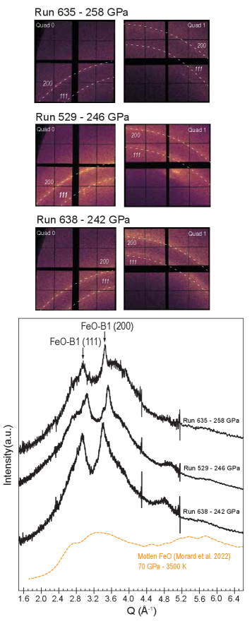
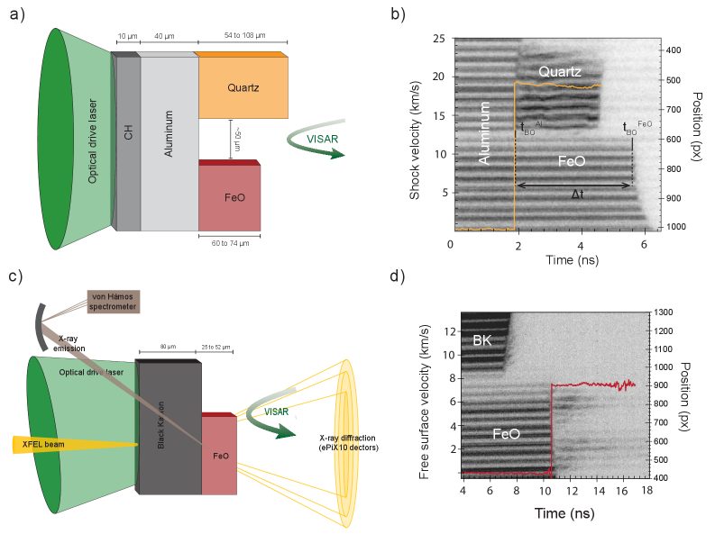
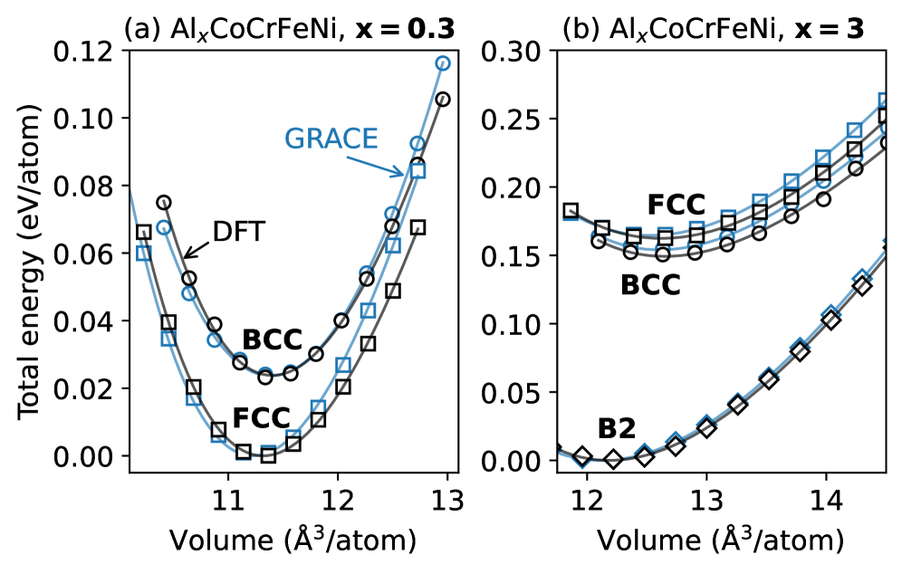
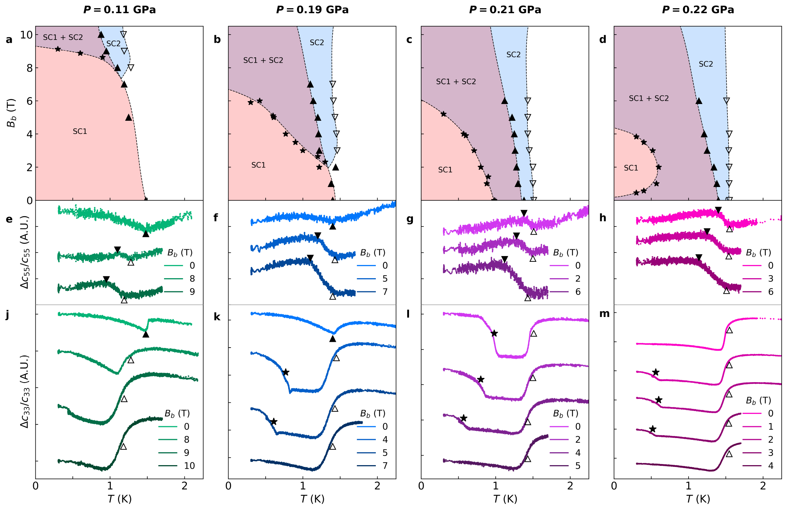

# arXivダイジェスト：放射光・量子ビーム

**作成日：** 2026年3月21日
**対象期間：** 2026年3月19日〜21日（直近72時間）

---

## 選定論文一覧

1. [Spin crossover in FeO under shock compression](https://arxiv.org/abs/2603.17136) — Libon et al.
2. [Direct observation of strain and confinement shaping the hole subbands of Ge quantum wells](https://arxiv.org/abs/2603.18753) — Della Valle et al.
3. [Hydrogen uptake and hydride formation in AlxCoCrFeNi high-entropy alloys](https://arxiv.org/abs/2603.17479) — Körmann et al.
4. [Observation of Resonance of Kagome Flat Band Doublet](https://arxiv.org/abs/2603.18537) — Zhang et al.
5. [Fermi surface of Kagome metal CsCr₃Sb₅ observed by laser photoemission microscopy](https://arxiv.org/abs/2603.18672) — Kunitsu et al.
6. [Direct observation of ultrafast amorphous-amorphous transitions in GeTe](https://arxiv.org/abs/2603.17400) — Qi et al.
7. [Identification of sub-angstrom many-body localization by Bragg scattering phase breaking](https://arxiv.org/abs/2603.17591) — Qi et al.
8. [Synthesis, Solvent-dependent Self-Assembly and Partial Oxidation of Ultrathin Cerium Fluoride Nanoplatelets](https://arxiv.org/abs/2603.18270) — Moretti et al.
9. [Thermodynamic Discovery of Tetracriticality and Emergent Multicomponent Superconductivity in UTe₂](https://arxiv.org/abs/2603.17905) — Kamat et al.
10. [Imaging short- and long-range magnetic order in a quantum anomalous Hall insulator](https://arxiv.org/abs/2603.18906) — Vervelaki et al.

---

## 重点論文の詳細解説

---

### 重点論文 1

#### 1. 論文情報

**タイトル：** [Spin crossover in FeO under shock compression](https://arxiv.org/abs/2603.17136)
**著者：** Lélia Libon, Alessandra Ravasio, Silvia Pandolfi, Yanyao Zhang, Xuehui Wei, Jean-Alexis Hernandez, Hong Yang, Amanda J. Chen, Tommaso Vinci, Alessandra Benuzzi-Mounaix, Clemens Prescher, François Soubiran, Hae Ja Lee, Eric Galtier, Nick Czapla, Wendy L. Mao, Arianna E. Gleason, Sang Heon Shim, Roberto Alonso-Mori, Guillaume Morard
**arXiv ID：** 2603.17136
**カテゴリ：** cond-mat.mtrl-sci, astro-ph.EP
**公開日：** 2026年3月19日
**論文タイプ：** 実験論文
**ライセンス：** CC BY-NC-SA 4.0

---

#### 2. どんな研究か

レーザー駆動衝撃圧縮によってFeO（ウスタイト）を最大900 GPaの動的高圧状態に置き、LCLSのX線自由電子レーザー（XFEL）を用いたin situのX線回折（XRD）とX線発光分光（XES）により、FeO中の鉄のスピン状態と結晶構造を82〜261 GPaの範囲で直接観測した。高スピン状態が地球のコア・マントル境界（CMB: 約135 GPa）を超えて持続することを実験的に初めて明示し、惑星内部構造モデルの制約を大幅に更新した。

---

#### 3. 研究の概要

**背景・目的：** FeO（ウスタイト）は地球下部マントルに存在する主要鉱物相であり、温度・圧力条件下でのスピン状態（高スピン: HS vs. 低スピン: LS）は密度・弾性波速度・熱伝導率などの物性を大きく左右するため、惑星内部ダイナミクスを理解する上で本質的な情報である。しかし、静的圧縮（ダイヤモンドアンビルセル: DAC）では数百GPaかつ高温下での in situ 計測が技術的に困難であり、CMB以深の条件での鉄スピン状態は実験的に未解決であった。

**解こうとしている課題：** 高圧高温下におけるFeOのスピンクロスオーバーの開始・終了圧力と温度依存性を、実際のHugoniot（衝撃波状態方程式）条件下で直接測定すること。

**研究アプローチ：** レーザー駆動衝撃圧縮法（LULI2000レーザー施設でHugoniot測定、LCLSのMECエンドステーションでXRD+XES測定）を組み合わせ、動的圧縮状態でのin situマルチプローブ計測を実現した。VISAR（速度干渉計）で衝撃速度を計測し、Hugoniot方程式から圧力・密度を求め、同時にXFELパルスでXRD・XESを取得した。

**対象材料系：** FeO（ウスタイト）単結晶・多結晶ターゲット

**使用した量子ビーム手法：**
- **XRD（X線回折）：** LCLSのMECエンドステーションで17 keV準単色X線を使用。4台のePix10k検出器を透過幾何で配置し、2θ = 9°〜75°をカバー。9 keVビームでの補完測定も実施。
- **XES（X線発光分光）：** 鉄Kβ発光（〜7.06 keV）をvon Hamos型エネルギー分散型分光器で後方60°方向に収集。スピン状態に敏感な鉄3d電子状態の情報を間接的に取得。
- **VISAR：** 衝撃速度の精密測定により熱力学条件（圧力・温度）を決定。

**測定で得られる物理量：** XRD：格子定数、結晶構造（B1型vs.高圧相）、溶融の有無；XES：Kβ主線・Kβ'線の相対強度（スピン状態インジケーター）、Integrated Absolute Difference（IAD）値でHSからLSへの変換率を定量化。

**主な解析手法：** XESスペクトルの差分解析（IAD値計算）、参照スペクトル（HS・LS端成員）との比較フィッティング、Hugoniot関係式による圧力・密度決定。

**主な結果：**
- FeOのHugoniotを約900 GPaまで延長（既存最大値の大幅な拡張）
- B1型結晶構造が258 GPaまで維持され、242〜258 GPaで溶融または非晶質化の兆候
- IAD値が82 GPaから261 GPaにかけて連続的に増加し、広い圧力範囲にわたるスピンクロスオーバーを実証
- 高スピン状態がCMB条件（〜135 GPa）を超えて維持される：CMB条件で約50〜55%の低スピン分率
- 最高圧力（246〜261 GPa）では参照LSスペクトルとほぼ一致し、完全な低スピン遷移に近い状態

**著者の主張：** FeOにおける鉄のスピンクロスオーバーは広い圧力範囲にわたる連続的過程であり、CMBの圧力・温度条件でも高スピン状態が相当程度存在する。この知見は下部マントルの弾性特性・密度モデルを見直す必要性を示唆する。

---

#### 4. 放射光・量子ビーム分野として重要なポイント

本研究の計測技術上の本質的な新規性は、XFELパルスによる「動的高圧状態でのin situ XRD + XES同時計測」の実現にある。衝撃圧縮実験では状態がナノ秒〜マイクロ秒スケールで変化するため、定常状態の静的圧縮では原理的にアクセスできない高温高圧条件を捉えることができる。LCLSのMECエンドステーションで提供されるXFELパルス（フェムト秒〜ピコ秒）は、衝撃波通過後の動的圧縮状態を瞬時に「凍結」して観測することを可能にし、XRDで構造、XESでスピン状態を同時に決定する。von Hamos分光器による鉄Kβ発光の測定は元素選択的かつスピン感度が高く、多成分系鉱物でも鉄の電子状態を識別できる利点がある。既存の静的DAC実験が到達困難な高温高圧Hugoniot条件下での直接測定という点で、計測インフラとしての意義は大きく、地球科学・惑星科学コミュニティへの直接的貢献がある。結果の一般性も高く、同様の手法がFeS、MgFeO₂等の鉄含有鉱物相に展開できる。

---

#### 5. 限界と注意点

衝撃圧縮実験はHugoniot（衝撃波の到達状態方程式上の点）に沿った温度・圧力条件を探索するため、任意の温度・圧力空間を独立に走査できない。地球内部の断熱温度勾配やCMB付近の実際の地熱は、Hugoniot上の温度とは異なる可能性があり、直接の対応付けには注意が必要である。XESのIAD値はHSとLS成分の線形混合を仮定しているが、中間スピン状態や配位環境の圧力変化がIAD値に影響を与える可能性がある。また、XRDパターンはB1構造の維持を示すが、試料の不均一性（衝撃波面の傾き、温度勾配）が回折シグナルに影響しうる。単一衝撃波ショットでの測定のため、統計的再現性の確認には複数のショットデータの積み上げが必要であり、本報告でも限定的なデータポイント数での議論となっている。

---

#### 6. 関連研究との比較

静的DACを用いたXES・XRDによるFeOのスピン状態研究（Badro et al. 2003, Lin et al. 2005等）は、スピンクロスオーバーが50〜100 GPa付近で始まることを示してきたが、高温下での計測や200 GPaを超える条件での直接測定は技術的困難から限られていた。衝撃圧縮とXFELを組み合わせた先行研究では、Mgペリクレース（MgO）やMg-Fe複合酸化物を対象としたものがあったが、FeO単体でCMBを超える条件まで連続的なスピンクロスオーバーを追跡した例は少ない。本研究はHugoniotの圧力範囲を900 GPaまで大幅に拡張した点（計測インフラとしての前進）と、高スピン状態のCMB以遠での持続という物質理解の前進の両方を達成している。スピンクロスオーバーが段階的・不連続的でなく連続的であるという知見は、CMB付近での物性不連続を最小化するシナリオを支持するものであり、地震波観測との整合性の観点で重要な進展である。今後はin situ加熱との組み合わせによる等温圧力系列の実現が次のステップとなる。

---

#### 7. 重要キーワードの解説

**1. スピンクロスオーバー（Spin Crossover）**
鉄（Fe）などの遷移金属イオンが、外部環境（圧力・温度）の変化により高スピン（HS）状態から低スピン（LS）状態へ転移する現象。3d電子のスピン多重度が変わることで磁気モーメントが失われ、密度・弾性・熱伝導特性が変化する。FeO中のFe²⁺は常圧でHS（S=2、全磁気モーメント4μB）、高圧でLS（S=0）に転移する。

**2. ウスタイト（Wüstite, FeO）**
鉄と酸素の1:1化合物（非化学量論的）。地球下部マントルで重要な鉄酸化物鉱物相であり、温度・圧力下での電子構造変化（スピンクロスオーバー）が地球内部の密度・粘性・熱伝導に影響する。

**3. Hugoniot方程式（Rankine-Hugoniot Relations）**
衝撃波通過前後で保存される質量・運動量・エネルギーの釣り合い方程式。衝撃速度$U_s$と粒子速度$U_p$を測定することで、圧力$P = \rho_0 U_s U_p$、密度$\rho = \rho_0 U_s / (U_s - U_p)$、内部エネルギー変化$\Delta E = P (\Delta V)/2$を決定できる。$\rho_0$は初期密度。

**4. X線発光分光（X-ray Emission Spectroscopy, XES）**
内殻電子（1s）をX線で励起した後に放出される特性X線を分光する手法。Fe Kβ線（3p→1s遷移、約7.06 keV）は3d電子との交換相互作用の影響を受けるため、スピン状態に敏感。高スピン・低スピン状態でKβ'サテライト線の強度・位置が変化する。von Hamos型分光器は湾曲結晶による焦点集光とエネルギー分散を両立し、高輝度XFELパルスを効率的に利用できる。

**5. Integrated Absolute Difference（IAD）**
XESスペクトルのスピン状態指標。基準スペクトル（純粋HS状態）との差分スペクトルの積分絶対値を求める：$\text{IAD}(P) = \int |I(P, E) - I_{\text{ref, HS}}(E)| \, dE$。IAD=0ならHS状態、完全LS参照スペクトルとのIAD値を1に規格化すると、中間的な値でHS/LSの混合比が推定できる。

**6. X線自由電子レーザー（XFEL）**
自由電子の集団放射（SASE: 自己増幅自発放射）により生成されるコヒーレントX線パルス（パルス幅フェムト秒〜数十フェムト秒、ピーク輝度は放射光の10億倍以上）。衝撃圧縮実験では、ナノ秒スケールで変化する動的圧縮状態を「瞬時に撮影」するためのプローブとして最適。LCLSはスタンフォード線形加速器センター（SLAC）にある世界初の硬X線XFEL施設。

**7. コア・マントル境界（Core-Mantle Boundary, CMB）**
地球内部での地殻・マントルと外核の境界面（深さ約2900 km）。圧力約135 GPa、温度約3000〜4000 Kの条件が支配的。地震波の急激な速度変化が観測される不連続面であり、鉄酸化物のスピン状態がこの境界付近での物性異常と関連する可能性がある。

**8. ePix10k検出器**
SLAC/LCLSで開発されたハイブリッドピクセル検出器。1フレームあたり10k電子相当のダイナミックレンジを持ち、XFELパルス（単発）でのX線回折パターンを高感度で取得できる。従来のイメージングプレートに比べ、単発ショットでのナノ秒〜ピコ秒時間分解計測に適している。

**9. VISAR（Velocity Interferometer System for Any Reflector）**
衝撃波実験で使用される光学干渉計。試料自由表面（または窓）での粒子速度$U_p(t)$を時間分解（ナノ秒〜サブナノ秒）で測定する。測定された粒子速度と衝撃速度からHugoniot条件（圧力・密度）を決定するために必須の診断ツール。

**10. 下部マントル地震波モデル（Seismic Velocity Model of Lower Mantle）**
PREM（Preliminary Reference Earth Model）などの標準地球モデルでは、下部マントルの縦波（Vp）・横波（Vs）速度プロファイルが測定されており、矿物の弾性特性（密度・弾性定数）がこのプロファイルと整合するかを検証することで内部組成を推定する。鉄のスピン状態は密度と圧縮率に影響するため、スピンクロスオーバーの圧力・温度依存性はモデル制約において重要なパラメーターとなる。

---

#### 8. 図

本論文のライセンスはCC BY-NC-SA 4.0であり、原図の転載が許可されています。

**図1（2603.17136_fig2.png）：X線回折パターンの圧力依存性**

*図1キャプション：衝撃圧縮下のFeOにおける17 keV X線を用いたin situ X線回折イメージ（242〜258 GPa）。複数のePix10k検出器で取得された回折リングはB1（NaCl型）構造の維持を示す。258 GPa付近でB1ピークとともに散漫散乱が現れ、構造の部分的な無秩序化（融解もしくは非晶質化）を示唆している。この直接観測により、B1構造がCMB以遠の圧力まで安定であることが確認され、先行する静的圧縮実験の推定を独立に検証する。*

**図2（2603.17136_fig3.png）：Fe Kβ X線発光スペクトルの圧力依存性**

*図2キャプション：82〜261 GPaの衝撃圧縮FeOから収集したFe Kβ X線発光スペクトル。主線（Kβ₁,₃）とKβ'サテライト線の相対強度・位置が圧力上昇とともに変化しており、高スピン（HS）から低スピン（LS）への連続的な転移を示す。差分スペクトル（下段）は高スピン参照スペクトルとの偏差を明示しており、低スピン成分の圧力依存的増加を定量化するために用いられる。*

**図3（2603.17136_fig6.png）：実験セットアップの模式図**

*図3キャプション：衝撃圧縮実験の実験配置図。（a,b）LULI2000レーザー施設でのHugoniot測定のターゲット設計とVISAR配置、（c,d）LCLSのMECエンドステーションでのXRD・XES同時測定の幾何学配置。XFELビームは衝撃波到達タイミングに同期してターゲットを照射し、透過方向のePix10k検出器でXRD、後方の分光器でXESを同時に収集する。このマルチプローブ配置が単一ショットでの構造・スピン状態の同時決定を可能にする。*

---

### 重点論文 2

#### 1. 論文情報

**タイトル：** [Direct observation of strain and confinement shaping the hole subbands of Ge quantum wells](https://arxiv.org/abs/2603.18753)
**著者：** Enrico Della Valle, Arianna Nigro, Miki Bonacci, Nicola Colonna, Andrea Hofmann, Michael Schüler, Nicola Marzari, Ilaria Zardo, Vladimir N. Strocov
**arXiv ID：** 2603.18753
**カテゴリ：** cond-mat.mtrl-sci
**公開日：** 2026年3月20日
**論文タイプ：** 実験・計算複合論文
**ライセンス：** arXiv非独占的配布ライセンス

---

#### 2. どんな研究か

軟X線角度分解光電子分光法（SX-ARPES）を用いて、SiGe障壁に埋め込まれた歪みGeクォンタムウェル（QW）の価電子帯構造を初めて直接・運動量分解計測した。スイス光源（SLS）のADRESSビームラインと独DESY・PETRA IIIのP04ビームラインを活用し、歪み分裂・サイズ量子化した価電子サブバンドを分解し、重正孔（HH）・軽正孔（LH）・スピン軌道分離（SO）成分の混合を実験的に明らかにした。

---

#### 3. 研究の概要

**背景・目的：** Ge/SiGeヘテロ構造は高移動度ホールスピン量子ビットおよびCMOS超高速デバイスの有望なプラットフォームとして注目されているが、埋め込まれた歪みGeクォンタムウェルの運動量分解価電子帯構造はこれまで間接的な推定（輸送測定・理論計算）に頼っていた。SX-ARPESによる直接測定が求められていた。

**解こうとしている課題：** 歪み（圧縮/引張）と閉じ込め（量子化）が重なった条件下でのGeのHH・LH・SOバンドの分散関係を実験的に分解し、理論（ab initio tight-binding法）と定量的に対応付けること。また、Ge/SiGe界面での価電子帯オフセット（VBO）を直接測定すること。

**研究アプローチ：** ADRESSビームライン（SLS, PSI）で300〜1600 eVの光子エネルギーを用い、10 Kでのin situ SX-ARPESを実施。P04ビームライン（PETRA III, DESY）で最大3000 eVの補完測定を行い、kz分散の解明とバルクGe基準スペクトルを取得。STEM・XRDによるヘテロ構造評価と組み合わせた。

**対象材料系：** Ge/Si₀.₂₅Ge₀.₇₅ヘテロ構造（埋め込みGeクォンタムウェル、圧縮歪み-0.81%）

**使用した量子ビーム手法：**
軟X線ARPES（SX-ARPES）：通常のUV-ARPESに比べてkzの取得範囲が広く、バルクバンド構造の探索に有利。さらにSiGe障壁を透過した下地のGeウェルにもアクセスできる（軟X線の長い脱出深さ: 数nm〜数十nm）。エネルギー分解能は約47 meV（10 K）。偏光依存性測定（LH/LV光）でHH/LH/SO成分の軌道対称性を識別。

**測定で得られる物理量：** 運動量（k）-エネルギー（E）分散関係（光電子スペクトル強度マップ）、量子化サブバンドのエネルギー位置、価電子帯オフセット（VBO = 144±30 meV）、サブバンドのHH/LH/SO混合係数。

**主な解析手法：** MDC（運動量分布曲線）・EDC（エネルギー分布曲線）解析、偏光選択則を用いた軌道対称性マッピング、ab initio tight-binding計算（SiGe障壁の閉じ込めポテンシャルを明示的に含む）との比較。

**主な結果：**
- 4本の量子化サブバンドを分解（バルク近似では再現不可能）
- VBO = 144±30 meVを直接測定
- サブバンドはk依存的なHH/LH/SO混合を持ち、単純な有効質量近似では不十分
- SiGe障壁の閉じ込めポテンシャルを明示的に含むab initioモデルが実験を定量的に再現
- バルクGeとQWの間でバンド分散の質的な違いを直接比較

**著者の主張：** 歪みGeクォンタムウェルの正孔バンド構造をSX-ARPESで初めて直接実証し、閉じ込めポテンシャルの明示的な取り込みがモデル計算に必須であることを示した。

---

#### 4. 放射光・量子ビーム分野として重要なポイント

SX-ARPESがこの研究で選ばれた必然性は明確である。UV-ARPESでは脱出深さが短いため（数Å〜1 nm）、SiGe障壁に埋め込まれたGeウェル（数nm深さ）には届かない。300〜3000 eVの軟X線を使うことで脱出深さが数nm〜数十nmに伸び、埋め込みQWの電子状態に直接アクセスできる。また軟X線ではkzの変化幅が大きく、バルクバンドとQW量子化状態の分離を容易にする。偏光（LH/LV）依存計測でHH/LH/SO成分を識別できるのもSX-ARPESの強みである。ホールスピン量子ビット研究では、HH/LH分裂やスピン軌道結合強度がコヒーレンス時間・g因子・電気的制御性に直結するが、これまでの設計は理論予測に依存していた。本研究は実験的な基盤データを初めて提供し、量子ビット材料設計の予測精度向上に直接貢献する。SLS ADRESSとDESY P04というトップレベルの軟X線ARPESビームラインを組み合わせた点も手法論的意義がある。

---

#### 5. 限界と注意点

SX-ARPESのエネルギー分解能（約47 meV）は、量子化サブバンドのエネルギー間隔（数十meV〜100 meVオーダー）と同程度であり、隣接するサブバンドの重複分離が部分的に困難な場合がある。測定温度（10 K）での結果であり、室温や実際のデバイス動作温度（数K〜数十K）でのバンド構造の温度依存性（熱的なガウスぼやけ・フォノン散乱）は考慮外である。VBOの測定値（144±30 meV）の誤差は比較的大きく、ナノスケールの界面急峻性や組成揺らぎが測定値に影響しうる。また、SX-ARPESは表面感度が高まる条件では表面起因バンドが混入する可能性があり、埋め込みQWからのシグナルとの分離が必要。試料の均一性（厚さゆらぎ・組成分布）も量子化エネルギーの分布に影響する。

---

#### 6. 関連研究との比較

埋め込み量子ウェルのSX-ARPESによる研究は近年増加しており（例：InGaAs/AlAs系、GaAs/AlGaAs系など）、本研究はSi-Ge族半導体系への展開として位置付けられる。IV族半導体は既存のCMOS技術との整合性が高く、Si上でのGeスピン量子ビットは近年急速に発展している（Hendrickx et al. 2021等）。これまでのホールバンド構造の理論計算（Winkler 2003, Kloeffel et al. 2018等）は輸送・スペクトロスコピーで間接的に検証されてきたが、ARPESによる直接kE分解イメージングは本研究が初めてに近い。SX-ARPESの技術的前進（ADRESSビームラインの高輝度・高分解能）とGe QW材料の準備技術の向上が組み合わさった成果であり、incremental（漸進的）ではなく材料ごとに独自の実験が必要なカテゴリのブレークスルーと評価できる。

---

#### 7. 重要キーワードの解説

**1. 軟X線角度分解光電子分光法（SX-ARPES）**
300〜3000 eVの軟X線を試料に照射し、光電効果で放出された光電子の運動量（k）とエネルギー（E）を同時測定する手法。$E_{\text{kin}} = h\nu - \phi - E_B$（$h\nu$: 光子エネルギー、$\phi$: 仕事関数、$E_B$: 結合エネルギー）の関係から電子のバンド構造を直接決定する。通常のUV-ARPESより深い試料領域（数nm〜数十nm）を探索可能。

**2. 価電子帯オフセット（Valence Band Offset, VBO）**
ヘテロ接合で異なる半導体が接触する際、それぞれの価電子帯最大エネルギー（VBM）の差。$\Delta E_V = E_V^{\text{Ge}} - E_V^{\text{SiGe}}$。VBOはキャリアの閉じ込めポテンシャルの高さを決定し、量子ウェルの量子化エネルギー・ホールの閉じ込め効率に直接影響する。

**3. 量子サブバンド（Quantum Subbands）**
量子ウェル構造中で、垂直方向（閉じ込め方向）の量子化条件$k_z = n\pi/L$（$n$: 量子数、$L$: ウェル幅）を満たすエネルギー準位。各サブバンドは面内方向（$k_x, k_y$）に連続的な分散$E(k_\parallel)$を持つ。HH・LH・SO各バンドからそれぞれ独立した系列のサブバンドが生じる。

**4. 重正孔・軽正孔・スピン軌道分離バンド（HH/LH/SO）**
ダイヤモンド構造半導体の価電子帯は、$\Gamma$点で縮退している重正孔（$m_j = \pm 3/2$）・軽正孔（$m_j = \pm 1/2$）バンドとスピン軌道分離（$\Delta_{SO}$, Ge: 290 meV）によって分かれたSOバンドから構成される。歪みと閉じ込めがこの縮退を解き、複雑な分散混合（anticrossing等）を生じさせる。

**5. 歪み（Biaxial Strain）**
基板格子定数と薄膜格子定数の差に起因して生じる面内双軸応力。Ge（格子定数5.658 Å）をSi₀.₂₅Ge₀.₇₅（格子定数〜5.575 Å）上に成長させると、-0.81%の圧縮歪みが導入される。歪みはHH/LH縮退を解いてバンド間エネルギー差を生じ、スピン軌道結合テンソルにも影響する。

**6. ADRESS ビームライン（SLS）**
スイス光源（PSI）のADRESS（Advanced Resonant Spectroscopies）ビームライン。300〜1600 eVの軟X線を提供し、高エネルギー分解能（~15 meV @400 eV）・高角度分解能のSX-ARPESが可能。特に共鳴RIXS（X線非弾性散乱）とARPESを組み合わせた多機能計測に特化している。

**7. P04ビームライン（PETRA III）**
ドイツ・DESY（ハンブルク）のPETRA III第三世代放射光リング（電子エネルギー6 GeV）のP04ビームライン。250〜3000 eVの光子エネルギー範囲で高分解能VUV-軟X線ARPES・XPS計測を提供する。高輝度・低エミッタンスビームを利用した空間分解計測（nanoARPES）にも対応。

**8. 偏光依存ARPES（Polarization-Dependent ARPES）**
直線偏光（LH: 水平偏光、LV: 垂直偏光）や円偏光（LC/RC）を選択することで、光電子遷移行列要素の対称性を操作し、特定の軌道対称性を持つバンドを選択的に強調する手法。$\langle f | \hat{\epsilon} \cdot \mathbf{p} | i \rangle$の選択則から、偏光方向によって選択されるバンドが変わる（$\hat{\epsilon}$: 偏光ベクトル、$\mathbf{p}$: 運動量演算子）。HH（$d_{z^2-r^2}$系）とLH（$d_{xy}$系）では偏光応答が異なる。

**9. ab initio Tight-Binding法**
第一原理計算（DFT等）から得た局所基底セット（Wannier関数）を用いて構築されたTight-Bindingハミルトニアン。系全体の電子構造（バンド分散）を効率的に計算できる。本研究ではGeとSiGeの複合ヘテロ構造に適用し、閉じ込めポテンシャルの効果を明示的に組み込んだ。

**10. ホールスピン量子ビット（Hole-Spin Qubit）**
半導体量子ドット中の正孔（ホール）スピン状態を量子ビットとして利用する概念。電子スピン量子ビットに比べて、スピン軌道結合が強く電気的操作（EDSR: 電気的双極子スピン共鳴）が容易である一方、核スピンとの超微細相互作用が弱いためコヒーレンス時間が長い。GeのHH/LH混合・スピン軌道結合の強さ・g因子の異方性が量子ビット特性の設計パラメーターとなる。

---

#### 8. 図

本論文のライセンスはarXiv非独占的配布ライセンスであり、原図の抽出・転載はできません。論文のHTML版（https://arxiv.org/html/2603.18753v1）または PDF（https://arxiv.org/pdf/2603.18753）から直接図を参照してください。研究の主要図には、（1）歪み・閉じ込めのバンド構造への影響の概念図、（2）Ge/SiGeヘテロ構造のSTEM像・XRD・SX-ARPESマップ、（3）価電子帯オフセット直接測定、（4）3Dバルク対QWのSX-ARPESバンドマップ比較、（5）偏光依存HH/LH/SO混合マップが含まれます。

---

### 重点論文 3

#### 1. 論文情報

**タイトル：** [Hydrogen uptake and hydride formation in AlxCoCrFeNi high-entropy alloys: First-principles, universal-potential, and experimental study](https://arxiv.org/abs/2603.17479)
**著者：** Fritz Körmann, Yuji Ikeda, Konstantin Glazyrin, Maxim Bykov, Kristina Spektor, Shrikant Bhat, Nikita Y. Gugin, Anton Bochkarev, Yury Lysogorskiy, Blazej Grabowski, Kirill V. Yusenko, Ralf Drautz
**arXiv ID：** 2603.17479
**カテゴリ：** cond-mat.mtrl-sci
**公開日：** 2026年3月19日
**論文タイプ：** 実験・計算複合論文
**ライセンス：** CC BY 4.0

---

#### 2. どんな研究か

アルミニウム含有量の異なる2種類の高エントロピー合金（HEA）—FCC型Al₀.₃CoCrFeNiとB2型Al₃CoCrFeNi—を対象に、PETRA III（DESY）のP02.2（ダイヤモンドアンビルセル）およびP61B（大容量プレス）ビームラインを用いた高圧放射光XRD実験と、第一原理計算・GRACE汎用機械学習ポテンシャルを組み合わせ、水素吸収と水素化物形成の圧力依存性を解明した。Al含有量がHEAの水素吸収を化学的に抑制するメカニズムを実験と計算の両面から実証した。

---

#### 3. 研究の概要

**背景・目的：** 高エントロピー合金は優れた機械的特性と水素脆化耐性で注目されているが、高圧水素環境での水素吸収挙動は未解明の部分が多い。Al添加がHEAの水素取り込みに与える影響を定量的に理解することは、水素貯蔵材料・水素脆化耐性材料の設計に直結する。

**解こうとしている課題：** Al含有量（Al₀.₃: FCC相 vs Al₃: B2相）がどの程度・どのメカニズムで水素吸収を変えるか。特に、結晶構造の違い（FCC vs B2）と化学組成効果（Al濃度）の相対寄与を分離すること。

**研究アプローチ：** 高圧放射光XRD（ダイヤモンドアンビルセル + H₂圧力媒体、最大55 GPa）で格子体積変化から水素吸収を直接検出し、DFT計算（64原子スーパーセル）とGRACE汎用ポテンシャルによる大統計計算を組み合わせた。

**使用した量子ビーム手法：**
- **P02.2ビームライン（PETRA III）：** ダイヤモンドアンビルセル（Ne・H₂圧力媒体）を用いた室温圧縮率測定。精密格子定数の圧力依存性から水素化物形成（体積膨張）を検出。
- **P61B ビームライン（PETRA III）：** 大型容量プレス（LVP）を用いた高温高圧実験。白色高エネルギーX線をプローブとし、高圧・加熱条件での構造変化を追跡。

**測定で得られる物理量：** 格子定数の圧力依存性（体積変化）、構造相変化の臨界圧力、水素化物の格子体積膨張量から推定される水素組成（MHₓのx値）。

**主な結果：**
- Al₀.₃CoCrFeNi（FCC）は3 GPa以上でH₂存在下において体積膨張を示し、水素化物（組成推定: MH₀.₈〜MH₀.₉）が形成される
- Al₃CoCrFeNi（B2）は50 GPaまで加熱しても水素化物形成なし
- DFT計算で、Al含有量増加とともに水素溶解エネルギーが上昇し（水素吸収が不利になる）、侵入型水素サイト（八面体・四面体）の安定性が低下することを示した
- GRACE汎用ポテンシャルはDFT参照データとの高い相関（~72 meVのオフセットあり）を示し、大規模統計計算を実現
- 化学組成（Al量）が主要因であり、結晶構造（FCC vs B2）は体積を通じた副次的効果

**著者の主張：** Al含有量の増加はHEAの水素吸収を化学的に抑制し、構造型よりも組成効果が支配的である。

---

#### 4. 放射光・量子ビーム分野として重要なポイント

高圧放射光XRDは格子定数の圧力依存性から水素吸収を非侵襲的に直接検出する唯一の定量手法であり、水素が軽元素であるためX線散乱で直接位置決定するのが困難な状況での間接検出として機能している。P02.2ビームラインのダイヤモンドアンビルセル実験では、H₂ガスを圧力媒体として用いることで、高圧水素雰囲気中でのその場（in situ）計測を実現している。格子体積の異常な膨張（水素化物形成による）と化学量論比の推定を高精度で行うには、放射光の高輝度・高平行性が不可欠である。計算（DFT + GRACE汎用機械学習ポテンシャル）と実験を密接に対応付けた点も本研究の強みである。水素吸収の抑制メカニズムが化学効果（Al置換による侵入型サイトの安定性低下）であることを実験と計算の両方から裏付けた点は、材料設計の指針として波及性が高い。

---

#### 5. 限界と注意点

格子体積変化からの水素組成推定は、水素非吸収状態の状態方程式（EOS）を既知とした上での差分計算に依存しており、化学的複雑性（HEAの局所組成揺らぎ）がEOSの推定精度に影響しうる。また、DFT計算は64原子のスーパーセルでランダム配置を仮定しており、実際のHEAで生じる短距離秩序（SRO）の効果は考慮されていない。GRACE汎用ポテンシャルはHEA中のAl-H相互作用に対して~72 meVの系統的オフセットを示しており、定量的予測精度には注意が必要。高圧実験での水素圧力媒体は、低い水素化圧力では部分的に流体相であり、媒体の静水圧条件と試料環境の均一性の確認が重要。

---

#### 6. 関連研究との比較

HEAの高圧水素化に関する放射光XRD研究は近年増加しており（Huot et al.、Yusenko et al.等）、本研究はAl含有量体系的変化と計算との整合という点で前進している。従来のHEA水素貯蔵研究の多くは常圧〜低圧での熱力学的測定であり、高圧in situ XRDによる直接追跡は手法論的に意義がある。GRACE汎用機械学習ポテンシャルのHEA水素系への適用は、大規模統計計算を可能にする新たなアプローチとして注目される。計測技術としての前進（高圧水素in situ XRD）と材料理解（Al添加の水素抑制効果）の両方に貢献しているが、新規性はincrementalな積み上げの性格が強い。今後は短距離秩序（SRO）を考慮した計算やAl以外の元素効果の系統研究が期待される。

---

#### 7. 重要キーワードの解説

**1. 高エントロピー合金（High-Entropy Alloy, HEA）**
5種類以上の主要元素をほぼ等モル比で混合した多主成分合金。単相（FCC・BCC・HCP等）を形成し、従来の合金にない高強度・高耐食性・高耐放射線性を示す。AlCoCrFeNiがその代表系であり、Al添加量でFCC（低Al）からB2秩序（高Al）へ構造変化する。

**2. ダイヤモンドアンビルセル（Diamond Anvil Cell, DAC）**
2つのダイヤモンドの先端（culet）でガスケット中の試料を挟んで加圧する装置。数GPa〜数Mbarの静的高圧が実現可能。X線はダイヤモンドを透過するため、高圧状態でのin situ回折が可能。圧力媒体（Ne、H₂、Heなど）を用いることで静水圧条件を確保。

**3. 水素化物（Hydride）**
金属と水素が化学的に反応して形成される化合物。金属中の侵入型サイト（八面体・四面体）に水素原子が占有されることで格子が膨張する。水素の吸蔵量と格子膨張率の比例関係（Vegard則）から、XRD格子定数測定で水素組成を推定できる。

**4. P02.2ビームライン（PETRA III）**
ドイツ・DESYのPETRA III（電子エネルギー6 GeV）にある高圧X線回折専用ビームライン。焦点サイズ〜2μm、光子エネルギー25〜60 keVの単色X線を提供し、ダイヤモンドアンビルセル・大容量プレスなど各種高圧装置に対応。世界最高水準の高圧精密構造解析が可能。

**5. 水素溶解エネルギー（Hydrogen Solution Energy）**
金属格子の侵入型サイト（八面体: OIS、四面体: TIS）に水素原子1個を挿入するのに必要なエネルギー：$E_{\text{sol}} = E[\text{MH}] - E[\text{M}] - \frac{1}{2}E[\text{H}_2]$。正値が大きいほど水素吸収が熱力学的に不利であり、Al添加でこの値が上昇することが本研究の主要な計算結果。

**6. GRACE汎用機械学習ポテンシャル**
原子間相互作用を記述するための機械学習ベースのポテンシャル（Interatomic Potential）。第一原理計算（DFT）データで訓練され、DFTに近い精度で数万〜数百万原子のMD計算が可能。本研究ではHEA-H系の水素溶解エネルギーの分布を大統計で計算するために使用。

**7. 短距離秩序（Short-Range Order, SRO）**
HEA中の特定の元素対が隣接サイトを優先的に占有する局所的な配置秩序。完全ランダム配置からの逸脱として定義される（Warrenベクトル等）。SROは機械的特性・水素拡散・水素吸蔵特性に影響するが、計算モデルでの取り込みは困難で、本研究ではランダム配置を仮定している。

**8. 状態方程式（Equation of State, EOS）**
圧力$P$、体積$V$（または密度$\rho$）、温度$T$の関係を記述する方程式。高圧X線実験では格子定数から体積を求め、EOSを用いて圧力を決定する。Birch-Murnaghan型EOSがよく使われる：$P = \frac{3B_0}{2}\left[\left(\frac{V_0}{V}\right)^{7/3} - \left(\frac{V_0}{V}\right)^{5/3}\right]\left[1 + \frac{3}{4}(B_0'-4)\left(\left(\frac{V_0}{V}\right)^{2/3}-1\right)\right]$。

**9. Vegard則**
固溶体の格子定数が成分の格子定数の線形内挿で近似できるという経験則：$a = x \cdot a_A + (1-x) \cdot a_B$（$x$: 成分Aの組成比）。水素化物形成では、水素吸蔵量に比例した格子体積膨張が観測され、この関係を用いて水素組成を推定する。

**10. 大型容量プレス（Large-Volume Press, LVP）**
油圧プレスを用いて大容量の試料（1〜100 mm³規模）を数GPaから数十GPaまで加圧できる高圧装置。P61B（PETRA III）では白色放射光をプローブとして用いたin situ エネルギー分散型XRD（EDX）が可能。ダイヤモンドアンビルセルより高温高圧実験に適しており、大試料体積による高いシグナル量と組み合わせた in situ 加熱・加圧実験に利用される。

---

#### 8. 図

本論文のライセンスはCC BY 4.0であり、原図の転載が許可されています。

**図1（2603.17479_fig1.png）：エネルギー-体積曲線**

*図1キャプション：Al₀.₃CoCrFeNi（x=0.3）とAl₃CoCrFeNi（x=3.0）のFCC・BCC相それぞれについて、GRACE汎用ポテンシャルとDFT計算のエネルギー-体積曲線（Vinet状態方程式フィット付き）を比較。GRACEポテンシャルがDFTを良好に再現することを示し、大規模計算への適用性を裏付ける。*

**図2（2603.17479_fig3.png）：高圧X線回折による水素化物形成の観測**

*図2キャプション：PETRA IIIでの放射光XRD実験による圧縮率データ。FCC Al₀.₃CoCrFeNi（上）は3 GPa以上でH₂圧力媒体中に体積膨張（水素化物形成）を示し、B2 Al₃CoCrFeNi（下）は50 GPaまで水素化物形成なし。格子体積の系統的計測によりAl添加量の水素吸収抑制効果を直接実証した主要実験データ。*

---

## その他の重要論文

---

### 4. [Observation of Resonance of Kagome Flat Band Doublet](https://arxiv.org/abs/2603.18537)

**著者：** Renjie Zhang, Bei Jiang, Xiangqi Liu, Hengxin Tan, Xuefeng Zhang, Mojun Pan, Quanxin Hu, Yiwei Cheng, Chengnuo Meng, Yudong Hu, Yufan Zhao, Runze Wang, Dupeng Zhang, Junqin Li, Zhengtai Liu, Mao Ye, Ziqiang Wang, Yaobo Huang, Gang Li, Yanfeng Guo, Hong Ding, Baiqing Lv
**arXiv ID：** 2603.18537 | **カテゴリ：** cond-mat.str-el | **公開日：** 2026年3月20日 | **論文タイプ：** 実験・理論複合 | **ライセンス：** arXiv非独占的配布ライセンス

カゴメ格子は、フラットバンド（局在電子状態）と分散バンド（遍歴電子）を同一系に共存させる特殊な格子トポロジーを持ち、相関・トポロジカル量子相の舞台として注目されてきた。本研究は準2次元カゴメ二層材料CsCr₆Sb₆において、角度分解光電子分光法（ARPES）、輸送測定、DFT＋DMFT（動的平均場理論）計算を組み合わせ、長らく求められてきたフラットバンド共鳴（flat band resonance）をフェルミ準位近傍で直接観測することに成功した。冷却に伴いフラットバンドと分散バンドの両方でスペクトル重みが増強され、短距離反強磁性相関の出現と同期することが明確に示された。これはコンド格子的な振る舞いとは対照的であり、カゴメ格子特有の局在-遍歴相互作用の新しい形態を実証するものである。

量子ビーム分野との関連として、本研究におけるARPESは電子状態（フラットバンドとの混成）を運動量分解で直接捉える唯一の手法であり、輸送測定や磁化測定だけでは区別が困難なフラットバンド共鳴の直接証拠を初めて提供した。フラットバンドとその相関物性（磁性・超伝導）の接続を検証するプラットフォームとして、CsV₃Sb₅等のカゴメ系研究の流れを引き継ぎつつ、CsCr₆Sb₆という新材料での発見として位置付けられる。

**使用したビームラインとその特徴：** 著者にYaobo Huang（SSRF, 上海放射光）が含まれており、ARPESはSSRF（上海放射光施設）の軟X線ARPESビームラインで実施されたと推定される。SSRFのBL09U等のビームラインは8〜150 eVの光子エネルギー範囲で高エネルギー・角度分解能を提供し、フェルミ面マッピング・バンド分散測定に特化している。また、Hong Ding（IOP, 北京）グループのレーザーARPES（6 eV）との組み合わせも考えられ、低温（4〜6 K）での高エネルギー分解能計測が強みである。

**重要キーワードの解説：**

1. **カゴメ格子（Kagome Lattice）：** 正三角形と六角形が交互に並ぶ2次元幾何学格子。フラットバンド（分散なし）・ディラックコーン・ファンホーブ特異点の3種の特徴的な電子状態が同一フェルミ面に共存する。フラストレーション磁性・強相関・トポロジカル物性の舞台として機能。

2. **フラットバンド（Flat Band）：** 電子の群速度$v_g = \partial E / \partial k \approx 0$となる分散のないバンド。局在した波動関数（compact localized states）を持ち、電子間相互作用が相対的に強くなる。強磁性不安定性・フラクショナル量子ホール効果類似の相関状態の起源と考えられている。

3. **フラットバンド共鳴（Flat Band Resonance）：** フラットバンド（局在状態）と分散バンド（遍歴状態）が混成し、フェルミ準位近傍でスペクトル重みの増強と対称性変化が生じる現象。コンド共鳴とのアナロジーが指摘されるが、本研究ではコンド格子とは異なる形態が観測された。

4. **DMFT（Dynamical Mean-Field Theory）：** 格子上の多体問題を、局所的な有効アンダーソン不純物問題に置き換えて解く近似手法。DFTと組み合わせた「DFT+DMFT」は強相関電子系（Mott転移、重い電子系等）の電子構造を定量的に記述できる。ARPESのスペクトル関数（自己エネルギーの虚部から「寿命」情報）との直接比較が可能。

5. **スペクトル重み（Spectral Weight）：** ARPESで観測されるシグナル強度（光電子計数率）。グリーン関数の虚部（状態密度）に比例し、電子間相互作用・準粒子寿命・コヒーレンスを反映する。フラットバンド共鳴ではフェルミ準位近傍でのスペクトル重みが急増する。

6. **短距離反強磁性相関（Short-Range Antiferromagnetic Correlations）：** 長距離秩序（磁気相転移）が生じる前の温度で、隣接スピンが反平行に相関するスピン揺らぎ。中性子散乱の散漫散乱・μSRのスピン揺らぎ・NMRの$1/T_1$スパイク等で観測される。フラットバンド共鳴の出現との同期は、局在電子の磁気自由度とバンド遍歴性の強いカップリングを示唆する。

7. **準粒子干渉（Quasiparticle Interference, QPI）：** 試料中の不純物や欠陥による電子散乱で生じる定在波を走査トンネル分光（STS）で検出する手法。フェルミ面のネスティングベクトルに対応したパターンから電子構造を実空間で補完的に調べられる。

8. **カゴメ超伝導体（Kagome Superconductor）：** CsV₃Sb₅等のAV₃Sb₅系（A=K, Rb, Cs）カゴメ金属は電荷密度波（CDW）と超伝導を示し、カイラル電荷秩序の可能性が議論されている。本研究のCsCr₆Sb₆はCr系カゴメとして磁性とフラットバンドの関係を別方向から探索する系。

9. **フォンホーブ特異点（Van Hove Singularity）：** バンド分散で$\nabla_k E = 0$となる点での状態密度の対数的発散（2次元）。カゴメバンドにはsaddle point型フォンホーブ特異点が存在し、Fermi準位に近いとき磁性・超伝導不安定性を誘発しやすい。

10. **偏光角度分解光電子分光（Polarization-ARPES）：** 偏光を変化させながらARPESを行い、各バンドの軌道対称性（$d_{z^2}$, $d_{xy}$, $d_{x^2-y^2}$等）を識別する手法。カゴメ系では$p_z$型フラットバンドと$d$型分散バンドの混成の空間的対称性を決定するために重要。

**図：** 本論文はarXiv非独占的配布ライセンスのため、原図の抽出はできません。論文の詳細はhttps://arxiv.org/abs/2603.18537 をご参照ください。

---

### 5. [Fermi surface of Kagome metal CsCr₃Sb₅ observed by laser photoemission microscopy](https://arxiv.org/abs/2603.18672)

**著者：** Hayate Kunitsu, Iori Ishiguro, Natsuki Mitsuishi, Shunsuke Tsuda, Koichiro Yaji, Zehao Wang, Pengcheng Dai, Yoichi Yamakawa, Hiroshi Kontani, Takahiro Shimojima
**arXiv ID：** 2603.18672 | **カテゴリ：** cond-mat.str-el | **公開日：** 2026年3月20日 | **論文タイプ：** 実験・計算複合 | **ライセンス：** CC BY 4.0

カゴメ金属CsCr₃Sb₅は、反強磁性・電荷密度波・非従来型超伝導の候補として注目される物質であるが、そのフェルミ面（FS）構造は実験的に未解決であった。本研究はレーザー光電子顕微鏡法（laser photoemission microscopy）を用い、常磁性状態のCsCr₃Sb₅のフェルミ面を初めて詳細に観測した。ブリルアンゾーン（BZ）中心付近に円形FS1個と六角形FS2個、BZ境界に小さなポケットを同定し、偏光依存解析で軌道成分（dxz軌道の相関効果による著しいFS縮小）を特定した。DFT計算との比較から、dxz軌道での軌道依存相関効果が抽出され、反強磁性・電荷密度波・超伝導との関係を議論する上での電子構造的基盤を提供した。

量子ビーム分野との関連として、レーザー光電子顕微鏡法（6 eV レーザーARPES）は高エネルギー分解能（<2 meV）と空間分解能（ビームサイズ〜数μm）を組み合わせた手法であり、フェルミ面の精細な構造決定に適している。従来の放射光ARPESに比べ空間分解能が高く、試料中の均一な領域を選択的に測定できる利点がある。フェルミ面の定量的な決定はその後の多体物性理解（磁性・超伝導機構）の出発点となるため、計測基盤としての意義が大きい。

**使用したビームラインとその特徴：** 本研究は東京大学物性研究所（ISSP）のレーザーARPES装置を用いたと推定される（Shimojima・Yaji・KunitsuのグループはレーザーARPES専門）。6 eVのレーザー光源（高次高調波発生またはNd:YVO₄レーザーの4倍波）を使用し、Scienta R4000等の半球型アナライザーと組み合わせ、エネルギー分解能<2 meV、温度10〜30 Kでの計測を実施。レーザーARPESは放射光ARPESに比べ表面感度がやや高く、バルク電子状態の観測にはkz依存性の確認が重要となる。

**重要キーワードの解説：**

1. **レーザー光電子顕微鏡法（Laser Photoemission Microscopy）：** 低エネルギーレーザー光（6〜7 eV）を用いたARPES装置で空間分解測定を行う手法。μmサイズのスポットで試料の選択的領域を測定でき、ドメイン構造・試料不均一性の影響を回避できる。

2. **フェルミ面（Fermi Surface）：** 金属において、電子占有と非占有の境界となるエネルギー（フェルミエネルギー$E_F$）に対応するk空間の等エネルギー面。フェルミ面の形状・ネスティングベクトル・曲率が磁性・超伝導・CDWなどの秩序不安定性を決定する。

3. **軌道依存相関効果（Orbital-Dependent Correlation Effect）：** 多軌道系（$t_{2g}$: $d_{xy}, d_{xz}, d_{yz}$等）において、各軌道の占有数・帯域幅・フント結合強度に依存してクーロン相互作用の効果が軌道ごとに異なる形で現れる現象。dxz軌道FS縮小はこの効果の直接証拠。

4. **CDW（電荷密度波, Charge Density Wave）：** 電子系が波数$\mathbf{q}$の周期的な電子密度変調を形成する秩序相。フェルミ面ネスティング（FS上の2点間を結ぶベクトルが$\mathbf{q}$に対応）や電子-格子相互作用によって駆動される。

5. **ブリルアンゾーン（Brillouin Zone, BZ）：** 結晶の逆格子における最小の繰り返し単位。すべての電子波数k点をBZ内に折り返すことで、バンド構造を有限のk空間で表現できる。カゴメ格子では六角形BZを持ち、Γ・K・M・K'点が特別な対称点となる。

6. **フォック交換相互作用（Fock Exchange Interaction）：** 同スピン電子間のパウリ排他原理に起因する量子力学的な交換相互作用。フント結合（Hund's coupling）と合わせて、多軌道系での軌道依存有効質量増強・フェルミ面変形を引き起こす。

7. **DFT+U法：** DFT計算でのクーロン相互作用の過小評価を補正するために、局在的なd/f軌道にHubbardパラメーター$U$を付加する手法：$H_{DFT+U} = H_{DFT} + \frac{U}{2}\sum_{i\sigma}n_{i\sigma}(1-n_{i\sigma})$。

8. **偏光選択則（Polarization Selection Rule）：** ARPESにおける光電子遷移行列要素$M_{fi} \propto \langle f|\hat{\epsilon}\cdot\mathbf{p}|i\rangle$が、偏光方向$\hat{\epsilon}$と初期状態の軌道対称性に依存する。偏光を変化させることで特定の軌道成分のバンドを選択的に観測できる。

9. **準粒子（Quasiparticle）：** 相互作用する多電子系で、電子と周囲の電子・格子変形が一体化して伝播する「着衣」粒子。自己エネルギー$\Sigma(k, \omega) = \Sigma'(k, \omega) + i\Sigma''(k, \omega)$で表され、実部はエネルギーシフト（有効質量増強）、虚部は寿命の逆数（スペクトル幅）を与える。

10. **ネスティングベクトル（Nesting Vector）：** フェルミ面上の2点を結ぶ波数ベクトル$\mathbf{q}$で、フェルミ面の平行な部分を結ぶもの。ネスティング条件が満たされるとき、$\mathbf{q}$の波数での磁気・電荷秩序が不安定化しやすい。

**図：** 本論文はCC BY 4.0ライセンスですが、HTML版（https://arxiv.org/html/2603.18672）が現時点で利用できないため、原図の抽出ができませんでした。論文の詳細はhttps://arxiv.org/abs/2603.18672 をご参照ください。

---

### 6. [Direct observation of ultrafast amorphous-amorphous transitions in GeTe](https://arxiv.org/abs/2603.17400)

**著者：** Yingpeng Qi, Nianke Chen, Zhihui Zhou, Qing Xu, Yang Lv, Xiao Zou, Tao Jiang, Pengfei Zhu, Min Zhu, Dongxue Chen, Zhenrong Sun, Xianbin Li, Dao Xiang
**arXiv ID：** 2603.17400 | **カテゴリ：** cond-mat.mtrl-sci | **公開日：** 2026年3月19日 | **論文タイプ：** 実験・計算複合 | **ライセンス：** arXiv非独占的配布ライセンス

相変化材料GeTe（非晶質）は不揮発性メモリ（PCM）への応用で注目されているが、ガラス転移の原子スケールダイナミクスは未解明の問題として残っていた。本研究はフェムト秒電子回折法（UED）と時間依存密度汎関数理論MD（TDDFT-MD）シミュレーションを組み合わせ、非晶質GeTe中の非晶質-非晶質転移を0.2 ps以内のGe-Te結合伸長と0.5〜2 psスケールのGe-Te-Ge角度変化として直接観測した。3.10 THz振動モードの存在から、Peierls型結合構造の局在弾性性が示唆され、ボソンピーク現象と関連付けた解釈が提示されている。

量子ビーム分野との関連として、フェムト秒電子回折は光学励起後の原子構造変化をフェムト秒〜ピコ秒の時間分解能で追跡できる時間分解電子回折技術である。電子ビームは原子散乱断面積がX線の約10⁶倍大きく、薄膜試料でも高いシグナル比で構造情報を取得できる。非晶質材料の超高速構造変化の直接観測（Braggピークではなく散漫散乱パターンの変化）は、放射光X線回折では困難であり、電子回折が優れた手法となる。

**使用したビームラインとその特徴：** 著者のDao Xiangグループは上海科技大学（ShanghaiTech）のSXUED（Shanghai X-ray/Electron Ultrafast Diffraction）装置または中国科学院の超高速電子回折装置を用いていると推定される。フェムト秒電子銃（メガ電子ボルト級またはキロ電子ボルト級）からの電子パルスを光学励起と同期させ、ピコ秒以下の時間分解で電子回折パターンを取得する。時間分解能はクロスコリレーション測定で200〜300 fsと評価される。

**重要キーワードの解説：**

1. **フェムト秒電子回折（Ultrafast Electron Diffraction, UED）：** 超短レーザーパルスで光励起した後、フェムト秒〜ピコ秒電子パルスをプローブとして回折パターンを時間分解で取得する手法。構造変化を原子レベル・ピコ秒スケールで直接観測できる。

2. **非晶質-非晶質転移（Amorphous-Amorphous Transition）：** 非晶質固体中で生じる、短距離・中距離秩序の変化を伴う構造転移。相変化材料では高密度非晶質（HDA）・低密度非晶質（LDA）間の転移が応用上重要。

3. **ボソンピーク（Boson Peak）：** ガラス状固体の低温比熱やラマン散乱スペクトルで観測される余剰低周波数励起（THz領域）。デバイエ音響モードを超えた過剰状態密度として現れ、ガラスの局在弾性不均一性と関連する。本研究では3.10 THzモードがこれに対応する可能性が議論された。

4. **Peierls型結合（Peierls-like Bonding）：** 1次元（または擬1次元）電子系における格子変形（結合長交互）を通じたバンドギャップ形成。GeTe等の相変化材料では、Ge-Te結合の不均一性（resonant bonding）とPeierls型不安定性が密接に関連し、相変化の起源として議論されている。

5. **TDDFT-MD（Time-Dependent DFT Molecular Dynamics）：** 時間依存密度汎関数理論（光電子励起・非断熱ダイナミクスに対応）と古典的な原子核の運動方程式を組み合わせた動的シミュレーション手法。光励起後の電子状態と格子ダイナミクスを同時に追跡できる。

6. **散漫散乱（Diffuse Scattering）：** 結晶の長距離秩序からのBragg回折に加えて観測される、非周期的な構造起源の散乱。非晶質・局所歪み・短距離相関の情報を含む。フェムト秒UEDでは時間分解散漫散乱が構造ダイナミクスの主な観測量となる。

7. **ペアポテンシャル（Pair Potential）：** 2原子間の相互作用エネルギーを原子間距離の関数として表した経験的ポテンシャル。Ge-Te結合のLennard-Jones型またはMorse型ポテンシャルから結合伸長の力定数が計算される。

8. **電子-格子相互作用（Electron-Phonon Coupling）：** 電子系と格子振動（フォノン）の間の相互作用。光励起後、電子が余剰エネルギーをフォノンに移す時間スケール（数百fs〜ps）を決定し、ガラス転移や相変化の速度に影響する。

9. **平均二乗変位（Mean Square Displacement, MSD）：** 原子の熱揺らぎの大きさを表す統計量 $\langle u^2 \rangle = \langle |\mathbf{r}(t) - \mathbf{r}(0)|^2 \rangle$。XRD・電子回折のデバイ-ワラー因子 $e^{-2M}$（$M \propto \langle u^2 \rangle$）に対応する。

10. **相変化メモリ（Phase-Change Memory, PCM）：** 結晶-非晶質間の可逆的な相変化（ナノ秒〜マイクロ秒スケール）を利用した不揮発性データ記憶素子。GeTe、Ge₂Sb₂Te₅（GST）等が材料候補として研究されており、相変化の原子機構の理解が高速化・省電力化の設計指針となる。

**図：** 本論文はarXiv非独占的配布ライセンスのため、原図の抽出はできません。

---

### 7. [Identification of sub-angstrom many-body localization in quantum materials by Bragg scattering phase breaking and ultrafast structural dynamics](https://arxiv.org/abs/2603.17591)

**著者：** Yingpeng Qi, Jianmin Yang, Zhihui Zhou, Qing Xu, Yang Lv, Xiao Zou, Tao Jiang, Pengfei Zhu, Dongxue Chen, Zhenrong Sun, Lin Xie, Dao Xiang, Jiaqing He
**arXiv ID：** 2603.17591 | **カテゴリ：** cond-mat.mtrl-sci | **公開日：** 2026年3月19日 | **論文タイプ：** 実験・理論複合 | **ライセンス：** arXiv非独占的配布ライセンス

量子材料AgCrSe₂において、多体相互作用に駆動されるサブオングストローム（0〜0.5 Å）のAg原子の off-center 変位（局在構造）を、Bragg散乱の位相破壊（phase breaking）レジームと光励起超高速構造ダイナミクスを組み合わせた新しいアプローチで同定することに成功した。この局在構造は低温では静的（固定）、高温では動的（揺らぎ）へと転移し、強い非調和性の証拠となっている。著者はこれを実材料系での初の多体局在とトポロジカル秩序の共存例として位置付け、量子材料のサブオングストロームスケール局在構造を普遍的に特徴化するアプローチとして提案している。Bragg散乱のコヒーレント位相情報から標準的な結晶学では見えない局在変位を検出し、超高速動的応答と組み合わせる手法論は、相関電子系・多強体系の局所構造解析に新しい窓を開く可能性がある。

**使用したビームラインとその特徴：** フェムト秒電子回折（UED）と同様のDao Xiangグループの装置を使用（上海科技大/中国科学院系）。Bragg散乱の位相情報（位相破壊レジーム）を利用するため、高いコヒーレンス長を持つ電子ビームが必要であり、メガ電子ボルト級UED（MeV-UED）の利用が推定される。MeV-UEDは比較的大きな試料・厚い試料に対応可能で、パルス幅100 fs以下、散乱断面積の大きさから微弱なBragg散乱変化も高感度で検出できる。

**重要キーワードの解説：**

1. **多体局在（Many-Body Localization, MBL）：** 無秩序な相互作用系において、熱化（エルゴード的振る舞い）が生じず、励起状態が局在した波動関数を維持する現象。凝縮系での実材料における実験的検証は未だ限定的。

2. **Bragg散乱位相破壊（Bragg Scattering Phase Breaking）：** 結晶中のAg変位等の局所的な対称性破りが、Bragg回折ピーク強度の位相（コヒーレント散乱の干渉）に系統的な変化を引き起こすレジーム。通常の結晶学（強度のみ）では検出不可の情報を含む。

3. **サブオングストローム変位（Sub-angstrom Displacement）：** 原子間距離（〜2 Å）に比べて1/4以下の微小な原子変位（0〜0.5 Å）。標準的なリートベルト解析では平均構造に埋もれて見えないが、散漫散乱や位相情報分析で検出可能。

4. **off-center変位（Off-center Displacement）：** 結晶学的に決定された平均位置からの局所的な原子変位。ロンパイ-トムソン振動子型では等方的であるが、off-center変位は特定方向への系統的偏りを持つ。熱電材料・強誘電体前駆体でよく見られる。

5. **AgCrSe₂：** 銀-クロム-セレン三元化合物。層状ファンデルワールス構造を持ち、Ag層がCrSe₂層間に挟まれた構造。Agイオンの局所変位ダイナミクスが超低熱伝導率の起源として議論され、熱電材料として注目されている。

6. **非調和性（Anharmonicity）：** 原子間ポテンシャルが調和振動子（2次項）を超えた高次項を持つ性質。非調和性が強いと、フォノン-フォノン散乱が増大し熱伝導率が低下する。サブオングストローム変位の温度依存性（静的→動的転移）はこの非調和性の直接証拠。

7. **PDF（Pair Distribution Function）：** 散漫散乱・非晶質X線回折データを実空間に変換した関数$g(r)$。特定の原子間距離の存在確率を示し、長距離秩序の乏しい材料での短距離秩序（局所構造）を定量化できる。

8. **光励起超高速構造ダイナミクス（Photoexcited Ultrafast Structural Dynamics）：** フェムト秒レーザーパルスで電子系を励起した後に生じる格子の動的応答を、時間分解回折で追跡する研究手法。局在した静的構造が動的に溶解する温度・時間スケールを直接追跡できる。

9. **トポロジカル秩序（Topological Order）：** 局所的な対称性操作では区別できない、大域的なトポロジカル量子数で特徴付けられる量子相。フラクショナル励起・長距離エンタングルメントを特徴とする。実材料系での多体局在との共存は理論的にも新しい概念。

10. **コンパクト局在状態（Compact Localized States）：** カゴメ格子等のフラストレート系で実空間的に完全に局在した電子波動関数の状態。多体局在とは異なるが、局在の概念を共有する。本研究での局在構造との対比が理論的に興味深い。

**図：** 本論文はarXiv非独占的配布ライセンスのため、原図の抽出はできません。

---

### 8. [Synthesis, Solvent-dependent Self-Assembly and Partial Oxidation of Ultrathin Cerium Fluoride Nanoplatelets](https://arxiv.org/abs/2603.18270)

**著者：** Chiara Moretti, Damien Alloyeau, Benjamin Aymoz, Laurent Lermusiaux, Rodolphe Valleix, Benoit Mahler, Marianne Impéror-Clerc, Benjamin Abécassis
**arXiv ID：** 2603.18270 | **カテゴリ：** cond-mat.soft, cond-mat.mtrl-sci | **公開日：** 2026年3月18日 | **論文タイプ：** 実験論文 | **ライセンス：** CC BY-NC-SA 4.0

希土類フッ化物ナノプレートレット（CeF₃/CeOₓFᵧ）の合成・自己組織化・部分酸化を、X線回折（XRD）・X線光電子分光（XPS）・高分解能STEM・小角X線散乱（SAXS推定）を組み合わせて体系的に解析した研究である。最適化された合成法で三角形状の均一なナノプレートレット（NPL）を得たが、期待されたCeF₃構造が部分的に酸化されてCeOₓFᵧオキシフルオライド組成になることを実験的に明らかにした。さらに、溶媒選択（極性・非極性）がNPLの自己組織化様式を劇的に変化させること（columnar vs. 六方最密充填超格子）を発見し、溶媒媒介相互作用と溶液中の事前組織化が最終的な自己組織化構造を決定することを示した。

量子ビーム分野との関連として、STEMによる原子分解能イメージング（電子線計測）とXPSによる化学状態解析（X線光電子分光）を組み合わせた局所構造・電子状態解析は、ナノプレートレットの部分酸化（Ce³⁺→Ce⁴⁺混在状態）と格子欠陥を定量的に評価するために本質的であった。SAXSはコロイド分散系の長距離秩序（超格子構造）の非侵襲的解析に最適な手法であり、溶媒依存の組織化メカニズムを明らかにした。

**使用したビームラインとその特徴：** Marianne Impéror-Clercはフランス・SOLEIL放射光研究所（Gif-sur-Yvette）と密接な関係があり、SAXSはSOLEILのSWING（小角・広角X線散乱）ビームラインを使用した可能性が高い。SWINGビームラインは5〜17 keVの光子エネルギー範囲で高フラックスの収束X線ビームを提供し、コロイド・ソフトマター系の高分解能SAXS（q範囲: 10⁻³〜1 Å⁻¹）計測に特化している。STEMはJEOL ARM200等の球面収差補正TEM（Damien Alloyeau, Paris Diderot大）を使用と推定される。

**重要キーワードの解説：**

1. **ナノプレートレット（Nanoplatelet, NPL）：** 2次元的に薄い（数原子層〜数nm厚）ナノスケールの板状結晶。CdSe・ペロブスカイト・CeF₃等で合成されており、横方向のサイズ制御と量子閉じ込め効果が光電子特性制御に重要。

2. **オキシフルオライド（Oxyfluoride, CeOₓFᵧ）：** 酸素とフッ素が混在したセリウム化合物。CeF₃の部分酸化で生成し、Ce³⁺とCe⁴⁺の混在状態を持つ。酸化触媒・発光材料・プロトン導体として応用可能。

3. **小角X線散乱（SAXS）：** 散乱角2θ<5°での散乱強度測定。コロイド・高分子・超格子等のナノ〜マイクロスケール構造（数nm〜数百nm）を解析できる。超格子ピークの位置・強度から周期・対称性・秩序度を定量化。

4. **X線光電子分光（XPS）：** X線照射で放出された光電子の結合エネルギースペクトルを測定。元素組成・化学状態（酸化数）・電子状態を表面〜数nm深さで定量評価。Ce 3d・F 1s・O 1sのシフトからCeF₃とCeOₓFᵧの比率を決定。

5. **HAADF-STEM（High-Angle Annular Dark-Field STEM）：** 高角度環状暗視野走査透過電子顕微鏡法。原子番号Zの2乗に比例した散乱強度（Z-contrast）を利用し、原子一列単位での元素コントラストイメージを提供。Ce（Z=58）とF（Z=9）のコントラスト差でNPL構造を原子分解能で観察。

6. **自己組織化（Self-Assembly）：** 分子・ナノ粒子等が熱力学的平衡を通じて自発的に秩序構造を形成するプロセス。本研究では溶媒極性・蒸発速度・溶液内事前集合状態がNPLの最終的な超格子対称性（六方最密充填 vs. 柱状）を決定する。

7. **Columnar相（Columnar Phase）：** ディスク形状分子・板状ナノ粒子が積み重なって柱を形成し、柱が2次元超格子（六方・矩形等）を作る液晶相。NPLのface-to-face積層に対応する。

8. **希土類フッ化物（Rare Earth Fluoride）：** LaF₃・CeF₃・EuF₃等の希土類元素フッ化物。低フォノンエネルギー・透明性・発光特性から光学材料・センサー・核医学応用に注目されているが、コロイドナノ粒子合成と表面化学の制御が課題。

9. **ヴァンデルワールス相互作用（van der Waals Interaction）：** 瞬間双極子-誘起双極子間の分散力（ロンドン力）。コロイド系のNPL間の引力の主要成分で、形状・組成・溶媒の誘電率に依存。溶媒の誘電率スクリーニングが自己組織化挙動を左右する。

10. **Le Bail・Rietveld解析：** 粉末X線回折データからの結晶構造精密化手法。Le Bail法は強度を自由パラメーターとして精密化するプロファイルフィッティング、Rietveld法は構造モデルの完全精密化。CeOₓFᵧの格子定数決定とCeF₃からの変化定量化に使用。

**図：** 本論文はCC BY-NC-SA 4.0ライセンスですが、HTML版が現時点で利用できないため、原図の抽出ができませんでした。論文の詳細はhttps://arxiv.org/abs/2603.18270 をご参照ください。

---

### 9. [Thermodynamic Discovery of Tetracriticality and Emergent Multicomponent Superconductivity in UTe₂](https://arxiv.org/abs/2603.17905)

**著者：** Sahas Kamat, Jared Dans, Shanta Saha, Artem D. Kokovin, Johnpierre Paglione, Jörg Schmalian, B. J. Ramshaw
**arXiv ID：** 2603.17905 | **カテゴリ：** cond-mat.supr-con | **公開日：** 2026年3月19日 | **論文タイプ：** 実験・理論複合 | **ライセンス：** CC BY 4.0

UTe₂はトポロジカル超伝導の最有力候補の一つであり、圧力下で複数の超伝導相（SC1・SC2）が競合する複雑な相図が報告されてきた。これまで2つの2次相境界が1点で交わる「三重臨界点（triple point）」の存在が主張されてきたが、これは熱力学的に禁止された配置である。本研究はパルスエコー超音波分光法（弾性率c₃₃・c₅₅の温度・圧力・磁場依存測定）を用いて新しい相境界（T*c₂）を発見し、この点が実は「四重臨界点（tetracritical point）」であることを実証した。Ginzburg-Landau理論の構築により、SC1とSC2の競合が再入相転移と超伝導揺らぎの抑制を引き起こすことを説明し、完全な3次元（磁場-温度-圧力）相図を確立した。

量子ビーム分野との関係としては、超音波計測は弾性定数（状態方程式の2次微分）を直接測定する熱力学的プローブであり、X線・中性子ではアクセスできない圧力下での秩序パラメーターの微細変化を追跡できる。特に相転移の熱力学的性質（1次/2次）の判定・揺らぎ効果・競合秩序の相互作用の検出において相補的な情報を提供し、中性子散乱・μSRなどの量子ビーム実験とともにUTe₂の超伝導機構解明に貢献する。

**使用したビームラインとその特徴：** 本研究は超音波実験（パルスエコー法）であり、放射光・量子ビーム施設は使用していない。Cornell大学（B.J. Ramshaw・Kamat）およびUniversity of Maryland（Paglione・Saha）の実験室で実施されたと推定される。圧力セルにはピストン-シリンダー型を使用し、圧力媒体はDaphne 7373（シリコンオイル）等の擬静水圧媒体を使用。超音波トランスデューサーを使ったパルスエコー法で音速（弾性定数の平方根に比例）を0.01%以下の精度で測定。

**重要キーワードの解説：**

1. **UTe₂（ウラン二テルライド）：** 重いフェルミオン超伝導体（Tc ≈ 2 K）で、スピン三重項超伝導・トポロジカル超伝導の有力候補。強磁性揺らぎとスピン軌道結合が超伝導ペアリングに関与する可能性が議論されている。

2. **四重臨界点（Tetracritical Point）：** 4つの異なる相の境界が1点で交わる特殊な臨界点。Landau理論では、2つの競合する秩序パラメーター（OP₁, OP₂）とその混合状態が共存するとき、特定の（P*, T*, B*）条件で出現する。三重臨界点とは異なり、熱力学的に許容される。

3. **パルスエコー超音波分光法（Pulse-Echo Ultrasound Spectroscopy）：** 試料にマイクロ秒〜ナノ秒のRFパルスを印加し、内部反射エコーの伝播時間差から音速（→弾性定数）を高精度測定する手法。弾性定数$c_{ij}$は自由エネルギーの歪みに対する2次微分であり、秩序パラメーターの揺らぎ・相転移の熱力学的性質を直接反映する。

4. **再入相転移（Reentrant Phase Transition）：** 温度・圧力を変化させたとき、一度消失した秩序相が再び出現する非単調な相図の振る舞い。本研究でのSC2の再入は、SC1とSC2の競合がもたらす「間接的な抑制からの解放」によって生じる。

5. **Ginzburg-Landau理論（Ginzburg-Landau Theory）：** 超伝導（および一般の秩序化転移）を秩序パラメーター$\Psi$の複素場で記述する現象論的理論。自由エネルギー$F = a|\Psi|^2 + b|\Psi|^4 + \cdots$として展開し、相図・臨界現象・磁場応答を解析的に扱える。多成分OPの競合は$F = a_1|\Psi_1|^2 + a_2|\Psi_2|^2 + \gamma|\Psi_1|^2|\Psi_2|^2 + \cdots$で記述される。

6. **弾性定数$c_{33}$・$c_{55}$：** 六方晶系UTe₂の弾性テンソルの独立成分。$c_{33}$はc軸方向の縦弾性定数（ab面への垂直圧縮応答）、$c_{55}$はa軸圧縮-c軸剪断モードの弾性定数。異方的超伝導ギャップの対称性が弾性定数の異常に現れる。

7. **重い電子系（Heavy Fermion System）：** 4f/5f軌道を持つ希土類・アクチナイド化合物で、f電子の局在・遍歴のダイナミクスによって準粒子有効質量が電子質量の数十〜数百倍に増大する系。コンド効果・RKKY相互作用の競合が磁性・超伝導の多様な相図を生み出す。

8. **スピン三重項超伝導（Spin-Triplet Superconductivity）：** クーパーペアのスピン状態がS=1（三重項）である超伝導。時間反転対称性を破る可能性があり、トポロジカル超伝導・マヨラナ粒子の舞台として注目される。UTe₂の磁場方向依存上部臨界磁場がスピン三重項の証拠とされる。

9. **音響弾性効果（Acoustoelastic Effect）：** 圧力・応力下での弾性定数変化。相転移近傍ではソフトモード（弾性定数の急激な減少）が観測され、相転移の次数・臨界揺らぎを定量化できる。

10. **ジンズバーグ数（Ginzburg Number）：** 平均場理論が破れる温度範囲（Tc付近のGinzburg-Landau揺らぎの強さ）の指標$\text{Gi} \sim (k_BT_c/E_F)^4 \cdot (\xi_0)^{-6}$（$\xi_0$: コヒーレンス長）。UTe₂では超伝導揺らぎが特に大きく、Gi数が大きい。位相競合によるこの揺らぎ抑制が本研究の重要な発見。

**図（CC BY 4.0ライセンスにより転載可）：**

**図1（2603.17905_fig2.png）：四重臨界点付近のUTe₂の相図**

*図1キャプション：UTe₂の温度-圧力相図における四重臨界点（P*, T*）の同定。弾性定数c₅₅・c₃₃の温度依存性（複数の圧力での測定）を重ねた相図で、新しく発見された上向きジャンプの相境界T*c₂（再入SC2転移）が従来の相図に加わることで、三重臨界点の謎が解決される。この熱力学的証拠はSC1・SC2の2成分競合超伝導状態の確立を支持する。*

**図2（2603.17905_fig3.png）：磁場-温度相図（複数の圧力）**

*図2キャプション：四重臨界点付近の4つの圧力での磁場-温度相図と対応する弾性定数データ。各圧力でSC1・SC2相境界・T*c₂境界の磁場依存性が明確に示され、複数の超伝導成分の競合がどのように磁場で調整されるかを可視化する。3次元（B-T-P）相図の構築のための主要実験データ。*

---

### 10. [Imaging short- and long-range magnetic order in a quantum anomalous Hall insulator](https://arxiv.org/abs/2603.18906)

**著者：** Andriani Vervelaki, Boris Gross, Daniel Jetter, Katharina Kress, Timur Weber, Dieter Koelle, Kajetan M. Fijalkowski, Martin Klement, Nan Liu, Karl Brunner, Charles Gould, Laurens W. Molenkamp, Martino Poggio, Floris Braakman
**arXiv ID：** 2603.18906 | **カテゴリ：** cond-mat.mtrl-sci, cond-mat.mes-hall | **公開日：** 2026年3月20日 | **論文タイプ：** 実験論文 | **ライセンス：** arXiv非独占的配布ライセンス

量子異常ホール（QAH）効果はV添加（Bi,Sb)₂Te₃において実現されており、正確な量子化を示す系でも磁気秩序の微視的性質（長距離秩序か短距離秩序か）は論争が続いていた。本研究はカンチレバー先端にパターンされた直径80 nmのnanoSQUID（超伝導量子干渉素子）磁気センサーを用いて磁気ドメインの空間的分布と反転過程を5 Kで直接イメージングした。磁気ドメインのサイズが結晶粒（グレイン）のサイズとほぼ一致し、磁化反転が核生成ではなくドメイン壁の伝播（ドメイン拡張）で生じることを実証。Cr添加系とは異なるV添加系特有の局所内グレイン磁気相互作用と長距離グレイン間強磁性結合の共存を明らかにした。

量子ビーム分野との関連として、走査型SQUID顕微鏡法（SSM）はナノスケールの磁場分布を実空間で直接イメージングできる磁気イメージング手法であり、放射光X線磁気円偏光二色性（XMCD）イメージングや中性子小角散乱（SANS）では困難な室温以下での個別ドメイン観察を提供する。磁区・ドメイン壁の反転機構を直接可視化し、QAH効果の堅牢性と磁気秩序の精緻な関係を解明するための重要な実験的基盤を提供している。

**使用したビームラインとその特徴：** 本研究は放射光施設ではなく、バーゼル大学（Martino Poggio・Floris Braakman）の実験室で開発された走査型nanoSQUID顕微鏡装置を使用している。有効ループ直径80 nmの先端SQUID（カンチレバーにパターン）と試料を150〜260 nm間隔に保持し、5 Kでの磁場感度〜数nTの磁束密度マップを取得。走査型SQUIDは放射光XMCD顕微鏡（10〜100 nm空間分解能）と相補的であり、試料の磁気ヒステリシス全域での定量的磁場マッピングが可能。

**重要キーワードの解説：**

1. **量子異常ホール効果（Quantum Anomalous Hall Effect, QAHE）：** 外部磁場なしにトポロジカルに保護された量子化ホール伝導度（$\sigma_{xy} = e^2/h$）が実現する状態。磁気ドープトポロジカル絶縁体（Cr・V添加(Bi,Sb)₂Te₃等）で実現。バルクの磁気秩序と表面のトポロジカルエッジ電流が必要条件。

2. **走査型SQUID顕微鏡法（Scanning SQUID Microscopy, SSM）：** 試料表面に近づけたnanoSQUIDで磁束（磁場の法線成分の面積積分）を局所的に測定しながら走査する手法。空間分解能はSQUIDループサイズ（本研究: 80 nm）と試料-SQUID距離で決まる。磁場感度〜数nT/√Hz。

3. **磁気ドメイン（Magnetic Domain）：** 強磁性体中で磁化方向が一定に揃った微視的な領域。ドメイン壁（Bloch・Néel型）で隣接ドメインと隔てられる。サイズは磁気異方性・交換相互作用・反磁場効果のバランスで決まる（数nm〜数μm）。

4. **ドメイン壁伝播型磁化反転（Domain Wall Propagation）：** 外部磁場印加による磁化反転が、多数の核生成ではなくドメイン壁の移動（伝播）によって生じる機構。強磁性体に典型的。核生成型（超常磁性型）と区別され、磁化曲線の方形性が高い。

5. **V添加（Bi,Sb)₂Te₃：** バナジウム（V³⁺）を磁性ドーパントとして添加した（Bi,Sb)₂Te₃トポロジカル絶縁体。Cr添加系とともにQAHEが実現するが、磁気特性（保磁力・磁気異方性・ドメイン構造）が異なる。本研究でCrとVの振る舞いの差異が明確化された。

6. **磁化再構成（Magnetization Reconstruction）：** nanoSQUIDで測定された迷走磁場（stray field）データから逆問題を解いて試料表面の磁化分布を復元するアルゴリズム。フーリエ空間でのスムージングと直接グリーン関数アプローチが用いられる。

7. **結晶粒（Crystallographic Grain）：** 単一の結晶方位を持つ微視的な領域。多結晶・薄膜材料では基板・成長条件によって数十nm〜数μmのグレインが形成される。本研究では磁気ドメインとグレインのサイズが一致し、グレイン界面が磁壁ピン留めサイトとして機能することが示唆される。

8. **磁気異方性（Magnetic Anisotropy）：** 磁化が特定の結晶方向（easy axis）に向きやすい性質。(Bi,Sb)₂Te₃系では垂直（ペルペンディキュラー）磁気異方性が強く、QAHEに必要な面外磁化を安定化する。Van Vleck型の磁気異方性がドーパントのスピン軌道結合から生じる。

9. **迷走磁場（Stray Magnetic Field）：** 磁性材料の表面（磁化の発散点）から漏れ出る磁場。$\mathbf{B} = \mu_0(\mathbf{H} + \mathbf{M})$からの磁場で、SSMが直接検出するのはこの成分。磁化分布と一対一対応があるため、逆問題で磁化を再構成できる。

10. **コヒーレンス長・ドメイン壁幅（Domain Wall Width）：** ドメイン壁中で磁化方向が0°から180°へと変化する空間的広がり$\delta_w = \pi\sqrt{A/K}$（$A$: 交換剛性定数、$K$: 一軸磁気異方性定数）。DW幅がグレインサイズより小さいとき、DWはグレイン内を移動しグレイン界面でピン留めされやすい。

**図：** 本論文はarXiv非独占的配布ライセンスのため、原図の抽出はできません。論文の詳細はhttps://arxiv.org/abs/2603.18906 をご参照ください。

---

*本ダイジェストは自動スケジュールにより作成されました。arXiv上の論文情報に基づき、放射光・量子ビーム分野に関連する重要論文を選定・解説しています。*
