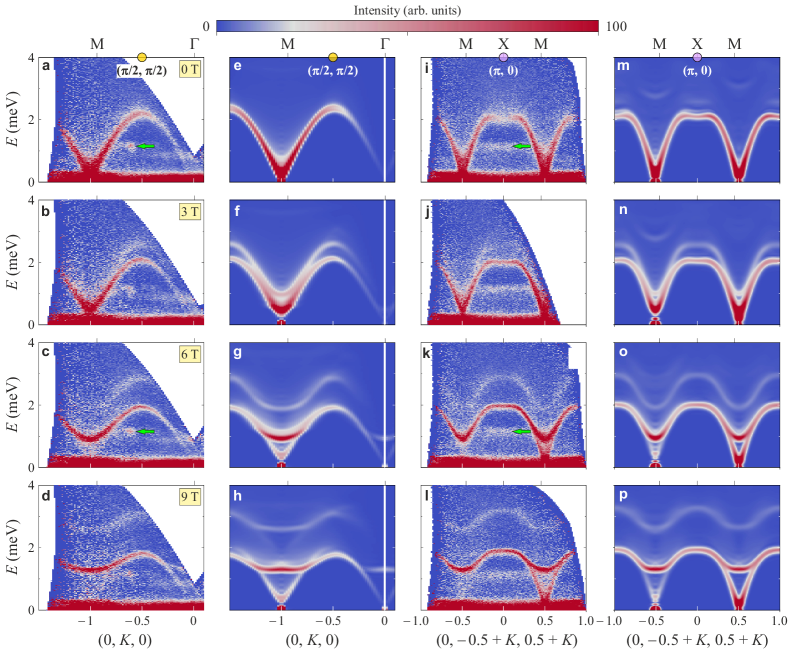
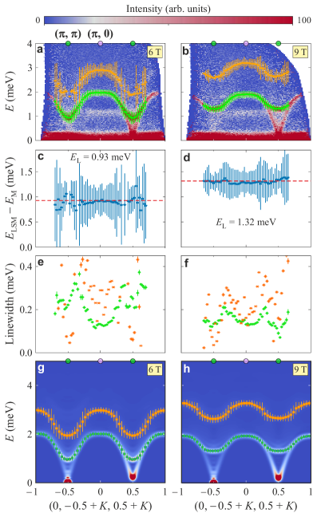
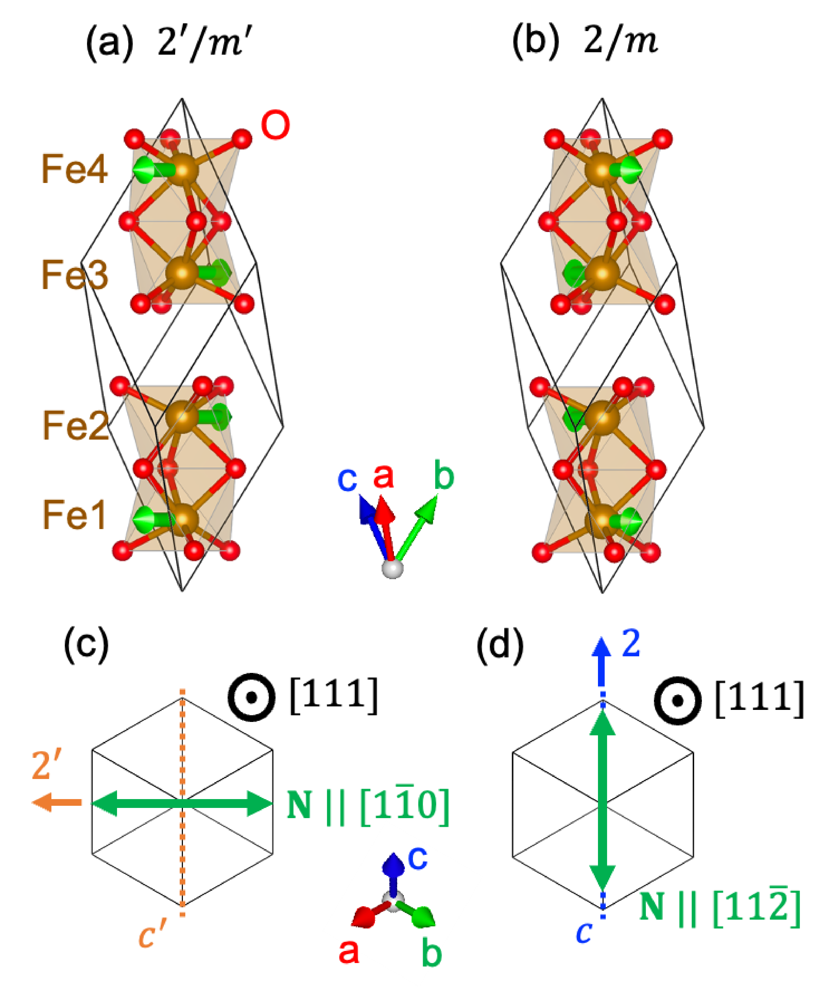
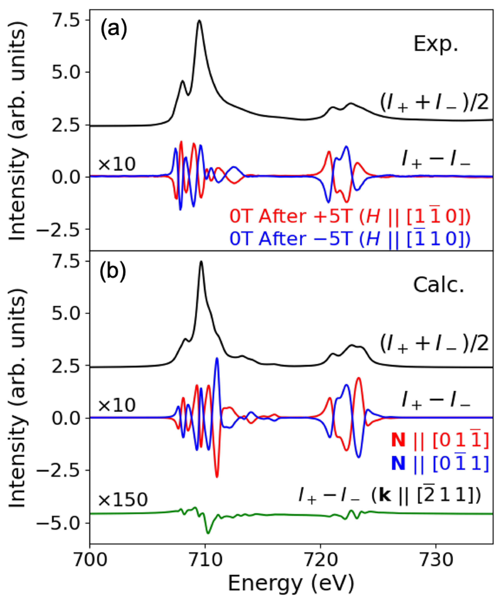
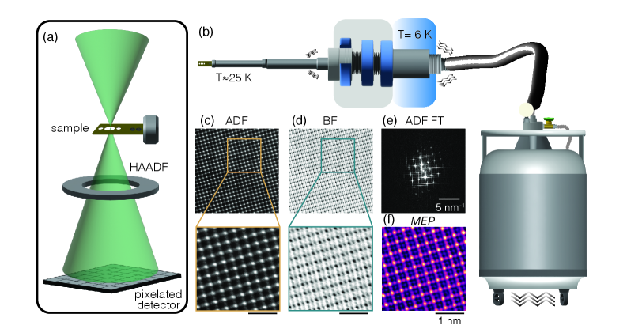
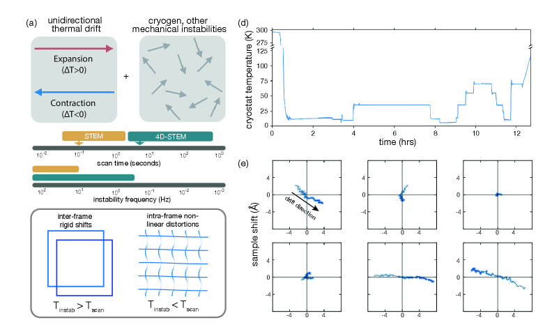
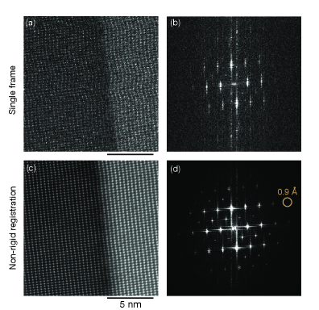
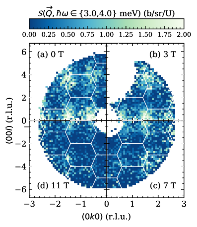
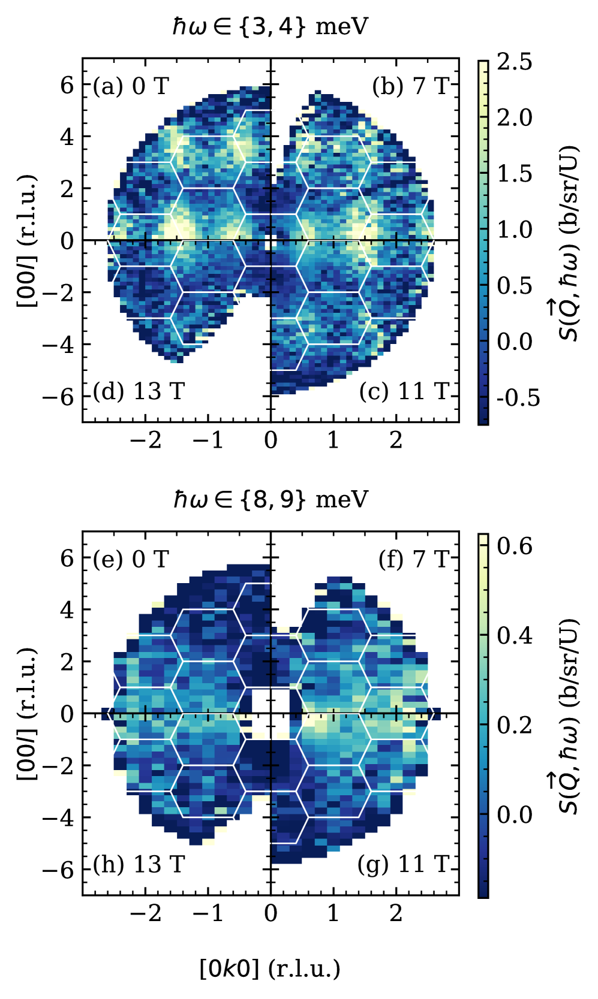
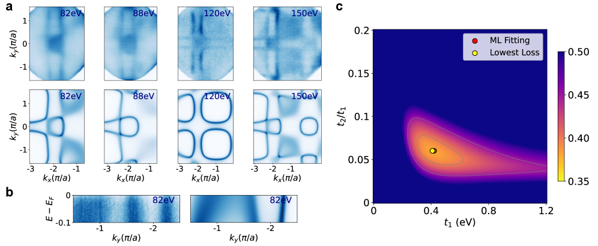

# 2026-03-22 量子ビーム計測

**作成日：** 2026年3月22日
**対象期間：** 2026年3月19日〜22日（直近72時間、追加で3月初旬〜中旬の未報告論文を含む）

---

## 選定論文一覧

1. [Field-induced quasi-bound state within the two-magnon continuum of a square-lattice Heisenberg antiferromagnet](https://arxiv.org/abs/2603.17635) — Elson et al.
2. [Altermagnetic XMCD in Hematite Distinct from Weak Ferromagnetic Contributions](https://arxiv.org/abs/2603.00442) — Ishii et al.
3. [Helium-Cooled Cryogenic STEM Imaging and Ptychography for Atomic-Scale Study of Low-Temperature Phases](https://arxiv.org/abs/2603.10892) — Schnitzer et al.
4. [Field-direction sensitivity of Kondo hybridization in UTe₂](https://arxiv.org/abs/2603.17037) — Halloran et al.
5. [Machine Learning Reconstruction of High-Dimensional Electronic Structure from Angle-Resolved Photoemission Spectroscopy](https://arxiv.org/abs/2603.16725) — Zhang et al.
6. [The stripe state at 1/8 Ba doping hosts optimal superconductivity in La-214 cuprates under low in-plane stress](https://arxiv.org/abs/2603.14108) — Sazgari et al.
7. [High-resolution resonant inelastic X-ray scattering study of W-L3 edge in WSi2](https://arxiv.org/abs/2603.09561) — Zhao et al.
8. [Modelling instrumental response for neutron scattering experiments at CSNS](https://arxiv.org/abs/2603.08333) — Yang et al.
9. [High-Pressure Inelastic Neutron Spectroscopy: A true test of Machine-Learned Interatomic Potential energy landscapes](https://arxiv.org/abs/2603.05442) — Armstrong et al.
10. [Magnetic Signature of Chiral Phonons Revealed by Neutron Spectroscopy in Ferrimagnetic Fe₁.₇₅Zn₀.₂₅Mo₃O₈](https://arxiv.org/abs/2603.03635) — Bao et al.

---

## 全体所見

今回は非弾性中性子散乱（INS）を軸とした磁気励起研究から、軟X線XMCD・RIXS、極低温電子線ptychography、μSR、ARPESとデータ科学の統合まで、幅広い量子ビーム計測の最前線を反映する10本を選定した。特に注目すべきは、2次元正方格子反強磁性体における「Larmor-shadowモード」という新規な2マグノン準束縛状態の初観測（Elson et al.）で、INS・理論・数値計算が緊密に連携した計測研究の模範例である。X線計測では、ヘマタイトにおけるオルタマグネティックXMCDの実証（Ishii et al.）が、補償磁石のオルタマグネティック秩序をX線磁気円二色性で直接検出する新手法として際立つ。電子線計測では、液体ヘリウム冷却下（20 K）での4D-STEM ptychographyの成功（Schnitzer et al.）が、量子マテリアルの低温構造相を原子分解能で可視化する新技術として重要性が高い。中性子散乱では、UTe₂のKondo混成のフィールド方向依存性（Halloran et al.）、フェリ磁性体中のキラルフォノンの磁気シグネチャ（Bao et al.）、高圧INSによる機械学習ポテンシャルの検証（Armstrong et al.）も重点的に取り上げた。データ科学との統合では、ARPESデータからの電子構造再構成へのML応用（Zhang et al.）と中性子全散乱の器械応答モデリング（Yang et al.）も扱った。

---

## 重点論文の詳細解説

---

## 2次元正方格子量子磁性体における磁場誘起2マグノン準束縛状態の初観測

#### 1. 論文情報

**タイトル：** [Field-induced quasi-bound state within the two-magnon continuum of a square-lattice Heisenberg antiferromagnet](https://arxiv.org/abs/2603.17635)
**著者：** F. Elson, M. Nayak, A. A. Eberharter, M. Skoulatos, S. Ward, U. Stuhr, N. B. Christensen, D. Voneshen, C. Fiolka, K. W. Krämer, Ch. Rüegg, H. M. Rønnow, B. Normand, M. Mourigal, F. Mila, A. M. Läuchli, M. Månsson
**arXiv ID：** 2603.17635
**カテゴリ：** cond-mat.str-el
**公開日：** 2026年3月18日
**論文タイプ：** 実験・理論複合論文
**ライセンス：** CC BY 4.0

---

#### 2. どんな研究か

金属有機フレームワーク CuF₂(D₂O)₂(pyz) を対象に、高分解能非弾性中性子散乱（INS）を ISIS・PSI の複数スペクトロメータで施行し、3分の1磁化飽和磁場を超えた高磁場領域において、2マグノン連続体の内部に「Larmor-shadowモード」と呼ばれる分散的かつ急峻な共鳴モードを初めて観測した。このモードが磁場誘起の2マグノン複合状態（準束縛状態）であることを、シリンダー行列積状態（MPS）計算と線形スピン波理論によって理論的に確立し、2次元ギャップレス反強磁性体における連続体内準束縛状態の初観測事例として位置づけた。

---

#### 3. 研究の概要

**背景・目的：**
S=1/2 正方格子ハイゼンベルク反強磁性体（SLHAF）は量子磁性研究の試金石であり、ゼロ磁場での（π,0）スペクトル異常（連続体境界近傍のスペクトル重みの異常増大）などが理論と実験の間で長年議論されてきた。一方、磁場下でのマグノン間相互作用による準束縛状態は理論的に予想されているが、2次元ギャップレス系での実験的観測例はこれまでなかった。

**解こうとしている課題：**
磁場下でのSLHAFにおいて、2マグノン連続体内部に磁場誘起の準束縛状態が実在するかどうか、またその分散関係・線幅・磁場依存性を精密に決定すること。

**研究アプローチ：**
ISIS中性子源のLET多チョッパー飛行時間型分光器（磁場下）とPSIのTASP・EIGER三軸分光器を組み合わせ、異なるエネルギー分解能・波数空間での測定を相補的に実施した。理論側ではMPS計算（シリンダー幾何）と線形スピン波理論を用いて、実験スペクトルを定量的に再現・解釈した。

**対象材料系：**
CuF₂(D₂O)₂(pyz)（pyrazine架橋銅フッ化物）：S=1/2のCu²⁺が正方格子上に配置された金属有機フレームワーク。超交換相互作用 J = 0.905 meV のほぼ純粋なSLHAF。

**使用した量子ビーム手法：**
- **LET（ISIS, UK）：** 冷中性子多チョッパー飛行時間型分光器。入射エネルギー Ei = 2.67, 5.5, 13.8 meV。分割ボアソレノイド（最大9T）と3Heクライオスタット（1.7K）を使用。エネルギー分解能 δE/Ei ≥ 0.8%（5チョッパー構成）。広い (Q, ω) 空間を一度に取得できる特徴から、フォノン・マグノン連続体の全体像把握に適している。
- **TASP（PSI, Switzerland）：** 冷中性子三軸分光器。 kf = 1.3 Å⁻¹、エネルギー分解能〜85 µeV。0〜12Tの磁場下、1.7 Kで運用。特定の (Q, ω) 点における高分解能スペクトルの取得に強みを発揮。
- **EIGER（PSI, Switzerland）：** 熱中性子三軸分光器。TASP との相補的運用により、異なるエネルギー域での測定を実施。

**測定で得られる物理量：**
動的構造因子 S(Q, ω)：波数 Q と エネルギー ω の関数としてのスペクトル重み分布。一マグノンと二マグノン連続体の分散関係、スペクトル幅（線幅）、磁場依存性。

**主な解析手法：**
ローレンツ関数フィッティングによるピーク位置・線幅の抽出、MPS計算による理論スペクトルとの定量比較、スピン波理論による分散関係の解釈。

**主な結果：**
- 磁化飽和の1/3（ΔM = 0）を超える磁場（B > B₁/₃ ≈ 7.5T）において、2マグノン連続体内部に急峻な分散的モードが出現
- このモード（「Larmor-shadowモード」）は横向き1マグノン分散をラーモア周波数分だけシフトした形で追従
- 線幅が連続体内に埋め込まれているにもかかわらず極めて小さく（消えない）、これが準束縛状態（Quasi-Bound State: QBS）の証拠
- ゼロ磁場での（π,0）異常は磁場増加とともに消失し、スペクトル重みが1マグノンとLarmor-shadowモードに集中
- MPS計算と線形スピン波理論が実験スペクトルを定量的に再現

**著者の主張：**
これは2次元ギャップレス反強磁性体の連続体内に埋め込まれた準束縛状態の「初観測」であり、磁場が引力的なマグノン間相互作用を非摂動的に増強することで生じる複合2マグノン状態である。

---

#### 4. 量子ビーム計測分野として重要なポイント

中性子散乱を選んだ必然性は明確である。磁気励起（マグノン・スピン連続体）の直接観測には、中性子の磁気モーメントとスピン間の磁気双極子相互作用が不可欠であり、光子ベースの手法では原理的に困難な「電荷ゼロ・磁気モーメント有」の波数・エネルギー空間スペクトルを直接測定できる。LETとTASP/EIGERの組み合わせは、それぞれ「広い (Q,ω) 空間の全体観察」と「特定波数点での高分解能詳細測定」という相補的な役割を担い、準束縛状態の分散関係（分散的性質）と線幅（鋭さ）を同時に確立するうえで本質的であった。エネルギー分解能 85 µeV のTASPは、連続体内部に埋め込まれながら急峻な線幅を持つ QBS を他の励起から分解するために必要条件であった。理論計算（MPS・スピン波）との定量的一致が確立されており、観測されたモードの起源解釈の一意性も高い。手法としての一般性も高く、他の S=1/2 正方格子物質（La₂CuO₄類似系、銅系有機量子磁性体等）や三角格子・カゴメ格子系への展開が可能である。

---

#### 5. 限界と注意点

本研究で用いたCuF₂(D₂O)₂(pyz)は、純粋なSLHAFとしての模型性が高い（J' / J ≈ 0.0003、層間結合は無視可能）反面、金属有機フレームワーク特有の水和物安定性・重水素化の問題がある。重水素置換（D₂O）によるバックグラウンド低減は行われているが、不完全な置換がある場合は非弾性バックグラウンドに影響する。測定温度は 1.7K に限定されており、有限温度でのQBS安定性・線幅変化は不明である。磁場範囲は最大 12T（TASP）で、理論的により高いサチュレーション磁場付近の挙動は探索されていない。MPS計算はシリンダー幾何（有限幅2次元）での計算であり、熱力学的限界（真の2D無限系）への外挿には系統的な有限サイズ効果が残る。

---

#### 6. 関連研究との比較

SLHAFの（π,0）スペクトル異常は、Headings et al. (Science 2010) や Dalla Piazza et al. (Nature Physics 2015) がLa₂CuO₄や銅酸化物で観測・議論してきた長年の課題であり、本研究で採用した金属有機フレームワーク試料はより純粋な等方的SLHAF模型として理想的な系である。磁場下での2マグノン準束縛状態は、一次元系（Bethe ansatz可解な XXZ 鎖）や三次元系では観測例があったが、2次元ギャップレス系での観測は困難とされていた。Mourigal et al. (Nature Physics 2013) が一次元系での2スピノン連続体の観測を示したように、中性子散乱は多体連続体内の細構造を捉える上で強力な手法であることが再確認された。本研究のLarmor-shadowモードは、外部磁場による連続体内準束縛状態の「磁場チューニング」という新しい概念を実験的に確立しており、同機構がフラストレート磁性体（カゴメ格子等）やスピン液体候補物質にも存在するかという今後の問いを拓く。計測インフラとしては、ISIS LETのような高フラックス冷中性子飛行時間型分光器と、PSIの高分解能三軸分光器を組み合わせる戦略が、2D磁性体の連続体内構造解析の標準的アプローチとして確立されつつある。

---

#### 7. 重要キーワードの解説

**1. 非弾性中性子散乱（Inelastic Neutron Scattering, INS）**
中性子がサンプルと相互作用して運動量 $\hbar\boldsymbol{Q}$ とエネルギー $\hbar\omega$ を交換する過程を測定する手法。測定量は動的構造因子 $S(\boldsymbol{Q}, \omega)$ であり、磁気励起（マグノン・スピノン等）や格子振動（フォノン）の分散関係を直接与える。磁気散乱はスピン相関関数 $S^{\alpha\beta}(\boldsymbol{Q}, \omega)$ に比例し、中性子の磁気モーメントが電子スピンと直接相互作用するため、光子では困難な磁気励起の検出が可能である。

**2. S=1/2 正方格子ハイゼンベルク反強磁性体（SLHAF）**
Cu²⁺（S=1/2）スピンが正方格子上に並び、最近接スピン間に等方的反強磁性交換相互作用 $H = J\sum_{\langle ij \rangle} \boldsymbol{S}_i \cdot \boldsymbol{S}_j$（J > 0）が働く系。量子揺らぎが強く、Ne'el秩序パラメータの大幅な繰り込みや連続体励起などの量子効果が顕著に現れる。La₂CuO₄（高温超伝導母物質）の磁気状態の原型であり、理論と実験が長年拮抗してきた。

**3. 2マグノン連続体（Two-Magnon Continuum）**
2つのマグノン（スピン励起の量子）の組み合わせで構成される励起の連続分布。単一マグノンのエネルギー $\omega_k$ を用いると、2マグノン連続体はあるQに対して $\omega_{min}(\boldsymbol{Q})$ から $\omega_{max}(\boldsymbol{Q})$ の連続的なエネルギー幅を持つ。1マグノン分散の境界の上に広がるため、そこに準束縛状態（QBS）が存在する場合は特別な要因（引力的相互作用）が必要である。

**4. 準束縛状態（Quasi-Bound State, QBS）**
散乱状態（連続体）の内部に存在するが、有限の寿命（有限の線幅）を持つ共鳴状態。完全に束縛された状態と非束縛状態の中間的位置づけで、外部ポテンシャル（ここでは磁場によるマグノン間相互作用の変調）によって形成される。「Fano共鳴」や「連続体内束縛状態（BIC）」との概念的関連がある。

**5. Larmor周波数（Larmor Frequency）**
外部磁場 $B$ 中でスピンが歳差運動する周波数 $\omega_L = g\mu_B B / \hbar$（g: g因子、μB: ボーア磁子）。SLHAFの磁場下では、飽和の1/3近傍でラーモア周波数に対応するエネルギーシフトが重要な役割を果たし、Larmor-shadowモードの名称の由来となっている。

**6. シリンダー行列積状態（Cylinder MPS）**
テンソルネットワーク法の一種で、無限系の近似として有限幅・無限長のシリンダー幾何に行列積状態（MPS）を適用する数値計算手法。2次元正方格子系の量子スピン液体状態や励起スペクトルを低い計算コストで近似できる。エンタングルメントエントロピーの適切な切り詰め（bond dimension D）に制限があり、相関長が長い状態での精度に系統誤差が残る。

**7. 飛行時間型多チョッパー中性子分光器（ToF Multi-Chopper Spectrometer）**
パルス中性子源（ISIS等）と組み合わせて用いる分光器で、複数のフェレーミチョッパーによって単色化された中性子パルスを試料に照射し、検出器に到達するまでの時間（飛行時間）からエネルギーを決定する。LETのような多チョッパー型は、単一の実験で複数入射エネルギーでの測定を可能にし、広い(Q,ω)空間を効率的にカバーできる点が三軸分光器と相補的である。

---

#### 8. 図

**図1：** CuF₂(D₂O)₂(pyz)の結晶構造と場依存性INSスペクトルの全体像

*結晶構造（Cu²⁺イオンの正方格子とpyrazine架橋）と、ゼロ磁場から高磁場までのINS強度マップ。磁場増加に伴い連続体内にLarmor-shadowモードが出現する様子を示す。*

**図2：** ゼロ磁場・磁場下のINSと行列積状態計算スペクトルの比較

*ISIS/LETで得られた実験スペクトルとMPS計算スペクトルの定量的比較。高磁場下での2マグノン連続体内のLarmor-shadowモードの急峻さと、計算による再現性の高さを確認できる。*

**図3：** Larmor-shadowモードの分散関係と線幅

*PSI/TASPで取得した高分解能スペクトルから得られたLarmor-shadowモードの分散関係（波数依存性）と、比較的小さな線幅の定量的評価。1マグノン分散を追従しながらラーモア周波数分オフセットした振る舞いが実証されている。*

---

## ヘマタイトのオルタマグネティックXMCD：補償磁石における励起状態多極子の直接検出

#### 1. 論文情報

**タイトル：** [Altermagnetic XMCD in Hematite Distinct from Weak Ferromagnetic Contributions](https://arxiv.org/abs/2603.00442)
**著者：** Y. Ishii, N. Sasabe, Y. Yamasaki
**arXiv ID：** 2603.00442
**カテゴリ：** cond-mat.str-el
**公開日：** 2026年2月28日
**論文タイプ：** 実験・理論複合論文
**ライセンス：** CC BY 4.0

---

#### 2. どんな研究か

α-Fe₂O₃（ヘマタイト）を対象に、X線磁気円二色性（XMCD）測定をDM相互作用誘起弱強磁性モーメントと直交する幾何で実施し、従来の弱強磁性XMCD信号とは質的に異なるオルタマグネティック由来のXMCD信号を初めて実験的に分離・実証した。計算により、このシグナルが基底状態（2p⁶3d⁵）ではなく励起状態（2p⁵3d⁶）における非等方的磁気双極子モーメントから生じることを示し、XMCDが補償磁石のオルタマグネティック秩序の直接プローブとして機能することを確立した。

---

#### 3. 研究の概要

**背景・目的：**
オルタマグネティシズム（altermagnetism）は、時間反転対称性を破るが補償された反強磁性の新しいクラスであり、対称性選択的スピン分極バンド構造を持つ。ヘマタイト（α-Fe₂O₃）はその代表的候補物質の一つだが、ヘマタイトにはDzyaloshinskii-Moriya（DM）相互作用による弱強磁性モーメントが存在するため、従来の実験ではオルタマグネティックシグナルと弱強磁性シグナルの分離が困難であった。

**解こうとしている課題：**
XMCDという光子角運動量に感受的な手法を用いて、ヘマタイトのオルタマグネティック成分のみに選択的に感応するXMCDシグナルを分離・同定すること。

**研究アプローチ：**
X線伝搬ベクトルをDM誘起弱強磁性モーメントと直交する方向に設定する「対称性選択的幾何」を採用。この配置ではDM由来の磁気モーメントへのXMCDへの寄与が対称性で消えるため、残るシグナルがオルタマグネティック起源となる。測定はKEK（高エネルギー加速器研究機構）の Photon Factory BL-16A ビームラインで、Fe L₂,₃吸収端（〜709 eV）における軟X線XMCDとして実施した。

**対象材料系：**
α-Fe₂O₃（ヘマタイト）：コランダム構造、磁気点群  $\overline{3}'m$。Néel温度 TN ≈ 955 K、モーリン転移 TM ≈ 250 K（これ以上の温度でDM誘起弱強磁性が現れる）。

**使用した量子ビーム手法とその特徴：**
- **XMCD（X線磁気円二色性）：** 右円偏光と左円偏光X線の吸収率の差。磁気モーメント $m$ に平行な方向から照射した場合に $\sigma^+ - \sigma^-$ の差として磁気信号が得られる。測定はFe L₂,₃吸収端での全電子収量（TEY）モードで実施。
- **BL-16A（Photon Factory, KEK）：** 軟X線アンジュレーターを光源とするビームライン。5T超伝導磁石搭載のXMCDエンドステーション。Fe L₂,₃端（700〜730 eV付近）の高分解能分光が可能。
- **XAS（X線吸収分光）：** XMCD測定と同時に取得され、吸収端の位置・形状から電子構造・酸化状態が確認できる。

**測定で得られる物理量：**
XMCDスペクトルの符号・強度・磁場依存性・温度依存性：オルタマグネティック秩序パラメータ（ネール ベクトル方向）と磁場の関係、励起状態磁気多極子の大きさ。

**主な解析手法：**
配座の対称性解析（磁気空間群の表現論）、DM弱強磁性成分の幾何的排除、第一原理計算（multiplet計算）による励起状態多極子モーメントの評価。

**主な結果：**
- Fe L₂,₃端において、従来の弱強磁性XMCD信号と質的に異なる振動的構造を持つXMCDスペクトルを観測
- 信号強度は他のオルタマグネティック候補（MnTeなど）より大きい
- 磁場依存性が反対称的（零磁場で急峻な符号反転）で、強磁性ヒステリシスとは明確に異なる
- 磁場印加による異なるオルタマグネティック状態間の可逆的スイッチングを実証
- 計算により、観測されたシグナルが基底状態2p⁶3d⁵（等方的）ではなく、X線による内殻励起状態2p⁵3d⁶における非等方的磁気双極子モーメント $\langle T_z \rangle$ に由来することを解明

**著者の主張：**
XMCDは補償磁石のオルタマグネティック秩序を、弱強磁性の寄与を幾何的に排除した対称性選択的配置で直接検出できる。観測されたシグナルは励起状態磁気多極子（2p⁵3d⁶）を通して生じるため、「基底状態がゼロ磁気モーメント」の補償反強磁性体に対してもXMCDが有効なプローブとなることを示す一般的原理を提供する。

---

#### 4. 量子ビーム計測分野として重要なポイント

XMCDという手法の選択の必然性は、その「元素選択性」と「軌道・スピンの識別能力」にある。Fe L₂,₃吸収端を用いることで、Fe特有の磁気信号のみを検出でき、他元素の混在系でも情報を抽出できる。磁気光学的な「総和則（sum rule）」は通常、XMCDを基底状態のスピンおよび軌道磁気モーメントに対応させるが、本研究ではその枠組みを超え、内殻励起状態における非等方的磁気双極子モーメント（$\langle T_z \rangle$）がXMCDシグナルの担い手であることを示した。これはXMCDの解釈の根本に関わる重要な理論的洞察であり、補償磁石への適用において「ゼロ基底状態磁気モーメント → XMCDゼロ」という直感的な誤解を正す。幾何的配置の最適化（X線伝搬方向と弱強磁性モーメントの直交化）という、ビームライン実験設計上の工夫が本質的役割を果たした点も量子ビーム実験における対称性利用の模範例である。他のオルタマグネティック候補（RuO₂、MnTe、CrSb等）への波及可能性は高く、磁気対称性と実験配置を組み合わせた「対称性選択的XMCD」が汎用的な補償磁石の計測手法として確立しうる。

---

#### 5. 限界と注意点

全電子収量（TEY）モードでの測定は、試料表面から数nm程度の深さの情報しか得られないため、バルクのオルタマグネティック状態を代表しているかどうかに注意が必要である。XMCDスペクトルの解釈に用いた多重項計算（multiplet theory）は、結晶場・スピン軌道相互作用のパラメータ設定に依存しており、実験データとのフィッティングにより決定されたパラメータの一意性は十分に議論された方がよい。また、弱強磁性成分のXMCDへの寄与が幾何的に消える条件（完全な直交配置）の実現精度は測定誤差に影響し、実際の配置での完全な直交性確保の困難さは認識すべきである。「オルタマグネティシズム」という概念自体が最近提唱された分類であり（Šmejkal et al. 2022）、ヘマタイトがその典型例として何を意味するかについての理論的合意はまだ形成途上にある。

---

#### 6. 関連研究との比較

XMCDを用いた反強磁性体の磁気状態研究は、Néel型反強磁性体（Fe₂O₃、NiO等）を対象に長年行われてきたが、これらは主にXLMD（線二色性）やXMCDの弱強磁性寄与の研究が中心であった。オルタマグネティシズムの実験的検出に関しては、ARPES（Sato et al., Osumi et al.）が非等価スピンバンドのスプリッティングを直接観測する手法として先行しているが、本研究のXMCDアプローチは体積・バルク感度の点でARPESを補完する。2025年以降、α-MnTe (Usanov et al., 2603.16635, 前週報告) でARPESによるオルタマグネティックスピンテクスチャが議論されていたが、XMCDによる補償磁石への適用は本研究が先例の少ない試みである。計測インフラとしては、高フラックス・高輝度の軟X線ビームラインと高磁場環境（5T以上）の組み合わせが今後も必要であり、SPring-8、ESRF、Diamond Light SourceなどのMXCD対応ビームラインへの展開が期待される。

---

#### 7. 重要キーワードの解説

**1. X線磁気円二色性（XMCD: X-ray Magnetic Circular Dichroism）**
右円偏光と左円偏光のX線の吸収係数の差として定義される。$\Delta\mu = \mu^+ - \mu^-$ が測定量で、磁気モーメントの大きさと方向に比例する。Fe L₂,₃端（2p→3d遷移）での測定では「総和則」を適用してスピン磁気モーメント $m_s$ と軌道磁気モーメント $m_l$ を分離定量できる：$m_s \propto \int_9 (\Delta\mu_\text{L3} - 2\Delta\mu_\text{L2})d\omega$、$m_l \propto \int_9 (\Delta\mu_\text{L3} + \Delta\mu_\text{L2})d\omega$。

**2. オルタマグネティシズム（Altermagnetism）**
磁気時間反転対称性を破るが、反強磁性的に補償されたスピン配列を持つ磁性の新分類（Šmejkal et al., Physical Review X 2022）。d波、g波、i波等の波対称性を持ち、対称性保護された非相対論的スピン分極バンドを示す。強磁性でも従来の反強磁性でもない第三の時間反転対称性破れ磁性体として位置付けられる。

**3. Dzyaloshinskii-Moriya（DM）相互作用**
反転対称性のない系でスピン軌道相互作用から生じる非対称交換相互作用 $H_{DM} = \boldsymbol{D}_{ij} \cdot (\boldsymbol{S}_i \times \boldsymbol{S}_j)$（D: DM ベクトル）。弱強磁性（canted antiferromagnetism）の微視的起源であり、ヘマタイトでは全スピンが若干傾いてネット磁気モーメントを生じる原因である。

**4. 磁気多極子（Magnetic Multipole）**
磁気モーメント分布をミルチポール展開（双極子・四重極子・八重極子…）した各成分。X線吸収では光と物質の相互作用の選択則から、電気双極子遷移以外にも磁気四重極遷移などが寄与しうる。励起状態（2p⁵3d⁶）の非等方的磁気双極子モーメント $\langle T_z \rangle$ は、基底状態の等方的配置では消えるが、オルタマグネティック秩序下で有限値を持つ。

**5. PhottonFactory BL-16A（KEK）**
高エネルギー加速器研究機構（KEK）フォトンファクトリーの軟X線アンジュレービームライン。Fe L端（~710 eV）での高輝度軟X線測定に対応し、5T超伝導マグネット搭載のXMCD専用エンドステーションを備える。光子エネルギー範囲：約100〜2000 eV。

**6. 対称性選択的配置（Symmetry-Selective Geometry）**
X線の伝搬ベクトル・偏光ベクトルを試料の磁気対称性要素と意図的に一致または非一致させることで、特定の磁気成分のみが XMCD信号に寄与するよう測定配置を設計する手法。本研究では X線伝搬方向をDM弱強磁性モーメントと直交させることで、弱強磁性XMCD成分を幾何的に消し、オルタマグネティック成分だけを抽出した。

**7. 励起状態多極子（Excited-State Multipole）**
内殻 X 線吸収によって生じる 2p 内殻ホール状態（2p⁵）での磁気多極子モーメント。基底状態2p⁶3d⁵では鉄の3d電子配置が等方的（磁気双極子 T_z = 0）でもオルタマグネティック秩序により励起状態2p⁵3d⁶では非等方性が生じ、有限の $\langle T_z \rangle$ が現れる。この成分がXMCDとして観測される。

---

#### 8. 図

**図1：** ヘマタイトの結晶・磁気構造とXMCD測定配置

*α-Fe₂O₃の結晶構造（コランダム型）、オルタマグネティック磁気構造（互い違いのFe²⁺スピン）、および DM 弱強磁性モーメントに直交する X 線伝搬方向を示す実験配置の模式図。この幾何により弱強磁性XMCD成分を消去する。*

**図2：** XASおよびオルタマグネティックXMCDスペクトル

*Fe L₂,₃吸収端（~709 eV L₃、~722 eV L₂）で観測されたX線吸収スペクトル（XAS）とXMCDスペクトル。XMCDシグナルが振動的な特徴的構造（オルタマグネティック多重項）を示し、弱強磁性体のXMCDと質的に異なることを示す。*

**図3：** XMCDの磁場依存性とオルタマグネティック状態間スイッチング

*XMCDの磁場依存性プロット。零磁場での急峻な符号反転と反対称的磁場依存性が、強磁性ヒステリシスと異なることを示す。印加磁場により異なるオルタマグネティック状態間を可逆的にスイッチングできる様子も示されている。*

---

## 液体ヘリウム冷却下での4D-STEM Ptychography：20Kにおける量子マテリアルの原子分解能構造解析

#### 1. 論文情報

**タイトル：** [Helium-Cooled Cryogenic STEM Imaging and Ptychography for Atomic-Scale Study of Low-Temperature Phases](https://arxiv.org/abs/2603.10892)
**著者：** Noah Schnitzer, Mariana Palos, Geri Topore, Nishkarsh Agarwal, Maya Gates, Yaqi Li, Robert Hovden, Ismail El Baggari, Suk Hyun Sung, Michele Shelly Conroy
**arXiv ID：** 2603.10892
**カテゴリ：** cond-mat.mtrl-sci
**公開日：** 2026年3月11日
**論文タイプ：** 手法論文・実験論文
**ライセンス：** CC BY 4.0

---

#### 2. どんな研究か

Thermo Fisher Scientific Spectra 300（300 kV、収差補正）を液体ヘリウム冷却ホルダー（h-Bar Instruments）と組み合わせ、20 Kという極低温での高角度走査透過電子顕微鏡（ADF-STEM）原子分解能イメージングと、4D-STEMによるマルチスライス電子Ptychography再構成を初めて実証した。対象材料として多強誘電体 Fe₃B₇O₁₃I（鉄ボラサイト）とSrTiO₃/GdScO₃エピタキシャル薄膜を用い、液体ヘリウム温度で出現する低温構造相を、ホウ素・酸素など軽元素まで含めた原子分解能で直接可視化する新技術を確立した。

---

#### 3. 研究の概要

**背景・目的：**
多くの量子マテリアル（強相関電子系、マルチフェロイクス、電荷密度波系、超伝導体等）では、その電子的・磁気的機能が特定の低温構造相の出現と不可分に結びついている。しかし、低温構造を「機能が実現している温度で」原子分解能STEM観察することは技術的に困難であり、従来の液体ヘリウム冷却ホルダーは熱的ドリフト・振動によるアーティファクトが深刻で、特に電子Ptychographyのような高精度アルゴリズムには適用が難しかった。

**解こうとしている課題：**
20 Kという液体ヘリウム温度での安定したSTEM原子分解能イメージングと4D-STEM Ptychographyの実現。熱的不安定性に由来するアーティファクト（スキャンアーティファクト、ドリフト、ジッター）を計算的に補正する手法の開発と実証。

**研究アプローチ：**
高速スキャン（一枚あたりのドリフト量を最小化）と多段階位置登録（multi-stage registration）アルゴリズムを組み合わせ、残留熱ドリフトを後処理で補正。Ptychography ではセルフコンシステントなスキャン位置補正とプローブ収差補正を統合したマルチスライス再構成アルゴリズムを採用。

**対象材料系：**
- **Fe₃B₇O₁₃I（鉄ボラサイト）：** 多強誘電体（強磁性・強誘電体）で、低温のR3c多強誘電相を研究対象とした
- **SrTiO₃/GdScO₃薄膜：** SrTiO₃の低温構造転移（I4/mcm → Pm-3m）の可視化

**使用した量子ビーム手法とその特徴：**
- **ADF-STEM（高角度環状暗視野STEM）：** 熱拡散散漫散乱による非弾性的電子線の検出で、原子番号Zの近似的べき乗（Z ≈ 1.7）に比例した化学的コントラストを与える。重元素（Fe, Sr, Ti）の原子位置を高感度で検出できるが、軽元素（B, O）は感度が低い。
- **4D-STEM Ptychography：** 入射プローブを試料上でラスタースキャンしながら、各位置で回折パターン（4次元データセット：2次元スキャン位置 × 2次元回折パターン）を取得する。Ptychography再構成アルゴリズムにより、位相コントラスト像を得ることができ、軽元素（B, O）に対して大幅に高い感度を実現する。STEM暗視野像と相補的な情報を与える。
- **マルチスライス再構成：** 試料の厚さ方向の投影効果を考慮した Ptychography アルゴリズム。2次元再構成より精度が高く、厚い試料での多重散乱の影響を適切に取り扱える。

**測定で得られる物理量：**
原子位置（精度〜10 pm）、歪みマップ（局所的格子歪みの2D分布）、位相コントラスト像（軽元素を含む化学的コントラスト）。

**主な解析手法：**
多段階位置登録（剛体登録 → 非剛体登録）、マルチスライス Ptychography 再構成（収差補正プローブ付き）、スキャン位置補正と収差補正の同時最適化。

**主な結果：**
- 20 Kでの Fe₃B₇O₁₃I 上で、R3c 多強誘電相の ADF-STEM 原子分解能像を取得
- SrTiO₃/GdScO₃ で、急速スキャンと多段階登録により「縦ストリーキング」アーティファクトを大幅に抑制
- マルチスライス Ptychography 再構成によりサブオングストローム情報転送を達成し、ホウ素・酸素など軽元素の可視化に成功
- スキャン位置補正とプローブ収差補正の統合が、低温条件でのPtychography の必要条件であることを実証

**著者の主張：**
ヘリウム冷却STEM Ptychographyの技術的障壁が突破され、量子マテリアルの低温構造相を「機能温度」で原子分解能・位相コントラストで可視化する新技術が確立された。これにより低温でのみ現れる電荷秩序、軌道秩序、格子歪み、分極構造などの直接観測が現実的になる。

---

#### 4. 量子ビーム計測分野として重要なポイント

電子線Ptychographyを選んだ理由は、X線や中性子では達成困難な「原子分解能・軽元素感度」の両立にある。電子線は原子散乱振幅が X 線・中性子より大幅に大きく（特に軽元素でも実用的なコントラストを与える）、ナノメートル以下の局所構造解析に本質的な優位性がある。従来のADF-STEMは重元素に有利だが、4D-STEM Ptychographyは電子線の位相情報を活用することで軽元素（B, O）の位置を精密に決定できる。本研究の技術的新規性は「20 Kという極低温での安定した4D-STEMデータ取得と高精度Ptychography再構成の統合」にあり、これは手法論・計測インフラとしての前進と言える。ヘリウム冷却ホルダーと商用収差補正STEMの組み合わせは、専用施設を必要とせず多くの電子顕微鏡ラボへの普及可能性があり、装置依存性は比較的低い（ただし高品質なSEMデータ取得にはプローブ収差補正が必要）。今後の展開として、CDW物質・超伝導体・多強誘電体・スピン液体候補などの低温構造解析への広い応用が期待される。

---

#### 5. 限界と注意点

液体ヘリウム冷却の側面入射型ホルダーは、試料傾斜角度が制限されることが多く、単軸傾斜での断層（tomography）との組み合わせは困難な場合がある。また、電子線損傷（電子ビームによる試料への放射線損傷）は室温より低温で軽減されることもあるが、試料依存性が高く、特に有機系・含水系材料では注意が必要である。4D-STEM 取得は膨大なデータ量（1枚のデータで数GB〜数十GB）を生成するため、データ転送・保存・処理の計算コストが大きい。マルチスライス Ptychography は試料の厚さに関する事前情報（試料厚さの推定）が必要で、厚さの不確実性が再構成精度に影響する。また、位置登録アルゴリズムの精度は試料の構造複雑性（均一性）に依存し、非常に不均一な試料では困難が増す可能性がある。本論文では2種類の材料のみで実証されており、他の材料系への適用ではプロトコルの最適化が必要となる場合がある。

---

#### 6. 関連研究との比較

電子 Ptychography 自体は Thibault et al.（Science 2008）等が光学Ptychographyとして先駆け、STEMへの応用は Chen et al.（Nature 2021、単層試料でのサブオングストローム分解能達成）などで急速に進展した。低温STEM研究は、液体窒素冷却（80 K）では以前から行われてきたが、液体ヘリウム温度（20 K）でのPtychographyの実証は、El Baggari et al.（Nature 2019、VSe₂のCDW構造を77 Kで観測）などとの比較でも極低温化の技術的困難さを克服した点で新しい。Sung et al.（2024, arXiv）らによる超高速Ptychography取得プロトコルや、Chen et al.（Nature Materials 2023）による多強誘電体の原子分解能電子構造解析との組み合わせが今後の展開として期待される。本研究は手法論の確立に焦点を当てており、特定の物質科学的新発見よりも「技術インフラの整備」として位置付けられるが、これが量子マテリアル研究コミュニティに与えるインパクトは大きい。

---

#### 7. 重要キーワードの解説

**1. 4D-STEM（四次元走査透過電子顕微鏡法）**
収束電子線プローブを試料上で2次元ラスタースキャンし、各プローブ位置で2次元の収束ビーム電子回折（CBED）パターンを記録する手法。データは（x, y, kx, ky）の4次元テンソルとして記述され、これを解析することで試料の構造・歪み・電場・磁場・化学情報を空間分解能よく取得できる。

**2. 電子Ptychography**
干渉性の散乱体（試料）にプローブ電子波を照射し、複数の重なり合った回折パターンから試料の複素伝達関数（振幅・位相）を反復計算で再構成するアルゴリズム。位相情報の回収により、ADF-STEMより軽元素への感度が高い。数式的には：プローブ波 $P(r)$ と試料伝達関数 $O(r)$ の畳み込み $\psi(r) = P(r-r_j) \cdot O(r)$ を多数の位置 $r_j$ で観測し、$O(r)$ を反復収束で求める。

**3. マルチスライス法（Multislice Method）**
電子線の試料透過を複数の薄いスライス（各スライスで位相変調）と自由伝播の繰り返しとしてモデル化する数値計算手法。単一スライス（weak phase object近似）より正確に電子線の多重散乱を扱えるため、厚い試料や重原子系でのSTEM像・Ptychographyの精度向上に不可欠。

**4. スキャンアーティファクト（Scan Artifacts）**
STEMのビームスキャン中に、熱ドリフト・振動・電磁ノイズにより生じる試料位置のずれが原因で発生する像の歪み。低温ホルダーでは機械的振動と熱的不安定性が大きく、特にラスタースキャン方向（垂直）に縦縞状のアーティファクト（ストリーキング）が生じやすい。

**5. 多強誘電体（Multiferroic）**
強磁性・強誘電性（あるいは強弾性性）が同一試料内で共存する材料。Fe₃B₇O₁₃I（鉄ボラサイト）はその代表例で、低温のR3c相で磁気モーメントと電気分極が同時に秩序化する。構造の微細な歪みと分極状態が密接に結びついているため、原子分解能の構造解析が重要。

**6. 収差補正STEM（Aberration-Corrected STEM）**
電子レンズの球面収差（Cs）・色収差を多極子電磁レンズ（六極子・八極子等）で補正した透過電子顕微鏡。収差補正により電子プローブを原子サイズ（~1 Å以下）まで集光でき、原子カラム分解能のSTEM像取得と高精度電子Ptychographyを可能にする。

**7. 位相コントラスト（Phase Contrast）**
電子線（あるいはX線）が物質を透過するとき、主に振幅変化ではなく位相変化を生じる（軽元素では特に顕著）場合に、干渉・回折パターンを通して取得できるコントラスト。Ptychographyは位相情報を直接定量的に取得するため、軽元素（H, B, C, N, O等）の可視化に有効。ADF-STEMの振幅（Z²依存性）と相補的な情報を提供する。

---

#### 8. 図

**図1：** 20 KでのFe₃B₇O₁₃IのADF-STEM原子分解能像

*液体ヘリウム冷却（20 K）下でのFe₃B₇O₁₃I多強誘電体のADF-STEMイメージング。低温での原子分解能取得と多段階位置登録アルゴリズムによるスキャンアーティファクト補正の効果を示す。*

**図2：** SrTiO₃/GdScO₃のスキャンアーティファクト補正

*SrTiO₃エピタキシャル薄膜における低温STEMの技術的課題（縦ストリーキング）と、多段階位置登録による補正後の像の比較。サブオングストローム情報転送が実現した様子を示す。*

**図3：** マルチスライスPtychography再構成像（軽元素可視化）

*Fe₃B₇O₁₃IのマルチスライスPtychography再構成像。ADF-STEMでは感度の低いホウ素・酸素などの軽元素カラムが明確に可視化されており、4D-STEM Ptychographyの軽元素感度の優位性を実証している。*

---

## その他の重要論文

---

## UTe₂のKondo混成の磁場方向依存性を中性子散乱で解明

#### 1. 論文情報

**タイトル：** [Field-direction sensitivity of Kondo hybridization in UTe₂](https://arxiv.org/abs/2603.17037)
**著者：** Thomas Halloran, Gicela Saucedo Salas, Sylvia K. Lewin, J.A. Rodriguez-Rivera, Colin L. Sarkis, Jakob Lass, Daniel G. Mazzone, Marc Janoschek, Nicholas P. Butch
**arXiv ID：** 2603.17037
**カテゴリ：** cond-mat.str-el, cond-mat.supr-con
**公開日：** 2026年3月17日
**論文タイプ：** 実験論文
**ライセンス：** CC BY 4.0

---

#### 2. 研究概要

UTe₂はスピン三重項超伝導体の有力候補として近年急速に注目を集めている重フェルミオン物質である。本研究では、非弾性中性子散乱（INS）を用いて、磁場方向（a軸）に最大13 Tの磁場を印加した下での磁気励起スペクトルの変化を系統的に追跡し、7 T付近で磁気スペクトル重みの急激なエネルギーシフト（$d\hbar\omega_\text{peak}/dH$ の異常増大）を観測した。この挙動が電気抵抗率の場依存性と顕著に相関することから、Kondo混成（重いf電子と伝導帯の混成）が a 軸 7 T 付近で急激に変化することを示唆する。

スピン三重項超伝導体においては超伝導を担うクーパーペアの内部構造（スピン状態）がKondo混成と密接に結びついており、中性子で「磁気励起の磁場依存性」を直接観測することはその超伝導機構解明の核心に位置する。測定は PSIのCAMEA（冷中性子多プレクシング分光器）と ORNL の SEQUOIA（熱中性子飛行時間型分光器）の2つの相補的な施設で実施され、高磁場下での絶対感度の高い非弾性散乱データを得た。7 T 付近でのKondo混成変化という知見は、UTe₂の複雑な磁場-温度相図（複数の超伝導相を含む）を磁気励起の観点から理解する上での重要な手がかりとなる。

---

#### 3. 使用したビームラインとその特徴

PSIのCAMEAは、パウル・シェラー研究所（スイス）の中性子源SINQに設置された冷中性子分光器で、「cold multiplexing」方式の多重散乱アナライザーを採用し、単一設定で複数エネルギー転移（meV域）の同時測定が可能な最新鋭装置である。エネルギー分解能は~0.11 meV（0〜6 meV範囲）。ORNLのSEQUOIA（米国テネシー州、オークリッジ国立研究所SNS）は熱中性子飛行時間型チョッパー分光器で、入射エネルギー25 meVで0.8 meV分解能、より広いエネルギー域のスペクトル把握が可能。両施設とも磁場印加環境（最大13〜14 T）を備え、磁場下の磁気励起変化を追跡できる。

---

#### 4. 重要キーワードの解説

**1. Kondo混成（Kondo Hybridization）：** 重フェルミオン物質において、局在したf電子と伝導電子の交換結合によりf電子が伝導帯と量子混成（hybridization）し、重い準粒子を形成する過程。特性温度（Kondo温度 T_K）以下で発現し、磁場依存性を示す。
**2. スピン三重項超伝導（Spin-Triplet Superconductivity）：** クーパーペアのスピン状態がS=1（三重項）の超伝導相。時間反転対称性（TRS）を自発的に破る場合は位相図が非常に豊かになる。UTe₂は多重超伝導相を持つ最有力候補。
**3. 重フェルミオン（Heavy Fermion）：** 有効質量がバンド電子の数百〜数千倍に達する準粒子を持つ金属。f電子を持つ希土類・アクチノイド化合物（CeCoIn₅、UPt₃、UTe₂等）に多い。
**4. 非弾性中性子散乱（INS）：** エネルギーを移転する中性子散乱過程を測定し、$S(Q, \omega)$ からフォノンや磁気励起の分散・スペクトル重みを得る。
**5. CAMEA（PSI）：** Paul Scherrer Institut の冷中性子多重プレクシング型アナライザー分光器。複数のブラッグ角のグラファイト結晶アナライザーを用い、単一散乱角設定で複数エネルギー転移を同時取得。
**6. スペクトル重み（Spectral Weight）：** $S(Q, \omega)$ を特定の $\omega$ 域で積分した値。磁気励起の強度分布を反映し、Kondo混成の有無・強さを反映する。
**7. SEQUOIA（ORNL/SNS）：** オークリッジ国立研究所スパレーション中性子源の熱中性子飛行時間型フェルミチョッパー分光器。広エネルギー域（数meVから数十meV）の磁気・格子励起測定に特化。

---

#### 5. 図

本論文はCC BY 4.0ライセンスであるため、原図の抽出が可能です。

*CAMEAで測定したUTe₂の非弾性中性子散乱強度マップ。磁場強度（0T〜11T）に対応した磁気励起スペクトルの変化を示す。7T付近での急激なスペクトル変化が読み取れる。*

*ORNLのSEQUOIAで取得した熱中性子INSスペクトル。より広いエネルギー域での磁気励起強度の磁場依存性を示し、CAMEAデータと相補的な情報を与える。*

*磁気励起ピークエネルギーの磁場依存性のまとめと電気抵抗率との相関。7T付近での急激な変化が電気抵抗率の異常と一致することを示し、Kondo混成変化の証拠を与える。*

---

## ARPESデータからの電子構造高次元再構成へのML適用

#### 1. 論文情報

**タイトル：** [Machine Learning Reconstruction of High-Dimensional Electronic Structure from Angle-Resolved Photoemission Spectroscopy](https://arxiv.org/abs/2603.16725)
**著者：** Yu Zhang, Yong Zhong, Nhat Huy Tran, Shuyi Li, Kyuho Lee, Yonghun Lee, Tiffany C. Wang, Harold Y. Hwang, Zhi-Xun Shen, Chunjing Jia
**arXiv ID：** 2603.16725
**カテゴリ：** cond-mat.str-el
**公開日：** 2026年3月17日
**論文タイプ：** 手法論文（実験+機械学習）
**ライセンス：** CC BY 4.0

---

#### 2. 研究概要

角度分解光電子分光（ARPES）で取得した4次元（kx, ky, E, 光子エネルギーhν）の高次元データからハミルトニアンパラメータ（サイトホッピング積分等）を精度よく抽出するML手法（SIRENニューラルネットワーク）を開発し、スタンフォード放射光光源（SSRL）BL5-2での実験データに適用した。従来の解析的フィッティング（人手によるバンド分散の手動フィッティング）を大幅に上回る精度で、強相関遷移金属酸化物（ニッケル酸塩 Nd₁₋ₓSrₓNiO₃ とマンガン酸塩 La₁₋ₓSrₓMnO₃）のフェルミ面トポロジーとバンド分散を再現した。

SIRENモデルはサイン関数を活性化関数とする全結合ニューラルネットワークで、タイトバインディングパラメータとモメンタム座標を入力としてARPES強度を近似し、Pearson相関係数を損失関数として勾配降下法で最適化する。従来手法と比較して、（π,π）付近のフェルミ面トポロジーの一致度が顕著に向上し、1つの材料系で約5分というスピードでパラメータ抽出が可能となった。ARPESデータの高次元性と複雑さに対応した汎用的なデータ解析プラットフォームとして、量子マテリアル探索・高スループットARPES解析への応用が期待される。

---

#### 3. 使用したビームラインとその特徴

実験はスタンフォード放射光光源（SSRL）ビームラインBL5-2（Stanford, California, USA）で実施された。BL5-2はSSRL（Stanford Synchrotron Radiation Lightsource）の先端的な軟X線ARPESビームラインで、光子エネルギー範囲60〜180 eVによる3次元フェルミ面マッピング（ $k_x$, $k_y$, $k_z$）が可能。偏光可変（線偏光・円偏光）で軌道対称性や磁気特性の選択測定にも対応。試料はパルスレーザー蒸着（PLD）で合成した単結晶薄膜で、ニッケル酸塩（x=0.175）とマンガン酸塩（x=0.33）を用いた。エネルギー分解能～15 meV、角度分解能 ~0.1°。

---

#### 4. 重要キーワードの解説

**1. ARPES（角度分解光電子分光）：** 光電効果によって試料から放出された光電子の運動エネルギーと放出角を同時に計測し、結晶内のバンド分散 E(k) を直接観測する手法。フェルミ面トポロジーや準粒子自己エネルギー（散乱）の情報を与える。
**2. SIREN（Sinusoidal Representation Networks）：** サイン関数 $\sin(\omega_0 W\mathbf{x} + \mathbf{b})$ を活性化として用いる全結合ニューラルネットワーク。複雑な連続信号（物理的なスペクトル関数、波動関数等）を少ない層・ニューロンで高精度に表現できる利点がある。
**3. タイトバインディング（Tight-Binding）モデル：** 電子が格子点（原子）上に局在した軌道間のホッピング積分 $t_{ij}$ を通じて結晶中を伝播するモデル。$H = \sum_{ij} t_{ij} c^\dagger_i c_j + h.c.$。ARPESのバンド分散を近似するための最小限のモデル。
**4. フェルミ面（Fermi Surface）：** 運動量空間（k空間）においてエネルギーがフェルミエネルギー $E_F$ に等しい点の集合。金属の電気的・磁気的・超伝導的性質を決定する基本的な電子構造情報。ARPESで直接可視化できる。
**5. ニッケル酸塩（Nickelate, Nd₁₋ₓSrₓNiO₃）：** d⁷（Ni¹⁺）配置の電子を持つ遷移金属酸化物。2019年の超伝導発見（Li et al.）以来、高温超伝導機構との関連で注目が集まっている強相関電子系。
**6. Pearson相関係数：** 2変数の線形相関の強さを [-1, 1] で評価する指標 $r = \sum(x_i - \bar{x})(y_i - \bar{y})/\sigma_x\sigma_y$。本研究ではSIRENの損失関数として実験ARPESデータと計算スペクトルの一致度評価に用いた。
**7. SSRL BL5-2（Stanford）：** スタンフォード放射光光源のAPPES専用ビームライン。光子エネルギー60〜180 eVの軟X線を提供し、偏光可変・角度分解能の高い電子分析器と組み合わせ、3次元フェルミ面マッピングに優れる。

---

#### 5. 図

本論文はCC BY 4.0ライセンスのため、原図の抽出が可能です。

*ニッケル酸塩の結晶構造とSIRENアーキテクチャの概要図、およびSSRLで取得したフェルミ面の実験データとML予測の比較。*

*SIRENの学習過程における損失（Pearson相関係数）の収束、パラメータ最適化の様子を示す2Dパラメータ空間の損失ランドスケープ。*

*La₁₋ₓSrₓMnO₃ マンガン酸塩のARPES実測データとML再構成フェルミ面・バンド分散の比較。汎用性の実証として重要。*

---

## ストライプ秩序と超伝導の競合：La-214系単軸応力下でのμSR研究

#### 1. 論文情報

**タイトル：** [The stripe state at 1/8 Ba doping hosts optimal superconductivity in La-214 cuprates under low in-plane stress](https://arxiv.org/abs/2603.14108)
**著者：** V. Sazgari, S.S. Islam, M. Lamotte, J.N. Graham, O. Gerguri, P. Kràl, I. Maetsu, T. Shiroka, G. Simutis, R. Khasanov, R. Sarkar, A. Steppke, N.A. Shepelin, M. Müller, M. Bartkowiak, M. Janoschek, J. Chang, H.H. Klauss, T. Adachi, G.D. Gu, J.M. Tranquada, H. Luetkens, Z. Guguchia
**arXiv ID：** 2603.14108
**カテゴリ：** cond-mat.supr-con, cond-mat.mtrl-sci, cond-mat.str-el
**公開日：** 2026年3月14日
**論文タイプ：** 実験論文
**ライセンス：** arXiv非独占的配布ライセンス

---

#### 2. 研究概要

La₂₋ₓBaₓCuO₄（LBCO）の x=0.125（1/8ドーピング）試料に、最大0.5 GPaの単軸面内応力（Cu-O結合方向に45°傾けた方向）を印加し、ポール・シェラー研究所（PSI）Dolly スペクトロメータ（πE1 ビームライン）でのゼロ磁場・弱横磁場μSR（ミュオンスピン回転）と交流磁化率・電気抵抗率を組み合わせて測定した。x=0.125での超伝導転移温度は無応力下で5 Kに過ぎないが、0.5 GPa応力下では37 Kまで急上昇し、同時に磁気体積分率は約50%減少した（静的ストライプ秩序の部分的抑制）。

この結果は、静的スピンストライプ秩序と超伝導が単純に拮抗するのではなく、「ストライプ秩序が超伝導ペアリングそのものを強化する一方、秩序のコヒーレンス（位相剛性）を妨げている」というモデルを支持する。μSRの磁気体積分率の圧力依存性は、静的秩序の抑制と超伝導の増強が同期していることを局所プローブとして示した。低温三方晶（LTT）相の完全な抑制が超伝導最適化の条件として特定された点も重要であり、ストライプ-超伝導相互作用の理解を大きく前進させた。

---

#### 3. 使用したビームラインとその特徴

測定はPSI（Paul Scherrer Institut、スイス）の Swiss Muon Source（SμS）、πE1 ビームラインの Dollyスペクトロメータで実施された。SμSは世界最強クラスの連続ミュオンビームを提供し、Dollyは横磁場・縦磁場・ゼロ磁場μSRに対応した汎用的なスペクトロメータである。測定では圧電駆動型単軸応力印加デバイスとHeliox 3He冷凍機を組み合わせ、低温（~2 K）での原位置応力可変μSR実験を実現した。μSRは粒子ビーム（正ミュオン μ⁺）を局所磁気プローブとして用い、磁気体積分率・ミュオン前駆動周波数・緩和率から局所磁場分布と超伝導比重を分離できる点が、磁気・超伝導が共存する銅酸化物の研究に特に強力である。

---

#### 4. 重要キーワードの解説

**1. μSR（ミュオンスピン回転・緩和・共鳴）：** 正ミュオン $\mu^+$ を試料に打ち込み、その崩壊で放出される陽電子の角度分布から局所磁場情報を取得する手法。磁気体積分率（秩序した磁気体積の割合）、局所内部磁場の強さと分布を非破壊で測定できる。
**2. スピンストライプ（Spin Stripe Order）：** 銅酸化物超伝導体でドーピング1/8付近に現れる空間的に周期的なスピン（磁気）秩序。電荷も同時に縞状に秩序化する「電荷・スピンストライプ」として観察されることが多い。
**3. 低温三方晶相（LTT: Low Temperature Tetragonal Phase）：** La₂₋ₓBaₓCuO₄のBa濃度1/8付近に出現する結晶構造相。この相ではCuO₂面内の酸素八面体が斜方晶とは異なる傾き方をするため、スピンストライプ秩序が特に安定化される。
**4. 超伝導コヒーレンス（Superconducting Phase Coherence）：** 超伝導体において、クーパーペアの秩序変数（位相）が試料全体で統一され、超流動剛性（位相剛性）が発達する過程。ペアリング自体は存在しても、位相コヒーレンスが破れると超伝導電流は流れない。
**5. 単軸応力（Uniaxial Stress）：** 特定の一方向にのみ印加する機械的応力。LBCO系では Cu-O 結合に45°傾けた方向への圧縮が、ストライプ秩序の安定化を担うLTT相を抑制する。
**6. 磁気体積分率（Magnetic Volume Fraction）：** μSRで測定される、静的磁気秩序が発達した試料体積の割合（0〜1の範囲）。ゼロ磁場μSRのオシレーション成分から定量的に決定される。
**7. ピエゾ駆動型応力デバイス：** 低温環境で精密な応力制御を実現するための装置。圧電素子（ピエゾ）の電気機械変換を利用し、極低温でも連続的・可逆的な応力変化が可能。

---

#### 5. 図

本論文はarXiv非独占的配布ライセンス（nonexclusive-distrib/1.0）のため、原図の抽出は行わず、論文本文を参照されたい。

---

## SOLEILでのRIXS：WSi₂のW-L₃吸収端における高分解能測定

#### 1. 論文情報

**タイトル：** [High-resolution resonant inelastic X-ray scattering study of W-L3 edge in WSi2](https://arxiv.org/abs/2603.09561)
**著者：** Zheqian Zhao, Shuxing Wang, Xiyuan Wang, Yang Su, Ziru Ma, Xinchao Huang, Linfan Zhu
**arXiv ID：** 2603.09561
**カテゴリ：** quant-ph（量子物理）
**公開日：** 2026年3月10日
**論文タイプ：** 実験論文
**ライセンス：** CC BY-NC-ND 4.0

---

#### 2. 研究概要

二珪化タングステン（WSi₂）はX線量子光学における二準位系候補として注目されているが、従来の測定では内殻ホール寿命幅によるスペクトル拡がりのためにW L₃吸収端のホワイトラインが他の遷移と分解できなかった。本研究ではフランスSOLEIL放射光施設のGALAXIESビームラインにおいて、von Hamos型エネルギー分散型分光器を用いた高分解能RIXS（共鳴非弾性X線散乱）をW-L₃端（~10.2 keV）で実施し、バルクWSi₂の単一共鳴発光ピークを初めて分解した。測定により「固定エネルギー転移を持つ単一共鳴特徴量」が確認され、このWSi₂が2p→5d離散遷移を持つ孤立した二準位系として機能することを実証した。

この発見はWSi₂をX線量子光学（XRQO: X-ray Quantum Optics）の実装基盤として位置づける上で重要であり、X線キャビティQED、X線光子間量子エンタングルメントの実験実現に向けた材料的基盤となる可能性がある。高分解能RIXS（RIXSのエネルギー分解能≪内殻ホール寿命幅）という手法の本質的な強みが、従来X線吸収で不可視だった内部構造の可視化を可能にした典型例である。

---

#### 3. 使用したビームラインとその特徴

フランスSOLEIL（Synchrotron SOLEIL, Saint-Aubin, France）のGALAXIESビームライン（Grating and Crystal-based Spectroscopy beamline）は、軟・硬X線領域（0.1〜12 keV）をカバーし、結晶分光による高分解能X線発光分光（XES）とRIXSに特化したビームラインである。本研究で使用したvon Hamos配置分光器は、エネルギー分散型の円筒形完全集光晶を用いてX線発光スペクトルを単一露光で同時取得できる。この配置により、試料のX線損傷を最小限に抑えつつ、W L₃端（~10.2 keV）付近での高分解能測定（~1 eV以下）が実現した。通常のXANESより2桁近く高いエネルギー分解能を持つRIXSは、バルク試料の内殻励起構造の詳細解析に強みを持つ。

---

#### 4. 重要キーワードの解説

**1. RIXS（共鳴非弾性X線散乱）：** 吸収端付近のX線を照射し、発光X線スペクトルを高分解能で測定する手法。$\hbar\omega_{out} = \hbar\omega_{in} - \Delta E$（Δ E: エネルギー転移）の関係を利用し、電子構造・局所配位・多体励起を調べる。RIXSはフォトルミネッセンスや蛍光と異なり、共鳴条件と干渉を利用することで内殻励起の固有情報が得られる。
**2. von Hamos配置：** エネルギー分散型X線分光器の一種で、円筒形の全反射結晶を用い、X線発光スペクトルを広いエネルギー域で同時に検出する。高い集光効率と単一露光取得が特徴で、時間分解実験や放射線損傷の少ない測定に適する。
**3. ホワイトライン（White Line）：** X線吸収端直上の強い吸収ピーク。遷移金属のL端や希土類のM端などに現れ、内殻電子から非占有d（またはf）軌道への遷移に対応。吸収端の電子状態密度の情報を反映する。
**4. X線量子光学（X-ray Quantum Optics, XRQO）：** X線光子を量子状態として利用し、X線光子-物質相互作用の量子効果（二準位系、強結合、量子エンタングルメント等）を探求する新興分野。核共鳴散乱や内殻共鳴を利用したX線QED実験が含まれる。
**5. 内殻ホール寿命幅（Core-Hole Lifetime Broadening）：** X線吸収で生成された内殻ホールが短時間（典型的に10⁻¹⁵秒〜10⁻¹⁶秒）でオージェ緩和により消滅するため、吸収スペクトルが不確定性原理に従いエネルギー幅（ΓL₃～数eV）だけ拡がる現象。RIXSは最終状態の長寿命を利用してこの拡がりを超えた分解能を実現できる。
**6. SOLEIL GALAXIESビームライン：** フランスのSOLEIL放射光施設における高分解能X線分光ビームライン。軟〜硬X線域（〜12 keV）をカバーし、von Hamos型XES・RIXS分光器を備えインペリアル吸収端の高分解能測定が可能。
**7. 二準位系（Two-Level System）：** 量子光学における基底状態と一つの励起状態のみを考慮した最単純な量子系モデル。レーザーや電磁波との相互作用（ラビ振動、光学ブロッホ方程式等）を記述する基本単位。X線域での実装はX線量子光学の核心課題。

---

#### 5. 図

本論文のCC BY-NC-ND 4.0ライセンスについて：このライセンスは商用利用禁止・派生物禁止の条件付きで図の利用が許可されますが、本レポートではHTMLバージョンが404エラーで利用できなかったため、原図の抽出ができませんでした。詳細は[論文PDF](https://arxiv.org/pdf/2603.09561)を参照してください。

---

## 中国スパレーション中性子源（CSNS）の全散乱実験における器械応答モデリング

#### 1. 論文情報

**タイトル：** [Modelling instrumental response for neutron scattering experiments at CSNS](https://arxiv.org/abs/2603.08333)
**著者：** Ni Yang, Zi-Yi Pan, Ming Tang, Wen Yin, Xiao-Xiao Cai
**arXiv ID：** 2603.08333
**カテゴリ：** physics.ins-det, physics.comp-ph
**公開日：** 2026年3月9日
**論文タイプ：** 手法論文（器械・解析）
**ライセンス：** arXiv非独占的配布ライセンス

---

#### 2. 研究概要

中国スパレーション中性子源（CSNS; China Spallation Neutron Source, 東莞市）の熱中性子全散乱実験において、自家製モンテカルロコード「Prompt」を用いた検出器応答・多重散乱・非弾性散乱効果のシミュレーションを開発し、軽水（H₂O）・重水（D₂O）試料でのデータ還元結果と実験データの一致を実証した。全散乱実験（ペア分布関数解析: PDF解析）においては、非弾性性（非弾性散乱によるエネルギー移転と検出器の到達時刻への影響）がQ空間データの系統誤差の一因となるが、本研究はシミュレーションを通してその補正手法を確立した。

量子ビーム計測における「器械応答関数の精密モデリング」という技術課題を正面から扱った研究であり、次世代中性子源（CSNSを含む）での全散乱・PDF解析の精度向上に直接貢献する。蒸留水・重水という標準試料での実証は再現性と一般性が高く、CSNS以外のパルス中性子源（ISIS、SNS等）の全散乱装置への展開も視野に入る。シミュレーションコード「Prompt」の精度確立は、CSNS上でのPDF解析ビームライン（NIMROD類似装置等）における定量的データ解析の信頼性を担保する重要なインフラ整備である。

---

#### 3. 使用したビームラインとその特徴

使用した装置はCSNS（China Spallation Neutron Source）の熱中性子全散乱装置。CSNSは中国東莞市に2017年に建設が完了した中国初のスパレーション中性子源施設で、1.6 GeVプロトンビームを重金属ターゲット（タングステン）に照射して中性子を生成する。全散乱モードでは幅広い運動量移転（Q）での散乱強度を測定し、直接空間のペア分布関数（PDF）解析に利用する。熱中性子は数百meVから数meVのエネルギーを持ち、原子間距離のオーダー（Å〜nm）の構造情報を与える散乱角に対応するQに感受的。

---

#### 4. 重要キーワードの解説

**1. ペア分布関数（Pair Distribution Function, PDF）：** 全散乱データをフーリエ変換して得られる実空間（直接空間）での原子間距離分布関数 $g(r)$（またはその修正形 $G(r) = 4\pi r \rho [g(r) - 1]$）。長距離秩序がない非晶質・ナノ結晶・不規則固溶体でも局所構造解析が可能で、非平衡・欠陥・短距離秩序の研究に特に有効。
**2. 全散乱（Total Scattering）：** Bragg反射だけでなく、拡散散乱も含めた全弾性散乱強度を広いQ範囲で測定する手法。結晶性・非結晶性試料を問わず適用できる。大きなQmax（~30〜50 Å⁻¹）まで測定することが、PDF分解能の向上に必要。
**3. 非弾性性（Inelasticity）：** 中性子が試料と運動量・エネルギーを交換する非弾性散乱過程。全散乱実験は弾性散乱のみを想定しているが、実際にはエネルギー移転が生じるため、検出器での到着時刻（=エネルギー）がずれ、Q値の系統誤差となる（「プランツェク補正」等の補正が必要）。
**4. モンテカルロ中性子輸送シミュレーション：** 個々の中性子の軌跡を確率的に追跡し、検出器応答・多重散乱・器械幾何効果を数値的に再現する手法。代表的コードに MCNP、GEANT4、McStas、OpenMC がある。本研究のPromptはCSNS専用に開発された自家製コード。
**5. CSNS（China Spallation Neutron Source）：** 中国東莞市に建設された中国最大の中性子散乱研究施設（2018年供用開始）。プロトンビームエネルギー1.6 GeV、反復レート25 Hz。将来的に23本のビームラインの整備が計画されており、アジア最大級の中性子施設として発展中。
**6. データ還元（Data Reduction）：** 生の実験データから背景・器械応答・多重散乱等の効果を差し引き、理論的に解釈可能な物理量（ここでは中性子散乱断面積）に変換する一連の処理。精度の高い器械応答モデルが信頼性の高いデータ還元の前提となる。
**7. 散乱長（Scattering Length）：** 中性子と原子核の相互作用の強さを表すパラメータ。元素（および同位体）によって異なり、H（b = -3.74 fm）とD（b = 6.67 fm）では符号や大きさが大きく異なるため、H₂Oと D₂O の散乱強度が大幅に異なる。

---

#### 5. 図

本論文はarXiv非独占的配布ライセンスのため、原図の抽出は行わず、論文本文を参照されたい。

---

## 高圧INSによる機械学習力場の限界検証：TOSCA/ISISでの前例のない圧力依存非弾性中性子測定

#### 1. 論文情報

**タイトル：** [High-Pressure Inelastic Neutron Spectroscopy: A true test of Machine-Learned Interatomic Potential energy landscapes](https://arxiv.org/abs/2603.05442)
**著者：** Jeff Armstrong, Adam Jackson, Alin Elena
**arXiv ID：** 2603.05442
**カテゴリ：** cond-mat.mtrl-sci
**公開日：** 2026年3月5日
**論文タイプ：** 実験・計算複合論文
**ライセンス：** arXiv非独占的配布ライセンス

---

#### 2. 研究概要

ISIS中性子源（英国ラザフォード・アップルトン研究所）のTOSCA分光器において、新設計の高圧NiCrAl合金クランプセル（「超強靱」合金設計により低中性子バックグラウンド）を用いて、2,5-ジヨードチオフェン結晶の INS スペクトルを10 Kの環境圧力および1.5 GPaの高圧条件下でそれぞれ測定した。得られた実験スペクトルをMATE-MACEベースの機械学習原子間ポテンシャル（MLIP）で計算したフォノンスペクトルと比較し、このMLIPが異なる熱力学状態（常圧→高圧）間の転移可能性（transferability）を定量的に検証した最初の実験例として位置づけた。

主要な結果として、MACEベースMLIPは常圧・1.5 GPa双方での実験スペクトルを0〜1200 cm⁻¹全域にわたって定量的に再現し、圧力誘起の青方偏移（立体的な剛性増大による）と一カ所の特定モード（453 cm⁻¹付近の面外環変形）での赤方偏移（異常な圧力応答）の両方を正確に捉えることが示された。高圧INSは機械学習ポテンシャルの「訓練データ外条件での予測精度」を直接試験できる、中性子ビームならではのストレステストであり、計算材料科学とニュートロン散乱の新しい融合点として意義がある。

---

#### 3. 使用したビームラインとその特徴

英国ISIS中性子・ミュオン源（Rutherford Appleton Laboratory, Harwell Campus, UK）のTOSCA（Torsional Oscillation Spectroscopy Complementary Analysis）分光器は、後方散乱ジオメトリの冷・熱中性子TOFフォノン分光器で、振動スペクトル（主に赤外活性・ラマン活性フォノン）の高感度測定に特化している。エネルギー範囲32〜4000 cm⁻¹をカバーし、特に分子性固体・有機結晶の低波数格子モード〜高波数分子内振動の全体像を一度に把握できる。TOSCAの特徴は、中性子散乱長（及び同位体置換）を利用したグループ帰属分析（H/D置換によるプロトン由来モードの強調）が可能な点にある。本研究では新設計の超強靱合金（NiCrAl）製高圧クランプセルを採用し、従来の高圧セル（ダイヤモンドアンビル等）に比べてはるかに大きな試料体積と低バックグラウンドを実現した。

---

#### 4. 重要キーワードの解説

**1. 機械学習原子間ポテンシャル（MLIP: Machine-Learned Interatomic Potential）：** 大規模なDFT計算データをニューラルネットワーク等の機械学習で学習し、DFTに近い精度をはるかに低い計算コストで提供する原子間ポテンシャル関数。MACE（Message-Passing Atomic Cluster Expansion）はその代表的な等変ニューラルネットワーク型アーキテクチャ。
**2. 転移可能性（Transferability）：** MLIPが学習データセットの化学空間・熱力学空間を超えた条件下でも精度を保つ能力。訓練データに高圧条件を含まない場合でも高圧下で正確なフォノンが予測できれば、高い転移可能性を持つと言える。
**3. TOSCA分光器（ISIS）：** ISIS中性子源のTOF型冷・熱中性子分光器。後方散乱ジオメトリの結晶アナライザーを用い、32〜4000 cm⁻¹の広い振動スペクトルを低バックグラウンドで測定する。有機結晶・分子性固体・触媒・薬物等の振動分光に特化。
**4. 高圧INS（High-Pressure Inelastic Neutron Spectroscopy）：** ダイヤモンドアンビルセルや金属クランプセルにより試料を高圧状態に保ちながらINS測定を実施する技術。中性子のバルク透過性（X線より高透過性）を活かして、試料容器（高圧セル）を透過する中性子で試料の振動状態を測定できる。
**5. フォノン分散（Phonon Dispersion）：** 結晶格子の振動モード（フォノン）のエネルギーを波数ベクトル(q)の関数として表した図。音響モードと光学モードに分かれ、全体の形状が物質の弾性的・熱的性質を決める。高圧下でのフォノン変化は相転移の前兆や格子安定性の情報を与える。
**6. 青方偏移・赤方偏移（Blue/Red Shift under Pressure）：** 高圧下でフォノンエネルギーが増加する場合を「青方偏移」、減少する場合を「赤方偏移」と言う。圧力増加とともに原子間距離が減少し結合が硬くなる場合は青方偏移が多いが、軟化モード（サドル点付近や相転移ソフトモード）では赤方偏移が起こりうる。
**7. クランプセル（Clamp Cell）：** 外部から圧力を加えた後にナットで固定（クランプ）し、低温・中性子実験環境でも圧力を保持できる簡便な高圧実験装置。構造が単純で大きな試料体積を確保できる利点があるが、到達圧力はダイヤモンドアンビル（~300 GPa）より低い（〜数GPa）。

---

#### 5. 図

本論文はarXiv非独占的配布ライセンスのため、原図の抽出は行わず、論文本文を参照されたい。

---

## フェリ磁性体Fe₁.₇₅Zn₀.₂₅Mo₃O₈のキラルフォノンの磁気シグネチャ：中性子分光による初観測

#### 1. 論文情報

**タイトル：** [Magnetic Signature of Chiral Phonons Revealed by Neutron Spectroscopy in Ferrimagnetic Fe₁.₇₅Zn₀.₂₅Mo₃O₈](https://arxiv.org/abs/2603.03635)
**著者：** Song Bao, Junbo Liao, Zhentao Huang, Yanyan Shangguan, Zhen Ma, Bo Zhang, Shufan Cheng, Hao Xu, Zihang Song, Shuai Dong, Maofeng Wu, Ryoichi Kajimoto, Mitsutaka Nakamura, Tom Fennell, Dmitry Khalyavin, Jinsheng Wen
**arXiv ID：** 2603.03635
**カテゴリ：** cond-mat.str-el, cond-mat.mtrl-sci
**公開日：** 2026年3月4日
**論文タイプ：** 実験論文
**ライセンス：** arXiv非独占的配布ライセンス

---

#### 2. 研究概要

ヘキサフェライト系フェリ磁性体 Fe₁.₇₅Zn₀.₂₅Mo₃O₈（FZMO, キュリー温度Tc≈49 K）を対象に、J-PARC（日本）の4SEASONSフェルミチョッパー分光器とPSI（スイス）のEIGER三軸分光器を用いた非弾性中性子散乱測定を実施し、フェリ磁性秩序下でのフォノンの「磁気シグネチャ」を初めて中性子散乱で直接観測した。具体的には、Tc以下での (i) 光学フォノン枝の約1 meVの分裂（強磁性相との対比: 反強磁性相FMOでは奇数Lインデックス）、(ii) 小さな運動量移転でのフォノン強度増大（強いマグノン-フォノン結合由来）、(iii) 外部磁場によるゼーマン型エネルギーシフト（フォノン分裂モードが逆向きにシフト）、の3つの証拠を確立した。

この成果は、格子振動がスピン自由度と結合することで「角運動量（キラリティ）」を獲得する「キラルフォノン」現象を、中性子散乱という運動量分解能の高い手法で直接検証した点で重要性が高い。キラルフォノンはフォノン-スピン変換や超高速磁気ダイナミクスの制御に応用可能性があり、フォノン工学の観点からも意義深い。

---

#### 3. 使用したビームラインとその特徴

主要な測定はJ-PARC（Japan Proton Accelerator Research Complex, 茨城県東海村）の4SEASONSフェルミチョッパー分光器で実施された。4SEASONSはパルス中性子源の時間集束型フェルミチョッパーを備えた非弾性中性子分光器で、入射エネルギー12, 18, 30 meVでの測定により、広いエネルギー・運動量空間での励起スペクトルを効率的に収集できる（複数Eiの並列測定が可能）。磁場依存性の詳細測定はPSIのEIGER熱中性子三軸分光器で行い、外部磁場（最大数Tesla）下でのフォノン分裂のゼーマンシフトを精密に追跡した。また、ISIS（英国）でも補足的な中性子回折実験が実施された。この多施設・多手法戦略が、キラルフォノンの全貌解明（広いQ-ω空間の全体像 + 特定点での高精度磁場依存性）を可能にした。

---

#### 4. 重要キーワードの解説

**1. キラルフォノン（Chiral Phonon）：** 結晶内の格子振動（フォノン）が、反転対称性または時間反転対称性の破れにより「角運動量（キラリティ、擬スカラー量）」を持つ場合のフォノン。キラルフォノンはスピンと結合し、フォノン磁気（フォノンに誘起される磁気モーメント）や超高速磁化ダイナミクスに関与しうる。
**2. マグノン-フォノン結合（Magnon-Phonon Coupling）：** マグノン（スピン励起の量子）とフォノン（格子振動の量子）の量子力学的な相互作用。磁気秩序下で格子振動がスピンに作用し（スピン-格子結合）、逆にスピン励起が格子振動に影響する（マグノン極性子: magnon-polaron）。
**3. ゼーマンシフト（Zeeman Shift）：** 外部磁場 $B$ によって励起エネルギーが $\Delta\omega = g\mu_B B / \hbar$ だけシフトする現象（$g$: g因子、$\mu_B$: ボーア磁子）。スピン自由度を持つ励起（磁気励起）に特有で、本研究ではフォノン分裂の両モードが逆向きにゼーマンシフトすることがキラリティの証拠となった。
**4. 4SEASONS（J-PARC）：** 日本陽子加速器研究複合体（J-PARC, 東海村）の物質・生命科学実験施設（MLF）に設置されたフェルミチョッパー型非弾性中性子分光器。複数の入射エネルギーを一度のショットで取得できる時間集束型設計が特徴で、広い（Q, ω）空間の同時観測に優れる。
**5. フォノン磁気（Phononic Magnetism）：** フォノンが時間反転非対称な相互作用（磁気秩序、磁場等）を通じて有効磁気モーメントを持ち、磁場による影響を受ける現象。フォノン角運動量がスピン角運動量と交換される過程はフォノン工学・スピントロニクスの新しい界面を形成する。
**6. 出面強度変調（Out-of-Plane Intensity Modulation）：** 中性子散乱において、散乱面から外れた方向（結晶のL軸方向）に強度の変調が生じる現象。本研究ではフェリ磁性相で偶数Lインデックス（l=even）での増強、反強磁性相では奇数Lインデックスでの増強が観測され、それぞれの磁気対称性の違いを反映する。
**7. EIGER（PSI）：** PSI（Paul Scherrer Institut）の熱中性子三軸分光器。高い角度分解能と磁場環境（最大数テスラ）を備え、磁場依存性の精密スペクトル測定に特化。本研究のフォノンゼーマン分裂の精密追跡に使用された。

---

#### 5. 図

本論文はarXiv非独占的配布ライセンスのため、原図の抽出は行わず、論文本文を参照されたい。

---

*本レポートは 2026年3月22日に自動作成されました。*
