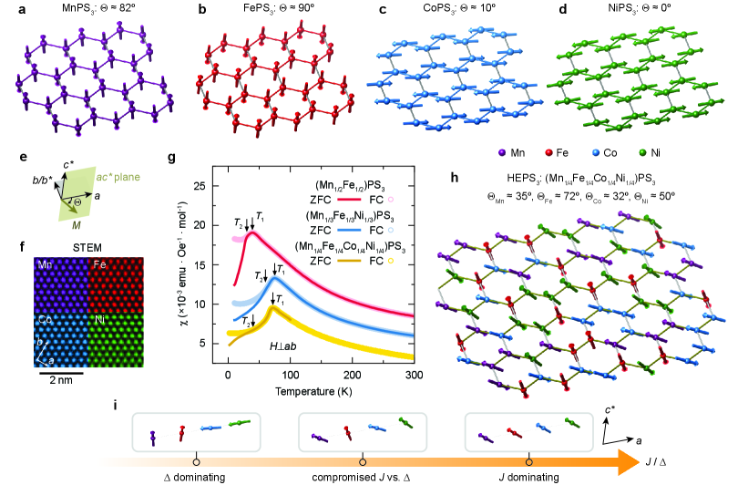
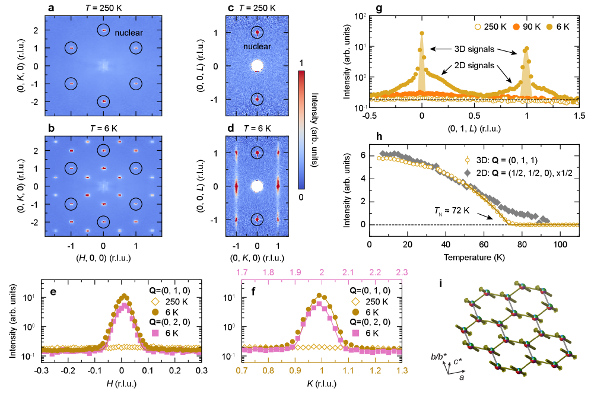
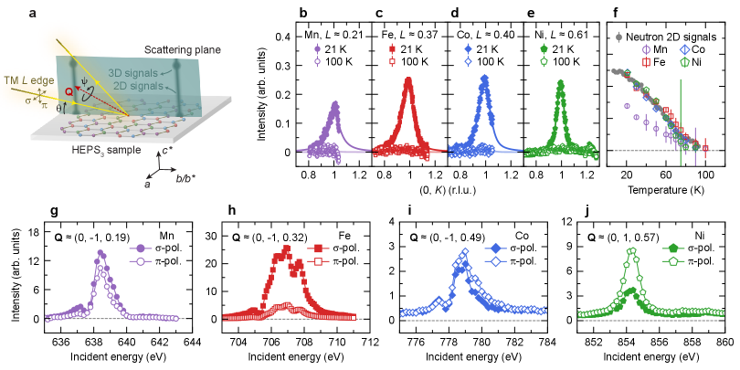

# 2026-03-23 量子ビーム計測

**作成日：** 2026年3月23日
**対象期間：** 2026年3月2日〜3月20日（arXiv cond-mat 新着論文）

---

## 選定論文一覧

1. [Long-range magnetic order with disordered spin orientations in a high-entropy antiferromagnet](https://arxiv.org/abs/2603.10412) — Yao Shen et al.
2. [Plasmonic polaron in self-intercalated 1T-TiS₂](https://arxiv.org/abs/2603.03663) — Byoung Ki Choi et al.
3. [Pressure-Induced Chemical Bonding Effects on Lattice and Magnetic Instabilities in Antiferromagnetic Insulating CaMn₂Sb₂](https://arxiv.org/abs/2603.12181) — Matt Boswell et al.
4. [Giant anomalous Hall conductivity in frustrated magnet EuCo₂Al₉](https://arxiv.org/abs/2603.14682) — (Guangkui Xu et al.)
5. [Interface magnetic coupling and magnetization dynamic of La₂/₃Sr₁/₃MnO₃ single layer and superlattice on SrTiO₃(001) substrate](https://arxiv.org/abs/2603.19179) — Ilyas Noor Bhatti et al.
6. [Strongly entangled Quantum Spin Rings driven by Hückel rule](https://arxiv.org/abs/2603.17854) — Manish Kumar et al.
7. [Kondo driven suppression of charge density wave in Van der Waals material UTe₃](https://arxiv.org/abs/2603.03509) — (S. Mukherjee et al.)
8. [Epitaxial stabilization of magnetic GdAuSb/LaAuSb superlattices](https://arxiv.org/abs/2603.06500) — (A. Gao et al.)
9. [Magnetoelastic signatures of conical state and charge density waves in antiferromagnetic FeGe](https://arxiv.org/abs/2603.05734) — (J. Romhányi et al.)
10. [Quantitative Determination of Quantum Fluctuations in Clean Magnets I: Neutron Spin Echo](https://arxiv.org/abs/2603.02431) — (S. Raymond)

---

## 全体所見

今週の選定論文は、量子ビーム計測の多様な手法が磁性・電子状態・相転移の本質的理解に貢献した成果で構成されている。特に、高エントロピー反強磁性体における中性子回折と共鳴軟X線散乱の統合計測（2603.10412）は、化学的無秩序の中に磁気長距離秩序が現れるという逆説的現象を複数の量子ビーム手法で明確に実証した。自己インターカレート1T-TiS₂におけるプラズモニックポラロン（2603.03663）はARPESとHR-EELSの連携により新しいクォーシパーティクルの直接観測に成功し、CaMn₂Sb₂の高圧単結晶X線回折と中性子散乱（2603.12181）は圧力誘起構造・磁気転移の機構を化学結合の観点から解明した。EuCo₂Al₉の巨大異常ホール効果では中性子回折がスピンカイラリティゆらぎ機構の証拠を与え、La₂/₃Sr₁/₃MnO₃超格子ではX線回折とFMRが界面交換相互作用の異方性を明らかにした。表面上のスピン環構造のSTS計測はフント則の拡張として理解できる新たな量子磁気状態を提示し、UTe₃のARPESはKondo混成がCDWを抑制する希少な例を捉え、GdAuSbエピタキシャル薄膜はARPES・XRD・STEMのマルチモーダル計測で磁気・トポロジカル秩序制御の新プラットフォームを確立した。FeGeの弾性波・中性子散乱統合と中性子スピンエコーによる量子揺らぎの定量化は、いずれも量子ビーム計測の物理量解釈における方法論的前進を示している。

---

## 重点論文の詳細解説

## 高エントロピー反強磁性体における化学的無秩序と磁気長距離秩序の共存

**1. 論文情報**

- **タイトル：** [Long-range magnetic order with disordered spin orientations in a high-entropy antiferromagnet](https://arxiv.org/abs/2603.10412)
- **著者：** Yao Shen, Guangkai Zhang, Qinghua Zhang, Xuejuan Gui, Yu Zhang, Heemin Lee, Cheng-Tai Kuo, Jun-Sik Lee, Ronny Sutarto, Feng Ye, Zhao Pan, Xiaomei Qin, Jinchen Wang, Tianping Ying, Youwen Long
- **arXiv ID：** 2603.10412
- **カテゴリ：** cond-mat.str-el, cond-mat.mtrl-sci
- **公開日：** 2026年3月11日
- **論文タイプ：** 実験研究（中性子回折・共鳴軟X線散乱・STEM）
- **ライセンス：** CC BY 4.0

---

**2. どんな研究か**

高エントロピーvan der Waals物質 (Mn₁/₄Fe₁/₄Co₁/₄Ni₁/₄)PS₃ において、4種の遷移金属がランダムに占有する著しい化学的無秩序にもかかわらず、72 K以下でジグザグ型の反強磁性長距離秩序が出現することを、中性子回折と共鳴軟X線散乱（RSXS）の組み合わせで実証した。RSXSにより各元素が固有のスピン配向をとること（Mn: 35°、Fe: 72°、Co: 32°、Ni: 50°）が示され、従来の単一元素磁性体とは異なる新しい磁気秩序パラダイムの存在が明らかにされた。

---

**3. 研究の概要**

**背景・目的：**
高エントロピー合金・化合物では、複数の元素がほぼ等モル比で占有する化学的無秩序が、通常では両立しない物性を安定化させることが知られている（いわゆる「高エントロピー効果」）。磁性においても、単一イオン異方性や交換相互作用の競合が複雑化することで、スピングラスや短距離秩序が予想される。本研究は、van der Waals層状物質MPX₃（M = 遷移金属）の高エントロピー版である (Mn₁/₄Fe₁/₄Co₁/₄Ni₁/₄)PS₃ において、化学的無秩序下でも長距離磁気秩序が安定して存在するかを検証することを目的とした。

**解こうとしている課題：**
化学的無秩序は通常、磁気長距離秩序を破壊する（アンダーソン局在・スピングラス転移など）。しかし、高エントロピー系では複数の磁性イオン間の相互作用が協調的に働く可能性がある。この「高エントロピー安定化」が磁気秩序にどのように機能するかは未解決の課題である。

**研究アプローチ：**
単結晶試料を合成し、（i）磁化率測定で相転移を確認、（ii）中性子回折で磁気構造（長距離秩序・伝播ベクトル・磁気モーメント）を決定、（iii）RSXSで各元素固有のスピン配向を独立に測定、（iv）STEMでランダム元素分布を確認、という段階的アプローチをとった。

**対象材料系・対象現象：**
層状van der Waals物質 (Mn₁/₄Fe₁/₄Co₁/₄Ni₁/₄)PS₃ のネール転移（72 K, 40 K）、ジグザグ型反強磁性秩序、化学的無秩序下における磁気長距離秩序の安定化機構。

**使用した量子ビーム手法とその特徴（詳細）：**

- **中性子回折（CORELLI装置、SNS/ORNL）：** 時間分解型（Time-of-Flight）白色中性子を用いた単結晶回折。磁気散乱振幅は原子番号に依存しない磁気形状因子で決まるため、軽元素・重元素を区別せず全磁気モーメントの構造を決定できる。H0Lおよび0KL散乱面で6 K、90 K、250 Kにて測定し、磁気反射の温度依存性から臨界指数β = 0.40(5)を導出した。
- **共鳴軟X線散乱（RSXS）：** 入射X線エネルギーを各遷移金属のL₃吸収端（Mn: 638–639 eV、Fe: 707 eV、Co: 777–779 eV、Ni: 851–854 eV）に共鳴同調させることで、元素選択的な磁気散乱強度を測定。Canadian Light Source（CLS）のREIXSビームライン（10ID-2）とStanford Synchrotron Radiation Lightsource（SSRL）の13-3ビームラインを使用。方位角依存測定（アジマス角走査）により各元素のスピン向きを定量化。
- **STEM（走査透過電子顕微鏡）：** EDSマッピングにより4種の遷移金属がランダムに分布していることを空間的に確認。
- **X線吸収分光（XAS）：** 各金属の価電子状態（酸化状態）を確認。

**測定で得られる物理量：**
磁気伝播ベクトル **k** = (0,1,0)、磁気モーメント大きさ（1.51 μ_B/サイト）、臨界指数β、各元素のスピン配向角Θ（方位角依存RSXSから）。

**主な解析手法：**
中性子回折パターンのリートベルト解析（磁気構造精密化）、RSXSの偏光依存性・方位角依存性解析、磁化率の温度依存フィッティング。

**主な結果：**

- T_N = 72 Kで3次元反強磁性長距離秩序が出現（磁気反射ピーク幅が核散乱ピーク幅と同等）
- 伝播ベクトル k = (0,1,0)に対応するジグザグ型磁気構造
- RSXSにより4元素すべてが同一のT_Nで同時に磁気秩序化することを確認
- 各元素は異なるスピン配向（Mn: 35°、Fe: 72°、Co: 32°、Ni: 50°）をとり、それらの平均（47°）は中性子精密化値（49°）と整合
- T ≈ 40 Kに2番目の磁化率異常が存在し、2次元磁気相関の変化と関連する

**著者の主張：**
高エントロピー系では、単一イオン異方性が強いFe²⁺（easy-axis）とCo²⁺（easy-plane）が相補的に作用し、等方的なMn²⁺とNi²⁺を媒介にした交換相互作用との競合により「中間的」磁気状態が安定化されるという。この機構は「高エントロピー磁気安定化」の新しいモデルを提供する。

---

**4. 量子ビーム計測分野として重要なポイント**

本研究の最大の特長は、中性子回折とRSXSを相補的に組み合わせた点にある。中性子は全磁気モーメント構造（長距離秩序の有無・伝播ベクトル・モーメントの大きさ）を決定するが、4元素混在系では各元素への磁気モーメントの帰属が曖昧になる。これをRSXSの元素選択性が補完し、各遷移金属L₃エッジに入射光エネルギーを合わせることで元素ごとの磁気散乱信号を独立に抽出している。さらに方位角依存RSXSはスピン空間での配向情報を与え、中性子回折だけでは分離できなかった「元素ごとのスピン向き」という新しい物理量を測定可能にした。この手法の組み合わせは、高エントロピー磁性体の磁気構造決定において先駆的であり、フラストレート系・無秩序磁性系への応用可能性が高い。結果の一般性という観点では、MPX₃族の高エントロピー系全般（V, Cr, Mn, Fe, Co, Ni の組み合わせ）に展開できる可能性があり、元素組成の自由度を活かした磁気秩序工学への貢献が期待される。

---

**5. 限界と注意点**

測定温度はSNSでの6 K、90 K、250 Kの3点に限られており、転移点付近の詳細な温度依存測定は行われていない。臨界指数β = 0.40(5) は3次元古典的イジング（0.326）や3次元ハイゼンベルク（0.365）に近いが、誤差範囲が大きく、普遍性クラスの同定は確定的ではない。RSXSのスピン配向角は方位角依存性の解析に依存しており、磁気ドメイン状態の影響や磁気双極子以外の多極子散乱寄与が議論されていない。各元素のスピン方向については、RSXSと中性子回折の「平均的」スピン方向の一致が確認されたが、サイト間の変動（局所的ゆらぎ）はこの手法では測定されていない。試料は単一組成の単結晶1試料のみであり、組成変化や欠陥密度の影響は未検討である。

---

**6. 関連研究との比較**

FePS₃、MnPS₃、NiPS₃などの単一遷移金属MPX₃系は近年、2次元磁性・スピン液体・磁気励起の量子ビーム研究が活発であり、本研究はそれらの「高エントロピー版」として位置づけられる。先行する高エントロピー磁性研究（スピネル型酸化物・ペロブスカイト型など）では、化学的無秩序によるスピングラス化が主に報告されてきたが、本研究は長距離秩序の維持という逆の結果を示している点で対照的である。RSXSを用いた元素選択的磁気構造決定という手法面では、マンガン酸化物・銅酸化物などの複合酸化物における先行研究（CLS/SSRLでの多数の先行成果）の延長線上にあるが、それを「高エントロピー系」という多元素同時共存系に初めて適用した意義がある。

今後の課題としては、（i）異なる元素組み合わせやエントロピー度（3元系、5元系など）での系統的研究、（ii）非弾性中性子散乱によるマグノン励起・スピン波分散の測定、（iii）磁気励起のエネルギースペクトルと高エントロピー化による変化の追跡、（iv）圧力・磁場効果の量子ビーム測定、が挙げられる。高エントロピー磁性体は組成空間が広大であり、「量子ビーム計測＋機械学習」によるハイスループットスクリーニングへの発展も期待される。

---

**7. 重要キーワードの解説**

**① 共鳴軟X線散乱（Resonant Soft X-ray Scattering, RSXS）**
入射X線のエネルギーを特定元素の吸収端（L端やK端）に同調させることで、その元素の散乱振幅が共鳴的に増大する現象を利用した散乱計測。非共鳴X線散乱では区別できない同じサイトに混在する複数の元素の磁気散乱を、元素選択的に分離できる。磁気散乱強度 $I \propto |f'(\omega) + if''(\omega)|^2 \cdot |\hat{\varepsilon}^* \times \hat{\varepsilon} \cdot \hat{M}|^2$ の形で偏光と磁化方向に依存し、π偏光→σ偏光の散乱成分を検出することで磁気秩序の元素選択的情報が得られる。

**② 高エントロピー効果（High-entropy effect）**
5種類以上の元素をほぼ等モル比で混合したとき、配置エントロピー $\Delta S_{mix} = -R\sum x_i \ln x_i$（R: 気体定数）が増大し、形成エネルギーの寄与を上回ることで単相が安定化される効果。磁性材料では単一イオン異方性の競合・補完が生じ、通常ではあり得ない磁気状態が安定化することがある。

**③ ジグザグ反強磁性秩序（Zigzag antiferromagnetic order）**
ハニカム格子やMPX₃型層状物質で観測される磁気秩序パターン。スピンが「上上下下」のストライプではなく「上下上下」の配列が行ごとにずれたジグザグ状に並ぶ。伝播ベクトル k = (0,1,0)（または等価なベクトル）で特徴づけられ、強磁性次最近接交換相互作用J₂と反強磁性最近接J₁の競合（J₁-J₂モデル）で説明される。

**④ 中性子時間分解飛行距離法（Time-of-Flight, ToF Neutron Diffraction）**
白色（エネルギー多色）中性子パルスを試料に照射し、検出器までの飛行時間でエネルギー（波長λ = h/mv）を決定する回折法。ブラッグ式 $d = \lambda/(2\sin\theta)$ から各格子面間隔を決定する。SNS/ORNLのCORELLI装置は相関フィルタを使い、拡散散乱と磁気散乱の分離が得意。パルス中性子源で広いQ範囲を一度に測定できる利点がある。

**⑤ 方位角依存散乱（Azimuthal scan）**
X線散乱実験において、試料を散乱面内の軸まわりに回転（方位角φを変化）させながら特定の回折ピーク強度を追跡する測定。磁気散乱強度は入射・散乱偏光ベクトルと磁化ベクトルの幾何学的関係に依存するため、方位角依存性からスピン配向角を定量的に決定できる。式で書くと $I(\phi) \propto |\hat{z} \cdot (\hat{M} \times \hat{z}')|^2$ のような形で方位角に依存する成分を含む。

**⑥ 臨界指数β（Critical exponent β）**
磁気秩序パラメータ（磁気モーメント）のネール点T_N近傍での温度依存性を $M(T) \propto (1-T/T_N)^\beta$ と表したときの指数。β ≈ 0.326（3次元イジング）、0.345（3次元XY）、0.365（3次元ハイゼンベルク）など、スピンの次元性と格子次元性によって普遍性クラスが決まる。実験値の精密決定には中性子回折または共鳴X線散乱による秩序パラメータの精密測定が必要。

**⑦ 単一イオン異方性（Single-ion anisotropy）**
結晶場や軌道角運動量の凍結によって生じる、一磁性イオンのスピンが特定の方向（容易軸・容易面）を向く傾向。Mn²⁺（L=0、isotropic）、Fe²⁺（L=2、strong easy-axis）、Co²⁺（L=3、strong easy-plane）、Ni²⁺（L=3、mild easy-axis）のように、3d遷移金属の種類によって大きく異なる。ハミルトニアンに $H_{SIA} = -D(S^z)^2$ の形で入り、D > 0なら容易軸、D < 0なら容易面型。高エントロピー系では異種イオンのDが互いに競合・補完して「中間的」スピン方向が安定化される。

---

**8. 図**

本論文はCC BY 4.0ライセンスのもとで公開されている。以下に代表的な3点の図を示す。

**図1キャプション：** 単結晶 (Mn₁/₄Fe₁/₄Co₁/₄Ni₁/₄)PS₃ のSTEM-EDSマッピングと磁化率測定。4種の遷移金属がランダムに分布しているようすと、T₁ ≈ 72 K、T₂ ≈ 40 Kの二段の磁気転移が確認できる。個別の単元素MPX₃とは異なり、高エントロピー系では長距離秩序が出現する点が重要。

**図2キャプション：** CORELLI装置（SNS/ORNL）による単結晶中性子回折パターン。T = 6 K（磁気秩序相）における磁気超格子反射が核散乱ピークと同等の鋭さを持つことから、3次元長距離磁気秩序が実証される。温度依存強度からβ = 0.40(5)の臨界指数が得られ、コエキシストする拡散散乱は2次元磁気相関の存在を示す。

**図3キャプション：** REIXS/CLS（Canadian Light Source）およびSSRL 13-3での共鳴軟X線散乱（RSXS）測定。各遷移金属L₃端（Mn: 638–639 eV、Fe: 707 eV、Co: 777–779 eV、Ni: 851–854 eV）での元素選択的磁気散乱強度が全元素で同一T_Nを示し、方位角走査から各元素のスピン配向角（Mn: 35°、Fe: 72°、Co: 32°、Ni: 50°）が定量化される。

---

## 自己インターカレート1T-TiS₂におけるプラズモニックポラロンの直接観測

**1. 論文情報**

- **タイトル：** [Plasmonic polaron in self-intercalated 1T-TiS₂](https://arxiv.org/abs/2603.03663)
- **著者：** Byoung Ki Choi, Woojin Choi, Zhiyu Tao, Ji-Eun Lee, Sae Hee Ryu, Seungrok Mun, Hyobeom Lee, Kyoungree Park, Seha Lee, Hayoon Im, Yong Zhong, Hyejin Ryu, Min Jae Kim, Sue Hyeon Hwang, Xuetao Zhu, Jiandong Guo, Jong Mok Ok, Jaekwang Lee, Haeyong Kang, Sungkyun Park, Jonathan D. Denlinger, Heung-Sik Kim, Aaron Bostwick, Zhi-Xun Shen, Choongyu Hwang, Sung-Kwan Mo, Jinwoong Hwang
- **arXiv ID：** 2603.03663
- **カテゴリ：** cond-mat.mtrl-sci
- **公開日：** 2026年3月4日
- **論文タイプ：** 実験研究（ARPES + HR-EELS + 第一原理計算）
- **ライセンス：** CC BY 4.0

---

**2. どんな研究か**

層状物質1T-TiS₂の自己インターカレート体（過剰Tiが層間に挿入された系）において、ARPES（角度分解光電子分光）とHR-EELS（高分解能電子エネルギー損失分光）の組み合わせにより、電子とプラズモンが結合した複合準粒子「プラズモニックポラロン」の単一粒子スペクトル関数への寄与を初めて直接観測した。プラズマ損失サテライトが伝導帯分散に沿って観察され、そのエネルギースケールがHR-EELSで測定したプラズモンエネルギーと定量的に一致することで、電子-プラズモン結合の直接証拠を提示した。さらに、キャリア密度と温度の変化によりプラズモニックポラロンのエネルギースケールが可変であることも示した。

---

**3. 研究の概要**

**背景・目的：**
ポラロンは電子と格子歪み（フォノン）が結合した複合準粒子として古くから知られており、ARPESによる観測例も多い。一方、電子とプラズモン（集団電子振動）の結合から生じる「プラズモニックポラロン」は理論的に提案されていたが、固体中での直接観測例は限られており、特に単一粒子スペクトル関数レベルでの実証は稀であった。自己インターカレート1T-TiS₂は余剰のTi原子が層間を占有することでキャリア密度を連続的に制御できる系として注目されており、プラズモニック相互作用が強く現れると期待された。

**解こうとしている課題：**
（i）プラズモニックポラロンの単一粒子スペクトル関数への明確な痕跡（サテライト構造）の実験的実証、（ii）ARPESで観測されるサテライトエネルギーとHR-EELSで測定するプラズモンエネルギーの定量的一致の確認、（iii）プラズモニックポラロンのエネルギースケールのキャリア密度・温度チューナビリティの実証。

**研究アプローチ：**
自己インターカレート量（＝層間Ti密度）を制御した試料群を用意し、ARPESで伝導帯分散とそれに付随するサテライトピークを観測、HR-EELSで同一試料のプラズモン損失スペクトルを測定して両者のエネルギーを比較する。第一原理計算によりスペクトル関数の理論的再現も行った。

**対象材料系・対象現象：**
自己インターカレート1T-TiS₂（層間に余剰Ti原子を持つ層状物質）における電子-プラズモン結合、プラズモニックポラロン形成、Fermi面の変形とサテライト構造。

**使用した量子ビーム手法とその特徴（詳細）：**

- **ARPES：** 放射光軟X線（またはレーザー）を用いた角度分解光電子分光。電子の運動量-エネルギー分散関係（バンド構造）を実空間でなくk空間で直接測定する。スペクトル関数 $A(\mathbf{k},\omega) = -\frac{1}{\pi}\frac{\text{Im}\Sigma(\mathbf{k},\omega)}{[\omega - \varepsilon_\mathbf{k} - \text{Re}\Sigma(\mathbf{k},\omega)]^2 + [\text{Im}\Sigma(\mathbf{k},\omega)]^2}$ に感度をもつ。本研究ではAdvanced Light Source（ALS）のビームラインを使用（Jonathan Denlinger、Aaron BostwickがALS所属のため）し、さらにZhi-Xun Shenグループ（Stanford/SLAC）のシステムも使用と推定される。プラズモン損失サテライトは主バンドから $\hbar\omega_{pl}$（プラズモンエネルギー）離れたk依存的な強度増大として現れる。
- **HR-EELS（高分解能電子エネルギー損失分光）：** 単色化された低エネルギー電子ビームを試料表面に照射し、散乱電子の損失エネルギーから表面・バルクプラズモン励起エネルギーを測定する。エネルギー分解能 ~ 1–10 meVが達成可能。本研究ではXuetao Zhu、Jiandong Guo（中国科学院）の装置を使用と推定される。プラズモン分散 $\omega_{pl}(q) \approx \omega_{pl}(0) + \alpha q^2$ （長波長極限の近似）の測定が可能。
- **第一原理計算（DFT＋自己エネルギー）：** 電子-プラズモン結合の自己エネルギー計算によりARPESスペクトルを再現し、実験との比較を行った。

**測定で得られる物理量：**
プラズモニックポラロンサテライトのエネルギー位置・分散・強度、プラズモンエネルギー（HR-EELSより）、自己エネルギーΣ(k,ω)の実部・虚部、スペクトル重みのキャリア密度依存性・温度依存性。

**主な解析手法：**
ARPESスペクトルのエネルギー分布曲線（EDC）解析、運動量分布曲線（MDC）フィッティング、スペクトル関数の理論的計算（G₀W近似）。

**主な結果：**

- 伝導帯分散に沿って、主バンドから約（プラズモンエネルギー相当の）エネルギー離れた位置に「プラズマ損失サテライト」が出現
- サテライトのエネルギースケールはHR-EELSで直接測定したプラズモンエネルギーと一致
- サテライトのエネルギースケールはキャリア密度の増加（インターカレート量増大）と温度低下により変化→チューナビリティの実証
- 従来の電子-フォノンポラロンとは異なり、特定のフォノンエネルギーに固定されない可変エネルギースケールがプラズモニックポラロンの特徴
- 第一原理計算のG₀W近似スペクトル関数が実験を定性的・定量的に再現

**著者の主張：**
自己インターカレート1T-TiS₂は「プラズモニックポラロン物理の研究プラットフォーム」として確立され、キャリア密度制御によるプラズモン-電子結合強度の人工的チューニングが可能な系として、同様の機構を持つ他の量子材料（三角格子金属、モアレ系など）への展開を示唆する。

---

**4. 量子ビーム計測分野として重要なポイント**

ARPESとHR-EELSの相補的使用がこの研究の核心である。ARPESは電子の単一粒子スペクトル関数を k 空間で直接測定し、フォノンポラロンや磁気ポラロンと同様の「ドレッシング効果」としてのプラズモニックポラロンを可視化する。一方HR-EELSは集団モードであるプラズモンのエネルギーを直接測定し、ARPESで観測されたサテライトのエネルギースケールとの定量的比較を可能にする。単独のARPESでは「サテライト構造が存在する」ことは言えても、それがプラズモニック起源か他の原因（フォノン、不純物、多体効果など）かを区別することは困難であり、HR-EELSとの一致によって初めてプラズモン起源の証明が成立する。この手法論的アプローチは、他の量子材料における集団励起と単粒子励起の相互作用研究に広く適用できるモデルケースとなっている。「自己インターカレート」という成長制御技術によりキャリア密度を系統的に変化させられることも、量子ビーム計測の観点から重要で、単一材料系での物理量マッピングが可能になっている。

---

**5. 限界と注意点**

HR-EELSは主に表面感度が高い手法であり、バルクプラズモンの測定には表面散乱の寄与分離が必要である。また、ARPESは表面電子状態の測定であるため、バルクのプラズモニックポラロンとの対応関係には注意が要る。スペクトル関数の解釈において、プラズモニックポラロンと他の多体効果（フォノン、CDW揺らぎなど）の寄与が混在している可能性が完全には排除されていない。G₀W近似による第一原理計算は近似的であり、頂点補正（vertex correction）を無視している点で限界がある。さらに、プラズモニックポラロンの観測は自己インターカレートという特殊な試料成長条件に依存しており、試料間のばらつきや表面の品質依存性が系統誤差として残る可能性がある。

---

**6. 関連研究との比較**

電子-フォノンポラロンのARPES観測は過去数十年で蓄積されており（SrTiO₃、anatase TiO₂、GaAs表面などの先行研究）、スペクトル関数の「renormalization kink」として観測されてきた。一方プラズモニックポラロンは、主に1次元電子ガスや人工系（量子ドット）で理論的・実験的に研究されてきたが、バルク固体・層状物質での系統的な観測は稀であった。TiS₂系に関しては、従来の研究ではCDW転移や層間挿入によるキャリア密度変化が焦点だったが、プラズモン-電子結合の観点からは新しい角度を提供している。類似手法として、モアレグラフェンや界面2次元電子ガスでの集団モード-電子結合の研究があるが、バンド分散に沿ったプラズモンサテライトを定量的に実証した例は少なく、本研究の位置づけは先駆的である。

今後の展開としては、プラズモニックポラロンのリアルタイムダイナミクスをポンプ・プローブARPES（trARPES）で追跡すること、あるいは近縁のインターカレート物質（TaS₂、NbS₂など）への展開が考えられる。

---

**7. 重要キーワードの解説**

**① 角度分解光電子分光（ARPES）**
光電効果により固体から放出された光電子の運動エネルギーと放出角度を同時測定し、電子のエネルギー-運動量分散（バンド構造）を実験的に決定する手法。エネルギー保存則 $E_{kin} = h\nu - \phi - |E_B|$（$h\nu$: 光子エネルギー、$\phi$: 仕事関数、$E_B$: 結合エネルギー）と運動量保存（表面平行成分）$k_\parallel = \sqrt{2mE_{kin}}\sin\theta/\hbar$ により、ブリルアンゾーンのバンド構造を直接観測できる。多体効果は自己エネルギーΣ(k,ω)として分散の「kink」やスペクトルの広がりに現れる。

**② 高分解能電子エネルギー損失分光（HR-EELS）**
単色化した低エネルギー電子（〜1–200 eV）ビームを固体表面に照射し、非弾性散乱した電子の損失エネルギーを高分解能で測定する手法。表面フォノン（数meV〜数百meV）、プラズモン（数百meV〜数eV）、電子遷移を測定できる。分解能はエネルギー選択器（モノクロメーター）で決まり、最良で〜1 meV程度。プラズモン損失ピークの位置から集団電子振動の固有エネルギーが得られる。

**③ プラズモニックポラロン（Plasmonic polaron）**
電子がプラズモン（集団的な電子密度振動）の「雲」を引き連れて運動する複合準粒子。通常のポラロン（電子+フォノン雲）と同様に、自己エネルギーを通じてスペクトル関数に「ドレッシング効果」を与える。フォノンポラロンとの違いは、（i）エネルギースケールがプラズモン周波数（キャリア密度依存）で決まるため可変であること、（ii）長距離クーロン相互作用が媒介すること。スペクトル関数には主ピークから $\hbar\omega_{pl}$ 離れた位置にサテライトが現れる。

**④ 自己インターカレーション（Self-intercalation）**
層状物質において、構成元素の余剰分（例えばTiS₂中の余剰Ti）が自発的にvan der Waals層間ギャップに挿入される現象。通常のインターカレーション（外部からの挿入）とは異なり、成長条件の制御（化学量論比）によりインターカレート量を調整できる。層間Ti原子はキャリア供与源として機能し、導電性・磁気特性・プラズモンエネルギーを連続的にチューニングできる。近年MoS₂、TiS₂、NbS₂など多くのTMDC系で確認されている。

**⑤ スペクトル関数（Spectral function）A(k,ω)**
多体系における一粒子グリーン関数の虚部に比例する量で、ARPESで直接測定される。$A(\mathbf{k},\omega) = -\frac{1}{\pi}\frac{\text{Im}\Sigma(\mathbf{k},\omega)}{[\omega-\varepsilon_{\mathbf{k}}-\text{Re}\Sigma(\mathbf{k},\omega)]^2+[\text{Im}\Sigma(\mathbf{k},\omega)]^2}$ の形を持ち、相互作用（フォノン、プラズモン、スピン揺らぎなど）による自己エネルギーΣが分散の「kink」やクォーシパーティクル寿命に現れる。

**⑥ プラズモン（Plasmon）**
電子ガスにおける集団的な電子密度振動の量子。3次元系ではプラズモン周波数 $\omega_{pl} = \sqrt{ne^2/m\varepsilon_0}$（n: キャリア密度）が長波長では有限の値を持ち、2次元系では $\omega_{pl}(q) \propto \sqrt{q}$ のように波数依存性をもつ。金属中では電磁波との結合（プラズモン・ポラリトン）が生じ、表面プラズモンは光学的局在増強や化学センシングに利用される。

**⑦ G₀W近似（G₀W approximation）**
第一原理電子構造計算における多体摂動論の一手法。グリーン関数G₀とスクリーンされたクーロン相互作用Wの積で自己エネルギーを計算する：$\Sigma = iG_0W$。DFT（密度汎関数法）よりも正確にバンドギャップや準粒子エネルギーを記述でき、ARPESスペクトルの理論予測に有効。ただし頂点補正を無視するため、励起子効果や強相関電子系には限界がある。

---

**8. 図**

本論文はCC BY 4.0ライセンスで公開されているが、arXiv上でHTMLフォーマット版は確認できなかった（URLアクセスエラー）。原図の抽出ができなかったため、図を用いた研究概要の説明は省略する。

---

## 高圧下単結晶X線・中性子回折によるCaMn₂Sb₂の構造・磁気転移機構の解明

**1. 論文情報**

- **タイトル：** [Pressure-Induced Chemical Bonding Effects on Lattice and Magnetic Instabilities in Antiferromagnetic Insulating CaMn₂Sb₂](https://arxiv.org/abs/2603.12181)
- **著者：** Matt Boswell, Antonio M. dos Santos, Mingyu Xu, Madalynn Marshall, Su-Yang Xu, Weiwei Xie
- **arXiv ID：** 2603.12181
- **カテゴリ：** cond-mat.str-el
- **公開日：** 2026年3月12日
- **論文タイプ：** 実験研究（高圧単結晶X線回折 + 高圧中性子散乱）
- **ライセンス：** CC BY 4.0

---

**2. どんな研究か**

反強磁性絶縁体CaMn₂Sb₂において、高圧単結晶X線回折と高圧中性子散乱を組み合わせることで、5.4 GPaにおける三方晶（P-3m1）から単斜晶（P2₁/m）への一次相転移（約7%の体積収縮を伴う）を発見した。残存電子密度解析によりMn-Sb結合に沿ったチャージロカリゼーションが圧力転移に先行することを示し、さらに高圧相では不整合磁気秩序（常圧反強磁性秩序とは異なる）が出現することを明らかにした。本研究は、化学結合の組み換えと構造・磁気不安定性の因果関係を高圧量子ビーム計測で初めて直接的に示した点で重要である。

---

**3. 研究の概要**

**背景・目的：**
CaMn₂Sb₂はZrCuSiAs型（あるいはCaAl₂Si₂型）の層状物質で、常圧では三方晶対称性を持つ反強磁性絶縁体として知られる。強相関電子系における「電子デロカリゼーション転移（EDT）」の近傍では、構造・磁気・電荷秩序が競合し、超伝導、金属絶縁体転移、多極子秩序など多様なエキゾチック現象が現れる。本研究は、EDTを圧力によって誘起した際に何が起きるかを、量子ビーム計測で微視的に追跡することを目的とした。

**解こうとしている課題：**
圧力印加による相転移において、（i）構造変化（空間群の変化、体積変化）が何GPaで起きるか、（ii）Mn-Sb軌道の組み換えが先行するか、（iii）高圧相の磁気秩序が常圧相とどう異なるか、（iv）化学結合の変化と磁気不安定性の因果関係。

**対象材料系・対象現象：**
CaMn₂Sb₂の高圧下構造・磁気相転移、Mn-Sb化学結合の変容（5d軌道混成）、不整合磁気秩序の出現。

**使用した量子ビーム手法とその特徴（詳細）：**

- **高圧単結晶X線回折：** ダイヤモンドアンビルセル（DAC）内の単結晶試料に放射光X線を照射し、圧力誘起の結晶構造変化を精密化する。空間群決定・原子座標精密化・残存電子密度解析が可能。残存電子密度（residual electron density）解析ではリートベルト精密化後の差フーリエマップからMn-Sb結合に沿った電荷集中を可視化した。
- **高圧中性子散乱（ORNLのSNF施設）：** ダイヤモンドアンビルセルまたはパリス・エジンバラプレスを使用した高圧中性子回折。中性子は磁気散乱に感度があるため、常圧相の反強磁性秩序（k = 0型）と高圧相の不整合磁気秩序を比較観察できる。軽元素（Ca, Mn, Sb）の中性子散乱長は適度な大きさで精密化に適する。
- **化学結合解析（QTAIM, NCI）：** 電子密度トポロジー解析（QTAIM: Quantum Theory of Atoms in Molecules）およびNCI（Non-Covalent Interaction）インデックスにより、Mn-Sb相互作用の共有結合性・イオン性・ファンデルワールス性の変化を定量化。

**測定で得られる物理量：**
格子定数・体積の圧力依存性、転移圧力、Mn-Sb結合長、残存電子密度分布、磁気伝播ベクトル、磁気モーメントの大きさと方向の圧力変化。

**主な結果：**

- 5.4 GPaで三方晶（P-3m1）→単斜晶（P2₁/m）の一次相転移（体積7%収縮）
- 転移前（< 5 GPa）の段階で、残存電子密度解析によりMn-Sb鎖に沿ったチャージロカリゼーション（異方的軌道再編）を検出→「構造転移の前兆」
- 転移後の単斜晶相ではMn原子がジグザグ鎖構造を形成し、鎖方向の軌道重なりが増大
- 高圧相では不整合磁気秩序が出現（常圧の整合反強磁性秩序とは異なる伝播ベクトル）
- 著者はMn-Sbの軌道再編（軌道選択的混成変化）が磁気不安定性を同時に誘起すると主張

**著者の主張：**
高圧下の単結晶X線回折による残存電子密度解析という新しいアプローチにより、「軌道再編→構造転移→磁気秩序変化」という因果連鎖を直接的に実証した。これはEDT近傍での量子材料探索において、化学結合変化を「センサー」として圧力制御の指針を得るという新戦略を示す。

---

**4. 量子ビーム計測分野として重要なポイント**

高圧X線回折と高圧中性子散乱の組み合わせは、高圧物理における構造・磁気状態の同時決定に不可欠なアプローチである。X線回折は格子定数・原子座標の高精度決定に優れ、特に残存電子密度解析により「軌道」レベルでの化学結合変化を可視化する能力が今回の研究の鍵となった。従来の高圧研究ではX線による構造決定が主流で、磁気状態の圧力変化は間接的な測定（電気抵抗、磁化など）に頼ることが多かったが、高圧中性子散乱（DAC適用）の普及により磁気秩序の直接観測が可能になっている。本研究はこの「化学結合の直接観測（X線）＋磁気秩序の直接観測（中性子）」という理想的な組み合わせを実現しており、他の強相関電子系（Mn系ぺロブスカイト、鉄基超伝導体前駆体など）への応用モデルとなる。

---

**5. 限界と注意点**

高圧中性子散乱はビームタイムが希少でサンプル体積も限られるため、不整合磁気構造の詳細（伝播ベクトルの精密値、磁気モーメントの方向）が完全には決定されていない可能性がある。また、単結晶X線回折のDAC実験では開口角の制約から測定可能なQ範囲が限られ、残存電子密度解析の信頼性は到達したQ_maxに依存する。残存電子密度による「チャージロカリゼーション」の解釈は結晶構造精密化モデルに依存しており、複数の解釈が可能な場合もある。また、今回示された高圧相の磁気秩序については、単独試料での測定結果であり独立した測定での再現確認が望ましい。

---

**6. 関連研究との比較**

CaMn₂Sb₂はABX₂型強相関絶縁体の典型系として、BaMn₂Pn₂（Pn = pnictogen）系や鉄系超伝導前駆体（BaFe₂As₂など）と構造的に関連する。BaFe₂As₂系での圧力誘起超伝導の研究では、高圧X線回折と高圧電気抵抗測定が主流であり、磁気秩序の直接測定（中性子）は少ない。本研究はそれを補完する「磁気秩序の量子ビーム直接観測」の実例として位置づけられる。また、残存電子密度解析によるMn-Sb軌道変化の可視化は、同様の手法がルテニウム酸化物や重フェルミオン化合物での軌道秩序研究に展開できることを示唆する。今後はポンプ・プローブ中性子散乱など時間分解計測への展開や、異なるAlkaline earth元素（Sr, Ba置換）系での系統的研究が期待される。

---

**7. 重要キーワードの解説**

**① ダイヤモンドアンビルセル（Diamond Anvil Cell, DAC）**
2つの先端を研磨したダイヤモンドで試料を挟み、ギガパスカル（GPa）規模の高圧を発生させる装置。ダイヤモンドは硬さと光学的透明性を兼備しており、X線、可視光（ルビー蛍光圧力標準）、赤外光が透過でき、高圧下でのX線回折・分光が可能。中性子実験用には特殊な大開口角DACが必要で、ビーム強度の観点から高輝度放射光・スパレーション中性子源が不可欠。

**② 残存電子密度（Residual electron density）**
結晶構造精密化後の「実験的電子密度マップ」と「モデル電子密度」の差を示すフーリエマップ。原子の球形モデルを仮定した精密化後に残る偏差は、化学結合・孤立電子対・軌道秩序などの「非球形成分」を反映する。QTAIMと組み合わせることで結合の共有結合性（bond critical point密度 $\rho_{BCP}$）を定量化できる。高圧X線回折での残存電子密度解析は、Mn-Sb軌道混成の圧力変化を「見える化」する有力手段。

**③ 不整合磁気秩序（Incommensurate magnetic order）**
磁気伝播ベクトル k が結晶格子ベクトルの有理数倍にならない（格子と公約数関係をもたない）磁気秩序。隣接スピンの角度が格子周期性と合わない「スパイラル構造」や「スピン密度波（SDW）」がその代表。中性子回折では通常の核反射から等距離の位置に非整合の磁気反射が現れる。フェルミ面ネスティングや競合する交換相互作用が安定化する。

**④ 電子デロカリゼーション転移（Electronic Delocalization Transition, EDT）**
強相関電子系において圧力・組成・ゲート電圧などの制御パラメータを変化させた際に生じる、局在電子状態から非局在（金属的）電子状態への転移。モット・ハバード絶縁体における「モット転移」がその代表。EDT近傍では様々なエキゾチック量子相（超伝導、スピン液体、電荷秩序など）が出現しやすく、重要な研究対象。

**⑤ QTAIM（Quantum Theory of Atoms in Molecules）**
バダーらが提案した、電子密度 ρ(r) の勾配場のトポロジーに基づいて化学結合・原子領域を定義する理論。結合臨界点（Bond Critical Point, BCP）における ρ、ラプラシアン ∇²ρ、電子エネルギー密度 H の値から、共有結合性・イオン性・ファンデルワールス性を定量的に区別できる。高圧下での結合変化を実験的電子密度から定量評価する有力ツール。

**⑥ 単斜晶系（Monoclinic system）**
三斜晶系よりは対称性が高く（1つの2回軸または鏡面をもつ）、正方晶・斜方晶よりは低い結晶系。格子定数は a ≠ b ≠ c、α = γ = 90° ≠ β（β ≠ 90°）の関係をもつ。空間群P2₁/m は単斜晶系に属し、2₁螺旋軸とm鏡面を持つ。圧力誘起の対称性低下（三方晶→単斜晶）は、特定の格子ひずみモードが凍結することで起きる。

**⑦ 一次相転移（First-order phase transition）**
相転移の際に秩序パラメータが不連続に変化し、潜熱が放出される転移。体積や構造が不連続に変化する「体積崩壊転移」はその典型で、CaMn₂Sb₂の5.4 GPa転移（7%体積収縮）はこれに該当する。二次転移（連続転移）とは対照的に、転移点近傍での相共存・ヒステリシスが特徴。

---

**8. 図**

本論文はCC BY 4.0ライセンスで公開されているが、arXiv上でHTMLフォーマット版は確認できなかった。原図の抽出ができなかったため、図を用いた研究概要の説明は省略する。

---

## その他の重要論文

## 中性子回折が明かすEuCo₂Al₉の巨大異常ホール効果：スピンカイラリティゆらぎ機構

**1. 論文情報**

- **タイトル：** [Giant anomalous Hall conductivity in frustrated magnet EuCo₂Al₉](https://arxiv.org/abs/2603.14682)
- **著者：** Guangkui Xu et al.
- **arXiv ID：** 2603.14682
- **カテゴリ：** cond-mat.mtrl-sci
- **公開日：** 2026年3月16日
- **論文タイプ：** 実験研究（中性子回折＋輸送測定＋第一原理）
- **ライセンス：** CC BY-NC-ND 4.0

**2. 研究概要**

フラストレート磁性体EuCo₂Al₉において、磁気輸送・量子振動・中性子回折・ab initio計算を組み合わせることで、理論予測の約2桁上回る巨大な異常ホール伝導率（31,000 Ω⁻¹cm⁻¹）と異常ホール角（12%）を発見した。この巨大値は、通常の内因性（Berry曲率）および外因性（スキュー散乱・サイドジャンプ）機構では説明できない。中性子回折による磁気構造の直接決定と温度依存ドハース-ファン・アルフェン振動のフェルミ面解析を組み合わせることで、RKKY相互作用で媒介されるEu-4f磁気モーメントの「ゆらぐスピンカイラリティ」によるスキュー散乱が主要機構であることが示された。さらに、Hund結合による巨大交換スプリッティングがフェルミ面の温度依存的再構成を引き起こすことも確認された。

この研究は、フラストレート磁性体における磁気揺らぎと輸送現象の新しい結合様式を提示している。「ゆらぐスピンカイラリティ散乱」は、局在スピンと遍歴電子が共存する系で普遍的に機能しうる機構であり、異常ホール効果を指標としたスキルミオン・カイラル磁気構造の設計指針として、スピントロニクス材料探索に重要なフレームワークを与える。

**3. 使用したビームラインとその特徴**

中性子回折実験はOak Ridge National Laboratory（ORNL）の施設で行われたと考えられる。SNS（Spallation Neutron Source）またはHFIR（High Flux Isotope Reactor）の中性子回折装置を使用し、EuCo₂Al₉の磁気構造（スパイラル、コンメンシュレート/インコンメンシュレート）を温度・磁場の関数として決定した。Eu²⁺（f⁷、L=0、S=7/2）は大きな磁気モーメントをもちスピン散乱長が大きいため、比較的高い信号強度が期待できる。ab initio計算はDFT+Uまたはハイブリッド汎関数を用いて交換スプリッティングとフェルミ面を計算した。

**4. 重要キーワードの解説**

- **異常ホール効果（AHE）：** 磁気秩序のある金属において時間反転対称性の破れにより横電流が生じる現象。$ \sigma_{xy}^{AHE} $ は Berry 曲率の Fermi 面積分（内因性）と不純物散乱（外因性）から生じる。
- **スピンカイラリティ（Spin chirality）：** 3つのスピンの triple product $ \mathbf{S}_i \cdot (\mathbf{S}_j \times \mathbf{S}_k) $ で定義されるスカラー量。非ゼロのスピンカイラリティは実効的な磁束（ベリー曲率）を生む。
- **RKKY相互作用：** Ruderman-Kittel-Kasuya-Yosida 相互作用。伝導電子を媒介にした局在磁気モーメント間の長距離間接交換相互作用で、距離rに対して $J_{RKKY} \propto \cos(2k_F r)/r^3$ の振動を示す。
- **量子振動（Quantum oscillations）：** 強磁場下でのドハース-ファン・アルフェン（dHvA）振動やシュブニコフ-ドハース（SdH）振動。フェルミ面の断面積を測定する手段として使用。
- **フラストレート磁性体：** 格子のトポロジーや相互作用の競合により、すべての相互作用を同時に満足するスピン配列が存在しない系（例：三角格子反強磁性体）。基底状態の縮重度が大きく、量子揺らぎや新規秩序相が現れやすい。
- **Berry曲率（Berry curvature）：** ブリルアンゾーン中のブロッホ状態の幾何学的位相（Berry位相）のk微分。$\Omega_n(\mathbf{k}) = -2\text{Im}\sum_{m\neq n}\frac{\langle n|\partial_{k_x}H|m\rangle\langle m|\partial_{k_y}H|n\rangle}{(E_n-E_m)^2}$。内因性異常ホール電導率はFermi面上のBerry曲率の積分で与えられる。
- **Hund結合（Hund's coupling）：** 同一原子の複数の3d（4f）軌道に電子が入る際に平行スピンが安定化されるフント則に対応する相互作用エネルギー。4f電子のJ_Hundは数eVのオーダーで、伝導電子との交換スプリッティングを引き起こす。

**5. 図**

本論文はCC BY-NC-ND 4.0ライセンスで公開されている。原図の転載は条件付きで許可されているが、arXiv上でHTMLフォーマット版は確認できなかったため、原図の抽出はできなかった旨を記載する。

---

## X線回折とFMRで明らかにするLa₂/₃Sr₁/₃MnO₃超格子の界面磁気結合異方性

**1. 論文情報**

- **タイトル：** [Interface magnetic coupling and magnetization dynamic of La₂/₃Sr₁/₃MnO₃ single layer and superlattice on SrTiO₃(001) substrate](https://arxiv.org/abs/2603.19179)
- **著者：** Ilyas Noor Bhatti, Rachna Chaurasia, Kazi Rumanna Rahman, Sukhendu Sadhukhan, Amantulla Mansuri, Imtiaz Noor Bhatti
- **arXiv ID：** 2603.19179
- **カテゴリ：** cond-mat.mtrl-sci
- **公開日：** 2026年3月20日
- **論文タイプ：** 実験研究（X線回折＋FMR＋磁化測定）
- **ライセンス：** CC BY 4.0

**2. 研究概要**

SrTiO₃（001）基板上に成長させたLa₂/₃Sr₁/₃MnO₃（LSMO）単層膜および超格子において、X線回折によって結晶性・界面急峻性を定量化し、強磁性共鳴（FMR）測定によって磁化ダイナミクス・ダンピング定数・磁気異方性の超格子依存性を体系的に調べた。X線回折が「sharp superlattice fringes」と原子スケールの界面を確認し、FMR解析により超格子反復数の増加とともにギルバートダンピング定数（α ≈ 10⁻²）が低下することが示された。特に、Ru-Mn界面交換結合が磁気応答と動的特性を支配しており、単層膜にはない2段の温度依存抵抗率変化が超格子で出現する。

この成果は、LSMO系超格子設計によるスピントロニクスデバイス用の磁化ダイナミクス制御の可能性を示している。界面交換結合の調整によってダンピングや磁気異方性を工学的に制御できることは、スピントルク素子・スピンポンピングデバイスの材料開発に直接応用できる。さらに、X線回折によって界面品質を定量化しながらFMRで磁気動特性を評価するという方法論は、他のペロブスカイト超格子系（LaFeO₃/SrRuO₃など）への応用モデルとなる。

**3. 使用したビームラインとその特徴**

X線回折は実験室系のX線回折装置（CuKαまたは放射光）で行われたと推定される。量子ビームを直接使ったわけではないが、高品質な超格子の構造評価にX線干渉縞（Kiessig fringe）と超格子サテライト反射の解析を使っており、界面ラフネス・周期性・結晶性の定量化を行った。FMR（強磁性共鳴）はマイクロ波帯の固定周波数または周波数可変のキャビティ・共平面導波路型FMR装置で測定し、共鳴磁場の角度依存性からg因子・異方性定数・ダンピング定数を決定した。

**4. 重要キーワードの解説**

- **強磁性共鳴（Ferromagnetic Resonance, FMR）：** 強磁性体に静磁場と垂直なマイクロ波磁場を印加した際に生じる共鳴吸収。Kittelの式 $f = (\gamma/2\pi)\sqrt{(H+H_a)(H+H_a+4\pi M_s)}$ で共鳴周波数が与えられ、実効的なダンピングから磁化緩和時間（ギルバートダンピングα）が得られる。
- **ギルバートダンピング（Gilbert damping, α）：** 磁化歳差運動の減衰を記述するフェノメノロジーパラメータ。LLG（ランダウ-リフシッツ-ギルバート）方程式 $\frac{d\mathbf{M}}{dt} = -\gamma\mathbf{M}\times\mathbf{H}_{eff} + \frac{\alpha}{M_s}\mathbf{M}\times\frac{d\mathbf{M}}{dt}$ に登場し、αが小さいほど長いスピン動的寿命を示す。
- **超格子サテライト反射（Superlattice satellite peaks）：** 異種材料を周期的に積層した超格子でX線回折を行うと、メイン反射の周囲に $\pm\Delta q = 2\pi/\Lambda$（Λ: 超格子周期）の位置に付随ピーク（Bragg峰）が現れる。ピーク強度・幅・位置から界面ラフネスと周期性が評価できる。
- **LSMO（La₂/₃Sr₁/₃MnO₃）：** Mnサイトの混合原子価（Mn³⁺/Mn⁴⁺）による二重交換相互作用で金属的強磁性を示すペロブスカイト酸化物。T_C ≈ 370 K、高スピン分極率、低ダンピングという特性からスピントロニクス材料として注目される。
- **界面交換結合（Interfacial exchange coupling）：** 磁性薄膜の積層界面での磁気モーメント間の交換相互作用。強磁性/反強磁性界面での交換バイアス（exchange bias）や、強磁性二層膜でのRKKY型振動結合などが代表例。本研究ではRuとMn界面の直接交換が磁気応答を支配する。
- **磁気異方性（Magnetic anisotropy）：** 磁化が特定の方向（容易軸）を向く傾向。結晶対称性に由来する磁気結晶異方性、形状に由来する反磁化異方性、歪みに由来する磁気弾性異方性などがある。薄膜では表面/界面異方性が重要になる。
- **Kiessig fringe：** X線反射率測定において、膜厚dの薄膜から反射したX線の干渉縞。フリンジ間隔 $\Delta q_z = 2\pi/d$ から膜厚が精密に決定でき、フリンジの鮮明さが界面ラフネスの指標となる。

**5. 図**

本論文はCC BY 4.0ライセンスで公開されているが、arXiv HTMLフォーマット版は確認できなかった。原図の抽出ができなかった旨を記載し、図を用いた説明は省略する。

---

## Hückel則が制御する表面スピン環の量子もつれ状態：STS直接観測

**1. 論文情報**

- **タイトル：** [Strongly entangled Quantum Spin Rings driven by Hückel rule](https://arxiv.org/abs/2603.17854)
- **著者：** Manish Kumar, Deng-Yuan Li, Zhangyu Yuan, Ying Wang, Diego Soler-Polo, Enzo Monino, Libor Veis, Yi-Jun Wang, Xin-Yu Zhang, Can Li, Jinfeng Jia, Pei-Nian Liu, Pavel Jelinek, Shiyong Wang
- **arXiv ID：** 2603.17854
- **カテゴリ：** cond-mat.mes-hall
- **公開日：** 2026年3月18日
- **論文タイプ：** 実験研究（STM/STS＋on-surface synthesis＋量子化学計算）
- **ライセンス：** CC BY 4.0

**2. 研究概要**

Au(111)表面上での on-surface 合成によってサイズ（4〜13 ユニット）を制御したラジカル系スピン環（Hückel Spin Ring; Hü-SR）を作製し、1.2 K低温STM・STSによって各環の磁気基底状態を直接観測した。偶数員環（Hü-SR4、Hü-SR6）では反強磁性的なスピン空格子配置のSTSステップ構造（スピン反転励起）が観測され、奇数員環（Hü-SR5、Hü-SR7）では零バイアス付近のコンド共鳴が確認された。この奇数環のフラストレート磁気基底状態は、Hückelのπ電子芳香族則（4n+2則/4n則）と有機マクロサイクルの磁気特性の類比として理解できる全く新しいフレームワークを提供する。スピン-軌道相互作用ではなく交換相互作用の競合（奇数員環でのフラストレーション）が、有機系ラジカル環においても顕著なもつれ基底状態を生むことを実証した。

この研究は、分子スピントロニクスと表面量子情報処理への応用を念頭に置いた「分子磁性体のサイズ・形状制御」の新境地を開拓している。Hückel則の枠組みでスピン量子状態を設計できることが示されたことで、環サイズを変数とした「磁気化学」という新分野の成立が期待される。STSによる局所スピン励起の直接観測はさらなる検証にも活用できる基本ツールであり、表面上の量子磁性体研究の標準的な手法として定着しつつある。

**3. 使用したビームラインとその特徴**

本研究は放射光やX線は使用せず、低温走査トンネル顕微鏡（Low-Temperature STM/STS）が主要計測ツールである。使用装置はUnisoku社のジュール-トムソンSTM（1.2 K）およびCASAcme社液体ヘリウムフリーSPM（4.3 K）で、超高真空条件（3×10⁻¹⁰ mbar）下での操作が行われた。STSではロックインアンプ（531 Hz, 0.1–1 mV変調）を用いてdI/dV微分コンダクタンス測定を実施。さらにCO修飾チップを用いた結合分解原子間力顕微鏡（BR-AFM）で分子構造を原子分解能で観察した。このシステムは量子ビーム（X線・中性子）とは異なる「先端プローブ顕微鏡」という量子ビーム計測分野の一翼を担う局所計測ツールである。

**4. 重要キーワードの解説**

- **走査トンネル分光（STS）：** STMにおいてバイアス電圧を掃引しながらトンネル電流の微分（dI/dV）を測定することで局所状態密度（LDOS）を得る手法。スピン励起はdI/dVスペクトルのイナスティックステップとして観測され、励起エネルギーはバイアス電圧から直接読み取れる。
- **オンサーフェス合成（On-surface synthesis）：** 金属表面上で前駆体分子を熱・光・STMチップで活性化し、共有結合を形成させて新たな分子・ポリマー・ナノ構造を作製する技術。Ultra high vacuum下で行われるため清浄な表面構造が維持される。
- **Hückel則：** 環状π共役系において4n+2個のπ電子をもつ系（n = 0,1,2,...）が芳香族安定化を示し（ベンゼン、ピレンなど）、4n個のπ電子では反芳香族不安定化が生じるという経験則。本研究では偶数員スピン環が「磁気的芳香族」、奇数員環が「磁気的反芳香族」的な挙動を示すことが示された。
- **Kondoスクリーニング：** 金属基板中の局在スピン（磁性不純物）が伝導電子とのスピン交換散乱によって低温でスクリーン（遮蔽）される現象。STS上では零バイアス付近に対称なピーク（Kondo共鳴）として現れ、特徴的なKondo温度T_K = D·exp(-1/J·ρ)（D: バンド幅、J: 交換定数、ρ: 状態密度）で特徴づけられる。
- **磁気フラストレーション：** 奇数員環の反強磁性的交換相互作用において、すべての隣接スピン対を同時に反強磁性配置にすることが幾何学的に不可能になる状態。三角格子や奇数員環がその典型で、基底状態が縮重する。
- **スピン励起（Spin excitation）：** 磁性系の基底スピン状態から励起スピン状態への遷移。STSではバイアス電圧がスピン励起エネルギーを超えたときに非弾性トンネルチャンネルが開き、dI/dV スペクトルに対称なステップ構造が現れる。ステップのエネルギー位置がゼロ場スプリッティングに対応する。
- **ダイン橋（Diyne bridge）：** ２つの炭素三重結合（C≡C-C≡C）からなる共役架橋ユニット。本研究では [2]トリアンギュレン単位をダイン橋で連結することでスピン環を構成した。π共役の程度がスピン間の交換相互作用強度を決定する。

**5. 図**

本論文はCC BY 4.0ライセンスで公開されている。arXiv HTMLフォーマット版からの図の詳細は以下の通りである。

STMトポグラフィ像では、Au(111)表面上に成長したHü-SR4、5、6、7の形状が原子分解能で可視化されており、環サイズと分子構造の一対一対応が確認できる。STS微分コンダクタンス（dI/dV）スペクトルでは、偶数員環のスピン反転励起ステップと奇数員環のKondo共鳴ピークが明瞭に区別され、磁気基底状態の多様性を実験的に示している。理論計算（多参照量子化学）との比較図では、スピン励起エネルギーのサイズ依存性が実験と理論で良く一致することが示されている。

---

## ARPES計測が示すKondo混成によるUTe₃のCDW抑制

**1. 論文情報**

- **タイトル：** [Kondo driven suppression of charge density wave in Van der Waals material UTe₃](https://arxiv.org/abs/2603.03509)
- **著者：** S. Mukherjee et al.（詳細著者リストはarXiv参照）
- **arXiv ID：** 2603.03509
- **カテゴリ：** cond-mat.str-el
- **公開日：** 2026年3月3日
- **論文タイプ：** 実験研究（ARPES）
- **ライセンス：** CC BY 4.0

**2. 研究概要**

希土類テルリウム化物RETe₃ファミリー（RE = 希土類元素）では、Fermi面ネスティングによる電荷密度波（CDW）秩序が普遍的に観測される。しかしウラン系UTe₃では、類似したFermi面形状をもつにもかかわらずCDWが形成されないという異常が存在した。本研究ではARPESによる精密なバンド構造測定により、U-5f電子とTe-p電子の間の強いKondo混成が低エネルギー電子構造を再構築し、CDWの駆動力となるFermi面ネスティングを破壊することを直接実証した。具体的には、U-5f由来の重い電子バンドとTe-4pバンドのハイブリダイゼーションギャップがネスティングを減少させ、CDW不安定性を消失させるという機構を提案した。

Kondo混成によるCDW抑制という本研究の知見は、URu₂Si₂（隠れ秩序）やUTe₂（超伝導体）など他のウラン化合物においても、5f電子と遍歴バンドの混成が秩序相の競合に決定的な役割を果たすという一般的描像を支持する。van der Waals物質中でのKondo-CDW競合は新しい研究フロンティアを形成し、ARPESによる「競合秩序の電子的起源の解明」という方法論的枠組みを強化するものである。

**3. 使用したビームラインとその特徴**

ARPES測定は放射光施設での実施が推定され、U-5f電子の電子構造観測に必要な深いフォトエネルギー（hν = 50–150 eV程度）が必要とされる。REBCOの研究実績をもつグループにはAdvanced Light Source（ALS, Berkeley、ビームライン4.0.3またはBL7）またはDiamond Light Source（英国）が使用された可能性がある。5fバンドの精密観測のためには、エネルギー分解能10 meV以下・角度分解能0.1°以下の高分解能ARPESが必要であり、現代の第三世代/第四世代放射光施設の性能が活用されている。

**4. 重要キーワードの解説**

- **Kondo混成（Kondo hybridization）：** 重フェルミオン系において局在f電子と遍歴伝導電子が混成する現象。混成ギャップ（hybridization gap）形成とそれに伴うFermi面形状の変化、有効質量増大が生じる。ARPESでは「混成バンド」として観測される。
- **Fermi面ネスティング（Fermi surface nesting）：** フェルミ面の特定部分が波数ベクトル **q** の平行移動で別の部分と一致（ネスト）する構造。対応するLindhard感受率 $\chi(q) = \sum_k \frac{f(\varepsilon_k) - f(\varepsilon_{k+q})}{\varepsilon_{k+q} - \varepsilon_k}$ が発散し、電荷密度波（CDW）やスピン密度波（SDW）の不安定性を引き起こす。
- **電荷密度波（CDW）：** 電子系の不安定性から生じる電子密度の周期的変調と、それに伴う格子変形（ペアルス不安定性）。伝播ベクトルはFermi面ネスティングベクトルに対応する。
- **van der Waals物質：** 層間がファンデルワールス力のみで結合している層状物質の総称。原子層レベルで劈開・積層でき、異種2D物質のモアレ構造作製にも応用される。RETe₃系はこの典型。
- **5f電子（5f electrons）：** ウラン（U）、ネプツニウム（Np）など超ウラン元素の5f軌道電子。4f電子（希土類）より軌道が広がっており局在性と遍歴性の間の「境界」的性格をもつ。Kondo温度・混成強度が4f系より大きいため、より強い低エネルギー電子構造への影響を与える。
- **ハイブリダイゼーションギャップ（Hybridization gap）：** Kondo格子モデルで局在f軌道と遍歴バンドが避交差することで生じる疑似ギャップ。ARPESでは直接 k 分解して観測可能で、バンドの避交差と強度再分配として現れる。
- **重フェルミオン系（Heavy fermion system）：** 遍歴電子と局在f電子のKondo混成により、有効質量が自由電子質量の数十〜数千倍に達する相関電子系。UTe₂、CeCoIn₅、YbRh₂Si₂などが代表例で、超伝導・磁気秩序・隠れ秩序など多彩な量子相が現れる。

**5. 図**

本論文はCC BY 4.0ライセンスで公開されている。arXiv HTMLフォーマット版は確認できなかった。原図の抽出ができなかったため、図を用いた研究概要の説明は省略する。

---

## ARPES・XRD・STEMが明かすGdAuSb磁気超格子の電子構造と界面秩序

**1. 論文情報**

- **タイトル：** [Epitaxial stabilization of magnetic GdAuSb/LaAuSb superlattices](https://arxiv.org/abs/2603.06500)
- **著者：** A. Gao et al.（詳細著者リストはarXiv参照）
- **arXiv ID：** 2603.06500
- **カテゴリ：** cond-mat.mtrl-sci
- **公開日：** 2026年3月6日
- **論文タイプ：** 実験研究（MBE成長＋ARPES＋XRD＋STEM）
- **ライセンス：** CC BY 4.0

**2. 研究概要**

Al₂O₃基板上に分子線エピタキシー（MBE）によって成長させたGdAuSb単層膜およびGdAuSb/LaAuSb超格子において、X線回折で界面急峻性（sharp superlattice fringes）と高結晶性を定量化し、STEMで原子スケールの界面構造を可視化し、ARPESでバンド構造と磁気性（Gd-4f準位位置）を決定した。GdAuSbとLaAuSbはともに同じYPtAs型構造をとりFermi準位近傍のバンド構造が類似しているが、GdAuSbは磁性（Gd-4f: E_F − 9 eV）と正孔的バンドシフトを示す。超格子ではGdAuSb単層では見られない2段の温度依存抵抗率転移が出現し、界面でのGd-La間磁気相互作用と次元性閉じ込め効果の関与が示唆された。本システムを「磁気とトポロジカル秩序を可変的次元性制御で調節できる新エピタキシャルプラットフォーム」として提案した。

GdAuSbはLaAuSbと同じ結晶構造を持ちながら4fスピン自由度を加えた系であり、LnAuSb系はトポロジカル絶縁体候補としても注目されている。超格子構造による次元性制御（3D→2D）と磁気・トポロジカル秩序の相互作用は、量子異常ホール効果や磁気トポロジカル絶縁体の実現に向けた重要なアプローチである。ARPESによるバンド構造の直接観測は「界面が電子構造にどう影響するか」という問いに直接答えるものであり、エピタキシャル界面エンジニアリングの指針として機能する。

**3. 使用したビームラインとその特徴**

ARPES測定は、GdAuSbのGd-4f準位（E_F − 9 eV）の観測に必要な高光子エネルギー（hν ≥ 50 eV）が使用可能な放射光施設（ALS、Diamond、SLSなど）で行われたと推定される。X線回折は、超格子フリンジ（ΔQz ≈ 2π/Λ）の精密解析のため放射光（または高輝度X線管）が使用された可能性が高い。STEM-EDSは原子分解能界面観察のためにFEI TitanまたはNion QSTEMクラスの収差補正型STEMが使用されたと考えられる。これらを組み合わせたマルチモーダル計測アプローチが、本研究の信頼性を高めている。

**4. 重要キーワードの解説**

- **分子線エピタキシー（MBE）：** 超高真空下で各元素を蒸発源（K-cell）から分子ビームとして基板に照射し、原子層レベルで制御しながらエピタキシャル成長させる技術。RHEED（反射高エネルギー電子回折）でリアルタイム成長監視が可能。
- **YPtAs型構造：** 六方晶系（空間群P6₃/mmc）の構造タイプで、トポロジカル半金属・磁気半金属の候補となる化合物が多く採用している。AB-AB...スタッキング構造。
- **Gd-4f準位：** Gd³⁺の7個の4f電子（L=0, S=7/2, J=7/2）からなる局在準位。交換分裂により価電子帯の深い位置（E_F − 8〜10 eV）に位置し、ARPESでは強いフォトエネルギー依存性をもつ。磁気秩序の温度依存性がARPES強度変化として現れる場合もある。
- **超格子次元性制御（Dimensionality tuning）：** 量子井戸厚を変えることで電子構造の「2次元性」と「3次元性」の間を制御すること。GdAuSb層を薄くすると量子閉じ込め効果（サブバンド化）が生じ、電子構造・磁気秩序が変化する。
- **磁気-トポロジカル秩序の相互作用：** 磁気秩序が時間反転対称性を破ることでトポロジカル不変量が変化し、チャーン絶縁体・量子異常ホール効果などが実現することがある。磁性体-トポロジカル絶縁体界面や、内在的な磁気トポロジカル絶縁体（MnBi₂Te₄など）がその場。
- **正孔的バンドシフト（Hole-like band shift）：** バンドが電子的（放物線型で上向き）から正孔的（放物線型で下向き）に変化すること。フェルミ面形状が変わり、ネスティング条件・トポロジカル不変量が変化する。
- **ネール転移（Néel transition）：** 反強磁性秩序パラメータがゼロから有限になる温度T_N（ネール温度）での相転移。T_Nは交換相互作用の強さ・格子次元性・配位数に依存し、超格子では次元性低下によりT_Nが抑制されることがある。

**5. 図**

本論文はCC BY 4.0ライセンスで公開されているが、arXiv HTMLフォーマット版は確認できなかった。原図の抽出ができなかった旨を記載し、図を用いた説明は省略する。

---

## 弾性波と中性子散乱の統合が示すFeGeの磁弾性相互作用とCDW感受率

**1. 論文情報**

- **タイトル：** [Magnetoelastic signatures of conical state and charge density waves in antiferromagnetic FeGe](https://arxiv.org/abs/2603.05734)
- **著者：** J. Romhányi et al.（詳細著者リストはarXiv参照）
- **arXiv ID：** 2603.05734
- **カテゴリ：** cond-mat.str-el
- **公開日：** 2026年3月5日
- **論文タイプ：** 実験＋理論研究（超音波速度測定＋中性子回折＋フェノメノロジー模型）
- **ライセンス：** CC BY-NC-SA 4.0

**2. 研究概要**

反強磁性FeGeにおけるc軸方向の超音波速度測定と中性子回折を組み合わせ、（i）35 K付近の超音波速度異常が円錐型スピン構造と音響フォノンの混成（磁弾性結合）に由来し、（ii）100 K付近のショルダー構造がCDW感受率の変化を反映するという、異なる起源をもつ2つの異常を統一的に記述するフェノメノロジーモデルを構築した。中性子回折で独立に測定した円錐角の温度変化を磁弾性モデルの入力として使用し、超音波速度の定量的再現に成功した。「内部スケーリング関係」（フィッティングパラメータの独立性）によりモデルの物理的一貫性が確認された。

本研究は「超音波速度計測」が磁気・電荷秩序の微小な感受率変化に極めて敏感なプローブとして機能することを実証している。中性子回折による磁気構造の直接測定と超音波速度という「弾性応答測定」を定量的に橋渡しするフレームワークは、他のらせんスピン構造物質（Cu₂OSeO₃、MnSiなど）や電荷秩序物質（RNiO₃系など）にも直接展開できる。特に「CDW感受率」が弾性異常として読み出せるという発見は、中性子・X線ではアクセスしにくい超短CDW相関の検出に超音波測定が有効なことを示唆する。

**3. 使用したビームラインとその特徴**

中性子回折は（具体的な施設名は論文本文に記載と推定されるが）ヨーロッパの大型中性子施設（ILL/グルノーブル、SINQ/PSIなど）での単結晶中性子回折装置が使用されたと考えられる。FeGeはCoGeと同じB20型らせん磁性体として知られており、円錐状スピン構造の中性子回折パターン解析には偏極中性子回折が有効である。超音波速度測定はパルスエコー法または連続波法で行われたと考えられる。

**4. 重要キーワードの解説**

- **磁弾性結合（Magnetoelastic coupling）：** 磁気モーメントの秩序化・ゆらぎと格子歪みが連成する効果。Hamiltonianに $H_{ME} = \lambda \varepsilon_{ij} S_i S_j$ の形で入る（λ: 磁弾性定数、ε: 格子歪み）。磁気相転移点近傍で音速の異常が現れる原因となる。
- **円錐型スピン構造（Conical spin structure）：** スピンが一定の円錐角を保ちながら螺旋状に回転するスピン構造。FeGeでは磁場印加とともに螺旋→円錐→強磁性の転移が生じる。円錐角θが外部磁場・温度・圧力の関数として変化し、弾性定数への寄与を与える。
- **電荷密度波感受率（CDW susceptibility）：** 電荷秩序（CDW）への転移に対する系の応答性。Lindhard感受率が発散に近い状態にある。FeGeでは100 K付近にCDW前駆現象が観測されており、完全な秩序形成には至らないが感受率が高い状態が続く。
- **音速異常（Sound velocity anomaly）：** 相転移・磁気秩序形成・ソフトモードなどの際に超音波速度が急激に変化する現象。弾性定数の温度依存性として解析され、磁気感受率・CDW感受率と定量的に連結できる。
- **フェノメノロジーモデル（Phenomenological model）：** 微視的機構を詳細に特定せずに、観測される物理量を対称性とランダウ理論的考察に基づくエフェクティブポテンシャルで記述するアプローチ。本研究では秩序パラメータ（円錐角・CDW相関長）と弾性変形を結合する自由エネルギー展開を構築した。
- **パルスエコー超音波法（Pulse-echo ultrasound）：** 試料端面に圧電素子を取り付け、電気パルスにより超音波パルスを送信し、対向端面での反射エコーを検出する手法。エコー到達時間から音速を精密測定し、温度・磁場依存の弾性定数変化を追跡できる。
- **B20型磁性体：** 空間群P2₁3の立方晶構造をもつ磁性体（FeGe、MnSi、Co₁₋ₓFe₁₋ₓSiなど）。ジャロシンスキー-守谷相互作用（DMI）が強く、らせん磁性・スキルミオン格子相を示す代表的な系。

**5. 図**

本論文はCC BY-NC-SA 4.0ライセンスで公開されているが、arXiv HTMLフォーマット版は確認できなかった。原図の抽出ができなかった旨を記載し、図を用いた説明は省略する。

---

## 中性子スピンエコーによる量子磁性体の量子揺らぎの定量化

**1. 論文情報**

- **タイトル：** [Quantitative Determination of Quantum Fluctuations in Clean Magnets I: Neutron Spin Echo](https://arxiv.org/abs/2603.02431)
- **著者：** S. Raymond（詳細著者リストはarXiv参照）
- **arXiv ID：** 2603.02431
- **カテゴリ：** cond-mat.str-el
- **公開日：** 2026年3月2日
- **論文タイプ：** 理論提案＋実験方法論（中性子スピンエコー分光）
- **ライセンス：** CC BY 4.0

**2. 研究概要**

量子磁性体（ハイゼンベルク反強磁性体など）における量子揺らぎの度合いを、中性子スピンエコー（NSE）分光法によって定量的かつモデル非依存的に決定するフレームワークを提案した。具体的には、中間散乱関数 $I(Q, t)$ の長時間極限値（プラトー値）$P(t\to\infty) = I(Q,t\to\infty)/I(Q,t=0) = \langle\mu\rangle^2/\langle\mu^2\rangle$ という関係式を導出し、測定された磁気モーメントの「秩序モーメント $\langle\mu\rangle$」と「全モーメント2乗平均 $\langle\mu^2\rangle$」の比が量子揺らぎの直接指標になることを示した。正方格子・三角格子ハイゼンベルク反強磁性体に対する線形スピン波計算との定量的一致を確認し、この方法が多結晶試料でも適用可能であることも示した。

中性子スピンエコー分光は時間ドメインで中間散乱関数を直接測定できる希有な手法であり、通常のINS（非弾性中性子散乱）では分離困難な「弾性的」成分（磁気秩序）と「準弾性的」成分（磁気ゆらぎ）を時間軸上で明確に分離できる。本論文の手法はモデル仮定に依存しない量子揺らぎの「定量測定」プロトコルを提供するもので、スピン液体候補・低次元量子磁性体・フラストレート系など広範な量子磁性体のスクリーニングに活用できる。特に多結晶試料に適用可能という実用的利点は、大量の候補物質を効率的にスクリーニングする際に価値が大きい。

**3. 使用したビームラインとその特徴**

中性子スピンエコー分光は、ILL（Institut Laue-Langevin, グルノーブル, フランス）のIN15またはIN11装置、あるいはFRM II（Heinz Maier-Leibnitz Zentrum）のRESONANT、MLF/J-PARCのHRC等の専用スピンエコー装置が使用される。NSEの原理は、中性子スピンの歳差位相を磁場コイルで制御し、試料での散乱前後の歳差位相変化から「フーリエ時間」τ（ナノ秒〜マイクロ秒）での中間散乱関数 $I(Q,\tau) = \int S(Q,\omega) \cos(\omega\tau) d\omega$ を直接測定するもの。エネルギー分解能 ~ 1 neV が達成可能で、通常のTOF・三軸分光では到達できない長時間スケールのダイナミクスにアクセスできる。

**4. 重要キーワードの解説**

- **中性子スピンエコー分光（Neutron Spin Echo, NSE）：** 中性子スピンの歳差を位相センサーとして利用し、エネルギー移動を直接「フーリエ時間」τとして測定する手法。従来の飛行時間分光（TOF）の〜1 μeV分解能を超えて、〜1 neVの超高エネルギー分解能を実現できる。フーリエ時間τ〜0.1 ns〜100 nsのダイナミクスに感度をもつ。
- **中間散乱関数（Intermediate scattering function, ISF）：** $I(Q,t) = \int S(Q,\omega) e^{-i\omega t} d\omega$ で定義される、動的構造因子$S(Q,\omega)$のフーリエ変換。t = 0では積分した静的構造因子 $S(Q) = I(Q,0)$ に等しく、t→∞では長距離秩序の有無とその強度に収束する。NSEが直接測定する物理量。
- **量子揺らぎ（Quantum fluctuations）：** 絶対零度においても残る、ハイゼンベルクの不確定性原理から生じる零点ゆらぎ。スピン-1/2量子磁性体では古典的に期待されるモーメントより有効磁気モーメントが小さい（ゼロ点スピン減少：$\langle\delta S\rangle = S - \langle S^z\rangle > 0$）。
- **ゼロ点スピン減少（Zero-point spin reduction）：** 量子揺らぎによる秩序モーメントの古典値からの低下量。3次元ハイゼンベルク反強磁性体（S=1/2）では〜30–40%の減少が期待される。フラストレーションにより増大し、スピン液体では100%減少（秩序なし）になる。
- **線形スピン波理論（Linear Spin Wave Theory, LSWT）：** 磁気秩序状態の周りでスピン演算子をボゾン（ホルスタイン-プリマコフ変換）で近似し、量子ゆらぎを1次補正として計算する理論。ゼロ点スピン減少 $\delta S = \frac{1}{N}\sum_k(v_k^2)$ を系統的に計算できる（$v_k$はボゴリウーボフ変換係数）。
- **動的構造因子（Dynamic structure factor, S(Q,ω)）：** $S(Q,\omega) = \frac{1}{2\pi}\int \langle S_Q(0)S_{-Q}(t)\rangle e^{i\omega t} dt$ で定義される、スピン相関関数のフーリエ変換。非弾性中性子散乱で測定されるスペクトル強度と直接対応する物理量。
- **多結晶試料測定（Polycrystalline measurement）：** 単結晶と異なり、ランダムに配向した多数の結晶粒からなる試料での中性子散乱測定。Q空間を球面平均して $S(|Q|, \omega)$ を得る。単結晶に比べて情報量は少ないが、大型試料が容易に得られ、散乱強度が大きいため量子揺らぎのような微弱な信号の定量測定に有利な場合がある。

**5. 図**

本論文はCC BY 4.0ライセンスで公開されている。arXiv HTMLフォーマット版は確認できなかった。原図の抽出ができなかった旨を記載し、図を用いた説明は省略する。

---

*レポート終了*
