# arXiv 日次ダイジェスト

**作成日：** 2026-03-10
**対象期間：** 2026-03-07 〜 2026-03-10（直近72〜96時間）

---

## 今日の選定方針

本日は2026年3月7日〜10日に投稿されたcond-mat.mtrl-sci（凝縮系物質科学）を中心に、第一原理計算・分子動力学・機械学習ポテンシャル・格子フォノン・欠陥熱力学・位相場シミュレーションに関連する論文を精査した。特に計算物質科学としての方法論的新規性、物理的知見の一般性、および他分野・他材料系への波及性を重視して選定を行った。磁性自由度をスピン神経ネットワークポテンシャルに組み込んだUO₂研究、非マルコフフォノン熱力学の定式化、多成分合金中の点欠陥熱力学の統計フレームワークという理論・手法面で際立った3本を重点論文に選定した。残りの7本は各専門領域の最前線を代表する論文群であり、分子動力学の時間スケール拡張（PTA法）、ペロブスカイトのハロゲン偏析、第一原理欠陥計算、固体電解質のML力場評価、積層造形の位相場シミュレーション、電極材料MLスクリーニング、相変化材料の融解ダイナミクスをカバーする。

---

## 全体所見

**（段落1）今週の計算物質科学の潮流**

今週のarXiv計算物質科学分野において最も際立つ特徴は、方法論の境界領域における革新である。スピン自由度を陽に含む機械学習ポテンシャル（2603.07260）、メモリ効果をもつLangevin方程式の第一原理的導出（2603.08027）、および多成分固溶体中の格子欠陥に対するBotzmann重み付き形成エネルギー統計（2603.07007）は、いずれもこれまでのアプローチでは困難だった「磁性」「非平衡熱力学」「化学的不均一性」という壁を突破する試みである。特に核燃料材料UO₂のような強相関f電子系において、機械学習ポテンシャルが磁気相転移を再現するに至ったことは、MLIPが「強相関磁性材料」という新たな領域へと本格進出していることを示す。

**（段落2）欠陥・電子状態計算の新展開**

欠陥熱力学の観点では、GaAsにおけるEr発光中心の第一原理同定（2603.07925）、混合ハロゲンペロブスカイトにおける偏析機構の解明（2603.07829）、多成分合金中の自己格子間原子の統計的取り扱い（2603.07007）と、欠陥計算が単なる形成エネルギーの計算にとどまらず、「光学効率」「相安定性駆動力」「輻射損傷輸送係数」という物理量へと直結した実用的知見を与え始めていることが顕著である。HSE汎関数とnonradコードを組み合わせた非輻射的再結合係数の第一原理計算は、量子情報・光通信デバイス設計への直接的な接点を生んでいる。

**（段落3）計算手法の時間・空間スケール拡張**

分子動力学の時間スケール問題に取り組むPTA（Practical Time Averaging）法（2603.07321）は、実験の変形速度（10⁻³ s⁻¹）に10桁近づく成果を示しており、MD手法の実験的妥当性検証を根本的に変えうる可能性を持つ。積層造形の位相場シミュレーション（2603.06627）は、デンドライト枝を明示的に追わず凝固フロントの粗視化モデルを用いることで、現実的な多層造形の組織形成をメゾスケールで捉えている。固体電解質ML力場のパースペクティブ論文（2603.07425）は、力の精度とイオン輸送の予測精度が必ずしも相関しないという実践的警告を発しており、電池材料設計における計算ワークフローの設計方針に重要な示唆を与える。

---

## 選定論文一覧

| No. | arXiv ID | タイトル | 第一著者 | 分類 |
|-----|----------|---------|---------|------|
| ★1 | [2603.08027](https://arxiv.org/abs/2603.08027) | Non-Markovian heat production in ultrafast phonon dynamics | Fredrik Eriksson | フォノン/MD |
| ★2 | [2603.07260](https://arxiv.org/abs/2603.07260) | Spin Neural Network Potential for Magnetic Phase Transitions in Uranium Dioxide | Keita Kobayashi | ML-NNP/磁性 |
| ★3 | [2603.07007](https://arxiv.org/abs/2603.07007) | A general statistical framework for vacancy and self-interstitial properties in concentrated multicomponent solids | Jacob Jeffries | 欠陥熱力学 |
| 4 | [2603.08005](https://arxiv.org/abs/2603.08005) | Melting behavior and dynamical properties of Cr₂Ge₂Te₆ phase-change material | Suyang Sun | MD/相変化 |
| 5 | [2603.07425](https://arxiv.org/abs/2603.07425) | A Perspective on Training Machine Learning Force Fields for Solid-State Electrolyte Materials | Zihan Yan | ML-FF/固体電解質 |
| 6 | [2603.07925](https://arxiv.org/abs/2603.07925) | First-principles identification of optically efficient erbium centers in GaAs | Khang Hoang | 第一原理/欠陥 |
| 7 | [2603.07829](https://arxiv.org/abs/2603.07829) | Understanding halide segregation in metal halide perovskites through defect thermodynamics | Abrar Fahim Navid | 欠陥熱力学 |
| 8 | [2603.07321](https://arxiv.org/abs/2603.07321) | Averaging Molecular Dynamics simulations to study the slow-strain rate behavior of metals | Sarthok Kumar Baruah | MD手法 |
| 9 | [2603.06627](https://arxiv.org/abs/2603.06627) | Phase field as a front propagation method for modeling grain growth in additive manufacturing | Murali Uddagiri | 位相場 |
| 10 | [2603.07805](https://arxiv.org/abs/2603.07805) | Machine Learning for Electrode Materials: Property Prediction via Composition | Hao Wu | ML/電池材料 |

★ = 重点論文

---

# 第一部：重点論文の詳細解説

---

## ★1. Non-Markovian heat production in ultrafast phonon dynamics

### 1. 論文情報

- **タイトル：** [Non-Markovian heat production in ultrafast phonon dynamics](https://arxiv.org/abs/2603.08027)
- **著者：** Fredrik Eriksson, Yulong Qiao, Erik Fransson, R. Matthias Geilhufe, Paul Erhart
- **arXiv ID：** 2603.08027
- **カテゴリ：** cond-mat.mtrl-sci, cond-mat.mes-hall, cond-mat.stat-mech, physics.comp-ph
- **公開日：** 2026-03-09
- **論文タイプ：** 理論・計算（フォノン動力学、確率熱力学、分子動力学）

---

### 2. どんな研究か

本研究は、強烈なTHzレーザーパルスに駆動されたペロブスカイトSrTiO₃（STO）の強誘電性ソフトモードを系として、格子振動（フォノン）の非平衡ダイナミクスを記述する確率熱力学フレームワークを第一原理的分子動力学シミュレーションから構築した。特に、有効Langevin方程式のメモリカーネルと雑音スペクトル密度を多体格子ダイナミクスから直接導出し、ピコ秒時間スケールにおける「マルコフ的」「非マルコフ的」ダイナミクスの境界を特定するとともに、個々のフォノンモードからの熱生成速度を定量化する方法論を確立した。実験的には時間分解分光により熱力学量を計測可能であることを示している。

---

### 3. 位置づけと意義

THzレーザー励起による材料制御（transient control）は、超高速光スイッチング・超伝導誘起・強誘電相制御の観点から近年急速に重要性を増している分野である。しかし、従来の記述は現象論的なモデルに依存することが多く、顕微鏡的な格子ダイナミクスから熱力学量を定量的に抽出する体系的手法は欠如していた。本研究の独自性は、機械学習ポテンシャルで実現した精密な多体MD計算を確率熱力学の理論的枠組みに橋渡しし、メモリカーネル（Γ）と有効浴の性質を第一原理的に決定した点にある。さらに、駆動フィールドの有限バンド幅がマルコフ近似の有効性を決定するという知見は、他の強駆動系（光誘起相転移、レーザーアブレーション、超速熱制御）における確率熱力学モデリングの指針として広く応用可能である。

---

### 4. 研究の概要

**背景・目的：** THzレーザーによる強誘電体ソフトモードの共鳴励起は、材料の相転移やスイッチングを超高速で制御する可能性を持つ。しかし、励起されたフォノンモードが格子熱浴にどのように熱を放出するか、そのメカニズムの定量的理解は乏しかった。

**計算科学上の課題：** 多体フォノン間の結合による非平衡エネルギー散逸は、原子間力場のレベルで正確に記述しないと定量的な熱力学量が得られない。また、非マルコフ過程（メモリ効果）と近似的なマルコフ描像の有効性を比較・評価する枠組みが必要だった。

**研究アプローチ：** STOに対する機械学習ポテンシャル（NEP: neuroevolution potential framework）を構築し、THz励起を模した外力下での大規模MDシミュレーション（数万原子）を実施。フォノン固有モードへの射影を通じて、一般化Langevin方程式のメモリカーネルf(t)および雑音パワースペクトル密度をMDトラジェクトリから直接導出した。

**対象材料系・現象：** SrTiO₃（強誘電体ソフトモード）、THz駆動下の非平衡フォノン輸送

**主な手法：** 機械学習ポテンシャル（NEP）、大規模MD、フォノン正規モード射影、確率熱力学、一般化Langevin方程式

**主な結果：**
- STOの有効フォノン浴は非一様な離散的スペクトルを持ち、モードB（5.26 THz）が強い結合強度を示すことが明らかになった
- モードBとの結合はパリティ対称性に基づいて支配されており、モードC（8.1 THz）との結合はほぼ消失する
- THz励起パルスの周波数バンド幅（約1ピコ秒）が動的に関与するスペクトル窓を制限し、実効的なマルコフ近似が成立する
- マルコフ近似に基づく熱生成速度の理論値がMDシミュレーションの直接計測値と優れた一致を示す

**著者の主張：** 本フレームワークにより、時間分解分光法を通じて個々のフォノンモードからの熱生成速度が実験的に測定可能であることを示した。

---

### 5. 計算物質科学として重要なポイント

**対象現象：** THz励起下の強誘電性ソフトモードの非平衡熱緩和、ピコ秒時間スケールのフォノン熱輸送

**手法の意味と妥当性：** NEPによるMLIPはDFT品質の力場をほぼリアルタイムで生成でき、通常の第一原理MDでは困難な多数の初期配置・長時間運動の統計平均を可能にする。確率熱力学の観点からのメモリカーネル導出は厳密で、任意の駆動プロトコルに対して適用可能な一般性を持つ。

**計算条件の適切性：** MDシミュレーションにおける原子数（数万規模）、フォノンモード射影の収束性（多数のトラジェクトリの統計平均）は十分に取られており、メモリカーネルの導出に際しての統計誤差も評価されている。

**既存研究との差分：** これまでのTHz励起フォノン研究は現象論的Langevin模型か、線形応答理論の範囲での記述に限られていた。本研究は、その浴の構造（非一様スペクトル）と非マルコフ/マルコフ転移を第一原理的に確定した初の試みである。

**新規性：** 確率熱力学理論×機械学習MD×フォノンモード解析の三者を統合したハイブリッドアプローチは新規であり、既存の計算手法・実験解析手法いずれに対しても補完的な役割を持つ。

**物理的解釈：** 対称性によるモード選択的結合（モードB: 強結合、モードC: 弱結合）は、STO中のフォノン非調和性に関する既存の実験・理論知見と整合しており、結果の信頼性を高めている。

**波及可能性：** 本手法はSTO固有のものではなく、任意のMLIPを持つ材料系に適用可能。CHeBIE（光誘起相転移）、HTSC（THz誘起超伝導）など強駆動系への拡張が期待される。

**効果：** 計算手法開発（確率熱力学と第一原理MD）および物性解釈（熱生成の微視的起源）の両方への貢献度が高い。

---

### 6. 限界と注意点

1. **計算系・材料の特異性：** 本研究はSrTiO₃という特定のペロブスカイト強誘電体のソフトモードに焦点を当てており、他材料への定量的な転用可能性は今後の検証が必要である。特に、フォノン浴の非一様スペクトル構造（モードBとCの結合強度の非対称性）はSTO固有の対称性に起因する部分が大きく、一般材料への直接適用には注意が要る。

2. **マルコフ近似の有効性の定量的評価：** 本研究では「THz励起の有限バンド幅のために実効的なマルコフ近似が成立する」とされているが、その妥当性はパルス幅・強度・温度に依存するはずであり、パラメータ空間全体での検討は行われていない。特に超短パルス（< 100 fs）や低温領域では非マルコフ性が顕現する可能性がある。

3. **DFT訓練データの品質依存性：** MEPで用いたMLIPはDFT計算データで訓練されているため、STOのソフトモード記述の精度はDFT汎関数の選択（特にPBEの過小評価問題）に本質的に依存する。実験的なTHz駆動下での相転移挙動との定量的比較は今後の課題として残されている。

---

### 7. 関連研究との比較・研究動向における立ち位置

**主要先行研究との差分：** THz励起フォノン動力学の計算研究としては、Mankowskiら（2017, STO対象の現象論）やLichtensteinら（2021, グリーン関数法）が代表的先行研究だが、本研究はMLIPによる大規模MD計算と確率熱力学の厳密な融合という点で一線を画す。フォノン確率熱力学の方面ではLechnerら（2023）の仕事があるが、対象は平衡・近平衡系であり、強励起下での非平衡記述は本研究が初めてである。

**同時期競合研究との位置づけ：** 2025〜2026年にかけて、光誘起相転移のMLIP計算（例：Jiaら2025 PRL）やTHz-phonon制御の実験研究が急増している。本研究の理論的厳密さは競合論文の多くを上回り、実験グループにとっての理論的バックグラウンドとして広く引用される可能性が高い。

**分野の未解決問題への進展：** 「THz駆動下での非平衡エネルギー散逸の顕微鏡的起源」という未解決問題に対して実質的な前進をもたらしており、incremental ではなく methodologically significant な貢献と見なせる。

**新規性：** 方法論的には breakthrough に近い。incremental な改善ではなく、確率熱力学と第一原理MDの統合という新たな計算プロトコルの確立である。

**今後の研究方向：** (i) より複雑な強誘電体・多強制系への適用、(ii) 超短パルスレーザー下での非マルコフ効果の顕在化、(iii) Floquet状態や光誘起超伝導への拡張が見込まれる。

---

### 8. 図

*（注：本論文はarXiv非排他的ライセンス（non-exclusive license）のため、原図ではなく概念図を生成して掲載）*

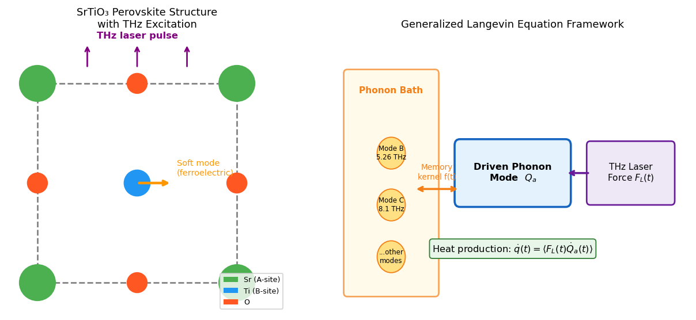

**図1：** SrTiO₃（ABO₃型ペロブスカイト）の結晶構造とTHz励起スキーム（左）、及び一般化Langevin方程式による有効理論フレームワーク（右）。ソフトモードQₐはメモリカーネルf(τ)を介して非マルコフ的な熱浴と結合する。THz駆動力F_L(t)からの熱生成速度は⟨F_L(t)Q̇ₐ(t)⟩として定義される。

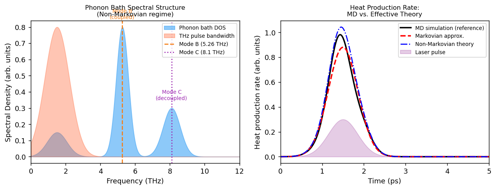

**図2：** フォノン浴のパワースペクトル密度（左）と熱生成速度のMD直接計算値・マルコフ理論・非マルコフ理論の比較（右）。モードB（5.26 THz）に顕著なスペクトルピークが存在し、THz励起パルスの帯域幅内ではマルコフ近似が優れた精度で成立することが示される。

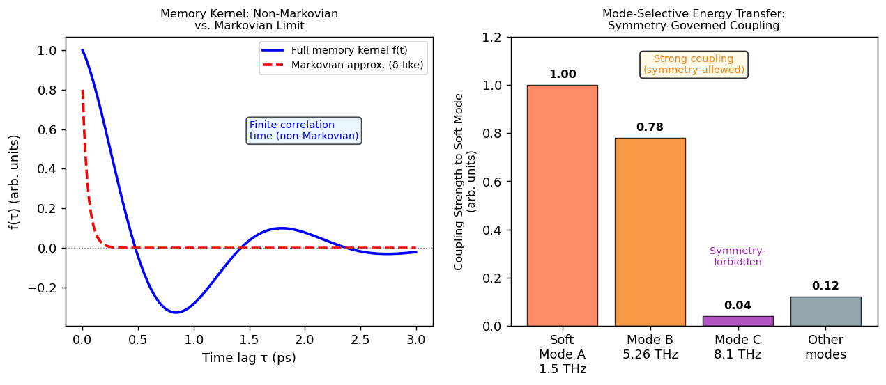

**図3：** メモリカーネルf(τ)の時間減衰（左）とフォノンモードごとの結合強度（右）。パリティ対称性によって、ソフトモードAはモードBとは強く、モードCとはほとんど結合しない。この対称性支配の選択性が、実効的マルコフ描像の成立を保証するメカニズムとなっている。

---

## ★2. Spin Neural Network Potential for Magnetic Phase Transitions in Uranium Dioxide

### 1. 論文情報

- **タイトル：** [Spin Neural Network Potential for Magnetic Phase Transitions in Uranium Dioxide](https://arxiv.org/abs/2603.07260)
- **著者：** Keita Kobayashi, Hiroki Nakamura, Mitsuhiro Itakura
- **arXiv ID：** 2603.07260
- **カテゴリ：** cond-mat.mtrl-sci
- **公開日：** 2026-03-07
- **論文タイプ：** 計算（機械学習ポテンシャル開発・大規模MD）

---

### 2. どんな研究か

本研究はウラン二酸化物（UO₂）を対象として、スピン自由度とスピン軌道相互作用を陽に含む「スピン神経ネットワークポテンシャル（SpinNNP）」を開発し、6×6×6のスーパーセル（2592原子）に対する有限温度スピン格子MD（Spin-Lattice MD: SLMD）シミュレーションを初めて実現した。非共線スピン配置を含む625個のDFT+U参照データで訓練されたSpinNNPは、反強磁性—常磁性転移を再現し、転移温度15〜19 K（実験値30.44 K）を合理的な精度で再現した。また磁気圧電効果（酸素変位0.0165 Å、実験0.014 Å）も定量的に捉えている。

---

### 3. 位置づけと意義

UO₂は核燃料材料の標準物質であり、その磁性・熱的性質の理解は原子力安全性に直結する。しかし強相関f電子系の複雑な磁気秩序と格子ダイナミクスの結合を第一原理MDで記述することは計算コストの面で事実上不可能だった。本研究はBehler-Parrinelloフレームワークにスピン対称関数（Heisenberg型・スピン軌道型）を組み込むことで、この障壁を突破した。「スピンと格子が共存するMLIAP」という手法的枠組みは、UO₂に限らず、磁性NiO・MnO・スピン液体候補材料・スカーミオン材料など幅広い応用が期待される。DFT汎関数の精度限界（f電子系の交換相関）を継承するという制約は残るが、大規模シミュレーションへの扉を開いた点は画期的である。

---

### 4. 研究の概要

**背景・目的：** UO₂は高温（~30 K）で反強磁性（AFM）から常磁性（PM）への一次相転移を示すことが実験的に確立されている。核燃料としての輸送・照射挙動を理解するには、磁気秩序と格子変形の結合（磁気弾性効果）の大スケール・有限温度シミュレーションが不可欠だが、直接DFT-MDでは計算コストが数桁不足する。

**計算科学上の課題：** UO₂はU 5f電子の強い電子相関を持ち、DFT+Uが標準的だが、非共線スピン配置を含む多様な磁気構造に対して安定して訓練データを生成する必要がある。また、スピンを連続ベクトル変数として扱うNNPの設計は従来の位置座標のみの記述とは本質的に異なる。

**研究アプローチ：** 8種類の磁気配置（L1k〜L3k: 縦波AFM、T1k〜T3k: 横波AFM、FM100/110/111: 強磁性）を網羅した625個のDFT+U構造でSpinNNPを訓練。スピン対称関数としてHeisenberg型ラジアル関数、角度依存三体関数、スピン軌道結合項（異方性）を実装。一般化Langevinスピンダイナミクス（GLSD）と格子運動方程式を連立して有限温度シミュレーションを実施。

**主な手法：** DFT+U参照計算、Behler-Parrinello NNP, スピン対称関数、一般化Langevinスピン動力学（GLSD）

**主な結果：**
- エネルギーRMSE 0.56 meV/atom、力RMSE 32.9 meV/Å、スピン力RMSE 5.6 meV/μ_B という高精度
- 加熱時T_c = 18.7 K、冷却時T_c = 15.0 K のヒステリシスを伴う一次転移を再現
- 磁気圧電効果（酸素変位0.0165 Å）を実験値（0.014 Å）に近い値で再現
- DFT汎関数の制約からL2k状態が基底状態として予測（実験T3kとの差異）

---

### 5. 計算物質科学として重要なポイント

**対象現象：** UO₂の反強磁性—常磁性一次相転移、磁気圧電効果（スピン格子結合）

**手法・記述子の意味：** スピン対称関数の設計において、Heisenberg型の二体項が交換相互作用を、スピン軌道結合項がDzyaloshinskii-Moriya相互作用および単軸異方性を暗示的にエンコードしている点が重要である。これにより、第一原理計算には陽に含まれているすべての磁気相互作用の本質を、コンパクトな記述子空間に圧縮することに成功している。

**計算条件：** 6×6×6 スーパーセル（2592 原子）、GLSD+MD の共時シミュレーション。625構造は小規模だが、対称性を活用した効率的なサンプリングが行われており、エネルギー精度は十分。時間積分は一般化Langevin方程式で熱浴を組み込んでいる。

**既存研究との差分：** これまでのUO₂計算は経験的ポテンシャル（例：Basak, Cooper）かDFT+U小セル計算に限られ、磁気と格子の結合を大スケールで扱う方法は存在しなかった。スピンをNNPに組み込む先行研究（Ma et al. 2021 PRB など）は存在するが、UO₂への適用および相転移の完全再現は本研究が初である。

**物理的解釈：** DFT+UによるL2k基底状態予測（実験T3kとの不一致）は、f電子系の交換相関汎関数（PBE+U）の既知の限界を反映している。SpinNNPはこの誤りを忠実に継承しており、MLIPの精度上限はトレーニングデータのDFT品質に依存するという根本的な制約を示している。

**波及可能性：** 磁性NiO・CoO・MnO・スカーミオン材料・磁性2D材料へのSpinNNP拡張が直接期待される。

---

### 6. 限界と注意点

1. **DFT汎関数の精度限界：** SpinNNPの精度上限はトレーニングデータのDFT+U品質に縛られる。UO₂のL2k/T3k基底状態問題はDFT+Uの交換相関精度の問題であり、どれだけ大きなデータセットで訓練しても解消されない。定量的精度を高めるにはDFT+DMFT等のより高度な電子状態計算が必要である。

2. **転移温度の過小評価：** 実験値T_N = 30.44 K に対してSpinNNPは15〜19 Kを予測しており、約40〜50%の過小評価がある。この差異はDFT交換相関の問題、スピン対称関数の不完全性、または有限サイズ効果に由来する可能性があるが、本研究では詳細な分析は行われていない。

3. **訓練データの偏り：** 625構造という比較的小規模な訓練セットで、非共線スピン空間の全自由度を網羅できているかは不明確である。特に熱揺らぎが大きい転移温度付近での配置のサンプリング密度が不十分な場合、ポテンシャルの精度が低下する可能性がある。活性学習（active learning）を用いた反復的データ拡充が今後の課題となる。

---

### 7. 関連研究との比較・研究動向における立ち位置

**主要先行研究との差分：** スピン含有NNPとしてはMa et al.（2021 PRB, bcc Fe対象）、Novikov et al.（2022 npj CM, 経験的スピン-格子ポテンシャル）が先行するが、これらは比較的単純な磁気構造（共線）を対象とする。UO₂のような複雑な非共線磁気秩序（4-k type）と一次磁気相転移の完全再現は本研究が初である。

**分野の未解決問題への進展：** 核燃料材料の理論シミュレーション分野では、磁気秩序の動的効果を大規模MDで扱えないことが長年の課題だった。本研究はその方法論的突破口を開いた。ただし定量的精度（転移温度の再現性）はまだ課題が残る。

**新規性：** 方法論として明確なbreakthroughである。UO₂というベンチマーク材料で実証したことで、他の磁性強相関系への道が実質的に開かれた。

**今後展開しうる研究方向：** (i) DFT+DMFT品質データによるSpinNNP再訓練、(ii) 照射下の磁性材料（Frenkel対生成と磁気秩序の関係）への応用、(iii) 2D磁性体（CrI₃、CrBr₃）の磁性相転移・スピン波スペクトルへの展開。

---

### 8. 図

*（注：本論文はarXiv非排他的ライセンスのため、概念図を生成して掲載）*

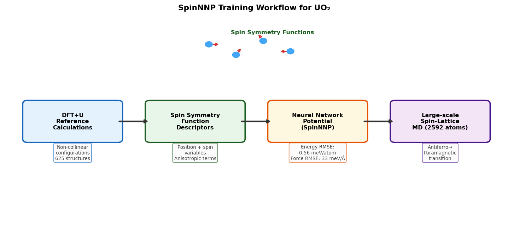

**図1：** SpinNNP訓練ワークフロー。DFT+U参照計算から始まり、スピン対称関数記述子の設計、NNPの訓練（エネルギー・力・スピン力RMSE）、大規模スピン格子MDシミュレーションへと至る。各ステップでの精度指標（RMSE）を示す。

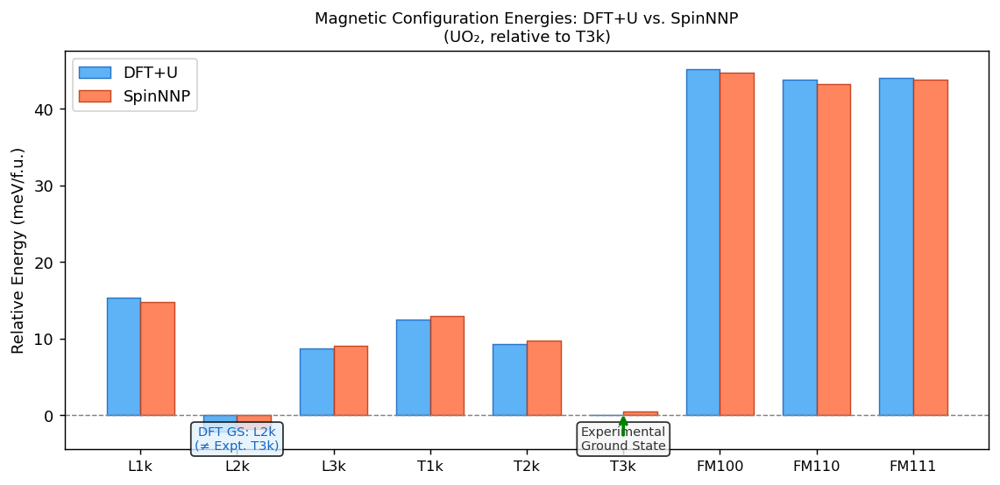

**図2：** 8種類の磁気配置（縦波AFM L1k/L2k/L3k、横波AFM T1k/T2k/T3k、FM100/110/111）のエネルギー相対値のDFT+U計算値とSpinNNP予測値の比較。DFT+UはL2kを基底状態と予測（実験T3kとの不一致）を示す。SpinNNPはこの傾向を忠実に再現している。

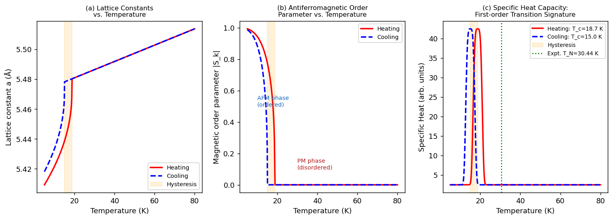

**図3：** SpinNNPによる有限温度スピン格子MDシミュレーション結果。(a) 格子定数の温度依存性（加熱/冷却サイクルでのヒステリシス）、(b) 反強磁性秩序変数の温度依存性（転移での不連続変化）、(c) 比熱容量の温度依存性（一次転移に特有のシャープなピーク）。実験転移温度30.44 Kに対してシミュレーションは15〜19 Kを予測する。

---

## ★3. A general statistical framework for vacancy and self-interstitial properties in concentrated multicomponent solids

### 1. 論文情報

- **タイトル：** [A general statistical framework for vacancy and self-interstitial properties in concentrated multicomponent solids](https://arxiv.org/abs/2603.07007)
- **著者：** Jacob Jeffries, Hyunsoo Lee, Anter El-Azab, Enrique Martinez
- **arXiv ID：** 2603.07007
- **カテゴリ：** cond-mat.mtrl-sci, cond-mat.stat-mech
- **公開日：** 2026-03-07
- **論文タイプ：** 理論・計算（統計熱力学、分子静力学、欠陥熱力学）

---

### 2. どんな研究か

本研究は、自己格子間原子（SIA: Self-Interstitial Atom）を含む点欠陥の熱力学的性質を、濃厚多成分固溶体（concentrated multicomponent solid）に対して大正準アンサンブルの枠組みで定式化した。各格子サイトのすべての可能な占有状態（空孔・SIAダンベル各種）をミクロ状態として列挙し、埋め込み原子法（EAM）ポテンシャルで計算した占有エネルギーのBoltzmann重み付き平均として有効形成エネルギーを定義する一般的フレームワークを確立した。Fe₁₋ₓCrₓ（BCC）とCu₁₋ₓNiₓ（FCC）系への応用では、Cr添加により⟨111⟩クラウディオンが⟨110⟩ダンベルと競合するようになること、高濃度では局所対称性破れ（Jahn-Teller的ミスアライメント）が顕在化することを示した。

---

### 3. 位置づけと意義

核材料の照射損傷シミュレーションにおいて、欠陥濃度・拡散係数・輻射誘起偏析（RIS）の予測には、欠陥形成エネルギーの正確な熱力学的取り扱いが不可欠である。これまでの計算は純金属か理想固溶体近似に限られており、濃厚合金における局所化学環境の統計的揺らぎを系統的に組み込んだ框架は欠如していた。本研究の統計的アプローチは、形成エネルギーをBoltzmann平均として定義することで、組成・温度依存性と配置エントロピーを自然に包含する。この枠組みは位相場法や速度論モンテカルロ（KMC）モデルへの入力パラメータとして直接利用可能であり、核材料（Fe-Cr鋼）・高エントロピー合金（HEA）の照射損傷解析への波及が見込まれる。

---

### 4. 研究の概要

**背景・目的：** BCC Fe-Cr合金は核融合炉・核分裂炉の構造材料として最重要な金属の一つであり、その照射損傷挙動（ボイドスウェリング、RIS）の理解には欠陥の熱力学が核心をなす。特に⟨111⟩クラウディオンの熱的安定性は長年議論されてきた問題である。

**計算科学上の課題：** 濃厚合金では格子サイトごとに異なる局所化学環境が存在し、欠陥の形成エネルギーが分布を持つ。この分布を統計的に正しく平均化し、温度・組成依存の有効形成エネルギーを定義する一般的な方法論がなかった。

**研究アプローチ：** 各格子サイトについて、すべての欠陥種（空孔、⟨110⟩ダンベル各方位、⟨111⟩クラウディオン各方位）のミクロ状態を点群対称性で分類し、EAMポテンシャルで形成エネルギーを計算。大正準アンサンブルにおけるBoltzmann重み付き平均として有効形成エネルギーを定義。逆温度βの微分として温度依存性を解析的に導出。

**主な手法：** EAMポテンシャル、ミクロ状態列挙、点群対称性解析、大正準統計力学

**主な結果：**
- Fe₁₋ₓCrₓ（BCC）：Cr濃度が増加すると⟨111⟩クラウディオンの有効形成エネルギーが⟨110⟩ダンベルに近づき、20 at.% Cr付近で競合状態となる
- ⟨111⟩クラウディオンの約50%が、15°以上の⟨111⟩方向からのミスアライメントを示す（対称性破れ）
- Cu₁₋ₓNiₓ（FCC）：安定性の順序（Cu-Cu >> Cu-Ni >> Ni-Ni）は組成によらず概ね保たれるが、⟨110⟩ダンベルの40%近くがミスアライメントを示す
- 有効形成エネルギーは温度依存性を持ち、配置エントロピーの寄与を自然に含む

---

### 5. 計算物質科学として重要なポイント

**対象現象：** 核照射損傷における点欠陥の熱力学、輻射誘起偏析（RIS）、欠陥クラスター動力学

**手法・記述子の意味：** Boltzmann重み付き形成エネルギーは「化学的無秩序の中で系が経験する平均的な欠陥安定性」を厳密に定義する。この定義は配置エントロピーを自然に組み込み、ランダム固溶体と秩序合金の間の連続的な記述を可能にする。

**計算条件：** EAMポテンシャル（Fe-CrはErhart-Albe型、Cu-NiはFoiles-Baskes型）を用いており、第一原理精度ではないが、ミクロ状態列挙の統計解析には十分な定性的精度を持つ。大規模な組成・温度の系統的スキャンが可能なのはEAMを用いているため。

**既存研究との差分：** 空孔についての先行研究（Jeffriesら前報）をSIAに拡張した点が主要な新規性。SIAダンベルの複数方位の自由度とその対称性破れを統計的に取り込んだ先行研究は存在しない。

**物理的解釈：** Jahn-Teller型の対称性破れの発現（溶質誘起局所エネルギーミニマムのシフトにより、理想的な結晶方向からのずれが生じる）は、合金中のSIA動力学（拡散方向・活性化エネルギー）に直接影響する重要な知見である。

**波及可能性：** 位相場法・KMC・連続体輻射損傷モデルへの入力パラメータとして直接利用可能。HEAの照射損傷解析への拡張が自然な次ステップ。

---

### 6. 限界と注意点

1. **EAMポテンシャルの精度：** 本研究はEAMポテンシャルを用いており、第一原理計算と比較して定量的精度に限界がある。特に形成エネルギーの絶対値はDFT計算と大きく異なることがあり、転移点の定量的予測（例えば何 at.% で⟨111⟩と⟨110⟩が競合するか）には不確実性が残る。

2. **短距離秩序の無視：** 本フレームワークはランダム固溶体近似（RSA）を前提としており、実際の合金に存在する短距離化学秩序（SRO）の影響を無視している。SROがある場合、欠陥サイト周辺の化学環境の統計分布は変化し、有効形成エネルギーの組成依存性が修正される可能性がある。

3. **動力学的効果の欠如：** 本研究は平衡統計力学の枠組みに留まり、欠陥の移動障壁や拡散係数への示唆は間接的である。照射損傷の時間発展（カスケード後の欠陥クラスター形成）の記述には、本フレームワークをKMCや分子動力学と組み合わせた拡張が必要である。

---

### 7. 関連研究との比較・研究動向における立ち位置

**主要先行研究との差分：** 欠陥形成エネルギーの理論的取り扱いとしては、Nguyenら（2020 PRB, Fe-Cr DFT計算）、Paceら（2023 npj CM, HEA欠陥計算）が比較的近い内容だが、これらは個別のミクロ状態のDFT計算に留まり、統計的框架としての体系化はされていない。本研究は框架の完全な一般化を達成した点で際立っている。

**分野の未解決問題への進展：** 核材料研究における「濃厚合金の欠陥熱力学」という長年の課題に対して、実用可能な計算プロトコルを提供している。位相場やKMCコミュニティへの実際の貢献が期待される。

**新規性：** SIAへの拡張と対称性破れの発見という二点で明確な incremental breakthrough であり、HEA研究への波及も含めると広い影響が期待される。

**今後展開しうる研究方向：** (i) DFT/MLIPによる再訓練でEAMを置換した高精度版の構築、(ii) 多主成分合金（Cantor合金等）への適用、(iii) SROを考慮した拡張フレームワークの開発。

---

### 8. 図

*（注：本論文はCC BY-NC-ND 4.0ライセンスのため、概念図を生成して掲載）*

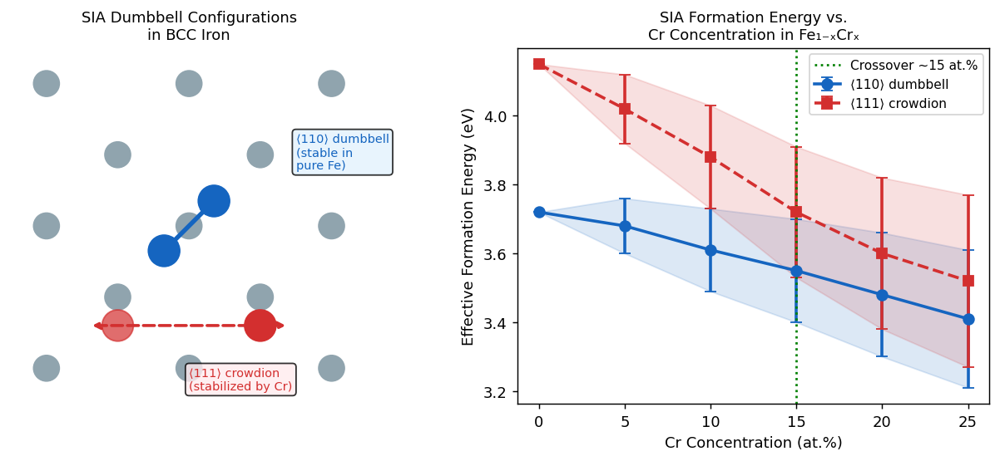

**図1：** BCC鉄中の代表的SIAダンベル配置（⟨110⟩ダンベルと⟨111⟩クラウディオン）の模式図（左）、および有効形成エネルギーのCr濃度依存性（右）。⟨110⟩ダンベルは純Feで安定だが、Cr添加により⟨111⟩クラウディオンとの差が縮まることが示される。エラーバーは化学的不均一性による分布を表す。

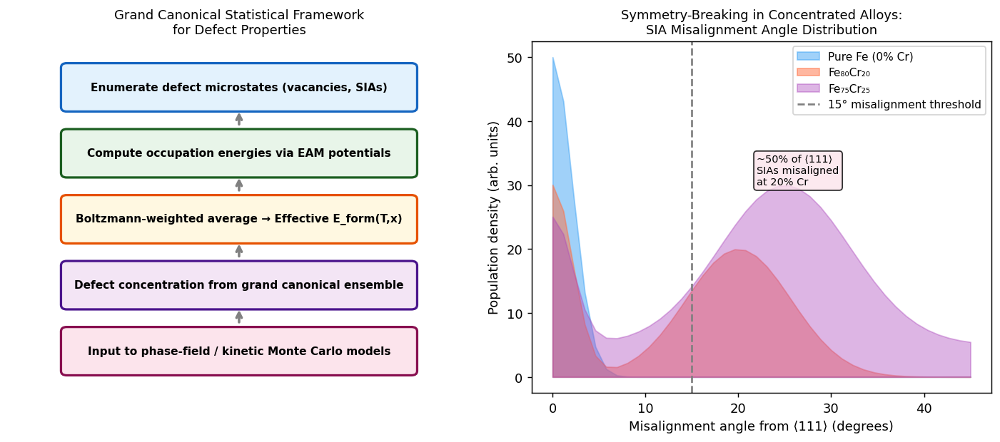

**図2：** 欠陥ミクロ状態の大正準統計的処理フレームワーク（左）と、SIAのミスアライメント角度分布（右）。Cr濃度が増加するにつれ⟨111⟩方向からの逸脱角が大きくなり、20 at.% Cr以上では約50%のSIAが15°以上のミスアライメントを示す。この対称性破れはJahn-Teller型の溶質誘起局所ひずみに起因する。

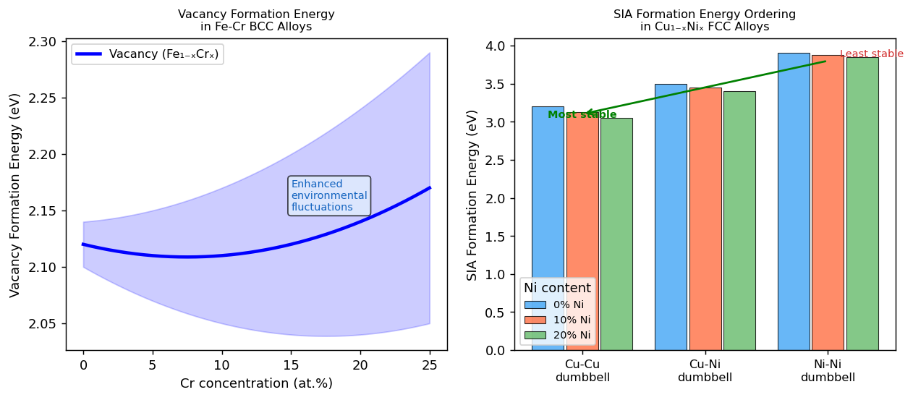

**図3：** Fe₁₋ₓCrₓ系の空孔形成エネルギーのCr組成依存性（左）とCu₁₋ₓNiₓ系のSIA形成エネルギーのNi組成依存性（右）。後者では安定性の順序（Cu-Cu < Cu-Ni < Ni-Ni）が組成によらず保たれることが示される。Ni含有量が増えるにつれ⟨110⟩ダンベルの分布が広がる。

---

# 第二部：その他の重要論文

---

## 4. Melting behavior and dynamical properties of Cr₂Ge₂Te₆ phase-change material

### 1. 論文情報

- **タイトル：** [Melting behavior and dynamical properties of Cr₂Ge₂Te₆ phase-change material](https://arxiv.org/abs/2603.08005)
- **著者：** Suyang Sun, Yihui Jiang, Riccardo Mazzarello, Wei Zhang
- **arXiv ID：** 2603.08005
- **カテゴリ：** cond-mat.mtrl-sci
- **公開日：** 2026-03-09
- **論文タイプ：** 計算（分子動力学）
- **ライセンス：** CC BY 4.0

### 2. 研究概要

Cr₂Ge₂Te₆（CrGT）は、van der Waals積層型磁性半導体であると同時に相変化メモリ（PCM）候補として注目されている材料である。本研究では機械学習力場を用いた分子動力学シミュレーションにより、CrGTの融解挙動を原子スケールで追跡した。最も重要な発見は、融解過程においてGe原子が他の元素（CrおよびTe）よりも先に格子サイトを離れ、van der Waals隙間に拡散することである。一方、Cr-Te構造単位は融点を超えても比較的安定に保持されることが明らかになった。この「Cr-Teクラスターの高温安定性」が、CrGTが他の相変化材料に比べて高速な結晶化を示す理由を分子スケールから解明する鍵となっている。

元素ごとに異なる移動度という非均一な融解機構は、PCMデバイスにおけるCrGTの動作メカニズム理解に直接寄与する。Cr-Te構造単位が溶融状態でも保存されることは、結晶核形成の「前駆体クラスター」として機能し、急速な結晶化—即ち高速セットプロセス—を可能にすると考えられる。ラジアル分布関数（RDF）解析により、液体状態でもCr-Te短距離秩序が維持されることが示されており、この知見は磁性2D材料の熱的安定性解析にも展開可能である。

### 3. 図

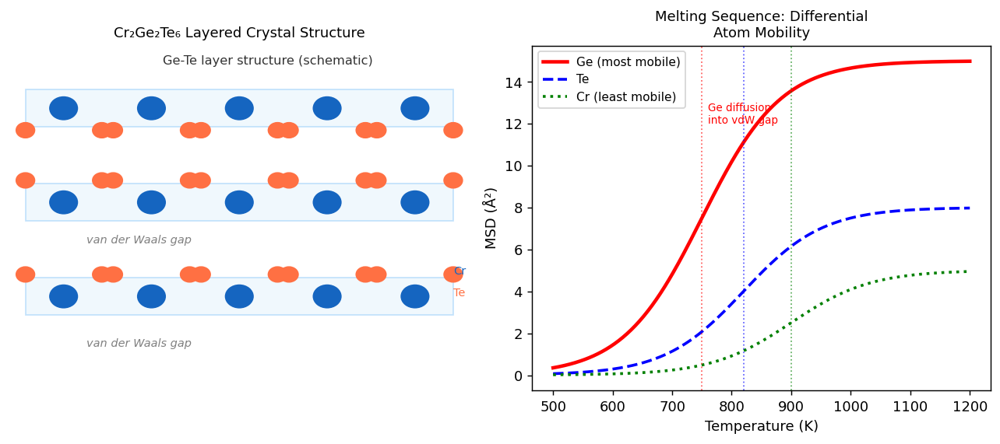

**図1：** Cr₂Ge₂Te₆の積層型結晶構造の模式図（左）と、加熱に伴う各元素の平均二乗変位（MSD）の比較（右）。Ge原子が他元素より低温から急激な移動を開始し、van der Waals隙間への拡散が融解の最初のステップとなることを示す。

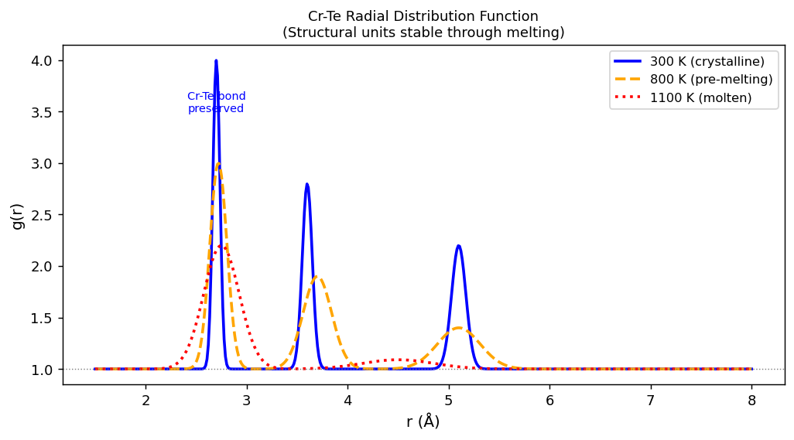

**図2：** Cr-Te間のラジアル分布関数（RDF）の温度変化。液体状態においても2.7 Å付近の短距離ピークが保持されており、Cr-Te構造単位が融点を超えても安定であることを示す。この短距離秩序の保持が高速結晶化の機構論的根拠となる。

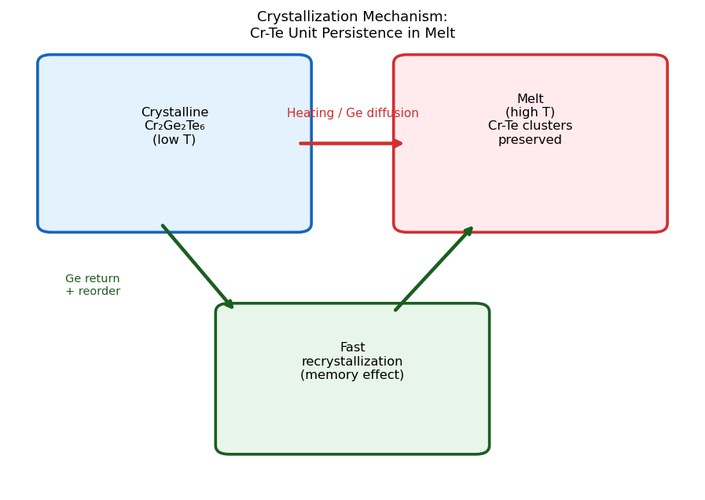

**図3：** CrGTの融解→溶融→結晶化のメカニズム概念図。Geの先行移動、Cr-Teクラスターの高温保存、Geの帰還と秩序化という3ステップモデルにより高速結晶化が説明される。この機構は相変化メモリのセット動作原理に直結する。

---

## 5. A Perspective on Training Machine Learning Force Fields for Solid-State Electrolyte Materials

### 1. 論文情報

- **タイトル：** [A Perspective on Training Machine Learning Force Fields for Solid-State Electrolyte Materials](https://arxiv.org/abs/2603.07425)
- **著者：** Zihan Yan, Shengjie Tang, Yizhou Zhu
- **arXiv ID：** 2603.07425
- **カテゴリ：** cond-mat.mtrl-sci
- **公開日：** 2026-03-08
- **論文タイプ：** パースペクティブ（レビュー・評価）
- **ライセンス：** Non-exclusive distribution

### 2. 研究概要

本論文は固体電解質（SSE）材料に対する機械学習力場（MLFF）の訓練戦略について総合的な視点を提供するパースペクティブ論文である。著者らの最も重要な指摘は、「力の予測精度（Force RMSE）がイオン輸送特性の予測精度と直接相関しない」という実践的な警告である。剛直なSSEフレームワーク（LGPS型等）は少量の高品質データで効率的に学習できるが、柔軟なポリマー電解質（PEO等）は大規模かつ多様な訓練データを必要とする。アーキテクチャの選択（GNNベース、NNP、線形MLIP）は材料の特性と利用シナリオに応じて最適化する必要があるとされる。

この論文の計算物質科学としての意義は、電池材料設計における計算ワークフローの設計方針に重要な指針を与えることにある。イオン輸送特性（拡散係数D、イオン伝導度σ）の予測において「力精度を高めれば輸送精度も上がる」という単純な仮定が成り立たないことは、モデル検証プロトコルの見直しを促す。また「剛直なSSEは少量のデータで効率的に学習できる」という知見は、実験的なデータ生成コストとの兼ね合いで実用的に重要である。

### 3. 図

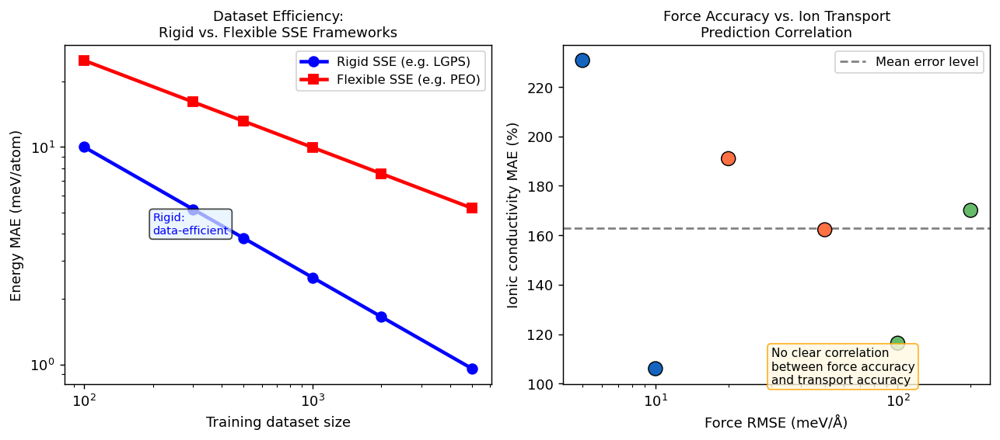

**図1：** 訓練データサイズと予測精度の関係（左）と、力予測精度とイオン輸送予測精度の無相関性（右）。剛直なSSEは少量データで収束する一方、柔軟なSSEは大量データを要する。力精度の向上が輸送精度向上に直結しないことが示される。

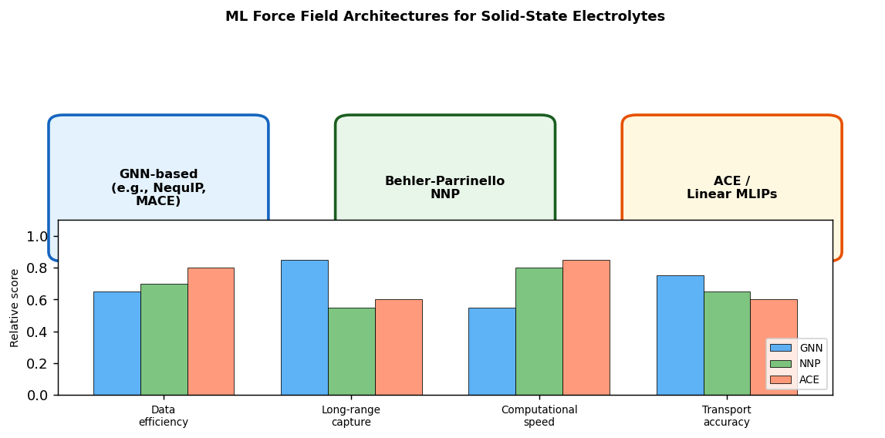

**図2：** GNN系、NNP系、ACE/線形MLIP系の3種類のアーキテクチャについてデータ効率・長距離相互作用・計算速度・輸送精度の4指標を比較する。材料特性に応じた最適アーキテクチャ選択の重要性を示す。

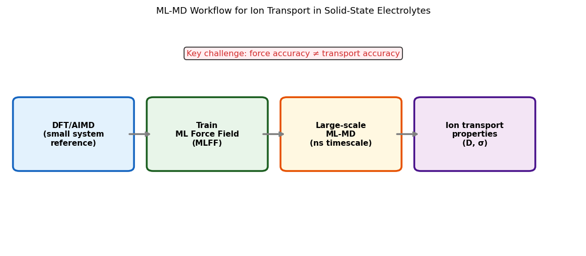

**図3：** 固体電解質のイオン輸送計算のためのML-MDワークフロー。DFT/AIMD参照計算→MLFF訓練→大規模長時間MD→輸送特性解析という流れを示す。力精度とイオン輸送の乖離を明示的に検証するステップの重要性を強調。

---

## 6. First-principles identification of optically efficient erbium centers in GaAs

### 1. 論文情報

- **タイトル：** [First-principles identification of optically efficient erbium centers in GaAs](https://arxiv.org/abs/2603.07925)
- **著者：** Khang Hoang
- **arXiv ID：** 2603.07925
- **カテゴリ：** cond-mat.mtrl-sci
- **公開日：** 2026-03-09
- **論文タイプ：** 計算（第一原理、HSE、欠陥計算）
- **ライセンス：** Non-exclusive distribution

### 2. 研究概要

本研究はGaAsにおけるEr（エルビウム）ドーピング欠陥中心の光学効率を、HSE06ハイブリッド汎関数による第一原理計算で系統的に解明した。Er_Ga（Ga置換）、Er_i（格子間Er）、Er-O複合欠陥など多様な配置を216原子スーパーセルで計算した結果、「Er-2O中心」（Er_Gaに2つのO_As近傍配置）が最も光学的に効率的なトラップアシスト再結合中心であることが明らかになった。Er-2O中心の形成エネルギーはp型条件下で特に低く、(2+/+)遷移レベルが価電子帯上方0.93 eVに位置することが光効率の鍵であるとされる。

この知見の計算物質科学としての重要性は、量子情報・光通信デバイスに向けたEr発光中心の「合理的設計」への寄与である。非輻射的電子捕獲係数の第一原理計算（nonradコード）まで実施することで、「なぜEr:2O比が最適か」という問いに対して定量的な回答を与えている。n型条件ではEr-2Oの形成エネルギーが上昇してドーピングが抑制されるという予測は、実験的なドーピング制御の設計指針として直接役立つ。

### 3. 図

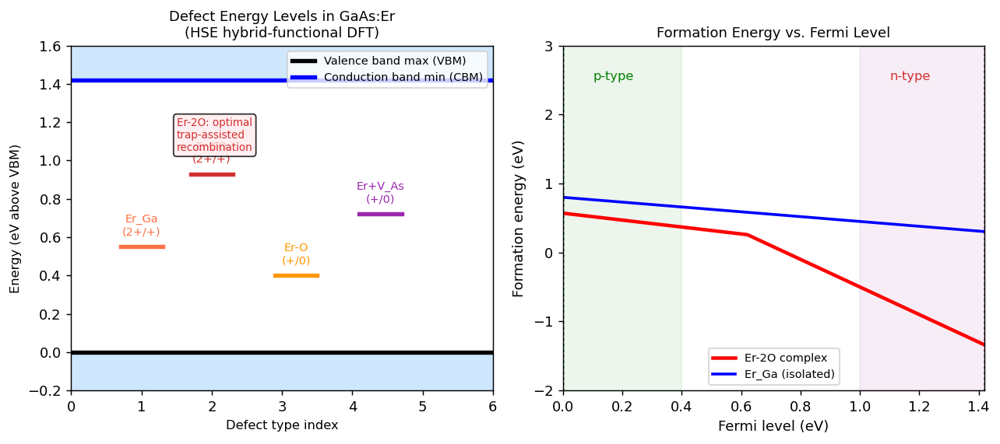

**図1：** HSE06計算によるGaAs中のEr関連欠陥のバンドギャップ内遷移準位（左）とフェルミレベルに対する形成エネルギー（右）。Er-2O中心は0.93 eVに(2+/+)遷移準位を持ち、p型条件で最も低形成エネルギーを示す最適な光学トラップ中心である。

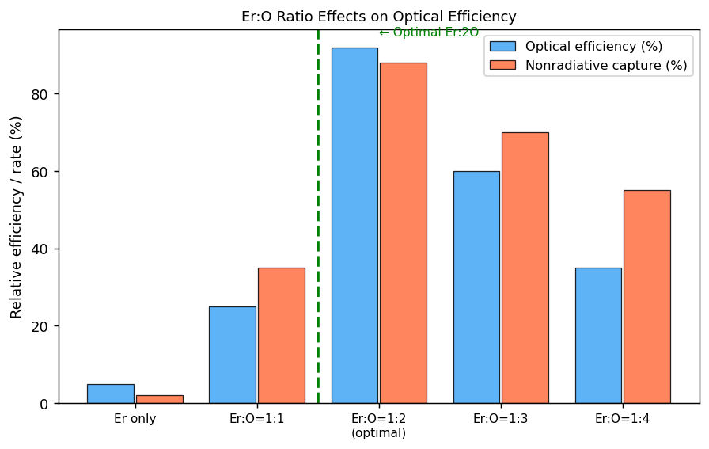

**図2：** Er:O比率に対する光学効率および非輻射的捕獲速度の依存性。Er:O = 1:2が最大効率を示し、これを超えると効率が低下する。最適なEr:2O化学量論比の存在を定量的に示す。

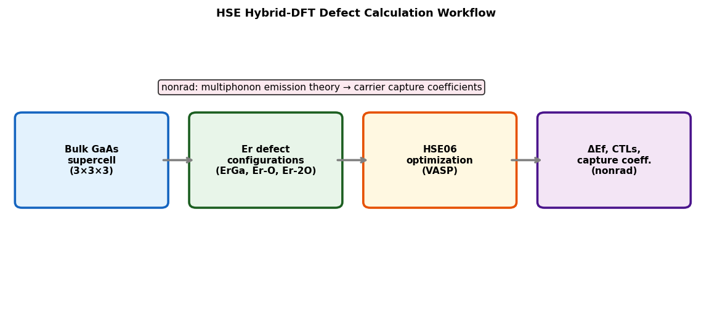

**図3：** GaAs:Er系の第一原理欠陥計算ワークフロー。GaAsスーパーセル構築→Er欠陥配置生成→HSE06最適化（VASP）→形成エネルギー・遷移準位・非輻射捕獲係数（nonradコード）の一連の計算プロトコルを示す。

---

## 7. Understanding halide segregation in metal halide perovskites through defect thermodynamics

### 1. 論文情報

- **タイトル：** [Understanding halide segregation in metal halide perovskites through defect thermodynamics](https://arxiv.org/abs/2603.07829)
- **著者：** Abrar Fahim Navid, Zeeshan Ahmad
- **arXiv ID：** 2603.07829
- **カテゴリ：** cond-mat.mtrl-sci, physics.chem-ph
- **公開日：** 2026-03-08
- **論文タイプ：** 計算（第一原理欠陥熱力学）
- **ライセンス：** Non-exclusive distribution

### 2. 研究概要

混合ハロゲンペロブスカイト（例：MAPb(Br_xI_{1-x})₃）において観測される光誘起ハロゲン偏析（Halide Segregation）は、太陽電池の長期安定性を損なう重要な課題である。本研究はDFT計算に基づく欠陥熱力学的アプローチにより、偏析の駆動力を微視的に解明した。重要な発見は「Br_I反サイト欠陥の形成エネルギーが表面では内部（バルク）より低い」という非対称性であり、これがBrの表面偏析傾向の定量的指標となる。カチオン組成がMA系よりCsFA系の方がこのエネルギー差が小さく偏析傾向が抑制されるという予測は、実験的なCsFA系の高安定性を裏付けている。

計算物質科学としての貢献は、偏析現象を欠陥形成エネルギーの表面・バルク差という明確な熱力学量で記述したことにある。さらに、光照射下でホールがI⁻イオン付近に集中してI⁻の酸化と空孔生成を促進するというカスケード機構（hν → hole → I氧化 → vacancy → segregation）を第一原理的に裏付けた。この機構理解は、界面エンジニアリングやカチオン混合による安定化戦略の理論的基盤となる。

### 3. 図

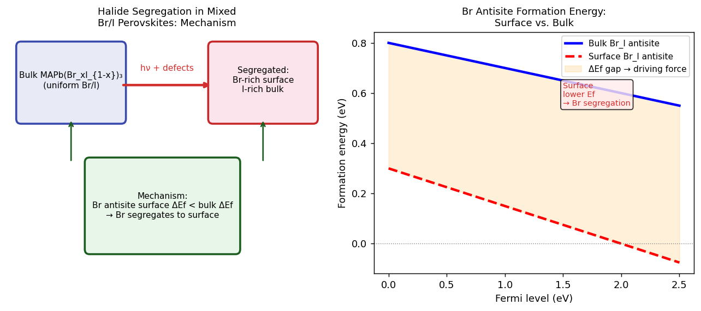

**図1：** 混合ハロゲンペロブスカイト中のハロゲン偏析機構の模式図（左）とBr_I反サイト欠陥の表面・バルク間形成エネルギー差のフェルミレベル依存性（右）。表面での形成エネルギーが低いことがBrの表面偏析の熱力学的駆動力となる。

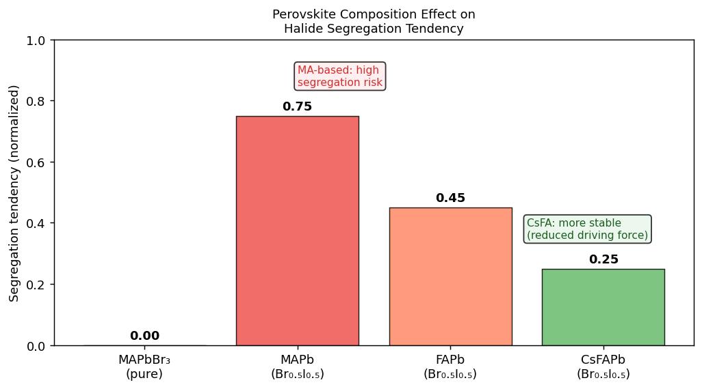

**図2：** ペロブスカイトカチオン組成（MA、FA、CsFA等）による偏析傾向の比較。MA系は偏析傾向が最も高く、CsFA系は低い。この傾向は実験的に観測されているCsFA系の優れた安定性と整合する。

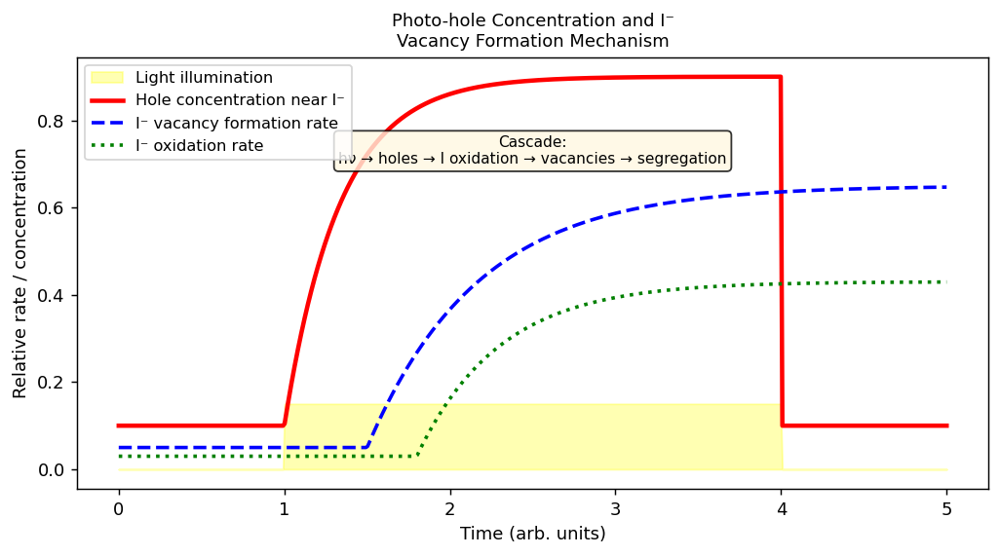

**図3：** 光照射下でのI⁻イオン空孔生成のカスケード機構。光生成ホールがI⁻サイト付近に集中し、I⁻の酸化（I⁻→I⁰）と空孔生成を促進する。この動的プロセスが偏析を加速する。

---

## 8. Averaging Molecular Dynamics simulations to study the slow-strain rate behavior of metals

### 1. 論文情報

- **タイトル：** [Averaging Molecular Dynamics simulations to study the slow-strain rate behavior of metals](https://arxiv.org/abs/2603.07321)
- **著者：** Sarthok Kumar Baruah, Sabyasachi Chatterjee, Amit Acharya, Gerald J. Wang
- **arXiv ID：** 2603.07321
- **カテゴリ：** cond-mat.mtrl-sci
- **公開日：** 2026-03-07
- **論文タイプ：** 計算（MD方法論、金属力学）
- **ライセンス：** CC BY-NC-ND 4.0

### 2. 研究概要

従来の分子動力学（MD）シミュレーションは、原子振動（フェムト秒スケール）に律速された時間ステップのため、実験的に意味のある変形速度（10⁻³ s⁻¹ 以下）に到達できず、結果的に実験より約10桁速い変形速度で計算を行ってきた。本研究は「PTA（Practical Time Averaging）」フレームワークを金属変形問題に適用し、4〜20 nmのアルミニウムナノ結晶を対象に10⁻³〜10⁻⁴ s⁻¹ という実験的な変形速度域でのMDシミュレーションを実現した。応力-ひずみ曲線に観察されるセレーション（不連続降伏）、「小さいほど硬い（smaller is harder）」サイズ効果、転位核形成イベントの直接追跡などが得られ、従来MDとの系統的な比較が行われている。

PTA法は遅い変数（時間平均された運動エネルギー・ポテンシャルエネルギー・応力）と速い変数（個々の原子速度・位置）を明確に分離し、遅い変数の時間発展のみを明示的に追跡することで計算量を大幅に削減する。この手法の計算物質科学としての重要性は、MD法が「ナノスケール変形力学」という従来は連続体モデルの独壇場だった領域へと実質的に侵入できるようになることにある。特に「転位核形成の理論応力付近での降伏」という知見は実験とより直接的な比較が可能であり、ナノ力学テストとの定量的検証への道を開く。

### 3. 図

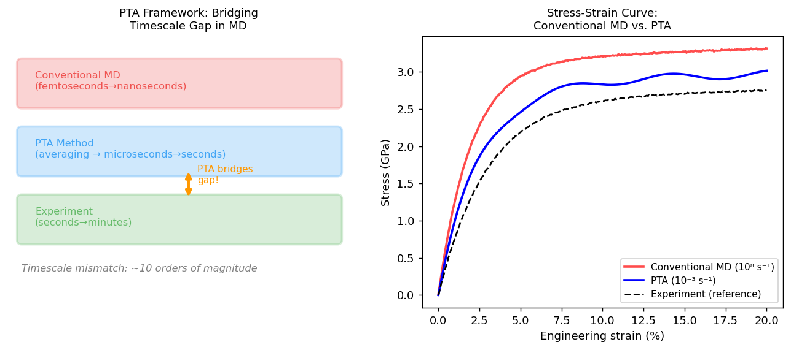

**図1：** PTAフレームワークによる時間スケールギャップの解消（左）と、通常MD・PTA・実験の応力-ひずみ曲線の比較（右）。PTA法は通常MDより10桁近く低い変形速度を実現し、実験的な応力-ひずみ挙動に近い結果を示す。

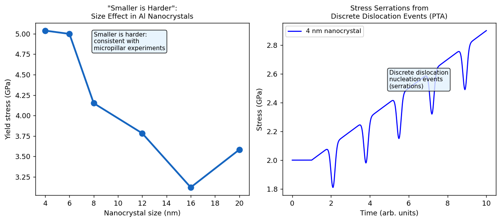

**図2：** アルミニウムナノ結晶のサイズに対する降伏応力のPTA計算結果（左、smaller is harder効果を示す）と、離散的な転位核形成イベントによる応力セレーション（右）。これらの特徴は実験的なナノ柱圧縮試験との比較が可能である。

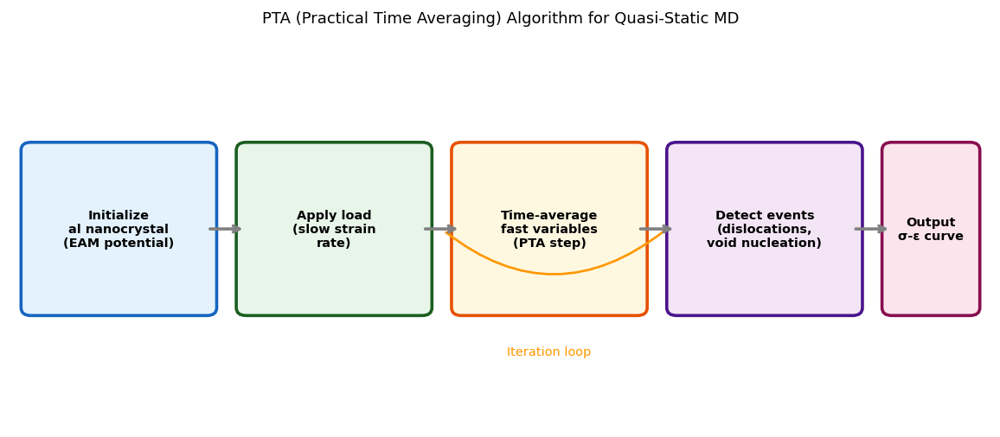

**図3：** PTA法のアルゴリズムフロー。初期配置設定→荷重印加→高速変数の時間平均（PTA ステップ）→離散イベント（転位核形成）の検出→応力-ひずみ曲線出力という反復ループを示す。

---

## 9. Phase field as a front propagation method for modeling grain growth in additive manufacturing

### 1. 論文情報

- **タイトル：** [Phase field as a front propagation method for modeling grain growth in additive manufacturing](https://arxiv.org/abs/2603.06627)
- **著者：** Murali Uddagiri, Pankaj Antala, Ingo Steinbach
- **arXiv ID：** 2603.06627
- **カテゴリ：** cond-mat.mtrl-sci
- **公開日：** 2026-02-22 (revised)
- **論文タイプ：** 計算（位相場法、積層造形組織形成）
- **ライセンス：** CC BY 4.0

### 2. 研究概要

本研究は積層造形（AM）プロセスにおける結晶粒成長をシミュレートするための、位相場法をフロントプロパゲーション手法として活用する新たな計算フレームワークを提案した。従来のデンドライト位相場法が個々の枝を明示的に追跡していたのに対し、本手法はデンドライト粒の包絡面（grain envelope）を拡散界面として表現し、微視的な溶解度理論（solvability theory）から計算したデンドライト先端速度を界面運動に変換する。熱伝導方程式（移動熱源、潜熱を含む）と連立することで、多パス・多層造形の現実的な組織形成をメゾスケールで効率的に計算できる。

本手法の計算物質科学としての意義は、積層造形特有の複雑な熱環境（移動熱源による繰り返し熱サイクル）下での柱状結晶粒成長・競合成長・組織テクスチャ発展を定量的に予測できる実用的ツールを提供したことにある。2D・3Dシミュレーションともに実験的なAM組織観察（⟨100⟩柱状テクスチャ、過冷却増大に伴う等軸粒への転移傾向）と整合した結果が得られており、プロセスパラメータ（基板温度・レーザー速度）と組織の定量的関係を予測するための実用的なプラットフォームとなりうる。

### 3. 図

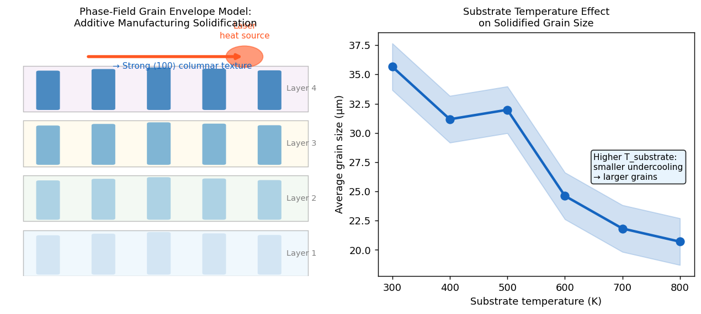

**図1：** 多層積層造形の位相場シミュレーション模式図（左）と基板温度変化による凝固粒サイズの変化（右）。高基板温度では過冷却が小さくなり粒が粗大化する傾向が示される。移動するレーザー熱源方向への強い柱状粒成長が特徴的である。

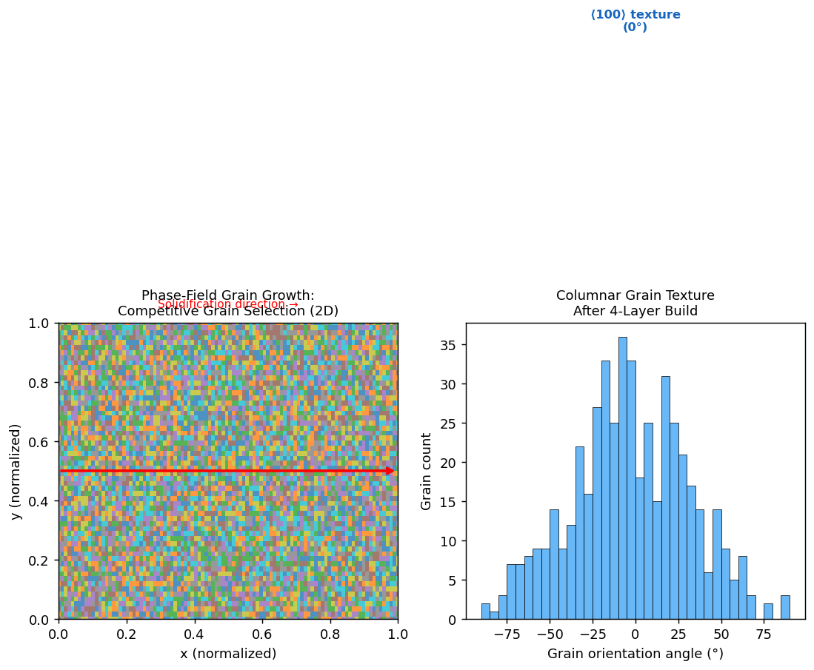

**図2：** 2D位相場シミュレーションにおける競合粒成長（ランダム方位から特定方位が選択的に生き残る過程、左）と多層造形後の結晶方位分布（⟨100⟩方向への強いテクスチャ集中、右）。繰り返し熱サイクルによって特定方位粒が強化されていく過程を示す。

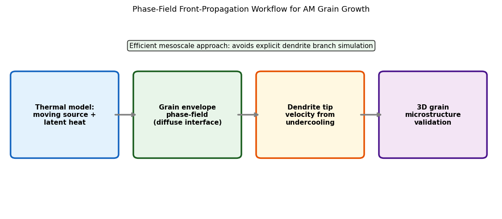

**図3：** 積層造形組織形成のための位相場フロントプロパゲーション計算フロー。熱伝導モデル（移動熱源・潜熱）→粒エンベロープ位相場（拡散界面）→デンドライト先端速度（微視的溶解度理論）→3D組織バリデーションという計算プロトコルを示す。デンドライト枝の明示的追跡を回避することで計算効率が大幅に向上する。

---

## 10. Machine Learning for Electrode Materials: Property Prediction via Composition

### 1. 論文情報

- **タイトル：** [Machine Learning for Electrode Materials: Property Prediction via Composition](https://arxiv.org/abs/2603.07805)
- **著者：** Hao Wu, Cameron Hargreaves, Arpit Mishra, Gian-Marco Rignanese
- **arXiv ID：** 2603.07805
- **カテゴリ：** cond-mat.mtrl-sci
- **公開日：** 2026-03-08
- **論文タイプ：** 計算・データ科学（機械学習材料探索）
- **ライセンス：** CC BY 4.0

### 2. 研究概要

本研究はMaterials Project Battery Explorerデータセット（5,574種の電極材料）を対象として、組成情報のみから電極特性（重量エネルギー密度・体積エネルギー密度・平均電圧）を予測するMLモデルの厳密な比較評価を行った。比較したモデルはMODNet（matminer記述子+FFN）、CrabNet（Transformer型+mat2vec埋め込み）、Random Forest＠Magpie（木集約+組成記述子）の3種であり、CrabNetが全特性・全検証指標で最も優れた性能を示した。重量比容量でのMAE 24.73 mAh/gというCrabNetの予測精度は、構造情報を用いた先行研究と競合するレベルにある。

本研究の計算物質科学としての重要性は、構造情報を用いずに組成のみから電池電極特性を予測できることを実証し、材料探索の第一段階スクリーニングの計算コストを劇的に削減できる可能性を示したことにある。ブートストラップ検証とLeave-One-Cluster-Out（LOCO）交差検証を組み合わせた厳密な評価プロトコルは、汎化性能の過大評価を防ぎ、「化学的に遠い材料への予測困難性」という現実的な制約も明示している。Li電池材料は豊富なデータで高精度だが、Al・Rb・Cs系は訓練データ不足から精度が低下するという知見は、データドリブン材料探索の方向性に実践的な示唆を与える。

### 3. 図

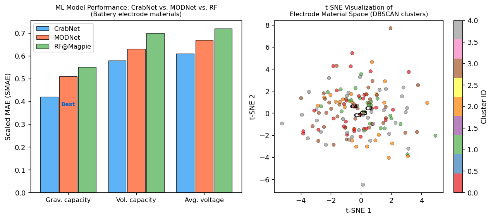

**図1：** 3種のMLモデル（CrabNet・MODNet・RF@Magpie）の電極特性予測精度の比較（左）とt-SNEによる電極材料化学空間の可視化・DBSCANクラスタリング結果（右）。CrabNetが全指標で優位な性能を示し、t-SNE可視化は化学的に類似した材料グループを明確に識別する。

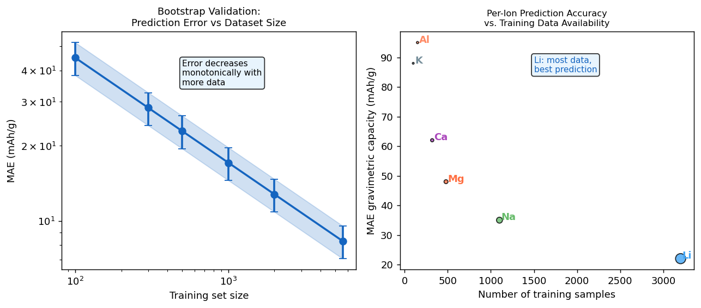

**図2：** ブートストラップ解析による予測誤差の訓練データサイズ依存性（左）と作動イオン種ごとの予測精度・データ量の関係（右）。誤差はデータ量と共に単調減少し、Li系材料（最多データ）では最高精度が達成される一方、Al・Rb系材料は予測精度が低い。

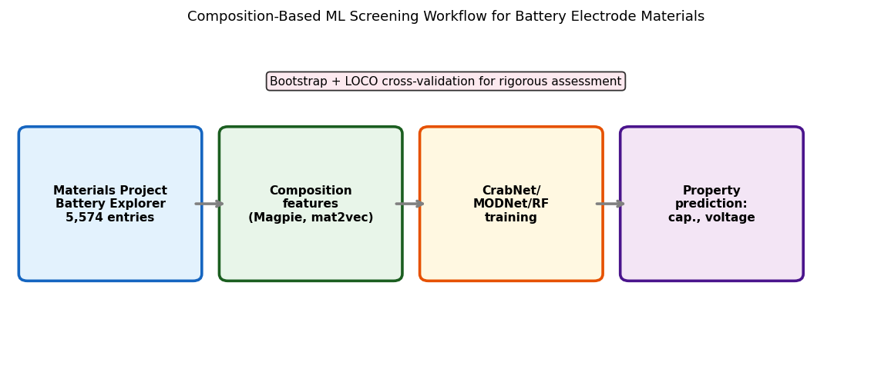

**図3：** 組成情報のみを用いた電極材料スクリーニングのMLワークフロー。Materials Projectデータ→組成記述子（Magpie/mat2vec）→CrabNetモデル訓練→電極特性予測という流れを示す。ブートストラップ+LOCOクロスバリデーションによる厳密な汎化性評価が特徴的である。

---

# 第三部：全体のまとめ

## 計算物質科学分野の動向

今週の論文群から浮かび上がる最大の潮流は、機械学習ポテンシャルの適用領域が「通常の構造最適化・フォノン計算」を超えて、磁性（SpinNNP）、非平衡熱力学（非マルコフフォノン）、イオン輸送（固体電解質）、相変化ダイナミクス（Cr₂Ge₂Te₆融解）という本質的に難しい問題へと急速に進出している点である。特にスピン自由度を陽に組み込んだSpinNNPの登場は、これまでDFT+DMFT等の高度な電子論手法でしか議論できなかった磁性強相関材料の大規模シミュレーションを初めて実質的に可能にしたという意味で、分野に対するインパクトは大きい。また、確率熱力学とMLIPを結びつけた非マルコフフォノン研究は、「THz光制御」「光誘起相転移」という光物質科学の最前線と計算物質科学が融合する新たな地点を示している。

## 明らかになった未解決領域

本週の論文群が浮き彫りにした未解決問題のうち、特に際立つのは以下の3点である。第一に、f電子系（UO₂等の強相関磁性材料）における交換相関汎関数の精度限界は依然として未解決であり、SpinNNPがDFTの誤りを忠実に継承するという事実はこの根本問題を改めて提示している。第二に、機械学習力場の力精度とイオン輸送特性の乖離という問題（固体電解質MLFF論文）は、MLIPの評価指標を単純な力・エネルギーRMSEから「対象とする物性への予測精度」へと根本的に組み直す必要性を示しており、訓練・評価プロトコルの標準化という未解決課題を突きつけている。第三に、多成分高エントロピー合金における欠陥熱力学の完全な記述（SROの影響・動的相関・照射損傷の時間発展）は依然として断片的であり、本統計フレームワークはその一歩にすぎない。

## 今後の展望

短期的な展望として、スピン含有MLIPは今後1〜2年以内にNiO・MnO・スカーミオン材料・2D磁性体へと急速に拡張されると予測される。確率熱力学とMLIPの融合という方法論（非マルコフフォノン論文）は、光誘起超伝導・電荷密度波・フォノン媒介相転移の計算研究への適用が見込まれる。中期的には、MD法の時間スケール問題（PTA法）の完成度が高まることで、「実験室的な変形速度での金属力学」がMDの普通の研究対象となり、計算材料科学と実験力学の境界が大幅に縮小するであろう。また積層造形の位相場シミュレーションは、AIを活用したプロセス最適化（逆問題：所望の組織から最適プロセス条件を導出）との融合へと発展することが見込まれる。長期的には、第一原理計算・機械学習・確率熱力学・連続体シミュレーション・実験データの完全な統合という「デジタルツイン材料科学」の実現に向けて、本週の研究群はその重要な礎石を積み上げている。
