# arXiv 日次ダイジェスト

**作成日**: 2026-03-11
**対象期間**: 2026-03-08〜2026-03-11（直近72時間）

---

## 今日の選定方針

本日は、第一原理計算方法論の革新・電子状態解析・データ駆動材料設計・機械学習を活用した電子構造計算・フォノン物理という多岐にわたる観点から10本を選定した。重点論文3本は、いずれも従来の計算枠組みを根本的に拡張するポテンシャルをもつ方法論的貢献として評価した。核‐電子軌道理論（NEO-DFT）による水素核の量子的取り扱い（2603.06906）、非相互作用電子密度を普遍記述子として活用した合金探索フレームワーク（2603.06953）、二電子縮約密度行列の機械学習によるカップルドクラスター品質の分子動力学（2603.06882）は、それぞれ独立に計算物質科学の方法的フロンティアを更新する論文である。残り7本は、界面におけるXC汎関数の系統的ベンチマーク、カゴメ磁性体のベリー曲率輸送現象、マンガナイトにおけるヤーン・テラーフォノン崩壊、重いフェルミオン系の位相的ノーダルライン、混合エキスパートによるMLIPs拡張、歪みチューナブルChern絶縁体、非断熱遷移経路サンプリングと多彩なトピックを網羅する。

---

## 全体所見

第一の潮流として、第一原理計算の核となるボルン・オッペンハイマー近似の限界を克服しようとする動向が顕著である。2603.06906は、水素原子核を電子と同等の量子力学的精度で扱うNEO-DFT理論を高圧水素化物・氷系に適用し、従来手法では大きなコストを要した核量子効果を効率的に再現できることを示した。水素リッチ超伝導体の相安定性予測において核量子効果が定量的に重要であることが改めて確認されており、方法論的インパクトは大きい。第二の潮流として、電子状態計算由来の物理量を特徴量として活用するデータ駆動合金探索の精密化が進んでいる。2603.06953は非相互作用電子密度という第一原理的記述子を採用し、従来の組成・構造指標よりも汎用的に合金の弾性特性を予測できることを実証した。わずか10サンプルでのNMAE 2%以下という精度と7成分系への零ショット外挿は、アクティブラーニングとの組み合わせによるデータ取得コスト削減を示すものとして注目に値する。第三の潮流として、MLポテンシャルとは概念的に異なる電子構造量の機械学習が台頭してきた。2603.06882は、MLポテンシャルが暗黙的にエネルギー地形を学習するのとは対照的に、二電子縮約密度行列そのものを学習することで、単一モデルから多様な観測量を直接得られる枠組みを構築した。グルコース＋500水分子系でのHFコストによるCC品質計算は、電子構造MLのスケーラビリティの新境地を示している。全体を通じて、計算精度の向上だけでなく計算コストの劇的削減と汎用化が主要な課題として浮かび上がっており、理論的根拠に立った記述子・表現の重要性が改めて強調されている。

---

## 重点論文・全10本タイトル一覧

### 重点論文（3本）

1. [Capturing nuclear quantum effects in high-pressure superconducting hydrides and ice with nuclear-electronic orbital theory](https://arxiv.org/abs/2603.06906) — arXiv:2603.06906
2. [Universal electronic manifolds for extrapolative alloy discovery](https://arxiv.org/abs/2603.06953) — arXiv:2603.06953
3. [Machine learning the two-electron reduced density matrix in molecules and condensed phases](https://arxiv.org/abs/2603.06882) — arXiv:2603.06882

### 簡潔紹介論文（7本）

4. [Effect of Exchange-Correlation Functionals on Schottky Barriers at Si/Metal Interfaces](https://arxiv.org/abs/2603.06725) — arXiv:2603.06725
5. [The giant anomalous Hall and Nernst effects in Kagome permanent magnets RCo₅](https://arxiv.org/abs/2603.08056) — arXiv:2603.08056
6. [Collapse of Jahn-Teller Phonons in La₁₋ₓSrₓMnO₃ with Weak Magnetoresistance](https://arxiv.org/abs/2603.06708) — arXiv:2603.06708
7. [Flat Topological Nodal Lines in Heavy-Fermion Compound CeCoGe₃](https://arxiv.org/abs/2603.06966) — arXiv:2603.06966
8. [Scaling Machine Learning Interatomic Potentials with Mixtures of Experts](https://arxiv.org/abs/2603.07977) — arXiv:2603.07977
9. [Orbital-Selective Engineering of Strain-Tunable Chern Insulators in Momentum Space](https://arxiv.org/abs/2603.07164) — arXiv:2603.07164
10. [NATPS: Nonadiabatic Transition Path Sampling Using Time-Reversible MASH Dynamics](https://arxiv.org/abs/2603.08677) — arXiv:2603.08677

---

# 第2部：重点論文の詳細解説

---

## 重点論文 1

### 1. 論文情報

**タイトル**: [Capturing nuclear quantum effects in high-pressure superconducting hydrides and ice with nuclear-electronic orbital theory](https://arxiv.org/abs/2603.06906)
**著者**: Logan E. Smith, Paolo Settembri, Alessio Cucciari, Lilia Boeri, Gianni Profeta, Sharon Hammes-Schiffer
**arXiv ID**: 2603.06906
**カテゴリ**: cond-mat.supr-con
**公開日**: 2026-03-06
**論文タイプ**: 原著論文（方法論・第一原理計算）
**ライセンス**: CC BY 4.0

---

### 2. どんな研究か

高圧水素化物（H₃S、LaH₁₀）および氷（H₂O、D₂O）に対して、核‐電子軌道密度汎関数理論（NEO-DFT）を適用し、従来のボルン‐オッペンハイマー近似DFTでは捉えられなかった水素核の量子効果（ゼロ点運動・核量子揺らぎ）を大幅に低コストで取り込めることを実証した研究である。主要な成果として、H₃S/D₃Sにおける水素結合対称化圧力、LaH₁₀の結晶構造相転移、氷VIII−X相転移圧力のいずれについても、計算コストの大きい確率論的自己無撞着調和近似（SSCHA）と同等の精度を達成した。

---

### 3. 位置づけと意義

高圧水素リッチ超伝導体では、水素の軽質量ゆえに核量子効果が格子安定性・電子‐フォノン結合・Tcに対して定量的に無視できない影響をもつ。従来、この効果の精密な評価にはSSCHAやPath Integral MD等、多大な計算リソースを要するアプローチが必要であったが、NEO-DFTは電子と特定の核（本研究では水素）を統一的な波動関数で扱うことで、追加コストを抑えつつ核量子効果を組み込む道を開く。本研究はNEO-DFTを拡張系・凝縮相に適用した初の系統的検証であり、H₃S・LaH₁₀・氷という重要な３つのベンチマーク系で有効性を確立した意義は大きい。今後、高温超伝導候補水素化物の系統探索において、核量子効果を標準的ワークフローに組み込む計算プロトコルとして展開が期待できる。

---

### 4. 研究の概要

**背景・目的**: 室温超伝導への関心から高圧水素化物が精力的に研究されてきたが、H₃SやLaH₁₀など量子核効果が顕著な系において、Born-Oppenheimer DFTは定量的に不十分な予測を与えることが知られている。目的は、NEO-DFTが凝縮系での核量子効果を再現できるかを厳密に検証すること。

**計算科学上の課題設定**: 核量子効果を組み込む従来法（SSCHA, PIMD）は1–2桁高い計算コストを要するため、系統的な候補材料スクリーニングに適さない。NEO-DFTは波動関数理論を拡張して選択した核（H/D）を電子と同一のDFT基盤で量子的に扱い、コストを抑える。

**研究アプローチ**: NEO-DFTをH₃S（高圧超伝導体）、LaH₁₀（高圧超伝導体）、氷VIII‐X相転移の3系に適用し、各系で核量子効果が重要な相転移圧力・構造変化をSSCHAや実験値と比較。

**対象材料系・対象現象**: 高圧H₃S（H-D同位体効果含む）での水素結合対称化、LaH₁₀のR3̄m→Fm3̄m相転移、氷VIII→氷Xの水素結合中心化転移。

**主な手法**: NEO-DFT（電子と水素核を同一の自己無撞着場で扱う）、比較対象としてSSCHA、実験値との照合。

**主な結果**: (1) H₃S/D₃S：NEO-DFTが同位体依存水素結合対称化圧力を精度良く再現。(2) LaH₁₀：広い圧力範囲にわたりFm3̄m対称構造を正しく予測。(3) 氷：H₂O/D₂OともにVIII→X転移圧力をSSCHA精度で再現。

**著者の主張**: NEO-DFTは核量子効果の定量評価において、既存の精密法と同等の精度をはるかに低コストで実現し、高圧水素系の系統的計算に有効な新手法である。

---

### 5. 計算物質科学として重要なポイント

**対象現象・物性**: 高圧下における水素結合の量子対称化・相安定性・格子動力学。超伝導体候補としての構造安定性も射程に含む。

**手法・記述子の意味と妥当性**: NEO-DFTは、通常の電子DFTを「電子＋核」の混合変分問題に拡張する。プロトンを波動関数として扱うため、ゼロ点運動と核量子揺らぎが自然に取り込まれる。xc汎関数は電子‐電子相互作用に加え、電子‐核相互作用を含む形式に拡張する必要があり、本研究ではPSALDA汎関数を採用している。

**計算条件等の適切性**: 3系（H₃S、LaH₁₀、氷）を対象に独立に検証しており、SSCHAという外部ベンチマークとの比較が充実している。特に同位体（H/D）効果を再現できたことは手法の定量精度を裏付けている。

**既存研究との差分**: 従来のNEO-DFTは孤立分子系に適用されてきた。本研究は周期境界条件の凝縮系への拡張を実現した最初の系統的研究である。

**新規性の位置づけ**: 核量子効果の扱いとしてはSSCHA・PIMDが先行するが、それらの精度を維持しつつ計算コストを大幅に削減できることを初めて示した。

**物理的解釈**: 水素の核量子効果は対称化圧力を約20%変化させる場合があり、これが超伝導Tcの予測精度にも直結する。NEO-DFTはこの効果を一段階の自己無撞着計算で再現できることを示した。

**波及可能性**: 高圧水素化物のみならず、水素関連材料全般（固体水素、プロトン導電体、燃料電池材料）への応用が期待できる。

**効果の種別**: 第一原理計算方法論の開発・拡張。材料設計への間接的貢献。

---

### 6. 限界と注意点

1. **適用可能な核種の制限**: 現状のNEO-DFT実装では量子的に扱える核を水素（プロトン）に限定しており、他の軽元素（Li, BなどZPEが比較的大きい元素）への系統的な適用可能性は示されていない。高圧超伝導体でもB、C、N含有系では別途検討が必要である。

2. **xc汎関数の未開発**: 電子‐核相互作用を含む拡張xc汎関数（eN-xc）は現状では限られた選択肢しかなく、その精度の体系的ベンチマークはまだ進行中である。3系の検証で精度が示されたが、より複雑な多成分水素化物系での汎化性能は未確認である。

3. **計算コスト評価の相対性**: SSCHAとのコスト比較が定量的に示されておらず、実際のHPCリソース上でのスケーラビリティが不明確である。NEO-DFTが追加する計算コストの系サイズ依存性についての詳細な解析がないため、大型スーパーセルへの展開可能性には注意が必要である。

---

### 7. 関連研究との比較・研究動向

**先行研究との差分**: SSCHA（Monacelli et al., 2021）はフォノンの核量子効果を自己無撞着に扱う現状の標準手法であるが計算コストが高い。Hammes-SchifferグループによるNEO-DFTの分子への適用（例：Xu et al., 2022）を凝縮系に初めて展開した点が本研究の最大の差分である。

**競合・類似研究**: Path Integral MD（PIMD）は核量子効果を最も直接的に扱える手法だが、レプリカ数（通常32〜64）に比例した計算コストが必要。本研究はこれと比べて顕著にコストを削減できるとしている。

**未解決問題への前進度**: 高圧水素化物の超伝導転移温度予測における核量子効果の定量評価という長年の課題に対して、実用的な解法を提示した。ただし超伝導Tc自体の予測への直接的な適用は本論文では示されておらず、次のステップとして残っている。

**新規性の性質**: 方法論的な progressive advance（漸進的進歩）であり、NEO-DFT自体は既存だが、凝縮系への初の系統的適用という位置づけ。

**引用されうるコミュニティ**: 高圧水素化物超伝導、格子動力学・核量子効果計算、NEO-DFT方法論コミュニティ。

**今後の展開**: 高圧水素化物スクリーニングへのNEO-DFTワークフロー組み込み、電子‐フォノン結合強度のNEO-DFT評価、水素化物以外の軽元素系（例：氷・プロトン交換膜）への応用。

**実装・再現性**: 著者のグループ（Hammes-Schiffer lab）の実装上の詳細は論文に記載されているが、コード公開については本文に明記されていない。psi4やQ-Chemを通じたアクセスについては確認が必要である。

---

### 8. 図

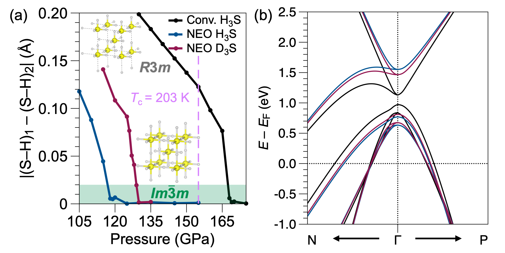
**図1**: H₃SおよびD₃Sにおける水素結合の非対称→対称相転移。従来DFTとNEO-DFTの計算結果を比較し、NEO-DFTが核量子効果を考慮することで対称化圧力の同位体依存性を正しく再現することを示す。H₃Sのプロトン対称化はこの系の超伝導特性と密接に関連しており、方法論の定量妥当性を直接検証する重要な図である。

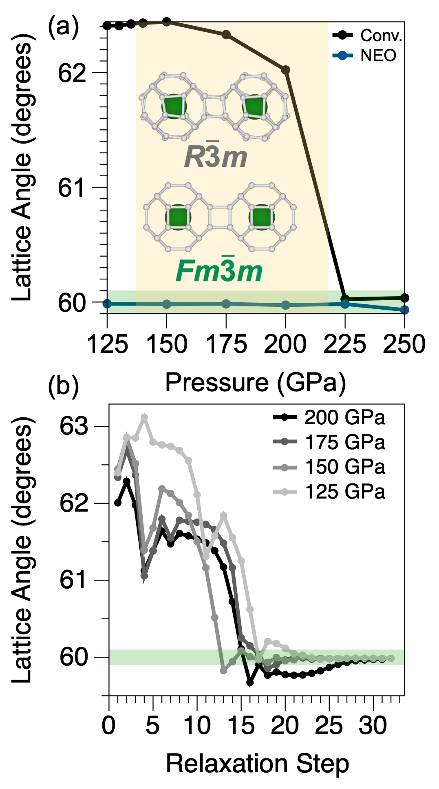
**図2**: LaH₁₀のR3̄m非対称構造からFm3̄m対称かご型構造への加圧誘起相転移。格子角度の圧力依存性からNEO-DFTが正しい対称相を広い圧力範囲で予測することが確認できる。LaH₁₀は250 K超の転移温度が報告されている高温超伝導候補であり、その格子対称性の精確な予測は転移温度計算の前提条件となる。

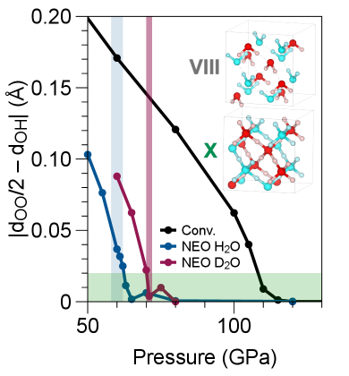
**図3**: H₂OおよびD₂Oにおける氷VIII（水素結合非対称）から氷X（水素中心化）への相転移圧力。NEO-DFTはSSCHA・実験値と比較可能な精度で同位体依存転移圧力を再現する。氷系は核量子効果の基準系として広く用いられており、ここでの検証は手法の汎用性を裏付ける。

---

## 重点論文 2

### 1. 論文情報

**タイトル**: [Universal electronic manifolds for extrapolative alloy discovery](https://arxiv.org/abs/2603.06953)
**著者**: Pranoy Ray, Sayan Bhowmik, Phanish Suryanarayana, Surya R. Kalidindi, Andrew J. Medford
**arXiv ID**: 2603.06953
**カテゴリ**: cond-mat.mtrl-sci; stat.ML
**公開日**: 2026-03-07
**論文タイプ**: 原著論文（データ駆動材料設計・方法論）
**ライセンス**: CC BY 4.0

---

### 2. どんな研究か

高エントロピー合金（HEA）等の多成分合金の弾性特性を、非相互作用電子密度を物理的記述子として活用したベイズ型アクティブラーニングフレームワークにより予測する研究である。Al-Nb-Ti-Zr系でわずか10サンプルから弾性率NMAE 2%以下を達成し、さらに4成分系で学習したモデルを既知元素を4つ含む7成分系（Mo-Nb-Ta-Ti-V-W-Zr）へ零ショット外挿することに成功した点が核心的成果である。

---

### 3. 位置づけと意義

高エントロピー合金の設計では、組成空間が指数関数的に拡大するため、第一原理計算コストを抑えつつ外挿性能を持つ機械学習フレームワークが不可欠である。従来の組成記述子や構造指標は未知元素を含む系への外挿に弱い。本研究は、非相互作用電子密度という量子力学的に普遍的な物理量を起点とすることで、化学種を超えた転移可能性（transferability）を確保している点が概念的に新しい。電子密度の方向分解2点空間相関を特徴量に用い、PCAで圧縮した後にベイズ回帰を適用する枠組みは、少数の高価なDFT計算で多成分組成空間を効率的に走査するためのロードマップを示している。

---

### 4. 研究の概要

**背景・目的**: 耐熱合金・構造材料として期待されるrefractory HEAについて、組成最適化のコストを削減し、未知多成分系への外挿を実現するMLフレームワークを構築する。

**計算科学上の課題設定**: 組成記述子は新規元素を含む系への外挿が困難。電子密度という物理的基盤のある量を記述子に用いることで、元素の化学的類似性を自動的に捉えることを目指す。

**研究アプローチ**: (1) 各合金組成についてDFTで電子密度計算 → (2) 方向分解2点空間相関関数（2-PSC）で特徴量化 → (3) PCAで次元削減（電子多様体）→ (4) ベイズ実験計画法（BED）と組み合わせたGPR回帰で少サンプル予測。

**対象材料系・対象現象**: Al-Nb-Ti-Zr 4成分系の弾性率（バルクモジュラス）と合金形成エネルギー。7成分耐熱HEA（Mo-Nb-Ta-Ti-V-W-Zr）への外挿検証。

**主な手法**: DFT（電子密度計算）、2点空間相関記述子、PCA、ガウス過程回帰、ベイズ実験計画。

**主な結果**: 10サンプルでNMAE 1.9%（バルクモジュラス）。20追加サンプルで7成分外挿NMAE 3%以下。零ショット外挿（追加訓練なし）でも4成分学習モデルが7成分系で機能することを確認。

**著者の主張**: 電子密度由来の普遍的多様体が元素・組成を超えた外挿の鍵であり、少数の高価なDFT計算から大規模組成空間を走査する実用的枠組みである。

---

### 5. 計算物質科学として重要なポイント

**対象現象・物性**: 多成分合金の弾性特性（バルクモジュラス）および合金形成エネルギー。耐熱HEAの設計指針と直結する。

**手法・記述子の意味と妥当性**: 非相互作用電子密度（キンスターエネルギー・フォンヴァイツゼッカー汎関数等に関連）は、KS-DFTから直接得られる物理量であり、原子種・構造環境情報を化学的に意味のある形で含む。2-PSCは空間的相関を方向分解して捉えるため、結晶対称性や近接環境の差異に敏感な特徴量である。

**計算条件・適切性**: Al-Nb-Ti-Zrの4成分計算は系統的なDFTデータを用いており、訓練セットサイズ依存性の解析（10〜数十サンプル）が示されている。7成分外挿の検証は独立テストとして設計されており、過学習評価が適切に行われている。

**既存研究との差分**: 先行研究では、AFLOW、MP、OQMDなどの計算DBから得た組成記述子（Magpie, SOAP, GNNなど）を用いた内挿型予測が主流。本研究は外挿性能を明示的に評価・保証する初の系統的試みの一つ。

**新規性の位置づけ**: 電子密度を第一原理的記述子として多成分合金設計に活用した概念は新しい。零ショット外挿の実証は分野にとって刺激的な結果である。

**波及可能性**: HEAに限らず、高圧化合物・複合酸化物など多成分・元素多様系への展開可能性が高い。普遍的記述子の概念はMAGPIEやMACE等の代替に成り得る。

**効果の種別**: 材料設計（組成最適化）・第一原理計算・データ駆動探索の融合に有効。

---

### 6. 限界と注意点

1. **弾性率への限定と他物性への汎化**: 本研究での主要な実証はバルクモジュラスに集中しており、降伏応力・延性・耐高温酸化性など設計上重要な他の特性への記述子の有効性は未検証である。多物性の同時最適化では別途検討が必要である。

2. **DFT依存性とデータ品質**: 記述子の計算には依然としてDFTが必要であり、xc汎関数の選択やスーパーセルサイズ・化学的無秩序の扱い方が結果に影響する。特に化学的不規則固溶体（SQSなど）の扱いと、それに基づく電子密度の代表性については詳細な感度解析が示されていない。

3. **外挿精度の上限と解釈**: 零ショット外挿でNMAE < 3%というのは印象的だが、7成分系のテストポイントが4成分系の主成分空間にどの程度収まっているかの詳細な定量評価が必要である。真の外挿（訓練空間から遠い領域）での予測精度が保証されているかは慎重に評価する必要がある。

---

### 7. 関連研究との比較・研究動向

**先行研究との差分**: Ward et al.（Magpie, 2016）やde Pablo et al.のGraph NNアプローチなど、組成・構造記述子を用いた合金ML予測の先行研究は多数あるが、外挿性能の明示的な評価は稀である。本研究の電子密度記述子アプローチはSubramaniamらの原子電子密度パターン利用研究とも関連するが、方向分解2-PSCを用いた点と7成分系外挿検証が差分となる。

**競合・類似研究**: MACE-MP等の基盤モデルは多元素系に対して大規模データで訓練した汎用モデルとして競合するが、高価な推論コストと解釈可能性の低さという問題がある。本研究はデータ効率と物理解釈可能性の観点で補完的である。

**未解決問題**: 組成空間の網羅的探索では、いまだデータ取得コストがボトルネックとなっている。本研究はBEDとの組み合わせでこれを緩和するが、実験データや有限温度効果との統合は今後の課題として残る。

**新規性**: Incremental advanceだが、外挿性能という観点での実証は分野に新しい基準を設ける可能性がある。

**引用されうるコミュニティ**: 高エントロピー合金・耐熱合金設計、機械学習材料科学、アクティブラーニング材料探索コミュニティ。

**今後の展開**: 他の弾性・熱的・電気的物性への拡張、実験データとの組み合わせ（MLaP：実験入力型アクティブラーニング）、電子密度記述子の物理的解釈の深化。

---

### 8. 図

**図1**: 本研究のエンドツーエンドワークフロー図。DFT電子密度計算→2点空間相関（2-PSC）特徴量化→PCA次元削減（電子多様体構築）→ガウス過程回帰（GPR）→ベイズ実験計画（BED）による次候補選択、というサイクルを模式的に示す。このパイプラインにより、少数の高価なDFT計算から組成空間を効率的に走査できることが本研究の核心的寄与である。

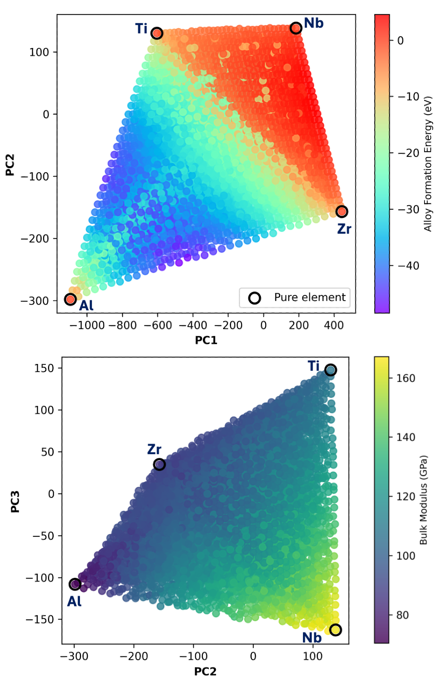
**図2**: Al-Nb-Ti-Zr 4成分系の電子密度特徴量をPCAで2次元圧縮した可視化。組成が異なる合金がPCA空間でどのように分布するかを示し、電子密度多様体の連続性と普遍性を視覚的に確認できる。この可視化は、4成分学習モデルが7成分系へ外挿できる根拠を理解する鍵となる。

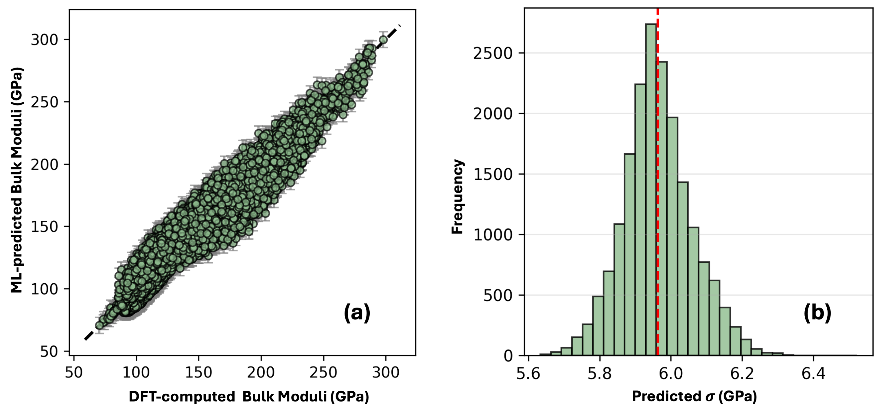
**図3**: 4成分系（Al-Nb-Ti-Zr）で学習したモデルによる7成分耐熱HEA（Mo-Nb-Ta-Ti-V-W-Zr）のバルクモジュラス予測と、DFT計算値との外挿パリティプロット。誤差棒（不確実性推定）と共に示されており、零ショット外挿でNMAE 3%以下の予測精度を視覚的に確認できる。未知元素を4つ含む系へのこの外挿精度は、本フレームワークの汎用性を直接裏付ける最も重要な定量的エビデンスである。

---

## 重点論文 3

### 1. 論文情報

**タイトル**: [Machine learning the two-electron reduced density matrix in molecules and condensed phases](https://arxiv.org/abs/2603.06882)
**著者**: Jessica A. Martinez B., Bhaskar Rana, Xuecheng Shao, Katarzyna Pernal, Michele Pavanello
**arXiv ID**: 2603.06882
**カテゴリ**: physics.chem-ph; physics.comp-ph
**公開日**: 2026-03-06
**論文タイプ**: 原著論文（電子構造ML方法論）
**ライセンス**: CC BY 4.0

---

### 2. どんな研究か

二電子縮約密度行列（2-RDM）そのものを機械学習で予測するフレームワーク（ML-2RDM）を開発し、単一モデルから電子エネルギー・力・構造因子等の多様な物理量を直接計算可能にした研究である。多体展開（many-body expansion）との組み合わせにより、グルコース＋500水分子系でカップルドクラスター（CC）品質の全電子エネルギーをHartree-Fock（HF）コストで計算するという、ベンチマーク的な成果を示した。

---

### 3. 位置づけと意義

従来のMLポテンシャル（MLP）は、エネルギー・力という集約された量を学習対象とするため、各種電子的観測量（電子密度・スペクトル・電子状態密度など）へのアクセスが困難であった。本研究は2-RDMという電子構造の「基本情報格納庫」を直接学習することで、MLPとは根本的に異なる電子構造量の活用経路を開く。多体展開による系サイズスケーリングの解決と、エネルギー保存MDの実現が計算物質科学に対する実用的な価値を持つ。強相関系での応用（エチレンの多重結合切断での検証など）も示されており、適用範囲の広さが特筆される。

---

### 4. 研究の概要

**背景・目的**: 高精度量子化学法（CC, CI）はサイズスケーリングの問題（O(N⁷)など）から大系への適用が困難であり、MLポテンシャルはその解決策として普及しているが電子構造情報へのアクセスを失う。2-RDMを学習することで、電子構造情報を保持しつつ大系への展開を目指す。

**計算科学上の課題設定**: 2-RDMはN-体問題のN=2まで積分した縮約量であり、全エネルギー・力・双極子モーメント・電子密度などほぼ全ての1電子・2電子観測量を計算できる「充分統計量」である。これを機械学習で精度良く予測できれば、CC品質の情報をHFコストで得られる可能性がある。

**研究アプローチ**: (1) CI/CC計算から2-RDMを訓練データとして収集 → (2) 分子ペア（二量体）を単位とするML-2RDMモデルを構築 → (3) 多体展開（MB-RDM）で大系に拡張 → (4) 力を2-RDMの勾配として計算してエネルギー保存MDを実現。

**対象材料系・対象現象**: 気相水分子（ベンチマーク）、アンモニア（MD検証）、エチレン（強相関・多重結合解離）、グルコース+水溶液系（大規模検証）。

**主な手法**: Configuration interaction / Coupled Cluster（訓練データ生成）、2-RDM機械学習、多体展開（MB-RDM）、NVE分子動力学。

**主な結果**: 水分子のPEC（ポテンシャルエネルギー曲線）でCC品質を再現。アンモニアの10 ps NVE-MDでのエネルギー保存を確認。グルコース+15水分子系でMP2/CCSDレベルのエネルギーをHFコストで予測。グルコース+500水分子系でのMB-RDM適用に成功し、CCSDコストの~1/100以下での計算を実現。

**著者の主張**: 2-RDMの機械学習は、エネルギー基盤のMLPとは概念的に異なる電子構造MLの新枠組みを提供し、電子観測量への直接アクセスと大系スケーラビリティを両立する。

---

### 5. 計算物質科学として重要なポイント

**対象現象・物性**: 電子エネルギー・力・電子構造因子・局所相関・多重結合解離などの電子構造量全般。強相関系への適用可能性も示されている。

**手法・記述子の意味と妥当性**: 2-RDMはΓ(r₁,r₂;r₁',r₂')という4インデックスのテンソル量であり、通常の特徴量工学では扱いにくい高次元対象である。本研究では二量体のペア間相互作用を単位として学習し、多体展開でモノマー・ダイマー・トリマー寄与に分解することで高次元性の問題を回避している。正定値性（N表現可能性）を保証する「精製化（purification）」ステップも組み込まれており、物理的整合性への配慮がある。

**計算条件・適切性**: 各小分子系での独立検証（ベンチマーク、MD、強相関）が充実しており、段階的に大系へスケールアップした実証構造が取られている。多体展開の収束性は示されているが、固体・周期系への適用に必要な拡張については明示されていない。

**既存研究との差分**: MLポテンシャルや電子密度の機械学習（例：SchNet, DimeNet, DeepDFT）とは根本的に異なり、2-RDMを直接の学習ターゲットにする先例はほとんどない（Wahlen-Strothman et al.の2-RDM学習の初期試みを除く）。

**新規性**: 2-RDMの多体展開ML化という新概念、大規模溶液系での実証、エネルギー保存MDへの展開が同時に示されており、方法論的インパクトは大きい。

**波及可能性**: 光吸収スペクトル計算、局所電子構造の解析（Mayer結合次数、自然結合軌道など）、NMR・EPRスペクトル予測など電子構造情報を必要とする幅広い計算への応用が期待される。

**効果の種別**: 電子状態計算の方法論開発・分子動力学への展開。

---

### 6. 限界と注意点

1. **周期境界系・凝縮相固体への展開困難**: 現状の実装は孤立分子・溶液系に限定されており、周期境界条件下の結晶や固体表面への拡張には、モノマー・ダイマー選択のプロトコルやBlaochの定理との整合性など非自明な課題が残る。計算物質科学の主要な関心対象である固体系への応用には追加開発が必要である。

2. **訓練データの質と多様性**: モデルの精度はCI/CCの訓練データの網羅性に強く依存するが、分子の化学的多様性や配座空間のカバレッジが不十分な場合の外挿性能は未評価である。特にタンパク質様の複雑な生体分子や金属含有系への適用では、追加の訓練データと汎化性能の検証が必要になる。

3. **2-RDMテンソルの保存コスト**: 4インデックステンソルとしての2-RDMは、基底関数の数Nに対してO(N⁴)の記憶量を必要とする。本研究では二量体単位での適用（小さいN）により回避しているが、大規模固体系では格子緩和や応力計算に必要なスーパーセルに対応した計算が現実的かどうかは検討が必要である。

---

### 7. 関連研究との比較・研究動向

**先行研究との差分**: Schütt et al.（SchNet, 2017）やKirkpatrick et al.（DeepMind DFT, 2021）などの先行研究は電子密度や密度行列の1電子量を学習対象とする。2電子量（2-RDM）を直接学習する本アプローチはより多くの物理情報を保持する反面、学習難易度も高い。Pernal（co-author）による2-RDM理論の先行研究の上に立つが、MLとの結合は本研究が初めて系統的に実証した。

**競合・類似研究**: Kohn-Sham DFTの機械学習（OrbNet, DeePKS等）は密度汎関数の改善を目指すアプローチであり、コスト削減の方向性は類似するが電子相関の扱いが異なる。

**分野の未解決問題**: 強相関電子系（遷移金属、f電子系等）への高精度計算は現在のMLPでは困難な領域だが、2-RDM学習は強相関に対しても原理的に対処できる可能性を示した（エチレン多重結合解離の検証）。

**新規性**: Method breakthrough の可能性がある。ただし大規模実装の成熟度はまだ低い段階。

**引用されうるコミュニティ**: 量子化学・計算化学、凝縮系電子構造計算、機械学習化学・物質科学コミュニティ。

**今後の展開**: 固体・周期系への拡張、励起状態2-RDMのML（スペクトル計算）、DFT+Uや動的平均場理論（DMFT）との連携可能性。

---

### 8. 図

**図1**: 3種類のML-2RDMモデル（ΓML、ΓMLc、ΔML）のワークフロー概念図。ΓMLは2-RDM全体を直接学習、ΓMLcは制約（purification）付き、ΔMLは参照（HF）からの差分を学習する。それぞれのアーキテクチャが精度・計算コスト・適用範囲においてどのようなトレードオフをもつかを示す基本的な概念図である。

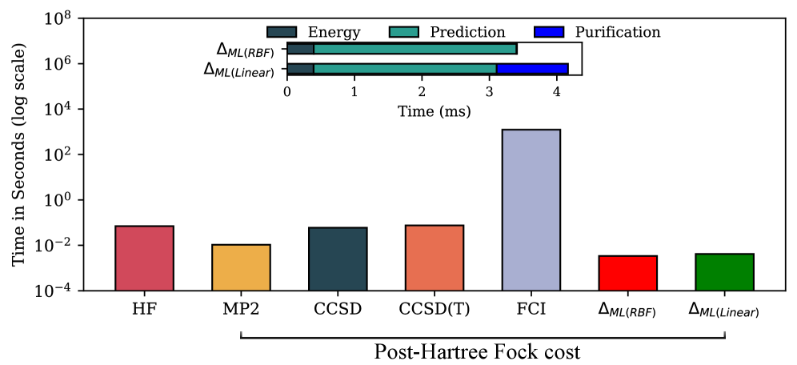
**図2**: ΔMLと従来量子化学手法（HF, MP2, CCSD, CCSD(T), FCI）との計算コスト比較（対数スケール）。水分子クラスターについて、サイズ依存性を示した図。ΔML（ML-2RDM）がFCIの精度をHF程度のコストで達成できることを視覚的に示す最重要データの一つであり、本手法の実用性を直接裏付ける。

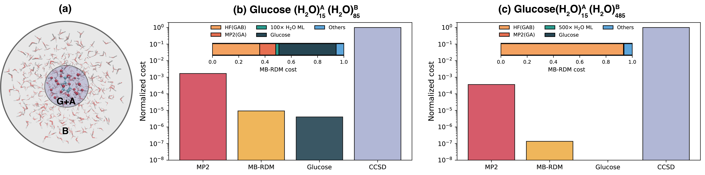
**図3**: グルコースを500水分子で溶媒化した大規模系でのMB-RDM計算スキーム。溶媒和系をグルコース（G）領域と溶媒領域（A/B）に分割し、ダイマー単位の多体展開で処理する。HFコストでCCSD品質のエネルギーを得た最大規模の検証例であり、本手法の実際のスケーラビリティを示す最も説得力のある図である。

---

# 第3部：簡潔紹介論文

---

## 簡潔紹介論文 4

### 1. 論文情報

**タイトル**: [Effect of Exchange-Correlation Functionals on Schottky Barriers at Si/Metal Interfaces](https://arxiv.org/abs/2603.06725)
**著者**: Viviana Dovale-Farelo, Kamal Choudhary
**arXiv ID**: 2603.06725
**カテゴリ**: cond-mat.mtrl-sci
**公開日**: 2026-03-06
**論文タイプ**: 原著論文（第一原理計算・ベンチマーク）
**ライセンス**: CC BY 4.0

---

### 2. 研究概要

Si(111)界面とAl、Cu、Ag、Au金属との接触を対象として、複数の交換相関（XC）汎関数と三種類のバルク参照プロトコルを系統的に比較し、Schottky障壁高さ（SBH）の計算精度を決定する要因を解明した第一原理研究である。界面とバルク参照の構造的・静電的整合性がSBH精度を支配する主要因であることを見出し、ひずみ補正参照プロトコルを組み合わせたハイブリッド-半局所汎関数の混合手法が実験値近傍の精度を達成することを示した。JARVISデータベースを活用したワークフローを用いており、再現性・展開可能性が高い。

本研究は、DFTによる半導体‐金属界面バンドオフセット計算における方法論上の不定性を定量的に整理した実用的なベンチマーク研究である。デバイス設計や界面工学においてSBHの精密予測は直接重要性を持ち、複数のXC汎関数と計算プロトコルの影響を同一系で評価した系統的検討は、分野全体の計算標準化に貢献する。特に大規模スクリーニングに向けて、高精度かつ計算効率が両立するプロトコルの特定は実践的意義が高い。

---

### 3. 図

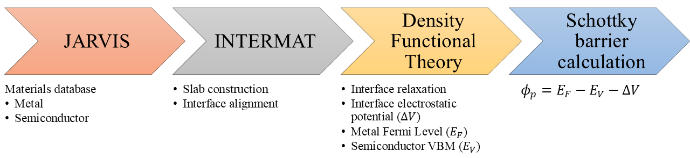
**図1**: JARVISデータベースを活用したSi/金属界面計算ワークフローの全体概念図。半導体（SC）・金属（M）のバルク参照計算から、Zur算法による界面生成、複数XC汎関数でのSBH計算までのパイプラインを示す。再現可能なスクリーニングワークフローとしての本研究の実用的貢献を示す。

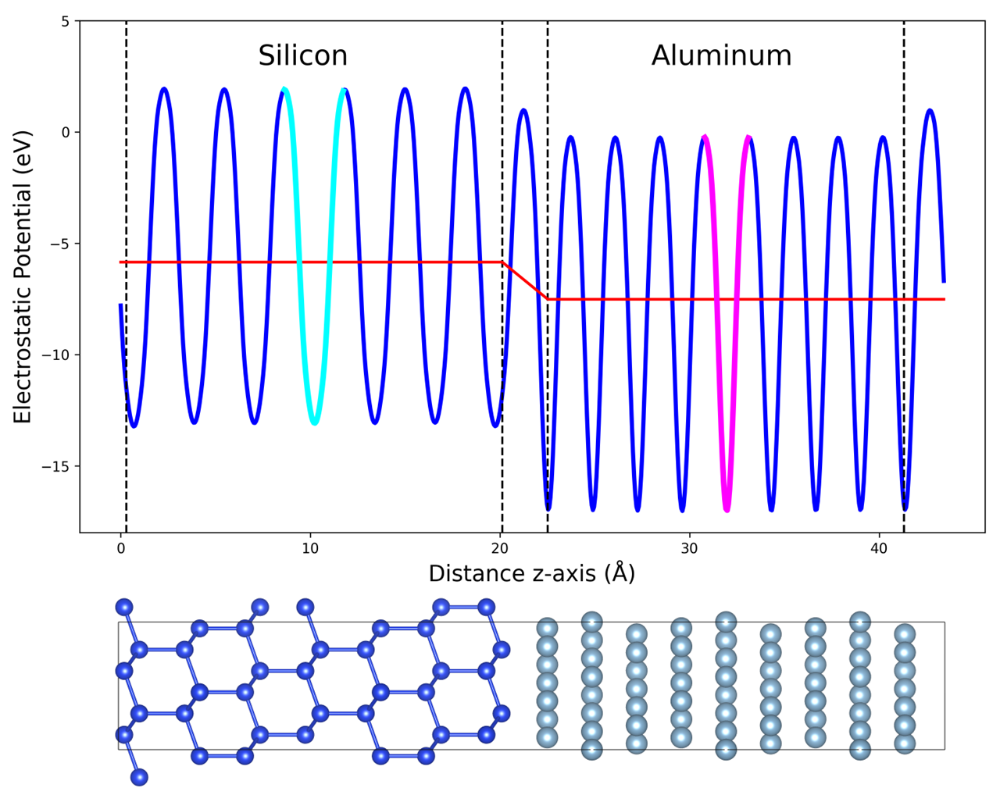
**図2**: Si(111)/Al(111)界面の静電ポテンシャルの平面平均・マクロ平均プロファイルと、対応する原子配置。界面ダイポール整合の計算手順を視覚的に示す重要な図である。バルク参照とのひずみ整合を正しく扱うことがSBH精度の決め手となることが確認できる。

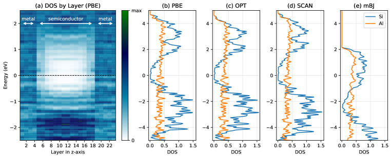
**図3**: Al/Si界面の層分解状態密度（LDOS）の複数XC汎関数間比較。汎関数の選択がバンドオフセットとフェルミ準位ピニングに与える影響を定量的に示す。ハイブリッド汎関数（HSE06等）と局所・準局所汎関数（PBE, LDA）の差異がSBH予測精度の主要な変動源の一つであることが確認できる。

---

## 簡潔紹介論文 5

### 1. 論文情報

**タイトル**: [The giant anomalous Hall and Nernst effects in Kagome permanent magnets RCo₅](https://arxiv.org/abs/2603.08056)
**著者**: Weian Guo, Pengyu Zheng, Rui Liu, Yiran Peng, Ying Yang, Zhiping Yin
**arXiv ID**: 2603.08056
**カテゴリ**: cond-mat.mtrl-sci; cond-mat.str-el
**公開日**: 2026-03-09
**論文タイプ**: 原著論文（第一原理計算・電子輸送）
**ライセンス**: arXiv.org perpetual non-exclusive license（図はAI生成概念図）

---

### 2. 研究概要

CeCo₅、LaCo₅、SmCo₅、GdCo₅という希土類コバルト永久磁石について、第一原理計算からベリー曲率・異常ホール伝導率（AHC）・異常ネルンスト伝導率（ANC）を計算し、CeCo₅でAHC ≈ 1500 Ω⁻¹cm⁻¹、GdCo₅でANC ≈ 11 A m⁻¹ K⁻¹という巨大値を予測した研究である。これらの値はWeyl磁性体（例：Co₂MnGa）や磁性ホイスラー合金と同等以上であり、カゴメ格子上のCoサブラティスにおけるスピン軌道相互作用誘起バンドギャップ付近に集中したベリー曲率ホットスポットが起源であることを明らかにした。

本研究は、従来から永久磁石として広く使われてきた実用材料RCo₅がトポロジカル輸送の観点でも第一級の材料となりうることを示した点で材料設計上の価値が高い。第一原理バンド構造解析・フェルミ面計算・ベリー曲率分布解析の組み合わせが十全に活用されており、計算物質科学的アプローチとして体系的である。ただし室温での磁気構造の取り扱いや実験との定量的照合については今後の検討が必要であり、本論文は計算予測の段階にある。

---

### 3. 図（AI生成概念図：arXiv.org perpetual non-exclusive licenseのため原図不使用）

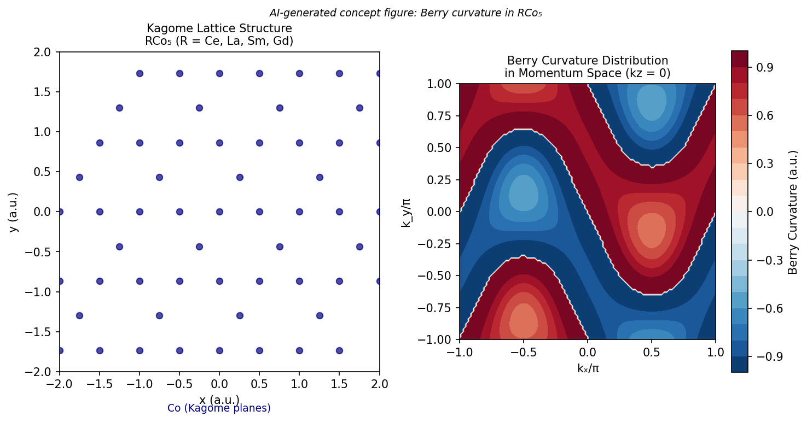
**図1（AI生成概念図）**: RCo₅のカゴメ格子（Co副格子）の模式図と、運動量空間におけるベリー曲率分布の模式的コンタープロット。ベリー曲率ホットスポットがBZ内の特定の点に集中することを示す概念図。実際の計算では特定kzスライスでの分布が報告されている。

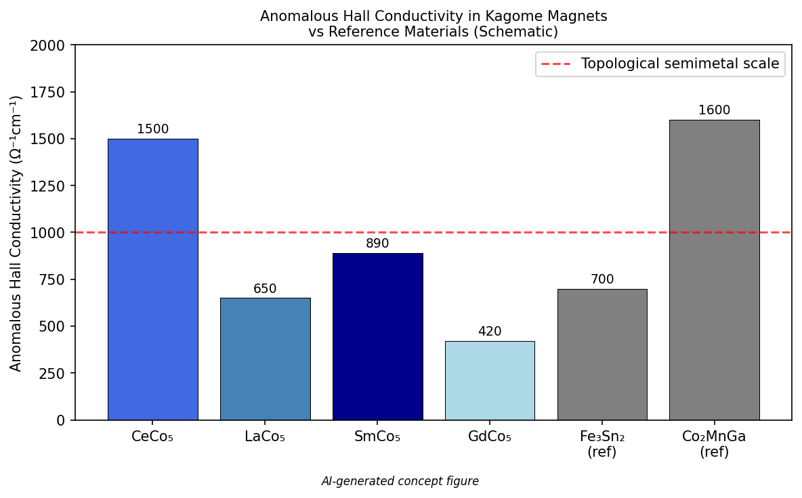
**図2（AI生成概念図）**: CeCo₅、LaCo₅、SmCo₅、GdCo₅の異常ホール伝導率（AHC）を既知トポロジカル磁性体との比較で示す概念棒グラフ。CeCo₅の~1500 Ω⁻¹cm⁻¹という巨大AHCが他材料と比肩することを直感的に示す。

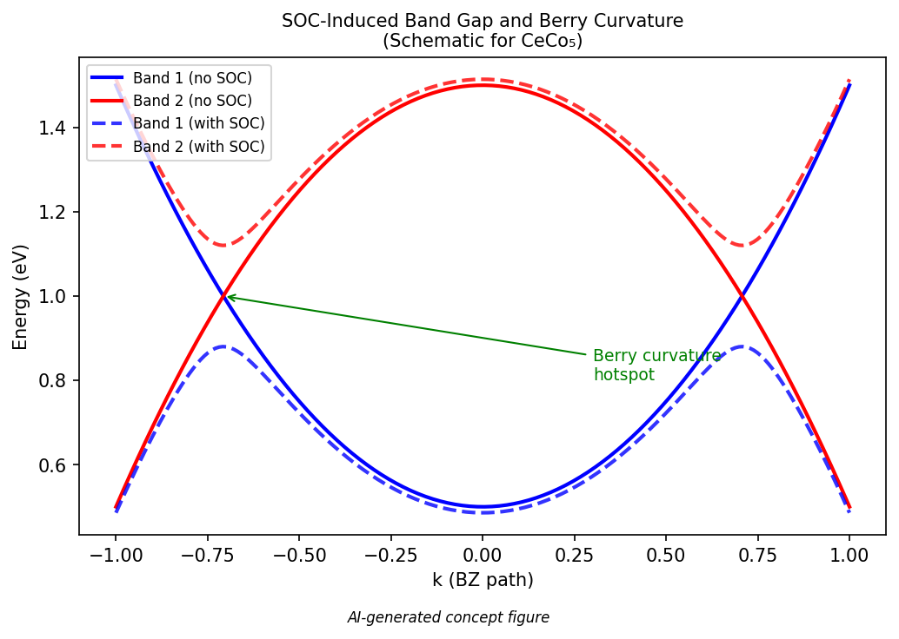
**図3（AI生成概念図）**: スピン軌道相互作用（SOC）によるバンド交差の回避（anti-crossing）とその近傍でのベリー曲率集中を示す模式的バンド図。CeCo₅での巨大AHCの起源がSOC誘起バンドギャップ付近のベリー曲率ホットスポットにあることを説明する概念図。

---

## 簡潔紹介論文 6

### 1. 論文情報

**タイトル**: [Collapse of Jahn-Teller Phonons in La₁₋ₓSrₓMnO₃ with Weak Magnetoresistance](https://arxiv.org/abs/2603.06708)
**著者**: Tyler C. Sterling, Andrei T. Savici, Ryoichi Kajimoto, Kazuhiko Ikeuchi, Nazir Khan, Frank Weber, Dmitry Reznik
**arXiv ID**: 2603.06708
**カテゴリ**: cond-mat.mtrl-sci; cond-mat.str-el
**公開日**: 2026-03-05
**論文タイプ**: 原著論文（実験＋DFT計算、フォノン物理）
**ライセンス**: CC BY-NC-SA 4.0

---

### 2. 研究概要

La₁₋ₓSrₓMnO₃（x=0.2, 0.3）において、強磁性秩序温度（キュリー温度TC）以上でヤーン・テラー活性な酸素振動モードが完全に消失（崩壊）するという異常なフォノン挙動を、高分解能飛行時間型中性子散乱実験とDFT計算の組み合わせで解明した研究である。TC以下ではフォノン・マグノンともにDFT予測と一致するが、TC以上ではヤーン・テラーフォノンが消滅する一方、マグノンは比較的通常の振る舞いを示すという非自明な対称性の破れが明らかとなった。著者らは、この挙動が電荷・軌道チャネルにおける巨大電子‐フォノン結合に由来し、磁気的な要因だけでは説明できないと主張している。

本研究は計算と実験が密接に連携した典型例であり、フォノン分散のDFT計算（斜方晶・菱形晶の両相で実施）が実験データ解釈の基盤を提供している。磁気抵抗が弱い組成域でもヤーン・テラーフォノンが崩壊するという事実は、コロッサル磁気抵抗（CMR）発現機構における軌道・電荷自由度の役割を再評価させる重要なエビデンスである。計算物質科学の観点からは、強相関電子系でのフォノン計算の限界（軌道秩序・磁気相の取り扱い）も示唆されており、DFT+UやDMFTとの比較が今後の課題として残っている。

---

### 3. 図

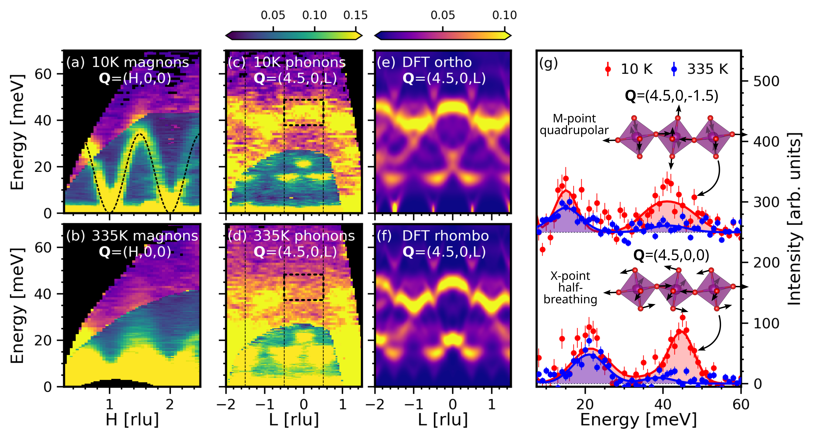
**図1**: La₀.₈Sr₀.₂MnO₃のスピン・格子自由度からの非弾性中性子散乱（INS）データ（10 Kと335 K比較）。ヤーン‐テラーフォノンがTC以下では鮮明に観測されるが、TC以上（335 K）で消失することを直接示す実験データであり、本論文の最重要観測結果を端的に示す。

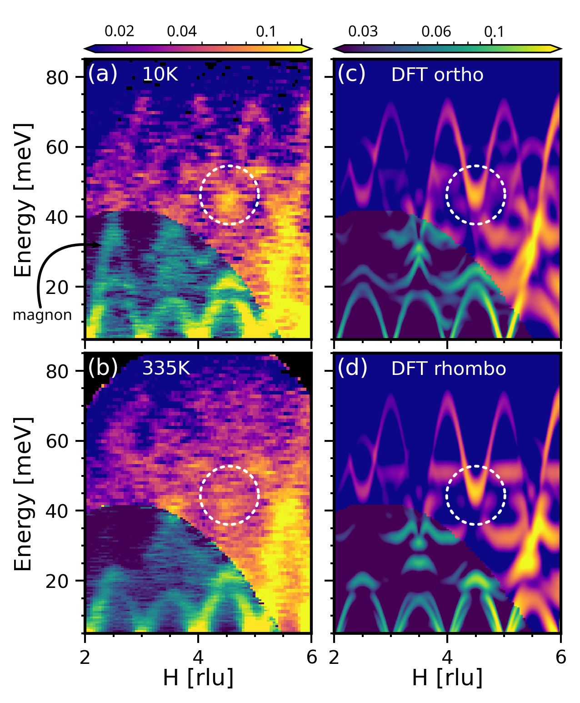
**図2**: La₀.₈Sr₀.₂MnO₃のINS測定結果とDFT計算（斜方晶・菱形晶相）の対比。フォノン分散の定量的比較を通じて、TC以下では計算と実験が良く一致するが、TC以上では実験に特徴的な崩壊現象がDFTでは再現されないことが分かる。この不一致が強相関効果の計算的課題を示唆する。

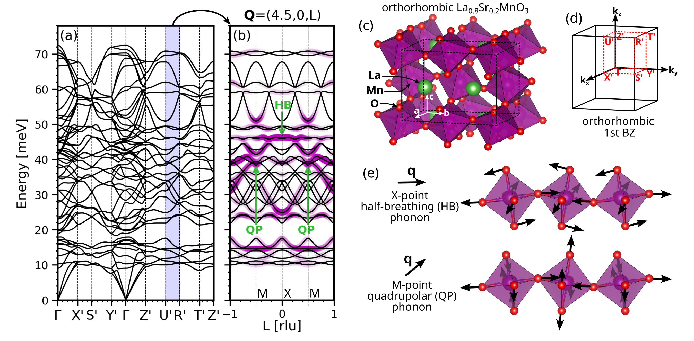
**図3**: La₀.₈Sr₀.₂MnO₃の斜方晶相におけるフォノン分散の第一原理計算結果。単位胞とブリルアンゾーンの図を含む。ヤーン‐テラーモードの位置・対称性を計算の観点から特定し、中性子散乱実験の帰属根拠を提供している。

---

## 簡潔紹介論文 7

### 1. 論文情報

**タイトル**: [Flat Topological Nodal Lines in Heavy-Fermion Compound CeCoGe₃](https://arxiv.org/abs/2603.06966)
**著者**: Yuting Wang, Weikang Wu, Jianzhou Zhao
**arXiv ID**: 2603.06966
**カテゴリ**: cond-mat.str-el
**公開日**: 2026-03-07
**論文タイプ**: 原著論文（DFT+DMFT計算・電子状態）
**ライセンス**: arXiv.org perpetual non-exclusive license（図はAI生成概念図）

---

### 2. 研究概要

CeCoGe₃という重いフェルミオン化合物において、DFT+動的平均場理論（DMFT）計算を用いて、フェルミ準位近傍10 meV以内に位置するフラットなトポロジカルノーダルラインを発見・同定した研究である。25 Kでは準粒子質量増大が電子有効質量の約52.6倍に達するコンドウ格子状態を計算で再現し、その状態でのノーダルラインが加圧誘起超伝導の候補機構として機能する可能性を示している。この物質はプロトタイプ的「トポロジカルノーダルラインKondoセミメタル」として位置づけられる。

本研究はDFT+DMFTという強相関電子系に適した方法論を駆使し、相関誘起の準粒子バンド繰り込みと位相的特徴が相互作用することを計算で実証した点で計算物質科学として重要である。重いフェルミオン系とトポロジカル物性の交差という近年急成長している研究領域に位置しており、位相的超伝導候補材料の探索という観点でも引用可能性が高い。ただし実験的確認（例：ARPESや量子振動）との対応は今後の課題であり、DFT+DMFTのダブルカウンティング補正依存性についての感度解析も望まれる。

---

### 3. 図（AI生成概念図：arXiv.org perpetual non-exclusive licenseのため原図不使用）

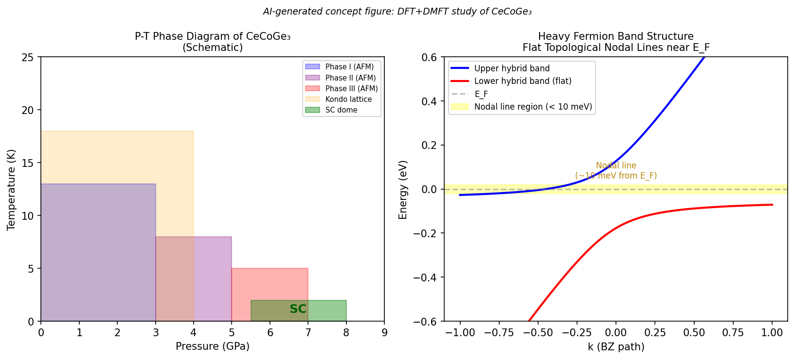
**図1（AI生成概念図）**: CeCoGe₃の圧力‐温度相図（複数の反強磁性相と超伝導ドームを示す模式図）と体心正方晶の結晶構造概念図。コンドウラティスとしての電子状態の変化を模式的に示す。DFT+DMFT計算の背景にある物理的文脈を理解するための補助的図として位置づけられる。

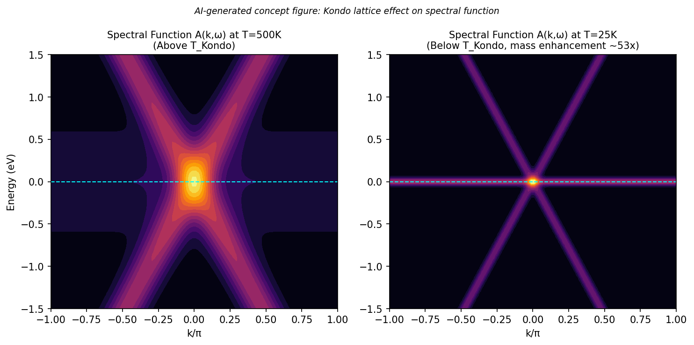
**図2（AI生成概念図）**: コンドウ温度（TK）の上下でのスペクトル関数A(k,ω)の変化を示す概念的コンタープロット。高温（T=500K、TK以上）では4f軌道が非局在的な広いピークを示し、低温（T=25K）ではコンドウ共鳴によりフラットなバンドとして鋭いピークが出現する様子を模式的に示す。

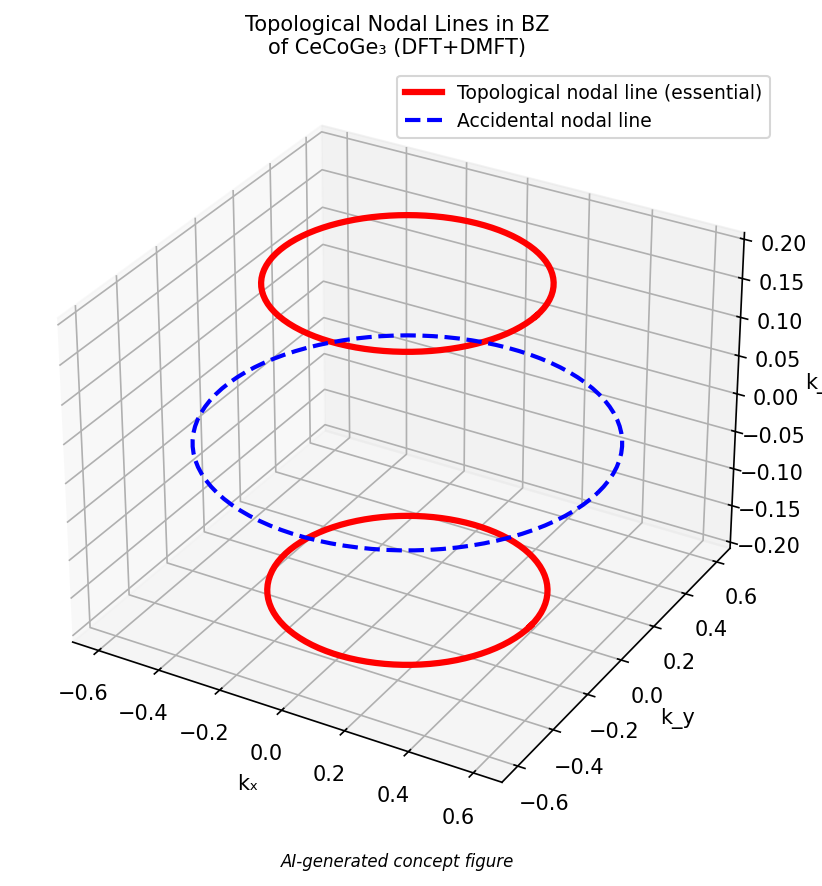
**図3（AI生成概念図）**: CeCoGe₃のブリルアンゾーン内におけるトポロジカルノーダルライン（必須ノーダルラインと偶発ノーダルライン）の分布を示す3次元模式図。ノーダルラインがフェルミ準位近傍（～10 meV以内）に存在することが超伝導発現における位相的役割の根拠となる。

---

## 簡潔紹介論文 8

### 1. 論文情報

**タイトル**: [Scaling Machine Learning Interatomic Potentials with Mixtures of Experts](https://arxiv.org/abs/2603.07977)
**著者**: Yuzhi Liu, Duo Zhang, Anyang Peng, Weinan E, Linfeng Zhang, Han Wang
**arXiv ID**: 2603.07977
**カテゴリ**: physics.chem-ph; cs.LG; physics.comp-ph
**公開日**: 2026-03-09
**論文タイプ**: 原著論文（機械学習ポテンシャル方法論）
**ライセンス**: CC BY 4.0（HTMLページ不可のためAI生成概念図）

---

### 2. 研究概要

混合エキスパート（Mixture-of-Experts; MoE）アーキテクチャを機械学習原子間ポテンシャル（MLIP）に導入し、元素別ルーティングによるスパース活性化が精度と計算効率を両立する枠組みを提案した研究である。線形MoE（MoLE）と非線形MoE（MoE）、配置レベル・グローバルルーティングとの比較を系統的に行い、共有エキスパートを組み合わせた元素別非線形MoEがOMol25・OMat24・OC20Mの複数ベンチマークで最高精度を達成することを示した。特筆すべき点として、各エキスパートが周期表の族構造と整合した化学的解釈可能な専門化を自然に獲得することが確認されている。

本研究はDeePMD（同グループの先行研究）の拡張であり、MLIPの精度とスケーラビリティを同時に向上させる方法論的貢献として評価できる。元素別ルーティングという設計選択が元素の化学的類似性を自動的に反映することは、MLIPの「なぜこのアーキテクチャが効くのか」という解釈可能性の観点でも意義深い。ただしMLIP自体の開発論文として計算物質科学への直接の物性貢献は限られ、ポテンシャル精度の向上が個別の材料系シミュレーションの信頼性向上に間接的に貢献するという位置づけである。

---

### 3. 図（AI生成概念図：HTMLページへのアクセス不可のため）

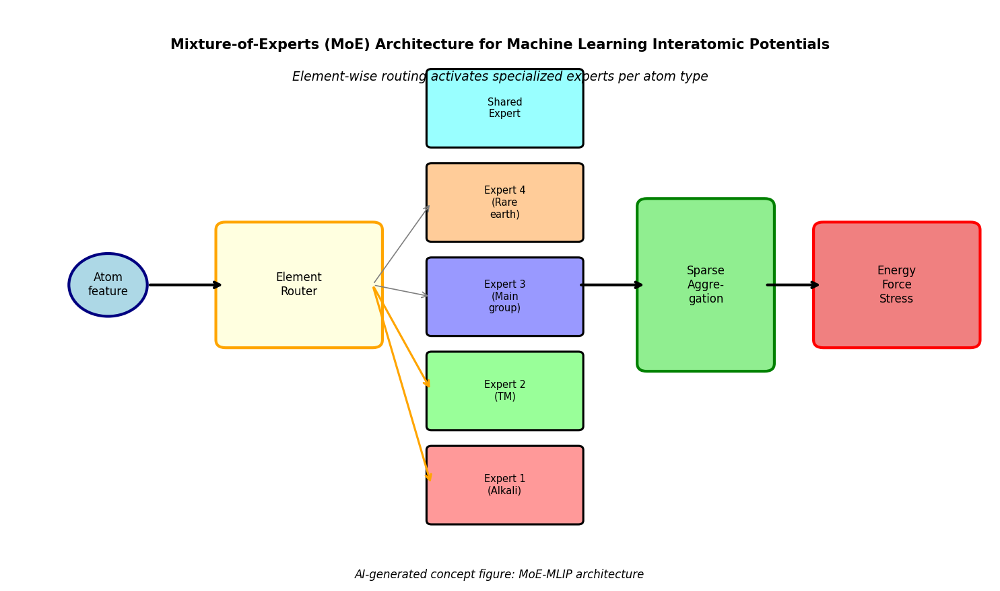
**図1（AI生成概念図）**: 混合エキスパート型MLIPの全体アーキテクチャ模式図。原子特徴量が元素別ルーターに入力され、選択されたエキスパートネットワーク（化学族別専門化）とスパースアグリゲーションを経てエネルギー・力・応力が出力されるパイプラインを示す。共有エキスパートの役割も含む。

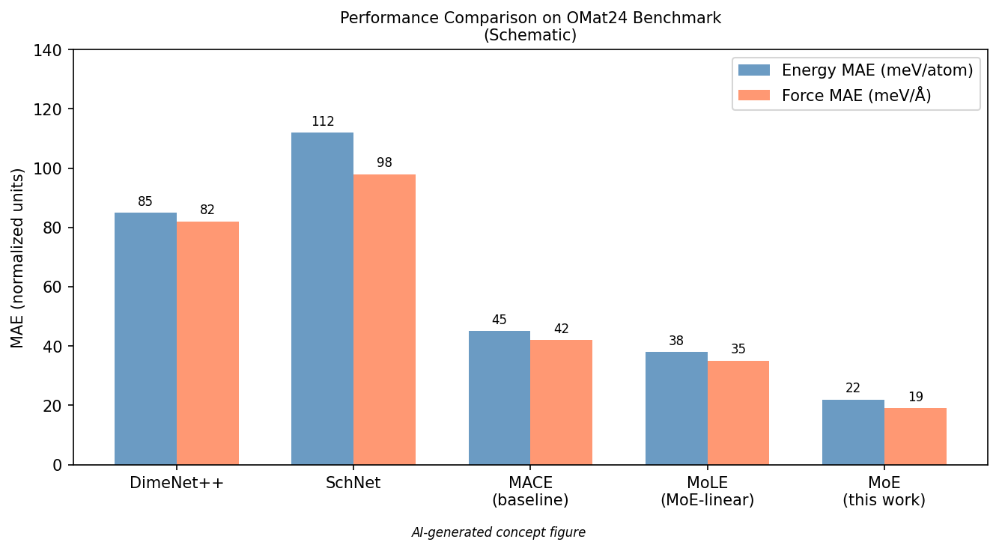
**図2（AI生成概念図）**: OMat24ベンチマークでのエネルギーMAEと力MAEについて、標準MLIPアーキテクチャ（DimeNet++、SchNet、MACE）とMoE・MoLE手法を比較した棒グラフ（概念的）。MoE（with shared experts）が一貫して最低誤差を示す。

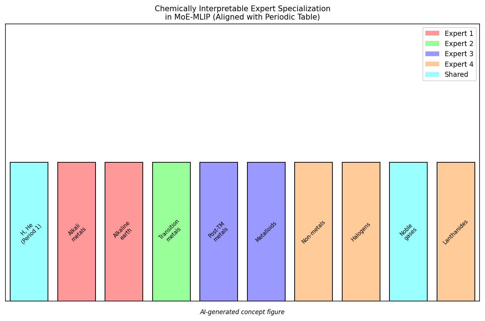
**図3（AI生成概念図）**: 元素別ルーティングにより各エキスパートが周期表の化学族と整合した専門化を自然に獲得することを示す概念図。アルカリ金属・遷移金属・非金属・ランタニドなど、化学的に類似した元素群が同じエキスパートにルーティングされる傾向を示す。

---

## 簡潔紹介論文 9

### 1. 論文情報

**タイトル**: [Orbital-Selective Engineering of Strain-Tunable Chern Insulators in Momentum Space](https://arxiv.org/abs/2603.07164)
**著者**: Jin Gao, Rongrong Chen, Lei Yang, ChengLong Jia, Kun Tao, Li Xi, Desheng Xue
**arXiv ID**: 2603.07164
**カテゴリ**: cond-mat.mtrl-sci
**公開日**: 2026-03-07
**論文タイプ**: 原著論文（第一原理計算・トポロジカル電子状態）
**ライセンス**: CC BY 4.0

---

### 2. 研究概要

Tc原子を吸着したペンタ‐ヘキサシリセン（PH-Si）において、二軸歪みが運動量空間でのChern数（位相不変量）と圧電係数を独立に制御できることを第一原理計算で予測した研究である。-4%歪み時に直接バンドギャップ0.17 eV・C=-1のトポロジカル非自明状態が実現し、圧電係数d₁₁=11.01 pm/VはMoS₂の3倍に達する値が得られた。Tc-dxz/Si-px軌道混成の強さと運動量空間での相分布がそれぞれ機能性とトポロジーを支配するという「軌道選択制御」機構をCOHP解析と組み合わせて明らかにした。

本研究は、歪み工学・軌道物理・位相電子状態を第一原理的に統合した研究として計算物質科学との接続が明確である。特にベリー曲率解析と表面状態計算が系統的に実施されており、Chern絶縁体の設計指針として引用可能な成果を含む。ただし遷移金属（Tc）吸着の安定性や室温でのスピン軌道相互作用の大きさについては独立した安定性評価と実験的確認が必要であり、理論予測としての段階にある。

---

### 3. 図

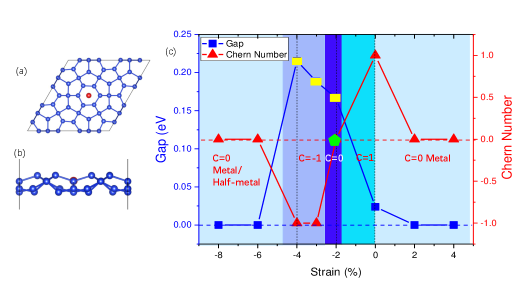
**図1**: Tc@PH-Siの上面・側面構造図と、歪み（-6%〜+2%）に対するバンドギャップとChern数の変化。直接バンドギャップ領域（黄色）とChern数が変化するトポロジカル相転移点を示す。歪みによるトポロジカル相図が本研究の核心的成果であり、材料設計の制御パラメータとしての歪みの有効性を示す。

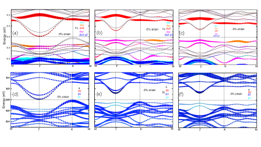
**図2**: 複数の歪み値（0%、-3%、-4%）でのTc-d軌道およびSi-p軌道の投影バンド構造（SOCあり・なし比較）。Tc-dxzとSi-px軌道の混成がSOCによりどのように変化し、バンドギャップ開口とChern数変化に至るかを詳細に示す。「軌道選択制御」機構の計算的根拠を提供する重要な図。

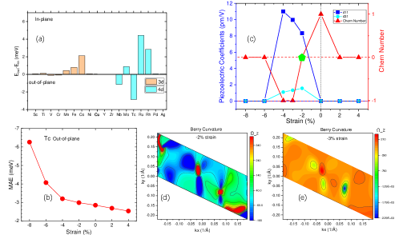
**図3**: 歪み依存の磁気異方性エネルギー（MAE）、Chern数、圧電係数d₁₁の変化と、特定歪みでのベリー曲率分布図。d₁₁=11.01 pm/V（-4%歪み）という高圧電特性とC=-1トポロジーの同時実現を確認できる。トポロジーと機能特性の同時チューニングという本研究の主張を直接支持する図。

---

## 簡潔紹介論文 10

### 1. 論文情報

**タイトル**: [NATPS: Nonadiabatic Transition Path Sampling Using Time-Reversible MASH Dynamics](https://arxiv.org/abs/2603.08677)
**著者**: Xiran Yang, Madlen Maria Reiner, Brigitta Bachmair, Leticia González, Johannes C. B. Dietschreit, Christoph Dellago
**arXiv ID**: 2603.08677
**カテゴリ**: physics.comp-ph; physics.chem-ph
**公開日**: 2026-03-09
**論文タイプ**: 原著論文（計算方法論・モンテカルロ法）
**ライセンス**: CC BY 4.0

---

### 2. 研究概要

光化学反応など非断熱励起状態過程に対して、時間可逆性とデテールバランスを保つ経路サンプリング（Transition Path Sampling; TPS）を実現するNATPSアルゴリズムを開発した研究である。核心的技術革新は、Mapping Approach to Surface Hopping（MASH）動力学の時間可逆な実装を確立したことであり、これによりMCステップのrejection‐free pathサンプリングが可能となった。結合した2ポテンシャルエネルギー面をモデル系として、従来のブルートフォースシミュレーションや前向きフラックスサンプリング（FFS）と比較した結果、反応軌跡の収集コストが大幅に削減されることが示された。

本研究はモンテカルロサンプリング手法の方法論的開発として計算物質科学のサンプリング領域と接点を持つ。光触媒反応・フォトスイッチング・励起状態緩和など、励起状態が関与する凝縮系現象のシミュレーションへの応用を念頭に置いており、これらは太陽電池・光触媒材料設計の計算基盤として重要性が高まっている。ただし現状では孤立した解析的ポテンシャル面でのプロトタイプ検証にとどまり、実際のTDDFTやNN励起状態ポテンシャルとの組み合わせは今後の課題である。

---

### 3. 図

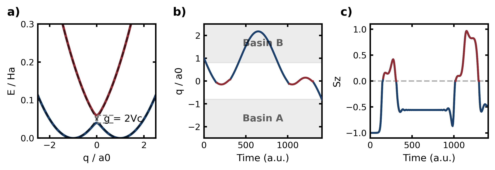
**図1**: 核座標qに沿った2つのポテンシャルエネルギー面とその間の非断熱遷移を示すモデルポテンシャル図、および反応経路（basin B→A）の代表的軌跡とスピン変数Szの時間発展。NATPSの対象とする問題設定を明確に示す基本的な概念図。

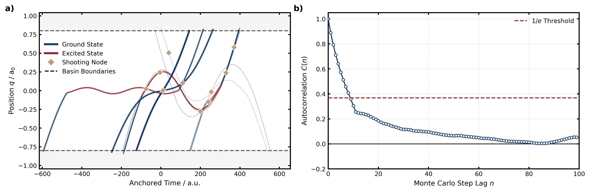
**図2**: 10回のMCステップにわたる軌跡の系譜（lineage history）と、経路空間でのMC相関時間（自己相関関数）。NATPSが効率的に独立サンプルを生成できることを統計的に示す。効率的な経路サンプリングのために時間可逆なMASH実装が果たす役割を定量化する重要な図。

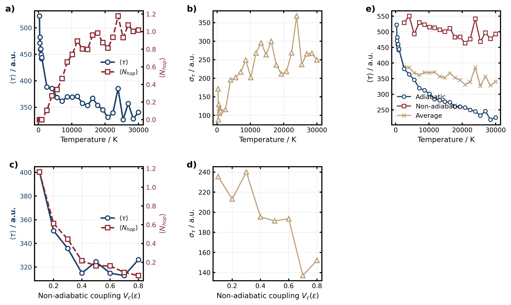
**図3**: 幅広い温度・電子結合強度範囲での平均遷移時間、ホッピング数、等断熱・非断熱経路比率の統計。NATPSの適用可能範囲と物理的機構の温度依存性を示し、高温・低カップリング領域での「多重ホッピング」経路の出現など機構論的知見を提供する。

---

# 第4部：全体のまとめ

## 計算物質科学分野の動向

2026年3月前半のarXiv新着論文群を通じて観察される最も重要な潮流の一つは、第一原理計算の「物理的近似の壁」を系統的に克服しようとする動きである。ボルン・オッペンハイマー近似の枠内で電子構造を精密化する取り組み（XC汎関数最適化、DFT+DMFT）が続く一方で、その枠組み自体を超えるNEO-DFTの凝縮系適用（2603.06906）や、二電子縮約密度行列の機械学習による相関エネルギーへのアクセス（2603.06882）が同時並行して展開されている。これは計算精度の上限をどこに設定するかという問いへの回答が多様化していることを示しており、方法論コミュニティの活力を反映している。第二の潮流として、電子構造由来の物理量を機械学習の特徴量として活用する動向が成熟しつつある。2603.06953の非相互作用電子密度を記述子とするアプローチは、「物理的に意味のある特徴量を設計する」という方向性の典型であり、組成・原子種を超えた外挿性能の確保という課題に対する一つの有力な答えを提示している。

## 明らかになった未解決領域

本号の選定論文群から浮かび上がる未解決問題として、まず強相関電子系でのフォノン計算と電子‐フォノン相互作用の精密評価が挙げられる。2603.06708（マンガナイトのヤーン・テラーフォノン崩壊）と2603.06966（重いフェルミオンの位相的状態）はいずれも、標準DFTの適用限界を示しており、DFT+U・DFT+DMFT・TPSS等の相関補正手法の組み合わせと実験の協調的な解析の必要性を浮き彫りにしている。次に、核量子効果の扱いと実用的な計算コストのバランスは依然として未解決である。NEO-DFT（2603.06906）はコスト効率の良い解法として登場したが、より複雑な多成分水素化物や拡張系での精度検証はこれからである。さらに、2-RDM学習（2603.06882）の固体・周期系への展開という基礎的技術課題も残っており、分子スケールでの成果を凝縮系に移植するためのアーキテクチャ設計が問われている。MLIPのMoEアーキテクチャ（2603.07977）についても、規模スケーリングの実際上の限界と、材料系によって異なる「エキスパート専門化」の一般性について追加検証が必要である。

## 今後の展望

近い将来の最も可能性のある進展として、NEO-DFTと電子‐フォノン結合計算ツールとの統合が挙げられる。高圧水素化物の超伝導転移温度予測において核量子効果が定量的に重要であることが確立されつつある以上、Tc計算ワークフローへのNEO-DFTの標準的組み込みが期待される。また、電子密度記述子と大規模合金データベースの組み合わせによる外挿型スクリーニングは、高エントロピー合金・次世代耐熱合金・高圧新規化合物の探索を大幅に加速する可能性がある。電子構造機械学習（ML-2RDM等）の凝縮相固体への展開が技術的に可能になれば、従来のMLPでは捉えられなかった電荷移動・磁気交換相互作用・強相関現象を予測する新しい計算科学の流れが形成されるだろう。トポロジカル輸送特性（異常ホール効果・ネルンスト効果）の第一原理予測は既に成熟しつつあり、永久磁石・スピントロニクス材料の高スループット計算スクリーニングとの融合が具体的な材料開発に結実する段階に近づいている。これらの進展は孤立したものではなく、第一原理精度の保証された記述子・表現の確立という共通の問題軸を中心に収束しており、計算物質科学の次の10年はこの問題の解決を軸に展開すると予想される。
