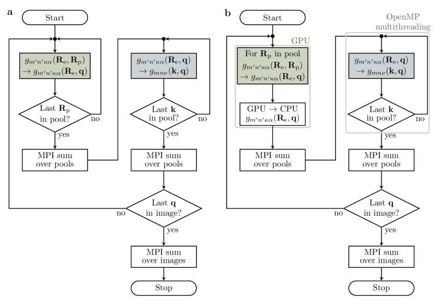
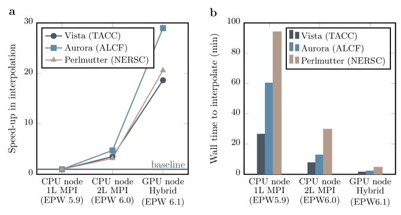
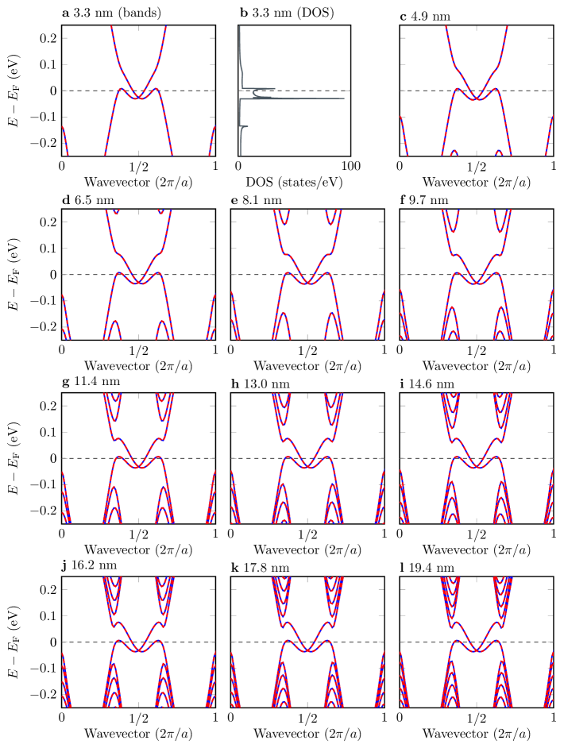
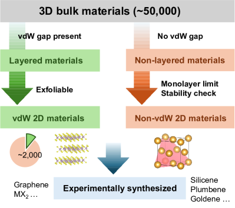
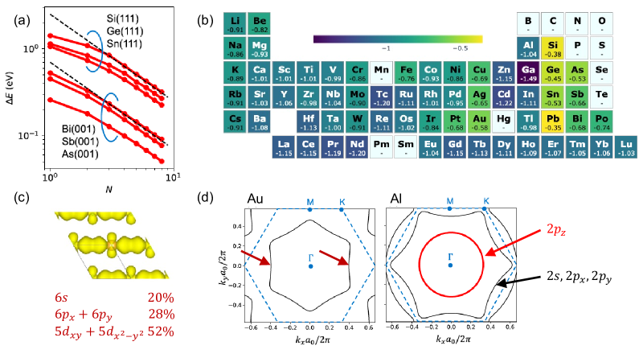
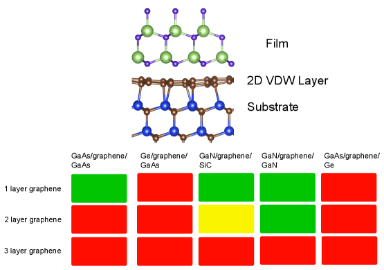
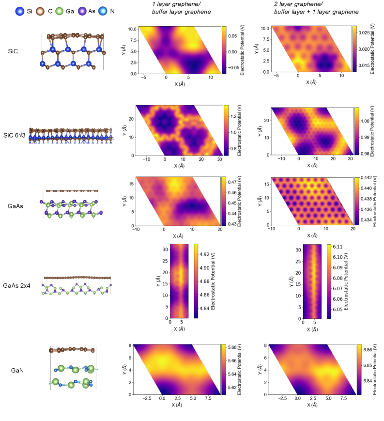
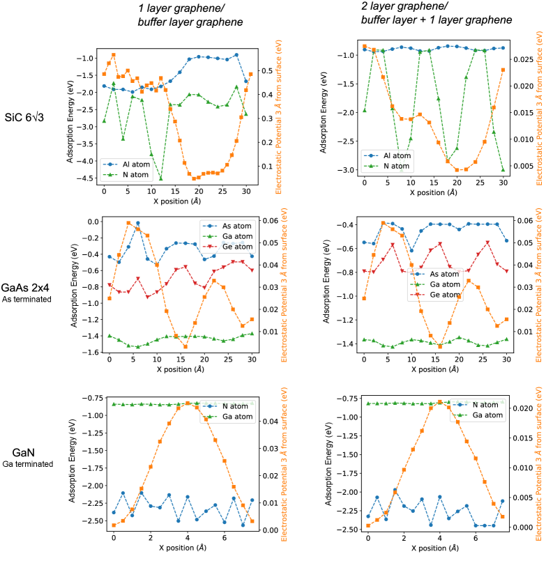

# arXiv 日次ダイジェスト

**作成日：** 2026年3月12日
**対象期間：** 2026年3月10日〜12日（直近72時間）

---

## 今日の選定方針

本日は、過去72時間に arXiv に投稿された計算物質科学関連の論文から、特に計算手法の新規性・物理的解釈の深さ・波及可能性に着目して10本を選定した。第一原理計算による電子–フォノン相互作用の大規模並列化から、低温相境界の効率的算出法、強相関電子系の量子埋め込み理論まで、計算手法とその物理的応用の双方にわたる多様な論文群を包括している。GPU加速による電子–フォノン計算のエクサスケール対応（2603.10295）、ハロゲン化ペロブスカイトにおける非線形電子–フォノン相互作用と輸送特性（2603.10954）、低温相境界の計算効率化フレームワーク（2603.09804）を重点論文として選定した。その他の7本も、機械学習ポテンシャルによる誘電特性・フォノン予測、バッテリー材料の大規模スクリーニング、強相関ツイスト二層グラフェンの第一原理量子埋め込み、イオン放射損傷の原子スケール模型など、計算物質科学の幅広い最前線を代表するものである。

---

## 全体所見

**計算手法の高性能化と応用領域の拡張：** 本日の選定論文群に通底するテーマの一つは、計算手法そのものの高性能化・大規模化である。特に 2603.10295 は、EPW コードの GPU 加速実装により電子–フォノン行列要素の Wannier 補間が最大29倍高速化され、既存の手法では扱えなかった大規模系（スタネンナノリボン）の輸送計算が初めて可能になったことを示す。同様に、2603.09804 では Clausius-Clapeyron 方程式と準調和近似を融合させた相境界算出フレームワークが提案され、従来手法に比して大幅に少ないフォノン計算でシリカの低温相図を精度よく再現した。こうした計算インフラの整備は、分野全体の探索空間を広げる基盤技術として高く評価できる。

**電子–フォノン結合の物理的深化：** 2603.10954 は、ハロゲン化ペロブスカイト CsPbI₃ において、従来の線形電子–フォノン結合では捉えられない「1電子–2フォノン」非線形相互作用が、室温付近のキャリア移動度に約10%の寄与をもたらし、温度依存冪指数をも変化させることを示した。柔らかいフォノンと大きなイオン変位が共存する系では、非線形相互作用の系統的な取り込みが輸送特性の正確な予測に不可欠であることが明示された。また、2603.06396 は環境依存電荷モデルを組み込んだ機械学習ポテンシャルにより、DFT由来の誘電定数や Born 有効電荷を陽に参照せずとも LO-TO 分裂やフォノンスペクトルを予測できることを実証しており、フォノン計算の効率化と精度向上に寄与する。

**強相関・トポロジカル系の計算科学的進展：** 2603.10433 は、マジック角ツイスト二層グラフェン（MATBG）を対象に、DFT + cRPA + CCSD という厳密な量子埋め込み手法を用い、電子ドープ側では絶縁状態、ホールドープ側では半金属状態という粒子–正孔非対称性を ab initio から再現した。この非対称性の物理的起源が Hartree 繰り込みの運動量依存性にあることを明示した点は、強相関系の計算設計において新たな指針を与える。また、2603.10462 の2D材料予測の展望、2603.10968 のリモートエピタキシーの第一原理的指標探索、2603.10838 のタングステン中における軽イオンのアニソトロピー電子停止模型など、第一原理計算の適用フロンティアが着実に広がっていることを示す論文群が揃っている。

---

## 選定論文一覧（10本）

| # | arXiv ID | タイトル | 分類 |
|---|----------|---------|------|
| 1 | 2603.10295 | Electron-Phonon Physics at the Exascale: A Hybrid MPI-GPU-OpenMP Framework for Scalable Wannier Interpolation | 重点 |
| 2 | 2603.10954 | Importance of Nonlinear Long-Range Electron-Phonon Interaction on the Carrier Mobility of Anharmonic Halide Perovskites | 重点 |
| 3 | 2603.09804 | Efficient method for calculation of low-temperature phase boundaries | 重点 |
| 4 | 2603.10154 | Intertwined Swirling Polarization States in BaTiO₃ with Embedded BaZrO₃ Nanoregions | 簡潔 |
| 5 | 2603.06396 | Long-range machine-learning potentials with environment-dependent charges enable predicting LO-TO splitting and dielectric constants | 簡潔 |
| 6 | 2603.10631 | High-Throughput-Screening Workflow for Predicting Volume Changes by Ion Intercalation in Battery Materials | 簡潔 |
| 7 | 2603.10462 | Beyond Geometrical Screening in Predicting Two-Dimensional Materials | 簡潔 |
| 8 | 2603.10968 | Island Sliding Barriers: A First-Principles Metric for Determining Remote Epitaxy Viability | 簡潔 |
| 9 | 2603.10433 | Ab initio quantum embedding description of magic angle twisted bilayer graphene at even-integer fillings | 簡潔 |
| 10 | 2603.10838 | Modeling Anisotropic Energy Dissipation of Light Ions at the Atomistic Scale | 簡潔 |

---

# 重点論文の詳細解説

---

## 論文1

### 1. 論文情報

**タイトル：** [Electron-Phonon Physics at the Exascale: A Hybrid MPI-GPU-OpenMP Framework for Scalable Wannier Interpolation](https://arxiv.org/abs/2603.10295)
**著者：** Tae Yun Kim, Zhe Liu, Sabyasachi Tiwari, Elena R. Margine, Feliciano Giustino
**arXiv ID：** 2603.10295
**カテゴリ：** cond-mat.mtrl-sci
**公開日：** 2026年3月11日
**論文タイプ：** 計算手法・実装論文
**ライセンス：** CC BY 4.0

---

### 2. どんな研究か

電子–フォノン（e-ph）相互作用の Wannier 補間を担う EPW コードを GPU 加速し、MPI–GPU–OpenMP の三段階並列化実装により、リーダーシップクラスのスーパーコンピュータ上で最大29倍の高速化を実現した計算手法論文である。この実装により、従来の手法では計算不可能だったサイズの材料系（スタネンナノリボン、単位胞98原子）に対するフォノン制限輸送計算が初めて可能となり、エクサスケールプラットフォームへの移行に向けた EPW の実用的な準備が整ったことを示している。

---

### 3. 位置づけと意義

電子–フォノン相互作用は、超伝導転移温度・キャリア移動度・電子–フォノン散乱率など、固体物理の中心的物性に直接関わる量であり、その第一原理計算は Wannier 補間技術の発展により著しく精密化されてきた。しかし Wannier 補間に必要な Brillouin ゾーン上のサンプリングは O(N²) のスケーリングを持ち、大規模系への適用は計算コストの壁に阻まれてきた。本研究の GPU 加速実装は、この隘路を体系的に突破する基盤技術として位置づけられ、NVIDIA・AMD・Intel の各 GPU に移植可能な汎用実装（OpenACC/OpenMP ディレクティブ活用）を提供している点で、コミュニティ全体への波及効果が高い。

---

### 4. 研究の概要

**背景・目的：** 電子–フォノン行列要素 $g_{mn\nu}(\mathbf{k},\mathbf{q})$ の第一原理計算では、数万点に及ぶ $\mathbf{k}$–$\mathbf{q}$ 格子上で Wannier ユニタリー変換と格子動力学の Fourier 変換を繰り返す必要がある。EPW コードはこの Wannier 補間の標準実装として国際的に広く使われているが、MPI のみの並列化では GPU 集積型のエクサスケール機（Perlmutter, Vista, Aurora）の演算資源を十分に活用できていなかった。本研究は、この計算ボトルネックに三段階の並列化戦略で対処する。

**計算科学上の課題設定：** e-ph 補間の演算は GEMV（行列–ベクトル積）演算として表現でき、GPU に親和性が高い。しかし従来の実装では単一 MPI ループに処理が集中しており、GPU への分散が困難だった。著者らはこれをネストループ構造に再定式化し、phonon Wigner-Seitz ベクトルについての Fourier 変換を最内ループに隔離することで、GPU への一括オフロードを可能にした。

**研究アプローチ：** （1）「2 レベル MPI 並列化」として image（$\mathbf{q}$ 点）と pool（$\mathbf{k}$ 点）の二段階分散を実装、（2）GEMV 演算を cuBLAS / oneMKL / rocBLAS に委譲するプリプロセッサ分岐を整備、（3）MPI ランク内部を OpenMP スレッドでさらに並列化、という三段構えで実装した。

**対象材料系・対象現象：** ベンチマーク系として Si（8原子バルク）および MoS₂ 単層（3原子）を採用し、1,024 GPU ノードまでのスケーラビリティを検証。応用事例として水素パッシベートジグザグスタネンナノリボン（幅 3.3〜19.4 nm、98原子）の電子–フォノン輸送計算を実施した。

**主な手法：** EPW v6.1（Quantum ESPRESSO ベースの e-ph コード）、Wannier 補間、DFPT（phonon 行列要素の計算）、ボルツマン輸送方程式（SERTA）、OpenACC/OpenMP GPU オフロード。

**主な結果：** 単一ノードでの EPW v5.9→v6.1 の累積高速化は 19〜29 倍、Vista 上 32 ノードでほぼ線形スケーリング（21.6 倍速）、Aurora 上 1,024 ノードで 16.8 倍速（5分未満）を達成した。スタネンナノリボンでは、幅 6.5 nm 付近を境にフォノン制限輸送が幅依存的なクロスオーバーを示すことが明らかになった。

**著者の主張：** EPW はエクサスケールプラットフォーム上での e-ph 計算に実戦投入可能な状態に到達しており、AI/ML ワークフローや高スループット材料探索への統合が視野に入ると主張する。

---

### 5. 計算物質科学として重要なポイント

- **対象物性：** 電子–フォノン行列要素、フォノン制限キャリア移動度、電子バンド構造（トポロジカルエッジ状態を含む）
- **手法・近似の意味と妥当性：** Wannier 補間は Bloch 基底と Wannier 基底の間の変換により粗格子（DFT スーパーセル）の e-ph 情報を任意細密格子に補間する技法で、DFPT の直接計算に比して O(N) の削減が可能。GPU の BLAS ルーチン利用は数値精度を落とさず演算加速を実現する妥当な選択。
- **計算条件：** Perlmutter (4 GPU/node, NVIDIA A100)、Vista (4 GPU/node, NVIDIA GH200)、Aurora (6 GPU/tile, Intel PVC) の3システムで検証済。スタネンナノリボンの coarse-grid e-ph matrix サイズは幅に応じて 1.9〜458 GB という規模。
- **既存研究との差分：** 従来の EPW v5.x は MPI 並列のみ。本実装は GPU ベンダー非依存のコードを提供し、AMD・Intel 環境を含めて対応した点が先行 GPU 実装と異なる。
- **新規性の位置づけ：** 新しい物理は示されていないが、計算基盤として分野へのインパクトは大きく、incremental ではなく実質的な infrastructure breakthrough である。
- **物理的解釈：** スタネンナノリボンにおいて Fermi 準位がトポロジカルエッジ状態の DOS にピン留めされ、熱的広がりの効果によって 50 K→300 K で輸送クロスオーバーが生じることを初めて計算した。
- **波及可能性：** 大規模系の超伝導 $T_c$ 計算、トポロジカル系の e-ph 散乱、データ駆動的フォノン制限移動度スクリーニングへの直接応用が可能。

---

### 6. 限界と注意点

1. **スケーラビリティの飽和：** Aurora 上 1,024 ノードで 16.8 倍（理論線形値より低下）という結果に対し、通信オーバーヘッドの影響が示唆されているが、定量的なボトルネック分析は本論文の範囲外であり、さらなる最適化余地の明示が不十分。
2. **対応材料系の制限：** スタネンナノリボンへの応用は水素パッシベートジグザグ端という特定のモデルに限定されており、アームチェア端や欠陥含有系への一般化は未検証。基板–リボン相互作用も考慮されていない。
3. **精度検証の対象範囲：** SERTA（最緩和時間近似）による輸送計算は、顕著なバンド間散乱や非平衡効果が無視されており、低温での量子干渉効果は含まれない。スタネン固有のスピン–軌道結合効果が輸送に与える影響の詳細な議論も省略されている。

---

### 7. 関連研究との比較や研究動向における立ち位置

- **主要先行研究との差分：** Poncé et al. (2016) による EPW v4 以降、Brunin et al.、Giustino グループが Wannier 補間の精度向上を継続してきた。GPU 実装は Lee et al. らの BerkeleyGW での実績があるが、e-ph コードにおける本格的なマルチ GPU ベンダー対応はほぼ先例がない。
- **競合研究との位置づけ：** ABINIT の anaddb/EPH モジュール、Perturbo コードとも GPU 化が進んでいるが、本論文は Aurora など Intel GPU システムへの対応を先行しており差別化される。
- **分野の未解決問題への前進：** 大規模系・低対称系での e-ph 計算のボトルネックを部分的に解決した。エクサスケールへの道筋は示したが、メモリ帯域と通信コストの最終的な解決には追加の取り組みが必要。
- **新規性：** incremental ではなく、実用的な infrastructure breakthrough として評価される。
- **引用されうるコミュニティ：** 超伝導、半導体輸送、フォノン散乱、熱電、表面物理の広範な第一原理コミュニティが主要ユーザー。
- **今後の研究方向：** FinFET・二次元材料・モアレ系の大規模 e-ph 計算、AI/ML を用いた e-ph 行列要素の機械学習化、MLIP との組み合わせによる高スループット材料設計。
- **再現性・実装可能性：** EPW コードはオープンソース（QE ディストリビューション）として公開されており、再現・応用は容易。

---

### 8. 図

**ライセンス：** CC BY 4.0

**図1キャプション（Fig. 2）：** 計算ワークロード分散の模式図。(a) $\mathbf{q}$ 点（image）と $\mathbf{k}$ 点（pool）の2レベル MPI 並列化スキーム、(b) MPI–GPU–OpenMP ハイブリッドフレームワーク全体の階層構造を示す。GPU に offload される演算（GEMV）がどのレベルで実行されるかが明示されており、並列化設計の核心を表している。

**図2キャプション（Fig. 5）：** 単一ノードにおける EPW v5.9→v6.0→v6.1 の段階的な高速化率の比較。Si および MoS₂ を対象に Perlmutter、Vista、Aurora の3システムで測定。GPU+OpenMP 導入（v6.0→v6.1）により5〜6倍、2レベル MPI（v5.9→v6.0）で3〜5倍の高速化が得られ、合計で19〜29倍を実現したことを示す。著者のスケーラビリティ主張を直接支持する図である。

**図3キャプション（Fig. 9）：** 水素パッシベートジグザグスタネンナノリボン（幅3.3〜16.2 nm）の電子バンド構造。Wannier 補間の精度が Quantum ESPRESSO の直接計算と一致していることを示すとともに、トポロジカルエッジ状態が Fermi 準位を幅によらず継続的にピン留めしている様子が確認できる。エクサスケール実装の応用事例として、この計算が初めて可能になった大規模系であることを示す。

---

## 論文2

### 1. 論文情報

**タイトル：** [Importance of Nonlinear Long-Range Electron-Phonon Interaction on the Carrier Mobility of Anharmonic Halide Perovskites](https://arxiv.org/abs/2603.10954)
**著者：** Matthew Houtput, Ingvar Zappacosta, Serghei Klimin, Samuel Poncé, Jacques Tempere, Cesare Franchini
**arXiv ID：** 2603.10954
**カテゴリ：** cond-mat.mtrl-sci
**公開日：** 2026年3月11日
**論文タイプ：** 理論・第一原理計算
**ライセンス：** arXiv 標準ライセンス（CC BY 非該当のため原図は掲載せず）

---

### 2. どんな研究か

ハロゲン化ペロブスカイト CsPbI₃ において、従来理論が前提としてきた線形電子–フォノン結合を超えた「1電子–2フォノン」非線形相互作用を第一原理から評価し、室温以上でのキャリア移動度に対して約10%の寄与をもたらすことを定量的に示した研究である。非線形相互作用は移動度の温度依存べき指数を 0.85 から 0.95 に変化させるほどの効果を持ち、柔らかいフォノンと大きなイオン変位を持つアンハーモニック系では非線形項の取り込みが不可欠であることを明示した。

---

### 3. 位置づけと意義

ハロゲン化鉛ペロブスカイトは太陽電池・LED 用途で急速に注目を集めており、キャリア輸送の第一原理的理解は材料設計に直結する。従来の Fröhlich ポラロン模型や SERTA に基づく輸送計算は線形（1電子–1フォノン）結合を前提としていたが、CsPbI₃ のように低エネルギーフォノンが多数存在し格子変位が大きい「ソフト」材料では、この仮定の妥当性は自明でない。本研究は1電子–2フォノン行列要素の第一原理表式を実際の輸送計算に組み込んだ先駆的な研究であり、アンハーモニック材料の輸送理論を一段階体系化するものとして評価できる。

---

### 4. 研究の概要

**背景・目的：** CsPbI₃ は低周波（〜10 meV 台）のフォノンを多く持ち、有限温度でのイオン変位が特に大きいアンハーモニック系である。こうした系では、電場–格子相互作用のテイラー展開で1次項（線形）に加えて2次項（非線形）が有限の寄与を持つ可能性がある。著者らはこの1電子–2フォノン項を自己エネルギー形式に組み込み、ボルツマン輸送方程式（SERTA）で移動度を計算した。

**計算科学上の課題設定：** 1電子–2フォノン行列要素は波数空間の3体積分を要し、計算コストが通常の e-ph 計算に比べて著しく増大する。著者らは長距離近似（LR approximation）を採用することでこれを実用的な計算量に収めた。

**研究アプローチ：** 第一原理計算（DFT）で得た電子構造・フォノン情報を基に、非線形 e-ph 行列要素の長距離成分を解析的に評価し、有効自己エネルギーとして線形項に上乗せして輸送計算を行った。

**対象材料系・対象現象：** CsPbI₃（立方晶相）、電子移動度の温度依存性（200〜500 K）。

**主な手法：** DFT（PBE+SOC）、DFPT、Wannier 補間、SERTA、非線形 e-ph 自己エネルギーの長距離近似。

**主な結果：** 非線形項の寄与は室温で約10%の移動度低下をもたらし、温度スケーリング指数 γ を 0.85→0.95 に変化させる。低温では非線形項の寄与は無視できる程度に小さい。

**著者の主張：** 「非線形相互作用は線形相互作用の高次補正ではなく、独立した物理機構であり、アンハーモニック系では系統的な取り込みが必要」と主張する。

---

### 5. 計算物質科学として重要なポイント

- **対象物性：** フォノン制限キャリア移動度、電子–フォノン自己エネルギー、輸送温度依存性
- **手法・近似の妥当性：** 長距離近似（LR）は非線形行列要素の短距離成分を無視するため、短距離成分が支配的な系（例：共有結合性結晶）への外挿は要注意。ただし CsPbI₃ のようなイオン性強い系では長距離Fröhlich型相互作用が支配的であり、近似は概ね妥当。
- **計算条件：** 特定のフォノンモードに対してのみ非線形項を評価しており、全フォノンモードへの拡張はなされていない（将来課題）。
- **既存研究との差分：** SERTA+線形 e-ph に基づく先行計算（Poncé et al., Ghosh et al.）に対し、非線形項を初めて定量的に組み込んだ。
- **新規性：** 計算上は incremental だが、物理的枠組みとしてアンハーモニック系の輸送理論に新たな変数を加えた重要な一歩。
- **波及可能性：** BiVO₄、CH₃NH₃PbI₃ 等の他の柔らかい酸化物・ハロゲン化物への即時適用が見込まれる。

---

### 6. 限界と注意点

1. **長距離近似の限界：** 1電子–2フォノン行列要素の短距離成分は全く考慮されていない。短距離成分が相殺するか加算するかは材料依存であり、CsPbI₃ 以外の系では誤差が増大しうる。
2. **単一フォノンブランチへの限定：** 実際には非線形結合が強いと予想される低周波光学モードのみに議論が集中しており、全フォノンモードへの展開は計算コスト上の課題から実施されていない。
3. **実験との定量的比較の困難さ：** CsPbI₃ の実験的移動度は試料品質・欠陥密度に強く依存し、計算値との定量比較には慎重さが必要。論文内でも移動度の絶対値より温度依存性の議論に焦点を絞っており、実験との対応は間接的にとどまる。

---

### 7. 関連研究との比較や研究動向における立ち位置

- **先行研究との差分：** Poncé et al. (2021, JCTC) や Giustino (2017, RMP) による線形 e-ph 理論の教科書的実装に対し、本研究は非線形項の定量評価という新しい軸を提供する。
- **競合研究：** Monserrat グループらが PIMD + 電子–格子結合のアンハーモニック効果を研究しているが、輸送係数への非線形 e-ph の直接寄与という切り口は本研究に近い先行例が少ない。
- **未解決問題への前進：** ハロゲン化ペロブスカイトの移動度の絶対値が実験より低い問題に一定の方向性を示すが、完全な解決には至っていない。
- **新規性：** Incremental（枠組みは既存のDFT+Wannier+SERTA）だが、非線形項の組み込みという着想と定量的評価は独自性がある。
- **引用コミュニティ：** ペロブスカイト太陽電池・光検出器のデバイス物理から第一原理輸送理論まで幅広い。
- **今後の展開：** 全フォノンモードへの非線形 e-ph 計算の拡張、anharmonic renormalization との結合、温度依存 e-ph 計算（SSCHA ベース）との統合。
- **再現性：** コード・データの公開は論文内に明示されていないが、使用した EPW・QE の手順は再現性が高い。

---

### 8. 図

**ライセンス：** arXiv 標準ライセンス（CC BY 非該当）のため、原図の転載は行わない。以下に各図の内容を記述する。

**図1（Feynman 図）：** 線形（1電子–1フォノン）と非線形（1電子–2フォノン）電子–フォノン相互作用の Feynman ダイアグラムおよびそれらが自己エネルギーに与える寄与を図示。両相互作用の物理的区別と自己エネルギーへの組み込み方を視覚的に示し、本研究の理論的枠組みの核心を表す。

**図2（フォノン関連）：** CsPbI₃ の高対称点を含む Brillouin ゾーンパス、全フォノン分散、1電子–2フォノン分光関数の温度依存性を示す複合図。低周波光学モードの分光関数が温度とともに顕著に増大する様子が示されており、非線形項の重要性が増す温度領域を直観的に把握できる。

**図4（移動度 vs 温度）：** 線形 e-ph のみの場合と非線形 e-ph を加えた場合の SERTA 電子移動度の温度依存性比較。非線形項が移動度を低下させ、温度スケーリング指数を変化させる効果が定量的に示されており、論文の中心的主張を直接支持する。

---

## 論文3

### 1. 論文情報

**タイトル：** [Efficient method for calculation of low-temperature phase boundaries](https://arxiv.org/abs/2603.09804)
**著者：** Lucas Svensson, Babak Sadigh, Christine Wu, Paul Erhart
**arXiv ID：** 2603.09804
**カテゴリ：** cond-mat.mtrl-sci; physics.chem-ph; physics.comp-ph
**公開日：** 2026年3月10日
**論文タイプ：** 計算手法・材料熱力学
**ライセンス：** arXiv 標準ライセンス（CC BY 非該当のため原図は掲載せず）

---

### 2. どんな研究か

Clausius-Clapeyron（CC）方程式と準調和近似（QHA）を融合させた「CC-QHA+QC フレームワーク」を提案し、低温相境界の計算を従来の自由エネルギー積分法と同等の精度で、かつ必要なフォノン計算を相境界全体で1相1体積ずつ（最小6回程度）に圧縮することを実証した研究である。DFT および機械学習ポテンシャル（NEP）を用いてシリカの相図（-2〜12 GPa、室温〜1750 K）を構築し、実験値および自由エネルギー積分結果との良好な一致を示した。

---

### 3. 位置づけと意義

材料の相安定性を温度–圧力空間で正確に予測することは、計算物質科学・計算熱力学の根本課題の一つである。従来の有限温度第一原理アプローチは自由エネルギー積分（熱力学積分法 TI）や準調和近似の総当たり的な計算を必要とし、高スループット応用には計算コストが重い。本研究の CC-QHA+QC は「相境界の傾きを Clausius-Clapeyron の微分として評価し、QHA でエントロピー差を算出する」という着想によって、必要な計算を最小化しながら量子補正・アンハーモニック効果を取り込む点が新しく、高スループット相図計算への道を開く可能性がある。

---

### 4. 研究の概要

**背景・目的：** 低温域における固相–固相境界（例：α-石英→コエサイト、コエサイト→スティショバイト）は、零点振動エネルギー・量子補正・低次アンハーモニック効果が重要になるにもかかわらず、標準的な自由エネルギー積分では計算コストが高くなる。特に MLIP（機械学習ポテンシャル）を使っても、相図全体を積分で求めるには多数の MD 計算が必要である。

**計算科学上の課題設定：** Clausius-Clapeyron 方程式 $dP/dT = \Delta S/\Delta V$ を出発点に、圧力–温度関係を2次のテイラー展開で表現し、その係数（エントロピー差・体積差・それらの微分）を QHA から求める。これにより相境界全体を少数の QHA 計算で記述できる。

**研究アプローチ：** （1）DFT（PBEsol）で参照計算、（2）NEP（Neuroevolution Potential）を1,218 構造で訓練（エネルギー RMSE: 20.1 meV/atom）、（3）QHA+量子補正（QC）で温度–圧力依存フォノン寄与を評価、（4）自由エネルギー積分（FEI）を検証比較として実施。

**対象材料系・対象現象：** SiO₂ の多形（トリジマイト、α-石英、コエサイト、スティショバイト）間の固相転移、相図の低温・低圧〜高圧領域。

**主な手法：** DFT（PBEsol, VASP）、Neuroevolution Potential（NEP4 実装）、準調和近似（QHA）、自由エネルギー積分（参照用）、フォノン計算（phonopy 使用）。

**主な結果：** CC-QHA+QC はトリジマイト–α-石英境界、α-石英–コエサイト境界でFEI との高い一致を示した。コエサイト–スティショバイト境界の傾きは若干フラットになるが、実験範囲内に収まっている。量子補正の取り込みで低温域の境界位置が有意に改善される。

**著者の主張：** 相境界あたり最小6回のフォノン計算で相図を構築でき、高スループット相図計算（多形スクリーニング等）への直接応用が可能だと主張する。

---

### 5. 計算物質科学として重要なポイント

- **対象現象：** 固相–固相転移、低温相安定性、圧力誘起相転移、SiO₂ 相図
- **手法・近似の妥当性：** QHA は格子定数の体積依存性のみを取り込み、真のアンハーモニック効果（フォノン–フォノン散乱、自発的な対称性破れ）は組み込まれない。ただし本フレームワークは低次アンハーモニック補正を付加的に取り込める設計であり、精度向上の余地がある。
- **計算条件：** NEP は LAMMPS + GPUMD で実行。スーパーセルサイズや積分点数の詳細は論文に記載あり。
- **既存研究との差分：** CALPHAD は実験データへのフィッティングに基づくため低温精度に限界がある。本手法は完全第一原理ベースで量子補正を含む点が優れている。
- **新規性：** CC と QHA の融合自体は既知だが、量子補正を系統的に取り込んだ2次テイラー展開フレームワークとしての実装は本研究が先例。
- **波及可能性：** 高スループット多形安定性スクリーニング、MLIP ベースの相図構築、極低温・高圧環境（惑星内部）の相安定性計算への展開が期待される。
- **効く分野：** 計算熱力学、相安定性解析、材料設計（高圧・低温特性）、CALPHAD の第一原理強化。

---

### 6. 限界と注意点

1. **QHA の適用限界：** 本フレームワークの中核は QHA であり、フォノン–フォノン相互作用（3次・4次アンハーモニシティ）が強い系（融点近傍、ソフトモード系）では QHA 自体が破綻する。SiO₂ の α-β 石英転移（低温でも 2次相転移）の境界では CC-QHA がやや不正確な傾向が見られ、著者もその限界を認めている。
2. **訓練データの偏り：** NEP は1,218 構造の DFT データで訓練されており、高温・高圧相境界付近の構造が十分にカバーされているかは不明瞭。実際に stishovite–coesite 境界でやや精度が落ちることはこの偏りに起因する可能性がある。
3. **多成分系・欠陥系への拡張性：** 本論文は単成分系（SiO₂）での実証に限定されており、溶液相・欠陥含有固溶体系への CC-QHA+QC の拡張は自明でなく、混合エントロピーや欠陥形成エネルギーの取り込みには追加の定式化が必要。

---

### 7. 関連研究との比較や研究動向における立ち位置

- **先行研究との差分：** Erhart グループ（本論文の Paul Erhart が対応著者）は以前も SiO₂ の ML ポテンシャル構築や相安定性計算を発表しており、本研究はその手法的発展として位置づけられる。Carrier et al. (2007) の Clausius-Clapeyron + QHA の定式化に比べ、量子補正の系統的な組み込みが進化点。
- **競合研究：** SSCHA（Stochastic Self-Consistent Harmonic Approximation）は高次アンハーモニックを取り込む点で優位だが、計算コストは本手法より高い。本研究は精度と効率のバランスを重視している。
- **未解決問題への前進：** 低温・高圧相図の効率的計算という問題に対し、明確な前進を示している。ただし強アンハーモニック系へは未対応。
- **新規性：** Incremental だが実用性が高く、高スループット計算インフラとしてのインパクトは大きい。
- **引用コミュニティ：** SiO₂・地球物質科学・高圧物理・計算熱力学・MLIP 開発コミュニティにわたる。
- **今後の展開：** 混合物の相図、欠陥含有相の安定性、極低温超伝導相の境界計算への拡張。
- **再現性：** LAMMPS/GPUMD および phonopy を使用、NEP パラメータは公開可能な形式で記述されており、再現性は高いと評価できる。

---

### 8. 図

**ライセンス：** arXiv 標準ライセンス（CC BY 非該当）のため、原図の転載は行わない。以下に各図の内容を記述する。

**図1（MLIP 検証）：** NEP モデルによるエネルギー・力の DFT 参照値との一致（パリティプロット）、および DFT とNEP のエネルギー–体積曲線の比較。精度検証の基礎データを示し、後続の相図計算の信頼性を裏付ける。

**図3（SiO₂ 相図）：** (a) 実験文献相図、(b) NEP + 自由エネルギー積分による相図、(c) CC-QHA+QC フレームワークによる相図の3種比較。三者の定性的・定量的一致が、本手法の有効性を示す中心的根拠となっている。

**図4（フォノン分散と状態密度）：** トリジマイト・α-石英・コエサイト・スティショバイト4相のフォノン分散と状態密度。各相の熱力学的安定性を決定するエントロピー差・零点エネルギー差の物理的起源を示す。

---

# その他の重要論文

---

## 論文4

### 1. 論文情報

**タイトル：** [Intertwined Swirling Polarization States in BaTiO₃ with Embedded BaZrO₃ Nanoregions](https://arxiv.org/abs/2603.10154)
**著者：** R. Machado, F. Di Rino, M. Sepliarsky, M. G. Stachiotti
**arXiv ID：** 2603.10154
**カテゴリ：** cond-mat.mtrl-sci
**公開日：** 2026年3月10日
**論文タイプ：** 原子論的シミュレーション
**ライセンス：** arXiv 標準ライセンス（CC BY 非該当のため原図は掲載せず）

---

### 2. 研究概要

本研究は、BaTiO₃ マトリックス中に BaZrO₃ のナノ領域（誘電体インクルージョン）を3次元的に規則配列させた系を、第一原理ベースの原子論的シミュレーションで調べ、そのナノ領域のサイズと間隔に支配された分極テクスチャの相図的構造を明らかにした。インクルージョン間隔が大きい場合は通常の BaTiO₃ と同様の一様分極状態が現れ、間隔が狭まるにつれて渦状分極パターンが形成され、さらに密になると相互に絡み合った旋回分極構造が安定化することを示した。また、ランダムに分散したインクルージョンでは、渦の「非晶質ネットワーク」が形成されることも見出した。

この研究は、リラクサー強誘電体における局所的な組成ゆらぎが分極テクスチャに与える効果を原子論的に解明した点で重要性が高い。BaTiO₃/BaZrO₃ 系は実験的にも活発に研究されており、本計算の予測は実験グループの試料設計に直接的な指針を与える可能性がある。分極渦・スカーミオン様構造の安定化メカニズムを原子スケールで理解することは、強誘電体メモリデバイスや電気機械カプリングの設計において基礎的な知見を提供する。

---

### 3. 図

**ライセンス：** arXiv 標準ライセンス（CC BY 非該当）のため、原図は掲載しない。

- **図（分極テクスチャの相図）：** ナノ領域のサイズ・間隔パラメータ空間における分極テクスチャのレジーム分類図。一様分極・渦配列・旋回分極ネットワークの3つのレジームの境界を示し、ナノ構造設計と分極トポロジーの関係を定量化した中心的な図である。
- **図（渦構造の可視化）：** 規則配列インクルージョン系での旋回分極パターンの3次元可視化。各サイトの分極ベクトルが渦構造を形成する様子が示され、リラクサー強誘電体の実空間描像を与える。
- **図（ランダム分布結果）：** ランダムに配置された BaZrO₃ インクルージョンが引き起こす「非晶質渦ネットワーク」の構造。規則配列の結果との対比が、秩序–無秩序の効果を理解する上で重要。

---

## 論文5

### 1. 論文情報

**タイトル：** [Long-range machine-learning potentials with environment-dependent charges enable predicting LO-TO splitting and dielectric constants](https://arxiv.org/abs/2603.06396)
**著者：** Dmitry Korogod, Alexander V. Shapeev, Ivan S. Novikov
**arXiv ID：** 2603.06396
**カテゴリ：** physics.comp-ph
**公開日：** 2026年3月6日
**論文タイプ：** 計算手法・機械学習ポテンシャル
**ライセンス：** arXiv 標準ライセンス（CC BY 非該当のため原図は掲載せず）

---

### 2. 研究概要

本研究は、局所的なモーメントテンソルポテンシャル（MTP）に環境依存点電荷モデルを組み合わせた機械学習ポテンシャル（MTP+EDQRd）を開発し、DFT 由来の Born 有効電荷や高周波誘電定数を陽に参照せずとも、NaCl や BaTiO₃（PbTiO₃）のフォノンスペクトル・LO-TO 分裂・誘電定数を予測可能にした。3種類の静電モデル（固定電荷 QRd、環境依存電荷 EDQ、電荷再分配付き EDQ である EDQRd）を系統的に比較し、EDQRd が NaCl でのエネルギー誤差5倍削減、力誤差5倍削減を達成し、誘電定数比 2.71（実験 2.53）という高精度を実現した。さらに等方性材料においてはエネルギー・力・応力データのみから非解析的補正（NAC）を算出できる新しい手法を提案した。

この研究の意義は、フォノン工学や誘電体設計に不可欠な LO-TO 分裂の予測が、DFT による電気分極計算なしに MLIP だけで原理的に可能になる道を示した点にある。従来の MLIP は局所相互作用のみを記述するため、長距離双極子–双極子相互作用を介した LO-TO 分裂を再現できないことが弱点とされてきたが、本手法の EDQRd モデルはこれを克服する。イオン性結晶における熱伝導・誘電緩和・フォノン分散の高スループット計算に直結する実用的なアドバンスであり、Shapeev グループの MTP フレームワークの新たな展開として注目に値する。

---

### 3. 図

**ライセンス：** arXiv 標準ライセンス（CC BY 非該当）のため、原図は掲載しない。

- **図（フォノン分散の比較）：** NaCl のフォノン分散において、MTP、MTP+QRd、MTP+EDQRd、DFT の各手法による予測の比較。Γ 点近傍の LO-TO 分裂の有無・精度を直観的に示す最重要図。
- **図（誘電定数のMD予測）：** 分子動力学シミュレーションから双極子揺らぎを通じて誘電定数を計算した結果と実験値の比較。EDQRd が実験に最も近い誘電定数を与えることを示す。
- **図（PbTiO₃への拡張）：** 異方性材料 PbTiO₃ へのモデル適用結果。等方性材料向けに開発されたアプローチが非等方系にも対応可能であることを示し、手法の一般性を担保する重要な検証図。

---

## 論文6

### 1. 論文情報

**タイトル：** [High-Throughput-Screening Workflow for Predicting Volume Changes by Ion Intercalation in Battery Materials](https://arxiv.org/abs/2603.10631)
**著者：** Aljoscha Felix Baumann, Daniel Mutter, Daniel F. Urban, Christian Elsässer
**arXiv ID：** 2603.10631
**カテゴリ：** cond-mat.mtrl-sci
**公開日：** 2026年3月11日
**論文タイプ：** 計算手法・高スループットスクリーニング
**ライセンス：** arXiv 標準ライセンス（CC BY 非該当のため原図は掲載せず）

---

### 2. 研究概要

本研究は、電池電極材料のイオン挿脱時の体積変化（低体積変化 LVC 材料の探索）を、DFT 計算を直接実施せずに機械学習ワークフローで予測するシステムを開発し、約 117 万件の遷移金属酸化物・フッ化物に対して適用した。2モデルの直列構造（結合長予測モデル ℳ_Bond と体積予測モデル ℳ_Vol.）を採用し、局所構造秩序パラメータ（LSOP、51特徴量）を入力とした XGBoost ベースの結合長予測で MAE 0.02 Å を達成した。最終的に DFT の体積変化 1% 未満という厳しい基準を満たす LVC 候補 287 件を同定し、その中から Ca₂ZrV₂O₇ や MgV₂O₅ 等の有望材料を提案した。

この研究は、スクリーニング効率の8倍向上という実用的なメリットに加え、DFT に依存しない純粋な機械学習ワークフローが材料探索において有意義な事前フィルタリングを行えることを実証した点で重要である。バッテリー設計における体積変化は電極の劣化・寿命に直結するため、LVC 材料の迅速な同定は産業的にも大きな価値を持つ。ただし最終的な材料選定には DFT 検証が必要であり、ワークフローはあくまで前スクリーニング段階として位置づけられる。計算物質科学的には、LSOP という配位環境記述子の有効性と、局所構造から体積変化を予測する機構論的洞察も副次的な成果として評価できる。

---

### 3. 図

**ライセンス：** arXiv 標準ライセンス（CC BY 非該当）のため、原図は掲載しない。

- **図（ワークフロー概略図）：** ℳ_Bond による結合長予測と ℳ_Vol. による体積予測の直列ワークフロー全体像。入力特徴量（LSOP）から出力（体積変化率）までの流れを示し、手法の構造を俯瞰できる。
- **図（結合長予測精度）：** DFT 参照値と ℳ_Bond 予測値のパリティプロット。MAE 0.02 Å の高精度が視覚化され、後続の体積計算精度の基盤となる。
- **図（スクリーニング結果）：** 107万件のスクリーニング候補の体積変化分布と、LVC 候補 287 件の分布。ランダム選択比8倍という高効率フィルタリングの効果が定量的に示される。

---

## 論文7

### 1. 論文情報

**タイトル：** [Beyond Geometrical Screening in Predicting Two-Dimensional Materials](https://arxiv.org/abs/2603.10462)
**著者：** Shota Ono
**arXiv ID：** 2603.10462
**カテゴリ：** cond-mat.mtrl-sci
**公開日：** 2026年3月11日
**論文タイプ：** 展望論文（Perspective）
**ライセンス：** CC BY 4.0

---

### 2. 研究概要

本展望論文は、既に数千の2次元（2D）材料が計算で「安定」と予測されているにもかかわらず、合成に成功したものは数百にとどまるという理論–実験ギャップを問題提起し、その原因が幾何学的スクリーニング（層間距離・結合長の解析による vdW 材料抽出）の限界にあると論じる。著者は「固有2D材料」（グラフェンのように独立して安定な系）と「外因的2D材料」（シリセンのように薄膜でのみ安定な系）を概念的に区別し、後者に対しては幾何学的基準を超えた電子的安定性の指標が必要だと主張する。具体的には、有限厚過剰エネルギー（FTEE）という概念を導入し、薄膜がバルクの N⁻¹ スケーリングから下方乖離する場合に電子再編成を介した2D安定化が起きると提案する。この基準はシリセン・ゲルマネン・ゴールデンの合成成功事例と整合し、非 vdW 系の2D材料予測に有力な新指標を提供する。

この展望は、第一原理計算コミュニティが2D材料探索を進める上での概念的枠組みを刷新する可能性を持つ。FTEE 基準は DFT で計算可能であり、既存のデータベース（Materials Cloud, C2DB等）との連携も容易である。ただし本論文は提言的な内容であり、FTEE の定量的な予測精度を系統的にベンチマークした証拠は限定的で、今後の検証研究が必要である点には留意すべきである。

---

### 3. 図

**ライセンス：** CC BY 4.0

**図1キャプション（Fig. 1）：** 幾何学的スクリーニングで得られた vdW 2D材料のデータベース概念図。層状構造の検出基準と既知2D材料の分類を示す。既存手法で同定可能な系と困難な系の区別が示されており、展望の出発点となるスクリーニング戦略の限界を視覚化している。

**図2キャプション（Fig. 2）：** 「固有2D材料」と「外因的2D材料」の概念的区別と、有限厚過剰エネルギー（FTEE）の模式図。バルクから薄膜にする際のエネルギースケーリング（N⁻¹ からの逸脱）が2D安定化の指標として機能することを示し、論文の中心的な提言を視覚的に伝える。

---

## 論文8

### 1. 論文情報

**タイトル：** [Island Sliding Barriers: A First-Principles Metric for Determining Remote Epitaxy Viability](https://arxiv.org/abs/2603.10968)
**著者：** Quinn T. Campbell, Manny Xavier de Jesus Lopez, Anthony Rice, Timothy J. Ruggles, Taisuke Ohta, Caitlin McCowan, Sadhvikas Addamane, Scott W. Schmucker, Justine Koepke
**arXiv ID：** 2603.10968
**カテゴリ：** cond-mat.mtrl-sci
**公開日：** 2026年3月11日
**論文タイプ：** 第一原理計算・エピタキシー
**ライセンス：** CC BY 4.0

---

### 2. 研究概要

リモートエピタキシー（RE）は、グラフェンなど2D材料を挿入層として基板上に高品質薄膜を成長させる手法であるが、どの基板–薄膜材料の組み合わせが RE に適するかを予測する定量的な指標が欠如していた。本研究は、静電ポテンシャルや電荷密度分布、1原子吸着エネルギーといった従来提案されてきた指標を Quantum ESPRESSO（DFT+PBE）で系統的に評価した結果、これらが RE 成否を十分に説明しないことを示した。その代わり、「グラフェン表面上の小さなアイランドのスライディングバリア（0.01 eV/Ų という閾値を持つ動力学的指標）」が最も信頼性の高い予測指標であることを提案した。これは RE が熱力学的な基板ポテンシャルの透過ではなく、アイランドのグラフェン上での移動しやすさという動力学的条件に依存するという新しい解釈を与える。

この研究の計算物質科学的な意義は、RE のスクリーニング基準として DFT で計算可能なスライディングバリアを提案した実用性にある。従来の電場透過モデルへの疑義を第一原理的に提示し、RE メカニズム論に根本的な転換を促す可能性がある。ただし、スライディングバリアの閾値がシステム依存でないか、温度・表面再構成の効果がどう加わるかは今後の検討が必要である。

---

### 3. 図

**ライセンス：** CC BY 4.0

**図1キャプション（Fig. 1）：** リモートエピタキシーの模式図。基板/グラフェン/薄膜の積層構造と、成長するアイランドがグラフェン上で移動する様子を示す。リモートエピタキシーの物理的セットアップと本研究の問いかけを直観的に示す概念図。

**図2キャプション（Fig. 3）：** 各基板–薄膜系に対するスライディングバリア（DFT 計算値）と RE の実験的成否の相関図。0.01 eV/Ų という閾値が RE 成否を高い精度で分離することを示す核心的な図であり、新指標の有効性を直接支持する。

**図3キャプション（Fig. 5）：** 電荷密度分布や静電ポテンシャルなど従来の指標と RE 成否の相関（または無相関）を示す比較図。これら従来指標の説明力の低さを明示することで、スライディングバリアという新指標の必要性を対比的に浮き彫りにする。

---

## 論文9

### 1. 論文情報

**タイトル：** [Ab initio quantum embedding description of magic angle twisted bilayer graphene at even-integer fillings](https://arxiv.org/abs/2603.10433)
**著者：** Raehyun Kim, Woochul Kim, Kevin D. Stubbs, Steven G. Louie, Lin Lin
**arXiv ID：** 2603.10433
**カテゴリ：** cond-mat.str-el; physics.comp-ph
**公開日：** 2026年3月11日
**論文タイプ：** 第一原理多体計算
**ライセンス：** arXiv 標準ライセンス（CC BY 非該当のため原図は掲載せず）

---

### 2. 研究概要

本研究は、マジック角ツイスト二層グラフェン（MATBG）の整数フィリング（ν = 0, +2, −2）における電子状態を、DFT → cRPA スクリーニング → CCSD（結合クラスター単励起・二重励起）という完全 ab initio の量子埋め込みワークフローで記述した。電子ドープ側（ν = 0, +2）では絶縁性の Kramers 区間谷コヒーレント（KIVC）状態を安定化することを確認し、ホールドープ側（ν = −2）では実験と整合する弱い √3×√3 Kekulé 変調を持つ「脆弱な半金属」状態を再現した。この電子–正孔非対称性の物理的起源が、Hartree 繰り込みの運動量依存性（価電子帯をモアレ γ 点付近で上昇させる）にあることを ab initio レベルで初めて解明した。

この計算手法論文は、連続体モデルや Hubbard モデルに頼らずに MATBG の相関状態を第一原理から記述できることを示した先駆的研究として評価できる。cRPA + CCSD のパイプラインは計算コストが高いが、SCDM による自動 Wannier ゲージ固定が自動化されており、他のモアレ系への適用可能性を示した。強相関・トポロジカル系の計算設計に新たな ab initio ルートを開く可能性がある点で、電子状態計算コミュニティへの影響が期待される。

---

### 3. 図

**ライセンス：** arXiv 標準ライセンス（CC BY 非該当）のため、原図は掲載しない。

- **図（ワークフロー図）：** DFT→cRPA→CCSD という ab initio 量子埋め込みパイプラインの全体像。各段階で何を計算し、次の段階に何を渡すかが示され、手法の流れを把握するための基礎図。
- **図（バンド構造と相関エネルギー）：** MATBG の平坦バンド構造と各フィリングにおける HF/CCSD による相関エネルギーの比較。KIVC 状態の安定化エネルギーが定量化され、絶縁体–半金属転移の理論的根拠を与える。
- **図（ν=−2 の半金属状態）：** ν = −2 での √3×√3 Kekulé 変調とバンド構造。実験（STM 区間谷散乱シグナル）との比較により、ab initio 計算が実験を再現することが示される。

---

## 論文10

### 1. 論文情報

**タイトル：** [Modeling Anisotropic Energy Dissipation of Light Ions at the Atomistic Scale](https://arxiv.org/abs/2603.10838)
**著者：** Evgeniia Ponomareva, Artur Tamm, Andrea E. Sand
**arXiv ID：** 2603.10838
**カテゴリ：** cond-mat.mtrl-sci; physics.comp-ph
**公開日：** 2026年3月11日
**論文タイプ：** 原子論的シミュレーション・放射線損傷
**ライセンス：** arXiv 標準ライセンス（CC BY 非該当のため原図は掲載せず）

---

### 2. 研究概要

核融合炉・半導体照射・宇宙環境など、軽イオン（水素・ヘリウム）によるタングステン（W）中の放射線損傷シミュレーションにおいて、電子的エネルギー損失（電子的阻止能）のアニソトロピーをどう原子論的模型に取り込むかという問題に取り組んだ。リアルタイム時間依存密度汎関数理論（RT-TDDFT）による4種の軌跡（中心チャネル、オフセンターチャネル、⟨110⟩チャネル、空孔サイト）に対する電子的エネルギー損失計算を実施し、既存の統一2温度モデル（UTTM）より簡潔な「局所密度依存摩擦係数モデル β(ρ̄)」の方が W 中の軽イオンに対して実験（He イオン飛程、D 後方散乱スペクトル）との整合性が高いことを示した。特に UTTM は水素に対して電子密度を約10倍下げる補正が必要になるという非物理的パラメータ依存を持つことを指摘した。

この研究は、放射線損傷シミュレーション（分子動力学 + 電子–イオン相互作用）において実用的な電子阻止能の模型を精査した点で計算物質科学への貢献がある。タングステンは ITER 等の核融合炉のプラズマ対向材として最重要材料の一つであり、H/He 照射によるブリスタリング・表面改質の原子論的シミュレーションにこの改良された摩擦係数モデルを組み込むことで、放射線損傷予測の精度向上が期待される。第一原理（RT-TDDFT）計算と古典的 MD の接続という多スケール方法論上の課題にも取り組んでいる点で、マルチスケールシミュレーション研究としての側面も持つ。

---

### 3. 図

**ライセンス：** arXiv 標準ライセンス（CC BY 非該当）のため、原図は掲載しない。

- **図（TDDFT エネルギー損失の軌跡依存性）：** 4種の軌跡（チャネル・非チャネル・空孔）に対する RT-TDDFT 電子エネルギー損失の位置依存性。電子阻止能が軌跡に強く依存するアニソトロピーを示し、定数摩擦係数モデルの不十分さを定量化する。
- **図（β(ρ̄) モデルとUTTM の比較）：** 局所密度依存摩擦モデルと UTTM による MD シミュレーション結果の実験との比較（He 飛程、D 後方散乱）。β(ρ̄) モデルの優位性が定量的に示され、軽イオン向けの実用的な模型選択を支持する。
- **図（チャネル効果の温度依存）：** 異なる結晶方位・温度条件における軽イオン侵入深さの比較。チャネリング効果の大きさとその模型依存性が示され、定数摩擦係数モデルが組織的にチャネリングを過小評価することを明示する。

---

# 全体のまとめ

## 計算物質科学分野の動向

2026年3月12日の選定論文を俯瞰すると、計算物質科学において「計算基盤の高性能化」と「物理モデルの精密化」の2つの潮流が同時に進行していることが際立つ。前者の代表が EPW の GPU 加速実装（2603.10295）であり、エクサスケールプラットフォームへの対応により、従来は手の届かなかった大規模トポロジカル系のフォノン輸送計算が射程に入った。同様に、低温相境界の効率的算出フレームワーク（2603.09804）や、ML ポテンシャルを活用したバッテリー材料の大規模スクリーニング（2603.10631）もこの潮流に属し、高スループット第一原理計算のインフラ整備が着実に進展していることを示す。後者の「物理モデルの精密化」においては、非線形電子–フォノン結合の輸送への寄与（2603.10954）やリモートエピタキシーの動力学的指標（2603.10968）など、既存の単純化された模型の限界を第一原理的に検証・更新する研究が目立つ。

## 明らかになった未解決領域

一方で、今回の論文群から浮かび上がる未解決領域も多い。非線形電子–フォノン相互作用（2603.10954）は長距離近似に留まっており、全フォノンモードへの拡張や短距離非線形項の評価は今後の課題として残る。低温相境界フレームワーク（2603.09804）も QHA の適用限界（強アンハーモニック・2次相転移付近）は克服されておらず、SSCHA など高次手法との統合が求められる。MATBG の量子埋め込み計算（2603.10433）は相関エネルギーの絶対値精度について詳細な誤差解析が不足しており、CCSD の不完全なトリプル励起への対応や、大規模スーパーセルへのスケーラビリティも未解決である。また、2D 材料予測（2603.10462）で提案された FTEE 基準は概念的には説得力があるものの、系統的な実験検証データが限られており、実用的なスクリーニング基準としての信頼性は今後のベンチマーク研究に委ねられている。

## 今後の展望

今後の計算物質科学の発展を展望するにあたり、今回の選定論文が示す方向性は3点に集約される。第一に、GPU 加速や高効率アルゴリズムの普及により、電子–フォノン結合・相安定性・輸送特性の高スループット計算が現実的になり、AI/ML ワークフローとの融合によるマテリアルズ・インフォマティクスの加速が期待される。第二に、MATBG の量子埋め込み（2603.10433）が示すように、強相関系・トポロジカル系への第一原理多体計算の直接適用が拡大しつつあり、従来の有効モデル依存から脱却する動きが見られる。第三に、機械学習ポテンシャルの活用範囲が長距離電磁相互作用（2603.06396）や大規模スクリーニング（2603.10631）へと広がっており、ML と第一原理計算の融合がますます深化している。こうした潮流の交差点において、計算精度・計算効率・物理的解釈の三者を同時に高める取り組みが今後の研究の核心課題となるであろう。
