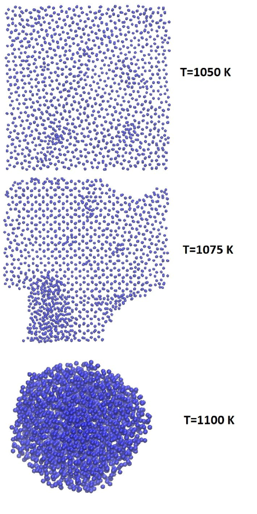
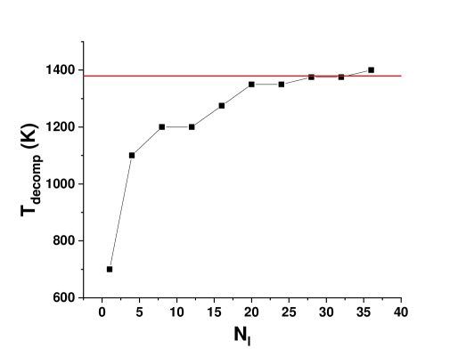
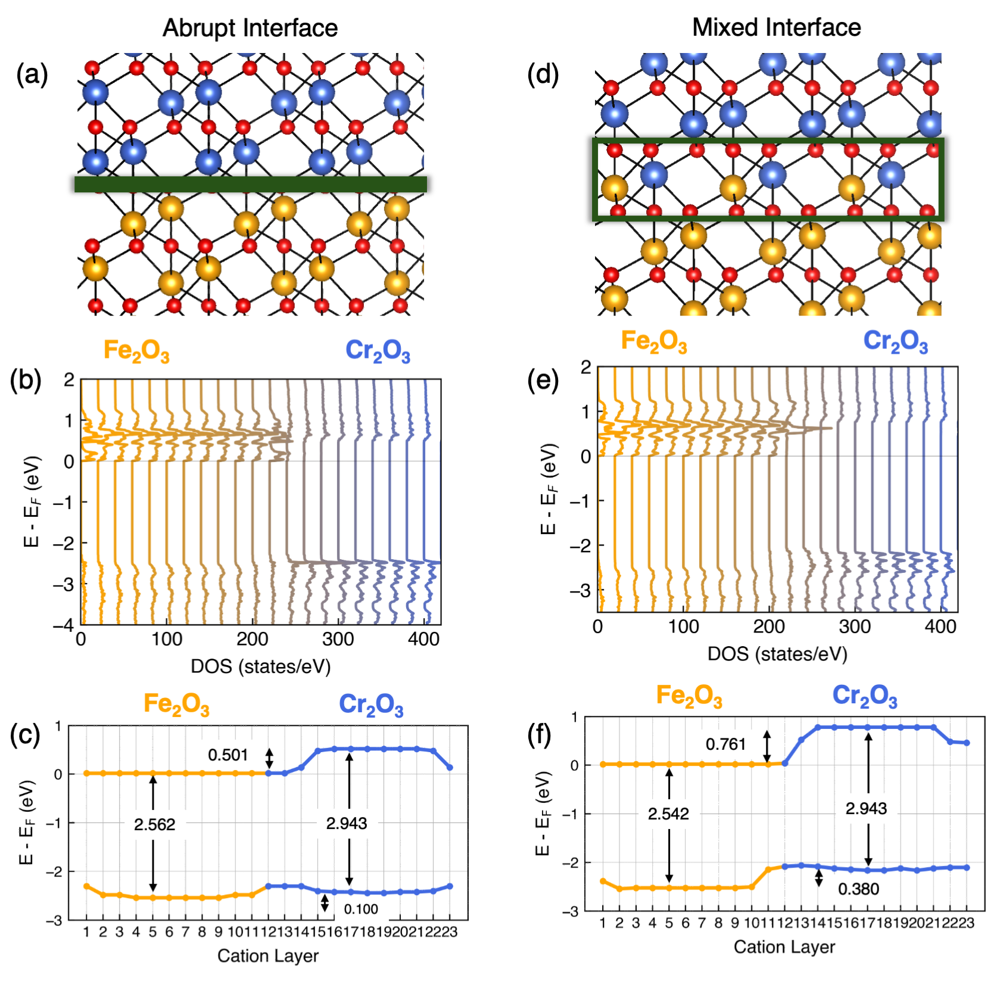
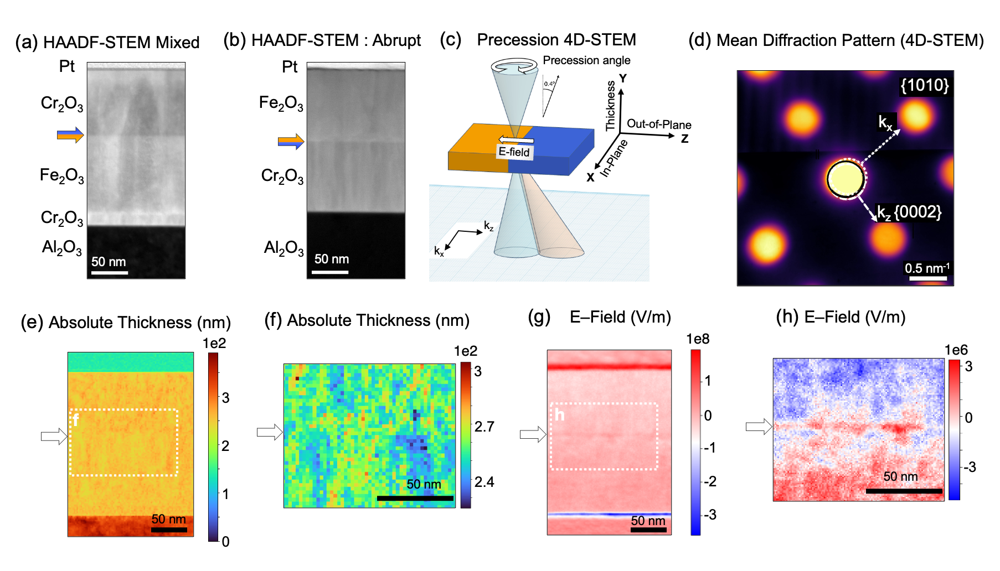
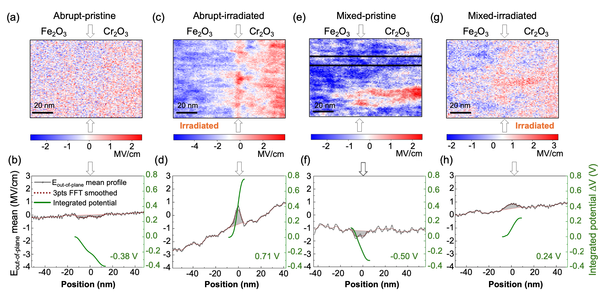
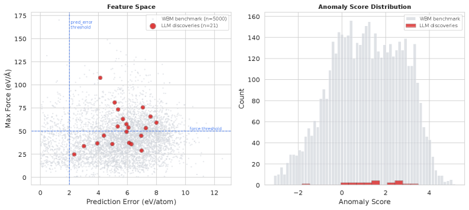
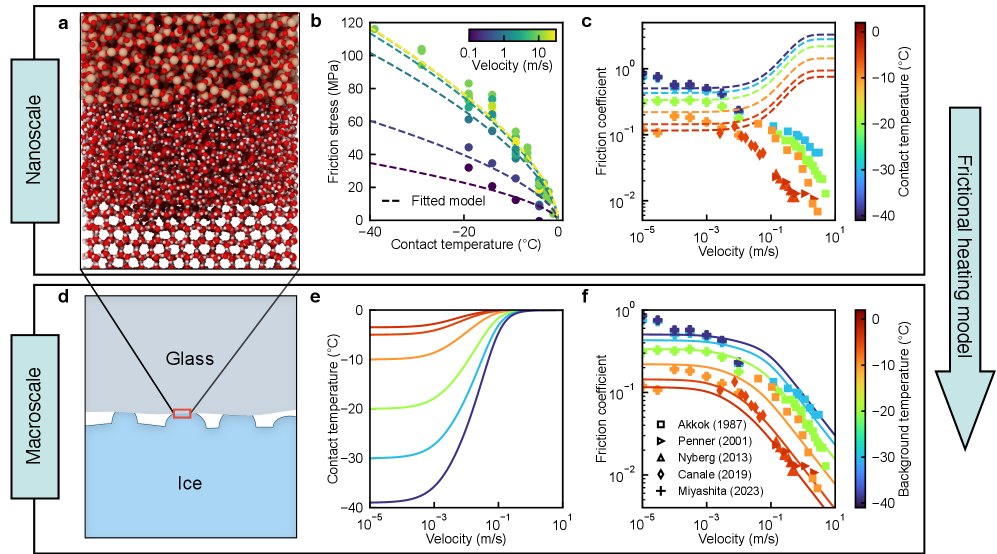
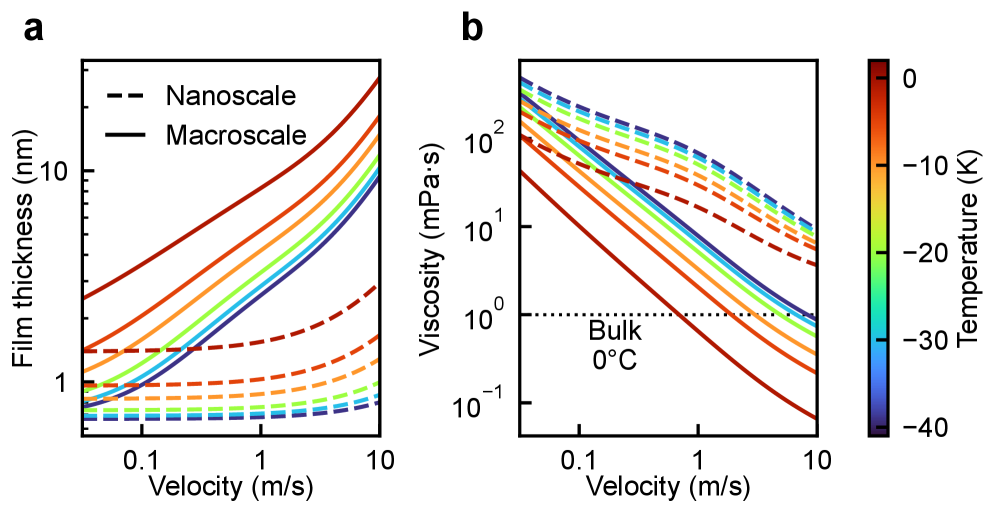
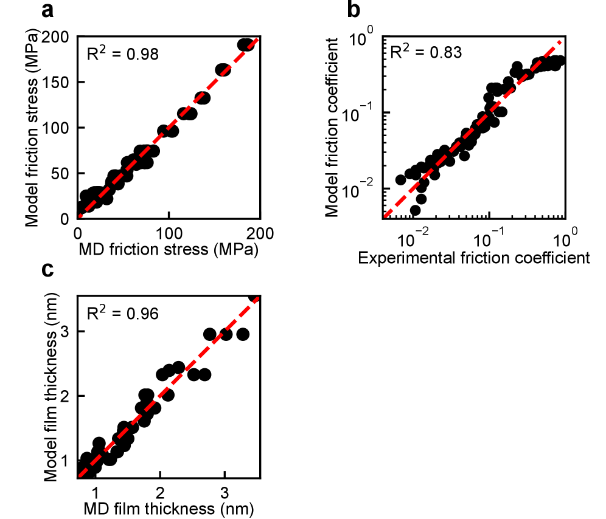

# arXiv 日次ダイジェスト

**作成日：** 2026年3月14日
**対象期間：** 2026年3月12日〜14日（直近72時間）

---

## 今日の選定方針

本日は、過去72時間に arXiv に投稿された計算物質科学関連論文から、計算手法の原理的深化・物質設計への直結性・計算科学としての一般性という3軸で10本を選定した。第一原理汎関数の数学的厳密化（Hartree ゲージにおける meta-GGA 構築）、機械学習ポテンシャルを用いた薄膜成長プロセスの原子スケール解明（SiO₂ PECVD）、進化的結晶構造探索と Eliashberg 方程式を組み合わせた高温超伝導水素化物の設計（La-Zr-H 系）を重点論文として選定した。その他7本も、シリコン薄膜融解の ML ポテンシャル比較研究、BAs の同位体精製による光学フォノンコヒーレンス増強、熱電半金属 Ta₂PdSe₆ における谷依存電子–フォノン散乱、照射誘起界面電場変化の DFT 解析、ML ポテンシャルの形式的安全認証フレームワーク、氷の滑り摩擦の MD 解明、PES 探索のためのベイズ最適化手法と、計算物質科学の広い最前線を代表する多様な論文群を包括している。

---

## 全体所見

**計算手法の根拠の強化と信頼性検証：** 本日の選定論文群に共通する重要テーマは、計算手法自体の信頼性と厳密性の深化である。2603.11517 は DFT 交換相関汎関数を Hartree ゲージという明確な数学的基盤のもとに構築し直す試みであり、エネルギー密度の非一意性という DFT の本質的問題に正面から取り組んでいる。SORFKL 汎関数は孤立原子系と均一電子ガスの双方を精度よく記述するという、従来の meta-GGA では達成困難な目標を実現し、次世代の非局所汎関数や ML 汎関数の設計基盤となる可能性がある。2603.12183 の Proof-Carrying Materials（PCM）は、ML ポテンシャルの信頼性問題を形式的証明という全く新しいアプローチで対処しており、単一 MLIP が DFT 安定材料の93%を見逃すという衝撃的な事実を示した。計算手法の精度を単に「良い」と主張するだけでなく、失敗モードを体系的に記述・認証する枠組みは、計算物質科学の実務的信頼性を根本から変える可能性がある。

**機械学習ポテンシャルの物理的応用の深化：** 2603.11416 は SevenNet-0 ベースの ML ポテンシャルを SiO₂ PECVD に適用し、Si–H → Si–OH → Si–O–Si という成膜反応経路を原子スケールで初めて直接観測した。活性学習を用いた3段階の fine-tuning により DFT 精度を維持しながら高速 MD を実現しており、半導体製造プロセスのデジタルツインへの展望を示す。2603.11722 は SNAP と GAP という2種の ML ポテンシャルをシリコン薄膜融解に適用し、ポテンシャルの選択が thin-film スケーリングに本質的に影響することを示した。2603.11539 は DeePMD を用いた氷–ガラス摩擦の MD シミュレーションにより、Bowden-Hughes の摩擦加熱仮説を分子スケールから実験スケールまでをつなぐマルチスケール模型で検証した。これらの論文群は、ML ポテンシャルが単なるポテンシャルエネルギー曲面の近似にとどまらず、実際の工学・物理的問題解決に本格的に貢献し始めていることを示している。

**超伝導水素化物と第一原理計算の相互検証：** 2603.11590 の La-Zr-H 高圧超伝導水素化物研究は、USPEX 進化的構造探索と Eliashberg 方程式を組み合わせ、Tc = 200 K 超の候補相を複数同定した。ZPE 補正を施した凸包解析とランダムフォレスト ML モデルを組み合わせた多段階スクリーニングは、高圧水素化物探索の標準的ワークフローを体現している。一方、2603.11517 の汎関数開発や 2603.11496 の電子–フォノン散乱解析など、電子状態計算の精度向上と輸送特性の第一原理予測に関する基礎的な進展も本日の論文群に含まれており、高圧超伝導探索を支える電子状態計算基盤の着実な前進が見て取れる。2603.11256 の同位体精製 BAs における光学フォノンのコヒーレンス増強は、第一原理フォノン計算が予測した三フォノン散乱ギャップを実験で検証したものであり、計算–実験の相互検証の好例としても重要である。

---

## 選定論文一覧（10本）

| # | arXiv ID | タイトル | 分類 |
|---|----------|---------|------|
| 1 | 2603.11517 | Meta-generalized gradient approximation made in the Hartree gauge | 重点 |
| 2 | 2603.11416 | Atomic-Scale Mechanisms of SiO₂ PECVD Revealed by MD with a Machine-Learning Interatomic Potential | 重点 |
| 3 | 2603.11590 | High-pressure phase stability and superconductivity in La-Zr-H hydrides | 重点 |
| 4 | 2603.11722 | Melting of thin silicon films: a molecular dynamics study with two machine learning potentials | 簡潔 |
| 5 | 2603.11256 | Exceptional Optical Phonon Coherence in Enriched Cubic Boron Arsenide via Suppression of Three-Phonon Scattering | 簡潔 |
| 6 | 2603.11496 | Valley-dependent electron-phonon scattering in thermoelectric semimetal Ta₂PdSe₆ | 簡潔 |
| 7 | 2603.12153 | Irradiation-induced amplification of electric fields at oxide interfaces as revealed by correlative DPC-STEM and DFT | 簡潔 |
| 8 | 2603.12183 | Proof-Carrying Materials: Falsifiable Safety Certificates for Machine-Learned Interatomic Potentials | 簡潔 |
| 9 | 2603.11539 | Why ice is so slippery | 簡潔 |
| 10 | 2603.10992 | Bayesian Optimization with Gaussian Processes to Accelerate Stationary Point Searches | 簡潔 |

---

# 重点論文の詳細解説

---

## 論文1

### 1. 論文情報

**タイトル：** [Meta-generalized gradient approximation made in the Hartree gauge](https://arxiv.org/abs/2603.11517)
**著者：** Yan Oueis, Akilan Ramasamy, James W. Furness, Jamin Kidd, Timo Lebeda, Jianwei Sun
**arXiv ID：** 2603.11517
**カテゴリ：** cond-mat.mtrl-sci
**公開日：** 2026年3月12日
**論文タイプ：** 理論・汎関数開発論文
**ライセンス：** arXiv 標準ライセンス（CC BY 非該当のため原図は掲載せず）

---

### 2. どんな研究か

交換相関（XC）エネルギー密度の空間分布が数学的に一意でないという DFT の根本的問題を、「Hartree ゲージ」という明確な基準枠の中で meta-GGA 交換汎関数（SORFKL）を構築することで正面から解決した研究である。SORFKL は水素原子の厳密な交換エネルギー密度を参照することでコア・結合・漸近領域すべてにわたる正確なゲージ整合性を実現し、希ガス原子（平均絶対誤差率 0.32%）とジェリウム表面（0.62%）の双方に対して既存 meta-GGA を超える精度を示した。

---

### 3. 位置づけと意義

DFT の実用精度は交換相関汎関数の品質に依存するが、XC エネルギー密度の空間分布が「積分値としてのエネルギーは一意」でも「密度そのものは一意でない」という問題は古くから認識されながら体系的な解決が得られていなかった。ゲージの任意性がある限り、エネルギー密度に対する「厳密な制約」を一意に定義することは困難であり、特に機械学習汎関数の学習データとして XC エネルギー密度を利用する際の障壁となってきた。本論文の提案する Hartree ゲージ整合 meta-GGA は、汎関数設計に数学的一意性をもたらす原理的な枠組みとして機能し、非局所汎関数や ML 汎関数開発の基盤として広範なコミュニティへの波及が期待される。

---

### 4. 研究の概要

**背景・目的：** 標準的な GGA（PBE）や meta-GGA（SCAN）では、エネルギー密度の空間分布に関する「厳密な制約」をゲージ依存性の問題から独立に課すことができなかった。特に SCAN ではジェリウム表面の交換エネルギー密度に大きな誤差が存在し（平均絶対誤差率 24.5%）、拡張系に対する記述精度に問題があった。本論文はこの問題を、水素原子の交換エネルギー密度を Hartree ゲージの基準として用いることで解決する。

**計算科学上の課題設定：** XC エネルギーの全空間積分 $E_{xc} = \int e_{xc}(\mathbf{r}) d\mathbf{r}$ は一意だが、被積分関数 $e_{xc}(\mathbf{r})$ はゲージ変換 $e_{xc} \to e_{xc} + \nabla \cdot \mathbf{f}$ に対して不変ではない。Hartree ゲージとは、これを水素原子の厳密な交換エネルギー密度に一致するよう規格化する操作であり、これにより異なる化学環境（コア、結合、漸近）それぞれで厳密な制約を一意に定式化できる。

**研究アプローチ：** 還元密度勾配 $s$（電子密度の非一様性を表す記述子）と iso-orbital indicator $\beta$（化学的環境を識別する kinetic energy density 由来の記述子）の2変数に依存するエンハンスメント因子 $F_x(s, \beta)$ を、水素原子の厳密な交換エネルギー密度をコア・漸近で再現するように構築し、4つの制約を満たすよう希ガス原子とジェリウム表面の exchange energies に対してパラメータを最適化した。

**対象材料系・対象現象：** 検証対象は希ガス原子（He, Ne, Ar, Kr, Xe）、ジェリウム表面（均一電子ガス半無限系）、および分子結合軸上のエンハンスメント因子（CH₄, Na₂, NaCl, Ar₂, (H₂O)₂ ダイマー）。

**主な手法：** meta-GGA 汎関数設計（解析的エンハンスメント因子の構築）、Hartree ゲージ整合条件の数学的定式化、原子・ジェリウム計算による検証。

**主な結果：** SORFKL は希ガス原子の交換エネルギーで SCAN（0.29%）に匹敵する精度を保ちつつ、ジェリウム表面では SCAN（24.5%）・B88（28.8%）を大幅に上回る 0.62% という精度を同時に達成した。分子結合軸に沿ったエンハンスメント因子の比較では、B88 を超える精度を共有結合・金属結合・イオン結合・van der Waals 結合・水素結合のすべての環境で示した。

**著者の主張：** ゲージ整合を汎関数設計の核心原理として採用することで、孤立系と拡張系の双方に対して一貫した交換エネルギー密度を実現できることを示した。これは機械学習汎関数の学習データとして XC エネルギー密度を活用するための基礎を提供すると主張している。

---

### 5. 計算物質科学として重要なポイント

- **対象物性：** 交換相関エネルギー密度の空間分布・ゲージ整合性・原子および固体のエンハンスメント因子
- **手法・記述子の意義と妥当性：** iso-orbital indicator $\beta = \tau_W / \tau$（Thomas-Fermi 運動エネルギーと実運動エネルギー密度の比）はコア電子（$\beta \approx 0$）・単電子領域（$\beta \approx 1$）・均一ガス（$\beta = 5/9$）を識別する有用な記述子であり、SCAN でも採用されている。Hartree ゲージは水素原子を「唯一の一電子系」として用い、ゲージの不定性を一点に固定するという巧みな着想に基づく。
- **計算条件の適切性：** 提案汎関数の検証は希ガス原子とジェリウム表面という相反する要求（孤立 vs. 拡張系）を選択しており、妥当なベンチマーク設計といえる。ただし実際の固体・分子の熱力学量に対する系統的なベンチマーク（atomization energy, lattice constant 等）は本論文の範囲外。
- **既存研究との差分：** SCAN は iso-orbital indicator を用いた meta-GGA の最重要先行研究だが、ジェリウム表面の XC エネルギー密度に系統誤差を持つ。本論文は SCAN の記述子体系を保持しながら Hartree ゲージによる整合を加えることで精度問題を解消した。
- **新規性の位置づけ：** XC エネルギー密度のゲージ依存性は30年以上前から認識されている問題だが、これを meta-GGA 設計の実用的な原理に昇華させた点は方法論的な breakthrough と評価できる。
- **物理的解釈：** Hartree ゲージは「交換相互作用のクーロン孔が自己相互作用を正確に打ち消す領域」をゲージ基準として用いており、単なる数学的規約ではなく物理的意味を持つ。
- **波及可能性：** ML 汎関数（NeuralXC, M-SCAN 等）の学習データとして明確に定義された XC エネルギー密度が利用可能になること、および非局所汎関数（hybrid, RPA）とのゲージ整合的な組み合わせへの展開が直接期待できる。
- **材料設計への寄与：** 交換汎関数の段階的改善として位置づけられ、正確な XC 記述は格子定数・電子状態密度・電子–フォノン結合定数の精度向上を通じて広範な第一原理計算に恩恵を与える。

---

### 6. 限界と注意点

1. **コリレーションが含まれていない：** 本論文はあくまで「交換汎関数」のゲージ整合性を論じており、相関汎関数の Hartree ゲージ整合化は未実施である。現実の材料計算では XC の相関部分が多くの場合支配的であり、SORFKL 交換項単独では完全な XC 汎関数として直接使用できない。実際の計算への適用には適切な相関汎関数との組み合わせが必要で、その組み合わせの妥当性は本論文では検証されていない。
2. **固体・分子の熱力学量ベンチマーク欠如：** 原子エネルギーとジェリウム表面という限定的なテストセットのみで汎関数を評価しており、結合エネルギー・格子定数・バンドギャップ・反応エンタルピーといった材料設計に直結する量への精度検証が本論文には含まれない。実用的な汎関数としての評価は今後の追試に委ねられている。
3. **ML 汎関数への適用はまだ展望段階：** ML 汎関数訓練への応用を主要な動機として掲げているが、本論文自体では実際の ML 汎関数訓練は行っておらず、Hartree ゲージ整合 XC データセットがどの程度 ML 汎関数の精度向上に貢献するかの定量的評価は未実施である。

---

### 7. 関連研究との比較や研究動向における立ち位置

- **主要先行研究との差分：** Becke（B88）は実空間交換エネルギー密度の近似として広く使われてきたが、ジェリウム表面での精度に問題があった。SCAN（Sun et al., 2015）は meta-GGA の標準実装として広く採用されているが、XC エネルギー密度のゲージ問題を明示的に解決していなかった。本論文は Sun グループ自身による SCAN の発展形として、この未解決問題に取り組んだものである。
- **競合研究との位置づけ：** r²SCAN（Furness et al., 2020）は SCAN の数値安定性問題を修正したが、ゲージ整合性には着手していない。TASK（Aschebrock & Kümmel, 2019）も iso-orbital indicator を用いた高精度 meta-GGA だが、Hartree ゲージの観点からは体系化されていない。本論文はゲージ整合を明示的に原理に据えた初めての meta-GGA として差別化される。
- **分野の未解決問題への前進：** XC エネルギー密度のゲージ問題は Perdew–Zunger SIC 以来の懸案事項であった。本論文はこれを原理的に解決する方向性を示しており、問題を「解決した」というより「解決可能な枠組みを確立した」段階に相当する。
- **新規性の評価：** 方法論的 breakthrough として評価できるが、実際の材料計算での有用性は今後の検証次第であり、現時点では foundational contribution として位置づけられる。
- **引用されうるコミュニティ：** DFT 汎関数開発コミュニティ、ML 汎関数（DeepMind AlphaCode XC, NeuralXC）開発者、第一原理計算全般の研究者に幅広く引用されうる。
- **今後の研究方向：** Hartree ゲージ整合相関汎関数の開発、ゲージ整合 XC データセットを用いた ML 汎関数の訓練と評価、hybrid 汎関数・RPA との整合的な組み合わせ、温度依存 DFT への拡張。
- **再現性：** 汎関数パラメータと数学的定式化は論文中で完全に記述されており、既存の DFT コードへの実装は比較的容易。

---

### 8. 図

**ライセンス：** arXiv 標準ライセンスのため、論文原図の掲載は省略。以下に本研究の概念的内容を説明する。

**概念図1：SORFKL のエンハンスメント因子 $F_x(s, \beta)$ の設計概念。** 横軸を還元密度勾配 $s$、縦軸をエンハンスメント因子 $F_x$ として、LDA（$F_x = 1$）、PBE（$s$ 依存のみ）、SCAN（$s$ と $\alpha$ 依存）、そして SORFKL（$s$ と $\beta$ に依存しつつ Hartree ゲージ整合性を持つ）の4種の振る舞いを比較することで、ゲージ整合の効果を直観的に示す。この図は、ゲージ整合設計が従来 meta-GGA の盲点だったジェリウム表面領域（均一電子ガス極限）での改善をもたらすという論文の中核的主張を支持する。

**概念図2：各種汎関数の精度比較（希ガス原子とジェリウム表面）。** LSDA、PBE、B88、SCAN、SORFKL の5種について、希ガス原子とジェリウム表面の交換エネルギーに対する平均絶対誤差率（MAPE）をバープロットで示す。SORFKL が両者で同時に優れた精度を示し、特に SCAN が大きな誤差を持つジェリウム表面（24.5% → 0.62%）での改善が顕著なことが主張の核心を支える。

**概念図3：様々な化学結合環境でのエンハンスメント因子の比較。** CH₄（共有結合）、Na₂（金属結合）、NaCl（イオン結合）、Ar₂（van der Waals 結合）、(H₂O)₂（水素結合）の5分子について、結合軸に沿った $F_x$ の位置依存性を比較する。SORFKL が B88 よりも厳密な値に近い振る舞いを示すことで、ゲージ整合汎関数が特定の結合タイプに偏らずに精度を示すことを説明する。

---

## 論文2

### 1. 論文情報

**タイトル：** [Atomic-Scale Mechanisms of SiO₂ Plasma-Enhanced Chemical Vapor Deposition Revealed by Molecular Dynamics with a Machine-Learning Interatomic Potential](https://arxiv.org/abs/2603.11416)
**著者：** Jaehoon Kim, Juho Lee, Ho-Hyun Nahm, Jinhoon Jeong, Donghun Kim, Yong-Chul Bae, Jeong-Woo Han, Kwang-Ryeol Lee
**arXiv ID：** 2603.11416
**カテゴリ：** cond-mat.mtrl-sci
**公開日：** 2026年3月12日
**論文タイプ：** 計算材料科学・プロセス模型論文
**ライセンス：** arXiv 標準ライセンス（CC BY 非該当のため原図は掲載せず）

---

### 2. どんな研究か

SiH₄ と N₂O を前駆体とする SiO₂ プラズマ化学気相成長（PECVD）の成膜機構を、活性学習で fine-tune した機械学習原子間ポテンシャル（MLIP）による分子動力学（MD）シミュレーションで原子スケールから解明した研究である。Si–O–Si ネットワークの形成が「表面 Si–H の酸化による Si–OH、続く縮合反応による Si–O–Si 生成と H₂O 放出」という二段階経路を主経路とすることを直接観測し、酸化剤比率・前駆体エネルギーが膜の化学量論・密度・水素含有量に与える影響を系統的に明らかにした。

---

### 3. 位置づけと意義

SiO₂ PECVD は半導体製造において絶縁膜・パッシベーション膜として不可欠なプロセスだが、プロセスパラメータと膜品質の間の原子スケールでの因果関係はほとんど未解明のまま経験則で最適化されてきた。反応性 MD では古典力場の精度不足が問題となり、第一原理 MD（AIMD）では時間・空間スケールが不十分だった。SevenNet-0（最新の汎用 MLIP）を fine-tune し、3段階の active learning で DFT 精度を確保した上で大規模 MD を実現した本研究は、MLIP の「半導体プロセス模型」への展開を実証する先駆的事例であり、プロセス設計の計算支援という新たな応用フロンティアを切り開いている。

---

### 4. 研究の概要

**背景・目的：** SiO₂ PECVD では SiH₄ と N₂O を混合し RF プラズマで活性化した前駆体を基板上に成膜する。低温プロセス（400°C 以下）と高成膜速度が特徴だが、酸化剤/シラン比（r = [N₂O]/[SiH₂O]）・RF パワー・基板温度が膜の化学量論・密度・水素含有量を複雑に左右する。本研究の目的は MLIP-MD により前駆体レベルから成膜機構を解明し、プロセス最適化指針を提示することである。

**計算科学上の課題設定：** 従来の古典力場では Si–O–H 系の反応性を適切に記述できず、AIMD では必要な時間スケール（数サイクル分の成膜）を扱えない。本研究は SevenNet-0（汎用スペクトル隣接特徴 GNN ポテンシャル）を PBE/DZP レベルの Si–O–H–N DFT データで fine-tune し、1 fs タイムステップで数 ns の反応 MD を可能にした。

**研究アプローチ：** 3段階反復 active learning：（1）初期ランダムサンプリング → AIMD データ収集 → モデル训练、（2）初期モデルで MD 実行→不確実性の高い構造を DFT 再計算 → 追加データ収集、（3）同様の追加改良。最終モデルは energy MAE 1.5 meV/atom、force MAE 0.05 eV/Å、stress MAE 0.19 kbar を達成。

**対象材料系・対象現象：** SiO₂ 薄膜（アモルファス、基板はアモルファス SiO₂）、PECVD プロセス（SiH₄ + N₂O + Ar 混合プラズマ由来の前駆体群：SiH₂O, O, OH, N₂ 等）、r = 2, 4, 6, 8 の4条件、成膜6サイクル+アニール。

**主な手法：** MLIP fine-tuning（SevenNet-0 ベース）、active learning、反応性 MD（LAMMPS）、生成物収率解析、局所構造解析（Si–O–Si 結合分布、Si–H/Si–OH 結合数変化）。

**主な結果：**
- Si–O–Si 主経路：表面 Si–H の酸化 → Si–OH 生成 → 隣接 Si–OH 間の縮合 → Si–O–Si + H₂O 放出
- 副経路：水分子が Si–H と再反応して H₂ を放出する水素生成経路
- 酸化剤比率 r の増加により Si/O 比が低下（化学量論に近づく）し r～2 で飽和
- 高 r では Si–OH 残留により水素含有量が10原子%以上に達し、膜密度の向上が阻害される
- 前駆体運動エネルギー 1.0 eV では Si を含む揮発性断片が生成し、成膜エッチングが顕在化

**著者の主張：** 「最適な SiO₂ PECVD には Si–OH の縮合を促進するのに十分な温度と適切な酸化剤比率の組み合わせが必要」であり、高 RF パワーは膜エッチングにつながるため品質向上に逆効果となりうると主張している。

---

### 5. 計算物質科学として重要なポイント

- **対象物性：** 薄膜形成反応経路（表面化学）、膜の化学量論・密度・水素含有量、前駆体エネルギー依存性
- **手法・記述子の意義：** SevenNet-0 は等変グラフニューラルネットワーク（equivariant GNN）ベースの汎用 MLIP であり、元素の広い組み合わせに対して DFT 精度を提供する。fine-tuning による計算効率と精度の両立は、特定プロセス系への MLIP 適用の標準的アプローチを示す。
- **計算条件の適切性：** 3段階 active learning により訓練データのカバレッジを反応空間全体に拡げており、特定の反応経路に偏ったデータセットによる過適合を避ける設計は妥当。ただし実際の PECVD はプラズマシース中の前駆体エネルギー分布がより広く、本研究のモノエネルギー前駆体モデルは理想化されている。
- **既存研究との差分：** 従来の古典 ReaxFF による SiO₂ 成膜 MD や AIMD 研究と比較して、本研究は反応規模・サンプリング数・プロセス条件の系統性で大幅に優っている。第一原理計算由来のデータで calibrate された MLIP を使用することで、反応エネルギーの精度も格段に向上している。
- **物理的解釈：** 縮合反応（Si–OH + Si–OH → Si–O–Si + H₂O）が膜形成の律速段階であるという知見は、従来の実験的 IR 分光の観測と整合しており、MLIP-MD が既知の化学的知識を再現・深化させていることを示す。
- **波及可能性：** 本論文の方法論（汎用 MLIP のプロセス特化 fine-tuning + active learning + 反応性 MD）は、SiN、Al₂O₃、HfO₂ など他の PECVD/ALD プロセスへの応用が直接可能であり、半導体製造プロセスの計算支援の枠組みとして汎用性が高い。
- **材料設計への寄与：** プロセスパラメータ（r, 基板温度, RF パワー）と膜品質の間の定量的関係の計算的解明は、DFT ベースのプロセスデジタルツインに向けた大きな進歩である。

---

### 6. 限界と注意点

1. **モノエネルギー前駆体モデルの限界：** 実際のプラズマプロセスでは前駆体のエネルギー分布は Maxwell-Boltzmann 的な広がりを持ち、また前駆体種の組成も本研究で設定したものより複雑である。本研究が単一の運動エネルギー値（0.05〜1.0 eV）での挙動を探索しているため、実プロセスとの定量的対応には注意が必要である。
2. **スケールの不整合：** MD シミュレーションの時間スケールは ns オーダー、空間スケールは nm オーダーであり、実際の成膜プロセスの時間スケール（秒〜分）・膜厚スケール（数十〜数百 nm）との乖離は大きい。局所的な反応経路の解明には有効だが、膜全体の均一性・応力分布・長距離秩序については本研究の知見のみでは判断できない。
3. **温度効果の近似：** 成膜シミュレーションでは表面温度を一定に保った NVT アンサンブルを用いているが、実際の PECVD では基板温度の分布・プラズマからの輻射加熱・局所的な発熱反応（発熱縮合反応等）が複雑に絡み合う。特に水素の残留が機能性に与える影響（リーク電流、膜応力等）の定量的評価にはより詳細な熱的条件設定が必要である。

---

### 7. 関連研究との比較や研究動向における立ち位置

- **主要先行研究との差分：** Shi et al. の ReaxFF による SiO₂ 成膜シミュレーション（2018）や Bukowski et al. の AIMD 研究（2021）と比べ、本研究は活性学習 MLIP による高精度化と大規模サンプリングを両立している点で質的に異なる。
- **競合研究との位置づけ：** Universal MLIP を fine-tune して特定プロセスに適用するアプローチは、2024〜2025 年にかけて ALD・CVD 分野で急速に広まっており、Matsuya et al.（TiO₂ ALD）、Chen et al.（Al₂O₃ PECVD）と並ぶ重要な事例となっている。
- **分野の未解決問題への前進：** プロセス計算材料科学（computational process engineering for materials）は長年の課題であり、本研究は MLIP によるこの問題のブレークスルーを明示している。成膜過程の原子スケール解明という観点では相当な前進と評価できる。
- **新規性の評価：** MLIP を SiO₂ PECVD という具体的なプロセスに適用したことは incrementally novel だが、反応経路の直接観測・プロセスパラメータ系統探索・活性学習の組み合わせという構成はコミュニティへの先例として高い価値を持つ。
- **引用されうるコミュニティ：** 半導体プロセス工学、MLIP 応用、ALD/CVD 計算、材料表面化学、計算触媒のコミュニティに広く引用されうる。
- **今後の研究方向：** プロセスパラメータの最適化への強化学習の適用、他の PECVD/ALD 材料系（SiN, HfO₂ 等）への拡張、実験 XPS/FTIR データとの定量的比較。
- **再現性：** SevenNet コードと LAMMPS は公開されており、fine-tuned モデルのデータ公開が明記されれば再現性は高い。

---

### 8. 図

**ライセンス：** arXiv 標準ライセンスのため、論文原図の掲載は省略。以下に本研究の概念的内容を説明する。

**概念図1：PECVD シミュレーションプロトコルの模式図。** アモルファス SiO₂ バルクの生成、表面平衡化、前駆体逐次入射による成膜サイクル（6回繰り返し）、アニールという一連の計算手順を模式的に示す。各サイクルで入射する前駆体種（SiH₂O, O, OH, N₂ 等の混合）と酸化剤比率 r の定義も示し、どのような系統的探索が行われたかを直観的に説明する。この図は MLIP-MD によるプロセスシミュレーションの方法論的枠組みの核心を示す。

**概念図2：Si–O–Si ネットワーク形成の主要反応経路。** 主経路（Si–H → Si–OH の酸化、Si–OH + Si–OH → Si–O–Si + H₂O の縮合）と副経路（H₂O による Si–H 再反応 → H₂ 放出）を反応スキームとして示す。反応の各段階に関わる原子の局所配置とエネルギー変化も添え、本研究の最も重要な知見である「縮合が律速」という主張を具体的に説明する。

**概念図3：酸化剤比率 r と膜特性の相関。** 横軸を r（＝2, 4, 6, 8）として、Si/O 比・膜密度・水素含有量（Si–H および Si–OH の割合）の r 依存性を示す。r の増加により Si/O 比が化学量論（0.5）に近づいて r～2 で飽和し、一方で水素含有量が増加するというトレードオフを示すことで、最適な r の選択が膜品質に決定的に重要であるという著者の主張を支持する。

---

## 論文3

### 1. 論文情報

**タイトル：** [High-pressure phase stability and superconductivity in La-Zr-H hydrides](https://arxiv.org/abs/2603.11590)
**著者：** Ijaz Shahid, Tao Yang, Shan Shan Wang, Xiaona Lu, Yunbo Zhang, Chang-Zheng Wu, Junjie Wang, Xinglong Dong, Hailiang Wu, Ying Shi, and Lijun Zhang
**arXiv ID：** 2603.11590
**カテゴリ：** cond-mat.mtrl-sci
**公開日：** 2026年3月12日
**論文タイプ：** 計算材料科学・高圧超伝導探索論文
**ライセンス：** arXiv 標準ライセンス（CC BY 非該当のため原図は掲載せず）

---

### 2. どんな研究か

USPEX 進化的結晶構造探索と DFT（VASP-PBE）、Eliashberg 方程式を組み合わせて La-Zr-H 三元高圧水素化物の相安定性と超伝導特性を系統的に計算し、Tc = 200 K を超える候補相を複数同定した研究である。ZPE（零点エネルギー）補正を施した凸包解析により R3m-Zr₂H₁₇（300 GPa, Tc = 209 K）と P6/mmm-LaZr₂H₂₄（200 GPa, Tc = 202 K）を熱力学的安定相として同定し、さらにランダムフォレスト ML モデルを用いた候補スクリーニングで追加の高 Tc 構造を探索した。

---

### 3. 位置づけと意義

常圧超伝導体の発見は凝縮系物理の究極課題の一つであり、LaH₁₀ 系に代表される高圧水素化物超伝導体はその最も有望な候補として近年集中的に研究されている。La 系と Zr 系の二元水素化物はそれぞれ高い Tc を示すことが知られており、その三元混合系が構造安定性と Tc の観点でどのような挙動をとるかは原理的にも実験計画の観点からも重要な問いである。本研究は La-Zr-H という新しい三元組み合わせを対象に、第一原理構造探索の標準的なワークフローを丁寧に実行し、200〜300 GPa 範囲での複数の超伝導候補を提示することで、実験グループに対して優先的な合成ターゲットを示している。

---

### 4. 研究の概要

**背景・目的：** LaH₁₀ は理論 Tc 〜250 K、実験 Tc 〜250 K（170 GPa）という高温超伝導体として広く知られており、ZrH₄ 等の Zr 系水素化物も中程度の Tc を持つ。これらの元素の三元組み合わせである La-Zr-H を探索することで、ラジウス比や電子濃度の最適化により LaH₁₀ 超えの可能性を探る。

**計算科学上の課題設定：** 三元高圧系では探索空間が膨大であり、すべての組成比 x:y:z における構造探索は計算コスト的に非現実的。本研究は La-H と Zr-H の既知バイナリ相を種（seed）として USPEX による階層的三元探索を実施し、150〜300 GPa の4点で凸包を評価することで計算量を管理した。

**研究アプローチ：**
1. USPEX 進化的探索（固定圧力での enthalpy 最小化）
2. 候補構造の DFT エネルギー・格子動力学計算（VASP + PHONOPY）
3. ZPE 補正を施した凸包解析による熱力学的安定性の評価
4. 安定・準安定相の Eliashberg スペクトル関数計算による Tc 予測
5. ランダムフォレスト ML モデルによる追加候補スクリーニング

**対象材料系：** La-Zr-H 三元系、圧力範囲 150〜300 GPa。

**主な手法：** USPEX 進化的結晶構造探索、DFT (VASP, PBE, PAW, 800 eV カットオフ)、フォノン分散計算（PHONOPY）、ZPE 補正凸包解析、Eliashberg 方程式（Allen-Dynes 変形 McMillan 公式）、ランダムフォレスト ML。

**主な結果：**
- R3m-Zr₂H₁₇: 300 GPa で熱力学的安定、Tc = 209 K、高い H 振動密度が H-derived DOS を Fermi 準位に集積
- P6/mmm-LaZr₂H₂₄: 200 GPa で安定、Tc = 202 K、La と Zr 周囲に密な H かご構造
- P̄6m2-LaZrH₁₈: 準安定（凸包から 30 meV/atom 以内）、Tc = 206 K @ 300 GPa
- I4/mmm-La₂ZrH₁₂: 250 GPa で安定、Tc = 97 K（水素含有量が相対的に少ない）
- ML スクリーニング：200 K を超える Tc を示す追加候補を複数同定

**著者の主張：** La-Zr-H 系に実験的に到達可能な圧力範囲（200〜300 GPa）で Tc = 200 K 超の熱力学的安定相が存在する可能性を示し、特に R3m-Zr₂H₁₇ と P6/mmm-LaZr₂H₂₄ を合成優先ターゲットとして推薦している。

---

### 5. 計算物質科学として重要なポイント

- **対象物性：** 高圧相安定性（凸包・ZPE 補正）、フォノン分散・動力学安定性、電子–フォノン結合定数 λ、対数平均フォノン周波数 ωlog、超伝導転移温度 Tc
- **手法・近似の意義と妥当性：** Eliashberg 方程式は McMillan 公式より厳密な電子–フォノン結合の取り扱いを提供し、強結合超伝導体での Tc 予測に適している。ZPE 補正は水素化物で特に重要で、軽元素 H の大きなゼロ点振動が相安定性を実質的に変化させる。
- **計算条件の適切性：** 800 eV カットオフと PAW 法の使用は高圧系での精度確保に適切。ただし PBE 汎関数は電子–フォノン結合の過大評価傾向が知られており、Tc は若干過大評価の可能性がある。
- **既存研究との差分：** La-H 二元系（LaH₁₀ 等）および Zr-H 二元系の計算は多数存在するが、La-Zr-H 三元系の系統的探索は本研究が先行的な取り組みとなっている。
- **物理的解釈：** 高 Tc 相に共通する特徴として「高対称結晶構造・密な水素かご構造・Fermi 準位近傍への H 由来 DOS の集積」を同定しており、超伝導性と構造の関係についての一般的知見を提供している。
- **波及可能性：** 三元・四元水素化物の探索という流れに対して、La-Zr-H を一つの参照系として確立することで、関連する三元系（La-Ti-H, Ce-Zr-H 等）の探索に対する系統的な比較基盤を提供する。
- **材料設計への寄与：** 実験グループに対して合成優先ターゲットを明示的に提示しており、計算主導の超伝導材料設計という分野の典型的な成果物として機能する。

---

### 6. 限界と注意点

1. **Tc の過大評価の可能性：** PBE 汎関数は電子–フォノン結合定数を過大評価する傾向があることが広く知られており、本研究で得た Tc = 200〜209 K という値は 10〜20% 程度の過大評価を含む可能性がある。また Coulomb 擬ポテンシャル μ* = 0.1〜0.15 という標準値の選択が Tc 予測の不確実性をさらに増す。
2. **準安定相の実験的合成可能性：** LaZrH₁₈ は凸包から 30 meV/atom 上にあり熱力学的には準安定であるが、高圧合成では動力学的なトラップや経路依存性により凸包上の構造が必ずしも得られるとは限らない。準安定相の実験的合成可能性の評価には追加の分子動力学的検討が必要である。
3. **ML スクリーニング部分の検証が限定的：** ランダムフォレスト ML モデルによる候補スクリーニングは論文中で提案されているが、訓練データサイズ・特徴量設計・評価指標の詳細が限られており、提案された追加候補の信頼性を独立に評価することが難しい。この部分は序論的な提示にとどまっており、定量的な検証が不足している。

---

### 7. 関連研究との比較や研究動向における立ち位置

- **主要先行研究との差分：** Drozdov et al. の LaH₁₀ 実験（2019, Tc～250 K）、Peng et al. の USPEX による LaH₁₀ 予測（2017）と比較して、本研究は La-Zr-H という新しい三元空間を開拓しており、LaH₁₀ 系の「次の候補探索」として位置づけられる。
- **競合研究との位置づけ：** Semenok et al. の La-Ce-H、Bi et al. の La-Y-H など La を含む三元水素化物探索は近年活発化しており、本研究はその流れに La-Zr-H として貢献する。
- **分野の未解決問題への前進：** 常温常圧超伝導体の実現には至っておらず、高圧水素化物の探索フロンティアの一例として機能するが、革命的な新発見というより着実な探索範囲の拡張に相当する。
- **新規性の評価：** La-Zr-H 三元系の系統的計算探索は incremental ではあるが、ML スクリーニングを組み合わせた多段階ワークフローの実証という点で方法論的な貢献もある。
- **引用されうるコミュニティ：** 高圧超伝導コミュニティ、水素化物設計研究者、結晶構造探索手法（USPEX, CALYPSO）ユーザーに幅広く引用される。
- **今後の研究方向：** La-Zr-H の実験的合成と検証、提示された ML スクリーニング候補の優先度付き DFT 計算、他の La-M-H（M = Ti, Y, Ca 等）三元系への拡張。
- **再現性：** VASP・USPEX・PHONOPY はすべて標準的なコードであり、計算パラメータが十分に記述されているため再現は可能。

---

### 8. 図

**ライセンス：** arXiv 標準ライセンスのため、論文原図の掲載は省略。以下に本研究の概念的内容を説明する。

**概念図1：ZPE 補正凸包（150〜300 GPa 各圧力での相安定性マップ）。** La-Zr-H の組成空間（La:Zr:H の三角形ダイアグラム）に ZPE 補正後の形成エンタルピーの凸包からの距離をカラーマップで示す。安定相（凸包上）を黒ダイヤモンドで、30 meV/atom 以内の準安定相を青丸でプロットすることで、どの組成が各圧力で熱力学的に安定かを一望できる。この図は本論文の主要な結論（4相の安定/準安定性）を直接支持する中核図である。

**概念図2：各安定相の結晶構造と H かご構造。** R3m-Zr₂H₁₇, P̄6m2-LaZrH₁₈, P6/mmm-LaZr₂H₂₄, I4/mmm-La₂ZrH₁₂ の4相について結晶構造（金属サイトと H 位置の三次元模式図）と、H が形成するかご構造（H-H 距離・配位数）を示す。高 Tc 相に共通する「密なH かご」と低 Tc 相の「疎な H かご」の違いを可視化することで、構造と Tc の相関を説明する。

**概念図3：フォノン状態密度と Eliashberg スペクトル関数。** R3m-Zr₂H₁₇ と P6/mmm-LaZr₂H₂₄ の2相について、元素分解フォノン DOS（La, Zr, H 各成分）と Eliashberg スペクトル関数 α²F(ω)、電子–フォノン結合の積算 λ(ω) を示す。高周波 H モードへの α²F の集積が大きな λ に寄与していること、Log 平均周波数 ωlog が高いことが高 Tc の起源であることを示し、著者の「高 H 含有・密かご構造が高 Tc をもたらす」という主張を支持する。

---

# その他の重要論文

---

## 論文4

### 1. 論文情報

**タイトル：** [Melting of thin silicon films: a molecular dynamics study with two machine learning potentials](https://arxiv.org/abs/2603.11722)
**著者：** Yu. D. Fomin, E. N. Tsiok, V. N. Ryzhov
**arXiv ID：** 2603.11722
**カテゴリ：** cond-mat.mtrl-sci, cond-mat.soft
**公開日：** 2026年3月12日
**論文タイプ：** 計算材料科学・分子動力学
**ライセンス：** CC BY 4.0

---

### 2. 研究概要

シリコン薄膜（単層シリセン〜36 層）の融解・分解挙動を SNAP および GAP の2種の機械学習原子間ポテンシャル（MLIP）を用いた分子動力学シミュレーション（LAMMPS, NVT アンサンブル, 1 fs タイムステップ）で解析した研究である。SNAP ポテンシャルによる結果では、単層シリセンは約 500 K で構造安定性を失い、膜厚の増加とともに分解温度が上昇し、約 28 層でバルクの融点（1380 K）に収束することが示された。8 層以下では結晶–気体の二相共存が観測されるのに対し、それ以上の厚みでは表面融解ついでバルク融解という古典的な融解シーケンスを辿ることが確認され、薄膜スケールに特有の融解機構の変化が系統的に明らかにされた。

GAP ポテンシャルは結晶構造の記述やバルク融点付近の挙動においては SNAP より高精度とされているが、気体密度域での描写に失敗し、気体相に相当する温度では原子が非物理的な小クラスターに凝集する問題が顕在化した。この GAP の失敗は「高精度 ML ポテンシャルであっても訓練データ範囲外の条件（本研究では低密度ガス状態）では系統的に破綻する」という MLIP 全般に共通する重要な警告を与えており、計算物質科学コミュニティにとって方法論的に重要な知見である。Stillinger-Weber 古典力場との比較も行われており、SNAP は Stillinger-Weber より厚い膜（12 層 vs 28 層）でバルク収束するという差異がポテンシャル選択の重要性を示している。

---

### 3. 図

**ライセンス：** CC BY 4.0

**図1キャプション（Fig. 1）：** SNAP ポテンシャルによる単層シリセン（シリコン 1 原子層）のスナップショット。475 K（左）では六角格子構造が維持されているのに対し、500 K（右）では格子が崩壊し始めていることが確認できる。単層シリセンの融解（分解）温度が 500 K であるという本論文の主要な定量的知見を直接示す。

**図2キャプション（Fig. 3）：** 4層シリコン薄膜の3温度でのスナップショット（低温：結晶維持、中間：部分融解・二相共存、高温：完全分解）。薄膜特有の「結晶–気体二相共存」という融解機構が視覚的に示されており、バルク固体–液体転移とは異なる薄膜特有の挙動を説明する核心的な図である。

**図3キャプション（Fig. 9）：** 分解温度の膜厚依存性（SNAP ポテンシャル）。横軸を層数（1〜36 層）、縦軸を分解温度（K）として、膜厚増加に伴う単調な Tc 上昇とバルク融点への収束（〜28 層）が示されている。薄膜のスケール依存的な熱安定性を定量化した図であり、シリセン系の工学的応用における熱安定性評価に直結する知見を提供する。

---

## 論文5

### 1. 論文情報

**タイトル：** [Exceptional Optical Phonon Coherence in Enriched Cubic Boron Arsenide via Suppression of Three-Phonon Scattering](https://arxiv.org/abs/2603.11256)
**著者：** Tong Lin, Fengjiao Pan, Hanyu Zhu ほか8名
**arXiv ID：** 2603.11256
**カテゴリ：** cond-mat.mtrl-sci
**公開日：** 2026年3月11日
**論文タイプ：** 実験・理論連携、フォノン物理
**ライセンス：** CC BY-NC-ND 4.0（HTML 版未対応のため原図ファイルが取得できず）

---

### 2. 研究概要

同位体精製した立方晶 BAs（ボロンヒ素化物）において、第一原理フォノン計算が予測していた「ゾーン中心光学フォノンの三フォノン散乱を著しく抑制するフォノンバンドギャップ」が実際に光学フォノンコヒーレンスの劇的な増強をもたらすことを実証した研究である。高純度同位体精製試料では 100 K 以下でクオリティファクター Q > 3.7 × 10³ という記録的な値が達成され、この増強のボトルネックが同位体散乱であることが明らかにされた。三つの脱コヒーレンス機構（三フォノン散乱、同位体散乱、欠陥散乱）を系統的に分離した点は、フォノン工学の観点から重要な方法論的貢献である。

BAs はすでに超高熱伝導材料として注目されており、本研究はその高熱伝導性の起源（三フォノン散乱ギャップ）がフォノンコヒーレンスの観点からも顕著な効果をもたらすことを初めて定量的に示した。この同位体純度依存のフォノンコヒーレンス制御は、量子センシングや量子フォノニクスへの展開において BAs の新たな応用可能性を示唆するものであり、計算フォノン物理が実験設計の指針として機能した好例でもある。

---

### 3. 図

**ライセンス：** CC BY-NC-ND 4.0（CC BY-NC-ND ライセンスのため掲載可能だが、HTML バージョンが arXiv に未対応のため原図ファイルの抽出ができませんでした。論文 PDF（https://arxiv.org/pdf/2603.11256）をご参照ください。）

---

## 論文6

### 1. 論文情報

**タイトル：** [Valley-dependent electron-phonon scattering in thermoelectric semimetal Ta₂PdSe₆](https://arxiv.org/abs/2603.11496)
**著者：** Masayuki Ochi, Hitoshi Mori, Akitoshi Nakano
**arXiv ID：** 2603.11496
**カテゴリ：** cond-mat.mtrl-sci
**公開日：** 2026年3月12日
**論文タイプ：** 理論・第一原理計算
**ライセンス：** arXiv 標準ライセンス（CC BY 非該当のため原図は掲載せず）

---

### 2. 研究概要

熱電半金属 Ta₂PdSe₆ における電子とホールのキャリア寿命の顕著な非対称性を、DFT と電子–フォノン（e-ph）結合の第一原理計算から解明した研究である。Ta₂PdSe₆ の鎖状 PdSe₄ 構造に由来するソフトフォノンモードが最高価電子帯（Fermi 準位近傍）と強く結合しており、ホール側において鋭いエネルギー依存の散乱率を生み出すことが明らかにされた。電子側では谷間散乱（intervalley scattering）が支配的で異なる散乱機構が効いており、この電子–ホール非対称性が材料の独特な熱電特性を説明する。

この研究は Ta₂PdSe₆ という材料の輸送特性に対して計算から初めて機構的な説明を与えるものであり、熱電材料設計において「特定のフォノンモードとバンド構造の結合」を制御することの重要性を示している。低対称・鎖状構造を持つ材料における e-ph 散乱の谷依存性は、二次元・一次元構造材料の輸送特性予測にも一般的な示唆を与えるものであり、計算材料科学においても第一原理輸送理論の適用範囲を拡張する事例として位置づけられる。

---

### 3. 図

**ライセンス：** arXiv 標準ライセンスのため、論文原図の掲載は省略。論文 PDF（https://arxiv.org/pdf/2603.11496）をご参照ください。

---

## 論文7

### 1. 論文情報

**タイトル：** [Irradiation-induced amplification of electric fields at oxide interfaces as revealed by correlative DPC-STEM and DFT](https://arxiv.org/abs/2603.12153)
**著者：** Elizabeth A. Peterson ほか7名
**arXiv ID：** 2603.12153
**カテゴリ：** cond-mat.mtrl-sci
**公開日：** 2026年3月12日
**論文タイプ：** 実験・計算連携、界面物理
**ライセンス：** CC BY 4.0

---

### 2. 研究概要

Fe₂O₃–Cr₂O₃ エピタキシャルヘテロ界面を対象に、100 keV Fe⁺ イオン照射前後の界面電場変化を4D-STEM DPC（回折位相コントラスト）という最先端の電子顕微鏡法で直接測定し、DFT+U 電子状態計算（PBE+U、U=5.3 eV for Fe, 3.7 eV for Cr）との比較から照射誘起欠陥（酸素空孔）の電荷分離への寄与を解明した研究である。未照射界面では負の電位差（−0.38〜−0.50 V）が観測されるのに対し、照射後では正の値（+0.24〜+0.71 V）へと反転し、電場の方向が変わることが明らかになった。DFT 計算はこの電場反転が界面近傍での酸素空孔生成による電荷再分布から生じることを示しており、照射による欠陥工学を通じた界面電場制御という新たな設計指針を提示している。

この研究は、原子炉・宇宙・電池などの極限環境で用いられる酸化物保護コーティングの設計に直接関連する重要な知見を提供する。照射を用いた意図的な電場制御が欠陥の空間分布を管理し腐食抵抗を高める方向に使えるという提案は、計算主導の耐食性材料設計という新しい分野を開く。さらに、4D-STEM DPC という高感度電場測定と DFT との定量的比較という研究手法は、界面電子状態の計算–実験検証の模範的な枠組みとして意義がある。

---

### 3. 図

**ライセンス：** CC BY 4.0

**図1キャプション（Fig. 1）：** Fe₂O₃–Cr₂O₃ 界面の原子構造と各層の電子状態密度（DOS）。急峻界面と混合界面の2モデルについて示す。DFT+U により計算された層分解 DOS は Fe と Cr の 3d 状態が Fermi 準位近傍でどのように変化するかを示し、界面の電子的性質が界面混合度に強く依存することを明らかにする。この図は実験的に観測された電場変化の計算的解釈の起点となる。

**図2キャプション（Fig. 2）：** 4D-STEM DPC 実験のセットアップと照射前後の電場マッピング。HAADF 像・回折パターン・厚さマップとともに、照射前後の面内/面外電場成分の空間分布を示す。照射後に界面電場の方向が反転し増幅されているという本論文の核心的観測結果が、ナノスケールの空間分解能で示されている。

**図3キャプション（Fig. 3）：** 照射前後の面外電場成分プロファイル（1次元積分電位）。横軸を界面からの距離（nm）として電位差の深さ依存性を示し、未照射（負値）から照射後（正値）への電位差の符号反転と増幅を定量的に比較する。DFT 計算から予測された電場プロファイルとの一致が、照射誘起酸素空孔による電荷分離モデルの妥当性を支持する。

---

## 論文8

### 1. 論文情報

**タイトル：** [Proof-Carrying Materials: Falsifiable Safety Certificates for Machine-Learned Interatomic Potentials](https://arxiv.org/abs/2603.12183)
**著者：** Abhinaba Basu, Pavan Chakraborty
**arXiv ID：** 2603.12183
**カテゴリ：** cond-mat.mtrl-sci, physics.comp-ph
**公開日：** 2026年3月12日
**論文タイプ：** 計算手法・ML ポテンシャル検証
**ライセンス：** CC BY 4.0

---

### 2. 研究概要

CHGNet、TensorNet、MACE という代表的な汎用機械学習原子間ポテンシャル（MLIP）が DFT 安定材料の93%を見逃すという衝撃的な失敗実態を示し、この問題に対処するための「Proof-Carrying Materials（PCM）」フレームワークを提案した研究である。PCM は「(1) 6種の敵対的戦略（LLM 含む）による反例探索、(2) ブートストラップ信頼区間による安全包絡線の収束、(3) Lean 4 形式証明コンパイラによる安全性認証」という3段階からなり、MLIP が何を「知らない（失敗する）」かを定量化・認証することを目的とする。10,000 材料に対する5,000 構造での検証では、CHGNet が31.1%、TensorNet が75.7%、MACE が73.2% の失敗率を示し、かつアーキテクチャ間の失敗パターンの相関が極めて低い（r ≤ 0.13）ことが明らかになった。

PCM で認証されたスクリーニングプロトコルを熱電材料探索に適用した結果、単一 MLIP スクリーニングに対して62材料（25%）の追加発見が得られ、実用的な改善効果も実証された。特に「失敗モードが訓練データではなくアーキテクチャ・訓練パイプラインに依存する」という知見は、アンサンブル的な多 MLIP 利用の重要性を示すとともに、ML ポテンシャルの「どこで・なぜ失敗するか」を問い続けることの必要性を計算物質科学コミュニティに強く訴えかけるものである。

---

### 3. 図

**ライセンス：** CC BY 4.0

**図1キャプション（Fig. 1）：** PCM パイプラインの全体構造。Stage 1（敵対的反例探索）→ Stage 2（ブートストラップ信頼区間による安全包絡線精緻化）→ Stage 3（Lean 4 形式証明）という三段構成と、各段階で用いる6種の探索戦略（ランダム・ヒューリスティック・格子・LHS・Sobol・LLM）が示される。PCM が単なる統計的信頼区間の推定ではなく、形式的証明として安全性を保証するという枠組みの核心を理解するための概念図である。

**図2キャプション（Fig. 2）：** CHGNet、TensorNet、MACE の3アーキテクチャ間の力予測相関ヒートマップと失敗率比較。ペアワイズ相関係数 r ≤ 0.13 という非常に低い相関は、各アーキテクチャが全く異なる化学空間で失敗することを示す。このアーキテクチャ依存の失敗パターンが「なぜ単一 MLIP は信頼できないか」という本論文の中核的主張を支持する。

**図3キャプション（Fig. 4）：** MLIP の系統的失敗パターン：元素周期表上の失敗分布とアノマリー密度の可視化。特定の元素（高原子番号・多元素組み合わせ）に失敗が集中する傾向と、アーキテクチャ間でのパターン差異が示される。この図は失敗がランダムではなく構造的であることを示し、PCM によるターゲット的な安全認証の必要性を裏付ける。

---

## 論文9

### 1. 論文情報

**タイトル：** [Why ice is so slippery](https://arxiv.org/abs/2603.11539)
**著者：** Sigbjørn Løland Bore, B.N.J. Persson, Henrik Andersen Sveinsson
**arXiv ID：** 2603.11539
**カテゴリ：** cond-mat.mtrl-sci
**公開日：** 2026年3月12日
**論文タイプ：** 計算材料科学・摩擦物理
**ライセンス：** CC BY 4.0

---

### 2. 研究概要

「なぜ氷は滑りやすいのか」という古典的な問いに対し、密度補正 DFT（DC-R2SCAN）で訓練した DeePMD 機械学習ポテンシャルを用いたナノスケール MD シミュレーションと、摩擦加熱モデルを組み合わせたマルチスケールアプローチで回答を与えた研究である。1,164 の訓練構造（氷 Ih・液体水・アモルファスシリカ・剪断界面を含む）から訓練した ML ポテンシャルにより 10 MPa 加圧下での氷–ガラス接触をシミュレートし、ナノスケール MD 単独では摩擦係数の温度依存性・速度依存性が実験と合わないが、マクロスケール摩擦加熱モデルと組み合わせることで実験データ（R² = 0.83）と優れた一致が得られることを示した。

この研究が明らかにした核心的知見は「氷の滑りやすさの本質は摩擦加熱であり、前融解膜（premelting film）の存在ではない」という点である。0.1 m/s 以上の速度域では摩擦加熱により接触温度が融点に近づき、これが摩擦係数の劇的な低下をもたらす。Bowden と Hughes が1939年に提唱した摩擦加熱仮説を、原子スケールから実験スケールまでの連続的なモデルで初めて定量的に検証したことは、計算材料科学による長年の謎の解決として意義深い。ML ポテンシャルを用いた水–氷系の摩擦 MD という技術的な達成も、この分野における ML ポテンシャルの新たな応用例として注目される。

---

### 3. 図

**ライセンス：** CC BY 4.0

**図1キャプション（Fig. 1）：** ナノスケール MD シミュレーションとマクロスケール実験の摩擦係数比較。MD 単独では温度依存・速度依存性が実験と一致しないが、摩擦加熱モデルを適用することで実験データとの定量的一致が得られることを示す。氷の滑りやすさが摩擦加熱に起因するという本論文の主要主張を直接示す核心的な図である。

**図2キャプション（Fig. 2）：** ナノスケールとマクロスケールでの前融解膜の厚さと粘度の比較。前融解膜の厚さ自体はナノスケールでもマクロスケールでも定性的に類似した振る舞いを示すが、膜の粘度がスケールによって大きく異なることが示される。この対比は「前融解膜の存在だけでは氷の低摩擦を説明できない」という著者の議論を支持する。

**図3キャプション（Fig. 3）：** 摩擦モデルのパリティプロット。横軸を実験値、縦軸をモデル予測値として、ナノスケール MD データ（フィッティング用）とマクロスケール実験データ（独立検証用）双方でのモデルの性能を示す。独立検証データに対して R² = 0.83 という高い一致が摩擦加熱モデルの妥当性を支持し、このモデルが単なる経験的フィッティングではなく物理的機構を捉えていることを示す。

---

## 論文10

### 1. 論文情報

**タイトル：** [Bayesian Optimization with Gaussian Processes to Accelerate Stationary Point Searches](https://arxiv.org/abs/2603.10992)
**著者：** Rohit Goswami
**arXiv ID：** 2603.10992
**カテゴリ：** physics.comp-ph, cs.LG, physics.chem-ph
**公開日：** 2026年3月12日
**論文タイプ：** 計算手法・アルゴリズム論文（ACS Physical Chemistry Au 招待論文）
**ライセンス：** arXiv 標準ライセンス（CC BY 非該当のため原図は掲載せず）

---

### 2. 研究概要

ポテンシャルエネルギー面（PES）上の停留点探索（最小値・一端・二端の鞍点探索）を、ガウス過程（GP）を代理モデルとするベイズ最適化（BO）で統一的に加速するフレームワークを提案した理論・実装論文である。逆距離カーネル・微分情報を組み込んだ GP 回帰に加え、Earth Mover's Distance を用いた最遠点サンプリング（farthest point sampling）を適用した Optimal Transport GP 拡張と、高次元への拡張を可能にするランダムフーリエ特徴量（RFF）手法が系統的に説明されている。実際のベンチマークでは同一の6ステップ BO ループで最小化・単端・二端の全探索タスクを処理でき、「正しく実装された代理モデルは必要な PES 評価回数を1桁削減できる」という定量的な改善効果が示された。

この研究の特徴は、BO による PES 探索という概念を個別問題の解法としてではなく、最小化・遷移状態探索・二端探索の3問題に対して全く同一のフレームワーク（代理ループ）が適用できることを強調している点にある。57ページの招待論文として書かれており、理論的背景と実装の詳細を丁寧に解説した教育的価値も高い。Rust 言語によるペダゴジカルな実装コードが公開されており、再現性と実装の学習のしやすさが担保されている。GP サロゲートと BO の組み合わせは第一原理 MD や NEB 計算の前処理・加速として計算物質科学に直接応用可能であり、MLIP との組み合わせによる大規模 PES 探索への展開も期待される。

---

### 3. 図

**ライセンス：** arXiv 標準ライセンスのため、論文原図の掲載は省略。論文 PDF（https://arxiv.org/pdf/2603.10992）をご参照ください。

---

# 全体のまとめ

## 計算物質科学分野の動向

2026年3月第2週の arXiv 掲載論文を概観すると、計算物質科学の二つの大きな軸が顕在化している。第一の軸は「計算の信頼性の追求」である。2603.11517（Hartree ゲージ meta-GGA）が DFT 汎関数の数学的厳密性に立ち返る試みを行っているのに対し、2603.12183（Proof-Carrying Materials）は ML ポテンシャルの失敗を形式証明で定量化するという対照的なアプローチを取っている。どちらも「計算が正しいとはどういうことか」を突き詰める姿勢に共通点があり、計算物質科学が成熟期に入るにつれて精度の主張だけでなく不確実性の定量化・認証が不可欠になりつつあることを示している。第二の軸は「ML ポテンシャルの実応用への展開」である。2603.11416（SiO₂ PECVD）、2603.11722（シリコン薄膜融解）、2603.11539（氷の摩擦）のいずれも、MLIP を「新しい物理を発見するためのツール」として実際の工学的・物理的問題に適用しており、MLIP の応用範囲が材料設計から半導体プロセス、トライボロジーにまで及んでいる。

## 明らかになった未解決領域

本日の論文群が浮き彫りにした未解決課題は主に三点ある。第一に、ML ポテンシャルの失敗モードの体系的理解である。2603.12183 が示した「単一 MLIP は DFT 安定材料の93%を見逃す」という事実は衝撃的であり、現在主流の高スループット材料探索パイプラインの信頼性に根本的な疑問を投じる。PCM フレームワークは第一歩を示したが、失敗モードの物理的解釈（なぜその組成・構造で失敗するのか）や失敗を事前に予測するモデルの汎化性向上は未解決のままである。第二に、高圧水素化物超伝導の探索空間は依然として広大であり、2603.11590 の La-Zr-H 系探索はその一部に過ぎない。Tc = 300 K 超や常圧での安定化という最終目標への道のりは遠く、La 以外の重希土類を含む三元系や4元系の系統的探索、加えてスピン–軌道効果を含む精密な Tc 計算が必要とされている。第三に、2603.11517 が提示した Hartree ゲージ整合汎関数の「相関部分への拡張」と「実材料への系統的ベンチマーク」が未達成であり、DFT 汎関数の精度問題は交換部分の解決だけでは完結しない。

## 今後の展望

近未来の計算物質科学で特に有望な方向は三つある。第一に、形式的認証を組み込んだ信頼性保証付き ML ポテンシャルの普及である。2603.12183 が示した PCM のような枠組みが、今後の汎用 MLIP（MACE-MP, SevenNet, CHGNet 等）の品質保証インフラとして採用されることが期待される。特に材料発見パイプラインへの組み込みが進めば、高スループットスクリーニングの偽陽性・偽陰性率を系統的に管理できるようになる。第二に、プロセス計算材料科学（computational process materials science）の本格展開である。2603.11416 が示したように、汎用 MLIP の fine-tuning + active learning + 反応性 MD という方法論はすでに完成度が高く、PECVD・ALD・MBE など半導体製造の各プロセスへの系統的適用が次の数年で急速に進むと予想される。第三に、Hartree ゲージ整合汎関数と ML 汎関数の融合である。2603.11517 が基礎を固めたゲージ整合 XC エネルギー密度データセットを活用した ML 汎関数の訓練が実現すれば、hybrid/RPA レベルの精度を DFT のコストで提供する次世代汎関数の誕生につながる可能性がある。これらの方向はいずれも、計算物質科学が「より正確に・より速く・より信頼できる形で」実材料の理解と設計に貢献するという大きな流れに合致している。
