# arXiv 日次ダイジェスト

**作成日：** 2026年3月15日
**対象期間：** 2026年3月12日〜15日（直近72時間）

---

## 今日の選定方針

本日のダイジェストでは、直近72時間（2026年3月12〜15日）にarXivへ投稿された計算物質科学関連論文の中から10本を選定した。フロケ工学・時間依存DFT、アルターマグネット系の第一原理輸送計算、ニッケル酸化物高温超伝導体の電子状態理論という3つの第一原理計算・電子状態トピックを重点論文として取り上げた。残り7本は、ハロゲン混合ペロブスカイトの相安定性・スピン分裂、電子—フォノン系の新規量子埋め込み手法、拡散モデルによる多結晶組織生成、レベルセット法による粒成長シミュレーション、剪断結合型粒成長の統計、ペリダイナミクスと位相場の融合破壊モデル、高圧MD粘性計算という多岐にわたる計算科学トピックをカバーしている。今回は第一原理計算・電子状態計算・フォノン計算から微細組織シミュレーション・分子動力学まで幅広い分野が揃い、方法論的多様性と実験検証との連携が際立つ論文群となった。

---

## 全体所見

**第一段落：電子状態計算の新展開**
今回選定した10本のうち、電子構造計算を中核とする研究が多数を占めた。とりわけ注目されるのは、時間依存DFT（TDDFT）とARPES実験を組み合わせてSnSのフロケ—ブロッホ状態の対称性を解明した研究（2603.11878）と、第一原理計算＋FLEX近似によりホール輸送の起源を表面状態に帰着させたアルターマグネットMnTeの研究（2603.12259）である。これらはいずれも、平衡・非平衡の枠を越えた電子状態計算の現代的拡張を示しており、実験との定量的対応を取った上で新しい物理機構を提案している。

**第二段落：強相関・超伝導の計算科学的挑戦**
ニッケル酸化物超伝導体La₃Ni₂O₆に関する理論提案（2603.11771）は、第一原理タイトバインディングモデルを基盤としたFLEX計算により、軌道空間二層モデル（OSBM）という新概念を導入し、s±波超伝導を予言した。La₃Ni₂O₇の高圧超伝導発見（2023年）以降、ニッケル酸化物超伝導体の理論的探索が活発化しているが、本研究は化学的に類似しながら異なるパリングメカニズムを持つ化合物が存在する可能性を示しており、計算物質科学による超伝導探索の新たな方向性を拓く。また電子—フォノン連成の量子埋め込み手法（2603.11463）は、DFT後段の多体計算の効率化という観点から計算材料科学コミュニティへの波及が期待される。

**第三段落：マルチスケール・微細組織シミュレーションの進展**
微細組織形成・変形に関する計算も複数選出された。レベルセット法による不均一粒界エネルギーを考慮した高精度粒成長シミュレーション（2603.11608）、剪断結合型粒成長の統計統計的解析（2603.11690）、拡散モデルによる三次元多結晶組織生成（2603.11695）はいずれも、実験的に困難な微細組織空間の計算的探索を可能にするインフラ技術として位置づけられる。ペリダイナミクスと位相場を融合した準脆性破壊モデル（2603.12210）は、繰り返し荷重下の損傷進展を熱力学的整合性を保ちながら計算できる新しい枠組みを提供する。これらは個別には実験検証済みの成果を含み、デジタルツイン・材料設計プロセスへの実装を見据えた基盤技術として評価できる。

---

## 重点論文タイトル一覧

| # | arXiv ID | タイトル |
|---|----------|----------|
| ★1 | [2603.11878](https://arxiv.org/abs/2603.11878) | Symmetry-Driven Floquet Engineering in Multivalley SnS |
| ★2 | [2603.12259](https://arxiv.org/abs/2603.12259) | Emergent Anomalous Hall Effect from Surface States in the Altermagnet MnTe Thin Films |
| ★3 | [2603.11771](https://arxiv.org/abs/2603.11771) | Theoretical proposal of superconductivity in hole-doped reduced bilayer nickelate La₃Ni₂O₆ |
| 4 | [2603.11844](https://arxiv.org/abs/2603.11844) | Emergence of polar monoclinic phase in heterohalogen substituted CsGeX₃ |
| 5 | [2603.11463](https://arxiv.org/abs/2603.11463) | Bootstrap Embedding for Interacting Electrons in Phonon Coherent-state Mean Field |
| 6 | [2603.11695](https://arxiv.org/abs/2603.11695) | PolyCrysDiff: Controllable Generation of Three-Dimensional Computable Polycrystalline Material Structures |
| 7 | [2603.11608](https://arxiv.org/abs/2603.11608) | High-fidelity level-set modeling of polycrystalline grain growth |
| 8 | [2603.11690](https://arxiv.org/abs/2603.11690) | Shear-Coupled Grain Growth Statistics |
| 9 | [2603.12210](https://arxiv.org/abs/2603.12210) | A blended approach for evolving phase fields using peridynamics: Cyclic loading in quasi-brittle fracture |
| 10 | [2603.11247](https://arxiv.org/abs/2603.11247) | Reliable Viscosity Calculation from High-Pressure Equilibrium Molecular Dynamics: Case Study of 2,2,4-Trimethylhexane |

---

# 重点論文の詳細解説

---

## ★1. Symmetry-Driven Floquet Engineering in Multivalley SnS

### 1. 論文情報

**タイトル：** [Symmetry-Driven Floquet Engineering in Multivalley SnS](https://arxiv.org/abs/2603.11878)
**著者：** Sotirios Fragkos, Benshu Fan, Umberto De Giovannini, Dominique Descamps, Stéphane Petit, Hannes Hübener, Angel Rubio, Samuel Beaulieu
**arXiv ID：** 2603.11878
**カテゴリ：** cond-mat.mtrl-sci
**公開日：** 2026年3月12日
**論文タイプ：** 理論（TDDFT）＋実験（tr-ARPES）融合研究
**ライセンス：** CC BY 4.0

---

### 2. どんな研究か

時間周期的な電磁場によって生成される光物質ハイブリッド状態（フロケ—ブロッホ状態）のパリティを、結晶対称性とポンプ光の偏光方向によって決定論的に制御できることを、二硫化スズ（SnS）において実験・理論の両面から実証した研究である。TDDFTによる理論計算と、時間分解・偏光分解・角度分解光電子分光（tr-ARPES）の実験とを定量的に対応させ、バレー選択的なフロケ状態操作への展望を拓いた。特に結晶対称性に起因する選択則（フォトエミッション選択則）がフロケ状態のパリティを反映することを初めて明確に示した点が新しい。

---

### 3. 位置づけと意義

フロケ工学は、非平衡的な光照射によって平衡ハミルトニアンにはない電子状態を創り出す手法として、バンド構造エンジニアリングの新フロンティアを形成している。従来研究では、フロケ状態の生成・観測は実証されていたが、そのパリティや波動関数の対称性を制御する原理は十分に解明されていなかった。本研究は、SnSが持つ多谷（multivalley）構造と低結晶対称性という特性を生かし、ポンプ光の偏光方向を変えるだけで異なる対称性を持つフロケ状態を選択的に生成できることを示した。TDDFTとtr-ARPESの定量的対応は、今後のフロケ材料設計における第一原理的な指針を与えるものであり、バレートロニクスや光誘起位相転移の計算設計に直結する。

---

### 4. 研究の概要

**背景・目的：**
フロケ理論は時間周期的ハミルトニアンに対する準エネルギー固有値問題に基づく枠組みである。光照射下の固体では、光子エネルギーの整数倍だけ離れたエネルギー副帯（フロケサイドバンド）が現れ、これを制御することで平衡バンド構造にはないトポロジカル特性や光誘起相を実現できる。本研究の目的は、フロケ状態の対称性（パリティ）を結晶対称性とポンプ偏光の相互作用から設計論的に制御することにある。

**計算科学上の課題設定：**
フロケ—ブロッホ状態は高次元の時間—空間周期的波動関数であり、その対称性解析には時空間群論の適用が必要となる。TDDFTは時間依存的な電子密度を自己無撞着に伝播させることで光励起後の非平衡電子状態を計算できるが、フロケサイドバンドのパリティを実験観測量（光電子スペクトルの線形二色性）と対応付ける理論枠組みの構築が本研究の計算的課題であった。

**研究アプローチ：**
モノレイヤーSnS（アームチェア・ジグザグ方向の非等価な対称性を持つ）に対してTDDFT計算を実施し、XUVプローブ光の偏光による線形二色性（Linear Dichroism: LD）を計算した。実験ではバルクSnSに対して赤外線ポンプ（1.2 eV, 110 fs）とXUVプローブ（21.6 eV）を組み合わせた偏光分解tr-ARPESを実施した。グループ理論解析によってフロケ状態のパリティが結晶対称性とポンプ偏光の幾何学的関係から決定されることを証明した。

**対象材料系：** バルク・モノレイヤーSnS（GeS型構造、直交晶系Pnma、多谷半導体）

**主な手法：**
- TDDFT（Octopus コード）：非平衡電子密度の時間発展
- 群論・フロケ理論：対称性解析、選択則の導出
- tr-ARPES：偏光制御ARPESによるフロケ状態の実験的観測
- 非平衡線形二色性：パリティの実験的指紋の取得

**主な結果：**
ポンプ光をアームチェア方向に偏光した場合、基底状態の価電子帯・伝導帯と同じ偶パリティを持つフロケサイドバンドが出現した。ポンプ偏光をジグザグ方向に変えると、符号が反転したLDシグネチャを示す奇パリティ状態が選択的に励起された。TDDFTと実験は定量的に一致し、計算が予測した選択則は実験で完全に確認された。

**著者の主張：**
結晶の固有対称性がフロケ—ブロッホ状態の波動関数パリティを決定するという「対称性駆動型フロケ工学」が可能であり、これによってバレー選択的なフロケ状態の創出が原理的に実現できる。

---

### 5. 計算物質科学として重要なポイント

**対象現象・物性：** 光誘起フロケ—ブロッホ状態、バレー選択性、非平衡電子状態

**手法・記述子・近似の意味と妥当性：**
TDDFTはAdiabatic-LDA近似（ALDA）を採用しており、高度な相関効果は無視されているが、半導体のバンド構造と光応答の記述には十分な精度を有する。モノレイヤーを用いた計算とバルク実験の比較は近似的であるが、対称性論的な選択則は次元依存しない普遍的な結論を与えると考えられる。

**計算条件の適切性：**
TDDFTの時間伝播にはノルム保存擬ポテンシャルを用い、赤外ポンプパルスを外場として取り込んでいる。k点サンプリングや基底関数系の詳細は論文本文に記載されているが、バンドギャップの過小評価（LDA的問題）は定性的な対称性解析には影響しない。

**既存研究との差分：**
従来のフロケ研究では、TrARPESによるサイドバンド観測は多数報告されているが、そのパリティの実験的観測と第一原理的予測との定量的対応は本研究が先例となる。

**新規性の位置づけ：**
「対称性選択則によるフロケ状態パリティ制御」の概念自体が新規であり、材料・ポンプ偏光の組み合わせで多様なフロケ状態を設計できるという汎用的原理を提示している。

**物理的解釈：**
SnSの不等価なバレー（Γ点周辺の多谷構造）は空間反転対称性の欠如に起因しており、ポンプ偏光方向によってどのバレーが優先的に励起されるかが異なる。これが群論的選択則として現れ、LDの符号変化として観測される。

**波及可能性：**
バレートロニクス材料（MoS₂等の遷移金属ダイカルコゲナイド）への展開、トポロジカルフロケ相の計算設計、非平衡相制御への一般的手法として広く利用されうる。

**材料設計・計算手法の発展：**
計算手法開発（TDDFT + フロケ対称性解析）と材料物性解釈の両面に貢献する。

---

### 6. 限界と注意点

1. **TDDFTのALDA近似：** 多体励起子効果や強相関効果が重要な系では精度が不十分となりうる。バンドギャップの過小評価はフロケサイドバンドの絶対エネルギー位置に誤差をもたらす可能性があり、定量的議論には補正（例：GW + TDDFT）が望ましい。

2. **モノレイヤー計算 vs. バルク実験：** 理論計算はモノレイヤーSnSを対象としているが実験はバルク結晶を用いており、層間相互作用やバンド折り畳みの効果が無視されている。バルクに対して同じ計算を実施した場合の定量的比較が必要である。

3. **コヒーレント状態の定常性仮定：** フロケ理論は時間的に定常なポンプ強度を仮定しているが、実験ではパルス光（110 fs）を使用している。トランジェント的なフロケ状態の生成・消滅の詳細と、定常フロケ描像との乖離については議論が不十分である。

---

### 7. 関連研究との比較や研究動向における立ち位置

**先行研究との差分：**
Wang et al. (2022, Nature)はTr-ARPESによるフロケ状態観測を報告したが対称性制御には言及しなかった。本研究はSnSという低対称性多谷半導体を用いることで、対称性選択則という新概念を実験的に確立した点で先行研究を超える。

**競合・類似研究：**
Hubener et al. グループ（本研究の共著者でもある）はWse₂など遷移金属ダイカルコゲナイドにおけるフロケ工学を多数報告しているが、いずれも高対称性系であり、多谷・低対称性系での対称性駆動制御は本研究が初めてである。

**未解決問題への前進：**
「フロケ状態の波動関数の対称性をどのように制御するか」という問いに対し、結晶対称性を利用するという実用的な解を与えた点で重要な前進である。

**新規性の評価：**
概念的には突破口的（breakthrough）であるが、特定材料への実証という点では限定的（incremental）な側面もある。

**引用コミュニティの広さ：**
tr-ARPES実験家、フロケ工学理論家、バレートロニクス研究者、TDDFT開発者など広いコミュニティへの波及が見込まれる。

**今後の展開：**
他の低対称性多谷材料（GeS, SnSe等）への適用、バレーポール化の光誘起制御、フロケ誘起位相転移の計算設計。

**実装・再現性：**
Octopusコードは公開ライブラリであり、再現性は比較的高い。実験はtr-ARPES設備が必要であり一般への展開は限定される。

---

### 8. 図

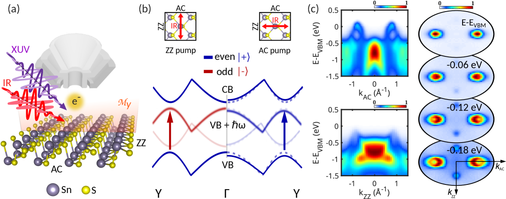
**Fig. 1.** 実験セットアップとSnSの静的バンドマッピング。赤外線ポンプ（1.2 eV）とXUVプローブ（21.6 eV）の配置を示し、SnSの多谷電子構造とアームチェア・ジグザグ方向の非等価性を可視化している。本研究が対称性駆動型フロケ工学を成立させる物質的基盤を示す図である。

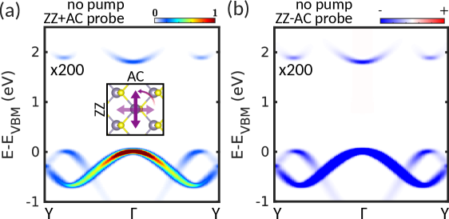
**Fig. 2.** TDDFTによる線形二色性ARPESの計算結果。モノレイヤーSnSの価電子帯・伝導帯に対し、異なるXUVプローブ偏光での光電子強度マップと線形二色性マップを示す。一様な負のコントラストが偶パリティを示す「対称性の指紋」として現れており、実験との対応関係の基礎を与える。

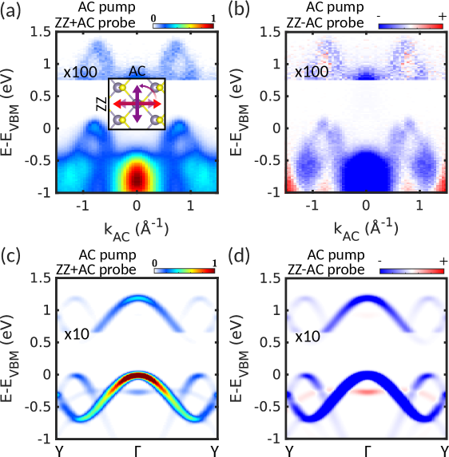
**Fig. 3.** アームチェア方向ポンプ照射下でのフロケ—ボルコフサイドバンドの出現。実験（上）とTDDFT計算（下）のエネルギー—運動量マップを比較し、基底バンドとサイドバンドが同じパリティ（偶対称性）を持つことを線形二色性によって実証している。

---

## ★2. Emergent Anomalous Hall Effect from Surface States in the Altermagnet MnTe Thin Films

### 1. 論文情報

**タイトル：** [Emergent Anomalous Hall Effect from Surface States in the Altermagnet MnTe Thin Films](https://arxiv.org/abs/2603.12259)
**著者：** Yufei Zhao, Saswata Mandal, Chao-Xing Liu, Binghai Yan
**arXiv ID：** 2603.12259
**カテゴリ：** cond-mat.mtrl-sci, cond-mat.mes-hall
**公開日：** 2026年3月12日
**論文タイプ：** 第一原理計算・有効模型理論研究
**ライセンス：** CC BY 4.0

---

### 2. どんな研究か

アルターマグネット（時間反転対称性は破れているが正味磁化を持たない新磁性秩序）MnTe薄膜において、実験で観測された異常ホール効果（AHE）の起源を第一原理計算と有効模型によって解明した研究である。バルク計算では説明できなかったAHEが、バルクギャップ内に存在する表面状態の特異な電子構造（表面状態がフェロ磁性体的なスピン偏極を持つこと）に起因することを示し、異常ホール伝導率（AHC）が膜厚非依存的になる機構を明らかにした。

---

### 3. 位置づけと意義

アルターマグネティズムは反強磁性体の一種でありながら、スピン分裂バンド構造を持つ点でフェロ磁性体的な輸送特性を示しうる新しい磁性概念として近年急速に注目を集めている。MnTeはそのプロトタイプ材料の一つであり、実験的にはAHEが観測されているにもかかわらず、バルク電子構造からの第一原理計算ではゼロに近いAHCしか得られないという矛盾があった。本研究はこの矛盾をバルク—表面の電子構造の本質的差異によって解決し、「表面主導型AHE」という新しい機構を提案した。これはトポロジカル絶縁体に似た「表面状態が輸送を支配する」描像をアルターマグネットに拡張するものであり、磁性物質の計算設計において表面処理の重要性を強調する。

---

### 4. 研究の概要

**背景・目的：**
近年、MnTe薄膜においてAHEが実験で観測されたが、バルクのバンド計算では非常に小さいAHCしか予測されず、実験との矛盾が問題となっていた。この乖離の原因を明らかにし、MnTeにおけるAHEの機構を解明することが目的である。

**計算科学上の課題設定：**
薄膜の輸送特性をバルクのみで記述することの限界を超えて、スラブモデルを用いた表面状態の第一原理計算と、それに基づくホール伝導率の層分解解析が必要とされた。Wannier関数を用いた緊密結合ハミルトニアンの構築と、ベリー曲率の層分解計算が核心的な計算課題となった。

**研究アプローチ：**
VASP（PBE+U: U=4.8 eV, J=0.8 eV for Mn-3d）でバルク・スラブ計算を実施し、Wannier90によって局在Wannier基底を構築した。スラブモデルは14ユニットセル（Te終端）とInP基板（8層）を含む。ベリー曲率の層分解解析によってAHCの空間的起源を特定した。さらに有効模型による解析的理解を補完した。

**対象材料系・現象：** MnTe薄膜（六方晶、アルターマグネット）における異常ホール効果

**主な手法：** DFT+U（VASP）、Wannier関数（Wannier90）、ベリー曲率計算、有効模型、スラブモデル計算

**主な結果：**
- 表面状態はバルクギャップ内に存在し、フェロ磁性体的なスピン偏極を持つ（両スピン副格子の表面状態が同方向のAHEに寄与）
- AHCはバルク価電子帯端より上のエネルギーで膜厚非依存性を示す（表面起因）
- 界面化学（H終端、Te終端、MnTe/InP界面等）に対してAHCは定性的に堅牢
- C₂z対称性により、反対スピンの表面の軌道モーメント分布は同一となり、AHEは相殺されずに足し合わされる

**著者の主張：**
MnTe薄膜のAHEはバルクベリー曲率でなく表面状態のベリー曲率に由来しており、この機構はアルターマグネット系の薄膜輸送の一般的な特徴を反映している可能性がある。

---

### 5. 計算物質科学として重要なポイント

**対象現象：** 異常ホール効果、ベリー曲率、表面状態輸送、アルターマグネティズム

**手法の妥当性：**
DFT+Uは局在Mn-3d電子を適切に扱うための標準的手法であり、U=4.8 eVはMnTeに対して文献値と整合する。Wannier関数へのダウンフォールディングは精度を保ちながら大規模スラブ計算を可能にする点で適切である。

**計算条件：**
20×20×20のk点メッシュ（磁気モーメント計算用）、スラブ計算では原子座標を0.01 eV/Å以下まで緩和。表面状態のスペクトル関数計算にはWannier-toolsを使用。

**既存研究との差分：**
バルクAHCでAHEを説明しようとした先行研究から、スラブ計算による表面起因AHCへの転換が本質的な差分である。

**新規性の位置づけ：**
「アルターマグネットにおける表面主導AHE」という機構自体が新規であり、従来の磁性輸送論に新たな視点を加える。

**物理的解釈：**
アルターマグネット特有のC₂z対称性が、反対スピン副格子の表面状態に「同符号のAHC」を与える点が物理的核心。このような対称性の役割は有効模型による解析的導出で明確化されている。

**波及可能性：**
他のアルターマグネット材料（RuO₂, MnF₂等）における表面起因輸送の計算、トポロジカルアルターマグネットの探索、スピントロニクスデバイス設計への応用。

---

### 6. 限界と注意点

1. **DFT+UのU値依存性：** Hubbard U=4.8 eVの選択はAHCの定量値に影響を与える。異なるU値での系統的計算が不十分であり、AHCの定量的予測の信頼性には注意が必要である。

2. **スラブ厚さとTermination依存性：** Te/Te, Te/Mn, Mn/Mn終端でAHCが大きく異なり（定性的な傾向は保たれているが）、実験的な薄膜の終端状態は必ずしも理想的とは限らない。実際のデバイス条件下での表面再構成効果は考慮されていない。

3. **有限温度効果の欠如：** 計算は0 K基底状態に限定されており、常温でのネール秩序の安定性やフォノン・スピン揺らぎによるAHCへの影響は考慮されていない。磁気秩序温度（MnTeは〜310 K付近）に近い実験条件への外挿には注意が必要である。

---

### 7. 関連研究との比較や研究動向における立ち位置

**先行研究との差分：**
Smejkal et al. (2022, Science Advances)はアルターマグネティズムの概念枠組みを確立し、MnTeのスピン分裂バンドを予測した。Gonzalez-Hernandez et al. (2021)はRuO₂のAHEを報告しバルク起源を示した。本研究はMnTeという実験的に重要な系においてバルク記述の限界を指摘し、表面状態機構という新視点を加えた。

**競合・類似研究：**
MnTeの実験的AHE観測（複数グループ）は既に発表されており、理論的説明の需要は高かった。本研究の解釈は実験コミュニティに広く受容される可能性が高い。

**未解決問題への前進：**
「アルターマグネット薄膜でなぜAHEが観測されるのか」という実験—理論間の矛盾を解消した点で明確な前進。

**新規性評価：** 機構的理解としてはbreakthroughであるが、実験的予測（AHCの大きさ等）の精度検証が今後の課題。

**引用コミュニティ：** アルターマグネット・スピントロニクス・トポロジカル材料の広い実験・理論コミュニティ。

**今後の展開：** MnTe以外のアルターマグネット薄膜への一般化、表面パッシベーションによるAHC制御、スピン—ホール効果との関係。

**再現性：** VASPとWannier90は標準的公開コードであり、再現性は高い。DFT+Uパラメータの選択についてのより詳細な議論が望まれる。

---

### 8. 図

**Fig. 1.** MnTe薄膜の表面バンド構造とスピンテクスチャ模式図。Te終端スラブのバンド（赤）とバルクバンド（灰）の重ね合わせを示し、バルクギャップ内の表面状態と、両スピン副格子が同方向のAHEに寄与するスピンテクスチャの概念図を含む。表面状態がAHEの担い手であることを視覚的に示す中核図。

**Fig. 2.** 異常ホール伝導率（AHC）の膜厚・エネルギー依存性。Te/Te、Te/Mn、Mn/Mn終端の各スラブに対し4〜17 nmの膜厚でσxy^2D(E)を比較。バルク価電子帯端より上のエネルギーでAHCが膜厚非依存となることを示し、表面起因の輸送であることを定量的に支持する。

**Fig. 3.** 層分解異常ホール伝導率の空間分布。厚いスラブにおけるフェルミエネルギーでのAHCが表面近傍（底面2ユニットセル、8原子層）に局在することを示す。C₂z対称性によって反対側のスピン副格子が同一のAHEシグナルを生み出すことの証拠となる。

---

## ★3. Theoretical proposal of superconductivity in hole-doped reduced bilayer nickelate La₃Ni₂O₆

### 1. 論文情報

**タイトル：** [Theoretical proposal of superconductivity in hole-doped reduced bilayer nickelate La₃Ni₂O₆: a manifestation of orbital-space bilayer model with incipient bands](https://arxiv.org/abs/2603.11771)
**著者：** Shu Kamiyama, Reo Kohno, Yuto Hoshi, Kensei Ushio, Daiki Nakaoka, Hirofumi Sakakibara, Kazuhiko Kuroki
**arXiv ID：** 2603.11771
**カテゴリ：** cond-mat.supr-con, cond-mat.mtrl-sci, cond-mat.str-el
**公開日：** 2026年3月12日
**論文タイプ：** 第一原理計算＋多体理論（FLEX）研究
**ライセンス：** CC BY 4.0（アブストラクトページより確認）

---

### 2. どんな研究か

La₃Ni₂O₇の高圧超伝導の発見（2023年）以来注目を集めているビレイヤーニッケル酸化物の関連化合物La₃Ni₂O₆（外側頂点酸素を持たない還元型ビレイヤー構造）に対して、第一原理計算によりタイトバインディングモデルを構築し、揺動交換近似（FLEX）計算によりホールドープ下でのs±波超伝導を理論的に予言した研究である。この化合物が「軌道空間ビレイヤーモデル（OSBM）」として機能し、層間ホッピングの代わりに軌道間エネルギー差ΔEが超伝導を増強するメカニズムを提案した。

---

### 3. 位置づけと意義

La₃Ni₂O₇における高圧超伝導の発見は凝縮系物理学において最大級のトピックの一つであり、そのメカニズム解明と関連化合物への展開が盛んに行われている。La₃Ni₂O₆はLa₃Ni₂O₇の頂点酸素を還元除去した化合物であり、構造的類似性にもかかわらず電子状態は大きく異なる。本研究は、この化合物が通常の多バンド超伝導体ではなく「軌道空間ビレイヤーモデル」として記述できることを第一原理から導き、新しい超伝導ファミリーの可能性を提示した。ΔEという単純なパラメータが超伝導を制御するという洞察は、化学的置換や歪みによるΔEのチューニングという材料設計指針にも直結する。

---

### 4. 研究の概要

**背景・目的：**
La₃Ni₂O₇は〜80 K（高圧下）の超伝導体であり、そのs±波超伝導は層間hopping t⊥によってバンドがボンディング・アンチボンディングに分裂し、一方がincipient（フェルミ面近傍だが交差しない）バンドとなる「ビレイヤー機構」で説明される。La₃Ni₂O₆は同じビレイヤー構造を持つが外側頂点酸素がないため、電子構造が大きく変化する。この化合物が超伝導を示す可能性と、その機構の解明が目的である。

**計算科学上の課題設定：**
La₃Ni₂O₆のフェルミ面・バンド交差の有無、軌道の特徴（dx²-y²、dz²の混合比）、多軌道Hubbardモデルとしての記述、FLEX計算による超伝導不安定性の評価が課題となった。特に「軌道空間ビレイヤー」という非自明な概念的対応が数学的に正確に示せるかが計算的な核心であった。

**研究アプローチ：**
第一原理計算（コード不明、おそらくVASPまたはQE）でLa₃Ni₂O₆の電子構造を計算し、MLWFダウンフォールディングによってNi-d主体の多軌道Wannier-Hubbardモデルを構築した。FLEX計算でスピン感受率・対形成ポテンシャルを評価し、超伝導対称性と転移温度の傾向を算出した。さらにLa₃Ni₂O₇との比較を通じて、両化合物の超伝導機構の差異を明確化した。

**対象材料系・現象：** La₃Ni₂O₆（還元型ビレイヤーニッケル酸化物）、ホールドープ下超伝導

**主な手法：** 第一原理計算（DFT）、Wannier関数ダウンフォールディング、多軌道Hubbardモデル、FLEX（Fluctuation Exchange Approximation）

**主な結果：**
- La₃Ni₂O₆では外側頂点酸素の欠如により、Ni dx²-y²と他のd軌道間のエネルギー差ΔEが大きくなる
- この大きなΔEが「軌道空間ビレイヤー」として機能し、La₃Ni₂O₇のt⊥と類似した超伝導増強機構を生む
- FLEX計算により、ホールドープ下でs±波の超伝導ペアリングが出現することを確認
- La₃Ni₂O₇はバンド空間ビレイヤー（t⊥主導）、La₃Ni₂O₆は軌道空間ビレイヤー（ΔE主導）という対照的な機構を持つ

**著者の主張：**
軌道空間ビレイヤーモデルという新概念は多軌道超伝導体の理解に一般的な枠組みを提供し、La₃Ni₂O₆は常圧でのニッケル酸化物超伝導候補として実験的探索に値する。

---

### 5. 計算物質科学として重要なポイント

**対象現象：** 超伝導ペアリング、多軌道電子相関、incipient バンド機構

**手法の妥当性：**
FLEXは弱〜中程度の相関領域に適した多体摂動論的手法であり、ニッケル酸化物のような中程度のU系（U/W〜1）での定性的傾向の記述に有効。ただし絶対的なTcの定量予測は困難であり、傾向の定性的評価として解釈すべきである。

**計算条件：**
Wannier基底の軌道数、k点メッシュ、Hubbard Uの値等の詳細は論文本文に記載されているが、このHTMLバージョンがないため完全な確認は困難。

**既存研究との差分：**
La₃Ni₂O₇の理論研究は多数あるが、La₃Ni₂O₆への展開かつ「軌道空間ビレイヤー」というモデル的対応を示した研究は本論文が先例。

**新規性：** 「軌道空間ビレイヤーモデル（OSBM）」という概念の提案がincrementalを超えた新規性を持つ。

**波及可能性：** 多軌道超伝導体一般（Fe系、Cu系、Ni系）へのOSBM概念の適用、軌道制御による超伝導増強の材料設計。

---

### 6. 限界と注意点

1. **FLEXの精度限界：** FLEX近似は弱結合領域での摂動展開に基づいており、Mott絶縁体境界付近での強相関効果は適切に扱えない。La₃Ni₂O₆が十分に金属的（非Mott）であることの確認が必要であり、本論文ではその評価が十分でない可能性がある。

2. **実験的合成の困難さ：** La₃Ni₂O₆の還元型ビレイヤー構造は高圧合成や精密な酸素制御を要する材料であり、ホールドープの制御も容易ではない。計算が予言する超伝導は実験的に検証困難な条件下にある可能性がある。

3. **HTMLバージョン非公開による情報制限：** 本論文はarXivでHTMLバージョンが利用できず、図の詳細や計算パラメータの完全な確認が困難であった。フェルミ面の形状、k-resolved超伝導ギャップ関数などの詳細情報の一部は本ダイジェスト作成時に未確認である。

---

### 7. 関連研究との比較や研究動向における立ち位置

**先行研究との差分：**
Sun et al. (2023, Nature)によるLa₃Ni₂O₇高圧超伝導発見以降、多数の理論研究（Zhang et al., Luo et al., Lu et al.等）がビレイヤーHubbardモデルによる機構解明を試みてきた。本研究はその「層間」という物理的実空間ビレイヤーを「軌道空間」に抽象化することで、La₃Ni₂O₆という新たな超伝導候補を提案した点で差別化されている。

**競合研究：**
大阪大学・Kuroki グループは多軌道FLEX によるニッケル酸化物超伝導研究を長年にわたって主導しており、本研究はその連続線上にある。競合する東大・理研グループ等も同様のアプローチを採っており、La₃Ni₂O₆への展開で先行した形となる。

**未解決問題への前進：**
ニッケル酸化物超伝導体の多様性（どの化合物が超伝導を示すか）の理解に貢献。

**新規性評価：** 概念（OSBM）の導入と新物質予言という点でincrementalを超えた意義を持つ。

**引用コミュニティ：** ニッケル酸化物超伝導実験・理論グループ、多軌道Hubbard模型研究者、高温超伝導コミュニティ全体。

**今後の展開：** La₃Ni₂O₆の高圧合成と超伝導探索、OBSMの他の多軌道系への適用、軌道間U値のチューニングによる超伝導増強。

**再現性：** FLEXは公開コードが限られるが、手法自体は確立されており、コードの入手可能性を確認した上での再現は可能と考えられる。

---

### 8. 図

本論文のarXiv HTMLバージョンは公開されていないため、原論文の図の抽出ができなかった。代わりに、研究の概念を説明する。

**[図の抽出不可：arXiv HTML版が未公開のため]**

**La₃Ni₂O₆とLa₃Ni₂O₇の構造・電子状態の対比（概念説明）：**
- La₃Ni₂O₇：Ni二重層構造＋頂点酸素あり → バンド空間ビレイヤー（t⊥によるボンディング/アンチボンディングバンド分裂）
- La₃Ni₂O₆：頂点酸素なし → 軌道空間ビレイヤー（ΔEによるincipientバンド形成、OBSMとして機能）
- 両者でs±波超伝導が予言されるが機構は対照的

---

# その他の重要論文

---

## 4. Emergence of polar monoclinic phase in heterohalogen substituted CsGeX₃

### 1. 論文情報

**タイトル：** [Emergence of polar monoclinic phase in heterohalogen substituted CsGeX₃](https://arxiv.org/abs/2603.11844)
**著者：** Sourabh Vairat, Balachandra G. Hegde, Brajesh Tiwari, Ravi Kashikar
**arXiv ID：** 2603.11844
**カテゴリ：** cond-mat.mtrl-sci
**公開日：** 2026年3月12日
**ライセンス：** CC BY 4.0

### 2. 研究概要

**第1段落：**
本研究はゲルマニウム系ハライドペロブスカイトCsGeBr₃をベースとして、ハロゲンを2:1の比率で混合置換することにより、室温で安定な新しい極性単斜晶相（Cm空間群）が出現することをDFT計算によって予測した。VASP（PBE/PAW, 600 eV, 8×8×8 k点）を用いた構造最適化、密度汎関数摂動理論（DFPT）によるフォノン分散計算から相安定性を評価し、軟化モードの解析によって相転移の機構を特定した。モノクリニック相の自発分極はCsGeBr₃の菱方晶相より増強されており、k·pハミルトニアンの解析によって価電子帯・伝導帯の双方でスピン軌道相互作用起因のスピン分裂（ラシュバ型とダレッシャルバッハ型の混合）が確認された。計算はr2SCAN汎関数で結果を再検証しており、PBEとの整合性も確認している。

**第2段落：**
計算物質科学的に重要な点は、ハロゲン混合（heterohalogenation）が既知の極性相とは異なる新しい対称性破れ様式を導くことを第一原理的に示した点である。CsGeX₃系はPb系の代替として毒性の少ないペロブスカイト太陽電池候補として注目されているが、混合ハロゲン置換の系統的な相図は未整理であった。DFTPTによって直接得られたフォノン軟化モードのΓ点解析は、極性相転移の臨界揺動の計算的指紋を与えており、動的不安定性の計算に基づいた相安定性マップの構築に向けた方法論的寄与もある。スピン分裂特性はスピントロニクス応用（Datta-Dasスピントランジスタ等）への材料設計指針となりうる。一方で計算は0 K・PBE近似であり、実験的なハロゲン分布の不均一性・エントロピー効果は考慮されていない点に注意が必要である。

### 3. 図

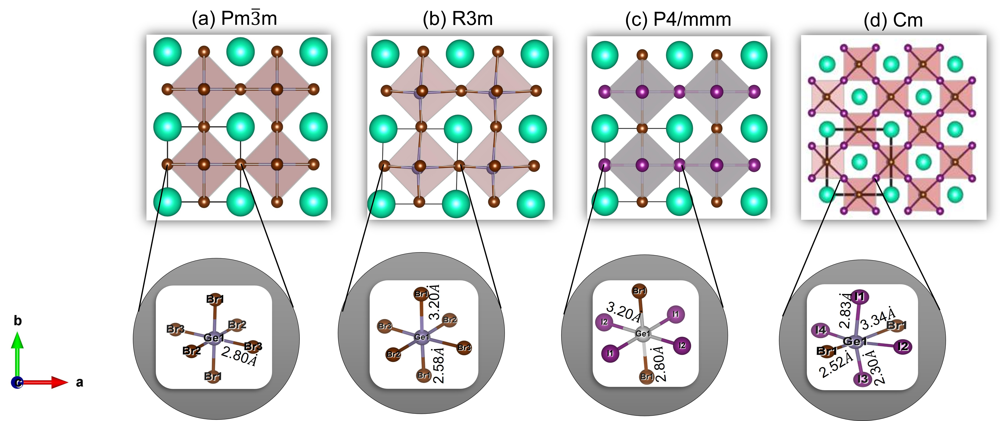
**Fig. 1.** CsGeBr₃の立方晶（Pm3̄m）・菱方晶（R3m）・モノクリニック（Cm）相の結晶構造比較。ハロゲン混合置換によってCsGeX₃の対称性が段階的に低下し、極性単斜晶相が出現するメカニズムを視覚的に示す。

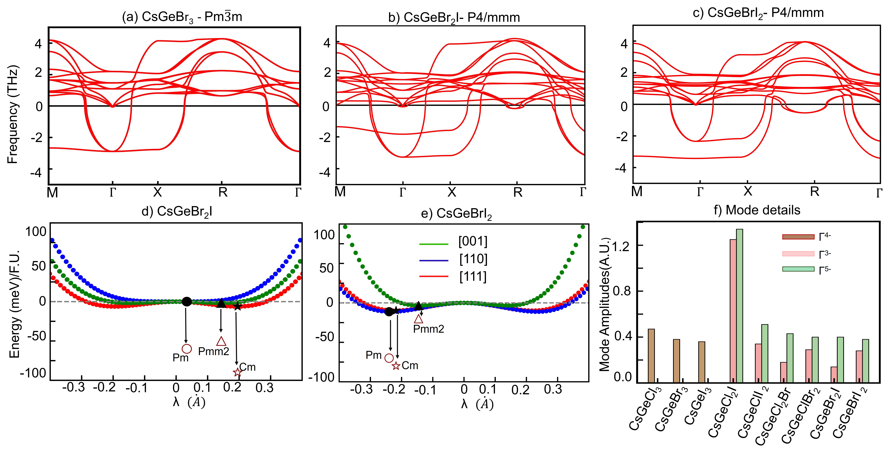
**Fig. 2.** フォノン分散と構造変位エネルギーランドスケープ。[001]・[110]・[111]方向の変位に対するエネルギー曲線と、ソフトモードによる相転移機構を示す。極性モノクリニック相が他の変位方向と比較してエネルギー的に安定であることを定量的に示す重要な図。

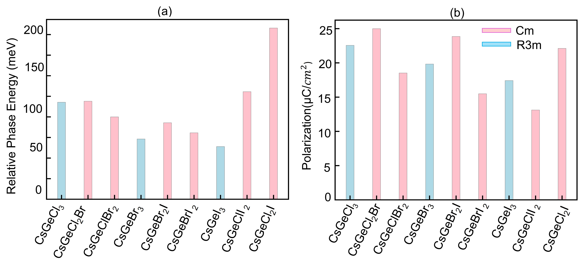
**Fig. 3.** 各組成の相対エネルギーと自発分極の比較。ピュア組成と混合ハロゲン組成の菱方晶相・単斜晶相のエネルギー差と分極値を棒グラフで比較し、混合置換による極性増強を定量的に示す。

---

## 5. Bootstrap Embedding for Interacting Electrons in Phonon Coherent-state Mean Field

### 1. 論文情報

**タイトル：** [Bootstrap Embedding for Interacting Electrons in Phonon Coherent-state Mean Field](https://arxiv.org/abs/2603.11463)
**著者：** Shariful Islam, Joel Bierman, Yuan Liu
**arXiv ID：** 2603.11463
**カテゴリ：** cond-mat.str-el, physics.comp-ph
**公開日：** 2026年3月12日
**ライセンス：** arXiv perpetual non-exclusive license（図の使用不可）

### 2. 研究概要

**第1段落：**
本研究はブートストラップ埋め込み（Bootstrap Embedding: BE）法を電子—フォノン連成系に拡張した「フェルミ—ボゾン Bootstrap Embedding（fb-BE）」を開発した。フォノンの自由度に対してコヒーレント状態平均場（Coherent-State Mean-Field）近似を適用し、電子の強相関効果はBEによるフラグメント埋め込みで扱うという二段階自己無撞着スキームである。Hubbard-Holsteinモデル（U/t = 0〜10, g = 0.1〜0.5, ω₀ = 0.25）に対してベンチマークし、8サイト系でDMRGと比較したところ、強相関（Mott絶縁体・ポーラロン）領域では良好な一致を示す一方、弱結合（ファイアルス/CDW）領域ではフォノン量子揺動の無視による誤差が拡大した。スケーラビリティの観点では350サイト系まで計算を拡張でき、同等の精度でDMRGの約1000倍の高速化を達成した。

**第2段落：**
計算物質科学への重要性は、電子—フォノン相互作用をまじめに扱いながら大規模系を計算できるという点にある。DFT + 電子—フォノン摂動論（DFPT/EPW）は非相関系には有効だが、Mott絶縁体・強相関ポーラロン系では限界がある。一方DRMGはスケーラビリティに制限がある。fb-BEはその中間を埋める方法論的ニッチを占めており、強相関酸化物や有機—無機ハイブリッドペロブスカイトにおける電子—フォノン連成の大規模計算への応用が期待される。現段階では一次元Hubbard-Holsteinモデルの実証であり、二次元・三次元系や実際の材料系への拡張が今後の課題となる。図が公開ライセンスではないため本ダイジェストでは掲載しない。

**[図：arXiv perpetual licenseのため掲載不可]**

---

## 6. PolyCrysDiff: Controllable Generation of Three-Dimensional Computable Polycrystalline Material Structures

### 1. 論文情報

**タイトル：** [PolyCrysDiff: Controllable Generation of Three-Dimensional Computable Polycrystalline Material Structures](https://arxiv.org/abs/2603.11695)
**著者：** Chi Chen, Tianle Jiang, Xiaodong Wei, Yanming Wang
**arXiv ID：** 2603.11695
**カテゴリ：** cs.CV, cond-mat.mtrl-sci
**公開日：** 2026年3月12日
**ライセンス：** arXiv perpetual non-exclusive license（図の使用不可）

### 2. 研究概要

**第1段落：**
本研究は三次元多結晶材料組織（粒径・粒形状・粒界分布を制御した64³ボクセル三次元構造）を生成する条件付き潜在拡散モデル「PolyCrysDiff」を開発した。三次元VAE（Variational Autoencoder）で組織を潜在空間（16³）に圧縮し、条件付き拡散モデルが粒径・球形度・粒数等の指定値に対応する構造を生成する。2000個の訓練サンプルでR²＞0.972（粒数制御）・R²＞0.995（粒径制御）という高い制御精度を達成した。生成された構造の物理的妥当性は結晶塑性有限要素法（CPFEM/MOOSE）によって検証されており、実際の材料シミュレーションに投入可能な「計算可能」な組織である点が特徴である。

**第2段落：**
多結晶材料の組織—特性相関の解明においては、様々な組織パラメータに対してシミュレーションを実施する必要があるが、実験的な組織生成は非常に時間・コストがかかる。本研究のアプローチは、逆問題的に所望の特性（例：強度・延性）に対応する組織を生成する「インバースデザイン」の前段となる技術を提供する。既存の多結晶組織生成手法（Voronoiモザイク、マルコフ確率場等）と比較して、PolyCrysDiffはより現実的な粒形状分布と高い制御性を実現している。ただし訓練データが2000個と少なく、Al7075-T6という特定材料での検証に留まる点で汎用性の評価は今後の課題である。また図が公開ライセンスではないため本ダイジェストでは掲載しない。

**[図：arXiv perpetual licenseのため掲載不可]**

---

## 7. High-fidelity level-set modeling of polycrystalline grain growth

### 1. 論文情報

**タイトル：** [High-fidelity level-set modeling of polycrystalline grain growth](https://arxiv.org/abs/2603.11608)
**著者：** Tianchi Li, Marc Bernacki
**arXiv ID：** 2603.11608
**カテゴリ：** cond-mat.mtrl-sci
**公開日：** 2026年3月12日
**ライセンス：** CC BY 4.0

### 2. 研究概要

**第1段落：**
本研究は、方位差角依存型（disorientation-dependent）の粒界エネルギーを持つ不均一な多結晶系における毛管力駆動型粒成長を、高精度レベルセット法によって計算する枠組みを提案した。Mullinsの平均曲率流理論を基盤として、等方的・Read-Shockley+・Bumpy型の3種類の粒界エネルギー関数に対してベンチマークを実施し、既存の4種類のレベルセット定式化との比較を行った。1.5×1.5 mm²の二次元ドメインで1000粒の多結晶組織（非構造三角形メッシュ、最小1 µm、3時間シミュレーション）を用いて、粒数・平均等価半径・総粒界エネルギーの時間発展、二面角分布、方位差角分布などの統計量を定量的に比較した。

**第2段落：**
計算物質科学としての重要性は、粒界エネルギーの不均一性が粒成長の動的挙動に与える影響を正確に捉える点にある。従来のレベルセット法は等方的粒界エネルギーを仮定することが多かったが、現実の多結晶材料では粒界エネルギーは対応する方位差・粒界キャラクターによって数倍変化する。本研究のフレームワークはアニーリングプロセスのデジタルツイン構築に直接応用可能であり、冶金学的熱処理の計算支援設計への貢献が期待される。CIMLibライブラリによる並列実装の提供も再現性・実用性を高めている。

### 3. 図

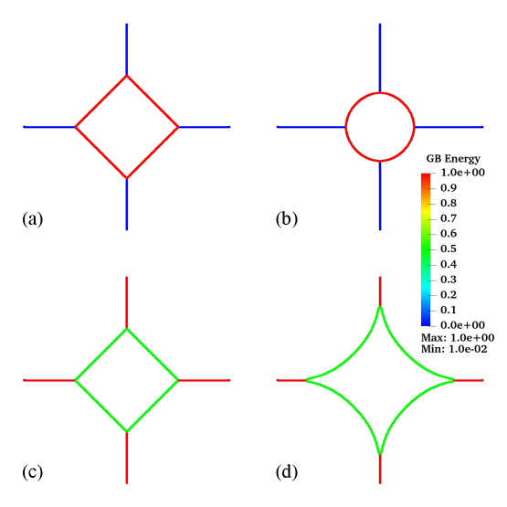
**Fig. 1.** 粒界エネルギー不均一性（Rγ=100と0.5）に対する初期・進化後の粒形態の比較。高エネルギーコントラスト（Rγ=100）では粒界エネルギーの差異が組織の異方的進化を促すことが視覚的に確認でき、従来の等方モデルでは捉えられない微細組織進化を示す。

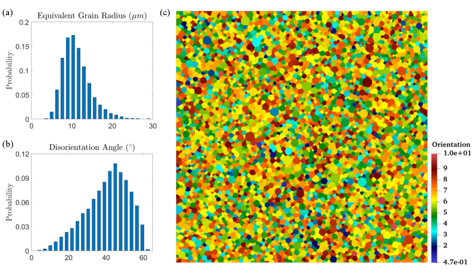
**Fig. 2.** シミュレーションに使用した多結晶システム。粒径分布・方位差角分布（マッケンジー分布）・オイラー角に基づく配向マップを示す。初期状態の統計的特性評価は計算結果の解釈に不可欠なベースラインとなる。

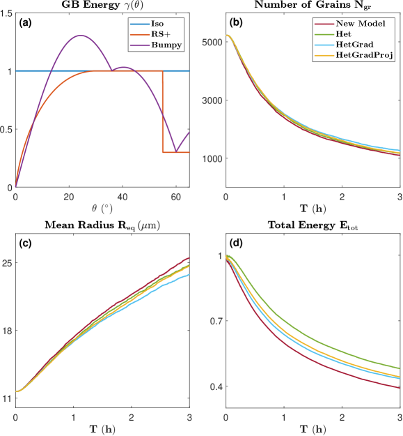
**Fig. 3.** 4種類のレベルセット定式化における粒成長統計の比較（粒数・平均等価半径・総粒界エネルギーの時間変化）。各手法の精度差が粒界エネルギーの再現性に最も強く表れることを示し、本研究の高精度フレームワークの優位性を定量的に証拠立てる。

---

## 8. Shear-Coupled Grain Growth Statistics

### 1. 論文情報

**タイトル：** [Shear-Coupled Grain Growth Statistics](https://arxiv.org/abs/2603.11690)
**著者：** Caihao Qiu, David J. Srolovitz, Gregory S. Rohrer, Jian Han, Marco Salvalaglio
**arXiv ID：** 2603.11690
**カテゴリ：** cond-mat.mtrl-sci
**公開日：** 2026年3月12日
**ライセンス：** arXiv perpetual non-exclusive license（図の使用不可）

### 2. 研究概要

**第1段落：**
本研究は、粒界移動に剪断変位が連成する「剪断結合型粒界移動（shear-coupled grain boundary migration）」が多結晶組織進化の統計的特性に与える影響を、多相場モデル（multi-phase field model）による二次元シミュレーション（250×250グリッド、Voronoi初期化1000粒）で定量的に解析した。剪断結合によって内部応力が発生し、これが通常の毛管力駆動型粒成長に重ねることで、粒成長速度分布・粒隣接数分布・粒形状の等方性が大きく変化することを示した。特に隣接粒数のピークが純曲率流の6から剪断結合込みで5に移行することは、実験・原子論シミュレーションとの一致として重要な定量的検証である。

**第2段落：**
剪断結合型粒界移動はナノ結晶や薄膜材料での変形において実験的に観察されているが、その多結晶統計への影響は理論的に未整理であった。本研究は連続体モデルと拡散界面モデルの組み合わせによってこの連成効果を大規模シミュレーションで初めて定量化した点で意義がある。内部応力の発展が粒成長を抑制しつつ組織の不均一化を促進するという知見は、ナノ結晶材料の安定性予測・変形機構理解に直接応用できる。ただし本計算は二次元に限定されており、三次元での拡張が今後必要である。図が公開ライセンスではないため本ダイジェストでは掲載しない。

**[図：arXiv perpetual licenseのため掲載不可]**

---

## 9. A blended approach for evolving phase fields using peridynamics: Cyclic loading in quasi-brittle fracture

### 1. 論文情報

**タイトル：** [A blended approach for evolving phase fields using peridynamics: Cyclic loading in quasi-brittle fracture](https://arxiv.org/abs/2603.12210)
**著者：** Hayden Bromley, Robert Lipton
**arXiv ID：** 2603.12210
**カテゴリ：** cond-mat.mtrl-sci
**公開日：** 2026年3月12日
**ライセンス：** CC BY 4.0

### 2. 研究概要

**第1段落：**
本研究は位相場法（Phase-Field Method）とペリダイナミクス（Peridynamics）を融合した「ブレンド型位相場」フレームワークを提案し、繰り返し荷重下における準脆性材料の損傷・破壊の計算モデルを構築した。従来の位相場法では損傷変数の独立した発展方程式を解くが、本研究では損傷変数γを非局所的な二点履歴依存関数として構成則から直接導出する。ひずみ分解（弾性成分＋不可逆成分）と損傷依存弾性率を組み合わせることで、準脆性破壊のサイクル的荷重下での履歴効果を熱力学的整合性（正の散逸レート）を保ちながら計算できる。コンクリートの曲げ試験（ヒステリシスループ・確定的サイズ効果）との定量的一致を示し、グリフィス破壊エネルギーが非局所長さスケールパラメータによらず第一原理的に導出されることを証明した。

**第2段落：**
計算材料科学としての重要性は、骨材のような準脆性材料のサイクル疲労（fatigue）を、従来の局所的損傷力学では捉えられなかった非局所的・長距離相互作用を通じて記述できる点にある。ペリダイナミクスはき裂先端の特異性を回避するメッシュフリー的枠組みであり、任意のき裂パスの予測が可能である。位相場との組み合わせにより、準脆性システムにおける塑性変形と弾性軟化の競合過程が一つの枠組みで扱われる。ただし本研究は理論的枠組みの提案と概念実証が中心であり、大規模三次元計算への実装と計算効率の評価は今後の課題である。

### 3. 図

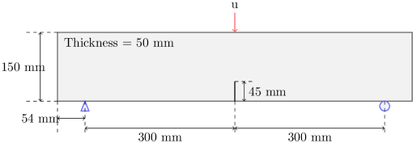
**Fig. 1.** ボンドの応力—ひずみ関係の模式図（引張・圧縮）。降伏点S_t^Y以下では弾性、降伏後は塑性降伏と弾性軟化が競合し、破断ひずみS_t^Fで完全破損する非線形構成則を示す。本フレームワークの構成則の基礎となる図。

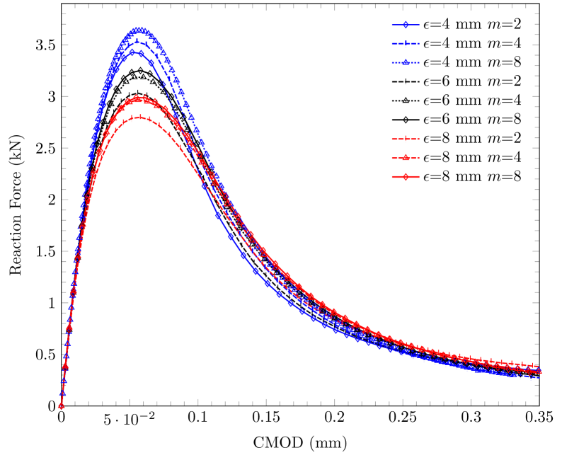
**Fig. 2.** 位相場関数γの最大ひずみS*依存性。S*＜S_t^Yでγ=1（未損傷）、S_t^Y＜S*＜S_t^Fで単調減少、S*＞S_t^Fでγ=0（完全損傷）となるLipschitz連続関数として定義される。熱力学的整合性を保つための数学的構造を示す。

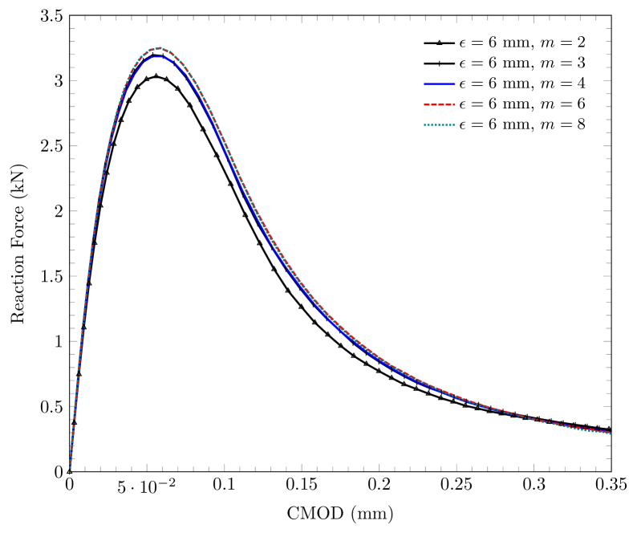
**Fig. 3.** 計算ドメイン模式図。ディリクレ境界条件層Ω_D^εを持つドメインΩの構成を示す。ペリダイナミクスの非局所相互作用範囲εを境界近傍でどのように扱うかを明示する、実装の要点となる図。

---

## 10. Reliable Viscosity Calculation from High-Pressure Equilibrium Molecular Dynamics

### 1. 論文情報

**タイトル：** [Reliable Viscosity Calculation from High-Pressure Equilibrium Molecular Dynamics: Case Study of 2,2,4-Trimethylhexane](https://arxiv.org/abs/2603.11247)
**著者：** Gözdenur Toraman, Dieter Fauconnier, Toon Verstraelen
**arXiv ID：** 2603.11247
**カテゴリ：** physics.comp-ph
**公開日：** 2026年3月11日
**ライセンス：** CC BY-NC-ND 4.0

### 2. 研究概要

**第1段落：**
本研究は高圧条件（0.1 MPa〜1 GPa）における液体潤滑剤の粘性係数を平衡分子動力学（EMD）シミュレーションから信頼性高く計算するための方法論的改善を提案した。具体的には、STACIE（STable AutoCorrelation Integral Estimator）アルゴリズムをMultiレイヤー圧力テンソル解析に拡張し、全5本の独立した剪断粘性成分を Green-Kubo 積分に活用することで統計的不確かさを低減した。さらにLorentzモデルを用いた低周波パワースペクトル解析を導入し、従来法と比較して1 GPaまでの実験値との相対誤差を6%以下に抑えることに成功した（従来法は高圧での誤差が急増）。2,2,4-トリメチルヘキサン（ブランチド炭化水素）を対象とし、50本×2 nsの独立軌跡を用いて統計的妥当性を示した。

**第2段落：**
計算材料科学・計算熱力学の観点では、高圧輸送係数の精密な計算手法の確立はトライボロジー・潤滑科学における力場検証の重要な基盤技術である。Green-Kubo 積分に基づく EMD 粘性計算は、平衡状態での正確な圧力テンソルゆらぎを要求するため、高圧では相関時間が長くなり収束困難となるが、本研究はこの問題をLorentzモデルによる外挿で解決した。ルービキューブ状解析や圧力テンソルの変換による独立成分の増加は、同じ計算コストで統計精度を向上させる実践的手法として広く応用可能である。ただし、力場（GAFF等）の選択に依存する精度の上限があることに注意が必要であり、本研究は力場精度を所与とした上での統計推定法の改善に焦点を当てている。

### 3. 図

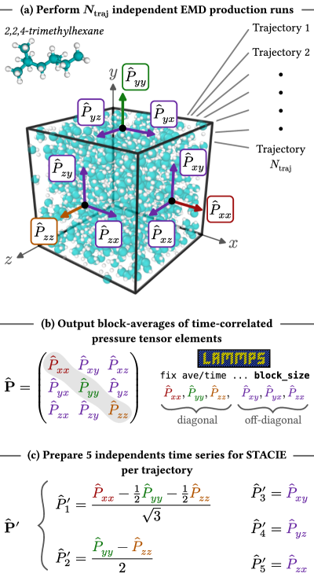
**Fig. 1.** 5本の独立圧力テンソル成分の準備と統計解析の模式図。100分子の立方体シミュレーションボックスに対する圧力テンソル要素のLAMMPS出力とブロック平均、5成分変換を示す。STACIE解析への入力データ準備の標準プロトコルを示す実装の基礎となる図。

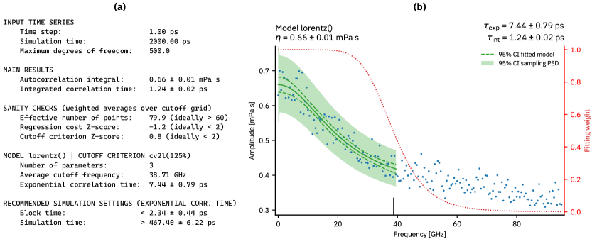
**Fig. 2.** 常温常圧（0.1 MPa, 293 K）でのSTACIE粘性解析結果。粘性推定値の出力とLorentzモデルによるパワースペクトル密度フィッティングを示す。本手法の信頼性を常温常圧という検証しやすい条件で実証する基準点を与える。

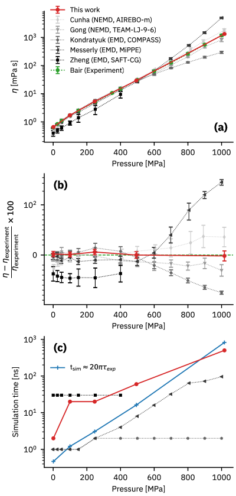
**Fig. 3.** 1 GPaまでの高圧粘性の実験値・文献値との比較および相対誤差と計算時間。提案手法が従来法と比較して高圧域での精度を大幅に改善（相対誤差＜6%）していることを示す。本研究の実用的価値を直接示す中核的検証図。

---

# 全体のまとめ

## 計算物質科学分野の動向

今週の論文群から読み取れる第一の傾向は、**実験と計算の緊密な連携**である。フロケ工学のSnS論文（2603.11878）はTDDFTとtr-ARPESを定量的に対応させ、アルターマグネットMnTeの論文（2603.12259）は実験的AHE観測の矛盾をスラブ計算によって解消した。計算が単に現象を「説明」するだけでなく、実験が解釈できなかった矛盾を「解決」する役割を果たすケースが増えており、計算材料科学の実験科学への貢献様式が成熟しつつある。特に電子状態計算においては、Wannier関数ダウンフォールディングとベリー曲率解析が標準的ツールチェーンとして定着し、トポロジカル輸送特性の計算的解釈を可能にしている。

## 明らかになった未解決領域

第二の傾向は、**多体電子構造と大規模計算のギャップ**の顕在化である。La₃Ni₂O₆超伝導の理論提案（2603.11771）に代表されるように、ニッケル酸化物系の超伝導メカニズムは多軌道Hubbard模型に基づく記述が必要であるが、FLEXなどの摂動論的手法が適用できる相互作用領域には限界がある。Bootstrap Embedding（2603.11463）はこのギャップを埋める試みの一つであるが、現在は一次元モデル系に留まっており、実際の材料系（La₃Ni₂O₆等）への応用には多くのステップが残る。また微細組織シミュレーション（2603.11608, 2603.11690, 2603.11695）では、三次元・大規模系・多物理連成という方向での未解決問題が依然として存在し、計算コストと精度の両立が課題として残る。

## 今後の展望

第三の傾向は、**生成AIと物理シミュレーションの融合**への着実な前進である。PolyCrysDiff（2603.11695）は拡散モデルによる多結晶組織の生成にCPFEMによる物理検証を組み合わせた先進的なアプローチであり、「データ駆動型微細組織設計」の実用化に向けた重要な一歩である。高圧MD粘性計算（2603.11247）が示すように、既存シミュレーション手法の統計的信頼性改善も継続的に進んでおり、これらの成熟した基盤の上に機械学習や高度な多体計算を積み重ねる方向性が今後の主流となるであろう。アルターマグネティズムや非平衡フロケ相などの新概念が第一原理計算によって実験可能な物性予測へと翻訳されていく流れは、計算物質科学が次世代材料開発の中心的役割を担うことを示唆している。

---

*本ダイジェストは2026年3月15日に作成した。対象期間は直近72時間（2026年3月12〜15日）。2603.11771はarXiv HTMLバージョン非公開のため図の抽出が不可能であった。2603.11463、2603.11695、2603.11690はarXiv perpetual non-exclusive licenseのため図の掲載を省略した。*
