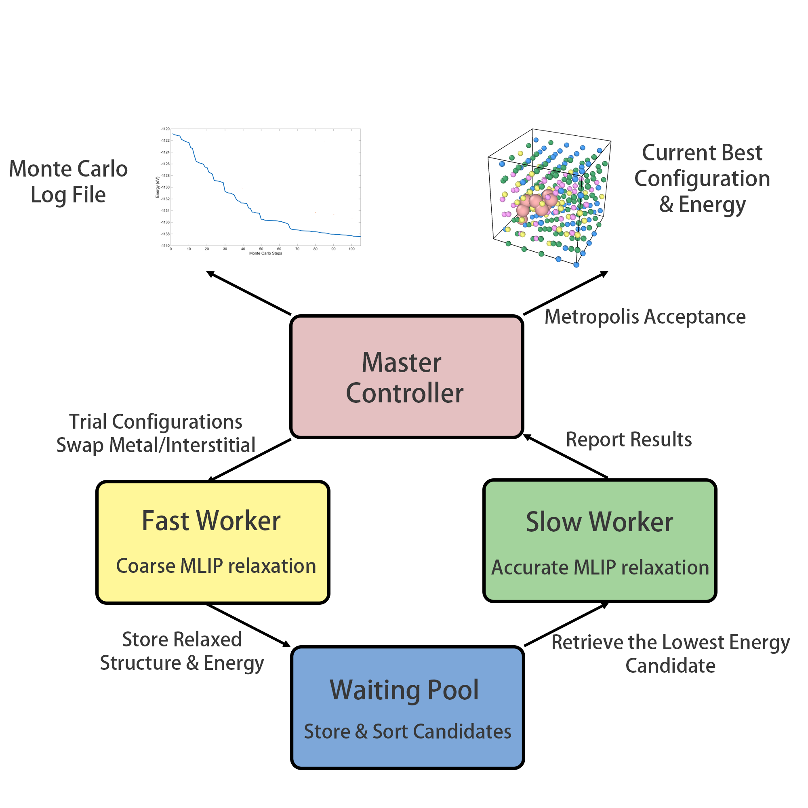
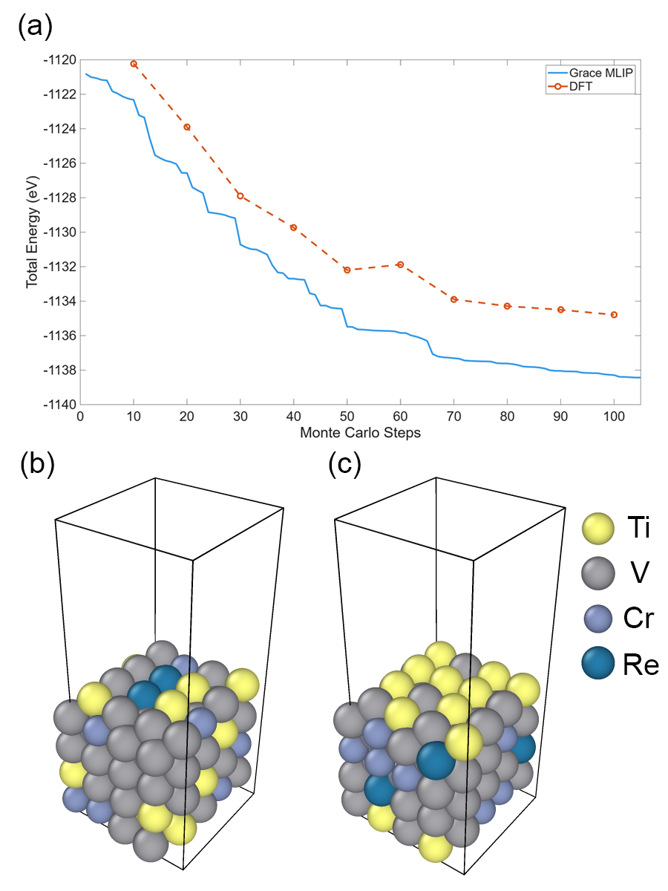
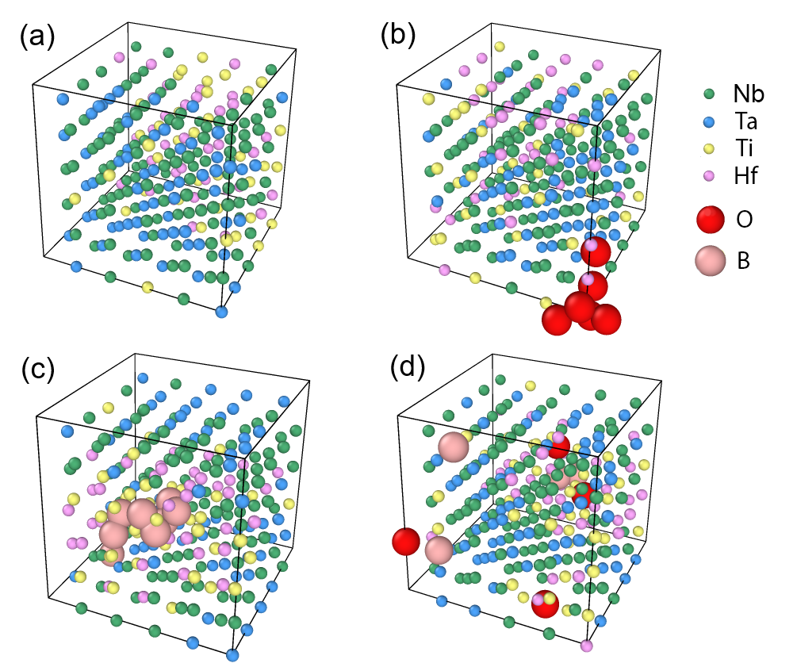
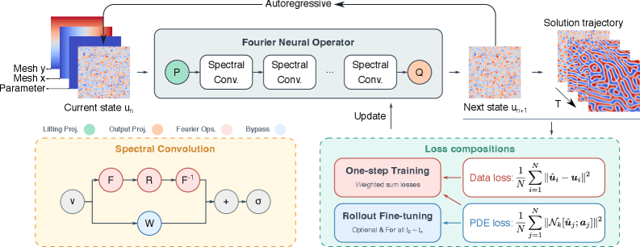
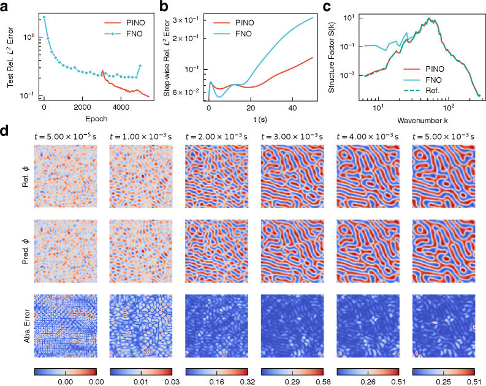
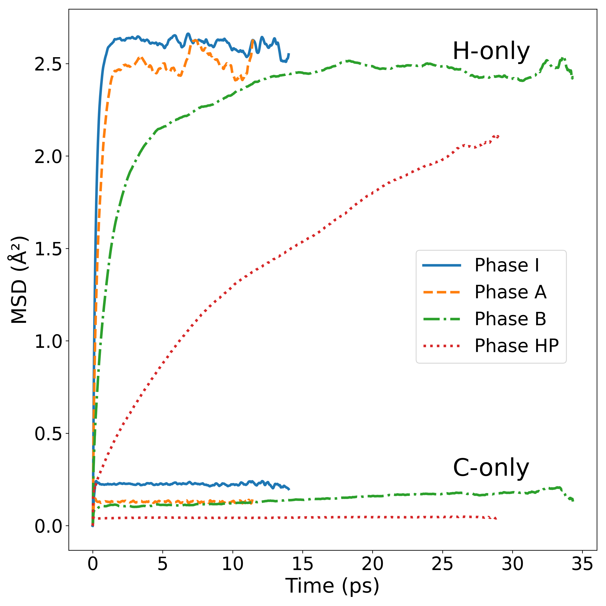
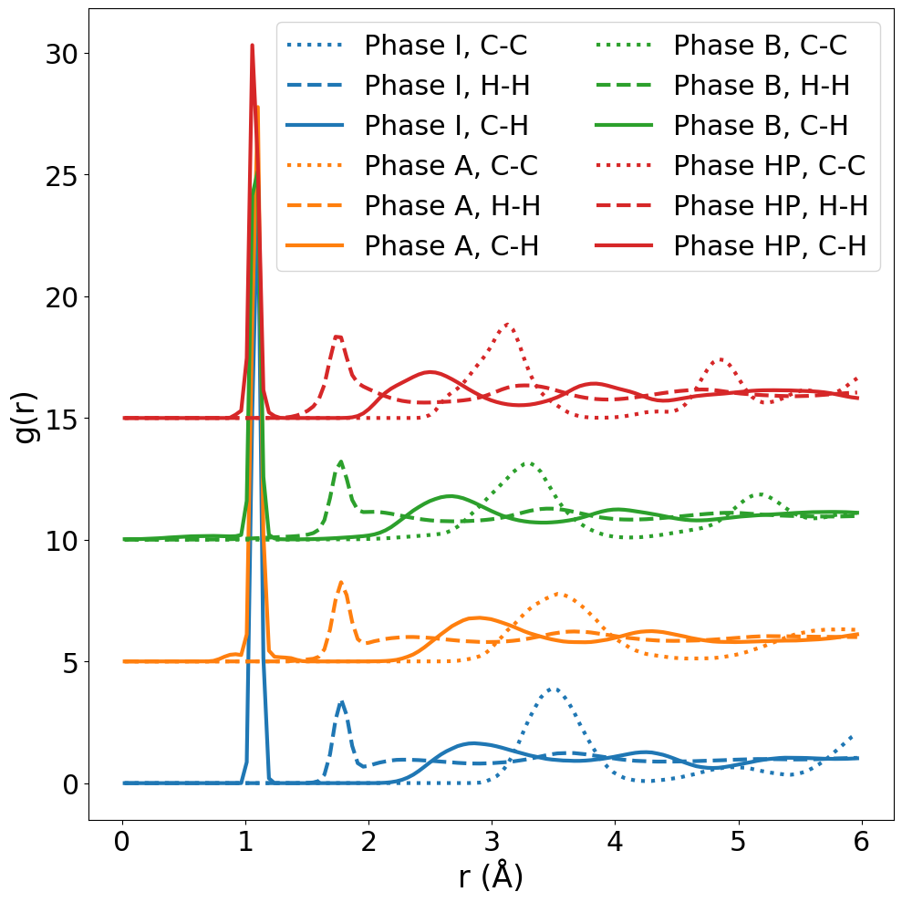

# arXiv 日次ダイジェスト（計算物質科学）

**作成日**: 2026-03-16
**対象期間**: 2026-03-13〜2026-03-16（過去72時間の新着論文）

---

## 今日の選定方針

本日は、ニッケル酸塩超伝導体の電子状態・構造相転移から氷の秩序化転移、強相関電子系の量子埋め込み理論まで、多岐にわたる計算物質科学の論文から10本を選定した。特に、LDA/DFTの枠組みでは捉えられない多体効果を明示的に扱った研究（2603.12924、2603.12336）、氷の相転移を機械学習ポテンシャルとループ更新によって ab initio 精度で再現した研究（2603.09247）を重点論文として取り上げた。残りの7本は、多成分合金における格子欠陥・偏析の最適化（2603.08855）、カゴメ・三角格子における量子フラストレーション材料のスクリーニング（2603.12745）、高精度量子化学による溶液内熱力学（2603.06800）、位相場モデルへの物理情報付きニューラル演算子の適用（2603.09693）、ひずみ入り Si/SiGe ヘテロ構造のバンドアライメント（2603.13219）、高圧結晶性メタンの超分子クラスター解析（2603.06346）、Ni-Mn-Ga マルテンサイトへのドーピング効果（2603.12413）と、計算物質科学の核心的話題を広くカバーする内容となっている。

---

## 全体所見

**第一段落：多体相関と強相関電子系**
本日の論文群には、従来の密度汎関数理論（DFT）や動的平均場理論（DMFT）では不十分とされてきた多体相関効果を正面から取り扱う研究が複数含まれる。La₃Ni₂O₇の構造相転移における「軌道二量化」機構（2603.12924）は、スピン一重項結合によるエネルギーランドスケープの双峰化という新しい視点を提示し、同材料系の超伝導発現と直接結びつく可能性を示す。また、完全自己無撞着 GW+EDMFT を SrMnO₃ に適用した研究（2603.12336）は、被制約RPA（cRPA）アプローチが孕む過剰スクリーニング問題を解消し、Mott絶縁体の電子構造を実験と定量的に一致させることに成功した。これらの研究は、強相関量子材料の第一原理的予測に向けた理論・計算基盤の整備が加速していることを示している。

**第二段落：機械学習ポテンシャルと統計サンプリングの融合**
氷 Ih→XI 転移の第一原理シミュレーション（2603.09247）は、等変 MACE ポテンシャルとアイスルールを保存するループ更新 Monte Carlo の組み合わせにより、meV スケールのエネルギー差で支配される相転移を大規模統計サンプリングで捉えることに成功した事例である。同様に、多成分合金の欠陥格子探索（2603.08855）では、MLIP と Monte Carlo の dual-worker 並列アーキテクチャ（PAIPAI）が最低エネルギー配置探索を実現している。これらの研究は、機械学習ポテンシャルが単に高速化ツールにとどまらず、理論的手法（ループ更新、Monte Carlo、核量子効果）と融合することで、新しい物理を明らかにするツールとなっていることを示す。

**第三段落：高精度電子状態計算と材料設計**
スクリーニング（2603.12745）や高圧メタン相（2603.06346）、Si/SiGe バンドアライメント（2603.13219）など、今日の論文群は計算物質科学が記述論的研究から予測・設計的研究へと成熟しつつある様相を示している。特に CCSD(T)+機械学習による溶液熱力学（2603.06800）は、結合クラスター理論の精度を凝縮相に展開する際の基準を確立したものであり、今後の電解質・触媒・生体系シミュレーションの礎石となりうる。物理情報付きニューラル演算子（PF-PINO; 2603.09693）は、位相場法の代替として演算子学習の可能性を示し、マルチスケール・マルチフィジクスシミュレーションへの道を開く。

---

## 重点論文一覧

1. [Orbital dimerization-induced first-order structural phase transition: a case study in La₃Ni₂O₇](https://arxiv.org/abs/2603.12924) — Xingchen Shen, Wei Ku
2. [Electronic correlations and dynamical screening with ab initio quantum embedding](https://arxiv.org/abs/2603.12336) — Chia-Nan Yeh et al.
3. [Ab initio simulation of the first-order proton-ordering transition in water ice](https://arxiv.org/abs/2603.09247) — Qi Zhang, Sicong Wan, Lei Wang
4. [Ground-State Structure Search of Defective High-Entropy Alloys Using Machine-Learning Potentials and Monte Carlo Sampling](https://arxiv.org/abs/2603.08855) — Siya Zhu, Raymundo Arroyave
5. [Ab initio screening of quantum frustrated materials with kagome and triangular geometries](https://arxiv.org/abs/2603.12745) — Byeong-Hyeon Jeong et al.
6. [From Accurate Quantum Chemistry to Converged Thermodynamics for Ion Pairing in Solution](https://arxiv.org/abs/2603.06800) — Niamh O'Neill et al.
7. [Physics-informed neural operator for predictive parametric phase-field modelling](https://arxiv.org/abs/2603.09693) — Nanxi Chen et al.
8. [First-principles predictions of band alignment in strained Si/Si₁₋ₓGeₓ heterostructures](https://arxiv.org/abs/2603.13219) — Nathaniel M. Vegh et al.
9. [Frustrated supermolecules: the high-pressure phases of crystalline methane](https://arxiv.org/abs/2603.06346) — Marcin Kirsz et al.
10. [First-principles study of doping influence on twin formation in Ni-Mn-Ga nonmodulated martensite](https://arxiv.org/abs/2603.12413) — Petr Šesták et al.

---

# 重点論文の詳細解説

---

## 論文 1

### 1. 論文情報

**タイトル**: [Orbital dimerization-induced first-order structural phase transition: a case study in La₃Ni₂O₇](https://arxiv.org/abs/2603.12924)
**著者**: Xingchen Shen, Wei Ku（上海交通大学）
**arXiv ID**: 2603.12924
**カテゴリ**: cond-mat.str-el（主）、cond-mat.mtrl-sci
**公開日**: 2026-03-13
**論文タイプ**: 理論・計算研究（電子状態・相転移機構）

---

### 2. どんな研究か

La₃Ni₂O₇ における圧力誘起一次構造相転移を説明するために、標準的な LDA/LDA+DMFT では捉えられない「格子間軌道二量化」と呼ぶ多体機構を提案した研究である。Ni d_{z²} 軌道間の層間スピン一重項結合がエネルギーランドスケープを双峰化させることで、NiO₆ 八面体傾斜角のバイスタブルな共存（第一次転移の特徴）を再現することを示した。さらに、この機構は同時に Ni²⁺ スピン-1 の実効スピン-1/2 への分裂を引き起こし、高温超伝導出現の微視的起源を示唆する。

---

### 3. 位置づけと意義

La₃Ni₂O₇ は 2023 年に圧力下での高温超伝導が報告されて以来、ペロブスカイト関連構造の強相関電子系として急速に注目を集めている。本論文の意義は、単に La₃Ni₂O₇ の相転移機構を解明したにとどまらず、従来の LDA や LDA+DMFT が系統的に失敗する理由（局所的多体相関の非十分な取り扱い）を明示し、多体ハミルトニアンの完全対角化を組み合わせた新しい計算プロトコルを確立した点にある。この「軌道二量化」機構はd電子・f電子を持つイオン性材料全般に適用可能とされており、今後の強相関系における相転移解析のベースラインとなる可能性を持つ。

---

### 4. 研究の概要

**背景・目的**
La₃Ni₂O₇ は Ruddlesden-Popper 型ニッケル酸塩で、~12 GPa の圧力下で八面体傾斜角 θ が ~170° から 180° へと急変する一次相転移を示す。この相転移は超伝導出現と密接に関係しているが、標準的 DFT（LDA）や LDA+U、LDA+DMFT はいずれも連続的な角度変化しか予測できず、実験で観察される相共存（第一次転移の証拠）を再現できなかった。

**計算科学上の課題設定**
LDA や DMFT レベルの一体近似・平均場近似では、Ni d_{z²} 軌道間の「格子間スピン一重項」という非局所的多体相関を適切に扱えない。完全な低エネルギー多体ハミルトニアン（運動項 T・ポテンシャル項 V・サイト間相関項）を構築し、完全対角化（exact diagonalization）で解くことが必要である。

**研究アプローチ**
著者らはまず LDA を用いてバンド構造と電荷密度を計算し、Ni d_{z²} 軌道に射影した低エネルギー有効ハミルトニアンを構築した。このハミルトニアンに対して完全対角化を適用することで、系の全エネルギーを八面体傾斜角 θ の関数として圧力の関数として計算した。U = 6 eV、J = 0.9 eV を使用し、異なる圧力（0.0, 5.2, 8.4, 10.1, 12.0, 20.3 GPa）での計算を実施した。

**対象材料系・対象現象**
La₃Ni₂O₇（Ruddlesden-Popper 型ニッケル酸塩）における圧力誘起 Amam → Fmmm 構造相転移。Ni d_{z²} 軌道の層間相互作用と NiO₆ 八面体傾斜の連成。

**主な手法**
LDA 電子構造計算 → Wannier 基底への射影 → 低エネルギー多体ハミルトニアンの構築 → 完全対角化（exact diagonalization）による全エネルギー計算。

**主な結果**
- LDA・LDA+DMFT では圧力を上げても傾斜角 θ の滑らかな変化しか得られない（第一次転移を再現しない）。
- 多体ハミルトニアンの完全対角化では、~12 GPa 付近でエネルギーに二つの極小（θ ≈ 170° と θ = 180°）が現れ、相共存・第一次転移の特徴を再現する。
- 低圧ではフント結合支配の状態（スピン-1）、高圧では層間スーパーエクスチェンジ支配の軌道二量化状態（有効スピン-1/2）への切り替わりが起こる。
- この機構は La₃Ni₂O₇ のみならず、d・f 電子を持つイオン性材料全般の一次構造相転移に適用可能と主張している。

**著者の主張**
LDA/DMFT レベルの一体・平均場近似では捉えられない「格子間軌道二量化」という多体機構が La₃Ni₂O₇ の第一次相転移を駆動し、同時に高温超伝導の出現に関連する Ni スピン状態の変化（spin-1 → 有効 spin-1/2）を説明するという。

---

### 5. 計算物質科学として重要なポイント

**対象現象**
La₃Ni₂O₇ における圧力誘起 Amam → Fmmm 一次構造相転移と NiO₆ 八面体傾斜角の双安定性。Ni²⁺ のスピン状態変化と層間超伝導クーパー対形成の前段階。

**手法・記述子の意味と妥当性**
Wannier 関数に基づく低エネルギー有効ハミルトニアンへの射影は計算コストを大幅に削減しつつ重要な物理を保持する標準的手法であるが、射影空間の選定（どの軌道を「活性」とするか）がエネルギースケールの評価に影響する。完全対角化は正確な多体波動関数を与えるが、活性空間が小さいため量子化学的 CASSCF に近いアプローチである。

**計算条件の適切性**
U = 6 eV、J = 0.9 eV の値はニッケル酸化物の典型的範囲に収まっている。ただし、これらのパラメータ選定が結果の定量的側面に影響し、転移圧力の値は U・J 依存性を持つ可能性がある。完全対角化では有限サイズ効果が伴うが、議論している機構は定性的に robust と考えられる。

**既存研究との差分**
従来の LDA・LDA+U・LDA+DMFT 研究は連続的な角度変化しか予測できなかった。本論文は「格子間多体相関」という新しい物理的要素を加えることで、第一次転移の本質を初めて理論的に説明した。

**新規性の位置づけ**
「軌道二量化」という概念自体は有機分子系等で知られているが、ニッケル酸塩の構造相転移・超伝導との関連を第一原理計算に基づいて提唱したのは本論文が最初。

**物理的解釈**
スピン一重項形成により、Ni₂O₉ 二層ダイマー内の分子軌道がバンド的状態から局在化された二量体状態へ切り替わる。これはキュプレートにおける Zhang-Rice 一重項形成と類比的な機構である。

**波及可能性**
d・f 電子系一般の圧力誘起一次相転移の解析枠組みとなりうる。圧力下ニッケル酸塩超伝導の理論モデル構築に直接資する。

**材料設計・物性解釈への貢献**
超伝導転移温度の圧力依存性・スピン状態変化の計算予測を可能にする基盤を提供。

---

### 6. 限界と注意点

1. **活性空間の限定**: Ni d_{z²} 軌道のみを活性空間としており、d_{x²-y²} 等の他 d 軌道の寄与が完全に無視されている。La₃Ni₂O₇ では多軌道効果が重要であるという指摘もあり、より大きな活性空間での検証が必要である。

2. **Hubbard U・J パラメータ依存性**: U = 6 eV、J = 0.9 eV の値は固定されており、これらのパラメータの不確かさが転移圧力の定量的予測に影響する。パラメータフリーな cRPA や強制 cRPA によるスクリーニング計算との比較が望ましい。

3. **格子自由度の簡略化**: NiO₆ 八面体の傾斜を単一角度 θ で記述しており、NiO₆ 内部変形やアピカル酸素の非等価な運動、La サイトの変位などの実際の格子自由度を考慮していない。実験で観察される構造変化の詳細（両相の格子定数・対称性）の定量的再現には、より精緻な格子モデルが必要である。

---

### 7. 関連研究との比較や研究動向における立ち位置

**主要先行研究との差分**
Sun et al. (2023) による La₃Ni₂O₇ 超伝導発見報告以降、LDA/GGA による電子状態計算（Lechermann 2023、Zhang et al. 2023 等）や LDA+DMFT 研究が多数発表されているが、いずれも第一次相転移の再現には成功していなかった。本論文はこの問題を多体ハミルトニアンの完全対角化によって初めて解決した。

**競合・類似研究との位置づけ**
ニッケル酸塩超伝導の機構論争（d波超伝導、s±波超伝導、量子臨界点描像など）は現在進行中であり、本論文はスピン状態変化と超伝導クーパー対形成の関係という観点から新しい描像を提供する。

**分野の未解決問題への前進度**
La₃Ni₂O₇ の相転移機構という特定の問題については大きく前進しているが、Tc の定量的予測や Cooper 対の対称性の特定には至っていない。

**新規性の位置づけ**: incremental ではなく、方法論的な breakthrough に近い（DFT/DMFT の限界を明確化し、新しい機構を提案）。

**引用コミュニティの広さ**
強相関電子系（DMFT コミュニティ）、ニッケル酸塩超伝導コミュニティ、高圧物性コミュニティから広く引用されうる。

**今後の展開方向**
多軌道展開、RVB 的記述との接続、フォノンとの連成効果の解析、他の Ruddlesden-Popper 型ニッケル酸塩への適用が考えられる。

**再現性・実装可能性**
有効ハミルトニアンの構築は Wannier90 等の標準コードで実現可能。完全対角化は小活性空間であれば容易に実装可能。コード非公開は実装の障壁になりうる。

---

### 8. 関連キーワードの解説

**1. 軌道二量化（Orbital dimerization）**
二つの近接した原子の軌道が重なることでスピン一重項（|↑↓⟩ − |↓↑⟩）/ √2 を形成する現象。磁場ゼロでは磁気的に中性であるが、強い共有結合性を示す。La₃Ni₂O₇ では Ni d_{z²} 軌道が層間（apical O を介して）で一重項を形成し、系のエネルギーを大きく下げる。

**2. Ruddlesden-Popper 型ニッケル酸塩（Ruddlesden-Popper nickelate）**
一般式 La_{n+1}Ni_{n}O_{3n+1} で表される層状ペロブスカイト関連構造。n = 2 に対応する La₃Ni₂O₇ は二枚の NiO₂ 面を持つ二層系。2023 年に ~14 K の高温超伝導が報告され、ニッケル酸塩超伝導研究の焦点となっている。

**3. 完全対角化（Exact Diagonalization, ED）**
ハミルトニアン行列を有限サイズで厳密に対角化する手法。多体波動関数をすべての基底状態の重ね合わせとして表現するため、DMFT のような平均場近似を用いず、多体相関を正確に取り扱える。活性空間の次元数が指数的に増大するため、通常は少数のサイトや軌道に制限される。

**4. 動的平均場理論（DMFT）と GW 法**
DMFT は局所的多体自己エネルギーを無限次元格子極限で厳密に計算する手法で、Mott 転移等の局所的強相関を記述するのに適している。GW 法は非局所的スクリーニングを摂動的に取り込む手法。GW+EDMFT はこれらを組み合わせ、局所・非局所の相関を同時に扱う。

**5. フント結合対スーパーエクスチェンジ競合（Hund's coupling vs. superexchange）**
一原子内の電子スピンをそろえようとするフント結合（エネルギースケール J_H ～ 数百 meV）と、交換相互作用を通じて隣接サイト間でスピンを反強磁性的に結合しようとするスーパーエクスチェンジ（J_SE ～ 数十 meV）の競合。La₃Ni₂O₇ では圧力増加により J_SE が J_H を上回り、軌道二量化が安定化する。

---

### 9. 図

本論文のライセンスは arXiv 非独占ライセンス（http://arxiv.org/licenses/nonexclusive-distrib/1.0/）であり、CC BY / CC BY-SA / CC BY-NC-SA / CC BY-NC-ND に該当しないため、原図の掲載を省略します。

---

## 論文 2

### 1. 論文情報

**タイトル**: [Electronic correlations and dynamical screening with ab initio quantum embedding](https://arxiv.org/abs/2603.12336)
**著者**: Chia-Nan Yeh, Francesco Petocchi, Alexander Hampel, Philipp Werner, Olivier Parcollet, Antoine Georges, Miguel Morales
**arXiv ID**: 2603.12336
**カテゴリ**: cond-mat.str-el（主）、cond-mat.mtrl-sci
**公開日**: 2026-03-12
**論文タイプ**: 理論・計算研究（量子埋め込み理論・電子構造）

---

### 2. どんな研究か

強局所多体効果と非局所動的スクリーニングを同時に扱う完全自己無撞着 GW+EDMFT を実装し、SrMnO₃（Mott 絶縁体）と LaNiO₃（相関金属）に適用した研究である。Green 関数とダイナミカルスクリーニング相互作用の双方について自己無撞着解を求めることが不可欠であり、これにより被制約 RPA（cRPA）が持つ過剰スクリーニング問題を解消できることを示した。ISDF（補間分離可能密度フィッティング）による二粒子相関関数の圧縮により、計算効率も大幅に改善した。

---

### 3. 位置づけと意義

強相関量子材料の第一原理的記述において、GW 法は非局所動的スクリーニングを扱えるが局所多体効果を過小評価し、DMFT は局所多体効果を正確に扱えるが非局所スクリーニングに cRPA という近似を使う必要があった。cRPA の過剰スクリーニング問題は以前から認識されていたが、完全自己無撞着 GW+EDMFT の実装は計算コスト上の困難から実現されていなかった。本論文の達成は、強相関量子材料の定量的 ab initio 予測を可能にする新しい段階を示すものであり、今後の Mott 絶縁体・コバルト酸化物・ニッケル酸塩・ルテニウム酸塩等の電子状態計算に広く使われる可能性がある。

---

### 4. 研究の概要

**背景・目的**
Mott 絶縁体などの強相関電子系では、局所的なフント結合・クーロン反発と非局所的な遮蔽（動的スクリーニング）が相互に競合する。cRPA によってスクリーニングパラメータを抽出し DMFT に入力する従来の手順では、DMFT 内で再度スクリーニングされる「ダブルカウンティング」問題と過剰スクリーニングが生じていた。この問題を解決するには、GW と DMFT を同一フレームワーク内で完全自己無撞着に解く必要がある。

**計算科学上の課題設定**
GW+EDMFT の自己無撞着解は、Green 関数 G と遮蔽相互作用 W の双方について収束させる必要があり、計算コストが高い。また、二粒子相関関数（分極伝播子・自己エネルギー）のメモリ・計算コストを低減する手法が必要であった。

**研究アプローチ**
ISDF（Interpolative Separable Density Fitting）による密度-密度応答関数の圧縮により、二粒子演算子の計算・保存コストを大幅削減。GW レベルで非局所スクリーニングを記述しつつ、局所的多体相関は EDMFT 内で非摂動的に取り扱う。ダブルカウンティングは統制された処方に従い除去。

**対象材料系**
SrMnO₃（Mott 絶縁体、3d³ 系、半満電子配置より下）と LaNiO₃（相関金属、3d⁷ 系）。

**主な手法**
GW 法（非局所動的スクリーニング）+ EDMFT（局所多体相関、インピュリティモデルの厳密対角化または CT-QMC による求解）。完全自己無撞着スキーム（G と W の双方の自己無撞着）。ISDF による計算効率化。

**主な結果**
- SrMnO₃: cRPA のみでは低エネルギーに偽のスクリーニングチャネルが生じ Mott ギャップが消失する問題が、完全自己無撞着 GW+EDMFT では解消され、実験と定量的に一致する Mott 絶縁体状態が得られた。
- LaNiO₃: 相関金属としての電子状態が正しく再現され、スクリーニングのエネルギースケール依存性が適切に記述された。
- 自己無撞着スキームがスクリーニング過程を異なるエネルギースケールにわたって一貫して記述するために不可欠であることが示された。

**著者の主張**
完全自己無撞着 GW+EDMFT が強相関量子材料のための予測的 ab initio フレームワークとして確立されたと結論している。

---

### 5. 計算物質科学として重要なポイント

**対象現象**
SrMnO₃ の Mott 絶縁体状態（電子間クーロン反発によるバンド絶縁体−Mott 絶縁体転移）および LaNiO₃ の相関金属状態。

**手法・記述子の意味と妥当性**
EDMFT はハイブリダイゼーション展開 CT-QMC または厳密対角化で解かれるが、本論文では具体的なインピュリティソルバーの詳細が明示されていない点は確認が必要。ISDF 圧縮は Coulomb 積分の近似であり、基底サイズと精度のトレードオフを持つ。

**計算条件**
ペリオジック境界条件下での GW 計算に plane-wave 基底を使用。実空間 EDMFT 計算との接続は Wannier 関数経由。具体的なスーパーセルサイズ・k 点サンプリングの記載は6ページ論文では限定的。

**既存研究との差分**
GW+DMFT の先行研究（Biermann et al. 2003 等）は自己無撞着性が不完全であったり、局所近似に制限されていた。完全自己無撞着かつ ISDF 効率化を組み合わせた実装は本研究が初。

**新規性の位置づけ**: 方法論的に重要な前進。incremental ではなく、既存の cRPA→DMFT パイプラインを根本的に改良するもの。

**波及可能性**
d・f 電子系の Mott 転移・軌道秩序・磁気相転移の定量的予測に広く適用可能。

**材料設計への貢献**
強相関酸化物（遷移金属酸化物、4f 重フェルミオン系）の電子構造・スペクトル関数の精密予測基盤を確立。

---

### 6. 限界と注意点

1. **6 ページの短い論文**: 計算コスト（CPU 時間、スケーリング）の定量的評価が不十分。ISDF の精度と圧縮率の検証、k 点収束性の確認が明示されていない。

2. **活性空間とダブルカウンティングの選択**: 活性空間（EDMFT に入れる d 軌道群）の選定と、GW と EDMFT のダブルカウンティング除去の処方が結果に影響するが、その sensitivity 解析が限定的である。

3. **材料系の限定**: SrMnO₃ と LaNiO₃ の二材料のみでの実証であり、より複雑な多軌道系（4d・5d 系、ハーフメタル、トポロジカル相関材料）での適用性は未検証。

---

### 7. 関連研究との比較や研究動向における立ち位置

**先行研究との差分**
Biermann et al. (Phys. Rev. Lett. 2003) による GW+DMFT の先駆的提案以来、自己無撞着性や非局所補正を取り込んだ研究は数多く発表されてきたが、Green 関数と遮蔽相互作用の双方について同時に自己無撞着を達成した実装は限られていた。ISDF による効率化は近年の量子化学・凝縮系計算で発展した手法であり、GW+EDMFT への応用は新規性がある。

**競合研究との位置づけ**
TRIQS/DFTTools や ABINIT の GW+DMFT 実装と直接競合。本手法の差別化点は完全自己無撞着性とダブルカウンティング処方の整合性。

**分野の未解決問題への前進**
cRPA の過剰スクリーニング問題という長年の課題に対して明確な解答を提示した点は大きな前進。ただし計算コストの壁が残る。

**新規性**: incremental ではなく、方法論的 breakthrough。

**引用コミュニティ**: cond-mat.str-el（DMFT）、cond-mat.supr-con（ニッケル酸塩・銅酸化物）、first-principles 計算コミュニティ全体から引用されうる。

**今後の展開**
コード（TRIQS/GW 等）の公開とオープンソース化、4d・5d 系への適用、フォノンとの連成（電子−フォノン相互作用の多体補正）が期待される。

**再現性・実装可能性**
TRIQS フレームワーク上での実装は比較的参照可能だが、コード非公開の場合は再現が困難。

---

### 8. 関連キーワードの解説

**1. GW 近似**
一電子グリーン関数 G と遮蔽クーロン相互作用 W の積として自己エネルギーを Σ = iGW と表す摂動論的手法。バンドギャップや準粒子バンド構造を DFT より精度良く記述できるが、強相関を持つ系では精度が低下する。

**2. 拡張動的平均場理論（EDMFT）**
DMFT を拡張し、非局所的な電荷揺らぎ（密度-密度相互作用）の動的スクリーニングを局所的なボソン場として取り込む手法。"Extended" Hubbard モデルの記述に特に有効で、電荷秩序や exciton 凝縮の記述に使われる。

**3. 被制約乱位相近似（cRPA; Constrained Random-Phase Approximation）**
多体計算の入力となるハバード型有効相互作用 U(ω) を、DFT 計算から抽出するための標準的手法。活性空間に相当するスクリーニングチャネルを除いた遮蔽相互作用を与えるが、除くべきチャネルの選定に曖昧さがあり、過剰スクリーニング問題を生む場合がある。

**4. 補間分離可能密度フィッティング（ISDF）**
密度-密度応答関数 χ(r, r', ω) を少数の補間点の積の形 χ(r, r', ω) ≈ Σ_μν ζ_μ(r) P_μν(ω) ζ_ν(r') に近似する手法。二電子積分のメモリ・計算コストを O(N⁴) から O(N³) 程度に削減できる。

**5. Mott 転移（Mott insulator-metal transition）**
バンド理論では金属と予測されるが、電子間クーロン反発 U が運動エネルギー（バンド幅 W）を上回った場合に絶縁体化する相転移。Mott-Hubbard 描像では U/W が制御パラメータ。SrMnO₃ は典型的な Mott 絶縁体であり、スペクトル関数は上・下ハバードバンドと Mott ギャップを示す。

---

### 9. 図

本論文のライセンスは arXiv 非独占ライセンス（http://arxiv.org/licenses/nonexclusive-distrib/1.0/）であり、CC BY / CC BY-SA / CC BY-NC-SA / CC BY-NC-ND に該当しないため、原図の掲載を省略します。

---

## 論文 3

### 1. 論文情報

**タイトル**: [Ab initio simulation of the first-order proton-ordering transition in water ice](https://arxiv.org/abs/2603.09247)
**著者**: Qi Zhang, Sicong Wan, Lei Wang
**arXiv ID**: 2603.09247
**カテゴリ**: cond-mat.mtrl-sci（主）、physics.comp-ph
**公開日**: 2026-03-10
**論文タイプ**: 計算研究（機械学習ポテンシャル・Monte Carlo 相転移シミュレーション）

---

### 2. どんな研究か

水の氷 Ih（六方晶系・プロトン無秩序相）から氷 XI（斜方晶・強誘電体秩序相、Cmc2₁ 構造）への第一次相転移を、equivariant 機械学習ポテンシャル（MACE；DFT-r²SCAN 精度）とアイスルールを保存するループ更新 Monte Carlo の組み合わせで ab initio 精度を保ちつつシミュレートした研究である。360 分子系、1 温度点あたり 200 万配置のサンプリングにより、83 K（古典）での第一次転移を明確な Binder カミュラント極小・二峰性エネルギー分布・潜熱シグナルで同定した。核量子効果（NQE）補正を加えると約 63 K となり、実験値 72 K に接近する。

---

### 3. 位置づけと意義

氷 Ih → XI 転移は、1 分子あたり meV スケールのエネルギー差が秩序化を駆動するにもかかわらず、配置空間には eV スケールの障壁が存在するという「サンプリング困難」の典型的問題系である。これまでこの転移を ab initio 精度で明確な第一次転移シグナルとともに再現したシミュレーションは存在しなかった。本論文の貢献は、アイスルール拘束 Monte Carlo・GPU 最適化・大規模統計によって初めて ab initio 精度のシミュレーションで転移を確定した点にある。コードとデータが GitHub で公開されており、再現性・展開性が高い。水氷の相転移物理に対する計算科学からの直接的な答えを提供した点で、フォノン・核量子効果・界面氷の研究にも波及する重要な成果である。

---

### 4. 研究の概要

**背景・目的**
水氷の Ih→XI 転移は実験的に ~72 K に観測されているが、その第一次転移性（相共存・潜熱）は長らく計算で検証されていなかった。DFT 直接計算では計算コストが高すぎ、古典ポテンシャルでは精度が不十分であった。

**計算科学上の課題設定**
(1) メリット meV スケールのエネルギー差で支配される相転移を、eV スケールの障壁を越えながらサンプリングする必要がある。
(2) アイスルール（各酸素に water dimer のプロトン数が厳密に2個）の保存が必須で、通常の MD では達成不能。
(3) ab initio 精度（DFT-r²SCAN）を保ちつつ、数百万配置を低コストで評価する必要がある。

**研究アプローチ**
- MACE ポテンシャルを DFT-r²SCAN（44,879 配置）で学習（エネルギー精度 0.26 meV/H₂O、力精度 2.9 meV/Å）。
- 水素ボンドトポロジーをバイナリベクトルで記述し、閉ループ上の水素をフリップするループ更新 Monte Carlo（短ループランダムウォーク）でアイスルールを保ちながら配置空間を探索。
- 連続座標は MALA（Metropolis-adjusted Langevin algorithm）で更新。
- GPU 上でのカスタム近傍リスト構築（PyTorch）による 7× 高速化（75 ms → 11 ms per 360 分子）。
- N = 64, 96, 128, 360 分子で有限サイズスケーリング解析。

**対象材料系・対象現象**
純水氷（H₂O）の Ih（P6₃/mmc 空間群、プロトン無秩序）→ XI（Cmc2₁、プロトン秩序・強誘電体）第一次相転移。

**主な手法**
機械学習ポテンシャル（MACE、equivariant message-passing NN）+ ループ更新 Monte Carlo + MALA 連続座標更新 + 有限サイズスケーリング（Binder カミュラント法）。

**主な結果**
- 古典限界で転移温度 Tc = 83 K（有限サイズ外挿値）。
- 第一次転移の証拠: Binder カミュラントの負極小（システムサイズとともに深まる）、エネルギーの二峰性分布、分極の急激な低下、熱容量の鋭いピーク、格子異方比 b/a の急変。
- NQE 補正（推定）により Tc が 10〜20 K 低下し、実験値 72 K に近づく。
- 36 万 GPU 時間の計算コスト。コード・データ・モデルを GitHub 公開（https://github.com/zhangqi94/watericeIh）。

**著者の主張**
MLIP＋ループ更新 MC の組み合わせが水氷転移の ab initio 精度シミュレーションを初めて可能にし、第一次転移を明確に確定した。NQE の組み込みが定量的予測のために不可欠であることを指摘している。

---

### 5. 計算物質科学として重要なポイント

**対象現象**
水氷 Ih（プロトン無秩序相）→ 氷 XI（Cmc2₁ プロトン秩序相）の第一次相転移。プロトン位置の秩序化・強誘電体分極の発現・格子対称性破れ。

**手法・記述子の意味と妥当性**
MACE は等変メッセージパッシング NN で、等変性（回転・鏡映対称性）を陽に課すため、少ないデータで高精度を達成できる。r²SCAN は PBE よりも氷の構造・エネルギーを良く再現することが知られており、学習汎関数の選択は物理量の精度に大きく影響する。ループ更新 MC のエルゴード性は N = 16 の完全列挙で検証済み。

**計算条件**
N = 360 分子の最大系でも ~360 × 3 = 1080 原子に留まり、相境界付近のフラクタル的揺らぎや 100 nm スケールのドメイン形成は記述できない。温度点 2.5 K 間隔のステップ幅は転移ブロードニングを完全には解決しない。

**既存研究との差分**
古典ポテンシャル（TIP4P/Ice 等）による先行研究では転移の第一次性が明確でなかったり、DFT 精度での大規模サンプリングが未達成であった。本論文は MLIP の精度と MC の効率を組み合わせることで初めてこれを達成した。

**新規性の位置づけ**: 「ab initio 精度での氷転移の確定」という点で breakthrough に近い。

**波及可能性**
他の氷多形（氷 II〜XIX）の相図計算、界面氷・氷表面のプロトン無秩序効果、重水氷との同位体効果比較、高圧氷の核量子効果研究に直接展開できる。

**材料設計への貢献**
低温材料・氷圧縮・凍結保護剤設計における相転移予測に資する計算プロトコルを確立。

---

### 6. 限界と注意点

1. **核量子効果の非取込**: 本論文の主要計算は古典 MC であり、NQE（量子トンネリング・ゼロ点振動）は路積分 MC/MD により定量的に評価する必要があるが、計算コスト（~10 倍以上）の理由から実施されていない。NQE が Tc を 10〜20 K 下げるという見積もりは既存の PBE/PBE0 計算に基づく外挿であり、r²SCAN 系での直接検証は行われていない。

2. **ドーパントや不純物の影響の不在**: 実験的な Ih→XI 転移は KOH 等のドーパント（プロトン配向の触媒）を必要とするが、本シミュレーションは純水氷のみを対象としており、実験条件との対応に不明点が残る。

3. **システムサイズの制限**: 最大 360 分子（~1000 原子）は相転移の有限サイズ効果を完全に除去するには小さく、特に転移温度の熱力学極限値の精度は有限サイズ外挿の不確かさを伴う。より大規模なサンプリング（数千〜万分子）が理想的だが、現状では計算コストが prohibitive である。

---

### 7. 関連研究との比較や研究動向における立ち位置

**先行研究との差分**
Kuo & Klein (2004) や Buch et al. (2006) 等の古典ポテンシャルによる氷転移研究、Pamuk et al. (2012) の DFT による核量子効果研究と比較して、本論文は ab initio 精度（r²SCAN）での大規模統計シミュレーションを初めて実現。

**競合研究**
MACE・NequIP・SOAP-GAP 等の MLIP を用いた水・氷研究が加速しているが、氷 Ih→XI 転移を第一次転移として明確に同定した研究は本論文が初。

**分野の未解決問題への前進**
「水氷の Ih→XI 転移は本当に第一次転移か」という計算科学的問いに明確な答えを与えた点で大きな前進。

**新規性**: ab initio 精度でのループ更新 MC との組み合わせとして breakthrough 的。

**引用コミュニティ**: MLIP 開発・水・氷・核量子効果・Monte Carlo 相転移の各コミュニティから広く引用されうる。

**今後の展開方向**
路積分 MC による NQE の直接取込、重水氷（D₂O）の同位体効果、氷表面の相転移、高圧氷（III〜X 型）の相図計算への展開が期待される。

**再現性・実装可能性**
コードとデータが GitHub で公開されており、高い再現性と展開性を持つ。MACE は pip でインストール可能な公開ライブラリ。

---

### 8. 関連キーワードの解説

**1. アイスルール（Ice rules; Bernal-Fowler rules）**
各酸素原子は正確に2本の共有結合水素（O-H…O の H 側）と2本の水素結合受容水素（O…H-O の O 側）を持つという局所的制約。このルールにより氷 Ih の水素配置は膨大な数の縮退した基底状態（Pauling のゼロ点エントロピー R ln(3/2) / 2 に相当）を持つ。

**2. ループ更新 Monte Carlo（Loop update MC）**
アイスルールを保ちながら水素配置をフリップする集合運動提案手法。水素ボンドネットワーク上の閉ループを選び、ループ上の全水素向きを同時に逆転させる。通常の局所更新ではアイスルール違反が生じるため、このような集合更新が不可欠。アイスモデルや頂点模型の Monte Carlo シミュレーションで広く使われる。

**3. Binder カミュラント（Binder cumulant）**
秩序変数 m の4次キュムラント U_L = 1 - ⟨m⁴⟩/(3⟨m²⟩²) は、連続相転移では固定点で普遍的な値（~2/3）に収束し、第一次転移では転移点で負の極小を示す。有限サイズスケーリング解析で相転移の次数を判別するための標準的指標。

**4. 等変メッセージパッシングニューラルネットワーク（Equivariant MPNN）**
回転・鏡映等の空間対称性変換に対して陽に等変な構造を持つグラフニューラルネットワーク。MACE・NequIP・Allegro 等が代表例。等変性を陽に課すことで、データ効率が大幅に向上し、少ない訓練データで高精度ポテンシャルが構築できる。

**5. r²SCAN 交換相関汎関数**
Sun et al. (2015) の SCAN を改良し、数値安定性と計算効率を向上させた meta-GGA 汎関数。水・氷の構造・相転移エネルギーを PBE より大幅に改善することが知られており、氷多形の相対安定性の再現において重要な選択肢となっている。

---

### 9. 図

本論文のライセンスは arXiv 非独占ライセンス（http://arxiv.org/licenses/nonexclusive-distrib/1.0/）であり、CC BY / CC BY-SA / CC BY-NC-SA / CC BY-NC-ND に該当しないため、原図の掲載を省略します。

---

# その他の重要論文

---

## 論文 4

### 1. 論文情報

**タイトル**: [Ground-State Structure Search of Defective High-Entropy Alloys Using Machine-Learning Potentials and Monte Carlo Sampling](https://arxiv.org/abs/2603.08855)
**著者**: Siya Zhu, Raymundo Arroyave
**arXiv ID**: 2603.08855
**カテゴリ**: cond-mat.mtrl-sci
**公開日**: 2026-03-09
**論文タイプ**: 計算研究（MLIP・Monte Carlo・HEA 構造探索）
**ライセンス**: CC BY 4.0

---

### 2. 研究概要

**第一段落**
多成分高エントロピー合金（HEA）において、欠陥（空孔・侵入型元素・粒界）を含む基底状態構造を探索するフレームワーク PAIPAI（Parallel Asynchronous Iterative Procedure for AI-driven Inverse optimization）を提案した計算研究である。MLIP と Monte Carlo を組み合わせた dual-worker アーキテクチャ（高速・低精度スクリーニング用と高精度構造最適化用の二種類のワーカーが共有プールを介して連携）により、Ti-V-Cr-Re 合金のスラブ表面偏析、Nb-Ti-Ta-Hf 合金中の O・B 侵入原子分布、および Nb 系 HEA の粒界偏析構造を対象に、DFT 計算と整合した最低エネルギー配置を効率的に同定した。Monte Carlo 最適化構造はランダム配置に比べてセルあたり 15〜20 eV 程度エネルギーが低く、HEA の構造探索における確率的サンプリングの重要性が示された。

**第二段落**
計算物質科学として特に重要なのは、従来の特殊準乱雑構造（SQS）や遺伝的アルゴリズムではなく、MLIP＋Metropolis MC というオープンシステム的アプローチで HEA の複合欠陥環境（表面・侵入型・粒界を同一フレームワークで扱う）を統一的に記述した点にある。DFT で検証された最終構造は、触媒活性サイトの予測、粒界脆化・強化の機構解析、電池材料の界面構造設計など幅広い応用への展開が期待される。コードは GitHub で公開済みとされており、他の MLIP（MACE, CHGNet 等）との組み合わせも可能な汎用フレームワークとなっている。

---

### 3. 図

**図 1**: PAIPAI フレームワークのデュアルワーカーアーキテクチャ。高速ワーカー（MLIP による低精度スクリーニング）と低速ワーカー（高精度構造最適化）が共有プールを介して非同期並列処理を行う設計が示されている。本フレームワークの効率的な配置探索の全体像を支える主要なフロー図である。

**図 2**: Ti-V-Cr-Re スラブ計算における総エネルギーの Monte Carlo ステップ数依存性と MLIP/DFT の比較。Monte Carlo 最適化構造が乱雑な初期配置と比べてエネルギーが大幅に低いことを示し、サンプリング手法の有効性を支持する図である。

**図 3**: BCC Nb-Ti-Ta-Hf HEA 中の O・B 侵入原子配置の Monte Carlo 最適化結果。(a) 侵入原子なし、(b) O 侵入原子あり、(c) B 侵入原子あり、(d) O と B の混合の各ケースで最低エネルギー配置が示されており、侵入原子の選好サイトの材料依存性が確認できる。

---

## 論文 5

### 1. 論文情報

**タイトル**: [Ab initio screening of quantum frustrated materials with kagome and triangular geometries](https://arxiv.org/abs/2603.12745)
**著者**: Byeong-Hyeon Jeong, Hee Seung Kim, SungBin Lee, Myung Joon Han
**arXiv ID**: 2603.12745
**カテゴリ**: cond-mat.str-el（主）、cond-mat.mtrl-sci
**公開日**: 2026-03-13
**論文タイプ**: 計算研究（第一原理スクリーニング・量子フラストレーション材料探索）
**ライセンス**: arXiv 非独占ライセンス（図掲載不可）

---

### 2. 研究概要

**第一段落**
第一原理計算・磁気力理論（MFT）・スピンハミルトニアン解析を組み合わせた系統的ハイスループットスクリーニングにより、既知の材料データベース 15 万件からカゴメ格子および三角格子構造を持つ量子フラストレーション磁性材料 6 候補を新たに予測した研究である。三角格子では KMgNiIO₆、カゴメ格子では Li₄Fe₃WO₈、Li₂V₃F₈、Li₅VP₂(O₄F)₂、Li₂MgCo₃O₈ の 2 多形の合計 6 化合物が、いずれも未合成の新規候補として抽出された。抽出された各化合物についてスピンハミルトニアンパラメータの詳細解析が行われており、いくつかの化合物は既報の量子スピン液体候補とは異なるフラストレーション特性を示す可能性が示唆されている。

**第二段落**
カゴメ・三角格子磁性体における量子フラストレーションとスピン液体状態の探索は、位相的量子計算・スピントロニクス・量子磁性物理において中核的な未解決問題である。本研究は DFT（PAW+U）と磁気力理論（交換パラメータ J₁、J₂ 等の抽出）を組み合わせたパイプラインで 15 万件という大規模スクリーニングを実現しており、今後の実験グループによる合成・測定の標的材料リストを提供する実践的価値を持つ。フラストレーション指数 f = |ΘCW|/TN（ワイス温度 / 磁気秩序温度の比）を定量的に評価している点は、材料選定基準として明確である。

---

### 3. 図

本論文のライセンスは arXiv 非独占ライセンスであるため、原図の掲載を省略します。

---

## 論文 6

### 1. 論文情報

**タイトル**: [From Accurate Quantum Chemistry to Converged Thermodynamics for Ion Pairing in Solution](https://arxiv.org/abs/2603.06800)
**著者**: Niamh O'Neill, Benjamin X. Shi, William C. Witt, Blake I. Armstrong, William J. Baldwin, Paolo Raiteri, Christoph Schran, Angelos Michaelides, Julian D. Gale
**arXiv ID**: 2603.06800
**カテゴリ**: physics.chem-ph（主）、cond-mat.mtrl-sci、physics.comp-ph
**公開日**: 2026-03-06
**論文タイプ**: 計算研究（高精度量子化学・機械学習ポテンシャル・自由エネルギー計算）
**ライセンス**: arXiv 非独占ライセンス（図掲載不可）

---

### 2. 研究概要

**第一段落**
炭酸カルシウム（CaCO₃）水溶液中のイオン対形成という具体系を対象に、CCSD(T)（結合クラスター理論、量子化学のゴールドスタンダード）精度のエネルギーで学習した機械学習ポテンシャルと自由エネルギー計算を組み合わせることで、DFT（標準的 GGA）では達成できなかった実験との定量的一致を初めて得たと報告する研究である。複数の系統的に改良可能なモデル（PBE → ハイブリッド DFT → CCSD(T)）を段階的に構築し、溶液中のエンタルピー・エントロピー寄与を分離して自由エネルギー地形を完全に決定した。

**第二段落**
この研究が計算物質科学において重要なのは、「CCSD(T) 精度の凝縮相熱力学計算が今後ルーチン的に実施可能となった」という宣言的な意味を持つためである。炭酸カルシウムのイオン対形成はバイオミネラリゼーションや CO₂ 地中貯留の素過程であり、工学的重要性も高い。CCSD(T) から学習した MLIP のパイプラインは、電解質溶液・触媒活性点・生体分子−水相互作用など、溶液系の計算物質科学全体のベンチマーク基準を引き上げる。

---

### 3. 図

本論文のライセンスは arXiv 非独占ライセンスであるため、原図の掲載を省略します。

---

## 論文 7

### 1. 論文情報

**タイトル**: [Physics-informed neural operator for predictive parametric phase-field modelling](https://arxiv.org/abs/2603.09693)
**著者**: Nanxi Chen, Airong Chen, Rujin Ma
**arXiv ID**: 2603.09693
**カテゴリ**: cs.LG（主）、cond-mat.mtrl-sci、physics.comp-ph
**公開日**: 2026-03-10
**論文タイプ**: 計算・機械学習研究（物理情報付きニューラル演算子・位相場法代替）
**ライセンス**: CC BY-NC-ND 4.0

---

### 2. 研究概要

**第一段落**
位相場法の支配方程式残差をデータフィデリティ損失関数に組み込んだ物理情報付きフーリエニューラル演算子（PF-PINO; Physics-Informed neural operator for Phase-Field）を提案し、電気化学腐食・樹枝状結晶凝固・スピノーダル分解の 3 種のベンチマーク問題において標準的なフーリエニューラル演算子（FNO）と比較した研究である。精度指標（相対 L² 誤差・Hausdorff 距離）において PF-PINO は FNO を大幅に上回り（腐食問題では誤差 66% 削減、電気研磨問題では 93% 削減）、長期自己回帰安定性と未見パラメータ領域への汎化能力も向上することを示した。

**第二段落**
計算物質科学における位相場法は、樹枝状凝固・スピノーダル分解・粒成長・き裂進展・相変態フロントなど広範な微視組織形成現象を記述するが、支配方程式の繰り返し数値積分には大きな計算コストがかかる。PF-PINO はこの代替として、物理的拘束（エネルギー汎関数の変分・熱力学的整合性）を学習時に強制することで、データ数が少なくても物理的に正しい時間発展を学習できる。本フレームワークはマルチスケール・マルチフィジクスシミュレーションの高速代替モデルとして、材料プロセス設計・マイクロストラクチャーエンジニアリングへの実用展開が期待される。

---

### 3. 図

**図 1**: PF-PINO の全体アーキテクチャ図。自己回帰時間発展（状態 t_n → t_{n+1}）、スペクトル畳み込み（FFT を用いたフーリエニューラル演算子）、および位相場支配方程式残差を含む複合損失関数の構成が示されている。物理情報の導入方法と時間発展スキームの全体像が一目で理解できる。

**図 2**: 樹枝状結晶凝固（dendritic solidification）問題における PF-PINO の予測精度検証。位相場と温度場の結合進化、結晶化面積率の時間発展、誤差蓄積、および補間・外挿領域でのモルフォロジー予測が比較されており、FNO に対する優位性が具体的に示されている。

**図 3**: スピノーダル分解（Cahn-Hilliard 方程式系）における PF-PINO の長期自己回帰安定性の検証。データ駆動学習とその後の物理情報微調整フェーズの訓練収束、構造因子解析による多スケール精度、相分離ダイナミクスの長時間予測が示されており、FNO が爆発的な誤差蓄積を示すのに対して PF-PINO が安定を維持することが確認できる。

---

## 論文 8

### 1. 論文情報

**タイトル**: [First-principles predictions of band alignment in strained Si/Si₁₋ₓGeₓ heterostructures](https://arxiv.org/abs/2603.13219)
**著者**: Nathaniel M. Vegh, Pericles Philippopoulos, Raphaël J. Prentki, Wanting Zhang, Yu Zhu, Félix Beaudoin, Hong Guo
**arXiv ID**: 2603.13219
**カテゴリ**: cond-mat.mes-hall（主）、cond-mat.mtrl-sci、quant-ph
**公開日**: 2026-03-13
**論文タイプ**: 計算研究（第一原理・バンドアライメント・半導体ヘテロ構造）
**ライセンス**: arXiv 非独占ライセンス（図掲載不可）

---

### 2. 研究概要

**第一段落**
Si/Si₁₋ₓGeₓ および Ge/Si₁₋ₓGeₓ ヘテロ接合における価電子帯・伝導帯バンドオフセットを、ひずみ効果・スピン軌道結合・合金無秩序を陽に考慮した DFT（HSE06 ハイブリッド汎関数）で全組成範囲にわたって計算した研究である。特殊準乱雑構造（SQS）で合金無秩序を模擬し、マクロ平均ポテンシャル法でバンドオフセットを抽出、Mulliken 重み解析でスピン軌道分裂の組成依存性を評価した。主要な発見は、従来の線形モデルを超える顕著な非線形の組成依存性（bowing）であり、高 Ge 組成での実験値と定量的に一致する。

**第二段落**
Si/SiGe ヘテロ構造は CMOS トランジスタ・量子ドット量子ビット・スピン量子コンピュータの中核材料であり、バンドオフセットの精密な計算予測はデバイス設計に直接資する。本研究が提供する全組成域の解析的フィッティング式は、デバイスシミュレーター（Nextnano, sentaurus TCAD 等）への直接組み込みが可能な形式であり、実験値が乏しい中間組成域（0.3 < x < 0.7）の空白を埋める実践的価値を持つ。さらに、スピン軌道結合の組成依存性の精密評価は、量子ドットスピン量子ビットの valley splitting・g-factor 予測に重要な入力データとなる。

---

### 3. 図

本論文のライセンスは arXiv 非独占ライセンスであるため、原図の掲載を省略します。

---

## 論文 9

### 1. 論文情報

**タイトル**: [Frustrated supermolecules: the high-pressure phases of crystalline methane](https://arxiv.org/abs/2603.06346)
**著者**: Marcin Kirsz, Miguel Martinez-Canales, Ayobami D. Daramola, John S. Loveday, Ciprian G. Pruteanu, Graeme J. Ackland
**arXiv ID**: 2603.06346
**カテゴリ**: physics.comp-ph（主）、cond-mat.mtrl-sci
**公開日**: 2026-03-06
**論文タイプ**: 計算研究（DFT 分子動力学・高圧結晶構造解析）
**ライセンス**: CC BY 4.0

---

### 2. 研究概要

**第一段落**
高圧結晶性メタン（CH₄）の複数の相（相 I・A・B・HP）を Born-Oppenheimer 分子動力学（DFT-PBE、CASTEP）でシミュレートし、各相の構造を「超分子クラスター（supermolecule）」の充填として記述することに初めて成功した研究である。相 A は正二十面体 13 分子クラスターを核とした 21 分子ユニットセルで、R3̄ 対称性を持つ。相 B は 17 分子 Frank-Kasper Z16 クラスターが体心立方充填した構造（P2₁2₁2₁ 対称性）、高圧相 HP は別の多面体クラスターで構成される。中性子回折パターンのシミュレーションが実験と良く一致することが示された。

**第二段落**
単純二原子分子のはずのメタンが高圧下で複雑な超分子構造を形成する理由が、「分子方位と充填効率・回転エントロピーのフラストレーション」にあることを計算物質科学的に解明した点が本論文の本質的寄与である。分子ダイナミクスから直接シミュレートされた中性子回折パターンが実験と一致する（対称性の先験的仮定なし）ことは、方法論的な健全性を示す。また、相 A・B における回転エントロピーの Shannon エントロピーによる定量化は、分子結晶の相安定性における配向エントロピーの役割を理解する上でのモデルケースとなる。高圧水素化合物・惑星内部物質の構造予測への展開が期待される。

---

### 3. 図

**図 1**: 相 I・A・B・HP における C 原子および H 原子の平均二乗変位（MSD）の時間発展と各相の動力学的特性。各相での分子の拘束・運動特性の違いが明示されており、回転自由度の凍結・部分的保持・解放の様相を支持する定量的根拠を与える図である。

**図 2**: C-C・H-H・C-H 各ペアの動径分布関数（RDF）の比較。各相での最近接距離・配位数・構造的秩序の違いが示されており、相 A・B の充填構造の差異と相転移の構造的特徴を理解する根拠となる。

**図 3**: 相 A の正二十面体 13 分子超分子クラスター（SupMol Phase A）。13 個のメタン分子が正二十面体のかごを形成する特徴的な構造が示されている。このクラスターが Phase A の 21 分子ユニットセルの核となっており、分子方位の幾何学的フラストレーションが高圧下の複雑な結晶構造を生み出す機構を示す。

---

## 論文 10

### 1. 論文情報

**タイトル**: [First-principles study of doping influence on twin formation in Ni-Mn-Ga nonmodulated martensite](https://arxiv.org/abs/2603.12413)
**著者**: Petr Šesták, Martin Heczko, Ladislav Straka, Alexei Sozinov, Martin Zelený
**arXiv ID**: 2603.12413
**カテゴリ**: cond-mat.mtrl-sci
**公開日**: 2026-03-12
**論文タイプ**: 計算研究（DFT・形状記憶合金・双晶形成エネルギー）
**ライセンス**: CC BY 4.0

---

### 2. 研究概要

**第一段落**
Ni-Mn-Ga 非変調マルテンサイト（NM マルテンサイト）において、ドーパント（Cu、Co、Fe、Zn）が (101)[10̄1] せん断系の一般化平面欠陥エネルギー（GPFE）曲線に与える影響を DFT で系統的に計算した研究である。ドーパントの置換サイト依存性が強く、Cu→Mn および Zn→Mn 置換は双晶核形成障壁を下げ双晶形成を促進する一方、Cu→Ga および Fe→Ga 置換は障壁を増大させ双晶を抑制することが示された。また、正方比 c/a と双晶形成のしやすさの相関（c/a が大きいほど双晶を形成しやすい傾向）が抽出され、ドーパントによる微視的な構造変化が双晶応力特性に反映されることが示された。

**第二段落**
Ni-Mn-Ga 磁気形状記憶合金は磁気誘起ひずみを示す機能性材料として知られており、その大変形能力は双晶移動によって支配される。ドーパント添加により超弾性・磁気誘起ひずみを工学的に制御するための設計指針を DFT に基づいて提供した点が本論文の核心的寄与である。GPFE（一般化平面欠陥エネルギー；γ 面のせん断変位依存エネルギー曲線）の最小値・最大値・USFE（unstable stacking fault energy）の計算から、ドーパントが双晶界面エネルギー・核形成障壁を変化させる原子レベルの機構が明確化された。形状記憶合金の組成最適化・双晶界面の原子スケール制御に向けた計算材料設計の指針として有用である。

---

### 3. 図

本論文の HTML バージョンの取得に失敗したため、図の抽出は省略します（論文は CC BY 4.0 ライセンスです）。

---

# 全体のまとめ

## 計算物質科学分野の動向

2026 年 3 月第三週の論文群は、強相関電子系における多体計算の精緻化（GW+EDMFT、完全対角化多体ハミルトニアン）と、機械学習ポテンシャル＋高度なサンプリング手法（ループ更新 MC、Metropolis-adjusted Langevin）の融合という二つの大きな潮流を体現している。前者の潮流では、従来の DFT・DMFT では再現できなかった現象（La₃Ni₂O₇ の一次相転移の双安定性、SrMnO₃ の Mott ギャップの定量的再現）を多体効果の正確な取り込みによって説明することに成功しており、強相関量子材料の第一原理的予測可能性が格段に向上している。後者の潮流では、水氷の相転移という古くて未解決な問題を ab initio 精度で確定するという成果が出ており、MLIP が精度向上ツールにとどまらず、理論的サンプリング手法と融合することで物理の新しい側面を明らかにするツールとなっていることが明確になった。

## 明らかになった未解決領域

今日の論文群が浮き彫りにした未解決領域として、まず核量子効果（NQE）の大規模 ab initio シミュレーションへの組み込みが挙げられる。氷転移の Tc が古典値 83 K から実験値 72 K に近づくためには NQE が不可欠であることが示されたが、現状では計算コスト（~10 倍）の壁が厚く、路積分 MC＋MLIP の実用化が今後の課題である。また、強相関系における多体相関を保ちながら大規模スーパーセル・長時間スケールを扱う手法（例: tensor-network ベースの多体シミュレーション、クラスター展開＋EDMFT）の整備が急務である。さらに、HEA における欠陥・偏析・粒界といった多要素・多スケール構造の第一原理的記述は、PAIPAI のような新しいフレームワークが登場したものの、DFT 計算コストのボトルネックは依然として存在しており、MLIP の精度保証と不確かさ定量化が重要課題として残る。

## 今後の展望

今後の展望として、三つの方向性が際立っている。第一に、完全自己無撞着 GW+EDMFT（2603.12336）や軌道二量化多体フレームワーク（2603.12924）が La₃Ni₂O₇ や SrMnO₃ を超えて 4d・5d 強相関系、重フェルミオン、モアレ超格子などの材料系に展開されることが期待される。第二に、MLIP＋ループ更新 MC（2603.09247）のプロトコルは水系以外（希土類化合物の秩序-無秩序転移、ペロブスカイトの強誘電相転移など）にも適用可能であり、統計力学的な相転移研究のプラットフォームとして広く普及する可能性がある。第三に、PF-PINO（2603.09693）やデータ最適設計（2603.12365）に代表される「物理情報を組み込んだニューラル演算子・サロゲートモデル」の整備は、マルチスケール・マルチフィジクスシミュレーションの加速に向けた基盤となっており、これらのツールが材料プロセス設計・マイクロストラクチャーエンジニアリングへ実装されていくことが今後 2〜3 年の主要な展開方向と考えられる。
