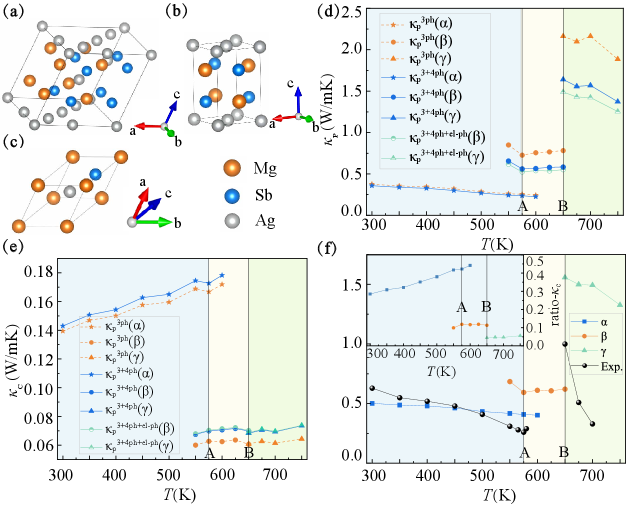
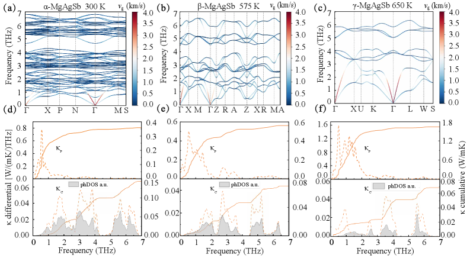
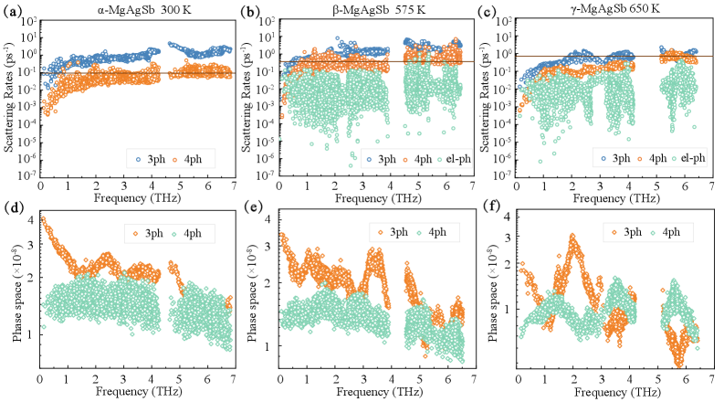
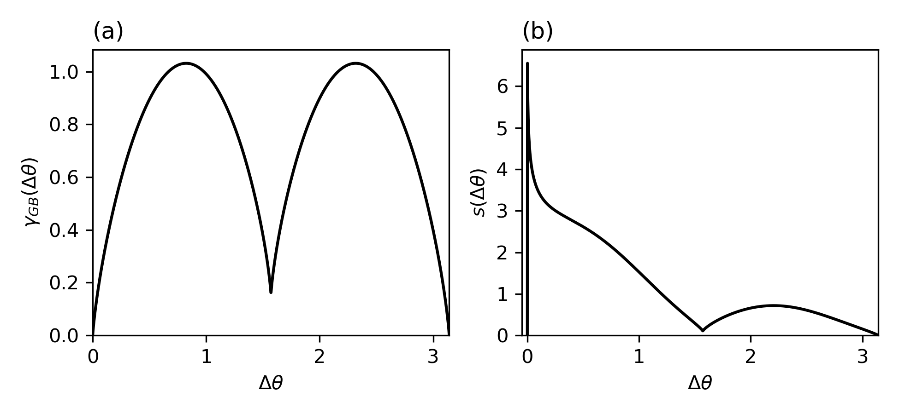
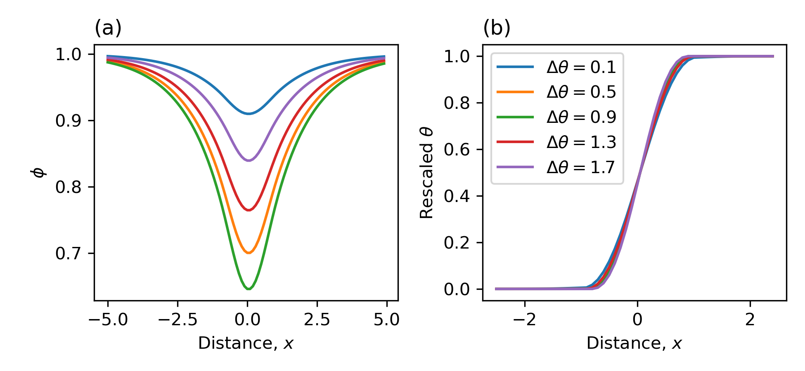
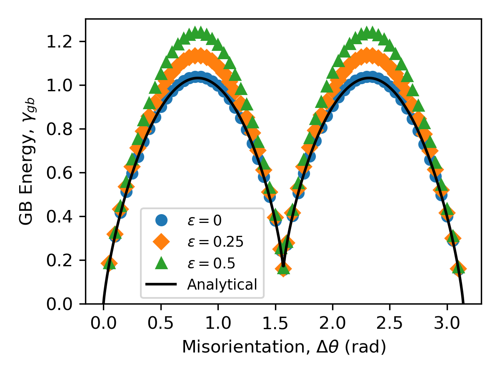
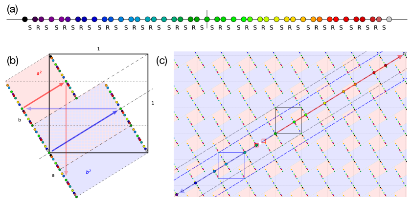
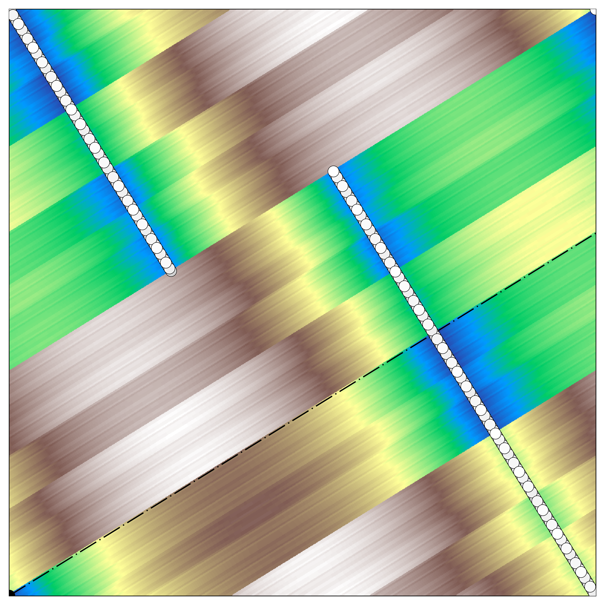
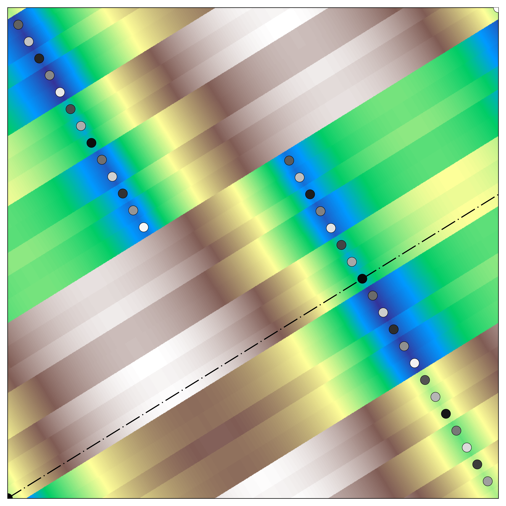

# 2026-03-17 計算材料科学

**作成日:** 2026-03-17
**対象期間:** 2026-03-14 〜 2026-03-17（直近72時間）

---

## 今日の選定方針

本日の10本は、電子-フォノン結合、格子熱伝導、位相場法、準結晶電子状態論という計算物質科学の中核的手法群を横断的にカバーする論文を中心に選定した。モアレ系・複雑結晶相・粒界という異なるスケールの構造問題に対して、第一原理から粗視化モデルまでの手法がどのように展開されているかを俯瞰できる構成となっている。機械学習を援用した逆設計、圧電ポリマーの量子核効果、HfO₂の強誘電性記述など、計算材料科学の最前線で議論されている問題系が揃っており、方法論開発と物性解明の両軸から分野の進展を読み取れる内容となっている。

---

## 全体所見

**計算手法の高度化と多スケール展開**
今期はフォノン輸送計算の精緻化が顕著なテーマである。MgAgSb の相転移をまたぐ格子熱伝導研究（2603.14213）は、AIMD/TDEP による多次の力定数抽出からShengBTE/Unified Wigner Transport Equationによる波動的・粒子的伝導の分離評価まで、最先端ツールチェーンを結合した体系的研究の好例である。同時に、モアレ材料における電子-フォノン結合を数千原子スケールで扱う実効ポテンシャル手法（2603.14800）は、第一原理の精度を保ちつつ系サイズの壁を乗り越える新しい方向性を示している。これらは計算コストと精度のトレードオフに対する現在進行形の試みを体現する。

**粒界・組織形成シミュレーションの理論的深化**
Staublin らの粒界エネルギー研究（2603.14660）は、Kobayashi-Warren-Carter モデルの根本的な限界を数学的に証明し、非局所方位差依存性の導入でそれを克服した点で方法論的に重要である。粒界エネルギーの方位角依存性は実験的に確立されているにもかかわらず、既存の位相場モデルではその再現が不可能であったという事実は、コミュニティへの根本的な警告となる。接触するように、Villani ら（2603.14472）の共役ポリマーにおける量子非調和核効果の研究は、圧電応答の巨大化機構を量子効果の観点から再解釈した点で独自性が高い。

**新規材料概念と逆設計手法の台頭**
準結晶向けの DFT++ 定式化（2603.14590）は、アプロキシマントを経由せずに直接準周期電子状態を計算する新しい理論基盤を構築しており、この分野の長年の課題に正面から挑む試みである。生成型逆設計による「冷金属」探索（2603.13920）や、CoS/CoSe モノレイヤーにおける電場誘起完全補償フェリ磁性（2603.14996）の予言は、計算科学が材料設計・機能発現の主導役となる流れを加速している。これら10本は、計算物質科学が実験的・理論的研究と連携しながら材料探索・物性解明・手法開発の三領域で同時に前進している現状を端的に示している。

---

## 重点論文一覧

1. [Predicting electron-phonon coupling and electronic transport at the moiré scale in twisted bilayer graphene](https://arxiv.org/abs/2603.14800) — Abramovitch, Bernardi
2. [Evolution of Phonon Transport Across Structural Phase Transitions in MgAgSb](https://arxiv.org/abs/2603.14213) — Shang, Wu, Liu, Zeng, Tang, Liu
3. [A phase field model with arbitrary misorientation dependence of grain boundary energy](https://arxiv.org/abs/2603.14660) — Staublin, Mishin, Voorhees
4. [Cut-and-Project Density Functional Theory for Quasicrystals](https://arxiv.org/abs/2603.14590) — Nop, Smith, Koschny, Paudyal
5. [Role of ionic quantum-anharmonic fluctuations on bond length alternation and giant piezoelectricity of conjugated polymers](https://arxiv.org/abs/2603.14472) — Villani, Monacelli, Barone, Mauri
6. [Decoding the Complexity of Ferroelectric Orthorhombic HfO₂: A Unified Mode Expansion Approach](https://arxiv.org/abs/2603.15162) — Yu, Zhang, Song, Liu, Kang
7. [Ab initio Transfer Length Method Simulations of Tunneling Limits in 2D Semiconductors](https://arxiv.org/abs/2603.14296) — Kim, Lee, Kim
8. [Generative Inverse Design of Cold Metals for Low-Power Electronics](https://arxiv.org/abs/2603.13920) — Wu et al.
9. [Ab Initio Study of Erbium Point Defects in 4H-SiC for Quantum Devices](https://arxiv.org/abs/2603.15343) — Kuban
10. [Electric-Field-induced Two-Dimensional Fully Compensated Ferrimagnetism and Emergent Transport Phenomena](https://arxiv.org/abs/2603.14996) — Li, Wang, Zhang, Li, Yang

---

# 重点論文の詳細解説

---

## 1. [Predicting electron-phonon coupling and electronic transport at the moiré scale in twisted bilayer graphene](https://arxiv.org/abs/2603.14800)

**著者:** David J. Abramovitch, Marco Bernardi
**arXiv ID:** 2603.14800
**カテゴリ:** cond-mat.mtrl-sci, physics.comp-ph
**公開日:** 2026-03-16
**論文タイプ:** 研究論文

---

### どんな研究か

モアレ材料における電子-フォノン結合と電気輸送特性を、数千原子規模のアトミスティックシミュレーションで再現するための実効ポテンシャル手法を開発した研究である。Holstein 型のオンサイト項と Peierls 型のホッピング項からなる実効電子-フォノン結合表式を第一原理 DFT/DFPT でパラメタライズし、ツイスト二層グラフェン（TBG）の電気抵抗率をツイスト角 1.6° まで系統的に計算した。実験データとの定量的一致を示しつつ、電子-フォノン結合強度のツイスト角依存性がフォノン散乱よりも電子状態密度の変化によって支配されることを明らかにした。

---

### 位置づけと意義

モアレ材料の輸送特性は実験的に活発に研究されているが、理論計算は系サイズの問題から大きく遅れていた。第一原理手法は数十原子の単位セルにしか適用できず、TBG のような数千原子系は射程外である。本研究は、DFT/DFPT で決定した電子-フォノン結合パラメータを実効タイトバインディングモデルに移植することで、精度を保ちながら系サイズの壁を突破する戦略を体系的に実証した。ゼロ磁場輸送に留まらず、モアレスーパーセルの電子状態の連続変化を追いながらフォノン散乱を評価するという計算フレームワークは、TBG 以外のモアレ系（TMD超格子等）へも直接展開可能であり、方法論としての波及性が高い。

---

### 研究の概要

**背景・目的**
TBGでは魔法角（約1.1°）近傍で平坦バンドが現れ、超伝導・絶縁体・強磁性体転移など多彩な相が観測されるが、そこでの格子振動散乱が輸送特性に与える影響の定量評価が計算上の難題となっていた。本研究の目的は、モアレ超格子（最大 5,044 原子）の電子-フォノン散乱をアトミスティックに記述し、実験に匹敵する精度で電気抵抗率を予測することである。

**計算科学上の課題設定**
フォノン結合の記述には、長距離 Peierls 項（ホッピング変調）の適切な取り扱いが不可欠である。従来の Keeley-Fradkin 型の定式化では TBG の大型ユニットセルに適用できないため、実効 Holstein-Peierls ポテンシャルの体系的な構築法の確立が課題となっていた。

**研究アプローチ**
単層グラフェンの DFT（LDA 汎関数）と DFPT によって計算した電子-フォノン行列要素を基底として、オンサイト項・最近接ホッピング項に分解し、原子変位に対するパラメータを最小二乗フィッティングで決定した。TBG への適用では、連続モデルで得た平坦バンド構造を用いてフォノン分散は周期境界条件下の Lennard-Jones 力場で求め、Boltzmann 輸送方程式（弛緩時間近似）で抵抗率を計算した。

**対象材料・現象**
単層グラフェン（検証）、TBG（ツイスト角 1.6° 〜 13.2°）、電気輸送（室温から 50 K まで）

**主な手法**
DFT（LDA）、DFPT、タイトバインディングモデル、Holstein-Peierls 型実効電子-フォノン結合ポテンシャル、Boltzmann 輸送方程式（弛緩時間近似）

**主な結果**
- 単層グラフェンの電気抵抗率（100〜300 K）が第一原理と定量的に一致
- TBG 2.0° の温度依存抵抗率が実験（Polshyn et al. 2019）と 100 K 以下で良好に一致
- ツイスト角を 13.2° から 1.6° に減少させると 100 K での抵抗率が約 2 桁増加
- 電子-フォノン結合強度 λ のツイスト角依存性は、フォノン分散よりも電子 DOS の変化が主要因

**著者の主張**
本手法はモアレ材料の電子-フォノン散乱・輸送特性の予測に向けたスケーラブルかつ精度の高いアトミスティックフレームワークを提供しており、マジック角以外のツイスト角での輸送実験と整合する。

---

### 計算物質科学として重要なポイント

- **対象現象:** モアレ超格子の電子-フォノン散乱、電気抵抗率の温度・充填率・ツイスト角依存性
- **手法の意味と妥当性:** DFT/DFPT でパラメタライズした実効 Holstein-Peierls モデルは、第一原理の精度を保ちつつ大規模系（5,044 原子）に適用できる。短距離クーロン（Holstein 項）と hopping 変調（Peierls 項）に分離した表式は物理的直観に合致する
- **計算条件の適切性:** TBG のフォノンには LJ 力場を用いており、系の複雑さとの整合が問われる。弛緩時間近似の適用は低温での impurity scattering を無視している点に注意
- **既存研究との差分:** 従来の連続体モデルは long-range phonon を無視し、完全 ab initio 計算は系サイズ制限があった。本手法はこの間隙を埋める
- **新規性:** 電子-フォノン結合を Holstein-Peierls 分解で体系的にアトミスティックモデルに移植し、モアレスーパーセルに適用した点
- **物理的解釈:** 平坦バンドにより電子 DOS が巨大化し、電子-フォノン散乱率が増大、抵抗率の大幅な増加をもたらす
- **波及可能性:** TMD モアレ系、ツイスト多層グラフェン、モアレ超格子全般へ拡張可能
- **材料設計・手法開発への寄与:** モアレ系の輸送デバイス設計と、大規模電子-フォノン計算の方法論基盤確立の両方に有益

---

### 限界と注意点

1. **フォノン記述の近似性:** TBG のフォノン分散を Lennard-Jones 力場で求めており、格子力定数の精度が第一原理計算に比べて劣る可能性がある。特に超軟モードや層間モードの定量精度は独立した検証が必要である。
2. **弛緩時間近似の適用範囲:** Boltzmann 方程式の弛緩時間近似は強い散乱・多体効果が顕著になる魔法角近傍では信頼性が低下する可能性があり、TBG の超伝導・強相関絶縁体相の記述には原理的に不十分である。
3. **実験比較の限定性:** 比較対象は特定の実験グループ（Polshyn et al. 2019）の限られたツイスト角・温度域のデータであり、モアレ系の多様な輸送特性（ヒステリシス、磁場効果など）との対応は未検討である。

---

### 研究動向における立ち位置と関連研究との比較

モアレ材料の計算研究は、連続体電子モデル（Bistritzer-MacDonald 2011）から実空間タイトバインディング（Nam-Koshino 2017 など）、さらに完全 ab initio（Zhang et al. 2019）へと精度を高めてきたが、いずれも格子振動との結合を本格的に扱う計算は困難であった。本研究は、電子-フォノン結合に特化した実効モデルの構築という手法上のニッチを埋める。同時期には Naik & Jain 2022 のように DeePMD を用いた TBG 動力学の研究も存在するが、輸送特性の定量計算という観点では本研究の方向性が先駆的である。新規性は increment-to-breakthrough の中間に位置し、分野の計算インフラとして広く引用されるポテンシャルがある。

---

### 関連キーワードの解説

1. **モアレ超格子 (moiré superlattice):** 2 枚の 2D 材料を微小角度でツイストして重ねると、周期の異なる格子の干渉によって nm〜μm スケールの超周期模様「モアレ」が生じ、これが電子の閉じ込めポテンシャルとなる。TBG では角度 1.1°（魔法角）で平坦バンドが現れ、コーパー対形成や強相関効果が顕在化する。
2. **Holstein-Peierls 電子-フォノン結合:** 電子-フォノン結合を「原子変位によるオンサイトエネルギーの変調（Holstein 項）」と「ホッピング積分の変調（Peierls 項）」に分解した記述。Holstein 項は局在的クーロン相互作用、Peierls 項は結合交互化を捉え、系の化学的性質に応じてどちらが主要かが変わる。
3. **Boltzmann 輸送方程式 (BTE):** 電子（またはフォノン）の分布関数の時間発展を外場・散乱の競合として記述する古典的方程式。弛緩時間近似（RTA）では散乱を単一の緩和時間 τ で近似し、電気伝導率 σ∝τ を解析的に求められる。量子補正や多体効果は捉えられない。
4. **DFPT（密度汎関数摂動論）:** 密度汎関数理論（DFT）に線形応答理論を組み合わせた手法で、フォノン分散・電子-フォノン行列要素・誘電関数などを第一原理から計算できる。直接法（力定数の有限差分）と比べて超格子構造が不要で高精度。
5. **弛緩時間近似 (RTA):** Boltzmann 方程式の散乱項を「平衡状態への緩和」として τ(k) という単一の時定数で近似する方法。物理的には電子（またはフォノン）が衝突後に即座に平衡分布へ向かうという仮定であり、計算コストを劇的に削減できる一方、強い異方性散乱や複数体散乱の効果は過剰に単純化される。

---

### 図

> **本論文のライセンスは arXiv.org 永久非独占ライセンスであり、CC ライセンスではないため、原図の引用はいたしません。** 以下に研究の要点を示す概念図を示します。

**[図1] ツイスト二層グラフェンのモアレ構造と電子-フォノン結合スキーム概念図**
単層グラフェン 2 枚を微小角度ツイストするとモアレ超周期が形成される。原子変位に伴うオンサイトエネルギー変調（Holstein 項）とホッピング変調（Peierls 項）が電子-フォノン散乱の主要チャネルとなる。

**[図2] ツイスト角依存の電子バンド構造と DOS の変化概念図**
ツイスト角が減少するにつれてバンド幅が狭くなり（平坦化）、フェルミ面近傍の状態密度が急増する。これが電子-フォノン結合強度 λ の増大と抵抗率の急上昇の原因となる。

**[図3] 電気抵抗率の温度依存性とツイスト角依存性の概念図**
高温では線形の温度依存性（フォノン散乱主導）を示し、低温では T → 0 に近づくにつれて残留抵抗に向かう。ツイスト角の減少に伴い、同じ温度での抵抗率が著しく増大する様子を模式的に表す。

---

## 2. [Evolution of Phonon Transport Across Structural Phase Transitions in MgAgSb](https://arxiv.org/abs/2603.14213)

**著者:** Luman Shang, Yu Wu, Yufan Liu, Shuming Zeng, Gang Tang, Chenhan Liu
**arXiv ID:** 2603.14213
**カテゴリ:** cond-mat.mtrl-sci
**公開日:** 2026-03-15
**論文タイプ:** 研究論文

---

### どんな研究か

熱電材料 MgAgSb の α・β・γ 三相にわたる格子熱伝導率（κL）の変化を、AIMD/TDEP による多次の力定数抽出と Unified Wigner Transport Equation（UWTE）による粒子的・波動的伝導の分離評価によって第一原理から系統的に解明した研究である。α相（複雑構造）→β相→γ相（単純立方）の相転移に伴い κL が単調増大し、その起源が各相でのフォノン散乱メカニズムの質的変化にあることを明示した。特に α 相では波動的（コヒーレント）フォノントンネリングが κL の 44% を担うという定量的知見は、複雑酸化物・熱電材料のフォノン工学に重要な指針を与える。

---

### 位置づけと意義

MgAgSb は α（室温）→β（586 K）→γ（630 K）と加熱とともに構造が単純化し、κL がそれに連動して変化する。このような相転移をまたぐフォノン輸送の変化を同一の第一原理フレームワークで定量追跡した研究は少なく、方法論的な前進を伴う事例研究として位置づけられる。また、四フォノン散乱（4ph scattering）の寄与を明示的に計算し、β・γ相でその効果が無視できないことを定量化した点は、近年注目される高次フォノン散乱の重要性を多相材料で検証した稀有な例である。さらに UWTE を通じた粒子的/波動的伝導の分離は、無秩序系・グラスライク輸送の描像を量子力学的に精密化する方向に沿っており、アモルファス熱電材料の設計にも視座を与える。

---

### 研究の概要

**背景・目的**
MgAgSb は低温（< 320 K）で優れた熱電特性（ZT ≈ 1.4）を示し、ウェアラブルデバイス等への応用が期待されているが、α→β→γ 三相の熱伝導変化の起源は定量的に未解明であった。本研究は三相の κL を第一原理計算で統一的に再現し、4ph 散乱・コヒーレントフォノントンネリングの相ごとの寄与を定量化することを目的とする。

**計算科学上の課題設定**
α相は複雑な構造（Wyckoff 位置が多い）のため MD・力定数計算の収束に困難が伴う。また 4ph 散乱率の計算は計算コストが 3ph の数十倍に上るため、その効率的なサンプリング（最大尤度法を利用）が技術的課題であった。

**研究アプローチ**
VASP（PBEsol 汎関数）による DFT、AIMD から TDEP（Temperature-Dependent Effective Potential 法）で 2〜4 次の力定数を抽出、ShengBTE で BTE を解く（3ph + 4ph 散乱）。さらに Unified Wigner Transport Equation で粒子的（incoherent）と波動的（coherent, κc）伝導に分離評価した。電子-フォノン散乱は EPW コード（Quantum ESPRESSO ベース）で評価し、全体への寄与を確認。

**対象材料・現象**
MgAgSb（α・β・γ 相）、格子熱伝導率の温度依存性、三フォノン・四フォノン散乱、コヒーレントフォノントンネリング

**主な手法**
DFT（VASP/PBEsol）、AIMD、TDEP（力定数抽出）、BTE（ShengBTE）、UWTE、EPW

**主な結果**
- κL は α < β < γ の順で増大（300 K で α: 約 1.5 W/mK、γ: 約 5 W/mK）
- 4ph 散乱は β・γ 相の κp をそれぞれ 22.8%・24.2% 低減
- α 相では κc が全 κL の 44.3% に達し、波動的伝導が支配的
- α 相の温度依存性は κL ∼ T^−0.33 と弱く、κc の温度上昇が κp 低下を部分的に補償
- 電子-フォノン散乱は全相で小さく（< 5% 寄与）、フォノン-フォノン散乱が主要

**著者の主張**
4ph 散乱とコヒーレントトンネリングの競合が MgAgSb の相ごとに異なる輸送機構を生み出しており、これが熱電性能に直結している。複雑構造相（α）ではコヒーレント寄与が大きく、熱伝導低減には構造無秩序化よりも格子対称性の低下が有効という含意がある。

---

### 計算物質科学として重要なポイント

- **対象現象:** 構造相転移をまたぐフォノン輸送、3ph/4ph 散乱競合、コヒーレントフォノントンネリング
- **手法の意味と妥当性:** TDEP は有限温度での実効力定数を取り込み、非調和性の強い系に適している。UWTE は従来の BTE（粒子的描像）を量子力学的に拡張し、コヒーレント寄与を定量評価できる点で先進的
- **計算条件の適切性:** スーパーセルサイズ・k メッシュ・カットオフ半径などの標準的収束テストの詳細は本文中で確認が必要。4ph 散乱の統計的サンプリング（3×10^5 サンプル）の十分性は著者が検証済みと主張しているが、複雑なα相での信頼性を独立に確認することが望ましい
- **既存研究との差分:** 単一相での 4ph 散乱計算は既存研究に存在するが、三相を統一計算枠組みで比較し UWTE まで適用した例は少ない
- **新規性:** 相転移をまたぐ UWTE ベースの粒子的/波動的フォノン輸送の系統的分離評価
- **物理的解釈:** α 相の構造複雑性がコヒーレントトンネリングを促進し、単純化した β・γ 相では 4ph 散乱が台頭する
- **波及可能性:** ハーフホイスラー、カルコゲナイド、ペロブスカイト型など相転移を持つ熱電材料全般へ展開可能
- **材料設計への効用:** 低κL 相の選択・安定化に向けた計算スクリーニングの基盤を提供

---

### 限界と注意点

1. **TDEP の有限温度近似:** AIMD から抽出する実効力定数は仮定として準調和近似の精度に依存する部分があり、強非調和性が著しい相（特にα相の低温側）での力定数の温度依存性の記述精度に限界がある。
2. **電子構造計算の精度:** PBEsol による DFT は通常の GGA であり、MgAgSb のような半金属的な電子構造に対してはバンドギャップの過小評価が生じる可能性があり、電子-フォノン散乱の定量精度に影響しうる。ただし著者は電子-フォノン寄与が小さいと主張しているため、全体的な結論への影響は限定的と考えられる。
3. **実験的検証の課題:** κL の実験値との比較は限定的であり、特に α 相の κc の定量値については独立した実験（ブリルアン散乱、ピコ秒音響学等）による検証が必要である。コヒーレントフォノントンネリングを直接観測した実験報告は現時点でほとんど存在しない。

---

### 研究動向における立ち位置と関連研究との比較

MgAgSb の熱電性能は Liu et al. (2012) の実験発見以来多くの研究を集めているが、計算面では主に 3ph 散乱ベースの評価にとどまっていた。近年 Xia et al. (2020) らが 4ph 散乱の重要性を一般化した系で指摘し、本研究はその知見を多相材料に適用した発展版として位置づけられる。UWTE の適用については Simoncelli et al. (2019/2023) によるグラスライク熱伝導の定式化を継承しており、これを熱電多相系に初めて適用した点に独自性がある。incremental から見ると手法の新規性は穏当だが、MgAgSb という重要熱電材料への系統的適用として参照価値が高く、同種材料の計算研究の標準的な手順書として引用されるだろう。

---

### 関連キーワードの解説

1. **TDEP（温度依存実効ポテンシャル法）:** 有限温度での AIMD から得たスナップショットを使い、実効的な調和・非調和力定数を統計的に抽出する手法。フォノンエネルギーや寿命を有限温度で計算でき、強い非調和性を持つ材料（ペロブスカイト、熱電材料）に特に有効。比較対象は quasi-harmonic 近似（QHA）や解析的 DFPT で、TDEP はより現実的な有限温度効果を捉える。
2. **四フォノン散乱 (4ph scattering):** フォノンの衝突過程 p1 + p2 → p3 + p4 または p1 → p2 + p3 + p4（Umklapp/Normal process）で起こる四体散乱。三フォノン散乱（3ph）に比べてオーダー1/N² で小さいが、軟フォノンが多い系や高温で無視できなくなる。BTE での計算コストは膨大で、サンプリング手法の開発が近年の課題。
3. **Unified Wigner Transport Equation（UWTE）:** 量子力学的な Wigner 分布関数に基づいてフォノン輸送を記述する方程式。古典的 BTE（粒子的、incoherent）に加え、異なるブランチ間の量子的コヒーレンス（波動的, coherent）から生まれる κc を評価できる。アモルファス・複雑結晶・ガラスライク材料の熱伝導を正しく記述するために近年広く使われ始めている。
4. **コヒーレントフォノントンネリング（coherent phonon tunneling）:** 隣接するフォノンモード間の量子的干渉・結合によって起こる熱エネルギー輸送機構。波パケット的な伝播として解釈され、通常の格子振動の粒子的散乱描像では捉えられない。複雑な単位セルを持つ結晶やアモルファス材料で大きな寄与を示す。
5. **熱電材料の ZT 値（性能指数）:** ZT = S²σT/κ（S: ゼーベック係数、σ: 電気伝導率、T: 温度、κ: 熱伝導率）で定義される無次元性能指数。ZT > 1 が実用化の目安とされる。κ の低減（フォノンエンジニアリング）と σ・S の最適化が材料設計の中心課題で、計算科学が大きな役割を担う。

---

### 図

> **本論文のライセンスは CC BY 4.0 です。**

**図1:** MgAgSb の α・β・γ 三相における格子熱伝導率（κL）の温度依存性の計算結果。3ph 散乱のみ（点線）と 3ph + 4ph 散乱（実線）の比較も含まれており、β・γ 相での四フォノン散乱の寄与を定量的に示す。相転移温度（α→β: 586 K、β→γ: 630 K）でのジャンプに相当する κL の変化が顕著に見られる。

**図2:** Unified Wigner Transport Equation（UWTE）による粒子的伝導（κp）と波動的伝導（κc）の分離評価結果。α 相では κc が全 κL の 44% に達し、複雑構造相においてコヒーレントフォノントンネリングが支配的な輸送機構を担うことを示す。波動的寄与の温度依存性が粒子的寄与とは逆の傾向を持つことが確認できる。

**図3:** α・β・γ 各相のフォノン分散関係と状態密度（PDOS）。α 相の複雑な単位セルに起因する多数のフォノン分枝が低周波数域で密集している様子、および β・γ 相での分散の単純化が明示されており、κc の起源となるフォノンモード間のコヒーレント結合が α 相で顕著である理由が直感的に理解できる。

---

## 3. [A phase field model with arbitrary misorientation dependence of grain boundary energy](https://arxiv.org/abs/2603.14660)

**著者:** Philip Staublin, Yuri Mishin, Peter W. Voorhees
**arXiv ID:** 2603.14660
**カテゴリ:** cond-mat.mtrl-sci
**公開日:** 2026-03-15
**論文タイプ:** 研究論文

---

### どんな研究か

粒界エネルギーが方位差角（misorientation angle）に対して任意の依存性（単調増大だけでなく減少やカスプ型も含む）を持てる拡張 Kobayashi-Warren-Carter（KWC）位相場モデルを開発した研究である。既存の KWC 型方位場モデルでは自由エネルギー汎関数の係数が局所勾配にしか依存できないため「粒界エネルギーの方位差角増加に伴う減少を再現できない」という根本的限界を数学的に証明し、非局所的方位差（粒界法線方向に一定距離離れた 2 点間の方位差）を係数に依存させることでこれを克服した。

---

### 位置づけと意義

粒界エネルギーの方位差依存性——特に特定角度（CSL 方位関係）での低エネルギーカスプや高角粒界でのプラトー——は金属・セラミック・半導体の微構造に直接影響し、粒成長・再結晶・焼結のシミュレーション精度を左右する中心的パラメータである。しかし既存の位相場モデルはこの依存性を正しく再現できないという欠陥を抱えており、実材料への適用精度を制限していた。本論文はこの欠陥の数学的根拠を初めて明確化し、非局所化という形で解決策を示した。計算コストの増加を最小限に抑えつつ 3 次元にも拡張可能で、原子シミュレーションから得た粒界エネルギーデータを直接取り込める枠組みは、多結晶材料シミュレーションの実用精度を大幅に高めるポテンシャルを持つ。

---

### 研究の概要

**背景・目的**
KWC モデルは方位場 θ(x) を持つ位相場モデルとして粒成長・粒界移動を記述する定番手法だが、粒界エネルギー γ(Δθ) が高角で減少する Read-Shockley 型や CSL カスプ型の形状を再現できないという問題が経験的に知られていた。本研究の目的は、この制限の理論的根拠を数学的に証明し、それを克服する拡張 KWC モデルを開発・実装することである。

**計算科学上の課題設定**
KWC 自由エネルギー汎関数において粒界エネルギーを決める係数 s(θ) と ε(θ) が局所量 |∇θ| のみに依存する場合、γ(Δθ) が単調増加にならざるを得ないことを変分・漸近解析で証明することが理論的課題。モデル拡張にあたっては「非局所性の導入による計算効率の悪化」と「正確な粒界法線方向の推定」が実装上の課題。

**研究アプローチ**
自由エネルギー汎関数の係数 s(Δθ) と ε(Δθ) を、粒界法線方向の固定距離 d での方位差 Δθ を用いて定義（非局所的方位差）。この計算は全格子点で法線を推定し、両側 d だけ離れた点から方位を補間することで実装。移動度抑制関数 P(ε|∇θ|) を導入して非物理的な粒子回転を防止。3 次元への拡張には四元数を用いた。数値実装は有限体積法（空間）と Runge-Kutta 4 次（時間）で行い、境界条件は周期境界。

**対象材料・現象**
2D/3D 多結晶粒成長シミュレーション、方位差依存粒界エネルギー・移動度

**主な手法**
位相場法（拡張 KWC モデル）、変分解析・漸近解析（理論部分）、有限体積法、Runge-Kutta 時間積分

**主な結果**
- 理論証明：勾配依存係数のみでは γ(Δθ) の減少は再現不可であることを数学的に示す
- 提案モデルは γ(Δθ) が Δθ = π/2 に鋭いカスプを持つ場合でも再現（誤差 < 1%）
- 粒界移動度 M(Δθ) が方位差増大とともに単調減少し、Δθ → 0 で発散する挙動を定量的に再現
- 3D 多結晶粒成長に拡張し、カスプ形 γ(Δθ) による特定粒界の安定化が粒成長速度に影響することを確認
- 非局所検索距離 d = 3 (30 ボクセル) が精度と効率のバランスとして妥当

**著者の主張**
本モデルは任意の γ(Δθ) 形状を位相場計算に反映できる初めての実用的手法であり、MD・実験から得られた粒界エネルギーデータベースとの統合が容易。

---

### 計算物質科学として重要なポイント

- **対象現象:** 多結晶粒成長、粒界エネルギーの方位差依存性、粒界移動度、CSL 粒界安定化
- **手法の意味と妥当性:** 非局所的方位差を係数に導入することで、変分原理に基づく KWC モデルの物理的整合性を保ちながら現実的な粒界エネルギーを記述できる。理論証明は既存モデルへの根拠ある批判として重要
- **計算条件の適切性:** 検索距離 d の選択が係数推定精度に影響するため、実材料適用には格子解像度・系サイズとの整合が必要。提案するデフォルト d = 3 は純粋な数値的検討に基づいており、実際の粒界幅との物理的対応はやや曖昧
- **既存研究との差分:** KWC モデル（Kobayashi et al. 2000）、Warren-Kobayashi-Lobkovsky-Carter（WKLC）等に対して、γ(Δθ) の表現能力を根本的に拡張
- **新規性:** 既存モデルの根本的制限の数学的証明 + 非局所方位差による回避という理論・実装両面での貢献
- **物理的解釈:** CSL 粒界（特定方位関係での低エネルギー粒界）の安定化が粒成長抑制に寄与するというメカニズムを初めて位相場モデルで定量化
- **波及可能性:** 焼結シミュレーション、再結晶モデリング、粒界偏析、核生成を含む幅広い微構造進化計算へ
- **材料設計・計算手法開発への寄与:** 原子スケールの MD 粒界エネルギーデータを直接取り込んだマルチスケール微構造シミュレーションの実現に直接貢献

---

### 限界と注意点

1. **非局所演算のコスト:** 全格子点で法線方向を推定し両側検索を行う実装は、通常の KWC に比べて計算コストが増加する。大規模 3D 多結晶シミュレーション（10^6 格子点以上）での実用性については示されておらず、高性能計算への実装最適化が必要である。
2. **方位差計算の安定性:** 粒界法線方向の推定は方位勾配 ∇θ から行うため、粒界幅・格子解像度が不十分な場合に法線方向が不安定化し、Δθ 計算に誤差が生じる可能性がある。特に三重点（triple junction）付近ではこの問題が顕著と考えられるが、本論文での詳細な検証はない。
3. **物理的入力データの精度依存性:** モデルの性能は入力する γ(Δθ) データの精度に直接依存する。MD シミュレーションや実験から得られる粒界エネルギーデータには材料・測定手法依存の不確かさがあり、特定材料への適用時にはその誤差がシミュレーション結果に伝播する。

---

### 研究動向における立ち位置と関連研究との比較

KWC 型位相場モデルは Kobayashi et al. (2000) 以来、方位場と秩序パラメータを組み合わせた多結晶シミュレーションの標準手法として広く使われてきたが、その γ(Δθ) 表現の限界は長年の既知の問題であった。Moelans らによる WKLC 拡張、Bhattacharya らの相場モデルなどが部分的な解決を試みてきたが、根本的な数学的証明と解決策の提示は本研究が初である。同時期には分子動力学に基づく粒界エネルギーデータベース（Homer et al. 2022 等）の整備が進んでおり、本研究のモデルとのシナジーが高い。新規性は方法論的に breakthrough の要素を持つが、実材料への広範な適用には追加検証が必要で、コミュニティへの浸透は段階的と予想される。金属・セラミック・半導体の粒成長・焼結研究コミュニティで幅広く参照される可能性がある。

---

### 関連キーワードの解説

1. **位相場法（phase-field method）:** 材料の内部界面（粒界、相界面、固液界面等）を拡散した秩序パラメータ場で表現し、その時間発展を変分原理に基づく方程式（Allen-Cahn 型・Cahn-Hilliard 型）で記述するシミュレーション手法。界面の陽的な追跡が不要なため、複雑な微構造進化計算に広く使われる。
2. **Kobayashi-Warren-Carter（KWC）モデル:** 方位角場 θ(x) と秩序パラメータ φ(x) を組み合わせた位相場モデルで、多結晶粒成長を記述する代表的手法。自由エネルギー汎関数の変分から粒界エネルギー・移動度・粒成長速度が導かれる。Kobayashi, Warren, Carter（2000）により提案。
3. **粒界エネルギーの方位差依存性 γ(Δθ):** 二つの隣接する結晶粒の方位差（misorientation angle Δθ）に対する粒界エネルギーの依存関係。低角粒界（Δθ 小）では Read-Shockley 式（γ ∝ Δθ log(Δθ)）で記述され、高角粒界ではほぼ一定になる。特定の方位関係（CSL: Coincidence Site Lattice）でエネルギーが下がる「カスプ」が現れ、特殊粒界の安定性と粒成長速度に大きく影響する。
4. **CSL（Coincidence Site Lattice）粒界:** 隣接する 2 つの結晶格子を重ね合わせた時に格子点が一致する割合（Σ値）が大きい特定の方位関係を持つ粒界。Σ3（ツイン境界）、Σ5、Σ7 などが代表例で、これらの粒界はエネルギーが低く（カスプ）、移動度が低く、特殊な物性（超伝導・強度等）を持つため材料設計上重要。
5. **非局所方位差（nonlocal misorientation）:** 粒界のある点から法線方向に有限距離 d 離れた 2 点間の結晶方位差。局所的な方位勾配 |∇θ| が粒界幅・方位差の双方に依存するのに対し、非局所量 Δθ は純粋に方位差のみを反映する。本研究では自由エネルギー係数をこの非局所量の関数とすることで、任意の γ(Δθ) 形状の再現を可能にした。

---

### 図

> **本論文のライセンスは CC BY 4.0 です。**

**図1:** 提案モデルにおける粒界エネルギー γ(Δθ)（黒線、Δθ = π/2 に鋭いカスプを持つ設定）と自由エネルギー係数 s(Δθ)（赤線）の関係。既存の勾配依存モデルでは再現できない単調減少する γ(Δθ) を、s(Δθ) を方位差の関数とすることで設計できることを示す。この入力関数がモデルの挙動を決定する主要パラメータとなる。

**図2:** 異なる方位差 Δθ における平衡粒界プロファイル（秩序パラメータ φ と方位角場 θ）の計算結果。φ の最小値が方位差 Δθ ではなく粒界エネルギー γ(Δθ) によって決まることが見て取れ、提案モデルが所望の粒界エネルギー関係を忠実に再現していることを実証する。これは既存モデルの挙動との本質的な違いを示す図として重要。

**図3:** 提案モデルによる粒界縮退シミュレーション（shrinking grain 法）から計算された粒界エネルギー γ（点）と入力した目標関数（実線）の比較。カスプを含む複雑な γ(Δθ) 形状に対して、提案モデルが 1% 以内の高精度で一致することを定量的に示し、モデルの有効性を検証する。

---

# その他の重要論文

---

## 4. [Cut-and-Project Density Functional Theory for Quasicrystals](https://arxiv.org/abs/2603.14590)

**著者:** Gavin N. Nop, Jonathan D. H. Smith, Thomas Koschny, Durga Paudyal
**arXiv ID:** 2603.14590
**カテゴリ:** cond-mat.mtrl-sci, cond-mat.other, math-ph
**公開日:** 2026-03-15
**論文タイプ:** 理論論文

---

### 研究概要

準結晶（quasicrystal）は長距離秩序を持ちながら周期性を欠く独特の構造であり、従来の DFT はブロッホの定理を基盤とするため直接適用が不可能で、周期性を持つ近似結晶（アプロキシマント）を代理として使う方法が取られてきた。本研究は、高次元空間から物理空間へ射影する「カット・アンド・プロジェクト（C+P）」幾何学と密度汎関数理論を融合した DFT++ 定式化を開発し、アプロキシマントを経由せずに準結晶の電子状態・状態密度を直接計算する方法論を確立した。フィボナッチ準結晶を用いた実証計算では、高次元空間での電子密度を自由パラメータとして扱う Lagrangian 定式化により、準周期ポテンシャル下の量子状態を精密に計算できることを示した。

この研究の重要性は、電子・フォノン・マグノン・フォトニック系に等しく適用可能な汎用的な理論基盤を確立した点にある。アプロキシマント系列の収束問題——高次アプロキシマントで計算結果が収束しない問題——を C+P 法によって解消できることも数学的に示されており、準結晶の電子状態・トポロジー・輸送特性の第一原理予測への扉を開く。計算物質科学としては、「長年の方法論的空白を埋める理論論文」として位置づけられ、準結晶研究コミュニティへの波及性が高い。

---

### 関連キーワードの解説

**準結晶 (quasicrystal):** 1984 年に Shechtman らが発見した、通常の結晶には存在しない 5 回（12 回）回転対称性を持つ物質。周期性はないが確定的な長距離秩序（準周期秩序）を持つ。電子状態はブロッホ波でなく「クリティカル」な自己相似波動関数を持ち、非慣習的な輸送特性を示す。Al-Mn 合金（Shechtman の発見系）が最初の例。**カット・アンド・プロジェクト法 (cut-and-project method):** 準結晶の構造を高次元の超格子（たとえばフィボナッチ準結晶なら 2D 正方格子）を適切な角度で傾けた平面で切ったときの断面として記述する数学的手法。射影方向のとり方で準結晶の種類（黄金比型・白銀比型等）が決まる。これにより準周期構造の数学的性質を高次元の周期構造の言葉で表現できる。**アプロキシマント (approximant):** 準結晶の方位関係を有理数で近似した周期結晶。例えばフィボナッチ準結晶に対しては 1/1、2/1、3/2、5/3... という連分数近似（フィボナッチ数列比）から得られるアプロキシマント系列が存在し、次数を上げるにつれて真の準結晶に近づく。DFT の適用のためにこれまで広く使われてきた代理手段。**DFT++ 定式化:** 通常の Kohn-Sham DFT を拡張し、電子密度を Lagrangian の自由パラメータとして扱う定式化。Euler-Lagrange 方程式が Kohn-Sham 方程式を一般化した形となり、周期性の仮定なしに変分原理が適用できる。本研究では C+P 幾何学と組み合わせることで準結晶への DFT 適用を可能にした。**局在化手続き (localization procedure):** 高次元空間で記述された差分方程式（シュレーディンガー方程式等）を変数分離で解き、解を物理空間に射影する手順。本研究が開発した中核技術で、超格子の周期性を利用しつつ物理空間への局在化を保証することで、準結晶の実効ポテンシャル構築を可能にする。

---

### 図

> **本論文のライセンスは CC BY 4.0 です。**

**図1:** フィボナッチ準結晶の構成法を物理空間（1D 準周期列）と高次元空間（2D 正方格子上の切断帯）の双方で示す概略図。C+P 法の基本操作——高次元格子点を物理空間への投影で選択する——を視覚的に説明しており、本手法の幾何学的直観を与える。

**図2:** Fibonacci 13 次アプロキシマント（傾き 13/21）の C+P 表現と原子ポテンシャル。高次アプロキシマントが準結晶ポテンシャルへいかに収束するかを示し、本手法がアプロキシマント系列の収束問題を解決できることを支持するデータとなっている。

**図3:** Fibonacci 13 次アプロキシマント（傾き 3/5）の C+P 表現。図2と同一次数の異なる傾きによるアプロキシマントとの比較から、射影方向の選択が準結晶ポテンシャルの再現精度にどのように影響するかを定量的に検討できる。本研究の局在化手続きの有効性を検証する重要な補助データ。

---

## 5. [Role of ionic quantum-anharmonic fluctuations on bond length alternation and giant piezoelectricity of conjugated polymers](https://arxiv.org/abs/2603.14472)

**著者:** Stefano Paolo Villani, Lorenzo Monacelli, Paolo Barone, Francesco Mauri
**arXiv ID:** 2603.14472
**カテゴリ:** cond-mat.mtrl-sci, cond-mat.other
**公開日:** 2026-03-15
**論文タイプ:** 研究論文

---

### 研究概要

共役ポリマー（特に carbyne 類似系）において、格子の量子的・非調和的核揺らぎが結合長交互化（bond length alternation, BLA）と巨大圧電係数に与える影響を、Rice-Mele 鎖モデルと第一原理計算を組み合わせて定量評価した研究である。Stochastic Self-Consistent Harmonic Approximation（SSCHA）と第一原理計算を組み合わせることで、量子核効果が BLA の「相境界」を古典的予測から約 1/3 ほど強結合側にシフトさせることを示した。量子揺らぎが圧電応答を損なうと懸念されていたが、実際にはトポロジカルな有効電荷の増強（約 20% 向上）により圧電係数が維持または強化されることが明らかとなった。

このような量子非調和核効果の計算は Born-Oppenheimer 近似の枠内では扱えず、SSCHA のような変分手法が必要である。共役ポリマーは圧電性・電子輸送の両面で応用が期待されているが、計算設計の精度には量子核効果の正確な評価が不可欠であることを示した。計算物質科学的には、「古典的調和近似が誤解を与える可能性のある物性」の典型例として、SSCHA の適用価値を有機・分子性結晶系でも実証した貢献がある。圧電係数の形態的（morphotropic）挙動——相境界近傍での極大——が量子効果で再較正されることは、ポリマー圧電材料の実験的最適化に新しい設計指針を与える。

---

### 関連キーワードの解説

**結合長交互化（bond length alternation, BLA）:** ポリアセチレンや carbyne のような共役鎖において、単結合・二重結合が交互に並ぶ（二量化した）構造での単/二重結合長差 δ = d₁ − d₂ のこと。BLA > 0 の位相と BLA < 0 の位相の間の相境界はトポロジカルな特性をもち、BLA = 0 になる点（Su-Schrieffer-Heeger ゼロ点）は金属的ギャップレス状態に対応する。圧電応答はこの相境界近傍で最大化する（morphotropic-like 挙動）。**Stochastic Self-Consistent Harmonic Approximation（SSCHA）:** 量子核効果（ゼロ点振動・トンネリング）と非調和性を同時に扱う変分的核量子力学手法。調和ポテンシャルのパラメータを自己無撞着に最適化し、ランダムサンプリング（確率的手法）で自由エネルギーとその微分（力・二次微分）を計算する。核の質量が軽い（H、Li）系や、相転移近傍の柔らかいモード（圧電材料等）に特に重要。**トポロジカル有効電荷（topological Born effective charge）:** 格子変位に対する分極変化として定義される Born 有効電荷 Z* の中で、バンドトポロジー（Berry 位相）から来る寄与。通常の有効電荷に比べて符号や大きさが異なる場合があり、ゾーン境界でのバンドパリティ反転と関連する。本研究では量子揺らぎによる電子ギャップ縮小がトポロジカル有効電荷を増大させ、圧電応答を増強する。**Rice-Mele モデル:** ホッピング積分の交互化（dimerization）とオンサイトエネルギーの交互化を含む 1D 格子模型で、ポリアセチレンや共役ポリマーの最低次モデルとして広く使われる。Su-Schrieffer-Heeger（SSH）モデルに Peierls-Nabarro 型のオンサイト項を加えた拡張版で、Berry 位相・電気分極・圧電性の教科書的模型でもある。**形態的圧電挙動（morphotropic-like behavior）:** 圧電セラミックス（PZT 等）で知られる「相境界（morphotropic phase boundary）近傍で圧電係数が最大化する」現象に類似した挙動。BLA = 0 の相境界近傍では格子が「柔らかく」なり（soft mode）、外部ひずみに対する電気分極変化（圧電定数 e₃₃）が極大化する。共役ポリマーでもこの挙動が現れることを本研究は量子核効果のレベルで実証した。

> **本論文のライセンスは CC BY 4.0 ですが、HTML 版が提供されていないため原図の抽出はできませんでした。**

---

## 6. [Decoding the Complexity of Ferroelectric Orthorhombic HfO₂: A Unified Mode Expansion Approach](https://arxiv.org/abs/2603.15162)

**著者:** Chenxi Yu, Jiajia Zhang, Xujin Song, Fei Liu, Jinfeng Kang（北京大学）
**arXiv ID:** 2603.15162
**カテゴリ:** cond-mat.mtrl-sci
**公開日:** 2026-03-16
**論文タイプ:** 研究論文

---

### 研究概要

強誘電体 HfO₂（直方晶 OIII 相）の相安定性・ドメイン壁・分極反転機構を、立方晶フォノンモードの線形結合として原子変位を表現する「統一モード展開」フレームワークで解析した研究である。HfO₂ の強誘電性は薄膜デバイスへの応用（FeRAM、FeFET）で極めて重要だが、その複雑な結晶化学（多数の準安定相、薄膜拘束効果）が理論的理解を困難にしていた。本研究は、DFT（VASP）によるフォノン計算で得たモード振幅を自由パラメータとし、4 次の多項式エネルギー汎関数で相安定性・ドメイン壁・スイッチングパスを統一的に記述する。

主な成果として、(1) OIII 相安定性はモード間相互作用とひずみ-モード結合が主要因であることの解明、(2) 108 種の構造的に異なるドメイン壁の分類と安定性マップの作成、(3) 5 種類の分極反転経路（バリア 12.6〜37.0 eV/原子）の同定を達成した。特に Q₁ モード（分極モード）の連続性が反転バリアを左右するという発見は、低バリア経路設計の指針となる。計算物質科学的には、強誘電体の複雑さを高次元自由エネルギー曲面の探索問題として定式化し、DFT 精度の NEB 計算・フォノン解析・対称性解析を統合したフレームワークとして参照価値が高い。フェロ電気分野で必要な「薄膜拘束・ドーピング・欠陥」への拡張も枠組み上は直接的である。

---

### 関連キーワードの解説

**強誘電体 HfO₂（ferroelectric hafnium oxide）:** 従来 HfO₂ は常誘電体として扱われていたが、2011 年以降の薄膜研究（Böscke et al.）で Si ドープ薄膜が強誘電性を示すことが発見された。直方晶（Pca2₁）OIII 相が強誘電体相に対応し、その安定化は薄膜拘束・ドーパント・界面効果に大きく依存する。既存の強誘電体（PZT 等）に比べてシリコンプロセスに適合するため次世代 FeRAM・FeFET への応用が期待される。**フォノンモード展開（phonon mode expansion）:** 原子変位ベクトルを高対称相（立方晶 Fm3̄m）のフォノン固有ベクトルの線形結合として表現する解析手法。低対称相の原子配置を「どのフォノンモードの凍結（静止変位）で記述されるか」という観点から分析でき、相安定性・ドメイン壁・相転移経路の物理的解釈が容易になる。PZT や BaTiO₃ で広く使われてきた手法を HfO₂ に適用。**ドメイン壁（domain wall）:** 強誘電体・磁性体内で、自発分極（または磁化）の向きが異なる 2 つのドメインが接する界面。エネルギーコスト（壁エネルギー）と分極方向の連続性条件から、特定の結晶面に沿った特定の壁型が安定化する。HfO₂ では多数の準安定相が絡み合い、108 種類の構造的に異なる壁が存在するという複雑さを持つ。**Nudged Elastic Band（NEB）法:** 二状態間の最小エネルギー経路（MEP）と遷移状態（鞍点）を求める計算手法。反応座標に沿った「イメージ」を弾性バネで繋ぐことで MEP を探索し、活性化エネルギー（バリア）を計算する。分極反転バリアの計算に広く使われ、デバイス特性（保持時間・コーシバ電場）の第一原理予測に直結する。**Pca2₁（直方晶 OIII 相）:** HfO₂ の強誘電相に対応する空間群（点群 mm2）。非中心対称構造のため自発分極を持ち、外部電場で分極反転が可能な強誘電性を発現する。立方晶（Fm3̄m）からの対称性破れは Q₁（Γ15 反強誘電型）と Q₂（X 点）モードの凍結で記述される。

> **本論文のライセンスは arXiv.org 永久非独占ライセンスであり、CC ライセンスではないため、原図の引用はいたしません。**

---

## 7. [Ab initio Transfer Length Method Simulations of Tunneling Limits in 2D Semiconductors](https://arxiv.org/abs/2603.14296)

**著者:** Tae Hyung Kim, Juho Lee, Yong-Hoon Kim
**arXiv ID:** 2603.14296
**カテゴリ:** cond-mat.mes-hall, cond-mat.mtrl-sci
**公開日:** 2026-03-15
**論文タイプ:** 研究論文

---

### 研究概要

2D 半導体（MoS₂ モノレイヤー）と金属電極（Sc、Ag、Au、Pd）の界面コンタクト抵抗の下限をチャネル長さ依存で定量化するため、DFT ベースの ab initio Transfer Length Method（ab initio TLM）フレームワークを開発した研究である。TLM は実験的にコンタクト抵抗を評価する標準手法だが、従来は経験的パラメータに依存していた。本研究はこれを完全 DFT ベースで実装し、チャネル長さが 10 nm 以下でトンネル支配（Ohmic コンタクト側）、長チャネルではサーミオニック放出支配という遷移を明確に示した。この遷移長さが「真のコンタクト品質評価指標」となり、n 型は低仕事関数金属（Sc）、p 型は高仕事関数金属（Pd/Au）が最適という設計指針を提供する。

計算物質科学的には、非平衡グリーン関数（NEGF）と DFT を結合した輸送計算を TLM に組み込んだ方法論の確立として重要で、2D 材料トランジスタの第一原理デバイスシミュレーションの実用化に向けた一歩を示す。MoS₂ 以外の TMD や h-BN、グラフェンへの拡張も直接的で、実験の TLM 測定との直接比較が可能な計算インフラを整備した点で今後多く参照されるだろう。

---

### 関連キーワードの解説

**Transfer Length Method（TLM）:** 金属/半導体コンタクトのコンタクト抵抗 R_c とシート抵抗 R_sh を、異なる電極間隔での 4 端子抵抗測定から分離する実験手法。2D 材料では超薄膜に対応した修正 TLM が必要で、トンネル電流とサーミオニック放出の競合が問題となる。**コンタクト抵抗（contact resistance）:** 金属と半導体の接合（コンタクト）での電流注入に伴うエネルギー損失を抵抗として表したもの（単位：Ω·μm）。次世代トランジスタでは 10 Ω·μm 以下が必要とされ、これは界面電子構造（Schottky 障壁高さ・界面ダイポール・軌道整合）の第一原理計算が直接的な設計情報を提供する領域。**NEGF-DFT（非平衡グリーン関数−密度汎関数理論）:** デバイスの電子輸送を量子力学的に記述するフレームワーク。電極を半無限結晶として扱い、チャネル領域の非平衡電子分布を NEGF で、電子構造を DFT で自己無撞着に計算する。Landauer-Büttiker 公式を通じて電流-電圧特性を第一原理から予測できる。**Schottky 障壁（Schottky barrier）:** 金属/半導体界面で生じる電荷輸送を妨げるエネルギー障壁 Φ_B。金属の仕事関数と半導体の電子親和力の差から决まる（Schottky-Mott 則）が、界面ダイポール・ピニング効果により現実には大きく修正される。2D 材料では層厚が原子 1 枚のため、界面の影響が特に顕著。**van der Waals 接触（vdW contact）:** 金属電極と 2D 半導体が化学結合（共有結合・イオン結合）ではなく van der Waals 力で接触する界面型。軌道混成が小さく、原子種に依存した強い化学界面反応を回避できるため、均一で再現性高い界面が形成されやすい。ただし電荷移動がトンネリング的になるため、コンタクト抵抗はトンネル確率で決まる。

> **本論文のライセンスは CC BY 4.0 ですが、HTML 版が提供されていないため原図の抽出はできませんでした。**

---

## 8. [Generative Inverse Design of Cold Metals for Low-Power Electronics](https://arxiv.org/abs/2603.13920)

**著者:** Kedeng Wu, Yucheng Zhu, Yan Chen, Bizhu Zhang, Shuyu Liu, Xiaobin Deng, Yabei Wu, Liangliang Zhu, Hang Xiao
**arXiv ID:** 2603.13920
**カテゴリ:** cond-mat.mtrl-sci, cs.LG
**公開日:** 2026-03-14
**論文タイプ:** 研究論文

---

### 研究概要

フェルミエネルギー近傍に 50〜500 meV の小バンドギャップ（または疑似ギャップ）を持つ「冷金属（cold metal）」と呼ばれる材料群を、条件付き自己回帰トランスフォーマー（MatterGPT）を用いた生成型逆設計ワークフローで大規模探索した研究である。26,309 個の金属構造を学習データとし、148,506 個の候補構造を生成、フィルタリングと DFT 検証（Materials Project 互換パラメータ）を経て 257 個の新規冷金属候補を同定した。生成構造の 92.1% が 3D 構造として再現可能であり、従来の高スループットスクリーニング（既知データベース探索）を超えた化学空間の探索が可能であることを示した。

計算物質科学的には、生成 AI（MatterGPT/SLICES 線形インコーディング）と DFT 検証を組み合わせた「generate-and-screen」パイプラインの実装事例として価値が高い。冷金属は電子デバイスにおけるドレイン電流リーク（スタンバイ電力）の低減に有効とされ、これまで系統的な材料探索が困難だったため、計算による候補材料リストの提供は材料設計上の貢献がある。一方で、DFT 検証はバンドギャップ・安定性の基本的な評価のみで、実際のデバイス特性（移動度、ドープ可能性、界面適合性）との関連は未評価であり、追加スクリーニングが必要な段階である。

---

### 関連キーワードの解説

**冷金属（cold metal）:** フェルミエネルギー近傍 kBT 程度（メタリックギャップ < kBT）の小バンドギャップまたは電子状態密度の急激な低下（擬似ギャップ）を持つ材料。真の半導体よりもキャリア散乱が少なく、電子デバイスにおける leakage current の低減と低電圧動作に有利とされ、次世代低消費電力エレクトロニクスの候補材料として注目されている。**MatterGPT / SLICES:** SLICES（Simplified Line-Input Crystal Encoding System）は結晶構造を 1 次元の文字列として表現するエンコーディング形式。GPT スタイルのトランスフォーマーをこの文字列で訓練することで、新規構造を「生成」できる（MatterGPT）。「バンドギャップ条件付き生成」のように目標特性を条件として与えると、その条件を満たす構造を大量サンプリングできる。**生成型逆設計（generative inverse design）:** 目標特性から出発して材料構造・組成を設計する逆問題アプローチ。従来の順問題（構造→特性予測）と逆に、生成モデル（VAE、GAN、Transformer 等）で構造空間を探索する。高スループットスクリーニング（既知データベースから選ぶ）と異なり、未発見の化学空間を積極的に探索できる。**Generate-and-Screen パイプライン:** 生成モデルで大量の候補構造を生成し、段階的なフィルタリング（化学的安定性、構造妥当性、DFT 計算検証等）で絞り込むワークフロー。Materials Project 等のデータベース構築にも類似の概念が使われており、AI と第一原理計算の組み合わせによる材料探索加速の標準的枠組みとなりつつある。**バンドギャップエンジニアリング（bandgap engineering）:** 合金組成・構造変化・ひずみ・界面設計によって材料のバンドギャップを意図的に制御する材料設計手法。太陽電池・LED・トランジスタなど半導体デバイスの性能は直接バンドギャップ幅と電子構造に依存するため、計算による精密なバンドギャップ予測（ハイブリッド汎関数・GW 近似等）が材料選定の要になる。

> **本論文のライセンスは CC BY 4.0 ですが、HTML 版が提供されていないため原図の抽出はできませんでした。**

---

## 9. [Ab Initio Study of Erbium Point Defects in 4H-SiC for Quantum Devices](https://arxiv.org/abs/2603.15343)

**著者:** Michael Kuban
**arXiv ID:** 2603.15343
**カテゴリ:** quant-ph, physics.comp-ph
**公開日:** 2026-03-16
**論文タイプ:** 研究論文

---

### 研究概要

量子情報技術（量子通信・単光子源）への応用が期待される 4H-SiC 中のエルビウム（Er）点欠陥の電子構造を、DFT（ABINIT、GGA + Hubbard U 補正）を用いて第一原理から計算した研究である。Er は 1.54 μm 付近（光通信波長）での発光中心として注目されており、SiC はシリコンプロセス適合性から有力な母材である。4 種類の Er 欠陥配置（六方晶・擬立方サイトでの置換型、Er-空孔複合体）の形成エネルギー・バンド構造・状態密度を比較し、Er-空孔複合体（ErhV, ErkV）がバンドギャップ深くに欠陥準位を形成し量子技術応用に最も適していることを示した。

ただし、計算で得られた欠陥準位のエネルギーギャップ（1.06〜2.22 eV）は実験値（約 0.8 eV）と一致せず、これは 4f 電子に対する GGA+U 近似の限界（過少評価または過大評価）によるものと著者は認識している。計算物質科学的には、希土類の 4f 電子を含む欠陥計算の方法論的課題（GW、DFT+U、DMFT の必要性）を改めて提示した研究として位置づけられる。量子エミッタ材料の第一原理スクリーニングという文脈での体系的な基礎データとして参照価値がある。

---

### 関連キーワードの解説

**点欠陥（point defect）:** 結晶中の原子が欠損（空孔）、余剰（格子間原子）、または置換された局所的な格子欠陥。半導体中の点欠陥はバンドギャップ内に離散的なエネルギー準位（欠陥準位）を形成し、これが単光子発光・スピン操作・電荷トラップ等の量子的機能の起源となる。ダイヤモンドの NV センターが最も著名な例。**DFT + ハバード U 補正（DFT+U）:** 局在した d・f 電子のクーロン反発（Hubbard U）を補正パラメータとして通常の LDA/GGA に追加する手法。GGA が過剰に非局在化する傾向（自己相互作用誤差）を補正し、遷移金属・希土類の電子構造をより正確に記述する。Hubbard パラメータ U の値選定が結果を大きく左右し、系統的な第一原理的 U 決定が課題。**4f 電子系の計算困難性:** ランタノイドの 4f 電子は強く局在し、高いクーロン相関エネルギーを持つため、DFT や DFT+U の精度が不十分になりやすい。より精密な扱いには GW 近似・DMFT（動的平均場理論）・量子化学手法（CI、CASSCF）が必要で、これらは計算コストが非常に大きい。**4H-SiC（4H-炭化ケイ素）:** 炭化ケイ素の多形の一つで、六方晶ウルツァイト型の積層配列 ABCB... を持つ半導体（バンドギャップ 3.26 eV）。SiN 欠陥が単光子発光・スピン量子ビットの候補として活発に研究されており、成熟した半導体製造技術との適合性からダイヤモンドの代替量子プラットフォームとして注目される。**形成エネルギー（formation energy）:** 欠陥を結晶中に形成するのに必要なエネルギー。化学ポテンシャル（原子の供給源となる熱力学的環境）とフェルミエネルギーの関数として表され、どの欠陥が熱力学的に安定かを定量化する。実験的な成長・注入条件と計算条件を対応づけることで、観測される欠陥種の同定に使われる。

> **本論文のライセンスは arXiv.org 永久非独占ライセンスであり、CC ライセンスではないため、原図の引用はいたしません。**

---

## 10. [Electric-Field-induced Two-Dimensional Fully Compensated Ferrimagnetism and Emergent Transport Phenomena](https://arxiv.org/abs/2603.14996)

**著者:** Jin-Yang Li, Yong-Kun Wang, Ying Zhang, Si Li, Wen-Li Yang
**arXiv ID:** 2603.14996
**カテゴリ:** cond-mat.mtrl-sci
**公開日:** 2026-03-16
**論文タイプ:** 研究論文

---

### 研究概要

単層 CoS および CoSe が持つ反強磁性基底状態（PT 対称により保護されたスピン縮退バンド）に対して、面外電場を印加することで PT 対称を破り「完全補償フェリ磁性（fully compensated ferrimagnetism, fFIM）」状態へ誘起できることを第一原理計算で予言した研究である。DFT（VASP）によるバンド構造・フォノン計算・AIMD と、Monte Carlo によるネール温度評価を組み合わせた包括的な計算を行い、電場 0.1〜0.3 V/Å の印加で半金属的スピン分裂が誘起され、巨大な異常ホール伝導度・磁気光学カー回転角を示すことを明らかにした。特に CoS では 0.3 V/Å で半導体から金属への転移を伴うスピン分極電流が現れる。

計算物質科学的には、対称性解析（PT 対称破れ）・バンドトポロジー（Berry 曲率計算）・輸送特性（Kubo-Greenwood 公式）・磁気光学（カー・ファラデー効果）を統一的に扱った研究として方法論的に完成度が高い。外場チューナブルな磁性・トポロジカル輸送という材料概念の計算提案は、電場制御スピントロニクスデバイスの設計に向けた理論基盤を与える。ネール温度（約 400 K）が室温を超えることも実用上の重要ポイントで、実験合成・電場印加の実証が今後の焦点となる。

---

### 関連キーワードの解説

**完全補償フェリ磁性（fully compensated ferrimagnetism, fFIM）:** 反強磁性と強磁性の中間的磁気秩序で、2 つのサブラティス（格子）のスピンが大きさは等しく逆向きで補償されながら（正味磁化ゼロ）、バンド構造に対して時間反転対称性が破れているためスピン縮退が解かれた状態。これにより正味磁化ゼロのまま異常ホール効果・スピン分極電流が現れるという独自の輸送特性を持つ。altermagnet（交替磁性体）とも呼ばれる概念と関連する。**PT 対称（空間反転・時間反転複合対称性）:** 空間反転操作 P と時間反転操作 T の積で表される対称操作。PT 対称が保存されると、全波数 k でバンドのスピン縮退が保たれる。CoS/CoSe の反強磁性基底状態はこれに守られてスピン分裂がゼロだが、外場によって対称性が破られると縮退が解かれスピン分裂バンドが現れる。**Berry 曲率（Berry curvature）と異常ホール効果:** Berry 曲率 Ω(k) はブリルアンゾーン内でのブロッホ波動関数の位相の「曲率」に相当するトポロジカル量で、異常ホール伝導度 σ_xy = (e²/ℏ)∫Ω(k)dk として実験可能。磁性金属・半金属での大きな σ_xy は、スピン電流の生成やスピントロニクスデバイスへの応用で重要。**磁気光学カー効果（magneto-optical Kerr effect）:** 磁性体表面に直線偏光した光を当てると、反射後の偏光面が回転する現象（カー回転角 θ_K）。スピン分極した電子バンドと光の相互作用で生じ、カー回転角の大きさは磁性の大小・バンド構造に依存する。電場で磁気状態をスイッチできる本材料では電場制御可能な光学応答として応用が期待される。**モンテカルロ法によるネール温度評価:** ハイゼンベルクスピンモデル（J1, J2 等の磁気交換定数を DFT から抽出）を用い、温度を変化させながら確率的なスピンフリップを繰り返してネール転移温度（反強磁性→常磁性の転移点 T_N）を統計力学的に求める手法。ミーンフィールド近似より精度が高く、低次元系（2D 材料）の熱揺らぎの効果を適切に取り込める。

> **本論文のライセンスは arXiv.org 永久非独占ライセンスであり、CC ライセンスではないため、原図の引用はいたしません。**

---

# 全体のまとめ

## 計算物質科学分野の動向

今期の10本を俯瞰すると、フォノン計算の高度化が引き続き中心的テーマとして存在感を示している。MgAgSb（2603.14213）における AIMD/TDEP + UWTE の組み合わせ、ツイスト二層グラフェン（2603.14800）における Holstein-Peierls 実効モデルの大規模展開、conjugated polymer（2603.14472）における SSCHA による量子非調和核効果の評価、HfO₂（2603.15162）のフォノンモード展開と NEB によるスイッチング解析——これら四つはすべて、格子振動計算がナノスケール材料の機能解明に不可欠な要素として深化していることを示す。特に四フォノン散乱・コヒーレントフォノントンネリング・量子核効果という三つのフォノン物理の「難題」が実材料計算で同時代的に扱われていることは注目に値する。

## 明らかになった未解決領域

位相場粒界モデル（2603.14660）が明示したように、多結晶シミュレーションの基礎となる γ(Δθ) 表現という「古典的問題」が実は未解決のままであったことは、方法論的な盲点を照らし出す。同様に、準結晶 DFT（2603.14590）が訴えるように、非周期系・準周期系への第一原理手法の適用は依然として研究課題であり、アプロキシマントによる代替の限界も指摘された。希土類点欠陥（2603.15343）では 4f 電子に対する DFT+U の不十分さが再確認され、量子エミッタ材料の精密計算には高精度手法（GW・DMFT）の適用が不可欠であることが浮き彫りになった。いずれも「計算で答えを出したい問題があるのに、手法の精度や適用範囲が追いついていない」という状況を示す事例群である。

## 今後の展望

生成型逆設計（2603.13920）と第一原理計算の融合は、今後さらに加速すると予想される。ただし現状では DFT スクリーニングは基本的な安定性・バンドギャップ評価にとどまり、デバイス特性・輸送・欠陥・有限温度効果との統合は依然として課題である。モアレ材料・2D 材料（2603.14800, 2603.14296）のデバイス計算は、より大規模な系・現実的な接触条件・欠陥効果の取り込みへと向かいつつある。電場制御磁性（2603.14996）のような計算予言は実験合成・デバイス化との距離を縮めており、計算と実験の往復サイクルが短縮している。計算物質科学全体として、「個別材料の特性予測」から「設計原理の抽出と普遍的なフレームワーク構築」へという方向性の転換が着実に進んでいることが、今期の論文群から読み取れる。

---

*本レポートは 2026-03-17 に作成。対象期間: 2026-03-14〜2026-03-17 の arXiv 新着論文。*
