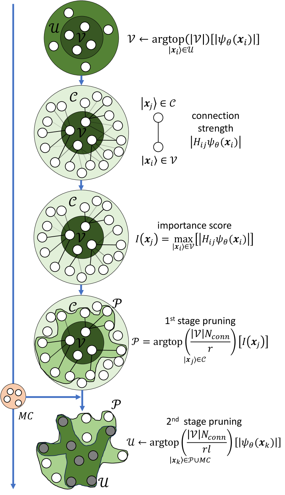
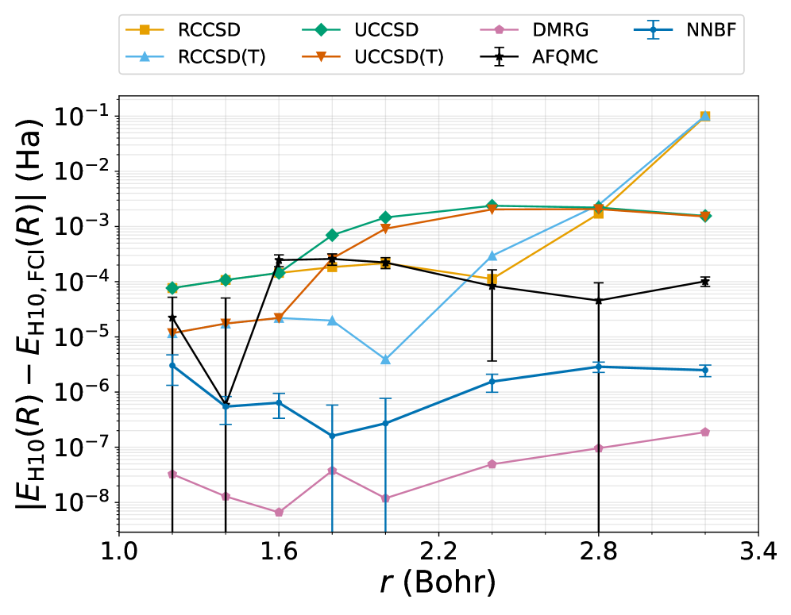
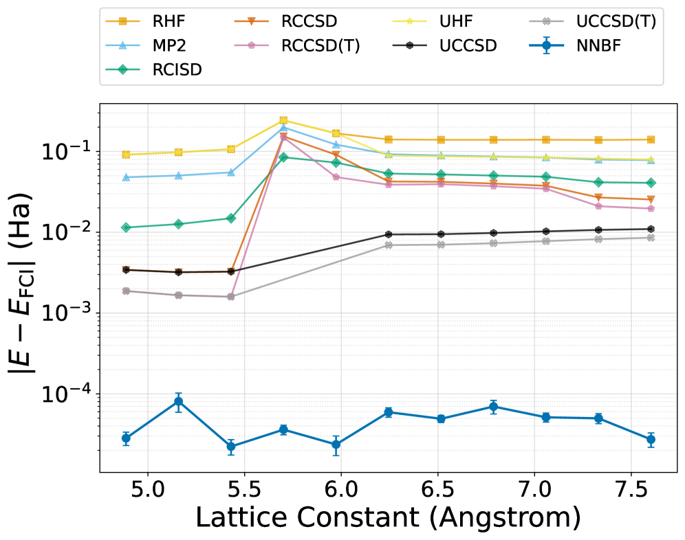
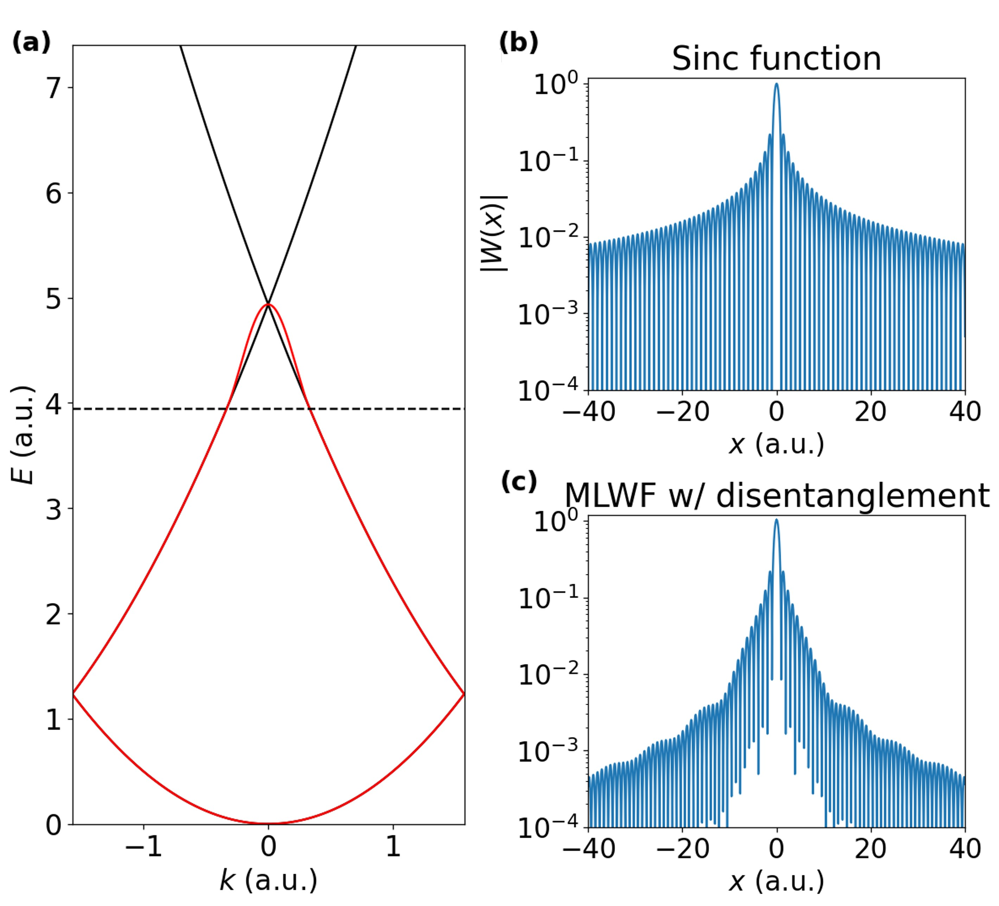
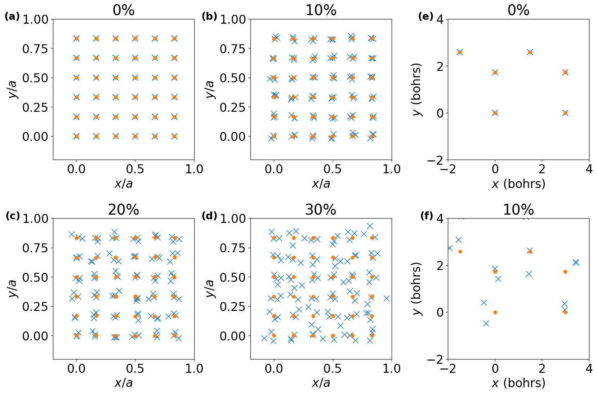
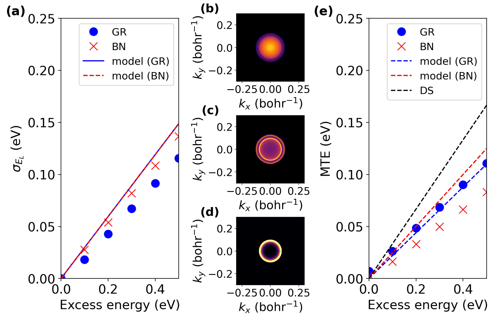
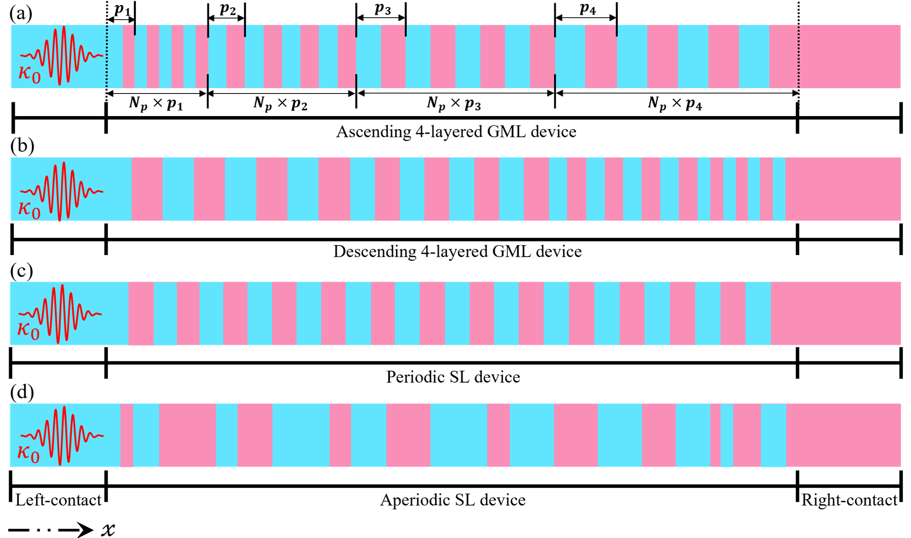
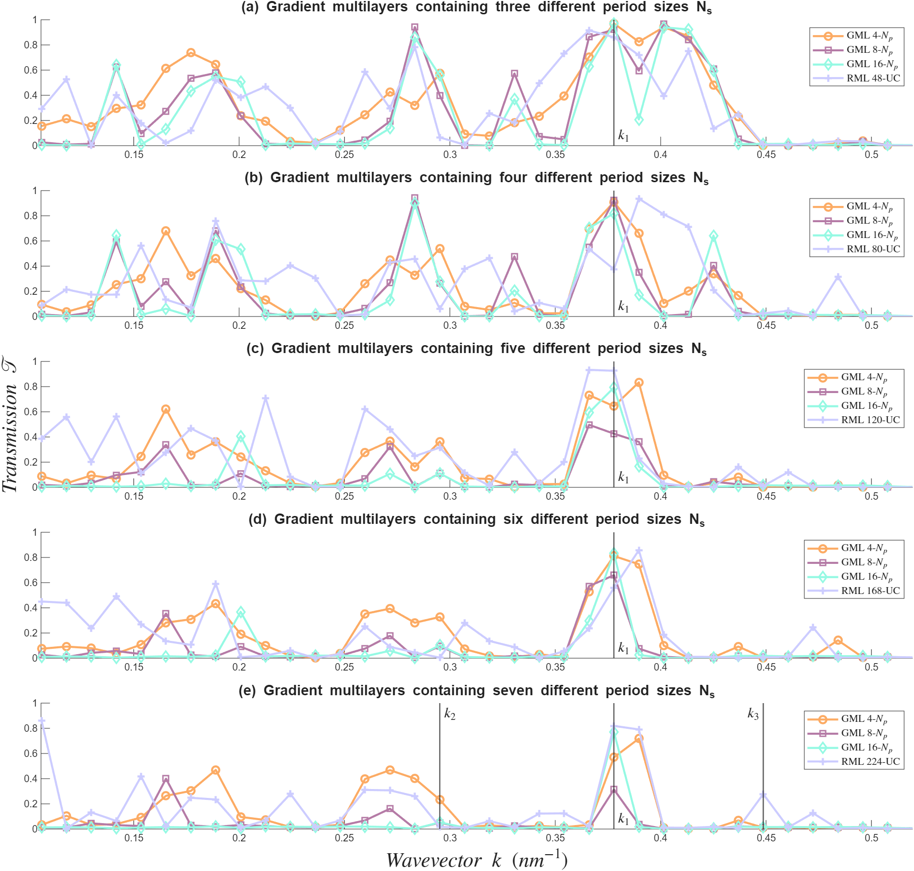
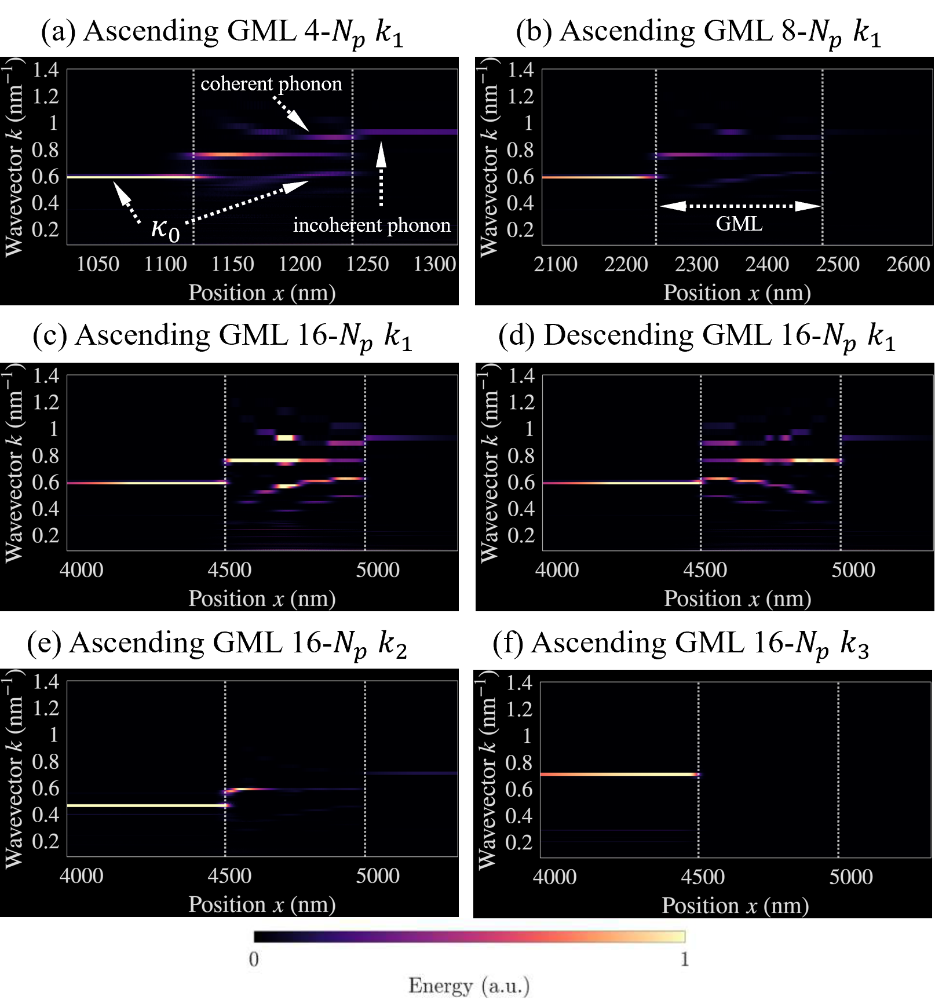

# arXiv 日次ダイジェスト（計算物質科学）

**作成日：** 2026年3月17日
**対象期間：** 2026年3月15日〜17日（直近72時間）

---

## 今日の選定方針

本日は、第一原理量子多体計算・電子状態理論・機械学習ポテンシャルを用いた分子動力学・フォノン輸送シミュレーション・欠陥工学・相安定性計算・電池材料のマルチスケールモデリング・放射線損傷の速度論という多岐にわたる計算物質科学の最前線から10本を選定した。methodological breakthrough として際立つのは、ニューラルネットワークバックフローを周期固体へ拡張した量子モンテカルロ手法と、固体–真空界面における真空ワニエ関数の第一原理理論の2本であり、どちらも計算電子構造論の基盤そのものを刷新しうる提案を含む。応用系では、機械学習力場を用いた電場中ScAlN強誘電体スイッチングの系統的な解析が選定の核を成す。残りの7本も、フォノン波束シミュレーション・平滑化境界法・逐次焼入れ欠陥濃度予測・MLIP型水酸化物イオン輸送・速度論的放射線損傷・チューンドハイブリッド密度汎関数・HfO₂ドメイン壁安定化機構と、計算手法・材料系ともに幅広い貢献を示している。

---

## 全体所見

第一段落：今回の選定群を俯瞰すると、量子多体法の周期系への拡張というテーマが強く浮かび上がる。Liu & Clark（2603.14775）はニューラルネットワークバックフローを1D水素鎖から2D グラフェン・3D Siへと展開し、DMRG・AFQMCを凌駕するまたは同等の精度を達成した。Wu & Arias（2603.14105）は固体–真空界面に特化した真空ワニエ関数理論を構築し、光電子放出の第一原理予測を半現象論的ポテンシャル不要で実現した。これら2論文は、いずれも電子状態計算ツールチェーンの根幹に関わる方法論的貢献であり、今後のコミュニティへの波及は大きい。

第二段落：機械学習ポテンシャルを活用した分子動力学シミュレーションの応用研究も充実していた。Sahashi et al.（2603.14747）はScAlN強誘電体の残留分極と抗電界を構造効果・結合効果に分離解析し、組成依存性の普遍的線形則を見出した。Hänseroth et al.（2603.13705）はアニオン交換膜中の水酸化物イオン輸送をMLIPシミュレーションで明らかにし、膜のナノ構造と巨視的イオン輸送特性を橋渡しした。これらは機械学習力場がすでに実材料系の設計指針を提供する段階に達していることを示す。

第三段落：欠陥・放射線損傷・界面物理の計算研究も本日の重要なトピックである。Arnab et al.（2603.14618）の逐次焼入れ法は、冷却速度と試料形状が欠陥濃度に与える影響を定量化し、完全平衡・完全焼入れ両極端では予測できない実験的現実を再現する。Oplinger et al.（2603.14574）のFe-Cr合金における放射線誘起偏析の速度論的枠組みは、欠陥生成バイアスと吸収の非対称性が予測精度の鍵であることを示した。Doe et al.（2603.13572）のフォノン波束シミュレーションは超格子設計によるフォノン工学の物理的基盤を精緻化した。これらの成果は、材料の実用環境下における応答挙動を計算で捉える取り組みが成熟しつつあることを示している。

---

## 重点論文一覧

1. [Neural network backflow for ab-initio solid calculations](https://arxiv.org/abs/2603.14775) — An-Jun Liu, Bryan K. Clark
2. [Vacuum Wannier Functions for First-Principles Scattering and Photoemission](https://arxiv.org/abs/2603.14105) — Tyler Wu, Tomás Arias
3. [Decoupling structural and bonding effects on ferroelectric switching in ScAlN via molecular dynamics under an applied electric field](https://arxiv.org/abs/2603.14747) — Ryotaro Sahashi, Po-Yen Chen, Teruyasu Mizoguchi

---

## 簡潔紹介論文一覧

4. [Analyzing coherent phonon mode-conversion in gradient superlattices with atomistic wave-packet simulations](https://arxiv.org/abs/2603.13572) — Evan Wallace Doe et al.
5. [Smoothed Boundary Method Framework for Electrochemical Simulation of Li-ion Battery Cathode with Complex Microstructure](https://arxiv.org/abs/2603.13527) — Hui-Chia Yu et al.
6. [Sequential Quenching to Predict Semiconductor Defect Concentrations from Formation & Migration Energies](https://arxiv.org/abs/2603.14618) — Khandakar Aaditta Arnab et al.
7. [Revealing Hydroxide Ion Transport Mechanisms in Commercial Anion-Exchange Membranes at Nano-Scale from Machine-learned Interatomic Potential Simulations](https://arxiv.org/abs/2603.13705) — Jonas Hänseroth et al.
8. [Radiation-induced segregation in dilute Fe-Cr: A rate-theory framework for the Cr enrichment-depletion transition at the grain boundary](https://arxiv.org/abs/2603.14574) — Russell Oplinger et al.
9. [Accurate electronic and optical properties of bulk antiferromagnet CrSBr via a tuned hybrid density functional with on-site corrections](https://arxiv.org/abs/2603.13494) — Ashwin Ramasubramaniam et al.
10. [Domain Walls Stabilized by Intrinsic Phonon Modes and Engineered Defects Enable Robust Ferroelectricity in HfO2](https://arxiv.org/abs/2603.15041) — Chenxi Yu et al.

---

# 重点論文の詳細解説

---

## 論文①

### 1. 論文情報

**タイトル：** [Neural network backflow for ab-initio solid calculations](https://arxiv.org/abs/2603.14775)
**著者：** An-Jun Liu, Bryan K. Clark
**arXiv ID：** 2603.14775
**カテゴリ：** cond-mat.str-el
**公開日：** 2026年3月16日
**論文タイプ：** 手法開発・ベンチマーク研究
**ライセンス：** CC BY 4.0

---

### 2. どんな研究か

本研究は、ニューラルネットワークバックフロー（NNBF）法を分子系から周期固体へ拡張し、2段階プルーニング戦略による計算効率化を提案した変分量子モンテカルロ（VMC）研究である。1次元水素鎖においてDMRGおよびAFQMCと同等以上の精度を達成し、さらに2次元グラフェンおよび3次元シリコンへのスケーラビリティを実証した。強相関領域での結合切断においても coupled-cluster 法が破綻する状況で安定した収束を示す。

---

### 3. 位置づけと意義

ニューラルネットワーク量子状態（NQS）は、FermiNet・PauliNet に代表されるように分子系の電子構造計算に革命をもたらした一方、周期境界条件を持つ固体への適用は技術的に困難であった。本研究はその障壁を突破し、NNBFという波動関数パラメータ化の枠組みの中に「物理誘導型重要度プロキシによる2段階プルーニング」という新機構を組み込むことで、巨大なスレーター行列式空間を実用的な計算コストで扱えるようにした。DMRGとAFQMCが苦手とする強相関・結合切断領域においても精度を保つ能力は、固体中の相転移・Mott絶縁体・超伝導ペアリングなど既存手法が本質的な限界を持つ問題群への突破口を開くものであり、計算物質科学における ab initio 多体電子構造計算の地平を大きく拡げる可能性を秘めている。

---

### 4. 研究の概要

**背景・目的：** 固体の電子構造を正確に記述する方法として、密度汎関数理論（DFT）は計算コスト面で支配的だが、強相関系では本質的に不正確である。行列積状態（DMRG）は1D系に強いが高次元では指数的コスト増大に直面する。補助場量子モンテカルロ（AFQMC）は有望だが符号問題を抱え、強相関領域での系統的改善が難しい。一方、VMCベースのニューラルネットワーク波動関数は分子系で飛躍的な成功を収めているが、周期系の扱いには技術的障壁があった。

**計算科学上の課題設定：** 周期固体のフォック空間は分子系より格段に大きく、ニューラルネットワーク振幅評価を行うべき配置数が爆発的に増大する。これを制御するための賢い配置選択（プルーニング）戦略が必要であった。

**研究アプローチ：** 著者らは Heat-bath Configuration Interaction（HCI）の重要度スコア $I(\mathbf{x}_j) = \max|\psi_\theta(\mathbf{x}_i) H_{ij}|$ をプロキシとして利用し、第1ステージで安価なスコアリングにより候補空間を絞り込み、第2ステージでNNBF振幅を精密評価する2段階フィルタリング戦略を採用した。

**対象材料系：** 1D水素鎖（STO-6G基底、OBC・PBC両方）、2D六方晶グラフェン（GTH-DZV基底、PBC）、3D面心立方シリコン（PBC）。

**主な手法：** ニューラルネットワークバックフロー波動関数のVMC、Heat-bath CI型重要度プロキシ、Pipek-Mezey局在オービタル。

**主な結果：** H10鎖においてNNBFはFCI参照値に対してCCSD(T)より低いエラーを達成し、強相関・結合切断領域でも安定した収束を示す。熱力学極限（TDL）外挿でも粒子あたり0.2 mHa以内の精度を維持。グラフェン・Siでも他のab initio手法より高精度を実証。

**著者の主張：** 2段階プルーニングにより周期固体へのNNBF適用が現実的となり、近い将来、DMRGやAFQMCが困難を抱える強相関固体への展開が可能である。

---

### 5. 計算物質科学として重要なポイント

本研究が扱う物理量は固体の基底状態エネルギーと電位エネルギー曲面であり、多電子波動関数の精度が材料の電子相関・Mott転移・超伝導ペアリングの理解に直結する。NNBFにおけるバックフロー変換は行列式の引数（単粒子軌道の評価点）をNN出力で置き換えることで多体相関を取り込む——これは単純なスレーター行列式の限界を超え、かつ全電子NN波動関数（FermiNet等）ほど柔軟性が高すぎてパラメータが過多になる問題を緩和する。採用した Pipek-Mezey 局在オービタルは強相関領域での基底選択が精度に与える影響を軽減するため適切であり、GTH型擬ポテンシャルとの組み合わせでコアおよびバレンス電子を分離して扱う手法も検証されている。既存研究（FermiNet for molecules, DMRG for solids）との比較において、本研究は「周期系VMCの実用限界を拡張した最初の本格的なNNBF実装」として位置づけられ、1D系での精度検証から2D・3D系への展開を丁寧にスケールアップしている点も信頼性を高める。

---

### 6. 限界と注意点

① **計算コストと系のサイズ：** 本研究の2D・3D計算はグラフェン・Siという比較的単純なバンド絶縁体・半導体に留まり、系のサイズも小型のスーパーセルである。強相関Mott絶縁体や遷移金属酸化物への適用にはNNBFパラメータ数と計算コストが大幅に増加する可能性があり、スケーリングの優劣は未検証の部分が大きい。② **基底関数の依存性：** STO-6GやGTH-DZVなどの比較的小さな基底を使用しているため、完全基底極限（CBS）への外挿や基底サイズ依存性の検討は十分ではない。より大きな基底での性能は別途検証が必要であり、現時点での精度評価は部分的である。③ **参照データの信頼性：** 強相関領域でのFCI参照値はシステムサイズが大きくなると得られなくなるため、より大きな系では参照値そのものの誤差評価が問題となる。また、重要度プロキシの近似の質が系の強相関度に依存する可能性があり、その汎用性はさらなる検証を必要とする。

---

### 7. 研究動向における立ち位置や関連研究との比較

2020年代前半の FermiNet（Pfau et al., 2020）・PauliNet（Hermann et al., 2020）が分子系VMCに革命をもたらして以来、NQS to solids という方向性は多くのグループが目指してきた。固体でのNQS研究としては、Morales et al. らのツイスト平均VMCや、Stochastic Reconfiguration を組み合わせた Carleo-Troyer 型手法が先行するが、高精度を周期系で達成した事例は限られていた。NNBFは行列式展開という解釈可能な構造を保ちつつ相関を取り込む点でFermiNetより実装しやすく、プルーニング戦略はHCIとVMCのハイブリッドとして独自性がある。新規性はincrementalというよりは、「周期固体でのNNBF精度実証」という具体的マイルストーンを達成した点で solid-stateコミュニティへの直接の貢献である。今後はMott絶縁体・強磁性体・超伝導体など相関電子系への展開、並びにエネルギー微分（力・フォノン）計算への拡張が期待される方向性であり、DFTのbeyond-DFT補正計算ツールとして採用されうる。

---

### 8. 重要キーワードの解説

1. **ニューラルネットワークバックフロー（NNBF）：** スレーター行列式の引数（1電子軌道の評価点 $\mathbf{r}_i$）をNN出力 $\tilde{\mathbf{r}}_i = \mathbf{r}_i + \xi(\{\mathbf{r}_j\})$ で置き換えることで多体相関を取り込む波動関数パラメータ化。例：$\Psi(\mathbf{R}) = \det[\phi_j(\tilde{\mathbf{r}}_i)]$。

2. **変分量子モンテカルロ（VMC）：** 試行波動関数 $\Psi_\theta$ のパラメータ $\theta$ を変分原理 $E[\Psi_\theta] \geq E_0$ のもとで最適化し、期待値をモンテカルロ積分で評価する手法。サンプリングには Metropolis-Hastings アルゴリズムを使用。

3. **2段階プルーニング（Two-stage Pruning）：** ハミルトニアン行列要素 $H_{ij}$ と現在の振幅 $\psi_\theta(\mathbf{x}_i)$ から重要度スコア $I(\mathbf{x}_j) = \max_i |\psi_\theta(\mathbf{x}_i) H_{ij}|$ を安価に計算し、第1段階で候補空間を絞り込んだ後、第2段階でNNBF精密振幅を評価する計算戦略。

4. **スレーター行列式（Slater Determinant）：** フェルミオン系の反対称波動関数の基本構成要素。$\Psi = \frac{1}{\sqrt{N!}}\det[\phi_j(\mathbf{r}_i)]$ と書かれ、独立粒子描像の出発点をなす。HF・DFT・VMCいずれでも基礎となる。

5. **密度行列繰り込み群（DMRG）：** 1D量子系の多体波動関数を行列積状態（MPS）で効率的に表現・最適化する手法。$|\Psi\rangle = \sum_{\sigma_1\cdots\sigma_N} A^{\sigma_1}\cdots A^{\sigma_N}|\sigma_1\cdots\sigma_N\rangle$。1D系で指数精度を持つが、高次元では結合次元が爆発する。

6. **補助場量子モンテカルロ（AFQMC）：** Hubbard-Stratonovich 変換で4体相互作用を補助場の積分に変換し、Slater行列式のランダムウォークで電子相関を取り込む確率的手法。強相関系でも有効だが符号問題を抱え得る。

7. **Pipek-Mezey 局在化：** ブロッホ軌道からWannier関数的な局在オービタルを構築する手法で、ポピュレーション最大化を基準とする。$\sum_{A,\sigma}\left(\sum_i |\langle \phi_i|P_A|\phi_i\rangle|^2\right)$ を最大化。局在オービタルは強相関領域でのVMCの精度向上に寄与する。

8. **Heat-bath Configuration Interaction（HCI）：** 重要な配置 $|\mathbf{x}_j\rangle$ をハミルトニアン行列要素の大きさでスクリーニングし、FCI空間から効率的に重要配置を抽出するselected CI法。$|\psi_\theta(\mathbf{x}_i) H_{ij}| > \epsilon_1$ を満たす配置のみを保持する。

9. **熱力学極限（TDL）外挿：** 有限サイズのスーパーセル計算 $E(N)$ をシステムサイズ $N$ に対して $E(N) = E_0 + BN^{-2}$ などの関数で外挿し、$N\to\infty$ の無限系（バルク）のエネルギーを推定する手続き。

10. **周期境界条件（PBC）：** 有限スーパーセルの端を反対側の端につなぎ合わせることで無限格子を模倣する境界条件。電子状態計算では Bloch 定理 $\psi_{n\mathbf{k}}(\mathbf{r}+\mathbf{R}) = e^{i\mathbf{k}\cdot\mathbf{R}}\psi_{n\mathbf{k}}(\mathbf{r})$ と組み合わせて扱われる。

---

### 9. 図

**ライセンス：CC BY 4.0** — 原図を以下に掲載する。

**図1キャプション：** NNBF計算における2段階プルーニング戦略の模式図。左から、中核配置空間、ハミルトニアン行列要素で展開された接続空間、重要度スコアによる第1段階の絞り込み（中間プール）、そして最終的にNNBF精密振幅評価を行う対象空間（ターゲット空間）の5段階を示す。この戦略により、NN評価の計算コストを指数的に削減しながら精度を維持することが本手法の鍵であり、周期固体への適用可能性を支える核心的機構である。

**図2キャプション：** STO-6G基底・開放境界条件（OBC）下でのH10水素鎖のポテンシャルエネルギー曲線。NNBF、CCSD、CCSD(T)、AFQMC、DMRGの各手法とFCI参照値との誤差を比較している。特に結合切断領域（大きな格子定数）において、coupled-cluster 法が大きな誤差を示す一方でNNBFが高精度を維持することが示されており、強相関領域での手法の優位性を裏付ける。

**図3キャプション：** 3次元面心立方（FCC）シリコンのポテンシャルエネルギー曲線。周期境界条件下でNNBF、HF、MP2、CISD、CCSD、CCSD(T)を比較している。2D グラフェンと同様の活性空間設定を使用し、3次元結晶系でもNNBFが他の ab initio 手法より高精度であることを示す。本研究における次元スケーラビリティの実証の中で最もチャレンジングな系に相当する。

---

## 論文②

### 1. 論文情報

**タイトル：** [Vacuum Wannier Functions for First-Principles Scattering and Photoemission](https://arxiv.org/abs/2603.14105)
**著者：** Tyler Wu, Tomás Arias
**arXiv ID：** 2603.14105
**カテゴリ：** cond-mat.mtrl-sci
**公開日：** 2026年3月14日
**論文タイプ：** 手法開発・方法論研究
**ライセンス：** CC BY 4.0

---

### 2. どんな研究か

固体–真空界面を横断して最適局在化された真空ワニエ関数（VWF）の厳密な理論的枠組みを構築し、第一原理的な電子散乱・光電子放出計算をモデルポテンシャル不要で実現した研究である。Marzari-Vanderbilt局在化汎関数の解析的最小解を任意次元で導出し、真空中のWannier関数が正規3次元稠密格子（fcc/hcp）上に整列することを数値的に検証した。グラフェンおよびh-BNへの適用で、1次ボルン近似を超える高次散乱効果が光陰極特性を定量的に変化させることを示した。

---

### 3. 位置づけと意義

Wannier関数（WF）はバルク材料のタイトバインディング補間・誘電応答・異常ホール伝導度など多様な電子的性質の計算基盤として確立されている。しかし固体–真空界面では、バルク側のWFが真空側の自由電子状態と接続する際に、従来の局在化理論が適用できないという根本的問題があった。本研究はその空白を埋めるものであり、散乱・光電子放出の材料固有の第一原理計算を可能にする。光陰極（レーザー誘起光電子放出を利用する電子源）設計への直接的応用のみならず、走査型トンネル顕微鏡（STM）・ナノスケール電子散乱・surface photovoltage 計算など、固体–真空結合を扱う広範な応用分野に波及する画期的な基盤技術である。

---

### 4. 研究の概要

**背景・目的：** 光電子放出はレーザー電子銃・放射光源・X線光電子分光（XPS）で中心的役割を担うが、真空側の電子の挙動を記述するために従来は半現象論的な真空ポテンシャルを用いていた。これを材料固有の第一原理量に置き換えることが本研究の目標である。

**計算科学上の課題設定：** 従来のMaximally Localized Wannier Functions（MLWF）理論は周期系を前提としており、真空領域での発散（$\langle r^2 \rangle \to \infty$）を処理できなかった。Sinc関数的な振る舞いが「分散」成分を発散させるため、正規化された局在化汎関数の最小解が自明でなかった。

**研究アプローチ：** 著者らは1D系での解析的な脱絡み（disentanglement）手続きを厳密に解き、真空WFの二乗平均変位が $x^{-2}$ で減衰する（有限分散）解を見出した。さらに3DでのVWF中心がfcc（立方セル）またはhcp（六方セル）格子上に整列するという「稠密充填原理」（Close-Packing Principle）を提唱し、数値的に検証した。その後、Born-series散乱状態の密な$k$空間グリッドを構築してBorn近似の高次補正を含む光電子放出計算を行った。

**対象材料系：** グラフェン（反転対称あり）、六方晶窒化ホウ素（h-BN、反転対称なし）。

**主な手法：** JDFTxを用いたプレーン波DFT計算（SG15擬ポテンシャル、30 Hartreeカットオフ）、Souza-Marzari-Vanderbilt脱絡み手順の改良、Born-series散乱振幅のWF基底展開。

**主な結果：** グラフェンの縦方向エネルギー広がり $\sigma_{EL} = 0.235 E_{\rm excess}$（単純モデルの0.298より低く、デバイス特性に有利）。h-BNの平均横エネルギー（MTE）$= 0.160 E_{\rm excess}$（有効質量モデルの0.250と大きく異なる）。h-BNでは反転対称性の欠如により高次Born項がゾーン中心スペクトル強度を定性的に変化させる。

**著者の主張：** VWF理論は光陰極材料の全形状的・材料固有の第一原理設計を可能にし、従来の現象論的手法を置き換える基盤となる。

---

### 5. 計算物質科学として重要なポイント

本研究が取り扱う物理は固体–真空界面での電子輸送（散乱・透過）と光電子放出スペクトルであり、これは電子のコヒーレント輸送・界面バンドアライメント・表面電子状態の延長線上にある問題である。VWFの構築において「局在化汎関数の最小化点が幾何学的（稠密充填）格子と対応する」という発見は、最適基底関数が材料の物理的対称性と密接に関係するという深い洞察を与える。記述子としてのVWFは実空間でコンパクトなため、電子の散乱振幅のBorn展開を収束させやすく、高次補正の数値的取り扱いが安定化する。既存のWannier90コードが扱えなかった真空領域の発散問題を解決し、JDFTx実装とのインターフェースを通じてコードレベルでの実装可能性が示された点は再現性・展開性の観点で重要である。h-BNとグラフェンの対比——反転対称性の有無による光電子スペクトルの定性的差異——は、材料対称性が光陰極性能を決定する機構を明確に示す物理的解釈であり、設計指針として価値が高い。

---

### 6. 限界と注意点

① **適用材料の限定性：** 現時点での実証はグラフェンとh-BNという2次元材料2種に限られており、金属表面・半導体ヘテロ界面・有機/無機界面などへの適用性は未検証である。特に表面再構成や化学吸着が存在する複雑な表面系では、VWFの構築手順が大幅に複雑化する可能性がある。② **計算コストと並列化：** Born-series散乱状態の密な $k$ グリッド構築は、大きな超セルや多くの原子種を持つ系では計算コストが急増する。また、JDFTxというやや特殊な実装に依存しており、より普及したQUANTUM ESPRESSO等との統合には追加開発が必要である。③ **高次Born近似の収束：** 本研究では高次Born近似を含めた散乱計算を示すが、高い過剰光子エネルギー領域や大きな散乱長を持つ重元素系では収束の遅さ・発散が懸念される。この点の系統的な検証はなされておらず、手法の適用限界を定める今後の課題として残る。

---

### 7. 研究動向における立ち位置や関連研究との比較

Wannier関数の理論的基盤はMarzari & Vanderbilt（1997）・Souza, Marzari & Vanderbilt（2001）による分散最小化で確立され、Wannier90コード（Pizzi et al., 2020）を通じてコミュニティに広く普及した。固体–真空界面への拡張は、STM電流計算（Tersoff-Hamann近似）や光電子放出の理論（Berglund-Spicer、三ステップモデル）では半現象論的に扱われてきた。本研究は「VWFという材料固有の基底でこれら全てを統一的に記述する」という点で新規性はbreakthroughに近い。同時期の競合研究としては、JDOS法やLayer-resolved Greenの関数を用いた表面光電子放出計算があるが、これらはバルクWFを真空に接続する系統的枠組みを欠く。引用されうるコミュニティは広く、光陰極・自由電子レーザー・超高速電子顕微鏡・角度分解光電子分光（ARPES）解析の各コミュニティへの波及が見込まれる。今後は金属・半導体・トポロジカル物質の表面状態計算、さらに光電子コヒーレンス・電子ビーム品質最適化への応用が期待される。

---

### 8. 重要キーワードの解説

1. **ワニエ関数（Wannier Function）：** ブロッホ波 $\psi_{n\mathbf{k}}(\mathbf{r})$ のフーリエ変換として定義される実空間局在関数 $w_n(\mathbf{r}-\mathbf{R}) = \frac{V}{(2\pi)^3}\int e^{-i\mathbf{k}\cdot\mathbf{R}}\psi_{n\mathbf{k}}(\mathbf{r})d\mathbf{k}$。ゲージ選択の自由度があり、最適局在化によってMaximally Localized WF（MLWF）を求める。

2. **Marzari-Vanderbilt局在化汎関数：** $\Omega = \sum_n [\langle r^2\rangle_n - \langle\mathbf{r}\rangle_n^2]$ を最小化することで最適局在WFを決定する変分原理。ゲージ不変部分 $\Omega_I$ とゲージ依存部分 $\tilde\Omega$ に分解でき、前者は物理的意味を持つ。

3. **脱絡み（Disentanglement）：** エネルギー窓内に複数バンドが交差する場合、それらを適切に混合してWFを構築するための手続き。Souza-Marzari-Vanderbilt法では凍結窓と外部窓を指定し、外部窓内のバンドを射影して最適な部分空間を選択する。

4. **Born-series散乱（Born Series Scattering）：** 弱い散乱ポテンシャルを摂動展開した散乱振幅。$\langle\mathbf{k}'|T|\mathbf{k}\rangle = V_{\mathbf{k}'\mathbf{k}} + \sum_{\mathbf{q}}\frac{V_{\mathbf{k}'\mathbf{q}}V_{\mathbf{q}\mathbf{k}}}{E-E_q+i\eta} + \cdots$。1次のみを使うのが「1次ボルン近似」で、本研究は高次項を含む。

5. **光陰極（Photocathode）：** レーザー光照射により光電効果で電子を放出させる電子源材料。高輝度・低エミッタンスの電子ビームが求められ、平均横エネルギー（MTE）と縦エネルギー広がり $\sigma_{EL}$ が性能指標となる。

6. **真空ワニエ関数（Vacuum Wannier Function, VWF）：** 本研究が提案する新概念。固体内のMLWFを真空側に延長したもので、最適局在化の観点から稠密充填格子（fcc/hcp）上に中心が整列する。固体–真空界面の電子状態を記述する実空間基底として機能する。

7. **稠密充填原理（Close-Packing Principle）：** 真空中のVWF中心が立方セルではfcc格子、六方セルではhcp格子を形成するという本研究の発見。局在化汎関数の幾何学的最小解が稠密充填構造と対応するという深い数理的洞察であり、任意の材料・セル形状に普遍的に適用できる指針を与える。

8. **平均横エネルギー（Mean Transverse Energy, MTE）：** 光陰極から放出された電子の横方向（界面に平行）運動エネルギーの平均値。${\rm MTE} = \langle p_x^2 + p_y^2\rangle / 2m$。ビームエミッタンス・輝度を決定する重要指標で、低いほど高品質電子ビームが得られる。

9. **縦エネルギー広がり（Longitudinal Energy Spread, σ_EL）：** 放出電子の縦方向（界面に垂直）運動エネルギーの標準偏差。超高速電子回折（UED）や自由電子レーザーでは、これが時間分解能・コヒーレンスを制限するため最小化が求められる。

10. **JDFTx：** MIT/Cornell グループが開発した平面波DFT計算コード。液体中の電子状態計算（Joint DFT）やWannier関数計算、非平衡Green関数法など、界面・液体・輸送を得意とした実装を持つ。本研究のVWF理論はJDFTxに実装されている。

---

### 9. 図

**ライセンス：CC BY 4.0** — 原図を以下に掲載する。

**図1キャプション：** 1次元空格子（free electron lattice）における真空ワニエ関数の解析的構成の検証。左パネルは1D空格子のバンド分散（黒）と脱絡み後の2バンド（赤）を示す。右パネルはSinc型関数（脱絡みなし）と解析的脱絡みMLWF（本研究）の実空間減衰を比較し、後者が $x^{-2}$ で減衰して有限分散を持つことを示す。これは真空領域でWFを定義するための基礎となる理論的結果である。

**図2キャプション：** 立方セルおよび六方セルにおける真空ワニエ関数中心の安定性テスト。初期ランダム配置から局在化汎関数を最小化すると、中心位置がfcc（立方セル）またはhcp（六方セル）格子上に収束することを数値的に示す。この「稠密充填原理」はVWF理論の核心的発見であり、真空基底の系統的・スケーラブルな構築を可能にする。

**図3キャプション：** VWF理論を用いたグラフェン（上段）とh-BN（下段）の光電子放出特性の第一原理計算。縦軸方向エネルギー分布・横運動量分布・過剰光子エネルギー依存MTEを、1次ボルン近似（緑）・高次ボルン（赤）・単純モデル（黒破線）で比較する。h-BNでは反転対称性の欠如が高次補正によってゾーン中心強度を定性的に変化させることが読み取れ、材料対称性が光陰極性能に与える影響の理解に直結する。

---

## 論文③

### 1. 論文情報

**タイトル：** [Decoupling structural and bonding effects on ferroelectric switching in ScAlN via molecular dynamics under an applied electric field](https://arxiv.org/abs/2603.14747)
**著者：** Ryotaro Sahashi, Po-Yen Chen, Teruyasu Mizoguchi
**arXiv ID：** 2603.14747
**カテゴリ：** cond-mat.mtrl-sci
**公開日：** 2026年3月16日
**論文タイプ：** 計算物質科学・応用研究
**ライセンス：** CC BY 4.0

---

### 2. どんな研究か

ScAlN（スカンジウムアルミニウム窒化物）強誘電体の電場誘起分極スイッチングにおいて、残留分極（$P_r$）と抗電界（$E_c$）の組成依存性をそれぞれ「構造効果」と「結合効果」に分離・同定した研究である。機械学習力場ベースの分子動力学シミュレーションと歪み操作・ナッジド弾性バンド（NEB）法を組み合わせ、$P_r$ が構造効果のみで決まり組成に対して普遍的な線形依存性を示す一方、$E_c$ は両効果の相互作用を必要とすることを明らかにした。

---

### 3. 位置づけと意義

ScAlN はNEMS・MEMS・不揮発性メモリへの応用が期待されるウルツ鉱型強誘電体であり、Sc添加量によって電気的特性が大きく変化する。残留分極と抗電界はどちらも材料設計の重要指標だが、それらを支配する物理的起源が「構造（geometrical）」か「電子（bonding）」かは明確でなかった。本研究は機械学習力場による大規模MD（静的NEBでは追跡できない熱揺らぎや動的スイッチング経路を含む）という手法的優位性を活かして、この問いに対する明確な答えを提供した。組成設計・電場スイッチング制御・疲労特性改善の指針として、半導体デバイスコミュニティに直接利用できる知見をもたらした。

---

### 4. 研究の概要

**背景・目的：** ScAlN のSc組成（x in Sc$_x$Al$_{1-x}$N）増加に伴って $P_r$ と $E_c$ がともに変化することは知られていたが、構造効果（内部座標・格子定数変化）と結合効果（Sc-N結合の性質変化）のどちらが支配的かは未解明であった。

**計算科学上の課題設定：** 静的NEBは零温度のMEP（最小エネルギー経路）を与えるが、有限温度での熱揺らぎによる分極スイッチングを記述できない。電場印加下での動的スイッチングプロセスをリアルタイムでシミュレーションするためには、大規模系での高精度MDが必要であり、これを機械学習力場（MLFF）で達成した。

**研究アプローチ：** 面内歪みを制御することで、組成を変えずに格子定数（構造パラメータ）のみを変化させる「構造効果単独の分離実験」を計算上で実施。それにより$P_r$と$E_c$への寄与を切り分けた。さらに電場印加下のMLFF-MDを行い、スイッチング動態を直接観測した。

**対象材料系：** ウルツ鉱型ScAlN（Sc添加量 x = 0.1〜0.5）。

**主な手法：** 機械学習力場（MLFF）ベースの分子動力学、電場印加下MD、ナッジド弾性バンド（NEB）法、面内歪み制御。

**主な結果：** $P_r$ は構造効果のみで決定し、Sc組成に関わらず普遍的な線形則 $P_r \propto$ [structural parameter] が成立する。$E_c$ は構造効果と結合効果の双方が関与し、MLFFによる動的シミュレーションを通じてのみ正確に再現できる。

**著者の主張：** $P_r$ の組成設計は構造最適化のみで達成できるが、$E_c$ 制御には化学結合性の調整が不可欠であり、動的シミュレーションが必須である。

---

### 5. 計算物質科学として重要なポイント

ウルツ鉱型強誘電体のスイッチングは、N原子の変位に伴う極性反転と電気的バリアの克服という2段階で理解される。本研究の重要性は、「歪み操作という計算的ノブ」を用いて構造パラメータをアイソレーションした点にある——これは通常の組成変化では構造と電子状態が同時に変わるため不可能な分離操作を、計算科学ならではの方法で実現した優れた戦略である。MLFFは第一原理計算精度を保ちながら$10^4$原子・ナノ秒スケールのMDを実現し、熱揺らぎを含むスイッチング経路・核生成・ドメイン成長といった有限温度現象を直接扱える。NEB法との比較によって動的MDが不可欠な理由が示されており、単なる静的計算の限界を超えた洞察が得られている。この分離解析の枠組みは他の強誘電体系（BiFeO$_3$、BaTiO$_3$、HfO$_2$等）の組成設計にも直ちに適用可能であり、方法論としての汎用性も高い。

---

### 6. 限界と注意点

① **MLFFの精度と訓練データ：** 使用された機械学習力場の訓練データセットの詳細（サイズ・多様性・第一原理計算レベル）は論文中に詳述されておらず、特に高電場・高温条件下での外挿精度の検証が限定的である。スイッチング経路のエネルギーバリアが数meV〜数百meVの広い範囲で変化する中で、MLFFのエラーが結論に与える影響は定量的に評価されていない。② **有限サイズ効果とドメイン形成：** シミュレーションセルサイズが有限であるため、実際のデバイスで観察されるマルチドメイン形成や欠陥-ドメイン壁相互作用、疲労劣化などの長スケール現象は直接扱われていない。③ **実験との定量的比較：** $P_r$ および $E_c$ の計算値と実験値（薄膜測定値）との定量的な比較が不足しており、MLFFモデルの予測精度の実験的検証が今後の課題として残る。電場印加下でのイオン電流・リーク電流など実際の測定環境の複雑さも考慮されていない。

---

### 7. 研究動向における立ち位置や関連研究との比較

ScAlN強誘電体研究は2019年のAkiyama et al.（圧電応答の発見）以降急速に発展し、Fichtner et al.（2019）の強誘電性の発見を経て、現在は電気的スイッチング機構の理解が主要課題である。第一原理研究では高エネルギーバリアの起源（Zukauskaite et al., Hayden et al.）が議論されてきたが、構造効果と結合効果の明確な分離は本研究が初めて行った。MLFFを用いた電場中MD という手法的アプローチは、最近の BaTiO$_3$（Bochkarev et al.）や HfO$_2$（Lederer et al.）研究と同方向性であるが、ScAlN系への組成依存性分析という固有の貢献がある。新規性は incremental であるが、機構的解析の明確さと再現可能な計算戦略によって、ScAlNコミュニティおよびウルツ鉱型強誘電体設計コミュニティに直接引用されうる実用的知見を提供している。

---

### 8. 重要キーワードの解説

1. **ウルツ鉱型強誘電体（Wurtzite Ferroelectric）：** 空間群 $P6_3mc$ の六方晶構造を持つ強誘電体。ZnO・AlN・GaN等が典型例で、Sc添加によりAlNに強誘電性が発現する。分極は $c$ 軸方向のカチオン-アニオン変位 $\delta$ から $P = Z^*e\delta/V$ で生じる。

2. **残留分極（$P_r$, Remanent Polarization）：** 電場をゼロに戻したときに残る自発分極値。強誘電性ヒステリシスループの横軸切片に対応し、不揮発性メモリへの応用では大きな$P_r$が望まれる。ScAlNでは最大30〜50 μC/cm²程度が報告されている。

3. **抗電界（$E_c$, Coercive Field）：** 分極の符号が反転する（スイッチングが起こる）電場強度。ヒステリシスループの縦軸切片。ScAlNでは通常5〜10 MV/cm程度で非常に大きく、ドライブ電圧の設計上の制約となる。

4. **機械学習力場（Machine Learning Force Field, MLFF）：** 第一原理計算（DFT）データを教師データとして学習し、DFT精度に近いエネルギー・力を古典的なポテンシャル速度（$10^4$〜$10^6$倍速）で評価する。本研究ではScAlNの多様な組成・構造・電場状態をカバーするデータセットで訓練されたと思われる。

5. **ナッジド弾性バンド法（NEB, Nudged Elastic Band）：** 反応経路の最小エネルギー経路（MEP）を求める方法。始状態・終状態を結ぶ複数のイメージをバネで連結し、エネルギー勾配を最小化してMEPを決定する。本研究では零温度のスイッチングバリアを評価するために使用した。

6. **構造効果と結合効果の分離（Decoupling Structural and Bonding Effects）：** 面内歪みを外部パラメータとして変化させることで、組成を固定しながら格子定数（構造）のみを変化させる計算的な「制御実験」。通常の組成変化では構造と電子状態が同時に変化するため不可能な操作をin silico で実現する。

7. **分子動力学（MD, Molecular Dynamics）：** ニュートンの運動方程式 $m_i\ddot{\mathbf{r}}_i = -\nabla_i E(\{\mathbf{r}_j\})$ を時間積分して原子の軌跡を追跡する手法。電場 $\mathbf{E}$ に対してはボルン有効電荷を通じた追加力 $F_i = Z_i^*e\mathbf{E}$ を加えることでスイッチングを駆動できる。

8. **ボルン有効電荷（Born Effective Charge, $Z^*$）：** 原子変位 $\delta u_\beta$ に対する分極変化の線形応答係数 $Z^*_{\alpha\beta} = \Omega_0(\partial P_\alpha / \partial u_\beta)_{\mathbf{E}}$。電場が原子に及ぼす実効的な力を定量化し、電場印加MDでの正確な力計算に不可欠。

9. **分極スイッチング（Polarization Switching）：** 外部電場により強誘電体の自発分極方向が反転するプロセス。核生成（nucleation）と成長（propagation）の2段階で進行し、ドメイン壁の移動速度・欠陥との相互作用がスイッチング速度と疲労を決定する。

10. **ScAlN（スカンジウムアルミニウム窒化物）：** Sc$_x$Al$_{1-x}$N の固溶体。AlNは圧電体であるが Sc添加（$x > 0.1$）で強誘電性が発現する。CMOSプロセス互換・高キュリー温度・大きな$P_r$という利点を持ち、次世代強誘電体メモリ材料の最有力候補の一つ。

---

### 9. 図

**ライセンス：CC BY 4.0** — 本論文のHTML版は現時点で生成されていないため、原図の直接掲載ができない。以下に研究内容を概念的に説明する図面の説明を示す。

**図の説明（HTML未対応のため原図なし）**

[図1概念：ScAlN の分極スイッチング経路の模式図]
ウルツ鉱型構造において N 原子が上下反転する「スイッチング経路」を示す概念図。Sc組成 $x$ の変化に対して残留分極 $P_r$ が構造パラメータ（内部座標 $u$）の線形関数として変化する普遍則、および抗電界 $E_c$ が組成依存する非線形変化を模式的に示す。

[図2概念：面内歪みによる構造効果の分離手順]
一定組成のスーパーセルに面内歪み $\varepsilon_{//}$ を加えることで、格子定数（構造パラメータ）のみを変化させる計算設定の模式図。組成変化（赤矢印）と歪み変化（青矢印）の軌跡が2Dパラメータ空間上に示され、構造効果の独立な評価が可能であることを視覚化する。

[図3概念：電場印加下MDによるスイッチング動態]
電場 $E$ を段階的に増加させたときのスーパーセル内分極 $P(t)$ の時間発展曲線。NEB法（零温度静的結果）とMLFF-MD（有限温度動的結果）の比較から、熱揺らぎを含む動的シミュレーションの必要性が示される。

---

# その他の重要論文

---

## 論文④

### 1. 論文情報

**タイトル：** [Analyzing coherent phonon mode-conversion in gradient superlattices with atomistic wave-packet simulations](https://arxiv.org/abs/2603.13572)
**著者：** Evan Wallace Doe, Theodore Maranets, Yan Wang
**arXiv ID：** 2603.13572
**カテゴリ：** cond-mat.mtrl-sci
**公開日：** 2026年3月13日
**論文タイプ：** 計算シミュレーション研究
**ライセンス：** CC BY 4.0

---

### 2. 研究概要

本研究は、周期長を段階的に変化させた傾斜超格子（gradient multilayer, GML）における縦音響（LA）フォノンのコヒーレント波束シミュレーションを行い、フォノンモード変換機構を原子論的スケールで解析した。異なる周期サイズ数（$N_s$）、各周期の繰り返し数（$N_p$）、積層順序（昇順・降順）を体系的に変化させた複数の構造を対象に、倒格子空間ウェーブレット変換によってフォノン波束の時間発展を追跡した。

主要な知見として、「GML中のコヒーレントフォノンは完全周期構造と完全無秩序（ランダム）構造の中間状態に特徴的な振る舞いを示す」ことが明らかになった。特に重要な発見は、フォノン伝達スペクトルが短距離秩序（局所的周期数）より長距離無秩序（異なる周期サイズの総数）に強く依存するという点である。積層順序（昇順/降順）はフォノン透過率にほとんど影響しないことも示された。この結果は、熱電・熱管理材料の設計においてフォノン工学の実現手段として超格子の不規則度を制御するという戦略を定量的に支持するものであり、GMLのフォノン散乱が「長距離構造パラメータで支配される」という設計指針を明確化した。計算物質科学的には、原子論的波束シミュレーションがコヒーレントフォノンの機構解析に有効な手段であることを再確認しつつ、超格子熱電設計や超音波デバイスのフォノン工学に直結する定量的知見を提供している。

---

### 3. 重要キーワードの解説

1. **傾斜超格子（Gradient Superlattice, GML）：** 積層方向に周期長が段階的に変化する人工周期構造。単純な周期超格子（SL）と無秩序多層膜（RML）の中間に位置する不規則性を持ち、フォノン散乱の調整に用いられる。

2. **フォノン波束シミュレーション（Phonon Wave-packet Simulation）：** 特定の波数 $k$ と空間幅 $\Delta x$ を持つガウス型波束 $u(x,0) \propto e^{ikx-x^2/(2\sigma^2)}$ を用いてフォノンを初期化し、古典MDで時間発展させる手法。コヒーレントフォノンの散乱・反射・モード変換を直接観測できる。

3. **縦音響フォノン（Longitudinal Acoustic Phonon, LA）：** 音波伝播と同方向の原子変位を持つ音響モード。熱伝導を担うフォノン（特に低周波数の「弾道的フォノン」）の主成分であり、界面での反射・透過が熱コンダクタンスを決定する。

4. **フォノン透過率（Phonon Transmission, T）：** 特定波数 $k$ のフォノン波束が界面・多層構造を透過する割合。$T(k) = |t(k)|^2$ と書かれ、格子熱伝導度の界面Kapitza抵抗と直接関係する。

5. **ウェーブレット変換（Wavelet Transform）：** 時間（または空間）と周波数の両方の局在情報を同時に取得できる信号解析手法。$W(k,x) = \int u(x')g^*(x'-x)\cdot e^{-ik(x'-x)}dx'$ のモーレット型カーネルを用い、フォノン波束が空間を伝播する際の波数変化（モード変換）を可視化する。

6. **モード変換（Mode Conversion）：** 特定波数 $k_1$ を持つフォノンが界面・不規則構造を通過することで異なる波数 $k_2$ のフォノンに変換される現象。コヒーレントフォノンの散乱機構の一形態であり、フォノン工学における重要現象。

7. **長距離無秩序（Long-range Disorder）：** 局所的な周期性の繰り返し数（$N_p$）が大きくなること。本研究では短距離秩序（周期サイズの多様性 $N_s$）より長距離無秩序がフォノン透過率に支配的影響を持つことが示された。

8. **弾道的フォノン（Ballistic Phonon）：** 散乱なしに試料全体を伝播するフォノン。低温・短試料でコヒーレントな状態として振る舞い、完全周期超格子ではフォノニック・バンドギャップの外側で高い透過率を示す。

9. **格子動力学（Lattice Dynamics）：** 原子間相互作用ポテンシャルから動力学行列 $D(\mathbf{q})$ を導出し、フォノン分散関係 $\omega_s(\mathbf{q})$ を求める理論的枠組み。Stillinger-Weberポテンシャルや機械学習ポテンシャルと組み合わせてMDシミュレーションに使用される。

10. **超格子熱電材料（Superlattice Thermoelectrics）：** 人工的な周期構造によってフォノン散乱を増大させ、格子熱伝導度を低減しながら電気伝導特性を維持する材料設計戦略。BiTe/SbTe系などで実現され、本研究の知見はGML構造の最適化設計に直接適用できる。

---

### 4. 図

**ライセンス：CC BY 4.0** — 原図を以下に掲載する。

**図1キャプション：** 昇順GML（a）、降順GML（b）、周期超格子（c）、ランダム多層膜（d）の4種類の構造模式図。GMLでは左から右へ周期長が段階的に変化し、フォノン波束の伝播方向（矢印）とともに各構造が生み出す散乱環境の違いが視覚的に示される。本研究の比較シミュレーションの基礎となる構造設定を理解するための図である。

**図2キャプション：** 縦軸がフォノン透過率 $\mathcal{T}$、横軸が波数 $k$ のスペクトル比較図。異なる $N_p$（各周期サイズの繰り返し数）と $N_s$（異なる周期サイズの総数）を持つGML構造が比較される。$N_p$ の増大（長距離無秩序の増加）に伴ってスペクトルがランダム多層膜に近づく様子が読み取れ、「長距離無秩序が短距離秩序より支配的」という主張を直接支持する。

**図3キャプション：** 複数の $N_p$ 設定（$N_s=7$）でフォノン波束が伝播する際の逆格子空間ウェーブレット変換のスナップショット。波束の波数成分 $k_1$, $k_2$, $k_3$ がどの空間位置でどのように変換（散乱・モード変換）されるかを2次元マップで示す。$N_p$ の増加に伴って局所的コヒーレンスが失われ、フォノン散乱が強まる機構が可視化されている。

---

## 論文⑤

### 1. 論文情報

**タイトル：** [Smoothed Boundary Method Framework for Electrochemical Simulation of Li-ion Battery Cathode with Complex Microstructure](https://arxiv.org/abs/2603.13527)
**著者：** Hui-Chia Yu, Bernardo Orvananos, Scott Cronin, Martin Bazant, Scott Barnett, K. Thornton
**arXiv ID：** 2603.13527
**カテゴリ：** cond-mat.mtrl-sci
**公開日：** 2026年3月13日
**論文タイプ：** 計算手法開発・応用
**ライセンス：** arXiv非独占ライセンス（図の掲載不可）

---

### 2. 研究概要

本研究は、実験的に3Dトモグラフィ再構成された複雑微細構造を持つリチウムイオン電池正極材料の電気化学シミュレーションを、一様直交グリッド上で実行可能にする「平滑化境界法（Smoothed Boundary Method, SBM）」フレームワークの構築と実証である。不規則な電極粒子形状・曲がりくねった電解液チャネル・不規則な粒子-電解液界面を扱うために、支配方程式（物質移動・Butler-Volmer型電気化学反応）を一様グリッド対応に再定式化した。また、2種類のリチウム化機構——固溶型（single-phase）と2相型（two-phase）——を同一フレームワーク内で比較した。

最も重要な知見は、「2相リチウム化をFick拡散方程式でモデル化すると電極性能を過大評価する」という点である。Fick拡散は濃度勾配に比例したイオン移動を仮定するが、2相共存系ではシャープな界面を持つ相分離が生じるため、Fick則は物理的に不適切であり、より精密な相場（Phase-field）型記述が必要となる。SBMはその基盤として機能し、実験再構成マイクロ構造を入力とした高忠実度シミュレーションを可能にする。計算物質科学的には、電池材料のマルチスケール設計において微細構造と電気化学動態を結びつける枠組みとして、電極最適化・劣化モデリング・材料スクリーニングへの応用が期待される。

---

### 3. 重要キーワードの解説

1. **平滑化境界法（Smoothed Boundary Method, SBM）：** 複雑形状の領域境界を急峻なステップ関数ではなく平滑化された相場的関数（拡散界面を持つ $\phi(\mathbf{r})$）で表現し、一様直交グリッド上で偏微分方程式を解く手法。界面フィッティングメッシュ不要でトポロジーの変化にも対応できる。

2. **3Dトモグラフィ再構成（3D Tomography Reconstruction）：** X線CTやFIB-SEMによる断層撮影データから電極微細構造の3次元形状を復元する実験的手法。本研究ではこの再構成データを入力ジオメトリとして使用し、実験的現実に即したシミュレーションを実現する。

3. **Butler-Volmer式（Butler-Volmer Equation）：** 電極反応速度の過電圧（$\eta$）依存性を記述する電気化学の基本式：$i = i_0[\exp(\alpha_a F\eta/RT) - \exp(-\alpha_c F\eta/RT)]$。電極界面でのLiイオン移動速度を支配する。

4. **固溶型リチウム化（Solid-Solution Lithiation）：** リチウムイオンが電極材料中に連続的に挿入・脱離し、単相状態を保ちながら濃度が空間的に勾配分布する機構。LiFePO$_4$ の高電流レート域や一部の酸化物正極で生じる。

5. **2相型リチウム化（Two-phase Lithiation）：** Li富化相とLi貧化相が共存し、シャープな界面（相境界）が電極内を移動することでリチウム化が進む機構。LiFePO$_4$ の平衡近傍やLi$_4$Ti$_5$O$_{12}$ で典型的に生じる。

6. **Fick拡散（Fick Diffusion）：** Li濃度勾配に比例する拡散フラックス $\mathbf{J} = -D\nabla c$ を仮定する単純モデル。2相共存系では相分離エネルギー項が欠如しているため過大評価が生じる。

7. **相場法（Phase-field Method）：** 秩序パラメータ場 $\phi(\mathbf{r},t)$ の時間発展を自由エネルギー汎関数の変分で記述する方法。Cahn-Hilliard方程式 $\partial_t c = \nabla\cdot[M\nabla(\partial f/\partial c - \kappa\nabla^2 c)]$ が典型例。2相界面を自然に扱える。

8. **正極マイクロ構造（Cathode Microstructure）：** 活物質粒子・バインダー・カーボン導電剤・空孔が三次元的に配置された複合電極の微細構造。粒子形状・粒子接触・空孔率・曲路率が電気化学性能（容量・レート特性・サイクル寿命）を決定する。

9. **過電圧（Overpotential, η）：** 電気化学反応の実際の電極電位と平衡電位の差。$\eta = V - V_{\rm eq}$。電流密度・反応速度・熱損失を決定する実用上の重要量。

10. **電極容量推定（Capacity Estimation）：** シミュレーションから放電/充電曲線（電圧対Li量）を計算し、実際の電池容量を予測すること。本研究では2相モデルをFick拡散で近似すると容量が過大評価されることを示した。

---

### 4. 図

**ライセンス：arXiv非独占ライセンス** — CC BY系ライセンスに該当しないため、原図の掲載はできない。研究内容の説明は上記テキストを参照のこと。

---

## 論文⑥

### 1. 論文情報

**タイトル：** [Sequential Quenching to Predict Semiconductor Defect Concentrations from Formation & Migration Energies](https://arxiv.org/abs/2603.14618)
**著者：** Khandakar Aaditta Arnab, Intuon Chatratin, Anderson Janotti, Michael Scarpulla
**arXiv ID：** 2603.14618
**カテゴリ：** cond-mat.mtrl-sci
**公開日：** 2026年3月15日
**論文タイプ：** 計算手法開発
**ライセンス：** arXiv非独占ライセンス（図の掲載不可）

---

### 2. 研究概要

本研究は、半導体の現実的な冷却プロセス（有限の冷却速度）において欠陥濃度を予測する「逐次焼入れ（Sequential Quenching, SQ）法」を提案した。従来のアプローチは2つの極端——瞬時焼入れ（高温での平衡濃度をそのまま室温に持ち込む）と完全平衡（室温の平衡濃度）——のいずれかを仮定していたが、現実の試料は有限冷却速度下で拡散律速の動態（diffusion-limited kinetics）に従うため、どちらも適切でない場合が多かった。SQ法は冷却速度と試料形状（粒径・膜厚）をパラメータとして取り込み、各欠陥種の移動エネルギー（$E_m$）と形成エネルギー（$\Delta H_f$）から動態的に欠陥濃度を求める。

CdTe：As系（太陽電池用半導体）への適用では、急速冷却（fast quench）が補償と$n$型挙動を促進する一方、緩慢冷却（slow quench）が$p$型ドーピング活性化を向上させることが示された。特に重要なのは「室温でのSQ解が完全平衡・完全焼入れ計算のどちらからも予測できない場合がある」という点であり、これは実験的に観察されるドーパント活性化率の冷却速度依存性を計算で初めて定量的に再現したものとして意義深い。計算物質科学的には、DFTで計算した欠陥の形成エネルギー・移動エネルギーを第一原理インプットとしてデバイス設計につなぐ「欠陥工学の計算ワークフロー」として機能し、太陽電池・パワー半導体・量子デバイス向け材料の実用的な不純物制御に応用できる。

---

### 3. 重要キーワードの解説

1. **欠陥形成エネルギー（Defect Formation Energy, $\Delta H_f$）：** 完全結晶中に欠陥を作るのに必要なエネルギー。$\Delta H_f(D,q) = E(D,q) - E_{\rm host} - \sum_i n_i\mu_i + q(E_{\rm VBM} + E_F) + E_{\rm corr}$。フェルミ準位・化学ポテンシャル依存性があり、DFTで計算する。

2. **欠陥移動エネルギー（Migration Energy, $E_m$）：** 欠陥がサイト間をホッピングする際に超えるエネルギー障壁。拡散係数 $D = D_0 e^{-E_m/k_BT}$ を通じて欠陥の動態速度を決定する。小さい$E_m$を持つ欠陥ほど低温でも活発に移動する。

3. **逐次焼入れ（Sequential Quenching, SQ）：** 高温から室温まで有限冷却速度で冷やす際の欠陥濃度変化を離散的な温度ステップで逐次計算する手法。各ステップで移動可能な欠陥は平衡濃度へ向かって再配置し、移動不能な欠陥は濃度を固定する。

4. **拡散律速動態（Diffusion-limited Kinetics）：** 欠陥濃度の時間変化が欠陥の拡散速度によって支配されている状態。$\partial c/\partial t = \nabla\cdot(D\nabla c) + \text{(reaction terms)}$ という形の反応拡散方程式で記述される。

5. **ドーパント補償（Dopant Compensation）：** 意図的なドーパント（例：As供与体）の近傍に自発的に反対電荷の欠陥（例：空孔受容体）が形成され、キャリア濃度が低減される現象。高温焼入れ条件で特に顕著となる。

6. **CdTe：As（ヒ素添加テルル化カドミウム）：** 薄膜太陽電池の代表的吸収層。AsはCd格子点を置換してp型ドーパントとして機能するが、活性化率は処理条件（冷却速度・熱処理温度）に強く依存する実際的問題がある。

7. **完全平衡仮定（Full Equilibrium Approximation）：** 測定温度（室温）での熱力学的平衡状態の欠陥濃度を計算する最も単純な近似。拡散速度が無限大（または計算時間が無限大）という前提に対応する。

8. **完全焼入れ仮定（Full Quench Approximation）：** 高温（例：合成温度）での平衡欠陥濃度が室温まで凍結されるという極端な近似。拡散が全く起こらないという前提に対応する。

9. **フェルミ準位ピン止め（Fermi Level Pinning）：** 特定の欠陥状態の密度が大きい場合、フェルミ準位が欠陥準位近傍に固定される現象。過剰なドーパント添加が補償により無効化される原因の一つ。

10. **第一原理欠陥計算（First-principles Defect Calculations）：** 欠陥を含む超セルのDFT計算から形成エネルギー・遷移準位・移動エネルギーを求める標準的手法。本研究ではこれらをSQ法の入力パラメータとして利用する。

---

### 4. 図

**ライセンス：arXiv非独占ライセンス** — 原図の掲載はできない。研究内容の説明は上記テキストを参照のこと。

---

## 論文⑦

### 1. 論文情報

**タイトル：** [Revealing Hydroxide Ion Transport Mechanisms in Commercial Anion-Exchange Membranes at Nano-Scale from Machine-learned Interatomic Potential Simulations](https://arxiv.org/abs/2603.13705)
**著者：** Jonas Hänseroth, Muhammad Nawaz Qaisrani, Mostafa Moradi, Karl Skadell, Christian Dreßler
**arXiv ID：** 2603.13705
**カテゴリ：** cond-mat.mtrl-sci
**公開日：** 2026年3月14日
**論文タイプ：** 計算シミュレーション研究
**ライセンス：** arXiv非独占ライセンス（図の掲載不可）

---

### 2. 研究概要

本研究は、市販アニオン交換膜（AEM）中の水酸化物（OH⁻）イオン輸送機構をMLIPシミュレーションで解明した研究である。AEMはアルカリ水電解による水素製造の中核材料だが、膜のナノ構造がイオン輸送特性を決定する機構は原子論的レベルで未解明の部分が多かった。著者らは商業用AEM材料の全原子モデルにMLIPを適用し、水分量（水和状態）が輸送特性に与える影響を系統的に解析した。

主要な発見として、「乾燥条件下では孤立水クラスターに閉じ込められたOH⁻の移動度が著しく制限される一方、十分な水和状態では連続した水素結合ネットワークが形成されてGrothuss機構（プロトンホッピング）による長距離伝達が可能になる」ことが明らかになった。十分に水和した膜では拡散係数が希薄水溶液中の値に近づく。この結果は膜の架橋度・官能基密度・吸水率の最適化による AEM 設計の定量的指針を提供するものであり、グリーン水素製造コスト低減への貢献が期待される。計算物質科学的には、高分子電解質膜の複雑な多体化学をMLIPで高精度かつ大規模に扱えることを示し、燃料電池・電解槽材料の計算設計の新たな可能性を開いた。

---

### 3. 重要キーワードの解説

1. **アニオン交換膜（Anion Exchange Membrane, AEM）：** 正電荷を持つ官能基（四級アンモニウム等）を有し、アニオン（OH⁻、HCO₃⁻等）を選択的に透過させる高分子膜。アルカリ水電解・燃料電池の電解質として機能する。

2. **Grotthuss 機構（Grotthuss Mechanism）：** プロトン（またはOH⁻）が水分子から水分子へのホッピングによって伝達される輸送機構。$\rm H_2O + OH^- \rightarrow OH^- + H_2O$（分子の入れ替わり）。ベヒクル機構（イオンが水和クラスターごと移動）と対比される。

3. **機械学習ポテンシャル（MLIP）：** DFT計算で生成したエネルギー・力のデータを学習し、DFT精度のエネルギー・力評価を高分子・液体・界面など複雑系で実現する関数近似。NequIP・MACE等の等変NNが近年普及している。

4. **拡散係数（Diffusion Coefficient, D）：** 平均二乗変位 $\langle|\mathbf{r}(t)-\mathbf{r}(0)|^2\rangle = 6Dt$ から得られる粒子の拡散速度の指標。本研究ではOH⁻のMSD解析から水和状態依存のDを評価した。

5. **水素結合ネットワーク（Hydrogen-Bond Network）：** 水分子間の水素結合が形成する連続的なネットワーク。ノード（水分子）とエッジ（H結合）のグラフとして表現でき、連結性（パーコレーション）がGrotthuss機構によるイオン輸送の可否を決定する。

6. **水和状態（Water Content / Hydration）：** 膜中の水分量を λ（1スルホン酸基あたりの水分子数）で表した尺度。一般的に λ が増加するほどイオン伝導度が上昇するが、膨潤による機械強度低下とのトレードオフがある。

7. **官能基密度（Functional Group Density）：** 膜中のカチオン性官能基（四級アンモニウム等）の単位体積あたりの数。イオン交換容量（IEC）として実験的に測定され、OH⁻の供給・チャンネル形成に影響する。

8. **全原子シミュレーション（All-atom Simulation）：** 水素原子を含む全原子を明示的に扱うMDシミュレーション。粗視化MDより精密だが計算コストが高く、MLIPがその障壁を大幅に下げた。

9. **アルカリ水電解（Alkaline Water Electrolysis）：** アルカリ性水溶液中でOH⁻が陽極から陰極に移動し、$\rm 4OH^- \rightarrow O_2 + 2H_2O + 4e^-$（陽極）と $\rm 2H_2O + 2e^- \rightarrow H_2 + 2OH^-$（陰極）の反応でH₂を製造する電気化学プロセス。

10. **パーコレーション転移（Percolation Transition）：** 膜中の水チャンネルの連結性が臨界濃度を超えて急激に連結する相転移現象。水和状態 λ のある臨界値でイオン伝導度が急上昇する起源の一つであり、計算的には水クラスターの連結グラフ解析で評価できる。

---

### 4. 図

**ライセンス：arXiv非独占ライセンス** — 原図の掲載はできない。研究内容の説明は上記テキストを参照のこと。

---

## 論文⑧

### 1. 論文情報

**タイトル：** [Radiation-induced segregation in dilute Fe-Cr: A rate-theory framework for the Cr enrichment-depletion transition at the grain boundary](https://arxiv.org/abs/2603.14574)
**著者：** Russell Oplinger, Mukesh Bachhav, Karim Ahmed, Sourabh Bhagwan Kadambi
**arXiv ID：** 2603.14574
**カテゴリ：** cond-mat.mtrl-sci
**公開日：** 2026年3月15日
**論文タイプ：** 計算シミュレーション・理論研究
**ライセンス：** arXiv非独占ライセンス（図の掲載不可）

---

### 2. 研究概要

本研究は、希薄 Fe-Cr 合金の粒界における放射線誘起偏析（Radiation-Induced Segregation, RIS）を記述する速度論的フレームワーク（rate-theory model）を開発し、Cr が低温で粒界に濃化（enrichment）し高温で粒界から枯渇（depletion）するという実験観察の転換挙動を物理的に説明した。従来の RIS モデルは輸送係数（偏析駆動力）のみを考慮していたが、本研究は「欠陥生成バイアス」（格子間原子と空孔の生成率の非対称性）と「欠陥吸収非対称性」（粒界への格子間原子と空孔の吸収率の違い）を自己無撞着平均場（SCMF）理論ベースの輸送係数と組み合わせてモデルに組み込んだ。

計算の主要な成果は2点ある。第一に、Cr の粒界偏析の符号（濃化か枯渇か）が温度・照射フラックス・バイアス条件に依存して変化し、モデルがこの転換を実験的に観測された温度範囲で再現したこと。第二に、欠陥生成バイアスと吸収非対称性を無視したモデルは実験と定量的に一致しないことが示され、精密な RIS 予測には欠陥の生成・輸送・消滅を統合的に扱う必要があることが明確化された点である。計算物質科学的には、この枠組みは原子炉構造材（ステンレス鋼・フェライト系鋼）の照射脆化・応力腐食割れの机上評価に直結する実用ツールであり、核システムの安全設計に貢献する。

---

### 3. 重要キーワードの解説

1. **放射線誘起偏析（Radiation-Induced Segregation, RIS）：** 照射による点欠陥（空孔・格子間原子）のフラックスが粒界・表面に向かって流れる際に、特定元素が欠陥流に沿って（または逆行して）輸送され粒界近傍で濃縮・枯渇する現象。照射腐食・脆化の主要原因の一つ。

2. **速度論的モデル（Rate Theory）：** 点欠陥の生成・移動・消滅を連立常微分方程式系で記述する方法。$\partial c_v/\partial t = G_v - k_r c_v c_i - k_s c_v$ の形の方程式を粒界・バルクの各領域で立てて解く。熱中性子炉・高速炉材料の照射損傷評価の標準ツール。

3. **自己無撞着平均場（Self-Consistent Mean-Field, SCMF）理論：** 合金中の輸送係数（onsager係数 $L_{ij}$）を電子構造・格子動力学から第一原理的に計算する手法。元素間の相関移動（風上効果・逆カーケンドール効果）を正確に記述し、RIS の偏析方向と速度の予測精度を向上させる。

4. **欠陥生成バイアス（Defect Production Bias）：** カスケード損傷において、格子間原子クラスターと空孔クラスターが異なる生成率・移動率を持つという現実。一般に格子間原子クラスターはより移動しやすく、これが正味の空孔過剰として現れ粒界に吸収される。

5. **Cr濃化・枯渇転換（Cr Enrichment-Depletion Transition）：** Fe-Cr合金の照射実験で観察される現象：低温照射では粒界近傍にCrが濃化する一方、高温照射ではCrが枯渇する。この転換温度は照射条件に依存し、モデルが再現すべき中心的な実験事実である。

6. **風上効果（Drag Effect）：** Crなどの溶質原子が空孔・格子間原子と強い相互作用を持つとき、欠陥フラックスに引きずられて粒界へ輸送される現象。逆カーケンドール効果（inverse Kirkendall effect）とも呼ばれ、RISの主要駆動力の一つ。

7. **希薄 Fe-Cr 合金（Dilute Fe-Cr Alloy）：** Cr含有量が数at.%以下の鉄-クロム系合金。フェライト系ステンレス鋼・低放射化フェライト鋼（RAFM鋼）の基礎系に相当し、原子炉第一壁・構造材の模型系として広く研究される。

8. **粒界偏析（Grain Boundary Segregation）：** 多結晶材料の粒界（格子の周期性が乱れた領域）に特定元素が熱力学的または動態的に濃縮する現象。照射下でのRISによる粒界偏析は、応力腐食割れ（IGSCC）・粒界脆化の原因となる。

9. **Onsager 輸送係数（Onsager Transport Coefficients, $L_{ij}$）：** 非平衡熱力学の線形応答理論における輸送係数行列。$J_i = -\sum_j L_{ij}\nabla\mu_j$ で示され、化学ポテンシャル勾配に対する物質フラックスを記述する。SCMF理論でこれをDFTから計算することで第一原理的なRIS予測が可能になる。

10. **照射損傷（Radiation Damage）：** 高エネルギー粒子（中性子・イオン）の材料照射により生じる点欠陥・欠陥クラスター・変位損傷。損傷量はdpa（displacement per atom）で測定される。累積dpaの増加に伴う硬化・脆化・膨潤が原子炉材料の寿命を制限する。

---

### 4. 図

**ライセンス：arXiv非独占ライセンス** — 原図の掲載はできない。研究内容の説明は上記テキストを参照のこと。

---

## 論文⑨

### 1. 論文情報

**タイトル：** [Accurate electronic and optical properties of bulk antiferromagnet CrSBr via a tuned hybrid density functional with on-site corrections](https://arxiv.org/abs/2603.13494)
**著者：** Ashwin Ramasubramaniam, Daniel Hernangómez Pérez, Javier Junquera, María Camarasa-Gómez
**arXiv ID：** 2603.13494
**カテゴリ：** cond-mat.mtrl-sci
**公開日：** 2026年3月13日
**論文タイプ：** 計算電子構造研究
**ライセンス：** CC BY-NC-ND 4.0

---

### 2. 研究概要

本研究は、層状反強磁性半導体 CrSBr の電子構造・光学特性を高精度に再現するために、一般化Kohn-Sham (gKS) DFT における最適チューンドハイブリッド汎関数とオンサイト補正（DFT+U型）の組み合わせ手法を開発した。CrSBr は特徴的な励起子-磁気秩序結合効果（磁気的に制御される光学応答）を持つ有望な2次元磁性半導体だが、その電子状態を正確に再現するには高価な多体摂動理論（GW法・Bethe-Salpeter方程式）が必要とされていた。

著者らは2パラメータ（ハイブリッド汎関数のHF交換混合比とオンサイトU値）の最適化により、GW+BSE計算の精度に匹敵する電子バンドギャップ・光学吸収スペクトル・励起子エネルギーを低コストで再現することに成功した。特に、励起子が反強磁性秩序に結合するエネルギーシフトの正確な予測が可能になった点が重要であり、スピン-光-励起子の三体的相互作用を扱うためのアクセスしやすい計算ツールとしての意義がある。計算物質科学的には、この「チューンドハイブリッド+U」アプローチは磁性半導体・トポロジカル磁性体・強相関酸化物など多体効果が重要な材料系への汎用的な適用可能性を持ち、GW法なしに「実用的精度」を達成する実践的アプローチとして提案されている。

---

### 3. 重要キーワードの解説

1. **ハイブリッド密度汎関数（Hybrid Density Functional）：** 交換相関エネルギーに Hartree-Fock（HF）交換を一定割合 $\alpha$ で混合したDFT汎関数。$E_{\rm xc}^{\rm hyb} = \alpha E_x^{\rm HF} + (1-\alpha)E_x^{\rm DFT} + E_c^{\rm DFT}$。PBE0、HSE06が代表例。バンドギャップを過小評価するLDA/GGAの限界を改善する。

2. **一般化Kohn-Sham（gKS）理論：** 非局所ポテンシャル（HF交換等）を含む有効一体ハミルトニアンを用いるKS方程式の拡張。厳密なKS理論（局所ポテンシャルのみ）との区別が重要であり、ハイブリッド汎関数はgKSの枠組みで正当化される。

3. **オンサイト補正（DFT+U）：** 強く局在した$d$・$f$電子軌道のハバード型相関 $U$ をDFT汎関数に追加する補正。$E_{\rm DFT+U} = E_{\rm DFT} + \frac{U}{2}\sum_I{\rm Tr}[\rho^I(1-\rho^I)]$。Cr $d$ 軌道の誤った自己相互作用を修正し、磁気分裂やバンドギャップを改善する。

4. **励起子（Exciton）：** 電子と正孔が Coulomb 引力で束縛した準粒子。バンドギャップより低いエネルギーに光吸収ピークを形成し、$E_{\rm exciton} = E_{\rm gap} - E_{\rm binding}$。2D・層状材料では誘電スクリーニングが弱いため結合エネルギーが数百meVと大きい。

5. **反強磁性秩序（Antiferromagnetic Order）：** 隣接スピンが反平行に整列した磁気秩序。CrSBr は層内強磁性・層間反強磁性の構造を持ち、c軸方向の隣接Cr層のスピンが反平行に配列する。ネール温度（$T_N \sim 132$ K）以下で秩序化する。

6. **CrSBr：** Cr・S・Brからなる層状ファンデルワールス磁性半導体。バンドギャップ $\sim 1.5$ eV（光学）・強い光学異方性・Frenkel型励起子（バンド端励起子）・磁気秩序との強い結合で注目される2D磁性材料の代表的な系。

7. **GW法（GW Approximation）：** 自己エネルギー $\Sigma = iGW$（Gは一粒子グリーン関数、Wはダイナミカルスクリーニング相互作用）で記述される多体摂動理論。準粒子バンドギャップを高精度で計算できるが、DFTの10〜100倍の計算コストを要する。

8. **Bethe-Salpeter方程式（BSE）：** 電子-正孔相互作用（励起子効果）を取り込んだ光学スペクトル計算の方程式。GWの準粒子に対して電子-正孔のハートリーフォック型カーネルを課し、吸収スペクトルの励起子ピークを再現する。GW+BSEセットがab initio光学計算の最高精度ベンチマーク。

9. **チューニング（Tuning of Hybrid Functional）：** 実験的な観測量（バンドギャップ・光学スペクトル等）を参照してHF交換比 $\alpha$ とU値を調整するプロセス。「理論的一貫性」を犠牲にして実用的精度を得る実用的アプローチ。

10. **励起子-磁気結合（Exciton-Magnetism Coupling）：** 磁気秩序が変化すると励起子エネルギーが変化する現象。CrSBr ではT N 近傍で励起子ピークが数十meV シフトし、光-スピン-励起子相互作用の実験的証拠となっている。計算でこれを再現することが本研究の重要な検証点である。

---

### 4. 図

**ライセンス：CC BY-NC-ND 4.0** — 同ライセンスは図の掲載を許可するが、HTMLバージョン（2603.13494v1）へのアクセスに失敗したため原図の掲載ができない。本研究の視覚的内容については論文を直接参照されたい。掲載予定だった3図は以下のとおり：(1) チューンドハイブリッド+Uのバンド構造と GW/実験値との比較、(2) CrSBrの光学吸収スペクトル（励起子ピーク）のBSEとの比較、(3) 磁気秩序依存の励起子エネルギーシフト。

---

## 論文⑩

### 1. 論文情報

**タイトル：** [Domain Walls Stabilized by Intrinsic Phonon Modes and Engineered Defects Enable Robust Ferroelectricity in HfO2](https://arxiv.org/abs/2603.15041)
**著者：** Chenxi Yu, Jiajia Zhang, Xujin Song, Dijiang Sun, Shangze Li, Fei Liu, Xiaoyan Liu, Wei Xi, Jinfeng Kang
**arXiv ID：** 2603.15041
**カテゴリ：** cond-mat.mtrl-sci
**公開日：** 2026年3月16日
**論文タイプ：** 第一原理計算・実験連携研究
**ライセンス：** arXiv非独占ライセンス（図の掲載不可）

---

### 2. 研究概要

本研究は、ハフニウム酸化物（HfO₂）強誘電体のドメイン壁安定性と強誘電性の堅牢性を、界面フォノンモードと欠陥ピン止め機構の観点から第一原理計算と実験を組み合わせて解明した。HfO₂は次世代不揮発性メモリ（FeRAM・FeFET）や人工知能ハードウェアへの応用で注目される強誘電体だが、メタスタブルな直交晶相（orthorhombic phase）が製膜後に安定化される機構は依然として論争的であった。

著者らはフォノンモード解析と第一原理エネルギー計算を組み合わせて、ドメイン壁に局在する「界面フォノンモード」が壁のエネルギーを下げてドメイン構造を安定化する新たな機構を提案した。さらに、La（ランタン）をドープしたHfO₂薄膜においてEELSとSTEMを用いてドメイン壁近傍での欠陥分布を実験的に観測し、計算予測と一致するドメイン壁ピン止め機構を実証した。計算物質科学的には、フォノン工学とデータ駆動的欠陥制御を組み合わせることでHfO₂強誘電性の機構的理解を深め、直交晶相の安定化戦略として欠陥ドーピングの指針を提供した。AIチップ向け強誘電体デバイスのスケーリング・信頼性向上に向けた設計論として計算材料設計コミュニティと半導体産業の双方に引用されうる成果である。

---

### 3. 重要キーワードの解説

1. **直交晶相HfO₂（Orthorhombic Phase HfO₂）：** 空間群 $Pca2_1$ の強誘電体相。立方晶・正方晶・単斜晶の各相よりメタスタブルだが、薄膜・ナノ粒子条件や特定ドーパント添加で安定化する。分極 $P_r \sim 30$–50 μC/cm² を示す。

2. **ドメイン壁（Domain Wall）：** 強誘電体中で分極方向が異なる2つのドメインを隔てる界面領域（厚さ数Å〜数nm）。壁のエネルギー・移動度・欠陥との相互作用がスイッチング特性を決定する。

3. **界面フォノンモード（Interface Phonon Mode）：** ドメイン壁や界面に局在した格子振動モード。バルクフォノン分散には存在しない界面固有の低エネルギーモードが、ドメイン壁エネルギーを下げて壁を安定化させると本研究は主張する。

4. **欠陥ピン止め（Defect Pinning）：** 酸素空孔・ドーパントなどの点欠陥がドメイン壁の移動を妨げる現象。壁が欠陥近傍に静電的・弾性的に引き付けられることで、スイッチング電圧を上昇させる反面、ドメイン構造を機械的に安定化させる。

5. **HfO₂強誘電体（HfO₂ Ferroelectric）：** 2011年にBoscke et al. が発見した薄膜強誘電体。Si CMOSプロセスと完全互換・Pb-free・極めて薄い膜（数nm）でも強誘電性を示すことから次世代メモリ・ニューロモルフィックデバイスの中心材料。

6. **ランタンドープHfO₂（La-doped HfO₂）：** La（Laは4価Hfより低価数の3価）の添加により酸素空孔が生成し、直交晶相の安定化と分極の向上が報告されている系。本研究ではEELS/STEMでLa分布とドメイン壁の相関を観測した。

7. **フォノンモード解析（Phonon Mode Analysis）：** 動力学行列の固有値問題 $D(\mathbf{q})\mathbf{e}_s = \omega_s^2(\mathbf{q})\mathbf{e}_s$ を解いてフォノン分散・モード形状・局在度を求める計算。本研究ではドメイン壁を含むスーパーセルでのソフトモードと局在モードを同定した。

8. **電子エネルギー損失分光（EELS）：** TEMにおける電子線が試料通過後に失うエネルギーを分光する手法。元素固有の内殻励起エネルギーで元素マッピングが可能（原子分解能）。本研究ではLaのM端・Oの K端のマッピングでドメイン壁近傍の欠陥分布を実測した。

9. **走査型透過電子顕微鏡（STEM）：** 収束電子線を走査しながら透過電子を高角環状暗視野（HAADF）検出器で検出する手法。重元素位置を原子分解能で視覚化できる。La原子のコントラストで直交晶/単斜晶のドメイン境界を直接観察した。

10. **FeRAM / FeFET（Ferroelectric RAM / Transistor）：** 強誘電体の分極状態（+P/-P）をビット情報として不揮発的に記憶するメモリ・トランジスタデバイス。HfO₂薄膜の強誘電性はこれらをSi CMOSと単一チップ統合できる唯一の実用的材料として注目される所以である。

---

### 4. 図

**ライセンス：arXiv非独占ライセンス** — 原図の掲載はできない。研究内容の説明は上記テキストを参照のこと。

---

*本レポートの対象期間は2026年3月15日〜17日（直近72時間）。選定論文10本はすべて reported_papers.csv の既報論文と重複なし。*
