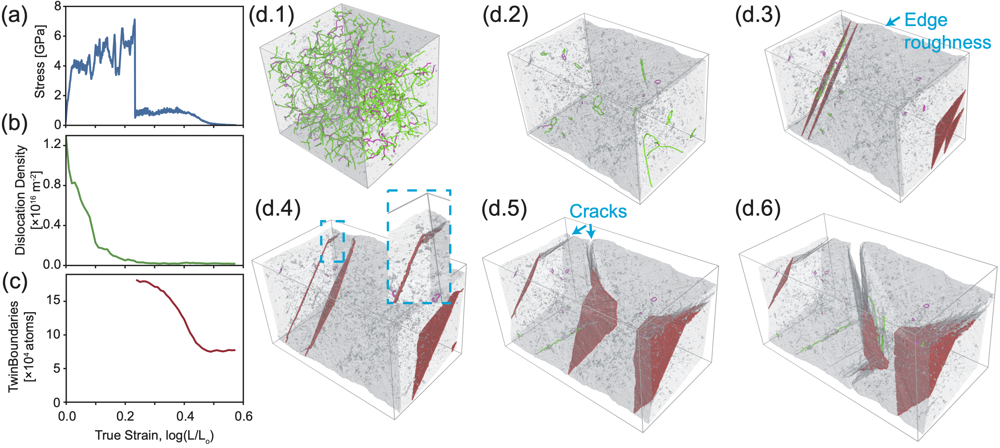
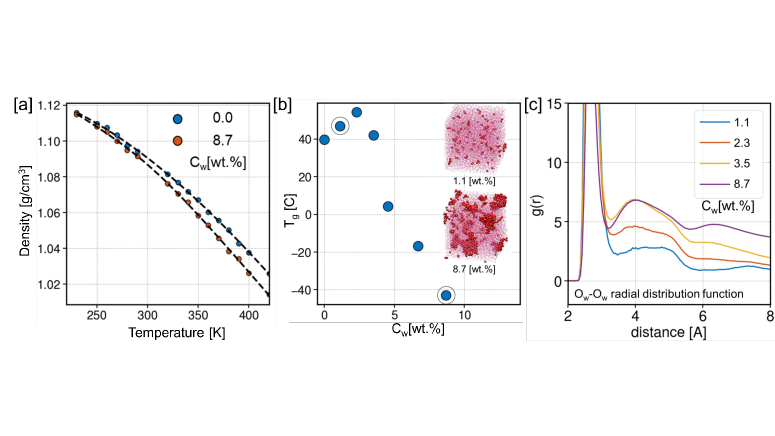
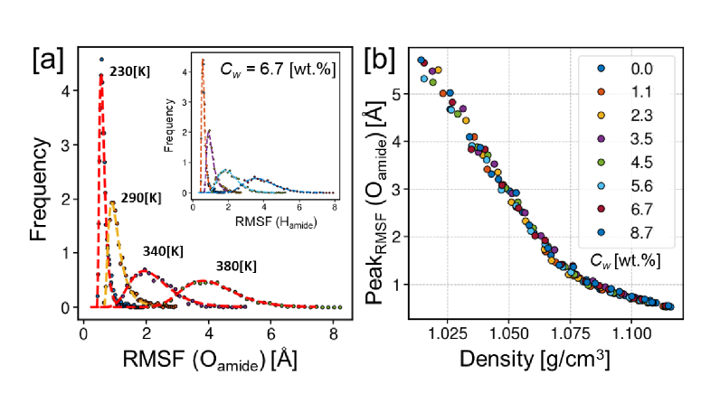
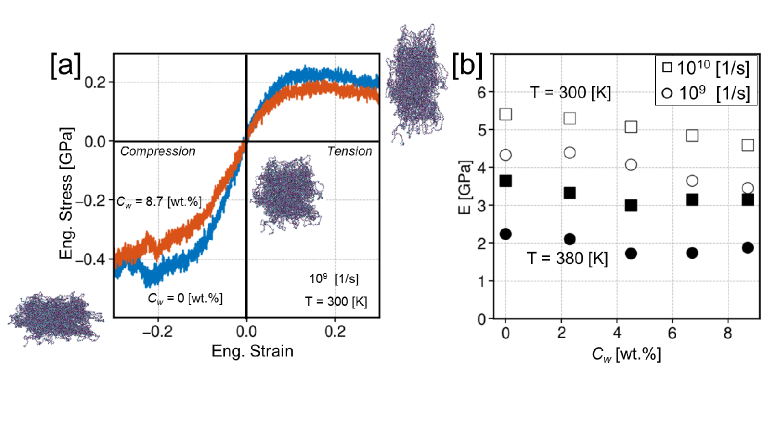

# arXiv 計算物質科学ダイジェスト

**作成日：** 2026年3月18日
**対象期間：** 2026年3月15日〜2026年3月18日（直近72時間）

---

## 選定論文一覧

### 重点論文（詳細解説）

1. [Variance reduction for forces and pressure in variational Monte Carlo](https://arxiv.org/abs/2603.14521) — Linteau et al.
2. [Ductility and Brittle Fracture of Tungsten by Disconnection Pile-up on Twin Boundaries](https://arxiv.org/abs/2603.14883) — Hussein et al.
3. [Loss of altermagnetic order and smooth restoration of Kramers' spin degeneracy with increasing temperature in CrSb and MnTe](https://arxiv.org/abs/2603.15035) — Woodgate et al.

### 簡潔紹介論文

4. [Stabilization of the Orthorhombic Phase in Hf₀.₅Zr₀.₅O₂ Nanoparticles by Oxygen Vacancies](https://arxiv.org/abs/2603.14642) — Zagorodniy et al.
5. [Diagonal Curvature in Second Order Jahn Teller Theory Can Be Negative: An Analytic Proof with First-Principles Confirmation in NH₃](https://arxiv.org/abs/2603.14291) — Li et al.
6. [Effects of uniaxial strain on monolayer transition-metal dichalcogenides revisited](https://arxiv.org/abs/2603.14138) — Evangelista et al.
7. [Atomistic modeling of the hygromechanical properties of amorphous Polyamide 6,6](https://arxiv.org/abs/2603.14569) — Gadelrab et al.
8. [Scalar Spin Chiral Order via Bond Selectivity in Strained Collinear Ferrimagnets](https://arxiv.org/abs/2603.14971) — Liu, Ma et al.
9. [Will it form a glass? Tackling glass formation using binary classification](https://arxiv.org/abs/2603.15312) — Carvalho et al.
10. [Coupled Ferroelectricity and Phonon Chirality](https://arxiv.org/abs/2603.15325) — Han et al.

---

# 重点論文の詳細解説

---

## 論文①

### 1. 論文情報

**タイトル：** [Variance reduction for forces and pressure in variational Monte Carlo](https://arxiv.org/abs/2603.14521)
**著者：** David Linteau, Saverio Moroni, Giuseppe Carleo, Markus Holzmann
**arXiv ID：** 2603.14521
**カテゴリ：** cond-mat.str-el（強相関電子系）
**公開日：** 2026年3月15日
**論文タイプ：** 計算手法論文

---

### 2. どんな研究か

変分モンテカルロ法（VMC）における原子間力および圧力のモンテカルロ推定量に対して、統計的分散を劇的に低減する実用的な手法群を提案した論文である。共分散定式化・Metropolis受容率を利用した「受容トリック」・部分積分（IBP）に基づく推定量変換を組み合わせることで、圧力推定量の分散を最大10⁵倍、Hellmann-Feynman力を最大10³倍低減することに成功した。128原子の高圧水素系に対してニューラル量子状態波動関数を用いた第一原理的分子動力学シミュレーションに応用し、実用性を実証した。

---

### 3. 位置づけと意義

量子モンテカルロ法（QMC）、とりわけVMCは、密度汎関数理論（DFT）を超える精度で多体電子問題を扱いうる手法として期待されているが、力・圧力の計算における分散の大きさが、構造緩和や分子動力学への実用的応用を妨げてきた。本研究は、波動関数のノード面付近やクーロン特異点に起因する分散発散を、数学的に厳密な変換（IBP・受容トリック）で系統的に抑制する統一的フレームワークを構築した点で新規性が高い。特に、ニューラル量子状態（NQS）との組み合わせによるMD実証は、次世代の第一原理QMC-MDの実現可能性を示す重要な一歩であり、高圧物質科学・状態方程式計算・相転移研究など広範な分野への展開が期待される。

---

### 4. 研究の概要

**背景・目的：** VMCはエネルギーを精度よく計算できる一方、力や圧力の推定量は波動関数のノード面（フェルミオン節）近傍やクーロン特異点において分散が発散するため、実用的なMDや構造最適化への応用が困難であった。本研究の目的は、この分散問題を低コストで系統的に解消する手法体系を確立することである。

**計算科学上の課題設定：** エネルギー微分（力・圧力）の分散は次の二つの起源をもつ。(1) Hellmann-Feynman項：電子-核クーロン相互作用の核座標微分に起因する O(r⁻²) 型の特異性。(2) Pulay項：波動関数の最適化パラメータ依存性に起因する、ノード面近傍での O(ε⁻¹) 型発散。どちらも有限の期待値をもちながら分散が発散するという困難な問題である。

**研究アプローチ：** 三種類の相補的手法を開発・組み合わせた。
- **共分散定式化**：Pulay項を期待値との偏差として書き換え、統計的揺らぎをキャンセルさせる。
- **受容トリック（Acceptance Trick）**：Metropolis法の受容確率を重みとして用いることで、ノード発散を O(1/ε) から O(log 1/ε) に変換し、O(ε²) のバイアスを導入した正則化を有効化する。
- **部分積分（IBP）**：Hellmann-Feynman力に対し段階的な部分積分（IBP1: O(r⁻²)→O(r⁻¹)、IBP2: O(r⁻²)→有限）を適用し、特異性を完全に除去する。

**対象材料系：** 高圧水素（128原子、~640 GPa相当）を主なテスト系として使用。ニューラル量子状態（NQS）波動関数を採用。

**主な手法：** 変分モンテカルロ法（VMC）、Hellmann-Feynman定理、Pulay力、Stein制御変数、部分積分（IBP）、ニューラル量子状態（NQS）

**主な結果：**
- 圧力のPulay推定量：共分散のみで分散を~10⁵倍低減、受容トリックでさらに1.25倍、正則化でさらに1.5倍
- 圧力の直接計算値 639.9(4) GPa と有限差分参照値 640.8(9) GPa が一致
- Hellmann-Feynman力：IBP1で~100倍、IBP2で~1000倍の分散低減
- NQSを用いた128原子系でのMD軌跡を実証
- 対相関関数g(r)など他の観測量への拡張も示された

**著者の主張：** 本手法は既存のVMCコードへの導入が容易であり、付加的な計算コストも小さい。NQSとの組み合わせにより、従来DFT-MDに限定されていた第一原理MDの精度限界を突破できる可能性がある。

---

### 5. 計算物質科学として重要なポイント

本研究は、状態方程式・圧力誘起相転移・フォノン計算・分子動力学という計算物質科学の中核的問題に対して、VMCの適用範囲を大幅に拡張する方法論的貢献をなす。Pulay力と圧力推定量の分散問題は「既知の難題」でありながら、実用的な解決策が乏しかったが、本研究はIBPと受容トリックの数学的解析を通じて明確な対処法を提示した。特に、1977年に提案された受容トリックを現代的に再解釈し、ノード発散の次数解析を行った点は独創的である。NQSとの組み合わせによりトランスファーラーニングで波動関数を再最適化しながらMDを実行できることも示されており、強相関系・高圧水素・励起状態の精密計算において波及効果が大きい。また、IBPの枠組みを対相関関数などに拡張したことで、純粋な構造解析にも応用可能である。

---

### 6. 限界と注意点

**（1）システムサイズと計算コスト：** 本研究で実証された系は128原子の高圧水素系であり、NQSのパラメータ更新に伴う波動関数再最適化コストを含めると、DFT-MDと比較して1〜2桁以上の計算コスト増大が避けられない。大規模系や長時間MDへの拡張は今後の課題であり、本論文では方法論の実証にとどまる。**（2）NQSへの依存とバイアス：** 正則化によるO(ε²)バイアスの大きさはεの選択に依存し、ε→0の極限でのみ厳密なゼロバイアスが保証される。実際の計算では適切なεの選択が必要であり、系依存性がある。また、NQSが変分波動関数として正確な基底状態を記述しているかどうかの保証は別途必要であり、ノード構造の不正確さが系統誤差につながる可能性がある。**（3）周期系への適用の複雑さ：** IBP2を周期境界条件下で適用するためには、追加のゲージ項が必要であり、本論文でも処理が複雑になることが認められている。非一様系・表面・界面・欠陥系への応用には追加の定式化が必要である。

---

### 7. 研究動向における立ち位置や関連研究との比較

QMC力計算の分散問題は、AssarafとCaffarelが2000年代に基礎を築き、その後もZero-variance原理、Stein制御変数、Pulay力の正則化など様々なアプローチが提案されてきたが、周期系・NQS・大規模系への対応が課題として残っていた。本研究はそれらを統一的な数学的枠組みで整理し直し、受容トリックの理論的解析という新要素を加えることで、既存手法を体系的に凌駕する。NQSと組み合わせた実証という点では、FermiNetやPauliNetなどのab initio NQS研究と競合する立場にあり、NQS-MDの実用化に向けた競争を加速させる論文である。本論文の成果が実装されれば、従来QMC-MDが困難だった水素/ヘリウムの高圧状態方程式や相転移の精密計算が可能になり、惑星科学・高圧物理・水素貯蔵材料研究へのインパクトが期待される。新規性はincrementalではなく、重要な方法論的ステップアップである。

---

### 8. 重要キーワードの解説

**1. 変分モンテカルロ法（VMC: Variational Monte Carlo）**
試行波動関数 $|\Psi_T\rangle$ のエネルギー期待値 $E = \langle\Psi_T|H|\Psi_T\rangle / \langle\Psi_T|\Psi_T\rangle$ をモンテカルロ積分で計算する手法。電子位置の集合 $\{r_i\}$ を確率密度 $|\Psi_T|^2$ に従いサンプリングし、局所エネルギー $E_L = H\Psi_T/\Psi_T$ の統計平均を取る。変分原理により $E \geq E_0$（真の基底状態エネルギー）が保証される。DFTよりも精度が高い一方、統計誤差が避けられない。

**2. Hellmann-Feynman力**
核座標 $\mathbf{R}_I$ に関するエネルギー勾配 $\mathbf{F}_I = -\partial E/\partial\mathbf{R}_I$。完全変分波動関数では $\mathbf{F}_I = -\langle\Psi|\partial H/\partial\mathbf{R}_I|\Psi\rangle$ として計算できる（Hellmann-Feynman定理）。VMCでは電子-核クーロン項 $-Z_I/|\mathbf{r}_j - \mathbf{R}_I|$ の微分が $r^{-2}$ 型特異性をもつため、分散が発散する問題がある。

**3. Pulay力**
波動関数が核座標に依存する基底関数で展開される場合に現れる補正項 $2\text{Re}\langle\Psi|H-E|\partial\Psi/\partial\mathbf{R}_I\rangle$。VMCでは $|\partial\Psi/\partial\mathbf{R}_I\rangle$ のノード面付近での発散が分散の主要因となる。物理的には波動関数の核座標依存性を正しく取り込むための補正であり、HF力とPulay力の和が正確な力を与える。

**4. 分散低減（Variance Reduction）**
モンテカルロ推定量 $\hat{A} = A(x)$ の統計誤差 $\sigma^2[\hat{A}]$ を下げる技術の総称。ゼロ分散推定量（zero-variance estimator）、制御変数法（control variates）、重点サンプリング（importance sampling）などがある。本研究では共分散定式化と受容トリックにより、物理量の期待値を変えずに分散のみを低下させる。

**5. 受容トリック（Acceptance Trick）**
Metropolis-Hastings法のステップで、現在の配置 $x$ と提案配置 $x'$ に対し、受容確率 $A(x,x') = \min(1, |\Psi(x')|^2/|\Psi(x)|^2)$ を重みとして観測量の加重平均を取る技術。本研究では $\hat{O} = A(x,x') O(x') + (1-A(x,x')) O(x)$ と定義することで、ノード面での発散を O(1/ε) から O(log 1/ε) に緩和できることを数学的に証明した。

**6. 部分積分（IBP: Integration by Parts）**
$\int \nabla\cdot(\Psi^2 \mathbf{v}) d^{3N}r = 0$（周期系では境界項なし）を利用して推定量を変換する手法。特異な演算子（例：$\partial/\partial r \cdot 1/r^2$）を密度勾配にシフトし、特異性の次数を下げる。IBP1で $O(r^{-2})\to O(r^{-1})$、IBP2でさらに $O(r^{-2})\to$ 有限量に変換できる。

**7. ニューラル量子状態（NQS: Neural Quantum States）**
ニューラルネットワーク（主にFermiNetやPauliNetなど）で反対称多体波動関数 $\Psi_\theta(\{r_i\})$ をパラメータ化する手法。電子配置のSlater行列式の線形結合をNNで柔軟に表現し、強相関効果を効率よく捉える。VMCとの組み合わせによりDFTやCCSDを超える精度を示す例も報告されている。

**8. ノード面（Nodal Surface）**
フェルミオン波動関数 $\Psi(\{r_i\}) = 0$ となる超曲面。フェルミオンの反対称性（Pauli排他原理）から必然的に現れる。VMC計算においてノード面に近い配置ではエネルギー局所値や力推定量が発散するため、分散の主要な発生源となる。ノード面の精度はQMC計算の系統誤差（fixed-node error）に直結する。

**9. 状態方程式（EOS: Equation of State）**
物質の圧力 $P$、体積 $V$、温度 $T$、エネルギー $E$ の間の関係式。高圧物質科学や惑星内部の理解に不可欠である。VMCによる精密な力・圧力計算は、DFTが困難な強相関・高圧系（水素メタライゼーション等）でのEOS決定を可能にする。本研究では P = 639.9(4) GPa での計算を実証した。

**10. 共分散定式化（Covariance Formulation）**
確率変数 $A$ の期待値の推定に際し、$A - \langle A\rangle$ の形（偏差）で書き換えることで分散を低減する手法。$\text{Var}(A - \langle A\rangle) = \text{Var}(A)$ だがサンプリング中に蓄積される統計的揺らぎが大幅に抑えられる。Pulay圧力の場合、単純な共分散定式化だけで~10⁵倍の分散低減が達成された。

---

### 9. 図

本論文のライセンスはarXiv非排他的配布ライセンスであり、CC BY系ライセンスに該当しないため、原図の掲載は省略する。

---

---

## 論文②

### 1. 論文情報

**タイトル：** [Ductility and Brittle Fracture of Tungsten by Disconnection Pile-up on Twin Boundaries](https://arxiv.org/abs/2603.14883)
**著者：** Omar Hussein, Nicolas Bertin, Jakub Veverka, Tomas Oppelstrup, Jaime Marian, Fadi Abdeljawad, Shen J. Dillon, Timofey Frolov
**arXiv ID：** 2603.14883
**カテゴリ：** cond-mat.mtrl-sci（材料科学）
**公開日：** 2026年3月16日
**論文タイプ：** 研究論文（分子動力学 + 実験的検証）

---

### 2. どんな研究か

体心立方構造（BCC）の高融点金属タングステン（W）が低温で脆性破壊を示す機構を、大規模分子動力学シミュレーション（~2000万原子）によって原子スケールで解明した論文である。自由表面をもつWナノピラーの引張変形において、（1）転位の枯渇（dislocation starvation）→（2）双晶の核生成・成長→（3）双晶境界上でのディスコネクション（disconnection）の集積による亀裂生成、という3段階の破壊機構を同定し、延性-脆性遷移温度（DBTT）が材料固有の性質ではなく微細組織に依存することを示した。

---

### 3. 位置づけと意義

タングステンはプラズマ対向材料（核融合炉ダイバータ）や高温構造材料として重要であるが、室温での脆性が実用化の障壁となってきた。従来、DBTTは転位の移動度（Peierls応力）によって決まる材料固有の性質と考えられてきたが、本研究はDBTTがむしろ微細組織（転位密度・双晶境界のピン留め）によって制御されることを分子動力学から直接示した。これは「冷間加工したWが延性を示す」という実験事実を原子スケールで説明する初めての包括的なメカニズム解明であり、応力集中機構・ディスコネクション動力学・表面形状効果をすべて統合した点で新規性が高い。核融合炉材料設計だけでなく、BCC金属一般の脆性制御に向けた指針を提供する点で、広い波及効果が期待される。

---

### 4. 研究の概要

**背景・目的：** BCC高融点金属は低温で高い強度と脆性を示し、DBTTが高い。Wの場合、室温での延性は非常に限定的で、核融合炉ダイバータへの応用において安全性の懸念がある。本研究は、Wのナノスケール変形・破壊挙動を系統的に解明し、DBTTを支配する微細組織的要因を特定することを目的とする。

**計算科学上の課題設定：** 破壊は稀かつ局所的な現象であり、実験的に原子スケールで直接観察することは極めて困難である。MDシミュレーションにより、亀裂核生成・転位挙動・双晶形成を原子分解能で追跡する。問題は、高ひずみ速度条件下（10⁶〜10⁸ s⁻¹）での現実的な系の取り扱い（数千万原子規模）と、多様な変形機構（転位滑り・双晶・ディスコネクション）の同時評価にある。

**研究アプローチ：** LAMMPS を用いた分子動力学シミュレーション。W の EAM（embedded atom method）ポテンシャルを使用。初期構造として六角柱状の転位ループを挿入し、焼鈍・予圧縮を経て現実的な転位ネットワークを構築。表面の粗さを制御することで、自由表面のピン留め効果も評価。TEM観察による実験的検証を含む。

**対象材料系：** タングステン単結晶（BCC）、[001]方向引張、(200, 40, 40) nm ボックス（~2000万原子）

**主な手法：** 分子動力学法（MD）、EAMポテンシャル、多面体鋳型マッチング（Polyhedral Template Matching）、転位抽出アルゴリズム（DXA）、BCC Defect Analysis

**主な結果：**
- 自由表面あり条件では、転位が表面に消失する「転位枯渇」が起こり、応力が~6 GPaまで上昇
- 臨界応力到達後に変形双晶が核生成・成長し、応力は~1.5 GPaまで緩和
- 双晶境界（TB）が表面の凹凸にピン留めされると、ディスコネクション（TBのステップ欠陥）が集積し、非コヒーレントTBセグメントが形成されて亀裂の核となる
- DBTTは1000〜1500 Kに位置し、温度上昇により転位枯渇が加速されるため、1000 Kまでは脆性が増す逆説的挙動を示す
- 1500 K以上ではTBのピン留めが起こらず、延性変形（ネッキング）が実現
- 初期転位密度が高いほど枯渇が遅延し、より低温での延性化が可能

**著者の主張：** DBTTはPeierls応力などの材料固有の性質ではなく、微細組織（転位密度・表面形状）によって決定される。したがって微細組織制御によってWの室温延性化が原理的に可能である。

---

### 5. 計算物質科学として重要なポイント

本研究の核心は、ディスコネクション（双晶境界のステップ＋転位の複合体）という欠陥種が、巨視的な脆性-延性遷移を支配する機構の鍵であることを原子スケールで直接示した点にある。EAMポテンシャルはW-Wの弾性定数・積層欠陥エネルギー・表面エネルギーを適切に再現しており、双晶形成・ディスコネクション動力学の定性的・半定量的記述が可能である。スーパーセルサイズ（~2000万原子）は表面効果・双晶成長・ディスコネクション蓄積を同時に捉えるために不可欠であり、境界条件の選択（周期 vs. 自由表面）が結果を質的に左右することが明確に示された。既存研究がDBTTをPeierls応力起源として議論してきたのに対し、本研究は「双晶境界ピン留め→ディスコネクション集積→亀裂核生成」という新しいシーケンスを提示した。BCC金属（Mo, Cr, V等）一般に適用可能な知見であり、核融合・核分裂炉材料、タービン翼材料の微細組織設計に直接貢献する。

---

### 6. 限界と注意点

**（1）EAMポテンシャルの精度と時間スケール：** 使用したEAMポテンシャルは実験的弾性定数や表面エネルギーを再現するが、ガンマ曲面（積層欠陥エネルギー面）の全体的精度は第一原理計算と比較して限界がある。特に双晶核生成エネルギー障壁や亀裂先端での化学結合破断に関しては、EAMの記述が不十分な可能性がある。また、MD でアクセス可能なひずみ速度（10⁶〜10⁸ s⁻¹）は実験（~10⁻³〜10⁰ s⁻¹）より約9〜11桁高速であり、DBTTの絶対値（1000〜1500 K）は実験値（約350〜600 K）より大幅に高い。このひずみ速度問題は本質的であり、MDで得られた温度・応力スケールを実験条件に定量的に対応させることは慎重さを要する。**（2）表面形状効果の定量性：** 本研究での表面粗さは球状アスペリティの分布で表現されているが、実際の実験試料での表面形状は本質的に不均一かつ複雑である。ピン留め力・ディスコネクション集積速度は表面形状の詳細に敏感である可能性があり、本研究での定量的結果（例：臨界応力~6 GPa）を実験値（~3.8 GPa）と直接比較することには一定の注意が必要である。**（3）単結晶・単軸引張の制約：** 実験試料は多結晶体であり、粒界・多軸応力・粒内方位分布が脆性挙動に影響する。本研究は単結晶の単軸引張に限定されており、粒界効果・多結晶体内での双晶相互作用・水素脆化などの要因は考慮されていない。

---

### 7. 研究動向における立ち位置や関連研究との比較

BCC金属の低温脆性は1950年代から研究されてきた古典的問題であり、Peierls-Nabarro障壁、スクリュー転位の熱活性移動、共有結合的なボンド破断など様々な機構が提案されてきた。近年はCarltonらのW微小試験体変形やYamamotoらのスクリュー転位移動の精密MDなどが注目されている。本研究が画期的なのは、双晶境界でのディスコネクション集積という従来ほとんど注目されてこなかったメカニズムを亀裂核生成の主原因として同定した点である。FrolovらはCuの粒界ファセット変態でディスコネクション動力学を先駆的に研究してきており、本研究はそのアプローチをBCC金属の脆性問題に展開した論文と位置づけられる。新規性はincrementalよりは明確なステップアップであり、DBTT研究・転位工学・材料設計コミュニティで広く引用される可能性が高い。今後はKMC（動力学的モンテカルロ）との連携による長時間スケール・低ひずみ速度への外挿、および多元素W合金（W-Re, W-Taなど）への応用が自然な展開方向である。

---

### 8. 重要キーワードの解説

**1. 体心立方構造（BCC）**
立方体の8頂点と体心の原子からなる結晶構造。タングステン（W）、モリブデン（Mo）、鉄（α-Fe）などが該当する。BCC金属は一般に高いPeierls応力をもち、低温でスクリュー転位の移動が困難なため脆性を示す傾向がある。数式的には格子定数 $a$ に対し、近接原子距離は $\sqrt{3}a/2$。

**2. 延性-脆性遷移温度（DBTT: Ductile-to-Brittle Transition Temperature）**
材料が延性破壊から脆性破壊に移行する温度。BCC金属に特有の現象で、DBTTより低温では主に亀裂伝播が支配的となり、高温では転位運動による塑性変形が優勢となる。Wの実験的DBTTは~350〜600 Kとされるが、微細組織によって大きく変化する。

**3. 分子動力学法（MD）**
原子の運動方程式 $m_i \ddot{\mathbf{r}}_i = -\nabla_i U(\{\mathbf{r}_j\})$ を数値積分することで、多粒子系の時間発展を追跡する計算手法。ポテンシャルエネルギー $U$ に EAM などの経験的・半経験的ポテンシャルや機械学習ポテンシャルを用いる。時間刻み~1 fs、総シミュレーション時間は~ns〜µs オーダー。

**4. 埋め込み原子法（EAM: Embedded Atom Method）**
金属のポテンシャルエネルギーを $U = \sum_i F(\rho_i) + \frac{1}{2}\sum_{i\neq j}\phi(r_{ij})$ と表現する半経験的ポテンシャル。$\rho_i = \sum_{j\neq i} \rho^a(r_{ij})$ は原子 $i$ の電子密度、$F$ は埋め込みエネルギー関数、$\phi$ は対ポテンシャル。弾性定数・欠陥形成エネルギー・表面エネルギーなどをフィット。金属に適したポテンシャルの標準形式の一つ。

**5. ディスコネクション（Disconnection）**
粒界や双晶境界に存在する線欠陥で、ステップ（高さ $h$）とバーガースベクトル $\mathbf{b}$ の組み合わせをもつ。表記は $(h, \mathbf{b})$。双晶境界の移動はディスコネクションの核生成・移動によって起こる（$h$ に対応するせん断ひずみが生じる）。集積したディスコネクションは局所応力集中を生み出し、亀裂核生成のサイトとなる。

**6. 転位枯渇（Dislocation Starvation）**
小型試料（ナノ〜マイクロスケール）において、転位が自由表面に消失する速度が、応力増大による新規転位の核生成速度を上回る状況。その結果、転位密度が急激に低下し、変形が停滞して応力が上昇し続ける「exhaustion hardening」が起こる。バルク材料では転位増殖（Frank-Readソース）が支配的だが、小型試料では表面効果が顕著になる。

**7. 変形双晶（Deformation Twinning）**
外部応力によって結晶の一部が特定の鏡映面（双晶面）を境に対称な方位へせん断変形する現象。BCC金属では$\{112\}\langle111\rangle$系の双晶が典型的。双晶形成は部分転位の集積的な滑りによって起こり、転位枯渇後の応力緩和機構として機能するが、双晶境界がピン留めされると亀裂生成に至る。

**8. 亀裂核生成（Crack Nucleation）**
き裂の発生過程。本研究では非コヒーレント双晶境界セグメント（ディスコネクション集積による）が応力集中源となり、き裂が生成する。臨界条件は Griffith-Irwin 型の破壊力学で記述できるが、原子スケールでは結合切断エネルギー・表面エネルギー・弾性場の相互作用が複雑に絡む。

**9. 多面体鋳型マッチング（PTM: Polyhedral Template Matching）**
MD シミュレーション中の原子構造を局所多面体形状と比較し、BCC・FCC・HCP などの結晶構造や双晶・積層欠陥を自動識別する解析手法。本研究では双晶境界の形成・移動・ピン留めの可視化に使用。

**10. Peierls 応力**
格子中で転位が移動するために必要な最小せん断応力。結晶構造と原子間ポテンシャルに依存する材料固有の量。BCC金属のスクリュー転位では Peierls 応力が高く、低温での変形抵抗の主因とされてきた。本研究は DBTT が Peierls 応力単独では説明できず、双晶境界ダイナミクスも本質的であることを示した。

---

### 9. 図

ライセンス：CC BY 4.0

**図1：周期境界条件下（PBC）での延性挙動。** 転位は自由表面に消失せず、応力は一定に保たれたまま大ひずみまで延性変形が継続する。この対照実験は、表面の有無が変形機構を質的に変えることを示しており、転位枯渇→双晶→脆性破壊という連鎖が「表面効果」に起因することを明らかにする上で重要な基準点となる。

**図2：自由表面あり条件での脆性破壊の3段階シーケンス。** (1) 転位が表面に消失し応力が~6 GPa まで上昇する転位枯渇期、(2) 変形双晶の核生成・成長と応力降下、(3) 双晶境界のピン留め→ディスコネクション集積→非コヒーレントセグメント形成→亀裂核生成の順に進む。この図が論文の中心的主張を最も明確に示している。

**図3：ディスコネクション集積による亀裂核生成の原子スケール描写。** 表面凹凸にピン留めされた双晶境界にディスコネクションが集積し、局所的な非コヒーレント境界セグメントが形成されて亀裂の起点となる様子を示す。このメカニズムの直接的可視化が論文の最大の新規性であり、「双晶境界ピン留め→亀裂」という因果関係を強く支持する。

---

---

## 論文③

### 1. 論文情報

**タイトル：** [Loss of altermagnetic order and smooth restoration of Kramers' spin degeneracy with increasing temperature in CrSb and MnTe](https://arxiv.org/abs/2603.15035)
**著者：** Christopher D. Woodgate, Nabil Menai, Arthur Ernst, Julie B. Staunton
**arXiv ID：** 2603.15035
**カテゴリ：** cond-mat.mtrl-sci（材料科学）
**公開日：** 2026年3月16日
**論文タイプ：** 研究論文（第一原理電子状態計算）

---

### 2. どんな研究か

近年注目を集めるアルターマグネット（altermagnet）の代表物質 CrSb（金属）と MnTe（半導体）について、有限温度効果を第一原理的に取り込んだ電子状態計算を行い、磁気秩序の消失過程とクラマース縮退の回復過程を定量的に明らかにした論文である。DLM（Disordered Local Moment）フレームワークと KKR-DFT（Korringa-Kohn-Rostoker 型密度汎関数理論）を組み合わせ、熱的スピン揺らぎを統計平均として取り込むことで、ネール温度以上での局所磁気モーメントの持続とバンド構造の変化を記述した。金属 CrSb と半導体 MnTe では、アルターマグネット的特徴の消失様式が質的に異なることを示した。

---

### 3. 位置づけと意義

アルターマグネットは反強磁性体でありながら時間反転対称性破れをもつ新しい磁性カテゴリとして2021年頃から急速に注目されており、スピン分裂バンド構造・異常ホール効果・スピン流生成などのスピントロニクス機能が期待されている。しかし、これらの機能は本質的に低温（T=0 K）の計算に基づく議論が多く、有限温度でどの程度保持されるかは重要な実用上の問題である。本研究は CrSb と MnTe のスピン輸送特性が有限温度でどう劣化するかを第一原理的に定量化した初めての系統的研究として位置づけられる。特に「クラマース縮退の回復はネール温度以前に起こる（CrSb）か以後に起こる（MnTe）か」という重要な問いに答えた点で、スピントロニクス応用における温度依存性設計の指針を与える。

---

### 4. 研究の概要

**背景・目的：** アルターマグネットは補償された反強磁性的磁気構造をもちながら、運動量空間でクラマース縮退が解けたスピン分裂バンドをもつ。このスピン分裂はスピン流・トルク・ホール効果などに関与するため、有限温度でその消失を定量的に把握することが実用的に重要である。本研究は KKR-DFT + DLM を用いて、CrSb と MnTe のネール温度付近での電子状態・磁気秩序パラメータの温度依存性を第一原理的に計算することを目的とする。

**計算科学上の課題設定：** 有限温度での磁気無秩序を第一原理的に取り込む際、単純な温度依存性の経験的モデルでは不十分であり、局所磁気モーメントの向きが熱揺らぎによってランダムになる効果を電子状態に直接結びつけることが必要である。DLM は局所モーメントの確率的配向を CPA（coherent potential approximation）で統計平均することで、これを実現する標準的手法である。

**研究アプローチ：** Hutsepot コードを用いたオール電子 KKR-DFT 計算。CrSb には LSDA（局所スピン密度近似）、半導体 MnTe には LSIC（局所自己相互作用補正）を使用して強相関効果を取り込んだ。スカラー相対論的処理（SOCなし）でスピン分裂の交換的起源に焦点を当てた。秩序パラメータ（磁化方向の平均）を温度の関数として自己無撞着に計算し、Weiss 平均場型の繰り返し計算でネール温度を決定した。

**対象材料系：** CrSb（ニッケル砒素型構造、金属性アルターマグネット）と MnTe（NiAs 型または閃亜鉛鉱型、半導体アルターマグネット）

**主な手法：** KKR-DFT、DLM（Disordered Local Moment）、CPA（Coherent Potential Approximation）、LSDA、LSIC

**主な結果：**
- 両物質でネール温度以上でも局所磁気モーメントが持続（Cr: 2.58 μB、Mn: 4.63 μB）
- CrSb（金属）：アルターマグネット特有のスピン分裂がネール温度を大きく下回る温度で消失し、フェルミ準位付近のバンドが大幅にブロードニング。計算 TN = 920 K（実験 705 K）
- MnTe（半導体）：バンドギャップは磁気無秩序に対して比較的安定を保ち、クラマース縮退の回復はネール温度近傍または以上で起こる。計算 TN = 160 K（実験 306 K）
- 金属と半導体でスピン縮退の回復機構が質的に異なることを示した

**著者の主張：** アルターマグネットの機能的特性（スピン分裂）が有限温度でどの程度保持されるかは物質依存性が大きく、半導体型の方が金属型よりも高温での機能保持に有利である可能性がある。スピントロニクス応用にはこの有限温度効果を考慮した設計が不可欠である。

---

### 5. 計算物質科学として重要なポイント

DLM + KKR-DFT は有限温度磁気秩序の第一原理的取り扱いとして確立された手法であるが、アルターマグネットへの適用は新鮮かつ適時である。CrSb と MnTe という金属-半導体ペアを対比させることで、フェルミ準位での状態密度の有無がスピン縮退回復の温度スケールに与える影響を明確にした点は重要な物理的知見である。LSIC の採用は MnTe の Mn 3d 電子の自己相互作用補正に重要であり、単純な LDA/GGA では過小評価されるバンドギャップを改善している。ただし、計算された TN が実験値と10〜90 K程度ずれているのは、DLM が古典スピン揺らぎを扱い量子スピン揺らぎを過小評価することや、磁気フォノン結合を無視していることに起因すると考えられる。スピン輸送（スピンホール伝導率・スピン流）との定量的なリンクは本論文では示されていないが、次のステップとして自然な展開方向である。

---

### 6. 限界と注意点

**（1）計算されたネール温度の定量的精度：** CrSb については計算 TN（920 K）が実験値（705 K）を約30%過大評価し、MnTe については計算 TN（160 K）が実験値（306 K）を約47%過小評価している。この定量的な不一致は DLM の平均場近似の限界（古典スピン揺らぎのみ考慮）や、SOC（スピン軌道結合）の省略、格子振動との結合無視などに起因する可能性がある。したがって、スピン縮退が回復する温度スケールの絶対値については実験検証が必要であり、本論文の結果を定量的に利用する際には注意が必要である。**（2）スカラー相対論的近似とスピントロニクス応用の限界：** 本研究はスピン軌道結合を省略したスカラー相対論的計算であり、アルターマグネットのスピンホール効果・異常ホール効果・スピントルクなどのスピン輸送量は直接計算されていない。これらの量は SOC に強く依存するため、本研究の結果をスピントロニクス機能への直接的な定量的予測として使用することは不適切である。**（3）CPA の制限と局所的無秩序効果：** CPA は多体無秩序の統計平均として機能するが、磁気クラスタリング・短距離秩序・局所的スピン相関などの空間的ゆらぎを取り込めない。特にネール温度近傍では短距離磁気秩序が残存し、スピン分裂の局所的な「島」が持続する可能性がある。この点は実験の X 線散漫散乱や中性子散乱との比較が必要である。

---

### 7. 研究動向における立ち位置や関連研究との比較

アルターマグネットの概念は Šmejkal、Sinova らが2021〜2022年に理論的に整理し（Physical Review X）、その後 MnTe・CrSb・RuO2 などでの実験的確認（ARPES、X線磁気二色性）が続いた。有限温度効果については Kresse グループや Sinova グループによる計算も部分的に行われているが、DLM + KKR という全電子手法で金属と半導体を体系的に比較した例は少ない。StauntonグループはDLMの体系化において20年以上の蓄積をもち、本研究はその手法的強みを最新のホットトピック（アルターマグネット）に投入した戦略的論文である。新規性は方法論よりも「何を示したか」（温度依存性の金属-半導体差異）にあり、incrementalではあるが適時性が高い。アルターマグネット研究コミュニティ全体（磁性・スピントロニクス・第一原理計算）から広く引用される可能性がある。今後の展開としては、SOCを含む計算・スピン輸送量の有限温度計算・軽元素アルターマグネット（ReO2等）への展開が考えられる。

---

### 8. 重要キーワードの解説

**1. アルターマグネット（Altermagnet）**
反強磁性的な補償磁気構造をもちながら、波数 $\mathbf{k}$ 空間でスピン縮退が解けている新しい磁性カテゴリ。時間反転操作 $\mathcal{T}$ 単独では対称性が回復しないが、$\mathcal{T}$ と特定の空間操作（回転・鏡映等）の積によって対称性をもつ。従来の強磁性（全スピン偏極）でも反強磁性（完全補償・スピン縮退保持）でもない第三の分類として位置づけられる。

**2. クラマース縮退（Kramers Degeneracy）**
時間反転対称性と空間反転対称性が共存する系では、波数 $\mathbf{k}$ において $E_\uparrow(\mathbf{k}) = E_\downarrow(\mathbf{k})$ が成立する（スピン縮退）。これをクラマース縮退と呼ぶ。アルターマグネットでは時間反転対称性が破れることでこの縮退が解け、スピン分裂バンド構造が現れる。クラマース縮退の回復はアルターマグネット的特性の喪失を意味する。

**3. DLM（Disordered Local Moment）理論**
有限温度での磁気無秩序を局所磁気モーメントの方向がランダムに揺らいでいる状態として模型化する第一原理的フレームワーク。温度 $T$ での秩序パラメータ $m = \langle\hat{e}_I\rangle$（局所モーメント方向の熱平均）を自己無撞着に計算し、$m \to 0$ となる温度をネール温度として定義する。古典スピン揺らぎの統計平均を CPA で扱う。

**4. KKR（Korringa-Kohn-Rostoker）法**
グリーン関数を基底として用いた第一原理電子状態計算手法。多重散乱理論を基礎とし、各原子の散乱行列（t行列）を自己無撞着に決定する。全電子計算（PAWや疑ポテンシャル法と異なり、コア電子を明示的に扱う）であり、CPA による無秩序効果の取り込みと相性がよい。

**5. CPA（Coherent Potential Approximation）**
無秩序系の電子状態を記述するための平均場近似。各格子点をある有効散乱体（コヒーレントポテンシャル）で置き換え、不純物や磁気無秩序の効果を統計平均として取り込む。多重散乱理論の틀内で自己無撞着方程式として解かれる。DLM と組み合わせることで有限温度磁気秩序を扱える。

**6. LSIC（局所自己相互作用補正）**
LDA（局所密度近似）では自分自身との相互作用（自己相互作用エラー）が適切に消えず、半導体や強相関系でバンドギャップが過小評価される。LSIC はこの補正を局所的に（オービタルごとに）適用する手法。MnTe の Mn 3d 電子のように強相関性が高い場合に特に重要。

**7. ネール温度（Néel Temperature, TN）**
反強磁性またはアルターマグネット的秩序が消失する相転移温度。TN 以上では磁気無秩序（常磁性）状態になる。CrSb では実験的に TN ≈ 705 K、MnTe では TN ≈ 306 K。

**8. スカラー相対論的計算**
電子の相対論的効果（質量補正・Darwin 項・スピン軌道結合）のうち、スピン軌道結合（SOC）を除いて質量補正と Darwin 項のみを含む近似計算。SOCを含まないため、スピンとバンドの依存関係はスピン交換相互作用のみに起因する。アルターマグネットのスピン分裂の純粋な交換的起源を調べるのに適している。

**9. スピン分裂バンド構造**
スピン上向き（↑）と下向き（↓）のバンドが異なるエネルギーをもつ状態：$E_\uparrow(\mathbf{k}) \neq E_\downarrow(\mathbf{k})$。強磁性ではすべての $\mathbf{k}$ でスピン分裂が生じるが、アルターマグネットでは運動量依存的に分裂し、全体として磁化はゼロに補償される。このスピン分裂がスピンホール効果・スピン流生成などのスピントロニクス機能を担う。

**10. 磁気秩序パラメータの温度依存性**
自発磁化（強磁性）やサブ格子磁化（反強磁性）の温度依存性。平均場理論では $m(T) \propto (1 - T/T_N)^\beta$（$\beta$ は臨界指数）で近似される。DLM では局所モーメントの方向の熱平均 $\langle\hat{e}\rangle$ として計算され、$T \to T_N$ で連続的に 0 に近づく（2次相転移）。本研究では CrSb と MnTe でこの温度依存性が異なることが示された。

---

### 9. 図

本論文のライセンスは arXiv 非排他的配布ライセンスであり、CC BY 系ライセンスに該当しないため、原図の掲載は省略する。

---

---

# その他の重要論文

---

## 論文④

### 1. 論文情報

**タイトル：** [Stabilization of the Orthorhombic Phase in Hf₀.₅Zr₀.₅O₂ Nanoparticles by Oxygen Vacancies](https://arxiv.org/abs/2603.14642)
**著者：** Yuri O. Zagorodniy, Eugene A. Eliseev, Valentin V. Laguta, Petr Jiricek, Jana Houdkova, Lesya D. Demchenko, Oksana V. Leshchenko, Victor N. Pavlikov, Lesya P. Yurchenko, Anna O. Diachenko, Michail D. Volnyanskii, Myroslav V. Karpets, Mikhail P. Trubitsyn, Dean R. Evans, Anna N. Morozovska
**arXiv ID：** 2603.14642
**カテゴリ：** cond-mat.mtrl-sci
**公開日：** 2026年3月15日
**論文タイプ：** 理論・実験融合論文

---

### 2. 研究概要

Hf₀.₅Zr₀.₅O₂（HZO）ナノ粒子（~7 nm）において、酸素空孔濃度が直斜方晶相（orthorhombic phase, o相）の安定化に果たす役割を実験・理論の両面から系統的に解析した論文である。o相は強誘電性を担う相として重要であるが、その安定化機構は未解明の部分が多かった。本研究では、空気中および CO+CO₂ 雰囲気でアニールした HZO ナノ粒子について、EPR（電子常磁性共鳴）・XPS（X線光電子分光）・XRD・NMR を用いて酸素空孔濃度と o 相分率の相関を定量的に評価した。実験結果は、ランダウ-ギンズブルグ-デヴォンシャー（LGD）理論に基づく現象論的計算によって支持され、酸素空孔が引き起こす「化学ひずみ（chemical strain）」がo相の長距離秩序を安定化する機構が提案された。

この研究が計算物質科学的に重要なのは、LGD 理論を用いた現象論的計算が実験データと直接対比され、化学ひずみの大きさとo相安定化の物理的因果関係を定量化した点にある。HZO は次世代 DRAM・不揮発性メモリ・強誘電体トンネル接合の候補材料であり、その相安定性の制御機構の解明は材料設計に直結する。また、ナノ粒子サイズ依存の相安定性（モノクリニック相 vs. o相）が酸素空孔濃度に強く依存することを明らかにしたことで、アニール雰囲気設計による強誘電相安定化の指針を提供した。ただし、本論文の理論計算は LGD 現象論にとどまり、第一原理計算による化学ひずみの微視的起源の検証は今後の課題として残る。

---

### 3. 重要キーワードの解説

**1. 直斜方晶相（orthorhombic phase, o相）：** HfO₂系で強誘電性を示す相。空間群 Pca2₁。立方晶相（常温高圧）・正方晶相・モノクリニック相（安定相）とならんで存在し、ナノスケールでのみ安定化しやすい。

**2. ランダウ-ギンズブルグ-デヴォンシャー（LGD）理論：** 強誘電体の相転移をギンズブルグ-ランダウ型自由エネルギー $F = \alpha P^2 + \beta P^4 + \gamma P^6 - EP$ の最小化で記述する現象論。$P$ は分極、$\alpha,\beta,\gamma$ は温度依存パラメータ。ひずみ（歪み）との結合項を加えることで電気機械結合も記述できる。

**3. 化学ひずみ（chemical strain）：** 組成変化（ここでは酸素空孔の導入）によって生じる格子定数の変化。酸素欠損により Hf/Zr 周囲の対称性が変わり、局所的なひずみ場が生じる。このひずみが特定の相の安定化に寄与する。

**4. 酸素空孔（oxygen vacancy）：** 酸化物結晶格子における酸素原子の欠損。電荷補償として Hf⁴⁺→Hf³⁺ 等の還元が生じる。EPR・XPS で検出可能。濃度はアニール雰囲気（酸化・還元）で制御できる。

**5. EPR（電子常磁性共鳴）：** 不対電子をもつ欠陥（例：Hf³⁺）をマイクロ波吸収で検出する手法。酸素空孔濃度の定量的評価に有効。

**6. XRD（X線回折）：** 結晶構造・相分率を決定する標準的手法。リートベルト解析により各相の体積分率を定量できる。

**7. XPS（X線光電子分光）：** 表面近傍の元素組成・価数状態を分析する手法。Hf 4f・O 1s ピークから Hf の価数状態と酸素欠損の情報を得る。

**8. ナノ粒子サイズ効果：** HfO₂系では~7 nm 程度のナノ粒子でo相が安定化しやすい。表面エネルギーの寄与・表面応力が内部の相安定性に影響するためと解釈される（いわゆる「size effect」）。

**9. 強誘電体（ferroelectric）：** 外部電場なしで自発分極をもち、電場反転で分極方向を切り替えられる物質。HZOのo相は最薄クラスのシリコン互換強誘電体膜として次世代メモリへの応用が期待される。

**10. アニール雰囲気制御：** 試料を加熱処理する際の気体環境。酸化性（空気）と還元性（CO/CO₂混合）でアニールすることで、酸素空孔濃度を制御でき、相分率に直接影響を与える。

---

### 4. 図

本論文のライセンスは arXiv 非排他的配布ライセンスであり、CC BY 系ライセンスに該当しないため、原図の掲載は省略する。

---

---

## 論文⑤

### 1. 論文情報

**タイトル：** [Diagonal Curvature in Second Order Jahn Teller Theory Can Be Negative: An Analytic Proof with First-Principles Confirmation in NH₃](https://arxiv.org/abs/2603.14291)
**著者：** Zhian Li, Hanxiang Mi, Xiyue Cheng, Jurgen Kohler, Shuiquan Deng
**arXiv ID：** 2603.14291
**カテゴリ：** cond-mat.mtrl-sci
**公開日：** 2026年3月15日
**論文タイプ：** 理論・第一原理計算論文

---

### 2. 研究概要

二次ヤーン-テラー理論（SOJTT: Second Order Jahn-Teller Theory）の基礎的な仮定——対角曲率（diagonal curvature）は常に正であるという仮定——が成立しないことを解析的に証明し、NH₃を対象とした第一原理計算によって確認した論文である。SOJTT は分子や固体における自発的対称性破れ（構造相転移・変形）を HOMO-LUMO 混成によって説明する理論的枠組みであり、これまで数十年にわたり広く使用されてきた。本研究は、凍結フォノン多体展開と DFT（コーン-シャム枠組みへの変換）を用いて対角曲率の各成分（電子-核、Hartree、交換相関、運動エネルギー）を分解し、NH₃の D₃h 参照配置においてエネルギーが鞍点であることを示した。HOMO-LUMO 混成の寄与は全エネルギー変化の 0.2% 未満であり、99.8% は N の 2s-2p_z 電子再分布を引き起こす電子-核項に起因する。

この発見は、構造対称性破れを議論する際に対角曲率の正値性を前提とした議論が根本的に誤りである場合があることを示す重要な理論的修正であり、固体化学・結晶構造予測・相転移の計算理解において広範な影響をもつ。ヤーン-テラー歪みを伴う遷移金属酸化物・ペロブスカイト・分子磁性体などの設計において、SOJTT の適用限界を再評価する必要性を提起する。第一原理による数値的証明と解析的証明を組み合わせた手法論的アプローチは再現性が高く、他の系へも適用可能である。

---

### 3. 重要キーワードの解説

**1. 二次ヤーン-テラー理論（SOJTT）：** 高対称参照配置からの変形をHOMO（最高占有軌道）とLUMO（最低非占有軌道）の混成から説明する摂動論的アプローチ。エネルギー第二微分 $\partial^2 E/\partial Q^2 = k_{diag} - k_{coupling}$ が負になるとき、対称性を破る変形（不安定化）が起こるとされる。ここで $Q$ は縮退しない変形モードの座標。

**2. 対角曲率（diagonal curvature）：** SOJTT においてエネルギー二次微分の対角成分 $k_{diag} = \langle\Psi_0|\partial^2 H/\partial Q^2|\Psi_0\rangle$ のこと。基底状態の期待値であるため、従来「正である」と仮定されてきたが、本研究はこの仮定を否定した。

**3. 凍結フォノン法（frozen phonon）：** 特定の格子振動モードに対応する変位を与えた超格子でエネルギーを計算し、エネルギー曲線から力定数・フォノン周波数を得る手法。本研究では対称性を保った変形（A₂"モード）に沿ったエネルギー展開に用いた。

**4. HOMO-LUMO 混成：** 最高占有軌道と最低非占有軌道の間のカップリング（二次摂動論的項）。SOJTT では構造変形の主要な駆動力とされてきた。本研究では NH₃において HOMO-LUMO 混成の寄与が全エネルギー変化の 0.2% 未満であることが示され、従来の認識の誤りが明らかになった。

**5. 多体エネルギー展開：** 全エネルギーを各原子・原子対・三体相互作用などの寄与に分解する手法。本研究では電子-核、Hartree（電子間クーロン）、交換相関、運動エネルギーの各成分に分解し、どの項が対角曲率の負値化に寄与するかを同定した。

**6. 鞍点（saddle point）：** 多次元エネルギー面において、ある方向には極小、別の方向には極大となる点。本研究では NH₃ の D₃h 対称配置が A₂" モードに沿った鞍点であることが示された（ N のインバージョン運動の遷移状態）。

**7. N(2s-2pz) 電子再分布：** 窒素原子の 2s 軌道と 2p_z 軌道の間での電子の移動。NH₃ の対称性破れ（三角平面→三角錘形）に際して、この軌道間再分布が全エネルギー変化の99.8%を担うことが本研究で示された。

**8. Kohn-Sham 枠組み（DFT）：** 多電子系のエネルギーを、補助的な独立粒子系（Kohn-Sham 粒子）の運動エネルギー + クーロン + 交換相関汎関数として表現する密度汎関数理論の実装形式。本研究では凍結フォノン展開のエネルギー成分分析に使用した。

**9. 自発的対称性破れ（spontaneous symmetry breaking）：** 外部場なしに系が高対称な配置から低対称な配置へ変形する現象。ペロブスカイト構造の強誘電転移・ヤーン-テラー活性な配位子場変形・有機分子のBond Length Alternation などが典型例。SOJTT はその理論的説明の一つであるが、本研究はその適用条件を再定義した。

**10. Schwarz 不等式による上限解析：** 行列要素の絶対値を Schwarz 不等式 $|\langle a|O|b\rangle|^2 \leq \langle a|a\rangle\langle b|O^\dagger O|b\rangle$ で上から抑える解析手法。本研究では HOMO-LUMO 混成による寄与の上限を評価し、全エネルギー変化に対して無視できる大きさであることを証明するために使用した。

---

### 4. 図

本論文のライセンスは CC BY-NC-ND 4.0 であるが、HTML 版が arXiv 上で利用可能でなかったため、図の抽出は省略する。

---

---

## 論文⑥

### 1. 論文情報

**タイトル：** [Effects of uniaxial strain on monolayer transition-metal dichalcogenides revisited](https://arxiv.org/abs/2603.14138)
**著者：** Igor Evangelista, Abdul Saboor, Muhammad Zubair, Intuon Chatratin, Ruiqi Hu, Dai Q. Ho, Shoaib Khalid, Ioanna Fampiou, Anderson Janotti
**arXiv ID：** 2603.14138
**カテゴリ：** cond-mat.mtrl-sci
**公開日：** 2026年3月14日
**論文タイプ：** 第一原理計算論文

---

### 2. 研究概要

単層遷移金属ダイカルコゲナイド（TMD）MX₂（M = Mo, W; X = S, Se, Te）に対し、スピン軌道結合を含むハイブリッド密度汎関数計算を用いて一軸ひずみ下のバンド構造を系統的に計算し直した論文である。従来研究では励起子光学ギャップを用いることが多かったが、本研究では準粒子バンドギャップ（基本ギャップ）を正確に再現することを重視した計算を実施した。主な発見は以下の通り：引張一軸ひずみはバンドギャップを顕著に縮小し、特に伝導帯端がひずみ応答が大きい；一軸ひずみ下でも K 点近傍の伝導帯谷（CBM）と価電子帯谷（VBM）は縮退を保つが、高対称 K 点から離れた方向（off-symmetry wavevector）にドリフトする「谷ドリフト」現象が生じる；谷ドリフトにより間接遷移バンドギャップ化が生じ、MoS₂ の引張ひずみ下での蛍光強度減少という実験事実を自然に説明できる。

計算物質科学的に重要な点は、スピン軌道結合を含む全相対論的ハイブリッド DFT（HSE06 + SOC 相当）を用いて TMD 六種類を系統的にベンチマークしたことである。既存研究の多くが GGA を使用していたため、ギャップ値の過小評価とひずみ応答の定量的誤りが問題視されていた。谷ドリフトの微視的解釈（タイトバインディングモデルによる合理化）を提供したことで、実験観察との対応が改善した。ひずみエンジニアリングによるバンドギャップ制御・量子欠陥工学・オプトエレクトロニクスへの設計指針を提供する実用的な論文でもある。

---

### 3. 重要キーワードの解説

**1. 遷移金属ダイカルコゲナイド（TMD）：** MX₂（M = Mo, W; X = S, Se, Te）の化学式をもつ層状半導体。バルクでは間接ギャップ、単層では直接ギャップとなり、強いスピン-バレー結合をもつ。光電変換・スピントロニクス・量子技術への応用が期待される。

**2. ハイブリッド密度汎関数（Hybrid DFT）：** HF（ハートリー-フォック）交換をある割合で GGA/LDA 汎関数に混合した汎関数（例：HSE06）。純粋 GGA/LDA と比べバンドギャップを大幅に改善する。TMD には ~25〜35% のHF交換を含む HSE 型が広く使われる。

**3. スピン軌道結合（SOC）：** 電子スピンと軌道角運動量の相互作用 $H_{SO} = \frac{1}{2m_e^2 c^2} \frac{1}{r}\frac{dV}{dr} \mathbf{L}\cdot\mathbf{S}$。TMD では Mo, W の重元素のd軌道によりSOCが強く、K点でのスピン-バレー縮退の解消（VBMのスピン分裂~0.1〜0.5 eV）に寄与する。

**4. 準粒子バンドギャップ（quasiparticle band gap）：** 電子を一つ加えた（または除いた）場合のエネルギー差。実際の光電子分光・逆光電子分光で測定される量。励起子ギャップ（光学ギャップ）とは励起子束縛エネルギー分だけ異なる。本研究では励起子ギャップに頼らず準粒子ギャップを標的にしてフィッティングを行った。

**5. 谷ドリフト（valley drift）：** 一軸ひずみ印加時に CBM・VBM が K 点から近傍のオフ対称点へ移動する現象。六方晶点群の場合、鏡映面に沿った方向にドリフトする。谷ドリフトにより直接→間接ギャップ転移が起こり得る。

**6. アームチェア/ジグザグ方向：** 六方晶 TMD 面内の二つの高対称ひずみ方向。アームチェア方向（M-X 結合に平行）とジグザグ方向（M-X 結合に垂直）でひずみ応答が異なる非対称性をもつ。

**7. 間接バンドギャップ：** CBM と VBM が異なる波数 $\mathbf{k}$ に位置する場合のギャップ。光学遷移が運動量保存のためフォノン補助を必要とし、蛍光強度が低下する。単層 MoS₂ の引張ひずみによる PL 強度減少は間接化の証拠として本研究で解釈された。

**8. タイトバインディングモデル：** 原子軌道の線形結合を基底として取り、サイト間の飛び移り積分（hopping integral）を経験パラメータとする単純バンドモデル。谷ドリフトを引張ひずみによる M–X 結合長変化および飛び移り積分の変調として定性的に説明するために使用された。

**9. 蛍光強度（PL: photoluminescence intensity）：** 光励起後の発光強度。直接ギャップ半導体では輻射再結合が許容で強い PL を示すが、間接ギャップ化によりフォノン散乱が必要となりPLが弱まる。ひずみ下での PL 変化は TMD の応用評価に広く使われる実験指標である。

**10. ひずみエンジニアリング（strain engineering）：** 材料に人工的にひずみを印加してバンド構造・格子定数・欠陥準位などを制御する手法。可撓性基板・圧電性基板・格子不整合ヘテロ構造などで実現される。TMD のひずみ制御によるバンドギャップ可変や局所的な exciton のトラップが量子発光体の実現に活用される。

---

### 4. 図

本論文のライセンスは arXiv 非排他的配布ライセンスであり、CC BY 系ライセンスに該当しないため、原図の掲載は省略する。

---

---

## 論文⑦

### 1. 論文情報

**タイトル：** [Atomistic modeling of the hygromechanical properties of amorphous Polyamide 6,6](https://arxiv.org/abs/2603.14569)
**著者：** Karim Gadelrab, Armin Kech, Camilo Cruz
**arXiv ID：** 2603.14569
**カテゴリ：** cond-mat.mtrl-sci
**公開日：** 2026年3月15日
**論文タイプ：** 分子動力学シミュレーション論文

---

### 2. 研究概要

非晶質ポリアミド 6,6（PA66）の吸湿力学特性（hygromechanical properties）を分子動力学（MD）シミュレーションにより体系的に解析した論文である。温度 230〜420 K・水分率 0〜8.7 wt% の広い条件範囲について、PCFF 力場・LAMMPS を用いて構造緩和・ガラス転移温度・ヤング率・時間-温度重ね合わせを計算し、実験データとの整合性を確認した。主な発見は：低水分率（≤2.5 wt%）では孤立した水分子がアミド基の水素結合ネットワークを補強して Tg をわずかに上昇させるが、それを超える濃度では水クラスターが水素結合を破壊し Tg が急速に低下する（9.7°C/wt%）；ヤング率は温度・水分率の増加に伴い系統的に低下し、時間-温度重ね合わせ原理が乾燥系・含湿系ともに成立する；局所的なアミド基の揺らぎとバルク密度に単一のマスター相関が存在し、温度と湿度の等価性を示す。

計算物質科学的観点では、PCFF 力場のポリアミド系への適用性を広い条件範囲でベンチマークした点、および温度-湿度等価性という実験的に示唆されていた現象の分子論的根拠を示した点が重要である。PA66 は自動車・電気電子機器の構造材として広く使用されており、湿度環境での力学特性を分子シミュレーションで事前予測できることは仮想試験（virtual testing）の観点から実用的価値が高い。時間-温度重ね合わせとアクティベーションエネルギー（~50 kJ/mol）の独立性は、湿度がガラス転移のエネルギー障壁（局所的な分子鎖再配向）を変えないことを意味し、分子論的解釈として興味深い。

---

### 3. 重要キーワードの解説

**1. ポリアミド 6,6（PA66）：** ヘキサメチレンジアミンとアジピン酸の縮重合体。繰り返し単位 [NH-(CH₂)₆-NH-CO-(CH₂)₄-CO]_n。アミド基（-NHCO-）が水素結合能をもち、吸湿して力学特性が変化するため、構造材としての湿度依存性の理解が重要。

**2. 分子動力学法（MD）：** 原子間ポテンシャルによる運動方程式を数値積分して原子の軌跡を追跡する計算手法。本研究では NPT（等温等圧）・NVT（等温等積）アンサンブルを使用し、~ns オーダーのシミュレーションで熱力学的・力学的特性を評価した。

**3. PCFF（Polymer Consistent Force Field）：** ポリマー系向けに開発された分子力場。共有結合（伸縮・曲げ・ねじり）・非共有結合（van der Waals・静電）相互作用をパラメータ化。PA66 の機械特性・水素結合特性を再現できることが多くの先行研究で示されている。

**4. ガラス転移温度（Tg）：** 非晶質固体が熱運動により硬いガラス状態から粘弾性ゴム状態へ転移する温度。密度-温度曲線の傾きが変化する転換点として同定される。MD 計算では冷却速度依存性があり、実験値（~50〜70°C/s 相当）より高めになる傾向がある。

**5. 水素結合（hydrogen bond）：** N-H⋯O=C 型の比較的強い非共有結合（エネルギー ~10-40 kJ/mol）。PA66 の機械強度・Tg・透湿性の主要因。低水分率では水-アミド間水素結合が PA66 の水素結合ネットワークを強化するが、高水分率では水クラスターが形成されてポリマー鎖間の直接水素結合を置換し、可塑化が起こる。

**6. 非単調 Tg-水分率関係：** 水分率約2.5 wt%を境に Tg が上昇から低下に転じる非単調性。低水分では水-アミド水素結合強化（反可塑化）、高水分では水クラスター形成（可塑化）が原因と解釈される。実験的にも確認されている特徴的挙動。

**7. 時間-温度重ね合わせ（Time-Temperature Superposition, TTS）：** 異なる温度での粘弾性緩和曲線を時間軸にシフトすることで単一のマスターカーブに重ね合わせられるという経験則。シフト因子 $a_T$ は Eyring 型 $\ln a_T = E_a/(RT)$ または WLF 式に従う。本研究では乾燥・含湿系でともに成立し、活性化エネルギー ~50 kJ/mol が独立であることが示された。

**8. ヤング率（Young's modulus）：** 材料の弾性変形に対する抵抗（E = σ/ε）。PA66 の室温乾燥時は ~2.5〜3 GPa。温度・水分率増加で低下する。MD では高ひずみ速度（10⁸〜10¹⁰ s⁻¹）条件での応力-ひずみ曲線から求める。

**9. アミド基揺らぎ（amide fluctuation）：** アミド基 O 原子の平均二乗変位（RMSD）。局所的な分子鎖の動力学を反映する量。本研究では RMSD のバルク密度への依存性が温度・水分率に依らず単一マスター曲線に乗ることが示され、温度と湿度の等価性の分子論的証拠とされた。

**10. 仮想試験（virtual testing）：** 実験を行わずに MD などの計算で材料特性を予測する概念。製品設計段階での吸湿劣化予測・湿度依存寿命評価に応用できる。本研究のような広条件系統計算はこの仮想試験基盤の構築に貢献する。

---

### 4. 図

ライセンス：CC BY 4.0

**図1：PA66 非晶質系のガラス転移温度（Tg）の水分率依存性。** 密度-温度曲線から求めた Tg が水分率 ~2.5 wt% で最大値をとった後、高水分率で急速に低下する非単調挙動を示す。低水分率での反可塑化（水-アミド水素結合強化）と高水分率での可塑化（水クラスター形成）という2つの競合メカニズムが分子動力学で直接示された重要な結果である。

**図2：アミド基揺らぎとバルク密度のマスター相関。** 異なる温度・水分率条件下で計算したアミド基O原子の平均二乗変位（RMSD）が、バルク密度の一変数関数として単一のマスター曲線に収束する様子を示す。温度と湿度が密度変化を通じて等価に分子鎖動力学に作用することを実証し、温度-湿度等価性の分子論的基盤を提供する。

**図3：PA66 の応力-ひずみ曲線と温度・水分率依存ヤング率。** 単軸変形シミュレーションから得られた応力-ひずみ曲線を示し、温度上昇・水分率増加に伴うヤング率の系統的低下（軟化）が明確に示される。実験値との定量的比較が可能な密度で計算条件を設定してあり、仮想試験への応用基盤を与える。

---

---

## 論文⑧

### 1. 論文情報

**タイトル：** [Scalar Spin Chiral Order via Bond Selectivity in Strained Collinear Ferrimagnets](https://arxiv.org/abs/2603.14971)
**著者：** Xin Liu, Li Ma, Mingyue Zhao, Shun Niu, Yu Liu, Yang Li, Jiayao Zhu, Yiwen Zhang, Fengxian Ma, Dewei Zhao, Guoke Li, Congmian Zhen, Denglu Hou
**arXiv ID：** 2603.14971
**カテゴリ：** cond-mat.mtrl-sci
**公開日：** 2026年3月16日
**論文タイプ：** 第一原理計算論文

---

### 2. 研究概要

コリニア強磁性体 Mn₄N（ネール温度 ~740 K）に対し第一原理計算を用いて、等方的ひずみが連続的な制御パラメータとなりスカラースピンカイラリティ（SSC）長距離秩序を誘起できることを示した論文である。ひずみ増加に伴い磁気基底状態はコリニア配置から非コプラナー配置へ連続的に変化し、SSC の大きさが 0 から ~2.32 まで増大する。軌道分解結合解析により、ひずみが Mn 3d 軌道と N 2p 軌道の間の共有結合を選択的に抑制し、（1）面内 Mn₃c モーメントの活性化と（2）最近接 Mn₃c 間の N 媒介強磁性的超交換相互作用の弱体化という2つの前提条件を同時に満たすことで SSC 秩序が生じることを明らかにした。

計算物質科学的に重要なのは、外部磁場や化学ドーピングなしに純粋なひずみ（クリーンな連続パラメータ）で高温磁性体の SSC 秩序を制御できる機構を第一原理で実証した点である。SSC はトポロジカルホール効果・スピンホール効果など多くのトポロジカル輸送現象の起源であるが、室温近傍での SSC 制御材料は限られていた。~740 K という高いネール温度をもつ Mn₄N での SSC 誘起は、スピントロニクス・トポロジカル電子工学の実用温度域拡大に向けた重要な計算予測である。軌道分解結合解析という手法論は他の磁性材料系への転用が容易で、磁気ひずみ工学の設計ガイドラインとして機能する。

---

### 3. 重要キーワードの解説

**1. スカラースピンカイラリティ（SSC: Scalar Spin Chirality）：** 三角形を形成する三個のスピン $\mathbf{S}_i, \mathbf{S}_j, \mathbf{S}_k$ の混合積 $\chi_{ijk} = \mathbf{S}_i \cdot (\mathbf{S}_j \times \mathbf{S}_k)$ として定義されるスカラー量。$\chi \neq 0$ のとき、スピン配置が非コプラナー（非平面的）であることを意味する。Berry 位相的起源のトポロジカルホール効果と直接関連する。

**2. コリニア強磁性体→非コプラナー配置転移：** ひずみにより磁気モーメントの向きが一方向から外れ、隣接サイト間で角度をもつ（非コプラナー）状態への転移。本研究では Mn₄N のひずみ増加でこの転移が連続的に起こることが示された。

**3. Mn₄N：** 鉄系窒化物 γ'-Mn₄N（逆ペロブスカイト型構造）。立方晶、ネール温度 ~740 K。コリニア強磁性体であるが、異なる Wyckoff サイト（Mn_I と Mn_III）に異なるモーメントをもつ強磁性体。高いネール温度が高温SSC秩序実現のメリット。

**4. 軌道分解結合解析（orbital-resolved bonding analysis）：** 各軌道ペア間の結合次数や相互作用エネルギーをスペクトル分解して評価する手法。クリスタルオービタルハミルトニアン集団（COHP）などを利用する。本研究では Mn 3d—N 2p 間結合のひずみ依存性を定量化するために使用。

**5. 超交換相互作用（superexchange interaction）：** 非磁性陰イオン（ここでは N²⁻）を介した磁性イオン間の間接的交換相互作用。Mn—N—Mn の結合角と軌道の重なりに依存し、強磁性または反強磁性を示す（Goodenough-Kanamori-Anderson 則）。本研究では N 媒介 Mn₃c-Mn₃c 強磁性超交換がひずみで弱まることが SSC 秩序の原動力とされた。

**6. ネール温度（TN）：** 磁気秩序（反強磁性・強磁性等）が消失する転移温度。Mn₄N のTN ~740 K は室温を大きく上回るため、室温での SSC 機能の実現が原理的に可能。

**7. トポロジカルホール効果（Topological Hall Effect, THE）：** 非コプラナースピン配置によって生じる Berry 位相（幾何学的位相）の実空間蓄積が、ホール抵抗に追加成分を与える現象。SSC $\chi_{ijk}$ の空間的集積が等価な磁場として働く。

**8. 等方的ひずみ（isotropic strain）：** 結晶を三方向均等に変形させるひずみ。本研究では格子定数の均一な増加（引張）または減少（圧縮）として定義し、一軸性ではなく全方向均等な変形を考えた。薄膜の基板格子定数制御や圧力環境で実現可能。

**9. 第一原理計算（DFT）：** 本研究では PAW法・GGA（PBE）汎関数 + ハバード U 補正（GGA+U）または HSE ハイブリッド汎関数等を用いた。Mn 3d 電子の強相関効果を捉えるためにU補正が重要。VASP コードを使用と推定。

**10. 磁気ひずみ工学（magneto-strain engineering）：** ひずみを用いて磁気秩序・異方性・相互作用を能動的に制御する材料設計手法。圧電体との複合構造（multiferroic heterostructure）により電圧で磁性を制御する応用が期待される。本研究はひずみによるSSC制御の原理実証として磁気ひずみ工学の新方向を開いた。

---

### 4. 図

本論文のライセンスは CC BY 4.0 であるが、HTML 版が arXiv 上で現時点では利用可能でなかったため、図の抽出は省略する。

---

---

## 論文⑨

### 1. 論文情報

**タイトル：** [Will it form a glass? Tackling glass formation using binary classification](https://arxiv.org/abs/2603.15312)
**著者：** Diogo P. L. Carvalho, Ana C. B. Loponi, Daniel R. Cassar
**arXiv ID：** 2603.15312
**カテゴリ：** cond-mat.mtrl-sci
**公開日：** 2026年3月16日
**論文タイプ：** 計算材料情報科学論文

---

### 2. 研究概要

液体がガラスを形成するかどうか（glass forming ability, GFA）を機械学習の二値分類問題として定式化し、5万件超のデータセットを用いたランダムフォレストモデルで ROC-AUC ~0.89・PR-AUC ~0.95 を達成した論文である。ガラス安定性パラメータ（Hruby 指数 $K_{gl}$ 等）を特徴量に追加しても予測精度はほとんど向上しなかったが、モデルの複雑度が大幅に低減されるという興味深い知見が得られた。また、構成元素のバンドギャップエネルギーが GFA と正の相関をもつことが特徴量重要度解析から明らかになった。

計算物質科学的観点では、この研究はガラス形成能の微視的物理機構（核生成・成長競合・ボンド方向性・粘性流動）を計算的に直接扱うのではなく、統計的パターン認識により GFA を予測する材料情報科学アプローチの典型例である。バンドギャップエネルギーが重要特徴量として浮上した点は、共有結合性の高い物質（大きなバンドギャップ）がガラス形成しやすい傾向——例えば SiO₂ や GeO₂——と整合し、方向性結合が核生成障壁を高めるという物理的解釈と一致する。ガラス形成能のデータ駆動予測は組成設計の自動化や逆設計への応用が可能であり、光ファイバー材料・固体電解質・熱電ガラスなどの材料探索効率を高める観点から実用的重要性をもつ。

---

### 3. 重要キーワードの解説

**1. ガラス形成能（GFA: Glass Forming Ability）：** 液体が結晶化せずにガラス状態（非晶質固体）を形成しやすい能力。高いGFAをもつ材料は緩やかな冷却でもガラスが得られる。SiO₂ は代表的な高GFA材料で、B₂O₃・GeO₂・P₂O₅ 等もよく知られる。

**2. ランダムフォレスト（Random Forest）：** 多数の決定木をアンサンブルした機械学習モデル。バギング（bootstrap aggregating）により各決定木は異なるデータサブセットで学習される。高次元特徴量空間でも過学習しにくく、特徴量重要度を直接出力できる利点をもつ。

**3. ROC-AUC：** ROC曲線（Receiver Operating Characteristic curve）の曲線下面積（AUC）。偽陽性率と真陽性率のトレードオフを表す指標。AUC=1が完全分類、AUC=0.5がランダム予測。本研究では ~0.89 を達成。

**4. PR-AUC：** 適合率（Precision）と再現率（Recall）の曲線の AUC。クラス不均衡データセットで有用な指標。本研究では ~0.95 を達成。

**5. ガラス安定性パラメータ（glass stability parameters）：** Hruby指数 $K_{gl} = (T_x - T_g)/(T_l - T_x)$ など、結晶化開始温度 $T_x$、ガラス転移温度 $T_g$、液相線温度 $T_l$ を組み合わせた経験的指標。これらをモデルの特徴量に含めても予測精度が向上しなかったことは、ガラス安定性とガラス形成能が本質的に独立した物性であることを示唆する。

**6. 特徴量重要度（feature importance）：** 機械学習モデルにおける各入力変数の予測への寄与度。ランダムフォレストでは Gini 不純度減少の平均で計算される。本研究ではバンドギャップエネルギーが最重要特徴量として同定された。

**7. バンドギャップエネルギーと共有結合性：** ガラス形成元素（Si, Ge, B, P 等）は一般に大きなバンドギャップをもつ。これは強い共有結合性と方向性ボンド形成に対応し、ランダムネットワーク形成能・高粘度・核生成障壁の大きさと相関する。

**8. 二値分類（binary classification）：** 出力が2クラス（この場合「ガラス形成する/しない」）の機械学習問題の設定。回帰や多クラス分類とは異なるアルゴリズム・評価指標が使われる。

**9. 逆設計（inverse design）：** 目標特性から材料組成・構造を逆向きに探索するアプローチ。GFA 予測モデルを逆向きに使えば、GFA が高い新規組成を探索できる。生成モデル（VAE・GAN等）との組み合わせが今後の発展方向。

**10. 核生成障壁（nucleation barrier）：** 液体から結晶が生まれるために超えなければならないエネルギー障壁 $\Delta G^* = 16\pi\sigma^3/(3\Delta G_v^2)$。ここで $\sigma$ は固液界面エネルギー、$\Delta G_v$ は体積自由エネルギー差。高い核生成障壁はガラス形成を促進する。共有結合性・方向性結合が $\sigma$ を大きくする機構と関係する。

---

### 4. 図

本論文のライセンスは CC BY 4.0 であるが、HTML 版が arXiv 上で現時点では利用可能でなかったため、図の抽出は省略する。

---

---

## 論文⑩

### 1. 論文情報

**タイトル：** [Coupled Ferroelectricity and Phonon Chirality](https://arxiv.org/abs/2603.15325)
**著者：** Xiang-Bin Han, Cong Yang, Rui Sun, Xiaotong Zhang, Thuc Mai, Zhengze Xu, Aryan Jouneghaninaseri, Xiaoning Jiang, Rahul Rao, Yi Xia, Dali Sun, Jun Liu, Xiaotong Li
**arXiv ID：** 2603.15325
**カテゴリ：** cond-mat.mtrl-sci
**公開日：** 2026年3月13日
**論文タイプ：** 実験・理論計算融合論文

---

### 2. 研究概要

強誘電体トリグリシン硫酸塩（TGS: triglycine sulfate）において、電場による強誘電分極の反転がフォノンカイラリティ（phonon chirality）の反転をもたらすことを、磁気光学測定・ラマン分光・計算モデリングの組み合わせで実証した論文である。TGS は鏡映対称を欠く結晶構造をもつ非キラル強誘電体であるが、強誘電相では電気的に誘起された結晶のハンドネスが生じ、カイラルフォノン（円偏光した原子振動）が現れる。電場反転で常誘電相を経由することなくハンドネスが反転することを示し、電気的制御可能なフォノンカイラリティの原理実証を行った。

計算物質科学的観点では、この研究は強誘電秩序とフォノンカイラリティを結びつける理論的枠組みを計算により構築し、カイラルフォノンの選択則・磁気光学シグナルとの対応を明らかにした点が重要である。カイラルフォノンは角運動量を担い、スピン流やスピントルクと結合できるため（いわゆる「フォノン角運動量」）、スピン-フォノン結合を介したフォノニクス・スピントロニクス応用が期待される。強誘電体という電気的制御可能なプラットフォームでこれを実現したことは、固体素子への実装可能性の観点で重要な意義をもつ。フォノン角運動量・カイラル分極・強誘電スイッチングを計算的に一体的に記述する手法の確立は、今後の計算フォノニクス研究に基盤を与える。

---

### 3. 重要キーワードの解説

**1. カイラルフォノン（chiral phonon）：** 原子の振動が円偏光した（左巻きまたは右巻きの）軌道を描くフォノンモード。角運動量 $l_z = \pm\hbar$ を担う。振動擬運動量 $\mathbf{q}$ に依存したカイラリティをもち、石英（α-SiO₂）等のキラル結晶で理論・実験的に確認されている。

**2. フォノンカイラリティ：** フォノンが示す回転方向の非対称性。鏡映対称を破る結晶では左巻き・右巻きの格子振動が縮退せずエネルギー差をもつ（カイラル分裂）。強誘電分極と結合することで電気的制御が可能になる。

**3. 強誘電体（ferroelectric）：** 自発電気分極 $P_s$ をもち、外部電場で分極方向を反転できる物質。本研究の TGS（(NH₂CH₂COOH)₃·H₂SO₄）は有機強誘電体の代表例で、Tc ≈ 49°C。

**4. フォノン角運動量（phonon angular momentum）：** 縮退したフォノンモードの重ね合わせで生じる円偏極振動が担う軌道角運動量。フォノンは通常スピンをもたないが、角運動量を介してスピン系と結合する可能性がある（スピン-フォノン結合）。

**5. 磁気光学測定（magneto-optical measurement）：** 強磁場下での旋光性（ファラデー効果）や磁気円二色性（MCD）を測定する手法。カイラルフォノンは赤外周波数での円二色性として観測できる。本研究では THz 帯での測定を行ったと推定される。

**6. ラマン分光（Raman spectroscopy）：** 光子とフォノンの非弾性散乱を利用して格子振動モードを同定する手法。偏光ラマン散乱でモードの対称性・カイラリティを評価できる。

**7. ハンドネス（handedness）：** 鏡映操作によって重ね合わせられない幾何学的特性（左右の区別）。分子・結晶・フォノンのカイラリティの総称。強誘電分極の反転に伴い結晶の有効ハンドネスが変化する。

**8. 常誘電相（paraelectric phase）：** 自発分極をもたない高対称相。TGSでは Tc 以上で常誘電相（中心対称）になる。電場反転で常誘電相を経由しない（直接スイッチング）ことで、フォノンカイラリティの反転が連続的に実現できる。

**9. 選択則（selection rule）：** 量子力学的遷移が許容か禁制かを決める対称性に基づく規則。カイラルフォノンの磁気光学活性・ラマン活性・赤外活性は結晶の点群対称性と振動モードの既約表現から決まる選択則によって支配される。

**10. スピン-フォノン結合（spin-phonon coupling）：** 格子振動（フォノン）と電子スピンの相互作用。スピン緩和・スピン流生成・磁気共鳴においてフォノンが役割を果たす。カイラルフォノンの角運動量を介した結合は、フォノニクスとスピントロニクスの融合（「フォノン角運動量トロニクス」）の理論的基盤となる。

---

### 4. 図

本論文のライセンスは arXiv 非排他的配布ライセンスであり、CC BY 系ライセンスに該当しないため、原図の掲載は省略する。

---
