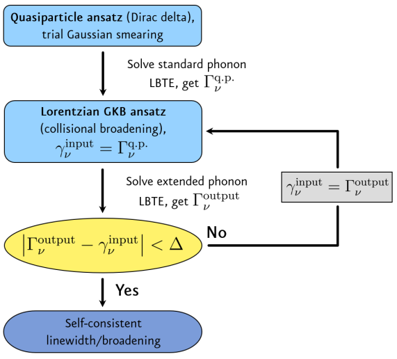
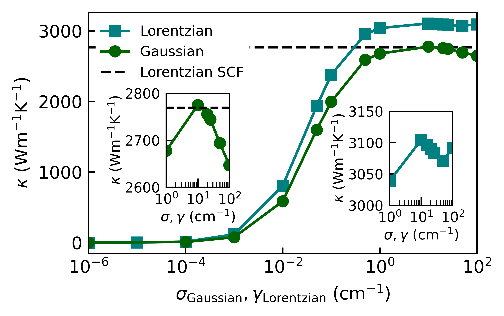
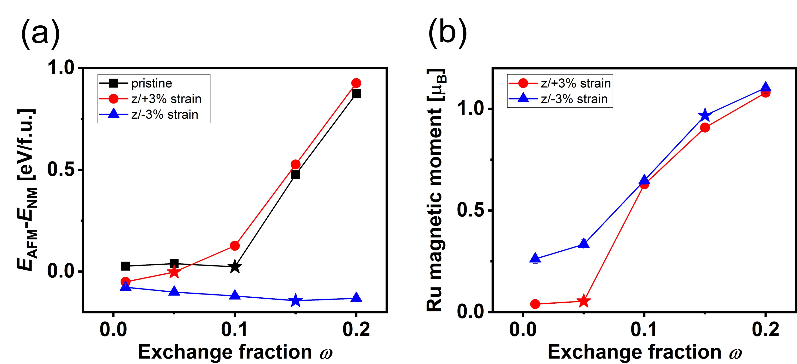
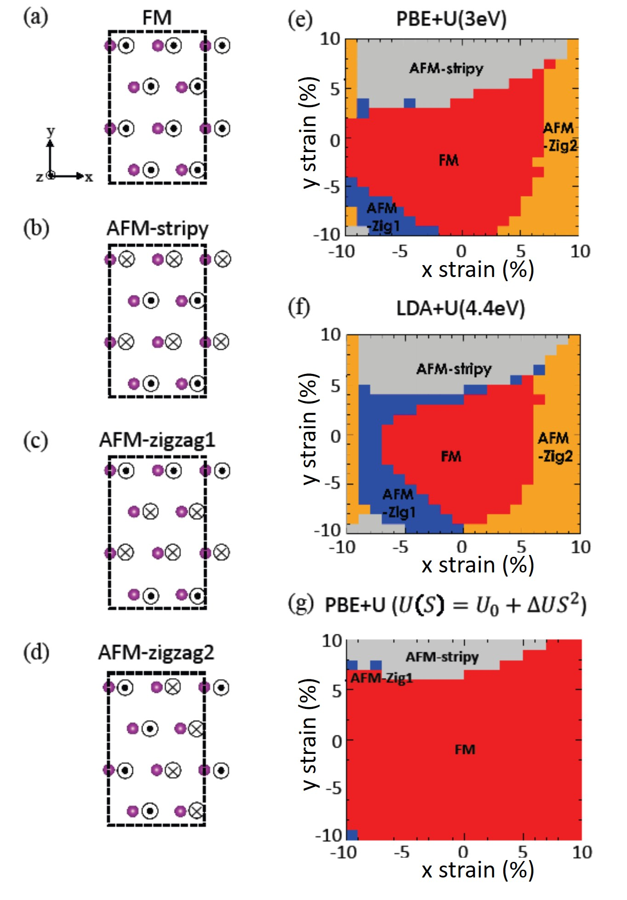
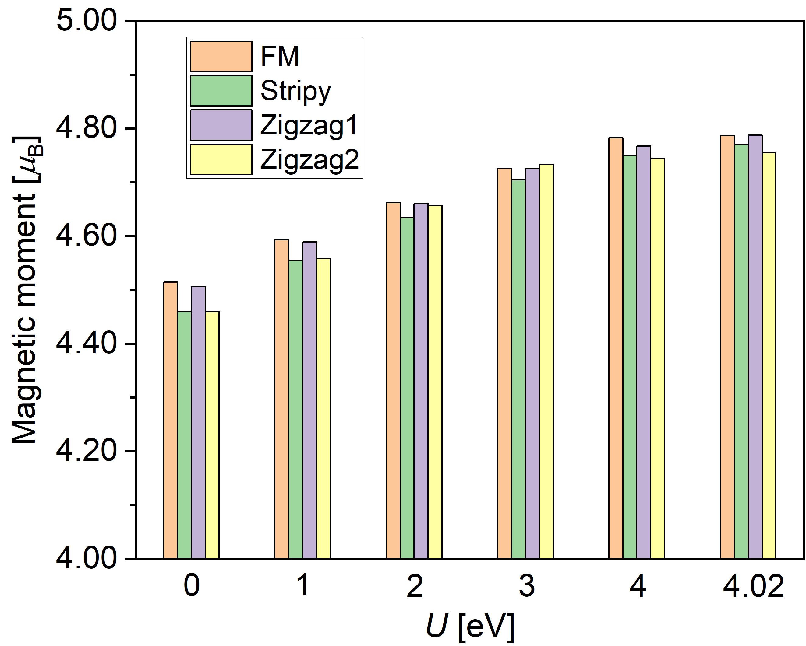
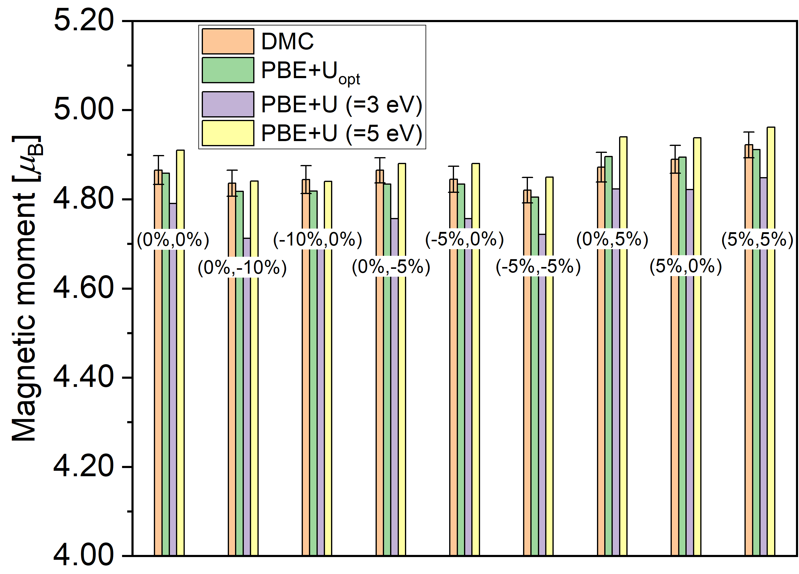

# 2026-03-19 計算材料科学

**作成日：** 2026年3月19日
**対象期間：** 2026年3月17日〜2026年3月19日（直近72時間）

---

## 選定論文一覧

1. [Phonon collisional broadening and heat transport beyond the Boltzmann equation](https://arxiv.org/abs/2603.16753) — Di Lucente, Marzari, Simoncelli
2. [Nonmagnetic Ground State of Rutile RuO₂ from Diffusion Quantum Monte Carlo](https://arxiv.org/abs/2603.16125) — Ahn, Kang, Ganesh, Krogel
3. [Fully anharmonic calculations of the free energy of migration of point defects in UO₂ and PuO₂](https://arxiv.org/abs/2603.16602) — Frost, Bouchet, Marinica, Lapointe, Maillet, Messina
4. [Anharmonicity Driven by Vacancy Ordering Unlocks High-performance Thermoelectric Conversion in Defective Chalcopyrites II-III₂-VI₄](https://arxiv.org/abs/2603.16477) — Zhang, Yue, Zheng, Wang et al.
5. [Low bending rigidity and large Young's modulus drive strong flexural phonon renormalization in two-dimensional monolayers](https://arxiv.org/abs/2603.16717) — Ravichandran
6. [Neural-Network Quantum Embedding Solvers for Correlated Materials](https://arxiv.org/abs/2603.15741) — Valenti, Park, Georges, Millis, Parcollet
7. [Optimizing Density Functional Theory for Strain-Dependent Magnetic Properties of Monolayer MnBi₂Te₄ with Diffusion Monte Carlo](https://arxiv.org/abs/2603.16162) — Ahn, Ghosh, Kang et al.
8. [Ligand-Controlled Phonon Dynamics in CsPbBr₃ Nanocrystals Revealed by Machine-Learned Interatomic Potentials](https://arxiv.org/abs/2603.16631) — Cha, Wang, Fung, Hu
9. [Tuning Cu/Diamond Interfacial Thermal Conductance via Nitrogen-Termination Engineering](https://arxiv.org/abs/2603.16347) — Yang, Tang, Lin, Gu et al.
10. [PFP/MM: A Hybrid Approach Combining a Universal Neural Network Potential with Classical Force Fields for Large-Scale Reactive Simulations](https://arxiv.org/abs/2603.16061) — Miyazaki, Tomita, Hayashi et al.

---

## 重点論文の詳細解説

---

### 論文①

#### 1. 論文情報

**タイトル：** [Phonon collisional broadening and heat transport beyond the Boltzmann equation](https://arxiv.org/abs/2603.16753)
**著者：** Enrico Di Lucente, Nicola Marzari, Michele Simoncelli
**arXiv ID：** 2603.16753
**カテゴリ：** cond-mat.mtrl-sci
**公開日：** 2026年3月17日
**論文タイプ：** 理論・計算（フォノン輸送、量子動力学方程式）
**ライセンス：** CC BY 4.0

---

#### 2. どんな研究か

フォノンの熱輸送を記述するボルツマン輸送方程式（BTE）の根本的な限界を乗り越えるため、Kadanoff-Baym方程式（KBE）から厳密に線形化一般化BTE（LGBTE）を導出した研究である。フェルミの黄金律に基づく衝突項の問題点——スメアリング依存性による熱伝導率の非収束、2次元材料でのフレクスラルフォノン散乱の過減衰——を根本から解決し、自己無撞着な衝突幅を組み込んだ第一原理シミュレーションを実現した。対象材料はダイヤモンドおよびα-GeSe単層膜であり、それぞれが長年未解決だった計算の収束問題と2D特有の散乱問題を代表している。

---

#### 3. 位置づけと意義

フォノン熱輸送の第一原理計算において、ボルツマン輸送方程式（BTE）はフェルミの黄金律（FGR）に基づく衝突項とともに広く用いられてきたが、数値スメアリングへの強い依存性と2次元材料でのフレクスラルフォノン（ZAブランチ）過減衰という2つの根深い問題が未解決のまま残っていた。本研究はKBEという量子多体理論の基盤から出発し、BTEを階層的近似の最初の段階として位置づけることで、自己無撞着な衝突幅（collisional broadening）を組み込んだLGBTEを厳密に導出した。これにより、適応的スメアリングスキームによる詳細平衡の破れや負の固有値といった数値的問題を回避しながら、実用的な第一原理熱伝導計算の信頼性を大幅に向上させる手法的基盤を構築した。フォノン輸送の量子論的正確さに向けたロードマップを提示した点で、材料の熱設計・デバイス応用の基盤として広く波及しうる。

---

#### 4. 研究の概要

**背景と目的：**
フォノン熱伝導は半導体、熱電材料、パワーデバイスの設計に不可欠であり、第一原理BTE計算が標準的手法として確立されている。しかし、FGR衝突項には数値スメアリングパラメータへの強い依存性という根本問題があり、特に2D材料ではZAフォノンの散乱チャネルがFGRの枠組みでは物理的に不合理な過減衰を示す。

**計算科学上の課題設定：**
FGRの限界を克服するため、量子場理論的に厳密な出発点としてKBEを採用し、そこからBTEの階層的導出を行うことで、衝突幅の自己無撞着決定を可能にするLGBTEを構築した。

**研究アプローチ：**
KBEからGreen関数の階層的近似（ansatz）を経て、エネルギー非保存散乱を含む一般化BTE（LGBTE）を導出。フォノン線幅Γ_νに対する自己無撞着反復スキームを実装し、収束した衝突幅を用いて熱伝導率を計算した。

**対象材料系・対象現象：**
バルクダイヤモンド（熱良導体の代表例）と単層α-GeSe（2次元系のZAフォノン過減衰問題の代表例）

**主な手法：**
第一原理フォノン計算（DFPT）+ Kadanoff-Baym方程式由来のLGBTE + 自己無撞着衝突幅スキーム

**主な結果：**
- ダイヤモンドの熱伝導率計算においてスメアリング依存性が解消され、収束した値が得られた
- 単層α-GeSe においてFGRベースの従来BTEが予測していた非物理的なZAフォノンの過減衰が解消された
- KBEからBTEへの階層的ansatzeを定式化し、量子KBE精度へのロードマップを提示

**著者の主張：**
LGBTEはFGRの基本的限界を乗り越え、3次元・2次元問題両方に適用可能な自己無撞着フォノン輸送記述の基盤となる。

---

#### 5. 計算材料科学として重要なポイント

本研究の核心は、熱輸送計算の数値的アーティファクトを「スメアリングの工夫」で回避するのではなく、物理的に正しい衝突幅の自己無撞着決定によって根本から解決した点にある。従来の適応的スメアリングスキームは詳細平衡を破り、衝突演算子に非物理的な負固有値を生じさせることが問題であった。LGBTEの衝突項はFGRを超えてエネルギー非保存散乱を含み、各モードの衝突幅Γ_νが反復的に収束するまで自己無撞着に決定される（図1のスキーム）。特に2次元材料のフレクスラルフォノン問題は、ZAブランチの特殊な分散（ω∝k²）と散乱位相空間の発散がFGRを適用不能にするという根本的困難であり、本研究はこれを物理的に正しい枠組みで解決した。第一原理計算との組み合わせで実用的な材料計算ツールとなりうる一方、フォノン-フォノン散乱のみを扱っており電子-フォノン結合や欠陥散乱の一般化は今後の課題である。

---

#### 6. 限界と注意点

本研究のLGBTEは無限完全結晶を対象としており、欠陥、界面、粒界、同位体乱れといった実際の材料で不可避な散乱源は現時点で扱われていない。また、Green関数の近似（ansatz）はいくつかの仮定に基づいており、極めて強いフォノン-フォノン結合や低次元特有の長距離揺らぎが支配する系（たとえば量子臨界点近傍）での有効性は別途評価が必要である。さらに、自己無撞着反復が収束するための計算コストは従来のBTE計算よりも増大しており、大規模材料スクリーニングへの直接適用は現時点では難しい。提示された数値検証はダイヤモンドとα-GeSe単層膜の2系に限られており、幅広い材料クラスへの汎用性はこれから検証が必要である。

---

#### 7. 関連研究との比較

フォノン熱輸送の第一原理計算はLi et al.（ShengBTE）、Poncé et al.（EPW）、Simoncelli et al.のWigner方程式的拡張など、過去10年で急速に進展してきた。本研究は同グループ（Simoncelli）が発展させてきたKBE起点のフォノン輸送理論の流れに位置しており、衝突幅の自己無撞着決定という問題は2D材料の熱伝導第一原理研究における長年の未解決問題である。Dangic et al.（2021）やXu et al.が指摘していた2D系のFGR失敗問題を、修正スメアリングではなく理論的に正しい枠組みで解決した点でbreakthroughの性格を持つ。今後、本フレームワークは電子-フォノン結合や非調和性の高い系（熱電材料、ペロブスカイト等）への拡張が期待され、フォノン輸送理論コミュニティへの影響は大きい。

---

#### 8. 重要キーワードの解説

**1. Kadanoff-Baym方程式（KBE）**
非平衡量子場理論における格子Green関数の運動方程式。KBEはGreen関数 $G^<(\mathbf{k},\omega)$（lesser Green function）の時間発展を記述し、散乱自己エネルギーΣを含む。平衡・非平衡の両方を扱えるため、BTEの量子論的導出の出発点となる。$i\partial_t G = [H_0 + \Sigma] \circ G$ という積分-微分方程式の形を持つ。

**2. ボルツマン輸送方程式（BTE）**
フォノンの占有数（Bose-Einstein分布からの偏差）$n_\mathbf{q\nu}$ の時間発展を記述する半古典的方程式。定常熱流中では $\mathbf{v}_\mathbf{q\nu} \cdot \nabla T \frac{\partial n^0}{\partial T} = - \frac{n_\mathbf{q\nu} - n^0_\mathbf{q\nu}}{\tau_\mathbf{q\nu}}$ の形をとる（緩和時間近似）。3フォノン・4フォノン散乱が衝突項を構成する。

**3. フェルミの黄金律（FGR）**
摂動論の第2次項から導かれる遷移確率の近似式：$\Gamma_\mathbf{q\nu} = \frac{2\pi}{\hbar}\sum_{\mathbf{q'}\nu'} |M|^2 \delta(\omega_{\mathbf{q\nu}} - \omega_{\mathbf{q'}\nu'} \pm \omega_{\mathbf{q''}\nu''})$。エネルギー保存をデルタ関数で厳密に課すが、有限系や数値計算ではデルタ関数を有限幅の関数（スメアリング）で置き換える必要があり、これが数値的アーティファクトの根源となる。

**4. 衝突幅（collisional broadening）**
散乱過程によるフォノン状態の有限寿命から生じるエネルギー不確定性。FGRではエネルギー保存を厳密に課すためこれを無視するが、実際にはフォノンが有限寿命 $\tau_\nu = 1/\Gamma_\nu$ を持つため、その状態はエネルギー幅 $\Gamma_\nu$ を持つLorentzian状になる。本研究ではこれを自己無撞着に決定することで、数値スメアリングの恣意性を排除する。

**5. フレクスラルフォノン（ZAモード）**
2次元材料特有の面外曲げ振動モード（flexural acoustic phonon）。長波長極限でω∝k²の分散を持ち（三次元音響モードのω∝kとは異なる）、その位相空間の特殊な構造により3フォノン散乱の散乱レートがFGRでは発散または非物理的な値をとる。α-GeSe、グラフェン、MoS₂など全ての2D材料に共通する問題。

**6. 線形化一般化BTE（LGBTE）**
本研究で導出された、自己無撞着な衝突幅を含む一般化ボルツマン方程式。エネルギー非保存散乱過程を含み、KBEからの厳密な導出に基づく。衝突演算子の固有値が全て非負となることが保証され、詳細平衡を満たす。

**7. 自己無撞着スキーム**
衝突幅Γ_νが自分自身（散乱率の計算）に依存するため、初期値を与えてΓ_νが収束するまで反復計算するアルゴリズム。本研究では図1に示す反復スキームにより、数値スメアリングに依存しない安定した熱伝導率値を実現した。

**8. 適応的スメアリング（adaptive smearing）**
デルタ関数の数値近似において、各散乱過程ごとにフォノン速度等から自動的にスメアリング幅を決定する手法。従来は詳細平衡の破れや負固有値問題があったが、本研究の自己無撞着衝突幅はこれを物理的に正しい形で置き換える。

**9. Green関数のansatz（仮定）**
KBEの厳密解を求める代わりに、物理的に妥当な近似的関数形（ansatz）を仮定してGreen関数を近似する手法。本研究ではquasiparticle approximationを基礎とした階層的ansatzeを用い、BTEからKBE精度までの連続的な拡張のロードマップを示した。

**10. 格子熱伝導率（lattice thermal conductivity）κ**
フォノン輸送によって運ばれる熱流量 $J_\alpha = -\kappa_{\alpha\beta}\nabla_\beta T$ の比例係数。BTEの定常解から $\kappa_{\alpha\beta} = \frac{1}{NV}\sum_{\mathbf{q}\nu}\hbar\omega_{\mathbf{q}\nu} v^\alpha_{\mathbf{q}\nu} F^\beta_{\mathbf{q}\nu}$ として計算される。ダイヤモンドは約2000 W/(m·K)、GeSe単層膜は面内方向に数W/(m·K)程度。

---

#### 9. 図

**図1：** 自己無撞着衝突幅（フォノン線幅）を反復的に決定する計算プロトコルの模式図。Γ_ν（計算された線幅）とγ_ν（衝突幅パラメータ）が互いに自己無撞着に収束するまでループを繰り返す。このスキームにより、数値スメアリングに依存しない物理的に正しい熱伝導率計算が可能になる。

**図3：** 単層α-GeSe の室温格子熱伝導率をスメアリングパラメータの関数として示した図。ガウシアン（緑）とローレンツ型（青）の従来スメアリングでは強いスメアリング依存性が残るが、LGBTEによる自己無撞着衝突幅（破線）では収束した一意的な値が得られる。これはFGRの根本的失敗を示すとともに、本手法の有効性の中核的証拠である。

**図（ダイヤモンドの収束性）：** バルクダイヤモンドの格子熱伝導率をスメアリングパラメータに対してプロットした図。従来のFGRベースBTEではスメアリング値に強く依存して非収束であるが、LGBTE衝突幅スキームでは安定した収束値が得られ、実験値との比較も良好であることを示す。ダイヤモンドは高熱伝導率材料の基準となる重要系であり、この収束性の実証は本手法の信頼性を担保する。

---

### 論文②

#### 1. 論文情報

**タイトル：** [Nonmagnetic Ground State of Rutile RuO₂ from Diffusion Quantum Monte Carlo](https://arxiv.org/abs/2603.16125)
**著者：** Jeonghwan Ahn, Seoung-Hun Kang, Panchapakesan Ganesh, Jaron T. Krogel
**arXiv ID：** 2603.16125
**カテゴリ：** cond-mat.mtrl-sci
**公開日：** 2026年3月17日
**論文タイプ：** 理論・計算（拡散量子モンテカルロ、電子状態計算）
**ライセンス：** CC BY 4.0

---

#### 2. どんな研究か

ルチル型RuO₂が交替磁性体（altermagnet）か非磁性体かというDFT計算が一致しない長年の論争に対し、固定節近似拡散量子モンテカルロ（fixed-node DMC）という高精度量子多体計算を用いて決着を試みた研究である。pristineバルク構造では非磁性基底状態が反強磁性（AFM）より23(9) meV/f.u.安定であることを示す一方、3%圧縮歪みを加えると非磁性が不安定化してAFM状態が安定化することを第一原理的に明らかにした。これにより、実験試料間で異なる磁気的報告が得られる原因として歪み・ドメイン・格子欠陥が関与する可能性を量子多体計算の立場から示した。

---

#### 3. 位置づけと意義

RuO₂は2020年以降「交替磁性体」として注目を集め、その自発的スピン分裂やアノマラスホール効果の起源として多くのDFT計算・実験が積み重ねられてきたが、計算手法によって磁性あり・なしが逆転する矛盾が続いていた。本研究はDMCという、DFTと異なりHubbard-Uパラメータなどの調整可能なパラメータを持たない高精度量子多体計算を用いることで、この問題に系統的かつ客観的な解を与えようとした点が重要である。「交替磁性か否か」の問題だけでなく、歪みという制御変数によって磁気秩序を切り替えられることを示した知見は、スピントロニクス応用設計の観点からも意義深い。また、同グループのMnBi₂Te₄研究（論文⑦）と合わせて、DMCがDFT+U系の校正ツールとして有効であることを示している。

---

#### 4. 研究の概要

**背景と目的：**
ルチル型RuO₂は近年交替磁性体の代表例として提案され、スピン分裂電子構造・アノマラスホール効果が実験・理論双方で議論されてきた。一方でDFT計算は汎関数依存性が強く（PBE：非磁性、SCAN：磁性あり、hybrid：汎関数依存），磁気基底状態に関して統一的な結論が出ていなかった。

**計算科学上の課題設定：**
汎関数依存性を超えた高精度量子多体計算として固定節DMCを適用し、PBE0(ω)試験波動関数（ω制御ハイブリッド汎関数）とPBE+Uを用いた固定節誤差の系統的評価を行うことで、磁気秩序エネルギーの信頼性ある評価を行う。

**研究アプローチ：**
ツイスト平均固定節DMC（twist-averaged fixed-node DMC）を用いて非磁性（NM）・反強磁性（AFM）両状態のDMCエネルギーを計算し、磁気秩序エネルギー差ΔEAFM−NMを高精度に決定。試験波動関数のRuローカルモーメント依存性を通じて固定節バイアスの大きさを評価した。さらに±3%の面外歪みを印加した場合のΔEを計算し、歪み効果を議論。スピン密度・電荷密度のDMC的決定も行った。

**主な手法：**
固定節拡散量子モンテカルロ（fixed-node DMC）、PBE0(ωexact)試験波動関数、twist averaging

**主な結果：**
- pristineバルクRuO₂では非磁性基底状態がAFMより23(9) meV/f.u.安定（DMC）
- 3%圧縮歪みではAFM状態が安定化（歪み誘起磁気相転移）
- Ruローカルモーメントを変化させると固定節エラーが系統的に変化し、信頼性評価が可能
- スピン密度分布のDMC計算からAFM相のRu上スピン模様を可視化

**著者の主張：**
ストイキオメトリックなバルクRuO₂は非磁性基底状態を持ち、実験試料での多様な報告は歪みや欠陥に起因する可能性が高い。

---

#### 5. 計算材料科学として重要なポイント

本研究の方法論的核心は、「試験波動関数のRuローカルモーメントを連続的に変化させながらDMCエネルギーを評価する」という系統的アプローチによって固定節誤差の磁気モーメント依存性を定量化した点にある。固定節DMCはSlater-Jastrow型波動関数の符号構造（nodal surface）を固定して多次元積分を確率的に評価する手法であり、試験波動関数の質が計算精度に直結する。本研究ではPBE0(ω)のωパラメータをRuモーメントの制御変数として使い、固定節エラーの最小値付近を探索することで、バイアスを最小化した。歪み計算では-3%～+3%の等方的格子変形（b方向）がAFM-NM競争エネルギーを逆転させることを示しており、実験試料依存性の物理的説明として価値が高い。ただしDMCは全エネルギー計算であるため磁気秩序エネルギー差はキャンセレーションに依存し、統計誤差の管理が不可欠である（本研究では23 ± 9 meV/f.u.）。

---

#### 6. 限界と注意点

固定節DMCは試験波動関数の節曲面の質に本質的に依存しており、現状ではSlater-Jastrow波動関数を用いている。多軌道強相関系であるRuO₂ではより精緻な試験波動関数（例：multideterminant展開）の使用が望ましいが、計算コストの急増から行われていない。また、本研究はバルク完全結晶を対象としており、実験試料に必ず存在するO空孔・Ru置換・表面・粒界などの欠陥・界面効果は未考慮である。さらに、有限温度効果（格子振動によるスピン揺らぎ）も扱われておらず、室温での磁気状態への言及には注意が必要である。計算コストの制約から系統的なセルサイズ依存性・ツイスト数依存性の検証も限定的であり、23 meVという磁気秩序エネルギー差の絶対値の信頼性には依然として慎重な評価が求められる。

---

#### 7. 関連研究との比較

RuO₂の磁性については、2020年のŠmejkalらによるaltermagnetic提案以来、DFT計算（機能依存性あり）・ARPES・輸送測定・中性子散乱など多角的研究が進んでいる。同時期にはChessら（2025）やKumarら（2025）がDFT汎関数依存性を詳細に調べた研究を出しており、本研究はその議論に高精度量子多体計算という決定的な手段を持ち込んだ。同グループによるMnBi₂Te₄の同様のDMC-DFT+U校正研究（本日の論文⑦）と合わせて、DMCによる磁性基底状態決定というアプローチを確立しようとしている流れが見える。今後の課題は、表面・薄膜・ドーピング系への拡張と、DMCスピン密度から交替磁性的特徴の有無を直接検証することであろう。

---

#### 8. 重要キーワードの解説

**1. 拡散量子モンテカルロ（Diffusion Quantum Monte Carlo, DMC）**
多体シュレーディンガー方程式の虚時間発展を確率的（拡散方程式的）に解く計算手法。$-\partial_\tau \Psi = (H - E_T)\Psi$ を確率プロセスとして扱い、多体波動関数の基底状態を系統的に求める。電子相関を明示的に扱えるため、DFTを超えた精度が期待されるが、フェルミオン符号問題（sign problem）があるため試験波動関数の節曲面を固定する「固定節近似（fixed-node approximation）」を用いる。

**2. 固定節近似（fixed-node approximation）**
フェルミオン系のDMCで生じる符号問題を回避するため、試験波動関数 $\Psi_T$ のゼロ点（nodal surface）を固定してシミュレーションを行う近似。正確な節曲面であれば厳密な基底状態エネルギーが得られるが、一般には固定節誤差（fixed-node error）が残る。本研究ではこの誤差をRuモーメント依存性として評価した。

**3. 交替磁性（altermagnetism）**
通常の反強磁性（AFM）では等価なスピンアップ・スピンダウンサイトが時間反転対称と組み合わさり電子バンドが縮退するが、交替磁性では結晶の回転対称性によりスピン縮退が解け、自発的なスピン分裂バンドを示しながらも正味磁化がゼロという特殊な磁性相。RuO₂はその代表候補として提案された。本研究は pristine バルクが非磁性であることを示し、altermagnetismの存在に疑問を呈した。

**4. ツイスト平均（twist averaging）**
有限セル超格子計算での有限サイズ誤差を低減する手法。Blochのk点サンプリングに相当し、境界条件の位相（ツイスト角）を複数設定してエネルギーを平均することで、本来の無限系のエネルギーに近い値を効率よく得る。特に金属系や小さいスーパーセルで重要。

**5. PBE0(ω)ハイブリッド汎関数**
交換-相関汎関数の一種で、Hartree-Fock交換の混合率ωをパラメータとして制御できる。$E_{XC} = \omega E_X^{HF} + (1-\omega)E_X^{PBE} + E_C^{PBE}$ の形をとる。本研究では試験波動関数のRuローカルモーメント（磁気モーメント）をωで制御し、異なるモーメントでのDMCエネルギーを系統的に比較することで固定節誤差の傾向を評価した。

**6. 磁気秩序エネルギー差 ΔEAFM−NM**
反強磁性状態と非磁性状態の全エネルギー差。正値であれば非磁性が安定、負値であれば反強磁性が安定。本研究ではDMCによりΔE = 23(9) meV/f.u.と決定し、非磁性基底状態を示した。この値はDFT計算の結果（汎関数により数十meVの変動）と対比することで、汎関数依存性の問題を定量化できる。

**7. Ruローカルモーメント（Ru local moment）**
Ruイオン上のスピン密度を空間積分した量（μB単位）。DFTでは汎関数により0〜1.5 μBまで大きく変化し、磁性基底状態と密接に関連する。DMC計算では試験波動関数のモーメントを変化させながら全エネルギーを測定することで、ローカルモーメントと固定節エラーの相関を明らかにした。

**8. スピン密度分布（spin density distribution）**
スピンアップ電子密度とスピンダウン電子密度の差を空間的に可視化したもの。交替磁性の特徴はRuサイト間で異なるスピン方向とその空間的配置（時間反転対称性の破れ方）として現れる。本研究ではDMCから直接スピン密度を計算し、AFM相での空間パターンを可視化した（図4）。

**9. 歪み誘起磁気相転移（strain-induced magnetic phase transition）**
格子定数の変化（歪み）により磁気基底状態が切り替わる現象。本研究では3%の圧縮歪みがΔEの符号を変えてAFMを安定化することを示し、実験試料（薄膜・基板歪み）での磁気的多様性の物理的起源を提供した。これはスピントロニクス材料の歪み制御設計に重要な知見。

**10. 交換-相関汎関数（exchange-correlation functional）**
DFT計算において、電子間の多体相互作用（交換エネルギー・相関エネルギー）を単粒子密度の汎関数として近似するもの。LDA, PBE（GGA）、SCAN、ハイブリッド汎関数（PBE0, HSE06）など多数あり、強相関系では予測が大きく異なる。本研究ではこの依存性を回避するためにDMCを用いた。

---

#### 9. 図

**図1：** (a) ルチル型RuO₂の結晶構造（RuO₆八面体）。(b) 各種DFT汎関数で計算したRuローカルモーメントと反強磁性–非磁性エネルギー差 EAFM−ENM の関係。汎関数によって符号が逆転する（非磁性有利・AFM有利が混在）様子が明確に示されており、本研究がDMCによる高精度検証に踏み込む動機を説明している。

**図2：** (a) ツイスト平均固定節DMCで計算した非磁性・AFM両状態のエネルギーとPBE0(ω)パラメータ（Ruモーメント）の関係。(b) DMCの磁気秩序エネルギー差 ΔEAFM−NM のRuモーメント依存性。全評価点でΔE > 0（非磁性安定）を示し、一貫して非磁性基底状態を支持する。本研究の主要結論を直接支持する核心的な図。

**図3：** (a) ±3%の格子歪み下でのDMC磁気秩序エネルギー差。圧縮歪み（−3%）ではΔEが符号反転してAFM状態が安定化することを示す。(b) 歪み下でのRuローカルモーメントのω依存性。歪みによる磁気相転移を定量的に予測しており、実験的な試料依存性の物理的解釈を与える重要な結果。

---

### 論文③

#### 1. 論文情報

**タイトル：** [Fully anharmonic calculations of the free energy of migration of point defects in UO₂ and PuO₂](https://arxiv.org/abs/2603.16602)
**著者：** Dillon G. Frost, Johann Bouchet, Mihai-Cosmin Marinica, Clovis Lapointe, Jean-Bernard Maillet, Luca Messina
**arXiv ID：** 2603.16602
**カテゴリ：** cond-mat.mtrl-sci
**公開日：** 2026年3月17日（Physical Review Materials 投稿中）
**論文タイプ：** 理論・計算（分子動力学、自由エネルギー、欠陥拡散）
**ライセンス：** arXiv非独占的配布ライセンス

---

#### 2. どんな研究か

核燃料材料UO₂とPuO₂における点欠陥（陽イオン・陰イオン欠陥）の移動自由エネルギーを、調和近似を超えた完全非調和計算として初めて系統的に評価した研究である。Potential of Average Force Integration（PAFI）法を用い、Cooper-Rushton-GrimesポテンシャルおよびUO₂向け機械学習スペクトル近傍解析ポテンシャル（SNAP）の両方で計算を行い、温度依存性・エントロピー寄与・調和近似との系統的差異を定量化した。拡散係数に最大1桁規模の補正をもたらしうる非調和効果を、原子論的計算で初めて直接示した。

---

#### 3. 位置づけと意義

核燃料設計において欠陥拡散係数の予測精度は放射線照射挙動・ペレット健全性・核種放出評価に直結する。従来の第一原理・分子動力学計算はいずれも移動エネルギー計算に調和近似を用いており、移動障壁を0 K 近似エンタルピーとして評価するにとどまっていた。本研究は、PAFI法による有限温度・完全非調和の移動自由エネルギー計算を核燃料系に適用することで、調和近似の有効性を欠陥種・ポテンシャル依存的に定量評価した初めての包括的研究である。0 Kから1200 Kにかけて移動障壁が最大1 eV低下するという結果は、高温拡散係数の予測において非調和効果が本質的であることを示し、他のセラミック核燃料・酸化物材料系への波及も大きい。

---

#### 4. 研究の概要

**背景と目的：**
UO₂・PuO₂は軽水炉・高速炉の主要燃料材料であり、その照射挙動や核種放出を予測するためには欠陥の種類（カチオン空孔・格子間・アニオン欠陥など）ごとの拡散係数が必要である。移動自由エネルギー（migration free energy）は温度とともに変化するため、0 K障壁を用いた調和近似が正確かどうかが問題となる。

**計算科学上の課題設定：**
調和近似では格子振動の正規モードを独立な調和振動子として扱い、移動状態と基底状態の振動エントロピー差から移動エントロピーを評価する。非調和効果は格子が高温・強い変形下に置かれるときに顕著となるが、計算コストが高く核燃料系での系統的評価は未達成だった。

**研究アプローチ：**
PAFI（Potential of Average Force Integration）法は、反応座標に沿った平均力（potential of average force）を有限温度MD中に計算し、移動自由エネルギー曲線を積分して求める。移動障壁（ΔF）と移動エントロピー（ΔS）の両方を温度の関数として直接得られる。CRGポテンシャル（解析型古典ポテンシャル）とMLIP-SNAPの2種で計算し、ポテンシャル依存性も評価した。

**主な手法：**
分子動力学（NVT-MD）+ PAFI法（反応座標に沿ったポテンシャル平均力積分）、CRGポテンシャル、機械学習SNAPポテンシャル

**主な結果：**
- 欠陥種・ポテンシャルに依存して調和近似の有効性が大きく異なる
- 移動障壁が0 Kから1200 Kにかけて最大1 eV低下する欠陥種が存在
- PuO₂はCRGポテンシャルで0 K障壁が全欠陥でUO₂より低いが、試行頻度（attempt frequency）の高さによりジャンプ頻度は類似
- 移動エントロピーへの非調和寄与が拡散係数を大幅に変化させうる

**著者の主張：**
核燃料の拡散モデリングにおいて非調和効果は無視できない。調和近似の妥当性は欠陥種とポテンシャルに強く依存しており、系統的な非調和評価が不可欠である。

---

#### 5. 計算材料科学として重要なポイント

本研究の方法論的ポイントは、PAFI法が熱平衡MD中で移動自由エネルギーを直接計算できる点にある。通常のNEB（Nudged Elastic Band）法は0 Kのエネルギー最小経路上の障壁を評価するが、有限温度での格子の熱膨張・格子歪み・ソフトモードなどの非調和効果を一切考慮できない。PAFIでは系を反応座標上の各点に制約しながら有限温度MDを実施し、平均力を統計的に評価することで有限温度の自由エネルギー曲線を直接得る。CRGとSNAP両ポテンシャルを使った比較は、計算結果のポテンシャル依存性を明示しており、どのポテンシャルを使うかで定量的予測が異なるというメッセージも重要。また、同一系での2ポテンシャル比較がSNAPの原子論的記述の改善点を浮き彫りにしており、次世代燃料ポテンシャル開発へのベンチマークを提供している。

---

#### 6. 限界と注意点

計算はCRGポテンシャルとUO₂向けSNAPに限定されており、これらのポテンシャルが実際のUO₂・PuO₂の電子構造（Mott絶縁体的性格、U/Pu 5f電子の強相関性、放射線誘起励起状態）を正確に反映しているかは別途議論が必要である。特にPuO₂には信頼性の高い第一原理参照データが少なく、SNAPのPuO₂への適用はより大きな不確実性を持つ。また、PAFIはNVT-MDを多数の反応座標点で実施するため計算コストが大きく、複数の欠陥種・温度点を全て高精度で計算することは依然として大きなリソースを要する。さらに本研究は完全結晶中の単一点欠陥を対象としており、実際の核燃料では照射損傷による欠陥クラスター・He生成・Pu富化などの複雑な環境が存在し、これらへの拡張は今後の課題である。

---

#### 7. 関連研究との比較

核燃料の欠陥拡散研究はBrincat et al.（DFT+U NEBによるUO₂欠陥計算）、Pérez-Villanueva et al.（MD熱拡散）など多くの先行研究があるが、いずれも調和近似の枠内であった。PAFI法はCarnahan-Starr、Messina et al.らのグループによって金属系での非調和拡散研究（Fe, AlMg系など）に適用されてきており、本研究はそのアプローチを核燃料酸化物系に本格的に拡張した最初の包括的研究といえる。SNAPポテンシャルを参照として加えることで、機械学習ポテンシャルの有限温度拡散計算への適用可能性も示しており、次世代核燃料ポテンシャル開発のベンチマーク研究としての位置づけも持つ。今後は放射線損傷・欠陥クラスター・温度勾配下への拡張が期待される。

---

#### 8. 重要キーワードの解説

**1. 移動自由エネルギー（migration free energy, ΔF）**
点欠陥が一つの平衡サイトから隣の平衡サイトへ移動する際のヘルムホルツ自由エネルギー障壁。$\Delta F = \Delta U - T\Delta S$（Uは内部エネルギー、Sはエントロピー）として定義され、温度依存する。0 K での障壁（移動エンタルピー ΔH）とは異なり、格子振動のエントロピー寄与を含む有限温度量。

**2. PAFI法（Potential of Average Force Integration）**
反応座標λ（欠陥の位置）に沿った「ポテンシャル平均力（PMF）」を有限温度MDから直接計算し、積分することで移動自由エネルギー曲線を求める手法。原子を反応座標の各点に制約しながらNVT-MDを実施し、制約力の熱平均から $\partial F/\partial \lambda$ を評価して数値積分する。非調和効果を自動的に取り込むことができる。

**3. 調和近似（harmonic approximation）**
原子の振動を結晶の平衡構造周りの2次のポテンシャルで近似し、格子振動を独立な調和振動子として扱う近似。振動エントロピー $S = k_B \sum_i [n_i \ln n_i - (1+n_i)\ln(1+n_i)]$ がフォノン分散のみで決まり、解析的に計算できる。温度が高くなると非調和効果が顕著になり本近似が崩れる。

**4. 移動エントロピー（migration entropy, ΔS）**
欠陥が遷移状態（サドル点）に位置する時の振動エントロピーと平衡位置のエントロピーの差。調和近似では平衡状態と遷移状態のフォノン振動数から解析的に計算できるが、非調和効果が大きいと調和近似値からのずれが生じ、拡散係数 $D \propto \exp(\Delta S/k_B)\exp(-\Delta H/k_BT)$ の前指数因子を変化させる。

**5.試行頻度（attempt frequency, ν*）**
アレニウス型拡散係数 $D = \nu^* a^2 \exp(-\Delta G/k_BT)$ における振動前因子。遷移状態理論では平衡位置のフォノン振動数積と遷移状態のフォノン振動数積の比として表される。PuO₂はUO₂より移動エンタルピーが低いが試行頻度が高いため、結果として拡散係数が類似する。

**6. CRGポテンシャル（Cooper-Rushton-Grimes potential）**
UO₂のためのBorn-Mayer型解析的原子間ポテンシャル。U-U、U-O、O-O相互作用のクーロン項・短距離斥力・分散力を解析的に記述する。核燃料材料計算で広く使われているベンチマーク的ポテンシャルであり、高温での熱力学挙動をある程度再現するが、強相関電子効果は原理的に扱えない。

**7. SNAPポテンシャル（Spectral Neighbor Analysis Potential）**
機械学習型の原子間ポテンシャルの一種。原子環境をバイスペクトル記述子（bispectrum descriptor）を用いてベクトルとして表現し、線形回帰で第一原理計算データにフィッティングする。BartókのGAP（Gaussian Approximation Potential）と同様の思想を持つが線形モデルのため計算速度が速い。

**8. Nudged Elastic Band（NEB）法**
0 Kでの反応経路（最小エネルギー経路）と遷移状態を求める標準的手法。初期状態から終状態をつなぐ像（image）の鎖に「バネ」を加えることで経路を最小化する。有限温度・非調和効果を扱えないが計算コストが低く広く使われている。本研究のPAFIはNEB の有限温度版拡張として位置づけられる。

**9. 点欠陥の種類**
結晶中の点欠陥には、(i)ショットキー欠陥（空孔：原子が格子サイトから失われたもの）、(ii)フレンケル欠陥（空孔＋格子間原子のペア）、(iii)格子間原子（不規則位置に入り込んだ原子）などがある。UO₂・PuO₂では陽イオン（U/Pu）空孔・陰イオン（O）空孔・格子間Oなど複数の欠陥種が共存し、それぞれ異なる移動障壁と移動エントロピーを持つ。

**10. 拡散係数（diffusion coefficient, D）**
原子の拡散速度を表す量。Fick第一法則 $J = -D \nabla c$（Jは原子フラックス、cは濃度）で定義される。アレニウス型則 $D = D_0 \exp(-Q/k_BT)$ に従うことが多く、活性化エネルギーQと前指数因子D₀の正確な予測が材料設計において重要。非調和効果はQとD₀の両方を補正しうる。

---

#### 9. 図

本論文のライセンスはarXiv非独占的配布ライセンス（nonexclusive-distrib/1.0）であるため、原図の抽出は行わない。

---

## その他の重要論文

---

### 論文④

#### 1. 論文情報

**タイトル：** [Anharmonicity Driven by Vacancy Ordering Unlocks High-performance Thermoelectric Conversion in Defective Chalcopyrites II-III₂-VI₄](https://arxiv.org/abs/2603.16477)
**著者：** Hui Zhang, Jincheng Yue, Jiongzhi Zheng, Ning Wang et al.
**arXiv ID：** 2603.16477
**カテゴリ：** cond-mat.mtrl-sci
**公開日：** 2026年3月17日
**論文タイプ：** 第一原理計算・熱電材料
**ライセンス：** arXiv非独占的配布ライセンス

---

#### 2. 研究概要

欠陥型カルコパイライト構造II-III₂-VI₄（CdGa₂Te₄など）において、規則配列した固有空孔（intrinsic vacancy）が格子ダイナミクスと熱電性能をどのように制御するかを第一原理的に系統調査した研究である。空孔秩序が格子歪みを増幅する「構造的増幅器」として機能し、これによって強い格子非調和性とメタ原子価結合的性格（metavalent bonding character）が誘起されることを示した。負のグリューナイゼンパラメータを持つソフトフォノンと4フォノン散乱が支配的となることで格子熱伝導率が極めて低い値（CdGa₂Te₄で0.19 W·m⁻¹K⁻¹）を実現し、さらにVI族陰イオン置換（TeMSe, SeMS）による電子構造チューニングによって電気輸送特性を最適化することで、室温 ZT = 0.957 というヘビーメタル系に匹敵する熱電性能を予測している。

本研究が計算材料科学として重要なのは、空孔秩序→格子非調和性→4フォノン散乱→低κ₁という因果連鎖を第一原理レベルで明示した点にある。特に4フォノン散乱が3フォノン過程を超えて支配的になるメカニズムを空孔固有の格子歪みと結びつけた解釈は、他の欠陥型酸化物・カルコゲナイドへの一般化可能性を持つ。陰イオン電気陰性度が金属-陰イオンハイブリダイゼーションとバンドギャップを系統的に制御するという知見は、逆設計の観点から有用であり、計算熱力学との連携による高性能熱電材料スクリーニングへの展開が期待される。

---

#### 3. 重要キーワードの解説

**1. 欠陥型カルコパイライト（defective chalcopyrite）：** ABX₂型カルコパイライトから導かれる空孔含有構造。II-III₂-VI₄ではII族カチオン位置の1/4が規則的に空孔になっており、この秩序配列が特殊な格子ダイナミクスを生む。

**2. 格子非調和性（lattice anharmonicity）：** 原子間ポテンシャルを変位の3次以上の項で記述する効果。非調和性が強いと3フォノン・4フォノン散乱が顕著になり格子熱伝導率が大きく低下する。

**3. 格子熱伝導率κₗ：** フォノン輸送による熱流の比例係数。$\kappa_\ell = \frac{1}{NV}\sum_{\lambda} C_\lambda v_\lambda^2 \tau_\lambda$ で表され、フォノン速度・寿命・熱容量によって決まる。

**4. 4フォノン散乱：** 4つのフォノンが相互作用する散乱過程。通常の3フォノン過程（Umklapp散乱）に加えて大きな非調和性を持つ系で重要になり、さらに格子熱伝導率を抑制する。

**5. グリューナイゼンパラメータγ：** フォノン振動数の体積依存性 $\gamma_\lambda = -\frac{V}{\omega_\lambda}\frac{\partial \omega_\lambda}{\partial V}$ で定義される非調和性の指標。負値は格子膨張でフォノン振動数が上昇（ソフトフォノン）を意味し、強い非調和性と関連する。

**6. メタ原子価結合（metavalent bonding）：** 共有結合とイオン結合の中間的な性格を持つ化学結合様式。電荷密度の再分配が大きく、格子の柔らかさと高い電気伝導性を両立できる。SnTe, GeTe などのカルコゲナイド系に典型的。

**7. 熱電性能指数ZT：** $ZT = S^2\sigma T/(\kappa_e + \kappa_\ell)$（S：ゼーベック係数、σ：電気伝導率、κ：熱伝導率）で定義される無次元指標。ZT > 1 が実用的目標とされる。

**8. 陰イオン置換（anion substitution）：** VI族サイト（Te, Se, S）の系統的置換による電子構造チューニング。陰イオンの電気陰性度変化が金属-陰イオンs/p混成を変え、バンドギャップと有効質量を制御する。

**9. ゼーベック係数S：** 温度勾配に対して生じる起電力の比例係数（単位 V/K）。大きいゼーベック係数は電子状態密度の急峻な変化（バンドエッジ近傍、バンド収束）が有利であり、電気伝導率との間にトレードオフが存在する。

**10. バンド収束（band convergence）：** 複数のバンドの極値が近いエネルギーに収束することで等価なキャリアポケット数が増え、ゼーベック係数と電気伝導率の積（パワーファクタ）が向上する現象。熱電材料設計の重要戦略の一つ。

---

#### 4. 図

本論文のライセンスはarXiv非独占的配布ライセンス（nonexclusive-distrib/1.0）であるため、原図の抽出は行わない。

---

### 論文⑤

#### 1. 論文情報

**タイトル：** [Low bending rigidity and large Young's modulus drive strong flexural phonon renormalization in two-dimensional monolayers](https://arxiv.org/abs/2603.16717)
**著者：** Navaneetha K Ravichandran
**arXiv ID：** 2603.16717
**カテゴリ：** cond-mat.mtrl-sci
**公開日：** 2026年3月17日
**論文タイプ：** 第一原理計算・フォノン物性
**ライセンス：** arXiv非独占的配布ライセンス

---

#### 2. 研究概要

グラフェンをはじめとする2次元単層材料では、面外曲げ振動モード（フレクスラル音響フォノン, ZAモード）が熱流体的熱流・低温電気抵抗発散・キリガミ工学など多彩な現象の起源となっている。本研究は第一原理計算を用いて、ZAフォノンの非調和的繰り込みが曲げ剛性κと面内ヤング率Eによって制御されることを定量的に明らかにした。低κ材料（ゲルマネンなど）ではBrillouinゾーン全体にわたってZAフォノンが強く繰り込まれ、高κ材料（MoS₂など）では繰り込みが弱い。さらに、長波長域では平坦相安定性（熱揺らぎに対する面の安定化）のためにκとEの競合効果による追加的繰り込みが生じ、これが既存モデルと質的・定量的に異なる分散関係をもたらす。

本研究の計算材料科学的重要性は、従来コミュニティが標準的に使ってきたZAフォノン分散が、全ての2次元材料において定量的に誤りであることを示した点にある。これは熱伝導・電気抵抗・電子-フォノン相互作用など2D材料の多くの第一原理計算の再評価を促すものであり、グラフェン以外の多様な2D材料（ゲルマネン、シリセン、二硫化モリブデンなど）で現象が材料依存的に異なることも指摘している。面外方向の格子非調和性とマクロ弾性が連成して量子揺らぎ的な繰り込みを生む物理は、キリガミ・折り紙型ナノデバイスの設計にも直結する。

---

#### 3. 重要キーワードの解説

**1. フレクスラル音響フォノン（ZAフォノン）：** 2次元材料の面外曲げ振動に対応する音響モード。長波長極限でω∝k²の二次的分散を持ち（三次元音響モードはω∝k）、位相空間の構造が通常の音響フォノンと本質的に異なる。

**2. 曲げ剛性κ：** 2次元膜を曲げるのに必要なエネルギーコストを表す弾性定数（単位 eV または J）。$U_{bend} = \frac{\kappa}{2}\int (\nabla^2 h)^2 dA$（hは面外変位）。グラフェンで～1.5 eV、ゲルマネンで大幅に低下。

**3. ヤング率E：** 面内引張応力に対する歪みの比例定数（単位 N/m または Pa·m）。面内剛性の指標であり、グラフェンは約340 N/m と極めて高い。

**4. 非調和繰り込み（anharmonic renormalization）：** フォノン-フォノン相互作用（格子非調和性）によってフォノン振動数が平均場的な値から変化する効果。2D材料のZAモードでは自己無撞着繰り込み理論（SCRT）が必要。

**5. 平坦相（flat phase）：** 2次元膜が熱揺らぎに対してある程度平坦な状態を維持する相。曲げ弾性の熱的繰り込みによってκが有効的に増大し、平坦性が維持される（vs. 折れ畳まれた「しわくちゃ」相）。Mermin-Wagner定理との関連。

**6. 自己無撞着繰り込み理論（SCRT）：** フォノンの自己エネルギー補正を、その補正が入ったフォノングリーン関数を用いて自己無撞着に評価する理論的枠組み。2D材料の長波長ZAフォノンに適用が必要。

**7. キリガミ（kirigami）：** 折り紙の一種で、紙を切ることで三次元形状を作り出す技法。2D材料への応用では特定のパターンで原子スケールの欠陥・切り込みを入れ、引張変形下で三次元構造を形成することを指す。ZAフォノンの弾性特性が設計に直結。

**8. 電気抵抗の低温発散：** 2D材料ではZAフォノンとの電子-フォノン散乱により、低温で電気抵抗率が対数的に発散することが理論的に予測されている。繰り込まれたZAフォノン分散はこの発散の定量的評価に影響する。

**9. 水力学的熱流（hydrodynamic heat flow）：** フォノン間の運動量保存散乱が支配的な系で生じる、流体力学的な熱伝播様式。グラフェンなど2D材料で観測されており、フォノン分散の精密な理解が必要。

**10. Brillouinゾーン全体にわたる繰り込み：** ZAフォノンの非調和繰り込みが長波長（Γ点近傍）だけでなくゾーン境界付近まで及ぶことを本研究は示した。これは先行研究が想定していた繰り込みの空間的範囲を大幅に拡大する結果。

---

#### 4. 図

本論文のライセンスはarXiv非独占的配布ライセンス（nonexclusive-distrib/1.0）であるため、原図の抽出は行わない。

---

### 論文⑥

#### 1. 論文情報

**タイトル：** [Neural-Network Quantum Embedding Solvers for Correlated Materials](https://arxiv.org/abs/2603.15741)
**著者：** Agnes Valenti, Ina Park, Antoine Georges, Andrew J. Millis, Olivier Parcollet
**arXiv ID：** 2603.15741
**カテゴリ：** cond-mat.str-el
**公開日：** 2026年3月16日
**論文タイプ：** 計算手法開発（量子埋め込み、ニューラルネットワーク量子多体ソルバ）
**ライセンス：** arXiv非独占的配布ライセンス

---

#### 2. 研究概要

強相関電子系の計算において最大のボトルネックとなっている量子不純物ソルバー（quantum impurity solver）を、ニューラルネットワークで代替する手法を提案・実証した研究である。動的平均場理論（DMFT）の核心であるアンダーソン不純物問題——ハイブリダイゼーション関数と局所相互作用からGreen関数を求める問題——を解くことを学習目標として、量子モンテカルロ（QMC）計算で生成した大規模データセット上でニューラルネットワークをトレーニングした。実材料（SrVO₃、SrMnO₃）を含むテストで量子モンテカルロと定量的に一致する精度を示しつつ、「数桁の計算速度向上」を実現したとしている。Mott転移や多軌道相図の再現にも成功している。

本研究の計算材料科学的重要性は、DMFT計算の実用的ボトルネック——高精度不純物ソルバーの計算コスト——を機械学習で大幅に軽減できる可能性を示した点にある。DMFTはSrVO₃のような遷移金属酸化物の電子構造、光電子スペクトル、磁気・軌道秩序の第一原理記述において標準的な手法であり、そのコア演算を神経ネットワーク近似で高速化できれば、材料探索・有限温度相図計算・非平衡問題への応用が大きく広がる。ただし、訓練データの品質・外挿性・非平衡・長距離相関への適用限界についての検証は今後必要である。

---

#### 3. 重要キーワードの解説

**1. 動的平均場理論（DMFT）：** 格子上の強相関電子系を、格子の効果を自己エネルギーΣ(ω)として取り込んだ有効不純物問題に写像する理論。局所相関を厳密に扱える一方、非局所相関（クラスターDMFT等で拡張可能）は近似的。

**2. アンダーソン不純物モデル（AIM）：** 局所的な相互作用を持つ「不純物」サイトが、非相互作用的なバス（遍歴電子の浴）と結合したハミルトニアン。DMFTの自己無撞着方程式の中核。

**3. ハイブリダイゼーション関数Δ(iωn)：** 不純物サイトと電子浴の結合を記述する関数（松原振動数表示）。DMFTではこの関数がGreen関数と自己無撞着に決定される。ニューラルネットワークへの入力として使われる。

**4. Green関数G(iωn)：** 松原振動数表示の局所一粒子グリーン関数。不純物問題の出力であり、スペクトル関数・自己エネルギー・輸送係数の計算に使う。ニューラルネットワークの出力として学習される。

**5. Mott転移：** 強相関の遷移金属酸化物で、バンド幅と相互作用エネルギーUの競合により金属-絶縁体転移が生じる現象。DMFTはMott転移の記述において極めて成功しており、ニューラルネットワークソルバーがMott転移を再現できるかが性能の重要試金石。

**6. 量子モンテカルロ（QMC）：** 強相関量子系を厳密に解くための確率的計算手法。連続時間QMC（CT-QMC）がDMFT不純物ソルバーとして現在最高精度であるが、計算コストが高い。本研究ではQMCの計算結果を訓練データとして使う。

**7. 神経量子状態（neural quantum states, NQS）：** 多体波動関数をニューラルネットワーク（制限ボルツマンマシン, Transformer等）で表現するアプローチ。変分モンテカルロ（VMC）と組み合わせて基底状態を求めることができる。本研究のNN不純物ソルバーはNQSの応用的発展形。

**8. 軌道選択的モット転移（orbital-selective Mott transition）：** 多軌道強相関系において、一部の軌道だけがMott局在し他は金属的に残る現象。多軌道相図の複雑さを増し、不純物ソルバーの汎用性を要求する。

**9. 自己エネルギーΣ(iωn)：** 多体相互作用によって一粒子Green関数が非相互作用的なものからずれる量。$G(i\omega_n)^{-1} = G_0(i\omega_n)^{-1} - \Sigma(i\omega_n)$ で定義される。Mott絶縁体ではΣが発散的になる。

**10. データ駆動型量子ソルバー：** 第一原理計算やQMCから生成した大規模データセットでニューラルネットワークを訓練し、高コストなソルバーを代替する手法の総称。本研究の他、Hamiltonian学習や密度行列の機械学習なども同分野に属する。

---

#### 4. 図

本論文のライセンスはarXiv非独占的配布ライセンス（nonexclusive-distrib/1.0）であるため、原図の抽出は行わない。

---

### 論文⑦

#### 1. 論文情報

**タイトル：** [Optimizing Density Functional Theory for Strain-Dependent Magnetic Properties of Monolayer MnBi₂Te₄ with Diffusion Monte Carlo](https://arxiv.org/abs/2603.16162)
**著者：** Jeonghwan Ahn, Swarnava Ghosh, Seoung-Hun Kang, Dameul Jeong, Markus Eisenbach, Young-Kyun Kwon, Fernando A. Reboredo, Jaron T. Krogel, Mina Yoon
**arXiv ID：** 2603.16162
**カテゴリ：** cond-mat.mtrl-sci
**公開日：** 2026年3月17日（arXiv:2408.03248 の更新版）
**論文タイプ：** 第一原理・量子モンテカルロ・DFT校正
**ライセンス：** CC BY 4.0

---

#### 2. 研究概要

単層MnBi₂Te₄（MBT）は磁気トポロジカル絶縁体の代表例であり、磁気相（強磁性/縞状反強磁性/ジグザグ反強磁性）は歪みによって大きく変化することが実験的に知られている。しかしDFT+U計算ではHubbardパラメータUの設定が磁気相図を大きく左右するため、どのU値を使うかが本質的な問題となっていた。本研究はDMCを参照計算として用いることで、各歪み値に対して最適なU値を決定する系統的手法を確立した。主な発見は「最適Uが歪み大きさの2次関数として変化する」という単純な関係式が成立することであり、これにより歪み連続体に対して調整されたDFT+U計算が実現可能となった。

計算材料科学的重要性は、DMCという高精度計算をDFT+Uのパラメータ校正ツールとして戦略的に用いる方法論を確立した点にある。磁気トポロジカル材料では外部刺激（歪み・電場・磁場）下での磁気相制御が応用において重要であり、歪み依存的に最適化されたDFTは実験との定量的比較を可能にする。RuO₂のDMC研究（本日の論文②）と合わせてORNLグループのDMCによる強相関磁性系へのアプローチが鮮明になっている。

---

#### 3. 重要キーワードの解説

**1. 磁気トポロジカル絶縁体：** バルクが絶縁体でありながら表面に位相的に保護された金属的表面状態を持ち、さらに磁気秩序を持つ材料。量子異常ホール効果（QAHE）の舞台として注目される。

**2. DFT+U法：** 局在f/d電子の強相関効果を表すためにDFT（GGA/LDA）に対して局所ハバード相互作用項 $U \sum_i n_{i\uparrow}n_{i\downarrow}$ を補正する手法。Uは半経験的パラメータであり、系・スピン状態・歪みに依存する。

**3. 歪み依存的なU値：** 格子定数の変化（歪み）はMnのd軌道のバンド幅と局在化度を変化させるため、最適Uも歪みに依存して変化する。本研究では $U_{opt}(\varepsilon) = a + b\varepsilon + c\varepsilon^2$ の2次形式で記述できることを発見した。

**4. ジグザグ反強磁性（AFM-zigzag）：** 蜂の巣格子（ハニカム）的なMn配置でスピンがジグザグに並ぶ反強磁性構造の一種。縞状反強磁性（AFM-stripy）とともにMBTの候補磁気相であり、単層MBTでは歪みによって安定相が切り替わる。

**5. 交換相互作用J₁：** 最近接Mn-Mn間のハイゼンベルク型交換パラメータ $J_1$。正値（反強磁性）・負値（強磁性）で磁気秩序が決まる。DFT+Uの計算値がU依存性を持ち、その校正に影響を与える。

**6. 磁気相図：** 制御パラメータ（U値、歪みεなど）の空間における磁気秩序の安定相を示した図。本研究では$(U, \varepsilon)$空間での相境界をDMCで校正することで、実験の歪み制御実験との定量的対応を可能にした。

**7. 量子異常ホール効果（QAHE）：** 外部磁場なしに磁気秩序によって生じる量子化されたホール効果。単層MBTはQAHEの実現材料として提案されており、磁気相の正確な記述が絶対的に重要。

**8. 固定節DMC（fixed-node DMC）：** 試験波動関数の節曲面を固定して多体波動関数の基底状態エネルギーを求める手法（論文②参照）。Mn-5d電子の強相関性を扱うために用いられる。

**9. 磁気異方性：** スピンが特定の結晶方向に配向しやすい性質。単層MBTでは面外（c軸方向）磁気異方性が重要であり、歪みによる対称性変化が磁気異方性エネルギーを変化させる。

**10. ファン・デル・ワールス層状材料：** 層間がファン・デル・ワールス力で結合し機械的剥離で単層化できる材料群。MBTはBi₂Te₃型層状構造を持つファン・デル・ワールス磁性体であり、2次元限界での磁性・トポロジーの研究に適している。

---

#### 4. 図

**図1：** 単層MnBi₂Te₄における磁気構造（FM, AFM-stripy, AFM-zigzag 1, AFM-zigzag 2）と、GGA+U計算での$(U, \varepsilon)$空間における相図。Uと歪みεの両方が磁気安定相を決定的に変化させる様子を示しており、本研究のDMC校正の動機を説明する基本的な図。

**図2：** 歪みなし単層MBTにおけるMn原子の磁気モーメントをGGA+U計算で評価し、Uパラメータの関数として示した図。磁気モーメントのU依存性が大きく、どのU値を使うかで物理的予測が変わることを明示する。DMCによる最適U決定の必要性を動機付ける重要な結果。

**図6：** 各歪み条件下でのMn磁気モーメントについて、DMC計算値、歪み依存的DMC最適U値を用いたPBE+U計算値、固定U値によるPBE+U計算値を比較した図。DMC最適U値（2次多項式フィット）を使うことで、GGA+U計算がDMCの精度に近づくことを示す。本研究の中核的な定量的結果。

---

### 論文⑧

#### 1. 論文情報

**タイトル：** [Ligand-Controlled Phonon Dynamics in CsPbBr₃ Nanocrystals Revealed by Machine-Learned Interatomic Potentials](https://arxiv.org/abs/2603.16631)
**著者：** Seungjun Cha, Chen Wang, Victor Fung, Guoxiang Hu
**arXiv ID：** 2603.16631
**カテゴリ：** cond-mat.mtrl-sci
**公開日：** 2026年3月17日
**論文タイプ：** 機械学習ポテンシャル・ナノ結晶フォノン計算
**ライセンス：** CC BY 4.0（HTML版利用不可のため原図抽出不可）

---

#### 2. 研究概要

CsPbBr₃ハライドペロブスカイトナノ結晶は次世代光電子デバイスの有力材料であるが、表面リガンドがフォノン動力学をどのように制御するかは実験・計算とも未解明の部分が多かった。通常のab initio計算はナノ結晶の実験スケール（数百〜数千原子の構造＋リガンド）には適用不可能なため、著者らは小さいCsPbBr₃ナノ結晶と多様なリガンドの組み合わせで生成したDFTデータを用いて機械学習ポテンシャル（MLIP）をファインチューニングし、実験的に意味のある大きさのナノ結晶の有限温度フォノン計算を実現した。カチオン性・アニオン性リガンドはともにPb-Br-Pb伸縮モードを赤方シフトし、PbBr₆八面体回転モードを青方シフトするが、アニオン性リガンドの効果が全体的に強いこと、また回転モードのスティフニングとリガンド結合エネルギーの関係が単調でない（非単調）ことが発見された。

計算材料科学的な意義は、実験的に関連する原子数スケールのナノ結晶フォノン計算に機械学習ポテンシャルが適用可能であることを示した点にある。表面リガンドという「化学設計変数」がバルクフォノンとは質的に異なる影響を与えることを定量化しており、非輻射緩和を支配するフォノンモードの同定という実用的情報も提供している。特に非単調なリガンド結合エネルギー依存性は単純なモデルでは予測困難であり、MLIPシミュレーションの価値を明示する。

---

#### 3. 重要キーワードの解説

**1. ハライドペロブスカイトナノ結晶：** ABX₃型ペロブスカイト（A=Cs, MA; B=Pb, Sn; X=Cl, Br, I）の数nm〜10nm程度の粒子。量子閉じ込め効果と鮮明な発光特性で太陽電池・LED・レーザーへの応用が期待される。

**2. 機械学習原子間ポテンシャル（MLIP）：** 第一原理計算の精度を保ちながら古典MDより数桁速い計算を可能にするニューラルネットワーク型ポテンシャル。本研究ではMACE等のfoundation modelをファインチューニングに使用。

**3. ファインチューニング（fine-tuning）：** 大規模データで事前訓練された汎用モデルを、特定材料系の少量のデータで追加訓練して精度を向上させる手法。本研究ではCsPbBr₃ナノ結晶＋リガンド系のDFTデータで汎用MLIPを微調整した。

**4. フォノン動力学：** 有限温度での格子振動（フォノン）の時間的振る舞い。特定のフォノンモードが非輻射再結合・エネルギーアップコンバージョン・反ストークス発光の媒介を担う。

**5. Pb-Br-Pb伸縮モード：** ペロブスカイト骨格中のPb-Br-Pb結合角に関連する振動モード。このモードの振動数がリガンドの化学的性質によって変化し、電子-フォノン結合を通じた非輻射緩和に関与。

**6. PbBr₆八面体回転モード：** ペロブスカイト中のPbBr₆八面体が集団的に回転する振動モード。相転移（立方→正方→斜方）を制御するソフトモードとも関連し、リガンドパッシベーションに敏感。

**7. 非輻射緩和（nonradiative relaxation）：** 励起キャリアがフォトンではなくフォノンを放出して失活する過程。量子収率の低下の主因であり、表面欠陥・格子振動の両方に関係。

**8. アニオン性・カチオン性リガンド：** 表面パッシベーションに使われる有機分子の分類。アニオン性（例：オレイン酸塩, ハライド系）はB-X結合の不飽和サイトを保護し、カチオン性（例：オクチルアミン系）はA-X面を保護。

**9. 非単調なリガンド効果：** リガンド結合エネルギーが増大しても回転モードのスティフニングが単調に増加しない現象。これはリガンドの表面への結合が複数の競合する機構（質量効果・結合強度・表面再配置）を通じてフォノンに影響するためと考えられる。

**10. 反ストークス発光・エネルギーアップコンバージョン：** 低エネルギーの光子を吸収し熱エネルギー（フォノン）を利用してより高エネルギーの光子を放出する現象。ナノ結晶のフォノン動力学が直接関与し、冷却デバイスへの応用が期待される。

---

#### 4. 図

本論文のライセンスはCC BY 4.0であるが、arXiv HTML版が現時点で利用できないため原図の抽出ができなかった。

---

### 論文⑨

#### 1. 論文情報

**タイトル：** [Tuning Cu/Diamond Interfacial Thermal Conductance via Nitrogen-Termination Engineering](https://arxiv.org/abs/2603.16347)
**著者：** Guang Yang, Xinling Tang, Zhongkang Lin, Yulin Gu, Wei Hao, Yujie Du, Xiaoguang Wei
**arXiv ID：** 2603.16347
**カテゴリ：** physics.comp-ph / cond-mat.mtrl-sci
**公開日：** 2026年3月17日
**論文タイプ：** 機械学習ポテンシャル・界面熱輸送計算
**ライセンス：** CC BY 4.0（HTML版利用不可のため原図抽出不可）

---

#### 2. 研究概要

Cu-ダイヤモンド複合材料はパワーエレクトロニクス冷却材料の有力候補であるが、Cu/ダイヤモンド界面の熱コンダクタンス（ITC）の低さが実用化の障壁となっている。本研究はMACE機械学習原子間ポテンシャル（MLIP）フレームワーク（MACE-MPA-0 foundationモデルをC-N-Cuデータでファインチューニング）を構築し、ダイヤモンド表面の窒素（N）終端化によるITC向上のアトミスティックメカニズムを解明した。主な発見は、原子的に平坦なN終端化がベアCu/ダイヤモンド界面に比べてITCを21%向上させること、そのメカニズムとして4 THz以上のLA（縦波音響）フォノンの特定の波数方向（Γ-X、Γ-U方向）が選択的に変調されることをモード分解フォノン分光により明らかにしている。さらに局所状態密度（LDOS）のオーバーラップとCOHP（Crystal Orbital Hamilton Population）スペクトル分析から、N終端化が表面質量変調と結合強化を通じて界面熱伝導を改善するメカニズムを原子論的に提示した。

本研究の計算材料科学的重要性は、MACE foundationモデルのファインチューニングという最新のMLIPアプローチを界面熱輸送計算に適用し、原子レベルで界面フォノン輸送の選択的変調を分析した点にある。非金属修飾（N終端）という戦略は、金属コーティングによるグラファイト化問題を回避できる利点があり、他の複合材料系（例：Al-ダイヤモンド、Si-ダイヤモンド）への展開可能性も高い。LDOS-COHP解析によるフォノン輸送の界面電子結合への対応付けは、界面熱設計のための材料指標開発につながる。

---

#### 3. 重要キーワードの解説

**1. 界面熱コンダクタンス（ITC, interfacial thermal conductance）：** 界面を通る熱フラックス $Q$ と界面温度差 $\Delta T$ の比として定義 $G = Q/(A\Delta T)$（単位 MW·m⁻²·K⁻¹）。Kapitza抵抗の逆数に対応し、界面のフォノン透過率で決まる。

**2. MACE（Message Passing Atomic Cluster Expansion）：** グラフニューラルネットワークとACE記述子を組み合わせたMLIPアーキテクチャ。equivariant（等変）なメッセージパッシングにより高精度かつ効率的な原子間ポテンシャルを実現。MACE-MPA-0は多材料系に対して事前訓練されたfoundation model。

**3. フォノン分光（phonon spectroscopy）：** 熱伝導に寄与するフォノンの振動数・偏極・波数ベクトルごとの寄与をMD計算から解析する手法。本研究では界面透過を振動数・波数方向で分解することで、N終端が選択的に変調するフォノンモードを同定した。

**4. 局所状態密度（LDOS）：** 特定の原子または空間領域に投影したフォノン状態密度。界面両側のLDOSのオーバーラップが大きいほど界面フォノン輸送が大きくなるという物理的直感に基づき、界面設計指標として使われる。

**5. COHP（Crystal Orbital Hamilton Population）：** 2原子間の化学結合のエネルギー的寄与を振動数（またはエネルギー）の関数として評価する手法。負のCOHPが結合性相互作用を、正が反結合性を示す。界面原子間の結合強度のフォノン的寄与を定量化。

**6. N終端化（nitrogen termination）：** ダイヤモンド表面のダングリングボンドや水素終端を窒素原子で置換・修飾する処理。表面エネルギーと界面結合を変え、フォノン透過率を変化させる。本研究では原子1層分の平坦なN修飾を対象とした。

**7. Kapitza抵抗（Kapitza resistance, RK）：** 界面を流れる熱流に対する抵抗。$R_K = 1/G_{ITC}$（G=界面熱コンダクタンス）。1941年にKapitzaが液体He/固体界面で発見した現象で、現代では全ての固体界面に一般化されている。

**8. 格子動力学シミュレーション（lattice dynamics simulation）：** MLIP等を用いた原子論的計算で界面フォノン分散と透過率を計算する手法。Non-equilibrium MD（NEMD）やgreen-Kubo法で熱流を評価し、界面抵抗を決定。

**9. Cu-ダイヤモンド複合材料：** 高熱伝導率（ダイヤモンド）と良電気伝導率・加工性（Cu）を組み合わせた放熱材料。パワーデバイス（SiCデバイス等）のヒートシンクとして注目されるが界面熱抵抗が実用特性を決定。

**10. 表面パッシベーション（surface passivation）：** 材料表面の未結合手（ダングリングボンド）や活性サイトを化学的に不活性化する処理。ダイヤモンドではH, O, N, F, OH終端が研究されており、熱的・電気的界面特性を変化させる。

---

#### 4. 図

本論文のライセンスはCC BY 4.0であるが、arXiv HTML版が現時点で利用できないため原図の抽出ができなかった。

---

### 論文⑩

#### 1. 論文情報

**タイトル：** [PFP/MM: A Hybrid Approach Combining a Universal Neural Network Potential with Classical Force Fields for Large-Scale Reactive Simulations](https://arxiv.org/abs/2603.16061)
**著者：** Yu Miyazaki, Atsuhiro Tomita, Akihide Hayashi, So Takemoto, Mizuki Takemoto, Hodaka Mori
**arXiv ID：** 2603.16061
**カテゴリ：** cond-mat.mtrl-sci
**公開日：** 2026年3月17日
**論文タイプ：** 計算手法開発（ハイブリッドMLIP/MM法）
**ライセンス：** arXiv非独占的配布ライセンス

---

#### 2. 研究概要

汎用機械学習原子間ポテンシャル（uMLIP）は多様な材料系に対してDFT近傍の精度を持つが、現実的に大きなシステム（溶媒和された分子、酵素反応等）への適用はなお計算コストが高い。本研究はPreFerred Potential（PFP）と古典分子力場（MM）を組み合わせたPFP/MMハイブリッド手法を提案し、量子力学/分子力場（QM/MM）の枠組みをMLIPの世界に持ち込んだ。反応中心の小領域にMLIPを、その周囲の大きな溶媒環境に古典MMを適用することで、計算コストを大幅に削減しながら反応性シミュレーションを実現する。アラニンジペプチドの溶媒中構造サンプリング（multi-ns/day）、分子内求核付加反応（溶媒効果の自由エネルギー評価）、チトクロームP450酵素反応（既知のメカニズムとの一致）という3つの系で検証し、いずれも合理的な結果を示した。

計算材料科学（特に材料・化学インターフェース）的重要性は、MLIPを現実的な凝縮相・生体系・界面反応に適用するための実用的フレームワークを提供した点にある。QM/MM法は計算化学では標準的であるが、MLIPをQM部分として使うことでパラメータフリーかつ反応結合切断・形成にも対応できる柔軟性を持たせた。触媒設計・電解質溶液・界面反応など、原子スケールの化学を扱う広い分野への波及が期待される。ただし、PFP/MMカップリングの境界取り扱い（リンク原子スキーム等）の精度・汎用性の検証は限定的であり、より複雑な系への応用には追加検証が必要。

---

#### 3. 重要キーワードの解説

**1. QM/MM法：** 量子力学（QM）で計算すべき反応中心と、古典力場（MM）で扱う周囲環境を組み合わせる多スケールシミュレーション法。化学反応や酵素触媒の計算に広く使われる枠組み。本研究はQMをMLIPで置き換えたMILP/MMの実装。

**2. PFP（PreFerred Potential）：** Preferred Networksが開発した汎用機械学習原子間ポテンシャル。多元素系に対して広いカバレッジを持ち、化学反応を含む多様な系をDFT近傍の精度でシミュレートできる。

**3. 古典分子力場（MM force field）：** 結合長・角度・ねじれ・非結合相互作用を古典的なポテンシャル関数で表現するモデル（例：AMBER, CHARMM）。第一原理精度はないが大きな系に適用可能であり、溶媒環境の記述に使われる。

**4. 汎用機械学習原子間ポテンシャル（uMLIP）：** 特定の材料系に限らず元素周期表の広い範囲に対して訓練された機械学習ポテンシャルの総称。MACE-MP-0, PFP, M3GNet, OAMなどが代表的。化学空間の広いカバレッジを持つが特定系での精度は材料固有MLIPに劣ることがある。

**5. 自由エネルギー計算：** 系の熱力学的状態量（ギブスまたはヘルムホルツ自由エネルギー）の差を分子シミュレーションから計算する手法。傘型サンプリング（umbrella sampling）、メタダイナミクス、TI（熱力学積分）などの拡張アンサンブル法が使われる。

**6. チトクロームP450（CYP450）：** 薬物代謝・酸化反応を触媒するヘム鉄含有酵素ファミリー。複雑な電子移動・酸素活性化機構を持ち、QM/MM計算の難しいベンチマーク系として広く使われてきた。

**7. 求核付加反応（nucleophilic addition）：** 求核剤（電子ドナー）が求電子性炭素（例：カルボニル）を攻撃して新たな結合を形成する有機反応。溶媒効果（極性溶媒による安定化/不安定化）が反応速度・経路に大きく影響する。

**8. メタダイナミクス（metadynamics）：** 集団変数（collective variable, CV）の空間を系統的に探索するために、CV空間にガウシアン型の排斥ポテンシャルを累積的に加える拡張アンサンブルMD法。自由エネルギー地形の直接探索が可能。

**9. 境界処理（boundary scheme）：** QM/MM（MLIP/MM）ハイブリッド計算においてQM領域とMM領域の境界の原子をどう扱うかの問題。「リンク原子」スキーム（切断した結合に水素原子を補う）や「局所軌道凍結」スキームなどがある。境界付近の精度が全体の信頼性を左右する。

**10. マルチnsサンプリング（multi-nanosecond sampling）：** タンパク質や溶液系の構造サンプリングには通常μs〜ms規模のシミュレーションが理想だが、MLIPのコスト削減によってnsオーダーの長時間シミュレーションが実用的になる。コンフォメーション探索・自由エネルギー収束に必要な時間スケール。

---

#### 4. 図

本論文のライセンスはarXiv非独占的配布ライセンス（nonexclusive-distrib/1.0）であるため、原図の抽出は行わない。
