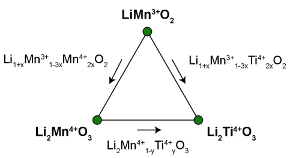
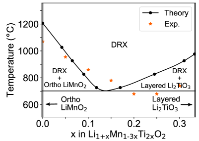
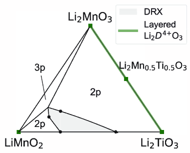

# 2026-03-21 計算材料科学

**作成日：** 2026年3月21日
**対象期間：** 2026年3月18日〜3月21日（直近72時間）

---

## 選定論文一覧

1. [EquiEwald: An SO(3)-equivariant reciprocal-space neural potential for long-range interactions](https://arxiv.org/abs/2603.18389) ★重点
2. [Asymmetric Energy Landscapes Control Diffusion in Glasses](https://arxiv.org/abs/2603.18317) ★重点
3. [Thermodynamic accessibility of Li-Mn-Ti-O cation disordered rock-salt phases](https://arxiv.org/abs/2603.17263) ★重点
4. [Microscopic Origin of Temperature-Dependent Anisotropic Heat Transport in Ultrawide-Bandgap Rutile GeO2](https://arxiv.org/abs/2603.18885)
5. [DeePAW: A universal machine learning model for orbital-free ab initio calculations](https://arxiv.org/abs/2603.18650)
6. [Bridging Crystal Structure and Material Properties via Bond-Centric Descriptors](https://arxiv.org/abs/2603.18876)
7. [Phonon Band Center: A Robust Descriptor to Capture Anharmonicity](https://arxiv.org/abs/2603.18791)
8. [Origin of Reduced Coercive Field in ScAlN: Synergy of Structural Softening and Dynamic Atomic Correlations](https://arxiv.org/abs/2603.18710)
9. [Polarization Dynamics in Ferroelectrics: Insights Enabled by Machine Learning Molecular Dynamics](https://arxiv.org/abs/2603.18058)
10. [Interface-dependent Phase Transitions and Ultrafast Hydrogen Superionic Diffusion of H2O Ice](https://arxiv.org/abs/2603.17586)

---

## 重点論文の詳細解説

---

### 論文1

#### 1. 論文情報

**タイトル：** [EquiEwald: An SO(3)-equivariant reciprocal-space neural potential for long-range interactions](https://arxiv.org/abs/2603.18389)
**著者：** Linfeng Zhang, Taoyong Cui, Dongzhan Zhou, Lei Bai, Sufei Zhang, Luca Rossi, Mao Su, Wanli Ouyang, Pheng-Ann Heng
**arXiv ID：** 2603.18389
**カテゴリ：** physics.chem-ph, cs.AI
**公開日：** 2026年3月19日
**論文タイプ：** 手法論文（機械学習ポテンシャル）
**ライセンス：** CC BY 4.0

---

#### 2. どんな研究か

本研究は、長距離相互作用（静電相互作用・多極子相関）を SO(3) 同変性を保ったまま逆格子空間（reciprocal space）で処理する新しい神経ネットワーク原子間ポテンシャル EquiEwald を提案する。従来の局所的グラフニューラルポテンシャルがカットオフ距離以遠の相互作用を切り捨てるのに対し、EquiEwald は Ewald 和の枠組みをテンソル表現（既約表現）に組み込むことで、長距離かつ異方性の多極子相関を忠実に捉える。荷電分子ダイマー、タンパク質、超分子系、触媒表面（OC20）において従来モデルを上回る精度を実証した。

---

#### 3. 位置づけと意義

機械学習ポテンシャル（MLIP）の長年の課題として、実空間のカットオフに依存する局所近似では静電相互作用や誘電応答など長距離物理を原理的に再現できないという問題があった。EquiEwald はこの制約を、逆格子空間での既約表現 (irrep) 解決型スペクトルフィルタリングという新しい枠組みで解決し、エネルギー・力の一貫性と SO(3) 同変性を犠牲にせずに長距離多極子相互作用を統一的に取り込む。これはポテンシャルの "表現レベル" の革新であり、エラーの事後補正ではない点が重要で、イオン結晶、極性材料、タンパク質-配位子系など静電・分散力が支配的な系のシミュレーション精度を根本的に向上させうる。

---

#### 4. 研究の概要

**背景と目的**
DFT レベルの精度を持つ原子間ポテンシャルの開発は計算材料科学の中核課題である。既存の MLIP（NequIP, EquiformerV2, eSCN など）は局所環境の幾何学的特徴を学習する一方で、カットオフ距離を超える非局所相互作用を無視する。イオン結晶、強誘電体、極性分子、触媒反応中間体などでは長距離静電・多極子相互作用が安定性や反応性を決定するため、この近似が予測精度のボトルネックになっていた。

**計算科学上の課題設定**
長距離相互作用をニューラルポテンシャルに組み込む先行研究（EwaldMP など）はスカラー電荷密度を仮定し、テンソル多極子相互作用を捉えられない。また SO(3) 同変性を保ちながら逆格子空間で高次既約表現を処理する手法は未開拓であった。

**研究アプローチ**
EquiEwald は二経路構造をとる：(1) 短距離エンコーダ（局所グラフメッセージパッシング）と (2) 長距離スペクトルエンコーダ（逆格子空間でのメッセージパッシング）を残差結合で統合する。長距離ブロックでは、ノード特徴を既約表現 (irrep) に展開し、波数ベクトルへの順変換、次数分解されたスペクトルフィルタ適用、逆変換の三段階で非局所情報を伝播する。周期系では逆格子点でサンプリングし、非周期系では sinc ウィンドウ付きデカルト格子を使用する。

**主な手法**
- SO(3) 同変神経ネットワーク（球面調和関数 + 既約表現）
- Ewald 和の逆格子空間形式をテンソル表現へ一般化
- 短距離 + 長距離の二経路残差統合アーキテクチャ

**主な結果**
- 荷電分子ダイマー：ベースライン (eSCN) の平均絶対誤差 21.08 meV → EquiEwald 0.78 meV（約27倍精度向上）。カットオフ外への外挿も正確。
- タンパク質（AIMD-Chignolin）：エネルギー 44% 削減（193.9→109.0 meV）、自由エネルギー誤差 42% 削減（1.15→0.67 kcal/mol）
- 超分子（Buckyball Catcher）：エネルギー誤差約 50% 削減（36.0→18.1 meV）
- 触媒表面（OC20）：eSCN 347.0→321.2 meV, EquiformerV2 541.0→453.0 meV

**著者の主張**
EquiEwald は「表現レベル統合」として既存の局所 MLIP に完全に直交する改善を提供し、多様な化学系に対して追加の fine-tuning なしに汎用的に適用できる。

---

#### 5. 計算材料科学として重要なポイント

EquiEwald の核心は、Ewald 和が実格子と逆格子を橋渡しするアイデアを、スカラー電荷から高次既約表現テンソルに拡張した点にある。既約表現 ℓ=0 はスカラー（電荷）、ℓ=1 は双極子、ℓ=2 は四重極子に対応し、これらを統一的に逆格子空間で処理することで多極子間の異方性長距離相関を正確に捉えられる。従来の EwaldMP（スカラー近似）や他の長距離補正法との決定的な差異はこの "次数分解" にある。強誘電体の双極子整列、イオン結晶の Madelung エネルギー、金属-有機界面の電荷移動など、ℓ > 0 成分が本質的な現象への応用が期待される。計算コストは局所モデルに比べ増加するが、著者らは周期系・非周期系ともに実用的なスケーラビリティを示している。

---

#### 6. 限界と注意点

第一に、EquiEwald の逆格子空間処理には離散化（格子点サンプリング）が伴い、非周期系でのシミュレーションセル形状や格子点密度の選択が精度に影響する可能性がある。第二に、評価系はほぼ分子系・タンパク質・表面触媒系であり、セラミック強誘電体、カルコゲナイド相変化材料、高エントロピー合金など材料科学の主要対象での定量的ベンチマークは示されていない。第三に、短距離エンコーダとして eSCN を使用した実装依存性があり、他のバックボーン（MACE, EquiformerV2 のフル版など）への統合効果は現時点で未検証の部分がある。第四に、逆格子ブロックの実装コストが系のサイズ N に対してどのようにスケールするかの詳細な解析が限定的であり、大規模固体系（数千原子規模）への適用性は今後の検証を要する。

---

#### 7. 関連研究との比較

MLIP における長距離相互作用の取り込みは DimeNet++（角度依存性）、NequIP（同変）、EwaldMP（スカラー逆格子）、SO3LR（分散補正）など多くのアプローチが提案されてきたが、いずれもテンソル多極子相互作用の完全な記述には至っていなかった。EquiEwald はこれを SO(3) 同変フレームワーク内で完結させる初めての手法である。Long-range equivariant models の分野では、同時期に LODE (Long-distance equivariant) や Allegro の長距離拡張なども議論されており、本研究はその中でも逆格子空間と既約表現の組み合わせという明確な差別化軸を持つ。OC20 などのオープンベンチマーク上での改善は incremental だが、荷電分子ダイマーのような極端なケースでは breakthrough に近い改善を示しており、長距離相互作用が支配的な系でのインパクトは大きい。コードは論文から確認できる範囲で公開準備中と見られ、実装可能性は高い。

---

#### 8. 重要キーワードの解説

1. **SO(3) 同変性（SO(3) equivariance）**
   分子・結晶の回転に対してニューラルネットワークの出力が予測可能に変換される性質。エネルギー（スカラー）は回転不変、力（ベクトル）は回転に従って変換されるべき物理的要請。球面調和関数 $Y_l^m(\hat{r})$ を基底とした既約表現 (irrep) によって実現される。

2. **既約表現（irreducible representation, irrep）**
   群論における概念。SO(3) 群の表現は次数 ℓ=0, 1, 2, ... のブロックに分解でき、ℓ=0 はスカラー（1次元）、ℓ=1 はベクトル（3次元）、ℓ=2 は二階テンソル（5次元）に対応する。EquiEwald ではノード特徴をこれらの irrep で表現し、ℓ に応じたスペクトルフィルタをかけることで多極子長距離相互作用を次数別に処理する。

3. **Ewald 和（Ewald summation）**
   周期境界条件下で長距離クーロン相互作用を収束計算する古典的手法。ポテンシャルを短距離部分（実空間）と長距離部分（逆格子空間）に分割し、各々の和を独立して計算する。$E = \sum_{k \neq 0} \frac{4\pi}{Vk^2} e^{-k^2/4\alpha^2} |S(k)|^2 + \text{(short-range)} + \text{(self)}$ の形で表される。EquiEwald ではこの逆格子空間の形式をテンソル irrep に一般化する。

4. **長距離神経ネットワークポテンシャル（long-range MLIP）**
   カットオフ距離以内の局所環境のみを参照する従来の MLIP（NequIP, MACE など）に対し、静電・分散・多極子などの非局所相互作用を明示的に組み込む拡張版。荷電系、極性材料、生体分子などで特に重要。

5. **逆格子空間（reciprocal space）**
   実空間の格子ベクトル $\mathbf{a}_i$ に対し、$\mathbf{b}_i \cdot \mathbf{a}_j = 2\pi\delta_{ij}$ を満たす格子ベクトル $\mathbf{b}_i$ が張る空間。波数ベクトル $\mathbf{k}$ が定義され、フーリエ変換によって実空間の長距離秩序が逆格子の低 $|\mathbf{k}|$ 成分に凝縮される。Ewald 和では長距離クーロン相互作用が逆格子点での構造因子 $S(\mathbf{k}) = \sum_j q_j e^{i\mathbf{k}\cdot\mathbf{r}_j}$ を通じて計算される。

6. **多極子相互作用（multipolar interactions）**
   電荷（0次）、双極子（1次）、四重極子（2次）などのモーメント間に働く相互作用の総称。双極子-双極子相互作用は $\sim r^{-3}$、電荷-電荷は $\sim r^{-1}$ で減衰し、いずれも長距離にわたる。異方性の分子や結晶において特に重要で、スカラーのみを扱う手法では正確に捉えられない。

7. **メッセージパッシング（message passing）**
   グラフニューラルネットワークにおいて、各ノード（原子）が近傍ノードから「メッセージ」を集約してノード特徴を更新する操作。MLIP では原子位置と種類を入力として、各原子の局所環境に依存したエネルギー寄与を学習する。EquiEwald では実空間の短距離メッセージパッシングに加え、逆格子空間でも波数ベクトルに沿ったメッセージパッシングを行う。

8. **スペクトルフィルタ（spectral filter）**
   逆格子空間における各波数成分 $\mathbf{k}$ に適用される学習可能な変換行列。EquiEwald では次数 ℓ ごとに独立したフィルタを定義し、ニューラルネットワークで $|\mathbf{k}|$ の関数として学習する。これにより多極子相互作用の強度・距離依存性を物理的に正しく表現できる。

9. **自由エネルギー予測精度（free-energy prediction accuracy）**
   分子動力学シミュレーションから得られる自由エネルギー差（例：タンパク質フォールディング自由エネルギー）の予測精度。力場の長距離誤差が累積するため、分子系でのポテンシャル精度の重要な指標となる。EquiEwald はタンパク質（Chignolin）で 42% 誤差削減（1.15→0.67 kcal/mol）を達成。

10. **OC20 ベンチマーク（Open Catalyst 2020）**
    触媒材料の吸着エネルギー・原子間力・緩和構造を予測する大規模ベンチマークデータセット。約 130 万の DFT 計算データを含む。周期境界条件下の表面スラブ系を扱うため、長距離相互作用の影響が中程度に現れる。MLIP の性能比較の標準的な試金石として広く使用されている。

---

#### 9. 図

**図1**

**キャプション：** EquiEwald の全体アーキテクチャ（a）と長距離ブロックの詳細（b）。(a) 短距離局所メッセージパッシングと逆格子空間の長距離スペクトルエンコーダを残差結合で統合する二経路構造を示す。(b) 長距離ブロックでは、ノード特徴と波数ベクトル入力を受け取り、SO(3) 線形変換とゲーティングを経て、次数 ℓ ごとの既約表現を実部・虚部に分解し、$\langle\mathbf{k}, \mathbf{r}_j\rangle$ に依存するフーリエカーネルを適用後に逆変換してノード更新を得る。この構造が SO(3) 同変性を保ちながら多極子長距離相互作用を実現する本手法の核心である。

---

**図2**

**キャプション：** 荷電分子ダイマー系における短距離モデルと長距離モデルの予測比較（a–d）。短距離モデル（eSCN）はカットオフ距離以内のデータにのみフィットし、距離が離れると正確な漸近的エネルギー曲線から逸脱する（a）。EwaldMP（スカラー長距離補正）(b) および LES (c) と比較して、EquiEwald (d) のみがカットオフ外のテスト点を含めて正確に再現しており、平均絶対誤差 0.78 meV を達成する。この結果は、スカラー近似では捉えられない異方性多極子相互作用を irrep 分解型の逆格子処理が正確に表現していることを直接示す。

---

### 論文2

#### 1. 論文情報

**タイトル：** [Asymmetric Energy Landscapes Control Diffusion in Glasses](https://arxiv.org/abs/2603.18317)
**著者：** Ajay Annamareddy, Bu Wang, Paul M. Voyles, Izabela Szlufarska, Dane Morgan
**arXiv ID：** 2603.18317
**カテゴリ：** cond-mat.mtrl-sci, cond-mat.dis-nn, cond-mat.stat-mech
**公開日：** 2026年3月18日
**論文タイプ：** 研究論文（分子動力学・ポテンシャルエネルギー地形解析）
**ライセンス：** CC BY 4.0

---

#### 2. どんな研究か

本研究は、ガラス中の拡散（原子輸送）における活性化エネルギーを支配するメカニズムを分子動力学シミュレーションによって解明した。金属ガラス、SiO₂、Lennard-Jones ガラスの三種類の系について、ポテンシャルエネルギー地形（PEL）の統計解析を行い、「局所的な再配置障壁の高さではなく、前進・後退障壁の非対称性が生む往復相関運動が巨視的な活性化エネルギーを支配する」という普遍的な機構を明らかにした。低い局所障壁にもかかわらず見かけの活性化エネルギーが大きいというガラス物理の長年の謎を、非対称エネルギー地形による相関拡散機構として統一的に説明する。

---

#### 3. 位置づけと意義

ガラスの拡散・粘性は材料設計・加工温度・長期信頼性の根幹に関わるが、その原子機構は長らく不明確であった。アモルファス SiO₂、金属ガラス、酸化物ガラスなど工業的に重要な系において活性化エネルギーが数 eV 規模に達する一方で、個々の原子ホップ障壁は 0.5〜1 eV 程度であるという乖離が「なぜ巨視的活性化エネルギーが大きいのか」という未解決問題を形成していた。本研究は PEL の非対称性（前進障壁 $E_f$ と後退障壁 $E_b$ の差）が往復運動 (back-and-forth correlation) を生み、その相関が巨視的輸送を抑制する定量的な機構を初めて示した。この知見は材料設計における拡散制御（例：原子炉材料の照射誘起拡散、固体電池の界面拡散）に直結し、ガラス・アモルファス系シミュレーションの新しい解析フレームワークを提供する。

---

#### 4. 研究の概要

**背景と目的**
ガラス転移温度以下のアモルファス固体において、原子・イオンの輸送は Arrhenius 則 $D \propto \exp(-E_a/k_BT)$ に従う。問題は、ニュージットン力学シミュレーションで観察される個々の障壁が $E_a$ よりずっと低いことであり、「相関効果（correlation effects）」が大きな見かけの活性化エネルギーを生み出すと長く推測されてきたが、そのメカニズムの定量的理解は不十分だった。

**計算科学上の課題設定**
PEL は多次元の配置空間であり、低次元射影では本質的な統計特性が見えにくい。また、個々のホップイベントの解析から巨視的拡散定数の Arrhenius 活性化エネルギーを定量的に導出する枠組みが必要だった。

**研究アプローチ**
分子動力学シミュレーションにより、各原子ホップイベントを追跡し、前進障壁 $E_f$ と後退障壁 $E_b = E_f - \Delta E$（$\Delta E$ はホップ前後のエネルギー差）を統計的に収集。非対称性パラメータとして $\Delta E$ の分布と $E_f - E_b$ を評価し、Kinetic Monte Carlo (KMC) モデルと解析理論を組み合わせて巨視的活性化エネルギーへの寄与を定量化した。

**対象材料系・対象現象**
- 金属ガラス（Cu-Zr 系などの典型例）
- シリカガラス（SiO₂）
- Lennard-Jones ガラス（モデル系）

**主な手法**
- 分子動力学（MD）シミュレーション（多体間ポテンシャル / 力場）
- ポテンシャルエネルギー地形（PEL）解析
- Kinetic Monte Carlo（KMC）
- Arrhenius 解析

**主な結果**
ガラス中の原子ホップイベントにおいて、多くのホップは低障壁だが高い非対称性（$\Delta E > 0$：エネルギー的に不利方向へのホップ）を持つ。このため原子は「前進→後退」の往復運動を繰り返し、正味の移動が長時間にわたって妨げられる。この往復相関が巨視的拡散係数の活性化エネルギーを個々の障壁より大幅に大きくする主因であることを定量的に示した。3 種類のガラス系すべてでこの機構が成立し、普遍性が確認された。

**著者の主張**
ガラスの拡散の巨視的活性化エネルギーは局所障壁の平均ではなく、PEL の非対称性による相関効果から生じる。この知見は拡散・輸送の材料設計において、単純な障壁高さ最適化ではなく PEL の非対称性制御が重要であることを示唆する。

---

#### 5. 計算材料科学として重要なポイント

本研究の計算材料科学的重要性は、ガラスの輸送現象の根本機構を PEL の統計幾何学（非対称性）という記述子で定量化した点にある。個々の障壁 $E_f$ の大小ではなく $E_f - E_b = \Delta E$ という "非対称性" が実効的な相関時間と活性化エネルギーを決定するという発見は、これまでの自由体積論や cage-hopping 描像を補完する新たな物理描像を与える。MD シミュレーションの妥当性は 3 種類の異なるガラス系での整合性によって担保されており、特定のポテンシャルモデルへの依存性が低いことが示唆されている。計算的には標準的な MD + ホップイベント統計解析の枠組みで実施可能であり、再現性・実装可能性は高い。この非対称性フレームワークを機械学習ポテンシャルと組み合わせることで、特定のアモルファス組成における拡散特性の高精度予測が可能になると期待される。

---

#### 6. 限界と注意点

第一に、解析は擬古典的な MD シミュレーションに基づいており、量子トンネリングや零点振動の影響が重要な軽元素ガラス（たとえば Li 含有固体電解質）では結果の直接適用に注意が必要である。第二に、使用された力場（古典間ポテンシャル）は第一原理精度ではなく、各系での化学的精度の評価が限定的である。第三に、対象とする現象が主として拡散係数の活性化エネルギーであり、局所構造・中距離秩序・ガラス転移温度近傍の動的不均一性などとの定量的接続は今後の課題として残されている。第四に、往復相関の定量化は全体の相関関数 $f_{corr}$ の形式的な定義に依存しており、実験的に直接観測可能な物理量との対応関係（例：中性子散乱の van Hove 関数、NMR 緩和）が明示されていない。

---

#### 7. 関連研究との比較

ガラスの拡散・輸送における相関効果は、Haven 比（$f_H = D_{tracer}/D_{cond}$）や cage-escape 機構として長年議論されてきた。近年では機械学習力場を用いた Goldstein の「metabasin」描像の精緻化や、Debye-Waller 因子と拡散の相関の定量研究も進んでいる。本研究が差別化される点は、PEL の非対称性 $\Delta E$ という単純で普遍的なパラメータを活性化エネルギーの支配因子として同定し、KMC による解析的な接続を確立したことである。新規性は incremental ではなく、ガラス拡散機構の理解において一つの明確なステップを提供する。固体電解質、原子炉材料、ガラス膜デバイスなど、アモルファス固体の輸送特性が重要な応用分野で広く参照されうる。

---

#### 8. 重要キーワードの解説

1. **ポテンシャルエネルギー地形（Potential Energy Landscape, PEL）**
   $3N$ 次元の配置空間上での系のポテンシャルエネルギー曲面。極小（inherent structure）とその間のサドル点（遷移状態）が定義される。ガラス、タンパク質、化学反応など複雑系の動力学を俯瞰する強力な枠組みで、$E = E(\mathbf{r}_1, \ldots, \mathbf{r}_N)$ として表される。

2. **前進・後退障壁の非対称性（barrier asymmetry）**
   あるホップイベントにおいて、前進障壁 $E_f$ と後退障壁 $E_b$ の差 $\Delta E = E_f - E_b$。$\Delta E > 0$ は前進後の状態がエネルギー的に高い（不安定）ことを意味し、後退ホップが起きやすくなる。この非対称性が往復運動の起源。

3. **往復相関運動（back-and-forth correlated motion）**
   原子が正味の移動なく前進・後退ホップを繰り返す動的相関現象。拡散係数の有効活性化エネルギーを個々の障壁高さより大きくする主因。Haven 比 $f_H < 1$ として実験的に観測されるものと対応。

4. **Kinetic Monte Carlo（KMC）**
   各遷移経路のレート（$\nu \propto \exp(-E_f/k_BT)$）を用いて確率的に遷移先を選択し、時間発展を模擬する手法。実時間スケールにアクセスできる点で通常の MD を補う。本研究ではホップイベント統計からモデル化した KMC で巨視的拡散係数を再現。

5. **Arrhenius 則（Arrhenius law）**
   拡散係数の温度依存性 $D(T) = D_0 \exp(-E_a/k_BT)$。活性化エネルギー $E_a$ が Arrhenius プロットの傾きから実験的に定量され、原子拡散の障壁の有効値を与える。ガラスでは動的不均一性や相関効果により $E_a$ が単純な障壁高さ平均と大きく異なる。

6. **Inherent structure（固有構造）**
   PEL 上の局所エネルギー極小に対応する原子配置。有限温度の系の熱ゆらぎを除いた「骨格構造」に相当し、温度依存性のない構造的特徴量として PEL 解析に使用される。

7. **相関因子（correlation factor, Haven ratio）**
   拡散係数における相関効果の寄与を定量化するパラメータ $f$。ランダムウォーク拡散 $D_{rw}$ に対する実際の拡散係数 $D_{actual} = f \cdot D_{rw}$（$0 < f \leq 1$）として定義される。$f < 1$ は連続するホップが負の相関を持つ（往復が多い）ことを意味する。

8. **アモルファス固体の動的不均一性（dynamic heterogeneity）**
   ガラスやガラス転移近傍において、原子の拡散速度が空間的に大きくばらつく現象。速い原子（mobile particle）と遅い原子（immobile particle）が共存し、その分布が時間的にも変化する。本研究の非対称性フレームワークはこの不均一性とも関連する可能性がある。

9. **分子動力学（Molecular Dynamics, MD）シミュレーション**
   Newton の運動方程式 $m_i\ddot{\mathbf{r}}_i = -\nabla_i E(\{\mathbf{r}\})$ を数値積分して原子の時間発展を計算する手法。古典 MD では第一原理計算（AIMD）より大幅に大きな系・長い時間スケールにアクセスできる。本研究ではミリ秒スケールの拡散現象を扱うためにイベント駆動解析と組み合わせる。

10. **Lennard-Jones ガラス（Lennard-Jones glass）**
    双成分 Lennard-Jones ポテンシャル $V(r) = 4\varepsilon[(\sigma/r)^{12} - (\sigma/r)^6]$ を使用したモデルアモルファス系。化学的複雑さを排除した普遍的なテストベッドとして広く使用され、本研究でも手法の普遍性検証に使用。

---

#### 9. 図

本論文のライセンスは CC BY 4.0 であるが、投稿時点で arXiv HTML 版が生成されておらず、原図を抽出できなかった。

---

### 論文3

#### 1. 論文情報

**タイトル：** [Thermodynamic accessibility of Li-Mn-Ti-O cation disordered rock-salt phases](https://arxiv.org/abs/2603.17263)
**著者：** Ronald L. Kam, Shilong Wang, Gerbrand Ceder
**arXiv ID：** 2603.17263
**カテゴリ：** cond-mat.mtrl-sci
**公開日：** 2026年3月18日
**論文タイプ：** 研究論文（第一原理計算 + 実験）
**ライセンス：** CC BY 4.0

---

#### 2. どんな研究か

本研究は Li-Mn-Ti-O（LMTO）系の陽イオン無秩序岩塩（disordered rock-salt, DRX）正極材料について、第一原理統計力学（DFT + クラスター展開 + モンテカルロ法）と in situ 加熱 XRD 実験を組み合わせ、組成依存的な無秩序化転移温度 $T_{disord}$ を系統的に決定した。Ti⁴⁺ 豊富な組成では $T_{disord}$ が 700–900°C に低下し、通常の焼結温度（≥1000°C）より大幅に低く DRX 相が熱力学的にアクセス可能であること、一方 Mn⁴⁺ 豊富な組成では 1000°C 超であることを明らかにした。Ti⁴⁺ の $d^0$ 電子配置が局所歪みを低コストで受容することが根本原因として特定された。

---

#### 3. 位置づけと意義

DRX 正極は Li イオン電池の次世代候補として高い理論容量（$>300$ mAh/g）を持つが、その合成には従来 1000°C 以上の高温長時間焼結が必要とされ、エネルギーコストとMn/Ti ドープ組成制御が課題であった。本研究は第一原理相図計算と実験の整合性によって $T_{disord}$ の組成依存性を定量的に地図化し、「どの組成ならより低温で DRX 相が得られるか」という逆設計の指針を与える。HSE06 ハイブリッド汎関数を用いた高精度な電子状態計算と、クラスター展開によるサンプリングの組み合わせは、遷移金属酸化物の秩序-無秩序転移を予測する計算材料科学の典型的な方法論を実証する。

---

#### 4. 研究の概要

**背景と目的**
Li 過剰 DRX 正極（Li₁₊ₓM₁₋ₓO₂ 型、M = Mn, Ti など）は面心立方（FCC）岩塩型の無秩序陽イオン副格子を持ち、Li の拡散が 0-TM パスを通じて可能なため高容量を示す。しかし無秩序相の形成条件（$T_{disord}$、組成範囲）の体系的な理解が不足していた。

**計算科学上の課題設定**
Li-Mn-Ti-O 疑似三元系（LiMnO₂ – Li₂MnO₃ – Li₂TiO₃ 端成分）の膨大な組成・配置空間を DFT で網羅的に扱うことは計算コスト上困難。クラスター展開（CE）モデルによって少数の DFT 計算から配置エネルギーを内挿し、MC で統計力学的な相変化温度を導出する戦略をとる。

**研究アプローチ**
(1) HSE06 汎関数で 745 の陽イオン配置のエネルギーを計算し CE モデルを構築。(2) 熱力学的積分を用いたモンテカルロ（MC）シミュレーションにより $T_{disord}$-組成の相図を計算。(3) in situ 加熱 XRD（N₂ 雰囲気、室温〜1100°C）と ex situ クエンチ実験で計算予測を検証。

**対象材料系・対象現象**
Li-Mn-Ti-O 系正極材料、陽イオン秩序-無秩序転移、相安定性

**主な手法**
- 第一原理計算：HSE06 ハイブリッド汎関数（GGA/meta-GGA では正確な基底状態が得られない Mn 系で特に重要）
- クラスター展開（Cluster Expansion, CE）
- モンテカルロ（MC）シミュレーション + 熱力学的積分
- in situ / ex situ XRD 実験

**主な結果**
- Ti⁴⁺ 豊富組成：$T_{disord}$ ≈ 700–900°C（低温合成可能）
- Mn⁴⁺ 豊富組成：$T_{disord}$ > 1000°C（競合する層状 Li₂MnO₃ 相が安定）
- 相図はユーテクトイド様挙動を示し、化学量論からの外れにより $T_{disord}$ が低下
- Ti⁴⁺ の $d^0$ 配置が乱れに伴う局所歪みを低エネルギーで受容することが $T_{disord}$ 低下の根本原因
- 実験値と計算値の差は中間組成で 100–200°C 程度で整合

**著者の主張**
LMTO 系で大幅な組成範囲にわたり $T_{disord}$ が通常の焼結温度以下に収まる組成が存在し、エネルギー効率のよい DRX 正極合成が熱力学的に許容される。

---

#### 5. 計算材料科学として重要なポイント

本研究では CE + MC によるアプローチが陽イオン配置の無限自由度を有限の DFT 計算で効率よく扱うことを示している。特に、強相関 $d$ 電子を含む Mn 系では GGA が正しい基底状態（斜方晶 LiMnO₂）を再現しない一方、HSE06 が正しく記述することを示した点は、CE 構築における汎関数選択の重要性を明確にしている。配置エントロピーの評価では、電荷中性条件が配置自由度を約 21% 減少させることが定量的に示され、単純な完全乱れ系の理想配置エントロピーとの差異を与える。また、この系での計算の系統的な過大評価（Mn 過剰端では計算 $T_{disord}$ が実験より高め）は振動・磁気エントロピーの無視に起因すると考察され、これらの寄与が将来的な精度向上の鍵となる。

---

#### 6. 限界と注意点

第一に、CE モデルは格子上での陽イオン配置の組み合わせのみを記述しており、格子振動（フォノン）や磁気自由度の貢献を無視している。これが計算の系統的過大評価（特に Mn 過剰組成）の主因として著者自身も指摘している。第二に、実験の XRD はバルク相の判別には有効だが、界面・偏析・局所的な組成ゆらぎは検出しにくく、特にメタ安定相の定量評価に不確かさが残る。第三に、DRX 正極の実際の電気化学性能（容量、サイクル寿命）はイオン拡散、電子伝導、表面反応などに依存するため、$T_{disord}$ の低温化が直ちに優れた性能につながるとは限らず、ここで提供されるのは熱力学的合成可能性のみである。第四に、Li-Mn-Ti 系という比較的単純な三元系での知見が、他の多元素 DRX 系（Nb, Mo, V などのドープ組成）に直接外挿できるかは検証が必要である。

---

#### 7. 関連研究との比較

DRX 正極は Ceder グループを中心として 2010 年代以降に開拓された分野であり、Li₁.₂₅Mn₀.₅Nb₀.₂₅O₂ などの高容量系が実証されてきた。DRX 安定性の計算的研究としては Gautam らの相図計算や、Urban らの CE によるクラスター分析などがあるが、合成温度との直接対応を熱力学的に確立した研究は限られていた。本研究は in situ 加熱 XRD との組み合わせによる実験検証と、疑似三元相図全体にわたる系統的なマッピングの点で先行研究を大きく前進させる。Ceder グループ自身による先行の Li-Mn-O、Li-Ti-O の二元研究の三元系への拡張としても位置づけられ、DRX 合成設計の実用的な指針として広く引用されるポテンシャルを持つ。

---

#### 8. 重要キーワードの解説

1. **陽イオン無秩序岩塩（disordered rock-salt, DRX）**
   岩塩型（NaCl 型）の FCC 副格子上に Li⁺ と遷移金属イオンが無秩序に占有する構造。通常の層状 LiMO₂ と異なり特定の Li 層がなく、「0-TM パス」と呼ばれる Li に隣接する遷移金属のない拡散経路を通じて高い Li 拡散が実現できる。

2. **秩序-無秩序転移温度（$T_{disord}$）**
   規則（ordered）から不規則（disordered）相へ転移する臨界温度。Bragg-Williams 平均場理論では陽イオン間相互作用エネルギーと配置エントロピーのバランスで決まる：$T_{disord} = \frac{W}{2k_B}$（$W$ は有効相互作用）。本研究では MC + 熱力学的積分で精密に計算。

3. **クラスター展開（Cluster Expansion, CE）**
   格子上の配置エネルギーを、各サイトの占有変数 $\sigma_i = \pm 1$ の多体相関関数の線形結合で展開する手法：$E(\{\sigma\}) = J_0 + \sum_i J_i\sigma_i + \sum_{ij} J_{ij}\sigma_i\sigma_j + \cdots$。少数の DFT 計算（本研究では 745 個）からモデルを構築し、指数関数的に多い配置に対するエネルギーを内挿する。

4. **HSE06 ハイブリッド汎関数**
   GGA 汎関数に Hartree-Fock 交換を 25% 混合した短距離ハイブリッド汎関数。$E_{xc}^{HSE06} = \frac{1}{4}E_x^{HF,SR}(\omega) + \frac{3}{4}E_x^{PBE,SR}(\omega) + E_x^{PBE,LR}(\omega) + E_c^{PBE}$。強相関 $d$ 電子を持つ遷移金属酸化物でのバンドギャップや磁気基底状態を正確に再現するために使用。

5. **熱力学的積分（thermodynamic integration）**
   ハミルトニアンをパラメータ $\lambda$ によって参照系から対象系へ連続的に変換し、その経路に沿った積分で自由エネルギー差を計算する手法：$\Delta F = \int_0^1 \langle \partial H/\partial \lambda \rangle_\lambda d\lambda$。MC シミュレーションと組み合わせることで、相転移点の自由エネルギーを精密に決定できる。

6. **$d^0$ 電子配置効果**
   Ti⁴⁺ のように $d$ 軌道が完全に空の電子配置。$d$ 電子の局在化や Jahn-Teller 歪みがないため、配置無秩序に伴う局所格子歪みを低エネルギーで受容できる。この性質が Mn⁴⁺ 系（$d^3$）と比較して $T_{disord}$ を大幅に低下させる根本原因として本研究で特定された。

7. **0-TM パス（0 transition metal path）**
   DRX 正極における Li イオン拡散経路の概念。Li+ が移動する面活性化経路において、Li サイトに隣接する遷移金属（TM）の数が 0 個のパス。電荷反発が小さく拡散障壁が低いため、DRX 正極の高容量発現の鍵となる。

8. **配置エントロピー（configurational entropy）**
   格子上での陽イオン配置の多様性から生じるエントロピー。完全乱れ系では $S_{config} = -k_B \sum_i \sum_j x_{ij} \ln x_{ij}$（$x_{ij}$ はサイト $i$ におけるイオン種 $j$ の占有率）。電荷中性条件などの制約がある場合、単純な理想混合エントロピーより小さくなる。

9. **in situ 加熱 XRD**
   試料を加熱しながらリアルタイムで X 線回折パターンを測定する技術。本研究では N₂ 雰囲気中で室温〜1100°C の範囲を走査し、DRX 相の形成・消失温度を直接観測する。計算による $T_{disord}$ 予測の実験的検証手段として使用。

10. **疑似三元相図（pseudo-ternary phase diagram）**
    三成分系（本研究では LiMnO₂ – Li₂MnO₃ – Li₂TiO₃）の組成空間における相平衡を温度の関数として表した図。各端成分の組成比を変えることで無秩序化転移温度がどのように変化するかを可視化する。計算では 745 点の DFT エネルギーから構築した CE モデルと MC シミュレーションにより得られる。

---

#### 9. 図

**図1**

**キャプション：** (左) LiMnO₂ – Li₂MnO₃ – Li₂TiO₃ 疑似三元組成空間。各端成分の酸化状態が示され、LMTO DRX 相の組成探索範囲を定義する。(右) FCC 岩塩型ユニットセル模式図。八面体陽イオンサイト（青・緑・橙色）が Li、Mn、Ti のいずれかにランダムに占有される DRX 構造を表す。この組成空間全体にわたって 745 の DFT 計算を実施し、CE モデルの学習データとした。

---

**図2**

**キャプション：** LiMnO₂ – Li₂TiO₃ 疑似二元系の温度-組成相図。黒実線が CE + MC 計算による相境界、金色の星印が in situ 加熱 XRD 実験による $T_{disord}$ 決定点を示す。ユーテクトイド型の相図形状が確認され、LiMnO₂ から Li₂TiO₃ 方向へ組成がシフトするに従い $T_{disord}$ が 700°C 台まで低下する。計算と実験の一致は中間組成で 100–200°C 程度の差に収まり、計算手法の定量的妥当性を支持する。

---

**図3**

**キャプション：** 800°C における LMTO 疑似三元相図の計算結果。灰色網掛け領域が DRX 相として安定な組成領域を示す。Ti⁴⁺ 豊富な三角形右辺付近では広い領域が 800°C でも DRX 安定であるが、Mn⁴⁺ 豊富な領域（左辺付近）では層状 Li₂MnO₃ 相との競合により DRX が不安定化する。温度とともにこの灰色領域が拡大する（800→1100°C）様子は残りの図にも示されており、合成温度の選択指針となる。

---

## その他の重要論文

---

### 論文4

#### 1. 論文情報

**タイトル：** [Microscopic Origin of Temperature-Dependent Anisotropic Heat Transport in Ultrawide-Bandgap Rutile GeO2](https://arxiv.org/abs/2603.18885)
**著者：** Pouria Emtenani, Marta Loletti, Felix Nippert, Eduardo Bede Barros, Zbigniew Galazka, Hans Tornatzky, Christian Thomsen, Juan Sebastian Reparaz, Riccardo Rurali, Markus R. Wagner
**arXiv ID：** 2603.18885
**カテゴリ：** cond-mat.mtrl-sci
**公開日：** 2026年3月19日
**論文タイプ：** 研究論文（実験 + 第一原理計算）
**ライセンス：** arXiv 非独占的配布ライセンス

#### 2. 研究概要

ルチル型 GeO₂（超ワイドバンドギャップ半導体、$E_g \approx 4.68$ eV）の熱伝導率の温度・結晶方位依存性を、ラマン分光・赤外分光実験（80–350 K）と第一原理フォノン計算の組み合わせで解明した研究である。[001] 方向で 47.5 W m⁻¹ K⁻¹、[100] 方向で 32.5 W m⁻¹ K⁻¹ という異方性比 1.46 が実験的に測定された。第一原理計算による phonon Boltzmann 輸送方程式（PBTE）解析から、この異方性は[001]方向に沿ったアコースティックフォノンモードの優れた群速度と長い平均自由行程に起因することが明らかにされた。さらに、実験的な $\kappa \propto T^{-1.4}$ という温度依存性（純粋な Umklapp 散乱なら $T^{-1}$ 期待）は、3-フォノン散乱を超えた4次以上の非調和散乱（4-phonon scattering）の寄与によって説明されることが計算的に示された。超ワイドバンドギャップ酸化物半導体は次世代パワーデバイスの材料として注目されており、熱管理の観点から熱伝導率の異方性と温度依存性の微視的理解は重要である。本研究は計算（PBTE + 非調和力定数）と実験の整合的な解析によって GeO₂ の熱輸送機構を確立し、類似ルチル型酸化物（SnO₂, TiO₂ など）の熱設計にも波及する知見を提供する。

#### 3. 重要キーワードの解説

1. **フォノンBoltzmann輸送方程式（PBTE）** フォノン分布関数 $n_{q\lambda}$ の時間発展を散乱項（3フォノン・4フォノン・欠陥など）を含めて記述する方程式。定常状態の温度勾配 $\nabla T$ に対して解くことで格子熱伝導率 $\kappa = \sum_{q\lambda} C_{q\lambda} v_{q\lambda}^2 \tau_{q\lambda}$ を計算できる（$C$: 熱容量、$v$: 群速度、$\tau$: 散乱寿命）。
2. **Umklapp 散乱** 運動量保存が逆格子ベクトル $\mathbf{G} \neq 0$ を含む3フォノン散乱過程。熱抵抗の主因であり、高温では $\kappa \propto T^{-1}$ の温度依存性をもたらす。
3. **4フォノン散乱（4-phonon scattering）** 4つのフォノンが関与する非調和散乱過程。通常は弱く無視されるが、非調和性が強い系では熱伝導率の温度依存性を急峻化（$T^{-1}$ より急峻）させる。
4. **熱伝導率異方性** 結晶方位によって熱伝導率が異なる性質。ルチル型では[001]方向（$c$ 軸）と[100]方向（$a$ 軸）で異なり、方向依存的な熱管理が可能になる。
5. **ルチル型構造（rutile structure）** TiO₂ の構造型。Ti（または Sn、Ge、Ru など）が八面体配位で酸素に囲まれ、これが$c$軸方向に頂点共有、$ab$面内で辺共有する構造。P4₂/mnm 空間群。
6. **非調和力定数（anharmonic force constants）** 原子変位の3次・4次の結合エネルギー展開係数 $\Phi_{ijk}$ (3次), $\Phi_{ijkl}$ (4次)。フォノン-フォノン散乱マトリックス要素に直接対応し、第一原理計算で変位超セル法や DFPT から求める。
7. **超ワイドバンドギャップ半導体（UWBG semiconductor）** バンドギャップが 4 eV 以上の半導体（GeO₂, Ga₂O₃, AlN, BN など）。絶縁破壊電界が大きく高電圧パワーデバイスへの応用が期待されるが、熱管理が課題。
8. **群速度（group velocity）** フォノンのエネルギー輸送速度 $\mathbf{v}_{q\lambda} = \partial\omega_{q\lambda}/\partial\mathbf{q}$。フォノン分散曲線の傾きに対応し、音響モードで特に大きい。
9. **第一原理フォノン計算** DFT による力定数の計算からフォノン分散関係 $\omega(\mathbf{q})$ を求める手法。変位超セル法または密度汎関数摂動論（DFPT）が標準的手法。
10. **ラマン分光（Raman spectroscopy）** 光学フォノンの散乱断面積と振動数を測定する手法。温度依存のラマンシフトとピーク幅からフォノン寿命を実験的に推定できる。

#### 4. 図

本論文のライセンスは arXiv 非独占的配布ライセンスであるため、原図を抽出できなかった。

---

### 論文5

#### 1. 論文情報

**タイトル：** [DeePAW: A universal machine learning model for orbital-free ab initio calculations](https://arxiv.org/abs/2603.18650)
**著者：** Tianhao Su, Shunbo Hu, Yue Wu, Runhai Oyang, Xitao Wang, Musen Li, Jeffrey Reimers, Tong-Yi Zhang
**arXiv ID：** 2603.18650
**カテゴリ：** cond-mat.mtrl-sci, cs.DB
**公開日：** 2026年3月19日
**論文タイプ：** 手法論文（機械学習 + 軌道フリー DFT）
**ライセンス：** arXiv 非独占的配布ライセンス

#### 2. 研究概要

DeePAW は、軌道フリー密度汎関数理論（OF-DFT）のための汎用機械学習モデルを提案する研究である。通常の Kohn-Sham DFT（KS-DFT）が電子波動関数の自己無撞着解を求めるのに対し、OF-DFT は電子密度 $\rho(\mathbf{r})$ のみを変数として動運エネルギー汎関数を直接近似することで $O(N)$ スケーリングを実現する。しかし高精度な運動エネルギー汎関数の構築が困難なため従来の OF-DFT の精度には限界があった。DeePAW は SE(3) 同変ダブルメッセージパッシング神経ネットワークを用いて、多数の元素・結晶構造をカバーした汎用モデルを構築し、電子密度と結晶形成エネルギーを KS-DFT 精度で予測できることを示した。fine-tuning 不要で多様な結晶構造に適用できる汎用性は、大規模材料スクリーニングへの活用を想定したものである。

OF-DFT の精度向上は計算材料科学の基盤課題の一つであり、特に数千〜数万原子規模のシミュレーション（金属ナノ粒子、界面、非晶質相）で KS-DFT の計算コストがボトルネックになる場面での代替手段として重要である。DeePAW は運動エネルギー汎関数を陽に構築するのではなく、ニューラルネットワークで直接電子密度と形成エネルギーの写像を学習するアプローチをとることで、Thomas-Fermi 型近似の根本的な精度限界を回避しようとしている。多元素汎用性と fine-tuning 不要という性質は、既存の OF-DFT コード（PROFESS など）の後継として機能しうる。ただし手法としての完成度と実際の精度・スケーリングの詳細は今後の検証を要する。

#### 3. 重要キーワードの解説

1. **軌道フリー DFT（OF-DFT）** 電子波動関数（Kohn-Sham 軌道）を用いず、電子密度 $\rho(\mathbf{r})$ のみを変数として全エネルギーを最小化する手法。$E[\rho] = T_s[\rho] + E_{ext}[\rho] + E_H[\rho] + E_{xc}[\rho]$ における動運エネルギー汎関数 $T_s[\rho]$ の精確な近似が最大の課題。
2. **SE(3) 同変ネットワーク** 回転・並進・反転の対称性群 SE(3) に対して出力が正しく変換されるニューラルネットワーク。DeePAW では原子位置の SE(3) 変換に対して電子密度が不変（スカラー場）、力がベクトルとして変換されるよう設計。
3. **ダブルメッセージパッシング（double message passing）** 2段階のメッセージ集約を行うグラフニューラルネットワーク構造。1段階目は原子-原子相互作用、2段階目はより広い受容野での長距離効果を捉えるなど、多スケールの情報伝播が可能。
4. **電子密度予測** 実空間格子点上の電子密度 $\rho(\mathbf{r})$ を神経ネットワークで予測するタスク。体積分割された電子密度は物性（誘電率、局所電荷移動など）の計算に直接使用可能。
5. **形成エネルギー（formation energy）** 化合物の安定性指標：$E_f = E_{compound} - \sum_i n_i E_i^{ref}$（$E_i^{ref}$ は各元素の参照エネルギー）。正であれば端成分への分解が熱力学的に有利。
6. **Thomas-Fermi 近似** 最も単純な OF-DFT 動運エネルギー近似：$T_{TF}[\rho] = \frac{3}{10}(3\pi^2)^{2/3}\int \rho^{5/3}d^3r$。精度が低く共有結合・殻構造の記述に失敗するため、精密材料計算には不十分。
7. **$O(N)$ スケーリング** 計算コストが原子数 $N$ に線形比例するスケーリング。KS-DFT は行列対角化が必要なため $O(N^3)$（または局所軌道法で $O(N)$）だが、OF-DFT は密度汎関数の最適化のみで原理的に $O(N \log N)$〜$O(N)$ が可能。
8. **PAW 法（Projector Augmented Wave）** コア電子の寄与を有効ポテンシャルで代替しつつ波動関数の all-electron 特性を再現する DFT 実装手法。DeePAW の名称はこの手法に基づく訓練データ生成を示唆する。
9. **汎用機械学習ポテンシャル（universal MLIP）** 特定の化学系に限らず広範な元素・構造に適用可能な ML 力場。MACE-MP0、CHGNet、SevenNet などが代表例。fine-tuning なしでも基本的な精度を持つ「基盤モデル」的性質を持つ。
10. **電子密度汎関数（electron density functional）** 電子密度 $\rho(\mathbf{r})$ の汎関数として表現された系の物理量（エネルギー、力、電荷分布など）。Hohenberg-Kohn 定理に基づき全てのグラウンドステート性質は $\rho$ の汎関数として原理的に表現できる。

#### 4. 図

本論文のライセンスは arXiv 非独占的配布ライセンスであるため、原図を抽出できなかった。

---

### 論文6

#### 1. 論文情報

**タイトル：** [Bridging Crystal Structure and Material Properties via Bond-Centric Descriptors](https://arxiv.org/abs/2603.18876)
**著者：** Jian-Feng Zhang, Ze-Feng Gao, Xiao-Qi Han, Bo Zhan, Dingshun Lv, Miao Gao, Kai Liu, Xinguo Ren, Zhong-Yi Lu, Tao Xiang
**arXiv ID：** 2603.18876
**カテゴリ：** cond-mat.mtrl-sci
**公開日：** 2026年3月19日
**論文タイプ：** 研究論文（計算 + データベース + 材料インフォマティクス）
**ライセンス：** arXiv 非独占的配布ライセンス

#### 2. 研究概要

本研究は MattKeyBond という材料データベースを構築し、結晶構造中の化学結合相互作用と電子的景観（electronic landscape）を明示的に取り込んだ記述子（descriptor）体系を提案する。新たに導入された「Bonding Attractivity（結合吸引性）」は、元素の共有結合ネットワーク形成能力を定量化する元素固有の記述子であり、バンドギャップや形成エネルギー、磁性など多様な物性の機械学習予測において幾何学的座標のみに基づく記述子（CGCNN, MEGNet など）より高い精度と少ない訓練データ量での学習を実現することを示した。物理的特徴量の明示的な組み込みがモデルの解釈可能性を高め、少数データ体制でのデータ効率も向上することを実証している。

計算材料科学における記述子設計は、機械学習による物性予測の精度・汎化性・解釈可能性を決定する根幹問題である。特に Materials Project などの大規模データベース時代において、モデルのブラックボックス化と汎化不足は実用上の課題であった。MattKeyBond の「結合吸引性」は、従来の元素埋め込み（atom2vec など）と構造情報の組み合わせに電子構造の化学的意味を付加することで、特定系に閉じない汎用的な物性予測基盤を目指している。ただし記述子の「物理的意味」の定義と実際の電子構造計算との整合性の詳細評価は今後の課題として残る。

#### 3. 重要キーワードの解説

1. **結合吸引性（Bonding Attractivity）** 元素が共有結合ネットワークを形成する内在的な傾向を定量化する新規記述子。電気陰性度・イオン化エネルギー・電子親和力などの組み合わせとして定義され、元素固有の数値として付与される。
2. **材料記述子（material descriptor）** 機械学習の入力特徴量として使用される材料の数値表現。組成のみの記述子（Magpie, Matminer）、構造記述子（CGCNN, GNN）、電子構造記述子（SOAP, ACE）など多種が提案されている。
3. **グラフニューラルネットワーク（GNN）** 原子をノード、結合をエッジとするグラフを入力として物性を予測するニューラルネットワーク。CGCNN、MEGNet、DimeNet、MACE などが代表例。局所幾何学情報を捉えるのに優れる。
4. **データ効率（data efficiency）** 少数の訓練データで高い予測精度を達成できる性質。物理的に意味ある特徴量を使用するほどデータ効率は向上する傾向があり、DFT 計算コストが高い系での材料探索に重要。
5. **バンドギャップ予測** 機械学習で最もよく研究される物性予測タスクの一つ。DFT で系統的に過小評価される（GGA）一方、HSE06 計算はコストが高いため ML 予測の精度向上への需要が高い。
6. **Materials Project データベース** Lawrence Berkeley National Laboratory が公開する大規模 DFT 計算データベース。数万の無機結晶の構造・エネルギー・電子状態などを収録し、材料インフォマティクス研究の標準データソース。
7. **転移学習（transfer learning）** 大量データで事前学習したモデルを少量の特定タスクデータで fine-tuning する手法。汎用記述子・汎用 MLIP の訓練に広く使用される。
8. **解釈可能性（interpretability/explainability）** 機械学習モデルの予測根拠を人間が理解できる形で説明できる性質。物理的意味を持つ特徴量を使用するほど向上し、材料探索での示唆を得やすくなる。
9. **配位数・結合長（coordination number / bond length）** 原子の近傍原子数とその距離。最も基本的な構造記述子であり、GNN の入力グラフ構築の基礎。結合吸引性はこれらの幾何学量に電子構造情報を付加するものとして機能する。
10. **共有結合ネットワーク（covalent network）** 方向性を持つ共有結合で結ばれた原子の接続関係。金属・イオン結晶と区別され、バンドギャップ、硬度、熱伝導率などの物性と強く相関する構造的特徴。

#### 4. 図

本論文のライセンスは arXiv 非独占的配布ライセンスであるため、原図を抽出できなかった。

---

### 論文7

#### 1. 論文情報

**タイトル：** [Phonon Band Center: A Robust Descriptor to Capture Anharmonicity](https://arxiv.org/abs/2603.18791)
**著者：** Madhubanti Mukherjee, Ashutosh Srivastava, Abhishek Kumar Singh
**arXiv ID：** 2603.18791
**カテゴリ：** cond-mat.mtrl-sci
**公開日：** 2026年3月19日
**論文タイプ：** 研究論文（第一原理計算 + 記述子開発）
**ライセンス：** arXiv 非独占的配布ライセンス

#### 2. 研究概要

本研究は「フォノンバンド中心（Phonon Band Center, PBC）」という新たなスカラー記述子を提案し、材料の非調和性と格子熱伝導率 $\kappa_L$ を低コストで定量予測する枠組みを示した。PBC はフォノン分散のエネルギー重心として定義され、高調和性（低 PBC）の材料は強い Umklapp 散乱を示し $\kappa_L$ が低くなる傾向を持つ。チャルコパイライト系材料（CuInSe₂ など）で手法を開発し、グリュナイゼンパラメータ $\gamma$ との逆相関、$\kappa_L$ との強い相関を示した後、他の材料クラスへの汎用性を検証した。フォノン分散の完全計算を必要としない安価な記述子として、熱電材料や熱管理材料の高スループットスクリーニングへの応用が想定される。

PBC のような単純な記述子が非調和性という本来複雑な現象を捉えられるとすれば、高スループット探索のコスト削減効果は大きい。従来、格子熱伝導率の計算には3次・4次非調和力定数の評価が必要で計算コストが高かったが、PBC は调和フォノン計算（より安価）から得られる。ただし、非調和性が特定のモード（例：ゾーン端での soft mode、LO-TO splitting）に局在する場合や、局所構造無秩序が重要な系では PBC の単純化が精度を落とす可能性がある。また、チャルコパイライト以外の材料クラスへの汎用性の検証範囲と定量的精度はさらなる評価が必要である。

#### 3. 重要キーワードの解説

1. **フォノンバンド中心（Phonon Band Center, PBC）** フォノン分散のエネルギー重心 $\langle\omega\rangle = \int \omega \cdot g(\omega) d\omega / \int g(\omega)d\omega$（$g(\omega)$: フォノン状態密度）。低 PBC は重い元素・弱い結合を意味し、強い非調和性と低い熱伝導率に対応する傾向がある。
2. **グリュナイゼンパラメータ（Grüneisen parameter, $\gamma$）** 非調和性の標準的指標：$\gamma = -\frac{V}{\omega}\frac{\partial\omega}{\partial V}$。$|\gamma|$ が大きいほど格子が膨張・圧縮に対してフォノン振動数が大きく変化する（非調和性が強い）。
3. **格子熱伝導率（lattice thermal conductivity, $\kappa_L$）** フォノンによる熱伝導を表す輸送係数。熱電材料では $ZT = S^2\sigma T/(\kappa_e + \kappa_L)$ の向上のために $\kappa_L$ 低減が重要。
4. **チャルコパイライト構造（chalcopyrite structure）** $I\bar{4}2d$ 空間群を持つ ABX₂ 型化合物（CuInSe₂, ZnSnP₂ など）。銅族元素・遷移金属・カルコゲン元素で構成され、太陽電池・熱電材料として注目される。
5. **調和フォノン計算（harmonic phonon calculation）** 原子変位の2次の力定数（$\Phi_{ij}$）から得られるフォノン分散計算。非調和力定数の計算より安価（1桁以上）。PBC はこのレベルの計算から評価できるため高スループット適用が可能。
6. **高スループットスクリーニング（high-throughput screening）** 大規模なデータベースから自動計算・フィルタリングによって目的物性を持つ材料候補を絞り込む手法。安価な記述子を用いることで対象材料数を大幅に拡大できる。
7. **フォノン散乱（phonon scattering）** フォノン-フォノン（3次・4次非調和）、点欠陥、境界、電子などによるフォノン散乱。$\kappa_L$ の低減機構として重要で、材料・温度によって支配的な散乱メカニズムが異なる。
8. **フォノン状態密度（phonon density of states, PDOS）** 単位振動数あたりのフォノンモード数 $g(\omega)$。元素・軌道投影した partial PDOS は化学結合の強弱やモード性格を議論するのに有効。
9. **熱電材料（thermoelectric material）** 温度差を電力に変換する材料。性能指数 $ZT = S^2\sigma T/\kappa$ の最大化が目標であり、低い格子熱伝導率と高い電力因子 $S^2\sigma$ の同時最適化が設計指針。
10. **soft mode（ソフトモード）** 相転移点に近づくにつれて振動数がゼロに近づくフォノンモード。強誘電相転移や構造相転移の前兆として現れ、強い非調和効果の指標となる。

#### 4. 図

本論文のライセンスは arXiv 非独占的配布ライセンスであるため、原図を抽出できなかった。

---

### 論文8

#### 1. 論文情報

**タイトル：** [Origin of Reduced Coercive Field in ScAlN: Synergy of Structural Softening and Dynamic Atomic Correlations](https://arxiv.org/abs/2603.18710)
**著者：** Ryotaro Sahashi, Po-Yen Chen, Teruyasu Mizoguchi
**arXiv ID：** 2603.18710
**カテゴリ：** cond-mat.mtrl-sci
**公開日：** 2026年3月19日
**論文タイプ：** 研究論文（機械学習力場 + 分子動力学）
**ライセンス：** CC BY 4.0

#### 2. 研究概要

本研究は、ScAlN（スカンジウムドープ窒化アルミニウム）の残留分極スイッチングに必要な抗電場（coercive field）が純粋 AlN より大幅に低い理由を、機械学習力場（MLFF）による分子動力学（MD）シミュレーションで解明した。ScAlN は不揮発性メモリデバイスへの応用が期待される六方晶強誘電体であるが、デバイス動作電圧の低減に直結する抗電場低減のメカニズムが未解明だった。MD 解析から、Sc 原子が二つのメカニズムを通じて抗電場を低下させることが示された：(1) 構造軟化（structural softening）—Sc 置換が AlN 格子を「柔らかく」し分極スイッチングのエネルギー障壁を下げる；(2) 動的原子相関（dynamic atomic correlations）—Sc 原子が分極スイッチング開始前に協調的な熱運動と先行変位を示し、スイッチング核生成を促進する。これら二機構の相乗効果が実験観測される抗電場低減を説明することが定量的に示された。計算材料科学の観点では、機械学習力場によって数千原子規模の強誘電スイッチングダイナミクスを DFT 近似精度で直接シミュレートできることを示した点が重要で、他の六方晶窒化物強誘電体（BAlN、CrAlN など）の設計への応用が期待される。Sc 濃度・配列と抗電場の定量的相関を与えることで、強誘電体組成最適化の計算的指針を提供している。

#### 3. 重要キーワードの解説

1. **抗電場（coercive field, $E_c$）** 強誘電体の分極を反転させるのに必要な最低印加電場。$P$-$E$（分極-電場）ヒステリシスループの零分極交点として定義される。低 $E_c$ はデバイス動作電圧の低減に直結する重要特性。
2. **ScAlN（スカンジウムドープ AlN）** Sc を Al サイトに置換したウルツ鉱型（wurtzite）構造の窒化物合金。Sc 濃度が増加すると格子が「軟化」し、逆ピエゾ電気係数・分極スイッチング性が増大する。HfO₂ 系に続く次世代強誘電薄膜材料。
3. **機械学習力場（MLFF）** DFT 計算データから学習した原子間ポテンシャル。第一原理精度を保ちながら古典 MD の計算スピードを実現し、数千原子規模の強誘電スイッチングシミュレーションを可能にする。
4. **構造軟化（structural softening）** 置換元素（本研究では Sc³⁺）によって格子の弾性定数・フォノン振動数が低下する現象。エネルギー障壁の低下と分極スイッチングの容易化に直結する。
5. **分極スイッチング（polarization switching）** 外部電場により強誘電体の自発分極方向が反転する過程。核生成（nucleation）・成長（growth）を経て進行し、デバイス書き込み動作の基本原理。
6. **動的原子相関（dynamic atomic correlations）** 熱運動における原子変位が時間的・空間的に相関する現象。本研究では Sc 原子が AlN 格子より強い協調的振動を示し、分極スイッチングの前兆として先行変位する挙動が観測された。
7. **ウルツ鉱型構造（wurtzite structure）** AlN, GaN, ZnO などが取る六方晶系構造（P6₃mc 空間群）。四面体配位の陽イオン-陰イオンペアが自発分極を持ち、非反転中心対称性が強誘電性の起源となる。
8. **六方晶強誘電体（hexagonal ferroelectric）** 六方晶系（または三方晶系）の空間群を持つ強誘電体の総称。従来の強誘電体はペロブスカイト系が主流だったが、ScAlN の発見以降ウルツ鉱型窒化物が新たなカテゴリとして注目されている。
9. **先行変位（precursor displacement）** 相転移・スイッチングが完了する前に特定の原子（ここでは Sc）が目標方向に先行して変位する現象。核生成サイトの形成に寄与し、スイッチング障壁全体を下げる効果を持つ。
10. **核生成促進（nucleation facilitation）** 分極スイッチングの rate-limiting step である逆分極ドメインの核生成が促進される機構。熱ゆらぎや局所構造不均一性がトリガーとなり、Sc の先行変位がその役割を担う。

#### 4. 図

本論文のライセンスは CC BY 4.0 であるが、投稿時点で arXiv HTML 版が生成されておらず、原図を抽出できなかった。

---

### 論文9

#### 1. 論文情報

**タイトル：** [Polarization Dynamics in Ferroelectrics: Insights Enabled by Machine Learning Molecular Dynamics](https://arxiv.org/abs/2603.18058)
**著者：** Dongyu Bai, Ri He, Junxian Liu, Liangzhi Kou
**arXiv ID：** 2603.18058
**カテゴリ：** cond-mat.mtrl-sci
**公開日：** 2026年3月18日
**論文タイプ：** レビュー／展望論文（MLMD の強誘電体への応用）
**ライセンス：** arXiv 非独占的配布ライセンス

#### 2. 研究概要

本研究は、機械学習分子動力学（MLMD）が強誘電体の分極スイッチング・ドメイン動力学・トポロジカルテクスチャのシミュレーションに与えるインパクトを体系的に論じたレビュー・展望論文である。MLMD は量子力学的精度の力場を大規模動力学シミュレーションに組み合わせることで、従来の古典 MD が見落としてきた局所構造変化・核生成・ドメイン壁の原子論的詳細にアクセスすることを可能にする。論文ではドメイン核生成、分極スイッチングダイナミクス、渦・スキルミオン・コロン型の位相的テクスチャ、マルチフェロイック結合効果といった応用事例を俯瞰し、長距離静電相互作用の取り込みや多フェロイック自由度（電気-磁気結合）が現在の MLMD の方法論的課題として残ることを指摘している。強誘電体材料の計算設計（FRAM, 圧電センサ、負容量デバイスなど）への MLMD の本格活用に向けた課題と展望を整理した論文として、この分野の研究者に方向性を示す。

MLMD の強誘電体への適用は、フォノン軟化・相転移・ドメイン形成というマルチスケール現象を連続的に追跡できる点で革新的であり、第一原理計算（原子数 ~ 数百）と現象論的相場計算の間の「シミュレーションのギャップ」を埋める役割を持つ。ただしレビュー論文としての性格上、個々の方法論の定量的評価よりも全体像の整理に重点があり、MLMD の実際の適用限界（外挿性、長距離静電、多フェロイック系）については課題の提示にとどまる部分もある。

#### 3. 重要キーワードの解説

1. **機械学習分子動力学（Machine Learning Molecular Dynamics, MLMD）** DFT 精度の力場（NNP、GAP、MACE など）を用いた分子動力学シミュレーション。古典 MD より高精度・DFT MD より大規模・長時間のシミュレーションが可能。
2. **ドメイン核生成（domain nucleation）** 外部電場や温度変化により、逆分極方向を持つ新しい強誘電ドメインが局所的に生成する過程。古典核生成理論（CNT）の適用可能性と、原子論的な fluctuation の役割が MLMD で解明されつつある。
3. **トポロジカルテクスチャ（topological texture）** 分極場のトポロジーで特徴づけられる構造：渦（vortex）、スキルミオン（skyrmion）、コロン（meron）など。低対称ペロブスカイト薄膜や超格子で実験的に発見され、情報ストレージへの応用が議論されている。
4. **マルチフェロイック結合（multiferroic coupling）** 電気的（強誘電）、磁気的（強磁性/反強磁性）、弾性（強弾性）秩序が共存し互いに結合した系。電気-磁気結合の第一原理・MLMD シミュレーションは方法論的に未成熟な段階にある。
5. **ドメイン壁（domain wall）** 異なる分極方向を持つ二つのドメインの境界。ドメイン壁エネルギー・移動速度・電荷状態は強誘電デバイスの特性を決定し、MLMD による原子論的記述が可能になりつつある。
6. **長距離静電相互作用（long-range electrostatic interaction）** 周期的構造における分極の巨視的静電エネルギー。強誘電体シミュレーションでは分極-分極相互作用（双極子場）が長距離に及ぶため、カットオフ近似の MLMD では不十分で Ewald 和等の組み込みが必要。
7. **負容量（negative capacitance）** 強誘電体を誘電体と積層した系でトータルの静電容量が増大する現象。情報論的な観点から次世代低電力トランジスタへの応用が注目されている。
8. **相場モデル（phase-field model）** 秩序パラメータ（分極）の空間分布を連続体として時間発展させる現象論的シミュレーション手法。ドメイン形成・成長をメゾスコピックスケールで記述するが、原子論的詳細を失う。
9. **自発分極（spontaneous polarization）** 外部電場なしに材料が持つ巨視的電気双極子モーメント密度 $\mathbf{P}_s$。強誘電体の定義的特性で、BaTiO₃ では $P_s \approx 26$ μC/cm² など。
10. **Born 有効電荷（Born effective charge）** 原子変位 $u$ に対する巨視的分極変化の応答 $Z^* = \partial P/\partial u$。通常の形式電荷と大きく異なることがあり（例：BaTiO₃ の Ti: $Z^* \approx +7.3$ vs 形式電荷 +4）、強誘電体の分極メカニズム理解に重要。

#### 4. 図

本論文のライセンスは arXiv 非独占的配布ライセンスであるため、原図を抽出できなかった。

---

### 論文10

#### 1. 論文情報

**タイトル：** [Interface-dependent Phase Transitions and Ultrafast Hydrogen Superionic Diffusion of H2O Ice](https://arxiv.org/abs/2603.17586)
**著者：** Pengfei Hou, Yumiao Tian, Zifeng Liu, Junwen Duan, Hanyu Liu, Xing Meng, Russell J. Hemley, Yanming Ma
**arXiv ID：** 2603.17586
**カテゴリ：** cond-mat.mtrl-sci, physics.chem-ph, physics.comp-ph
**公開日：** 2026年3月18日
**論文タイプ：** 研究論文（ニューラルネットワークポテンシャル + MD + 高圧物理）
**ライセンス：** arXiv 非独占的配布ライセンス

#### 2. 研究概要

本研究は、ダイヤモンドアンビルセル（DAC）内の水-ダイヤモンド界面が氷の高圧相転移挙動に与える影響を、ニューラルネットワークポテンシャル（NNP）を用いた分子動力学シミュレーションによって解明した。実験では理論予測より低い水素超イオン（superionic）転移温度が報告されてきたが、これが界面効果によるものかバルクの性質なのかが不明だった。本研究は NNP-MD で数千原子規模のダイヤモンド-水界面モデルを構築し、界面の存在が水素超イオン転移温度（プロトン秩序-無秩序転移）を純粋バルク系より大幅に低下させることを示した。さらに、これまで理論予測になかった新しい氷相の安定領域を同定し、界面誘起の超高速プロトン拡散（superionic diffusion）が起きる機構を明らかにした。

高圧下の氷の相挙動は惑星科学（天王星・海王星の内部構造）と DAC 実験の基礎として重要な研究対象である。理論予測と実験値の乖離という長年の謎を「界面効果」というモデル的説明で解消しようとする試みは示唆的であるが、実際の DAC 実験でのダイヤモンド界面の性質（表面構造、水素化処理、面方位など）が本研究モデルとどれだけ一致するかは未検証である。NNP の転移学習的な構築と検証の透明性、界面モデルの代表性、実験との定量比較の精度について慎重な評価が求められる。

#### 3. 重要キーワードの解説

1. **水素超イオン伝導（hydrogen superionic conduction）** 高温高圧下で酸素が結晶格子を維持しながら水素イオン（プロトン）が液体的な自由拡散を示す状態。Superionic ice (ice XVIII) がこの相に対応し、深部惑星の内部条件下で実現すると考えられている。
2. **ニューラルネットワークポテンシャル（NNP）** DFT 計算データで訓練された神経ネットワーク型 MLIP。水系 NNP（深度学習ポテンシャル系）は氷の相転移・融解・プロトン移動を ab initio 精度で再現できる。
3. **ダイヤモンドアンビルセル（DAC）** 二つのダイヤモンド製アンビルで試料を高圧圧縮する実験装置。数百 GPa の圧力が実現可能で、惑星内部条件の実験的模擬に使用される。X 線透過性を利用した in situ XRD 測定も可能。
4. **界面誘起相転移（interface-induced phase transition）** 表面・界面の特異的な原子配置・応力場・化学的相互作用が、バルクとは異なる相転移温度・圧力をもたらす現象。薄膜強誘電体、核生成、表面熔融など多くの系で報告されている。
5. **高圧氷多形（high-pressure ice polymorphs）** 氷は室温圧から数百 GPa の範囲で 20 種類以上の結晶多形（ice Ih, Ic, II, III...superionic ice など）を示す。各相は H₂O 分子の水素結合ネットワーク構造と秩序-無秩序の組み合わせで特徴づけられる。
6. **プロトン秩序-無秩序転移（proton order-disorder transition）** 水素結合における H₂O のプロトン位置が規則的配列（秩序）から統計的分布（無秩序）へ変化する転移。温度・圧力によって制御される。
7. **拡散係数（diffusion coefficient, $D$）** Fick の第一法則 $J = -D \nabla c$ で定義される輸送係数。MD シミュレーションでは平均二乗変位（MSD）: $D = \lim_{t\to\infty} \langle|\mathbf{r}(t) - \mathbf{r}(0)|^2\rangle/6t$ から計算する。
8. **深層ポテンシャル（DeePMD）** DPMD（Deep Potential Molecular Dynamics）とも呼ばれるニューラルポテンシャル手法。水・氷・金属など多くの系で DFT 精度の MD を実現し、本研究の NNP もこの枠組みに基づくと考えられる。
9. **超格子モデル（supercell model）** 周期境界条件下での計算で使用される拡大したユニットセル。界面モデルでは二つの物質（ここでは氷とダイヤモンド）を真空層や直接接触で積層したスラブ超格子を用いる。
10. **惑星内部条件（planetary interior conditions）** 天王星・海王星内部で想定される高温高圧条件（~100–400 GPa、数千 K）。Superionic ice がこの条件で安定と理論予測されており、惑星の磁場生成機構との関連で注目されている。

#### 4. 図

本論文のライセンスは arXiv 非独占的配布ライセンスであるため、原図を抽出できなかった。
