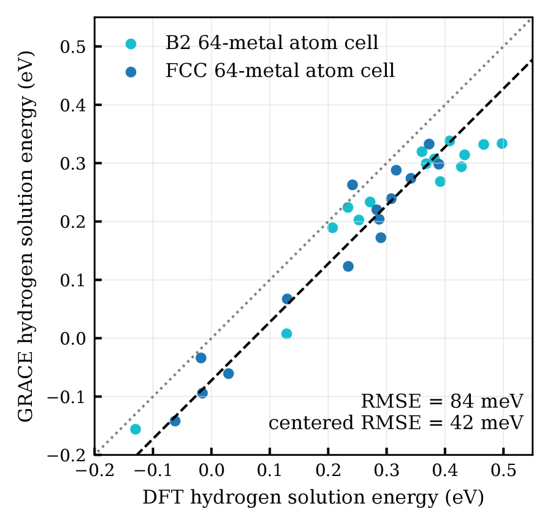
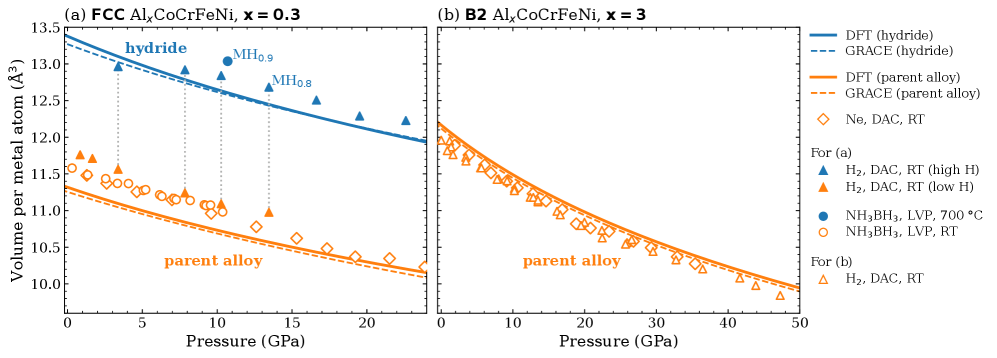
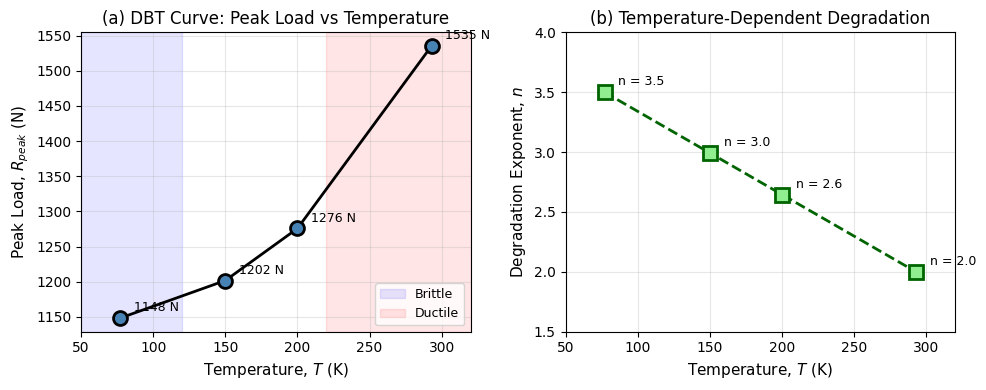

# 2026-03-22 計算材料科学

**作成日：** 2026年3月22日
**対象期間：** 2026年3月19日〜2026年3月22日（直近72時間）

---

## 選定論文一覧

1. [Hydrogen uptake and hydride formation in Al$_x$CoCrFeNi high-entropy alloys: First-principles, universal-potential, and experimental study](https://arxiv.org/abs/2603.17479) — Körmann et al.
2. [A first-principles linear response theory for open quantum systems and its application to Orbach and direct magnetic relaxation in Ln-based coordination polymers](https://arxiv.org/abs/2603.18725) — Żychowicz et al.
3. [Lightweight phase-field surrogate for modelling ductile-to-brittle transition through phenomenological elastoplastic coupling](https://arxiv.org/abs/2603.18040) — Kubendran Amos
4. [On the origin of non-Arrhenius behavior of grain growth](https://arxiv.org/abs/2603.18552) — Pan et al.
5. [Optimization of all-optical phase-change waveguide devices for photonic computing from the atomic scale](https://arxiv.org/abs/2603.18468) — Zhang et al.
6. [From Atomistic Models to Machine Learning: Predictive Design of Nanocarbons under Extreme Conditions](https://arxiv.org/abs/2603.18316) — Yan et al.
7. [Simulating the influence of stoichiometry on the spectral emissivity of Mo$_x$Si$_y$ thin films](https://arxiv.org/abs/2603.17801) — Golsanamlou et al.
8. [Polaron-mediated anisotropic exchange in 2D magnets](https://arxiv.org/abs/2603.17619) — Carbone et al.
9. [GPUMDkit: A User-Friendly Toolkit for GPUMD and NEP](https://arxiv.org/abs/2603.17367) — Yan et al.
10. [Ferroelectric $p$-wave magnets](https://arxiv.org/abs/2603.19107) — Priessnitz et al.

---

## 全体所見

今回の選定論文10本は、高エントロピー合金における水素吸収の多手法計算・実験研究、ランタニド錯体の磁気緩和を対象とした開放量子系の線形応答理論、フェーズフィールド法による延性−脆性転移のサロゲートモデル構築、という3本を重点論文とした。残る7本では、非アレニウス型粒成長の機構解明（SrTiO₃）、相変化材料を用いた光子ニューロモーフィックコンピューティングの原子スケール最適化、極限条件下のナノカーボン設計に向けたReaxFF-MD×機械学習、Mo₋Si薄膜の誘電率・放射率の第一原理摂動計算、2次元磁性体MnPS₃におけるポーラロン誘起異方的交換相互作用、GPUMD/NEP向けユーザーフレンドリー解析ツールキットGPUMDkit、フェロ電性体における*p*波スピン偏極電子状態と多強誘電体マルチフェロイクスの理論・計算研究を取り上げた。高エントロピー合金・2D材料・機能性酸化物・相変化材料など対象系は多岐にわたり、第一原理計算・汎用機械学習ポテンシャル・フェーズフィールド・分子動力学・密度汎関数摂動理論が幅広く活用されている点が、今週の計算材料科学動向の特徴である。

---

## 重点論文の詳細解説

## AlCoCrFeNi高エントロピー合金における水素吸収の多手法研究

### 1. 論文情報

| 項目 | 内容 |
|------|------|
| タイトル | [Hydrogen uptake and hydride formation in Al$_x$CoCrFeNi high-entropy alloys: First-principles, universal-potential, and experimental study](https://arxiv.org/abs/2603.17479) |
| 著者 | Fritz Körmann, Yuji Ikeda, Konstantin Glazyrin, Maxim Bykov, Kristina Spektor, Shrikant Bhat, Nikita Y. Gugin, Anton Bochkarev, Yury Lysogorskiy, Blazej Grabowski, Kirill V. Yusenko, Ralf Drautz |
| arXiv ID | 2603.17479 |
| カテゴリ | cond-mat.mtrl-sci |
| 公開日 | 2026年3月20日 |
| 論文タイプ | 研究論文 |
| ライセンス | CC BY 4.0 |

### 2. どんな研究か

Al含有高エントロピー合金（HEA）であるAl₀.₃CoCrFeNiとAl₃CoCrFeNiを対象に、第一原理計算（DFT/PBE、VASP）・汎用機械学習ポテンシャル（GRACE/OMat24）・高圧実験（ダイヤモンドアンビルセルおよびラージボリュームプレス）を組み合わせて、水素吸収挙動と水素化物形成の機構を明らかにした研究である。Al₀.₃CoCrFeNi（FCC）は3 GPa以上で水素化物を形成するのに対し、Al₃CoCrFeNi（B2秩序相）は50 GPaまで水素を吸収しないという劇的な差異が、主として組成によって支配されることを計算・実験の両面から実証した。

### 3. 位置づけと意義

高エントロピー合金の水素貯蔵・水素脆化は応用上重要な問題であるが、多元系の化学的複雑性により従来の第一原理計算では包括的な解析が困難であった。本研究は、汎用ポテンシャルGRACEによる5,184配位サイトの網羅的スクリーニングと、DFT計算の系統的比較、さらに超高圧実験との直接対応を通じて、HEAにおける水素挙動の支配因子を定量的に分離した点に独自性がある。特に、組成・化学秩序度・体積・結晶構造という4つの因子を独立に評価した解析は、多元系合金設計の方法論的基盤として波及性が高い。

### 4. 研究の概要

**背景と目的**：HEAにおける水素吸収は、水素脆化耐性や次世代水素貯蔵材料の観点から注目されている。特にアルミニウム添加量が水素挙動に与える効果の定量的理解は、設計指針の確立に不可欠である。

**計算科学上の課題設定**：多元系のランダム固溶体では、水素の侵入型サイトエネルギーが局所化学環境に応じて大きく分布する。この分布を統計的に把握するためには、1,000を超える配置の計算が必要であり、DFTのみでは計算コストが膨大になる。

**研究アプローチ**：VASP（PAW-PBE）による64原子・216原子SQS超格子でのDFT計算と、GRACEポテンシャル（OMat24データセット学習）による同条件の全侵入型サイトの系統的評価を組み合わせた。高圧下での格子体積変化を実験で追跡し、水素化物形成の臨界圧力を決定した。

**対象材料系・対象現象**：Al₀.₃CoCrFeNi（FCC, 低Al）とAl₃CoCrFeNi（B2, 高Al）の水素侵入型サイトエネルギー分布、および高圧水素化物形成。

**主な手法**：VASP 5.4.4（PAW-PBE, 300 eV, Gaussian smearing 0.2 eV）、icetによるSQS生成、GRACEポテンシャル（GRACE_2L_SMAX_OMAT_large）、ダイヤモンドアンビルセル・ラージボリュームプレス実験。

**主な結果**：FCC Al₀.₃CoCrFeNiの水素化物形成エネルギーは−61 meV/metal（DFT）であり水素化物安定、B2 Al₃CoCrFeNiは+285 meV/metalで水素化物不安定。両者の差異は約277–278 meV。GRACEはDFTと平均偏差72 meV・RMSE 42 meVで一致。実験では3 GPa以上でFCC合金がMH₀.₈₋₀.₉程度の水素化物を形成し、B2合金は50 GPaまで無反応。

**著者の主張**：水素吸収の主支配因子は組成（Al含有量）であり、B2化学秩序・体積変化・結晶構造は副次的因子に過ぎない。

### 5. 計算材料科学として重要なポイント

本研究の核心は、多元系ランダム合金における水素侵入エネルギー分布という統計的問題に対して、DFTのベンチマークを担保しつつGRACEポテンシャルで計算コストを大幅削減し、5,000超の配置を実際に計算したスケーラビリティにある。侵入型サイトの八面体・四面体の区別、スピン偏極の扱い、SQSによる化学的乱雑さの再現など、細部の計算設定が体系的に議論されている点も重要である。GRACEとDFTの一致精度（RMSE 42 meV/H）は、参照エネルギー（H₂）の扱いに起因する系統誤差（72 meV）を除けば十分高い。組成・秩序度・体積・構造を独立変数として水素化物形成エネルギーを分解した解析（Fig. 5相当）は、他のHEA系や多元系合金にも直接適用できる方法論的枠組みを提供する。

### 6. 限界と注意点

本研究には少なくとも以下の3点の限界がある。第一に、DFT計算はPBEを用いており、水素化物相における電子的自己相互作用・磁性の精密な取り扱いには改善の余地がある。特にCrやFeが含まれる磁性系では、スピン状態の取り扱いが結果に影響する可能性がある。第二に、GRACEポテンシャルはOMat24データセットで学習されており、HEAの極端な化学組成空間や高圧相への外挿精度については系統的な検証が不足している。72 meVという系統誤差がどの材料系でも同程度かは不明であり、外挿領域では誤差が増大する可能性がある。第三に、実験で観測された水素化物は混合相や不均一な化学秩序を含む可能性があり、計算の均一なSQSモデルとの直接対応には限界がある。また、計算した侵入エネルギーから実際の水素化物形成圧力を予測する熱力学モデルの詳細（フォノン寄与、有限温度効果）は十分に議論されていない。

### 7. 関連研究との比較

HEAの水素吸収に関しては、第一原理計算を用いた先行研究（例えばTan et al., Ikeda et al.）が特定組成での水素侵入エネルギーを計算してきたが、数千サイトを網羅した統計的分析と高圧実験の直接比較を組み合わせた研究は少ない。本研究がGRACEという汎用ポテンシャルをHEAの水素問題に適用した点は新規性が高く、OMat24データセットを基盤とした「FoundationポテンシャルのHEA展開」という方向性を具体的に示した最初期の例の一つである。水素化物の安定性に対するAlの効果はCoNiやNiCrなどの二元系でも知られているが、5元素系での定量的分解分析は本研究が初めてに近い。

今後の展開として、GRACEをはじめとする汎用ポテンシャルを活用したHEA組成空間の系統的スクリーニング研究が加速すると予想される。また、有限温度・有限圧力の自由エネルギー計算（フォノン・エントロピー補正）をGRACEで行い、水素化物形成の相境界を定量的に予測する研究への展開も期待される。OMat24基盤ポテンシャルの精度検証という観点でも、本研究は重要な事例として引用されるだろう。

### 8. 重要キーワードの解説

**高エントロピー合金（High-Entropy Alloy, HEA）**：5種以上の主成分元素が等モル〜準等モル比で混合した多主成分合金。従来合金とは異なり、配置エントロピー項 $S_{mix} = -R\sum x_i \ln x_i$ が大きく、複雑な多相分離を抑制し単相固溶体を安定化させる場合がある。AlCoCrFeNiはその代表的系であり、Al濃度によってFCC（低Al）とBCC/B2（高Al）の相安定性が変化する。

**特殊準ランダム構造（SQS: Special Quasi-Random Structure）**：ランダム固溶体の化学的乱雑さを有限サイズのスーパーセルで近似する手法。ランダム配置の多体相関関数（ペア・三体など）を最小化するように元素配置を最適化する。HEAのような多元系計算で必須の技術であり、icetなどのコードで自動生成できる。

**侵入型水素サイトエネルギー（Hydrogen Interstitial Site Energy）**：水素原子を結晶内の八面体サイト（octahedral, O）または四面体サイト（tetrahedral, T）に置いたときの、$E_{site} = E_{alloy+H} - E_{alloy} - E_{H_2}/2$ として定義される侵入エネルギー。値が負であるほど水素が熱力学的に安定で水素化物形成に有利。

**GRACEポテンシャル（Graph Atomic Cluster Expansion）**：原子クラスター展開（ACE）の拡張形式に基づくFoundation機械学習ポテンシャル。OMat24データセット（約1億配置）で学習され、周期表全体にわたる広汎な化学空間への汎化性が特徴。DFT精度を維持しつつ原子力計算の100〜1000倍の速度を実現する。

**B2秩序構造**：体心立方（BCC）の単位胞において、一方の副格子にAlが、もう一方にCoCrFeNiが優先的に占位する化学秩序相。Pm-3m空間群。B2秩序化によって電子構造・結合様式が変化し、Al置換サイト周囲の侵入型サイトが不安定化することが水素排除の一因となる。

**水素化物形成エネルギー（Hydride Formation Energy）**：合金が水素化物（MH, MH₂など）を形成する際のエネルギー変化。$\Delta E_f = E_{MH_x} - E_M - x\cdot E_{H_2}/2$ で定義され、負の値が安定な水素化物を示す。本研究ではH/M = 1（全侵入型サイト充填）での値を系統比較している。

**ダイヤモンドアンビルセル（Diamond Anvil Cell, DAC）**：二個のダイヤモンドで試料を挟み、数GPa〜数百GPaの静水圧力を発生させる高圧実験装置。X線回折・ラマン散乱などの計測が同時に可能で、高圧下での相変態・格子体積変化・水素化物形成の動的観察に用いられる。本研究では格子定数の圧力依存性から水素吸収の有無を判定した。

### 9. 図

**ライセンス：CC BY 4.0（原図使用可）**

**図1**：FCC Al₀.₃CoCrFeNiおよびB2-ordered Al₃CoCrFeNiの格子定数対体積（E-V）曲線。GRACEポテンシャル（青）とDFT-PBE（黒）の比較。BCC・FCC・B2各相のVinetフィット曲線が重ねて示されており、両手法が定性的に一致していること、特に各相の相対安定性（Al₀.₃: FCC安定、Al₃: B2安定）をGRACEが正確に再現していることを示す。この一致が、GRACEによる系統的侵入サイトスクリーニングの信頼性の根拠となる。

**図2**：64原子SQS超格子における水素侵入型サイトエネルギーのDFT対GRACE散布図。FCC Al₀.₃CoCrFeNi（左）およびB2 Al₃CoCrFeNi（右）の各配位サイトが点として示されている。RMSE 42 meV/H・平均誤差72 meVという一致精度が読み取れる。B2相では多くのサイトエネルギーが正の大きな値を示し（水素不安定）、FCC相では広い分布の中に負値を持つサイトが存在することが視覚的に分かる。

**図3**：高圧実験（ダイヤモンドアンビルセルおよびラージボリュームプレス）による圧力−体積データ。（a）FCC Al₀.₃CoCrFeNi：3 GPa超で体積が急拡大し水素化物形成を示すデータ。（b）B2 Al₃CoCrFeNi：50 GPaまで水素非存在時の予測EOS曲線と実験値が一致し、水素吸収がないことを実証している。計算で予測された水素化物形成エネルギーの差（〜277 meV）が実験で確認された劇的な差異の起源であることを支持する。

---

## ランタニド錯体の磁気緩和を記述する開放量子系の第一原理線形応答理論

### 1. 論文情報

| 項目 | 内容 |
|------|------|
| タイトル | [A first-principles linear response theory for open quantum systems and its application to Orbach and direct magnetic relaxation in Ln-based coordination polymers](https://arxiv.org/abs/2603.18725) |
| 著者 | Mikołaj Żychowicz, Jakub J. Zakrzewski, Szymon Chorazy, Alessandro Lunghi |
| arXiv ID | 2603.18725 |
| カテゴリ | cond-mat.mtrl-sci |
| 公開日 | 2026年3月20日 |
| 論文タイプ | 研究論文 |
| ライセンス | CC BY 4.0 |

### 2. どんな研究か

単分子磁石（SMM）の代表系である希土類（ランタニド，Ln）系配位高分子を対象に、スピン−フォノン結合を通じた磁気緩和（OrBach機構・direct機構）を第一原理から記述する新しい線形応答理論を開発した研究である。開放量子系のLindblad主方程式と量子化学計算を組み合わせた計算フレームワークにより、三種のLn錯体の実験観測された低温direct緩和と高温Orbach緩和の両方を定量的に再現することに成功した。スピン格子緩和の温度依存性・異方性を第一原理から予測するという計算材料科学における未解決問題に対して、実用的な枠組みを提示した点で重要である。

### 3. 位置づけと意義

SMM・分子磁性体の磁気緩和時間は量子情報・スピントロニクスへの応用上重要なパラメータであるが、第一原理計算による定量予測は困難であった。スピン−フォノン結合強度の第一原理計算自体は近年進展しているが、開放量子系ダイナミクス（Redfield方程式・Lindblad形式）との接続を線形応答理論の枠組みで統一的に定式化し、Orbach（共鳴フォノン吸収）とdirect（単フォノン）という異なる緩和機構を同一フレームワークで扱えるようにした点が新規性の核心である。希土類錯体系への応用は今後急速に進むと予想され、ランタニド系量子ビット材料の計算スクリーニングへの展開が期待される。

### 4. 研究の概要

**背景と目的**：SMM（単分子磁石）の低温磁気量子トンネリング・Orbach緩和・direct緩和の第一原理的記述は、従来フェノメノロジカルなスピンハミルトニアンに依存していた。量子化学（CASSCF/NEVPT2など）による結晶場パラメータ計算は発達しているが、格子ダイナミクス（フォノン）との結合を明示的に扱う計算は少なかった。

**計算科学上の課題設定**：スピン−フォノン結合定数の計算には、スピン状態（J多重項）の電子構造計算とフォノン振動座標に沿ったスピンハミルトニアンの変化の両方が必要であり、計算コストと定式化の難しさが障壁であった。

**研究アプローチ**：Lindbladマスター方程式に基づく開放量子系の線形応答理論を構築し、スピン−フォノン散乱行列要素を量子化学計算から取得。フォノン密度と結合定数の温度依存性を組み合わせて緩和時間を予測する。

**対象材料系**：三種のランタニド配位高分子（Er, Yb, Dy含有）を対象とした実証研究。

**主な手法**：Lindbladマスター方程式、線形応答理論、量子化学計算（CASSCF/NEVPT2相当）、フォノン計算（周期系DFT）、スピン−フォノン結合定数の解析的・数値的計算。

**主な結果**：三種全てのLn錯体において低温direct緩和と高温Orbach緩和の実験データを定量的に再現。緩和機構の物理的起源（どのフォノンモードが主に関与するか）を同定することが可能になった。

**著者の主張**：開放量子系の線形応答理論は、ランタニド系SMM/SIM（単イオン磁石）の磁気緩和の第一原理計算に実用的な枠組みを提供する。

### 5. 計算材料科学として重要なポイント

スピン−格子緩和の計算は、磁性体の動的磁気特性理解の根幹をなす問題である。本研究の枠組みでは、スピン−フォノン結合定数を電子構造計算から系統的に抽出し、それをLindbladマスター方程式のジャンプ演算子として定式化することで、マルコフ近似のもとでの緩和速度行列を解析的に計算できる。計算材料科学の観点から重要なのは、従来のフェノメノロジー（実験的Hamiltonianパラメータへの依存）から第一原理（量子化学＋フォノン計算）への移行を実用的な精度で実現した点である。対象のLn系は4f電子が多体相関・スピン軌道相互作用を強く受けており、CASSCF/NEVPT2を必要とする複雑な電子状態計算が求められる。この精度要求をクリアしつつ、周期系フォノン計算との結合を実現した点が方法論的な貢献の核心である。

### 6. 限界と注意点

少なくとも以下の3点に留意が必要である。第一に、Lindbladマスター方程式はマルコフ近似（系−浴の記憶効果を無視）のもとで定式化されており、非マルコフ的な効果（低温・低フォノン密度領域）は明示的に扱われていない。実際の実験データとの比較においてマルコフ近似の有効性は系に依存する。第二に、スピン−フォノン結合定数の計算には量子化学計算のパラメータ依存性（活性空間の大きさ、基底関数、CASSCF/NEVPT2の精度）と、フォノン計算の精度（DFT汎関数依存性、フォノン状態密度の精度）の両方の誤差が累積する。第三に、実証した3系は配位高分子という特定の材料クラスに限定されており、他のSMM系（Fe系、Co系、遷移金属系）への一般化可能性については追加検証が必要である。また計算コストは結晶場状態数とフォノンモード数の積に比例して増大するため、大きな分子や複雑なフォノン分散を持つ系への適用には計算資源上の制限が生じる。

### 7. 関連研究との比較

スピン−フォノン結合の第一原理計算分野では、Lunghi et al.の先行研究（Science 2017, Nat. Commun. 2022）が4f系SMM・3d系のスピン格子緩和の計算に先鞭をつけた。Mosadeghian et al.やOrvillius et al.なども近年関連する枠組みを発展させている。本研究はOrbach緩和とdirect緩和の両方を統一的なLindbladフレームワークで扱えるようにしたという点で、既存研究を超えた一般性を持つ。ただし、同グループ（Lunghi）の研究蓄積に基づく継続的発展であり、全く独立した新アプローチというよりは既存計算化学手法の統合・精緻化という性格が強い。今後はこのフレームワークをランタニド系量子ビット候補材料のハイスループットスクリーニングに適用する研究が現れると予想される。

### 8. 重要キーワードの解説

**単分子磁石（SMM: Single-Molecule Magnet）**：単一の分子単位が磁気ヒステリシスを示す磁性体。有限のゼロ磁場分裂（ZFS）と高いスピン基底状態を持ち、磁気緩和時間が極めて長い（数秒〜数時間）場合がある。量子情報処理のキュービット候補として近年注目されており、磁気緩和時間の延伸が主要課題。

**Orbach緩和機構**：励起スピン状態（結晶場多重項）へのフォノン吸収とそれに続く非輻射緩和を通じたスピン格子緩和機構。活性化エネルギー $U_{eff}$ を持つアレニウス型の温度依存性（$\tau^{-1} \propto e^{-U_{eff}/k_BT}$）を示す。高温領域で支配的となり、実験的に最もよく観測される緩和機構。

**Direct緩和機構**：スピン状態間の単一フォノン散乱（フォノンの吸収・放出）による磁気緩和。低温で支配的となり、磁場依存性（$\tau^{-1} \propto H^4T$）を持つ。Orbach機構とは異なりエネルギーギャップに依存しないため、低温でのゼロ磁場量子トンネリングと競合する。

**Lindbladマスター方程式**：開放量子系の密度行列 $\rho$ の時間発展を記述する方程式。$\dot{\rho} = -\frac{i}{\hbar}[H, \rho] + \sum_k \gamma_k (L_k \rho L_k^\dagger - \frac{1}{2}\{L_k^\dagger L_k, \rho\})$ の形を持ち、マルコフ近似とボルン近似のもとで導出される。スピン系が熱浴（フォノン系）と結合して緩和する問題を統一的に記述できる。

**スピン−フォノン結合定数**：スピンハミルトニアンのパラメータ（ゼロ磁場分裂Dテンソル、g因子、交換結合など）がフォノン座標 $q_k$ に沿って変化する量 $\partial H_{spin}/\partial q_k$。第一原理計算では、フォノン固有モードに沿って構造を変位させながら電子構造計算を繰り返すことで数値的に計算する。

**CASSCF/NEVPT2（Complete Active Space Self-Consistent Field / N-Electron Valence State Perturbation Theory）**：多体電子相関を扱う量子化学手法。活性空間内の電子を完全CI展開で扱い（CASSCF）、動的電子相関をNEVPT2で補正する。ランタニド4f電子の多配置電子状態・スピン軌道効果を精密に計算するために必要。計算コストは活性空間サイズの指数関数的に増大する。

**結晶場（Crystal Field）多重項**：ランタニドイオンの4f電子状態が周囲の配位子の静電場によって分裂した量子状態の集合。ゼロ磁場分裂・異方性のエネルギーバリアを決定する。4f電子系では全角運動量 J の多重項（$(2J+1)$の縮退）が結晶場によって Kramers 二重項などに分裂し、この分裂エネルギーが磁気異方性を支配する。

### 9. 図

arXiv非独占的配布ライセンスではなくCC BY 4.0ライセンスであることは確認されているが、本論文のHTMLバージョンが現時点では提供されておらず、原図の抽出ができなかった。

---

## BCC材料の延性−脆性転移を記述する軽量フェーズフィールドサロゲートモデル

### 1. 論文情報

| 項目 | 内容 |
|------|------|
| タイトル | [Lightweight phase-field surrogate for modelling ductile-to-brittle transition through phenomenological elastoplastic coupling](https://arxiv.org/abs/2603.18040) |
| 著者 | P G Kubendran Amos |
| arXiv ID | 2603.18040 |
| カテゴリ | cond-mat.mtrl-sci / physics.comp-ph |
| 公開日 | 2026年3月20日（提出：2026年3月14日） |
| 論文タイプ | 研究論文 |
| ライセンス | CC BY 4.0 |

### 2. どんな研究か

体心立方（BCC）金属の延性−脆性転移（DBT: Ductile-to-Brittle Transition）を、完全な熱力学的連成モデルに頼ることなく、温度依存性を持つフェーズフィールド変数で表現する軽量サロゲートモデルを構築した計算研究である。標準的な等温二場変位−損傷フレームワークに、(1)劣化指数 $n(T)$ の温度依存性、(2)降伏応力・弾性率の温度依存性、(3)破壊靭性スケーリング、の3つのフェノメノロジカルな機構を導入することで、77 K〜293 Kの広温度範囲でDBTを再現した。FEniCSxで実装し、単一プロセッサで約9分/温度点という低計算コストを実現している。

### 3. 位置づけと意義

DBTはWやFeなどのBCC金属・構造材料の低温破壊機構として工学上重要であるが、完全連成熱力学−弾塑性−破壊モデルは計算コストが高く設計空間の探索に適さない。本研究の軽量サロゲートアプローチは、DBT現象の本質的な温度依存性を最小限のパラメータで捉え、高速な材料設計スクリーニングを可能にする。フェーズフィールド法と弾塑性結合の文脈において、温度依存劣化指数という新しい設計自由度を提案した点が方法論的に興味深く、他のBCC金属系や相転移を伴う材料のDBTモデリングへの波及が期待される。

### 4. 研究の概要

**背景と目的**：BCCタングステン・鉄・クロムなどの金属は低温で急激な脆化を示す。工学的設計のためにはDBT温度・延性遷移の形状予測が必要であるが、既存のフェーズフィールド破壊モデルは等温・単機構を仮定することが多く、温度依存の延性−脆性遷移を自然に記述できない。

**計算科学上の課題設定**：完全な熱力学的連成（温度場の解法を含む）は計算コストが高く、また多数の材料パラメータが必要。代替として、温度依存の材料パラメータを持つ等温弾塑性フェーズフィールドモデルで現象を近似的に再現できるかを検証する。

**研究アプローチ**：標準的な二場フェーズフィールド破壊フレームワーク（AT-2型）に、3つの温度依存機構を付加。ノッチ付き単辺き裂試験片（1.0×0.2 mm、ノッチ長0.20 mm）を5温度点で計算し、実験的DBT挙動と定性的に比較。

**主な手法**：FEniCSxによる有限要素法、$J_2$リターンマッピング弾塑性、段差法（Staggered scheme）、線形・smoothstep・指数・ハイブリッドの4補間スキームの比較。正則化長さ $\ell = 0.015$ mm、メッシュサイズ $h = 0.005$ mm（$\ell/h = 3.0$）。

**主な結果**：ピーク荷重は77 Kの〜1,150 Nから293 Kの〜1,535 Nへ上昇し、破壊変位（延性の指標）は1.6〜2.1 μm（低温）から>4 μm（室温）へ増大。損傷形態が低温では細い局在帯、室温では広い分散帯へと変化し、DBTの特徴的な破壊遷移を再現。

**著者の主張**：提案モデルは完全連成熱力学モデルなしにDBTの本質的挙動を捉えており、設計スクリーニングや感度解析に適した計算効率を持つ。

### 5. 計算材料科学として重要なポイント

フェーズフィールド破壊力学は近年急速に発展しており、均質な等温・均一材料の破壊再現から、不均質・多相・連成問題への拡張が進んでいる。本研究の温度依存劣化指数 $n(T)$ というアイデアは、フェーズフィールド理論の変分原理（Bourdin-Francfort-Marigo形式）の枠組みを保ちつつ、温度効果を劣化関数の形状変化として組み込む自然な拡張である。$n=2$（AT-2, ductile-like）から $n=3.5$（brittle-like）への連続遷移という数値実装は実用上シンプルで他のコードへの移植も容易である。有限要素実装（FEniCSx）の詳細（CG1要素、DG0歴史変数、段差法）が明示されており再現性が高い。ただしパラメータ（降伏応力・弾性率・破壊靭性の温度依存式）の物理的根拠付けが不十分で、材料特定パラメータの同定に追加実験が必要である点は計算設計ツールとしての課題として残る。

### 6. 限界と注意点

以下の3点以上の限界がある。第一に、モデルはフェノメノロジカルであり、降伏応力・弾性率・劣化指数の温度依存関係はBCC金属の材料特定パラメータとして外部から与える必要がある。これらのパラメータを第一原理（分子動力学・第一原理計算）から系統的に求める枠組みは示されていない。第二に、等温近似（温度場の空間勾配・時間変化を無視）は急速変形・衝撃変形条件での断熱加熱効果を捉えられない。実際のDBT実験では変形速度が重要なパラメータであるが、本モデルには速度・動的効果が含まれていない。第三に、モデル検証は単辺ノッチ試験片という1つの幾何形状に限定されており、異なる試験形状・多軸応力状態での妥当性は未確認である。また正則化長さ $\ell$ と実際の物理的亀裂プロセスゾーンサイズとの関係が議論されておらず、スケールアップ問題への適用には注意が必要である。

### 7. 関連研究との比較

フェーズフィールド破壊力学はBourdin, Francfort, Marigoらの変分定式化（2000年代）以来急速に発展し、Miehe・Hofacker・Welschinger（2010年代）の実装、Ambati et al.（2015）の延性破壊への拡張が主要先行研究となっている。温度依存DBTのフェーズフィールドモデリングについては、Shanthraj et al.のスペクトル法実装や、温度依存靭性を用いたDing et al.の研究などが先行する。本研究は既存フレームワークへの最小限の付加（3つの温度依存メカニズム）でDBTを再現するという実用性を重視した貢献であり、理論の独創性より実装上の使いやすさに強みがある。GPUやマルチコア実装への拡張・実材料（W、Fe）の実験データとのキャリブレーションが今後の展開として期待される。

### 8. 重要キーワードの解説

**延性−脆性転移（DBT: Ductile-to-Brittle Transition）**：金属材料が低温・高変形速度条件で延性（塑性変形後の破壊）から脆性（亀裂の急速伝播）へ移行する現象。BCCタングステンでは約200〜400℃のDBT温度が知られる。転位のパイエルス応力の急激な温度依存性が主な原因とされている。

**フェーズフィールド破壊モデル（Phase-Field Fracture Model）**：亀裂面を損傷場変数 $d \in [0,1]$（0：健全、1：完全破壊）で正則化し、正則化長さ $\ell$ に基づく空間勾配エネルギー $\frac{G_c}{4c_w}\left(\frac{d}{\ell} + \ell|\nabla d|^2\right)$ と弾性エネルギーの劣化 $g(d)\psi_e$ を含む変分原理から亀裂伝播を記述する手法。鋭い界面追跡が不要で複雑な亀裂分岐・合体を自然に扱える。

**劣化関数・劣化指数 $n$（Degradation Function）**：損傷変数 $d$ から有効弾性率への変換関数 $g(d) = (1-d)^n$。$n=2$（AT-2モデル）では損傷の初期から弾性剛性が低下（延性的挙動に対応）、$n$ が大きくなるほど損傷が高度に進行するまで剛性が保たれ（脆性的挙動）、荷重−変位曲線の形状が変わる。本研究ではこの指数を温度の関数 $n(T)$ とした。

**$J_2$リターンマッピング（$J_2$ Return Mapping）**：等方硬化を伴うvon Mises降伏条件（第2不変量 $J_2$ に基づく）のもとで弾塑性構成則を数値積分するアルゴリズム。弾性試行応力がリードバック面の外側にある場合に降伏面上へ「返し」て塑性整合条件を満たす。有限要素法での弾塑性解析の標準的実装手法。

**段差法（Staggered Scheme）**：フェーズフィールド破壊問題のように異なる場変数（変位 $u$ と損傷 $d$）が連成した問題を、各変数について交互に解くアルゴリズム。完全連成（モノリシック）解法より計算コストが低く収束性が良いが、時間ステップの大きさに感度を持つ。

**FEniCSx**：フェノーフィールド法・有限要素法の計算フレームワーク。Pythonインターフェースと自動微分（UFL）によって弱形式から行列アセンブリを自動化し、様々な偏微分方程式の有限要素実装を容易にする。本研究ではCG1（変位、損傷）・DG0（歴史変数）の要素を組み合わせた。

**正則化長さ $\ell$（Regularization Length）**：フェーズフィールドモデルで亀裂を空間的に「ぼかす」スケールパラメータ。$\ell \to 0$ の極限では古典的破壊力学（Griffith）に収束する。$\ell/h \geq 3$（$h$はメッシュサイズ）が安定な数値解に必要。物理的には亀裂プロセスゾーンサイズに関連するが、定量的対応付けは材料依存。

**破壊靭性 $G_c$（Fracture Toughness）**：亀裂を単位面積進展させるのに必要なエネルギー（Griffithの臨界エネルギー解放率）。フェーズフィールドモデルでは $G_c$ が表面エネルギー密度の定義に直接現れ、亀裂伝播の臨界条件を支配する。低温での脆化は実質的に $G_c$ の低下（亀裂先端塑性域の縮小）として現れる。

### 9. 図

**ライセンス：CC BY 4.0（原図使用可）**

**図1**：293 KおよびことK（低温）における三ポイント比較パネル。（左）力−変位曲線：室温では荷重が緩やかに増大後ゆっくり減少（延性）、低温では急峻な荷重増大後の急落（脆性）。（中央）損傷進展の時系列。（右）最大等価塑性ひずみの進展。三機構の温度依存性が組み合わさることで、延性−脆性の質的な挙動転換がサロゲートモデルで再現されていることを示す中心的な結果。

**図2**：異なる変位レベルにおける損傷場 $d$ の空間分布。293 K（室温）では損傷が広い分散帯（diffuse zone）として進展しているのに対し、77 K（液体窒素温度）では亀裂先端から鋭く局在化した細い帯（localized band）として損傷が集中している。この空間パターンの質的変化がDBTの計算的特徴を明示的に示している。

**図3**：温度スイープ（77 K〜293 K）における力−変位曲線群および最大損傷値の温度依存性。ピーク荷重・破壊変位がともに温度上昇とともに単調増加し、DBTが連続的に変化している様子を示す。実験で観察されるDBT曲線の温度依存性と定性的に一致しており、提案モデルの有効性を示す根拠の一つとなる。

---

## その他の重要論文

## SrTiO₃をモデル系とした非アレニウス粒成長の機構解明

### 1. 論文情報

| 項目 | 内容 |
|------|------|
| タイトル | [On the origin of non-Arrhenius behavior of grain growth](https://arxiv.org/abs/2603.18552) |
| 著者 | Xinlei Pan, Jingyu Li, Jianfeng Hu |
| arXiv ID | 2603.18552 |
| カテゴリ | cond-mat.mtrl-sci |
| 公開日 | 2026年3月20日 |
| 論文タイプ | 研究論文 |
| ライセンス | CC BY 4.0 |

### 2. 研究概要

多結晶SrTiO₃をモデル系として、多くの材料で観測される「非アレニウス型粒成長」の物理的起源を実験・理論の両面から解明した研究である。非アレニウス挙動は従来「熱的活性化ではなく反熱的活性化（anti-thermally activated）」として解釈されることもあったが、著者らは新しく構築した粒成長モデルにより、この挙動が「特定の特性温度（characteristic temperature）を持たない熱的活性化過程」であることを示した。温度依存因子と温度非依存因子の競合が結果として見かけ上の非アレニウス挙動を生み出すという枠組みは、粒成長速度の温度依存性を従来より広い視点で解釈できる。また、異常粒成長時には低温で非アレニウス挙動が支配的となり、高温ではアレニウス型へと遷移するという興味深い温度依存性を明らかにした。

この知見は、粒成長・焼結プロセスの設計において、単純なアレニウスフィッティングで得た見かけの活性化エネルギーが誤った機構解釈につながる可能性を示唆する。特に、セラミックス・超伝導体・燃料電池電解質材料など高温焼結が重要な材料群において、非アレニウス挙動の正確な機構理解は焼結プロファイルの最適化に直接貢献する。計算材料科学の観点からは、粒界移動度の温度依存性・粒界析出物の偏析エネルギーなどを第一原理・MD計算と組み合わせてこのモデルに入力することで、材料特定の粒成長予測精度を高める展開が期待される。

### 3. 重要キーワードの解説

**粒成長（Grain Growth）**：多結晶材料における焼結・熱処理過程で、粒界移動により小粒が大粒に取り込まれて平均粒径が増大する現象。平均粒径 $D$ の時間発展は Burke-Turnbull 式 $D^n - D_0^n = Kt$ で記述される（$n$：粒成長指数、$K$：粒成長速度定数）。

**アレニウス則（Arrhenius Law）**：速度定数の温度依存性を $K = K_0 \exp(-Q/RT)$ で表す経験則。$Q$：活性化エネルギー、$R$：気体定数。多くの熱的活性化過程（拡散・粒界移動・反応速度）でよく成り立つが、機構が複数存在する場合には成り立たない。

**非アレニウス挙動（non-Arrhenius Behavior）**：$\ln K$対$1/T$プロットで直線にならない温度依存性。見かけの活性化エネルギーが温度によって変化する場合に観測される。原因として複数拡散機構の寄与、偏析・析出物効果、相転移、高温での grain boundary complexion 転移などが挙げられる。

**SrTiO₃（チタン酸ストロンチウム）**：ペロブスカイト型構造（Pm-3m）を持つ酸化物セラミックス。誘電体・超伝導基板・固体酸化物燃料電池関連材料として広く用いられる。粒成長・偏析・相転移（105 Kでの菱面体晶転移）の研究のモデル系としても利用される。

**粒界移動度（Grain Boundary Mobility）**：粒界が毛管力（Driving force）に応じて移動する速さを表す係数 $M = M_0 \exp(-Q_{GB}/RT)$。温度依存性・方位依存性を持ち、偏析した不純物や析出物によって大きく変化する。粒成長モデルにおける温度依存因子の主たる担い手。

**異常粒成長（Abnormal Grain Growth）**：一部の粒が選択的に大きく成長し、粒径分布が二峰性を示す現象。粒界エネルギーの方位依存性・ピン止め粒子の不均一分布・偏析による粒界移動度の選択的増大などが原因として挙げられる。正常粒成長とは異なる速度則・活性化エネルギーを示す場合がある。

**粒界コンプレクション（Grain Boundary Complexion）**：粒界が相変態に類似した転移を経て別の安定状態（異なる原子構造・化学組成・移動度を持つ粒界状態）に変化する現象。近年の実験・計算研究で注目されており、非アレニウス粒成長の原因の一つとして挙げられている。粒界移動度の温度依存性に非線形性をもたらす。

### 4. 図

本論文のライセンスはCC BY 4.0であるが、現時点でHTMLバージョンが提供されておらず、原図の抽出ができなかった。

---

## 相変化材料を用いた光子ニューロモーフィックコンピューティングの原子スケール設計

### 1. 論文情報

| 項目 | 内容 |
|------|------|
| タイトル | [Optimization of all-optical phase-change waveguide devices for photonic computing from the atomic scale](https://arxiv.org/abs/2603.18468) |
| 著者 | Hanyi Zhang, Wanting Ma, Wen Zhou, Xueqi Xing, Junying Zhang, Tiankuo Huang, Ding Xu, Xiaozhe Wang, Riccardo Mazzarello, En Ma, Jiang-Jing Wang, Wei Zhang |
| arXiv ID | 2603.18468 |
| カテゴリ | cond-mat.mtrl-sci |
| 公開日 | 2026年3月20日 |
| 論文タイプ | 研究論文 |
| ライセンス | CC BY 4.0 |

### 2. 研究概要

カルコゲナイド相変化材料（PCM）であるSb₂Teを対象に、原子スケールの計算シミュレーション（第一原理計算・分子動力学）から得た光学定数（複素誘電率）を用いて、光導波路型メモリデバイスの設計を最適化した研究である。従来PCMとして広く使われているGe₂Sb₂Te₅（GST）と比較して、Sb₂Teが持つ固有の光学特性を原子スケールから明らかにし、「導波路が短いほどよい（shorter the better）」という設計指針を導出。単一導波路セルで7ビット超の光学プログラミング精度を実証し、全光学式相変化メモリデバイスとして記録的な精度を達成したと主張している。

本研究の計算材料科学的な貢献は、デバイスレベルの設計最適化を原子スケールの物質特性計算から駆動した「atom-to-device」アプローチにある。PCMのアモルファス−結晶相転移に伴う屈折率変化・消衰係数変化を計算で定量化し、それをデバイス光学シミュレーションの入力として直接使用することで、実験的試行錯誤を大幅に削減できる可能性を示した。ニューロモーフィックフォトニクス・光アナログ計算の加速という応用背景とともに、相変化材料の計算設計の有効性を示す実証例として、計算材料科学コミュニティへの波及が期待される。

### 3. 重要キーワードの解説

**相変化材料（Phase-Change Material, PCM）**：電気・熱・光パルスによりアモルファス−結晶間の可逆的相転移を示す材料。転移に伴い光学定数（屈折率 $n$、消衰係数 $\kappa$）と電気抵抗が大きく変化するため、不揮発性メモリ・ニューロモーフィックデバイスへの応用が進む。代表的材料はGST（Ge₂Sb₂Te₅）やSb₂Te₃など。

**複素誘電率（Complex Dielectric Function）**：$\tilde{\varepsilon}(\omega) = \varepsilon_1(\omega) + i\varepsilon_2(\omega)$ で表される周波数依存の誘電応答関数。実部 $\varepsilon_1$ は分散、虚部 $\varepsilon_2$ は光吸収に対応。DFTでは誘電テンソルの第一原理計算（Kubo-Greenwood式または誘電行列法）で計算できる。光学定数 $n$, $\kappa$ とは $\tilde{n} = n + i\kappa = \sqrt{\tilde{\varepsilon}}$ の関係にある。

**ニューロモーフィックフォトニクス（Neuromorphic Photonics）**：光学素子を用いてニューラルネットワークの演算（重み加算・行列積）を実行する計算パラダイム。光速での情報処理・低エネルギー消費が利点。PCMベースの導波路メモリが「重み」の多値記憶素子として注目されている。

**光プログラミング精度（Optical Programming Precision）**：PCM導波路デバイスで記憶できる光学状態の数（ビット数 $n$）。$2^n$ 個の光透過率状態を制御できる場合「$n$ビット精度」という。デバイス雑音・熱ゆらぎ・相転移の確率的性質によって制限される。本研究では7ビット超（128状態以上）を達成している。

**カルコゲナイド（Chalcogenide）**：硫黄族元素（S, Se, Te）を主成分とする化合物の総称。Sb₂Te₃, GeTe, Ge₂Sb₂Te₅などPCMの多くはテルル系カルコゲナイドである。弱いイオン−共有結合混成・メタバレント結合特性が大きな光学コントラストと速い相転移の起源。

**第一原理分子動力学（ab initio MD / AIMD）**：電子状態をDFT（または類似の方法）で計算しながら原子の運動方程式を解く計算手法。古典力場に依存せず化学結合の切断・形成を記述できる。相変化材料のアモルファス構造生成・相転移ダイナミクスの研究に広く用いられるが、計算コストは古典MDの100〜1000倍。

**Sb₂Te（二テルル化アンチモン）**：Te/Sb比=2のアンチモン−テルル二元系PCM。Ge₂Sb₂Te₅（GST）より高速な結晶化速度と単純な組成を持ち、光学メモリ・相変化ランダムアクセスメモリ（PCM-RAM）への応用が研究されている。本研究ではそのアモルファス・結晶両相の光学定数を第一原理から計算している。

### 4. 図

本論文のライセンスはCC BY 4.0であるが、現時点でHTMLバージョンが提供されておらず、原図の抽出ができなかった。

---

## 極限条件下のナノカーボン変態をGPU-MD×機械学習で予測

### 1. 論文情報

| 項目 | 内容 |
|------|------|
| タイトル | [From Atomistic Models to Machine Learning: Predictive Design of Nanocarbons under Extreme Conditions](https://arxiv.org/abs/2603.18316) |
| 著者 | Xiaoli Yan, Millicent A. Firestone, Murat Keceli, Santanu Chaudhuri, Eliu Huerta |
| arXiv ID | 2603.18316 |
| カテゴリ | cond-mat.mtrl-sci |
| 公開日 | 2026年3月20日 |
| 論文タイプ | 研究論文（Carbon誌掲載済, 2026年） |
| ライセンス | CC BY-NC-ND 4.0 |

### 2. 研究概要

爆薬衝撃波（デトネーション）によって生成するナノダイヤモンド（DND）が、極限的な温度・圧力条件下でどのような構造変態（グラファイト化・中空ナノ構造形成）を経るかを、GPU加速ReaxFF分子動力学（MD）シミュレーションと機械学習を組み合わせて予測した研究である。急速冷却＋緩やかな減圧では立方晶ダイヤモンドが保持され、緩やかな冷却＋急速減圧ではグラファイト化が進むという経路依存性を原子スケールで追跡。八面体・六角柱という形状の異なる初期DNDからは、それぞれカーボンナノオニオン・平行グラファイト積層という異なる生成物が得られることを示した。100,000ノード時間を超えるMDデータから学習した多層パーセプトロン（MLP）がグラファイト化層数をR²>0.90で予測し、計算コスト削減と設計最適化への活用を示した。

本研究の計算材料科学的な重要性は、極限条件（数百GPa、数千K）でのナノカーボン変態という実験的に直接観察が極めて困難な現象を原子スケールで追跡し、温度−圧力経路（T-P trajectory）から生成物の構造特徴を機械学習で予測するパイプラインを構築した点にある。ReaxFF＋GPU並列計算の組み合わせは現在の計算材料科学で広く用いられており、本研究はナノカーボン工学への応用例として実装上の参考になる。また「大規模MDデータから機械学習」という方法論は、相変態・衝撃応答の他の材料系にも転用可能である。

### 3. 重要キーワードの解説

**デトネーションナノダイヤモンド（DND: Detonation Nanodiamond）**：爆薬（TNT・RDXなど）の爆轟で発生した高温高圧の衝撃波によって炭素が凝集・核生成したナノサイズ（〜5 nm）のダイヤモンド粒子。表面官能基の豊富さから生体医学・潤滑・複合材料への応用が研究されている。変態条件によりグラファイト・ナノオニオンへ変化する。

**ReaxFF（Reactive Force Field）**：化学結合の切断・形成を扱える反応力場。原子間電荷の動的更新と結合次数に基づくポテンシャルエネルギー表面を持ち、C, H, N, O系の爆発・燃焼・高圧相変態の大規模MDに広く使われる。パラメータはDFTまたは実験データへのフィッティングで決定。

**カーボンナノオニオン（Carbon Nano-Onion, CNO）**：多層グラフェンシェルが同心球状に積層した中空ナノ炭素構造。フラーレン（C₆₀）を核として外側に多層グラフェンが形成される。DNDの高温アニールによって生成し、潤滑・超キャパシタ電極への応用が研究されている。

**GPU加速分子動力学**：グラフィクスプロセッシングユニット（GPU）の並列演算能力を利用してMDシミュレーションを高速化する手法。LAMMPSやGPUMDなどのコードがGPU対応実装を持つ。ReaxFF+GPUの組み合わせで、CPU専用実装の10〜100倍の高速化が可能であり、数百万〜数十億原子のシミュレーションを現実的な計算時間で実行できる。

**多層パーセプトロン（MLP: Multilayer Perceptron）**：全結合の前向きニューラルネットワーク。入力特徴量（ここではT-Pの経路パラメータ）から目標量（グラファイト化層数）を回帰予測する。本研究では10万ノード時間超のMDデータを学習データとし、R²>0.90のグラファイト化層数予測を実現。

**グラファイト化（Graphitization）**：ダイヤモンド（sp³混成炭素）が高温・減圧条件でグラファイト（sp²混成炭素）へ変換する過程。熱力学的にはグラファイトがゼロ圧室温で安定相であり、ダイヤモンドは準安定相。変換速度は温度・圧力経路・初期結晶欠陥に依存し、DNDの応用用途を決定する重要プロセス。

**T-P経路（Temperature-Pressure Trajectory）**：衝撃波解放過程における温度と圧力の時系列変化。急速冷却と緩やかな減圧（ダイヤモンド保持経路）、緩やかな冷却と急速減圧（グラファイト化経路）という対照的な経路が生成物構造を決定することが本研究で示された。

### 4. 図

本論文のライセンスはCC BY-NC-ND 4.0であるが、現時点でHTMLバージョンが提供されておらず、原図の抽出ができなかった。

---

## 密度汎関数摂動理論によるMo₋Si薄膜の放射率スペクトル計算

### 1. 論文情報

| 項目 | 内容 |
|------|------|
| タイトル | [Simulating the influence of stoichiometry on the spectral emissivity of Mo$_x$Si$_y$ thin films](https://arxiv.org/abs/2603.17801) |
| 著者 | Zahra Golsanamlou, Arseniy Baskakov, Robbert van de Kruijs, Silvester Houweling, Giorgio Colombi, Marcelo Ackermann, Menno Bokdam |
| arXiv ID | 2603.17801 |
| カテゴリ | cond-mat.mtrl-sci |
| 公開日 | 2026年3月20日 |
| 論文タイプ | 研究論文 |
| ライセンス | arXiv非独占的配布ライセンス |

### 2. 研究概要

Mo₋Si系化合物（MoSi₂, Mo₅Si₃, Mo₃Siなど）の複数の化学量論的相について、密度汎関数摂動理論（DFPT）を用いて誘電関数（電子的寄与＋イオン的寄与）を計算し、〜20 nm薄膜での放射率スペクトルをシミュレートした。結果として、Mo₋Si薄膜の大多数は金属的伝導を示すが、放射率はMo含有量だけでは単純に決まらないことを明らかにした。約900 Kの金属薄膜では5〜10 nmが最大放射率を与える最適膜厚として予測された。また六方晶MoSi₂の放射率が正方晶MoSi₂より著しく低い原因を、それぞれ小さなバンドギャップとフェルミ準位近傍の状態密度の低さとして説明した。欠陥（空孔等）の導入でMoSi₂のIR放射率が大幅に向上することも示した。

本研究の計算材料科学的な貢献は、DFPTによる誘電関数計算が光学的応用（薄膜放射率・赤外線センサ・EUV光学素子）の材料設計に直接使用できることを、Mo₋Si多相系で実証したことにある。特に化学量論比（組成相）によって放射率が非単調に変化するという結果は、組成探索を経験則だけで行う危険性を示す計算的根拠となる。先進リソグラフィ（EUV）用のモリブデン−シリコン多層膜（Mo/Si MLM）の最適化においても、各層の相純度と放射率の関係を定量化する本手法は実用的価値が高い。

### 3. 重要キーワードの解説

**放射率（Emissivity）**：実際の物体が放射するエネルギー $E(\lambda, T)$ と黒体放射 $B(\lambda, T)$（Stefan-Boltzmann則）の比 $\varepsilon(\lambda, T) = E(\lambda, T)/B(\lambda, T)$（0〜1の範囲）。材料の複素誘電率・薄膜の干渉効果に依存する。高温プロセス計測・熱管理・赤外線センサの材料選択において重要な光学特性。

**密度汎関数摂動理論（DFPT）**：基底状態DFTを摂動論的に拡張し、フォノン・誘電応答・電子−格子相互作用などの線形応答量を自己無撞着に計算する手法（Baroni et al. 2001）。複素誘電テンソルの電子的寄与（バンド間遷移）とイオン的寄与（フォノン誘起）を分離して計算できるため、金属・半導体・絶縁体にわたる光学スペクトルの計算に使われる。

**MoSi₂の多形（Polymorphs）**：MoSi₂には正方晶（C11b型、Mn₅Si₃構造、I4/mmm）と六方晶（C40型、CrSi₂構造）の少なくとも2つの多形が存在し、それぞれ電子構造（フェルミ面形状、バンドギャップの有無）が異なる。本研究では両者の誘電関数の違いが放射率の差を生み出すことを計算的に示した。

**薄膜の光学干渉（Thin Film Optical Interference）**：膜厚が光の波長に比較可能な薄膜では、表面と底面で反射した光の干渉効果により透過・反射スペクトルが膜厚依存性を示す。フレネル方程式とトランスファーマトリクス法を用いて計算され、放射率スペクトルの最適膜厚が現れる原因となる。

**EUV多層膜（EUV Multilayer Mirror）**：極紫外線（EUV, λ〜13.5 nm）リソグラフィ用の高反射率ミラー。Mo/Si交互多層膜（Bragg反射器）が標準であり、Moの光学定数制御と熱安定性が反射率・寿命に直結する。Mo₋Si相形成の制御はEUV光学素子の製造において産業的に重要な課題。

**フェルミ準位近傍の状態密度（DOS at Fermi Level）**：Drude（自由電子）型の光学応答の強度を決める $N(E_F)$。金属の低エネルギー光吸収はフェルミ面近傍の電子−正孔励起（Drude吸収）から来るため、$N(E_F)$ が低い金属は見かけ上低放射率を示す。正方晶MoSi₂は特徴的なフェルミ面構造により $N(E_F)$ が小さく、六方晶MoSi₂は小バンドギャップを持つため、異なる放射率特性を示す。

**欠陥誘起放射率向上**：欠陥（空孔・不純物・界面欠陥）は局在状態をバンドギャップ内に導入し、光吸収経路を増やすことで放射率を向上させる。薄膜成長条件（温度・雰囲気）の制御で欠陥濃度を変えることは実用的な放射率チューニング手段となりうる。本研究ではテスト計算でこの効果を確認している。

### 4. 図

本論文のライセンスはarXiv非独占的配布ライセンスであり、原図を抽出・掲載することができない。

---

## MnPS₃における局在ポーラロンが誘起する異方的磁気交換相互作用

### 1. 論文情報

| 項目 | 内容 |
|------|------|
| タイトル | [Polaron-mediated anisotropic exchange in 2D magnets](https://arxiv.org/abs/2603.17619) |
| 著者 | Johanna P. Carbone, Jakob Baumsteiger, Cesare Franchini |
| arXiv ID | 2603.17619 |
| カテゴリ | cond-mat.mes-hall（主）, cond-mat.mtrl-sci（関連） |
| 公開日 | 2026年3月20日 |
| 論文タイプ | 研究論文 |
| ライセンス | arXiv非独占的配布ライセンス |

### 2. 研究概要

2次元磁性体MnPS₃単層を対象に、局在電子ポーラロンが磁気交換相互作用に与える影響を第一原理計算によって解明した研究である。ポーラロンとは電子が格子を局所的に歪めながら自己捕捉した準粒子であり、その形成によって周囲の磁気対称性が局所的に破れ、等方的な超交換相互作用に加えて異方的（Dzyaloshinskii-Moriya型や擬双極型）の交換結合が誘起されることを第一原理で示した。この「ポーラロン誘起磁気異方性」機構は、欠陥エンジニアリング・電荷ドーピング・分子吸着などによる2D磁性体の磁気テクスチャ制御に向けた新しい原子スケールの自由度を提供する。

2D磁性体（CrI₃, CrBr₃, MnPS₃など）はスピン液体・マグノン輸送・ビヨンドCMOS応用の観点から活発に研究されているが、電子ポーラロンと磁性の結合という視点での研究は少なかった。本研究は、電荷キャリアと磁気秩序の結合がポーラロン形成を通じてどのように発現するかという基本的問いに計算的根拠を与え、スピントロニクス材料設計における「電荷−スピン結合の原子スケール制御」という新しいアプローチを提案している。電場・光励起・表面吸着によるポーラロン形成の制御が磁気状態の書き込み・読み出しに利用できる可能性を示唆しており、今後の実験的検証と計算的展開が期待される。

### 3. 重要キーワードの解説

**ポーラロン（Polaron）**：電子が格子変形と連動して自己捕捉した準粒子。格子との結合が強い場合（強結合極限）、電子は局所的な格子歪みポテンシャル井戸に捕捉されたsmall polaronとなる。半古典的にはHolsteinモデルで記述され、電子の有効質量が増大し移動度が低下する。酸化物・2D材料・ペロブスカイトで重要な役割を果たす。

**MnPS₃**：2次元蜂の巣格子（honeycomb）上にMn²⁺イオンが配位した遷移金属リン硫化物。面内反強磁性秩序（Néel温度 ≈ 78 K）を持つファン・デア・ワールス磁性体。電荷輸送がほぼ絶縁体的で、磁性への電荷注入効果の研究に好適なモデル系。

**超交換相互作用（Superexchange）**：磁性イオン間を媒介する陰イオン（配位子）を介した間接的な磁気交換。Heisenberg型ハミルトニアン $J_{ij}\mathbf{S}_i \cdot \mathbf{S}_j$ で記述され、対称的・等方的な相互作用。Anderson-Goodenough-Kamimura則で符号と大きさが予測できる。

**異方的交換相互作用（Anisotropic Exchange）**：Dzyaloshinskii-Moriya相互作用（DMI）$\mathbf{D}_{ij}\cdot(\mathbf{S}_i \times \mathbf{S}_j)$ や擬双極相互作用など、スピン空間における方位依存性を持つ交換結合。磁気スカイミオン・らせん磁気構造・非共線スピン配列の形成に直接関与し、スピントロニクスデバイスの磁気テクスチャ制御に重要。

**2次元磁性体（2D Magnet）**：単層または数層まで薄くしても磁気秩序が保たれるファン・デア・ワールス層状磁性体。2017年のCrI₃・Cr₂Ge₂Te₆の実験的発見以降、急速に研究が進む。長距離磁気秩序のMermin-Wagner定理との矛盾は磁気異方性によって解消される。

**第一原理ポーラロン計算**：DFT+Uやハイブリッド汎関数（HSE06）を用いて電子−格子結合による自己捕捉状態（ポーラロン）を計算する手法。通常のDFT（PBE）では自己相互作用誤差により局在状態を過小評価するため、Hubbard-U補正またはハイブリッド汎関数が必要。局在状態の安定性は通常状態との全エネルギー比較（アダバティックポーラロン）で評価する。

**磁気テクスチャ制御（Magnetic Texture Engineering）**：外部刺激（電場・電流・光・表面化学）によってスピン配置（スカイミオン、ドメイン壁、渦など）を設計・制御する手法。ポーラロン形成による局所的な異方的交換の導入は、この制御の新しい自由度として機能しうる。

### 4. 図

本論文のライセンスはarXiv非独占的配布ライセンスであり、原図を抽出・掲載することができない。

---

## GPUMDとNEPのためのユーザーフレンドリー解析ツールキット：GPUMDkit

### 1. 論文情報

| 項目 | 内容 |
|------|------|
| タイトル | [GPUMDkit: A User-Friendly Toolkit for GPUMD and NEP](https://arxiv.org/abs/2603.17367) |
| 著者 | Zihan Yan, Denan Li, Xin Wu, Zhoulin Liu, Chen Hua, Boyi Situ, Hao Yang, Shengjie Tang, Benrui Tang, Ziyang Wang, Shangzhao Yi, Huan Wang, Dian Huang, Ke Li, Qilin Guo, Zherui Chen, Ke Xu, Yanzhou Wang, Ziliang Wang, Gang Tang, Shi Liu, Zheyong Fan, Yizhou Zhu（23名） |
| arXiv ID | 2603.17367 |
| カテゴリ | cond-mat.mtrl-sci |
| 公開日 | 2026年3月20日 |
| 論文タイプ | ソフトウェア論文 |
| ライセンス | arXiv非独占的配布ライセンス |

### 2. 研究概要

GPU加速分子動力学コードGPUMDおよびその機械学習ポテンシャルNEP（Neuroevolution Potential）向けのユーザーフレンドリーなワークフロー管理ツールキット「GPUMDkit」を開発・公開した論文である。GPUMDkitはPythonベースのモジュラー設計で、フォーマット変換・構造サンプリング・物性計算・データ可視化・力場開発の能動学習サポートまでをカバーし、コマンドラインインターフェース（CLI）とグラフィカルユーザーインターフェース（GUI）の両方を提供する。GUIはtkinterを用いた対話的操作を可能にし、コード経験が少ない研究者でも標準的なNEPワークフローを実行できるように設計されている。

GPUMDはFan et al.が開発したGPU実装の高速MDエンジンであり、NEPはそのネイティブ機械学習ポテンシャル形式として近年急速に採用が広がっている。一方で、GPUMDの実使用ではファイルフォーマット変換・構造選択・後処理可視化などの繰り返し作業が開発の障壁になっていた。GPUMDkitはこの障壁を下げ、熱輸送・相変態・欠陥ダイナミクスなどの応用研究者がGPUMD/NEPを迅速に利用できる環境を整備する。機械学習ポテンシャル（MLIP）エコシステムの裾野拡大という観点から、計算材料科学コミュニティへの貢献が期待される。

### 3. 重要キーワードの解説

**GPUMD（GPU Molecular Dynamics）**：Fan et al.（2017〜）が開発したGPUネイティブ高速分子動力学コード。FinnisSinclair系ポテンシャルから機械学習ポテンシャル（NEP）まで対応し、熱輸送（Green-Kubo法・AEMD法）や弾性定数計算などに特化した組み込み機能を持つ。OSSとして公開されており、GitHubで活発にメンテナンスされている。

**NEP（Neuroevolution Potential）**：Fanらが開発したGPUMD専用の機械学習ポテンシャル形式。ニューラルネットワーク構造と進化アルゴリズム（CMA-ES）による最適化を組み合わせ、DFT精度の力・エネルギー・ビリアル応力を高速に計算。対称性保存（回転不変性）記述子としてRadial Basis Function + Angular部分を使用。

**機械学習ポテンシャル（MLIP: Machine-Learned Interatomic Potential）**：大量のDFT計算データから学習したニューラルネットワーク・カーネル法・線形回帰などに基づく原子間ポテンシャル。DFT精度を維持しながら古典力場の速度で計算できる。GAP, NNP (Behler-Parrinello), DeePMD, ACE/PACE, NEPなど多数の手法が存在する。

**能動学習（Active Learning）**：機械学習ポテンシャルの学習データ拡充のため、MDシミュレーション中にモデルの不確実性が高い原子配置を検出し自動的にDFT計算を追加して学習データを更新するループ。FHI-aimsのAIMDやmace-MLMD、GPUMDkit内のツールなどで実装されている。

**ワークフロー自動化（Workflow Automation）**：計算材料科学において、構造生成→DFT計算→モデル学習→MD実行→後処理という一連の手順をスクリプト・パイプラインで自動化すること。AiiDA・Fireworks・Automate等のフレームワークが既存するが、GPUMDkitはGPUMD/NEP特化の軽量代替として機能する。

**熱輸送計算（Thermal Transport Calculation）**：分子動力学によって格子熱伝導率を計算する手法。Green-Kubo法（平衡MD）では熱流束自己相関の積分、非平衡MD（NEMD）では温度勾配と熱流の定常比から熱伝導率を導出。GPUMD内に実装されておりGPUMDkitで後処理・可視化が可能。

**記述子（Descriptor）**：原子の局所環境（近接原子の種類・距離・角度）を対称性保存・回転不変な形式で数値化したベクトル。MLIPの入力特徴量として用いられ、SOAP（Smooth Overlap of Atomic Positions）、ACE記述子、Behler-Parrinelloのsymmetry functionなどが代表的。記述子の設計がMLIPの精度・汎化性を大きく決める。

### 4. 図

本論文のライセンスはarXiv非独占的配布ライセンスであり、原図を抽出・掲載することができない。

---

## GdMn₂O₅を実証系とするフェロ電性p波磁石の予言

### 1. 論文情報

| 項目 | 内容 |
|------|------|
| タイトル | [Ferroelectric $p$-wave magnets](https://arxiv.org/abs/2603.19107) |
| 著者 | Jan Priessnitz, Anna Birk Hellenes, Riccardo Comin, Libor Šmejkal |
| arXiv ID | 2603.19107 |
| カテゴリ | cond-mat.mtrl-sci, cond-mat.mes-hall |
| 公開日 | 2026年3月20日 |
| 論文タイプ | 研究論文 |
| ライセンス | arXiv非独占的配布ライセンス |

### 2. 研究概要

強誘電性（ferroelectric, FE）と非共線的磁気秩序を共に持つ多強誘電体（multiferroic）に、「時間反転対称性を保ちながらスピン分裂した絶縁体電子状態」すなわち時間反転対称的な*p*波（または*f*波）スピン偏極状態が出現することを予言した理論・計算研究である。スピン群対称性と磁気群理論を組み合わせた系統的な分類によって、極性対称性の起源（結晶学的・交換−軌道・スピン軌道）を区別し、候補材料50種以上を同定した。第一原理計算による実証をGdMn₂O₅で行い、そのp波スピン偏極電子構造が電気分極の反転（電場印加）によって切り替えられることを示した。

本研究は近年注目されている「アルタ磁性体（altermagnet）」の文脈を超え、絶縁体かつ強誘電体でスピン分裂した電子状態を持つ材料というこれまでに体系的に分類されていなかったクラスを理論的に確立した点で重要である。電場による磁気スピン偏極の電気制御という概念は、低消費電力スピントロニクスデバイスへの道を開く可能性があり、50種以上の候補材料リストは実験グループが多強誘電体を磁気センサ・スピンフィルタとして活用するための計算的根拠となる。第一原理計算による電子構造の実証と、群論による系統分類の組み合わせは、新規スピン状態の材料探索において有力な方法論を示している。

### 3. 重要キーワードの解説

**p波磁石（p-wave Magnet）**：磁性体の中でもスピン分裂の波数空間での対称性が角運動量量子数 l=1（p波）の球面調和関数 $Y_1^m$ に対応する模様を持つもの。フェルミ面上でスピン偏極が波数 $\mathbf{k}$ に対して1次で変化する（$\propto k_x, k_y, k_z$ などの一次多項式）構造を持つ。アルタ磁性体（d波）の一般化概念。

**アルタ磁性体（Altermagnet）**：時間反転対称性を破るが正味の磁化はゼロであり（反強磁性的）、かつスピン縮退が解けてスピン分裂したバンド構造を持つ磁性体。2020年代初頭から提案・実証されている新概念で、CrSb・RuO₂・MnTeなどが候補。従来の強磁性（非零磁化＋スピン分裂）・反強磁性（零磁化＋スピン縮退）の中間的なカテゴリ。

**多強誘電体（Multiferroic）**：強誘電性・強磁性・強弾性などの複数の強的秩序を同一物質内に持つ材料。特に強誘電性と磁気秩序の共存を持つものは電場−磁場の相互制御（マグネトエレクトリック効果）から注目される。BiFeO₃, TbMnO₃, GdMn₂O₅などが代表例。

**GdMn₂O₅**：希土類（Gd³⁺）と遷移金属（Mn³⁺/Mn⁴⁺）の混合原子価酸化物で知られた多強誘電体。RMn₂O₅ファミリー（R = 希土類）の一員で、スピンフラストレーションに駆動される複雑な磁気秩序（非共線的スピン配列）と強誘電分極を示す。本研究ではGd-4f磁気モーメントとMnサブ格子の非共線磁性の組み合わせがp波スピン偏極をもたらすことが示された。

**スピン群（Spin Group）**：通常の空間群を拡張し、スピン自由度に対するSO(3)回転を空間操作と組み合わせた対称群。スピン−軌道相互作用が弱い系やスピン−軌道非結合の場合に適用でき、スピン分裂パターンの系統的分類に用いる。近年計算材料科学での活用が急増している。

**電場によるスピン分極制御（Electric-Field Control of Spin Polarization）**：強誘電分極の反転（電場印加）によって磁気対称性が変化し、スピン分裂の符号や分布が切り替わる現象。純粋に電気的な手段でスピン状態を制御できるため、低消費電力スピントロニクスへの応用が期待される。本研究ではGdMn₂O₅のp波電子構造が電場で反転可能なことを第一原理で実証した。

**絶縁体スピンフィルタ（Insulating Spin Filter）**：スピン偏極した電子状態を持つ絶縁体が、トンネル接合において特定スピンの電流を選択的に透過させる現象。スピン偏極した絶縁体を障壁層に用いることでスピン偏極トンネル電流が得られる。フェロ電性p波磁石はこの機能の候補として期待される。

### 4. 図

本論文のライセンスはarXiv非独占的配布ライセンスであり、原図を抽出・掲載することができない。

---

*レポート終了*
