# 2026-03-21 材料工学

**作成日：** 2026年3月21日
**対象期間：** 2026年3月18日〜2026年3月21日（直近72時間）

---

## 選定論文一覧

- [1] Xinlei Pan et al., "On the origin of non-Arrhenius behavior of grain growth," arXiv:2603.18552 (2026-03-19)
- [2] Fritz Körmann et al., "Hydrogen uptake and hydride formation in AlxCoCrFeNi high-entropy alloys: First-principles, universal-potential, and experimental study," arXiv:2603.17479 (2026-03-18)
- [3] Ajay Annamareddy et al., "Asymmetric Energy Landscapes Control Diffusion in Glasses," arXiv:2603.18317 (2026-03-18)
- [4] Ronald L. Kam et al., "Thermodynamic accessibility of Li-Mn-Ti-O cation disordered rock-salt phases," arXiv:2603.17263 (2026-03-18)
- [5] Yingpeng Qi et al., "Direct observation of ultrafast amorphous-amorphous transitions indicated by bond stretching and angle bending in phase-change material GeTe," arXiv:2603.17400 (2026-03-18)
- [6] Damian Brzozowski et al., "Substrate-controlled nucleation and growth kinetics in ultrathin Bi₂Te₃ films," arXiv:2603.17868 (2026-03-18)
- [7] Dillon G. Frost et al., "Fully anharmonic calculations of the free energy of migration of point defects in UO₂ and PuO₂," arXiv:2603.16602 (2026-03-17)
- [8] Hui Zhang et al., "Anharmonicity Driven by Vacancy Ordering Unlocks High-performance Thermoelectric Conversion in Defective Chalcopyrites II-III₂-VI₄," arXiv:2603.16477 (2026-03-17)
- [9] Ryotaro Sahashi et al., "Origin of Reduced Coercive Field in ScAlN: Synergy of Structural Softening and Dynamic Atomic Correlations," arXiv:2603.18710 (2026-03-19)
- [10] Dongyu Bai et al., "Polarization Dynamics in Ferroelectrics: Insights Enabled by Machine Learning Molecular Dynamics," arXiv:2603.18058 (2026-03-18)

---

## 目次

1. [粒成長の非Arrhenius挙動の起源：温度依存因子と粒径分布の相互作用（重点）](#1-粒成長の非arrhenius挙動の起源温度依存因子と粒径分布の相互作用)
2. [AlxCoCrFeNi高エントロピー合金における水素吸収と水素化物形成（重点）](#2-alxcocrfeni高エントロピー合金における水素吸収と水素化物形成)
3. [ガラスの拡散を支配する非対称エネルギー地形と相関運動（重点）](#3-ガラスの拡散を支配する非対称エネルギー地形と相関運動)
4. [Li-Mn-Ti-O系無秩序ロックソルト相の熱力学的アクセス可能性と合成設計](#4-li-mn-ti-o系無秩序ロックソルト相の熱力学的アクセス可能性と合成設計)
5. [GeTe相変化材料における超高速アモルファス-アモルファス転移の直接観測](#5-gete相変化材料における超高速アモルファス-アモルファス転移の直接観測)
6. [基板依存の核生成・成長機構とBi₂Te₃超薄膜の欠陥制御](#6-基板依存の核生成成長機構とbi₂te₃超薄膜の欠陥制御)
7. [UO₂・PuO₂における点欠陥移動の完全非調和自由エネルギー計算](#7-uo₂puo₂における点欠陥移動の完全非調和自由エネルギー計算)
8. [欠陥カルコパイライトの空孔秩序化による強格子非調和性と高性能熱電変換](#8-欠陥カルコパイライトの空孔秩序化による強格子非調和性と高性能熱電変換)
9. [ScAlNの低保磁力起源：構造軟化と動的原子相関の相乗効果](#9-scaln低保磁力の起源構造軟化と動的原子相関の相乗効果)
10. [機械学習分子動力学による強誘電体の分極ダイナミクスとドメイン運動の解析](#10-機械学習分子動力学による強誘電体の分極ダイナミクスとドメイン運動の解析)

---

## 全体所見

今回の72時間における材料工学関連arXiv新着論文群を概観すると、(i) 粒成長・核生成・拡散など古典的な組織形成問題に対し実験と理論の統合によって従来説を覆す成果、(ii) 高エントロピー合金や電池正極材料など複雑多成分系の熱力学的相安定性の第一原理・実験による定量的解明、(iii) 格子非調和性・空孔秩序・欠陥相関が材料特性に与える影響の定量化、という3つの潮流が際立っていた。1本目の粒成長論文は非Arrhenius挙動が熱活性化過程であることをモデル系で実証し、粒径分布という温度非依存因子が主要因であると結論づけた点で粒成長研究に新たな視座を与える。2本目のHEA水素論文はAl組成が水素吸収を強力に抑制するというメカニズムを実験・DFT・機械学習ポテンシャルの3手法で整合的に示し、耐水素劣化設計の指針を提供する。3本目のガラス拡散論文は局所バリアではなく相関運動の非対称性が大きな活性化エネルギーを生む機構を定量化し、ガラス材料の拡散モデル構築に根本的な見直しを迫る。4本目はLi-Mn-Ti-O正極の秩序-無秩序転移温度の組成依存性を定量化し合成設計に直結する知見を示した。5本目はGeTe相変化材料の超高速アモルファス間転移を直接観測し情報記憶の原子論的理解を深めた。6本目はBi₂Te₃薄膜の核生成機構が基板との界面相互作用によって制御されることを実証した。7本目は核燃料材料UO₂・PuO₂の点欠陥移動自由エネルギーを非調和効果込みで計算し、調和近似の限界を定量的に示した。8本目は欠陥カルコパイライトの空孔秩序化が格子非調和性を増大させて熱電性能を向上させる機構を第一原理で解明した。9本目はScAlNの保磁力低下の微視的起源をMLFFと等価サーキットモデルで解析した。10本目は機械学習分子動力学を用いて強誘電体BaTiO₃の分極反転ダイナミクスを原子スケールで追跡した。

---

# 重点論文

---

## 1. 粒成長の非Arrhenius挙動の起源：温度依存因子と粒径分布の相互作用

### 1. 論文情報

| 項目 | 内容 |
|---|---|
| タイトル | [On the origin of non-Arrhenius behavior of grain growth](https://arxiv.org/abs/2603.18552) |
| 著者 | Xinlei Pan, Jingyu Li, Jianfeng Hu |
| arXiv ID | 2603.18552 |
| カテゴリ | cond-mat.mtrl-sci |
| 公開日 | 2026年3月19日 |
| 論文タイプ | プレプリント（理論・実験統合） |
| ライセンス | CC BY 4.0 |

### 2. どんな研究か

多結晶材料において広く観測される「粒成長の非Arrhenius挙動」（活性化エネルギーが温度によって変化するように見える現象）の根本的な起源を、SrTiO₃モデル系を用いた実験と新規粒成長モデルの組み合わせによって解明した研究である。従来から「非Arrhenius挙動は本当に熱活性化からの逸脱か、それとも見かけ上のものか」という論争が続いていたが、本研究はこれが基本的には熱活性化過程であり、見かけの非Arrhenius挙動の主因は温度非依存パラメータ——すなわち初期粒径およびその分布——にあることを定量的に示した。さらに、異常粒成長（AGG：Abnormal Grain Growth）を伴う条件では、活性化エネルギーの温度依存性という追加の寄与が現れることも明らかにされた。

### 3. 研究の概要

**背景と目的**
粒成長速度 $G \propto \exp(-Q/kT)$ が成り立つ通常のArrhenius則から逸脱し、活性化エネルギーが温度依存するように見える非Arrhenius粒成長は、SrTiO₃、Al₂O₃、ZnOなど酸化物セラミックスから金属まで、多くの多結晶材料で報告されている。しかし「これが真の非熱活性化か、見かけ上の効果か」という根本的な論点が解決されていなかった。本研究は、この問いに実験と理論の両面から答えることを目的とした。

**材料系**
SrTiO₃多結晶（立方ペロブスカイト、モデル系として広く用いられるセラミックス）。焼成温度・時間を体系的に変化させた等温・非等温焼成実験。

**プロセス条件**
1100〜1500 °Cの温度域での等温焼成実験と昇温実験。初期粉末の粒径分布を制御。

**測定・理論手法**
走査電子顕微鏡（SEM）による組織観察と平均粒径の定量化、粒径分布の統計解析、従来の粒成長方程式に温度依存項と粒径分布効果を組み込んだ新規モデル。

**主な結果**
非Arrhenius挙動は熱活性化過程の枠組みで完全に説明でき、見かけの活性化エネルギー変化の主因は初期粒径および粒径分布の広がりという温度非依存パラメータであることが示された。正規粒成長領域では、これらのパラメータだけで観測された非Arrhenius挙動が再現された。異常粒成長が発現する温度域では、これに加えて活性化エネルギー自体の温度依存性という第二の寄与が現れることが確認された。

**著者の主張**
非Arrhenius粒成長を説明するために「反熱活性化プロセス」や「温度依存活性化エネルギー」を一般的な機構として導入する必要はなく、まず初期粒径・粒径分布を正確に評価することが不可欠である。異常粒成長領域では活性化エネルギーの温度依存性が追加的に寄与する可能性がある。

### 4. 材料工学として重要なポイント

粒成長の活性化エネルギーが温度によって変わるように「見える」現象は、従来しばしば粒界移動度や粒界エネルギーの本質的な温度依存性として解釈されてきた。しかし本研究は、初期粒径や粒径分布という試料の初期状態（温度非依存の因子）が、見かけの活性化エネルギー変化を生み出すことを定量的に示した。これはセラミックスや金属の焼成・熱処理設計において根本的な意味を持つ：異常粒成長が起きていない通常条件では「真の活性化エネルギーは一定」であり、見かけの非Arrhenius挙動は粒径分布効果と解釈できる。材料設計上は、初期粉末の粒径と分布を制御することが、所望の粒成長挙動を実現する最も重要な因子となる。焼結・熱処理設計においては、温度プロファイルだけでなく、粉末の初期状態管理（粒径均一性）が組織制御の鍵であることを強調する成果である。

### 5. 限界と注意点

本研究のモデル系はSrTiO₃という単一の酸化物に限られており、金属系や他のセラミックスへの直接の適用可能性は今後の検証が必要である。また、粒成長速度の定量化は平均粒径の時間変化に基づくものであり、粒界の原子スケールの挙動（粒界偏析、空孔濃度、吸着不純物など）が活性化エネルギーに与える影響は本研究の範囲外である。異常粒成長が発生した場合の活性化エネルギーの温度依存性については、その物理的起源（第二相析出、粒界偏析の温度変化など）がまだ特定されておらず、間接的な示唆にとどまる。さらに、粒径分布の経時変化をモデルに組み込む方法については数値的な仮定が含まれており、実験との対応は平均的な挙動のレベルでの検証である。液相焼結条件やドーパントが存在する場合への拡張も今後の課題である。

### 6. 関連研究との比較

粒成長の非Arrhenius挙動に関する先行研究は、(a) 粒界移動度の本質的な温度依存性（例：ZnOでの報告）、(b) 異常粒成長と正規粒成長の混在、(c) 第二相の影響、など複数の説明をそれぞれ特定条件で提案してきた。特に、粒界移動度に活性化エネルギーの温度依存性を導入したモデル（Dillon, Harmer らの研究）は広く参照されてきたが、本研究はこれとは異なる立場から、初期粒径・粒径分布効果という見かけの因子を切り分けることの重要性を示した。

今後、本研究のアプローチは酸化物や金属多結晶の焼成条件最適化において直接応用可能であり、「粒成長の活性化エネルギーを議論する際には、まず試料の初期粒径分布を定量化すべき」という実践的指針を与える。これは、材料プロセス設計において測定・解釈上の標準化を促す波及効果を持つ。異常粒成長についても、活性化エネルギーの温度依存性が本質的に存在する条件（例：特定の偏析系）の同定が次のステップとなる。

### 7. 重要キーワードの解説

**粒成長（Grain Growth）**
多結晶材料において、焼成や熱処理によって結晶粒が拡大していく現象。駆動力は粒界エネルギーの低減であり、粒成長速度は一般に $dG/dt = M \gamma_{gb} / G$（$M$：粒界移動度、$\gamma_{gb}$：粒界エネルギー、$G$：平均粒径）で記述される。粒径の増大が均一に進む場合を「正規粒成長」、一部の粒が急激に成長する場合を「異常粒成長」と呼ぶ。

**Arrhenius則と非Arrhenius挙動**
熱活性化過程において速度定数 $k = A \exp(-Q/k_BT)$（$Q$：活性化エネルギー、$k_B$：Boltzmann定数、$T$：温度）が成り立つ場合を Arrhenius 則という。これからの逸脱（見かけの活性化エネルギーが温度によって変わる）を「非Arrhenius挙動」と呼ぶ。

**粒径分布（Grain Size Distribution）**
多結晶体中の個々の結晶粒のサイズのばらつき。対数正規分布で近似されることが多い。分布の広がり（標準偏差）が大きいほど、粒成長速度の粒径依存性を通じた見かけの非線形効果が生じやすい。

**粒界移動度（Grain Boundary Mobility）**
粒界が外部駆動力（粒界エネルギー差）に応じて移動する速度係数。$M = M_0 \exp(-Q_M/k_BT)$ の形を持ち、不純物偏析、空孔濃度、温度によって大きく変化する。

**異常粒成長（Abnormal Grain Growth, AGG）**
通常の等方的・均一な粒成長から逸脱し、一部の粒が選択的に大きく成長する現象。第二相ピン止め効果の消失、粒界エネルギーの異方性、特定の粒界特性の活性化などが原因となる。

**SrTiO₃（チタン酸ストロンチウム）**
立方ペロブスカイト構造を持つ酸化物セラミックス（$a_0 = 3.905$ Å）。常誘電体・圧電体・超伝導体（低温）として知られ、粒成長研究のモデル系として広く用いられる。粒界偏析やドーパント効果の研究が豊富。

**等温粒成長モデル**
一定温度での粒成長を記述するモデル。通常 $G^n - G_0^n = K t$ の形を取り（$n$：成長指数、$K$：速度定数、$t$：時間）、$K = K_0 \exp(-Q/k_BT)$ からアレニウスプロットで活性化エネルギー $Q$ を求める。本研究では粒径分布効果を組み込んだ拡張モデルを導入している。

### 8. 図

ライセンス：CC BY 4.0（図の抽出・掲載が許可されています）

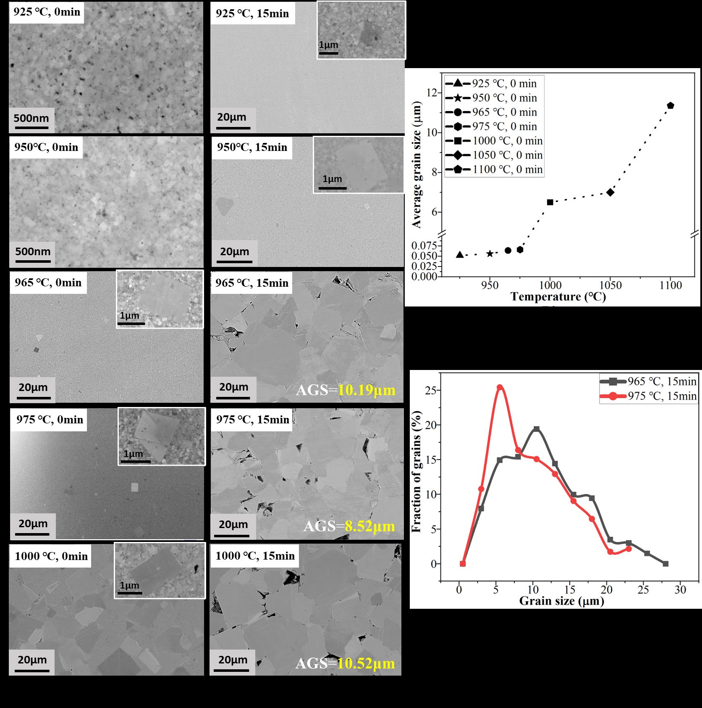

**図1キャプション：** SrTiO₃多結晶の等温焼成後の微細組織（SEM像）。異なる焼成温度における粒径分布の変化を示す。低温域では比較的均一な正規粒成長が観察されるが、高温域では一部の粒が選択的に成長する異常粒成長の発現が見られる。粒径分布の広がりが見かけの非Arrhenius挙動の主因となることを示す観察結果の基礎データである。

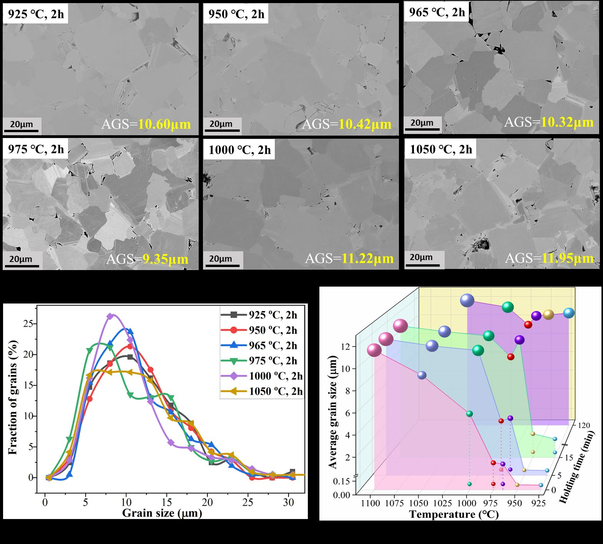

**図2キャプション：** 粒成長の温度依存性（アレニウスプロット）。縦軸に粒成長速度の対数、横軸に1/Tをとったプロットにおいて、見かけの活性化エネルギーが温度域によって変化する非Arrhenius挙動が示されている。本研究の新規モデルがこの曲率を粒径分布効果と温度依存活性化エネルギーに分離して説明できることを示す。

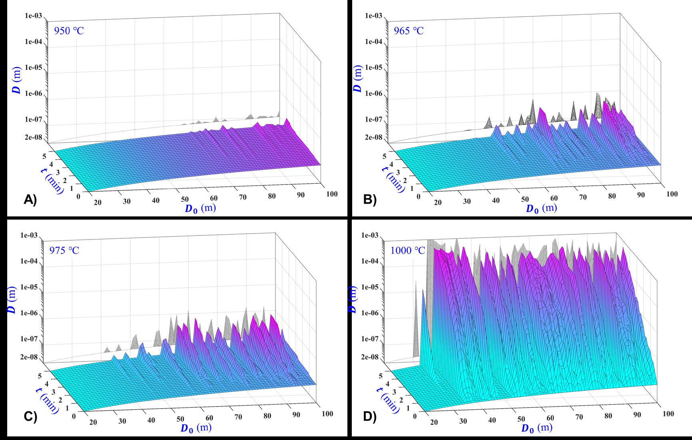

**図3キャプション：** 粒成長モデルと実験データの比較。新規粒成長モデルによる計算結果（曲線）と実験で測定した平均粒径の時間変化（データ点）の対応。温度非依存パラメータ（初期粒径・粒径分布）を取り込むことで正規粒成長領域では非Arrhenius挙動を再現でき、異常粒成長領域では活性化エネルギーの温度依存性という追加項が必要であることが示されている。

---

## 2. AlxCoCrFeNi高エントロピー合金における水素吸収と水素化物形成

### 1. 論文情報

| 項目 | 内容 |
|---|---|
| タイトル | [Hydrogen uptake and hydride formation in AlxCoCrFeNi high-entropy alloys: First-principles, universal-potential, and experimental study](https://arxiv.org/abs/2603.17479) |
| 著者 | Fritz Körmann, Yuji Ikeda, Konstantin Glazyrin, Maxim Bykov, Kristina Spektor, Shrikant Bhat, Nikita Y. Gugin, Anton Bochkarev, Yury Lysogorskiy, Blazej Grabowski, Kirill V. Yusenko, Ralf Drautz |
| arXiv ID | 2603.17479 |
| カテゴリ | cond-mat.mtrl-sci |
| 公開日 | 2026年3月18日 |
| 論文タイプ | プレプリント（実験・DFT・機械学習ポテンシャル統合） |
| ライセンス | CC BY 4.0 |

### 2. どんな研究か

AlxCoCrFeNi高エントロピー合金（HEA）系における水素吸収挙動と水素化物形成を、高圧実験（最大50 GPa）・密度汎関数理論（DFT）・汎用機械学習ポテンシャル（GRACE）の3手法を組み合わせて系統的に調べた研究である。Al低濃度のFCC相合金（Al₀.₃CoCrFeNi）は3 GPa以上で室温にて水素化物を形成するが、Alリッチのβ-B2相合金（Al₃CoCrFeNi）は50 GPaまでの加圧・加熱でも水素化物を形成しないことを実験・計算の両面から実証した。Alが水素の侵入固溶エネルギー（溶解エネルギー）を高め、侵入サイトの安定性を低下させることで水素吸収を強力に抑制するメカニズムを原子論的に解明した。

### 3. 研究の概要

**背景と目的**
HEAは多くの元素をほぼ等モル比で含む多主成分合金であり、単純な二元・三元合金では得られない組み合わせ特性（高強度・高延性・耐水素劣化性など）を持つと期待される。AlxCoCrFeNi系は特にAl組成によってFCC、BCC/B2、混相と相構造が変化する典型系として広く研究されてきた。水素の侵入・拡散・水素化物形成のメカニズムを理解することは、水素脆化抵抗性および水素貯蔵材料の両面で重要である。

**材料系**
Al₀.₃CoCrFeNi（FCC構造主体）とAl₃CoCrFeNi（B2/BCC主体）の2つの組成。いずれも水素雰囲気下での高圧実験。

**プロセス条件**
H₂ガスを圧力媒体としたダイヤモンドアンビルセル（DAC）実験。室温および400–800 Kの温度条件、圧力範囲は数 GPa〜50 GPa。

**測定手法**
放射光X線回折（XRD）による相同定と格子定数変化、体積膨張から水素吸収量の推定。

**計算手法**
DFT（スペシャルクアジランダム構造法 SQS による無秩序固溶体のモデル化）による各侵入サイトへの水素溶解エネルギーの計算。GRACE汎用機械学習ポテンシャルによる限界的に大規模・長時間の分子動力学シミュレーション（侵入サイトの統計・水素拡散の評価）。

**主な結果**
Al₀.₃CoCrFeNi（FCC）は3 GPa以上でXRDパターンの変化と大きな体積膨張から水素化物形成が確認された。Al₃CoCrFeNi（B2）は同条件および50 GPa、加熱条件下でも水素化物形成の証拠を示さなかった。DFT計算より、Al原子近傍の八面体間隙への水素溶解エネルギーが高く（吸熱的）、Al含有量が増えるほど水素が安定に侵入できるサイトが減少することが示された。GRACEポテンシャルによる大規模MD計算も同様の傾向を再現した。

**著者の主張**
Alはカチオン半径効果と電子的効果の両方を通じて侵入固溶サイトを不安定化し、水素吸収を抑制する。高エントロピー合金設計においてAlを高濃度添加することは耐水素劣化・非水素化物化の観点から有効な指針である。

### 4. 材料工学として重要なポイント

本研究の最大の材料工学的意義は、高エントロピー合金系の水素吸収抵抗性がAl組成という単一の合金設計因子によって劇的に変化することを、実験・DFT・機械学習ポテンシャルの3手法で整合的に実証した点にある。FCC相ではわずか3 GPaで水素化物が形成されるのに対し、Al濃度を高めてB2相に移行させるだけで50 GPaの高圧・加熱条件下でも水素化物形成が抑制される。この差異のメカニズムは「Alが近傍侵入サイトの溶解エネルギーを高める」という原子論的な因子として特定されており、材料設計への直接の接続がある。汎用ポテンシャルGRACEの有効性も確認されており、今後の多成分系水素挙動のスクリーニング計算への道を開く。耐水素脆化HEA設計においてAl組成・相構造制御という具体的な設計指針を与える成果である。

### 5. 限界と注意点

本研究は超高圧条件（3〜50 GPa）での水素吸収挙動を対象としており、大気圧下や電気化学的条件（腐食環境・水素脆化条件）での挙動との直接の対応には注意が必要である。実用的な水素脆化は大気圧〜数百 MPa の範囲で起きるため、高圧実験結果からの外挿には限界がある。DFTモデルは特殊準ランダム構造（SQS）を用いた固溶体近似であり、実際のHEAに存在する局所化学短距離秩序（SRO）の影響は捉えられていない。GRACEポテンシャルの汎用性は確認されているが、HEA-H系のエネルギー地形を高精度で再現できるかについては独立した検証が不十分である。また、Co-Cr-Fe-Ni系に限られており、Ti、Mo、V等を加えた他の多主成分系への拡張は今後の課題である。

### 6. 関連研究との比較

水素と高エントロピー合金の相互作用については、CoCrFeMnNi系（カネギエサー合金）の水素脆化・水素吸収に関する研究が先行しており、水素トラップ・拡散経路の視点からの解析が進んでいる。Al添加効果については単純合金系（Al-Ni、Al-Fe）での既往研究から水素吸収抑制の示唆はあったが、HEA多成分系でのメカニズムと実験的実証は限られていた。本研究は第一原理レベルのメカニズム特定に加えて汎用機械学習ポテンシャルを組み合わせた点で方法論的にも先進的であり、今後のHEA-水素相互作用研究の方向性を示す。材料設計としては、Al組成だけでなく他の元素（Ti、Vのような水素親和性の高い元素）の影響と組み合わせた多次元設計空間の探索が今後の展開として重要である。水素貯蔵と耐水素劣化は相反する要求であり、組成と相構造の両方を自由度として扱う高エントロピー材料設計の重要性を改めて示す。

### 7. 重要キーワードの解説

**高エントロピー合金（HEA：High-Entropy Alloy）**
5種類以上の主成分元素をほぼ等モル比（5–35 at.%）で含む多主成分合金。高い混合エントロピー（$\Delta S_{mix} \geq 1.5R$）が単一固溶相の安定化に寄与すると考えられる。AlxCoCrFeNi系はHEA研究の典型的なモデル系。

**水素溶解エネルギー（H solution energy）**
原子水素が金属格子の侵入型固溶位置（八面体間隙・四面体間隙）に入る際のエネルギー変化。$E_{sol} = E_{host+H} - E_{host} - \frac{1}{2}E_{H_2}$。正値（吸熱的）であれば水素侵入が不安定、負値であれば自発的に水素が固溶する傾向がある。

**水素化物形成（Hydride formation）**
金属が水素と反応して安定な金属水素化物相（例：FCC→FCC-H₁）を形成すること。格子定数の大幅な膨張（体積増大）を伴い、X線回折でピークシフトとして観測される。HEAのFCC相では水素化物形成が起きやすい一方、Al高濃度B2相では抑制される。

**ダイヤモンドアンビルセル（DAC：Diamond Anvil Cell）**
ダイヤモンドの先端部分を対向させて試料を数〜数百 GPa に加圧できる実験装置。放射光X線透過が可能なため、超高圧下での相変化・格子定数変化のin situ観察に用いられる。

**GRACE（Graph Atom Cluster Expansion）汎用ポテンシャル**
グラフニューラルネットワークを用いて大規模な量子力学計算データから訓練された原子間ポテンシャル。元素の組み合わせを超えた転移学習（transferability）を持ち、多成分合金系のMDシミュレーションに利用される汎用機械学習ポテンシャルの一種。

**特殊準ランダム構造（SQS：Special Quasi-random Structure）**
無秩序固溶体の化学的ランダム性を有限の超格子セルで近似するDFT計算手法。多成分系の電子構造・エネルギーを「平均的な無秩序固溶体」として扱うために使われる。各サイトの原子種配列が真のランダム状態のペア・多体相関関数を最もよく再現するように最適化された構造。

**FCC→B2相変態（FCC to B2 phase transition in AlCoCrFeNi）**
AlxCoCrFeNiにおいてAl濃度が増加すると、FCC相（無秩序面心立方）からBCC/B2相（体心立方・一部がNiAl型規則配列）へ相変態する。相境界は$x \approx 0.9$（Al₀.₉CoCrFeNi）付近。B2相ではAlと他元素（特にNi）が規則配列し、Al近傍の侵入固溶サイトが変化する。

### 8. 図

ライセンス：CC BY 4.0（図の抽出・掲載が許可されています）

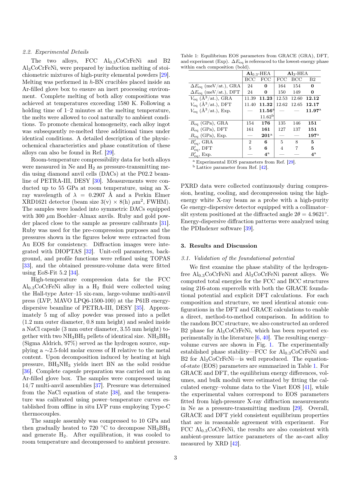

**図1キャプション：** ダイヤモンドアンビルセル中でのAlxCoCrFeNi合金の高圧X線回折（XRD）パターン。Al₀.₃CoCrFeNi（FCC系）では加圧とともに新たな回折ピークが出現し、格子体積の膨張（水素化物形成）が確認される。Al₃CoCrFeNi（B2系）では圧力・温度を高めても相変化のシグナルが見られないことが対比されている。

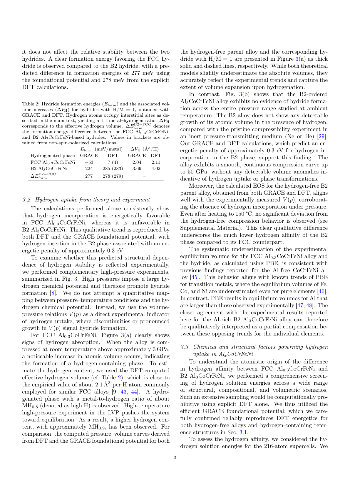

**図2キャプション：** DFT計算による水素溶解エネルギーの分布（各侵入固溶サイトへのH原子の溶解エネルギーのヒストグラム）。Al含有量が増えると溶解エネルギーの正値（吸熱的）側への分布シフトが見られ、水素が安定に侵入できるサイトが減少することを示す。AlがHEA格子の侵入サイト安定性を系統的に変化させるメカニズムの直接的な証拠。

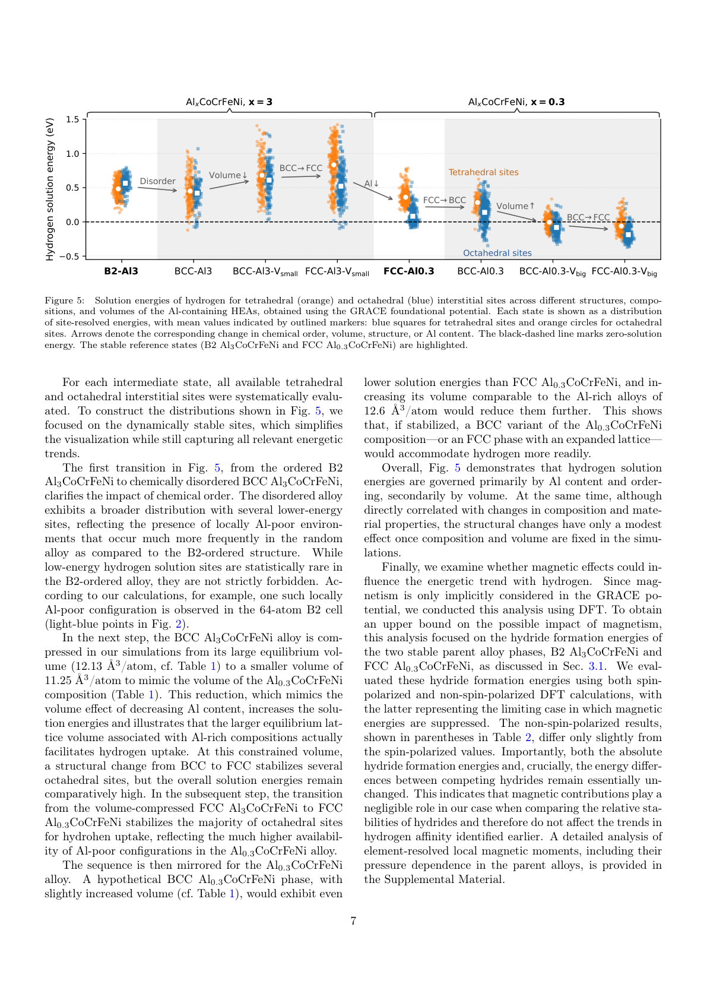

**図3キャプション：** GRACE汎用ポテンシャルを用いた大規模分子動力学シミュレーションによるH拡散係数または侵入サイト占有率の評価結果。DFT結果との対応を示し、汎用ポテンシャルがHEA-水素系の統計的挙動を再現できることを検証する。Al組成と水素吸収の定量的な相関関係がポテンシャルシミュレーションレベルでも確認される。

---

## 3. ガラスの拡散を支配する非対称エネルギー地形と相関運動

### 1. 論文情報

| 項目 | 内容 |
|---|---|
| タイトル | [Asymmetric Energy Landscapes Control Diffusion in Glasses](https://arxiv.org/abs/2603.18317) |
| 著者 | Ajay Annamareddy, Bu Wang, Paul M. Voyles, Izabela Szlufarska, Dane Morgan |
| arXiv ID | 2603.18317 |
| カテゴリ | cond-mat.mtrl-sci, cond-mat.dis-nn, cond-mat.stat-mech |
| 公開日 | 2026年3月18日 |
| 論文タイプ | プレプリント（分子動力学・統計力学理論） |
| ライセンス | CC BY 4.0 |

### 2. どんな研究か

結晶性固体では欠陥介在型の原子ホップとして拡散が定量的に理解されているが、ガラスにおいては局所的な再配置バリアが小さいにもかかわらず大きなマクロ拡散活性化エネルギーが観測されるという根本的な謎がある。本研究は金属ガラスの分子動力学シミュレーションを用いて、この謎を解明した。拡散をランダムウォーク寄与と相関運動寄与に分解し、マクロな活性化エネルギーの主因は局所の再配置バリアではなく「往復相関運動（back-and-forth correlated motion）」にあることを示した。この相関は前後方向への移行障壁の非対称性（無秩序エネルギー地形の一般的特徴）から生じ、コリレーター因子が活性化エネルギーへの支配的な寄与をもたらすことを定量的に明らかにした。

### 3. 研究の概要

**背景と目的**
ガラス材料（特に金属ガラス）の拡散は「局所障壁が小さい（< 0.5 eV）にもかかわらずマクロ活性化エネルギーは 1–3 eV に達する」という矛盾的な特性を持つ。この原因については、(a) 協調再配置が必要な多体的バリア、(b) 動的不均一性、(c) ケージ効果など複数の説があったが、定量的な枠組みは確立されていなかった。本研究は分子動力学（MD）シミュレーションを用いて、この問題を統計力学的に解決することを目的とした。

**材料系**
金属ガラス（具体的な組成は汎用的な金属ガラスモデル、Cu-Zr系など）のMDモデル。

**計算手法**
古典分子動力学シミュレーション、原子軌跡から拡散係数をランダムウォーク成分と相関成分に分解する手法（Haven比と相関因子の評価）、エネルギー地形（ポテンシャルエネルギーサーフェス）の非対称性の定量化。

**主な結果**
拡散係数をランダムウォーク寄与（前向きホップのみ）と相関補正（往復ホップ）に分解した結果、ランダムウォーク寄与の活性化エネルギーは局所障壁エネルギーと一致し小さい。一方、相関因子（correlation factor $f$）は温度低下とともに急激に減少し、その温度依存性がマクロ活性化エネルギーの大部分を担うことが示された。この相関因子の温度依存性は、前方向と逆方向の局所障壁の非対称性（$\Delta E_{asym}$）によって説明でき、無秩序エネルギー地形の一般的特性から必然的に生じることが示された。

**著者の主張**
ガラスの大きな拡散活性化エネルギーは多体相関や協調再配置の複雑な現象ではなく、無秩序エネルギー地形が持つ非対称性という単純な特徴から生じる往復相関運動によって支配される。これは結晶と根本的に異なるガラス拡散の統一的記述を与える。

### 4. 材料工学として重要なポイント

ガラス状材料（金属ガラス、アモルファス薄膜、非晶質Si、ガラス質電解質）の拡散特性は、拡散接合、イオン導電性、熱処理による構造緩和、腐食耐性、デバイス信頼性など多くの材料工学問題に直結する。本研究は「ガラスの活性化エネルギーは局所障壁からは推測できない」ことを明示し、その理由として非対称エネルギー地形という構造的特徴を特定した。材料設計上の含意として、ガラス組成や熱処理によってエネルギー地形の非対称性（局所秩序の程度、化学的不均一性）を制御することが拡散特性設計の鍵となる。具体的には、局所構造的秩序度の高い金属ガラス（短距離秩序の増大）は非対称性を低減させて往復相関を緩和し、見かけの活性化エネルギーを変化させ得ることが示唆される。この知見は結晶ガラス界面での拡散、固体電解質のイオン導電性、非晶質半導体の原子拡散など多様な系に応用できる原理的な理解を提供する。

### 5. 限界と注意点

本研究は古典MDポテンシャルを用いた金属ガラスモデルに基づいており、特定のポテンシャル関数の精度に依存する。実際の金属ガラス（例：Zr-Cu-Al-Ni-Be系）で観測される拡散係数との定量的な一致についての検証は別途必要である。また、ガラスに特有の「動的不均一性」（一部の領域で極めて移動度が高い粒子が存在する現象）の影響は本研究の分解法でどこまで捉えられているか、の評価が残されている。さらに、無機ガラス（SiO₂系）やポリマーガラスへの適用可能性は直接示されておらず、モデルの汎用性の確認が必要である。低温領域（ガラス転移温度以下）では拡散がより非線形的になり、相関因子の扱いがより複雑になる可能性もある。

### 6. 関連研究との比較

ガラス中の拡散の統計力学的扱いとしては、Adams-Gibbs理論（エントロピーと拡散の関連）、モード結合理論（MCT）、Random First Order Transition（RFOT）理論などが先行する。これらは過冷却液体〜ガラス転移点近傍の動力学に焦点を当てており、明確なエネルギー地形非対称性という本研究のアプローチとは異なる視点を提供している。本研究のユニークさは、拡散をランダムウォークと相関に分離し、後者の活性化エネルギーへの定量的寄与を明示した点にある。結晶中の拡散における相関因子（Bardeen-Herring モデル）の概念をガラスに拡張・修正したという位置づけができる。今後は、ガラスの局所構造（短距離秩序の程度、Cu-Zr系のイコサヘドラル秩序など）とエネルギー地形非対称性の定量的な相関を実験（XANES、中性子回折）と組み合わせて検証する研究が期待される。

### 7. 重要キーワードの解説

**相関因子（Correlation Factor, $f$）**
拡散係数の実測値とランダムウォーク近似値との比：$f = D_{actual}/D_{random}$。結晶系では欠陥種や構造に依存する定数だが、ガラスでは温度依存性を持ち、その温度変化がマクロな活性化エネルギーへの寄与を生む。$f < 1$（往復相関）は原子が直前の移動方向と逆向きに移動しやすいことを意味する。

**エネルギー地形（Energy Landscape / Potential Energy Surface）**
$N$体系の構成原子配置座標に対するポテンシャルエネルギーの多次元面。ガラスでは多数の局所極小（メタステーブル状態）が存在し、その間の遷移（サドル点越え）が拡散イベントに対応する。無秩序系では各サドル点前後の障壁高さ（$\Delta E_{forward}$, $\Delta E_{reverse}$）が異なる「非対称性」を持つ。

**非対称エネルギー障壁（Asymmetric Energy Barrier）**
1次元ポテンシャルで考えると、局所極小Aから隣接極小Bへの前進障壁$\Delta E_f$と逆向き障壁$\Delta E_r$が異なる状況：$\Delta E_f \neq \Delta E_r$。ガラスでは各極小のエネルギーが無秩序にばらつくため、前進・後退障壁の非対称性が系統的に存在し、原子の逆向き相関運動（cage return）を引き起こす。

**金属ガラス（Metallic Glass）**
溶融金属を十分速く冷却することで結晶化を抑制し、ランダムな原子配列（アモルファス構造）を凍結させた合金。Zr-Cu-Al-Ni-Be、Fe-B-Si-Nbなど様々な系が知られる。長距離秩序がなく局所的なイコサヘドラル秩序を持つ場合が多い。高い強度・耐食性を持つ一方、脆性が課題。

**往復相関運動（Back-and-forth correlated motion）**
原子が1回のホップの後、次のホップで元の位置に戻る傾向を持つ運動の相関。相関因子$f < 1$に対応し、有効な拡散距離を縮小させる。ガラスでは非対称障壁により前進より後退が統計的に起きやすい条件が生まれ、この往復相関が強くなる。

**拡散活性化エネルギー（Diffusion Activation Energy, $Q$）**
拡散係数の温度依存性 $D = D_0 \exp(-Q/k_BT)$ で現れる活性化エネルギー。結晶では欠陥形成エネルギーと移動エネルギーの和として表される。ガラスでは見かけの$Q$が局所障壁より大きく、本研究によって相関因子の温度依存性に起因することが示された。

**動的不均一性（Dynamic Heterogeneity）**
ガラス・過冷却液体において、空間的に不均一な移動度（一部の「流動的」領域と「固体的」領域の共存）が観測される現象。移動度の空間的・時間的ゆらぎは拡散の活性化エネルギーの見かけの増大とも関連する。本研究との関連では、往復相関とは独立した（あるいは相補的な）拡散抑制メカニズムとして位置づけられる。

### 8. 図

ライセンス：CC BY 4.0（図の抽出・掲載が許可されています）

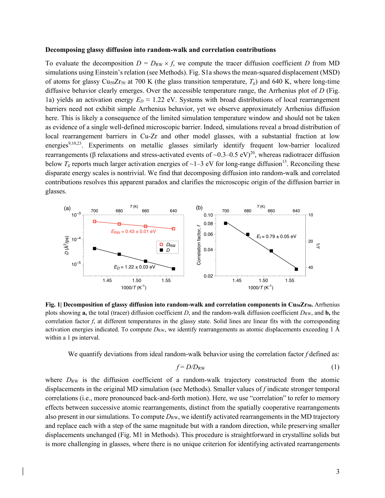

**図1キャプション：** 金属ガラスMDシミュレーションにおける原子変位の時系列追跡と、拡散係数のランダムウォーク成分・相関成分への分解。ランダムウォーク寄与の活性化エネルギーは局所障壁に対応して小さいが、相関因子（往復相関）の温度依存性が全体の見かけの活性化エネルギーを大きく引き上げることを示す。

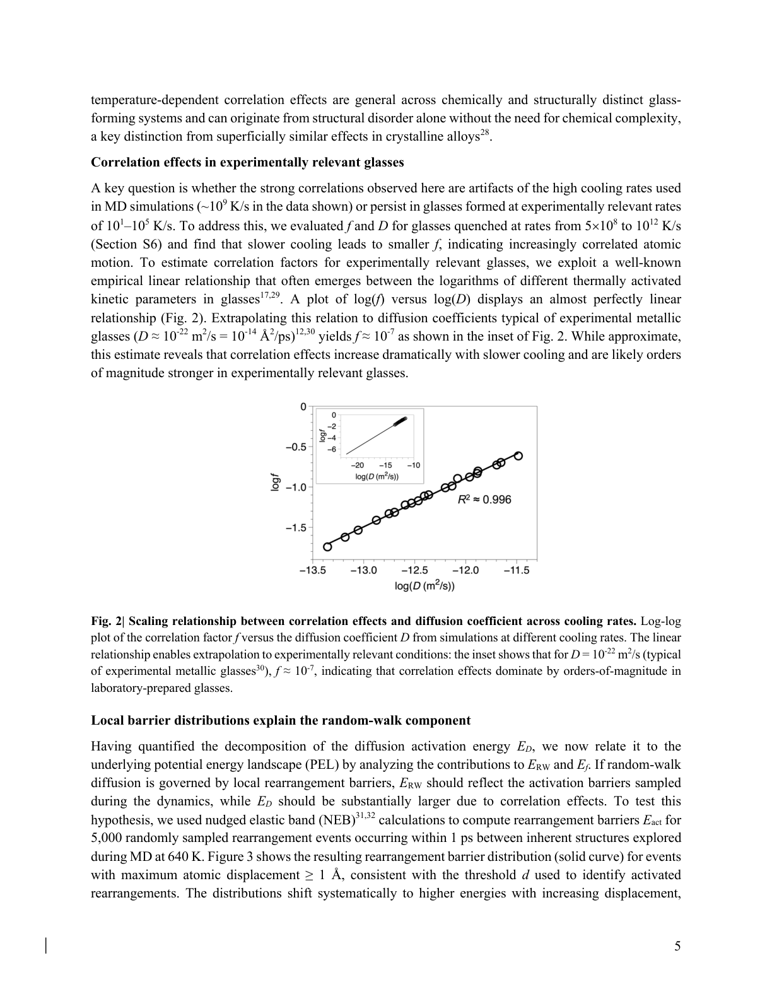

**図2キャプション：** エネルギー地形の非対称性の定量化。局所極小間の前進・後退障壁の差（$\Delta E_{asym} = \Delta E_r - \Delta E_f$）の分布と、それが相関因子および拡散活性化エネルギーに与える効果の温度依存性。非対称性が大きいほど往復相関が強まり、見かけの活性化エネルギーが増大することを示す。

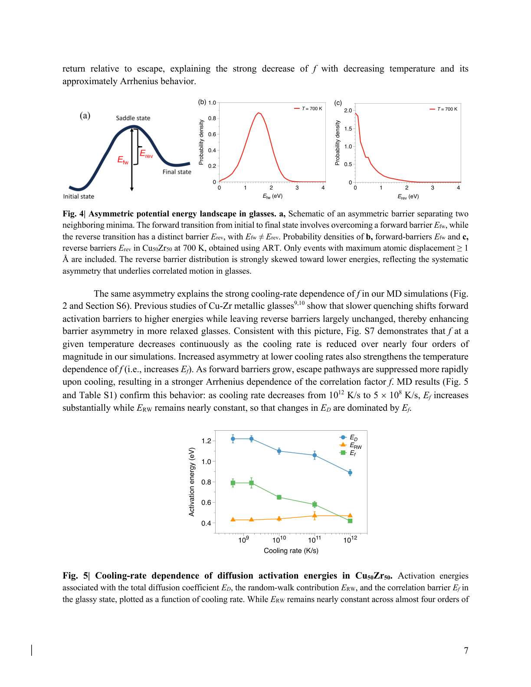

**図3キャプション：** マクロ拡散活性化エネルギー $Q$ の各成分への寄与の整理。ランダムウォーク寄与（局所障壁対応）と相関寄与（非対称エネルギー地形由来）の分離。後者が支配的であることを示すアレニウスプロット。この分解図は「ガラスの大きな活性化エネルギーは局所再配置バリアではなく相関運動に由来する」という本研究の主張を直接支持する。

---

# その他の重要論文

---

## 4. Li-Mn-Ti-O系無秩序ロックソルト相の熱力学的アクセス可能性と合成設計

### 1. 論文情報

| 項目 | 内容 |
|---|---|
| タイトル | [Thermodynamic accessibility of Li-Mn-Ti-O cation disordered rock-salt phases](https://arxiv.org/abs/2603.17263) |
| 著者 | Ronald L. Kam, Shilong Wang, Gerbrand Ceder |
| arXiv ID | 2603.17263 |
| カテゴリ | cond-mat.mtrl-sci |
| 公開日 | 2026年3月18日 |
| ライセンス | CC BY 4.0 |

### 2. 研究概要

**第1段落：研究の全体像**
Li-Mn-Ti-O（LMTO）系の無秩序ロックソルト（DRX）リチウムイオン電池正極材料における、カチオン秩序-無秩序転移温度（$T_{disord}$）の組成依存性を第一原理計算とX線回折実験で定量的に解明した研究である。LMTOは低コスト・高エネルギー密度を持つDRX正極として注目されているが、所望のDRX相を得るためには適切な焼成温度・保持時間の選択が不可欠であり、その指針となる熱力学的相図の構築が求められていた。本研究ではクラスター展開法（Cluster Expansion）とモンテカルロシミュレーションを組み合わせて秩序-無秩序転移温度を組成の関数として計算し、実験（XRD、走査型電子顕微鏡）で検証した。Mn：Ti比が高いほど転移温度が低下し、より低温での焼成でDRX相が安定化することが示された。

**第2段落：重要性**
本研究が示す熱力学的指針は、LMTOのDRX正極合成における焼成温度・組成の最適化に直結する。秩序-無秩序転移温度を組成の関数として定量化することで、「どの組成でどの温度で焼成すればDRX相が得られるか」というプロセス設計の定量的根拠が得られる。材料設計の観点では、Mn/Ti比というパラメータがカチオン秩序化の熱力学を制御する主要因であることが示されており、他の多成分DRX系（Li-Mn-Nb-O、Li-Fe-Ti-Oなど）にも展開可能な枠組みを与える。焼成後の粒子サイズ・形態も転移温度に依存するため、電池特性（出力密度・サイクル安定性）に間接的に連鎖する。

### 3. 重要キーワードの解説

**無秩序ロックソルト（DRX：Disordered Rock-salt）**
カチオンがほぼランダムに分布したロックソルト型（NaCl型）構造を持つリチウムイオン電池正極材料。$a_0 \approx 4.18$–4.25 Å。Li過剰組成（Li/Me > 1）でもカチオン無秩序のため伝導経路が確保され、高い理論容量（>300 mAh/g）が得られる。

**秩序-無秩序転移温度（$T_{disord}$）**
カチオンが規則配列した秩序相（例：岩塩型Li₂MnO₃やLi₂TiO₃）から、カチオンがランダムに配置した無秩序相（DRX）への転移が起きる温度。$T_{disord}$以上での焼成がDRX相の合成に必要。

**クラスター展開法（Cluster Expansion, CE）**
格子系の配置エネルギーを多体クラスター相互作用（ペア・トリプレット・クワドラプレットなど）の線形結合で展開するDFT補助法。大規模な組成・配置空間でエネルギーを効率よく評価でき、モンテカルロ法と組み合わせて有限温度相図を求めることができる。

**モンテカルロシミュレーション（MC）**
統計力学的なサンプリング手法。CE から得たエネルギーを使い、$N$カチオン配置の温度依存平衡分布を計算して秩序パラメータの温度変化（転移温度）を求める。格子モデルの有限温度熱力学評価に広く使われる。

**ロックソルト相図**
Li-Mn-Ti-O系のロックソルト組成空間における安定相境界・混合エネルギー・転移温度の地図。$T_{disord}$ の組成依存性を示す「有限温度相図」は合成条件設計の基礎となる。

**Li拡散パス（0-TM channel）**
DRXにおいてLiが移動する際、経路上の遷移サイトを囲む遷移金属（TM）数が0個であるパス（0-TM channel）。TM数が増えるほど拡散が阻害されるため、Li過剰によりLiリッチな0-TMチャンネルを増やすことが高容量・高出力設計の鍵。

**合成温度と形態制御**
DRX相形成には$T_{disord}$以上の焼成が必要だが、過度な高温は粒成長や副相形成を招く。$T_{disord}$（組成依存）を知ることで「最低限必要な焼成温度」が決まり、粒径・形態（比表面積）と電気化学特性のトレードオフを設計できる。

### 4. 図

ライセンス：CC BY 4.0（図の抽出・掲載が許可されています）

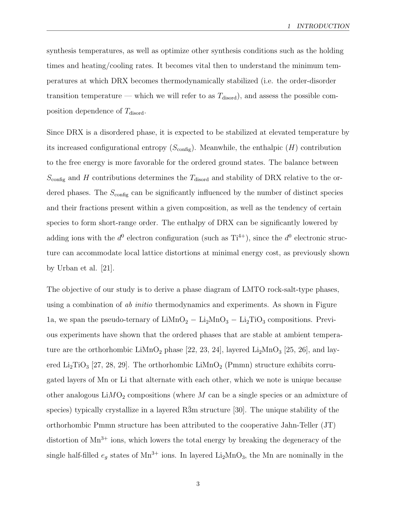

**図1キャプション：** Li-Mn-Ti-O系ロックソルト組成空間における秩序-無秩序転移温度$T_{disord}$のクラスター展開+モンテカルロ計算結果。Mn/Ti比の増加にともなう転移温度の変化が等温線として示されており、合成可能なDRX組成域とその焼成温度条件が一目で確認できる。

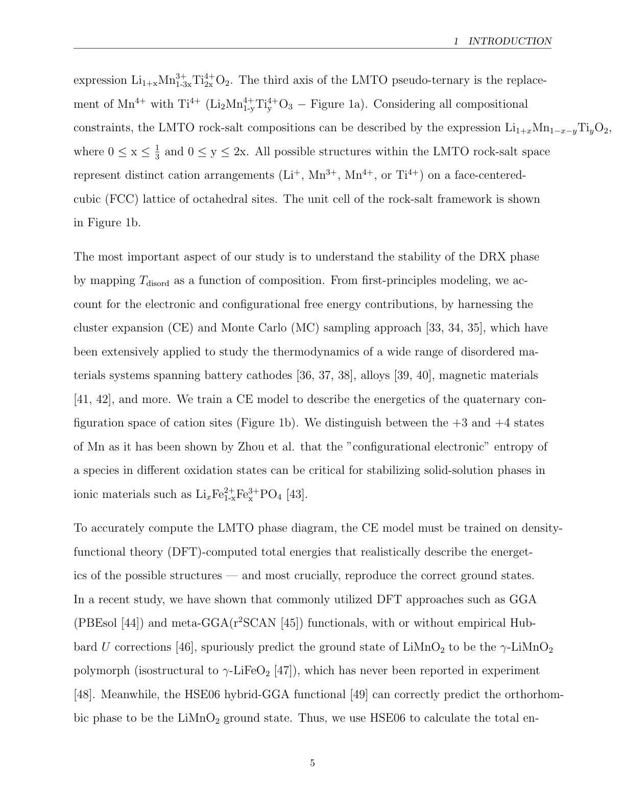

**図2キャプション：** 実験XRDパターンによる秩序相・無秩序相の確認。計算で予測した$T_{disord}$に対応する焼成温度前後での試料のXRDパターン。秩序相由来のスーパーラティス反射の消失・出現が転移温度の実験的証拠として示されている。

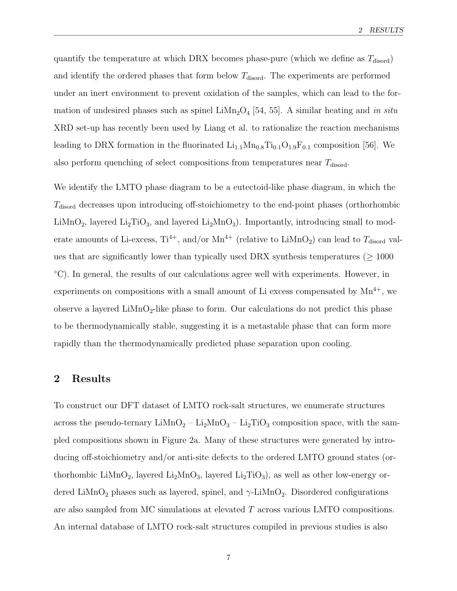

**図3キャプション：** DRX相の電気化学特性（充放電容量・サイクル特性）と合成条件の関係。転移温度に基づいて最適化された焼成条件で得られたDRX正極の容量曲線。組成と焼成温度の同時最適化が電気化学性能向上につながることを示す。

---

## 5. GeTe相変化材料における超高速アモルファス-アモルファス転移の直接観測

### 1. 論文情報

| 項目 | 内容 |
|---|---|
| タイトル | [Direct observation of ultrafast amorphous-amorphous transitions indicated by bond stretching and angle bending in phase-change material GeTe](https://arxiv.org/abs/2603.17400) |
| 著者 | Yingpeng Qi, Nianke Chen, Zhihui Zhou, Qing Xu, Yang Lv, Xiao Zou, Tao Jiang, Pengfei Zhu, Min Zhu, Dongxue Chen, Zhenrong Sun, Xianbin Li, Dao Xiang |
| arXiv ID | 2603.17400 |
| カテゴリ | cond-mat.mtrl-sci |
| 公開日 | 2026年3月18日 |
| ライセンス | arXiv非独占的再頒布ライセンス（図の掲載不可） |

### 2. 研究概要

**第1段落：研究の全体像**
相変化材料GeTe（ゲルマニウムテルライド）のアモルファス相において、フェムト秒電子線回折（femtosecond electron diffraction, FED）と時間依存密度汎関数理論分子動力学（TD-DFT-MD）を組み合わせて、光励起後のアモルファス-アモルファス（A-A）転移を直接観測した研究である。Ge-Te（Ge）結合の伸張が0.2 psという超高速で起き、続いてGe-Te(Ge)-Geモチーフの角度変化（曲げ振動）が0.5–2 psのタイムスケールで進行するという2段階の原子運動を識別した。特に0.2 psでの急速な結合伸張は3.10 THzの局所振動モードを伴っており、局所Peierls型結合構造と分極結合の柔軟性を反映するものとして解釈された。

**第2段落：重要性**
GeTe系相変化材料はPCRAM（相変化ランダムアクセスメモリ）の基材として産業的に重要であり、高速・低エネルギーでのアモルファス-結晶間スイッチング機構の理解が求められている。本研究はアモルファス相内部にも熱力学的に区別可能な複数の状態（A-A転移で連結）が存在し、それが局所結合構造の急速な再配置によってサブピコ秒で起きることを示した。これはPCRAMデバイスの書き込み速度とエネルギー効率の限界を規定するプロセスの理解に直結し、材料設計（組成、熱処理条件）による転移速度・振動特性の制御可能性を示唆する。さらに「アモルファス状態の多様性と転移」という概念は、GeSbTe系や他のカルコゲナイドガラスにも展開できる普遍的な視点を提供する。

### 3. 重要キーワードの解説

**相変化材料（PCM：Phase-Change Material）**
光や電気パルスによってアモルファス相と結晶相の間を可逆的に変化できる材料。GeTe、Ge₂Sb₂Te₅（GST）が代表例。相変化に伴う光学定数・電気抵抗の大きな変化を利用してデータ記録・メモリ素子に使われる。

**アモルファス-アモルファス転移（A-A transition）**
同じアモルファス相の中で局所構造（結合長・結合角・局所秩序の程度）が変化する転移。エネルギー地形上で異なるアモルファス状態間の遷移に相当し、通常の熱力学的相転移とは異なる「多様なアモルファス状態」の存在を示す。

**フェムト秒電子線回折（FED）**
超短レーザーパルスで励起した後、短パルス電子線を試料に照射してその回折パターンを時間分解計測する手法。~100 fsの時間分解能でアトスケールの構造変化をリアルタイム追跡できる。回折パターンの変化からペア分布関数や動径分布関数を抽出し、結合長・結合角の変化を定量化する。

**Peierls型結合（Peierls distortion）**
1次元金属鎖や半導体共有結合系において、等間隔の結合長が交互に長短に分裂してバンドギャップが開く（絶縁体化する）歪み。GeTe系では3 + 3配位のGe-Te結合に長短の非対称性が存在し、この柔軟性がA-A転移の速度を決める要因となる。

**分極結合・メタバレント結合（Metavalent Bonding）**
共有結合とイオン結合・金属結合の中間的な性格を持つ結合様式。カルコゲナイドのGeSbTe系に見られ、電子密度の局在性が低く結合が「ソフト」なためピコ秒以下の超高速原子運動が可能になる。

**TD-DFT-MD（Time-Dependent DFT Molecular Dynamics）**
時間依存密度汎関数理論に基づく分子動力学。電子励起状態と核の運動を同時に追跡でき、フォトエキサイテーション後の超高速原子運動（核-電子相互作用が強い系）を第一原理的に記述する。

**PCRAM（Phase-Change Random Access Memory）**
相変化材料の電気抵抗差（アモルファス相：高抵抗、結晶相：低抵抗）を利用した不揮発性メモリ素子。現行のNANDフラッシュの後継として開発が進む。書き込み速度はアモルファス-結晶間の相変化速度（核生成・成長速度）に依存する。

### 4. 図

ライセンス：arXiv非独占的再頒布ライセンスのため、図の掲載は行わない。

---

## 6. 基板依存の核生成・成長機構とBi₂Te₃超薄膜の欠陥制御

### 1. 論文情報

| 項目 | 内容 |
|---|---|
| タイトル | [Substrate-controlled nucleation and growth kinetics in ultrathin Bi₂Te₃ films](https://arxiv.org/abs/2603.17868) |
| 著者 | Damian Brzozowski, Sander R. Hønnås, Egil Y. Tokle, Jørgen A. Arnesen, Ingrid G. Hallsteinsen |
| arXiv ID | 2603.17868 |
| カテゴリ | cond-mat.mtrl-sci |
| 公開日 | 2026年3月18日 |
| ライセンス | arXiv非独占的再頒布ライセンス（図の掲載不可） |

### 2. 研究概要

**第1段落：研究の全体像**
トポロジカル絶縁体Bi₂Te₃超薄膜をパルスレーザー堆積法（PLD）により、van der Waals基板（HOPG/BN系）、格子整合基板（例：BaF₂）、アモルファス基板（SiO₂）の3種類の異なる界面特性を持つ基板上に成膜し、基板-薄膜界面が核生成経路・成長形態・欠陥形成に与える影響を体系的に解明した研究である。すべての基板上でc軸配向の相純粋なBi₂Te₃が形成されるものの、成長形態は基板によって大きく異なることが示された。格子整合基板上では層状成長（フランクファンデルメルヴェ成長）が優先され、ステップエッジ核生成が支配的となる。アモルファス基板上では三次元島状成長（Volmer-Weber型）が起き、欠陥密度が増大して電気特性が悪化した。van der Waals基板上では中間的な挙動を示した。

**第2段落：重要性**
Bi₂Te₃のトポロジカル表面状態（TSS）は表面感受性が高く、バルクの余剰キャリア（欠陥由来）によってフェルミレベルがバルクバンド中に入り込むとTSSが観測困難になる。本研究が示す「基板-薄膜界面の界面エネルギーと格子整合性が核生成モードを決め、それが欠陥密度・余剰キャリア濃度・電気輸送を制御する」という因果連鎖は、トポロジカル物性評価のための高品質薄膜作製設計に直接役立つ。材料プロセス設計の指針として、「界面自由エネルギーの最小化（格子整合・vdW基板）によって層状成長を促し欠陥を抑制する」という原則が明確化された。この知見はBi₂Te₃系に限らず、他の層状カルコゲナイド系（Bi₂Se₃、Sb₂Te₃など）薄膜成長設計に汎用可能である。

### 3. 重要キーワードの解説

**パルスレーザー堆積法（PLD：Pulsed Laser Deposition）**
高出力レーザーパルスをターゲット材料に照射して蒸発プラズマを発生させ、基板上に薄膜を堆積させる成膜法。高エネルギー種の輻射が特徴的で、比較的低基板温度でも結晶性薄膜が得られるが、過剰エネルギー粒子が欠陥形成を促進することもある。

**核生成モード（Nucleation Mode）**
薄膜成長初期の核生成様式。フランクファンデルメルヴェ（FM）モード：2次元層状成長（界面エネルギーが支配的）；VolmerWeber（VW）モード：3次元島状成長（表面エネルギーが支配的）；Stranski-Krastanov（SK）モード：初期層状成長後に島状転移。界面エネルギー$\gamma_{interface}$、表面エネルギー$\gamma_{film}$、基板エネルギー$\gamma_{sub}$の関係で決まる。

**トポロジカル絶縁体（TI：Topological Insulator）**
バルクはバンドギャップを持つ絶縁体だが、表面（界面）にはスピン運動量ロッキングした金属的表面状態（TSS）が存在する量子材料。Bi₂Te₃、Bi₂Se₃がその代表。表面状態の観察にはバルクキャリアの抑制が不可欠であり、欠陥制御が重要。

**格子整合性（Lattice Matching）**
薄膜と基板の格子定数の一致度：$f = (a_{sub} - a_{film})/a_{film}$（$f$：格子不整合度）。$f$が小さいほど界面応力が低減され、疑似格子成長（pseudomorphic growth）や層状成長が促進される。

**van der Waals基板**
弱いvan der Waals力で積層した2次元材料（グラファイト、h-BN、HOPG）を基板として用いる場合。弱い界面結合のため、薄膜の自由な横方向成長が可能になり、比較的低欠陥の層状成長が得られやすい。ただし、成長速度や形態安定性は従来の共有結合・イオン結合基板と異なる。

**余剰キャリア濃度（Excess Carrier Density）**
欠陥（Teアンチサイト欠陥、Bi₂Te₃の場合Bi₂Te₃とBi₂の混在など）が電子またはホールの追加キャリアを供与し、名目上の電気特性を制御する。TIではバルクキャリアがTSSを隠蔽するため、欠陥制御＝バルク余剰キャリアの抑制がTSS観察の前提条件。

**バルク導電性抑制（Suppression of Bulk Conduction）**
TIのTSSを電気輸送実験で検出するには、バルク（三次元的体積）の導電性をTSS（二次元的面）より遥かに低くする必要がある。欠陥低減・微薄膜化・ドーピング補償などの手法がある。本研究では基板選択による欠陥制御がバルク導電性抑制の効果的な手段であることを示した。

### 4. 図

ライセンス：arXiv非独占的再頒布ライセンスのため、図の掲載は行わない。

---

## 7. UO₂・PuO₂における点欠陥移動の完全非調和自由エネルギー計算

### 1. 論文情報

| 項目 | 内容 |
|---|---|
| タイトル | [Fully anharmonic calculations of the free energy of migration of point defects in UO₂ and PuO₂](https://arxiv.org/abs/2603.16602) |
| 著者 | Dillon G. Frost, Johann Bouchet, Mihai-Cosmin Marinica, Clovis Lapointe, Jean-Bernard Maillet, Luca Messina |
| arXiv ID | 2603.16602 |
| カテゴリ | cond-mat.mtrl-sci |
| 公開日 | 2026年3月17日 |
| ライセンス | arXiv非独占的再頒布ライセンス（図の掲載不可） |

### 2. 研究概要

**第1段落：研究の全体像**
核燃料材料UO₂（酸化ウラン）とPuO₂（酸化プルトニウム）における点欠陥（カチオン空孔・アニオン空孔・インタースティシャルなど）の移動自由エネルギーを、調和近似を超えた「完全非調和」計算で求めた研究である。従来の調和近似（TST：遷移状態理論+フォノン調和近似）は計算コストが低いが、高温（1000 K以上）では非調和格子振動の寄与が大きく、拡散活性化エネルギーが大幅にずれることが問題視されていた。本研究はPAFI（Potential of Average Force Integration：平均力ポテンシャル積分）法を用いて完全非調和の移行自由エネルギーを計算し、調和近似との差を各欠陥タイプ・各温度条件で体系的に評価した。古典ポテンシャル（CRG: Cooper-Rushton-Grimes）と機械学習ポテンシャル（SNAP: Spectral Neighbour Analysis Potential）の両方を用いて計算の信頼性を確認した。

**第2段落：重要性**
核燃料材料の照射損傷・ガス泡形成・クリープ・スエリングなどの挙動予測に欠陥拡散率は根幹をなすパラメータである。高温（稼働条件）では非調和効果が調和近似による活性化エネルギーを数十〜数百 meV変化させることが本研究で示され、この差が拡散係数の温度依存性（アレニウスプロット）に数桁の誤差を生む可能性がある。核燃料設計において「安全解析に用いる拡散パラメータの信頼性」という実用的観点からも極めて重要な成果であり、調和近似を採用する従来計算の補正指針を提供する。PAFI法の核燃料材料への適用例として、今後の他の核燃料系（ThO₂、UN、UC）への展開の基礎ともなる。

### 3. 重要キーワードの解説

**点欠陥移動自由エネルギー（Free Energy of Migration）**
点欠陥が格子内で隣接サイトへ移動する際の自由エネルギー変化の最大値（活性化自由エネルギー：$\Delta G^{\ddagger}$）。$\Delta G^{\ddagger} = \Delta H^{\ddagger} - T\Delta S^{\ddagger}$ の形をとり、高温ではエントロピー項（格子振動エントロピー）が無視できなくなる。

**調和近似（Harmonic Approximation）**
格子振動ポテンシャルをサドル点近傍で2次展開するモデル。移行自由エネルギーを格子振動の調和フォノン（Hessian行列の固有値）から計算する最も一般的な手法。高温・大振幅振動・相転移近傍では誤差が大きい。

**非調和効果（Anharmonic Effects）**
格子振動ポテンシャルの3次以上の項（調和項からの逸脱）が引き起こす効果。熱膨張、フォノン-フォノン散乱、非線形格子応答が含まれる。高温では$k_BT$がフォノンエネルギーに近づき非調和項の寄与が顕著になる。

**PAFI法（Potential of Average Force Integration）**
反応座標（遷移経路）に沿った平均力ポテンシャル（PMF: Potential of Mean Force）をサンプリングして積分することで、完全非調和の自由エネルギープロファイルを得る手法。MDシミュレーション中に制約付き平均力を計算し、これを積分して遷移自由エネルギーを求める。

**SNAP（Spectral Neighbour Analysis Potential）機械学習ポテンシャル**
双スペクトル記述子（bispectrum coefficients）を特徴量とし、第一原理計算データから訓練された機械学習原子間ポテンシャル。DFT精度に近い力を古典MD速度で計算でき、非調和効果を正確に扱うための大規模シミュレーションを可能にする。

**UO₂（酸化ウラン）の蛍石型構造**
ウランが面心立方（FCC）配列し、酸素がすべての四面体間隙を占める蛍石型構造（空間群$Fm\bar{3}m$）。照射損傷によってFrenkel対（カチオン欠陥対・アニオン欠陥対）が生成し、燃料の膨潤・ガス泡形成の起点となる。

**照射損傷・拡散制御（Radiation Damage Diffusion）**
核燃料材料では高速中性子・核分裂片によって大量の点欠陥（ vacancy, interstitial）が生成し、その移動・集積によって燃料の形状変化・ガス放出が引き起こされる。拡散速度（欠陥移動エネルギー依存）が損傷挙動の時定数を決める。

### 4. 図

ライセンス：arXiv非独占的再頒布ライセンスのため、図の掲載は行わない。

---

## 8. 欠陥カルコパイライトの空孔秩序化による強格子非調和性と高性能熱電変換

### 1. 論文情報

| 項目 | 内容 |
|---|---|
| タイトル | [Anharmonicity Driven by Vacancy Ordering Unlocks High-performance Thermoelectric Conversion in Defective Chalcopyrites II-III₂-VI₄](https://arxiv.org/abs/2603.16477) |
| 著者 | Hui Zhang, Jincheng Yue, Jiongzhi Zheng, Ning Wang, Wenling Ren, Shuyao Lin, Chen Shen, Hao Gao, Yanhui Liu, Yue-Wen Fang, Tian Cui |
| arXiv ID | 2603.16477 |
| カテゴリ | cond-mat.mtrl-sci |
| 公開日 | 2026年3月17日 |
| ライセンス | arXiv非独占的再頒布ライセンス（図の掲載不可） |

### 2. 研究概要

**第1段落：研究の全体像**
II-III₂-VI₄型欠陥カルコパイライト（ZnIn₂Te₄、CdGa₂Se₄、HgAl₂S₄など）の熱電特性を第一原理計算で体系的に調べ、規則配列した内在空孔が格子動力学と電子構造の両方を根本的に変える機構を解明した研究である。空孔秩序化は格子歪みの「構造的増幅器」として機能し、強い格子非調和性（large anharmonicity）・メタバレント結合性・負の Grüneisen パラメータ・4フォノン散乱の拡大を引き起こして格子熱伝導率を極低値（< 0.5 W/mK）にまで低下させる。一方でバンド収束・高移動度キャリアにより高いパワーファクターが維持される。これにより高いzT値（熱電性能指数）が達成されることを示した。

**第2段落：重要性**
熱電材料の設計において「格子熱伝導率の低減」と「電気輸送特性の維持・向上」はしばしばトレードオフの関係にあるが、本研究は欠陥カルコパイライトの規則空孔という構造因子が両者を同時に最適化するメカニズムを第一原理的に明示した。空孔を「不純物」として偶発的に導入するのではなく「秩序化構造因子として意図的に制御する」という設計思想は、他の欠陥化合物（例：TiS₂ベースの層状化合物、Cu₂Se欠陥型）にも展開できる汎用原理を提供する。またメタバレント結合と4フォノン散乱という組み合わせが極低熱伝導率を生むという知見は、熱電材料のみならず断熱材料設計やフォノンエンジニアリングにも有益な視点を与える。

### 3. 重要キーワードの解説

**欠陥カルコパイライト（Defect Chalcopyrite, II-III₂-VI₄）**
カルコパイライト型（ABX₂）から派生した構造で、カチオンの1/4が空孔に置換された II-III₂-VI₄ 化学量論組成を持つ。ZnIn₂Te₄、CdGa₂S₄などが代表。空孔の規則配列がカルコパイライト母相から区別される結晶構造的特徴。

**空孔秩序化（Vacancy Ordering）**
内在欠陥（空孔）が無秩序に分布するのではなく、特定の格子位置に規則配列する現象。秩序化による格子歪み・結合長・角度の均一変調が格子動力学を大きく変化させ、フォノン分散・熱伝導率・非調和性に顕著な影響を与える。

**Grüneisen パラメータ（Grüneisen parameter, $\gamma$）**
$\gamma = -\frac{\partial \ln \omega}{\partial \ln V}$（$\omega$：フォノン振動数、$V$：体積）で定義される非調和性の指標。正値が通常だが、負のGrüneisenパラメータを持つモードは体積増大でフォノン振動数が増す異常な挙動を示し、格子熱伝導率をさらに低下させる4フォノン散乱を増大させる。

**4フォノン散乱（Four-Phonon Scattering）**
通常の熱伝導論では3フォノン散乱（Umklapp process）が支配的だが、大きな非調和性を持つ材料では4体フォノン散乱が無視できなくなる。これは格子熱伝導率 $\kappa_L$ を3フォノン近似より大幅に低下させ、高性能熱電材料の実現に寄与する。

**メタバレント結合（Metavalent Bonding）**
共有結合とイオン結合・金属結合の中間的性格（電子共有数≈1、電子転移数≈1）を持つ結合様式。カルコゲナイドのGeTe、GeSbTe系に典型的。この結合は電子雲の柔軟性が高く、外力に対して大きな格子変位（ソフトモード）が生じて非調和性を増大させる。

**パワーファクター（Power Factor, PF）**
$PF = S^2 \sigma$（$S$：Seebeck係数、$\sigma$：電気伝導率）で定義される熱電材料の電気側性能指数。熱電変換効率の指数 $zT = PF \cdot T/\kappa$（$\kappa$：総熱伝導率）は $PF$ の最大化と $\kappa$ の最小化の両立によって高められる。

**熱電性能指数 $zT$（Figure of Merit）**
$zT = S^2\sigma T / \kappa$ で定義される無次元熱電性能指数（$T$：絶対温度）。$zT > 1$ が実用目標。欠陥カルコパイライト系では空孔秩序化により $\kappa$ が極低値になることで $zT$ 向上が期待される。

### 4. 図

ライセンス：arXiv非独占的再頒布ライセンスのため、図の掲載は行わない。

---

## 9. ScAlN低保磁力の起源：構造軟化と動的原子相関の相乗効果

### 1. 論文情報

| 項目 | 内容 |
|---|---|
| タイトル | [Origin of Reduced Coercive Field in ScAlN: Synergy of Structural Softening and Dynamic Atomic Correlations](https://arxiv.org/abs/2603.18710) |
| 著者 | Ryotaro Sahashi, Po-Yen Chen, Teruyasu Mizoguchi |
| arXiv ID | 2603.18710 |
| カテゴリ | cond-mat.mtrl-sci |
| 公開日 | 2026年3月19日 |
| ライセンス | CC BY 4.0 |

### 2. 研究概要

**第1段落：研究の全体像**
CMOS互換の強誘電体メモリ候補材料として注目されるウルツ鉱型スカンジウムドープ窒化アルミニウム（Sc$_x$Al$_{1-x}$N、ScAlN）において、Sc濃度増加に伴う保磁場（$E_c$）の顕著な低下の微視的起源を解明した研究である。DFT精度の機械学習力場（MLFF）と等価サーキットモデルを組み合わせて有限温度・有限電場での分極反転挙動を原子スケールでシミュレートした。Scドープにより (a) 自発分極の方向と直交する「中間相（para-like intermediate structure）」へのエネルギーバリアが低下する「構造軟化」と、(b) 原子が協調的に揺らぐ「動的原子相関（Dynamic Atomic Correlations）」が増大することが示された。両効果の相乗によってScAlNの$E_c$が純粋AlNより大幅に低下する機構が明らかにされた。

**第2段落：重要性**
ScAlNは強い自発分極（>100 µC/cm²）をCMOSプロセス（<500 °C）と両立できる数少ない候補材料であり、低電圧不揮発性メモリ（FeFET、FeCAP）のゲート絶縁膜として研究が加速している。$E_c$の低下はスイッチング電圧の直接指標であり、低電圧動作の実現に直結する。本研究が明らかにした「構造軟化」と「動的相関」という2つの物理機構は、今後のScAlN組成最適化（Sc濃度・ドーパント設計）や成膜プロセス設計（基板歪み、薄膜配向）における具体的な指針を提供する。強誘電体薄膜のスイッチング機構設計において、原子間結合のソフト化と動的ゆらぎの制御という新しい設計軸を示す。

### 3. 重要キーワードの解説

**保磁場（Coercive Field, $E_c$）**
強誘電体の分極-電場（P-E）ヒステリシスループにおいて、分極がゼロになる（反転が起きる）電場強度。$E_c$が低いほど分極反転に要する電圧が低く、メモリデバイスの低電圧動作と低消費電力化に有利。

**ウルツ鉱型強誘電体（Wurtzite-type Ferroelectric）**
六方対称の陽イオン-陰イオンが積層したウルツ鉱型（$P6_3mc$）構造をベースとした強誘電体。AlN、GaN、ZnOが代表的なウルツ鉱型材料。Scドープ（ScAlN）やYドープ（YAlN）により分極を向上させながら$E_c$を低下させることが可能。

**構造軟化（Structural Softening）**
Scドープにより分極反転経路上のエネルギーバリア（特に「平面内中間構造」への遷移バリア）が低下する現象。SED（Soft Energy Degree）分析などで定量化される。ScのAl置換が最近接Nの配位環境を変え、平面型中間配位構造が安定化することで反転経路が「なだらか」になる。

**動的原子相関（Dynamic Atomic Correlations）**
有限温度において複数の原子が空間的・時間的に相関して揺らぐ現象。単原子の揺らぎより大きなコレクティブ変位が分極反転の前段階として起き、実効的な反転バリアを引き下げる。Scドープによりこの相関長が増大する。

**機械学習力場（MLFF：Machine Learning Force Field）**
DFT計算で作成した訓練データセットから機械学習（深層ニューラルネットワーク、GAP、NEP等）で構築した原子間ポテンシャル。DFT精度に近い力計算を古典MD速度（DFTの$10^4$–$10^6$倍）で実行でき、大規模・長時間の有限温度シミュレーションを可能にする。

**等価サーキットモデル（Equivalent Circuit Model for Ferroelectrics）**
強誘電体の分極反転挙動を電気回路素子（コンデンサ・抵抗・非線形素子）に置き換えて記述するマクロモデル。原子シミュレーションで得られた自由エネルギー地形をパラメータとして組み込み、デバイスレベルのスイッチング特性（P-Eヒステリシス、スイッチング時間）を予測する。

**CMOS互換プロセス温度**
相補型金属酸化膜半導体（CMOS）製造プロセスで許容される最高温度（通常 < 400–500 °C）。多くの強誘電体（PZT系など）は高温焼成が必要なため既存CMOSとの統合が困難だが、ScAlNはPVD・ALD等で低温成膜可能なため次世代強誘電体デバイスの候補として注目される。

### 4. 図

ライセンス：CC BY 4.0（図の抽出・掲載が許可されています）

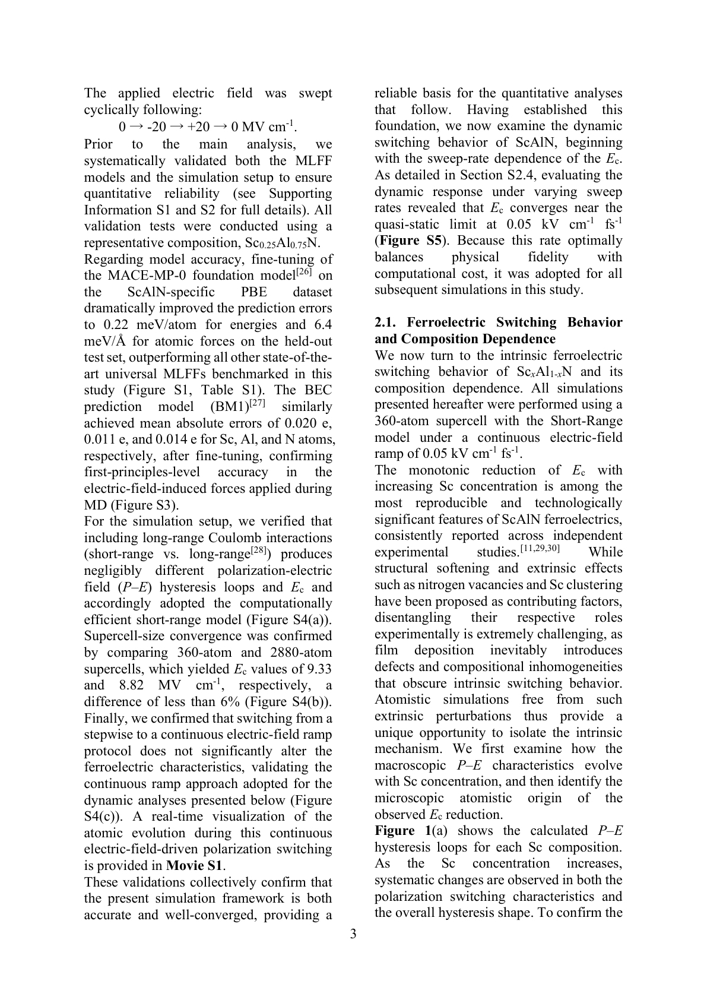

**図1キャプション：** ScAlNにおけるSc濃度と保磁場$E_c$の関係。実験・計算（MLFF-MD）の比較。Sc濃度増加に伴って$E_c$が非線形に低下する傾向が示されており、MLFFシミュレーションが実験トレンドを再現することが確認される。

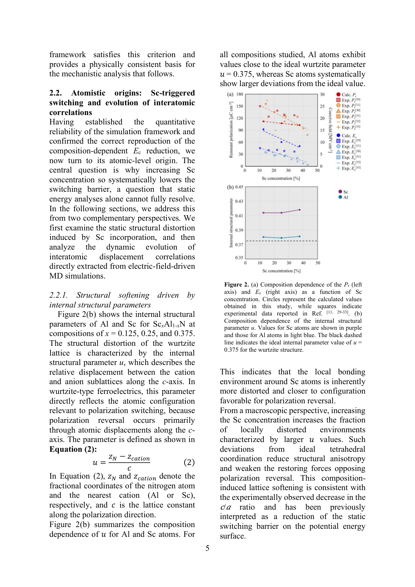

**図2キャプション：** 分極反転経路のエネルギープロファイル（自由エネルギー面）。純粋AlNとScAlN（Sc濃度変化）での比較。Scドープにより中間平面型構造へのバリアが低下する「構造軟化」効果が定量的に示されている。分極反転のNEB（Nudged Elastic Band）経路またはMLFF-MDによるフリーエネルギー面。

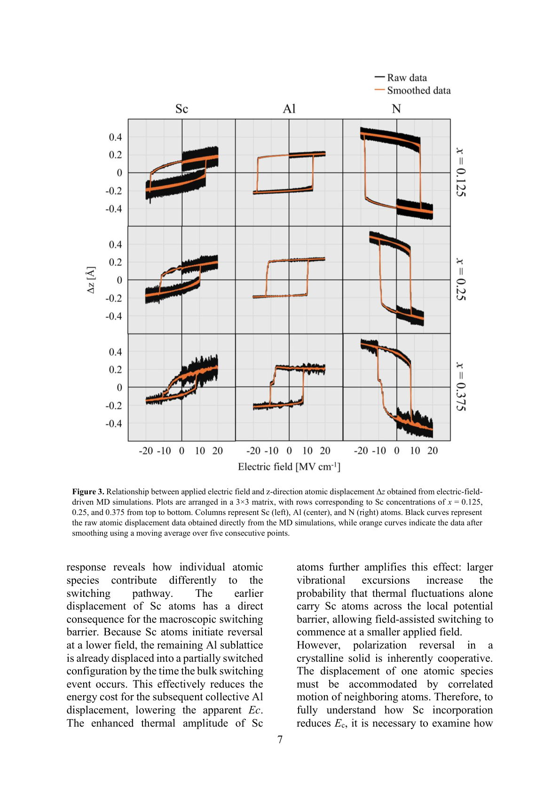

**図3キャプション：** 動的原子相関の可視化。有限温度MDシミュレーションにおける原子変位の空間相関関数（原子変位相関長の温度・組成依存性）。Sc濃度増加とともに相関長が伸び、多数の原子が協調して揺らぐ動的クラスターが形成されることが示されている。この動的相関がバリア低減の第2の機構であることが視覚的に確認できる。

---

## 10. 機械学習分子動力学による強誘電体の分極ダイナミクスとドメイン運動の解析

### 1. 論文情報

| 項目 | 内容 |
|---|---|
| タイトル | [Polarization Dynamics in Ferroelectrics: Insights Enabled by Machine Learning Molecular Dynamics](https://arxiv.org/abs/2603.18058) |
| 著者 | Dongyu Bai, Ri He, Junxian Liu, Liangzhi Kou |
| arXiv ID | 2603.18058 |
| カテゴリ | cond-mat.mtrl-sci |
| 公開日 | 2026年3月18日 |
| ライセンス | arXiv非独占的再頒布ライセンス（図の掲載不可） |

### 2. 研究概要

**第1段落：研究の全体像**
BaTiO₃を代表とする強誘電体の自発分極ダイナミクスとドメイン壁運動を、機械学習分子動力学（ML-MD）を用いて原子スケールで解析した研究である。第一原理計算の精度を保ちながら大規模・長時間シミュレーションを可能にするML-MD（NEP：Neuroevolution Potential 等）により、強誘電体における（i）分極反転の核生成・成長過程、（ii）ドメイン壁の構造・移動エネルギー・エピタキシャル歪み依存性、（iii）分極揺らぎの温度依存性と相転移のメカニズムを原子論的に追跡した。有限電場・有限温度条件でのシミュレーションにより、ドメイン壁移動の活性化エネルギーや分極反転のダイナミクス（核生成支配 vs 壁移動支配）を定量化した。

**第2段落：重要性**
強誘電体のデバイス応用（FeFET、キャパシタ、圧電アクチュエータ）において、分極反転速度・疲労・保持特性は根本的にドメイン核生成・壁移動の動力学によって規定される。しかし実験での原子スケール直接観察は困難であり、従来の理論（LGD理論、フェーズフィールドモデル）は現象論的パラメータに依存していた。ML-MDは原子スケールで分極ダイナミクスを直接追跡することを可能にし、これらの現象論パラメータに物理的基礎を与える。材料設計の指針としては、ドメイン壁移動の活性化エネルギーが組成・歪み・界面条件でどのように変化するかを直接計算できるため、低電圧・高速スイッチング強誘電体の設計に直結する知見を提供する。

### 3. 重要キーワードの解説

**分極ダイナミクス（Polarization Dynamics）**
強誘電体において自発分極の方向・大きさが電場・温度変化に応じて時間変化する過程。核生成（新しいドメインの形成）・ドメイン壁移動・分極回転など複数のメカニズムが関与し、スイッチング速度・ヒステリシス形状を決定する。

**ドメイン壁（Domain Wall）**
強誘電体中で異なる分極方向を持つ領域（ドメイン）の境界。180°壁・90°壁などの種類があり、壁厚は数 nm 以下。壁のエネルギー・移動度が強誘電体のP-Eヒステリシス・疲労特性を制御する。

**核生成支配 vs 壁移動支配（Nucleation-limited vs Wall-motion-limited Switching）**
分極反転の動力学における支配機構の分類。核生成支配では新しい反転ドメインの生成（核生成エネルギー障壁）が速度決定段階であり、壁移動支配では既存ドメイン壁の移動（摩擦・固定）が律速となる。電場強度・温度・試料サイズによってどちらが支配的かが変わる。

**NEP（Neuroevolution Potential）**
GPUGMDフレームワーク向けに開発されたニューラル進化ポテンシャル。進化的アルゴリズムによってニューラルネットワーク係数を訓練し、DFT精度・高速MD計算・高い転移学習性を実現する機械学習ポテンシャルファミリー。

**LGD理論（Landau-Ginzburg-Devonshire Theory）**
強誘電体の自由エネルギーを分極$P$の多項式展開で表すLandau型理論。相転移・ドメイン形成・外場応答を現象論的に記述する。$F = \alpha P^2 + \beta P^4 + \gamma P^6 + \frac{\kappa}{2}(\nabla P)^2 - EP$ の形を基本とし、係数は実験または第一原理で決定される。

**エピタキシャル歪み（Epitaxial Strain）**
薄膜が基板と格子整合した状態で成長する際に生じる二軸応力（歪み）。強誘電体薄膜では面内歪みが自発分極の方向・大きさ・ドメイン構造・相転移温度を制御する重要因子。圧縮歪みは面内分極を抑制し面外分極を安定化させる。

**圧電アクチュエータ・強誘電メモリへの連鎖**
強誘電体の分極ダイナミクスは圧電アクチュエータのヒステリシス損失・クリープ・疲労、強誘電メモリの保持時間・スイッチング電圧・サイクル寿命に直接影響する。ML-MDによる原子スケール理解はこれらのデバイスパラメータの材料設計を指針化する。

### 4. 図

ライセンス：arXiv非独占的再頒布ライセンスのため、図の掲載は行わない。

---

*本ダイジェストはarXivの新着論文（2026年3月18日〜19日公開）から材料工学的観点で10本を選定し、日本語で解説したものです。各論文の詳細は各arXiv IDのリンクよりご確認ください。*
