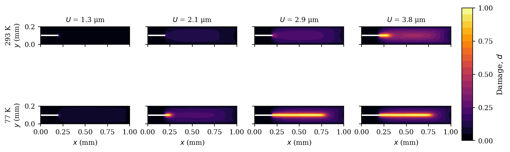
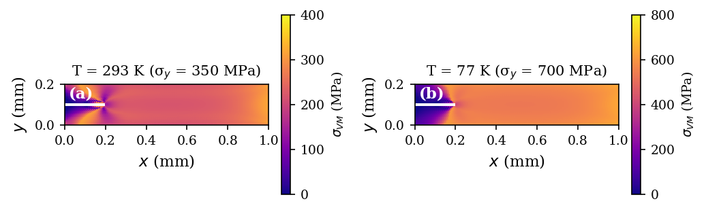
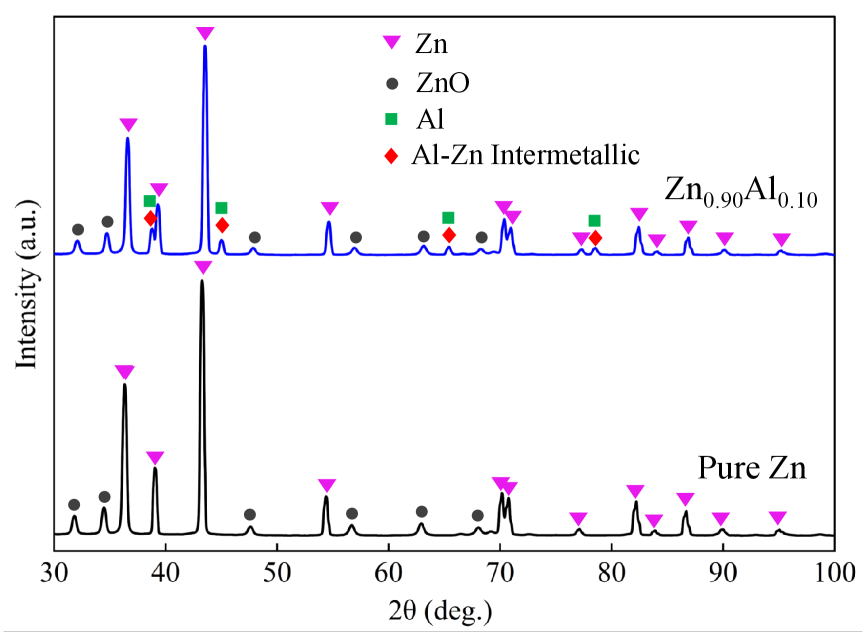
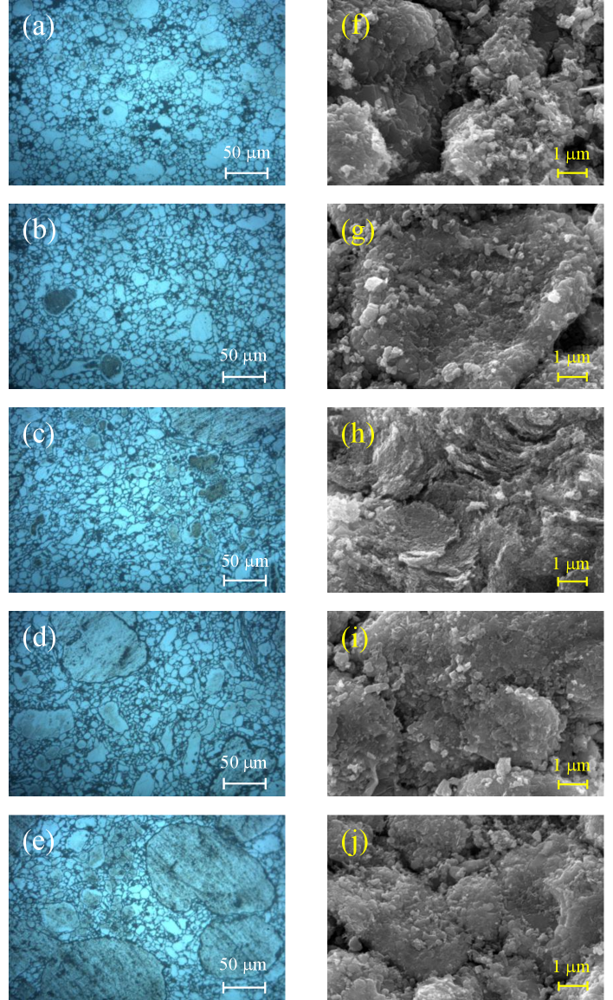
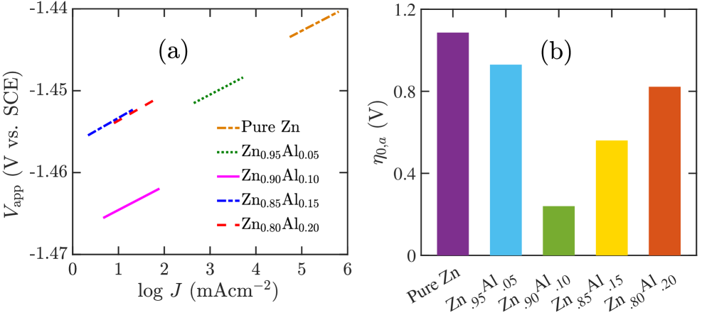
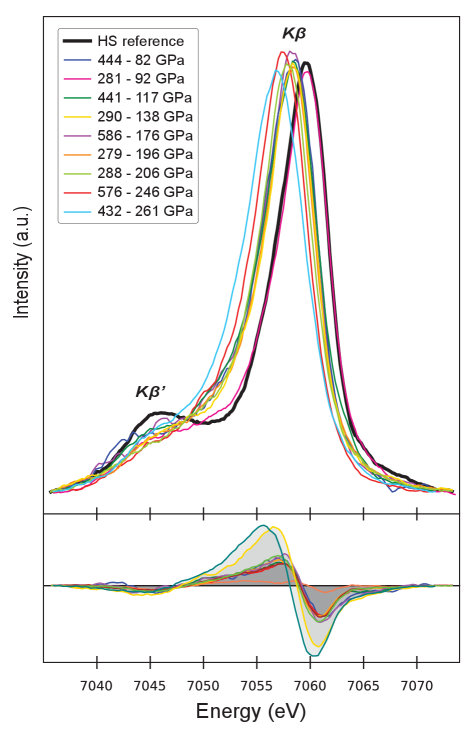
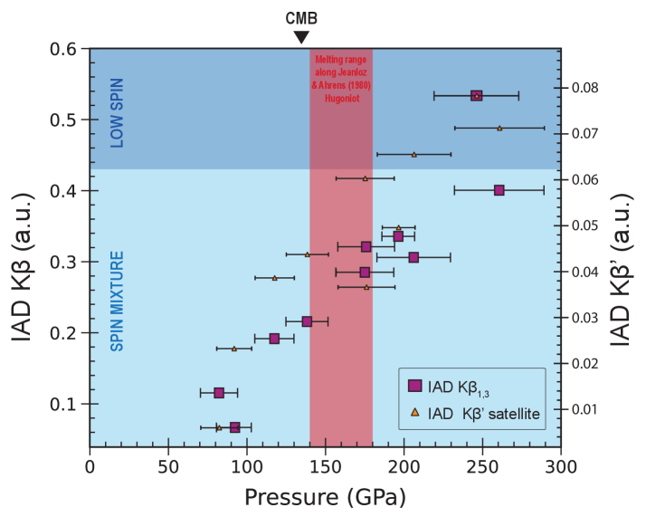

# 2026-03-22 材料工学

**作成日:** 2026-03-22
**対象期間:** 2026-03-19 〜 2026-03-22（直近72時間）

---

## 選定論文一覧

- [2603.18040] P.G. Kubendran Amos — BCC金属の延性-脆性遷移を模擬するフェーズフィールドサロゲートモデル
- [2603.17904] Mamun et al. — Zn-Al合金電極によるアルカリ酸素発生反応の向上：組成最適化と微細組織制御
- [2603.16968] Yedigaryan et al. — ナノ多孔質シリカにおけるレーザー誘起スティショバイト形成：細孔崩壊が駆動する非平衡結晶成長
- [2603.16959] Huang et al. — 機械学習による2次元デンドライト合成の全工程自律最適化
- [2603.17136] Libon et al. — FeOの衝撃圧縮下における鉄のスピン交差：超高圧相変態の連続性
- [2603.17586] Hou et al. — 界面が支配するH2O氷の相転移と水素超イオン拡散
- [2603.18876] Zhang et al. — 結合中心記述子「Bonding Attractivity」による結晶構造-物性の橋渡し
- [2603.18885] Emtenani et al. — ルチル型GeO2の温度依存異方熱輸送：超広バンドギャップ半導体の熱設計
- [2603.18791] Mukherjee et al. — フォノンバンドセンター：格子非調和性を定量化する普遍的記述子
- [2603.18316] Yan et al. — 原子スケールシミュレーションと機械学習によるナノカーボン設計：爆発合成条件の最適化

---

## 全体所見

今回の72時間分の新着論文群は、**材料の組織・相形成とプロセス条件を結ぶ研究**と、**機械学習・記述子を用いた材料設計の加速**という二本柱が鮮明に現れた。フェーズフィールド法を用いたBCC金属の延性-脆性遷移モデルは、温度依存的な塑性変形と破壊の競合メカニズムを整理し、材料の極低温設計指針を提示している。Zn-Al合金電極の研究は、粉末冶金プロセスと組成最適化を通じて相安定性・微細組織・電気化学特性の三者を統合的に論じており、材料工学の手法論として模範的な展開を示している。ナノ多孔質シリカへのレーザー照射によるスティショバイト形成は、細孔界面における電磁場増強が非平衡核生成を加速するという巧妙なメカニズムを解明し、局所電磁環境設計による相制御という新しいプロセス設計概念を開いた。機械学習は今回も複数の論文に登場し、ReSe2デンドライト合成最適化（2603.16959）では活性学習が60回以下の実験で最適プロセスを特定し、結合中心記述子「Bonding Attractivity」（2603.18876）は電子構造情報をML特徴量に落とし込む試みを示している。FeOの超高圧スピン交差（2603.17136）と高圧H2O氷の界面依存相転移（2603.17586）は、高圧極端条件下における相変態の連続性と界面効果という普遍的な問題を扱っている。GeO2の異方熱輸送（2603.18885）とフォノンバンドセンター記述子（2603.18791）は、フォノン工学と熱設計の接続を強化する成果であり、ナノカーボン設計（2603.18316）は爆発合成という非平衡極端プロセスにおける冷却・減圧速度と最終相の関係を定量的に示した。

各論文の位置づけを一文で示す：

- **2603.18040**：BCC金属の低温脆化挙動をフェーズフィールドで再現するサロゲートモデルを提案し、熱処理・構造設計の迅速スクリーニングを可能にした。
- **2603.17904**：Zn-Al合金の組成と微細組織を粉末冶金プロセスで制御し、アルカリOER性能と相安定性の相関を実験・計算統合で明らかにした。
- **2603.16968**：ナノ多孔質シリカへの超短パルスレーザー照射が、細孔崩壊による電磁場増強と圧力閉込めを通じてサブナノ秒での高圧相スティショバイト形成を実現することを計算・実験統合で解明した。
- **2603.16959**：活性学習を組み込んだML駆動の実験循環により、ReSe2デンドライトの合成プロセス最適化を60実験以内で完了した。
- **2603.17136**：FeOに対するレーザー衝撃圧縮実験とX線発光分光を用いて、高圧下での鉄のスピン交差が連続的であることを最大900 GPaまで実証した。
- **2603.17586**：神経網ポテンシャル分子動力学で、ダイヤモンドアンビル界面がH2O氷の相転移温度と構造を系統的に変化させることを明らかにした。
- **2603.18876**：局所電子構造から導かれる「Bonding Attractivity」記述子がML材料予測の解釈可能性と少数データ精度を向上させることを示した。
- **2603.18885**：時間領域熱反射率とフォノン輸送計算の組み合わせにより、ルチル型GeO2の熱伝導率異方性の微視的起源を高周波フォノンの寄与変化として特定した。
- **2603.18791**：フォノンバンドセンターを非調和性の普遍的記述子として提案し、カルコパイライトから広範な材料クラスにわたって格子熱伝導率との強い相関を実証した。
- **2603.18316**：ReaxFF-GPU分子動力学と機械学習を統合して、爆発合成における冷却・減圧速度とナノカーボン最終構造（ダイヤモンド vs. グラファイト化）の定量的設計指針を導出した。

---

# 重点論文

---

## BCC金属の延性-脆性遷移を再現するフェーズフィールドサロゲートモデル：低温構造材料設計への指針

### 1. 論文情報

| 項目 | 内容 |
|------|------|
| タイトル | [Lightweight phase-field surrogate for modelling ductile-to-brittle transition through phenomenological elastoplastic coupling](https://arxiv.org/abs/2603.18040) |
| 著者 | P.G. Kubendran Amos |
| arXiv ID | 2603.18040 |
| カテゴリ | cond-mat.mtrl-sci |
| 公開日 | 2026-03-14 |
| 論文タイプ | プレプリント（研究論文） |
| ライセンス | CC BY 4.0 |

### 2. どんな研究か

体心立方（BCC）金属・合金では、温度の低下とともに転位の熱活性化運動が抑制されて延性-脆性遷移（DBT）が生じる。本研究は、完全な熱-力学連成場を解くことなく、温度依存的な劣化指数・降伏応力・破壊靭性のパラメトリック補間によってDBT挙動を再現する、計算コスト低減型のフェーズフィールドサロゲートモデルを提案した。77〜293 Kの4温度点において、荷重-変位曲線・損傷場・塑性ひずみ場が実験的なDBT特徴（破壊荷重の温度依存性、過程帯の形態変化、変位容量の低下）を定性的に忠実に再現することを示した。

### 3. 研究の概要

**背景と目的**

核融合炉構造材料（−269℃、W合金）や液体水素容器（20 K）に用いられるBCC金属は、低温で急激に脆化する。これを定量的に予測するには、本来は熱弾塑性連成場を解く大規模シミュレーションが必要だが、計算コストが高く材料スクリーニングには不向きである。本研究の目的は、完全連成なしで定性的DBT特徴を再現する「サロゲート（代替）」フェーズフィールドモデルを構築し、低温構造材料の迅速スクリーニングを可能にすることである。

**材料系・組織系**

BCC鋼（汎用的BCC金属を想定）。単純な切欠き試験片（平面応変条件）。

**モデル設定とプロセス条件**

AT2型フェーズフィールド破壊モデルに等方硬化J₂塑性を組み込んだ二場（変位場 + 損傷場）モデルを採用。熱連成場は解かず、代わりに3つの温度依存パラメータを現象論的に補間する：
- 劣化指数 $n(T)$：脆性域（77 K）で3.5、延性域（293 K）で2.0（急激な剛性低下 vs. 緩やかな低下を制御）
- 降伏応力 $\sigma_y(T)$：350 MPa（293 K）→ 700 MPa（77 K）
- 有効破壊エネルギー $G_c^{\text{eff}}(T)$：低温で低減（亀裂先端遮蔽効果の温度依存性）

数値実装はFEniCSxで行い、交互最小化スキームを採用。

**主な結果**

- 77 Kと293 Kの比較で、脆性的な狭い損傷帯 vs. 延性的な広い過程帯の明確な遷移が再現された。
- 注目すべきことに、77 Kでは降伏応力が2倍であるにもかかわらず最大荷重は低い（~1150 N < 293 Kの値）。これは、塑性変形が乏しいために亀裂先端の遮蔽効果が働かず、不安定破壊が早期に起きるためである。
- 4温度（77, 150, 200, 293 K）での掃引でS字状のDBT曲線が得られ、遷移域は150〜200 Kに対応。
- 1プロセッサで約9分/温度点という計算効率を実現。

**材料設計・プロセス設計上の含意**

BCC金属の低温構造材料設計（融合炉壁材、水素タンク、宇宙機構造）において、熱処理条件・合金組成変更が降伏応力と破壊靭性に与える影響を迅速にスクリーニングするためのプラットフォームとして活用できる。

### 4. 材料工学として重要なポイント

本研究の核心は、**降伏応力が高いほど破断荷重が高いとは限らない**という逆説的な延性-脆性遷移挙動を、フェーズフィールド法の枠組みの中で明確に再現した点にある。BCC金属の低温脆化を支配するのは、(a) 熱活性化転位運動の凍結による降伏応力の上昇と、(b) 同時に起こる亀裂先端の塑性遮蔽効果の消失という二つの相反する効果の競合である。本モデルでは、この競合を劣化指数 $n(T)$（亀裂成長の急峻さ）と有効破壊エネルギー $G_c^{\text{eff}}(T)$（亀裂先端遮蔽の温度依存性）の二つのパラメータで現象論的に捉えている。組成・熱処理によって降伏応力と破壊靭性のバランスを独立に調整するという材料設計の観点が、本モデルの感度解析と直接結びついており、W合金やMnCrステンレスなど核融合用材料の低温特性スクリーニングへの適用が期待される。計算コストの低さ（4温度点を40分以内）は、不確実性定量化や多目的最適化との統合にも有利である。

### 5. 限界と注意点

本モデルは現象論的サロゲートであり、熱力学的厳密性を犠牲にしている。熱-力学連成場を解いていないため、断熱加熱効果（高ひずみ速度衝撃）や不均一温度分布（溶接熱影響域）は考慮できない。小ひずみ仮定を採用しているが、亀裂先端近傍では等価塑性ひずみが $\bar{\varepsilon}^p \approx 0.5$–0.9 に達しており、大変形効果が重要になる可能性がある。劣化指数 $n(T)$ の温度補間スキームに対する感度解析はなされているが、150 K 付近では補間方式によって最大荷重に約150 N の差が生じており、定量的な予測精度には限界がある。微細組織（粒径、テクスチャ、析出物分布）の影響は完全に無視されているため、同じ組成でも組織が異なれば異なるパラメータ較正が必要になる。また、単一試験片・単純荷重形式での検証に留まり、実際の構造体における多軸応力状態や溶接部の残留応力との対応は未検証である。

### 6. 関連研究との比較

フェーズフィールド破壊モデルは、Bourdin らの変分形式化（2000年）以来急速に発展し、AT1・AT2型をはじめ多数の変形が提案されてきた。塑性連成型としてはAlessi らや Ambati らの研究が基盤にあり、本研究もそれらの実装上の枠組みを継承している。一方で、BCC金属のDBT模擬に特化したフェーズフィールド研究は限られており、Tarabay らや Hug ら（2D原子論-連続体）など微視的模擬と対比すると、本研究は工学スケールへの適用を念頭に置いた点で差別化されている。完全熱-力学連成型モデル（Papula ら, 2022）と比べると計算コストは2桁以上小さいが、その代償として非等温挙動の定量予測は行えない。

今後の展開としては、実験データからのベイズ逆解析による $n(T)$, $G_c^{\text{eff}}(T)$ の自動較正、粒径・テクスチャ効果を陽に取り込む多スケール拡張、W合金や原子力用RPV鋼（Reference Pressure Vessel Steel）への具体的な適用が挙げられる。特に、本サロゲートモデルを高忠実度シミュレーション結果の代替として用いる「マルチフィデリティ」材料設計フレームワークへの統合は、計算材料科学と実験の橋渡しとして重要な方向性である。

### 7. 重要キーワードの解説

**1. 延性-脆性遷移（DBT: Ductile-to-Brittle Transition）**
BCCおよびFCC一部金属が特定温度以下で急激に脆化する現象。BCCでは転位運動を熱エネルギーが補助しており、低温では転位が動けなくなり破壊靭性が急落する。DBT温度 $T_{\text{DBT}}$ は材料組成・粒径・ひずみ速度に依存し、高 Cr 鋼や W 合金では核融合炉の動作温度域に近いため重大な設計課題である。

**2. AT2型フェーズフィールド破壊モデル**
亀裂表面を拡散的に表現する変分モデル。損傷変数 $d \in [0,1]$ で連続的に破壊を表し、亀裂収束長 $\ell$ で正則化する。自由エネルギー密度は
$$\psi = (1-d)^2 \psi_e^+ + \psi_e^- + \frac{G_c}{4c_w}\left(\frac{w(d)}{\ell} + \ell |\nabla d|^2\right)$$
と書かれ、弾性エネルギー $\psi_e^+$ が損傷の駆動力となる。AT2型では $w(d)=d^2$（緩やかな損傷開始）を採用。

**3. 劣化指数 $n(T)$**
本論文で導入された温度依存パラメータ。弾性エネルギーの損傷による劣化を $(1-d)^n$ と書いたとき、$n=2$ では損傷が増加するにつれて剛性が緩やかに失われ（延性的挙動）、$n=3.5$ では損傷閾値を超えると急激に剛性を失う（脆性的スナップスルー）。この非線形性が、荷重-変位曲線の定性的なDBT遷移を制御する核心パラメータである。

**4. J₂塑性（von Mises塑性）**
主応力偏差の第二不変量 $J_2 = \frac{1}{2} s_{ij} s_{ij}$ を降伏基準に用いる弾塑性モデル（von Mises）。等方硬化則 $\sigma_y = \sigma_{y0} + H \bar{\varepsilon}^p$ を組み合わせ、局所リターンマッピングアルゴリズムで数値実装する。フェーズフィールド破壊と連成する際は、塑性ひずみ蓄積が亀裂先端の損傷駆動力を修正する項として寄与する。

**5. 亀裂先端遮蔽効果（Crack-tip shielding）**
塑性変形が亀裂先端に形成する転位場・残留応力場・マルテンサイト変態帯が、外部から印加された応力拡大係数 $K_{\text{applied}}$ の一部を遮断し、亀裂先端実効 $K_{\text{tip}}$ を低減する効果。遮蔽量は塑性域サイズ（$\propto (K/\sigma_y)^2$）に比例するため、降伏応力が高い低温では遮蔽が小さくなり破壊靭性が見かけ上低下する。

**6. 正則化長さ $\ell$（Regularization length）**
フェーズフィールドモデルで亀裂の幅（拡散ゾーンの大きさ）を決めるパラメータ。$\ell \to 0$ で真の鋭い亀裂に漸近するが、有限要素での実装では $\ell \gg h$（メッシュ幅）が必要。$G_c$と $\ell$ を組み合わせて材料の「内部長さ」を定義でき、$\ell$ は材料の亀裂先端プロセス帯サイズに物理的に対応する。

**7. 交互最小化（Staggered Alternating Minimization）スキーム**
変位場と損傷場を交互に解く（$\boldsymbol{u}$ 固定で $d$ を解く → $d$ 固定で $\boldsymbol{u}$ を解く）反復アルゴリズム。完全連成（モノリシック）求解と比べて各ステップで小型の線形系を解けば良いため、計算効率が高い。収束は1ステップの変化量で判定し、本研究ではCG+HYPRE-AMGプリコンディショナーを採用している。

### 8. 図

**図1**：293 K（延性）と77 K（脆性）における比較（a）荷重-変位曲線、（b）損傷場の最大値の変位依存性、（c）最大等価塑性ひずみの変位依存性。293 Kでは荷重が緩やかに上昇・下降し、大きな塑性ひずみが蓄積されているのに対し、77 Kでは急峻な最大荷重の後に不安定破壊（スナップスルー）が生じ塑性ひずみ蓄積量は小さい。この対比が延性-脆性遷移の本質を可視化しており、低温構造材料の設計において塑性遮蔽効果の消失が支配的因子であることを示している。

**図2**：4変位段階での損傷場の空間分布（上段：293 K、下段：77 K）。293 Kでは損傷が試験片全域に広く拡散した過程帯を形成するのに対し、77 Kでは試験片中央部に狭く集中した損傷帯（実際の亀裂に対応）が形成される。この形態学的な違いは、高温側では塑性エネルギー散逸が損傷の進行を分散させ、低温側では塑性変形がほとんど起こらずに亀裂が局所的に進展することを示している。フェーズフィールドモデルがDBTに伴う損傷形態の遷移を定性的に正確に再現していることが確認できる。

**図3**：代表的な最大荷重前の段階でのvon Mises応力の空間分布（左：293 K、右：77 K）。293 Kでは降伏応力（350 MPa）を超える広大な塑性域が試験片全断面に展開しているのに対し、77 Kでは降伏応力（700 MPa）が高いにもかかわらず塑性域が亀裂先端近傍に限定されている。この応力分布の差異が、亀裂先端遮蔽効果の大きさの違いを直接反映しており、「高降伏応力でも破壊靭性は低い」という延性-脆性遷移の逆説的挙動の力学的説明を与えている。

---

## Zn-Al合金電極の組成最適化と微細組織制御：アルカリOERにおける相安定性と電気化学特性の統合設計

### 1. 論文情報

| 項目 | 内容 |
|------|------|
| タイトル | [Mechanistic Insights into Enhanced Alkaline Oxygen Evolution on Zn-Al Alloy Electrodes](https://arxiv.org/abs/2603.17904) |
| 著者 | Md Abdullah Al Mamun, Md Anowar Hossain, Jyotismita Talukdar, Joyanta Kumar Roy, Mohd Farhan, Ifat Jahangir |
| arXiv ID | 2603.17904 |
| カテゴリ | cond-mat.mtrl-sci |
| 公開日 | 2026-03-18 |
| 論文タイプ | プレプリント（研究論文） |
| ライセンス | CC BY 4.0 |

### 2. どんな研究か

アルカリ水電解における酸素発生反応（OER）用電極として、Zn-Al合金系を取り上げ、Al添加量（5〜20 wt%）と相安定性・微細組織・電気化学特性の関係を実験と第一原理計算の統合で解明した。粉末冶金（ボールミリング＋焼結370℃）で作製された電極について、XRD・光学顕微鏡・SEM・電気化学測定（CV, 分極曲線, EIS, クロノアンペロメトリー）を組み合わせ、Zn₀.₉Al₀.₁が熱力学的安定性・電子構造改善・最適微細組織の三条件を最もよく満たすことを示した。特に、10 wt% Al添加でOER過電圧が1.086 V（純Zn）から0.240 Vへと劇的に低下し、Tafelスロープも88→54 mV/dec へ改善した。

### 3. 研究の概要

**背景と目的**

グリーン水素製造のための水電解では、貴金属（Ru, Ir）触媒に依存しない低コストOER電極の開発が急務である。Zn-Al合金は調整可能な3d電子構造、低コスト、豊富な資源を持ち、アルカリ環境での使用にも適しているが、Al添加量が過大になると相不安定性が生じる。本研究は、Zn-Al系における組成-相安定性-微細組織-電気化学特性の連鎖を定量的に明らかにすることを目的とした。

**材料系・組成・プロセス条件**

- 材料系：Zn-xAl（x = 0, 5, 10, 15, 20 wt%）六方晶構造ベース
- 製造：ボールミリング（高エネルギー）＋一軸加圧＋焼結（370℃、Al融点以下）
- 試験電解液：1 M KOH（アルカリ）

**熱力学計算（DFT）**

Quantum ESPRESSO（GGA-PBE汎関数）で各組成の形成エネルギー・凝集エネルギー・電子状態密度（DOS）・仕事関数を計算。形成エネルギーは
$$E_f = \frac{E_{\text{Zn-Al}} - n_{\text{Zn}} E_{\text{Zn}} - n_{\text{Al}} E_{\text{Al}}}{N}$$
として評価。

**主な結果**

- 5, 10, 15 wt% Alは形成エネルギー負（−0.28〜−0.16 eV）で熱力学的に安定。20 wt% Alは形成エネルギー正（+0.016 eV）で相不安定、Al-rich相の偏析が生じる。
- XRD解析：Al添加でZn（hcp）の格子定数が変化。15 wt% では金属間化合物ピークが出現。20 wt% では余剰Al₂O₃相が観察される。
- 微細組織：10 wt% では準共晶組織（fine interconnected phases）、15 wt% では最微細な均一分散多相ネットワーク。20 wt% では粗大なAl-rich域が発生。
- DOS解析：Al添加によりZnの3d支配的なDOSが展広化し、Zn（負）-Al（正）の局所電場が形成される。これが酸素含有中間体の吸着エネルギーを最適化する。
- Zn₀.₉Al₀.₁の電荷移動係数α_n,a = 0.48（理想値0.5に近い）、電荷移動抵抗R_CT = 1.85 Ω·cm²（最小）、交換電流密度J₀,ₐ = 13.76×10⁻⁵ A/cm²（最大）。

### 4. 材料工学として重要なポイント

本研究が示す最も重要な材料工学的教訓は、**熱力学的相安定性と微細組織的活性点密度がともに最適化される組成ウィンドウが存在する**という点である。Al添加量が5 wt% では、第一原理計算上は活性（低い吸着エネルギー）であるが活性点の面密度が不足し、20 wt% では活性点は多いが相不安定性によって粗大化・偏析が起こり効率が落ちる。10〜15 wt% という窓が最適なのは、準共晶〜共晶組織が形成されることで微細な多相界面網が展開し、電子経路と活性点が同時に最大化されるからである。Zn₀.₉Al₀.₁における電子構造改善（DOSの展広化、局所電場形成）は単純なZn-Al混合固溶の議論を超えており、軌道ハイブリダイゼーションが電気化学的中間体結合強度を制御するというd-band center的な設計概念に対応する。粉末冶金による組織制御とDFT計算の組み合わせは、低コスト非貴金属OER電極の組成-構造-性能の三角形を閉じる研究として、合金触媒設計の方法論として一般性が高い。

### 5. 限界と注意点

本研究の焼結温度（370℃）は粉末冶金的には低く、緻密化が不完全なポーラス構造が残る可能性があり、報告された性能は真密度材料とは異なる可能性がある。クロノアンペロメトリーによる安定性評価は60分に限られており、長期（数百時間）安定性・溶出挙動は未評価である。また、DFT計算はスラブモデル上のクリーン表面を想定しており、実際のアルカリ溶液中での表面酸化（ZnO/Zn(OH)₂/Al(OH)₃形成）による表面組成変化を考慮していない。20 wt% Al では相不安定とされているが、焼結条件を変えた場合（より高温・長時間）に均一固溶体が得られるかどうかは検討されていない。電気化学特性の評価は幾何学的電流密度に基づいており、実電極活性面積（ECSA補正後）での比較が行われていないため、微細組織の差が活性点密度としてどこまで反映されているか定量的な切り分けが必要である。

### 6. 関連研究との比較

遷移金属合金OER電極の設計において、Fe-Co-Ni、Ni-Fe-Mo、Cu-Co系など多元素合金電極が報告されているが、多くは高温・複雑な化学合成を必要とする。本研究のZn-Al合金は二元系・粉末冶金という単純なプロセスで同等以上の動力学を達成しており、スケールアップ可能性という観点で差別化される。材料熱力学的観点からは、Al-Zn二元相図における共晶組成（約95 wt% Zn付近）を利用した微細組織制御という設計思想は、CALPHAD的手法と組み合わせることで他の二元合金系（Zn-Ni, Zn-Cu等）への一般化が期待できる。

今後の方向性としては、実際のアルカリ環境での表面偏析・腐食機構の解明（環境透過型電子顕微鏡やXPS深さ分析）、三元以上の合金設計（Al以外の第三元素添加による最適化ウィンドウの拡大）、および電解液pH・温度依存性の系統的評価が挙げられる。特に、焼結条件（温度・雰囲気・保持時間）と微細組織の精密な相関研究は、工業的なスケールアップ設計指針の確立に不可欠である。

### 7. 重要キーワードの解説

**1. 酸素発生反応（OER: Oxygen Evolution Reaction）**
水電解アノード側で起こる反応 $2H_2O \to O_2 + 4H^+ + 4e^-$（酸性）または $4OH^- \to O_2 + 2H_2O + 4e^-$（アルカリ）。4電子移動を伴う多段階反応のため過電圧が大きく、電解効率の律速過程となる。中間体（\*OH, \*O, \*OOH）の吸着エネルギーの最適化が性能向上の鍵で、Sabatierの原理から「最適吸着強度」が存在する。

**2. 形成エネルギー $E_f$**
合金相が純元素の和から生成する際のエネルギー変化。$E_f < 0$ は合金形成が熱力学的に有利であることを意味し、相の安定性を判断する基本指標。DFT計算で $E_f = (E_{\text{alloy}} - \sum_i n_i E_i^{\text{pure}})/N$ として評価する。本研究では $E_f = +0.016$ eV（20 wt% Al）が相偏析の熱力学的根拠として使われている。

**3. Tafelスロープ**
電気化学反応の電流-電圧関係 $\eta = a + b\log J$（Butler-Volmer方程式の対数近似）における傾き $b$（mV/dec単位）。律速ステップと電子移動係数 $\alpha$ を反映し、$b = 2.303RT/(\alpha n F)$。低いTafelスロープは高い本来の反応速度定数を示す。Zn₀.₉Al₀.₁の53.5 mV/dec（純Znの87.9 mV/decに対して）は律速ステップの変化と電荷移動係数の改善を示唆する。

**4. d-band centerモデル**
遷移金属表面の触媒活性を支配する電子構造論的モデル（Hammerら）。d帯の重心エネルギー $\varepsilon_d$ がフェルミ準位に近いほど吸着中間体との結合が強くなる（逆δ-band model）。本研究でのAl添加によるDOS展広化は $\varepsilon_d$ シフトを通じた中間体吸着エネルギー最適化と解釈できる。これはNi, Co, Fe系OER触媒の設計原理と共通であり、Zn-Al系にも拡張可能である。

**5. 電気化学インピーダンス分光（EIS）**
多周波数交流電圧（通常$10^{-2}$〜$10^5$ Hz）を印加してナイキストプロット（実部 vs. 虚部）を得る手法。高周波域では電解液抵抗、中周波域では電荷移動抵抗 $R_{CT}$、低周波域では物質移動（Warburgインピーダンス）が現れる。$R_{CT}$ が小さいほど電極反応の本来の速度定数が大きく、電極設計の優劣を判断する指標となる。

**6. 準共晶組織（Near-eutectoid microstructure）**
共晶点（または共析点）近傍の組成で形成される微細な2相混合組織。AlをZnに添加した系では準共晶点（約95 wt% Zn）近傍で微細なZn相とAl相が交互に層状・網目状に形成される。この微細組織は表面積が大きく活性点密度が高いため、触媒・電極材料として有利である。

**7. 電荷移動係数 $\alpha$（対称係数）**
Butler-Volmer式の非対称性を表すパラメータ（$0 < \alpha < 1$）。$\alpha = 0.5$ は遷移状態が反応物・生成物に対して等距離（最大対称性）であることを意味し、理想的な反応速度定数に対応する。$\alpha_{n,a} \approx 0.48$（Zn₀.₉Al₀.₁）は理想値に近く、アノード方向の電荷移動が速やかであることを示す。

### 8. 図

**図1**（XRDパターン）：各組成のZn-Al合金のX線回折パターン。純Znの六方晶ピーク（hcp）に対し、Al添加に伴いピーク位置がシフトし（格子定数変化）、15 wt% 以上で金属間化合物ピーク、20 wt% でAl₂O₃関連ピークが出現する。XRD結果は形成エネルギー計算（DFT）による相安定性予測と整合しており、20 wt% Alの相不安定を実験的に確認している。相同定が材料の熱処理設計・組成選択の基盤となることを示す典型例である。

**図2**（光学顕微鏡・SEM像）：a〜e：各組成の光学顕微鏡像、f〜j：SEMによる組織観察。純Znでは大粒径均一組織、5 wt% Alでは粒界にAl-rich析出物、10 wt% では準共晶微細組織、15 wt% では最微細な均一分散多相ネットワーク、20 wt% では粗大なAl-rich域と均一性の低下が確認される。10〜15 wt% で微細な多相界面が形成される様子は、活性点密度の最大化と電子経路の連続性確保という電極設計の観点から、組成-組織-性能の連鎖を可視化している。

**図3**（Tafelスロープ・過電圧）：a：各組成のTafelプロット（overpotential vs. log current density）、b：組成に対する過電圧の変化。Zn₀.₉Al₀.₁で過電圧が最小（0.240 V at 12 mA/cm²）、Tafelスロープが最小（53.5 mV/dec）を達成している。20 wt% Alでは過電圧が再び上昇しており、相不安定・粗大化による活性点の減少と電子移動経路の遮断が性能劣化の原因であることが裏付けられている。この最適組成ウィンドウの存在は、合金電極設計における相安定性と微細組織の共最適化という原則を具体的に示している。

---

## ナノ多孔質シリカにおけるレーザー誘起スティショバイト形成：細孔崩壊が駆動する非平衡高圧結晶化

### 1. 論文情報

| 項目 | 内容 |
|------|------|
| タイトル | [From pore collapse to crystal growth: ultrafast laser-induced stishovite formation in nanoporous silica](https://arxiv.org/abs/2603.16968) |
| 著者 | Aram Yedigaryan, Mohamed Yaseen Noor, Elena Kachan, Gabriel Calderon, Jinwoo Hwang, Enam Chowdhury, Jean-Philippe Colombier |
| arXiv ID | 2603.16968 |
| カテゴリ | cond-mat.mtrl-sci |
| 公開日 | 2026-03-17 |
| 論文タイプ | プレプリント（研究論文） |
| ライセンス | arXiv 非独占配布ライセンス（CC 非該当） |

### 2. どんな研究か

フェムト秒レーザーをナノ多孔質シリカに照射すると、細孔界面での電磁場増強と細孔崩壊に伴う一時的な高圧環境がサブナノ秒スケールでの高圧相スティショバイト（SiO₂ VI型、ルチル型構造）形成を可能にすることを、FDTD–二温度モデル–分子動力学の統合計算と透過型電子顕微鏡・4D-STEM実験で解明した。細孔径2 nmの系では均質系と比べて核生成開始が2倍以上速く（0.5 ns vs. 0.85 ns）、完全結晶化が1.1 ns以内に完了し、その構造がスティショバイトと一致することが動径分布関数解析と回折パターンで確認された。

### 3. 研究の概要

**背景と目的**

スティショバイトは約27 GPa以上で安定な高密度SiO₂相（ルチル型、ρ ≈ 4.3 g/cm³）であり、自然には隕石衝突痕やサブダクションゾーンで見られる。フェムト秒レーザーは瞬間的な高温高圧環境を創出できるが、均質シリカガラスでは圧力弛緩が核生成より速く進むためスティショバイト形成が抑制される。本研究は、ナノ多孔構造が電磁場増強と圧力閉込めの両機能を担い、非平衡結晶化の時間窓を拡大するという仮説を検証した。

**対象材料系**

非晶質SiO₂（石英ガラス）、2 nm細孔を含むナノ多孔質SiO₂、および実験検証用のSiO₂/HfO₂多層膜。

**プロセス条件**

- レーザー：1030 nm、25 fs、強度 ~10¹⁴ W/cm²
- モデリング：FDTD（非線形Maxwell方程式 + Keldysh光イオン化）→ 二温度モデル（TTM）→ 分子動力学（修正BKSポテンシャル）

**主な結果**

- 細孔界面でのフィールド増強係数 ~1.6、自由電子密度 ~4×10²² cm⁻³（細孔表面）
- 細孔崩壊：励起後0.1 psで開始、0.9 psでほぼ完了
- 核生成開始：2 nm細孔系で ~0.5 ns（均質系の0.85 nsより速い）
- 2 nm細孔系の最終平衡温度3100 K（均質系の+20%、1 nm細孔系の+16%）
- 結晶化完了後の構造はSi-O結合長1.73 Å、O-Si-O角90°/170°（八面体配位）をもつスティショバイトと一致
- 4D-STEM回折パターンがシミュレーションのd面間隔と3%以内で一致

**組織形成と設計含意**

細孔径が1〜2 nmの範囲では同様の核生成加速が生じることから、極めて小さな細孔（欠陥レベル）でも十分な効果が得られる。これは、レーザー照射前の意図的なナノ細孔配置によって、結晶化位置を空間的に制御できる「電磁的結晶化印刷」技術への道を開く。

### 4. 材料工学として重要なポイント

本研究が提示する材料工学的原理の核心は、**細孔（構造欠陥）が核生成の触媒として機能するという古典核生成論の普遍原理が、電磁場増強という非平衡経路によっても発現する**という点にある。均質核生成では自由エネルギー障壁 $\Delta G^* = \frac{16\pi\gamma^3}{3(\Delta G_v)^2}$ を超えることが難しいが、細孔界面での不均一核生成はこの障壁を大幅に低減する。本研究が新しいのは、この低減が（通常の不均一核生成のような）表面エネルギー項の変化だけでなく、細孔崩壊による局所圧力上昇（体積自由エネルギー差 $\Delta G_v$ の増大）と温度上昇（熱活性化項の増大）によっても引き起こされるという複合機構を示したことである。圧力弛緩が核生成前に起こる均質系と異なり、閉込め幾何学によって圧力がスティショバイト安定域（>27 GPa）に維持される時間窓が結晶化を完了させる。レーザー誘起相変態のための材料設計として「ナノ細孔の意図的配置」「多層膜界面での誘電不連続」という二つのプロセス設計指針が導出されており、SiO₂以外のAl₂O₃、TiO₂、HfO₂などの広ギャップ誘電体材料への一般化も期待できる。

### 5. 限界と注意点

計算は分子動力学のナノ秒スケールに限られており、スティショバイトの長期安定性（マイクロ秒〜秒スケールでの逆転変態の可能性）は検討されていない。修正BKSポテンシャルの精度は高圧領域で不確実であり、スティショバイト形成時の原子配置精度は限定的である（Si-Si PRDF に23%のRMSDが報告されている）。実験検証はSiO₂/HfO₂多層膜に限られており、設計された単純ナノ多孔質SiO₂構造での直接実験検証は行われていない。また、細孔径の最適値（1〜2 nm）が判明したが、それ以下（単一空孔レベル）またはそれ以上（メソポーラス構造）のスケールにどこまで一般化できるかは未検討である。現段階では変換体積がサブミクロン（~450 nm³）に限られており、実用的な材料加工への展開にはスケールアップの課題がある。

### 6. 関連研究との比較

レーザー誘起高圧相変態の研究は、Hemley らの衝撃波実験（1980年代）やSciocchetti らの超短パルスレーザー研究（2000年代）を源流とする。Colombier グループは以前、フェムト秒レーザー照射したシリカガラス中の多層膜界面近傍で結晶性ドメインを報告しており（2020年頃）、本研究はその界面効果の微視的機構解明に当たる。細孔を核生成触媒とするアイデアは、古典的なポーラスガラス中の結晶化研究（Varshneya ら）と連続しているが、電磁場増強との組み合わせという視点は新しい。不均一核生成の電磁場制御という概念は、最近のメタマテリアル的レーザー加工研究とも接点がある。

今後の展開としては、(1) ナノ細孔配列の精密制御（e-beam リソグラフィやALD）と組み合わせた「電磁的位相印刷」、(2) 広ギャップ誘電体（Al₂O₃, HfO₂）への適用による多様な高圧相の非平衡合成、(3) 圧力閉込めジオメトリ最適化のための逆設計（機械学習補助）が重要な方向性である。特に、レーザーパルスエネルギー・細孔径・細孔配置を制御変数としたプロセス設計マップの作成は、実用的な相変態加工技術の確立に直結する。

### 7. 重要キーワードの解説

**1. スティショバイト（Stishovite, SiO₂ VI）**
ルチル型（TiO₂型）構造をとるSiO₂の高圧相。Si原子が6配位（八面体配位）であり、通常の石英（4配位、四面体）や非晶質シリカとは根本的に異なる。安定領域は約27〜100 GPa以上。密度 ≈ 4.29 g/cm³（石英の2.65 g/cm³の約1.6倍）。地球マントル中・隕石衝突クレーターで発見される。本研究ではレーザー誘起の非平衡条件下で形成される。

**2. 二温度モデル（TTM: Two-Temperature Model）**
強レーザーパルス照射時の金属・半導体の超高速応答を記述する連続体モデル。電子系温度 $T_e$ と格子系温度 $T_l$ を別々の拡散方程式で扱い、電子-フォノン結合項 $g(T_e-T_l)$ で連成する。超短パルスでは $T_e \gg T_l$ になり（本研究では $T_e \sim 20000$ K vs. $T_l \sim 3100$ K）、従来の熱拡散モデルでは記述できない非平衡加熱が生じる。

**3. FDTD法（Finite-Difference Time-Domain）**
Maxwell方程式を時空間格子上で差分近似する数値電磁気学手法。本研究では非線形屈折率変化（Keldysh光イオン化による自由電子生成依存）を組み込み、細孔周囲の局所電磁場増強を計算した。$|\boldsymbol{E}|^2$ の局所的な増大が光イオン化速度（$W \propto \exp(-\pi\Delta/\hbar\omega)$）を通じて自由電子密度を増加させる。

**4. Keldysh光イオン化**
強電場中での固体の多光子・トンネルイオン化の統一的記述（Keldysh, 1965）。Keldyshパラメータ $\gamma = \omega\sqrt{m\Delta}/eE_0$（$\Delta$：バンドギャップ、$E_0$：電場振幅）で多光子域（$\gamma \gg 1$）とトンネル域（$\gamma \ll 1$）を区別する。本研究では動的バンドギャップ縮小（8.9→5.5 eV）を考慮してイオン化速度を10倍以上増加させることを示した。

**5. 修正BKSポテンシャル（Modified BKS potential for SiO₂）**
van Beest-Kramer-Santen（BKS）ポテンシャルは、Si-O, O-O間のCoulomb相互作用とBuckingham型短距離斥力を組み合わせたSiO₂の古典ポテンシャル。修正版では高圧・高温領域での精度向上のため短距離項の係数が調整される。SiO₂の相変態（石英⇔スティショバイト）のMD計算に広く使われるが、高圧での精度は機械学習ポテンシャルより劣る。

**6. 4D-STEM（4D Scanning Transmission Electron Microscopy）**
試料各位置で収束電子ビームの回折パターン（2D）を記録することで、実空間2次元にわたる完全な回折情報（4D）を取得する手法。本研究ではナノ結晶化ドメインのd面間隔をナノメートル分解能で直接マッピングし、スティショバイトの局所存在を確認するための決定的証拠を与えた。

**7. 不均一核生成における接触角モデル**
均質核生成の自由エネルギー障壁 $\Delta G^* = \frac{16\pi\gamma^3}{3(\Delta G_v)^2}$ に対し、不均一核生成では幾何学的因子 $f(\theta) = \frac{(2+\cos\theta)(1-\cos\theta)^2}{4} \leq 1$ が乗じられ障壁が低減される（$\theta$：核と基底面の接触角）。$\theta \to 0$ で完全濡れ（$f \to 0$）、$\theta = \pi$ で均質核生成（$f = 1$）。本研究では細孔界面が局所的な高温・高圧環境（$\Delta G_v$ 増大）と組み合わさることで障壁を大幅に低減させていると解釈できる。

### 8. 図

本論文のライセンスはarXiv非独占配布ライセンス（CC非該当）のため、原図の抽出・掲載は行わない。

---

# その他の重要論文

---

## 活性学習駆動の実験自律循環が実現するReSe₂デンドライト合成最適化

### 1. 論文情報

| 項目 | 内容 |
|------|------|
| タイトル | [Machine intelligence supports the full chain of 2D dendrite synthesis](https://arxiv.org/abs/2603.16959) |
| 著者 | Wenqiang Huang et al.（12名） |
| arXiv ID | 2603.16959 |
| カテゴリ | cond-mat.mtrl-sci, cs.AI |
| 公開日 | 2026-03-17 |
| 論文タイプ | プレプリント（研究論文） |
| ライセンス | CC BY 4.0 |

### 2. 研究概要

**第1段落：研究の全体像**

二次元層状材料ReSe₂のデンドライト（樹枝状）結晶の電気触媒的活性は、合成プロセス条件（温度・圧力・前駆体比・保持時間・基板等の5変数）に強く依存するが、パラメータ空間は膨大であり従来の試行錯誤では最適化が困難である。本研究は機械学習を用いた実験循環フレームワークを3段階で構築した：(1) 活性学習（ベイズ最適化）による60実験以内での高分岐・高活性ReSe₂デンドライト最適プロセスの特定（全パラメータ組み合わせの1.3%以下）、(2) 精度ガイド付きデータ拡張と木ベースMLによる9追加実験でのプロセス変数-形態相関の解明、(3) クロススケール特性評価・解釈可能ML・熱力学/動力学知識の統合による合成メカニズムの解明（「デュアル駆動モデル」）。活性学習サイクルで特定された最適条件は、形状制御された高分岐デンドライト形成と電気触媒性能の双方を達成した。

**第2段落：重要性**

ReSe₂デンドライトの分岐形態は表面積・活性点密度・電子経路の三者を同時に最大化するが、その形成は熱力学的平衡成長とは異なる拡散律速不安定（DLA: Diffusion-Limited Aggregation）的機構による。本研究の「デュアル駆動モデル」は、複数のプロセス変数が形態にどう集合的に作用するかを熱力学・動力学の枠組みで解釈可能な形で示しており、ReSe₂に限らず他の2D材料（MoS₂, WS₂等）の形態制御合成への一般的な設計指針を提供する。活性学習による実験最小化の手法は、CVD・ALD・水熱合成など多様な材料合成プロセスの最適化に直接転用可能であり、Materials 4.0の具体的な実装例として位置づけられる。

### 3. 重要キーワードの解説

**1. 活性学習（Active Learning）**：ベイズ最適化などを利用し、次に実施すべき実験をモデルが「能動的に」提案するML戦略。探索（未知領域のサンプリング）と活用（既知最良解近傍の精密化）のトレードオフを獲得関数（UCB, EI等）で制御し、実験コストを最小化しつつ最適解に収束させる。

**2. デンドライト（Dendrite）形態**：拡散場中の結晶成長で発生する樹枝状形態。Mullins-Sekerka不安定性によって平坦な成長前面が不安定化し、突起が優先成長することで生じる。2D材料では基板上のステップ流や前駆体拡散プロファイルが形態を支配する。高分岐デンドライトは電気化学的活性に有利な高表面積を持つ。

**3. 解釈可能機械学習（Interpretable ML）**：SHAPや部分依存プロット（PDP）などを用いて、MLモデルがどの特徴量をどう重み付けしているかを定量化する手法群。本研究では木ベースモデル（Random Forest/XGBoost）にSHAPを適用し、各プロセス変数が形態に与える寄与を可視化している。

**4. データ拡張（Data Augmentation）**：限られた実験データを仮想データで補完してML学習を安定化させる手法。本研究では「予測精度ガイド付き」データ拡張により、高精度予測が難しい組成空間に仮想データを集中配置し、少数（9）追加実験で形態相関を解明した。

**5. デュアル駆動モデル（Dual-Driven Model）**：実験観測・ML解析（データ駆動）と熱力学・動力学知識（物理駆動）を統合した解釈フレームワーク。純粋なブラックボックスMLと純粋な物理モデルの両欠点を補う hybridアプローチで、結果の解釈可能性と汎用性を両立する。

**6. ReSe₂**：Re（レニウム）とSe（セレン）から成る遷移金属ダイカルコゲナイド（TMD）。空間反転対称性を破った三斜晶構造（1T'型）をもち、面内異方性と強い電気触媒活性を示す。分岐したデンドライト形態ではエッジサイト密度が高く、水素発生反応（HER）や二酸化炭素還元（CO₂RR）に有効である。

**7. ベイズ最適化（Bayesian Optimization）**：ガウス過程回帰（Gaussian Process Regression, GPR）を用いてブラックボックス関数の次サンプル点を逐次決定する最適化手法。計算コストは高いが少ない関数評価（実験回数）で最適解に収束可能。材料合成パラメータ最適化、触媒スクリーニング、製造条件設計に広く応用される。

### 4. 図

本論文はCC BY 4.0ライセンスだが、arXiv HTML版が提供されていないため原図の抽出が困難であった。図の掲載を省略する。

---

## FeOの衝撃圧縮下におけるスピン交差：超高圧下での鉄酸化物の電子状態と相変態

### 1. 論文情報

| 項目 | 内容 |
|------|------|
| タイトル | [Spin crossover in FeO under shock compression](https://arxiv.org/abs/2603.17136) |
| 著者 | Lélia Libon, Alessandra Ravasio, Silvia Pandolfi, et al.（20名） |
| arXiv ID | 2603.17136 |
| カテゴリ | cond-mat.mtrl-sci |
| 公開日 | 2026-03-17 |
| 論文タイプ | プレプリント（査読中） |
| ライセンス | CC BY-NC-SA 4.0 |

### 2. 研究概要

**第1段落：研究の全体像**

ウスタイト（FeO、岩塩型）は地球コア-マントル境界（CMB）付近の主要鉱物相の一つであり、超高圧での鉄のスピン状態変化（高スピン→低スピン「スピン交差」）が地球内部の密度・粘性・弾性波速度モデルに直結する。本研究は、レーザー衝撃圧縮（最大~900 GPa、CMB条件の数倍）と同時X線回折・Fe Kβ X線発光分光（XES）を組み合わせ、FeOにおける鉄のスピン交差が幅広い圧力範囲にわたって連続的であることを実証した。スピン磁気モーメントは900 GPaを超えてもゼロにはならず、高スピン成分が持続することが示された。これは単純な離散的高スピン→低スピン転移ではなく、多段階あるいは圧力誘起の連続スピン交差であることを示している。

**第2段落：重要性**

FeOの電子状態（スピン）と相安定性の圧力依存性は、地球内部モデルの精度に直接影響する。高圧でのFeO相変態（岩塩→NiAs型→逆NiAs型等）と電子状態変化の連成は、地震波速度異常（「ULVZ」）の解釈や惑星形成・分化の理解に不可欠である。本研究の「連続スピン交差」という知見は、以前の静的ダイヤモンドアンビルセル（DAC）実験との整合性を高め、動的（衝撃）条件での相変態経路の理解を深める。超高圧相変態の連続性という知見は、Mn, Co, Niなど遷移金属酸化物の高圧挙動への一般化も示唆し、地球・惑星内部での多元素系挙動モデリングに貢献する。

### 3. 重要キーワードの解説

**1. スピン交差（Spin Crossover）**：遷移金属イオンの高スピン（HS）状態と低スピン（LS）状態の間の電子状態変化。圧力・温度によってd電子の結晶場分裂エネルギー $\Delta_{\text{CF}}$ とフント則のスピンペアリングエネルギー $\Pi$ のバランスが変化する（$\Delta_{\text{CF}} > \Pi$: LS優位）。圧力増加でSi-O結合が圧縮されFeの配位場が強まることでHSからLSへの転移が促進される。

**2. Fe Kβ X線発光分光（XES）**：鉄の $3p \to 1s$ 遷移に伴うX線発光スペクトルを解析することで鉄のスピン状態を定量評価する手法。高スピン状態ではKβ₁,₃ピーク付近に卫星ピーク（Kβ'）が現れ、その積分面積差（IAD）がスピン磁気モーメントに比例する。衝撃圧縮実験など高速・極端条件下でのin situ評価が可能。

**3. Hugoniot関係式**：衝撃波前後での質量・運動量・エネルギーの保存（Rankine-Hugoniot条件）から導かれる圧力-密度（$P$-$\rho$）の関係。特定材料のHugoniot曲線は衝撃圧縮実験のデータベースを構成し、高圧状態方程式（EOS）のキャリブレーションに使われる。

**4. ウスタイト（Wüstite, FeO）**：鉄欠損型岩塩構造（NaCl型, $B1$相）の酸化鉄。Fe²⁺と$\text{Fe}_{1-x}$O（$x \approx 0.04-0.12$）の形で鉄欠損が生じやすい。地球マントル・コア境界の「bridgmanite + ferropericlase」の一成分として重要。高圧では$B1$ → NiAs型（$B8$）→ 逆NiAs型への相変態が起こるとされる。

**5. レーザー衝撃圧縮**：高出力ナノ秒レーザー（kJ〜MJクラス）で試料を急激に加速・圧縮する手法。達成圧力は Mbar（100 GPa）〜 Gbar（100,000 GPa）に及び、静的 DAC では困難な超高圧環境を実現する。ただし圧縮時間はナノ秒オーダーと短く、準静的平衡状態とは異なる条件での相転移が起こりうる。

**6. コア-マントル境界（CMB: Core-Mantle Boundary）**：地球深度 ~2890 km、圧力 ~136 GPa での界面。固体マントル（シリケート岩）と液体外核（Fe-Ni合金）の境界。CMB付近の局所的な超低速度帯（ULVZ）は部分溶融やFeO-rich材料の存在と関連し、その相状態は地球深部の熱・化学進化のモデリングの核心的不確定性である。

**7. 磁気崩壊圧力（Magnetic Collapse Pressure）**：高圧下でのスピン磁気モーメントの消失圧力。Driscoll-Cohen型の電子的遷移で、スピン量子数の「高スピン ($S=2$) → 低スピン ($S=0$)」への変化が起こる。FeO以外にFe₂O₃, MgFeO, FeS₂等でも報告されており、超高圧での遷移金属酸化物の輸送・磁気特性を支配する。

### 4. 図

**図1**（XRD像）：各衝撃圧力でのFeOのX線回折像。岩塩型（$B1$相）ピーク位置の圧力依存的シフトが確認される。高圧では$B1$相の変形・相転移の兆候が現れる。回折パターンの定量解析から格子定数の圧縮率（状態方程式）が導かれ、Hugoniot上の圧力-密度関係の基盤となる。

**図2**（Fe Kβ XES）：各圧力でのFe Kβ X線発光スペクトル。高スピン状態に特徴的なKβ'サイドピークが、圧力増加とともに縮小するがゼロにはならない変化を示す。スペクトル面積差（IAD）の圧力依存性がスピン磁気モーメントの連続的変化（スピン交差）の直接証拠であり、900 GPaを超えても高スピン成分が残存することが読み取れる。

**図3**（IAD vs. 圧力）：積分面積差（IAD）の圧力依存性（スピン磁気モーメントの proxy）。先行のDAC実験データと衝撃圧縮データの比較。連続的なIAD低下（スピン交差の連続性）が示されており、単純な離散型高スピン→低スピン転移とは異なる。DAC実験との一致はプローブ速度（静的 vs. 動的）によらず同じスピン状態変化経路が存在することを示唆し、非平衡効果（動的条件）の影響が小さいことを示している。

---

## 界面が誘起するH₂O氷の相転移と水素超イオン拡散：高圧実験への含意

### 1. 論文情報

| 項目 | 内容 |
|------|------|
| タイトル | [Interface-dependent Phase Transitions and Ultrafast Hydrogen Superionic Diffusion of H2O Ice](https://arxiv.org/abs/2603.17586) |
| 著者 | Pengfei Hou, Yumiao Tian, Zifeng Liu, Junwen Duan, Hanyu Liu, Xing Meng, Russell J. Hemley, Yanming Ma |
| arXiv ID | 2603.17586 |
| カテゴリ | cond-mat.mtrl-sci |
| 公開日 | 2026-03-18 |
| 論文タイプ | プレプリント（研究論文） |
| ライセンス | arXiv 非独占配布ライセンス（CC 非該当） |

### 2. 研究概要

**第1段落：研究の全体像**

高圧H₂O氷の相変態（特に水素超イオン相への転移）はこれまでダイヤモンドアンビルセル（DAC）実験で研究されてきたが、試料とダイヤモンド界面の効果は実質的に未考慮のままであった。本研究は、人工ニューラルネットワークポテンシャルと能動学習を組み合わせた大規模分子動力学シミュレーションにより、ダイヤモンド-H₂O界面の存在が(1) 水素超イオン相への転移温度を大幅に低下させ、(2) bcc（体心立方）氷からfcc（面心立方）氷への逆Bain機構による自発的相転移を誘発することを示した。fcc氷の安定領域は従来の予測より大幅に低圧側に存在すると推定され、これが静的高圧実験と理論計算の間の長年の不一致を説明する可能性がある。

**第2段落：重要性**

界面が材料の相転移温度・安定領域を変化させるという知見は、H₂O氷の高圧相変態の理解を超えて、一般的な高圧実験の解釈に根本的な修正を迫るものである。DAC実験では常に試料が容器（ガスケット）またはアンビル界面と接しており、界面効果を無視すると「バルク材料の相変態」として解釈された現象の一部が実は「界面誘起相変態」であった可能性がある。この普遍的な問題提起は、高圧下でのセラミックス（Al₂O₃, MgO, TiO₂等）や金属（Fe, Mg等）の相変態研究にも同様の検証を求める。また、太陽系外惑星（超地球）内部での水の超イオン状態は磁場生成に関わると考えられており、転移条件の精度向上は惑星科学にも直結する。

### 3. 重要キーワードの解説

**1. 水素超イオン相（Hydrogen Superionic Phase）**：H₂O氷の高圧相で、酸素原子が結晶格子（bcc型）を形成する一方、水素原子が格子間を液体的に拡散する「固体と液体の中間相」。拡散係数が液体水に近く、高い電気伝導性を示す。約50 GPa, 1000 K 以上で安定とされ、Neptune/Uranus型惑星の内部で磁場生成に寄与すると考えられる。

**2. 逆Bain機構（Inverse Bain Mechanism）**：bcc格子をfcc格子に変換する格子変形経路の一つ。Bain対応では $c/a$ 比を $\sqrt{2}$ にすることでfcc↔bcc変換が対称性的に可能であり、歪みを最小化する経路として選ばれる。本研究では界面応力がこの変形を誘発し、bcc氷→fcc氷の相転移を引き起こすと解釈されている。

**3. 人工ニューラルネットワークポテンシャル（ANN Potential / Neural Network Potential）**：第一原理（DFT）エネルギーをトレーニングデータとして学習した機械学習ポテンシャル。古典ポテンシャルより精度が高く（DFTレベル）、古典MDより計算コストは高いが第一原理MDよりはるかに大規模・長時間の計算が可能。H₂Oのような水素結合系の高圧挙動記述に特に有効。

**4. ダイヤモンドアンビルセル（DAC: Diamond Anvil Cell）**：2つのダイヤモンドアンビルで試料を挟み、メガバール（Mbar）超の静水圧を実現する高圧装置。ダイヤモンドのX線透過性により原位置（in situ）X線回折・分光が可能。ただし試料体積が極めて小さく（nL以下）、界面効果の割合が大きい。

**5. 界面誘起相転移（Interface-Induced Phase Transition）**：材料の内部相とは異なる界面近傍での相安定化または転移。表面/界面エネルギーの差、界面応力、界面拘束による歪みエネルギーが駆動力となる。薄膜・ナノ粒子系では「サイズ効果」として表れることがあり、バルクの相図からは予測できない相変態が起こる。

**6. 能動学習（Active Learning）シミュレーション**：分子動力学計算中にポテンシャルの予測不確実性が高い構造配置を自動検出し、DFTラベル付きデータを追加学習するオンザフライ機械学習MD。高圧相転移のような希少事象をANN potentialで効率よくサンプリングするために有効。

**7. bcc-fcc 相転移圧力の再評価**：本研究では界面効果の考慮によりfcc氷の安定圧力が従来の第一原理予測より大幅に低圧側になることを示した。これは「計算・実験の矛盾」の根本原因が物理的なモデルの誤りではなく実験条件（界面の影響）にあるという重要な指摘であり、高圧相図研究における実験解釈の方法論に影響する。

### 4. 図

本論文のライセンスはarXiv非独占配布ライセンス（CC非該当）のため、原図の抽出・掲載は行わない。

---

## 結合中心記述子「Bonding Attractivity」による結晶構造-物性の橋渡し：解釈可能なML材料設計

### 1. 論文情報

| 項目 | 内容 |
|------|------|
| タイトル | [Bridging Crystal Structure and Material Properties via Bond-Centric Descriptors](https://arxiv.org/abs/2603.18876) |
| 著者 | Jian-Feng Zhang, Ze-Feng Gao, Xiao-Qi Han, Bo Zhan, Dingshun Lv, Miao Gao, Kai Liu, Xinguo Ren, Zhong-Yi Lu, Tao Xiang |
| arXiv ID | 2603.18876 |
| カテゴリ | cond-mat.mtrl-sci |
| 公開日 | 2026-03-19 |
| 論文タイプ | プレプリント（研究論文） |
| ライセンス | arXiv 非独占配布ライセンス（CC 非該当） |

### 2. 研究概要

**第1段落：研究の全体像**

現在のML材料科学では化学結合の情報がしばしば「暗黙の変数」として潜在的に扱われ、MLモデルが結合を「再発見」する過程でデータ量依存性が高く解釈可能性が低いという問題がある。本研究は、局所電子構造・結合相互作用を陽に取り込んだデータベース「MattKeyBond」を構築し、元素ごとの「Bonding Attractivity（BA）」（共有結合性ネットワーク形成能）という新しい記述子を提案した。BAはエネルギー次元を持つ元素固有の量であり、材料のバンドギャップ・弾性率・フォノン散乱・熱伝導率など多様な物性予測において、幾何学座標のみに依存する従来記述子より少ないデータ量で高精度を達成することを示した。

**第2段落：重要性**

「結合」を陽に取り込む設計思想は、合金・セラミックス・半導体の材料設計においてドーパントや固溶元素が電子構造にどう影響するかという材料工学的問いと直接対応する。特に少数データでの高精度予測（データ効率の改善）は、新材料探索における高コスト実験データの活用効率を上げ、スクリーニング精度を高める実用的な利点がある。BAが元素ごとの物理的意味をもつため、「この元素の添加がなぜ物性を変えるか」という因果的説明が可能になり、材料設計の透明性が向上する。材料インフォマティクスと電子構造理論の橋渡しとして、第一原理計算の知見をML特徴量に組み込む方法論的な貢献は広範な材料系に一般化できる。

### 3. 重要キーワードの解説

**1. Bonding Attractivity（BA）**：本研究で提案された元素固有の記述子。ある元素がいかに強固な共有結合ネットワークを形成しやすいかを定量化する。電子軌道の局在性・帯域幅・占有率から導かれ、エネルギー次元を持つ。高BA元素（SiやCなど）は強い方向性共有結合を形成し、低BA元素（アルカリ金属等）は弱い結合しか形成しない傾向と対応する。

**2. MattKeyBond**：本研究で構築された結合中心材料データベース。標準的な材料データベース（Materials Project等）に追加して、各材料の局所電子構造・結合相互作用を事前計算した特徴量として収録。MLモデルの入力特徴量として直接使用可能なように設計されており、幾何座標+BA記述子の組み合わせでトレーニング効率を向上させる。

**3. グラフニューラルネットワーク（GNN）**：結晶構造をグラフ（原子：ノード、結合：エッジ）として表現し、メッセージパッシングによって物性を予測するML手法。MEGNet, CGCNN, DimeNetなどが代表例。幾何座標から結合情報を学習するが、本研究はその学習の必要性を減らすためにBAを明示的な特徴量として追加する。

**4. 記述子（Descriptor）**：材料の構造・組成・電子状態を定量的に要約した特徴ベクトル。Coulomb行列、SOAP（Smooth Overlap of Atomic Positions）、ACE（Atomic Cluster Expansion）など多数存在する。良い記述子は物性との相関が高く、計算コストが低く、転移学習可能な汎用性を持つ必要がある。

**5. データ効率（Data Efficiency）**：少ない学習データで高い予測精度を達成する能力。物理的制約・対称性・既知理論をモデルに組み込む「物理インフォームドML」はデータ効率を高める代表的戦略。本研究のBA記述子は電子構造の物理的知識を特徴量化することでデータ効率を改善している。

**6. 転移学習（Transfer Learning）**：大量データでトレーニングされたモデルの重みを、少数データの異なるタスクに転用する手法。基盤モデル（Foundation Model）が材料科学でも台頭しているが、転移先タスクでの精度はドメイン特異的な特徴量の質に依存する。BAのような物理的記述子は転移学習の「錨」として機能しうる。

**7. 解釈可能性（Interpretability）**：MLモデルがある予測を行う際の根拠・重要特徴量を人間が理解できる形で説明する能力。SHAPやLIMEなどの後処理手法による説明（post-hoc interpretability）と、モデル構造自体が解釈しやすい設計（intrinsic interpretability）がある。本研究のBAは化学的意味を持つため、どの元素・結合が予測値を支配しているかの因果的説明を可能にする。

### 4. 図

本論文のライセンスはarXiv非独占配布ライセンス（CC非該当）のため、原図の抽出・掲載は行わない。

---

## ルチル型GeO₂の温度依存異方熱輸送：超広バンドギャップ半導体の熱設計への指針

### 1. 論文情報

| 項目 | 内容 |
|------|------|
| タイトル | [Microscopic Origin of Temperature-Dependent Anisotropic Heat Transport in Ultrawide-Bandgap Rutile GeO2](https://arxiv.org/abs/2603.18885) |
| 著者 | Pouria Emtenani, Marta Loletti, Felix Nippert, Eduardo Bede Barros, Zbigniew Galazka, Hans Tornatzky, Christian Thomsen, Juan Sebastian Reparaz, Riccardo Rurali, Markus R. Wagner |
| arXiv ID | 2603.18885 |
| カテゴリ | cond-mat.mtrl-sci |
| 公開日 | 2026-03-19 |
| 論文タイプ | プレプリント（研究論文） |
| ライセンス | arXiv 非独占配布ライセンス（CC 非該当） |

### 2. 研究概要

**第1段落：研究の全体像**

ルチル型GeO₂（二酸化ゲルマニウム）は超広バンドギャップ（~4.68 eV）を持ち、次世代パワーエレクトロニクス・深紫外応用に向けた有望な半導体材料として注目されているが、その熱輸送特性は未解明な部分が多い。本研究は時間領域熱反射率（TDTR）を用いて80〜350 Kの広温度域で[001]および[110]方向の熱伝導率を測定し、室温での比較から $\kappa_{[001]} = 47.5$ W m⁻¹ K⁻¹、$\kappa_{[110]} = 32.5$ W m⁻¹ K⁻¹（異方性比1.46）であることを確認した。この異方性と温度依存性の微視的起源を非平衡グリーン関数ベースのフォノン輸送計算と組み合わせて解析し、高周波フォノンが温度低下とともに熱伝導率への寄与を減らすことで異方性が消失する機構を明らかにした。

**第2段落：重要性**

パワーデバイス（GaN, SiC, Ga₂O₃）の熱管理は動作信頼性の決定要因であり、GeO₂は誘電率・絶縁破壊電界・移動度の点でも優れるため次世代候補として有力である。熱伝導率の異方性（[001] vs. [110]で1.46倍）は基板設計・デバイス実装方向の選択指針を与え、高出力用途でのダメージ回避に直結する。温度依存性の理解（$T^{-1.4}$則）は、高周波フォノン散乱の役割を定量化することで、不純物散乱・界面散乱の影響が顕在化する薄膜や低温動作環境での熱設計に示唆を与える。フォノン工学の観点からは、GeO₂の高周波フォノン挙動が同じルチル型TiO₂やSnO₂と比較することで材料設計指針の一般化が期待できる。

### 3. 重要キーワードの解説

**1. 時間領域熱反射率（TDTR: Time-Domain Thermoreflectance）**：ポンプ-プローブ光学法で熱伝導率・界面熱コンダクタンスを測定する手法。ポンプパルスで試料表面を局所加熱し、プローブパルスで反射率変化（温度に比例）の時間減衰を計測。薄膜・バルク単結晶の方向別熱伝導率をナノ秒〜マイクロ秒スケールで高精度測定できる。

**2. フォノン熱伝導率 $\kappa$**：フォノン（格子振動の量子）の輸送による熱エネルギーの流れ。Boltzmann輸送方程式の弛緩時間近似では $\kappa = \frac{1}{3} C_v v^2 \tau$ と書けるが、実際には各フォノンモードの寄与を積分する必要がある。温度上昇でフォノン-フォノン散乱（Umklapp過程）が増え弛緩時間 $\tau$ が短くなり、$\kappa \propto T^{-n}$（$n \approx 1$〜1.5）で低下する。

**3. 異方熱輸送**：結晶方向によって熱伝導率が異なる性質。ルチル型構造（四方晶、$c/a \approx 0.66$ for GeO₂）では$c$軸方向の格子定数が小さく、[001]方向（$c$軸）でフォノン群速度が高い。異方性比は原子結合の方向性・フォノン分散の異方性から定量化できる。

**4. 高周波フォノン**：フォノン分散関係の高周波（高エネルギー）領域に対応する振動モード。短波長で群速度が小さく、Umklapp散乱断面積が大きいため弛緩時間が短い。低温では熱的励起（Bose-Einstein分布）による占有率が低く、熱伝導率への寄与が減少する。本研究では高周波フォノンの温度依存的な寄与変化が異方性の温度依存性の起源であることを示した。

**5. 超広バンドギャップ半導体（UWBG: Ultra-Wide Bandgap Semiconductor）**：バンドギャップが約3.4 eV（GaN）を超える半導体の総称。代表例はGa₂O₃（4.8 eV）、AlN（6.2 eV）、ダイヤモンド（5.5 eV）、そして本研究のGeO₂（~4.68 eV）。高い絶縁破壊電界と比抵抗を活かしたパワーエレクトロニクス応用（高電圧スイッチング）に期待される。

**6. Umklappプロセス（U過程）**：フォノン散乱においてフォノン運動量の和が逆格子ベクトル $\boldsymbol{G}$ だけずれる3フォノン散乱。Normal過程（$\boldsymbol{G} = 0$）と異なり熱流の向きを変えるため、熱抵抗（=有限の $\kappa$）の主要起源となる。高温ほどU過程の頻度が高く、$\kappa$ が $T^{-1}$ に近い温度依存性を示す。

**7. 非平衡グリーン関数法（NEGF）**：量子輸送理論に基づくフォノン輸送計算手法。调和子系では $\kappa = \int_0^\infty T(\omega)\hbar\omega \frac{\partial n}{\partial T} \frac{d\omega}{2\pi}$（$T(\omega)$：透過率関数）として $\kappa$ を評価できる。特に界面熱コンダクタンスや局所フォノン輸送の解析に有効であり、本研究ではバルク方向依存性の解析にも適用されている。

### 4. 図

本論文のライセンスはarXiv非独占配布ライセンス（CC非該当）のため、原図の抽出・掲載は行わない。

---

## フォノンバンドセンター：格子非調和性を定量化する普遍的記述子と熱伝導率設計

### 1. 論文情報

| 項目 | 内容 |
|------|------|
| タイトル | [Phonon Band Center: A Robust Descriptor to Capture Anharmonicity](https://arxiv.org/abs/2603.18791) |
| 著者 | Madhubanti Mukherjee, Ashutosh Srivastava, Abhishek Kumar Singh |
| arXiv ID | 2603.18791 |
| カテゴリ | cond-mat.mtrl-sci |
| 公開日 | 2026-03-19 |
| 論文タイプ | プレプリント（研究論文） |
| ライセンス | arXiv 非独占配布ライセンス（CC 非該当） |

### 2. 研究概要

**第1段落：研究の全体像**

格子熱伝導率 $\kappa_L$ の設計において非調和性（フォノン-フォノン散乱強度）の定量化は不可欠だが、従来のGrüneisenパラメータ $\gamma$ の計算には高コストのフォノン計算が必要であった。本研究は「フォノンバンドセンター（PBC）」を新しい記述子として提案した。PBCはフォノン分散の重心周波数として定義され、$\gamma$ と逆比例関係をもち、$\kappa_L$ とも強い相関を示す。カルコパイライト材料系（AGa₂S₄系, A = Cd, Hg, Zn等）で初めてPBCを確立し、その後、窒化物・カルコゲナイド・フッ化物など多様な材料クラスの実験 $\kappa_L$ データでも有効性を検証した。第一原理計算から容易に算出でき（調和的フォノン計算のみ）、非平衡分子動力学や第三次フォノン計算が不要という計算コスト面での優位性もある。

**第2段落：重要性**

PBCが $\kappa_L$ と強く相関する物理的根拠は、フォノン周波数が低いほど状態密度がフォノン-フォノン散乱チャンネルに豊富であり（位相空間の拡大）、かつ波長が長いほど調和ポテンシャルからの逸脱が大きいという二つの要因が協働するためである。熱電材料設計では低 $\kappa_L$ が目標であり、PBCが低い材料（低周波フォノン卓越、柔らかい化学結合）を迅速にスクリーニングする指標として活用できる。逆に、高熱伝導材料（放熱基板、パワーデバイス）ではPBCが高い材料（C, BNなど）が候補となる。カルコパイライト材料については空孔欠陥が非調和性を高めること（前日のダイジェストにも関連）と整合的であり、欠陥エンジニアリングによる $\kappa_L$ 調整のための定量的指針をPBCが提供する。

### 3. 重要キーワードの解説

**1. フォノンバンドセンター（PBC: Phonon Band Center）**：本研究で提案された記述子。フォノン分散 $\omega(\boldsymbol{q}, s)$ の状態密度による重み付き平均周波数として定義される：$\text{PBC} = \frac{\int_0^{\infty} \omega \cdot g(\omega) d\omega}{\int_0^{\infty} g(\omega) d\omega}$（$g(\omega)$：フォノン状態密度）。PBCが低いほど低周波モード（柔らかい振動）が卓越し、非調和性が高い傾向がある。

**2. Grüneisenパラメータ $\gamma$**：体積変化に対するフォノン周波数の応答を表す熱力学パラメータ。$\gamma_i = -\frac{V}{\omega_i}\frac{\partial \omega_i}{\partial V}$（モード $i$ のGrüneisen定数）と定義され、全体の Grüneisen定数は各モードへの重み付き平均。$\gamma > 1$ で非調和性が強く、$\kappa_L$ が低い材料傾向がある。第三次フォノン-フォノン相互作用定数から計算する場合コストが高い。

**3. 格子熱伝導率 $\kappa_L$**：フォノンのみによる熱伝導率成分（電子熱伝導を除いた格子振動成分）。熱電材料では $ZT = S^2\sigma T / (\kappa_e + \kappa_L)$ の分母に含まれ、低 $\kappa_L$ が高 $ZT$ の必要条件。単純金属では $\kappa_e$ が支配的だが、半導体・絶縁体では $\kappa_L$ が主要成分である。

**4. カルコパイライト（Chalcopyrite）**：ABX₂（A = Cu, Ag; B = Ga, In; X = S, Se, Te）型の四方晶構造を持つ化合物半導体群。太陽電池材料（CuInSe₂系）や熱電材料として重要。欠陥（原子空孔、逆席欠陥）が形成しやすく、それが非調和性・フォノン散乱に影響する。本研究の検証元となった材料クラス。

**5. フォノン-フォノン散乱の位相空間（Phonon Scattering Phase Space）**：3フォノン散乱（Umklappおよびノーマル過程）が可能な（入射フォノン + 散乱フォノン + 生成フォノン）の組み合わせ数。フォノン分散が低周波域に密集するほど、同一エネルギー近傍での散乱チャンネルが増え弛緩時間 $\tau$ が短くなる。低PBCは位相空間の広さを示す代理変数として機能する。

**6. 調和・非調和フォノン計算**：調和近似（2次力定数のみ）でフォノン分散・状態密度を計算するのが「調和フォノン計算」。これに3次・4次の力定数を加えた計算が「非調和フォノン計算」であり、Umklapp散乱率・$\kappa_L$ を定量的に求めるのに必要だがコストが高い（ShengBTE, ALAMODE等のコード）。本研究のPBCは調和計算のみで得られる点が計算コスト上の優位性である。

**7. 熱電材料設計における低 $\kappa_L$ 化戦略**：(1) 重元素導入（質量ゆらぎ散乱）、(2) 複雑な結晶構造（多数のフォノン枝によるバックフォールディング）、(3) フォノンソフト化（rattling原子、ソフトモード）、(4) 欠陥・合金散乱（点欠陥、析出物）が主要手法。PBCは(2)と(3)の効果を「フォノン重心周波数の低下」として定量化する。

### 4. 図

本論文のライセンスはarXiv非独占配布ライセンス（CC非該当）のため、原図の抽出・掲載は行わない。

---

## 爆発合成における冷却・減圧速度とナノカーボン最終構造の定量的設計指針

### 1. 論文情報

| 項目 | 内容 |
|------|------|
| タイトル | [From Atomistic Models to Machine Learning: Predictive Design of Nanocarbons under Extreme Conditions](https://arxiv.org/abs/2603.18316) |
| 著者 | Xiaoli Yan, Millicent A. Firestone, Murat Keceli, Santanu Chaudhuri, Eliu Huerta |
| arXiv ID | 2603.18316 |
| カテゴリ | cond-mat.mtrl-sci |
| 公開日 | 2026-03-18 |
| 論文タイプ | 研究論文（*Carbon*, Vol. 252, 2026 掲載済み） |
| ライセンス | CC BY-NC-ND 4.0 |

### 2. 研究概要

**第1段落：研究の全体像**

爆発物の爆発反応後のデトネーション後期（quench段階）でナノダイヤモンド・グラファイト化球・カーボンナノオニオン等が生成されるが、最終的なナノカーボン構造を決定するのは爆発後の冷却速度と減圧速度であることが経験的に知られていた。本研究はGPU加速ReaxFF分子動力学（10万以上のノード時間をカバー）で爆発後の冷却・減圧プロセスをモデリングし、急速冷却＋緩慢減圧が立方ダイヤモンド保持を最適化し、緩慢冷却＋急速減圧がグラファイト化を促進することを示した。この100,000点超の計算データから多層パーセプトロン回帰器を学習させ、グラファイト化層数・ダイヤモンド分率などの構造指標をR²>0.90で予測するMLモデルを構築した。冷却速度・減圧速度の2次元設計マップが得られ、ナノダイヤモンド合成条件の定量的最適化指針が示された。

**第2段落：重要性**

爆発合成はナノダイヤモンドの主要な工業生産法（Ульяновsk-type）であり、粒径・表面官能基・相純度の制御が薬物送達・研磨・量子センサー（NV-center）応用の鍵である。冷却・減圧速度の組み合わせが最終相を決定するという結果は、「爆発反応の動力学（超高温高圧）だけでなく、反応後の冷却プロセス熱力学が相選択を支配する」という重要な設計原理を示している。これはCALPHAD的な「冷却速度-相変態-最終組織」の対応関係を非平衡極端条件に拡張したものであり、急冷によるマルテンサイト変態や凝固時の過冷却組織形成と類似の設計思想が炭素ナノ材料合成にも適用できることを示している。

### 3. 重要キーワードの解説

**1. ReaxFF分子動力学**：反応力場（ReaxFF）を用いたMD。炭素の共有結合の形成・解離を動的に扱えるため、C-Hを含む有機分子・炭素材料の非平衡反応・相変態のシミュレーションに適している。通常のMDと比べて計算コストが高いが、GPU並列化（LAMMPS等）で10万原子・マイクロ秒スケールが可能になっている。

**2. ナノダイヤモンド（Nanodiamond）**：粒径1〜10 nm程度の立方ダイヤモンド単結晶粒子。爆発合成では高圧衝撃波がグラファイト・爆発物炭素をダイヤモンド相に変換する。表面は水素・ヒドロキシル・カルボキシル基で終端化でき、生体適合性・蛍光特性（NV-center）・機械的硬度が応用に利用される。

**3. カーボンナノオニオン（Carbon Nano-Onion）**：同心円状の多殻フラーレン様の炭素ナノ粒子。ナノダイヤモンドが高温・減圧下でグラファイト化する際に形成されることがある。フラーレン（C₆₀）とグラファイトの中間的な構造であり、潤滑剤・スーパーキャパシタ電極材としての応用が検討されている。

**4. グラファイト化（Graphitization）**：炭素材料（アモルファス、ナノダイヤモンド等）が高温・低圧下でsp³炭素からsp²炭素（グラファイト層）に再構成される相変態。熱力学的には十分高温（>2000 K）で圧力が低ければグラファイトがダイヤモンドより安定であるため、爆発後の冷却・減圧過程でこの競合が生じる。

**5. デトネーション後期（Post-Detonation Quench）**：爆発衝撃波通過後、高温高圧の反応生成物（CO, CO₂, C, H₂O等）が膨張・冷却していく段階。ナノカーボンの相が決定するのはこの段階であり、冷却速度（dT/dt）と減圧速度（dP/dt）が支配変数である。工業プロセスでは爆発チャンバー内の水・氷の量でこれを調整している。

**6. 多層パーセプトロン（MLP: Multilayer Perceptron）回帰**：フィードフォワード型ニューラルネットワークを用いた回帰モデル。本研究では冷却速度・減圧速度・初期密度・組成等を入力とし、グラファイト化層数・ダイヤモンド分率を出力として学習させた。R²>0.90の精度で100,000超のMDシミュレーション結果を圧縮し、実験設計マップとして利用可能にした。

**7. 炭素相図の非平衡性**：炭素の平衡相図ではダイヤモンドは高圧（>~5 GPa）で安定、グラファイトは常圧・高温で安定だが、動力学的障壁（活性化エネルギー）が大きいため常圧でもダイヤモンドは準安定として長時間存在できる（メタ安定性）。爆発合成では瞬間的な高圧でダイヤモンドが生成され、急速冷却によって動力学的にメタ安定な状態に閉じ込められる。冷却・減圧速度の制御はこの「動力学的閉じ込め」の設計に対応する。

### 4. 図

本論文はCC BY-NC-ND 4.0ライセンスだが、arXiv HTML版が提供されていないため原図の抽出が困難であった。図の掲載を省略する。

---

*本ダイジェストは 2026-03-22 に作成された。取り上げた10本はすべて、reported_papers.csv に記録済みの論文と重複しないことを確認している。*
