# 2026-03-23 材料工学

**作成日：** 2026-03-23
**対象期間：** 2026-03-01 〜 2026-03-22

---

## 選定論文一覧

1. [低炭素鋼のオーステナイト双晶が固相変態のバリアント選択を支配する](#低炭素鋼のオーステナイト双晶が固相変態のバリアント選択を支配する) — 2603.07378
2. [気相成膜における準安定多形選択の核生成予測フレームワーク](#気相成膜における準安定多形選択の核生成予測フレームワーク) — 2603.02466
3. [非晶質相変化材料の結晶化を支配する移動原子パーコレーションと共鳴超音波加速](#非晶質相変化材料の結晶化を支配する移動原子パーコレーションと共鳴超音波加速) — 2603.01559
4. [機械学習ポテンシャルによるNbTaTiZr耐火高エントロピー合金の変形機構と圧縮挙動](#機械学習ポテンシャルによるNbTaTiZr耐火高エントロピー合金の変形機構と圧縮挙動) — 2603.00726
5. [異質核生成における氷の積層秩序転換速度論](#異質核生成における氷の積層秩序転換速度論) — 2603.00440
6. [原子スケール理解に基づくSb2Te相変化光波導体デバイスの最適化](#原子スケール理解に基づくSb2Te相変化光波導体デバイスの最適化) — 2603.18468
7. [高エントロピー酸化物薄膜における異常結晶性とヘテロ構造への展開](#高エントロピー酸化物薄膜における異常結晶性とヘテロ構造への展開) — 2603.00814
8. [X線自由電子レーザーによるAu/Pd核殻ナノロッドの超高速合金化の時分解観察](#x線自由電子レーザーによるaupd核殻ナノロッドの超高速合金化の時分解観察) — 2603.01597
9. [ウラン窒化物の高温熱容量における窒素フレンケル対形成の役割](#ウラン窒化物の高温熱容量における窒素フレンケル対形成の役割) — 2603.02441
10. [2次元ペロブスカイト上でのナノ結晶超格子の決定論的核生成と光捕集ヘテロ構造](#2次元ペロブスカイト上でのナノ結晶超格子の決定論的核生成と光捕集ヘテロ構造) — 2603.18959

---

# 全体所見

今回選定した10本は、核生成・相変態・組織形成の制御という軸に沿って有機的につながっている。鋼材の固相変態において双晶粒界がバリアント選択を支配するという三次元EBSD解析（2603.07378）、気相成膜で生じる多形競合を古典核生成理論と反応エネルギーを組み合わせて定量予測するフレームワーク（2603.02466）、非晶質相変化材料Ge₂Sb₂Te₅の結晶化がβ緩和に関連した移動原子のパーコレーションで制御されるという機構解明と超音波共鳴加速（2603.01559）の3本を重点論文とした。残り7本は、NbTaTiZr高エントロピー合金の機械学習ポテンシャルMDによる変形機構解析（2603.00726）、蒸着氷の積層秩序転換が表面拘束対称性破れによって支配されるという高分解能TEM観察（2603.00440）、Sb₂Teの原子スケール理解に基づく光波導体デバイス設計指針（2603.18468）、高エントロピー酸化物薄膜の「異常結晶性」と組成制御によるコヒーレントヘテロ構造構築（2603.00814）、X線自由電子レーザーによるAu/Pd核殻ナノロッドの超高速合金化過程の時分解観察（2603.01597）、ウラン窒化物の高温熱容量異常に窒素フレンケル対形成が寄与するという分子動力学による検証（2603.02441）、2次元ペロブスカイト上へのナノ結晶超格子の決定論的核生成と光捕集ヘテロ構造の実現（2603.18959）である。全体として、核生成理論・統計力学・組織形成とプロセス設計を接続する研究群が今週の材料工学arXivの特徴となっている。

---

# 重点論文の詳細解説

## 低炭素鋼のオーステナイト双晶が固相変態のバリアント選択を支配する

### 1. 論文情報

| 項目 | 内容 |
|------|------|
| タイトル | [The role of austenite twins on variant selection during decomposition in low carbon steels](https://arxiv.org/abs/2603.07378) |
| 著者 | Ruth M. Birch, Ben Britton, Warren J Poole |
| 所属 | Department of Materials Engineering, University of British Columbia |
| arXiv ID | 2603.07378 |
| カテゴリ | cond-mat.mtrl-sci |
| 公開日 | 2026-03-07 |
| 論文タイプ | 研究論文 |
| ライセンス | arXiv非独占配布ライセンス |

### 2. どんな研究か

低炭素ラインパイプ鋼（HSLA鋼）において、熱間加工（TMCP）後の冷却中にオーステナイト（γ相）からベイナイト・マルテンサイトへの固相変態が起きる際、**どのバリアント（子相の結晶方位）が優先的に核生成・成長するか**を、Xe-プラズマFIB-SEMを用いた三次元EBSD断層撮影によって完全先オーステナイト粒スケールで解析した研究である。150×150×100 μm³という大体積を0.2 μmボクセルで取得し、双晶粒界を内包する先オーステナイト粒（PAG）を完全に孤立・解析することに成功した。その結果、高温での**Σ3アニーリング双晶粒界**が、バリアント選択の主要な駆動因子となっていることを三次元的に実証した。

### 3. 研究の概要

**背景と目的：** TMCP鋼やHSLA鋼はラインパイプや極地用途に広く使われ、溶接後の低温靱性が重要である。冷却時のγ→α変態で生成するバリアントの分布と形態が最終微細組織を決定し、強度・靱性に直結する。先オーステナイト双晶（Σ3粒界、<111>軸まわり60°回転）が変態組織に影響することは2D実験から示唆されていたが、三次元的な実証は欠けていた。

**対象材料系：** 組成 0.06C-1.3Mn-<0.9(Cu+Ni+Cr+Mo)-0.07–0.08(V+Nb+Ti) wt%のラインパイプ鋼。1150°C×10分保持後、50°C/sで室温まで冷却し、ベイナイト組織を形成させた（先PAG粒径約40 μm）。

**材料創製・プロセス条件：** レーザー超音波でPAG粒径を確認。試料をEDMで3×3×5 mm³に切断後、TESCAN AMBER X pFIB-SEM（Oxford EBSD Symmetry S2検出器）でEBSD断層撮影を実施。150×150 μm² × 500スライス（スライス厚200 nm）。

**主な測定・解析手法：** MTEXツールボックス（MATLAB）とDragonflyを用いたPAG再構成コード（KS配向関係を使用）。連結成分解析でバリアントを識別（50ボクセル以上）。5パラメータ粒界解析で双晶面の法線ベクトルを決定。

**主な結果：**
- 双晶粒界（PAG A/B間の不一致角：59.8°/[1̄11]）を内包する完全な孤立PAGペアを取得。
- 双晶粒界近傍の薄層（厚さ2 μm）では、**共有パケット群**（PAG AとBで共通の[111]方位を持つバリアント群）が両粒において約50%を占める。
- PAG Aでは、双晶境界から離れるにつれて共有パケットの割合は50%→3%（境界に接するバリアント全体）→13%（PAG全体）と変化し、双晶境界近傍に局在する。
- PAG Bでは、51%→19%（接続バリアント）と減少するが、粒サイズが小さいため粒全体でも共有パケットが支配的。
- バリアントは双晶境界内で面内成長（<110>γ/<111>α方向のフラットなラス）と面外成長の2モードを示し、共有パケットバリアントが面内成長、その他が面外成長を示す傾向がある。
- Bain群解析でも、双晶境界では一つのBain群が60–80%を占める。

**著者の主張：** 高温双晶粒界の存在が、固相変態後の子微細組織における粒形態・粒界ネットワーク・バリアント集団を規定する。この知見を活かして、**高温オーステナイト粒界の特殊境界比率を制御することで、新規微細組織設計が可能**になることを示した。

### 4. 材料工学として重要なポイント

本研究の材料工学的本質は、**固相変態におけるバリアント選択が熱力学的な自由エネルギー差だけでなく、変態前の親相（オーステナイト）の粒界の結晶学的キャラクターによって支配される**という点を三次元的に実証したことにある。Σ3双晶粒界では、隣接する2つのPAGが共通の〈111〉方位を持つパケット群を共有するため、双晶境界での核生成は結晶学的に等価な（あるいはエネルギー的に有利な）バリアント対として進行する。これは換言すれば、**オーステナイト化条件・変形履歴・回復処理によって双晶粒界の密度・分布を調整することで、最終ベイナイト/マルテンサイト組織のバリアント構成を設計できる**ことを意味する。特に二次変態後の組織において多数のバリアントが共存するか、特定バリアントが支配的かは、粒界の靱性（粒界破壊の回避）や変形能に直結するため、溶接熱影響部（HAZ）の組織制御においても設計指針を提供する。

### 5. 限界と注意点

解析対象は単一のPAG粒（双晶を内包）であり、統計的な粒数が極めて少ない。試料は単一の鋼種・単一の熱処理条件（1150°C/50°C/s）であり、PAG粒径や組成が異なる場合への適用には注意が必要である。また、pFIB-SEM断層撮影は取得に長時間を要し（700スライス中500スライスを使用）、FIBダメージの影響を最小化するための事前実験が必要であった。PAG再構成コードは配向誤差や双晶による分類困難点（局所的な再割り当てが必要）を内包しており、粒界近傍での不確かさが残る。さらに、実験はすべて事後解析（post-mortem）であり、変態の時間発展や核生成サイトの直接観察ではない。

### 6. 関連研究との比較

これまで2D EBSD・レーザー走査型共焦点顕微鏡による in situ 観察では、「アニーリング双晶がベイナイト成長を阻害し、核生成サイトとなる」ことが示唆されていた（Pak et al., Cayron et al.）。しかし、2D断面ではバリアントの三次元形状・体積・連結性を正確に評価できず、「双晶境界に局在するバリアントか、粒全体に広がるバリアントか」の区別が困難であった。本研究は完全なPAGスケールの三次元データセットを取得することで、バリアントが双晶境界内にほぼ封じ込められるか（共有パケット群）、粒全体へ成長するか（非共有パケット群）を定量的に分離した最初の例である。Mosayebi et al.（2021）もマルテンサイト鋼で3D解析を行ったが、解析体積は複数の部分的PAGにとどまり、双晶を孤立させた完全解析ではなかった。

今後の展開として、双晶密度を系統的に変えた（異なるオーステナイト化条件）複数試料への適用や、異なる冷却速度・鋼種での検証が求められる。また、本研究が提示した「双晶境界での共有パケット核生成 → 面内成長と面外成長の分岐」という機構を定量的に再現するフェーズフィールドシミュレーションや変態運動論モデルへの展開が期待される。TMCP条件（圧延後の回復焼鈍によるΣ3粒界密度調整）と最終組織設計を結びつけるプロセス設計指針として、ラインパイプ鋼・溶接熱影響部の靱性制御に直接貢献しうる研究である。

### 7. 重要キーワードの解説

**熱間加工組織制御法（TMCP: Thermomechanical Controlled Processing）**
圧延温度・圧下量・加速冷却速度を精密に制御して微細組織と機械特性を最適化する鋼製造プロセス。圧延後の急冷によりベイナイト・マルテンサイト組織を生成させ、強度と靱性の同時向上を図る。

**先オーステナイト粒（PAG: Prior Austenite Grain）**
室温変態後の組織中に残存しない高温相（オーステナイト）の粒構造。EBSD配向データから配向関係を用いて逆再構成（reconstruction）し、変態前の粒界・粒径・粒界特殊性を推定する。

**バリアント選択（Variant Selection）**
KS配向関係（24種）やNW配向関係（12種）など複数の等価なバリアントのうち、実際に優先的に核生成・成長するバリアント群の選択。応力、変形、粒界の結晶学的キャラクター等によって支配される。

**Σ3アニーリング双晶粒界（Σ3 Annealing Twin）**
FCC金属で低〜中積層欠陥エネルギー条件下で粒成長中に形成される特殊粒界。<111>軸まわり60°の回転関係（Σ3対応粒界）を持ち、エネルギーが低く安定。隣接するPAGが共通の[111]方位を共有するため、子相でのバリアントに対称性を付与する。

**パケット群（Packet Group）**
KS/NW配向関係に従う子バリアントを、同一の{111}面（習慣面に対応）を共有するグループに分類したもの。KSでは4パケット（各6バリアント）。同一パケット内のバリアントは相互に低角粒界を形成しやすい。

**カーゼフォフ-ザックス（KS）配向関係**
γ（FCC）→α（BCC）変態の代表的な配向関係：(111)γ//(011)α かつ [1̄01]γ//[1̄1̄1]α。24種の等価なバリアントを生む。類似するNW関係（12バリアント）とは{111}面内で5.26°の差がある。

**三次元EBSD断層撮影（3D EBSD Tomography）**
FIB-SEM を用いてスライス-観察を繰り返し、三次元の結晶方位マップを再構成する手法。本研究では150×150×100 μm³という比較的大体積を0.2 μmボクセルで取得し、PAG粒全体を包含した解析が可能となった。

### 8. 図

本論文のライセンスは arXiv 非独占配布ライセンス（CC ライセンスなし）のため、原図の掲載は行わない。

---

## 気相成膜における準安定多形選択の核生成予測フレームワーク

### 1. 論文情報

| 項目 | 内容 |
|------|------|
| タイトル | [A Nucleation Prediction Framework for Vapor-Deposited Metastable Polymorph](https://arxiv.org/abs/2603.02466) |
| 著者 | Hyeon Woo Kim, Hyun Woo Kim, Soo Bok Cho, Rohan Mishra |
| 所属 | Ajou University（韓国）, Washington University in St. Louis |
| arXiv ID | 2603.02466 |
| カテゴリ | cond-mat.mtrl-sci |
| 公開日 | 2026-03-02 |
| 論文タイプ | 研究論文 |
| ライセンス | CC BY 4.0 |

### 2. どんな研究か

気相成膜（CVD・ALD・MBE等）で準安定多形が出現するメカニズムは長年「偶発的」とみなされてきた。本研究はこの問題に対して、**古典核生成理論（CNT）に表面エネルギー・エピタキシャル歪み・前駆体ガスの反応エネルギー（ΔGrxn）を組み込んだ核生成速度予測フレームワーク**を構築し、Ga₂O₃多形競合（β/α/κ相）とTiO₂多形競合（アナターゼ/ルチル）に対して定量的予測に成功した研究である。特に、**前駆体の種類と流量（分圧）が決定する反応エネルギーΔGrxnが、多形選択の主要な動力学的ハンドル**となることを明確にした。

### 3. 研究の概要

**背景と目的：** ハーフニア（HfO₂）やガリア（Ga₂O₃）の準安定多形は強誘電性・超ワイドバンドギャップ半導体等の応用上重要であるが、どの多形が成膜されるかは経験的にしか制御できなかった。CNTは熱力学的安定相の核生成を予測する理論として確立されているが、準安定相の優先核生成を定量的に扱う体系的枠組みは存在しなかった。

**理論フレームワーク：** 2つの多形A・Bの核生成速度比は以下で与えられる：

$$\frac{J_A}{J_B} = \exp\!\left(-\frac{\Delta G^*_A - \Delta G^*_B}{k_{\rm B}T}\right)$$

核生成障壁は $\Delta G^* = \frac{16\pi}{3}\frac{\gamma^3}{(\Delta G_v)^2}$ であり、$\Delta G_v$（体積自由エネルギー差）には以下を順次組み込む：バルク相安定性（第一原理）、表面安定性（低エネルギー面の安定化による障壁低減）、エピタキシャル歪みペナルティ（基板−膜格子不整合による障壁増大）、振動補正（有限温度ギブス自由エネルギー）、そして**前駆体反応エネルギーΔGrxn**（前駆体→酸化物の反応の駆動力）。ΔGrxnが大きい（反応が発熱的）ほど成膜速度が高く、特定の相の核生成が促進される。

**結果（β-Ga₂O₃ホモエピタキシー）：** β-Ga₂O₃(001)基板上での成長では、TMGa前駆体は(-201)方位、TEGa前駆体は(001)方位の膜を与えることが知られていた。(-201)面はΔE_surf = -61 meV/Ųと安定で、格子不整合（18%）によるペナルティを補い得る。フレームワークはTMGaがΔGrxn = -359 meV/atomで(-201)核生成が有利な転換点を越え、TEGaはΔGrxn = -195 meV/atomで(001)側に留まることを正しく予測した。

**結果（α-Al₂O₃上のGa₂O₃ヘテロエピタキシー）：** α-Ga₂O₃バッファ層が先に形成された後、GaCl→α-Ga₂O₃、TMGa→β-Ga₂O₃という前駆体依存の相選択を、核生成速度比の計算によって正確に再現。κ相とβ相の競合は前駆体ではなく**チャンバー圧力（前駆体分圧）**で制御され、20〜50 mbar（ΔGrxn = -42〜-47 meV/atom）でκ相が優勢となることを予測した。

**「準安定多形の合成ウィンドウ」の提示：** 低温領域（<450°C）では結晶化が不足してアモルファス、高温領域（>800°C）では気相前駆体の早期分解で均一核生成が支配しβ相が生成。**中間温度（450〜650°C）においてのみ表面媒介不均一核生成が卓越し、準安定αおよびκ相が実現する**という「合成ウィンドウ」の物理的起源を明確化した。

**TiO₂への一般化：** TDMATはΔGrxn = -240 meV/atomでアナターゼ核生成が有利、TTIPはΔGrxn = -140 meV/atomでルチルが有利という予測が、既知実験結果と一致した。

### 4. 材料工学として重要なポイント

このフレームワークの材料工学的意義は、**「準安定相の合成が偶発的な経験知識から予測可能な設計問題へと移行した」**ことにある。核生成において何が効くか——表面エネルギー（膜の習慣面エネルギー）、界面エネルギー（基板-膜格子不整合）、バルク安定性差、そして前駆体化学（ΔGrxn）——を各項が独立して計算・操作可能な形で定式化したことで、新材料系への適用が体系的に可能になる。特にΔGrxnが単一の動力学的ハンドルとして機能するという知見は、前駆体選択・分圧・基板温度という通常のプロセスパラメータを核生成速度比に直接翻訳することを可能にし、実験試行回数の大幅削減につながる。強誘電体HfO₂やワイドバンドギャップ酸化物のプロセス設計に即座に展開できる枠組みである。

### 5. 限界と注意点

第一原理計算による表面・界面エネルギーは真空中0K値であり、有限温度・ガス雰囲気の影響が補正されていない。ΔGrxnは代表的な反応経路から計算されているが、実際の気相化学では複数の経路が並行して存在する。均一核生成と不均一核生成の遷移がチャンバー圧力のみで決まると仮定しているが、流速・基板面方位・表面終端状態の影響は明示的に扱われていない。また、検証はGa₂O₃とTiO₂という2系に限定されており、複雑な多元素系への拡張に際しては化学ポテンシャル空間の多次元性に対処する必要がある。

### 6. 関連研究との比較

従来、準安定相の成膜予測はOstwald段階則（最も安定でない相が最初に核生成する）や経験的な温度-組成マップ（実験ベースの相図）に依拠していた。Cho & Mishra（2018）はエピタキシャル歪みが準安定相安定化に寄与することを示し、Bertoni et al.（2024-2025）はGa₂O₃多形のエネルギー論を計算で整理していた。本フレームワークはこれらを統合し、加えてΔGrxnという前駆体特有の項を導入した点が新規性の核心である。類似の核生成速度比アプローチはゼオライト合成や無機鉱物晶析でも議論されているが、薄膜気相成膜に特化した形で提示されたのは本研究が初めてに近い。

今後の展開として、分子動力学・キネティックモンテカルロ・フェーズフィールドとの結合による時間分解組織形成シミュレーション、多元素系への拡張、成長段階（核生成後の成長速度論）との統合が課題となる。HfO₂強誘電体薄膜（orthorhombic相）やκ-Ga₂O₃エピタキシャル膜の設計に直接応用可能な、最も工学的含意の大きいフレームワーク論文の一つである。

### 7. 重要キーワードの解説

**古典核生成理論（CNT: Classical Nucleation Theory）**
核生成障壁 $\Delta G^* = \frac{16\pi\gamma^3}{3\Delta G_v^2}$ を中心概念とする核生成の熱力学的理論。γは固液（固気）界面エネルギー、ΔGvは単位体積あたりの体積自由エネルギー差。臨界核サイズ以上の核が生き残る。

**前駆体反応エネルギー（ΔGrxn）**
気相前駆体（TMGa, GaCl等）が基板表面で反応して酸化物膜を形成する際のギブス自由エネルギー変化。発熱度が大きいほど成膜駆動力が強く、メタスタブル相の核生成を促進し得る。第一原理DFTで評価可能。

**多形競合（Polymorphic Competition）**
同一組成でありながら異なる結晶構造を持つ相（多形）間での核生成速度の競合。熱力学的安定相が必ずしも最初に核生成するとは限らず、界面エネルギー・歪み・反応エネルギーが支配する動力学的競合がある。

**エピタキシャル歪みペナルティ（Epitaxial Strain Penalty）**
基板と薄膜の格子定数不整合によって生じる弾性歪みエネルギー。Δa/a（格子不整合率）の2乗に比例し、核生成障壁を増大させる因子。特定の面方位では表面エネルギー利得がこのペナルティを上回ることがある。

**合成ウィンドウ（Synthetic Window of Polymorphs）**
準安定多形が得られる温度・圧力・前駆体条件の範囲。低温側は原子移動度不足によるアモルファス化、高温側は気相均一核生成によるバルク熱力学安定相への収束が限界を与える。中間域の「表面媒介不均一核生成卓越領域」が合成ウィンドウに相当する。

**不均一核生成（Heterogeneous Nucleation）**
固体基板・粒界・欠陥等の表面上で起きる核生成。均一核生成に比べて接触角θだけ障壁が低減され、$\Delta G^*_{\rm het} = \Delta G^*_{\rm hom} \cdot f(\theta)$（$f(\theta) \leq 1$）となる。基板のエネルギー論が核生成障壁を決定的に変える。

**表面エネルギー安定化（Surface Energy Stabilization）**
薄膜または微小核では表面（界面）の寄与が体積の寄与に対して相対的に大きい。ある多形が他の多形より安定な低エネルギー表面を持つ場合、ナノスケールでは準安定多形が熱力学的に有利になりうる（Navrotsky則）。

### 8. 図

本論文はCC BY 4.0ライセンスのため、原図を掲載する。

**図1：核生成予測フレームワークの概念と自由エネルギー地形**

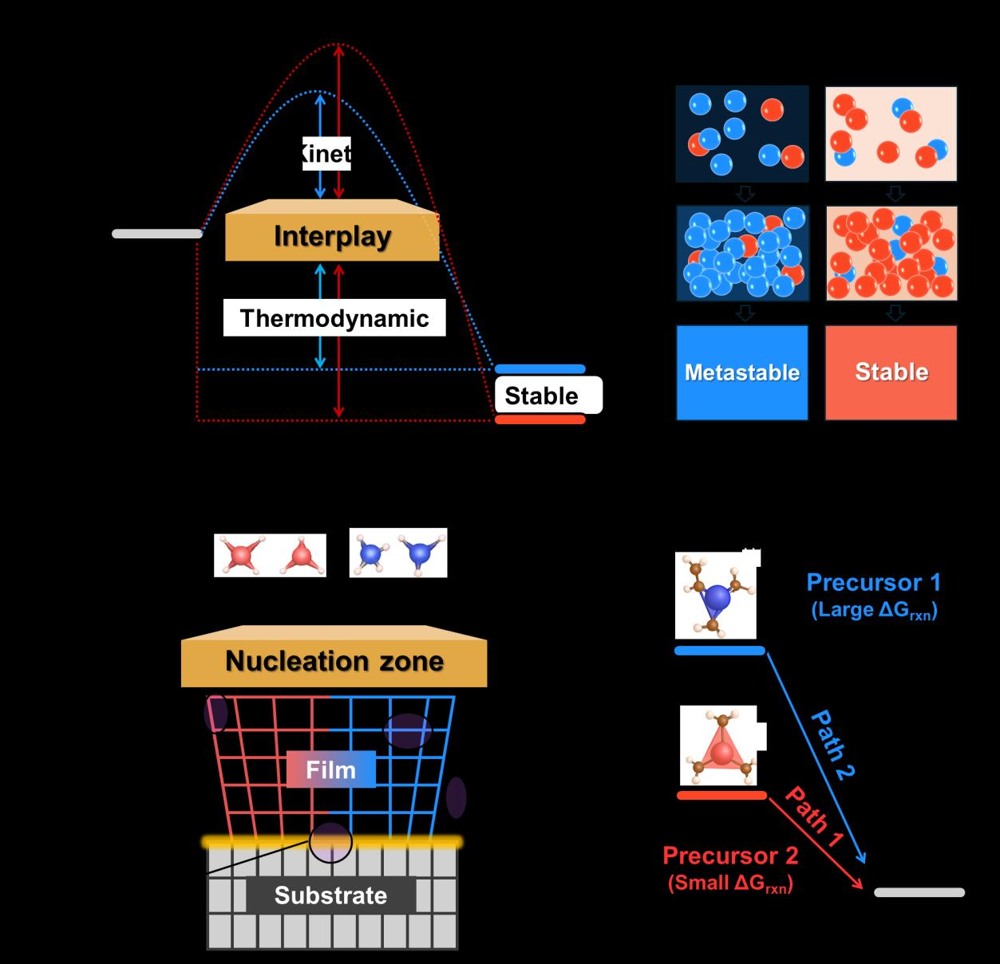

*β-Ga₂O₃ホモエピタキシーにおける方位競合の予測。TMGa前駆体（ΔGrxn = -359 meV/atom）は(-201)方位核生成が有利な領域に位置し、TEGa（ΔGrxn = -195 meV/atom）は(001)側に留まる。横軸はΔGrxnで、前駆体の違いを動力学的ハンドルとして直接視覚化している。主張支持：前駆体種がΔGrxnを通じて多形選択の転換点を支配するという本フレームワークの核心的予測を実験データと対比して示す最初の検証例である。*

**図2：α-Al₂O₃基板上でのGa₂O₃多形競合の核生成速度比計算**

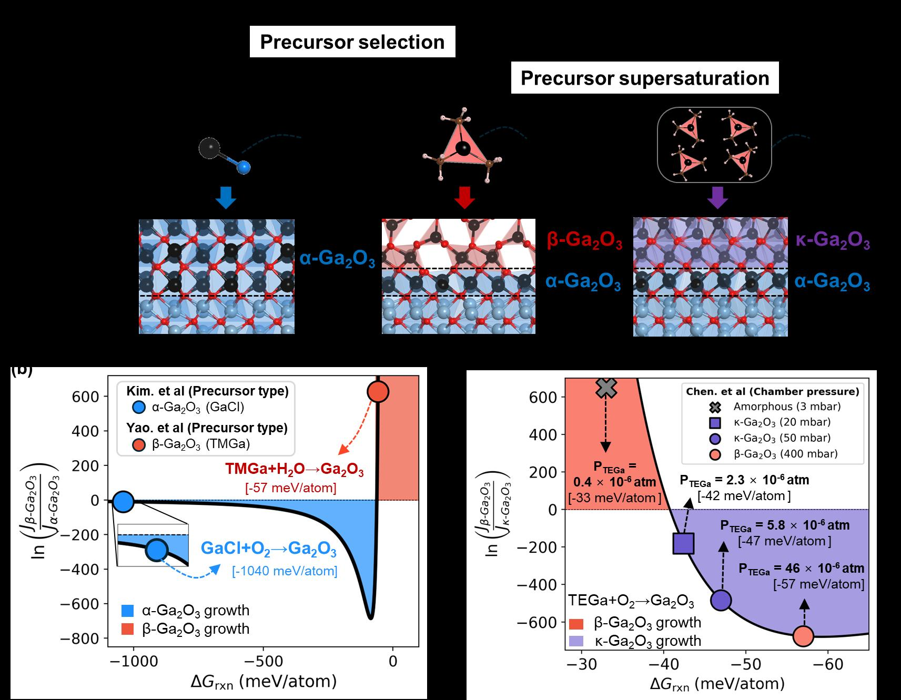

*α-Al₂O₃上でのα-β競合（前駆体制御）とβ-κ競合（分圧制御）を示す。GaCl経路（ΔGrxn = -1040 meV/atom）→α相、TMGa（ΔGrxn = -57 meV/atom）→β相という転換を再現。β-κ境界は20〜50 mbar（ΔGrxn = -42〜-47 meV/atom）で実験と一致。キャラクター：表面媒介不均一核生成の競合領域で2種類の独立した制御ハンドル（前駆体種と分圧）が存在することを図示し、プロセス設計の二段階戦略を明確化した核となる図である。*

**図3：Ga₂O₃多形の核生成ベース相図と準安定合成ウィンドウ**

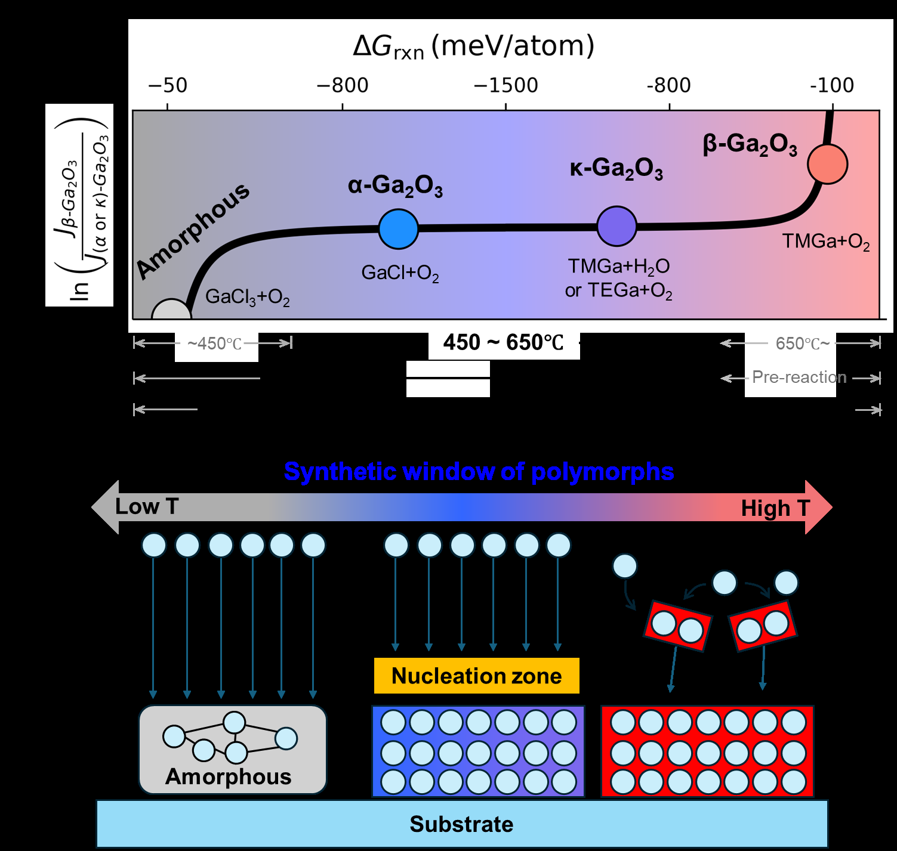

*温度-基板-前駆体条件をまとめた核生成ベース相図と「合成ウィンドウ」の概念図。低温でアモルファス、高温でβ安定相、450〜650°Cの中間温度帯でのみαおよびκの準安定相が実現する。高温側では気相前駆体の早期分解（均一核生成の支配）、低温側では原子移動度不足（アモルファス化）という限界が準安定合成ウィンドウを有限にする物理的起源を示す。プロセス設計的に最も重要な図であり、どの条件で目的の多形が得られるかを一目で与える。*

---

## 非晶質相変化材料の結晶化を支配する移動原子パーコレーションと共鳴超音波加速

### 1. 論文情報

| 項目 | 内容 |
|------|------|
| タイトル | [Percolation-driven β-relaxation enables resonant acceleration of crystallization in amorphous phase-change materials](https://arxiv.org/abs/2603.01559) |
| 著者 | Yu-Yao Liu, Liang Gao, Jun-Ying Jiang, Yiming Zhou, Jan Luebben, Di Zhao, Xiaoling Lu, Maximilian J. Müller, Ulrich Boettger, Jiang-Jing Wang, Hai-Bin Yu, Shuai Wei |
| 所属 | Huazhong University of Science and Technology, RWTH Aachen University, Xi'an Jiaotong University, Aarhus University |
| arXiv ID | 2603.01559 |
| カテゴリ | cond-mat.mtrl-sci, physics.app-ph |
| 公開日 | 2026-03-02 |
| 論文タイプ | 研究論文 |
| ライセンス | arXiv非独占配布ライセンス |

### 2. どんな研究か

非晶質相変化材料（PCM）のなかで最も研究の進んだGe₂Sb₂Te₅（GST）の結晶化過程を、**移動原子のパーコレーション転移がβ緩和を起源とし、その後の結晶化経路を組織化する**というミクロスコピックな描像で理解した研究である。DeepMDニューラルネットワークポテンシャルを用いたMDシミュレーションにより、β緩和温度（約410 K）でのパーコレーション転移が、拡散型・非拡散型の核生成・成長経路の分岐を制御することを示した。さらに、**β緩和の固有周波数（1 GHz）での超音波励起が結晶化を共鳴的に加速する**という新しいプロセス制御手段を実証した。

### 3. 研究の概要

**背景と目的：** PCMはフラッシュメモリへの代替候補として注目される不揮発性メモリや光学ディスクに活用されており、アモルファス相と結晶相の抵抗・反射率の大きなコントラストを利用する。結晶化速度（書き込み速度）とアモルファス相の安定性（データ保持性）はトレードオフの関係にある。結晶化の微視的機構として、金属ガラスでは移動原子のパーコレーション（α/β緩和との対応）が提案されていたが、共有結合性の共有ガラス（GST等）では検証されていなかった。

**主な手法：** (i) DeepMDポテンシャルによるGSTのMD-DMS（動的機械スペクトロスコピーシミュレーション）：振動周期tω = 1 nsで応力振動を加え、損失弾性率E''の温度依存性からβ緩和温度を同定。(ii) パーコレーション解析：閾値uc = 0.9 Å（変位）、rc = 3.5 Å（距離）で移動原子を分類し、最大クラスター（LC）と二番目のクラスター（SLC）の成長を追跡。(iii) 結晶化経路の分類：DDG（拡散型成長）、DDN（拡散型核生成）、DLG（非拡散型成長）、DLN（非拡散型核生成）の4経路に分類。(iv) 超音波励起シミュレーション：振幅0.5〜1.5%、周波数0.1〜10 GHzで超音波を印加し、fβでの共鳴効果を検証。

**主な結果：**
- 損失弾性率E''がβ緩和に対応する410 K近傍でのピーク（過剰翼）を示し、移動原子のLC-SLC分岐もこの温度に一致。
- 370 K以上でLCが急激に成長し410 K でシステム全体に連通するパーコレーション転移が起こる。
- 結晶化した原子の割合は410 K直後から急上昇し、パーコレーションと強い相関を示す。
- 410 K以下では非拡散型核生成（DLN）が主で微小な結晶核の蓄積が進む。410 K以上では拡散型経路（DDG, DDN）と非拡散型成長（DLG）がともに急増し、結晶化が加速する。
- 超音波励起はf = 1 GHz（= fβ）で結晶化率・結晶化速度ともに最大となり、振幅が大きいほど効果が増す（共鳴加速）。周波数が外れると効果は大幅に低下する。

**著者の主張：** βパーコレーションとGSTのような共有結合性非晶質材料の結晶化が直接リンクしており、拡散型と非拡散型の核生成・成長の競合を移動原子の連通構造（パーコレーション）が調停する。超音波の共鳴励起によってパーコレーション構造を外部から操作し、結晶化速度を選択的に制御する新手段を提示した。

### 4. 材料工学として重要なポイント

材料工学の視点では、**結晶化という相変態の速度論を移動原子の集団的な連通状態（パーコレーション）で記述した**という点が重要である。従来、結晶化はアレニウス型活性化過程として記述され、焼鈍温度・時間の最適化が主なプロセス制御手段であった。本研究は「β緩和周波数に合わせた機械的励起」という独立した動力学的ハンドルを提案しており、特定の原子運動モードを選択的に活性化することで結晶化速度を制御できることを示す。これは、従来の熱的アニールに代わる非熱的プロセス制御の可能性として材料プロセス工学的に意義深い。加えて、拡散型/非拡散型核生成・成長の4経路への分類は、他のアモルファス相変化材料系（AIST、GeSb₄Te₇等）にも汎用的に適用できる記述枠組みを提供する。

### 5. 限界と注意点

MD時間スケール（ナノ秒）と実デバイス動作（ナノ秒〜マイクロ秒以上）は重なり得るが、DeepMDポテンシャルの精度（訓練データに含まれる配置空間の範囲）が結果に大きく影響する可能性がある。β緩和の固有周波数は実験的にGHz帯であり、シミュレーションと整合するが、実際のデバイスへの超音波集積（基板・電極への伝播、局所的加熱等）は別途検討が必要である。結晶化経路の分類（uc, rcの閾値選択）に恣意性が残り、経路ごとの寄与が閾値設定に依存する。実験的に得られた機械損失スペクトルとの比較は定性的なレベルにとどまり、直接の定量比較がない。

### 6. 関連研究との比較

金属ガラス（NiP）とKob-Andersen数値モデルでの移動原子二重パーコレーション（α/β緩和対応）はSun et al.（2022-2024）により提案されていた。GSTのβ緩和自体は実験的に確認（Ruta et al.）されており、β緩和チューニングが結晶化を制御することも知られていた。しかし、「共有結合性ガラスにおける移動原子パーコレーションとβ緩和、さらに結晶化の直接リンク」は本研究が初めて示した。また、超音波励起による相変化加速は先行実験でも試みられたが（Pecker et al.等）、特定の周波数（β緩和周波数）への共鳴選択性という機構的理解は本研究が初めて与えた。光学メモリ・相変化RAM・ニューロモルフィックデバイスのプロセス制御に新しい設計軸を提供する研究である。

### 7. 重要キーワードの解説

**β緩和（Johari-Goldstein β-relaxation）**
ガラス転移温度Tg以下でも活性な局所的・高速の原子運動モード。α緩和（粘性流動・ガラス転移を支配する協調的運動）と独立して存在し、共有結合ガラスでは結合角の変動などに対応する。機械損失スペクトルでは主ピーク（α緩和）の低温側翼（excess wing）として現れる。

**パーコレーション転移（Percolation Transition）**
粒子（本研究では「移動原子」）の連通クラスターがシステム全体に跨るクラスターを形成する転移現象。移動原子の体積分率がパーコレーション閾値を超えると、最大クラスター（LC）が急激に成長して二番目以降のクラスター（SLC）を吸収する。これにより原子が協調的に再配列できる連通経路が形成される。

**非拡散型核生成（Diffusionless Nucleation, DLN）**
原子がその位置（変位<uc）のままでバルク拡散なしに結晶秩序を獲得する核生成経路。低温でパーコレーション前の段階で主要な核生成モードとなり、小さな結晶核を多数蓄積させる。

**拡散型成長（Diffusion-driven Growth, DDG）**
既存の結晶核の近傍へ移動してきた（変位>uc）原子が結晶秩序を得る成長経路。β緩和温度以上で急増し、結晶化加速の主役となる。

**共鳴超音波励起（Resonant Ultrasonic Excitation）**
外部から印加する機械的振動の周波数をβ緩和の固有周波数fβに一致させることで、移動原子の集団的動態を共鳴的に増強する外部制御手法。本研究では1 GHz（= fβ）での励起が結晶化速度を最大化した。

**DeepMDニューラルネットワークポテンシャル**
DFT計算データを訓練データとして、ニューラルネットワークで原子間ポテンシャルエネルギー面を学習したポテンシャル。経験的ポテンシャルよりも高精度で、第一原理MDよりも桁違いに大きいシステム・長い時間スケールを扱える。GST系での実装はWang et al.（2020）による。

**拡散型核生成（Diffusion-driven Nucleation, DDN）**
既存の結晶核から遠い位置に原子が拡散（変位>uc）した後、単独で結晶秩序を形成する核生成経路。DDGとともにパーコレーション転移以上の温度で増加し、結晶核の多様な空間分布に寄与する。

### 8. 図

本論文のライセンスは arXiv 非独占配布ライセンス（CC ライセンスなし）のため、原図の掲載は行わない。

---

# その他の重要論文

## 機械学習ポテンシャルによるNbTaTiZr耐火高エントロピー合金の変形機構と圧縮挙動

### 1. 論文情報

| 項目 | 内容 |
|------|------|
| タイトル | [Deformation mechanisms and compressive response of NbTaTiZr alloy via machine learning potentials](https://arxiv.org/abs/2603.00726) |
| 著者 | Liu Hongyang, Chen Bo, Chen Rong, Kang Dongdong, Dai Jiayu |
| 所属 | National University of Defense Technology, Changsha |
| arXiv ID | 2603.00726 |
| カテゴリ | cond-mat.mtrl-sci |
| 公開日 | 2026-02-28（Acta Phys. Sin. 掲載論文の英訳版） |
| 論文タイプ | 研究論文 |
| ライセンス | CC BY 4.0 |

### 2. 研究概要

**第1段落：研究の全体像**
BCC構造のNbTaTiZr四元耐火高エントロピー合金（RMPEA）は高温機械特性に優れるが、高温・高ひずみ速度下での変形機構の詳細は不明であった。本研究はDeepMDフレームワークで学習した高精度機械学習ポテンシャル（MLP）を構築し、大規模分子動力学シミュレーションによって、結晶方位（[100]/[110]/[111]）、ひずみ速度（10⁸〜10¹⁰ s⁻¹）、温度（300〜2100 K）、組成（Nb/Ta/Ti/Zr比率）の4因子が圧縮特性・微細組織進化に与える影響を系統的に解析した。[111]方位が最高降伏強度、[110]方位が最低降伏強度を示し、双晶が生じやすいことを明らかにした。[100]方位では1/2⟨111⟩転位が主要な変形メカニズムとなる。高ひずみ速度（10¹⁰ s⁻¹）では無秩序化（局所的アモルファス化）の割合が増加し、転位核生成・運動が抑制される。2100 Kという高温でも高い降伏強度を維持し、組成的にはNbとTa割合増加が強度向上、Ti・Zr増加が強度低下に寄与した。

**第2段落：重要性**
この研究の材料工学的意義は、結晶方位・ひずみ速度・温度・組成という4つの設計因子が変形機構に与える影響を原子スケールで定量化し、**RMPEAの高温・極端条件下での設計指針**を提供した点にある。特に、高ひずみ速度での無秩序化転移という知見は、爆発・衝突等の衝撃荷重環境でのエネルギー吸収機構を理解する上で重要であり、高エントロピー合金の極端条件材料としての応用設計に直接接続する。Nb/Ta含有量を増やすことで降伏強度を組成設計で調整できるという知見は、要求特性に応じた組成最適化への定量的指針を与える。

### 3. 重要キーワードの解説

**耐火高エントロピー合金（RMPEA）：** Nb, Mo, Ta, Ti, W, Hf, Zr等の高融点元素4種以上を主成分とするBCC型多主成分合金。高い融点・クリープ抵抗・熱安定性を持ち、高温構造材料として注目される。

**1/2⟨111⟩転位：** BCC金属で最多活動するバーガーズベクトル b = a/2⟨111⟩ を持つ転位。{110}・{112}・{123}面上で滑り、BCC金属の低温脆性や強度の起源。

**変形誘起無秩序化（Deformation-induced Disordering）：** 高ひずみ速度下で転位の核生成・移動が熱的に支援されず、代わりに局所的な格子の非晶質化（短距離秩序の崩壊）が優先される変形モード。金属ガラスへの遷移的挙動とも関連する。

**降伏強度異方性：** 結晶方位によって降伏強度が異なる性質。[111]が硬い方位、[110]が軟らかい方位（双晶変形が容易）という本合金の異方性は、テイラー因子の方位依存性に対応する。

**機械学習ポテンシャル（MLP）：** DFT計算エネルギー・力を訓練データとしてニューラルネットワーク等で学習した原子間ポテンシャル。4元素系等では経験的ポテンシャルの構築が困難なため、MLPが唯一の現実的な選択肢となりつつある。

**変形双晶（Deformation Twinning）：** 剪断変形によって格子が鏡像方位に変換される変形機構。BCCでは{112}⟨111⟩系が典型で、低温・高ひずみ速度・[110]方位の圧縮で活性化されやすい。

**高配置エントロピー効果（High Configurational Entropy Effect）：** 多成分合金で格子定数の局所ゆらぎ（化学的不均一性）が転位のPeierls障壁を変調し、転位移動を困難にすることで強化する機構（固溶強化の拡張）。

### 4. 図

本論文はCC BY 4.0ライセンスのため、原図を掲載する。

**図1：NbTaTiZr合金の平衡構造と機械学習ポテンシャルの精度検証**

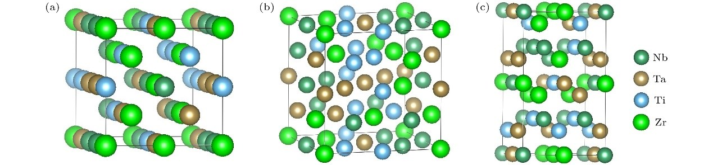

*BCC構造のNbTaTiZr合金モデルと、DFT計算値に対するMLPの予測精度（エネルギー・力）を示す。本研究における計算基盤の信頼性を示す。*

**図2：方位別の応力-ひずみ曲線と変形機構の変化**

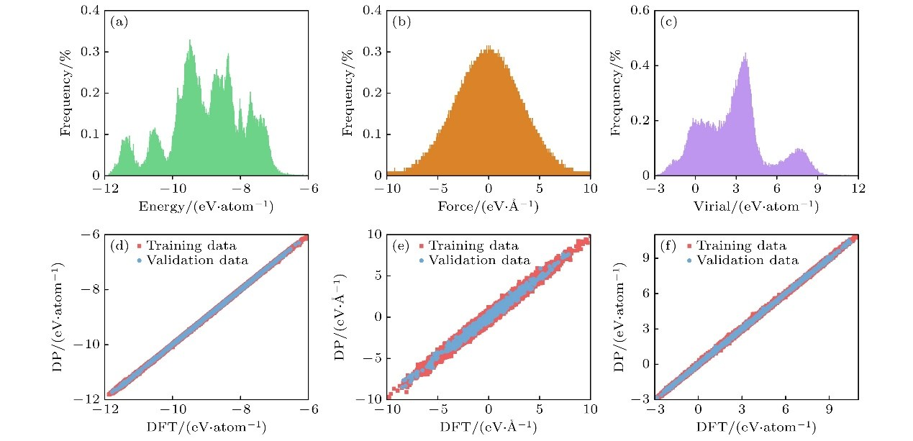

*[100]・[110]・[111]方位での圧縮応力-ひずみ曲線。[111]が最高降伏強度、[110]が最低を示す顕著な機械的異方性を定量化している。材料設計における最適圧縮方位の選択指針となる。*

**図3：変形組織の原子スケール解析（転位・双晶・無秩序化）**

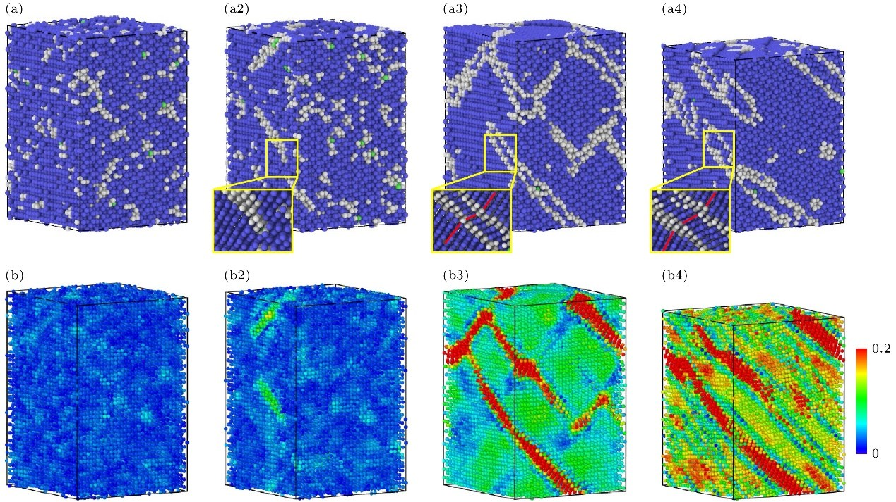

*ひずみ速度・方位別の変形組織を共通近傍法（CNA）等で可視化。1/2⟨111⟩転位、双晶境界、無秩序（アモルファス）領域の相対的割合が変化する様子を示す。高ひずみ速度での無秩序化主導変形への転換点を視覚的に示す。*

---

## 異質核生成における氷の積層秩序転換速度論

### 1. 論文情報

| 項目 | 内容 |
|------|------|
| タイトル | [Kinetics of Stacking Order Evolution During Heterogeneous Ice Formation](https://arxiv.org/abs/2603.00440) |
| 著者 | Xudan Huang, Zifeng Yuan, Chon-Hei Lo, Huacong Sun, et al. |
| 所属 | Chinese Academy of Sciences (IOP), Peking University |
| arXiv ID | 2603.00440 |
| カテゴリ | cond-mat.mtrl-sci |
| 公開日 | 2026-02-28 |
| 論文タイプ | 研究論文 |
| ライセンス | CC BY 4.0 |

### 2. 研究概要

**第1段落：研究の全体像**
氷I（H₂O）は立方晶（Ic）と六方晶（Ih）という2つの積層多形を持ち、その選択機構は大気科学・材料科学双方で未解決の問題であった。本研究はin situクライオTEMを用いて、約102 K・真空下（10⁻⁶ Pa）での金属基板（Cu/Au薄板）上への蒸気堆積による氷の核生成・成長を分子分解能で観察した。異質核生成は立方晶Icの半球状初期核として始まり、積層無秩序（Isd）中間層を経て六方晶Ihの角柱状樹枝晶へと分岐・再結晶化することを直接観察した。mWモデルによるMDシミュレーションにより、表面拘束された対称性破れが自由エネルギー最小化の方向として六方晶への転換を促すことを示した。

**第2段落：重要性**
材料設計への含意は、**積層秩序選択が熱力学的安定性の差（約30〜50 J/mol）よりも「表面拘束と対称性破れ」という動力学的因子で決まる**という点にある。この原理は氷に限らず、積層多形を持つ閉充填材料全般——GaAs/AlAs等の半導体積層、Co/Ni等の密充填金属薄膜、SiC多形の積層欠陥——に通じる普遍的な組織形成指針を示している。異質核生成初期に準安定多形（立方晶）が優先され、その後の再結晶化で安定多形（六方晶）へ転換するという過程はOstwald段階則の具体的実証でもあり、蒸着・急冷プロセスで生じる積層欠陥制御の熱力学・速度論的理解を深める。

### 3. 重要キーワードの解説

**積層無秩序氷（Isd: Stacking-disordered Ice）：** 立方晶（ABCABC…）と六方晶（ABABAB…）の層序列がランダムに混在した氷。構造エントロピーによる熱力学的安定化が提案されており、大気中での氷Ic観測の解釈に重要。

**異質核生成（Heterogeneous Nucleation）：** 固体基板・粒子・欠陥上での核生成。基板との接触角が障壁を決め、均一核生成（気相中）より著しく障壁が低い。本研究では金属薄板上での蒸気堆積が対象。

**表面拘束対称性破れ：** 基板-膜界面付近での原子配列が基板の対称性（あるいは非対称性）を引き継ぐことで、バルクでは等価な積層選択肢の等価性が破れる現象。立方晶核のエピタキシャル的安定化と六方晶への熱力学的移行の競合を支配する。

**重結晶化（Recrystallization in this context）：** 立方晶胚核から積層無秩序中間体を経て六方晶樹枝晶へと構造が変化する過程。通常の金属変形後の再結晶とは異なり、ここでは多形転換を伴う相変態的な再構成を指す。

**Ostwald段階則（Ostwald's Rule of Stages）：** 相変態では熱力学的安定相が最初に核生成されるとは限らず、自由エネルギーの最も近い（障壁が最も低い）準安定相が先に現れる傾向があるという経験則。本研究でのIc先行核生成→Ih転換はその直接例示。

**in situクライオTEM：** 極低温下（液体窒素以下）での試料を透過型電子顕微鏡内でリアルタイム観察する手法。氷の動的形成・変化を分子分解能で捉えることができる。

**mW水モデル：** 単原子コースグレインドモデルで水分子を近似し、融点や相図等を正確に再現しつつ古典的第一原理を超えた大規模MDを可能にする。氷の核生成・成長研究で標準的に用いられる。

### 4. 図

本論文はCC BY 4.0ライセンスのため、原図を掲載する。

**図1：TEM観察による氷の積層秩序と多形同定**

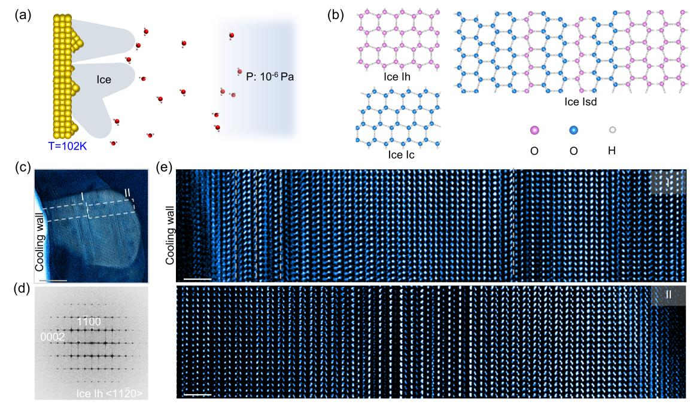

*蒸気堆積によって形成された氷の高分解能TEM像と電子回折像。六方晶Ih（ABABAB…積層）と積層欠陥（破線でマーク）が分子分解能で同定される。異質核生成で最終的に形成されるIhの微細構造と積層欠陥の空間分布を示す出発点となる図。*

**図2：核生成から成長への転換過程（Ic→Isd→Ih）の時系列観察**

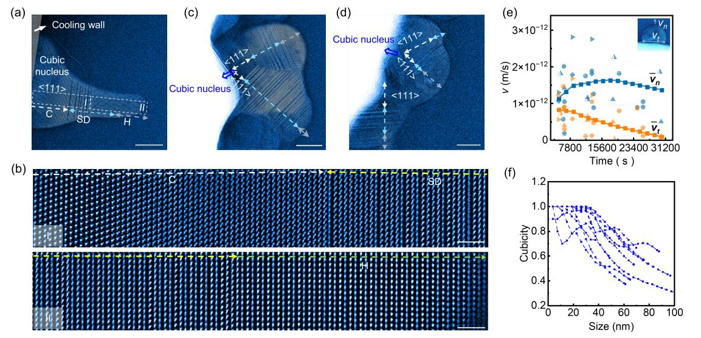

*in situクライオTEM時系列。立方晶Ic半球状核がIsd中間体を経て六方晶Ihの角柱状樹枝晶へ分岐・成長する連続プロセスを捉えた最重要図。積層秩序転換の時間・空間発展が材料核生成研究全般への示唆を与える。*

**図3：積層秩序転換の分子動力学シミュレーション解析**

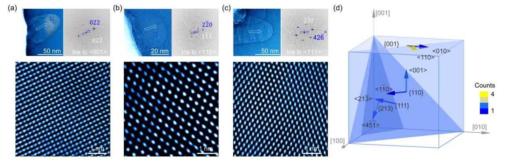

*mWモデルMDシミュレーションによる表面拘束下での積層秩序転換挙動。表面から離れるにつれてIcからIhへの転換が促進される様子を示し、「表面拘束対称性破れ」がIc安定化の物理的起源であることを支持する計算的裏付けを提供。*

---

## 原子スケール理解に基づくSb2Te相変化光波導体デバイスの最適化

### 1. 論文情報

| 項目 | 内容 |
|------|------|
| タイトル | [Optimization of all-optical phase-change waveguide devices for photonic computing from the atomic scale](https://arxiv.org/abs/2603.18468) |
| 著者 | Hanyi Zhang, Wanting Ma, Wen Zhou, Xueqi Xing, Junying Zhang, Tiankuo Huang, Ding Xu, Xiaozhe Wang, Riccardo Mazzarello, En Ma, Jiang-Jing Wang, Wei Zhang |
| 所属 | Xi'an Jiaotong University (CAID), Sapienza University of Rome |
| arXiv ID | 2603.18468 |
| カテゴリ | cond-mat.mtrl-sci |
| 公開日 | 2026-03-18 |
| 論文タイプ | 研究論文 |
| ライセンス | CC BY 4.0 |

### 2. 研究概要

**第1段落：研究の全体像**
Sb₂Te（アンチモン-テルル）は成長駆動型PCMの代表例で、フォトニックニューロモルフィックコンピューティングの有力候補材料である。本研究は第一原理MD（AIMD）により、急速結晶化後のSb₂Teが**化学無秩序菱面体晶（disordered rhombohedral）メタスタブル相**を形成し、焼鈍によって秩序化（A7構造：Sb₂Te₃五重層とSb₂二重層の規則積層）へ移行することを詳細に解析した。決定的な知見は、**光学コントラストがGSTとは逆向きに変化する**ことで、焼鈍による秩序化が光学吸収を低下させるという。この逆転挙動を活かし、「薄く・短い」波導体構造ほど光プログラミング精度が向上するという「the shorter the better」設計戦略を導出し、実験的に7ビット以上（128段階以上）の光プログラミングを単一波導体セルで達成した（過去最高性能）。

**第2段落：重要性**
材料工学的意義は**「原子スケールの相変態理解（メタスタブル→安定相への秩序化）が、デバイスレベルの設計戦略（波導体長さの最適化）に直結する」**という「from atom to device」実証にある。化学秩序化が光学特性に与える効果は、空孔秩序化（GSTの空孔が規則配列→光学吸収増大）と逆向きであり、類似の秩序化転移を持つAIST等の材料設計にも教訓を与える。成膜厚さ・長さを制御変数とするシリコンフォトニクスへの統合設計において、原子スケールの熱力学理解が材料選択とデバイス最適化を同時に行う指針を与える例として重要である。

### 3. 重要キーワードの解説

**成長駆動型PCM（Growth-dominant PCM）：** 結晶化が核生成よりも成長速度によって支配されるPCM。アモルファス-結晶界面での成長が主要な結晶化モードで、デバイス縮小後も高速動作が可能。Sb₂Te、AISがその代表。

**化学無秩序菱面体晶：** 急速結晶化直後に形成されるSb₂Teのメタスタブル構造。Sb原子とTe原子が菱面体格子上にランダムに占有した状態（ランダム固溶体）。エネルギーが安定A7構造より約60 meV/atom高い。

**光学コントラストウィンドウ：** アモルファス-結晶間の光学定数差（Δn, Δk）によって定まる、光プログラミング時に利用可能なシグナル範囲。広いほど多値プログラミングが容易。

**フォトニックニューロモルフィックコンピューティング：** 光を情報担体としてシナプス・ニューロンの動作をエミュレートするコンピューティングアーキテクチャ。PCMの多値記憶（1セルで多ビット）と高速光操作を組み合わせる。

**「短いほど良い」設計戦略：** 光損失が低く（波導体が短いほど吸収損失が減少）、かつ光学プログラミングウィンドウが拡大する（薄い膜では秩序化程度の差がより大きな光学コントラストを与える）という相乗効果から導出された設計則。

**7ビット光プログラミング精度：** 2⁷ = 128段階以上の多値記憶レベルを単一波導体セルで識別・書き込み可能なこと。従来の全光相変化デバイスの最高性能を更新した。

**AIMD（Ab initio Molecular Dynamics）：** 第一原理計算（DFT）で力を評価しながら実行する分子動力学。経験的ポテンシャルを使わず、化学反応・電子状態変化を含む相変化を高精度でシミュレートできるが計算コストが高い。

### 4. 図

本論文はCC BY 4.0ライセンスのため、原図を掲載する。

**図1：Sb₂Teの結晶相（メタスタブル無秩序→安定A7秩序）の原子構造**

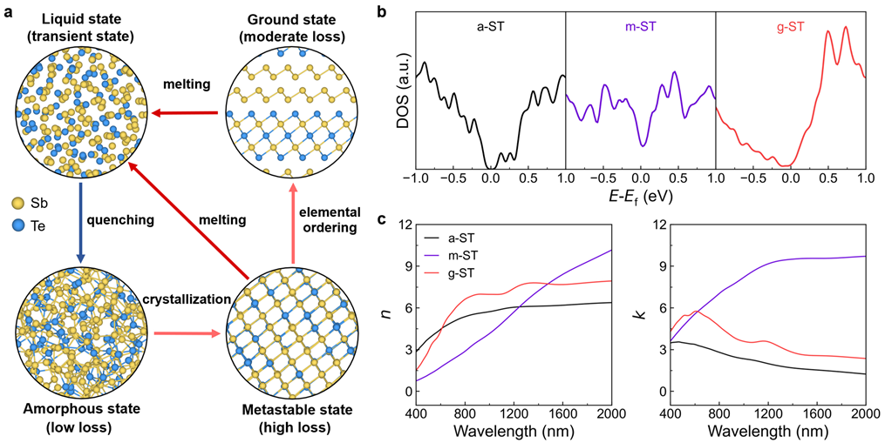

*AIMDで明らかになったSb₂Teのメタスタブル無秩序菱面体晶相（急速結晶化直後）と安定A7秩序相（焼鈍後）の原子配置および電子構造の差を示す。秩序化に伴う光学定数の逆方向変化（GSTと反対）の起源を原子・電子レベルで解明する本研究の核心図。*

**図2：秩序化程度と光学特性（複素屈折率n, k）の相関**

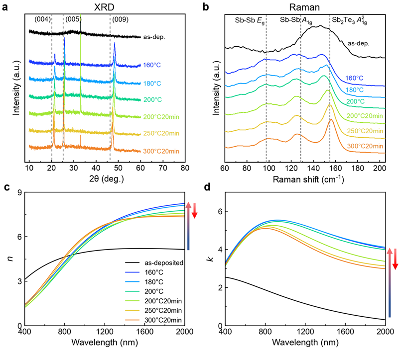

*焼鈍進行（秩序化）に伴うSb₂Teの光学定数変化をDFT計算と実験楕円偏光測定で比較。GSTとは逆に、秩序化が光学吸収（k）を低下させることを定量的に示す。光プログラミングにおいて秩序化を利用するデバイス設計根拠となる。*

**図3：全光波導体デバイスの性能実証（7ビット以上の多値記憶）**

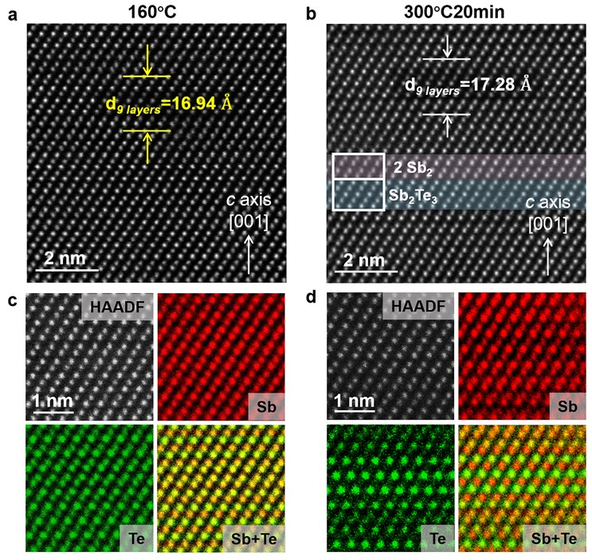

*実際のSb₂Te統合シリコン光波導体素子での光プログラミング実験結果。7ビット以上の離散光レベルが識別可能であることを示し、「the shorter the better」設計戦略の有効性を検証する。プロセス条件（波導体長さ・Sb₂Te膜厚）と多値記憶精度の関係が材料プロセス設計指針を与える。*

---

## 高エントロピー酸化物薄膜における異常結晶性とヘテロ構造への展開

### 1. 論文情報

| 項目 | 内容 |
|------|------|
| タイトル | [Anomalous Crystallinity and Magnetism in Chemically Disordered Coherent Heterostructures](https://arxiv.org/abs/2603.00814) |
| 著者 | Saeed S. I. Almishal, Sai Venkata Gayathri Ayyagari, Aaron Pearre, et al. |
| 所属 | University of Michigan, Penn State, Tulane University, Oak Ridge, et al. |
| arXiv ID | 2603.00814 |
| カテゴリ | cond-mat.mtrl-sci |
| 公開日 | 2026-02-28 |
| 論文タイプ | 研究論文 |
| ライセンス | CC BY-NC-SA 4.0 |

### 2. 研究概要

**第1段落：研究の全体像**
岩塩型高エントロピー酸化物（HEO）薄膜において、化学的無秩序（複数元素の格子サイトへのランダム占有）と卓越した結晶性・コヒーレンスが共存する「異常結晶性（anomalous crystallinity）」を実証した研究である。（Sc/Mg/Co/Ni/Cu/Zn）O系と（Cr/Mg/Co/Ni/Cu/Zn）O系薄膜をMgO(001)基板上にエピタキシャル成長させ、格子定数の操作範囲が7.8%（4.32〜4.41 Å）にも及ぶことをXRD・RSM・TEMで確認した。この広大な格子定数可変域は、CoのCoO（+15%の大きなCoイオン半径）とCo₂O₃（小さなCoイオン半径）間の原子価再配分が温度・添加元素（Sc³⁺, Cr³⁺）によって制御されることに由来する。さらに5%を超えるエピタキシャル歪みを持つ二層ヘテロ構造（Type X：同符号擬歪み、Type Z：逆符号擬歪み）を構築し、原子価界面での交換バイアスが単層比で2倍に向上することを示した。

**第2段落：重要性**
エントロピー安定化条件が、通常の合金・酸化物では歪み緩和・二次相析出を引き起こすような大きな格子不整合に対して、**コヒーレンスと結晶質を維持したまま大きなひずみを凍結（kinetic arresting）する**という普遍的な設計原理を示した点が材料工学的に重要である。この知見は、強磁性/反強磁性ヘテロ構造での交換バイアス工学や、多成分系での格子定数チューニングによる歪み型エピタキシャルエンジニアリングへの応用が期待される。エントロピーが「結晶品質の維持」に果たす役割を実験的に定量化した稀な例である。

### 3. 重要キーワードの解説

**高エントロピー酸化物（HEO）：** 5種類以上の陽イオンを等モル比またはほぼ等モル比で単一岩塩型格子サイトに占有させた多成分酸化物。高い混合配置エントロピーが多様な相分解を抑制し単相安定化する。

**エントロピー安定化（Entropy Stabilization）：** 多成分混合の配置エントロピー（$S_{\rm conf} = -R\sum x_i\ln x_i$）が熱力学的に準安定な単相の安定化に寄与する効果。Rost et al.（2015）により初めて実証された。

**擬歪み（Pseudo-strain）：** 基板-薄膜系での実際の弾性歪みに加えて、欠陥化学（空孔、陽イオン酸化状態変化）や組成変化が格子定数に与える見かけ上の歪み成分。コヒーレントエピタキシーを維持したままの格子定数変化に貢献する。

**異常結晶性（Anomalous Crystallinity）：** 化学的無秩序（エントロピー安定化条件）にもかかわらず優れた結晶品質とコヒーレンスが維持される状態。構造・化学・原子価の自由度が連動することで実現する。

**交換バイアス（Exchange Bias）：** 強磁性/反強磁性界面での磁気交換結合によって生じる磁気ヒステリシスループのシフト。スピントロニクスデバイスの基準磁化層の固定に利用される。本研究では原子価界面が交換バイアスを2倍に向上させた。

**コヒーレントエピタキシャル成長（Coherent Epitaxial Growth）：** 基板と薄膜が面内格子定数を揃えた状態で成長し、界面でのミスフィット転位が生じない成長モード。通常は格子不整合が数%を超えると転位が導入されるが、HEOでは5%以上でも維持された。

**原子価界面（Valence Interface）：** 異なるCoの酸化状態（Co²⁺/Co³⁺比）を持つ2層間に形成される界面。電荷移動・スピン再配列の起点となり、交換バイアスや磁気的特性の急激な変化を生む。

### 4. 図

本論文はCC BY-NC-SA 4.0ライセンスのため、原図を掲載する。

**図1：成膜温度依存のHEO薄膜格子定数変化（J14, JSc, JCr）**

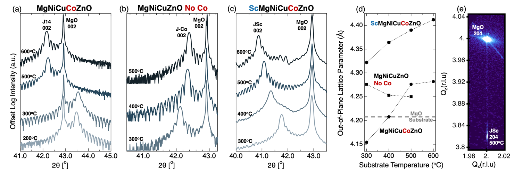

*J14（MgCoNiCuZnO）、JSc（Sc添加6成分系）、JCr（Cr添加）薄膜のXRD（002）反射走査。Pendellösungフリンジが高い結晶品質を示す。成膜温度とともに格子定数が単調に変化（JSc）する様子と、逆符号の変化（JCr）を示し、7.8%の格子定数可変域の起源を示す。*

**図2：Cr添加によるスピネル様秩序化転移とCoのEELS解析**

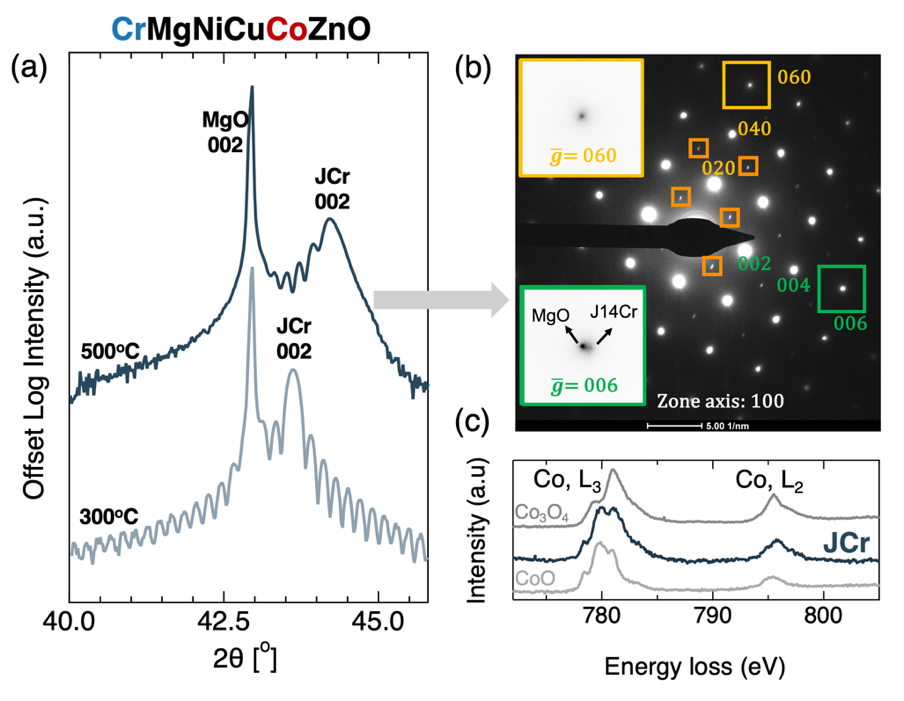

*JCr（CrMgCoNiCuZnO）薄膜の高分解能XRD、SAED（選択電子回折）、Co L₃/L₂ EELS端を示す。500°C以上でのスピネル様局所秩序形成（二次相出現）とCo酸化状態（平均〜2.25+）の変化を示す。Cr添加がCoの原子価を押し上げてc軸を圧縮する機構の実験的根拠。*

**図3：Type XおよびType Z二層ヘテロ構造のコヒーレンスと交換バイアス**

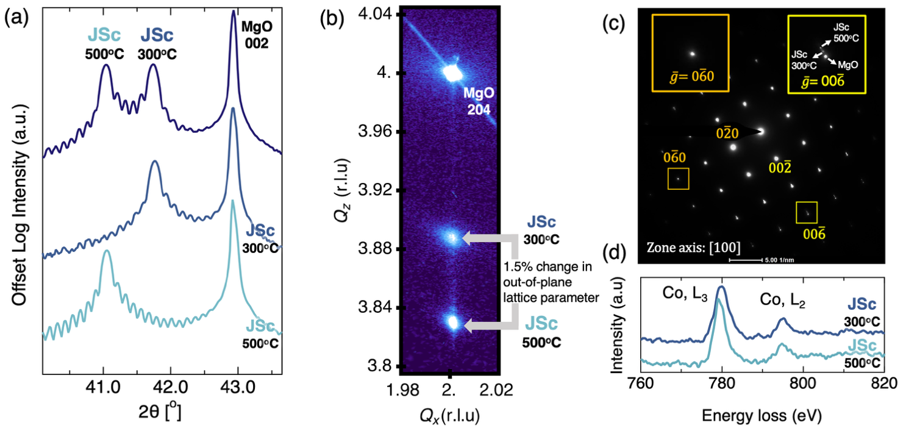

*二層ヘテロ構造（同符号/逆符号擬歪みペア）の逆空間マップ（RSM）と磁気測定。全試料がMgO基板にコヒーレントに擬似形態成長していること、原子価界面での交換バイアスが単層比2倍であることを示す。エントロピー安定化が5%超の歪みを「凍結」する材料設計指針の直接的証拠。*

---

## X線自由電子レーザーによるAu/Pd核殻ナノロッドの超高速合金化の時分解観察

### 1. 論文情報

| 項目 | 内容 |
|------|------|
| タイトル | [Time Resolved Study of Laser Induced Ultrafast Alloying Processes in Au/Pd Core–Shell Nanorods](https://arxiv.org/abs/2603.01597) |
| 著者 | Abhisakh Sarma, Jayanath C. P. Koliyadu, Romain Letrun, et al. |
| 所属 | European XFEL, Uppsala University, DESY, et al. |
| arXiv ID | 2603.01597 |
| カテゴリ | cond-mat.mtrl-sci |
| 公開日 | 2026-03-02 |
| 論文タイプ | 研究論文 |
| ライセンス | CC BY-NC-ND 4.0 |

### 2. 研究概要

**第1段落：研究の全体像**
Au/Pd核殻ナノロッド（Au コア、Pd シェル）のフェムト秒レーザー誘起合金化過程を、EuXFEL（欧州X線自由電子レーザー）施設でのピコ秒〜マイクロ秒時分解X線回折（TR-XRD）によって追跡した研究である。液体ジェットで供給したナノロッド懸濁液に800 nm・890 fs（引き伸ばしパルス）を照射し、(i) 電子-フォノン結合による格子膨張（≦10 ps）、(ii) フォノン-フォノン結合による熱平衡・熱拡散（50〜500 ps）、(iii) 融解および合金形成または回復（500 ps〜1 μs）という3段階プロセスを実験的に明確化した。レーザーフルエンス〜48 mJ/cm²の閾値を超えると融解・合金形成が開始し、Au₁.₅₁Pd₀.₄₉という新たな合金相のブラッグピークが50〜200 ns後に出現した。合金化は単一ステップではなく、Au/Pd間の相互拡散を伴う動的過程であることが示された。

**第2段落：重要性**
この研究の材料工学的意義は、**「ナノ秒スケールのレーザー誘起融解→拡散→合金化」という超高速プロセスの各段階を実験的に時間分解した**点にある。通常の熱処理合金化では数時間〜数日を要するAu/Pd合金化が、単一フェムト秒レーザーパルスで〜50〜200 nsのタイムスケールで実現することは、ナノ合金のオンデマンド組成制御という応用的観点で重要である。デバイ-ワラー因子の解析による格子温度推定、EuXFELの特殊な多パルス時間構造の活用など、X線自由電子レーザーを材料プロセスの直接観察に応用する手法論的な貢献も大きい。

### 3. 重要キーワードの解説

**時分解X線回折（TR-XRD）：** フェムト秒レーザー励起と同期したX線パルスで試料を照射し、回折パターンの時間変化からピコ秒〜マイクロ秒スケールの格子変化・相変化を追跡する手法。XFELの極短X線パルスが必要。

**X線自由電子レーザー（XFEL）：** 超高輝度・超短パルス（フェムト秒）のコヒーレントX線を生成する施設。1パルスで単一ナノ粒子懸濁液の回折パターンを取得でき、動的プロセスの追跡に不可欠。

**電子-フォノン結合（e-ph coupling）：** 光吸収後に励起された高温電子系（〜数千K）が結晶格子（フォノン）へエネルギーを移す過程。10 ps未満のタイムスケールで起こり、急激な格子膨張・昇温をもたらす。

**超高速合金化（Ultrafast Alloying）：** フェムト秒レーザー照射による局所的融解後の急冷過程で、Au/Pd原子が相互拡散して合金相を形成する現象。通常の固体拡散では不可能なナノ秒スケールでの合金化が液相経由で実現する。

**デバイ-ワラー因子（Debye-Waller Factor）：** 格子原子の熱振動によるブラッグ反射強度の減少を記述する因子。$I \propto \exp(-2M)$ で $M \propto \langle u^2\rangle$（平均二乗変位）に比例。格子温度の間接指標として利用できる。

**融解閾値フルエンス：** ナノロッドを融解させるのに必要な最小レーザーエネルギー密度（J/cm²）。本研究では〜48 mJ/cm²が閾値とされ、これ以上で合金形成が観測された。

**核-殻ナノロッド（Core-Shell Nanorod）：** 金属コア（本研究ではAu）の周囲を別の金属薄膜（Pd）が覆ったナノ構造。コアとシェルの物性差を利用した触媒・光学・医療応用が多彩で、合金化による特性チューニングが注目される。

### 4. 図

本論文はCC BY-NC-ND 4.0ライセンスのため、原図を掲載する。

**図1：Au/Pd核殻ナノロッドの形態・組成マッピングと光学特性**

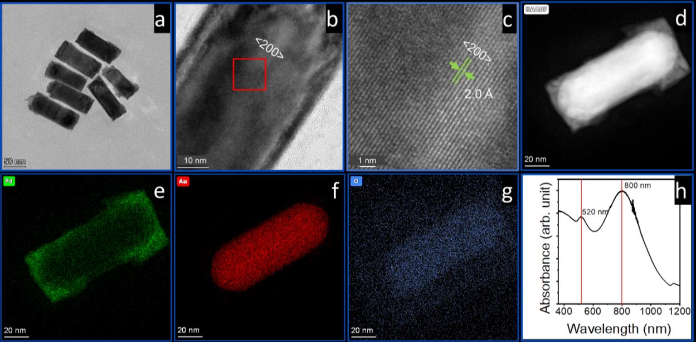

*TEM像・EDSマッピングによるAuコア/Pdシェル構造と組成分布の確認、および UV-vis-NIR吸収スペクトル（520 nm横共鳴・800 nm縦共鳴の2ピーク構造）。出発材料の構造・光学特性の特徴づけ図であり、フルエンス依存の光熱ダイナミクス解釈の基盤となる。*

**図2：Au⟨111⟩格子定数のフルエンス別時間発展（ピコ秒〜マイクロ秒）**

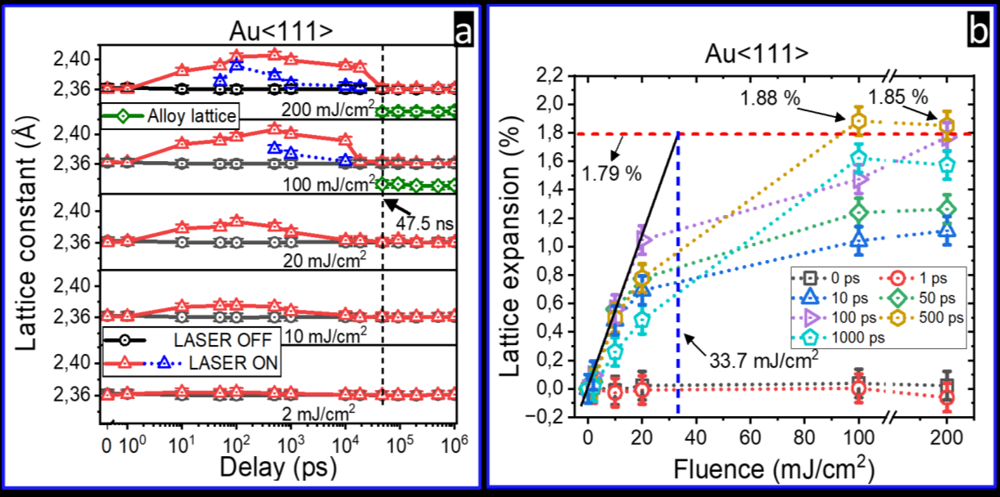

*各レーザーフルエンスでのAu⟨111⟩格子定数の時間発展。低フルエンスでは100 ps後に回復、高フルエンス（>100 mJ/cm²）では500 ps以後に合金Au₁.₅₁Pd₀.₄₉のブラッグピーク分離が観測される。e-ph・ph-ph結合の2段階と融解・合金化転換を格子定数変化として直接示す本研究の中心結果図。*

**図3：合金化過程でのブラッグピーク分裂と強度変化の解析**

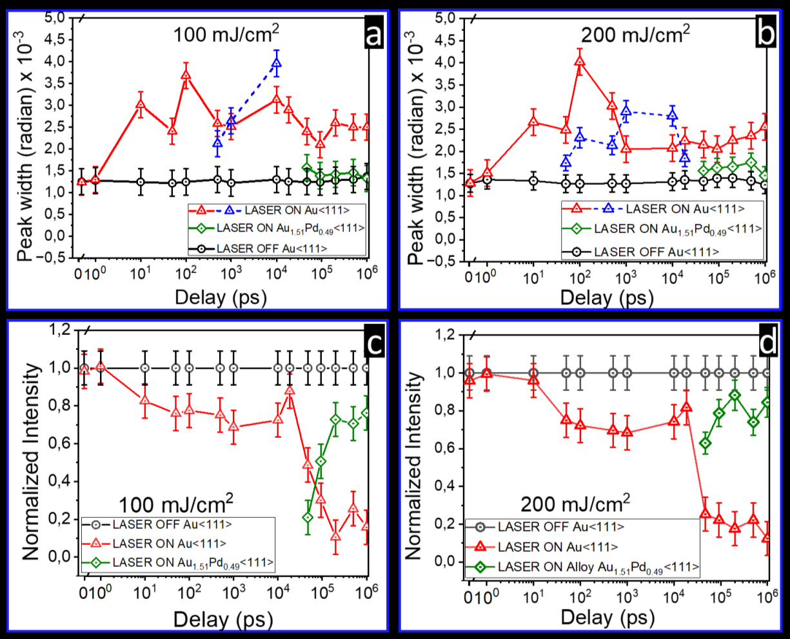

*高フルエンス（100・200 mJ/cm²）でのAu⟨111⟩ピークの半値全幅（FWHM）変化と正規化強度変化。ピーク分裂（Au₁.₅₁Pd₀.₄₉相の出現）とDebye-Waller因子による強度減少が合金化の動的証拠を与える。時系列での合金相形成と成長を実験的に明確化する重要図。*

---

## ウラン窒化物の高温熱容量における窒素フレンケル対形成の役割

### 1. 論文情報

| 項目 | 内容 |
|------|------|
| タイトル | [The contribution of nitrogen Frenkel-pair formation to the high-temperature heat capacity of uranium mononitride](https://arxiv.org/abs/2603.02441) |
| 著者 | Mohamed AbdulHameed, Benjamin Beeler |
| 所属 | North Carolina State University, Idaho National Laboratory |
| arXiv ID | 2603.02441 |
| カテゴリ | cond-mat.mtrl-sci |
| 公開日 | 2026-03-02 |
| 論文タイプ | 研究論文 |
| ライセンス | CC BY 4.0 |

### 2. 研究概要

**第1段落：研究の全体像**
ウラン窒化物（UN）は高熱伝導・高核燃料密度の次世代核燃料候補材料であるが、1700 K以上での比熱Cₚの測定値と理論予測が大きく乖離し、Conway-Flagellaの測定に基づくHayesモデルはT⁵に近い超強非線形温度依存性を示す。本研究は2種の古典分子動力学ポテンシャル（Tseplyaev角度依存ポテンシャルおよびKocevski EAMポテンシャル）を用いて50×50×50超格子（10⁶原子）の1800〜2600 K MDシミュレーションを行い、**窒素フレンケル対（N格子間-空孔対）の生成と窒素拡散係数の温度依存性**を定量評価した。Tseplyaevポテンシャルでは有意なフレンケル対濃度増加が確認され、欠陥熱容量寄与が最大〜10 J/(mol·K)に達し、歴史的な超線形Cₚ(T)と定性的に一致した。一方、Kocevski EAMポテンシャルはフレンケル対の生成量が少なく、ほぼ線形のCₚを示した。

**第2段落：重要性**
材料工学的意義は、**核燃料材料における高温欠陥熱力学（フレンケル対形成と副格子無秩序化）が巨視的な比熱異常の内因的メカニズムを提供し得る**ことを、UO₂のスーパーイオン転移との類比で位置づけた点にある。窒素副格子の高温無秩序化はUNの高温での膨張・拡散・クリープ挙動の予測にも関係し、燃料棒設計・安全評価への材料データ精度向上に直結する。ポテンシャル間の大きな差（Tseplyaev vs. Kocevski）は、核燃料材料の高精度MDポテンシャル開発の緊急性を示すとともに、より精密なab initio計算（DFT+U、AIMD+DLM）による欠陥形成エンタルピーの再評価を促す。

### 3. 重要キーワードの解説

**フレンケル対（Frenkel Pair）：** 結晶格子原子が正規サイトから脱出して格子間位置に移動し、もとのサイトに空孔を残した欠陥対。空孔（$V_N^{••}$）と格子間N原子（$N_i^{''}$）の対として記述される。高温での自己拡散・熱容量異常の起源となる。

**アニオン副格子無秩序化（Anion Sublattice Disordering）：** 高温でアニオン（本研究ではN²⁻）が正規格子サイトから大量に格子間位置へ移動し、陰イオン格子の長距離秩序が崩れる現象。UO₂では2700 K付近でO²⁻副格子が無秩序化（スーパーイオン転移）し、Cₚに大きなラムダ型異常を示す。

**高温熱容量異常（High-temperature Heat Capacity Anomaly）：** デバイ理論やアインシュタイン理論から期待される以上の比熱増大。欠陥形成（フレンケル対）、非調和振動、電子比熱増大等が起源となりうる。

**角度依存ポテンシャル（ADP: Angular-dependent Potential）：** 原子間相互作用に二体・三体以上の方向性を含む半経験的ポテンシャル。UN等の共有性・イオン性の混在する系に適している。Tseplyaev-Starikovによって開発されたUNポテンシャルが本研究で使用される。

**窒素拡散係数：** 窒素原子の自己拡散係数D（Arrhenius型: $D = D_0\exp(-E_a/k_BT)$）。フレンケル対濃度の増加と相関し、高温での窒素移動度・クリープ・焼結速度の指標となる。

**EAMポテンシャル（Embedded Atom Method Potential）：** 原子の「埋め込みエネルギー」と電子密度を組み合わせた半経験的多体ポテンシャル。金属系では標準的だが、UN等のセラミック系への適用は限定的で精度検証が必要。

**DLM法（Disordered Local Moments）：** 磁性原子の局所スピンが温度に応じてランダムな向きを持つ状態を第一原理的に扱う手法。UN はパラ磁性状態（高温）での比熱理解に必要であり、AIMD+DLMは最も信頼性の高い現状の手法。

### 4. 図

本論文はCC BY 4.0ライセンスのため、原図を掲載する。

**図1：2種ポテンシャルによる高温比熱Cₚ(T)の計算結果と実験・文献値の比較**

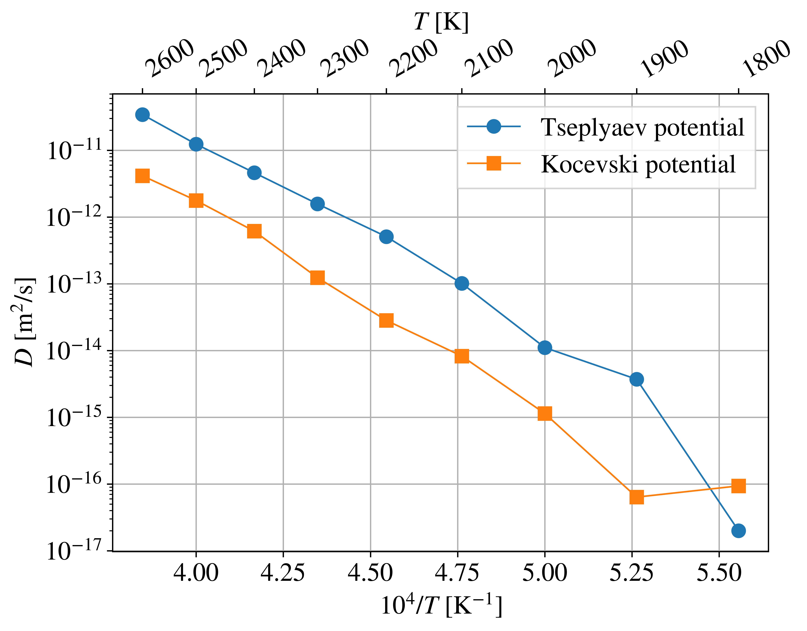

*Tseplyaev（ADP）とKocevski（EAM）ポテンシャルによるUNのCₚ(T)（1800〜2600 K）を実験的Hayesモデルおよびab initio結果と比較。Tseplyaevが超線形的増加を再現し、Kocevskiはほぼ線形を示す顕著なポテンシャル依存性を示す。高温熱容量異常の起源に関する中心的証拠図。*

**図2：温度依存の窒素拡散係数とフレンケル対濃度の変化**

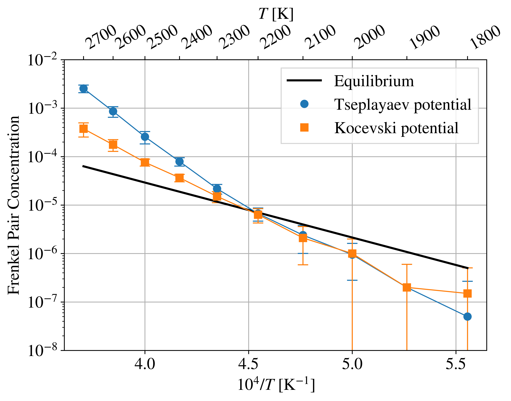

*1800〜2600 KにおけるN原子の自己拡散係数とフレンケル対数の温度依存性。Tseplyaevポテンシャルではフレンケル対が急激に増加（高温でUO₂のスーパーイオン転移に類似）、Kocevskiでは増加が緩やか。欠陥生成とCₚ異常を直接結びつける因果関係を示す。*

**図3：窒素フレンケル対形成による欠陥熱容量寄与の定量評価**

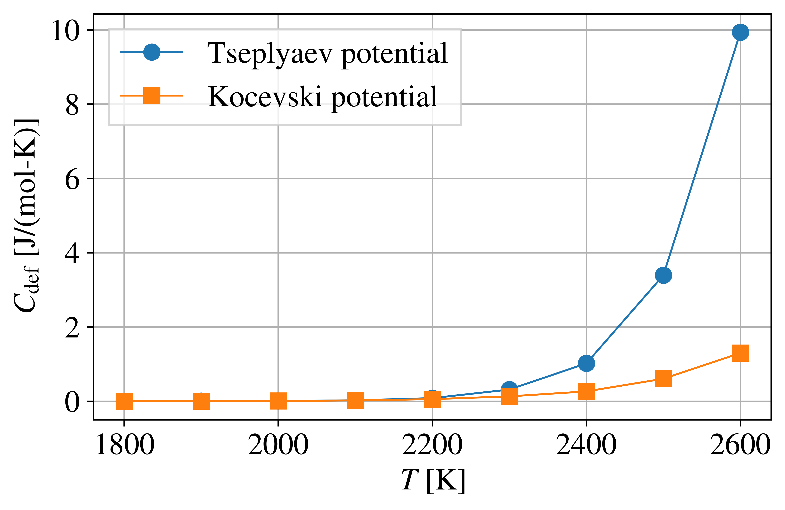

*フレンケル対濃度から計算される欠陥熱容量寄与ΔCₚ(T)。Tseplyaevポテンシャルで最大〜10 J/(mol·K)の寄与が得られ、Hayesモデルとの差分と定性的に一致することを示す。窒素副格子無秩序化がUN高温Cₚ異常の内因的メカニズムを提供するという本論文の主張を定量的に裏付ける。*

---

## 2次元ペロブスカイト上でのナノ結晶超格子の決定論的核生成と光捕集ヘテロ構造

### 1. 論文情報

| 項目 | 内容 |
|------|------|
| タイトル | [Deterministic nucleation of nanocrystal superlattices on 2D perovskites for light-funneling heterostructures](https://arxiv.org/abs/2603.18959) |
| 著者 | Umberto Filippi, Alexander Schleusener, Simone Lauciello, Roman Krahne, Dmitry Baranov, Liberato Manna, Masaru Kuno |
| 所属 | Istituto Italiano di Tecnologia, University of Notre Dame, Lund University |
| arXiv ID | 2603.18959 |
| カテゴリ | cond-mat.mtrl-sci |
| 公開日 | 2026-03-19 |
| 論文タイプ | 研究論文 |
| ライセンス | CC BY 4.0 |

### 2. 研究概要

**第1段落：研究の全体像**
二次元層状鉛ハロゲン化物ペロブスカイト（2DLP）のPEA₂PbBr₄マイクロ結晶と、CsPbBr₃ナノ結晶超格子とを組み合わせたヘテロ構造を、簡便かつ決定論的な核生成制御によって実現した研究である。通常、超格子合成には低速溶媒蒸発や逆溶媒沈殿が用いられるが、2DLPとの溶液混合は溶解性の不適合から不可能であった。本研究はPEA₂PbBr₄マイクロ結晶の面（側面または全面）上でCsPbBr₃ナノ結晶を直接核生成・超格子成長させる手法を開発し、側面のみへの成長（コア-クラウンエピタキシャルヘテロ構造）と全面への成長（コア-シェル型構造）を選択制御可能とした。2DLPから超格子へのエネルギー移動（FRET/Försterメカニズム）によって光収集・励起増大が実現し、励起フルエンスによって線形再結合と双励起子再結合の切り替えが可能であることを示した。

**第2段落：重要性**
核生成の制御という材料工学的観点では、**2DLPマイクロ結晶の特定の面（側面）が選択的な核生成サイトとして機能する**ことを利用した「決定論的核生成」設計が注目点である。2DLP表面の溶媒和エネルギー・格子定数が局所的に異なることで、面選択的な核生成が誘導される。このエピタキシャル的な核生成制御の原理は、次元の異なるナノ材料を組み合わせたヘテロ構造設計の一般的な手法として、ペロブスカイト太陽電池・LED・光検出器等における界面制御に波及しうる。

### 3. 重要キーワードの解説

**ナノ結晶超格子（Nanocrystal Superlattice）：** ナノ結晶が三次元的に周期配列した秩序固体。バルク材料・個々のナノ結晶とは異なる集団的光学・電子特性を持ち、バンドギャップチューニングや長距離エネルギー移動の媒体として機能する。

**決定論的核生成（Deterministic Nucleation）：** 核生成サイトが確率的でなく、特定の表面・界面・欠陥上に制御されて生じること。本研究では2DLP側面が優先核生成サイトとして機能し、超格子の配置が2DLPマイクロ結晶の形態によって決定された。

**二次元層状ペロブスカイト（2DLP）：** AXBYなる組成の有機-無機ハイブリッド層状化合物（本研究ではPEA₂PbBr₄）。Pb-Brの八面体層が有機アンモニウム層でサンドイッチされた構造で、面内に高い励起子移動度を持つ。

**エネルギー移動（Energy Transfer / FRET）：** ドナー材料（2DLP）から吸収した光エネルギーが非放射的にアクセプター材料（CsPbBr₃超格子）へ移動するプロセス。Förster共鳴エネルギー移動（FRET）が支配的で、移動効率は距離に強く依存する。

**双励起子（Biexciton）：** ナノ結晶内に2個の励起子が同時に存在する状態。高い光励起強度で形成され、単一励起子とは異なる発光波長・寿命を示す。本研究では励起フルエンスによって単一励起子再結合と双励起子再結合を切り替えた。

**コア-クラウン型ヘテロ構造：** 二次元のコア材料（2DLPマイクロ結晶）の側面（lateral face）にのみアクセプター材料（超格子）が成長したヘテロ構造。側面選択的な核生成制御によって実現する。

**光収集ヘテロ構造（Light-funneling Heterostructure）：** ドナーで広い面積から集めた光エネルギーをアクセプター材料（超格子）へ集中（ファネリング）する構造。太陽電池・LEDの効率向上に有効な設計概念。

### 4. 図

本論文はCC BY 4.0ライセンスのため、原図を掲載する。

**図1：PEA₂PbBr₄マイクロ結晶上でのCsPbBr₃超格子核生成の概念図と形態観察**

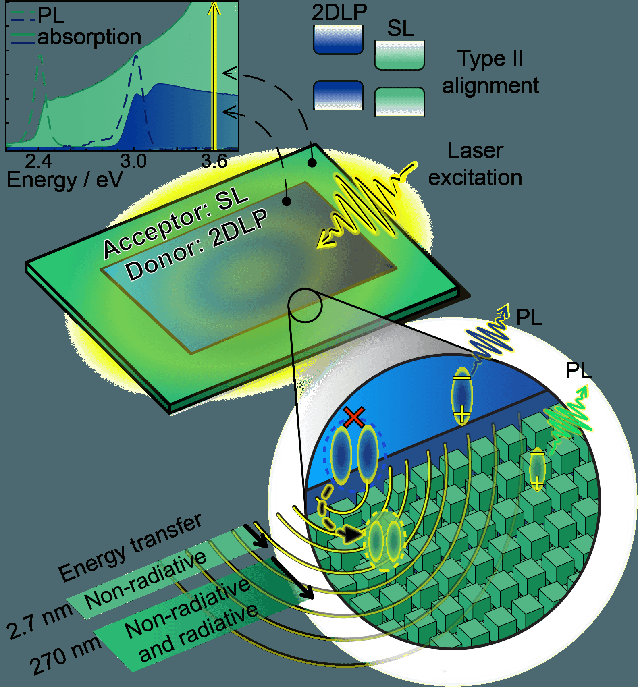

*2DLPマイクロ結晶の側面上に超格子が選択的に核生成・成長する「決定論的核生成」の模式図と、実際に合成されたコア-クラウン型ヘテロ構造のTEM/SEM像。2DLP面選択性の実験的実証とヘテロ構造の全体構造を示す。*

**図2：コア-クラウンおよびコア-シェル型ヘテロ構造の高分解能組織観察**

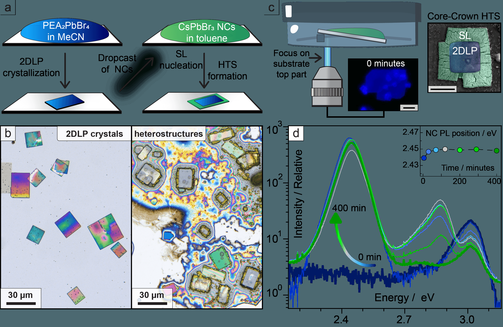

*側面のみへの核生成（コア-クラウン）と全面への成長（コア-シェル）を制御するプロセス条件の違いと、各構造の高分解能TEM・EDSマッピング。超格子の格子秩序とエピタキシャル関係が2DLP界面から広がる様子を示す。*

**図3：2DLP→超格子へのエネルギー移動と励起フルエンス依存の光学特性**

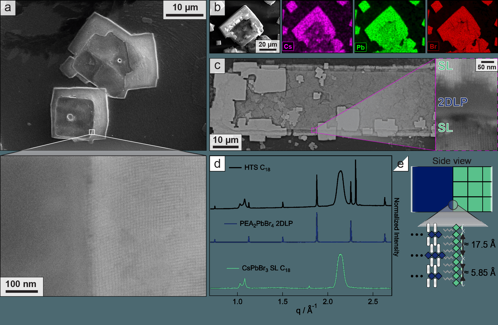

*時間分解PL測定によるFRETエネルギー移動の実証と、励起フルエンスによる単一励起子（線形）↔双励起子（非線形）再結合の切り替えを示すスペクトル・強度依存性。光収集ヘテロ構造としての機能とプロセス設計への含意を示す。*

---

*本ダイジェストは2026-03-23に作成しました。図は各論文著者の許可のもとCC BY / CC BY-NC-SA / CC BY-NC-ND ライセンスに基づき掲載しています。保存状況に関する情報は本文中に記載していません。*
