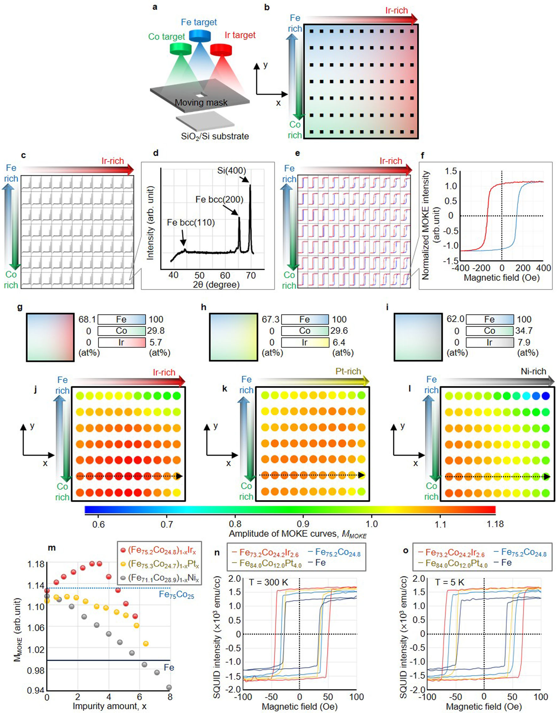
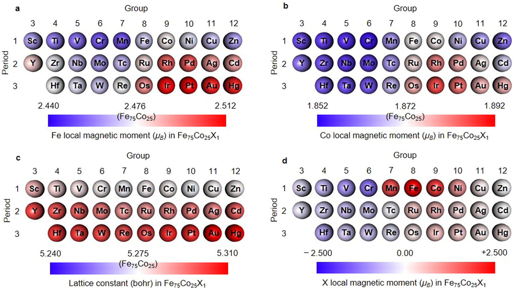

# Fe–Co–Ir合金の磁気モーメント増強機構：高スループットXMCDが解き明かす5d電子と軌道モーメントの役割

---

- **執筆日**: 2026-03-24
- **トピック**: Fe–Co–Ir合金における磁気モーメント増強の起源（スピン・軌道モーメントへのIr添加効果）
- **中心論文**: Takahiro Yamazaki, Takahiro Kawasaki, Alexandre Lira Foggiatto, Ryo Toyama, et al., "Uncovering the origin of magnetic moment enhancement in Fe–Co–Ir alloys via high-throughput XMCD," *Physical Review Materials* **9**, 034408 (2025). DOI: [10.1103/PhysRevMaterials.9.034408](https://doi.org/10.1103/PhysRevMaterials.9.034408)
- **参照した references 内論文数**: 3（sub-1: Iwasaki et al. 2021, sub-2: Toyama et al. 2023, sub-3: Toyama et al. 2024）
- **追加検索した arXiv 論文数**: 約 10 本
- **Primary broad area**: cond-mat.mtrl-sci（凝縮系物性・材料科学）
- **Secondary broad area**: cond-mat.str-el（スピントロニクス・磁性材料）

---

## 1. 導入：なぜこの問いが重要か

スピントロニクス・磁気センシング・高密度データストレージの発展は、より強い磁石の開発に依存している。現代の磁性材料の設計では、遷移金属合金の磁化量を理論限界に近づけることが一つの目標であり続けてきた。その「天井」を定めるとされるのが、**スラター・ポーリング則**（Slater-Pauling rule）である。

スラター・ポーリング則によれば、3d遷移金属二元合金の原子当たり磁気モーメントは、電子数に応じて予測でき、Fe$_{75}$Co$_{25}$（Fe$_3$Co$_1$組成に相当）がその頂点を占める。この組成でおよそ 2.45 $\mu_\mathrm{B}$/原子という最大値が現れる。強磁性材料の設計者たちは長らく、この「スラター・ポーリング限界」を超えることが困難であると考えてきた。

この常識を覆す示唆が、機械学習を用いた自律的材料探索から生まれた。Iwasaki et al.（2021年, sub-1）は、KKR-CPA第一原理計算と機械学習（ゲーム木アルゴリズム）を組み合わせた自律探索システムを構築し、6週間の仮想探索の末、**常磁性であるはずのIrやPtの添加が、逆にFeCo合金の磁化を増強する**という、直感に反する予測を導いた。この予測はコンビナトリアルMOKE実験でも確認された（図：Iwasaki et al. 2021, Fig. 3）。

*図1: コンビナトリアルMOKE実験によるFe₍x₎Co₍y₎Ir₍100-x-y₎の組成拡がり薄膜の磁気特性マップ（Iwasaki et al., Commun. Mater. **2**, 31 (2021), Fig. 3 より。CC BY 4.0）。小量のIr添加がFeCo合金の飽和磁化を増大させることが色マップで確認される。*

しかし、なぜ常磁性元素であるIrが磁化を増強するのか——その**微視的機構**は長らく未解明であった。特に、IrがFeやCoの磁気モーメントにどのような元素固有の変化をもたらすのか、スピンモーメントと軌道モーメントへの寄与をどのように変化させるのかは、明確な実験的証拠を欠いていた。

本稿で中心的に紹介するのは、Yamazaki et al.（2025年）がこの問いに正面から答えた論文である。彼らは**高スループットX線磁気円二色性（XMCD）**技術を単結晶コンポジション・スプレッド薄膜に適用することで、元素固有の磁気モーメント（スピン・軌道）を系統的に測定し、Ir添加効果のミクロ機構を世界で初めて直接実証した。

---

## 2. main論文は何を解こうとしているのか

主論文の問いは、二つの層に分けて整理できる。

**第一の問い（現象論的な問い）**: Fe–Co–Ir三元合金において、Ir濃度の増加とともに各元素（Fe, Co, Ir）のスピンモーメントと軌道モーメントはどのように変化するか？また、B2秩序構造とA2無秩序構造では、その傾向に差があるか？

**第二の問い（機構論的な問い）**: IrがFe・Coの磁気モーメントを増強する電子論的な機構は何か？Irの5d電子と3d電子の相互作用において、スピン軌道結合（SOC）および電子局在化はどのような役割を果たすか？

先行研究（Iwasaki et al. 2021）がKKR-CPA計算と多元素バルク系でIr添加の効果を示した一方、その実験は多結晶薄膜を用いたマクロな磁化測定に留まっており、元素固有の軌道・スピンモーメントを分離した直接測定が欠けていた。また、Krishnamurthy et al.（2002, 2006）がFeIr・CoIr二元合金でIrの誘起磁気モーメントをXMCDで確認していたものの、それらは組成点が限定的で、かつFe$_{75}$Co$_{25}$を母相とするFe–Co–Irの単結晶薄膜系には対応していなかった。

これらのギャップを埋めるために、主論文はコンビナトリアルスパッタリング技術と放射光XMCD測定を組み合わせた「高スループット・元素固有磁気モーメント測定」の手法を採用した。

---

## 3. main論文は何を新しく示したのか

### 3.1 実験手法：コンポジション・スプレッド薄膜と高スループットXMCD

(Fe$_{75}$Co$_{25}$)$_{100-x}$Ir$_x$（$x = 0$–$11$ at%）の単結晶コンポジション・スプレッド薄膜をMgO(100)基板上に作製した。コンビナトリアルスパッタリングシステム（CMS-A6250X2, Comet）を用いて、7mmのスパンにわたりIr組成が連続的に変化する30 nm厚のグラジェント薄膜を形成した。熱処理（653 K, 30分）後にRuキャップ層を施した。

XMCD測定はSPring-8の2つのビームラインで実施された。ソフトX線（Fe・Co $L_{2,3}$吸収端, 700–830 eV）はBL25SU、ハードX線（Ir $L_{2,3}$端, 11–12.9 keV）はBL39XUを使用した。31点（ソフトX線）および14点（ハードX線）の組成点でXAOSスペクトルを測定することで、高スループットな元素固有磁気モーメントの組成依存性測定を可能にした。

### 3.2 スピン・軌道磁気モーメントの組成依存性

スペクトルのsum-rule解析（スピンモーメント $m_\mathrm{spin}^\mathrm{eff}$ と軌道モーメント $m_\mathrm{orb}$）から、以下の重要な実験的知見が得られた。

**スピンモーメントの増強**: Ir濃度増加に伴い、Fe・Co・Irすべての元素のスピンモーメントが増加する傾向を示した。Feのスピンモーメントは$x=0$から$x=11$ at%にかけて1.07倍、Coは1.07倍、Irは1.11倍増大した。

**軌道モーメントの顕著な増強**: スピンモーメントの増加以上に際立ったのが軌道モーメントの増強である。Feの軌道モーメントは最大1.44倍、Irの軌道モーメントは**最大1.54倍**（スピンモーメントに至っては8.28倍）という劇的な増加が確認された。この増加率はスピンモーメントの増加率を大きく上回り、主論文の核心的な発見の一つとなっている。

この点は、先行研究（Krishnamurthy et al. 2006）がCoIr合金で組成依存的な誘起Irモーメントを確認していたことと定性的に一致する。ただし、主論文はFe$_{75}$Co$_{25}$を母相とするB2秩序単結晶系で初めて定量的・元素固有の測定を行った点が独自である。

### 3.3 第一原理計算（KKR-CPA）との比較

AkaiKKRソフトウェアを用いたKKR-CPA計算（Korringa-Kohn-Rostoker Coherent Potential Approximation）は、実験結果を定性的に再現した。計算はB2秩序構造とA2無秩序構造の両方について行われ、B2秩序構造では一貫してA2構造より高い磁気モーメントが得られ、実験（B2秩序相を含む薄膜）との整合性が示された。

定量的には、計算値は実験値より小さい軌道モーメントを示した。この乖離の要因として、(i) 計算が完全B2秩序を仮定しているのに対し実験薄膜のB2秩序度は1未満であること、(ii) 計算がスピン軌道結合を過小評価する傾向があること、(iii) 薄膜の表面・界面効果が含まれていないこと、などが議論されている。

### 3.4 状態密度解析：機構の解明

B2秩序構造Fe–Co–Ir合金のd軌道状態密度（DOS）のKKR計算から、磁気モーメント増強の電子論的機構が明らかになった。

Ir濃度増加に伴い、FeおよびCoのDOSに以下の変化が生じる。第一に、フェルミ準位付近のDOSピークが**シャープ化（鋭化）**し、電子局在が強まる。第二に、Fe・CoのDOSが低エネルギー側に**シフト**する。これらはIrの5d電子とFe・Coの3d電子の間の交換相互作用（3d-5d hybridization）によって引き起こされ、3d電子の軌道角運動量への寄与を増大させる。一方、IrのDOS強度は増大し、Ir自身も誘起磁気モーメントを有することが確認された。

この解釈は、Imada et al.（1999年、Phys. Rev. B 59, 8752）がCu$_3$Au型Cu$_3$Pt合金でPtの5d SOCが3d軌道モーメントを増強することを報告した知見、Salikhov et al.（arXiv:1510.02624, 2015/2017年）が正方歪みを加えたFe-Co-B薄膜でc/a比増加により軌道モーメントが増大することを示した結果、Tyer et al.（arXiv:cond-mat/0301193, 2003年）の4d/5d-Fe界面における系統的な軌道モーメント増強の計算とも整合する。

---

## 4. 背景と文脈：関連研究を踏まえるとどこに位置づくか

### 4.1 スラター・ポーリング則とFe–Coの特別な地位

スラター・ポーリング則は、3d遷移金属合金の原子磁気モーメントを電子数（$Z$, 電子数 per atom）の関数として半経験的に表す。モーメントの極大を持つFe$_{75}$Co$_{25}$の磁気モーメントは、バルク値で約2.45 $\mu_\mathrm{B}$/atomであり、安定相の二元合金では最大である。一方、多元素系では組み合わせの爆発により網羅的な実験探索が困難であり、機械学習と自動実験を組み合わせた材料探索（materials informatics）の手法が有効である。

Nelson & Sanvito（arXiv:1906.08534, 2019年）はCurie温度予測への機械学習の応用を示し、Iwasaki et al.（sub-1, 2021年）の自律探索フレームワークと同様の潮流を形成している。後者は特に、KKR-CPA計算と上信頼界探索（UCB）を組み合わせた自律探索によって、Ir・Pt添加の効果を発見した点に新規性がある（図：Iwasaki et al., Fig. 5）。

*図2: Fe$_{75}$Co$_{25}$X$_1$系における第一原理計算による各元素Xの磁気モーメントへの影響（Iwasaki et al., Commun. Mater. **2**, 31 (2021), Fig. 5 より。CC BY 4.0）。(a) FeのローカルMM, (b) CoのローカルMM。Ir（第3周期, 9族）の添加がFe・Co両方のモーメントを増大させることが色マップで示される（白: Fe$_{75}$Co$_{25}$と同じ、赤: 増大、青: 減少）。Ptも同様の効果を持つ。*

### 4.2 同一試料系を用いた先行研究群との関係

主論文と同一の研究グループが同一コンポジション・スプレッド薄膜系を用いて行った先行研究が、主論文の解釈に重要な文脈を提供する。

**Toyama et al.（2023年, sub-2; Phys. Rev. Mater. 7, 084401）**: 同一のMgO(100)上 (Fe$_{75}$Co$_{25}$)$_{100-x}$Ir$_x$ 薄膜の異方性磁気抵抗（AMR）を系統的に測定した。Irを含まない純Fe$_{75}$Co$_{25}$では小さな正のAMR比（+0.3%）を示すが、Ir添加により大きな負のAMR比（10 K で-4.7%、300 K で-3.6%）に符号反転することを発見した。さらに、X線回折と透過型電子顕微鏡の観察から、$x \geq 2.1$ at%でB2秩序相（Fe$_3$Co–Ir型）が形成されることを確認した。この知見は主論文のXMCD測定が主にB2秩序構造の試料に対応することを示す重要な背景情報である。

**Toyama et al.（2024年, sub-3; Phys. Rev. B 109, 054415）**: 同系統の (Fe$_3$Co)$_{100-x}$Ir$_x$ 薄膜で異常ホール効果（AHE）と異常ネルンスト効果（ANE）を測定した。Ir添加により300 KでAHE導電率が$x = 11$%で約9.2倍に増強され、B2秩序相が$x \geq 7.3$%で観察された。AHEへのextrinsicとintrinsicな寄与の解析から、低Ir濃度では外因性寄与が支配的であることが示された。これは主論文の軌道モーメント増強と関連するSOCの役割を輸送物性の観点からも示唆している。

### 4.3 5d元素とFe・Coの磁性：比較すべき先行知見

5d遷移金属（Pt, Ir, W等）がFe・Co系に誘起する磁気モーメントと軌道増強の問題は、いくつかの先行研究で取り上げられてきた。

L1$_0$秩序FePt薄膜のXMCDをIkeda et al.（arXiv:1706.08183, 2017年、J. Phys.: Condens. Matter 29, 274001）が測定した例では、Ptの5d軌道が強磁性体との交換相互作用を通じて誘起モーメントを持ち、磁気異方性エネルギーの主要な担い手となることが示されている。PtよりもSOCが強いIrがFe–Co系で与える効果は、概念的にこれと類似しているが定量的には大きく異なる。

Ueno et al.（arXiv:1510.04756、Scientific Reports 5, 14858, 2015年）はTa/CoFeB/MgOやPt/Co/AlO$_x$ヘテロ構造でXMCDを用いて界面軌道モーメント増強を解析した。Coの軌道/スピンモーメント比が厚さ依存性を示し、界面SOCが軌道モーメントを増強することを示している。主論文との違いは、主論文が界面ではなくバルク的な3d-5d交換相互作用による増強を単結晶合金薄膜で実証した点にある。

Salikhov et al.（arXiv:1510.02624, J. Phys.: Condens. Matter 29, 27, 2017年）は正方歪みを加えたFe-Co-B薄膜でSOCが格子歪みを通じて強化され、軌道磁気モーメントが増大することをFMRとXMCDで示した。これはFe–Co系における軌道モーメントの外部制御可能性を示す文脈として補助的に理解できる。

---

## 5. 比較と解釈：どこまで分かったのか、何がまだ揺れているか

### 5.1 実験と理論の一致

主論文において、実験（XMCD sum-rule）と理論（KKR-CPA計算）の間にはスピンモーメントのIr依存性については良い定性的一致が見られる。B2秩序構造の方がA2無秩序構造よりも高いモーメントを示すという計算予測は、B2秩序相が形成されている単結晶薄膜試料での実験値と整合する。

一方、**軌道モーメント**については実験値が計算値を系統的に上回る乖離が見られる。この乖離は物理的に重要であり、少なくとも3つの要因が考えられる。第一に、計算はスピン軌道結合を過小評価する傾向があるという一般的問題（Imada et al. 1999年の系でも報告されている）。第二に、実験薄膜のB2秩序度が完全B2未満であるため、界面・境界効果や不完全秩序に伴う局所構造の乱れが軌道モーメントを変化させる可能性。第三に、30 nm厚薄膜での飽和効果がsum-rule解析の定量的精度に影響すること（補足材料で検討されている）。

### 5.2 残る論点と未解決問題

**Ir濃度の上限**: 主論文は $x = 0$–$11$ at%の範囲のみを扱っている。より高いIr濃度では反強磁性的交換相互作用が強まり全体の磁化が低下することが他の系（例：Jiao et al. 2017年）で示されており、最大磁化を与えるIr濃度の最適値が存在するはずだが、本論文の範囲では確定できていない。

**構造効果の分離**: Ir添加による磁気モーメント増強がB2秩序化の効果によるものか、Ir-3d電子の直接的な交換相互作用によるものか、両者の相対的寄与を完全に分離する手段が現段階では限られている。Toyama et al.（2023）が $x \geq 2.1$ at%でB2秩序相の形成を確認していることから、実験的にB2秩序とIr添加効果を独立に変化させる系の構築が今後必要である。

**温度依存性**: 主論文の実験は77 Kで行われており、室温での磁気モーメント値への外挿精度には不確かさが残る。また、CuriE温度変化についての情報も限られている。

**元素固有のヒステリシス**: 補足材料のFig. S1に示された元素固有の磁気ヒステリシスループは、Ir濃度とともに保磁力が変化することを示しており、この組成依存性のメカニズムはさらなる解析を要する。

---

## 6. 材料・手法・応用への広がり

### 6.1 高磁化合金の自律探索への接続

主論文の位置づけは、材料インフォマティクスと実験・理論の融合という大きな潮流の中に埋め込まれている。Iwasaki et al.（sub-1）の自律探索が予測した「Ir添加効果」を、Toyama et al.（sub-2, sub-3）が輸送物性（AMR, AHE）の面から確認し、Yamazaki et al.（主論文）が元素固有の磁気モーメントの直接測定によって機構面から解明した——この三段階の検証フロー自体が、自律材料探索から機構解明へのモデルケースとして注目に値する。

Toyama et al.（APL Materials 11, 101127, 2023年）のHeusler合金コンポジション・スプレッド薄膜、Nishio et al.（Sci. Technol. Adv. Mater. Methods 2, 345, 2022年）のL1$_0$-FeNi/FeCo薄膜等、コンビナトリアル手法を用いた高スループット磁性材料研究は急速に発展しており、主論文の手法はその中でも元素固有磁気モーメントを直接取得できる希有な実験プロトコルを提供している。

### 6.2 5d元素ドープ系への応用可能性

IrのSOCと5d-3d交換相互作用が軌道モーメントを増強するという知見は、他の5d元素（W, Re, Os, Pt, Au）を用いた系にも一般化できる可能性がある。Snarski-Adamski et al.（arXiv:2107.03768, 2021年）のFe/TM/Feサンドイッチ薄膜の系統計算は、5d元素の種類によって誘起異方性と磁気モーメントへの寄与が大きく異なることを示しており、Irが特に軌道モーメント増強に効果的である理由を比較的に理解する上で補助的な役割を果たす。

また、Ir添加によるAMR（sub-2）・AHE（sub-3）の顕著な変化は、Fe–Co–Ir合金が磁気センシングやスピンホール磁気抵抗の材料として応用可能性を持つことを示唆する。Toyama et al.（2025年, npj Comput. Mater.）の自律的AHE最適化探索では、Fe-Co-Ni-Ta-Irの五元素系でAHE抵抗率の最大化がBayesian最適化で達成されており、主論文で解明されたIrの軌道SOC増強が応用系でも鍵となる。

### 6.3 スカイルミオン・DMI系との接点

IrはFe・CoとのDzyaloshinskii-Moriya相互作用（DMI）を媒介する重金属としてスカイルミオン系でも広く用いられる。Nickel et al.（Phys. Rev. B 107, 174430, 2023年）はRh/Co/Fe/Irマルチレイヤーでの交換相互作用とDMIを計算し、Irが交換相互作用とSOCの両方を通じてスカイルミオン安定化に寄与することを示した。主論文が明らかにしたIrの5d-3d軌道交換相互作用は、DMI発現の基盤となる電子構造と本質的に関連しており、Fe–Co–Irをスカイルミオン・磁気デバイス材料として捉える視点への接続を提供する。

---

## 7. 基礎から理解する

### 7.1 X線磁気円二色性（XMCD）とは

XMCD（X-ray Magnetic Circular Dichroism：X線磁気円二色性）とは、左右円偏光X線の磁性体への吸収率の差を利用して、元素固有の電子状態と磁気モーメントを調べる実験手法である。

直感的に言えば、磁性体に左回りと右回りの円偏光X線を当てると、磁気スピン・軌道構造の非対称性から吸収量に差が生じる。この「差スペクトル」（XMCDスペクトル）の積分値を用いると、スピンモーメントと軌道モーメントを独立に定量できる（sum rule）。

より正確には、XMCDスペクトルにおいて $L_3$ 端（内殻 $2p_{3/2}$）と $L_2$ 端（内殻 $2p_{1/2}$）の積分強度 $p$（$L_3$端）と $q$（$L_3$＋$L_2$端）、白線強度の積分値 $r$ から以下のsum ruleで磁気モーメントが得られる：

$$m_\mathrm{spin}^\mathrm{eff} = m_\mathrm{spin} + 7\langle T_z \rangle = -\frac{6p - 4q}{r} n_\mathrm{h}$$

$$m_\mathrm{orb} = -\frac{4q}{3r} n_\mathrm{h}$$

ここで $n_\mathrm{h}$ は d 帯（または5d帯）の空孔数（ホール数）、$\langle T_z \rangle$ は磁気双極子項である。$n_\mathrm{h}$ の値は一般に文献値が使われるが、主論文では合金組成依存性を考慮してKKR計算から各元素ごとに決定している（これにより系統誤差を低減）。

XMCD法の最大の強みは**元素選択性**にある。Fe・Co・Irのそれぞれの吸収端エネルギーが異なるため、三元合金中でも各元素の磁気モーメントを個別に測定できる。これが、マクロなVSM（振動試料型磁力計）測定では到達できなかった「誰がどれだけ磁化を担うか」という情報を与える。

### 7.2 スラター・ポーリング則とその限界

スラター・ポーリング（SP）則は、3d遷移金属のバンド磁性の観点から導かれる半経験則で、平均原子磁気モーメント $\bar{m}$ が平均d電子数 $N_d$ に対して折れ線的な関係（SP曲線）をとることを述べる。Fe（$\bar{m} \approx 2.22\,\mu_B$）・Co（$\bar{m} \approx 1.72\,\mu_B$）・Ni（$\bar{m} \approx 0.61\,\mu_B$）などはこの曲線上にあり、Fe$_{75}$Co$_{25}$がその最大値約2.45 $\mu_B$/原子を取る。

この則は、スピンモーメントが主に3d電子から来ており、多数スピン帯が完全に満たされているという仮定に基づく。したがって、強いSOCを持つ5d元素を少量添加した場合の軌道モーメント増強は、単純なSP則の枠組みでは記述できない。主論文の最大の意義の一つは、この「SP則が扱えない軌道モーメントへの5d元素効果」を定量的に実証した点にある。

### 7.3 KKR-CPA法とは

KKR（Korringa-Kohn-Rostoker）法は、多重散乱理論に基づく第一原理電子状態計算手法であり、グリーン関数形式を用いることで不規則合金の電子状態を扱えるCPA（Coherent Potential Approximation）と自然に組み合わさる。

CPA（コヒーレントポテンシャル近似）は、乱れた原子配置（例えば合金の各原子がランダムに異なる種類の原子で置き換えられている状況）を「有効媒質」で近似し、仮想的な一原子問題として解く。この手法は多元系合金でDFT計算が困難な場合（単位セルが膨大になる）でも合理的な計算コストで磁気モーメントや状態密度を計算でき、主論文では3–11 at%のIrが無秩序に分布したB2/A2構造のFe–Co–Ir合金の電子状態を扱うために用いられた。

---

## 8. 重要キーワード 10 個の解説

**① スラター・ポーリング則（Slater-Pauling rule）**
3d遷移金属合金の平均原子磁気モーメントを電子数で系統的に説明する半経験則。Fe$_{75}$Co$_{25}$が上限（~2.45 $\mu_B$/原子）を持つとされる。主論文はIr添加によりこの上限を局所的・元素固有的に超える機構を議論している。

**② X線磁気円二色性（XMCD）**
左右円偏光X線の吸収差スペクトルを利用して元素固有のスピン・軌道磁気モーメントを定量する測定手法。sum-rule解析を通じてスピンモーメント $m_\mathrm{spin}$ と軌道モーメント $m_\mathrm{orb}$ を分離できる。主論文ではソフト（Fe, Co $L$端）とハード（Ir $L$端）X線の両方を用いた元素固有測定を行った。

**③ コンポジション・スプレッド薄膜（composition-spread thin film）**
コンビナトリアルスパッタリング法により、1枚の基板上に組成が連続的に変化する薄膜を作製したもの。これにより複数組成点の測定を単一試料で行え、試料間誤差を排除しながら高スループットな系統的測定が可能になる。

**④ sum-rule（磁気円二色性総和則）**
Thole et al.（1992年）・Chen et al.（1995年）により導出されたXMCDスペクトルの解析則。$L_3$ 端・$L_2$ 端のXMCD積分強度と白線積分強度の比から、スピンモーメント $m_\mathrm{spin}^\mathrm{eff}$ と軌道モーメント $m_\mathrm{orb}$ を定量する。空孔数 $n_h$ の正確な評価がsum-ruleの精度を左右する。

**⑤ スピン軌道結合（SOC: spin-orbit coupling）**
電子のスピン角運動量と軌道角運動量の相互作用。原子番号 $Z$ が大きい重金属（Ir: $Z=77$）では特に強い。SOCは磁気異方性エネルギー、Dzyaloshinskii-Moriya相互作用（DMI）、軌道磁気モーメント増強の主要な起源であり、主論文のIrが5d SOCを通じてFe/Co 3d電子に与える効果が中心的テーマである。

**⑥ KKR-CPA（Korringa-Kohn-Rostoker Coherent Potential Approximation）**
多重散乱理論に基づく第一原理電子状態計算とコヒーレントポテンシャル近似を組み合わせた手法。乱れた多元系合金の電子状態・磁気モーメント・状態密度を計算するのに適しており、主論文ではAkaiKKRコードを用いてFe–Co–Ir合金の $B2$ 秩序・$A2$ 無秩序構造について磁気モーメントとDOSを計算した。

**⑦ B2秩序相（B2 ordered phase）**
体心立方（bcc）格子において、1a（0,0,0）サイトをFe原子が、1b（1/2,1/2,1/2）サイトをCoおよびIr原子が優先的に占有する化学的長範囲秩序構造（CsCl型）。不規則A2構造よりも高い磁気モーメントと独特の輸送特性を示し、主論文の実験薄膜でもXRDおよびSynchrotron XRD（BL13XU）でIr濃度$\geq 2.1$ at%から確認されている。

**⑧ 軌道磁気モーメント（orbital magnetic moment）**
電子の軌道運動（角運動量 $L$）に由来する磁気モーメント。スピンモーメントに比べてはるかに小さいが（自由原子よりも結晶内でクエンチされる）、SOCの強い系では増強される。主論文の最重要な発見の一つは、Ir添加によりFeおよびIrの軌道モーメントがスピンモーメントより顕著に増強されることである。これは磁気異方性やスピンホール角とも深く関連する。

**⑨ 誘起磁気モーメント（induced magnetic moment）**
通常は常磁性（磁気モーメントがゼロ）の元素が、強磁性体と合金化することで非ゼロの磁気モーメントを持つようになる現象。IrはバルクでFe–Co系より小さいモーメントしか持たないが、Fe–Co–Ir合金中では3d-5d交換相互作用により誘起モーメントが形成され、主論文のXMCDでそれが実験的に確認された（Ir $L_{2,3}$ XMCDシグナルの観測）。

**⑩ 状態密度（DOS: Density of States）とフェルミ準位**
エネルギー $E$ の電子状態の密度 $D(E)$。フェルミ準位 $E_F$ 近傍のDOSがスピン偏極磁気特性を決定する。主論文のKKR計算では、Ir添加によりFe・CoのdバンドDOSが低エネルギー側にシフト・シャープ化し、電子局在が強まることで軌道角運動量が増大するという機構が示された。

---

## 9. まとめと今後の論点

### 総括

主論文（Yamazaki et al. 2025）は、Fe$_{75}$Co$_{25}$を母相とするFe–Co–Ir三元合金単結晶薄膜に対し、高スループットXMCDという手法を用いて、Ir添加が引き起こすFe・Co・Ir各元素のスピンモーメントと軌道モーメントの増強を初めて直接かつ定量的に示した。特に**軌道モーメントへの増強がスピンモーメントを上回る**という知見は、IrのSOCを介した電子局在化が主要な機構であることを示唆し、第一原理（KKR-CPA）計算と整合した。

この結果は、sub-1（Iwasaki et al. 2021）の機械学習予測→多元素合金実験という材料探索から、sub-2（Toyama et al. 2023）の輸送物性（AMR）・B2秩序確認、sub-3（Toyama et al. 2024）のスピントロニクス物性（AHE/ANE）測定を経て、主論文による微視的磁気モーメント起源解明へと至る、材料インフォマティクス駆動型研究フローの実質的な完成を意味する。

### 今後の研究課題

今後取り組むべき主要な論点として、以下が挙げられる。

第一に、Ir濃度の最適化。$11$ at%を超えるIr濃度での磁気モーメント変化の追跡と、全磁化を最大化する組成の精密決定が必要である。

第二に、B2秩序度と磁気モーメントの相関。秩序度パラメータ $S_{B2}$ を制御した試料系列でXMCDを行い、構造秩序効果とIr-3d交換効果を分離することが求められる。

第三に、他の5d元素（W, Re, Os, Pt）との比較。主論文の知見をIr固有の効果か5d系統的な効果かを判別するためには、同一の手法でPt・W添加系のXMCDを行う比較実験が有効である。sub-1（Iwasaki et al.）でPtも同様の磁化増強を示すことが報告されており、比較研究の必然性は高い。

第四に、室温でのXMCDへの展開。主論文は77 K での測定だが、高温でのスピン揺らぎやCurie温度変化との関係を XMCD とマクロ磁化測定で追うことで、実用温度域での物性設計に直結する情報が得られる。

第五に、スカイルミオン・スピントロニクス応用。IrのSOCとDMIの関係から、Fe–Co–Ir系はスカイルミオン安定化材料としての可能性も持つ。軌道モーメントの増強がDMI強度と相関するかどうかの系統的な理論・実験検討が期待される。

---

## 10. 参考にした論文一覧

### 中心論文
1. **Yamazaki T., Kawasaki T., Foggiatto A.L., Toyama R., et al.**, "Uncovering the origin of magnetic moment enhancement in Fe–Co–Ir alloys via high-throughput XMCD," *Phys. Rev. Mater.* **9**, 034408 (2025). DOI: 10.1103/PhysRevMaterials.9.034408

### references フォルダ内論文
2. **Iwasaki Y., Sawada R., Saitoh E., Ishida M.**, "Machine learning autonomous identification of magnetic alloys beyond the Slater-Pauling limit," *Commun. Mater.* **2**, 31 (2021). DOI: 10.1038/s43246-021-00135-0 **[Open Access, CC BY 4.0]**
3. **Toyama R., Kokado S., Masuda K., Li Z., Kushwaha V.K., et al.**, "Origin of negative anisotropic magnetoresistance effect in Fe$_{0.75}$Co$_{0.25}$ single-crystal thin films upon Ir addition," *Phys. Rev. Mater.* **7**, 084401 (2023). DOI: 10.1103/PhysRevMaterials.7.084401
4. **Toyama R., Zhou W., Sakuraba Y.**, "Extrinsic contribution to the anomalous Hall effect and Nernst effect in Fe$_3$Co single-crystal thin films by Ir doping," *Phys. Rev. B* **109**, 054415 (2024). DOI: 10.1103/PhysRevB.109.054415

### arXiv・参照論文（追加検索）
5. **Nelson J., Sanvito S.**, "Predicting the Curie temperature of ferromagnets using machine learning," *Phys. Rev. Mater.* **3**, 104405 (2019). arXiv:1906.08534
6. **Gerasimov A., Nordström L., Khmelevskyi S., Mazurenko V.V., Kvashnin Y.O.**, "Nature of the magnetic moment of cobalt in ordered FeCo alloy," *Phys. Rev. B* 100, 214430 (2019). arXiv:1907.06613
7. **Salikhov R., Reichel L., Zingsem B., et al.**, "Enhanced and Tunable Spin-Orbit Coupling in Tetragonally Strained Fe-Co-B Films," *J. Phys.: Condens. Matter* **29**, 275802 (2017). arXiv:1510.02624
8. **Tyer R., van der Laan G., Temmerman W.M., Szotek Z., Ebert H.**, "Systematic theoretical study of the spin and orbital magnetic moments of 4d and 5d interfaces with Fe films," *Phys. Rev. B* **68**, 024428 (2003). arXiv:cond-mat/0301193
9. **Ueno T., Sinha J., Inami N., Takeichi Y., et al.**, "Enhanced orbital magnetic moments in magnetic heterostructures with interface perpendicular magnetic anisotropy," *Sci. Rep.* **5**, 14858 (2015). arXiv:1510.04756 **[CC BY 4.0]**
10. **Ikeda K., Seki T., Shibata G., et al.**, "Magnetic anisotropy of L1$_0$-ordered FePt thin films studied by Fe and Pt $L_{2,3}$-edges XMCD," *J. Phys.: Condens. Matter* **29**, 274001 (2017). arXiv:1706.08183
11. **Snarski-Adamski J., Rychły J., Werwiński M., et al.**, "Magnetic properties of 3d, 4d, and 5d transition-metal atomic monolayers in Fe/TM/Fe sandwiches," *Phys. Rev. B* **105**, 054421 (2022). arXiv:2107.03768
12. **Toyama R., Tamura R., Matsuda S., et al.**, "Autonomous closed-loop exploration of composition-spread films for the anomalous Hall effect," *npj Comput. Mater.* **11**, 329 (2025). DOI: 10.1038/s41524-025-01828-7

### 主論文の主要引用文献（参照）
13. **Krishnamurthy V.V., Kawamura N., Suzuki M., Ishikawa T., Mankey G.J., Raj P., et al.**, "Evidence for a magnetic moment on Ir in IrMnAl from XMCD," *Phys. Rev. B* **68**, 214413 (2003).
14. **Krishnamurthy V.V., Singh D.J., Kawamura N., Suzuki M., Ishikawa T.**, "Composition-dependent induced spin and orbital magnetic moments of Ir in Co-Ir alloys from XMCD," *Phys. Rev. B* **74**, 064411 (2006).
15. **Miwa S., Nozaki T., Tsujikawa M., Suzuki M., Kawabe T., Nakamura T., et al.**, "Microscopic origin of large perpendicular magnetic anisotropy in a FeIr/MgO system," *Phys. Rev. B* **99**, 184421 (2019).
16. **Imada S., Muro T., Shishidou S., Suga H., Maruyama K., Kobayashi et al.**, "Orbital contribution to the 3d magnetic moment in ferromagnetic Cu$_3$Au-type transition-metal-Pt alloys probed by soft-X-ray magnetic circular dichroism," *Phys. Rev. B* **59**, 8752 (1999).
17. **Toyama R., Kushwaha V.K., Sasaki T.T., Iwasaki Y., Nakatani T., Sakuraba Y.**, "Combinatorial optimization for high spin polarization in Heusler alloy composition-spread thin films by AMR effect," *APL Mater.* **11**, 101127 (2023).
18. **Furuya D., Miyashita T., Miura Y., Iwasaki Y., Kotsugi M.**, "Autonomous synthesis system integrating theoretical, informatics, and experimental approaches for large-magnetic-anisotropy materials," *Sci. Technol. Adv. Mater. Methods* **2**, 280 (2022).

---

*本記事で使用した図2は Iwasaki et al., Communications Materials (2021) 2:31 より引用（CC BY 4.0, © The Authors）。図1は同論文 Fig. 3 より引用（CC BY 4.0）。いずれも出典を明記し、改変なく使用した。主論文（Yamazaki et al. 2025）および sub-2, sub-3（APS 著作権）の図は使用していない。*
