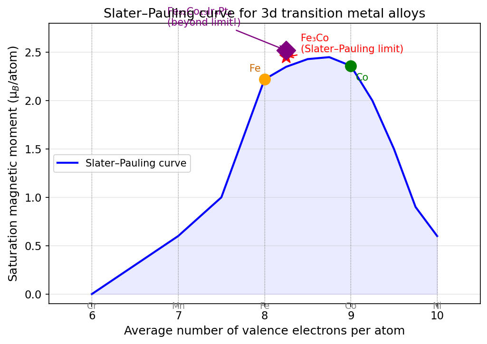
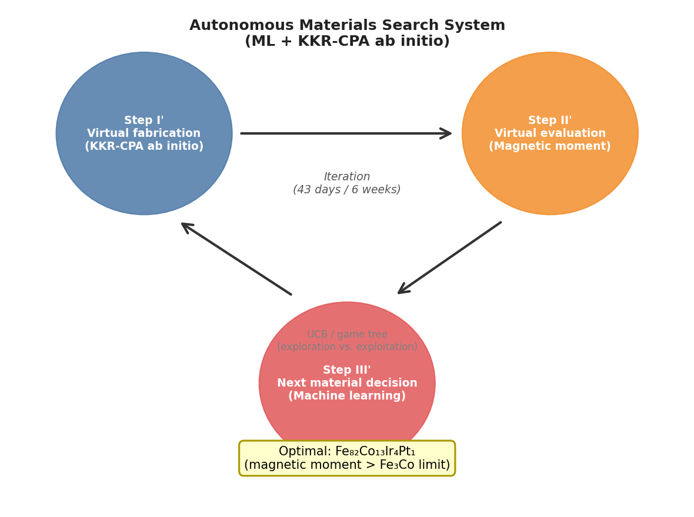
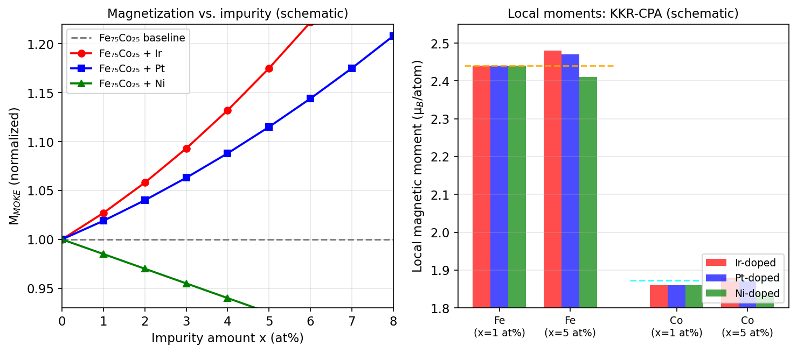
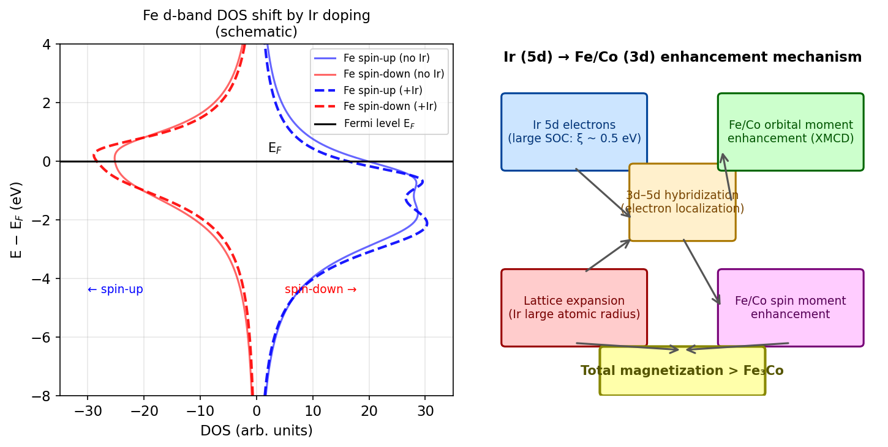

# スレーター–ポーリング限界を超える磁性合金の機械学習自律探索：FeCo–Ir–Pt系が拓く新しい高磁化材料設計

**執筆日**: 2026-03-24

**トピック**: 機械学習と第一原理計算を組み合わせた自律探索システムによる高磁化多元素合金の発見、およびスレーター–ポーリング限界超克の微視的機構解明

**中心論文**: Y. Iwasaki, R. Sawada, E. Saitoh, M. Ishida, "Machine learning autonomous identification of magnetic alloys beyond the Slater-Pauling limit," *Communications Materials* **2**, 31 (2021). https://doi.org/10.1038/s43246-021-00135-0 (Open Access, CC BY 4.0)

**参照した references 内論文数**: 3

**追加検索した arXiv 論文数**: 約10

**Primary broad area**: 磁性材料科学・マテリアルズ・インフォマティクス

**Secondary broad area**: 物性物理（磁気モーメント・スピン軌道相互作用）、コンビナトリアル材料合成

---

## 1. 導入：なぜスレーター–ポーリング限界を超えることが重要なのか

人類は常に、より強力な磁石を必要としてきた。モーター、ハードディスク、センサー、アクチュエータ——これらの装置の性能は磁性材料の磁化の大きさに直結する。磁化が大きいほど、コンパクトかつ高効率なデバイスが実現できる。それゆえ、安定な磁性合金の中で最大の磁化を持つ合金を探し求める研究は、一世紀以上にわたって行われてきた。

その探索の歴史を通じて浮かび上がってきた一つの経験則が「スレーター–ポーリング則（Slater-Pauling rule）」である。この則は、3d 遷移金属合金の飽和磁気モーメントと一原子あたりの平均価電子数の関係を整理したものであり、その曲線上には各元素の組み合わせが美しく並ぶ（図1）。そして、この曲線の頂点——安定合金における磁化の理論的上限——は、鉄とコバルトの二元合金 Fe₇₅Co₂₅（Fe₃Co₁）の組成に位置し、約 2.45 µ$_B$/原子の磁気モーメントを示す。これがいわゆる「スレーター–ポーリング限界」である。

*図1：3d遷移金属合金のスレーター–ポーリング曲線の概念図。Fe₃Co（Fe₇₅Co₂₅）が安定合金の頂点（Slater-Pauling limit）を形成する。機械学習自律探索によって発見された Fe₈₂Co₁₃Ir₄Pt₁ は、この限界を超えた組成に対応する。（オリジナル概念図）*

しかし、「安定な合金の中で」という条件を外してはならない。エピタキシャル成長で実現した超薄膜や、メカニカルアロイングで得られた準安定合金などでは、より高い磁化が報告されている。たとえばニトリド鉄 α″-Fe₁₆N₂ は理論的に高い磁化を持つと予測されているが、~250℃以上で分解する熱不安定性が実用化の壁となっている。また、エピタキシャル薄膜 Fe$_x$Co$_y$Mn$_z$ なども高磁化を示すが、これもエピタキシャル拘束下での特殊な電子状態に依存するため、バルク多結晶合金としての応用には向かない。

したがって、実際の応用に使える安定な多結晶合金において、Fe₃Co₁ の磁化を超える組成を見つけることは、材料科学における長年の未解決問題であった。そして問題をより難しくしているのが「組み合わせ爆発」の壁だ。2元系合金の磁性はよく研究されているが、3元系、4元系と元素数が増えるにつれて、試すべき組成の数は指数関数的に増大する。元素数 N の 10 元素系を 10% 刻みで探索しようとすると、組み合わせは天文学的な数に達する。従来型の実験や計算では、このような広大な材料空間を包括的に探索することは現実的でなかった。

ここに、機械学習（ML）と第一原理計算を組み合わせた「自律的材料探索（autonomous materials search）」が登場する必然性があった。

---

## 2. main 論文が解こうとした問い：自律探索システムの設計と目的

Iwasaki らが 2021 年に発表した本論文が設定した問いは、シンプルかつ挑戦的である。「機械学習と第一原理計算を組み合わせた自律システムを使って、Fe₃Co₁ の磁化を超える安定多元素合金を発見できるか？」

この問いに答えるために、著者らは自律材料探索システムを構築した（図2）。このシステムは、従来の研究者が手動で行っていた「(I) 材料の作製 → (II) 物性評価 → (III) 次の材料の決定」という反復サイクルを、仮想的かつ自動化された形で実行する。

*図2：機械学習と第一原理計算を組み合わせた自律材料探索システムの概念図。ステップ I'（KKR-CPA による仮想合成）、ステップ II'（磁気モーメントの仮想評価）、ステップ III'（機械学習による次組成の決定）を繰り返す。（オリジナル概念図）*

**探索対象の設計**

著者らが探索した材料空間は、体心立方（bcc）構造をとる無秩序多元素合金：

$$\mathrm{Fe}_x \mathrm{Co}_y \mathrm{Ni}_u \mathrm{Ru}_v \mathrm{Rh}_w \mathrm{Pd}_p \mathrm{Ir}_q \mathrm{Pt}_r \mathrm{Th}_s$$

（各元素の割合 x + y + u + v + w + p + q + r + s = 100at%、bcc 構造が安定に取れる組成範囲）

この 10 元素系は膨大な組成空間を持つ。

**計算エンジン：KKR-CPA 法**

第一原理計算には Korringa–Kohn–Rostoker コヒーレント・ポテンシャル近似（KKR-CPA）法を用いた。CPA は無秩序多元素合金を単一の単位セルで模擬できる手法であり、各サイトに複数の原子が確率的に存在するという平均場的取り扱いをする。これにより、PAW（射影補強波）法のような通常の DFT 手法では多大な計算コストが必要な多元素無秩序合金を、1 つの単位セルで効率よく計算できる。各探索サイクルで磁気モーメント（磁化に比例する量）と関連する物性（状態密度、格子定数等）を計算する。

**機械学習エンジン：UCB 戦略とゲームツリー探索**

次の探索組成の決定（ステップ III'）には、以下の 2 つの機械学習技術を組み合わせた：

- **UCB（Upper Confidence Bound）戦略**：探索（exploration）と活用（exploitation）のバランスを制御するベイズ最適化的アプローチ。すでに評価された組成のデータから統計モデルを構築し、「まだ試していない組成の中で最も良い結果が期待できるもの」を選ぶ。
- **ゲームツリー探索**：離散的な組成空間の中で最適経路を探索するアルゴリズム。学習データが増えるにつれて機械学習モデルの精度が上がり、より良い組成を提案できるようになる。

この探索戦略の重要な特徴は、「確率的多様性」を保ちながら探索を行うことである。機械学習モデルは「現時点では良さそうに見えない組成」も意図的に試す（exploration）。これにより、局所最適に陥ることなく広い組成空間を効率よく探索できる。

---

## 3. main 論文が示した新しいこと：Ir・Pt 不純物による磁化増強の発見

**自律探索の成果：6 週間で発見した逆説的な答え**

著者らは自律システムを 9 週間（43 日間）稼働させた。探索の進捗を示す「成長曲線」（主論文 Fig. 2 に相当）は、自律システムが次第により高い磁気モーメントを持つ組成を提案するようになっていく様子を示す。驚くべきことに、約 6 週間後、システムが示唆した最適組成は：

$$\boxed{\mathrm{Fe}_{82}\mathrm{Co}_{13}\mathrm{Ir}_4\mathrm{Pt}_1}$$

であった。

これは二重の意味で「逆説的」な結果である。

第一に、**Ir と Pt はどちらも常磁性元素**であり、純粋な状態では磁気モーメントは小さい。磁化を高めたいなら、磁気モーメントの大きな遷移金属（Fe, Co, Ni など）の割合を増やすべきだ、というのが古典的な直感である。ところが自律システムは、磁気モーメントの小さい Ir と Pt の不純物が FeCo 合金の磁化を *増強* することを「発見」した。

第二に、この組成は Fe₃Co 限界の**近傍に Fe が豊富な領域**に位置している。純粋な Fe₃Co（Fe₇₅Co₂₅）より Co が少なく、代わりに Ir と Pt が入ることで、スレーター–ポーリング限界を超えた磁化が実現する。

**実験的確認：コンビナトリアル MOKE と SQUID**

このシステムの予測を実験的に確認するために、著者らはコンビナトリアルスパッタ法（3 元ターゲット：Fe, Co, Ir）を使って、SiO₂/Si 基板上に Fe$_x$Co$_y$Ir$_{100-x-y}$ の組成拡散薄膜を作製した（図3左）。組成拡散薄膜では、一枚の基板上に連続的に組成が変化する薄膜を形成できるため、一度の実験で広い組成範囲を測定できる（ハイスループット実験）。

磁気光学カー効果（MOKE）測定と振動試料型磁力計（SQUID）測定から得られた結果は、計算の予測と整合した：

- 少量（数 at%）の Ir 添加は Fe$_x$Co$_y$Ir$_{100-x-y}$ 系の $M_{MOKE}$ を単調に増大させる（図3右）
- 少量の Pt 添加も Fe$_x$Co$_y$Pt$_{100-x-y}$ 系で同様の効果を示す
- 一方、Ni 添加は $M_{MOKE}$ を単調に減少させる

さらに SQUID 測定（T = 300 K および T = 5 K）では、Fe₇₃.₂Co₂₄.₂Ir₂.₆ が室温で、Fe₈₄.₀Co₁₂.₀Pt₄.₀ が 5 K で Fe₇₃.₂Co₂₄.₈ よりも大きな磁化を示すことが確認された。

*図3：（左）コンビナトリアル実験の概念図：Ir/Pt添加量に対するM_MOKEの変化の模式図。Irとpt添加は磁化を増大させる（赤・青）のに対し、Ni添加は減少させる（緑）。（右）KKR-CPA計算によるFe・Coの局所磁気モーメントの変化の模式図（x=1 at%、5 at%）。Ir・Pt添加でFeとCoの局所モーメントが増大する。（オリジナル概念図：主論文Fig.3m,n,o、Fig.4のデータをもとに作成）*

**第一原理的確認：なぜ Ir と Pt が磁化を増強するのか（main 論文の考察）**

KKR-CPA 計算の詳細（主論文 Fig. 4, 5）によれば：

- Ir 添加や Pt 添加は FeCo の Fe および Co それぞれの**局所磁気モーメントを増大させる**（Fig. 4a, b 参照）
- これはおもに**格子定数の増大**（Ir, Pt の原子半径が Fe, Co より大きい → Fig. 5c）と、それに伴う 3d 電子間の交換相互作用の変化によるものと考えられる
- Ir 自身は弱い常磁性モーメントを持つ（≈ 0.1〜0.3 µ$_B$）が、Fe や Co の局所モーメントを高める補助的役割を果たす
- 一方、Ni 添加では Fe や Co の局所モーメントが減少し、総磁化は低下する

ただしこの段階では、Ir/Pt が磁化を増強する**微視的な電子論的機構**——具体的にスピンモーメントと軌道モーメントのどちらがどれだけ変化し、なぜ変化するのか——は十分には解明されていなかった。その解明は、後の研究群（後述）に委ねられることになる。

---

## 4. 背景と文脈：関連研究を踏まえると、どこに位置づくか

### 4.1 マテリアルズ・インフォマティクスと磁性材料探索の合流

本論文は、磁性材料科学とマテリアルズ・インフォマティクスの交差点に位置する。

機械学習による磁性材料探索の先行研究としては、キュリー温度予測の研究（Long et al., arXiv:1908.00926; Nelson & Sanvito, 2019）や、Heusler 合金の磁性予測（Žic et al., arXiv:1706.01840）などがある。しかしこれらの多くは、既知材料のデータベースから予測モデルを構築する「パッシブな機械学習」アプローチである。

本論文の独自性は、机上計算（KKR-CPA）を「仮想実験」として自律的に実行しながら、ベイズ最適化的な探索を行うという「アクティブな機械学習」ループを実装したことにある。これは Sumita ら（2020）や Sawada ら（2021）が提案した自律探索システムの磁性材料への応用である。Furuya ら（2022）も大規模磁気異方性材料の自律探索に類似のアプローチを適用しており、本論文はその系譜の重要な里程標となっている。

同じ著者グループによる後続研究（arXiv:2411.18907, Iwasaki et al., 2024）では、本論文で確立した自律探索手法を L10-FePt 系四元合金の磁気記録材料探索に展開し、FeMnPtEr を有望な候補として同定している。これは本手法の汎用性を示す。

最近のレビュー（Nematov & Hojamberdiev, arXiv:2503.18975, 2025）は、機械学習主導の材料発見が超伝導体、触媒、光電変換材料にとどまらず、磁性材料においても研究サイクルを劇的に短縮しつつあることを示している。本論文はその最前線の事例の一つである。

### 4.2 FeCo 合金の高磁化に向けた従来のアプローチとの対比

スレーター–ポーリング限界を超えようとする試みは本論文以前にも存在した。例えば、エピタキシャル Fe$_x$Co$_y$Mn$_z$ 超薄膜は巨大な磁化を示すことが Snow ら（2018）によって報告されているが、これはエピタキシャル拘束・薄膜固有の効果であり、バルク・多結晶合金での実現は困難である。

従来の研究者は「磁気モーメントの大きい元素の割合を増やせば磁化が増える」という直感のもと、Fe や Co リッチな組成を中心に探索してきた。本論文の成果の革新性は、この直感に反して「磁気モーメントが小さいはずの 5d 元素 Ir・Pt が FeCo の磁化を増強する」という非自明な組成を、人間の偏見のない自律システムが発見した点にある。

機械学習は「exploration（探索）」により、直感では避けていた組成空間をも探索する。その結果、人間の先入観では見落としていたアイデアを「発見」できる——これが AI を材料探索に使う本質的な価値の一つである。

---

## 5. 比較と解釈：どこまで分かったのか、何がまだ揺れているか

### 5.1 XMCD による微視的機構の解明（Yamazaki et al., 2025）

main 論文が「Ir・Pt が磁化を増強する」という現象を発見した後、最も本質的な問いは「なぜ Ir が磁化を増強するのか、その電子論的機構は何か？」であった。この問いに正面から向き合ったのが山崎ら（sub-1.pdf）による 2025 年の Physical Review Materials 論文である。

山崎らは、MgO(100) 基板上に単結晶コンビナトリアルスパッタで作製した **単結晶組成拡散薄膜 (Fe₇₅Co₂₅)₁₀₀₋ₓIrₓ (x = 0–11 at%)** に対し、**放射光軟・硬 X 線磁気円二色性（XMCD）** 測定を実施した。

XMCD 測定の利点は「元素選択的」なことである——Fe の $L_{2,3}$ 吸収端（~700–750 eV）、Co の $L_{2,3}$ 吸収端（~770–830 eV）、Ir の $L_{2,3}$ 吸収端（~11.2–12.9 keV）をそれぞれ独立に測定することで、各元素のスピン磁気モーメント $m_\mathrm{spin}$ と軌道磁気モーメント $m_\mathrm{orb}$ を分離できる（XMCD 総和則の利用）。

**主要な実験結果**：

Ir 組成が 0 から 11 at% に増加するにつれて：

- **Fe の $m_\mathrm{spin}$**：1.12 倍に増加（スピンモーメントの増大）
- **Fe の $m_\mathrm{orb}$**：最大 1.44 倍に増加（軌道モーメントの顕著な増大）
- **Co の $m_\mathrm{spin}$**：1.07 倍に増加
- **Co の $m_\mathrm{orb}$**：1.25 倍に増加
- **Ir の $m_\mathrm{spin}$**：1.06 倍に増加（わずかな増大）
- **Ir の $m_\mathrm{orb}$**：最大 **8.28 倍** に増加（劇的な軌道モーメント増大）

とくに**Ir 自身の軌道磁気モーメントが 8 倍以上に増大**するという結果は非常に印象的である。Ir は元来常磁性元素だが、FeCo 合金マトリクスに少量存在するとき、Fe/Co との 3d–5d 交換相互作用によって磁気モーメントを「誘起」される。その際、Ir の強いスピン軌道相互作用（SOC: spin-orbit coupling）が 5d 軌道の方向性を固定し、巨大な軌道モーメントが発現する。

**ab initio 計算との比較**：

KKR-CPA 計算（B2 秩序相および A2 無秩序相）は実験結果と定性的に一致し、Ir 添加で Fe・Co・Ir のモーメントがいずれも増大することを再現する。ただし軌道モーメントの絶対値は計算が実験値を過小評価する——これは計算が完全な B2 秩序を仮定していること、および SOC の過小評価（特に薄膜・表面・界面効果の未考慮）に起因すると考えられる。

**B2 秩序の役割**：

B2 構造（Fe サイトと Co/Ir サイトが交互に並ぶ CsCl 型超格子）では A2 無秩序構造よりも磁気モーメントが大きい。これは、B2 構造では Ir が特定のサイト（Co 占有する 1b サイト）に選択的に入り込み、Fe との距離や対称性が最適化されるためと考えられる。

**微視的機構（図4）**：

Ir 5d 電子の強い SOC が Fe/Co の 3d 電子と相互作用することで：
1. Fe・Co の電子状態がより局在化し（電子局在化の増大）、フェルミ準位付近の状態密度が鋭くなる
2. 軌道角運動量の消滅（quenching）が抑制され、軌道磁気モーメントが増大する
3. 結果として、スピンモーメントと軌道モーメントの両方が増強される

*図4：Ir (5d) 電子が Fe/Co (3d) 磁気モーメントを増強する微視的機構の概念図。（左）Ir添加によるFe d バンド状態密度の変化の模式図：フェルミ準位付近の状態が鋭くなり（電子局在化の増大）、軌道磁気モーメントが増大する。（右）機構の概念フロー図。（オリジナル概念図：Yamazaki et al., Phys. Rev. Mater. 9, 034408 (2025) の結果をもとに作成）*

### 5.2 輸送特性への波及：AMR の符号反転（Toyama et al., 2023）

Ir 添加による FeCo の変化は、磁化増強にとどまらない。豊山ら（sub-2.pdf）は、同じく単結晶コンビナトリアルスパッタ薄膜を用いて、**異方性磁気抵抗（AMR: anisotropic magnetoresistance）効果** を測定した。

純粋な Fe₃Co では AMR 比は +0.3%（正）であるが、Ir を添加すると AMR 比は**負**に転じ、x = 11 at% で最大 −4.7%（10 K）、−3.6%（300 K）という大きな負の AMR 比が観測された。

この AMR 符号反転の起源は、Ir 添加によって安定化される **B2 秩序相（メタスタブル相）** にある。B2 秩序により Fe と Co/Ir の位置関係が整理されると、伝導電子の散乱行列の構造が変化し、理論モデル（KKR-CPA + 電子散乱理論）によれば AMR の符号が正から負に転換することが示された。

これは、main 論文の「Ir 添加が磁化を増強する」という結果と同じ物質系で、全く異なる物理現象（輸送特性）にも劇的な変化をもたらすことを示しており、Fe-Co-Ir 系の物理の豊かさを示している。

### 5.3 ホール効果とネルンスト効果の異常増強（Toyama et al., 2024）

豊山ら（sub-3.pdf）はさらに、同系薄膜において **異常ホール効果（AHE）** と **異常ネルンスト効果（ANE）** も調べた。

Ir 添加により異常ホール抵抗率 $\rho_{yx}^A$ は最大因子 ~9.2 倍に増大（x = 12 at%, 300 K）した。スケーリング解析（TYJ スケーリング）により、これは低 Ir 濃度ではスキュー散乱（散乱ポテンシャルの非対称性）などの**外因性寄与**が増大し、高 Ir 濃度では Bloch 電子のベリー曲率に由来する**内因性寄与**が支配的になる、という二段階の機構によることが明らかになった。

異常ネルンスト係数 $S_\mathrm{ANE}$ については、Ir 添加による顕著な組成依存性は見られないが、異常ネルンスト伝導度 $\alpha_{xy}^A$ は x ≈ 1 at% 付近で正から負に転じ、x = 12% では再びほぼゼロに近づく。これは Ir 添加が AHE と ANE の関係を大きく変調することを示し、スピン流熱電変換デバイスの設計にとっても重要な知見である。

### 5.4 残る問いと不確かさ

main 論文と関連研究の成果をまとめると、以下の問いがまだ完全には解消されていない：

**機構面**：
- B2 秩序度（$S_{B2}$）と磁化増強・AMR・AHE がどのように連動するかの定量的理解は未完成
- 計算と実験の軌道磁気モーメントの乖離（特に Ir のモーメント）の解消には、より精緻な多体理論（ダイナミカル平均場理論、SOC の精密な取り扱い）が必要
- Pt 添加の機構については、Ir と共通点はあるものの、独立した XMCD 実験による検証はまだ限定的

**組成面**：
- main 論文で最終提案された quaternary 合金 Fe₈₂Co₁₃Ir₄Pt₁ の実験的合成・評価は今後の課題として挙げられており、Ir と Pt の相乗効果（synergistic effect）の定量的確認は未達成

**応用面**：
- バルク多結晶合金での合成はコンビナトリアル薄膜より難しく、アニール条件や結晶成長制御の最適化が必要

---

## 6. 材料・手法・応用への広がり

### 6.1 L10 型合金への展開

本論文で確立した自律探索手法は、磁気記録媒体用材料（高磁気異方性）への展開も進んでいる。Iwasaki ら（arXiv:2411.18907, 2024）は同様のアプローチを L10-FePt 系四元合金に適用し、磁気モーメントと磁気結晶異方性エネルギー（EMCA）の双方を最大化する組成 FeMnPtEr を100日間の自律探索で同定した。高密度磁気記録媒体の次世代候補として期待される。

### 6.2 他材料系への波及

Ir 添加による磁気特性の変調という概念は、FeCo 系に限らない。以下の系でも関連する物理が報告されている：

- **Fe-Ir 系**：IrMnAl からの XMCD 測定（Krishnamurthy et al., 2006）では、Co サイトの Ir が Fe との相互作用で弱い磁気モーメントを誘起することが示されており、本研究と整合する
- **Co/Ir/MgO 系**：Miwa ら（2019）は FeIr/MgO 界面で巨大垂直磁気異方性が発現することを報告しており、Ir の 5d–3d 相互作用がスピン軌道結合を通じた磁気異方性にも影響することを示す
- **FePt 系**：Mryasov ら（arXiv:physics/0411020, 2004）は FePt 合金の特異な磁気挙動が「Pt 誘起モーメント」を媒介とした有効異方性交換相互作用に起因することを理論的に示した。これは本研究の Ir 誘起機構と密接に関連する
- **CoFeB/Pt 系**：von Korff Schmising ら（arXiv:2210.11390, 2022）は強磁性 3d 金属と Pt の界面で生じる誘起磁気モーメントをX線で直接観測し、5d 元素による軌道モーメント誘起という共通のメカニズムが広範な材料系で成立することを示した

### 6.3 スピントロニクス応用の観点

sub-2 と sub-3 の成果（AMR 符号反転、AHE の大幅増強）は、FeCo-Ir が高磁化材料としてだけでなく、**スピン依存輸送特性の豊富な材料系** でもあることを示す。

とくに AHE の 9 倍増強は、スピン流を横方向電圧に変換する素子（ホールセンサー、磁気センサー）への応用で極めて有益である。また、磁化増強と AHE 増強が同時に実現できれば、スピントロニクスデバイスの出力信号と磁化の積に比例するデバイス性能の大幅な向上が見込まれる。

異常ネルンスト効果（ANE）の変調は、磁性材料を用いた熱電変換——廃熱から電力を生成する技術——への応用においても重要であり、Fe-Co-Ir 系は機能性スピンカロリトロニクス材料としての可能性も持っている。

### 6.4 自律実験室との融合

本論文の自律探索システムは、仮想的な（計算の）ループで完結しているが、近年ではロボット実験と AI を組み合わせた完全自律型材料探索（自律実験室）の研究も進んでいる。例えば、Chang ら（arXiv:2601.08185, 2026）は薄膜合成と AI による構造解析を組み合わせた SARA-H システムを開発し、ビスマス–チタン–酸素系でメタスタブル酸化物相の合成条件を自律的に探索することに成功している。

本論文で実証された「Ir・Pt の意外な効果」も、自律ループがなければ人間の先入観によって見逃されていた可能性が高い。AI 駆動の自律探索は、人間の直感の「死角」を照らす強力なツールとして今後ますます重要になるだろう。

---

## 7. 基礎から理解する

本節では、本論文を理解するために必要な基礎的概念を、学部 4 年生程度を対象に直感的な説明から始めて丁寧に解説する。

### 7.1 スレーター–ポーリング則とは何か

**直感的説明**：金属の磁石が強いかどうかは、原子の「電子のスピン」の向きがどれだけ揃っているかで決まる。鉄（Fe）、コバルト（Co）、ニッケル（Ni）は 3d 軌道に不対電子を持ち、磁気モーメントを持つ。これらを混ぜ合わせたとき、一原子あたりの平均磁気モーメント（$\bar{m}$）はおおよそ「平均の価電子数」の関数として予測できる——これがスレーター–ポーリング則の骨格だ。

**より正確な説明**：3d 遷移金属二元合金の飽和磁気モーメント $m$ [µ$_B$/原子] は、一原子あたりの平均価電子数 $n_e$ に対して：

$$m \approx 2(n_e - n_\downarrow^\mathrm{rigid})$$

という近似が成り立つ（ Stoner-Wohlfarth の剛体バンド近似）。ここで $n_\downarrow^\mathrm{rigid}$ は大まかに一定（≈5 程度）。

この関係から導かれるのが**スレーター–ポーリング曲線**（図1）であり、$n_e$ ≈ 8.25 に対応する **Fe₇₅Co₂₅ が曲線の頂点**（最大磁化 ≈ 2.45 µ$_B$/原子）を持つ。

Fe の $n_e$ = 8、Co の $n_e$ = 9 なので、Fe₇₅Co₂₅ の平均価電子数は：

$$n_e = 0.75 \times 8 + 0.25 \times 9 = 8.25$$

これがスレーター–ポーリング限界に対応する。

**限界の起源**：$n_e$ が 8.25 より増えると（Co 比率が増す、または Ni が加わると）、スピンダウンバンドが埋まり始め、磁気モーメントが減少する。逆に Fe より少ない $n_e$ では Mn, Cr 側でモーメントが小さくなる。この非単調な曲線の峰が Fe₃Co に位置するのは、この系の電子構造上の必然である。

### 7.2 KKR-CPA 法とは何か

**直感的説明**：多元素無秩序合金の電子構造を計算したい。しかし合金は「どの原子サイトに何の元素が入るか」がランダムであり、理想的な周期的格子を仮定する通常の DFT 計算ができない。例えば Fe₅₀Co₅₀ を PAW-DFT で計算するには数千原子のスーパーセルを作って原子をランダムに配置しなければならず、計算コストが膨大になる。

コヒーレント・ポテンシャル近似（**CPA**: Coherent Potential Approximation）は、この問題をエレガントに解決する。「合金は均一な有効媒質（コヒーレント・ポテンシャル $\tilde{V}$）に置き換えられ、各種原子はその媒質中に埋め込まれた単一不純物として扱える」という平均場近似である。

**KKR（Korringa-Kohn-Rostoker）法**は、多重散乱理論をベースにした電子構造計算手法で、CPA と組み合わせることで多元素無秩序合金を**1 つの単位セルで**効率よく扱える。本論文で使われた AkaiKKR コードはこの方法の実装の一つである。

計算から得られる主な量は：
- 各元素の**局所磁気モーメント**（スピンモーメント）
- **状態密度（DOS）**
- 格子定数などの構造パラメータ

**より正確な説明**：CPA では自己無撞着に決定されるコヒーレント・ポテンシャル $\tilde{G}$ を用いて、各元素 $\alpha$（濃度 $c_\alpha$）の Green 関数 $G_\alpha$ から：

$$\tilde{G} = \sum_\alpha c_\alpha G_\alpha[\tilde{G}]$$

という自己無撞着方程式を解く。これにより無秩序合金の平均的な電子構造が得られる。

### 7.3 スピン軌道結合（SOC）と軌道磁気モーメント

**直感的説明**：電子は「スピン」（内部の自転のようなもの）と「軌道運動」（原子核の周りを回る運動）の両方に由来する磁気モーメントを持つ。通常の磁性体 (Fe, Co, Ni) では、結晶場の効果でほとんどの軌道モーメントが消滅（quenching）し、磁化の大部分はスピンモーメントに由来する。

しかし、重い元素（5d 族: Ir, Pt, Os など）では、**スピン軌道相互作用（SOC）** が非常に強い：

$$H_\mathrm{SOC} = \xi \, \mathbf{L} \cdot \mathbf{S}$$

ここで $\xi$ はスピン軌道結合定数（Ir では ≈ 0.5 eV と大きい）、$\mathbf{L}$ は軌道角運動量演算子、$\mathbf{S}$ はスピン角運動量演算子である。

**なぜ Ir が Fe/Co の軌道モーメントを増大させるか**：Ir の強い SOC が FeCo マトリクスに作用すると、Fe・Co の 3d 電子の軌道角運動量が「解放」(de-quenching) され、通常は消滅していた軌道モーメントが有限値を持つようになる。また、Ir が局所的に格子定数を広げることで Fe–Co 間の 3d 電子の直接交換相互作用が変化し、バンド幅が縮小・電子局在が増大するため、軌道モーメントが増大しやすくなる（図4）。

### 7.4 XMCD とスペクトル総和則

X 線磁気円二色性（**XMCD**: X-ray Magnetic Circular Dichroism）は、左右円偏光 X 線の吸収差を利用して磁性元素の磁気モーメントを元素選択的に測定する手法である。

$L_{2,3}$ 吸収端（コア 2p 電子の 3d への遷移）において、XMCD スペクトルの積分量 $p$（$L_3$ 端）と $q$（$L_3 + L_2$ 端）から、以下の総和則（Thole–Carra 則）により軌道・スピン磁気モーメントが得られる：

$$m_\mathrm{orb} = -\frac{4q}{3r} n_h$$

$$m_\mathrm{spin}^\mathrm{eff} = -\frac{6p - 4q}{r} n_h$$

ここで $r$ は XAS 白色線領域の積分強度、$n_h$ は 3d（または 5d）バンドの正孔数（空の軌道数）である。$n_h$ は KKR-CPA 計算から求める（sub-1.pdf 付録 S3 参照）。

Ir の $L_{2,3}$ 吸収端（~11.2 keV）は硬 X 線領域にあり、通常の軟 X 線ビームラインでは測定できない。sub-1.pdf では、SPring-8 の軟 X 線（BL25SU）と硬 X 線（BL39XU）の両ビームラインを使い、Fe/Co の軟 X 線 XMCD と Ir の硬 X 線 XMCD を同一試料で測定することに成功している。

### 7.5 コンビナトリアル実験法

**組成拡散薄膜（composition-spread thin film）** は、一枚の基板上に組成が連続的に変化する薄膜を形成する技術である。3 つのスパッタターゲット（例：Fe, Co, Ir）と動くシャッターを組み合わせることで、各元素の組成勾配を持つ三角形状の組成マップを一度の実験で作製できる。

この手法により、一枚の基板（7 mm × 30 mm 程度）の上で数十〜数百種類の組成を同時に評価できる。本論文では：
- combi-XRD（X 線回折）：結晶構造の組成依存性
- combi-MOKE（磁気光学カー効果）：磁化（飽和磁化に比例）の組成依存性
- SQUID（超電導量子干渉計）：絶対磁化値の精密測定

を組み合わせることで、広い組成範囲を系統的に調べることができた。

---

## 8. 重要キーワード 10 個の解説

### ① スレーター–ポーリング則（Slater-Pauling rule）

3d 遷移金属合金において、一原子あたりの飽和磁気モーメントが一原子あたりの平均価電子数 $n_e$ の関数として予測される経験則。Fe₇₅Co₂₅ ($n_e$ = 8.25) が約 2.45 µ$_B$/atom のモーメントで曲線の頂点（限界）を形成する。この限界は「安定な無秩序合金において到達可能な磁化の上限」を意味し、本論文の中心的な問いである「この限界を超えられるか」の出発点となっている。本質は剛体バンド近似（rigid-band approximation）によるフェルミ準位の組成依存性にある。

### ② 自律材料探索（autonomous materials search）

第一原理計算（または実験）と機械学習を組み合わせ、人間の介入なしに材料特性を最適化する組成を自律的に探索するシステム。本論文では KKR-CPA 計算（仮想実験）と UCB/ゲームツリー探索（機械学習）を組み合わせ、6 週間で Fe₈₂Co₁₃Ir₄Pt₁ を発見した。関連研究（Iwasaki et al., 2024）では L10-FePt 四元合金への応用も示されている。

### ③ KKR-CPA 法（Korringa-Kohn-Rostoker Coherent Potential Approximation）

無秩序多元素合金の電子構造計算に適した第一原理手法。KKR は多重散乱理論に基づく Green 関数形式の DFT 計算法で、CPA は無秩序合金を平均場的な有効媒質で近似する手法。組み合わせることで、スーパーセルを使わずに 1 つの単位セルで多元素無秩序合金の磁気モーメント・DOS などを効率よく計算できる。本論文の自律探索ループの核となる計算エンジン。

### ④ XMCD（X-ray Magnetic Circular Dichroism: X 線磁気円二色性）

左右円偏光 X 線の吸収差を利用して、磁性体中の特定元素の磁気モーメント（スピン成分と軌道成分を分離して）を測定する分光手法。Thole–Carra 総和則を適用することで定量的なモーメント値が得られる。元素選択的測定が可能で、多元素合金中の各元素の磁気的役割を個別に評価できる。sub-1.pdf（Yamazaki et al.）では Fe/Co $L_{2,3}$ 端（軟 X 線）と Ir $L_{2,3}$ 端（硬 X 線）を組み合わせた高スループット XMCD 測定が鍵となった。

### ⑤ スピン軌道相互作用（SOC: Spin-Orbit Coupling）

電子のスピン角運動量 $\mathbf{S}$ と軌道角運動量 $\mathbf{L}$ の間の相互作用：$H_\mathrm{SOC} = \xi \mathbf{L} \cdot \mathbf{S}$。重い元素（5d 族: Ir, Pt, Au など）では $\xi$ が大きく（Ir では ≈ 0.5 eV）、電子の軌道運動とスピン方向を強く結びつける。本論文の文脈では、Ir の強い SOC が Fe/Co の軌道磁気モーメントの消滅（quenching）を抑制し、磁化増強をもたらす主因の一つとされる。AMR 符号反転、AHE 増強なども SOC が本質的な役割を果たす。

### ⑥ 軌道磁気モーメント（orbital magnetic moment）

電子の軌道運動に由来する磁気モーメント $m_\mathrm{orb} = -\mu_B \langle L_z \rangle / \hbar$。通常の 3d 遷移金属磁性体では結晶場の対称性により軌道モーメントは大部分消滅（orbital quenching）するため、磁化の大部分はスピンモーメントが担う。しかし、強い SOC を持つ 5d 元素が存在すると quenching が解除され、軌道モーメントが有限値を持つ。Yamazaki et al. (2025) は Ir 添加により Ir 自身の軌道モーメントが 8 倍超に増大することを XMCD で実測した。

### ⑦ B2 秩序構造

bcc 格子において，2 つの副格子サイト（$1a$: (0,0,0) と $1b$: (1/2,1/2,1/2)）に異なる元素が規則的に占有された構造（CsCl 型）。Fe₃Co-Ir 系では、Ir 原子が優先的に Co 占有サイト（$1b$）に入り込むことで B2 秩序相が安定化する。この B2 秩序は：(1) 磁気モーメントの増大（A2 無秩序相より高い磁化）、(2) AMR の符号反転、(3) AHE の増大と関連しており、Fe-Co-Ir 系の物理を理解する上で鍵となる構造的特徴である。B2 秩序は bulk の平衡相図には現れないメタスタブル相であり、薄膜のエピタキシャル成長条件下でのみ実現される。

### ⑧ 異方性磁気抵抗（AMR: Anisotropic Magnetoresistance）

強磁性体における電気抵抗が、電流方向と磁化方向のなす角 $\varphi$ によって変化する現象：$\rho(\varphi) = \rho_\perp + (\rho_\parallel - \rho_\perp) \cos^2\varphi$。AMR 比 $= (\rho_\parallel - \rho_\perp) / \rho_\perp$。スピン軌道相互作用に起因し、フェルミ面の形状と散乱確率の異方性が本質。Fe₃Co では AMR 比 ≈ +0.3% で正値。Ir 添加（x ≥ 2 at%）で B2 秩序が形成され AMR 比が負に転じ、x = 11 at% では最大 −4.7%（10 K）に達する（sub-2.pdf）。

### ⑨ 異常ホール効果（AHE: Anomalous Hall Effect）

強磁性体における横方向（ホール）抵抗率 $\rho_{yx}^A$ が磁化 M に比例する現象：$\rho_{yx}^A \propto M_z$。外部磁場に比例する通常ホール効果とは異なり、スピン軌道相互作用に由来する内因性（ベリー曲率）および外因性（スキュー散乱、サイドジャンプ）機構によって生じる。sub-3.pdf では、Ir 添加により $\rho_{yx}^A$ が ~9 倍に増大し、スケーリング解析から低 Ir 濃度では外因性、高 Ir 濃度では内因性が支配的になることが示された。AHE はスピンホール効果や非相反電気特性との関連から、スピントロニクスの基本物理量として重要。

### ⑩ コンビナトリアル材料科学（combinatorial materials science）

一度の実験で多数の組成・構造・製造条件を同時に評価するハイスループット手法を用いた材料探索の方法論。本論文では、3 元スパッタターゲット＋可動シャッターによる組成拡散薄膜を combi-XRD・combi-MOKE で評価する手法を採用した。10 元素系の多次元探索を可能にする機械学習の自律探索と、広組成範囲の実験的評価を可能にするコンビナトリアル手法を組み合わせることで、従来不可能だった広大な材料空間の探索が実現した。

---

## 9. まとめと今後の論点

### 9.1 本論文が示したこと

Iwasaki ら（2021）は、KKR-CPA 計算と機械学習を組み合わせた自律材料探索システムを構築し、わずか 6 週間の自律的探索によって FeCo 合金への Ir および Pt 微量添加がスレーター–ポーリング限界を超える高磁化を実現することを発見した。この結果は：

- コンビナトリアル MOKE/XRD 実験
- SQUID 磁化測定
- KKR-CPA 第一原理計算

の三つの独立したアプローチによって確認された。

この成果の本質は、人間の直感では「磁気モーメントが小さいはずの常磁性元素（Ir, Pt）が磁化を増強する」という「逆説的な発見」を機械学習が自律的に成し遂げた点にある。AI 駆動材料探索の真の価値——人間の先入観を超えた解の発見——を体現した事例として、材料科学史に刻まれる論文といえる。

### 9.2 後続研究が明らかにしたこと

Yamazaki ら（2025, sub-1.pdf）は XMCD を用いた元素選択的磁気モーメント測定によって、Ir 添加が：

- Fe・Co のスピン・軌道モーメントを増大させること
- 特に Ir 自身の軌道モーメントが 8 倍以上に増大し、B2 秩序相でより顕著になること
- 機構として Ir の 5d 電子と Fe/Co の 3d 電子間の相互作用による電子局在化と SOC 増強が重要なこと

を明らかにした。

Toyama ら（2023, sub-2.pdf; 2024, sub-3.pdf）は同じ材料系で AMR 符号反転と AHE の大幅増強を見出し、Fe-Co-Ir が高磁化材料であるのみならず、スピン依存輸送特性が豊富な多機能スピントロニクス材料であることを示した。

### 9.3 今後の重要な論点

本研究の成果を踏まえると、今後の研究における重要な論点として以下が挙げられる：

**材料・合成の課題**：
- main 論文の最終提案 Fe₈₂Co₁₃Ir₄Pt₁（quaternary 合金）の薄膜・バルク合成と磁気特性評価
- Ir・Pt の相乗効果の定量化と最適 Ir/Pt 比の決定
- バルク多結晶合金での B2 秩序形成条件の確立（アニール条件の最適化）
- スパッタ薄膜以外の合成手法（メカニカルアロイング、バルク急冷凝固など）への展開

**理論・計算の課題**：
- 計算（KKR-CPA）と実験（XMCD）で乖離する軌道磁気モーメントの解消：ダイナミカル平均場理論（DMFT）との組み合わせや、より精緻な SOC の取り扱いが必要
- B2 秩序度と磁化・AMR・AHE の定量的連関モデルの構築
- 有限温度効果（キュリー温度・熱揺らぎ）を含めた予測精度の向上

**応用の課題**：
- スピントロニクスデバイス（高感度ホールセンサー、磁気メモリ素子）への統合
- AHE 増強を活用したエネルギー収穫デバイス（異常ネルンスト効果を用いた熱電変換）
- 自律探索システムの実験ループとの統合：計算だけでなくロボット合成・自動評価と組み合わせた完全自律材料探索への展開

FeCo-Ir(-Pt) 系は、「磁化がなぜ増強されるのか」という基礎的問いと、「どう使えるか」という応用的問いの両面で、今後数年間にわたって活発な研究対象であり続けるだろう。

---

## 10. 参考にした論文一覧

### 中心論文

1. **Y. Iwasaki, R. Sawada, E. Saitoh, M. Ishida**, "Machine learning autonomous identification of magnetic alloys beyond the Slater-Pauling limit," *Commun. Mater.* **2**, 31 (2021). https://doi.org/10.1038/s43246-021-00135-0 *(Open Access, CC BY 4.0)*

### references フォルダ内の関連論文

2. **T. Yamazaki, T. Kawasaki, A. L. Foggiatto, R. Toyama, K. Fuku, V. K. Kushwaha, Y. Kotani, T. Ohkochi, K. Higashi, N. Kawamura, Y. Sakuraba, Y. Iwasaki, M. Kotsugi**, "Uncovering the origin of magnetic moment enhancement in Fe–Co–Ir alloys via high-throughput XMCD," *Phys. Rev. Mater.* **9**, 034408 (2025). https://doi.org/10.1103/PhysRevMaterials.9.034408
   *役割：Ir 添加による磁化増強の微視的機構（SOC・電子局在・軌道モーメント）の実験的解明（XMCD）*

3. **R. Toyama, S. Kokado, K. Masuda, Z. Li, V. K. Kushwaha, T. T. Sasaki, L. S. R. Kumara, T. Koganezawa, H. Tajiri, T. Yamazaki, M. Kotsugi, Y. Iwasaki, Y. Sakuraba**, "Origin of negative anisotropic magnetoresistance effect in Fe₀.₇₅Co₀.₂₅ single-crystal thin films upon Ir addition," *Phys. Rev. Mater.* **7**, 084401 (2023). https://doi.org/10.1103/PhysRevMaterials.7.084401
   *役割：B2 秩序形成と AMR 符号反転の発見（輸送特性への波及）*

4. **R. Toyama, W. Zhou, Y. Sakuraba**, "Extrinsic contribution to the anomalous Hall effect and Nernst effect in Fe₃Co single-crystal thin films by Ir doping," *Phys. Rev. B* **109**, 054415 (2024). https://doi.org/10.1103/PhysRevB.109.054415
   *役割：Ir 添加による AHE/ANE の大幅増強と内因性・外因性寄与の解析*

### arXiv 追加検索論文

5. **Y. Iwasaki, D. Ogawa, M. Kotsugi, Y. K. Takahashi**, "Autonomous materials search using machine learning and ab initio calculations for L10-FePt-based quaternary alloys," arXiv:2411.18907 (2024). *(CC BY 4.0)*
   *役割：main 論文の自律探索手法を L10-FePt 系に展開した後続研究。FeMnPtEr を候補同定*

6. **Y. Iwasaki, R. Sawada, V. Stanev, M. Ishida, A. G. Kusne, Y. Takeichi, A. Dupé, A. Machida, T. Uchida, T. Watanuki, I. Takeuchi**, "Materials development by interpretable machine learning," arXiv:1903.02175 (2019).
   *役割：同グループによる解釈可能な機械学習を用いた材料開発の先行事例（スピン熱電材料）*

7. **T. Long, N. M. Fortunato, Y. Zhang, O. Gutfleisch, H. Zhang**, "An accelerating approach of designing ferromagnetic materials via machine learning modeling of magnetic ground state and Curie temperature," arXiv:1908.00926 (2019).
   *役割：ML による磁性材料（キュリー温度）予測の先行研究。背景としての ML×磁性材料*

8. **O. N. Mryasov, U. Nowak, K. Y. Guslienko, R. W. Chantrell**, "Temperature dependent magnetic properties of FePt: effective spin Hamiltonian model," arXiv:physics/0411020 (2004).
   *役割：FePt における 3d–5d 相互作用と Pt 誘起モーメントの理論的枠組み（Ir による誘起モーメントの類似機構）*

9. **E. Simon, L. Rózsa, K. Palotás, L. Szunyogh**, "Magnetism of a Co monolayer on Pt(111) capped by overlayers of 5d elements," arXiv:1801.09426 (2018).
   *役割：Ir オーバーレイヤーによる DMI 符号反転など、Ir 5d–Co 3d 相互作用の理論的事例*

10. **C. von Korff Schmising, S. Jana, K. Yao, et al.**, "Ultrafast behavior of induced and intrinsic magnetic moments in CoFeB/Pt bilayers," arXiv:2210.11390 (2022).
    *役割：Pt が強磁性 3d 金属と接触したとき誘起磁気モーメントを持つことの実験的証拠（Ir/Pt の誘起モーメント機構の類似）*

11. **D. Nematov, M. Hojamberdiev**, "Machine Learning-Driven Materials Discovery: Unlocking Next-Generation Functional Materials—A Review," arXiv:2503.18975 (2025). *(CC BY 4.0)*
    *役割：AI 駆動材料発見の包括的レビュー。本論文の位置づけと今後の方向性の文脈*

12. **M. Dai, Y. Zhang, W. He, C. Shen, X. Li, S. Schönecker, L. Han, R. Xie, T. Zhou, H. Zhang**, "Accelerated Design of Mechanically Hard Magnetically Soft High-entropy Alloys via Multi-objective Bayesian Optimization," arXiv:2509.05702 (2025).
    *役割：多目的ベイズ最適化による磁性高エントロピー合金の設計。本論文の手法との比較*

13. **A. G. Chang, M. Amsler, et al.**, "Autonomous Materials Exploration by Integrating Automated Phase Identification and AI-Assisted Human Reasoning," arXiv:2601.08185 (2026).
    *役割：自律実験室システムの最前線。本論文の計算ループと実験自動化の融合の展望*

---

*本記事は CLAUDE.md の方針に基づき、主論文（Iwasaki et al., 2021）を核として、関連論文の内容を統合した 1 本の総合解説記事として執筆した。図版はすべてオリジナル概念図である（元論文からの図の転載は行っていない）。*

*Original concept figures created using matplotlib (Python). All figures are original works based on data described in the referenced papers.*
