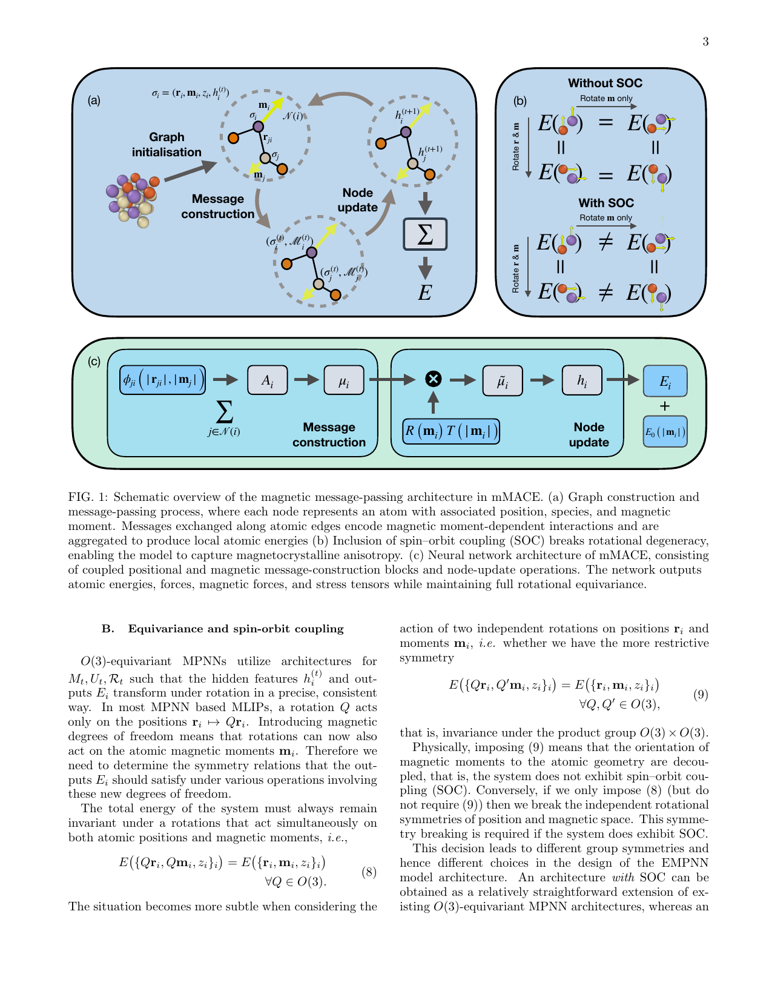
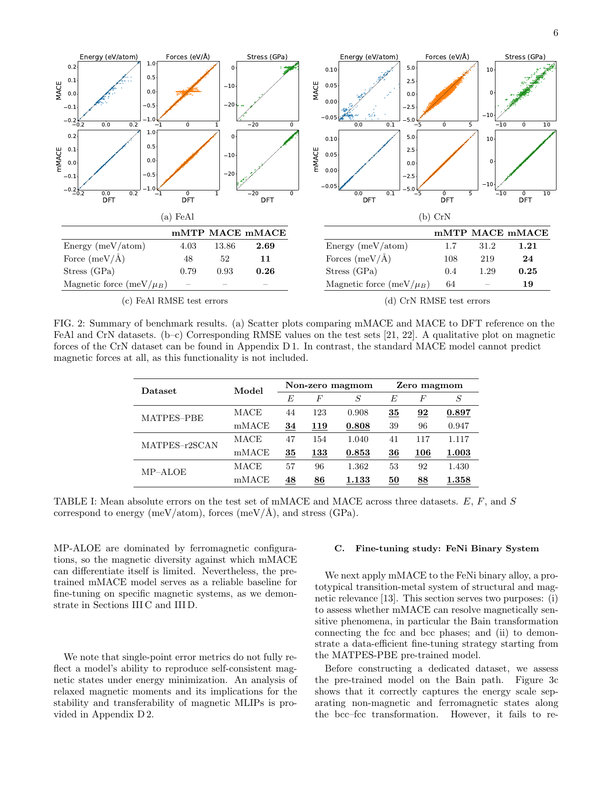
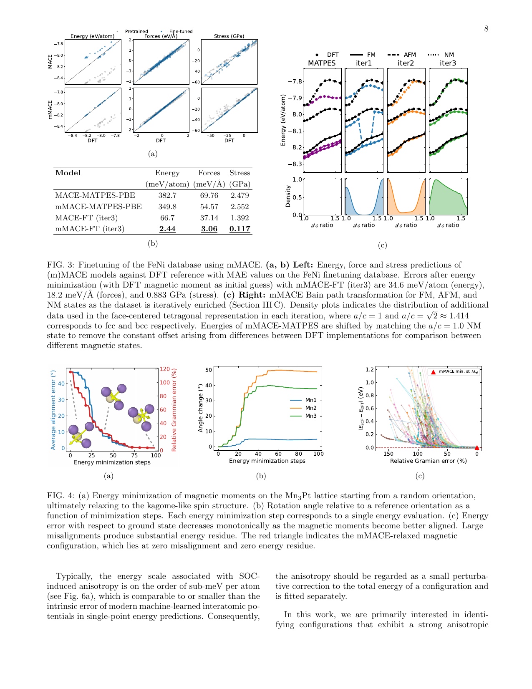
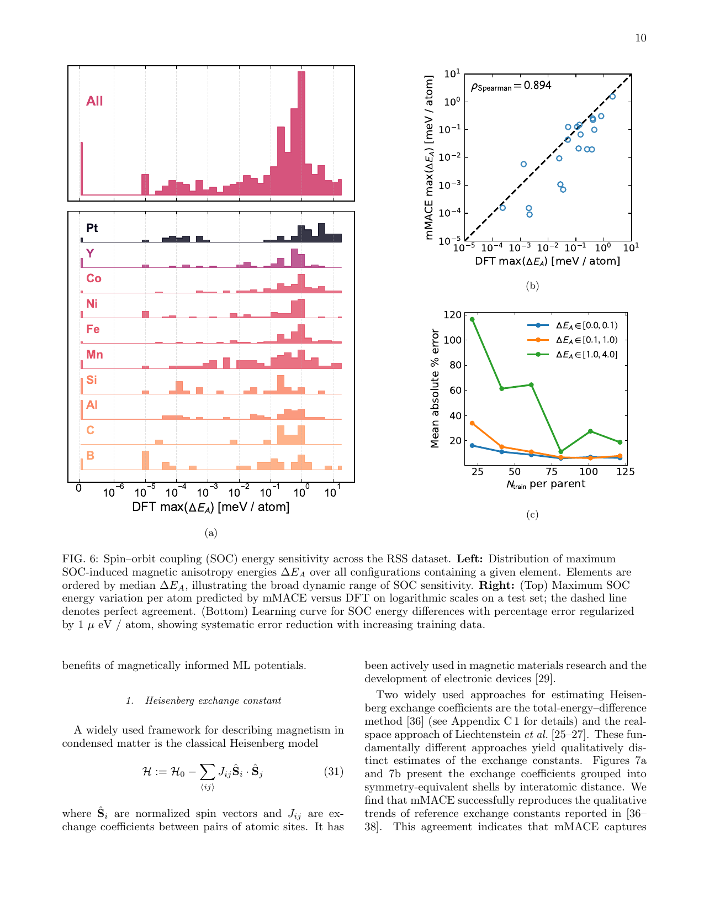
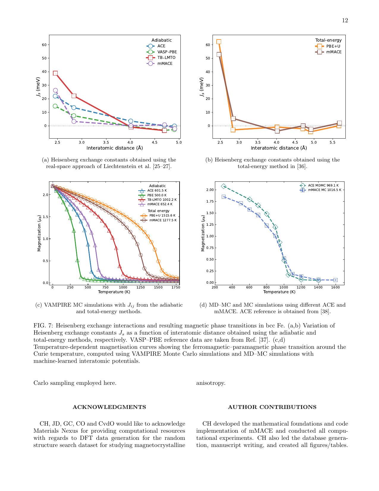

# mMACE 徹底解説: 磁性材料のための等変多体メッセージパッシング原子間ポテンシャル

- **執筆日**：2026-04-12
- **論文タイトル**：Equivariant Many-body Message Passing Interatomic Potentials for Magnetic Materials
- **著者**：Cheuk Hin Ho, Cas van der Oord, James P. Darby, Theo Keane, Raz L. Benson, Cristian Rebolledo Espinoza, Rutvij Kulkarni, Elina Spinu, Michail Papanikolaou, Richard Tomsett, Robert M. Forrest, Jonathan J. Bean, Gábor Csányi, Christoph Ortner
- **arXiv ID**：arXiv:2604.08143v1 [cond-mat.mtrl-sci]（2026年4月9日）
- **掲載誌情報**：プレプリント（投稿時）
- **トピック**：磁性材料の機械学習原子間ポテンシャル、等変グラフニューラルネットワーク、スピン軌道結合
- **キーワード**：MLIP、MACE、磁気モーメント、等変性、スピン軌道結合、磁気結晶異方性、ハイゼンベルク交換定数、キュリー温度
- **関連文献参照数**：47件

---

## 0. まず最初に：この論文は何をした論文か

この論文は、**磁性材料の原子間ポテンシャルを機械学習する新しいアーキテクチャ「mMACE（magnetic MACE）」** を提案した研究である。磁性は現代技術の根幹を支える物性でありながら、第一原理計算（密度汎関数理論、DFT）では計算コストが高く、大規模系・長時間スケールのシミュレーションが困難であった。機械学習原子間ポテンシャル（MLIP）はこの壁を打ち破る技術として注目されているが、従来のMLIPは磁気モーメントを明示的に扱えず、強磁性体・反強磁性体・非共線スピン系などを正確に記述することができなかった。

mMACEは、既存のMACEアーキテクチャ（グラフニューラルネットワーク型MLIP）を拡張し、**原子の磁気モーメントを陽な等変自由度として埋め込む** ことで、この問題を解決する。具体的には、各原子の状態を「位置・磁気モーメント・化学種・潜在特徴量」の組として表現し、位置空間と磁気モーメント空間の両方において同時に回転対称性（O(3)等変性）を満たすアーキテクチャを構築した。スピン軌道結合（SOC）がある系では位置と磁気モーメントが結合した変換、SOCがない系ではそれぞれ独立した変換に対する対称性を自然に取り込むことができる。

精度の面では、標準的なMACEモデルと比較してFeAlデータセットでは力の誤差を約5倍、応力誤差を約3.5倍低減し、CrNデータセットではさらに大きな改善を達成した。大規模基盤データセット（MATPES、MP-ALOE）での事前学習が可能であり、少数のデータポイントから特定の磁性系へのファインチューニングが効率よく行えることも実証された。応用面では、FeNiのBain変態経路・弾性定数の再現、Mn₃Ptのカゴメ型フラストレーテッドスピン基底状態の発見、FeMnの磁気結晶異方性定数の定量的予測、そしてFeのキュリー温度のモンテカルロ計算まで、磁性物質科学に直結する多様な現象を実演した。

この研究が意義深いのは、単に精度が上がったということだけでなく、**磁気モーメントが「力」と同様に勾配で動かせる明示的な自由度** として扱われる点にある。これにより、スピン格子動力学シミュレーションや有限温度磁気現象の計算、SOC由来の異方性エネルギーの予測といった、これまでDFTでしか実現できなかった計算が、機械学習ポテンシャルのスピードで可能になる。論文全体を通じて、磁性材料のハイスループットデータ駆動型探索への実践的な基盤が確立されたと言える。

---

## 1. 背景：なぜこの研究が必要なのか

### 磁性材料の重要性と計算の難しさ

磁性は現代材料科学の中心課題の一つである。情報ストレージデバイス、タービン発電機、電子デバイス、ロボットシステム、スピントロニクス技術、さらには二次元材料系における新奇物性など、磁性の正確な理解と制御は多くの技術領域に直結している。とりわけ近年、磁気自由度が格子自由度と強く結合した系での新しい物理現象が続々と報告されており、磁気効果を陽に取り込んだ計算手法の重要性はますます高まっている。

磁性材料の第一原理記述における本質的困難は、**原子位置と磁気モーメントが複雑に結合した高次元エネルギー景観** にある。磁気モーメントの大きさ・方向・空間配列（強磁性・反強磁性・非共線など）と格子構造の組み合わせが膨大であり、これらすべてを正確に記述するにはスピン分極DFT計算、さらにはスピン軌道結合を含む非共線DFT計算が必要となる。これらの計算は数十〜数百原子の系でも膨大な計算コストを要し、有限温度・メゾスケール現象のシミュレーションには実質的に手が届かない。

### 機械学習原子間ポテンシャル（MLIP）の登場と磁性への課題

機械学習原子間ポテンシャル（MLIP）は、DFTの精度を保ちながら古典分子動力学レベルのスピードでシミュレーションを行う技術として急速に発展してきた。特に近年の等変グラフニューラルネットワーク（GNN）型MLIP、なかでもMACE（Message-passing Atomic Cluster Expansion）は、多体相関を体系的に取り込み、高い精度と汎化性を示している。

しかし従来のMLIPには決定的な制約がある。**磁気モーメントという自由度を陽に取り扱えない** のである。原子位置 $\{\mathbf{r}_i\}$ だけをインプットとする通常のMLIPは、スピン自由度を「潜在変数」として暗黙的に埋め込むか、完全に無視するかしかできない。

その結果として以下の問題が生じる：
- 異なる磁気状態（強磁性・反強磁性・非磁性）のエネルギー差が正確に再現できない
- 磁気力（スピントルク）が計算できない
- SOC由来の磁気結晶異方性が記述できない
- スピン格子結合が陽に扱えない

### 既存の磁性MLIP手法とその限界

磁性材料向けMLIPの先行研究も存在するが、それぞれに本質的な限界があった。

Yuら（SEGNNs）はスピンベクトルの内積によって磁気相互作用を組み込んだが、これはスカラー量への縮約であり、非共線磁性のベクトル的・配向依存的性質を完全には捉えられない。Behlerらの高次元ニューラルネットワークポテンシャルを磁性に拡張した手法は共線配置に限定されていた。Rinaldiet al.（ACEベース）はSOCを含まず、単一元素について数千もの配置を必要としていた。DeepSPINフレームワーク（Huら）は「擬似原子表現」でスピン配置を格子情報と結合させるが、等変性の観点からは不完全であった。

まとめると、従来手法の主な問題点は：
1. 共線磁性に限定されること
2. SOCを適切に扱えないこと
3. 等変性が不完全で物理的一貫性に欠けること
4. 転移学習やデータ効率が低いこと

mMACEはこれらすべての限界を同時に克服する、という野心的な目標を持つ論文である。

---

## 2. この論文が解こうとしている核心問題

この論文が直接的に取り組んでいる問題は、次の5点に整理できる。

**問題1：等変な磁気自由度の表現**
原子磁気モーメント $\mathbf{m}_i \in \mathbb{R}^3$ を、位置 $\mathbf{r}_i$ と同様に等変な自由度として明示的にニューラルネットワークに組み込むにはどうすればよいか。単に磁気モーメントをスカラー量（大きさ）として扱うだけでなく、その方向まで含めた真のベクトル量として扱う必要がある。

**問題2：SOCの有無による対称群の違いの適切な処理**
SOCが存在する系では位置と磁気モーメントは結合して回転し（O(3)対称性）、SOCがない系ではそれぞれ独立に回転できる（O(3)×O(3)対称性）。この違いをアーキテクチャのレベルで適切に反映することが求められる。

**問題3：多体磁気相互作用の学習**
ハイゼンベルク型の2体交換相互作用を超えた多体磁気相互作用をデータから学習できるか。これはフラストレーテッドスピン系や有限温度挙動の正確な記述に不可欠である。

**問題4：磁気力の予測**
磁気モーメントに関するポテンシャルエネルギーの勾配 $\mathbf{F}_i^\mathrm{mag} = -\nabla_{\mathbf{m}_i} E$ を正確に予測することで、磁気モーメントの自己無撞着最適化やスピン格子動力学を可能にする。

**問題5：データ効率と転移学習**
磁性配置のDFTデータは計算コストが高いため、少数のデータから特定の磁性系に適応できる転移学習戦略が必要である。

---

## 3. 論文の主張と新規性

### 著者が新規だと主張していること

1. **等変磁気メッセージパッシングアーキテクチャの提案**：位置と磁気モーメントの両方に対してO(3)等変性を満たすグラフニューラルネットワーク型MLIPを初めて体系的に構築した。

2. **物理的に一貫した磁気表現**：磁気モーメントをメッセージパッシング中に明示的に伝播させ、位置情報と磁気情報の結合多体特徴量を学習する機構を設計した。

3. **SOCの自然な取り込み**：SOCの有無に応じて対称群（O(3)またはO(3)×O(3)）を選択できる柔軟なアーキテクチャを提供し、磁気結晶異方性をサブmeVスケールで予測可能にした。

4. **大規模事前学習モデルの構築**：MATPES、MP-ALOEという大規模公開データセットから事前学習した汎用磁性MLIPを提供し、少数データからのファインチューニング基盤を確立した。

5. **多様な磁性現象の実証**：FeAlとCrNのベンチマーク、FeNiのBain変態、非共線Mn₃Pt、FeMnの磁気異方性、Feのハイゼンベルグ交換定数とキュリー温度まで、幅広い磁性現象の再現性を実証した。

### 実際に新規性が強いと見なせる点

- 等変な磁気メッセージパッシングの数理的定式化は、MACE型アーキテクチャへの磁気自由度の統合として理論的に完結している。
- FeMnの磁気異方性定数 $K_1 = 2.20 \, \mathrm{J\,m^{-3}}$（mMACE）対 $2.22 \, \mathrm{J\,m^{-3}}$（DFT）という定量的一致は、SOCエネルギーがpoTentially sub-meVスケールであることを考えると、MLIPとしては顕著な成果である。
- Mn₃Ptでランダムな初期スピン配向から100回の緩和を全て行い、全てがカゴメ型基底状態に収束するという結果は、習得されたエネルギー景観の質を示す強い証拠である。

### まだ仮説的・限定的な点

- 事前学習データセットは強磁性配置が支配的であり、反強磁性・非共線・フラストレーテッド磁性の一般的モデルへの転移可能性はまだ限られている。
- SOC補正をself-consistentに訓練に組み込む方法はまだ未解決の課題として挙げられている。
- FeMnの磁気力学（MDMC）とキュリー温度の計算は、MDMCのステップ比に敏感であり、より詳細な収束解析が必要とされる。

---

## 4. 方法の全体像

mMACEの手法は大きく3つの部分から構成される：(1) アーキテクチャ設計、(2) 訓練・データセット生成、(3) 各種応用計算。

### アーキテクチャ設計

mMACEはMACEを基盤として磁気モーメントを陽な等変自由度として組み込んだグラフニューラルネットワークである。原子系をグラフとして表現し、各ノードが原子（位置・磁気モーメント・化学種・隠れ特徴量）、各エッジが近傍原子間の相互作用を担う。メッセージパッシングを通じて近傍情報を繰り返し集約し、最終的に各原子のエネルギー寄与を出力する。

対称性の取り扱いは、位置と磁気モーメントに対する同時回転（SOCあり）か独立回転（SOCなし）かによって異なり、いずれも球面調和関数とClbsch-Gordan係数を用いて等変性を保証している。

### 訓練・データセット

ベンチマーク用として、FeAlとCrNの公開コリニア磁性DFTデータセット（それぞれKotykhov et al.のデータ）を使用。大規模事前学習用にはMATPES（PBEおよびr²SCAN）とMP-ALOEの3つの基盤データセットを利用した。ファインチューニング用データは、FeNiのBain経路に対してMCサンプリングで生成したデータを反復的に追加する戦略を採用。

### 応用計算

以下の5種類の応用を実証した。
- FeNi系のBain変態（構造相転移）とfcc-bcc変換のエネルギー論
- Mn₃Ptの非共線カゴメ基底状態の自己無撞着緩和
- FeMnの磁気結晶異方性定数 $K_1, K_2$
- 多様な組成にわたるSOC感受性スクリーニング
- Feの非共線モンテカルロシミュレーションによるキュリー温度推定

---

## 5. 数式・モデル・解析法を基礎から理解する

この節は本解説の核心である。mMACEで使われる全数式を出現順に、前提知識から丁寧に解説する。

### 5.1 原子状態の定義（式1）

**直感的意味**：各原子をどのような変数で記述するか、という出発点の定義。

$$\sigma_i^{(t)} := \left(\mathbf{r}_i, \mathbf{m}_i, z_i, h_i^{(t)}\right) \tag{1}$$

この式は、メッセージパッシングの第 $t$ 層における原子 $i$ の**状態**（state）を定義している。

各記号の意味：
- $\mathbf{r}_i \in \mathbb{R}^3$：原子 $i$ の三次元位置ベクトル
- $\mathbf{m}_i \in \mathbb{R}^3$：原子 $i$ の（一般に非共線な）磁気モーメントベクトル。これが従来MLIPにはなかった新しい自由度
- $z_i \in \mathbb{Z}$：原子番号（化学種）
- $h_i^{(t)}$：第 $t$ 層の隠れ特徴量。スカラー・ベクトル・高階テンソル成分を含みうる

**この論文での意味**：磁気モーメント $\mathbf{m}_i$ を位置 $\mathbf{r}_i$ と同等に明示的に取り扱うことが、mMACEの中心思想である。磁気モーメントは「スピン密度の粗視化投影」あるいは「訓練中に暗黙的に定義される潜在変数」として解釈できる。

### 5.2 メッセージ構成（式2）

**直感的意味**：各原子が近傍の原子から情報を集め、メッセージを作る操作。

$$\mathcal{M}_i^{(t)} := \bigoplus_{j \in \mathcal{N}(i)} M_t\!\left(\sigma_i^{(t)}, \sigma_j^{(t)}\right) \tag{2}$$

各記号の意味：
- $\mathcal{N}(i)$：カットオフ半径 $r_\mathrm{cut}$ 以内にある原子 $i$ の近傍原子の集合
- $M_t$：第 $t$ 層の学習可能なメッセージパッシング関数
- $\bigoplus_{j \in \mathcal{N}(i)}$：置換不変な総和（学習可能なpooling操作）

**この式がなぜ必要か**：近傍の原子情報を集約して原子 $i$ の局所環境を記述するのがメッセージパッシングの本質。磁気モーメントを含む $\sigma_j^{(t)}$ を集めることで、近傍スピン配置の影響を自然に取り込める。

### 5.3 ノード更新（式3）

$$h_i^{(t+1)} := U_t\!\left(\sigma_i^{(t)}, \mathcal{M}_i^{(t)}\right) \tag{3}$$

各記号の意味：
- $U_t$：第 $t$ 層の学習可能な更新関数
- $h_i^{(t+1)}$：次の層における隠れ特徴量

**この式の役割**：収集したメッセージと現在の状態を組み合わせて、新しい隠れ表現を作る。これを $t = 1, 2, \ldots, t_\mathrm{max}$ 回繰り返すことで、原子 $i$ から $t$ ホップ先の近傍情報まで取り込んだ表現が得られる。論文では $t_\mathrm{max} = 2$ で十分とされる。

### 5.4 相互作用エネルギーのReadout（式4）

$$E_i^\mathrm{inter} := \sum_{t=1}^{t_\mathrm{max}} \mathcal{R}_t\!\left(h_i^{(t)}\right) \tag{4}$$

各記号の意味：
- $\mathcal{R}_t$：第 $t$ 層での学習可能なreadout関数（出力層）
- $E_i^\mathrm{inter}$：原子 $i$ の相互作用エネルギー（近傍との多体相互作用エネルギー）

**前後とのつながり**：$\mathcal{R}_t$ は最終層では非線形MLP（多層パーセプトロン）として実装され、それ以前の層では線形のreadoutが使われる。各層からエネルギーを読み出して合計する「マルチスケール」設計により、異なる空間スケールの相互作用を並列に学習できる。

### 5.5 全ポテンシャルエネルギー（式5）

$$E := \sum_i E_i^\mathrm{inter} + \sum_i E_{0,z_i}(|\mathbf{m}_i|) \tag{5}$$

各記号の意味：
- $E_i^\mathrm{inter}$：近傍との多体相互作用エネルギー（式4）
- $E_{0,z_i}(|\mathbf{m}_i|)$：一体磁気寄与。化学種 $z_i$ と磁気モーメントの大きさ $|\mathbf{m}_i|$ のみに依存

**この分解の物理的意味**：全エネルギーを「近傍との多体相互作用」と「孤立原子の磁気状態エネルギー」に分解している。後者 $E_{0,z_i}$ は、$|\mathbf{r}_{ji}| \to \infty$（$i, j$ が全て無限に遠い）という正しい大容積極限（large volume limit）を保証するために導入される。孤立原子が異なる磁気状態を持つとき、その状態に応じたエネルギー差を正確に再現するための項である。

### 5.6 原子間力と磁気力（式6、7）

$$F_i := -\nabla_{\mathbf{r}_i} E\!\left(\{\mathbf{r}_i, \mathbf{m}_i, z_i\}_i\right) \tag{6}$$

$$F_i^\mathrm{mag} := -\nabla_{\mathbf{m}_i} E\!\left(\{\mathbf{r}_i, \mathbf{m}_i, z_i\}_i\right) \tag{7}$$

**これらの式の意味と重要性**：

式(6)は通常の原子間力（構造最適化や分子動力学で使う力）であり、ポテンシャルエネルギーを原子位置で微分したものである。これは既存のMLIPでも同様に扱われる。

式(7)は**磁気力**（スピントルク）であり、ポテンシャルエネルギーを磁気モーメントベクトルで微分したものである。この量は従来のMLIPでは計算できなかったが、mMACEでは磁気モーメントが明示的な自由度であるため、自動微分（auto-differentiation）によって直接計算できる。

**磁気力がなぜ重要か**：磁気力 $F_i^\mathrm{mag} \neq 0$ であるということは、系が磁気的に非平衡状態にあることを意味する。この力を使って磁気モーメントを動かし、エネルギーが最小になる方向に緩和（自己無撞着サイクルで固定原子位置のまま磁気自由度を緩和）することで、磁気秩序を決定できる。また、スピン格子動力学シミュレーションでは、この磁気力を瞬時的な力として使う。

DFTにおける対応物：磁気力は、磁気モーメントを非平衡方向または大きさに固定した場合（constrained DFT計算）の拘束力に相当する。

### 5.7 対称性条件：SOCありの場合（式8）

**直感的意味**：SOCがある系では、位置と磁気モーメントを一緒に回転させても（それが同じ回転なら）エネルギーは変わらない。

$$E\!\left(\{Q\mathbf{r}_i, Q\mathbf{m}_i, z_i\}_i\right) = E\!\left(\{\mathbf{r}_i, \mathbf{m}_i, z_i\}_i\right) \quad \forall Q \in O(3) \tag{8}$$

**記号の意味**：
- $Q \in O(3)$：三次元回転群 $O(3)$ の元（行列）。回転と鏡映を含む
- $Q\mathbf{r}_i$：位置ベクトルを $Q$ で回転
- $Q\mathbf{m}_i$：磁気モーメントベクトルを**同じ** $Q$ で回転

**物理的背景**：SOCが存在すると、電子スピンは軌道角運動量と結合するため、スピン空間と実空間は独立ではなく、常に同じ空間回転に従う。したがって、位置と磁気モーメントを「同じ回転」で変換したとき、物理量が変わらないという対称性が成立する。これは通常のO(3)等変性の自然な拡張である。

### 5.8 対称性条件：SOCなしの場合（式9）

**直感的意味**：SOCがない系では、位置の回転と磁気モーメントの回転が独立になる。

$$E\!\left(\{Q\mathbf{r}_i, Q'\mathbf{m}_i, z_i\}_i\right) = E\!\left(\{\mathbf{r}_i, \mathbf{m}_i, z_i\}_i\right) \quad \forall Q, Q' \in O(3) \tag{9}$$

**SOCありとの違い**：式(8)では $Q = Q'$（位置と磁気モーメントに同じ回転）だったのに対し、式(9)では $Q \neq Q'$ でよい（独立した回転）。これは積群 $O(3) \times O(3)$ 対称性と呼ばれる。

**物理的背景**：SOCがないヘイゼンベルク型磁性体では、スピン回転対称性（グローバルスピン回転）と空間回転対称性が独立に成立する。エネルギーは個々のスピン方向には依存せず、スピン間の相対角度にのみ依存する。

**アーキテクチャへの影響**：mMACEは主として式(8)のO(3)等変性を満たすように設計されており、SOCなし系は「データ拡張（data augmentation）」によって高精度で式(9)も近似的に満たせることが実証されている。また付録Eでは、より厳密に式(9)を実装する代替アーキテクチャも提示されている。

### 5.9 初期ノード特徴量（式10）

$$h_{i,k00}^{(1)} = W_{k,z_i} \tag{10}$$

**記号の意味**：
- $h_{i,k00}^{(1)}$：第1層の不変（スカラー）ノード特徴量。インデックス $l_2 = m_2 = 0$ に制限
- $W_{k,z_i}$：化学種 $z_i$ に依存する学習可能なembeddingパラメータ
- $k$：特徴チャネルのインデックス

**この式の意味**：第1層の初期化には不変（スカラー）特徴量のみを使う。これは、最初の原子状態 $\sigma_i^{(1)} = (\mathbf{r}_i, \mathbf{m}_i, z_i, h_i^{(1)})$ において、化学種の情報だけを初期特徴量として使い、位置や磁気モーメントの情報はその後のメッセージパッシングを通じて伝わっていく設計を意味する。

### 5.10 エッジ不変量（式11、12）

$$J_{ji} := J(|\mathbf{r}_{ji}|, z_i, z_j) \tag{11}$$

$$T_j := T(|\mathbf{m}_j|, z_j) \tag{12}$$

**記号の意味**：
- $\mathbf{r}_{ji} := \mathbf{r}_j - \mathbf{r}_i$：原子 $i$ から原子 $j$ への変位ベクトル
- $|\mathbf{r}_{ji}|$：原子間距離（スカラー量 = 回転不変）
- $J_{ji}$：位置的不変エッジ特徴量（原子間距離と化学種から作る）
- $T_j$：磁気的不変ノード特徴量（磁気モーメントの大きさと化学種から作る）

**重要な設計選択**：$T_j$ には $|\mathbf{m}_j|$（磁気モーメントの大きさ）を使い、$\mathbf{m}_j$ の方向は含めない。これは、磁気モーメントの方向は後で球面調和関数 $R_{l_1}^{m_1'}(\mathbf{m}_j)$ を通じて等変な形で取り込まれるためである。こうすることで、純粋に不変な量（大きさ）と等変な量（方向）を適切に分離している。

$J$ と $T$ は非学習可能なベッセル関数とチェビシェフ多項式から構成されており、詳細は付録A2に記されている。

### 5.11 学習可能な動径基底（式13、14）

$$P_{ji,kl_1l_2l_3}^{(t)} := \mathrm{MLP}_{kl_1l_2l_3}^{(t),P}(J_{ji} \oplus T_j) \tag{13}$$

$$K_{ji,kl_1l_2l_3}^{(t)} := \mathrm{MLP}_{kl_1l_2l_3}^{(t),K}(J_{ji} \oplus T_j) \tag{14}$$

**記号の意味**：
- $P_{ji,kl_1l_2l_3}^{(t)}$：位置情報用の学習可能な動径基底
- $K_{ji,kl_1l_2l_3}^{(t)}$：磁気情報用の学習可能な動径基底
- $\oplus$：連結（concatenation）
- $l_1, l_2, l_3$：角運動量量子数に対応するインデックス
- $k$：チャネルインデックス

**この式の役割**：$J_{ji}$ と $T_j$ を入力としたMLPによって、角運動量チャネル$(l_1, l_2, l_3, k)$ごとに異なる動径基底を学習する。$P$ は位置的な相互作用を、$K$ は磁気モーメントを介した相互作用をそれぞれ動径方向に記述する。

通常のMACE（非磁性）では $P$ のみが使われ、$J_{ji}$ だけを入力とする。mMACEでは磁気モーメントの大きさ $|\mathbf{m}_j|$ を含む $T_j$ も追加入力とすることで、スピン大きさへの依存性を陽に取り込む。

### 5.12 位置的2体エッジ特徴量（式15）

**直感的意味**：原子 $j$ からのエッジが位置情報のみを担う基本的な特徴量。

$$\phi_{ji,kl_3m_3}^{(t),\mathrm{pos}} := \sum_{l_1 m_1 l_2 m_2} C_{l_1 m_1 l_2 m_2}^{l_3 m_3} \cdot P_{ji,kl_1l_2l_3}^{(t)} \cdot Y_{l_1}^{m_1}(\hat{\mathbf{r}}_{ji}) \cdot h_{j,kl_2m_2}^{(t)} \tag{15}$$

**記号の意味**：
- $C_{l_1 m_1 l_2 m_2}^{l_3 m_3}$：Clebsch-Gordan（CG）係数。角運動量の結合則を表す
- $Y_{l_1}^{m_1}(\hat{\mathbf{r}}_{ji})$：実球面調和関数（$\hat{\mathbf{r}}_{ji}$は単位ベクトル）。結合方向の角度依存性
- $h_{j,kl_2m_2}^{(t)}$：近傍原子 $j$ の隠れ特徴量（球面調和関数基底で展開）
- $l_3, m_3$：この特徴量が変換する球面調和関数の次数と磁気量子数

**正確な意味**：この式は、「原子 $j$ の隠れ特徴量 $h_j$」と「$j \to i$ の方向の球面調和関数 $Y_{l_1}$」と「動径基底 $P_{ji}$」をCG係数でテンソル積（縮約）したものである。CG係数を使うことで、角運動量の加法則 $l_3 \in |l_1 - l_2|, \ldots, l_1 + l_2$ が保証され、等変性が厳密に成立する。

$t=1$ の場合（式17）は初期特徴量がスカラー（$l_2=m_2=0$）なので、

$$\phi_{ji,kl_3m_3}^{(1),\mathrm{pos}} := P_{ji,k,l_3}^{(1)} Y_{l_3}^{m_3}(\hat{\mathbf{r}}_{ji}) h_{j,k,00}^{(1)} \tag{17}$$

と簡略化され、計算コストが大幅に下がる。

### 5.13 磁気情報込みの2体エッジ特徴量（式16）

$$\phi_{ji,kl_3'm_3'}^{(t),\mathrm{mag+pos}} := \sum_{l_1'm_1'l_2'm_2'} C_{l_1'm_1'l_2'm_2'}^{l_3'm_3'} \cdot K_{ji,kl_1'l_2'l_3'}^{(t)} \cdot R_{l_1'}^{m_1'}(\mathbf{m}_j) \cdot \phi_{ji,kl_2'm_2'}^{(t),\mathrm{pos}} \tag{16}$$

**記号の意味**：
- $R_{l_1'}^{m_1'}(\mathbf{m}_j)$：原子 $j$ の磁気モーメントの実球面調和関数（regular solid harmonics）。$|\mathbf{m}_j| \to 0$ での滑らかな極限を保証する
- $K_{ji,kl_1'l_2'l_3'}^{(t)}$：磁気情報用動径基底（式14）

**この式の核心**：位置的エッジ特徴量 $\phi^{(t),\mathrm{pos}}$ に対して、さらに磁気モーメント $\mathbf{m}_j$ の情報をCG結合で追加した特徴量が $\phi^{(t),\mathrm{mag+pos}}$ である。これが「磁気モーメントを等変な形でメッセージに組み込む」鍵の操作である。

$R_{l_1'}^{m_1'}(\mathbf{m}_j)$ は磁気モーメントベクトル $\mathbf{m}_j$ 自体を球面調和関数展開しており、方向情報（$l' \geq 1$）を持つ。これをCG結合することで、磁気モーメントの方向依存性がエッジ特徴量に伝わる。

**実装上の注意**：式(15)と(16)の2段階に分割してあるのは、1ステップでやると中間テンソルが巨大になりメモリ・計算コストが増大するためである。実際には式(15)と(16)の縮約を1つの操作にまとめることも可能だが、著者らはコスト削減のためにあえて2段階にしている。

### 5.14 2体基底の集約（式18）

$$A_{i,klm}^{(t)} := \sum_{j \in \mathcal{N}(i)} \phi_{ji,klm}^{(t),\mathrm{mag+pos}} \tag{18}$$

**意味**：原子 $i$ の全近傍 $j \in \mathcal{N}(i)$ からのエッジ特徴量を総和して、原子 $i$ 中心の2体基底を作る。この総和演算は置換不変（order invariant）であり、近傍原子のラベリングに依存しない。

オプションで密度正規化（density normalization）を適用できる（式18の前後）。これは内部規格化を改善し、高圧への外挿を滑らかにするための手法である。

### 5.15 多体基底（式19）

**直感的意味**：2体の特徴量を組み合わせて、多体（3体・4体以上）相関を取り込む。

$$\mathbf{B}_{i,\eta,kLM}^{(t)} := \sum_{\mathbf{lm}} C_{\eta,\mathbf{lm}}^{LM} \prod_{\xi=1}^{\nu} \sum_k W_{kk l_\xi}^{(t)} A_{i,kl_\xi m_\xi}^{(t)} \tag{19}$$

**記号の意味**：
- $\nu$：体次数（correlation order）。$\nu = 3$ なら3体相関、$\nu = 4$ なら4体相関
- $C_{\eta,\mathbf{lm}}^{LM}$：一般化CG係数（複数の角運動量を結合するためのCG係数の積）
- $W_{kk l_\xi}^{(t)}$：学習可能な重み行列
- $\mathbf{lm} = (l_1 m_1, \ldots, l_\nu m_\nu)$：$\nu$ 個の角運動量インデックスのまとまり
- $\eta$：各体次数 $\nu$ に対する異なる縮約経路のインデックス
- $L, M$：結合後の全角運動量とその磁気量子数

**この式の物理的意味**：$\nu$ 個の2体特徴量 $A$ をCG係数で結合することで、$\nu+1$ 体相関（ここでは原子 $i$ と近傍の $\nu$ 個の原子 $j_1, \ldots, j_\nu$ の関係）を記述できる。これが**多体**メッセージパッシングの核心である。MACEの原型（通常の原子クラスター展開、ACE）でも同様の多体縮約が使われており、mMACEはそれを磁気自由度にまで拡張している。

### 5.16 中間特徴量（式20）

$$\mu_{i,kLM}^{(t)} := \sum_{\nu=1}^{\nu_\mathrm{max}} \sum_{\eta_\nu} W_{z_i \eta_\nu kL}^{(t),\nu} \mathbf{B}_{i,\eta,kLM}^{(t)} \tag{20}$$

**意味**：各体次数 $\nu$ の多体基底 $\mathbf{B}$ を、化学種 $z_i$ に依存する重みで線形結合して中間特徴量 $\mu$ を作る。ここで重みは $\nu$ ごとに独立であり、様々な体次数の寄与を柔軟に合成できる。

### 5.17 磁気自己相関（式21）

$$Q_{i,kl_0 l_1 L}^{(t)} := \mathrm{MLP}_{kl_0 l_1 L}^{(t),Q}\!\left(T(|\mathbf{m}_i|, z_i)\right) \tag{21}$$

**意味**：原子 $i$ 自身の磁気モーメントの大きさと化学種を入力としたMLPから得られる学習可能な重み行列。この $Q$ は自分の磁気モーメントの大きさに応じて、次の式(22)でのスピン方向の結合強度を制御する。

### 5.18 多体メッセージ（式22）

$$\mathcal{M}_{i,kLM}^{(t)} := \sum_{l_0 m_0 l_1 m_1} C_{l_0 m_0 l_1 m_1}^{LM} Q_{i,kl_0 l_1 L}^{(t)} R_{l_0}^{m_0}(\mathbf{m}_i) \mu_{i,kl_1 m_1}^{(t)} \tag{22}$$

**この式の意味**：原子 $i$ 自身の磁気モーメント $\mathbf{m}_i$ の球面調和関数 $R_{l_0}^{m_0}(\mathbf{m}_i)$ と、近傍情報を集めた中間特徴量 $\mu_{i,kl_1m_1}^{(t)}$ をCG係数で結合し、多体メッセージを作る。

**なぜ自分のスピンを結合するか**：この操作により、「原子 $i$ 自身の磁気モーメントの方向」と「近傍の磁気環境・構造環境」の相関を取り込める。これが**磁気スピンと局所原子環境の多体相関**を学習する鍵の操作であり、単なるハイゼンベルク的2体交換を超えた高次相互作用を記述できる。

### 5.19 ノード更新（式23）

$$h_{i,kLM}^{(t+1)} := \sum_{\tilde{k}} W_{kL,\tilde{k}}^{(t),\mathrm{self}} \mathcal{M}_{i,\tilde{k}LM}^{(t)} + \sum_{\tilde{k}} W_{kL,\tilde{k}}^{(t)} \mu_{i,\tilde{k}LM}^{(t)} + \sum_{\tilde{k}} W_{kz_i,\tilde{k}}^{(t)} h_{i,\tilde{k}LM}^{(t)} \tag{23}$$

**意味**：3つの成分の線形結合でノード特徴量を更新する。

- 第1項（$W^{\mathrm{self}}$）：多体メッセージ $\mathcal{M}$ の寄与。自分の磁気モーメントと近傍の磁気・構造情報の相関
- 第2項（$W$）：中間特徴量 $\mu$ の寄与。近傍の磁気・構造情報
- 第3項（$W^{z_i}$）：直前の層の自分の特徴量の寄与（残差接続、skip connection）

この残差接続は現代的なニューラルネットワーク（ResNet等）で広く用いられる設計で、勾配消失問題を緩和し、深いネットワークの訓練を安定化する。

### 5.20 相互作用エネルギーのReadout（式24）

$$E_i^\mathrm{inter} := \sum_{t=1}^{t_\mathrm{max}} \left(\mathcal{R}_t\!\left(h_{i,kLM}^{(t)}\right)\right) \tag{24}$$

式(4)と同様だが、ここでは完全な特徴量表現 $h_{i,kLM}^{(t)}$（全角運動量チャネル）に適用される。$\mathcal{R}_t$ は不変（$L=0$）成分を取り出す線形/非線形 readout 関数。

### 5.21 一体磁気寄与（式25）

$$E_{0,z_i}(|\mathbf{m}_i|) := \sum_{n,z} W_{nz} \delta_{zz_i} \tilde{T}_n(|\mathbf{m}_i|) \tag{25}$$

**記号の意味**：
- $\delta_{zz_i}$：化学種が $z_i$ に等しいときのみ1になるクロネッカーのデルタ
- $\tilde{T}_n$：入力変換を施したチェビシェフ多項式基底
- $W_{nz}$：学習可能な係数

**この項の役割**：孤立原子の磁気状態エネルギーを表す。$|\mathbf{m}| \to 0$ の極限でゼロ（孤立非磁性原子のエネルギー基準）になるように、原点をシフトして使う（付録A1参照）。過学習を防ぐため、正則化付き最小二乗法でフィットする手続きが詳細に説明されている。

### 5.22 全原子エネルギー（式26）

$$E_i := E_i^\mathrm{inter} + E_{0,z_i}(|\mathbf{m}_i|) \tag{26}$$

これは式(5)を個々の原子について書いたものである。全エネルギーは $E = \sum_i E_i$ で与えられる。

---

### 5.22b アーキテクチャの全体フロー（Fig. 1cの解説）

ここで、上記の式群がどのようにつながってネットワークを形成するかを、Fig. 1cの概念図と対応させながら整理する。

まず、各エッジ $(i, j)$ について：
1. 位置不変量 $J_{ji}$（式11）と磁気不変量 $T_j$（式12）を計算
2. MLPにより動径基底 $P_{ji}^{(t)}$（式13）と $K_{ji}^{(t)}$（式14）を生成
3. 球面調和関数 $Y_{l_1}^{m_1}(\hat{\mathbf{r}}_{ji})$ と隠れ特徴量 $h_j^{(t)}$ をCG結合して位置特徴量 $\phi^{(t),\mathrm{pos}}$（式15）を作成
4. さらに磁気モーメント球面調和関数 $R_{l_1'}^{m_1'}(\mathbf{m}_j)$ とCG結合して磁気込み特徴量 $\phi^{(t),\mathrm{mag+pos}}$（式16）を完成

次に、各ノード $i$ について：
5. 近傍からのエッジ特徴量を集約して2体基底 $A_i^{(t)}$（式18）を作成
6. CG積を $\nu$ 回繰り返して多体基底 $\mathbf{B}_i^{(t)}$（式19）を構築
7. 体次数 $\nu$ を合算して中間特徴量 $\mu_i^{(t)}$（式20）を生成
8. 自分の磁気モーメントの球面調和関数とCG結合してメッセージ $\mathcal{M}_i^{(t)}$（式22）を完成
9. 残差接続を持つ線形結合でノード特徴量 $h_i^{(t+1)}$（式23）を更新

最後に：
10. 不変（スカラー）特徴量を読み出してエネルギー $E_i^\mathrm{inter}$（式24）を得る
11. 一体磁気寄与 $E_{0,z_i}$（式25）を加えて全原子エネルギー $E_i$（式26）を完成

このフローが $t = 1, 2, \ldots, t_\mathrm{max}$ の各層で繰り返され、最終的に全エネルギー $E = \sum_i E_i$ が得られる。自動微分によって原子間力 $F_i$（式6）と磁気力 $F_i^\mathrm{mag}$（式7）が同時に計算できる。

*図1：mMACEの磁気メッセージパッシングアーキテクチャの概念図。(a) グラフ構成とメッセージパッシング過程。(b) SOCの有無による対称性の違い。(c) ニューラルネットワークアーキテクチャの全体像（磁気メッセージ構成ブロックとノード更新操作）。ライセンス：CC BY 4.0（Ho et al., arXiv:2604.08143）*

---

### 5.23 相対グラミアン誤差（式27）：非共線磁気緩和の評価指標

$$\varepsilon_\mathrm{rel}(A, A_\mathrm{ref}) = \frac{\|G(A) - G(A_\mathrm{ref})\|_F}{\|G(A_\mathrm{ref})\|_F} \tag{27}$$

**背景**：SOCがない系では、全スピンのグローバル回転に対してエネルギーは変わらない（式(9)参照）。したがって、「絶対的なスピン方向」ではなく「スピン間の相対的な角度配置」こそが物理的に意味を持つ。

**記号の意味**：
- $A$：磁気モーメントベクトルの行列（各行が1つの磁気モーメント）
- $G(A) := A^\top A$：グラミアン行列。$G_{ij} = \mathbf{m}_i \cdot \mathbf{m}_j$（内積の行列）
- $\|\cdot\|_F$：フロベニウスノルム（行列の全要素の二乗和の平方根）

**この指標の意味**：グラミアン行列はスピン間の全ての内積情報を含む。内積 $\mathbf{m}_i \cdot \mathbf{m}_j = |\mathbf{m}_i||\mathbf{m}_j|\cos\theta_{ij}$ はグローバル回転に対して不変であるため、グラミアン誤差はグローバル回転自由度を除いた純粋な磁気配置の誤差を測る。Mn₃Ptのカゴメ型基底状態の緩和収束の評価に使われる。

---

### 5.24 磁気結晶異方性エネルギー（式28、29、30）

$$E_A(\theta, \phi) := E(\theta, \phi) - E(\theta_0, \phi_0) \tag{28}$$

**記号の意味**：
- $(\theta, \phi)$：磁化ベクトルの極角・方位角
- $(\theta_0, \phi_0)$：参照磁化方向（例：$z$ 軸方向）
- $E_A$：磁気結晶異方性エネルギー（MAE）

**物理的背景**：原子構造を固定したまま磁化方向を回転させると、SOCの効果によりエネルギーが方向に依存して変化する。このエネルギーの方向依存性が磁気結晶異方性であり、磁石の「磁化しやすい軸（easy axis）」や「磁化しにくい軸（hard axis）」を決める。

$$\Delta E_A(\{\sigma_i\}_i) := \max_{\theta_1,\phi_1,\theta_2,\phi_2} \left[E(\theta_1, \phi_1; \{\sigma_i\}_i) - E(\theta_2, \phi_2; \{\sigma_i\}_i)\right] \tag{29}$$

**意味**：ある原子・磁気配置 $\{\sigma_i\}$ に対する「最大SOCエネルギー変動」を異方性強度として定義する。これにより、SOC感受性の高い配置を数値的にスクリーニングできる。

一軸異方性系（FeMnなど）では、磁気異方性エネルギー密度が角度展開で以下のように書ける：

$$\frac{E_A}{V} \approx K_1 \sin^2\theta + K_2 \sin^4\theta \tag{30}$$

**記号の意味**：
- $V$：系の体積
- $K_1, K_2$：磁気異方性定数（単位：$\mathrm{J\,m^{-3}}$）
- $\theta$：$c$ 軸（主対称軸）からの磁化角度

**物理的意味**：
- $K_1 > 0$（$K_1 < 0$）なら $\theta = 0$（$z$ 軸方向）が容易軸（困難軸）
- 通常 $|K_1| \gg |K_2|$ であり、$K_2$ は微小補正項
- mMACEでFeMnに対して求めた $K_1 = 2.20 \, \mathrm{J\,m^{-3}}$ はDFT値 $2.22 \, \mathrm{J\,m^{-3}}$ と0.9%以内で一致

---

### 5.25 ハイゼンベルクモデル（式31）

**直感的意味**：磁性体の低エネルギー有効ハミルトニアンとして広く使われる古典モデル。

$$\mathcal{H} := \mathcal{H}_0 - \sum_{\langle ij \rangle} J_{ij} \hat{\mathbf{S}}_i \cdot \hat{\mathbf{S}}_j \tag{31}$$

**記号の意味**：
- $\mathcal{H}_0$：非磁気的部分（格子振動エネルギーなど）
- $J_{ij}$：スピン $i$ と $j$ の間の交換定数（単位：meV）
- $\hat{\mathbf{S}}_i$：正規化されたスピンベクトル（大きさ1）
- $\langle ij \rangle$：全スピン対の総和

**物理的意味**：$J_{ij} > 0$ なら強磁性的結合（スピンを揃えようとする）、$J_{ij} < 0$ なら反強磁性的結合（スピンを反平行にしようとする）。交換定数は原子間距離が増えるにつれて一般に減衰する。

**mMACEからの $J_{ij}$ の抽出**：2つの方法が使われる。(i) 全エネルギー差法（付録C）：様々な磁気配置でのmMACEエネルギーから最小二乗フィットで $J_{ij}$ を抽出（式C5〜C7）。(ii) 断熱近似法（Liechtensteinら）：スピン螺旋のエネルギーから実空間で $J_{ij}$ を抽出（式C8〜C10）。

---

## 6. 結果：著者は何を示したのか

### 6.1 FeAlとCrNのベンチマーク（Fig. 2、Table Ic,d）

FeAlはコリニア・スピン分極データセット（Kotykhov et al.）でのベンチマークである。Fig. 2aの散布図が示すように、標準MACEはゼロでない力・応力を予測すべき配置でゼロを予測するアーティファクトが見られる。これはMACEが磁気モーメントを取り込めず、スピン依存エネルギー面を正確に表現できないことを示す。mMACEはこのアーティファクトを示さない。

定量的には（Table Ic）：
- エネルギー：MACE 13.86 meV/atom → mMACE 2.69 meV/atom（**5倍改善**）
- 力：MACE 52 meV/Å → mMACE 11 meV/Å（**4.7倍改善**）
- 応力：MACE 0.93 GPa → mMACE 0.26 GPa（**3.6倍改善**）

CrNでは（Table Id）磁気力も比較対象に含まれ：
- エネルギー：mMACE 1.21 meV/atom（MACE比25倍改善）
- 磁気力：mMACE 19 meV/μ_B（mMTP比3.4倍改善）

*図2：FeAl（左）とCrN（右）データセットでのmMACEとMACEのDFTに対する散布図およびRMSE値。上段がMACE、下段がmMACE。ライセンス：CC BY 4.0（Ho et al., arXiv:2604.08143）*

### 6.2 大規模基盤データセットでの事前学習（Table I）

MATPES-PBE、MATPES-r2SCAN、MP-ALOEの3つの大規模公開データセットでの比較では：
- 非ゼロ磁気モーメントの配置ではmMACEが全ての指標でMACEを上回る
- ゼロ磁気モーメントの配置ではほぼ同等の性能を維持（磁気自由度の追加が通常の精度を損なわない）
- MATPES系では5〜10倍改善には届かないが（強磁性配置が支配的なため）、一貫した改善が見られる

### 6.3 FeNiのファインチューニング（Fig. 3）

FeNiの相変態（Bain変態：bcc↔fcc変換）は、 $a/c$ 比を連続的に変化させる構造変換経路（Bain経路）で記述される。事前学習モデルから少数データのファインチューニングにより：

- 第2反復後（iter2）で既にBain経路がDFT参照とほぼ完全に一致（Fig. 3c）
- 明示的にBain経路の配置を訓練データに含めていないにもかかわらず達成
- FM（強磁性）・AFM（反強磁性）・NM（非磁性）の三状態が正確に区別される

最終ファインチューニングモデル（iter3）の誤差：
- エネルギー：2.44 meV/atom（MACE-FT: 66.7 meV/atom比27倍改善）
- 力：3.06 meV/Å（MACE-FT: 37.14 meV/Å比12倍改善）
- 応力：0.117 GPa（MACE-FT: 1.392 GPa比12倍改善）

*図3：FeNiデータベースでのmMACEファインチューニング。左：エネルギー・力・応力の散布図。右：Bain変態エネルギー経路（iter毎の改善）。ライセンス：CC BY 4.0（Ho et al., arXiv:2604.08143）*

### 6.4 Mn₃Ptの非共線磁性（Fig. 4）

フラストレーテッド反強磁性体Mn₃Ptは、カゴメ格子上の三角形スピン配置（120°スピン構造）を基底状態として持つ難しい系である。

- ランダムな初期スピン配向から100回の磁気緩和を実行
- **全100回が** カゴメ型基底状態に収束（Fig. 4c）
- グラミアン誤差と角度整合誤差が共に迅速に減衰（Fig. 4a, b）
- DFT基底状態（赤三角）でのエネルギー残差がほぼゼロ

これは、訓練データの分布外（訓練・検証セットの外）のランダム初期配置からでも、mMACEの習得したエネルギー景観が定性的に正しいことを示す強力な証拠である。

### 6.5 磁気結晶異方性（Fig. 5、6）

FeMnのSOC含む計算から、$K_1 = 2.20 \, \mathrm{J\,m^{-3}}$（mMACE）vs $2.22 \, \mathrm{J\,m^{-3}}$（DFT）という定量的一致（Fig. 5）。RSSデータセットでのスクリーニングでは：
- SOCエネルギーが素子によって数桁も異なる広い動的レンジを正確に捉える（Fig. 6a、Pt最大・B最小）
- Spearmanランク相関係数 $\rho = 0.894$（Fig. 6b）：SOC感受性の相対的ランキングが保存されている
- 学習曲線で約5%の相対誤差に収束（Fig. 6c）

*図6：SOCエネルギー感受性スクリーニング。ライセンス：CC BY 4.0（Ho et al., arXiv:2604.08143）*

### 6.6 Feのハイゼンベルク交換定数とキュリー温度（Fig. 7）

bcc Feのハイゼンベルク交換定数について：
- 全エネルギー法・断熱法ともにDFT参照と定性的に一致（Fig. 7a, 7b）
- Curie温度のモンテカルロ計算：mMACE-MC → **1016 K**（実験値：1043 K、誤差2.6%）
- 対してVAMPIRE（断熱的 $J_{ij}$ 使用）では過小評価が顕著（600〜1000 K台）

この改善は、mMACEが非共線スピン配置と多体交換相互作用を明示的に取り込んでいることに起因する。

*図7：bcc Feのハイゼンベルク交換定数（上段）とキュリー温度の比較（下段）。ライセンス：CC BY 4.0（Ho et al., arXiv:2604.08143）*

---

## 7. 考察：どこまで信じてよいか

### 7.0 アーキテクチャ設計の選択に関する考察

mMACEのアーキテクチャ設計において、いくつかの重要な選択が行われている。これらは精度と計算効率のトレードオフを反映している。

**設計選択1：2段階縮約（式15→式16）**
磁気情報と位置情報を1ステップで結合せず、まず位置特徴量を作成し（式15）、次に磁気情報を追加する（式16）という2段階設計は、中間テンソルの巨大化を防ぐためである。一方で、この分割により一部の相互作用経路が失われる可能性がある。著者はこれをコスト削減のための工学的選択として明示している。

**設計選択2：SOCアーキテクチャの採用**
mMACEは主としてO(3)等変（式8のSOCあり対称性）を実装し、SOCなし系にはデータ拡張で対応する設計を採用した。これは実装の単純化と既存MACEとの互換性を優先した選択である。付録EのO(3)×O(3)変種との比較が今後重要になる。

**設計選択3：磁気モーメント大きさのみをエッジ入力に**
$T_j = T(|\mathbf{m}_j|, z_j)$ として磁気モーメントの大きさのみをエッジ不変量に使い（式12）、方向は後で球面調和関数で取り込む設計は理論的に一貫している。しかし、この分離が実際の学習効率にどう影響するかの詳細な解析はない。

### 確固とした証拠がある結果

**精度向上（FeAl、CrN）**は、単純なベンチマークによる数値的比較であり、結論は明確である。mMACEがMACEよりも一貫して大きく優れており、磁気モーメントの陽な取り扱いの効果は疑いない。

**Mn₃Ptのカゴメ基底状態**の100回中100回収束は、エネルギー景観の質に関する非常に強い証拠である。ただし、Pt原子の磁気モーメントが小さいため（$\sim 10^{-4} \mu_B$）、この系では磁気自由度はMnサイト3種類のみが実質的であり、問題の次元が比較的低い点には注意が必要。

**FeMnの異方性定数**のDFTとの一致は印象的だが、FeMnは2原子セルで問題設定が単純な部類である。複雑な多副格子合金や酸化物などへの一般化はまだ示されていない。

### まだ限定条件付きの結果

**キュリー温度**の計算（1016 K vs 実験 1043 K）は良好だが、MDMCのステップ比が収束に影響することが著者自身によって言及されており、より厳密な計算が必要とされている。また、論文中のmMACE MDMCシミュレーションはACC参照との比較であり、実験との直接比較にはさらなる検証が必要である。

**SOCスクリーニング**の相関係数 $\rho = 0.894$ は高い（ランキング相関として）が、絶対誤差は依然として大きい場合がある（Fig. 6bで1〜2桁の偏差が見られる）。このため、SOC感受性の定性的スクリーニングには使えるが、定量的予測には注意が必要。

**事前学習モデルの汎化性**について、MATPES・MP-ALOEのデータは強磁性配置が支配的（磁気多様性が低い）という重要な制約がある。この訓練データバイアスにより、反強磁性系やフラストレーテッド系への転移には追加データが不可欠。

### 多磁気ブランチ問題：重要な留意点

付録D2で議論されているように、DFTの磁気データには**多磁気ブランチ問題**という本質的な困難がある。同じ原子構造 $\mathbf{R}$ に対して、異なる磁気状態が複数の自己無撞着解を持ち得る。MATRESのようなデータセットはこれらを混在させており、mMACEがある配置でDFT値と食い違うように見えるケース（TbSbPtの例）が、実際にはDFTの「参照」より低エネルギーな磁気状態を発見している場合があることが実証されている。これは磁気MLIPの評価指標（単一点誤差）の限界を示しており、緩和ベースの検証が必要であることを著者自身が認めている。

---

## 8. 背景研究とどうつながるか

### MACEとの関係

mMACEはMACEアーキテクチャ（Batatia et al., 2022, Ref. [4]）を直接基盤にしている。MACEは原子クラスター展開（ACE）を等変GNNとして実装したものであり、体次数 $\nu$ を制御できる点でNequIPなどの先行手法よりも柔軟性が高い。mMACEはMACEの数理的骨格を保ちながら、磁気自由度をシームレスに追加した拡張として理解できる。

### ACEとの関係

Rinaldiet al.（Ref. [38]）がACEフレームワークでFeの非共線磁性データを扱った研究があり、本論文でそのFeモデルがベンチマーク比較に使われている。ACEは非共線磁性を含むが、SOC非対応かつ単一元素のみ、訓練データが膨大という制約があった。mMACEはこれらの制約を克服している。

### 先行する磁性MLIPとの位置づけ

SEGNN型（Yuら）・DeepSPIN（Huら）との比較として、mMACEは等変性をより完全に実装し、多体相関も体系的に取り込んでいる。Behler型手法の磁性拡張は共線限定であり、mMACEはこれを非共線・SOCまで一般化する。

### 磁気結晶異方性の理論的基礎

磁気力定理（Magnetic Force Theorem, MFT; Liechtensteinら, Refs. [25-27]）は、SOC補正をコリニアDFT計算の固有値差から非自己無撞着に近似する手法として広く使われる。mMACEがフィットするSOCエネルギーはまさにMFTによって計算されたものであり、mMACEの枠内でMFT精度のSOC補正を再現する。

---

## 9. 基礎から理解する

### 9.1 機械学習原子間ポテンシャル（MLIP）とは何か

分子動力学（MD）シミュレーションでは、原子の運動方程式を時間積分するために原子間力 $\mathbf{F}_i$ が必要である。古典的には経験的ポテンシャル（Lennard-Jones型、EAMなど）が使われてきたが、精度に限界がある。DFT（密度汎関数理論）は高精度だが計算コストが非常に高い。

MLIPは、DFTデータから機械学習でポテンシャルエネルギー面 $E(\{\mathbf{r}_i, z_i\})$ を学習し、DFT精度を保ちながら高速に原子間力を計算する。原子間力は自動微分で $F_i = -\partial E/\partial \mathbf{r}_i$ として得られる。

### 9.2 グラフニューラルネットワークによるMLIP

原子系はグラフとして表現できる：ノード＝原子、エッジ＝近傍ペア（距離カットオフ以内の原子間）。グラフニューラルネットワーク（GNN）はメッセージパッシングを通じてノード特徴量を更新し、最終的にエネルギーを出力する。

重要な性質は**等変性**（equivariance）である。原子系を回転・鏡映 $Q \in O(3)$ すると、出力エネルギーは変わらず（不変）、出力の力は同じ変換に従う（等変）。これは物理的必須条件であり、等変GNNでは球面調和関数とCG係数を用いて厳密に保証される。

### 9.3 球面調和関数とClebsch-Gordan係数

**球面調和関数** $Y_l^m(\hat{\mathbf{r}})$ は、単位球面上の関数を角運動量量子数 $(l, m)$ で分類したもの。$l = 0$ がスカラー（定数）、$l = 1$ がベクトル（px, py, pz型）、$l = 2$ が二階テンソル（d軌道型）などに対応。

$$O(3) \text{変換}: Y_l^m(Q\hat{\mathbf{r}}) = \sum_{m'} D_{mm'}^l(Q) Y_l^{m'}(\hat{\mathbf{r}})$$

ここで $D_{mm'}^l(Q)$ はウィグナーのD行列。等変ニューラルネットワークは、全ての特徴量をこの形式で変換するよう設計されている。

**Clebsch-Gordan係数** $C_{l_1 m_1 l_2 m_2}^{l_3 m_3}$ は、2つの角運動量 $l_1, l_2$ を合成して全角運動量 $l_3$ を作るときの係数で、量子力学の角運動量の加法則から来る：

$$l_3 \in \{|l_1 - l_2|, |l_1 - l_2| + 1, \ldots, l_1 + l_2\}$$

等変ニューラルネットワークでは、CG結合を使って異なる $l$ チャネルの特徴量を混ぜ合わせながら等変性を保持する。

### 9.4 O(3)等変性とSOCの物理

**O(3)** は三次元空間の直交変換群（回転＋鏡映）である。原子系を $Q \in O(3)$ で変換したとき：
$$E(\{Q\mathbf{r}_i\}) = E(\{\mathbf{r}_i\})$$
これは空間の等方性（エネルギーが回転の仕方に依存しない）を表す。

**スピン軌道結合（SOC）** とは、電子の軌道角運動量 $\mathbf{L}$ とスピン角運動量 $\mathbf{S}$ の相互作用 $\mathcal{H}_\mathrm{SOC} \propto \mathbf{L} \cdot \mathbf{S}$ である。SOCが存在すると、スピン空間と実空間は結合し、系を回転させるとスピンも一緒に回転する必要がある。SOCがなければスピンは実空間の回転と独立に回転でき、$O(3) \times O(3)$ 対称性が成立する。

**磁気結晶異方性** はSOCの直接的な現れである。SOCが大きい重元素（Pt, Co など）では磁気モーメントが特定の結晶方向に沿うことを好み、この方向依存性が $K_1$ として現れる。

### 9.5 ハイゼンベルクモデルとその限界

古典ハイゼンベルクモデルは

$$\mathcal{H} = -\sum_{\langle ij \rangle} J_{ij} \hat{\mathbf{S}}_i \cdot \hat{\mathbf{S}}_j$$

と書かれ、2体交換相互作用のみを仮定する。このモデルの前提として、磁気モーメントの大きさは一定（rigid spin）で方向のみが変化すること、相互作用は2体で完結すること、スピン格子結合はないことが仮定されている。

しかし実際の磁性材料では、これらの仮定が成立しない場合がある。たとえばキュリー温度付近では熱的スピン揺らぎによりモーメントの大きさが変化し（longitudinal fluctuation）、また3体・4体相互作用（ring exchange）が重要になる場合もある。mMACEはこれらの多体・非剛体的効果を原理的に取り込める。

### 9.6 密度汎関数理論における磁性の扱い

DFTは波動関数（電子密度）を基礎にしたab initio計算手法であり、磁性はスピン分極DFT（異なるスピン方向の電子を別々に扱う）で記述される。

非共線磁性（スピンが一軸に揃わない場合）は、スピノール（2成分）の波動関数と非共線DFT計算が必要。SOCを含む計算には全相対論的擬ポテンシャル（fully relativistic pseudopotentials）または全電子計算が必要で、さらに計算コストが増大する。

局所磁気モーメント $\mathbf{m}_i$ は、電子密度のスピン成分を原子球内で積分することで定義されるが（Wigner-Seitz球、Hirshfeld、Baderなど各種分割方式がある）、この値は分割方式に依存する非一意な量であることにも注意が必要。

### 9.7 磁気力定理（Magnetic Force Theorem）とSOCエネルギーの計算

SOCによる磁気異方性エネルギー（MAE）を正確に計算するには、異なる磁化方向ごとにフル非共線・自己無撞着（SCF）DFT計算を行う必要があるが、これは計算コストが非常に大きい。

磁気力定理（MFT）は、この問題を大幅に簡略化する強力な近似である。MFTによれば、SOC補正を一次摂動として扱うと、MAEは

$$\mathrm{MAE} \approx \sum_i f_i(\theta_1, \phi_1) \epsilon_i(\theta_1, \phi_1) - \sum_i f_i(\theta_0, \phi_0) \epsilon_i(\theta_0, \phi_0)$$

と書ける（論文中の式B1）。ここで $\epsilon_i(\theta, \phi)$ はコーン・シャム固有値、$f_i(\theta, \phi)$ は占有数であり、磁化方向 $(\theta, \phi)$ での計算値である。

この近似が使える理由は、SOCエネルギーがDFT全エネルギーの変分的な停留性を持つためである。コリニア基底状態を参照点として、SOCを摂動的に加えたとき、全エネルギーの変化量はバンドエネルギー（固有値の和）の変化量と等しくなるという近似が成立する。

MFTを使えば、1回のコリニアSCF計算の後、非自己無撞着なSOC計算を異なる磁化方向について繰り返すだけでMAEが計算できるため、計算コストが大幅に削減される。mMACEが学習するSOCエネルギーはまさにこのMFTに基づくDFTデータである。

### 9.8 ハイゼンベルク交換定数の抽出法：全エネルギー差法と断熱近似法の比較

**全エネルギー差法（Total Energy Difference Method）**は、様々な磁気配置でのmMACEエネルギーを計算し、最小二乗フィットで $J_{ij}$ を抽出する。ハイゼンベルクモデルによれば、磁気配置 $l$ でのエネルギーは

$$E^{(l)} = E_0 - \sum_{k<N_k} J_k c_k^{(l)}$$

と書ける（論文中の式C5）。ここで $c_k^{(l)} = \sum_{\langle ij \rangle \in X_k} \hat{\mathbf{S}}_i \cdot \hat{\mathbf{S}}_j$ はスピン相関係数、$X_k$ は第 $k$ 近傍シェルの全ペア集合である。$L$ 個の磁気配置から設計行列 $\mathbf{C}$ を作り、最小二乗問題 $\mathbf{E} = \mathbf{C}' \mathbf{x}$ を解くことで $J_k$ を一括推定する。

**断熱近似法（Liechtenstein法）**は、スピン螺旋のエネルギーを使う実空間アプローチである。スピン螺旋のエネルギーは

$$E(\mathbf{q}) = \sum_j J_{0j}\left[1 - \cos(\mathbf{q} \cdot \mathbf{r}_{0j})\right]$$

と書ける（論文中の式C8）。個別の $J_{ij}$ を抽出するために小角回転プロトコルを使う：コリニア強磁性状態から始め、スピン $i$ と $j$ を反対方向に $\pm\theta/2$ だけ回転させる。その全エネルギー変動の差 $\Delta_{ij}(\theta)$ が

$$\Delta_{ij}(\theta) = \delta E_{ij}(\theta) - \left[\delta E_i(\theta) + \delta E_j(\theta)\right]$$

と定義され（式C9）、小角近似では $\Delta_{ij}(\theta) = \frac{1}{2} J_{ij} \theta^2 + \mathcal{O}(\theta^4)$ となる（式C10）。$\Delta_{ij}(\theta)$ vs $\theta^2/2$ の線形フィットから $J_{ij}$ が抽出できる。

**2つの方法の本質的な違い**：全エネルギー差法は系の全エネルギーの変化を直接使うのに対し、断熱近似法はスピン波（マグノン）の断熱的なエネルギーを使う。前者は有効なハイゼンベルク交換定数の「熱力学的」な定義に対応し、後者は「動力学的」な定義に対応する。これらは一般に同じ値にはならず、Fe系ではその差異が図7a・7bに現れている。

---

## 10. 専門用語集

**mMACE（magnetic MACE）** ：本論文で提案された新アーキテクチャ。MACEを磁性材料向けに拡張し、原子磁気モーメントを陽な等変自由度として取り込む。

**MLIP（Machine-Learned Interatomic Potential）** ：機械学習原子間ポテンシャル。DFTデータから学習したポテンシャルエネルギー面を用いて分子動力学などのシミュレーションを行う。

**等変性（Equivariance）** ：入力 $x$ に変換 $T$ を施すと、出力 $f(x)$ が対応する変換 $T'$ に従う性質：$f(Tx) = T'f(x)$。MLIPでは回転O(3)に対する等変性が物理的必須条件。

**EMPNN（Equivariant Message Passing Neural Network）** ：等変メッセージパッシングニューラルネットワーク。NequIP、MACE、BOTNetなどがこのカテゴリーに属する。

**MACE（Message-passing Atomic Cluster Expansion）** ：等変GNN型MLIPの一実装。多体相関を体系的に取り込み、高い精度と計算効率を両立する。mMACEの基盤。

**スピン軌道結合（SOC）** ：電子のスピン角運動量と軌道角運動量の結合。$\mathcal{H}_\mathrm{SOC} \propto \mathbf{L} \cdot \mathbf{S}$。磁気結晶異方性の起源。重元素ほど効果が大きい。

**磁気結晶異方性（MCA）** ：磁化が特定の結晶方向に整列しやすいという性質。SOCの直接的帰結。異方性エネルギー密度 $E_A/V \approx K_1 \sin^2\theta + K_2 \sin^4\theta$ で記述される。

**ハイゼンベルク交換定数 $J_{ij}$** ：2体スピン相互作用の強さ。$J > 0$ が強磁性的、$J < 0$ が反強磁性的。mMACEからの全エネルギー差法や断熱近似法で抽出可能。

**非共線磁性** ：磁気モーメントが一軸に揃わず、三次元的に異なる方向を向いた磁気秩序。フラストレーテッドスピン系（Mn₃Ptなど）の基底状態として現れる。

**キュリー温度 $T_C$** ：強磁性体が常磁性体に転移する相転移温度。Feの実験値は1043 K。mMACEのモンテカルロ計算では1016 K（誤差2.6%）。

**球面調和関数 $Y_l^m$** ：単位球面上の完全直交規格化関数系。角運動量量子数 $(l, m)$ でラベル付けされ、等変GNNの特徴量の回転変換を記述する。

**Clebsch-Gordan係数** ：2つの角運動量の合成（テンソル積）をする際の係数。等変GNNでは異なる $l$ チャネルの特徴量を結合する際に使われ、等変性を保証する。

**グラミアン行列** ：ベクトルの集合 $\{\mathbf{m}_i\}$ の内積行列 $G_{ij} = \mathbf{m}_i \cdot \mathbf{m}_j$。グローバル回転に不変であり、スピン配置の相対的な関係を捉える。

**Bain変態経路** ：bcc構造とfcc構造を連続的に結ぶ変換経路。 $c/a$ 比を $1$（bcc）から $\sqrt{2}$（fcc）まで変化させることで得られる。FeNiの相安定性解析に使われる。

**カゴメ格子** ：正三角形と正六角形からなる二次元格子。Mn₃Ptでは三角形スピン副格子がカゴメ的フラストレーションをもたらし、120°スピン構造（非共線）の基底状態を生じる。

**MATPES** ：Materials Project Trajectory Datasetの略。第一原理計算から得られた大規模材料データセット。PBE汎関数とr2SCAN汎関数の両バージョンが存在し、mMACEの事前学習に使用。

**MP-ALOE** ：Materials Project All-Levels Of Energyの略。r2SCAN汎関数を使った大規模DFTデータセット。

**Gramian誤差 $\varepsilon_\mathrm{rel}$** ：スピン配置の一致度を測る指標。内積行列（グラミアン）の差をフロベニウスノルムで評価し、グローバル回転自由度を除いた純粋な配置の誤差を測る。

**データ拡張（Data Augmentation）** ：訓練データに対してランダムな変換（ここでは独立な空間回転と磁気モーメント回転）を適用することで、モデルが特定の対称性（O(3)×O(3)）を高精度で近似的に満たすようにする手法。

**断熱近似** ：電子系の変化（スピン回転）が核の運動（格子振動）に対して十分遅いと仮定し、スピンと格子を独立に扱う近似。ハイゼンベルク交換定数の実空間アプローチで使用。

---

## 11. 残された課題と今後の展望

### かなり前進した点

mMACEは、磁性材料のMLIP分野において以下の点で質的なブレークスルーをもたらした。非共線磁性とSOCを体系的に取り扱えるMLIPが初めて確立されたこと、等変な磁気自由度の数学的基盤が整理されたこと、MATPES規模の大規模データから事前学習して少数データファインチューニングが可能な磁性MLIP基盤が構築されたこと、そして磁気力・異方性エネルギー・ハイゼンベルク交換定数・キュリー温度など、磁性物性の多様な出力量が同一モデルから得られることが実証されたことである。

### まだ未解決な点

著者自身が挙げる今後の課題は以下の4点である。

**課題1：基盤データの磁気多様性の拡充**
MATPES・MP-ALOEは強磁性配置が支配的であり、反強磁性・フラストレーテッド・非共線磁性を豊富に含む訓練データの構築が急務である。これがないと、事前学習mMACEの磁気多様性は限定的なままである。

**課題2：SOC補正の自己無撞着な訓練への統合**
現在のmMACEでは、SOC補正は事後的な補正として扱われ（MFTベース）、訓練プロセスへの自己無撞着な統合は未解決である。SOCを完全にend-to-endで学習できれば、更なる精度向上が期待できる。

**課題3：O(3)×O(3)アーキテクチャの改良**
付録EのSOCなし変種は積群対称性をデータ拡張に頼らずアーキテクチャレベルで実装しているが、本アーキテクチャではSOCあり・なし系を統一的に扱えない。両者を単一モデルで対応できるアーキテクチャが求められる。

**課題4：スピン格子動力学フレームワークとの連携**
mMACEをスピン格子動力学（SLD）コードに組み込むことで、マグノン-フォノン相互作用・消磁プロセス・スピンカロリクスなど、静的緩和やモンテカルロを超えた動力学現象の研究が可能になる。これは材料設計への応用において最も重要な次のステップの一つである。

### 今後重要になりそうな論点

1〜3年のスパンで以下の方向性が重要になると考えられる。まず、多成分磁性材料（マルチプリンシパルエレメント合金など）へのスケールアップ：現在はFeNi、Mn₃Pt、FeMnなど比較的シンプルな系が対象だが、複雑な多元素系への展開が実用的応用につながる。次に、磁気秩序と格子安定性の同時最適化（スピン格子結合の陽な記述）：これが実現すれば、磁気転移温度と構造相転移の相互作用を直接シミュレートできる。また、mMACEドリブンのハイスループットスクリーニングによる新規強磁性・フラストレーテッド磁性材料の探索も期待される。

---

## 12. まとめ

この論文の核心は、**磁性材料のための等変機械学習原子間ポテンシャルを、数学的に完全で物理的に一貫した形で初めて確立した** ことにある。mMACEは、原子磁気モーメントをO(3)等変な自由度としてMACEアーキテクチャに統合し、SOCの有無に応じた適切な対称性下で磁気相互作用を学習する。

なぜ重要か、という問いに対する答えは次のように整理できる。磁性は材料の重要な機能性であるにもかかわらず、計算コストの壁からDFT以外の信頼できるシミュレーション手法がなかった。mMACEはこの壁を破り、DFT精度でありながらMD/MCの速度で、非共線・SOC効果を含む複雑な磁性現象を扱えるようにした。

何がまだ分からないか、という観点では、SOCの自己無撞着な統合、フラストレーテッド磁性の汎用モデル、スピン格子動力学への展開、多磁気ブランチ問題の根本解決が未解決課題として残る。

読者が次に読むと理解が深まる文献として、以下を勧める：(i) MACEの原典（Batatiら、2022）でアーキテクチャの基礎を理解する。(ii) Rinaldiet al.（2024、ACEベース非共線Fe）で先行手法との比較を深める。(iii) Liechtensteinら（1987年）でハイゼンベルク交換定数の実空間アプローチを学ぶ。(iv) 磁気結晶異方性の理論的基礎（Brooksら）でSOC効果の物理を理解する。

---

## 参考文献一覧

### 対象論文

- **[Ho et al., 2026]** Cheuk Hin Ho et al., "Equivariant Many-body Message Passing Interatomic Potentials for Magnetic Materials," arXiv:2604.08143v1 [cond-mat.mtrl-sci]  
  [https://arxiv.org/abs/2604.08143](https://arxiv.org/abs/2604.08143)

### 本文理解に使った主要関連文献

- **[Batatia et al., 2022]** I. Batatia et al., "MACE: Higher order equivariant message passing neural networks for fast and accurate force fields," NeurIPS 2022.  
  MACEアーキテクチャの原典。mMACEの直接的な基盤。

- **[Rinaldi et al., 2024]** M. Rinaldi et al., "Magnetic ACE: non-collinear atomistic spin-lattice model for Fe," npj Comput. Mater.  
  非共線Fe向けACEモデル。本論文のキュリー温度計算のACE参照として使用。

- **[Liechtenstein et al., 1987]** A. I. Liechtenstein et al., "Local spin density functional approach to the theory of exchange interactions in ferromagnetic metals and alloys," J. Magn. Magn. Mater. 67, 65.  
  ハイゼンベルク交換定数の実空間法の古典的文献。

- **[Kotykhov et al., 2023]** A. Kotykhov et al., FeAl磁気MTP用データセット。  
  FeAlベンチマークの訓練・テストデータ提供元。

- **[Kotykhov et al., 2024]** A. Kotykhov et al., CrN磁気データセット。  
  CrNベンチマークの訓練・テストデータ提供元。

- **[Batatia et al., 2023]** MACE-MP基盤モデル（MACE汎用モデル）。  
  mMACEのデータセット処理・ハイパーパラメータ最適化に参照。

### 背景理解に有効な基礎文献

- **磁気MLIP全般のレビュー**：Nikolov et al.（2022）, J. Mater. Res.  
  磁性MLIPの分野全体の見取り図を提供。

- **SOCと磁気結晶異方性**：Bruno, P. (1989), Phys. Rev. B 39, 865.  
  SOC誘起異方性の基礎理論。

- **GNNによるMLIP**：Batzner et al. (2022) NequIP, Nature Commun.  
  等変GNN型MLIPの先駆的研究。

- **MATPES データセット**：参考文献[20]（本論文）。大規模磁性DFTデータ基盤の詳細。

- **DeepSPIN**：Hu et al. (2023)（参考文献[45][46]）。擬似原子表現を用いたスピン・格子MLIP。

---

*本解説記事のライセンス：CC BY 4.0 に基づいて論文原図を使用。図の出典：Ho et al., arXiv:2604.08143（CC BY 4.0）。*
