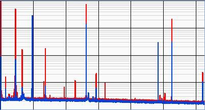
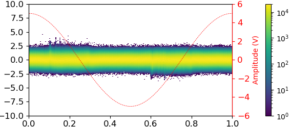
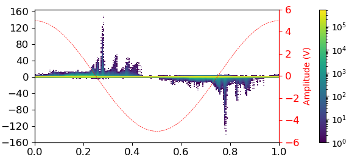

# 渦電流損失の起源に迫る：アモルファス／ナノ結晶リボンにおける磁壁緩和ダイナミクスの実時間計測

- 執筆日：2026-05-04
- トピック：磁気バルクハウゼンノイズを用いた磁壁ピンニング・脱ピンニング緩和過程の定量的解明
- タグ：MBN、磁壁ダイナミクス、過剰渦電流損失、アモルファス合金、ナノ結晶合金、NANOMET、ソフト磁性材料、鉄損、パワーエレクトロニクス
- 注目論文：T. Yamazaki, S. Tamaru, and M. Kotsugi, "Analysis of Magnetic Barkhausen Noise to Reveal Domain Wall Dynamics in Amorphous/Nanocrystalline Ribbons," *IEEE Access*, vol. 13, pp. 140079–140086, Aug. 2025. DOI: 10.1109/ACCESS.2025.3596507
- 関連論文数：7
- 対象分野：軟磁性材料物理、磁壁ダイナミクス、パワーエレクトロニクス用材料設計

---

## 1. この論文を読む意味

次世代パワーエレクトロニクスの性能向上において、インダクタやトランスコアに用いるソフト磁性材料の「鉄損」をいかに低減するかは、産業上きわめて重要な課題である。高効率電力変換に向けた材料設計の観点から見ると、この問いは単なる工学的最適化の問題ではなく、磁壁（ドメインウォール、DW）が材料内部をどのように運動するのかという、物性物理の根本問題と直結している。

鉄損は古典的に、ヒステリシス損失・古典渦電流損失・過剰渦電流損失の三成分に分離される（Bertotti の損失分離モデル）。このうち高周波になるほど支配的になるのが「過剰渦電流損失」であり、これは磁壁が局所的に急激な速度変化を起こす際に誘起される局所渦電流によるエネルギー散逸に由来する。にもかかわらず、過剰渦電流損失の詳細な物理機構は長らく未解明のまま残されてきた。主な理由は、個々の磁壁の脱ピンニング・緩和過程を実験的に直接観測する手段が乏しかったためである。

磁気バルクハウゼンノイズ（Magnetic Barkhausen Noise、MBN）は、磁壁がピンニングサイトを乗り越える瞬間に生じる電磁的スパイクであり、磁壁ダイナミクスを間接的に観測する強力なプローブとして古くから知られている。しかし従来のMBN計測は多数の脱ピンニングイベントの統計的平均を扱うことが多く、個々のイベントが持つ時間波形の詳細——とくに脱ピンニング直後の緩和過程——を分解するには帯域幅と感度の両立が困難であった。

本注目論文（Yamazaki et al., 2025）は、広帯域・高感度のMBN計測システムを新たに開発し、Fe–Si–B–P–Cu（NANOMET®）アモルファスリボン上で個々のMBNパルスをシングルショット計測することに成功した。さらに指数関数的減衰フィッティングによってMBNパルスの緩和時定数を統計的に定量化し、渦電流制動が固有磁壁制動を一桁以上上回ることを解析モデルによって示した。これは、過剰渦電流損失の物理的起源——磁壁の脱ピンニング直後の速度緩和——を実験的に直接示した初めての報告のひとつである。

この論文を深く読む意義は三つある。第一に、材料物性としての意義：過剰渦電流損失を微細構造設計によって低減するための定量的な指針が得られる。第二に、測定・解析手法としての意義：広帯域MBN計測という手法的革新は、磁壁ダイナミクスの研究に新しい実験的窓を開く。第三に、物理モデルとしての意義：磁壁の運動方程式における各パラメータ（制動係数・復元ばね定数）の実験的決定という、長年の未解決問題に新しいアプローチを提供する。

---

## 2. この分野の未解決問題

**問い1：過剰渦電流損失の物理機構は何か**

Bertotti の損失分離モデルは、過剰損失を「有効磁壁数」という唯象論的パラメータで記述する。しかし、この損失がどのような微視的過程から生まれるのかは明確ではなかった。磁壁が急激に脱ピンニングされる際の速度スパイクが局所渦電流を誘起し、それが損失の主因と考えられるものの、その過程の時間スケールや制動機構については実験的検証が不足していた。本注目論文はこの問いに直接迫ったものである。

**問い2：磁壁運動方程式の各パラメータを実験的にどう決定するか**

磁壁の運動は、質量・制動・復元力を含む線形二階常微分方程式でモデル化されるが（Baldwin-Culler モデル）、制動係数 ζ と復元ばね定数 k の独立した実験的決定は困難を伴う。両者の比が緩和時定数 τ = ζ/k として観測量に現れるが、それぞれの絶対値は材料固有の微細構造・弾性特性・磁気特性に依存する複雑な関数である。本注目論文の測定はこの問いに実験データを提供するが、k の独立な決定は将来課題として残されている。

**問い3：ナノ結晶化は磁壁ダイナミクスをどう変えるか**

FINEMET 系（Fe–Si–B–Nb–Cu）や NANOMET 系（Fe–Si–B–P–Cu）のナノ結晶軟磁性合金では、熱処理によってアモルファス母相中にナノ結晶粒が形成され、軟磁気特性が劇的に改善される。この改善は磁壁ピンニングサイトの性質変化と関係するが、その微細構造的な機構の定量的理解は進行中である。Huang et al.（2024）や Tsukahara et al.（2022）はこの問いに磁気伸縮の観点から迫っているが、磁壁緩和ダイナミクスの直接観測という観点では本注目論文が新しい実験データを与えている。

**問い4：渦電流制動と固有磁壁制動の相対的寄与はいかほどか**

金属軟磁性体における磁壁制動には、（1）ギルバート制動に代表される固有磁壁制動と、（2）磁壁運動によって誘起される渦電流制動の両方が関与する。どちらが支配的かは材料の電気抵抗率・リボン厚さ・磁壁幅などに依存する。本注目論文の解析モデルは渦電流制動が圧倒的に支配的であることを示しているが、低損失ナノ結晶合金では磁気粘性やマグネトストリクション制動など別の機構が重要になる可能性も示唆されている。

**問い5：個別 MBN イベントの統計分布はどのような情報を持つか**

複数の脱ピンニングイベントを統計的に扱うアバランシェ解析（スケーリング則）は、Barkhausen 効果の普遍性クラスを議論する上で強力なアプローチである（Zapperi et al., 1998）。しかし、個々のパルス波形の時間スケール分布（緩和時定数の分布）が微細構造の何を反映するのかは、従来の統計的アプローチでは捉えにくかった。本注目論文はこの分布の系統的取得を初めて実現し、ピーク振幅と緩和時定数の相関という新しい観点を提供した。

---

## 3. 注目論文の核心

### 研究目的と対象材料

本論文の研究目的は、アモルファス／ナノ結晶 Fe–Si–B–P–Cu（NANOMET®）リボンにおける磁壁脱ピンニング・緩和過程を個別イベントレベルで実験的に捉え、過剰渦電流損失の物理的起源を解明することである。

NANOMET® は Makino らが 2009 年に開発した高 Bs ナノ結晶軟磁性合金であり、飽和磁束密度 Bs ≈ 1.9 T という際立った高さと低い保磁力を両立する。アモルファス状態では構造欠陥・局所応力・組成不均一性に起因するピンニングサイトが多く存在し、熱処理（焼鈍）によってアモルファス母相中に α-Fe ナノ結晶粒が析出すると、ピンニングサイトの数と強さが著しく変化する。この変化が MBN 特性を劇的に変えることが予想されるため、NANOMET® はアモルファス状態とナノ結晶状態の間で磁壁ダイナミクスを比較する理想的なモデル材料となっている。

### 計測システムの設計と性能

本研究の中心的な技術的貢献は、広帯域・高感度 MBN 計測システムの開発である（Fig. 1）。

**図1** MBN 計測システムのブロック図、ジグの写真、およびノイズ電力スペクトル密度（NPSD）。青線は読み出しチャンネル単体、赤線は全チャンネルの NPSD。緑破線は LNDA の入力換算ノイズレベル（1.4 nV/√Hz @ 1 kHz）を示す。（Yamazaki et al., 2025, CC BY 4.0）

システムの主要構成は以下の通りである。励磁コイル（40巻き）と検出コイル（120巻き）からなる二重コイルジグ（開口部 3 mm × 1.6 mm）に、約 2.5 mm × 10 mm に切り出したリボン試料を挿入する。1 Hz、100サイクルの正弦波励磁を行い、検出コイルに誘起された信号を低ノイズ差動アンプ（Stanford Research Systems SR552、入力換算ノイズ 1.4 nV/√Hz @ 1 kHz）で増幅し、データ取得装置（NI USB-6251）で 1.25 MS/s のサンプリングレートで取得する。ナイキスト周波数（625 kHz）付近まで感度が保たれており、従来システムと比較して帯域幅と感度の両立を実現している（論文中 Table 1 参照）。

外来ノイズ対策として、励磁電流アンプには 110 Hz のローパスフィルタを組み込み、差動配線と完全な電磁シールドを施した。その結果、全チャンネルの NPSD は読み出しチャンネル単体とほとんど差がなく（< 1 dB）、外来ノイズの混入が極めて小さいことが確認された。

### 主要結果 1：個別 MBN パルスの波形観測

非焼鈍（完全アモルファス）NANOMET® リボンに 1 Hz の磁化磁場を印加したとき、明瞭な離散的スパイク列が観測された（Fig. 2 参照）。個々のパルスは、急峻な立ち上がりエッジの後に指数関数的に減衰するなだらかな後端をもつ特徴的な形状を示した。

この波形の立ち上がりは、磁壁がピンニングサイトから突然解放された直後の急速加速を反映している。後端の指数関数的減衰は過制動系（overdamped system）の磁壁運動に対応しており、これが真の磁壁ダイナミクスの反映であることは、急峻な立ち上がりの存在（＝計測系の帯域制限による人工的な丸みでないこと）によって担保されている。MBN 信号は磁化の時間微分——すなわち磁壁速度——に比例するため、指数関数的に減衰する電圧波形は、磁壁速度が脱ピンニング直後から指数関数的に緩和することを直接示している。

### 主要結果 2：緩和時定数の統計分布

個別パルスの解析には以下の指数関数モデルを適用した：

$$V_{\rm MBN} = A \cdot e^{-\frac{1}{\tau}(t-t_0)} + B$$

ここで $V_{\rm MBN}$ は MBN 電圧、$A$ はパルス振幅、$\tau$ は緩和時定数、$t_0$ は磁壁解放の開始時刻、$B$ はベースラインオフセットである。フィッティングは Levenberg–Marquardt アルゴリズム（SciPy 実装）を用いた非線形最小二乗法で実施した。

20 mV 以上のピーク振幅を持つパルスに適用した結果、100 サイクルから合計 888 個のパルスが抽出された。得られた緩和時定数の平均値は **τ̄ ≈ 3.8 µs**（標準偏差 ≈ 1.8 µs）であった。

**図3** ピーク高さ（20–170 mV）と緩和時定数 τ の関係。ピーク高さが低い領域では τ の分散が大きく、ピーク高さが増すにつれ τ の分布が収束していく様子が見える。（Yamazaki et al., 2025, CC BY 4.0）

ピーク振幅が低いパルスでは τ の分散が広く、ピーク振幅が増加するにつれて τ の分布が収束していく。この傾向は、小さな脱ピンニングイベントでは局所的なピンニング強度・磁壁形状・内部磁場の不均一性が緩和過程を多様化させるのに対し、大きな脱ピンニングイベントでは単一の支配的な緩和機構が現れることを示唆している。

### 主要結果 3：焼鈍前後の比較

**図4** 非焼鈍（左）および焼鈍後ナノ結晶（右）NANOMET® リボンにおける MBN 信号の 100 サイクル重ね合わせプロット（持続プロット）。縦軸は時間、横軸は MBN 振幅。（Yamazaki et al., 2025, CC BY 4.0）

非焼鈍リボンでは、磁場反転直後に最大 160 mV に達する明瞭なピーク群が観測される。一方、焼鈍後（ナノ結晶/アモルファス複合体）リボンでは、MBN パルスの振幅が数 mV 以下に激減し、現システムの 20 mV 検出閾値以下となる。このことは、ナノ結晶化によってピンニングサイトの数と強さが大幅に減少し、磁壁がより滑らかに運動するようになることを示している。焼鈍後試料の個別パルス解析は現システムでは困難であり、より高感度な次世代計測システムの必要性が示された。

### 解析モデルと物理的考察

磁壁運動を支配する線形二階方程式（Baldwin-Culler モデルに基づく）：

$$
m\ddot{q} + \zeta\dot{q} + kq = 2\mu_0 M_s H_{\rm ext}
$$

において、1 Hz の低周波励磁下での脱ピンニング後の緩和過程を扱うため、$H_{\rm ext} = 0$（脱ピンニング直後、外場の影響は無視）かつ $m\ddot{q} = 0$（立ち上がりが急峻なため慣性項を無視）と近似すると：

$$
\zeta\dot{q} + kq = 0 \implies \dot{q}(t) = \dot{q}_0 e^{-k t/\zeta}
$$

これが MBN 電圧（磁壁速度に比例）の指数関数的減衰を与え、緩和時定数は $\tau = \zeta/k$ と書ける。

Bertotti モデルに基づき制動係数を分解すると $\zeta = \zeta_{\rm dw} + \zeta_{\rm eddy}$ であり：

$$
\zeta_{\rm dw} = \frac{2J_s\alpha}{\gamma\delta_w}, \quad \zeta_{\rm eddy} = 4\sigma G J_s^2 d
$$

ここで $J_s = \mu_0 M_s = 1.2$ T、$\alpha = 0.02$（ギルバード制動パラメータ）、$\gamma = 2.21\times10^5$ m/As（磁気回転比）、$\delta_w = 4\times10^{-7}$ m（磁壁幅）、$\sigma = 0.65\, \mu\Omega\cdot$m（電気伝導度の逆数、実際は $\sigma$ = 電気伝導率）、$G = 0.1356$（幾何因子）、$d = 25$ µm（リボン厚さ）を用いると：

$$
\zeta_{\rm dw} \approx 0.54\,\mathrm{kg/(s\cdot m^2)},
\quad
\zeta_{\rm eddy} \approx 30.1\,\mathrm{kg/(s\cdot m^2)}
$$

渦電流制動が固有磁壁制動の約 56 倍と、圧倒的に支配的であることが定量的に示された。

一方、FeNi フォイルの参照値 $k = 5.544 \times 10^5$ N/m³ を用いると $\tau_{\rm model} \approx 55.3$ µs と推定され、実験値 $\tau \approx 3.8$ µs より一桁以上大きい。この乖離は、Fe 系アモルファスリボンの復元ばね定数 $k$ が参照材料より大幅に大きいことを意味する。$k$ は微細構造・局所ひずみ・内部磁気特性に強く依存するため、その正確な決定は今後の重要課題である。

---

## 4. 背景と研究史

### 鉄損研究の出発点と Bertotti の損失分離モデル

軟磁性材料の鉄損研究は20世紀初頭から産業上の重要課題として展開されてきた。Bertotti（1998）の著書 *Hysteresis in Magnetism* は、この分野の理論的基盤を集大成した標準的参考書であり、鉄損を以下の三成分に分離するフレームワークを確立した：

$$W_{\rm total} = W_{\rm hyst} + W_{\rm class} + W_{\rm exc}$$

$W_{\rm hyst}$ は静的ヒステリシス損失（磁化反転の不可逆性に由来）、$W_{\rm class}$ は古典渦電流損失（均一磁化変化を仮定した均一渦電流）、$W_{\rm exc}$ は過剰渦電流損失（局所的磁壁運動が誘起する局所渦電流）である。Bertotti のモデルでは、$W_{\rm exc}$ を有効磁壁数 $n_0$ という唯象論的パラメータで記述するが、$n_0$ の物理的起源は長らく不明確であった。本注目論文が迫ろうとしている問いは、まさにこの過剰損失の微視的機構の解明である。

### 磁気バルクハウゼン効果の発見から統計物理へ

1919年、Barkhausen は磁場中の強磁性体から雑音（後の MBN）が発生することを発見した。この雑音が磁壁の不連続な跳躍（脱ピンニング）に由来することはやがて理解されたが、その統計的性質を体系化したのは 20 世紀後半の仕事である。

Zapperi, Cizeau, Durin, Stanley（Phys. Rev. B, 1998）は、磁壁を不規則ポテンシャル中を運動する弾性体として扱い、脱ピンニングアバランシェの統計的スケーリング則を理論的に導出した。この枠組みは Barkhausen アバランシェを「臨界現象」として理解する強力な視点を提供し、アモルファス合金や多結晶体における実験スケーリング指数との比較を可能にした（Durin and Zapperi, 2000）。しかし同モデルは磁壁の集団的アバランシェの統計（サイズ分布・持続時間分布）を対象としており、個々の脱ピンニングイベントの時間波形そのものへの関心は薄かった。

### 渦電流制動の理論的精緻化

Colaiori, Durin, Zapperi（Phys. Rev. B, 2007）は、金属強磁性体中の磁壁に働く渦電流制動力が、準静的近似（速度に比例）を超えた場合に記憶効果（非局所的時間依存性）を持つことを Maxwell 方程式の解析解から示した。具体的には、制動力は磁壁速度の過去履歴の積分として表され、磁壁に「負の有効質量」が付与されるという興味深い描像を与えた。この仕事は渦電流制動の本質的な複雑さを明示しており、本注目論文の解析モデル（線形制動を仮定した解析的アプローチ）との対比において重要な文脈を与える。注目論文の測定で得られた τ の広い分布は、こうした非局所的制動効果や磁気粘性の寄与を部分的に反映している可能性がある。

### ナノ結晶軟磁性合金の開発史

FINEMET（Fe–Si–B–Nb–Cu）系ナノ結晶合金は 1988 年に Yoshizawa らによって開発され、アモルファス母相中にナノメートルサイズの α-Fe(Si) 結晶粒を析出させることで超低保磁力を実現した。このランダム磁気異方性モデル（Herzer モデル）では、ナノ結晶粒のサイズが交換相関長 $L_{\rm ex}$ より小さい場合に異方性が平均化され、実効異方性 $\langle K \rangle$ が激減することで磁気軟化が説明される。

Makino et al.（J. Appl. Phys., 2009）は、Nb を含まず P と Cu を添加した Fe–Si–B–P–Cu（NANOMET®）合金を開発し、従来の FINEMET 系を上回る高 Bs ≈ 1.9 T と低保磁力を両立した。この材料はパワーエレクトロニクス応用において特に注目されており、本注目論文のモデル材料としても選定されている。アモルファス状態ではピンニングサイトが豊富で大振幅の MBN が観測されるが、焼鈍後ナノ結晶状態では MBN が著しく減衰するという本論文の知見は、NANOMET® における磁気軟化のメカニズムをMBN観点から初めて直接示したものとして重要である。

### 過剰損失と磁気伸縮：Tsukahara・Huang らの仕事

近年、過剰損失の起源として磁気伸縮の寄与が注目されている。Tsukahara et al.（NPG Asia Mater., 2022）は、ナノ結晶軟磁性材料における磁気伸縮を微細磁気シミュレーションに組み込み、渦電流が存在しない場合でもナノ結晶粒の磁気弾性相互作用が過剰損失を生じさせることを示した。磁化エネルギーが弾性エネルギーへと変換されるこの過程は、低電気抵抗率材料だけでなく高抵抗材料における過剰損失も説明しうる。

Huang et al.（Phys. Rev. B, 2024）はさらに、飽和磁気伸縮定数 λ と過剰損失の線形相関（400 Hz、1.0 T 条件）を実験とシミュレーションの両方で示した。近ゼロ磁気伸縮のナノ結晶 nc-Fe₈₅Nb₆B₉ では 0.27 kW/m³、アモルファス Fe₈₀Si₁₁B₉ では 11.0 kW/m³ と大きな差があり、磁気伸縮の最小化が低損失設計の重要指針となることが明確になった。本注目論文の観点から補完的に考えると、磁気伸縮は磁壁の $k$ や $\zeta$ に影響を与える因子のひとつと解釈でき、両者の知見は有機的に結びつく。

### 高分解能 MBN の最新展開

従来の MBN 測定が多イベントの統計に依存していたのに対し、個別イベントの時間分解計測という方向性が近年進展しつつある。Sousa et al.（Sci. Rep., 2020）はアモルファス薄膜での MBN 待ち時間分布を高速取得によって解析し、磁気系の統計的性質（臨界現象との関連）を探った。Neslušan et al.（AIP Adv., 2021）は Fe 系二層リボンの広帯域高サンプリング MBN 計測を行い、表面効果と磁気カップリングを議論した。ただし、これらはいずれも個別パルスのシングルショット波形分解を目標としたものではなかった。

絶縁体強磁性体での孤立 MBN 計測として、Simon et al.（PNAS, 2024）と Silevitch et al.（Phys. Rev. B, 2019）がある。絶縁体では渦電流が存在しないため、固有磁壁制動のみが働き、磁壁ダイナミクスを「純粋な」状態で観測できる。Simon et al. はさらに、量子トンネル（コトンネリング）によって引き起こされる量子バルクハウゼンノイズという新しい現象を報告した。これは極低温・量子磁性体での知見であり、本注目論文が扱う室温金属材料とは全く異なる物理体制であるが、「渦電流制動のない系」という観点から渦電流制動の相対的寄与を浮かび上がらせる補完的な参照点となる。

---

## 5. 注目論文の解釈はどこまで妥当か

### 強い支持証拠：波形の直接観測

本論文の最も説得力ある証拠は、急峻な立ち上がりとなだらかな指数関数的減衰という二段構造の MBN パルス波形の直接観測である。急峻な立ち上がりはシステムの帯域幅（〜625 kHz）では原理的に再現できるため、それが観測されること自体が「測定系の帯域制限による人工的な丸み」ではないことを示す内部整合性のある証拠になっている。つまり減衰後端が本当に磁壁ダイナミクスを反映していることが、同一波形の立ち上がり部分によって担保されているという論理構造は堅固である。

### 関連研究との一致点

解析モデルによって得られた $\zeta_{\rm eddy} \gg \zeta_{\rm dw}$ という結論は、Baldwin らの先行実験（J. Appl. Phys., 1977）や Colaiori らの理論（2007）と定性的に一致する。金属リボンでは渦電流制動が支配的であることは広く受け入れられている知見であり、本論文はそれを MBN 波形分析によって直接的に実証した点が新しい。

Tsukahara et al.（2022）および Huang et al.（2024）の知見と比較すると、磁気伸縮が低い NANOMET® 系（非焼鈍アモルファスでも $\lambda_s \sim 10^{-6}$ 程度）で大きな MBN が観測されることは、過剰損失が磁気伸縮だけでなく渦電流制動によっても規定されることを支持する。両者の機構は相補的であり、本論文はその渦電流制動側の実験的検証として位置づけられる。

### 解釈に留意すべき点：$k$ の定量的信頼性

解析モデルの定量的予測において最大の不確定性は、復元ばね定数 $k$ にある。論文では FeNi フォイル（厚さ 50.8 µm）の文献値 $k = 5.544 \times 10^5$ N/m³ を参照値として使用しているが、これを NANOMET® アモルファスリボンに適用する根拠は薄弱である。$k$ は磁壁を変形させる局所的な磁気弾性エネルギー・デマグネタイゼーション効果・微細構造の不均一性に依存し、材料間で数桁の変動がある可能性がある。実験値 $\tau \approx 3.8$ µs がモデル予測の 55.3 µs より一桁以上小さいという乖離はまさに $k$ の過小評価を示唆しており、著者らもこれを正直に認めている。NANOMET® 固有の $k$ の独立した実験的決定——例えば、様々な組成や熱処理状態を系統的に変えて τ を測定し $\zeta$ を別途推定する試み——は今後の重要課題である。

### 別解釈の可能性

τ の指数関数的分布は単一の磁壁緩和機構を仮定したモデルで解析されているが、複数の磁壁が同時に運動していたり、磁壁の形状変化（曲率変化）が緩和過程に寄与していたりする場合、単純な一成分指数関数モデルは不十分かもしれない。実際、Tsukahara et al.（2022）の微細磁気シミュレーションは、磁壁がナノ結晶粒界で複雑な変形を伴って運動することを示しており、単純な剛体磁壁モデルの適用には限界がある可能性がある。

また、低ピーク振幅領域での τ の広い分散（Fig. 3）は、著者らが述べるように磁気粘性・マグネトストリクション制動など複数のエネルギー散逸機構の重畳を示唆するが、それらの相対的寄与は本実験では定量的に分離できていない。Spasojević et al.（Phys. Rev. E, 2024）が帯状強磁性体での Barkhausen ノイズ実験とシミュレーションを比較したように、微細構造の不均一性が緩和時定数分布に与える影響を定量化するには、より精密なシミュレーションとの比較が必要である。

### まだ検証が不足している点

以下の点は本論文で未解決のまま残されている。第一に、焼鈍後ナノ結晶試料での個別パルス統計（現システムでは検出閾値以下）。第二に、周波数依存性（本論文は 1 Hz 励磁のみ）。第三に、温度依存性や磁場振幅依存性。第四に、個別パルスの計測と同時に MOKE 顕微鏡などで磁区構造を可視化する相関実験。これらは著者らも将来課題として明示している。

---

## 6. 何が一般化できるか

### 他の材料系への適用可能性

本論文で開発された広帯域高感度 MBN 計測手法は、NANOMET® に限らず広範な金属軟磁性材料——電磁鋼板（Fe–Si）、アモルファス FINEMET（Fe–Si–B–Nb–Cu）、パーマロイ（Fe–Ni）、センダスト（Fe–Si–Al）など——に原理的に適用可能である。特に電磁鋼板では過剰渦電流損失が高周波鉄損の大きな割合を占めており、磁壁緩和ダイナミクスの定量化は方向性電磁鋼板から無方向性電磁鋼板に至る多様な材料設計に指針を与えうる。

ただし適用の限界もある。絶縁体磁性材料（フェライト、ガーネットなど）では渦電流制動が本質的に存在しないため、MBN パルスの波形は全く異なる性格を持つ（Simon et al. や Silevitch et al. の絶縁体系の知見が参照点となる）。また、磁壁の次元が異なる材料——薄膜での二次元磁壁、ナノワイヤでの一次元磁壁——では、幾何因子 $G$ の変化によって渦電流制動の性質が変わるため、本論文の解析モデルを修正して適用する必要がある。

### 物理現象の一般化

磁壁緩和ダイナミクスの「過制動」というピクチャーは、ソフト磁性金属リボン全般で成立すると考えられる。これは物理的に見て、磁壁の過制動が高電気伝導率（低比抵抗）と大きな磁壁面積の積として定まる渦電流制動係数 $\zeta_{\rm eddy} = 4\sigma G J_s^2 d$ の大きさによって保証されるためである。したがって電気抵抗率を増加させる設計（ナノ結晶化・複合化・絶縁被覆積層など）は渦電流制動を低下させ、MBN 特性（緩和時定数・振幅）に直接反映されるはずである。

### データ駆動解析・機械学習との接続

Foggiatto et al.（IEEE Trans. Magn., 2024）は MOKE 顕微鏡で取得した磁区画像の位相的データ解析（Persistent Homology）と主成分分析を組み合わせ、高周波磁化過程における過剰損失の微細構造因子を機械学習で抽出する手法を開発した。本注目論文が提供する MBN 時系列データ（個別パルスの緩和時定数・振幅の統計分布）は、こうした機械学習アプローチと組み合わせる上で極めて適したデータ形式である。例えば、様々な熱処理・組成の試料から取得した MBN 統計データを学習データとし、鉄損との定量的相関を抽出するモデルを構築することが考えられる。

### 材料設計指針への接続

本論文の知見から直接導出される設計指針は「渦電流制動の低減」と「復元ばね定数 $k$ の増大」の両立に向けた微細構造制御である。電気抵抗率を高める（比抵抗が大きい組成設計・薄膜化・絶縁積層）ことは $\zeta_{\rm eddy}$ を低下させ、磁壁がより速やかに静止速度に戻ることで過剰損失が低減する。一方、磁壁を強固にピンニングする欠陥やナノ構造（= $k$ を増大させる因子）を制御することで、脱ピンニング直後の緩和過程そのものを変えることができる可能性がある。ただしピンニングが強すぎると保磁力が上昇するため、$k$ と磁気軟化のトレードオフを適切に管理することが実用的に重要となる。

---

## 7. 基礎から理解する

この章では、本論文を理解するために必要な基礎概念を段階的に説明する。

### 7.1 磁壁とは何か：直感的説明

強磁性体を磁石に近づけると磁化されるが、磁化されていない状態でも材料内部は実は「磁区（磁気ドメイン）」と呼ばれる小さな磁石の集合体になっている。各磁区では原子の磁気モーメントがほぼ揃っており局所的に飽和磁化しているが、隣の磁区とは向きが異なる。磁区と磁区の間の移行領域が「磁壁（ドメインウォール）」である。

磁壁は「薄いが有限の厚さ（ブロッホ壁やネール壁、典型的には 10–1000 nm 程度）」を持ち、磁化の方向がなめらかに回転して隣の磁区に移る構造をとる。外部磁場を印加すると、磁場方向に磁化した磁区が成長し、その逆方向に磁化した磁区が縮小する——これは磁壁が動くことによって起きる。磁区の体積変化ではなく磁壁の変位によって磁化が変わるのである。

### 7.2 ピンニングと脱ピンニング：磁壁は何に引っかかるか

理想的な均一材料では磁壁は滑らかに動くが、実際の材料には結晶粒界・不純物・空孔・局所残留応力・組成ゆらぎなどの「欠陥」が存在する。磁壁はこれらの欠陥によって局所的なエネルギー極小に捕捉される——これが「ピンニング」である。外部磁場を増加させ、磁壁にかかる磁気圧力（ゼーマンエネルギーの梯度）がピンニングポテンシャルを超えた瞬間、磁壁は突然解放されて加速する——これが「脱ピンニング」（または「アバランシェ」）である。

MBN は、この脱ピンニングの瞬間に磁化の急激な変化が起きることで検出コイルに電圧スパイクが誘起されて観測される。バルクハウゼン（1919）が聴覚で検知したあの「ジャリジャリ」という雑音の正体は、まさにこのような磁壁の跳躍の集積だったのである。

### 7.3 磁壁の運動方程式：慣性・制動・復元力

脱ピンニング後の磁壁の運動は、力学的な粒子の運動と類比的に記述できる。磁壁の単位面積あたりの位置を $q$、質量（単位面積あたりの有効質量）を $m$、制動係数を $\zeta$、復元ばね定数を $k$、外部磁場による駆動力を $F_{\rm ext} = 2\mu_0 M_s H_{\rm ext}$ とすると：

$$m\ddot{q} + \zeta\dot{q} + kq = F_{\rm ext}$$

各項の物理的意味をそれぞれ説明する。

**慣性項 $m\ddot{q}$**：磁壁の加速度に対する抵抗で、「磁壁質量」に由来する。磁壁質量は磁化の運動に伴う内部エネルギーの慣性的変化から生じる。金属軟磁性体では Döring（1948）の理論から $m = 2\mu_0 M_s^2/(\gamma^2 K_{\rm eff} \delta_w)$ の形で与えられるが、強制動系では通常無視できる。本論文でも「急峻な立ち上がり（＝急激な加速）」を根拠に慣性項を無視している。

**制動項 $\zeta\dot{q}$**：磁壁の速度に比例したブレーキ力で、エネルギー散逸を表す。$\zeta = \zeta_{\rm dw} + \zeta_{\rm eddy}$ と分解され、固有磁壁制動と渦電流制動からなる。

固有磁壁制動 $\zeta_{\rm dw}$ はスピンのプレセッション（ラーモア運動）を引き起こす外部磁場と、その運動を減衰させるギルバード制動パラメータ $\alpha$ から導かれる。$\alpha$ は材料中のスピン–格子・スピン–スピン相互作用の強さを代表する唯象論的パラメータである：

$$\zeta_{\rm dw} = \frac{2J_s\alpha}{\gamma\delta_w}$$

$J_s = \mu_0 M_s$ は飽和磁化（磁気分極）。$\gamma$ は磁気回転比で $2.21\times10^5$ m/(A·s)、$\delta_w$ は磁壁幅（スピンが回転するのに要する距離で、交換スティフネス $A$ と異方性定数 $K$ の比の平方根で表される：$\delta_w \sim \sqrt{A/K}$）。

渦電流制動 $\zeta_{\rm eddy}$ は磁壁が速度 $\dot{q}$ で動くと磁化の時間変化が生じてファラデー誘導により渦電流が誘起され、この渦電流の作る磁場が磁壁の運動を妨げる（レンツの法則）ことに由来する：

$$\zeta_{\rm eddy} = 4\sigma G J_s^2 d$$

$\sigma$ は電気伝導率（$\Omega^{-1}$m$^{-1}$）、$G = 0.1356$ は板状試料での磁壁に対する幾何因子（Bertotti モデル）、$d$ はリボン厚さ。リボンが薄いほど（$d$ 小）、比抵抗が大きいほど（$\sigma$ 小）、渦電流制動は小さくなる。

**復元項 $kq$**：脱ピンニングから離れた位置にある磁壁を元の安定位置に引き戻す有効ばね力で、磁壁の弾性的変形エネルギー・デマグネタイゼーション効果・局所磁気弾性エネルギーなどから生じる複合的な要因に由来する。$k$ の正確な計算は困難であり、本論文の定量的議論の最大の不確定要素である。

### 7.4 過制動（overdamped）系の解析解

$m = 0$（慣性無視）かつ $F_{\rm ext} = 0$（脱ピンニング後、外場影響無視）の場合、方程式は：

$$\zeta\dot{q} + kq = 0$$

この微分方程式の解は $q(t) = q_0 e^{-t/\tau}$ で、$\tau = \zeta/k$ である。磁壁速度は $\dot{q}(t) = -(q_0/\tau)e^{-t/\tau}$ と指数関数的に緩和する。

MBN 電圧は磁壁速度に比例するため（ファラデー則：$V \propto dM/dt \propto \dot{q}$）、MBN パルスの後端が指数関数的に減衰する波形が得られる。時定数 $\tau = \zeta/k$ が長いほど、磁壁が脱ピンニング後ゆっくり減速することを意味し、エネルギーが長時間にわたって散逸される。

NANOMET® での実験値 $\tau \approx 3.8$ µs は、比較的短い緩和時定数を示す。これは復元ばね定数 $k$ が比較的大きい（磁壁をしっかり戻す力が強い）ことを意味し、アモルファス合金中のピンニングポテンシャルが深く、磁壁の変位に対して強い復元力が働く微細構造を反映している。

### 7.5 過剰渦電流損失との接続

鉄損を周波数の観点から見ると、過剰渦電流損失 $W_{\rm exc}$ は周波数 $f$ に対して $f^{3/2}$ の依存性を持つ（Bertotti モデル）。これは磁壁のアバランシェが誘起する局所渦電流から生じるものであり、Bertotti の仮定では $W_{\rm exc} \propto \sqrt{\sigma G J_s^2 d} \cdot V_{\rm avg} \cdot f$ と書ける（$V_{\rm avg}$ は平均磁壁速度に関連する量）。

本注目論文の計測が示す「脱ピンニング直後の急激な速度スパイク → 指数関数的緩和」というパターンは、Bertotti モデルが想定する「断続的な磁壁跳躍による局所渦電流」の直接的な実験証拠である。さらに τ の分布が材料の微細構造（ピンニングサイトの強度分布・磁壁変形・磁気伸縮など）を反映しているため、τ 分布の統計量と鉄損の間に定量的な相関関係を確立することで、MBN 計測から鉄損を非破壊予測するという応用的方向性も開ける。

### 7.6 ランダム磁気異方性モデルとナノ結晶軟磁化の物理

ナノ結晶合金の磁気軟化を理解するには Herzer のランダム磁気異方性（RMC）モデルが不可欠である。強磁性体における実効的な磁気異方性エネルギーは、交換相互作用によってスピンが一体的に動く「磁気相関長（交換長）」$L_{\rm ex}$ のスケールで平均化される：

$$L_{\rm ex} = \sqrt{\frac{A}{\mu_0 M_s^2}}$$

$A$ は交換スティフネス定数（ typically 10–30 pJ/m）。一辺 $D$ の立方体結晶粒を仮定すると、$L_{\rm ex}$ 内に含まれる粒子数は $N = (L_{\rm ex}/D)^3$ であり、ランダムに配向した粒子の異方性は統計的平均化によって：

$$\langle K \rangle = \frac{K_1}{\sqrt{N}} = K_1 \left(\frac{D}{L_{\rm ex}}\right)^{3/2}$$

と減少する。ナノ結晶の粒径 $D \ll L_{\rm ex}$ の条件（典型的には $D \sim 10$ nm、$L_{\rm ex} \sim 20-40$ nm）では $\langle K \rangle \ll K_1$ となり、実効異方性が大幅に低下する。これが保磁力の低下、磁気透磁率の向上という「磁気軟化」の本質的な機構である。

NANOMET® の焼鈍後試料では、アモルファス母相中に α-Fe ナノ結晶（直径 〜10–20 nm）が均一分散することでこの条件が満たされ、低保磁力が実現する。同時にピンニングサイトの数と強さが変化するため、本論文で示されたように MBN 振幅が激減し、磁壁がより滑らかに運動するようになる。

---

## 8. 専門用語の解説

**磁気バルクハウゼンノイズ（Magnetic Barkhausen Noise, MBN）**

初学者向け説明：磁場をゆっくり変化させると磁石の内部で磁壁が少しずつ動くが、その動きはなめらかではなく「ひっかかり・跳躍」を繰り返す。この跳躍のたびに検出コイルに電圧スパイクが誘起されるのが MBN である。1919 年に Barkhausen が増幅器の出力をスピーカに接続してはじめて「ジャリジャリ」という雑音として聴取した。物理的には磁化の時間微分 $dM/dt$ に対応するため、磁壁速度の変化に敏感なプローブとなる。本論文では個別の脱ピンニングイベントを時間分解することで磁壁の緩和ダイナミクスを定量化した。

**磁壁ピンニング（Domain Wall Pinning）**

直感的には「磁壁が材料内の欠陥に引っかかること」。物理的には、磁壁が結晶粒界・不純物・局所応力場などの欠陥を通過する際に磁壁エネルギーが変化し、エネルギー極小点に捕捉される現象。ピンニング力が強いほど大きな外部磁場が必要（高保磁力）で、逆にピンニングが弱い材料は低保磁力・高透磁率の「軟磁性」を示す。本論文では非焼鈍アモルファス試料でのピンニングが強く大振幅 MBN が観測され、焼鈍後試料では弱いピンニングで小振幅 MBN となることが示された。

**過剰渦電流損失（Excess Eddy Current Loss）**

鉄損を Bertotti モデルで三成分に分離したうち、古典渦電流損失（均一磁化変化を仮定）を超える損失成分。磁壁の急激な速度変化が局所的な磁束変化を引き起こし、その局所磁束変化が通常の均一磁化モデルでは予測できない余分な渦電流を誘起することに由来する。高周波では支配的になりやすく、低損失高周波材料設計の主要な障壁となっている。本論文の MBN 緩和時定数 τ の分布はこの過程の実験的直接証拠である。

**ギルバード制動パラメータ α（Gilbert Damping Parameter）**

磁気モーメントの歳差運動（ラーモア運動）を減衰させる唯象論的パラメータ。ランダウ–リフシッツ–ギルバード（LLG）方程式に含まれ、スピン–軌道相互作用・スピン–フォノン散乱などの微視的過程を代表する。αが大きいほどスピンが速く平衡方向に緩和し、固有磁壁制動 $\zeta_{\rm dw} = 2J_s\alpha/(\gamma\delta_w)$ が大きくなる。Fe 系アモルファスでは $\alpha \approx 0.01$–0.05 程度。本論文では α = 0.02 を使用しており、これが $\zeta_{\rm dw} \approx 0.54$ kg/(s·m²) という値の根拠となっている。

**NANOMET®**

Makino らが 2009 年に開発した Fe–Si–B–P–Cu 系ナノ結晶軟磁性合金の商標名（東北特殊鋼）。Nb を含まない点が FINEMET（Fe–Si–B–Nb–Cu）と異なり、材料コストの低減と高 Bs（≈ 1.9 T）を特長とする。P と Cu の同時添加がアモルファス中への α-Fe クラスターの均一形成を促し、焼鈍後のナノ結晶構造の均一化に寄与する。本論文ではその薄リボン（25 µm 厚）を使用し、アモルファス状態とナノ結晶状態での磁壁ダイナミクスの対比を実現した。

**緩和時定数 τ（Relaxation Time Constant）**

指数関数的緩和過程のタイムスケールを表すパラメータ。$f(t) = f_0 e^{-t/\tau}$ の形で表される過程では、$\tau$ が小さいほど速く緩和する（ほぼ瞬時に緩和）、$\tau$ が大きいほどゆっくり緩和する。磁壁の過制動運動では $\tau = \zeta/k$ であり、制動係数（エネルギー散逸の速さ）と復元ばね定数（位置の復元力）の比が時間スケールを決める。本論文では888個のパルスから平均 τ̄ = 3.8 µs（SD = 1.8 µs）という値が得られ、この時間スケールが過剰損失の微視的時間スケールに対応する。

**ノイズ電力スペクトル密度（Noise Power Spectral Density, NPSD）**

ノイズの各周波数成分の電力を単位帯域幅あたりで表した量（単位 V²/Hz または V/√Hz）。ジョンソン–ナイキスト熱雑音の場合 $S_V = 4k_B T R$（$k_B$: ボルツマン定数、$T$: 温度、$R$: 抵抗）で与えられ、抵抗 120 Ω の検出コイルは 1.4 nV/√Hz の熱雑音床を持つ。本論文の計測システムは、~625 kHz の帯域にわたってこのジョンソン雑音限界近くまで低雑音化されており、小振幅 MBN パルスの検出を可能にした。

**レベンバーグ–マルカート法（Levenberg–Marquardt Algorithm）**

非線形最小二乗フィッティングのアルゴリズム。勾配法（最急降下法）とガウス–ニュートン法を補間したアプローチで、初期値依存性が比較的小さく収束が速い。本論文では個々の MBN パルスに指数関数モデル $V_{\rm MBN} = A\cdot e^{-(t-t_0)/\tau} + B$ をフィッティングして τ を抽出する際に使用された（SciPy の `curve_fit` 関数の内部実装）。フィッティングの信頼性は、$\tau$ の統計分布の解釈に直結するため、アルゴリズムの適切な選択は重要である。

**磁気伸縮（Magnetostriction）**

磁化の変化に伴って材料の寸法が変化する現象（逆磁気伸縮：機械的ひずみによって磁化が変わる現象もある）。飽和磁気伸縮定数 $\lambda_s$ が大きいほど、磁化過程での弾性エネルギーへの変換（＝磁気弾性損失）が大きくなる。低損失軟磁性材料では $\lambda_s \approx 0$ が望ましく、NANOMET® はその点で優れている。Tsukahara et al.（2022）と Huang et al.（2024）は磁気伸縮が過剰損失の独立した原因となりうることを示しており、渦電流制動と並ぶ重要な設計因子である。本注目論文の磁壁ダイナミクス解析と組み合わせることで、損失機構のより完全な記述が可能になる。

**持続プロット（Persistence Plot）**

MBN 信号を多数のサイクルにわたって時間軸方向に重ね合わせて表示したグラフ。各サイクルでの信号の時間・振幅パターンの「再現性」を可視化するのに有効で、確率的な MBN イベントの統計的分布を一目で確認できる。本論文の Fig. 4 では 100 サイクルの重ね合わせにより、非焼鈍試料での明確な高振幅パルス群と、焼鈍後試料での振幅激減という対比が鮮明に示されている。磁場印加のどのタイミングでどの強さの MBN が発生しているかが分かるため、磁化プロセスの理解にも有用な可視化手法である。

---

## 9. 将来展望

本研究で確立された広帯域・高感度 MBN 計測という手法論の価値は、注目論文が解いた問いそのものを超えて、軟磁性材料科学全体に波及しうる。最も直近の重要課題は、焼鈍後（低損失ナノ結晶状態）試料での個別 MBN パルス計測である。現システムの 20 mV 検出閾値はナノ結晶試料では高すぎ、個別パルスの統計的分析ができなかった。これを克服するためには、検出コイルを超伝導量子干渉計（SQUID）や高感度フラックスゲートセンサと組み合わせるか、既存システムの低ノイズ化（ピックアップコイルのインダクタンス最適化など）を進める必要がある。こうした計測システムの改良が実現すれば、低損失ナノ結晶合金での磁壁ダイナミクスを初めて直接観測でき、「なぜナノ結晶化で損失が下がるのか」という問いに磁壁挙動の直接証拠をもって答えることができる。

理論・シミュレーションの面では、復元ばね定数 $k$ の定量的決定が急務である。これには少なくとも二つのアプローチが有効である。第一は、異なる組成・膜厚・熱処理状態のリボンで $\tau$ を系統的に測定し、$\sigma \cdot d$ 変化から $\zeta_{\rm eddy}$ の変化を推定して $k = \zeta/\tau$ を逆算するアプローチ。第二は、マイクロ磁気シミュレーション（Tsukahara らが採用した手法を MBN パルス波形計算に拡張）によって $k$ を独立に計算し、実験 τ と比較検証するアプローチ。これらにより、$k$ と微細構造パラメータ（粒径・磁気弾性定数・局所異方性分布）の定量的な関係が確立され、材料設計指針の精度が格段に向上すると期待される。

データ解析の観点では、MBN パルスの時系列データと機械学習を組み合わせた鉄損予測モデルの構築が有望な方向性である。Foggiatto et al.（2024）の位相的データ解析（TDA）を MBN 波形の特徴量抽出に適用することや、τ 分布のモーメント（平均・分散・歪度）を特徴量として鉄損との回帰モデルを学習することが考えられる。こうしたモデルが構築されれば、MBN 計測という非破壊評価技術によって実製品の鉄損を in situ で予測する新しい品質管理手法への道が開ける。さらに長期的には、本手法を MOKE 顕微鏡との相関計測（空間分解と時間分解の同時実現）や放射光を用いた磁区ダイナミクス計測と組み合わせることで、磁壁緩和という微視的現象と鉄損という巨視的特性を多スケールで結びつける統合的理解が達成されるだろう。

---

## 10. 今後の課題

短期的に最も高い優先度を持つ研究課題は「高感度化によるナノ結晶試料の個別 MBN パルス計測」と「$k$ の独立決定」である。前者については、SQUID センサや低ノイズ JFET ベースアンプを用いたシステム刷新、またはリボン厚さ・コイル巻数の最適化によって検出感度を少なくとも一桁向上させることが必要である。後者については、電気抵抗率 $\sigma$ を既知量として変化させた系（組成変調リボン、絶縁膜コーティングリボン、異なる膜厚シリーズ）で $\tau$ を測定し、$\zeta_{\rm eddy} = 4\sigma G J_s^2 d$ 変化とのクロスチェックから $k$ を決定する実験が有効である。検証すべき仮説は「$k$ は磁壁の弾性変形エネルギーと局所磁気弾性相互作用の両方で決まり、熱処理による結晶化度（ナノ結晶粒径・体積分率）に系統的に依存する」というものであり、これを実験的に確認できれば材料設計指針の定量化が大きく前進する。

中長期的には、MBN 計測を起点とした「磁壁ダイナミクス –– 過剰損失 –– 微細構造」の三者関係を定量的に記述するデータ駆動モデルの構築が重要になる。必要な実験は（1）MOKE 顕微鏡と MBN の同時計測による空間–時間相関解析、（2）広い周波数域（10 Hz–100 kHz）での MBN–鉄損相関の系統的取得、（3）放射光 X 線・中性子散乱による局所磁気弾性歪みの直接計測である。理論面では、Colaiori らの渦電流制動の非局所モデルを MBN 波形シミュレーションに組み込んだ包括的な微細磁気計算が不可欠であり、こうしたマルチスケール計算と実験データの機械学習による融合（物理情報ニューラルネットワーク等）が、次世代低損失軟磁性材料の合理的設計への道を切り拓くと期待される。

---

## 参考論文一覧

| # | タイトル | 著者 | 年 | DOI / arXiv / URL | 本記事での役割 | 概要 |
|---|----------|------|----|--------------------|---------------|------|
| 1 | Analysis of Magnetic Barkhausen Noise to Reveal Domain Wall Dynamics in Amorphous/Nanocrystalline Ribbons | T. Yamazaki, S. Tamaru, M. Kotsugi | 2025 | 10.1109/ACCESS.2025.3596507 | **anchor** | 広帯域MBN計測で個別磁壁緩和を初めて定量化した注目論文 |
| 2 | Hysteresis in Magnetism | G. Bertotti | 1998 | ISBN 0-12-093270-9 | related | 鉄損三成分分離と過剰渦電流損失モデルの標準的理論体系 |
| 3 | Origin of excess core loss in amorphous and nanocrystalline soft magnetic materials | H. Huang et al. | 2024 | 10.1103/PhysRevB.109.104408 | related | 磁気伸縮定数と過剰損失の線形相関を実験とシミュレーションで示した |
| 4 | Role of magnetostriction on power losses in nanocrystalline soft magnets | H. Tsukahara et al. | 2022 | 10.1038/s41427-022-00388-2 | related | 渦電流なしでも磁気弾性相互作用が過剰損失を生じることを微細磁気シミュレーションで示した |
| 5 | Dynamics of a ferromagnetic domain wall: Avalanches, depinning transition, and the Barkhausen effect | S. Zapperi et al. | 1998 | 10.1103/PhysRevB.58.6353 | related | Barkhausenアバランシェの統計的スケーリング則と臨界現象との関連を確立した理論的基盤論文 |
| 6 | Eddy current damping of a moving domain wall: Beyond the quasistatic approximation | F. Colaiori, G. Durin, S. Zapperi | 2007 | 10.1103/PhysRevB.76.224416 | related | 渦電流制動が非局所的記憶効果を持ち負の有効磁壁質量をもたらすことを理論的に示した |
| 7 | Quantum Barkhausen noise induced by domain wall cotunneling | C. Simon et al. | 2024 | 10.1073/pnas.2315598121 | related | 絶縁体量子強磁性体での渦電流制動のない純粋な磁壁ダイナミクスを量子バルクハウゼンノイズとして観測した |
| 8 | New Fe-metalloids based nanocrystalline alloys with high Bs of 1.9T and excellent magnetic softness | A. Makino et al. | 2009 | 10.1063/1.3058650 | related | NANOMET®合金（Fe–Si–B–P–Cu）を初めて報告し高Bs・低保磁力を実現した材料開発論文 |
| 9 | Analysis of the excess loss in high-frequency magnetization process through machine learning and topological data analysis | A. L. Foggiatto et al. | 2024 | 10.1109/TMAG.2024.3405286 | related | TDAと機械学習で高周波磁化過程の過剰損失因子を磁区画像から抽出した手法論文 |
