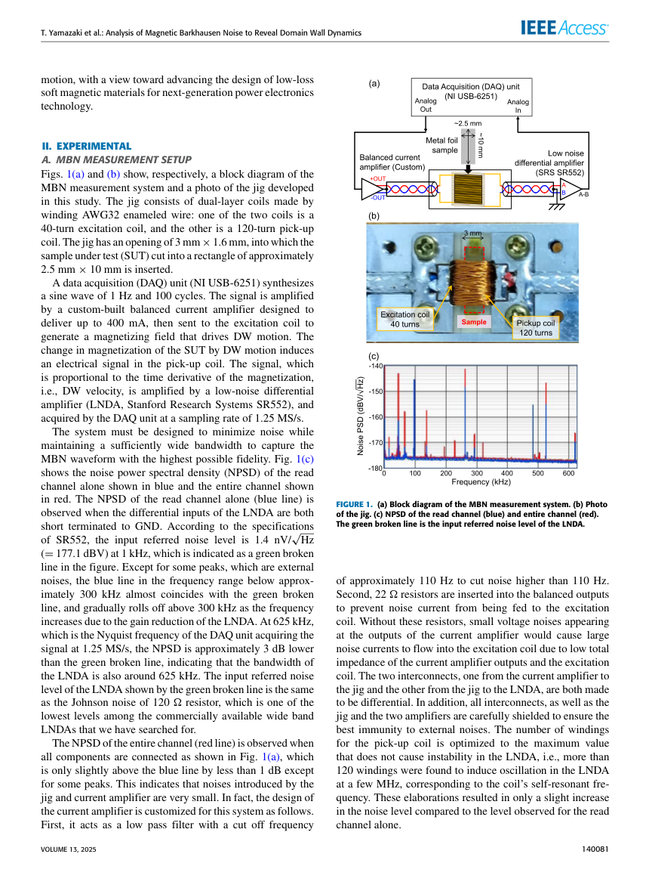
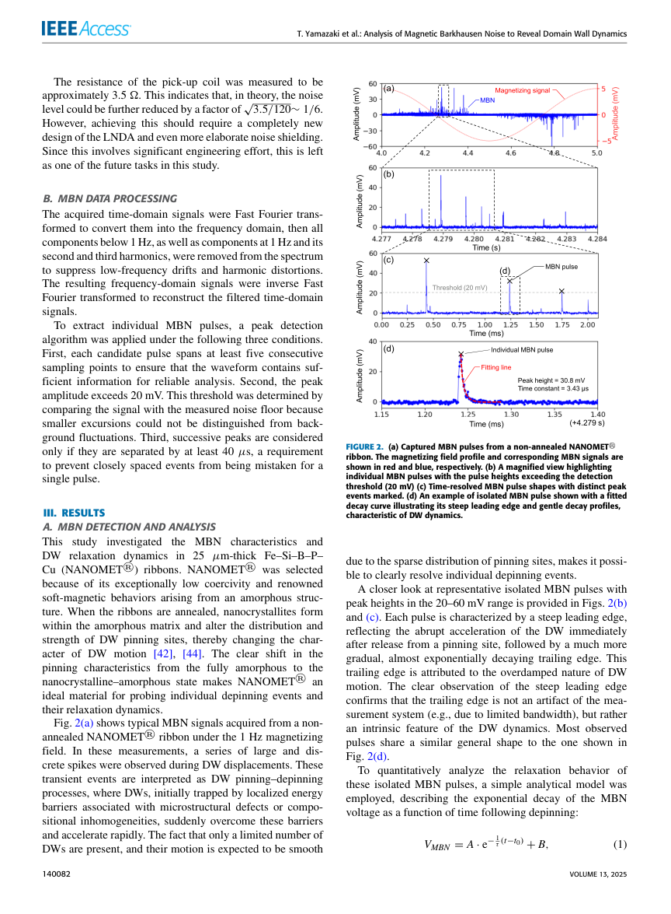
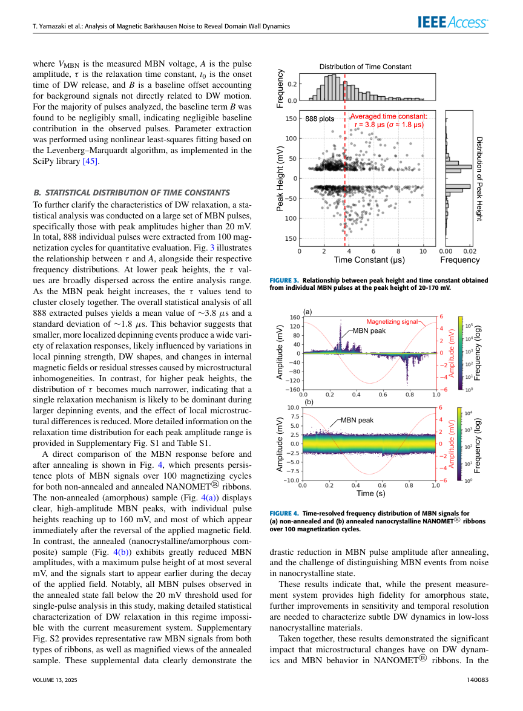

# 磁気バルクハウゼンノイズで磁壁のリラクゼーションを「一発一発」とらえる

- **執筆日**: 2026-05-04
- **対象 PDF ファイル名**: `37. Yamazaki2025_Analysis_of_Magnetic_Barkhausen_Noise_to_Reveal_Domain_Wall_Dynamics_in_Amorphous_Nanocrystalline_Ribbons.pdf`
- **論文タイトル**: Analysis of Magnetic Barkhausen Noise to Reveal Domain Wall Dynamics in Amorphous/Nanocrystalline Ribbons
- **著者**: Takahiro Yamazaki, Shingo Tamaru, Masato Kotsugi
- **DOI**: 10.1109/ACCESS.2025.3596507
- **掲載誌**: IEEE Access, Vol. 13, 2025, Article No. 140079–140086（CC BY 4.0）
- **トピック**: 磁気バルクハウゼンノイズ、磁壁ダイナミクス、過剰渦電流損失、アモルファス/ナノ結晶軟磁性合金
- **キーワード**: Magnetic Barkhausen Noise (MBN), Domain Wall (DW) dynamics, excess eddy current loss, NANOMET, amorphous/nanocrystalline ribbon, relaxation time, overdamped motion, Gilbert damping, eddy current damping
- **関連文献参照数**: 50件

---

## 0. まず最初に：この論文は何をした論文か

この論文の一言での要約は「磁壁（ドメインウォール）が局所的な障害物から跳び出す瞬間の減衰ダイナミクスを、世界で初めて一発ずつのパルス信号として金属薄帯で直接計測した」である。

鉄損（iron loss）は、電力変換器・トランスのコアに使われる軟磁性材料が持つ最大のエネルギー消費源の一つである。鉄損のうちとくに高周波領域で問題になるのが「過剰渦電流損失（excess eddy current loss）」であり、これは磁壁が動く際に局所的な渦電流が誘起されることで生じる。しかし、この損失機構の詳細は長らく不明のままだった。その理由の一つは、金属薄帯では渦電流や高ノイズ環境のせいで、個々の磁壁の跳び出しイベント（デピニング）を1パルスずつ分解して測定できる装置が存在しなかったからである。

著者らは、低ノイズ広帯域のバルクハウゼンノイズ（MBN）計測システムを自作し、25 µm厚のFe–Si–B–P–Cu非晶質薄帯（NANOMET®）に適用した。その結果、個々のMBNパルスが「急峻な立ち上がり＋指数関数的に減衰する裾」という特徴的な波形を持つことを明確に観測した。100回の磁化サイクルから888個のパルスを統計解析したところ、緩和時定数 τ の平均は約3.8 µs（標準偏差 1.8 µs）であった。さらに、解析モデルを使って渦電流ダンピング係数が固有の磁壁ダンピング係数の約56倍に達することを示し、金属薄帯では渦電流ダンピングが支配的な緩和機構であることを定量的に確認した。

---

## 1. 背景：なぜこの研究が必要なのか

### 次世代パワーエレクトロニクスと鉄損問題

電気自動車・太陽光発電・データセンターなどの普及に伴い、高周波・高効率のパワーエレクトロニクス部品（インダクタ、トランス）への需要が急増している。これらの部品のコア材料には、低損失の軟磁性材料が不可欠である。軟磁性材料の鉄損は、大きく3種類に分類される。

1. **ヒステリシス損失（hysteresis loss）**: 磁化反転ループの面積に対応する損失。低周波で支配的。
2. **古典的渦電流損失（classical eddy current loss）**: 磁束変化がコア全体に均一に誘起する渦電流による損失。マクロ的な導電率と板厚で計算できる。
3. **過剰渦電流損失（excess eddy current loss）**: 局所的に動く磁壁が誘起する「局所渦電流」による損失。高周波で支配的になり、古典式で計算できない「余剰分」として現れる。

過剰渦電流損失は、磁壁のデピニング（pinning site からの突然の離脱）時に磁壁速度が急変し、それが局所的な磁束変化を引き起こすことで生じる。この損失が全鉄損に占める割合は周波数が上がるほど大きくなり、キロヘルツ以上の高周波領域では無視できない。

### 従来の MBN 計測の限界

磁気バルクハウゼンノイズ（MBN）は、磁壁がピン止め点から跳び出す瞬間に誘起される電圧スパイクであり、磁壁ダイナミクスの「指紋」を測定できるツールとして広く利用されてきた。従来のMBN研究は主に、スケーリング則解析・磁区イメージング・機械学習を用いた統計的特徴量抽出など、多数のデピニングイベントの「統計的平均」に焦点を当ててきた。

しかし、過剰渦電流損失のメカニズムを理解するには、**一つ一つのデピニングイベントのリアルタイムダイナミクス**を直接観測する必要がある。この点において既存システムには重大な欠点があった。金属薄帯は電気導体であるため、測定時に渦電流由来のノイズが大きく、個々のMBNパルスを分解するのが非常に困難であった。絶縁体単結晶（たとえばSimon et al., 2024; Silevitch et al., 2019）では渦電流がないため個別パルス観測が可能だが、実際の磁性デバイスに使われる金属薄帯での観測例は皆無であった。

この「広帯域」かつ「高感度」を同時に達成できる計測システムが存在しないことが、過剰渦電流損失の物理機構解明の最大の壁だった。

---

## 2. この論文が解こうとしている核心問題

この研究が取り組む核心的な問いは次の4つに整理できる。

**問い1**: 金属薄帯において、個々の磁壁デピニングイベントのパルス波形を1イベントずつ分解して計測できるか？

**問い2**: 観測されたMBNパルスの波形（特に裾の形状）は、どのような磁壁ダイナミクスを反映しているか？緩和時定数τはどの程度か？

**問い3**: 緩和時定数τを支配しているのは、磁壁固有のダンピング（Gilbert減衰）か、それとも渦電流ダンピングか？どちらが優勢か？

**問い4**: 熱処理（焼鈍）によるナノ結晶化は、磁壁ダイナミクスとMBN特性をどのように変化させるか？

---

## 3. 論文の主張と新規性

### 著者が新規だと主張している点

- **広帯域・高感度MBN計測システムの開発**: デュアルレイヤーコイルジグ、差動配線、カスタム低ノイズ差動アンプ（LNDA）を統合し、金属薄帯で個々のMBNパルスを単発（single-shot）で捕捉できる計測システムを構築した（Table 1に示される既存システムとの比較による）。
- **金属薄帯での直接証拠**: 非晶質金属薄帯（NANOMET®）において、磁壁リラクゼーション（指数関数的減衰）の**直接的な実験的証拠**を初めて得た。
- **統計的な緩和時定数分布の抽出**: 888個のパルスから緩和時定数τの統計分布を抽出し、平均3.8 µs±1.8 µsという定量値を得た。
- **解析モデルによる渦電流ダンピング優位性の証明**: ζeddy ≫ ζdw（渦電流ダンピング係数が固有磁壁ダンピング係数の約56倍）を定量的に示した。

### 実際に新規性が強い点

金属薄帯での「個別パルス分解計測」は本論文が初めてであり、これは技術的に困難な課題を克服したことを意味する。渦電流ダンピング優位であることの「直接的な実験的裏付け」も新しい。ただし渦電流ダンピングが大きいという定性的な描像自体はBertottiモデル（1983, 1998）などで理論的に示されてきた話であり、本研究は実験的検証という位置づけが強い。

### まだ言い切れない点

- 復元ばね定数 k の実験的決定ができていない（FeNi箔の文献値を流用）。そのため、推定τ（55.3 µs）と実測τ（3.8 µs）の15倍程度の乖離の原因が未解明。
- 焼鈍後のナノ結晶試料ではMBN振幅が小さすぎて統計解析ができず、ナノ結晶相でのダイナミクスは今後の課題。

---

## 4. 方法の全体像

### 材料：NANOMET® Fe–Si–B–P–Cu薄帯

本研究の対象試料は、NANOMET®という商標名を持つFe–Si–B–P–Cu合金の25 µm厚のリボン状薄帯である。この合金は、非常に低い保磁力（高い磁気軟化度）と高い飽和磁束密度（Js = 1.2 T）を両立するアモルファス系合金で、Makinoらにより開発された（2009）。焼鈍処理によって非晶質マトリックス内にα-Feナノ結晶が析出し、磁壁のピン止め特性が劇的に変化する。このアモルファス→ナノ結晶という明確な相変化が、磁壁ダイナミクス研究の「対照実験」として理想的であるため、NANOMET®が選ばれた。

- **非焼鈍試料**（アモルファス状態）: 微細な構造欠陥・応力変動がピン止め点として機能する。磁壁は頻繁にピン止め・デピニングを繰り返す。
- **焼鈍試料**（ナノ結晶/アモルファス複合状態）: α-Feナノ結晶析出によりピン止め点の数と強度が低下。磁壁はよりスムーズに移動し、保磁力が下がり、軟磁性特性が向上する。

試料は約2.5 mm × 10 mm の長方形に切断して使用する。

### 計測システムの構成

本研究の中核技術は、自作したMBN計測システムである（Figure 1参照）。

*Fig. 1: MBN計測システムの構成。(a) ブロック図、(b) ジグの写真、(c) 読み出しチャンネル（青）と全チャンネル（赤）のノイズパワースペクトル密度（NPSD）。緑破線はLNDAの入力換算ノイズレベル（1.4 nV/√Hz at 1 kHz）。出典: Yamazaki et al., IEEE Access 2025, CC BY 4.0*

**励磁側**: DAQ（NI USB-6251）が1 Hz・100サイクルの正弦波を合成し、カスタムバランス電流アンプ（最大400 mA）で増幅して励磁コイル（40ターン、AWG32エナメル線）に送る。

**検出側**: ピックアップコイル（120ターン）が磁化変化に比例した誘起電圧（∝磁壁速度）を検出し、低ノイズ差動アンプ（LNDA、Stanford Research Systems SR552）で増幅。DAQが1.25 MS/s（メガサンプル/秒）でデジタイズ。

**ノイズ設計の工夫**: SR552の入力換算ノイズは1.4 nV/√Hz（@1 kHz）=−177.1 dBV。これは120 Ωの抵抗のジョンソンノイズと同等で、商用広帯域LNDAの中でも最低クラス。全チャンネル接続時のNPSDも読み出しチャンネル単体と1 dB以内の差にとどまり、ジグや電流アンプからのノイズ混入がほぼゼロであることを確認している。帯域幅はほぼ625 kHz（ナイキスト周波数）であり、kHzからhundreds of kHzまでの広帯域なMBN信号を高忠実度で捕捉できる。

電流アンプは110 Hzのローパスフィルタを内蔵し、励磁コイルへの高周波ノイズ電流の流入を抑制。また、22 Ωの抵抗をバランス出力に挿入し、電圧ノイズが電流ノイズに変換されないようにしている。全ての接続線・ジグ・アンプは電磁シールドが施されている。

### 信号処理

取得した時系列信号はFFT処理により周波数領域に変換したのち、1 Hz以下の低周波成分と、1 Hz・2 Hz・3 Hzの高調波成分を除去する（励磁波形由来の低周波ドリフト・高調波歪みを除去）。逆FFTで時間領域に戻した後、以下の3条件でピーク検出を行い、個別のMBNパルスを抽出する。

1. 連続する5点以上にわたるパルスであること（信頼性あるフィッティングに十分な点数を確保）
2. ピーク振幅が20 mV以上であること（ノイズフロアとの分離）
3. 隣接するピーク間隔が40 µs以上であること（重複カウント防止）

---

## 5. 数式・モデル・解析法を基礎から理解する

この論文で用いられた数式は全部で6式（Eq.1〜Eq.6）であり、これらは2つのグループに分かれる。1つ目は「MBNパルスの波形フィッティングモデル」（Eq.1）、2つ目は「磁壁運動の物理モデル」（Eq.2〜Eq.6）である。以下、順を追って丁寧に解説する。

### 5-1. MBNパルスの指数関数フィッティングモデル（式1）

個々のMBNパルスの減衰部分を記述するためのモデルが式(1)である。

$$V_{\rm MBN} = A \cdot e^{-\frac{1}{\tau}(t - t_0)} + B \tag{1}$$

**各記号の意味**:
- $V_{\rm MBN}$: ピックアップコイルで観測されるMBN電圧 [V]。磁化の時間微分 dM/dt に比例するため、磁壁速度 dq/dt に比例している。
- $A$: パルス振幅 [V]。デピニング直後の磁壁速度の最大値に相当する。
- $\tau$: 緩和時定数 [s]。この値が本研究の主たる実験的観測量である。
- $t_0$: 磁壁がデピニングした（ピン止めから解放された）瞬間の時刻 [s]。
- $B$: ベースライン・オフセット [V]。磁壁ダイナミクスと直接関係しない背景信号を表す定数。実際の解析では多くのパルスでBはほぼゼロであった。

**式の意味と由来**: ピックアップコイルの出力電圧はファラデーの法則から磁化の時間微分 dM/dt に比例する。磁化の変化は磁壁の移動速度 v = dq/dt に比例するため、$V_{\rm MBN} \propto v(t)$である。後述するEq.3の解が指数関数的に減衰する磁壁速度を与えるため、それをそのままフィッティング関数として使っているのがEq.1である。

**フィッティング手法**: パラメータ{A, τ, t₀, B}の4つは、SciPyライブラリのLevenberg–Marquardt（LM）法による非線形最小二乗フィッティングで決定する。LM法は、最急降下法とGauss-Newton法を適応的に組み合わせた最適化アルゴリズムで、非線形関数のフィッティングにおいて頑健な収束性を持つ。

**フィッティングの適用範囲**: フィッティングはパルスの「裾」（trailing edge）に対して適用する。「急峻な立ち上がり部」（leading edge）は系の測定帯域幅制限ではなく磁壁の突然の加速を反映しており、フィッティングの対象には含めない。論文中のFig. 2(d)が典型例を示している。

### 5-2. 磁壁運動の支配方程式（式2）

磁壁の運動は、ニュートン力学的なアナロジーで記述される2階線形常微分方程式（式2）で表現できる。

$$m\ddot{q} + \zeta\dot{q} + kq = 2\mu_0 M_s H_{\rm ext} \tag{2}$$

**各記号の意味**:
- $q$: 磁壁の位置（変位）[m]
- $\dot{q} = dq/dt$: 磁壁速度 [m/s]
- $\ddot{q} = d^2q/dt^2$: 磁壁加速度 [m/s²]
- $m$: 磁壁の単位長あたりの有効質量 [kg/m²]。磁壁が動くと磁区が広がり、磁化の「慣性」に相当する有効質量を持つ（Döring質量）。
- $\zeta$: ダンピング係数 [kg/(s·m²)]。後述するように固有磁壁ダンピングと渦電流ダンピングの和で与えられる。
- $k$: 復元ばね定数 [N/m³]。磁壁がピン止め点からずれると、元の位置に戻ろうとする復元力（ピン止め力）の強さを表す。
- $\mu_0$: 真空の透磁率（≈ 4π×10⁻⁷ H/m）
- $M_s$: 飽和磁化 [A/m]
- $H_{\rm ext}$: 外部印加磁場 [A/m]

**式の物理的意味**: 左辺の3項はそれぞれ、慣性力（$m\ddot{q}$）・粘性抵抗力（$\zeta\dot{q}$）・ばね復元力（$kq$）に対応し、右辺は外部磁場による駆動力（$2\mu_0 M_s H_{\rm ext}$）に対応する。これは磁壁をバネ-マス-ダンパー系と見なした「Döring–Becker–Kittelモデル」（あるいはその変形版）の定式化である。

**係数2の由来**: $2\mu_0 M_s H_{\rm ext}$ の係数2は、磁壁の両側の磁区における磁化の向きが逆向きであることから生じる。磁場が $H_{\rm ext}$ のとき、磁壁の一方の側の磁区には磁場と平行な力、反対側の磁区には磁場と逆方向の力が働き、合計で2倍になる。

**Baldwin–Cullerモデルとの関係**: 参考文献[46]（Baldwin & Culler, 1969）のwall-pinning modelと本質的に同じ形式であり、磁壁のヒステリシスを記述する標準的な枠組みである。

### 5-3. 簡略化された支配方程式（式3）

本実験では励磁周波数が1 Hzと非常に低い。この条件下では、デピニングしたMBN信号の解析において2つの合理的な近似が成立する。

**近似1**: デピニング後は外部磁場が磁壁運動に及ぼす寄与を無視できる（$H_{\rm ext} = 0$）。1 Hzの磁場変動は、µsオーダーのリラクゼーション過程に比べて十分ゆっくりである。

**近似2**: パルスの急峻な立ち上がり（leading edge）から磁壁が「突然加速する」ことは、デピニング直後は慣性力が一瞬働くが、その後の減衰過程では慣性力が無視できる（$m\ddot{q} = 0$、過減衰系）ことを示している。

これら2つの近似を適用すると、Eq.2は式(3)に簡略化される。

$$\zeta\dot{q} + kq = 0 \tag{3}$$

これは1階線形常微分方程式であり、その一般解は：

$$q(t) = q_0 \cdot e^{-\frac{k}{\zeta}(t - t_0)}$$

つまり磁壁位置が指数関数的に減衰する（ピン止め中心に向かって戻っていく）解を持つ。磁壁速度は位置を微分して：

$$\dot{q}(t) = -\frac{k}{\zeta} q_0 \cdot e^{-\frac{k}{\zeta}(t - t_0)} \propto e^{-t/\tau}$$

これがVMBN（∝磁壁速度∝磁化の時間微分）の指数関数的減衰として観測される。すなわちEq.1のフィッティングモデルがEq.3の解から物理的に導かれる。

### 5-4. 緩和時定数の定義（式4）

式(3)の解の時定数、すなわち式(1)のτは、次のように与えられる。

$$\tau = \frac{\zeta}{k} = \frac{\zeta_{\rm dw} + \zeta_{\rm eddy}}{k} \tag{4}$$

ここで、合計ダンピング係数 $\zeta$ を2成分に分解している。

- $\zeta_{\rm dw}$: 磁壁の**固有ダンピング係数**（intrinsic DW damping）。磁壁内部のスピンのギルバート緩和（磁気損失）に由来する。
- $\zeta_{\rm eddy}$: **渦電流ダンピング係数**（eddy current damping）。磁壁が動くことで誘起される局所渦電流が磁壁運動に与える制動力に由来する。

式(4)の物理的な直感：τは「系が減衰するのにかかる時間」であり、ダンピングが強い（ζが大きい）ほどτは大きく（ゆっくり減衰）、ばね定数が強い（kが大きい）ほどτは小さい（素早く元に戻る）。

### 5-5. 固有磁壁ダンピング係数（式5）

磁壁の固有ダンピング係数 $\zeta_{\rm dw}$ はBertottiモデル（[4], [17], [24]）に基づき、以下で与えられる。

$$\zeta_{\rm dw} = \frac{2 J_s \alpha}{\gamma \delta_w} \tag{5}$$

**各記号の意味**:
- $J_s = \mu_0 M_s$: 飽和磁気分極 [T]。NANOMET®では $J_s = 1.2$ T。
- $\alpha$: ギルバート減衰パラメータ（無次元）。スピンが外部場に向かって歳差運動しながら緩和する際の減衰率。NANOMET®では $\alpha = 0.02$。
- $\gamma$: 磁気回転比（gyromagnetic ratio）[m/(A·s)]。電子スピンの $\gamma = 2.21 \times 10^5$ m/(A·s)（あるいは $\gamma/2\pi \approx 28$ GHz/T）。
- $\delta_w$: 磁壁幅 [m]。NANOMET®では $\delta_w = 4 \times 10^{-7}$ m = 400 nm程度。

**式の由来**（理解のための補足）: ギルバート方程式 $\dot{M} = -\gamma M \times H + (\alpha/M_s) M \times \dot{M}$ から、磁壁が速度 v で動くときのエネルギー散逸を計算すると、単位長さあたりのダンピング力が $\zeta_{\rm dw} \cdot v$ になることが導かれる。$\zeta_{\rm dw}$ はαが大きい（スピンの緩和が速い）ほど大きく、磁壁幅 $\delta_w$ が広い（スピンが緩やかに回転する）ほど小さい。

**数値計算**:

$$\zeta_{\rm dw} = \frac{2 \times 1.2 \times 0.02}{2.21 \times 10^5 \times 4 \times 10^{-7}} \approx 0.54 \ \text{kg/(s·m}^2)$$

### 5-6. 渦電流ダンピング係数（式6）

渦電流ダンピング係数 $\zeta_{\rm eddy}$ は以下で与えられる。

$$\zeta_{\rm eddy} = 4\sigma G J_s^2 d \tag{6}$$

**各記号の意味**:
- $\sigma$: 電気導電率 [Ω⁻¹m⁻¹]。NANOMET®では $\sigma = 1/(0.65 \times 10^{-6}) \approx 1.54 \times 10^6$ S/m。論文中では $\sigma = 0.65$ µΩ·m（比抵抗）として与えられている。
- $G = 0.1356$: 幾何学因子（無次元）。Bertottiモデルで導かれた数値定数であり、試料形状と磁壁の空間分布に関連する因子。無次元で板厚（d）が十分薄い場合に成立する近似値。
- $J_s^2 = (\mu_0 M_s)^2$: 飽和磁気分極の2乗 [T²]。
- $d$: リボンの厚さ [m]。今回は $d = 25 \times 10^{-6}$ m。

**式の由来**（理解のための補足）: 磁壁が速度 v で動くと、リボン断面を通る磁束が変化し、ファラデーの法則によって渦電流が誘起される。この渦電流は磁壁に対して制動力を及ぼす。この制動力はvに比例し（Lenz則）、$\zeta_{\rm eddy} \cdot v$の形で書ける。$\zeta_{\rm eddy}$ は電気導電率σが高い（渦電流が多く流れる）ほど、板厚dが厚いほど大きくなる。$J_s^2$への依存は、磁束変化量が磁化の大きさに比例することから来る。

**数値計算**:

$$\zeta_{\rm eddy} = 4 \times \frac{1}{0.65 \times 10^{-6}} \times 0.1356 \times (1.2)^2 \times 25 \times 10^{-6} \approx 30.1 \ \text{kg/(s·m}^2)$$

### 5-7. 理論τと実験τの比較

$\zeta_{\rm dw} \approx 0.54$ kg/(s·m²)、$\zeta_{\rm eddy} \approx 30.1$ kg/(s·m²) を用いると、渦電流ダンピングは固有磁壁ダンピングの約56倍である。これが本論文の中心的な定量的結果の一つであり、「金属薄帯では渦電流ダンピングが主要緩和機構である」という結論の根拠になっている。

復元ばね定数については、NANOMET®に対する実験値が報告されていないため、文献[48]（50.8 µm厚FeNi箔のデータ）の値 $k = 5.544 \times 10^5$ N/m³ を流用している（論文中で明示）。このkを用いると：

$$\tau_{\rm est} = \frac{\zeta_{\rm dw} + \zeta_{\rm eddy}}{k} = \frac{0.54 + 30.1}{5.544 \times 10^5} \approx 55.3 \ \mu\text{s}$$

しかし実験で得られた平均値は $\tau_{\rm exp} \approx 3.8$ µs であり、推定値の約1/15である。この乖離について著者らは「NANOMET®の実際のkはFeNi箔のkよりもはるかに大きい」と解釈している。kは微細構造・局所応力・固有磁気特性に強く依存するため、異なる材料間での値の転用は信頼性が低く、精度の高い k の決定が今後の重要課題であると論文中に明記されている。

---

## 6. 結果：著者は何を示したのか

### 6-1. 個別MBNパルスの観測

*Fig. 2: 非焼鈍NANOMET®薄帯のMBN信号。(a) 典型的な時系列信号、(b) 個別パルスの拡大、(c) パルス波形の時間分解表示、(d) 孤立したMBNパルスと指数関数フィッティング曲線。出典: Yamazaki et al., IEEE Access 2025, CC BY 4.0*

非焼鈍NANOMET®薄帯に1 Hz正弦波磁場を印加すると、磁場が反転した直後に大きく離散的なスパイクが一連の塊として観測された（Fig. 2(a)）。これらのスパイクは磁壁のピン止め→デピニングプロセスを表している。磁壁が構造欠陥（局所応力変動、組成不均一性）に捕らわれた状態から突然障壁を越えて急加速するイベントである。

個々のパルスを拡大すると（Fig. 2(b)(c)）、各パルスは「急峻な立ち上がり（steep leading edge）」と「なだらかな指数関数的な裾（exponentially decaying trailing edge）」という特徴的な非対称波形を持つことが明確にわかる。Fig. 2(d) には、このような孤立したMBNパルスにEq.1のモデルをフィッティングした結果が示されている。

**急峻な立ち上がりの意味**: デピニング直後の磁壁が瞬間的に加速する（慣性的な跳び出し）ことを反映している。立ち上がりが急峻であることは、系の測定帯域幅で丸められたアーティファクトではないことも示している（もし帯域幅制限なら立ち上がりも鈍るはずだが、そうなっていない）。

**なだらかな裾の意味**: デピニング後の磁壁が過減衰的に元のピン止め位置に引き戻される（あるいは次のピン止め点に向かってゆっくり進む）ことを示している。この緩和過程の時定数τが本研究の主要観測量である。

### 6-2. 統計的分布：ピーク高さと緩和時定数の関係

*Fig. 3: 個別MBNパルスのピーク高さと時定数τの関係（散布図と頻度分布）。Fig. 4: 非焼鈍（a）と焼鈍（b）NANOMET®薄帯の100サイクルにわたるMBN信号の時間分解頻度分布（パーシステンスプロット）。出典: Yamazaki et al., IEEE Access 2025, CC BY 4.0*

20 mV以上のピーク振幅を持つパルスを100磁化サイクルから計888個抽出し、各パルスのτとピーク高さAの関係を調べた（Fig. 3）。

- **全体の統計**: τ の平均 ≈ 3.8 µs、標準偏差 ≈ 1.8 µs
- **低振幅パルス（20〜40 mV付近）**: τの分布が広い（ほぼ全測定範囲に散らばる）。これは局所的なピン止め強度・磁壁形状・内部磁場の微妙な違いによって緩和応答が大きく異なることを示す。
- **高振幅パルス（大きなA）**: τの分布が狭く集中する傾向がある。大きなデピニングイベントでは単一の支配的な緩和機構（渦電流ダンピング）が際立ち、微細構造の不均一性の影響が相対的に小さくなる。

### 6-3. 非焼鈍 vs 焼鈍試料の比較

Fig. 4のパーシステンスプロット（persistence plot：100サイクルのMBN信号を重ね描きした頻度マップ）から、焼鈍前後でMBN特性が劇的に変化することが確認できる。

- **非焼鈍（アモルファス）**: 磁場反転直後に最大160 mVに達する大振幅・離散的なMBNピークが集中して出現。
- **焼鈍（ナノ結晶/アモルファス複合）**: MBN振幅が最大でも数mVと大幅に減少し、磁場印加の早い段階からMBN信号が現れ始める。

焼鈍によりα-Feナノ結晶が析出すると、ピン止め点の数と強度が減少する。磁壁は滑らかに動けるようになり、大きな跳び出しが抑制される。これが保磁力の低下と軟磁性特性の向上につながる。焼鈍後の試料ではMBN振幅が20 mVのしきい値を超えるパルスが全く検出できなかったため、本研究の計測系ではナノ結晶状態の統計解析は困難であり、さらなる感度向上が必要であると述べられている。

---

## 7. 考察：どこまで信じてよいか

### 主張を支える証拠の強さ

**渦電流ダンピングの優位性（$\zeta_{\rm eddy} \gg \zeta_{\rm dw}$）**: 式(5)(6)はBertottiらによって確立されたモデルであり、使用した材料パラメータ（Js, α, γ, δw, σ, d）はNANOMET®の文献値から取られている（参考文献[9]）。計算の方向性は信頼できるが、個々のパラメータ（特にδwやα）の不確かさは10〜30%程度あり得る。ただし56倍という桁の差があるため、定性的な結論（「渦電流ダンピングが支配的」）は揺らがない。これは参考文献[9]（Huang et al., 2024）や[47]（Baldwin et al., 1977）の先行研究とも整合する。

**τ ≈ 3.8 µs という実験値**: 888パルスという十分な統計数から得られており、測定再現性は高い。ただし測定系の帯域幅（〜625 kHz、時間分解能〜1.6 µs）を大幅に超えているため、µs台のτは計測可能な範囲内にある。

### 限界と注意点

**kの不確かさ**: 理論推定τ（55.3 µs）と実験τ（3.8 µs）の乖離（約15倍）は大きく、その原因はkの材料依存性の強さにある。FeNi箔のkをNANOMET®に流用しているため、この推定値の信頼性は低い。著者も「k の精密決定は今後の重要課題」と明言しており、モデルの定量的予測精度はまだ不十分である。

**単純化したモデルの限界**: Eq.2〜4は線形2階ODEに基づく単純化モデルであり、磁気粘性（magnetic viscosity）・磁気弾性ダンピング（magnetostrictive damping）・磁壁形状変化・ピン止め点の空間分布の不均一性などの効果を考慮していない。これらは特に低振幅パルスのτのばらつき（広い分布）の原因となっている可能性が高い。

**焼鈍試料の未解析**: ナノ結晶状態のMBN信号が検出限界以下であり、低損失状態での磁壁ダイナミクスを直接観測できていない点は大きな制約である。ナノ結晶材料での鉄損低減機構の理解に直接貢献できるかどうかは今後の計測系改良次第である。

---

## 8. 背景研究とどうつながるか

過剰渦電流損失の理論的枠組みは、Bertotti（1983, 1998）によって体系化されており、本論文の解析モデルの直接的な基盤となっている。Bertottiは「磁場変化に応じて磁壁が複数の活性オブジェクト（磁壁）として動く際の過剰損失」を統計的に記述し、渦電流ダンピング係数ζeddyの式（本論文のEq.6に相当）を導いた。本論文はBertottiモデルの予測を初めて直接的に実験で検証した試みと位置づけられる。

MBN研究の文脈では、Sousa et al.（2020）がアモルファス薄膜でのMBNパルスの待ち時間分布を高速取得で解析し、本研究と類似のアプローチを先駆的に示している。ただし薄膜は金属であっても厚さが異なり（nmオーダー）、渦電流の効果がµm厚のリボンと本質的に異なる。Simon et al.（2024）やSilevitch et al.（2019）は絶縁体単結晶での個別パルス観測を行い、渦電流のない系での固有磁壁ダイナミクスを精密に測定した。本論文はこれに対応する「金属系」での初めての直接観測として位置づけられる。

NANOMET®に関しては、Makino et al.（2009）が材料系を確立し、Tsukahara et al.（2022）がナノ結晶軟磁性体での磁気弾性効果と鉄損の関係を理論的に解析、Huang et al.（2024, Phys. Rev. B）がNANOMET®における過剰コア損失の起源を数値計算的に議論している。本論文はこれらの数値計算・理論研究に対する実験的エビデンスを提供する。

機械学習・トポロジカルデータ解析を用いたMBNの高次解析という文脈では、Foggiatto et al.（2024）やNagaoka et al.（2024）といった同じKotsugi研究室からの先行研究がある。本論文は個別パルスの時間分解観測という「計測技術」側面に特化した研究として、これらの解析研究への実験的基盤を提供する位置づけでもある。

---

## 9. 基礎から理解する

### 磁気バルクハウゼンノイズとは何か

1919年にバルクハウゼンが発見した現象で、外部磁場を連続的に変化させながら磁性体を磁化すると、磁化は連続的ではなく階段状に不規則に変化し、それに伴って電磁コイルに電圧スパイクが発生するという現象である。これは磁化の担い手である磁壁（磁区と磁区の境界面）が、結晶格子欠陥・介在物・内部応力などのピン止め点に引っかかりながら断続的に跳び出すことで生じる。各スパイクが一つのデピニングイベントに対応する。

MBNは材料の微細構造情報（欠陥密度・残留応力・結晶粒径など）を非破壊で評価できるセンシング技術として産業的にも注目されてきた。

### 磁壁のピン止め（Pinning）と過減衰運動

磁壁がピン止め点に捕らわれている状態は、ポテンシャルエネルギーの谷にはまった粒子の状態に似ている。外部磁場が増加してエネルギー障壁を超えると、磁壁は突然跳び出し（デピニング）、隣のピン止め点に移動して再捕捉される。

跳び出した後の運動が「過減衰（overdamped）」であるとは、ばね-マス-ダンパー系で言うと減衰比 ζ/（2√(mk)）＞1の状態であり、振動をせずにゆっくり元の位置に戻る挙動である。金属薄帯では渦電流ダンピングが非常に大きいため、デピニング後の磁壁はすぐに減速して指数関数的に元の位置へ緩和する。

### ギルバート方程式とα（ギルバート減衰パラメータ）

ギルバート方程式はスピン（磁気モーメント）が外部磁場のまわりに歳差運動しながら、磁場方向に向かって緩和する様子を記述する。

$$\dot{\mathbf{m}} = -\gamma \mathbf{m} \times \mathbf{H} + \frac{\alpha}{M_s} \mathbf{m} \times \dot{\mathbf{m}}$$

第1項は歳差運動、第2項は（αで制御される）減衰を表す。αが大きいほどスピンが素早く磁場方向に揃う（減衰が強い）。αはフェロマグネット材料によって0.001〜0.1程度の値を取り、軟磁性材料では小さく（0.01〜0.05程度）、損失が大きい材料では大きい。NANOMET®のα = 0.02は典型的な軟磁性体の値である。

### 渦電流の誘起メカニズム

磁壁が速度vで動くと、磁壁の通過した領域の磁化が反転し、局所的な磁束変化（ΔΦ/Δt）が生じる。ファラデーの法則により、これに対抗する渦電流が誘起される（レンツ則）。渦電流は磁壁の動きを妨げる磁場を作るため、制動力として働く。この制動力はvに比例し、比例係数がζeddyである。

渦電流の大きさは材料の電気導電率σに比例し、薄帯の場合は厚さdにも比例する（薄いほど渦電流パスが制限されて小さくなる）。このためナノ結晶材料では粒界散乱などによって比抵抗を高めることで渦電流損失を低減できる。

---

## 10. 専門用語集

**磁気バルクハウゼンノイズ（Magnetic Barkhausen Noise, MBN）**
磁壁がピン止め点から跳び出す（デピニング）際にピックアップコイルに誘起される電圧スパイク。磁化の不連続的な変化を電気信号として検出したもの。本論文では1Hzの交流磁場下で誘起されるMBNを対象とする。

**磁壁（Domain Wall, DW）**
隣り合う磁区（磁化の方向が揃った領域）の境界面。典型的なブロッホ壁では、磁化が壁の法線方向と直交する面内で回転する。NANOMET®では磁壁幅 δw ≈ 400 nm。

**過剰渦電流損失（Excess Eddy Current Loss）**
磁壁運動が誘起する局所渦電流による損失。均一な磁束変化を仮定して計算される「古典的渦電流損失」からの超過分として現象論的に定義される。Bertottiモデルではこの損失が磁壁数や磁壁速度と関連づけられる。

**ピン止め（Pinning）**
磁壁が欠陥・析出物・局所応力変動などの微細構造的障害に捕捉される現象。ピン止めが強いほど磁壁は動きにくく、大きな外部磁場をかけて初めてデピニングが起こる。

**デピニング（Depinning）**
外部磁場などの力によって磁壁がピン止め点から解放される過程。デピニング時に磁壁が急加速し、MBNとして観測される。

**ギルバート減衰パラメータ（α）**
スピンの磁場方向への緩和速度を表す無次元パラメータ。ギルバート方程式における現象論的減衰定数。αが大きいほど磁化が速く平衡方向に揃う。NANOMET®では α = 0.02。

**復元ばね定数（k）**
磁壁がピン止め中心からずれた際に受ける復元力の強さ。単位面積あたりのエネルギー障壁の曲率に相当する。N/m³の次元を持つ。k の正確な決定は実験的に難しく、本論文でも未解決課題の一つ。

**NANOMET®**
東北大学・牧野グループが開発したFe–Si–B–P–Cu系ナノ結晶軟磁性合金。高い飽和磁束密度（Js ≈ 1.2〜1.9 T）と低い鉄損を両立するパワーエレクトロニクス向け材料。非焼鈍状態ではアモルファス、焼鈍後はアモルファス基地中にα-Feナノ結晶が分散した複合組織を示す。

**過減衰（Overdamped）**
ばね-マス-ダンパー系で減衰が非常に強い場合の挙動。振動せず単調に平衡位置に戻る。磁壁運動では渦電流ダンピングが大きいため過減衰となり、指数関数的な速度減衰（≡ MBN減衰）として観測される。

**ノイズパワースペクトル密度（NPSD）**
単位周波数帯域あたりのノイズ電力。[V²/Hz] または [V/√Hz] で表す。SR552アンプのNPSDは 1.4 nV/√Hz(@1 kHz)で、120 Ωの抵抗のジョンソンノイズと同等の超低ノイズ。

**Levenberg–Marquardt法（LM法）**
非線形最小二乗フィッティングのための反復最適化アルゴリズム。最急降下法（安定性が高いが収束が遅い）とGauss–Newton法（収束が速いが発散しやすい）を適応的に切り替えることで、ロバストな収束を実現する。

**パーシステンスプロット（Persistence Plot）**
複数サイクルにわたる同一条件の信号を重ね合わせて頻度分布として表示したもの。本論文では100磁化サイクルのMBN信号を時間軸と振幅軸の2次元分布として可視化し、再現性と統計的挙動を同時に評価するために使用。

**Bertottiモデル**
Giorgio Bertottiによって1980年代に確立された磁性体の磁化ダイナミクスと鉄損の統計モデル。過剰損失を磁壁の相関運動（空間-時間相関関数）として記述し、ζdwとζeddyの式（本論文のEq.5, 6）を含む包括的な枠組みを提供する。

---

## 11. 将来展望

本研究が切り開いた最大の成果は、金属薄帯における磁壁デピニングのリアルタイム・単発観測という計測パラダイムの確立である。これにより、これまで統計的平均としてしか扱えなかった過剰渦電流損失の微視的起源を、個々のイベントレベルで直接観測する道が開かれた。計測系の帯域幅（約625 kHz）と感度（1.4 nV/√Hz）は既存の同種システムと比較して高水準にあるが、焼鈍後の低損失ナノ結晶材料ではMBN振幅が20 mV以下に低下して単発パルス解析ができない点が残された制約である。今後、ピックアップコイルの抵抗を下げる（理論的には約6倍の感度向上が可能）、あるいはより高感度なLNDAを開発することで、ナノ結晶状態での詳細解析が可能になると期待される。

τと材料パラメータとの定量的な対応付けには、復元ばね定数kの精密決定が不可欠である。現状ではkをFeNi箔の文献値から流用しており、実験τ（3.8 µs）と推定τ（55.3 µs）の15倍の乖離が解決できていない。NANOMET®のkを直接測定する実験手法として、たとえば精密な磁化曲線の解析や磁気力顕微鏡（MFM）を組み合わせた磁壁変形実験、あるいは磁区シミュレーション（ミクロマグネティクス）との比較が考えられる。また、磁気粘性や磁気弾性ダンピングなど複数の緩和機構の寄与を分離するには、組成・板厚・アニール条件を系統的に変えた試料シリーズでの比較実験が有効であろう。このような実験的・理論的な深化により、鉄損低減のための微細組織設計に直結する物理モデルが構築されると期待される。

より長期的な展望として、この計測技術はNANOMET®以外の軟磁性材料（Febaseアモルファス、パーマロイ、Fe-Si鋼板など）に広く適用可能であり、様々な材料系での過剰渦電流損失の起源比較研究が実現できる。さらに、本研究の計測系と機械学習・トポロジカルデータ解析などのデータ駆動型手法を組み合わせることで（同研究グループの先行研究であるFoggiatto et al., 2024や Nagaoka et al., 2024の延長線上として）、単一パルスの波形から材料の局所微細構造情報を逆推定するような「MBNインフォマティクス」的な方向性も期待される。こうした展開は、次世代パワーエレクトロニクス向け低損失磁性材料の設計指針を定量的・物理的根拠に基づいて与えるという意味で、材料科学と電力工学の橋渡しとなる重要な研究に発展する可能性を秘めている。

---

## 参考文献一覧

### 対象論文

- T. Yamazaki, S. Tamaru, M. Kotsugi, "Analysis of Magnetic Barkhausen Noise to Reveal Domain Wall Dynamics in Amorphous/Nanocrystalline Ribbons," *IEEE Access*, vol. 13, pp. 140079–140086, 2025. DOI: [10.1109/ACCESS.2025.3596507](https://doi.org/10.1109/ACCESS.2025.3596507)

### 本文理解に用いた関連文献

- G. Bertotti, *Hysteresis in Magnetism*, Academic, San Diego, 1998. [4]
- G. Bertotti, "Space-time correlation properties of the magnetization process and eddy current losses: Theory," *J. Appl. Phys.*, vol. 54, pp. 5293–5305, 1983. [24]
- G. Bertotti, F. Fiorillo, M. Sassi, "A new approach to the study of loss anomaly in SiFe," *IEEE Trans. Magn.*, vol. MAG-17, pp. 2852–2856, 1981. [17]
- H. Huang, H. Tsukahara, A. Kato, K. Ono, K. Suzuki, "Origin of excess core loss in amorphous and nanocrystalline soft magnetic materials," *Phys. Rev. B*, vol. 109, Art. no. 104408, 2024. [9]
- H. Tsukahara et al., "Role of magnetostriction on power losses in nanocrystalline soft magnets," *NPG Asia Mater.*, vol. 14, p. 44, 2022. [41]
- A. Makino et al., "New Fe-metalloids based nanocrystalline alloys with high Bs of 1.9 T," *J. Appl. Phys.*, vol. 105, Art. no. 07A308, 2009. [42]
- I. P. de Sousa et al., "Waiting-time statistics in magnetic systems," *Sci. Rep.*, vol. 10, p. 9692, 2020. [20]
- C. Simon et al., "Quantum Barkhausen noise induced by domain wall cotunneling," *Proc. Natl. Acad. Sci. USA*, vol. 121, Art. no. e2315598121, 2024. [39]
- D. M. Silevitch et al., "Magnetic domain dynamics in an insulating quantum ferromagnet," *Phys. Rev. B*, vol. 100, Art. no. 134405, 2019. [40]
- J. A. Baldwin, G. J. Culler, "Wall-pinning model of magnetic hysteresis," *J. Appl. Phys.*, vol. 40, pp. 2828–2835, 1969. [46]
- D. Spasojević et al., "Barkhausen noise in disordered striplike ferromagnets," *Phys. Rev. E*, vol. 109, Art. no. 024110, 2024. [48]
- A. L. Foggiatto et al., "Analysis of the excess loss in high-frequency magnetization process through machine learning and topological data analysis," *IEEE Trans. Magn.*, vol. 60, 2024. [8]
- R. Nagaoka et al., "Quantification of the coercivity factor in soft magnetic materials at different frequencies using topological data analysis," *IEEE Trans. Magn.*, vol. 60, 2024. [33]
- M. Neslušan et al., "Barkhausen noise emission in soft magnetic bilayer ribbons," *AIP Adv.*, vol. 9, Art. no. 075008, 2021. [38]

### 背景理解に有効な基礎文献

- S. Chikazumi, *Physics of Ferromagnetism*, Oxford Univ. Press, 1997. [11]（磁壁・磁化の基礎）
- J. M. Silveyra et al., "Soft magnetic materials for a sustainable and electrified world," *Science*, vol. 362, p. 195, 2018. [1]（軟磁性材料の総括的レビュー）
- G. Durin, S. Zapperi, "Scaling exponents for Barkhausen avalanches in polycrystalline and amorphous ferromagnets," *Phys. Rev. Lett.*, vol. 84, pp. 4705–4708, 2000. [30]（MBNのスケーリング則）
- S. Zapperi et al., "Dynamics of a ferromagnetic domain wall: Avalanches, depinning transition, and the Barkhausen effect," *Phys. Rev. B*, vol. 58, pp. 6353–6366, 1998. [22]（磁壁雪崩とバルクハウゼン効果の理論）
- F. Colaiori, G. Durin, S. Zapperi, "Eddy current damping of a moving domain wall," *Phys. Rev. B*, vol. 76, Art. no. 224416, 2007. [26]（渦電流による磁壁ダンピングの理論）
