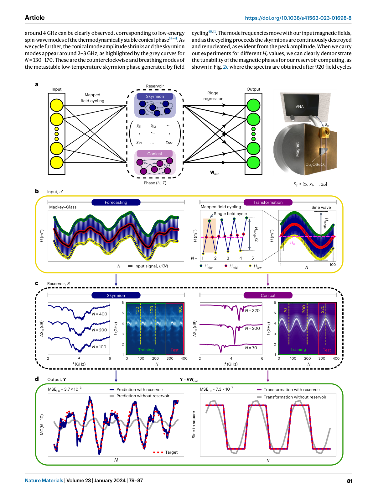
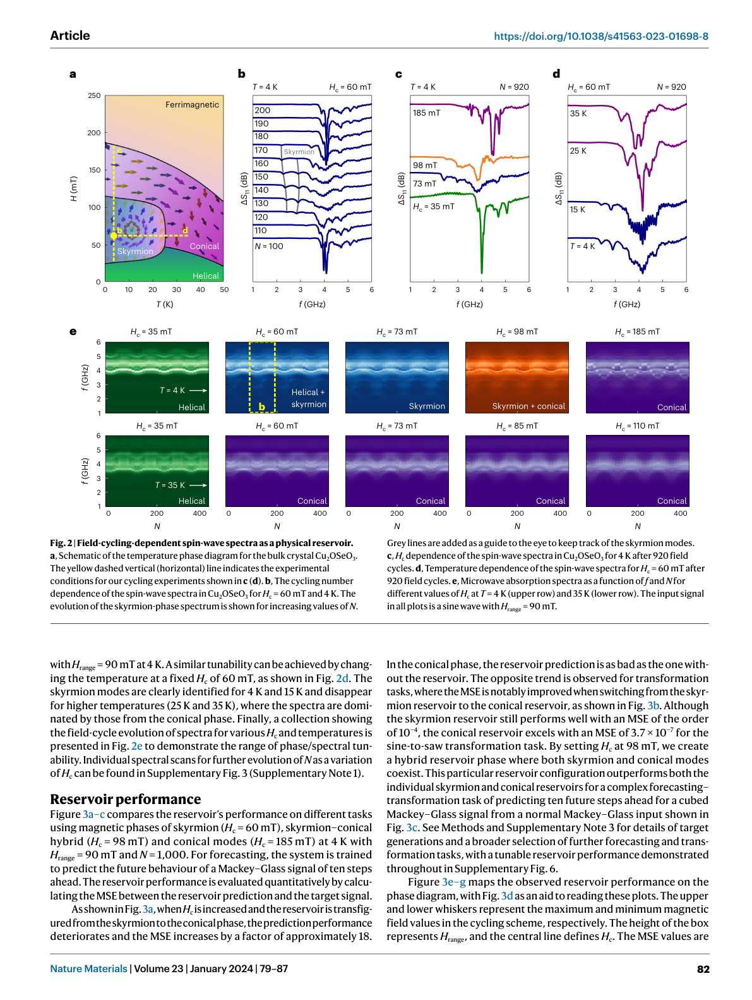
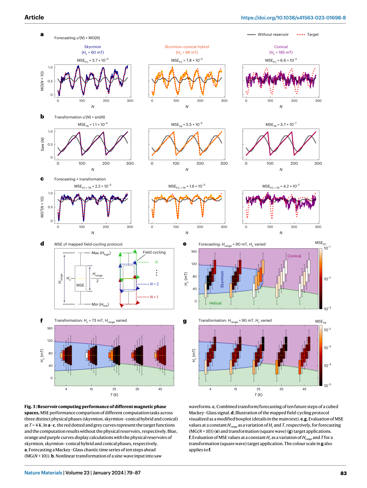
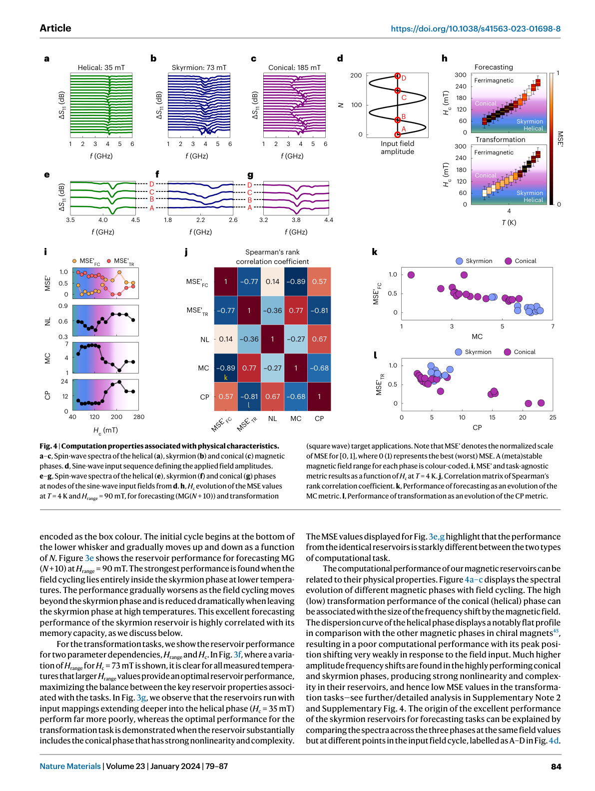
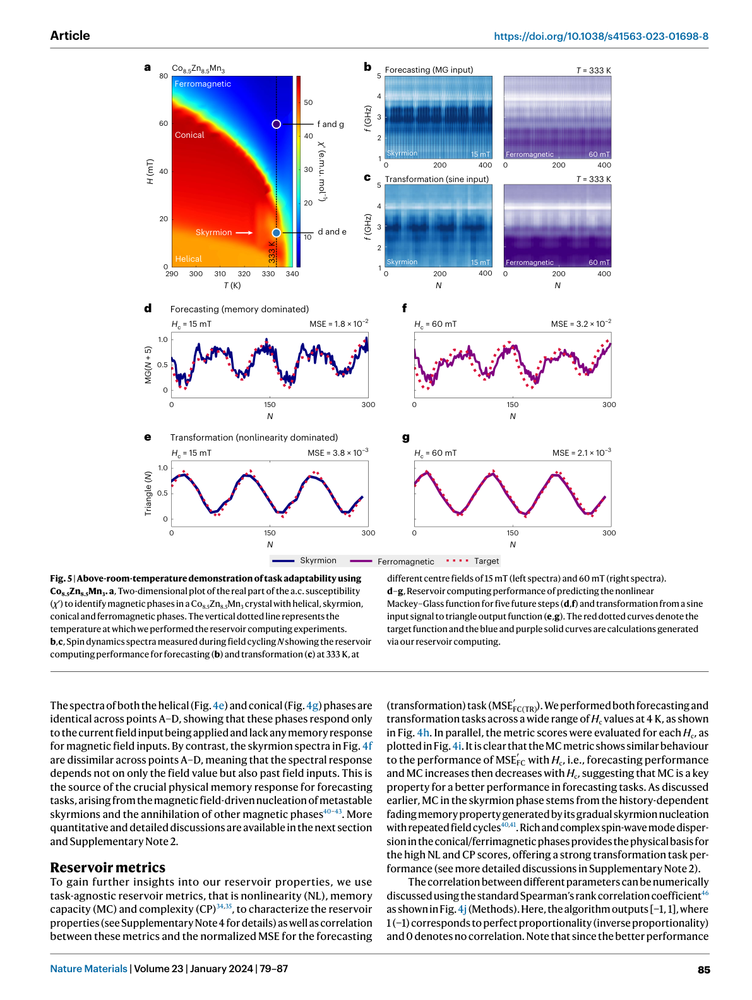
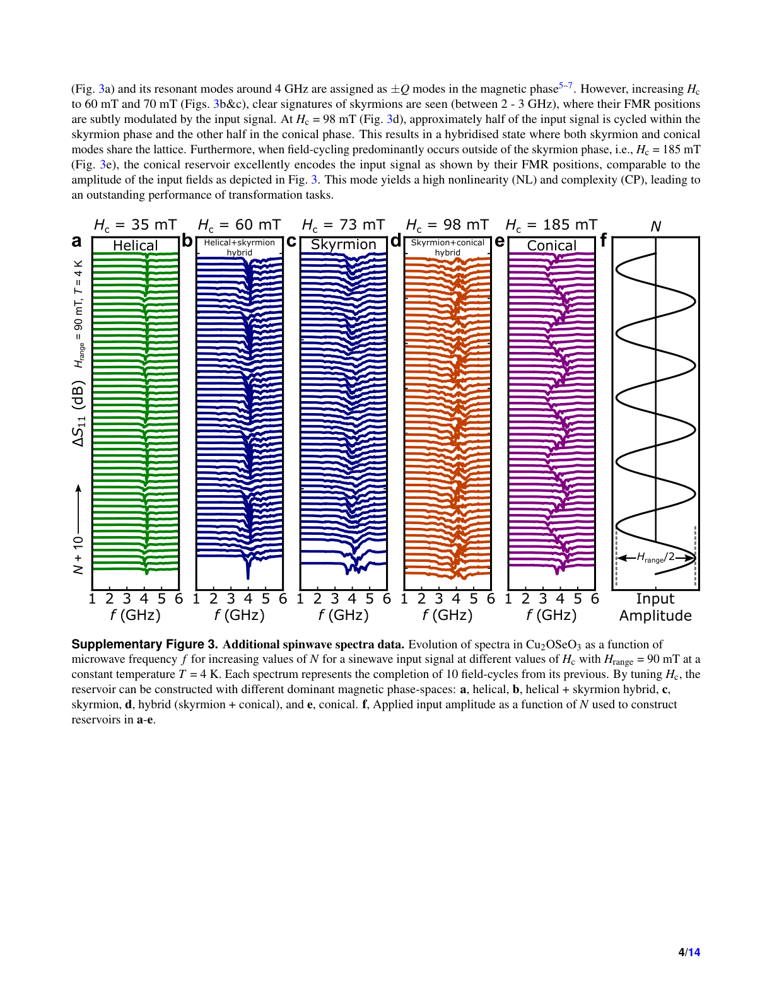

# スキルミオン相空間を活用したタスク適応型物理リザバーコンピューティング

- **執筆日**: 2026-05-20
- **トピック**: task-adaptive-RC
- **タグ**: スキルミオン, リザバーコンピューティング, ニューロモルフィックコンピューティング, キラル磁性体, スピン波, Cu₂OSeO₃, 磁気相図, マテリアルズインフォマティクス
- **注目論文**: Lee, O. et al. "Task-adaptive physical reservoir computing." *Nature Materials* **23**, 79–87 (2024). https://doi.org/10.1038/s41563-023-01698-8
- **関連論文数**: 10
- **対象分野**: 物性物理・スピントロニクス・ニューロモルフィックコンピューティング・マテリアルズインフォマティクス

---

## 1. この論文を読む意味

現代の機械学習は計算コストの爆発的増大という深刻な問題を抱えている。大規模言語モデルのような深層ニューラルネットワークは、学習時に何百万、場合によっては何千億ものパラメータを最適化しなければならない。この計算は従来のフォン・ノイマン型コンピュータで行われており、処理ユニットとメモリユニットが物理的に分離されているため、データの往復移送に莫大なエネルギーが消費される。これが「フォン・ノイマンボトルネック」と呼ばれる問題である。

この問題に対する根本的な解決策として、脳を模倣したニューロモルフィックコンピューティングが注目されている。なかでも「リザバーコンピューティング（Reservoir Computing, RC）」は、ニューロモルフィックアーキテクチャの中でも特に軽量な学習が可能な枠組みであり、フォン・ノイマンボトルネックを回避しつつ時系列データ処理を実現する有望なアプローチとして急速に発展してきた。

リザバーコンピューティングをソフトウェアではなく物理系で実装する「物理リザバーコンピューティング（Physical Reservoir Computing, PRC）」は、物質固有の非線形ダイナミクスや記憶応答をそのまま計算資源として活用するため、エネルギー効率のさらなる向上が期待できる。光学システム、アナログ回路、メモリスタ、磁性体と、多様な物理系を使ったPRCが実証されてきた。なかでも磁気スキルミオンのような位相的に保護されたスピンテクスチャを使ったPRCは近年急速に発展しており、スピントロニクス分野において重要な研究の流れを形成している。

しかしPRCには根本的な弱点があった。物理系のダイナミクス特性は材料と動作条件によってほぼ固定されており、ソフトウェアのようにハイパーパラメータをチューニングして異なるタスクに最適化することができない。予測タスクに向いたリザバーは変換タスクには向かず、逆もまた然りである。一つの物理リザバーで複数の異なるタスクに対して高い性能を発揮することは、これまで原理的に困難とされてきた。

本論文「Task-adaptive physical reservoir computing」（Lee et al., *Nature Materials*, 2024）は、この課題を正面から突破した画期的な研究である。著者らは、熱力学的な磁気相図を持つキラル磁性体Cu₂OSeO₃のスピン波スペクトルを物理リザバーとして利用し、磁場と温度によって磁気相（スキルミオン相、コニカル相、ヘリカル相）を切り替えることで、リザバーの計算特性をオンデマンドで再構成する「タスク適応型（Task-adaptive）」PRCを実証した。さらにこのコンセプトが室温付近で動作するCo₈.₅Zn₈.₅Mn₃やFeGeでも成立することを示し、材料普遍性を担保した。

この論文が重要である理由は複数ある。第一に、PRCにおける「再構成可能性」という未解決課題に対して、材料の熱力学的相図を活用するという優雅な解を提示している点である。第二に、スキルミオン物理学という基礎物理の知見が情報処理技術に直結するという具体的な道筋を示した点である。第三に、スピン波スペクトロスコピーという測定手法が高次元マッピングのための「周波数多重化」として機能することを実験的に示した点であり、これは物性計測とニューロモルフィックコンピューティングの接続という新しい視野を開く。材料工学・物性物理・マテリアルズインフォマティクスを研究する者にとって、本論文はそれぞれの分野が交差する場所に位置する刺激的な研究である。

---

## 2. この分野の未解決問題

### 問い①：物理リザバーはどうすれば多様なタスクに対応できるか？

リザバーコンピューティングの性能は、リザバーが持つ非線形性（Nonlinearity, NL）、記憶容量（Memory Capacity, MC）、複雑性（Complexity, CP）という三つの特性によって規定される。ソフトウェアRCではこれらをコードのパラメータ変更で自由に調整できるが、物理RCでは材料・デバイス・動作条件の組み合わせによってほぼ固定されてしまう。結果として、一つの物理リザバーは特定のタスクには優れているが、別の要求をもつタスクには不向きである。Tanaka et al. (2019) の包括的なレビューは、この「タスク適応性の欠如」を物理RCの主要な未解決課題の一つとして明確に指摘している。本論文はこの問いに正面から答える試みである。

### 問い②：スキルミオンの準安定性はどのように情報記憶に使えるか？

磁気スキルミオンは位相的に保護された粒子状スピンテクスチャであり、外部磁場や温度変化に対して準安定的に存在できる。Cu₂OSeO₃においては低温・低磁場域で熱力学的安定スキルミオン相の外側にも、磁場サイクリングによって準安定スキルミオンを生成できることがAqeel et al. (2021) およびLee et al. (2021) によって示された。この準安定スキルミオン格子の密度は磁場サイクリングの履歴に強く依存する。この「過去の操作履歴に依存した状態保持」という性質が、リザバーコンピューティングに必要な「物理的記憶（memory）」として機能しうるかどうかは、実験的に検証すべき重要な問いであった。

### 問い③：スピン波スペクトロスコピーは高次元計算リソースとして機能するか？

磁気共鳴（FMR）スペクトロスコピーは1〜6 GHzの広い周波数域にわたって磁気励起のスペクトルを記録する測定手法である。磁気相ごとに異なる共鳴モードが異なる周波数に現れるため、単一の磁場入力が多数の周波数チャンネルにわたる多次元の出力ベクトルにマッピングされる。このいわば「周波数多重化（frequency multiplexing）」がリザバーの高次元写像として有効に機能するかどうか、またその次元数（スペクトルポイント数）が性能に与える影響を定量化することは未解決であった。補足資料のFig. 5が示すように、スペクトルポイント数の増加が性能改善に直結することが明確に実証された。

### 問い④：タスク適応型PRCのコンセプトはどこまで材料普遍的か？

Cu₂OSeO₃は絶縁性のキラル磁性体であり、スキルミオン相の安定域は極低温（～35 K以下）に限られる。実用的な応用に向けては室温付近での動作が不可欠であり、同じ物理コンセプトが他のキラル磁性体材料系にも移植可能かどうかを検証することが重要な問いとなる。Karube et al. (2017) が報告したCo₉Zn₉Mn₂系のように、室温以上でスキルミオンが安定化する材料系でこのコンセプトが機能するかどうかは、実用展開の可否を大きく左右する問いである。

### 問い⑤：物理リザバーの特性指標はどう解釈すべきか？

NL、MC、CPという三つの指標は、リザバーコンピューティングの計算特性を定量化するためのタスク非依存な（task-agnostic）指標として提案されてきた（Dambre et al. 2012; Love et al. 2021）。しかしこれらの指標と実際のタスク性能（MSE）の間の対応関係は、物理系において十分に検証されていない。本論文はSpearmanの順位相関係数を用いてMC・NL・CP各指標と予測/変換タスクMSEの相関を定量化し、物理リザバーにおいてもこれらの指標がタスク性能の予測力を持つことを示した。

---

## 3. 注目論文の核心

### 研究目的と対象

本論文の中心的な目標は、単一の物理リザバーシステムが、磁場と温度の制御だけで多様な計算タスクに対して高い性能を発揮できることを実証することである。対象材料はキラル磁性絶縁体Cu₂OSeO₃のバルク単結晶（1.9 mm × 1.4 mm × 0.3 mm）で、スキルミオン相・コニカル相・ヘリカル相という複数の磁気相を温度（4〜50 K）と磁場（0〜250 mT）の組み合わせで選択できる材料系を採用している。

*Fig. 1: タスク適応型物理リザバーコンピューティングの動作原理。左からインプット層・リザバー（スキルミオン/コニカル相）・リッジ回帰出力・実験セットアップ（VNA測定）が示されている。© Lee et al. 2024, Nature Materials, CC BY 4.0*

### 実験手法：マップド磁場サイクリングとスペクトルリザバー

リザバーコンピューティングにおける入力層の設計として、著者らは「マップド磁場サイクリング（Mapped Field Cycling, MFC）」という独自のプロトコルを考案した。これは外部磁場の時系列的なサイクリング（H_low → H_mid → H_high → H_low）の各ステップを、入力時系列データ u(t) にマッピングすることで、任意の時系列信号を磁場入力として物理リザバーに印加する手法である。センターフィールドH_cとサイクリング幅H_rangeの二つのパラメータで、磁場サイクリングが探索する磁気相空間を制御できる。

スペクトル測定はベクトルネットワークアナライザ（VNA）を用いた強磁性共鳴（FMR）分光により行われる。Cu₂OSeO₃単結晶を同軸平面導波路上に配置し、1〜6 GHzの帯域にわたるマイクロ波反射係数 S₁₁ を各磁場ステップで1601点の周波数について記録する。磁場サイクリングのN回目の低磁場点 H_low においてスペクトルを収集し、これをリザバーマトリクス R(N, M) の1行として積み上げる。N回のサイクリングで N × M のリザバー行列が構成され、この高次元行列が時系列入力を高次元空間に写像したリザバーの状態表現となる。

出力層の最適化はリッジ回帰（Ridge Regression）によって行われる。データの70%を訓練データとしてリザバー行列 R_train と目標関数 Y から出力重みベクトル W_out を計算し（Y = R_train W_out）、残り30%のテストデータに適用してMSEを評価する。リッジ回帰は正則化パラメータ α を持ち、過学習を防ぐ。

### 対象タスクと評価

著者らは二種類の基本的なタスクを中心に評価を行った。一つは「予測タスク（Forecasting）」で、カオス的な時系列信号であるMackey–Glass時系列を入力とし、10ステップ先の値を予測する。Mackey–Glass方程式 dx/dt = β x_d/(1 + x_d^n) − δx（β=0.2, n=10, d=17）は非線形遅延微分方程式であり、カオス的な振動を示すため予測ベンチマークとして広く使われる。もう一つは「変換タスク（Transformation）」で、正弦波入力を矩形波・のこぎり波・三角波・ガウスパルスなど全く異なる波形に非線形変換する。補足資料Note 3では三角、ガウス、sin²、cos、ヒステリシス、複合信号など多様な変換タスクが示されており、いずれもMSE ≤ 10⁻³ という優れた性能が確認されている。

*Fig. 2: Cu₂OSeO₃の磁気相図（左）と各磁気相での磁場サイクリング数N依存スピン波スペクトル（右）。スキルミオン相ではN増加とともにスペクトルが変化するが、コニカル相ではほぼ変化しない。© Lee et al. 2024, Nature Materials, CC BY 4.0*

### 主要結果：磁気相による性能の分化

図3に集約された主要結果は明快である。スキルミオン相（H_c = 60 mT）は予測タスクで優れた性能（MSE_FC = 3.7 × 10⁻³）を示す一方、変換タスクでは中程度の性能（MSE_TR = 1.1 × 10⁻⁴）にとどまる。コニカル相（H_c = 185 mT）は変換タスクで卓越した性能（MSE_TR = 3.7 × 10⁻⁷）を実現するが、予測タスクではリザバーなしの場合とほぼ同等（MSE_FC = 6.6 × 10⁻²）という低い性能しか示さない。ハイブリッド相（H_c = 98 mT）はその中間に位置し、予測と変換を組み合わせた複合タスクで両相を単独で用いるより優れた性能を示す。

性能の違いは磁気相図上にマッピングされており（Fig. 3e,g）、スキルミオン相内で磁場サイクリングが完結するとき予測性能が最高になり、コニカル相が卓越するときに変換性能が最高になるという明確なパターンが浮かぶ。

*Fig. 3: スキルミオン（青）・ハイブリッド（橙）・コニカル（紫）の三相での予測タスク（a）・変換タスク（b）・複合タスク（c）の性能比較。および磁気相図上へのMSEマッピング（e,f,g）。© Lee et al. 2024, Nature Materials, CC BY 4.0*

### 物理的起源：記憶と非線形性の分離

補足資料Note 2が詳述する物理的起源の解析が本論文の核心的な洞察である。著者らは同じ磁場値（H = H_mid）に対するスペクトルを、異なる磁場サイクリング段階（点A〜D）で比較した。スキルミオン相では点A〜Dのスペクトルがすべて異なる。これは「現在の磁場値が同じでも、過去の磁場サイクリング履歴によって現在のスペクトル状態が異なる」ことを意味しており、まさに物理的なメモリ応答である。

この記憶はメカニズムとして二層構造になっている。短期記憶は現在の入力磁場付近のスキルミオンの動的応答（共鳴周波数・振幅の変化）から生じる。長期記憶はサイクリング回数の増加とともに準安定スキルミオンが段階的に核生成されるという過程から生じる。Oike et al. (2016) の示した「スキルミオン格子の熱力学的・位相的安定性の競合」がここで記憶機構として機能しているのである。

コニカル相では点A〜Dのスペクトルが同一であり、メモリは存在しない。代わりに、コニカルモードの共鳴周波数が印加磁場に対して大振幅の非線形応答を示す。各周波数チャンネルの振幅が正弦波入力と全く異なる複雑なパターンを描き、これが高い複雑性（CP）と非線形性（NL）の源となる。

ヘリカル相は比較対照として重要である。ヘリカル相の分散曲線は他の磁気相と比べて著しく平坦であり、磁場変化に対するスペクトルシフトが小さい。このためNL・CP・MCいずれも低く、リザバーとしての性能が最も劣る。

*Fig. 4: ヘリカル（a）・スキルミオン（b）・コニカル（c）各相のスピン波スペクトル比較。同一磁場値で異なるN点（A〜D）でのスペクトル差異（e,f,g）からメモリ効果を可視化。NL・MC・CP指標とMSE相関行列（j）。© Lee et al. 2024, Nature Materials, CC BY 4.0*

### 指標と性能の定量的相関

図4iおよびFig. 4j (Spearmanの順位相関係数行列) が示す定量解析は重要である。予測MSE（MSE'_FC）とMCの相関係数は −0.89 と非常に強い負の相関（値が低いほど良いMSEなので、MC が大きいほど予測性能が良い）を示す。変換MSE（MSE'_TR）とCPの相関係数は −0.81 と同様に強い負の相関を示す。またMCとCPの間には −0.68 という有意な負の相関があり、記憶容量と複雑性がトレードオフの関係にあることを示している。この定量的な対応が物理的直感（スキルミオンの準安定性 → 記憶 → 予測性能）を裏付ける強力な証拠となっている。

*Fig. 5: Co₈.₅Zn₈.₅Mn₃での333 K（室温以上）におけるタスク適応型RC実証。スキルミオン相（Hc=15 mT）が予測タスクで、強磁性相（Hc=60 mT）が変換タスクで優れた性能を示す。© Lee et al. 2024, Nature Materials, CC BY 4.0*

### 他材料系への展開

Co₈.₅Zn₈.₅Mn₃を使った333 Kでの実証（Fig. 5）は本論文の重要な主張の一つである。この材料はCurie温度付近でスキルミオン相を持ち、Karube et al. (2017) が零磁場室温スキルミオンの安定性を報告している。333 KにおいてH_c = 15 mT（スキルミオン相）では予測タスクのMSEが0.018で、H_c = 60 mT（強磁性相）のMSE = 0.032より優れている。変換タスクでは逆の傾向、すなわち強磁性相の方が低いMSEを示す。Cu₂OSeO₃の4 Kでの結果と定性的に一致した振る舞いが室温以上でも現れており、タスク適応型PRCのコンセプトの普遍性が実証されている。FeGeでも283 K（室温近傍）での類似結果が補足資料Note 7に示されている。

### 論文の限界

本論文にはいくつかの重要な制限がある。第一に、実験に要する時間が長い。1サイクルあたり約1秒のVNA測定時間が必要であり、N = 1000サイクルの実験には磁場変化時間を含めて約2時間を要する。これはリアルタイム処理とは程遠く、実用的な情報処理への展開には大幅な高速化が必要である。第二に、Cu₂OSeO₃での実験は4〜35 Kという極低温環境に限定されており、室温での完全実証はCo-Zn-MnやFeGeで部分的に示されたに過ぎない。第三に、使用する磁場サイクル数N、サンプリング間隔、H_c、H_rangeなどのプロトコルパラメータの最適化は現時点で半経験的であり、理論的な設計指針は確立されていない。

---

## 4. 背景と研究史

### リザバーコンピューティングの概念と起源

リザバーコンピューティングは2000年代初頭にJaegerのエコーステートネットワーク（Echo State Network）とMaass et al.の液体状態機械（Liquid State Machine）という二つの独立した提案から生まれた概念である。従来のリカレントニューラルネットワークでは内部の全重みを勾配法で学習させる必要があり、計算コストが極めて大きい。RCはこの問題を根本的に解決する。内部の「リザバー」の重みはランダムに初期化した後固定し、入力データをリザバーを通じて高次元空間に非線形写像するだけでよい。最適化すべき出力重みベクトル W_out の次元は入力次元と同じ1次元に過ぎないため、単純な線形回帰で解ける。この計算の非対称性がRCの根本的な強みである。

### 物理リザバーコンピューティングの展開

Tanaka et al. (2019) の総説が詳述するように、物理系のダイナミクスをそのままリザバーとして活用するPRCは多様な実装が試みられてきた。光ファイバー遅延系を使った全光学式RC（Duport et al. 2012）は初期の重要な実装であり、単一非線形素子と遅延フィードバックによってメモリと複雑さを実現した。電子回路ベースのRCや、Du et al. (2017) のメモリスタを用いたRC、さらには「バケツの水」というアナログ計算基盤まで提案されてきた。磁気系ではNakane et al. (2018) のガーネットフィルムを用いたスピン波RC、Tsunegi et al. (2019) のスピントルク発振器を用いたRC、そしてGartside et al. (2022) の人工スピン渦氷を用いた再構成可能RCなど、スピントロニクス系での実装が急増してきた。

Gartside et al. (2022) の人工スピン渦氷RCは、スピン波フィンガープリンティングによって複数のマクロスピン状態を切り替えながらリザバーを再構成できることを示した先行研究として特に重要である。ただし、その再構成は離散的な磁気配置の切り替えによるものであり、本論文の「熱力学的相図の連続的な活用」とは根本的に異なるアプローチである。

*Supp. Fig. 3: H_c を変えたときのスペクトルのN依存変化。ヘリカル（35 mT）・スキルミオン（60/73 mT）・ハイブリッド（98 mT）・コニカル（185 mT）の各相でスペクトルパターンが質的に異なる。© Lee et al. 2024, Nature Materials, CC BY 4.0*

### スキルミオンRCの理論から実験への歩み

スキルミオンをリザバーとして用いるアイデアは理論・シミュレーション研究から先に提案された。Prychynenko et al. (2018) はスキルミオンを非線形抵抗素子として捉え、ホール電圧の非線形応答に基づくRC提案を行った。Pinna et al. (2020) はランダムなスキルミオンテクスチャの電気抵抗応答をリザバーとして活用するシミュレーション研究を発表し、XOR等の非線形関数の学習が可能であることを示した。

実験的実証の先駆けとなったのはYokouchi et al. (2022) の研究である。磁場誘起スキルミオンダイナミクスの非線形応答を使ったリザバーで、手書き数字認識で94.7%の精度を達成した。この成果はスキルミオンRCの実験的可能性を初めて明確に示した。Raab et al. (2022) はブラウン運動によって熱的に揺動するスキルミオンを空間的に閉じ込め、そのランダムな動きをリザバーとして活用するという全く異なるアプローチを提案・実証した。XORなど非線形分離不可能な論理関数を単一スキルミオンで実現した。Sun et al. (2023) は多強誘電体ヘテロ構造（Pt/Co/Gd/PMN-PT）においてスキルミオンを含む磁気状態の圧電応答をリザバーとして活用し、99.3%の波形分類精度を実現した。

これらに共通する問題点は、リザバーの特性がほぼ固定されており、多様なタスクへの適応が困難だったことである。本論文はまさにこの問題を解決する位置づけにある。

### Cu₂OSeO₃のスキルミオン物理

Cu₂OSeO₃はP2₁3空間群に属する非中心対称立方晶のキラル磁性絶縁体である。Seki et al. (2012) がLorentz透過型電子顕微鏡観察によってスキルミオン格子の直接観察を初めて行い、この材料がマルチフェロイック性を示すことを発見した（スキルミオンが電気分極を誘起する）。Onose et al. (2012) はマイクロ波分光によってCu₂OSeO₃のスキルミオン結晶の集団スピン励起を測定し、反時計回りモード（counterclockwise mode）・時計回りモード（clockwise mode）・ブリージングモード（breathing mode）という三つの特徴的な共鳴モードを同定した。これらのモードが異なる周波数に現れることが、本論文での周波数多重化の物理的基盤となっている。

Aqeel et al. (2021) と Lee et al. (2021) は、通常の熱力学的安定スキルミオン相（高温低磁場ポケット）の外側にも、フィールドサイクリング手法や焼き入れ（quenching）によって4〜25 K・25〜120 mTの領域に準安定スキルミオン格子が生成できることを詳しく報告した。この準安定スキルミオンの生成・消滅ダイナミクスはサイクリング数Nと磁場経路に強く依存するため、まさにリザバーコンピューティングにおける記憶機構として機能する。

---

## 5. 注目論文の解釈はどこまで妥当か

### スキルミオン相の記憶容量を支える証拠の強さ

スキルミオンリザバーが優れた予測性能を持つ理由として著者らが主張する「準安定スキルミオンの核生成履歴に基づく物理メモリ」は、複数の独立した証拠によって支持されている。

補足資料Fig. 4b の精密なスペクトル比較（同一磁場値に対して異なるサイクリング段階A〜Dで測定したスペクトルが明確に異なる）は、記憶効果の直接的証拠である。さらに、Lorentzianフィッティングで抽出したピーク周波数比 ω_N/ω_{N-25} と振幅比 Am_N/Am_{N-25} のN依存性が、スキルミオン相では系統的に変化し（補足資料Fig. 4d）、コニカル相では変化しない（補足資料Fig. 4e）という定量的対比は説得力が高い。

MC指標と予測MSEの強い相関（Spearman係数 −0.89）は、この物理メモリが計算性能として顕在化していることを定量的に示す。ただし注意すべきは、MCの定義（補足資料式S3, S4）は過去8ステップの入力に限定されており、より長期の時間スケールの記憶は評価外である。リザバーが保持する記憶の時間スケールが実際の問題設定にどれだけマッチするかは、今後の研究課題である。

### コニカル相の非線形性に関する解釈の妥当性

コニカルモードの共鳴周波数が印加磁場に対して大振幅の変化を示すこと（ヘリカル相の平坦な分散と対照的）は、ガルスト・ワイツナー・グルンドラー（Garst, Waizner, Grundler 2017）のキラル磁性体におけるマグノン分散の理論と整合している。ヘリカル相における±Q共鳴モードの周波数が磁場に対してほぼ不変であることは既知の物理であり、これが低い計算性能に対応するという著者らの解釈は自然である。

一方で、コニカル相の高いCPスコアの物理的起源については、本論文は「コニカル相の豊かなスピン波モード分散が多様な入力応答を生む」と述べるにとどまり、詳細な理論的説明は今後の課題として残されている。補足資料Fig. 4hに示される各固定周波数チャンネルの振幅の複雑な時間変化が、なぜあの特定のパターンを示すのかの微視的理解には、スピン波の非線形散乱や複数モード間の結合を考慮した理論的解析が必要だろう。

### ハイブリッド相の解釈

H_c = 98 mT でのスキルミオン＋コニカルハイブリッド相がMC・NL・CPの中間的な値を示し、組み合わせタスクで両単相を超える性能を示すという結果（Fig. 3c）は興味深い。著者らはこれを「記憶容量と非線形性の両方を適度に備えたバランス型リザバー」として解釈している。この解釈は直感的には自然であるが、定量的には単純な線形補間以上の相乗効果（synergy）があるかどうかは明確にされていない。両相のモードが磁石内で空間的に共存する際の相互作用（モード間散乱、位相境界でのカップリング）が性能に寄与している可能性があり、この点の検証は残された興味深い問いである。

### 関連研究との比較から見える強みと限界

Yokouchi et al. (2022) のスキルミオンRCは単一の磁気状態を固定して使用しており、タスク適応の概念がない。Raab et al. (2022) のブラウンリザバーは熱ゆらぎを積極活用するという独自性があるが、同じく単一動作点での実証である。Sun et al. (2023) の歪み媒介スキルミオンRCは圧電デバイスと組み合わせることで電場制御を可能にしているが、タスク適応性は示されていない。Gartside et al. (2022) のASVIリザバーは磁場印加による離散的な再構成が可能であるが、連続的な相図の活用という本論文の手法とは異なる。

本論文の強みは、熱力学的相図という材料に内在する豊かな相空間を連続的かつ定量的に探索することで、リザバー特性の系統的なチューニングを実現している点にある。「磁場と温度という二つのノブで相空間を精密に制御する」というシンプルかつ強力な原理が最大の独自性である。

限界の一つは、現在の実装が時系列データの逐次処理ではなく、N回サイクリングを一括実施して後処理するバッチ的手順に基づいている点である。オンライン学習やリアルタイムのタスク切り替えは未実証であり、実用システムへの展開には実験プロセス全体の再設計が必要である。また、スペクトル測定に用いるVNA（Rohde & Schwarz ZNB40）は大型・高コストの装置であり、将来的にはチップスケールのマイクロ波集積回路への置き換えが求められる。

---

## 6. 何が一般化できるか

### 他の材料系への移植

本論文が最も直接的に示す一般化は、Cu₂OSeO₃（4 K）→ Co₈.₅Zn₈.₅Mn₃（333 K）→ FeGe（283 K）という温度軸上での材料展開である。いずれのキラル磁性体でも、スキルミオン相では予測タスク性能が高く、コニカル相または強磁性相では変換タスク性能が高いという一貫したパターンが確認されている（補足資料Fig. 10）。

この普遍性のより深い含意は、「スキルミオン相が内包する準安定的な核生成ダイナミクス」が物質系に依存しない汎用的な記憶機構であるということである。Fe₃Sn₂、MnSi、FeCoSiなどの他のB20型あるいはβ-Mn型のキラル磁性体でも、類似の相図を持つ系ならば同様のタスク適応PRCが期待できる。さらに、磁気スキルミオン格子に限定する必要はなく、「豊かな熱力学的相図を持つ物理系」一般にこのコンセプトが適用可能とアウトルックに述べられている。

### 磁気系以外への展開の可能性

リザバー特性の「記憶」と「非線形性」というトレードオフが、磁気相変化によって系統的に制御可能であることは、他の「相変化材料」にも同様のアプローチが有効である可能性を示唆する。相変化メモリ（PCM）材料（GeSbTeなど）はアモルファス相と結晶相で電気抵抗や誘電率が大きく異なり、相変化の動力学が記憶性を持つ。強誘電体材料も分域構造の変化が前歴依存的な非線形応答を生む。このような相変化ダイナミクスを持つ物質系でのタスク適応型PRCは次の発展方向として自然に考えられる。

### マグノニクス・スピントロニクスデバイスへの接続

本論文の手法は、スピン波（マグノン）スペクトロスコピーを計算デバイスとして捉え直すものであり、マグノニクス（magnonics）分野との強力な接続を生む。Papp et al. (2021) が提案した非線形スピン波干渉を使ったナノスケールニューラルネットワークや、Grollier et al. (2020) が論じたスピントロニクスニューロモルフィックデバイスへの発展経路が自然に開かれる。スピン波の周波数多重化という本論文のアプローチは、マグノニクスデバイスにおける情報伝送と情報処理の統合という長期的ビジョンと整合する。

### データ駆動アプローチとの接続

本論文の実験プロトコルは自然と大量のスペクトルデータ（N × M の行列）を生成するため、機械学習による解析との親和性が高い。リザバー出力の最適化に線形回帰を使っているが、より複雑な出力層（非線形変換、アテンション機構、グラフニューラルネットワーク）を組み合わせることで、より難しい時系列タスクへの対応が可能になると期待される。また、磁気相空間のどの点でどのタスクが最も効率よく解けるかを機械学習で最適化する「相空間ナビゲーション」という応用も考えられる。

---

## 7. 基礎から理解する

### リザバーコンピューティングとはなにか

まず、リザバーコンピューティングの基本的な考え方を脳のアナロジーから説明する。脳の神経回路は非常に複雑な再帰的（リカレント）なネットワークであり、過去の入力の記憶を保持しながら現在の入力に応答する。この「記憶しながら処理する」という特性が時系列データ処理の鍵である。しかし脳の全シナプス結合を一から学習させることは計算コストが膨大である。

リザバーコンピューティングはこの問題に対して実用的な妥協点を提案する。複雑な再帰的ネットワーク（リザバー）の内部結合はランダムに固定し、訓練しない。リザバーの役割は入力データを高次元の複雑な状態空間に「写像」することであり、この写像自体は学習しなくてよい。学習するのはリザバーの出力状態 r(t) を目標値 y(t) に結びつける出力重みベクトル W_out だけである。これは一次元の線形回帰で解けるため、計算コストが極めて小さい。

数学的に書くと、リザバーの状態 x(N) は次のように更新される：

$$x(N) = f(W_{res} x(N-1) + W_{in} u(N))$$

ここで、$W_{res}$ は固定されたリザバー内部の重み行列（ランダム初期化）、$W_{in}$ は入力重み行列（ランダム固定）、$u(N)$ は時刻 N での入力、$f(\cdot)$ は非線形活性化関数である。出力は

$$y(N) = W_{out} x(N)$$

と計算され、$W_{out}$ だけを最小二乗法（リッジ回帰）で最適化する。

物理RCでは $f(W_{res} x(N-1) + W_{in} u(N))$ の部分を、物理系のダイナミクスが担う。Cu₂OSeO₃では、磁場入力 H(N) に対するスピン波スペクトル S₁₁(N, f) の応答が、まさにこの非線形写像の役割を果たす。

### リザバーに必要な三つの特性

良いリザバーが備えるべき特性は三つある。

第一は非線形性（Nonlinearity, NL）である。リザバーが入力に対して非線形な応答を示さなければ、線形回帰である出力層がいくら複雑な処理をしようとしても、最終的な出力は入力の線形結合にしかならない。磁場変化に対して周波数が大きく非線形にシフトするコニカル相のスピン波モードが高いNLを持つのは、この意味で計算資源として理想的である。

第二は記憶容量（Memory Capacity, MC）である。時系列の予測タスクでは、現在の出力が過去の入力に依存する必要がある。リザバーの状態が過去の入力情報を保持していれば、出力層はその情報を参照して将来を予測できる。Cu₂OSeO₃のスキルミオン相では、過去の磁場サイクリングによって核生成された準安定スキルミオン格子の密度が現在のスペクトルに刻み込まれており、これが物理的なMCの源となる。

第三は複雑性（Complexity, CP）である。リザバーが多数の独立した自由度を持ち、それぞれが異なる非線形応答を示すことで、高次元で多様な出力空間が生成される。この多様性が線形出力層の表現力を支える。本論文では、480個の有効な周波数チャンネルそれぞれが異なる入力応答を示すことがCPの高さの源となっている。

### スキルミオンとはなにか：位相的な安定性

スキルミオンは磁気構造の「ねじれ」が作り出す粒子状のスピンテクスチャである。直感的には、磁気スキルミオンとは「スピンが中心で下を向き、外縁では上を向くように放射状に巻き上がったうずまき」と理解できる。このうずまきの巻き方は連続的な変形では解けない位相的な結び目であり、それゆえ「位相的に保護されている」という。

より正確には、スキルミオンはスキルミオン数（topological charge）

$$Q = \frac{1}{4\pi} \int \mathbf{m} \cdot \left(\frac{\partial \mathbf{m}}{\partial x} \times \frac{\partial \mathbf{m}}{\partial y}\right) dx\, dy$$

が整数値（Q = −1 あるいは +1）を取る磁化テクスチャとして定義される。ここで $\mathbf{m}(x, y)$ は単位磁化ベクトル場である。このQは連続的な変形では変化しないため、スキルミオンは外部からの小さな摂動に対して安定であり、容易には消滅しない。ただし、「位相的に保護されている」とは絶対的な消滅禁止を意味するのではなく、障壁を超えるエネルギーが必要であることを意味する。

Cu₂OSeO₃では、ジャロシンスキー–守谷（Dzyaloshinskii-Moriya, DM）相互作用が重要な役割を担う。非中心対称な結晶構造ゆえにDM相互作用 $\mathbf{D}_{ij} \cdot (\mathbf{S}_i \times \mathbf{S}_j)$ が許容され、スピンを螺旋状に整列させようとする力が働く。これが対称交換相互作用（スピンを平行に揃えようとする力）・ゼーマン相互作用（スピンを磁場方向に揃えようとする力）と競合することで、ヘリカル・コニカル・スキルミオンという多様な磁気相が安定化される。

### 磁気相図と各相のスピン構造

Cu₂OSeO₃の温度–磁場相図（Fig. 2a）は四つの主要な領域を持つ。

低磁場域（H ≲ 20 mT, T ≲ 50 K）がヘリカル相である。スピンが磁場に垂直な面内で螺旋状に回転し、その螺旋の波数ベクトルQはゼーマンエネルギーが最小になる結晶軸方向に固定される。ヘリカル相のスピン波分散は比較的平坦であり、磁場に対するモード周波数の変化が小さい。このためリザバーとしての性能は低い。

中間磁場域（20 mT ≲ H ≲ 100 mT）がコニカル相である。磁場方向に有限のスピン成分が加わり、スピンが磁場方向を軸とした円錐面上を螺旋する。共鳴モード周波数が磁場に対して大きく変化するため（ステイフネスが高い）、非線形性と複雑性が高い。

高温かつ中間磁場（Tc付近のポケット領域）が熱力学的安定スキルミオン相である。Cu₂OSeO₃では25〜57 Kの範囲に限られる。そして磁場サイクリングによって生成できる低温準安定スキルミオン相が4〜25 K、25〜120 mTの領域に存在し、これが本論文のリザバーとして活用される。

高磁場（H ≳ 120 mT）が強磁性（ferrimagnetic）相である。すべてのスピンが磁場方向に揃った状態で、単純な均一磁気共鳴（キッテルモード）を示す。

### スピン波スペクトロスコピーの原理

強磁性共鳴（FMR）は磁性体中の磁化の歳差運動を共鳴的に励起する測定手法である。外部静磁場 H₀ を印加した状態でマイクロ波磁場を照射すると、磁化ベクトルが有効磁場（外部磁場＋交換磁場＋異方性磁場＋反磁場）の周りを歳差運動する。この歳差運動の固有周波数 ω_FMR が印加マイクロ波の周波数と一致したとき共鳴吸収が起きる。均一磁化のキッテル共鳴周波数は

$$\omega_{FMR} = \gamma \sqrt{(H_0 + N_x M_s)(H_0 + N_y M_s)}$$

で与えられる（ここで γ は磁気回転比、$M_s$ は飽和磁化、$N_x, N_y$ は試料形状の反磁場係数）。

スキルミオン相やコニカル相ではスピン構造の周期性が付加的なゾーンフォールディングを生じ、ブリルアンゾーン境界での折り返しが複数のモードを生成する。スキルミオン格子の場合、最低次のモードとして反時計回り（CCW）モード、時計回り（CW）モード、ブリージングモードが現れる。これらがそれぞれ異なる周波数に現れることで、本論文の周波数多重化が機能する。

VNAを使った反射係数 S₁₁ の測定では、マイクロ波が試料に印加されたとき共鳴周波数付近での吸収が S₁₁ の谷として現れる。この谷の深さが動的磁化感受率 χ_m の虚部に相当する。バックグラウンドを差し引いた ΔS₁₁ がリザバー行列 R の要素となり、各周波数チャンネルが独立したリザバー変数として機能する。

### リッジ回帰の役割

リッジ回帰は正則化を加えた最小二乗法である。通常の最小二乗法が

$$\min_{W_{out}} \| R_{train} W_{out} - Y \|_2^2$$

を最小化するのに対し、リッジ回帰は

$$\min_{W_{out}} \| R_{train} W_{out} - Y \|_2^2 + \alpha \| W_{out} \|_2^2$$

と正則化項 $\alpha \| W_{out} \|_2^2$ を加える。この解析解は

$$W_{out} = (R_{train}^T R_{train} + \alpha I)^{-1} R_{train}^T Y$$

で与えられる。正則化パラメータ α が大きいほど W_out の係数が抑制され（スパース化）、過学習が防げる。スペクトルデータは周波数チャンネル間で相関があるため（多重共線性）、リッジ回帰の正則化が必須である。本論文では sklearn の実装を使い、α を自動最適化している。

### MSEによる性能評価

平均二乗誤差（MSE）は

$$\text{MSE}(\mathbf{y}, \hat{\mathbf{y}}) = \frac{1}{N_{samples}} \sum_{i=0}^{N_{samples}-1} (y_i - \hat{y}_i)^2$$

と定義される。ここで $y_i$ は目標信号値、$\hat{y}_i$ はリザバーの出力値である。値が小さいほど性能が高い。本論文での指標比較では正規化MSE'を使う：

$$\text{MSE}' = \frac{\log_{10}(\text{MSE}) - \min(\log_{10}(\text{MSE}))}{\max(\log_{10}(\text{MSE})) - \min(\log_{10}(\text{MSE}))}$$

対数スケールを使うのは、MSEが 10⁻⁷ から 10⁻² まで5桁にわたって変化するため、線形スケールでは小さな値が潰れて見えなくなるからである。

---

## 8. 専門用語の解説

**スキルミオン（magnetic skyrmion）**
磁化テクスチャの渦巻き状構造であり、スキルミオン数（位相チャージ）Q = ±1 を持つ位相的に保護された粒子。直感的には「中心で下向き、外縁で上向き、途中で放射状に回転するスピンの渦」。ナノメートルスケールの大きさを持ち、位相保護のため外乱に対して安定。キラル磁性体（非中心対称構造でDM相互作用が強い材料）において電場や磁場によって生成・消滅・移動が可能。本論文ではスキルミオンの準安定な核生成ダイナミクスがリザバーコンピューティングの記憶容量の物理的源泉となっている。

**ジャロシンスキー–守谷相互作用（Dzyaloshinskii-Moriya interaction, DMI）**
非中心対称な結晶構造を持つ磁性体において現れる反対称交換相互作用。$H_{DM} = -\sum_{ij} \mathbf{D}_{ij} \cdot (\mathbf{S}_i \times \mathbf{S}_j)$ の形で書かれ、隣接スピンを互いに垂直に傾けようとする力を生む。Cu₂OSeO₃ではP2₁3の非中心対称性がDMIを許容し、このDMIが螺旋磁気構造やスキルミオン格子を安定化する。DM相互作用ベクトル D の向きと大きさが螺旋ピッチを決定し、スキルミオン格子の安定域を制御する。

**キラル磁性体（chiral magnet）**
空間反転対称性を破った非中心対称な結晶構造を持つ磁性体の総称。ジャロシンスキー–守谷相互作用が許容されるため、スピン螺旋構造やスキルミオン格子が安定化しやすい。代表例はMnSi、FeGe、Cu₂OSeO₃などのB20型化合物、およびβ-Mn型のCo-Zn-Mn合金など。本論文の主役であるCu₂OSeO₃はP2₁3構造を持つキラル磁性絶縁体であり、磁気多強誘電性を示す点でも特異である。

**リザバーコンピューティング（Reservoir Computing, RC）**
時系列データ処理のためのニューロモルフィックアーキテクチャ。複雑なリカレントネットワーク（リザバー）の内部結合をランダムに固定し、出力重みのみを訓練データから線形回帰で最適化する。学習コストが極めて低く、非線形・記憶性を持つ動的系をリザバーとして活用できる。本論文では Cu₂OSeO₃ のスピン波スペクトルがリザバーとして機能し、リッジ回帰が出力重みの最適化に使われる。

**記憶容量（Memory Capacity, MC）**
リザバーが過去の入力情報をどれだけ現在の状態に保持しているかを定量化する指標。現在のリザバー状態から過去8ステップの入力を予測する精度（R²決定係数の和）で評価される（式S3, S4）。値が大きいほど記憶が豊かで予測タスクに有利。スキルミオン相では準安定スキルミオンの核生成履歴がMCの源となる。MCとCPは −0.68 という負の相関を持つトレードオフ関係にある。

**複雑性（Complexity, CP）**
リザバーが入力情報をどれだけ多様な独立した形で符号化しているかを定量化する指標。リザバー出力の480×480行列に対してSVD（特異値分解）を適用し、正規化特異値のシャノンエントロピーの指数（有効ランク）を計算することで得られる。高いCPはリザバーの状態空間が入力の微細な変化を多数の独立次元で表現できることを意味し、変換タスクの性能と強く相関する（Spearman係数 −0.81）。

**強磁性共鳴（Ferromagnetic Resonance, FMR）**
磁化の歳差運動がマイクロ波照射によって共鳴的に励起される現象。共鳴周波数は印加磁場と試料形状（反磁場）によって決まる。本論文では1〜6 GHzの帯域でVNA（ベクトルネットワークアナライザ）を用いてS₁₁（反射係数）を測定し、周波数スペクトルをリザバー行列として取得する。各磁気相の集団励起モード（スキルミオン相のCCWモード・ブリージングモード、コニカル相の伝播スピン波モード）が異なる周波数に現れることが周波数多重化の基盤となる。

**マップド磁場サイクリング（Mapped Field Cycling, MFC）**
本論文で考案された独自の時系列入力プロトコル。時系列データ u(t) を正規化してセンターフィールド H_c のオフセットを持つサイクリング磁場 u'(N) にマッピングし、磁場の三点（H_high, H_mid, H_low）を時系列に応じて変調させながらN回繰り返す。N回目のサイクリング完了時の最低磁場点でスペクトルを収集し、これをリザバー行列の第N行として記録する。この手法により任意の時系列信号を磁場入力としてスキルミオン系に印加でき、かつ周波数多重化でM次元の高次元表現を自動生成できる。

**リッジ回帰（Ridge Regression）**
正則化項を付加した線形回帰手法。通常の最小二乗法は多重共線性のある高次元データで不安定になるが、リッジ回帰は L2 正則化 α‖w‖² を加えることで安定な解を与える。本論文では scikit-learn パッケージの実装を使用。正則化パラメータ α は過学習を防ぐため重要であり、訓練MSEが低くテストMSEが高い（過学習）状態を回避するよう自動的に設定される。

**Mackey–Glass時系列**
非線形遅延微分方程式 dx/dt = β x_d/(1 + x_d^n) − δx から生成されるカオス的時系列信号（β=0.2, n=10, d=17）。準周期的なカオス振動を示し、周期 τ ≈ 22 ステップを持つが長期予測は困難。機械学習や時系列処理アルゴリズムのベンチマークとして広く使われる。本論文では τ = 10 ステップ先を予測する予測タスクに使用。補足資料Fig. 6cに示すように、τ = 10 は准周期の最初の1/2周期以内にあり、予測が非自明でかつ達成可能な挑戦的な設定である。

**Spearmanの順位相関係数**
二変数間の単調な相関の強さと方向を非パラメトリックに測定する指標。値域は [−1, 1] で、+1（完全な正の単調相関）、−1（完全な負の単調相関）、0（相関なし）を意味する。本論文では MC・NL・CP と予測/変換 MSE の間の対応関係の定量評価に使われる。正規分布を仮定しない（ノンパラメトリック）ため、MSEが対数スケールで広く分布するデータにも適用できる。MSE'_FC と MC の係数 −0.89 は、記憶容量が高いほど予測性能が良いという強い順位相関を示す。

---

## 9. 将来展望

現時点でかなり確からしくなったことは、スキルミオンを含む磁気相が豊かなキラル磁性体を使えば、単一の物理デバイスで多様な計算タスクに適応できるという原理の正しさである。Cu₂OSeO₃（4 K）・Co₈.₅Zn₈.₅Mn₃（333 K）・FeGe（283 K）という三種類の材料系で一貫した傾向が確認されており、スキルミオン相が記憶に、コニカル相が非線形性に、それぞれ優れているというマッピングは信頼性が高い。また、MCとCPというタスク非依存の指標が物理RCの性能を予測する指標として有効であることも定量的に示された。これは今後の材料探索や相制御の設計指針として活用できる。

まだ未確定なことは多い。第一に、本論文のアプローチが「バッチ処理」から「オンライン処理」へ移行できるかどうかである。現状では、1000サイクルのデータを一括で収集してからリッジ回帰を解くというオフライン的プロセスであり、入力データが入ってきながらリアルタイムに計算するオンライン動作は未実証である。第二に、どのようなタスクでこのアプローチが有利で、どのようなタスクでは古典的なGPU計算の方が合理的かという境界条件が未確定である。第三に、室温での完全実証と言えるレベルの性能（Cu₂OSeO₃での低温結果に匹敵するMSE）は、Co-Zn-Mn系やFeGe系ではまだ達成されておらず、改善の余地が大きい。

次に重要になる実験は主に三方向ある。第一は「オンデマンド相切り替えの高速化」であり、電気的に制御可能なスピントルク注入（STT/SOT）や電気磁気効果（Cu₂OSeO₃が電気磁気的特性を持つことを活用）を用いて、外部磁場の変化なしに相変化を高速に実現することである。第二は「チップスケール集積化」であり、VNAを小型マイクロ波回路に置き換え、スキルミオンを薄膜や微小体積のナノデバイスに閉じ込めた集積化デバイスの開発である。第三は「マルチタスク同時処理」であり、同一デバイス上で複数の磁気相が共存する空間内の異なる領域をそれぞれ異なるリザバーとして同時に使用するアプローチである。

次に重要になる理論・計算方向は、コニカル相のスピン波の非線形散乱がなぜ特定の高いCPを生むのかを微視的に説明する理論の構築、および磁場サイクリングプロトコル（H_c, H_range, N）とリザバー特性（NL, MC, CP）の定量的な対応関係を記述する解析的または現象論的な理論モデルの開発である。また、量子モンテカルロやマイクロ磁気シミュレーションによる準安定スキルミオンの核生成ダイナミクスの数値計算が、記憶機構の定量的理解を深めるために重要である。

データ解析面では、スペクトルデータの前処理（Savitzky–Golayフィルタ・バックグラウンド差し引き・サンプリング）の最適化を機械学習で自動化すること、および出力層をリッジ回帰から非線形モデル（例えば小さな多層パーセプトロン）に拡張することで複雑なタスクへの適応性を高めることが有望である。

---

## 10. この研究を進展させるための知見

最も直近の研究課題は「室温での本格的性能実証」と「実験プロセスの高速化」の二点である。Co₈.₅Zn₈.₅Mn₃（333 K）とFeGe（283 K）での結果は原理実証の段階にとどまり、Cu₂OSeO₃ 低温系のMSE（予測: 3.7 × 10⁻³、変換: 3.7 × 10⁻⁷）に比べると性能の差は大きい。これを埋めるには、室温材料でのスキルミオン核生成ダイナミクスの最適磁場サイクリング条件の系統的探索、および周波数多重化チャンネル数の増加（現状は1601点だが帯域幅の拡大とサンプリング密度の最適化）が必要である。追加実験として「室温材料でのスペクトルポイント数依存性」（補足Fig. 5に相当する系統測定）と「異なるサイクリング幅H_rangeの効果」を系統的に測定することで、室温系での設計指針が確立できるだろう。

中長期的には、二つの方向性が特に重要である。一つは「電気的制御との統合」であり、Cu₂OSeO₃の電気磁気効果（スキルミオンが電気分極を誘起する）を活用し、電場でスキルミオン密度・相を制御することでVNAによる磁場スキャンを不要にする方向である。これが実現すれば処理速度を劇的に向上させられる。もう一つは「マテリアルズインフォマティクスによる最適材料探索」であり、DMI強度・磁気秩序温度・スキルミオン安定域・スピン波周波数などの材料パラメータを入力とし、タスク適応型PRCの性能を目的関数とした機械学習的材料探索である。本論文が示したNL・MC・CPとMSEの定量的対応関係は、このような計算スクリーニングの信頼できる評価指標として機能しうる。

---

## 参考論文一覧

| 役割 | 論文 |
|------|------|
| **注目論文** | Lee, O. et al. "Task-adaptive physical reservoir computing." *Nat. Mater.* **23**, 79–87 (2024). https://doi.org/10.1038/s41563-023-01698-8 |
| 背景（物理RC総説） | Tanaka, G. et al. "Recent advances in physical reservoir computing: A review." *Neural Netw.* **115**, 100–123 (2019). https://doi.org/10.1016/j.neunet.2019.03.005 |
| 背景（スピントロニクス総説） | Grollier, J. et al. "Neuromorphic spintronics." *Nat. Electron.* **3**, 360–370 (2020). https://doi.org/10.1038/s41928-019-0360-9 |
| 背景（Cu₂OSeO₃スキルミオン発見） | Seki, S. et al. "Observation of skyrmions in a multiferroic material." *Science* **336**, 198–201 (2012). https://doi.org/10.1126/science.1214143 |
| 方法基盤（スピン波分光） | Onose, Y. et al. "Observation of magnetic excitations of skyrmion crystal in a helimagnetic insulator Cu₂OSeO₃." *Phys. Rev. Lett.* **109**, 037603 (2012). https://doi.org/10.1103/PhysRevLett.109.037603 |
| 方法支持（低温スキルミオン動力学） | Aqeel, A. et al. "Microwave spectroscopy of the low-temperature skyrmion state in Cu₂OSeO₃." *Phys. Rev. Lett.* **126**, 017202 (2021). https://doi.org/10.1103/PhysRevLett.126.017202 |
| 記憶機構（準安定スキルミオン） | Oike, H. et al. "Interplay between topological and thermodynamic stability in a metastable magnetic skyrmion lattice." *Nat. Phys.* **12**, 62–66 (2016). https://doi.org/10.1038/nphys3506 |
| 比較（再構成可能磁気RC） | Gartside, J. C. et al. "Reconfigurable training and reservoir computing in an artificial spin-vortex ice via spin-wave fingerprinting." *Nat. Nanotechnol.* **17**, 460–469 (2022). https://doi.org/10.1038/s41565-022-01091-7 |
| 比較（スキルミオンRC実験） | Yokouchi, T. et al. "Pattern recognition with neuromorphic computing using magnetic field–induced dynamics of skyrmions." *Sci. Adv.* **8**, eabq5652 (2022). https://doi.org/10.1126/sciadv.abq5652 |
| 異手法（ブラウンスキルミオンRC） | Raab, K. et al. "Brownian reservoir computing realized using geometrically confined skyrmion dynamics." *Nat. Commun.* **13**, 6982 (2022). https://doi.org/10.1038/s41467-022-34309-2 |
| 一般化支持（室温スキルミオン材料） | Karube, K. et al. "Skyrmion formation in a bulk chiral magnet at zero magnetic field and above room temperature." *Phys. Rev. Mater.* **1**, 074405 (2017). https://doi.org/10.1103/PhysRevMaterials.1.074405 |
