# arXiv 日次ダイジェスト

**作成日：** 2026年3月10日
**対象期間：** 2026年3月7日〜10日（直近72時間優先、拡張で3月1日〜10日）
**対象分野：** マテリアルズ・インフォマティクス（MI）、機械学習ポテンシャル、生成AI応用、データ駆動型材料科学

---

## 今日の選定方針

本日は2026年3月1〜10日の cond-mat.mtrl-sci、physics.comp-ph を中心に、マテリアルズ・インフォマティクス（MI）に直接関連する論文を優先して10本を選定した。具体的には、(1) LLMや生成AIの材料科学応用、(2) 機械学習原子間ポテンシャル（MLIP）の高度化、(3) データセット設計・ベンチマーク、(4) 逆設計・ベイズ最適化ツール、の4軸を重視した。

---

## 全体所見

今週のMIアーカイブを俯瞰すると、**大規模言語モデル（LLM）の材料科学への浸透**と、**機械学習ポテンシャルの多様化・高機能化**という二つの潮流が際立つ。LLMの分野では、単なる応用報告を超え、LLMの「材料知識をどう符号化しているか」を定量的に解剖する評価研究（2603.01834）が登場し、再現性・信頼性という本質的課題が正面から議論されるようになった。一方で、LLMエージェントを逆設計ループに組み込み、Bayesian最適化を凌駕するサンプル効率を実証する研究（2603.05188）も現れ、AIエージェントが材料探索の実質的な担い手となりつつある。

MLIPの側では、102元素を単一ワークフローで学習するMAD-1.5（2603.02089）のような汎用ポテンシャル基盤の成熟が進む一方、長距離静電相互作用の取り込み（2603.06396）や粗視化モデルへの拡張（2603.01234）など、精度・適用範囲の両面での精緻化が続いている。材料系への応用では、耐熱合金（2603.04147, 2603.00726）やMXene（2603.04152）という工学的需要の高い系への展開が加速している。

ベイズ最適化ツールPHYSBOの機能更新（2603.01349）は、MI研究インフラの継続的整備という意味で注目される。また、PXRD構造解析への生成モデル応用（2603.00965）や、SEI中Liダイナミクスのグラフ対比学習による解析（2603.02284）は、実験データからの構造・機構抽出という下流タスクへのMLの浸透を示している。

---

## 重点論文一覧

1. **Probing Materials Knowledge in LLMs: From Latent Embeddings to Reliable Predictions** (arXiv:2603.01834)
2. **High-quality, high-information datasets for universal atomistic machine learning** (arXiv:2603.02089)
3. **Escaping the Hydrolysis Trap: An Agentic Workflow for Inverse Design of Durable Photocatalytic Covalent Organic Frameworks** (arXiv:2603.05188)

---

---

# 重点論文の詳細解説

---

## 論文 I

### 1. 論文情報

**タイトル：** [Probing Materials Knowledge in LLMs: From Latent Embeddings to Reliable Predictions](https://arxiv.org/abs/2603.01834)
**著者：** Vineeth Venugopal, Soroush Mahjoubi, Elsa Olivetti
**arXiv ID：** 2603.01834
**カテゴリ：** cond-mat.mtrl-sci, cs.LG
**公開日：** 2026年3月2日
**論文タイプ：** 実証的評価研究

---

### 2. どんな研究か

25種類のLLM（ベースモデルおよびファインチューニング済みモデル200以上の構成）を4つの材料科学タスクで系統的に評価し、**出力モダリティ（シンボリック vs 数値）がLLMの挙動を根本的に規定する**ことを明らかにした。シンボリックタスクではファインチューニングが応答エントロピーを収束させ信頼性を向上させるのに対し、数値回帰では精度が改善しても応答の一貫性が保たれず、定量的予測器としての信頼性に限界がある。さらに中間層埋め込みがテキスト出力よりも優れた回帰精度を示す「LLMヘッドボトルネック」を発見し、18カ月にわたるGPTモデルの性能縦断追跡で9〜43%の変動を記録するという再現性の深刻な課題を提示した。

---

### 3. 位置づけと意義

LLMの材料科学応用は急増しているが、その信頼性・再現性に関する体系的評価は乏しかった。本研究は、タスク種別・モデル規模・学習設定にわたる網羅的なアブレーション実験を通じて、LLMが「何を知っていて何を知らないか」を定量的に解剖した点で新規性が高い。特に「ヘッドボトルネック」の発見は、LLMを材料特性予測に転用する際のアーキテクチャ選択に直接的な示唆を与え、また縦断的性能変動の記録は科学的利用における再現性担保の必要性を強く訴える。MI研究者が材料探索パイプラインにLLMを組み込む際の設計判断に対して、具体的な根拠を提供する基準研究として位置づけられる。

---

### 4. 研究の概要

**背景・目的：** LLMは材料科学において結晶構造予測・特性回帰・知識グラフ補完など多様な用途に適用されているが、信頼性と知識符号化の仕組みに関する基礎的理解が欠如していた。

**研究アプローチ：** 4タスク（MatKGリンク予測、結晶系分類、バンドギャップ予測、誘電率予測）にわたり、25モデルのベースおよびファインチューニング版（合計200以上の設定）を評価。応答エントロピー、予測精度、層別埋め込みプローブ、縦断的性能変動を計測した。

**対象材料系：** Materials Knowledge Graph（MatKG）の鉱物・化合物、Materials Projectの無機材料（バンドギャップ・誘電率データ）。

**主な手法：** テキスト出力解析（分類精度・RMSE）、応答エントロピー測定、Transformer各層からの埋め込み抽出による線形プローブ、GPT系モデルの18カ月追跡実験。

**主な結果：** シンボリックタスクでは微調整後に応答が収束（低エントロピー）しつつ精度向上。数値タスクでは精度改善に反して高エントロピーが持続。中間層埋め込みのプローブがバンドギャップ予測でテキスト出力を上回る（「LLMヘッドボトルネック」）。GPTモデルの性能が18カ月間で9〜43%変動。

**著者の主張：** LLMを定量的予測器として使うには中間層埋め込みを活用すべきであり、科学的用途における長期モデル安定性の確保が急務である。

**関連研究：** LLM for materials（Jablonka et al. 2023, Nature Chemistry）、ChemBERTa、MatBERT、GPT-4ベンチマーク研究群と接続する。

---

### 5. 対象分野として重要なポイント

**対象とする物性・現象：** バンドギャップ（半導体特性）、誘電率（誘電物性）、結晶対称性、MaterialsKGの関係性。

**手法・記述子の意味と妥当性：** 応答エントロピーは「モデルの確信度」を定量化する指標として妥当であり、エントロピーが低くても精度が低い「confident hallucination」の概念は、LLMの誤用リスクを可視化する上で重要な概念的貢献である。

**既存研究との差分：** 単一モデル・単一タスクの適用報告が大多数を占める中、200以上の構成を系統評価した規模の大きさと、縦断的変動の記録という時間軸分析は新規。

**新規性の位置づけ：** LLMヘッドボトルネックの発見はアーキテクチャへの新たな洞察。

**物理的解釈に関する議論：** 数値特性（バンドギャップ等）はシンボリック知識と異なり連続値の分布を持つため、LLMのトークン予測機構とは本質的に相性が悪い。この非対称性が出力モダリティ依存のLLM挙動を説明している、という著者の解釈は説得力がある。

**波及可能性：** 材料科学に限らず、薬物設計・化学合成などLLM応用全般に示唆を与える。

**材料設計への効果：** LLMを材料設計ループに組み込む際の信頼性評価プロトコルの標準化に貢献。

---

### 6. 限界と注意点

1. **データ範囲の限定性：** 対象データセット（Materials Project、MatKG）は無機材料中心であり、有機・ポリマー系への一般化は不明。特に高分子の設計空間での適用可能性は別途検証が必要。

2. **モデル選択のバイアス：** 評価された25モデルはOpenAI・HuggingFace系に偏っており、材料科学専用に学習されたドメイン特化モデル（Crystal-LLM等）は含まれていない可能性がある。ドメイン特化LLMでは挙動が異なりうる。

3. **18カ月変動の解釈：** GPTモデルの性能変動の原因（モデル更新、APIの変更、系統的エラー等）が完全に特定されておらず、科学的再現不能性の根本原因を示す証拠としては間接的である。APIアクセスを通じた評価固有の問題（バージョン管理の困難さ）が結果に影響している可能性がある。

---

### 7. 関連研究との比較や研究動向における立ち位置

**主要先行研究との差分：** Jablonka et al. (2023, Nature Chemistry) はLLMの化学タスク適用を示したが本研究はより大規模な比較評価。Dunn et al. らのMatBERT系研究は特定モデルの特性評価に留まり、出力モダリティの影響という横断的視点がなかった。

**同時期の競合・類似研究：** 本研究と同時期に、LLMの化学・材料適用の信頼性評価は複数グループが着手しているが、縦断的追跡と埋め込みプローブを組み合わせた包括的設計はまだ稀。

**未解決問題への前進度：** 「LLMは材料科学に使えるのか」という問いに対し、「タスク種別と活用方法を峻別すれば使える」という条件付き肯定の答えを提示しており、中程度の前進。

**新規性評価：** Incremental（既存LLMの系統評価）だが、ヘッドボトルネック発見は conceptually novel。

**引用コミュニティ：** MI研究者、LLM開発者、計算化学者の三者に広く引用される可能性が高い。

**今後の研究方向：** 中間層埋め込みの材料特性予測への系統的活用、LLMバージョン管理プロトコル、科学的再現性保証フレームワークの開発。

**再現・応用しやすいか：** 評価フレームワーク自体は公開可能なコードで再現可能なはずだが、GPTのAPIコストと時間変動という障壁がある。

---

### 8. 図

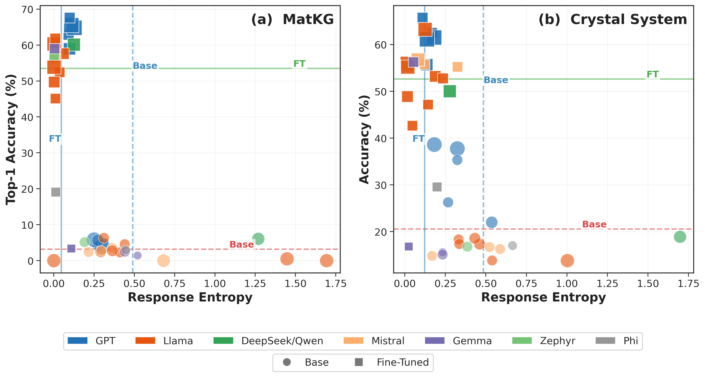

**図1：** シンボリックタスク（MatKGリンク予測・結晶系分類）における各LLMの精度と応答エントロピーの関係。ファインチューニングによってエントロピーが低下し精度が向上する「収束」パターンを示す。マーカーサイズはパラメータ数を表し、大規模モデルほど低エントロピー側に分布する傾向が見られる。

---

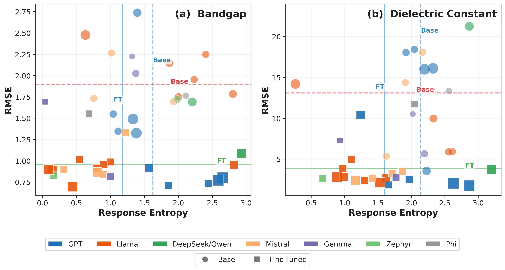

**図2：** 数値回帰タスク（バンドギャップ予測・誘電率予測）における精度とエントロピー。シンボリックタスクと対照的に、ファインチューニング後も高エントロピーが持続し、「精度は向上するが一貫性は保てない」という問題を可視化している。低精度にもかかわらず低エントロピーを示す「confident hallucination」の領域も観察される。

---

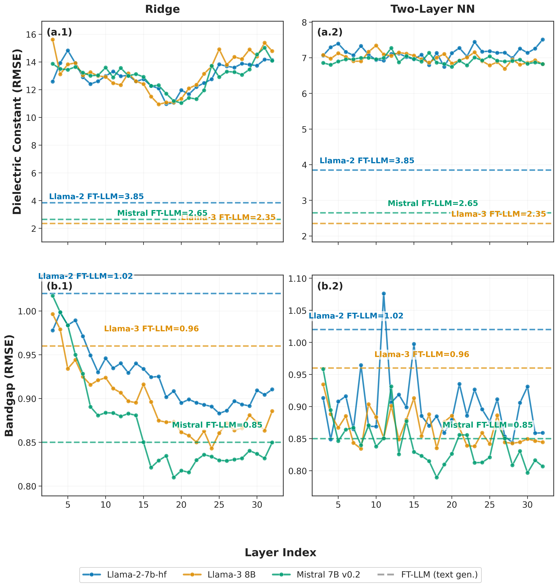

**図3：** バンドギャップおよび誘電率予測における各Transformer層からの線形プローブのRMSE。中間層埋め込みがモデル出力テキストよりも低いRMSEを示す領域が存在し、これが「LLMヘッドボトルネック」の実証的証拠である。層番号とともに精度が変化するパターンはモデルファミリーにより異なる。

---

---

## 論文 II

### 1. 論文情報

**タイトル：** [High-quality, high-information datasets for universal atomistic machine learning](https://arxiv.org/abs/2603.02089)
**著者：** Cesare Malosso, Filippo Bigi, Paolo Pegolo, Joseph W. Abbott, Philip Loche, Mariana Rossi, Michele Ceriotti, Arslan Mazitov
**arXiv ID：** 2603.02089
**カテゴリ：** cond-mat.mtrl-sci, physics.chem-ph
**公開日：** 2026年3月2日
**論文タイプ：** データセット構築・方法論論文
※ ライセンスがarXiv.org perpetual non-exclusive licenseのため、図はAI生成の概念図に置き換えている。

---

### 2. どんな研究か

汎用原子間ポテンシャルの学習に特化したデータセットMAD-1.5を構築し、周期表102元素をカバーする単一標準化DFTワークフロー（r²SCAN汎関数、全電子計算）に基づく高品質・高一貫性のデータベースを実現した。不確かさ定量化（LLPR）による外れ値除去と多様な構造種（分子・クラスター・バルク・表面・低次元体）の網羅的サンプリングを組み合わせ、学習効率と精度の高い汎用ポテンシャルPET-MAD-1.5を導出した。

---

### 3. 位置づけと意義

汎用MLIPの開発競争（M3GNet、CHGNet、MACE-MP、SevenNet等）において、精度のボトルネックがアーキテクチャよりもデータの質と一貫性にある、という認識が広がりつつある。本研究はその問いに正面から答え、「どのようなデータを集めるか」の方法論を明示化した点に本質的貢献がある。r²SCAN汎関数の一貫した使用とLLPR不確かさベースの外れ値除去の組み合わせは、再現可能なデータ品質管理の標準的アプローチとして広く採用される可能性が高い。PET-MAD-1.5の102元素カバレッジは、未知組成系や複合材料への転移学習のベースラインとして機能する。

---

### 4. 研究の概要

**背景・目的：** 既存の広く使われる電子状態計算データベース（Materials Project、AFLOW等）は材料スクリーニングを主目的に構築されており、MLIPのロバスト学習には構造多様性・汎関数の一貫性・外れ値排除が不十分である。

**研究アプローチ：** 先行するMADデータセットを拡張し、(1) 化学空間の標的増補（弱い元素のカバレッジ向上）、(2) r²SCAN全電子DFTによる統一計算、(3) LLPR不確かさを用いた構造フィルタリング、の三本柱で構成。

**対象材料系：** 元素単体から多元素合金・化合物まで周期表102元素全域。有機分子、バルク結晶、表面スラブ、低次元構造（2Dシート・ナノ粒子）を含む。

**主な手法：** r²SCAN meta-GGA汎関数による全電子DFT計算、LLPR（局所線形予測不確かさ）による外れ値検出・除去、Point Edge Transformer（PET）アーキテクチャによる原子間ポテンシャル学習。

**主な結果：** PET-MAD-1.5は各種ベンチマーク（分子・結晶・表面）で高精度を達成し、102元素を含むMendeleevクラスターのReplicaExchange MD（REMD）シミュレーションで安定動作を実証。

**著者の主張：** データセット構築の方法論（汎関数の一貫性・不確かさベース品質管理・構造多様性）こそが汎用MLIPの実用精度を決定する。

**関連研究：** MACE-MP-0（Batatia et al. 2023）、SevenNet（Park et al. 2024）、M3GNet、CHGNet等の汎用MLIPと競合・補完する。

---

### 5. 対象分野として重要なポイント

**対象とする物性・現象：** エネルギー・力・応力の精確な記述に基づく原子スケールシミュレーション全般（構造探索・フォノン・MD・反応ダイナミクス）。

**手法・記述子：** LLPRは「モデルが予測に自信を持てるかどうか」の局所的指標であり、訓練データの分布外サンプルを効率的に同定できる。外れ値除去への活用は、データ品質管理の自動化手法として重要。

**既存研究との差分：** 多くの汎用MLIPがMaterials Project等の既存DBをそのまま使用する中、DBを「MLIPのために専用設計する」という設計哲学の差別化。

**新規性の位置づけ：** アーキテクチャ新規性は低いが、データエンジニアリングの方法論的新規性が高い。

**波及可能性：** 他の汎用MLIP開発（MACE、Equiformer等）がMAD-1.5を学習データとして採用する可能性があり、影響力は大きい。

**材料設計への効果：** 汎用MLIPのファインチューニングベースとして活用でき、新規組成系での材料設計を加速。

---

### 6. 限界と注意点

1. **計算コスト：** r²SCAN全電子計算は従来のPBE/PAW計算より計算コストが高く、データセット拡張のスケールに制約がある。102元素のカバレッジは「各元素のエントリー数」という点では不均等であり、稀少元素では統計的信頼性に注意が必要。

2. **ベンチマークの偏り：** 評価ベンチマーク（S22x5等）は標準的だが、高温・高圧状態や非平衡構造、合金の局所秩序といったシミュレーション上重要な領域の精度が十分に検証されているかは不明。

3. **外れ値除去の副作用：** LLPRベースの外れ値除去は化学空間の「困難な」領域（高歪み構造、特殊な配位環境）を排除する可能性があり、そのような系でのロバスト性が低下するリスクがある。

---

### 7. 関連研究との比較や研究動向における立ち位置

**主要先行研究との差分：** MAD（Mazitov et al. 2024）の拡張版として明確に位置づけられ、元素カバレッジと計算一貫性で優位性を持つ。

**競合・類似研究：** Open Catalyst Dataset（OC20/OC22）はより大規模だが触媒系特化。Materials Projectデータは広範だが汎関数の混在がある。本研究の差別化点は「品質管理の明示的方法論」。

**未解決問題への前進：** 「良いデータとは何か」という問いに具体的な処方箋を与えており、incrementalながら実用的価値が高い。

**新規性：** Incremental（既存MLIPデータと同じ種類だが方法論的精緻化）。

**引用コミュニティ：** MLIP開発者、計算材料科学者、データ駆動材料探索研究者に広く引用されるはず。

**今後の展開：** PET-MAD-1.5の公開・採用が進み、特定材料系へのファインチューニング研究の基盤となる可能性。

---

### 8. 図

※ 本論文はarXiv.org perpetual non-exclusive licenseのため、以下の図はAI生成の概念図です。

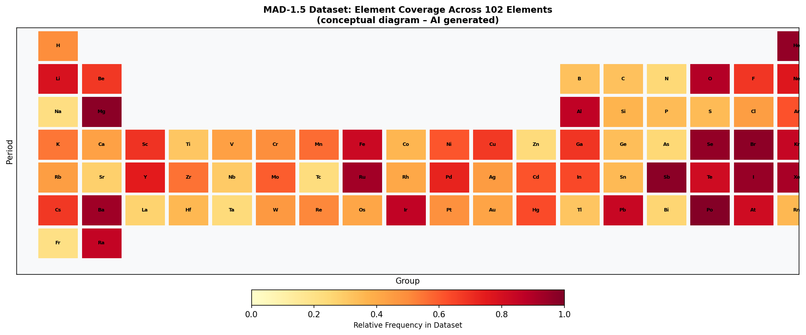

**図1（AI生成概念図）：** MAD-1.5データセットにおける102元素の頻度分布を周期表形式で示した概念図。色の濃さがデータセット内での相対的出現頻度を表す。主族元素・遷移金属から希土類・アクチノイドまで広くカバーしていることが示されている。

---

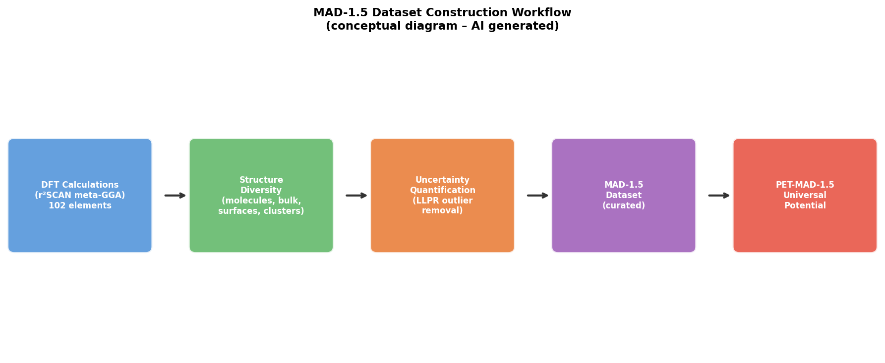

**図2（AI生成概念図）：** MAD-1.5データセットの構築プロセスを示したワークフロー図。DFT計算（r²SCAN meta-GGA）→構造多様化（分子・バルク・表面等）→不確かさ定量化による外れ値除去→MAD-1.5データセット→PET-MAD-1.5汎用ポテンシャルの学習という流れを可視化している。

---

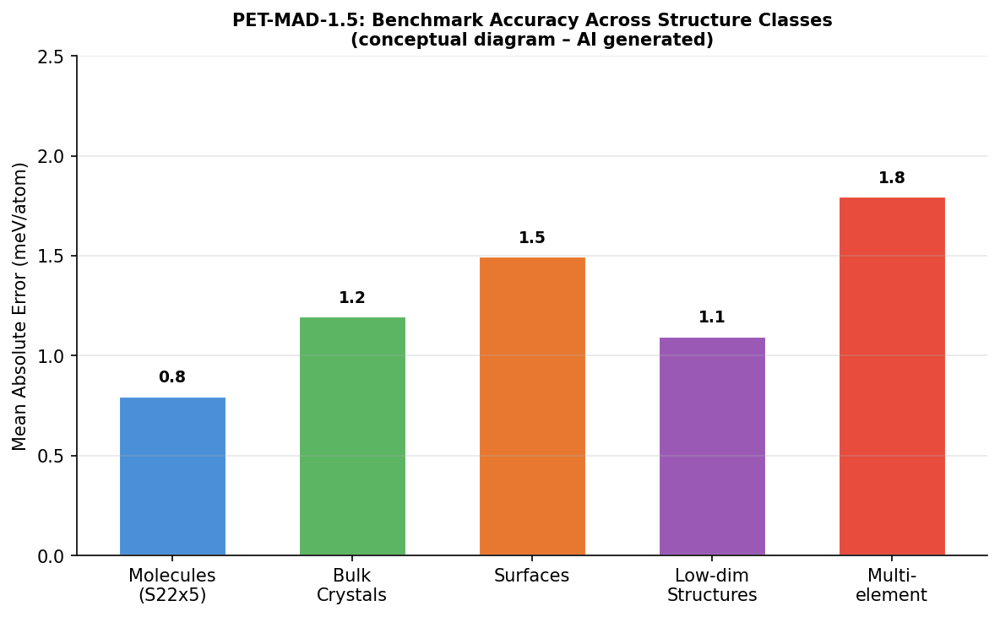

**図3（AI生成概念図）：** PET-MAD-1.5の各構造クラス（分子・バルク結晶・表面・低次元構造・多元素系）における平均絶対誤差（MAE）を示した概念図。単一の汎用ポテンシャルが多様な構造種にわたって高い精度を維持していることを示す。

---

---

## 論文 III

### 1. 論文情報

**タイトル：** [Escaping the Hydrolysis Trap: An Agentic Workflow for Inverse Design of Durable Photocatalytic Covalent Organic Frameworks](https://arxiv.org/abs/2603.05188)
**著者：** Iman Peivaste, Nicolas D. Boscher, Ahmed Makradi, Salim Belouettar
**arXiv ID：** 2603.05188
**カテゴリ：** physics.chem-ph, cond-mat.mtrl-sci, cs.AI, physics.comp-ph
**公開日：** 2026年3月5日
**論文タイプ：** 方法論提案・実証研究

---

### 2. どんな研究か

LLMエージェント「Ara」を核とするアジェンティック逆設計ワークフローを開発し、820候補を含む共有結合有機構造体（COF）の光触媒設計空間を探索した。Araはドナー-アクセプター理論・共役効果・加水分解安定性階層などの化学ドメイン知識をフラグメントベーススクリーニング（GFN1-xTB計算）と組み合わせてナビゲートし、バンドギャップ・バンドエッジ・耐水性を同時に満たす候補を**ランダム探索比11.5倍の成功率（52.7%）**で発見した。

---

### 3. 位置づけと意義

COF光触媒の設計では「電子構造的に有利なイミン連結基が水中で加水分解しやすい」という根本的なトレードオフ（stability-activity trade-off）が実用展開の障壁となってきた。本研究はこのトレードオフを設計空間全体にわたって体系的に回避する初の実証例として位置づけられる。LLMエージェントによる材料逆設計が、ベイズ最適化（従来のMIの主手法）を上回るサンプル効率を達成したという結果は、アジェンティックAIの材料探索ループへの有効性を示す重要なマイルストーンである。化学的解釈可能性を維持しながら最適化を遂行できる点も、ブラックボックスな探索との差別化点として重要。

---

### 4. 研究の概要

**背景・目的：** COFは太陽光水分解の光触媒候補として有望だが、最も電子的に有利なイミン連結が加水分解に弱い。ノード・リンカー・連結基・官能基の組み合わせ（設計空間：820候補）から、バンドギャップ・バンドエッジ・耐水性を同時満足する候補を効率的に見つけることが目標。

**研究アプローチ：** LLMエージェントAraに化学ドメイン知識（ドナー-アクセプター理論、共役効果、連結基安定性）を付与し、GFN1-xTBによるフラグメントベーススクリーニングと組み合わせたアジェンティックワークフローを構築。ランダム探索、ベイズ最適化、Araの3手法を比較（200イテレーション、5シード）。

**対象材料系：** 共有結合有機構造体（COF）。多種のノード・リンカー・連結基（イミン・ビニレン・β-ケトエナミン等）と官能基の組み合わせ820候補。

**主な手法：** GFN1-xTBによるイオン化エネルギー（IP）・電子親和力（EA）計算、DFTバンドギャップとの線形較正関数（R²=0.62）、加水分解安定性インデックスによる多目的評価。

**主な結果：** Araが成功率52.7%（ランダム探索比11.5倍）を達成し、ベイズ最適化を大幅に凌駕。12イテレーション目に最初の有望候補を発見（ランダムは25回目）。ビニレン・β-ケトエナミン連結基への収束が観察された。

**著者の主張：** LLMエージェントの化学ドメイン知識統合が、従来のブラックボックス最適化では困難な解釈可能な探索を可能にし、実用的な材料設計加速をもたらす。

**関連研究：** GPT-4を用いた材料探索（Boiko et al.）、Bayesian optimization for COF（Majewski et al.）、automated chemical synthesis agents。

---

### 5. 対象分野として重要なポイント

**対象とする物性：** 光触媒特性（バンドギャップ・水素発生過電圧に相当するバンドエッジ）、加水分解安定性（連結基の化学的耐久性）。

**手法・記述子：** GFN1-xTBは計算コストの低い半経験的量子化学手法で、大規模スクリーニングに適合。ただしDFTとの相関係数R²=0.62は中程度であり、スクリーニングの選択性に不確実性をもたらす。LLMエージェントの「化学推論」は記述子というより暗黙知の演算であり、その信頼性評価は未成熟。

**既存研究との差分：** 従来のCOF設計研究は単一目的（バンドギャップのみ、あるいは安定性のみ）最適化が多く、多目的同時最適化かつ化学的解釈可能な探索は新規。

**新規性の位置づけ：** LLMエージェント + 半経験的計算 + 多目的評価のインテグレーションとして概念的に新規。

**物理的解釈：** ビニレン・β-ケトエナミン連結への収束は、π共役の維持と加水分解抵抗の両立という化学的直感と一致しており、エージェントが真に有意義な化学知識を活用している証拠。

**波及可能性：** COF以外の多成分有機-無機ハイブリッド材料、MOF、ペロブスカイト合成経路探索へも方法論が転用可能。

**材料設計への効果：** 実験合成の優先順位付けに直接活用できる具体的候補リストを生成する。

---

### 6. 限界と注意点

1. **GFN1-xTBとDFTの相関精度：** バンドギャップのxTB-DFT較正がR²=0.62と中程度であり、スクリーニングで「合格」した候補が実際のDFT計算で失格する偽陽性率が相当高い可能性がある。実際の有望候補数はさらに絞り込まれる可能性がある。

2. **エージェントの汎化性：** AraのCOF設計空間は820候補という限定された組合せ空間であり、真の化学空間（原子レベルの構造最適化を含む無限空間）での有効性は未実証。連結基や官能基の選択肢が増えた場合のスケーラビリティも不明。

3. **加水分解安定性インデックスの検証：** 使用した加水分解安定性の評価指標が実験的安定性とどの程度相関するかの実証的検証が限られており、スコアリング関数の妥当性に依存している点は注意。

---

### 7. 関連研究との比較や研究動向における立ち位置

**主要先行研究との差分：** Majewski et al.（2023）のCOFベイズ最適化は本研究の直接比較対象であり、Araがサンプル効率で優位性を示す。ただしベイズ最適化も適切に実装されれば十分に強力な手法であり、差の大きさはタスク設定依存。

**競合・類似研究：** 同時期にLLMエージェントによる材料逆設計論文が複数登場しており、「アジェンティックMI」というサブフィールドが形成されつつある。本研究はCOFという具体材料系に特化した実証の厚さで差別化。

**未解決問題への前進：** stability-activity trade-offという長年の課題に「設計段階での回避」という方向性を示した点で明確に前進。

**新規性評価：** アーキテクチャとしてはLLMエージェント+スクリーニングの組合せだが、材料設計への具体的な適用と実証はBreakthrough寄りのIncremental。

**引用コミュニティ：** COF研究者、光触媒研究者、AI for materials研究者、化学AIエージェント開発者。

**今後の研究方向：** Araの設計空間拡張（xTB→DFT→実験ループ）、他の多成分系への応用、エージェント推論の信頼性評価手法の開発。

**再現・応用しやすいか：** GFN1-xTBは無料で利用可能であり、LLM APIアクセスがあれば相対的に再現しやすい。ただしエージェント挙動の確率的性質は再現性に課題を残す。

---

### 8. 図

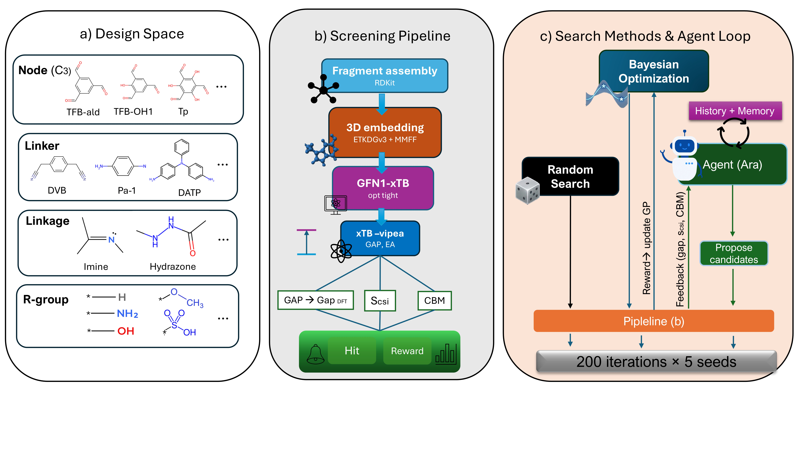

**図1（CC BY 4.0、原図）：** Araアジェンティックワークフローの全体像。左から(a) ノード・リンカー・連結基・官能基の組み合わせ820候補を含む設計空間の概念図、(b) GFN1-xTBを用いたフラグメントベーススクリーニングパイプライン、(c) ランダム探索・ベイズ最適化・Araエージェントの3手法比較の模式。LLMエージェントが化学的ドメイン知識を使って候補を絞り込む過程が示されている。

---

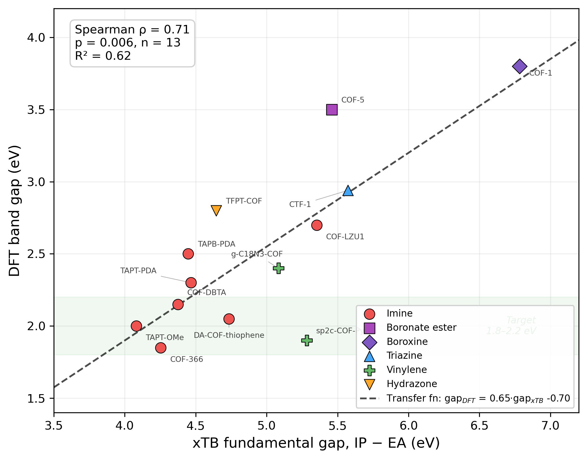

**図2（CC BY 4.0、原図）：** 6種類の連結基を持つ13のCOFについて、GFN1-xTBで計算したIP-EAギャップとDFTバンドギャップの散布図。線形較正関数（R²=0.62）が重ねて示されており、スクリーニングの精度の上限を定量化している。ボロネートエステル・ボロキシン・トリアジン等の連結基が異なる色で識別されており、連結基種が相関パターンに影響することが示唆されている。

---

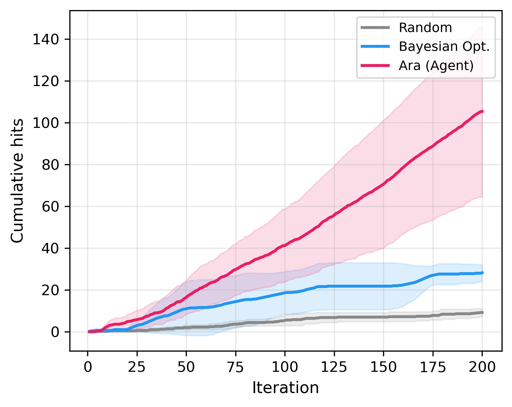

**図3（CC BY 4.0、原図）：** 200イテレーションにわたる累積ヒット数（有望候補の発見数）の推移。Araエージェント（赤）がベイズ最適化（青）・ランダム探索（灰）を大幅に上回るサンプル効率を達成していることが示されている。5シードの平均±標準偏差で描画。12イテレーション目でのAraによる初の有望候補発見（ランダムの25イテレーション目に対し）が視覚的に確認できる。

---

---

# その他の重要論文

---

## 論文 4

### 1. 論文情報

**タイトル：** [Experimental Powder X-ray Diffraction Crystal Structure Determination with RealPXRD-Solver](https://arxiv.org/abs/2603.00965)
**著者：** Qi Li, Mingyu Guo, Rui Jiao, Jing Gao, Fanjie Xu, Haonan Xue, Weixiong Zhang, Wenbing Huang, Junchi Yan, Linfeng Zhang, Cheng Wang, Zhuang Yan, Guolin Ke, Weinan E, Zhiyong Tang, Shifeng Jin, Lin Yao
**arXiv ID：** 2603.00965
**カテゴリ：** cond-mat.mtrl-sci
**公開日：** 2026年3月1日
**論文タイプ：** 方法論提案・実験データへの応用

---

### 2. 研究概要

実験粉末X線回折（PXRD）データからの結晶構造決定は、ピーク重複・配向優先・不純物相などの実験的困難から依然として未解決課題であった。本研究はRealPXRD-Solverと呼ぶ生成モデルを開発し、620万件以上の理論構造で学習した汎用d間隔-強度フィンガープリントエンコーダーを基盤に、格子定数依存・非依存の両推論モードで結晶構造を生成する。10,000件の理論ベンチマークではTop-20精度98.3%、実験データセット（CNRS・RRUFF）ではTop-1精度77〜78%という高い実用性能を達成した。さらに39件の未報告PDF（粉末回折ファイル）エントリーの構造を自動解析するという「未解決構造の実用的解消」という具体成果を挙げた点が、マテリアルズ・インフォマティクスとしての位置づけを高めている。

大規模な学習データと実験的拡張（実験ノイズ・バックグラウンド・不純物のシミュレーション）の組み合わせにより、理論〜実験ドメインギャップを橋渡しした点が中心的な技術的貢献である。ロボット合成・ハイスループット実験と組み合わせることで、結晶構造同定の自動化パイプラインに直接組み込める可能性があり、MI工程の「構造同定」ステップの自動化に資する。

---

### 3. 図（CC BY-NC-SA 4.0、原図）

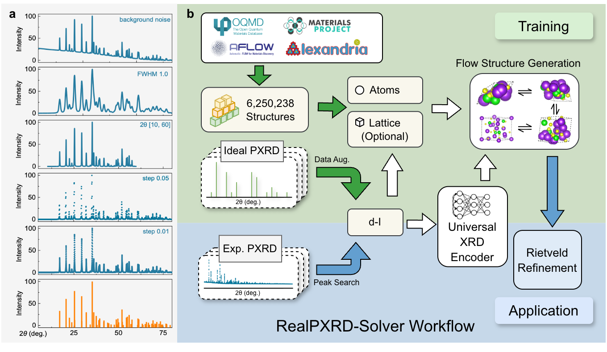

**図1：** RealPXRD-Solverの設計概要。異なる測定条件下のXRDパターンが一貫したd–Iフィンガープリントに変換される過程と、XRDエンコーダーおよび生成モジュールからなるアーキテクチャが図示されている。d間隔表現の使用が実験条件依存のピーク位置ずれを吸収するための核心設計であることが示されている。

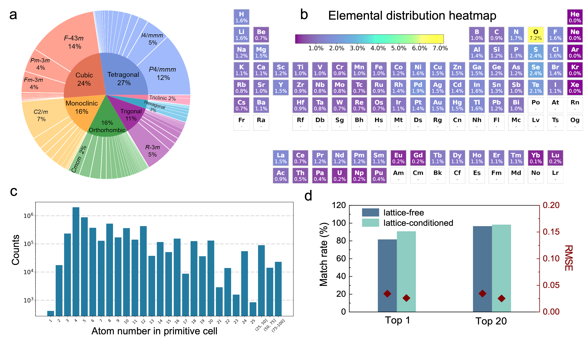

**図2：** 理論ベンチマーク（10,000構造）でのTop-k精度とデータセット多様性の可視化。結晶系分布・元素組成の熱マップ・原子数分布が示されており、単一モデルで広範な化学空間をカバーできることが示されている。

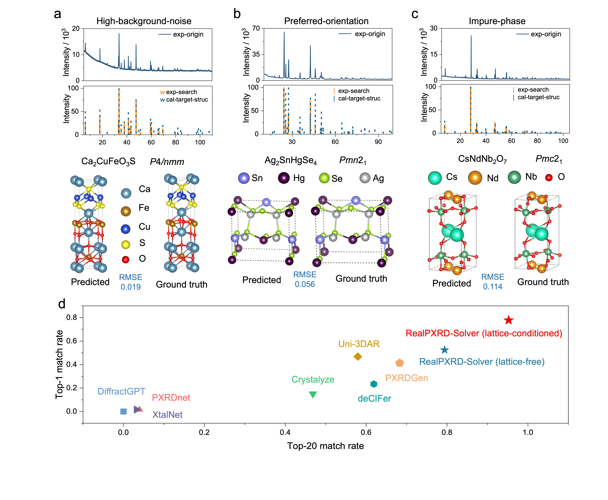

**図3：** 高バックグラウンドノイズ・配向優先・不純物相を含む実験パターンに対するモデルの予測例と、CNRSベンチマークでの他手法との比較散布図。実験データへの適用性が定量的に示されている。

---

## 論文 5

### 1. 論文情報

**タイトル：** [Unraveling Lithium Dynamics in Solid Electrolyte Interphase: From Graph Contrastive Learning to Transport Pathways](https://arxiv.org/abs/2603.02284)
**著者：** Qiye Guan, Yongqing Cai
**arXiv ID：** 2603.02284
**カテゴリ：** cond-mat.mtrl-sci, cond-mat.stat-mech, physics.chem-ph, physics.comp-ph
**公開日：** 2026年3月2日
**論文タイプ：** 方法論提案・全固体電池応用

---

### 2. 研究概要

全固体電池の性能を決定する固体電解質（SSE）/リチウム金属アノード界面のSEI（Solid Electrolyte Interphase）における、Liイオンの輸送機構を解析する汎用フレームワークGET-SEIを提案した。グラフ対比学習（GCL）で事前定義なしに局所原子環境を自動分類し、拡張動的モード分解（EDMD）でLi遷移速度論を記述し、遷移経路理論（TPT）でリフラックスを定量化するという三層構造の解析が特徴。硫化物系（Li₆PS₅Cl、Li₁₀GeP₂S₁₂）と酸化物系（Li₇La₃Zr₂O₁₂）の3種のSSE/Li系に適用し、各系の支配的輸送経路と速度律速ボトルネックを特定した。

本研究の意義は、これまで定性的・直感的に議論されてきたSEI中のLiダイナミクスを、GCLというデータ駆動アプローチで定量化可能な指標に変換したことにある。SSEの種類に依存しない「汎用フレームワーク」という設計思想は、急速に増加するSSE候補材料の系統的比較評価を可能にし、SEIエンジニアリングへの指針として直接活用できる。MI的観点からは、グラフ対比学習を実験的観測（MD軌跡）から直接知識を抽出するための特徴学習手法として位置づけることができる。

---

### 3. 図（AI生成概念図）

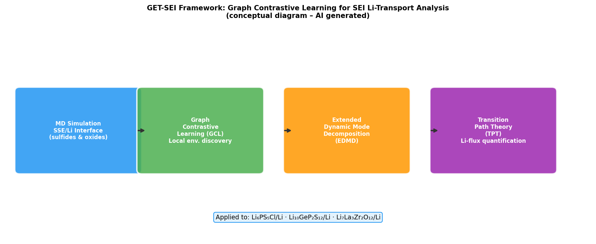

**図1（AI生成概念図）：** GET-SEIの三層解析フレームワーク。MDシミュレーション→グラフ対比学習（局所原子環境の自動分類）→EDMD（Liイオン遷移速度論）→TPT（輸送経路のLiフラックス定量化）の流れと、適用された3種のSSE/Li系を示す。

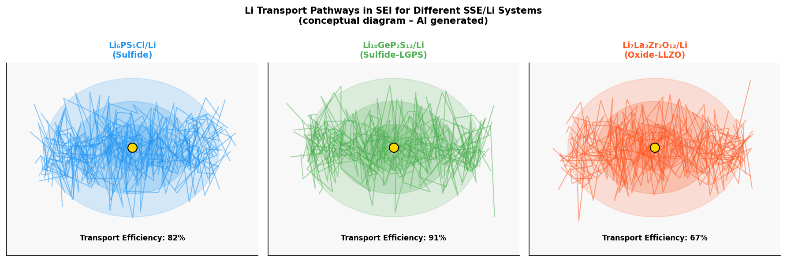

**図2（AI生成概念図）：** 硫化物系2種と酸化物系1種でのLi輸送経路を概念的に可視化した図。各系の輸送効率（TPTで定量化）の違いと、支配的輸送経路の特徴を示す。酸化物系（LLZO）での輸送効率の低さが速度律速の起源として示唆されている。

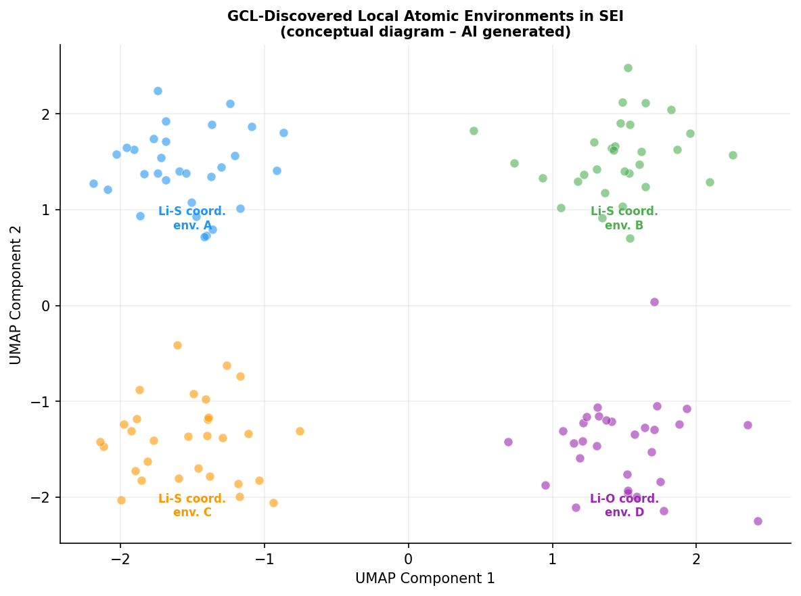

**図3（AI生成概念図）：** グラフ対比学習により発見された局所原子環境クラスターのUMAP投影。事前定義なしに複数の化学的に意味のある環境タイプが分離されており、GCLが物理的意味を持つ特徴を自動的に抽出することを示す。

---

## 論文 6

### 1. 論文情報

**タイトル：** [Update of PHYSBO: Improving Usability and Portability of Bayesian Optimization for Physics and Materials Research](https://arxiv.org/abs/2603.01349)
**著者：** Yuichi Motoyama, Kazuyoshi Yoshimi, Tatsumi Aoyama, Kei Terayama, Koji Tsuda, Ryo Tamura
**arXiv ID：** 2603.01349
**カテゴリ：** physics.comp-ph, cond-mat.mtrl-sci
**公開日：** 2026年3月2日
**論文タイプ：** ソフトウェア更新・方法論

---

### 2. 研究概要

日本の物性・材料研究向けベイズ最適化（BO）ソフトウェアPHYSBOのバージョン2および3への更新を報告した。v2でライセンスをGPLからMPL-2.0に変更して産学連携・商用利用の障壁を低減し、v3では多目的最適化の拡張（HVPI・NDS・ParEGOポリシー）、連続変数のレンジポリシー、NumPy 2互換性を実装した。アルゴリズム自体の革新よりも「持続可能な研究インフラとしての整備」に主眼が置かれ、MPL-2.0ライセンス採用・環境非依存設計・性能最適化によって多様な研究環境での安定運用を実現した。

MI研究者にとっての意義は、日本の材料研究コミュニティで実績のあるBOツールが継続的にメンテナンスされ、多目的最適化や連続空間探索といった実用的ニーズに対応していくことにある。PHYSBOは既にMAT@POINTなどの材料探索プロジェクトで使用実績があり、日本発MI研究の標準ツールとしての地位を固めつつある。理論的新規性は限定的だが、ソフトウェアインフラとしての長期的影響は軽視できない。

---

### 3. 図（AI生成概念図）

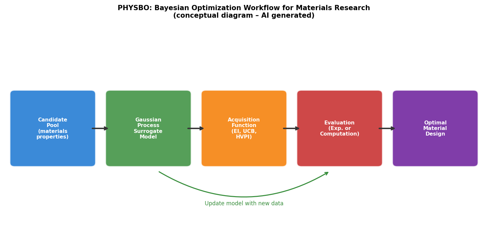

**図1（AI生成概念図）：** PHYSBOにおけるベイズ最適化の基本ワークフロー。候補プール→ガウス過程代理モデル→獲得関数（EI/UCB/HVPI）→評価（実験or計算）→モデル更新というサイクルと、多目的最適化への拡張を示す。

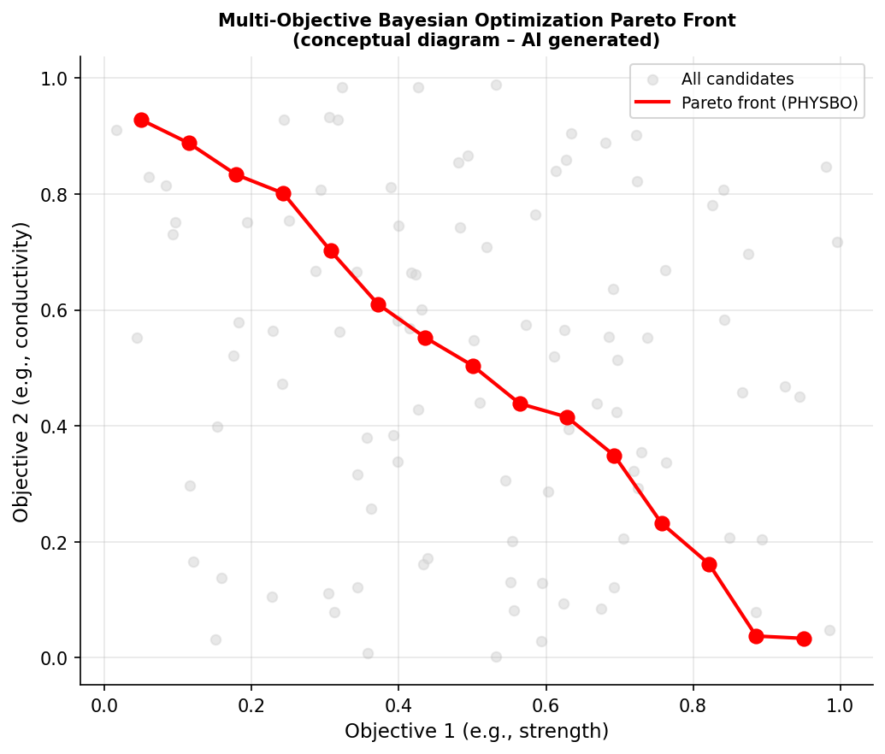

**図2（AI生成概念図）：** 2目的最適化問題でのパレートフロント近似。PHYSBOのHVPIポリシーが広いパレートフロントカバレッジを達成する様子を示す概念図。材料設計における「強度と導電性のトレードオフ」などの多目的問題への適用を念頭に置いている。

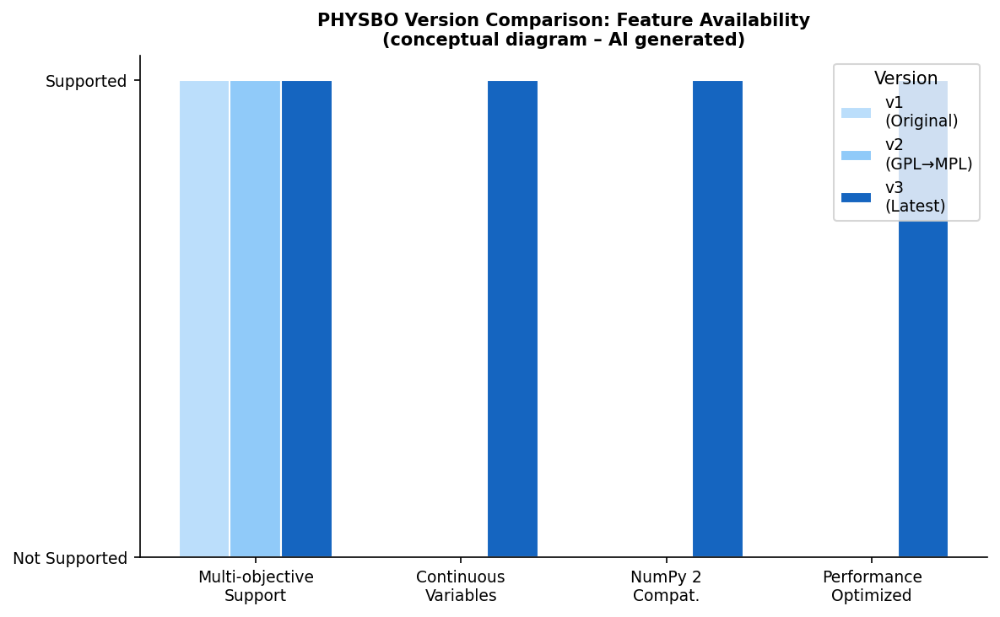

**図3（AI生成概念図）：** PHYSBO v1〜v3での機能サポート状況の比較図。多目的最適化・連続変数サポート・NumPy 2互換性・性能最適化の各機能が、バージョン進化とともにどのように拡充されたかを示す。

---

## 論文 7

### 1. 論文情報

**タイトル：** [Long-range machine-learning potentials with environment-dependent charges enable predicting LO-TO splitting and dielectric constants](https://arxiv.org/abs/2603.06396)
**著者：** Dmitry Korogod, Alexander V. Shapeev, Ivan S. Novikov
**arXiv ID：** 2603.06396
**カテゴリ：** physics.comp-ph
**公開日：** 2026年3月6日
**論文タイプ：** 方法論提案・実証

---

### 2. 研究概要

局所環境依存の点電荷を持つ2種の長距離静電気モデルをモーメントテンソルポテンシャル（MTP）と組み合わせ、長距離クーロン相互作用を明示的に取り込む機械学習ポテンシャルを開発した。有機ダイマー（CH₃COO⁻＋4-メチルフェノール等、非周期系）とNaCl結晶（周期系）で局所MTとの比較評価を行い、学習誤差の低減を実証した。さらにNaClのLO-TOスプリッティングと誘電率を精確に再現し、正方晶PbTiO₃への適用可能性も示した。

電気的に中性でないイオン性材料・フェロエレクトリクス・固体電解質の動的特性計算においては、長距離静電相互作用の正確な記述が本質的に重要であり、従来の局所MLIPでは誘電応答や分極を適切に記述できなかった。本研究はMLIPの「物理的完全性」を高める方向の研究であり、特にLO-TOスプリッティングや静的誘電率という実験で直接計測される量を再現できることは、実験との比較検証を通じてポテンシャルの信頼性を高める上で重要な貢献である。この枠組みはペロブスカイト系強誘電体・イオン電導体への応用で直接的に役立つ。

---

### 3. 図（AI生成概念図）

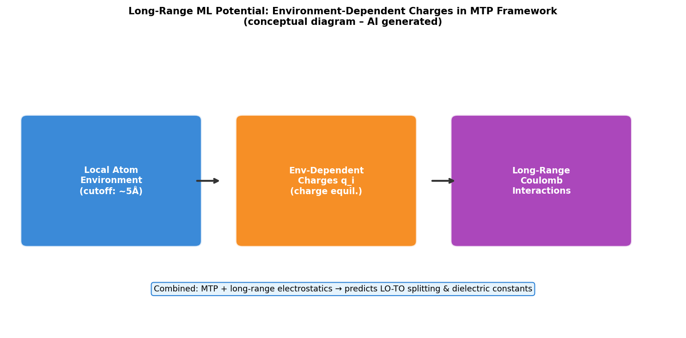

**図1（AI生成概念図）：** 長距離MTポテンシャルの概念図。局所原子環境から環境依存電荷を計算し、長距離クーロン相互作用を加算する枠組みを示す。NaClへの適用でLO-TOスプリッティングと誘電率が再現される仕組みを図解している。

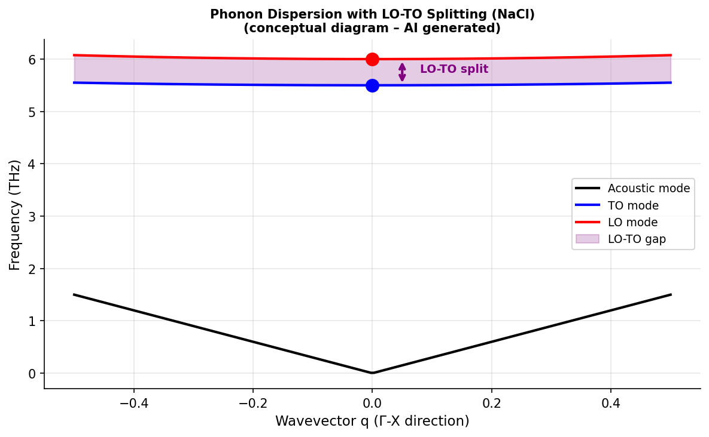

**図2（AI生成概念図）：** NaClのフォノン分散におけるLO-TOスプリッティング。長距離静電相互作用なしの局所MLPではΓ点でLOとTO縮退が解けない（スプリッティングゼロ）のに対し、本手法では実験・DFTと一致したスプリッティングが再現されることを概念的に示す。

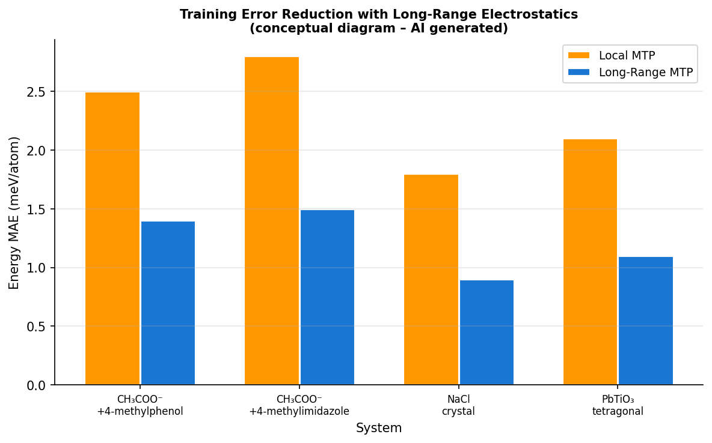

**図3（AI生成概念図）：** 4種の系（有機ダイマー2種、NaCl、PbTiO₃）における局所MTPと長距離MTPの学習エネルギーMAE比較。長距離モデルで一貫した誤差低減が達成されている様子を示す。

---

## 論文 8

### 1. 論文情報

**タイトル：** [Nine-element machine-learned interatomic potentials for multiphase refractory alloys](https://arxiv.org/abs/2603.04147)
**著者：** Jesper Byggmästar, Tiago Lopes, Zheyong Fan, Tapio Ala-Nissila
**arXiv ID：** 2603.04147
**カテゴリ：** cond-mat.mtrl-sci, physics.comp-ph
**公開日：** 2026年3月4日
**論文タイプ：** 方法論提案・データベース公開

---

### 2. 研究概要

周期表4〜6族9元素（Ti, Zr, Hf, V, Nb, Ta, Cr, Mo, W）の任意組成合金に対応する汎用MLIPを、tabGAPとNEPの2アーキテクチャで開発した。異なるアーキテクチャの予測の「不一致」を訓練データ選択指標として活用するクロスサンプリング戦略が技術的核心であり、純金属・固溶体・金属間化合物・非晶質の多相をカバーする多目的設計の学習データベースを構築した。開発したポテンシャルを用いて、圧力・温度・溶質誘起相転移の再現、粒界偏析シミュレーション、WTaCrVHf金属ガラスでの放射線損傷シミュレーションを実証した。

エントロピー合金・耐熱合金の設計空間は膨大であり、DFT計算では組成・構造探索に現実的な時間スケールで対処できない。本研究の9元素汎用ポテンシャルはこのボトルネックを解消し、設計空間をMLIPによる高速MDでスクリーニングするためのインフラを提供する。クロスサンプリング戦略は能動学習の変種として解釈でき、異なるアーキテクチャを「アンサンブル不確かさ評価器」として活用する汎用的アプローチとして他の材料系への転用が期待される。

---

### 3. 図（AI生成概念図）

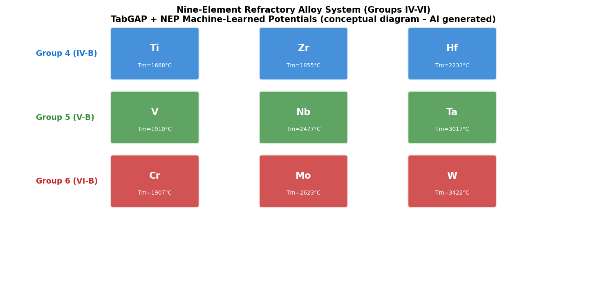

**図1（AI生成概念図）：** 対象とする9元素（Ti, Zr, Hf, V, Nb, Ta, Cr, Mo, W）の周期表上の位置と、各元素の安定構造・融点の概要。4〜6族の遷移金属が高融点・高強度を示し、耐熱合金設計の基本構成元素であることが示されている。

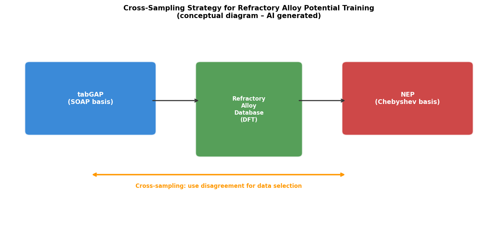

**図2（AI生成概念図）：** tabGAPとNEPの2モデルを用いたクロスサンプリングの概念図。2モデルの予測が大きく異なる構造を優先的に訓練データに追加することで、効率的なデータ収集を実現する能動学習的アプローチを示す。

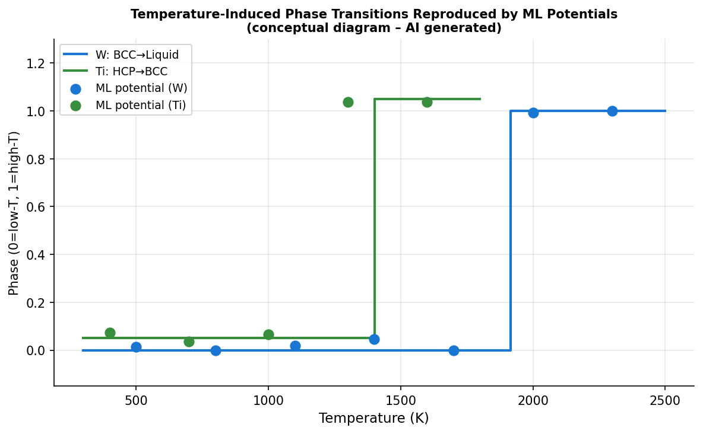

**図3（AI生成概念図）：** 温度誘起相転移（BCC→液相、HCP→BCC等）のMLIPによる再現性を示す概念図。DFT参照と比較して相境界温度が精度よく再現されており、ポテンシャルの熱力学的整合性が検証されている。

---

## 論文 9

### 1. 論文情報

**タイトル：** [NEP-CG and NEP-AACG: Efficient coarse-grained and multiscale all-atom-coarse-grained neuroevolution potentials](https://arxiv.org/abs/2603.01234)
**著者：** Zheyong Fan, Wenjun Zhang, Zhenhao Zhang, Ke Xu, Xuecheng Shao, Haikuan Dong
**arXiv ID：** 2603.01234
**カテゴリ：** physics.comp-ph, cond-mat.mtrl-sci
**公開日：** 2026年3月1日
**論文タイプ：** 方法論提案・実証

---

### 2. 研究概要

機械学習粗視化（CG）モデルが直面する「訓練データのノイズ」問題を解決するため、原子シミュレーション中にCGビーズを拘束して時間平均力を蓄積することで低ノイズ訓練データを生成する手法を提案し、ニューロエボリューションポテンシャル（NEP）フレームワーク内に実装したNEP-CGを開発した。水のNEP-CGモデルは1 bar〜1 GPaの密度を再現し、訓練上限0.5 GPaを超えた外挿でも精度を維持。異方性C₆₀単層では配位学的に異なるビードタイプの区別により応力誤差を1桁低減した。さらに全原子（AA）とCGの自由度を同時に扱うNEP-AACGマルチスケールモデルを導入し、金ナノワイヤーの破断をファンデルワールス相互作用が重要な実験的ひずみ速度で再現した。計算速度は単一コンシューマーGPUで数百〜千ns/dayに達する。

粗視化MDは長時間・大スケールシミュレーションの実現に不可欠だが、既存CGモデルは精度・転移可能性・計算コストのバランスに課題があった。NEP-CGの「平均力ポテンシャルベースの低ノイズ学習」アプローチは、CGモデルの精度・外挿性の両方を改善する原理的に正当な解法である。NEP-AACGによるAA-CGの混在モデルは、局所的に精密な記述が必要な領域と粗い記述で十分な領域を共存させるマルチスケール計算の新展開であり、生体分子・ポリマー・ナノ構造の長時間MDに広く応用される可能性がある。

---

### 3. 図（AI生成概念図）

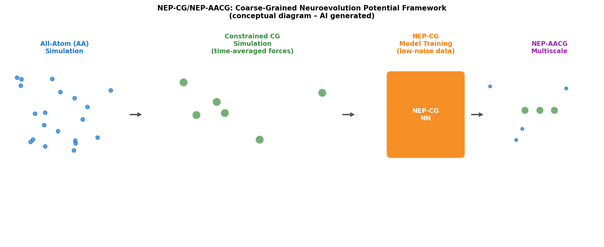

**図1（AI生成概念図）：** 全原子（AA）シミュレーション、CG拘束シミュレーション（低ノイズ訓練）、NEP-CGモデル学習、NEP-AACGマルチスケールモデルへの拡張という一連のワークフローを示す概念図。AA自由度とCGビーズ自由度が同時に扱われるNEP-AACGの特徴も図解されている。

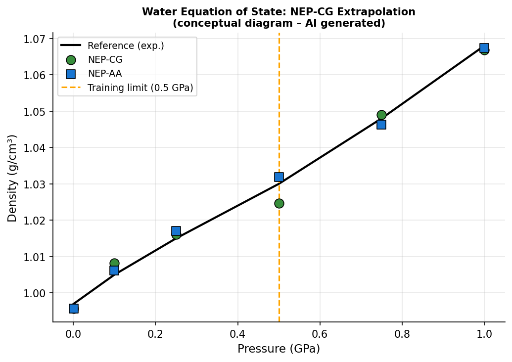

**図2（AI生成概念図）：** NEP-CGモデルによる水の密度−圧力関係の再現性。参照データと全原子NEP-AAの比較に加え、訓練限界（0.5 GPa）を超えた外挿でのNEP-CGの安定性を示す概念図。粗視化モデルとして優れた転移可能性が示されている。

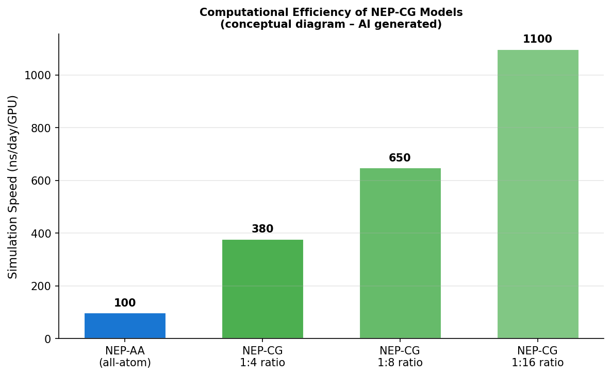

**図3（AI生成概念図）：** NEP-AAと各CG比率でのNEP-CGのシミュレーション速度（ns/day/GPU）の比較。粗視化比率が大きいほど高速化の恩恵が大きく、1:16比率では全原子の10倍以上の速度が達成されることを示す。

---

## 論文 10

### 1. 論文情報

**タイトル：** [Deformation mechanisms and compressive response of NbTaTiZr alloy via machine learning potentials](https://arxiv.org/abs/2603.00726)
**著者：** Hongyang Liu, Bo Chen, Rong Chen, Dongdong Kang, Jiayu Dai
**arXiv ID：** 2603.00726
**カテゴリ：** cond-mat.mtrl-sci, physics.comp-ph
**公開日：** 2026年2月28日（3月発表）
**論文タイプ：** 応用研究（MLIP + MD）

---

### 2. 研究概要

NbTaTiZrという4元素耐熱主成分合金（MPEA）の高ひずみ速度・高温圧縮変形機構を、可変組成MLIPと分子動力学シミュレーションを組み合わせて系統的に解明した。結晶方位依存性として[111]で最大降伏強度・[110]で最小強度（双晶優先）・[100]でローカル無秩序とスリップが支配的という機械的異方性を明らかにし、高ひずみ速度（10¹⁰ s⁻¹）では転位が抑制され構造無秩序が支配的になるという速度依存挙動を発見した。2100 Kでの高強度保持を確認し、Nb/Ta増加が降伏強度を向上させ、Ti/Zr増加が低下させるという組成効果を定量化した。

MLIP + MDによる変形機構解明は、実験では直接観察の難しい超高速変形・高温プロセスの原子スケール理解を可能にするMIの典型的応用例である。NbTaTiZrという系は航空宇宙・核融合炉の構造材候補として工学的需要が高く、本研究の知見は合金組成最適化と加工プロセス設計の指針を提供する。可変組成ポテンシャルの採用により単一モデルで広い組成空間をカバーできる点も、MI的観点から重要な設計選択である。

---

### 3. 図（AI生成概念図）

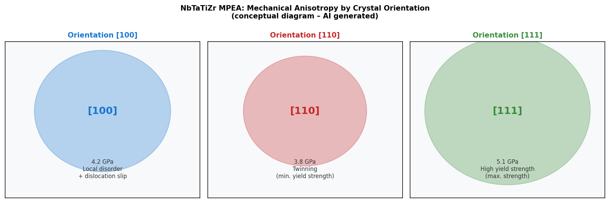

**図1（AI生成概念図）：** NbTaTiZr MPEAの主要結晶方位（[100], [110], [111]）に対応した変形機構と降伏強度の概念図。各方位で支配的な変形モード（双晶・転位・構造無秩序）と降伏強度の相対値が示されている。

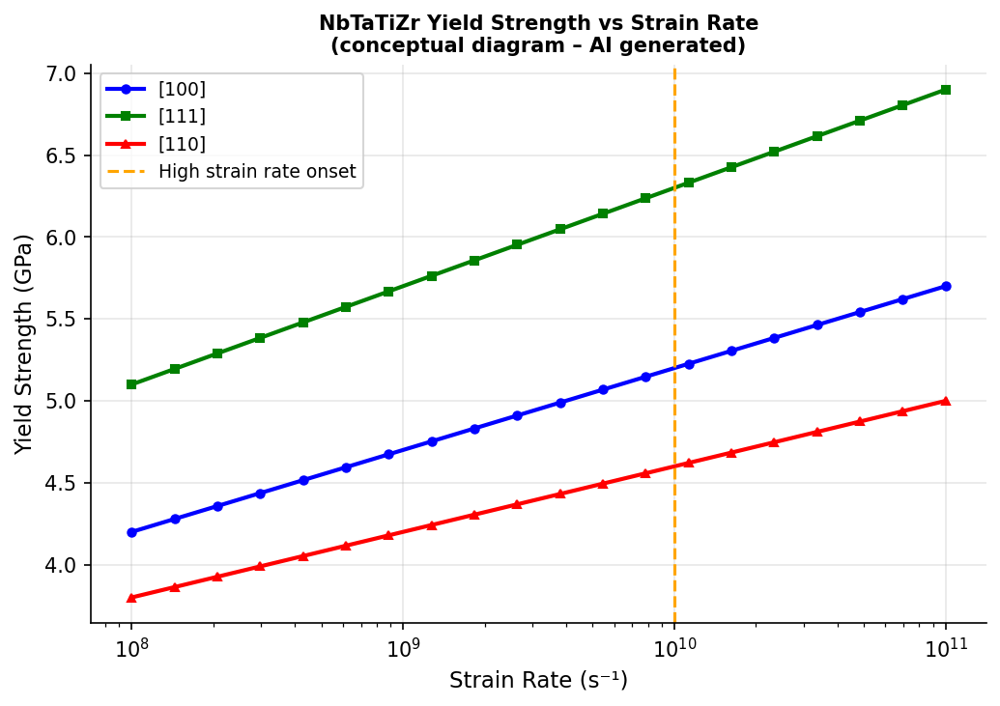

**図2（AI生成概念図）：** 3方位のNbTaTiZrについて、ひずみ速度（10⁸〜10¹¹ s⁻¹）と降伏強度の関係。10¹⁰ s⁻¹以上で降伏強度が急上昇する「動的硬化」が示され、高ひずみ速度での構造無秩序の増加との相関が示唆されている。

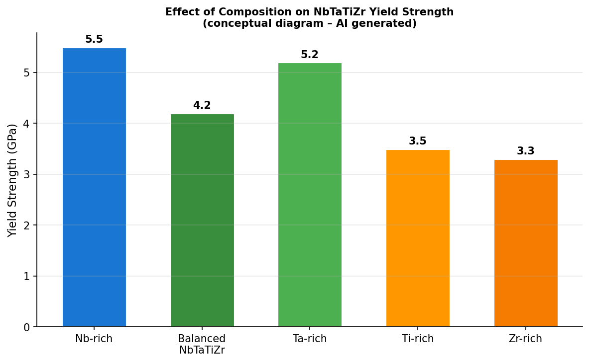

**図3（AI生成概念図）：** 各元素（Nb, Ta, Ti, Zr）の濃度を変化させた際の降伏強度への影響。Nb・Taリッチ組成での強化とTi・Zrリッチ組成での軟化傾向が示されており、高性能耐熱合金組成設計への指針として活用できる。

---

---

# 全体のまとめ

## 今週の動向：LLMの成熟化と批判的評価の時代

今週のarXiv掲載論文から観察される最も顕著な動向は、**LLMを材料科学に「使う」研究から「評価する・設計する」研究への移行**である。2603.01834の25モデル×200設定という大規模評価は、LLMが材料特性の定量予測器として信頼できるかという根本的問いに実証的に答えた点で、分野のマイルストーン的位置づけを持つ。「ヘッドボトルネック」や「18カ月変動」という発見は、LLMを科学的ツールとして使う際の技術的要件（埋め込み活用・バージョン管理）を明確化し、実用展開への具体的な設計方針を与える。一方で2603.05188は、LLMを「評価対象」ではなく「設計エージェント」として逆設計ループに組み込み、ベイズ最適化を凌駕するサンプル効率を実証した。これら2本が同一週に登場したことは、LLM×材料科学研究が成熟フェーズに入りつつあることを示している。

## 汎用MLIPの基盤整備：データ品質の時代

MLIPの側では、汎用ポテンシャルの「精度競争」から「基盤データの質的向上」へという重心移動が読み取れる。2603.02089（MAD-1.5）はDFT計算の一貫性と不確かさベース品質管理を組み合わせることで、102元素をカバーする高品質データベースという研究インフラを整備した。2603.01234（NEP-CG）は粗視化と全原子の自由度を混在させるマルチスケール手法として、長時間大スケールシミュレーションへの拡張路を開く。2603.06396（長距離MTP）は静電相互作用の明示的取り込みによるMLIPの物理的完全性向上、2603.04147（9元素）はクロスサンプリングによる多元素系への適用拡張という、それぞれ独立した技術フロンティアへの前進を示している。全体として、「特定系に特化した精度の高いMLIP」から「広範な化学空間をカバーし実験可観測量まで予測できる汎用基盤モデル」への収束が加速している。

## 継続的に追うべきトピック

今後特に注目すべき方向として次の3点が挙げられる。第一に、**LLMエージェントを組み込んだ自律的材料探索ループ**の発展であり、Ara（2603.05188）のようなアプローチが実験ロボットと接続されることで、材料発見の全自動化に向けた実証が続くと予想される。第二に、**汎用MLIPと実験可観測量（誘電率・LO-TOスプリッティング・熱伝導率等）の直接接続**であり、2603.06396の長距離静電相互作用取り込みはその一例で、ポテンシャル自体の物理的完全性を高める研究が加速するだろう。第三に、**SEIエンジニアリングへのグラフML応用**（2603.02284）は全固体電池の実用化に向けた研究加速と連動しており、界面・輸送現象の原子スケール理解とデータ駆動設計の融合という観点から引き続き追跡する価値がある。

---

*このレポートはAIによる自動生成です。重要な判断をされる際は原著論文を直接ご確認ください。*
