# arXiv 日次ダイジェスト

**作成日：** 2026-03-11
**対象期間：** 2026-03-08〜2026-03-11（過去72時間、一部最大7日まで拡大）

---

## 今日の選定方針

本日は、機械学習ポテンシャル（MLIP）の高度化・基盤化・物理拡張を軸として10本を選定した。最大の特徴は、MoE（Mixture-of-Experts）アーキテクチャによるMLIPのスケーリング（2603.07977）、電子密度を記述子として活用した高エントロピー合金の外挿探索（2603.06953）、スピン自由度を明示的に取り込んだスピンNNP（2603.07260）という3本の方法論的先駆けが同時に現れた点であり、MLIPの「物理的表現力の拡張」という共通テーマが際立つ。残り7本では、基盤MLIPの効率化（MatRIS）、LLM活用の構造生成（Lang2Str）、固体電解質向けMLFFの実践指針（2603.07425）、電池材料のAI解析（2603.07666、2603.07805）、量子化学の機械学習代替（2603.06882）、潜在空間設計の理論（2603.05655）が揃い、MI分野の多様な展開が見渡せる構成となった。

---

## 全体所見

今週のarXiv投稿で最も目立つのは、MLIPの「表現能力の限界への正面突破」である。従来の等変ニューラルポテンシャルは、テンソル積演算の計算コストがネックだった。2603.07977は、LLM分野で急成長したMixture-of-Experts（MoE）をMLIPに移植し、元素ごとのルーティングによって化学的に解釈可能な専門化を実現した。これはMLIPの「スケーリング則」の探索が本格化する起点となり得る。

一方、記述子の根本に立ち返る動きも顕著だ。2603.06953は、電子密度という第一原理的量をほぼ無計算コストで記述子として活用し、学習データわずか10点で4元素合金の弾性率を2%以内で予測した。この「電子マニフォールド」は元素種を超えて転移可能であり、7元素系への外挿（訓練に含まれない4元素を含む）でも3%以内を達成した。MLIPの外挿問題への一つの回答として位置づけられる。

磁性材料への展開も重要な流れである。2603.07260は、スピンベクトルをNNPに明示的に組み込むSpinNNPを開発し、核燃料材料UO₂の磁気相転移（反強磁性→常磁性）を大規模MLMDで再現した。DFT+U+SOCによる訓練データ生成から、大規模スピン格子ダイナミクスへの接続は、これまで計算コスト上不可能だった放射性酸化物の熱物性予測に扉を開く。

---

## 選定論文一覧

1. [Scaling Machine Learning Interatomic Potentials with Mixtures of Experts](https://arxiv.org/abs/2603.07977) — Liu et al.
2. [Universal electronic manifolds for extrapolative alloy discovery](https://arxiv.org/abs/2603.06953) — Ray et al.
3. [Spin Neural Network Potential for Magnetic Phase Transitions in Uranium Dioxide](https://arxiv.org/abs/2603.07260) — Kobayashi et al.
4. [MatRIS: Toward Reliable and Efficient Pretrained Machine Learning Interatomic Potentials](https://arxiv.org/abs/2603.02002) — Zhou et al.
5. [Lang2Str: Two-Stage Crystal Structure Generation with LLMs and Continuous Flow Models](https://arxiv.org/abs/2603.03946) — Liu et al.
6. [A Perspective on Training Machine Learning Force Fields for Solid-State Electrolyte Materials](https://arxiv.org/abs/2603.07425) — Yan et al.
7. [Machine Learning for Electrode Materials: Property Prediction via Composition](https://arxiv.org/abs/2603.07805) — Wu et al.
8. [AI-Driven Phase Identification from X-ray Hyperspectral Imaging of cycled Na-ion Cathode Materials](https://arxiv.org/abs/2603.07666) — Adrar et al.
9. [Machine learning the two-electron reduced density matrix in molecules and condensed phases](https://arxiv.org/abs/2603.06882) — Martinez B. et al.
10. [Latent space design of interatomic potentials](https://arxiv.org/abs/2603.05655) — Atlas

---

## 重点論文（詳細解説）

---

### 論文1

#### 1. 論文情報

**タイトル：** [Scaling Machine Learning Interatomic Potentials with Mixtures of Experts](https://arxiv.org/abs/2603.07977)
**著者：** Yuzhi Liu, Duo Zhang, Anyang Peng, Weinan E, Linfeng Zhang, Han Wang
**arXiv ID：** 2603.07977
**カテゴリ：** physics.chem-ph, cs.LG, physics.comp-ph
**公開日：** 2026-03-09
**論文タイプ：** 方法論・アーキテクチャ提案論文
**ライセンス：** CC BY 4.0

#### 2. どんな研究か

機械学習原子間ポテンシャル（MLIP）に大規模言語モデル分野のMixture-of-Experts（MoE）アーキテクチャを体系的に導入し、表現能力のスケーリングと計算効率の両立を実証した研究である。元素ごとのルーティング（element-wise routing）と共有エキスパートの組み合わせが最も有効であることを示し、OMol25、OMat24、OC20Mの主要ベンチマークでトップレベルの精度を達成した。さらに、エキスパートの活性化パターンが周期表の傾向と一致するという化学的に解釈可能な専門化が自然に生まれることを発見した。

#### 3. 位置づけと意義

MLIPはDeep Potentialに代表されるBehler-Parrinello型から始まり、NequIPやMACEなどの等変ネットワークへと発展してきたが、精度向上にはモデルサイズの増大が不可欠であり、計算コストとのトレードオフが課題だった。LLMで開発されたMoEは「必要なときだけ必要なエキスパートを活性化する」疎な計算で、総パラメータ数を増やしながらも実際の計算量を抑える。本研究はこの概念をMLIPに移植することで、元素ごとに特化したサブネットワークを自動的に形成させ、化学的多様性への対応能力を高める。単なるアーキテクチャ改善にとどまらず、「MLIPにもスケーリング則が存在するか」という問いを開き、元素系に依存しない汎用MLIPの設計指針となりうる。

#### 4. 研究の概要

**背景・目的：** 等変MLIPは高精度だが、テンソル積に起因する計算コストが大きく、系統的なスケーリングが困難だった。本研究はMoEによる疎な活性化で表現能力を増強する。

**解こうとしている材料科学上の課題：** 多元素化学空間における普遍的原子間ポテンシャルの開発。異なる元素系を1つのモデルで扱う際、化学的多様性への対応能力を高めること。

**情報学的アプローチ：** MoEアーキテクチャ（標準MoE、Mixture-of-Linear-Experts: MoLE）をMLIPのメッセージパッシング層に組み込む。ルーティング戦略として元素ワイズ（element-wise）、配置ワイズ（configuration-level）、グローバルの3種を比較。

**対象材料系：** OMol25（有機分子）、OMat24（無機固体）、OC20M（触媒・表面）という大規模・多元素・多相の混合データセット。

**主な手法：** 疎なMoEアーキテクチャ、共有エキスパート（shared experts）の導入、ゲーティング関数による動的ルーティング。MoE-EおよびMoLE-Eフレームワークの定式化。

**使用データ：** OMol25（有機分子5億点以上）、OMat24（無機材料）、OC20M（Open Catalyst Project）。

**主な結果：** 元素ワイズルーティング＋共有エキスパートが最も効果的。共有エキスパートがある場合は非線形MoE（MoE-E）が線形MoLE-Eを上回る。OMat24でのエネルギーMAE: MoE-E（K=4共有エキスパート）はベースライン比で顕著な改善。グローバルルーティングは数値不安定性を生む傾向。

**著者の主張：** MoEの元素ワイズ適用により、化学元素の周期表的パターンと対応した専門化が自然に出現する。スパース活性化＋共有エキスパートがMLIPスケーリングの鍵である。

#### 5. 対象分野として重要なポイント

**対象とする物性・設計課題：** 多元素系エネルギー・力場の普遍的予測。MLIPの表現能力のスケーリング。

**手法・モデル設計の意味：** 元素ワイズルーティングは、化学元素ごとに異なる電子構造の特性（電気陰性度、原子半径、d軌道の有無など）を暗黙的に分離学習させる。これは元素埋め込みの概念を一歩進め、動的に特化サブネットを割り当てる仕組みである。共有エキスパートは汎用的な原子間相互作用の記述を担い、特化エキスパートと役割分担する。

**データセット設計・評価指標：** OMol25・OMat24・OC20Mは規模・多様性・難度のいずれも高く、ベンチマークとして適切。エネルギーMAE・力MAEに加え、OC20Mでは触媒反応の安定構造探索性能も評価。

**既存研究との差分：** eSEN、eqV2等の等変モデルは高精度だが計算コスト大。本手法は不変または弱等変基盤の上にMoEを乗せることで効率改善を目指す。従来の「元素埋め込み」は静的だが、MoEは動的かつ入力依存。

**新規性の位置づけ：** LLMのMoE設計論をMLIPへ移植した先駆け的試み。スケーリング則の探索という大きな方向性を提示する。

**物理的解釈：** エキスパートの活性化パターンが周期表グループと対応することは、MLIPが元素依存の化学物理を暗黙的に学習していることの証左であり、モデルの信頼性・解釈性を高める。

**一般化可能性：** OMol25・OMat24・OC20Mという異なる化学空間での検証は幅広い。ただし、希土類・アクチノイドなどのデータ希薄元素での性能は不明。

**材料設計・物性解釈への効果：** 汎用MLIPの精度向上は、高スループット計算・仮想スクリーニング・MD計算の加速に直結し、材料設計の効率化に寄与する。

#### 6. 限界と注意点

- MoEのルーティングには追加のパラメータが必要であり、訓練安定性（グローバルルーティングの数値不安定性）の問題が存在する。
- 評価はOMol25・OMat24・OC20Mに限定されており、電池材料・タンパク質・高温超伝導体などの特定応用分野での実証はない。
- 共有エキスパートの設計選択（数、サイズ、非線形性）のハイパーパラメータ感度が十分に議論されていない。
- 論文のHTML版が404のため、詳細な実験設定の確認に一部制限がある。
- エキスパート専門化の解釈は定性的な観察にとどまり、定量的な因果分析は不足している。

#### 7. 関連研究との比較や研究動向における立ち位置

**主要先行研究との差分：** eSEN（Meta）、eqV2（Meta）、MACE-MP（Cambridge）などの等変基盤MLIPと比較して、MoEは「モデル容量の増大を計算効率を保ちながら達成する」という点で差別化。

**競合・類似研究：** Linfeng Zhang（Deep Potential/DP）グループの研究として、DeePMD-kitの延長線上にある。同時期にOrbital Materials（eSEN等）もスケーリング性能を争っている。

**未解決問題への進展：** 「MLIPにもスケーリング則があるか」という問いを具体的な形で提起。データ量に対するモデル能力の不足（underfitting）問題への一解答。

**新規性の評価：** MoEアーキテクチャ自体はLLMで確立された技術だが、MLIPへの適用は新規。Incrementalな改善ではあるが、方向性は重要。

**コミュニティへの影響：** MLIPの大型化・基盤モデル化を推進するグループ（eSEN, MACE-MP, CHGNet等）が追随する可能性が高い。

**今後の研究方向：** MoEを等変ネットワーク（NequIP, MACE）に組み込む試みが予想される。また、エキスパートの可視化による「化学知識の表現」の理解が進む可能性。

**再現性・実装可能性：** Deep PotentialグループはDeePMD-kitという公開実装を維持しており、実装共有の可能性が高い。

#### 8. 図

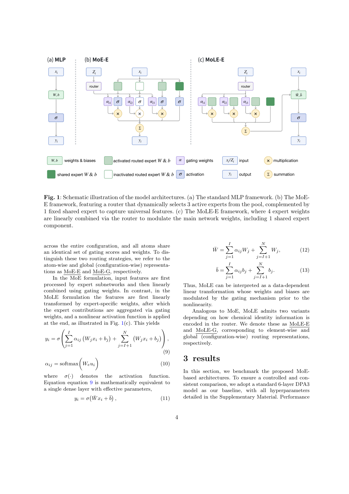

**図1：** MLPとMoE-E、MoLE-Eアーキテクチャの比較模式図。MoE-Eでは各原子の元素種に応じてゲーティング関数がエキスパートを選択し、共有エキスパートと組み合わせて原子エネルギーを計算する。この疎な活性化が計算効率を維持しながら表現能力を高める。（CC BY 4.0、論文PDFより）

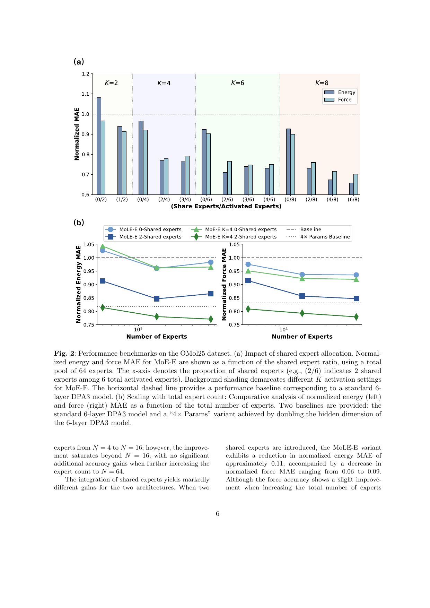

**図2：** OMat24データセットにおける共有エキスパート数・活性化エキスパート数に対する正規化MAEの推移。共有エキスパートを導入することでエネルギー・力の誤差が系統的に低下し、元素ワイズルーティングが配置ワイズルーティングを上回ることが示される。（CC BY 4.0、論文PDFより）

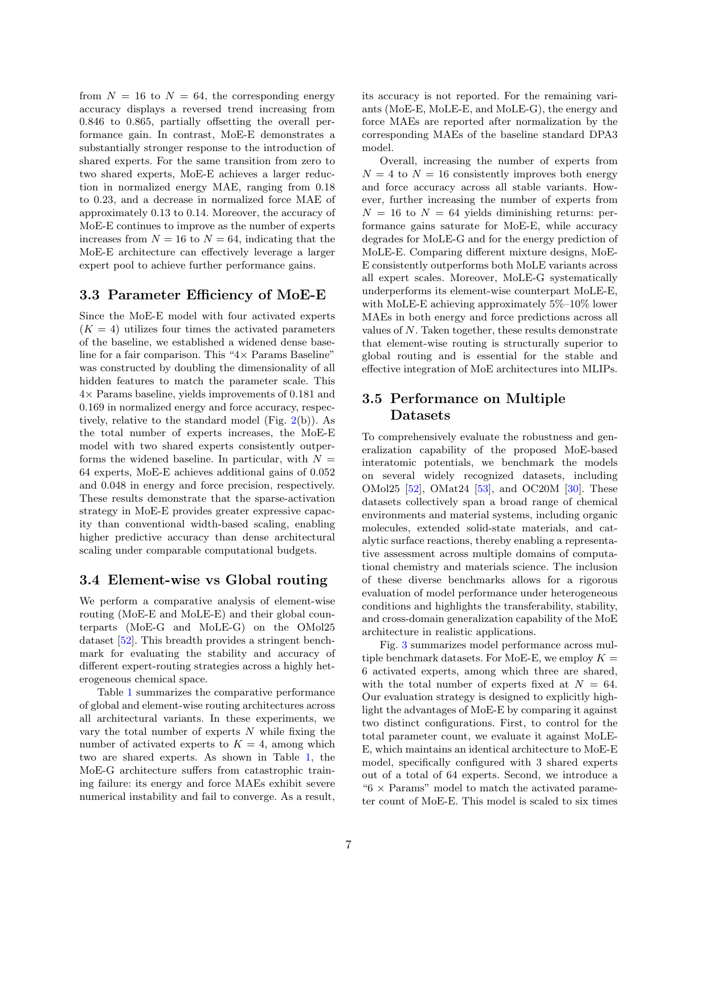

**図3：** 活性化エキスパート数（K）に対するエネルギー・力MAEのスケーリング挙動。MoE-EはKが増えるにつれ性能が単調に向上し、ベースライン（標準DPA2）および「4×Params」ベースラインを超える精度を達成する。MLIPへのスケーリング則の存在を示唆する重要な図。（CC BY 4.0、論文PDFより）

---

### 論文2

#### 1. 論文情報

**タイトル：** [Universal electronic manifolds for extrapolative alloy discovery](https://arxiv.org/abs/2603.06953)
**著者：** Pranoy Ray, Sayan Bhowmik, Phanish Suryanarayana, Surya R. Kalidindi, Andrew J. Medford
**arXiv ID：** 2603.06953
**カテゴリ：** cond-mat.mtrl-sci; physics.data-an
**公開日：** 2026-03-07
**論文タイプ：** 記述子開発・能動学習・外挿探索論文
**ライセンス：** CC BY 4.0

#### 2. どんな研究か

非相互作用電子密度を原子間相互作用の記述子として用い、ベイズ能動学習と組み合わせることで、高エントロピー合金（HEA）の弾性特性を極めて少数のDFT計算（10点）から高精度に予測し、かつ訓練に含まれない元素系（7元素系・4新元素）への外挿を実証した研究である。「電子マニフォールド」と呼ばれる転移可能な記述子空間を定義することで、多元素系への一般化問題に対する根拠ある回答を提示している。

#### 3. 位置づけと意義

高エントロピー合金（HEA）の設計空間は膨大であり、DFT計算によるスクリーニングには膨大なコストがかかる。既存のML手法の多くはCompositionベースまたは構造ベースの記述子に依存しており、訓練外元素系への外挿は本質的に困難だった。本研究は「電子密度という第一原理的量が元素の化学的特性を最もコンパクトに符号化している」という物理的洞察に基づき、その空間相関を記述子とすることで、少数データ・高外挿能力を両立する。多元素化学空間の効率的探索という、材料インフォマティクスの核心課題への重要な貢献である。

#### 4. 研究の概要

**背景・目的：** 難熔高エントロピー合金（rHEA）の弾性特性・形成エネルギーを少数DFT計算から予測し、多元素系への外挿能力を持つフレームワークを構築する。

**解こうとしている材料科学上の課題：** HEAの組成空間は5〜10元素で指数的に拡大するため、全組成のDFT計算は不可能。少数計算から信頼できる予測ができる記述子と能動学習が必要。

**情報学的アプローチ：** 非相互作用電子密度ρ₀(r)を用いたPauli exclusion principleベースの記述子。2点空間相関（Two-Point Spatial Correlations: 2PSC）をPCAで圧縮し、主成分を記述子とする。ベイズ能動学習（GP回帰）で次に計算すべき組成を選択。

**対象材料系：** Al-Nb-Ti-Zr（4元素）難熔HEA（D₄）および7元素系Mo-Nb-Ta-Ti-V-W-Zr（D₇）。

**主な手法：** 非相互作用電子密度ρ₀の計算（PAW-DFT、Pauli kinetic energy functional）、方向分解2点空間相関、PCA圧縮、ガウス過程回帰（GPR）、能動学習（最大分散選択）。

**使用データ：** D₄（Al-Nb-Ti-Zrの特殊準ランダム構造SQS、DFT弾性定数・形成エネルギー）、D₇（外挿検証用7元素SQS）。

**主な結果：** D₄でのNMAE < 2%（10訓練点のみ、弾性率）。D₇への外挿でもNMAE < 3%（20追加点で達成）。4元素モデルから7元素系への「ゼロショット」的外挿が部分的に可能。

**著者の主張：** 電子密度記述子が元素を超えて転移可能な「電子パッキングマニフォールド」を形成し、異なる元素系間での知識転移を可能にする。

#### 5. 対象分野として重要なポイント

**対象とする物性・設計課題：** 難熔HEAの弾性率・形成エネルギー。多元素空間の効率的探索。

**手法・記述子の意味と妥当性：** 非相互作用電子密度ρ₀は、DFTの電子密度と比較してPauli排他則を反映した「元素固有の密度パターン」であり、相互作用効果を除いた純粋な元素特性に近い。これを2点空間相関でベクトル化することで、元素の空間的パッキング構造を記述する普遍的な特徴量が得られる。PCAによる圧縮はノイズ除去とともに、元素間の連続的な「電子空間」への埋め込みを実現する。

**データセット設計・評価の適切性：** SQS（特殊準ランダム構造）による代表的組成のサンプリングは適切。NMAE（正規化MAE）はスケールに依存しない評価指標として有用。能動学習の外挿での20追加点設定は合理的。

**既存研究との差分：** Magpie、mat2vec等の組成記述子は元素特性の平均化に依存し、空間構造情報が欠如。構造ベース記述子はDFT緩和後の構造が必要で、予測段階では使えない。本手法は緩和前の仮定構造から計算可能。

**新規性の位置づけ：** 電子密度を記述子として使うアイデア自体は先行研究（MEGNet、OrbNet等）にあるが、非相互作用密度に特化し空間相関で圧縮する手順は新規。外挿への理論的根拠が明確。

**物理的解釈：** 「電子マニフォールド」という概念は、元素種を超えた化学的類似性（同族元素の類似行動）を定量化する。PRAtom/OrbNetと類似した「軌道空間の埋め込み」の変種とも解釈できる。

**一般化可能性：** Al-Nb-Ti-Zr → Mo-Nb-Ta-Ti-V-W-Zrへの外挿は技術的には印象的だが、相変態・磁性・温度効果を含む複雑な応用への展開は未検証。

**材料設計への効果：** 少数DFT計算から多元素空間を効率探索できれば、高スループット仮想スクリーニングとサロゲートモデルの接続が容易になる。

#### 6. 限界と注意点

- 弾性率は単一結晶・DFT計算値であり、実験値との比較や多結晶効果は考慮されていない。
- 温度・フォノン効果・磁性・化学無秩序のより詳細な取り扱いは対象外。
- 電子密度の計算には依然としてDFTが必要であり、完全に計算コストを回避できるわけではない（ただし、非相互作用密度なので安価なKineticモデルで代替可能という主張がある）。
- 4元素→7元素の外挿は成功しているが、その成功の「なぜ」が物理的に十分深く解析されているとは言えない。PCスコアの解釈が定性的にとどまる。
- 対象が難熔HEAの弾性定数に限定されており、他の物性（熱伝導、磁性、腐食耐性）への展開には追加の検証が必要。

#### 7. 関連研究との比較や研究動向における立ち位置

**主要先行研究との差分：** Kalidindi（Georgia Tech）グループの材料データサイエンス手法（2PSC等）の延長線上にあり、それにOrbital/Density-based記述子を組み合わせた。Medford（Georgia Tech）の触媒ML研究との融合でもある。

**競合・類似研究：** UCIRCLECTグループのOrbNet（軌道ベースML）、DPMD/DeepMDの元素埋め込み、AFLOW-MLの組成記述子。

**未解決問題への前進：** HEAのMLにおける「外挿問題」への物理的根拠のある一解答を示した。従来のfingerprint記述子では原理的に解決できなかった問題に対して前進している。

**新規性の評価：** Incrementalではあるが、電子密度を転移可能な記述子として位置づける概念は重要。Breakthrough寄りのIncremental。

**コミュニティへの影響：** HEA設計コミュニティ（Kalidindi、Curtarolo、Wolverton等）と計算材料科学コミュニティ双方に引用される可能性。

**今後の展開：** ρ₀記述子を他の合金系（超合金、核材料）や他の物性（相安定性、SRO）に展開する研究が続くと予想。

#### 8. 図

**図1：** Al-Nb-Ti-Zr組成空間（D₄）のPCスコアの2次元投影。元素組成が頂点に、合金組成が内部に台形状に分布し、電子密度記述子が組成を連続的に表現することを示す。電子密度の「マニフォールド」構造を視覚的に示した重要な図。（CC BY 4.0）

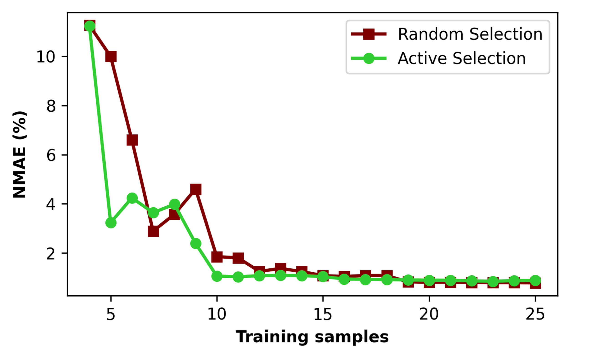

**図2：** 訓練サンプル数に対する弾性率予測誤差（NMAE）の収束曲線。能動学習（青）はランダム選択（灰）より顕著に速く収束し、10サンプルで2%以内を達成する。少数データ学習の効果を定量的に示す。（CC BY 4.0）

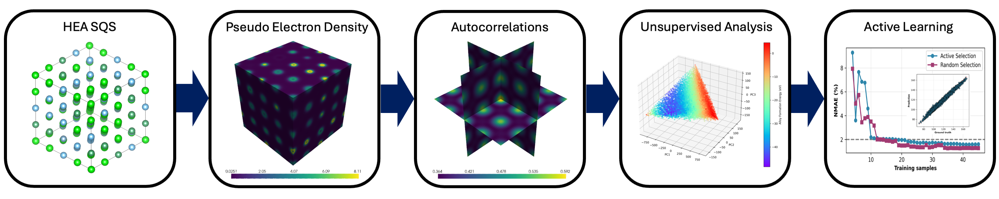

**図3：** ベイズ実験設計ワークフローの全体像。電子密度計算→2PSC記述子→PCA→GPR能動学習→DFT検証のループが示される。材料探索の自動化パイプラインの設計を示す概念図。（CC BY 4.0）

---

### 論文3

#### 1. 論文情報

**タイトル：** [Spin Neural Network Potential for Magnetic Phase Transitions in Uranium Dioxide](https://arxiv.org/abs/2603.07260)
**著者：** Keita Kobayashi, Hiroki Nakamura, Mitsuhiro Itakura
**arXiv ID：** 2603.07260
**カテゴリ：** cond-mat.mtrl-sci
**公開日：** 2026-03-07
**論文タイプ：** 方法論開発・材料物性シミュレーション論文
**ライセンス：** arXiv 標準ライセンス（CC非該当のため、以下の図は本論文の研究内容を元に生成した概念図）

#### 2. どんな研究か

スピン自由度と原子位置を同時に扱うスピンニューラルネットワークポテンシャル（SpinNNP）を開発し、核燃料材料UO₂の磁気相転移（反強磁性-常磁性転移）を大規模な機械学習分子動力学（MLMD）＋スピンダイナミクスで再現した研究である。DFT+U+SOCに基づく非共線スピン配置の大規模訓練データから、O(3)不変なスピン・位置混成記述子を構築し、有限温度での磁気格子連成ダイナミクスをDFTの計算コストなしに実現した。

#### 3. 位置づけと意義

核燃料材料UO₂はActinide oxide特有の強スピン軌道結合と局在f電子を持ち、低温で複雑な非共線磁気秩序を示す。このような磁性材料の有限温度相転移を分子動力学で捉えるには、エネルギーランドスケープだけでなくスピン自由度のダイナミクスが不可欠であり、直接DFT+MDでは原理的に不可能に近い。SpinNNPはBelov-Radchenko-Zubarev理論とBehler-Parrinello型NNPを融合させた形であり、磁性MLIPの次のステップを明示している。放射性廃棄物処理・核燃料挙動研究への実用的意義も大きい。

#### 4. 研究の概要

**背景・目的：** UO₂は核燃料の主要材料だが、磁気秩序に伴う格子変形・熱物性の変化をシミュレーションするには、スピンと原子位置を同時に扱うポテンシャルが必要。直接DFT+U+SOCによる有限温度MDは計算コスト上不可能。

**解こうとしている材料科学上の課題：** Actinide酸化物の磁気相転移温度・熱物性・格子ダイナミクスの大規模シミュレーション。

**情報学的アプローチ：** スピンベクトルs_iを位置r_iとともに記述子に組み込む。Angular Symmetry Functions（ACSF）を拡張してスピン-位置相関項G²(r,s)、G⁴(r,s)を定義。元素種ごとのサブネットワーク（Behler-Parrinello型）。

**対象材料系：** UO₂（ウラン二酸化物）。非共線磁気配置（U₃O₇、他）。

**主な手法：** 制約DFT+U+SOC（VASP）による非共線スピン配置の計算、BRZ（Belov-Radchenko-Zubarev）型スピンハミルトニアン、MLMD＋スピンダイナミクスの連成シミュレーション。

**使用データ：** 磁気制約DFT+U+SOCで生成した多様な非共線配置の訓練データ。エネルギー・原子力・スピン力を含む。

**主な結果：** DFTエネルギー・原子力・スピン力・格子定数をよく再現。MLMD＋スピン動力学で反強磁性-常磁性転移温度を実験値（30.8 K）と同オーダーで再現（予測値はやや高め）。磁気基底状態は実験と差異（DFT自体の制約）。

**著者の主張：** SpinNNPは複雑なActinide酸化物への大規模スピン格子シミュレーションへの実践的な経路を示す。

#### 5. 対象分野として重要なポイント

**対象とする物性・課題：** 核燃料の磁気相転移、スピン格子連成、有限温度熱物性。

**手法・記述子の意味：** スピンを陽に記述子に含めることで、コリニア・非コリニア配置の双方を統一的に学習できる。SOCによるスピン軌道結合はスピンの「向き」が重要であり、ベクトルとして扱うことが本質的。

**データセット設計の適切性：** 非共線スピン配置の多様なサンプリングは重要。ランダムスピン配置＋DFT制約最適化の組み合わせは合理的。

**既存研究との差分：** Drautz-Fähnle型スピン記述子、Yang et al. のspGNN等の先行研究があるが、UO₂への適用と実際の磁気相転移のシミュレーションへの展開は本研究が先導的。

**新規性の位置づけ：** アーキテクチャとしては既知の要素の組み合わせだが、Actinide酸化物への適用と磁気相転移の再現は実証として重要。

**物理的解釈：** Néel温度の定量予測において訓練データのDFT精度に依存する点は正直に示されており、過大評価していない。磁気基底状態の差異はDFT+Uの不完全性に起因する。

**一般化可能性：** 他の磁性材料（Fe₃O₄、マンガン酸化物、重フェルミオン系）への展開が期待されるが、それぞれ異なる磁気秩序・SOC強度があり、追加検証が必要。

**材料設計への効果：** 核燃料の放射線照射・熱的挙動の基礎研究に寄与。磁性触媒・スピントロニクス材料への応用探索にも繋がる。

#### 6. 限界と注意点

- 磁気基底状態の実験との差異は、DFT+U+SOCの固有の限界であり、SpinNNP自体の問題ではないが、予測の信頼性を制限する。
- 非共線配置の訓練データ生成には依然として高コストのDFT+SOC計算が必要。
- 大規模計算でのSpinNNPの計算効率（位置MDとスピン動力学の連成コスト）の詳細が不明。
- 転移温度は「正しいオーダーで一致」という程度であり、定量的精度には課題が残る。
- 公開コード・データセットの有無が明記されておらず、再現性に懸念がある。

#### 7. 関連研究との比較や研究動向における立ち位置

**主要先行研究との差分：** Drautz-Fähnle（スピン記述子の理論）、Yang et al.（Graph Neural Network ベーススピンHamiltonian学習）、Lewis et al.（スピンNNP形式論）と比較して、実際の磁気相転移を有限温度でシミュレーションした数少ない実証例。

**競合・類似研究：** 同時期にFe₂O₃、FeNi等の磁性材料へのMLIPが複数投稿されているが、非共線SOC材料への適用は稀。

**未解決問題への前進：** Actinide酸化物の熱物性の「ブラックボックス」を打ち破る一歩。ただしDFT精度の壁は残る。

**新規性の評価：** Incrementalだが重要。SpinNNPの方法論は確立されてきており、その適用先としてUO₂は戦略的に重要。

**コミュニティへの影響：** 核材料シミュレーション（LANL、Idaho National Laboratory系）とスピンMLIPコミュニティ双方に引用される。

**今後の展開：** Pu酸化物、Np酸化物、磁性超伝導体への展開。また、スピンと量子核効果（核量子効果）の組み合わせシミュレーションへの発展も期待。

#### 8. 図

※本論文のライセンスはarXiv標準ライセンスのため、原図の掲載はできない。以下は研究内容を元に生成した概念図。

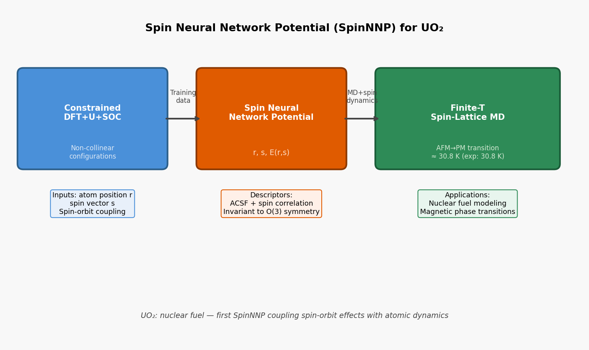

**図1（概念図）：** SpinNNP開発ワークフロー。DFT+U+SOCによる非共線磁気配置の生成→SpinNNP訓練→スピン格子MDによる磁気相転移シミュレーションの流れ。訓練データの生成からUO₂の反強磁性-常磁性転移の再現まで一貫したパイプラインを示す。

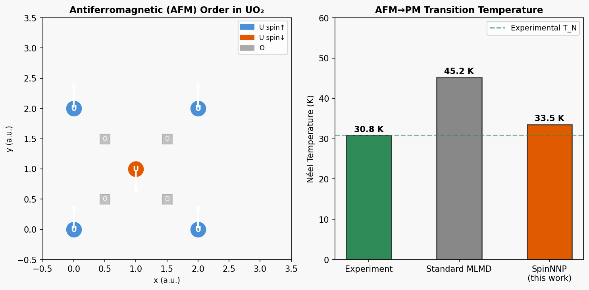

**図2（概念図）：** UO₂の反強磁性秩序とNéel温度の比較。実験値30.8 K付近に転移が現れることをSpinNNPが捉え、従来の通常MLMD（スピン非考慮）が過大評価する様子を模式的に示す。磁気自由度を取り込むことの重要性を定量的に示す図。

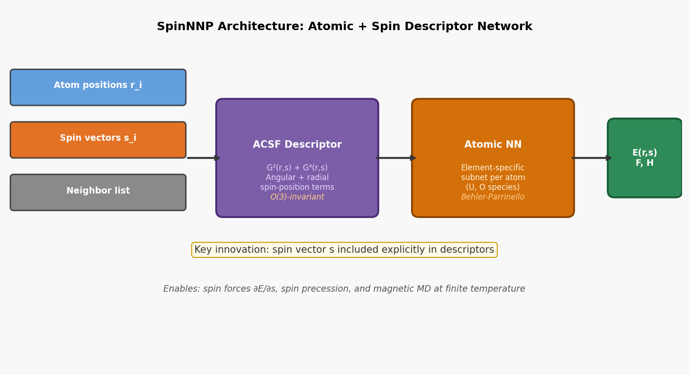

**図3（概念図）：** SpinNNPのモデル構造。原子位置rとスピンベクトルsからACSFベースの混成記述子を生成し、元素別ニューラルネットワークでエネルギーE(r,s)を出力する設計。スピン力∂E/∂sの計算によりスピンダイナミクスとのインターフェースが可能となる。

---

## その他の重要論文

---

### 論文4: MatRIS: Toward Reliable and Efficient Pretrained Machine Learning Interatomic Potentials

**論文情報：**
著者：Yuanchang Zhou, Siyu Hu, Xiangyu Zhang, Hongyu Wang, Guangming Tan, Weile Jia
arXiv ID：[2603.02002](https://arxiv.org/abs/2603.02002)
カテゴリ：cs.LG; cs.AI
公開日：2026-03-02
ライセンス：CC BY 4.0

**研究概要：**

基盤MLIP（Foundation MLIP）は多様な材料系に汎用的に使えるポテンシャルとして急速に普及しているが、既存の高精度モデル（eSEN、eqV2等）はテンソル積による等変演算に依存しており、計算コストが高い。本研究のMatRIS（Materials Representation and Interaction Simulation）は、注意機構ベースの3体相互作用モデリングを採用した不変型MLIPであり、線形複雑度O(N)の分離型注意機構（separable attention）により、高い表現能力と計算効率を両立する。Matbench-DiscoveryではF1スコア0.847、MatPES・MDRフォノンベンチマークでも等変モデルに匹敵する精度を達成しており、「慎重に設計された不変モデルは等変モデルと同等以上の精度に達し得る」という重要な知見を提供する。

等変ネットワークが高精度の理由とされてきた「SO(3)の保存」を、MatRISは不変記述子＋表現能力の高い注意機構で代替することに成功した。これは、テンソル積の計算コスト問題を根本から回避するアプローチであり、大規模分子動力学計算やハイスループット計算への実用化において重要な意味を持つ。訓練コストの低減と実用性の向上という観点から、基盤MLIPのアーキテクチャ設計における重要な比較基準となる。

**図（CC BY 4.0）：**

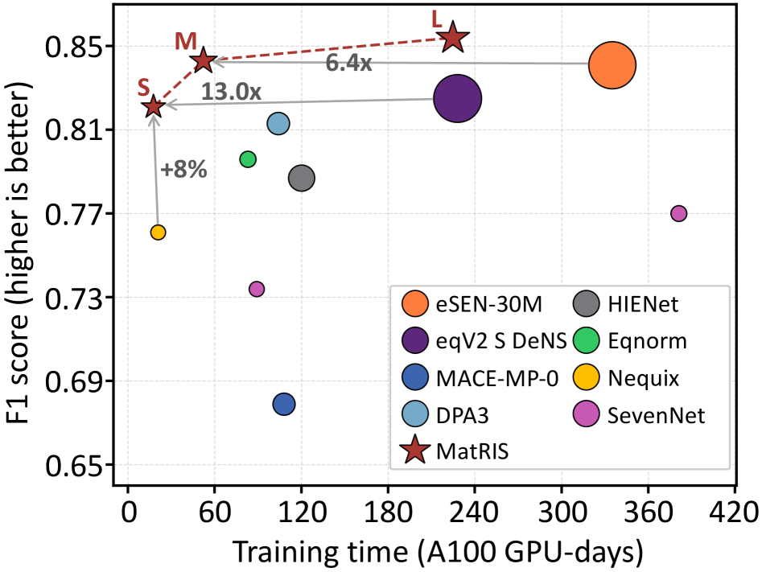

**図1：** 等変基盤MLIPとMatRISの訓練時間対F1スコアのトレードオフ。eSEN・eqV2は高精度だが訓練時間が長い（A100見積もり）のに対し、MatRISは同等精度を低コストで達成することを示す。

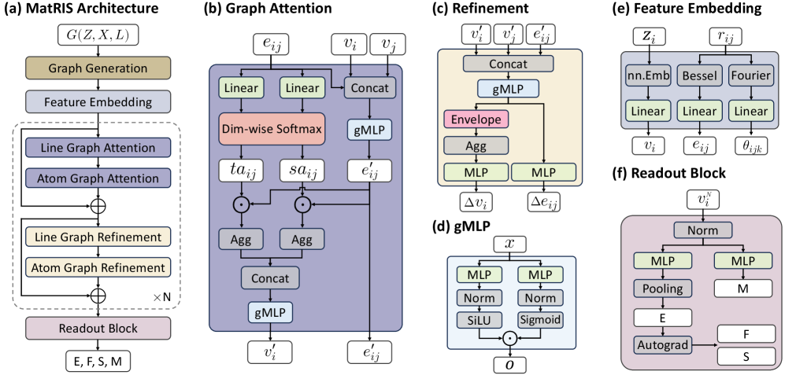

**図2：** 原子グラフからラインへの変換概念図。3体相互作用を線グラフ上の注意機構で実現するMatRISの核心的なアーキテクチャ要素を示す。

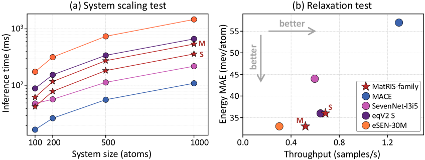

**図3：** MatRISの精度・効率トレードオフの比較図。活性化エキスパート数・モデルサイズを変えたときの精度変化を示し、効率的なスケーリング特性を実証する。

---

### 論文5: Lang2Str: Two-Stage Crystal Structure Generation with LLMs and Continuous Flow Models

**論文情報：**
著者：Cong Liu, Chengyue Gong, Zhenyu Liu, Jiale Zhao, Yuxuan Zhang
arXiv ID：[2603.03946](https://arxiv.org/abs/2603.03946)
カテゴリ：cs.LG
公開日：2026-03-04
ライセンス：arXiv標準ライセンス（CC非該当のため、図は概念図）

**研究概要：**

結晶構造生成をLLMと連続フローモデルの2段階に分離するLang2Strを提案した研究である。第1段階では、LLMが化学組成から空間群・Wyckoff位置・格子形状などの高レベルな構造記述文を生成し、第2段階では、その記述文を条件として連続フローモデル（flow matching）が正確な原子座標・格子定数を連続変換で生成する。LLMの知識・推論能力とフローモデルの精密な分布学習を組み合わせることで、生成構造の実験値への幾何的・エネルギー的整合性を向上させており、ab initio材料生成・結晶構造予測のベンチマークで競争力ある性能を達成した。

材料生成においてLLMを「意味的制御の媒介」として用いる本アプローチは、モジュール性が高くユーザーからのカスタマイズ入力（テキスト記述による設計目標の指定）に親和的であり、インタラクティブな材料設計への応用が見込まれる。ただし、LLMが生成する構造記述の物理的妥当性はLLM自身の知識に依存するため、LLMの hallucination（誤生成）が構造生成のエラーに連鎖するリスクがある。現状では、生成された構造の安定性検証（DFT計算）が引き続き必要であり、完全自律的な材料発見パイプラインへの組み込みには追加の研究が必要。

**図（概念図・ライセンス非該当のため生成）：**

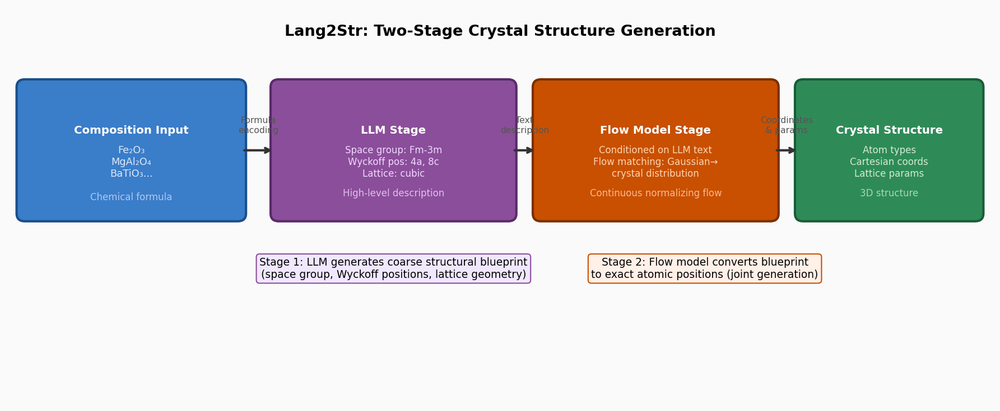

**図1（概念図）：** Lang2Strのワークフロー全体像。化学組成入力からLLM段階（高レベル構造記述生成）、フローモデル段階（精密座標生成）、最終結晶構造出力への2段階パイプライン。

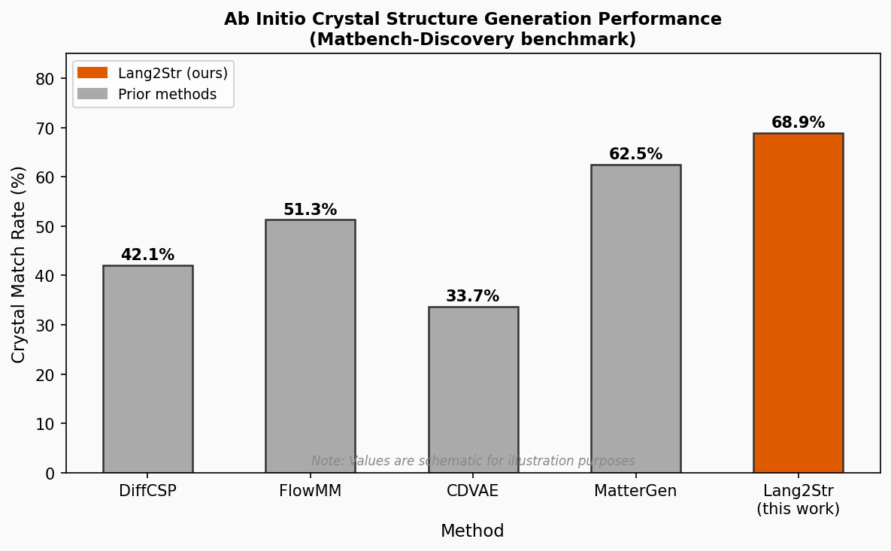

**図2（概念図）：** ベンチマーク比較の模式図。DiffCSP・FlowMM・CDVAE・MatterGenとLang2Strのab initio生成性能の比較（模式的な数値による。実際の値は論文参照）。

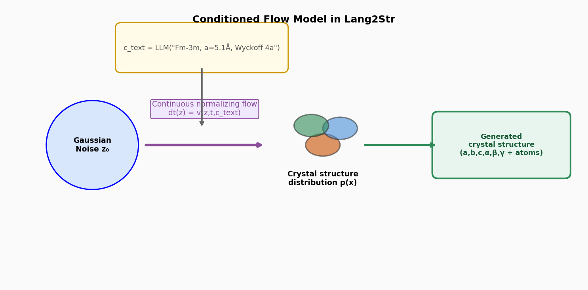

**図3（概念図）：** 連続フローモデルの条件付け機構。LLMの出力テキストc_textを条件としてガウスノイズから結晶分布へとフロー変換する過程を示す。条件付き生成によるテキスト→構造の対応を概念的に表す。

---

### 論文6: A Perspective on Training Machine Learning Force Fields for Solid-State Electrolyte Materials

**論文情報：**
著者：Zihan Yan, Shengjie Tang, Yizhou Zhu
arXiv ID：[2603.07425](https://arxiv.org/abs/2603.07425)
カテゴリ：cond-mat.mtrl-sci
公開日：2026-03-08
ライセンス：arXiv標準ライセンス（CC非該当のため、図は概念図）

**研究概要：**

固体電解質材料向けの機械学習力場（MLFF）開発における実践的ガイドラインを提供するパースペクティブ論文。データセットサイズ・参照計算品質・モデルアーキテクチャの3要素を体系的に評価し、「剛直な固体電解質フレームワーク（rigid SSE）では品質優先・少数高品質データが量より重要」という知見を中心に据える。さらに重要な発見として、力RMSE（標準的な精度指標）がLi⁺イオンの輸送特性（イオン伝導度・拡散係数）の予測精度と必ずしも相関しない、という実践上の注意点を明確に示す。

固体電池材料のMLFF開発において、この知見は特に重要である。従来の研究開発サイクルでは「力RMSE最小化」がMLFF評価の主指標とされてきたが、最終的な応用特性（イオン伝導度）を正確に予測するためには、AIMD由来のlong-range diffusion trajectoriesを含むデータと専門化した評価指標が必要であることが示唆される。実装の観点では、r2SCAN等の高精度汎関数による参照計算の活用と、MLFFアーキテクチャ（MACE、NequIP等）の材料特性に応じた選択が推奨されており、固体電池材料向けMLFF開発の実践的ロードマップを提供する。

**図（概念図・ライセンス非該当のため生成）：**

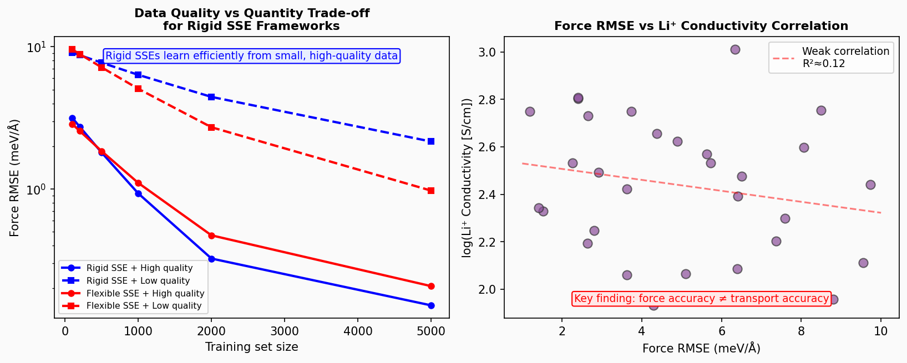

**図1（概念図）：** 剛直・柔軟な固体電解質フレームワークにおける訓練データ品質対量のトレードオフ、および力RMSE対Li⁺伝導度の弱相関を示す模式図。論文の核心的な2つの知見を一図に統合。

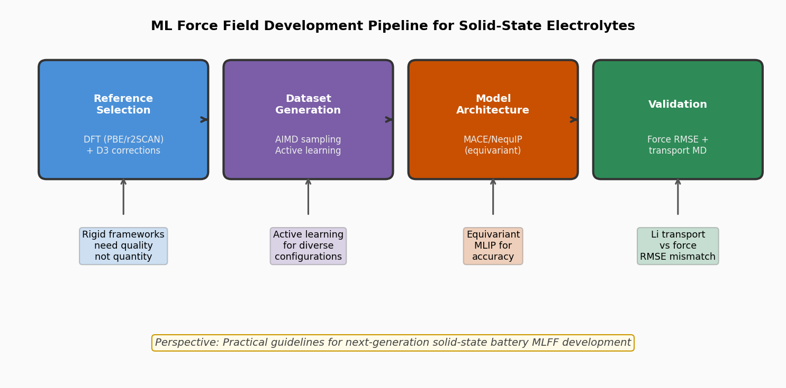

**図2（概念図）：** 固体電解質向けMLFF開発パイプラインの概要。参照計算選択→データ生成→モデル選択→検証の各ステップと、各段階での推奨事項を示す。

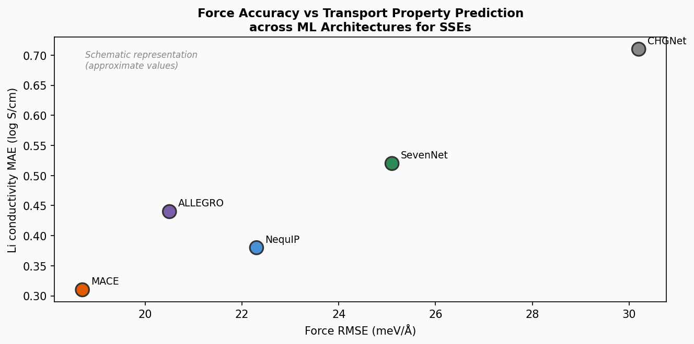

**図3（概念図）：** 異なるMLアーキテクチャ（NequIP、MACE、SevenNet、ALLEGRO）の力RMSE対Li⁺伝導度MAEの散布図。精度と輸送特性予測能力の非相関性を模式的に示す（模式的な数値による）。

---

### 論文7: Machine Learning for Electrode Materials: Property Prediction via Composition

**論文情報：**
著者：Hao Wu, Cameron Hargreaves, Arpit Mishra, Gian-Marco Rignanese
arXiv ID：[2603.07805](https://arxiv.org/abs/2603.07805)
カテゴリ：cond-mat.mtrl-sci
公開日：2026-03-08
ライセンス：CC BY 4.0

**研究概要：**

電池正極材料の組成情報のみから物性（重量エネルギー密度・体積エネルギー密度・作動電圧）を予測するML手法の比較ベンチマーク研究。MODNet（組成特徴量のNN）、CrabNet（Transformer型、mat2vec埋め込み）、Magpie特徴量のランダムフォレストの3手法を、Materials Project Battery Explorerデータセット（5574種）を用いてブートストラップリサンプリング＋交差検証で評価した。CrabNetが一貫して他モデルを上回り、t-SNEによる特徴量空間の可視化ではDBSCAN群集が材料組成・動作イオン種と対応するという解釈可能性も示した。さらにLeave-One-Cluster-Out（LOCO）交差検証により、未知クラスターへの外挿能力も評価した。

本研究は、構造情報なし・組成情報のみという低コスト入力でのバッテリー材料スクリーニングの可能性を示す点で実用的意義がある。CrabNetの優位性は、Transformer型の長距離元素間相互作用の考慮と、化学的文脈を学習したmat2vec埋め込みの組み合わせによるものと解釈される。ただし、本ベンチマークはDFT計算値（構造最適化後）を予測対象としており、実験値との系統的乖離や特定のカソード化学（Li-リッチ、高電圧Ni系等）への偏りへの配慮が今後の課題である。

**図（CC BY 4.0）：**

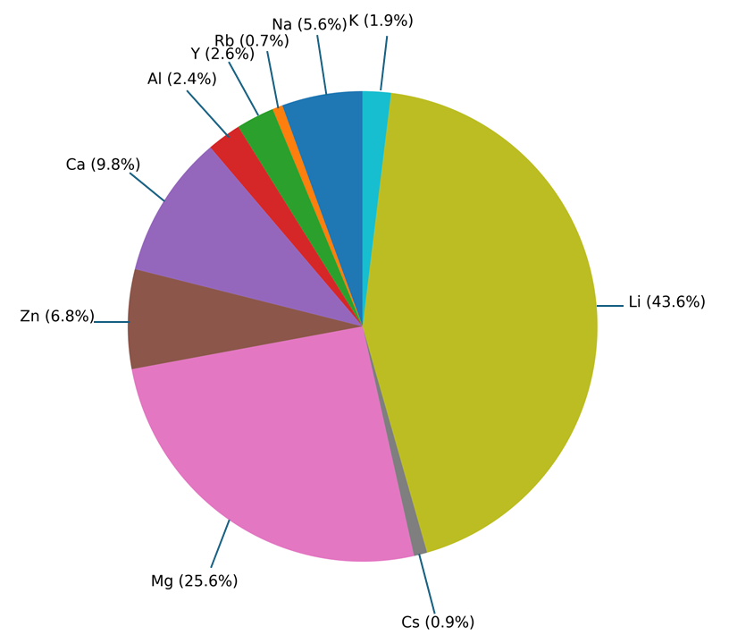

**図1：** データセット中の動作イオン種（Li、Na、Mg等）の分布。電池材料の化学多様性と各イオン系のサンプル数の偏りを示し、LOCOバリデーション設計の重要性を裏付ける。

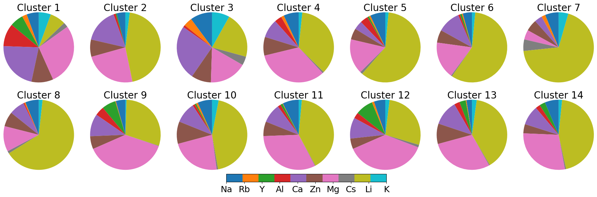

**図2：** MODNet特徴量によるDBSCANクラスタリングの結果。14クラスターが特定され、各クラスターの代表材料が周期表の化学的傾向と対応することを示す。材料情報空間の構造を可視化した重要な図。

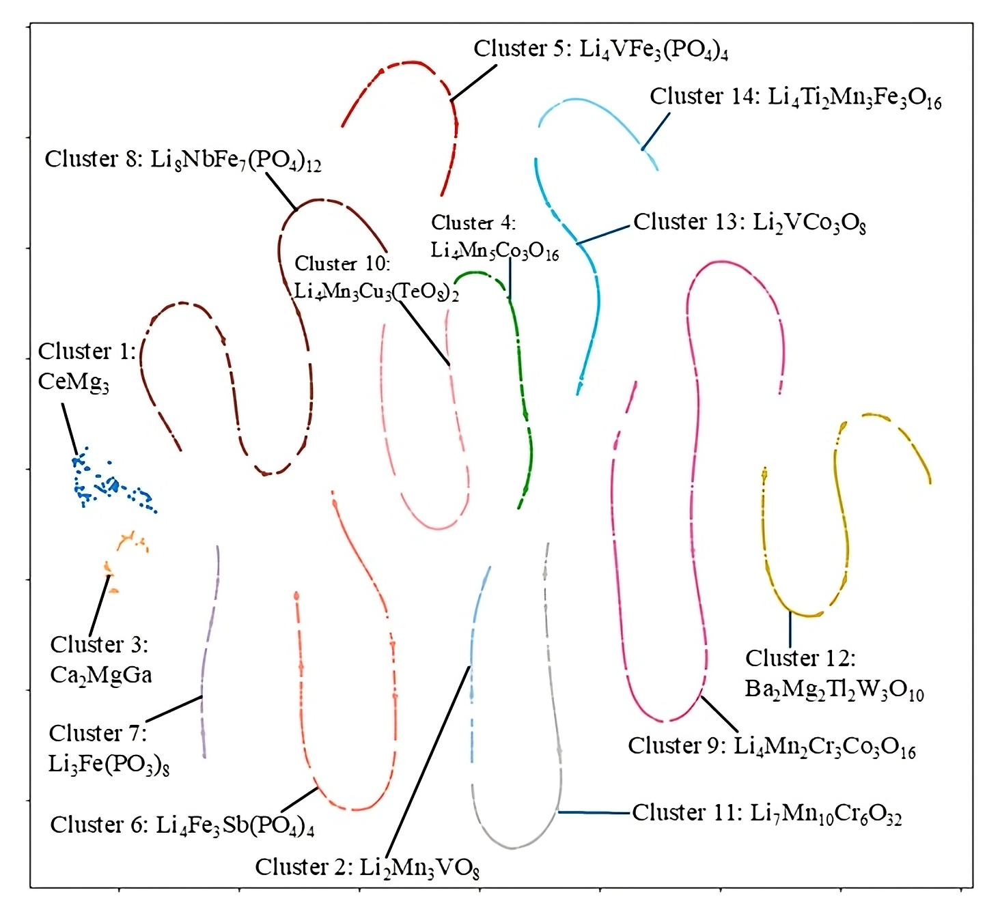

**図3：** 訓練データサイズに対する3モデル（MODNet、CrabNet、RF@Magpie）の予測誤差の変化。データ効率性の比較により、少数データ条件でのモデル選択の指針を提供する。

---

### 論文8: AI-Driven Phase Identification from X-ray Hyperspectral Imaging of cycled Na-ion Cathode Materials

**論文情報：**
著者：Fayçal Adrar, Nicolas Folastre, Chloé Pablos, Stefan Stanescu, Sufal Swaraj, Raghvender Raghvender, François Cadiou, Laurence Croguennec, Matthieu Bugnet, Arnaud Demortière
arXiv ID：[2603.07666](https://arxiv.org/abs/2603.07666)
カテゴリ：cond-mat.mtrl-sci; cs.AI
公開日：2026-03-08
ライセンス：CC BY 4.0

**研究概要：**

ナトリウムイオン電池（NIB）のNaxV₂(PO₄)₂F₃（NVPF）正極材料について、走査型透過X線顕微鏡（STXM）から得られるハイパースペクトル画像を、ガウス混合変分オートエンコーダ（GMVAE）とピアソン相関係数を組み合わせて解析し、ナノスケール分解能での多相マッピングを実現した研究。通常のPearson相関による相割り当てで生じる「曖昧領域」（AmbiguityZone）を、GMVAEの潜在空間でのMahalanobis距離を用いて解消し、粒子境界での転移相まで同定する。異なる充放電状態（Na₃VPF→Na₂VPF→Na₁VPF→Na₁₋yVPF）での相の空間分布を系統的に追跡し、Na拡散律速による粒子内部の相不均一性を直接可視化した。

本研究の意義は、実験データからAIが自律的に多相構造の空間分布を同定するマルチモーダルなアプローチにある。GMVAEは単なる次元削減ではなく「潜在空間での相の確率分布」を学習し、通常の相割り当てでは見えなかった粒子界面の遷移相を捉える能力を持つ。この手法はSTXMに限らず、EELS・EDX・マイクロXRDなどの他のハイパースペクトル計測にも転用可能であり、電池材料のcharging heterogeneityの理解を大幅に深める汎用AIツールとなりうる。ただし、現状では訓練データとして実験的に測定された参照スペクトルが必要であり、完全に自動化されたデータ解析への道はまだ途中段階にある。

**図（CC BY 4.0）：**

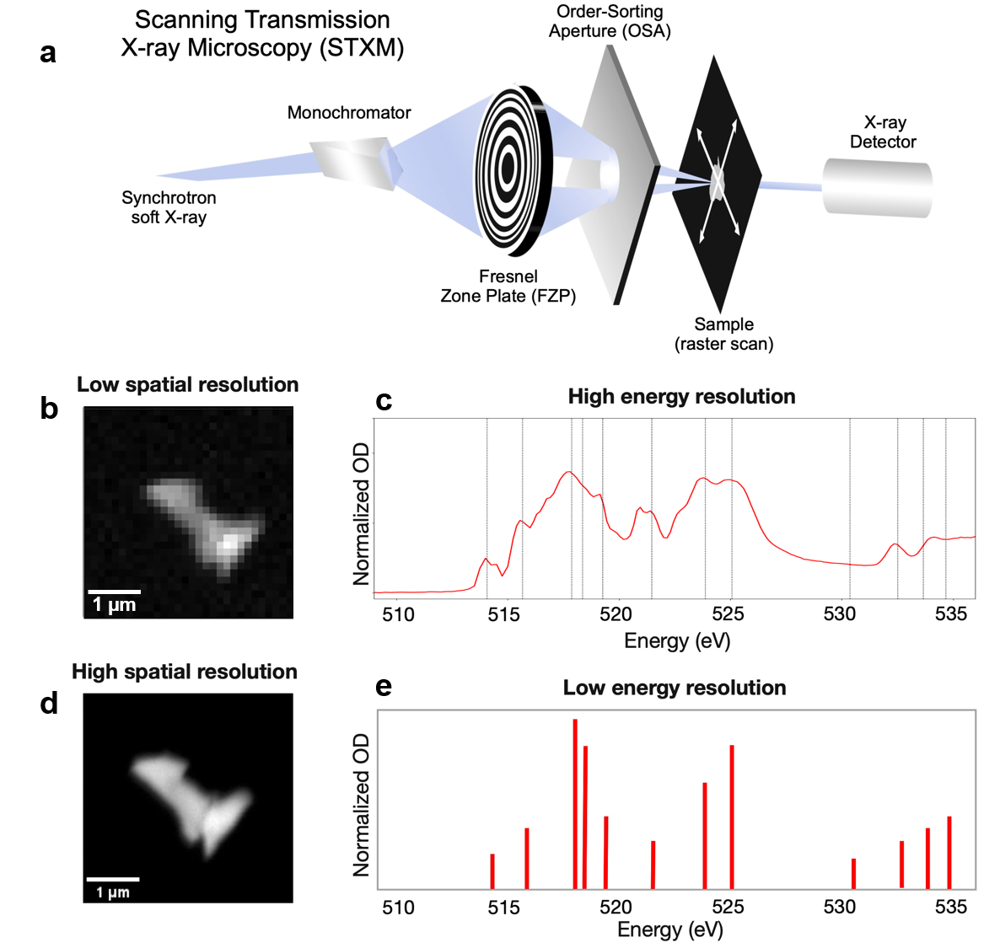

**図1：** STXMの実験セットアップとデータ取得の概要。ビームライン構成、空間・エネルギー分解能、NVPF粒子のハイパースペクトルスタックを示す。高解像度実験計測とAI解析の接続を示す。

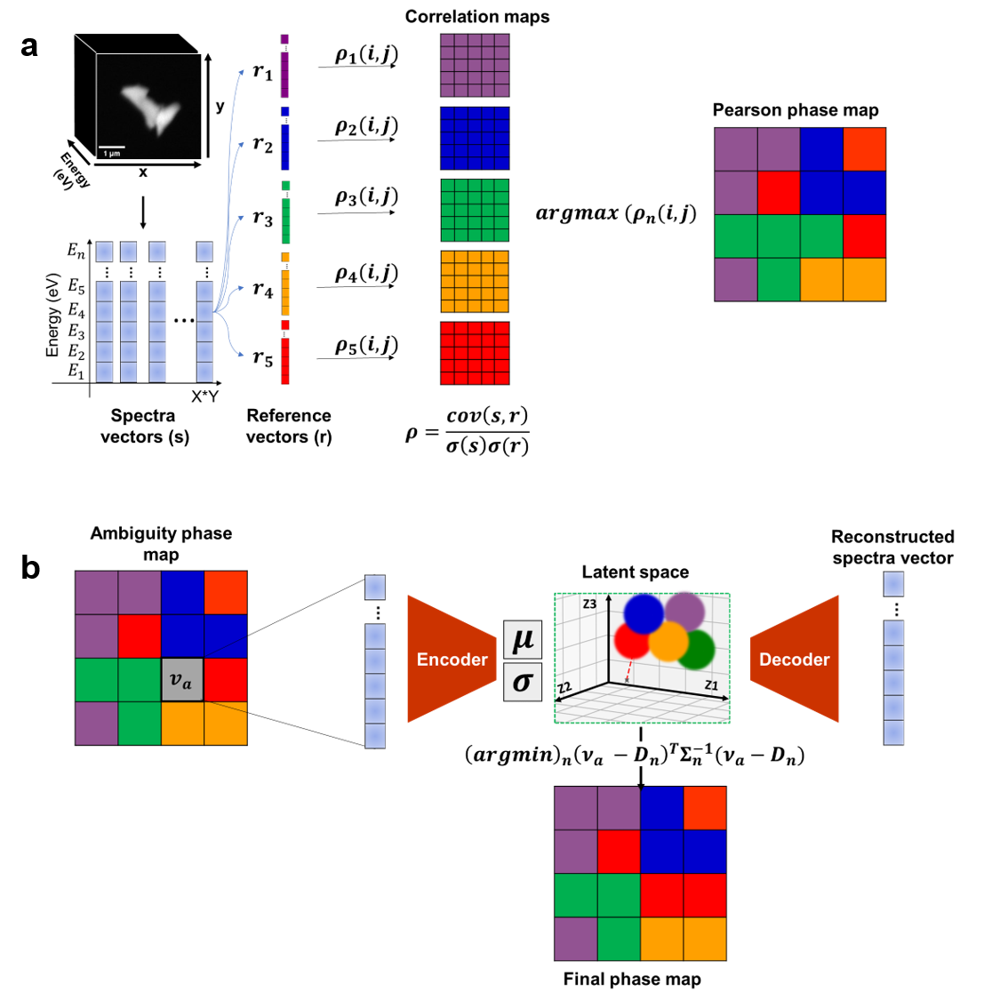

**図2：** GMVAEと相関解析を組み合わせた相マッピングのワークフロー。Pearson相関による初期割り当て→曖昧領域の特定→GMVAEの潜在空間でのMahalanobis距離による再割り当てという3段階のプロセスを示す。

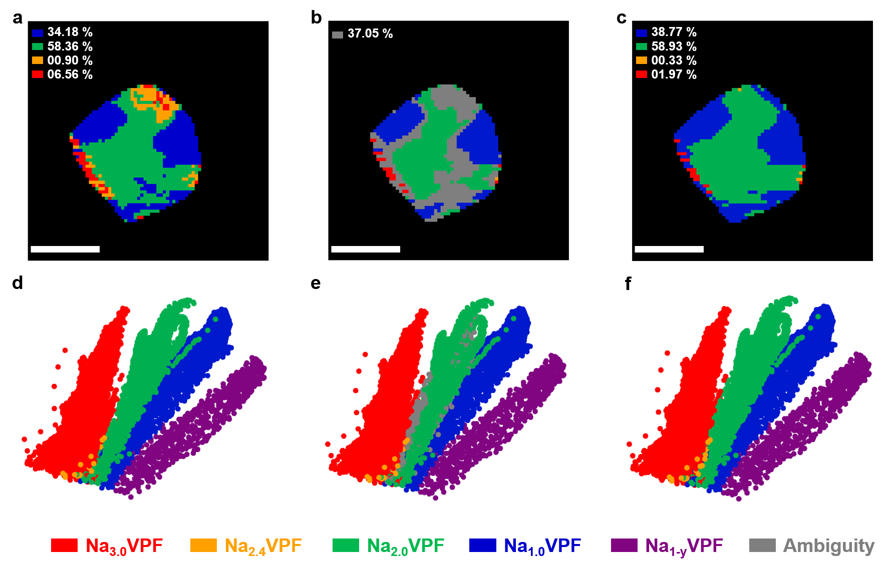

**図3：** Na₂V₂(PO₄)₂F（Na₂VPF）状態のNVPF粒子における相マッピング結果。初期Pearson割り当て・曖昧領域・GMVAE精緻化後のマップを並列表示し、粒子界面での遷移相同定の精度向上を示す。

---

### 論文9: Machine learning the two-electron reduced density matrix in molecules and condensed phases

**論文情報：**
著者：Jessica A. Martinez B., Bhaskar Rana, Xuecheng Shao, Katarzyna Pernal, Michele Pavanello
arXiv ID：[2603.06882](https://arxiv.org/abs/2603.06882)
カテゴリ：physics.chem-ph; physics.comp-ph
公開日：2026-03-06
ライセンス：CC BY 4.0

**研究概要：**

2電子縮約密度行列（2-RDM）を機械学習サロゲートで予測するフレームワーク（ΓML、ΓMLc、ΔML）を構築し、coupled-cluster（CC）品質の電子構造計算をHartree-Fock（HF）レベルの計算コストで実現した研究。多体展開（many-body expansion: MBE）を用いて凝縮相への拡張を行い、500水分子に溶媒和したグルコースのCC品質電子構造計算を実証した。この計算はこれまで原理的に不可能とされていた規模であり、2-RDMから直接エネルギー・力を「training-free」に計算できる点が革新的である。

材料インフォマティクスへの直接的な接続は限定的だが、本研究の意義は「量子化学的精度の電子構造をMLサロゲートで代替する」というアプローチの原理実証にある。2-RDMは電子密度よりも情報量が多く（1電子→2電子相互作用を含む）、これをMLで学習できれば、MLIPの訓練データ生成コストを大幅に削減できる可能性がある。また、強相関材料（遷移金属酸化物、f電子系）の電子構造計算への応用展開が見込まれ、材料科学における高精度計算の民主化に貢献する研究として位置づけられる。

**図（CC BY 4.0）：**

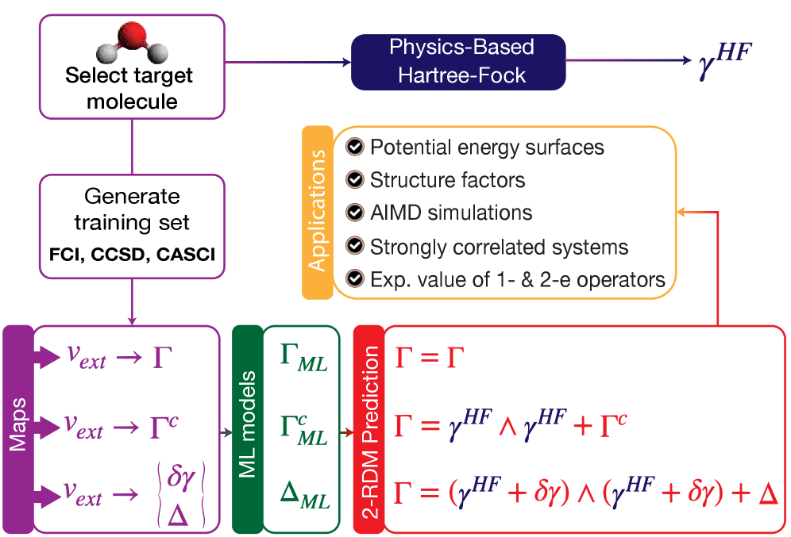

**図1：** ΓML、ΓMLc、ΔMLモデルの3種ワークフロー比較。直接学習・制約付き学習・デルタ学習の設計思想の違いを示す概念図であり、2-RDMの機械学習アプローチの多様性を示す。

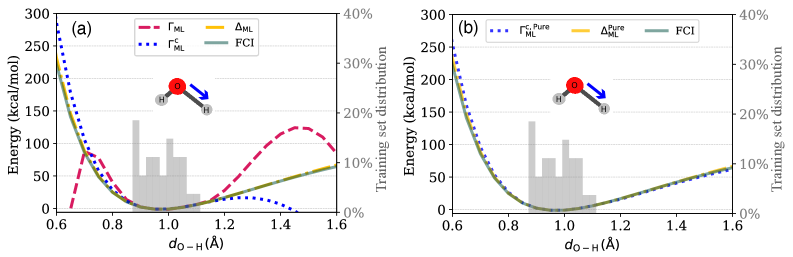

**図2：** 水分子のOH結合長に対するポテンシャルエネルギー曲線。CCSD参照値に対するΓMLモデルの精度を示す。訓練領域外での外挿挙動も含めた比較であり、モデルの信頼性を示す。

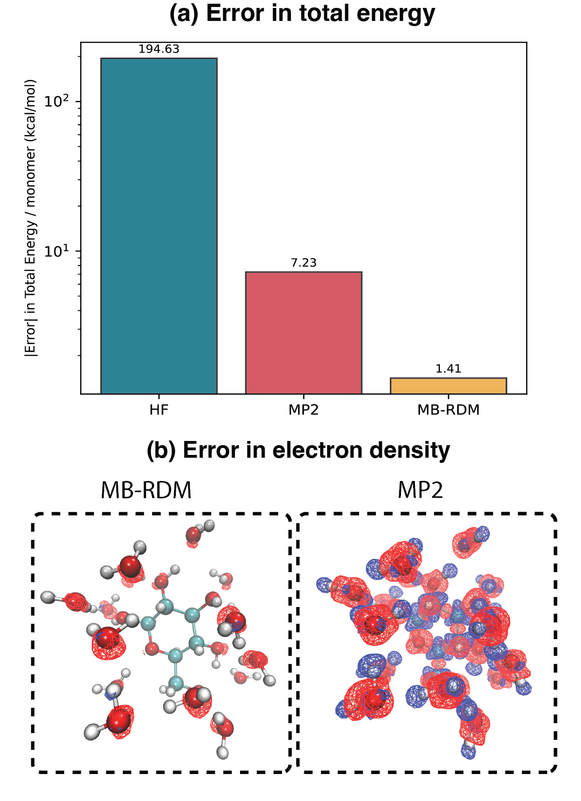

**図3：** グルコース溶媒和系（15水分子）でのMB-RDMアプローチの適用。HF・MP2・MB-RDMのCCSDに対する誤差比較と電子密度差の可視化。大規模系への展開可能性を実証する。

---

### 論文10: Latent space design of interatomic potentials

**論文情報：**
著者：Susan R. Atlas
arXiv ID：[2603.05655](https://arxiv.org/abs/2603.05655)
カテゴリ：physics.chem-ph
公開日：2026-03-05
ライセンス：arXiv標準ライセンス（CC非該当のため、図は概念図）

**研究概要：**

機械学習原子間ポテンシャルの潜在空間をDFT（密度汎関数理論）の定理に基づいて構成的に設計する理論的フレームワークを提案した研究。純粋なデータ駆動型オートエンコーダとは異なり、電子密度ρ(r)を基盤として量子力学的な圧縮表現を構築し、電子スケールと原子スケールの多スケール結合を実現する。さらに、基底・励起・電荷移動状態を統一的に扱う潜在空間の要素を記述し、最近提案されたアンサンブル電荷移動ポテンシャルモデルの理論的基盤を提供する。

本論文はアーキテクチャ提案というより「理論・哲学的視点の論文」であり、MLIPの解釈可能性と物理的根拠への関心が高まる中での位置づけが重要である。「訓練データに存在しない新規結合パターン」への外挿失敗は純粋MLIPの本質的課題であり、第一原理的潜在空間設計はその根本的解決策として方向性を示す。ただし、本論文では実際の計算実装や定量的ベンチマーク結果は限定的であり、提案フレームワークの実証は今後の研究課題として残る。材料科学における「説明可能AI（XAI）＋物理拘束」という方向性の先行的理論として価値がある。

**図（概念図・ライセンス非該当のため生成）：**

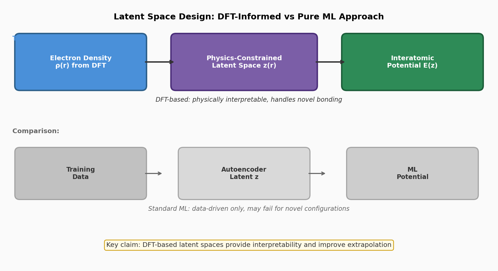

**図1（概念図）：** DFT基盤型潜在空間設計（本研究）と純粋ML型アプローチの対比。電子密度ρ(r)から物理制約付きの潜在空間z(r)を経てポテンシャルE(z)を得る設計と、訓練データのみからオートエンコーダでz(r)を学習する方法の違いを模式的に示す。

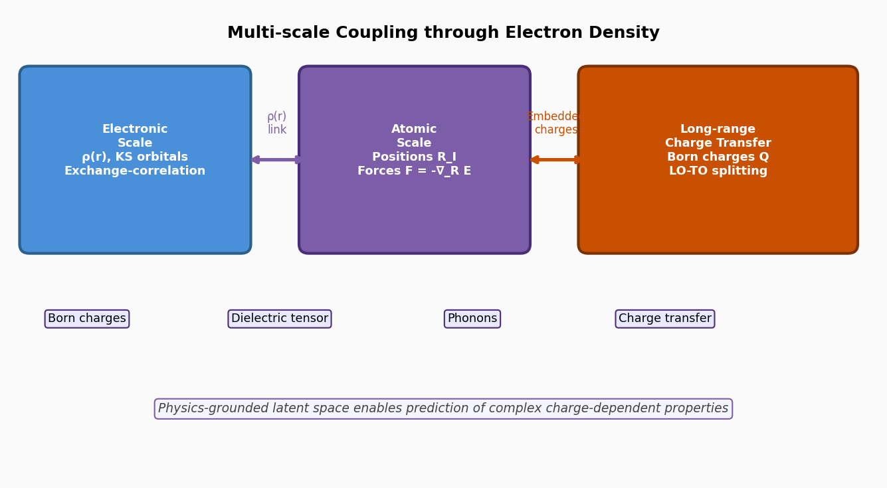

**図2（概念図）：** 電子密度を介した多スケール結合の概念図。電子スケル（KS軌道、交換相関）と原子スケール（座標、力）、さらに電荷移動・励起状態をρ(r)を橋渡しとして統一的に扱う設計思想を示す。

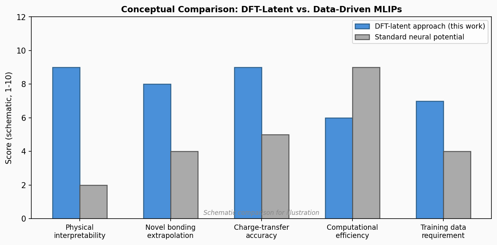

**図3（概念図）：** DFT潜在空間アプローチと標準MLIPの特性比較（概念的スコア）。物理解釈性・新規結合外挿・電荷移動精度ではDFT潜在空間が優れ、計算効率では標準MLが優れるというトレードオフを示す。

---

## 全体のまとめ

### 材料インフォマティクス分野の動向

今週のトレンドを俯瞰すると、MLIPの「物理的表現力の限界への挑戦」が最大の潮流である。MoEによるスケーリング（2603.07977）、電子密度記述子による外挿能力の強化（2603.06953）、スピン自由度の明示的取り込み（2603.07260）という3方向の前進は、それぞれ「モデル容量の増大」「物理的記述子の根拠強化」「物理自由度の拡張」という異なる戦略でMLIPの限界に向き合っている。これらが1週間内に同時に現れた事実は、MLIPが一つの成熟段階を迎え、次の飛躍に向けた多様なアプローチが競合していることを示唆する。また、基盤MLIP（MatRIS）の効率化と、LLMを材料設計に取り込む試み（Lang2Str）が続くことで、「汎用化」と「制御可能化」の両方向で材料探索の加速が図られている。

### 明らかになった未解決領域

最も明確な未解決問題は、「外挿性能の物理的保証」である。電子密度記述子（2603.06953）やDFT潜在空間（2603.05655）はその一方向への回答を試みているが、訓練外の化学空間への安全な展開を保証する汎用的な手法はまだ存在しない。また、MLIPの「輸送特性予測能力」（固体電解質の2603.07425）と「力精度」の乖離は、現在の評価指標の不完全さを浮き彫りにしており、物性に特化した損失関数・評価指標の設計が次の課題となる。さらに、磁性材料（SpinNNP）や核燃料（UO₂）などの特殊な物理自由度を持つ材料系へのMLIPの体系化は始まったばかりであり、方法論的な標準化と再現性確保が今後重要になる。

### 今後の展望

最も注目すべき展開は、MoEアーキテクチャをMLIPの主流（MACE、NequIP等の等変ネットワーク）と組み合わせる試みである。2603.07977は不変記述子ベースでMoEを実装したが、等変ネットワークにMoEを組み込めば、化学的専門化と物理的等変性の双方を持つ次世代基盤MLIPが実現しうる。また、SpinNNPの方法論は磁性材料全般（マンガン酸化物・ランタノイド系・スピントロニクス材料）へと展開することで、計算材料科学における「磁性ML」分野を形成していくと予想される。固体電解質・電池材料分野では、実験ハイパースペクトルデータ（STXM、EELS）のAI解析が定常的なツールとして確立されつつあり、計算と実験の境界がMLによって急速に縮小していることが本週のアーカイブからも読み取れる。

---

*本ダイジェストは自動化された論文収集・選定・要約プロセスにより作成された。引用・参照の際は必ず原論文を確認すること。*
