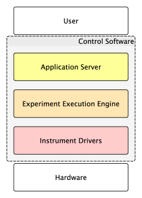
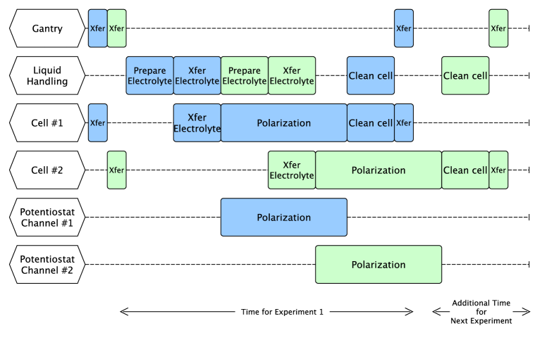
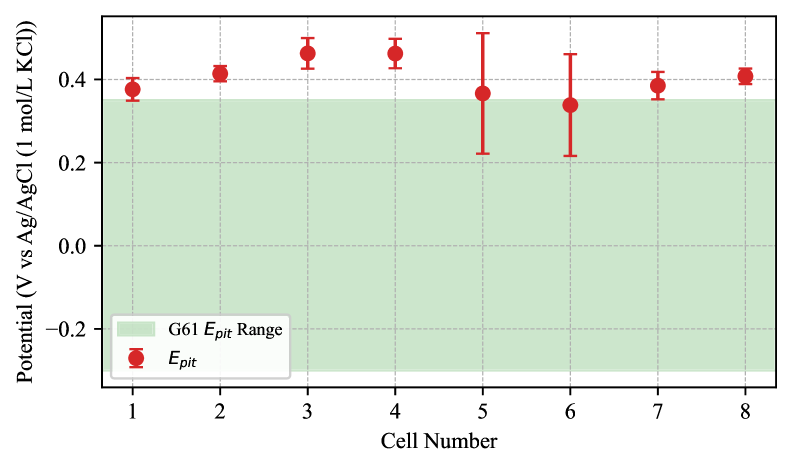
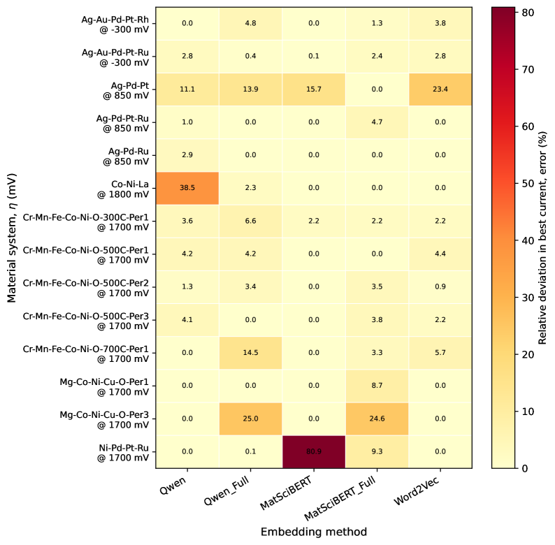
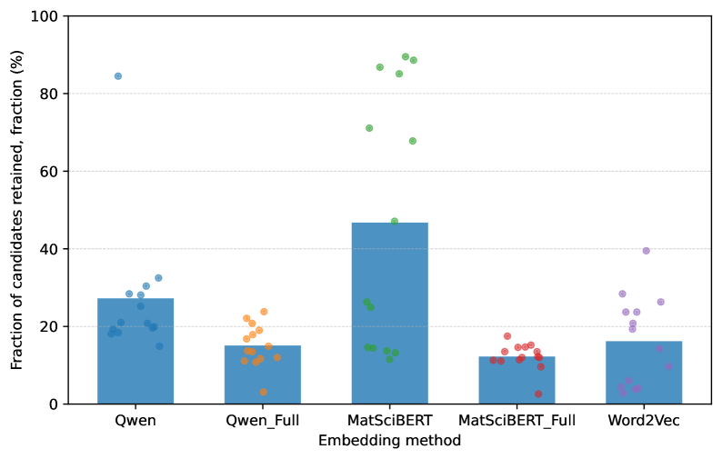
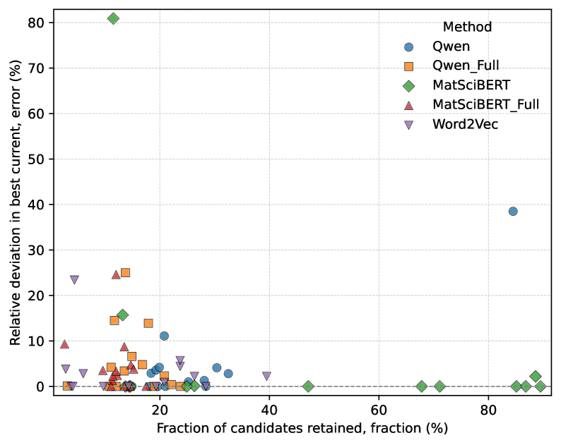
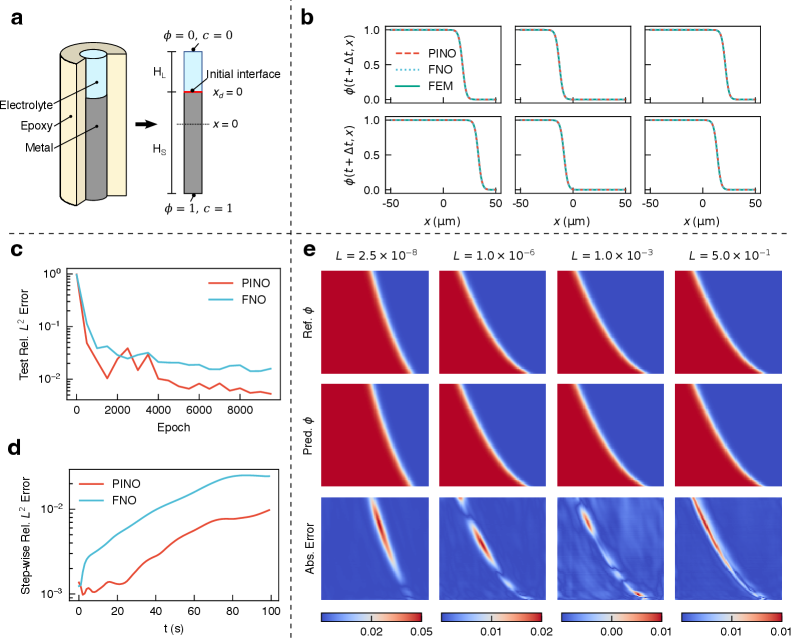
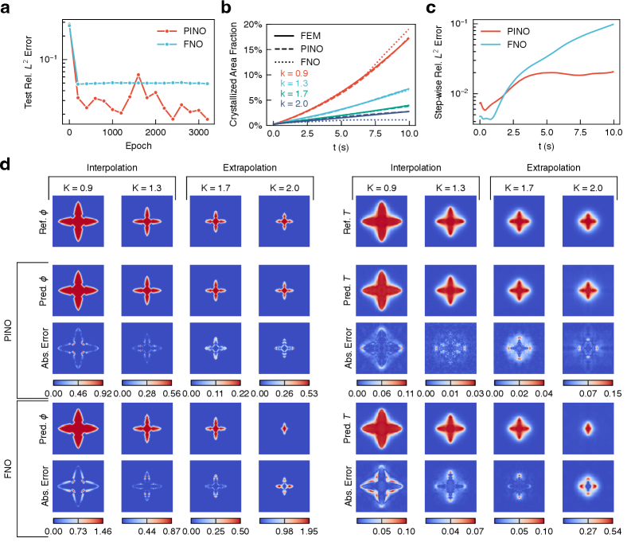

# arXiv 日次ダイジェスト

**作成日：** 2026年3月12日
**対象期間：** 2026年3月9日〜2026年3月12日（直近72時間）

---

## 今日の選定方針

本日は、マテリアルズ・インフォマティクス（MI）に直結する10本を選定した。全体的な傾向として、機械学習ポテンシャル（MLIP）の応用範囲がさらに広がり、単なる構造弛緩や分子動力学にとどまらず、配合空間探索・相境界計算・逆設計プラットフォームへと展開していることが見て取れる。自律実験や能動学習との統合を実現したプラットフォーム論文が複数含まれ、高エントロピー合金（HEA）や半導体酸化物薄膜といった複雑材料系での逆問題に取り組む研究が充実している。自然言語処理を組成記述子として利用する試みや、ホップフィールドネットワーク架けの物理的解釈可能DNNの提案など、方法論的にも多様性が高い。

---

## 全体所見

本日の選定論文10本は、MLIPの適用対象の多様化と、逆設計・自律実験との統合という二つの潮流を鮮明に示している。PAIPAI（2603.08855）はユニバーサルMLIPとモンテカルロサンプリングを組み合わせ、HEAにおける欠陥構造・粒界偏析という従来は第一原理計算コストが障壁だった問題を実用的な時間スケールで解くことを実証した。IDEAL（2603.09744）は拡散生成モデル・GNNベースの物性予測・原子層堆積実験を一体化し、半導体誘電体の逆設計における実験的検証ループを閉じることに成功した点で、概念実証を超えた実装例として注目に値する。MAP-E（2603.09845）は不確実性駆動型サンプリングを組み込んだ自律電気化学プラットフォームであり、腐食科学への能動学習適用の具体的なロードマップを示している。

物理拘束の組み込み方にも新しい提案が複数ある。mPFDNN（2603.09202）は物質-物性-場（Material Property Field）とホップフィールドネットワークを融合させ、ペアワイズ相互作用から出発する解析的枠組みを提示する。PF-PINO（2603.09693）はフーリエニューラルオペレータに物理方程式残差を損失に組み込み、腐食・凝固・スピノーダル分解という複数の相場問題に対して長期安定性と汎化性を実証した。これらは精度一辺倒の機械学習からの脱却を象徴する試みであり、外挿性能と解釈可能性の観点で今後の議論を呼ぶだろう。

テキスト由来の記述子やMLIPと量子核効果の融合など、周辺領域との接点を広げる研究も含まれる。Word2Vec vs.トランスフォーマーの電極触媒スクリーニング比較（2603.08881）は、重量級モデルの実用性に疑問符を付ける実証的知見を提供しており、MI における記述子選択の議論に一石を投じる。CaH₆の超水素化物動態（2603.08950）や水のプロトン秩序化転移シミュレーション（2603.09247）は、MLIPが高圧・低温という極端条件下の物理化学過程を定量的に追跡できることを示すものであり、MLIP精度評価の新たなベンチマーク事例となりうる。

---

## 選定論文一覧

1. [AI-driven Inverse Design of Complex Oxide Thin Films for Semiconductor Devices](https://arxiv.org/abs/2603.09744) — Gu et al.
2. [Ground-State Structure Search of Defective High-Entropy Alloys Using Machine-Learning Potentials and Monte Carlo Sampling](https://arxiv.org/abs/2603.08855) — Zhu & Arroyave
3. [Materials Acceleration Platform for Electrochemistry (MAP-E): a Platform for Autonomous Electrochemistry](https://arxiv.org/abs/2603.09845) — Persaud et al.
4. [Material-Property-Field-based Deep Neural Network in Hopfield Framework](https://arxiv.org/abs/2603.09202) — Hu et al.
5. [Competing Hydrogenation Pathways to Metastable CaH₆ Revealed by Machine-Learning-Potential Molecular Dynamics](https://arxiv.org/abs/2603.08950) — Sato et al.
6. [From Word2Vec to Transformers: Text-Derived Composition Embeddings for Filtering Combinatorial Electrocatalysts](https://arxiv.org/abs/2603.08881) — Zhang & Stricker
7. [Physics-informed neural operator for predictive parametric phase-field modelling](https://arxiv.org/abs/2603.09693) — Chen et al.
8. [Efficient method for calculation of low-temperature phase boundaries](https://arxiv.org/abs/2603.09804) — Svensson et al.
9. [Ab initio simulation of the first-order proton-ordering transition in water ice](https://arxiv.org/abs/2603.09247) — Zhang et al.
10. [Infrared spectroscopy of protonated water clusters via the quantum thermal bath method and highly accurate machine-learned potentials](https://arxiv.org/abs/2603.09410) — Baird et al.

---

# 重点論文の詳細解説

---

## 論文① [AI-driven Inverse Design of Complex Oxide Thin Films for Semiconductor Devices](https://arxiv.org/abs/2603.09744)

**著者：** Bonwook Gu, Trinh Ngoc Le, Wonjoong Kim, Zunair Masroor, Han-Bo-Ram Lee
**arXiv ID：** 2603.09744
**カテゴリ：** cond-mat.mtrl-sci
**公開日：** 2026年3月10日
**論文タイプ：** 研究論文（25ページ、7図）
**ライセンス：** 非独占配布ライセンス

---

### どんな研究か

半導体ゲート誘電体として有力なHf-Zr-O系複合酸化物薄膜を対象に、生成的拡散モデル・機械学習原子間ポテンシャル・グラフニューラルネットワーク（GNN）ベースの物性予測・原子層堆積（ALD）実験を一体化したプラットフォーム IDEAL（Inverse Design for Experimental Atomic Layers）を構築した。HZO組成空間を熱力学的に実現可能な構造に絞り込んだうえで、バンドギャップと誘電率のトレードオフを示す「狭い組成窓」を計算的に特定し、非平衡成長下の原子層変調（ALM）実験で予測を実証している。

---

### 位置づけと意義

半導体誘電体材料の探索は従来、試行錯誤的な実験または高コストな第一原理計算に依存してきた。IDEALは生成モデルによる構造多様性生成、MLIPによる高速エネルギー評価、GNNによる物性マッピングを連結し、実験ループを閉じることで逆設計の実用化に向けた重要な一歩を示す。HZO系はFeRAM・FeFETなど不揮発性メモリ応用に関心が集まる系であり、組成・構造・物性の三角関係を定量的に把握するこのアプローチは、他の複合酸化物薄膜への展開が期待できる。また、非平衡プロセス（ALD/ALM）という現実の製造条件下での検証を含む点は、計算予測の実装可能性を担保する重要な設計判断である。

---

### 研究の概要

**背景・目的：** 次世代FeRAM・FeFET用ゲート誘電体として有望なHZO（HfₓZr₁₋ₓO₂）は、組成・構造多形（単斜晶・正方晶・斜方晶）・電気特性が複雑に絡み合い、所望の誘電率と強誘電性を実現する組成窓は狭い。従来の実験的アプローチは系統的な組成制御が困難なため、計算誘導型の逆設計が求められていた。

**情報学的アプローチ：** ① 拡散生成モデルによりHf-Zr-O系の熱力学的に妥当な原子構造を多数生成。② 学習済みMLIPを用いてエネルギー・力を評価し、安定性フィルタリングを行う。③ GNNベースの物性予測器によりバンドギャップと誘電定数を予測、Pareto最適解を抽出。④ ALMによる実験的合成・検証でループを閉じる。

**対象材料系：** Hf-Zr-O三元系。特にHZO薄膜の組成・多形分布と電気特性の関係。

**主な手法：** 拡散モデル（構造生成）、MLIP（エネルギー評価）、GNN（バンドギャップ・誘電率予測）、ALD/ALM（実験合成）。

**使用データ：** 第一原理計算データ（DFT）で学習したMLIP・GNN。公開された結晶構造DB（Materials Projectなど）の補助利用と推定される。

**主な結果：** 正方晶と斜方晶が低エネルギーで集中する「狭い組成窓」を発見。バンドギャップと誘電率の間にトレードオフが存在し、ALM実験で確認。非平衡成長条件でも計算予測相が主として得られることを確認。

**著者の主張：** 生成モデルと物性予測と実験の一体化により、複合酸化物薄膜の迅速な逆設計ループが閉じられることを示した。

---

### 対象分野として重要なポイント

**対象課題：** 複合酸化物半導体誘電体の組成・構造最適化。HZO系の相安定性・バンドギャップ・誘電率の相関解明。

**手法・モデル設計の意味：** 拡散モデルを「構造多様性の生成装置」として使い、MLIPで熱力学的実現可能性をフィルタし、GNNで物性マッピングするパイプラインは、それぞれのモデルが得意とする役割分担として合理的である。ALD/ALMによる実験検証を含む「クローズドループ」設計は、予測精度の実用検証として価値がある。

**データセット設計の適切性：** DFTベースのMLIP・GNN学習は標準的。ただし非平衡薄膜の実験データとの整合性確認がどこまでなされたかは、論文詳細を要確認。

**既存研究との差分：** 拡散モデルによる複合酸化物構造生成に実験ループを統合した例は少なく、特にALD/ALMとの連携は新規性が高い。

**新規性の位置づけ：** ワークフロー統合としての新規性は高いが、各コンポーネント単体の革新性は穏健。実験検証を含む「概念実証から実装」への移行という意味で差別化できる。

**物理的解釈：** 熱力学的安定相が成長条件によって非平衡相に置き換わる現象は半導体プロセスでは一般的であり、MLIPが非平衡相の相対安定性を適切に扱えるかが問われる。

**一般化可能性：** HZO系での証明はあるが、他の複合酸化物・多元系への汎化にはMLIP・GNNの再学習または転移学習が必要。手法そのもの（IDEAL プラットフォーム）の転移可能性は高い。

**波及効果：** 材料設計（逆設計）および実験支援（ALD条件予測）の両方に効く。

---

### 限界と注意点

HTMLバージョンが未公開のため、本文・図の詳細は確認できていない。拡散モデルが生成する構造の多様性・品質は生成モデルの学習データとサンプリング戦略に依存するが、具体的な評価指標は要確認。MLIPとGNNが薄膜・非平衡相に対してどの程度の精度をもつかは未検討の可能性がある。バンドギャップ・誘電率予測の精度評価（MAE, R²など）の詳細な記述があるかどうかも確認が必要である。実験合成は限られた組成点に対する定性的検証にとどまる可能性があり、定量的な予測精度の系統的評価が望まれる。

---

### 関連研究との比較や研究動向における立ち位置

**先行研究との差分：** 従来の計算主導型HZO研究（Cheema et al., Skokov et al.など）は主に第一原理計算による相安定性の評価にとどまっていた。生成モデルによる構造探索＋実験ループを統合した先例としては、分子系のDe Novo設計が先行するが、薄膜酸化物への応用は本論文が先進的な例の一つ。

**競合・類似研究との位置づけ：** M3GNet・MACE・CHGNetなどのユニバーサルMLIPと Crystal Diffusion Variational Autoencoder（CDVAE）・DiffCSP系の生成モデルを組み合わせる研究が増えつつあるが、ALD実験との統合は希少。

**未解決問題への前進度：** 複合酸化物薄膜の組成-構造-物性の定量的マッピング、および非平衡成長下の相選択性の予測という二つの未解決問題に正面から取り組んでいる点は評価できる。

**新規性評価：** Incremental innovationだが、実装面での前進は確実。

**引用されうるコミュニティ：** 半導体材料・誘電体・強誘電体研究、機械学習ポテンシャル、逆設計、自律実験。

**今後の研究展開：** HZO以外の複合酸化物（La-Al-O系、Bi-Fe-O系など）への IDEAL適用、MLIP精度向上のための能動学習統合、強誘電性・圧電性などのより複雑な電気特性予測への拡張。

---

### 図

ライセンスが非独占配布ライセンス（CC非準拠）のため、原図の掲載を行わない。

---

## 論文② [Ground-State Structure Search of Defective High-Entropy Alloys Using Machine-Learning Potentials and Monte Carlo Sampling](https://arxiv.org/abs/2603.08855)

**著者：** Siya Zhu, Raymundo Arroyave
**arXiv ID：** 2603.08855
**カテゴリ：** cond-mat.mtrl-sci
**公開日：** 2026年3月9日
**論文タイプ：** 研究論文（13ページ、6図）
**ライセンス：** CC BY 4.0

---

### どんな研究か

PAIPAI（Package for Alloy Interstitial Predictions using Artificial Intelligence）は、ユニバーサル機械学習原子間ポテンシャル（MLIP：GRACE-2L-OMAT）とメトロポリス・モンテカルロサンプリングを組み合わせ、高エントロピー合金（HEA）における欠陥・不純物原子を含む配位空間の基底状態構造探索を実用的な計算コストで実現するフレームワークである。ファストワーカー（粗い閾値での高速スクリーニング）とスローワーカー（高精度精密化）の二層アーキテクチャを採用し、Ti–V–Cr–Re スラブの表面偏析、Nb–Ti–Ta–Hf 中のO・B格子間原子凝集、粒界偏析という三つのシナリオで実証した。

---

### 位置づけと意義

HEAは元素の組み合わせが膨大なだけでなく、その各組成において格子位置・欠陥・格子間原子の配置に関する配位空間も指数関数的に大きい。従来はDFT計算のみで網羅的に探索することは不可能であり、経験則や類推に頼ることが多かった。PAIPAIはユニバーサルMLIPをエネルギー評価エンジンに据えることで、DFT水準に近い精度を保ちつつ数桁速い探索を可能にした。表面偏析・格子間原子凝集・粒界偏析という三つの具体的な問題設定での実証は説得力があり、耐熱合金・高圧材料・原子炉材料など欠陥工学の観点から重要な材料系に直接応用可能なツールを提供する。ユニバーサルMLIPの汎化性を積極的に活用したユーザーフレンドリーな設計も普及の観点で重要である。

---

### 研究の概要

**背景・目的：** HEAにおける格子間原子（B, O, Cなど）の安定配置や表面・粒界における偏析パターンは、力学特性・酸化耐性・高温強度に直接影響するが、その配位空間は膨大であり、第一原理計算による網羅的探索は非現実的だった。

**情報学的アプローチ：** メトロポリス基準に基づくモンテカルロサンプリングと構造緩和を組み合わせ、各ステップでMLIPを用いてエネルギー変化を評価する。配置空間の探索は金属サイトの化学種交換と格子間原子の再配分によって行われる。

**対象材料系：** Ti–V–Cr–Re BCC合金スラブ（表面偏析）、Nb–Ti–Ta–Hf BCC合金バルク（O/B格子間原子凝集）、Nb–Ti–Ta–Hf + B/O粒界構造（粒界偏析）。

**主な手法：** MLIP（GRACE-2L-OMATユニバーサルモデル）、メトロポリス・モンテカルロ（化学種・格子間原子シャッフル）、DFT（VASP/PBE-PAWで検証）。

**使用データ：** Open Materials 2024データセットで事前学習されたGRACE-2L-OMATを使用。DFTはValidationのみ。

**主な結果：** MCで最適化した構造はランダムサンプリングより15〜20 eV/cell低エネルギー。Ti–V–Cr–Re スラブではTiとVが表面、CrとReが内部に偏析（実験結果と整合）。Nb–Ti–Ta–Hf中のO/BはHf/Ti-rich領域に優先的に凝集。粒界ではまず金属偏析が先行し、続いて格子間原子がその近傍に引き寄せられる階層的駆動力が存在。

**著者の主張：** ユニバーサルMLIPとMCを組み合わせることで、DFTでは実行不可能だったHEA配位空間の広範な探索が可能となり、欠陥偏析の物理的理解が深まる。

---

### 対象分野として重要なポイント

**対象課題：** HEAの基底状態構造探索、欠陥・格子間原子の偏析パターン予測、表面・粒界工学への応用。

**手法・モデル設計の意味：** GRACE-2L-OMATはOpen Materials 2024で学習した広元素対応ユニバーサルMLIPであり、HEA多元系への適用において再学習不要という実用的利点がある。ファスト・スロー二段階ワーカーは計算資源の効率的配分として巧みな設計であり、逐次的MCの計算ボトルネックを並列化で打破している。

**データセット・評価の適切性：** DFT検証はΣ5粒界など具体的な構造について実施されており、MLIP予測とDFT結果のエネルギー順序保存が確認されている。ただしDFT検証のサンプル数は限定的であり、系統的な精度評価（MAE等）の詳細は要確認。

**既存研究との差分：** 従来のHEA配位探索（SQS法、クラスター展開法など）は特定の偏析モードに限定されることが多いが、PAIPAIはM–I（金属−格子間）複合偏析を統一的に扱える点に優位性がある。

**物理的解釈：** 金属偏析が支配的駆動力となりその後格子間原子が追随するという「階層的駆動力」の発見は、粒界強化設計に重要な物理的洞察を提供する。

**一般化可能性：** GRACE-2L-OMATが対応していない元素系ではMLIPの再学習が必要。基本的な方法論は広元素系に適用可能。

**波及効果：** 探索加速（計算コスト削減）、材料設計（耐熱HEAの粒界強化設計）、物理解釈（欠陥挙動の統計力学的理解）。

---

### 限界と注意点

ユニバーサルMLIPのBCC-HEAへの精度は系によって異なる。特に高度な格子歪みや磁性を持つ系では誤差が大きくなる可能性がある。MCサンプリングは固定格子トポロジー上での探索であるため、相変態（BCC→FCC等）やアモルファス化を伴う配位変化は捕捉できない。粒界モデルはΣ5(120)という特定の対応粒界であり、一般的な粒界への適用性は未確認。検証DFT計算のサンプル数が限定的であるため、MLIP予測の統計的精度評価が不十分な可能性がある。実験との定量的比較（例：偏析濃度プロファイルのXPS/STEMデータとの照合）は本論文の範囲外。

---

### 関連研究との比較や研究動向における立ち位置

**先行研究との差分：** SQS（Special Quasi-random Structure）法はランダム相のモデル化に特化し欠陥探索には不向き。クラスター展開法は少数元素系では強力だが多元HEAへの拡張は困難。PAIPAIはMLIPの汎用性を活かして両方の問題を統一的に扱う。Byggmästarら（九元素MLIP, 2603.04147）が特定合金系への特化MLIPを示したのとは対照的に、ユニバーサルMLIP活用という方向性の差異がある。

**競合研究：** HEA欠陥のMLIPシミュレーションとして、MACE-MP-0やCHGNetを用いたMC探索が類似の方向性にあるが、二段階ワーカー設計での並列化・実用化は本論文が先行。

**未解決問題への前進：** HEAの「配位エントロピー vs. 欠陥配位最適化」という相反する設計要求を計算的に扱う手段が不足していたが、PAIPAIはその空白を埋める。

**新規性評価：** Incremental innovationだが実装価値は高い。フレームワーク自体のオープンソース化の有無が普及の鍵。

**引用可能コミュニティ：** 高温合金・耐熱材料・原子炉材料・HEA研究・MLIP方法論コミュニティ。

**今後の展開：** 磁性HEA（Mn・Fe含有系）への拡張、アクティブラーニングとの統合による汎化精度向上、実験偏析データ（STEM-EDS）との定量比較、合金設計への直接活用（逆問題）。

---

### 図

**Fig.1** PAIPAIフレームワークのフローチャート。ファストワーカー（緩い収束閾値F_max=0.1 eV/Å）によるスクリーニングとスローワーカー（厳密なF_max=0.01 eV/Å）による精密化の二段階アーキテクチャが示されている。共有待機プールを通じた協調動作により、逐次MCの計算ボトルネックを回避している点が本手法の核心的設計である。

**Fig.2** Ti–V–Cr–ReスラブにおけるMC最適化の収束曲線（左）とDFT計算との比較（右）。MLIPによるエネルギー評価がDFT水準に近い順序付けを示し、10⁵ステップ程度での収束を確認している。これはMLIPをMCサンプリングのエネルギー評価エンジンとして使用した場合の実用的な収束特性を示すものであり、計算コストと精度のトレードオフを定量的に議論する根拠となる。

**Fig.3** Nb–Ti–Ta–Hf BCC HEAバルク中のO/B格子間原子凝集パターン。格子間原子なし・O入り・B入り・O+B混合の4ケースでのMC後構造を可視化。Hf/Ti-rich領域への選択的凝集と、OとBの競合的・協調的挙動が明示されており、多元素系における格子間原子の優先偏析サイトを計算的に特定できることを示す重要な結果である。

---

## 論文③ [Materials Acceleration Platform for Electrochemistry (MAP-E): a Platform for Autonomous Electrochemistry](https://arxiv.org/abs/2603.09845)

**著者：** Daniel Persaud, Mike Werezak, Mark Xu, Melyne Zhou, Frank Benkel, Xin Pang, Vahid Attari, Brian DeCost, Ashley Dale, Nicholas Senior, Gabriel Birsan, Jason Hattrick-Simpers
**arXiv ID：** 2603.09845
**カテゴリ：** cond-mat.mtrl-sci
**公開日：** 2026年3月10日
**論文タイプ：** 研究論文（22ページ、6図）
**ライセンス：** CC BY 4.0

---

### どんな研究か

MAP-E（Materials Acceleration Platform for Electrochemistry）は、高スループット電気化学実験の自律実行を可能にするプラットフォームで、8チャンネル並列電気化学セル・ロボット液体ハンドリング・ガウスプロセス回帰（GPR）ベースの不確実性駆動型サンプリングを統合した自律電気化学システムである。304 ステンレス鋼の孔食電位測定でASTM G61規格を超える再現性（32測定でσ=76 mV、実験室間変動の約4分の1）を達成し、pH−塩化物安定性ダイアグラムを80条件で人手を介さず自律的に構築することに成功した。

---

### 位置づけと意義

腐食試験は材料実験のなかでも特に再現性が低く、オペレーターの手技に依存する問題が長年指摘されてきた。MAP-Eはこの課題をロボット化・並列化・能動学習の組み合わせによって解決しようとするもので、自律実験（Self-Driving Lab）の電気化学領域への具体的な実装例として重要である。単なる自動化にとどまらず、GPRを用いた不確実性駆動型サンプリング（bayesian optimizationの姉妹手法）によって実験設計を最適化している点が、能動学習とのハードウェア統合という観点で先進的である。この種のプラットフォームは、腐食スクリーニング・電解触媒探索・固体電解質-電極界面評価などの広範な電気化学材料研究に展開可能であり、MIコミュニティへの波及性も高い。

---

### 研究の概要

**背景・目的：** 腐食試験は材料長寿命化・インフラ維持に不可欠だが、遅く・労働集約的で再現性に乏しい。高スループットで再現性の高いデータを自律的に収集するプラットフォームの開発が急務であった。

**情報学的アプローチ：** GPRによるサロゲートモデリングと事後予測分散最大化（不確実性駆動型サンプリング）により、次に実験すべき条件をAIが自動選択する能動学習ループを実装。ハードウェアはアプリケーションサーバ・実験実行エンジン・機器ドライバの三層ソフトウェアアーキテクチャで制御。

**対象材料系：** 304ステンレス鋼（pitting corrosion benchmark）、pH-Cl安定性ダイアグラムの作成。

**主な手法：** 8並列電気化学セル（ポテンシオスタット制御）、ロボット液体ハンドリング（混合タンク・計量ポンプ）、GPR（不確実性推定）、能動学習（最大不確実性サンプリング）。

**使用データ：** 平衡電位計算（Pourbaix図）を参照条件として使用。測定データは自律実験中にリアルタイム蓄積。

**主な結果：** ASTM G61再現性試験でσ=76 mV（ASTM基準の実験室間変動200〜300 mVを大幅に下回る）。pH-Cl安定性ダイアグラム（80条件）を人手介入なく自律構築。不確実性駆動型サンプリングが孔食遷移境界近傍に集中してサンプリングすることを確認。

**著者の主張：** MAP-EはASTM規格を超える再現性を実現し、自律的な腐食材料探索の実行可能性を証明した。

---

### 対象分野として重要なポイント

**対象課題：** 腐食スクリーニングの自律化・高スループット化・再現性向上。電気化学材料探索の能動学習適用。

**手法・モデル設計の意味：** GPRは少量のデータから不確実性の空間分布を推定でき、能動学習のサロゲートモデルとして電気化学実験の次条件選択に適している。8並列セルによる並列実験と能動学習の組み合わせはデータ取得効率を大幅に向上させる。

**評価指標の適切性：** ASTM G61という業界標準規格をベンチマークとして用いたことで、精度評価の客観性が高い。32測定のσ=76 mVという数値は既存の実験室間変動と比較可能な形で提示されており評価がしやすい。

**既存研究との差分：** 電気化学の自動化装置は先行例があるが（ハーバードグループのORCA、Pitt groupのMAPs等）、不確実性駆動型サンプリングによる自律的実験設計との統合を具体的に示した点が差異。

**物理的解釈：** GPRサロゲートが学習するpH-Cl空間での孔食電位マップは、Pourbaix図とは異なる動的腐食挙動をデータ駆動的に捉えるものであり、熱力学的計算では得られない動力学的情報を含む。

**一般化可能性：** 電気化学一般（水電解・電池・燃料電池）への適用が見込まれるが、現状は腐食評価に最適化されており他の電気化学測定への拡張は追加開発が必要。

**波及効果：** 自律実験・探索加速・実験支援のすべてに効く。

---

### 限界と注意点

現状は304 SSとphosphate-chloride混合液という単一材料・単一電解液系でのデモンストレーションである。任意の電解液・試料への汎化には液体ハンドリングシステムの拡張が必要。GPRはガウス近似を仮定するため、非ガウス的な腐食電位分布（局所的なスパイク等）に対しては不確実性推定の精度が低下する可能性がある。並列セル間のクロスコンタミネーションやサンプル移送の誤差が系統誤差として残る可能性がある。能動学習の収束基準や実験予算の決め方が透明に記述されているか確認が必要。現状はスクリーニングプラットフォームとしての位置づけで、発見した条件の材料科学的機構解析（TEM・XPSなど）とのシームレスな統合は今後の課題。

---

### 関連研究との比較や研究動向における立ち位置

**先行研究との差分：** A-Lab（バークレー）やHeliOS（MIT）などの自律固体材料合成プラットフォームと比較して、MAP-Eは電気化学特性評価に特化した最初期の高再現性自律プラットフォームの一つ。DeCostらによるNISTの電気化学自動化の流れを継承・発展させている。

**競合研究：** NRELやArgonne National LaboratoryのHighThroughput Corrosion Testingとの比較があるが、それらに能動学習を統合した明示的な先行研究は限られる。

**未解決問題への前進：** 腐食データの測定再現性とデータ効率の両問題を、一つのプラットフォームで解決しようとする姿勢は評価できる。ただし現状のGPR-能動学習が腐食電位の空間構造をどれほど効率的に捕捉するかの定量評価はまだ途上。

**新規性評価：** 装置・ソフトウェア・能動学習の統合としてはIncremental to Moderate innovation。腐食分野への能動学習適用の先進的事例という位置づけ。

**引用可能コミュニティ：** 腐食工学・電気化学・自律実験・能動学習・材料データ科学。

**今後の展開：** 電解触媒探索（OER/HER）、固体電解質−電極界面評価、マルチモーダル計測（インペーダンス＋光学）との統合、多目的最適化（ベイズ最適化）への発展。

---

### 図

**Fig.1** MAP-Eプラットフォームの電気化学フラットセル（空圧クランプ機構・参照電極付き）。8セルを独立制御できる並列構成が腐食測定の高スループット化の基盤となっている。各セルの電位独立制御により、同一条件での並列測定と異なる条件での同時並行実験の両方が可能。

**Fig.2** MAP-Eの三層ソフトウェアアーキテクチャ（アプリケーションサーバ・実験実行エンジン・機器ドライバ）の概略図。GPRサロゲートによる不確実性駆動型サンプリングはアプリケーションサーバレイヤーに実装されており、ハードウェアとAI判断が疎結合になっている設計は保守性・拡張性の点で合理的。

**Fig.3** ASTM G61規格に準じた304 SS の電位動電流分極曲線（32測定、8セル）。孔食電位の分布（σ=76 mV）がASTM基準の実験室間変動より著しく小さいことを示す。この定量的再現性データが、自律電気化学プラットフォームの実用性を客観的に支持する中心的な根拠である。

---

# その他の重要論文

---

## 論文④ [Material-Property-Field-based Deep Neural Network in Hopfield Framework](https://arxiv.org/abs/2603.09202)

**著者：** Yanxiao Hu, Ye Sheng, Caichao Ye, Wenxing Qian, Xiaoxin Xu, Yabei Wu, Jiong Yang, William A. Goddard III, Wenqing Zhang
**arXiv ID：** 2603.09202
**カテゴリ：** cond-mat.mtrl-sci
**公開日：** 2026年3月10日
**論文タイプ：** 研究論文
**ライセンス：** CC BY 4.0

#### 研究概要

mPFDNN（Material Property Field-based Deep Neural Network）は、物質の物性を「ペアワイズ相互作用上に構築された解析的場（Material Property Field: MPF）」として表現するフレームワークを提案し、これをホップフィールドネットワークの記憶力学と対応付けることで非線形原子間相互作用を「隠れニューロン」として解析的に取り扱えるようにした。このアプローチにより、従来のDNNが不透明なブラックボックスとして機能していた材料物性予測において、物理的対称性を内包しつつ解釈可能な形でモデルを構築できると主張する。無機結晶・有機分子・水溶液という異なる材料系を対象に、拡散係数・吸着エネルギーなど複数の物性を予測し検証した。

MPFとホップフィールドネットワークの融合は、非線形相互作用モデルと線形アプローチを統一的な枠組みで包含できるという理論的な広さをもつ。ただし、現行のMLIP（MACE、NequIP等）と比較した精度ベンチマークが論文内でどの程度詳細に示されているか、また予測精度の定量的評価が十分かどうかは、HTMLバージョン未公開のため詳細確認ができていない。解釈可能性と汎化性を両立しようとする試みとして、物理拘束型MLの文脈で今後議論される可能性がある。

*本論文はHTMLバージョンが未公開のため図を抽出できなかった（ライセンスはCC BY 4.0で適格）。*

---

## 論文⑤ [Competing Hydrogenation Pathways to Metastable CaH₆ Revealed by Machine-Learning-Potential Molecular Dynamics](https://arxiv.org/abs/2603.08950)

**著者：** Ryuhei Sato, Peter I. C. Cooke, Maélie Caussé, Hung Ba Tran, Seong Hoon Jang, Di Zhang, Hao Li, Shin-ichi Orimo, Yasushi Shibuba, Chris J. Pickard
**arXiv ID：** 2603.08950
**カテゴリ：** cond-mat.mtrl-sci
**公開日：** 2026年3月9日
**論文タイプ：** 研究論文
**ライセンス：** CC BY-NC-SA 4.0

#### 研究概要

高圧超水素化物CaH₆は室温超伝導候補として注目されるが、実験的には準安定なクラスレート型（fcc様Ca格子）とA15型（CaH₅.₇₅構造）という二つの相が観察されており、その生成経路の違いが理解されていなかった。本研究はMLIPを用いたMLIP-MD（機械学習ポテンシャル分子動力学）シミュレーションにより、前駆体材料（CaH₂ vs. Ca）の結晶構造の違いが、どちらの超水素化物相を与えるかを決定することを示した。特にCaH₂が前駆体の場合、Ca副格子がCaH₂のものとCaH₆のbcc枠組みの間の結晶学的整合性（マルテンサイト様トポタクティック変態）により、クラスレート型CaH₆への速度論的アクセスが容易になることを発見した。

高圧水素化物合成は実験的に制御が難しく、どの前駆体から出発するかが最終相に決定的に影響するという実験家的直観を、MLIP-MDが初めて原子論的に解明した例として重要である。高圧下でのMLIPの構築・検証という技術的課題もクリアしており、超水素化物探索や高圧合成経路設計におけるMLIP-MDの有用性を示す先行研究となる。ただしMLIPの高圧状態（数百GPa）での外挿精度検証と、実験との定量的整合性（反応温度・圧力の再現）については注意が必要である。

*本論文はHTMLバージョンが未公開のため図を抽出できなかった（ライセンスはCC BY-NC-SA 4.0で適格）。*

---

## 論文⑥ [From Word2Vec to Transformers: Text-Derived Composition Embeddings for Filtering Combinatorial Electrocatalysts](https://arxiv.org/abs/2603.08881)

**著者：** Lei Zhang, Markus Stricker
**arXiv ID：** 2603.08881
**カテゴリ：** cond-mat.mtrl-sci; cs.CL
**公開日：** 2026年3月9日
**論文タイプ：** 研究論文
**ライセンス：** CC BY-SA 4.0

#### 研究概要

組成複雑な電気触媒の候補空間を電気化学ラベルなしでスクリーニングするために、科学文献コーパスから学習したテキスト埋め込みを組成記述子として活用するアプローチを提案した。Word2Vec・MatSciBERT・Qwen（LLM）の三手法を比較し、各組成を「導電性」「誘電特性」という概念ベクトルへの類似度でマッピングしPareto前沿フィルタリングを実施。15種類の材料ライブラリ（計算電気化学データセット）でテストした結果、単純な要素埋め込みの線形結合として機能するWord2Vec ベースラインがトランスフォーマー系のより複雑なモデルと同等またはそれ以上の候補削減率を示した。

この結果は「大規模言語モデルが材料スクリーニングに有効」という期待に対して重要な実証的反証を与える。複雑な埋め込みが必ずしも材料科学タスクで優位でないという知見は、記述子設計とモデル複雑性のトレードオフをMIコミュニティに問い直すものである。ただし、本手法はラベルなしスクリーニング（候補の絞り込み）であり最適組成の直接予測ではないため、高スループット計算や実験データと組み合わせた下流タスクでの評価が今後必要である。15のライブラリという評価規模は一定の信頼性を与えるが、OER/HER以外の反応への汎化は未検討。

**Fig.1** 各埋め込み手法（W2V、MatSciBERT、Qwen）と各材料系での「ベスト組成の相対誤差」ヒートマップ。色が薄いほど最良組成の電流密度がPareto選択前後で変化が小さいことを意味する。W2Vが概ねトランスフォーマー系と同等以上の性能を示すことが一覧できる。

**Fig.2** 各埋め込み手法でのPareto選択後の候補保持率（全組成に対する割合）。W2Vは少ない候補数に絞り込みつつ良好な組成を保持しており、複雑モデルとの実用面での優位性を示している。

**Fig.3** 保持率（スクリーニング効率）とベスト組成相対誤差（スクリーニング正確度）のトレードオフを全手法・全材料ライブラリにわたって示したプロット。W2Vがトレードオフ曲線の良好な領域に位置していることが分かり、シンプルな記述子の実用性を支持する中心的な根拠となっている。

---

## 論文⑦ [Physics-informed neural operator for predictive parametric phase-field modelling](https://arxiv.org/abs/2603.09693)

**著者：** Nanxi Chen, Airong Chen, Rujin Ma
**arXiv ID：** 2603.09693
**カテゴリ：** cs.LG; cond-mat.mtrl-sci; physics.comp-ph
**公開日：** 2026年3月10日
**論文タイプ：** 研究論文
**ライセンス：** CC BY-NC-ND 4.0

#### 研究概要

PF-PINO（Phase-Field Physics-Informed Neural Operator）は、フーリエニューラルオペレータ（FNO）に物理方程式残差を損失関数に組み込んだフレームワークであり、腐食・樹枝状晶凝固・スピノーダル分解という三つの相場問題を対象に、時間自己回帰的に相場変数の時空間発展を予測する。「データ駆動事前学習＋物理拘束ファインチューニング」の二段階学習戦略により、少量データでの汎化性と長期予測安定性を向上させており、従来のFNOに対して相対L²誤差を有意に低減することを示した。

相場モデル（Phase-Field Model: PFM）はマルチフィジックス材料シミュレーションの基盤として広く使われるが、微分方程式の数値解法は計算コストが高く、パラメトリックスタディや逆問題への適用は困難だった。PF-PINOはニューラルオペレータによる高速代替モデルに物理拘束を加えることで、汎化性と長期安定性の問題を同時に緩和しようとしており、腐食・凝固・相分離という材料科学的に重要な三つのフェーズダイナミクス問題への同時適用は手法の汎用性を示す。ただし、物理拘束の強さ（残差重みの設定）への感度分析や、実験データとの照合という点での評価は限定的であり、実材料系への適用に向けた更なる検証が必要。

**Fig.1** PF-PINOの全体アーキテクチャ（FNO＋物理残差損失）と時間自己回帰的予測スキームの概略図。FNOがデータから空間相関を学習し、物理拘束ファインチューニングが時間方向の保存則遵守を担保するという役割分担が示されている。

**Fig.2** 1D電極腐食モデルにおけるパラメータ（界面反応係数L）を変化させた場合の相場変数φの時間発展予測と参照解の比較。PF-PINOが異なるパラメータ値に対して安定した予測を行える（汎化性）ことが示されており、パラメトリックスタディへの応用可能性を裏付ける。

**Fig.3** 2D電気化学腐食（エレクトロポリッシング）における金属−電解液界面の形状変化をPF-PINOで予測した空間分布の比較。正弦波状初期界面プロファイルに対して長時間の形状変化が高精度で再現されており、2D問題での実用的な空間分解能を確認できる。

---

## 論文⑧ [Efficient method for calculation of low-temperature phase boundaries](https://arxiv.org/abs/2603.09804)

**著者：** Lucas Svensson, Babak Sadigh, Christine Wu, Paul Erhart
**arXiv ID：** 2603.09804
**カテゴリ：** cond-mat.mtrl-sci; physics.chem-ph; physics.comp-ph
**公開日：** 2026年3月10日
**論文タイプ：** 研究論文（7ページ、4図）
**ライセンス：** 非独占配布ライセンス

#### 研究概要

クラウジウス-クラペイロン方程式と準調和近似（QHA）を組み合わせた低温相境界計算の効率的なフレームワークを提案した。従来の熱積分法（thermodynamic integration）や自由エネルギー摂動法と比較して、必要な計算点を最小化しつつ量子効果・低次非調和効果・内部自由度を系統的に取り込める利点を持つ。DFT計算とMLIPを用いてSiO₂の圧力−温度相図（−2〜12 GPa、〜1750 K）を構築し、実験相図と良好な一致を示した。

低温における相境界計算は有限温度自由エネルギー評価の精度に強く依存するため、計算材料科学の長年の課題の一つである。本フレームワークがDFTとMLIPの両方で検証されていることは、MLIPがサロゲートとして使用できることを示す実用的な根拠となる。ただし本手法の適用範囲は主に固相間の相転移であり、融解や液相線計算への拡張は別途の定式化が必要。SiO₂系という単一材料系でのデモンストレーションであり、他の材料系への一般化検証が待たれる。

*ライセンスが非独占配布ライセンス（CC非準拠）のため、図は掲載しない。*

---

## 論文⑨ [Ab initio simulation of the first-order proton-ordering transition in water ice](https://arxiv.org/abs/2603.09247)

**著者：** Qi Zhang, Sicong Wan, Lei Wang
**arXiv ID：** 2603.09247
**カテゴリ：** cond-mat.mtrl-sci
**公開日：** 2026年3月10日
**論文タイプ：** 研究論文
**ライセンス：** 非独占配布ライセンス

#### 研究概要

機械学習ポテンシャルとループ更新（loop update）モンテカルロを組み合わせ、水分子360個系で氷Ihから氷XIへのプロトン秩序化転移という長年のシミュレーション上の難問に取り組んだ。「アイスルール」（各水分子が2供与・2受容を満たすという制約）を保つ特殊なMCアルゴリズムを開発し、DFT水準に近い精度のMLIPと組み合わせることで、一次転移特有のシグナル（負のBinder cumulant、二峰性ポテンシャルエネルギー分布、格子比の急変）を83 Kで再現した。量子核効果（QNE）を取り込むと転移温度が63 Kに低下し、実験値72 Kに近づくことも示した。

アイスルールを保つMCサンプリングとMLIPの組み合わせは、プロトン秩序化転移の計算を実用的にした初めての「ab initio相当」のシミュレーションとして重要である。MLIPの精度・サンプリング戦略・量子核効果の全てが協調して機能することを示した複合的アプローチであり、水・氷研究だけでなく、水素結合系一般のMLIP+特殊サンプリングの枠組みとして他への応用可能性がある。ただしMLIPの転移温度近傍での精度（特にプロトン秩序パラメータへの感度）と、サンプリングの収束性の評価がさらに厳密に議論されることが望ましい。

*ライセンスが非独占配布ライセンス（CC非準拠）のため、図は掲載しない。*

---

## 論文⑩ [Infrared spectroscopy of protonated water clusters via the quantum thermal bath method and highly accurate machine-learned potentials](https://arxiv.org/abs/2603.09410)

**著者：** T. Baird, R. Vuilleumier, S. Bonella
**arXiv ID：** 2603.09410
**カテゴリ：** physics.comp-ph
**公開日：** 2026年3月10日
**論文タイプ：** 研究論文
**ライセンス：** CC BY 4.0

#### 研究概要

プロトン化水クラスター（H₃O⁺からH₉O₄⁺までのモノマー〜テトラマー）のIRスペクトルを計算するために、高精度な機械学習ポテンシャルエネルギー面（ML-PES）および双極子モーメント面（ML-DMS）と、量子熱浴法（Quantum Thermal Bath: QTB）を組み合わせた。QTBは分子動力学シミュレーションに核量子効果（NQE）を近似的に取り込む手法であり、完全量子動力学（PIMD等）より大幅に安価でありながら、H-O伸縮・変角モードなど量子効果が顕著なスペクトル特徴を再現できることを示した。

MLポテンシャルと量子熱浴の組み合わせは、液体水・水溶液電解質・水和界面など「水が鍵となる材料系」のスペクトル特性解析に汎用的に適用できる可能性を示す。固体電解質−水界面のIRスペクトルや、電気化学系での水の振動挙動の理解に活用できると期待される。ただし本論文の対象は小さな気相水クラスターであり、凝縮相・固液界面への適用にはML-PESの精度拡張とQTBの凝縮相適用における体系的な誤差評価が必要。材料設計への直接的な波及は限定的だが、MLポテンシャルを使った計算分光の可能性を広げる基礎的な研究として評価できる。

*本論文はHTMLバージョンが未公開のため図を抽出できなかった（ライセンスはCC BY 4.0で適格）。*

---

# 全体のまとめ

**材料インフォマティクス分野の動向**

本日の10本から浮かびあがる最大の潮流は「MLIPの応用範囲の拡大と実用統合」である。単なる分子動力学の加速に留まらず、MLIPはモンテカルロ探索のエネルギー評価エンジン（PAIPAI）、低温相境界計算のサロゲート（Svensson et al.）、超水素化物合成経路の解析（Sato et al.）、プロトン秩序化転移の解明（Zhang et al.）へと展開している。これはMLIPの精度・汎化性が十分なレベルに達し、特定の材料科学的問題設定に対応した応用設計が進んでいることを示す。もう一つの軸は「自律実験と能動学習の実装」であり、MAP-Eはロボット電気化学プラットフォームにGPRベースの不確実性駆動型サンプリングを統合した具体例として、腐食材料研究における自律化の現実的な到達点を示した。IDEALは逆設計プラットフォームに実験ループを閉じた例として、生成モデル応用の次ステージを示している。

**明らかになった未解決領域**

いくつかの課題が今回の論文群から浮き彫りになった。まず、ユニバーサルMLIPの「汎用性と精度のトレードオフ」は依然として中心的な問題であり、PAIPAIやIDEALのようにユニバーサルモデルを流用する場合の精度保証が求められる。次に、mPFDNNが問いかけるように、「物理的解釈可能性とモデル精度の同時追求」はまだ解決されていない。現行の高精度MLIPは解釈可能性が低く、一方の物理拘束を強制すると精度が落ちやすいというトレードオフが続いている。さらに、PF-PINOやIDEALの論文から見えるように、「サロゲートモデルの実材料系への外挿性能と長期予測安定性の検証」は未成熟であり、ベンチマーク設計の標準化が急務である。Word2Vec vs. トランスフォーマーの比較（Zhang & Stricker）が提起した「大規模モデルの材料スクリーニングにおける実効性」も重要な未解決問題であり、記述子設計の原理的な理解が求められる。

**今後の展望**

短期的には、ユニバーサルMLIP（MACE-MP-0系、GRACE系、CHGNet系）を能動学習ループ・自律実験プラットフォームにシームレスに統合し、特化ファインチューニングとユニバーサル汎化性を両立させる研究が加速するだろう。中期的には、逆設計プラットフォームの実験検証閉ループ（IDEAL方式）が半導体・電池・触媒などの各材料ドメインに展開され、生成モデル×MLIPの組み合わせがデファクトスタンダードになりうる。長期的には、mPFDNNやPF-PINOが示す「物理拘束の数学的統合」が成熟することで、外挿性能と解釈可能性を兼ね備えた次世代のMLモデルが登場することが期待される。同時に、MAP-Eのような自律実験プラットフォームが多様な材料測定（電気化学・光学・力学）をカバーし、計算予測と実験データの閉ループが材料探索の標準プロセスとなっていく流れは加速するとみられる。

---
