# arXiv 日次ダイジェスト

**作成日：** 2026-03-14
**対象期間：** 2026-03-11 〜 2026-03-14（過去72時間〜7日）

---

## 今日の選定方針

本日は、MLIPの信頼性・認証フレームワーク、汎用ポテンシャルの精度向上、LLMエージェントを用いた合金逆設計、拡散モデルによる多結晶構造生成、物理情報的記述子設計、電池材料高スループットスクリーニング、プロセスシミュレーション、多孔質材料のGANによる再構成、薄膜の相転移MD、LLM評価ベンチマークという10報を選出した。MLIPの「使い方」から「信頼性保証」へと課題軸がシフトしつつある流れ、汎用ポテンシャルの訓練関数形の刷新、LLMエージェントとサロゲートモデルの組合せによる逆設計加速など、材料インフォマティクスの複数の主要潮流が本日の選定に反映されている。

---

## 全体所見

2026年3月中旬時点で、MLIPをめぐる議論は「高精度・汎用性」の追求から「信頼性・外挿保証」の体系化へと主軸が移動しつつある。CHGNet・TensorNet・MACEといった代表的MLIPが、DFT安定材料の93%を見逃すという厳しい実態を示したProof-Carrying Materialsの報告は、材料スクリーニングにおけるMLIP単独使用の限界を定量的に可視化したものとして、コミュニティに対して強いインパクトを持つ。一方、Matlantis-PFP v8のようにr2SCAN汎関数で訓練し、融点誤差を半減させるという実用的な改善も継続している。

生成モデルの文脈では、PolyCrysDiffが3次元多結晶微視構造を条件付きで生成し、結晶塑性有限要素法によって機械的性質を検証するというエンドツーエンドの研究設計を採用しており、微視構造設計への波及が期待される。LLMエージェントを用いたHEA相設計（ReAct Agent for HEA）は、推論と行動のループによってサロゲートモデルを誘導し、ランダム探索や通常のベイズ最適化を大きく凌ぐ探索効率を実証した。材料インフォマティクスにおけるLLMの役割が「知識抽出」から「意思決定」へ拡張されつつある状況を端的に示している。

また、熱力学的記述子（分子動力学から抽出した蒸発熱・密度・凝集エネルギー）を特徴量とするML予測や、MaterialFigBENCHによる視覚理解を含む材料科学的問題解決のマルチモーダルLLM評価など、材料インフォマティクスの課題設定が「精度改善」から「一般化・外挿・評価基盤」へと成熟していく様子が本日のまとめから読み取れる。

---

## 選定論文10本のタイトル一覧

| # | arXiv ID | タイトル |
|---|----------|---------|
| ★ | 2603.12183 | Proof-Carrying Materials: Falsifiable Safety Certificates for Machine-Learned Interatomic Potentials |
| ★ | 2603.11068 | From Phase Prediction to Phase Design: A ReAct Agent Framework for High-Entropy Alloy Discovery |
| ★ | 2603.11063 | Matlantis-PFP v8: Universal Machine Learning Interatomic Potential with Better Experimental Agreements via r2SCAN Functional |
| | 2603.11695 | PolyCrysDiff: Controllable Generation of Three-Dimensional Computable Polycrystalline Material Structures |
| | 2603.12017 | Thermodynamic Descriptors from Molecular Dynamics as Machine Learning Features for Extrapolable Property Prediction |
| | 2603.10631 | High-Throughput-Screening Workflow for Predicting Volume Changes by Ion Intercalation in Battery Materials |
| | 2603.11416 | Atomic-Scale Mechanisms of SiO₂ Plasma-Enhanced Chemical Vapor Deposition Revealed by Molecular Dynamics with a Machine-Learning Interatomic Potential |
| | 2603.11836 | A Decade of Generative Adversarial Networks for Porous Material Reconstruction |
| | 2603.11722 | Melting of thin silicon films: a molecular dynamics study with two machine learning potentials |
| | 2603.11414 | MaterialFigBENCH: benchmark dataset with figures for evaluating college-level materials science problem-solving abilities of multimodal large language models |

★ = 重点論文

---

---

# 重点論文の詳細解説

---

## 重点論文 1

### 1. 論文情報

**タイトル：** [Proof-Carrying Materials: Falsifiable Safety Certificates for Machine-Learned Interatomic Potentials](https://arxiv.org/abs/2603.12183)
**著者：** Abhinaba Basu, Pavan Chakraborty
**arXiv ID：** 2603.12183
**カテゴリ：** cond-mat.mtrl-sci, cs.AI
**公開日：** 2026-03-12
**論文タイプ：** 方法論提案・実証研究
**ライセンス：** CC BY 4.0

---

### 2. どんな研究か

MLIPによる材料安定性スクリーニングが、CHGNet・TensorNet・MACEの3つの代表的アーキテクチャで構成空間上の93%の安定材料を見逃すという深刻な問題を定量化し、「Proof-Carrying Materials（PCM）」と称する形式的認証フレームワークを提案した研究である。敵対的探索・信頼区間によるエンベロープ精緻化・Lean 4を用いた形式証明の3段階パイプラインにより、MLIPの安全領域を定義する証明書を自動生成する。この認証を組み込んだスクリーニングプロトコルにより、熱電材料探索で62個の追加安定材料（25%の改善）を発見した。

---

### 3. 位置づけと意義

MLIPの評価は長らく「汎化誤差のベンチマーク」に集中してきたが、本研究は「使用場面でどのアーキテクチャがどの組成空間で信頼できないか」という問いに正面から向き合った初めての本格的な研究である。従来の不確かさ評価手法（perturbation-based UQ）が組成的失敗の検出にほぼ無力（相関係数r=0.039）であることを示し、形式的認証という全く異なるアプローチを採用した点に独創性がある。高エントロピー合金・多元素系・d/f電子ブロック元素が特に脆弱であることをシステマティックに示しており、MLIPベースのハイスループットスクリーニングが広く実用されつつある現状において、品質保証の方法論として引用・応用される可能性が高い。

---

### 4. 研究の概要

**背景・目的：** MLIPは材料探索の高速化に貢献してきたが、DFT安定性との乖離がスクリーニング結果に深刻なバイアスをもたらすことが実務的な課題として認識されてきた。本研究は、MLIPを「正しく使うための証明書」を自動生成する仕組みを構築することを目的とした。

**材料科学上の課題：** 単一MLIPを安定性フィルタとして使用したとき、25,000材料のWBMデータセット上でprecision 0.47・recall 0.07という極めて低い性能（= 93%の安定材料を見落とす）が確認された。

**情報学的アプローチ：** 敵対的生成による構成空間の探索（ランダム・Sobol・GP・LLM等6戦略）、bootstrapによる95%信頼区間エンベロープの精緻化、Lean 4を用いた形式証明の生成という3段階パイプライン。

**対象材料系：** 無機多元素材料（主にWBM安定材料セット25,000種、熱電材料系を事例研究として採用）

**主な手法：** 敵対的最適化、不確かさ定量化、形式検証（Lean 4）、リスク予測モデル（CatBoost）、DFT検証

**使用データ：** WBMデータセット（25,000材料）、Materials Projectのエネルギー・力データ、JARVISデータベース（クロス検証用）、独立DFT計算（20材料）

**主な結果：**
- CHGNet/TensorNet/MACE間の力の相関係数r≤0.13（ほぼ独立した誤りを犯す）
- PCM監査プロトコルにより熱電材料スクリーニングで62材料を追加発見（25%改善）
- リスク予測モデルのAUC-ROC = 0.938（保持テストセット）、クロスMLIP転移でAUC = 0.697
- LLM敵対者は高原子番号・多元素領域に集中することを確認

**著者の主張：** MLIPを材料発見のインフラとして使用する際には、アーキテクチャ固有の失敗領域を事前に認定する認証ステップが不可欠であり、PCMはその実用的かつ形式的な解である。

---

### 5. 対象分野として重要なポイント

**対象物性・課題：** DFT安定性（エネルギー・力の精度）に基づく材料スクリーニングの信頼性保証

**手法の意味と妥当性：** 敵対的探索は、通常のテストセットでは発見できないテールリスクを能動的に掘り起こす点が重要。6種類の敵対者戦略の中でLLM敵対者が最もカバレッジが広い（高原子番号元素・多元素組成空間）という発見は、LLMが材料化学の暗黙知（どの組成が扱いにくいか）を保持していることを示唆する。

**データ・評価指標の適切性：** WBMデータセットはMLIPの汎化評価によく使用されており妥当。25,000材料というスケールでのprecision/recall評価は実務的意味が大きい。独立DFT検証（20材料）の実施も誠実。

**既存研究との差分：** 従来のUQアプローチ（モデルアンサンブル、perturbation誤差等）は「特定構造での不確かさ」を評価するが、本手法は「構成空間全体でどの領域が危険か」を系統的に地図化し証明書として表現する。

**新規性の位置づけ：** formal verificationを材料インフォマティクスに持ち込んだ点、Lean 4による機械可読な証明書の生成は他に類例がない。

**物理・材料科学的解釈：** d/fブロック元素や多元素組成が特に失敗率が高い理由は、訓練データが主族・遷移金属の一般的化合物に偏ること、多体相互作用の複雑性がMLIPの局所近似を超えやすいことと整合する。

**一般化可能性・波及：** 提案フレームワークはCHGNet/TensorNet/MACEに適用されており、セブンネット等他のMLIPへの展開も容易と見られる。熱電材料以外の材料系へのスクリーニング品質保証としても機能する。

**効果：** 探索加速（見落としの削減）・スクリーニング品質保証・実験支援（DFTリソースの優先配分）

---

### 6. 限界と注意点

- 証明書は「特定組成空間・特定MLIPアーキテクチャ」に紐付いており、未探索の元素空間への直接的な転移は保証されない。
- Lean 4形式証明の生成は数学的に正確だが、証明の「信頼性」はあくまでMLIPの数値誤差に依存しており、DFTレベルの正確性を担保するものではない。
- リスクモデルのAUC = 0.938は高いが、false negativeの影響（見落とし材料の組成空間偏り）については踏み込んだ議論が少ない。
- 訓練データが Materials Project 系に偏るため、実験的なみ合成可能な材料への適用性は未評価。
- 25,000材料での評価はある程度のスケールだが、100万材料規模のスクリーニングへの計算コストの分析は提示されていない。

---

### 7. 関連研究との比較と研究動向における立ち位置

**主要先行研究との差分：** UQ for MLIPs（Schran et al. 2020, Vandermause et al. 2020等）は予測不確かさの定量化を目的とするが、本研究は「失敗領域の形式的な定義と証明」を目指す点で方法論的立ち位置が異なる。CHGNetやMACEを評価ツールとして使用している点も本研究の強みで、特定ポテンシャルの宣伝ではなく客観的評価を行っている。

**同時期の競合研究：** MLIPのrobustness評価として複数アーキテクチャの比較はいくつか存在するが、形式証明を組み合わせた研究は現時点で見当たらない。

**未解決問題への寄与：** MLIPのOOD（out-of-distribution）問題は長年の課題であり、本研究はそのactiveな解決策を提案。93%の見落としという定量的結果は分野への問題提起として重要。

**新規性の性質：** incrementalよりもbreakthroughに近い。手法の組合せは既知技術の応用だが、問題設定の新規性と定量的インパクトは大きい。

**引用可能性：** MLIPを使用するほぼすべての材料発見・スクリーニング研究に適用可能な方法論であり、引用コミュニティは広い。

**今後の展開：** PCMを組み込んだ自動実験ループ（アクティブラーニングとの統合）、より大きな元素空間への証明書の拡張、セブンネット/ORB等への適用が想定される。

**実装・再現性：** コードはGitHubで公開（https://github.com/abhinaba/alloy_pcm）、標準的なPython環境で再現可能とされており、実用性は高い。

---

### 8. 図

> **ライセンス：CC BY 4.0** — 原図の掲載が許可されています。

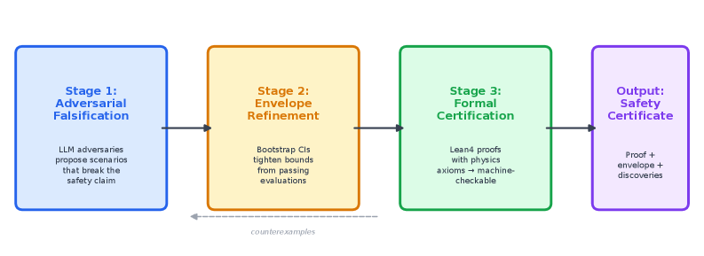

**図1：PCMパイプラインの全体構成。**
Stage 1では6種の敵対者戦略（LLMを含む）が構成特徴ベクトルを提案し、MLIPオラクルがDFT参照値と照合する。Stage 2では反例がbootstrap CIによりエンベロープを精緻化し、Stage 3で明示的な公理を持つLean 4証明が生成される。このパイプラインが、ML予測の「使用証明書」を自動生成するという本研究の中核的な貢献を示す。

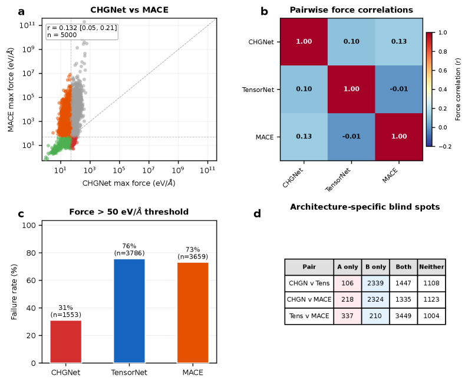

**図2：CHGNet・TensorNet・MACE間の力の相関（r≤0.13）と失敗率。**
3つのMLIPが互いにほぼ独立した失敗パターンを示しており（Venn図で失敗の重複が少ない）、単一MLIPのみへの依存がいかに危険かを可視化している。各アーキテクチャで31〜76%の失敗率があることも確認される。

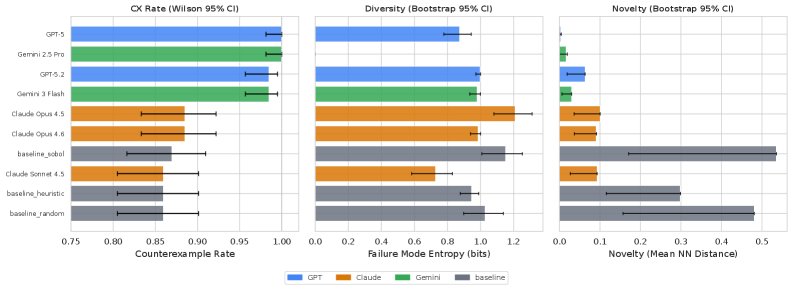

**図3：6種の敵対者戦略の性能比較（反例発見率・多様性・探索カバレッジ）。**
LLM敵対者が高原子番号・多元素領域に集中するパターンが示されており、LLMが材料化学的な知識を潜在的に保持していることを示唆する。ランダム探索よりLLM誘導の方が失敗領域を効率よく発見できることが定量的に示される。

---

---

## 重点論文 2

### 1. 論文情報

**タイトル：** [From Phase Prediction to Phase Design: A ReAct Agent Framework for High-Entropy Alloy Discovery](https://arxiv.org/abs/2603.11068)
**著者：** Iman Peivaste, Salim Belouettar
**arXiv ID：** 2603.11068
**カテゴリ：** cond-mat.mtrl-sci, cs.AI
**公開日：** 2026-03-10
**論文タイプ：** 手法提案・実証研究
**ライセンス：** CC BY 4.0

---

### 2. どんな研究か

大規模言語モデルのReAct（Reasoning + Acting）フレームワークを用いて、高エントロピー合金（HEA）の相設計を逆問題として解くエージェント型システムを提案した研究である。4,753件の実験データで学習したXGBoostサロゲートモデルをオラクルとして、LLMエージェントが組成を逐次的に提案・評価・改善するループを構築した。FCC/BCC/BCC+FCCの全相でベイズ最適化・ランダム探索を大幅に上回り、実験的位相多様体への近接度が2.4〜22.8倍改善されることを実証した。

---

### 3. 位置づけと意義

HEAの相設計は、元素数5以上・組成比の連続性・相互依存的な物理記述子という高次元最適化問題であり、従来の勾配フリー最適化手法でも探索効率が低かった。本研究の貢献は、LLMが暗黙的に保持する合金化学の知識（元素の相安定性への寄与・VEC則・混合エンタルピーの傾向等）を推論ループ中に活用し、それをサロゲートモデルの評価フィードバックと統合するアーキテクチャにある。「知識抽出ツール」としてのLLM活用から「意思決定エージェント」への発展を具体的に示した点が重要で、アクティブラーニングやベイズ最適化の代替・補完として位置づけられる。

---

### 4. 研究の概要

**背景・目的：** HEAは多元素混合によって高強度・高耐食性・高温特性を実現するが、組成空間が広大であり効率的な相設計手法が求められている。本研究は、自然言語推論が可能なLLMをオプティマイザとして活用し、逆設計の効率を高めることを目指した。

**解こうとしている課題：** 4相（FCC, BCC, BCC+FCC, BCC+IM）の中から目標相を持つHEA組成を効率よく発見する組成逆設計問題。

**情報学的アプローチ：** ReActフレームワーク（推論と行動を交互に実行するLLMエージェント）とXGBoostサロゲートモデルを統合。エージェントは3種のツール（組成バリデーション、相予測、BO提案）を状況に応じて呼び出す。

**対象材料系：** 5〜6元素系高エントロピー合金（Fe-Ni-Cr-Co-Al-Mnを含む多元素系）

**主な手法：** ReAct LLMエージェント（GPTベース）、XGBoostサロゲート（13記述子）、等温回帰キャリブレーション、主成分分析

**使用データ：** 4,753件の実験的HEA記録（Fe, Ni, Cr, Co, Al, Mn, Tiを含む多元素系）、テストセット476件

**主な結果：**
- サロゲートの4相分類精度94.66%（マクロF1=0.896）
- 目標相（FCC）でエージェントがP>0.97を即座に達成（ベースライン比有意差p<0.001）
- 再発見率：FCC 38%, BCC 18%, BCC+FCC 38%（BO/ランダム検索は≈0%）
- 提案組成が実験的位相多様体に2.4〜22.8倍近い
- LLM元素言及頻度と統計的重要度の相関：ρ=0.736（BCC相）

**著者の主張：** LLMエージェントはドメイン知識を暗黙的に活用し、純粋なブラックボックス最適化を超える探索効率を達成する。BO/ランダム探索では発見できない実験的相空間の未開拓領域へ誘導される。

---

### 5. 対象分野として重要なポイント

**対象物性：** HEAの結晶相（FCC/BCC/BCC+FCC/BCC+IM）、合金組成→相安定性の予測と逆問題

**手法・記述子の意味：** 13種の混合則記述子（原子半径差・混合エンタルピー・VEC・Ω等）はHEA設計の実績ある物理的記述子群。XGBoostとの組合せは解釈性が高い。LLMのシステムプロンプトに元素統計・VEC閾値・混合エンタルピーガイドラインを埋め込んでいる点が、単なるLLM生成との差異を生む。

**データ設計の妥当性：** 実験データ4,753件は、計算データベースに比べて少ないが実験的相観測に直接対応する点で品質が高い。クラス不均衡（FCCが多い）への対処としてキャリブレーションを実施しており適切。

**既存研究との差分：** BO for HEA探索（Zhang et al. 2023等）は数値的勾配フリー最適化だが、LLMエージェントは「なぜその組成を提案したか」の推論トレースが残る点で解釈可能性が異なる。

**新規性：** ReActエージェントをHEA相設計に適用した先駆的事例。LLMの暗黙知が定量的に有効であることを統計的に示した点が重要。

**解釈性：** エージェントの元素言及パターンと統計的重要度の相関（ρ=0.736）は、LLMが合金化学の正しい傾向を内部的に把握していることを示唆し、ブラックボックス批判に対する部分的な回答となっている。

**一般化可能性：** 4相分類問題として設定されているが、他の合金系（Al合金、高温合金等）やサロゲートモデルへの汎用性は高い。

**効果：** 探索加速（発見効率2.4〜22.8倍改善）・逆設計・実験支援

---

### 6. 限界と注意点

- サロゲートモデルが実験データ（4,753件）のみに基づいており、計算データとの統合が行われていないため、実験的バイアスを引き継ぐ可能性がある。
- LLMの推論は再現性が低く（stochastic）、同一タスクで異なる結果が生じる。10回実行の平均値で評価しているが、ランの分散については詳細な分析が必要。
- 5〜6元素HEAに最適化された記述子のセットであり、7元素以上や高融点合金系への直接転移は評価されていない。
- 「実験的位相多様体への近接度」という評価指標は実験性能と完全に一致するわけではなく、最終的な合成・試験が必要。
- BCC+IM相（金属間化合物含有）は最も難しく、エージェントの性能もFCC等より低い点は実用上の注意事項。

---

### 7. 関連研究との比較と研究動向における立ち位置

**先行研究との差分：** Merchant et al. (2023) GNoMEやHREF-based screening等のMLIPを用いた大規模材料発見と異なり、本研究は少量の実験データからLLMエージェントが逆設計する枠組みを示した。LLM for materials（Jablonka et al. 2024等）が知識抽出・要約に留まる中、本研究は最適化の主体としてLLMを用いた。

**競合研究：** 直近でHEAへのBO応用を示した複数論文があるが、ReActエージェントを核に据えた研究は希少。

**未解決問題への寄与：** 少量実験データからの効率的な逆設計という問題に対して、LLMエージェントが有効であることを示した点は実験室規模のMI研究への波及が期待される。

**新規性の性質：** 手法自体（ReAct）はNLP分野の既知手法だが、HEA相設計への適用と定量的評価はincremental to breakthrough（応用新規性は高い）。

**今後の展開：** リアルタイム実験フィードバックとの統合（自律実験ループ）、不確かさを意識したエージェント設計、マルチモーダル（XRDや組織画像）への拡張が期待される。

---

### 8. 図

> **ライセンス：CC BY 4.0** — 原図の掲載が許可されています。

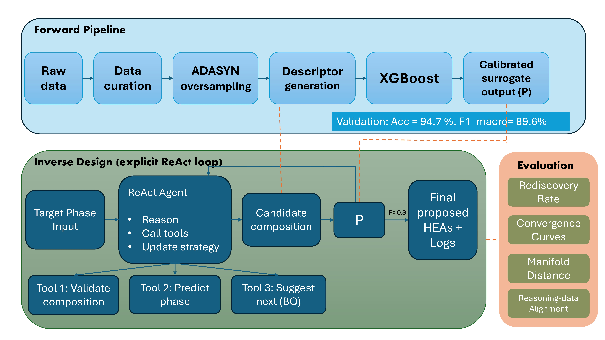

**図1：順問題（前向き予測）と逆問題（ReActエージェントによる組成設計）の全体パイプライン。**
上部は13種の混合則記述子→XGBoostサロゲートの順問題予測フロー、下部はLLMエージェントが組成バリデーション・相予測・BO提案の3ツールを呼び出す逆設計ループを示す。エージェントの推論（Thought）と行動（Action）が交互に進む構造が本研究の中核。

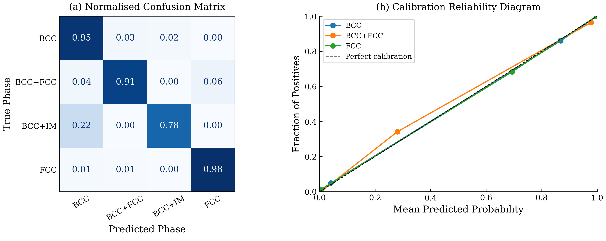

**図2：サロゲートモデルの評価結果。**
左：476件のテストセットにおける正規化混合行列（全体精度94.66%）。右：BCC/FCC/BCC+FCC相に対する等温回帰によるキャリブレーション信頼性図。キャリブレーションにより確率出力が信頼できるものとなり、エージェントの判断の質を高めている。

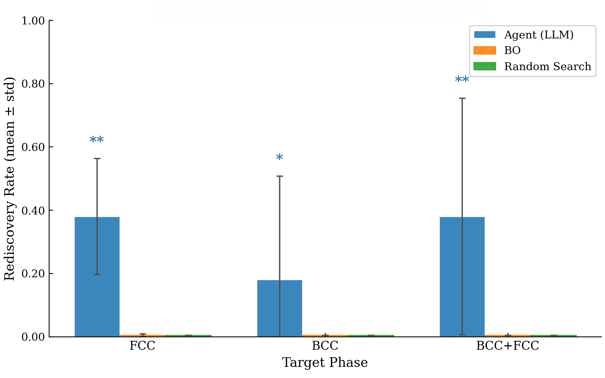

**図3：ReActエージェント・ベイズ最適化・ランダム探索の再発見率比較（10試行の平均±標準偏差）。**
いずれの相においてもBO・ランダム検索の再発見率が≈0%であるのに対し、LLMエージェントはFCC・BCC+FCCで38%の再発見率を達成。LLMエージェントが実験的化学知識をガイドとして機能させることの有効性を端的に示す。

---

---

## 重点論文 3

### 1. 論文情報

**タイトル：** [Matlantis-PFP v8: Universal Machine Learning Interatomic Potential with Better Experimental Agreements via r2SCAN Functional](https://arxiv.org/abs/2603.11063)
**著者：** Chikashi Shinagawa, So Takamoto, Daiki Shintani, Yong-Bin Zhuang, Yuta Tsuboi, Katsuhiko Nishimra, Kohei Shinohara, Shigeru Iwase, Yuta Tanaka, Ju Li
**arXiv ID：** 2603.11063
**カテゴリ：** physics.chem-ph, cond-mat.mtrl-sci
**公開日：** 2026-03-09
**論文タイプ：** 方法論・モデル開発
**ライセンス：** arXiv.org perpetual non-exclusive license（CC非対応）

---

### 2. どんな研究か

Matlantisサービスで提供される汎用MLIP「PFP」の第8世代版（PFP v8）を報告した研究である。従来のPBE汎関数に代わりr2SCAN meta-GGA汎関数で訓練されたデータセット（3百万構造・70元素）を構築し、TeaNetアーキテクチャに学習させることで、追加調整なしに実験値との一致が大幅に改善されることを実証した。特にMD計算による融点予測誤差を約130 K（PBEベースモデルの279 Kから半減）、結晶生成エネルギーのMAEを0.080 eV/atomで実験値に一致させた。

---

### 3. 位置づけと意義

汎用MLIPの性能は長らく「DFT（主にPBE）データに対する再現性」で評価されてきた。PBEは構造エネルギーの相対値には比較的正確だが、絶対的な熱力学量（融点・蒸発エネルギー・形成エネルギー等）に対する系統的誤差が知られており、これがMD計算や相図構築への適用を困難にしていた。本研究はr2SCAN汎関数（LDA/GGAの自己相関エラーを大幅に低減するmeta-GGA）で一貫して訓練することにより、この系統的誤差を起点から断ち切ろうとする方向性を示した。汎用MLIPが「DFTの代理」から「実験の代理」へと質的転換しうることを初めて大規模に実証した点で、分野における節点的な論文となりうる。

---

### 4. 研究の概要

**背景・目的：** 既存のuMLIP（CHGNet, MACE, ORB等）はほぼ全てPBEベースのデータで訓練されており、実験値との系統的な乖離が避けられない。「実験との合致を明示的な設計目標とする」という方針を掲げ、r2SCAN汎関数を基盤とした新世代PFPを構築した。

**課題：** PBEベースMLIPの融点予測誤差（～279 K）、表面エネルギーの過小評価、分子系（弱い相互作用）の取り扱い不足。

**情報学的アプローチ：** 多数の計算条件（PBE, r2SCAN, ωB97X-D）のデータを「Calculation Mode」機構で識別しながら統合学習。分散相互作用はDFT-D3補正で別途対処。TeaNetアーキテクチャ（rank-2テンソルを取り込む高次グラフニューラルネットワーク）を採用。

**対象材料系：** 元素・合金・酸化物・硫化物・分子・表面を含む70元素系の広範な化学空間。

**主な手法：** TeaNetアーキテクチャ、rank-2テンソルGNN、DFT-D3補正、multi-dataset訓練

**使用データ：** 3百万構造（分子・バルク・スラブ・非晶質等）、r2SCAN汎関数で計算。GMTKN55（分子ベンチマーク）、実験融点データベース、実験表面エネルギーデータ等で検証。

**主な結果：**
- 結晶形成エネルギーMAE = 0.080 eV/atom（実験値と一致、PBEより改善）
- GMTKN55スコア: PFP-R2SCAN+D3 = 9.28 kcal/mol（PBE+D3の10.62 kcal/molより改善）
- 表面エネルギーMAE = 0.21 J/m²（実験不確かさ～0.2 J/m²と同等）
- 融点平均誤差 ≈ 130 K（PBEベースモデルの約半分）

**著者の主張：** 「より良い実験との一致を汎用MLIPの明示的な設計目標とすべき」という立場が裏付けられた。PFP v8はMatlantisサービスで利用可能。

---

### 5. 対象分野として重要なポイント

**対象物性：** 形成エネルギー・融点・表面エネルギー・分子間相互作用（GMTKN55）という多様な熱力学量

**手法・アーキテクチャの意味：** TeaNetのrank-2テンソルは、スカラー・ベクトル以上の等変表現を扱え、より複雑な相互作用を表現できる。r2SCAN汎関数の採用はMeta-GGAの精度向上を活かしたデータ側のアップグレードであり、アーキテクチャ改良との相乗効果が期待される。

**データ設計：** 3百万構造という規模はMPtraj（1.5M）等と同等以上。多計算モードでの混合学習は実用上有益だが、データ間のバランス設計が重要であり、その詳細の公開を望む。

**評価指標：** 実験値との直接比較（融点・表面エネルギー）を採用しており、「DFT精度」という代理指標に留まらない評価が誠実。

**既存研究との差分：** MACE-MP-0, CHGNet, ORB等はPBEベースが主流。r2SCAN汎関数による一貫した訓練はMACE-r2SCAN（Kovács et al.）等でも試みられているが、本研究の規模と汎用性は際立つ。

**一般化可能性：** 70元素をカバーする広い化学空間と実験検証の多様性から、汎用ポテンシャルとしての適用範囲は広い。

**効果：** 計算代替（DFT-MDの実験近似）、相図構築支援、材料探索加速

---

### 6. 限界と注意点

- arXivの非独占ライセンスのため図の掲載ができない点は本報告の制約ではあるが、論文自体の内容的限界として以下を挙げる。
- r2SCAN汎関数はPBEより計算コストが高く、3百万構造の計算コストの詳細（CPUコア時間等）が示されていない。
- 融点予測の評価材料の多様性（金属のみか？酸化物等も含むか？）の詳細が不明。130 Kの誤差は統計量として何種類の材料に基づくかの詳細が必要。
- 「Matlantisサービス」として提供される商用ポテンシャルのため、重みファイルの完全公開はない。再現性・独立検証が制限される。
- ωB97X-D分子データとの統合学習の詳細、計算モード識別の技術的手法については論文の情報が限定的。
- 新規材料系（複酸化物・2D材料・有機金属など）への外挿性能は、ベンチマーク外で検証が必要。

---

### 7. 関連研究との比較と研究動向における立ち位置

**先行研究との差分：** MACE-MP-0（Batatia et al. 2024）・GNoME（Merchant et al. 2023）・CHGNet（Deng et al. 2023）・ORB（Bochkarev et al. 2024）はいずれもPBEベース。MACE-OFF（Taylor et al.）が有機分子にωB97X-Dを採用した実績があるが、無機固体・表面を含む多分野への一貫したr2SCAN適用は本研究の規模で初めて。

**競合研究：** Kovács et al. MACE-r2SCANが最も近い競合だが、Matlantis-PFP v8は商用サービスとしての実用性（API経由アクセス）の点で差別化。

**未解決問題：** 「汎用MLIPのDFT依存性」という問題に対し、訓練汎関数のアップグレードというアプローチで前進。ただし、r2SCAN自体が実験値に完全一致するわけではなく、さらなる精度改善の余地がある。

**新規性の性質：** r2SCAN採用自体は既知だが、3百万構造・70元素・多計算モード統合というスケールとMatlantisサービスへの統合は実用的なbreakthrough。

**今後の展開：** r2SCANベースの汎用MLIPはMACE等でも追随が予想され、「r2SCAN汎用MLIPが標準」という状況への移行加速が期待される。温度・圧力依存性・非平衡プロセスへの適用が次の課題。

---

### 8. 図

> **ライセンス：arXiv.org perpetual non-exclusive license** — CC対応ライセンスではないため、原図の掲載を省略します。論文本文（https://arxiv.org/abs/2603.11063）の Figures 1〜4 にて主要な結果を確認できます。

---

---

# その他の重要論文

---

## 論文 4

### 1. 論文情報

**タイトル：** [PolyCrysDiff: Controllable Generation of Three-Dimensional Computable Polycrystalline Material Structures](https://arxiv.org/abs/2603.11695)
**著者：** Chi Chen, Tianle Jiang, Xiaodong Wei, Yanming Wang
**arXiv ID：** 2603.11695
**カテゴリ：** cs.CV, cond-mat.mtrl-sci
**公開日：** 2026-03-12
**論文タイプ：** 手法提案・実証研究

---

### 2. 研究概要

PolyCrysDiffは、条件付き潜在拡散モデルを用いて三次元多結晶材料の微視構造を制御生成するフレームワークである。64×64×64ボクセルのRGBボリューム（RGB値が結晶方位を符号化）を入力とする3D変分オートエンコーダで潜在空間に圧縮し、その潜在空間でクロスアテンション付きU-Netベースの拡散モデルを動作させる。Voronoi分割で合成した2,000構造（50〜300グレイン/構造）を訓練データとして、平均グレインサイズ・球状度の2条件について条件付き生成が可能となった。非条件生成でのグレインサイズ分布のEarth Mover's Distance = 0.0155、条件付き生成でのR² = 0.995という高い再現性を達成し、結晶塑性有限要素法（CPFEM）による機械特性検証まで含めたエンドツーエンドのパイプラインを示した。

本研究がMIにとって重要な理由は、微視構造—性質関係のデータ駆動的探索を可能にする生成基盤を提供したことにある。グレイン数が250→125に変化したときの引張強度がHall-Petch則と整合することをCPFEM計算で確認しており、生成構造の物理的妥当性が一定程度担保されている。ただし訓練データが合成構造のみ（実験ミクロ組織が含まれない）であることや、グレイン数50〜300の範囲に最適化されている点は、実製品の微視構造設計への展開における注意事項である。

---

### 3. 図

> **ライセンス：arXiv.org perpetual non-exclusive license** — CC対応ライセンスではないため、原図の掲載を省略します。論文本文（https://arxiv.org/abs/2603.11695）の Figures 1〜6 にて詳細を参照ください。

---

## 論文 5

### 1. 論文情報

**タイトル：** [Thermodynamic Descriptors from Molecular Dynamics as Machine Learning Features for Extrapolable Property Prediction](https://arxiv.org/abs/2603.12017)
**著者：** Nuria H. Espejo, Pablo Llombart, Andrés González de Castilla, Jorge Ramirez, Jorge R. Espinosa, Adiran Garaizar
**arXiv ID：** 2603.12017
**カテゴリ：** physics.chem-ph
**公開日：** 2026-03-12
**論文タイプ：** 手法提案・実証研究

---

### 2. 研究概要

本研究は、分子の構造記述子（SMILES/フィンガープリント等）の代わりに、分子動力学シミュレーション（20 ns、300〜500 K）から抽出した熱力学量（凝集エネルギー・蒸発熱・密度・溶解度パラメータ・熱容量）を機械学習の特徴量として使用する物理情報的フレームワークを提案した。2つの力場（OpenFF-2.0.0とOPLS4）でCatBoostモデルを訓練し、沸点予測で従来手法に匹敵するMAE = 8.2 Kを達成しながら、訓練データに含まれない無機化合物・塩・イオン液体・Si/B/Te含有分子への外挿性能で優位性を示した。特徴量の重要度では蒸発熱が支配的であることが確認された。

このアプローチの本質的な重要性は、物理的意味のある熱力学量を特徴量にすることで、構造表現の未知領域（OOD）においても予測の信頼性が維持されるという「理解ベースの一般化」を示した点にある。無機材料・塩・イオン液体など従来の構造記述子が機能しない材料系への適用可能性は、材料インフォマティクスにおけるOOD問題への一つの解答を提示している。ただし分子動力学計算の計算コスト（1分子あたり20 ns）は高く、大規模スクリーニングへの展開には並列化や代替的な熱力学計算法との組合せが必要。

---

### 3. 図

> **ライセンス：CC BY-NC-ND 4.0** — 非商用・改変なしでの掲載が許可されています。

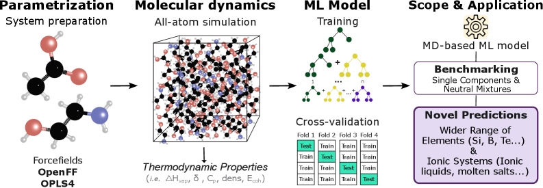

**図1：MDシミュレーションから熱力学記述子を抽出し、CatBoostモデルで沸点予測するワークフロー。**
2つの力場（OpenFF-2.0.0・OPLS4）を用い、300〜500 Kで20 nsシミュレーションを実施。抽出した熱力学量（凝集エネルギー・蒸発熱・密度等）を機械学習特徴量とする設計が、本研究の物理的基盤を示す。

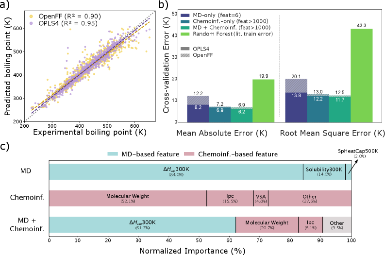

**図3：MD由来記述子のみのモデル（3〜5特徴量）と従来の化学情報学記述子（1000以上）の沸点予測性能比較。**
MD由来モデルはMAE = 8.2 Kで従来法と競合する。特徴量数を2桁以上削減しながら同等性能を達成することが、物理的記述子の情報密度の高さを示す。

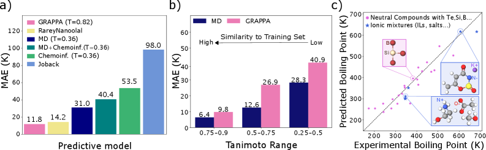

**図4：訓練外の化学系（無機化合物・塩・イオン液体・Si/B/Te含有分子）への外挿性能。**
MD由来モデルは従来の構造記述子ベースモデルが完全に失敗する化学系でも制御された誤差範囲内の予測を維持しており、一般化能力の優位性を示す。

---

## 論文 6

### 1. 論文情報

**タイトル：** [High-Throughput-Screening Workflow for Predicting Volume Changes by Ion Intercalation in Battery Materials](https://arxiv.org/abs/2603.10631)
**著者：** Aljoscha Felix Baumann, Daniel Mutter, Daniel F. Urban, Christian Elsässer
**arXiv ID：** 2603.10631
**カテゴリ：** cond-mat.mtrl-sci
**公開日：** 2026-03-11
**論文タイプ：** 手法提案・スクリーニング研究

---

### 2. 研究概要

本研究は、電池電極材料におけるイオン挿脱時の体積変化を高スループットで予測するMLワークフローを開発した。Materials Projectの遷移金属酸化物・フッ化物の5,602構造ペアのDFTデータを用いて、局所構造秩序パラメータ（LSOP、51記述子/イオン）から結合長を予測するモデルℳ_Bondをgradient boostingで訓練。その結合長予測から格子定数を非線形に最適化して体積変化を推定するサロゲートモデルℳ_Volと組み合わせた。結合長MAE = 0.02 Å（Pearson r = 0.98）、体積変化予測の中央絶対誤差 = 2.04%という高精度で、117万4,384構造をスクリーニングし、DFT検証で287個の体積変化1%未満の候補を特定した（ランダムサンプリング比8倍の効率）。

LVC（Low Volume Change）電極材料は充放電サイクル時の機械的応力を最小化し、寿命延長に直結する設計指針として重要視されている。本研究の117万構造スクリーニングは、従来のDFT全数計算が現実的でない規模での探索を可能にした点で実用的価値が高い。ただし体積変化の小さい候補が必ずしも高い電気化学性能を持つとは限らず、イオン伝導性・電子伝導性・相変態安定性等の追加評価が不可欠である点は研究者自身も認識している。コードはGitHubで公開されており、他の元素系や材料系への展開が期待される。

---

### 3. 図

> **ライセンス：arXiv.org perpetual non-exclusive license** — CC対応ライセンスではないため、原図の掲載を省略します。論文本文（https://arxiv.org/abs/2603.10631）の Figures 1〜6 にて詳細を参照ください。

---

## 論文 7

### 1. 論文情報

**タイトル：** [Atomic-Scale Mechanisms of SiO₂ Plasma-Enhanced Chemical Vapor Deposition Revealed by Molecular Dynamics with a Machine-Learning Interatomic Potential](https://arxiv.org/abs/2603.11416)
**著者：** Jaehoon Kim, Minseok Moon, Hyunsung Cho, Hyeon-Deuk Kim, Rokyeon Kim, Gyehyun Park, Seungwu Han, Youngho Kang
**arXiv ID：** 2603.11416
**カテゴリ：** cond-mat.mtrl-sci
**公開日：** 2026-03-12
**論文タイプ：** 計算科学・応用研究

---

### 2. 研究概要

本研究は、プラズマCVD（PECVD）によるSiO₂薄膜形成の原子スケールメカニズムを、機械学習原子間ポテンシャル（MLIP）を用いたMDシミュレーションで明らかにした。SevenNet-0を基盤とし、3段階の反復ファインチューニング（エネルギーMAE = 1.5 meV/atom、力MAE = 0.05 eV/Å）を経て、多様な酸化剤:シランモル比（r = 0.25〜6）条件でのデポジションシミュレーションを実施。主要な反応経路として「Si-H表面基の酸化→Si-OH形成→Si-OH縮合によるSi-O-Siネットワーク形成（副産物H₂O）」が同定された。酸化剤比の増加とともにSi/O比が化学量論比に近づく一方、水素含有量10 at.%以上が残存し完全緻密化を阻害することも示された。

PECVDプロセスの原子スケール機構は実験的直接観察が困難であり、本研究はMLIPを活用したMD計算がプロセス条件—構造—組成の関係を定量的に明らかにする新たな手段であることを示した。高エネルギープラズマ種（1.0 eV）が表面エッチングを引き起こすという知見は、高RFパワー条件での成長速度低下の機構論的説明を提供する。一方で、実験的なPECVD条件（プラズマエネルギー分布・ラジカル種の多様性）の完全な模倣には至っておらず、定性的な理解の枠組みとしての位置づけが適切。SevenNetというオープンソースMLIPの応用事例としても参照価値がある。

---

### 3. 図

> **ライセンス：arXiv.org perpetual non-exclusive license** — CC対応ライセンスではないため、原図の掲載を省略します。論文本文（https://arxiv.org/abs/2603.11416）の Figures 1〜8 にて詳細を参照ください。

---

## 論文 8

### 1. 論文情報

**タイトル：** [A Decade of Generative Adversarial Networks for Porous Material Reconstruction](https://arxiv.org/abs/2603.11836)
**著者：** Ali Sadeghkhani, Brandon Bennett, Masoud Babaei, Arash Rabbani
**arXiv ID：** 2603.11836
**カテゴリ：** cs.CV, cond-mat.mtrl-sci
**公開日：** 2026-03-12
**論文タイプ：** 総説

---

### 2. 研究概要

2017〜2026年に発表された96編の査読付き論文を対象に、多孔質材料（岩石・電極・生体材料等）の3Dデジタル構造再構成にGANがどのように発展してきたかを体系的に整理した総説である。GAN手法をVanilla・Multi-Scale・Conditional・Attention-Enhanced・Style-based・Hybridの6分類に整理し、それぞれの技術的特性と適用事例を比較した。この10年で再構成ボリュームが64³から2,200³ボクセルへと約35倍拡大し、気孔率の一致度が元サンプルの1%以内、透過率予測の誤差が最大79%低減するまでに性能が向上している。

多孔質材料のデジタル再構成は、地下資源貯留層・固体電池正極・組織工学スキャフォールドなど幅広い材料系で、限られた実測データから無限の仮想試料を生成することを可能にし、材料の物性—構造関係の統計的探索に直接寄与する。本総説はGANアーキテクチャの分類体系を提供し、各材料系への最適な手法選択の指針となりうる。一方で、2D-3D変換における構造連続性の維持・計算効率・実験ミクロ組織の条件付け精度といった未解決課題も整理されており、次世代の拡散モデル・GAN統合アーキテクチャへの橋渡しとなる参照文献として機能する。

---

### 3. 図

> **ライセンス：CC BY 4.0** — 原図の掲載が許可されています。

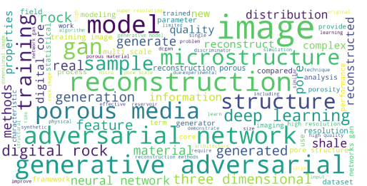

**図1：96編の論文タイトルおよびアブストラクトを集計したワードクラウド。**
「reconstruction」「microstructure」「generative adversarial」が中心的語彙として示され、この分野が構造再構成・微視構造・生成モデルという3軸で展開してきた研究動向を可視化している。

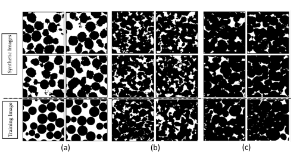

**図6：ビードパック・Berea砂岩・Ketton石灰岩のオリジナルとGAN生成サンプルの視覚的・統計的比較。**
気孔形状・連結性・空隙率分布が元試料と高い一致度を示しており、GANによる多孔質構造の高忠実度再構成が実用水準に達していることを示す。

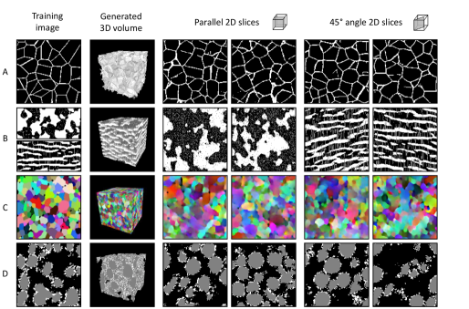

**図8：SliceGANによる多様な材料系（多結晶・電池セパレータ・正極）での微視構造生成結果。**
単一手法が複数の材料クラスに適用可能であることを示し、GANの汎用生成能力の広がりを例示している。

---

## 論文 9

### 1. 論文情報

**タイトル：** [Melting of thin silicon films: a molecular dynamics study with two machine learning potentials](https://arxiv.org/abs/2603.11722)
**著者：** Yu. D. Fomin, E. N. Tsiok, V. N. Ryzhov
**arXiv ID：** 2603.11722
**カテゴリ：** cond-mat.mtrl-sci, cond-mat.soft
**公開日：** 2026-03-12
**論文タイプ：** 計算科学
**ライセンス：** CC BY 4.0

---

### 2. 研究概要

SNAPおよびGAPという2種のMLIPを用いた分子動力学シミュレーションにより、単層シリセンから36層までのSi薄膜の熱的安定性と融解挙動を系統的に解析した研究である。SNAPポテンシャルではシリセンが500 K程度で構造崩壊を示し、膜厚増加とともに崩壊温度が上昇し28層付近（バルク融点≈1,380 K）で飽和する。8層以下では2相共存型の崩壊、それより厚い膜では表面融解→全体崩壊という段階的メカニズムが確認された。一方GAPポテンシャルは気相の記述が不適切であり、シリセンをクラスター群に断片化させてしまう点を実用上の重要な限界として明記した。

この研究のMLI的意義は、同一物理系に対して2種のMLIPが定性的に異なる挙動を示すことを明示した点にある。GAPがバルクSiに高精度でありながら薄膜・気相状態の記述で失敗するという知見は、MLIPの「適用範囲」と「設計データセット」の重要性を再確認させる。材料インフォマティクスにおいてMLIPを選定する際に、相変態・薄膜・非平衡状態への適用には明示的な検証が必要であるというメッセージを発している。薄膜Si系の設計・加工プロセスシミュレーションへの応用に向けた基礎的知見としても価値がある。

---

### 3. 図

> **ライセンス：CC BY 4.0** — 原図の掲載が許可されています。

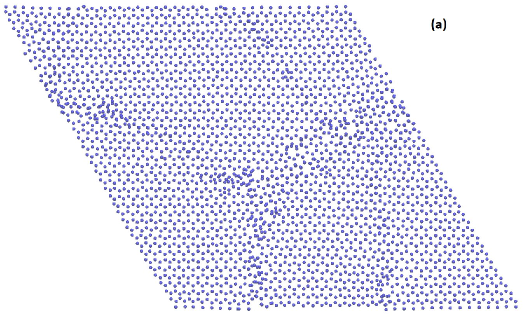

**図1：シミュレーション初期構造（1〜36層のSi薄膜）の代表的スナップショット。**
層数に応じた構造の違いが視覚化されており、薄膜から準バルクへの遷移を示す。各原子の色は配位環境を反映し、薄膜特有の表面支配的な構造的特徴が確認できる。

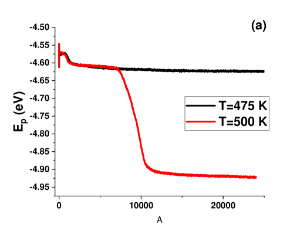

**図3：Si薄膜の崩壊（融解）温度の膜厚（層数）依存性。**
SNAPポテンシャルによる計算結果で、膜厚増加とともに崩壊温度が上昇し28層付近でバルク融点に収束する様子が定量的に示されている。8層以下と以上で崩壊メカニズムが変化することを支持するデータ。

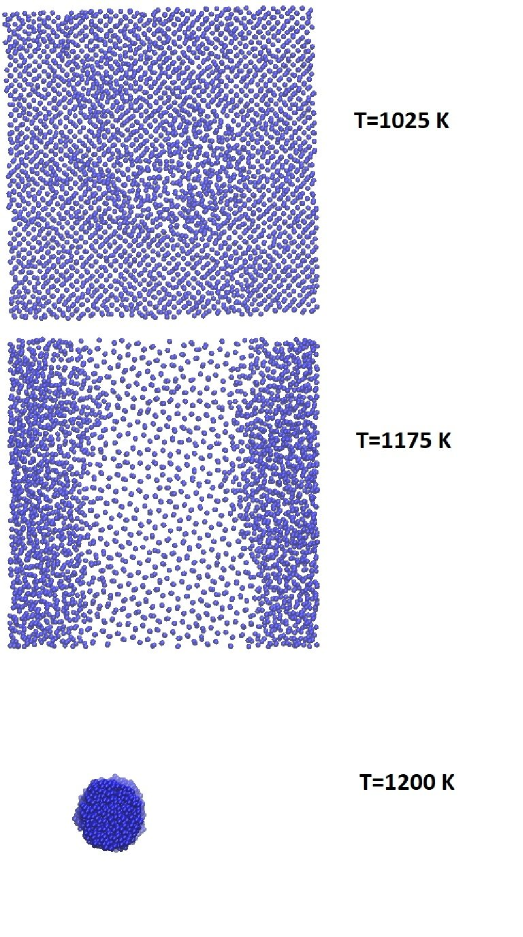

**図6：GAPポテンシャルによるシリセンシミュレーションの結果（クラスター断片化）。**
GAPがバルクSiに高精度でありながら薄膜—気相状態で物理的に不合理な挙動を示すことを可視化。このMLIPの適用範囲の限界を示す重要な反例であり、MLIPの選定・使用に際して適用領域の明確化が不可欠であることを示す。

---

## 論文 10

### 1. 論文情報

**タイトル：** [MaterialFigBENCH: benchmark dataset with figures for evaluating college-level materials science problem-solving abilities of multimodal large language models](https://arxiv.org/abs/2603.11414)
**著者：** Michiko Yoshitake, Yuta Suzuki, Ryo Igarashi, Yoshitaka Ushiku, Keisuke Nagato
**arXiv ID：** 2603.11414
**カテゴリ：** cs.CL, cond-mat.mtrl-sci
**公開日：** 2026-03-12
**論文タイプ：** ベンチマーク・評価研究

---

### 2. 研究概要

材料科学の大学院レベルの問題137問（位相図・応力—ひずみ曲線・アレニウスプロット・回折パターン・微視構造模式図等の図が必須の問題に絞って収集）からなるマルチモーダルLLM評価ベンチマーク「MaterialFigBENCH」を構築・公開した研究である。GPT-4o・Gemini-Pro等の主要マルチモーダルモデルをテストしたところ、正確な視覚的読み取りを要する問題での正答率が、記憶知識のみで解ける問題に比べて大幅に低く、「暗記知識に依存して図を実際には読まずに答えている」という体系的な誤りパターンが確認された。

現在のLLMが材料科学の問題解決において視覚的定量推論（目盛り読み・曲線の傾き計算・相境界の正確な読み取り等）が著しく不足している点は、材料インフォマティクスへのLLM応用における本質的な制約を示す重要な評価結果である。図を介した材料データ理解—位相図判読・スペクトル解析・微視組織評価など—はMLにとって解決困難なマルチモーダル問題として浮き彫りにされた。日本語での問題収集・評価への言語的側面も含まれており、日本語材料科学コミュニティにとって特に参照価値が高い。ベンチマーク自体の公開により、今後のモデル改良・評価の共通基盤が整備されたことが長期的に重要。

---

### 3. 図

> **ライセンス：CC BY 4.0** — 原図の掲載が許可されています。ただし、HTMLバージョン（https://arxiv.org/html/2603.11414）の取得に失敗したため、原図の掲載ができませんでした。論文本文のPDF（https://arxiv.org/abs/2603.11414）にて詳細をご確認ください。

---

---

# 全体のまとめ

## 材料インフォマティクス分野の動向

2026年3月中旬の本日の選定論文群は、材料インフォマティクスの成熟を示す複数の傾向を反映している。第一に、MLIPの「信頼性保証」が独立した研究課題として確立されつつある。Proof-Carrying Materialsが示したように、現行の代表的MLIPは単一使用でDFT安定材料の93%を見落とすという深刻な性能問題があり、これに対して形式的認証・敵対的探索・アンサンブル戦略の組合せが実用的な解として提示されている。第二に、訓練汎関数のアップグレード（PBE→r2SCAN）という「データ側の刷新」が汎用MLIPの精度向上に有効であることがMatlantis-PFP v8で大規模に実証され、r2SCANベースのuMLIPが新標準となる方向性が示された。第三に、LLMエージェントが単なる知識抽出ツールを超えて、サロゲートモデルとの連携による逆設計の意思決定主体として機能することが、HEA系での定量的実証によって示された。

## 明らかになった未解決領域

今回の論文群からは、いくつかの重要な未解決問題が浮かび上がる。MLIPの「構成空間に依存した信頼性の不均一性」——特に多元素・高原子番号・f電子系——は、訓練データの偏りに起因すると考えられるが、系統的な修正戦略はまだ確立されていない。また、PolyCrysDiffやGAN総説が示すように、微視構造の生成モデルは急速に進歩しているが、実験的に観測されたミクロ組織（SEM/EBSD画像）からの条件付き生成や、多変量プロセス条件への拡張は未解決である。さらに、MaterialFigBENCHが示したように、図・スペクトル・微視組織の定量的な視覚的推論に現行LLMは著しく弱く、材料科学における文脈依存的な視覚情報処理が次世代MLの課題として明確化された。

## 今後の展望

近い将来において最も影響が大きいと思われる方向性は、MLIP信頼性保証フレームワークと自律実験ループの統合である。PCMのような認証システムがアクティブラーニングパイプラインに組み込まれれば、探索効率と信頼性を両立した自律材料発見が現実的になる。また、r2SCANベースの汎用MLIPが普及することで、フォース場に起因するシステマティックエラーが低減し、相図計算・非平衡MDの定量的信頼性が向上する。LLMエージェントと実験ロボットの統合による「言語誘導型自律実験」も現実性を帯びつつあり、ReActエージェントフレームワークの本研究はその先行事例として引用され続けるだろう。多孔質材料・多結晶材料の生成モデルと物性シミュレーターの統合による「仮想試料設計」は、電池・構造材料の設計サイクル短縮に向けた強力なツールとなることが期待される。

---

*本レポートは2026-03-14に自動生成されました。*
