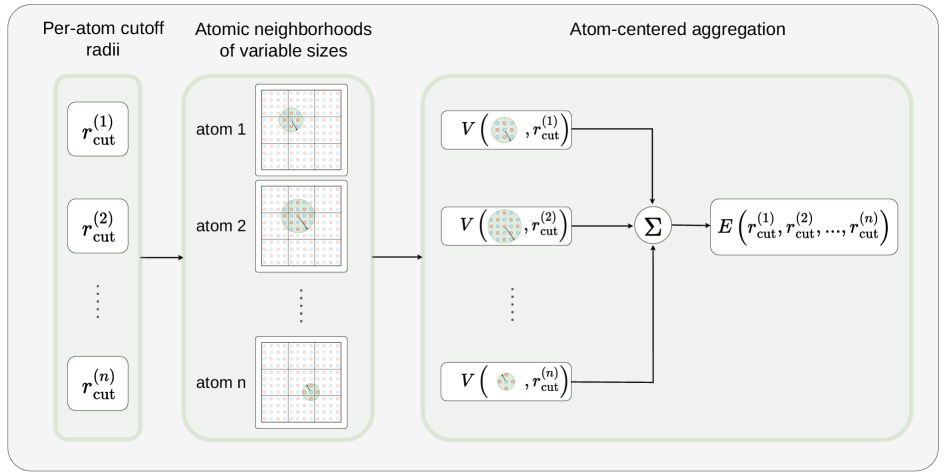
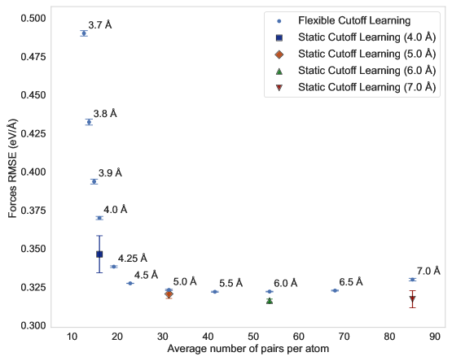
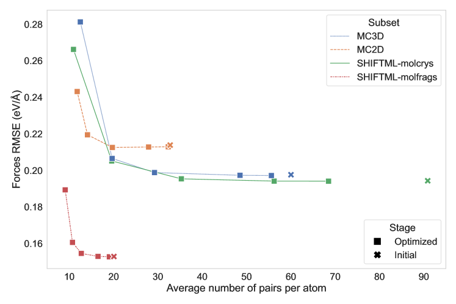
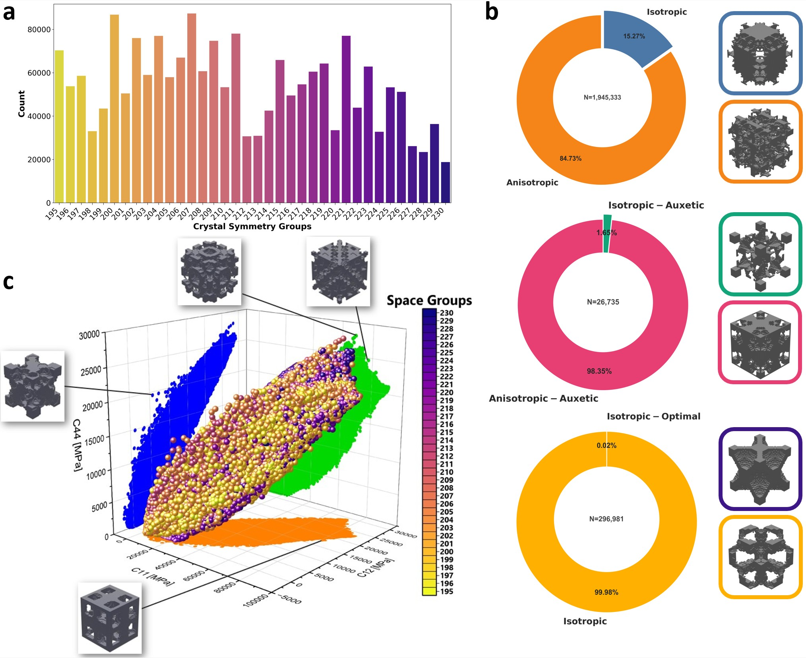
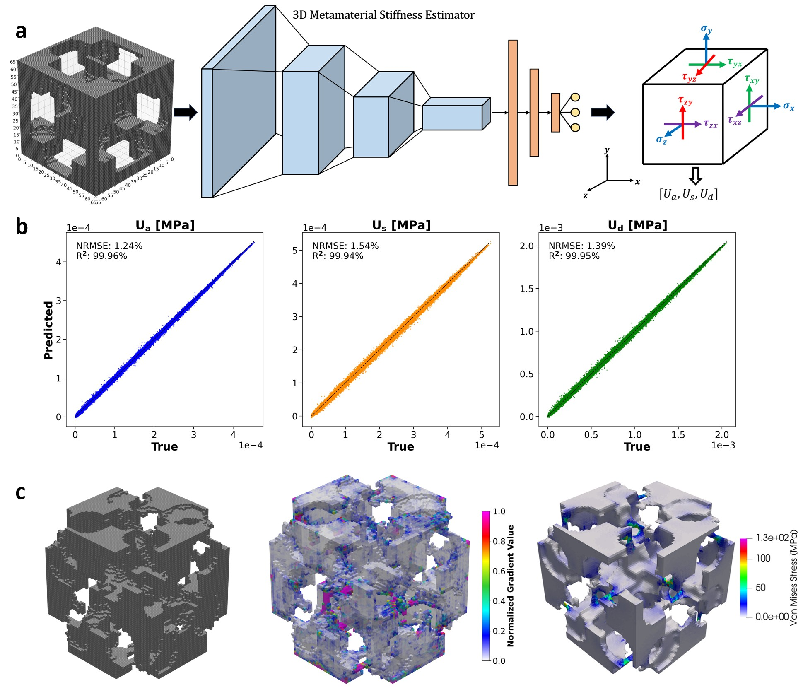
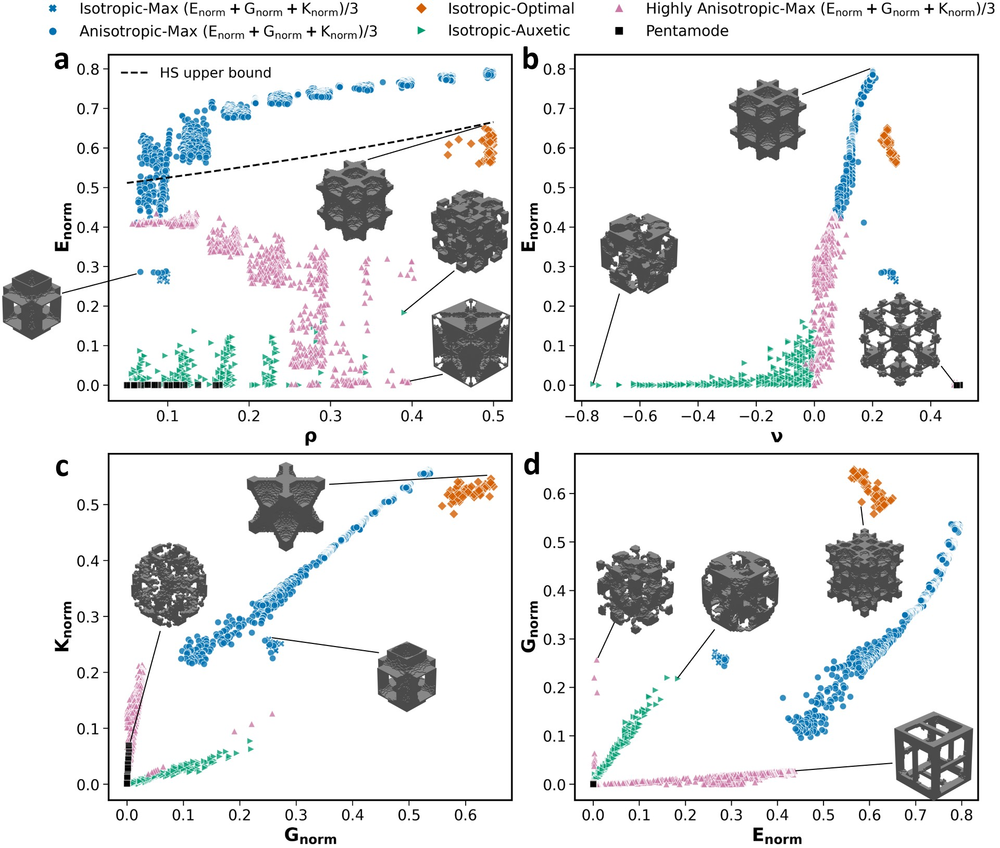
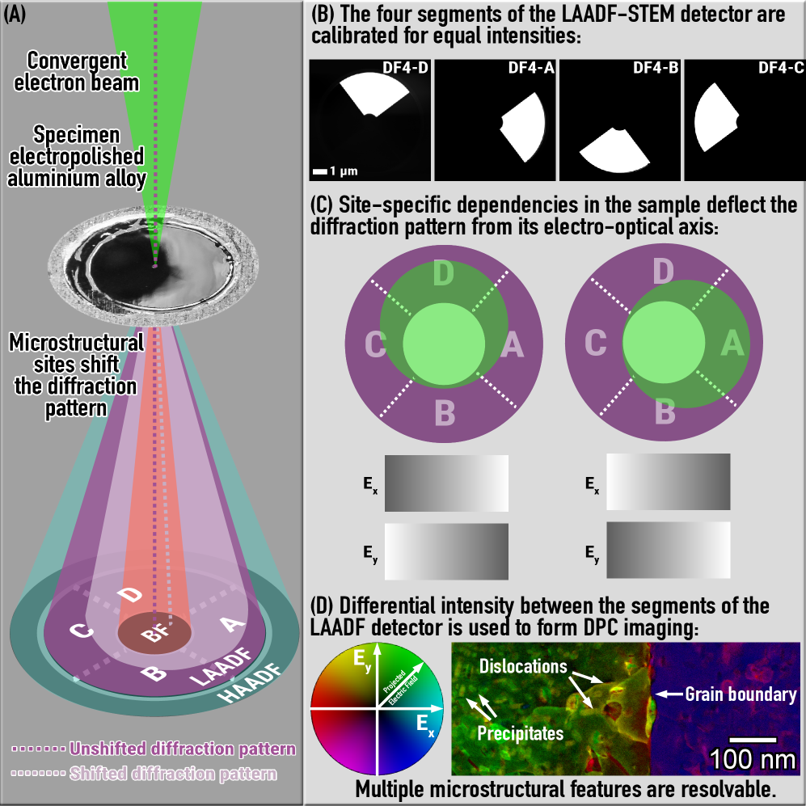
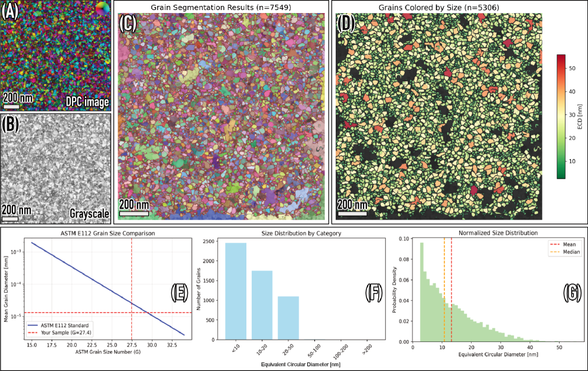

# arXiv 日次ダイジェスト

**作成日：** 2026-03-15
**対象期間：** 2026-03-10 〜 2026-03-15（直近72〜120時間）

---

## 今日の選定方針

本日のダイジェストでは、過去72時間（2026-03-12〜15）の新着論文を優先しつつ、7日以内（2026-03-10〜11）まで拡張して10本を選定した。選定の中心は、機械学習原子間ポテンシャル（MLIP）の方法論的発展に関わる論文が複数登場した点で、特に普遍的MLIPの訓練バイアスとファインチューニング、ポストトレーニング最適化というMLIPの実用化において直接的かつ重要な知見を提供する2本が核心をなす。また、Born–Oppenheimer近似を超えた完全量子波動関数の神経網実装という電子構造計算の基盤的進展、ガウス過程によるベイズ最適化フレームワークの理論的体系化、超高圧水素化物の構造探索とMLによる超伝導温度予測、メタマテリアルの機械特性データベースとCNNサロゲートモデル、熱トモグラフィーへの微分可能物理フレームワーク、アルミニウム合金の電子顕微鏡画像のニューラルネットワーク分割、SO(3)同変ニューラルネットワーク用テンソル積の数学的基礎、および多孔質媒体中ガス流動の機械学習拡張手法を取り上げた。

---

## 全体所見

今週の傾向として、普遍的MLIPの実用化フェーズにおける課題——汎化性能の限界、訓練データバイアス、推論コストの最適化——が前面に出てきた。2本の重点論文（2603.10159, 2603.10205）はそれぞれ独立したアプローチで同一の問題群に取り組んでおり、普遍的MLIPをそのまま使用することの危険性と、その後処理による最適化の可能性を具体的な数値で示している。どちらも実践的な材料シミュレーションコミュニティへの即効性が高い。

電子構造の側面では、2603.12233が Born–Oppenheimer近似を排した完全量子波動関数の計算をニューラルネットワークで実現し、水素同位体効果・ミュオン超微細結合・水蒸気の永久双極子モーメントを精度よく再現した。この方向は、超高圧水素化物の精密シミュレーションや核量子効果が支配的な系において今後の重要性を増すと考えられ、2603.11590の高圧 La–Zr–H 水素化物研究との接点も示唆される。

材料逆設計・探索加速の文脈では、メタマテリアルの大規模データベースとCNNサロゲートモデル（2603.10934）、ベイズ最適化による遷移状態探索の高速化（2603.10992）など、サロゲートモデルの適用範囲が多様化している様子が見られた。計算コストとデータ効率の観点では、物理制約を厳密に組み込んだ微分可能フレームワーク（2603.11045）や機械学習強化 Hopf–Cole 定式化（2603.11250）が特定の物理問題に特化した高精度・高効率解法を提案しており、汎用的なアーキテクチャとドメイン特化設計の競合・相補関係が今後の議論点になりそうだ。

---

## 選定論文一覧

| # | arXiv ID | タイトル | 第一著者 | 分類 |
|---|----------|----------|----------|------|
| 1★ | 2603.10159 | Bias in Universal Machine-Learned Interatomic Potentials and its Effects on Fine-Tuning | Nicolas Wong | cond-mat.mtrl-sci |
| 2★ | 2603.10205 | Flexible Cutoff Learning: Optimizing Machine Learning Potentials After Training | Rick Oerder | cond-mat.mtrl-sci |
| 3★ | 2603.12233 | Permutation invariant multi-scale full quantum neural network wavefunction | Pengzhen Cai | physics.chem-ph |
| 4 | 2603.10992 | Bayesian Optimization with Gaussian Processes to Accelerate Stationary Point Searches | Rohit Goswami | physics.chem-ph |
| 5 | 2603.10934 | An Atlas of Extreme Properties in Cubic Symmetric Metamaterials | Sahar Choukir | cond-mat.mtrl-sci |
| 6 | 2603.11590 | High-pressure phase stability and superconductivity in La-Zr-H hydrides | Ijaz Shahid | cond-mat.supr-con |
| 7 | 2603.11045 | Neural Field Thermal Tomography: A Differentiable Physics Framework for Non-Destructive Evaluation | Tao Zhong | cs.LG |
| 8 | 2603.11643 | Unlocking nanoscale microstructural detail in aluminium alloys through differential phase contrast segmentation in STEM | Matheus A. Tunes | cond-mat.mtrl-sci |
| 9 | 2603.08630 | Integral Formulas for Vector Spherical Tensor Products | Valentin Heyraud | cs.LG |
| 10 | 2603.11250 | A Machine Learning-Enhanced Hopf-Cole Formulation for Nonlinear Gas Flow in Porous Media | V. S. Maduru | cs.LG |

★ 重点論文（詳細解説）

---

# 重点論文の詳細解説

---

## 重点論文 1

### 1. 論文情報

**タイトル：** [Bias in Universal Machine-Learned Interatomic Potentials and its Effects on Fine-Tuning](https://arxiv.org/abs/2603.10159)
**著者：** Nicolas Wong, Julia H. Yang
**arXiv ID：** 2603.10159
**カテゴリ：** cond-mat.mtrl-sci
**公開日：** 2026-03-10
**論文タイプ：** 研究論文
**ライセンス：** 非独占配布ライセンス（arXiv標準）

---

### 2. どんな研究か

普遍的機械学習原子間ポテンシャル（uMLIP）を特定系にファインチューニングする際、訓練データの生成戦略が結果に大きく影響することを実証した研究である。複数の独立 MD 軌跡から同時にデータを取得する「単純ファインチューニング」は系統的なサンプリングバイアスを内包し、9 ns MD シミュレーション中に架空の脱プロトン化反応や配位環境変化などの非物理的挙動を引き起こした。一方、逐次的に細調整を繰り返す「周期的ファインチューニング」では実際に探索される配位空間をより良く反映したデータが得られ、エネルギー誤差は半減し非物理的挙動は完全に抑制された。

---

### 3. 位置づけと意義

MACE-MP-0 や CHGNet などの普遍的 MLIP は、元素周期表全域をカバーする汎用的ポテンシャルとして注目を集めているが、ドメイン外系での精度は依然として課題である。既存のファインチューニング研究の多くは「どれだけのデータが必要か」という量の問題に集中してきたが、本研究は「どのようにデータを取得するか」という質・戦略の問題を正面から取り上げた。普遍的 MLIP の系統的軟化バイアス（力・エネルギーの過小評価）を Q-残差分析という新たな診断ツールで定量化し、バイアス起因の不物理的反応との因果関係を明示した点は、現場での MLIP 利用に直接役立つ実用的知見である。この研究が示す「周期的ファインチューニング」の手順は追加コストなしに実施できるため、再現・普及が容易であり、材料シミュレーション分野に幅広く波及しうる。

---

### 4. 研究の概要

**背景・目的：** 普遍的 MLIP は元素空間の広さゆえに特定系では精度が低い。ドメイン固有の精度を確保するにはファインチューニングが不可欠だが、その際のデータ生成戦略はほとんど議論されていなかった。

**解こうとしている課題：** uMLIP のドメイン外系における系統的エラー（過軟化バイアス）を同定し、ファインチューニングデータの生成戦略がモデル品質に与える影響を定量化すること。

**情報学的アプローチ：** 2種類のデータ生成戦略を対比：（1）単純ファインチューニング（naive FT）：5本の独立 MD 軌跡から並列にデータを生成してまとめてファインチューニング。（2）周期的ファインチューニング（periodic FT）：1本の軌跡を生成→DFT ラベリング→細調整→次の軌跡、を逐次繰り返す。

**対象材料系：** [CoII(H2O)6]2+ などのコバルト水溶液系（コバルト錯体と塩化物イオンを含む液相系）

**主な手法：** MACE アーキテクチャの uMLIP (MACE-MP-0b) のファインチューニング、SOAP 記述子に基づく PCA および Q 残差分析

**使用データ：** DFT（VASP/PBE/PAW + Hubbard U補正）で計算した単点エネルギー・力・応力。各ワークフローとも合計5 ns の MD 軌跡から約50点をラベリング（計算コスト等価）。

**主な結果：** 周期的 FT の最終モデル（FT5）のエネルギー RMSE は 5.79 meV/at で、単純 FT モデル（約10 meV/at）の約半分。単純 FT モデルは9 ns MD 中に3回の非物理的脱プロトン化反応を起こしたが、FT5 は一切発生しなかった。Q 残差分析により、脱プロトン化反応の直前に関与する水素原子の Q 残差が平均の2標準偏差以上に上昇することが確認された。

**著者の主張：** データ量より生成戦略が重要であり、実際に MD が探索する配位空間を逐次的にカバーするデータセットこそが正確で安定した液相 MD を実現するために不可欠である。

---

### 5. 対象分野として重要なポイント

**対象物性・課題：** 液相中の過渡的金属錯体の溶液ダイナミクス。特に、力場の精度が化学反応経路の誤判定に直結する系。

**手法・記述子の意味と妥当性：** SOAP 記述子は原子局所環境を高次元で記述する汎用的な特徴量であり、PCA による次元圧縮と Q 残差の組み合わせは訓練分布からの逸脱度を計算コスト低く推定できる。Mahalanobis 距離の簡易版とも解釈できる。

**データセット設計の適切性：** 両戦略で合計 MD 時間・DFT 計算数を等価にした比較設計は公正であり、性能差がサンプリング戦略のみに起因することを明確にしている。

**既存研究との差分：** 量的なデータ増大による性能向上を示した先行研究（Schreiner et al. など）に対し、等量のデータでも生成戦略が決定的な差を生むことを初めて実証した。

**新規性：** Q 残差分析という診断ツールの提案と、単純 vs 周期的ファインチューニングの系統的比較。

**物理的解釈：** 普遍的 MLIP の過軟化バイアスは、訓練データが多様な化学空間を広くカバーすることに起因する「平均化効果」として解釈できる。特定の溶液環境では実際の結合距離より長めの平衡配置が多く含まれるため、特定系では力が過小評価される。

**一般化可能性：** 本研究はコバルト錯体水溶液を用いているが、周期的ファインチューニングの考え方はあらゆる系・あらゆる uMLIP に適用可能である。

**材料設計・探索加速への貢献：** 計算代替の精度保証という観点で直接的な貢献がある。自律実験や高スループット計算での MLIP 利用における信頼性向上に寄与する。

---

### 6. 限界と注意点

- **単一材料系での実証：** コバルト錯体水溶液という特定系での結果であり、固体系や多成分系での有効性は未検証。
- **逐次的なコスト増加：** 周期的 FT は各サイクルで DFT 再計算が必要なため、壊滅的忘却を防ぐ古い訓練データの保持コストとの兼ね合いがある（本研究では30,000点の MACE-MP-0 データを保持）。
- **基底 uMLIP の選択依存性：** MACE-MP-0b 以外の uMLIP（e.g., SevenNet, ORB）でも同様の傾向があるかは不明。
- **Q 残差閾値の経験依存性：** 2標準偏差という閾値はこの系で決定されたものであり、普遍的な閾値設定方法は未確立。
- **実験検証なし：** MD シミュレーションの妥当性は DFT との比較に留まり、実験データとの対照は行われていない。

---

### 7. 関連研究との比較や研究動向における立ち位置

**主要先行研究との差分：** MLIPのファインチューニングに関するSchemerling et al.（2023）やSchreiner et al.（2024）は主にデータ量や多様性の効果を検討したが、データ生成の動的プロセスを主題とした研究はほとんどなかった。また、Vandermause et al. の「on-the-fly」能動学習は関連するが、収束保証や計算コストの課題がある。

**同時期の競合・類似研究：** uMLIPのファインチューニングに関する研究は急増しており（同週の2603.10205「Flexible Cutoff Learning」もuMLIPの後処理最適化）、この分野全体が「汎用性から精度へ」のフェーズに入っていることを示唆する。

**未解決問題への前進度：** uMLIPの信頼性問題に対して実用的かつ即座に採用可能な解決策を提供している点で、incremental だが practical な貢献。

**新規性の評価：** 手法自体は既存手法の組み合わせだが、Q残差という診断ツールの材料シミュレーションへの導入と、等コスト条件下での戦略比較は独自の貢献。

**引用コミュニティ：** MLIP利用者、MD実施者、材料探索パイプライン構築者。

**今後の展開：** 自動化された周期的ファインチューニングパイプラインの標準化、Q 残差に基づく不確実性推定の他のMLIPアーキテクチャへの普及。

---

### 8. 図

**ライセンス：** 非独占配布ライセンス（arXiv標準）のため、原図の転載は行わない。以下、重要な図の内容を説明する。

**Figure 5（9 ns 長時間軌跡における非物理的反応の発生）：** 単純 FT モデル（N-50pts）では 3.16 ns、5.3 ns、6.0 ns の時点で脱プロトン化反応（水分子からプロトンが解離し塩化水素を生成）や配位環境変化（CoCl3→CoCl4）が観測された。一方、周期的 FT モデル（FT5）ではこれらの非物理的挙動は9 ns 全体を通じて一切観測されず、エネルギー誤差も一定（約5 meV/at）に保たれた。この図は2戦略の差を最もドラマチックに示している。

**Figure 6（配位空間の PCA 可視化）：** N-50pts の MD 軌跡が訓練データセットの外縁（灰色の雲）を継続的に逸脱する様子が色分けで示されている（明色ほどデータセット近傍）。一方 FT5 の軌跡は常にデータセット内部に留まる。この可視化は外挿が非物理的反応の原因であることの視覚的証拠を提供する。

**Figures 8–9（Q 残差と非物理的反応の時系列相関）：** 脱プロトン化に関与する水素原子の Q 残差が、反応直前に平均＋2標準偏差を超えて急増することが時系列で示されている。Q 残差が「外挿検出器」として機能することの実証例であり、オンライン不確実性推定への応用可能性を示唆する。

---

## 重点論文 2

### 1. 論文情報

**タイトル：** [Flexible Cutoff Learning: Optimizing Machine Learning Potentials After Training](https://arxiv.org/abs/2603.10205)
**著者：** Rick Oerder, Jan Hamaekers
**arXiv ID：** 2603.10205
**カテゴリ：** cond-mat.mtrl-sci; cs.LG
**公開日：** 2026-03-10
**論文タイプ：** 研究論文
**ライセンス：** CC BY 4.0

---

### 2. どんな研究か

MLIP のカットオフ半径を訓練後に最適化できる「Flexible Cutoff Learning（FCL）」手法を提案した研究である。通常、MLIP のカットオフ半径は訓練前に固定されるが、FCL では訓練中に各原子ごとのカットオフを確率的にサンプリングすることで、推論時に任意のカットオフを採用できる単一汎用モデルを学習する。MACE アーキテクチャ + MAD データセットによる検証では、分子結晶サブセットにおいて力誤差を1%未満に抑えつつ計算コストを60%以上削減することに成功した。

---

### 3. 位置づけと意義

MLIP の実用展開における大きな課題の一つは、計算精度とコストのトレードオフを特定の応用に合わせて最適化することの困難さである。既存のアプローチでは、新しいカットオフ設定ごとにモデルを再訓練する必要があり、開発コストが大きい。FCL はこの問題を根本的に解決し、1つのモデルで多様な応用（高精度が必要な核近傍の原子と、長距離相互作用が不要な結晶バルク等）に対応する。要素ごとのカットオフ最適化は化学的直感と整合した結果をもたらしており（重元素が長いカットオフを持つなど）、物理的な解釈可能性もある。この考え方は他の MLIP アーキテクチャにも移植可能であり、展開範囲の広い方法論的貢献である。

---

### 4. 研究の概要

**背景・目的：** MLIP のカットオフ半径は訓練前に設定され、後から変更するには再訓練が必要。カットオフが大きいほど精度は上がるが、計算コストは O(r³) で増大する。単一の汎用モデルがアプリケーション依存のカットオフで動作できれば理想的。

**解こうとしている課題：** 訓練後にカットオフを調整可能なMLIPを実現し、精度を犠牲にせずに計算コストを削減するポストトレーニング最適化手法の確立。

**情報学的アプローチ：** 訓練中に各原子のカットオフを一様分布からランダムにサンプリング（3.5〜7.0 Å）し、モデルがカットオフ値に条件付けされた予測を学習できるよう埋め込み表現を拡張。推論時は微分可能コストモデルを用いた勾配ベースの最適化でシステム固有のカットオフを決定。

**対象材料系：** MAD（Materials and Atomic Dynamics）データセット：分子結晶、バルク結晶、液体・固体混合系を含む多様な無機・有機材料系。

**主な手法：** MACE アーキテクチャの改変（1段階目：6.0 Å 固定カットオフで事前訓練、2段階目：FCL 訓練）。コスト関数は精度項 ε と計算コスト項 C（近傍数の3乗に比例）の線形和。

**使用データ：** MAD データセット（多様な材料系を含む公開ベンチマーク）

**主な結果：** 分子結晶サブセットで計算コスト（原子あたり近傍数）を90対から35対へ約60%削減しつつ力誤差を1%未満の増加（0.54%）に抑制。バルク結晶でも46%コスト削減・誤差増加0.83%。要素依存カットオフの最適化では、重元素（Mo, W など）が軽元素（H, C など）より長いカットオフを持つなど物理的に整合した結果が得られた。

**著者の主張：** FCL により「訓練一度、アプリケーション多様」な汎用 MLIP が実現でき、再訓練なしにシステム固有の精度・コストトレードオフを実現できる。

---

### 5. 対象分野として重要なポイント

**対象物性：** 原子間ポテンシャルエネルギー面・力場の計算効率化。分子結晶、バルク材料などの原子シミュレーション一般。

**手法の意味と妥当性：** カットオフ半径のランダムサンプリングという学習方略は、過去のドロップアウト正則化や確率的深度（Stochastic Depth）と概念的に類似しており、単一モデルに複数の「モード」を学習させる考え方として自然である。混合ルール（各エッジのカットオフを2原子のカットオフの算術平均として定義）は実装の単純性と物理的妥当性のバランスが取れている。

**評価指標の適切性：** 計算コストモデルが O(r³) の近傍数に基づく近似であることは明記されており、実際の計算速度（FLOP数や壁時計時間）との対応についてはさらなる検証が望ましい。

**既存研究との差分：** カットオフ半径の最適化を訓練後に行う研究は先例がなく、FCL は新機軸。類似する研究（Simén ら、2022）は訓練中の適応カットオフを扱うが、ポストトレーニング最適化ではない。

**一般化可能性：** MACE 以外のグラフニューラルネットワーク系 MLIP（NequIP、Allegro など）にも原理的に適用可能。

**計算代替・探索加速への貢献：** 同等精度を約半分のコストで達成できれば、MD の積算時間や高スループットスクリーニングの可能な試料数が倍増する計算になり、実用的インパクトは大きい。

---

### 6. 限界と注意点

- **訓練境界近傍での不安定性：** 最大訓練カットオフ（7.0 Å）近傍でダイアトミック曲線に振動が見られ、訓練時に最大値の正則化が十分でないことを著者も認めている。
- **コストモデルの近似性：** 近傍数の3乗というコスト近似は粗く、実際の壁時計時間との対応については詳細な検証が必要。
- **精度低下の累積効果未評価：** 長時間 MD での誤差蓄積や、力誤差1%増加が実際の物性値（格子定数、振動数など）に与える影響は評価されていない。
- **多体相互作用の近似：** メッセージパッシング数固定のMACEでは、長いカットオフによる情報利得がアーキテクチャによって制限される可能性がある。
- **他の MLIP アーキテクチャでの実証なし：** MACE のみでの検証であり、汎用性の主張には他アーキテクチャへの適用が望まれる。

---

### 7. 関連研究との比較や研究動向における立ち位置

**主要先行研究との差分：** 既存の MLIP 高速化手法（pruning、distillation、low-rank 近似）が訓練後のモデル圧縮に焦点を当てるのに対し、FCL はモデル自体の適応性を高める訓練方略の変更である点で根本的に異なる。

**同時期の競合研究：** 同日に投稿された2603.10159（バイアスとファインチューニング）と合わせて見ると、普遍的 MLIP の後処理最適化というテーマが現在の焦点であることが分かる。

**未解決問題への前進度：** 計算コストと精度のトレードオフを再訓練なしに調整できる点で、実運用における重要な障壁を取り除いた incrementalな前進。

**新規性：** ポストトレーニングカットオフ最適化は新機軸であり、アーキテクチャを選ばない拡張可能性もある。

**今後の展開：** FCL と構造適応型 MLIP（AllegroFlux など）の組み合わせ、カットオフ以外の超パラメータ（例：メッセージパッシング回数）への拡張、アクティブラーニングとの統合。

---

### 8. 図

**ライセンス：** CC BY 4.0 により原図を転載可能。

**Figure 1（FCL 訓練・展開パイプライン模式図）：**

*訓練フェーズでは各エポックごとに原子ごとのカットオフを一様分布からサンプリングし、MACE モデルの予測にカットオフ値の埋め込みを条件付けする。展開フェーズでは微分可能コストモデルを用いて精度・コストのトレードオフを最適化し、システム固有のカットオフを決定する。単一の汎用モデルから用途に応じた複数の「動作点」を得られることが本手法の中心的価値。*

**Figure 3（力 RMSE とカットオフ半径の関係）：**

*FCL モデルと固定カットオフベースラインモデルの力 RMSE をカットオフ半径の関数として比較した図。FCL モデルは4.0〜6.0 Å の広いカットオフ範囲にわたって安定した予測精度を維持する一方、静的なベースラインは訓練カットオフ近傍でのみ高精度。FCL が単一モデルで広範囲のカットオフに対応できることを示す。*

**Figure 5（精度・コストのパレートフロント）：**

*MAD データセットの各サブセット（分子結晶、バルク結晶等）について、λ を変化させることで得られる精度・コストのパレートフロントを示す。分子結晶では60%以上のコスト削減が可能であるのに対し、バルク結晶では46%程度にとどまるなど、材料系によって最適化の余地が異なることが示されている。サロゲートコストモデルを用いた勾配ベースの最適化が、ヒューリスティック探索なしに自動的にパレートフロントを探索する。*

---

## 重点論文 3

### 1. 論文情報

**タイトル：** [Permutation invariant multi-scale full quantum neural network wavefunction](https://arxiv.org/abs/2603.12233)
**著者：** Pengzhen Cai, Yubing Qian, Li Deng, Weizhong Fu, Lei Yang, Zhiyu Sun, Xin-Zheng Li, En-Ge Wang, Liangwen Chen, Weiluo Ren, Ji Chen
**arXiv ID：** 2603.12233
**カテゴリ：** physics.chem-ph
**公開日：** 2026-03-12
**論文タイプ：** 研究論文
**ライセンス：** 非独占配布ライセンス（arXiv標準）

---

### 2. どんな研究か

Born–Oppenheimer 近似（BOA）を廃し、電子・原子核・ミュオンの全粒子を同時に量子力学的に扱う完全量子波動関数をニューラルネットワークで実現した研究である（PermNet）。置換不変性と並進不変性を満たす多粒子行列式の積構造を採用し、変分 Monte Carlo 最適化によってプロトン・重水素・三重水素の結合距離、アンモニアの永久双極子モーメント、ミュオン化エチレンの超微細結合定数を高精度で再現した。特に、ミュオン超微細結合定数の計算精度（0.0348 vs 実験0.034〜0.036）は、従来の静的近似（0.0429）を大幅に上回り、核量子効果を明示的に扱う意義を数値で示した。

---

### 3. 位置づけと意義

FermiNet や PauliNet に代表されるニューラルネットワーク波動関数は電子状態計算において顕著な進展を示してきたが、その大半が BOA の枠内（固定した核配置での電子問題）に留まっていた。PermNet はこの枠組みを脱し、電子・核を対等に量子力学的に扱う完全シュレーディンガー方程式を直接解く。高圧超伝導水素化物（本週は2603.11590も関連）や核量子効果が本質的に重要な水・アンモニアなどの系での第一原理シミュレーションを、従来の経路積分法や近似 BOA 補正なしに行える点で、材料シミュレーションの基盤を根本的に拡大する可能性を持つ。ミュオンスピン回転（μSR）スペクトロスコピーへの応用も開かれており、材料内部の局所磁場・欠陥環境を高精度で計算するツールとなりうる。

---

### 4. 研究の概要

**背景・目的：** BOA は原子核を古典点として扱い電子問題のみを解く近似であり、軽い核（水素・ミュオン・陽電子）では精度の限界がある。完全な電子-核波動関数を扱う方法として経路積分法があるが計算コストが高く、核量子効果を厳密に扱える波動関数法の開発が課題であった。

**解こうとしている課題：** 電子・原子核・ミュオンの完全 Schrödinger 方程式を直接解くニューラルネットワーク波動関数フレームワークの構築。特に、異種フェルミオン・ボソンの置換不変性の同時実装と、計算効率の確保。

**情報学的アプローチ：** Born–Huang 展開に基づき完全波動関数を Ψ = Σ χ_m(核) × ψ_m(電子) と分解。電子部分には行列式を用いた多行列式 Slater 展開、核部分には連続表現。全粒子の相対座標のみを使用して並進不変性を保証。変分 Monte Carlo（VMC）とモンテカルロ積分の修正版 Gibbs サンプリングで最適化。

**対象材料系：** 水素同位体分子（H2, HD, HT, D2, DT, T2）、アンモニア（NH3）、ミュオン化エチレン（C2H4Mu）

**主な結果：** 水素同位体の結合長は ⟨R⟩ = 1.4010 + 1.4831/√μ という式に R² = 0.99993 で一致。アンモニアの永久双極子モーメント 0.580 a.u.（実験値に一致）。ミュオン超微細結合定数 0.0348(9)（実験値 0.034–0.036、従来静的近似 0.0429 から大幅改善）。

**著者の主張：** 全粒子同時扱いにより、BOA 由来の系統誤差を排した第一原理計算が可能になり、μSR や高圧水素化物など核量子効果が本質的な系への展開が期待される。

---

### 5. 対象分野として重要なポイント

**対象物性・現象：** 核量子効果（NQE）、同位体効果、ミュオンダイナミクス、水素結合の量子性

**手法・モデル設計の意味：** 行列式を使った多体反対称化と連続表現による核波動関数の組み合わせは、FermiNet の成功を電子-核系に自然に拡張する。相対座標のみの使用は並進不変性を解析的に保証し、回転不変性は入力座標の選択で対応している。

**評価指標：** 実験値との直接比較（結合長、双極子モーメント、超微細結合定数）が使われており、ベンチマーク設計は適切。

**既存研究との差分：** FermiNet（Spencer et al., 2020）, PauliNet（Hermann et al., 2020）は BOA 内の電子問題のみ。完全量子ニューラルネットワーク波動関数としては Cai et al. 2023 の先行版に続くが、今回は置換不変性の一般化と多スケール表現を強化。

**一般化可能性：** 現時点では小分子での実証に留まる。周期系・固体への拡張は計算コスト上の課題があるが、原理的には可能。

**材料科学的意義：** 高圧超伝導水素化物（LaH10, CaH6 など）の精密シミュレーション、水氷の相転移（2603.09247 とも関連）、μSR を用いた材料内磁場計測の第一原理的裏付けへの応用。

---

### 6. 限界と注意点

- **小分子に留まる現在のスケール：** 計算スケーリングの詳細は不明だが、固体やナノ構造への適用には大幅なコスト増加が予想される。
- **核自由度の増加に伴うサンプリング困難：** 核量子効果を含む VMC は核座標の緩慢なサンプリングという困難を持ち、特に多原子系では収束に長時間を要する可能性。
- **公開コード・再現性：** 論文中でコード公開への言及は限定的。実装の複雑さから第三者による再現は容易ではない可能性がある。
- **他の完全量子手法との定量比較不足：** 経路積分 MD（PIMD）や核量子効果補正 DFT との系統的な精度比較が不十分。
- **材料設計への直接の橋渡し：** 現時点ではベンチマーク色が強く、材料探索加速ツールとしての位置づけには距離がある。

---

### 7. 関連研究との比較や研究動向における立ち位置

**主要先行研究との差分：** FermiNet 等の BOA 内 NN 波動関数に対して、核量子効果を陽に扱う拡張。経路積分法（Ring Polymer MD 等）への代替を目指す。

**同時期の競合：** 同週の2603.09247（水氷のプロトン秩序転移をMLIPで再現）と問題意識が重なるが、アプローチが根本的に異なる。

**前進度：** 小分子での実証は convincing だが、材料科学への橋渡しはこれから。fundamental breakthrough への布石としての位置づけ。

**今後の展開：** 周期系・結晶への拡張、高圧水素化物・水素結合材料への応用、μSR スペクトルの第一原理的予測。

---

### 8. 図

**ライセンス：** 非独占配布ライセンス（arXiv標準）のため、原図の転載は行わない。以下、重要な図の内容を説明する。

**Figure 1（PermNet アーキテクチャの概念図）：** 電子座標・核座標・ミュオン座標を相対座標として統合的に入力し、多行列式の積として完全量子波動関数を出力するネットワーク構造。電子部分と核部分を分離しながら Born–Huang 展開の枠組みで結合する点が、既存の FermiNet などとの根本的な違いを視覚化している。

**Figure 2（水素同位体の結合距離とその同位体依存性）：** H2, HD, D2, HT, DT, T2 の各分子について PermNet が計算した平均結合長が換算質量 μ の逆数の平方根と線形関係にあること（⟨R⟩ = 1.4010 + 1.4831/√μ, R² = 0.99993）を示す。これは核量子効果（ゼロ点振動）の定量的な再現であり、BOA では得られない情報。

**Figure 4（ミュオン超微細結合定数の計算と実験比較）：** C₂H₄Mu（ミュオン化エチレン）の超微細結合定数について、PermNet 計算値（0.0348(9)）が実験値（0.0334–0.0356）に一致し、従来の静的近似（0.0429）から大幅に改善されることを示すバーチャート。核量子効果の陽な考慮が μSR 関連物性の計算精度向上に本質的であることを端的に示す。

---

# その他の重要論文

---

## 4. Bayesian Optimization with Gaussian Processes to Accelerate Stationary Point Searches

### 1. 論文情報

**タイトル：** [Bayesian Optimization with Gaussian Processes to Accelerate Stationary Point Searches](https://arxiv.org/abs/2603.10992)
**著者：** Rohit Goswami（EPFL）
**arXiv ID：** 2603.10992
**カテゴリ：** stat.ML; cs.LG; physics.chem-ph; physics.comp-ph
**公開日：** 2026-03-11
**論文タイプ：** 招待論文（ACS Physical Chemistry Au 掲載予定）
**ライセンス：** 非独占配布ライセンス

### 2. 研究概要

ポテンシャルエネルギー面（PES）上の極値点（エネルギー極小・遷移状態・反応経路）を探索する計算化学の核心問題に対し、ガウス過程（GP）ベースのベイズ最適化を体系的に適用するフレームワークを提案した研究である。Dimer 法、NEB（Nudged Elastic Band）法、ローカル最小化という3種類の古典的手法を、共通の「6ステップサロゲートループ」として統一的に定式化し、GP サロゲートモデルが量子化学計算（第一原理計算）の回数を1/10程度に削減できることを示した。特筆すべき技術的要素として、逆距離カーネル、エネルギー・力の同時学習、最適輸送拡張、最遠点サンプリングによるトラスト半径制御などを採用し、57ページ・22図の充実した資料として高次元系への拡張可能性も論じている。

マテリアルズ・インフォマティクスとの関係としては、化学反応経路探索・触媒設計・分子動力学の遷移状態サンプリングといった応用に直接関連し、第一原理計算の回数を大幅削減するサロゲートモデルとしての有効性を実証している。GP の微分観測値（エネルギー＋3N 方向の力）を同時学習することで、1回の DFT 計算から 1+3N の情報を取り込める効率性は特に重要であり、材料設計ループの高速化に直結する。

**ライセンスの理由により原図の転載は行わない。**

---

## 5. An Atlas of Extreme Properties in Cubic Symmetric Metamaterials

### 1. 論文情報

**タイトル：** [An Atlas of Extreme Properties in Cubic Symmetric Metamaterials](https://arxiv.org/abs/2603.10934)
**著者：** Sahar Choukir, Nirosh Manohara, Chandra Veer Singh
**arXiv ID：** 2603.10934
**カテゴリ：** cond-mat.mtrl-sci; cs.CE
**公開日：** 2026-03-11
**論文タイプ：** 研究論文
**ライセンス：** CC BY-NC-ND 4.0

### 2. 研究概要

36種の立方晶空間群に基づく約195万の周期的単位セルからなるメタマテリアルデータベースを構築し、CNN サロゲートモデルで力学特性を予測する研究である。平均バルク/剪断弾性率比 K/G ≈ 166 の希少なペンタモード構造、ポアソン比 -0.76 のオーキセティック構造、Hashin–Shtrikman 上限の93%に達する超高剛性構造など、極端な弾性特性を持つアーキテクチャを系統的に探索・分類した。さらに3Dプリンティングによる実験検証を行い、計算予測と実測値の整合性を確認している。CNN サロゲートモデルはひずみエネルギー密度の予測において高精度（特定の荷重条件で R² > 0.97）を達成し、サリエンシーマップによる解釈可能性解析も実施した。

MI との接点は明確で、大規模データベース（195万件）と CNN サロゲートモデルの組み合わせが逆設計的アプローチを支える基盤を提供している。立方対称性という物理的制約の活用によって探索空間を定義していることは、材料情報学的な問題設定の好例である。ただし、現時点では探索的・記述的研究の色が強く、特定の目標特性に向けた逆設計の最適化プロセスは限定的である。

**Figure 1（データベース構成と弾性特性の概要）：**

*36種の立方空間群ごとのサンプル数分布（a）、オーキセティック・ペンタモード・等方性など各種構造の割合と代表的単位セルの形状（b）、弾性定数 C11・C12・C44 の分布（c）を示す。データベースの多様性と、空間群によって探索できる特性範囲が大きく異なることが視覚化されている。*

**Figure 5（CNN サロゲートモデルのパイプラインと予測精度）：**

*ネットワークアーキテクチャの構成（a）、一軸・剪断・静水圧の各荷重条件での予測精度指標 R² と NRMSE（b）、サリエンシーマップと有限要素法応力場の比較による解釈可能性解析（c）。サリエンシーマップと応力集中領域が一致することで、CNN が物理的に意味のある特徴を学習していることが確認される。*

**Figure 2（極端特性メタマテリアルの分類）：**

*等方性・オーキセティック・超剛性・ペンタモードの各カテゴリについて、相対密度-ヤング率、ポアソン比-ヤング率、ヤング率-バルク率など弾性特性空間での分布を示す。各クラスの特徴的な弾性挙動と占有空間が一望できる。*

---

## 6. High-pressure phase stability and superconductivity in La-Zr-H hydrides

### 1. 論文情報

**タイトル：** [High-pressure phase stability and superconductivity in La-Zr-H hydrides](https://arxiv.org/abs/2603.11590)
**著者：** Ijaz Shahid, Maxim A. Grebeniuk, Jinbin Zhao, Ergen Bao, Tianye Yu, Xiangyang Liu, Yi-Chi Zhang, Artem R. Oganov, Yan Sun, Peitao Liu, Xing-Qiu Chen
**arXiv ID：** 2603.11590
**カテゴリ：** cond-mat.supr-con; cond-mat.mtrl-sci
**公開日：** 2026-03-12
**論文タイプ：** 研究論文
**ライセンス：** 非独占配布ライセンス

### 2. 研究概要

150〜300 GPa の超高圧域における La–Zr–H 三元水素化物の相安定性と超伝導特性を、進化的アルゴリズムによる結晶構造探索（USPEX）・第一原理計算（DFT + Eliashberg 方程式）・ランダムフォレスト ML モデルの組み合わせで探索した研究である。主要な安定相として R3m-Zr₂H₁₇（Tc = 209 K @300 GPa）と P6/mmm-LaZr₂H₂₄（Tc = 202 K @200 GPa）を発見し、いずれも高配位水素ケージ構造（各原子が25〜30個の水素で囲まれる）と強い電子-フォノン結合に起因する高 Tc を持つと結論づけた。ランダムフォレストモデルは4つの物理記述子（価電子数の標準偏差、共有結合半径の平均、Mendeleev 数範囲、フェルミ準位での H 由来 DOS 比）から Tc を予測し、MAE ≈ 24 K を達成した上で、候補相の事前スクリーニングに活用された。

MI との関係は、USPEX による構造探索 + ML モデルによる Tc スクリーニングという典型的な計算材料探索パイプラインを体現している点にある。ML モデルの記述子が物理的意味を持つ（電子構造・構造幾何・化学的多様性）ことは重要で、「なぜ ML が効いているか」を解釈できる設計になっている。ただし学習データが既知水素化物データベースに限定されること、実験的検証が未実施であることは今後の課題。

**ライセンスの理由により原図の転載は行わない。**

---

## 7. Neural Field Thermal Tomography: A Differentiable Physics Framework for Non-Destructive Evaluation

### 1. 論文情報

**タイトル：** [Neural Field Thermal Tomography: A Differentiable Physics Framework for Non-Destructive Evaluation](https://arxiv.org/abs/2603.11045)
**著者：** Tao Zhong, Yixun Hu, Dongzhe Zheng, Aditya Sood, Christine Allen-Blanchette
**arXiv ID：** 2603.11045
**カテゴリ：** cs.LG; eess.IV; physics.app-ph
**公開日：** 2026-03-11
**論文タイプ：** 研究論文
**ライセンス：** 非独占配布ライセンス

### 2. 研究概要

パルスレーザー加熱による表面温度変化の測定から材料内部の熱拡散率分布を3D 再構成する非破壊検査（NDE）のための微分可能物理フレームワーク NeFTY を提案した研究である。内部を連続関数として表現するニューラルフィールド（MLP + 正弦波位置エンコーディング）が3D 熱拡散率場をパラメータ化し、陰解法有限差分ソルバー（Implicit Euler + 調和平均界面補間）が熱方程式を厳密な制約として課す「discretize-then-optimize」パラダイムを採用した。アジョイント状態法でメモリ消費を 18.63 GB から 21.9 MB に削減しつつ、PINN よりも大幅に優れた欠陥検出性能（IoU: 0.45 vs PINN の 0.01）を合成データで実証した。

MI とのつながりとしては、「材料の内部構造・欠陥分布を物理モデルに基づいて推定する逆問題」はサロゲートモデルの一形態であり、メタマテリアルや複合材料の非破壊検査に直接応用できる。物理制約を soft penalty ではなく厳密な制約として実装することで PINN が苦手とするスペクトルバイアス問題を回避している点は、物理インフォームド学習の設計論として参照価値が高い。

**ライセンスの理由により原図の転載は行わない。**

---

## 8. Unlocking nanoscale microstructural detail in aluminium alloys through differential phase contrast segmentation in STEM

### 1. 論文情報

**タイトル：** [Unlocking nanoscale microstructural detail in aluminium alloys through differential phase contrast segmentation in STEM](https://arxiv.org/abs/2603.11643)
**著者：** Matheus A. Tunes, Martin Hasenburger, Rostislav Daniel, Oscar M. Prada-Ramirez, Philip Aster, Sebastian Samberger, Thomas M. Kremmer, Johannes A. Österreicher
**arXiv ID：** 2603.11643
**カテゴリ：** cond-mat.mtrl-sci; physics.ins-det
**公開日：** 2026-03-12
**論文タイプ：** 研究論文
**ライセンス：** CC BY-NC-ND 4.0

### 2. 研究概要

走査透過電子顕微鏡（STEM）の差動位相コントラスト（DPC）イメージングを、高度アルミニウム合金のナノスケール組織解析のための高速セグメンテーションツールとして体系化した研究である。DPC 像を色相-彩度-明度（HSV）空間で分解することで、ナノクラスター、GP ゾーン、析出相、転位コア、ひずみ場を単一の像から同時に識別できることを、AlMgZn(Cu) 系・AA7075 系・AA2024 系など複数の合金で実証した。さらに U-Net と Segment Anything Model（SAM）を組み合わせた粒界自動セグメンテーションパイプラインを構築し、ナノ結晶アルミニウム薄膜の粒径分布をASTM E112 規格に準拠して統計的に解析した。

MI との接点は、電子顕微鏡像のニューラルネットワーク処理という「マルチモーダル統合」の一例として位置づけられる。DPC-STEM は SPED・4D-STEM に比べてデータ取得が高速かつシンプルであり、ニューラルネットワークセグメンテーションと組み合わせることで大面積ハイスループット組織解析への道が開ける。ただし、今回の NN 活用はオフライン後処理に留まり、アクティブラーニングや逆設計への統合は今後の課題である。

**Figure 1（DPC-STEM 原理と偽カラー像の生成）：**

*収束電子線の偏向による4分割DF4検出器の強度変化（a–c）と、処理後の偽カラーDPC像（d）の対応を示す。色相が電場（プロジェクション）の方向、彩度が強度、明度が局所原子密度に対応し、ナノ組織を一枚の像でコントラスト豊かに可視化する原理を説明している。*

**Figure 2（AlMgZn(Cu) 合金のナノ組織 DPC 可視化）：**

*時効前後（pre-aged vs. long-term-aged）のクロスオーバー AlMgZn(Cu) 合金の DPC 全体像（a, d）と拡大図（b, c, e, f）。異なる時効段階で形成される η 相・T 相・GP2 ゾーン・転位の区別がDPC チャンネルの選択的抽出によって鮮明に示される。時効による組織変化の定性的・定量的追跡に DPC が有効であることを示す。*

**Figure 6（U-Net セグメンテーションによる粒界解析）：**

*ナノ結晶 Al 薄膜の DPC 像（a）をグレースケール変換した入力（b）に対して U-Net が出力した粒界セグメンテーション（c）と、粒径分布の統計解析（d–g：等価円直径分布・ASTM 粒径番号・ヒストグラム）。NN セグメンテーションが ASTM 規格準拠の定量的粒径統計を自動生成できることを示す。*

---

## 9. Integral Formulas for Vector Spherical Tensor Products

### 1. 論文情報

**タイトル：** [Integral Formulas for Vector Spherical Tensor Products](https://arxiv.org/abs/2603.08630)
**著者：** Valentin Heyraud, Zachary Weller-Davies, Jules Tilly
**arXiv ID：** 2603.08630
**カテゴリ：** cs.LG; physics.comp-ph
**公開日：** 2026-03-09
**論文タイプ：** 技術論文
**ライセンス：** 非独占配布ライセンス

### 2. 研究概要

SO(3)同変ニューラルネットワーク（MACE、NequIP、Allegro など）の中心的な計算要素であるテンソル積演算を代替する「ベクトル球面テンソル積（VSTP）」の積分公式を導出し、Gaunt 係数の反対称アナログを解析的閉形式で与えることで、必要なテンソル積評価回数を最大9倍削減した研究である。具体的には、従来の Clebsch–Gordan テンソル積を単一の VSTP に相当させる変換式を示し、高ランク表現の処理において指数的に増大していた計算コストに対して実用的な削減を達成した。また、表現力（expressivity）と実行時間のトレードオフに関する数学的解析と、低ランク分解を用いた追加の効率化も提案している。

MI との関係として、MACE をはじめとする等変グラフニューラルネットワーク系 MLIP はテンソル積演算がボトルネックの一つになっており、本研究が提供する数学的基盤は次世代の高速 MLIP アーキテクチャの設計に直接寄与する。ただし本論文自体はアーキテクチャ設計や材料への応用を実証するものではなく、数学的基礎として定位づけられる。MLIP の実装最適化への応用可能性は高いが、実際の速度向上は実装依存である。

**ライセンスの理由により原図の転載は行わない。**

---

## 10. A Machine Learning-Enhanced Hopf-Cole Formulation for Nonlinear Gas Flow in Porous Media

### 1. 論文情報

**タイトル：** [A Machine Learning-Enhanced Hopf-Cole Formulation for Nonlinear Gas Flow in Porous Media](https://arxiv.org/abs/2603.11250)
**著者：** V. S. Maduru, K. B. Nakshatrala
**arXiv ID：** 2603.11250
**カテゴリ：** math.NA; cs.LG; physics.flu-dyn
**公開日：** 2026-03-11
**論文タイプ：** 研究論文
**ライセンス：** 非独占配布ライセンス

### 2. 研究概要

多孔質媒体中の非線形ガス流動（Klinkenberg 効果による圧力依存透過率）に対して、Hopf–Cole 変換により非線形支配方程式を等価な線形系に変換し、Deep Least-Squares（DeepLS）法で神経網を用いて解くハイブリッドフレームワークを提案した研究である。DeepLS は支配方程式・境界条件の残差から重み付き最小二乗汎関数を構成し、これを最小化することで圧力・速度場を同時予測する。単純な PINN とは異なり、共有トランクの2ヘッドアーキテクチャが圧力と速度の結合を陰に強制し、速度場精度が単独ネットワークより向上する。また、間接観測データからの透過率・滑り係数の逆推定（逆問題）も実証した。

MI との接点としては、多孔質材料のガス輸送特性という物性予測課題を扱っており、炭素回収・燃料電池・リチウムイオン電池の多孔質電極など材料科学的応用が豊富である。物理変換（Hopf–Cole）によって PINN の最適化困難性を回避するアプローチは、物理インフォームド機械学習の方法論として一般性がある。ただし、現時点では理論的な正確性の証明と2次元合成例での検証に留まり、実材料系への応用や計算効率の実証データは乏しい。

**ライセンスの理由により原図の転載は行わない。**

---

# 全体のまとめ

今週のダイジェストでは、**普遍的 MLIP（uMLIP）の実用フェーズへの移行**に伴う方法論的課題が浮き彫りになった。MACE-MP-0 や CHGNet などの uMLIP は训練データ配布の広さゆえに特定系での精度に限界を持ち、ファインチューニング戦略（2603.10159）やポストトレーニング最適化（2603.10205）に関する研究が同時並行で急増している。これは uMLIP が「汎用ツール」として普及しきった後、各ユーザーが自系での信頼性をどう確保するかという実運用課題が全面化していることの反映である。特に注目すべきは、Q 残差分析という診断ツールが明示する「外挿が非物理挙動を生む」というメカニズムであり、これはデータ分布外の系での MLIP 利用全般に関わる基礎的知見である。

**電子構造計算の基盤的拡張**という文脈では、PermNet（2603.12233）が Born–Oppenheimer 近似を廃した完全量子ニューラルネットワーク波動関数を実現したことは注目に値する。現時点では小分子での実証に限られるが、水素同位体効果・ミュオン超微細結合・核量子効果を正確に再現する能力は、高圧水素化物超伝導体（2603.11590）の精密シミュレーションや μSR を用いた材料計測の解釈に将来的に大きなインパクトをもたらす可能性がある。同時期に投稿された La–Zr–H 水素化物研究（2603.11590）は、より実践的な材料探索パイプラインとして USPEX + ML スクリーニングを実証しており、完全量子計算の基盤化と高スループット探索の両輪が現れている。

**未解決領域と今後の展望**として、以下の3点が今週の選定論文から浮かび上がった。第一に、uMLIP の外挿性能と不確実性定量化：Q 残差のような診断ツールの標準化と、外挿を自動検出してアクティブラーニングに繋げるパイプラインの確立が急務である。第二に、物理制約の厳密化と計算可能性のトレードオフ：NeFTY（2603.11045）や ML-Hopf–Cole（2603.11250）のような物理変換活用アプローチは特定の問題に高い効率をもたらすが、汎用性との兼ね合いが今後の議論点となる。第三に、SO(3)同変ニューラルネットワークの計算効率（2603.08630）：大規模材料系・長距離相互作用系での MLIP 適用には、テンソル積演算の高速化が基盤技術として不可欠であり、数学的基礎研究と実装最適化の連携が求められる。

---

*本ダイジェストは 2026-03-15 に作成された。選定論文はすべて未報告の新着または過去7日以内の論文から選ばれた。図の掲載は CC BY 4.0、CC BY-SA 4.0、CC BY-NC-SA 4.0、CC BY-NC-ND 4.0 のライセンスを持つ論文のみに限定し、その他の論文については図を掲載せず旨を本文中に明記した。*
