# 2026-03-16 マテリアルズ・インフォマティクス

**作成日：** 2026-03-16
**対象期間：** 2026-03-13 〜 2026-03-16（直近72時間）

---

## 今日の選定方針

本日の選定では、マテリアルズ・インフォマティクス（MI）とフィジックス・インフォマティクス（PI）の分野において、2026年3月13〜16日に arXiv へ新規投稿・公開された論文10本を精査した。機械学習ポテンシャルに関する論文は本日の期間には見当たらなかったが、代わりにアクティブラーニングにおける基盤モデル活用、AI エージェントによる科学的知識の蓄積・転移、自律実験とヒューマンインザループの組み合わせという3つの重要テーマが際立っており、これらを重点論文として選定した。逆設計のベンチマーク評価、分子生成モデル、レトロシンセシス予測、磁性材料の欠陥モデリング、ペロブスカイト太陽電池の劣化定量化など、材料・化学系への機械学習応用が多数登場した点も今回の特徴である。論文選定に際しては、材料科学的意義と情報科学的新規性の両方を重視し、精度改善のみを主張する論文を排除した。

---

## 全体所見

本日の論文群を俯瞰すると、まず**基盤モデル（Foundation Model）の材料探索への応用**が大きなテーマとして浮かび上がる。TabPFN を用いたインコンテキスト能動学習（ICAL）の提案は、小データ問題が常態化する材料科学における不確実性定量化の精度を根本から改善しようとするものであり、Gaussian Process に代わる新たなサロゲートモデルの地位を狙う意欲的な成果である。不確実性校正の質こそが材料探索効率を左右するという示唆は、今後の自律実験設計に直接的な影響を与えうる。

次に、**AI エージェントの科学的知識管理**という新興テーマが注目される。QMatSuite は、個々の第一原理計算セッションを孤立したタスクとして扱うのではなく、得られた知見を系統的に蓄積・検証・転移することで、AIの推論コストを67%削減しながら精度を飛躍的に向上させることを示した。これは単なるワークフロー自動化を超えた、AIによる「科学的専門知識の形成」という概念の具現化であり、材料計算の自律化研究における重要な方向性を示している。ヒューマンインザループ型の自律実験設計も同様の文脈で評価できる。

さらに、**科学的逆問題と LLM の能力評価**という実践的なテーマも重要である。SciDesignBench は14の科学ドメインにわたる逆設計タスクのベンチマークを構築し、最先端モデルでも29%程度の成功率に留まるという現実を明らかにした。合金組成設計を含む材料ドメインでの評価は、LLM の材料逆設計への実用化に向けた現状を客観的に示す貴重なデータを提供している。

---

## 選定論文一覧

| # | arXiv ID | タイトル | 第一著者 | カテゴリ |
|---|----------|----------|----------|----------|
| 1 | [2603.12567](https://arxiv.org/abs/2603.12567) | Accelerating materials discovery using foundation model based In-context active learning | Jeffrey Hu | cond-mat.mtrl-sci |
| 2 | [2603.13191](https://arxiv.org/abs/2603.13191) | From Experiments to Expertise: Scientific Knowledge Consolidation for AI-Driven Computational Research | Haonan Huang | physics.comp-ph |
| 3 | [2603.12618](https://arxiv.org/abs/2603.12618) | Human-AI Collaborative Autonomous Experimentation With Proxy Modeling for Comparative Observation | Arpan Biswas | cs.LG |
| 4 | [2603.12857](https://arxiv.org/abs/2603.12857) | Quantifying Perovskite Solar Cell Degradation via Machine Learning from Spatially Resolved Multimodal Luminescence Time Series | Giulio Barletta | cond-mat.mtrl-sci |
| 5 | [2603.12724](https://arxiv.org/abs/2603.12724) | SciDesignBench: Benchmarking and Improving Language Models for Scientific Inverse Design | David van Dijk | cs.LG |
| 6 | [2603.12808](https://arxiv.org/abs/2603.12808) | A Multi-task Large Reasoning Model for Molecular Science | Pengfei Liu | cs.LG |
| 7 | [2603.12365](https://arxiv.org/abs/2603.12365) | Optimal Experimental Design for Reliable Learning of History-Dependent Constitutive Laws | Kaushik Bhattacharya | cond-mat.mtrl-sci |
| 8 | [2603.12666](https://arxiv.org/abs/2603.12666) | RetroReasoner: A Reasoning LLM for Strategic Retrosynthesis Prediction | Hanbum Ko | cs.LG |
| 9 | [2603.12734](https://arxiv.org/abs/2603.12734) | VecMol: Vector-Field Representations for 3D Molecule Generation | Yuchen Hua | stat.ML |
| 10 | [2603.10182](https://arxiv.org/abs/2603.10182) | Deep learning statistical defect models on magnetic material dynamic and static properties | C. Eagan | cond-mat.mes-hall |

---

---

# 重点論文の詳細解説

---

## 重点論文 1

### 1. 論文情報

**タイトル：** [Accelerating materials discovery using foundation model based In-context active learning](https://arxiv.org/abs/2603.12567)
**著者：** Jeffrey Hu, Rongzhi Dong, Ying Feng, Ming Hu, Jianjun Hu
**arXiv ID：** 2603.12567
**カテゴリ：** cond-mat.mtrl-sci, cs.LG
**公開日：** 2026-03-13
**論文タイプ：** 新規手法提案
**ライセンス：** CC BY-NC-SA 4.0

---

### 2. どんな研究か

材料探索における能動学習（Active Learning）のサロゲートモデルとして、TabPFN という Transformer ベースの基盤モデルを導入し、従来の Gaussian Process（GP）や Random Forest（RF）を大幅に上回る性能を示した研究である。10種類の材料データセット（銅合金硬さ・電気伝導率、バルクメタリックガラス形成能、格子熱伝導率）を対象とした評価で、TabPFN は GP に対して平均52%、RF に対して29.8%の余分な実験回数削減を達成した。従来手法の根本的な問題である不確実性推定の校正精度の低さを、インコンテキスト学習による確率的推論で解決しようとする点がこの研究の核心である。

---

### 3. 位置づけと意義

材料探索における能動学習は、少量データから高効率に最良の材料候補を見つけるための主要な手法として確立しつつある。しかし、既存研究の多くは GP や RF をサロゲートとして採用しており、前者は特定のカーネル仮定に縛られた表現力の限界、後者は信頼性の低いヒューリスティックな分散推定という本質的な問題を抱える。本研究は、「再学習不要で事前分布から直接ベイズ推論を行う」TabPFN の特性が材料小データ問題と高い親和性を持つという仮説を検証し、不確実性校正の精度（AUSE 指標）こそが探索効率を決定するという重要な洞察を示した。これは、大規模な材料探索データベースや自律実験システムと組み合わせることで、実験コストを大幅に削減する可能性を持つ。今後、TabPFN の多目的最適化・連続学習・高次元入力への拡張が研究課題となる。

---

### 4. 研究の概要

**背景・目的：** 新材料開発では、合金やセラミックスの特性評価に1サンプル当たり数万〜数十万円のコストがかかる。このため、少数の実験データから次に評価すべき候補を効率よく絞り込む能動学習の枠組みが重要視されている。ただし、従来の GP サロゲートは小規模・非線形データセットでは特性予測精度と不確実性の校正品質が低下し、RF の信頼区間は理論的根拠が弱い。

**情報学的アプローチ：** TabPFN（Tabular Prior-data Fitted Networks）は、表形式データを系列として処理する Transformer で、単一の順伝播で予測分布全体を出力する。再学習を必要とせず、実効的にベイズ推論を行うため、小データにおいても安定した事後分布推定が可能である。これを能動学習の獲得関数（期待改善量 EI、上信頼限界 UCB）と組み合わせることで ICAL（In-Context Active Learning）フレームワークを構築している。

**対象材料系：** 銅合金（硬さ・電気伝導率、1614〜1826サンプル）、バルクメタリックガラス形成能（495サンプル）、格子熱伝導率結晶（3148サンプル）の計10データセット。

**主な手法：** Pool-based Active Learning、TabPFN（Transformer）、EI/UCB 獲得関数、ハイブリッド獲得関数（TabPFN 平均 + GP 幾何的不確実性）、Magpie 記述子・濃度特徴量・構造特徴量。

**使用データ：** 公開された銅合金・ガラス形成能データセット、格子熱伝導率はリクエスト提供。

**主な結果：** TabPFN は10データセット中8つで最良、GP 比52%・RF 比29.8%の評価削減。AUSE（Area Under Sparsification Error）で GP の6.7倍、RF の2.1倍の不確実性校正精度を達成。

**著者の主張：** 「TabPFN の優位性は予測精度ではなく不確実性校正の質に由来する」「初期データが候補プール全体の10〜20%を超えると TabPFN の利点が顕著になる」。

---

### 5. 対象分野として重要なポイント

**対象特性・材料設計課題：** 多成分合金の機械的・電気的特性予測と最適組成探索、バルクメタリックガラスの形成能スクリーニング、熱電・熱輸送材料の格子熱伝導率最小化。

**手法・記述子・モデル設計の意味：** Magpie 記述子は汎用的な組成特徴量として標準的だが、本研究では Magpie 使用が一部データセットで性能を低下させることを示した。これは「アクティブラーニングに最適な特徴量」と「回帰精度を最大化する特徴量」が一致しないことを意味し、特徴量選択の指標を見直す必要性を提起する。

**データセット設計・評価指標の適切性：** Negative Log-Likelihood（NLL）、Spearman 相関係数、AUSE を組み合わせた多面的な評価は適切。特に AUSE は不確実性校正の精度を測る指標として能動学習の文脈では重要であり、この指標を前面に出した分析は説得力がある。

**既存研究との差分：** GP・RF に基づく能動学習は材料科学で広く使われているが、TabPFN のような事前学習済み Transformer をサロゲートに使う試みは数少ない。本研究は MaterialsBERT 等の大規模言語モデルとは異なり、特性予測に特化した小型 Transformer の優位性を示した点で新しい。

**一般化可能性と波及性：** 提案手法は材料科学に限らず、ドラッグディスカバリー、触媒スクリーニング、セルフドライビングラボへの応用が見込める。ただし、多目的最適化や連続的な組成空間への拡張は未検討であり、高次元構造特徴量での優位性も限定的である。

---

### 6. 限界と注意点

格子熱伝導率の構造特徴量データセットでは RF が TabPFN を上回っており、構造記述子が持つ物理的帰納バイアスを Transformer が捉えきれていない可能性がある。また初期データ比（init_ratio）が 10〜20% 未満では GP と拮抗しており、初期データが極めて少ない実験設計では必ずしも TabPFN が優位ではない。評価されたデータセット数は10本と限られており、高エントロピー合金や多孔質材料など、より複雑な組成空間での検証が必要である。多目的最適化（強度と延性のトレードオフ等）への拡張は今後の課題として明記されており、現時点では単目的探索に限定される。コードは GitHub に近日公開予定とのことで、再現性は現時点では未確認。

---

### 7. 関連研究との比較と研究動向における立ち位置

**先行研究との差分：** GP ベースの能動学習（Lookman et al. 2019, Tran et al. 2020）は材料探索で成熟した手法であるが、不確実性の信頼性に関する根本的批判は続いていた。ランダムフォレストを使う CAMD 等のフレームワークも普及しているが、同様の限界がある。本研究は「Transformer のインコンテキスト学習が材料少データ問題に適合する」という新たな視点を加えた。

**競合研究との位置づけ：** 大規模事前学習モデル（CGCNN+Transformer 等）を Fine-tuning する研究とは異なり、TabPFN はタブラーデータ専用に設計されており、Fine-tuning 不要という実用的優位性がある。一方、分子記述子や結晶構造グラフとの統合は未検討であり、GNN ベースの手法との比較は限定的。

**材料インフォマティクスの課題への前進度：** 小データ下でのサロゲートモデル選択という長年の課題に対して、実用的な解決策を提示した点で incremental breakthrough と評価できる。

**今後の展開：** 自律実験システム（SDL）への組み込み、多目的ベイズ最適化との統合、高次元結晶構造記述子との組み合わせ、より大規模な材料系での検証が期待される。

---

### 8. 図

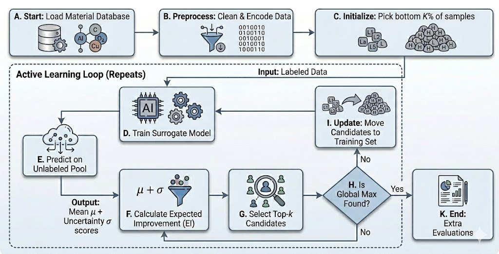

**図1：** Pool-based Active Learning パイプラインの全体フロー。候補プールから特性を評価するサイクルにおいて、TabPFN が GP/RF に代わるサロゲートとして機能する。獲得関数（EI/UCB）によるスコアリングと Top-K 選択を繰り返し、グローバル最適を効率よく発見する。この図は本研究の手法全体の位置づけを示す最重要図である。

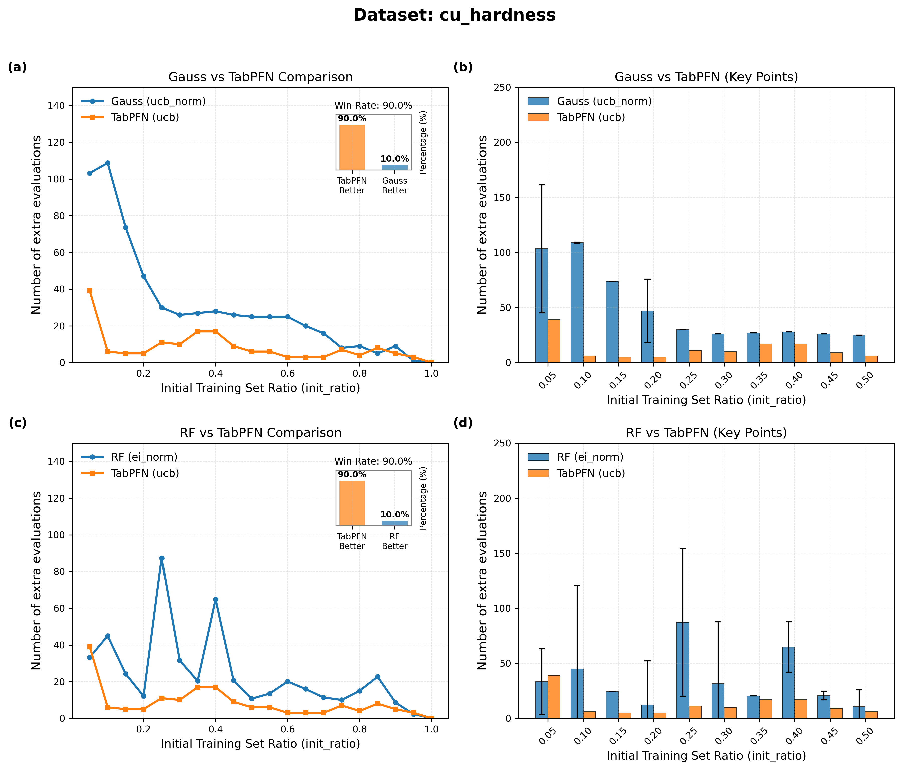

**図2：** 銅合金硬さデータセットにおける各手法の余分な評価回数（Extra Evaluations）比較。TabPFN は低い初期データ比（init_ratio = 0.05〜0.10）においても RF に対して3〜20倍の評価数削減を達成しており、RF の不安定さ（エラーバーが155評価に達する）が顕著に示されている。

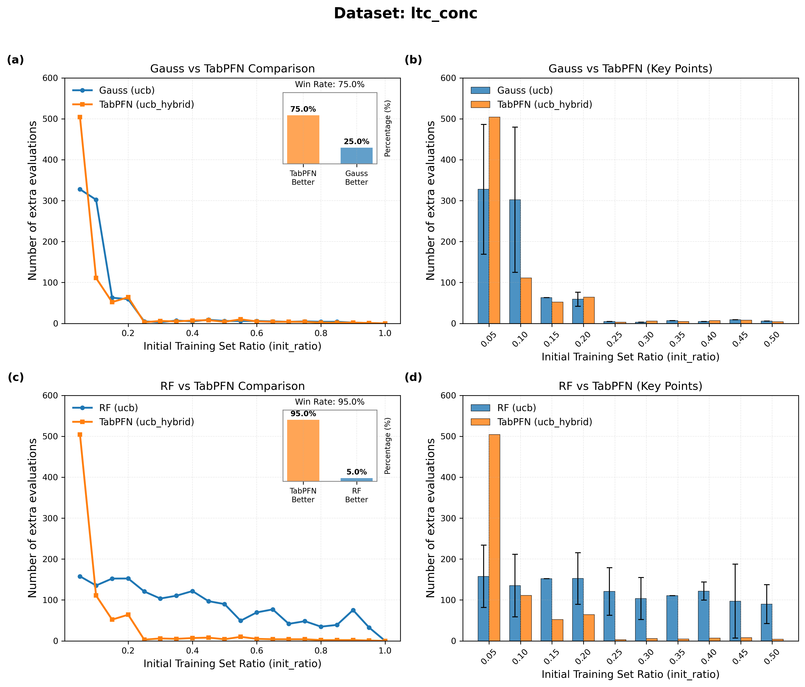

**図3：** 格子熱伝導率（LTC）データセットにおける能動学習曲線。TabPFN は init_ratio ≈ 0.20 以降で急速な収束を示し、10回以下の評価でほぼ最適解を発見する。GP の広すぎる信頼区間（MPIW ≈ 237）と RF の過信頼（PICP = 0.86）に対して、TabPFN は適切な校正（PICP = 0.94, MPIW ≈ 33）を維持している。

---
---

## 重点論文 2

### 1. 論文情報

**タイトル：** [From Experiments to Expertise: Scientific Knowledge Consolidation for AI-Driven Computational Research](https://arxiv.org/abs/2603.13191)
**著者：** Haonan Huang
**arXiv ID：** 2603.13191
**カテゴリ：** physics.comp-ph, cond-mat.mtrl-sci, cs.AI
**公開日：** 2026-03-16
**論文タイプ：** ソフトウェア・フレームワーク提案
**ライセンス：** CC BY 4.0

---

### 2. どんな研究か

計算材料科学における AI エージェントが、各計算セッションを孤立したタスクとして実行するのではなく、得られた知見を体系的に蓄積・検証・転移できるようにする開放型プラットフォーム「QMatSuite」を提案した研究である。異常ホール伝導率（AHC）の第一原理計算を題材に、9つの蓄積された洞察によって AI の推論時間が67%短縮し、計算誤差が47%から3%以下に改善されることを実証した。「実験から専門知識へ」という認知科学的な学習プロセスを AI に実装することで、材料計算の自律化研究に新たな方向性を示す。

---

### 3. 位置づけと意義

AI エージェントによる材料計算の自律化（Autonomous Materials Computing）は近年急速に発展しているが、その多くは「各計算を独立したタスクとして処理する」アーキテクチャに留まっており、蓄積された計算経験から一般則を導出する仕組みが欠如していた。本研究は、計算科学における人間の専門家形成過程——実験・観察・パターン認識・原則抽出——を AI が模倣できるという考え方を具現化した点で、材料計算の自律化研究における概念的な前進を示す。特に「知識の自己修正」という要素（誤った知識の検出と廃棄）は、AI システムの信頼性向上に直結する実践的な貢献である。Quantum ESPRESSO、VASP、ORCA など複数の計算エンジンと複数の AI モデル（Claude、GPT）に対応するエンジン・モデル非依存設計も実用性を高めている。

---

### 4. 研究の概要

**背景・目的：** 自律的な計算材料科学（AMS）システムは DFT・MD・量子化学計算を自動実行できるが、各実行セッションで得られた「Silent default を避けるべき」「収束条件の適切な設定は X」といった具体的な知見を次の計算に活かす仕組みがない。人間の研究者は数ヶ月の試行錯誤で形成する暗黙知を、AI がどのように獲得・利用できるかを問う研究。

**情報学的アプローチ：** 3層構造の知識管理（洞察→パターン→原則）、Model Context Protocol（MCP）経由での40以上のツール提供、固有の「ナッジング」機構（ツールのプリアンブルに知識記録を自然に組み込む仕組み）、専用の知識レビューセッションによる自己修正ループ。

**対象材料系：** 135種の固体材料（金属・半導体・絶縁体・磁性体）、98種の分子、異常ホール伝導率（AHC）計算のための鉄・ニッケル。

**主な手法：** Quantum ESPRESSO / VASP / ORCA による DFT、Wannier90 による Wannier 関数解析、GPT-4o/Claude Sonnet 4 系 AI エージェント。

**使用データ：** Materials Project などの公開材料データベース（格子定数・バンドギャップ検証用）、文献値（AHC 検証用）。

**主な結果：** 85.2%の自律完了率（135材料）、AHC ワークフローで API 推論時間42.8分→16.1分（62%削減）、精度46.5%→2.7%誤差、鉄知識の未知ニッケルへの転移で0失敗・1%誤差達成。

**著者の主張：** 「実行モードと反省モードは認知的に異なる機能であり、システム設計で分離すべき」「レシピ複製（最高パラメータのコピー）は原則に基づく推論を阻害するアンチパターン」。

---

### 5. 対象分野として重要なポイント

**対象特性・材料課題：** 異常ホール伝導率は強磁性体のトポロジカル電子構造を反映する敏感な物性であり、Wannier 関数の収束・non-collinear 磁化の取り扱い・k点メッシュの精度管理など多数の計算パラメータの適切な設定が必要とされる。このような「専門知識集約型」計算に AI の知識蓄積が効果的であることを示した。

**手法の意味と妥当性：** 知識の3層構造（洞察・パターン・原則）は、人間の専門知識の階層性を反映した妥当な設計。MCP による標準化されたツールアクセスは、計算エンジン非依存性を保証し、実用的なシステムを実現している。

**データセット設計・評価指標の適切性：** AHC の文献値との比較は定量的で適切。ただし、6ステップというワークフローの複雑さは高い方であり、単純な格子定数最適化のような「容易なタスク」と「困難なタスク」での知識蓄積効果の差が今後検証すべき問題として残る。

**既存研究との差分：** LLM-MD、OMol25 など既存の自律計算システムは実行自動化に焦点を当てているが、本研究は「知識の永続化と転移」という軸を新たに提示した点で独自性が高い。

**波及可能性：** 格子熱伝導率・超伝導転移温度・触媒活性などのより複雑な多ステップ計算への応用、異なる材料クラス間での知識転移、大規模な高スループット計算との統合が見込まれる。

---

### 6. 限界と注意点

知識レビューは現時点では依然として人間主導であり、自律的な自己修正の完全自動化は未達成。また135材料を対象とした検証では85.2%の完了率（約20材料が失敗）であり、失敗ケースの分析が十分でない。知識の誤りによる性能劣化（未レビュー15洞察では5失敗、レビュー済みでは0失敗）は示されているが、より大規模な知識ベースでの品質管理は今後の課題。また評価が AHC という単一の複雑ワークフローに集中しており、より幅広い材料計算タスクへの一般化可能性は追加検証が必要。コードは GitHub で公開済みとのことで再現性は比較的高い。

---

### 7. 関連研究との比較と研究動向における立ち位置

**先行研究との差分：** LLM-MD（Buehler 2024）や HoneyComb（Deng et al. 2023）などの自律材料計算研究は計算実行の自動化を扱うが、知識の永続化・転移・自己修正を実装したシステムはこれまで報告されていない。Retrieval-Augmented Generation（RAG）との違いは、本研究が計算から能動的に知識を生成・管理する点にある。

**競合・類似研究との位置づけ：** AI Scientist（Lu et al. 2024）は仮説生成・実験・論文執筆のサイクルを扱うが、長期的な計算専門知識の蓄積という観点では異なるアプローチ。A-Lab（Szymanski et al. 2023）は実験ロボットの自律化だが、知識管理システムは組み込まれていない。

**新規性の評価：** 計算材料科学における「AI の学習曲線」を実証した初の報告として、incrementalではなく独自の概念軸を開拓している点で、当該分野での引用ポテンシャルは高い。

**今後の展開：** 大規模な自律計算実験への展開（高スループットスクリーニング）、知識グラフとの統合、実験系との接続（計算と実験を横断する知識管理）が期待される。

---

### 8. 図

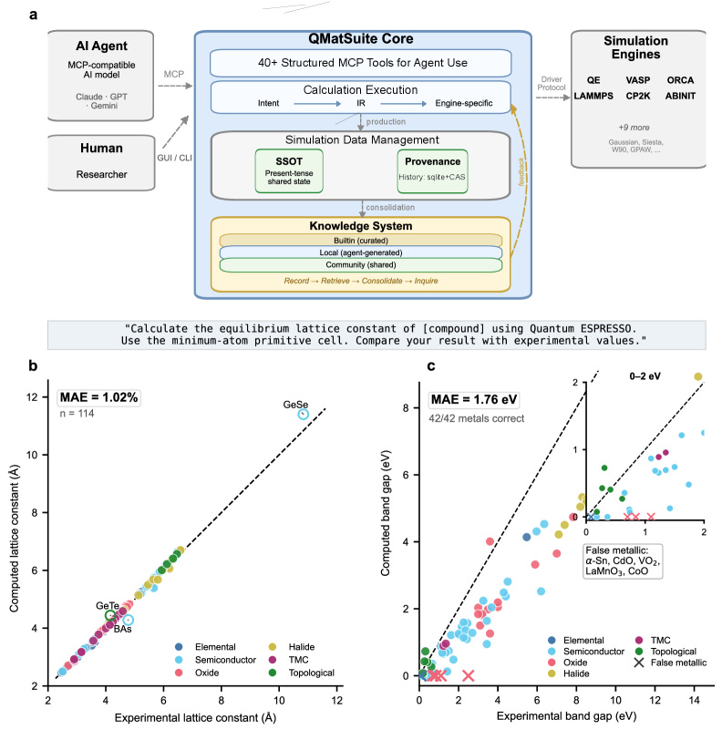

**図1：** QMatSuite プラットフォームアーキテクチャ（a）と135材料に対するスケール検証結果。AI エージェントと人間研究者が MCP を介して共通コアにアクセスする対称設計が示されている。格子定数（b）とバンドギャップ（c）の計算値と実験値の対応が、それぞれ MAE = 1.02%, 1.76 eV で示されており、基本的な計算精度を担保した上での知識管理システムの評価となっている。

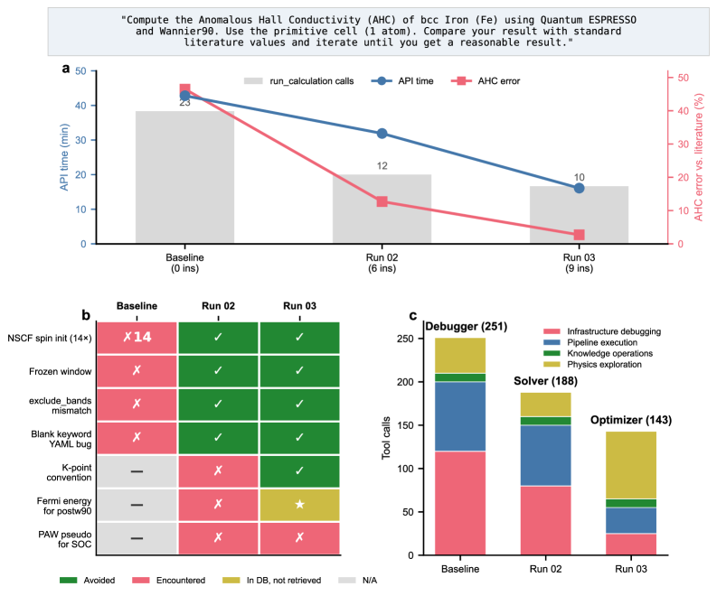

**図2：** 異常ホール伝導率（AHC）計算における学習曲線。知識ゼロ・6洞察・9洞察の3ランで、API 推論時間（青線）・ツール呼び出し回数（グレーバー）・文献値からの誤差（赤線）の変化を示す。誤差が46.5%から2.7%へと劇的に改善する過程が、AI の「認知的モード変化」（Debugger → Solver → Optimizer）と連動している点が本論文の核心的な主張を支えている。

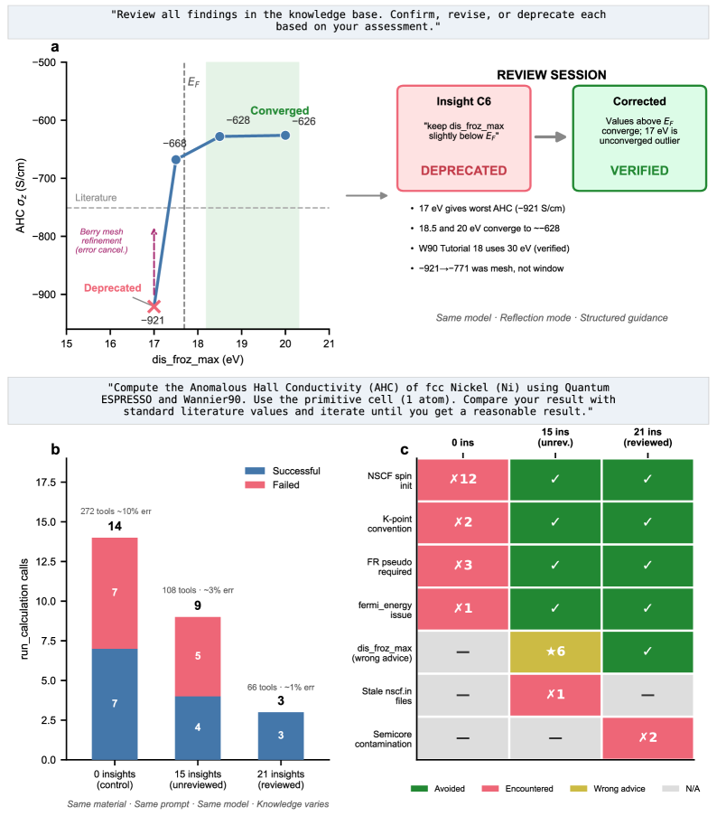

**図3：** (a) 誤った知識（dis_froz_max = 17 eV）が収束解析によって特定され廃棄される自己修正過程。(b) 鉄の知識をニッケルへ転移した際の比較（0洞察：7失敗、未レビュー15洞察：5失敗、レビュー済み21洞察：0失敗・1%誤差）。知識の質管理が性能に直結することを定量的に示す重要な図。

---
---

## 重点論文 3

### 1. 論文情報

**タイトル：** [Human-AI Collaborative Autonomous Experimentation With Proxy Modeling for Comparative Observation](https://arxiv.org/abs/2603.12618)
**著者：** Arpan Biswas, Hiroshi Funakubo, Yongtao Liu
**arXiv ID：** 2603.12618
**カテゴリ：** cs.LG
**公開日：** 2026-03-13
**論文タイプ：** 新規手法提案
**ライセンス：** CC BY 4.0
**注：** HTML 版が未公開のため、PDF から図を抽出した。

---

### 2. どんな研究か

材料特性評価における自律実験において、人間ドメイン専門家の比較判断（「AよりBの方が興味深い」）を Bradley-Terry モデルで目的関数に変換し、ベイズ最適化の獲得関数として利用する「ヒューマンインザループ型自律実験」フレームワークを提案した研究である。AI エージェントが人間の選好パターンを学習して代理意思決定を行いながら、周期的な人間によるバリデーションで正確性を維持する設計により、純粋に数値目標関数に依存する従来の自律実験では見落とされがちな、複雑なパターンの探索改善を実現した。

---

### 3. 位置づけと意義

自律材料実験（A-Lab、SDL 等）は近年急速に実用化が進んでいるが、その多くは「予め定義された数値目標関数の最大化・最小化」という枠組みに基づいており、人間研究者が経験的に持つ「この挙動は物理的に面白い」という定性的・文脈依存的な判断を組み込む手段がなかった。本研究は、比較判断という自然な人間の認知様式をベイズ最適化に統合することで、この本質的なギャップを埋めようとする。強誘電体の電気特性評価という具体的な材料問題への適用は、材料探索における人間の直感と AI の探索能力の相補性を示す実証として意義がある。

---

### 4. 研究の概要

**背景・目的：** 実験材料科学では、単一の数値指標では表現しにくい複合的な材料挙動（履歴依存性、局所異常、相変化の兆候など）を研究者が視覚的・直感的に識別する場面が多い。この「人間の比較判断」を自律実験ループに組み込み、探索の質を向上させることを目的とする。

**情報学的アプローチ：** (1) 新しい実験結果と既存結果の比較投票を人間が行う (2) Bradley-Terry モデルでペアワイズ比較を選好スコアに変換 (3) 選好スコアを Gaussian Process でモデル化し代理目的関数として使用 (4) AI エージェントが人間の投票パターンを学習して将来の選択を代行 (5) 定期的な人間検証でドリフトを修正。

**対象材料系：** 強誘電体薄膜の電気特性マッピング（実材料実験）、シミュレーションデータ（検証用）。

**主な手法：** Bradley-Terry 比較モデル、Gaussian Process ベイズ最適化、強化学習（AI 代理エージェント訓練）、走査プローブ顕微鏡（SPM）連携自律実験。

**主な結果：** シミュレーション・実験の両環境で、純粋な数値目標関数ベースの従来手法より優れた材料空間探索の多様性と品質を達成。AI 代理エージェントによる意思決定はオリジナルの人間判断と高い一致を示した。

**著者の主張：** 「ヒューマンインザループ設計は、AI の探索効率と人間の専門知識を相乗させる」「比較観察という認知的に自然なフィードバック様式が、自律材料実験における人間との協調の鍵となる」。

---

### 5. 対象分野として重要なポイント

**対象特性・材料課題：** 強誘電体の分極反転挙動・局所電気応答などの空間分布パターンは、単純な平均値では特性を表現できないため、研究者の視覚的判断が重要となる典型的な例。

**手法・記述子の意味：** Bradley-Terry モデルはスポーツの勝率予測で確立された統計モデルで、ペアワイズ比較から一貫したスコアを導出する。これを選好学習に転用する発想は自然言語処理の RLHF（人間フィードバックによる強化学習）の材料科学版とも言える。

**評価の妥当性：** シミュレーションと実実験の両環境での検証は妥当。ただし、評価されたデータセット規模や比較ベースラインの詳細は論文から限定的にしか読み取れない。

**一般化可能性：** 走査プローブ顕微鏡、X線散乱、電子顕微鏡など、空間分解型の実験データが得られるあらゆる材料計測システムへの応用が期待される。

---

### 6. 限界と注意点

人間の比較判断コストが実験ループのボトルネックになりうる点は明示されておらず、スケーラビリティに疑問が残る。また Bradley-Terry モデルは評価者の一貫性を仮定しているが、人間の判断は文脈依存的なブレを含む可能性がある。AI 代理エージェントの学習が人間の偏見を増幅するリスクについての議論が不十分。強誘電体薄膜という特定材料系での実証であり、他の材料・計測手法への直接的な転移可能性は要検証。

---

### 7. 関連研究との比較と研究動向における立ち位置

**先行研究との差分：** RLHF（Ouyang et al. 2022）の材料科学への転用という位置づけであるが、比較観察という具体的な材料実験手順への落とし込みに独自性がある。GPyBO など既存の自律実験フレームワークに対して、人間の定性的判断を取り込む拡張として位置づけられる。

**新規性の評価：** 概念的には RLHF の材料応用として説明可能であり、手法の完全な新規性は中程度だが、材料実験という具体的な設定への適用と Bradley-Terry + GP の組み合わせは新しい。

**今後の展開：** マルチモーダル実験データへの拡張（画像・スペクトル・電気特性の複合比較）、大規模自律実験ラインへの組み込み、人間の選好不一致の検出と対処が研究課題となる。

---

### 8. 図

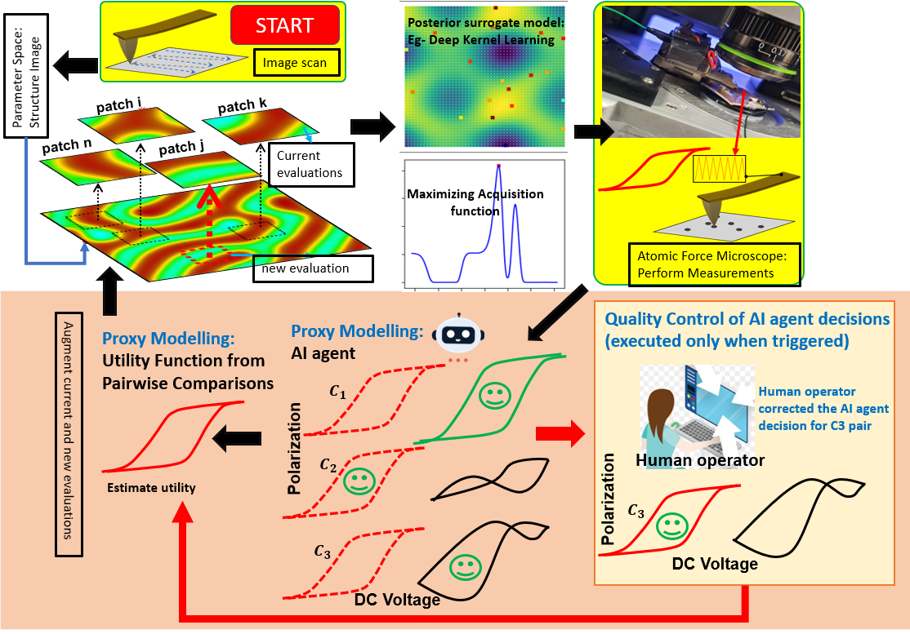

**図1：** 提案フレームワークの全体設計。新しい実験結果を既存データと比較する投票ループ（Bradley-Terry モデル）、選好スコアから構築される代理目的関数、ベイズ最適化による次候補選択、AI エージェントによる人間選好の模倣が統合されている。材料特性の自律探索において人間の専門知識を連続的に取り込む仕組みを示す核心的な図。

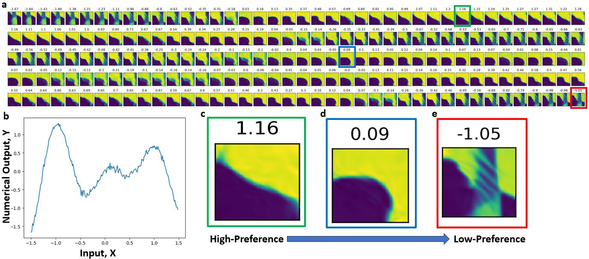

**図2：** シミュレーションデータを用いた提案手法と従来型ベイズ最適化（数値目標関数ベース）の材料空間探索比較。提案手法が多様な材料挙動を効率よく発見することを示す。人間の比較判断が探索の多様性向上に寄与していることが数値的に確認できる。

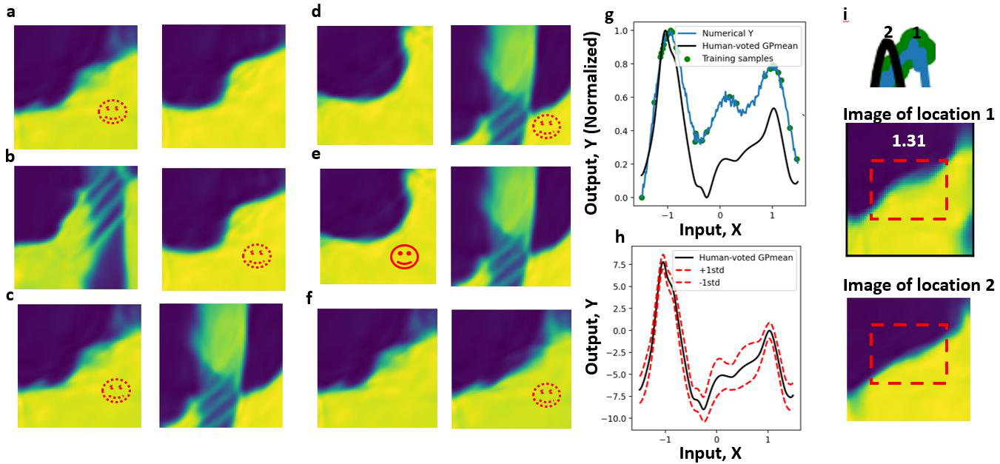

**図3：** 実際の強誘電体薄膜の走査プローブ顕微鏡実験における適用結果。AI 代理エージェントが人間研究者の選好パターンを学習しながら自律的に材料特性の興味深い領域を探索する様子を示す。

---
---

# その他の重要論文

---

## 4. [Quantifying Perovskite Solar Cell Degradation via Machine Learning from Spatially Resolved Multimodal Luminescence Time Series](https://arxiv.org/abs/2603.12857)

**著者：** Giulio Barletta, Simon Ternes, Saif Ali, Zohair Abbas, Chiara Ostendi, Marialucia D'Addio, Erica Magliano, Pietro Asinari, Eliodoro Chiavazzo, Aldo Di Carlo
**arXiv ID：** 2603.12857 ｜ **カテゴリ：** cond-mat.mtrl-sci ｜ **公開日：** 2026-03-13 ｜ **ライセンス：** CC BY 4.0

ペロブスカイト太陽電池（PSC）の安定性評価において、電気特性（J–V 曲線）に依存することなく、エレクトロルミネッセンス（EL）・フォトルミネッセンス（PLoc、PLsc）の空間分解イメージングから効率保持率を予測する CNN モデル「LumPerNet」を提案した。59デバイス・12,258サンプルのデータセットを構築し、4分割交差検証で MAE = 0.049（ベースライン比 23.4%改善）、R² = 0.553（ベースライン比 4.1倍）を達成した。重要な発見として、単一モダリティでは R² ≈ 0.22〜0.32 にとどまるが、EL と PLsc の組み合わせで R² = 0.534 と、ほぼ3モダリティ全体の性能に迫る。これは EL が電気的不均一性を、PLsc が励起子応答を補完的に捉えるためと解釈される。

材料インフォマティクス的には、PSC 劣化予測における「空間的パターンの情報価値」を明示的に検証した研究として位置づけられる。単純な輝度平均（MLP ベースライン）に対して CNN が大幅に優位であることは、空間的劣化不均一性が効率保持の重要な指標であることを意味する。実験データの自動収集パイプラインと ML モデルを統合した点で再現性は高く、加速安定性評価・品質管理への実用展開が期待される。ただしデータセット規模（59デバイス）はやや小さく、デバイス構造・製造バッチの多様性拡大が汎化性向上の鍵となる。

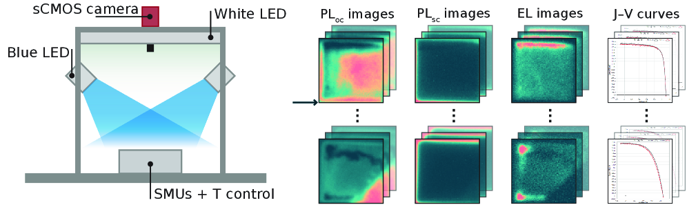

**図1：** 自動計測チャンバーによる EL・PLoc・PLsc の時系列取得パイプライン。各測定サイクルで複数モダリティの空間分解画像と J-V 曲線を同期取得する設計が示されており、材料安定性研究における再現可能なマルチモーダルデータ収集の実例を示す。

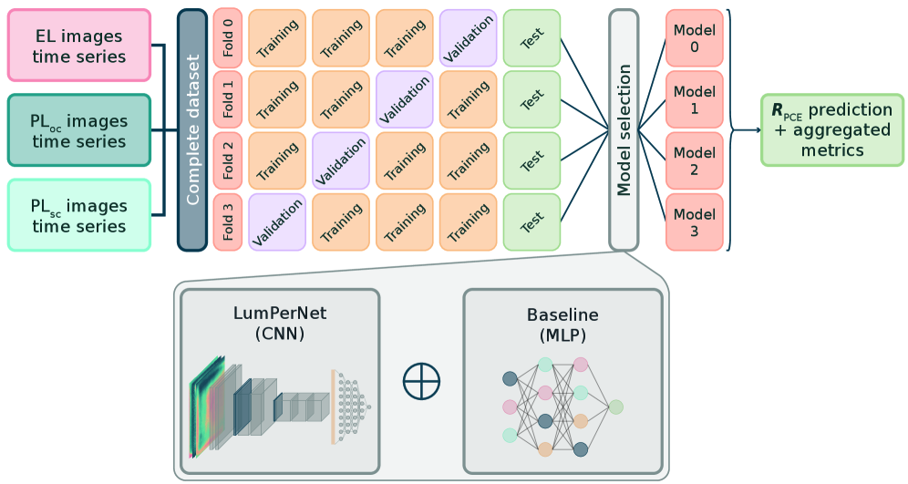

**図3：** LumPerNet の入力設計（EL・PLoc・PLsc 参照-現在画像のスタック）、CNN アーキテクチャ、強度平均 MLP ベースラインとの比較評価プロトコルを示す。空間情報保持の有無が性能差の本質であることをアーキテクチャ設計から裏付ける。

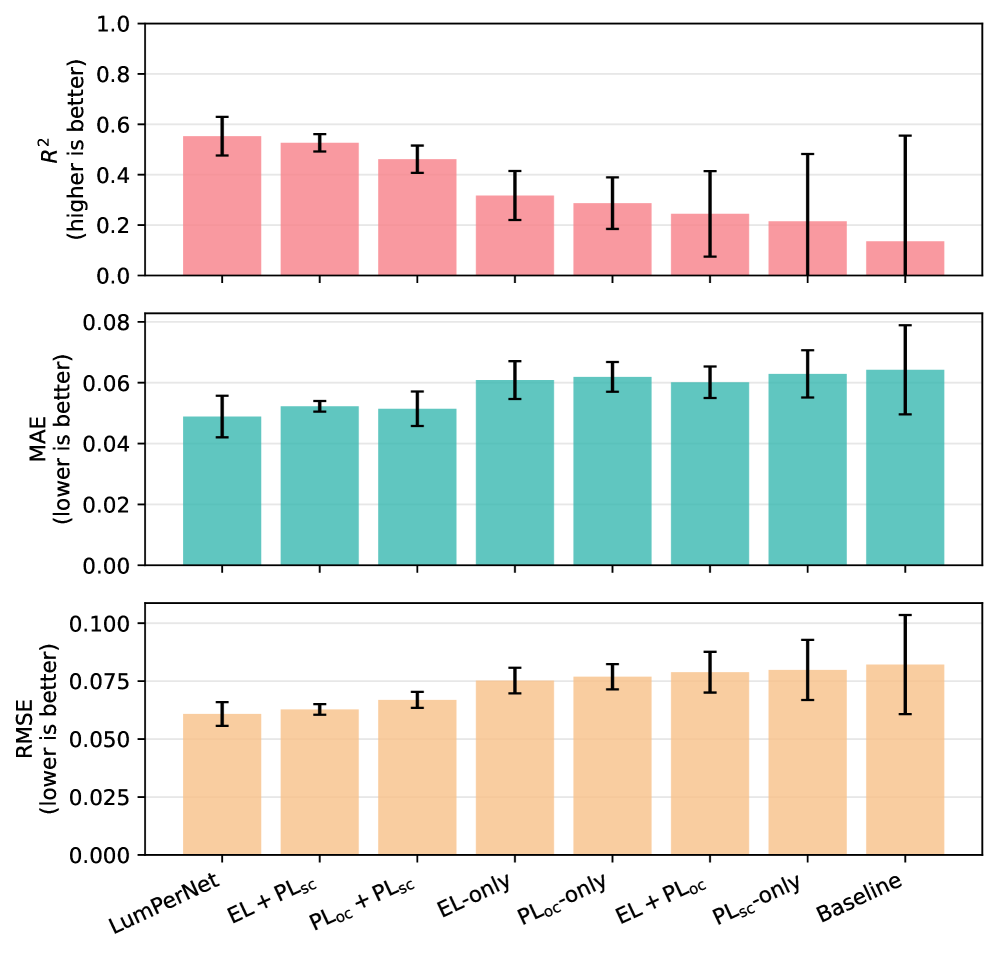

**図5：** LumPerNet・単一モダリティ・2モダリティアブレーション・ベースライン間の MAE/RMSE/R² 比較。EL+PLsc の組み合わせがフルモデルに迫る性能を示す一方、EL+PLoc の不安定性も確認でき、モダリティ間の補完性の非対称構造が明確に示されている。

---

## 5. [SciDesignBench: Benchmarking and Improving Language Models for Scientific Inverse Design](https://arxiv.org/abs/2603.12724)

**著者：** David van Dijk, Ivan Vrkic
**arXiv ID：** 2603.12724 ｜ **カテゴリ：** cs.LG ｜ **公開日：** 2026-03-13 ｜ **ライセンス：** CC BY 4.0

14の科学ドメイン（医薬品 ADMET・代謝工学・RNA 折りたたみ・量子回路・光学薄膜・合金組成設計など）にわたる520タスクを収録した科学的逆設計ベンチマーク SciDesignBench を構築し、7つの最先端 LLM（GPT-5.2、Claude Opus 4.6、Gemini 等）を評価した研究である。最強モデルでも29.0%の成功率に留まり、シミュレーターフィードバックを加えることで性能は約2倍に向上するが、モデルのランキングが入れ替わるという重要な発見を示した。合金組成設計を含む材料ドメインでの評価は、LLM の材料逆設計能力の現状を客観的に把握するための基盤を提供する。

マテリアルズ・インフォマティクスの観点では、「パース成功率と実際の逆設計成功率の乖離」という問題提起が重要であり、LLM が正しい形式の答えを出しても科学的に正しい設計になっていない事例が多いことを示す。また、著者が提案する RLSF（Reinforcement Learning from Simulator Feedback）は、シミュレーター結果を報酬として 8B モデルを Fine-tuning することで 8〜17 ポイントの改善を達成している。このアプローチは材料設計における「材料シミュレーターを環境とする強化学習」という汎用的な枠組みを示しており、DFT・MD・フェーズフィールド等のシミュレーターに接続した LLM の強化学習への展開が期待される。

**図1：** 14の科学ドメインにわたる逆設計タスクの概観。合金設計を含む材料系から医薬品・生体分子・物理系まで多様なドメインが網羅されており、LLM の汎用科学逆設計能力の評価基盤を示す。

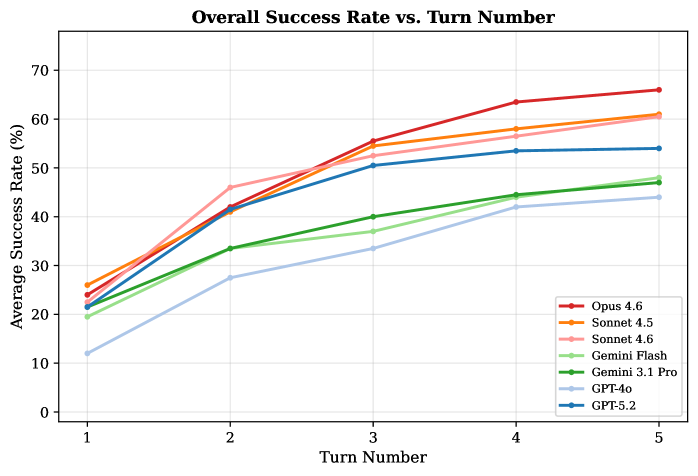

**図2：** 7つの LLM（GPT-5.2、Claude Opus 4.6/Sonnet 4.5/4.6、Gemini 等）のゼロショット・20ターン条件での成功率比較。シングルターンと長期反復で最強モデルが入れ替わる現象は、逆設計における「探索戦略の多様性」が重要であることを示す。

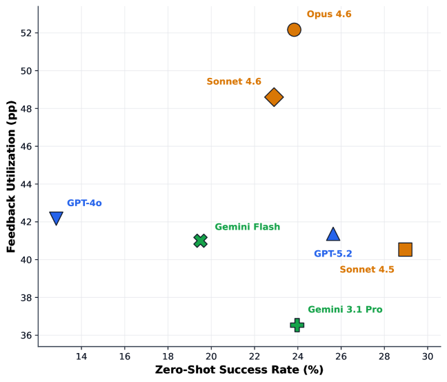

**図3：** シミュレーターフィードバックを利用した強化学習（RLSF）による 8B モデルの性能改善。ADMET・PK/PD・分子ドッキングの3ドメインで 8〜17 ポイントの改善が示されており、材料シミュレーターと LLM の強化学習統合の実現可能性を示す。

---

## 6. [A Multi-task Large Reasoning Model for Molecular Science](https://arxiv.org/abs/2603.12808)

**著者：** Pengfei Liu, Shuang Ge, Jun Tao, Zhixiang Ren
**arXiv ID：** 2603.12808 ｜ **カテゴリ：** cs.LG ｜ **公開日：** 2026-03-16 ｜ **ライセンス：** CC BY 4.0

分子科学の多様なタスク（SMILES 生成・分子キャプション・IUPAC-SMILES 変換・特性予測・順反応・逆合成予測）を統合して扱う推論強化大規模言語モデルを提案した研究である。DeepSeek-7B をベースに8種の専門家グループとルーター機構を組み合わせたアーキテクチャで、Chain-of-Thought + 強化学習の3段階訓練（指示 Fine-tuning → CoT Fine-tuning → GRPO による強化学習）を採用した。74,500件の分子知識サンプルによる事前学習と 3,600件の CoT データで、10タスク・47指標において LLaSMol 比約6%の改善と 20以上のベースライン凌駕を達成した。

材料インフォマティクスへの関連性は、「分子特性の推論的予測」と「逆合成計画の自動化」にある。従来の GNN ベース特性予測が単一タスクを対象とするのに対し、本研究は多タスク協調学習が化学的推論の質を向上させることを示した。特に、「データシナジー」（関連する知識を同時学習することで個別タスクの精度が向上する）と「専門家シナジー」（予測専門家と推論専門家の協調）の概念は、マルチモーダル材料データの統合学習へ転用しうる示唆を含む。CNS 薬剤候補設計への応用実証は、このような推論モデルが実際の材料・化学設計プロセスに組み込まれる可能性を示している。

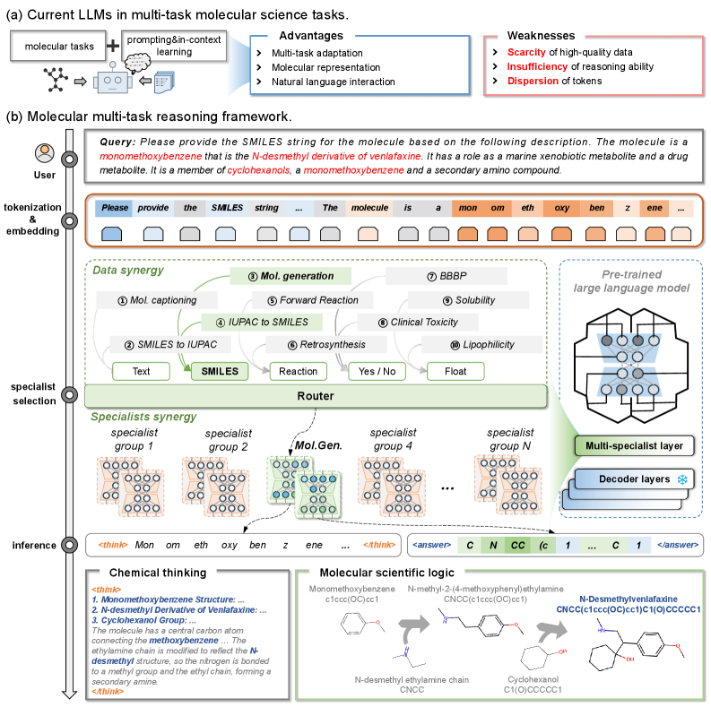

**図1：** 8専門家グループとルーター機構による分子科学マルチタスクモデルのアーキテクチャ概略。各専門家は特性予測・テキスト生成・反応予測など個別の分子タスクを担い、ルーターが入力に応じて適切な専門家を選択・協調させる設計が示されている。

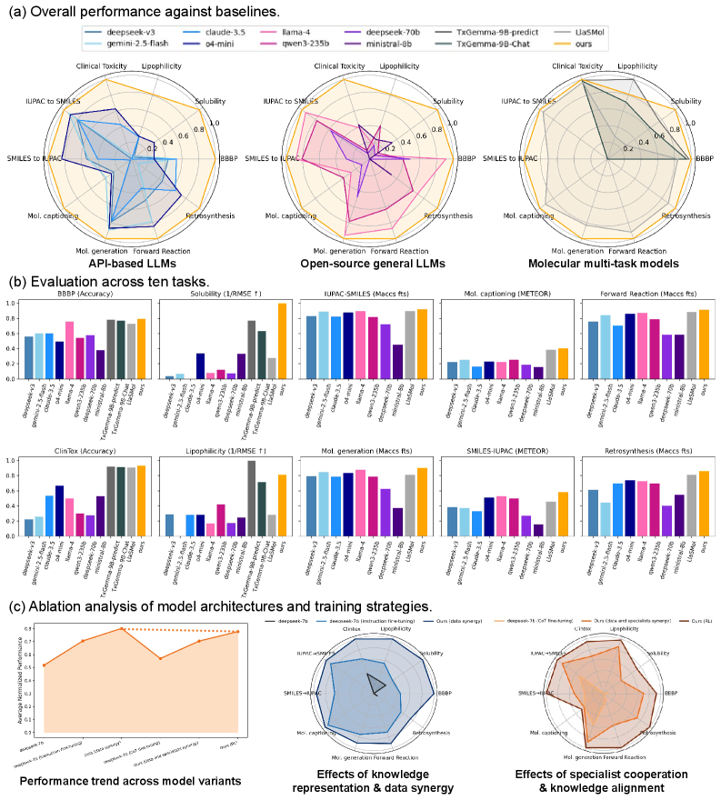

**図2：** 10の分子タスクにわたる20以上のベースラインとの比較評価。SMILES 生成・分子キャプション・IUPAC 変換・BBBP 毒性予測・溶解度予測など多様な指標での優位性が示されており、マルチタスク協調学習の有効性を包括的に検証した結果。

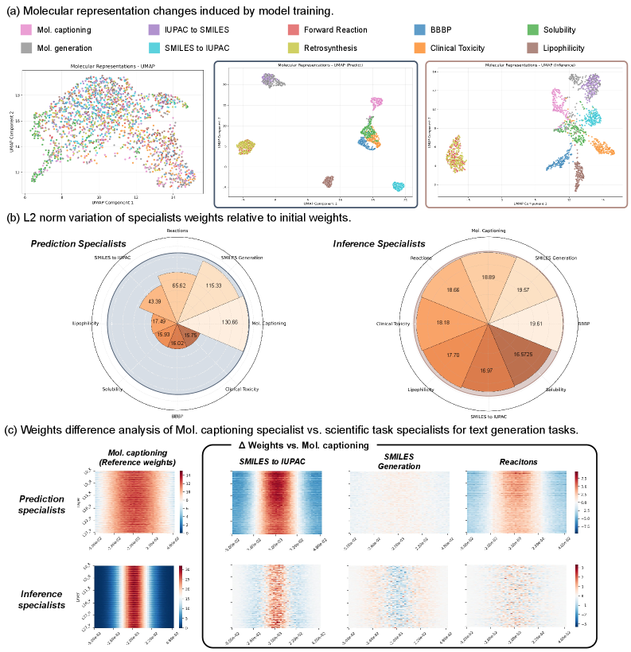

**図3：** 指示 Fine-tuning → Chain-of-Thought Fine-tuning → 強化学習（GRPO）の3段階訓練プロセス。化学知識の埋め込みから論理的推論能力の獲得、最終的な報酬ベース調整へと段階的に能力を構築する訓練設計が示されている。

---

## 7. [Optimal Experimental Design for Reliable Learning of History-Dependent Constitutive Laws](https://arxiv.org/abs/2603.12365)

**著者：** Kaushik Bhattacharya, Lianghao Cao, Andrew Stuart
**arXiv ID：** 2603.12365 ｜ **カテゴリ：** cond-mat.mtrl-sci, cs.LG, physics.comp-ph ｜ **公開日：** 2026-03-16 ｜ **ライセンス：** CC BY-NC-ND 4.0

履歴依存性を持つ粘弾性材料の構成則パラメータ同定において、限られた実験予算の下で最大の情報利得をもたらす試験設計（試験片形状と荷重経路）をベイズ的に最適化するフレームワークを提案した研究である。期待情報利得（EIG）を目的関数とし、Fisher 情報行列のガウス近似とニューラルネットワーク代理モデルにより計算コストを大幅に削減した上で、一般化 Maxwell モデル（11パラメータ）と非線形粘弾性モデルに適用した。最適化された試験設計はランダム設計に対して有意なパラメータ同定精度向上を示し、変位場の全ピクセルを直接尤度に組み込む画像ベースの逆問題解法も提案した。

材料インフォマティクスの観点では、「実験設計そのものを機械学習で最適化する」というアクティブラーニングの特殊ケースとして位置づけられる。既存の材料探索における能動学習が「次にどの組成を作るか」を問うのに対して、本研究は「次にどのような実験をするか（形状と荷重経路）」を問う点で、構成則学習に特化したアクティブ実験設計の成熟例と言える。サロゲート FIM（Fisher 情報行列代理モデル）による計算加速と画像データの直接利用は、DIC（デジタル画像相関法）などの全視野計測との組み合わせで実用化が期待される。

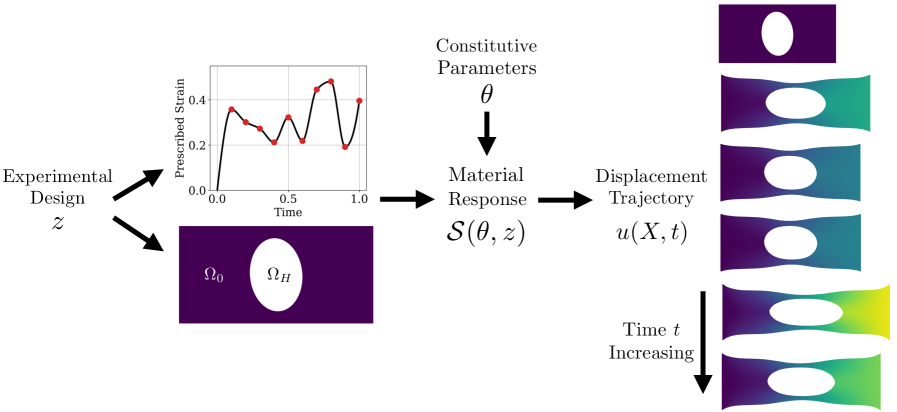

**図1：** 楕円形孔を持つ平板試験片の変形シミュレーション（変位場カラーマップ）。孔のアスペクト比・角度・荷重経路の離散制御点がベイズ最適化の設計変数となっている。最適化された形状がランダム設計と異なる変形パターンをもたらすことを視覚的に示す。

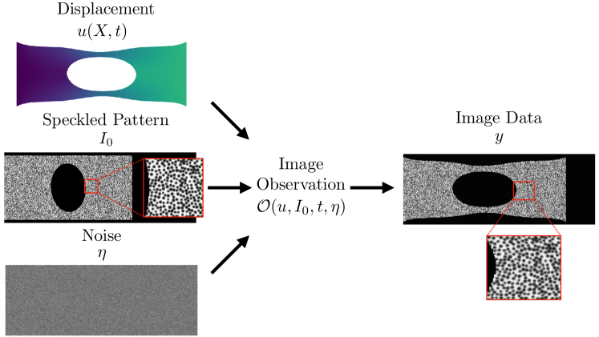

**図2：** 試験中の変位場スナップショットを直接観測データとして用いる画像ベース逆問題設定の可視化。全ピクセルを尤度に組み込むことで、DIC 等の全視野計測データを直接使用できる手法の妥当性を示す。

---

## 8. [RetroReasoner: A Reasoning LLM for Strategic Retrosynthesis Prediction](https://arxiv.org/abs/2603.12666)

**著者：** Hanbum Ko, Chanhui Lee, Ye Rin Kim, Rodrigo Hormazabal, Sehui Han, Sungbin Lim, Sungwoong Kim
**arXiv ID：** 2603.12666 ｜ **カテゴリ：** cs.LG, cs.AI ｜ **公開日：** 2026-03-13 ｜ **ライセンス：** CC BY-NC-SA 4.0

化学合成経路探索（レトロシンセシス）において、LLM が化学者の思考プロセスを模倣した「戦略的推論」を行う RetroReasoner を提案した研究である。生成物の解析→鍵部分構造の特定→切断戦略→合成等価体のマッピングという4段階の推論連鎖を明示的に生成しながら反応物を予測し、SyntheticRetro フレームワークで生成した訓練データと往復精度（round-trip accuracy）を報酬とする強化学習で訓練した。標準的なベンチマーク（USPTO-50k 等）での改善と、希少な反応タイプでの特に顕著な性能向上を示した。

材料インフォマティクスとの関連性は、同様の「逆設計 + 合成可能性評価」という枠組みが材料合成計画への転用可能性を持つ点にある。有機化学のレトロシンセシスに特化した研究だが、「化学者の戦略的推論プロセスを明示的に学習する」というアプローチは、無機材料合成ルートの設計や固相反応の経路探索に応用しうる。往復精度を報酬とする強化学習は「Forward モデルによる設計妥当性検証」という一般的な逆設計の検証戦略として汎用性が高い。

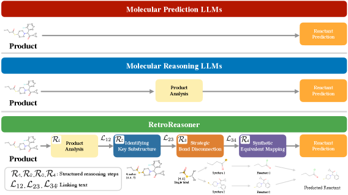

**図1：** 化学者の4段階推論プロセス（生成物分析→鍵部分構造→切断戦略→合成等価体）を模倣した Chain-of-Thought の構造。「linking text」による論理的遷移を含む推論連鎖の設計が示されており、単純な反応物予測を超えた戦略的化学推論の実装を示す。

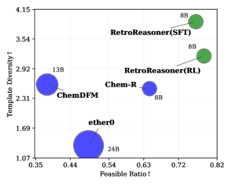

**図2：** 反応データベースから推論付きトレーニングデータを自動生成する SyntheticRetro パイプライン。反応データの化学情報を抽出し、汎用 LLM で自然言語の推論説明を生成する過程が示されており、材料合成ルートへの応用可能性を示唆する。

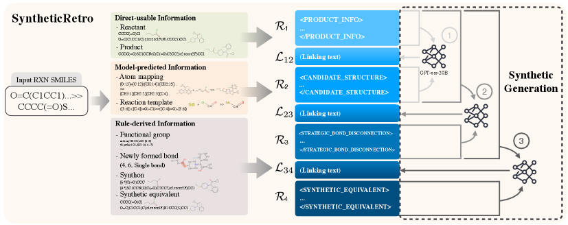

**図3：** 訓練データに少ししか含まれない希少反応クラスにおける RetroReasoner の性能優位性。戦略的推論が適切なデータ分布に依存しない一般化能力をもたらすことを示しており、材料合成経路という希少事例が多い問題への転用示唆を含む。

---

## 9. [VecMol: Vector-Field Representations for 3D Molecule Generation](https://arxiv.org/abs/2603.12734)

**著者：** Yuchen Hua, Xingang Peng, Jianzhu Ma, Muhan Zhang
**arXiv ID：** 2603.12734 ｜ **カテゴリ：** stat.ML, cs.LG ｜ **公開日：** 2026-03-16 ｜ **ライセンス：** 標準 arXiv ライセンス（CC ライセンス非該当）
**注：** ライセンス条件により図の掲載を省略する。

3次元分子構造の生成モデルにおいて、分子をグラフや点群として表現するのではなく、空間中の各点から最近傍原子の方向を示す連続ベクトル場として表現する新しいアプローチ VecMol を提案した研究である。E(n)-等変ニューラルネットワークによるニューラルフィールド・オートエンコーダで変数サイズの分子構造を固定次元潜在コードに圧縮し、潜在拡散モデルで生成を行う2段階パイプラインを採用した。QM9 ベンチマークで 97.4% の分子安定性・98.4% の妥当性、GEOM-Drugs では EDM や GeoLDM と競争的な性能を達成した。

材料インフォマティクスへの関連性は、「連続場による離散構造の表現学習」というアプローチの新規性にある。従来の原子グラフ表現では原子数を固定するか可変長入力を処理するための特殊な設計が必要だったが、ベクトル場表現はサイズ非依存・O(N)複雑度という利点を持つ。このような連続場ベースの構造表現は、結晶構造の生成モデル（CrystalFlow、DiffCSP 等）への転用可能性を持つ。ただし、現状では分子（有機化合物）を対象としており、周期境界条件を持つ結晶材料への直接拡張には追加の設計が必要。

---

## 10. [Deep learning statistical defect models on magnetic material dynamic and static properties](https://arxiv.org/abs/2603.10182)

**著者：** C. Eagan, M. Copus, E. Iacocca
**arXiv ID：** 2603.10182 ｜ **カテゴリ：** cond-mat.mes-hall ｜ **公開日：** 2026-03-13 ｜ **ライセンス：** CC BY 4.0

磁性材料における欠陥（空孔）が分散関係およびドメインウォール特性に与える影響を、深層学習で予測するフレームワークを提案した研究である。ランダム電信雑音モデルで欠陥分布を特徴化（平均欠陥間距離 σ、平均欠陥サイズ τ）し、以下の3つのニューラルネットワークを構築した：(1) 分散関係から欠陥パラメータを逆推定する CNN、(2) PINN-TFC（物理情報ニューラルネットワーク＋関数的接続論）による分散関数の学習、(3) 磁化プロファイルからドメインウォール幅を予測するデュアルブランチ CNN。分散予測の MAE は 0.29〜0.36 THz、ドメインウォール幅の標準偏差は 0.835 nm（格子定数比で亜臨界）を達成した。

材料インフォマティクスの観点では、「欠陥統計と物性の機械学習的接続」という問題設定に独自性がある。一般的な材料機械学習が完全結晶や平均組成を対象とするのに対して、本研究は欠陥の確率論的記述から始まる点で現実の材料（欠陥は不可避）により近い問題設定と言える。PINN-TFC ハイブリッドは物理拘束を数学的に厳密に満たす新しい実装アプローチとして注目に値する。現時点では1次元モデルに限定されているが、著者は2次元・3次元への拡張とスキルミオン・ホッピオンをホストする材料の設計への応用を展望として述べている。

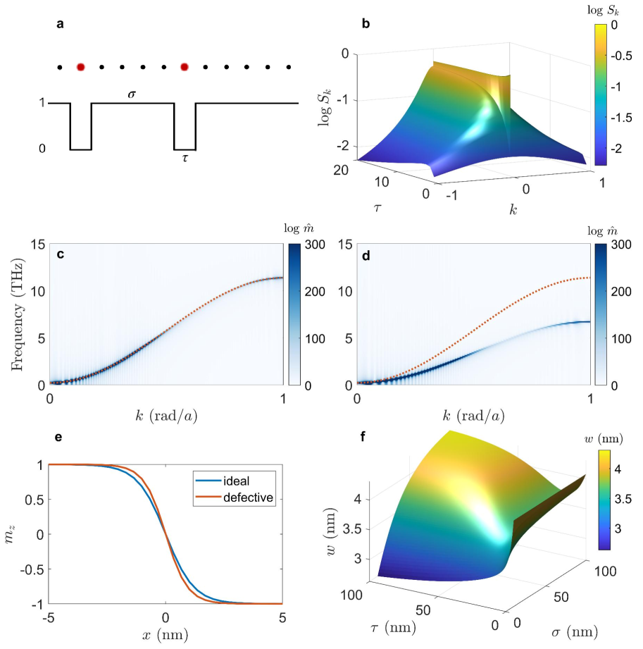

**図1：** ランダム電信雑音モデルによる欠陥分布の統計的記述と3つのニューラルネットワーク（逆問題 CNN、PINN-TFC 分散学習、ドメインウォール予測 CNN）の全体構成。欠陥統計量 (σ, τ) と物性（分散関係・ドメインウォール幅）を双方向に接続する枠組みが示されている。

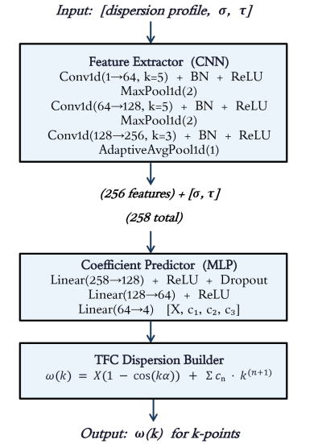

**図2：** 物理情報ニューラルネットワーク（PINN）と関数的接続論（TFC）を組み合わせた手法による分散関係の学習結果。物理拘束（境界条件・対称性）を厳密に満たしながら欠陥パラメータ依存性を学習できることを示す、本手法の核心的な検証図。

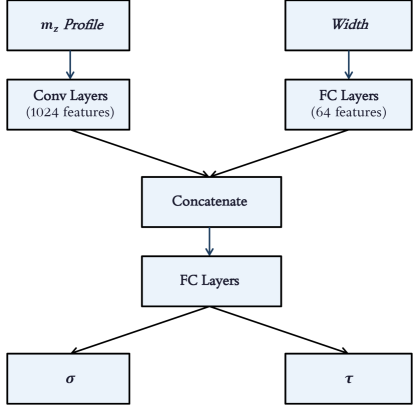

**図3：** 分散関係から欠陥パラメータ (σ, τ) を逆推定する CNN の予測精度。MAE 0.29〜0.36 THz の分散予測は格子定数スケールでの欠陥識別を可能にし、実験的なスピン波分光データからの欠陥定量化への応用可能性を示す。

---
---

# 全体のまとめ

## 材料インフォマティクス分野の動向

2026年3月中旬の本日の論文群から読み取れる最大のトレンドは、**「AI による科学的実践の全サイクルの統合」**への加速である。単一タスクの精度向上から、実験設計・実行・知識蓄積・転移という科学研究の全ループをカバーするシステムへの移行が明確に進んでいる。QMatSuite は計算科学における知識管理の体系化を試み、ICAL は探索効率を根本から問い直し、ヒューマンインザループ型フレームワークは人間の専門的直感を定量化して AI に組み込む道を開いた。これらは互いに独立した論文でありながら、「AI が材料研究者の専門知識を段階的に獲得・拡張していく」という共通ビジョンを志向している。

SciDesignBench が示す「最強 LLM でも逆設計成功率29%」という現実は、LLM の材料設計への過信を戒める重要なデータポイントである。ベンチマーク設計の精緻化、シミュレーター統合型強化学習（RLSF）の実用化、長期反復設計における評価基準の確立は、今後数年の重要な研究課題として浮かび上がる。分子生成における VecMol の連続場表現アプローチは、長らく支配的だった離散グラフ表現への有望な代替軸を示しており、結晶構造生成モデルへの波及が期待される。

## 明らかになった未解決領域

本日の論文群からは、以下の未解決課題が浮かび上がる。第一に、**アクティブラーニングにおける多目的最適化と高次元構造空間の統合**：ICAL は組成特徴量では強力だが、結晶構造記述子を含む高次元入力での優位性は示されておらず、実際の材料開発では多目的（強度・延性・耐食性等）のトレードオフが常に存在する。第二に、**AI 生成知識の信頼性と自律的な誤り検出**：QMatSuite の実験では知識レビューが依然として人間依存であり、AI が自律的に自分の知識の誤りを特定・修正する仕組みは初期段階にある。第三に、**実験データと計算データの統合的知識管理**：現在の自律計算システムは計算に特化しており、実験データとの双方向的な知識統合は未開拓領域のままである。

## 今後の展望

今後2〜3年で最も活発化が予想される研究方向は、（a）**基盤モデルをサロゲートとする能動学習のスケールアップ**（大規模材料データベースとの統合、多目的ベイズ最適化との融合）、（b）**計算・実験・知識を統合する AI 研究者エージェントの実装**（QMatSuite のような知識管理基盤と A-Lab のような実験自動化システムの接続）、（c）**逆設計 LLM のシミュレーター統合強化学習**（SciDesignBench が示した29%の壁を突破するための RLSF の大規模展開）、の3方向である。材料科学における真の「自律発見」には、探索効率・知識蓄積・実験実行・検証の4機能が有機的に連携するシステムが必要であり、本日の論文群はその各コンポーネントが急速に成熟しつつあることを示している。この統合に向けた標準化（データ形式・評価指標・知識表現）の確立が、次世代材料インフォマティクスの重要な共通課題となるだろう。
