# 2026-03-17 マテリアルズ・インフォマティクス

**作成日:** 2026-03-17
**対象期間:** 2026-03-10 〜 2026-03-17（過去7日間、フォールバック適用）

---

## 今日の選定方針

本日は過去72時間（2026-03-14〜17）の新着論文を優先的にサーベイしたが、材料インフォマティクスの中核的テーマに合致する未報告論文が10本に満たなかったため、CLAUDE.md のフォールバック方針に従い対象期間を過去7日間（2026-03-10〜17）に拡張した。さらに、物理インフォームド学習・サロゲートモデル・科学的発見評価という隣接分野からも補助的に採用した論文を含めており、それらについては本文中にその旨を明記している。今回の10本は、多孔質媒体のグラフネットワークサロゲートモデル、LLMへの専門家知識の蒸留、時空間物理系の自己教師あり表現学習という3本の重点論文を核として、地球化学異常検出用ベンチマーク・拡散モデルを用いたデータ同化・PINNのスケーリング則・AI誘導科学的選択の形式検証・水クラスターにおけるML解析・変分PDEソルバー・溶接継手の弾塑性特性マッピングという7本の簡潔紹介論文で構成される。

---

## 全体所見

今週のアーカイブを横断すると、グラフニューラルネットワークを骨格とするサロゲートモデルと、拡散・JEPA系の生成的表現学習の双方が、流体・構造・化学の複雑系に急速に浸透しつつある様相が鮮明になる。とりわけ、実験的な4D速度計測データとグラフネットワークを組み合わせた多相流サロゲート（2603.12516）は、これまでCFDシミュレーションにしか許されなかった精度の予測を実験データ学習で実現し、CO₂地中貯留・水素地下貯蔵の設計加速に直結する可能性を示した点で際立っている。同時に、JEPAを物理パラメータ推定に適用した研究（2603.13227）は、ピクセル再構成を目標とする従来のビデオ表現学習より潜在空間の予測が下流タスクに有益であることを示しており、物理系への自己教師あり学習の設計指針として示唆的である。

分子特性予測の領域では、決定木専門家モデルの知識をLLMへ蒸留するTreeKD（2603.12344）が注目される。SMILES文字列に内在する高次構造情報を、機能的官能基の決定ルールを通じてLLMの文脈学習に橋渡しするアプローチは、専門家モデルとLLMの間にある性能ギャップを縮める方向として合理的であり、TDCの22種ADMET特性でその有効性が示された。一方、AI誘導科学的選択に対する予算制約付き評価フレームワーク（BSDS、2603.12349）は、ランダムフォレストがLLMを上回るという厳しい実証結果を形式的に検証しており、LLMの万能性への過信に対する健全な警告として機能している。

物理インフォームド機械学習の基盤側では、単層PINNのスケーリング則と病理（2603.12556）およびRitz-Uzawa Neural Networks（2603.12982）が、PINNの最適化困難・スペクトルバイアスという既知の問題に対し実証的・数学的に切り込んでいる。これらはPINN系手法の設計原則を再考させる方向の研究であり、材料・流体シミュレーションへのPINN実装を検討している研究者にとって参照価値が高い。全体として、今週のアーカイブは「高性能なAI手法」の提案にとどまらず、評価指針・スケーリング則・形式的検証という方法論的基盤の整備を志向する論文が増えており、分野の成熟を反映している。

---

## 選定論文一覧

| No. | arXiv ID | タイトル | 区分 |
|-----|----------|----------|------|
| 1 | [2603.12516](https://arxiv.org/abs/2603.12516) | Learning Pore-scale Multiphase Flow from 4D Velocimetry | 重点 |
| 2 | [2603.12344](https://arxiv.org/abs/2603.12344) | Generalist LLMs for Molecular Property Prediction: Distilling Knowledge from Specialist Models | 重点 |
| 3 | [2603.13227](https://arxiv.org/abs/2603.13227) | Representation Learning for Spatiotemporal Physical Systems | 重点 |
| 4 | [2603.13068](https://arxiv.org/abs/2603.13068) | GeoChemAD: Benchmarking Unsupervised Geochemical Anomaly Detection for Mineral Exploration | 簡潔 |
| 5 | [2603.12635](https://arxiv.org/abs/2603.12635) | Adaptive Diffusion Posterior Sampling for Data and Model Fusion of Complex Nonlinear Dynamical Systems | 簡潔 |
| 6 | [2603.12556](https://arxiv.org/abs/2603.12556) | Scaling Laws and Pathologies of Single-Layer PINNs: Network Width and PDE Nonlinearity | 簡潔 |
| 7 | [2603.12349](https://arxiv.org/abs/2603.12349) | Budget-Sensitive Discovery Scoring: A Formally Verified Framework for Evaluating AI-Guided Scientific Selection | 簡潔 |
| 8 | [2603.12778](https://arxiv.org/abs/2603.12778) | Hydrogen-atom roaming reactions in water clusters: Unveiling an unusual dimension of water reactivity through first-principles calculations and machine learning | 簡潔 |
| 9 | [2603.12982](https://arxiv.org/abs/2603.12982) | RUNNs: Ritz-Uzawa Neural Networks for Solving Variational Problems | 簡潔 |
| 10 | [2603.12892](https://arxiv.org/abs/2603.12892) | Development of a Methodology for the Automated Spatial Mapping of Heterogeneous Elastoplastic Properties of Welded Joints | 簡潔 |

---

# 重点論文の詳細解説

---

## 重点論文 1

### 1. 論文情報

**タイトル:** [Learning Pore-scale Multiphase Flow from 4D Velocimetry](https://arxiv.org/abs/2603.12516)
**著者:** Chunyang Wang, Linqi Zhu, Yuxuan Gu, Robert van der Merwe, Xin Ju, Catherine Spurin, Samuel Krevor, Rex Ying, Tobias Pfaff, Martin J. Blunt, Tom Bultreys, Gege Wen
**arXiv ID:** 2603.12516
**カテゴリ:** cs.LG, physics.flu-dyn
**公開日:** 2026-03-12
**論文タイプ:** 研究論文
**ライセンス:** CC BY 4.0

---

### 2. どんな研究か

多孔質媒体中の多相流は、CO₂地中貯留や水素地下貯蔵の設計において中心的な課題であるが、孔隙スケールの流体界面挙動を支配するナビエ・ストークス方程式の直接数値解法は計算コストが高く、リアルタイム応用や探索的スタディに適さない。本論文は、実験的4D速度計測データから学習したグラフネットワークシミュレータ（GNS）と3D U-Netを組み合わせたマルチモーダルサロゲートモデルを構築し、粒子スケールの速度場と流体界面ダイナミクスを同時に予測するフレームワーク（Pore Scale GNS）を提案する。実験データのみから学習しながら、未知の岩石タイプへのゼロショット汎化を示し、CFDに比べ10³〜10⁴倍の計算高速化を実現している。

---

### 3. 位置づけと意義

孔隙スケール流体シミュレーションに機械学習を適用する試みは、格子ボルツマン法や直接数値解法の高コストを克服する文脈で進んできたが、その多くは合成データ・単相流・定常状態を前提にしてきた。本論文はシンクロトロンX線CTによる4D実験速度計測データを学習データとして直接使用し、非定常で非局所的な界面変形（「abrupt interface rearrangements」）を含む現実的な多相流を対象としている点で先行研究と一線を画す。グラフネットワークと3DボリューメトリックU-Netの組み合わせという設計は、粒子の不規則配置と3Dボクセル界面情報という異種データのマルチモーダル統合を自然に実現しており、より複雑な地球科学的多相系や電池内の多孔質電極流れへの展開が期待される。

---

### 4. 研究の概要

**背景・目的:** CO₂地中貯留や地下水素貯蔵では、孔隙内の多相流（水/CO₂、水/H₂など）の挙動がマクロな貯留・漏洩特性を決定する。直接数値解法は数時間〜数日を要するため、設計パラメータ空間の探索が困難であり、実験データから直接学習できる高精度サロゲートモデルの構築が求められていた。

**情報学的アプローチ:** グラフネットワークシミュレータ（GNS）を孔隙スケール粒子の速度・位置情報の予測に用い、並行して3D U-Netを孔隙構造の幾何情報と流体界面の3Dフィールド処理に使用する。両ネットワークは相互に情報を交換するマルチモーダルアーキテクチャを形成し（「multimodal information exchange」）、U-NetからGNSへは局所ボクセルパッチが、GNSからU-Netへはプーリングベースのダウンサンプリングが行われる。

**対象材料系:** 焼結ガラス（学習）、Ketton石灰岩（ゼロショット汎化テスト）の2種類の多孔質岩石。流体系は水–空気系の排液実験。

**使用データ:** シンクロトロンX線CTによる4D速度計測実験データ（焼結ガラス2サンプル、学習用）および独立したKetton石灰岩実験（テスト用）。データはSynchrotron CT施設で取得された本物の実験時系列であり、合成データを使わない点が特徴的。

**主な結果:** 速度場予測のR²=0.9999（高精度）、CFDに対する計算高速化10³〜10⁴倍。未見岩石タイプへのゼロショット汎化で妥当な界面挙動を再現。アブレーション実験で界面情報の入力が粒子挙動の物理的整合性に不可欠であることを確認。

**著者の主張:** 実験的4D計測データから学習したマルチモーダルGNS框架が、孔隙スケール多相流のサロゲートとして機能し、大規模な多孔質媒体設計に実用的な計算ツールを提供できる。

---

### 5. 対象分野として重要なポイント

**対象物性・課題:** 多孔質媒体中の多相流動特性（比透過率、毛管力-飽和曲線、界面変形）の予測。CO₂貯留安定性・水素貯蔵設計に直結。

**手法・記述子の妥当性:** 粒子位置・速度のグラフ表現は孔隙スケール流の物理的不規則性を自然にエンコードする。U-Netによる3Dボリューム処理は、界面のトポロジー変化（孔隙閉塞・開通）を局所的に捉えるのに適切である。マルチモーダル統合により、速度場（粒子データ）と界面場（ボクセルデータ）の情報を相補的に活用している。

**データセット設計・評価の適切性:** 実験データのみでの学習は、計算データへの依存を排し実験-ML統合の方向を示す。ゼロショット汎化実験が独立した岩石タイプで行われており、過学習リスクの評価として機能している。

**既存研究との差分:** 従来のGNSは単相流・合成データが主であり、実験多相流データへの適用と3D界面のマルチモーダル統合は新規性が高い。

**一般化可能性・波及可能性:** 焼結ガラス→石灰岩のゼロショット汎化は、岩石種の幅広い変動に対応する可能性を示唆。電池多孔質電極、燃料電池GDL、土壌水分移動など、多相流が重要な材料系への横展開が見込まれる。

**材料設計への貢献:** 計算代替（CFDの代替）と探索加速（設計パラメータ空間の高速サーベイ）の双方に有効。

---

### 6. 限界と注意点

学習データは焼結ガラス2サンプルのみであり、岩石タイプ・流体系・濡れ性条件の多様性が限定的である。Ketton石灰岩へのゼロショット汎化は定性的に妥当であるが、定量的な予測精度の限界については「長期ロールアウトでの誤差蓄積・局所的劣化」が補足図に示されており、本番適用には慎重な検討が必要である。また、実験速度計測自体の計測誤差・空間分解能の限界が学習データの品質を制限している可能性がある。不確実性評価機構がモデルに明示的に組み込まれていないため、予測信頼度の定量化は今後の課題である。さらに、3D U-Netを含むモデルの学習・推論コストについての記述が限られており、実装可能性の詳細な評価が必要である。

---

### 7. 関連研究との比較と研究動向における立ち位置

**主要先行研究との差分:** Pfaff et al. (2021)のGNS（単相、合成データ）、DeepMind系の流体シミュレーション学習研究と比較して、本論文は「実験多相流」「マルチモーダル」の二点で前進している。Wen et al.の先行研究（FNOベースのCO₂貯留サロゲート）は多孔質媒体に特化しているが孔隙スケールではなくダルシースケールの研究であり、本論文は孔隙スケールに踏み込んでいる。

**同時期の競合研究:** 孔隙スケール流の機械学習代替は近年急増しており、格子ボルツマン法の機械学習加速や、CNNベースの飽和予測なども競合するが、4D実験データからの直接学習という方針は比較的珍しい。

**分野前進の評価:** 計算科学と実験科学の橋渡しという観点でincrementalを超えた進展であり、実験データ駆動型の孔隙スケールサロゲートとして先行事例となりうる。

**引用されうるコミュニティ:** CO₂貯留・地下水素貯蔵・多孔質媒体流体力学・グラフ機械学習・科学機械学習（SciML）。

**今後の展開:** 三相流・反応性流体への拡張、確率論的不確実性評価の組み込み、より大規模な岩石データベースを用いた汎化性能の系統的評価。

**再現性:** 実験データの公開状況が不明確であり、独立した再現には実験設備が必要。コード公開については論文中に明確な言及がない。

---

### 8. 関連キーワードの解説

**グラフネットワークシミュレータ（GNS）:** 原子・粒子・格子点間の相互作用をグラフのエッジとしてエンコードし、メッセージパッシングで粒子の運動を逐次更新するニューラルネットワーク。Pfaff et al. (2021)が提案し、流体・固体・粉体など幅広い物理系に適用されてきた。本研究では孔隙内の流体粒子の追跡に使用される。

**4D速度計測（4D Velocimetry）:** シンクロトロンX線CTと時間分解撮影を組み合わせ、3D空間内の流体速度場を時間軸も含めて計測する手法。従来の2D PIVと比べ、3次元不規則孔隙構造内の複雑な流れを直接観測できる。

**多相流サロゲートモデル:** ナビエ・ストークス方程式を直接解く代わりに、機械学習モデルで流れ場を近似する代替モデル。本研究では入力（初期界面・孔隙構造）から時間発展した速度場と界面を予測する。

**ゼロショット汎化:** 学習時に見ていない条件（本研究では岩石タイプ）に対して、モデルを再学習せずに予測を行う能力。材料系が多様なサロゲートモデルの実用性を左右する重要指標。

**マルチモーダル情報統合:** 異なる表現形式のデータ（本研究ではグラフ形式の粒子データと3Dボクセル形式の界面データ）を一つのモデルが相互参照しながら処理するアーキテクチャ。単一モダリティでは捉えられない物理的結合関係を扱える。

---

### 9. 図

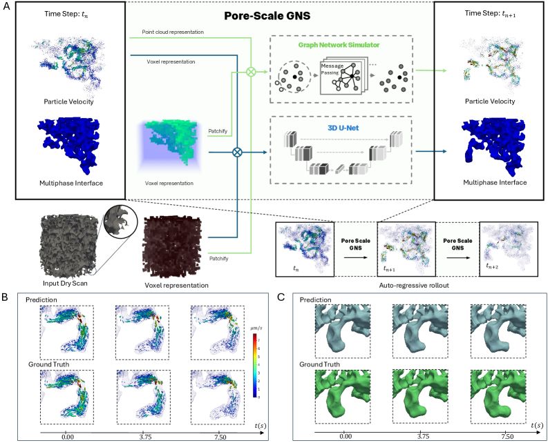

**図1:** Pore Scale GNS フレームワークの全体アーキテクチャ。(A) 各タイムステップにおけるモデルへの入力処理の概要（孔隙幾何・粒子速度・界面情報のマルチモーダル入力）、(B) 予測速度場と正解の時系列比較、(C) 流体界面の時間発展の予測と正解の比較。GNSとU-Netが相互に情報を交換する設計が、粒子スケール速度と3D界面ダイナミクスの同時予測を可能にしていることを示す。

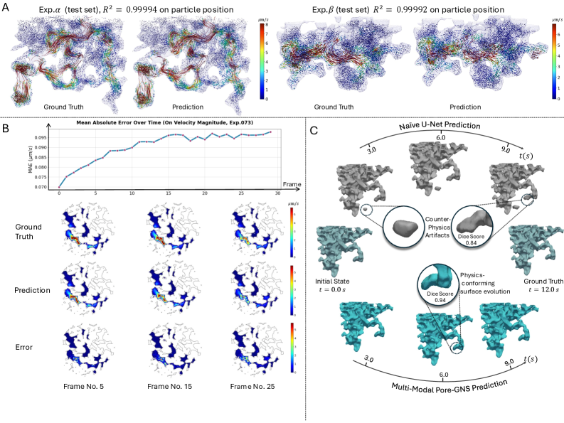

**図2:** 2種類のメニスカス構成に対する粒子軌跡の予測と正解の比較（A）、30フレームにわたる速度誤差の時系列推移とフレームごとの流れ場比較（B）、ナイーブアーキテクチャとマルチモーダル予測の対比（C）。マルチモーダル情報交換により、単純アーキテクチャでは再現できない界面連動した速度変化を捉えられることが示されている。

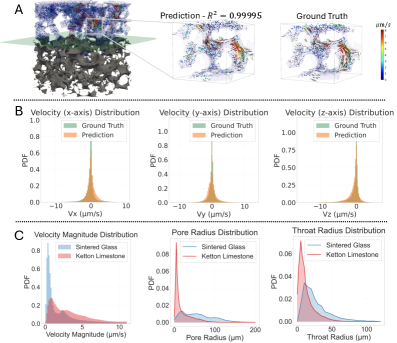

**図3:** 未学習岩石タイプ（Ketton石灰岩）への独立排液実験での汎化。(A) 予測と正解の粒子軌跡・速度場の可視化、(B) 速度分布の予測値と正解値の比較、(C) 孔隙スケール記述子を用いたドメインシフトの特徴付け。学習岩石から独立した石灰岩での汎化が定性的に妥当であることを示す一方、ドメインシフトの定量的影響も明示している。

---
---

## 重点論文 2

### 1. 論文情報

**タイトル:** [Generalist Large Language Models for Molecular Property Prediction: Distilling Knowledge from Specialist Models](https://arxiv.org/abs/2603.12344)
**著者:** Khiem Le, Sreejata Dey, Marcos Martínez Galindo, Vanessa Lopez, Ting Hua, Nitesh V. Chawla, Hoang Thanh Lam
**arXiv ID:** 2603.12344
**カテゴリ:** cs.LG
**公開日:** 2026-03-12
**論文タイプ:** 研究論文
**ライセンス:** CC BY 4.0

> **注:** 本論文はarXiv HTMLバージョンが利用できないため、図の抽出ができなかった。

---

### 2. どんな研究か

LLM（大規模言語モデル）は文脈学習による汎用分子特性予測の有力な候補だが、XGBoostやランダムフォレスト等の専門家モデルが示す特性予測精度に届かないことが知られている。本論文はTreeKD（Tree Knowledge Distillation）を提案し、官能基ベースの特徴量で学習した決定木専門家モデルのルールを自然言語に変換してLLMのプロンプトとして与えることで、SMILESから直接学習するLLMの限界を補う。さらにTest-Time Scaling手法として「ルール一貫性（rule-consistency）」アンサンブルを導入し、Therapeutics Data Commons（TDC）の22種ADMET特性ベンチマークでLLMと専門家モデルの性能差を縮めることを示した。

---

### 3. 位置づけと意義

分子特性予測においてLLMは汎用性という大きなアドバンテージを持つが、官能基の化学的意味・構造-特性相関のルールを暗黙的に内包するXGBoostやランダムフォレストの精度には長らく及ばなかった。本論文の核心は、専門家モデルの「暗黙知（決定木ルール）」を明示的な自然言語ルールに変換してLLMに与えるというアプローチにあり、これは知識蒸留の枠組みをモデル-モデル間の隠れ層整合から、ルール言語化という解釈可能な形に拡張している。薬剤ADMET予測という最も応用インパクトの大きいベンチマークでの評価は説得力があり、汎用LLMと特化専門家モデルの役割分担・統合を考える際の指針となる。

---

### 4. 研究の概要

**背景・目的:** 薬剤開発における分子特性（吸収・分布・代謝・排泄・毒性、ADMET）の予測は、化合物スクリーニングを加速する上で不可欠である。XGBoostやランダムフォレストは各特性タスクに特化した専門家モデルとして高精度を達成してきたが、新規タスクへの汎化には再学習が必要であり、汎用的な推論ができない。LLMは汎用的なコンテキスト学習ができるが、SMILESというシーケンス表現から化学的構造ルールを直接抽出する能力が限られ、精度が劣ってきた。

**情報学的アプローチ:** TreeKDは以下の3段階から構成される。(1) 官能基特徴量を入力に決定木専門家モデルを各ADMETタスクで訓練する（Specialist Training）。(2) 学習済み決定木のルールを自然言語に変換し、LLMへの文脈プロンプトとして与える（Verbalization）。(3) 推論時に複数のランダムフォレストルールに基づくアンサンブルを行う「ルール一貫性」を適用し、バギングに着想を得たTest-Time Scalingを実現する（Rule-Consistency）。

**対象材料系:** 薬剤小分子（有機分子、22種ADMET特性）。

**使用データ:** Therapeutics Data Commons（TDC）ベンチマーク。多数の公開医薬品データセットを統合した標準評価スイート。

**主な結果:** TreeKDはLLMの22種ADMET特性における平均性能を有意に向上させ、専門家モデルとのギャップを縮小した。rule-consistencyアンサンブルにより推論時スケーリングの効果も確認されている。

**著者の主張:** 決定木専門家モデルの暗黙的ルールを言語化してLLMに橋渡しすることで、SMILESから直接抽出困難な官能基構造-特性相関をLLMが活用できるようになり、汎用LLMの分子特性予測への実用性が向上する。

---

### 5. 対象分野として重要なポイント

**対象特性・課題:** 薬剤ADMET特性（吸収・分布・代謝・排泄・毒性）の予測。分子設計・仮想スクリーニング・計算毒性評価に直結。

**手法・記述子の妥当性:** 官能基ベース記述子は化学者が使う概念単位に近く、決定木が官能基ルールを学習しやすい。このルールを自然言語化することで、LLMの化学語彙との整合性が高まる設計は論理的に妥当。

**データセット評価の適切性:** TDCは22種の標準ADMETベンチマークであり、比較基盤として広く認知されており適切。

**既存研究との差分:** LLMへの知識蒸留は従来、ロジット整合（soft targets）や中間層整合が主であったが、本研究はルールの言語化という人間可読な中間表現を介する点で独自性がある。

**一般化可能性:** ADMET以外の分子特性（光学特性・触媒活性・材料特性）への転用が原理的には可能であり、有機半導体・ペロブスカイト太陽電池材料への応用も視野に入る。

**材料設計への貢献:** 計算代替（実験スクリーニングの仮想化）、探索加速（大規模ライブラリ評価の効率化）。

---

### 6. 限界と注意点

本論文の評価対象が薬剤ADMET特性に限定されており、材料科学的な特性（形成エネルギー・バンドギャップ・機械特性）への汎化が確認されていない。官能基記述子の選定と決定木の学習プロセスが特性予測の性能を左右するため、良質な専門家モデルを事前に用意できる状況に依存する。また、ルール言語化の品質（どのようなルールが生成されるか）がLLMの文脈活用に大きく影響するが、生成ルールの評価・選択方法についての詳細な分析が限られている。rule-consistencyアンサンブルは推論コストの増加を伴うため、スケーラビリティに注意が必要である。LLMのスケール（パラメータ数）依存性についても限られた範囲でしか評価されていない可能性がある。

---

### 7. 関連研究との比較と研究動向における立ち位置

**主要先行研究との差分:** GPT-4等の汎用LLMを分子特性予測に直接適用した研究（Jablonka et al. 2024など）と比較して、TreeKDは専門家モデルの明示的ルールを経由する点で新規性がある。ChemBERTa等の化学特化事前学習モデルは構造情報の暗黙的エンコードを目指す方向だが、本論文は人間可読なルール言語化という方針で差別化している。

**同時期の競合:** LLMへのMolecularScratchpad・Reaction SMARTS等を用いた化学推論拡張は複数提案されており、ルール言語化という方向は競合手法と部分的に重なる。

**分野前進の評価:** LLMと専門家モデルの統合という方向ではincrementalな進展だが、ルール一貫性アンサンブルというTest-Time Scalingの応用は新鮮であり、応用的に有用な実証結果をもたらしている。

**引用されうるコミュニティ:** 創薬インフォマティクス・分子特性予測・LLM科学応用・知識蒸留・マテリアルズインフォマティクス（有機材料）。

**今後の展開:** 非医薬品分子（有機半導体・触媒・ポリマー）への応用、グラフNN専門家モデルとの統合、より大規模なLLMでのスケーリング検証。

**再現性:** TDCは公開ベンチマークであり再現性の基盤はある。コード公開状況については論文中の情報が限られており確認が必要。

---

### 8. 関連キーワードの解説

**知識蒸留（Knowledge Distillation）:** 高精度な「教師モデル」の知識を、より小さいか汎用性の高い「生徒モデル」に転移する学習手法。Hinton et al. (2015)が提案。従来は教師の出力分布（ソフトターゲット）を模倣させる形が主だったが、本研究では決定木ルールを言語化するという新しい形式をとる。

**ADMET特性:** 薬剤候補分子の薬物動態プロファイルを構成するAbsorption（吸収）、Distribution（分布）、Metabolism（代謝）、Excretion（排泄）、Toxicity（毒性）の5特性群の総称。創薬初期のバーチャルスクリーニングで候補化合物を絞り込む際に中心的な評価指標となる。

**TDC（Therapeutics Data Commons）:** HarvardのZitnik研究室が整備した創薬向け機械学習ベンチマークコレクション。ADMET予測・標的-リガンド親和性・薬剤反応性など22種以上の標準化されたタスクと評価パイプラインを提供し、創薬ML研究の比較基盤として広く採用されている。

**Test-Time Scaling（推論時スケーリング）:** LLMの推論精度を推論時の計算量増加（複数サンプリング・多段推論・アンサンブル）によって向上させる手法群の総称。学習追加コストなしで精度向上が図れるため、特定タスクへの専門化が困難な汎用LLMの補強戦略として注目される。

**官能基記述子（Functional Group Descriptors）:** 分子を構成する官能基（ヒドロキシル基・カルボキシル基・アミノ基など）の有無・数を特徴量としてエンコードした表現。化学的意味が明確であり、決定木系モデルが化学者解釈可能なルールを学習しやすいという利点がある。

---

### 9. 図

本論文はarXiv HTMLバージョンが利用できないため、論文原図の抽出ができなかった。詳細は [arXiv:2603.12344](https://arxiv.org/abs/2603.12344) のPDFを参照されたい。

---
---

## 重点論文 3

### 1. 論文情報

**タイトル:** [Representation Learning for Spatiotemporal Physical Systems](https://arxiv.org/abs/2603.13227)
**著者:** Helen Qu, Rudy Morel, Michael McCabe, Alberto Bietti, François Lanusse, Shirley Ho, Yann LeCun
**arXiv ID:** 2603.13227
**カテゴリ:** cs.LG, cs.CV
**公開日:** 2026-03-13
**論文タイプ:** ワークショップ論文（ICLR 2026）
**ライセンス:** CC BY 4.0

---

### 2. どんな研究か

時空間物理シミュレーションデータへの自己教師あり表現学習において、従来主流であったピクセル/フレーム再構成型（VideoMAEなどのマスク付きオートエンコーダ）と、潜在空間内での予測を行うJEPA（Joint Embedding Predictive Architecture）のどちらが物理パラメータ推定という下流タスクに有益な表現を学習するかを系統的に比較した研究である。アクティブマター系を含む複数の物理シミュレーション系で評価を行い、JEPAがVideoMAEを大幅に上回ることを示した。物理パラメータの推定精度という観点からビデオ表現学習の設計指針を問い直す、物理インフォームド機械学習と自己教師あり学習の接点に位置する研究である。

---

### 3. 位置づけと意義

科学的シミュレーションデータへの自己教師あり表現学習は、ラベルなしの大量シミュレーションデータを活用して汎用的な物理表現を獲得するという観点で近年関心が高まっている。従来はビデオ理解の文脈で開発されたVideoMAEやMAEの応用が多かったが、これらのピクセル再構成型手法が物理パラメータ推定に本当に有効かは自明でない。本論文はこの問いに実証的に答え、「潜在空間での予測（JEPA型）が物理下流タスクに適している」という設計指針を支持するデータを提供している。LeCunを含む著者陣の存在もあり、I-JEPA/V-JEPAの物理科学への展開という文脈で引用・参照されると考えられる。

---

### 4. 研究の概要

**背景・目的:** 物理シミュレーションのデータ駆動型解析では、大量のラベルなし時系列データを活用して潜在表現を学習し、それを物理パラメータ推定・状態推定・予測などの下流タスクに使うことが有望視されている。しかしビデオ表現学習の多くは次フレーム予測や再構成を目標としており、物理パラメータ推定という科学的タスクに最適かどうかは不明であった。

**情報学的アプローチ:** V-JEPA/I-JEPA（Joint Embedding Predictive Architecture）と VideoMAE（マスク付きビデオオートエンコーダ）を比較評価する。JEPAは入力の一部をマスクし、マスクされた領域の表現を潜在空間内で予測するアーキテクチャであり、入力再構成を目標としない。評価は物理パラメータの線形プロービングまたはファインチューニングにより行う。

**対象材料系・物理系:** アクティブマター（自己駆動粒子系）、レイリー・ベナール対流（温度・粘性依存の熱対流）など複数の物理シミュレーション。

**使用データ:** 物理シミュレーションから生成された時空間場データ（レイリー・ベナール、アクティブマターなど）。物理パラメータ（レイリー数・プラントル数・活性度パラメータなど）が既知のラベルを提供する。

**主な結果:** JEPA型の表現学習がVideoMAEを下流の物理パラメータ推定で上回ることを複数の物理系で示した。特にアクティブマター系での改善が顕著であり、論文中には51%の性能向上が報告されている。

**著者の主張:** 物理系への表現学習の設計においては、ピクセル再構成より潜在空間での予測（JEPA型）が物理パラメータに関連した表現を獲得しやすく、次世代の物理科学向け自己教師あり学習の設計指針として有効である。

---

### 5. 対象分野として重要なポイント

**対象物性・現象:** 流体力学パラメータ（Re数・Ra数・Pr数）、アクティブマター秩序パラメータなど、シミュレーションで生成した場データから逆推定される物理量。

**手法設計の意義:** JEPAは再構成誤差を最小化するのではなく「何が起きるか」の概念的予測を潜在空間で行う。物理系では低次元マニフォールド上の物理法則が支配的であり、高次元ピクセルの再構成より物理パラメータを捉えた潜在表現の学習に適していると解釈できる。

**評価指標の適切性:** 物理パラメータ推定精度（RMSE等）という科学的に意味ある指標で評価されており、ビデオ理解ベンチマーク（UCF等）での評価と異なる軸を提供している点が重要。

**既存研究との差分:** VideoMAEをベースとしたシミュレーションへの応用（SimVP等）との比較において、JEPA型が有利という結論は、物理科学向け事前学習の設計方針に新たな示唆を与える。

**一般化可能性:** 流体力学・アクティブマター以外の物理系（格子ボルツマン法の結果・分子動力学軌跡・結晶成長シミュレーション）への展開が視野に入る。

**材料設計への貢献:** 物性解釈（シミュレーションデータからの物理パラメータ逆推定）に有効。高精度シミュレーションの物理パラメータ推定の加速にも使える。

---

### 6. 限界と注意点

本論文はICLR 2026ワークショップ論文であり、本会議論文と比較して実験規模・ベンチマーク多様性・アブレーション深度が限定的である可能性がある。アクティブマターでの51%改善は注目すべきだが、他の物理系での改善幅がどの程度かを見極める必要がある。比較対象がVideoMAEのみである場合は、より広範なビデオ表現学習手法（VideoMAE V2、InternVideo等）との比較が今後求められる。また、表現学習の事前学習データ量に対する感度（少量データでのパフォーマンス）についての議論が限られる可能性がある。

---

### 7. 関連研究との比較と研究動向における立ち位置

**主要先行研究との差分:** LeCunのI-JEPA（自然画像）、V-JEPA（ビデオ）の物理科学への応用として位置づけられる。McCabe et al.のMultiple Physics Pretraining（MPP）など物理系の事前学習研究と並走する関係にある。

**競合・類似研究:** Aurora/FengWu/Pangu-Weather等の気象場の大規模事前学習、SimulLM、AIFS等の物理シミュレーション向けFoundation Modelと部分的に競合するが、本論文はパラメータ推定という評価軸で特化した比較を行っている。

**分野前進の評価:** JEPA vs. MAEの比較という観点では先行研究も存在するが、物理パラメータ推定という評価軸に特化した系統的比較は新規性があり、物理科学向けSSLの設計指針として有益。

**引用されうるコミュニティ:** 物理インフォームド機械学習・流体力学ML・自己教師あり学習・科学基盤モデル・材料シミュレーション。

**今後の展開:** より多様な物理系（結晶成長・複合材料変形・電磁場）への展開、JEPA型アーキテクチャを用いた逆問題（パラメータ推定以上の物性逆設計）への応用。

**再現性:** コードはGitHubで公開されており、再現性の基盤がある。ただしシミュレーションデータ生成の計算コストが再現の障壁になりうる。

---

### 8. 関連キーワードの解説

**JEPA（Joint Embedding Predictive Architecture）:** LeCunが提案した自己教師あり学習フレームワーク。入力の一部をマスクし、そのマスク領域の「潜在表現」を予測する。ピクセル空間での再構成（VAE・MAE型）と異なり、高次元ノイズの多い空間ではなく意味的潜在空間で予測するため、抽象的概念（物理パラメータ等）を捉えた表現が得られやすいとされる。I-JEPA（画像）・V-JEPA（ビデオ）として実装されている。

**VideoMAE（Video Masked Autoencoder）:** 動画の時空間チューブをランダムマスクし、マスク領域のピクセルを再構成することで事前学習するビデオ表現学習手法。高いマスク率（90%等）でも有効な表現を学習できるが、ピクセル再構成という目標設定が物理タスクに適切かは自明でない。

**アクティブマター（Active Matter）:** 個々の構成要素が自ら駆動力を生み出す系（細菌・活性粒子・鳥の群れなど）。非平衡統計力学の中核的研究対象であり、機械学習による集団行動パラメータの推定が難しい。活動性（activity）パラメータからの集団秩序状態推定が代表的タスク。

**レイリー・ベナール対流:** 下部から加熱された流体中で重力と浮力の競合により自発的に形成される熱対流構造。レイリー数（Ra）とプラントル数（Pr）で支配されるベンチマーク物理系として広く使われる。MLによるRa・Prの場データからの推定は物理表現学習の評価タスクとして有用。

**線形プロービング（Linear Probing）:** 事前学習済みの特徴抽出器の出力に線形分類器/回帰器のみを接続し、その精度で表現の質を評価する手法。特徴抽出器を固定するため、表現の中に有用な情報がどの程度含まれているかを純粋に測ることができる。

---

### 9. 図

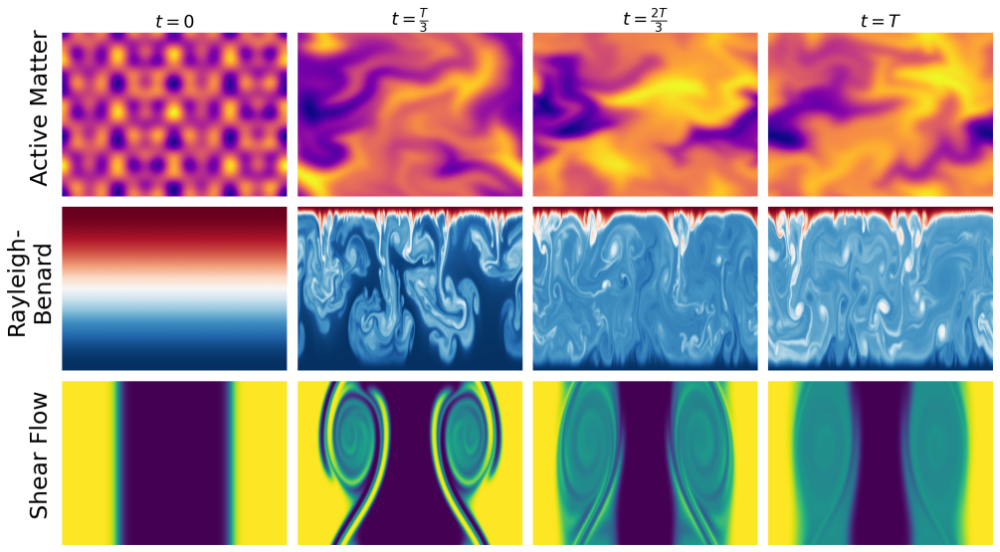

**図1:** 評価対象となる物理系の代表的な時間発展軌跡のサンプル。レイリー・ベナール対流、アクティブマターなど、異なる物理メカニズムを持つ系が含まれる。各系の視覚的多様性が、汎用的な物理表現学習の評価基盤として適切であることを示す。

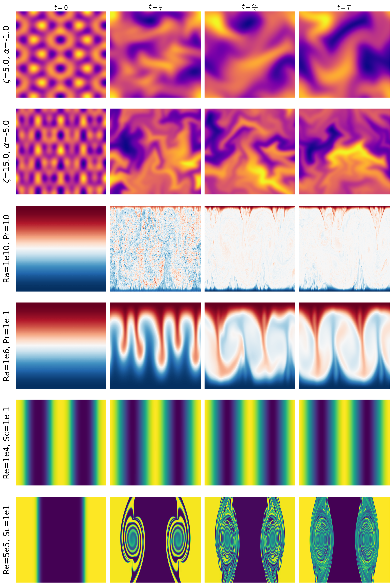

**図2:** 異なる物理パラメータ値（レイリー数・プラントル数など）に対応した系の時間発展の違い。同じ物理系でもパラメータ値によって巨視的挙動が質的に変化することが示されており、表現学習がこれらを識別できるかが評価の要点となる。JEPAが潜在空間での予測によりこの多様性を捉えた表現を学習できることを主張する根拠となる。

---
---

# その他の重要論文

---

## 簡潔紹介 1

### 1. 論文情報

**タイトル:** [GeoChemAD: Benchmarking Unsupervised Geochemical Anomaly Detection for Mineral Exploration](https://arxiv.org/abs/2603.13068)
**著者:** Yihao Ding, Yiran Zhang, Chris Gonzalez, Eun-Jung Holden, Wei Liu
**arXiv ID:** 2603.13068
**カテゴリ:** cs.LG, cs.AI
**公開日:** 2026-03-13
**論文タイプ:** 研究論文
**ライセンス:** CC BY-NC-ND 4.0

---

### 2. 研究概要

地球化学探査における鉱物資源の異常検出は、土壌・河川堆積物などから採取した多元素組成データの中から鉱化地点と相関する空間的異常を識別する問題であり、資源探査の効率化に直結する。従来の研究は単一地域・非公開データセットに依存していたため再現性と比較可能性に乏しく、手法の客観的評価が困難であった。本論文はGeoChemADとして政府地質調査機関の公開データをもとに8つのサブセットから成るオープンベンチマークを構築し、空間的スケール・サンプリング条件の多様性を考慮した標準評価基盤を提供した。加えて、GeoChemFormerと呼ぶトランスフォーマーベースのフレームワークを提案しており、空間的隣接サンプルの文脈を自己教師あり事前学習で学習した後、元素濃度間の依存関係を空間文脈に条件づけてモデル化することで異常スコアを生成する。

GeoChemFormerは全8サブセットで統計的手法・生成モデルベース手法などの既存ベースラインを一貫して上回る異常検出精度と汎化性能を示した（AUC 0.7712 を代表スコアとして報告）。地球化学異常検出というタスクは、元素濃度の空間相関・元素間相互作用という材料系特有の構造を考慮する必要があり、汎用的な異常検出手法では対応が難しい。GeoChemADベンチマークの公開は、探査地球化学へのAI応用の比較基盤として、鉱物資源インフォマティクスの発展を促進する重要な基盤となる。

---

### 3. 図

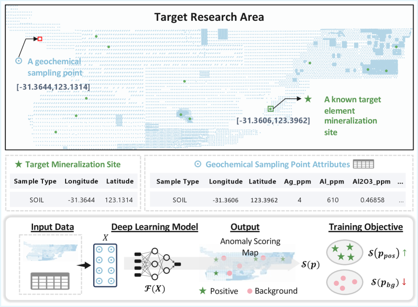

**図1:** 地球化学異常検出タスクの定義と問題設定。採取した地球化学サンプルの空間分布と鉱化地点との位置関係を示しており、どの空間的地球化学パターンが「異常」として定義されるかを明示する。教師なし設定での異常検出タスクの難しさを示す基本設定図。

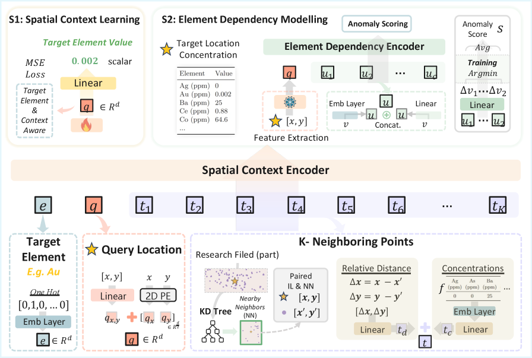

**図2:** GeoChemADベンチマークのデータセット分析。(a) 研究地域の分布、(b-c) 元素濃度値の分布、(d) 鉱化地点と地球化学サンプルの空間相関、(e) 空間補間の例。8サブセットが地理的・統計的に多様であることが示されており、汎化性能評価の妥当性を支持する。

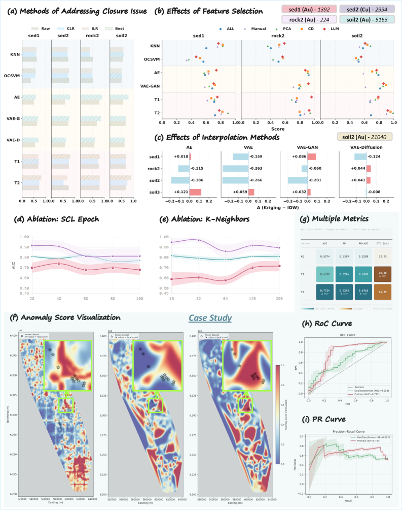

**図3:** GeoChemFormerの全体アーキテクチャ。空間的近傍サンプルから空間的に情報を付与した表現を学習し（自己教師あり事前学習）、その表現を用いて元素濃度間の依存関係を空間文脈に条件づけてモデル化する。トランスフォーマーが地球化学の空間-組成結合構造を捉えることを可能にする設計。

---

## 簡潔紹介 2

### 1. 論文情報

**タイトル:** [Adaptive Diffusion Posterior Sampling for Data and Model Fusion of Complex Nonlinear Dynamical Systems](https://arxiv.org/abs/2603.12635)
**著者:** Dibyajyoti Chakraborty, Hojin Kim, Romit Maulik
**arXiv ID:** 2603.12635
**カテゴリ:** cs.LG, nlin.CD, physics.flu-dyn
**公開日:** 2026-03-13
**論文タイプ:** 研究論文
**ライセンス:** CC BY 4.0

---

### 2. 研究概要

乱流などの複雑非線形力学系のサロゲートモデリングにおいて、決定論的モデルは長時間ロールアウト時の誤差蓄積に弱く、実験センサー観測との統合（データ同化）も困難であった。本論文は拡散モデルを用いた確率論的サロゲートフレームワークを提案し、マルチスケールグラフトランスフォーマーアーキテクチャを非構造格子の複雑形状に対応させることで、乱流の速度場を長期にわたって安定して予測する。さらに、マルチステップ自己回帰拡散目標（multi-step autoregressive diffusion objective）を導入することで、単一ステップ訓練と比較して長時間安定性を大幅に改善した。

特に重要な貢献として、センサー配置の最適化と拡散ポスタリアサンプリングを組み合わせたアダプティブデータ同化機構を実装している。センサー位置を不確実性・誤差推定に基づいて適応的に決定し、その観測を拡散ポスタリアサンプリングによりモデル予測に統合することで、モデル再学習なしに精度を向上させる。均一サンプリングや無情報センサー配置と比較して30〜40%の予測誤差削減が確認されており、2次元等方性乱流および後方ステップ流れの二つのベンチマークで検証している。流体力学シミュレーションの高コストを補うサロゲートと実験センサーデータの統合という観点で、材料プロセス・エネルギー系の流体問題に広い波及を持つ。

---

### 3. 図

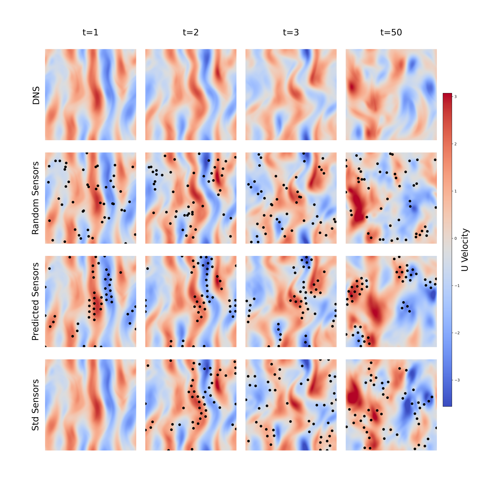

**図1:** 単一ステップ拡散訓練とマルチステップ自己回帰拡散訓練による速度場予測の比較。DNS正解との差異を複数のタイムステップで示しており、マルチステップ訓練が長時間ロールアウトでの精度を維持することを視覚的に確認できる。

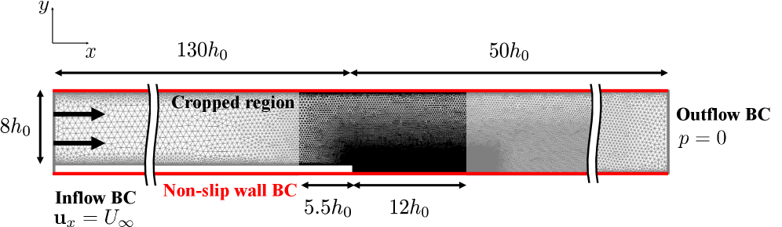

**図2:** 単一ステップ拡散モデルとマルチステップ拡散モデルの予測誤差の時間発展（DNS比）。マルチステップ訓練による長時間安定性の向上が定量的に示されており、サロゲートモデルの実用性評価において重要な指標となる。

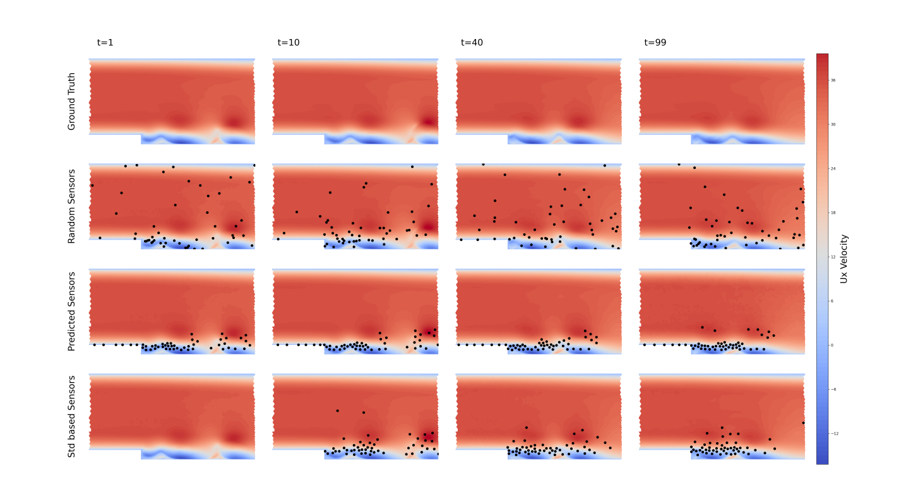

**図3:** 異なるセンサー配置戦略による速度場予測の比較（センサー位置を黒点で表示）。適応的なセンサー配置（不確実性・誤差推定ベース）が、均一配置や無情報配置と比べて予測精度を向上させることを示している。

---

## 簡潔紹介 3

### 1. 論文情報

**タイトル:** [Scaling Laws and Pathologies of Single-Layer PINNs: Network Width and PDE Nonlinearity](https://arxiv.org/abs/2603.12556)
**著者:** Faris Chaudhry
**arXiv ID:** 2603.12556
**カテゴリ:** cs.LG, math.NA, physics.comp-ph
**公開日:** 2026-03-13
**論文タイプ:** ワークショップ論文（NeurIPS 2025 ML&PS workshop）
**ライセンス:** CC BY 4.0

> **注:** 本論文はarXiv HTMLバージョンが利用できないため、図の抽出ができなかった。詳細は [arXiv:2603.12556](https://arxiv.org/abs/2603.12556) のPDFを参照されたい。

---

### 2. 研究概要

物理インフォームドニューラルネットワーク（PINN）は非線形偏微分方程式（PDE）の求解に広く応用されているが、ネットワーク幅と予測精度の関係（スケーリング則）や、非線形性増大に伴う最適化困難（病理）については体系的な実証研究が少なかった。本論文は単層PINNを対象に、ネットワーク幅とPDE非線形性の2軸で精度の経験的スケーリング関係を調査し、二つの病理を特定している。第一の病理は「ネットワーク幅を増やしても解誤差がプラトーに達する」という飽和現象であり、第二はPDE非線形性がこの飽和を悪化させるという相乗効果である。著者はこれらを単純なべき乗則では記述できない非分離的関係として定式化し、病理の主因を近似能力の限界ではなく最適化困難（スペクトルバイアス）に帰している。

この研究はPINNの実装を行う材料・流体・構造研究者にとって直接的な設計指針を提供する。スペクトルバイアス（低周波成分を優先的に学習し、高周波成分の再現が遅れる現象）はPINNの既知の課題だが、非線形性がこれを増幅させるという定量的関係は、問題設定に応じたアーキテクチャ選択（多層化・フーリエ特徴マッピングなど）の必要性を支持する実証的根拠となる。PINNを材料応力場・熱伝導・電磁場シミュレーションに使用する際のモデル設計判断に参照価値がある。

---

## 簡潔紹介 4

### 1. 論文情報

**タイトル:** [Budget-Sensitive Discovery Scoring: A Formally Verified Framework for Evaluating AI-Guided Scientific Selection](https://arxiv.org/abs/2603.12349)
**著者:** Abhinaba Basu, Pavan Chakraborty
**arXiv ID:** 2603.12349
**カテゴリ:** cs.LG, cs.AI, q-bio.QM, stat.ML
**公開日:** 2026-03-12
**論文タイプ:** 研究論文
**ライセンス:** CC BY 4.0

---

### 2. 研究概要

AIを用いた科学的候補選択（創薬・材料スクリーニング等）の評価において、予算制約（どれだけの実験コストをかけられるか）を明示的に考慮した評価指標が欠如していることが問題として指摘されてきた。本論文はBudget-Sensitive Discovery Score（BSDS）というフレームワークを提案し、偽発見率（FDR）の予算加重ペナルティと過度な棄権（abstention）のペナルティを統合した評価指標を設計した。20個の定理をLean4形式検証器で証明することにより、フレームワークの数学的一貫性を保証しており、評価フレームワークに形式的根拠を与えるという手法論的な新規性がある。39の提案器（ベースライン・機械学習・LLM）をMoleculeNet HIVデータセットで評価した結果、単純なランダムフォレストベースのGreedy-MLがすべてのLLM構成を上回り最良のDQS（Discovery Quality Score）を達成した。

この結果は「LLMは分子特性予測における候補選択で既存の訓練済み分類器より優れている」という主張への強い反証となる。評価フレームワークの形式的検証という方法論自体も材料インフォマティクスへの示唆があり、将来の材料スクリーニング評価においてBSDSのような予算制約付き指標の採用が望ましい。BSDS自体は薬剤データへの適用だが、活性材料スクリーニング・触媒ライブラリ選択など、限られた実験リソースで高ヒット率を追求する問題全般に転用可能な枠組みである。

---

### 3. 図

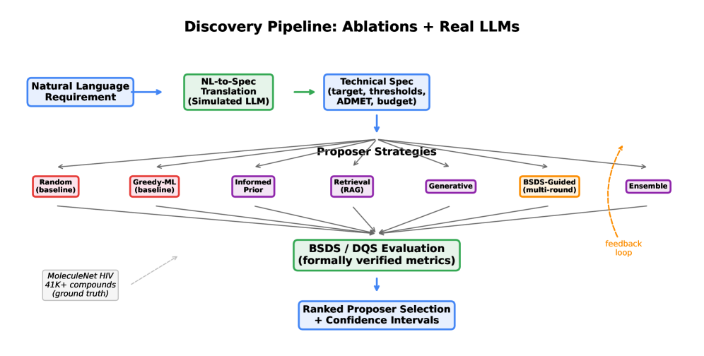

**図1:** 39の提案器を5カテゴリ（ベースライン・機械的アブレーション・直接最適化・アブレーション制御・実際のLLM）に分類した評価パイプラインの全体像。BSDSフレームワークの評価対象と評価フローが体系的に示されており、フレームワークの汎用性と実装の規模感を確認できる。

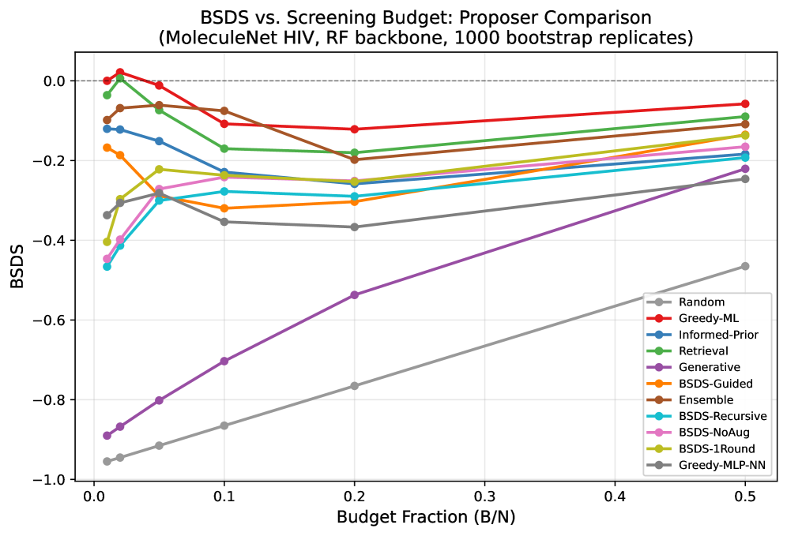

**図2:** 機械的提案器のBSDSスコア値を予算フラクションに対してプロットした性能曲線。信頼帯付きで表示されており、Greedy-MLが全予算水準で優位性を維持していることを定量的に示す。予算制約下での候補選択アルゴリズムの性能比較を系統的に可視化する。

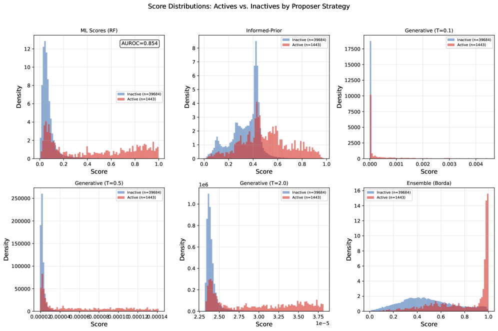

**図3:** 機械的提案器のDQS（Discovery Quality Score）のブートストラップ分布の可視化。Greedy-MLが最小分散を示し、Retrievalが個別予算水準で有利なスコアを達成していることが確認できる。統計的確実性の観点からの提案器比較として重要。

---

## 簡潔紹介 5

### 1. 論文情報

**タイトル:** [Hydrogen-atom roaming reactions in water clusters: Unveiling an unusual dimension of water reactivity through first-principles calculations and machine learning](https://arxiv.org/abs/2603.12778)
**著者:** Rui Liu, Baiqiang Liu, Zhen Gong, Zhaohua Cui, Yue Feng, Zhigang Wang
**arXiv ID:** 2603.12778
**カテゴリ:** physics.chem-ph, physics.atm-clus, physics.comp-ph
**公開日:** 2026-03-13
**論文タイプ:** 研究論文
**ライセンス:** CC BY-NC-SA 4.0

> **注:** 本論文はCC BY-NC-SA 4.0ライセンスのため、原図を抽出して掲載することは適切でない（CLAUDE.md のライセンス指針に従い非掲載）。詳細は [arXiv:2603.12778](https://arxiv.org/abs/2603.12778) のPDFを参照されたい。

> **備考（隣接分野からの採用）:** 本論文は物理化学・計算科学の論文であり、機械学習を特性予測に使用しているという点で材料インフォマティクス隣接分野として採用した（CLAUDE.md フォールバック方針による）。

---

### 2. 研究概要

水クラスターにおける「水素原子ローミング反応」という従来未知の反応経路を第一原理計算と機械学習の組み合わせで発見・解析した研究である。ローミング反応とは、中性水素ラジカルが平坦なポテンシャルエネルギー面を「徘徊」しながら、同一の反応物・生成物をつなぐ代替経路を通じて反応が進む現象であり、爆発・燃焼・大気化学で知られるが水クラスターでの発見は新しい。計算により得られた反応経路・遷移状態・エネルギー面のデータに機械学習の特徴量重要度解析を適用し、ローミング発生の決定因子として双極子モーメントを同定した。さらに分極率・スピン密度・電荷分布が反応障壁の特性を支配することを明らかにした。

機械学習ポテンシャルや機械学習を用いた分子反応経路解析という文脈で、本論文はMLを「どの分子特性が反応を駆動するか」という機構解釈に用いる良い例である。双極子モーメントという解釈可能な物理量が鍵因子として特定された点は、設計指針（どのような水分子クラスター構造がローミングを抑制・促進するか）への接続を可能にする。直接的な材料応用ではないが、界面水・触媒表面の水和層・電解質溶液のH原子移動などの関連現象における分子機構解明へのアプローチとして示唆的である。

---

## 簡潔紹介 6

### 1. 論文情報

**タイトル:** [RUNNs: Ritz-Uzawa Neural Networks for Solving Variational Problems](https://arxiv.org/abs/2603.12982)
**著者:** Pablo Herrera, Jamie M. Taylor, Carlos Uriarte, Ignacio Muga, David Pardo, Kristoffer G. van der Zee
**arXiv ID:** 2603.12982
**カテゴリ:** math.NA
**公開日:** 2026-03-13
**論文タイプ:** 研究論文
**ライセンス:** CC BY 4.0

> **注:** 本論文はarXiv HTMLバージョンが利用できないため、図の抽出ができなかった。詳細は [arXiv:2603.12982](https://arxiv.org/abs/2603.12982) のPDFを参照されたい。

> **備考（隣接分野からの採用）:** 本論文は数値解析・計算数学の論文であるが、PINNの病理（低正則解・不安定性）を解決するアーキテクチャの提案として物理インフォームド機械学習分野に直接関連し、材料・流体・構造シミュレーションへの応用可能性があるため採用した（CLAUDE.md フォールバック方針による）。

---

### 2. 研究概要

PINNをはじめとする標準的なニューラルネットワークベースPDE解法は、低正則解（特異点・不連続解）を含む問題での不安定性・収束困難という既知の課題を抱えている。RUNNs（Ritz-Uzawa Neural Networks）はこの問題に対し、PDEを一連のRitz型最小化問題（変分問題）として逐次再定式化し、Uzawaループという反復的な数値解法の枠組みと組み合わせることで安定的な求解を実現するフレームワークを提案する。特に、Normalized Cumulative Power Spectral Density（NCPSD）に基づくSinusoidal Fourier Feature Mappingの初期化により、残差のスペクトル構造に適応した周波数チューニングを行い、PINNの根本的問題とされるスペクトルバイアス（高周波成分の学習遅延）を緩和する。

RUNNsは従来手法が失敗する「高振動解の再現」や「分布的H⁻²源から不連続L²解を回復する」問題でも収束を示した点が特筆される。変分問題の弱形式・超弱形式を扱う場合の分散（variance）は持続的に存在するが、強形式では受動的な分散低減が得られることも示されている。材料科学・流体力学でのPINN応用では、き裂先端の応力特異点・材料界面の不連続性・衝撃波など低正則場が重要な問題が多く、RUNNsはそのような問題への応用に有望なアーキテクチャである。

---

## 簡潔紹介 7

### 1. 論文情報

**タイトル:** [Development of a Methodology for the Automated Spatial Mapping of Heterogeneous Elastoplastic Properties of Welded Joints](https://arxiv.org/abs/2603.12892)
**著者:** Robert Hamill, Allan Harte, Aleksander Marek, Fabrice Pierron
**arXiv ID:** 2603.12892
**カテゴリ:** cs.CE, math.NA
**公開日:** 2026-03-13
**論文タイプ:** 研究論文
**ライセンス:** arXiv非独占ライセンス（原図掲載不可）

> **注:** 本論文はCC非掲載方針に従い、原図を掲載しない。詳細は [arXiv:2603.12892](https://arxiv.org/abs/2603.12892) のPDFを参照されたい。

> **備考（隣接分野からの採用）:** 本論文は材料力学的特性の空間マッピングという計算工学的研究であり、材料インフォマティクスの直接的な中核ではないが、非均質材料の力学特性自動計測という観点で材料特性評価の高度化に貢献するとして採用した（CLAUDE.md フォールバック方針による）。

---

### 2. 研究概要

溶接継手は母材・熱影響域・溶融域にわたって弾塑性特性が空間的に大きく変化する不均質材料であり、その局所特性の正確な把握は構造健全性評価・寿命予測に不可欠である。従来の特性評価（引張試験・硬さ試験）は空間分解能が低く、局所的な塑性特性分布を取得するには多大な試験コストがかかっていた。本論文はVirtual Fields Method（VFM）を拡張し、全視野光学計測（デジタル画像相関DIC等）から取得した変位場データを用いて弾塑性特性パラメータの空間分布を自動的にマッピングする方法論を開発した。シミュレーションによる合成光学計測データを使ったニュメリカル検証では、事前情報なしに目標パラメータマップに収束することを示した。

Virtual Fields Methodは逆問題として材料定数を同定する手法であり、有限要素法を用いた古典的な材料同定と比較して計算コストが低い利点がある。本研究の自動化・空間マッピング拡張は、溶接継手に限らず、複合材料・積層構造・グレーデッド材料など空間的不均質を持つ材料系全般への展開が期待される。英国原子力機関（UKAEA）との共同研究という背景から、核融合炉構造材料の溶接継手評価という高付加価値用途への直接的な応用が見込まれており、材料特性の計測インフォマティクスという観点から材料インフォマティクスに隣接する位置づけにある。

---

# 全体のまとめ

## 材料インフォマティクス分野の動向

今回の10本を通じ、実験データと機械学習の統合という方向が着実に進んでいることが確認できる。Pore Scale GNS（2603.12516）はシンクロトロン4D速度計測という先端実験データを直接学習データとして使用し、CFDを代替するサロゲートを実現した。実験-ML統合は「計算データでML、実験で検証」という従来の流れを逆転させ、実験データ自体が学習基盤になるという新しいパラダイムを実証している。並行して、JEPAによる物理表現学習（2603.13227）や拡散ポスタリアサンプリング（2603.12635）は、自然言語処理・コンピュータビジョンで発展した深層学習技術が物理科学の文脈で再設計されるという流れを示している。単なる手法移植ではなく、物理タスクに適した評価軸（パラメータ推定精度・長時間安定性）とアーキテクチャ選択（JEPA vs. MAE、マルチステップ拡散）の比較が精度よく行われ始めており、分野の方法論的成熟が伺われる。

## 明らかになった未解決領域

複数の論文が示す通り、汎化性能・外挿性能は依然として主要な未解決問題である。Pore Scale GNS（2603.12516）はゼロショット岩石汎化に取り組んだが長期ロールアウトでの誤差蓄積は解消されていない。BSDS研究（2603.12349）ではLLMが単純な訓練済み分類器にすら及ばないという結果が示されており、LLMの分子・材料科学への汎用適用性には過信が禁物であることが改めて確認された。RUNNs（2603.12982）とPINNスケーリング則（2603.12556）が示すように、物理インフォームド学習における最適化困難（スペクトルバイアス・低正則解）は未だ根本的な解決をみていない。不確実性評価・OOD検出・少量データ学習といった実用上の要件も、今回の論文群では十分に解決されているとは言えず、引き続き重要な研究課題として残っている。

## 今後の展望

近い将来に重要になると予想されるのは、実験-計算-MLのシームレスな統合パイプラインの実現である。Pore Scale GNSが示した実験データ直接学習と、JEPA型の汎用物理表現が融合すれば、少量の実験データから物理パラメータ推定・設計最適化までを一貫して行う自律実験システムの実現が視野に入る。TreeKDが示した専門家モデルとLLMの知識蒸留という方向は、材料データベース・第一原理計算・実験文献から学習した専門家モデルの知識をFoundation Modelに統合するという方向に発展しうる。GeoChemAD（2603.13068）やBSDS（2603.12349）が代表するように、ベンチマークの標準化・評価指標の形式化という基盤整備の動きも重要であり、材料インフォマティクスの研究成果が実際の探索・設計サイクルに組み込まれる際の信頼性保証として不可欠な役割を果たすことになる。

---

*本ダイジェストは2026-03-17に作成。対象期間は過去7日間（2026-03-10〜17）。フォールバック方針により対象分野を物理インフォームド学習・隣接計算科学に部分的に拡大して10本を選定した。*
