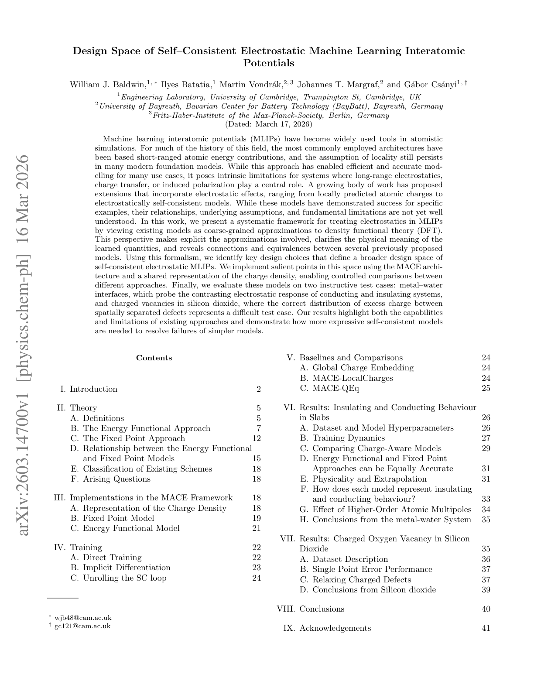
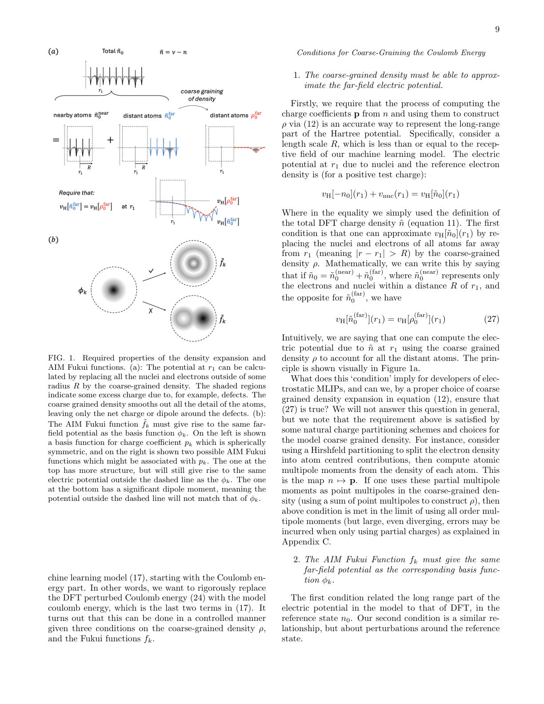
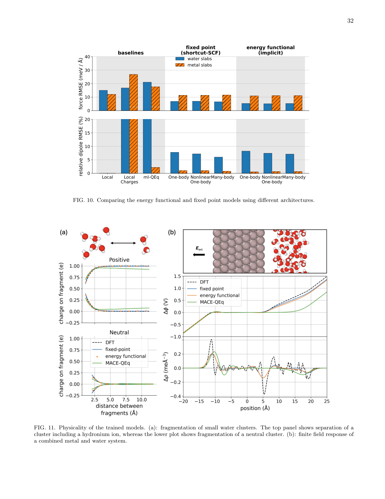
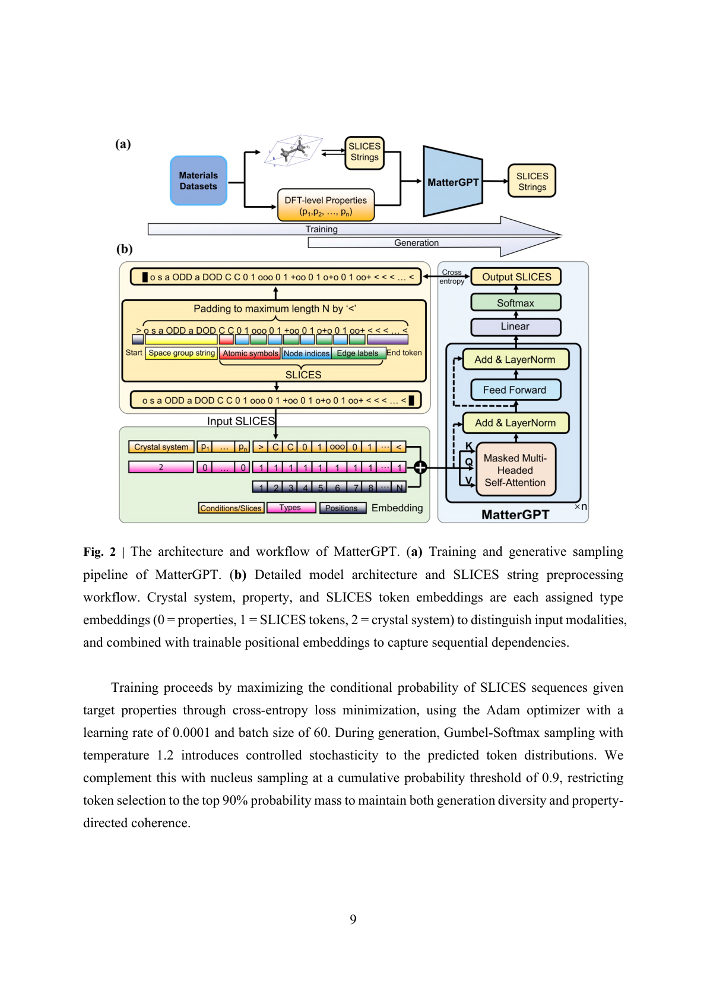
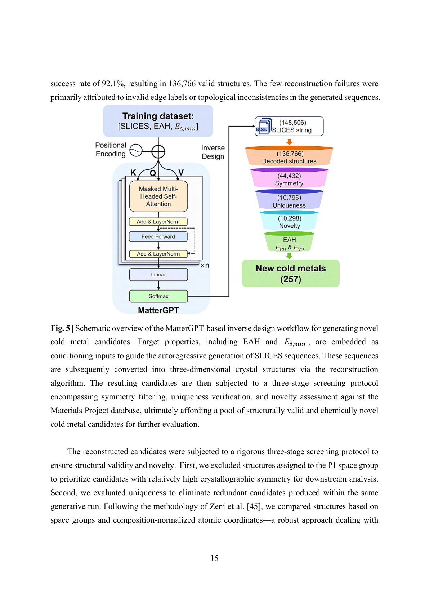
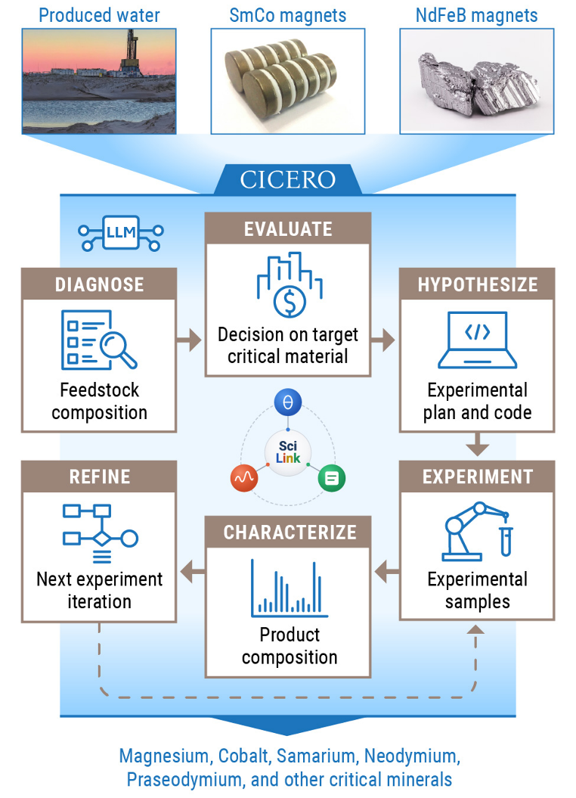
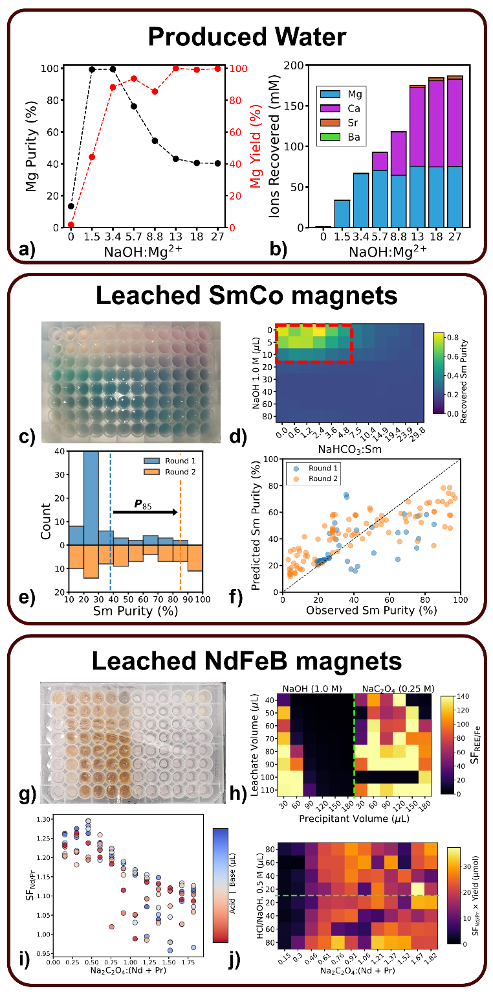
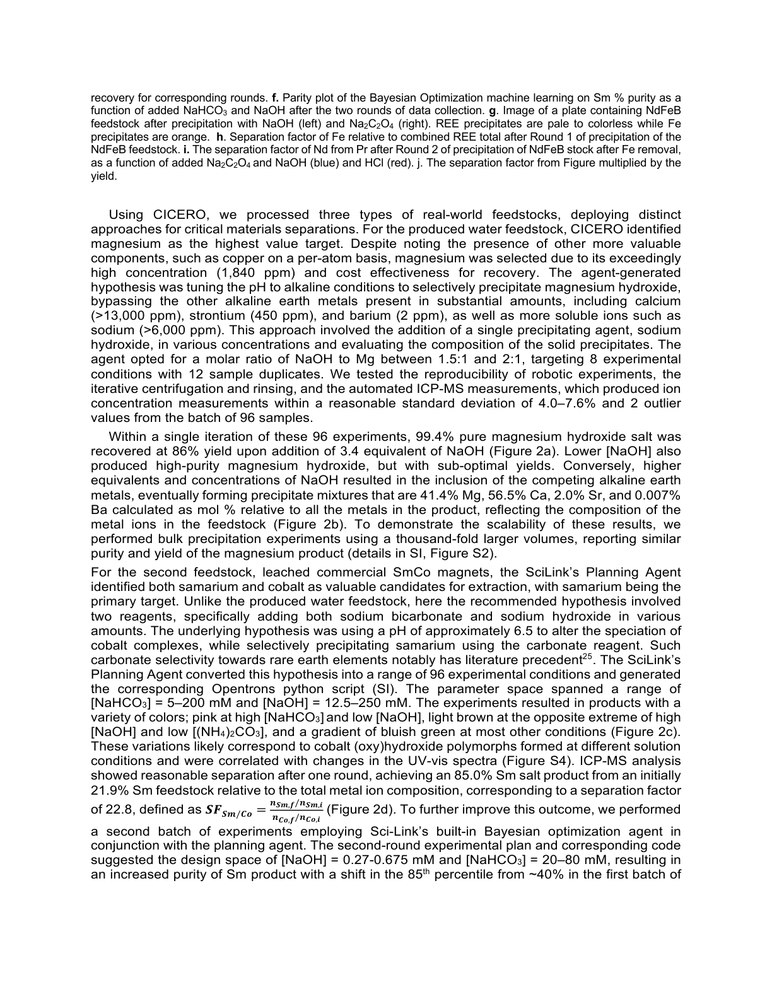

# 2026-03-18 マテリアルズ・インフォマティクス

**作成日：** 2026-03-18
**対象期間：** 2026-03-15 〜 2026-03-18（直近72時間）

---

## 選定論文一覧

1. [Design Space of Self-Consistent Electrostatic Machine Learning Interatomic Potentials](https://arxiv.org/abs/2603.14700) — Baldwin et al.
2. [Generative Inverse Design of Cold Metals for Low-Power Electronics](https://arxiv.org/abs/2603.13920) — Wu et al.
3. [Agentic workflow enables the recovery of critical materials from complex feedstocks via selective precipitation](https://arxiv.org/abs/2603.15491) — Ritchhart et al.
4. [Benchmarking Machine Learning Approaches for Polarization Mapping in Ferroelectrics Using 4D-STEM](https://arxiv.org/abs/2603.15582) — Martinc et al.
5. [Will it form a glass? Tackling glass formation using binary classification](https://arxiv.org/abs/2603.15312) — Carvalho et al.
6. [High-Throughput Computational Exploration of MOFs for Short-Chain PFAS Removal](https://arxiv.org/abs/2603.15503) — Zhang et al.
7. [Decoupling structural and bonding effects on ferroelectric switching in ScAlN via molecular dynamics under an applied electric field](https://arxiv.org/abs/2603.14747) — Sahashi et al.
8. [Digital Hydrogen Platform (DigHyd): A Rigorously Curated Database for Hydrogen Storage Materials Empowered by AI-Assisted Literature Mining](https://arxiv.org/abs/2603.14139) — Jang et al.
9. [A Kolmogorov-Arnold Surrogate Model for Chemical Equilibria: Application to Solid Solutions](https://arxiv.org/abs/2603.15307) — Boledi et al.
10. [UniMatSim: A High-Throughput Materials Simulation Automation Framework Based on Universal Machine Learning Potentials](https://arxiv.org/abs/2603.15294) — Xiang et al.

---

## 重点論文の詳細解説

---

### 論文 1

#### 1. 論文情報

**タイトル：** [Design Space of Self-Consistent Electrostatic Machine Learning Interatomic Potentials](https://arxiv.org/abs/2603.14700)
**著者：** William J. Baldwin, Ilyes Batatia, Martin Vondrák, Johannes T. Margraf, Gábor Csányi
**arXiv ID：** 2603.14700
**カテゴリ：** physics.chem-ph; cs.LG
**公開日：** 2026-03-16
**論文タイプ：** 研究論文（理論・実装・ベンチマーク）
**ライセンス：** CC BY 4.0

---

#### 2. どんな研究か

局所的な原子エネルギーを仮定する従来の機械学習ポテンシャル（MLIP）では、長距離静電相互作用・電荷移動・誘起分極が支配的な系を正確に扱えないという根本的限界がある。本研究は、この問題に対して密度汎関数理論（DFT）の粗視化近似という観点から既存の静電MLIPモデルを統一的に整理し、自己無撞着静電MLIPの設計空間を体系的に定義した。さらにMACEアーキテクチャ上にこの設計空間の主要な点を実装し、金属—水界面および酸化ケイ素中の荷電空孔という2つのベンチマーク系で異なるモデル変種の能力と限界を比較した。

---

#### 3. 位置づけと意義

MLIPの研究は過去10年間、局所性（locality）仮定のもとで高精度かつ効率的なモデルを実現してきた。しかし、電池電解質・触媒—溶液界面・欠陥を含む半導体など、実用的に重要な系の多くは長距離静電効果なしには正しく記述できない。これまでにQEq（電気陰性度均等化）や固定点電荷モデルなど多様な拡張が提案されてきたが、それらの相互関係や物理的妥当性の根拠は必ずしも明確でなかった。本研究は、既存手法をDFTの粗視化近似という共通の言語で再解釈し、設計上の自由度（コアグレイン密度展開、Fukui関数、エネルギー汎関数 vs 固定点アプローチ）を明示化した点に大きな貢献がある。汎用MLIPへの静電拡張という方向性に確固たる理論的基盤を与え、次世代の長距離対応MLIPの設計指針として重要な参照論文となるだろう。

---

#### 4. 研究の概要

**背景・目的：** MLIPの主流アーキテクチャ（SchNet, MACE, NequIP等）は短距離原子エネルギー分解を前提とする。この局所性仮定は、電荷移動や長距離Coulomb相互作用が系の構造・エネルギーを決定する場合に本質的に限界がある。本研究はこの問題を体系的に解決するための理論的枠組みと実装を提供する。

**解こうとしている材料科学上の課題：** (1) 帯電欠陥（SiO₂中の荷電O空孔）：電荷分布が空間的に離れた欠陥間で分配される際、局所モデルは正しい電荷状態を再現できない。(2) 金属—水界面：伝導体と絶縁体の界面では誘起双極子・電荷応答が複雑に結合し、短距離モデルでは液相構造が系統的にずれる。

**情報学的アプローチ：** 既存モデルをDFTのHohenberg-Kohnエネルギー汎関数の粗視化近似として再定式化する。粗視化密度 ρ とFukui関数 f_k を導入し、Coulombエネルギーを (i) エネルギー汎関数モデル（ρ を自己無撞着最小化）と (ii) 固定点モデル（電荷平衡を固定点反復で解く）の2つのクラスに分類。さらにより高精度な表現（高次多極子）への拡張可能性を体系化した。

**対象材料系：** 金属—水界面（特にPt(111)/水スラブ）および酸化ケイ素（SiO₂）中の荷電酸素空孔。

**主な手法：** MACEアーキテクチャへの自己無撞着静電拡張（MACE-LocalCharges, MACE-QEq, エネルギー汎関数モデル, 固定点モデル）。DFTデータセット（VASP/CP2K計算）による学習。暗黙的微分法（implicit differentiation）および自己無撞着ループのunrollingを用いた訓練戦略の比較。

**使用データ：** DFT（VASP, ORCA, CP2K）による金属—水界面スラブとSiO₂欠陥系の計算データ。

**主な結果：** 金属—水界面では、全モデルが bulk 特性を良好に再現するが、液—蒸気界面での電荷応答は自己無撞着モデルのみが正しく記述できた。荷電SiO₂空孔では、局所電荷モデルは電荷分布の帰属（どの欠陥サイトに余剰電荷が乗るか）を誤り、エネルギー汎関数と固定点アプローチはどちらも正しい電荷分配を再現した。

**著者の主張：** 単純な局所電荷モデルは今後の汎用MLIPにとって不十分であり、真に自己無撞着な静電処理が必要。理論的枠組みと設計空間の明示化により、今後の静電MLIP開発に共通語彙が生まれる。

---

#### 5. 対象分野として重要なポイント

本研究の中心的課題は、電荷移動・長距離静電が支配的な系（電池電解質、触媒界面、荷電欠陥を含む誘電体）に対して正確な機械学習ポテンシャルを構築するために、どのようなモデル設計上の選択が必要かを定式化することにある。MACEアーキテクチャへの静電拡張という実装の具体性と、DFT粗視化近似という理論的整合性の両立が本研究の強みである。AIM（Atoms in Molecules）電荷分割法、Fukui関数による応答記述、エネルギー汎関数法と固定点法の等価性・差分の議論は、MLIPにおける電荷記述の問題を材料科学的意味から情報学的定式化へと橋渡しする。ベンチマーク系として金属—水界面（伝導体の誘起応答）とSiO₂欠陥（絶縁体中の電荷分配）という対照的な2系を選んだことは、モデル能力の幅広さを検証する上で適切であり、評価指標として構造、エネルギー、力の精度に加え「電荷分配の物理的正しさ」を問うた点が特筆される。金属—水界面や半導体欠陥設計、電池電解質インターフェースのMLIPモデリングに直接展開できる一般性がある。

---

#### 6. 限界と注意点

本研究はモデル設計空間の整理と概念実証に主眼を置いており、大規模かつ多様な材料系にわたる汎用MLIPへの静電拡張としての完成度はまだ限定的である。ベンチマーク系が金属—水界面とSiO₂欠陥の2系に限られており、より複雑な電解質系（例：Li₊/溶媒混合物）や強く荷電した系での汎化性は未検証である。自己無撞着ループの収束性と計算コストについての詳細な定量比較が不足している部分があり、実用的な大規模MDシミュレーションへの適用可能性という観点から評価が難しい。また、コアグレイン電荷密度展開の切り捨て誤差（多極子展開の収束性）に関する定量的議論も、一般の材料系に対しては将来の課題として残されている。実装はMACEに限定されており、他のアーキテクチャ（NequIP, SevenNet, CHGNet等）への拡張可能性については述べられていない。

---

#### 7. 研究動向における立ち位置や関連研究との比較

MLIPへの静電拡張として、qDZ2法（Yue 2021）、HIP-NN-TS（2022）、AIMNet-2（Zubatyuk 2023）、MPNN-based QEq（Ko 2021）などが先行している。本研究の特異性は、これらを理論的統一枠組みで整理した上で、設計空間の構造を明示した点にある。同時期にはlong-range MLIPとして MACE-MP-0 の静電拡張版や Allegro の静電対応版なども検討されており、本研究はその流れに理論的根拠を与える。MLIPの普及に伴い「短距離モデルが苦手な系」への対処は重要な未解決問題であり、本研究はその解決に向けた incrementalではあるが確実な前進である。ケンブリッジ大学（Csányi グループ）と Max-Planck の共同研究という点で、MACE-MP 系列の後継汎用モデルへの直接的な展開が期待される。コードと設計空間の明示により、他のグループが独自の静電MLIPを構築するための参照実装となる可能性が高い。

---

#### 8. 重要キーワードの解説

1. **機械学習ポテンシャル（MLIP）：** 第一原理計算の精度を保ちながら古典MDの速度で動かすことを目指した、ニューラルネットワーク等でエネルギー面を学習したポテンシャル。$E = \sum_i E_i(\{R_j | j \in \mathcal{N}(i)\})$ のように各原子の局所エネルギーの和として表現されることが多い。例：MACE, NequIP, SchNet。

2. **局所性仮定（Locality approximation）：** 原子 $i$ のエネルギー寄与 $E_i$ は半径 $R_{\rm cut}$ 以内の原子配置のみに依存するという仮定。計算効率の観点から多くのMLIPで採用されているが、長距離Coulomb相互作用をカットオフ内で表現しようとすると誤差が生じる。

3. **自己無撞着静電モデル（Self-consistent electrostatic MLIP）：** 原子電荷 $q_i$ が周囲の原子配置に依存して決まり、かつその $q_i$ がエネルギー計算に使われるという相互依存性を自己無撞着に解くモデル。収束した電荷分布を得るために反復計算（固定点反復または勾配法）が必要。

4. **電気陰性度均等化法（QEq）：** Rappe-Goddardが提案した電荷平衡法。各原子の化学ポテンシャル $\mu_i = \chi_i + J_i q_i + \sum_{j \neq i} \frac{q_j}{r_{ij}}$ が全原子で等しくなるように電荷 $q_i$ を決定する。MLIPでは $\chi_i$ と $J_i$ を機械学習で予測する。

5. **MACEアーキテクチャ：** Equivariant Message Passing Neural Networkの一種で、原子配置のSO(3)対称性（回転不変性）を厳密に満たす等変特徴量を用いる。高体積多様体積分（ACE）の基底関数を用いることで高精度を実現。本研究では電荷密度の共有表現を導入して静電記述を拡張した。

6. **Fukui関数（Fukui function）：** 電子密度の電荷変動に対する応答を表す関数。$f_k^+(r) = \frac{\partial n(r)}{\partial N}|_{v,\, N^+}$（求核攻撃部位を示す）。本研究ではAIM（Atoms in Molecules）区分けされたFukui関数 $f_k(r)$ が、機械学習モデルが学習すべき電荷密度変動の"形状"を規定する。

7. **粗視化電荷密度（Coarse-grained charge density）：** 全電子密度を原子中心の多極子展開 $\rho(r) = \sum_k \sum_{lm} p_{k,lm} \phi_{k,lm}(r-r_k)$ で近似したもの。長距離Coulombエネルギーを効率的に計算するために用いられ、どの展開係数を機械学習するかがモデル設計の核心。

8. **荷電欠陥（Charged defect）：** 結晶中の欠陥（空孔、置換原子、格子間原子）に余剰電荷が局在した状態。SiO₂中のO空孔（E'センター）など半導体デバイスの性能を決定する重要因子。局所MLIPは全系の電荷状態（+1か−1か）を構造だけから識別できないため、誤った電荷分配を予測してしまう。

9. **エネルギー汎関数法 vs 固定点法：** 静電MLIPの2つの主要クラス。エネルギー汎関数法はCoulombエネルギーを電荷密度の汎関数として表現し最小化する（物理的解釈が明確）。固定点法はQEq様の電荷平衡条件を反復的に解く（実装が単純）。本研究では両者が等価な条件と差異が生じる条件を理論的に整理した。

10. **暗黙的微分法（Implicit differentiation）：** 自己無撞着ループを"解いた後"の解 $q^* = q^*(R)$ に対して、バックプロパゲーションを $\frac{dq^*}{dR} = -\left(\frac{\partial F}{\partial q}\right)^{-1} \frac{\partial F}{\partial R}$（$F(q,R)=0$ が固定点方程式）として計算する手法。反復ループを展開せずに勾配を求めるため、メモリ効率が高い。ここでは電荷平衡解に対する勾配計算に用いられる。

---

#### 9. 図

**図1：** 論文タイトルページと設計空間の概念的枠組み。本研究の中心的貢献である「自己無撞着静電MLIPの設計空間」の全体像が示されている。DFTの粗視化近似を出発点として、エネルギー汎関数モデルと固定点モデルという2つの主要クラスに分類される構造が概念的に表現されており、既存モデルを統一的な枠組みで整理する本研究の位置づけを示す。

**図2：** 金属—水界面（Pt(111)/水スラブ）を対象とした各モデルの学習・予測性能の比較。エネルギー汎関数モデルと固定点モデルが局所電荷モデルと比較して液—蒸気界面での電荷分布を正確に再現できることを示す結果が含まれる。これは「自己無撞着性が必要なのはいつか」という問いへの実証的回答であり、本研究の主張を支える中心的なベンチマーク結果である。

**図3：** SiO₂中の荷電酸素空孔系を対象とした各モデルの性能比較。空間的に離れた欠陥サイト間の電荷分配を正しく再現するために自己無撞着静電処理が不可欠であることが示される。局所電荷モデルは欠陥のエネルギーを誤って予測するが、自己無撞着モデルは正しい電荷状態を回復できることを示す。半導体デバイス設計における荷電欠陥MLIPモデリングの課題を明示する重要な結果である。

---

### 論文 2

#### 1. 論文情報

**タイトル：** [Generative Inverse Design of Cold Metals for Low-Power Electronics](https://arxiv.org/abs/2603.13920)
**著者：** Kedeng Wu, Yucheng Zhu, Yan Chen, Bizhu Zhang, Shuyu Liu, Xiaobin Deng, Yabei Wu, Liangliang Zhu, Hang Xiao
**arXiv ID：** 2603.13920
**カテゴリ：** cond-mat.mtrl-sci; cs.LG
**公開日：** 2026-03-14
**論文タイプ：** 研究論文（生成AI + DFT検証）
**ライセンス：** CC BY 4.0

---

#### 2. どんな研究か

「コールドメタル」とは、フェルミ準位近傍に内在的バンドギャップを持つ金属であり、熱電子放出抑制による低消費電力トランジスタの電源電極として注目される新材料クラスである。Materials Projectデータベースのスクリーニングでは252種の三次元コールドメタルが報告されているが、この探索は既知材料に限定される根本的制約がある。本研究は、SLICES（Simplified Line-Input Crystal-Encoding System）という可逆かつ対称性不変な結晶文字列表現と条件付き自己回帰Transformerモデル（MatterGPT）を組み合わせた逆設計ワークフローを構築し、148,506個の候補構造を生成して高スループットDFT計算により257種の新規コールドメタルを同定した。

---

#### 3. 位置づけと意義

結晶構造の生成モデルは近年急速に発展しており、CDVAE（VAE+SDE）、DiffCSP（拡散モデル）、CrystalFormer（Transformer）など多様なアーキテクチャが提案されている。本研究は、SLICES表現の持つ「可逆性」と「対称性不変性」という特長を生かして、CIF形式の冗長性や自然言語記述の曖昧さを排除した上で条件付き生成を実現した。低消費電力エレクトロニクスという具体的な応用課題（Boltzmann tyranny克服）に直結した材料探索であり、257種の新規コールドメタルという具体的な成果に加え、フォノン計算・電子構造・仕事関数の第一原理検証を代表的材料に対して行った点が信頼性を高めている。SLICES + MatterGPTというパイプラインは、コールドメタルに限らず任意の物性目標を持つ結晶材料の逆設計に展開可能であり、Materials Informatics分野の生成設計ツールボックスへの重要な追加である。

---

#### 4. 研究の概要

**背景・目的：** 現代のCMOS技術では、MOSFETの閾値スイングの熱力学的下限（ボルツマン限界: 〜60 mV/decade）が低消費電力化の壁となっている。これを克服するコールドソースFET（CSFET）の電源電極材料として「コールドメタル」が提案されている。コールドメタルは、フェルミ準位から50〜500 meVのエネルギーギャップを持ち、高エネルギーキャリアの注入を抑制することで熱電子放出よりも「冷たい」キャリア分布を実現する。

**解こうとしている材料科学上の課題：** コールドメタルの既知材料はデータベースに登録された252種に限られており、化学空間の大部分は未探索。逆設計により新規コールドメタルを「生成」することで探索空間を大幅に拡張する。

**情報学的アプローチ：** SLICES文字列表現（結晶構造を1次元トークン列にエンコード）＋条件付き自己回帰Transformer（MatterGPT）による条件付き生成。ターゲット物性（熱力学安定性のproxyであるenergy above hull ＋ バンドエッジ距離記述子 E_Δ,min）をcontinuous property embeddingとしてトークン列に結合し、目的物性を持つ結晶構造を自己回帰的に生成。

**対象材料系：** 三次元コールドメタル全般。p型（フェルミ準位上方にギャップ）、n型（下方にギャップ）、np型（両側）の3類型。

**主な手法：** (1) MatterGPT: 12層Transformerデコーダ。SLICES、結晶系、物性値の3種のembeddingを入力。(2) 統一記述子 E_Δ,min = min(E_CD, E_VD): p型・n型のラベル不均衡問題を回避するために設計。(3) SLI2Cry再構成アルゴリズム: SLICES文字列→三次元構造変換（成功率92.1%）。(4) 高スループットDFT: VASP; energy above hull < 0.25 eV/atom のもの＋E_CD/E_VDが50〜500 meVのものを選別。(5) 代表材料のフォノン計算・電子構造・仕事関数計算。

**使用データ：** Materials Project由来の26,309構造からなる訓練セット（金属系、energy above hullおよびバンドエッジ距離ラベル付き）。

**主な結果：** 生成した148,506 SLICES文字列のうち92.1%が有効な三次元構造に変換。対称性・ユニーク性・新規性フィルタを経て10,298候補が選出。高スループットDFT検証により、EAH < 0.25 eV/atomかつE_Δ,min = 50〜500 meVを満たす257種の新規コールドメタルを同定（p型: 多数、n型・np型を含む）。代表材料CsBaF₄とBaTi₂Sb₂Clₓについてフォノン分散（動的安定性）・バンド構造・仕事関数を第一原理計算で確認。

**著者の主張：** SLICESを用いた生成Transformerは、既知データベースの枠を超えてコールドメタルの化学空間を拡張できる。本アプローチはコールドメタルに限らず任意の物性指定による逆設計に汎用的に適用可能。

---

#### 5. 対象分野として重要なポイント

本研究が取り組む材料設計課題は、バンドエッジギャップ（50〜500 meV）という精密な電子構造要件を満たす新規結晶を「生成する」という、明確かつ定量的な物性指定逆設計の実例である。SLICES表現の使用は、CIF形式の回転・並進・置換冗長性という古典的問題への解答として理に適っており、可逆性（SLICES→3D構造の一意な再構成）は生成モデルの評価基準として本質的に重要である。統一記述子 E_Δ,min の設計は、p型・n型のラベル不均衡という実際のデータ問題に対して材料物理の理解（p型とn型のギャップの対称性）を活用した解決策であり、記述子設計としての完成度が高い。訓練セット26,309件というサイズはやや小規模であるが、条件付き自己回帰生成モデルが低数データ設定でも有効に機能することを示している。DFT検証・フォノン計算・仕事関数計算という多段階の物理的検証は、単なる生成精度の主張にとどまらない説得力を持つ。

---

#### 6. 限界と注意点

257種という新規コールドメタルの検証はVASP/DFTによる第一原理計算に基づくが、それが実際に合成可能かという実験的実現可能性については論文中では評価されていない。また、EAH < 0.25 eV/atom という安定性閾値はConvex hullとの距離であり、準安定相の実験的安定化が常に可能とは限らない。代表材料のフォノン計算は0Kでの動的安定性を示すが、高温・有限温度での安定性や実際のデバイス動作条件（大気・温度）での耐久性は未評価である。訓練データはMaterials Project由来であり、データベース中の偏りが生成材料の化学空間に反映される可能性がある（例：特定元素系の過剰表現）。MatterGPTの生成多様性（diversity）の定量的評価や、同一物性ターゲットに対して生成される構造の化学的多様性についての議論が不足している。SLICES表現の限界として、構造の細かいトポロジーや複雑な空間群を完全に表現できるかという問題が残る。

---

#### 7. 研究動向における立ち位置や関連研究との比較

結晶構造生成モデルとして、CDVAE（Xie 2021）、DiffCSP（Jiao 2023）、MatterGen（Zeni 2025, Microsoft）などが主要な先行研究として挙げられる。本研究はMatterGPT（sequence-based Transformer）とSLICES（string representation）の組み合わせを採用しており、点群・グラフベースのモデルとは異なるアプローチを取る。MatterGen（拡散モデル）との比較では、生成の多様性や構造精度では拡散モデルが優位な面もあるが、条件付き生成の明示性と逐次生成の解釈可能性ではTransformerが有利である。同時期の競合研究として Lang2Str（2603.03946、3月11日にすでにダイジェストに掲載）との対比が興味深い。本研究は特定の応用（低消費電力電子材料）に焦点を当てることで、生成モデルの材料発見への実用性を具体的に示した点でインパクトがある。257種の新規材料という具体的な成果が再現・実験的追試を促す可能性があり、コールドメタル研究コミュニティと生成材料設計コミュニティの両方に引用されうる。

---

#### 8. 重要キーワードの解説

1. **コールドメタル（Cold Metal）：** フェルミ準位 $E_F$ から50〜500 meVの位置に内在的バンドギャップを持つ金属材料。通常の金属はDOSが $E_F$ 付近で連続的だが、コールドメタルはギャップがDOSの高エネルギー部を"フィルタリング"する。これにより、コールドソースFETにおいてSS（サブスレッショルドスイング）が60 mV/decade未満を実現できる。

2. **Boltzmann tyranny（ボルツマン限界）：** MOSFET室温動作でのスイング下限 $SS \geq (k_BT/q)\ln(10) \approx 60 \text{ mV/decade}$。これはソース側フェルミ-ディラック分布の熱的拡がりに起因する根本的限界。コールドメタルはこの分布の高エネルギー尾部を物理的に遮断することで実質的なSSを下げる。

3. **SLICES（Simplified Line-Input Crystal-Encoding System）：** 三次元結晶構造を一次元文字列に変換する表現。格子トポロジー（グラフ辺）と原子種のリストをエンコードし、並進・回転・置換対称性に不変で可逆（文字列→三次元構造の一意な再構成が可能）な特性を持つ。CIF形式が持つ冗長性を排除し、Transformerの語彙として使いやすい。

4. **MatterGPT：** SLICES表現に基づいて結晶構造を自己回帰的に生成するTransformerモデル。GPT（Generative Pre-trained Transformer）と同様のデコーダonly 12層アーキテクチャ。結晶系・物性値・SLICEトークンの3種のembeddingを連結してconditioned generation を実現する。

5. **条件付き生成（Conditional generation）：** 目標物性値（本研究ではenergy above hull EAH と E_Δ,min）をcontinuous embeddingに変換し、モデルへの入力に結合することで、特定の物性を持つ構造を選択的に生成するアプローチ。$P(\text{structure} | \text{properties})$ を学習する逆問題の定式化に相当する。

6. **Energy above hull（EAH）：** ある結晶構造の熱力学的安定性を、その組成の安定相集合が形成するConvex hullからのエネルギー距離として表した指標（eV/atom）。EAH = 0 が熱力学的安定相。本研究ではEAH < 0.25 eV/atom を「準安定だが実験的に合成可能」とする閾値として採用。

7. **SLI2Cry再構成アルゴリズム：** SLICES文字列→三次元結晶構造への逆変換アルゴリズム。グラフトポロジーに基づいてEonアルゴリズムで初期構造を生成し、多段階リファインメント（ランダムネットワーク→force-field最適化→DFT的ポストプロセス）で3D構造を確定する。本研究での成功率は92.1%。

8. **フォノン分散（Phonon dispersion）：** 結晶の動的安定性を表す格子振動のエネルギー-波数関係 $\omega(\mathbf{q})$。虚数振動数（虚部）が存在すれば構造が不安定で実際には0Kでも崩壊する。本研究ではVASP+PHONOPYで代表コールドメタルの動的安定性を第一原理的に検証した。

9. **仕事関数（Work function）：** 金属表面から電子を真空準位に取り出すのに必要なエネルギー。$\Phi = E_\text{vac} - E_F$。コールドメタルを電源電極に使うCSFETでは、仕事関数が半導体チャネルとのエネルギーバンド整合（接触電位）を決める重要パラメータ。本研究では表面スラブDFT計算で評価。

10. **p型・n型コールドメタル：** フェルミ準位に対するギャップ位置による分類。p型は $E_F$ 上方にギャップ（高エネルギー電子を遮断、n型チャネル向け）、n型は $E_F$ 下方にギャップ（高エネルギー正孔を遮断、p型チャネル向け）、np型は両側にギャップ。np型は電子・正孔両方のフィルタリングが可能で特に優れた電力効率を期待できる。

---

#### 9. 図

**図1：** MatterGPTのアーキテクチャと逆設計ワークフロー。(a) 訓練・生成パイプライン：既存結晶データベースからSLICES文字列を生成し、物性ラベルと共に自己回帰Transformerを訓練。推論時は目標物性値を条件として新規SLICES文字列を生成する。(b) モデルの詳細：12層Transformerデコーダに結晶系・物性・SLICESトークンの3種のembeddingを入力する構造。これは本研究の情報学的コアであり、条件付き逆設計の実現方法を直接的に示す。

**図2：** MatterGPTによるコールドメタル逆設計ワークフロー全体の模式図。ターゲット物性（EAH, E_Δ,min）のembeddingを入力として自己回帰的にSLICES配列を生成し、SLI2Cry再構成を経て3D結晶構造を得た後、対称性・ユニーク性・新規性フィルタとDFT検証を段階的に適用して257種のコールドメタルを選出するプロセスを示す。大量候補生成→ファネル型スクリーニングという逆設計の典型的フローを体現している。

**図3：** データセット中のE_CD・E_VD分布と統一記述子E_Δ,minの設計。p型・n型のラベル不均衡（コールドメタルが全金属の少数派）と、p型・n型を統一するE_Δ,min記述子の有効性を示す。この記述子設計が条件付き生成の精度を決定する上で重要であり、記述子設計が材料情報学的課題解決において中核的役割を果たすことを示す事例として位置づけられる。

---

### 論文 3

#### 1. 論文情報

**タイトル：** [Agentic workflow enables the recovery of critical materials from complex feedstocks via selective precipitation](https://arxiv.org/abs/2603.15491)
**著者：** Andrew Ritchhart, Sarah I. Allec, Pravalika Butreddy, Krista Kulesa, Qingpu Wang, Dan Thien Nguyen, Maxim Ziatdinov, Elias Nakouzi
**arXiv ID：** 2603.15491
**カテゴリ：** cond-mat.mtrl-sci; cs.AI
**公開日：** 2026-03-16
**論文タイプ：** 研究論文（自律実験・マルチエージェントAI）
**ライセンス：** CC BY 4.0

---

#### 2. どんな研究か

希少元素・重要金属（レアアース等）の回収において、選択的沈殿法は汎用性と経済性を持つが、複雑な現実系フィードストックへの適用最適化には従来数ヶ月〜数年を要していた。本研究はPNNL（パシフィック・ノースウエスト国立研究所）が開発したSciLinkプラットフォームを用いて、CICEROと呼ばれるマルチエージェントAIワークフローを構築し、産業廃水（produced water）およびNdFeBマグネット浸出液（magnet leachate）という実世界フィードストックから重要金属を数日で自律的に回収・最適化することに成功した。LLMベースのPlanning、Analysis、Optimization Agentの連携により、文献検索・仮説生成・実験プロトコル設計・自動データ解析・ベイズ最適化ループを自律的に遂行する。

---

#### 3. 位置づけと意義

自律実験（autonomous experimentation）は近年、材料科学・化学分野で急速に注目を集めているが、その多くは単一の閉ループ（例：ベイズ最適化＋液体ハンドリングロボット）に限定されており、「研究計画段階から実験・解析・最適化まで」を一貫して自律化した例は少ない。本研究は、LLMベースのマルチエージェント系が文献理解・科学的仮説生成・実験プロトコル立案という"認知的"タスクと、液体ハンドリングロボット・UV-Vis分光器などの物理的実験自動化を統合できることを示した実証研究として重要性が高い。産業的インパクト（臨界材料回収の加速）と科学的インパクト（自律実験パラダイムの拡張）の両面を持つ。特にSciLinkのモジュール性（専門エージェントの組み合わせ可能性）は、他の材料科学課題への汎用展開を示唆する。

---

#### 4. 研究の概要

**背景・目的：** 再生可能エネルギー・電気自動車・電子機器の需要増大により、希少元素・重要金属（Nd、Pr、Li等）の安定供給が世界的課題となっている。産業廃水やリサイクル系フィードストックからの臨界材料回収は社会的重要性が高いが、複雑な組成と変動する条件への適応最適化が困難で、従来の実験的手法では非常に長い開発期間を要する。

**解こうとしている材料科学上の課題：** 選択的沈殿（selective precipitation）によるレアアース・臨界金属の回収において、(1) 複雑なイオン共存系での沈殿化学の予測困難性、(2) 実験パラメータ空間の広大さ（試薬種類・濃度・pH・温度等）、(3) 現実フィードストックの組成変動への適応、を自律的に解決すること。

**情報学的アプローチ：** SciLinkプラットフォーム上のマルチエージェントシステムCICERO。3つのサブエージェントが協調動作：(1) Planning Agent：文献・既存データからのRAG（Retrieval-Augmented Generation）により仮説生成と実験プロトコル設計。(2) Analysis Agent：実験データの自動解析（UV-Vis分光データ解釈、分離係数計算等）。(3) Optimization Agent：ベイズ最適化による次実験条件の自動提案（実験効率最大化）。

**対象材料系：** (1) 産業廃水（produced water）からのLi回収、(2) 産業廃水からのBa回収、(3) NdFeBマグネット浸出液からのNd/Pr分離。

**主な手法：** LLMベースのマルチエージェント（SciLink）、液体ハンドリングロボット（自動実験）、UV-Vis高スループット分光、ベイズ最適化、RAGによる文献統合。

**使用データ：** 自律実験中に取得したリアルタイム実験データ（UV-Vis吸光度スペクトル）、公開文献データベース、既存実験データ。

**主な結果：** (1) 産業廃水からのLiをNaOH添加によりLi₃PO₄として86%収率で回収（数日で最適化完了）。(2) Baを89%収率・分離純度92〜99%で回収（Na₂C₂O₄/NaOH添加）。(3) NdFeBマグネット浸出液からのNd/Pr：Fe対比での分離係数〜200を達成（単一ステップとしては希土類分離の競争力ある値）。全フィードストックについて、従来の実験的開発（数ヶ月〜数年）を数日に短縮。

**著者の主張：** 適切に設計されたアジェンティックワークフローは、単なる実験自動化を超えて、科学的推論・計画・適応的最適化まで自律的に遂行できる。SciLinkのモジュール性は他の材料科学課題への汎用展開を可能にする。

---

#### 5. 対象分野として重要なポイント

本研究が取り組む問題は「材料科学実験の自律化」という広いテーマの中で、「複雑系フィードストックへの適応的最適化」という具体的かつ産業的に重要なケーススタディとして位置づけられる。LLMをRAGパイプラインで文献理解に活用し、ベイズ最適化を実験効率化に使うという組み合わせは概念的には想定内だが、現実の化学分離という dirty な問題に対してエンドツーエンドで機能することを示した実証的意義が大きい。不確実性評価（ベイズ最適化の信頼区間）が実験選択の根拠として組み込まれており、単なる自動化ではなく「合理的な意思決定」が自律的に行われている点が重要。材料設計ではなく材料プロセス最適化への自律AI適用として、逆設計・合成・計測・評価の全サイクルを「自動化する」という材料科学の大きな方向性に沿った研究である。特に重要金属回収という地政学的・産業的課題への直接的貢献は、自律実験研究の社会的文脈をより明確に示す。

---

#### 6. 限界と注意点

本研究はPNNLの特定の実験システム（SciLink、液体ハンドリングロボット、UV-Vis）への依存度が高く、同様のインフラを持たない研究室への直接的な再現・展開が容易でない。LLMのRAGパイプラインが参照する文献の質と網羅性が仮説の質に直結するが、LLMの幻覚（hallucination）リスクとその検証プロセスについての詳細な記述が本論文では限定的である。ベイズ最適化のサロゲートモデルはガウス過程を使用していると推察されるが、高次元パラメータ空間や不連続な条件空間への適応性についての議論が不足している。分離係数〜200という結果がどの程度の産業的競争力を持つかは、既存の溶媒抽出法やイオン交換法との定量的比較が必要だが論文中での比較は限定的。また、フィードストックの組成変動に対するシステムのロバスト性についても追加検証が望まれる。

---

#### 7. 研究動向における立ち位置や関連研究との比較

自律実験分野の先行研究として、A-Lab（Berkeley、2023）、Coscientist（2023）、ORGANA（2024）などが挙げられ、有機合成・触媒・セラミクスなど様々なドメインへの展開が試みられている。SciLink/CICEROの特色は、「複雑な現実系フィードストック」（組成が既知の純粋系ではなく産業廃水）を扱った点と、「SciLink」プラットフォームの再利用可能なモジュール設計にある。同じPNNL グループがSciLinkをすでに他の材料研究に展開していることから、マルチエージェントAI + ロボット実験という統合プラットフォームの実用化事例として、コミュニティへの影響は大きい。一方で、分野特有の知識の深さという点では、複雑な電気化学系や触媒系への展開には追加的なドメイン適応が必要であり、「完全自律化」という意味ではまだ制約がある。アクティブラーニング・自律実験コミュニティ、希少金属リサイクルコミュニティ、LLMエージェント工学コミュニティの3分野から引用される可能性がある。

---

#### 8. 重要キーワードの解説

1. **マルチエージェントAI（Multi-agent AI）：** 複数のLLMベースエージェントが役割を分担し協調して複雑タスクを遂行するシステム。本研究では Planning・Analysis・Optimization の3エージェントが直列・並列に連携して実験キャンペーン全体を自律管理する。単一エージェントより複雑な推論・専門化・再利用が可能。

2. **RAG（Retrieval-Augmented Generation）：** LLMの生成に際して、外部知識ベース（文献DB等）から関連情報を検索して文脈として与えることで、LLMが学習データには含まれない最新・専門的知識を利用できるようにする手法。本研究ではPlanning AgentがRAGにより選択的沈殿に関する文献から根拠ある仮説を生成する。

3. **選択的沈殿（Selective precipitation）：** 複数の溶解イオンが共存する溶液に、特定のイオンのみを沈殿させる試薬を加えることで分離を行う化学プロセス。pH制御、錯形成剤、沈殿剤の選択により分離係数を調整する。スケーラビリティと低エネルギー消費の観点から産業的にも重要な手法。

4. **ベイズ最適化（Bayesian Optimization）：** ガウス過程等のサロゲートモデルで目的関数（ここでは分離効率）を確率的にモデル化し、Acquisition function（例：Expected Improvement）を最大化する次の実験条件を選択するアルゴリズム。少ない実験回数で最適解を探索できる。

5. **分離係数（Separation factor）：** 2成分系A,Bの分離効率を定量化する指標。$\alpha_{A/B} = \frac{[A]_\text{solid}/[B]_\text{solid}}{[A]_\text{soln}/[B]_\text{soln}}$。$\alpha \gg 1$ なら成分Aが選択的に沈殿。希土類分離では一般に$\alpha \sim 100$以上が単一ステップ分離で実用的とされる。本研究ではNd/Fe分離係数〜200を達成した。

6. **SciLink：** PNNLが開発したLLMベースのマルチエージェント科学実験プラットフォーム。Planning・Analysis・Optimization等のサブエージェントをモジュールとして組み合わせてさまざまな実験キャンペーンを自律的に管理できる。自然言語インターフェースにより非プログラミング専門家のドメイン科学者でも利用可能。

7. **フィードストック（Feedstock）：** 材料分離・精製プロセスへの入力原料。本研究では産業廃水（produced water: 石油・ガス採掘に伴う高塩分含有水）とNdFeBマグネット酸浸出液（廃モーター等からのリサイクル流）の2種類。組成が複雑で変動するため、純粋系での最適化とは異なる適応能力が必要。

8. **アクティブラーニング（Active Learning）：** 機械学習モデルが「次に最も情報価値の高いデータ点」を選択して効率的に学習を進める手法。自律実験では、モデル（サロゲート）が不確実性の高い実験条件を優先的に選択することで、少ない実験回数で高精度なモデルと最適解を獲得できる。ベイズ最適化はその代表的実装。

9. **臨界金属（Critical materials）：** 経済的重要性が高く、供給リスクが大きいとされる金属・元素群。EUや米国のリストにはNd、Pr、Dy、Li、Co、Ga等が含まれ、エネルギー・防衛・通信技術に不可欠。本研究ではNdFeB磁石（EV・風力発電用）や産業廃水中のLi・Baが対象。

10. **CICERO：** Computer Intelligence for Critical Elements Recovery and Optimization の略。本研究のマルチエージェントワークフローの名称。SciLinkのPlanning AgentをRAG+仮説生成、Bayesian最適化との統合で臨界材料回収に特化した実装。文献探索→プロトコル設計→自動実験→データ解析→最適化提案のフルループを自律的に実行する。

---

#### 9. 図

**図1：** CICEROワークフローの全体アーキテクチャ。SciLinkのマルチエージェントプラットフォームを動力源として、現実フィードストック組成を入力として受け取り、選択的沈殿による臨界材料回収の最適化分離メソッドを出力する。Planning（文献RAG・仮説生成）、Analysis（自動データ解析）、Optimization（ベイズ最適化）の3エージェントと自動液体ハンドリング装置の連携構造を示す。このアーキテクチャは自律実験の「認知ループ」と「物理実行ループ」の統合モデルとして重要。

**図2：** 3種の現実フィードストック（産業廃水からのLi・Ba回収、NdFeBマグネット浸出液からのNd/Pr分離）に対する実験結果の概要。NaOHおよびNa₂C₂O₄添加量の関数として回収率・分離係数がプロットされており、CICEROワークフローが数日で達成した最適化結果を示す。各フィードストックで産業的競争力のある分離性能が得られていることが直接的に確認できる。

**図3：** CICEROが実行した実験キャンペーンの詳細プロセス。ベイズ最適化による実験条件の逐次選択と、UV-Vis高スループット分光による自動データ取得の過程を示す。自律実験ループの各ステップ（仮説生成→実験実行→データ解析→条件更新）が可視化されており、数日という短期間で最適解に到達するアクティブラーニングの効率性を示す。

---

## その他の重要論文

---

### 論文 4

#### 1. 論文情報

**タイトル：** [Benchmarking Machine Learning Approaches for Polarization Mapping in Ferroelectrics Using 4D-STEM](https://arxiv.org/abs/2603.15582)
**著者：** Matej Martinc, Goran Dražič, Anton Kokalj, Katarina Žiberna, Janina Roknić, Matic Poberžnik, Sašo Džeroski, Andreja Benčan Golob
**arXiv ID：** 2603.15582
**カテゴリ：** cond-mat.mtrl-sci; cs.CV
**公開日：** 2026-03-16
**論文タイプ：** ベンチマーク・実証研究
**ライセンス：** CC BY 4.0

---

#### 2. 研究概要

本研究は強誘電体材料の分極方向を4D-STEM（4次元走査透過電子顕微鏡）の回折パターンから自動検出するために、複数の機械学習モデルを体系的に比較・ベンチマークしたものである。対象はBaTiO₃系等の強誘電体であり、4D-STEMによるナノスケール分極マッピングは材料設計において重要な計測インフォマティクスの課題である。比較したモデルにはResNet、VGG、カスタムCNN、PCAベースk-NN等が含まれ、シミュレーション回折パターンを訓練データとして使用した場合の精度と、実験データへの転移性能が評価された。

最も重要な発見は、シミュレーション訓練では高精度が達成できても、「シミュレーション—実験間のドメインギャップ」が実用化の主要障壁であることである。また、モデルの予測不整合が結晶欠陥の位置と相関することが観察されており、分極マッピングを超えた欠陥検出への副次的応用可能性が示唆された。この知見は、電子顕微鏡データの自動解析において「訓練データの物理的リアリズム」がモデル性能を左右する重要因子であることを実証し、計測インフォマティクスにおけるドメイン適応問題の重要性を改めて浮き彫りにする。

---

#### 3. 重要キーワードの解説

1. **4D-STEM：** 2次元サンプル走査位置×2次元回折パターンの4次元データを取得する走査透過電子顕微鏡法。各走査点でのコンバージェントビーム電子回折（CBED）パターンから局所結晶構造・歪み・分極情報を得られる。

2. **分極マッピング（Polarization mapping）：** 強誘電体中でフェロ電気分域ごとに異なる電気分極ベクトルの空間分布を、ナノスケールで可視化する計測手法。分域壁の位置・分域構造・スイッチング挙動の理解に不可欠。

3. **ドメインギャップ（Domain gap）：** 訓練データ分布（シミュレーション回折パターン）と評価データ分布（実験回折パターン）の統計的差異。ノイズ、収差、試料ドリフト等が実験データにのみ存在するため、シミュレーション訓練モデルは実験データで性能が劣化する。

4. **ResNet：** Deep Residual Networkの略。スキップ接続（shortcut connection）により勾配消失を防いだ深いCNNアーキテクチャ。$\mathbf{y} = F(\mathbf{x}) + \mathbf{x}$ の残差学習が特徴。画像分類タスクの標準モデルとして広く採用されている。

5. **コンバージェントビーム電子回折（CBED）：** 収束した電子ビームを試料に照射して得られる回折パターン。ビームの収束角により、試料の局所結晶対称性・方位・格子定数の情報がパターンに含まれる。4D-STEMの各ピクセルで取得される基本データ。

6. **強誘電体（Ferroelectric）：** 外部電場なしに自発電気分極を持ち、外部電場でその方向を反転できる材料。PZT（Pb(Zr,Ti)O₃）、BaTiO₃、BiFeO₃等が代表例。メモリ・センサ・アクチュエータ・エネルギーハーベスティングに広く応用される。

7. **転移学習（Transfer learning）：** ある課題（シミュレーションデータ）で学習したモデルの知識を、異なるが関連する課題（実験データ）に転用する機械学習手法。Fine-tuning、domain adaptationが代表的方法。計測インフォマティクスでは実験データの少なさを補う戦略として重要。

8. **PCAベースk-NN：** 主成分分析（PCA）で回折パターンの次元削減を行った後、k-最近傍法（k-NN）で分極方向を分類する伝統的手法。ディープラーニングモデルとの比較対象として使用。特徴量として低次元PCA座標を使うことで、過学習を防ぐ効果がある。

9. **欠陥検出（Defect detection）：** 結晶中の点欠陥・転位・積層欠陥・粒界等の不規則性を材料計測データから検出する課題。本研究ではモデルの予測誤差が欠陥位置と相関することが観察され、分類モデルの副次的応用として欠陥マッピングの可能性が示唆された。

10. **計測インフォマティクス（Measurement informatics）：** 電子顕微鏡・X線回折・スペクトル等の実験計測データから機械学習により材料特性・構造情報を自動抽出する研究分野。4D-STEMの大量データを自動解析するML手法はその重要課題の一つ。

---

#### 4. 図

ライセンスはCC BY 4.0のため図の抽出が認められているが、本ダイジェストでは本文中からの図取得は行っていない。arXiv上でHTML版が利用可能な場合は原論文の図を直接参照されたい：[https://arxiv.org/html/2603.15582](https://arxiv.org/html/2603.15582)

---

### 論文 5

#### 1. 論文情報

**タイトル：** [Will it form a glass? Tackling glass formation using binary classification](https://arxiv.org/abs/2603.15312)
**著者：** Diogo P. L. Carvalho, Ana C. B. Loponi, Daniel R. Cassar
**arXiv ID：** 2603.15312
**カテゴリ：** cond-mat.mtrl-sci; cond-mat.soft
**公開日：** 2026-03-16
**論文タイプ：** 研究論文（機械学習モデル）
**ライセンス：** CC BY 4.0

---

#### 2. 研究概要

「この組成の材料はガラスを形成するか？」という問いは、ガラス科学において基礎的かつ長年の難問である。本研究は50,000件超のデータセットを用いてランダムフォレスト二値分類器を訓練し、ガラス形成能（glass forming ability: GFA）の予測モデルを構築した。ROC-AUC 0.89、PR-AUC 0.95という高い分類精度を達成しており、組成のみから入力特徴量を構成するという実用的設計が特徴である。

最も注目すべき知見は、「構成元素のバンドギャップエネルギー」がガラス形成と正の相関を持つという発見である。これは、イオン結合性・共有結合性の大きな元素からなる系がガラスを形成しやすいという従来の経験則（Zachariasen則等）と整合的であり、機械学習が物理的に意味のある記述子を重要特徴量として同定したことを示す。また、安定性パラメータを追加してもモデル精度は向上しなかったが、モデル複雑性が大幅に低下したという発見は、GFA予測において組成記述子が安定性指標よりも情報量が豊富であることを示唆する。ガラス新材料スクリーニングのための高スループット予測ツールとして、また解釈可能な特徴量重要度分析によってガラス形成メカニズムの理解を深める材料情報学研究として位置づけられる。

---

#### 3. 重要キーワードの解説

1. **ガラス形成能（Glass Forming Ability, GFA）：** ある組成の材料が冷却時に結晶化せず非晶質（ガラス）相を形成する能力。融点・過冷却液体域・臨界冷却速度などで定量化される。GFAが高いほど通常の冷却速度でガラスが得られやすい。

2. **ランダムフォレスト（Random Forest）：** 多数の決定木の予測を集約（bagging）するアンサンブル学習法。各木は特徴量と訓練データのランダムサブセットで学習。高い汎化性能と特徴量重要度の解釈可能性を持つ。式で表すと $\hat{y} = \frac{1}{T}\sum_{t=1}^T h_t(\mathbf{x})$（$h_t$は各決定木）。

3. **ROC-AUC：** Receiver Operating Characteristic曲線の下面積（Area Under Curve）。二値分類器の真陽性率と偽陽性率のトレードオフを示す曲線の積分値。1に近いほど良い分類性能。クラス不均衡に対してROC-AUCは頑健だが、PR-AUCも合わせて評価するのが望ましい。

4. **PR-AUC（Precision-Recall AUC）：** 精度（Precision）と再現率（Recall）の曲線下面積。陽性クラスが少数（不均衡）の場合にROC-AUCより感度の高い評価指標。本研究でのPR-AUC = 0.95は、ガラス形成サンプルの検出精度が高いことを示す。

5. **Zachariasen則：** 1932年にW.H. Zachariasenが提案したガラス形成条件。酸化物ガラスでは、多面体（SiO₄等）が頂点共有でランダムネットワークを形成する場合にガラスが形成されやすいとする経験則。本研究の特徴量重要度分析はこの古典的知見とMLの結果を橋渡しした。

6. **バンドギャップエネルギー（Band gap energy）：** 価電子帯頂部と伝導帯底部のエネルギー差。元素の電子構造に起因する材料固有の特性。本研究では「構成元素のバンドギャップが大きいほどGFAが高い」という正相関が特徴量重要度解析から浮かび上がり、共有結合・イオン結合性とガラス形成の関係を示唆する。

7. **組成記述子（Composition descriptor）：** 化学組成（元素種とその比率）から計算される数値特徴量。平均電気陰性度、平均原子半径、平均バンドギャップ等の組成加重平均、元素プロパティのばらつき等が含まれる。構造データなしに予測する「組成のみモデル」はハイスループットスクリーニングに適している。

8. **クラス不均衡（Class imbalance）：** 二値分類でpos/negの比率が大きく偏っていること。ガラス形成のデータでは、全組成空間の中でガラスを形成するもの（陽性）が少数であることが多く、単純な精度指標では多数クラスを常に予測するだけでも高精度になりうる。PR-AUCはこの問題に対してより適切な評価指標。

9. **Holdoutデータセット：** 訓練・検証に使用せず最終評価のみに用いる独立したテストセット。モデルの汎化性能を偏りなく評価するために必須。本研究では50,000件超のデータから厳密にhold-outを設定し、ROC-AUC = 0.89・PR-AUC = 0.95を報告した。

10. **ガラス形成メカニズム（Glass formation mechanism）：** 溶融体が冷却時に結晶化を回避してガラスになる物理化学的過程の理解。粘性の温度依存性（強いvs脆い液体）、核生成・成長の抑制、構造的不均一性等の観点からの理解が進んでいるが、組成から定量的に予測する理論はまだ不完全。

---

#### 4. 図

本論文（CC BY 4.0）の図はarXiv原論文で確認できる：[https://arxiv.org/abs/2603.15312](https://arxiv.org/abs/2603.15312)

---

### 論文 6

#### 1. 論文情報

**タイトル：** [High-Throughput Computational Exploration of MOFs for Short-Chain PFAS Removal](https://arxiv.org/abs/2603.15503)
**著者：** Mengru Zhang, Satyanarayana Bonakala, Taku Watanabe, Karim Hamzaoui, Guillaume Maurin
**arXiv ID：** 2603.15503
**カテゴリ：** cond-mat.mtrl-sci
**公開日：** 2026-03-16
**論文タイプ：** 計算スクリーニング研究
**ライセンス：** CC BY 4.0

---

#### 2. 研究概要

短鎖PFAS（Per- and polyfluoroalkyl substances: 環境残留性フッ素化合物）、特にペルフルオロブタン酸（PFBA）の水処理除去は、長鎖PFASに比べて吸着剤との相互作用が弱く技術的に困難である。本研究は古典ユニバーサル力場（UFF）と汎用機械学習ポテンシャル（u-MLIP）を組み合わせた高スループット計算スクリーニングにより、金属有機構造体（MOF）候補を大規模に探索し、PFBA吸着と水排除の両立を実現する4種の優れた候補MOFを同定した。

本研究のMI的意義は、「古典力場+汎用MLIP」の相補的利用と多目的スクリーニング（PFBA選択性・水安定性・合成可能性）の組み合わせにある。古典力場では扱いにくいMOFの動的な金属-リガンド相互作用をMLIPで補完し、大規模スクリーニングの計算コストを制御しながら物理的リアリズムを維持するという計算戦略は、環境材料設計の高スループット計算の一つのモデルとなる。PFASは規制強化の国際的趨勢にある重要な環境汚染物質であり、本研究のスクリーニング結果は実験的な吸着材開発への道筋を示す。

---

#### 3. 重要キーワードの解説

1. **PFAS（Per- and polyfluoroalkyl substances）：** 炭素-フッ素結合を複数持つ合成化学物質群。「永遠の化学物質（forever chemicals）」とも呼ばれ、自然環境での分解が非常に遅く生体蓄積性がある。長鎖PFASは規制されつつあるが、代替品として使われる短鎖PFASも環境・健康への懸念が高まっている。

2. **金属有機構造体（MOF: Metal-Organic Framework）：** 金属ノードと有機リガンドが配位結合でネットワーク状に連結した多孔性結晶材料。比表面積が極めて大きく（〜1000-7000 m²/g）、細孔サイズ・形状・化学的官能基を設計可能なため、吸着・分離・触媒・ガス貯蔵への応用が広い。

3. **ユニバーサル力場（UFF: Universal Force Field）：** 全元素を対象とした汎用古典分子力場。原子の電気陰性度・有効電荷・原子半径等に基づく経験的パラメータで構築される。計算コストが低く大規模スクリーニングに適しているが、特殊な相互作用（電荷移動・分散力等）の精度に限界がある。

4. **汎用機械学習ポテンシャル（u-MLIP: Universal Machine Learning Interatomic Potential）：** 特定材料系に特化せず広範な化学空間に適用可能なMLIP。MACE-MP-0、CHGNet、M3GNet等が代表例。第一原理計算精度に近い力・エネルギー予測を古典計算と同程度の速度で実行できるが、特殊な官能基や希元素では精度が不安定になる場合がある。

5. **高スループットスクリーニング（High-throughput screening）：** 計算または実験的手法で多数の候補材料を短時間に評価するプロセス。ここでは大規模MOFデータベース（CoRE-MOFなど数万種）に対して、吸着シミュレーションを自動実行して候補を絞り込む。

6. **モンテカルロ法（Monte Carlo simulation）：** 熱力学平衡状態における吸着量・吸着位置を統計的にサンプリングする手法。グランドカノニカルアンサンブル（GCMC）では化学ポテンシャルを一定に保ちながら粒子数を確率的に変化させてアンサンブル平均を計算する。MOFの吸着特性評価の標準的手法。

7. **吸着選択性（Adsorption selectivity）：** 複数成分混合系（水+PFAS等）においてどの成分が優先的に吸着されるかの指標。$S_{A/B} = (q_A/y_A) / (q_B/y_B)$（$q$は吸着量、$y$は流体中のモル分率）。本研究ではPFBAと水の選択性を最大化するMOFを探索した。

8. **細孔径と細孔形状（Pore size and shape）：** MOFの細孔の幾何学的特性。PFBA分子サイズ（約6 Å）と相補的な細孔径を持つMOFが高い選択的吸着を示す。細孔形状（チャネル型・ケージ型）も拡散速度と吸着カイネティクスに影響する。

9. **水安定性（Water stability）：** MOFが水分・水蒸気・水溶液に曝露された際に構造崩壊しないかという特性。水処理応用ではMOFの水安定性が実用化の必須条件。MLIPによる動的構造安定性評価が本研究でのスクリーニング条件の一つ。

10. **短鎖PFAS（Short-chain PFAS）：** 炭素鎖長が4以下のPFAS（例：PFBA = C₃F₇COOH, PFPeA = C₄F₉COOH等）。長鎖PFAS（C8+）の規制代替として使用されているが、水への溶解度が高いため水環境での残留性が問題視されており、除去技術の開発が急務となっている。

---

#### 4. 図

本論文（CC BY 4.0）の原図はarXiv原論文で確認できる：[https://arxiv.org/abs/2603.15503](https://arxiv.org/abs/2603.15503)

---

### 論文 7

#### 1. 論文情報

**タイトル：** [Decoupling structural and bonding effects on ferroelectric switching in ScAlN via molecular dynamics under an applied electric field](https://arxiv.org/abs/2603.14747)
**著者：** Ryotaro Sahashi, Po-Yen Chen, Teruyasu Mizoguchi
**arXiv ID：** 2603.14747
**カテゴリ：** cond-mat.mtrl-sci
**公開日：** 2026-03-16
**論文タイプ：** 研究論文（MLMD + 電場印加シミュレーション）
**ライセンス：** CC BY 4.0

---

#### 2. 研究概要

スカンジウムアルミニウム窒化物（ScAlN）は次世代強誘電体材料として注目されているが、Sc組成によって残留分極（Pr）と抗電場（Ec）がどのように変化し、その物理機構は何かという問いに対する定量的な理解が不足していた。本研究は機械学習ポテンシャルを用いた分子動力学（ML-MD）シミュレーションで電場印加下でのドメインスイッチングを直接シミュレートし、「構造的効果（Nスタック位置パラメータuによる自発分極）」と「結合効果（Sc-N結合の弱化によるスイッチングバリア低下）」を独立に解析した。

最も重要な発見は、「残留分極PrはSc組成に関係なく構造パラメータuのみによって普遍的な線形関係で決まる」というものであり、抗電場Ecについては構造効果と結合効果の両方が必要であることが示された。これはScAlN強誘電特性の設計において、Prはuを制御することで独立に設計できる一方、Ecの最小化にはSc置換による結合弱化という動的効果まで考慮する必要があることを示す。ML-MDが実験・DFT計算で困難な「変数の独立制御」を可能にする点で、材料設計へのML-MDの貢献を具体的に示した研究である。

---

#### 3. 重要キーワードの解説

1. **ScAlN（スカンジウムアルミニウム窒化物）：** AlNのAlの一部をScで置換した窒化物圧電・強誘電体材料。CMOS統合に適合した低温成膜が可能で、次世代RF・MEMS・不揮発性メモリへの応用が期待される。Sc組成増加でPrとEcが変化する組成依存性の機構解明が本研究の中心課題。

2. **残留分極（Pr: Remanent polarization）：** 外部電場をゼロに戻した後に残る自発電気分極。強誘電体のヒステリシスループの縦軸切片。大きいPrほど記憶素子として優れた特性を持つ。本研究ではPrはScAllN特性を「設計」する際の重要ターゲット値。

3. **抗電場（Ec: Coercive field）：** 分極を反転させるのに必要な最小電場。低いEcは分極スイッチングに必要なエネルギーが小さいことを意味し、低消費電力デバイスに有利。Ecの決定機構（構造vs結合効果の分離）が本研究の中心的発見。

4. **機械学習分子動力学（ML-MD: Machine Learning Molecular Dynamics）：** 機械学習ポテンシャルを用いた分子動力学シミュレーション。DFT-MDと比較して1000倍以上高速であり、数nm規模の系・数ns以上の時間スケールのシミュレーションが実用的に可能。ScAlNの電場誘起ドメインスイッチングをリアルタイムに追跡するのに使用。

5. **構造パラメータu（Structural parameter u）：** ScAlN（ウルツ鉱型構造）でNが隣接する2層のAl/Sc面から外れた位置に存在する度合いを表すパラメータ。$u = 0.375$（理想的ウルツ鉱）からのずれが自発分極の大きさを決定する。本研究では$P_r \propto u$という普遍的関係が成立することが示された。

6. **ドメインスイッチング（Domain switching）：** 強誘電体の分極方向が外部電場により反転するプロセス。核生成・ドメイン壁移動・成長のメカニズムで起こる。ML-MDでは電場印加下で原子スケールの核生成・成長ダイナミクスをリアルタイムで追跡できる。

7. **結合効果（Bonding effect）：** Scの置換によりSc-N結合がAl-N結合より弱くなる効果。結合の弱化はスイッチングポテンシャルエネルギーバリアを下げ、Ecを低下させる。構造効果（静的）と対比される動的な効果として、Ecの設計に対して独立した寄与をする。

8. **ウルツ鉱型構造（Wurtzite structure）：** ZnO、AlN、GaN等が取る六方晶系構造（空間群P6₃mc）。各Alが4つのNに四面体配位された構造。非中心対称性から自発分極が生じ、強誘電体・圧電体としての特性の起源となる。Sc置換はこの構造の$u$パラメータを変化させる。

9. **エネルギーバリア（Energy barrier）：** 分極反転時に通過するポテンシャルエネルギーの山の高さ。Nudged elastic band（NEB）計算や動的シミュレーションから評価される。バリアが低いほどスイッチングが容易でEcが小さい。本研究ではML-MDシミュレーションから間接的にバリアへの寄与を分析した。

10. **変数の独立制御（Independent control of variables）：** 複数の効果（例：構造効果と結合効果）が同時に変化する実験系では各効果を分離して評価することは困難。ML-MDでは仮想的にScを"bond-weakening Sc"と"structure-modifying Sc"に分けるような計算的実験が可能であり、実験的に困難な変数制御を実現できる。

---

#### 4. 図

本論文（CC BY 4.0）の原図はarXiv原論文で確認できる：[https://arxiv.org/abs/2603.14747](https://arxiv.org/abs/2603.14747)

---

### 論文 8

#### 1. 論文情報

**タイトル：** [Digital Hydrogen Platform (DigHyd): A Rigorously Curated Database for Hydrogen Storage Materials Empowered by AI-Assisted Literature Mining](https://arxiv.org/abs/2603.14139)
**著者：** Seong-Hoon Jang, Di Zhang, Xue Jia, Hung Ba Tran, Linda Zhang, Ryuhei Sato, Yusuke Hashimoto, Toyoto Sato, Kiyoe Konno, Shin-ichi Orimo, Hao Li
**arXiv ID：** 2603.14139
**カテゴリ：** cond-mat.mtrl-sci
**公開日：** 2026-03-14
**論文タイプ：** データベース構築・AI支援文献マイニング
**ライセンス：** 標準arXivライセンス（CC非該当）

---

#### 2. 研究概要

水素貯蔵材料の研究は実験文献に散在するデータを体系的に収集・統合することが課題であり、それを可能にするデータベースインフラの不足が材料探索の障壁となっている。本研究は4,000件超の実験文献から30,000件超のデータエントリを含む「DigHyd」を構築した。AI支援文献マイニング（LLM等を用いた文献からの自動データ抽出）と人手による品質検証を組み合わせることで、圧力—組成—温度（PCT）測定から計算されたファントホッフ熱力学パラメータ（反応エンタルピーΔH・エントロピーΔS）を系統的に収集している。

本研究のMI的貢献として特に重要なのは、「特定の平衡圧ではなく、任意の操作条件での平衡水素吸放出量を評価できる」という熱力学的データ設計の考え方と、シンボリック回帰とXGBoostという2種類の予測モデルの一致による検証アプローチである。シンボリック回帰は解釈可能な予測式を与え（物理的機構への洞察）、XGBoostはブラックボックスながら高精度を与える。両者の整合性がデータ品質の信頼性指標となっている。水素エコノミー実現に向けた材料探索の基盤インフラとして価値が高く、機械学習による特性予測・スクリーニングへの入力データとして広く活用されうる。

---

#### 3. 重要キーワードの解説

1. **水素貯蔵材料（Hydrogen storage material）：** 固体内に水素を高密度に可逆吸蔵・放出できる材料。金属水素化物（MgH₂、TiH₂、ABxHy型合金）、複合水素化物（NaAlH₄）、アモルファス水素化物等が研究されている。貯蔵密度・脱水素温度・サイクル安定性が実用化の鍵。

2. **圧力—組成—温度（PCT）測定：** 一定温度でH₂ガス圧と材料のH組成（水素化度）の関係を測定した等温曲線（プラトー曲線）。このデータからvan't Hoff解析により反応熱力学（ΔH, ΔS）が得られる。材料の水素貯蔵特性を記述する最も基本的な実験データ。

3. **van't Hoff解析（van't Hoff analysis）：** 複数温度でのPCT測定から平衡水素圧の温度依存性を用いて熱力学パラメータを決定する方法。$\ln P = \frac{\Delta H}{RT} - \frac{\Delta S}{R}$（$P$: 平衡水素圧）のプロットから傾き（ΔH/R）と切片（−ΔS/R）が得られる。

4. **AI支援文献マイニング（AI-assisted literature mining）：** LLM（大規模言語モデル）や自然言語処理技術を使って科学論文から構造化データ（数値・条件・結果等）を自動抽出する手法。DigHydではAIで一次抽出し人手で検証するハイブリッドアプローチを採用している。

5. **シンボリック回帰（Symbolic regression）：** データから数式形式の解析的予測モデルを探索する機械学習手法。$y = f(\mathbf{x})$ の関数形 $f$ 自体を遺伝的プログラミング等で探索する。ブラックボックスモデルと異なり解釈可能な物理式が得られ、材料の熱力学的機構に関する洞察を与える。

6. **XGBoost：** 勾配ブースティング決定木の高速実装。特徴量重要度を自動計算でき、表形式データに対して高い予測精度を持つ。本研究ではΔH・ΔSの予測に使用し、シンボリック回帰との結果比較によりデータの整合性を検証した。

7. **エンタルピー変化ΔH（Enthalpy change）：** 水素化反応 $M + \frac{x}{2}H_2 \rightarrow MH_x$ の標準エンタルピー変化。発熱（ΔH < 0）が大きいほど水素を放出するのに高温が必要。実用的水素貯蔵には|ΔH| = 20〜50 kJ/mol H₂が適切とされる。

8. **重力的水素貯蔵密度（Gravimetric storage density）：** 材料単位質量当たりの貯蔵水素量（wt%）。DOE目標は6.5 wt%（2025年）。材料の軽量化とH₂吸蔵量の両立が必要で、Mg系（7.6 wt%）が高い値を示す一方、吸放出温度が高いという課題がある。

9. **複合水素化物（Complex hydride）：** AlH₄⁻やBH₄⁻などの複合アニオンを含む水素化合物（例：NaAlH₄、LiBH₄）。軽量で高い水素貯蔵密度を持つが、動力学が遅く可逆性に課題がある。触媒添加（Ti等）で動力学を改善する研究が行われている。

10. **材料データベース基盤インフラ（Database infrastructure）：** 材料特性データを一元管理・共有するためのプラットフォーム。DigHydはMaterials Project（無機結晶）やAFLOWlib（計算データ）と異なり「実験的な水素貯蔵特性」に特化し、PCT曲線の生データから熱力学量まで体系化した点が新しい。

---

#### 4. 図

本論文のライセンスは標準arXivライセンスであり、CC非該当のため図の転載はできない。原論文はarXivで参照できる：[https://arxiv.org/abs/2603.14139](https://arxiv.org/abs/2603.14139)

---

### 論文 9

#### 1. 論文情報

**タイトル：** [A Kolmogorov-Arnold Surrogate Model for Chemical Equilibria: Application to Solid Solutions](https://arxiv.org/abs/2603.15307)
**著者：** Leonardo Boledi, Dirk Bosbach, Jenna Poonoosamy
**arXiv ID：** 2603.15307
**カテゴリ：** cs.LG; physics.chem-ph
**公開日：** 2026-03-16
**論文タイプ：** 研究論文（サロゲートモデル）
**ライセンス：** CC BY-NC-ND 4.0

---

#### 2. 研究概要

固溶体系（solid solutions）の地球化学的溶解平衡計算は、反応性輸送シミュレーション（reactive transport simulation）において数億回繰り返す必要があり、その計算コストがシミュレーション規模の主要ボトルネックとなっている。本研究は、多層パーセプトロン（MLP）に代わるサロゲートモデルとして、Kolmogorov-Arnold Networks（KAN）を採用し、(Ba,Ra)SO₄や(Sr,Ba,Ra)SO₄などの二元・三元固溶体系の化学平衡計算サロゲートとして評価した。

最も注目すべき成果は、KANがMLPと比較して絶対誤差・相対誤差をそれぞれ62%・59%削減し、(Ba,Ra)SO₄系ではメジアン予測誤差を1×10⁻³水準に維持したことである。KANは入力変数に対してスプライン関数を学習する構造を持ち、MLPの固定活性化関数とは対照的に適応的・解釈可能な関数形を持つ。地球化学的溶解平衡のような滑らかだが非線形な関数近似においてKANの表現能力が有効に機能することが示された。放射性廃棄物処分の安全評価など長期スパンの輸送シミュレーションにおける応用において、計算コスト削減に直接貢献する実用的成果である。

---

#### 3. 重要キーワードの解説

1. **Kolmogorov-Arnold Networks（KAN）：** Kolmogorov-Arnold表現定理（任意の連続多変数関数は1変数関数の合成と加算で表現可能）に着想を得たニューラルネットワーク。各エッジ（接続）に学習可能なスプライン関数 $\phi_{ij}(x)$ を配置し、$f(\mathbf{x}) = \sum_i \phi_i(\sum_j \phi_{ij}(x_j))$ のような構造を持つ。2024年にLiu et al.が提案した比較的新しいアーキテクチャ。

2. **サロゲートモデル（Surrogate model）：** 計算コストの高い物理シミュレーション（第一原理計算・地球化学ソルバー等）を置き換えるために、機械学習で入出力関係を学習した代替モデル。推論速度が本物より数桁速く、反応性輸送シミュレーションのように何億回も呼ばれる計算に適用される。

3. **反応性輸送シミュレーション（Reactive transport simulation）：** 地下水流動・地球化学反応・溶質輸送を連成した大規模シミュレーション。放射性廃棄物処分場の長期安全評価や地下水汚染予測に使用される。各時間ステップ・各格子点で地球化学平衡計算（PHREEQC等）を呼び出すため、計算コストが膨大になる。

4. **化学平衡（Chemical equilibria）：** 可逆化学反応が正逆反応速度が等しくなり濃度が変化しなくなった状態。固溶体の場合、$K_{sp} = a_{M^{2+}} \cdot a_{SO_4^{2-}}$（$K_{sp}$: 溶解積、$a$: 活量）のような平衡定数で記述される。複数成分固溶体では複数の平衡条件を同時に満たす必要がある。

5. **固溶体（Solid solution）：** 2種以上のイオンが同一結晶格子サイトに占有する系。(Ba,Ra)SO₄では Ba²⁺ と Ra²⁺（放射性同位体）が硫酸塩格子を共有する。固溶体の活量計算にはMargules、Guggenheim等のモデルが使われ、その非理想性の記述が平衡計算の難しさの源泉。

6. **スプライン関数（Spline function）：** 区間ごとに低次多項式を滑らかに接続した関数。特に三次スプラインはデータ間を滑らかに補間しながら二次微分が連続。KANではB-splineをエッジ関数として使用し、データに応じて適応的な形状を学習できる。

7. **活量（Activity）：** 実在溶液中の化学種の「有効濃度」。理想溶液では $a = c/c^0$（$c$: モル濃度）だが、非理想系では $a = \gamma c/c^0$（$\gamma$: 活量係数）として補正される。地球化学計算では高イオン強度溶液での $\gamma$ の計算が重要かつ計算コストが高い。

8. **放射性廃棄物処分（Radioactive waste disposal）：** 高レベル放射性廃棄物の地下深部への長期隔離。Ra（ラジウム）などの放射性核種が固溶体（Ba,Ra)SO₄として鉱物に取り込まれることで移行が遅延するため、この固溶体の溶解平衡が安全評価に重要。

9. **多層パーセプトロン（MLP: Multilayer Perceptron）：** 入力層・複数の隠れ層・出力層からなる全結合ニューラルネットワーク。各層のノードは $z = \sigma(Wx + b)$（$\sigma$: 活性化関数）で計算。サロゲートモデルの従来標準手法として使用されている。本研究ではKANと精度比較のベースラインとなっている。

10. **誤差削減率（Error reduction）：** あるモデル（KAN）の予測誤差が基準モデル（MLP）と比較してどれだけ改善したかを示す指標。本研究では $\Delta_\text{abs}$ = 62%削減、$\Delta_\text{rel}$ = 59%削減という結果が報告されており、同等またはより少ないパラメータ数でMLPを凌駕した。

---

#### 4. 図

本論文（CC BY-NC-ND 4.0）のため、図の転載は制限される。原論文はarXivで参照できる：[https://arxiv.org/abs/2603.15307](https://arxiv.org/abs/2603.15307)

---

### 論文 10

#### 1. 論文情報

**タイトル：** [UniMatSim: A High-Throughput Materials Simulation Automation Framework Based on Universal Machine Learning Potentials](https://arxiv.org/abs/2603.15294)
**著者：** Yanjin Xiang, Yihan Nie, Yunzhi Gao, Haidi Wang, Wei Hu
**arXiv ID：** 2603.15294
**カテゴリ：** cond-mat.mtrl-sci
**公開日：** 2026-03-11
**論文タイプ：** ソフトウェア・フレームワーク論文
**ライセンス：** CC BY 4.0

---

#### 2. 研究概要

CHGNet、M3GNet、MACEなど複数の汎用機械学習ポテンシャル（UMLIP）が利用可能になった現在、各UMLIPが異なるインターフェース・設定ファイル・ワークフローを要求するため、研究者が複数モデルを統一的に使い比べることが困難になっている。本研究はPythonフレームワーク「UniMatSim」を開発し、主要なUMLIPを統一インターフェースで切り替えながら、構造最適化・弾性特性・フォノン計算・分子動力学をモジュール化して自動実行できる環境を提供する。二次元Lieb格子型構造1,176組成の体系的スクリーニングに適用し、複数モデルのコンセンサスアプローチで393個の安定構造を同定、DFT検証後に59個の有望候補に絞り込んだ。

本フレームワークの最大の貢献は、「UMLIPのモデル依存性（同じ材料でも使用するMLIPにより予測が異なる問題）」を複数モデルの合意投票によって軽減する点にある。再現性・計算効率・標準化という科学的インフラの問題に取り組んでおり、材料情報学的研究の加速ツールとして広く活用されうる。特に二次元磁性材料の設計空間探索への適用例は、低次元材料の高スループットスクリーニングにおけるUMLIPの有効性と限界を具体的に示す。

---

#### 3. 重要キーワードの解説

1. **汎用機械学習ポテンシャル（UMLIP: Universal Machine Learning Interatomic Potential）：** 広範な元素・化学空間をカバーする汎用MLIPの総称。MACE-MP-0、CHGNet（Crystal Hamiltonian Graph Neural Network）、M3GNet、SevenNet等が代表例。大規模DFTデータベース（Materials Project等）で事前訓練されており、Fine-tuningなしに多様な材料系に適用できる。

2. **構造最適化（Structure optimization）：** 原子配置のエネルギーが局所極小（平衡構造）に収束するまで原子座標・格子定数を移動させる計算プロセス。ML-MDシミュレーションや特性計算の前処理として必要。BFGS、CG（共役勾配）等のアルゴリズムで実行される。

3. **弾性特性（Elastic properties）：** 材料の応力-ひずみ関係を記述する弾性定数テンソル $C_{ij}$（単位: GPa）。そこからバルク弾性率$K = -V(\partial P/\partial V)$、ヤング率 $E$、ポアソン比 $\nu$ が計算される。MLIPにより高スループット計算が可能だが、UMLIPの精度は材料系依存で検証が重要。

4. **フォノン計算（Phonon calculation）：** 結晶の格子振動の固有振動数と固有ベクトルを計算し、状態密度・分散曲線・熱力学量（熱容量・自由エネルギー等）を得る手法。PHONOPYなどで有限差分法または密度汎関数摂動理論（DFPT）で計算される。UMLIPを力計算に使ったフォノン計算は近年標準的になりつつある。

5. **Lieb格子（Lieb lattice）：** 正方格子から頂点の一部を除いた格子構造（「田」の字状）。頂点・辺中点・辺中点のサイト配置を持つ。フラットバンドを持つことで知られ、フラットバンド由来の磁性・超伝導・強相関現象の実現が理論的に予測されている二次元格子モデル。

6. **マルチモデルコンセンサス（Multi-model consensus）：** 複数の独立したMLモデル（CHGNet, M3GNet, MACE等）が同じ予測をする場合のみ採用するアンサンブル的な信頼性向上手法。単一モデルの誤りや偏りを複数モデルの合意で低減できる。一方で「全モデルが同様の偏りを持つ場合」には合意投票が機能しないリスクもある。

7. **高スループット計算（High-throughput computation）：** 大量の候補材料に対して自動化されたワークフローで計算を実行し、目的の特性を持つ材料を絞り込む手法。Materials Project・AFLOW・NOMADなどが大規模HTC環境を提供している。UniMatSimはUMLIPを使うことでDFT比較して数桁高速なHTCを可能にする。

8. **再現性・標準化（Reproducibility and standardization）：** 科学計算において同じ入力・設定から同じ結果が得られることの保証。MLIPの場合、使用するコード・バージョン・ハイパーパラメータへの依存性が結果を変える。UniMatSimは統一インターフェースと標準ワークフローで再現性を高める。

9. **二次元磁性材料（2D magnetic materials）：** 単層または数原子層の磁性材料。Cr₂Ge₂Te₆（強磁性）やCrI₃（強磁性絶縁体）が発見されて以来注目されている。Lieb格子型二次元材料のスクリーニングでは、磁気基底状態の決定が重要な設計課題。

10. **モジュール化ワークフロー（Modular workflow）：** 異なる計算タスク（構造最適化・フォノン・MD等）を独立したモジュールとして設計し、組み合わせ可能にしたソフトウェア設計パターン。AiiDA、Atomate2、Fireworks等の材料シミュレーションワークフローフレームワークが代表例。UniMatSimはこれらにUMLIPを特化させた軽量版として位置づけられる。

---

#### 4. 図

本論文（CC BY 4.0）の原図はarXiv原論文で参照できる：[https://arxiv.org/abs/2603.15294](https://arxiv.org/abs/2603.15294)

---

*本ダイジェストは arXiv マテリアルズ・インフォマティクス自動収集システムにより生成されました。*
