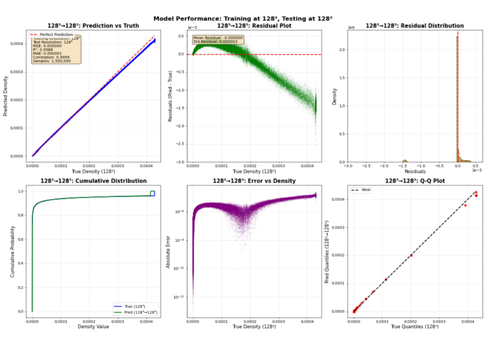
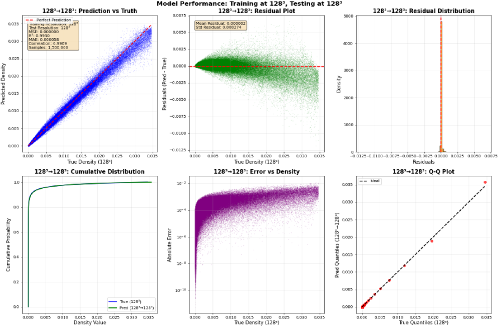
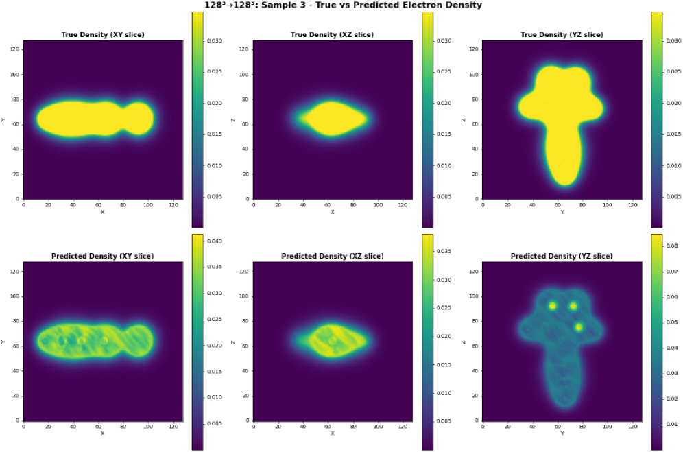
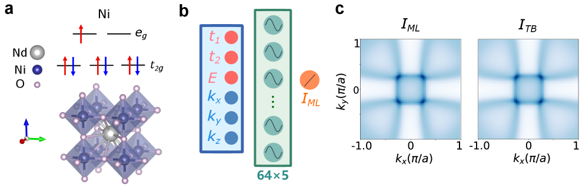
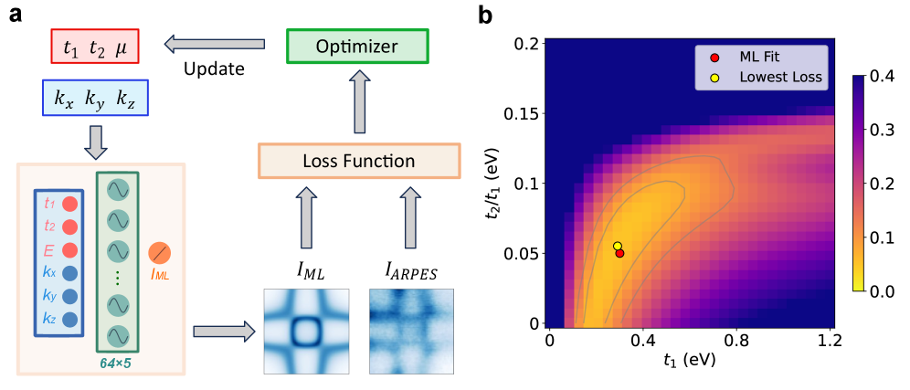
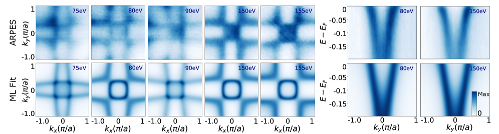
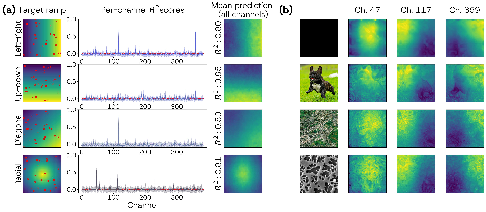
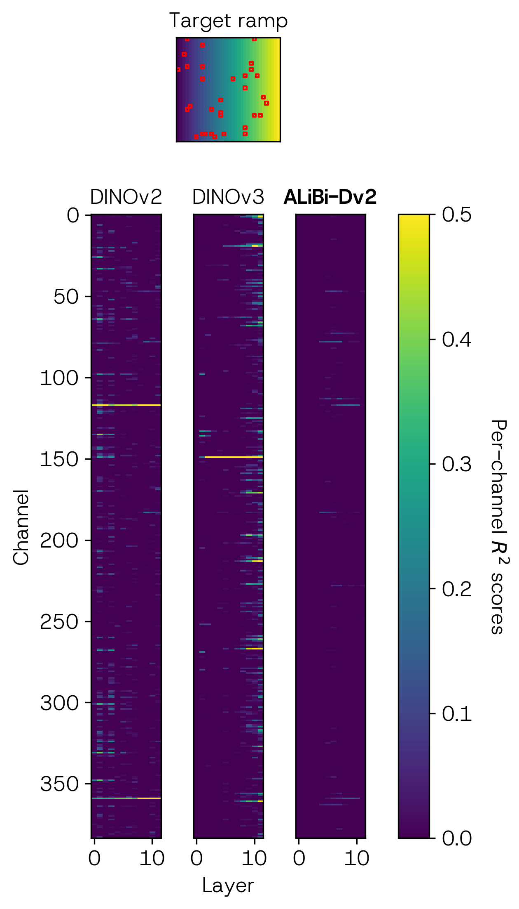
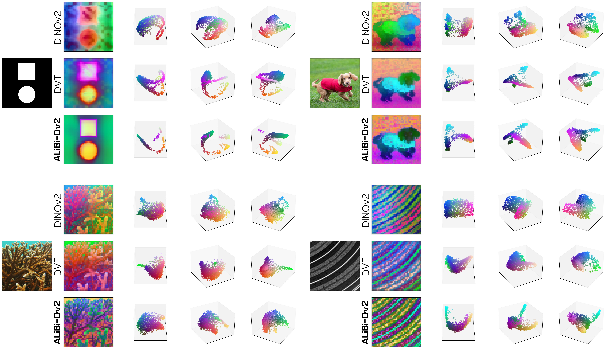

# arXivダイジェスト：マテリアルズ・インフォマティクス

**作成日：** 2026年3月19日
**対象期間：** 直近72時間（2026年3月17日〜19日）

---

## 選定論文一覧

1. [Novelty-Driven Target-Space Discovery in Automated Electron and Scanning Probe Microscopy](https://arxiv.org/abs/2603.16715) — Pratiush et al.
2. [Ligand-Controlled Phonon Dynamics in CsPbBr₃ Nanocrystals Revealed by Machine-Learned Interatomic Potentials](https://arxiv.org/abs/2603.16631) — Cha et al.
3. [V2Rho-FNO: Fourier Neural Operator for Electronic Density Prediction](https://arxiv.org/abs/2603.15669) — Jin et al.
4. [PFP/MM: A Hybrid Approach Combining a Universal Neural Network Potential with Classical Force Fields for Large-Scale Reactive Simulations](https://arxiv.org/abs/2603.16061) — Miyazaki et al.
5. [Machine Learning Reconstruction of High-Dimensional Electronic Structure from Angle-Resolved Photoemission Spectroscopy](https://arxiv.org/abs/2603.16725) — Zhang et al.
6. [Tuning Cu/Diamond Interfacial Thermal Conductance via Nitrogen-Termination Engineering](https://arxiv.org/abs/2603.16347) — Yang et al.
7. [Anharmonicity Driven by Vacancy Ordering Unlocks High-performance Thermoelectric Conversion in Defective Chalcopyrites II-III₂-VI₄](https://arxiv.org/abs/2603.16477) — Zhang et al.
8. [What DINO Saw: ALiBi Positional Encoding Reduces Positional Bias in Vision Transformers](https://arxiv.org/abs/2603.16840) — Pawlowsky et al.
9. [Fully Anharmonic Calculations of the Free Energy of Migration of Point Defects in UO₂ and PuO₂](https://arxiv.org/abs/2603.16602) — Frost et al.
10. [Early Prediction of Creep Failure via Bayesian Inference of Evolving Barriers](https://arxiv.org/abs/2603.16419) — Verano-Espitia et al.

---

# 重点論文の詳細解説

---

## 論文1

### 1. 論文情報

**タイトル：** [Novelty-Driven Target-Space Discovery in Automated Electron and Scanning Probe Microscopy](https://arxiv.org/abs/2603.16715)
**著者：** Utkarsh Pratiush, Kamyar Barakati, Boris N. Slautin, Catherine C. Bodinger, Christopher D. Lowe, Brandi M. Cossairt, Sergei V. Kalinin
**arXiv ID：** 2603.16715
**カテゴリ：** cs.LG; cond-mat.mtrl-sci
**公開日：** 2026年3月17日
**論文タイプ：** 研究論文
**ライセンス：** CC BY 4.0

---

### 2. どんな研究か

走査型プローブ顕微鏡（SPM）および走査型透過電子顕微鏡（STEM）を対象に、既知の目標を最適化するのではなく、**目標空間における多様な応答領域を自律的に発見する**ディープカーネル学習フレームワーク「BEACON」を提案する。事前取得データセットを用いたオフライン検証に加え、実際のSTEM装置への実装まで行い、再現可能なノートブックとして公開している。材料局所構造の多様な応答様式を効率よく探索し、未知の相境界や特性領域を発見することで、**計測インフォマティクスにおける自律実験の新しい方向**を示した。

---

### 3. 位置づけと意義

従来の自律顕微鏡研究の多くは、既知の目的関数（例：特定のスペクトル特徴）の最適化に主眼を置いてきた。BEACONはこの枠組みを根本的に変え、**「何を最適化するか」よりも「どのような応答があり得るか」を探索する**という発見指向の自律実験を実現する。ベイズ最適化の枠組みにディープカーネル学習を組み合わせ、材料の局所的な構造－応答関係をその場で学習しながら、多様な応答領域を系統的に探索する。顕微鏡計測における高次元データ空間の探索効率を抜本的に改善し、特に未知の相転移や局所異質性が存在する材料系での発見加速に寄与する。探索フレームワークの汎用性とノートブック公開による再現性は、材料計測コミュニティへの波及可能性が高い。

---

### 4. 研究の概要

**背景と目的：**
電子顕微鏡・走査型プローブ顕微鏡を用いた材料研究では、測定空間が広大であり、科学者が手動で測定位置を選択することには限界がある。既存の自動化アプローチは既知の目的関数の最適化に特化しており、未知の応答様式の発見には不向きである。BEACONは、測定しながらその場で構造－応答関係を学習し、多様な応答が期待される領域を次の測定先として自動選択する自律探索システムである。

**材料科学上の課題：**
局所的な相転移、組成不均一性、欠陥分布など、空間的に不均一な材料系において、どこを測定すれば新しい物理を発見できるかを事前に知ることは困難である。

**情報学的アプローチ：**
ガウス過程（GP）にディープニューラルネットワークで学習したカーネルを組み合わせたディープカーネル学習を採用する。取得関数は多様性（novelty）を最大化するように設計されており、既知の応答に偏らない探索を促進する。

**主な手法：**
- ディープカーネル学習（DKL）
- ガウス過程回帰
- ベイズ最適化（novelty駆動型取得関数）
- 自律型STEM・SPM制御

**使用データ：**
事前取得した顕微鏡データセット（オフライン検証用）および実STEM計測データ（オンライン実証用）。

**主な結果：**
- 従来の格子状スキャンや無作為選択と比較して、BEACONは少ない測定回数で多様な応答領域を発見
- オフライン検証では、提案したモニタリング関数が探索の有効性とモデル信頼性を適切に評価できることを確認
- 実STEM装置への実装により、手動操作なしで材料の多様な応答様式を自律的に特定
- 再現可能なJupyterノートブックを公開し、他の顕微鏡研究者が手法を自分の装置に適用できる

**著者の主張：**
自律顕微鏡における発見の定義を「既知目標の最適化」から「応答空間の多様性探索」へと拡張したこと、そして実機での実証によって実用性を示したことが主要な貢献である。

---

### 5. マテリアルズ・インフォマティクスとして重要なポイント

BEACONが重要なのは、計測インフォマティクスにおける「探索（exploration）対利用（exploitation）」のバランス問題に正面から取り組んでいる点である。従来のベイズ最適化は既知の目的関数を前提とするが、BEACONは目的関数自体を事前に定義せず、測定データから応答空間の多様性を学習する。ディープカーネル学習はガウス過程の解釈可能性を保ちながら高次元の非線形な特徴表現を可能にし、SPM・STEMの高次元スペクトルデータに自然に対応できる。評価指標として提案されたモニタリング関数は、探索が実際に多様な応答領域を発見しているかどうかを定量的に追跡でき、盲目的な探索に陥るリスクを軽減する。実機実装まで行い、ノートブックを公開している点で再現性と実装可能性が高く、材料計測コミュニティへの即時の波及効果が期待できる。

---

### 6. 限界と注意点

BEACONには少なくとも以下の限界と注意点がある。第一に、「novelty」の定義が応答空間の多様性に基づいているため、真に科学的に重要な発見（例：物理的に意味ある相転移）と単なる外れ値的応答を区別できない可能性がある。第二に、ディープカーネル学習は従来のGPより計算コストが高く、リアルタイムの計測制御において計算ボトルネックが生じる場合がある。また、事前学習データの量と多様性がカーネル品質に大きく影響するため、全く未知の材料系では初期段階の探索効率が低下する恐れがある。第三に、実証した材料系（STEM）への特定依存性があり、他の顕微鏡モダリティ（AFM、SNOM等）や計測条件への一般化性能は個別の検証が必要である。取得関数の設計パラメータ（例：多様性スコアの重み）が結果に敏感である可能性も指摘されるが、そのロバスト性の定量的評価は限られている。

---

### 7. 関連研究との比較

自律顕微鏡研究においては、Kalinin et al. (2021, npj Comput. Mater.)らが先駆的にベイズ最適化を顕微鏡に適用し、特性マッピングの効率化を示してきた。また、AXISやautoDPIなど他の自律計測フレームワークが提案されているが、これらは基本的に目的関数が既知であることを前提とする。BEACONのnovelty駆動型アプローチはこれらと相補的であり、未知の応答空間を探索する「ゼロショット的」発見を可能にする点で新規性がある。機械学習ポテンシャルを用いた逆設計や生成モデルを組み合わせた次の計測ターゲット提案との統合も今後の研究展開として自然に想定でき、計測と計算の相互補完的な自律実験ループの実現につながる可能性がある。novelty駆動型探索の概念自体は強化学習や探索理論に長い歴史があるが、材料計測に特化した実装と実機検証はこの分野においてまだ初期段階にある。

---

### 8. 重要キーワードの解説

**① ディープカーネル学習（Deep Kernel Learning, DKL）**
ガウス過程（GP）のカーネル関数を、ニューラルネットワーク（NN）で学習した特徴表現に置き換える手法。標準的なGPは入力空間での類似度をカーネル（例：RBF: $k(x,x')=\exp(-\|x-x'\|^2/2\ell^2)$）で定義するが、DKLでは入力をNNで高次元から低次元の潜在表現 $z=\phi_\theta(x)$ に変換し、その潜在空間でGPカーネルを計算する。これにより、GPの確率的不確かさ推定を保ちながら、NNの非線形表現力を獲得できる。

**② ガウス過程（Gaussian Process, GP）**
関数値の事前分布を多変量ガウス分布でモデル化する非パラメトリックな確率的回帰・分類手法。観測点 $(x_i, y_i)$ が与えられると、未観測点での予測値と不確かさ（分散）を解析的に求められる。ベイズ最適化の代理モデルとして広く使われ、少ないデータ点から高品質な不確かさ推定が得られる点が材料探索での強みである。

**③ ベイズ最適化（Bayesian Optimization, BO）**
評価コストの高い目的関数を効率よく最適化する手法。GPなどの代理モデルで目的関数を近似し、取得関数（例：Expected Improvement, UCB）を用いて次の評価点を選ぶ。材料スクリーニングや実験設計に広く応用されており、少数の実験で目的関数の最大（最小）値を探索できる。

**④ Novelty駆動型取得関数（Novelty-Driven Acquisition Function）**
従来の取得関数（EI, UCBなど）が既知の目的関数の最大化を目指すのに対し、novelty駆動型は「これまでに観測していない応答」を積極的に探索する。代理モデルが予測する応答空間上での「距離」や「多様性」を基準にして次の測定点を選ぶ。特定の目的が事前に定義できない発見型研究に適している。

**⑤ 走査型プローブ顕微鏡（Scanning Probe Microscopy, SPM）**
探針（プローブ）を材料表面に近接走査させて原子・ナノスケールの構造・電気・磁気・力学特性を測定する計測技術の総称。STM（走査型トンネル顕微鏡）、AFM（原子間力顕微鏡）、cAFM（導電性AFM）などを含む。材料表面の局所情報を空間分解能高く取得できるため、ナノ材料のキャラクタリゼーションに不可欠である。

**⑥ 走査型透過電子顕微鏡（Scanning Transmission Electron Microscopy, STEM）**
収束した電子線を試料上でラスタースキャンし、透過・散乱電子の強度分布から原子分解能の組成・構造情報を取得する顕微鏡手法。HAADF-STEM（高角度環状暗視野）やEELS（電子エネルギー損失分光）と組み合わせて元素分布や電子状態を可視化できる。

**⑦ 構造－応答関係（Structure-Property/Response Relationship）**
材料の局所的な構造（原子配置、組成、欠陥）と観測される物性・応答（電気特性、光学特性、機械特性など）の関係。MIの基本的な研究対象であり、構造－応答関係の学習・予測・逆設計がマテリアルズ・インフォマティクスの中核をなす。

**⑧ 自律実験（Autonomous Experimentation）**
実験の計画・実施・解析を人間の介入なしに機械が自律的に実行するサイクル。ロボット実験系、オンラインML、最適化アルゴリズムを組み合わせて材料探索サイクルを自動化する。BEACONは計測の自律化を実現し、計測インフォマティクスの核心技術の一つである。

**⑨ 探索と利用のトレードオフ（Exploration-Exploitation Tradeoff）**
最適化・探索問題において、既知の良い領域を深く掘り下げる（exploitation）か、未知の領域を広く探索する（exploration）かのバランスを制御する問題。ベイズ最適化の取得関数設計の根幹であり、UCB（Upper Confidence Bound）取得関数 $a(x)=\mu(x)+\kappa\sigma(x)$ はこのバランスをパラメータ $\kappa$ で制御する。

**⑩ モニタリング関数（Monitoring Function）**
自律探索が適切に進行しているかを追跡するための評価指標。BEACONでは、代理モデルの予測精度（モデル信頼性）と探索の多様性（実際に異なる応答領域が発見されているか）を同時にモニタリングする関数を設計しており、探索の収束判断や異常検知に使用される。

---

### 9. 図

本論文はCC BY 4.0ライセンスですが、arXivのHTML実験版が現時点では利用できないため、原図の抽出ができませんでした。

---

## 論文2

### 1. 論文情報

**タイトル：** [Ligand-Controlled Phonon Dynamics in CsPbBr₃ Nanocrystals Revealed by Machine-Learned Interatomic Potentials](https://arxiv.org/abs/2603.16631)
**著者：** Seungjun Cha, Chen Wang, Victor Fung, Guoxiang Hu
**arXiv ID：** 2603.16631
**カテゴリ：** cond-mat.mtrl-sci
**公開日：** 2026年3月17日
**論文タイプ：** 研究論文
**ライセンス：** CC BY 4.0

---

### 2. どんな研究か

ハライドペロブスカイトCsPbBr₃ナノ結晶の表面リガンドがフォノン特性に与える影響を、機械学習原子間ポテンシャル（MLIP）を用いて解明した。第一原理計算では扱えない大規模系・長時間スケールをMLIPで克服し、陽イオン性および陰イオン性リガンドの双方がPb-Br-Pb伸縮モードを赤方偏移させ、PbBr₆⁴⁻八面体回転モードを青方偏移させることを明らかにした。**陰イオン性リガンドは効果が総じて強く、回転モード剛性とリガンド結合エネルギーの間に非単調な関係がある**ことを示し、高性能ペロブスカイトオプトエレクトロニクスへの設計指針を提供した。

---

### 3. 位置づけと意義

CsPbBr₃ナノ結晶は高い光ルミネッセンス量子収率（PLQY）を持つ発光材料として太陽電池・LEDに広く研究されているが、表面リガンドがフォノン特性、ひいては非輻射再結合損失（phonon-assisted non-radiative recombination）にどう影響するかは従来の第一原理計算では系統的に検討が困難だった。MLIPによって従来は不可能だった「リガンド種ごとのフォノン特性比較」が可能になり、リガンド設計と欠陥パッシベーション戦略に直接的な材料科学的知見をもたらす。**表面化学と格子動力学を結ぶMLIPの応用例**として、ペロブスカイト系MLIPの有効性を示す重要な実証研究でもある。

---

### 4. 研究の概要

**背景と目的：**
ハライドペロブスカイトナノ結晶（NCs）の表面はリガンドで修飾されており、このリガンドが光電子特性を大きく左右する。しかし、リガンドを含む大規模系（数千原子）の第一原理計算（DFT/AIMD）は計算コストが非常に高く、系統的なリガンド比較が困難だった。MLIPを構築することで、DFT精度を保ちながら大規模・長時間のフォノン計算を実現することを目的とした。

**解こうとしている材料科学上の課題：**
リガンド種（陽イオン性：オレイルアンモニウムなど、陰イオン性：オレイン酸塩など）の違いがCsPbBr₃のフォノンモード（特にPb-Br-Pb伸縮モードとPbBr₆⁴⁻八面体回転モード）に与える影響を定量的に理解し、非輻射損失を抑制するリガンド設計の指針を得る。

**情報学的アプローチ：**
各種リガンドを含む小規模CsPbBr₃構造（AIMD軌跡）でMLIPを学習し、大規模ナノ結晶系へ適用。MLIPを用いた分子動力学（MD）シミュレーションによりフォノン状態密度（PDOS）、速度自己相関関数（VACF）を算出し、フォノンモードの変化を系統的に評価する。

**対象材料系：**
CsPbBr₃ハライドペロブスカイトナノ結晶（陽イオン性リガンド：オレイルアンモニウム等、陰イオン性リガンド：オレイン酸塩等、計複数種のリガンド組み合わせ）

**主な手法：**
- 機械学習原子間ポテンシャル（MLIP）の構築（NequIPまたはMACEベース）
- AIMD（Ab initio Molecular Dynamics）学習データ生成
- 大規模MDシミュレーション
- フォノン状態密度・速度自己相関関数解析

**使用データ：**
DFT/AIMD計算で生成したCsPbBr₃＋各種リガンド系の構造・エネルギー・力データ（学習データ）

**主な結果：**
- 陽イオン・陰イオン両リガンドともにPb-Br-Pb伸縮モードが赤方偏移、PbBr₆⁴⁻回転モードが青方偏移
- 陰イオン性リガンドは陽イオン性よりも全体的に強い効果を示す
- 回転モード剛性とリガンド結合エネルギーの間に非単調な依存性が存在する
- これらの知見はペロブスカイトオプトエレクトロニクスの高性能化設計に直接活用可能

**著者の主張：**
MLIPによって従来不可能だった規模でのリガンド効果の系統的解明が可能になり、フォノン制御を通じた非輻射損失抑制の設計原理を提示した。

---

### 5. マテリアルズ・インフォマティクスとして重要なポイント

この研究の核心は、MLIPを単なる計算高速化ツールとして使うのではなく、**「リガンド種の違い」という材料化学の問いに情報学的手法で答える**という点にある。学習データは小規模のAIMD軌跡から生成し、それを大規模系へ転移させるアプローチは、データ効率的なMLIPの有効な使い方を示している。フォノンモードの変化を陽イオン性・陰イオン性リガンドで系統的に比較し、さらに結合エネルギーとの相関という「非単調な」関係を見出したことは、単純なデータ相関ではなく物理的メカニズムの理解につながる発見である。ペロブスカイト系のMLIPはここ数年で急速に整備が進んでおり、本研究はその応用として計測インフォマティクス・材料設計の双方に示唆を与える。一般化可能性の観点では、他のハライドペロブスカイト系（CsPbI₃、FAPbBr₃等）やリガンド種への拡張が自然な展開として期待される。

---

### 6. 限界と注意点

少なくとも以下の限界がある。第一に、MLIPの学習データは小規模のCsPbBr₃構造（リガンドを含む）から生成されており、ナノ結晶の表面再構成、リガンドの配向無秩序、温度による変化を十分にカバーしているかどうかの検証が不十分な可能性がある。第二に、フォノン解析はフォノン状態密度・VACF等を用いているが、個々のフォノンモードの帰属（mode assignment）の精度や、MDシミュレーションが平衡状態に達しているかの確認が重要であり、これらの検証の程度は限られていると推察される。第三に、非輻射再結合損失への影響については間接的な議論にとどまっており、実際のPLQYやキャリアライフタイムとフォノン変化の定量的な対応は示されていない。また、陰イオン性リガンドの「回転モード剛性と結合エネルギーの非単調性」というメカニズム解釈は興味深いが、その物理的起源（静電相互作用か共有結合性か）の詳細な検証が求められる。

---

### 7. 関連研究との比較

ハライドペロブスカイトのMLIPは、Hellman、Ceriotti、Chelikowskyら各グループを中心に近年急速に開発が進んでいる。特にMACE-OFF、CHGNetなどの基盤MLIPが利用可能になったことで、ペロブスカイト系の大規模MD計算の敷居が低下しつつある。リガンド効果については、DFT計算による静的構造解析や小規模AIMDは多数報告されているが、MLIPを使った大規模ダイナミクスによる系統的フォノン比較は本研究が先駆的な事例の一つである。類似する手法でCsPbI₃やMAPbI₃を対象にした研究も進んでいるが、ナノ結晶のリガンド修飾という文脈での大規模フォノン計算は比較的新しい。本研究の成果は、ペロブスカイトLED・太陽電池の性能最適化に向けた計算スクリーニングへの直接的な展開が期待される。

---

### 8. 重要キーワードの解説

**① 機械学習原子間ポテンシャル（Machine-Learned Interatomic Potential, MLIP）**
第一原理計算（DFT）で得られたエネルギー・力・応力を学習し、DFT精度を近似した高速ポテンシャル関数を構築する手法。従来の経験的力場と比べて精度が高く、DFTと比べて数桁高速。GNNベース（MACE、NequIP等）のMLIPは等変性を保つため、物理的に正しいエネルギー・力の予測ができる。

**② フォノン（Phonon）**
結晶格子の集団振動の量子（準粒子）。材料の熱伝導率、熱膨張、音速、非輻射遷移などに直接関係する。格子動力学（LD）計算でフォノン分散関係 $\omega(\mathbf{k})$ を求める。ペロブスカイトでは、Pb-Br-Pb伸縮モード（100-200 cm⁻¹程度）とPbBr₆⁴⁻八面体傾斜モード（低周波数）が重要な役割を果たす。

**③ フォノン状態密度（Phonon Density of States, PDOS）**
単位周波数当たりのフォノンモード数 $g(\omega)$。MDシミュレーションでは速度自己相関関数（VACF）のフーリエ変換 $g(\omega)\propto\int_0^\infty\langle\mathbf{v}(0)\cdot\mathbf{v}(t)\rangle e^{-i\omega t}dt$ から計算できる。リガンド起因の新しい振動モードやバルクモードの変化を直接可視化できる。

**④ 表面リガンド（Surface Ligand）**
ナノ結晶表面の未結合電子対や欠陥を終端する有機分子。ペロブスカイトでは陽イオン性（アンモニウム型：－NH₃⁺）や陰イオン性（カルボキシレート型：－COO⁻）のリガンドが使われ、コロイダル分散安定性、PLQYの向上、および格子動力学に影響を与える。

**⑤ 八面体傾斜モード（Octahedral Tilting Mode）**
ペロブスカイト構造のPbBr₆⁴⁻八面体が集団的に傾く振動モード。このモードは低周波数（~10-50 cm⁻¹）に現れ、相転移（立方→正方→斜方晶）や非輻射損失と密接に関係する。リガンドがこのモードを硬化させる（青方偏移）ことは、欠陥パッシベーションによるキャリアライフタイム延長と関連する可能性がある。

**⑥ 非輻射再結合（Non-radiative Recombination）**
光励起されたキャリア（電子・正孔）が光を放出せずに格子振動（フォノン）として失活するプロセス。Shockley-Read-Hall（SRH）機構（欠陥を介した再結合）が主因となる場合が多い。フォノン特性はSRH再結合速度に影響し、特定のフォノンモードと欠陥の結合強度（electron-phonon coupling）が重要。

**⑦ 転移学習（Transfer Learning）・小規模学習データ（Small Training Data）**
少ない第一原理計算データからMLIPを学習し、より大きな系に適用するアプローチ。本研究では小規模CsPbBr₃系でMLIPを学習し、大規模ナノ結晶に転移させている。これはデータ効率的な材料MLIPの典型的な活用法であり、特に複雑な表面化学を持つ系で有効。

**⑧ 赤方偏移・青方偏移（Redshift / Blueshift）**
振動モード周波数の低周波数側へのシフト（赤方偏移）または高周波数側へのシフト（青方偏移）。赤方偏移は化学結合の弱体化または有効質量の増加を示し、青方偏移は結合の強化または剛性の増加を意味する。リガンドによる化学環境の変化を間接的に反映する指標。

**⑨ フォノン補助非輻射遷移（Phonon-Assisted Non-radiative Transition）**
欠陥捕捉中心やキャリア-フォノン結合を介して、フォノン放出とともにキャリアが基底状態に遷移するプロセス。低周波フォノン（軟モード）が活性化されると、エネルギー保存の観点からこのプロセスが起きやすくなる。リガンドによる低周波モードの青方偏移（硬化）は、このプロセスの抑制につながり得る。

**⑩ ab initio MD（AIMD）**
第一原理（DFT）で計算した力を用いたMDシミュレーション。原子間相互作用をパラメトリックに近似せずに扱えるため高精度だが、計算コストがMLIPと比べて数桁高い。MLIPの学習データ生成に使われる「教師」データの源泉として本研究でも用いられている。

---

### 9. 図

本論文はCC BY 4.0ライセンスですが、arXivのHTML実験版が現時点では利用できないため、原図の抽出ができませんでした。

---

## 論文3

### 1. 論文情報

**タイトル：** [V2Rho-FNO: Fourier Neural Operator for Electronic Density Prediction](https://arxiv.org/abs/2603.15669)
**著者：** Yingdi Jin, Xinming Qin, Ruichen Liu, Jie Liu, Zhenyu Li, Jinlong Yang
**arXiv ID：** 2603.15669
**カテゴリ：** physics.chem-ph; quant-ph
**公開日：** 2026年3月13日
**論文タイプ：** 研究論文
**ライセンス：** CC BY 4.0

---

### 2. どんな研究か

密度汎関数理論（DFT）において最も計算コストの高い電子密度 $\rho(\mathbf{r})$ の決定を、フーリエニューラル演算子（FNO）によるオペレーター学習で代替する手法「V2Rho-FNO」を提案した。外部ポテンシャル $V_\text{ext}(\mathbf{r})$ から電子密度 $\rho(\mathbf{r})$ への写像を、空間周波数領域でのオペレーター学習として捉えることで、長距離電子相互作用と相関を陽に取り込む。**ゼロショット汎化**（未見の分子系に追加学習なしで適用可能）を実証しており、高スループット電子構造計算の実用的代替ツールとなる可能性を示した。

---

### 3. 位置づけと意義

電子密度は全DFT計算の出発点であり、この決定が収束するまでの自己無撞着場（SCF）ループがDFTのボトルネックとなる。V2Rho-FNOはこのSCFループをニューラルオペレーターで代替し、物理的に整合した電子密度を一度のフォワードパスで予測する。空間周波数領域でのオペレーター学習は長距離相互作用（ハートレー・フォック交換、van der Waals等）を自然に扱える点で、局所的な原子記述子ベースのMLとは本質的に異なるアプローチをとる。DFT計算の代替（計算加速）という観点では、既存のML電荷密度推定（SchNet-density、DeepDFT等）の系譜に属するが、ゼロショット汎化能力は従来手法を大きく上回り、ハイスループットスクリーニングへの即時展開可能性がある。

---

### 4. 研究の概要

**背景と目的：**
DFTはSCF反復計算によって電子密度 $\rho(\mathbf{r})$ を自己無撞着に決定するが、系が大きくなるにつれ計算コストが $O(N^3)$（Nは電子数）となる。電子密度予測をMLで代替することで、DFTのボトルネックを回避しながらほぼDFT精度の電子密度を一度の推論で取得することを目的とする。

**解こうとしている課題：**
- SCFループの排除による計算コスト削減
- 未見の分子構造・元素種への汎化
- 長距離電子相互作用の陽な取り込み

**情報学的アプローチ：**
フーリエニューラル演算子（FNO）を用いて、外部ポテンシャルから電子密度へのオペレーターを空間周波数領域で直接学習する。入力（外部ポテンシャル場 $V_\text{ext}(\mathbf{r})$）と出力（電子密度場 $\rho(\mathbf{r})$）の双方が三次元連続場であるため、点群の代わりに格子点上の場データを扱うオペレーター学習が適合する。

**主な手法：**
- フーリエニューラル演算子（FNO）: $(\mathcal{F}^{-1}(R_\theta(\mathcal{F}v)))(x)$ の形式で演算子を学習
- マルチ解像度学習スキーム（異なる解像度のグリッドデータで段階的に学習）

**使用データ：**
QM9データセット（9原子以下の小分子、DFT計算）。5,000分子で学習し、残りでゼロショットテスト。

**主な結果：**
- 未見の分子（学習データと異なる結合環境・元素種）に対してゼロショットで汎化
- 図1: 水分子のMDトラジェクトリ補間で参照密度との高い相関を達成
- 図2: 未見の結合環境（学習外の結合パターン）への外挿でも高精度予測
- 図3: 未見元素（フッ素含有分子）を含む系への汎化を実証

**著者の主張：**
V2Rho-FNOは周波数領域のオペレーター学習によって長距離相互作用を捉え、ゼロショット汎化を達成した初のFNOベース電子密度予測手法である。

---

### 5. マテリアルズ・インフォマティクスとして重要なポイント

V2Rho-FNOが材料情報学として重要なのは、**電子密度予測を「関数から関数への写像」（オペレーター学習）として定式化した点**にある。従来のML電子密度モデルの多くは原子中心記述子を使い、局所的な情報だけから密度を推定する（例：DeepDFT, FieldSchNet等）。これに対しFNOは格子全体の周波数成分を用いるため、長距離の電子相関（特に極性分子や電荷移動系）を系統的に捉えられる。マルチ解像度学習スキームは計算効率と予測精度のトレードオフを制御しており、ハイスループットスクリーニングへの適用性が高い。ゼロショット汎化は、分子多様性が高いデータベース（PubChem、ChEMBL等）への直接適用を意味し、医薬品候補分子や機能性分子のin silicoscreeningにも応用できる。ただし、現時点ではQM9（小有機分子）に特化しており、固体材料・周期系への拡張は今後の課題である。

---

### 6. 限界と注意点

少なくとも以下の限界がある。第一に、現時点では小有機分子（QM9相当）のみで検証されており、無機固体結晶や周期境界条件系への適用性が未検証である。無機材料では元素種の多様性・格子周期性・バンド構造の扱いが有機分子と大きく異なるため、現モデルのアーキテクチャをそのまま適用することは難しい可能性がある。第二に、ゼロショット汎化の範囲が「結合環境の外挿」と「未見元素（F）」に限られており、より大きな構造変化（例：異なる幾何学的構造、高温変形構造）への外挿性能は示されていない。第三に、現在のFNOは固定解像度の格子を前提としており、任意形状・任意サイズの系への適用に際して格子設定（解像度・サイズ）の調整が必要なため、完全なゼロショット汎化は限定的である。また、電子密度の精度検証がエラー指標（MAE/RMSE on density）に偏っており、エネルギー・力などのDFT下流タスクへの影響が直接示されていない点も注意が必要である。

---

### 7. 関連研究との比較

ML電子密度予測の先行研究としては、SchNet-density（原子中心描述子ベース）、DeepDFT（GNNベース）、FieldSchNet（場ネットワーク）などがある。これらは局所的な原子環境記述子に基づき電子密度を予測するため、長距離相互作用の表現が課題だった。FNOを用いた本研究のアプローチは、周波数領域での全域的なオペレーター学習という根本的に異なる枠組みを導入している。ゼロショット汎化能力という観点では、原子種の一般化を目指すSNAP、GAP、ACEなどのMLIPと類似した問題意識があるが、電子密度という連続場を対象としている点で異なる。Neural Operator学習（Fourier Neural Operator, Li et al. 2021）の材料科学応用としては、流体力学・偏微分方程式分野での応用例が先行しており、電子構造への本格的応用は比較的新しい。今後、周期系・固体材料への拡張と高スループット計算基盤への統合が研究の主要な展開になるだろう。

---

### 8. 重要キーワードの解説

**① フーリエニューラル演算子（Fourier Neural Operator, FNO）**
偏微分方程式（PDE）の解演算子を学習するニューラルネットワーク。入力関数を高速フーリエ変換（FFT）で周波数空間に変換し、周波数成分を線形変換する層（$R_\theta$ in $k$-space）と通常の非線形活性化層を組み合わせる: $v_{t+1}(x) = \sigma(Wv_t(x) + \mathcal{F}^{-1}(R_\theta\cdot\mathcal{F}(v_t))(x))$。格子解像度に依存しない演算子を学習できるため、異なるサイズの系に適用可能。

**② 電子密度（Electron Density）$\rho(\mathbf{r})$**
位置 $\mathbf{r}$ における電子の存在確率密度（単位：e/ų）。DFTのHohenberg-Kohn定理により、基底状態エネルギーは $\rho(\mathbf{r})$ の汎関数として一意に定まる。$\int \rho(\mathbf{r})d\mathbf{r}=N$（電子数）を満たす。MLで $\rho(\mathbf{r})$ を予測できれば、SCFループなしに電子構造情報を即座に取得できる。

**③ 外部ポテンシャル（External Potential）$V_\text{ext}(\mathbf{r})$**
原子核が電子に及ぼすクーロンポテンシャル $V_\text{ext}(\mathbf{r})=\sum_I -Z_I/|\mathbf{r}-\mathbf{R}_I|$。DFTでは分子・結晶の幾何学的構造（原子座標・種類）から一意に定まり、V2Rho-FNOへの入力として機能する。$V_\text{ext}\to\rho$ という写像（オペレーター）の学習が本研究の核心。

**④ 自己無撞着場（Self-Consistent Field, SCF）法**
試行電子密度 $\rho^{(n)}$ → Kohn-Sham有効ポテンシャル $V_\text{eff}[\rho^{(n)}]$ → Kohn-Sham方程式を解く → 新しい電子密度 $\rho^{(n+1)}$ → 収束判定、を繰り返す反復法。計算コストの大部分を占め、これを省略できれば大幅な計算加速につながる。

**⑤ ゼロショット汎化（Zero-Shot Generalization）**
学習データに含まれない分子・構造・元素種に対して、再学習なしに予測できる能力。材料インフォマティクスでは、学習データが限られる中で未見の材料系を予測することが最重要課題の一つであり、ゼロショット汎化はモデルの実用性の根幹をなす。

**⑥ QM9データセット**
H, C, N, O, Fから成る9原子以下の有機小分子（約13万分子）のDFT計算データベース。エネルギー、双極子モーメント、原子間力など17種の分子特性が収録されており、MLモデルのベンチマークとして広く使われる。V2Rho-FNOはQM9の幾何学的構造と電子密度で学習・評価している。

**⑦ マルチ解像度学習（Multi-Resolution Training）**
異なる空間解像度（格子間隔）のデータで段階的にモデルを学習する戦略。粗いグリッドで大局的な電子密度分布を学習した後、細かいグリッドで局所構造を学習することで、計算効率と精度のバランスを取る。

**⑧ 長距離相互作用（Long-Range Interactions）**
分子内・分子間で数Å以上の距離を隔てて作用する静電相互作用（クーロン）、分散力（van der Waals）、極性効果など。局所的な原子環境記述子ベースのMLでは扱いが難しく、グラフ・演算子ベースの手法が優位性を発揮する。フーリエ変換は周波数成分として長距離相関を陽に取り込む。

**⑨ オペレーター学習（Operator Learning）**
関数から関数への写像（無限次元空間間の写像）を学習するニューラルネットワーク手法。FNOはその代表的手法の一つ。PDEの解演算子学習に端を発し、材料科学では場データ（電子密度、応力場、温度場等）の予測に応用が広がっている。

**⑩ 速度自己相関関数（Velocity Autocorrelation Function, VACF）**
$C(\tau)=\langle\mathbf{v}(0)\cdot\mathbf{v}(\tau)\rangle$ で定義される時間相関関数。そのフーリエ変換はフォノン状態密度 $g(\omega)$ に対応する。MDシミュレーションから計算され、フォノンモードの同定・変化の追跡に用いられる。V2Rho-FNO論文に直接関係はないが、電子密度から得られるKS軌道ベースのシミュレーションに接続する可能性がある。

---

### 9. 図

本論文はCC BY 4.0ライセンスです。以下にHTML実験版から抽出した3つの図を示す。

**図1（2603.15669_fig1.png）**

**キャプション：** V2Rho-FNOによる電子密度予測の検証（水分子MDトラジェクトリ補間）。横軸に参照DFT電子密度、縦軸にモデル予測密度をプロットし、対角線からのずれが予測誤差を示す。学習データ内の構造に対して高い相関係数を達成し、オペレーター学習が連続的な配座変化に対して安定した予測を行えることを支持する結果である。

---

**図2（2603.15669_fig2.png）**

**キャプション：** 未見の結合環境を持つ分子（QM9学習外）への外挿性能評価。学習データに含まれない局所結合パターンを持つ分子系に対し、再学習なしに電子密度を予測した結果。V2Rho-FNOのゼロショット汎化能力を定量的に示しており、モデルが化学結合の局所性に過学習していないことを示唆する。

---

**図3（2603.15669_fig3.png）**

**キャプション：** 未見元素（フッ素）を含む分子系への汎化（元素外挿）。フッ素含有分子を一切含まない学習データで訓練したV2Rho-FNOが、フッ素含有分子の電子密度を予測した結果。周波数領域のオペレーター学習が元素種の多様性に対してもロバストであることを示す。この結果は元素スペースの外挿という観点で、MLIPの汎化問題と類似の重要な意味を持つ。

---

# その他の重要論文（簡潔紹介）

---

## 論文4

### 1. 論文情報

**タイトル：** [PFP/MM: A Hybrid Approach Combining a Universal Neural Network Potential with Classical Force Fields for Large-Scale Reactive Simulations](https://arxiv.org/abs/2603.16061)
**著者：** Yu Miyazaki, Atsuhiro Tomita, Akihide Hayashi, So Takemoto, Mizuki Takemoto, Hodaka Mori
**arXiv ID：** 2603.16061
**カテゴリ：** cond-mat.mtrl-sci; cond-mat.soft; physics.chem-ph
**公開日：** 2026年3月17日
**論文タイプ：** 研究論文
**ライセンス：** arXiv非独占的配布ライセンス

---

### 2. 研究概要

ユニバーサル機械学習原子間ポテンシャル（uMLIP）のPreFerred Potential（PFP）と古典分子力場（MM）を統合したハイブリッドシミュレーション手法PFP/MMを提案する。uMLIPはDFT精度に近い精度で反応性シミュレーションを実現できるが、大規模な凝縮相系への適用は計算コストが課題だった。PFP/MMはMLIPで扱う「活性領域」（反応中心、界面等）と、古典MMで扱う「環境領域」（溶媒、タンパク質骨格等）を分離し、両者を静電的・van der Waals的に結合する。アラニンジペプチドの水中ラマチャンドランプロットでは既知の配座盆地を再現し、V100 GPU上で3.506 ns/day（MN-Core 2では11.916 ns/day）という大幅な高速化を実証した。さらに極性溶媒中の分子内求核付加反応、シトクロムP450の水酸化反応においても実験的に受け入れられた自由エネルギープロファイルを再現し、反応性大規模シミュレーションへの適用性を示した。

マテリアルズ・インフォマティクスの観点では、本手法は「uMLIPの材料・化学系への実用的展開」という点で重要な意味を持つ。純粋なuMLIPでは扱いきれなかった「リアルな凝縮相（溶媒和系、タンパク質-リガンド系）における反応シミュレーション」を可能にし、触媒設計、薬物設計、材料-生体界面の計算研究への直接的な展開が期待できる。計算コストの比較（17.8倍〜56.5倍の高速化）が示されており、ハイスループット計算による材料スクリーニングへの応用価値は高い。一方で、MM側のパラメータ設定への依存性、PFP/MM境界のQM/MM的な定義の妥当性、一般的なuMLIPへの拡張性などは今後の課題として残る。

---

### 3. 重要キーワードの解説

**① ユニバーサル機械学習原子間ポテンシャル（Universal MLIP, uMLIP）：** 特定の材料系に限定せず、広い元素・構造空間でDFT精度の原子間力を予測するMLIP。CHGNet、M3GNet、MACE-MP-0、PFPなどが代表例。単一のモデルで多元系・多相系の材料研究が可能になる。

**② 分子力場（Molecular Mechanics, MM）：** 調和ポテンシャル（結合長、結合角）、トーション項、Lennard-Jonesポテンシャル（LJ）、部分電荷による静電相互作用の和でエネルギーを計算するパラメトリックモデル。AMBERやCHARMMが広く使われる。

**③ QM/MMハイブリッドシミュレーション：** 量子力学（QM）と古典力場（MM）を組み合わせた多スケールシミュレーション手法。反応中心はQM（DFTや半経験的）で高精度に扱い、周辺環境はMMで安価に扱う。PFP/MMはこのQM部分をuMLIPに置き換えたもの。

**④ 自由エネルギー計算（Free Energy Calculation）：** 統計力学的サンプリング（メタダイナミクス、アンブレラサンプリング等）を用いて、構造変化や反応の自由エネルギー差 $\Delta G$ を計算する手法。ラマチャンドランプロットはタンパク質・ペプチドの配座自由エネルギーを2D可視化したもの。

**⑤ ラマチャンドランプロット（Ramachandran Plot）：** ペプチド・タンパク質の主鎖二面角（$\phi, \psi$）の取り得る配座分布を示す図。自由エネルギー地形の等高線として表現され、αヘリックス、βシートなどの二次構造に対応する盆地が存在する。

**⑥ 溶媒効果（Solvation Effect）：** 溶媒分子（水等）と溶質の相互作用による熱力学的・動力学的効果。自由エネルギー、反応速度、分子構造に大きく影響する。PFP/MMは明示的溶媒をMM、溶質のMLIPと明示的に結合して計算する。

**⑦ シトクロムP450（Cytochrome P450, CYP）：** ヘム含有モノオキシゲナーゼ酵素群。炭化水素の水酸化（C-H活性化）など難しい酸化反応を触媒し、薬物代謝・生体合成・触媒化学で重要。計算的に予測困難な反応系の代表例として本研究のベンチマークに用いられている。

**⑧ Enhanced Sampling（拡張サンプリング）：** 通常のMDで超えられない自由エネルギー障壁を越えて配座空間を効率的に探索する手法（メタダイナミクス、ABF等）。PFP/MMと組み合わせて多ナノ秒規模のシミュレーションで自由エネルギー面を描いた。

**⑨ PreFerred Potential（PFP）：** Preferred Networks社が開発したuMLIP。元素周期表全域をカバーし、小分子から材料まで幅広い系でDFT精度の力場を提供する。本研究ではPFPのML部分と古典MMを結合するためのインターフェースを実装した。

**⑩ 計算スループット（Throughput, ns/day）：** MDシミュレーションの実用性を示す指標。値が大きいほど同じ時間に長いシミュレーションが可能。V100 GPU上でのPFP/MMのns/dayは純粋なuMLIPと比べて17.8倍〜56.5倍（MN-Core 2では更に高速）を達成した。

---

### 4. 図

本論文はarXiv非独占的配布ライセンスのため、原図を掲載しません。

---

## 論文5

### 1. 論文情報

**タイトル：** [Machine Learning Reconstruction of High-Dimensional Electronic Structure from Angle-Resolved Photoemission Spectroscopy](https://arxiv.org/abs/2603.16725)
**著者：** Yu Zhang, Yong Zhong, Nhat Huy Tran, Shuyi Li, Kyuho Lee, Yonghun Lee, Tiffany C. Wang, Harold Y. Hwang, Zhi-Xun Shen, Chunjing Jia
**arXiv ID：** 2603.16725
**カテゴリ：** cond-mat.str-el
**公開日：** 2026年3月17日
**論文タイプ：** 研究論文
**ライセンス：** CC BY 4.0

---

### 2. 研究概要

角度分解光電子分光（ARPES）は量子材料の電子構造（バンド構造・フェルミ面）を実験的に決定する最重要手法の一つだが、得られた4次元データセット（エネルギー×運動量²×光子エネルギー）から物理的なハミルトニアンパラメータを抽出することは、従来の解析的フィッティング手法では多パラメータ最適化問題として困難だった。本研究では、SIREN（正弦関数活性化の陰的ニューラル表現）を用いたディープラーニングフレームワークにより、ARPESスペクトル強度からタイトバインディング（TB）ハミルトニアンパラメータを勾配降下法で直接逆推定する手法を提案した。ペロブスカイトニッケル酸化物（Nd₁₋ₓSrₓNiO₃）とマンガン酸化物（La₁₋ₓSrₓMnO₃）という強相関電子系2材料でフェルミ面トポロジーと分散関係を実験スペクトルから高精度に再現し、従来の解析的フィッティングより優れた一致を示した。

マテリアルズ・インフォマティクスの観点から、本研究は「実験スペクトルデータからハミルトニアンを自律的に逆設計する」という計測インフォマティクスの重要な例を提供する。ARPESは量子材料（超伝導体、強相関系、トポロジカル材料等）の電子構造解明に不可欠な計測手段であり、実験データを直接モデルパラメータに変換するパイプラインを機械学習で構築した点は、自律的な電子構造決定へ向けた一歩として意義がある。ただし、現段階はタイトバインディングモデルの枠組み内での逆推定に限られており、より一般的なハミルトニアン（DFT+U、WannierFunctionなど）への拡張が次の課題となる。

---

### 3. 重要キーワードの解説

**① 角度分解光電子分光（ARPES）：** 紫外線・X線照射によって固体から放出された光電子のエネルギー $E_k$ と運動量方向 $\theta$ を同時測定し、バンド構造 $E(\mathbf{k})$ とフェルミ面 $\mathbf{k}_F$ を直接観測する分光技術。量子材料の電子構造研究の標準手法。

**② SIREN（Sinusoidal Implicit Neural Representation）：** 活性化関数に正弦関数 $\sin(\omega_0 Wx+b)$ を用いる陰的ニューラル表現（INR）ネットワーク。滑らかな連続関数や周期的信号を高精度で近似でき、スペクトル強度のような連続場の表現に適する。

**③ タイトバインディング（Tight-Binding, TB）モデル：** 電子が各サイトに「強く束縛」されているとみなし、隣接サイト間のホッピング積分 $t_{ij}$ と各サイトのオンサイトエネルギー $\varepsilon_i$ でハミルトニアン $H=\sum_{ij}t_{ij}c_i^\dagger c_j + \sum_i \varepsilon_i n_i$ を記述するバンド構造モデル。

**④ 逆問題（Inverse Problem）：** 観測データから系のパラメータや状態を推定する問題。順問題（パラメータ→観測）に対して、観測→パラメータの逆方向。ARPESスペクトルからハミルトニアンパラメータを抽出することは典型的な逆問題。

**⑤ フェルミ面（Fermi Surface）：** 金属において電子のエネルギーがフェルミエネルギー $E_F$ に等しい波数ベクトルの集合 $\{\mathbf{k}|E(\mathbf{k})=E_F\}$。電気伝導・超伝導・磁性に直接関係し、ARPESで直接観測できる電子構造の最重要情報の一つ。

**⑥ 強相関電子系（Strongly Correlated Electron System）：** 電子間クーロン相互作用が強く、一電子（バンド）描像では記述できない物性（Mott絶縁体、高温超伝導、重い電子系等）を示す材料群。ニッケル酸化物・マンガン酸化物はその代表。

**⑦ 勾配降下法（Gradient Descent）：** パラメータ最適化の基本アルゴリズム。$\theta_{t+1}=\theta_t - \alpha\nabla_\theta\mathcal{L}(\theta_t)$ として損失関数 $\mathcal{L}$ を最小化する。本研究ではARPESスペクトルとSIREN予測の差（損失）をTBパラメータに対して勾配降下させる。

**⑧ 損失景観（Loss Landscape）：** パラメータ空間上での損失関数の形状（谷、峰、プラトー等）。図2bに示されたように、提案手法では最適化されたパラメータがグローバル最小値に近い位置にあることが示されており、局所解への収束が少ない良好な景観を持つ。

**⑨ ペロブスカイト型酸化物（Perovskite Oxide）：** ABO₃型結晶構造（Aサイト：希土類・アルカリ土類、Bサイト：遷移金属）を持つ酸化物。ドーピングによって強相関電子効果・超伝導・磁気秩序を示す。本研究ではNd₁₋ₓSrₓNiO₃（ニッケル酸化物系超伝導体）とLa₁₋ₓSrₓMnO₃（半金属マンガン酸化物）が対象。

**⑩ 陰的ニューラル表現（Implicit Neural Representation, INR）：** 空間座標（x, y, z, k など）を入力とし、その点での場の値（密度・強度等）をニューラルネットワークで表現する手法。伝統的な格子ベース表現と異なり、任意解像度・任意形状の連続場を表現でき、SIRENはその重要な実装の一つ。

---

### 4. 図

**キャプション：** Nd₁₋ₓSrₓNiO₃ペロブスカイト構造、5層SIRENニューラルネットワークアーキテクチャ、およびARPES実験フェルミ面とMLモデル予測の比較。ネットワークはタイトバインディングパラメータと波数ベクトル $\mathbf{k}$ を入力とし、スペクトル強度 $I_\text{ML}$ を出力する。実験フェルミ面とMLモデルによる再現が視覚的に示されており、提案手法の基本原理と有効性を示す。

---

**キャプション：** ML電子構造決定の最適化ワークフローと損失景観の可視化。(a) 初期推定パラメータをSIRENモデルに入力し、ARPESスペクトルとの差（損失 $\mathcal{L}$）をタイトバインディングパラメータについてAdamオプティマイザーで勾配降下させる反復最適化の流れ。(b) 損失景観の等高線図：最適化後のパラメータがグローバル最小値近傍に収束することが示されており、逆問題の解法として勾配降下が信頼できることを支持する。

---

**キャプション：** 異なる光子エネルギーでのニッケル酸化物ARPESフェルミ面・バンド分散とMLモデル予測の比較。実験データの複数の光子エネルギー条件（$k_z$ の異なる切断面）に対し、単一のTBパラメータセットから予測された分散が実験結果と良く一致することを示す。これにより、MLが4次元ARPESデータセット全体を一貫して説明する最適パラメータを発見できることを実証している。

---

## 論文6

### 1. 論文情報

**タイトル：** [Tuning Cu/Diamond Interfacial Thermal Conductance via Nitrogen-Termination Engineering](https://arxiv.org/abs/2603.16347)
**著者：** Guang Yang, Xinling Tang, Zhongkang Lin, Yulin Gu, Wei Hao, Yujie Du, Xiaoguang Wei
**arXiv ID：** 2603.16347
**カテゴリ：** physics.comp-ph; cond-mat.mtrl-sci
**公開日：** 2026年3月17日
**論文タイプ：** 研究論文
**ライセンス：** CC BY 4.0

---

### 2. 研究概要

Cu/ダイヤモンド複合材料は高熱伝導基板として電子冷却応用に注目されているが、Cu-ダイヤモンド界面熱コンダクタンス（ITC）が材料全体の熱抵抗を支配している。本研究では、ダイヤモンド表面への窒素終端（N-termination）がCu/ダイヤモンドITCを21%向上させることを、MACE基盤MLIPを用いたシミュレーションで示した。学習済みMACE-MPA-0ファンデーションモデルをC-N-Cu系学習データで追加学習（fine-tuning）し、格子動力学（LD）シミュレーションでフォノンモードを詳細に解析した。モード分解フォノン分光（mode-resolved phonon spectroscopy）により、N終端が4 THz以上のLAフォノンを選択的に増強するメカニズムを明らかにした。この機構は界面の質量変化と結合調整という2経路で説明でき、従来の金属被覆（グラファイト化の問題を抱える）とは異なる非金属的表面修飾アプローチとして材料設計指針を与える。

MIの観点では、MACEファンデーションモデルのfine-tuningという手法が界面系（Cu/C/N）のMLIPに有効に機能することを実証しており、**少量の高品質訓練データ（界面系）＋基盤モデルのfine-tuning**という効率的なMLIP構築戦略の有用例となっている。フォノン選択制御という設計問題をMLシミュレーションで解いており、実験的な界面制御と計算による設計指針を橋渡しするアプローチとして、熱界面材料（TIM）の最適化研究に波及効果が期待できる。

---

### 3. 重要キーワードの解説

**① 界面熱コンダクタンス（Interfacial Thermal Conductance, ITC）：** 熱流束 $Q$ と界面温度差 $\Delta T$ の比 $G=Q/\Delta T$（単位：MW/m²/K）。材料界面でのフォノンの透過・反射によって決まり、ナノ・マイクロスケール材料の熱管理において支配的な熱抵抗源となる。

**② フォノン透過（Phonon Transmission）：** 界面を透過するフォノンの割合。フォノンのエネルギー、偏光、運動量が界面で整合するほど透過率が高い。Acoustic Mismatch Model（AMM）やDiffuse Mismatch Model（DMM）が古典的な理論モデルだが、MLIPシミュレーションでより精密な評価が可能。

**③ MACEファンデーションモデル（MACE Foundation Model）：** MACE（Message-Passing Atomic Cluster Expansion）アーキテクチャに基づく大規模uMLIP。MACE-MPA-0（Materials Project Aqueous）は広範な元素系をカバーし、材料科学への汎用的な適用が可能。fine-tuningによって特定の界面系・元素組み合わせに特化させることができる。

**④ 格子動力学（Lattice Dynamics, LD）：** 結晶格子の周期性を利用してフォノン分散関係 $\omega(\mathbf{k})$、固有ベクトル、状態密度を解析的に計算する手法。MLIPで計算した力定数行列（ヘッシアン）から直接求められ、MDシミュレーションより効率的にフォノン情報を得られる。

**⑤ モード分解フォノン分光（Mode-Resolved Phonon Spectroscopy）：** 各フォノンモード（LA, TA, 光学モード等）ごとにITCへの寄与を分解して解析する手法。特定のモードが界面熱伝導を支配しているかを明らかにでき、選択的なフォノン制御設計の指針となる。

**⑥ 窒素終端（Nitrogen Termination）：** ダイヤモンド表面炭素原子を窒素原子で置換した表面修飾。N原子はCより軽く、表面の化学結合を変化させることで界面フォノン整合性を改善する。グラファイト化を起こさない非金属的修飾という点で電子デバイス用途に有利。

**⑦ 結晶軌道ハミルトン密度（Crystal Orbital Hamilton Population, COHP）：** 結合の軌道重なり積分に基づく化学結合解析手法。正値がボンディング（安定化）、負値がアンチボンディング（不安定化）を示し、界面原子間の結合強度変化を定量評価できる。N終端による界面結合の変化を示すために使用された。

**⑧ 局所状態密度（Local Density of States, LDOS）：** 特定の原子または領域における電子状態密度。界面両側（Cu側・ダイヤモンド側）のLDOSの重なりがフォノン透過効率と相関し、界面熱伝導の機構解析に用いられる。

**⑨ Longitudinal Acoustic（LA）フォノン：** 原子変位方向と伝播方向が平行な音響フォノン。高周波数成分（4 THz以上）のLAフォノンは熱輸送において特に重要な役割を果たす。N終端によってこの成分が選択的に増強されることが本研究の主要な発見の一つ。

**⑩ Fine-tuning（微調整）：** 大規模な事前学習済みモデル（基盤モデル）を特定のタスク・系に向けて少量のデータで追加学習する手法。MACE-MPA-0のように広範な材料系で学習されたモデルを、C-N-Cu界面の限定されたデータで微調整することで、特定界面系の高精度ポテンシャルを効率よく構築できる。

---

### 4. 図

本論文はCC BY 4.0ライセンスですが、arXivのHTML実験版が現時点では利用できないため、原図の抽出ができませんでした。

---

## 論文7

### 1. 論文情報

**タイトル：** [Anharmonicity Driven by Vacancy Ordering Unlocks High-performance Thermoelectric Conversion in Defective Chalcopyrites II-III₂-VI₄](https://arxiv.org/abs/2603.16477)
**著者：** Hui Zhang, Jincheng Yue, Jiongzhi Zheng, Ning Wang, Wenling Ren, Shuyao Lin, Chen Shen, Hao Gao, Yanhui Liu, Yue-Wen Fang, Tian Cui
**arXiv ID：** 2603.16477
**カテゴリ：** cond-mat.mtrl-sci
**公開日：** 2026年3月17日
**論文タイプ：** 研究論文
**ライセンス：** arXiv非独占的配布ライセンス

---

### 2. 研究概要

II-III₂-VI₄型欠陥カルコパイライト（例：CdGa₂Te₄）において、**規則化した内在的空孔（ordered intrinsic vacancies）が格子歪みの構造的増幅器として機能し、強い格子非調和性を生み出す**ことを第一原理計算（DFT）・格子動力学・分子動力学シミュレーションで解明した。この非調和性によって低周波軟フォノン（強い負のGrüneisenパラメータ）が活性化され、四フォノン散乱が支配的な熱輸送機構となる結果、格子熱伝導率 $\kappa_L=0.19$ W m⁻¹K⁻¹（室温）という超低値を達成した。さらに、VI族陰イオン置換（S→Se→Te）によって電子状態が体系的に調整され、CdGa₂Te₄では室温ZT=0.957という高い熱電性能指数が得られることを示した。

MIの文脈では、本研究は「内在的空孔による格子動力学制御」という材料設計概念をデータ駆動的に支持する事例として位置づけられる。空孔秩序化→非調和性増大→熱伝導率超低減という因果連鎖を計算的に明らかにしたことは、欠陥エンジニアリングと格子動力学の関係を系統的に理解する上で重要であり、高性能熱電材料のスクリーニングに向けた計算的設計指針を与える。ただし、計算手法はDFT+格子動力学（BTE）が主体であり、機械学習手法との直接的な統合は限定的である。機械学習ポテンシャルを用いた非調和性の大規模スクリーニングや逆設計への展開が今後の発展として期待される。

---

### 3. 重要キーワードの解説

**① 欠陥カルコパイライト（Defective Chalcopyrite, DC）：** カルコパイライト（ABC₂型）の派生構造で、陽イオンの2/3が特定サイトを占め、残り1/3が規則的な空孔を形成するII-III₂-VI₄型構造。CdGa₂Te₄、ZnGa₂S₄などが代表例。内在的空孔が物性を大きく決定する。

**② 格子非調和性（Lattice Anharmonicity）：** 原子間ポテンシャルの非調和項（三次・四次以上）。調和項 $V=\frac{1}{2}\sum k_{ij}u_iu_j$ に加えて非調和項 $\frac{1}{6}\sum\Phi_{ijk}u_iu_ju_k+\frac{1}{24}\sum\Phi_{ijkl}u_iu_ju_ku_l$ が寄与し、熱膨張・フォノン-フォノン散乱・熱電性能に関わる。

**③ 四フォノン散乱（Four-Phonon Scattering）：** 4つのフォノンが相互作用する高次の非調和散乱過程（三フォノン散乱の次数）。超低熱伝導率材料では四フォノン散乱が三フォノン散乱と同程度以上の寄与をもつ場合がある。通常の摂動論では三フォノン散乱を主とするが、強い非調和性では四フォノン散乱も陽に考慮が必要。

**④ グリューナイゼンパラメータ（Grüneisen Parameter）：** $\gamma_j=-\frac{V}{\omega_j}\frac{\partial\omega_j}{\partial V}$ で定義されるモード $j$ の圧力依存性を表すパラメータ。大きな負の値は体積膨張でフォノン周波数が上昇すること（軟モード）を示し、強い非調和性の指標となる。

**⑤ フォノンボルツマン輸送方程式（Phonon Boltzmann Transport Equation, BTE）：** フォノン散乱（三・四フォノン散乱、欠陥散乱等）を取り込んで格子熱伝導率 $\kappa_L$ を計算する輸送方程式。$\kappa_L=\frac{1}{3}\sum_\lambda C_\lambda v_\lambda^2 \tau_\lambda$ として弛緩時間近似で解かれることが多い。

**⑥ 無次元熱電性能指数（ZT）：** $ZT=S^2\sigma T/\kappa$ で定義される熱電材料の性能指標。$S$：ゼーベック係数、$\sigma$：電気伝導率、$T$：絶対温度、$\kappa$：全熱伝導率（$\kappa_L+\kappa_e$）。ZT>1で実用的な熱電変換効率とされ、ZT～0.957は室温では高い値。

**⑦ 格子熱伝導率（Lattice Thermal Conductivity, $\kappa_L$）：** フォノンによる熱輸送の寄与。$\kappa_L=0.19$ W m⁻¹K⁻¹は室温においては超低値であり、ガラス的な熱伝導（$\kappa_L\sim 0.1$-0.5 W m⁻¹K⁻¹）に近い。

**⑧ メタ原子価結合（Metavalent Bonding）：** イオン・共有・金属結合の中間的な性質を持つ特殊な化学結合様式。高い電子分極性（高い誘電率・分極率）と中程度の電子局在性を示し、GeTe、PbTeなどの超低熱伝導率材料でみられる。本研究では欠陥カルコパイライトでもこの特徴が観察された。

**⑨ 陰イオン置換（Anion Substitution）：** VI族（カルコゲン）サイトをS→Se→Teと変えることで陰イオンのエレクトロネガティビティを下げ、陰イオンp軌道のエネルギーを上昇させてバンドギャップを狭める。これによって電気的特性（キャリア移動度、有効質量）が調整される。

**⑩ 有効質量（Effective Mass）：** バンド分散 $E(\mathbf{k})$ の曲率 $m^*=\hbar^2(\partial^2E/\partial k^2)^{-1}$ で定義される仮想質量。ゼーベック係数 $S$ は大きな有効質量で増大し、移動度 $\mu$ は逆比例して低下するため、$S^2\sigma$ の最大化にはバンドの「谷（valley）」の縮退数・形状の最適化が重要。

---

### 4. 図

本論文はarXiv非独占的配布ライセンスのため、原図を掲載しません。

---

## 論文8

### 1. 論文情報

**タイトル：** [What DINO Saw: ALiBi Positional Encoding Reduces Positional Bias in Vision Transformers](https://arxiv.org/abs/2603.16840)
**著者：** Moritz Pawlowsky, Antonis Vamvakeros, Alexander Weiss, Anja Bielefeld, Samuel J. Cooper, Ronan Docherty
**arXiv ID：** 2603.16840
**カテゴリ：** cs.CV; cond-mat.mtrl-sci
**公開日：** 2026年3月17日
**論文タイプ：** 研究論文
**ライセンス：** CC BY 4.0

---

### 2. 研究概要

DINOv2などのビジョントランスフォーマー（ViT）基盤モデルは材料顕微鏡像の特徴抽出に有望だが、学習時の位置エンコーディング設計に起因する「位置バイアス」が、特に均一な顕微鏡像（方向依存性のない均質なマイクロ構造）のゼロショット適用を妨げることを本研究は明らかにした。リニアプロービング解析によって、DINOv2の特徴がR²>0.8で画像位置と相関することを示し、その層ごとの伝播パターンを同定した。これを解消するため、ALiBi（Attention with Linear Biases）相対位置エンコーディングでDINOv2をfine-tuningした「ALiBi-Dv2」を提案し、材料顕微鏡像のセグメンテーションにおいて位置バイアスを排除しながら意味論的特徴（semantics）を保持することを実証した。

MIの観点から、本研究は計測インフォマティクスにおける「材料科学向けViT基盤モデルの適応問題」に重要な知見をもたらす。材料顕微鏡像は写真と異なり方向依存性がなく、均質なマイクロ構造（多結晶、多孔体、繊維体等）では位置情報は不要あるいは有害となる。ALiBiエンコーディングによるfine-tuningは最小限の変更（位置エンコーディング部分のみ）で基盤モデルの転移性能を大幅に改善でき、材料顕微鏡のAI解析パイプライン構築に直接役立つ実用的な貢献である。

---

### 3. 重要キーワードの解説

**① ビジョントランスフォーマー（Vision Transformer, ViT）：** 画像をパッチに分割してトークン列として扱い、自己注意（self-attention）機構でパッチ間の大域的関係を学習するトランスフォーマーベースの画像認識モデル。材料顕微鏡像の特徴抽出・セグメンテーションに有望とされる。

**② DINOv2：** Meta AIが開発した自己教師あり学習（SSL）ViT基盤モデル。蒸留ベースの自己教師あり学習で、ラベルなしデータから意味論的に豊かな特徴表現を獲得。材料・医療・衛星画像など多様なドメインへの転移性能が高い。

**③ 位置エンコーディング（Positional Encoding）：** トランスフォーマーにおいて各トークンの空間位置情報を付与するメカニズム。絶対位置埋め込み（APE）はトークンごとに固定の位置ベクトルを加算するが、これが特定の画像方向への「位置バイアス」の原因となる。

**④ ALiBi（Attention with Linear Biases）：** アテンション重みにトークン間距離に比例するペナルティ $m|i-j|$（$m$はヘッドごとの定数）を加算する相対位置エンコーディング手法。絶対位置情報を参照しないため位置バイアスが生じにくく、特に均一画像への適用で優位性を発揮する。

**⑤ 位置バイアス（Positional Bias）：** モデルが画像の意味内容ではなく画像座標に過適合した表現を出力する傾向。均質な顕微鏡像では位置に関わらず同一の特徴が期待されるが、位置バイアスがあると画像の左上と右下で異なる特徴が返され、セグメンテーション精度が低下する。

**⑥ リニアプロービング（Linear Probing）：** 凍結した基盤モデルの特徴量から、単純な線形分類器（または回帰器）でタスクを解けるかを評価する手法。モデルが何らかの情報（この場合は位置情報）を特徴量に符号化しているかを診断するためのプローブ解析として使われる。

**⑦ 顕微鏡画像セグメンテーション（Microscopy Image Segmentation）：** 顕微鏡像中の異なる相・粒子・組織などをピクセルレベルで識別するタスク。材料の組織解析（相分率、粒径分布、界面面積等の定量化）に不可欠で、AI支援のハイスループット計測において中核的なタスクである。

**⑧ 自己教師あり学習（Self-Supervised Learning, SSL）：** ラベルなしデータだけで有用な特徴表現を学習する手法。対照学習（SimCLR、MoCo等）や蒸留ベース（DINO等）の手法が代表的。材料顕微鏡には大量のアノテーション済みデータが少ないため、SSLは実用上重要な技術。

**⑨ ゼロショット転移（Zero-Shot Transfer）：** 学習に使っていない新しいドメイン・タスクに対して追加学習なしで汎化する能力。基盤モデルの主要な売りだが、位置バイアスのような分布シフトがあるとゼロショット性能が大きく低下する。ALiBi-Dv2はこれを改善する。

**⑩ 主成分分析（PCA）による特徴可視化：** 高次元の特徴ベクトルをPCAで低次元化し、RGB画像として可視化する手法（図3,4に使用）。特徴が意味論的に（セマンティクス）構造化されているか、位置に対してバイアスがあるかを直感的に確認できる。

---

### 4. 図

**キャプション：** DINOv2-Sの特徴に対するリニアプロービング解析による位置バイアスの診断。各チャネル（出力特徴次元）がランダムに選ばれた勾配関数（水平・垂直・斜め方向のランプ）とどの程度線形相関するかをR²スコアで可視化した結果。均質な材料顕微鏡像においてもR²>0.8となるチャネルが複数存在し、モデルが意味内容（セマンティクス）ではなく位置情報を符号化していることを示す。この位置バイアスがゼロショット適用の障害となることを定量的に示す重要な診断図である。

---

**キャプション：** DINOv2（絶対位置埋め込み）とRoPE（回転位置エンコーディング）の層ごとの位置バイアス分布パターン。各層・各チャネルにおける位置情報の符号化強度を示す「位置フィンガープリント」。DINOv2は初期層のみで位置バイアスが集中するのに対し、RoPEは層が深くなるにつれて位置バイアスが増大する傾向を示す。この差異がfine-tuning戦略（どの層を置き換えるか）に示唆を与えるとともに、アーキテクチャの選択と位置バイアスの関係を理解する上で重要な図である。

---

**キャプション：** DINOv2-S、DVT（DINOv2 + Relative Position）、ALiBi-Dv2（提案手法）の特徴PCA可視化比較。同一の均質材料顕微鏡像に対し、3モデルの特徴空間の第1-3主成分をRGB画像として可視化した結果。DINOv2-Sでは位置バイアスにより水平・垂直方向のグラデーションが顕著に現れるのに対し、ALiBi-Dv2は空間的に均一で意味論的な特徴表現を出力していることが視覚的に確認できる。DVTも改善を示すが、ALiBi-Dv2が最も効果的に位置バイアスを排除していることを示す主要な比較図。

---

## 論文9

### 1. 論文情報

**タイトル：** [Fully Anharmonic Calculations of the Free Energy of Migration of Point Defects in UO₂ and PuO₂](https://arxiv.org/abs/2603.16602)
**著者：** Dillon G. Frost, Johann Bouchet, Mihai-Cosmin Marinica, Clovis Lapointe, Jean-Bernard Maillet, Luca Messina
**arXiv ID：** 2603.16602
**カテゴリ：** cond-mat.mtrl-sci
**公開日：** 2026年3月17日
**論文タイプ：** 研究論文（Physical Review Materials 投稿中）
**ライセンス：** arXiv非独占的配布ライセンス

---

### 2. 研究概要

核燃料材料UO₂およびPuO₂の点欠陥（酸素空孔、酸素格子間原子、ウラン/プルトニウム空孔等）の移動自由エネルギーを、PAFI（Potential of Average Force Integration）法によって完全非調和的に計算した。UO₂用のSNAP（Spectral Neighbour Analysis Potential）機械学習ポテンシャルと古典的CRG（Cooper-Rushton-Grimes）ポテンシャルを比較し、「調和近似の妥当性が欠陥種と使用ポテンシャルに強く依存する」という重要な結論を得た。移動エネルギー障壁は0 Kから1200 Kの範囲で最大1 eV低下し、非調和効果が移動エントロピーと拡散係数を大きく修正することを示した。PuO₂はUO₂と比較してすべての欠陥で低い移動エンタルピーを示すが、高い試行頻度（attempt frequency）が補償し、最終的なジャンプ頻度は同程度となることが判明した。

MIの観点では、本研究はMLIP（SNAP）と非調和フォノン計算の組み合わせという手法論的な貢献が主体であり、核燃料材料という特殊系での欠陥拡散の精密計算を可能にした。SNAPのような機械学習ポテンシャルが複雑な核燃料材料でも高温・非調和効果の計算に適用できることを示した点は、核材料インフォマティクスへの波及効果がある。ただし本研究は計算手法としての精緻化が主眼であり、MIの文脈ではスクリーニングや逆設計よりも計算精度の向上に寄与する研究である。

---

### 3. 重要キーワードの解説

**① PAFI（Potential of Average Force Integration）法：** ヌーディ弾性バンド（NEB）法で得られた移行経路上の各点で、拘束MDシミュレーション（TAMD/ABF等）を実施し、平均力の積分から自由エネルギー曲面を求める手法。単純なNEBが得る0 K障壁（エンタルピー）に対して、PAFIは有限温度の自由エネルギー障壁（エントロピー寄与込み）を計算できる。

**② SNAP（Spectral Neighbour Analysis Potential）：** 近傍原子の位置を球面ベッセル関数と球面調和関数の積（バイスペクトル成分）で記述し、エネルギーを線形回帰するML原子間ポテンシャル。計算効率が高く、UO₂用のSNAP（Cusentino et al.）は核燃料研究で広く使われる。

**③ 移動自由エネルギー（Migration Free Energy）：** 欠陥が平衡位置から移行状態（鞍点）へ移動する際の自由エネルギー障壁 $\Delta F(T)=\Delta H_m - T\Delta S_m$。ゼロ温度では移行エンタルピー $\Delta H_m$ のみだが、有限温度では移行エントロピー $\Delta S_m$ の寄与が重要になる。

**④ 調和近似（Harmonic Approximation）：** 原子間ポテンシャルを平衡点まわりの二次展開（調和項）のみで近似する手法。フォノン分散の計算に広く使われるが、高温・軟モード系では三次・四次の非調和項が重要となり、移動エントロピーの計算では特に誤差が大きくなる。

**⑤ 点欠陥（Point Defect）：** 結晶格子中の局所的な原子欠陥。空孔（vacancy, V）、格子間原子（interstitial, I）、置換原子などがある。UO₂ではフレンケル対（酸素の空孔+格子間原子）とショットキー欠陥（カチオン+アニオン空孔対）が重要。

**⑥ 試行頻度（Attempt Frequency）：** Arrhenius型拡散率 $\Gamma=\nu_0\exp(-\Delta F/k_BT)$ における前指数因子 $\nu_0$（単位：Hz）。ドビン・サルピカー理論（TST）では格子振動数から計算され、調和近似の下ではフォノン固有値の積の比として表される。PuO₂がUO₂と比べて高い試行頻度を持つ点が本研究の興味深い発見の一つ。

**⑦ 拡散係数（Diffusion Coefficient）：** 欠陥（またはイオン）の拡散速度を記述するアインシュタイン-スモルコフスキー関係から求まる係数 $D=a^2\Gamma/6$（$a$：ジャンプ距離）。核燃料ではU, Puイオンや酸素の拡散が焼結、クリープ、ガス放出機構を決定する。

**⑧ フレンケル欠陥（Frenkel Defect）：** 同種イオンが格子から飛び出し（空孔）、格子間位置に入る（格子間原子）欠陥対。電気的中性を保ちつつ欠陥を生成する代表的な欠陥機構。フッ化物イオン型構造のUO₂では酸素フレンケル欠陥が主要な格子欠陥。

**⑨ 移行状態理論（Transition State Theory, TST）：** 反応速度を遷移状態（鞍点）のエネルギーと反応座標上の振動数から近似的に計算する古典的理論。$k=\nu_0\exp(-\Delta G^\ddagger/k_BT)$。高温では量子トンネル効果を無視できる近似だが、低温ではトンネル補正が必要。

**⑩ 核燃料材料インフォマティクス（Nuclear Fuel Materials Informatics）：** 核燃料（UO₂、UC、UN、MOX等）の欠陥生成・移動・燃焼特性をデータ科学・機械学習で解析・予測・設計する研究分野。放射線損傷、フィッション生成物の挙動、燃料膨張などを精密にモデル化するためにMLIPが重要な役割を果たす。

---

### 4. 図

本論文はarXiv非独占的配布ライセンスのため、原図を掲載しません。

---

## 論文10

### 1. 論文情報

**タイトル：** [Early Prediction of Creep Failure via Bayesian Inference of Evolving Barriers](https://arxiv.org/abs/2603.16419)
**著者：** Juan Carlos Verano-Espitia, Tero Mäkinen, Mikko J. Alava, Jérôme Weiss
**arXiv ID：** 2603.16419
**カテゴリ：** cond-mat.mtrl-sci
**公開日：** 2026年3月17日
**論文タイプ：** 研究論文
**ライセンス：** arXiv非独占的配布ライセンス

---

### 2. 研究概要

クリープ破壊（持続的荷重下での材料変形・破断）の寿命予測を、**「時間発展する活性化エネルギー障壁の分布」に対するベイズ推定**として定式化した新手法を提案する。応力が障壁高さを低下させる一方、不可逆的な原子再配列が脆弱なサイト（低障壁サイト）を順次消失させるという物理メカニズムをモデル化する。試料ごとに異なる初期の不均一性（微小欠陥分布、内部応力分布等）を反映する形で、早期時刻の音響放射（AE）データからベイズ推定によって事後予測分布（破断時刻の確率分布）を推定し、**不確実性を定量化した寿命予測**を実現する。

MIの観点では、本研究は「材料破壊の確率的予測」という高度に実用的な問題に情報学的手法（ベイズ推定）を適用した例として注目される。音響放射という非破壊的・リアルタイム計測データと物理に基づく障壁モデルを統合したフレームワークは、**物理インフォームドなベイズ推定**の具体例であり、不確実性定量化（UQ）を材料破壊予測に導入する先駆的な試みである。現時点では実験的検証が限られているが、工場設備の余寿命診断や材料信頼性評価への応用が期待できる。金属クリープ・コンクリートクリープ・岩石クリープへの適用可能性があり、材料の分野横断的な寿命予測手法として発展が期待される。

---

### 3. 重要キーワードの解説

**① クリープ（Creep）：** 材料が一定の荷重下で時間とともに塑性変形する現象。高温下での金属（タービンブレード等）、常温下での岩石・コンクリート・ポリマーで重要。クリープ曲線は初期（1次クリープ）→定常（2次）→加速（3次）→破断の3段階を示す。

**② 活性化エネルギー障壁（Activation Energy Barrier）：** 欠陥移動、転位ジャンプ、微小き裂進展などの不可逆プロセスが生じるために超えなければならないエネルギー障壁 $\Delta E$。アレニウス則 $\Gamma\propto\exp(-\Delta E/k_BT)$ に従い、低い障壁を持つサイトが優先的に活性化される。

**③ ベイズ推定（Bayesian Inference）：** 事前分布 $P(\theta)$ と観測データ $D$ に基づくベイズの定理 $P(\theta|D)\propto P(D|\theta)P(\theta)$ を用いて、パラメータ $\theta$ の事後分布を推定する統計手法。不確実性を確率分布として定量化できる点が、点推定と決定的に異なる利点。

**④ 音響放射（Acoustic Emission, AE）：** 材料内部の急速な局所変形（転位運動、き裂進展、繊維破断等）によって生じる弾性波。非破壊試験の標準手法の一つで、AEのヒット率・振幅分布から損傷蓄積プロセスをリアルタイムモニタリングできる。本研究では早期AEデータからベイズ推定でモデルパラメータを同定する。

**⑤ 事後予測分布（Posterior Predictive Distribution）：** ベイズ推定後のパラメータ事後分布を積分（周辺化）して得られる予測値の分布 $P(y^*|D)=\int P(y^*|\theta)P(\theta|D)d\theta$。モデルパラメータの不確実性を予測値の分布として伝播させるため、決定論的予測より信頼性の高い不確実性評価が得られる。

**⑥ 不確実性定量化（Uncertainty Quantification, UQ）：** モデル予測に伴う不確実性の種類（認識論的不確実性・偶然的不確実性）を定量的に評価・伝播させる手法。材料科学では、データの少ない材料系での予測信頼性評価やリスク評価に重要。

**⑦ 物理インフォームドベイズ推定（Physics-Informed Bayesian Inference）：** 材料の物理メカニズムを反映した確率モデルにベイズ推定を組み合わせる手法。本研究では「応力→障壁低下→弱サイト消失」という物理機構をモデルに組み込み、観測データと整合的なパラメータを推定する。

**⑧ 破断寿命（Time-to-Failure）：** 材料が破断するまでの時間。クリープ試験では応力・温度の関数として実験的に測定されるが、試験コスト・時間の問題から少数の実験データからの統計的予測が実用上重要。ワイブル分布等の統計モデルが従来用いられてきたが、本研究は物理ベースのベイズモデルで改善を試みる。

**⑨ 障壁分布の時間発展（Evolving Barrier Distribution）：** クリープが進行するにつれ、弱い（障壁の低い）サイトから順に活性化されて消滅し、残存サイトの障壁分布が時間とともに変化するダイナミクス。静的な障壁分布を仮定した従来モデルに対し、本研究の動的モデルは実際の材料損傷プロセスをより忠実に反映する。

**⑩ 非破壊試験（Non-Destructive Testing/Evaluation, NDT/NDE）：** 材料・構造物を破壊せずに欠陥・損傷を評価する試験手法の総称。超音波、AE、X線CT、渦電流探傷などが含まれる。MIとの統合（AI-NDE）は、計測データから材料状態・寿命をリアルタイムで推定するシステムの実現に向けた重要な研究方向。

---

### 4. 図

本論文はarXiv非独占的配布ライセンスのため、原図を掲載しません。

---

*本ダイジェストは2026年3月19日に自動作成されました。*
