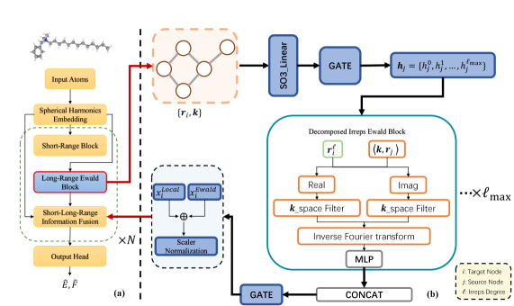
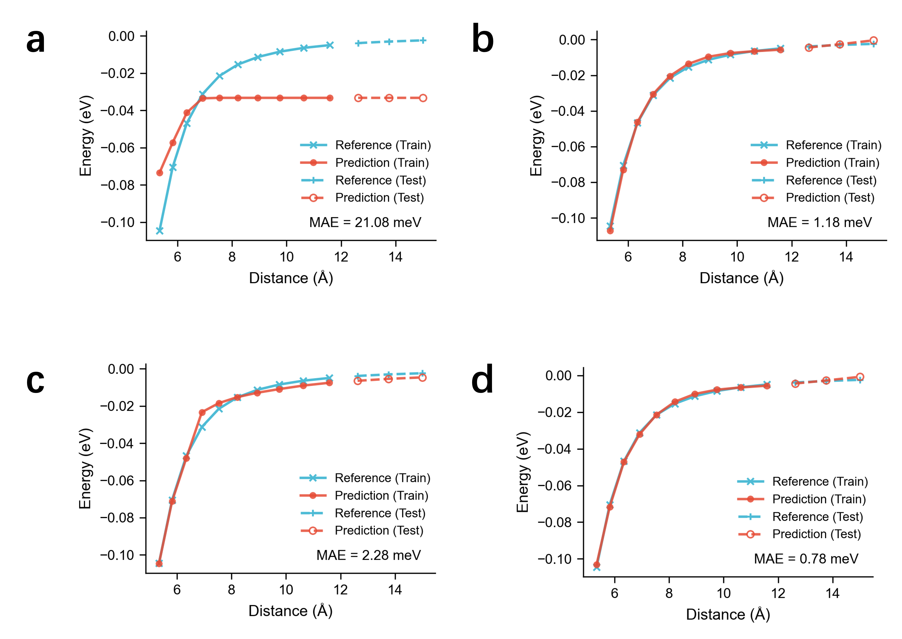
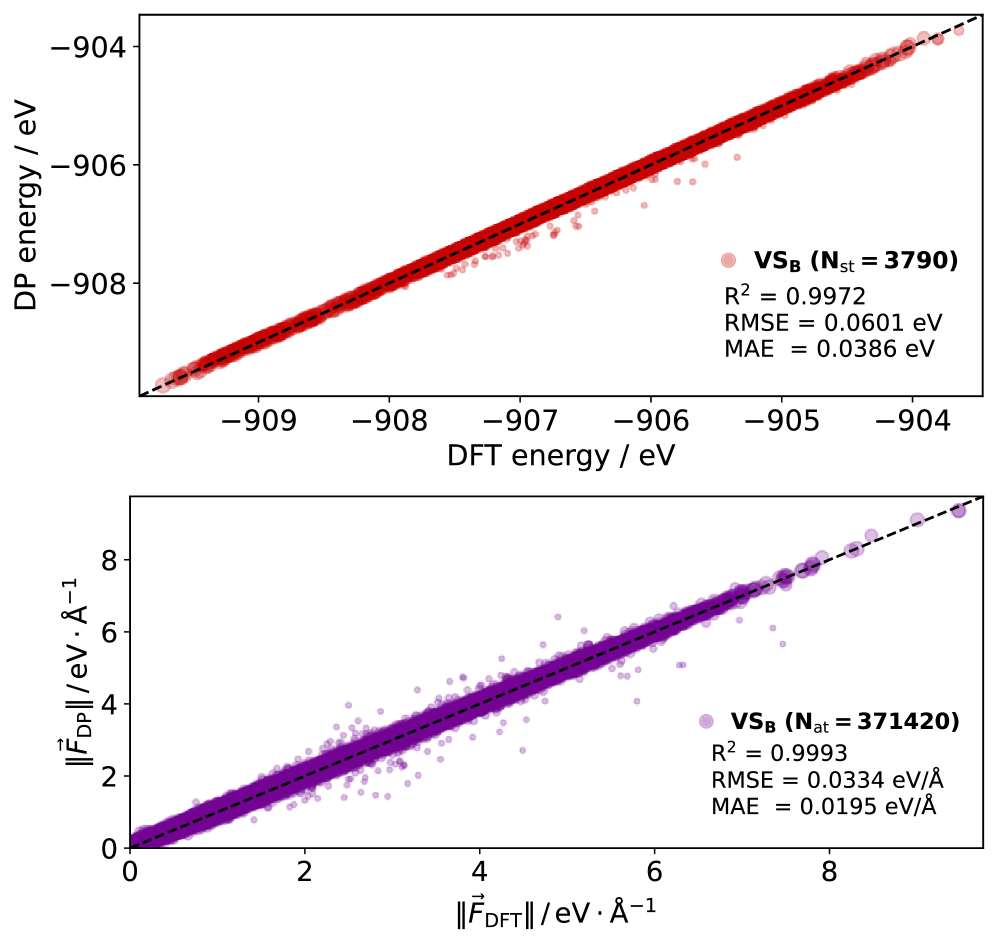
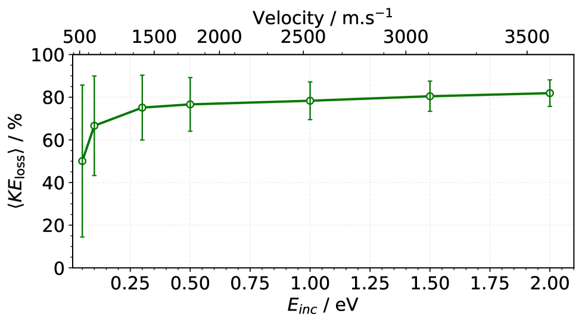
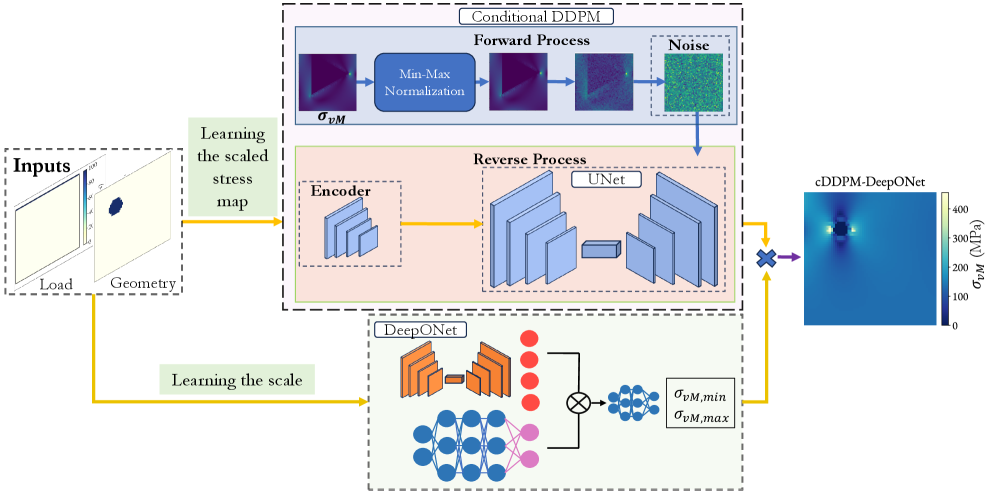
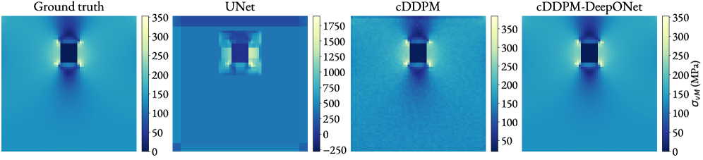
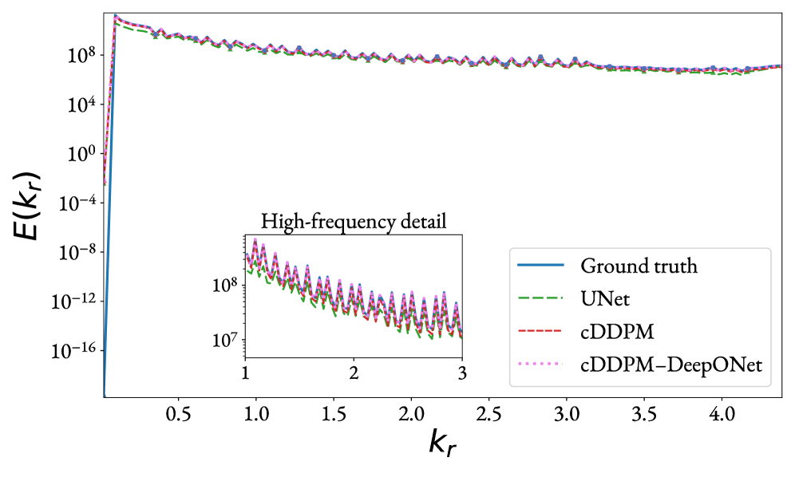
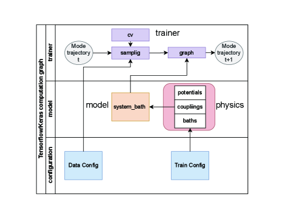
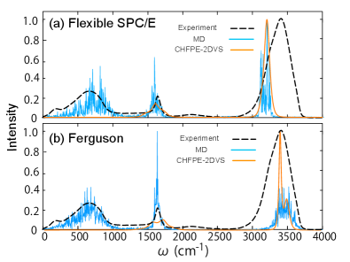
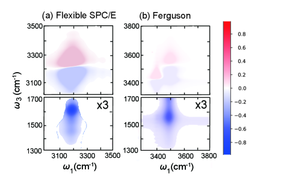

# arXivダイジェスト：マテリアルズ・インフォマティクス

**作成日：** 2026年3月21日
**対象期間：** 2026年3月19日〜2026年3月21日（直近72時間）

---

## 選定論文一覧

1. [EquiEwald: An SO(3)-equivariant reciprocal-space neural potential for long-range interactions](#1-equiewald)
2. [Bridging Crystal Structure and Material Properties via Bond-Centric Descriptors](#2-bond-centric)
3. [DeePAW: A universal machine learning model for orbital-free ab initio calculations](#3-deepaw)
4. [Matlantis-PFP v8: Universal Machine Learning Interatomic Potential with Better Experimental Agreements via r2SCAN Functional](#4-pfpv8)
5. [Polarization Dynamics in Ferroelectrics: Insights Enabled by Machine Learning Molecular Dynamics](#5-ferroelectric-mlmd)
6. [Phonon Band Center: A Robust Descriptor to Capture Anharmonicity](#6-phonon-band-center)
7. [Data-driven construction of machine-learning-based interatomic potentials for gas-surface scattering dynamics: the case of NO on graphite](#7-no-graphite)
8. [From Atomistic Models to Machine Learning: Predictive Design of Nanocarbons under Extreme Conditions](#8-nanocarbons)
9. [A Hybrid Conditional Diffusion-DeepONet Framework for High-Fidelity Stress Prediction in Hyperelastic Materials](#9-diffusion-deeponet)
10. [sbml4md: A computational platform for System-Bath Modeling via Molecular Dynamics powered by Machine Learning](#10-sbml4md)

---

## 重点論文の詳細解説

---

## 1. EquiEwald: An SO(3)-equivariant reciprocal-space neural potential for long-range interactions

### 1. 論文情報

| 項目 | 内容 |
|------|------|
| タイトル | [An SO(3)-equivariant reciprocal-space neural potential for long-range interactions](https://arxiv.org/abs/2603.18389) |
| 著者 | Linfeng Zhang, Taoyong Cui, Dongzhan Zhou, Lei Bai, Sufei Zhang, Luca Rossi, Mao Su, Wanli Ouyang, Pheng-Ann Heng |
| arXiv ID | 2603.18389 |
| カテゴリ | physics.chem-ph |
| 公開日 | 2026年3月19日 |
| 論文タイプ | 研究論文 |
| ライセンス | CC BY 4.0 |

### 2. どんな研究か

局所的な短距離相互作用のみを扱う従来の機械学習原子間ポテンシャル（MLIP）では、静電相互作用やファンデルワールス分散力のような長距離相互作用を正確に捉えることができなかった。本研究では、Ewaldの逆格子空間分解の考え方をSO(3)等変ニューラルネットワークに統合したEquiEwaldを提案し、逆格子空間でのメッセージパッシングによって異方性テンソル的な長距離相関を物理的一貫性を保ちながら記述することを実現した。分子ダイマー、タンパク質動力学、超分子複合体、固体触媒系の広範なベンチマークでベースラインを大幅に上回り、長距離外挿性能において特に顕著な改善を示した。

### 3. 位置づけと意義

MLIPの精度を制限してきた根本的な制約として「局所性仮定」がある。原子の特性をカットオフ半径内の近傍原子のみから算出するアーキテクチャは計算効率に優れる一方、イオン性材料・極性分子・生体分子・誘電体材料など長距離相互作用が支配的なシステムで誤差が大きくなる。EquiEwaldはこの問題を、Ewald法（周期境界系での静電計算に標準的に用いられる実空間・逆格子空間の分解）とSO(3)等変ネットワークを統合することで解決した。等変性を保ちながら逆格子空間でのフィルタリングを行うという設計は、分子・無機・有機-無機ハイブリッド材料を含む広範なシステムへの適用可能性を拓き、材料設計・分子シミュレーション・触媒設計の分野への影響は大きい。

### 4. 研究の概要

**背景と目的：** 局所近似に基づくMLIPは、GNNなどの等変ネットワークの発展により短距離相互作用の記述精度を著しく向上させてきた。しかし静電相互作用（クーロン力は$r^{-1}$で減衰）やロンドン分散力（$r^{-6}$で減衰）など長距離に及ぶ相互作用は、有限のカットオフを設定するローカルMLIPでは原理的に再現できない。本研究の目的は、等変性・物理的一貫性を維持しながら長距離相互作用を取り込む汎用フレームワークの構築にある。

**情報学的アプローチ：** EquiEwaldは既存の等変ネットワーク（eSCN、EquiformerV2など）のプラグイン的なアドオンとして設計されており、短距離局所エンコーダと並列して逆格子空間（$k$空間）での長距離ブロックを動作させる。$k$空間における等変メッセージパッシングは、次数分解球面調和フィルタリングと等変逆変換によって実現され、長距離の方向依存相関（テンソル的応答）を捉える。

**対象材料系：** 荷電分子ダイマー（$\text{Li}^+\cdots\text{Cl}^-$等）、Chignolin（小タンパク質10残基）、Buckyball-Catcher複合体（超分子）、OC20データセット（表面触媒反応）。

**使用データ：** 既存のDFT/AIMD計算データセット（AIMD-Chig、OC20）。独自の長距離外挿ベンチマーク（分子ダイマー分離距離スキャン）。

**主な結果：**
- 分子ダイマー長距離外挿：ベースラインeSCN（MAE 21.08 meV）をEquiEwald+eSCN（MAE 0.78 meV）へ、約27倍改善
- Chignolin自由エネルギー：1.15 → 0.67 kcal/mol（42%削減）
- Buckyball-Catcher：エネルギーMAE 36.0 → 18.1 meV（約50%改善）
- OC20（固体触媒）：EquiformerV2ベースで力MAE 46.4 → 38.4 meV/Å改善

**著者の主張：** 逆格子空間における等変メッセージパッシングが、既存のローカルMLIPに対して長距離相互作用の正確な記述を追加できる汎用モジュールとして機能することを示した。

### 5. マテリアルズ・インフォマティクスとして重要なポイント

EquiEwaldの設計は、MLIPの精度限界とされてきた「長距離問題」への本質的なアプローチとして注目される。従来の試みとして電荷平衡（QEq）や双極子エネルギー補正が存在したが、等変表現の枠組みで逆格子空間を活用する本手法は、テンソル的（異方性）な長距離相関を自然に記述できる点で新規性がある。材料科学への波及という観点では、イオン性酸化物・ペロブスカイト・水溶液・タンパク質-材料界面などの分野でMLIPの適用範囲が大幅に拡がることが期待される。また既存の等変ネットワーク（eSCN、EquiformerV2）のアドオンとして機能するため、大規模事前学習済みMLIPへの後付け統合が比較的容易である点も、コミュニティへの展開という意味で重要である。OC20での改善は触媒スクリーニング、Chignolin自由エネルギーの改善は薬物設計や生体-材料界面の研究への応用を示唆している。

### 6. 限界と注意点

本研究にはいくつかの重要な限界がある。第一に、逆格子空間での処理は周期境界系（結晶）では自然に定義されるが、非周期系（孤立分子、表面スラブなど）では疑似周期化が必要になり、この近似の影響についての系統的評価は不十分である。第二に、計算コストについての議論が乏しく、逆格子空間のメッセージパッシング追加による推論・学習コストの増大が実用規模のシミュレーション（数万原子以上）で許容範囲かどうかが不明確である。第三に、ベンチマーク系は主に有機・生体分子系と表面触媒系に偏っており、無機酸化物・ハライドペロブスカイト・多成分合金などの凝縮系材料への適用性は直接的に示されていない。第四に、現在の論文ではEquiEwaldがionic chargeの物理的起源と一致した記述を行っているかどうかの解釈可能性検証が不十分であり、「長距離を正確に記述している」という主張の物理的根拠が限られる。第五に、OC20での改善は統計的に有意ではあるものの、絶対的な精度水準（EquiformerV2 + EquiEwald: 38.4 meV/Å）は触媒スクリーニングの実用要件（~20 meV/Å以下とされる）には未到達である。

### 7. 関連研究との比較

長距離MLIPは近年急速に発展している。PaiNN、NequIP、eSCN、EquiformerV2などの等変ネットワークが短距離精度を大幅に改善した一方、長距離問題への対応としてはDimeNet++の距離補正、Allegro・MACEの厳密局所モデル、そして電荷平衡と組み合わせたHIP-NN-TSなどが提案されてきた。EquiEwaldの位置づけとして特筆すべきは、「等変性」と「逆格子空間処理」の同時達成である。同時期の類似研究としてESEN（Ewald-based Message Passing）があるが、EquiEwaldはSO(3)等変性を維持したまま異方性テンソル相関を記述できる点で差別化される。既存の等変ネットワークのアドオンとして機能する設計は、今後の基盤モデル（universal MLIP）への統合という観点で特に重要であり、MACE-MP-0やEquiformerV2ベースのファインチューニングとの組み合わせが有望な方向性として挙げられる。incremental breakthoughと位置づけられるが、MLIPの適用可能系の大幅な拡張という意味でコミュニティへの影響は大きい。

### 8. 重要キーワードの解説

**1. Ewald分解 (Ewald decomposition)**
周期境界条件下でのクーロン相互作用を実空間と逆格子空間に分解する古典的手法。クーロンポテンシャル $V(r) = q_i q_j / r$ は長距離に及ぶため直接の打ち切りが困難だが、$V(r) = V_{\text{短距離}}(r) + V_{\text{長距離}}(r)$ と分解し、後者を逆格子空間（$k$空間）のフーリエ級数で計算することで収束を加速する。EquiEwaldはこの考え方をMLIPに応用し、$k$空間での学習可能フィルタリングを行う。

**2. SO(3)等変性 (SO(3)-equivariance)**
物体の回転操作 $R \in SO(3)$ に対して、入力を回転させた場合の出力が、出力を同様に回転させた結果と等しくなる性質。ベクトル・テンソル量（力、双極子モーメントなど）を正確に予測するために必須の対称性。$f(R \cdot \mathbf{x}) = R \cdot f(\mathbf{x})$。EquiEwaldは逆格子空間処理においてもこの等変性を維持することで、異方性長距離相関の物理的に正しい記述を実現している。

**3. 機械学習原子間ポテンシャル (Machine Learning Interatomic Potential, MLIP)**
第一原理計算（DFT等）の精度をニューラルネットワークで模倣し、分子動力学シミュレーションを低コストで実行可能にする手法。入力として原子種・座標、出力としてエネルギー・力・応力を予測する。現代のMLIPはGNNや等変ネットワークを用い、原子座標から不変（or等変）な特徴量を抽出してポテンシャルエネルギー面を近似する。

**4. 逆格子空間メッセージパッシング (Reciprocal-space message passing)**
GNNの実空間グラフ伝播を逆格子空間（フーリエ空間）に拡張したもの。原子特徴量を$k$ベクトルの関数としてフーリエ変換し、学習可能な$k$空間フィルタをかけた後、逆変換して実空間の長距離記述子を得る。これにより全原子ペアの距離に依存する相互作用を$\mathcal{O}(N^2)$ではなく$\mathcal{O}(N \log N)$程度で近似できる。

**5. 長距離外挿 (Long-range extrapolation)**
MLIPが学習時のカットオフ半径を超える距離での原子相互作用を正確に予測できるかを評価する指標。例えば分子ダイマーを学習時より大きな分離距離に置いたとき、正確な漸近的な挙動（静電力なら$r^{-2}$, ロンドン分散なら$r^{-7}$）を再現できるかが問われる。従来の局所MLIPはこの外挿が原理的にできない。

**6. データ効率性 (Data efficiency)**
MLIPの精度が学習データ数の増加に伴ってどの速度で向上するかを表す。データ効率が高いほど、少ない第一原理計算コストで高精度モデルを得られる。EquiEwaldは長距離特徴量の明示的な物理的ガイドにより、データ効率の向上を示している。

**7. OC20データセット**
Open Catalyst 2020（Meta AI / CMU）が公開した大規模触媒-反応物質相互作用のDFTデータセット。約130万の弛緩構造計算と対応するエネルギー・力データを含み、表面触媒スクリーニングのためのMLIPベンチマークとして広く用いられる。酸化物・合金・遷移金属など多様な固体表面を含む。

**8. AIMD-Chignolin**
10残基の小タンパク質 Chignolin のAb Initio 分子動力学（AIMD）データセット。生体分子の折り畳み・自由エネルギー計算における長距離静電相互作用（水分子やイオンとの相互作用）が支配的な系として、長距離MLIP評価のベンチマークとして用いられる。

**9. 自由エネルギー計算 (Free energy calculation)**
熱力学的安定性・相平衡・反応速度の予測に必要な量。分子動力学シミュレーションにおいては長時間・大規模サンプリングが要求されるため、高精度かつ計算効率の良いMLIPが必要。EquiEwaldはChignolin系での自由エネルギー誤差を42%削減し、MLIPによる自由エネルギー計算の信頼性向上を示した。

**10. EquiformerV2 / eSCN**
Meta AI / TechAIが開発した大規模等変グラフトランスフォーマー。球面調和関数（$\ell$次数のSH）を基底とした特徴量を扱い、OC20での最高精度を達成したMLIPアーキテクチャ。EquiEwaldはこれらのモデルへのプラグイン的アドオンとして設計されており、既存の学習済みモデルへの後付け統合が可能。

### 9. 図

**図1：EquiEwaldのモデル全体構造とアーキテクチャ概要。** (a) 短距離局所エンコーダと逆格子空間長距離ブロックを並列に動作させるデュアルパスウェイ設計を示す。EquiEwald長距離ブロック（b）は原子特徴量と波数ベクトル入力を受け取り、次数分解球面調和フィルタリングと等変逆変換によって長距離テンソル相関を抽出する。この構造が既存の等変ネットワークへのモジュール追加を可能にしており、汎用性の高い設計であることを示している。© The Authors, CC BY 4.0

**図2：荷電分子ダイマー系における長距離エネルギー予測のベンチマーク比較。** 縦軸は予測エネルギー、横軸はDFT参照値。EquiEwaldを追加したモデル（下段）は学習データ範囲外の分離距離においても正確な漸近的挙動を再現するのに対し、ベースラインモデル（上段）は長距離で大きく乖離する（MAE 21.08 → 0.78 meV）。この結果がEquiEwaldの中心的な主張を支える直接的な証拠である。© The Authors, CC BY 4.0

---

## 2. Bridging Crystal Structure and Material Properties via Bond-Centric Descriptors

### 1. 論文情報

| 項目 | 内容 |
|------|------|
| タイトル | [Bridging Crystal Structure and Material Properties via Bond-Centric Descriptors](https://arxiv.org/abs/2603.18876) |
| 著者 | Jian-Feng Zhang, Ze-Feng Gao, Xiao-Qi Han, Bo Zhan, Dingshun Lv, Miao Gao, Kai Liu, Xinguo Ren, Zhong-Yi Lu, Tao Xiang |
| arXiv ID | 2603.18876 |
| カテゴリ | cond-mat.mtrl-sci |
| 公開日 | 2026年3月19日 |
| 論文タイプ | 研究論文（データベース・手法論） |
| ライセンス | arXiv非独占的配布ライセンス |

### 2. どんな研究か

現代の機械学習材料モデルは、結晶構造の幾何座標のみを入力とし、量子力学的原理（化学結合、電荷移動、軌道混成）を暗黙的に再学習することを強いられている。本研究では結晶中の化学結合情報を電子論的に計算・定量化した大規模データベース「MattKeyBond」を構築し、さらに元素ごとの共有結合形成しやすさを定量化する新記述子「Bonding Attractivity（BA）」を導入した。BAを含む結合記述子を特徴量として機械学習モデルに組み込むことで、データが少ない条件での材料物性予測精度を向上させ、モデルの解釈可能性も高めることを示した。

### 3. 位置づけと意義

マテリアルズ・インフォマティクスにおける記述子設計は、材料の何を特徴量として捉えるかという本質的問題である。元素・組成・対称性などの静的記述子と異なり、化学結合の電子論的性質（結合強度、電荷移動量、軌道寄与）は量子力学的計算なしには得られず、これをML特徴量として系統的に整備した例は少なかった。MattKeyBondは360万以上の結合データを含み、BAという解釈可能な元素ごとのスカラー量を提供することで「元素の化学的個性」を機械学習モデルに組み込む橋渡しをする。これは「なぜそのモデルが効くのか」という解釈性の向上と、「少量データでも物理的知識で補完する」というデータ効率性の両立という観点で重要な貢献である。

### 4. 研究の概要

**背景と目的：** GNNやトランスフォーマーベースのMLIPは、局所化学環境の表現を学習データから帰納的に再発見する。しかしこのアプローチはデータ量が少ない系（稀少元素系、新機能材料系）での精度が低く、モデルが何を学んだかも解釈しにくい。本研究の目的は、電子構造から導出した結合記述子を設計し、MLモデルへの明示的な物理的事前知識として組み込むことにある。

**情報学的アプローチ：**
- DFTベースの結晶軌道ハミルトニアン集団（COHP）解析から結合強度・電荷移動・軌道寄与を定量化
- 360万件以上の結合データからBAを元素別にパラメタライズ（H〜Biの83元素をカバー）
- BAsを特徴量として既存のMLモデル（ランダムフォレスト、GNNなど）に追加し、物性予測精度への影響を評価

**対象材料系：** MattKeyBondは無機結晶全般を対象（金属、酸化物、ハライド、カルコゲナイド、窒化物等）。

**使用データ：** Materials Project等の公開無機結晶データベースに対するDFT-COHPの計算結果。

**主な結果：** BAを含む結合記述子の導入により、少量データ条件でのバンドギャップ・生成エンタルピー予測において既存の原子・組成記述子のみのモデルを上回る精度を達成。BAの元素別周期表が物理的に解釈可能な傾向を示すことを確認。

### 5. マテリアルズ・インフォマティクスとして重要なポイント

BA記述子の設計は「物理的意味のある特徴量」というMLIの中心的課題に直接応答している。従来の電気陰性度・原子半径・イオン化エネルギーなどの原子記述子は豊富に研究されてきたが、「特定の結晶環境における結合の強さ」をスカラー量で表現する試みは比較的少ない。COHPから導いたBAは、結合の実際の量子力学的強さを反映しており、周期表上での傾向（電気的性質、族依存性）と整合する。データ効率性の観点では、BAがモデルに対して「このペアの原子は強く結合しやすい」という事前知識を与えることで、少ないデータからの外挿性が改善されることが示された。一方、このアプローチはBASの計算にDFT-COHP解析が必要となるため、COHPが定義されない系（非晶質、液体、分子）への適用に課題がある。材料設計の文脈では、設計空間の化学結合的制約を明示的に記述できる点が有望である。

### 6. 限界と注意点

本研究には以下の限界がある。第一に、MattKeyBondのデータはDFT（GGA程度）に基づいており、強相関電子系・遷移金属酸化物・4f電子系では結合記述子の信頼性が低下する可能性がある。第二に、BAは元素ごとの「平均的な」結合しやすさであり、結晶環境への依存性（配位数、局所歪み、格子パラメータ）を十分に反映していない点で近似的な記述子である。第三に、COHPは多様な実装・パラメータ選択（基底関数、PAOなど）に依存し、データベース全体での一貫性が重要であるが、計算の均質性についての詳細な議論が不足している。第四に、精度改善効果が示された物性（バンドギャップ・生成エンタルピー）の他に、どの物性でBAが有効でどこで効かないかの系統的な評価が限られている。第五に、公開されたBAパラメータがどの程度汎用性を持つかは、H〜Bi以外の元素系（5d遷移金属・アクチノイド等）での検証が不十分である。

### 7. 関連研究との比較

記述子設計の文脈では、SOAP（Smooth Overlap of Atomic Positions）、ACSF（Atom-Centered Symmetry Functions）、MEGNet、CGCNN、AtomVecなど多様な表現学習手法が提案されてきた。MattKeyBondとBAは「電子構造由来の物理的記述子」という切り口でこれらと差別化されており、類似のアプローチとしてはBONDISやCrystalBONDが挙げられるが、規模・体系性・元素カバレッジで本研究が上回る。ICOHP（COHPの積分値）を材料スクリーニングに使う研究（Draxl群のNOMADデータベース活用など）との連携可能性もある。課題として、電子記述子の自動計算・高速化（MLでCOHPを近似する方向性）と組み合わせることで、大規模スクリーニングへの拡張が期待できる。この研究が開くのは「量子化学的ボンディング知識をML材料予測のプリミティブとして使う」という方向性であり、ファンデーションモデルへの組み込みや転移学習との組み合わせが有望な展開である。

### 8. 重要キーワードの解説

**1. 結合記述子 (Bond-Centric Descriptor)**
原子ではなく原子間結合を単位として定義される特徴量。CGCNN等のGNNが「エッジ」として結合距離を使うのに対し、本研究は量子力学的な結合強度・電荷移動・軌道性質を記述子として用いる。これにより同じ幾何構造でも化学的性質が異なる結合（共有結合 vs イオン結合 vs 金属結合）を識別できる。

**2. COHP（Crystal Orbital Hamilton Population）**
結晶中の原子軌道ペアの結合相互作用を定量化するDFTの解析手法。ボンドネット（結合性）とアンチボンドネット（反結合性）への電子の寄与を分別し、正のCOHP値は結合性軌道を意味する。積分値（ICOHP）は結合強度の尺度として広く用いられる。

**3. Bonding Attractivity (BA)**
本研究で提案された元素固有の記述子。元素 A のBAは「他元素との共有結合形成しやすさ」を表し、$\eta_{A}$（原始BA）、$L_A$（特性減衰長）、$M_A$（価電子状態変調因子）の3パラメータで構成される。周期表全体を対象としてMattKeyBondから最適化されており、C（強共有結合）からCsやBa（弱結合・イオン性）まで物理的に妥当な順序を示す。

**4. MattKeyBond データベース**
360万件以上の無機結晶中の化学結合情報（結合強度、電荷移動量、軌道寄与、局所環境）を収録した材料データベース。Materials ProjectのDFT計算データに対してCOHP解析を実施し、元素H〜Biを網羅する。機械学習への直接的な入力特徴量として利用可能な形で整備されている。

**5. データ効率性 (Data efficiency)**
ML物性予測モデルが少ない学習データで高精度を達成できるかを表す。物理的記述子（BA等）の導入は帰納的バイアスとして機能し、モデルが「量子力学的に無意味な解」へ収束することを防ぐことでデータ効率を向上させる。希少元素系や新規材料クラスでの小データ予測に特に重要。

**6. 電荷移動（Charge Transfer）**
化学結合時に一方の原子から他方への電子の移動。イオン結合では大きく、共有結合では小さい。COHPベースの解析でボンドあたりの電荷移動量を定量化すると、材料の誘電特性・強誘電性・イオン輸送特性と相関する。BAはこの傾向を元素固有のパラメータとして捉えている。

**7. 結晶軌道（Crystal Orbital）**
周期的な結晶中でのブロッホの定理に基づく電子軌道。孤立原子の原子軌道がバンド構造に変化したもの。結合性軌道は価電子帯（VB）に、反結合性軌道は伝導帯（CB）に主に寄与する。COHPはこの結晶軌道間の相互作用を結合ペアごとに分解する。

**8. 転移学習 (Transfer Learning)**
大規模データセットで事前学習したモデルの知識を、少量データの新しいタスクに転用する手法。BA記述子はMLモデルへの「物理的事前知識」の一形態として転移学習と類似の役割を果たし、特に学習データが少ない新規材料系への外挿を助ける。

**9. 解釈可能性 (Interpretability)**
MLモデルがなぜその予測をしたかを人間が理解できる度合い。BAのような物理的意味を持つスカラー記述子は、モデルが「この元素組み合わせでは強い共有結合が形成されるから生成エネルギーが低い」といった形で解釈できる。GNN内部の潜在表現とは異なり、原子・結合レベルでの直接的な物理的説明が可能。

**10. 生成エンタルピー (Formation Enthalpy)**
元素単体から材料を形成する際のエンタルピー変化 $\Delta H_f$。負の値が大きいほど熱力学的に安定。MLを用いた$\Delta H_f$予測は材料安定性スクリーニングの基本的タスクであり、Materials ProjectやOMDB等の大規模DFTデータベースが学習データとして用いられる。BAを特徴量に加えることで、小データ条件での予測精度改善が本研究で示された。

### 9. 図

本論文はarXiv非独占的配布ライセンスのため、原図の抽出は行いません。

---

## 3. DeePAW: A universal machine learning model for orbital-free ab initio calculations

### 1. 論文情報

| 項目 | 内容 |
|------|------|
| タイトル | [DeePAW: A universal machine learning model for orbital-free ab initio calculations](https://arxiv.org/abs/2603.18650) |
| 著者 | Tianhao Su, Shunbo Hu, Yue Wu, Runhai Oyang, Xitao Wang, Musen Li, Jeffrey Reimers, Tong-Yi Zhang |
| arXiv ID | 2603.18650 |
| カテゴリ | cond-mat.mtrl-sci |
| 公開日 | 2026年3月19日 |
| 論文タイプ | 研究論文 |
| ライセンス | arXiv非独占的配布ライセンス |

### 2. どんな研究か

通常のKohn-Sham DFT（KS-DFT）では明示的な電子軌道計算が必要で、計算コストが系のサイズに対して $\mathcal{O}(N^3)$ でスケールする。軌道フリーDFT（OFDFT）は運動エネルギー汎関数を直接電子密度の関数として近似することで $\mathcal{O}(N)$ スケーリングを実現するが、精度の高い運動エネルギー汎関数の設計が長年の課題だった。本研究では SE(3)-等変二重メッセージパッシングニューラルネットワークを用いて、電子密度と結晶の生成エネルギーを直接予測する普遍的MLモデル「DeePAW」を開発した。3つのベンチマーク（元素カバレッジ・構造多様性・精度）において従来のOFDFT-MLモデルを上回り、KS-DFTレベルの精度を維持しながら大スケール計算を可能にすることを示した。

### 3. 位置づけと意義

OFDFTは大規模材料シミュレーション（数万〜数百万原子）の実現において理論的に優れたスケーリングを持つが、精度の問題から金属単体以外への適用が限られてきた。DeePAWはMLによって高精度OFDFTを多様な元素・結晶構造に適用するという壁を突き破る試みである。材料情報学の観点では、DeePAWが実現する「電子密度の直接予測」は電子的物性（バンド構造、誘電率、磁化）の計算と組み合わせることで、計算効率の高い多スケール材料シミュレーション基盤を提供する可能性がある。MLIPが原子レベルの動力学を加速するのに対し、DeePAWは電子構造レベルの計算を加速するものとして相補的な位置づけにある。

### 4. 研究の概要

**背景と目的：** KS-DFTは材料科学の標準的電子構造計算手法だが、数百原子超の計算には限界がある。OFDFTは軌道計算を回避して電子密度だけを変分変数とし、Hohenberg-Kohn定理に基づいて全エネルギーを最小化するが、正確な運動エネルギー汎関数 $T_s[\rho]$ が不明であることが精度の妨げとなっている。

**情報学的アプローチ：**
- 入力：原子種・座標、出力：電子密度分布 $\rho(\mathbf{r})$ および結晶生成エネルギー
- SE(3)-等変二重メッセージパッシングで局所化学環境を表現
- PAW（Projector Augmented Wave）法に基づく原子周辺の密度記述
- 汎用性を目指した多元素・多構造タイプでの学習

**対象材料系：** 金属・酸化物・ハライド・窒化物・共有結合性固体などを含む多元素系結晶。

**使用データ：** KS-DFTによって計算された電子密度データ（自己一貫場解の電子密度）を学習ラベルとして使用。

**主な結果：** 3つのベンチマークにおいて既存OFDFTモデルを上回る性能。ファインチューニングなしで多様な結晶構造への汎用適用が可能。

**著者の主張：** DeePAWは現時点での最高性能のOFDFT-MLモデルであり、従来のKS-DFTが不可能な大規模材料シミュレーションへの道を開く。

### 5. マテリアルズ・インフォマティクスとして重要なポイント

DeePAWの核心的な貢献は「電子密度の機械学習によるOFDFT精度の向上」にある。従来のMLIPが原子配置からエネルギー・力を直接予測するのに対し、DeePAWは電子密度という中間量を予測することで、電子的物性計算との組み合わせが可能になる。SE(3)-等変性の採用は、結晶の回転・反転対称性を保ちながら電子密度テンソルを正しく変換するために不可欠であり、設計の妥当性が高い。汎用性の達成（ファインチューニング不要・多元素対応）は、特定元素系に限定された従来手法との明確な差別化点である。材料設計の文脈では、大規模超格子・欠陥系・界面の電子構造計算への応用が期待される。

### 6. 限界と注意点

本研究には以下の重要な限界がある。第一に、電子密度の学習精度が高くても、それを用いてエネルギーを計算する際の汎関数（交換相関汎関数、静電相互作用など）の精度への影響についての定量的評価が不明確である。第二に、強相関電子系（Mott絶縁体、希土類化合物等）ではKS-DFTのGGA自体が信頼できないため、その訓練データを使うDeePAWも同様の限界を持つ。第三に、電子密度の実空間グリッド表現は計算コストが高く、大規模系（数千原子以上）での実際の計算効率改善がどの程度になるかは示されていない。第四に、「3つのベンチマークで最高性能」という主張は現時点での比較基準に依存しており、同時期に提案されている他のOFDFT-MLモデルとの独立比較が不十分である。第五に、本論文はHTML版が公開されておらず（404エラー）、図・詳細な実験条件への確認が困難であった。

### 7. 関連研究との比較

OFDFTのML化は近年急速に発展している。Thomas-Fermi近似、Wang-Teter（WT）汎関数、Huang-Carter（HC）汎関数などの解析的汎関数と比較して、MLベースのアプローチ（DNN-OF、NNOFなど）は精度で優位だが汎用性に課題があった。DeePAWのSE(3)-等変設計はNequIPやMACEなどの等変MLIPアーキテクチャの知見を電子密度予測に応用しており、当該分野の成熟を示す。電子密度の直接予測という観点では、Density-FunctionalMLやOrbNet-Equiと類似のアプローチが並行して進められており、競争的な研究環境にある。DeePAWの汎用性主張の差別化には、独立した多元素系での再現検証が今後必要である。

### 8. 重要キーワードの解説

**1. 軌道フリーDFT（Orbital-Free DFT, OFDFT）**
電子の一粒子軌道（Kohn-Sham軌道）を明示的に計算せず、電子密度 $\rho(\mathbf{r})$ のみを変分変数とする密度汎関数理論の定式化。全エネルギーを $E[\rho] = T_s[\rho] + E_{ext}[\rho] + E_{H}[\rho] + E_{xc}[\rho]$ と書き、計算コストが $\mathcal{O}(N)$ または $\mathcal{O}(N \log N)$ でスケールする利点がある。精度限界は $T_s[\rho]$ の近似精度に依存する。

**2. 運動エネルギー汎関数（Kinetic Energy Functional）**
OFDFT における最大の課題。非相互作用電子系の運動エネルギーを電子密度の汎関数 $T_s[\rho]$ として近似する必要があるが、正確な表式は不明。Thomas-Fermi型（$T_s \propto \int \rho^{5/3} d\mathbf{r}$）はスケーリングが良いが精度が低く、非局所型汎関数はより精度が高いが計算コストが増大する。DeePAWはNNでこの汎関数の効果を包含する。

**3. SE(3)-等変ニューラルネットワーク**
三次元ユークリッド群 SE(3)（回転 SO(3) と並進の組み合わせ）に対して等変なニューラルネットワーク。原子座標入力に対して、回転変換が適用された場合に出力テンソルも対応する変換を受けることを保証する。電子密度のベクトル・テンソル成分を正確に予測するために必須の性質。

**4. PAW（Projector Augmented Wave）法**
DFT計算において、原子核近傍の急変する全電子波動関数を、滑らかな疑似波動関数（PS）と角度依存の補正項に分解する方法。コアと価電子の相互作用を精度良く扱いながら計算効率を保つ。DeePAWはこのPAW枠組みでの電子密度記述をML予測に活用している。

**5. 二重メッセージパッシング（Double Message Passing）**
GNNにおいて原子間の情報伝播を2段階（あるいは2種類）に分けて行う手法。例えば、近距離と中距離の情報を別々のチャネルで処理し、後で統合することで、より豊かな局所化学環境の表現を得る。DeePAWは電子密度の短距離・中距離依存性を同時に捉えるためにこれを採用する。

**6. 生成エネルギー（Formation Energy）**
元素単体から結晶を形成する際のエネルギー $\Delta E_f = E_{\text{crystal}} - \sum_i n_i \mu_i^0$。材料の安定性指標として材料スクリーニングで広く使われ、OFDFT-MLの精度評価の標準的ベンチマーク。

**7. 汎用性 (Universality)**
単一のモデルが特定の元素系や結晶構造への事前特化（ファインチューニング）なしに、広範な材料系に適用できる性質。MACE-MP-0やCHGNetなどの universal MLIP と同様の概念をOFDFT-ML に適用したものがDeePAWの汎用性の意味。

**8. 電子密度 $\rho(\mathbf{r})$（Electron Density）**
空間中の各点 $\mathbf{r}$ での電子の確率密度。Hohenberg-Kohn定理により、非縮退基底状態のすべての物理量は $\rho(\mathbf{r})$ の汎関数として表現できる。$\int \rho(\mathbf{r}) d\mathbf{r} = N$（全電子数）。電子密度から誘電率・電気分極・力学応答などの物性を算出できる。

**9. KS-DFT（Kohn-Sham DFT）**
補助的な非相互作用電子系のKohn-Sham方程式を自己一貫に解くDFTの標準定式化。計算コストは $\mathcal{O}(N^3)$ から $\mathcal{O}(N)$（線形スケーリング法）まで実装に依存するが、OFDFTと比較してコストが高い。

**10. マルチスケールシミュレーション（Multiscale Simulation）**
電子・原子・メゾ・マクロの異なる長さ・時間スケールの計算を結合させた材料シミュレーション手法。DeePAWが実現する高速電子構造計算は、MLIPによる原子ダイナミクスや有限要素法によるマクロ応答と組み合わせた多スケール材料解析の電子論的基盤となりうる。

### 9. 図

本論文はarXiv非独占的配布ライセンスのため、原図の抽出は行いません。

---

## その他の重要論文

---

### 4. Matlantis-PFP v8: Universal Machine Learning Interatomic Potential with Better Experimental Agreements via r2SCAN Functional

#### 論文情報

| 項目 | 内容 |
|------|------|
| タイトル | [Matlantis-PFP v8: Universal Machine Learning Interatomic Potential with Better Experimental Agreements via r2SCAN Functional](https://arxiv.org/abs/2603.11063) |
| 著者 | Chikashi Shinagawa, So Takamoto, Daiki Shintani, ほか7名 |
| arXiv ID | 2603.11063 |
| カテゴリ | physics.chem-ph, cond-mat.mtrl-sci, physics.comp-ph |
| 公開日 | 2026年3月9日（v2：2026年3月18日） |
| 論文タイプ | 研究論文 |
| ライセンス | arXiv非独占的配布ライセンス |

#### 研究概要

汎用機械学習原子間ポテンシャル（universal MLIP）は多様な元素・構造に対して単一モデルで動作するが、その訓練に用いられるPBE汎関数は実験値との系統的な誤差（格子定数の過大評価、融点の過大予測等）を持つという根本的な問題がある。本研究ではMatlantis-PFPの最新版（v8）を、PBEに代わってより実験値との整合性が高いr2SCAN meta-GGA汎関数で計算されたデータセットで訓練することで、この問題に取り組んだ。r2SCANはPBEより計算コストが高いが、格子定数・表面エネルギー・融点などの多様な物性でより正確な実験値予測を示すことが知られている。

最大の成果は融点予測精度であり、PFP-r2SCANはPBEベースモデル（誤差約279K）と比較して平均誤差約130K（約50%削減）を達成した。これはゼロショット（ファインチューニングなし）の汎用モデルが実験的融点と直接比較できるレベルに近づいたことを意味し、材料スクリーニングにおける融点予測の実用性を大幅に向上させる。表面エネルギーでも実験不確かさの範囲内での予測が達成されており、触媒設計・材料合成シミュレーションへの直接的応用が期待される。MI的観点では「訓練データの汎関数選択という設計決定がモデル精度に与える影響の系統的評価」として重要であり、今後の汎用MLIPの基準となりうる成果である。

#### 重要キーワードの解説

**1. r2SCAN汎関数** — 2021年にFurness らが提案した meta-GGA の改良版。SCANが持つ数値的不安定性を正則化したもの（regularized-restored SCAN）。PBEより正確だが計算コストは約2〜5倍。

**2. ゼロショット予測 (Zero-shot prediction)** — 特定の系にファインチューニングをせず、汎用的に訓練したモデルがそのまま未見の材料系に適用できる能力。汎用MLIPの実用価値の核心。

**3. 融点予測 (Melting point prediction)** — 液相-固相相転移温度の計算。分子動力学の共存法（coexistence method）で求められ、訓練ポテンシャルの精度に強く依存する。

**4. 表面エネルギー (Surface energy)** — 結晶から新たな表面を形成するのに要するエネルギー $\gamma = (E_{\text{slab}} - nE_{\text{bulk}}) / 2A$。触媒活性・薄膜成長・粒界挙動に直接関係する。

**5. meta-GGA** — 密度汎関数近似の階層（Jacob's ladder）における第3層。電子密度・密度勾配・運動エネルギー密度を用いる。LDA < GGA < meta-GGA の順に精度が上がる傾向があるが計算コストも増大。

**6. 共存法 (Coexistence method)** — 融点をMLIPで計算する際に用いる手法。固相と液相を同一シミュレーションボックス内で接触させ、温度を走査して相安定の境界を特定する。大規模計算が必要なためMLIPが不可欠。

**7. PBE汎関数** — Perdew-Burke-Ernzerhof のGGA汎関数。計算コストと精度のバランスで材料科学の標準として広く使われるが、格子定数の0.5〜1%過大評価など系統的誤差がある。

**8. 汎用原子間ポテンシャル (Universal MLIP)** — MACE-MP-0、CHGNet、SevenNetなど特定の系に限定されず多元素・多構造に対応するMLIP。70以上の元素をカバーしゼロショット適用が可能。

**9. 元素カバレッジ** — 汎用MLIPがどれだけ多くの元素を扱えるかの指標。実際の材料設計ではハイエントロピー合金・多元素酸化物・複合材料など多元素系が多いため重要。

**10. ファインチューニング (Fine-tuning)** — 大規模汎用データで事前学習したモデルを、少量の特定系データでさらに学習させて精度を上げる手法。r2SCANベースのファンデーションモデルは、ファインチューニングのスタート地点として精度が高いことが期待される。

本論文はarXiv非独占的配布ライセンスのため、原図の抽出は行いません。

---

### 5. Polarization Dynamics in Ferroelectrics: Insights Enabled by Machine Learning Molecular Dynamics

#### 論文情報

| 項目 | 内容 |
|------|------|
| タイトル | [Polarization Dynamics in Ferroelectrics: Insights Enabled by Machine Learning Molecular Dynamics](https://arxiv.org/abs/2603.18058) |
| 著者 | Dongyu Bai, Ri He, Junxian Liu, Liangzhi Kou |
| arXiv ID | 2603.18058 |
| カテゴリ | cond-mat.mtrl-sci |
| 公開日 | 2026年3月18日 |
| 論文タイプ | レビュー論文（Perspective） |
| ライセンス | arXiv非独占的配布ライセンス |

#### 研究概要

強誘電体材料の自発分極スイッチング、ドメイン核生成・伝播、トポロジカル極性テクスチャ（スカーミオン、渦状ドメインなど）は、不揮発性メモリ・センサ・ニューロモーフィックデバイスを支える現象であるが、第一原理計算の時間・空間スケール制約から原子レベルでの動的理解が困難だった。本Perspectiveは機械学習分子動力学（MLMD）が強誘電体研究にどのような新知見を与えてきたかを整理し、残された課題と発展方向を論じている。BaTiO3・PZT・HfO2などの実用強誘電体でのMLMD適用例を分極スイッチング・ドメイン動力学・位相変化の視点から体系的にまとめている。

MLMDが強誘電体研究に与える最大の利点は「量子力学的精度の力場で、ナノ秒・ナノメートルスケールの動力学を追える」点にある。古典的殻モデルポテンシャルや有効ハミルトニアン法と比較して、局所構造の複雑さ（傾斜・回転・欠陥・界面）を自然に扱える。本Perspectiveは今後の課題として、(1)長距離静電相互作用の扱い、(2)マルチフェロイックス系でのスピン-格子相互作用の記述、(3)大規模事前学習モデルの強誘電体への適用の3点を挙げており、強誘電体MLMDの研究ロードマップとして有用である。

#### 重要キーワードの解説

**1. 強誘電体 (Ferroelectric)** — 外部電場なしに自発分極を持ち、電場により分極方向を反転できる材料。BaTiO3, PZT, HfO2など。分極スイッチングが不揮発性メモリ（FeRAM）の動作原理。

**2. 機械学習分子動力学 (MLMD)** — KS-DFTレベルの精度をML力場で再現し、従来のAIMDより数桁大規模な時間・空間スケールでの動力学シミュレーションを行う手法。

**3. ドメイン核生成 (Domain nucleation)** — 外部刺激（電場・応力・温度変化）による分極反転が、系全体でなく局所的な核から始まる過程。核生成ポテンシャル障壁はデバイス応答速度・保磁電場に直接影響する。

**4. トポロジカル極性テクスチャ (Topological polar texture)** — 強誘電体薄膜・超格子中に形成される位相幾何学的に安定な分極構造（スカーミオン、渦、バブルなど）。省エネルギー情報記録媒体として注目される。

**5. マルチフェロイックス (Multiferroics)** — 強誘電性と磁性（強磁性・反強磁性）を同時に示す材料。BiFeO3など。スピン-格子結合のMLMD記述は現在未解決の課題。

**6. 有効ハミルトニアン (Effective Hamiltonian)** — 第一原理計算の結果を基に構築した次元縮約されたモデルハミルトニアン。強誘電体での相転移・分極揺らぎの大規模シミュレーションに従来用いられてきた。MLMDより単純だが特定の変位モードに限定される。

**7. 殻モデルポテンシャル (Shell model potential)** — イオン性材料でのイオン変位・分極を記述する古典的ポテンシャル。各イオンをコア（質点）とシェル（変位可能な電荷雲）で表現する。強誘電体の分極応答を扱えるがパラメータ調整が必要。

**8. 分極スイッチング (Polarization switching)** — 電場によって強誘電体の自発分極方向が反転するプロセス。スイッチング速度・保磁電場・疲労特性がデバイス性能を決定する。

**9. HfO2 強誘電体** — HfO2を基にした強誘電体（HZO = Hf0.5Zr0.5O2など）はSi半導体プロセスと相性が良く、次世代FeFETへの応用で注目。準安定なオルト斜晶相が強誘電性を示す。

**10. スピン-格子相互作用 (Spin-lattice coupling)** — 電子スピンと格子振動（フォノン）の結合。マルチフェロイックス材料では磁気秩序と格子変位が連動するため、MLMDへの記述は磁気モーメントの動的扱いを必要とし、現在の多くのMLIPの範囲外にある。

本論文はarXiv非独占的配布ライセンスのため、原図の抽出は行いません。

---

### 6. Phonon Band Center: A Robust Descriptor to Capture Anharmonicity

#### 論文情報

| 項目 | 内容 |
|------|------|
| タイトル | [Phonon Band Center: A Robust Descriptor to Capture Anharmonicity](https://arxiv.org/abs/2603.18791) |
| 著者 | Madhubanti Mukherjee, Ashutosh Srivastava, Abhishek Kumar Singh |
| arXiv ID | 2603.18791 |
| カテゴリ | cond-mat.mtrl-sci |
| 公開日 | 2026年3月19日 |
| 論文タイプ | 研究論文 |
| ライセンス | arXiv非独占的配布ライセンス |

#### 研究概要

熱電材料・熱伝導制御材料のスクリーニングには格子熱伝導率 $\kappa_l$ の予測が必要だが、その計算には三次（以上の）フォノン散乱計算（3次のIFC: Interatomic Force Constant）が必要であり、計算コストが高い。非調和性の強い材料は $\kappa_l$ が低く熱電性能が高い傾向があるが、その指標として広く使われてきたGrüneisenパラメータ $\gamma$ もDFT計算が必要で、大規模スクリーニングには適さない。本研究では、調和フォノン計算のみから導出できる「フォノンバンドセンター（PBC）」を新記述子として提案し、PBCが $\gamma$ および $\kappa_l$ と逆相関を持つことを示した。カルコパイライト系材料で開発・検証し、その他の材料クラスへの汎用性を実験データとの比較で確認している。

フォノンバンドセンターの物理的定義は、フォノン状態密度（PDOS）の重心エネルギーであり、$\text{PBC} = \int \omega \cdot g(\omega) d\omega / \int g(\omega) d\omega$（$g(\omega)$はPDOS）と表される。PBCが低い材料はフォノン分散が低周波数域に集中し、音響フォノンと光学フォノンの混合が強く、非調和散乱が活発であることを反映する。この指標は第一原理調和フォノン計算から直接算出でき、3次IFCは不要なため計算コストを大幅に削減できる。MI的観点では、PDOSベースのスカラー記述子として機械学習モデルの特徴量や材料スクリーニング基準として直接利用できる点が有望であり、熱電・熱バリア材料・フォノンエンジニアリングへの応用が期待される。

#### 重要キーワードの解説

**1. フォノンバンドセンター (Phonon Band Center, PBC)** — フォノン状態密度 $g(\omega)$ の重心周波数。$\text{PBC} = \int_0^{\infty} \omega g(\omega) d\omega / \int_0^{\infty} g(\omega) d\omega$。低いPBCは低周波数フォノンの支配を示し、非調和性の高さと相関する。

**2. 非調和性 (Anharmonicity)** — 原子間ポテンシャルが調和（バネ）近似を超える成分。三次以上の非調和項がフォノン散乱・熱膨張・格子熱伝導を制御する。強い非調和性は低い $\kappa_l$ をもたらし、熱電性能向上につながる。

**3. Grüneisenパラメータ $\gamma$** — 体積変化に対するフォノン周波数の変化率 $\gamma_i = -\partial \ln \omega_i / \partial \ln V$。正の大きな値が非調和性の強さを示す。熱膨張係数や $\kappa_l$ と理論的に関連するが、DFT計算が必要。

**4. 格子熱伝導率 $\kappa_l$** — フォノンによる熱伝導率。Boltzmann輸送方程式を解くか、平衡・非平衡MD（Green-Kubo法）で計算される。熱電性能指標 $ZT = S^2 \sigma T / \kappa_l$ の分母に含まれ、低いほど熱電性能が高い。

**5. カルコパイライト (Chalcopyrite)** — ABX2型の四面体構造を持つ半導体（CuInSe2, AgGaTe2など）。非調和性が強く、$\kappa_l$ が低い材料が多いため、熱電材料・太陽電池吸収層として研究が活発。

**6. フォノン状態密度 (Phonon Density of States, PDOS)** — 周波数の関数としてのフォノンモード数 $g(\omega)$。第一原理調和フォノン計算（DFPT法など）から導出。非調和性記述子の基礎データとして使われる。

**7. 三次原子間力定数 (Third-order IFC)** — 原子変位の三次までの相互作用定数。非調和フォノン散乱（Normal process, Umklapp process）を記述するために必要。計算コストが二次IFCより桁違いに高いため、スクリーニングのボトルネックになっている。

**8. 熱電材料スクリーニング (Thermoelectric Screening)** — $ZT$ が高い材料を計算で探索するプロセス。フォノン計算コストのため大規模自動計算が困難だったが、PBCのような計算コストの低い代理指標の活用が研究加速に有用。

**9. フォノン散乱 (Phonon scattering)** — フォノンが欠陥・界面・他のフォノン（非調和散乱）と相互作用してエネルギーを失うプロセス。散乱が強いほど $\kappa_l$ が低下する。Umklapp散乱（U過程）は保存則の都合で通常散乱と異なる逆向きのモーメントが必要。

**10. 代理記述子 (Surrogate Descriptor)** — 計算コストの高い物性（$\kappa_l$、Grüneisenパラメータ）の代わりに用いる、計算が容易なスカラー指標。PBCはこの意味でのサロゲート記述子であり、高スループット計算スクリーニングと機械学習特徴量設計の両方に利用可能。

本論文はarXiv非独占的配布ライセンスのため、原図の抽出は行いません。

---

### 7. Data-driven construction of machine-learning-based interatomic potentials for gas-surface scattering dynamics: the case of NO on graphite

#### 論文情報

| 項目 | 内容 |
|------|------|
| タイトル | [Data-driven construction of machine-learning-based interatomic potentials for gas-surface scattering dynamics: the case of NO on graphite](https://arxiv.org/abs/2603.18864) |
| 著者 | Samuel Del Fré, Gilberto A. Alou Angulo, Maurice Monnerville, Alejandro Rivero Santamaría |
| arXiv ID | 2603.18864 |
| カテゴリ | physics.chem-ph |
| 公開日 | 2026年3月19日 |
| 論文タイプ | 研究論文 |
| ライセンス | CC BY-NC-ND 4.0 |

#### 研究概要

気体-表面散乱ダイナミクス（分子が固体表面に衝突し散乱・吸着する過程）は、触媒反応・腐食・薄膜成長・宇宙デブリ問題の基礎を成す。しかし第一原理AIMD（Ab Initio Molecular Dynamics）計算は系のサイズと計算コストの制約から、実験条件を模倣した大規模シミュレーションが困難だった。本研究ではSOAP記述子とDeePMDフレームワークを組み合わせたMLIPを構築し、一酸化窒素（NO）とグラファイト表面の散乱ダイナミクスを実験スケールでシミュレート可能にした。AIMDで生成した742,046構造のうちFPS（Farthest Point Sampling）で6,671構造を選出し、アクティブラーニングで12,277構造を追加した最終モデルは、エネルギーR²=0.9972・力R²=0.9993という高精度を達成した。

このMLIPを用いたMDシミュレーションは、散乱NO分子が入射エネルギーの50〜82%を失うという実験的観測と一致し、吸着確率や回転エネルギー変化についても実験との定量的合致を示した。方法論的な貢献として、SOAPによる配座空間の可視化（PCA）とFPSによるデータ選択の組み合わせが、多様な入射条件（エネルギー・角度）に対応できる汎用的MLIPの効率的な構築手法として機能することを示した。機械学習ポテンシャルの「計算-実験ブリッジ」としての有効性を、気体-表面系という重要だが計算的に難しい系で実証した点が評価される。

#### 重要キーワードの解説

**1. SOAP記述子（Smooth Overlap of Atomic Positions）** — 近傍原子の空間分布をガウス関数でスミアし、球面調和関数に投影した原子環境記述子。平行移動・回転・置換対称性を持ち、MLIPの標準的な入力特徴量として広く用いられる。特徴ベクトルの次元は動径基数$n_{\max}$と角運動量$l_{\max}$で決まる。

**2. FPS（Farthest Point Sampling）** — 特徴量空間で最も遠い点を順次選んでいくサンプリング手法。大規模な配座データセットから多様性を最大化した代表的なサブセットを選出する際に用いる。本研究では742,046配座から6,671構造を選出するのに使用。

**3. アクティブラーニング (Active Learning for MLIP)** — MLIPを動作させながら、不確実性（予測誤差）が高い配座を自動的に選択してDFT計算を追加し、モデルを反復的に改善する手法。初期データセットのカバレッジが不足している配座領域（高入射エネルギー条件など）を効率的に補完できる。

**4. DeePMD（Deep Potential Molecular Dynamics）** — 等変性と局所性を持つディープニューラルネットワークを用いたMLIPフレームワーク。Zhang et al.（2018）が開発し、DeePMD-kitとして公開されている。二体埋め込み型のDeepPot-SE記述子を持つ。

**5. 気体-表面散乱 (Gas-surface scattering)** — 気体分子が固体表面に衝突する際の弾性・非弾性散乱過程。トラッピング・吸着・解離などが起こりうる。キネティックエネルギーの移動（エネルギー損失）と内部自由度（回転・振動）の励起が実験的に計測される。

**6. 吸着確率 (Sticking probability)** — 衝突した分子が表面に吸着される（トラップされる）確率。入射エネルギー・角度・表面温度に依存し、触媒反応速度や薄膜成長の基礎的パラメータ。

**7. AIMDデータ生成コスト** — Ab Initio MDは各タイムステップでDFT計算を行うためHPCが必要。1タイムステップが数時間かかることもあり、長時間シミュレーションには不向き。本研究では100,000ノード時間以上の計算が必要だった。

**8. 配座空間 (Configuration space)** — 原子配置の全体を表す高次元空間。SOAPなどの記述子を用いてその部分空間を可視化（PCA投影など）することで、データセットの多様性や欠損領域を評価できる。

**9. PCA（主成分分析）** — 高次元データを少数の主成分に射影する線形次元削減手法。SOAP記述子のPCA投影によって、データセットが配座空間のどの領域をカバーしているかを視覚化できる。

**10. 回転エネルギー移動 (Rotational energy transfer)** — 散乱分子の回転量子状態の変化量。表面との非弾性衝突で生じ、分子が表面の局所構造を「感じた」証拠を提供する。実験では状態選択レーザー分光で計測される。

**図1：SOAPディスクリプタ空間のPCA投影によるデータセット分布可視化。** 青三角（NO配座）と濃緑点（グラファイト配座）がFPS選択された代表配座を示す。この図は、選択されたサブセットが全AIMDデータの配座空間を均等にカバーしていることを示し、MLIPの汎化性確保の根拠となる。© The Authors, CC BY-NC-ND 4.0

**図2：MLIPによるエネルギー（上段）と力（下段）のDFT参照値との一致性（パリティプロット）。** エネルギーR²=0.9972、力R²=0.9993という高い相関係数は、モデルがNO/グラファイト系の多様な配座でDFTレベルの精度を達成していることを示す。アクティブラーニングによるデータ追加後の検証セットBでの評価。© The Authors, CC BY-NC-ND 4.0

**図3：散乱NO分子の平均運動エネルギー損失（入射エネルギーの関数）。** MLIPを用いたMDシミュレーションの結果が実験値と定量的に一致し、入射エネルギーの50〜82%が非弾性散乱で失われることを再現する。このMLIPが表面散乱ダイナミクスの実験的観測を再現できることの直接的証拠。© The Authors, CC BY-NC-ND 4.0

---

### 8. From Atomistic Models to Machine Learning: Predictive Design of Nanocarbons under Extreme Conditions

#### 論文情報

| 項目 | 内容 |
|------|------|
| タイトル | [From Atomistic Models to Machine Learning: Predictive Design of Nanocarbons under Extreme Conditions](https://arxiv.org/abs/2603.18316) |
| 著者 | Xiaoli Yan, Millicent A. Firestone, Murat Keceli, Santanu Chaudhuri, Eliu Huerta |
| arXiv ID | 2603.18316 |
| カテゴリ | cond-mat.mtrl-sci |
| 公開日 | 2026年3月18日 |
| 論文タイプ | 研究論文（Carbon誌掲載） |
| ライセンス | CC BY-NC-ND 4.0 |

#### 研究概要

ナノダイヤモンドは高圧・高温（HPHT）条件下での爆轟合成や静的加圧で得られるが、立方晶ダイヤモンド相をどの条件で選択的に保持できるか、あるいはどの条件でグラファイトやカーボンナノオニオン（CNO）に転換するかは、合成プロセス設計に直接関わる問題である。本研究では100,000ノード時間以上のGPUアクセラレーション分子動力学シミュレーション（ReaxFF力場）を実施し、温度・圧力・冷却・減圧の条件とナノダイヤモンドの形状（八面体・六方プリズム）の組み合わせが最終相に与える影響を系統的に調べた。その結果、急冷+緩慢な減圧が立方晶ダイヤモンド保持を最適化し、緩慢な冷却はCNOへ、六方プリズム形状の急冷は平行スタックグラファイト層を形成することを発見した。

機械学習モデル（R²>0.90）を温度-圧力軌跡からの予測器として訓練することで、実験前にプロセス条件と最終相の関係を予測できる枠組みを構築した。MI的観点での重要性は、「多体ReaxFF MDで生成した大規模シミュレーションデータをML予測モデルの学習源として活用し、合成条件の設計空間を探索する」というアプローチの実証にある。ナノカーボン材料の選択的合成（ダイヤモンド vs グラファイト vs CNO）における条件最適化に機械学習を活用する先例として、他の高圧合成材料（c-BN、超硬材料等）への拡張可能性を持つ。

#### 重要キーワードの解説

**1. ReaxFF力場** — 結合次数（bond order）の概念を用いた反応性分子動力学力場。化学結合の形成・切断を記述でき、従来の調和ポテンシャルでは表現できない相変化・反応ダイナミクスのシミュレーションに使用される。パラメータはDFT計算から最適化される。

**2. カーボンナノオニオン (Carbon Nano-Onion, CNO)** — 多重同心球状グラフェン層からなるナノカーボン構造。ナノダイヤモンドの高温処理やアーク放電で生成し、超潤滑・エネルギー貯蔵に応用が検討される。

**3. 急冷プロトコル (Rapid quenching)** — シミュレーションにおける温度の急速な減少。材料の高温相・準安定相を低温で凍結させる際に用いる。立方晶ダイヤモンドの保持には急冷が有効と本研究で示された。

**4. Umklapp散乱と高圧相** — ここでは高圧条件（静水圧）が加わることでナノダイヤモンドのグラファイト化が抑制されるメカニズムを指す。圧力は熱力学的ポテンシャル面を変形させ、ダイヤモンド相の相対的安定性を高める。

**5. GPUアクセラレーションMD** — NVIDIA GPU上でLAMMPS等のMDコードを動作させることで、CPUのみの計算と比較して10〜100倍の高速化を実現する手法。大規模ナノカーボンシミュレーション（数百万原子、ナノ秒スケール）を可能にした。

**6. 合成可能性予測 (Synthesizability prediction)** — MLモデルがどのプロセス条件で目的の材料相が得られるかを予測する能力。本研究では温度-圧力軌跡（時系列データ）を入力として相選択性（ダイヤモンド保持率、グラファイト層数）を予測するモデルを構築している。

**7. 爆轟合成 (Detonation synthesis)** — 爆発物の爆轟時の一時的な高温・高圧（数百万気圧、数千K）を利用して材料を合成する手法。主にナノダイヤモンドの大量合成に利用される。

**8. フェーズダイアグラム探索 (Phase diagram exploration)** — 材料の温度・圧力・組成空間での相安定領域をシミュレーションで体系的に探索すること。MLサロゲートと組み合わせることで、第一原理計算やReaxFF MDのコストを削減できる。

**9. 形状依存性 (Shape dependence)** — ナノ粒子の初期形状（八面体・六方プリズム等）が高圧処理後の最終構造に与える影響。八面体ナノダイヤモンドはCNOへ変換しやすく、六方プリズムは平行グラファイトを形成しやすいことが本研究で示された。

**10. プロセス-構造-特性相関 (Process-Structure-Property, PSP)** — 材料科学の中心的枠組み。本研究は「プロセス条件（T-P軌跡）→ 最終構造（相）」の機械学習予測として、PSPの前半部をMLで実装した先例。

本論文はCC BY-NC-ND 4.0ライセンスですが、HTML版が見つからなかったため原図の抽出は行いません。

---

### 9. A Hybrid Conditional Diffusion-DeepONet Framework for High-Fidelity Stress Prediction in Hyperelastic Materials

#### 論文情報

| 項目 | 内容 |
|------|------|
| タイトル | [A Hybrid Conditional Diffusion-DeepONet Framework for High-Fidelity Stress Prediction in Hyperelastic Materials](https://arxiv.org/abs/2603.18225) |
| 著者 | Purna Vindhya Kota, Meer Mehran Rashid, Somdatta Goswami, Lori Graham-Brady |
| arXiv ID | 2603.18225 |
| カテゴリ | cs.LG, cond-mat.mtrl-sci |
| 公開日 | 2026年3月18日 |
| 論文タイプ | 研究論文 |
| ライセンス | CC BY 4.0 |

#### 研究概要

不均質な超弾性材料（ゴム・生体軟組織・ポリマーフォームなど）における応力場の予測は、デバイス設計・材料疲労評価・生体材料最適化に重要である。従来の有限要素法（FEM）は高精度だが計算コストが高く、UNetやDeepONetなどの深層学習サロゲートは計算速度に優れるが、局所的な応力集中（空隙・介在物周辺の極大値）を過小評価する「スペクトルバイアス」が問題だった。本研究では、この問題を「空間的パターン（形態）」と「スケーリング振幅（大きさ）」に分離することで解決する。条件付き拡散モデル（cDDPM）が規格化された応力マップの空間分布を生成し、DeepONetが最小・最大応力値を予測するスケーリングパラメータとして機能する。この組み合わせにより、UNet・DeepONet・単独cDDPMに比べて1〜2桁の精度改善を達成した。

材料情報学的な観点では、このハイブリッド手法は「複雑なマルチスケール場の予測に生成モデルと演算子学習を組み合わせる」という設計パターンを示している。応力場の精密予測はトポロジー最適化・疲労寿命予測・材料スクリーニングの計算効率を劇的に改善する可能性があり、サロゲートモデルの高精度化という観点でも方法論的な貢献がある。超弾性材料以外にも、不均質な微細構造を持つ多相材料・複合材料・多孔質材料の応力解析への拡張が自然に期待できる。

#### 重要キーワードの解説

**1. 超弾性材料 (Hyperelastic material)** — 大変形下でも弾性的（可逆的）挙動を示す非線形弾性体。ゴム、シリコン、生体軟組織など。応力-ひずみ関係は歪みエネルギー密度関数から導出され、FEM解析では大変形・非線形性の扱いが必要。

**2. 条件付き確率的拡散モデル (cDDPM: Conditional Denoising Diffusion Probabilistic Model)** — 入力条件（材料構造・荷重条件）に基づいて目標分布からサンプリングする生成モデル。順方向拡散でデータにガウスノイズを付加し、逆方向で学習した逆過程によって条件付きサンプルを生成する。確率的な生成により、応力場の不確実性を表現できる利点もある。

**3. DeepONet（Deep Operator Network）** — Lu et al.（2021）が提案した演算子学習フレームワーク。入力関数から出力関数への写像（演算子）を学習し、新しい入力関数に対して高精度な出力関数を予測する。FEMオペレータのサロゲートとして機能する。

**4. スペクトルバイアス (Spectral bias)** — ニューラルネットワークが低周波成分（滑らかな成分）を先に学習し、高周波成分（急激な変化・局所的集中）を過小評価する傾向。応力集中のような局所的な高応力領域の予測失敗の主原因。

**5. von Misesストレス** — 降伏判定に用いられる等価応力 $\sigma_{vM} = \sqrt{(\sigma_{xx}-\sigma_{yy})^2 + (\sigma_{yy}-\sigma_{zz})^2 + (\sigma_{zz}-\sigma_{xx})^2)/2 + 3(\tau_{xy}^2 + \tau_{yz}^2 + \tau_{zx}^2)}$。延性材料の降伏・破壊の基準として広く用いられ、多成分応力テンソルをスカラーに変換する。

**6. 有限要素法サロゲート (FEM surrogate)** — FEMの計算結果をNNで模倣し、新しい入力条件に対して高速に近似解を与えるモデル。設計最適化・確率論的解析でFEMを繰り返し実行するコストを削減する。

**7. 拡散過程の分解戦略 (Decoupled prediction strategy)** — 本研究の核心。応力場を「規格化された空間パターン」と「スケーリング振幅」に分解し、前者をcDDPMで、後者をDeepONetで別個に予測する。この分解により、各モデルが得意な側面に集中できる。

**8. マイクロ構造-応力場相関** — 材料の微視的な組織（空隙分布、介在物配置、粒径など）と巨視的な応力分布の関係。機械学習による高速予測が可能になれば、微細構造設計と力学特性の直接的な関連付け（逆設計）が可能になる。

**9. 等方性スペクトル解析 (Isotropic energy spectrum)** — 応力場をフーリエ変換し、波数（空間周波数）ごとのエネルギー分布を評価する解析。ローパス（スムーズ成分）とハイパス（局所集中成分）の精度を分離評価するのに用いられる。本研究ではFEMとサロゲートのスペクトル比較が精度検証に使われた。

**10. トポロジー最適化 (Topology optimization)** — 材料の配置分布を最適化することで、重量・コストを最小にしながら力学的要求を満たす設計手法。サロゲートモデルと組み合わせることで、繰り返し計算コストを大幅に削減し、より多くの候補設計を探索できる。

**図1：ハイブリッドcDDPM-DeepONetフレームワークの全体アーキテクチャ。** 条件付き拡散モデル（cDDPM）が規格化された応力マップの空間パターンを生成し、DeepONetが最小・最大von Mises応力値（スケーリングパラメータ）を予測する。両者の出力を乗算・加算することで最終的な物理的応力場を再構成する設計が示されている。この「形態」と「振幅」の分離が従来手法を上回る精度の根拠。© The Authors, CC BY 4.0

**図2：単一空隙・複数空隙データセットにおける各モデルの応力場予測比較。** 左から真値（FEM）、UNet予測、cDDPM予測、本提案手法（cDDPM-DeepONet）の結果が並んでいる。提案手法が空隙周辺の局所的な高応力集中を他の手法より忠実に再現することが視覚的に確認できる。© The Authors, CC BY 4.0

**図3：アンサンブル平均1Dアイソトロピックエネルギースペクトルによるモデル比較。** FEMと各サロゲートモデルの周波数成分ごとのエネルギー分布を比較する。提案手法が高波数（局所集中）成分でも他の手法より忠実にFEMを再現することを示し、スペクトルバイアスの克服を定量的に検証している。© The Authors, CC BY 4.0

---

### 10. sbml4md: A computational platform for System-Bath Modeling via Molecular Dynamics powered by Machine Learning

#### 論文情報

| 項目 | 内容 |
|------|------|
| タイトル | [sbml4md: A computational platform for System-Bath Modeling via Molecular Dynamics powered by Machine Learning](https://arxiv.org/abs/2603.18274) |
| 著者 | Kwanghee Park, Seiji Ueno, Yoshitaka Tanimura |
| arXiv ID | 2603.18274 |
| カテゴリ | physics.chem-ph |
| 公開日 | 2026年3月18日 |
| 論文タイプ | 研究論文（J. Chem. Phys. 掲載） |
| ライセンス | CC BY 4.0 |

#### 研究概要

材料・分子中の非調和振動スペクトル（IR・2D-IR など）の理論計算には、量子論的オープン系の記述が必要である。これを可能にする「階層方程式運動（HEOM）」フレームワークはモデルパラメータ（系-バス結合スペクトル密度）を必要とするが、このパラメータ抽出を分子動力学（MD）から行う際には、従来は経験的フィッティングが必要で、環境の空間的・時間的不均質性の扱いが困難だった。本研究では機械学習によってMDトラジェクトリから自動的にMAB（Multimode Anharmonic Brownian）モデルパラメータを抽出するプラットフォーム「sbml4md」を開発した。Python製ソフトウェアとして公開されており、YAML設定ファイルで物理モデル・データサンプリング・学習条件を指定できる設計になっている。

水（SPC/E力場およびFerguson力場）の非線形振動スペクトルを事例として、sbml4mdで抽出したパラメータを用いたHEOMシミュレーションが、MD-HEOMとの一致（IR吸収スペクトル・2D-IR相関スペクトルの再現）を示すことを実証した。MI的観点では、「スペクトル観測データ → 系-バス結合モデルパラメータ」という逆問題をMLで解くアプローチとして、材料の振動特性・緩和特性の解析と計測インフォマティクスへの橋渡しとなる。特に2D-IRなどの非線形光学スペクトルが感度を持つ局所構造変化・溶媒和ダイナミクスの定量的解析ツールとして、材料の動的構造解析分野での活用が期待される。

#### 重要キーワードの解説

**1. HEOM（Hierarchical Equations of Motion, 階層方程式運動）** — 量子論的オープン系（量子系+熱浴の結合系）の完全な量子ダイナミクスを「数値的に厳密に」計算する枠組み。Tanimura（京都大）が開発。密度行列の時間発展を系-バス結合の各次数について再帰的に連立することで、マルコフ近似なしに非マルコフダイナミクスを扱える。

**2. MABモデル（Multimode Anharmonic Brownian oscillator）** — 量子論的振動子が非調和ポテンシャル中で熱浴（バス）と結合した系のモデル。非線形振動スペクトルの量子計算に必要なパラメータ（振動周波数・非調和定数・系-バス結合定数・バス相関関数）を含む。

**3. 系-バス結合スペクトル密度 (System-bath coupling spectral density, $J(\omega)$)** — バス（熱浴=溶媒・フォノン等）が系（振動子）に与える影響を周波数領域で記述する関数。$J(\omega) = \sum_k c_k^2 \delta(\omega - \omega_k)$（バス振動子の結合定数の和）。MDから相関関数を計算し、フィッティングすることで得られる。

**4. 2D-IR分光 (Two-Dimensional Infrared Spectroscopy)** — 2本の赤外パルスによる非線形光学スペクトル。振動モード間のカップリング・エネルギー移動・化学交換・溶媒和ダイナミクスを2次元のマップとして可視化できる。材料の動的構造情報を含む高感度スペクトル。

**5. 非調和振動 (Anharmonic vibration)** — 調和近似を超えた原子振動。高次の非調和項が非線形スペクトル応答・フォノン散乱・熱膨張の原因。2D-IRでは非調和定数が「2Dペアク間距離」として直接観測される。

**6. MDトラジェクトリ抽出 (MD-based parameter extraction)** — 古典MDシミュレーションのトラジェクトリ（位置・速度の時系列）から量子モデルのパラメータを抽出する手法。速度自己相関関数や双極子相関関数をフーリエ変換してスペクトル密度を求め、モデルパラメータにマッピングする。

**7. SPC/E水モデル** — 剛体水分子の古典的力場モデル（Simple Point Charge Extended）。3点電荷モデルで、液体水のバルク特性（密度、拡散係数、誘電率）を良く再現する。赤外スペクトル計算のベンチマーク系として広く用いられる。

**8. オープン量子系 (Open quantum system)** — 他の自由度（熱浴）と結合した量子系。エネルギー散逸・デコヒーレンスを避けられない現実の材料・分子系に適用される。HEOMはその最も厳密な計算手法の一つ。

**9. ロールアウト損失 (Rollout loss)** — 系の動力学をシミュレートした軌跡全体の誤差を最小化するML学習方式。パラメータが正確でも単一ステップ誤差の蓄積によって長時間ダイナミクスが発散しないように、展開後の長時間挙動も訓練信号に組み込む。

**10. YAML設定ファイル** — ソフトウェアの動作パラメータを人間が読めるテキスト形式で記述するファイル形式。sbml4mdでは物理モデルの構造・訓練条件・サンプリング戦略をYAMLで指定し、再現性・拡張性を確保する設計。

**図1：sbml4mdの計算モジュール階層構造。** 物理モデル（MAB振動子・スペクトル密度）、ML学習パイプライン（データサンプリング・ロールアウト学習）、HEOMシミュレーションインターフェースの各コンポーネントとその依存関係が示されている。MDトラジェクトリ入力からHEOMパラメータ出力までの自動化フローが本プラットフォームの核心。© The Authors, CC BY 4.0

**図2：SPC/EおよびFerguson力場を用いた水のIR吸収スペクトルの計算・実験比較。** sbml4mdで抽出したMABパラメータを用いたHEOMシミュレーション（実線）が、MD-HEOM（点線）および実験値（ドット）と良好な一致を示す。O-H伸縮振動（3500 cm⁻¹付近）と変角振動（1600 cm⁻¹付近）の両方で良好な再現性を確認。© The Authors, CC BY 4.0

**図3：水の2D-IR相関スペクトル（O-H伸縮振動領域）。** sbml4mdによるパラメータ抽出と最適化後のHEOMシミュレーションで得られた2D-IRマップ。対角ピーク（自己相関）と交差ピーク（モード間カップリング）の分布が、MD-HEOMおよび実験の傾向を再現することを示す。この一致が、MLによるパラメータ抽出手法の信頼性の根拠。© The Authors, CC BY 4.0
