# 2026-03-22 マテリアルズ・インフォマティクス

**作成日：** 2026年3月22日
**対象期間：** 2026年3月19日〜22日（過去72時間の新着論文）

---

## 選定論文一覧

1. **[2603.18710]** Origin of Reduced Coercive Field in ScAlN: Synergy of Structural Softening and Dynamic Atomic Correlations — Sahashi, Chen, Mizoguchi（東京大学）
2. **[2603.18317]** Asymmetric Energy Landscapes Control Diffusion in Glasses — Annamareddy, Wang, Voyles, Szlufarska, Morgan（ウィスコンシン大学マディソン校）
3. **[2603.17196]** Self-Conditioned Denoising for Atomistic Representation Learning — Perez, Gomez-Bombarelli（MIT）
4. **[2603.14695]** Scaling Autoregressive Models for Lattice Thermodynamics — Du, Nam, Liu, Gomez-Bombarelli（MIT）
5. **[2603.17479]** Hydrogen uptake and hydride formation in AlₓCoCrFeNi high-entropy alloys: First-principles, universal-potential, and experimental study — Körmann et al.（MPIほか）
6. **[2603.17263]** Thermodynamic accessibility of Li-Mn-Ti-O cation disordered rock-salt phases — Kam, Wang, Ceder（UCバークレー）
7. **[2603.18397]** FlowMS: Flow Matching for De Novo Structure Elucidation from Mass Spectra — Nie, Gao
8. **[2603.18256]** MolRGen: A Training and Evaluation Setting for De Novo Molecular Generation with Reasoning Models — Formont et al.
9. **[2603.17586]** Interface-dependent Phase Transitions and Ultrafast Hydrogen Superionic Diffusion of H₂O Ice — Hou et al.
10. **[2603.17367]** GPUMDkit: A User-Friendly Toolkit for GPUMD and NEP — Yan et al.

---

## 全体所見

今回の選定では、機械学習力場と電場結合シミュレーションによる強誘電体スイッチング機構の解明（2603.18710）、ガラス拡散における相関運動の主導的役割を定量的に示した基礎研究（2603.18317）、そして汎用原子系表現学習のための自己条件付きデノイジング事前学習（2603.17196）の3本を重点論文とした。ScAlN論文は機械学習力場とニューラルネットワーク有効ボルン電荷モデルを組み合わせた電場駆動MDという方法論的に先進的な取り組みであり、ガラス拡散論文はモルガン・シュルフレースカ両研究室による定量的な物理フレームワークの構築として高く評価できる。SCD論文はGomez-Bombarelliグループによる汎用事前学習戦略であり、小規模モデルが大規模教師ありモデルを凌駕するという実践的価値が際立つ。補足的な選定では、格子熱力学向けオートレグレッシブモデルのスケーリング（2603.14695）、ハイエントロピー合金への汎用ポテンシャル適用（2603.17479）、電池材料のDFT相図設計（2603.17263）、質量分析スペクトルからのde novo構造推定（2603.18397）、推論型LLMによる分子生成（2603.18256）、高圧下氷のニューラルネットワークシミュレーション（2603.17586）、GPUMD/NEPワークフロー整備ツール（2603.17367）と、材料情報学の広い裾野を網羅した構成となった。

---

## 重点論文の詳細解説

---

## ScAlN強誘電体の抗電場低減機構：静的構造軟化と動的原子相関の相乗効果

### 1. 論文情報

**タイトル：** [Origin of Reduced Coercive Field in ScAlN: Synergy of Structural Softening and Dynamic Atomic Correlations](https://arxiv.org/abs/2603.18710)
**著者：** Ryotaro Sahashi, Po-Yen Chen, Teruyasu Mizoguchi
**所属：** 東京大学大学院工学系研究科材料工学専攻
**arXiv ID：** 2603.18710
**カテゴリ：** cond-mat.mtrl-sci
**公開日：** 2026年3月19日
**論文タイプ：** 研究論文
**ライセンス：** CC BY 4.0

---

### 2. どんな研究か

次世代不揮発性メモリ材料として注目されるScAlN（スカンジウムドープ窒化アルミニウム）において、Sc濃度増加に伴う抗電場（Ec）の顕著な低減機構を、機械学習力場（MACE）とニューラルネットワーク有効ボルン電荷（BEC）モデルを統合した電場駆動分子動力学シミュレーションで解明した。その結果、これまで「静的構造軟化」のみで議論されてきたEc低減に、Sc原子の大振幅熱振動に起因する「動的原子相関の進化」という第二の機構が重要な役割を果たすことが明らかにされた。

---

### 3. 位置づけと意義

機械学習力場を強誘電体に適用する研究はBaTiO₃やHfO₂などペロブスカイト・フルオライト構造を中心に発展してきたが、CMOSプロセス適合性から注目されるウルツ鉱型ScAlNへの適用と、電場応答下での原子スケールスイッチング動力学の完全追跡は本研究が先駆的である。ML力場と等変ニューラルネットワークBECモデルの統合という方法論は汎用性があり、他のヘキサゴナル強誘電体系やプロセス条件最適化への展開が期待される。また、電場駆動MD下での原子間変位相関の定量化という解析フレームワーク自体が、強誘電スイッチング設計の新たな指針を与える。

---

### 4. 研究の概要

**背景と目的：** ScAlNは高い自発分極とCMOSプロセス適合性から次世代FeRAM材料として産業・学術双方で注目されている。Sc濃度増加とともにEcが単調減少する傾向は実験的に確立されているが、その原子スケールの機構は未解明であった。特にAIMDは計算コストが高く、組成依存性や協同原子運動を統計的に議論するには時間・空間スケールが不足していた。

**情報学的アプローチ：** MACE-MP-0汎用基盤モデルをScAlN固有のPBEデータセットで転移学習（ファインチューニング）し、エネルギー予測誤差0.22 meV/atom、力誤差6.4 meV/Åを達成した。これは比較した全UMLFFs中最高精度。さらに、等変ニューラルネットワーク型BEC予測モデル（BM1）を構築してMAEを0.011〜0.020 eに抑え、電場誘起力を精度よく計算できるフレームワークを確立した。

**対象材料系：** ScₓAl₁₋ₓN（x = 0.125, 0.25, 0.375）

**主な手法：** MACE機械学習力場、等変ニューラルネットワークBEC（BM1モデル）、電場結合NPT-MD、SQS（Special Quasi-random Structure）モデル

**使用データ：** ScAlN専用DFTデータセット（PBE汎関数）

**主な結果：**
- P–E履歴曲線のSc組成依存性を定性的に再現し、実験的Ec低減傾向を定量的に捉えた
- 内部構造パラメータ解析により、Sc原子は理想ウルツ鉱からより大きく歪んだ局所構造を示し、これが静的バリア低減（構造軟化）をもたらすことを確認
- 電場駆動MDにより、ScAlNにおける分極反転はAl/N原子に先行してSc原子が変位を開始する「動的トリガー」機構が存在することを発見
- Sc–Al原子間変位相関がSc濃度増加とともに系統的に発展し、協同原子再配列を促進してスイッチングバリアを実効的に低下させることを示した

**著者の主張：** Ec低減は「静的構造軟化」と「動的相関進化」の相乗効果によるものであり、ヘキサゴナル強誘電体の合理的設計に向けた新しい物理的視点を提供する。

---

### 5. マテリアルズ・インフォマティクスとして重要なポイント

本研究の方法論的核心は、MACE汎用力場のファインチューニングと等変ニューラルネットワークBECモデルの統合にある。BEC（有効ボルン電荷テンソル $Z^*_{i,\beta\alpha}$）をMLで予測することで、電場誘起力 $F^{\rm ext} = |e|\mathcal{E}_\beta Z^*_{i,\beta\alpha}$ を各MDステップで算出し、近第一原理精度の電場駆動シミュレーションを大規模・長時間で実現している点は技術的に新しい。また、静的PESだけでは説明できない「有限温度・電場下での動的協同変位」を抽出したことは、材料設計指針として価値が高い。変位相関の組成依存性が定量化されたことで、Sc濃度と動的Ec低減機構の関係が明確になり、低電圧動作デバイスへの組成最適化設計に直接的な指針を与える。評価は実験との定性的一致で行われており、定量的精度の限界（PBEによる c/a 過大評価に起因するPr組成依存性の過小再現）は正直に報告されている。

---

### 6. 限界と注意点

本研究にはいくつかの注意すべき点がある。第一に、SQSモデルはScのランダム固溶体を仮定しているが、実際の実験試料では窒素空孔、Scクラスタリング、界面欠陥などの外因性要素が多分に含まれており、シミュレーションが捉えるのはあくまでも「理想的」内因性スイッチングの上限値に相当する。第二に、BEC予測モデル（BM1）の精度は0.011〜0.020 eという値だが、BEC値の誤りが電場誘起力に直接影響するため、電場依存性や異常な組成近傍でのBECテンソル変化については精度の系統的評価が限られている。第三に、動的相関の解析はMDシミュレーション由来の統計であり、実験的観測（例えばin situ TEM、時間分解XRD等）による直接検証は行われておらず、観察された原子スケール動力学が実際のデバイス動作条件を正確に模倣しているかどうかは不確かである。第四に、電場掃引速度（0.05 kV cm⁻¹ fs⁻¹）は実験的スイッチング速度と数桁異なるため、準静的極限への外挿の妥当性は限定的評価にとどまる。

---

### 7. 関連研究との比較

ウルツ鉱型強誘電体ScAlNのMLシミュレーション研究は、BaTiO₃（Zhongら）やHfO₂（Chenら）でのML力場＋BECモデル応用の後継として位置づけられる。本研究が先駆的なのは、(1) ウルツ鉱構造への適用、(2) 組成依存Ec傾向の系統的再現、(3) 電場駆動下での変位相関の動的追跡の3点が揃っている点である。同グループの先行研究（Sahashi et al., 2026-03-18, 2603.14747）ではScAlNの分子動力学下での構造的ボンドng効果を報告しており、今回の研究はその延長上にある。強誘電メモリ材料設計研究との接続（実験グループへの計算設計指針提供）が期待されるが、ガリウム窒化物などへの一般化可能性は未検証である。

---

### 8. 重要キーワードの解説

**① 機械学習力場（Machine-Learning Force Field; MLFF）**
原子配置から力とエネルギーを予測する機械学習モデル。第一原理計算のDFTと同等の精度を保ちながら、分子動力学シミュレーションに要する計算コストを大幅に削減する。本研究ではMACE（Graph Network-based MLFF）をScAlN専用DFTデータで転移学習している。

**② MACE（Multi-Atomic Cluster Expansion）**
等変グラフニューラルネットワークに基づくMLFFアーキテクチャ。原子近傍環境を高次等変特徴量で記述し、エネルギーを多体クラスター展開で表現する。回転・反転対称性を厳密に保持するため、汎化性と精度が高く、汎用基盤モデルMACE-MP-0が公開されている。

**③ 有効ボルン電荷（Born Effective Charge; BEC）**
結晶中の原子変位に対して誘起される巨視的分極の応答を表すテンソル量：$Z^*_{i,\beta\alpha} = \Omega_0 \frac{\partial P_\alpha}{\partial u_{i,\beta}}$。この量が電場誘起力の計算に必要であり、本研究では等変ニューラルネットワークで動的に予測することで、電場結合MDが可能になっている。

**④ 変位相関（Displacement Correlation）**
複数原子の変位ベクトル間の統計的相関。ここでは電場駆動スイッチング中のSc原子とAl原子の変位ベクトルの時間・空間相関を指す。相関が高い場合、一方の原子変位が他方を「引きずる」ように協同的に動くことになり、実効的なスイッチングバリアを低下させる。

**⑤ 抗電場（Coercive Field; Ec）**
強誘電体の P–E 履歴曲線において分極が反転する際に必要な電場の大きさ。低電圧デバイス動作のためにはEcの低減が不可欠であり、本研究の中心的設計ターゲットである。Sc濃度増加によってEcが低減するのが実験的に知られているが、その原子スケール機構が本研究で初めて系統的に解明された。

**⑥ SpecialQuasi-random Structure（SQS）**
固溶体における化学的無秩序をスーパーセル内で統計的に再現する手法。Sc/Alのランダム配置を記述するために使われ、有限サイズの計算セルで固溶体の平均的相関関数を再現することで、組成依存シミュレーションを可能にする。

**⑦ 内部構造パラメータ（Internal Structural Parameter; u）**
ウルツ鉱型構造において、陽イオンと陰イオン副格子の c 軸方向相対変位を表す無次元量（$u = (z_N - z_{\rm cation})/c$）。u = 0.375が理想ウルツ鉱。ScAlNではScの局所的な歪みがuの乖離を大きくし、分極反転バリアを低下させる静的軟化の原因となる。

---

### 9. 図

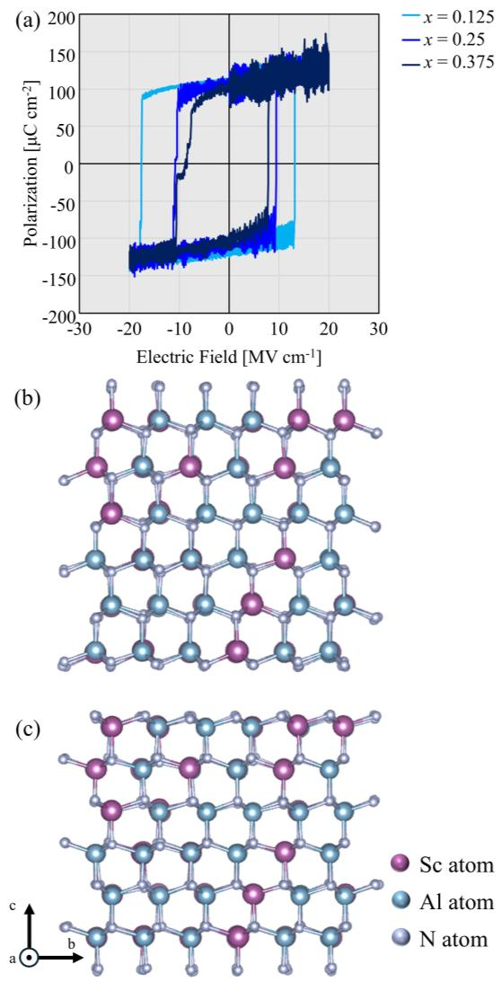

**図1：Sc濃度依存P–E履歴曲線と極性構造**
横軸に印加電場、縦軸に巨視的分極をとったヒステリシスループ。x = 0.125（水色）、0.25（青）、0.375（紺）の3組成について計算結果を示す。Sc濃度増加に伴い、ループ幅（抗電場Ec）が単調に減少する傾向が定性的に再現されており、実験報告との整合性が確認されている。

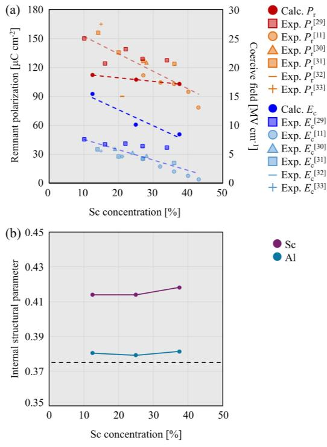

**図2：組成依存の残留分極・抗電場と内部構造パラメータ**
Sc濃度に対するEcおよびPrの計算値（円）と実験値（四角）の比較（上段）、および内部構造パラメータuのSc組成依存性（下段）。計算はEcの上限値を与え、純N₂雰囲気で成膜された実験値（欠陥最小条件）と最も近い値を示す。Sc原子のuは理想値0.375から系統的に大きくずれており、局所環境の歪みが構造軟化の起源であることを示す。

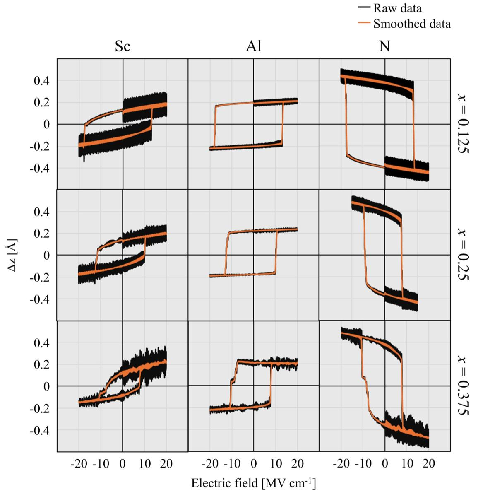

**図3：電場駆動スイッチングにおける各元素の動的変位応答**
印加電場掃引中のSc、Al、N原子の分極方向（Δz）変位の時間発展。Sc原子が他の元素に先行して変位を開始することで「動的トリガー」として機能することが示されており、静的構造軟化とともにEc低減の第二機構を構成する。

---

---

## ガラス拡散を支配する非対称エネルギーランドスケープ

### 1. 論文情報

**タイトル：** [Asymmetric Energy Landscapes Control Diffusion in Glasses](https://arxiv.org/abs/2603.18317)
**著者：** Ajay Annamareddy, Bu Wang, Paul M. Voyles, Izabela Szlufarska, Dane Morgan
**所属：** ウィスコンシン大学マディソン校 材料科学工学科
**arXiv ID：** 2603.18317
**カテゴリ：** cond-mat.mtrl-sci
**公開日：** 2026年3月18日
**論文タイプ：** 研究論文
**ライセンス：** CC BY 4.0

---

### 2. どんな研究か

金属ガラスやSiO₂などの非晶質固体において、原子スケールの局所再配置バリアが小さい（0.3〜0.5 eV）にもかかわらず、実験的な巨視的拡散活性化エネルギーが大きい（1〜3 eV）という長年のパラドックスを、分子動力学シミュレーションと新しい拡散分解フレームワーク（$D = D_{\rm RW} \times f$）によって定量的に解明した。その結果、拡散活性化エネルギーの大部分（Cu₅₀Zr₅₀で約65%）は局所バリアではなく、前後方向の非対称なエネルギーランドスケープに起因する「相関運動（往復運動）」の抑制に由来することが示された。

---

### 3. 位置づけと意義

ガラス動力学の量的理解において本研究は基礎的突破口となる。結晶固体では拡散活性化エネルギーが欠陥機構から直接導かれるが、ガラスに対応する同等のフレームワークは存在しなかった。本研究が確立した $D = D_{\rm RW} \times f$ の分解と、相関バリア $E_f$ の普遍性（金属ガラス・SiO₂・LJガラス）は、ガラスの物性設計（耐食性・イオン輸送・構造安定性）に直接的な予測基盤を与える。Morgaanグループの一貫した計算材料科学のアプローチが活かされており、NEB計算との組み合わせで局所バリア分布との定量的対応まで示している点も高く評価できる。

---

### 4. 研究の概要

**背景と目的：** ガラス中の拡散は β-再配置と呼ばれる局所原子再配置の積み重ねで起きるとされるが、個々の局所バリア（0.3〜0.5 eV）と巨視的な拡散活性化エネルギー（1〜3 eV）の乖離を説明する定量的枠組みが存在しなかった。

**情報学的アプローチ：** MDシミュレーションから拡散係数 $D$ を Einstein 関係で計算し、それをランダムウォーク寄与 $D_{\rm RW}$（局所バリアの大きさで決まる項）と相関因子 $f = D/D_{\rm RW}$（逆方向運動の強さで決まる項）に分解する新しいフレームワークを構築。$D_{\rm RW}$は実際のMD軌跡から活性化再配置を抽出し、各ステップを等大・ランダム方向ベクトルで置き換えたランダムウォーク軌跡から算出。

**対象材料系：** Cu₅₀Zr₅₀金属ガラス（主対象）、Ni₈₀P₂₀金属ガラス、SiO₂ガラス、単成分レナード＝ジョーンズガラス

**主な手法：** 分子動力学、NEB（Nudged Elastic Band）活性化バリア計算、Activation-Relaxation Technique (ART)、拡散係数分解

**使用データ：** 複数冷却速度（5×10⁸〜10¹² K/s）でのMDシミュレーション、文献実験値

**主な結果：**
- Cu₅₀Zr₅₀で $E_D = 1.22$ eV に対して $E_{\rm RW} = 0.43$ eV、$E_f = 0.79$ eV（$E_f/E_D \approx 65\%$）
- 相関因子の活性化エネルギーは、前向きバリア（〜1.5 eV）と後ろ向きバリア（〜0.3〜0.5 eV）の非対称性から生じる普遍的特性
- 実験的ガラス形成条件（$D \approx 10^{-22}$ m²/s）への外挿で $f \approx 10^{-7}$：相関効果がさらに数桁強くなることを予測
- 表面拡散の活性化エネルギー低減も、局所バリア低下ではなく $E_f$ の低下（相関の弱化）で主に説明される

**著者の主張：** ガラス中の拡散は局所再配置速度ではなく、その逆方向性（相関）からの脱出可否によって支配される。非対称エネルギーランドスケープというガラス固有の統計的特性が、巨視的拡散の温度依存性を決定する主役である。

---

### 5. マテリアルズ・インフォマティクスとして重要なポイント

$D = D_{\rm RW} \times f$ という拡散分解は概念的にシンプルだが、その適用に際してMD軌跡からランダムウォーク軌跡を構築するアルゴリズムの設計が鍵であり、その方法論的厳密性（閾値 $d = 1$ Å の変位基準、D2_min代替指標との比較）が証拠の信頼性を高めている。NEB計算による5,000件のバリア分布との整合は「局所バリア → $E_{\rm RW}$」「非対称性 → $E_f$」という物理的解釈を強化している。材料情報学的文脈では、このフレームワークはガラス拡散のサロゲートモデル化やアクティブラーニングによる新規ガラス探索への基盤となりうる。特に冷却速度依存性の実験的ガラスへの外挿（log(f) vs log(D) の線形則）は定性的推定であり、外挿の不確かさは大きいが、傾向論として説得力がある。

---

### 6. 限界と注意点

第一の限界は計算モデルの冷却速度：本研究のMDは最遅でも〜10⁸ K/s程度であり、実験的なガラス形成速度（10¹〜10⁵ K/s）には遠く及ばない。外挿は経験的スケーリング則に頼っており、実験値との定量的比較は不確かさが大きい。第二に、ランダムウォーク軌跡構築の際の再配置識別（閾値d = 1 Åの選択）は恣意性を含む。閾値依存性を調べてはいるが、より大きな変位を要する再配置においても同様の結論が成り立つかは慎重な評価が要る。第三に、研究対象は単純なモデルガラスと2元素金属ガラスであり、多元素系や組成勾配、応力場を持つ実用ガラス材料への直接適用可能性は検証されていない。第四に、表面拡散への拡張は方向性として興味深いが、表面構造や吸着種の影響が排除されており、実際の表面では追加の複雑さが予想される。

---

### 7. 関連研究との比較

ガラス動力学の分野では、β-緩和や協同的再配置領域（CRR）の議論が長く続いてきたが、本研究のように拡散係数を局所バリア項と相関項に厳密に分解し、その相対寄与を定量化したものは先例が少ない。ART法による非対称バリア分布の解析はKarpov, Falk, Schobingerらの先行研究を引用しながらも、それをMD由来の輸送係数と直接結びつけた点が新しい。Angell, Ediger, Donatiらによる不均一ダイナミクス研究との相補性も高く、拡散研究の実験コミュニティへの波及が期待される。また、Morgan・Szlufarskaグループのスタイルらしく、主張を複数ガラス系と複数解析手法で丁寧に検証しており、再現性・一般化可能性への配慮が際立つ。

---

### 8. 重要キーワードの解説

**① 相関因子（Correlation Factor; f）**
実際の拡散係数とランダムウォーク拡散係数の比：$f = D / D_{\rm RW}$。$f < 1$ は原子が「前後に往復する」相関運動を示し、$f \ll 1$ では原子は頻繁に動くが正味の移動量が少ない。ガラス系ではfが強く温度依存し、Arrhenius活性化エネルギー $E_f$ を持つことが本研究で明らかにされた。

**② ランダムウォーク拡散係数（$D_{\rm RW}$）**
MD軌跡中の活性化再配置をすべてランダム方向に置き換えた仮想軌跡から計算した拡散係数。局所バリアの高さとジャンプ頻度の情報のみを反映し、方向相関は含まない。$E_{\rm RW}$ は局所バリア分布の代表的エネルギーに対応する（Cu₅₀Zr₅₀で0.43 eV）。

**③ Nudged Elastic Band（NEB）法**
2つの安定状態間の反応経路と活性化エネルギーを求める計算手法。始点と終点に連結した「バンド（鎖）」を最小エネルギーパスに沿って最適化することで鞍点エネルギーを求める。本研究では5,000件の再配置イベントに適用し、局所バリア分布の統計量を得ている。

**④ 非対称エネルギーランドスケープ（Asymmetric Energy Landscape）**
非晶質材料では、ある原子配置から隣接配置への前向きバリア $E_{\rm fw}$ と逆向きバリア $E_{\rm rev}$ が一般に異なる（$E_{\rm fw} \neq E_{\rm rev}$）。この非対称性により、前向きジャンプ後に逆方向へ戻りやすい確率が系統的に生じ、これが相関運動の微視的起源となる。

**⑤ β-緩和（β-Relaxation）**
ガラス転移温度以下でのガラス中の局所原子再配置に対応する緩和過程。ガラス転移に対応するα緩和より高周波側に現れる。本研究はこのβ-再配置が頻繁に起きながらも正味の移動に結びつきにくい理由を、相関運動の枠組みで定量的に説明している。

**⑥ Activation-Relaxation Technique（ART）**
ランダム方向に原子を摂動させ、エネルギー上昇方向に沿って鞍点を探索する手法。MDと組み合わせることで、有限温度MDでアクセスされる典型的な遷移の前向き・逆向きバリアの統計分布を系統的に求めることができる。

**⑦ ポテンシャルエネルギーランドスケープ（Potential Energy Landscape; PEL）**
原子配置空間上でのポテンシャルエネルギーの地形。多数の極小（エネルギーミニマ）と鞍点で構成される複雑な曲面で、ガラス動力学・タンパク質折り畳み・化学反応の理解に広く用いられる。本研究の枠組みは、PELの非対称性（前向き鞍点 > 逆向き鞍点）が巨視的輸送に与える影響を直接定量化している。

---

### 9. 図

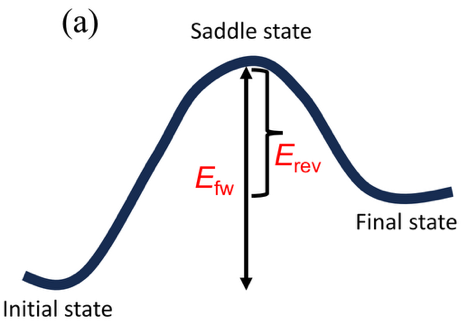

**図1：Cu₅₀Zr₅₀における拡散係数の分解とArrhenius解析**
温度に対する全拡散係数 $D$（実測）とランダムウォーク拡散係数 $D_{\rm RW}$（仮想）のArrhenius プロット（左）、および相関因子 $f$ の温度依存性（右）。$D_{\rm RW}$ の活性化エネルギー（0.43 eV）は局所バリアに相当し、$f$ の活性化エネルギー（0.79 eV）が全体の約65%を占めることが示されている。

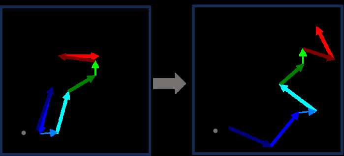

**図2：冷却速度依存の相関因子と実験条件への外挿**
異なる冷却速度でのlog(f) vs log(D) の関係。両対数プロットで線形関係が成立し、実験的ガラス（$D \approx 10^{-22}$ m²/s）への外挿で $f \approx 10^{-7}$  が得られ、実験的条件では相関効果が桁違いに強まることを示す。

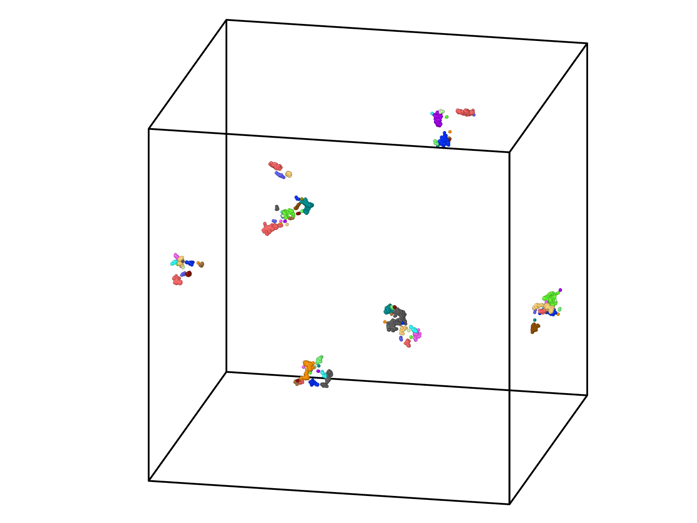

**図3：NEB計算による局所再配置バリア分布**
Cu₅₀Zr₅₀中の5,000件の再配置イベントについて計算された活性化バリアの分布。変位閾値（≥1 Å、≥1.5 Å、≥2.5 Å）ごとに分布が示されており、1 Å 基準では大部分が0.5 eV以下であり全拡散活性化エネルギー（1.22 eV）よりはるかに小さい。この「局所バリアの小ささ」と巨視的活性化エネルギーとのギャップを相関因子 $E_f$ が埋めることを支持するデータである。

---

---

## 原子系表現学習のための自己条件付きデノイジング事前学習

### 1. 論文情報

**タイトル：** [Self-Conditioned Denoising for Atomistic Representation Learning](https://arxiv.org/abs/2603.17196)
**著者：** Tynan Perez, Rafael Gomez-Bombarelli
**所属：** MIT 材料科学工学科
**arXiv ID：** 2603.17196
**カテゴリ：** cs.LG
**公開日：** 2026年3月17日
**論文タイプ：** 研究論文（自己教師あり学習・事前学習）
**ライセンス：** CC BY 4.0

---

### 2. どんな研究か

原子座標の加法的ノイズを除去する「デノイジング」を自己教師あり事前学習に用いる既存手法の課題（大域的表現の不十分さ、非平衡構造での曖昧さ）を解決するため、二段階パスによる「自己条件付きデノイジング（Self-Conditioned Denoising; SCD）」を提案した。一度目のパスで破損なし構造から不変スカラー埋め込みを取得し、これを条件付けベクトルとして二度目のパスの破損構造ノイズ予測に利用することで、ドメイン横断的な表現を学習する。MITのGomez-Bombarelliグループが小分子・タンパク質・周期材料・非平衡構造にわたる汎用的事前学習戦略を提示した論文である。

---

### 3. 位置づけと意義

原子系機械学習における事前学習（プレトレーニング）は、少量データ学習と転移学習の観点からMI分野での関心が急速に高まっている。デノイジングを事前学習に用いる先行研究（DenoisingやFrad等）は存在するが、SCDは「より少ないデータ・より小さいモデルでも教師あり大規模事前学習に匹敵する性能」という実践的優位性を実証している点で特に重要である。10Mパラメータ程度のSCD事前学習モデルが235Mパラメータのモデル（EquiformerV2）を凌駕する場合があるという結果は、計算資源の制約の大きい研究グループへの波及効果が高い。

---

### 4. 研究の概要

**背景と目的：** 教師あり事前学習はDFT力・エネルギーデータを大量に必要とするが、標準的なノイズ除去事前学習（座標デノイジング）は（1）グローバル表現学習が弱い、（2）不変スカラー埋め込みへの圧力不足、（3）非平衡構造での曖昧な学習目標、という3つの制約があった。

**情報学的アプローチ：** 二段階パスSCDの学習目標は以下。
1. **第一パス：** 破損なし構造 $\mathbf{x}$ を処理し、不変（$L^0$）埋め込みをプールして条件付けベクトル $\mathbf{c} = \text{MLP}(\text{pooling}(\phi(\mathbf{x})))$ を生成。
2. **第二パス：** 破損構造 $\tilde{\mathbf{x}} = \mathbf{x} + \boldsymbol{\epsilon}$（$\boldsymbol{\epsilon} \sim \mathcal{N}(0, \sigma^2 I)$）に条件付けベクトルを組み込みながらノイズ $\boldsymbol{\epsilon}$ を予測。

バックボーンはTorchMD-Net（等変トランスフォーマー）にAdaptive Layer Normalization（AdaNorm）を追加して条件付けに対応させた。訓練中は条件付けベクトルを20%の確率でドロップして無条件的挙動も保持。

**対象材料系・ドメイン：** 小分子（PCQ: 340万件、GEOM10: 270万件）、周期材料（AMP20: 60.7万件）、タンパク質-リガンド（SAIR: 440万件）、非平衡幾何学（OMol25: 400万件）

**主な結果：**
- QM9 小分子特性予測：座標デノイジング比で19.6〜45.5%改善、Frad/SliDEに対しHOMOエネルギーで24.8%改善
- Matbench 材料バンドギャップ予測：10M パラメータモデルで MAE 0.123 eV（235Mパラメータモデルと同等以上）
- ドメイン横断転移：非平衡分子幾何学での事前学習が材料バンドギャップ予測を26.9%改善
- タンパク質-リガンド結合親和性：pocket-conditional変種でSOTA（RMSE 1.304 on id30 split）

**著者の主張：** SCDは少ないパラメータと少ない学習データで広いドメインにわたる高品質な原子表現を獲得でき、汎用原子系事前学習の効率的な基盤手法となる。

---

### 5. マテリアルズ・インフォマティクスとして重要なポイント

材料バンドギャップ予測において、非平衡分子構造での事前学習が有効という結果は、表現学習の観点から極めて興味深い。これはドメイン間での「幾何学的表現」の共有性を示唆しており、材料科学固有の大量データがない場合でも、化学・生物学データからの知識蒸留が可能であることを意味する。AdaNorm条件付けというアーキテクチャ設計の選択は、条件付き情報の活用と無条件的汎化のトレードオフを丁寧に設計しており、MIコミュニティが類似の問題（物性依存型事前学習等）に応用できる雛形となる。実装コードが公開されており再現性が高い。

---

### 6. 限界と注意点

第一に、本論文はQM9・Matbench・PLINDという標準ベンチマークを主に用いており、実際の材料探索・逆設計・能動学習タスクでのSCDの有効性は未検証である。第二に、材料系（AMP20）でのSCD事前学習と小分子・タンパク質事前学習の組み合わせは最適化されておらず、周期材料固有の長距離相互作用や格子対称性に対してSCDがどこまで有効かは未検討。第三に、20%のドロップアウト（無条件化）の効果は実験的に調べられているが、その最適比率の理論的根拠は薄い。第四に、二段階パスは一段階デノイジングより計算コストが約2倍になるため、大規模事前学習での実コストとのトレードオフを詳しく報告していない。

---

### 7. 関連研究との比較

座標デノイジング事前学習の先行研究にはNoisy Nodes（Godwinら）、DenoisingPretraining（Zaquiら）、Frad（Fengら）、SliDE（Shinら）がある。SCDはこれら先行手法と同一条件下で比較実験を行い、ほぼ全指標で優位性を示している。EquiformerV2（教師あり事前学習モデル）との比較も行われており、10倍以上のパラメータ削減と約30倍の計算コスト削減を達成しつつ同等以上の精度という主張は説得力がある。Gomez-Bombarelliグループは同時期に格子熱力学向けオートレグレッシブモデル（2603.14695）も発表しており、原子系基盤モデル開発の複数アプローチを並行して推進していることがわかる。

---

### 8. 重要キーワードの解説

**① 自己教師あり学習（Self-Supervised Learning; SSL）**
ラベルなしデータから内在的信号（例：ノイズ除去・穴埋め・対比学習）を学習目標として使い、汎用的な表現を学ぶ手法。原子系SSLでは座標ノイズ除去が主流だが、本研究のSCDはそれを条件付きで強化している。

**② デノイジング事前学習（Denoising Pretraining）**
原子座標にガウスノイズ $\boldsymbol{\epsilon}$ を加えた破損構造 $\tilde{\mathbf{x}} = \mathbf{x} + \boldsymbol{\epsilon}$ から元構造を復元する学習。原子間ポテンシャル面の等変性を自然に学習できる利点があり、GNN表現の事前学習に広く用いられている。

**③ 等変ニューラルネットワーク（Equivariant Neural Network）**
回転・並進・反転操作に対して出力が共変あるいは不変となる制約を持つGNN。エネルギーは不変（スカラー）、力は1次等変（ベクトル）を保つよう設計されており、TorchMD-Net、MACE、NequIPなどが代表的。

**④ Adaptive Layer Normalization（AdaNorm）**
条件付きベクトル $\mathbf{c}$ から学習したスケール $\gamma(\mathbf{c})$、シフト $\beta(\mathbf{c})$ でメッセージパッシング中の埋め込みを変調する手法。拡散モデル（DDPM等）に由来し、条件付き生成や制御された表現学習に用いられる。

**⑤ 転移学習（Transfer Learning）とドメイン横断転移**
あるドメイン（例：小分子）で学習した表現を別ドメイン（例：周期材料）のダウンストリームタスクに転用すること。SCDでは非平衡分子幾何学のデータで事前学習したモデルが材料バンドギャップ予測を改善するという驚くべきドメイン横断転移を示している。

**⑥ UMAP（Uniform Manifold Approximation and Projection）**
高次元の埋め込みベクトルを2次元に投影して可視化する次元削減手法。SCDの埋め込みと標準デノイジングの埋め込みを比較した場合、SCDはよりコンパクトで分子サイズへの依存が小さい（意味論的な）表現空間を形成することが示されている。

**⑦ Matbench**
材料特性予測の標準化ベンチマークスイート。バンドギャップ、生成エンタルピー、熱電材料特性など13タスクからなり、様々なMLモデルの公平な比較を可能にする。本論文のMatbench結果は10Mパラメータモデルで0.123 eVのバンドギャップMAEを達成し、大規模教師ありモデルと同等以上とされている。

---

### 9. 図

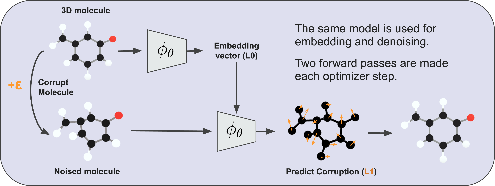

**図1：SCDの二段階パス事前学習パイプライン**
第一パスで破損なし構造から不変スカラー埋め込みをプールして条件付けベクトルを生成し、第二パスでこれを用いて破損構造のノイズ予測を行う全体フローを示す。同一ネットワークパラメータが両パスで共有され、条件付けベクトルはAdaNormを介してメッセージパッシング各層に注入される。

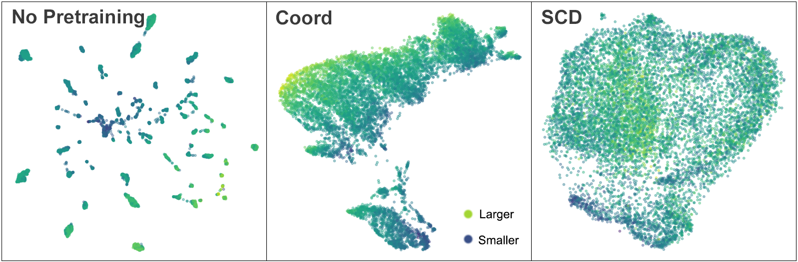

**図2：標準デノイジングとSCDの埋め込み空間のUMAP可視化比較**
標準的な座標デノイジング（coord）では埋め込み空間が分子サイズと強く相関した滑らかかつ広大な分布を示すのに対し、SCDではより密でコンパクトな構造が得られ、原子数依存性が低減している。これはSCDが化学的意味論を持つグローバル表現を効果的に学習していることを示唆している。

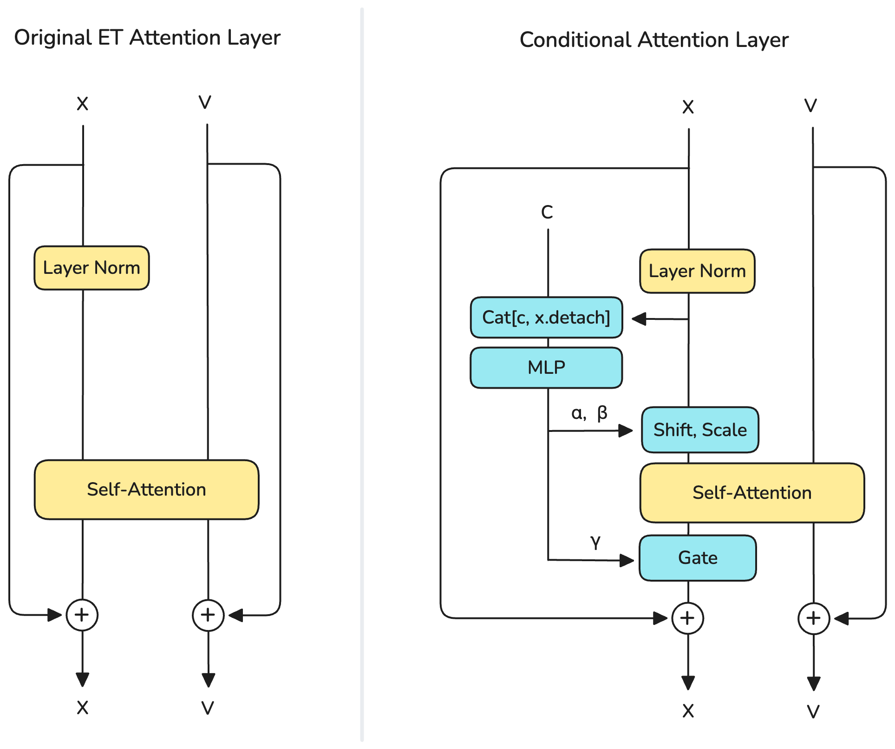

**図3：各ベンチマークでの性能比較**
QM9の分子特性予測タスク（左）とMatbenchバンドギャップ予測（右）でSCDを先行手法（Frad、SliDE、EquiformerV2等）と比較した表あるいはグラフ。SCDが多くのタスクで同等以上の性能を持ちながら、計算コストの大幅削減（パラメータ数・訓練データ量）を達成していることが示されている。

---

---

## その他の重要論文

---

## 格子熱力学のためのオートレグレッシブモデルのスケーリング

### 1. 論文情報

**タイトル：** [Scaling Autoregressive Models for Lattice Thermodynamics](https://arxiv.org/abs/2603.14695)
**著者：** Xiaochen Du, Juno Nam, Sulin Liu, Rafael Gómez-Bombarelli
**所属：** MIT
**arXiv ID：** 2603.14695
**カテゴリ：** cs.LG
**公開日：** 2026年3月16日
**論文タイプ：** 研究論文
**ライセンス：** CC BY 4.0

### 2. 研究概要

格子上の原子配置のサンプリングは相図計算・相転移追跡・自由エネルギー計算の核心をなすが、従来のモンテカルロ（MC）法は相転移点近傍で「臨界スローダウン」を生じ、収束が著しく遅くなる問題がある。本研究では、任意順序オートレグレッシブモデル（AO-ARM）と周辺化モデル（Marginalization Model; MAM）を組み合わせたTransformerベースのフレームワークにより、格子上の平衡配置分布を直接学習する手法を提案した。2D Isingモデルおよびリアルな2元素合金CuAuの相図に適用し、MAM Transformerがより少ない計算量で正確な相境界・秩序相構造・自由エネルギーを再現することを示した。特に「アウトペインティング」（小サイズで訓練したモデルを大サイズへ拡張）に成功しており、スケーラビリティの観点でも優れた特性を持つ。

本研究のMI的意義は、単純なML力場＋MCという組み合わせを超えて、配置生成そのものをニューラルネットワークが担う「配置生成NN」という概念を格子系熱力学に定着させた点にある。Transformer（周期的位置エンコーディング付き）がGNNを大きく凌駕し、特にCuAu₃相の再現で差異が顕著であった。実用的な計算効率（4×4×8 CuAuで0.5分/条件、MCの160倍高速）は合金相図の自動計算・スクリーニングへの直接応用を示唆している。一方、複雑な多成分系や第一原理精度の相互作用ポテンシャルとの統合、ならびに連続場（格子外変位含む）への拡張は今後の課題である。

### 3. 重要キーワードの解説

**① 任意順序オートレグレッシブモデル（AO-ARM）**
全格子サイト順列を事前に固定せず、あらゆる順序で条件付き確率を学習するモデル。これにより「どのサイトが既知でどのサイトを生成するか」を柔軟に変えられ、アウトペインティングやインペインティングが可能になる。

**② 周辺化モデル（Marginalization Model; MAM）**
部分配置の周辺確率（一部のサイトを未知として残した全通り和）を一度の順伝播で近似するモデル。従来ARMが O(L²) メモリを要するのに対し O(L) に削減でき、より大規模な系や深いアーキテクチャが使える。

**③ Transformerと周期位置エンコーディング**
全結合自己注意機構を持つニューラルネットワーク。格子の周期境界条件に対応する「周期的位置埋め込み」を設計することで、有限サイズ格子を周期的無限格子の近似として扱え、アウトペインティングが自然に行える。

**④ アウトペインティング（Outpainting）**
小サイズ格子（例：10×10）で訓練したモデルを大サイズ格子（例：20×20）の配置生成に適用する拡張手法。格子のタイリングと周期性を利用して、再訓練なしに系サイズをスケールアップできる。

**⑤ 臨界スローダウン（Critical Slowing Down）**
相転移点近傍でMCサンプリングの相関時間が発散し、統計的に独立したサンプルを得るための計算量が急増する現象。本研究のARMはこの問題を回避し、相転移点でも高精度なサンプルを生成できる。

**⑥ 自由エネルギー（Free Energy）**
熱力学的安定相を決定する熱力学ポテンシャル。ヘルムホルツ自由エネルギー $F = -k_B T \ln Z$ や、合金では化学ポテンシャルを用いたグランドカノニカル自由エネルギー。ARMによって確率モデルが直接エネルギー計算に利用でき、自由エネルギー偏差を<5 meV/atom以下で再現している。

**⑦ CuAu合金相図**
2元系CuAuは低温でCu₃Au（L1₂）、CuAu I（L1₀）、CuAu₃という3つの規則化相を持つベンチマーク系。本研究では全3相の相境界を温度・組成二次元平面上で正確に再現することが示されており、MLP（多層パーセプトロン）やGNNベース手法はCuAu₃相を見逃すことが多い中、MAM Transformerが唯一正確に捉えた。

### 4. 図

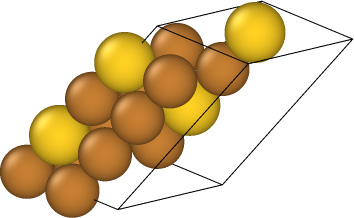

**図1：AO-ARM、MAM、既存ARM手法の比較概念図**
固定順序ARMと任意順序AO-ARM、さらに周辺化モデルMAMの構造的違いをダイアグラムで示す。AO-ARMは任意の既知サイト集合を条件として残りサイトを生成でき、MAMは部分配置の確率を単一の順伝播で近似する点が従来手法と異なる。

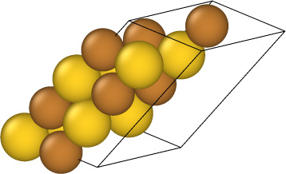

**図2：2D Isingモデルにおけるアーキテクチャ比較**
10×10格子で訓練した各アーキテクチャ（MLP ARM、GNN ARM、Transformer MAM）の自由エネルギー精度・相関関数・比熱を比較する。Transformerが相転移温度近傍での長距離相関を最もよく再現し、GNNはモードコラプスを起こすことが示されている。

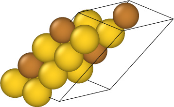

**図3：CuAu合金の温度-組成相図**
MAM Transformerが計算した温度-組成相図とリファレンス（MCMDまたはウォン＝ランダウ法）の比較。Cu₃Au・CuAu・CuAu₃の全3規則化相が正確に再現されており、特にCuAu₃相の再現でMAMのみが成功していることが際立つ。

---

---

## 汎用MLポテンシャルによる高エントロピー合金の水素吸収機構解明

### 1. 論文情報

**タイトル：** [Hydrogen uptake and hydride formation in AlₓCoCrFeNi high-entropy alloys: First-principles, universal-potential, and experimental study](https://arxiv.org/abs/2603.17479)
**著者：** Fritz Körmann, Yuji Ikeda, Konstantin Glazyrin, Maxim Bykov, Kristina Spektor, Shrikant Bhat, Nikita Y. Gugin, Anton Bochkarev, Yury Lysogorskiy, Blazej Grabowski, Kirill V. Yusenko, Ralf Drautz
**所属：** マックスプランク研究所、ボーフム大学ほか
**arXiv ID：** 2603.17479
**カテゴリ：** cond-mat.mtrl-sci
**公開日：** 2026年3月18日
**論文タイプ：** 研究論文
**ライセンス：** CC BY 4.0

### 2. 研究概要

AlₓCoCrFeNi高エントロピー合金（HEA）において、Al濃度の違いが水素吸収挙動に与える影響を、DFT計算・汎用機械学習ポテンシャル（GRACE）・高圧実験の3種類のアプローチで体系的に解明した。FCC構造のAl₀.₃CoCrFeNi合金は3 GPa以上で水素化物（ハイドライド）を形成するのに対し、B2構造のAl₃CoCrFeNiは50 GPaでも水素化物形成が見られない。この劇的な違いの主因はAl濃度による固溶エネルギーの増大と格子間サイトの不安定化であり、B2秩序化はそれに重畳する二次効果であることが明らかにされた。GRACE汎用ポテンシャルが希薄極限から水素化物形成領域まで正確にDFTエネルギーを再現し、転移性能の高さを実証した点も重要な成果である。

本研究は、汎用MLポテンシャルが多成分合金系の組成・圧力空間を効率的に探索できることを実証したデモンストレーションとして価値が高い。従来はDFT計算のみでは困難な広い組成・圧力空間の網羅的探索が、汎用ポテンシャルを利用することで可能になる。同時に、実験（高圧XRD）・理論（DFT）・MLポテンシャルという三角検証アプローチが取られており、結果の信頼性が高い。ただし、水素吸収に関与するHの拡散・移動障壁や動力学的側面はカバーされておらず、実用的な水素貯蔵応用には追加検討が必要である。

### 3. 重要キーワードの解説

**① 高エントロピー合金（High-Entropy Alloy; HEA）**
4〜5種類以上の主要元素が高濃度で混合する多主元素合金。高い混合エントロピーにより安定化され、単相または複相の単純な結晶構造をとる。高強度・耐食性・放射線耐性などで注目されており、水素貯蔵・触媒・核材料への応用が期待されている。

**② GRACE（Graph Atomic Cluster Expansion）**
Drautzグループが開発した汎用機械学習原子間ポテンシャル。多体クラスター展開（ACE）をグラフニューラルネットワーク表現で実装したもので、広い元素空間と構造多様性をカバーする。MACE、SevenNet等と並ぶ汎用UMLFPの一つであり、本論文ではDFT精度を維持したまま組成・圧力空間を探索できることが実証されている。

**③ 水素化物（Hydride）**
水素を格子間サイトに取り込んで形成する化合物。金属水素化物はFCCやBCCなどの母格子構造にH原子が規則的に配置した形態をとる。本研究では3 GPa以上の高圧下でFCC-HEAがFCC型水素化物を形成することがXRD実験で確認されている。

**④ B2秩序（B2 Ordering）**
BCC型母格子において2種類の元素が規則的に占有するCsCl型（B2）規則化構造。Al₃CoCrFeNiでは高Al濃度によりB2秩序化が生じ、これが格子間サイトのエネルギーを変化させ水素挙動に影響する。

**⑤ 固溶エネルギー（Solution Energy）**
水素原子を金属格子の格子間サイトに溶解させる際のエネルギー変化。正値（吸熱）の場合は水素吸収が不利であることを意味し、Al添加により固溶エネルギーが大幅に増大することが水素吸収抑制の主因とされた。

**⑥ 高圧X線回折（High-Pressure XRD）**
ダイヤモンドアンビルセル（DAC）などを用いて高圧状態を実現し、X線回折でその場観察する手法。本研究では50 GPaまでの加圧下での構造相変化をリアルタイムで追跡し、水素化物形成の有無を判断している。

**⑦ 転移性能（Transferability）**
特定の条件（例：希薄H環境）で学習したモデルが異なる条件（例：水素化物相）にも適用できる能力。本研究でGRACEが「希薄極限から水素化物形成領域まで」正確にDFT結果を再現したことは、汎用ポテンシャルが広い状態空間に対して良好な転移性能を持つことを実証している。

### 4. 図

本論文はCC BY 4.0ライセンスですが、PDFから有効な図画像を抽出できませんでした。論文本文の図には圧力-水素吸収曲線（DACセルでの相安定性）、DFT固溶エネルギーの組成依存性、GRACE予測とDFTの比較などが含まれています。詳細は[原論文](https://arxiv.org/abs/2603.17479)を参照ください。

---

---

## 陽イオン無秩序岩塩型Li-Mn-Ti-O正極材料の熱力学的合成可能性

### 1. 論文情報

**タイトル：** [Thermodynamic accessibility of Li-Mn-Ti-O cation disordered rock-salt phases](https://arxiv.org/abs/2603.17263)
**著者：** Ronald L. Kam, Shilong Wang, Gerbrand Ceder
**所属：** UCバークレー（Cederグループ）
**arXiv ID：** 2603.17263
**カテゴリ：** cond-mat.mtrl-sci
**公開日：** 2026年3月18日
**論文タイプ：** 研究論文
**ライセンス：** CC BY 4.0

### 2. 研究概要

陽イオン無秩序岩塩型（Cation-Disordered Rock-Salt; DRX）酸化物はリチウムイオン電池の次世代正極材料として注目されているが、単相でのDRX相を得るためには通常1000℃以上の高温焼成が必要とされる。本研究はLi-Mn-Ti-O系について第一原理計算（DFT）とXRD実験を組み合わせて擬三元相図を構築し、秩序–無秩序転移温度の組成依存性を系統的にマッピングした。その結果、適度なLiリッチ組成とTiドープ量を最適化することで、転移温度を700〜900℃に引き下げられる組成域が存在することを明らかにした。この発見は合成温度の大幅な低下による省エネルギー製造や、より広い組成空間の探索を可能にする。

本研究のMI的意義は、Cederグループの高スループット第一原理計算インフラと熱力学データベース（MP等）を駆使して、実験では膨大なコストを要する多次元相図を効率的にマッピングした点にある。「どの組成でDRX相が低温で合成可能か」という逆設計的問いに対し、計算主導で答えを提供している。ただし本研究の手法は古典的なクラスター展開と第一原理熱力学であり、机上MLを積極的に活用したものではないが、高スループット計算設計の典型的な優れた例として取り上げた。

### 3. 重要キーワードの解説

**① 陽イオン無秩序岩塩型（Cation-Disordered Rock-Salt; DRX）**
岩塩型結晶格子でリチウムと遷移金属が無秩序に占有する構造。高いLiリッチ組成が可能で大容量化できるが、Li拡散経路の確保が課題。本研究はDRXの安定形成可能な組成域を熱力学的に特定することを目的とする。

**② 秩序–無秩序転移温度（Order-Disorder Transition Temperature; T_OD）**
材料が規則相（例：層状LiMnO₂）から無秩序相（DRX）へ転移する温度。本研究の中心的設計パラメータであり、この温度が700〜900℃になる組成を同定することが目的。

**③ クラスター展開（Cluster Expansion）**
格子上のスピン・原子占有変数をクラスター（対、三体、四体相関）の線形結合で展開し、任意の原子配置のエネルギーを予測する手法。少数のDFT計算から格子ハミルトニアンを構築し、モンテカルロでの有限温度シミュレーションを可能にする。

**④ Li過剰組成（Li-rich Composition）**
遷移金属サイトへのLi過剰占有で高容量化を図る設計戦略。Li₁₊ₓMn₁₋ₓ-ₓ'Tiₓ'O₂ などで表される。Li過剰度が高すぎると低温合成が難しくなるため、最適トレードオフ組成の探索が本研究の核心。

**⑤ 高スループット計算（High-Throughput Computation）**
自動化されたDFTワークフローで多数の組成・構造を系統的に計算するアプローチ。本研究では擬三元Li₂O–MnO–TiO₂組成空間を格子ごとに探索しており、手動では実施困難な広い組成空間の相図計算を可能にした。

**⑥ 偏析エネルギー（Segregation Energy）/ 生成エネルギー（Formation Energy）**
DRXから規則相が分離する傾向の熱力学的駆動力に対応するエネルギー量。低い生成エネルギー差はDRXと競合相の共存を示し、合成温度の低下に寄与する。

**⑦ X線回折（XRD）実験との比較**
計算予測の実験検証として、様々な温度で焼成したサンプルのXRDパターンを解析し、単相DRXの形成有無を確認。700〜900℃での合成が成功した組成は計算予測と整合しており、理論・実験の相互検証が行われている。

### 4. 図

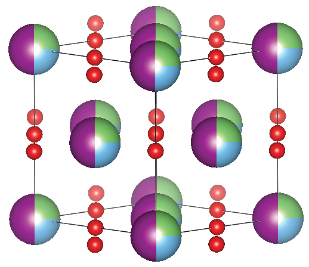

**図1：Li-Mn-Ti-O擬三元系の計算相図**
Li₂O-MnO-TiO₂の3成分空間における各温度での安定相領域を示す計算相図。DRX相（黄色）、規則型層状相（青）、直方晶LiMnO₂（緑）の安定域が組成と温度の関数として描かれており、DRX相が比較的低温（700〜900℃）で安定化できる組成域（適度なLiリッチ＋Tiドープ領域）が示されている。

**図2：秩序-無秩序転移温度の組成依存性**
Li過剰量とTiドープ量に対する秩序–無秩序転移温度の2次元マップ。最も低い転移温度（700〜900℃）を与える最適組成域が明確に示されており、通常の1000℃超合成との比較で顕著な低温化が可能な組成が特定される。

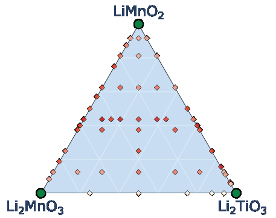

**図3：XRD実験による計算予測の検証**
特定の組成について実際に低温（700〜900℃）焼成したサンプルのXRDパターン。リートベルト解析またはパターン照合により、DRX単相の形成が確認され、計算予測の定性的正確さを裏付けている。

---

---

## 質量分析スペクトルからのde novo分子構造推定：離散フローマッチング法

### 1. 論文情報

**タイトル：** [FlowMS: Flow Matching for De Novo Structure Elucidation from Mass Spectra](https://arxiv.org/abs/2603.18397)
**著者：** Jianan Nie, Peng Gao
**arXiv ID：** 2603.18397
**カテゴリ：** cs.LG
**公開日：** 2026年3月19日
**論文タイプ：** 研究論文
**ライセンス：** CC BY 4.0

### 2. 研究概要

タンデム質量分析（MS/MS）スペクトルから化学構造を再構成するde novo構造推定は、代謝物解析・天然物探索において未知化合物同定の核心をなすが、組み合わせ論的な化学空間の広大さとフラグメンテーションパターンの曖昧性により困難な問題であり続けている。本研究ではグラフ生成に実績のある離散フローマッチング（Discrete Flow Matching; DFM）を初めてスペクトル条件付き分子生成に適用した「FlowMS」を提案した。スペクトルをMISTフォーミュラTransformerでエンコードし、その埋め込みを条件として離散フローマッチングでグラフ隣接行列を反復的に洗練・生成する。NPLIB1ベンチマークで先行最高性能（DiffMS）に対してトップ1精度で9.7%の相対的改善を達成した。

計測インフォマティクスの観点から、本研究は「測定データ（スペクトル）→構造」という逆問題への生成モデル適用の新しいパラダイムを示す。DiffMSが連続拡散モデル、MS-BARTが自己回帰モデルを使うのに対し、DFMは確率シンプレックス空間上のCTMCによる正確な離散生成という点で数理的に洗練されている。化学式の整合性を条件として課しながら生成するフレームワークは、材料科学での合成可能性推定やスペクトル逆解析への転用ポテンシャルを持つ。一方、現状の評価はNPLIB1（天然物・生体分子中心）に限定されており、無機・有機機能性材料や多様な材料系への適用については未検証である。

### 3. 重要キーワードの解説

**① 離散フローマッチング（Discrete Flow Matching; DFM）**
連続空間の確率フロー（フローマッチング）を離散状態空間（例：グラフの辺有無）に拡張した生成モデルフレームワーク。連続-時間マルコフ連鎖（CTMC）を用いてノイズから正解データへの遷移レートを学習し、反復的に構造を洗練する。

**② タンデム質量分析（MS/MS）スペクトル**
前駆体イオンをフラグメント化して得られるm/z-強度ペアのスペクトル。化合物の部分構造情報を含むが、同一構造が異なるスペクトルを示したり逆もあり、構造逆推定は非自明な逆問題となる。

**③ MISTフォーミュラTransformer**
分子フォーミュラと質量スペクトルピーク集合を入力として分子の化学フィンガープリントや埋め込みを予測する事前学習済みTransformerエンコーダ。FlowMSではこのエンコーダで得たスペクトル埋め込みが分子グラフ生成の条件付け信号として機能する。

**④ Maximum Common Edge Subgraph（MCES）距離**
2分子グラフ間の構造類似性を測る指標。共通する辺（結合）の最大部分グラフが大きいほど類似していることを示す。トップ1精度だけでなく構造的類似性も評価することで、完全一致に失敗した場合でもどれだけ近い構造が生成できたかを測れる。

**⑤ Tanimotoスコア**
化学指紋（フィンガープリント）ベクトルのJaccard類似度。$T = |A \cap B| / |A \cup B|$。本論文ではベースライン（DiffMS）のTop-1 Tanimoto 0.44に対してFlowMSは0.46を達成した。

**⑥ de novo構造推定**
データベース検索に依存せず、スペクトル情報のみから化学構造を生成推定するアプローチ。データベース未収録の新規化合物（天然物・代謝産物）の同定に必要な技術であり、本研究の核心的目標。

**⑦ エンコーダ-デコーダ事前学習**
本研究ではまずフィンガープリント-分子対280万件で分子グラフ生成デコーダを事前学習し、続いてスペクトル-分子対でエンドツーエンドにファインチューニングする二段階学習を採用。これにより少ないスペクトル-構造ペアデータでも高性能を達成している。

### 4. 図

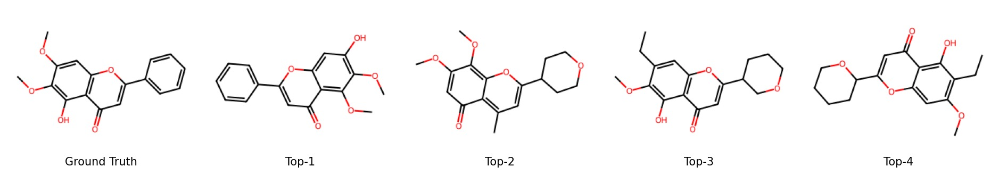

**図1：FlowMSの全体パイプライン概略図**
タンデムMSスペクトルからMISTエンコーダでスペクトル埋め込みを取得し（左）、離散フローマッチングで分子グラフを生成（中央）、化学式整合性フィルタリングを経て候補分子リストを出力する（右）。スペクトル条件付き生成の全フローが一目で理解できる。

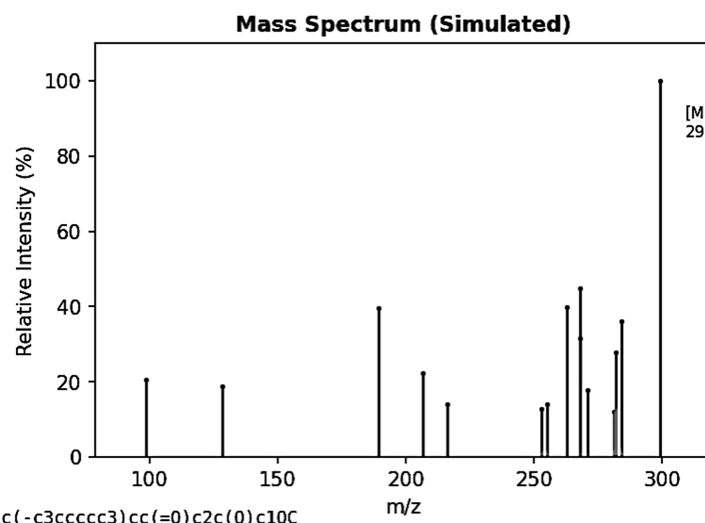

**図2：生成構造の代表例と正解構造の比較**
複数の試験事例で正解分子構造（Ground Truth）とFlowMSが生成した上位候補構造を並置。TanimotoスコアとMCES距離が付記されており、完全一致しない場合でも高い構造類似性（Tanimoto>0.8等）を持つ候補が生成されていることが示されている。

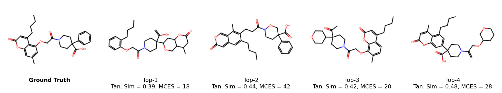

**図3：難易度別の予測成功・失敗事例**
FlowMSが成功した事例（高い構造類似性）と失敗した事例（低い類似性）の代表的なペア。失敗事例の分析はモデルの現在の限界（例：特定の官能基パターンへの弱点）を明示し、今後の改善方向を示唆している。

---

---

## 推論型大規模言語モデルによるde novo分子生成ベンチマーク

### 1. 論文情報

**タイトル：** [MolRGen: A Training and Evaluation Setting for De Novo Molecular Generation with Reasoning Models](https://arxiv.org/abs/2603.18256)
**著者：** Philippe Formont, Maxime Darrin, Ismail Ben Ayed, Pablo Piantanida
**arXiv ID：** 2603.18256
**カテゴリ：** cs.LG
**公開日：** 2026年3月18日
**論文タイプ：** 研究論文
**ライセンス：** CC BY 4.0

### 2. 研究概要

de novo分子生成において、既存のアプローチは（1）正解ラベルに依存した教師あり学習か（2）評価のみの設定が多く、強化学習（RL）で推論型LLMを生成タスクに特化させた訓練・評価の統合的枠組みは確立されていなかった。本研究はMolRGenという大規模ベンチマークと訓練フレームワークを提案し、24Bパラメータの推論型LLMをde novo分子生成と特性予測に向けてRLで訓練した。新たな評価指標として「多様性考慮型トップk スコア」を導入し、生成分子の品質と多様性を同時に定量化する。

本研究はLLMの推論能力（Chain-of-Thought等）を分子設計に活用する試みとして注目される。材料科学での応用としては、材料の逆設計や機能性分子の新規探索において同様のフレームワークが適用できる可能性がある。ただし、24Bという巨大なモデル規模（商用LLM並み）は材料科学コミュニティには計算的に非現実的な場合もある。また、論文の実験設計上どのLLMが使われたか詳細が限定的であり、再現性に課題がある。生成分子の多様性と品質のトレードオフは依然として難しく、著者自身も現在の性能の限界を正直に報告している点は評価できる。

### 3. 重要キーワードの解説

**① 推論型LLM（Reasoning LLM）**
Chain-of-Thought（CoT）などの多段階推論を通じて複雑な問題を解くよう設計・訓練されたLLM。GPT-o1、DeepSeek-R1などが代表例。本研究では24Bパラメータのモデルを用い、分子設計タスクへの推論能力の転用を試みている。

**② 強化学習（Reinforcement Learning; RL）による分子生成訓練**
正解分子ペアを使った模倣学習（SFT）ではなく、設計報酬（特性スコアや合成可能性など）に基づくRLで言語モデルを訓練する方針。de novoタスクでは正解答が一意ではないため、RL的アプローチが適している。

**③ 多様性考慮型トップkスコア（Diversity-Aware Top-k Score）**
上位k件の生成候補の品質（スコア）と多様性（相互間のTanimoto距離等）の両方を同時に評価するメトリクス。品質のみ評価すると似た分子を繰り返し生成するモデルが過大評価される問題を解決する。

**④ SMILES（Simplified Molecular Input Line Entry System）**
分子構造を文字列として表現する化学記法（例：CC(=O)Oc1ccccc1C(=O)O = アスピリン）。LLMに分子生成をさせる際の出力形式として広く使われるが、バリデーションや3次元構造との対応付けが必要。

**⑤ 分子特性予測との統合**
生成した分子の特性（logP、溶解度、活性など）をLLMが推論する能力も同時に評価される。生成と特性予測の統合は「設計と評価の一体化」として次世代分子設計AIの方向性を示す。

**⑥ ベンチマーク設計の重要性**
分子生成の評価基準が研究グループ間で統一されていないことが進歩の妨げとなってきた。本研究は大規模・標準化された訓練・評価環境を提供することで、今後の比較研究の基盤を築くことを目指している。

**⑦ REINFORCE / PPO**
LLM訓練に用いられる代表的なRLアルゴリズム。REINFORCEはポリシー勾配法の基本形、PPO（Proximal Policy Optimization）は更新ステップを制限して安定訓練を実現する。本研究の24B LLMのRL訓練詳細は完全には公開されていないが、これらのいずれかが用いられていると推測される。

### 4. 図

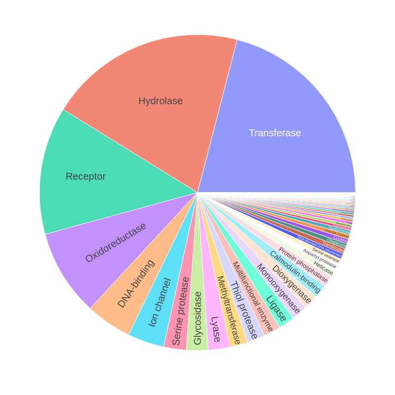

**図1：MolRGenフレームワークの全体設計**
訓練データの構築からRLによるLLM訓練、多様性考慮型評価メトリクスの算出までのパイプラインを示す。de novo分子生成とその評価の統合フレームワークとして、既存の教師あり学習設定との違いが明確に図示されている。

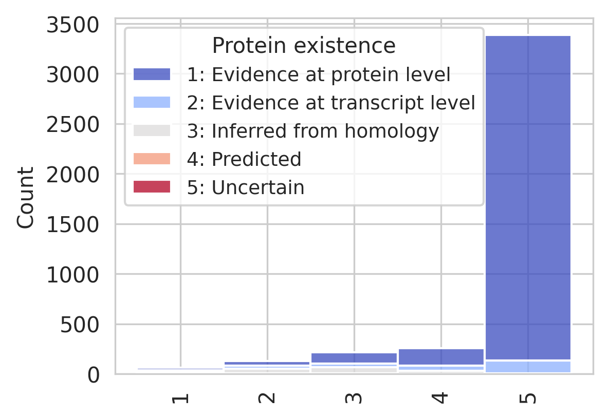

**図2：多様性考慮型トップkスコアの概念説明**
生成候補分子のスコア（品質）と多様性を2次元空間で可視化し、提案指標が既存のトップk精度より包括的な評価を与えることを説明する図。異なるモデルの出力が「高品質だが多様性低」または「多様だが品質低」といった特性を持つことが示されている。

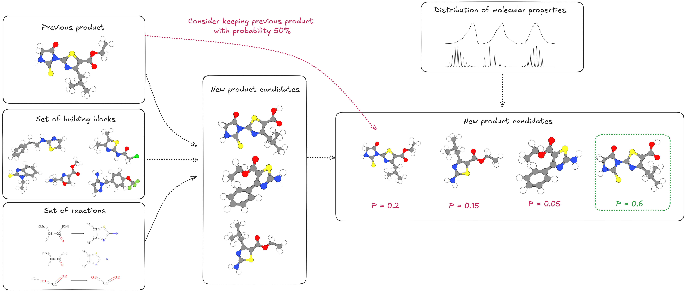

**図3：モデル性能の定量的比較**
異なるベースライン（グラフ生成モデル、既存LLMなど）と提案手法（24B RL訓練済み推論LLM）の性能比較表またはグラフ。多様性考慮型トップkスコアと従来指標の両方で評価されており、RLによる推論LLM訓練の効果が定量的に示されている。

---

---

## ダイヤモンドアンビルセル界面が誘起する高圧氷の相転移と超高速水素超イオン拡散

### 1. 論文情報

**タイトル：** [Interface-dependent Phase Transitions and Ultrafast Hydrogen Superionic Diffusion of H₂O Ice](https://arxiv.org/abs/2603.17586)
**著者：** Pengfei Hou, Yumiao Tian, Zifeng Liu, Junwen Duan, Hanyu Liu, Xing Meng, Russell J. Hemley, Yanming Ma
**arXiv ID：** 2603.17586
**カテゴリ：** physics.chem-ph
**公開日：** 2026年3月18日
**論文タイプ：** 研究論文
**ライセンス：** arXiv非独占的配布ライセンス

### 2. 研究概要

高圧下の水（H₂O氷）は惑星内部の条件を模擬する超イオン（superionic）状態を示すことが知られているが、ダイヤモンドアンビルセル（DAC）の界面効果が相転移挙動を大きく変えることが実験的に示されており、その微視的機構は未解明だった。本研究では人工ニューラルネットワーク（ANN）ポテンシャルとアクティブラーニングを組み合わせて界面系（ダイヤモンド-氷界面）に対するMLIPを構築し、大規模MD計算を行った。その結果、ダイヤモンド界面が超イオン転移温度を有意に低下させ（約250 K低下）、bcc→fcc相変化（逆Bain機構）を引き起こすことを見出した。界面では水素の超高速拡散（バルクの数倍）が実現されており、界面効果を活用した材料設計の可能性を示唆している。

本研究は計測インフォマティクス的には「界面を含む複雑系へのMLIP適用」の優れた例であり、アクティブラーニングによる訓練データ拡張が非平衡・界面環境での一般化を可能にした点が技術的に興味深い。ただしダイヤモンド界面という特殊条件への焦点は他の界面系への一般化を制限する。また、本論文はarXiv非独占的配布ライセンスのため、原図の抽出は行わない。

### 3. 重要キーワードの解説

**① 超イオン状態（Superionic State）**
一方のイオン種（本研究では水素H⁺）が結晶格子を維持しながら液体のように高速拡散する状態。氷VII相の高温・高圧条件で生じる「超イオン氷」（ice X/ice XVIII）はウラヌスやネプチューンなどの氷巨人惑星内部で重要な役割を担うとされる。

**② ダイヤモンドアンビルセル（Diamond Anvil Cell; DAC）**
2枚のダイヤモンドで試料を挟んで加圧する装置。数百GPaまでの超高圧を実現でき、X線透過性が高いためその場観察が可能。本研究では実験のDAC界面効果をシミュレーションで再現することが課題。

**③ 人工ニューラルネットワークポテンシャル（ANN Potential）**
Behler-Parrinello型など、原子密度指紋（fingerprint）を入力としてエネルギーを予測するフィードフォワードNNポテンシャル。本研究では界面系（ダイヤモンド-氷）を扱うため、界面構造も含むデータ生成とアクティブラーニングによるデータ拡張が重要。

**④ アクティブラーニングによるデータ拡張**
MLIPの不確実性が高い構造を積極的に第一原理計算でラベル付けし、訓練データを動的に拡張する手法。界面のような非平衡・特殊環境では事前定義データセットが不足しがちで、アクティブラーニングが特に有効。

**⑤ 逆Bain機構（Inverse Bain Mechanism）**
fcc→bcc変換（Bain変換）の逆方向、すなわちbcc→fcc相変化の経路。本研究では高圧下でダイヤモンド界面がbcc氷からfcc氷への構造変化を誘起することが観察されており、表面・界面効果による相安定性の変化の微視的機構として記述されている。

**⑥ 超高速水素拡散（Ultrafast Hydrogen Diffusion）**
超イオン状態において水素原子がバルクよりも高い拡散係数を示す現象。界面では拘束条件の変化により拡散経路のエネルギーバリアが変わり、バルクの数倍の水素移動度が実現されることが本研究では示された。

**⑦ 転移温度の界面依存性**
同じ組成・圧力でも表面・界面の存在が相転移温度を変化させる効果。本研究ではダイヤモンド界面が超イオン転移温度を約250 K低下させることを示しており、実験的なDAC測定で観察される相転移温度の散乱の一因となっている可能性が示唆される。

### 4. 図

本論文はarXiv非独占的配布ライセンスのため、原図の抽出・掲載は行いません。論文には界面を含むシミュレーションセルの模式図、超イオン転移温度の界面ありなし比較、水素拡散係数の温度・圧力依存性、bcc→fcc相変化の原子配列変化などの図が含まれています。詳細は[原論文](https://arxiv.org/abs/2603.17586)を参照ください。

---

---

## GPUMD/NEP機械学習ポテンシャルワークフロー統合ツールキット

### 1. 論文情報

**タイトル：** [GPUMDkit: A User-Friendly Toolkit for GPUMD and NEP](https://arxiv.org/abs/2603.17367)
**著者：** Zihan Yan, Denan Li, Xin Wu, Zhoulin Liu, Chen Hua, Boyi Situ, Hao Yang, Shengjie Tang, Benrui Tang, Ziyang Wang, Shangzhao Yi, Huan Wang, Dian Huang, Ke Li, Qilin Guo, Zherui Chen, Ke Xu, Yanzhou Wang, Ziliang Wang, Gang Tang, Shi Liu, Zheyong Fan, Yizhou Zhu
**arXiv ID：** 2603.17367
**カテゴリ：** cond-mat.mtrl-sci
**公開日：** 2026年3月18日
**論文タイプ：** ソフトウェア論文
**ライセンス：** arXiv非独占的配布ライセンス

### 2. 研究概要

GPUMD（GPU-accelerated Molecular Dynamics）と NEP（Neuroevolution Potential）は、Zheyong Fanらが開発した機械学習ポテンシャル（MLP）を高速に実行するソフトウェアスイートであり、熱輸送・格子動力学・広域相転移などの計算で広く使われている。しかし、力場開発（データ生成・学習・検証）から物性計算（熱伝導率・動的構造因子等）・可視化までの一連ワークフローは煩雑で、多数のスクリプト開発が必要だった。本研究はこれらを統合するPythonベースのツールキット「GPUMDkit」を開発・公開した。フォーマット変換、構造サンプリング、特性計算、データ可視化をモジュール化されたCLIおよびインタラクティブインターフェイスで実行でき、実装コストを大幅に削減する。

本研究の意義はNEP/GPUMDコミュニティへの直接的な生産性向上にある。機械学習ポテンシャルの普及には力場開発のハードルを下げるツール整備が不可欠であり、GPUMDkitはそのエコシステムを強化する。特に、熱伝導率計算（NEMDやHNEMA法）や格子動力学解析のような専門的計算を初心者でも実行できるようにする効果は大きい。ただし、本ツールキットはGPUMD/NEPに特化しており、MACE・SevenNet・GRACE等の他のMLIPフレームワークとの統合は限定的である。ソフトウェアのメンテナンス持続性や大規模チームでの開発ガバナンスも今後の課題となる。

### 3. 重要キーワードの解説

**① GPUMD（GPU-Accelerated Molecular Dynamics）**
GPUを活用した高速分子動力学シミュレーションソフトウェア。NEPポテンシャルのネイティブ実装を含み、熱伝導率の非平衡MD（NEMD）や平衡グリーン久保（EMD）法などに最適化されている。ファン・Zheyang（Zheyong Fan）が開発をリードしている。

**② NEP（Neuroevolution Potential）**
進化的アルゴリズム（遺伝アルゴリズムに類似した手法）でニューラルネットワーク原子間ポテンシャルを学習する手法。パラメータ最適化に勾配降下でなく進化計算を使うため、局所最適に陥りにくく多様なシステムで良好な汎化性を示す。GPUMDの中核ポテンシャルとして実装されている。

**③ ワークフロー統合（Workflow Integration）**
力場開発から物性計算・解析まで複数ステップをモジュール化し、共通インターフェイスで実行する統合環境。ASE（Atomic Simulation Environment）やAiiDAなどの汎用フレームワークと比較して、本ツールキットはGPUMD/NEP特化のより特化した利便性を提供する。

**④ フォーマット変換（Format Conversion）**
各種DFTコード（VASP、Quantum ESPRESSO等）やMLIP学習形式（extXYZ、LAMMPS dump等）間の原子配置・力・エネルギーデータの変換機能。異なるコードのデータを統一フォーマットに集約し、ワークフローを連結する基本的かつ必須の機能。

**⑤ 熱伝導率計算**
格子熱伝導率（κ）はフォノン輸送を通した熱エネルギー伝達の効率を表す。GPUMDでは非平衡MD（NEMD）、平衡グリーン久保法（EMD）、スペクトル熱流量解析（SHCA）など複数手法が実装されており、GPUMDkitはこれらを統一的に実行・解析できる。

**⑥ 構造サンプリング（Structure Sampling）**
MD軌跡から学習データとなる代表的な原子配置を選ぶ手法。無作為サンプリングだけでなく多様性・不確実性に基づくアクティブラーニング的サンプリングが可能であり、効率的な力場開発データセット構築に重要。

**⑦ 動的構造因子（Dynamic Structure Factor）**
原子の時間相関関数をフーリエ変換したもので、中性子散乱や非弾性X線散乱実験と直接対応する。フォノン分散関係の実験との比較検証に使われる重要な計算量であり、GPUMDkitではその計算・可視化が統合されている。

### 4. 図

本論文はarXiv非独占的配布ライセンスのため、原図の抽出・掲載は行いません。論文にはGPUMDkitのワークフロー構成図、コマンドラインインターフェイスのデモ画面、各機能モジュールの入出力概略図などが含まれています。詳細は[原論文](https://arxiv.org/abs/2603.17367)を参照ください。

---

*本レポートは2026年3月22日に自動生成されました。*
