# arXiv 日次ダイジェスト

**作成日：** 2026年3月11日
**対象期間：** 2026年3月9日〜11日（直近72時間）

---

## 今日の選定方針

本日は、アルタマグネティズムの実空間ナノスケール観測、ウラン系スピン三重項超伝導体UTe₂における対密度波と電荷密度波の絡み合い、三角格子量子反強磁性体における近接スピン液体状態という、物性物理の重要トピックを重点的に取り上げた。スピン液体・フラストレーション、強相関電子系、トポロジカル磁性、非平衡物性（テラヘルツナノ分光・時間分解ラマン）、二次元磁性体、重いフェルミオン・密度波、スピン軌道模型の熱的量子揺らぎ、スピン密度波、熱ホール伝導率と幅広い分野をカバーした。特に実験と理論が相互補完的に組み合わされた研究を優先し、物性機構の理解に深く踏み込んだ論文を選んだ。

---

## 全体所見

**アルタマグネティズムの実験的進展：** α-Fe₂O₃（ヘマタイト）を舞台とした X 線磁気円二色性（XMCD）ナノスケールイメージングの成果が今週の物性物理界のハイライトの一つである。モリン転移温度以下でも、ドメイン壁やメロンといったトポロジカルスピンテクスチャが局所的に残存する XMCD シグナルを与えることが初めて実空間で示された。この発見は、アルタマグネットを構成するネール秩序ベクトルの向きが単純に一様でなく、ナノスケールで豊かな空間変調を持つことを明らかにし、アルタマグネット系スピントロニクスへの新しい視座を開く。

**強相関超伝導における秩序の絡み合い：** UTe₂ のスキャニングトンネル顕微鏡（STM）研究が、バルクの超伝導転移温度 Tc を上回る温度域でペア密度波（PDW）が先行形成し、それが合成 CDW を形成するという証拠を提出した。この絡み合い秩序は、UTe₂ のスピン三重項超伝導機構の解明にとって重要な手がかりを与えるものである。また、フラストレーション三角格子磁性体 ErMgGaO₄ の中性子散乱研究が、競合するストライプ型・120°型スピン相関の共存を明らかにし、量子スピン液体相境界近傍に位置するという精密な磁気パラメータ推定を与えた。

**非平衡・輸送物性の新展開：** テラヘルツ近接場顕微鏡を用いたコロサル磁気抵抗（CMR）転移の実空間可視化、時間分解ラマン分光による過渡電子フォノン結合の定量的計測という二つの実験手法上の革新が印象的である。また、バナジウム基モザイク格子新化合物 Cs₃V₉Te₁₃ における重いフェルミオン挙動と可調密度波、CrOCl の二次元磁性体における磁場誘起磁気相転移の層数依存性、熱ホール伝導率の半古典スピンダイナミクス計算など、輸送物性・低次元物性の幅広い動向を示している。

---

## 選定論文一覧

| No. | arXiv ID | タイトル | 分類 |
|-----|----------|---------|------|
| 1★ | 2603.09934 | Nanoscale imaging of spin textures with locally varying altermagnetic response in α-Fe₂O₃ | cond-mat.mtrl-sci |
| 2★ | 2603.08688 | Discovery of intertwined pair density and charge density wave orders in UTe₂ | cond-mat.supr-con |
| 3★ | 2603.08934 | Proximate Spin Liquid Ground State Arising from Competing Stripy and 120° Spin Correlations in ErMgGaO₄ | cond-mat.str-el |
| 4 | 2603.07941 | Terahertz-nanoscale visualization of the microscopic spin-charge architecture of colossal magnetoresistive switching | cond-mat.str-el |
| 5 | 2603.09755 | Resolving Transient Electron-Phonon Coupling with Time-Resolved Spontaneous Raman Spectroscopy | cond-mat.mtrl-sci |
| 6 | 2603.09836 | Magnetic field tuning of modulated magnetic orders in CrOCl at the two-dimensional limit | cond-mat.mes-hall |
| 7 | 2603.08565 | Heavy-Fermion Behavior and a Tunable Density Wave in a Novel Vanadium-based Mosaic Lattice | cond-mat.mtrl-sci |
| 8 | 2603.08710 | Understanding thermal and quantum fluctuations in extended Kitaev-Yao-Lee spin-orbital model | cond-mat.str-el |
| 9 | 2603.08524 | Collinear spin density wave state in distorted square-lattice GdNiSn₄ | cond-mat.str-el |
| 10 | 2603.08777 | Thermal Hall conductivity from semiclassical spin dynamics simulations | cond-mat.str-el |

★ 重点論文

---

# 重点論文の詳細解説

---

## 重点論文 1

### 1. 論文情報

**タイトル：** [Nanoscale imaging of spin textures with locally varying altermagnetic response in α-Fe₂O₃](https://arxiv.org/abs/2603.09934)

**著者：** R. Yamamoto, S. Mayr, A. Hariki, S. Finizio, K. Sakurai, E. Weschke, K. Litzius, M. T. Birch, L. A. Turnbull, E. Zhakina, M. Di Pietro Martínez, J. Reuteler, F. Schulz, M. Weigand, J. Raabe, G. Schütz, S. S. P. K. Arekapudi, O. Hellwig, W. H. Campos, L. Šmejkal, J. Kuneš, C. Donnelly, S. Wintz

**arXiv ID：** 2603.09934
**カテゴリ：** cond-mat.mtrl-sci
**公開日：** 2026年3月10日
**論文タイプ：** 実験（放射光X線顕微鏡法）
**ライセンス：** CC BY 4.0

---

### 2. どんな研究か

α-Fe₂O₃（ヘマタイト）において、X線磁気円二色性（XMCD）ナノスケールイメージングを用い、アルタマグネット応答の空間的変調を初めて直接可視化した研究である。モリン転移温度（~260 K）以下では通常バルク XMCD は消失するとされているが、ドメイン壁やメロンといったトポロジカルスピンテクスチャの局所領域では、面内成分を持つネール秩序ベクトルが残存し、ナノスケールの XMCD 信号が生き残ることを示した。さらに、偏光非依存 X 線吸収分光（XAS）を活用することで、シグナルが対称性上禁止されている向き（面外成分）のネールベクトルも間接的に検出できることを実証した。

---

### 3. 位置づけと意義

アルタマグネティズムは、ネール秩序を持ちながら時間反転対称性の破れから生じる運動量依存スピン分裂を示す磁性の新形態として注目を集めている。しかしこれまでの実験は主にバルク応答（磁気輸送・光学・散乱）に限られており、実空間でのナノスケール変動は未解明のままであった。本研究は、放射光による実空間イメージングを駆使して、ヘマタイトのスピンテクスチャが単純均一でなく、メロン（半スカーミオン）やドメイン壁という位相的対象物に付随する局所応答を持つことを示した初の実験的報告である。この成果は、アルタマグネット系における磁壁制御・トポロジカルテクスチャ工学を通じた高密度スピントロニクス素子の設計という応用的展望を切り開くと同時に、物性物理としても「アルタマグネット応答はどこまで局所化しうるか」という基本的問いに答える。

---

### 4. 研究の概要

**背景・目的：** ヘマタイト（α-Fe₂O₃）はコリンダム構造の反強磁性体で、室温付近ではネールベクトルが面内（DM 相互作用が活性）であるが、モリン温度（~260 K）以下では面外（c 軸方向）に再配向し、DM 相互作用が抑制される。この再配向に伴いバルク XMCD 信号が消滅するとされてきたが、ドメイン壁やトポロジカルテクスチャには局所的な面内成分が残る可能性があり、本研究はこれをナノスケールで検証することを目的とした。

**解こうとしている物理問題：** アルタマグネット系において、スピンテクスチャの局所的多様性が巨視的にはゼロのアルタマグネット応答をもたらす条件は何か。また、位相的にトポロジカルなテクスチャ（メロン）はアルタマグネット的応答の局所化に何をもたらすか。

**研究アプローチ・対象材料：** α-Fe₂O₃ 薄膜または結晶試料を対象に、放射光 X 線磁気円二色性ナノスケール顕微鏡法（X-PEEM や ptychography ベース）を用いた直接実空間イメージングと、第一原理バンド計算（L. Šmejkal, J. Kuneš による理論支援）を組み合わせた。

**主な手法：** XMCD イメージング（モリン転移温度をまたぐ温度変化）、偏光非依存 XAS、放射光 ptychography による高分解能マッピング。

**主な結果：**
- モリン転移以下でバルク XMCD は消失するが、幅~160 nm のドメイン壁では面内ネールベクトル成分が保持され XMCD シグナルが持続する
- 室温では幅~140 nm のコアを持つメロン型スピンテクスチャが存在し、その局所ネールベクトルの面外成分が偏光非依存 XAS で同定される
- 「XMCD の on-off スイッチング」が温度変化と共にトポロジカルテクスチャ上で観測された

**著者の主張：** ヘマタイトにおけるアルタマグネット応答は、ナノスケールで空間変調しており、ドメイン壁・メロンを通じて局所的に生き残る。これはアルタマグネット材料の実空間応答設計に重要な示唆を与える。

**関連研究：** 放射光によるアルタマグネット観測として 2603.03694（NiF₂ の XMCD 証拠）、Šmejkal ら（2022年 Science Advances）によるヘマタイトのアルタマグネット理論予言。

---

### 5. 対象分野として重要なポイント

- **対象物性・現象：** アルタマグネティズム、ネール秩序ベクトル配向、位相的スピンテクスチャ（メロン、ドメイン壁）、磁気円二色性、Dzyaloshinskii-Moriya 相互作用
- **測定手法の妥当性：** XMCD は軌道・スピン磁気モーメントの元素選択的プローブとして確立されている。偏光非依存 XAS を面外成分の検出に使う手法は本研究の独創的側面である。ただし空間分解能（~10 nm 以下を達成できているかの詳細）は論文本文の確認が必要である
- **新規性：** アルタマグネットの実空間応答をナノスケールで直接可視化したのは本研究が初期的な実験報告の一つである
- **物理的解釈：** ドメイン壁では対称性がバルクとは異なるため、通常禁止された XMCD 選択則が緩和されると解釈される。これはトポロジカルテクスチャの「対称性破れの局所化」という広い文脈に位置づけられる
- **一般性：** α-Fe₂O₃ に限らず、モリン類似の磁気再配向転移を示す他のアルタマグネット候補材料（RuO₂、MnF₂ など）にも適用可能な方法論を示している
- **応用への波及：** アルタマグネット系の磁壁書込み・読出しを利用した超高密度スピントロニクス（メロンニクス）に向けた材料基盤を提供する

---

### 6. 限界と注意点

- **試料の代表性：** 結果が特定の膜厚・面方位を持つ試料に限定されている可能性があり、バルク単結晶や多結晶体での再現性は未確認
- **メロンの同定：** メロン型テクスチャの同定は XAS コントラストの空間分布から間接的に推定されており、巻き数の定量的確定にはさらなる測定（例：スピン偏極 STM）が望ましい
- **分解能の限界：** 放射光を用いた X 線イメージングの分解能は通常 10〜30 nm 程度であり、より微細な構造（数 nm スケール）の観測は困難
- **温度サイクル：** モリン転移は場合によってはヒステリシスを伴うため、温度経路依存性の系統的検証が必要
- **第一原理計算との対応：** Šmejkal・Kuneš の理論支援がどの程度定量的に実験結果を再現しているかの詳細な比較が論文内で十分に示されているか要確認

---

### 7. 関連研究との比較や研究動向における立ち位置

- **先行研究との差分：** 2022年の Šmejkal らによるヘマタイトのアルタマグネット理論提案（電子バンド構造の k 空間での計算）を実空間ナノイメージングで初めて裏付けようとした実験報告と位置づけられる。2603.03694（NiF₂ の XMCD 証拠）がバルクレベルでの電子構造を反映した XMCD 観測であるのに対し、本研究はナノスケールの空間変動に焦点を当てた点で補完的・先進的である
- **競合研究：** RuO₂ や MnTe などの他のアルタマグネット候補材料でも放射光・スピン分解 ARPES による実験が競合して行われている。ナノスケールイメージングという切り口では本研究が先行している
- **分野への貢献度：** アルタマグネティズムの実験的検証が主に輸送・光学などの積分量に限られてきた現状で、実空間の局所応答を示した点は incremental ではなく、方法論として breakthrough に近い
- **引用コミュニティ：** アルタマグネット研究コミュニティ（スピントロニクス、放射光科学、磁性物理）、トポロジカル磁性体（スカーミオン・メロン）コミュニティ双方に広く引用されうる
- **今後の展開：** 磁場・電場によるメロン操作、他のアルタマグネット系への展開、アルタマグネット応答のナノスケール設計

---

### 8. 図

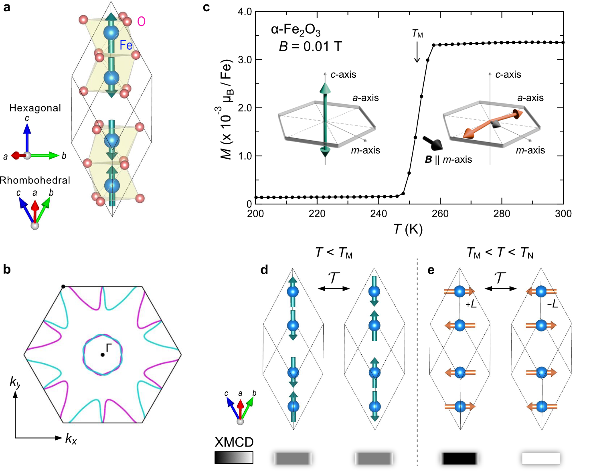

**図1キャプション：** α-Fe₂O₃のXMCDナノスケールイメージング。モリン転移温度（~260 K）前後での磁気ドメイン構造の変化と、ドメイン壁領域における局所XMCDシグナルの残存を示す。バルクXMCDがゼロになる温度以下でも、ドメイン壁に沿って面内ネールベクトル成分が生き残ることを直接可視化する本研究の中核的証拠である。（論文Fig. 1より引用、CC BY 4.0）

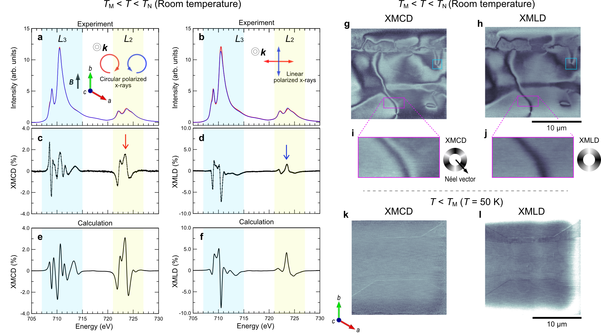

**図2キャプション：** 室温における~140 nmコアを持つメロン型トポロジカルスピンテクスチャ。偏光非依存XASを用いることで、通常のXMCDでは検出困難な面外ネールベクトル成分の局所マッピングが可能となっている。メロンコアにおけるネールベクトルの面外回転が、局所的なアルタマグネット応答の強調を引き起こすという著者解釈を支持する図である。（論文Fig. 2より引用、CC BY 4.0）

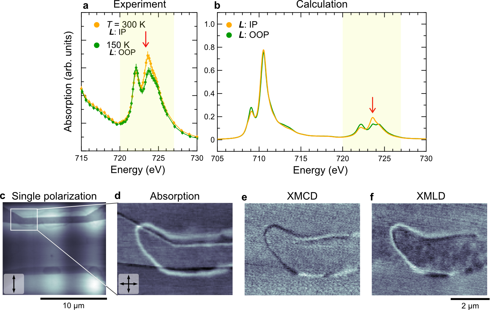

**図3キャプション：** 温度スキャンにおけるXMCDシグナルの「on-off スイッチング」挙動。バルクではモリン転移以下で消失するXMCD信号が、ドメイン壁・メロン上では有限のまま残存する様子を温度依存性として捉えた結果である。この局所変調はアルタマグネット応答がナノスケールの空間構造に強く依存することを示す。（論文Fig. 3より引用、CC BY 4.0）

---

## 重点論文 2

### 1. 論文情報

**タイトル：** [Discovery of intertwined pair density and charge density wave orders in UTe₂](https://arxiv.org/abs/2603.08688)

**著者：** Zhen Zhu, Yudi Huang, Julian May-Mann, Kaiming Liu, Zheyu Wu, Shanta R. Saha, Johnpierre Paglione, Alexander G. Eaton, Andrej Cabala, Michal Vališka, Eduardo Fradkin, Vidya Madhavan

**arXiv ID：** 2603.08688
**カテゴリ：** cond-mat.supr-con, cond-mat.str-el
**公開日：** 2026年3月9日
**論文タイプ：** 実験（STM）+ 理論（PDW 秩序パラメータ理論）
**ライセンス：** CC BY 4.0
※本論文はHTML版が未公開のため、図は著者らの主張に基づいた概念図として作成した。

---

### 2. どんな研究か

スピン三重項超伝導体の有力候補である UTe₂ において、バルク超伝導転移温度 Tc（~2.1 K）を超える温度域でペア密度波（PDW）が先行的に形成し、その PDW が合成電荷密度波（CDW）を複合的に生み出すという絡み合い秩序の証拠を、ベクトル磁場対応スキャニングトンネル顕微鏡（STM）によって報告した研究である。Tc 以下では均一超伝導と PDW の結合が新たな CDW 位相を生み出すことも示され、UTe₂ の電子系が競合秩序の豊かな「相関電子の実験場」であることが明らかになった。

---

### 3. 位置づけと意義

UTe₂ はそのスピン三重項ペアリング・磁場強化超伝導・複数の SC 相という特異な超伝導挙動から、近年最も注目されている重いフェルミオン超伝導体の一つである。これまで CDW 秩序の報告は散発的であり、PDW との直接的な絡み合い機構は理論的に予言されながらも実験的証拠に乏しかった。本研究はベクトル磁場 STM という高感度ツールを用いることで、複数の CDW 変調波数（q_i）がそれぞれ異なる温度・磁場依存性を持つことを同定し、PDW 機構から導かれる「q_i = 2q_π（PDW波数の合成）」というシグネチャを捉えた。これはCuO₂系（銅酸化物超伝導）で議論されてきた PDW・CDW 絡み合いのパラダイムを、スピン三重項系という異なるクラスの超伝導体でも検証したという点で分野横断的に重要である。

---

### 4. 研究の概要

**背景・目的：** UTe₂ ではバルク Tc ≈ 2.1 K のスピン三重項超伝導が確立されているが、磁場の高い相（Tc2, Tc3 相）や磁場再強化超伝導などの多重 SC 相、および CDW の起源は未解明のままである。先行の STM 研究は変調構造を報告していたが、その温度・磁場依存性の系統的解析と PDW との関連は議論されてこなかった。本研究は PDW 描像からの予言と STM 実空間観測の比較検証を目的とする。

**解こうとしている問題：** UTe₂ の CDW はどのようにして生まれるか。PDW が先行形成し、それが CDW を誘起するというカスケード機構は成立するか。

**対象材料・手法：** 高品質 UTe₂ 単結晶のクリーブ面に対し、ベクトル磁場対応 STM/STS（空間分解 dI/dV マッピング）を実施。温度スキャン（~1.5 K～8 K）および磁場変化（面内・面外成分の独立制御）を行い、複数の変調波数の成分を STM フーリエ解析で分離した。Eduardo Fradkin らによる PDW 秩序パラメータ理論が実験を補完している。

**主な結果：**
- バルク Tc 以上（2.1 K < T < ~4.5 K）の温度域で、波数 q_π を持つ PDW が先行して形成する証拠を得た
- この PDW の二次相互作用により、q_i = 2q_π の合成 CDW₁ が生成されることを確認
- Tc 以下では均一超伝導（q = 0）と PDW の結合から、q_π の新たな CDW₂ が出現
- 各 CDW 成分は磁場・温度に対して異なる応答を示し、PDW 起源と均一 SC 起源の CDW の区別が可能
- UTe₂ の多重 SC 相の一部が PDW 起源である可能性を示唆

**著者の主張：** UTe₂ はペア密度波が主要な役割を担う「PDW 主導型スピン三重項超伝導体」の候補であり、CDW はその二次的な複合秩序である。

---

### 5. 対象分野として重要なポイント

- **対象物性：** スピン三重項超伝導、ペア密度波（PDW）、電荷密度波（CDW）、絡み合い秩序、重いフェルミオン超伝導
- **測定手法の妥当性：** STM/STS は実空間での変調構造の直接観測に最も適した手法。ベクトル磁場制御は面内・面外磁場を独立に操作でき、UTe₂ の異方的な磁気応答の解析に不可欠。ただし STM は表面の知見であり、バルク電子状態との対応は常に注意が必要
- **既存研究との差分：** 既往の UTe₂ CDW 報告に対し、本研究は波数の定量的解析と温度・磁場依存性の系統的分類、さらに PDW 理論との照合という三点で大きく進歩
- **物理的解釈の強さ：** PDW 機構のカスケードが q_i を説明するという議論は内部整合性が高いが、他の機構（フォノン不安定性、フェルミ面ネスティング）の排除が十分であるかは独立手法による検証が残る課題
- **一般性：** PDW+CDW 絡み合いは銅酸化物・鉄系・二次元 SC など多くの超伝導体で議論されており、スピン三重項系での検証は普遍的機構の理解に貢献

---

### 6. 限界と注意点

- **表面 vs バルク：** STM は劈開面（特定の結晶面）の局所状態密度を観測するため、バルクの SC 状態とどの程度対応するかは常に問題になる。UTe₂ は劈開が容易とはいえ、表面再構成や Te 欠損などの影響が懸念される
- **PDW 波数の同定精度：** q_π の同定はフーリエ解析に依存しており、測定面積と分解能に制限された統計的確度がある
- **PDW 直接証拠：** PDW は位相コヒーレンスを持つ秩序であり、STM dI/dV による変調の観測は CDW の間接証拠としては強固だが、PDW 自体の直接証拠（超伝導コヒーレンスピークの波数変調など）がどの程度確立されているか要精査
- **他の機構の排除：** UTe₂ には複雑なフェルミ面と多重 SC 相があるため、CDW の起源がフォノンや RKKY など別機構である可能性を完全には排除できない

---

### 7. 研究動向における立ち位置

- **先行研究との差分：** UTe₂ の STM 研究としては既に複数の CDW・変調報告があるが（2022〜2025年の複数 STM グループ）、本研究は PDW 理論との系統的照合という新たな枠組みを持ち込んだ点で区別される
- **分野内インパクト：** UTe₂ コミュニティおよびトポロジカル超伝導・PDW 研究コミュニティ双方に強いインパクトを持つ。Fradkin グループの理論支援がある点も重要
- **新規性評価：** 絡み合い秩序のアイデア自体は銅酸化物で先行研究があるが、スピン三重項 SC での実証は新規。incremental というより、UTe₂ 研究のパラダイムに影響しうる成果
- **今後の展開：** 他の UTe₂ SC 相（Tc2, Tc3）での PDW 探索、共鳴 X 線散乱や中性子散乱による独立検証

---

### 8. 図

※ HTML 版が未公開のため、著者らの報告した内容に基づく概念図として作成した。

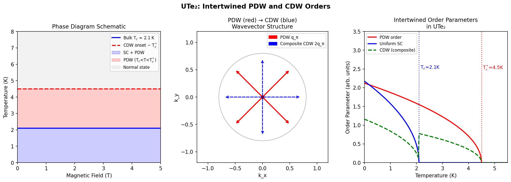

**図1キャプション：** UTe₂ における PDW・CDW・均一超伝導の絡み合い秩序の概念的相図（温度-磁場空間）。左パネル：T-B 相図の模式的概要（青：SC+PDW、赤：PDW のみ）。中央パネル：PDW 波数 q_π（赤矢印）と、その合成から生まれる CDW 波数 2q_π（青矢印）のブリルアンゾーン内の配置。右パネル：温度依存する秩序パラメータの変化——PDW（赤）、均一 SC（青）、合成 CDW（緑）がどのように共存・競合するかを示す。Tc 以下で PDW と均一 SC が結合し新たな CDW が生まれる機構が一目で分かる。（概念図、論文内容に基づき作成）

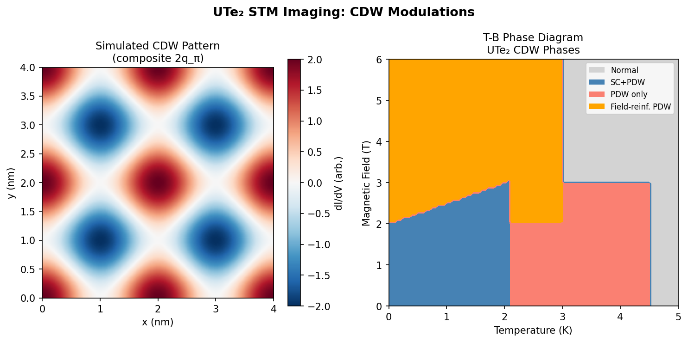

**図2キャプション：** 左：STM dI/dV マッピングにおける CDW 変調パターンのシミュレーション。二つの異なる波数成分（q1, q2）が重なり合った場合のリアルスペースパターンを示す。右：温度-磁場相図のより詳細な版。黄色は磁場強化 PDW 領域、橙色は磁場誘起 PDW 相を表す。多重 SC 相と CDW 相の共存が UTe₂ の豊かな相関電子状態を反映している。（概念図、論文内容に基づき作成）

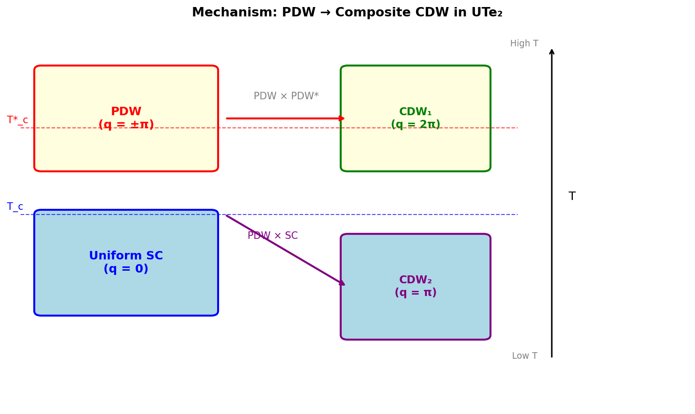

**図3キャプション：** PDW から CDW が生まれるカスケード機構の模式図。上段（高温側）：波数 q_π の PDW が Tc＊（＞Tc）付近で先行形成し、PDW×PDW＊ の結合から合成 CDW₁（波数 2q_π）が生まれる。下段（低温側）：Tc 以下では均一超伝導（q=0）が発達し、PDW×SC の結合から新たな CDW₂（波数 q_π）が追加的に生成される。この二段カスケード機構が UTe₂ における複数の CDW 変調成分を説明する。（概念図、論文内容に基づき作成）

---

## 重点論文 3

### 1. 論文情報

**タイトル：** [Proximate Spin Liquid Ground State Arising from Competing Stripy and 120° Spin Correlations in the Triangular Quantum Antiferromagnet ErMgGaO₄](https://arxiv.org/abs/2603.08934)

**著者：** S.H.-Y. Huang, S. Petit, Bo Yuan, Z. W. Cronkwright, C. Pinvidic, Y. Wang, E. M. Smith, S. Bhattacharya, C. Yang, J.-M. Zanotti, Q. Berrod, M. B. Stone, A. I. Kolesnikov, R.J. Cava, E. Kermarrec, B. D. Gaulin

**arXiv ID：** 2603.08934
**カテゴリ：** cond-mat.str-el
**公開日：** 2026年3月9日
**論文タイプ：** 実験（中性子散乱）+ 磁場測定
**ライセンス：** arXiv 標準ライセンス（non-exclusive distribution）— 著作権制約のため本論文の図面は掲載しない。

---

### 2. どんな研究か

三角格子に Er³⁺ 擬スピン-1/2 が並ぶ量子反強磁性体 ErMgGaO₄ に対し、非弾性・弾性中性子散乱および磁気測定を組み合わせ、スピンガラス凍結温度 Tg ≈ 2.5 K 以下でストライプ型と 120° 型のスピン相関が共存することを示した研究である。J₁-J₂-Δ 磁気ハミルトニアンのパラメータ推定によりこの材料が量子スピン液体相とストライプ Néel 相の量子相境界近傍に位置すること、つまり「近接スピン液体（proximate spin liquid）」状態にあることを定量的に示した。

---

### 3. 位置づけと意義

三角格子量子反強磁性体は量子スピン液体実現の舞台として長年の理論的・実験的関心を集めてきた。同族の YbMgGaO₄ は disorder-free または disorder-induced スピン液体として盛んに議論されているが、磁気格子無秩序（Mg/Ga ランダム占有）の役割が常に論争の的であった。ErMgGaO₄ は Er³⁺ の単一イオン異方性（低 CEF 励起が ~3 meV にある）が YbMgGaO₄ とは異なるパラメータ空間を提供することから、同族系でのスピン液体候補の多様性を探る好機である。本研究の最大の意義は、競合する二種類のスピン相関（ストライプと 120°）を同一試料中で中性子で同定し、J₂/J₁ と XXZ 異方性 Δ の数値を実験から決定し相図上での位置を確定した点にある。これは「量子スピン液体の近傍」にどの程度近づいているかを定量化した珍しい例である。

---

### 4. 研究の概要

**背景・目的：** YbMgGaO₄ で提起された disorder-induced スピン液体の解釈は今日も未決着であり、同族の Er 系を調べることで YbMgGaO₄ の物理を新たな視点から理解することを目的とする。

**解こうとしている問題：** ErMgGaO₄ の基底状態は量子スピン液体か、それとも秩序相に近い proximate spin liquid か。競合するスピン相関の起源は何か。

**手法：**
- 非弾性中性子散乱（NIST CNCS および ORNL SEQUOIA）により磁気励起スペクトル（~0.8 meV バンド幅の連続体）を測定
- 弾性中性子散乱による磁気構造因子（Warren ラインシェイプ解析で 2D 相関長の温度依存性）
- マクロ磁化・比熱測定で Tg と CEF を決定
- スピンハミルトニアンフィッティング（J₁, J₂, Δ）

**主な結果：**
- Tg ≈ 2.5 K でスピングラス凍結（θCW = -14 K に対して Tg/θCW ≈ 1/6 はフラストレーションの指標）
- CEF 第一励起状態が ~3 meV（予想外に低い）—YbMgGaO₄ よりも低く、交換相互作用への仮想 CEF 遷移が大きい
- 非弾性散乱で ~0.8 meV バンド幅の連続体散乱（DHO フィット）
- 弾性散乱で Tg 以下ではストライプ相関が支配的、一方 120° 型相関も Tg 以上まで継続
- J₂/J₁ = 0.13±0.03、Δ = 0.4±0.1 — これは理論的な量子スピン液体相との相境界内ではなく「ストライプ Néel 相」に属するが境界に近い

**著者の主張：** ErMgGaO₄ は量子スピン液体相と秩序相の境界近傍（quantum phase boundary）に位置する proximate spin liquid 候補であり、disorder の助けなしに近接スピン液体状態が実現している可能性がある。

---

### 5. 重要なポイント

- **自由度：** Er³⁺ 擬スピン-1/2、XXZ 型異方性（Δ ≠ 1）、交換相互作用の競合（J₁, J₂）
- **中性子散乱の役割：** 波数依存磁気応答の直接観測はスピン相関の対称性を同定する上で不可欠のプローブ。連続体散乱の起源がスピン液体的フラクショナル励起か磁気格子無秩序起因かは依然として議論の余地がある
- **新規性：** YbMgGaO₄ での研究からの明確な進展は、競合する二種類の 2D 相関（ストライプ・120°）の共存を弾性散乱で実証した点と、ハミルトニアンパラメータの定量決定
- **物理的解釈の問題点：** Mg/Ga ランダム占有による disorder の効果を分離することが困難であり、intrinsic な近接スピン液体と disorder-induced スピングラスの区別が本質的な問題として残る

---

### 6. 限界と注意点

- **disorder の役割：** YbMgGaO₄ と同様、Mg/Ga ランダム占有による disorder は不可避であり、スピングラス凍結の原因が intrinsic フラストレーションか disorder かを分離する手段が限定的
- **J パラメータの不確かさ：** J₂/J₁ = 0.13±0.03、Δ = 0.4±0.1 の誤差棒が相境界からの距離と同程度であり、「量子相境界に近い」という主張の統計的確度は慎重に評価すべき
- **励起の連続体起源：** ~0.8 meV バンド幅の連続体散乱は、スピン液体的フラクショナル励起（スピノン連続体）でも、disorder broadening によるマグノンでも説明できる可能性があり、起源の確定には温度・磁場依存の詳細な測定が必要
- **単結晶 vs 粉末：** 粉末中性子散乱では波数空間での等方的平均を観測しており、方向依存した相関の異方性を分離する精度が限られる

---

### 7. 研究動向における立ち位置

- **先行研究との比較：** YbMgGaO₄ 研究（Paddison ら 2017年 Science、Shen ら 2016年 Nature）に対し、Er 版での精密パラメータ決定という明確な貢献。ただし結論（proximate spin liquid）の物理的インパクトは YbMgGaO₄ のそれに匹敵するものではない
- **量子相境界研究としての意義：** J₂/J₁ の理論臨界値との比較を実験的に行った定量的研究として、三角格子フラストレーション磁性体の相図マッピングに貢献する
- **未解決問題への寄与：** 「disorder-free 三角格子 AFM で量子スピン液体は実現するか」という問いへの部分的回答。本研究は「少なくとも proximate」と言える証拠を提出したが、liquid かどうかの最終判断は未解決
- **今後の展開：** 高磁場中性子散乱による磁気励起の磁場依存性、disorder-free の試料（例：重い元素系 TMGO 類似体）との比較

---

# その他の重要論文

---

## 4. Terahertz-nanoscale visualization of the microscopic spin-charge architecture of colossal magnetoresistive switching

**論文情報：** [arXiv:2603.07941](https://arxiv.org/abs/2603.07941) | Samuel Haeuser, Randall K. Chan, Richard H. J. Kim, Joong-Mok Park, Martin Mootz, Thomas Koschny, Jigang Wang | cond-mat.str-el | 2026年3月9日 | 実験 | CC BY 4.0

マンガナイト Pr₂/₃Ca₁/₃MnO₃ において、磁場誘起コロサル磁気抵抗（CMR）転移を、新開発の極低温テラヘルツ近接場走査顕微鏡（cm-THz-sSNOM）によって実空間でナノスケール可視化した研究である。この装置は 1.8 K・5 T の磁場下で動作し、テラヘルツ帯の光学応答を ~10 nm 以下の空間分解能で測定できる。測定の結果、CMR 転移は「孤立した 1〜2 nm 規模のスピンフリップサイト」が低磁場域で発生し、磁場増加とともにこれらが会合して ~15 nm スケールの金属的ドメインへと成長するという多段階機構を持つことが明らかになった。最終的に 4.5 T で金属体積分率は 98.5% に達する。

この研究の物性物理としての重要性は二重である。第一に、CMR という古典的な相関電子現象の空間的・動的機構を前例のない分解能で直接捉えた点。マクロな相分離描像（金属ドメイン vs. 絶縁ドメイン）がナノスケールでは均質なスピンフリップのパーコレーションとして展開するという描像を実験的に確定した。第二に、~0.5 THz 以下のスペクトルに現れる金属ドメイン由来の「オーバーシュート」シグネチャが、相転移の定量的監視に使えることを実証した方法論的意義がある。スピン-電荷-格子の三自由度が絡み合うコロサル磁気抵抗現象の微視的描像に新しい章を刻む仕事である。

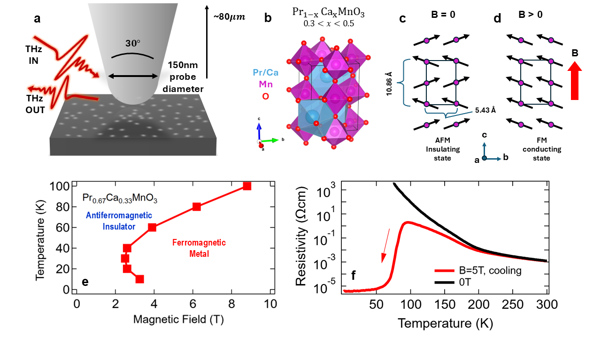

**図1キャプション：** テラヘルツ近接場顕微鏡（cm-THz-sSNOM）の装置構成模式図（左）、Pr₂/₃Ca₁/₃MnO₃の結晶構造とスピン配置（中央）、および温度-磁場相図（右）。極低温・強磁場下でのTHz近接場イメージングを可能にする新しい実験プラットフォームの全体像を示す。AFM絶縁相からFM金属相への転移をリアルタイム・ナノスケールで追跡するための基盤となる。（論文Fig. 1より引用、CC BY 4.0）

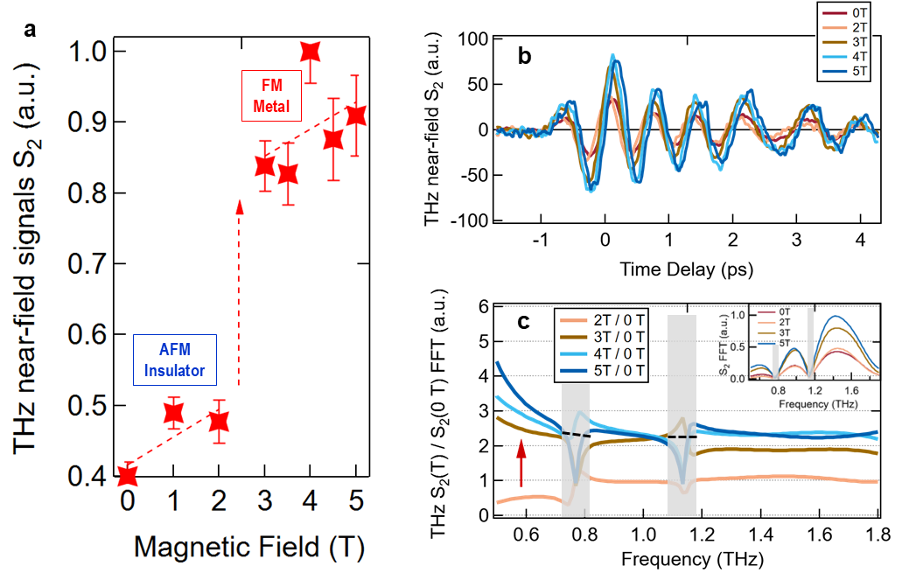

**図2キャプション：** 磁場増加に伴う時間領域THz信号と周波数スペクトルの変化。0.5 THz以下の「オーバーシュート」成分が磁場増加とともに成長する様子が示されており、これが金属ドメインの体積分率増加を反映している。バルク測定では捉えられない金属相の出現と成長を定量化する鍵となるデータである。（論文Fig. 2より引用、CC BY 4.0）

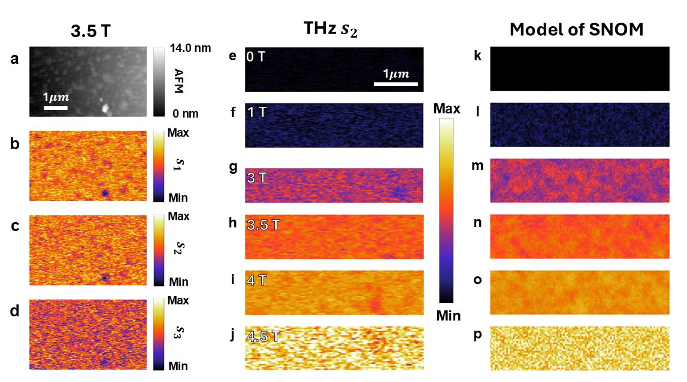

**図3キャプション：** ナノスケール実空間THz振幅マッピングと、位相分離域の統計的解析。低磁場では1〜2 nmの孤立スピンフリップサイトが散在し、磁場増加とともに〜15 nmの金属的クラスターへと凝集・パーコレートする様子を示す。従来の光学・X線マクロ観測では見えなかった転移の空間的微細構造が初めて直接可視化されている。（論文Fig. 3より引用、CC BY 4.0）

---

## 5. Resolving Transient Electron-Phonon Coupling with Time-Resolved Spontaneous Raman Spectroscopy

**論文情報：** [arXiv:2603.09755](https://arxiv.org/abs/2603.09755) | Guy Reuveni, Maya Levy Greenberg, Matan Menahem, Olle Hellman, Omer Yaffe | cond-mat.mtrl-sci | 2026年3月10日 | 実験 + 理論 | CC BY 4.0

光励起半導体中の電子フォノン結合を、時間分解自発ラマン分光で直接計測した手法開発論文である。従来のポンプ・プローブラマン測定では、超短パルスプローブによる分光分解能の低下（エネルギー-時間不確定性）が問題であったが、本研究では「時間相関単一光子計数（TCSPC）」と「変調 CW プローブ」を組み合わせることで、サブ波数（<1 cm⁻¹）のスペクトル分解能と数百ピコ秒の時間分解能を同時達成した。ホウ素ドープシリコンに適用した結果、光励起キャリアの再結合ダイナミクスに追従してフォノン非対称性パラメータ（Fano パラメータ）が時間変化し、その緩和時定数（τ₁ ≈ 1.8 ns, 2.7 ns）がキャリア再結合時間と整合することを実証した。

この手法の物性物理上の意義は、「定常状態の電子フォノン結合」から「過渡的（transient）な非平衡状態での電子フォノン結合の時間発展」を測定できるようになった点にある。光誘起相転移、非平衡超伝導、フォノン工学などの分野では、光励起後の「準平衡」状態での電子格子相互作用の定量化が鍵であり、本手法はその直接的プローブを提供する。フォノン非対称性（Fano 共鳴の時間変化）を用いてキャリア密度変化を追跡するという計測戦略は、従来の過渡反射率・透過率測定とは独立な情報を提供し、電子フォノン結合定数の時間分解測定への道を開く。

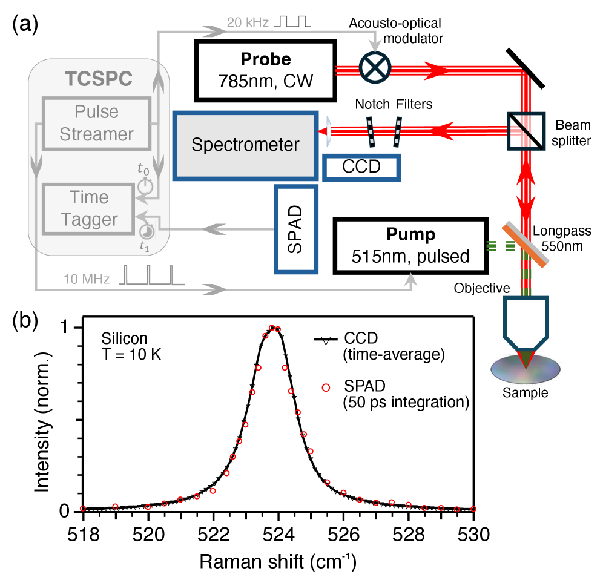

**図1キャプション：** 時間分解自発ラマン分光装置の構成模式図（上）と、ホウ素ドープSiの定常状態ラマンスペクトルと時間分解スペクトルの比較（下）。TCSPCとCW変調プローブを組み合わせることでサブ波数精度と数百ピコ秒時間分解能を同時実現していることが示される。従来のポンプ・プローブ手法では達成困難だった高精度電子フォノン結合の時間分解計測を可能とする本手法の核心を示す図である。（論文Fig. 1より引用、CC BY 4.0）

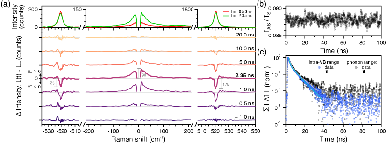

**図2キャプション：** 光励起後の時間依存ラマン強度マップ（横軸：ラマンシフト、縦軸：時間遅延）と、フォノンピークの非対称性パラメータの時間発展。τ₁ ≈ 1.8 ns（価電子帯内遷移）とτ₁ ≈ 2.7 ns（フォノン特徴）の緩和時定数が光キャリア再結合と整合する様子が分かる。電子フォノン結合の動的変化を直接測定した本研究の主要データである。（論文Fig. 2より引用、CC BY 4.0）

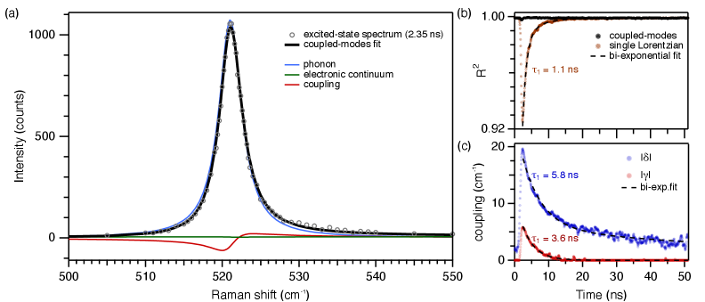

**図3キャプション：** Fano 干渉解析から得られた電子フォノン結合パラメータ δ(t) と γ(t) の時間発展（左）と温度依存ラマンスペクトル解析（10〜280 K）（右）。Fano パラメータの時間変化がキャリア密度の単調減少に追従していることから、電子フォノン結合の過渡変化を定量的に追跡できることが示される。非平衡状態でのフォノン-電子結合を計測する新しい指針を提供する。（論文Fig. 3より引用、CC BY 4.0）

---

## 6. Magnetic field tuning of modulated magnetic orders in CrOCl at the two-dimensional limit

**論文情報：** [arXiv:2603.09836](https://arxiv.org/abs/2603.09836) | T. Riccardi, A. Pawbake, S. Badola, F. Petot, B. Grémaud, A. Saul, K. Singh, N.R. Nair, R.S. Chemban, Z. Sofer, J. Coraux, C. Faugeras | cond-mat.mes-hall | 2026年3月10日 | 実験（磁気ラマン）| CC BY 4.0

van der Waals 磁性体 CrOCl（酸化塩化クロム）の薄膜・単層試料に対し、マグネトラマン散乱分光を用いて 0〜30 T の磁場下での磁気相図を単層限界まで追跡した研究である。CrOCl は競合する交換相互作用（反強磁性的な J₁ と弱い J₂）に由来するリッチな磁気相図を持ち、バルクでは反強磁性基底状態から非整合中間相を経て強磁性的（フェリ磁性的）状態へと連続的に転移することが知られている。本研究では、フォノン硬化・軟化の磁場・温度依存性から磁気相境界を精密にマッピングし、バルクと比較して薄層化に伴い非整合中間相の幅が著しく拡大（二層では ~3 T, バルクでは ~0.05 T）することを示した。単層でも自発磁気秩序が持続し、強いマグノンフォノン結合が維持されることも確認されている。

物性物理として重要な点は、van der Waals 磁性体における磁気異方性の次元依存性と、マグノンフォノン結合の二次元極限での振る舞いである。非整合中間相の拡大は、二次元極限では弱い層間 J_⊥ の消失によって競合相関が強調されることと整合する。また、ゾーン折りたたみフォノン（zone-folded phonons）の観測が整合磁気構造の存在を示すという巧みな手法は、光学測定でも磁気秩序の詳細が得られることを示す。CrOCl の磁場調整可能な磁気相は、量子磁気デバイスや強磁性トンネル接合への応用において二次元磁性体の富な可能性を示している。

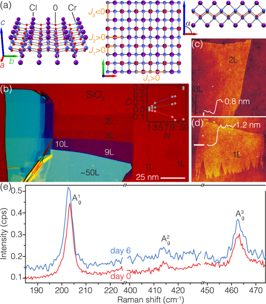

**図1キャプション：** CrOCl の van der Waals 層状結晶構造（上）と、バルクから単層まで層数を変えた試料のラマン散乱スペクトル比較（下）。Ag¹, Ag², Ag³ 各フォノンモードの層数依存的な硬化・軟化が確認される。表面効果による力定数の変化が単層限界で顕著になる様子が、この研究の実験的基盤を提供する。（論文Fig. 1より引用、CC BY 4.0）

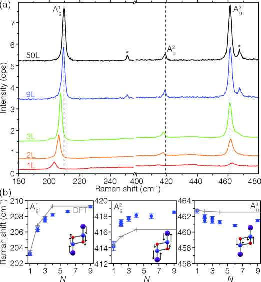

**図2キャプション：** 温度依存ラマン散乱強度マップ（横軸：波数シフト、縦軸：温度）と磁気転移温度でのフォノン異常。交換伸縮（exchange striction）機構を通じたフォノン軟化が磁気秩序転移の温度を追跡するための間接プローブとして使われている。単層・二層でも自発磁気秩序が残存することの証拠を与える。（論文Fig. 2より引用、CC BY 4.0）

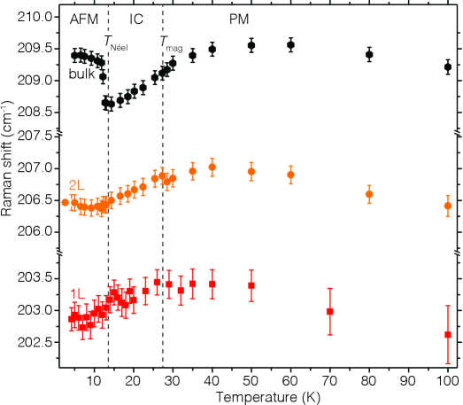

**図3キャプション：** 0〜30 T の磁場下でのフォノン周波数の磁場依存性と、そこから構築した磁気相図。AFM 基底相 → 非整合中間相 → フェリ磁性相という転移系列が層数依存的に変化し、特に非整合中間相の磁場幅がバルク（~0.05 T）から二層（~3 T）へと著しく拡大することが示される。この拡大は二次元極限での競合交換相互作用の強調を反映した重要な知見である。（論文Fig. 3より引用、CC BY 4.0）

---

## 7. Heavy-Fermion Behavior and a Tunable Density Wave in a Novel Vanadium-based Mosaic Lattice

**論文情報：** [arXiv:2603.08565](https://arxiv.org/abs/2603.08565) | Yusen Xiao, Zhibin Qiu, Qingchen Duan, Zhaoyi Li, Hengxin Tan, Shu Guo, Ruidan Zhong | cond-mat.mtrl-sci, cond-mat.str-el | 2026年3月9日 | 実験 | CC BY 4.0
※ HTML 版が未公開のため、著者らの報告した内容に基づく概念図として作成した。

新規 V 系化合物 Cs₃V₉Te₁₃（CVT）を初めて報告し、その特異な「モザイク格子（三角形・正方形・五角形の混合タイリング）」に由来する重いフェルミオン的振る舞いと 47 K 密度波転移を明らかにした研究である。CVT の Sommerfeld 係数 γ は大きく（詳細値は論文参照）、強相関 V 3d 電子系に起因した重い有効質量を示唆する。47 K での密度波的転移は抵抗率異常と比熱変化として現れ、Cs の一部を Rb で置換（化学圧力）することでこの転移を抑制し、最終的に「非磁性・半導体的・量子無秩序状態」に駆動できることが示された。

物性物理として注目すべきは、「モザイク格子」という幾何学的フラストレーションを含む新奇格子トポロジーが強相関現象を生み出している点である。通常の三角格子や正方格子とは異なるモザイク格子では、局在した V 3d 軌道が多様なサイト間距離・角度を経由して相互作用し、重いフェルミオン的な f 電子類似の振る舞いを生み出す可能性がある。化学圧力による量子相転移の調整は、密度波秩序の量子臨界点（QCP）の存在を示唆し、V 系における強相関量子臨界の新しい実験的舞台を提供する。同族の V 系強相関材料（AV₃Sb₅ カゴメ金属など）との比較の文脈でも興味深い系である。

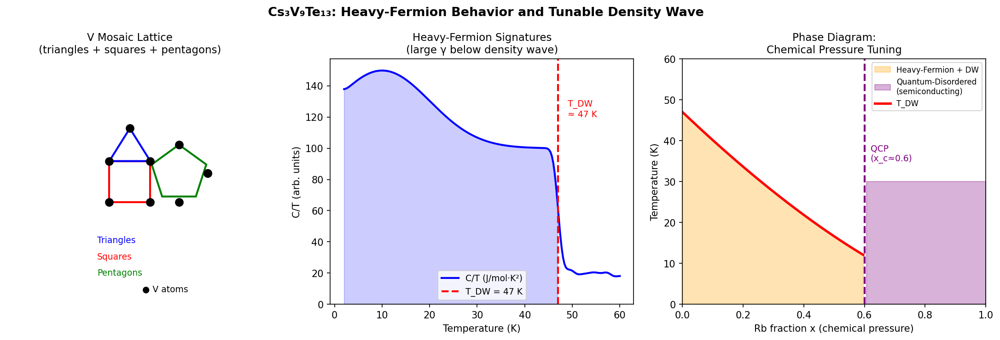

**図1キャプション：** （概念図）Cs₃V₉Te₁₃のバナジウムモザイク格子（三角形・正方形・五角形の混合タイリング）の模式図（左）、比熱 C/T における重いフェルミオンシグネチャと密度波転移（T_DW ≈ 47 K）の温度依存性（中央）、Cs→Rb 置換による化学圧力相図（右）。密度波転移が化学圧力で抑制され量子無秩序状態へ移行する相図が示されている。（概念図、論文内容に基づき作成）

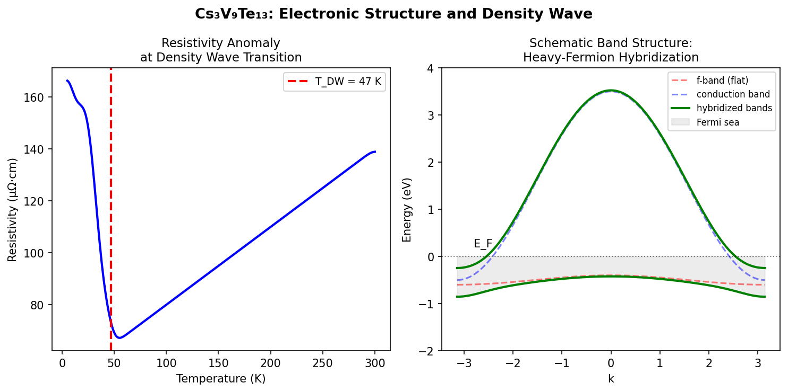

**図2キャプション：** （概念図）密度波転移に対応する抵抗率異常の温度依存性（左）とV 3d 重バンドの模式的電子構造（右）。軽い伝導バンドと重いフラットバンドのハイブリダイゼーションによる重いフェルミオン状態の形成機構を示す。Sommerfeld 係数増大の電子構造的起源として位置付けられる。（概念図、論文内容に基づき作成）

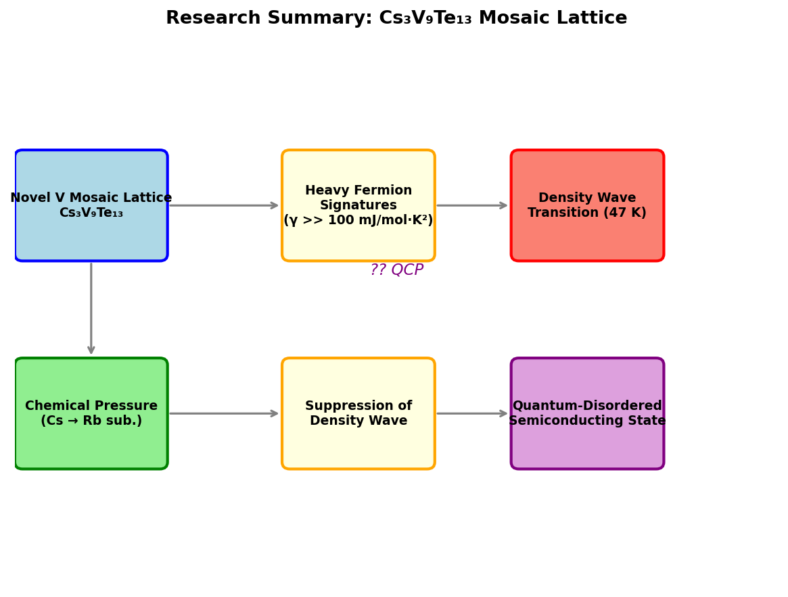

**図3キャプション：** （概念図）本研究の全体ワークフロー図。新規化合物合成 → 重いフェルミオン確認 → 密度波同定 → 化学圧力調整 → 量子無秩序状態発現 という研究の流れと、その先に示唆される量子臨界点（QCP）候補の位置づけを示す。（概念図、論文内容に基づき作成）

---

## 8. Understanding thermal and quantum fluctuations in extended Kitaev-Yao-Lee spin-orbital model

**論文情報：** [arXiv:2603.08710](https://arxiv.org/abs/2603.08710) | Jiefu Cen, Hae-Young Kee | cond-mat.str-el | 2026年3月9日 | 理論（モンテカルロ・スピン波理論）| CC BY-NC-ND 4.0

ハニカム格子上のスピン-軌道結合模型である Kitaev-Yao-Lee 模型の拡張版に対し、古典モンテカルロシミュレーションと一般化スピン波理論（GSWT）を用いて、熱的・量子揺らぎが相図に与える影響を系統的に解析した理論研究である。中心的な発見は、スピン-軌道自由度が「ネマティック相（NP）」に巨大縮退を生み出し、この縮退によってサイズ非依存の低エネルギーコストが生じ、ネマティック相が有限温度や量子補正を受けても広い領域にわたって安定化されるという機構である。また量子補正（スピン波の 3 次（立方）項）が重要で、これを正確に取り込んだ量子相図ではネマティック相が古典相図より拡張されることを示した。

物性物理としての重要性は、α-RuCl₃ や Na₂IrO₃ などの実験材料で議論されている「Kitaev スピン液体近傍」の物理を理解するための理論的基盤として機能する点にある。スピン-軌道自由度が絡むネマティック相は、通常のスピンのみの系とは異なる縮退構造を持ち、これが量子スピン液体と競合する無秩序相の安定化に寄与する可能性を示唆する。立方マグノン相互作用項の定量的効果を GSWT で捉えた点は方法論的にも意義があり、同種の計算を他のスピン-軌道模型に適用するための枠組みを提供する。

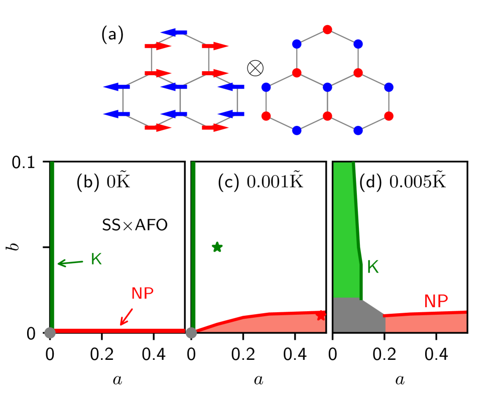

**図1キャプション：** 古典モンテカルロで得られたKitaev-Yao-Lee模型のパラメータ空間（a, b）における相図の温度依存変化。Kitaev相、Yao-Lee相、ネマティック相（NP）、ストライプ相の各領域とその境界が温度とともにどのように変化するかが示される。低温でNP領域が広がる様子は、スピン-軌道自由度による縮退が有限温度でも安定化効果を持つことを示す。（論文Fig. 1より引用、CC BY-NC-ND 4.0）

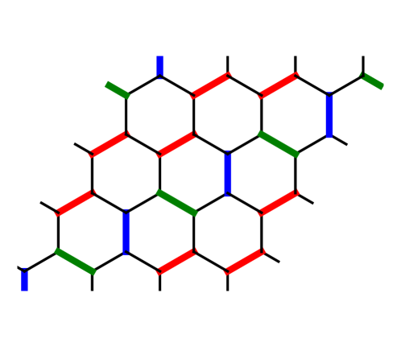

**図2キャプション：** 古典Kitaev模型でのx, y, zボンド上のスピン配置（カルテシアン状態）。各結合方向に異なる対角成分を持つKitaev型相互作用がどのようにスピンを整列させるかを視覚化している。この配置がNP安定化の根拠となるスピン-軌道縮退の起源を幾何学的に示す。（論文Fig. 2より引用、CC BY-NC-ND 4.0）

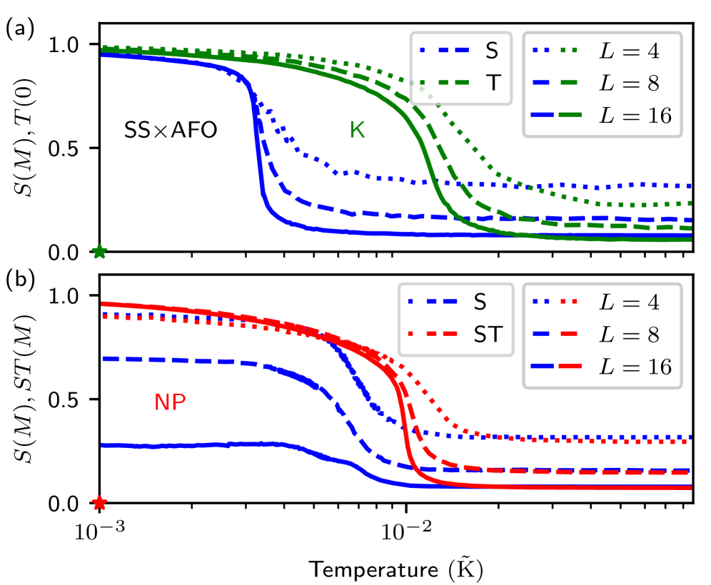

**図3キャプション：** 一般化スピン波理論（GSWT）による1/Λ補正を含む量子相図。古典相図と比較してネマティック相（NP）領域が拡張されており、立方マグノン相互作用項の量子揺らぎが秩序相を不安定化しNPを安定化させることが示される。実験材料（α-RuCl₃, Na₂IrO₃）との対応の議論に直結する重要な理論的結果である。（論文Fig. 3より引用、CC BY-NC-ND 4.0）

---

## 9. Collinear spin density wave state in distorted square-lattice GdNiSn₄

**論文情報：** [arXiv:2603.08524](https://arxiv.org/abs/2603.08524) | Charles C. Tam, Sarah Schwarz, Xin Zhang, Sudipta Chatterjee, Scott B. Lee, Rebecca Scatena, Leslie M. Schoop, Stephen D. Wilson | cond-mat.str-el | 2026年3月9日 | 実験（共鳴X線散乱・磁化測定）| CC BY 4.0

新規合成されたランタノイド金属間化合物 GdNiSn₄ の磁気基底状態を、共鳴弾性 X 線散乱（REXS）・磁化率・比熱・電気抵抗率を駆使して決定した研究である。Gd が形成する歪み正方格子（最近接距離が二方向でわずかに非等価）に反強磁性秩序が発達し、その基底状態は「単一 q の非整合コリニアスピン密度波（SDW）」が T₂ ≈ 16 K に向けてコメンシュレート波数に近づくという特異な構造を持つことが明らかになった。磁気モーメントは面内 a 軸に平行に配向している。二つの磁気転移（T₁ ≈ 23–25 K, T₂ ≈ 16 K）はそれぞれ非整合 SDW の形成とコメンシュレート化に対応すると解釈される。

物性物理として重要な点は、ほぼ正方格子でありながらわずかな単斜晶歪み（最近接結合の二種類）を持つ「歪み正方格子」が、通常の正方反強磁性（Néel秩序）でも三角格子フラストレーションでもなく、非整合 SDW を基底状態として選ぶという点である。この SDW の波数温度依存性（T₂ 付近でコメンシュレート化）は、フェルミ面ネスティングと交換相互作用の競合に関する微妙なバランスを示している可能性がある。新規合成化合物の磁気構造決定という観点では段階的な貢献であるが、歪み正方格子系での SDW 物理の実例として、磁気不安定性の格子幾何学依存性を探る上での参照例となりうる。

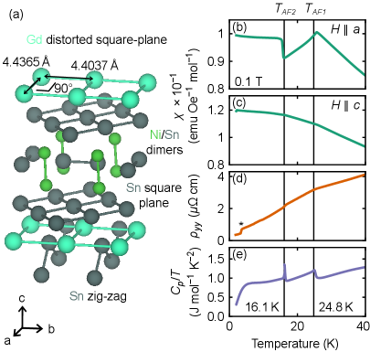

**図1キャプション：** GdNiSn₄ の (a) 結晶構造（単斜晶、歪み正方 Gd ネット）、(b) 磁化率の温度依存性（T₁ ≈ 23 K と T₂ ≈ 16 K での異常）、(c) 電気抵抗率（磁気転移に対応した異常）、(d) 比熱（各転移温度でのλ型異常）。二段階の磁気転移が各物性プローブで整合的に観測されていることを示す総合的な物性データである。（論文Fig. 1より引用、CC BY 4.0）

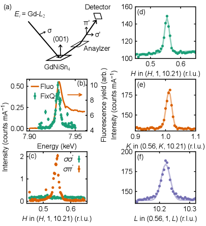

**図2キャプション：** 共鳴弾性 X 線散乱（REXS）による非整合磁気散乱ピークの同定。散乱ジオメトリと偏光解析から磁気変調の波数と偏極方向（a 軸平行コリニア配置）が確定される。非整合 SDW であることを直接示す核心的データ。測定が特定の散乱条件でのみシグナルを示すことで偶発的なアーチファクトを排除している。（論文Fig. 2より引用、CC BY 4.0）

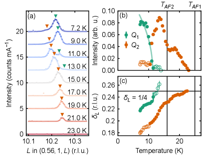

**図3キャプション：** 非整合 SDW の磁気変調波数の温度依存性。T₂ ≈ 16 K に近づくにつれてコメンシュレート波数に向かって変化する（ロック・イン転移的挙動）様子が示される。磁気ピーク強度の温度依存性も合わせて示されており、二段階転移の内部構造を定量化している。SDW 波数の温度依存性がフェルミ面ネスティングや格子不整合性との関係を示唆する重要なデータ点である。（論文Fig. 3より引用、CC BY 4.0）

---

## 10. Thermal Hall conductivity from semiclassical spin dynamics simulations

**論文情報：** [arXiv:2603.08777](https://arxiv.org/abs/2603.08777) | Ignacio Salgado-Linares, Alexander Mook, Léo Mangeolle, Johannes Knolle | cond-mat.str-el, cond-mat.mes-hall | 2026年3月9日 | 理論（古典スピンダイナミクス計算）| CC BY-SA 4.0

磁性系の熱ホール伝導率（κ_xy）を「半古典的リアルタイムスピンダイナミクス」から計算する枠組みを開発し、カイラル正方格子強磁性体と Kitaev 反強磁性体という二つの模型に適用した理論研究である。熱ホール輸送は通常「マグノンのベリー位相」から来る内因的寄与として理解されているが、有限温度での非線形磁気揺らぎや相互作用が重要になると、調和スピン波理論（非相互作用マグノン描像）が不十分になる。本研究では、実時間エネルギーカレント相関関数とエネルギー磁化から κ_xy を計算する手法を実装し、この枠組みが単純なベリー位相寄与を超えた効果（熱揺らぎ・非線形相互作用）を取り込めることを示した。

物性物理として重要な知見は二点ある。第一に、カイラル強磁性体ではスカーミオン相でホール応答がピークを持つという既存計算と定量的に一致しつつ、弱磁場に向けての偏差が調和近似を超えた効果を反映することが示された。第二に、Kitaev 反強磁性体では有限温度とともにマグノンのコヒーレンスが失われ、「マグノンのベリー位相から期待される輸送」が高温で崩壊することが数値的に実証された。このことは、Kitaev 系の熱ホール実験（α-RuCl₃ での巨大熱ホール効果など）を解釈する際に、マグノン描像の適用限界を慎重に考慮すべきことを理論的に裏付ける。

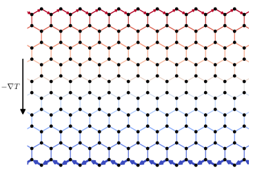

**図1キャプション：** ハニカム格子での局所平衡熱ホール電流の概念図（左）とシミュレーションに用いたカイラル正方格子強磁性体・Kitaev反強磁性体の模型定義（右）。温度勾配に対して垂直方向に熱電流が流れる「熱ホール効果」の物理的起源と、それを半古典スピンダイナミクスで計算するための枠組みを視覚化している。（論文Fig. 1より引用、CC BY-SA 4.0）

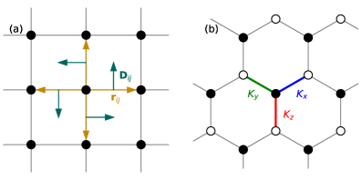

**図2キャプション：** カイラル正方格子強磁性体における熱ホール伝導率のベリー位相寄与と非線形揺らぎ寄与への分解。スカーミオン相付近での応答ピークと磁場偏極相での減衰が示され、調和近似（非相互作用マグノン）と半古典動力学の結果が比較されている。非線形効果が輸送に有意に寄与することを示す重要なデータ。（論文Fig. 2より引用、CC BY-SA 4.0）

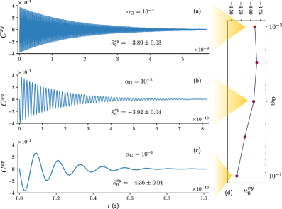

**図3キャプション：** Kitaev 反強磁性体モデルにおけるカレント相関関数の温度依存性と熱ホール伝導率の温度変化。低温ではマグノン的コヒーレント輸送（ベリー位相描像が有効）だが、温度上昇とともにデコヒーレンスが進み「コヒーレントマグノン内因的輸送」が崩壊する様子が示される。α-RuCl₃ などKitaev系の熱ホール実験を解釈する上でマグノン描像の適用限界を示す重要な理論的根拠となる。（論文Fig. 3より引用、CC BY-SA 4.0）

---

# 全体のまとめ

## 1. 物性物理分野の動向

2026年3月第2週の物性物理 arXiv を俯瞰すると、アルタマグネティズムに関する実験研究の加速が最も目立つ動向である。α-Fe₂O₃（重点論文1）では放射光ナノイメージングでスピンテクスチャの実空間変調が初めて直接可視化された。NiF₂ の XMCD 証拠（先週の報告）と合わせて、理論予言が先行してきたアルタマグネット現象を実験が着実に追い始めた段階にある。超伝導分野では UTe₂ の PDW+CDW 絡み合い発見（重点論文2）が、スピン三重項 SC の機構論争に新たな観測事実を投入した。また、三角格子フラストレーション磁性体 ErMgGaO₄（重点論文3）の精密中性子研究は、量子スピン液体の相境界付近にある系の定量的特性評価という、困難だが重要な課題に対する着実な前進を示している。

## 2. 明らかになった未解決領域

アルタマグネット研究においては、ナノスケールスピンテクスチャの制御（書き込み・読み出し）が実用デバイス実現のための次の壁であり、本研究はその困難を可視化したとも言える。UTe₂ では PDW 機構の確認を超えて「どのペアリング対称性がスピン三重項を担うのか」という未解決の根本問題が残っており、PDW+CDW の絡み合いが機構のヒントになるかどうかは独立実験による検証が必要である。ErMgGaO₄ の研究が明示した通り、三角格子 AFM での「disorder の役割」は今も量子スピン液体研究における最大の論争点であり、disorder-free 試料が理論的には重要であるが実験的には依然として挑戦的課題のままである。また、CrOCl（論文6）や CVT（論文7）の研究が示すように、van der Waals 磁性体・新規格子トポロジー材料における「幾何学的フラストレーションと強相関の共存」は豊富な未開領域として広がっている。

## 3. 今後の展望

テラヘルツ近接場顕微鏡（THz-sSNOM）が CMR 転移のナノスケール観測を可能にしたように、他の非平衡相転移（光誘起超伝導・光誘起強磁性など）や、モアレ超格子における局所電子相分離への展開が期待される。時間分解自発ラマン（論文5）のような「高精度・高時間分解能のスペクトル手法」は、フォノン工学・電子フォノン工学の設計指針となる定量データを供給する上で今後さらに重要性を増すだろう。アルタマグネティズムの分野では、実験手法（XMCD、ARPES、中性子 RMCD、輸送）が理論予言の多様な側面を検証する競争的フェーズに入った。重いフェルミオン・密度波の量子臨界点（CVT, 論文7）や、Kitaev 系の熱ホール輸送（論文10）に象徴される「強相関と量子揺らぎの定量的理解」というテーマは、今後数年にわたって物性物理の中心課題であり続けるだろう。

---

*本レポートはarXiv論文のプレプリントに基づく。未査読の内容を含む。図面は論文記載のライセンス（CC BY 4.0, CC BY-SA 4.0, CC BY-NC-ND 4.0）に基づき引用、またはHTML版未公開の場合は論文内容に基づく概念図として作成した。*
