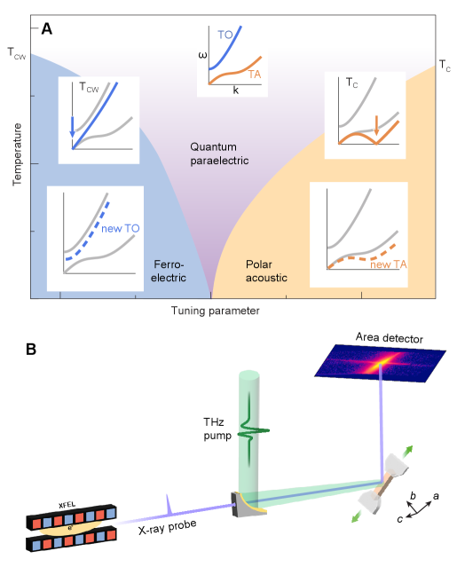
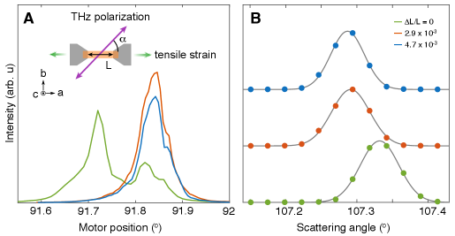
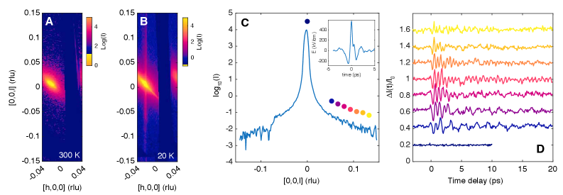
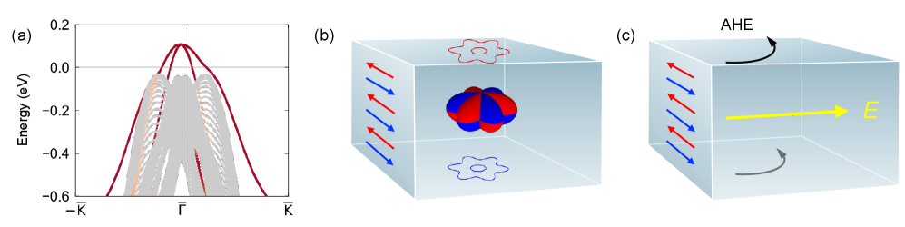
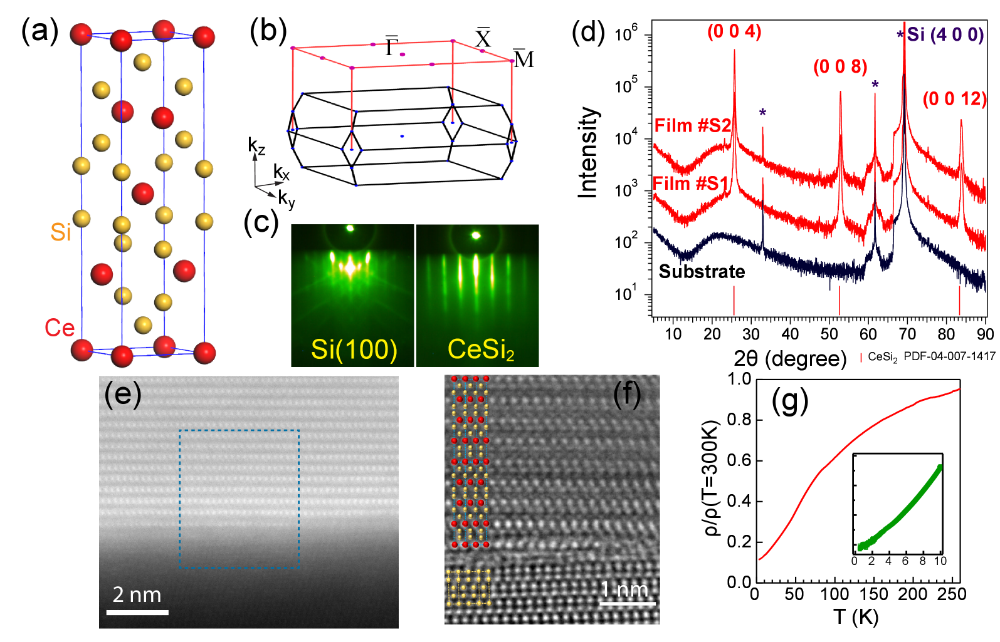
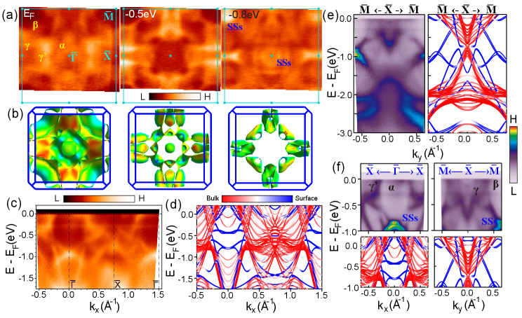
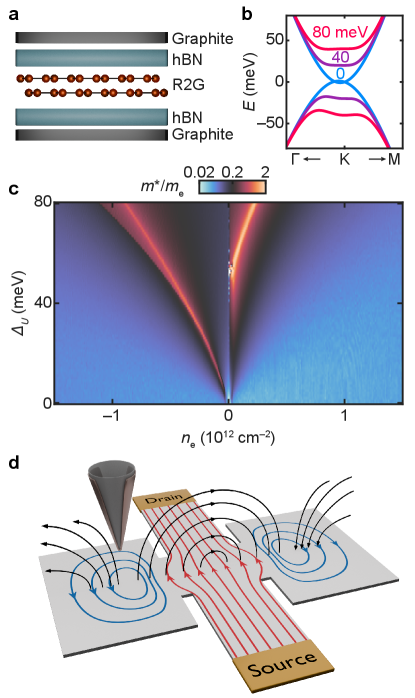

# 2026-03-15 物性物理

**作成日：** 2026年3月15日
**対象期間：** 2026年3月12日〜15日（直近72時間）

---

## 今日の選定方針

本日は2026年3月12日〜15日に投稿された物性物理関連論文から10本を選定した。UTe₂に関する研究が複数同時進行しており、強相関Kondo物理と非従来型超伝導の接点が特に活発であることが目立つ。ニッケレート超伝導体については、酸素化学量論量を利用したフェーズダイアグラムの精密制御という新しい視点が提示された。超高速X線散乱による銅酸化物の電荷密度波の二成分分離、SrTiO₃における隠れた極性相の直接観測なども含まれ、非平衡・超高速手法によるhidden phaseの探索が進んでいることが伺える。さらに、交替磁性体MnTeにおける表面状態起因の異常ホール効果、二次元に閉じ込めたCeSi₂薄膜での重電子状態の次元性制御、双層グラフェンのフラットバンドにおける電子流体力学イメージング、ホウ素ヒ素のフォノンコヒーレンス、MnBi₂Te₄のトポロジカル磁性も取り上げ、物性物理の複数の前線を幅広くカバーした。

---

## 全体所見

**UTe₂ の Kondo・CDW・超伝導の多体秩序競合**
今週、UTe₂ に関するSTM研究が集中的に報告された。Kondo混成波（Kondo hybridization wave）という新たな秩序状態の初直接観測（2603.10552）は、Kondo格子系のブレークダウン機構に関する従来のパラダイムに修正を迫る。Kondo混成の空間変調が電荷密度波と共存し、超伝導と三つ巴で絡み合うという描像が具体化しつつある。超高速・空間分解STMと放射光を組み合わせた手法が、この多体秩序の競合を解明する鍵となっている。

**ニッケレート超伝導のフェーズダイアグラム精密化**
La₃Ni₂O₇薄膜超伝導において、酸素化学量論量を精密に制御することで「半ドーム」型の超伝導フェーズダイアグラムが確立された（2603.12196）。間隙型酸素（キャリアドーピング）と酸素欠陥（散乱）が対照的な役割を果たすことが実証され、異なるランタノイド・アルカリ土類系でも同様の半ドームが現れることから、ニッケレート系に普遍的な現象として位置づけられる。圧力誘起超伝導の起源理解に向けた重要な一歩である。

**非平衡・超高速手法による隠れた相と秩序の解明**
YBCO における超高速X線散乱（2603.10486）は、長距離秩序と短距離相関が独立した電荷秩序成分として共存することを初めて直接示した。SrTiO₃の量子常誘電体における隠れた極性相（2603.12239）もTHzポンプ・X線プローブ散乱によって可視化された。超高速光励起やひずみ印加が、平衡測定では見えない秩序変数を顕在化させる「隠れた相スペクトロスコピー」として機能していることが今週の共通テーマである。

---

## 選定論文一覧

| # | arXiv ID | タイトル |
|---|----------|----------|
| ★ | 2603.10552 | Observation of Kondo hybridization wave in UTe2 |
| ★ | 2603.12196 | A superconducting half-dome in bilayer nickelates |
| ★ | 2603.10486 | Persistent short-range charge correlations revealed by ultrafast melting of electronic order in YBa₂Cu₃O₆₊ₓ |
| 4 | 2603.11278 | Pseudo Point Nodal Superconducting Gap in Spin-Triplet UTe₂ |
| 5 | 2603.12239 | Hidden polar phase in the quantum paraelectric SrTiO3 |
| 6 | 2603.12259 | Emergent Anomalous Hall Effect from Surface States in the Altermagnet MnTe Thin Films |
| 7 | 2603.11289 | Dimensionality tuning of heavy-fermion states in ultrathin CeSi2 films |
| 8 | 2603.11175 | Imaging flat band electron hydrodynamics in biased bilayer graphene |
| 9 | 2603.11256 | Exceptional Optical Phonon Coherence in Enriched Cubic Boron Arsenide via Suppression of Three-Phonon Scattering |
| 10 | 2603.11305 | Intrinsic Even-Odd Thickness-Driven Anomalous Hall in Epitaxial MnBi2Te4 Thin Films |

★ = 重点論文

---

# 重点論文の詳細解説

---

## 重点論文 1

### 1. 論文情報

**タイトル：** [Observation of Kondo hybridization wave in UTe2](https://arxiv.org/abs/2603.10552)
**著者：** Xin Yu, Shuikang Yu, Zheyu Wu, Alexander G. Eaton, Andrej Cabala, Michal Vališka, Jun Li, Rui Zhou, Yi-feng Yang, Zhenyu Wang, Peijie Sun, Rui Wu
**arXiv ID：** 2603.10552
**カテゴリ：** cond-mat.str-el
**公開日：** 2026年3月11日
**論文タイプ：** 実験研究（STM）
**ライセンス：** arXiv nonexclusive-distrib 1.0（図の抽出不可）

---

### 2. どんな研究か

UTe₂ は強相関スピン三重項超伝導体として知られる重電子系物質であるが、その通常状態における電子秩序の全容はいまだ解明されていない。本研究は走査トンネル顕微鏡（STM）を用い、Kondo混成の空間変調秩序——「Kondo混成波（Kondo hybridization wave, KHW）」——を世界で初めて直接観測した。この新たな秩序相は周期的なFanoラティスの変調、整合電荷密度波（CDW）の共存、そしてフェルミ準位近傍のエネルギーギャップ開口を伴い、超伝導と共存する。

---

### 3. 位置づけと意義

Kondo混成は通常、幅広いクロスオーバーとして理解されてきた——温度低下とともに局在 f 電子と伝導電子が徐々に交雑し、重い擬粒子バンドが形成されるという描像である。KHW の発見は、この混成が空間的に秩序化し翻訳対称性を自発的に破ることを実証した最初の直接証拠であり、Kondo格子物理における新しいクラスの秩序変数を提示する。UTe₂ におけるスピン三重項対称性の議論において、通常状態の秩序競合がペアリング機構に直接関わる可能性を示唆する点でも重要性が高い。CDW・KHW・超伝導の三体秩序競合という枠組みが今後の実験・理論研究を牽引すると期待される。

---

### 4. 研究の概要

**背景・目的：**
UTe₂ は室温から低温にかけて複数の電子相が競合する特異な重電子系である。近年のSTM研究により表面電荷密度波や格子変調が発見されており、超伝導と競合秩序の関係が注目されている。本研究はKondo混成そのものが秩序化するかどうかという基礎的問題に取り組んだ。

**解こうとしている問題：**
Kondo格子の混成は均一なクロスオーバーとして描かれてきたが、理論的にはKondo混成の波数変調（KHW）が可能であることが示唆されていた。実験的直接証拠は存在しなかった。

**研究アプローチ：**
超高品質UTe₂単結晶の劈開面に対しSTMを適用し、Fano共鳴のトポグラフィーおよびスペクトルの空間変調を詳細に解析した。

**対象材料系：**
UTe₂（スピン三重項重電子超伝導体、Kondo格子系）

**主な手法：**
走査トンネル顕微鏡（STM）、局所微分コンダクタンス測定（dI/dV）、Fanoラティス解析

**主な結果：**
- 周期的Fanoラティスの変調パターン（Kondo混成波）を空間分解観測
- KHWに伴う整合CDWを検出
- フェルミ準位近傍でのエネルギーギャップ開口を確認
- 重 f 電子と伝導電子の補完的な電荷分布が超格子構造を形成
- KHWは超伝導相と共存

**著者の主張：**
本研究はKondo混成の秩序化という新概念を初めて実証し、UTe₂ のスピン三重項ペアリング対称性と強相関物理を理解する新たな視座を提供する。

---

### 5. 対象分野として重要なポイント

- **対象物性：** Kondo混成の空間秩序、電荷密度波、f-c電子相互作用、スピン三重項超伝導との共存
- **手法の意味：** STM/dI/dV によるFano共鳴の空間マッピングは、Kondo混成強度の局所プローブとして機能する。Fanoパラメータの空間変調がKHWの実空間証拠となる。
- **既存研究との差分：** 従来のSTM研究はCDWや格子変調に着目していたが、混成そのものの空間秩序化を直接示したのは本研究が初
- **新規性：** Kondo混成の翻訳対称性破れという概念的な新規性。既存のhidden order概念とも関連
- **物理的解釈：** KHW の形成はバンド折り畳みとギャップ開口を生じ、通常状態の低エネルギー電子構造に直接影響する。超伝導ペアリングとの相互作用が今後の焦点
- **一般性：** Kondo格子系全般（CeCoIn₅、YbRh₂Si₂など）でKHWが存在するかどうかという普遍的問題を提起する
- **材料設計への寄与：** スピン三重項超伝導の実現条件を通常状態の電子秩序から理解する枠組みを提供

---

### 6. 限界と注意点

- STMは表面感度が高く、観測されたKHWが表面特有の現象である可能性を排除するためにバルク感度の高い中性子散乱、X線散乱などによる確認が必要
- UTe₂ は劈開面の品質に敏感で、試料依存性の検証が重要
- KHWと超伝導の因果関係（どちらが一次的か）は現時点では不明であり、温度・磁場依存性のより系統的な測定が求められる
- 整合CDWとKHWの結晶学的起源（格子変調との関係）についてさらなる構造解析が必要

---

### 7. 関連研究との比較と研究動向

- **先行研究との差分：** 2603.08688（同グループ？）はUTe₂ のCDWとペア密度波の絡み合いを報告しており、KHWはその文脈でさらなる多体秩序として位置づけられる。2603.12097は同じUTe₂の異なるCDW（スタガードCDW）の磁場制御を報告しており、同時期に複数のSTMグループがUTe₂の競合秩序を解明しようとしていることが伺える
- **競合・類似研究：** CeCoIn₅におけるQ相（磁場誘起SDW相）や、UPd₂Al₃ の局在・遍歴二重性との比較が有益。理論的にはKondo-Heisenberg模型のQMC計算でKHWが示唆されていた
- **新規性の評価：** incremental ではなく、概念的に新しいブレークスルー。「Kondo混成が秩序化する」という命題の初実験証明
- **今後の展開：** UTe₂以外のKondo系でのKHW探索、KHWの消滅温度と超伝導Tcの関係、圧力・磁場によるKHW制御とペアリングへの影響
- **再現・応用可能性：** 超高品質試料とSTM専門技術が必要だが、手法論的には再現可能

---

### 8. 図

**ライセンス：** arXiv nonexclusive-distrib 1.0 のため、論文原図の抽出は行わない。

本研究における主要な測定の模式的説明を以下に示す：

**[概念図 1]** STM/dI/dVによるFano共鳴の空間マッピング概念図：Kondo格子の均一状態では各Uサイトで同一のFano共鳴プロファイルが観測されるが、KHWが形成されると混成強度が空間的に周期変調される。この変調はトポグラフィー像では検出困難であり、エネルギー分解スペクトルの空間分布として現れる。

**[概念図 2]** KHW・CDW・超伝導の三体共存模式図：UTe₂ の低温相図において、KHWはCDWと同一の空間変調を持ちながら共存し、さらにその下に超伝導が出現する。f電子と伝導電子の補完的電荷分布が「Kondo超格子」を形成する描像。

**[概念図 3]** エネルギーギャップ開口の概念図：フェルミ準位近傍におけるKHWのエネルギーバンド模式図。KHWの空間変調によってブリルアンゾーンが折り畳まれ、フェルミ準位近傍にギャップが開く。このギャップが超伝導ペアリングとどのように相互作用するかが今後の鍵となる。

---

## 重点論文 2

### 1. 論文情報

**タイトル：** [A superconducting half-dome in bilayer nickelates](https://arxiv.org/abs/2603.12196)
**著者：** Yidi Liu, Bai Yang Wang, Jiarui Li, Yaoju Tarn, Lopa Bhatt, Michael Colletta, Yi-Ming Wu, Cheng-Tai Kuo, Jun-Sik Lee, Berit H. Goodge, David A. Muller, Zhi-Xun Shen, Srinivas Raghu, Harold Y. Hwang, Yijun Yu
**arXiv ID：** 2603.12196
**カテゴリ：** cond-mat.supr-con
**公開日：** 2026年3月12日
**論文タイプ：** 実験研究（薄膜合成・輸送測定）
**ライセンス：** CC BY 4.0（HTMLバージョン未公開のため図の抽出不可）

---

### 2. どんな研究か

二層ニッケレート薄膜超伝導体 La₃Ni₂O₇ において、酸素化学量論量を連続的に制御することで半ドーム（half-dome）型の超伝導フェーズダイアグラムを確立した。酸素量を増加させると超伝導は金属相に向かって抑制され、逆に減少させると粒状超伝導体-絶縁体転移を引き起こしながらも超伝導onset温度は維持される。この非対称なドーム形状は、間隙型酸素（ドーピング優位）と酸素欠陥（散乱優位）の対照的な物理的役割から統一的に説明でき、複数のランタノイド・アルカリ土類系薄膜で共通して現れることが示された。

---

### 3. 位置づけと意義

La₃Ni₂O₇ の高温超伝導は2023年の高圧下での発見以降、薄膜・エピタキシャル歪みを用いた常圧での実現研究が急展開している。本研究は、酸素化学量論量というスカラーパラメータをtuning軸に選ぶことで、ニッケレート系に共通する超伝導フェーズダイアグラムの「半ドーム」形状を初めて明確に記述した。従来の銅酸化物超伝導のドープ型ドームとは非対称である点が特徴的で、これがニッケレートの軌道・格子自由度の特殊性を反映している可能性がある。間隙型酸素と酸素欠陥の役割分担の解明は、材料設計と機構理解の両方に貢献する。

---

### 4. 研究の概要

**背景・目的：**
La₃Ni₂O₇ は2層ルテナイト型構造を持ち、圧力下で約80 Kの超伝導が実現した後、薄膜エピタキシャル技術によって常圧でも超伝導が観測されている。超伝導相の普遍的な構造（フェーズダイアグラム）はまだ未解明であった。

**解こうとしている問題：**
ニッケレート薄膜超伝導において、酸素化学量論量というキャリア制御パラメータに対してどのようなフェーズダイアグラムが現れるか。また、酸素欠陥と間隙型酸素ではその役割が異なるか。

**研究アプローチ：**
圧縮歪み基板（SrLaAlO₄）上に成長した La₃Ni₂O₇ 薄膜に対し、成長雰囲気中の酸素分圧を系統的に変化させることで酸素化学量論量を制御。輸送測定（抵抗率の温度依存性）で超伝導の出現を追跡。

**対象材料系：**
二層ニッケレート La₃Ni₂O₇ およびその希土類・アルカリ土類置換系薄膜

**主な手法：**
パルスレーザー蒸着（PLD）、電気輸送測定、X線回折、TEM-EDX

**主な結果：**
- 酸素化学量論量を減少させていくと超伝導が最適状態から粒状超伝導体→絶縁体へと変化
- 酸素量を増加させると超伝導は徐々に抑制され金属状態へ
- 超伝導ドームは通常の対称ドームではなく、片側だけのhalf-dome形状
- 異なるランタノイド系（Pr、Nd）や Sr 置換系でも同様のhalf-dome が出現
- 間隙型酸素はドーピング効果が支配的、酸素欠陥は散乱効果が支配的と解釈

**著者の主張：**
酸素化学量論量によって生じる半ドーム型超伝導は二層ニッケレート系の普遍的特徴であり、ニッケレート超伝導のフェーズダイアグラムの本質的構造を明らかにする。

---

### 5. 対象分野として重要なポイント

- **対象物性：** ニッケレート超伝導、キャリア制御、酸素欠陥・間隙型酸素の役割、Ni 3d 電子の軌道自由度
- **手法の意味：** 酸素化学量論量という連続パラメータによる精密チューニングは、ドーパント置換による格子乱れを最小化しながらキャリア密度を変化させる有効手法
- **既存研究との差分：** 従来の La₃Ni₂O₇ 薄膜研究は最適超伝導条件の探索が中心。本研究は初めて全相図をマッピング
- **新規性：** 半ドームの「非対称性」が超伝導機構の情報を担う可能性。銅酸化物との比較において興味深い
- **物理的解釈：** 間隙型酸素によるドーピングはキャリア密度増加（金属化）をもたらし、酸素欠陥によるスカッタリングは超伝導コヒーレンスを壊す。この非対称性が半ドームの物理的起源
- **一般性：** 複数の希土類・アルカリ土類置換系で普遍性が確認されており、材料普遍性は高い
- **材料設計への寄与：** 最適超伝導状態の達成に向けた酸素制御指針を提供

---

### 6. 限界と注意点

- 薄膜の均一性・ストレス状態の制御が測定結果に影響する可能性がある
- 酸素化学量論量の精密な定量測定（EDX vs. 中性子散乱）による誤差評価が必要
- 「半ドーム」の物理的起源（間隙酸素 vs. 欠陥散乱）の解釈は直接証拠というより整合的解釈であり、理論モデルの構築と比較が求められる
- バルク試料での類似実験が可能かどうか（圧力制御との比較）が今後の課題
- Tc の大きさや超伝導ギャップ構造の直接測定（ARPES、RIXS）が補完的に必要

---

### 7. 関連研究との比較と研究動向

- **先行研究との差分：** 2024年のNature（2603.11235参照）による La₃Ni₂O₇ 薄膜での超伝導報告に続く展開。今回は相図の全体構造を初めて記述
- **競合研究：** 2603.11235（同日投稿）が常圧ニッケレート超伝導の進展を包括的にレビューしており、本研究のhalf-domeはその中で重要な知見として位置づけられる
- **新規性評価：** 薄膜チューニング手法としての incrementalな発展だが、half-domeという概念の普遍性確立は影響が大きい
- **未解決問題への貢献：** ニッケレート超伝導の機構（軌道間交換、スピン揺らぎ、両バンド超伝導）の議論に対し、キャリア密度依存性という重要な制約条件を提供
- **引用されうるコミュニティ：** 銅酸化物・鉄系超伝導コミュニティ、薄膜酸化物研究者
- **今後の展開：** ARPES によるフェルミ面のドーピング依存性、STMによる超伝導ギャップの空間マッピング

---

### 8. 図

**ライセンス：** CC BY 4.0。ただし本稿作成時点でHTMLバージョンが公開されておらず（404エラー）、原図の抽出ができなかった。以下に概念的説明を示す。

**[概念図 1]** ニッケレート超伝導の半ドーム型フェーズダイアグラム概念図：酸素化学量論量 δ をx軸、超伝導転移温度 Tc をy軸とした相図。左側（酸素欠乏）では粒状超伝導体-絶縁体転移、右側（酸素過多）では金属相への移行が起きるため、通常のドームではなく半ドームとなる。

**[概念図 2]** 間隙型酸素と酸素欠陥の役割の対比模式図：間隙型酸素はホールドーパントとして機能し、Ni の平均原子価を上げてキャリア密度を増加させる（金属化）。一方で酸素欠陥は電子を供与するとともにポテンシャル散乱を生じ、超伝導コヒーレンスを壊す（超伝導-絶縁体転移を引き起こす）。

**[概念図 3]** 異なる希土類系における普遍性：La₃Ni₂O₇、Pr₃Ni₂O₇、Nd系薄膜、Sr置換系において同様の半ドームが現れることを示す多系統の Tc vs. δ プロット概念図。Tcの絶対値や最適 δ 位置は異なるが、半ドームの形状は普遍的に保たれる。

---

## 重点論文 3

### 1. 論文情報

**タイトル：** [Persistent short-range charge correlations revealed by ultrafast melting of electronic order in YBa₂Cu₃O₆₊ₓ](https://arxiv.org/abs/2603.10486)
**著者：** C. Seo, L. Shen, A. N. Petsch, S. Wandel, V. Esposito, J.D. Koralek, G.L. Dakovski, M-F. Lin, S.P. Moeller, W.F. Schlotter, A.H. Reid, M.P. Minitti, R. Liang, D. Bonn, W. Hardy, A. Damascelli, C. Giannetti, E.H. da Silva Neto, J.J. Turner, F. Boschini, G. Coslovich
**arXiv ID：** 2603.10486
**カテゴリ：** cond-mat.supr-con / cond-mat.str-el
**公開日：** 2026年3月11日
**論文タイプ：** 実験研究（時間分解X線散乱）
**ライセンス：** arXiv nonexclusive-distrib 1.0（図の抽出不可）

---

### 2. どんな研究か

YBa₂Cu₃O₆.₆₇（アンダードープ銅酸化物超伝導体）において、フェムト秒光パルスによる電荷密度波（CDW）の超高速融解過程を時間分解軟X線散乱で追跡した。フルエンス閾値（約65 μJ/cm²）を超えると長距離CDW秩序が崩壊するが、その下に相関長 ≈ 27 Å の短距離CDW相関が常に残存していることを発見した。この長距離・短距離二成分の独立した振る舞いが初めて直接観測され、YBCOのCDWが二つの異なる電子成分から構成されることが示された。

---

### 3. 位置づけと意義

銅酸化物超伝導体における電荷密度波は「競合秩序」として長年議論されてきたが、長距離秩序と短距離相関の起源が同一かどうかは未解決問題であった。本研究の時間分解アプローチは、平衡状態では不可分な両成分を動力学的に分離することに成功した。超高速でわずか 0.8 meV/Cu という極めて小さいエネルギーで長距離CDWが壊れること（光誘起の電子的溶融が支配的）、そして長距離コヒーレンスが ≈ 0.6 ps という超高速で回復することは、CDWの電子的起源とその集団モードの性質に直接的な制約を与える。短距離CDW相関の持続性は、強く相関した電子系のフラストレーションや量子揺らぎと関わっている可能性がある。

---

### 4. 研究の概要

**背景・目的：**
YBCOのCDWは約150 K以下で強磁場下でも発達するが、その空間的・電子的構造は複雑で、単一成分での理解には限界がある。超高速X線散乱はCDWの融解・回復ダイナミクスを通じて成分を動力学的に分離できる。

**解こうとしている問題：**
YBCO の長距離CDW秩序と短距離CDW相関は独立した電子成分として区別できるか。その融解エネルギー・融解時定数・回復時定数はそれぞれ何か。

**研究アプローチ：**
LCLS（LINACコヒーレント光源）での時間分解共鳴軟X線散乱（tr-REXS）。Cu-L₃端共鳴条件でCDW回折ピークを追跡。フルエンス依存性と時間依存性の両方を測定。

**対象材料系：**
YBa₂Cu₃O₆.₆₇（アンダードープ銅酸化物超伝導体、3D長距離CDW発達領域）

**主な手法：**
時間分解共鳴X線散乱（tr-REXS）、Cu-L₃吸収端（約931 eV）、フェムト秒光励起（800 nm）

**主な結果：**
- 閾値フルエンス（65 μJ/cm²）以上で長距離CDW秩序の崩壊（輝線幅の突然の広がりに対応）
- この崩壊に要するエネルギーは約0.8 meV/Cu と推定——格子加熱によるCDW融解より1桁小さく、電子的過程が主
- 閾値以下でもCDW振幅は飽和傾向を示し、21.2 ± 2.3 μJ/cm² で強度変化が鈍化
- 長距離CDWの崩壊後も相関長 ≈ 27 Å の短距離CDW相関が持続
- 長距離コヒーレンスの回復は約 0.6 ps——バンドギャップ回復とほぼ同期
- 長距離CDWと短距離CDW相関は独立した散乱成分として分離可能

**著者の主張：**
YBCOの電荷秩序は二成分構造を持ち、超高速電子的溶融によって長距離成分のみを選択的に消去できる。短距離CDW相関は電子基底状態に内在する量子的揺らぎ由来成分と解釈できる。

---

### 5. 対象分野として重要なポイント

- **対象物性：** 電荷密度波（CDW）の長距離/短距離二成分、光誘起電子相転移、非平衡電荷秩序
- **手法の意味：** tr-REXS での運動量分解・時間分解計測は、CDW散乱ピークの幅変化から相関長を時間の関数として追跡できる唯一の手法に近い
- **既存研究との差分：** 従来の超高速CDW研究はシングルピークの振幅追跡が中心。本研究はピーク形状（幅）の時間変化に着目してコヒーレンス長変化を直接観測した点が新しい
- **新規性：** 閾値挙動による二成分の「動的分離」と短距離成分の持続性という二点が新規
- **物理的解釈：** 長距離成分の閾値崩壊は電子系の非線形不安定性（フォノンより先に電子系が崩れる）を示唆する。短距離成分の残存は「CDWの母相」がフラストレーション的短距離秩序として量子的に安定していることを示す
- **一般性：** YBCO以外の銅酸化物（La系、Bi系）でも同様の二成分構造が期待される。圧力誘起超伝導や高磁場下CDWとの比較が有益
- **物性解釈への寄与：** 超伝導とCDWの競合において、長距離成分が抑制されても短距離成分が残留するなら、超伝導発現の議論においても「CDW消失」と「CDW残留」を区別して論じる必要がある

---

### 6. 限界と注意点

- tr-REXS は表面感度に優れるが、バルクのCDW成分との対応について議論が必要
- 光励起後の電子温度・格子温度の評価が間接的であり、「電子的溶融」の定量的確認にはより詳細な熱モデルが必要
- 測定温度（室温付近？）と超伝導転移温度との関係：CDWが十分発達した低温での実験との比較が重要
- 0.8 meV/Cu という低融解エネルギーの推定は、銅への光励起エネルギー分配の仮定に依存している
- 「電子的溶融」の直接証拠として、CDW秩序変数の直接追跡（光電子や光学スペクトル）との同時測定が望まれる

---

### 7. 関連研究との比較と研究動向

- **先行研究との差分：** Torchinsky et al.（2013）や先行のXFEL-CDW実験と比較して、フルエンス閾値でのコヒーレンス長の突然変化という定量的証拠を初めて提示
- **競合研究：** ESRF・SwissFEL・European XFEL での時間分解CDW実験グループ（Giannetti、Beaud ら）との競争的研究。本研究はLCLS を用いており米国グループの主要成果
- **未解決問題への貢献：** 「CDWと超伝導の競合」という30年来の問題に対し、CDW を二成分に分解するという新しい切り口を提供。中程度の貢献だが概念的に重要
- **新規性評価：** 実験的には重要な発展。概念的にはincrementalだが動的二成分分離の直接観測は影響が大きい
- **引用可能性：** 銅酸化物物理コミュニティ、超高速散乱コミュニティ、非平衡相転移理論コミュニティで広く引用が期待される
- **今後の展開：** 超伝導が発達した低温（10–50 K）での同実験、磁場下での二成分分離、La系・Bi系での比較実験

---

### 8. 図

**ライセンス：** arXiv nonexclusive-distrib 1.0 のため、論文原図の抽出は行わない。

**[概念図 1]** 時間分解REXS 実験概念図：フェムト秒光パルスでYBCOを励起し、フリーエレクトロンレーザーのX線パルスでCu-L₃端共鳴条件のCDW回折ピークを時間分解計測する実験セットアップの模式図。CDW波数 q_CDW でのブラッグ散乱強度の時間依存性を遅延時間 Δt の関数として測定。

**[概念図 2]** フルエンス依存性と閾値挙動：横軸にフルエンス (μJ/cm²)、縦軸にCDW回折ピーク強度をプロットした概念図。閾値（65 μJ/cm²）以下では徐々に飽和し、閾値以上では長距離秩序の崩壊によりピーク幅が広がる不連続変化を示す。閾値以下と以上でのピーク形状（幅 vs 強度）の比較が二成分分離の直接証拠となる。

**[概念図 3]** 二成分CDWの回復ダイナミクス：遅延時間 Δt を横軸に取った長距離CDWコヒーレンスと短距離CDW強度の回復曲線。長距離コヒーレンスは約0.6 ps で回復するが、ピーク強度の完全回復はより長いタイムスケールを要する。短距離成分は光励起直後から持続的に残留し時間に依存しない背景として検出される。

---

# その他の重要論文

---

## 論文 4

### 1. 論文情報

**タイトル：** [Pseudo Point Nodal Superconducting Gap in Spin-Triplet UTe₂](https://arxiv.org/abs/2603.11278)
**著者：** S. Hosoi, K. Imamura, M. M. Bordelon, E. D. Bauer, S. M. Thomas, F. Ronning, P. F. S. Rosa, R. Movshovich, I. Vekhter, Y. Matsuda
**arXiv ID：** 2603.11278
**カテゴリ：** cond-mat.supr-con
**公開日：** 2026年3月11日
**論文タイプ：** 実験研究（熱伝導率）
**ライセンス：** arXiv nonexclusive-distrib 1.0（図の抽出不可）

---

### 2. 研究概要

スピン三重項超伝導体 UTe₂ のギャップ構造は依然として議論が続いており、点ノード・線ノード・完全ギャップのいずれかについて決着がついていない。本研究は超高純度 UTe₂ 単結晶を用い、b軸方向の熱伝導率 κ_b を約50 mK まで測定し、T→0 での残留熱伝導率が極めて小さいことを確認した。これは伝統的な線ノード的挙動を否定する。一方で、a軸磁場下の閾値磁場（H_a*/H_c2^a ≈ 0.015）でのキンク構造が現れ、磁場印加による準粒子の Doppler シフト計算と組み合わせると、最小ギャップ Δ_min/Δ₀ ≈ 0.1 の「疑似点ノード（pseudo point nodal）」構造——完全には閉じないが極めて小さいギャップ极小点——が最も矛盾の少ない解釈となることが示された。この結果は Au₂ や B₂ᵤ などの特定の三重項ペアリング対称性に対応し、UTe₂ がトポロジカル超伝導体候補として議論されている文脈でも重要な制約を提供する。

本研究は磁場方向依存性（a軸、b軸、c軸）の比較から、低温での異方的準粒子応答が閾値以上で顕在化することを明確に示した。ノードの有無に関する先行のBdG模型計算や点接合スペクトロスコピーとの整合性を検討しており、UTe₂ のギャップ対称性論争に熱伝導率という新たな定量データを追加する重要な寄与である。線ノードが否定されることでトポロジカル表面アーク状態の安定性にも示唆が及ぶ。

---

**ライセンス：** arXiv nonexclusive-distrib 1.0 のため論文原図の抽出は行わない。

---

## 論文 5

### 1. 論文情報

**タイトル：** [Hidden polar phase in the quantum paraelectric SrTiO3](https://arxiv.org/abs/2603.12239)
**著者：** Huaiyu Hugo Wang, Ernesto Flores, Jade Stanton, Gal Orenstein, Peter R. Miedaner, Laura Foglia, Maya Martinez, David A. Reis, Roman Mankowsky, Mathias Sander, Henrik Lemke, Serhane Zerdane, Keith A. Nelson, Mariano Trigo
**arXiv ID：** 2603.12239
**カテゴリ：** cond-mat.mtrl-sci
**公開日：** 2026年3月12日
**論文タイプ：** 実験研究（時間分解X線散乱・THz励起）
**ライセンス：** CC BY-NC-ND 4.0

---

### 2. 研究概要

SrTiO₃（STO）は量子常誘電体として古典的な系であり、量子揺らぎが強誘電転移を抑制する。本研究はSTOに引張歪みを印加した状態でTHzポンプ・X線プローブ散乱実験を行い、均一な強誘電秩序とは異なる新たな極性状態——「隠れた極性相」——を発見した。この相は特定の波数を持つ極性振動（ナノスケール偏極変調）によって特徴づけられ、均質強誘電体の軟モード的振る舞いとは明確に異なる。歪み量に依存して異なる波数の極性モードが安定化されることが示され、STO の量子揺らぎと集団極性励起の競合が「隠れた相スペクトル」として浮かび上がった。

この発見は、量子常誘電体における相潜在性（phase latency）の直接証拠であり、超高速光励起と歪みエンジニアリングの組み合わせによって平衡測定では不可視の相を顕在化できることを示した点が重要である。STOにおけるストレス誘起相転移（斜方晶への電子的連動など）、量子臨界性、そしてTiO₂系の強誘電-超伝導相互作用の議論への波及が期待される。超高速X線散乱を「隠れた相のアンロック」ツールとして位置づける概念的貢献も大きい。

---

### 3. 図（CC BY-NC-ND 4.0）

**図1：** SrTiO₃ の実験セットアップとフェーズダイアグラム概要。SwissFELを用いたTHzポンプ・X線プローブ散乱実験の概略と、常圧フェーズダイアグラムにおける量子常誘電相・強誘電相・隠れた極性相の位置づけを示す。引張歪みと量子揺らぎの拮抗が隠れた相の出現を支配する。

**図2：** 歪み依存性の構造変化。異なる引張歪み条件での X線回折ピーク形状の変化。歪みによってナノスケール構造変調が誘起される様子を示しており、隠れた極性相の格子的側面を支持するデータ。

**図3：** コヒーレント極性応答の時間分解測定。(3,3,3) Bragg ピーク近傍での X線散乱強度の逆空間マップ（高温・低温）とTHz励起後の時間発展。衛星散乱ピークの出現が隠れた極性相のナノスケール偏極変調モードを直接示す。

---

## 論文 6

### 1. 論文情報

**タイトル：** [Emergent Anomalous Hall Effect from Surface States in the Altermagnet MnTe Thin Films](https://arxiv.org/abs/2603.12259)
**著者：** Yufei Zhao, Saswata Mandal, Chao-Xing Liu, Binghai Yan
**arXiv ID：** 2603.12259
**カテゴリ：** cond-mat.mes-hall
**公開日：** 2026年3月12日
**論文タイプ：** 理論・第一原理計算
**ライセンス：** CC BY 4.0

---

### 2. 研究概要

交替磁性体（altermagnet）MnTeの薄膜において異常ホール効果（AHE）が実験的に観測されているが、その符号や大きさが基板・表面の化学的終端によって大きく変化するという謎があった。本研究は第一原理計算と有効模型を用いて、バルクAHEではなく「表面状態のバルクギャップ内へのスピン分極した表面バンド」がAHEを支配することを理論的に示した。表面状態は反強磁性体のように振る舞うバルクとは異なり、強磁性体的なスピン偏極を示し、このためベリー曲率が有限となってAHEが生じる。また、MnTe/InP 界面や Te キャップ層など表面化学が変わるとホール効果の符号が反転することが計算で示され、実験データの矛盾を解消した。

本研究の核心は、交替磁性体の「bulk は AHE ゼロ」というルールを表面状態が破ることである。この機構は MnTe に固有ではなく、交替磁性体一般に成立する可能性があり、表面・界面設計によってAHEの符号・大きさを制御できるという新しい材料設計指針を示す。スピントロニクス・トポロジカル物性の文脈で応用価値が高く、交替磁性体とトポロジカル絶縁体の界面工学へのアイデアを提供する。計算論文であるため直接的な実験証拠との対比が課題だが、複数の実験事実（符号反転、基板依存性）を統一的に説明できている点が説得力を持つ。

---

### 3. 図（CC BY 4.0）

**図1：** MnTe 薄膜のバルクおよび表面バンド構造。バルクでは交替磁性体的な異方的スピン分裂、表面ではギャップ内スピン偏極表面状態が出現する様子を示す。表面状態のスピン偏極がAHEの微視的起源。

**図2：** 厚み依存・終端依存の異常ホール伝導度。異なる結晶終端（Te/Te、Te/Mn、Mn/Mn）での AHC の厚み依存計算。薄膜では表面状態が優位となり、終端に依存したAHCの符号変化が生じることを示す。

**図3：** 界面化学によるAHE制御。Te キャップ層 vs. InP 基板界面での AHC 計算比較。界面化学を変えることによってAHEの符号が制御可能であることを示し、交替磁性体薄膜のインターフェース工学に向けた設計指針を提供する。

---

## 論文 7

### 1. 論文情報

**タイトル：** [Dimensionality tuning of heavy-fermion states in ultrathin CeSi2 films](https://arxiv.org/abs/2603.11289)
**著者：** Yi Wu, Weifan Zhu, Teng Hua, Yuan Fang, Yanan Zhang, Jiawen Zhang, Yanen Huang, Hao Zheng, Shanyin Fu, Xinying Zheng, Zhengtai Liu, Mao Ye, Ye Chen, Tulai Sun, Michael Smidman, Johann Kroha, Chao Cao, Huiqiu Yuan, Frank Steglich, Hai-Qing Lin, Yang Liu
**arXiv ID：** 2603.11289
**カテゴリ：** cond-mat.str-el
**公開日：** 2026年3月11日
**論文タイプ：** 実験・計算（MBE + ARPES + 輸送 + DFT）
**ライセンス：** CC BY 4.0

---

### 2. 研究概要

重電子系 CeSi₂ について、MBE（分子線エピタキシー）によってSi(100)上に1〜数十層の薄膜を制御成長させ、ARPESと輸送測定により次元性依存性を系統的に調べた。三次元（厚膜）では分散性Kondoピークとフェルミ準位への出現、結晶場（CEF）励起によるサテライトピークが観測されたが、二次元（極薄膜）ではサテライトピークが消滅しKondoピーク形成温度（TK）が約100 Kから約35 Kへと低下した。これは量子閉じ込めによって4f電子の多体Kondo効果が抑制されることを実証する。Kondo温度の次元性依存は、2D Kondo格子における集団Kondo効果の低減として理論的に整合的に説明される。

本研究は重電子化合物を二次元極限で調べるという新たなアプローチを開拓し、CeSi₂ が単層・準二次元で成長可能であることを示す。ARPESと輸送の組み合わせによる多角的検証、DFTスラブ計算との比較により、次元性依存Kondo効果の機構が明確にされている。二次元での超伝導や量子臨界性への転換など、未探索の現象が期待される展開がある。近年のモアレ系・ヘテロ構造研究との接点として、強相関 f 電子系の次元性制御という新軸を切り開く点で重要。

---

### 3. 図（CC BY 4.0）

**図1：** CeSi₂ 薄膜の成長・構造・基礎物性。Si(100) 上での MBE 成長、結晶構造模式図、ブリルアンゾーン、および厚膜の抵抗率（温度依存性）を示す。Kondo 特徴的な抵抗率極大が厚膜で観測され、Kondo 格子系としての基礎的振る舞いを確認。

**図2：** 厚膜 CeSi₂ のフェルミ面とバンド分散。ARPES による定エネルギーマップとバンド分散、DFT スラブ計算との比較。厚膜では三次元的な重い電子バンドが出現し、強いKondo混成を反映した分散的バンドが実測と計算の両方で確認される。

**図3：** 厚み依存ARPESによる次元性チューニング。膜厚を変化させた場合のARPES バンド分散の変化。薄膜化（二次元化）によってCEF 励起（サテライトピーク）が抑制され、基底状態Kondo 効果の強度が変化する様子が直接可視化されており、次元性依存Kondo 物理の核心を示す。

---

## 論文 8

### 1. 論文情報

**タイトル：** [Imaging flat band electron hydrodynamics in biased bilayer graphene](https://arxiv.org/abs/2603.11175)
**著者：** Canxun Zhang, Evgeny Redekop, Hari Stoyanov, Jack H. Farrell, Sunghoon Kim, Ludwig Holleis, David Gong, Aidan Keough, Youngjoon Choi, Takashi Taniguchi, Kenji Watanabe, Martin E. Huber, Ania C. Bleszynski Jayich, Andrew Lucas, Andrei F. Young
**arXiv ID：** 2603.11175
**カテゴリ：** cond-mat.mes-hall
**公開日：** 2026年3月11日
**論文タイプ：** 実験研究（走査型SQUIDセンサー）
**ライセンス：** CC BY 4.0

---

### 2. 研究概要

デュアルゲート二層グラフェン（R2G）において走査型超伝導磁束量子センサー（nSOT）を用い、電流密度分布のリアルタイム実空間イメージングを行った。キャリア密度・変位場の二次元相図上で弾道的・流体力学的・拡散的の三つの輸送レジームを精密にマッピングした。フラットバンドが実現する変位場・キャリア密度条件では電子-電子散乱長が Fermi 波長（≈50 nm）と同等となり、電子流体力学的効果が最も強く現れることが示された。流体力学レジームでは渦流の生成、Poiseuille 流プロファイル、逆流（counterflow）などの特徴的な流体的振る舞いが直接可視化された。

本研究はフラットバンド系での電子流体力学を初めてリアルスペースイメージングで示した点が新しい。モアレ系や二次元物質での強相関輸送現象に対し、nSOT スキャニング磁場イメージングが強力な実験ツールであることが実証された。非線形電流依存性として高電流での渦構造変化も記述されており、電子流体の非線形応答という今後の研究課題が提示されている。グラフェン系の輸送物理における流体力学的アプローチの有効性を広く示す意味で影響は大きい。

---

### 3. 図（CC BY 4.0）

**図1：** デュアルゲート R2G 装置とフラットバンド有効質量。グラファイトゲートによるキャリア密度・変位場独立制御の実験セットアップ、R2G の単粒子バンド分散と密度依存有効質量、および nSOT センサーの走査幾何を示す。フラットバンドでの有効質量発散が電子流体力学の増強機構。

**図2：** 三つの輸送レジームの電流分布比較。弾道的・流体力学的・拡散的レジームでの電流密度マップ。流体力学レジームでは渦流・Poiseuille 流など流体的特徴が明確に現れており、フラットバンドが電子流体力学的輸送を最大化することを示す中心的結果。

**図3：** 輸送レジームの二次元フェーズダイアグラム。ne-D 相図上での弾道・流体力学・拡散レジームの分布。フラットバンド条件（特定の変位場・キャリア密度の組み合わせ）で流体力学的レジームが最も広く現れることを示し、フラットバンドと電子流体力学の直接的な関係を実証する。

---

## 論文 9

### 1. 論文情報

**タイトル：** [Exceptional Optical Phonon Coherence in Enriched Cubic Boron Arsenide via Suppression of Three-Phonon Scattering](https://arxiv.org/abs/2603.11256)
**著者：** Tong Lin, Fengjiao Pan, Gaihua Ye, Sanjna Sukumaran, Cynthia Nnokwe, Ange Benise Niyikiza, William A. Smith, Stephen B. Bayne, Rui He, Zhifeng Ren, Hanyu Zhu
**arXiv ID：** 2603.11256
**カテゴリ：** cond-mat.mtrl-sci
**公開日：** 2026年3月11日
**論文タイプ：** 実験研究（ラマン分光・同位体精製）
**ライセンス：** CC BY-NC-ND 4.0（HTMLバージョン未公開のため図の抽出不可）

---

### 2. 研究概要

立方晶ホウ素ヒ化物（BAs）はダイヤモンドに次ぐ高熱伝導率を持つ半導体として注目されている。本研究は同位体精製 BAs 結晶において、ゾーン中心光学フォノンに対する三フォノン散乱が広い温度域でほぼ消滅することを分光学的に示し、品質因子（Q値）3.7×10³ 以上というフォノンコヒーレンスの新記録を達成した（100 K 以下）。三フォノン散乱の抑制は BAs のフォノン分散の特殊な構造（アコースティック-オプティカルギャップ）に起因し、同位体散乱のみがコヒーレンス制限因子として残ることが示された。欠陥散乱は光学フォノン線幅への寄与が同位体散乱に比べ無視できることも実証された。

この結果は BAs の熱輸送機構理解を深化させるとともに、フォノンコヒーレンス工学の観点から重要である。Q値 > 3.7×10³ という極めて高いコヒーレンスは、フォノン量子光学やフォノンベースの量子情報処理への応用を視野に入れた研究の出発点となりうる。同位体精製・フォノン分散設計によるフォノン散乱制御は、他の高熱伝導材料（c-BN、AlN など）にも展開可能な設計原理を提示する。三フォノン過程の逆算禁制という BAs 特有のフォノン物理が熱輸送以外の現象（コヒーレンス、非線形フォノニクス）にも及ぶことを示す点で、フォノン物性コミュニティへの貢献は大きい。

---

**ライセンス：** CC BY-NC-ND 4.0。HTMLバージョンが未公開（404）のため論文原図の抽出ができなかった。

---

## 論文 10

### 1. 論文情報

**タイトル：** [Intrinsic Even-Odd Thickness-Driven Anomalous Hall in Epitaxial MnBi2Te4 Thin Films](https://arxiv.org/abs/2603.11305)
**著者：** Debarghya Mallick, Simon Kim, An-Hsi Chen, Gabriel A. Vázquez-Lizardi, Alessandro R. Mazza, T. Zac Ward, Gyula Eres, Yue Cao, Debangshu Mukherjee, Hu Miao, Liang Wu, Christopher Nelson, Danielle Reifsnyder Hickey, Robert G. Moore, Matthew Brahlek
**arXiv ID：** 2603.11305
**カテゴリ：** cond-mat.mtrl-sci
**公開日：** 2026年3月11日
**論文タイプ：** 実験研究（MBE + 輸送測定 + X線）
**ライセンス：** CC BY 4.0（HTMLバージョン未公開のため図の抽出不可）

---

### 2. 研究概要

MnBi₂Te₄ はトポロジカル絶縁体と磁性の結合した系として量子異常ホール効果（QAHE）実現に向け注目されている。本研究は MBE によって欠陥を最小化した MnBi₂Te₄ 薄膜を成長させ、膜厚（層数）の偶奇に対する異常ホール効果（AHE）の系統的な依存性を調べた。奇数層膜では非補償反強磁性による大きな磁気ヒステリシスとAHEが観測され、偶数層膜では補償が完全に近くAHEが著しく抑制されることが実証された。さらに、固有磁性に由来するAHEと欠陥関連磁性に由来するAHEは符号が逆転することも示された。

この偶奇効果はMnBi₂Te₄の特徴的な層ごとの反強磁性積層と対称性保護に起因しており、理論予測と整合する初めての定量的な実験検証である。欠陥が最小化された真の固有磁性を示す薄膜の実現は、ゼロ磁場QAHE の実現に向けた材料品質の標準を引き上げる。AHE符号がdefect磁性と固有磁性で逆転するという知見は、MnBi₂Te₄ の過去の実験の再解釈にも関わる重要な指摘である。トポロジカル磁性物質の膜厚工学とQAHE物理の理解に対して具体的かつ重要な貢献をする研究と評価できる。

---

**ライセンス：** CC BY 4.0。HTMLバージョンが未公開（404）のため論文原図の抽出ができなかった。

---

# 全体のまとめ

## 物性物理分野の動向

今週の選定論文を俯瞰すると、強相関電子系・非従来型超伝導・非平衡物性という三つの大きな潮流が交差していることが見て取れる。UTe₂ に対するSTM研究の集中的な発展（Kondo混成波、疑似点ノードギャップ、方向性CDW制御）は、スピン三重項超伝導体の通常状態における多体秩序の全貌を明らかにしようとする分野の強い関心を反映している。ニッケレート超伝導体については薄膜合成技術の成熟とともにフェーズダイアグラムの系統的マッピングが始まり、「半ドーム」という普遍的構造が浮かび上がった。一方、時間分解X線散乱の手法は銅酸化物のCDW、SrTiO₃ の隠れた極性相と異なる系で「動的に隠れた電子構造」を直接可視化するアプローチとして確立されつつある。

## 明らかになった未解決領域

複数の研究を通じて浮かび上がった未解決問題として、第一にKondo混成波・CDW・超伝導という複数秩序の因果関係と相互作用の機構が挙げられる。どの秩序が基本的（primary）でどれが派生的（secondary）かという問いは、UTe₂ の超伝導機構理解の核心であり、バルク感度の手法（中性子散乱、X線回折）との組み合わせが必要である。第二に、ニッケレート超伝導における「半ドーム」の物理的起源——間隙酸素と酸素欠陥という二種の欠陥が対照的な役割を果たすというモデルが正しいかどうか——は理論的な検証が求められる。第三に、SrTiO₃ の隠れた極性相がどのような動的・静的対称性を持ち、強誘電量子臨界点との関係でどう位置づけられるかは未確定で、中性子散乱・ミュオン・局所プローブによる補完が必要である。

## 今後の展望

UTe₂ 研究は今後、Kondo混成波の出現温度と超伝導 Tc の相関、磁場によるKHW制御とペアリング対称性への影響、さらに三次元STM（ベクトル磁場対応）を用いた多体秩序の相図マッピングへと発展するだろう。ニッケレート超伝導では、半ドームの電子構造的起源を ARPES で直接観測すること、またバルク La₃Ni₂O₇ の高圧相図との比較が重要な課題となる。非平衡・超高速物性の分野では、SwissFEL・European XFEL・LCLS-II といった次世代X線光源の稼働とともに、さらに多くの量子物質における「隠れた相」の系統的探索が加速するとみられる。交替磁性体については理論・実験の両面で急速な進展が続いており、表面・界面設計によるホール効果制御の実験的実証が次のマイルストーンとなろう。

---

*本レポートは2026年3月12〜15日の新着論文を対象に作成した。ライセンス非対応（arXiv nonexclusive）の論文については図の掲載を行わず、その旨を各論文セクションに明記した。HTMLバージョンが公開されていない論文（2603.12196、2603.11256、2603.11305）についても同様に図の掲載を省略した。*
