# 2026-03-16 物性物理

**作成日：** 2026年3月16日（月）
**対象期間：** 2026年3月13日〜16日（直近72時間）

---

## 今日の選定方針

本日は超伝導・強相関電子系・磁性を中心に、物性物理として特に際立った意義を持つ10本を選定した。超伝導関連では、HgBa₂Ca₂Cu₃O₈₊δにおいて大気圧下151 Kという1993年以来33年ぶりの記録更新（Tc最高値）を報告した論文を筆頭に、UTe₂における電荷密度波とコンド共鳴の方向依存操作、2次元超伝導の走査型トンネル顕微鏡（STM）レビューを選出した。強相関・コンド物理では、van der Waals型コンド格子6R-TaS₂でのハイブリダイゼーション波の直接観測という理論的予測の実証研究を重点論文に含めた。また、ネマティシティ・ストライプ秩序・オービタル物性・アルターマグネットにおける有限運動量超伝導など、電荷・スピン・軌道自由度の結合現象を網羅する多様な研究群を簡潔紹介論文として収録した。

---

## 全体所見

今週の投稿群で最も注目すべきは、HgBa₂Ca₂Cu₃O₈₊δ（Hg1223）での大気圧下151 K超伝導の実現である。圧力急冷プロトコル（PQP）を用いて高圧下でのみ存在した超伝導相を常圧に閉じ込めるという戦略で達成されたこの成果は、高温超伝導研究において1993年以来停滞していた大気圧Tcの天井を突き破るものであり、実用的応用への道を大きく拓く可能性を持つ。ただし、この准安定相の物理的起源や再現性については今後の精査が必要である。

強相関電子系では、van der Waals積層型コンド格子6R-TaS₂において、ハイブリダイゼーション強度が単位格子倍の周期的変調をもつ「ハイブリダイゼーション波」の直接観測が報告された。理論的に長年予測されていたこの秩序状態のSTM/STS可視化は、コンド格子物理における重要な実験的マイルストーンである。同じくSTMを用いたUTe₂の研究では、新たなスタッガード電荷密度波（CDW）がわずか1.7 Tという穏やかな磁場（U鎖方向）で完全消滅することが判明し、コンド共鳴の変調機構との絡み合いが指摘されている。これらSTMによる局所電子状態の精密解析は、相互に絡み合った秩序相の理解において今週の目立つ潮流を形成している。

理論・計算の側面では、2次元ハバード模型のストライプ秩序に対するSU(2)ゲージ理論、アルターマグネット金属における有限運動量超伝導とシングレット—トリプレット混合、La₃Ni₂O₇の軌道ダイマー化による一次構造相転移の機構解明、電子量子臨界点近傍でのフォノン誘起T線形抵抗率の限界の精査など、超伝導・強相関・輸送物性にまたがる理論的進展が並んでいる。実験系ではCoTa₃S₆における六方晶の三状態ネマティシティの弾性抵抗率観測、CaMn₂Sb₂の圧力下構造・磁気相転移もそれぞれの材料系における自由度の絡み合いを示す良質な研究として選出した。

---

## 選定論文一覧

| # | arXiv ID | タイトル | 分野 |
|---|----------|----------|------|
| ★ | 2603.12437 | Ambient-pressure 151-K superconductivity in HgBa₂Ca₂Cu₃O₈₊δ via pressure quench | supr-con |
| ★ | 2603.12720 | Discovery of a hybridization-wave electronic order in a van der Waals Kondo lattice | str-el |
| ★ | 2603.12097 | Directional Manipulation of a Staggered Charge Density Wave and Kondo Resonance in UTe₂ | str-el |
| 4 | 2603.12570 | Spectroscopic Studies of two-dimensional Superconductivity | supr-con |
| 5 | 2603.13071 | SU(2) gauge theory of fluctuating stripe order in the two-dimensional Hubbard model | str-el |
| 6 | 2603.12704 | Elastoresistivity Signatures of Nematic Fluctuations in Layered Antiferromagnet CoTa₃S₆ | str-el |
| 7 | 2603.12181 | Pressure-Induced Chemical Bonding Effects on Lattice and Magnetic Instabilities in CaMn₂Sb₂ | str-el |
| 8 | 2603.12897 | Finite-momentum superconductivity with singlet-triplet mixing in an altermagnetic metal | supr-con |
| 9 | 2603.11176 | Can electronic quantum criticality drive phonon-induced linear-in-temperature resistivity? | str-el |
| 10 | 2603.12924 | Orbital dimerization-induced first-order structural phase transition in La₃Ni₂O₇ | str-el |

（★ = 重点論文）

---

# 重点論文の詳細解説

---

## ★ 重点論文 1

### 1. 論文情報

**タイトル：** [Ambient-pressure 151-K superconductivity in HgBa₂Ca₂Cu₃O₈₊δ via pressure quench](https://arxiv.org/abs/2603.12437)
**著者：** Liangzi Deng, Thacien Habamahoro, Artin Safezoddeh, Bishnu Karki, Sudaice Kazibwe, Daniel J. Schulze, Zheng Wu, Matthew Julian, Rohit P. Prasankumar, Hua Zhou, Jesse S. Smith, Pavan R. Hosur, Ching-Wu Chu
**arXiv ID：** 2603.12437
**カテゴリ：** cond-mat.supr-con
**公開日：** 2026年3月13日
**論文タイプ：** 実験論文（Proceedings of the National Academy of Sciences USA 掲載）
**ライセンス：** CC BY 4.0

---

### 2. どんな研究か

HgBa₂Ca₂Cu₃O₈₊δ（Hg1223）カップレートに「圧力急冷プロトコル（pressure-quench protocol; PQP）」を適用し、大気圧下でのTcとして151 Kを達成した。これは1993年に同材料で報告された133 Kの記録を33年ぶりに更新する大気圧最高Tc値であり、高圧下でのみ安定だった高Tc超伝導相を常圧に凍結することに成功した点が核心的な新規性である。放射光X線回折および第一原理フォノン・電子構造計算によって得られた結果を実験的に裏付けている。

---

### 3. 位置づけと意義

高温超伝導のTcを室温に近づけることは物性物理の長年の夢であるが、大気圧下でのTcは1993年のHg1223発見（133 K）以降30年以上にわたって更新されていなかった。一方、高圧下では300 K超の超伝導（水素化物）が報告されているものの常圧での実現は果たされていない。本研究が提示するPQPは、高圧でのみ熱力学的安定領域に存在する超伝導相を動力学的に常圧へ転写する戦略であり、原理的にはHg1223以外のカップレートや他の酸化物材料系にも適用可能な汎用的枠組みを提供する。高圧—常圧の橋渡しという観点で、この概念は今後の材料探索の新軸となり得る。

---

### 4. 研究の概要

**背景・目的：** 高温超伝導のTcを室温に近づけることは基礎・応用の両面で目標とされてきたが、大気圧Tcは1993年以来停滞していた。高圧では大きなTcが得られるが実用化困難であり、高圧相を常圧に安定化する方法論が求められていた。

**解こうとしている物理問題：** 高圧下でのみ安定な高Tc超伝導相は、なぜ常圧では実現しないのか。動力学的手法により（熱力学的平衡でなく）その相を常圧に「閉じ込める」ことは可能か、という問いに答える。

**研究アプローチ：** PQPは以下の手順で構成される：①Tc(P)相図の作成、②高圧P_Qでの目標相の特定・確認、③P_QとT_Q（急冷開始温度）での急速圧力解放（圧力急冷）、④常圧での超伝導特性評価と安定性確認。T_Q = 4.2 Kという液体ヘリウム温度での急冷を行い、熱的揺らぎによる相の弛緩を抑制する。

**対象材料系：** HgBa₂Ca₂Cu₃O₈₊δ（Hg1223）。n=3のカップレート最適化学量論組成で、優れた高圧Tc特性を持つ最高Tcカップレートとして知られる。

**主な手法：** 電気抵抗R(T)測定（加圧中および常圧回収後）、シンクロトロンX線回折（Argonne APS）、フォノン分散・電子バンド構造のDFT計算。

**主な結果：** 複数のHg1223単結晶（S1〜S5）でPQPを実施。最高でTc = 151 Kの大気圧超伝導が安定して観測された（平均147〜150 K）。R(T)曲線の電流依存性（平行下方シフト）から超伝導性が確認され、X線回折から常圧Hg1223の格子定数と整合的な結晶構造が保持されていることが示された。PQ相は熱サイクル（77 Kまでの温度サイクル）にも安定。

**著者の主張：** PQPは一般的な方法論として様々な物質に適用可能であり、高圧相の常圧安定化というパラダイムを開く。また、Hg1223のTcを151 Kに引き上げた要因として、フォノン場や電子エネルギースペクトルのファン・ホーフ特異点（van Hove singularity）および電子的異常との関係を示唆している。

---

### 5. 対象分野として重要なポイント

**対象とする物性・現象：** 銅酸化物高温超伝導、圧力効果、準安定超伝導相、Tc向上機構。

**測定手法の妥当性：** R(T)測定で電流依存性（parallel downshift）を確認しており、これは超伝導転移の「指紋」として適切な証拠である。シンクロトロンXRDによる結晶構造確認も信頼性を高めている。ただし、磁化測定によるマイスナー効果の確認が本文で言及されていない点は注意が必要。

**既存研究との差分：** 従来の大気圧Tcは133 K（Hg1223、1993年）が上限だった。本研究は同一材料系でそれを18 K上回る151 Kを報告している。PQPという方法論は先行研究（Bi₀.₅Se₁.₅Te₃でのPQP適用）の拡張であるが、カップレートへの適用とここまで高い常圧Tcの実現は本研究が初めて。

**新規性の位置づけ：** 記録的なTc値の達成だけでなく、「高圧で高いTcを達成し、それを常圧に持ち込む」という新しい材料探索の方法論的枠組みを確立した点が本質的な新規性。

**物理的解釈：** 高圧で格子定数が変化することで、CuO₂面内の電子的異常（ファン・ホーフ特異点の移動、フォノン周波数の変化）が超伝導ペアリングを強化し、急冷によりその格子構造が常圧に保存されると著者は主張している。しかし、このPQ相の微視的構造（酸素秩序、歪み分布）は依然として未解明の部分が多い。

**結果の一般性：** Hg1223以外のカップレート（Tl-, Bi-系）やその他の酸化物にも適用可能であれば、室温超伝導への実用的な道が拓ける。

---

### 6. 限界と注意点

- 単結晶5試料（S1〜S5）での報告であり、試料数・再現性の統計は限られている。著者自身も試料S5では150 Kの転移が観測されているとする。
- マイスナー効果（磁化のゼロ場冷却–磁場中冷却分岐）による直接的な体積超伝導証拠の提示がなく、R(T)→0の観測が主拠。フィラメント的超伝導の可能性を排除するには磁化測定が望ましい。
- PQ相は准安定相であり、長期安定性（数ヶ月〜年オーダー）のデータが示されていない。室温保存中に相が弛緩する可能性がある。
- 151 KというTc値は、どの定義（onset, midpoint, zero-resistance）で得られたかにより数値が変わりうる。dR/dT ピーク定義（onset Tc）を主に用いており、ゼロ抵抗Tcは示されていない場合がある。
- DFT計算は定性的サポートに留まり、PQ相の詳細な原子構造を直接決定したわけではない。

---

### 7. 関連研究との比較や研究動向における立ち位置

**主要先行研究との差分：** Hg1223の133 K（Schilling et al., 1993）が大気圧Tcの従来記録。PQPの概念はDeng et al. (2022, Bi₀.₅Se₁.₅Te₃)が先行するが、カップレートへの適用と高Tcの実現は本研究が初。

**競合研究との位置づけ：** 水素化物超伝導（H₃S, LaH₁₀, 最近の骨格水素化物など）が高圧下で250〜300 Kのクラスを達成しているが、常圧化は未達成。ニッケレート超伝導（La₂PrNi₂O₇薄膜での80 K超、2024年以降急速発展）も高Tcを追っているが、151 Kには届いていない。本研究の151 Kは現時点で大気圧のベンチマーク。

**分野未解決問題に対する前進：** 「大気圧高温超伝導」という問題に対し、方法論的に新しいルートを開いた点は大きい。ただし、なぜ151 Kが達成されるのかの微視的機構の解明は未解決のまま。

**新規性の質：** 方法論的なbreakthroughおよびTc記録の更新という両面で、物性物理分野全体に波及する成果といえる。

**引用コミュニティ：** 高温超伝導（銅酸化物、ニッケレート、水素化物）全般、高圧物性、材料科学、応用超伝導の幅広いコミュニティに引用されうる。

**今後の展開：** 他カップレート材料（TlBaCaCuO, BiSrCaCuO）へのPQP適用、PQ相の中性子・放射光によるナノスケール構造解析、ゼロ抵抗とマイスナー効果の包括的確認が次のステップとなる。

---

### 8. 関連キーワードの解説

**① 圧力急冷プロトコル（Pressure-Quench Protocol; PQP）：** 試料を高圧下（数〜数十 GPa）で目標温度・圧力状態に平衡させ、その後急速に圧力を解放することで（通常は液体ヘリウム温度で）高圧相を常圧に動力学的に閉じ込める手法。熱力学的にはメタ安定だが運動学的には長寿命な相を室温で扱えるようにする。

**② ファン・ホーフ特異点（van Hove Singularity; vHS）：** バンド構造の鞍点付近で状態密度 N(E) が対数発散する特異点。cuprate の CuO₂面では M点付近にvHSが存在し、これがフェルミ面に近づくとペアリング相互作用が増強されTcが上昇すると考えられている。vHSのフェルミ面位置は圧力や酸素ドープ量で制御できる。

**③ カップレート高温超伝導（Cuprate high-Tc SC）：** CuO₂面を基本構成要素とする銅酸化物超伝導体群。代表材料はLa₂₋ₓSrₓCuO₄（LSCO, 38 K）、YBa₂Cu₃O₇（YBCO, 93 K）、Bi₂Sr₂CaCu₂O₈（Bi2212, 86 K）、HgBa₂Ca₂Cu₃O₈₊δ（Hg1223, 133 K）。電子ドープや格子定数制御によりTcが大きく変化し、特に層数nが増えるとTcが上昇する傾向がある（n=3のHg1223が最高Tc）。

**④ ダイヤモンドアンビルセル（Diamond Anvil Cell; DAC）：** 2枚のダイヤモンドの先端（キュレット）で微小試料を挟んで数GPa〜数Mbar（数百GPa）の高圧を発生させる装置。透明なダイヤモンドを通じてX線照射や光学測定が可能。サイズは試料径数十〜数百μmと極小さい。

**⑤ 准安定超伝導相（Metastable superconducting phase）：** 熱力学的な基底状態ではないが、エネルギー障壁により長時間にわたって安定に存在できる超伝導相。PQPで得られる151 K相がこれに相当する。温度や磁場、機械的ショックによる弛緩（緩和）が起こりうるため、安定性の定量的評価が重要。

---

### 9. 図

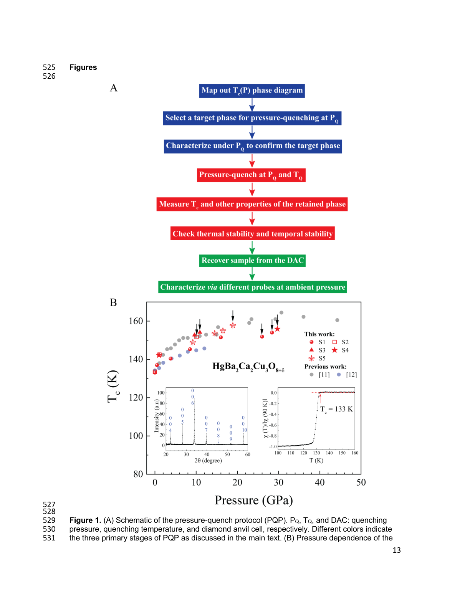

**図1：圧力急冷プロトコル（PQP）の概念図とHg1223のTc–圧力相図（Fig. 1）。**
(A) PQPの実施フロー：Tc(P)相図の作成から始まり、高圧P_Qでの目標相確認、急冷（P_Q, T_Q）、常圧回収・評価までの手順が示されている。(B) Hg1223のTc対圧力依存性。赤シンボルが本研究のPQed試料（S1〜S5）で、いずれも従来の常圧Tc133 Kを大幅に超える147〜151 Kの値を示す。内挿図は常圧回収後のX線回折パターンと典型的なR(T)曲線（Tc = 133 K）を示す。この図は、PQPが高圧Tc曲線の上部にある高Tc相を常圧に「転写」することを直接支持している。

---

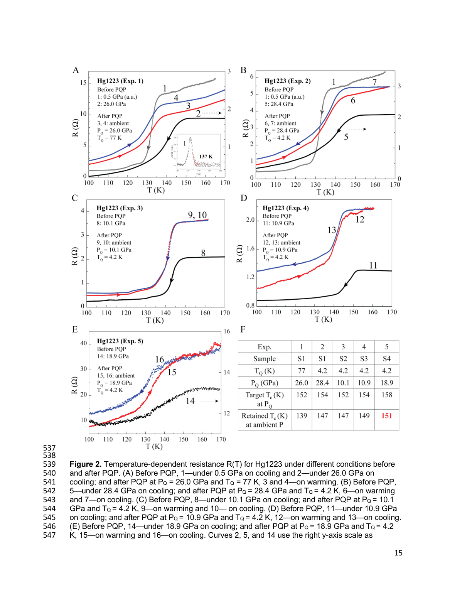

**図2：PQP適用前後のHg1223 R(T)曲線と超伝導転移のサマリー（Fig. 2）。**
(A)〜(E) 5試料のR(T)曲線。PQP前（黒）と後（赤・青）を比較。PQP後にはいずれも転移温度の顕著な上昇が観測される。矢印がTcを示し、PQ後はonset Tc = 147〜151 Kが得られた。(F) 試料ごとの条件（P_Q, T_Q, target Tc, retained Tc）をまとめた表。複数試料にわたって再現性があることが主張の根拠となっている。

---

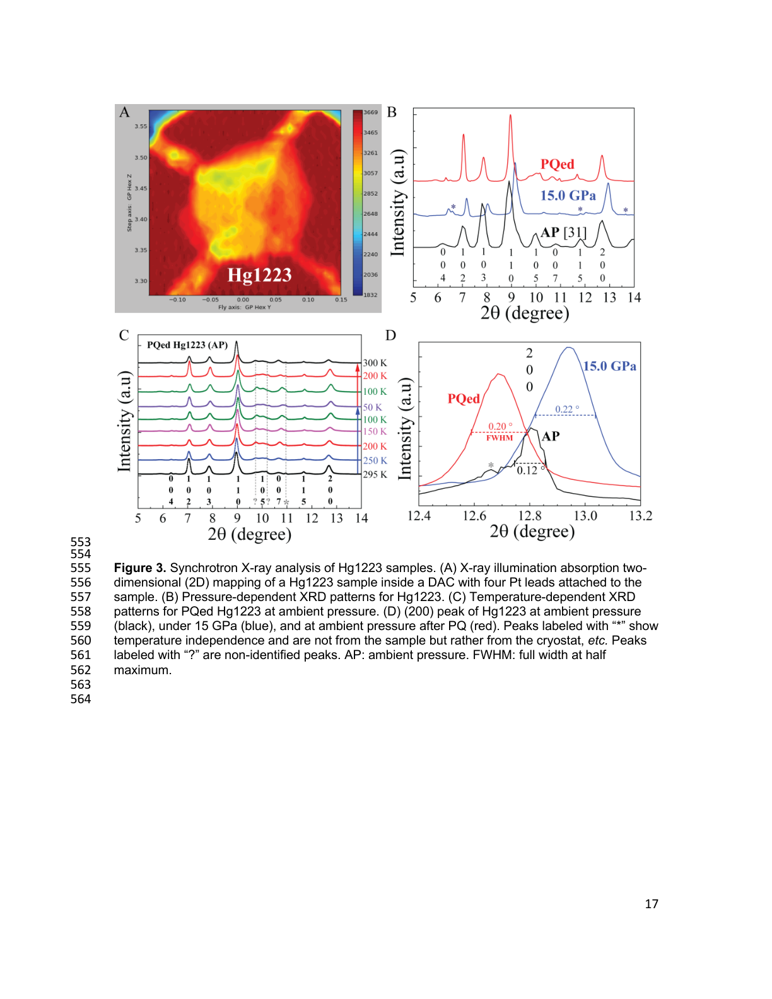

**図3：PQedHg1223試料のシンクロトロンX線回折解析（Fig. 3）。**
(A) DACに装填されたHg1223試料のX線照射の様子（2D回折像）。(B) 高圧（15.0 GPa）および常圧（AP）でのX線回折パターンの比較。常圧回収後もHg1223の回折ピークが保持されており、構造が維持されていることを示す。(C)(D) より詳細な回折角度範囲でのピーク比較。PQed試料の格子定数は元の常圧Hg1223と概ね一致しており、PQ相が非晶質化や分解を起こしていないことを支持する重要な証拠である。

---

## ★ 重点論文 2

### 1. 論文情報

**タイトル：** [Discovery of a hybridization-wave electronic order in a van der Waals Kondo lattice](https://arxiv.org/abs/2603.12720)
**著者：** Lu Cao, Jiefei Shi, Lanxin Liu, Xuan Luo, Yu-Ping Sun, Yi-feng Yang, Yugui Yao, Jinhai Mao, Yuhang Jiang
**arXiv ID：** 2603.12720
**カテゴリ：** cond-mat.str-el
**公開日：** 2026年3月13日
**論文タイプ：** 実験論文（STM/STS）
**ライセンス：** CC BY-NC-ND 4.0

---

### 2. どんな研究か

van der Waals型コンド格子材料6R-TaS₂において、走査型トンネル顕微鏡・分光法（STM/STS）を用いて「ハイブリダイゼーション波（hybridization wave）」と呼ばれる電子秩序状態を世界で初めて直接観測した。6R-TaS₂は1T-TaS₂（コンド格子形成層）と1H-TaS₂（金属層）が交互に積層したヘテロ構造を持ち、1T層表面でのコンドギャップが単位格子倍の周期的変調（ハイブリダイゼーション波）を持ち、下層の星状ダビデ超格子の並進・回転対称性を自発的に破ることを実証した。さらにこの変調がエネルギー依存的なネマティック秩序と相関することを明らかにした。

---

### 3. 位置づけと意義

コンド格子系（重フェルミオン系）では、局在スピンと伝導電子のハイブリダイゼーション（混成）の空間的不均一性が様々な競合相の発現に関わると理論的に予測されていたが、その直接的な実空間可視化は難しかった。6R-TaS₂はvan der Waals性を活かしてSTMでの表面解析が容易であり、かつ1T層が単一のコンド格子面として機能するという理想的なモデル系である。ハイブリダイゼーション波は、コンド格子での電子秩序の新しいタイプであり、重フェルミオン超伝導や隠れた秩序との関係においても意味を持つ。本研究は理論的に議論されてきた「コンド破壊量子臨界点」や「ハイブリダイゼーション揺らぎ」の直接的証拠として今後多くの理論・実験研究を刺激するであろう。

---

### 4. 研究の概要

**背景・目的：** コンド格子系では局在電子と遍歴電子のハイブリダイゼーション強度Vがフェルミ液体の安定性や磁気秩序・超伝導と密接に関わるが、Vの空間不均一性（ハイブリダイゼーション波）は理論的に予測されながら実験的に観測された例がなかった。

**解こうとしている物理問題：** コンド格子においてハイブリダイゼーション強度は均一か、あるいは周期的変調（ハイブリダイゼーション波）をもつ自発的対称性の破れた秩序相が存在するか。

**研究アプローチ：** STM地形学とSTS（dI/dV）スペクトル・空間マッピングを組み合わせて、6R-TaS₂の1T層表面でのコンドギャップの空間分布を実空間・運動量空間で解析。

**対象材料系：** 6R-TaS₂。1T-TaS₂層（Mottインスレーター、コンド格子形成）と1H-TaS₂層（金属）が交互に積層した天然のヘテロ構造を持つ遷移金属ダイカルコゲナイド。

**主な手法：** 低温STM/STS（4.2 K）、dI/dV局所状態密度マッピング、高速フーリエ変換（FFT）・自己相関解析によるQ-空間解析。

**主な結果：**
- 1T層表面でコンドギャップ（hybridization gap）が確認され、2つのハイブリダイゼーションピーク（P₁, P₂）が特徴的なスペクトルを示す。
- コンドギャップの振幅が星状ダビデ超格子の2倍の周期（2a₀₍SoD₎）で空間変調している。
- このハイブリダイゼーション波は星状ダビデ超格子の回転対称性も破る（ネマティック秩序と連動）。
- エネルギー依存的なネマティック秩序（g(r, E)マップのエネルギー変化）は同じ周期・方向性を持ち、ハイブリダイゼーション波と強く相関する。

**著者の主張：** これは「ハイブリダイゼーション波」の初の直接観測であり、コンド格子の新しい秩序状態を示す。

---

### 5. 対象分野として重要なポイント

**対象とする物性：** コンド効果、重フェルミオン、ハイブリダイゼーション揺らぎ、電子秩序、ネマティシティ、van der Waals強相関系。

**測定手法の妥当性：** STM/STSはハイブリダイゼーションギャップを実空間・原子スケールで観測する最適手法。dI/dVスペクトルでのギャップ幅（P₁–P₂間隔）は混成強度Vに直接対応するため、Vの空間分布のマッピングは原理的に正当である。

**既存研究との差分：** 既存のSTM研究（CeIn₃表面など）ではコンドスクリーニングの空間不均一性が観測されたが、周期的なハイブリダイゼーション変調（波）の観測は初めて。

**新規性：** 理論的に予測されていた秩序状態の初の実験的実証であるため、分野の転換点となりうる意義を持つ。

**物理的解釈：** ハイブリダイゼーション波は、星状ダビデ超格子の格子周期性と1H層由来の近藤スクリーニングの競合から生じると著者は解釈しているが、理論的機構（電荷密度波との絡み合い、RKKY相互作用の寄与）は今後の課題。

**波及可能性：** UTe₂、CeCoIn₅などの重フェルミオン超伝導体、あるいはモアレ系の強相関物理への展開が期待される。

---

### 6. 限界と注意点

- 実験は4.2 Kの低温でのみ行われており、ハイブリダイゼーション波の温度依存性（転移温度T*の決定）が不明。
- 6R-TaS₂は1T層がMott絶縁体性を持つが、試料によって局所的な欠陥・積層欠陥が存在し得る。観測された変調が純粋な電子秩序か、構造欠陥起源かの区別には更なる検証が必要。
- van der Waals材料の表面においては、劈開面の安定性や表面再構成の影響を排除する必要がある。
- ネマティック秩序との相関は「同じ周期・方向を持つ」という点での観測であり、因果関係（どちらが主次序か）の決定は困難。

---

### 7. 関連研究との比較や研究動向における立ち位置

**先行研究との差分：** 以前からのSTM研究（URu₂Si₂、CeIn₃、SmB₆）ではコンド効果の実空間観測はなされていたが、周期的変調したハイブリダイゼーション秩序の観測は初。直前に報告された「UTe₂でのKondoハイブリダイゼーション波」（2603.10552、直前週の報告済み論文）とは材料系・観測手法が異なり、相補的な知見をもたらす。

**競合研究：** UTe₂でのKondo hybridization wave報告（2603.10552）との比較が重要。そちらはUTe₂という重い電子超伝導体での観測であり、本研究は純粋なvan der Waalsコンド格子系での観測として、系統性の面で価値がある。

**分野の未解決問題への前進：** コンド格子の量子臨界点付近での「部分コンドスクリーニング」や「コンド破壊」の理解に向けた重要な観測データを提供する。

**新規性の質：** 理論的に長年議論されてきたハイブリダイゼーション波の初実験観測として、incremental以上のbreakthrough的意義がある。

---

### 8. 関連キーワードの解説

**① コンド格子（Kondo lattice）：** 磁性原子（Ce, Yb, U等のf電子系）が規則的に並び、各サイトでコンド効果（局在スピンと伝導電子の多体スクリーニング）が起こる系。伝導電子との混成（hybridization）が全サイトで生じ、Fermi液体的な重フェルミオン状態や量子臨界挙動、非従来型超伝導などが発現する。

**② ハイブリダイゼーション波（Hybridization wave）：** コンド格子においてハイブリダイゼーション強度V(r)が空間的に周期変調した秩序状態。均一なコンドスクリーニングからの対称性の自発的破れであり、並進対称性や回転対称性を破る可能性がある。理論的には近藤スクリーニングのフラストレーションやRKKY相互作用との競合から生じると議論されている。

**③ 星状ダビデ（SoD）超格子（Star-of-David superlattice）：** 1T-TaS₂における電荷密度波に由来する√13×√13の超格子構造。TaS₂の13個のTaが中心1個と周辺12個からなる星状クラスターを形成し、中心部に局在したスピン自由度（Mott絶縁体的挙動）を生む。van der Waals積層系での近藤効果の舞台となる。

**④ 走査型トンネル分光（STM/STS）：** 探針と試料間のトンネル電流からナノスケールの電子状態密度を実空間で直接マッピングする手法。dI/dV∝N(E)であり、コンドギャップ・超伝導ギャップ・電荷密度波等を原子分解能で観測できる。フェルミ面のネスティングベクトルを実空間マップのFFTから抽出することも可能。

**⑤ ネマティック秩序（Nematic order）：** 格子の周期性は保ちつつ回転対称性のみを破る電子秩序。液晶の配向秩序の電子版に相当する。鉄系超伝導や銅酸化物においてパドル秩序や擬ギャップとの絡み合いで議論され、弾性抵抗率や光学異方性で検出される。本論文のハイブリダイゼーション波に伴うネマティシティは、コンド格子系でのネマティック秩序の新しい起源を示唆する。

---

### 9. 図

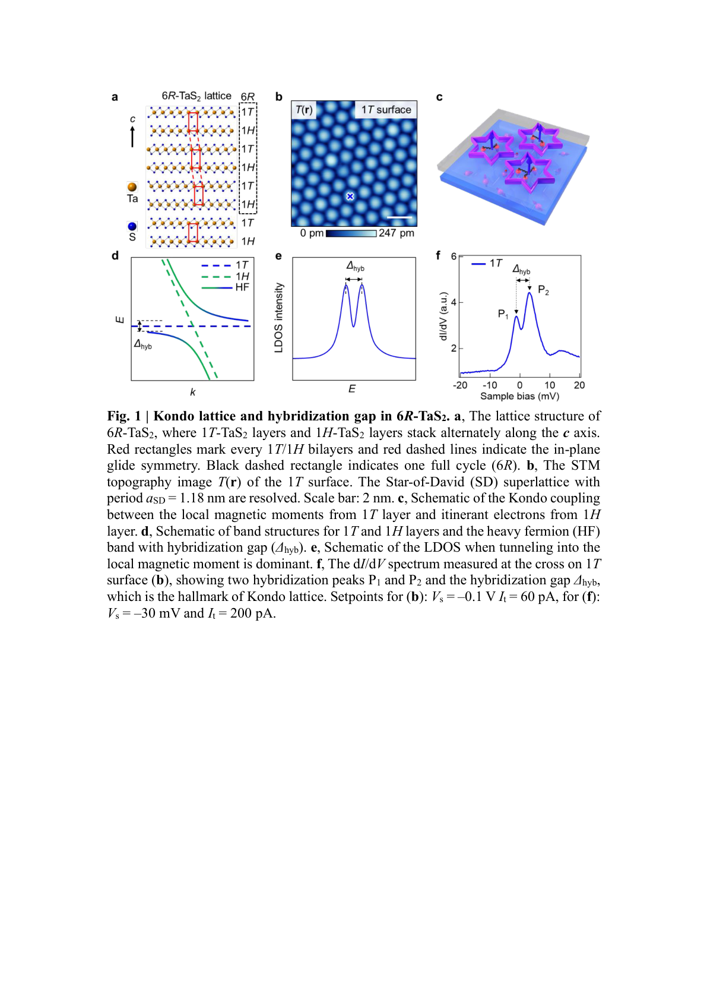

**図1：6R-TaS₂のコンド格子構造とハイブリダイゼーションギャップ（Fig. 1）。**
(a) 6R-TaS₂の格子構造模式図。1T層（赤）と1H層（青）が交互に積層している。(b) STM地形像：星状ダビデ（SoD）超格子が明瞭に観測されている。(c) 1T層表面でのdI/dVスペクトル。コンドギャップに対応する特徴的な2つのピーク（P₁, P₂）が観測されており、ギャップ幅がハイブリダイゼーション強度Vに対応する。この図はコンド格子形成の直接的な実空間証拠を示す。

---

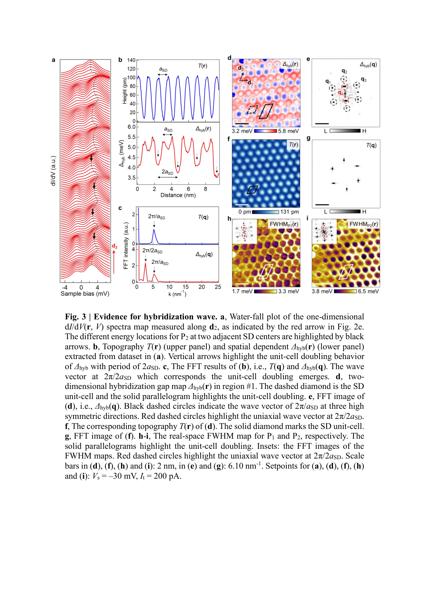

**図3：ハイブリダイゼーション波の証拠—実空間FFT解析（Fig. 3）。**
(a) 1次元方向でのdI/dV waterfall plot。各ラインでのスペクトルの変化からP₁ピーク位置の空間的変調が確認できる。(b)–(e) P₁ピーク強度の2次元空間マップとFFT解析。FFTでは星状ダビデ超格子の波数Q_SoDの2倍（単位格子倍）に対応するピークが明確に現れており、ハイブリダイゼーション強度の2a₀₍SoD₎周期変調の証拠を示す。(g)(h) 実空間マップとFFTでの波数ベクトル。この図がハイブリダイゼーション波の主要な実験的証拠である。

---

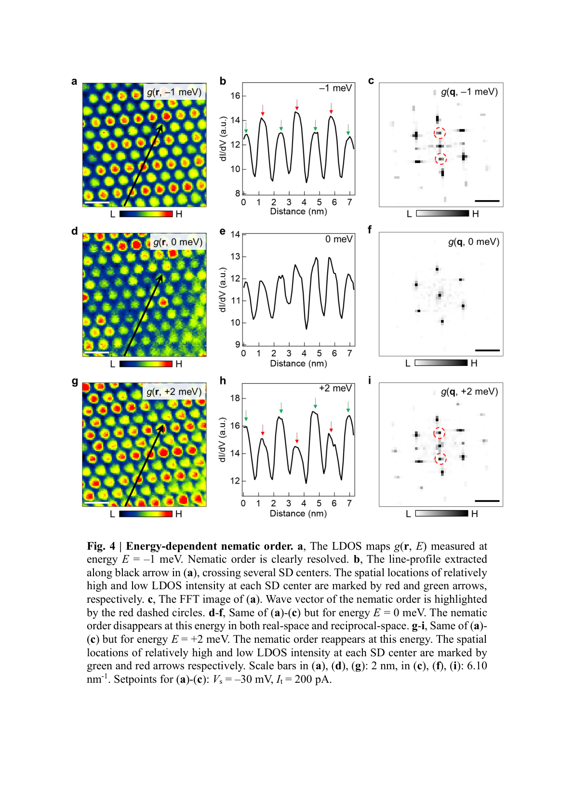

**図4：エネルギー依存的ネマティック秩序（Fig. 4）。**
(a) 異なるバイアス電圧でのLDOS（局所状態密度）マップ g(r, E)。エネルギーに応じて異方的なパターンが変化することが示されている。(b) FFTのエネルギー依存性。ハイブリダイゼーション波と同一の波数・方向性を持つネマティック秩序がエネルギー依存して変化する様子が捉えられている。(c)(d) 対称性の解析。この図は、ハイブリダイゼーション波が単純な電荷変調ではなく、エネルギー依存のネマティシティと深く絡み合った多成分秩序であることを示している。

---

## ★ 重点論文 3

### 1. 論文情報

**タイトル：** [Directional Manipulation of a Staggered Charge Density Wave and Kondo Resonance in UTe₂](https://arxiv.org/abs/2603.12097)
**著者：** Nileema Sharma, Fangjun Cheng, Hyeok Jun Yang, Matthew Toole, James McKenzie, Mitchell M. Bordelon, Sean M. Thomas, Priscila F. S. Rosa, Yi-Ting Hsu, Xiaolong Liu
**arXiv ID：** 2603.12097
**カテゴリ：** cond-mat.str-el（cross: cond-mat.supr-con）
**公開日：** 2026年3月12日
**論文タイプ：** 実験論文（STM/STS）
**ライセンス：** CC BY 4.0

---

### 2. どんな研究か

スピン三重項超伝導体UTe₂においてSTMを用いた精密研究を行い、これまで報告されていなかった新しい「スタッガード電荷密度波（staggered CDW）」を発見した。この電荷密度波はU鎖方向に平行な磁場をわずか1.7 Tかけるだけで完全に消滅するという極めて強い方向依存性を示す。さらに同一の磁場条件でコンド共鳴の性質も変化することが判明し、「Te 5p–U 5f hybridization チャネルからU 6d–U 5f チャネルへのスイッチ」という機構を通じてCDWとコンド効果が同じハイブリダイゼーション自由度によって絡み合っていることを提案している。

---

### 3. 位置づけと意義

UTe₂は近年最も精力的に研究されている重フェルミオン超伝導体の一つであり、スピン三重項ペアリング、多重超伝導相、磁場誘起相転移など多彩な物性が注目されている。本研究が明らかにしたスタッガードCDWの存在とその磁場による方向依存的制御は、UTe₂の電子相の多様性に新たな側面を加えるものである。特に、CDWとコンド共鳴が磁場方向への感受性を通じて連動する機構は、f電子系における電荷・スピン・軌道自由度の複雑な絡み合いの理解を前進させる。これはUTe₂の超伝導が絡み合った多重秩序の中に位置づけられる可能性を示しており、超伝導機構の解明に向けた重要な鍵となりうる。

---

### 4. 研究の概要

**背景・目的：** UTe₂では近年、ペア密度波（PDW）や電荷密度波の存在が相次いで報告されており、超伝導との絡み合いの実態解明が急務となっている。磁場による相の操作はその因果関係を探る有効な手段。

**解こうとしている物理問題：** UTe₂の表面にはどのような電荷秩序が存在し、それは超伝導やコンド効果とどう関係しているか。磁場による選択的制御は可能か。

**研究アプローチ：** 低温（300 mK）STM/STSで磁場の大きさと方向を系統的に変化させながら（ベクトル磁場）、CDWとコンド共鳴の変調を追跡。

**対象材料系：** UTe₂。U原子が擬1次元鎖を形成し、スピン三重項超伝導（Tc≈2 K）、多重超伝導相、磁場誘起超伝導（B≈35 T）など多彩な物性を示す重フェルミオン超伝導体。

**主な手法：** 低温STM（300 mK）、ベクトル磁場印加（0〜数T）、dI/dVスペクトルマッピング、FFT解析、タイトバインディングモデル計算（CDW起源の説明）。

**主な結果：**
- (011)面表面のSTMで、従来の知られていなかったスタッガードCDW（波数Q_CDW）を発見。
- このCDWはUのc軸（U鎖方向）平行磁場1.7 Tで完全消滅する（著しい磁場感受性）。
- 面内方向や垂直方向の同じ磁場強度ではCDWに効果なし（強い方向依存性）。
- 同一磁場条件下で、コンド共鳴のエネルギー位置と強度が変化する。
- 計算から、CDWはU-6dバンドのフェルミ面ネスティングに由来する可能性が示唆される。
- 磁場によるCDW消滅は、支配的ハイブリダイゼーションチャネルがTe 5p–U 5f からU 6d–U 5f にスイッチすることによると提案。

**著者の主張：** 磁場方向という新しいノブでCDWとコンド状態を同時に操作できることを示した。U鎖方向磁場という「チャネルスイッチ」機構がUTe₂の多様な秩序相の鍵。

---

### 5. 対象分野として重要なポイント

**対象とする物性・相互作用：** 電荷密度波、コンド効果、スピン三重項超伝導、f電子・d電子・p電子軌道の混成、磁場誘起相転移。

**測定手法の妥当性：** 300 mK低温STMはUTe₂の超伝導状態を直接観察できる最適環境。ベクトル磁場を3次元的に制御することで方向依存性の系統的な研究が可能。CDWの磁場依存性はFFTピーク強度のトラッキングで定量化されており、適切な解析手法。

**既存研究との差分：** 既存のUTe₂表面STM研究（Yu et al., 2603.10552等）ではKondoハイブリダイゼーション波が報告されていたが、今回のスタッガードCDWと磁場スイッチ機構は別物であり、UTe₂の電子相の新たな側面を明らかにした。

**物理的解釈の根拠：** CDW消滅がc軸平行磁場1.7 Tというマイルドな値で起こることは、特定のハイブリダイゼーションチャネルの磁気感受性が非常に大きいことを示唆している。ただし「チャネルスイッチ」の機構は計算による示唆であり、直接証拠（ARPESや偏極中性子）は示されていない。

**波及可能性：** UTe₂以外のU化合物やスピン三重項候補物質での類似機構の探索を刺激する。

---

### 6. 限界と注意点

- UTe₂の表面（011）は劈開面であるため、表面再構成や表面特有の効果の影響を排除する必要がある。体内（bulk）での同様の秩序が存在するかは未検証。
- 「チャネルスイッチ（Te 5p→U 6d hybridization優位へ）」の機構は計算的示唆であり、直接的な角度分解光電子分光（ARPES）や共鳴X線散乱による検証が望まれる。
- CDW波数Q_CDWと超伝導秩序との定量的な相互作用の評価（競合か共存か）が明確でない。
- コンド共鳴の磁場変化はエネルギー位置のシフトとして観測されているが、それが体積Kondo温度T_Kの変化を反映しているか表面特有の効果かの区別が課題。

---

### 7. 関連研究との比較や研究動向における立ち位置

**先行研究との差分：** Zhu et al. (2603.08688, 2026)はUTe₂での「PDWとCDWの絡み合い」を報告したが、今回発見されたスタッガードCDWは別種の電荷秩序。Yu et al. (2603.10552, 2026)のKondo hybridization wave報告と合わせると、UTe₂の表面に少なくとも2〜3種類の異なる電子秩序が共存・競合していることになる。

**競合研究との位置づけ：** UTe₂は現在世界で数十のグループが精力的に研究しており、STMによる秩序の発見競争が続いている。本研究の「方向依存磁場制御」という方法論は、他の絡み合った秩序系への展開で際立つ独自性を持つ。

**分野未解決問題への前進：** UTe₂の超伝導機構（スピン三重項の起源、ペアリング対称性）の解明に向け、超伝導と競合・共存する秩序相の全貌を明らかにすることが急務。本研究はその一つの断片を提供。

**新規性：** スタッガードCDWの発見と、磁場方向による「絡み合った秩序の選択的制御」という実験手法の確立という二重の意義がある。

---

### 8. 関連キーワードの解説

**① スタッガードCDW（Staggered Charge Density Wave）：** 電荷密度が空間的に周期的に変調した秩序状態の一種で、隣接サイト間で交互（staggered）のパターンを持つもの。一般的なCDWは連続波的な電荷変調だが、スタッガード型はより短波長・局在的な変調であることが多い。UTe₂ではU鎖の擬1次元性から、鎖方向に沿ったネスティングに由来する可能性が示唆されている。

**② コンド共鳴（Kondo resonance）：** 単一磁性不純物または磁性格子点周辺でフェルミ準位近傍に現れる鋭い（幅∼kBTK）状態密度ピーク。コンド効果によりスピンが伝導電子に完全スクリーニングされる温度TK以下で発達する。dI/dVスペクトルでFano共鳴型（または対称なピーク型）として観測される。コンド格子では全サイトで同相的に形成されコヒーレントなフェルミ液体を形成する。

**③ ハイブリダイゼーションチャネル（Hybridization channel）：** f電子が伝導電子のどの軌道（ここではTe 5p, U 5f, U 6d等）と混成するかを指す。混成の強さと対称性によってコンド温度TK、磁気異方性、電荷秩序の性質が変わる。UTe₂では複数のチャネルが競合しており、磁場によってチャネル間の優位性が切り替わる可能性が本研究で示唆された。

**④ ベクトル磁場制御（Vector magnetic field control）：** STMやその他の測定装置において、磁場の大きさだけでなく方向（θ, φ）を3次元的に制御する技術。異方的な電子構造を持つ材料（UTe₂のような擬1次元系など）での相の方向依存性の系統的な研究に不可欠。本研究ではこれによりCDWの消滅が特定方向（U鎖方向）の磁場のみに感応することを明確にした。

**⑤ 絡み合った電子秩序（Intertwined electronic orders）：** 超伝導、電荷密度波、スピン密度波、ペア密度波など複数の秩序パラメータが互いに強く結合している状態。競合や共存だけでなく、一つの秩序が他の秩序の発現を促進・抑制する「絡み合い」の関係が重要。銅酸化物・ニッケレート・UTe₂など強相関系に普遍的に観られ、超伝導機構理解の核心問題。

---

### 9. 図

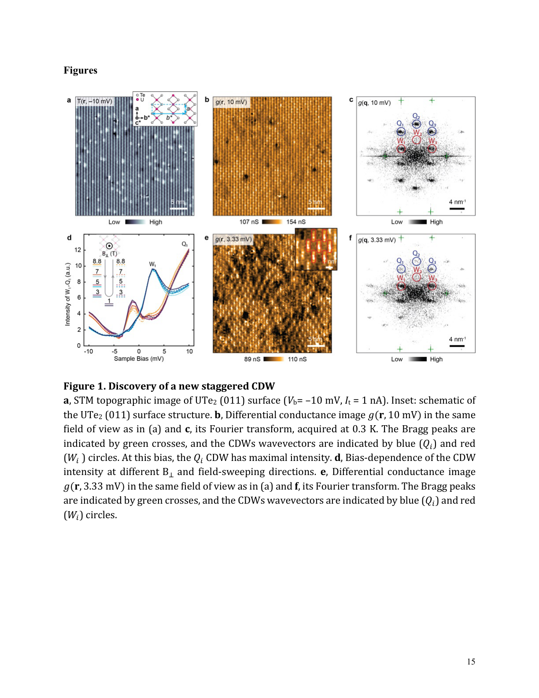

**図1：UTe₂表面での新しいスタッガードCDWの発見（Fig. 1）。**
(a) UTe₂(011)面のSTM地形像（V_bias = −10 mV, I = 1 nA）。挿入図はUTeの結晶構造。(b)(c) 同じ視野でのdI/dV差分コンダクタンス像（E = 10 mVおよび3.33 mV）。緑丸がQ_CDW（Γ点）、赤丸がW_CDW（R点）に対応するCDWの波数。(d) 0.3 Kでの同視野のg(r, 3.33 mV)像。CDWの実空間パターンが明瞭に見える。(e)(f) E = 3.33 mVでの異なる視野でのg(r)像とFFT。この図は以前未報告だったスタッガードCDWの存在を実空間・運動量空間の両面から確立している。

---

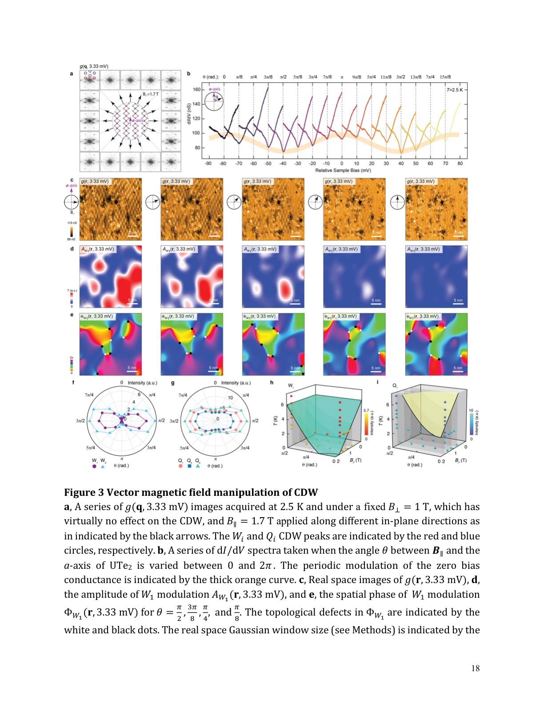

**図3：ベクトル磁場によるCDWの方向依存的消滅（Fig. 3）。**
(a)–(d) 磁場Baをc軸方向に固定（B_z = 1 T）し、a軸成分を変化させた場合のg(r, 3.33 mV)像。CDWパターンはB_z変化にほぼ無感応。(e) B = 1.7 Tをc軸方向に印加した場合：CDWが完全消滅。(f) B = 2.5 Tの面内での方向依存性。c軸平行磁場のみがCDWを消滅させる。(g)(h) CDW変調の積分強度の磁場角度依存性。この図は「磁場方向によるCDW制御」の主要な証拠であり、スタッガードCDWが特定のハイブリダイゼーションチャネルと直結していることを強く示唆している。

---

# その他の重要論文

---

## 論文 4

### 1. 論文情報

**タイトル：** [Spectroscopic Studies of two-dimensional Superconductivity](https://arxiv.org/abs/2603.12570)
**著者：** Qiang-Jun Cheng, Xu-Cun Ma, Qi-Kun Xue, Can-Li Song
**arXiv ID：** 2603.12570
**カテゴリ：** cond-mat.supr-con
**公開日：** 2026年3月13日
**論文タイプ：** レビュー論文
**ライセンス：** CC BY 4.0

---

### 2. 研究概要

STM/STSが明らかにしてきた2次元超伝導の最前線を、（1）銅酸化物CuO₂面の直接研究、（2）ペア密度波（PDW）現象、（3）人工ヘテロ構造および天然材料でのトポロジカル超伝導、という3つの柱から系統的にレビューする論文。薄膜・ヘテロ構造を作製して原子スケールの分解能で超伝導ギャップの空間不均一性、格子周期の電荷変調との競合、マヨラナ準粒子候補の検出などを報告した研究群の知見を整理している。実空間像と局所分光の組み合わせが、波数空間測定では得られないナノスケール構造と超伝導の相関を明らかにすることを強調している。

2次元超伝導の研究は、界面HTSC、FeSe/SrTiO₃の高Tc、ニッケレートの2D超伝導など現代の主要問題と直結している。特にPDW（Cooper対が有限運動量で凝縮した状態）の可視化はSTM固有の強みであり、高温超伝導機構の解明における局所秩序の役割を問い直している。本レビューはSTM/STSの手法論的進化と物理的発見を包括的にまとめており、次世代研究者への道標としての価値がある。

---

### 3. 図

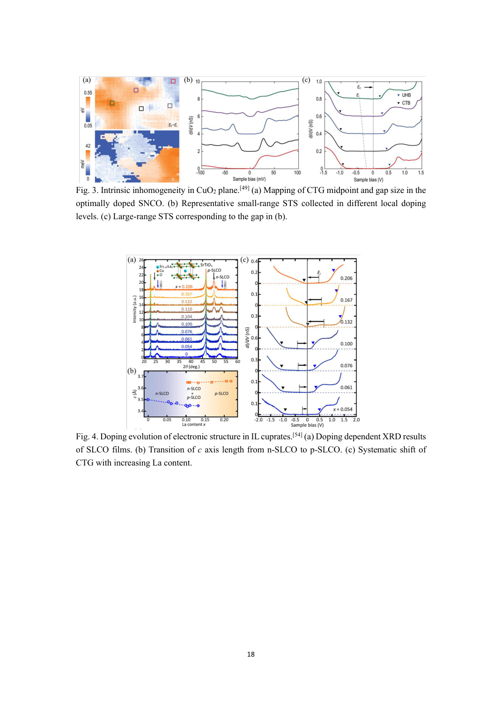

**図1：銅酸化物高温超伝導体でのSTM研究（CuO₂面の不均一超伝導）。**
CuO₂面内の固有不均一性（inhomogeneity）をSTMで直接マッピングした結果。超伝導ギャップの空間分布が大きく不均一であることが示されており、「局所ペアリング振幅の変調」が高温超伝導の本質的特徴であることを支持する。

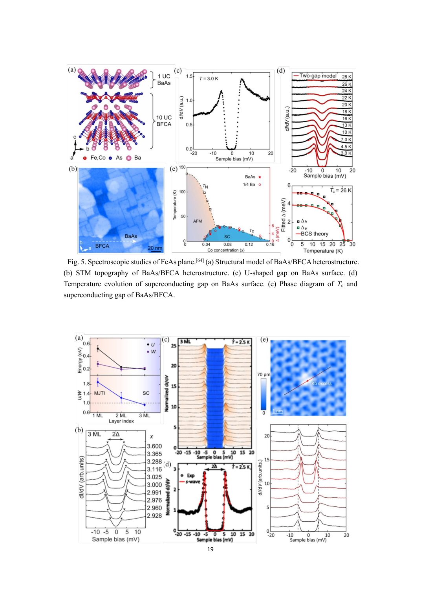

**図2：FeAs面での分光研究。**
FeAs系超伝導体のFeAs面をSTSで観測した結果。超伝導ギャップ構造とその空間変動をリアルスペースで捉えている。CuO₂面との比較において、2次元超伝導の普遍性と材料依存性を議論するための重要なデータ。

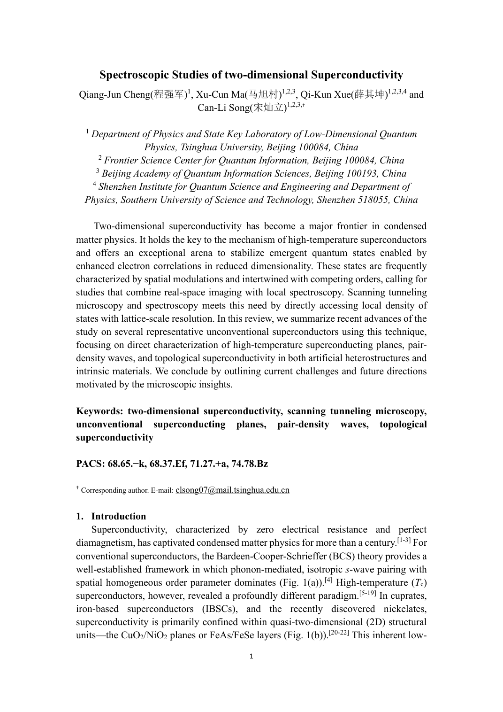

**図3：本論文のタイトルと要旨（表紙ページ）。**
STM/STSが2次元超伝導の観測にどのように貢献するかを俯瞰的に示している。本レビューのスコープ（高温超伝導CuO₂面・PDW・トポロジカルSC）の全体像が示されている。

---

## 論文 5

### 1. 論文情報

**タイトル：** [SU(2) gauge theory of fluctuating stripe order in the two-dimensional Hubbard model](https://arxiv.org/abs/2603.13071)
**著者：** Henrik Müller-Groeling, Pietro M. Bonetti, Paulo Forni, Walter Metzner
**arXiv ID：** 2603.13071
**カテゴリ：** cond-mat.str-el
**公開日：** 2026年3月13日
**論文タイプ：** 理論論文
**ライセンス：** CC BY 4.0

---

### 2. 研究概要

2次元ハバード模型のストライプ秩序相の有限温度物理を、電子演算子を「フェルミオン的チャージオン（荷電・スピン自由度）と電荷中性スピノン」に分解したSU(2)ゲージ理論の枠組みで記述する理論論文。SU(2)ゲージ場の有限温度効果がスピン対称性を回復させる結果、有限温度での実現相は「電荷秩序とシュードギャップはあるが長距離スピン秩序を持たない」pseudogap相になることを示した。1粒子励起スペクトルには「フェルミアーク」や他の構造がブリルアンゾーン内に分布するが、対角方向に集中しない、という特徴が予測される。

この結果は銅酸化物高温超伝導体の擬ギャップ相（pseudogap phase）とストライプ秩序の関係を理論的に整理する上で重要である。ハバード模型のストライプ相において、従来の平均場的アプローチでは捉えられなかった「スピン揺らぎによる対称性回復」という有限温度効果を明示的に取り込んだ点が新規性。フェルミアーク構造の出現がストライプ秩序の揺らぎに起因するという予測は、ARPES測定との直接比較が期待される。

---

### 3. 図

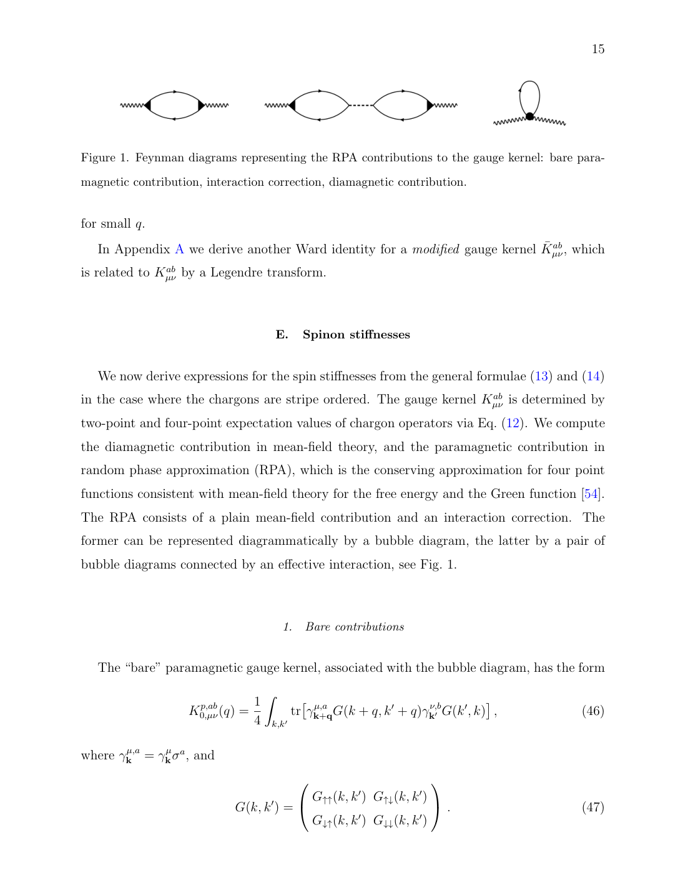

**図1：SU(2)ゲージカーネルのファインマン図（Fig. 1）。**
SU(2)ゲージ場のRPA（ランダム位相近似）寄与を表すファインマン図。フェルミオン的チャージオンの泡図（bare）、相互作用補正、ダイヤグラム的寄与が示されており、本理論の摂動論的構造を示す基礎的な図。

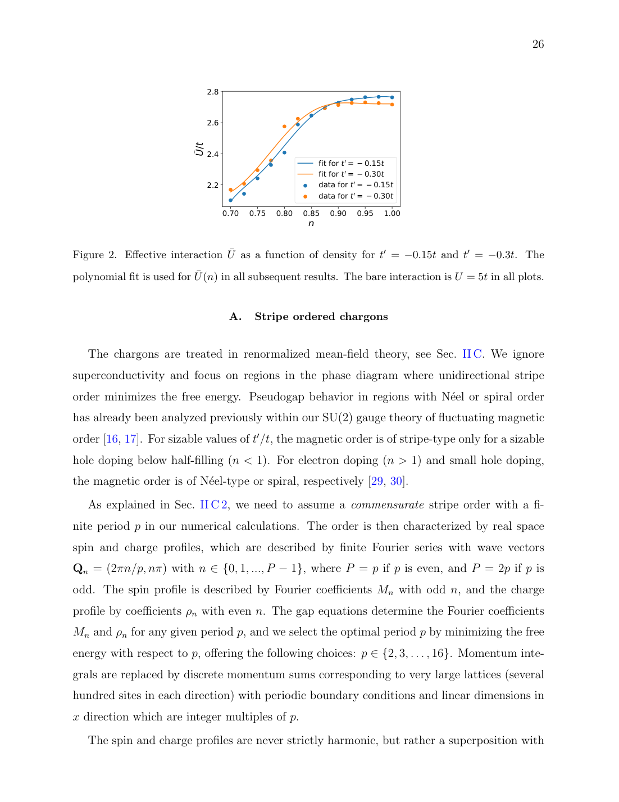

**図2：ストライプ秩序相図と電子充填依存性（Fig. 2 相当）。**
電子充填nに対するU/t（クーロン反発/ホッピング比）のパラメータ空間でのストライプ秩序安定領域を示す。異なる充填でのストライプ秩序の安定性と量子臨界挙動の傾向が読み取れる。

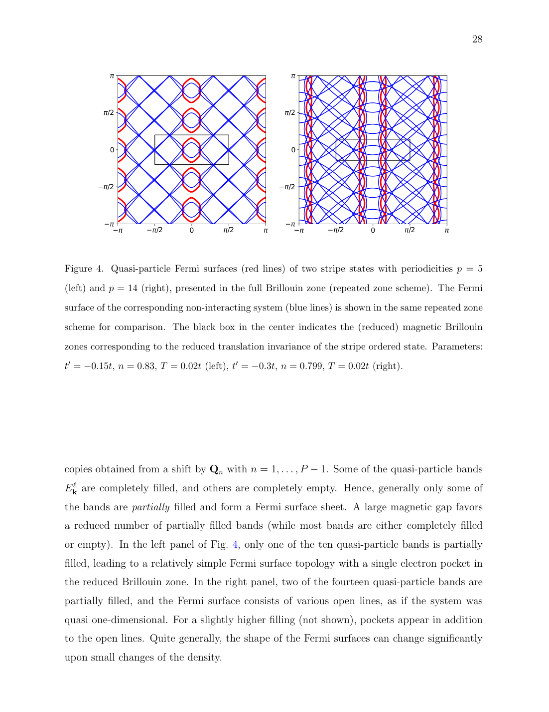

**図3：擬粒子スペクトルのフェルミアーク構造（Fig. 4 相当）。**
SU(2)ゲージ理論が予測する1粒子励起スペクトルの運動量空間分布。ブリルアンゾーン内にフェルミアーク状の構造が出現し、その分布が従来のストライプ模型の予測と異なる点が議論の焦点。ARPESとの直接比較が可能な予測図として重要。

---

## 論文 6

### 1. 論文情報

**タイトル：** [Elastoresistivity Signatures of Nematic Fluctuations in Layered Antiferromagnet CoTa₃S₆](https://arxiv.org/abs/2603.12704)
**著者：** Tao Lu, Zili Feng, Mengxing Ye, Takashi Kurumaji, Linda Ye
**arXiv ID：** 2603.12704
**カテゴリ：** cond-mat.str-el
**公開日：** 2026年3月13日
**論文タイプ：** 実験論文
**ライセンス：** CC BY 4.0

---

### 2. 研究概要

六方晶遷移金属ダイカルコゲナイド磁性体CoTa₃S₆における電子ネマティシティを弾性抵抗率（elastoresistivity）測定で系統的に調べた研究。この材料はストライプ反強磁性秩序（TN）を持つが、TN以下で「divergence-like」な反対称弾性抵抗率成分が急速に発達することを発見した。この異常は磁場と歪みに対して強く応答するが、反強磁性転移温度自体は磁場・歪みに対し安定という対照的な振る舞いを示す。さらに「三状態ネマティシティ（three-state nematicity in a hexagonal system）」の特徴的なシグナルが弾性抵抗率に現れることが判明した。

CoTa₃S₆はトポロジカル的性質（磁気ワイル点、異常ホール効果）を持つことが近年注目されている。今回の弾性抵抗率研究は、ストライプ反強磁性秩序がネマティック自由度と独立にカップルしていることを示し、六方晶系での三状態ネマティシティという新しい秩序タイプの実験的証拠を提供する。反強磁性転移とネマティック相のデカップルは、スピン・電荷・軌道自由度の複雑な競合を示唆しており、トポロジカル磁性体での多重秩序の理解を深める上で重要な知見。

---

### 3. 図

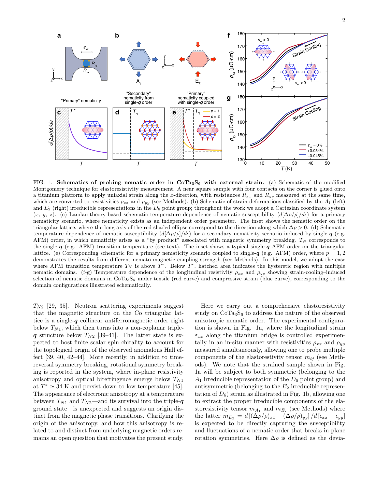

**図1：弾性抵抗率測定セットアップとCoTa₃S₆のネマティシティの概念（Fig. 1）。**
弾性抵抗率測定の実験配置（ピエゾ歪み素子を用いた精密歪み印加）、CoTa₃S₆の結晶構造と磁気構造の模式図、A₁g・E₂g対称性チャネルの弾性抵抗率の温度依存性が示されている。TN近傍でのE₂g成分の異常な増大が三状態ネマティシティのシグナルとして重要。

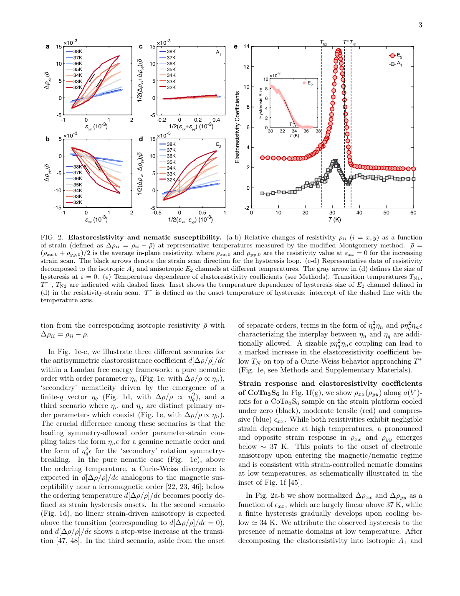

**図2：歪み依存の弾性抵抗率とその非対称成分（Fig. 2 相当）。**
uniaxial歪みεxxに対するΔρ/ρの依存性を示すグラフ。対称成分（A₁g）と反対称成分（E₂g）への分解から、ネマティック成分の歪みへの感受性を定量化。反強磁性転移下で急速に発達するE₂g成分が主な結果。

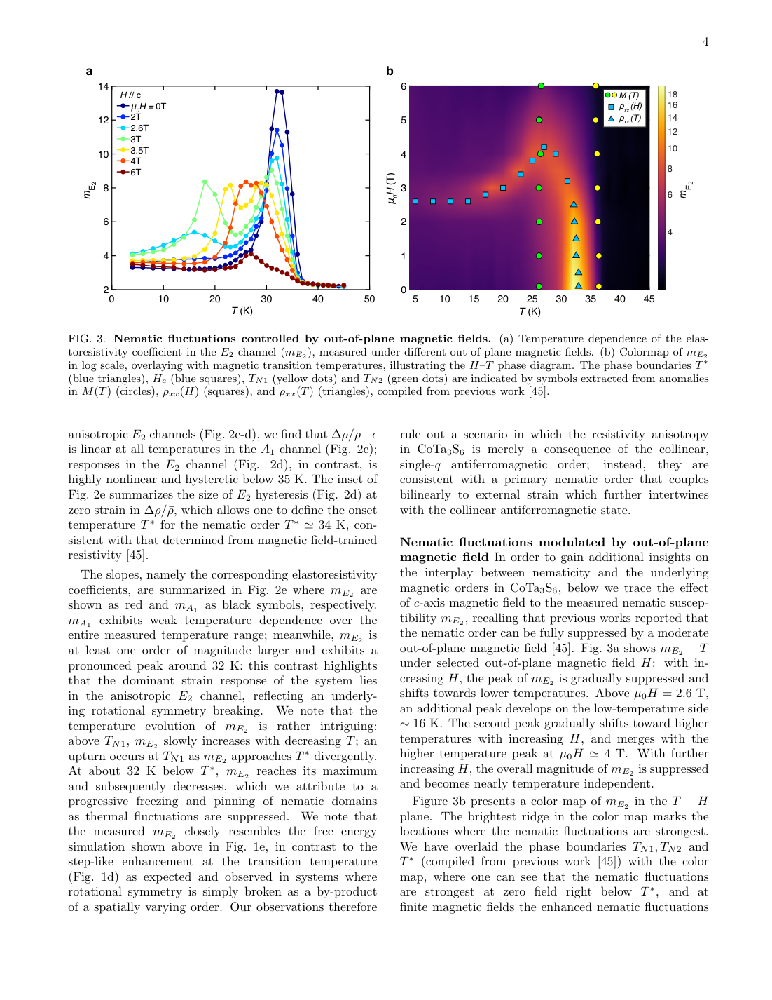

**図3：ネマティック感受率のm_E2温度依存性と磁場効果（Fig. 3 相当）。**
ネマティック感受率m_E2の温度依存性と異なる磁場（0〜数T）条件での変化。磁場によってネマティック感受率が大きく変化する一方、反強磁性TN1・TN2が不変であることが示されており、ネマティシティと磁気秩序のデカップルを定量的に示す重要なデータ。

---

## 論文 7

### 1. 論文情報

**タイトル：** [Pressure-Induced Chemical Bonding Effects on Lattice and Magnetic Instabilities in CaMn₂Sb₂](https://arxiv.org/abs/2603.12181)
**著者：** Matt Boswell, Antonio M. dos Santos, Mingyu Xu, Madalynn Marshall, Su-Yang Xu, Weiwei Xie
**arXiv ID：** 2603.12181
**カテゴリ：** cond-mat.str-el（cross: cond-mat.mtrl-sci）
**公開日：** 2026年3月12日
**論文タイプ：** 実験論文（中性子・X線回折 + 計算）
**ライセンス：** CC BY 4.0

---

### 2. 研究概要

層状反強磁性絶縁体CaMn₂Sb₂に5.4 GPa付近の圧力を印加することで、三方晶（trigonal）から単斜晶（monoclinic）への一次構造相転移が起こり、この転移に伴い磁気秩序も変化することを中性子散乱・高圧X線回折・計算によって明らかにした。常圧では反強磁性絶縁相だったものが、高圧相では不整合磁気秩序（incommensurate magnetic order）に変化することが中性子粉末回折から示された。電子論的には、Mn-Sb結合の軌道再配置が構造転移の引き金となり、電荷の局在化（charge localization along Mn-Sb chains）が先行して電子不安定性を引き起こすことを第一原理計算で示唆している。

この研究は、マンガンプニクタイド系における構造・格子・磁気自由度の圧力下での連動という問題を精密に扱っている。CaMn₂Sb₂はゼグレス（Zintl）相に属しており、その化学結合の変化が磁気秩序にどう波及するかという問いに定量的に答えた点が価値である。圧力下での不整合磁気秩序の出現は、マンガン系スピン格子における磁気フラストレーションの圧力制御という新しい軸を提供し、同族材料系（BaMn₂As₂等）への展開が期待される。

---

### 3. 図

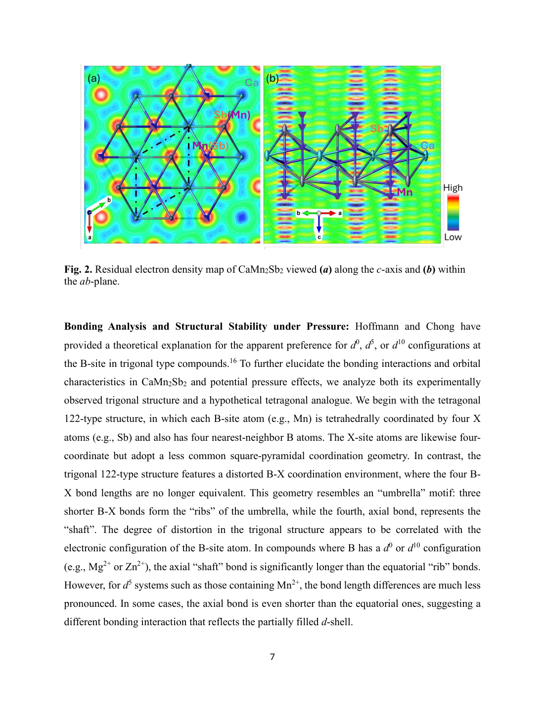

**図1：CaMn₂Sb₂の抵抗率温度依存性（補足Figure S1）。**
常圧下でのCaMn₂Sb₂単結晶の規格化抵抗R(T)/R(300K)の温度依存性。冷却・昇温の両方向で測定されており、ヒステリシスなく一致している。200 K付近に抵抗率の特徴的な構造が見られ、これが反強磁性転移に対応する。絶縁体的挙動と反強磁性秩序の関係を確認する基本データ。

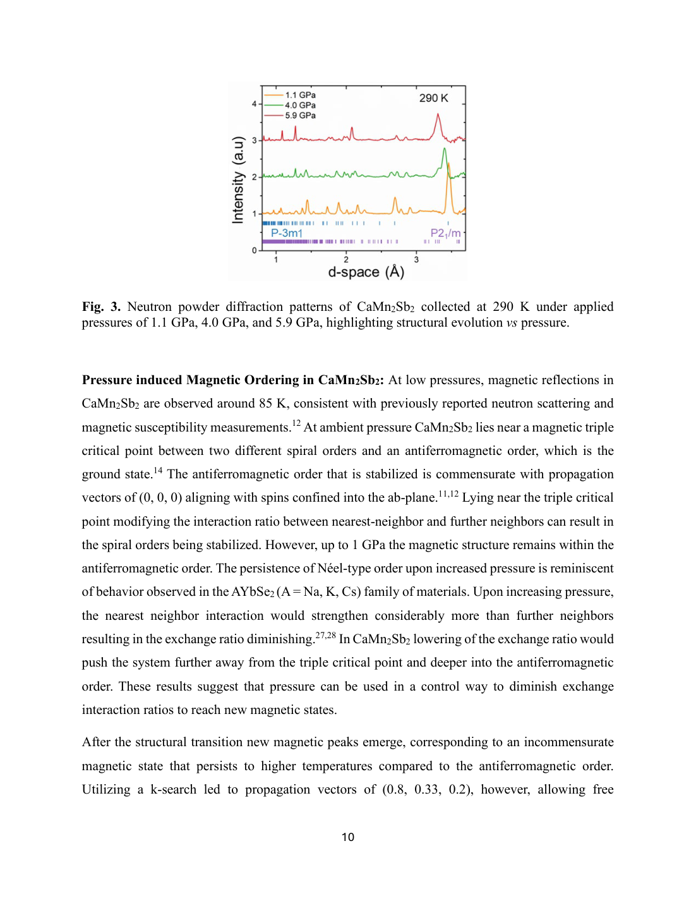

**図3：圧力下でのCaMn₂Sb₂の中性子粉末回折パターン（Fig. 3 相当）。**
異なる圧力（常圧・1.1 GPa・4.9 GPa・5.9 GPa）での中性子回折パターンを示す。5 GPa付近での構造相転移に伴い、回折ピークの位置と相対強度が大きく変化することが観測されている。特に磁気散乱ピークの変化から不整合磁気秩序への転移が示唆される。

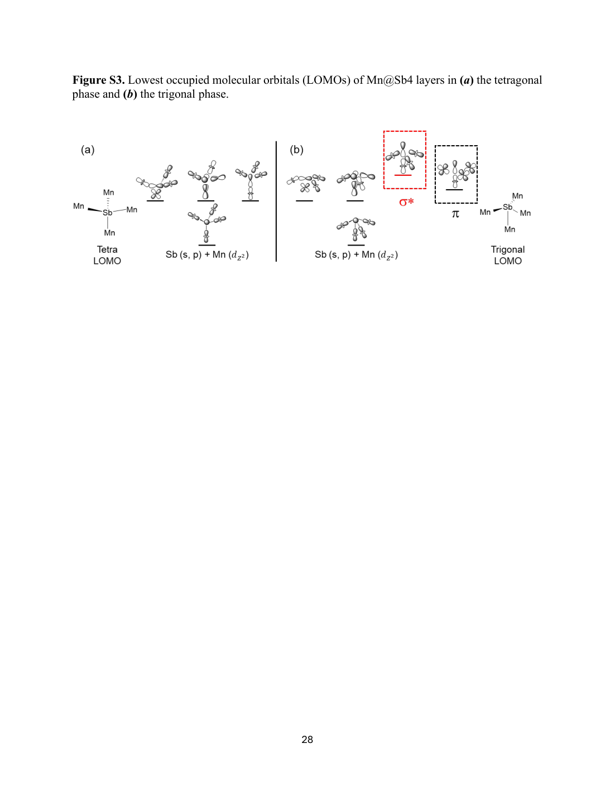

**図4：格子定数の圧力依存性（補足Figure S2 相当）。**
各格子定数を常圧値で規格化した値の圧力依存性。5.4 GPa付近での一次転移に伴う体積の急激な減少（不連続変化）が示されており、三方晶から単斜晶への構造変化を定量的に特徴づける。体積収縮の大きさが一次転移の強さを反映している。

---

## 論文 8

### 1. 論文情報

**タイトル：** [Finite-momentum superconductivity with singlet-triplet mixing in an altermagnetic metal: A pairing instability analysis](https://arxiv.org/abs/2603.12897)
**著者：** Hui Hu, Zhao Liu, Jia Wang, Xia-Ji Liu, Yoji Ohashi
**arXiv ID：** 2603.12897
**カテゴリ：** cond-mat.supr-con（cross: cond-mat.str-el）
**公開日：** 2026年3月13日
**論文タイプ：** 理論論文
**ライセンス：** arXiv nonexclusive-distrib（図掲載不可）

---

### 2. 研究概要

正方格子上のアルターマグネット金属を対象に、最近接引力相互作用によるペアリング不安定性を解析した理論論文。アルターマグネット（altermagnet）は時間反転対称性を破りながらも正味の磁化はゼロで、運動量依存したスピン分裂を持つ新しいタイプの磁性体として近年急速に注目を集めている。本研究では、このスピン分裂によって対角スピン（unlike-spin）の電子間でペアリングが有限重心運動量Q≠0で起こることを示した。さらにこのペアリングが複数チャネル（extended s波、d波、p波）で同時に起こり、結果として「シングレット–トリプレット混合を持つ多成分FFLO超伝導相」が実現することを相図として示した。

アルターマグネット中の超伝導はMnF₂やRuO₂などの実材料候補で議論されており、本研究の理論的枠組みはこれらの系での実験解釈に直接有用。シングレット–トリプレット混合は非従来型超伝導の特徴的パリティ混合であり、アルターマグネットがそれを自然に引き起こすという知見は重要な理論的洞察。d_xy型とd_{x²-y²}型のアルターマグネット結合それぞれに対応する相図を提示しており、具体的な物質実現への指針を与えている。ただしon-site引力相互作用が有限運動量対合に不利であることも示されており、材料実現の条件が明確化されている。

**ライセンス制限（arXiv nonexclusive-distrib）のため、原図の掲載を省略する。**

---

## 論文 9

### 1. 論文情報

**タイトル：** [Can electronic quantum criticality drive phonon-induced linear-in-temperature resistivity?](https://arxiv.org/abs/2603.11176)
**著者：** Haoyu Guo, Debanjan Chowdhury
**arXiv ID：** 2603.11176
**カテゴリ：** cond-mat.str-el
**公開日：** 2026年3月（2026年3月13日新着リスト掲載）
**論文タイプ：** 理論論文
**ライセンス：** arXiv nonexclusive-distrib（図掲載不可）

---

### 2. 研究概要

奇妙金属（strange metal）で観測されるT線形抵抗率の一機構として、「光学フォノンが電子量子臨界点近傍でソフト化することでT→0でもT線形輸送を生む」という仮説を大規模N場の理論（large-N field theory）で厳密に検討した理論論文。通常の光学フォノンはギャップを持つため低温でのT線形輸送に寄与しないが、電子量子臨界点（例：イジングネマティック臨界点）との結合でフォノンのギャップが消えてソフトフォノンが実現すれば、十分な熱励起的位相空間が確保されてT線形輸送が持続しうる。しかし著者の詳細な解析により、「フォノンの動力学指数z_p > d（空間次元）が満たされること」が必要条件であること、かつ具体的なイジングネマティック的機構では動力学指数がちょうどz_p = d付近となり「T線形輸送の漸近的ロバストさの限界点」に位置することが示された。

この研究は、ストレンジメタル輸送の謎に対するフォノン機構の可能性と限界を理論的に峻別した点で重要。特に「ソフトフォノンが電子量子臨界点に逆フィードバックする効果まで考慮するとT線形輸送がさらに弱まる」という知見は、フォノンメカニズム単独では銅酸化物などの頑健なT線形抵抗率の説明に不十分である可能性を示唆する。量子臨界点近傍での輸送異常の機構論として、エレクトロン・フォノン結合の役割を再定量化した理論的マイルストーン。

**ライセンス制限（arXiv nonexclusive-distrib）のため、原図の掲載を省略する。**

---

## 論文 10

### 1. 論文情報

**タイトル：** [Orbital dimerization-induced first-order structural phase transition in La₃Ni₂O₇](https://arxiv.org/abs/2603.12924)
**著者：** Xingchen Shen, Wei Ku
**arXiv ID：** 2603.12924
**カテゴリ：** cond-mat.str-el（cross: cond-mat.mtrl-sci）
**公開日：** 2026年3月13日
**論文タイプ：** 理論・計算論文
**ライセンス：** arXiv nonexclusive-distrib（図掲載不可）

---

### 2. 研究概要

ニッケレート超伝導体として注目されるLa₃Ni₂O₇の圧力誘起一次構造相転移を、原子間多体相関の観点から理論的に再解析した。従来の第一原理計算（DFTやDFT+U等、イントラアトミック相関のみ考慮）ではこの転移の一次的（不連続）な性質が再現できないことに注目し、Ni d軌道の低エネルギー活性軌道を完全に多体処理することで新しい機構を提案している。隣接Ni原子間のd軌道が強磁性スピンシングレット状態を形成する「軌道ダイマー化（orbital dimerization）」が起こると、エネルギーの急激な降下（一次転移の本質）と格子定数の不連続変化の両方が説明できることを示した。

La₃Ni₂O₇は約14 GPaで超伝導（Tc ≈ 80 K）を示すことが2023年以降報告され、ニッケレート高温超伝導の中心材料となっている。その圧力誘起構造相転移（ティルティング転移と対称性変化）は超伝導発現と密接に関わる可能性がある。本研究は「軌道ダイマー化」という原子間多体相関の新機構が構造転移の一次性を決定しているという主張であり、La₃Ni₂O₇の電子構造理解に新しい次元を加える。この枠組みは広く一般的なイオン性材料に適用可能であり、他のペロブスカイト類縁体やニッケレート材料系での構造転移理解への波及が期待される。ただし、具体的な計算条件（使用した多体手法、活性空間の選び方）の詳細とその妥当性の検証が今後の課題。

**ライセンス制限（arXiv nonexclusive-distrib）のため、原図の掲載を省略する。**

---

# 全体のまとめ

## 物性物理分野の動向

今週の投稿群から見える最大のトレンドは、超伝導Tc記録の更新と、STMによる強相関電子系の局所電子秩序の精密解剖という二本柱である。HgBa₂Ca₂Cu₃O₈₊δでの大気圧151 K達成は、1993年以来33年間変わらなかった記録を覆す発見であり、高温超伝導研究が高圧—常圧の橋渡しという新しい戦略を本格的に取り込む転換点を示している。同時に、UTe₂や6R-TaS₂という近年急浮上した材料系で、コンド格子・電荷密度波・ネマティシティという複数の秩序が絡み合って共存する複雑な電子相の構造をSTMが原子スケールで解明しつつあることも際立つ。ニッケレート超伝導体（La₃Ni₂O₇）の構造転移の機構解析や、アルターマグネットにおける有限運動量超伝導の理論的整備も進んでおり、高温超伝導の舞台は銅酸化物を超えて大きく拡張されている。

## 明らかになった未解決領域

圧力急冷によって安定化されたHg1223のPQ相については、微視的な原子構造（酸素秩序・局所歪み・積層不全）の精密決定と、磁化測定によるバルク超伝導の確認が急務である。また、なぜこの特定の格子状態がTc = 151 Kという高い値をもたらすのかの量子論的機構—CuO₂面上のvan Hove特異点のフェルミ面への接近、ペアリング対称性の変化など—は理論的に未解明のままである。コンド格子系（6R-TaS₂、UTe₂）については、ハイブリダイゼーション波やスタッガードCDWが超伝導状態とどう共存・競合するか（超伝導Tc以下でも観察されるか）という問いが重要であり、超低温STMによるギャップ内構造の観察が必要。また、アルターマグネット中の超伝導については理論予測（有限運動量ペアリング、シングレット–トリプレット混合）の実材料（RuO₂等）での実験的検証が残された課題である。

## 今後の展望

PQPの方法論は今後、TlBaCaCuO, BiSrCaCuO等の多層カップレートや、水素化物・ニッケレートへの応用によって更なる大気圧高Tcの開拓が期待される。van der Waals強相関材料（6R-TaS₂、CrSBr、α-RuCl₃など）は劈開性の良さからSTM研究に最適であり、コンド格子の多彩な秩序状態の体系的な探索が加速するであろう。理論面では、SU(2)ゲージ理論やアルターマグネット超伝導の枠組みが、銅酸化物・ニッケレートを統一的に記述する可能性を秘めており、ARPES・中性子散乱との密な比較検証が分野全体の理解を深化させると期待される。量子臨界点とフォノン・輸送の絡み合いという問題は、ストレンジメタル機構の解明に向けた理論—実験の対話の核心として今後も活発に議論されるであろう。
