# 2026-03-17 物性物理

**作成日：** 2026年3月17日
**対象期間：** 直近72時間（2026年3月14日〜17日）の新着論文

---

## 今日の選定方針

本日は cond-mat 各サブカテゴリの新着論文から、スピン・磁性・トポロジカル物性・超伝導・強相関電子系にまたがる計10本を選定した。特に「フェロアキシャル磁性体」という新しいマルチフェロイック概念の提唱（2603.12502）、Weylセミメタルにおける実空間・運動量空間トポロジーの競合が引き起こす磁気輸送現象の理論（2603.13229）、RashbaスピンSOC系における零磁場超伝導渦のピン留めとMajoranaゼロモード生成機構（2603.12338）の3本を重点論文として選んだ。残り7本は、スピン軌道相互作用に依らない励起子凝縮によるQAH効果の提唱、Rashba 2次元系における逆ファラデー効果のスピン・軌道チャネル分離、拡張Hubbardモデルにおける近接斥力が誘起するフェリ磁性ストライプ、ドープMottモット絶縁体の二チャンネル物理とFeshbach共鳴的対形成、アルターマグネット系における線形磁気抵抗の対称性解析、YbVO₄での遅いスピン格子緩和のフォノンボトルネック機構の実験、及びCeCoGe₂における非フェルミ液体挙動と量子臨界点候補の実験観測と多岐にわたる。強相関・非相対論的起源のスピン秩序・輸送・トポロジーに関する理論的発展が特に目立った回となった。

---

## 全体所見

第一の潮流として、スピン軌道相互作用（SOC）に頼らない「非相対論的」機構による新しいトポロジカル・多機能物性の理論的提唱が際立っている。フェロアキシャル磁性体は鏡映対称性を磁気秩序のみで破る新種のマルチフェロイックであり、従来の強磁性・反強磁性とも異なる輸送応答（3次非線形ホール効果）を予言する。励起子凝縮によるQAHもSOCなしに実現するもので、電子相関・電子格子結合という多体効果がトポロジーを駆動するという新しい視点を打ち出している。これらは、SOCがなければトポロジカル物性は実現しないという従来の常識に挑戦しつつある一群の研究を代表する。

第二として、アルターマグネット（AM）を中心とした「隠れた時間反転破れ」をもつ磁性体に対する実験プローブの整備が急速に進んでいる。AMでは異常ホール効果（AHE）が結晶対称性により消える場合があり、そこで線形磁気抵抗が代替プローブとして機能することを本日の選定論文が明確に示した。さらにWeylセミメタル＋スカーミオン系では、運動量空間と実空間のBerry曲率が独立した輸送シグネチャを与えることが定量的に示されており、複合トポロジーの実験的識別に向けた理論的土台が整いつつある。

第三として、超伝導と磁性・トポロジーの接点に関わる研究が複数見られる。零磁場渦ピン留め＋Majoranaゼロモードの提唱、ドープMott絶縁体における二チャンネルFeshbach共鳴的対形成、拡張Hubbardモデルでのフェリ磁性ストライプと電荷密度波の共存、CeCoGe₂での量子臨界点付近の非フェルミ液体など、強相関系での超伝導・磁性の競合と協力に関わる多様なアプローチが展開されており、分野の活発さが示されている。

---

## 選定論文一覧

1. [Ferroaxial magnets: time-reversal-even mirror symmetry violation from spin order](https://arxiv.org/abs/2603.12502) — Watanabe et al.
2. [Magnetotransport in the presence of real and momentum space topology](https://arxiv.org/abs/2603.13229) — Ahmad & Tohyama
3. [Zero-field superconducting vortices and Majorana zero modes pinned by magnetic islands in correlated Rashba systems](https://arxiv.org/abs/2603.12338) — Kotetes & Andersen
4. [Excitonic Quantum Anomalous Hall Effect in Collinear Magnets Without Spin-Orbit Coupling](https://arxiv.org/abs/2603.12280) — Liu et al.
5. [Inverse Faraday Effect in Rashba two-dimensional electron systems: interplay of spin and orbital effects](https://arxiv.org/abs/2603.13187) — Hasan & Setty
6. [Interaction-Driven Ferrimagnetic Stripes in the Extended Hubbard Model](https://arxiv.org/abs/2603.12309) — Feng et al.
7. [Two-channel physics in a lightly doped antiferromagnetic Mott insulator revealed by two-hole spectroscopy](https://arxiv.org/abs/2603.13222) — Bermes et al.
8. [Linear Magnetoresistance as a Probe of the Neel Vector in Altermagnets with Vanishing Anomalous Hall Effect](https://arxiv.org/abs/2603.12692) — Das & Yan
9. [Slow spin-lattice relaxation dynamics in YbVO₄ revealed by extended thermal impedance spectroscopy](https://arxiv.org/abs/2603.12731) — Li et al.
10. [Putative quantum critical point in locally noncentrosymmetric CeCoGe₂ crystals](https://arxiv.org/abs/2603.13111) — Garmroudi et al.

---

## 重点論文の詳細解説

---

### 重点論文 1

**1. 論文情報**

**タイトル：** [Ferroaxial magnets: time-reversal-even mirror symmetry violation from spin order](https://arxiv.org/abs/2603.12502)
**著者：** Hikaru Watanabe, Yue Yu, Jin Matsuda, Daniel F. Agterberg, Ryotaro Arita
**arXiv ID：** 2603.12502
**カテゴリ：** cond-mat.mtrl-sci
**公開日：** 2026年3月16日
**論文タイプ：** 理論（対称性解析・第一原理計算）
**ライセンス：** CC0 1.0 (Public Domain)

---

**2. どんな研究か**

本研究は「フェロアキシャル磁性体（ferroaxial magnet）」という新しいクラスのマルチフェロイック磁性材料を定義・分類し、その物理的起源と実験的観測法を提案する理論研究である。フェロアキシャル磁性体は、磁気秩序が鏡映対称性を自発的に破りながらも、時間反転対称性（TR）と空間反転対称性（I）をともに保持するという特異な対称性を持つ。この非相対論的起源（SOC不要）によるマルチフェロイック秩序は、既存の強磁性・反強磁性・アルターマグネットとは一線を画する新しい磁気多極概念であり、3次非線形ホール効果という実験的指紋が提案された。

---

**3. 位置づけと意義**

強相関磁性体・スピントロニクス分野では近年、アルターマグネット（TR破れ・I保持）、フェロアキシャル強誘電体（TR保持・I破れ）など多彩な対称性破れのクラスが理論・実験両面で注目されている。本論文はその流れの中で、スピン結晶学群（spin crystallographic group）の系統的解析により「TR偶・I保持・鏡映破れ」という対称性の組み合わせを磁気秩序が実現できることを明確に示し、フェロアキシャル磁性体という概念を確立した。SOCに依存しない非相対論的起源であることが重要で、材料設計の自由度が広がる。提案された3次非線形ホール効果は、既存の2次効果（Berry曲率双極子由来AHE）では捉えられない新しい輸送シグネチャであり、実験グループへの明確な観測ターゲットを与える。19種類の候補材料リストと具体的材料（YMnO₃, TmPdIn）の提示も、実験との接続を意識した踏み込んだ内容となっている。

---

**4. 研究の概要**

*背景・目的：*
マルチフェロイック材料では電気・磁気・弾性など複数の秩序パラメータが結合するが、その多くはSOCを介した相対論的機構に基づく。本研究は非相対論的機構（スピン交換相互作用のみ）でマルチフェロイック挙動を実現できるかという問いに答える。

*解こうとしている問題：*
鏡映対称性は時間反転対称性や空間反転対称性とは独立に破れうるが、磁気秩序がこれを実現できるかどうか、もし実現できるならどのような物性的帰結をもたらすかが不明であった。

*研究アプローチ：*
スピン結晶学群の系統的解析により、磁気秩序が誘起する対称性操作の組み合わせを全クラス分類。フェロアキシャル秩序パラメータ $\mathbf{A}$ を定義し、軌道活性型（$\mathbf{A}^\mathrm{orb}$）とスピン活性型（$\mathbf{A}^\mathrm{sp}$）の二種類を区別した。

*対象材料系：*
候補材料として19化合物をリスト。絶縁体のYMnO₃（ヘクサフェライト型）、金属のTmPdIn（MgAgAs型）などが代表例として詳しく分析された。

*主な手法：*
スピン結晶学群解析（非相対論的対称性解析）、有効ハミルトニアン構築、フェルミ面・Berry接続偏極率（BCP）の計算（DFTレベル）、3次非線形ホール係数の計算。

*主な結果：*
(a) フェロアキシャル磁気秩序は磁気空間群で「時間反転偶」の鏡映対称性破れを引き起こす。(b) 2次非線形ホール効果（Berry曲率双極子）はゼロだが3次（BCP起源）の非線形ホール効果が有限となり、これがフェロアキシャル秩序の指紋となる。(c) フェロアキシャル方向の反転で3次ホール係数も符号反転し、電気スイッチングが原理上可能。

*著者の主張：*
フェロアキシャル磁性体は磁場に対する堅牢性と光（円偏光）による制御可能性を兼ね備えた「非相対論的マルチフェロイック」であり、反強磁性スピントロニクスおよびオプトスピントロニクスデバイスへの応用が開ける。

---

**5. 対象分野として重要なポイント**

- *対象とする物性・現象：* スピン磁気多極子秩序、鏡映対称性破れ、非相対論的マルチフェロイック、非線形輸送
- *手法の妥当性：* スピン結晶学群は磁気対称性の完全な分類枠組みであり、その適用は論理的に厳密。BCP計算はDFTレベルで実行可能な範囲にある。
- *既存研究との差分：* 従来のフェロアキシャル強誘電体は格子変位由来（I破れ）であるが、本研究はスピン秩序（TR偶・I保持）で実現する点が本質的に新しい。アルターマグネットとも異なり、TRとIをともに保持する。
- *新規性の位置づけ：* 磁気秩序の対称性クラスとして「フェロアキシャル」という概念を確立した点がbreakthrough的。材料スクリーニング結果との接続も明確。
- *物理的解釈：* フェロアキシャル磁性体ではBerry接続偏極率（3次テンソル）が有限となり、3次非線形ホール効果として現れる。2次ホール効果がゼロになることが、他の磁気秩序相との識別の鍵となる。
- *一般性と波及：* 提案された概念・スクリーニング法は多くの磁性材料系に適用可能であり、AM・フェロ電気・トポロジカル材料との組み合わせ探索へと展開しうる。
- *応用の可能性：* 非相対論的なマルチフェロイック性と光制御性の組み合わせは、新型スピントロニクスデバイス（特に外部磁場に頑健な記憶素子）への応用として具体的。

---

**6. 限界と注意点**

- スピン結晶学群解析は非相対論的極限での分類であり、現実材料では弱いSOCが存在する。SOCが小さい場合は概念的には成立するが、強いSOC材料への適用には注意が必要。
- 候補材料19種の第一原理計算は行われているが、実際の3次非線形ホール効果の測定は未実施。測定には高品質単結晶と低温・高磁場の精密輸送測定が必要。
- フェロアキシャル秩序パラメータの「電気スイッチング」は原理的提案にとどまり、実際のスイッチング機構（ドメイン壁移動のエネルギー障壁など）は未検討。
- YMnO₃は既知の材料だが、そのフェロアキシャル性が既存の実験データでどの程度確認できるかの照合が不十分。

---

**7. 関連研究との比較や研究動向における立ち位置**

- *先行研究との差分：* フェロアキシャル強誘電体（格子変位起源、例：NiTiO₃）とは起源が根本的に異なる。アルターマグネット（Šmejkal et al., 2022）との関係はTR破れの有無で区別される。
- *競合・類似研究：* Watanabe自身が非相対論的磁気多極子の分類で先行実績があり、本論文はその延長として位置づけられる。Agterbergはスピン結晶学群の枠組みに関わる研究者。
- *未解決問題への前進度：* 磁気対称性の体系的分類という観点では明確な前進。ただし実験的検証はこれから。
- *新規性：* 概念的にはbreakthrough的だが、材料提案は第一原理的スクリーニングの範囲内でincrementalな側面もある。
- *引用コミュニティの広さ：* 磁性・スピントロニクス・非線形輸送・マルチフェロイックの各コミュニティで幅広く参照されうる。
- *今後の展開：* フェロアキシャル金属での非線形輸送測定、光（円偏光）による秩序パラメータ制御実験、トポロジカル物質とのハイブリッド探索が期待される。
- *再現・検証の容易さ：* 対称性解析は検証容易。第一原理計算のコードと手法が標準的。

---

**8. 関連キーワードの解説**

**① フェロアキシャル秩序（Ferroaxial order）**
軸性ベクトル量（例：回転方向を定めるような疑ベクトル）が自発的に整列した状態。電場・磁場のいずれの双極子モーメントでもなく、空間反転で符号が変わらないが鏡映操作で符号が変わる（軸性）秩序パラメータ。フェロ電気体（極性ベクトル）・フェロ磁性体（軸性ベクトルだがTR奇）とは対称性が異なる。近年NiTiO₃などで格子変位起源の実験例が確認され注目を集めている。

**② スピン結晶学群（Spin crystallographic group）**
スピン自由度を明示的に含む対称群。通常の磁気空間群はSOCの存在を前提とし、スピンを軸性ベクトルとして扱うが、スピン結晶学群ではスピンとその共役な格子方向を独立に扱う。これにより非相対論的極限での磁気秩序の精密な分類が可能となる。アルターマグネットの予言や分類に用いられてきた。

**③ Berry接続偏極率（Berry connection polarizability, BCP）**
3次非線形ホール効果（バンド構造の幾何的性質）を特徴づけるテンソル量。Berry曲率双極子（2次非線形ホール効果の起源）の高次版に相当し、電場によるBerry曲率の変化（幾何的変形）を記述する。$\mathcal{G}_{ab;c} = \sum_n f_n \langle n | \partial_{k_a} | m \rangle \langle m | \partial_{k_b} \partial_{k_c} | n \rangle$のような形で書かれる。

**④ 3次非線形ホール効果（Third-order nonlinear Hall effect）**
印加電場 $\mathbf{E}$ に対して $\mathbf{j} \propto |\mathbf{E}|^2 \mathbf{E}$ のように3次で応答する横電流。対称性の破れ方に敏感で、対称性が完全に保たれた系ではゼロとなる。フェロアキシャル磁性体では2次効果がゼロでも3次効果が有限となるという性質が、他の磁気秩序との識別に使える。

**⑤ 非相対論的マルチフェロイック（Nonrelativistic multiferroic）**
スピン軌道相互作用（SOC）に依存せずに、スピン交換相互作用のみによって電気・磁気・弾性などの複数秩序が結合した状態。SOCは一般に弱い摂動項であり、非相対論的機構で生じる多機能秩序はより大きなエネルギースケールで安定し、材料設計の自由度が高いとされる。

---

**9. 図**

**図1** （arXiv:2603.12502, Fig. 1）
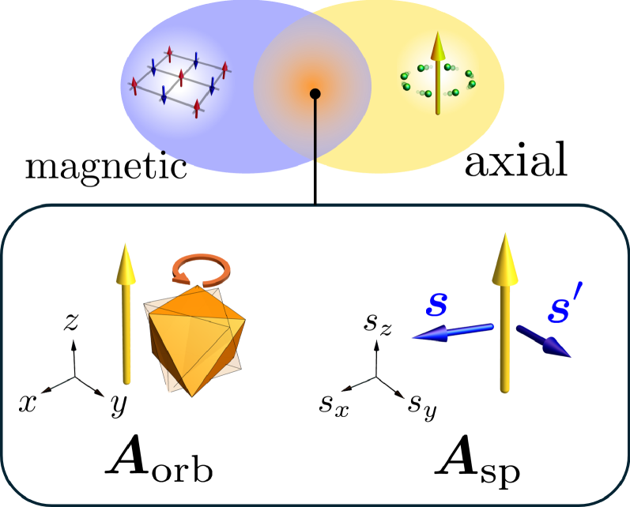

**図1のキャプション：** フェロアキシャル磁性体における軸性磁気マルチフェロイシティの模式図。左側は軌道活性型フェロアキシャル秩序（$\mathbf{A}^\mathrm{orb}$）の実空間的描像を、右側はスピン活性型（$\mathbf{A}^\mathrm{sp}$）の非共線的スピン配置から生じるフェロアキシャル秩序を示す。これら2種類の非相対論的起源を区別することが本論文の核心的貢献である。鏡映対称性は破れるが、時間反転対称性・空間反転対称性はともに保たれていることが示される。

**図2** （arXiv:2603.12502, Fig. 2）
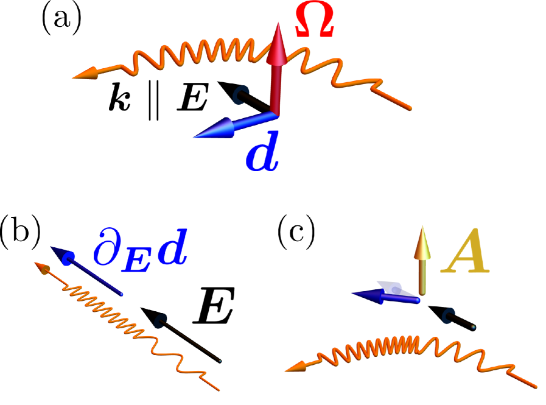

**図2のキャプション：** フェロアキシャル磁性体における2次および3次非線形ホール効果の比較。等方的システム（フェロアキシャル秩序なし）では2次のBerry曲率双極子（BCD）ベクトルが特定の対称性を持つのに対し、フェロアキシャル秩序を持つ系ではBCDが「屈曲」した応答を示す。3次非線形ホール効果がフェロアキシャル磁性体の実験的識別指紋として機能する根拠を与えるプロット。

**図3** （arXiv:2603.12502, Fig. 3）
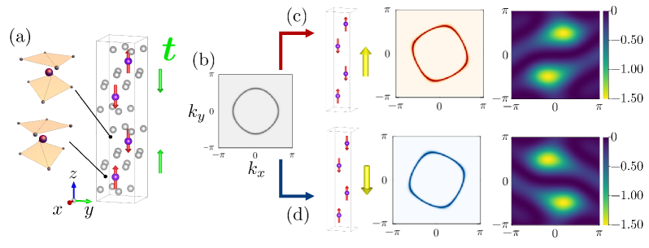

**図3のキャプション：** 候補フェロアキシャル金属のモデル計算結果。結晶構造・スピン配置とフェルミ面形状（左）、およびBerry接続偏極率の計算値（右）を示す。フェルミ面上でのスピン分裂とBCP分布が非線形ホール効果の大きさを決定する。TmPdIn系を念頭に置いたモデルで、実材料へのスクリーニングの根拠となる。

---
---

### 重点論文 2

**1. 論文情報**

**タイトル：** [Magnetotransport in the presence of real and momentum space topology](https://arxiv.org/abs/2603.13229)
**著者：** Azaz Ahmad, Takami Tohyama
**arXiv ID：** 2603.13229
**カテゴリ：** cond-mat.mes-hall
**公開日：** 2026年3月16日
**論文タイプ：** 理論（半古典輸送論）
**ライセンス：** CC BY 4.0

---

**2. どんな研究か**

Weylセミメタル（WSM）においてスカーミオンが誘起する実空間トポロジー（創発磁場 $\mathbf{B}_\mathrm{emer}$）と、Weylノード由来の運動量空間トポロジー（Berry曲率 $\boldsymbol{\Omega}_k$）が磁気輸送にどのような競合・協力をもたらすかを理論的に解明した研究である。半古典ボルツマン輸送理論を用いた系統的解析により、縦磁気伝導度（LMC）と平面Hallコンダクタンス（PHC）がそれぞれ独立に実空間・運動量空間トポロジーのシグネチャを担うことを示した。創発磁場が運動量空間Berry曲率とは独立した「チューニングパラメータ」として機能するという知見は、複合トポロジー系の実験的解析に直結する。

---

**3. 位置づけと意義**

Weylセミメタルにおける磁気輸送、特にカイラル異常に起因する負の縦磁気抵抗（LMR）は分野で活発に研究されてきたが、実試料ではスカーミオンや磁気テクスチャが共存することが多い。実空間の創発磁場と運動量空間のBerry曲率が同時に存在する系の輸送論は理論的に未整備であり、実験データの解釈が困難であった。本論文はこの問題に正面から取り組み、LMCの曲率（谷間散乱が支配）とシフト量（創発磁場が支配）という2つの独立な幾何学的特徴を理論的に明確に分離した。これは実験家がLMCの形状から磁気テクスチャのトポロジーを読み取れる可能性を開く、実用的に重要な知見である。

---

**4. 研究の概要**

*背景・目的：*
Weylセミメタルのカイラル異常由来のLMCは $\Delta\sigma_{xx} \propto B^2$ という放物線状の磁場依存性を示すとされるが、実際の実験では符号反転や非単調な挙動が観測されることがある。スカーミオン相を持つWSMでは実空間トポロジーが追加的な輸送効果を与えるが、両者の競合は未解明だった。

*解こうとしている問題：*
WSMにおいてスカーミオン誘起の創発磁場 $\mathbf{B}_\mathrm{emer}$ がLMCとPHCにどのような定量的影響を与えるか、谷間散乱との相互作用はどう変わるかを明確化すること。

*研究アプローチ：*
時間反転対称性を破ったWeylセミメタルのミニマルモデルハミルトニアンに対し、Boltzmann方程式を解く半古典輸送理論を展開。創発磁場を外部磁場から独立したパラメータとして扱い、谷間散乱強度 $\alpha$ との組み合わせで系統的パラメータ調査を実施した。

*対象材料系：*
磁気秩序（スカーミオン相）を持つWeylセミメタルの一般モデル。実験的対象としてはGd₂PdSi₃、Mn₃Sn、Co₃Sn₂S₂などのWSMスカーミオン系が念頭に置かれる。

*主な手法：*
位相空間に Berry 曲率補正を組み込んだボルツマン方程式の解析解・数値解。谷間散乱を緩和時間 $\tau_v$ でモデル化。

*主な結果：*
(a) LMCに3つの特徴的レジームを同定：(i) 弱い符号反転（放物線シフト）、(ii) 強い符号反転（曲率反転）、(iii) 強弱複合型（曲率反転＋シフト）。谷間散乱が曲率を制御し、創発磁場がシフトを制御するという独立性が鍵。(b) PHCは創発磁場の方向変化のみで有限値をとりうることを証明し、実空間トポロジーだけに由来するHall応答が原理的に存在することを示した。

*著者の主張：*
実空間・運動量空間トポロジーは輸送において独立のシグネチャを担い、LMCの曲率と極値シフト量を別々に評価することで両者を分離できる。

---

**5. 対象分野として重要なポイント**

- *物性・相互作用：* Berry曲率（運動量空間）、創発磁場（実空間）、谷間散乱、カイラル異常
- *手法の妥当性：* 半古典ボルツマン論は低温・弱磁場域では標準的で妥当。量子補正（WL等）は考慮されていないが、定性的描像としては十分。
- *既存研究との差分：* 従来は創発磁場を外部磁場の繰り込みとして扱うことが多かったが、本論文は独立なパラメータとして区別した点が新しい。
- *新規性：* 実空間と運動量空間のBerry曲率が輸送において独立に識別可能というのは理論的に明快で新しい。
- *物理的解釈：* 位相空間因子 $\mathbf{B}_\mathrm{emer} \cdot \boldsymbol{\Omega}_k^\chi$ の符号が両Weylノードで逆転する（軸性場的挙動）という機構が核心。
- *一般性：* Weylセミメタル＋スカーミオン系に広く適用可能。実験でのLMC形状解析への応用が直接的。
- *物性解釈・材料設計への貢献：* 磁気テクスチャのトポロジーを輸送実験で識別する手法論を提供。

---

**6. 限界と注意点**

- 半古典理論であり、低温・強磁場域での量子補正（Landauレベル量子化、WL/WAL）は考慮外。実験との定量比較には追加が必要。
- 谷間散乱を単一の緩和時間でモデル化しており、実際の散乱メカニズムの詳細（不純物の種類、濃度依存性など）は入っていない。
- 創発磁場の大きさと均一性（スカーミオン密度・サイズによる変動）が実験では乱雑であり、理論の均一場仮定との乖離がありうる。
- 現状は計算・理論のみであり、特定のWSMスカーミオン材料での第一原理的な検証はない。

---

**7. 関連研究との比較や研究動向における立ち位置**

- *先行研究：* Weylセミメタルの磁気輸送理論はSon & Spivak (2013)のカイラル磁気効果以降、多数の理論研究が蓄積されている。スカーミオン由来の創発磁場と電子輸送の関係もBruno et al.やYe et al.以来の系譜がある。
- *競合・類似研究：* 複合トポロジー系の輸送論はHao et al.やWang et al.らが取り組んでいる分野で、競争的。本論文の差異は「独立シグネチャ」の分離という概念的明確さにある。
- *分野の未解決問題：* Weylセミメタルの実験でのLMC符号反転の解釈論争（真のカイラル異常か表面状態か）を「実空間トポロジーも原因になりうる」という形で整理しうる。
- *新規性：* Incrementalな技術的前進だが概念的には重要な整理。
- *引用コミュニティ：* Weylセミメタル輸送・スカーミオン物性・トポロジカル輸送のコミュニティで参照されうる。
- *今後の展開：* 特定のWSM材料（Co₃Sn₂S₂等）との比較実験、スカーミオン密度の磁場依存性を制御した輸送実験への応用が期待される。

---

**8. 関連キーワードの解説**

**① カイラル異常（Chiral anomaly）**
場の理論におけるカイラル電流の非保存則が固体中でも発現する現象。Weylセミメタルでは右巻き・左巻きWeylノード間で電荷が移動し（谷間電荷汲み出し）、磁場と電場が平行のとき（$\mathbf{E}\cdot\mathbf{B}\neq 0$）に縦電流が増加する「負の磁気抵抗」として観測される。

**② 創発磁場（Emergent magnetic field）**
実空間でスピンテクスチャが連続的に変化するとき、伝導電子はスピンテクスチャの幾何学から仮想的な磁場（Berry曲率の実空間版）を感じる。スカーミオン格子では$\mathbf{B}_\mathrm{emer} = \hbar/(2e) \mathbf{n}\cdot(\partial_x\mathbf{n}\times\partial_y\mathbf{n})$の形で書かれ、位相空間においてLorentz力と同様の役割を果たす。

**③ 谷間散乱（Intervalley scattering）**
Weylセミメタルにおいて異なるWeylノード（谷）間で電子が散乱される過程。谷間散乱が強いと、カイラル不均衡が素早く解消されカイラル磁気効果が抑制される。この強度パラメータ $\alpha$ がLMCの形状（放物線の曲率）を支配する。

**④ 平面Hallコンダクタンス（Planar Hall conductance）**
電流と磁場がともに同一面内（たとえば $xy$ 平面内）にある配置での横方向電流。通常のHall効果（面外磁場）と異なり、Berry曲率の特定成分に敏感である。Weylセミメタルではカイラル異常関連のBerry曲率が寄与し、$\sigma_{xy} \propto B^2\sin\theta\cos\theta$ のような角度依存性を示す。

**⑤ Berry曲率（Berry curvature）**
ブロッホ波動関数の運動量空間における幾何学的位相（Berry位相）の微分形、$\mathbf{\Omega}_n(\mathbf{k}) = -2\mathrm{Im}\sum_{m\neq n}\langle n|\partial_\mathbf{k} H|m\rangle\times\langle m|\partial_\mathbf{k} H|n\rangle/(E_m-E_n)^2$。異常ホール効果・非線形光学応答・熱電効果など多くの輸送・光学応答の幾何学的起源となる。Weylノードはモノポールとして$\boldsymbol{\Omega}$の源泉となる。

---

**9. 図**

**図1** （arXiv:2603.13229, Fig. 1）
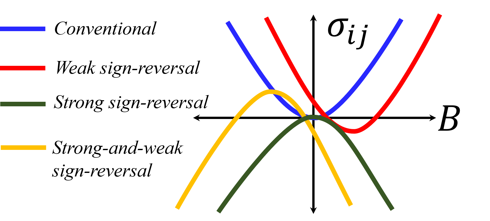

**図1のキャプション：** 外部磁場と創発磁場が共存するWeylセミメタルにおける縦磁気伝導度（LMC）の特徴的レジームの模式図。左から右へ、谷間散乱の強さと創発磁場の大きさに応じた3つのシナリオ（放物線シフト型、曲率反転型、複合型）が示されている。実空間トポロジー（スカーミオン）と運動量空間トポロジー（Berry曲率）が独立のシグネチャを担うことがこの図から直観的に理解できる。

**図2** （arXiv:2603.13229, Fig. 2）
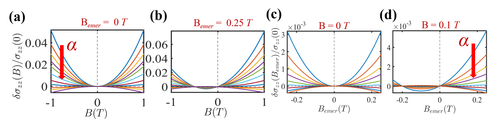

**図2のキャプション：** 谷間散乱強度 $\alpha$ と創発磁場 $B_\mathrm{emer}$ を変化させたときの縦磁気伝導度の外部磁場依存性（数値計算結果）。各レジームでのLMCの変化が定量的に示されており、$\alpha$ が曲率を、$B_\mathrm{emer}$ が極値のシフト量を独立に制御することが確認される。

**図3** （arXiv:2603.13229, Fig. 3）
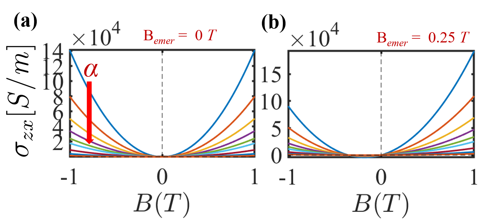

**図3のキャプション：** 平面Hallコンダクタンス（PHC）の外部磁場・創発磁場依存性の計算結果。谷間散乱パラメータを固定し、創発磁場の強度を変えたときのPHCの変化を示す。創発磁場の方向変化のみによっても有限のPHCが生じることが示されており、実空間トポロジーのみに由来するHall応答という新しい理論的予言が可視化されている。

---
---

### 重点論文 3

**1. 論文情報**

**タイトル：** [Zero-field superconducting vortices and Majorana zero modes pinned by magnetic islands in correlated Rashba systems](https://arxiv.org/abs/2603.12338)
**著者：** Panagiotis Kotetes, Brian M. Andersen
**arXiv ID：** 2603.12338
**カテゴリ：** cond-mat.supr-con, cond-mat.mes-hall
**公開日：** 2026年3月16日
**論文タイプ：** 理論（Ginzburg-Landau理論・BdGハミルトニアン）
**ライセンス：** CC BY-NC-ND 4.0

---

**2. どんな研究か**

RashbaスピンSOC結合を持つ2次元超伝導体において、磁性アイランド（磁気島）と交換結合させることで外部磁場なしに超伝導渦を安定化させ、その渦にMajoranaゼロモード（MZM）を捕捉できるという機構を理論的に提案した研究である。磁気アイランドのスピンモーメントがZeeman効果とRashbaマグネトエレクトリック効果の2つのチャンネルを通じて超伝導位相の渦度（vorticity）に変換されるメカニズムを明確に示し、強磁性秩序のない磁気相関（short-range magnetic correlations）の系でも機能することを示した。現実材料としてFeTe₀.₅₅Se₀.₄₅や4Hb-TaS₂などのトポロジカル超伝導体候補が提案されている。

---

**3. 位置づけと意義**

Majoranaゼロモードは位相的量子計算のプラットフォームとして注目されているが、その実現には通常外部磁場が必要であり、超伝導ギャップを閉じるリスクがある。本論文が提案する零磁場渦ピン留め機構は、外部磁場なしにMZMを安定化できるという点で実用的に重要な前進である。特にFeTe₀.₅₅Se₀.₄₅系のトポロジカル超伝導体でのSTM実験とも整合性が高く、磁性不純物付近でのゼロバイアスピークの起源を新しい視点から解釈できる。磁気相関は長距離秩序を必要としないという条件の緩和も現実的な材料探索に有利である。GL理論とBdG計算の組み合わせにより、スピンモーメント→渦度変換の定量的な予測が行われている点が実験グループへの明確なガイダンスを与える。

---

**4. 研究の概要**

*背景・目的：*
トポロジカル超伝導体上でのMZMの安定化は、磁気渦の存在が鍵となる。通常は外部磁場で渦を生成するが、超伝導ギャップへの影響が問題。磁性アイランドを利用した零磁場渦生成機構の定量的理論が不足していた。

*物性物理上の問題：*
磁気アイランドのスピンモーメントが超伝導系に誘起する渦の渦度を決定するメカニズムの解明と、渦・MZMの安定性条件の特定。

*研究アプローチ：*
(1) GL理論による超伝導位相への磁気アイランドの効果の解析解導出（$\xi_S \ll \lambda_L, \rho_I, \xi_M$ の極限）。(2) BdGハミルトニアンによるMZMの位相的安定性の議論。

*対象材料系：*
FeTe₀.₅₅Se₀.₄₅（鉄系トポロジカル超伝導体、$\lambda_L \approx 1500$ nm）、4Hb-TaS₂（超伝導転移時に自発磁化が出現）、RashbaトポロジカルSSC面（Fu-Kaneモデル）。

*主な手法：*
Ginzburg-Landau汎関数（電磁・Zeeman・RashbaマグネトエレクトリックおよびHirsch-Fye型の磁気相関項を含む）の連立方程式の解析解（Bessel関数積分）。BdGモデルによるトポロジカルギャップの議論。

*主な結果：*
(a) スピン-渦度変換係数 $\zeta$ が $\rho_I/\lambda_L$ の比で決まり、$\lambda_L \gg \rho_I, \xi_M$ の極限で最大効率が得られる（FeTe₀.₅₅Se₀.₄₅はこの条件を満たす）。(b) 磁気相関（電子的磁化 $M_z$）がアイランドスピンモーメントを「着飾り（dress）」し、渦度の安定化を大幅に向上させる。(c) 奇数渦度でMZMが生成される（トポロジカルギャップ条件が成立する場合）。

*著者の主張：*
提案機構は実験的に実現可能な系（特にFeTe₀.₅₅Se₀.₄₅）で機能し、零磁場でのMZM探索に向けた新しいプラットフォームを提供する。

---

**5. 対象分野として重要なポイント**

- *物性・相互作用：* Rashbaスピン軌道相互作用、超伝導秩序パラメータ、磁気交換相互作用、渦糸、Majoranaゼロモード
- *手法の妥当性：* GL理論は超伝導コヒーレンス長より十分長いスケールで妥当。BdGはトポロジカルギャップ議論の標準手法。解析解が得られていることで定量的予測が可能。
- *既存研究との差分：* 磁性不純物による渦ピン留めの先行研究（Brandt, Blatter等）は磁場印加系が主流。零磁場でのスピン→渦度変換の定量的理論は新しい。
- *物理的解釈：* ZeemanとRashbaマグネトエレクトリック効果の二重変換チャンネルの相乗効果が機構の核心。
- *一般性：* 磁気相関のある任意のRashba超伝導体に適用可能。材料スクリーニングへの指針が明確。
- *応用：* 位相的量子計算向けのプラットフォーム探索に直結。

---

**6. 限界と注意点**

- GL理論は $T$ が $T_c$ 近傍でのみ厳密だが、著者はより広い適用範囲を主張している。低温での定量的精度に注意が必要。
- 磁気アイランドの「サイズ」「形状」「スピンモーメントの均一性」が実際の材料では理想的でない場合が多く、変換効率 $\zeta$ の実際値は計算より低くなりうる。
- MZMの安定性はトポロジカルギャップの大きさに依存するが、FeTe₀.₅₅Se₀.₄₅では実際のギャップサイズに議論があり、主張の根拠が間接的な部分がある。
- 27ページの計算論文であり、各種近似（$\xi_S \ll \lambda_L$ など）の妥当性範囲が実材料でどの程度成立するかの検証が今後必要。
- ゼロバイアスピーク（ZBP）がMZM起源かどうかの識別（vs. 非トポロジカルな束縛状態）の議論が不十分。

---

**7. 関連研究との比較や研究動向における立ち位置**

- *先行研究：* FeTe₀.₅₅Se₀.₄₅のSTM実験でのZBP（Yin et al. 2015, Wang et al. 2018）と本提案の整合性は高い。Fu-Kane モデルの位相的超伝導は古典的枠組み（Fu & Kane, 2008）。
- *競合研究：* 磁性アダトム鎖でのMZM探索（Nadj-Perge et al., 2014等）と競合するが、アイランド系は空間的スケールが大きくSTMアクセスが容易。
- *前進度：* 概念的には重要な提案だが実験的検証は今後の課題。直接証拠はない。
- *新規性：* 機構の定量理論という点ではbreakthrough的な貢献。
- *引用コミュニティ：* トポロジカル超伝導・Majorana物理・スピントロニクスの広いコミュニティで参照されうる。
- *今後の展開：* FeTe₀.₅₅Se₀.₄₅上への磁性アイランド（Fe, Mn等）設置実験での検証、STMによる渦状態の実空間観測、MZMスペクトルの理論予測の精密化。

---

**8. 関連キーワードの解説**

**① Majoranaゼロモード（Majorana zero mode）**
粒子と反粒子が同一である「Majoranaフェルミオン」が固体中で出現するゼロエネルギー状態。トポロジカル超伝導体における渦のコアや端状態に局在し、非アーベル統計に従うことが理論的に予言されている。これを操作することで誤り耐性量子ゲートが実現できるとされ、量子計算への応用が注目される。

**② Rashbaマグネトエレクトリック効果**
Rashbaスピン軌道相互作用のある系では、磁化 $\mathbf{M}$ と電気分極 $\mathbf{P}$ の間に $\mathbf{P} \propto \hat{\mathbf{z}} \times \mathbf{M}$ の結合が生じる。逆方向では磁化勾配が仮想電場（またはその逆）を生み出す。本研究では磁性アイランドの面外磁化の勾配が超伝導位相の巻き（渦度）を誘起する経路の一つとして機能する。

**③ Ginzburg-Landau理論（Ginzburg-Landau theory）**
超伝導秩序パラメータ $\psi$ を複素スカラー場として扱う現象論的理論。自由エネルギー $F = \int [a|\psi|^2 + b|\psi|^4 + |\nabla\psi - 2ie\mathbf{A}\psi|^2/(2m^*) + \mathbf{B}^2/(8\pi)] dV$ を最小化することで渦構造・磁場分布・超流動密度を決定する。外部磁場や磁気アイランドの効果をこの枠組みで定式化できる。

**④ ロンドン侵入長（London penetration depth, $\lambda_L$）**
超伝導体において外部磁場が侵入できる特徴的長さ。$\lambda_L \sim \sqrt{m^*/(4\pi n_s e^2)}$ で与えられ、超流体密度 $n_s$ が大きいほど小さい。本研究では $\lambda_L \approx 1500$ nm（FeTe₀.₅₅Se₀.₄₅の実験値）が磁性アイランドサイズと比較されており、渦度変換効率を決定する鍵パラメータとなっている。

**⑤ ボゴリューボフ-ド・ジャン（BdG）ハミルトニアン**
超伝導秩序が存在する系における準粒子（ボゴリューボン）を記述するハミルトニアン。電子とホールを名義粒子（Nambu）表示で合わせて、$H_\mathrm{BdG} = \begin{pmatrix} h(\mathbf{k}) & \Delta \\ \Delta^\dagger & -h^*(-\mathbf{k}) \end{pmatrix}$ の形で書かれる。このハミルトニアンのバンド構造のトポロジーによってMZMの存在が決まる。

---

**9. 図**

**図1** （arXiv:2603.12338, Fig. 1）
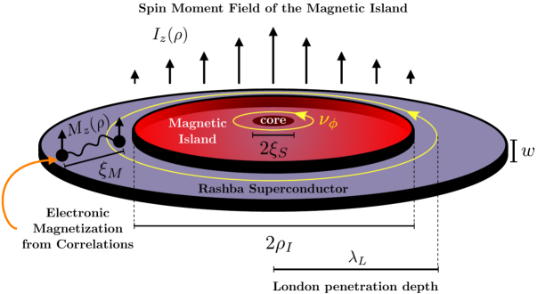

**図1のキャプション：** 提案システムの模式図。RashbaスピンSOC結合を持つ2次元超伝導体（青）の上に、半径 $\rho_I$ の磁性アイランド（橙）が置かれている。アイランドのサイズはロンドン侵入長 $\lambda_L$ や磁気相関長 $\xi_M$ との比較で示されており、スピンモーメント→渦度変換の効率を決定する。面外磁化を持つアイランドによりゼロ磁場での渦が安定化される機構がここから直感的に理解できる。

**図2** （arXiv:2603.12338, Fig. 2）
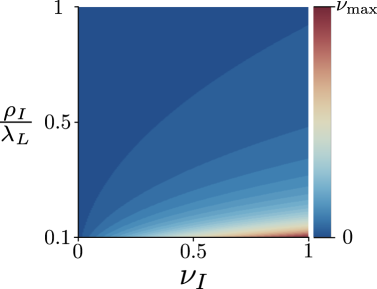

**図2のキャプション：** アイランド半径とスピンモーメントの関数として示した誘起渦度 $\nu_\varphi$ のヒートマップ（$\lambda_L = 1500\xi_S$ の場合）。$\rho_I \ll \lambda_L$ で渦度が最大となり、$\rho_I \gg \lambda_L$ ではゼロに漸近する。FeTe₀.₅₅Se₀.₄₅はこの条件を満たす領域にあり、零磁場渦ピン留めが実現可能であることを定量的に示す。

**図3** （arXiv:2603.12338, Fig. 3）
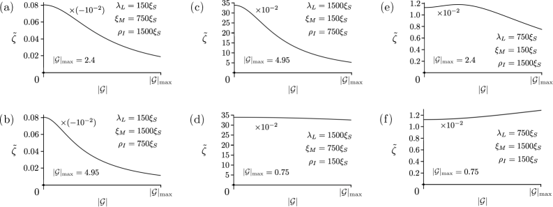

**図3のキャプション：** 交換結合強度 $|G|$ の関数として示したスピン-磁束変換係数 $\tilde{\zeta}$。異なるスケールヒエラルキー（$\lambda_L, \xi_M, \rho_I$ の大小関係の6通り）を比較している。弱結合（$|G| \approx 0$）で変換効率が最大になるという直感に反する結果が示されており、強い磁気相関が必ずしも渦ピン留めを増強しないことが分かる。

---
---

## その他の重要論文

---

### 論文 4

**1. 論文情報**

**タイトル：** [Excitonic Quantum Anomalous Hall Effect in Collinear Magnets Without Spin-Orbit Coupling](https://arxiv.org/abs/2603.12280)
**著者：** Xingxing Liu, ChaoYang Tan, Peng-Jie Guo, Zhong-Yi Lu, Zheng-Xin Liu
**arXiv ID：** 2603.12280
**カテゴリ：** cond-mat.mes-hall, cond-mat.str-el
**公開日：** 2026年3月16日
**論文タイプ：** 理論
**ライセンス：** arXiv非独占的ライセンス（図の抽出不可）

---

**2. 研究概要**

量子異常ホール（QAH）効果の従来の実現機構はすべて強磁性＋スピン軌道結合（SOC）の組み合わせに依存してきたが、本論文はSOCが無視できるコリニア磁性体（強磁性・アルターマグネット）においても、三重項励起子凝縮を利用することでQAH絶縁体状態が実現できるという新しい機構を理論的に提案した。第一ステップとして「スピン分裂したノードリング」バンド構造を準備し、第二ステップとして三重項励起子凝縮によってそのノードリングをギャップアウトすることで、運動量空間のスピンテクスチャが共線から非共線に変化し、有限のChern数（$C = \pm 1$）が発現するという二段階機構である。電子格子相互作用が $(p_x + ip_y)$ 波的な凝縮状態を安定化させる役割を担う。候補材料としてバイレイヤーV₂SeTeOが第一原理計算により提案され、そのバンド構造（伝導帯・価電子帯が異なる層に局在、励起子寿命長い）が理論条件と整合することが示された。

このメカニズムはSOCを必要としないため、従来の強磁性トポロジカル絶縁体系（Cr-BiSbTe薄膜等）では問題となっていた磁性－SOCの精密チューニングが不要となる点で材料設計の自由度が根本的に拡大する。また、アルターマグネットにも適用可能であることが示されており、アルターマグネット系でのトポロジカル相探索という新しい方向性を切り開く。実験的には励起子凝縮状態の観測（例：輸送の量子化ホール抵抗、チャーラルエッジモードのSTM観測）が次の課題となる。

**3. 図**

本論文はarXiv非独占的ライセンスのため、原図の抽出・転載はできません。論文のキーフィギュアとして、(1) 強磁性モデルのバンド構造とノードリング（Fig. 1）、(2) 電子格子結合強度に対する位相図とChern数の変化（Fig. 3）、(3) バイレイヤーV₂SeTeOの第一原理バンド構造とカイラルエッジモード（Figs. 5-6）がある。詳細は[論文リンク](https://arxiv.org/abs/2603.12280)を参照。

---

### 論文 5

**1. 論文情報**

**タイトル：** [Inverse Faraday Effect in Rashba two-dimensional electron systems: interplay of spin and orbital effects](https://arxiv.org/abs/2603.13187)
**著者：** Jaglul Hasan, Chandan Setty
**arXiv ID：** 2603.13187
**カテゴリ：** cond-mat.mes-hall
**公開日：** 2026年3月16日
**論文タイプ：** 理論
**ライセンス：** CC BY 4.0

---

**2. 研究概要**

逆ファラデー効果（Inverse Faraday Effect: IFE）は円偏光照射によって誘起されるDC磁化であり、超高速光磁気スイッチングの文脈で重要な物理過程である。本論文は、RashbaスピンSOC結合を持つ2次元電子系において、IFEのスピンチャンネル（Edelstein効果連鎖による非平衡スピン偏極）と軌道チャンネル（環流電荷電流による軌道磁化）の2つが相互に干渉し、それぞれに特徴的な周波数依存性と共鳴条件を持つことを量子動力学方程式を用いて系統的に解明した。特に重要な知見は、軌道磁化のSOC依存部分が3つの独立な寄与（正準電流項・対流項・速度修正項）に分解でき、これらがRashba分裂のエネルギー $2\alpha_{so}k_F$ に共鳴する形で増大するという点である。従来研究ではスピン起源のIFEが議論の中心であったが、軌道チャンネルが同程度かそれ以上の大きさを持ちうることが示され、光スイッチング実験の定量的解釈に修正が必要であることを示唆する。低次元系（二次元電子ガス、半導体量子井戸、界面二次元電子系）での光誘起磁化の精密測定に向けた新しい理論的基盤を提供する。

**3. 図**

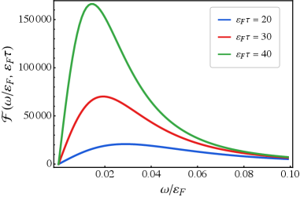

**図1のキャプション：** Rashba 2次元電子系における逆ファラデー効果のスピン磁化のダイアグラム表現。光の角運動量がEdelstein効果を通じてスピン偏極に変換される過程が図示されている。スピンSOC相互作用のある系でのスピンIFE成分が通常のメタルとどう異なるかを示す。

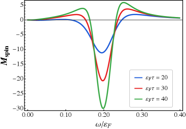

**図2のキャプション：** Rashba 2DEGにおけるスピンIFE磁化の規格化周波数依存性（SOCパラメータ $\alpha_{so}k_F/\mathcal{E}_F = 0.1$、様々な $\mathcal{E}_F\tau$ 値）。周波数 $\omega = 2\alpha_{so}k_F$ でのRashba共鳴による増強が顕著であることが示されており、これがスピン・軌道両チャンネルの共鳴強化機構の根拠となる。

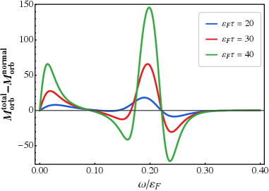

**図3のキャプション：** SOC由来の軌道IFE磁化の全体成分を通常金属のベースラインと比較したプロット。SOCによる修正が通常金属との差として可視化されており、軌道チャンネルがスピンチャンネルに匹敵しうる大きさを持つという主要な主張を支持する図。

---

### 論文 6

**1. 論文情報**

**タイトル：** [Interaction-Driven Ferrimagnetic Stripes in the Extended Hubbard Model](https://arxiv.org/abs/2603.12309)
**著者：** Chunhan Feng, Miguel A. Morales, Shiwei Zhang
**arXiv ID：** 2603.12309
**カテゴリ：** cond-mat.str-el, cond-mat.quant-gas
**公開日：** 2026年3月16日
**論文タイプ：** 理論（量子モンテカルロ・DMRG数値計算）
**ライセンス：** arXiv非独占的ライセンス（図の抽出不可）

---

**2. 研究概要**

標準的なHubbardモデルにドーピングを施した場合にスピンストライプが形成されることはよく知られているが、最近接Coulomb斥力（V）を加えた拡張Hubbardモデルでは全く新しい磁気相が現れることを本論文は示した。補助場量子モンテカルロ法（AFQMC）と密度行列繰り込み群（DMRG）の二つの高精度数値手法の一致結果として、V/U ≳ 0.25という比較的穏やかな近接斥力の条件下で、スピン密度が有限値とほぼゼロを交互に示す「フェリ磁性ストライプ」秩序がチェッカーボード型電荷密度波（CDW）と絡み合って安定化されることが明確に示された。このフェリ磁性相の重要性は、スピンバランス系（全スピン＝0）では反対方向の磁化ドメインが交互に並ぶのに対し、スピン非制約系では有限の正味磁化が出現するという点にある。次近接ホッピング（t'）の追加はストライプ波長を変化させるが相の安定性を損なわず、強い普遍性が示唆される。

カップレート超伝導体における電荷・スピン縞秩序の微視的起源をめぐる理論的議論において、本研究は最近接Coulomb斥力という単純な摂動が根本的に新しい磁気テクスチャを生み出せることを高精度数値計算で示した点で重要である。V/U比はAbinitioDMFTやcRPAで推定可能であり、Cu酸化物の実際の比（V/U ~ 0.2-0.4程度）は新しい磁気相が現れる範囲内にある可能性もある。

**3. 図**

本論文はarXiv非独占的ライセンスのため、原図の転載はできません。キーフィギュアとして、(1) フェリ磁性ストライプのスピン・電荷密度プロファイル（各スピン成分の実空間分布）、(2) V/U比に対する相図（フェリ磁性・AF・CDW相の境界）、(3) t'依存性を示す比較プロットが存在する。詳細は[論文リンク](https://arxiv.org/abs/2603.12309)を参照。

---

### 論文 7

**1. 論文情報**

**タイトル：** [Two-channel physics in a lightly doped antiferromagnetic Mott insulator revealed by two-hole spectroscopy](https://arxiv.org/abs/2603.13222)
**著者：** Pit Bermes, Sebastian Paeckel, Annabelle Bohrdt, Lukas Homeier, Fabian Grusdt
**arXiv ID：** 2603.13222
**カテゴリ：** cond-mat.str-el, cond-mat.quant-gas, quant-ph
**公開日：** 2026年3月16日
**論文タイプ：** 理論（数値計算: CTKS法）
**ライセンス：** arXiv非独占的ライセンス（図の抽出不可）

---

**2. 研究概要**

軽くドープされた反強磁性Mottモット絶縁体（t-Jモデル）において、二ホール（two-hole）スペクトルを超高精度で計算することで、低エネルギーに「二つの結合した対形成チャンネルが共存する」という新しい物理像を明らかにした研究である。具体的には、タイトバインディング的に束縛した対（「バイポーラロン」チャンネル）と、反強磁性背景の中の磁気ポーラロン二体が弱く相互作用するチャンネル（「磁気ポーラロン」チャンネル）の二つが低エネルギーで混成し、スピン異方性パラメータの変化（Ising極限からHeisenberg極限へのクロスオーバー）において回避交差（avoided crossing）を示すことが判明した。この構造は有効Feshbach共鳴——二つの対形成チャンネルが散乱共鳴付近で混成する現象——と解釈でき、銅酸化物高温超伝導体はBCS-BEC架け橋の「BCS側だがFeshbach共鳴に近い」位置にある可能性を示唆する。

技術面では、「複素時間Krylov空間（CTKS）展開」という新手法によりエネルギー分解能をNyquist制限より一桁以上改善した。実験的提案として、冷却原子系での引力Hubbardモデル実現とRamanアシスト二ホールスペクトル測定が提案されており、近い将来の光格子実験で検証可能とされる。カップレートでのd波対称性の起源に対する微視的視点から、二チャンネルFeshbach共鳴的機構という新しい解釈が加わった。

**3. 図**

本論文はarXiv非独占的ライセンスのため、原図の転載はできません。主なフィギュアとして、(1) 二ホールスペクトルとバンド分散（2チャンネルの回避交差の可視化）、(2) スピン異方性に対する対相関関数（チャンネル混成の強さ）、(3) 実験提案の概念図（光格子でのRaman分光スキーム）が存在する。詳細は[論文リンク](https://arxiv.org/abs/2603.13222)を参照。

---

### 論文 8

**1. 論文情報**

**タイトル：** [Linear Magnetoresistance as a Probe of the Neel Vector in Altermagnets with Vanishing Anomalous Hall Effect](https://arxiv.org/abs/2603.12692)
**著者：** Kamal Das, Binghai Yan
**arXiv ID：** 2603.12692
**カテゴリ：** cond-mat.mes-hall, cond-mat.mtrl-sci
**公開日：** 2026年3月16日
**論文タイプ：** 理論（半古典輸送論・第一原理計算）
**ライセンス：** arXiv非独占的ライセンス（図の抽出不可）

---

**2. 研究概要**

アルターマグネット（AM）は運動量空間でのT対称性破れという独特の特性を持つが、特定の結晶対称性（鏡映等）の存在によって異常ホール効果（AHE）がゼロになることがある。このような「AHEが消えるAM」に対して、線形磁気抵抗（linear MR）が有効な代替観測手段となることを理論的に示したのが本論文である。変形Onsager関係式と時間反転奇な第三ランクテンソル $R_{ijl}$ の対称性解析に基づき、AHEとは異なるテンソル次数のため線形MRはAHEが消えても生き残ることが示された。磁場依存性は $\Delta\rho \propto B$ かつ「バタフライ型ヒステリシス」という特徴的な形状を持ち、Néelベクトルの方向転換とともに対称的に符号反転する。

CrSb（六方晶、磁気空間群 P6₃'/m'm'c）を例に、第一原理計算で線形MRの定量的予測（3Tで約0.1%）が行われ、測定可能な範囲であることが確認された。さらにRuO₂、Ca₃Ru₂O₇、MnTe、Mn₅Si₃、KV₂Se₂OなどAM候補材料への一般化可能性が示されており、AM系の実験的同定・Néelベクトル制御の新しい輸送ツールとして機能する。AMの実験的識別はこれまで主にARPES（スピン分解バンド構造）か極薄膜でのAHE測定に頼っていたが、バルク輸送測定で実行可能な線形MRの提案は実用上の大きな前進である。

**3. 図**

本論文はarXiv非独占的ライセンスのため、原図の転載はできません。主なフィギュアとして、(1) CrSbのバンド構造とBerry曲率テンソル分布、(2) 線形MRの磁場角度依存性（$B\sin\varphi$ および $B\cos\varphi$ 形状）、(3) 様々なAM材料での対称性許容テンソル成分一覧が存在する。詳細は[論文リンク](https://arxiv.org/abs/2603.12692)を参照。

---

### 論文 9

**1. 論文情報**

**タイトル：** [Slow spin-lattice relaxation dynamics in YbVO₄ revealed by extended thermal impedance spectroscopy from AC susceptibility and AC magnetocaloric measurements](https://arxiv.org/abs/2603.12731)
**著者：** Yuntian Li, Jiayi Hu, Dominic Petruzzi, Linda Ye, Mark P. Zic, Arkady Shekhter, Ian R. Fisher
**arXiv ID：** 2603.12731
**カテゴリ：** cond-mat.mtrl-sci
**公開日：** 2026年3月16日
**論文タイプ：** 実験
**ライセンス：** CC BY 4.0

---

**2. 研究概要**

YbVO₄は強い単イオン異方性を持つ希土類バナジウム酸化物であり、低温でスピンと格子（フォノン）の交換が遅くなる「フォノンボトルネック効果」のために、スピン系が格子系から熱的に切り離されたような状態（遅いスピン格子緩和）が出現することが知られている。本研究はこの遅いスピン格子緩和ダイナミクスをAC磁化率とAC磁気熱量効果（magnetocaloric effect）の両方を同時測定する「拡張熱インピーダンス分光法」により3 Kで詳細に解析した。従来の単純なAC磁化率測定はAC磁気熱量寄与を無視しがちであったが、この二つを統一的な離散化熱回路モデルで記述することで場依存のスピン格子緩和時間を初めて精度よく抽出した。

この測定方法論は汎用性が高く、磁気・誘電・弾性の複合応答を持つ任意の強相関材料系（例：量子スピン液体候補、重フェルミオン、圧電材料）に応用可能な一般的枠組みを提供する。YbVO₄でのスピン格子緩和に関しては、単イオン異方性が緩和速度の磁場依存性を支配するという描像が検証された。スピン格子相互作用のダイナミクス研究において、AC磁化率のみでは得られなかった情報が磁気熱量効果との組み合わせによって顕在化するという手法上の前進は、他の材料系の研究者にとっても参照価値が高い。

**3. 図**

本論文はCC BY 4.0ライセンスですが、HTMLバージョンが現在arXivにて提供されていないため、原図の直接抽出ができませんでした。主なフィギュアとして、(1) AC磁化率とAC磁気熱量効果の周波数・温度依存性、(2) 離散化熱回路モデルとフィッティング結果、(3) 場依存スピン格子緩和時間のプロット が存在すると考えられる。詳細は[論文リンク](https://arxiv.org/abs/2603.12731)を参照。

---

### 論文 10

**1. 論文情報**

**タイトル：** [Putative quantum critical point in locally noncentrosymmetric CeCoGe₂ crystals](https://arxiv.org/abs/2603.13111)
**著者：** F. Garmroudi, C. S. T. Kengle, M. H. Schenck, J. D. Thompson, E. D. Bauer, S. M. Thomas, P. F. S. Rosa
**arXiv ID：** 2603.13111
**カテゴリ：** cond-mat.str-el, cond-mat.mtrl-sci, cond-mat.supr-con
**公開日：** 2026年3月16日
**論文タイプ：** 実験
**ライセンス：** arXiv非独占的ライセンス（図の抽出不可）

---

**2. 研究概要**

CeCoGe₂は局所的な非中心対称性（Locally Noncentrosymmetric: LNC）を持つ重フェルミオン化合物の新候補として本研究で単結晶合成・物性測定が初めて行われた。LNC構造は単位胞内の副格子がそれぞれ非中心対称的であるが全体の空間群は中心対称である場合を指し、スピン縮退と局所的な「スタッガード」SOC（副格子間で符号反転）という独特の電子構造を持つ。本研究では高品質のCeCoGe₂単結晶を合成し、電気抵抗・比熱・磁気抵抗を測定した結果、約4%の内在的Co空孔が存在するにもかかわらず重フェルミオン基底状態（比熱係数 $\gamma$が増大）と非フェルミ液体的挙動（$\rho \sim T^n$, $n < 2$）が観測された。磁気秩序や超伝導は見られなかったが、これは不純物散乱による輸送の乱れが量子臨界揺らぎを隠蔽しているためと解釈されており、合成法の改善によって超伝導や磁気秩序が出現する可能性が示唆されている。

LNC系はCeRhSi₃型などの「完全非中心対称」重フェルミオン超伝導体とは異なる位置づけにあり、局所的なSOCが量子臨界点周辺の準粒子散乱に与える影響という未解決問題に切り込む新しい実験材料を提供する意義がある。Co空孔の除去という合成上の課題が克服されれば、より鮮明な非フェルミ液体・量子臨界的挙動の観測や超伝導の発見が期待される。LNCの文脈での重フェルミオンQCP研究は理論的にも未整備な部分が多く、本研究は実験と理論の橋渡しとなる材料を提供した。

**3. 図**

本論文はarXiv非独占的ライセンスのため、原図の転載はできません。主なフィギュアとして、(1) CeCoGe₂の結晶構造とLNC副格子の模式図、(2) 電気抵抗率の温度依存性（非フェルミ液体的べき乗）、(3) 比熱の低温挙動（重フェルミオン的電子比熱増大）が存在する。詳細は[論文リンク](https://arxiv.org/abs/2603.13111)を参照。

---

## 全体のまとめ

**物性物理分野の動向**
本日の選定論文を俯瞰すると、「スピン軌道相互作用（SOC）に頼らない非相対論的機構による新しいトポロジカル・多機能物性の理論探索」という流れが明確に浮かび上がる。フェロアキシャル磁性体の概念確立（2603.12502）と励起子凝縮QAH（2603.12280）は、SOCをパラメータとして固定した従来の物質設計から脱却し、スピン交換相互作用や電子格子結合という「非相対論的な多体相互作用」がトポロジーや多機能性を駆動しうるという視点を押し広げている。また、アルターマグネットを巡る実験・理論の基盤整備が続いており、線形MR（2603.12692）やフェロアキシャル磁性体の3次非線形ホール効果（2603.12502）のような新しい輸送プローブが次々と提案されている。複合トポロジーの輸送論（2603.13229）は理論的整理として堅実な前進であり、スカーミオン相を持つWSM系の実験解析に直結する。

**明らかになった未解決領域**
理論的提案が先行し実験的検証が追いついていない領域が多数存在する。フェロアキシャル磁性体の3次非線形ホール効果の直接測定、励起子QAH絶縁体の輸送観測、零磁場渦ピン留めによるMZMのSTM観測などは、いずれも現時点では実験データが得られていない。強相関系では、拡張HubbardモデルのフェリIRT磁性ストライプ（2603.12309）が現実のカップレート系とどの程度対応しているかは未決であり、第一原理レベルでのVパラメータの推定と輸送・中性子実験による相の同定が課題として残る。YbVO₄でのスピン格子緩和の詳細な磁場・温度依存性はデータが出始めているが、単イオン異方性との定量的整合性や他の希土類系への一般化にはさらなる研究が必要である。CeCoGe₂（2603.13111）のCo空孔問題は合成技術的な課題であり、解決後の物性が本来の量子臨界的挙動を示すかどうかは未知数であり、より純良な試料での再測定が不可欠である。

**今後の展望**
フェロアキシャル磁性体・アルターマグネット・p波磁石（今週の関連論文にも見られる）など、「非従来的な磁気秩序」を持つ物質群の探索・分類・物性測定は今後さらに加速するだろう。対称性解析とスピン結晶学群を用いた体系的スクリーニングが盛んになる中、実験的には高分解能の非線形輸送測定・スピン分解ARPES・放射光軟X線磁気円二色性（XMCD）による精密な磁気構造解析の精度向上が鍵となる。超伝導との接点では、零磁場MZMの実現・Feshbach共鳴的対形成の実験的証拠・アルターマグネット超伝導体の有限運動量対形成（先週の論文2603.12897とも関連）という三つの大きなテーマが並走しており、強相関超伝導の統一的理解に向けた機が熟しつつある。また、逆ファラデー効果・ポンプ・プローブ分光など光を用いた非平衡手法による磁性・超伝導の動的制御も、理論と実験の連携が深まる分野として引き続き注目される。

---

*（保存先：`C:\Users\yamaz\Documents\GitHub\arxiv-review\src\phys\2026-03-17.md`）*
*（図保存先：`C:\Users\yamaz\Documents\GitHub\arxiv-review\src\phys\figures\2026-03-17\`）*
