# 2026-03-18 物性物理

**作成日：** 2026年3月18日
**対象期間：** 2026年3月15日〜18日（直近72時間）

---

# 選定論文一覧

1. [Observation of two-component exciton condensates in an excitonic insulator](https://arxiv.org/abs/2603.15443) ⭐重点
2. [Ferroaxial and nematic transitions in the charge density wave phase of 1T-TiSe₂](https://arxiv.org/abs/2603.14614) ⭐重点
3. [Imaging Harmonic Generation of Magnons](https://arxiv.org/abs/2603.14082) ⭐重点
4. [Nanoscale electronic variations in altermagnetic α-MnTe](https://arxiv.org/abs/2603.15225)
5. [Giant anomalous Hall conductivity in frustrated magnet EuCo₂Al₉](https://arxiv.org/abs/2603.14682)
6. [Emergent giant topological Hall effect in twisted Fe₃GeTe₂ metallic system](https://arxiv.org/abs/2603.14192)
7. [The stripe state at 1/8 Ba doping hosts optimal superconductivity in La-214 cuprates under low in-plane stress](https://arxiv.org/abs/2603.14108)
8. [Probing the Penetration Depth of Topological Surface States by Magnetic Impurity Scattering in V-doped Sb₂Te₃](https://arxiv.org/abs/2603.15601)
9. [Quantifying quasiparticle chirality in a chiral topological semimetal](https://arxiv.org/abs/2603.14640)
10. [Co₂SeO₃Cl₂: Studies of Emerging Magnetoelectric Coupling in a Polar, Buckled Honeycomb Material](https://arxiv.org/abs/2603.13568)

---

# 第一部：重点論文の詳細解説

---

# 重点論文①

## 1. 論文情報

**タイトル：** [Observation of two-component exciton condensates in an excitonic insulator](https://arxiv.org/abs/2603.15443)
**著者：** Ruishi Qi, Qize Li, Jiahui Nie, Ruichen Xia, Haleem Kim, Hyungbin Lim, Jingxu Xie, Takashi Taniguchi, Kenji Watanabe, Michael F. Crommie, Allan H. MacDonald, Feng Wang
**arXiv ID：** 2603.15443
**カテゴリ：** cond-mat.mes-hall, cond-mat.quant-gas, cond-mat.str-el
**公開日：** 2026年3月16日
**論文タイプ：** 実験＋理論
**ライセンス：** CC BY 4.0

---

## 2. どんな研究か

MoSe₂/hBN/WSe₂電子−正孔（e-h）二層系において、スピン−バレー磁化率の直接測定に基づき、二成分励起子ボーズ−アインシュタイン凝縮（BEC）の実験的証拠を初めて報告した。磁場増加に伴って三つの異なる凝縮相（IIA：面内バレー二成分凝縮、IIB：面外バレー二成分凝縮、I：完全偏極単成分凝縮）への量子相転移が起こることを示し、励起子間の相互作用が凝縮秩序を支配することを明らかにした。

---

## 3. 研究の概要

**背景・目的：** ボーズ−アインシュタイン凝縮は、超流動ヘリウムや超冷原子気体で実現してきたが、固体中の励起子BECは「長年の目標」でありながら決定的な証拠が得られていなかった。光励起励起子は寿命が短く、バルクの励起子絶縁体候補は格子不安定性と競合し、量子ホール二層系では磁場下での実現に限られていた。遷移金属ダイカルコゲナイド（TMD）e-h二層系は電気的に制御可能な平衡励起子流体を実現し、本研究はその系での凝縮の直接証拠を狙った。

**解こうとしている課題：** 励起子流体が真に相コヒーレントな凝縮体なのか、それとも位相コヒーレンスを欠く古典的励起子気体なのかを区別すること。また、TMD系が持つ四つのスピン−バレー自由度（KK, K'K', KK', K'K）がどのように凝縮秩序に寄与するかを解明すること。

**研究アプローチ：** MoSe₂/hBN/WSe₂デバイスを10 mKの希釈冷凍機中で測定。磁気円二色性（MCD）分光により、電子（eMCD）と正孔（hMCD）のスピン−バレー偏極を独立に測定。磁場・密度の依存性から磁化率マップを構築し、複数の相境界を特定した。

**対象材料系：** MoSe₂/hBN/WSe₂ e-h二層系（hBNスペーサー5層、ツイスト角 ≈ 60°）

**主な手法：** 反射コントラスト分光、MCD分光（eMCD・hMCD）、希釈冷凍機（基底温度10 mK）

**主な結果：**
- e-h二層系は電荷中性点でMott転移密度（n_Mott ≈ 0.75×10¹²cm⁻²）まで励起子絶縁体（EI）状態を示す
- ゼロ磁場では、電子・正孔のスピン磁化率がフェルミ液体（Pauli常磁性）の数倍に増大（ボーズ統計を反映）
- 磁場−密度マップで三相を識別：IIA相（低磁場）では電子スピン磁化率が抑制または負に反転。IIB相（中程度の磁場）では磁化率が大きく正。I相（高磁場）では完全偏極でゼロ磁化率
- IIA/IIB境界で一次量子相転移（スピン−バレー分極の急変）を観測
- BKT転移温度は最大約1.8 K（Mott転移密度付近）

**著者の主張：** 正の励起子間交換相互作用（gX > 0）が二成分凝縮体を安定化する。IIA相は二つの面内バレー（KK, K'K'）成分が等密度・固定位相差で凝縮した状態であり、IIB相は磁場増大によりK'K（面外バレー）へ一次転移したもの。電子と正孔のスピン偏極の相関した挙動は、単一粒子描像では説明できず、強相関励起子流体の秩序を直接反映する。

---

## 4. 対象分野として重要なポイント

本研究はvdW e-h二層系において励起子BECの決定的証拠を示した点で画期的である。MCD分光による電子・正孔の磁化率の同時測定は、Coulombドラッグ実験が位相コヒーレンスを直接測定できないという従来の問題を回避する独創的アプローチである。三相構造（IIA→IIB→I）と一次量子相転移の観測は、励起子系が単純なスカラーBECではなく「スピノル凝縮体」的な内部自由度を持つことを示す。gX > 0（反強磁性的交換）が二成分秩序を安定化するという機構は、超冷原子スピノル BECとの類比で理解でき、固体系でのマルチコンポーネント量子流体研究に新たな展開をもたらす。TMDのツイスト角依存性（≈60°でIIA相が顕在化、≈0°では消失）は、ヘテロ二層界面の対称性とΔスプリッティングが凝縮秩序を制御する新たな設計指針を与える。超流動性の「ホール」である逆流輸送は現時点で測定不能だが、MCD磁化率は凝縮の間接的だが説得力のある証拠を提供している。

---

## 5. 限界と注意点

最大BKT転移温度が約1.8 Kと低いため、高温動作への展望は現時点では乏しい。MCD信号はスピン−バレー偏極を測定するが、位相コヒーレンスそのものの直接証拠（例：Josephson効果や逆流超電流）ではない。IIA/IIB間の一次転移の「比較的ブロードな実験的遷移」は有限温度や試料不均一性（欠陥・局所電荷変調）で鈍化している可能性がある。交換相互作用gXと零磁場スプリッティングΔは実験的に直接決定されておらず現象論的パラメータとして扱われており、その微視的起源は今後の課題である。ツイスト角依存性の微視的起源も未解明で、モアレ効果の関与を否定しているが完全には排除されていない。

---

## 6. 研究動向における立ち位置や関連研究との比較

励起子BECの実現は、1960年代のMottとKelderによる理論予測以来の長年の目標であった。量子ホール二層系（GaAs、グラフェン）では磁場下での励起子凝縮が確立されているが、ゼロ磁場での平衡凝縮の実現は困難だった。本研究と同時期に、同様のTMD e-h系でCoulombドラッグや容量測定による超流動的挙動の証拠が報告されてきているが、本研究のMCD手法は電子と正孔を独立に追跡でき、三相構造という多成分的な凝縮秩序を初めて明確に示した点で独自性が高い。超冷原子スピノルBEC研究（Stamper-Kurnら, 1998年以降）との概念的連携が深まり、固体中での「スピノル励起子凝縮体」という新しい研究対象を切り拓く。今後は逆流輸送の電気的測定、凝縮体の集団励起（Goldstoneモード）のラーマン分光、および圧力や電場による gX・Δのin situチューニングが重要な研究方向となる。

---

## 7. 重要キーワードの解説

1. **励起子BEC（Excitonic BEC）**：電子と正孔のクーロン引力で束縛された準粒子「励起子」がボーズ−アインシュタイン凝縮した状態。複数の励起子が同一量子状態に落ちることでマクロな量子コヒーレンスが現れる。臨界温度は $k_BT_{BKT} = \frac{\hbar^2}{m_x}\pi n_s/2$（超薄膜の場合BKT型）と見積もられる。

2. **スピン−バレー自由度（Spin-valley degree of freedom）**：TMDでは価電子帯頂点・伝導帯底がK点とK'点に位置し、スピン−軌道結合によりK谷ではスピン上、K'谷ではスピン下の電子（正孔）が選択的に存在する。これにより KK, K'K', KK', K'K の四つの励起子「フレーバー」が生まれる。

3. **MCD（磁気円二色性, Magnetic Circular Dichroism）**：右回り・左回り円偏光に対する吸収率の差。TMDでは光学選択則によりK谷はσ⁺、K'谷はσ⁻偏光に応答するため、eMCD（hMCD）はMoSe₂（WSe₂）の電子（正孔）スピン−バレー偏極に直接対応する。

4. **BKT転移（Berezinskii-Kosterlitz-Thouless転移）**：二次元超流動体における有限温度相転移。渦−反渦対の束縛解放によって起こり、$T_{BKT} \propto n_s\hbar^2/m$ の特徴的なスケールを持つ。三次元系のBEC転移とは異なり、二次元では長距離秩序ではなく準長距離秩序（位相揺らぎ）として現れる。

5. **Mott転移（励起子系）**：励起子密度が臨界値 $n_{Mott}$ を超えると、励起子が解離して電子−正孔プラズマ（金属状態）に変化する。LBCOの磁気Mott転移とは異なり、ここでは空間的絶縁体−金属転移に相当。本研究では $n_{Mott} \approx 0.75 \times 10^{12}$ cm⁻² で励起子絶縁体が消失。

6. **スピノル凝縮体（Spinor condensate）**：内部自由度（スピンやバレー）を持つBEC。単成分BECと異なり、多成分秩序パラメータ $(\psi_1, \psi_2, ...)$ を持ち、豊かな相図（強磁性相・極相など）を示す。超冷原子の$$^{87}$$Rb スピノルBECと概念的に類比できる。

7. **面内バレー励起子（Intravalley exciton）**：電子と正孔が同じバレー（K-KまたはK'-K'）から形成された励起子。本研究のIIA相ではKK励起子とK'K'励起子が等密度で二成分凝縮。ゼーマン分裂は $\Delta E = (g_c - g_v)\mu_B B$（互いに打ち消し合うため小さい）。

8. **面外バレー励起子（Intervalley exciton）**：電子と正孔が異なるバレー（KK'またはK'K）から形成された励起子。ゼーマンエネルギーは $(g_c + g_v)\mu_B B$ と加算されるため、磁場増大でより大きなエネルギー利得を得てIIB相を安定化。

9. **交換相互作用定数 gX**：励起子間の交換相互作用の強度。$g_X > 0$（斥力的）の場合、二成分凝縮体が安定で単成分完全偏極を回避する（phase IIA, IIB）。$g_X < 0$（引力的）の場合、強磁性的凝縮体が無限小の磁場で完全偏極。Hartree-Fock計算は $g_X < 0$ を予測したが、実験は $g_X > 0$ を示す—この不一致が多体相互作用の重要性を示す。

10. **vdWヘテロ構造（van der Waals heterostructure）**：ファンデルワールス力で積層された二次元材料の多層構造。電子と正孔を空間的に分離した電子−正孔二層系を静電的に制御可能。hBNトンネル障壁の層数でトンネル結合を調整し、MoSe₂（電子）−hBN−WSe₂（正孔）の構造が本研究の基板。

---

## 8. 図

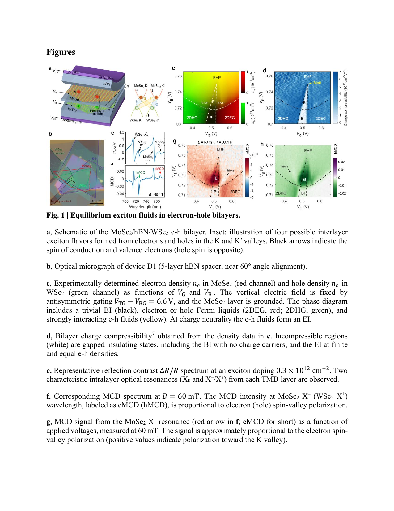

**図1：e-h二層系デバイスと励起子流体の特性。**
（a）MoSe₂/hBN/WSe₂ e-h二層系の模式図と四種の励起子フレーバー（KK, K'K', KK', K'K）。（b）デバイスD1の光学顕微鏡像（60°ツイスト角）。（c-d）電子・正孔密度マップと帯電率マップ：黄色領域がe-h流体（励起子絶縁体）、白色領域が非圧縮性（絶縁体）。（e-h）反射スペクトルとMCDスペクトル：eMCD（hMCD）信号がそれぞれ電子（正孔）のスピン−バレー偏極を示す。EI相でのMCD増大がBECの兆候として機能する。

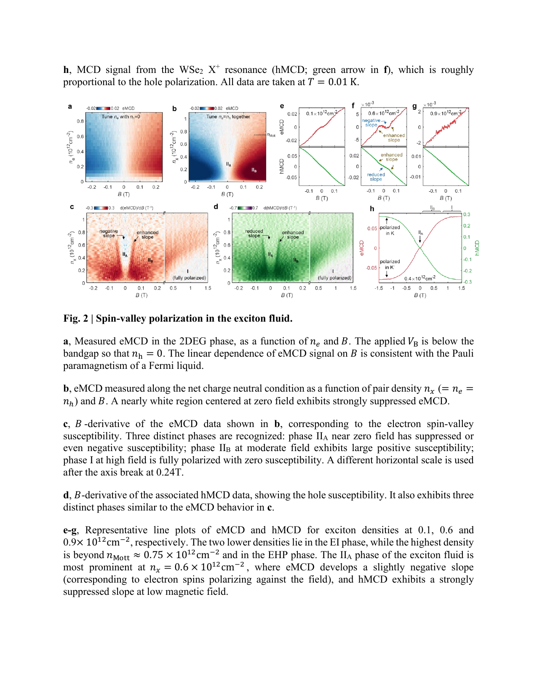

**図2：励起子流体のスピン−バレー偏極と三相構造。**
（a）2DEG相（正孔なし）のeMCD：B線形なPauli常磁性。（b-d）電荷中性線上のeMCD・hMCDマップとその磁化率（B微分）：IIA相（低磁場、抑制または負の磁化率）、IIB相（中程度磁場、大きな正の磁化率）、I相（高磁場、完全偏極）の三相が明確に識別される。（e-h）密度別線形カット：IIA相での電子スピンの反転（IIB相と位相逆転）が二成分凝縮の直接証拠。この電子・正孔磁化率の相関した挙動は単一粒子描像では説明不能で、強相関励起子流体の凝縮秩序を反映する。

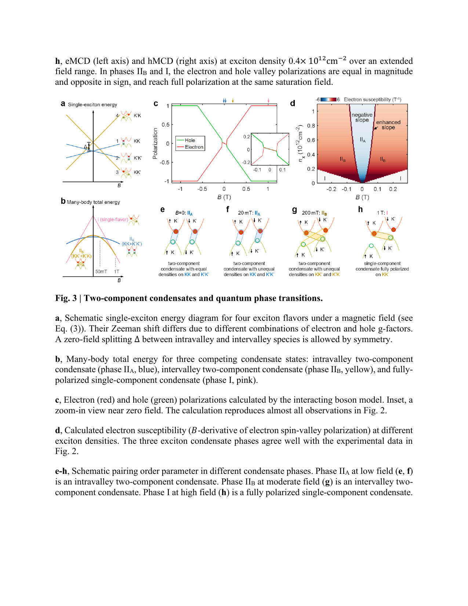

**図3：二成分凝縮と量子相転移の理論的描像。**
（a）四励起子フレーバーの磁場依存エネルギー模式図：面内バレー（青線）と面外バレー（黄線）のゼーマンシフトの差異。（b）三凝縮相（IIA青、IIB黄、I桃色）の多体全エネルギーの磁場依存性：IIA/IIB交差点での一次転移。（c-d）相互作用ボソン模型による計算スピン偏極と磁化率：実験データと良い一致。（e-h）各凝縮相における秩序パラメータの模式図：IIA相（面内二成分）→IIB相（面外二成分）→I相（単成分完全偏極）。gX > 0 が二成分凝縮秩序を安定化することを明示。

---

# 重点論文②

## 1. 論文情報

**タイトル：** [Ferroaxial and nematic transitions in the charge density wave phase of 1T-TiSe₂](https://arxiv.org/abs/2603.14614)
**著者：** Sarah Edwards, Elliott Rosenberg, Ilaria Maccari, Jiaqin Wen, Chaowei Hu, Xiaodong Xu, Jong-Woo Kim, Philip J. Ryan, Rafael M. Fernandes, Fernando de Juan, Maria N. Gastiasoro, Jiun-Haw Chu
**arXiv ID：** 2603.14614
**カテゴリ：** cond-mat.str-el, cond-mat.supr-con
**公開日：** 2026年3月15日
**論文タイプ：** 実験＋理論
**ライセンス：** CC BY 4.0

---

## 2. どんな研究か

広く研究されてきた電荷密度波（CDW）物質 1T-TiSe₂ において、CDW相の破れた対称性が「カイラル」ではなく「フェロアキシャル（ferroaxial）」であることを弾性抵抗率測定により初めて明確に同定した。非対角弾性抵抗率係数の反対称性（m₁₂≈−m₂₁）がフェロアキシャル秩序のスモーキング・ガンとなり、TCDW直下でフェロアキシャル秩序が出現し、その後より低温（≈170 K）で別の自発ネマティック不安定性が続くという二段階対称性破れの階層構造を明らかにした。

---

## 3. 研究の概要

**背景・目的：** 1T-TiSe₂のCDW相（TCDW ≈ 200 K）の破れた対称性をめぐっては長年の論争があった。一部の実験は三角格子D₃dから鏡映対称性と反転対称性の両方を破る「カイラル」秩序を示唆し、他の実験はより限定的な対称性破れを示唆していた。本研究は弾性抵抗率と弾性熱量効果（ECE）という新しい測定アプローチでこの論争に決着をつけることを目指した。

**解こうとしている課題：** CDW相でどの対称性が自発的に破れるか——特にカイラル秩序（鏡映+反転の両方）なのか、フェロアキシャル秩序（鏡映のみ、反転保持）なのか——を区別すること。

**研究アプローチ：** 1T-TiSe₂単結晶をピエゾスタック間に懸架し、AC歪み下での弾性抵抗率テンソルの全成分を同時測定。特にEg既約表現に属する非対角成分（m₁₂, m₂₁）はカイラル秩序またはフェロアキシャル秩序でのみ有限になる。これを正方形試料（回転モンゴメリー法）とホールバー（m₂₁）で独立測定し比較した。

**対象材料系：** 1T-TiSe₂単結晶（D₃d点群）

**主な手法：** 弾性抵抗率測定（Eg、A₁g成分）、弾性熱量効果（ECE）、in situ弾性X線回折

**主な結果：**
- 非対角弾性抵抗率係数 m₁₂, m₂₁ がTCDW近傍で同時に立ち上がり、m₁₂ ≈ −m₂₁ の反対称関係（フェロアキシャルの特徴）を示す
- m₁₂−m₂₁（フェロアキシャル代理変数）はTCDW直下から出現
- m₁₂+m₂₁（ネマティック第二成分）はより低温（≈170 K）まで抑制
- 対角成分 m₁₁（ネマティック磁化率）はT*≈170 KにCurie-Weiss発散を示す
- ECEの精密測定でTCDW、フェロアキシャル転移（TCDW直下）、ネマティック転移（≈170 K）の三段階を分解
- 3成分CDW秩序パラメータΨ=(ψ₁,ψ₂,ψ₃)のLandau理論で全相図を再現

**著者の主張：** 1T-TiSe₂のCDWは鏡映を破るが反転を保つフェロアキシャル秩序として特徴付けられ、過去のカイラル秩序の報告と矛盾しない（フェロアキシャルはカイラルの特殊ケースではないが、一部の実験がカイラルと誤解した可能性がある）。さらに3Q CDW内部でのネマティック不安定性という二段階の対称性破れが新しい物理を示す。

---

## 4. 対象分野として重要なポイント

本研究はフェロアキシャル秩序という新しい対称性破れのクラスを、実験的に精密に同定した点で方法論的に重要である。フェロアキシャル秩序は電気的トロイダルモーメントGを持ち（時間反転偶・反転偶）、通常の電気・磁気応答には「暗い（dark）」ため検出が難しかった。弾性抵抗率の非対角成分 m₁₂≈−m₂₁ という「スモーキング・ガン」の同定は、他のCDW系・フェロアキシャル磁性体への一般的な検出手法として波及効果が大きい。3Q CDW秩序パラメータの多成分性がフェロアキシャル→ネマティックの階層的転移を生み出すという機構は、TiSe₂の超伝導との関係（圧力・Cu挿入で誘起）を考える上でも示唆的である。CDW転移内部でのネマティック揺らぎ（Curie-Weiss発散、T*≈170 K）は量子臨界的ネマティック揺らぎとの関連で注目に値する。

---

## 5. 限界と注意点

m₁₂とm₂₁が二つの別試料で測定されているため、厳密な同一試料での比較ではない点に注意が必要である。また、測定できる対称性はマクロな弾性応答を通じた間接的なものであり、局所的なCDW構造（例えばドメイン壁の影響）は分離できていない。フェロアキシャルとカイラルの厳密な区別（特に磁場下での挙動）については、in situ X線回折（補足データ、150 K）で支持されているが、より広い温度・磁場範囲での構造測定があれば確実性が増す。Landauモデルはフェノメノロジカルであり、微視的な電子格子相互作用（励起子凝縮機構 vs. Peierls機構）との接続は今後の課題である。

---

## 6. 研究動向における立ち位置や関連研究との比較

1T-TiSe₂のCDW対称性をめぐる論争は20年以上続いてきた。Isakovic et al.（X線回折）はカイラル秩序を支持し、Hildebrand et al.（STM）は鏡映破れを示唆、一方でWallace et al.（ARPES）は限定的な対称性破れを指示してきた。本研究は弾性測定という新アプローチでフェロアキシャルという統一的解釈を提示し、過去の矛盾を解消する可能性がある。同時期に類似系（1T-VSe₂, 1T-TiTe₂）でのフェロアキシャル秩序の報告（Fernandes et al.参照）と合わせて、CDW物質群における新しい対称性クラスとしての位置づけが定まりつつある。この研究は「CDW弾性プローブ」の方法論的先例として、Cu₀.₀₅TiSe₂超伝導体やTa₂Se₈I系などへの展開が期待される。

---

## 7. 重要キーワードの解説

1. **電荷密度波（CDW, Charge Density Wave）**：結晶中の電子密度が空間的に周期変調した秩序状態。TiSe₂では $T_{CDW} \approx 200$ K で $2\times2\times2$超格子（3Q CDW）が形成される。エネルギー的にはFermi面のnesting、励起子凝縮、電子格子相互作用の競合が議論されている。

2. **フェロアキシャル秩序（Ferroaxial order）**：電気的トロイダルモーメント $\mathbf{G}$ を自発的秩序変数とする相。鏡映対称性（垂直面）を破るが、時間反転・反転対称性を保持する。強磁性が磁化Mを持つように、フェロアキシャル秩序はGを持つ。$G \propto P \times M$（分極と磁化の外積）に類比できる擬ベクトル。

3. **弾性抵抗率（Elastoresistivity）**：歪み $\varepsilon_{ij}$ に対する電気抵抗率の変化率テンソル $m_{ij,kl} = \partial\rho_{ij}/\partial\varepsilon_{kl}$。対称性によって許容される成分が異なり、ネマティック秩序は対角成分に、フェロアキシャル秩序は非対角成分に特有の発散を生じる。

4. **弾性熱量効果（ECE, Elastocaloric Effect）**：断熱歪み変化に伴う温度変化 $(\partial T/\partial\varepsilon)_S$。熱力学的相境界を鋭く検出でき、小さな相転移分裂（本研究では≈7 K）を分解できる高感度手法。磁気熱量効果（MCE）の力学的類比。

5. **Egブロック弾性抵抗率テンソル**：TiSe₂のD₃d点群においてEg既約表現に属する弾性抵抗率成分。$m_{11}$（対角）はネマティック磁化率、$m_{12}, m_{21}$（非対角）はフェロアキシャルまたはネマティック第二成分を検出。高温相での禁止成分がCDW相で出現することが対称性破れの「スモーキングガン」。

6. **3Q CDW秩序パラメータ**：TiSe₂の $\mathbf{Q}_1, \mathbf{Q}_2, \mathbf{Q}_3$ の三つのCDW波数に対応する $\Psi=(\psi_1, \psi_2, \psi_3)$ という三成分複素秩序パラメータ。各成分の振幅・位相の組み合わせが異なる対称性破れパターン（3Q 等振幅、1Q、フェロアキシャル、カイラルなど）を生成する。

7. **ネマティック秩序（Nematic order）**：回転対称性を破るが並進対称性を保つ電子的秩序。物性系では鉄系超伝導体で典型的に現れ、Fermi面の変形やスピン−格子揺らぎと密接に関連する。本研究ではCDW相内部での二次的なネマティック不安定性がT*≈170 KへのCurie-Weiss発散として現れる。

8. **モンゴメリー法（Montgomery method）**：矩形試料での等方性抵抗率測定を可能にする四端子法の変形。本研究では「回転モンゴメリー法」として試料を歪み印加方向に45°回転させ、$m_{12}=\partial(\tilde\rho_{xx}-\tilde\rho_{yy})/\partial(2\varepsilon_{xy})$を測定。

9. **電気的トロイダルモーメント（Electric toroidal moment）**：電気分極Pの空間的な渦巻き構造から生じる多極子。フェロアキシャル秩序の秩序変数G。歪みテンソルとのカップリングが唯一の共役場（$\varepsilon_{xx}-\varepsilon_{yy}$と$2\varepsilon_{xy}$の組み合わせ）として機能し、非対角弾性抵抗率を通じて検出できる。

10. **Landauフリーエネルギー展開（Landau theory）**：相転移の現象論的記述。本研究の3Q CDW系では $F = \sum_i a|\psi_i|^2 + b|\psi_i|^4 + c\psi_1\psi_2\psi_3+\text{c.c.} + \lambda\varepsilon(\psi_1^2-...)$ という形の自由エネルギーがフェロアキシャル→ネマティックの階層転移を再現。歪みへの双線形カップリング $\lambda$ が弾性測定での秩序検出を可能にする。

---

## 8. 図

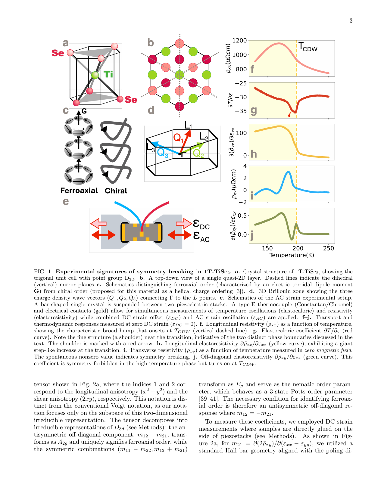

**図1：1T-TiSe₂の結晶構造、実験配置、ゼロ歪み下の輸送・熱力学応答。**
（a-b）三角単位格子（D₃d点群）と鏡映面。（c）カイラル秩序（鏡映+反転破れ）とフェロアキシャル秩序（鏡映破れのみ）の概念図：トロイダルモーメントGとキラル螺旋構造の違いを示す。（d）CDW波数ベクトル。（e）AC歪み実験配置：ピエゾスタックに懸架された単結晶、熱電対、電気接点。（f-j）ゼロDC歪みでの縦抵抗率、弾性熱量係数、縦弾性抵抗率、横抵抗率、非対角弾性抵抗率の温度依存性。非対角成分（j）がTCDWで立ち上がることがフェロアキシャル秩序の証拠。

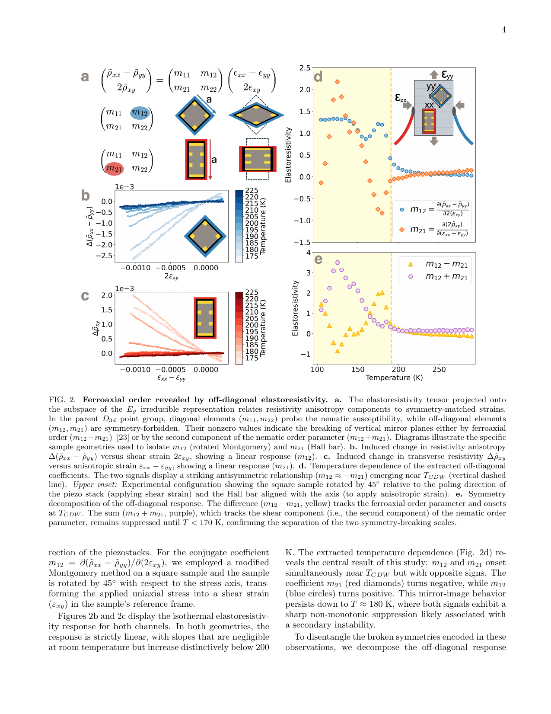

**図2：非対角弾性抵抗率によるフェロアキシャル秩序の同定。**
（a）Eg弾性抵抗率テンソル：対角成分（m₁₁, m₂₂）がネマティック磁化率、非対角成分（m₁₂, m₂₁）がフェロアキシャル秩序を反映。（b-c）歪み依存性：m₁₂, m₂₁ がいずれも線形で有限値を示す。（d）非対角係数の温度依存性：m₁₂ ≈ −m₂₁ という反対称関係（フェロアキシャルのスモーキングガン）がTCDW近傍で出現。（e）対称・反対称分解：差（m₁₂−m₂₁, A₂g成分）がTCDWで立ち上がり、和（m₁₂+m₂₁, ネマティック第二成分）がより低温まで抑制されることで、二段階対称性破れの階層構造を実証。

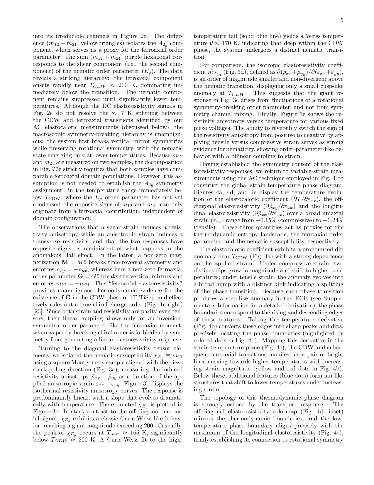

**図3：CDW相内部での発散的ネマティック磁化率。**
（b）等温曲線：歪みに対する抵抗率異方性の線形応答（傾きm₁₁）が温度で劇的に変化。（c）対角弾性抵抗率m₁₁の温度依存性：T*≈170 Kへの Curie-Weiss発散（青実線）を示し、CDW相内部でネマティック量子臨界点に近い揺らぎの存在を示唆。（e）固定ピエゾ電圧下での抵抗率異方性：引張・圧縮歪みで抵抗異方性の符号が可逆的に反転し、ネマティック秩序パラメータ的な双安定性を実証。CDW 3Q秩序内部での付加的な自由度の存在を示す重要な結果。

---

# 重点論文③

## 1. 論文情報

**タイトル：** [Imaging Harmonic Generation of Magnons](https://arxiv.org/abs/2603.14082)
**著者：** Anthony J. D'Addario, Kwangyul Hu, Maciej W. Olszewski, Daniel C. Ralph, Michael E. Flatté, Katja C. Nowack, Gregory D. Fuchs
**arXiv ID：** 2603.14082
**カテゴリ：** cond-mat.mes-hall, quant-ph
**公開日：** 2026年3月14日
**論文タイプ：** 実験＋理論
**ライセンス：** arXiv nonexclusive（図は掲載不可）

---

## 2. どんな研究か

Ni₈₁Fe₁₉（パーマロイ）/Ptマイクロストライプにおけるマグノン高次高調波発生を、走査NV中心磁力計で空間分解してイメージングすることに初めて成功した。高調波応答が試料端部やドメイン壁などの磁化不均一領域に局在していることを実験的に実証し、非線形スピン波の非調和ポテンシャルによる閉じ込めという機構を解明した。また高次高調波ほど波数ベクトルが増大しキラル性が増すという新しい特性を見出した。

---

## 3. 研究の概要

**背景・目的：** 非線形光学での高調波発生と類比して、スピン系でのマグノン高調波発生（Magnonic Harmonic Generation）は情報処理・信号変換への応用が期待されるが、その空間的発生機構は理解されていなかった。特に、どこで非線形応答が生じているかの直接イメージングは行われていなかった。

**解こうとしている課題：** マグノン高調波発生の（1）空間的発生源の同定、（2）非線形べき乗則スケーリングの検証、（3）高調波の波数ベクトル・キラル性の磁場依存特性の解明。

**研究アプローチ：** ダイヤモンドNV中心を近接場磁力計プローブとして使用し、ACカレント駆動下のパーマロイストライプを走査。基本周波数 f₀ の整数倍（3f₀, 4f₀, 5f₀）で生じる高調波の磁場を空間マッピング（ODMR法）。さらに高さ依存測定から実効波数ベクトル k_eff を抽出し、スピン選択的応答からキラル性を評価。

**対象材料系：** Ni₈₁Fe₁₉（5 nm）/Pt（5 nm）マイクロストライプ（30 μm × 4 μm）

**主な手法：** 走査NV中心磁力計（ODMR, optically detected magnetic resonance）、高さ依存測定

**主な結果：**
- 第三高調波（3f₀）の空間イメージング：磁場不均一領域（試料端部）に強く局在
- 非線形べき乗則スケーリング：n次高調波のコントラストがV_rms^n に比例（n=3: 指数2.64-3.02、n=4: 4.09-3.35、n=5: 5.6-3.8）
- 高さ依存測定から抽出した実効波数：k_eff（n=3）≈ 3.8-4.1 rad/μm、n=4: 5.3-7.9 rad/μm、n=5: 8.1-13 rad/μm（高次ほど短波長）
- NVスピン遷移の選択性（|0⟩↔|±1⟩）：高次高調波ほど |0⟩↔|+1⟩ と |0⟩↔|−1⟩ の非対称性が増大（増大するキラル性）

**著者の主張：** マグノン高調波発生は磁化不均一テクスチャー（端部・ドメイン壁）が作る非調和ポテンシャルに局在した非線形スピン動力学から生じる。これは非線形光学での「アンハーモニック電子ポテンシャルによる高調波発生」との正確な類比である。高次高調波の波数増大とキラル性の増大は、非線形スピン波の離散化とスピン波分散関係の非線形性から理解できる。

---

## 4. 対象分野として重要なポイント

本研究はマグノニクス分野に「空間分解非線形マグノン分光」という新しい手法を導入した点で方法論的に重要である。NV中心磁力計は既に線形磁場イメージングで実績があるが、高調波信号への拡張は、非線形磁化動力学の局所的発生源を直接可視化できることを示した。非調和ポテンシャルによる高調波発生というフレームワークは、非線形光学との強い類比により、マグノニクス分野でのトランスファー学習を促進する。実効波数ベクトルの系統的増大（高次ほど短波長）は、マグノン非線形周波数変換の「空間的チューニング」への応用可能性を示す。また、スピン選択的なキラル高調波応答は、スピントロニクスでの非線形スピン流生成とも関連する。

---

## 5. 限界と注意点

パーマロイの磁化テクスチャー（ドメイン構造）は試料ごと・測定ごとに異なる可能性があり、高調波応答の再現性に影響する。NV-試料距離（d ≈ 200 nm）は空間分解能を制限し、5 nm以下の局所的構造（原子スケール欠陥）の影響は分解できない。平面内磁化が優勢なパーマロイでは、磁気ドメインイメージングと高調波マップの相関分析が困難であり、どのテクスチャーが支配的な高調波源かの厳密な特定は難しい。べき乗則のフィッティング指数（特にn=5）の誤差が大きく、高次高調波の定量的解釈には限界がある。

---

## 6. 研究動向における立ち位置や関連研究との比較

マグノン高調波発生の研究は、Li et al.（2019, PRL）やWang et al.（2021, Science）による誘導型マグノン高調波の観測に始まり、本研究はその「直接空間イメージング」という次のステップを実現した。同時期に、THz帯でのマグノン非線形スペクトロスコピー（Kampfrath型ポンプ-プローブ）との相補性が増している。NV中心を使った空間マグノニクス研究は、Bertelli et al.（2020, Science Adv.）らの線形マグノンイメージングから始まり、本研究で非線形領域へと拡張された。今後の方向性として、ドメイン壁制御によるプログラマブル非線形マグノンデバイス、YIG（イットリウム鉄ガーネット）への展開、および位相感応型NV測定による高調波の空間位相プロファイル測定が期待される。

---

## 7. 重要キーワードの解説

1. **マグノン（Magnon）**：磁性体の自発磁化の集団的量子励起（スピン波の量子）。エネルギー $\hbar\omega(k)$、波数ベクトル $\mathbf{k}$、スピン $\hbar$ を持つボソン。磁気秩序を破壊せずに熱的に励起できる準粒子として輸送・非線形応答の担い手となる。

2. **NV中心（Nitrogen-Vacancy center）**：ダイヤモンド結晶中の窒素原子と隣接する格子空孔のペア欠陥。スピン1の量子系で、マイクロ波共鳴周波数（D≈2.87 GHz）が周辺磁場でシフトすること（Zeeman効果）を利用して原子スケール磁場センサーとして機能する。室温動作可能な量子磁力計。

3. **ODMR（光検出磁気共鳴, Optically Detected Magnetic Resonance）**：NVのスピン状態を蛍光強度差として光学的に読み出す手法。$|m_s=0\rangle$ と $|m_s=\pm1\rangle$ 状態の蛍光強度差がマイクロ波共鳴でコントラストを生じる。空間分解能はNV-試料距離 $d$ で決まり、典型的に数十〜数百 nm。

4. **高次高調波発生（Harmonic Generation）**：非線形応答により、基本周波数 $f_0$ の入力に対して $2f_0, 3f_0, ...$ の出力が生成されるプロセス。スピン系では $M(t) = \mu_0[\chi^{(1)}H + \chi^{(2)}H^2 + \chi^{(3)}H^3 + ...]$ の高次項が高調波を生成。$n$次高調波の振幅は駆動振幅の $n$ 乗に比例（べき乗則）。

5. **非調和ポテンシャル（Anharmonic potential）**：スピン波の閉じ込めポテンシャルの非線形成分。磁化不均一テクスチャー（端部・ドメイン壁）が有効的な閉じ込めポテンシャルを作り、その非線形（非調和）部分が高調波発生の起源となる。調和ポテンシャル（放物型）からの逸脱として記述。

6. **スピン波分散関係**：マグノンの周波数と波数の関係。強磁性体では $\omega = D k^2 + \omega_0$（D: スピン剛性、$\omega_0$: ゼーマン周波数）が典型的な形。高次高調波の実効波数ベクトル増大は、この分散関係と非線形空間プロファイルの組み合わせから理解できる。

7. **走査プローブ磁気イメージング（Scanning probe magnetic imaging）**：磁力計プローブ（NV、MFM、SQUIDなど）を試料表面近傍で走査して磁場分布を空間マッピングする手法。本研究では単一NV中心を使い数百 nm分解能で磁気高調波の空間分布を可視化。

8. **キラルスピン波（Chiral spin wave）**：波数方向と伝播方向の対称性が破れた（非相反的な）スピン波。Dzyaloshinskii-Moriya相互作用や表面磁気非対称性により生じる。本研究では高次高調波ほど |0⟩↔|+1⟩ と |0⟩↔|−1⟩ のNV選択則コントラストの非対称性が増大し、キラル高調波場の発生を示す。

9. **パーマロイ（Permalloy, Ni₈₁Fe₁₉）**：代表的な軟磁性合金。低保磁力・高透磁率・低磁歪で磁気デバイス研究の標準物質。低い結晶異方性により多彩な磁化テクスチャーが形成され、スピン波研究の理想的試料。Ptとの積層でスピン-軌道トルクの実験にも利用される。

10. **実効波数ベクトル（Effective wavevector, k_eff）**：NV中心の高さ依存信号 $C(d) \propto e^{-2k_{\text{eff}}d}$ からフィットで抽出した、高調波磁気場の特徴的空間スケール。$n$次高調波では $k_{\text{eff}}$ が $n$ に比例して増大し（$n=3$: ≈4 rad/μm、$n=5$: ≈10 rad/μm）、より短い空間スケールの非線形励起が主導することを示す。

---

# 第二部：その他の重要論文

---

# 論文④

## 1. 論文情報

**タイトル：** [Nanoscale electronic variations in altermagnetic α-MnTe](https://arxiv.org/abs/2603.15225)
**著者：** Zeyu Ma, Yidi Wang, Gal Tuvia, Kevin Hauser, Jiaqiang Yan, Jennifer E. Hoffman
**arXiv ID：** 2603.15225
**カテゴリ：** cond-mat.str-el
**公開日：** 2026年3月16日
**論文タイプ：** 実験
**ライセンス：** arXiv nonexclusive（図は掲載不可）

---

## 2. 研究概要

α-MnTeはアルタマグネティズム（altermagnetism）の代表候補物質として近年大きな注目を集めているが、本研究はその電子状態の「局所的不均一性」を走査トンネル顕微鏡（STM）・分光（STS）によってナノスケールで初めて詳細に明らかにした。低温STM測定により、α-MnTe表面に二種類の電子的に異なる領域が存在することが分かった：一方の領域では化学ポテンシャルがナノスケールで約100 meV変動し（非常に大きな不均一性）、もう一方の領域はより大きなバンドギャップを示す。さらに一方の領域に限定された非公約（incommensurate）な電荷変調が観測された。

これらの発見はα-MnTeの電子状態が単純な均一アルタマグネットではなく、実際の試料では著しい電子的不均一性を内包していることを示す。この不均一性はアルタマグネティズム起源のスピン分裂バンド構造を利用するデバイス応用（スピントロニクス、整流など）の実現可能性に根本的な制約を与える可能性がある。一方、非公約電荷変調の発見は、α-MnTeにおける電子秩序の新しい側面を開く。今後、不均一性の微視的起源（結晶欠陥、反位相ドメイン境界、表面再構成など）の解明と、バルク試料品質との相関が重要な課題となる。

---

## 3. 重要キーワードの解説

1. **アルタマグネティズム（Altermagnetism）**：ゼロ正味磁化を持ちながら（反強磁性的）、時間反転対称性の破れによりスピン分裂バンド構造を示す新しい磁気秩序クラス。強磁性（正味磁化あり）と反強磁性（スピン分裂なし）の間の「第三のクラス」。α-MnTeはK点での交差型スピン分裂で注目される。

2. **走査トンネル顕微鏡（STM）**：探針-試料間のトンネル電流（$I \propto e^{-2\kappa d}$、$\kappa=\sqrt{2m\phi}/\hbar$）を測定して表面形状を原子分解能でイメージング。STSでは$dI/dV \propto $ 局所状態密度（LDOS）を測定でき、ナノスケールの電子構造変化を直接観測できる。

3. **化学ポテンシャル変動（Chemical potential variation）**：局所的なキャリア密度や不純物ポテンシャルによるフェルミ準位のナノスケール空間変動。100 meVという変動幅は鉄系超伝導体などで観測された典型値に匹敵し、電子系の強い不均一性を示す。

4. **非公約電荷変調（Incommensurate charge modulation）**：結晶格子周期と公約でない空間周期を持つ電荷密度変調。CDWとは異なり、格子との格子整合がなく、スライディング可能な場合がある。MnTeでの発見は予期されておらず、電子相関の新たな側面を示す。

5. **スピン分裂バンド構造（Spin-split band structure）**：時間反転対称性の破れにより、アップスピンとダウンスピンのバンドが異なるエネルギー・波数に位置する電子構造。アルタマグネットでは強磁性と異なり補償されているが、実空間的対称性（結晶点群操作）によりスピン分裂が生じる。

6. **表面電子状態（Surface electronic state）**：バルクから切り取られた表面特有の電子状態。バルクとは異なる化学ポテンシャル・バンド構造を持ち、STM/STSが最も感度よく測定できる。アルタマグネットの表面ではバルクとのスピン構造の違いが重要。

7. **局所状態密度（LDOS, Local Density of States）**：特定の空間点でのエネルギー毎の電子状態数。STSの$dI/dV$スペクトルが直接測定量に対応し、バンドギャップ、ヴァン・ホーヴェ特異点、不純物状態などを空間分解で可視化できる。

8. **電子的不均一性（Electronic inhomogeneity）**：試料内の電子状態（キャリア密度、ギャップ、磁気秩序など）のナノスケール空間変動。高温超伝導体（BiSCCO系など）で重要なテーマとして確立されており、本研究はアルタマグネットでの類似現象を初報告。

9. **反位相ドメイン境界（Antiphase domain boundary）**：異なる磁気秩序ドメイン間の界面。ドメイン境界の周囲では電子状態が変化し、化学ポテンシャル変動の一因になりうる。特にα-MnTeのような層状構造では積層欠陥も含めた欠陥が電子不均一性の主な原因候補。

10. **スピン-軌道相互作用（SOC, Spin-orbit coupling）**：電子のスピン自由度と軌道角運動量の結合（$H_{SOC} \propto \mathbf{L}\cdot\mathbf{S}$）。α-MnTeではMnの3d軌道のSOCは比較的弱いが、アルタマグネティズムのバンド分裂を生み出す結晶場対称性と組み合わさって重要な役割を果たす。

---

（図は著作権保護のため掲載不可）

---

# 論文⑤

## 1. 論文情報

**タイトル：** [Giant anomalous Hall conductivity in frustrated magnet EuCo₂Al₉](https://arxiv.org/abs/2603.14682)
**著者：** Sheng Xu, Jian-Feng Zhang, Shu-Xiang Li, et al.
**arXiv ID：** 2603.14682
**カテゴリ：** cond-mat.str-el, cond-mat.mtrl-sci
**公開日：** 2026年3月16日
**論文タイプ：** 実験＋理論
**ライセンス：** CC BY-NC-ND 4.0

---

## 2. 研究概要

六方晶系フラストレート磁性体 EuCo₂Al₉ において、従来の異常ホール効果（AHE）の理論的上限を二桁以上上回る巨大な異常ホール伝導率（AHC）$\sigma_{xy}^A = 3.1 \times 10^4\ \Omega^{-1}\text{cm}^{-1}$ と異常ホール角（AHA）= 12% を発見した。この値は Berry曲率由来の固有機構（$\sim 10^2\ \Omega^{-1}\text{cm}^{-1}$）や従来のskew散乱（AHA ≈ 0.1-1%）のいずれの上限も大幅に超える。中性子回折で明らかにした三角 Eu 副格子上の 0-up-down スピン構造（フラストレートによる1/3磁化プラトー）、第一原理計算、量子振動（SdH）測定を組み合わせた多角的解析により、機構として「カイラルスピンクラスターによるスピンキラリティーskew散乱」（$\sigma_{xy} \propto \sigma_{xx}^2$、指数 n ≈ 2.1）を同定した。

EuCo₂Al₉ は P6/mmm 空間群（三角 Eu 層・Co ハニカム・Al-1カゴメ・Al-2面の四副格子構造）に結晶化し、T* ≈ 3.5 K（磁気転移）と T† ≈ 1.1 K（第二転移）を持つ。特筆すべきは、AHEがT*を大幅に超えた常磁性領域（最大70 K）まで顕著に残存することであり、これはフラストレートスピン相関（短距離カイラリティー）が磁気秩序の有無に関係なくAHEを増強することを示す。Eu局在モメントと伝導電子のRKKY交換結合がバンド分裂（$\Delta_{ex} \propto I_{ex}\langle M \rangle$）を介して温度依存的なフェルミ面変化をもたらすことも量子振動から確認された。この結果は、フラストレート磁性体系でのspintronics応用（高いAHAを活かした磁気センサー・不揮発メモリ）への指針を与える。

---

## 3. 重要キーワードの解説

1. **異常ホール効果（AHE, Anomalous Hall Effect）**：外部磁場とは独立に、磁性体で自発的に生じる横方向ホール電圧。$\sigma_{xy}^A$ が秩序変数（磁化、スピンキラリティー）に比例。固有機構（Berry曲率）、skew散乱（不純物による非対称散乱）、side-jump の三種類に分類。

2. **スピンキラリティースキュー散乱（Spin chirality skew scattering）**：スカラースピンキラリティー $\chi_{ijk} = \mathbf{S}_i \cdot (\mathbf{S}_j \times \mathbf{S}_k)$ を持つスピンクラスターによる非対称散乱。$\sigma_{xy}^A \propto \sigma_{xx}^2$（スケーリング指数 n=2）という特徴的なスケーリングを示し、従来の固有機構（$\sigma_{xy}$ 一定）や副格子skew散乱（$\sigma_{xy} \propto \sigma_{xx}$）と区別される。

3. **フラストレート磁性（Frustrated magnetism）**：幾何学的な配置や競合する交換相互作用のため、全ての磁気結合を同時に満足できない磁性体。三角格子・カゴメ格子などが代表例。基底状態が高度に縮退し、スピン液体、部分秩序、磁気モノポールなど多彩な量子状態が現れる。

4. **RKKY相互作用（Ruderman-Kittel-Kasuya-Yosida interaction）**：局在磁気モーメントと伝導電子の交換結合（$J_{RKKY} \propto \cos(2k_F r)/r^3$）によって媒介される局在スピン間の間接的磁気相互作用。フラストレート磁性体での磁気構造安定化に重要。

5. **1/3磁化プラトー（1/3 magnetization plateau）**：フラストレート三角格子磁性体での典型的な磁化カーブの特徴。up-down-down（u-d-d）または0-u-d 型のスピン配列で全磁化が飽和値の1/3になる。EuCo₂Al₉では ≈ 2 T以下の磁場で magnetization ≈ 2.4 μB/Eu（≈ 1/3最大値）のプラトーが出現。

6. **Shubnikov-de Haas振動（SdH oscillations）**：強磁場下での量子力学的なランダウ準位量子化によって生じる電気抵抗率の振動。振動周波数 $F = (\hbar/2\pi e) A_F$（$A_F$: フェルミ面断面積）からフェルミ面の幾何学的情報を得られる。有効質量はLK（Lifshitz-Kosevich）公式の温度依存性から抽出。

7. **Berry曲率（Berry curvature）**：ブロッホバンドの波動関数の運動量空間での幾何学的曲率 $\Omega_n(\mathbf{k}) = -2\text{Im}\langle\partial_\mathbf{k} u_n|\times|\partial_\mathbf{k} u_n\rangle$。全バンドのBerry曲率の積分がChern数（量子化）をあるいはより一般に固有AHCを決める。EuCo₂Al₉での計算は固有AHCが実験値を大幅に下回ることを示し、スピンキラリティー機構を支持。

8. **交換分裂（Exchange splitting）**：局在モーメントと伝導電子の交換結合 $\Delta_{ex} = I_{ex}\langle M \rangle$ によるスピンアップ・ダウンバンドのエネルギー差。温度低下による磁化増大に伴ってΔexが増大し、フェルミ面形状を変化させる。SdH振動の温度依存性から確認。

9. **カゴメ金属（Kagome metal）**：kagome格子構造を持つ金属的物質。平坦バンド（フラストレーションから）、ディラック点、ファン・ホーヴェ特異点が共存し、電荷密度波、超伝導、異常ホール効果など多彩な現象が現れる。EuCo₂Al₉のAl-1副格子はカゴメ構造を持つ。

10. **異常ホール角（AHA, Anomalous Hall Angle）**：$\tan\theta_H = \sigma_{xy}/\sigma_{xx}$。デバイス効率の観点でAHC（$\sigma_{xy}$）だけでなくAHAが重要。EuCo₂Al₉のAHA = 12%は記録的に高く、スピントロニクス応用において磁気的変換効率の指標となる。

---

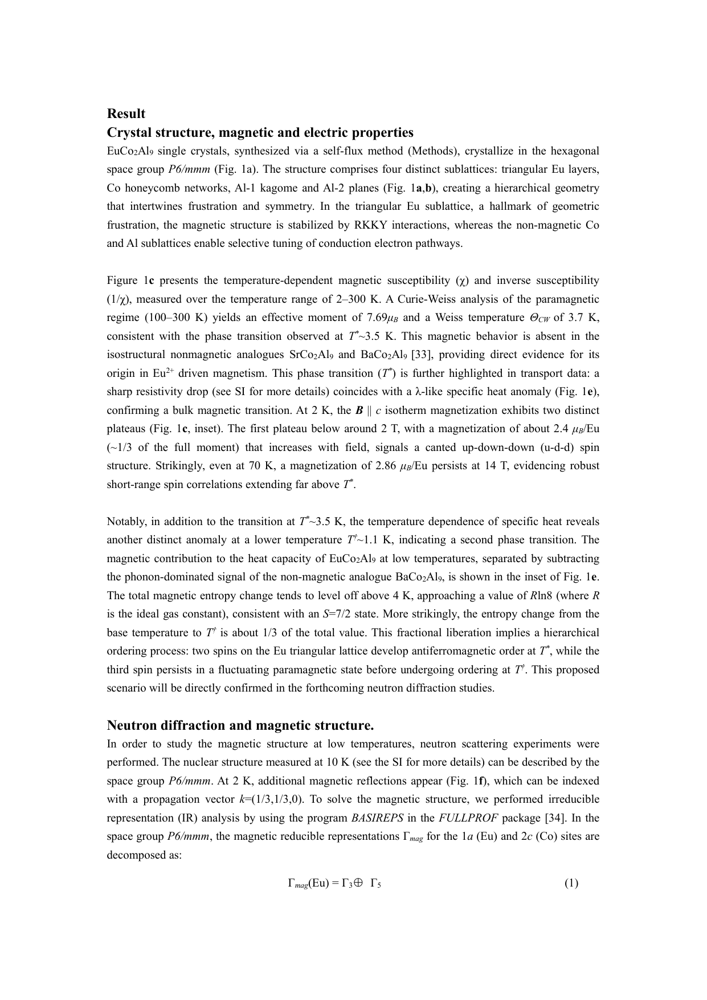

**図1（EuCo₂Al₉）：結晶構造・磁性・電気特性。**
（a）P6/mmm 六方晶構造：三角Eu層（青）・Coハニカム・Al-1カゴメ・Al-2面の四副格子配置。（b）中性子回折から同定された 0-u-d 磁気構造。（c）温度依存磁気感受率・逆数のCurie-Weiss解析（有効モーメント7.69 μB、Weiss温度3.7 K）および磁化等温線（1/3磁化プラトー）。（d）T*≈3.5 K磁気転移での比熱anomaly（λ型）と磁場依存性。これらがフラストレート三角格子磁性の特徴的シグネチャーを示す。

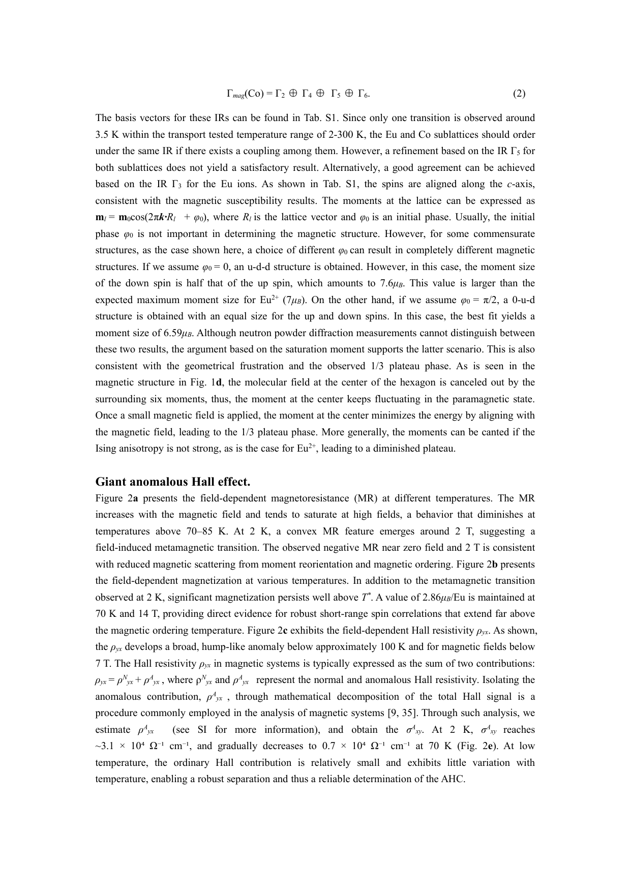

**図2（EuCo₂Al₉）：巨大異常ホール伝導率の輸送測定。**
磁場-温度面内でのAHC $\sigma_{xy}^A$ のコンタープロット。2Kでの最大値 $3.1\times 10^4\ \Omega^{-1}\text{cm}^{-1}$ はBerry曲率の理論上限（e²/ha ≈ 10³、点線）を二桁超える。固有機構（$\sigma_{xy}^A =$ 一定）および従来のskew散乱（$\sigma_{xy}^A \propto \sigma_{xx}$）との比較により、スピンキラリティーskew散乱（$n \approx 2.1$）が支配的機構であることを示す。T*を大きく超えた高温でもAHEが顕著に残存することが短距離スピンキラリティーの証拠。

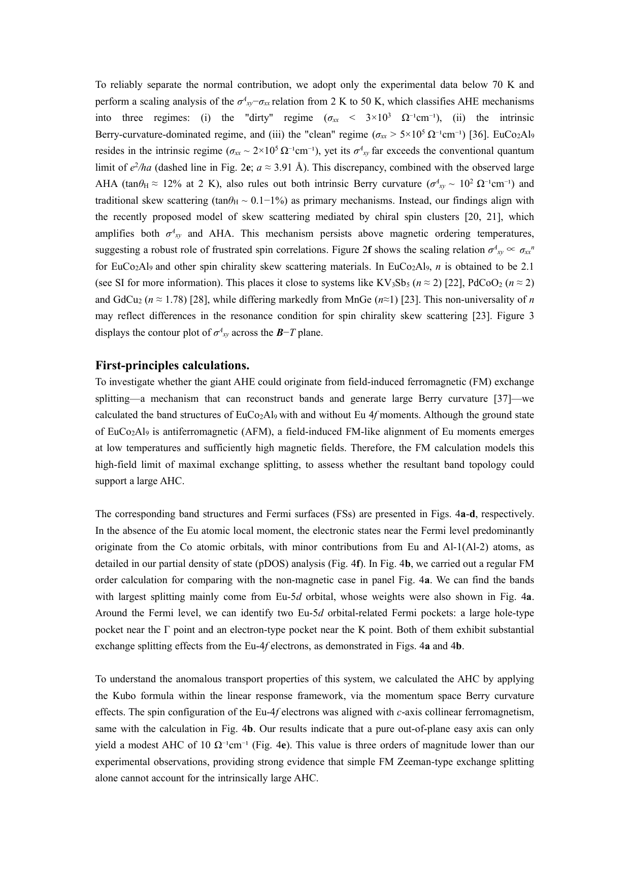

**図3（EuCo₂Al₉）：量子振動とフェルミ面。**
（a）SdH振動パターンとFFT解析：4つの振動周波数（Fα=219.6 T、Fβ=349.7 T、Fγ=492.4 T、Fη=586.5 T）が同定。（b）フェルミ波数ベクトルkFと実効質量（0.06-0.08 m₀）のバンドへの帰属。（c）温度依存FFT振幅からLK解析で得た有効質量：軽いフェルミオンがKondo型バンド再規格化を否定。フェルミ面のバンド分裂がRKKY交換分裂（Δex ∝ M(T)）で記述されることを示し、磁化増大に連動したフェルミ面変化がAHE増強の輸送的起源。

---

# 論文⑥

## 1. 論文情報

**タイトル：** [Emergent giant topological Hall effect in twisted Fe₃GeTe₂ metallic system](https://arxiv.org/abs/2603.14192)
**著者：** Hyuncheol Kim, Kai-Xuan Zhang, Yu-Hang Li, Giung Park, Ran Cheng, Je-Geun Park
**arXiv ID：** 2603.14192
**カテゴリ：** cond-mat.mtrl-sci, cond-mat.mes-hall
**公開日：** 2026年3月15日
**論文タイプ：** 実験＋計算
**ライセンス：** arXiv nonexclusive（図は掲載不可）

---

## 2. 研究概要

ツイストvdW磁性体 Fe₃GeTe₂（FGT）において、グローバル反転対称性を維持しながら局所反転対称性破れから誘起される交互Dzyaloshinskii-Moriya相互作用（DMI）によりスカイミオン格子が形成し、トポロジカルホール効果（THE）が出現することを初めて実証した。重要な点は、このTHEが特定の「マジックツイスト角」（0.45°〜0.75°）の範囲内でのみ出現し、その範囲外では消失するという、ツイスト系でのマジック角現象の磁性版が観測されたことである。ミクロ磁気シミュレーションにより、交互するin-plane・層対比DMIがスカイミオン格子を安定化する微視的機構を確認した。

FGTはバルクが強磁性であり、ツイスト接合ではグローバル反転対称性が保持されているにも関わらず、局所（界面）反転対称性破れによる交互DMIが層ごとに異なる符号でスカイミオン安定化に働く。この「グローバル対称性は保たれるが局所DMIが機能する」という機構は、従来の非中心対称磁性体（例：MnSi）でのスカイミオン安定化とは本質的に異なる。マジック角の存在は、ツイスト角によって界面での積層構造（したがって局所DMIの分布）が変化し、ある角度範囲で最適なスカイミオン安定化条件が成立することを示唆する。今後の課題として、マジック角の微視的理論（Moiré超格子とDMIの関係）の解明、低温でのスカイミオン直接観測（SPM/Lorentz TEM）、および電界によるスカイミオン制御が挙げられる。

---

## 3. 重要キーワードの解説

1. **トポロジカルホール効果（THE, Topological Hall Effect）**：スカイミオンなどのトポロジカル磁気テクスチャーによる実空間Berry位相（スカラースピンキラリティー）が伝導電子に働く効果。追加のホール抵抗率 $\rho_{THE} \propto P \cdot n_{sk}$（P: 偏極、$n_{sk}$: スカイミオン密度）として観測。通常のホール効果・AHEと分離が課題。

2. **Dzyaloshinskii-Moriya相互作用（DMI）**：反転対称性の破れた界面・バルクで生じるスピン-軌道起源の非等方交換相互作用 $H_{DM} = \mathbf{D}_{ij}\cdot(\mathbf{S}_i\times\mathbf{S}_j)$。DベクトルはHeisenberg交換に垂直な磁化成分を選好し、スパイラル磁気秩序・スカイミオンを安定化。

3. **スカイミオン（Skyrmion）**：磁化場の位相空間でのトポロジカルに安定なソリトン構造。磁化がスカイミオン内部で一方向から180°反転し中心に戻る渦状構造。スカイミオン数 $Q = \frac{1}{4\pi}\int \mathbf{m}\cdot(\partial_x\mathbf{m}\times\partial_y\mathbf{m})dxdy$ が整数量子化された位相不変量。

4. **マジックツイスト角（Magic twist angle）**：特定の電子的・磁気的現象が顕在化するツイストvdW系の臨界回転角。グラフェン二層系では1.1°でモアレ平坦バンドが生じ（Bistritzer-MacDonald）、本研究ではFGTの0.45°〜0.75°でスカイミオン格子が安定化。

5. **ファン・デル・ワールス磁性体（vdW magnets）**：層間をvan der Waals力で結合した二次元磁性材料。Fe₃GeTe₂、CrI₃、CrBr₃などが代表例。機械的剥離で薄層化でき、ツイスト積層でモアレ効果と磁性の結合が研究できる。

6. **局所反転対称性破れ（Local inversion symmetry breaking）**：結晶全体のグローバル対称性とは異なり、特定の局所位置・界面での対称性破れ。ツイストFGTではグローバル反転は保たれるが、各層界面での局所DMIが有限で交互符号を持つ—これがスカイミオン安定化の鍵。

7. **モアレ超格子（Moiré superlattice）**：ツイスト積層時に生じる長周期的干渉縞パターン。モアレ波長 $\lambda_M = a/\theta$（θ:ツイスト角、a:格子定数）。ツイスト角0.6°のFGTでは $\lambda_M \approx 20$ nm 程度のモアレが局所DMIの空間変調をもたらす。

8. **交互DMI（Alternating DMI）**：ツイスト積層の各界面で符号が交互に入れ替わるDMI。符号の反転がスカイミオン格子の特定の位相構造（正・反スカイミオンの交互配列など）を決定。グローバル反転対称性保持と矛盾しない機構。

9. **ミクロ磁気シミュレーション（Micromagnetic simulation）**：連続磁化場を離散格子で扱い、Landau-Lifshitz-Gilbert（LLG）方程式を数値的に解く手法。交換エネルギー・DMI・磁気異方性・静磁気エネルギーを含む有効場を計算してスカイミオン格子などの安定構造を予測。

10. **スカイミオン格子（Skyrmion lattice）**：周期的に配列したスカイミオンの集合体。スカイミオンが互いに反発し（位相的安定性）、三角格子や他の超構造を形成。中性子小角散乱（SANS）や実空間MFM/Lorentz TEMで観測可能。THE信号の増大はスカイミオン格子の形成を示唆。

---

（図は著作権保護のため掲載不可）

---

# 論文⑦

## 1. 論文情報

**タイトル：** [The stripe state at 1/8 Ba doping hosts optimal superconductivity in La-214 cuprates under low in-plane stress](https://arxiv.org/abs/2603.14108)
**著者：** V. Sazgari, S.S. Islam, M. Lamotte, ..., J.M. Tranquada, H. Luetkens, Z. Guguchia
**arXiv ID：** 2603.14108
**カテゴリ：** cond-mat.supr-con, cond-mat.mtrl-sci, cond-mat.str-el
**公開日：** 2026年3月14日
**論文タイプ：** 実験
**ライセンス：** arXiv nonexclusive（図は掲載不可）

---

## 2. 研究概要

La₂₋ₓBaₓCuO₄（LBCO）の x=1/8 組成（「1/8異常」の中心）において、面内一軸応力下での超伝導転移温度のスポンタニアスな上昇（5 K → 37 K at 0.23 GPa）をμSR・AC磁化率・抵抗率測定で初めて明確に実証した。LBCO-1/8は通常、低温正方晶（LTT）相と静的スピンストライプ秩序により三次元超伝導が強く抑制されているが、わずか0.23 GPaの面内圧力でLTT相が抑制され、静的ストライプの体積分率が低下し、三次元超伝導が急激に回復する。重要な発見は、静的ストライプ秩序が弱まるにも関わらず、動的ストライプ相関は残存し超伝導対形成を強化するらしい点である（「ストライプ相関は超伝導を促進するが静的秩序は三次元コヒーレンスを妨害する」）。また、x=0.125の臨界圧力はx=0.115, 0.135の約3倍大きく（これらでは30 Kに対してx=0.125では37 K達成）、x=1/8でのストライプの特別な安定性を反映する。この結果は、ストライプ秩序が超伝導対形成機構の一部であるという仮説（Tranquada型）と整合する。

---

## 3. 重要キーワードの解説

1. **1/8異常（1/8 anomaly）**：La₂₋ₓBaₓCuO₄でx=1/8（ホールドープ量1/8）付近で超伝導転移温度が著しく抑制される現象（Tc≈5 K、最適ドープなら≈30 K）。スピン・電荷ストライプ秩序が安定化されLTT構造が出現することで三次元超伝導コヒーレンスが阻害。

2. **μSR（ミュオンスピン回転/緩和）**：正ミュオンを試料に注入し、スピン偏極の時間発展から局所磁場を測定する技術。磁気秩序体積分率・秩序温度・局所磁場分布を数pT感度で測定できる。静的スピンストライプ秩序の体積分率変化が応力下でどう変わるかを追跡。

3. **低温正方晶相（LTT, Low-Temperature Tetragonal phase）**：La₂₋ₓBaₓCuO₄の低温構造相。CuO₂面内の傾斜方向が交互に揃った歪みが2Dスピン・電荷ストライプ秩序を安定化し、層間の超伝導コヒーレンスを阻害（「層間ジョセフソン結合」を断ち切る）。面内圧力でLTO相に転移させることでLTT抑制。

4. **スピン・電荷ストライプ秩序（Spin-charge stripe order）**：ホールが特定の方向に線状に集まり（電荷ストライプ）、その間にスピン反強磁性ドメインが形成される一次元的な電荷・スピン秩序。x=1/8では $\mathbf{q}_{charge} = (1/4, 0)$, $\mathbf{q}_{spin} = (3/8, 0, 0)$（r.l.u.）のコメンシュレート秩序が出現。

5. **面内一軸応力（In-plane uniaxial stress）**：CuO₂面内の一方向に加えた圧力。本研究ではPSIのCNM施設のピエゾ駆動装置で0〜0.5 GPaを印加。LTT相の特定のティルトパターンを抑制し、等方的LTO相を回復させることができる。

6. **2D超伝導と3D超伝導コヒーレンス**：LTT相のLBCO-1/8では各CuO₂層内（2D）の超伝導は存在するが、層間の位相コヒーレンス（3D超伝導）が阻害される（マイスナー効果なし）。圧力でLTT相を抑制すると層間結合が回復し3D超伝導が出現（Tc = 37 K）。

7. **対形成強度と位相コヒーレンス**：超伝導Tcを決める二要素。対形成強度（ギャップΔ）が大きくても位相コヒーレンスが失われると超伝導は発現しない（BKT類比）。本研究の解釈：ストライプ相関は対形成を強化するが静的ストライプは位相コヒーレンスを妨害する。

8. **Cu-O面のバケリング（Structural tilt of CuO₆ octahedra）**：LaBaO系での構造相転移でCuO₆八面体が特定の方向に傾き、電子構造の強い異方性をもたらす。LTTではa軸とb軸で交互の傾き→電荷ストライプに最適な周期ポテンシャルを形成。

9. **AC磁化率（AC susceptibility）**：交流磁場に対する複素磁化率χ = χ'+iχ''。χ''の発散が超伝導転移（マイスナー効果）を示す。μSRと組み合わせることで超伝導体積分率と磁気秩序の共存を独立に追跡。

10. **最適ドープ超伝導（Optimal doping）**：銅酸化物超伝導体のホールドープ依存Tcがピークを持つ点（x≈0.15−0.16）。x=1/8はこれより低く「アンダードープ」領域に属し、擬ギャップ・ストライプ秩序が顕在化する。応力でTc=37 Kに達したことは最適ドープ近傍の値に匹敵。

---

（図は著作権保護のため掲載不可）

---

# 論文⑧

## 1. 論文情報

**タイトル：** [Probing the Penetration Depth of Topological Surface States by Magnetic Impurity Scattering in V-doped Sb₂Te₃](https://arxiv.org/abs/2603.15601)
**著者：** Yidi Wang, Zeyu Ma, Pengcheng Chen, Shiang Fang, Yu Liu, Yau Chuen Yam, Christopher Eckberg, Joshua Samuel, Johnpierre Paglione, Mohammad Hamidian, Cyrus Hirjibehedin, Daniel T. Larson, Efthimios Kaxiras, Jennifer E. Hoffman
**arXiv ID：** 2603.15601
**カテゴリ：** cond-mat.mes-hall
**公開日：** 2026年3月16日
**論文タイプ：** 実験＋理論
**ライセンス：** arXiv nonexclusive（図は掲載不可）

---

## 2. 研究概要

V ドープ Sb₂Te₃（トポロジカル絶縁体）において、わずか ≲0.25% のバナジウム磁性不純物でも表面のディラックサーフェスステートを完全にギャップ化できることをSTM測定で示した。単一Vアドアトムが局所的なギャップ化領域を作るが、不純物バンドを形成せずに振る舞う点が重要で、ディラック点でのシフトと寿命抑制という特異な散乱シグネチャーを観測した。これにより、トポロジカル表面状態の「侵入深さ（penetration depth）」—表面状態の波動関数がバルクに浸透する距離—をサブナノメートル精度で直接測定する新手法を確立した。

本研究の新規性は、これまで複数の試料（異なる厚さ）を比較する間接法でしか測定できなかった侵入深さを、単一バルク結晶のSTM測定から直接定量化できる点にある。個々のV欠陥が周囲のディラック状態に及ぼす局所的影響（ギャップ化範囲、スペクトル重みの変化）を定量的に解析することで、表面状態の侵入深さのサブnm精度測定が実現した。この手法はSb₂Te₃に限らず、他のトポロジカル絶縁体（BiSe系、SnTe系など）への展開が期待される。また磁性不純物による表面ディラック状態のギャップ化は磁気的トポロジカル絶縁体（MnBi₂Te₄型）の特性評価にも新しい視点を提供する。

---

## 3. 重要キーワードの解説

1. **トポロジカル表面状態（Topological surface states）**：トポロジカル絶縁体のバルクギャップ内に存在する表面束縛状態。バルクトポロジカル不変量（Z₂指数）で保護され、ディラック点を中心とした線形分散を示し、後方散乱が禁止。$Z_2 = 1$ のとき奇数個の表面ディラックコーンが存在。

2. **侵入深さ（Penetration depth）**：表面状態の波動関数がバルク結晶内に指数的に減衰する特徴的な深さ。$\psi(z) \propto e^{-z/\xi}$（$\xi$: 侵入深さ）で表され、バルクギャップと表面-バルクハイブリダイゼーションの強さを反映。直接測定は困難でバルク試料では薄膜依存性から間接的に見積もるのが従来法。

3. **ディラック表面状態のギャップ化（Gapping of Dirac surface states）**：時間反転対称性を破る磁性不純物・磁場の印加により、ディラック点にギャップが開く現象。磁気的トポロジカル絶縁体の量子異常ホール効果の前提条件。ギャップの大きさと均一性が磁気的TIの物性を決定。

4. **STM（走査トンネル顕微鏡）での不純物散乱イメージング**：磁場印加下でのSTM/STSにより、単一磁性不純物周囲の局所状態密度（LDOS）変化を空間分解測定。フリーデル振動の形状・ディラック点のエネルギーシフト・LDOSの寿命幅からサーフェスステートの特性を抽出。

5. **単一原子欠陥の散乱（Single-atom impurity scattering）**：単一不純物が引き起こす電子散乱。トポロジカル表面状態の場合、スピン運動量ロッキングが後方散乱（$\mathbf{k} \to -\mathbf{k}$）を抑制する一方、スピン反転を伴う磁性不純物散乱は許容される。個々の不純物の影響範囲がペネトレーション深さと直接関連。

6. **Sb₂Te₃（硫化テルル系トポロジカル絶縁体）**：Sb₂Te₃はR-3m対称性の層状半導体でZ₂トポロジカル絶縁体の代表物質。バンドギャップ ≈ 0.28 eV、単一ディラックサーフェスステートがΓ点に存在。Vドープにより磁性を導入できる（Cr,Vドープで量子異常ホール効果が報告）。

7. **ディラックフェルミオン（Dirac fermion）**：有効質量ゼロの線形分散を持つ電子（$E = \hbar v_F k$）。グラフェンとトポロジカル絶縁体表面状態が代表例。スピン-運動量ロッキング（$\mathbf{s} \perp \mathbf{k}$）が特徴で、磁気不純物により質量項（ギャップ）が導入される（Dirac方程式の質量項$m\sigma_z$に対応）。

8. **量子異常ホール効果（QAHE, Quantum Anomalous Hall Effect）**：外部磁場なしに磁性トポロジカル絶縁体の薄膜で量子化ホール抵抗（$h/e^2$）が現れる現象。Dirac表面状態への磁気ギャップ形成＋フェルミ準位ギャップ内が条件。V,Cr ドープ(Bi,Sb)₂Te₃薄膜で初実現（Chang et al., 2013）。

9. **Z₂トポロジカル不変量**：時間反転対称性をもつバンド絶縁体のトポロジカル分類指数（0または1）。$Z_2 = 1$（トポロジカル絶縁体）では奇数個のクラマース縮退した表面ディラックコーンが保護され、不純物やスピン非依存の摂動では消えない（Z₂保護）。

10. **サーフェスステートの二次元閉じ込め（2D confinement of surface states）**：トポロジカル表面状態は表面に局在しつつもバルクへの指数的な侵入（侵入深さξ）を持つ準二次元状態。有効的な二次元系として扱えるかどうかは$\xi$と薄膜厚さ$d$の比較で決まり（$d < 2\xi$でトップ・ボトム表面のハイブリダイゼーション）、本研究のξ測定はこの判断に不可欠。

---

（図は著作権保護のため掲載不可）

---

# 論文⑨

## 1. 論文情報

**タイトル：** [Quantifying quasiparticle chirality in a chiral topological semimetal](https://arxiv.org/abs/2603.14640)
**著者：** Jiaju Wang, Jaime Sánchez-Barriga, Amit Kumar, ..., Maia G. Vergniory, Niels B. M. Schröter
**arXiv ID：** 2603.14640
**カテゴリ：** cond-mat.mes-hall
**公開日：** 2026年3月15日
**論文タイプ：** 実験＋理論
**ライセンス：** arXiv nonexclusive（図は掲載不可）

---

## 2. 研究概要

カイラルトポロジカル半金属 RhSi において、スピン・角度分解光電子分光（SARPES）を使ってブロッホ状態の「電子キラリティー」を初めて定量的に測定した。Kramers-WeyIポイントとWeylコーンのバルクスピンテクスチャーを測定し、スピン-運動量ロッキングからの偏差（最大約40°）を定量化した。この偏差からエネルギー依存の「正規化電子キラリティー密度（NECD）」という新しい定量指標を定義し、RhSiではKramers-Weylポイント近傍で NECD≈1（完全なスピン-運動量ロッキング）から Kramers-Weylポイントより200 meV下で NECD≈0.8 へ減少することを実験的に明らかにした。さらにこのNECDが縦方向Edelstein効果などの磁気光学・輸送応答の予測に実際に使用できることを示し、「カイラリティーの連続的定量化」から材料物性を予測するという新しい研究パラダイムを提示した。

---

## 3. 重要キーワードの解説

1. **カイラル結晶（Chiral crystal）**：全ての反転操作（鏡映、反転、回転反射）を破る空間群に属する結晶。エナンチオモルフ（鏡像体）が区別される。RhSiはP2₁3（空間群198）に属するカイラル結晶で、電子系に全空間でのキラリティーが染み込む。

2. **Kramers-Weylポイント**：カイラル結晶の時間反転不変高対称点（Γなど）に位置する特殊なWeylポイント。全バンドが縮退せず（クラマース縮退なし、SOCで分裂）、スピン-運動量ロッキングが完全（$k \cdot \sigma$ 型）。チャーン数が系のランクに等しく大きい（RhSiでは|C|=2）。

3. **SARPES（スピン・角度分解光電子分光）**：ARPESにスピン検出器（Mott散乱型またはSTARなど）を追加し、光電子のスピン偏極を運動量分解測定する手法。バルクバンド構造のスピンテクスチャーを直接測定できる。ビームライン（BESSY II, DESY, PSI）での放射光を利用。

4. **電子キラリティー（Electron chirality）**：$k \cdot \sigma / (|k||\sigma|)$ として定義される準粒子の連続的なキラリティー指標。$+1$が完全な右手系スピン-運動量ロッキング、$-1$が左手系、0がロッキングなし。従来のバイナリな「キラル/非キラル」分類を連続量に拡張。

5. **NECD（正規化電子キラリティー密度）**：フェルミ面全体にわたって電子キラリティーを積分・規格化した量。$0 \leq \text{NECD} \leq 1$。本研究でKramers-Weylポイント近傍（NECD≈1）から低エネルギーにかけての減少（≈0.8 at -200 meV）を初定量化。材料ごとのキラル物性強度の指標。

6. **Edelstein効果（逆スピンガルバニー効果）**：電流印加によりスピン密度が蓄積する現象（または逆に電流がスピン密度変化から生じる）。スピン-運動量ロッキングが強いトポロジカル表面状態や非中心対称金属で顕著。縦方向Edelstein効果はカイラル系特有でキラリティーに比例。

7. **Weylコーン（Weyl cone）**：バンド縮退点（Weylポイント）近傍の線形分散を持つ電子構造。スピン-軌道分裂した二つのバンドが異なる傾きで交差し、有限のチャーン数（±1）を持つ。RhSiでは複数のWeylコーンが異なるエネルギー・波数に位置。

8. **スピン軌道結合分裂（SOC splitting）**：反転対称性が破れた系での、スピン-軌道相互作用によるバンド分裂。Rashba型（$\alpha_R (k_x \sigma_y - k_y \sigma_x)$）やDresselhaus型などが典型。カイラル結晶では回転対称性と組み合わさった特殊なSOC分裂（$k \cdot \sigma$ 型）が生じる。

9. **磁気光学応答（Magneto-optical response）**：磁場または磁気秩序がある場合の光学応答の非対称性。円二色性（CD）、Faraday回転、Kerr効果などが含まれる。電子キラリティーが光学的キラル応答の強度に直接比例することが理論的に示されており、NECD測定から予測可能。

10. **チャーン数（Chern number）**：2次元絶縁体バンドのトポロジカル不変量 $C = \frac{1}{2\pi}\int_{BZ} \Omega(\mathbf{k}) d^2k$（$\Omega$:Berry曲率）。閉じた面（Fermi面球面）でのBerry位相の積分に対応。Weylポイントのチャーン数はWeylモノポールのソース/シンクを決定し、表面状態フェルミアーク数と対応。

---

（図は著作権保護のため掲載不可）

---

# 論文⑩

## 1. 論文情報

**タイトル：** [Co₂SeO₃Cl₂: Studies of Emerging Magnetoelectric Coupling in a Polar, Buckled Honeycomb Material](https://arxiv.org/abs/2603.13568)
**著者：** Faith O. Adeyemi, Xudong Huai, Mohamed Kandil, Pradip Karki, Wencan Jin, Thao T. Tran
**arXiv ID：** 2603.13568
**カテゴリ：** cond-mat.mtrl-sci, quant-ph
**公開日：** 2026年3月13日
**論文タイプ：** 実験
**ライセンス：** CC BY 4.0

---

## 2. 研究概要

新規極性バックルハニカム磁性体 Co₂SeO₃Cl₂ を合成し、その多段階磁気転移と磁電気結合の発現を実験的に明らかにした。単斜晶系P2₁空間群に属し、CoO₃Cl₃歪み八面体が極性バックルハニカム格子を形成する本物質は、Co²⁺スピン（S=3/2）の強磁気異方性（重い軌道角運動量寄与を反映し有効g因子 g_eff ≈ 2.9 along a-axis）と幾何学的フラストレーションを持つ。磁化・比熱測定で 25.4 K, 16.8 K, 11 K, 3 K の四つの磁気転移を確認し、そのうち少なくとも三つ（11 K, 17 K, 26 K）で第二高調波生成（SHG）の強度異常が一致して観測されながら、SHGは結晶対称性（非中心対称性）の破れを示さないことを明らかにした。これは磁気秩序がSHG応答を変調するが結晶格子の対称性変化を伴わないという「磁電気結合型SHG応答」を意味し、極性ハニカム磁性体が電気双極子と磁気双極子を組み合わせる新しい磁電気材料のプラットフォームとなることを示している。

磁気エントロピー回収量が理論値（2R ln 2）の約半分にとどまることはスピン揺らぎが残存することを示し、フラストレートした基底状態の特徴を反映する。磁場印加でT_N1とT_N3が高温シフトする一方でT_N2とT_N4が低下するという競合的挙動は、反強磁性的・強磁性的交換相互作用の競合（フラストレーション）を直接反映している。Se⁴⁺の立体的活性孤立電子対による非対称歪みが構造的極性の起源であり、混合Cl⁻/O²⁻リガンドによるCo配位環境が複数の磁気状態間での磁電気応答の切り替えを可能にする独自の設計戦略を示す。

---

## 3. 重要キーワードの解説

1. **磁電気結合（Magnetoelectric coupling）**：電場が磁気秩序に影響し、磁場が電気分極に影響する相互作用。$\mathbf{P} \propto \chi_{ME} \mathbf{H}$ または $\mathbf{M} \propto \chi_{ME} \mathbf{E}$ で表される線形磁電気効果が基本形。単相磁電気材料（multiferroic）では強誘電秩序と磁気秩序が共存し、大きな結合を持つ可能性がある。

2. **極性バックルハニカム格子（Polar buckled honeycomb lattice）**：ハニカム格子の二種類の格子点が異なる高さに位置する（buckled）構造で、面内鏡映対称性が破れる。Se⁴⁺孤立電子対によりさらに外部への分極が固定され、単斜晶P2₁群の極性を持つ。

3. **第二高調波生成（SHG, Second Harmonic Generation）**：非線形光学効果で、周波数ωの光から2ωの光が発生するプロセス。反転対称性が破れた系でのみ許容（電気双極子SHG）。結晶対称性と磁気秩序の両方に感受性があり、磁電気秩序の検出に利用される（MSHG）。

4. **孤立電子対活性（Lone pair activity）**：Se⁴⁺などのカチオンが化学結合に使用しない電子対（孤立電子対）を持ち、これが空間的に非対称な電子密度分布を作る現象。Bi³⁺、Sn²⁺、Se⁴⁺などが典型的。局所電気双極子を生成して結晶全体の極性・非中心対称性の起源となる。

5. **フラストレートスピン系（Frustrated spin system）**：幾何学的（三角・カゴメ格子）または結合競合（AFM-FMの競合）により全相互作用を同時に満足できないスピン系。基底状態が縮退またはほぼ縮退し、量子揺らぎ・スピン液体・部分秩序など多様な量子状態が発現。

6. **Co²⁺の磁気異方性（Magnetic anisotropy of Co²⁺）**：Co²⁺（d⁷）はt₂g⁵e₂gの電子配置で軌道角運動量L≠0を持ち（quenchedされにくい）、スピン-軌道結合による強い単イオン磁気異方性を示す。有効g因子が2より大幅に異なり（本研究では最大g_eff≈2.9）、Ising型異方性が磁気構造を決定。

7. **多重磁気転移（Multiple magnetic transitions）**：複数の磁気秩序が異なる温度で順次出現する現象。各転移は異なるスピン成分・バンド・長距離秩序の凍結を反映。Co₂SeO₃Cl₂では25.4, 16.8, 11, 3 Kの四転移がCo₂サイト（不等価な二種類）の独立した秩序化に対応する可能性。

8. **磁気エントロピー（Magnetic entropy）**：磁気秩序化による熱力学的エントロピー $\Delta S_{mag} = R\ln(2S+1)$（S: スピン量子数）。Co²⁺のS=3/2では完全回収値2R ln 4、有効S=1/2（Kramers二重項）では2R ln 2。実験値が理論値の≈半分に留まることがスピン揺らぎの残存を示す。

9. **混合リガンド配位（Mixed ligand coordination）**：金属原子がO²⁻とCl⁻など異種のリガンドで配位された環境。異なるリガンド場は磁気交換経路の異方性を生み出し（Goodenough-Kanamori則）、競合的AFM-FM相互作用の起源となりうる。極性CoO₃Cl₃八面体が磁電気結合の局所的源泉。

10. **多強磁性体（Multiferroic）**：複数の強的秩序（強誘電性・強磁性・強弾性など）が共存する材料。特に「磁気電気型マルチフェロイック」は強誘電分極と磁気秩序が共存し、電場での磁化制御・磁場での分極制御が可能。Co₂SeO₃Cl₂はこの候補材料だが、SHGの磁気変調は磁気的寄与がある一方で、線形磁電気効果の確認が今後の課題。

---

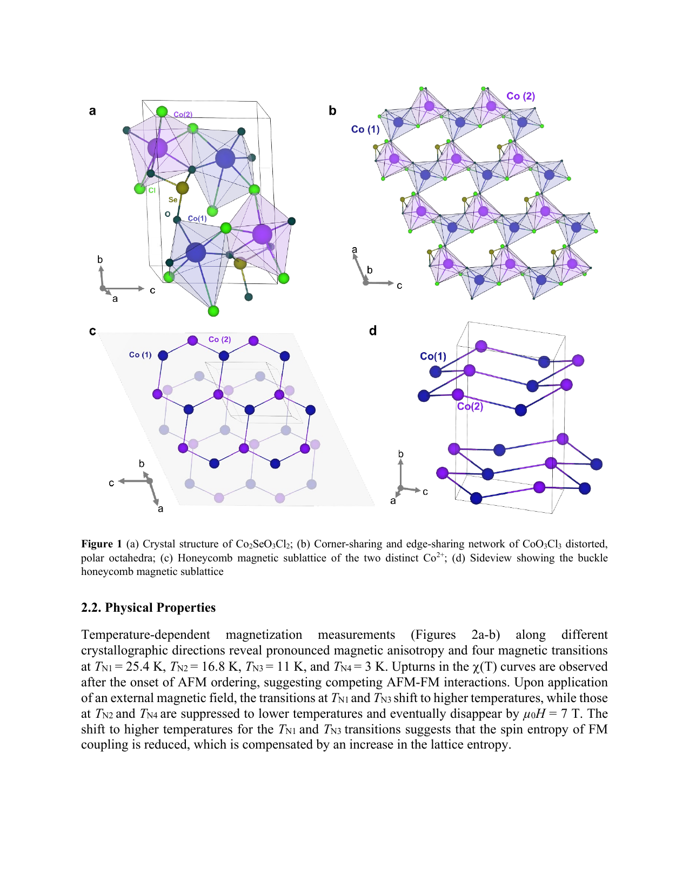

**図1（Co₂SeO₃Cl₂）：結晶構造。**
（a）Co₂SeO₃Cl₂の結晶構造：単斜晶P2₁、歪んだCoO₃Cl₃八面体の極性バックルハニカムネットワーク。（b）edge-sharing・corner-sharing CoO₃Cl₃八面体の配置：混合Cl/Oリガンドによる対称性低下。（c）Co²⁺の二種類の不等価サイトによるハニカム磁気副格子。（d）バックルハニカムのサイドビュー：面外変位がP2₁極性の起源。Se⁴⁺の孤立電子対による歪みが全体的な電気双極子を固定し、磁気秩序との結合に向けた設計戦略の基礎をなす。

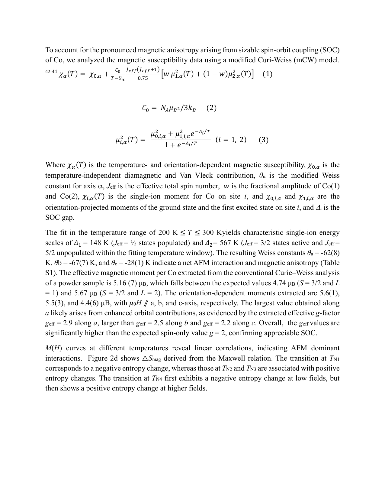

**図2（Co₂SeO₃Cl₂）：磁化・比熱測定と磁気相図。**
a, b軸・c軸の温度依存磁気感受率：強い磁気異方性（a軸が容易軸、a軸でのg_eff≈2.9）と T_N1〜T_N4 の四転移。磁場依存性でT_N1, T_N3が上昇、T_N2, T_N4が低下する競合的挙動はAFM・FM交換の競合を示す。比熱の四つのλ型異常が各磁気転移を熱力学的に確認。回収エントロピー≈R ln 2 が理論値の半分であることがスピン揺らぎの存在を示す。

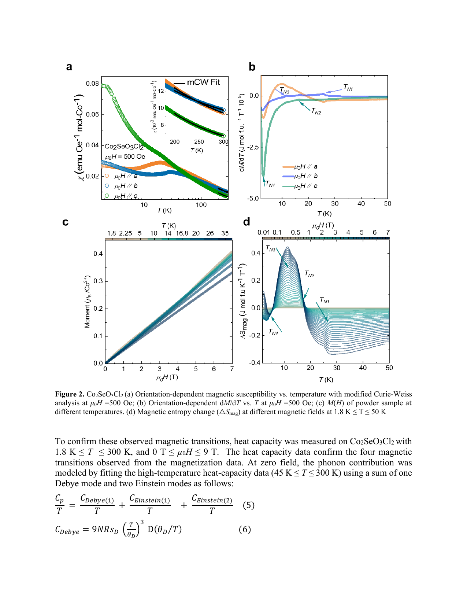

**図3（Co₂SeO₃Cl₂）：第二高調波生成（SHG）による磁電気結合の検出。**
温度依存SHG強度：T_N1(26 K), T_N2(17 K), T_N3(11 K) の三つの磁気転移温度でSHG強度の顕著な異常（増大または減少）を示す一方、結晶対称性（非中心対称P2₁）は変化しない。磁気秩序変化がSHGレスポンスを変調するのは磁気的非線形感受率の寄与（MSHG）によると解釈される。この「磁気転移に伴うSHG変化だが格子対称性変化なし」というシグネチャーが極性磁性体での磁電気結合の直接証拠となる。

---
