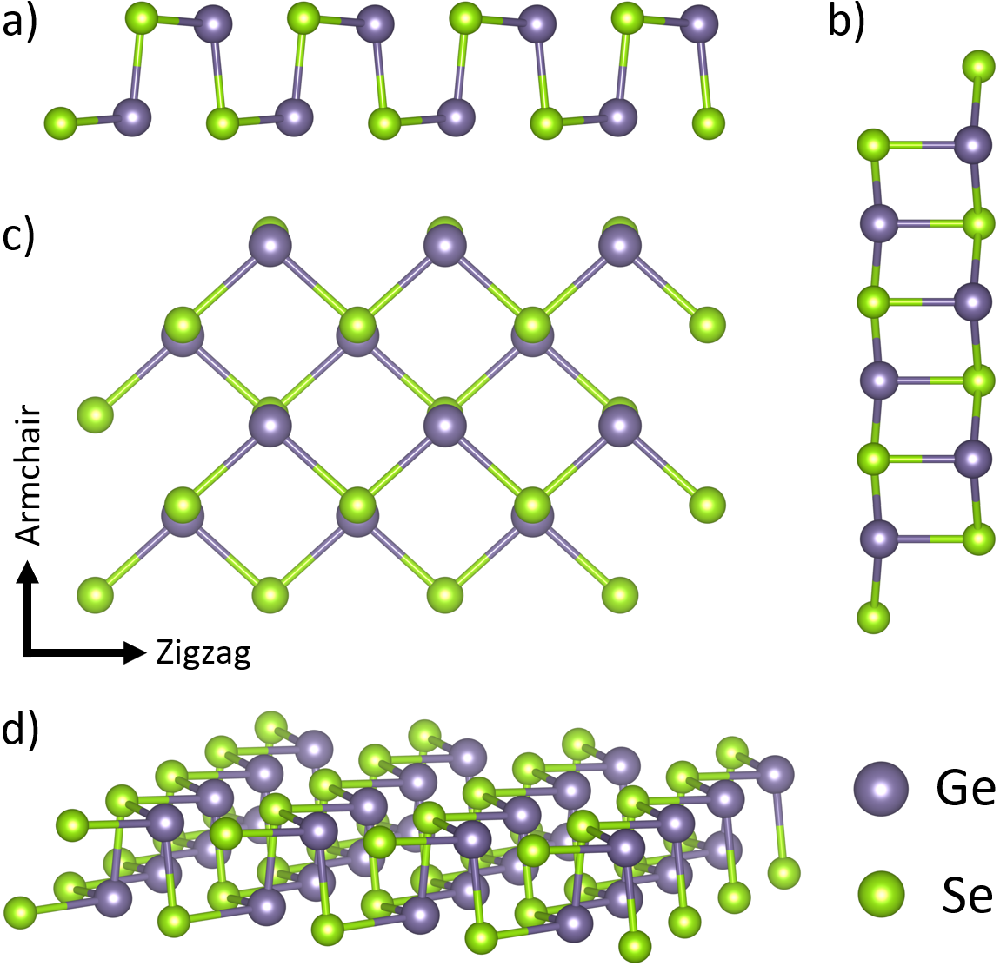
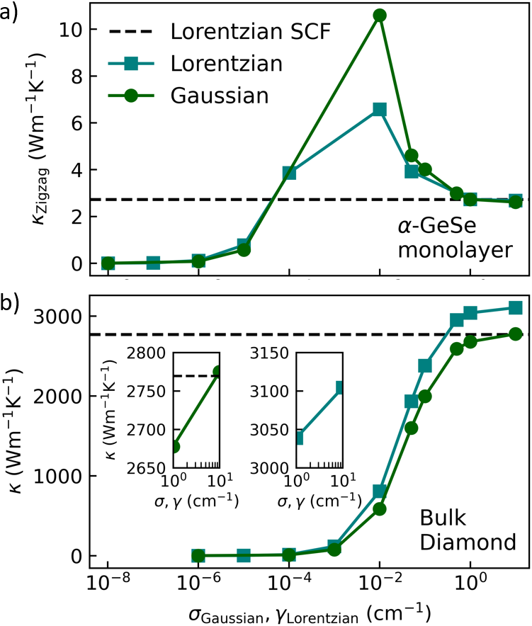
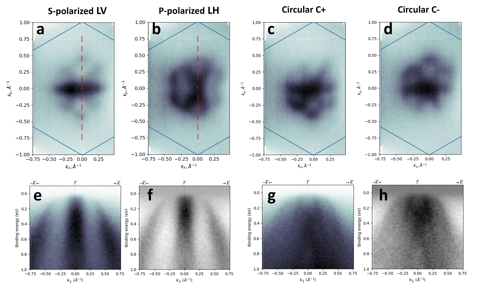
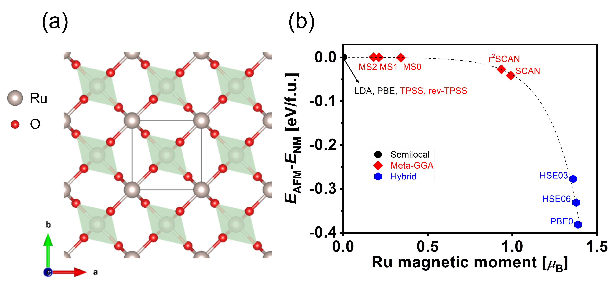
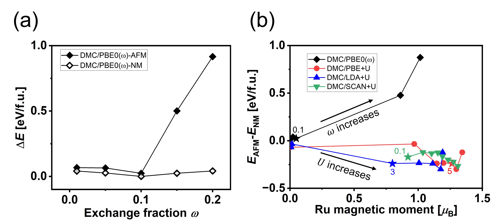
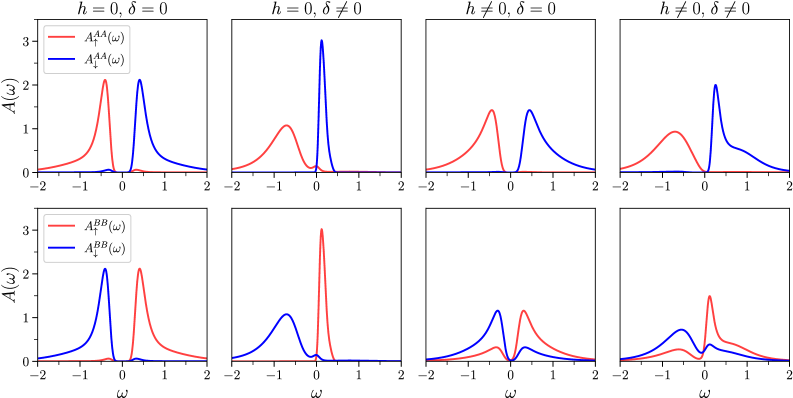
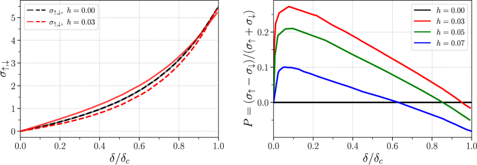
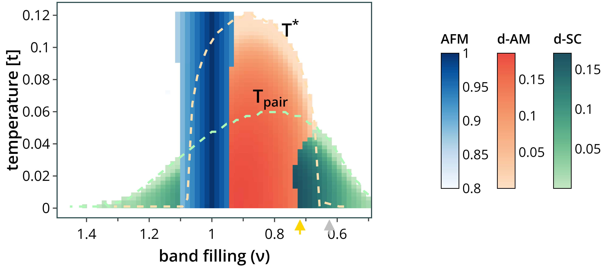
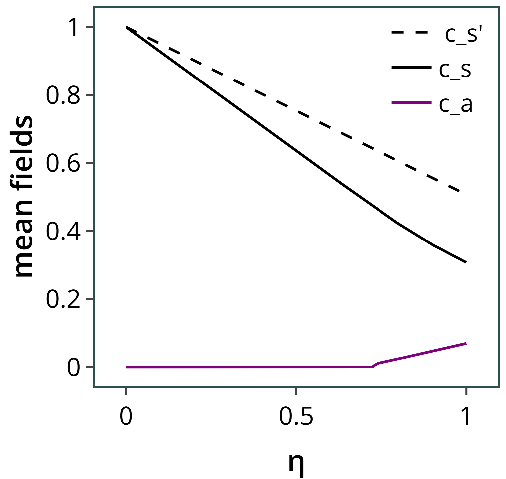
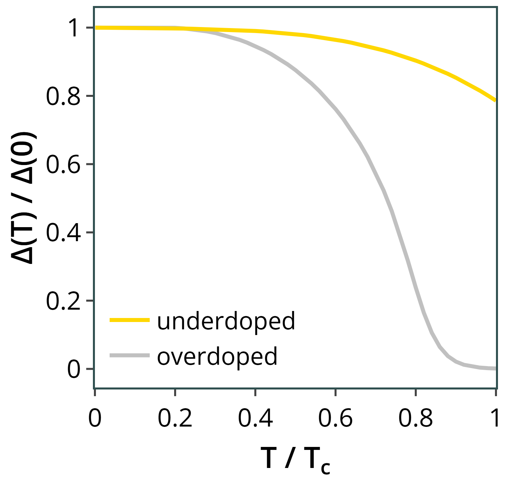

# arXivダイジェスト：物性物理

**作成日：** 2026年3月19日
**対象期間：** 2026年3月17日〜19日（直近72時間の新着論文）

---

## 選定論文一覧

1. [Stoichiometric FeTe is a Superconductor](https://arxiv.org/abs/2603.16115) — Zi-Jie Yan et al. ★詳細解説
2. [Observation of a Reconstructed Chern Insulator in Twisted Bilayer MoTe₂](https://arxiv.org/abs/2603.16374) — Min Wu et al. ★詳細解説
3. [Phonon collisional broadening and heat transport beyond the Boltzmann equation](https://arxiv.org/abs/2603.16753) — Enrico Di Lucente et al. ★詳細解説
4. [Majorana Crystal in Rhombohedral Graphene](https://arxiv.org/abs/2603.16828) — Chiho Yoon, Fan Zhang
5. [Twist-angle evolution from valley-polarized fractional topological phases to valley-degenerate superconductivity in twisted bilayer MoTe₂](https://arxiv.org/abs/2603.16412) — Zheng Sun et al.
6. [Anomalous Thermal Transport Reveals Weak First-Order Melting of Charge Density Waves in 2H-TaSe₂](https://arxiv.org/abs/2603.15915) — Han Huang et al.
7. [Discerning ground state and photoemission-induced spin textures in altermagnetic α-MnTe](https://arxiv.org/abs/2603.16635) — D. A. Usanov et al.
8. [Nonmagnetic Ground State of Rutile RuO₂ from Diffusion Quantum Monte Carlo](https://arxiv.org/abs/2603.16125) — Jeonghwan Ahn et al.
9. [A Correlated Route to Antiferromagnetic Spintronics](https://arxiv.org/abs/2603.16552) — Joel Bobadilla, Alberto Camjayi
10. [Altermagnetic pseudogap from t/U expansion](https://arxiv.org/abs/2603.16311) — Rohit Hegde

---

## 重点論文の詳細解説

---

### 論文①

#### 1. 論文情報

**タイトル：** [Stoichiometric FeTe is a Superconductor](https://arxiv.org/abs/2603.16115)
**著者：** Zi-Jie Yan, Zihao Wang, Bing Xia, Stephen Paolini, Ying-Ting Chan, Nikalabh Dihingia, Hongtao Rong, Pu Xiao, Kalana D. Halanayake, Jiatao Song, Veer Gowda, Danielle Reifsnyder Hickey, Weida Wu, Jiabin Yu, Peter J. Hirschfeld, Cui-Zu Chang
**arXiv ID：** 2603.16115
**カテゴリ：** cond-mat.supr-con
**公開日：** 2026年3月17日
**論文タイプ：** 実験（+理論的考察）
**ライセンス：** arXiv非独占的配布ライセンス（1.0）
**掲載誌：** Nature（受理済み）

---

#### 2. どんな研究か

鉄テルル化物 FeTe は長年にわたり「鉄系超伝導体の非超伝導な母物質」として理解されてきたが、本研究はその見方を根本から覆す。分子線エピタキシー（MBE）で作製したFeTe薄膜からTe雰囲気アニーリングにより過剰鉄（interstitial Fe）を除去すると、反強磁性秩序が消失し、臨界温度 Tc ≈ 13.5 K の超伝導が出現することを多種の実験手法で確認した。FeTe系材料の本質的な電子状態と、過剰欠陥が物性に与える影響について、鉄系超伝導研究全体への示唆を持つ重要な発見である。

---

#### 3. 研究の概要

**背景と目的：**
鉄系超伝導体の研究は2008年にFeAs系が発見されて以来急速に発展し、FeSe/Fe(Te,Se)系もその中心的材料として多くの研究を集めてきた。FeSe薄膜が高いTcを示す一方、組成がFeTe寄りになると超伝導が消失し反強磁性金属状態になることが知られていた。この「FeTe = 非超伝導体」という長年の常識が、試料中に含まれる過剰鉄（格子間サイト鉄）の影響によるものなのかを実験的に検証することが本研究の中心的目的である。

**研究アプローチと対象材料系：**
MBEによりSrTiO₃(001)基板上にFeTe薄膜を成膜し、成長後に過剰Te雰囲気下でアニーリング処理を施した。アニーリングにより格子間Feが除去され、化学量論的（stoichiometric）FeTe薄膜が得られる。比較として過剰Feを含む未処理膜も測定し、過剰Feが電子状態・磁気秩序・超伝導に与える役割を系統的に調べた。

**主な手法：**
スピン偏極走査トンネル顕微鏡（SPSTM）、トンネル分光（STS）、電気抵抗測定（四端子法）、磁化率測定（Meissner効果の確認）、および第一原理計算を組み合わせた。

**主な結果：**
過剰Feを含む膜（as-grown FeTe）では、Fe格子間サイトの局在スピンが強い反強磁性秩序を誘起し、金属的かつ非超伝導な状態が実現する。Teアニール後の化学量論的FeTe薄膜では、(i) 反強磁性秩序が消失し、(ii) 抵抗測定でゼロ抵抗（Tc ≈ 13.5 K）が観測され、(iii) STSによりCooper対のトンネル信号が確認され、(iv) Meissner効果が観測された。超伝導ギャップは比較的均一であり、非慣習的対称性の可能性が示唆されるが、詳細なギャップ構造の決定は今後の課題として残されている。

**著者の主張：**
FeTe系に超伝導が見られなかったのは本質的な性質ではなく、過剰格子間Feによる副次的効果であった。化学量論的FeTe は超伝導体であり、鉄系超伝導体の「真の母物質」として再定義されるべきである。

---

#### 4. 物性物理として重要なポイント

本研究が提示する最も本質的な物理は、「鉄系超伝導体の非超伝導母物質」という20年来の枠組みが、欠陥制御によって根底から覆されるという点にある。格子間Feは局在スピンとして反強磁性交換相互作用を誘起し、itinerant電子の超伝導ペアリングを強力に抑制していた可能性が高い。これを除去することで、遍歴3d電子系が本来持つ超伝導不安定性が顕在化したと解釈できる。測定手法の点では、SPSTMがナノスケールの磁気秩序と超伝導ギャップを原子分解能に近い精度で同一試料上で観測できる強みを最大限に活かしている。先行研究との差分は明確であり、化学量論制御という単純に見えるアプローチが、長年の謎を解く鍵になったことを示している。FeTe系の超伝導機構（s±波か、非慣習的か）を明らかにするための新しい研究対象を提供する点でも、波及効果は大きい。

---

#### 5. 限界と注意点

薄膜系での知見であり、バルク単結晶の化学量論的FeTe での超伝導発現の有無は独立した検証が必要である。アニーリング後の試料における過剰Fe の完全除去の程度と均一性が、Tc や超伝導ギャップに与える影響について定量的評価がさらに必要である。本研究で示された Tc ≈ 13.5 K という値の再現性と、試料間ばらつきの定量化が今後の課題となる。超伝導ギャップの対称性（s波か非慣習的か）については、今後の精密なSTSおよびスペクトル測定による解析が不可欠であり、現段階では断言できない。さらに、基板効果・界面効果が超伝導に与える寄与を排除するためには、自立膜や厚膜での検証が望ましい。

---

#### 6. 関連研究との比較

FeTe は2008年以降、Fe(Te,Se)やFeSe系の超伝導研究の文脈で非超伝導な対照系として位置づけられてきた。多くの研究が過剰Feの効果（局在モーメントの誘起、フラストレーションの増大）を指摘しつつも、「化学量論的FeTe」そのものを超伝導体として実証した研究は存在しなかった。この意味で本研究は incrementalではなく、材料認識のパラダイムシフトに相当する。Fe(Te,Se)系で観測されていた相分離・不均一超伝導の議論に対しても、過剰Feの局在スピンという視点から新たな解釈の枠組みを提供する。類似の過剰欠陥除去のアプローチはFeAs系でも検討の価値があり、「欠陥制御が超伝導を顕在化させる」という知見は他の鉄系材料に広く波及しうる。今後は超伝導機構の解明（フォノン媒介か磁気揺らぎ媒介か）、フェルミ面の決定、ニュートロン散乱による磁気励起の観測などが重要な研究展開となるだろう。

---

#### 7. 重要キーワードの解説

**① 鉄系超伝導体（iron-based superconductors）**
2008年にLaFeAsO₁₋ₓFₓで発見された非銅酸化物高温超伝導体の総称。FeAs面やFeSe面を超伝導層として持ち、Tc は最大で55 K以上に達する。スピン揺らぎを媒介とした非慣習的ペアリング（s±波）が有力視されている。FeTe/FeSe系はFeAs系に比べてより単純な構造を持ち、トポロジカル超伝導の候補としても注目される。

**② 格子間鉄（interstitial Fe）**
FeTe の本来の結晶格子外の格子間サイトに取り込まれた過剰Feのこと。この格子間Feはスピン S=2 程度の局在磁気モーメントを持ち、周囲の遍歴電子と強磁性的あるいは反強磁性的に結合して強い磁気散乱を引き起こす。超伝導ペア形成を妨げる対破壊（pair breaking）効果をもたらす磁性不純物として機能する。

**③ 反強磁性秩序（antiferromagnetic order）**
隣接スピンが逆方向に整列した磁気秩序。FeTe では過剰Feの存在により、ダブルストライプ型（Q = (π/2, π/2)）あるいはシングルストライプ型（Q = (π, 0)）のAFM秩序が形成されることが知られており、これが金属的応答とともに現れる。

**④ Meissner効果（Meissner effect）**
超伝導体が Tc 以下で外部磁場を完全に排除する現象（完全反磁性）。B = 0（磁束密度ゼロ）を達成するために、超伝導体内部に遮蔽電流が流れる。超伝導の最も基本的な実験的証拠の一つであり、単なるゼロ抵抗との区別においても決定的な役割を果たす。

**⑤ Cooperペアトンネル（Cooper pair tunneling）**
ジョセフソン効果として知られる現象。超伝導体-絶縁体-超伝導体（SIS）または超伝導体-真空-超伝導体（STM探針の場合）のトンネル接合において、Cooperペアがコヒーレントにトンネルする現象。STSスペクトルでは超伝導ギャップ 2Δ 内外に特徴的な構造として現れる。

**⑥ 分子線エピタキシー（Molecular Beam Epitaxy, MBE）**
超高真空中で原子・分子ビームを基板に照射し、原子層レベルで制御された薄膜を成長させる手法。成長速度や組成比を精密に制御でき、化学量論的な薄膜を作製するのに適している。本研究でもMBEにより過剰Feの少ない高品質FeTe膜の作製が鍵となった。

**⑦ 走査トンネル顕微鏡・分光（STM/STS）**
探針と試料表面間のトンネル電流を用いて、原子スケールの形貌（STM）と局所電子状態密度（STS）を観測する手法。超伝導ギャップや磁気秩序のナノスケールの不均一性を直接観察できる強力な実験手法。スピン偏極型探針を用いれば磁気構造も分解できる。

**⑧ 対破壊（pair breaking）**
超伝導Cooperペアを破壊する過程の総称。磁性不純物は時間反転対称性を破り、アンダーソン定理によれば非磁性不純物が s 波超伝導に無害である一方、磁性不純物は Tc を急速に抑制する。これをアバリキン・ゴーリコフ理論で定量化でき、Tc の磁性不純物濃度依存性として記述される。

**⑨ ドーピングと相図（doping and phase diagram）**
Fe(Te,Se) 系では、Seドーピング量 x に従い FeTe（AFM金属）から FeSe（超伝導体）へと相転移が起きる。本研究が示すように、化学量論的FeTe 自体が超伝導であるとすれば、この相図の出発点から再解釈が必要となる。過剰Feの量を一種の「化学的ドーピング」ととらえることで、相図の連続性が改めて問われる。

**⑩ トポロジカル超伝導（topological superconductivity）**
バンドトポロジーを持つ超伝導体で、表面（エッジ）にマヨラナゼロモードと呼ばれるトポロジカルに保護された境界状態が現れる相。Fe(Te,Se)系は時間反転不変なトポロジカル絶縁体的バンド構造と超伝導の共存から、トポロジカル超伝導候補として注目されてきた。化学量論的FeTe が超伝導体であれば、この観点でのさらなる研究が期待される。

---

#### 8. 図

本論文のライセンスはarXiv非独占的配布ライセンス（1.0）であるため、原図の抽出は行わなかった。

---

---

### 論文②

#### 1. 論文情報

**タイトル：** [Observation of a Reconstructed Chern Insulator in Twisted Bilayer MoTe₂](https://arxiv.org/abs/2603.16374)
**著者：** Min Wu, Lingxiao Li, Yunze Ouyang, Yifan Jiang, Wenxuan Qiu, Zaizhe Zhang, Zihao Huo, Qiu Yang, Ming Tian, Neng Wan, Kenji Watanabe, Takashi Taniguchi, Shiming Lei, Fengcheng Wu, Xiaobo Lu
**arXiv ID：** 2603.16374
**カテゴリ：** cond-mat.mes-hall
**公開日：** 2026年3月17日
**論文タイプ：** 実験
**ライセンス：** CC BY-NC-SA 4.0

---

#### 2. どんな研究か

ねじれ二層MoTe₂（tMoTe₂）において、先行研究が対象としてきた小さなねじれ角（θ < 4°）よりも大きな角度 θ = 4.54° のデバイスを用い、これまで未探索であった相図領域を実験的に調べた。その結果、複数のモアレ充填数においてChern数 C = 1 のChern絶縁体が出現し、特に ν = −2/3 でキャリア充填に相当する磁場誘起の分数Chern絶縁体（FCI）とともに絶縁体−金属転移が観測された。モアレ系のトポロジカル相が、強相関領域を超えて広いねじれ角範囲に存在することを示した実験的証拠として重要である。

---

#### 3. 研究の概要

**背景と目的：**
tMoTe₂は遷移金属ダイカルコゲナイド（TMD）系モアレ材料の代表的プラットフォームであり、小ねじれ角では分数量子異常ホール効果（FQAH）、量子異常ホール効果（QAH）、超伝導など多様な量子相が報告されてきた。これらは主に強い相関効果が支配的な領域（θ ≲ 4°）での現象であるが、より大きなねじれ角では帯域幅が広がり相関効果が弱まると予想されていた。本研究は θ = 4.54° の「中間的」領域を実験的に探索し、トポロジカル相の出現条件を明らかにしようとした。

**研究アプローチ：**
デバイス作製にはhBN封止・六角形ボロン窒化物（hBN）を用いた標準的なモアレデバイス作製法を採用し、ゲート電圧によるキャリア充填数の精密制御のもと輸送測定（縦抵抗・ホール抵抗の磁場・温度・充填数依存性）を系統的に行った。

**対象材料系：** ねじれ二層MoTe₂（θ ≈ 4.54°）、hBN封止デバイス、充填数 ν は −1 〜 −3 の範囲を調査。

**主な結果：**
複数のモアレ充填数（特に ν = −1, −2 付近）において Chern 数 C = 1 の絶縁体的状態が観測された。注目すべきは ν = −2/3 での挙動であり、ゼロ磁場では金属的であるが有限磁場の印加によりホール抵抗が量子化し（(3/2)(h/e²)に対応するFCI）、同時に縦抵抗が大きく増大する絶縁体−金属転移が出現した。これは外部磁場によってFCI状態が安定化されるという、モアレ系における新規な相制御の実例である。

**著者の主張：**
Chern絶縁体とFCIが従来の強相関領域を超えた大ねじれ角においても安定に存在しうることを示した。この「再構成されたChern絶縁体（Reconstructed Chern Insulator）」は、バンド再構成と弱まった（しかし依然有効な）電子相関の競合によって生じると解釈される。

---

#### 4. 物性物理として重要なポイント

tMoTe₂のトポロジカル相の安定性が、これまで考えられていたよりも広いパラメータ空間に及ぶことを示した点が本研究の核心にある。小ねじれ角でのFQAHが強相関効果によって駆動されるのに対し、θ = 4.54° での再構成型Chern絶縁体では、バンド再構成（周期的ポテンシャルによるバンドの折り畳み）とChern number を持つフラットバンドの結合が主要な物理機構と考えられる。ν = −2/3 でのFCIは、分数占有のトポロジカル秩序が相関とトポロジーの協力によって生じる典型例であり、磁場によって絶縁体−金属転移が誘起されるという非自明な相制御メカニズムを示している。Watanabe・Taniguchiによる高品質hBNの供給が高品質デバイス作製に不可欠であったことも、現代のモアレ研究の共通課題を体現している。

---

#### 5. 限界と注意点

単一ねじれ角（4.54°）の単一デバイスの測定であり、ねじれ角依存性の系統的マッピングには追加試料が必要である。ねじれ角の均一性と局所的な角度ゆらぎが測定結果に与える影響を定量的に評価する必要がある。FCIの同定はホール抵抗の量子化に依拠しているが、量子化の精度や非対角成分の解析についてより詳細な検討が求められる。理論的には「再構成されたChern絶縁体」のバンド構造とChern数をab initio的に計算する研究が必要であり、現段階では定性的な解釈の段階にとどまる部分がある。低温・高磁場での測定に限定されており、有限温度での相の安定性や相転移の性質についての情報は限られている。

---

#### 6. 関連研究との比較

tMoTe₂での量子異常ホール効果の実験的発見（2023年）やFQAHの報告（2023年以降）は本研究の直接の先行研究であり、それらが主に小ねじれ角（2–4°）でのものであったのに対し、本研究は大ねじれ角領域の相図を初めて実験的に明らかにした。TMD系モアレにおけるねじれ角–充填数–磁場の3次元的な相図の解明は未解決問題であり、本研究はその一断面を提示する。同じ時期に投稿されたtMoTe₂の別の研究（2603.16412）が超伝導へのねじれ角演化を報告しており、両者を合わせることでtMoTe₂系の豊かな量子相空間の全体像がより明確になりつつある。今後は、STM/STSによる局所的バンド構造の実空間観測、偏光光電子分光によるバンドトポロジーの直接検証、および理論計算との定量的比較が重要な展開方向となる。

---

#### 7. 重要キーワードの解説

**① モアレ超格子（moiré superlattice）**
二つの六方晶格子状物質を微小なねじれ角や格子定数の差でスタックしたときに生じる長波長の干渉縞（モアレ）が作り出す周期的ポテンシャル。典型的なモアレ周期は数〜十数 nm であり、この超格子ポテンシャルが電子のバンド構造を再構成し、フラットバンドを生み出す。フラットバンドでは運動エネルギーが小さくなり、電子相関が相対的に重要になる。

**② Chern絶縁体（Chern insulator）**
バンドギャップを持ちながらも、占有バンドが非自明なトポロジー（Chern数 C ≠ 0）を持つ絶縁体。量子異常ホール効果を示し、ホール抵抗は h/(Ce²) に量子化される。Chern数はBrillouinゾーン全体のBerry曲率の積分として定義される：C = (1/2π) ∫ Ω(k) d²k。

**③ 分数Chern絶縁体（Fractional Chern Insulator, FCI）**
バンドが部分的に満たされた状態でもChern数に由来するトポロジカル秩序が実現する相。ラフリン状態に類似したトポロジカル秩序を持ち、分数電荷を持つ準粒子励起やエニオン統計が現れる。FQHEのラットル状態のモアレ類似体として理解できる。外部磁場なしで実現できるFCIはモアレ系の特筆すべき発見の一つである。

**④ 分数量子異常ホール効果（FQAHE）**
磁場なしの状態で分数Chern絶縁体が示すホール効果。ホール抵抗が h/(νe²)（ν は分数）に量子化される。tMoTe₂では ν = −2/3 での (3/2)(h/e²) 量子化が特徴的な例として知られる。時間反転対称性の自発的破れと電子相関の組み合わせによって出現する。

**⑤ 帯域幅（bandwidth）**
エネルギーバンドの上端と下端のエネルギー差。ねじれ角が小さいほどモアレ周期が長くなり、フラットバンドの帯域幅は狭くなって電子相関が重要になる。ねじれ角が大きくなると帯域幅が広がり、「相関が弱い」領域になるが、本研究はそのような領域でもトポロジカル相が存続できることを示した。

**⑥ Berry曲率（Berry curvature）**
運動量空間においてBloch状態の位相構造を記述する擬ベクトル場。バンド交差や回避交差の近傍で大きくなり、異常ホール効果や軌道磁化の起源となる。Chern数は第一Brillouinゾーン全体のBerry曲率の積分であり、トポロジカル不変量として量子化されたホール応答を生み出す。

**⑦ バレー偏極（valley polarization）**
六方晶2D材料のK点とK'点（バレー）の占有に非対称が生じた状態。TMD系では時間反転対称性の自発的破れと組み合わさり、量子異常ホール効果の出現に寄与する。バレー自由度は磁気モーメントと結びついており（バレートロニクスと関連）、外部磁場による制御が可能である。

**⑧ 六方晶ボロン窒化物（hexagonal boron nitride, hBN）**
二次元材料のデバイス封止材として広く用いられる絶縁体。原子的に平坦な表面を持ち、ダングリングボンドがないため電荷不純物が少ない。MoTe₂やグラフェンなどの活性層を上下からhBNで挟む（封止する）ことで、界面の清浄度を保ち量子振動などの精密測定を可能にする。Watanabe・Taniguchiグループが高品質hBN単結晶の供給源として世界的に著名。

**⑨ 輸送測定（transport measurement）**
電気抵抗・ホール効果・磁気抵抗などの電気的応答を磁場・温度・キャリア密度の関数として測定する手法。トポロジカル相の同定においては、ホール抵抗の量子化がChern数の直接的な証拠となる。モアレデバイスでは低温・高磁場下での精密な四端子測定が標準的手法。

**⑩ 相再構成（band reconstruction）**
強い周期的ポテンシャルによってバンドが折り畳まれ、ミニバンド構造が形成される現象。モアレ超格子ではこのバンド再構成が実空間でのBrillouinゾーン縮小と対応し、フラットバンドや特定のChern数を持つバンドの出現をもたらす。本論文のタイトルにある「Reconstructed」はこの意味でのバンド再構成を指す。

---

#### 8. 図

本論文のライセンスはCC BY-NC-SA 4.0であるが、arXiv HTML版が利用できなかったため、原図の抽出は行わなかった。

---

---

### 論文③

#### 1. 論文情報

**タイトル：** [Phonon collisional broadening and heat transport beyond the Boltzmann equation](https://arxiv.org/abs/2603.16753)
**著者：** Enrico Di Lucente, Nicola Marzari, Michele Simoncelli
**arXiv ID：** 2603.16753
**カテゴリ：** cond-mat.mtrl-sci
**公開日：** 2026年3月17日
**論文タイプ：** 理論・第一原理計算
**ライセンス：** CC BY 4.0

---

#### 2. どんな研究か

フォノンの熱輸送を記述する標準的なボルツマン輸送方程式（BTE）は、フォノンの準粒子的描像とゴールデンルール散乱に基づいており、「衝突的な線幅広がり（collisional broadening）」を自己無撞着に取り込めないという根本的な制約を持つ。本研究は量子場理論のカダノフ＝バイム方程式から出発し、フォノンの分光関数に自己エネルギー補正（衝突線幅）を自己無撞着に取り込んだ線形化一般化BTE（lgBTE）を厳密に導出した。この新しい枠組みを用いると、ダイヤモンドでの熱伝導率のスミアリングパラメータ依存性（収束問題）と、2D材料（α-GeSe単層）での熱伝導率の従来計算の失敗がともに解決されることが第一原理計算で示された。

---

#### 3. 研究の概要

**背景と目的：**
フォノンによる熱輸送の第一原理計算は、Peierls-BTEを基礎として発展してきた。この手法では三フォノン・四フォノン散乱レートをフォノン準粒子の完全な分散関係から計算するが、数値実装においてBrillouinゾーンサンプリングの際にデルタ関数をGauss型やLorentz型の有限幅関数で置き換える（スミアリング）必要がある。ダイヤモンドのような熱伝導性の高い材料では、この数値スミアリングパラメータに対して計算結果が強く依存し、「真のゼロ幅極限」で収束しないことが長年の問題となっていた。2D材料では、屈曲音響（ZA）フォノンの特殊な分散関係（ω ∝ q²）が従来BTEの破綻をもたらす。これらを統一的に解決する量子力学的な枠組みの構築が本研究の目的である。

**研究アプローチ：**
非平衡グリーン関数法（カダノフ＝バイム方程式）→ ウィグナー分布関数の量子輸送方程式 → 線形応答における lgBTE の厳密導出という理論展開を取る。数値実装には第一原理計算（密度汎関数理論 + 摂動論 DFPT）で得られたフォノン間相互作用定数（三次・四次力定数）を用いる。

**対象材料系：** ダイヤモンド（3Dバルク、熱伝導率が高くスミアリング問題が顕著）、α-GeSe単層（2D材料、ZAフォノン問題が顕著）。

**主な結果：**
lgBTEでは、フォノン準粒子の分光関数がゴールデンルール的な無限小幅ではなく有限幅の自己エネルギー補正を持ち、この補正を自己無撞着に決定することが理論的に要請される。数値的には：(1) ダイヤモンドでは、lgBTE を用いた計算がスミアリングパラメータ依存性を大幅に低減し、実験値に近い安定した熱伝導率を与える。(2) α-GeSe単層では、ZAフォノンの衝突的線幅が「有効的に調和化」の役割を果たし、長波長発散問題を物理的に解消する。

**著者の主張：**
BTE は lgBTE の特定の極限（衝突的線幅をゼロとし、スペクトル関数をデルタ関数で近似）として回収されるが、この極限はダイヤモンドや2D材料では不適切である。lgBTE は BTE よりも基礎的な枠組みであり、広いクラスの材料での熱輸送計算の標準手法になりうる。

---

#### 4. 物性物理として重要なポイント

フォノン熱輸送の第一原理理論において、「準粒子の有限寿命が輸送に与える効果を自己無撞着に取り込む」という問題は長年の未解決課題であった。本研究の重要性は、この問題をカダノフ＝バイム方程式という確立した場の理論の枠組みから厳密に解決した点にある。2D材料の ZA フォノンは ω ∝ q² の超音波的分散を持ち、長波長でフォノン占有数が発散するため、Fermi黄金則的なアプローチでは熱伝導率が発散したり収束しなかったりする問題があった。lgBTE では ZA フォノン自身の有限寿命（衝突的線幅）がその長波長発散を正則化する、という物理的に透明な機構が示される。ダイヤモンドの場合はより微妙で、フォノン寿命が非常に長く（Mean Free Path が mm スケール）、この長寿命フォノンに対してゴールデンルールの適用に問題があることを示している。理論・計算手法の進歩としては、標準的なDFPT計算と組み合わせることで実装可能な点も重要であり、今後の熱輸送計算の標準的な枠組みとなりうる。

---

#### 5. 限界と注意点

本研究は線形応答（ 小温度勾配）の枠組みで定式化されており、強い非平衡状態や非線形輸送への一般化は今後の課題である。対象としたのはダイヤモンドとα-GeSe単層の2系統のみであり、より広い材料クラス（とくに熱電材料、超音波的に柔らかい材料）への適用は今後の検証が必要である。四フォノン以上の高次散乱過程の扱い方や、電子フォノン相互作用を含む場合の拡張も残された課題である。計算コストはBTEに比べて増大しており、大規模材料スクリーニングへの実用的適用には計算効率化が必要である。自己無撞着計算の収束の詳細についても、材料依存性の検証が求められる。

---

#### 6. 関連研究との比較

フォノン熱輸送の第一原理計算はPerdew、Broido、Murphyらによる2010年代のダイヤモンド計算以来、急速に発展してきた。Wigner分布関数を用いたSimoncelli et al.（2019）の「Wigner Transport Equation」は線形・非線形輸送を統一的に扱う枠組みとして注目されており、本研究はその延長線上に位置する。衝突的線幅の問題はPhilips et al.（2023）らも指摘してきたが、カダノフ＝バイム方程式から lgBTE を厳密導出し数値的に実装した研究はこれが初めてと見られる。2D材料でのZAフォノン問題については、Fugallo et al.（2014）やCai et al.による研究が先行するが、本研究は問題の数学的起源と物理的解決策を最も明快に示した。今後の研究では、電子–フォノン相互作用を含む系（金属、超伝導体）や非調和性が極めて強い系（軟モードを持つ系、相転移近傍）への適用が重要な展開となる。

---

#### 7. 重要キーワードの解説

**① ボルツマン輸送方程式（Boltzmann Transport Equation, BTE）**
フォノン（あるいは電子）の分布関数 n_ν(r, t) の時空間発展を記述する半古典的輸送方程式：∂n_ν/∂t + v_ν · ∇n_ν = (∂n_ν/∂t)_scatt。散乱項は三フォノン・四フォノン過程のゴールデンルールで与えられる。定常状態の線形化 BTE を解くことで熱伝導率を計算できる。

**② 衝突的線幅広がり（collisional broadening）**
フォノン（または電子）が散乱によって有限の寿命を持つことで、そのエネルギー準位に幅が生じること。完全なフォノン分光関数 A(ω, k) はデルタ関数でなくLorentz型などの有限幅を持つ。lgBTE はこの有限幅を自己無撞着に取り込み、従来BTEでの「無限小ε = 0 の極限」という暗黙の仮定を取り除く。

**③ カダノフ＝バイム方程式（Kadanoff-Baym equations）**
非平衡多体系をKeldysh形式のグリーン関数（前進・後退グリーン関数、Keldysh成分）で記述する量子輸送方程式。相互作用を超えた厳密な出発点を提供し、BTEはその古典的近似（準粒子近似＋Markov近似）として回収される。Kadanoff-Baymはエネルギー分解された輸送記述を可能にする。

**④ 屈曲音響フォノン（ZA phonon, flexural acoustic phonon）**
2D材料に固有の面外屈曲変形に対応する音響モード。2D材料の連続弾性論から、その分散関係は長波長極限で ω ∝ q²（音速ゼロ）となる。これはGrüneisen理論の標準的仮定（線形音響モード）に反しており、BTE計算での数値的取り扱いが難しい原因となっている。本研究ではlgBTEがこの問題を解決することを示した。

**⑤ 第一原理計算（first-principles calculations）**
経験的パラメータなしに量子力学の基本方程式（シュレーディンガー方程式またはその近似）から物性を計算する手法。フォノン計算では密度汎関数摂動論（DFPT）により調和的・非調和的力定数を計算し、フォノン分散と散乱行列要素を求める。

**⑥ 密度汎関数摂動論（DFPT）**
密度汎関数理論（DFT）に外部摂動の線形応答理論を組み合わせたフォノン計算の標準手法。格子定数・原子位置の摂動に対する電子密度の応答から第二次（調和）および第三次（三フォノン）力定数を計算できる。バリウムら（2001）らによって体系化された。

**⑦ 分光関数（spectral function）**
A(k, ω) = −2 Im G^R(k, ω)（G^R は前進グリーン関数）で定義されるフォノン（または電子）の状態密度の k 分解版。完全な相互作用を持つ系では有限幅をもち、準粒子ポールとそのスペクトル重みを記述する。BTEでは A(k, ω) ≈ δ(ω − ω_k) という準粒子近似を用いるが、lgBTE はこれを超える。

**⑧ 熱伝導率（thermal conductivity, κ）**
フーリエ則 J = −κ∇T における比例係数。固体では主にフォノン熱伝導が支配的であり、ダイヤモンドでは室温で ≈ 2200 W/(m·K)という極めて高い値を示す（Si: ≈ 150 W/(m·K)）。κ は Wiedemann-Franz 則の類似として電気伝導率と関連するが、フォノン系では普遍的な関係は存在しない。

**⑨ Wigner分布関数（Wigner distribution function）**
量子系の位相空間（位置×運動量）表示。古典分布関数に相当するが、量子的干渉を表す負の領域を取りうる。Simoncelli らによる Wigner Transport Equation はフォノン熱輸送の量子的記述として BTE を超えた枠組みを提供し、本研究と密接に関連する。

**⑩ 自己エネルギー（self-energy）**
多体相互作用によってフォノン（または電子）のエネルギーと寿命が繰り込まれる量。Σ(k, ω) = Σ'(k, ω) + iΣ''(k, ω) であり、実部がエネルギーシフト、虚部がスペクトル幅（寿命の逆数 ∝ Γ）に対応する。衝突的線幅は Σ''(k, ω_k) から計算される。

---

#### 8. 図

ライセンスはCC BY 4.0であり、arXiv HTMLより図を3点抽出した。

**図1：自己無撞着な衝突的線幅の計算プロトコル。** lgBTE における反復計算の流れを示す模式図。初期フォノン線幅 Γ_ν を入力とし、カダノフ＝バイム方程式を通じて自己無撞着に更新する手続きが示されている。この自己無撞着ループが、従来BTEの数値スミアリング依存性を解消する核心的な物理機構を表現している。

**図2：斜方晶α-GeSe単層の結晶構造。** 側面図（a, b）と上面図（c）。皮膚型（ヒンジ状）の座屈構造を持つIV-VI族モノカルコゲナイドの典型的な構造。ZAフォノンの問題が顕著な2D材料の代表例として選ばれており、第一原理計算の対象物質の幾何学的情報を提供する。

**図3：室温熱伝導率のスミアリングパラメータ依存性。** GaussianおよびLorentzianのスミアリング関数を用いた従来BTE計算（強い依存性）と、lgBTEを用いた計算（安定した収束）の比較。lgBTEがスミアリング問題を解決することを直接示す主要な検証結果であり、論文の中心的主張を支持する重要な図。

---

---

## その他の重要論文

---

### 論文④

#### 1. 論文情報

**タイトル：** [Majorana Crystal in Rhombohedral Graphene](https://arxiv.org/abs/2603.16828)
**著者：** Chiho Yoon, Fan Zhang
**arXiv ID：** 2603.16828
**カテゴリ：** cond-mat.mes-hall
**公開日：** 2026年3月17日
**論文タイプ：** 理論
**ライセンス：** arXiv非独占的配布ライセンス

#### 2. 研究概要

近年の実験でRhombohedral（菱面体晶型）グラフェンにおいてスピン・バレー偏極した四分の一金属状態からの超伝導相が報告されており、カイラルトポロジカル超伝導の候補として注目を集めている。しかし本研究は、バレー内ペアリングのFulde-Ferrell位相因子の役割を精密に解析することで、単純なカイラルトポロジカル超伝導体として理解するだけでは不十分であることを指摘する。著者らの計算によれば、菱面体晶グラフェン系は三角格子上では通常のカイラルトポロジカル超伝導体として振る舞いつつ、双対ハニカム格子上では「ハルデーンモデルに類似したマヨラナ結晶（Majorana crystal）」という特異な構造を形成することが示された。このマヨラナ結晶は、マヨラナモードが空間的に周期的に配列した状態であり、孤立したマヨラナゼロモードとは本質的に異なる位相的性質を持つ。

物性物理の観点から本研究が重要なのは、強相関電子系（四分の一金属状態）から発展した超伝導が、トポロジカル超伝導の新しい多体的形態を生み出しうることを具体的な系で示した点にある。Fulde-Ferrell位相因子という通常は次要な補正が、双対格子上では「マヨラナ結晶秩序」という全く新しい位相的構造を生み出す原動力となるという発見は、モアレ系の超伝導研究に新たな概念的枠組みを加えるものである。実験的検証は依然として難しいが、STM/STSやキャビティQEDなどで識別可能なシグネチャが存在するかについての理論的考察が今後の重要な課題となる。

#### 3. 重要キーワードの解説

**① 菱面体晶グラフェン（rhombohedral graphene）** グラフェンを複数枚ABC積層した構造。ねじれ角ゼロで界面に平坦なバンドが出現し、強い電子相関を示す。ペンタレイヤー（5層）などが超伝導の実験的観測対象。

**② Fulde-Ferrell（FF）状態** スピン分裂した系での超伝導ペアリング状態。ペアが有限運動量 q = k↑ + k↓ ≠ 0 を持つFulde-Ferrell状態とLarkin-Ovchinnikov（LO）状態の総称（FFLO状態）。本研究でのFF位相因子はこのような有限運動量ペアリングから生じる位相的寄与を指す。

**③ カイラルトポロジカル超伝導（chiral topological superconductor）** 時間反転対称性が破れ、カイラルエッジモード（トポロジカルに保護された縁状態）を持つ超伝導体。チャーン数 C = 1 の場合、エッジに1本のカイラルマヨラナモードが存在する。p+ip 型超伝導の典型例。

**④ マヨラナゼロモード（Majorana zero mode）** 自身が反粒子であるマヨラナフェルミオンが超伝導体のギャップ内に形成するゼロエネルギー境界状態。非アーベルエニオン統計に従い、量子コンピュータの位相的量子ビット候補として注目される。

**⑤ マヨラナ結晶（Majorana crystal）** 通常の孤立したマヨラナゼロモードではなく、マヨラナモードが空間的に周期配列した状態。ハルデーンモデルとの類似性が示唆されており、バンドトポロジカルなマヨラナ状態とも関連する新しい概念。

**⑥ ハルデーンモデル（Haldane model）** F.D.M. Haldane（1988）が提唱した二次元蜂の巣格子上のトポロジカル絶縁体モデル。磁場ゼロでもChern数を持つ絶縁体を初めて示した先駆的モデルであり、量子異常ホール効果の理論的先駆けとなった。

**⑦ バレー偏極四分の一金属（valley-polarized quarter-metal）** バレー（K, K'）のうち一方だけが部分的に占有された金属状態で、全占有状態数が（半金属の半分）の四分の一になった状態。菱面体晶グラフェンでゲート制御により実現され、ここから超伝導が発現する。

**⑧ バレー内ペアリング（intra-valley pairing）** 同一バレー（K点またはK'点）内の電子間のCooperペアリング。スピン一重項の場合でもバレー内ペアリングは時間反転対称性を破り、有効的にff-like位相因子を生み出す。

**⑨ 双対格子（dual lattice）** ある格子の双対として定義される格子。三角格子の双対はハニカム格子（蜂の巣格子）であり、逆もまた成立。超伝導秩序パラメータの空間分布を双対格子上で見ることで、新しいトポロジカル構造（マヨラナ結晶）が顕在化する。

**⑩ 対称性保護トポロジカル相（symmetry-protected topological phase, SPT）** 特定の対称性が存在するときにのみトポロジカルに非自明な相が安定に存在する量子相。菱面体晶グラフェン超伝導体のトポロジーもある種の対称性（カイラル対称性、時間反転対称性など）による保護を受けており、その理解が本研究でも重要な役割を果たす。

#### 4. 図

本論文のライセンスはarXiv非独占的配布ライセンスであるため、原図の抽出は行わなかった。

---

### 論文⑤

#### 1. 論文情報

**タイトル：** [Twist-angle evolution from valley-polarized fractional topological phases to valley-degenerate superconductivity in twisted bilayer MoTe₂](https://arxiv.org/abs/2603.16412)
**著者：** Zheng Sun, Fan Xu, Jiayi Li, Yifan Jiang, Jingjing Gao, et al.（14名）
**arXiv ID：** 2603.16412
**カテゴリ：** cond-mat.mes-hall
**公開日：** 2026年3月17日
**論文タイプ：** 実験
**ライセンス：** arXiv非独占的配布ライセンス

#### 2. 研究概要

ねじれ二層MoTe₂（tMoTe₂）において、ねじれ角 θ を変化させたときの量子相の変容を系統的に実験観測した研究である。小さなねじれ角ではFQAH効果（バレー偏極した分数トポロジカル相）が主要な相として観測されるが、θ が 5.78° まで増大すると、バレー縮退した超伝導相が出現することが初めて明らかにされた。この超伝導相はねじれ二層WSe₂で先行報告された超伝導との類似性を示しており、モアレTMD系において分数トポロジカル相と超伝導がねじれ角という一つの制御パラメータで連続的につながっていることを示す重要な実験的証拠となっている。

この発見は、モアレTMD超格子における量子相の统一的な相図構築に向けた重要な一歩である。FQAH相から超伝導相への変容において、バレー偏極（自発的時間反転対称性破れ）がいかに解消されバレー縮退状態が実現されるのかという詳細な機構は未解決であり、FQAHと超伝導の間に競合するのかそれとも隣接するのかという問いを実験的に追求する上で、本研究の相図は重要な道標となる。モアレ系におけるねじれ角チューニングは「清浄な多体系を連続的にナビゲートする」強力な手段として確立されており、そのロードマップを明確にした点で学術的インパクトは大きい。

#### 3. 重要キーワードの解説

**① ねじれ角（twist angle）** 二次元材料を積層する際のわずかなねじれの角度 θ。モアレ周期は L = a/(2 sin(θ/2)) ≈ a/θ（小角近似）であり、θ が小さいほどL が長く、平坦なバンドが出現しやすい。「魔法角」では電子間相互作用が特に重要になる。

**② バレー縮退（valley degeneracy）** 二次元六方晶材料のK点とK'点（2つのバレー）が同じエネルギーを持つ（縮退している）状態。時間反転対称性が保たれていれば自然にバレー縮退している。逆にバレー偏極は時間反転対称性の自発的破れを意味する。

**③ 分数量子異常ホール効果（FQAHE）** （上記論文②と同様）。tMoTe₂では特に ν = −2/3 でのロールト状態が代表的。

**④ モアレTMD系（moiré TMD system）** MoTe₂、MoSe₂、WSe₂、WS₂などの遷移金属ダイカルコゲナイドをわずかにねじれた角度で積層したモアレ系。スピン軌道相互作用が強く、バレー・スピン自由度が結合するため、特有のトポロジカル相が出現する。

**⑤ ロールト状態（Laughlin-like state）** Laughlinが量子ホール系で提案した非自明なトポロジカル状態の類似体。充填率 ν = 1/(2m+1) 型の分数状態に対応する多体波動関数を持つ。

**⑥ 超伝導への転移（transition to superconductivity）** モアレ系では充填数・ねじれ角・電場などのパラメータを変化させることで超伝導相を誘起できる場合がある。その機構（フォノン媒介か、スピン揺らぎ媒介か、フラクトン媒介かなど）は多くの場合未解明。

**⑦ 輸送測定・四端子法** 電流・電圧の四端子測定により試料の縦抵抗 Rxx とホール抵抗 Rxy を独立に求める手法。Rxy の量子化がトポロジカル相の同定に用いられる。

**⑧ hBNデバイス** 六方晶ボロン窒化物（hBN）で上下から封止したモアレデバイス。清浄な界面と高移動度の実現に不可欠で、最高品質のデバイスではgraphite gate を組み合わせることでより均一なゲート電場を生む。

**⑨ 相図（phase diagram）** 温度・充填数・ねじれ角・磁場などのパラメータ空間での量子相の境界を示す図。本研究によってtMoTe₂の θ-ν 相図の一部が実験的に明らかにされた。

**⑩ 対称性破れと相転移** 量子相間の転移は多くの場合、何らかの対称性の破れ（またはその回復）を伴う。バレー偏極→バレー縮退の転移はU(1)バレー対称性の回復に対応しうる。一次転移か連続転移かは、揺らぎのトポロジーや次元性に依存する。

#### 4. 図

本論文のライセンスはarXiv非独占的配布ライセンスであるため、原図の抽出は行わなかった。

---

### 論文⑥

#### 1. 論文情報

**タイトル：** [Anomalous Thermal Transport Reveals Weak First-Order Melting of Charge Density Waves in 2H-TaSe₂](https://arxiv.org/abs/2603.15915)
**著者：** Han Huang, Jinghang Dai, Joyce Christiansen-Salameh, Jiyoung Kim, Samual Kielar, Desheng Ma, Noah Schinitzer, Danrui Ni, Gustavo Alvarez, Chen Li, Carla Slebodnick, Mario Medina, Bilal Azhar, Ahmet Alatas, Robert Cava, David Muller, Zhiting Tian
**arXiv ID：** 2603.15915
**カテゴリ：** cond-mat.str-el
**公開日：** 2026年3月16日
**論文タイプ：** 実験（+理論考察）
**ライセンス：** arXiv非独占的配布ライセンス

#### 2. 研究概要

層状遷移金属ダイカルコゲナイド 2H-TaSe₂ は電荷密度波（CDW）相転移（Tc ≈ 122 K）を示すことで知られるが、そのCDW融解機構の詳細は未解明であった。本研究は熱輸送測定（熱伝導率κの温度依存性）を主要な実験手段として用い、CDW相転移付近でV字型の異常なκの温度依存性を発見した。CDW相転移に伴うフォノン散乱はよく知られているが、V字型という非対称な異常は通常の揺らぎ駆動型連続転移では説明困難であり、転位（dislocation）と揺らぎが協調したCDW融解—すなわち弱い一次の融解—として解釈された。電子回折（TEM）とX線回折の測定によってCDW秩序の変化が確認され、フォノン熱輸送という「間接的」プローブがCDW秩序のメルティング機構に鋭敏であることが示された。

本研究が物性物理として重要なのは、熱輸送という従来的に「CDW研究のメインツール」ではない測定量が、低次元量子材料での秩序相の融解機構を判別する上で強力なプローブとなりうることを実証した点にある。CDW相転移における「弱い一次転移 vs. 連続転移」の議論は長年の未解決問題であり、転位ドリブン融解（ハルペリン＝ネルソン理論の2D版に類似）という機構を実験的に支持する結果として本研究は重要な位置を占める。また、2D限界や薄膜でのCDW融解における熱輸送の役割について、今後の系統的研究への先鞭をつけた研究でもある。

#### 3. 重要キーワードの解説

**① 電荷密度波（charge density wave, CDW）** 電子密度が空間的に周期的に変調した状態。波数ベクトル Q = 2kF（フェルミ波数の2倍）でのフェルミ面ネスティングにより電子系が不安定化し、ピエルス不安定性によってギャップが開く。格子変位を伴うこともある（コメンシュレートCDW）。

**② 2H-TaSe₂** 六方晶の積層をもつ層状ニオブ・タンタル系ダイカルコゲナイド。バルクでは～122 KにCDW相転移、～0.15 Kに超伝導転移を持つ。2D極限では超伝導のKosterlitz-Thouless転移なども観測される重要なモデル系。

**③ 熱伝導率（thermal conductivity, κ）** フォノン熱輸送の強度を表すスカラー量。CDW秩序の形成はフォノン散乱を変化させ、κ の温度依存性に特徴的なシグネチャを残す。本研究ではこのシグネチャの詳細な解析により融解機構を特定した。

**④ 弱い一次転移（weak first-order transition）** 系の特性量（秩序パラメータ、エントロピーなど）が転移点で不連続（ジャンプ）するが、そのジャンプ量が比較的小さい一次相転移。二次転移（連続転移）との境界で起きることが多く、揺らぎが重要な役割を果たす。

**⑤ 転位（dislocation）** 結晶中の線状欠陥。CDW秩序の文脈では、CDW波の位相 φ の巻き付きに対応する「CDW転位（位相欠陥）」がバーガーズベクトルとして現れる。転位が熱的に活性化して拡散・増殖することがCDW秩序の融解機構の一つと考えられている。

**⑥ ハルペリン–ネルソン理論** 二次元系での転位・離解（vortex unbinding）によって駆動される特有の相転移理論（KTHNY理論）。六方晶2D系の融解は、まず転位の解放（固体→ヘキサティック液体）、次に傾き欠陥の解放（ヘキサティック→等方液体）の二段階で起きる。CDW融解にも類似の機構が適用される。

**⑦ X線回折（X-ray diffraction）** 結晶の周期的格子から生じるBragg散乱を測定する手法。CDW秩序を示すサテライトピークの強度・幅から、CDW秩序の強さと相関長を定量的に評価できる。本研究では共鳴X線散乱またはシンクロトロン放射光を用いた高精度測定が行われた。

**⑧ フォノン散乱（phonon scattering）** フォノンが不純物、欠陥、他のフォノン、または秩序変動（CDW揺らぎ）によって散乱される過程。CDW転移近傍でのソフトモードとの結合によりフォノン散乱が増大し、κ が抑制される「phonon drag suppression」として現れうる。

**⑨ コンメンシュレートCDW（commensurate CDW）** CDW波数 Q が逆格子ベクトルの有理数倍になるCDW。格子との「ロック」が生じ、非コメンシュレートCDWに比べて安定で、融解の機構も異なる。2H-TaSe₂では低温でコメンシュレートCDWへの転移が知られている。

**⑩ V字型異常（V-shaped anomaly）** CDW転移温度を挟んで熱伝導率が一旦低下した後、転移温度付近でV字型に振る舞う特徴的なシグネチャ。本研究が発見した特徴であり、弱い一次転移の証拠として解釈された。

#### 4. 図

本論文のライセンスはarXiv非独占的配布ライセンスであるため、原図の抽出は行わなかった。

---

### 論文⑦

#### 1. 論文情報

**タイトル：** [Discerning ground state and photoemission-induced spin textures in altermagnetic α-MnTe](https://arxiv.org/abs/2603.16635)
**著者：** D. A. Usanov, S. W. D'Souza, A. Dal Din, J. Krempaský, F. Guo, O. J. Amin, C. Polley, M. Leandersson, G. Carbone, B. Thiagarajan, T. Jungwirth, L. Šmejkal, J. Minár, P. Wadley, J. H. Dil
**arXiv ID：** 2603.16635
**カテゴリ：** cond-mat.str-el
**公開日：** 2026年3月17日
**論文タイプ：** 実験＋理論計算
**ライセンス：** CC BY-NC-ND 4.0

#### 2. 研究概要

アルタ磁性体（altermagnet）は、正味の磁化はゼロであるにもかかわらず運動量空間でスピン分裂したバンド構造を示す、新しいカテゴリの補償磁気秩序相である。α-MnTeはアルタ磁性の代表的な実験系だが、スピン・角度分解光電子分光（SARPES）で観測されるスピンテクスチャの解釈には大きな曖昧さがあった：観測されるスピン分極がサンプルの基底状態スピン構造を反映するのか、それとも光電子放出過程そのものが誘起するスピン偏極（フォトエミッション由来の人工的シグネチャ）によるものなのかが判別できていなかった。本研究は直線偏光を用いた系統的なSARPES測定と一段階光電子分光計算（1-step PE calculation）を組み合わせることで、この二つの寄与を初めて定量的に分離し、α-MnTeの基底状態に由来する本質的なアルタ磁性スピンテクスチャを確定した。

アルタ磁性研究においてSARPES測定の解釈問題は分野全体の課題であり、本研究はその方法論的ブレークスルーを提供する。特に、フォトエミッション固有の選択則（光の偏光と測定ジオメトリに依存する行列要素効果）がスピンテクスチャ測定に与える系統的な誤差を定量化し、それを排除する実験的プロトコルを示した点は、他のアルタ磁性材料（RuO₂、CrSb、MnBiTeなど）の研究にも適用可能な汎用性を持つ。

#### 3. 重要キーワードの解説

**① アルタ磁性（altermagnetism）** 正味の磁化がゼロ（反強磁性的な副格子配置）でありながら、スピン群対称性の破れにより運動量空間でスピン分裂したバンド構造を持つ磁気秩序相。d波、g波などの高次波形の対称性を持つスピン分裂が特徴であり、スピントロニクスへの応用が期待される。

**② α-MnTe** 六方晶ウルツ鉱構造を持つマンガンテルル化物。Mn副格子がアルタ磁性的な配置を持ち、d波型のスピン分裂が理論・実験で確認されている代表的なアルタ磁性候補材料。ネール温度は ≈ 307 K。

**③ スピン角度分解光電子分光（SARPES）** 通常のARPESに加えてSpinモームダ（Mott散乱検出器など）でフォトエレクトロンのスピン偏極を測定する手法。バンドのスピン分裂やスピンテクスチャを k 空間でマッピングできる。計数率が低いため測定に時間がかかるが、スピン物性の直接的な情報を与える唯一の光電子分光手法。

**④ 光電子放出の行列要素効果（matrix element effect）** 光電子分光では試料のバンド構造（初期状態）だけでなく、終状態、入射光の偏光、測定ジオメトリによってフォトエレクトロンの強度（行列要素）が大きく変化する。この効果がスピンチャンネルに非対称に寄与すると、基底状態とは無関係なスピン偏極シグナルが生じる。

**⑤ 一段階光電子分光計算（1-step photoemission calculation）** 光電子分光のスペクトルを初期状態・光電子相互作用・終状態を統一的に扱う多重散乱グリーン関数理論で計算する手法。通常の「3段階モデル」（光電子の励起→輸送→出射）よりも精度が高く、行列要素効果を含む実験スペクトルの定量的再現が可能。

**⑥ スピンテクスチャ（spin texture）** 運動量空間においてブロッホ状態のスピン期待値 ⟨σ⟩(k) が示す空間的パターン。ラシュバ系では渦巻き状、アルタ磁性では d 波型（dₓ²-y² または dₓy 型）などの特徴的なテクスチャが出現する。

**⑦ d波スピン分裂（d-wave spin splitting）** アルタ磁性に特徴的なバンドスピン分裂の対称性。Rashba型のp波スピン分裂とは異なり、k_x² − k_y²型またはk_xk_y型などの高次の角度依存性を持つ。時間反転は破れるが空間反転は保たれる（磁気空間群の分類）。

**⑧ 直線偏光依存性（linear dichroism）** ARPESにおいて入射光の偏光方向（p偏光、s偏光、斜め偏光など）を変えることでバンド強度が変化する現象。偶数奇数パリティのバンドを選択的に励起でき、行列要素効果の系統的解析に使われる。

**⑨ 運動量空間でのスピン分裂（spin splitting in k-space）** スピン軌道相互作用または磁気秩序によりバンドのアップスピンとダウンスピン成分がk空間で異なるエネルギーを持つ現象。Rashba、Dresselhaus、アルタ磁性それぞれで特有のパターンを示す。

**⑩ スピントロニクス（spintronics）** 電子のスピン自由度を利用した情報処理・記憶デバイスの分野。アルタ磁性体は正味磁化がゼロのため外部磁場への鈍感性と高速スピンダイナミクスを兼ね備えており、次世代スピントロニクス材料として期待される。

#### 4. 図

ライセンスはCC BY-NC-ND 4.0であり、arXiv HTMLより図を3点抽出した。

**図1：α-MnTeのアルタ磁性スピンテクスチャの模式図。** 逆空間における d 波型スピン偏極の対称性を模式的に示す。K点とK'点（または高対称点）周辺でのスピン分極の方向が反転するアルタ磁性に特徴的なパターンが描かれており、Rashba型スピンテクスチャとの根本的な違いを視覚化する。本研究の出発点となる概念的フレームワークを示す重要な図。

**図2：ARPES（角度分解光電子分光）スペクトル。** 異なる光の偏光・光子エネルギーで取得したARPES強度マップ。バンド分散と光電子放出の行列要素効果による強度変調が示されており、スピン分裂バンドの同定と基底状態スピンテクスチャ抽出のための出発データとなる。

**図3：SARPES（スピン分解角度分解光電子分光）スペクトル。** スピン成分別に分解したARPES強度分布。基底状態スピンテクスチャに由来する成分と光電子放出固有の成分を一段階計算と照合することで、α-MnTeのアルタ磁性由来のスピン分裂が直接実証されている。これが本論文の主要な実験的証拠となる。

---

### 論文⑧

#### 1. 論文情報

**タイトル：** [Nonmagnetic Ground State of Rutile RuO₂ from Diffusion Quantum Monte Carlo](https://arxiv.org/abs/2603.16125)
**著者：** Jeonghwan Ahn, Seoung-Hun Kang, Panchapakesan Ganesh, Jaron T. Krogel
**arXiv ID：** 2603.16125
**カテゴリ：** cond-mat.mtrl-sci
**公開日：** 2026年3月17日
**論文タイプ：** 計算（量子モンテカルロ）
**ライセンス：** CC BY 4.0

#### 2. 研究概要

ルチル型RuO₂はアルタ磁性の有望候補材料として多大な注目を集めてきたが、その磁気基底状態についてDFT計算は互いに矛盾する結果を与えており、実験結果も一貫していなかった。本研究は固定節拡散量子モンテカルロ法（FN-DMC）という、DFTよりも系統的に精度の高い電子相関計算手法を用い、化学量論的バルクRuO₂の磁気基底状態を調べた。その結果、完全な（欠陥のない）構造のRuO₂は非磁性（NM）であり、AFM状態よりもNM状態の方がエネルギー的に安定であることが示された。しかし、±3%の面外歪みを加えると AFM 状態が安定化する「歪みチューナブルな磁気不安定性」が明らかになり、実験での相反する結果の原因として試料の歪み状態の違いが示唆された。

本研究の意義は、アルタ磁性論争（RuO₂はアルタ磁性体か否か）に対して量子モンテカルロという「DFT基準より高い精度の計算」で一つの答えを提示した点にある。DFT+U や Hartree-Fockなど様々な汎関数が異なる結果を与えてきた混乱に対し、DMC計算が「標準的なRuO₂は非磁性、しかし歪みで磁性が誘起される」という物理的に明快な描像を与えた。これは試料作製の条件（エピタキシャル歪み、格子不整合、酸素欠損など）が磁気状態を決定的に変えうることを示し、実験データの解釈に重要な示唆を与える。

#### 3. 重要キーワードの解説

**① アルタ磁性（altermagnetism）** （上記論文⑦参照）。RuO₂はそのd波型スピン分裂が理論予測され、実験的にARPESで観測されたとする報告があるが、本研究はその前提となる「RuO₂が磁性体であるか」という問いに対して新たな計算的証拠を提供する。

**② 拡散量子モンテカルロ（Diffusion Quantum Monte Carlo, DMC）** 多電子Schrödinger方程式をモンテカルロ法で解く手法。固定節近似（試行波動関数のノード面を固定）のもとで電子相関を高精度に取り込める。DFTの局所密度近似やGGA汎関数に含まれる電子相関の誤差を超えた精度を与え、「化学精度」（≈ 1 kcal/mol）に近い全エネルギー計算が可能。

**③ ルチル型RuO₂（rutile RuO₂）** ルチル（TiO₂型）構造を持つルテニウム酸化物。伝導性が高く電気化学触媒としても重要。スピン群の分析からアルタ磁性的配置が予測され、ARPESで特異なスピン分裂が観測されたとする報告が多数ある。

**④ 固定節近似（fixed-node approximation）** フェルミオン系のDMC計算において、多体波動関数のノード面（符号変化する超曲面）を試行波動関数から固定する近似。これにより符号問題（フェルミオンの反対称性からくるMonte Carlo計算の困難）を回避できるが、ノードが誤ると体系的な誤差が入る。

**⑤ 交換相関汎関数（exchange-correlation functional）** DFT計算において電子の交換エネルギーと相関エネルギーを近似する関数 Exc[ρ]。LDA、GGA（PBE）、ハイブリッド汎関数（PBE0、HSE06）など多くの近似があり、RuO₂のような d 電子系では結果が汎関数の選択に強く依存する。

**⑥ 歪みチューナブル磁気不安定性（strain-tunable magnetic instability）** 格子歪みによって磁気基底状態が切り替わる現象。本研究ではRuO₂が歪みのない構造では非磁性だが、±3%の歪みで反強磁性が安定化することを示した。薄膜試料では基板との格子不整合による歪みが常に存在するため、この効果が実験的な磁性観測と関連する。

**⑦ スピン密度汎関数理論（spin-DFT）** 電子密度をスピン成分別（アップ・ダウン）に区別して扱うDFT。磁気秩序の計算に用いられるが、強相関d電子系では自己相互作用誤差などにより不正確な磁気基底状態を与えることがある。

**⑧ ルテニウム（Ru）d電子系** Ru の4d 電子は広い軌道半径と比較的小さいHubbard U を持つため、「中程度の相関」系として分類される。スピン軌道相互作用も無視できない大きさを持ち、磁気異方性や Weyl 点の形成に寄与する。

**⑨ 磁気秩序エネルギー差（magnetic ordering energy）** 反強磁性状態と非磁性状態の全エネルギー差 ΔEAFM = E(AFM) − E(NM)。この量が負ならばAFMが安定、正ならばNMが安定。DFT計算では汎関数依存性が大きいが、本研究のDMC計算では ΔEAFM > 0（NMが安定）という明確な結論を得た。

**⑩ 試行波動関数（trial wave function）** DMC計算の出発点となる多電子波動関数（通常はSlater行列式×Jastrow因子の積）。固定節近似のもとでノード面の品質が全エネルギーの精度に直接影響するため、高品質な試行関数の構成（ハイブリッド汎関数を用いた軌道の最適化など）が重要。

#### 4. 図

ライセンスはCC BY 4.0であり、arXiv HTMLより図を3点抽出した。

**図1：各種計算手法（DFT汎関数群とDMC）による磁気秩序エネルギーの比較。** LDA、GGA、ハイブリッド汎関数など多種のDFT汎関数がバラバラな結論を与えるのに対し、DMC計算が非磁性状態を安定と結論付けることを示す。「Jacob's ladder of approximations」の枠組みでDFT精度の限界とDMCの位置づけを視覚化する重要な比較図。

**図2：Ru局在モーメントとノード面品質の関係。** 試行波動関数に用いる汎関数の ω パラメータを変えたときの Ru 局在磁気モーメントと DMC エネルギーの変化を示す。固定節近似の誤差がどの程度基底状態の結論に影響するかを検証し、RuO₂ が非磁性という結論の堅牢性を示す。

**図3：歪みによる磁気秩序エネルギーと局在モーメントの変化。** ±3%の面外歪みに対するDMC計算でのΔEAFMとRu局在モーメントの依存性。無歪み時は非磁性が安定（ΔEAFM > 0）だが、圧縮歪みでAFMが安定化し始めることを定量的に示す。実験での相矛盾する観測結果の原因が歪み状態の違いにあるという主張を支持する核心的データ。

---

### 論文⑨

#### 1. 論文情報

**タイトル：** [A Correlated Route to Antiferromagnetic Spintronics](https://arxiv.org/abs/2603.16552)
**著者：** Joel Bobadilla, Alberto Camjayi
**arXiv ID：** 2603.16552
**カテゴリ：** cond-mat.str-el
**公開日：** 2026年3月17日
**論文タイプ：** 理論
**ライセンス：** CC BY 4.0

#### 2. 研究概要

反強磁性体（AFM）は正味の磁化がゼロのため、スピン偏極した電流を直接生じないと考えられてきたが、本研究はこの見方に重要な修正を加える。Mott絶縁体近傍の強相関AFMを対象に、ハーフフィリングからドーピングした系について動的平均場理論（DMFT）を用いて計算を行った結果、電子相関（ハバードU）に起因するスピン依存散乱が強力に増大し、ドーピングと磁場の共同作用のもとでスピン偏極電流（スピン電流）が流れることが示された。このメカニズムは従来のアルタ磁性によるスピン輸送とは異なるcorrelated な起源を持ち、Mott絶縁体近傍の強相関金属が原理的に「相関駆動アルタ磁性体」として機能しうることを示す。

本研究の重要性は、スピントロニクスへの新しいアプローチとして「電子相関＋磁場＋ドーピングの三要素」による合理的設計指針を提示した点にある。従来のスピントロニクス材料（フェロ磁性体、スピン軌道相互作用の強い系）に加え、強相関AFMという新たな材料クラスがスピン電流源として機能しうるという概念は、Mott絶縁体に近い多くのTMO（遷移金属酸化物）材料への応用可能性を拓く。理論の予言する相関駆動スピン電流を実験的に観測・確認する研究が今後求められる。

#### 3. 重要キーワードの解説

**① 動的平均場理論（DMFT）** 強相関電子系の局所的な量子揺らぎを厳密に取り込みつつ、空間的揺らぎは平均場的に扱う理論手法。格子上のHubbardモデルを効率的に解き、Mott転移、軌道秩序、磁気秩序などを記述できる。単一不純物Anderson模型の数値解法（数値繰り込み群、連続時間量子モンテカルロなど）が実装に用いられる。

**② モット絶縁体（Mott insulator）** 強いCoulombエネルギー（ハバードU）によって電子の移動が禁じられ、半整数電子占有のバンドにもかかわらず絶縁体となる状態。ドーピングにより超伝導や非フェルミ液体など多様な相が出現し、高温超伝導体の母物質（La₂CuO₄、SrVO₃など）もモット絶縁体である。

**③ ハバードモデル（Hubbard model）** 格子上の電子系で、サイト間ホッピングt と同一サイトでのCoulomb反発 U を考慮する最小限の強相関電子系モデル。H = −t Σ c†σ cjσ + U Σ n↑n↓。ハーフフィリング・大Uの極限でモット絶縁体（反強磁性ハイゼンベルク模型に帰着）となる。

**④ スピン依存散乱（spin-dependent scattering）** 電子のスピン方向によって散乱確率が異なる過程。強磁性金属ではスピン↑とスピン↓の状態密度が非対称なため散乱率が異なる。本研究では相関によってスピン依存的な自己エネルギーが生じ、同様の効果が実現することを示した。

**⑤ スピン電流（spin current）** スピン角運動量の流れ。電荷電流と独立に存在でき、Js = (1/2)(J↑ − J↓)で定義される。スピンホール効果（SOI由来）やスピン蓄積によって生成でき、磁気メモリ素子の書き込みや検出に応用される。本研究では相関駆動のスピン依存輸送によって純スピン電流が生じることを示唆する。

**⑥ 電流偏極率（current polarization）** P = (σ↑ − σ↓)/(σ↑ + σ↓)で定義されるスピン分解dc伝導率の非対称性。P = ±1 で完全スピン偏極（半金属）、P = 0 でスピン非偏極。本研究ではドーピングと磁場の関数として P が大きく変化することが示された。

**⑦ ドーピング（doping）** キャリア（電子または正孔）をモット絶縁体に注入する操作。ハーフフィリングからの離脱により絶縁体—金属転移が誘起され、多様な量子相（超伝導、ストライプ秩序など）が競合する。本研究ではドーピングが相関駆動スピン輸送を活性化する鍵となる。

**⑧ ハーフフィリング（half filling）** 格子模型でのサイトあたりの平均電子数が 1（1バンドモデルの場合）のこと。交換相互作用により反強磁性秩序が最安定であり、Mott絶縁体の典型的な条件。

**⑨ 非フェルミ液体（non-Fermi liquid）** フェルミ液体理論（準粒子の概念）が破綻した金属状態。強い電子相関や量子臨界点近傍で出現し、電気抵抗の温度依存性が通常の T² より異なる（線形やT^n）などの異常が観測される。強相関AFMのドーピング系でも非フェルミ液体的振る舞いが見られる場合がある。

**⑩ アルタ磁性的輸送（altermagnetic-like transport）** アルタ磁性体で理論的に予測される、スピン群対称性の破れによって生じるスピン分裂バンドからの特有の輸送現象（スピンホール効果、異常ホール効果の異常成分など）。本研究はこれと類似したスピン偏極輸送が「相関」を通じても実現しうることを示した。

#### 4. 図

ライセンスはCC BY 4.0であり、arXiv HTMLより図を2点抽出した。

**図1：副格子・スピン分解局所スペクトル関数。** ハーフフィリング（磁場なし）、ドーピング系（磁場なし）、ドーピング系（磁場あり）の4つの代表的な条件での局所スペクトル関数 Aσαα(ω) の比較。モット絶縁体からのドーピングと磁場の印加によりスピン非対称な電子構造が発達する様子を示しており、相関駆動スピン電流の起源となる電子構造の変化を可視化する。

**図2：スピン分解dc伝導率と電流偏極率の充填数依存性。** ドーピング量の関数としてスピン↑・↓の伝導率 σ↑, σ↓ と電流偏極率 P = (σ↑ − σ↓)/(σ↑ + σ↓) が示されている。ドーピングと磁場の組み合わせにより大きなスピン偏極電流が実現できることを定量的に示す本研究の核心的な計算結果。

---

### 論文⑩

#### 1. 論文情報

**タイトル：** [Altermagnetic pseudogap from t/U expansion](https://arxiv.org/abs/2603.16311)
**著者：** Rohit Hegde
**arXiv ID：** 2603.16311
**カテゴリ：** cond-mat.str-el
**公開日：** 2026年3月17日
**論文タイプ：** 理論
**ライセンス：** CC BY 4.0

#### 2. 研究概要

本研究は、t/U 摂動展開という解析的アプローチを用いて、ドープされたMott絶縁体（2次元ハバードモデル）の有効ハミルトニアンの秩序パラメータ解析を行い、反強磁性（AFM）秩序と d 波超伝導の間の領域に「一様なアルタ磁性（uniform altermagnet）」が自然に出現することを示した。このアルタ磁性は運動論的相互作用（ホッピングt に由来する高次の有効交換相互作用）によって駆動され、静的なスピン依存ポテンシャルなしにMott絶縁体中から発生する点が特徴的である。さらに、この理論的アルタ磁性は d 波超伝導へのπ-flux不安定性（スピン電荷液体相への前駆）を持ち、銅酸化物高温超伝導体で謎とされてきた「擬ギャップ（pseudogap）」と占める相図上の位置が類似することが指摘された。

アルタ磁性とMott物理・高温超伝導を統一的に扱う新しい理論枠組みとして本研究は重要である。t/U 展開という厳密な摂動論的アプローチを通じて、「アルタ磁性がMott絶縁体のドープ過程で内在的に出現する」という主張は、アルタ磁性が強相関電子系の普遍的な量子相であることを示唆し、これまで非共感磁性（AFM、FiM、FM）という枠組みで理解されてきたMott系の相図に新しい秩序相を加えるものである。実験的には、銅酸化物の擬ギャップ相の中にアルタ磁性的なスピン分裂が潜在している可能性について、高分解能ARPESやスピンSTMによる検証が今後の課題となる。

#### 3. 重要キーワードの解説

**① t/U展開（t/U expansion）** ハバードモデルにおいてホッピングt をCoulomb反発 U の小さな比 t/U ≪ 1 として摂動展開する手法。ハーフフィリング近傍の強相関系の有効低エネルギーハミルトニアン（t-Jモデルなど）を系統的に導出できる。高次項には環状交換など非局所的な有効相互作用が現れる。

**② 擬ギャップ（pseudogap）** 銅酸化物高温超伝導体の低ドープ領域で Tc 以上の温度においてもフェルミ面の一部にギャップ様の特徴が見られる現象。その起源（前形成されたCooperペア、電荷密度波、縞秩序、対称性破れなど）は20年以上にわたる未解決問題。本研究はアルタ磁性が擬ギャップの担い手かもしれないという新しい視点を提案する。

**③ 一様アルタ磁性（uniform altermagnet）** 格子上で全モーメントがゼロの反強磁性的スピン配置でありながら、運動量空間でスピン分裂したバンド構造を持つ秩序相。本研究では波数q = 0（同一副格子内一様）のアルタ磁性秩序パラメータが t/U 展開から自然に導かれる。

**④ π-flux不安定性（π-flux instability）** アルタ磁性の秩序が不安定化して π-flux状態（各六角形プラケットに半量子磁束を持つ仮想磁場配置）への転移が駆動される現象。π-flux状態はDiracフェルミオンを生み出し、スピン液体や非フェルミ液体的状態への前駆として理論的に重要。

**⑤ 有効ハミルトニアン（effective Hamiltonian）** 高エネルギー自由度を積分除去して得られる低エネルギーの有効理論。ハバードモデルの t/U 展開では有効スピンモデル（ハイゼンベルク + 高次項）が得られ、各項の係数が超交換相互作用・環状交換・ダジャロシンスキー-守谷相互作用などに対応する。

**⑥ 運動論的相互作用（kinetic interaction）** 電子のホッピングt によって生じる有効的な相互作用（二次摂動以上の項）。例えば反強磁性交換相互作用 J = 4t²/U はホッピングの2次過程として導出される。本研究ではより高次の t/U 項がアルタ磁性秩序パラメータを駆動することが示された。

**⑦ 動的時間依存ハートリーフォック理論（TDHF）** 多体系の線形応答と時間依存揺らぎを一粒子近似の枠内で記述する理論。横方向感受率のスペクトル（磁気励起）を計算するのに用いられ、本研究ではアルタ磁性の横揺らぎスペクトルにゴールドストーンボソンの不安定化が現れることをTDHFで示した。

**⑧ 相図（phase diagram）** ドーピング・温度・磁場などのパラメータ空間における量子相の分布図。本研究のt/U 平均場相図では、AFM（大U、ハーフフィリング近傍）→アルタ磁性（中程度のU・ドーピング）→d波超伝導（大ドーピング）という連続的な相の変遷が示された。

**⑨ d波超伝導（d-wave superconductivity）** 秩序パラメータが Δ(k) ∝ cos(kx) − cos(ky)（または dₓ²-y²型）の対称性を持つ超伝導。銅酸化物高温超伝導体で実現される主要な超伝導相で、ノードラインを持ち特有の低エネルギー励起を示す。反強磁性揺らぎ（スピン揺らぎ）を媒介として形成されると考えられている。

**⑩ スピン電荷分離（spin-charge separation）** 強相関1次元系や一部の2次元系で予言される現象。電子のスピン自由度（スピノン）と電荷自由度（ホロン）が独立な準粒子として振る舞う。π-flux状態への不安定性はスピン電荷分離を持つRVB（共鳴価電子対）液体状態の前兆と解釈される場合があり、高温超伝導機構の理解において中心的概念。

#### 4. 図

ライセンスはCC BY 4.0であり、arXiv HTMLより図を3点抽出した。

**図1：t/U 平均場理論から得られた量子相図。** 反強磁性（AFM）、q=0アルタ磁性（AM）、d波超伝導、フェルミ気体の各相の境界をドーピング–相互作用強度空間に示す。アルタ磁性がAFM相と超伝導相の「間」を占める位置が視覚的に明快に示されており、擬ギャップ領域との類似を示す概念的に最重要な図。

**図2：ホッピングtのη依存性における平均場パラメータの変化。** 第一・第二近接ホッピングを連続的にゼロにした（η = 1 → 0）際の平均場秩序パラメータの変化を示す。アルタ磁性秩序が純粋な運動論的起源（非局所ホッピング）によって維持されることを示し、「相関駆動アルタ磁性」の機構を解析的に検証する重要なデータ。

**図3：TDHF理論によるアルタ磁性の横方向感受率スペクトル。** アルタ磁性状態での横方向磁気励起スペクトル（ゴールドストーンボゾンとその分散）を示す。d波型のボゾンが長波長で不安定化する（虚数モードが出現する）様子が示されており、π-flux不安定性とスピン電荷液体相への転移の理論的根拠となる。
