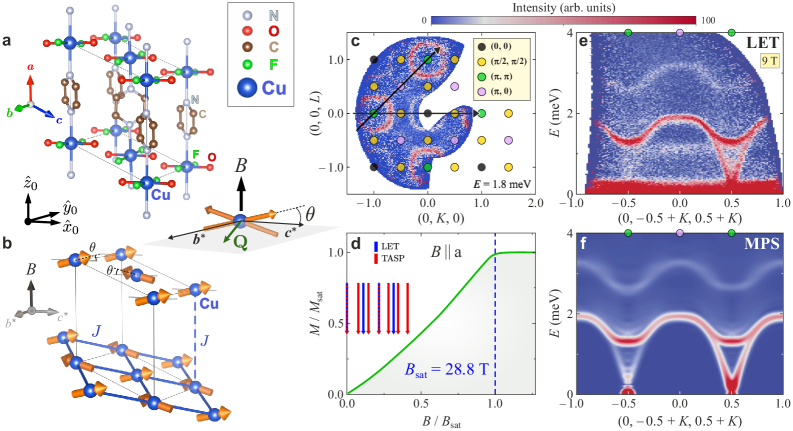
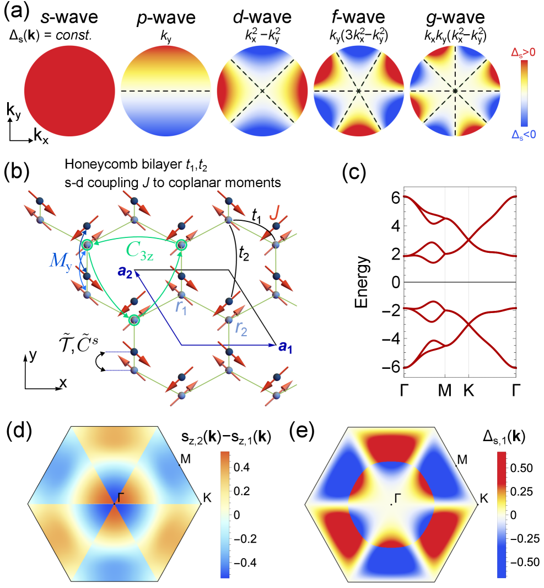
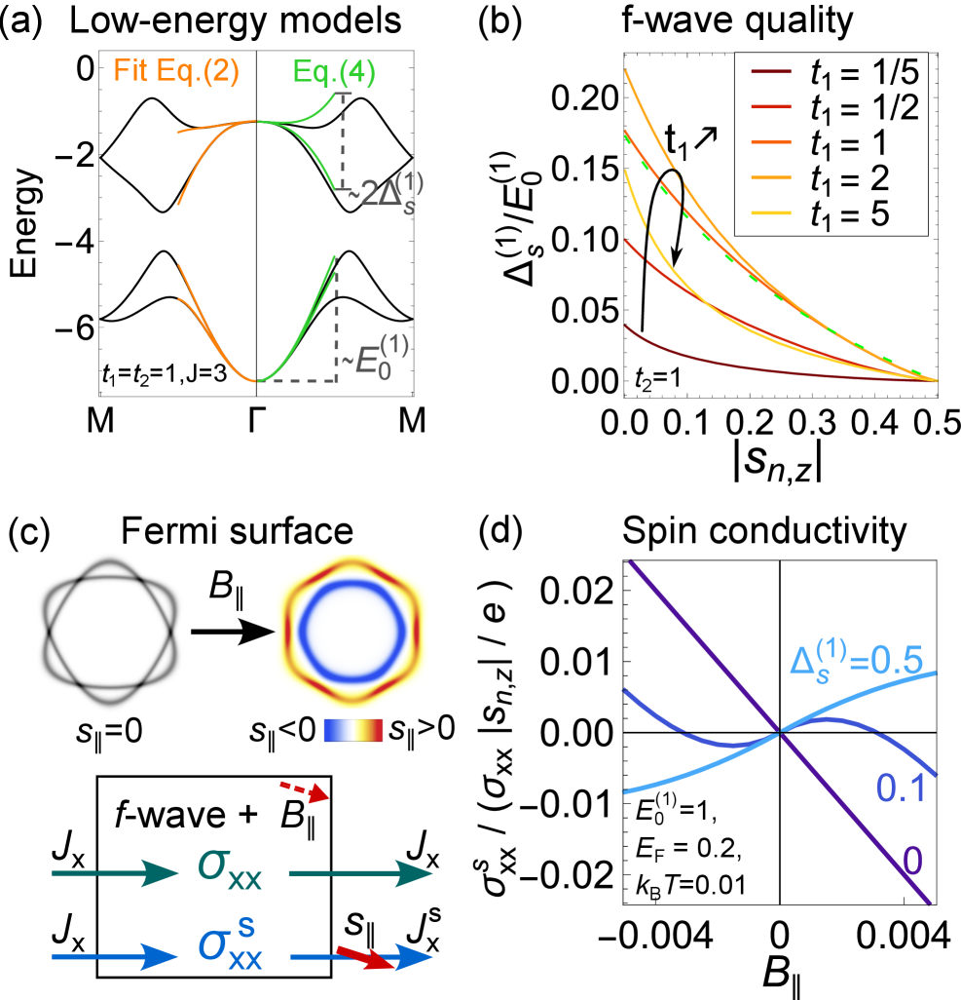
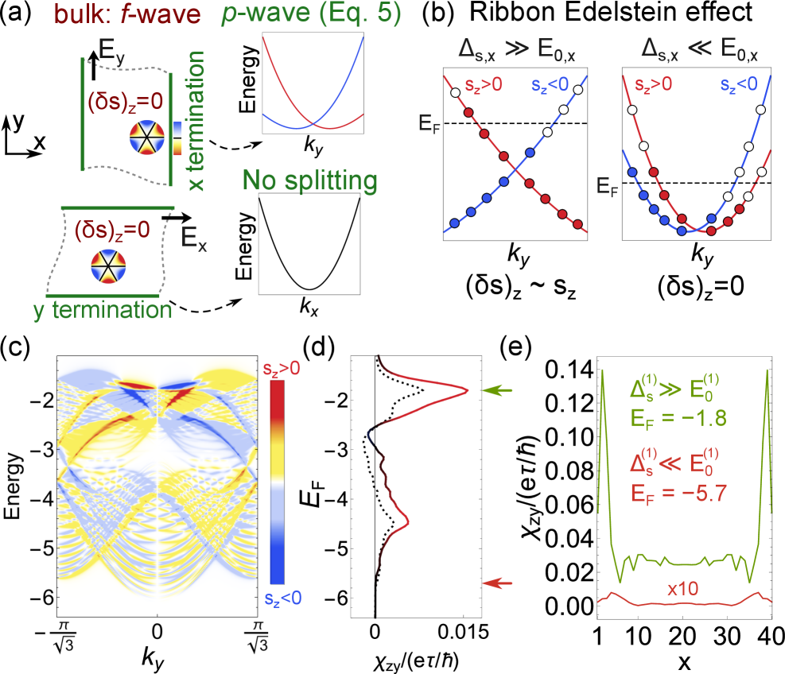
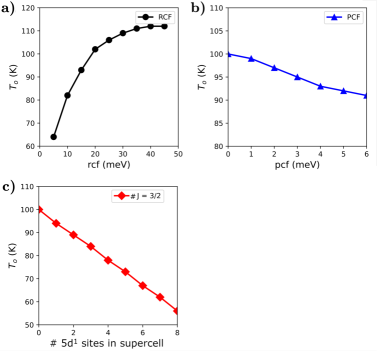
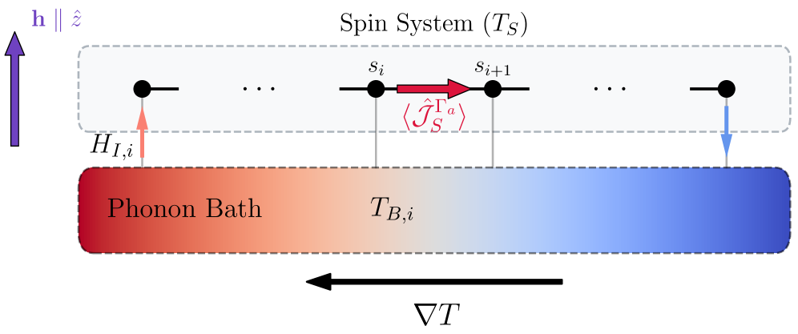
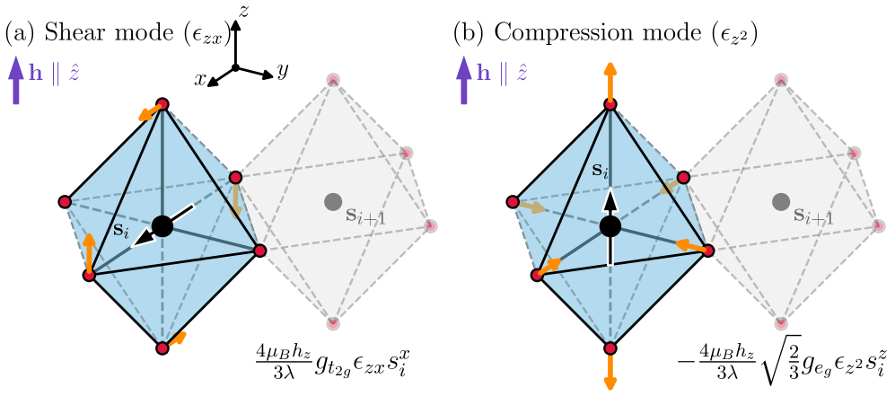
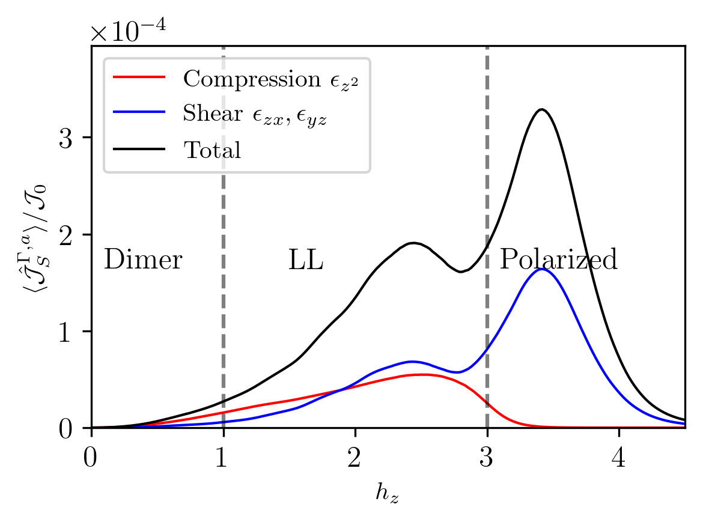
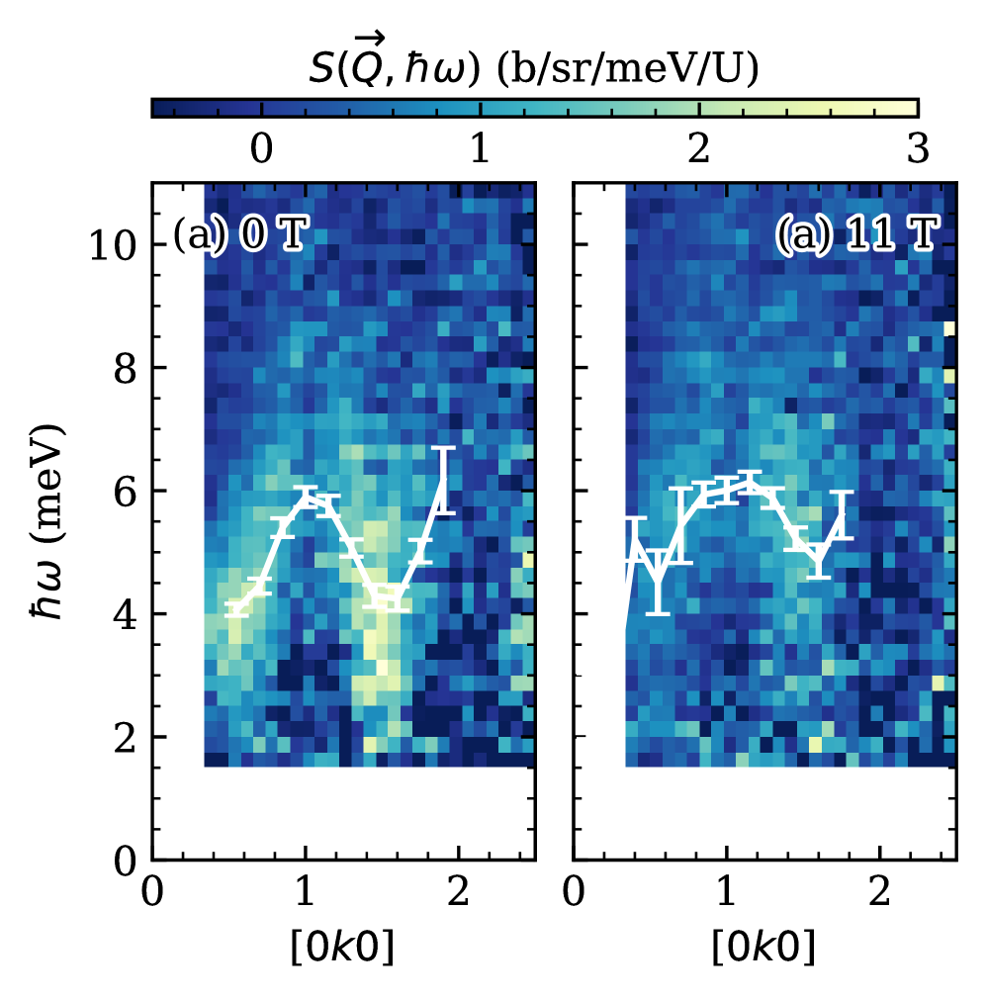
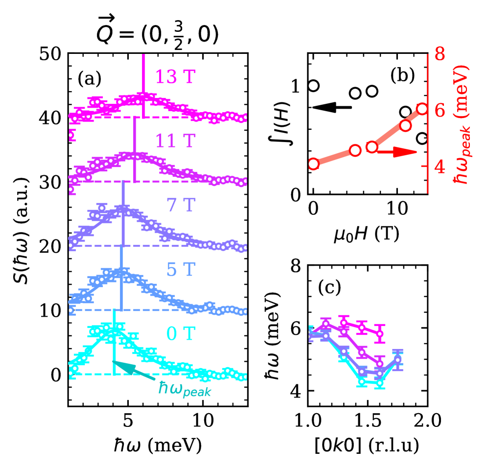

# 2026-03-21 物性物理

**作成日：** 2026年3月21日
**対象期間：** 2026年3月19日〜21日（直近72時間）

---

## 選定論文一覧

- [2603.17905] Thermodynamic Discovery of Tetracriticality and Emergent Multicomponent Superconductivity in UTe₂ — Kamat et al.
- [2603.18672] Fermi surface of Kagome metal CsCr₃Sb₅ observed by laser photoemission microscopy — Kunitsu et al.
- [2603.17635] Field-induced quasi-bound state within the two-magnon continuum of a square-lattice Heisenberg antiferromagnet — Elson et al.
- [2603.19107] Ferroelectric p-wave magnets — Priessnitz et al.
- [2603.17406] Symmetry-Enforced Nodal f-Wave Magnets — Hirschmann et al.
- [2603.18155] Polaron-driven switching of octupolar order in doped 5d² double perovskite — Mosca et al.
- [2603.18537] Observation of Resonance of Kagome Flat Band Doublet — Zhang et al.
- [2603.18137] Disentangling Shear and Compression Phonons: Route to Anomalous Magnetothermal Transport — Xu et al.
- [2603.17657] Superconducting Lanthanum Nickel Oxides with Bilayered and Trilayered Crystal Structures — Sakurai & Takano
- [2603.17037] Field-direction sensitivity of Kondo hybridization in UTe₂ — Halloran et al.

---

## 全体所見

今回の選定論文群は、UTe₂をめぐる超伝導研究の深化、カゴメ金属における相関電子状態の実験的解明、低次元磁性体における多マグノン束縛状態の初観測、という三つの大きな流れを軸にしている。UTe₂については、超音波測定による四重臨界点の発見（2603.17905）と中性子散乱によるa軸磁場下のコンド混成変化（2603.17037）が相補的な知見を提供している。カゴメ金属では、CsCr₃Sb₅のフェルミ面の軌道依存相関（2603.18672）と、CsCr₆Sb₆における平坦バンド共鳴の観測（2603.18537）が新しい電子状態を明らかにしている。スピン物性では、正方格子反強磁性体における磁場誘起二マグノン準束縛状態の観測（2603.17635）が理論・実験の一致という意味で印象的である。また、フェロエレクトリックp波磁性体という新概念（2603.19107）、f波マグネットのノード構造（2603.17406）、5d²ダブルペロブスカイトにおけるポーラロン誘起八極子秩序切り替え（2603.18155）、スピン軌道結合モット絶縁体における異常磁熱輸送の機構解明（2603.18137）、ランタンニッケル酸化物の二層・三層超伝導（2603.17657）も、物性物理コミュニティに広く波及する内容を含んでいる。

---

## 重点論文の詳細解説

---

## UTe₂における四重臨界点と多成分超伝導の発見

### 1. 論文情報

**タイトル：** [Thermodynamic Discovery of Tetracriticality and Emergent Multicomponent Superconductivity in UTe₂](https://arxiv.org/abs/2603.17905)
**著者：** Sahas Kamat, Jared Dans, Shanta Saha, Artem D. Kokovin, Johnpierre Paglione, Jörg Schmalian, B. J. Ramshaw
**arXiv ID：** 2603.17905
**カテゴリ：** cond-mat.supr-con
**公開日：** 2026年3月18日
**論文タイプ：** 実験＋理論（超音波測定 + Ginzburg-Landau理論）
**ライセンス：** CC BY 4.0

---

### 2. どんな研究か

UTe₂の圧力–温度相図において、二つの超伝導相（SC1・SC2）の相境界が見かけ上「三重点」で交差するという熱力学的禁則に反する振る舞いの謎を解明した。超音波測定により新たな相境界Tc2*を発見し、この交差点が実は四重臨界点（tetracritical point）であることを実験的に証明した。Ginzburg-Landau理論によって、競合する二つの秩序変数の強い競合が再入相転移と超伝導揺らぎの抑制をもたらすことを示した。

---

### 3. 研究の概要

**背景と目的：** UTe₂はスピン三重項超伝導体の最有力候補であり、圧力印加によってSC1とSC2という二つの超伝導相が出現することが知られている。しかしその相図では、二つの二次相境界が一点で交わる「三重点」が観測されており、これは熱力学的に許されていない。この矛盾を解消するため、実験的に精密な相図決定が求められていた。

**研究アプローチ：** 圧力セル内でのパルス超音波測定を用いて弾性率（c₅₅およびc₃₃）を圧力・温度・磁場の関数として系統的に測定した。弾性率の温度依存性から相転移点を高感度に決定し、従来の比熱・電気抵抗測定では検出されていなかった新たな相境界Tc2*を発見した。

**対象材料系：** UTe₂単結晶（α相）

**主な手法：** パルスエコー超音波測定（圧力0〜0.3 GPa、温度0.5〜2 K、磁場0〜9 T）

**主な結果：**
- 圧力約0.2 GPa・温度1.4 KにTc2*と呼ぶ新相境界を発見。この境界では音速が上方にジャンプするという通常の超伝導転移（下方ジャンプ）とは逆の異常を示す。
- (P*, T*)=(0.20 GPa, 1.4 K)が四重臨界点であることを確立。ここでSC1の二次転移線とSC2の二次転移線、Tc2*線が同時に収束する。
- B-P-T三次元相図を構築し、四重臨界線が磁場方向に伸びることを示した。
- Ginzburg-Landau理論によって、SC1とSC2の強い秩序変数競合が再入超伝導転移と超伝導揺らぎの位相ロックによる抑制を引き起こすことを解析的に示した。

**著者の主張：** UTe₂の「三重点」は熱力学的に許されず、実際は四重臨界点である。超音波測定によって初めてTc2*境界が検出され、UTe₂が多成分超伝導体（multicomponent superconductor）であることの直接的な熱力学的証拠が得られた。

---

### 4. 物性物理として重要なポイント

本研究の核心は、UTe₂における超伝導の多成分性を熱力学量（弾性率）という巨視的観測量から直接示した点にある。スピン三重項超伝導体における多成分秩序変数の競合は、対称性の観点から長らく理論的に議論されてきたが、実験的証拠は限られていた。弾性率は秩序変数の二乗に結合するため、位相転移の対称性変化に対して電気抵抗や比熱よりも精密な情報を与える。Tc2*での音速の上方ジャンプは、内部自由度（秩序変数の位相）が凍結する「位相ロック転移」に対応しており、これはSR・中性子・光学測定では捉えにくい現象である。先行研究（Cairns et al. 2020, Hayes et al. 2021）がSC1とSC2の競合を示唆していたのに対し、本研究はGinzburg-Landau理論と定量的に一致する相図を実験的に確立した点で決定的な前進である。UTe₂の超伝導ギャップ構造・ペアリング対称性の解明という次のステップに向けた基盤を提供する。

---

### 5. 限界と注意点

測定は圧力セル内での超音波実験であり、静水圧性の保証と圧力校正に系統誤差が含まれる可能性がある。Tc2*はc₅₅とc₃₃の双方で検出されているが、両者の感度が異なる異方的応答を完全に分離するためには、より多方向・多モードの超音波実験が必要である。四重臨界点の証明は主に弾性率のアノマリーの幾何学的一致に基づいており、直接的な秩序変数の測定（μSR、中性子散乱、走査型トンネル顕微鏡）による独立検証が不可欠である。Ginzburg-Landau理論は現象論的枠組みであり、ペアリング対称性（例えばA₁ᵤとB₁ᵤ）のどの組み合わせが実際の秩序変数に対応するかは未決定のままである。

---

### 6. 関連研究との比較

UTe₂は2019年の超伝導発見以来（Ran et al., Science 2019）、スピン三重項超伝導の最重要系として急速に研究が蓄積してきた。圧力相図のSC1/SC2二重構造はCairns et al.（2020）やThomas et al.（2021）が報告しており、三重点の熱力学的禁則もその後の理論研究（Schmalian等）で指摘されていた。本研究はその矛盾に対する最初の実験的解決を与えた。同時期の競合研究としては、中性子散乱によるSC2相の磁場挙動研究（2603.17037, 本ダイジェストにも含む）がある。UTe₂の多成分超伝導は、Sr₂RuO₄の多成分秩序変数問題（chiral p-wave議論）と概念的に類似しているが、UTe₂はより強い証拠を蓄積しつつあり、非従来型超伝導研究全体に波及しうる発見である。今後はギャップ構造の直接測定、磁場下の位相境界の完全マッピング、微視的ペアリング機構の解明が次のステップとなる。

---

### 7. 重要キーワードの解説

**① 四重臨界点（tetracritical point）**
相図上で四つの異なる相が同時に共存できる特殊な点。二成分秩序変数 $(\psi_1, \psi_2)$ の競合系では、それぞれの相境界が一点で交わる。通常の三重点（three phases coexist）と異なり、四重臨界点では両秩序変数が同時に連続的にゼロになる。Ginzburg-Landau自由エネルギー $F = a_1|\psi_1|^2 + a_2|\psi_2|^2 + u_1|\psi_1|^4 + u_2|\psi_2|^4 + 2g|\psi_1|^2|\psi_2|^2$ において、$g > \sqrt{u_1 u_2}$ のとき競合が強く、四重臨界点の存在が許される。

**② 多成分超伝導（multicomponent superconductivity）**
一つの超伝導凝縮が複数の独立な秩序変数成分を持つ状態。例えばチラル超伝導 $d_{xz} \pm id_{yz}$（Sr₂RuO₄）や、UTe₂でのA₁ᵤ + B₁ᵤ混合状態がある。二成分超伝導では相対位相が自由度となり、時間反転対称性破れ、分数渦糸、トポロジカル欠陥などの現象が出現しうる。

**③ スピン三重項超伝導（spin-triplet superconductivity）**
クーパー対のスピン状態が三重項 ($S=1$, $m_s = +1, 0, -1$) で形成される超伝導。通常の一重項ペアリング（$s$波または $d$波）と異なり、磁場に対して極めて強靭で、上部臨界磁場 $H_{c2}$ がパウリ対破壊限界を大きく超えうる。UTe₂では $\mu_0 H_{c2} > 50$ T に及ぶことが報告されており、三重項の証拠の一つとされる。

**④ 弾性率・超音波測定（elastic modulus / ultrasound measurement）**
固体の応力–歪み関係 $\sigma_{ij} = C_{ijkl} \epsilon_{kl}$ を記述する弾性定数テンソルの成分 $C_{ijkl}$（弾性率）を音速 $v = \sqrt{C/\rho}$ の精密測定から決定する手法。弾性率は秩序変数と格子歪みの結合定数を介して相転移に感度よく応答し、比熱・抵抗に比べて小さなアノマリーも検出できる。超伝導転移では通常音速が低下（ソフトニング）するが、多成分秩序の位相ロック転移では逆に硬化（音速上昇）することがある。

**⑤ 再入超伝導転移（reentrant superconducting transition）**
温度を下げるにつれて超伝導が出現した後、さらに温度を下げると一度常伝導になり、さらに低温で再び超伝導になる現象。強磁性超伝導体 $\text{ErRh}_4\text{B}_4$ での発見が古典的例。UTe₂では競合する二つの超伝導秩序変数の強い競合による再入が予測されており、本研究の Tc2* 線がその直接証拠に対応する。

**⑥ Ginzburg-Landau理論（Ginzburg-Landau theory）**
秩序変数 $\psi$ の空間変動と外場を含む自由エネルギー汎関数
$$F = \int d^3r \left[a|\psi|^2 + \frac{b}{2}|\psi|^4 + \frac{\hbar^2}{2m^*}\left|\left(\nabla - \frac{2ie}{\hbar c}\mathbf{A}\right)\psi\right|^2 + \cdots\right]$$
を変分して秩序変数の空間構造と相転移を記述する現象論的理論。微視的なBCS理論から導出可能だが、対称性引数のみから相転移の普遍的性質を議論できる。多成分系への拡張は競合する秩序変数間の結合項 $g|\psi_1|^2|\psi_2|^2$ を含む。

**⑦ 超音波減衰（ultrasonic attenuation）**
超音波が固体を伝播する際に失われるエネルギー。電子–フォノン散乱、磁気揺らぎ、磁壁運動、相転移近傍の秩序変数揺らぎなど多くの機構によって生じる。超伝導転移では $T < T_c$ でボゴリューボフ準粒子密度の急減とともに減衰が急激に低下する。本研究ではTc2*における減衰の鋭いピークが、秩序変数の第二成分の析出に対応する直接的証拠として用いられている。

---

### 8. 図

**図1：UTe₂の圧力–温度相図の二つの競合モデル。** 左図はSC1とSC2が単純に三重点で交わるモデル（熱力学的に禁止）、右図が本研究の提案する四重臨界点モデル。星印が四重臨界点(P*, T*)を示す。従来観測されていなかったTc2*相境界（破線）の存在が多成分超伝導の鍵となる。

**図2：超音波測定から決定された零磁場相図と弾性率データ。** 弾性率c₅₅（上）とc₃₃（下）を複数の圧力で測定した結果。矢印がTc（SC相転移）とTc2*（新相境界）を示す。Tc2*では音速が通常の超伝導転移とは逆に上昇する特異な振る舞いが観測されており、位相ロック転移の証拠となっている。

**図3：磁場・圧力・温度の三次元相図。** SC1（青）、SC2（赤）、SC1+SC2共存領域（紫）、および四重臨界線が描かれている。磁場を加えるとSC2相が拡大し、SC1が縮退していく様子が三次元的に可視化されている。本図はUTe₂の複雑な多成分超伝導相空間の全体像を初めて三次元的に示したものである。

---

---

## 二次元反強磁性体の磁場誘起二マグノン準束縛状態の観測

### 1. 論文情報

**タイトル：** [Field-induced quasi-bound state within the two-magnon continuum of a square-lattice Heisenberg antiferromagnet](https://arxiv.org/abs/2603.17635)
**著者：** F. Elson, M. Nayak, A. A. Eberharter, M. Skoulatos, S. Ward, U. Stuhr, N. B. Christensen, D. Voneshen, C. Fiolka, K. W. Krämer, Ch. Rüegg, H. M. Rønnow, B. Normand, M. Mourigal, F. Mila, A. M. Läuchli, M. Månsson
**arXiv ID：** 2603.17635
**カテゴリ：** cond-mat.str-el
**公開日：** 2026年3月18日
**論文タイプ：** 実験（非弾性中性子散乱）＋理論（行列積状態計算・スピン波理論）
**ライセンス：** CC BY 4.0

---

### 2. どんな研究か

正方格子ハイゼンベルク反強磁性体 CuF₂(D₂O)₂(pyz)（pyrazineを配位子とする銅フッ化物金属有機骨格材料）に磁場を印加し、非弾性中性子散乱によってスペクトルを測定したところ、二マグノン連続体の中に埋め込まれた鋭い「シャドウモード」が観測された。行列積状態（MPS）計算とスピン波理論によって、このモードが二マグノン相互作用によって形成される準束縛状態（quasi-bound state）であることを同定した。これは、ギャップレスな二次元反強磁性体において準束縛状態が連続体の中に存在することの最初の実験的観測である。

---

### 3. 研究の概要

**背景と目的：** 正方格子ハイゼンベルク反強磁性体のスピン励起は、1マグノンモードと多マグノン連続体から構成される。磁場を印加すると一マグノン枝はゼーマン分裂し、それに伴う磁場誘起変化として多マグノン連続体構造がどう変化するかは理論的に興味深い問題であった。特に、連続体内部に鋭い共鳴（束縛状態あるいは準束縛状態）が形成されうるかは、一次元系では理論的に知られていたが二次元系では未観測であった。

**解こうとしている課題：** 磁場誘起二マグノン準束縛状態の存在と、その起源がマグノン–マグノン相互作用にあることの実験的証明。

**研究アプローチ：** 非弾性中性子散乱（TOFおよびトリプルアクセス分光器）を用いて0〜7 Tの磁場中でスペクトルを測定し、MPSおよびスピン波理論計算と定量的に比較した。

**対象材料系：** CuF₂(D₂O)₂(pyz)（$J/k_B \approx 6.7$ K、サチュレーション磁場 $B_{sat} \approx 9$ T）

**主な結果：**
- 磁場印加によって1マグノン枝が2つに分裂し、その上方にエネルギーオフセット $\Delta E = g\mu_B B$（ラーモアエネルギー）だけ高い位置に鋭いモード（シャドウモード）が出現する。
- シャドウモードのエネルギーは1マグノン枝の分散に完全に追随しており、線幅は1マグノンと同程度に鋭い。
- MPSスペクトル関数計算と実験データは定量的に一致し、シャドウモードが二マグノン複合励起（1マグノン + ラーモアフォノン的マグノン）であることを示す。

**著者の主張：** これはギャップレスな2D反強磁性体において、マグノン–マグノン相互作用によって形成される連続体内準束縛状態を初めて直接観測したものである。

---

### 4. 物性物理として重要なポイント

本研究は二次元ハイゼンベルク反強磁性体というプロトタイプ系において、マグノン相互作用の非自明な帰結を実験的に示した点で重要である。スピン1/2の正方格子反強磁性体は量子磁性研究の基礎系であり、その励起スペクトルはこれまで主に線形スピン波理論の枠組みで記述されてきた。今回のシャドウモードは、スピン波理論では説明できず、MPSによる厳密な多体計算が必要である。モードのエネルギーオフセットがラーモアエネルギーに一致するという解析的に明確な特徴は、二マグノン複合励起の形成機構を直接反映している。この機構は、磁場誘起スピン揺らぎと連続体の相互作用という一般的な枠組みで理解でき、他の正方格子磁性体、さらにはFrustratedシステムや低次元量子磁性体一般に波及する可能性がある。また、金属有機骨格（MOF）系のモデル磁性体としての有用性を実証した研究でもある。

---

### 5. 限界と注意点

本研究の材料系 CuF₂(D₂O)₂(pyz) は $T_N = 2.3$ K、$J/k_B \approx 6.7$ K と比較的小さなエネルギースケールを持つ系であり、測定は低温かつ比較的低エネルギーの領域に限定される。シャドウモードの鋭さ（線幅）については、実験分解能と混合している可能性があり、真の準束縛状態の寿命を直接決定するためにはより高分解能の実験が必要である。MPS計算は有限サイズ系（シリンダー形状）で行われており、熱力学的極限での振る舞いとの厳密な対応は理論的に確認が必要である。また、MOF系特有の格子歪みや不均一性の影響は評価されていない。準束縛状態と真の束縛状態（ポール上の離散固有値）の区別については、より詳細なスペクトル解析が求められる。

---

### 6. 関連研究との比較

二マグノン束縛状態の研究は、1D Heisenberg鎖では理論・実験共に精力的に研究されてきた（Mourigal et al. 2013 等）。正方格子2D系での連続体内準束縛状態は、理論的には一部の研究で予測されていたが（Chernyshev and Zhitomirsky等）、実験的観測はなかった。本研究はMOF系という「理想的なモデル系」の利点を活かして初めてこれを観測した。同時期には類似の多マグノン現象がフラストレート磁性体でも報告されているが、正方格子ハイゼンベルク系という最もシンプルな枠組みでの観測は特に意義深い。今後、正方格子系の磁場–温度相図全体にわたる系統的な測定や、共鳴不安定性の詳細な理論解析が期待される。

---

### 7. 重要キーワードの解説

**① 非弾性中性子散乱（inelastic neutron scattering, INS）**
中性子のエネルギー移行 $\hbar\omega$ と運動量移行 $\mathbf{Q}$ を精密に測定することで、固体中のスピン・格子・電子の励起スペクトル $S(\mathbf{Q}, \omega)$（動的構造因子）を直接決定する手法。磁気励起（マグノン）に対しては中性子の磁気モーメントが直接結合するため、光学的手法では困難な低エネルギー横波励起の測定に特に有効である。

**② マグノン（magnon）**
磁気秩序状態におけるスピン波励起の量子（準粒子）。反強磁性体では、波数 $\mathbf{k}$、エネルギー $\hbar\omega(\mathbf{k})$ を持つ集団励起として記述される。線形スピン波理論では $\hbar\omega(\mathbf{k}) \approx c|\mathbf{k}|$（低 $k$ では線形分散）。磁場を加えるとゼーマン分裂によって2枝のマグノンが $E \pm g\mu_B B$ にエネルギーシフトする。

**③ 多マグノン連続体（multi-magnon continuum）**
2つ以上のマグノンが散乱状態を形成する励起の連続的なスペクトル。$\mathbf{k}_1 + \mathbf{k}_2 = \mathbf{Q}$、$\omega_1(\mathbf{k}_1) + \omega_2(\mathbf{k}_2) = \omega$ を満たすすべての対の寄与が重なるため、エネルギー幅を持つブロードな散乱強度として現れる。

**④ 準束縛状態（quasi-bound state）**
真の束縛状態（$S$行列のポールに対応する離散固有値）と異なり、連続体の中に有限の幅を持ちつつも比較的鋭いスペクトルピークとして現れる状態。二つの準粒子の相互作用が弱くない場合に形成される共鳴状態と解釈できる。Fano共鳴の磁性版ともいえる。

**⑤ 行列積状態（matrix product state, MPS）**
一次元または擬二次元系の量子多体基底状態・励起状態を、各サイトに行列を対応させた積表現で近似する手法。絡み合い（エンタングルメント）のエリア則を満たす状態を効率的に表現でき、密度行列繰り込み群（DMRG）と密接に関連する。本研究では有限シリンダー上のMPS計算によってスペクトル関数を精密に計算し、中性子散乱データと直接比較した。

**⑥ スピン波理論（spin-wave theory）**
磁気秩序状態の周りの小振幅スピン揺らぎを1次（線形スピン波理論）または2次（非線形スピン波理論）まで考慮した準粒子理論。ホルシュタイン–プリマコフ変換によってスピン演算子をボゾン化し、ハミルトニアンを対角化することでマグノン分散を求める。準束縛状態の形成には少なくとも二マグノン相互作用（非線形スピン波理論）が必要である。

**⑦ ラーモアエネルギー（Larmor energy）**
磁場 $B$ 中でのスピンのゼーマン分裂エネルギー $\Delta E = g\mu_B B$。$g$ はランデの $g$ 因子、$\mu_B$ はボーア磁子。本研究では、シャドウモードのエネルギーオフセットがラーモアエネルギーに正確に一致することが、モードの起源を二マグノン複合励起（通常の1マグノン + ゼーマン励起1マグノン）として同定する直接的証拠となっている。

---

### 8. 図

**図1：CuF₂(D₂O)₂(pyz)の結晶・磁気構造と中性子散乱全体像。** (a)-(d)は結晶構造・磁気構造・逆格子面・磁化データ。(e)は実験とMPS計算のスペクトル比較で、1マグノン枝の上方にシャドウモード（矢印）が明確に観測されている。

**図2：異なる磁場強度での非弾性中性子散乱強度（高対称方向）とMPS計算の比較。** 磁場増加とともに1マグノン2枝が分裂し、上方枝に追随するシャドウモードが鋭く成長していく様子が示されている。実験（左）とMPS（右）の定量的一致が目立つ。

**図3：1マグノンとシャドウモードの分散関係・エネルギー差・線幅の磁場依存性。** シャドウモードのエネルギーオフセット $\Delta E$ がラーモアエネルギー $g\mu_B B$ に精度よく一致（上段）し、線幅が1マグノンとほぼ同等（下段）であることが示されている。この「シャープさ」が準束縛状態としての鍵的特徴である。

---

---

## カゴメ金属CsCr₃Sb₅のフェルミ面と軌道依存相関

### 1. 論文情報

**タイトル：** [Fermi surface of Kagome metal CsCr₃Sb₅ observed by laser photoemission microscopy](https://arxiv.org/abs/2603.18672)
**著者：** Hayate Kunitsu, Iori Ishiguro, Natsuki Mitsuishi, Shunsuke Tsuda, Koichiro Yaji, Zehao Wang, Pengcheng Dai, Yoichi Yamakawa, Hiroshi Kontani, Takahiro Shimojima
**arXiv ID：** 2603.18672
**カテゴリ：** cond-mat.str-el
**公開日：** 2026年3月19日
**論文タイプ：** 実験（レーザーARPES）＋理論（DFT）
**ライセンス：** CC BY 4.0

---

### 2. どんな研究か

新規カゴメ金属 CsCr₃Sb₅ の常磁性状態におけるフェルミ面を、高分解能レーザー光電子分光顕微鏡（レーザーARPES）を用いて実験的に決定した。ブリルアンゾーン中心周りに円形フェルミ面と二つの六角形フェルミ面を発見し、偏光依存測定と密度汎関数理論（DFT）による軌道同定から、特に $d_{xy}$ 軌道においてフェルミ面サイズが強く変調される軌道依存相関を明らかにした。この知見は、CsCr₃Sb₅ における反強磁性秩序・電荷密度波・非従来型超伝導の候補機構を議論する電子的基盤を提供する。

---

### 3. 研究の概要

**背景と目的：** CsV₃Sb₅ を代表とするAV₃Sb₅型カゴメ金属は電荷密度波や超伝導を示し、近年精力的に研究されてきた。そのCr版であるCsCr₃Sb₅は反強磁性（$T_N = 60$ K）を持ちながら超伝導の可能性も報告されており、バナジウム系との電子構造比較が機構解明に重要である。しかし高品質単結晶を用いた詳細なARPES測定は未実施であった。

**研究アプローチ：** 劈開面上でのレーザーARPES（$h\nu = 6.994$ eV、エネルギー分解能 < 2 meV）を、偏光を系統的に変えながら行うことで、運動量空間の軌道選択的マッピングを実施した。フェルミ面のサイズをDFT予測と比較し、軌道ごとの繰り込み量子数（質量増強）を抽出した。

**対象材料系：** CsCr₃Sb₅ 単結晶（常磁性状態、$T > 60$ K）

**主な手法：** レーザーARPES（偏光依存、運動量分解フェルミ面マッピング）＋ DFT計算

**主な結果：**
- ブリルアンゾーン中心（Γ点）周りに円形FSと2種の六角形FSを発見。BZ境界にはDFTが予測する小ポケットも偏光依存測定で同定。
- $d_{xy}$ 軌道由来のフェルミ面サイズが DFT 予測から著しく変調されており、電子相関による軌道依存繰り込みの証拠。
- $d_{xz/yz}$ 軌道については DFT との一致が良く、選択的な軌道依存相関が明確。
- 反強磁性交互作用および電荷密度波秩序、超伝導との関連を電子構造の観点から議論。

**著者の主張：** レーザーARPESによるCsCr₃Sb₅のフェルミ面決定は初めてであり、軌道依存相関の存在はCr系の特異な磁性・超伝導挙動の起源を解明する上で不可欠な基盤情報を提供する。

---

### 4. 物性物理として重要なポイント

CsCr₃Sb₅はAV₃Sb₅族のCr版として、V版と同様のカゴメフラストレーションを持ちながら磁性を示すという点でユニークである。本研究が示す「$d_{xy}$ 軌道でのみ相関が強い」という軌道選択的繰り込みは、カゴメ系に特有のフラットバンドが特定の軌道対称性を持ち、それが相互作用を強める機構を示唆している。DFTとARPESの体積差は有効質量 $m^* / m_{\rm band}$ として定量化でき、Cr系の相関強度がV系を上回る可能性を示している。さらに、レーザーARPESの高い運動量分解能はBZ境界の小ポケットの同定を可能にし、これらが電荷密度波のネスティング条件や超伝導ペアリング機構に直接関係する情報を提供する。カゴメ格子における多軌道ハバード模型の実験的検証という意味でも重要である。

---

### 5. 限界と注意点

本測定は常磁性相（T > 60 K）に限定されており、反強磁性転移以下での電子構造変化（フォールディング、擬ギャップ等）は別途の低温測定が必要である。レーザーARPESは表面感度が高いため、表面–バルク電子構造の違いを慎重に評価する必要がある。DFTはGGA汎関数を用いており、強相関効果を含めたDFT+U計算との比較なしには「相関が強い」という主張の定量性が不明確である。また単一の劈開面での測定であるため、劈開面の終端（Cs面 vs Sb面）依存性の影響を排除する評価が求められる。

---

### 6. 関連研究との比較

AV₃Sb₅系（A = K, Rb, Cs）については、CsV₃Sb₅のARPES研究が数多く報告されており（Nakayama et al. 2021, Hu et al. 2022等）、フェルミ面構造、サドル点、電荷密度波との関係が詳しく議論されてきた。本研究はそのCr版への拡張であり、磁性自由度を持つカゴメ金属への電子構造研究の展開を示す。同系統の研究として ACoSb 型やANi₃Sb₅型への展開も議論されており、カゴメ金属の多様性理解に向けた継続的研究の一環である。CsCr₃Sb₅ の超伝導候補としての検証には、本研究のフェルミ面情報が不可欠な基礎データとなる。

---

### 7. 重要キーワードの解説

**① 角度分解光電子分光（ARPES：Angle-Resolved Photoemission Spectroscopy）**
光電効果によって固体表面から放出された光電子のエネルギーと運動量（角度）を同時測定することで、バンド構造 $E(\mathbf{k})$ と分光関数 $A(\mathbf{k}, \omega)$ を直接決定する実験手法。自己エネルギーの虚部（準粒子寿命）・実部（エネルギー繰り込み）も抽出でき、相関効果の直接証拠を与える。

**② レーザーARPES（laser ARPES）**
真空紫外レーザー（$h\nu \approx 6$–$7$ eV）を光源として用いるARPES。通常のシンクロトロン光（$h\nu \approx 20$–$100$ eV）と比べて、エネルギー分解能（$< 1$ meV）と運動量分解能が格段に高く、超伝導ギャップや薄い準粒子ピークの測定に優れている。ただし低光子エネルギーのためアクセスできる運動量範囲が限られる。

**③ フェルミ面（Fermi surface）**
金属の運動量空間において電子が占有する領域と非占有領域の境界面 $E(\mathbf{k}) = E_F$。フェルミ面のトポロジー（形状・ネスティングベクトル・バン・ホーフ特異点の位置等）は電荷密度波転移、磁気秩序、超伝導ペアリング機構を決定する基礎情報となる。

**④ カゴメ格子（kagome lattice）**
頂点共有三角形の繰り返しパターンから成る二次元格子。バンド構造には平坦バンド、ディラック点、サドル点（バン・ホーフ特異点）が共存し、電子相関によって電荷密度波・磁性・超伝導などの多様な秩序が発現しうる。

**⑤ 軌道依存繰り込み（orbital-selective renormalization）**
多軌道系において、異なる軌道の電子が異なる程度に電子相互作用によって繰り込まれる現象。有効質量が軌道ごとに異なる $m^*_\alpha \neq m^*_\beta$（$\alpha, \beta$ は軌道指標）として現れ、ARPESではバンド分散の急峻さがDFT予測と軌道ごとに異なることとして観測される。

**⑥ 密度汎関数理論（DFT：Density Functional Theory）**
Hohenberg-Kohn定理に基づき、電子密度 $n(\mathbf{r})$ を基本変数として多電子系の基底状態エネルギーと電子構造を第一原理的に計算する理論。Kohn-Sham方程式を自己無撞着に解くことでバンド構造を得る。ただしGGA等の交換相関汎関数は強相関効果を近似的にしか扱えない。

**⑦ 電荷密度波（charge density wave, CDW）**
電子密度が空間的に周期変調した状態。フェルミ面上のネスティングベクトル $\mathbf{q}$ で結ばれた二つのフェルミ面部分が不安定性を引き起こし、周期 $2\pi/q$ の密度変調が形成される。カゴメ金属では3Q-CDW（3方向のベクトルによる変調）が特徴的に観測される。

---

### 8. 図

本論文のライセンスはCC BY 4.0ですが、HTML版の図データの取得に技術的な問題が生じたため、原図の掲載は省略します。論文の主要な図（Fermi面マッピング・偏光依存ARPES・DFT比較）は https://arxiv.org/abs/2603.18672 のHTMLまたはPDFで直接確認することができます。

---

---

## その他の重要論文

---

## フェロエレクトリックp波磁性体：電気的に切り替え可能なスピン偏極絶縁体

### 1. 論文情報

**タイトル：** [Ferroelectric $p$-wave magnets](https://arxiv.org/abs/2603.19107)
**著者：** Jan Priessnitz, Anna Birk Hellenes, Riccardo Comin, Libor Šmejkal
**arXiv ID：** 2603.19107
**カテゴリ：** cond-mat.mtrl-sci, cond-mat.mes-hall
**公開日：** 2026年3月19日
**論文タイプ：** 理論＋第一原理計算
**ライセンス：** arXiv非独占的配布ライセンス

---

### 2. 研究概要

本論文は、強誘電秩序と非共線的磁気構造を組み合わせることで、時間反転対称性を保ったままスピン偏極した絶縁体状態（$p$波および$f$波スピン偏極絶縁状態）を実現できるという新しい概念を提唱している。スピン群・磁気群の理論的分類により、極性対称性破れの機構を「結晶学的」「交換相互作用駆動」「スピン軌道相互作用駆動」の三種類に整理し、50以上の候補物質を同定した。第一原理計算では、マルチフェロイック GdMn₂O₅ がpristineなp波スピン偏極構造を示すことが示され、かつ電場によって電気的にスピンテクスチャを切り替えられることが示されている。

この研究は、アルターマグネット（時間反転対称性を持ちながら運動量空間でスピン偏極する磁性体）の概念をフェロエレクトリックと結合させた新しい物質設計指針を与えており、低消費電力スピントロニクスデバイスへの応用可能性がある。電場によってスピンテクスチャを非接触で制御できるという特性は、従来の磁気的操作と根本的に異なるアプローチを提供する。ただし、ライセンスがarXiv非独占的配布ライセンスのため、原図の抽出は行わない。

---

### 3. 重要キーワードの解説

**① アルターマグネット（altermagnet）**
反強磁性構造を持ちながら、スピン回転対称性ではなく結晶の空間群対称性によってスピン縮退が解ける新型磁性体。時間反転対称性 $\mathcal{T}$ を破るが、$\mathcal{T}$ と空間操作の組み合わせ（$\mathcal{T}\mathcal{R}$）は保たれる。運動量空間では $d$波や $g$波などの異方的スピン分裂が現れる。

**② p波スピン偏極（p-wave spin polarization）**
角運動量量子数 $l=1$（$p$波）に対応する運動量依存スピン偏極テクスチャ $\mathbf{S}(\mathbf{k}) \propto \mathbf{k}$。Rashba効果と類似するが、時間反転対称性 $\mathcal{T}$ を保ったまま出現できる点が異なる。

**③ マルチフェロイック（multiferroic）**
強誘電性と磁気秩序（強磁性または反強磁性）が共存する物質。両秩序の結合（磁気電気効果）により、電場で磁化を、磁場で電気分極を制御できる可能性がある。GdMn₂O₅は典型的なマルチフェロイック候補物質である。

**④ スピン群（spin space group）**
スピン空間と実空間の操作を独立に扱う対称群。通常の磁気空間群はスピンと実空間操作を結合させるが、スピン群ではスピン操作と結晶操作が独立であり、より豊富な分類が可能。アルターマグネットの分類に重要。

**⑤ 磁気電気効果（magnetoelectric effect）**
電場 $\mathbf{E}$ によって磁化 $\mathbf{M}$ が誘起（または磁場 $\mathbf{H}$ によって電気分極 $\mathbf{P}$ が誘起）される現象。線形磁気電気テンソル $\alpha_{ij}$ で記述される。時間反転と空間反転の双方を破る系で出現する。

**⑥ 非共線磁気構造（noncollinear magnetic structure）**
スピンが単一の量子化軸に沿わず、空間的に異なる方向を向く磁気構造。フラストレーション、スピン軌道相互作用、Dzyaloshinskii-Moriya相互作用などが原因となる。非共線構造は特殊なトポロジカル特性（スカーミオン等）やスピンホール効果と関連する。

**⑦ 第一原理計算（first-principles calculation）**
電子の波動関数を経験的パラメータなしに量子力学の基本方程式から計算する手法の総称。DFT（密度汎関数理論）が代表的。本研究では GdMn₂O₅ のスピン構造と電気分極の結合、スピンテクスチャの計算に用いられている。

---

### 4. 図

ライセンスがarXiv非独占的配布ライセンスのため、原図の抽出は行わない。

---

---

## f波マグネットのノード構造と表面誘起エデルシュタイン効果

### 1. 論文情報

**タイトル：** [Symmetry-Enforced Nodal $f$-Wave Magnets](https://arxiv.org/abs/2603.17406)
**著者：** Moritz M. Hirschmann, Akira Furusaki, Max Hirschberger
**arXiv ID：** 2603.17406
**カテゴリ：** cond-mat.mes-hall, cond-mat.mtrl-sci, cond-mat.str-el
**公開日：** 2026年3月18日
**論文タイプ：** 理論
**ライセンス：** CC BY 4.0

---

### 2. 研究概要

本論文は、非共線磁気構造を持つ二次元ハニカム二層格子において、対称性によって強制されるf波スピン分裂（$f$-wave spin splitting）が出現することを理論的に示した。スピン空間対称性の枠組みを用いて、バンド分裂がホッピングパラメータと交換結合の関数としてどう変化するかを解析し、f波分裂に特有のノード構造を明確にした。さらに、バルクでは禁止されているエデルシュタイン効果（スピン蓄積の電場誘起）が、f波マグネットのリボン（表面）では$p$波スピン分裂を通じて出現することを予測した。

この研究はアルターマグネット研究のフロンティアを$f$波対称性まで拡張するものであり、バルクの対称性保護とは異なる表面固有の輸送応答を予測している。f波マグネットでは、傾斜（canting）誘起スピン伝導性がノード構造と密接に関係しており、磁場による制御可能性が示唆される。これらの予測は走査型ARPES、スピン分解輸送測定で検証可能であり、スピン軌道相互作用の弱い系でのスピン制御という観点から重要性を持つ。

---

### 3. 重要キーワードの解説

**① f波磁性（f-wave magnetism）**
スピン分裂のテクスチャが角運動量 $l=3$（$f$波）対称性を持つ磁性体。分裂は $\mathbf{k}$ の3次多項式で変化し、高次節面（ノード）を持つ。d波（アルターマグネット）の高次版として位置付けられる。

**② エデルシュタイン効果（Edelstein effect）**
電場（または電流）の印加によって空間反転対称性の破れた系でスピン蓄積が誘起される現象。スピン運動量ロッキングを持つ系（Rashba系、トポロジカル表面状態等）で顕著。通常はスピン軌道相互作用が必要だが、本論文はスピン軌道結合なしに表面でのf→p波変換を通じて出現することを示した。

**③ スピン伝導性（spin conductivity）**
スピン電流 $J^s_{ij}$ と電場 $E_j$ の比例係数 $\sigma^s_{ij}$。バンドのベリー位相・スピンテクスチャのアノマリーに由来するイントリンシックな寄与と、散乱に依存するエキストリンシックな寄与がある。

**④ ノード（node）**
バンド間スピン分裂がゼロになる運動量空間の点・線・面。f波マグネットでは対称性によって特定の高対称線上にノードが強制的に現れる。ノードの存在はフェルミ面近傍の散乱確率・スピン応答に直接影響する。

**⑤ スピン空間対称性（spin-space symmetry）**
実空間の対称操作とスピン空間の回転操作を独立に組み合わせた対称性。通常の磁気空間群ではスピンと実空間操作が連動するが、スピン空間群ではより多様な対称性分類が可能になり、アルターマグネットやf波マグネットの分類に用いられる。

**⑥ ハニカム格子（honeycomb lattice）**
2サブラティスの正六角形格子。グラフェン、六方窒化ホウ素、磁性体 Cr₂Ge₂Te₆ 等のプロトタイプ格子。バンド構造にはディラック点と平坦バンドが現れ、対称性操作との関連で多彩なスピン分裂パターンが出現する。

**⑦ 傾斜（canting）**
反強磁性体において、スピンが完全に反平行にならずわずかに傾いた状態。Dzyaloshinskii-Moriya相互作用や単軸磁気異方性が原因となる。本論文では、傾斜によってf波分裂が変調され、バンドのノード構造が変わることが示されている。

---

### 4. 図

**図1：s/p/d/f/g波スピン分裂の比較とf波マグネットのバンド構造。** (a)各波の運動量空間スピン分裂パターンの比較図。(c)-(e)はf波マグネットの電子バンド構造・スピン偏極・分裂量を示す。高対称線M-K-Γ上に対称性強制ノードが現れることが明確に示されている。

**図2：f波分裂の起源と傾斜誘起スピン伝導性。** (a)数値フィットと解析的低エネルギー展開の比較。(c)面内磁場がノード点をギャップ開けしてスピン伝導性を誘起する機構の模式図。f波ノードの「チューニング可能性」を示している。

**図3：f波マグネットリボンでの異方的エデルシュタイン効果。** (a)xx終端リボンではp波分裂が出現するがyy終端では出現しないという表面依存性。(d)リボン全体のエデルシュタイン感受率の空間分布。バルク禁止の応答が表面のみで出現することを示す重要な結果。

---

---

## 5d²ダブルペロブスカイトにおけるポーラロン誘起八極子秩序切り替え

### 1. 論文情報

**タイトル：** [Polaron-driven switching of octupolar order in doped 5d² double perovskite](https://arxiv.org/abs/2603.18155)
**著者：** Dario Fiore Mosca, Lorenzo Celiberti, Leonid V. Pourovskii, Cesare Franchini
**arXiv ID：** 2603.18155
**カテゴリ：** cond-mat.str-el
**公開日：** 2026年3月18日
**論文タイプ：** 理論（第一原理計算）
**ライセンス：** CC BY 4.0

---

### 2. 研究概要

本研究は、スピン軌道絡み合い5d²ダブルペロブスカイト Ba₂CaOsO₆ においてNaドーピングによって生じるホールポーラロンが、フェロ八極子秩序を反強磁的八極子秩序へと切り替えるメカニズムを第一原理的に解明した。ポーラロンが d²-d¹ 交換結合経路を生成し、$d^2$-$d^2$ 経路の強磁性的八極子交換とは符号が逆転することを見出した。この符号反転は $t_{2g}$ 軌道でのスピン+軌道演算子が1電子基底と2電子基底で異なる表現を持つことに起源があり、ポーラロン結晶場効果も含めた計算が実験の秩序温度と良く一致することを示した。

本研究が重要な理由は、電荷ドーピングがスピン軌道絡み合い系の多極子秩序を制御する新たな手段となりうることを示した点にある。Ba₂CaOsO₆ は $J_{\rm eff} = 2$ の非クラマース二重項を持つ代表的な高次多極子系であり、その秩序のドーピング制御は、多極子秩序を持つ材料系（例えば酸化物ダブルペロブスカイト、希土類系）全般に波及しうる材料設計指針を与える。電荷自由度と多極子秩序の結合という観点は、強相関スピン軌道系への新しいアプローチである。

---

### 3. 重要キーワードの解説

**① 八極子秩序（octupolar order）**
電荷・スピン・軌道以外の高次多極子（$J_{\rm eff} = 2$ の非クラマース二重項における $T_{2u}$ 対称性の八極子 $O_{xyz}$）が空間的に秩序した状態。ランク3の時間奇テンソルで記述される。通常の磁気測定（中性子散乱の磁気Bragg散乱等）では検出が難しく、共鳴X線散乱や超音波測定が有効。

**② 非クラマース二重項（non-Kramers doublet）**
整数スピン系（$J = 1, 2, \ldots$）において、時間反転対称性だけでは縮退が保証されない（クラマース定理は半整数スピンにのみ適用）縮退状態。結晶場によって偶然縮退したもので、$J_{\rm eff} = 2$ の $t_{2g}^2$ 電子系では特定の点群対称性のもとで形成される。

**③ ホール小ポーラロン（small hole polaron）**
格子歪みと局在ホールが結合した準粒子。ホールが局所的な格子変形を伴って移動する際に、周囲の格子を変形させながらゆっくり「ホッピング」する。ホール移動に必要な活性化エネルギーが音響フォノンエネルギーより大きく、通常バンド的移動よりも低いモビリティを持つ。

**④ $J_{\rm eff}$状態（effective total angular momentum）**
スピン軌道相互作用が強い系で、スピン $S$ と軌道角運動量 $L$ が結合して形成される有効全角運動量 $J_{\rm eff}$。$5d^2$ Os系では $t_{2g}^2$ の基底から $J_{\rm eff} = 2$ の準位が最低になる。$J_{\rm eff}$ 状態はスピン・軌道・電荷が複雑に絡み合った自由度であり、多極子秩序の担い手となる。

**⑤ ダブルペロブスカイト（double perovskite）**
$A_2BB'O_6$ 型構造を持つ酸化物。$B$ と $B'$ サイトが交互に規則配列した構造で、$B$ サイトと $B'$ サイトは全く異なる元素・価数・電子構造を持てる。Ba₂CaOsO₆ では $B = $ Ca²⁺（d⁰）と $B' = $ Os⁶⁺（$5d^2$）が交互に配置され、Os-Os間の超交換相互作用経路がO-Ca-Oを介する。

**⑥ 第一原理超交換相互作用（ab initio inter-site exchange）**
DFT+SO（スピン軌道結合）や DFT+U 計算から得られた電子構造をもとに、磁気ワニエ軌道間のホッピングパラメータと相互作用定数を抽出し、超交換磁気交換相互作用を第一原理的に計算する手法。多極子自由度を含む場合はランク3まで拡張した多極子交換テンソルが必要。

**⑦ 結晶場（crystal field）**
遷移金属または希土類イオンを取り囲む配位子の電場が、イオンの $d$ または $f$ 軌道の縮退を解く効果。$t_{2g}$-$e_g$ 分裂（Oh対称）が代表的。本研究では「ポーラロン結晶場（polaron crystal field）」として、ポーラロンによる局所的な格子歪みが引き起こすサイト選択的な追加の結晶場分裂が重要な役割を果たす。

---

### 4. 図

**図1：Ba₂CaOsO₆のポーラロン超セルと八極子交換相互作用テンソル。** (a) ポーラロンを含む超セルとd²-d²（青矢印）およびd¹-d²（青/橙矢印）交換経路の模式図。(b) 各経路での対角・非対角交換積分成分のプロットで、八極子-八極子交換 $V^{xyz}$（黄色）の符号が反転していることが一目で分かる。

**図2：Na置換 Ba₂Ca₁₋δNaδOsO₆の秩序パターンと多極子平均場の温度依存性。** (a) フェロ八極子（FO）と反強磁性八極子（AFO）の秩序パターン模式図（上面図）。(b) 双極子 $J^z$、四極子 $xy$、八極子 $xyz$ の平均場値の温度依存性（各サイトごと）。ドーピングによってFO→AFO秩序変化が明確に示されている。

**図3：ドーピング・結晶場・ポーラロン数に対する秩序温度の依存性。** (a)(b) 平均場秩序温度 $T_o$ が「残留結晶場（rcf）」と「ポーラロン結晶場（pcf）」の関数としてどう変化するかを示す。(c) ポーラロン数増加とともに $T_o$ が実験データとよく一致しながら変化していく様子を示しており、ポーラロンが秩序の主要な制御因子であることを実証している。

---

---

## カゴメ平坦バンド二重項の共鳴観測とその磁性相関

### 1. 論文情報

**タイトル：** [Observation of Resonance of Kagome Flat Band Doublet](https://arxiv.org/abs/2603.18537)
**著者：** Renjie Zhang, Bei Jiang, Xiangqi Liu, Hengxin Tan, Xuefeng Zhang, Mojun Pan, Quanxin Hu, Yiwei Cheng, Chengnuo Meng, Yudong Hu, Yufan Zhao, Runze Wang, Dupeng Zhang, Junqin Li, Zhengtai Liu, Mao Ye, Ziqiang Wang, Yaobo Huang, Gang Li, Yanfeng Guo, Hong Ding, Baiqing Lv
**arXiv ID：** 2603.18537
**カテゴリ：** cond-mat.str-el
**公開日：** 2026年3月19日
**論文タイプ：** 実験（ARPES）＋理論
**ライセンス：** arXiv非独占的配布ライセンス

---

### 2. 研究概要

本研究は、カゴメ二層材料 CsCr₆Sb₆ において、フェルミエネルギー近傍に共存する二重平坦バンドと分散バンドを高分解能ARPESで詳細に測定し、冷却に伴う分光重みの顕著な増大とバンド間ハイブリダイゼーションという「平坦バンド共鳴」を初めて観測した。この共鳴は従来のコンドラティス振る舞い（$f$電子と伝導電子の近藤混成）とは異なり、磁気秩序の発現と相関していることを明らかにした。理論計算と合わせて、フラットバンドの多体共鳴がカゴメ格子特有の幾何学的フラストレーションと磁性の相互作用によって生じる新現象であることを主張している。

この研究は、カゴメ系における「フラットバンドの強相関物理」という分野に直接貢献する。AV₃Sb₅型と異なりCr系では磁性自由度が加わり、フラットバンド上の電子相関がスピン秩序と結びつく機構の解明は未解決問題であった。今回の共鳴は、磁気転移と同期して強くなるという実験的特徴が重要であり、強相関フラットバンド系の新しい物理として今後の理論・実験双方から集中的に研究されることが予想される。ライセンスがarXiv非独占的配布ライセンスのため、原図の抽出は行わない。

---

### 3. 重要キーワードの解説

**① カゴメ平坦バンド（kagome flat band）**
カゴメ格子の幾何学的フラストレーションから生まれる、全運動量範囲でエネルギーが一定（分散ゼロ）のバンド。波動関数が局在し、電子間相互作用 $U$ の効果が運動エネルギーよりも大きくなるため、強相関効果（磁性、電荷秩序、超伝導）が発現しやすい。

**② 平坦バンド共鳴（flat band resonance）**
フラットバンドと分散バンドが有効交換相互作用によってハイブリダイズし、フラットバンドの分光重みが増大する現象。コンド効果と概念的に類似するが、$f$電子ではなくカゴメ格子の幾何学的フラストレーションに由来する局在電子が関与する。

**③ 分光重み（spectral weight）**
ARPESで測定される電子状態密度の分布 $A(\mathbf{k}, \omega)$。分光重みの増大は準粒子の寿命延長や状態の凝縮（コヒーレントな秩序形成）を示すことが多く、超伝導・コンド・密度波転移の前駆現象として観測される。

**④ バンド間ハイブリダイゼーション（interband hybridization）**
異なるバンド（軌道・対称性が異なる電子状態）間の混合。$\mathbf{k}$ 空間で反交差（anticrossing）や分光重みの移行として現れる。本研究ではフラットバンドと分散バンドが磁気転移とともに強くハイブリダイズする。

**⑤ CsCr₆Sb₆**
Cs-Cr-Sb系のカゴメ二層材料。CsV₃Sb₅や CsCr₃Sb₅と同族の新型カゴメ金属候補で、Crの磁性自由度とカゴメ幾何学的フラストレーションが共存する系として注目されている。

**⑥ コンドラティス（Kondo lattice）**
周期的に配置された局在スピン（$f$または $d$電子）と伝導電子が近藤効果によって結合した系。局在スピン・伝導電子混成によって重い電子状態が形成されるが、磁気秩序とコンド効果の競合が物性を支配する。本研究の「平坦バンド共鳴」はコンドラティスとは起源が異なることが強調されている。

**⑦ 磁気秩序との相関（correlation with magnetic ordering）**
スペクトル的特徴が磁気転移温度 $T_N$ 付近で顕著に変化する現象。本研究ではARPESスペクトルが磁気転移とともに共鳴を示すことから、フラットバンドの多体共鳴が磁性自由度と強く結びついていることが主張されている。

---

### 4. 図

ライセンスがarXiv非独占的配布ライセンスのため、原図の抽出は行わない。

---

---

## スピン軌道結合フラストレート磁性体における圧縮・ずり音響フォノンの磁熱輸送

### 1. 論文情報

**タイトル：** [Disentangling Shear and Compression Phonons: Route to Anomalous Magnetothermal Transport](https://arxiv.org/abs/2603.18137)
**著者：** Haoting Xu, Antoine Matar, Hae-Young Kee
**arXiv ID：** 2603.18137
**カテゴリ：** cond-mat.str-el
**公開日：** 2026年3月18日
**論文タイプ：** 理論
**ライセンス：** CC BY 4.0

---

### 2. 研究概要

本研究は、強スピン軌道結合を持つモット絶縁体（Kitaev系など）において観測される磁場依存の異常磁熱輸送（熱伝導率の「ピーク-ディップ-ピーク」構造）の微視的機構を理論的に解明した。辺共有八面体構造に由来する対称性制約を用いて、圧縮歪みモード（$\epsilon_{z^2}$）とずり歪みモード（$\epsilon_{zx}, \epsilon_{yz}$）が異なるスピン演算子に選択的に結合することを示した。このモード選択的スピン格子結合を有効ハミルトニアンとして導出し、Landauer輸送解析とスピン鎖シミュレーションによって磁場依存熱電流の「ピーク-ディップ-ピーク」を再現した。

本研究はKitaev系やルテニウム酸化物系などで報告されている未解明の磁熱輸送アノマリーに対して、統一的な微視的解釈を提供する点で重要である。フォノン偏極モードとスピン演算子の対称性ベースの対応は、外場応答として特定のフォノンモードだけが「見える」実験（ラマン・赤外・超音波）との直接的な接続も可能にする。スピン熱電流の磁場制御という観点では、スピンカロリトロニクスデバイス設計への示唆も持つ。

---

### 3. 重要キーワードの解説

**① 磁熱輸送（magnetothermal transport）**
磁場を変化させた際の熱輸送特性（熱伝導率 $\kappa$、熱電係数等）の変化。スピン、フォノン、その相互作用すべてが寄与するため複雑だが、磁気秩序や量子臨界点近傍で特有のアノマリーを示す。Kitaev系α-RuCl₃やHon. Cr₂Ge₂Te₆等で異常な磁場依存が報告されている。

**② スピン格子結合（spin-lattice coupling）**
スピン系と格子振動（フォノン）の相互作用。スピン演算子 $S_i$ と格子歪み $\epsilon$ の積 $g S_i \epsilon$ として表される。本研究では、辺共有八面体構造の幾何学的対称性から、圧縮モード $\epsilon_{z^2}$ は縦スピン成分 $S_i^z$ と、ずりモード $\epsilon_{zx/yz}$ は横スピン成分 $S_i^{x/y}$ と結合することが導出されている。

**③ 圧縮フォノン vs ずりフォノン（compression vs shear phonon）**
固体の弾性変形モードの分類。圧縮モードは体積変化を伴う縦歪み（音圧縮波的）、ずりモードは体積不変の形状変化（横波的）。両者はスピン演算子との結合の形が異なり、磁場印加方向に対して全く異なる熱輸送への寄与を示す。

**④ Landauer輸送理論（Landauer transport theory）**
一次元または準一次元系における電子・フォノン・スピン等の輸送を、散乱行列のトランスミッション係数 $T$ を通じて計算する量子輸送理論。熱流 $J_Q = \int d\omega \, \hbar\omega \, T(\omega) [n_B(\omega, T_L) - n_B(\omega, T_R)] / (2\pi)$（$n_B$：ボーズ分布関数）として記述される。

**⑤ モット絶縁体（Mott insulator）**
バンド理論では金属と予測されるにもかかわらず、電子間のクーロン反発 $U$ によって絶縁体になった系。ハバード模型 $H = -t\sum_{ij\sigma} c_{i\sigma}^\dagger c_{j\sigma} + U\sum_i n_{i\uparrow}n_{i\downarrow}$ において $U/t \gg 1$ の極限に対応する。Kitaev系 α-RuCl₃やイリジウム系などが代表例。

**⑥ Kitaev系（Kitaev material）**
強スピン軌道結合と蜂の巣格子の組み合わせによって、最近傍交換相互作用が各ボンド方向に応じた Ising 型（$K_x S_i^x S_j^x$、$K_y S_i^y S_j^y$、$K_z S_i^z S_j^z$）になる系。α-RuCl₃、Na₂IrO₃、Li₂IrO₃ 等が候補。Kitaev スピン液体という量子スピン液体相が実現する可能性がある。

**⑦ スピンカロリトロニクス（spin caloritronics）**
熱流とスピン流を結合させた輸送現象を扱う分野。スピンゼーベック効果（温度勾配によるスピン流）、スピンペルチエ効果（スピン流による熱流）などが含まれる。本研究のスピン熱電流の磁場制御は、スピンカロリトロニクスデバイスの動作原理に直接関係する。

---

### 4. 図

**図1：スピン熱輸送の理論的セットアップ。** 温度 $T_S$ のスピン系（上）がスピン格子相互作用 $H_{I,i}$ を介して局所温度 $T_{B,i}$ のフォノン浴（下）と結合する模式図。温度勾配のかかった一次元鎖でのLandauer輸送計算の出発点となる設定を示している。

**図2：辺共有八面体構造での磁場誘起スピン格子結合の模式図。** 外部磁場 $h_z$ 下で、圧縮歪み（縦）とずり歪み（横、橙矢印）が中心磁性イオンの異なるスピン成分と選択的に結合する様子。対称性によって両モードの結合が異なることが視覚的に示されており、理論の鍵的な物理的直観を提供する。

**図3：1D XXZ鎖でのスピン熱電流の磁場依存性と各フォノンモードの寄与分解。** 全熱電流（黒）を圧縮モード（赤、$\epsilon_{z^2}$）とずりモード（青、$\epsilon_{zx}, \epsilon_{yz}$）に分解した結果。「ピーク-ディップ-ピーク」構造が再現されており、各磁気相（反強磁性・飽和）でのモード寄与の切り替わりが明確に示されている。

---

---

## ランタンニッケル酸化物二層・三層構造の超伝導

### 1. 論文情報

**タイトル：** [Superconducting Lanthanum Nickel Oxides with Bilayered and Trilayered Crystal Structures](https://arxiv.org/abs/2603.17657)
**著者：** Hiroya Sakurai, Yoshihiko Takano
**arXiv ID：** 2603.17657
**カテゴリ：** cond-mat.supr-con
**公開日：** 2026年3月18日
**論文タイプ：** レビュー
**ライセンス：** arXiv非独占的配布ライセンス

---

### 2. 研究概要

本論文は、高圧下で発見されたランタンニッケル酸化物 La₃Ni₂O₇（二層、$T_c \approx 80$ K）および La₄Ni₃O₁₀（三層）の超伝導に関する最新の研究動向をレビューしたものである。銅酸化物超伝導体に類似したNiO₂面の積層構造を持つこれらの物質は、「ニッケレート高温超伝導」の新しい舞台として注目を集めている。本レビューでは、化学組成の多様化（元素置換によるTcの向上）、常圧超伝導実現への課題、超伝導機構の解明（電子相関・フォノン寄与・ペアリング対称性）という三つの方向性を体系的に整理している。

この研究が重要な理由は、2023年のLa₃Ni₂O₇超伝導発見（Sun et al., Nature 2023）がニッケレート物理の新章を開いたにもかかわらず、高圧下でのみの超伝導という制約が機構研究の障壁となってきたからである。本レビューが整理するように、ペアリング機構候補として $d$波、$s_{\pm}$波、スピン揺らぎ超伝導などが激しく議論されており、試料合成・超高圧技術・電子構造計算の三位一体の推進が必要な段階にある。常圧での超伝導実現に向けた材料探索の指針としても有用である。ライセンスがarXiv非独占的配布ライセンスのため、原図の抽出は行わない。

---

### 3. 重要キーワードの解説

**① ランタンニッケル酸化物（lanthanum nickelate）**
$\text{La}_{n+1}\text{Ni}_n\text{O}_{3n+1}$（Ruddlesden-Popper系列）型の層状ニッケル酸化物。$n=2$（La₃Ni₂O₇、二層）と $n=3$（La₄Ni₃O₁₀、三層）が高圧下超伝導の主役。NiO₂面のNi²⁺（$3d^8$、$S=1$）イオンが超伝導を担う可能性が議論されている。

**② Ruddlesden-Popper構造（Ruddlesden-Popper structure）**
$A_{n+1}B_nO_{3n+1}$ 型のペロブスカイトブロックと岩塩型ブロックが交互に積層した構造。$n=1$（La₂NiO₄）、$n=2$（La₃Ni₂O₇）、$n=3$（La₄Ni₃O₁₀）と層数が増えるに従い電子的次元性が高くなる。高温超伝導銅酸化物も $n=1$（La₂CuO₄）が基本構造である。

**③ $s_{\pm}$波超伝導（$s_{\pm}$-wave superconductivity）**
フェルミ面の複数シートで符号が反転する $s$波ギャップ関数。$k$ 空間での平均はゼロでも各シート上では有限ギャップを持つ。鉄系超伝導体で提唱されたペアリング機構で、スピン揺らぎを介したペアリングによって引き起こされると考えられている。ニッケレートでも同様の機構が候補の一つ。

**④ 電子相関と超伝導（electron correlation and superconductivity）**
Ni $3d$ 電子の相互作用 $U$ がフォノン介在型Cooper対形成（BCS機構）と競合または協調して超伝導を発現させる状況。強相関系では「モット不安定性」付近での超伝導が銅酸化物の教訓として知られており、ニッケレートでも類似の競合相の存在が示唆されている。

**⑤ 高圧超伝導（high-pressure superconductivity）**
加圧によってバンド幅が広がり電子-フォノン結合が変化したり、結晶構造相転移が起きることで超伝導が出現または強化される現象。ニッケレートでは14 GPa以上が必要で、常圧での超伝導実現が大きな課題となっている。

**⑥ ペアリング対称性（pairing symmetry）**
超伝導ギャップ関数 $\Delta(\mathbf{k})$ の運動量 $\mathbf{k}$ に対する対称性。$s$波（方位角依存なし）、$d$波（$d_{x^2-y^2}$：銅酸化物の特徴）、$p$波（スピン三重項）などがある。ペアリング対称性はギャップのノード構造、NMR核磁気緩和率、ジョセフソン効果などで実験的に決定する。

**⑦ NiO₂面（NiO₂ plane）**
Niと4つの酸素が正方形に配置された二次元層。銅酸化物超伝導体のCuO₂面に対応するが、Niはd⁸電子配置でCuのd⁹（スピン-1/2）と異なりより複雑な軌道自由度を持つ。二層・三層構造ではNiO₂面間のビリング（結合）が超伝導に重要な役割を持つとされる。

---

### 4. 図

ライセンスがarXiv非独占的配布ライセンスのため、原図の抽出は行わない。

---

---

## UTe₂のKondo混成に対するa軸磁場の方向選択的影響

### 1. 論文情報

**タイトル：** [Field-direction sensitivity of Kondo hybridization in UTe₂](https://arxiv.org/abs/2603.17037)
**著者：** Thomas Halloran, Gicela Saucedo Salas, Sylvia K. Lewin, J.A. Rodriguez-Rivera, Colin L. Sarkis, Jakob Lass, Daniel G. Mazzone, Marc Janoschek, Nicholas P. Butch
**arXiv ID：** 2603.17037
**カテゴリ：** cond-mat.str-el
**公開日：** 2026年3月17日
**論文タイプ：** 実験（非弾性中性子散乱）
**ライセンス：** CC BY 4.0

---

### 2. 研究概要

本研究は、スピン三重項超伝導体 UTe₂ において、結晶 a 軸方向の磁場（0〜13 T）を印加した際の磁気励起（コンド混成に由来すると考えられる）の変化を中性子散乱で系統的に追跡した。励起のスペクトル重みは 0→7 T で徐々に高エネルギー側へシフトし、7 T 以上では変化率が約3倍に増大する非線形な磁場応答が観測された。この振る舞いは c 軸磁場下での測定（変化極小）と対照的であり、電気抵抗の $T^*$ の磁場依存性との対応から、a 軸磁場が重いf電子と伝導バンドの混成（コンド混成）を選択的に変調することが示唆される。

この研究の意義は、UTe₂ の圧力-磁場-温度相図（2603.17905 との関連）と磁気励起の関係を直接的に結びつける実験的基礎情報を提供した点にある。7 T 付近での応答の質的変化は、a 軸方向の超伝導-常伝導相転移（$H_{c2}^{a} \approx 6$ T）と時期的に一致しており、超伝導相消失とコンド混成の変化が連動している可能性を示唆している。f電子と伝導電子の混成強度の異方性制御は、非従来型超伝導の機構解明に向けた重要な実験的制御パラメータとなる。

---

### 3. 重要キーワードの解説

**① コンド効果（Kondo effect）**
局在磁性不純物（またはf電子サイト）と伝導電子が低温で強く混成し、局在スピンが遮蔽された「一重項」状態を形成する現象。特徴温度 $T_K$（コンド温度）以下で電気抵抗が $-\ln T$ 依存から飽和に変わる。重い電子系ではコンドラティスが形成される。

**② コンド混成（Kondo hybridization）**
コンド効果においてf局在状態と伝導バンドが結合して生じる「混成ギャップ」（コンド混成ギャップ）。ARPESではf準位と伝導バンドの反交差として観測され、中性子散乱では励起がソフトな「磁気励起」としてコンド混成ギャップのエネルギースケールに現れる。

**③ 重い電子系（heavy electron system / heavy fermion）**
コンド混成によって、電子の有効質量 $m^*$ が自由電子質量の $10^2$–$10^3$ 倍に達する物質群。UTe₂、UPt₃、CeAl₃ 等が代表例。有効質量の増大は $\gamma$ 係数（比熱の線形温度係数）の増大として測定される。

**④ スピン三重項超伝導（spin-triplet superconductivity）**（重点論文①のキーワード再掲）
UTe₂では $\mu_0 H_{c2} > 50$ T（b軸方向）という巨大な上部臨界磁場が観測されており、スピン三重項ペアリングの有力な証拠とされる。本研究が示すa軸方向の励起変化はこの異方的超伝導と密接に関係している。

**⑤ 非弾性中性子散乱（inelastic neutron scattering）**（重点論文②のキーワード再掲）
UTe₂の磁気励起（コンド混成ギャップに対応する約3〜8 meV程度のブロードな励起）は中性子散乱によって直接測定できる。磁場下での励起エネルギーシフトは混成ギャップの磁場依存性を直接反映する。

**⑥ 上部臨界磁場（upper critical field, $H_{c2}$）**
超伝導状態が消失する臨界磁場。軌道効果（渦糸形成）とパウリ効果（スピン対破壊）が競合して決まる。スピン三重項超伝導ではパウリ効果が抑制されるため $H_{c2}$ が極めて高くなる。UTe₂のa軸方向 $H_{c2} \approx 6$ T は b軸（> 50 T）より大幅に低く、強い超伝導異方性を示す。

**⑦ 特徴温度 T*（characteristic temperature T*）**
重い電子系の電気抵抗に現れる屈曲点温度で、コンド混成が形成されてコヒーレントな重い電子状態へと移行する温度スケールを示す。本研究では $T^*$ の磁場依存性が a軸と c軸で大きく異なることが示されており、コンド混成の磁場方向依存性の間接的証拠となっている。

---

### 4. 図

**図1：UTe₂のa軸磁場下での非弾性中性子散乱強度マップ（$(0kl)$ 散乱面、エネルギー積分 3–4 meV）。** 0 T、3 T、7 T、11 T での強度を比較しており、a軸磁場増加とともにBZエッジでの散乱強度が系統的に減少する様子が示されている。この強度変化がコンド混成の変調を反映している。

**図2：$\mathbf{k}$依存励起分散と磁場による変化。** $(0k0)$ 方向の磁気励起分散を0 Tと11 Tで比較。ピークエネルギーが $(0, 3/2, 0)$ 点で 3.9 meV から 5.2 meV にシフトしており、a軸磁場がコンド混成ギャップを広げることを示す。

**図3：磁場依存励起エネルギー・積分強度・分散の総括。** (a)$(0, 3/2, 0)$ 点での励起スペクトルの磁場変化。(b) 積分強度とピークエネルギーの磁場依存性。7 T 付近で変化率が急増するノンリニアな振る舞いが明確に示されており、超伝導相消失との相関を示唆している。

---

*本ダイジェストはarXivに公開された論文の抄録・HTMLページの情報に基づいて作成されました。図についてはCC BY 4.0ライセンスを持つ論文からのみ抽出しています。*
